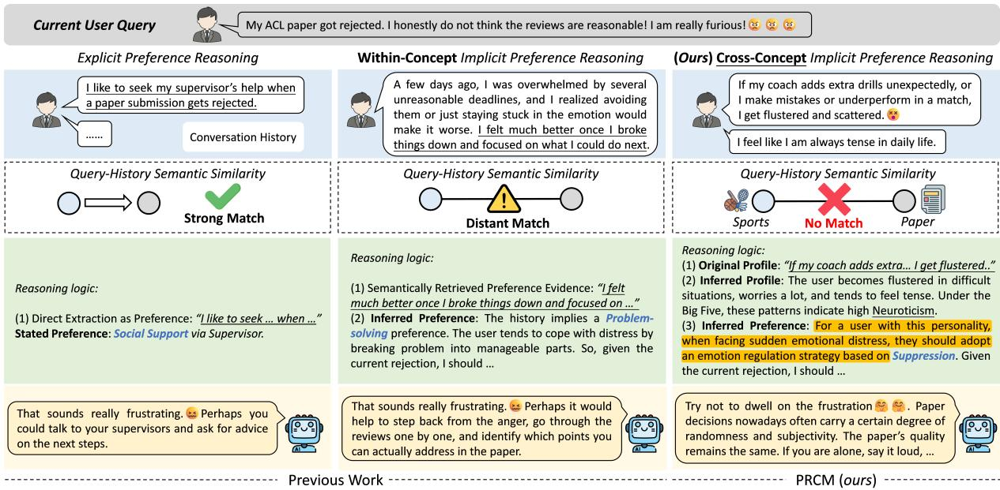
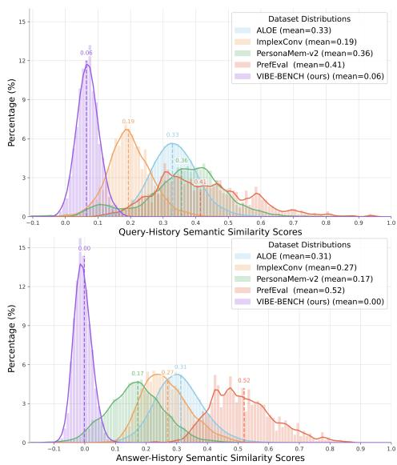
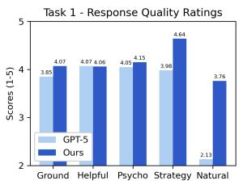
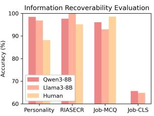
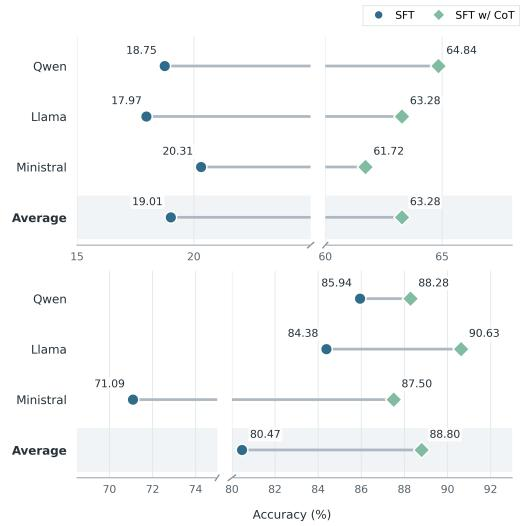
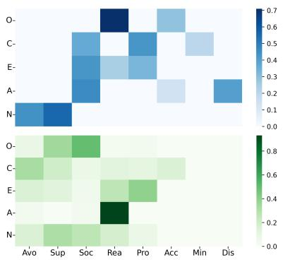

# VIBE-BENCH: Evaluating Personalized Large Language Models When Profiles Don’t Mean Preferences

Yiwen Jiang 1 Yang Deng 2 Stephanie Fong 1 Zimu Wang

Yaling Shen 1 Wei Feng 1 Hongxi Yang 1 Xiangyu Zhao 1

Zhongxing Xu 1 Deval Mehta 1,4 Xuelian Cheng 1 Zongyuan Ge 1,†

1Monash University 2Singapore Management University

3University of Liverpool 4RMIT University

{yiwen.jiang, zongyuan.ge}@monash.edu

## Abstract

Personalized Large Language Models (PLLMs) aim to tailor responses to individual users, where a central challenge is preference reasoning: inferring query-relevant preferences from user-related history. Existing benchmarks, how ever, largely assume that such preference can be retrieved from semantically related history. We study an underexplored but practically important regime, profile-preference conceptual misalignment (PRCM), where observable profile cues and query-specific preferences lie in different concept spaces, making semantic retrieval inconsistent for personalization. We introduce VIBE-BENCH1, a benchmark with two psychology-grounded tasks, 3,504 personas and 12,239 dialogues, including a manually verified gold test set, and requires cross-concept preference reasoning beyond surface semantic overlap. Experiments with several personalization methods show that current PLLMs largely rely on shallow semantic correlations and fail to acquire robust cross-concept mappings. These findings establish PRCM as a distinct failure regime in PLLMs and position VIBE-BENCH as a focused testbed for advancing preference reasoning beyond semantic matching.

## 1 Introduction

Large Language Models (LLMs) have enabled general-purpose systems across diverse NLP tasks (Touvron et al., 2023; Zhang et al., 2025a), yet they are predominantly trained under a one-sizefits-all paradigm that limits adaptation to individual users (Wu et al., 2021; Zhao et al., 2025b). To address this limitation, Personalized Large Language Models (PLLMs) leverage user-specific data, e.g., interaction histories, to provide one-size-fits-one responses (Liu et al., 2025). Recently, numerous benchmarks have been proposed to evaluate how well PLLMs align with user preferences (Jiang et al., 2025a; Ong et al., 2025; Au et al., 2025).

A central challenge in PLLMs is preference reasoning: inferring, from a user’s historical data, which preferences should govern the response to the current query (Zhang et al., 2025b). Existing personalization methods largely approach this problem through semantic matching between the query and user history. Consequently, mainstream paradigms, including retrieval-augmented prompting (Zhang et al., 2024; Kim et al., 2026), profileaugmented prompting (Richardson et al., 2023; Qiu et al., 2025), and personalized fine-tuning (Tan et al., 2024), typically first locate semantically related historical evidence, and then personalize the response accordingly. Even recent work on implicit preference reasoning (Wu et al., 2025b) largely remains within this paradigm. For example, IMPLEXCONV (Li et al., 2025c) defines harder implicit reasoning cases by increasing semantic distance through predefined thresholds, but still evaluates preference reasoning within weak semantic alignment rather than extending beyond it.

The current paradigm assumes preference retrievability: the preferences relevant to the current query can be recovered from semantically related history. In realistic settings, however, this assumption often fails. Users may not fully understand their own preferences (Wilson and Dunn, 2004), and they rarely mention them in a direct or queryaligned way (Li et al., 2025c). The cold-start problem in personalization (Au et al., 2025; Li et al., 2026) is one concrete manifestation of this issue. More generally, personalization often begins from indirect, weak, or semantically mismatched evidence. In such cases, better retrieval is not enough: PLLMs must infer from clues that do not directly resemble the target query or response style.

We study this setting, where the historical cues available in a user profile and the target preference required by the current query reside in different concept spaces. We call this phenomenon ProfilepReference Conceptual Misalignment (PRCM). Figure 1 illustrates the distinction. In the example, effective emotion-regulation guidance should be personalized according to the user’s personality traits, which must be inferred from interaction history. Yet the cues that reveal personality, such as sports-related topics, are not semantically aligned with emotion-regulation strategies. Their connection instead arises from an underlying crossconcept regularity supported by established psychological theory (Baranczuk ´ , 2019). PRCM therefore requires models to do more than retrieve semantically related evidence. They must bridge profile cues and target preferences across concept spaces. Although pervasive in real-world personalization, PRCM remains largely unevaluated.

  
Figure 1: Illustration of three preference-reasoning regimes in PLLMs. In cross-concept implicit preference reasoning (our focus, PRCM), observable profile cues and target preferences lie in different concept spaces, requiring inference through cross-concept mappings rather than the direct semantic matching assumed in previous work.

To address this gap, we introduce VIBE-BENCH (Vocational Interests and Big-Five-based Emotion-Regulation Benchmark), a benchmark designed to isolate preference reasoning under PRCM, comprising 3,504 personas and 12,239 dialogues. We instantiate PRCM through two psychology-grounded tasks that naturally require cross-concept inference: (i) Emotion-Regulation Generation, in which a PLLM infers personality cues related to the Big Five (McCrae and John, 1992), identifies an appropriate emotion-regulation strategy, and generates a supportive response for a distress scenario; (ii) Vocational Interest Classification, in which a

PLLM judges whether a user’s occupation is consistent with their inferred interest structure under Holland’s RIASEC theory (Holland, 1997). We choose these tasks because they provide controlled, well-grounded testbeds where profile cues and target preferences are known to reside in different concept spaces. To validate the distinctiveness of VIBE-BENCH, we compare it quantitatively with representative prior benchmarks for implicit preference reasoning, using semantic similarity between the user history and both the query and the response. Figure 2 shows that VIBE-BENCH is near zero on both measures, confirming a substantially higher level of implicitness (see Appendix K). Based on VIBE-BENCH, we adapt PLLMs with several personalization methods. We find that standard personalization-oriented fine-tuning (Tan et al., 2024) primarily reinforces shallow surface correlations, rather than learning the cross-concept mappings required for robust personalization. This makes the automatic discovery of such mappings a central open challenge for PLLMs. Our main contributions are as follows:

• We identify PRCM as a distinct and underexplored preference-reasoning regime in PLLMs, and propose a novel taxonomy that characterizes it as cross-concept implicit preference reasoning beyond semantic retrieval.

• We build VIBE-BENCH, a benchmark that isolates PRCM through two psychology-grounded tasks with 3,504 personas and 12,239 dialogues.

• We show that current personalization methods favor semantic correlations over cross-concept profile-preference mappings, revealing conceptual mapping as a key bottleneck under PRCM.

## 2 Related Work

Benchmarks for Personalized LLMs. Numerous benchmarks (Wu et al., 2021; Salemi and Zamani, 2025; Qiu et al., 2025; Zhao et al., 2025c) have been proposed to evaluate PLLMs’ ability to align with user preferences. LaMP (Salemi et al., 2024) assesses preference induction through classifica tion and generation over users’ historical behaviors, while PersonaBench (Li et al., 2025a) and PersonalLLM (Zollo et al., 2025) evaluate persona- and preference-consistent responses via multi-turn dia logue and open-ended prompts with reward modeling. Subsequent benchmarks emphasize long context and memory-based personalization (Kumar et al., 2024; Du et al., 2024; Maharana et al., 2024; Lee et al., 2025; Tan et al., 2025; Wang et al., 2026; Zhang et al., 2026), as well as cold-start and sparse histories (Au et al., 2025; Li et al., 2026), contin ual personalization (Jiang et al., 2025a; Ong et al., 2025), and multimodal or task-oriented settings, e.g., conversational assistants (Mok et al., 2025), web agents (Cai et al., 2025), and recommender sys tems (Sayana et al., 2025). Despite their breadth, these benchmarks assume that user preferences can be inferred from historical evidence, leaving the evaluation of conceptual misalignment unexplored. Implicit Preference Reasoning. Recent bench marks move beyond explicit profile conditioning (Wu et al., 2025a) to evaluate implicit preference inference from scattered cues across multi-turn interactions. ALOE (Wu et al., 2025b) prompts PLLMs to progressively infer preferences from sig nals such as linguistic style and topic choice, but still largely treats preferences as reducible to profile cues. IMPLEXCONV (Li et al., 2025c) distributes preference-relevant evidence across syntactically subtle and semantically distant contexts, requir ing multi-stage summarization and retrieval, while PrefEval (Zhao et al., 2025a) and PersonaMem-v2 (Jiang et al., 2025b) evaluate models’ ability to infer, retain, and apply implicit preferences in long context and multi-user settings. However, across these benchmarks, preference targets and support ing evidence typically reside in a shared semantic space, allowing similarity-based retrieval to bridge them directly and leaving cross-concept preference reasoning largely unexplored. PRISM (Kirk et al., 2024) takes an initial step toward modeling conceptual mismatch by jointly analyzing group-level preferences and broad individual attributes, but it is not designed to systematically evaluate PRCM.

  
Figure 2: Semantic similarity distributions of VIBE-BENCH and prior implicit preference reasoning benchmarks. The x-axis is semantic similarity, and the y-axis is the percentage of samples at each similarity level.

## 3 Task Formulation

Let $\mathcal { U } = \{ u _ { i } \} _ { i = 1 } ^ { N }$ be a set of users, and let $\mathcal { P } , \mathcal { Q } , \mathcal { V } .$ and R denote the spaces of user profiles, queries, responses, and (query-conditioned) preferences, respectively. For each user $u _ { i } .$ , let $p _ { i } \in \mathcal { P }$ be their profile. For their j-th query $q _ { i } ^ { ( i ) } \in \mathcal { Q } .$ , denote the corresponding response by $y _ { j } ^ { ( i ) } \in \mathcal { y }$

Profile. The profile $p _ { i }$ encodes user-specific prior information available before the current query. It is query-independent, shared across all queries from $u _ { i }$ as a reusable long-term representation.

Preference. For each query $q _ { j } ^ { ( i ) }$ , let $r _ { j } ^ { ( i ) } \in \mathcal { R }$ denote the corresponding (target) preference, i.e., the query-specific constraints and objectives that should guide personalized generation or decisionmaking. Since it is tied to the current query, $r _ { j } ^ { ( i ) }$ may vary across queries for the same user.

Task Objective. A non-personalized LLM implements a mapping $f _ { \mathrm { L L M } } : \mathcal { Q }  \mathcal { V }$ . In contrast, a PLLM conditions on both the query and the profile, implementing $f _ { \mathrm { P L L M } } : \mathcal { Q } \times \mathcal { P } \to \mathcal { V } ;$

$$
y _ { j } ^ { ( i ) } = f _ { \mathrm { P L L M } } ( q _ { j } ^ { ( i ) } , p _ { i } )
$$

where $y _ { j } ^ { ( i ) }$ is expected to align with user $u _ { i } \mathrm { ^ { * } s }$ preferences given their profile $p _ { i }$ .

## 4 Proposed Taxonomy

We provide definitions of concepts and concept spaces in the context of this work in Appendix B.

Conceptual Misalignment. PLLMs operate under Profile-Preference Conceptual Misalignment (PRCM) when, for a query $q _ { j } ^ { ( i ) }$ , the evidence available in $p _ { i }$ is not expressed in the concept space required to determine $r _ { j } ^ { ( i ) }$ . In this paradigm, retrieval over $p _ { i }$ based on semantic similarity to $q _ { j } ^ { ( i ) }$ cannot directly surface concept-level evidence for $r _ { j } ^ { ( i ) }$ To obtain an initial preference $r _ { 0 }$ , the model must first map profile-level concepts to query-relevant preference concepts, denoted as

$$
p _ { * } \stackrel { \phi } {  } r _ { 0 } ,
$$

where $p _ { * }$ is a (possibly query-conditioned) preprocessing of $p _ { i }$ , and ϕ may leverage external knowledge, population-level statistics, or aligned ontologies. The resulting $r _ { 0 }$ can then be further refined to $r _ { * }$ as in the aligned setting. We provide the definition of conceptual alignment in Appendix B.4.

We propose a technical taxonomy of preference reasoning with three paradigms (Figure 1):

• Explicit Preference Extraction. The target preference is explicitly encoded in the profile and can be obtained via direct evidence retrieval and extraction; the initial preference $r _ { 0 }$ already suffices.

• Within-Concept Implicit Preference Reasoning. The target preference is not explicitly stated but is inferable from conceptually co-level evidence in the profile. The model must identify semantically distant yet conceptually related cues to form an initial estimate $r _ { 0 }$ and refine it into a query-appropriate preference $r _ { * }$ via aggregation, induction, or generalization:

$$
r _ { 0 } \to r _ { * }
$$

• Cross-Concept Implicit Preference Reasoning. Under PRCM, query-relevant preferences cannot be retrieved by semantic matching alone, because the profile evidence and the target preference reside in different concept spaces. The model must therefore apply a cross-space mapping $\phi$ that links profile-level concepts to preference-level concepts:

$$
p _ { 0 }  p _ { * } \stackrel { \phi } {  } r _ { 0 }  r _ { * }
$$

where the query-conditioned preprocessing $( p _ { 0 } $ $p _ { * } )$ and refinement $( r _ { 0 }  r _ { * } )$ steps are optional and instantiated only when needed.

## 5 VIBE-BENCH Construction

## 5.1 Cross-Concept Design Principles

The VIBE-BENCH instantiates two PRCM cases grounded in established psychological theories: First, the Big Five personality model (McCrae and John, 1992) characterizes stable behavioral, cognitive, and affective patterns along five dimensions. Emotion regulation comprises processes by which individuals alter how they experience and express emotion through cognitive and behavioral strategies (Gross, 1998; Gratz and Roemer, 2004; Peña-Sarrionandia et al., 2015). Substantial empirical evidence shows that Big Five traits are systematically associated with different emotion regulation strategies, with heterogeneous directions and magnitudes of correlation across traits and strategies (Baranczuk´ , 2019). Second, Holland’s RI-ASEC framework (Holland, 1997) is a theory of vocational interest-occupation fit that characterizes which types of jobs and work environments best match an individual’s interests. It groups vocational interests into six types. Details in Appendix C.

We adopt these two theories because they capture natural profile-preference misalignment, specifically personality-emotion regulation (Table 5) and occupation-interest (Table 6). Moreover, Big Five and RIASEC traits are rarely stated explicitly in everyday dialogue, yielding an implicit preference-reasoning setting that requires inductive profile inference from contextual cues.

## 5.2 Metadata Collection

Big Five Personality. We construct Big Five personality metadata from two sources: behavior-level descriptions derived from public personality inventories and language-pattern features from BIG5- CHAT. This results in 696 high/low trait descriptions, complemented by psycholinguistic data that captures personality-related language-use patterns. Occupational Information Network. We curate occupational metadata from ${ \mathrm { O } } ^ { * } { \mathrm { N E T } } ^ { 2 }$ , covering 876 jobs across 22 major groups. Each entry includes structured information, e.g., job titles, work duties, and corresponding RIASEC interest categories.

Holland’s RIASEC Framework. We use the O∗NET Interest Profiler (Long Form)2 to construct RIASEC interest metadata, covering 180 self-descriptive activity-preference items associated with the six vocational interest domains.

<table><tr><td colspan="2">Data Statistics</td><td>Train</td><td>Valid</td><td>Test</td></tr><tr><td rowspan="3">#Dialogue</td><td>中</td><td>2,532</td><td>844</td><td>128</td></tr><tr><td>漢</td><td>1,886</td><td>630</td><td>90</td></tr><tr><td>p</td><td>4,437</td><td>1,468</td><td>224</td></tr><tr><td rowspan="3">#Utterance</td><td>中</td><td>26,364</td><td>8,688</td><td>1,312</td></tr><tr><td>茶</td><td>20,640</td><td>6,906</td><td>982</td></tr><tr><td>p</td><td>47,270</td><td>15,698</td><td>2,392</td></tr><tr><td rowspan="3">#Session Pattern</td><td>中ρ</td><td>485</td><td>173</td><td>24</td></tr><tr><td>YP</td><td>142</td><td>47</td><td>8</td></tr><tr><td>PPP</td><td>1,401</td><td>457</td><td>66</td></tr><tr><td></td><td>nP</td><td>504</td><td>167</td><td>30</td></tr><tr><td colspan="2">#Persona</td><td>2,532</td><td>844</td><td>128</td></tr></table>

Table 1: VIBE-BENCH Statistics. , , denote sessions encoding high Big Five traits, low Big Five traits, and RIASEC-related evidence, respectively. Session Pattern reports session-type counts (one icon per occurrence); session order is shuffled in the dataset.

Emotional Distress Event. We sample 1,142 and 2,362 instances, respectively, from two emotionalsupport dialogue datasets, ESConv (Liu et al., 2021) and ExTES (Zheng et al., 2023), using stratified sampling over event categories. More details on metadata collection are provided in Appendix A.

## 5.3 Dataset Generation

For each occupation, we construct four samples. In each sample, one Big Five dimension is set to a high level, paired with one or two dimensions set to low levels. Two samples match the occupation’s RIASEC interest type, and two are intentionally mismatched, yielding a balanced split. In total, VIBE-BENCH contains 3,504 samples.

Step 1. Persona Card Generation. Each sample is paired with a persona card that remains fixed throughout data synthesis. The card specifies name, age, gender, job title, education level, Big Five traits, self-described job content, and interest activities aligned with the target RIASEC type.

GPT-5-mini instantiates these fields under constraints derived from the collected metadata. To increase diversity and refine the self-descriptions, we sample three incumbent-reported job titles and four work duties from each occupation’s O\*NET entry, along with four self-descriptive items for the target RIASEC dimension from the Interest Profiler. Conditioned on these cues, GPT-5-mini generates two self-described job responsibility statements and two self-described interest activities consistent with the target RIASEC type.

Step 2. Work-Interest Event Generation. Given the self-described job responsibilities and interest activities, we generate contextualized event instances with explicit settings and action sequences. To instantiate the target Big Five trait in work events, we condition GPT-5 on the persona card, the trait definition, and four behavioral cues sampled from the personality inventory. GPT-5 is instructed to weave these cues into the event progression so that each work event reflects either the high or low level of the target trait dimension. This step yields two work events (high vs. low) and two interest events aligned with the same target interest type.

Step 3. Historical Dialogue Generation. We convert the generated events into multi-turn dialogues between a user and a chatbot, using the resulting dialogue histories as user profiles. We prompt GPT-5-mini to let the chatbot elicit event details through guided questions, such that the user reveals context and key details gradually over multiple turns rather than in a single narrative. We also instruct GPT-5-mini to surface cues indicative of the user’s personality traits and interest preferences. To simulate user-specific speaking styles (e.g., lexical choices, tone), we include psycholinguistic cues in the prompt, encouraging consistency with the specified high or low level of the target trait.

Under this pipeline, each profile contains up to four dialogue sessions. To diversify profile length, we enforce sampling constraints: each profile includes at least one session reflecting the target personality dimension (high level) and one session reflecting the target interest type, while the remaining sessions are randomly sampled from candidate dialogues. As a result, profiles contain 2, 3, and 4 sessions in 5.62%, 39.47%, and 54.91% of cases, respectively (see Table 1 for detailed statistics).

Step 4. Emotional Distress Event Q&A. Conditioned on the persona card and the metadataspecified distress event, GPT-5-mini generates a user-specific distress scenario as the query (time, involved parties, developments, and post-event emotional reactions). We restrict candidate emotionregulation strategies via a predefined personalitystrategy mapping, and have GPT-5-mini select a strategy that is both event-appropriate and traitconsistent. Given the event, the selected strategy definition, and application guidance, GPT-5-mini produces the corresponding emotion-regulation response. We thus obtain one Q&A pair per sample with preference signals that are controllable and interpretable through the explicit mapping constraint.

## 5.4 Task Definitions

The VIBE-BENCH includes two tasks with shared user profiles but distinct queries. Turns relevant to one task serve as distractors for the other, increasing the challenge of preference reasoning.

Task 1. Emotion-Regulation Generation. Given a user’s dialogue history, the model extracts behavioral and psycholinguistic cues $\left( p _ { 0 } \right)$ and induces the most salient personality dimension $( p _ { 0 } \to p _ { * } )$ . It then uses a personality-strategy mapping to derive a candidate strategy set $( p _ { * } \ { \stackrel { \phi } { \to } } \ r _ { 0 } )$ . Conditioned on a current emotional distress event, the model selects the best-matched strategy and generates an event-tailored, guided emotion-regulation response that instantiates the selected strategy $( r _ { 0 }  r _ { * } )$

Task 2. Vocational Interest Classification. Given a user’s dialogue history, the model extracts selfdescribed job responsibilities (p0) and induces a specific job title $( p _ { 0 } \to p _ { * } )$ . It then derives the corresponding RIASEC interest type via a job-RIASEC mapping $( p _ { * } \ { \stackrel { \phi } { \to } } \ r _ { 0 } )$ . Finally, it compares this type with the RIASEC type of the user’s actual leisure activities mentioned in the dialogue history $( r _ { 0 } \to r _ { * } )$ and predicts whether they match (matched vs. mismatched).

## 5.5 Dataset Splits and Statistics

We reserve 32 occupations for testing, disjoint from those used for training and validation. For the remaining occupations, we apply an occupationstratified split by sampling one instance per occupation for validation and assigning the rest to training. Table 1 reports the final distribution. The test set comprises 128 manually verified and corrected samples, which serve as the gold standard for evaluation. Overall, VIBE-BENCH contains 12,239 dialogues, comprising 130K utterances. On average, each dialogue contains 10.6 utterances, and each user profile spans 2-4 dialogue sessions.

## 6 VIBE-BENCH Quality Assessment

## 6.1 Information Recoverability

We assess whether the multi-session profiles contain sufficient cues to recover three target attributes: (i) the dominant Big Five trait, (ii) the RIASEC interest type, and (iii) the user’s occupation.

Model-Based. We fine-tune Qwen3-8B (Yang et al., 2025) and Llama3-8B (Grattafiori et al., 2024) to test if the profiles provide discriminative evidence. In Figure 3, both models attain high accuracy on Personality and RIASEC (>96%). Job-CLS drops to 65%, likely because all test occupations are unseen and require cross-occupation generalization. These results indicate most persona attributes are recoverable from profile text, while occupation prediction is harder under distribution shift.

  
Figure 3: Dataset Quality Assessment. Left: Fivedimensional evaluation of Task 1 generation quality. Right: Recovery of profile information from dialogue histories. Job-MCQ uses four sampled distractor occupations, while Job-CLS is candidate-free.

Human Annotation. Three annotators answered four multiple-choice questions for each test instance. They first annotated a shared set of eight instances to estimate inter-annotator agreement (Fleiss’ $\kappa ~ = ~ 0 . 8 4 )$ , and then independently annotated 40 instances each. Figure 3 reports accuracy against the gold persona cards. Human accuracy on personality inference is lower than that of LLMs, likely because the protocol emphasizes behavioral evidence, whereas LLMs can also exploit fine-grained linguistic cues. A fourth annotator adjudicated disagreements, after which we revised six ambiguous segments to remove confounders and better align them with the intended labels.

## 6.2 Response Quality Assessment

We evaluate Task 1 responses along five dimensions: Helpfulness, Psychological Appropriateness, Conversational Naturalness, Event Grounding, and Strategy Realization in Figure 3 (see Appendix H for rubric). As a baseline, we use the same GPT-5-mini to directly generate responses without the expert-designed prompt template.

After confirming strong agreement between expert and Claude, we use Claude-Haiku-4.5 to score 256 samples. The expert-designed prompt template consistently improves response quality. Compared with vanilla GPT-5-mini, our method yields the largest gains in Naturalness and Strategy Realization, and also improves Event Grounding and Psychological Appropriateness. The average score across all five dimensions exceeds 4, indicating that our generated responses closely resemble realistic emotional support scenarios.

<table><tr><td rowspan="3">Method</td><td colspan="8">Task 1</td><td colspan="5">Task 2</td></tr><tr><td colspan="4">Personalized Strategy</td><td colspan="4">Personalized Response</td><td colspan="5">Personalized Classification</td></tr><tr><td>ACC</td><td>B-ACC</td><td>M-F1</td><td>W-F1</td><td>BLEU</td><td>R-L</td><td>MET</td><td>BS-F1</td><td>ACC</td><td>PRE</td><td>REC</td><td>F1</td><td>MCC</td></tr><tr><td>Base-LLM</td><td>21.48</td><td>19.81</td><td>14.15</td><td>16.91</td><td>3.10</td><td>17.46</td><td>24.73</td><td>8.84</td><td>50.00</td><td>50.00</td><td>50.00</td><td>50.00</td><td>0.00</td></tr><tr><td>FHP-LLM</td><td>18.36</td><td>17.20</td><td>10.36</td><td>12.48</td><td>3.03</td><td>17.04</td><td>21.89</td><td>8.41</td><td>60.81</td><td>61.74</td><td>67.97</td><td>62.73</td><td>0.23</td></tr><tr><td>PAP-LLM</td><td>24.22</td><td>21.85</td><td>17.61</td><td>20.49</td><td>3.35</td><td>17.63</td><td>25.53</td><td>8.68</td><td>62.24</td><td>59.88</td><td>76.30</td><td>66.50</td><td>0.27</td></tr><tr><td>RAP-BM25</td><td>21.48</td><td>18.82</td><td>14.66</td><td>17.78</td><td>3.15</td><td>17.51</td><td>23.96</td><td>9.10</td><td>55.47</td><td>55.50</td><td>58.85</td><td>56.39</td><td>0.11</td></tr><tr><td>RAP-BERT</td><td>22.66</td><td>20.18</td><td>15.39</td><td>18.38</td><td>3.11</td><td>17.54</td><td>24.10</td><td>9.08</td><td>55.73</td><td>54.23</td><td>72.40</td><td>61.59</td><td>0.13</td></tr><tr><td></td><td>17.97</td><td>16.88</td><td>10.46</td><td>12.23</td><td>9.11</td><td>26.65</td><td>28.25</td><td>14.84</td><td>83.98</td><td>87.28</td><td>79.69</td><td>83.15</td><td>0.68</td></tr><tr><td>P-SFT</td><td></td><td></td><td></td><td></td><td></td><td></td><td></td><td></td><td></td><td></td><td></td><td></td><td></td></tr></table>

Table 2: Main Results on VIBE-BENCH. Base-LLM is used as the reference row. Green indicates improvement, while red indicates degradation. Darker colors denote larger differences. See Table 10 and Table 11 for full results.

## 7 Experiments

## 7.1 Baselines

We evaluate four groups of methods on VIBE-BENCH. (1) Non-Personalized LLM (Base-LLM) uses only the current query, without access to user history, serving as the baseline. (2) Full-History Prompting (FHP-LLM) concatenates the entire user history into the prompt to test whether longcontext history improves personalization. (3) Non-Parametric Personalization augments the prompt with external user information. We consider the following variants: Profile-Augmented Prompting (PAP-LLM) (Richardson et al., 2023; Qiu et al., 2025), which adds a long-term user profile summarized from past dialogues, and Retrieval-Augmented Prompting (Zhang et al., 2024; Kim et al., 2026), which appends relevant history snippets retrieved by BM25 (RAP-BM25) or BERTScore (RAP-BERT). BM25 measures lexical overlap, whereas BERTScore captures semantic similarity. (4) Personalized Supervised Fine-Tuning (P-SFT) (Tan et al., 2024) adapts the model by updating its parameters on personalization data.

## 7.2 Experimental Details

For all non-parametric baselines, we evaluate six instruction-tuned LLMs from four model families, covering a broad range of model scales: Gemma3- 27B (Team et al., 2025), Meta-Llama3.1-8B/70B (Grattafiori et al., 2024), Mistral-Small-3.2-24B3, and Qwen3-14B/235B-A22B (Yang et al., 2025). For parametric fine-tuning, we train six models with LoRA (Hu et al., 2022), including Qwen3-

4B/8B/14B (Yang et al., 2025), Llama3.2-3B/3.1-   
8B (Grattafiori et al., 2024), and Ministral-8B4.

## 7.3 Evaluation Metrics

For Task 1, we evaluate personalized generation from two complementary perspectives. (i) We assess whether each generated response realizes the intended personalization strategy. We report accuracy, balanced accuracy, macro-F1, and weighted-F1, which measure overall strategy correctness. (ii) We evaluate response quality by comparing generated responses with the reference responses using standard text generation metrics, including BLEU-4 (Papineni et al., 2002), ROUGE-L (Lin, 2004), METEOR (Banerjee and Lavie, 2005), and BERTScore (Zhang et al., 2020). For Task 2, a personalized binary classification task, we report accuracy, precision, recall, F1 score, and Matthews correlation coefficient (MCC).

## 7.4 Main Results

Table 2 reports the main results, averaged over six backbone models for each method.

Overall Trends. Non-parametric personalization generally improves over Base-LLM, but the gains remain limited. This indicates that user histories contain useful personalization signals, yet prompt augmentation or retrieval alone cannot reliably support personalized reasoning when profile cues and query preferences lie in different conceptual spaces. Among non-parametric methods, PAP-LLM achieves the strongest overall performance, suggesting that summarized long-term profiles provide more stable personalization signals than fullhistory prompting or local snippet retrieval.

More history does not necessarily improve personalization. FHP-LLM performs worse than

Base-LLM on Task 1 strategy metrics, with Accuracy dropping from 21.48 to 18.36 and Macro-F1 from 14.15 to 10.36. This suggests that directly concatenating long user histories can introduce noise and redundancy, making it difficult for models to identify the personalization cues relevant to the current query. In contrast, PAP-LLM achieves substantially stronger strategy performance. Manual inspection further shows that PAP-LLM often captures task-relevant profile dimensions such as occupation, suggesting that profile summarization can help filter irrelevant historical information.

Semantic retrieval helps, but remains insufficient. RAP-BERT slightly outperforms RAP-BM25 overall. For example, on Task 2, RAP-BERT achieves an F1 of 61.59, compared with 56.39 for RAP-BM25, while also showing modest advantages on most Task 1 strategy metrics. This suggests that semantic retrieval is more effective than lexical matching for identifying relevant historical information. However, the gap between the two retrieval methods remains small, and both are clearly weaker than PAP-LLM and P-SFT. Thus, retrieving semantically similar history alone appears insufficient for resolving the cross-concept mappings required by VIBE-BENCH.

Parametric personalization shows contrasting behavior across tasks. On Task 2, P-SFT achieves the strongest performance, substantially outperforming all non-parametric methods, with an F1 of 83.15 and an MCC of 0.68. This demonstrates the advantage of parameter updates for learning profileto-preference mappings. On Task 1, however, P-SFT exhibits a notable discrepancy: it achieves the strongest response-generation scores, including a BLEU-4 of 9.11 and a BERTScore of 14.84, while performing poorly on strategy metrics, with an Accuracy of 17.97 and a Macro-F1 of 10.46. This suggests that fitting the surface form and local semantics of reference responses does not necessarily translate into stable strategy-level personalized reasoning.

Strategy-level personalization remains challenging. Across all methods, Task 1 strategy performance remains low, with Accuracy ranging from around 18 to 24 and consistently low Macro-F1 scores. Models therefore appear considerably better at generating reference-like responses than at selecting and realizing an appropriate emotionregulation strategy conditioned jointly on the user profile and current event. These results highlight the central challenge of VIBE-BENCH: effective personalization requires reasoning across concept spaces rather than relying on semantic matching.

<table><tr><td colspan="2">Benchmark Design</td><td colspan="2">Task 1 Acc. 女</td><td colspan="2">Task 2 Acc.</td></tr><tr><td>Parad. 1</td><td>R</td><td>100.0</td><td>2 100.0</td><td>女 100.0</td><td>E 100.0</td></tr><tr><td>Parad. 2</td><td>RR</td><td>100.0</td><td>100.0</td><td>100.0</td><td>100.0</td></tr><tr><td>Parad. 3 (ours)</td><td>PP-RR</td><td>18.75</td><td>17.97</td><td>85.94</td><td>84.38</td></tr><tr><td>- w/o P-infer</td><td>P-RR</td><td>21.09</td><td>21.88</td><td>88.28</td><td>86.72</td></tr><tr><td>- w/o R-infer</td><td>PP-R</td><td>45.31</td><td>57.81</td><td>89.06</td><td>85.16</td></tr><tr><td>- w/o P&amp;R-infer</td><td>P-R</td><td>57.03</td><td>67.97</td><td>94.53</td><td>91.41</td></tr></table>

Table 3: Ablation study on benchmark designs for different preference reasoning paradigms.

## 7.5 Ablation Study on Benchmark Design

We conduct ablation studies to answer two questions. First, in cross-concept implicit preference reasoning, how large is the performance gap relative to (i) Paradigm 1, explicit preference extraction, and (ii) Paradigm 2, within-concept implicit preference reasoning? Second, under PRCM, does P-SFT fail because models cannot internalize cross-concept profile-preference mappings (i.e., $p _ { * } \stackrel { \phi } {  } r _ { 0 } )$ , or because semantic mismatch prevents the query from anchoring to relevant profile evidence for profile-side reasoning (i.e., $p _ { 0 }  p _ { * } ) ?$ To probe these questions, we extend VIBE-BENCH with five information-injection variants.

Paradigm 1 (R) inserts an explicit, query-aligned preference statement, allowing direct retrieval of the answer (e.g., “I prefer to regulate my emotions via reappraisal”). Paradigm 2 (RR) supplies explicit profile information and requires a single-step preference inference, e.g., given an occupation-derived RIASEC type, the model judges if the dialogue’s activity cues align with this profile. For PRCM, we ablate two reasoning chains: profile inference (P-RR) and preference inference (PP-R). Providing both (P-R) yields the most direct test of if PLLMs can perform cross-concept mapping.

Analysis of Results. P-SFT achieves perfect accuracy under Paradigms 1 and 2 (Table 3), indicating that it suffices for conventional benchmarks. In PRCM, however, controlled comparisons reveal a different failure mode. When cross-concept mapping is required (R vs. P-R; RR vs. P-RR), accuracy drops sharply (58% on Task 1; 10% on Task 2), indicating that P-SFT does not reliably induce the abstract profile-preference associations needed for cross-concept transfer. In contrast, ablating the profile-inference chain that is semantically unrelated to the query (P-R vs. PP-R; P-RR vs. PP-RR)

  
Figure 4: Concept-Aware Reasoning, exemplified by CoT, improves accuracy. Top: Task 1; Bottom: Task 2.

causes relatively minor degradation (7% and 4%), showing that semantic misalignment only weakly disrupts anchoring the query to relevant profile evidence for reasoning. Overall, PRCM is primarily bottlenecked by cross-concept mapping itself, while semantic mismatch in anchoring contributes only marginal additional error.

## 8 Discussion

Following Section 3, our main experiments adopt a weakly supervised setting where models observe only user histories, current queries, and end-task supervision. Models must therefore identify taskrelevant concepts, infer user attributes along these dimensions, and induce the corresponding mappings. We adopt this setting because interaction data are scalable to collect, whereas concept and mapping annotations are costly, domain-specific, and often unavailable. In open-domain personalization, the relevant concept space may be unknown in advance. Under this setting, we evaluate five scalable, general-purpose baselines in Table 2.

When the relevant concept ontology and crossconcept knowledge are explicitly available, however, Concept-Aware Reasoning substantially improves performance. We therefore conduct an additional experiment using persona-card labels to construct template-based Chain-of-Thought (CoT) rationales (Wei et al., 2022) that guide models through concept inference and cross-concept mapping before answering (Figure 4). This improves accuracy by 44% on Task 1 and 8% on Task 2, suggesting that the main challenge under PRCM lies in discovering and inducing the required mappings, rather than merely applying them once provided.

  
Figure 5: Big Five-emotion-regulation strategy mappings. Blue: dataset ground-truth distribution; Green: zero-shot induced distribution by GPT-5-mini.

Explicit CoT traces are hard to obtain, so almost all existing benchmarks (Liu et al., 2025) do not include them. This naturally raises a key question for VIBE-BENCH: Can we automatically discover profile-preference mapping knowledge from such datasets alone?

We run a preliminary study by supplying full user-specific data, query-response pairs, and a manually defined concept set. For each instance, we prompt the model to assign concept categories and then aggregate label frequencies to extract the induced mapping regularities. Figure 5 shows that the resulting zero-shot mappings deviate markedly from those implicit in the dataset, indicating strong dependence on both the model’s priors and the hand-crafted concept space, along with non-trivial reasoning overhead.

## 9 Conclusion and Future Work

We identify PRCM as a distinct preferencereasoning regime and introduce a taxonomy and benchmark, VIBE-BENCH, for evaluating crossconcept personalization beyond semantic retrieval. Experiments show that current personalization methods largely exploit semantic correlations but struggle to induce robust profile-preference mappings, revealing cross-concept mapping as the central bottleneck under PRCM.

Future work should develop training frameworks that can both induce profile-preference mappings from data and robustly internalize them into model parameters, enabling interpretability at both the instance and dataset levels. VIBE-BENCH provides a standardized testbed to drive progress on PRCM and personalized reasoning.

## Limitations

VIBE-BENCH is a controlled diagnostic benchmark designed to isolate profile–preference conceptual misalignment, rather than a comprehensive evaluation of real-world personalization. It currently covers two psychology-grounded tasks, uses synthetically generated interaction histories, and is evaluated only in English. Although the construction is grounded in external resources and the gold test set is manually verified, these procedures primarily establish construction quality rather than ecological validity. Whether the observed PRCM failure patterns transfer to naturally occurring user histories, multilingual and cross-cultural settings, additional domains, or real-user outcomes remains an open question.

Our profile–preference mappings should also be interpreted cautiously. They encode probabilistic and context-dependent population-level regularities rather than deterministic prescriptions or individual-level ground truth. Users with similar inferred attributes may still exhibit heterogeneous preferences, and the strength or direction of these associations may vary across contexts and cultures. We therefore view such mappings as weak priors for cold-start-like settings where users have neither explicitly stated the relevant preference nor provided semantically related evidence. They should not override direct user preferences or feedback, and overgeneralizing them to individuals may lead to stereotyped or overly confident personalization.

Our experimental coverage is also limited. The main comparisons focus on scalable prompting, retrieval, and supervised fine-tuning, and we do not evaluate preference-optimization approaches, including reinforcement-learning-based or direct preference-optimization methods. Moreover, while our Concept-Aware Reasoning experiments show that explicit conceptual supervision can substantially improve performance, they rely on predefined concept information, and our study of automatic mapping discovery remains preliminary. Developing methods that automatically discover relevant concepts, induce uncertain cross-concept mappings from interaction data, and robustly internalize them through reasoning or preference optimization is an important direction for future work.

## Ethical Considerations

I. Intended Use. VIBE-BENCH adopts Holland’s RIASEC framework and emotion-regulation strategies solely as test scenarios to study profilepreference conceptual misalignment, and the dataset is not intended for real-world deployment. While both scenarios are grounded in established psychological theories, all training and dialogue data are synthetically generated by language models (with publicly available datasets used as part of the prompting) and may contain biases or unreliable inferences. We therefore restrict the dataset to research use only and prohibit its use for realworld emotion-regulation guidance, mental-health intervention, career planning, or other high-stakes decision-making.

II. Data Privacy, Licensing, and Terms. VIBE-BENCH is entirely synthetic and does not contain real user conversations or personal data. All external datasets, models, and software tools used in this work were accessed and used in accordance with their documented licenses and terms of use.

III. Data and Code Availability. VIBE-BENCH, including all benchmark data, evaluation code, and metadata contributed by this work will be made fully available upon publication at https: //github.com/yiwenJG/VIBE-Bench.

IV. Use of AI Tools. AI assistants were used to support code development and manuscript editing. The authors carefully reviewed and revised all AIassisted outputs and take full responsibility for the final content, analyses, and claims in this paper.

## References

Steven Au, Cameron Dimacali, Ojasmitha Pedirappagari, Namyong Park, Franck Dernoncourt, Yu Wang, Nikos Kanakaris, Hanieh Deilamsalehy, Ryan A. Rossi, and Nesreen K. Ahmed. 2025. Personalized graph-based retrieval for large language models. In Proceedings ofthe 39th Pacific Asia Conference on Language, Information and Computation, pages 678– 698, Hanoi, Vietnam. Association for Computational Linguistics.

Satanjeev Banerjee and Alon Lavie. 2005. METEOR: An automatic metric for MT evaluation with improved correlation with human judgments. In Proceedings ofthe ACL Workshop on Intrinsic and Extrinsic Evaluation Measures for Machine Translation and/or Summarization, pages 65–72, Ann Arbor, Michigan. Association for Computational Linguistics.

Urszula Baranczuk. 2019. The five factor model of´ personality and emotion regulation: A meta-analysis. Personality and Individual Differences, 139:217–227.

Hongru Cai, Yongqi Li, Wenjie Wang, Fengbin Zhu, Xiaoyu Shen, Wenjie Li, and Tat-Seng Chua. 2025. Large language models empowered personalized web agents. In Proceedings of the ACM on Web Conference 2025, pages 198–215.

Yiming Du, Hongru Wang, Zhengyi Zhao, Bin Liang, Baojun Wang, Wanjun Zhong, Zezhong Wang, and Kam-Fai Wong. 2024. PerLTQA: A personal longterm memory dataset for memory classification, retrieval, and fusion in question answering. In Proceedings ofthe 10th SIGHAN Workshop on Chinese Language Processing (SIGHAN-10), pages 152–164, Bangkok, Thailand. Association for Computational Linguistics.

Lewis R Goldberg. 1999. A broad-bandwidth, public domain, personality inventory measuring the lowerlevel facets of several five-factor models. Personality Psychology in Europe, 7(1):7–28.

Aaron Grattafiori, Abhimanyu Dubey, Abhinav Jauhri, Abhinav Pandey, Abhishek Kadian, Ahmad Al-Dahle, Aiesha Letman, Akhil Mathur, Alan Schelten, Alex Vaughan, Amy Yang, Angela Fan, Anirudh Goyal, Anthony Hartshorn, Aobo Yang, Archi Mitra, Archie Sravankumar, Artem Korenev, Arthur Hinsvark, and 542 others. 2024. The llama 3 herd of models. Preprint, arXiv:2407.21783.

Kim L Gratz and Lizabeth Roemer. 2004. Multidimensional assessment of emotion regulation and dysregulation: Development, factor structure, and initial validation of the difficulties in emotion regulation scale. Journal of Psychopathology and Behavioral Assessment, 26(1):41–54.

James J Gross. 1998. The emerging field of emotion regulation: An integrative review. Review of General Psychology, 2(3):271–299.

John L Holland. 1997. Making vocational choices: A theory ofvocational personalities and work environments. Psychological Assessment Resources.

Edward J. Hu, Yelong Shen, Phillip Wallis, Zeyuan Allen-Zhu, Yuanzhi Li, Shean Wang, Lu Wang, and Weizhu Chen. 2022. LoRA: Low-rank adaptation of large language models. In The Tenth International Conference on Learning Representations, ICLR 2022, Virtual Event, April 25-29, 2022. OpenReview.net.

Bowen Jiang, Zhuoqun Hao, Young-Min Cho, Bryan Li, Yuan Yuan, Sihao Chen, Lyle Ungar, Camillo J. Taylor, and Dan Roth. 2025a. Know me, respond to me: Benchmarking llms for dynamic user profiling and personalized responses at scale. Preprint, arXiv:2504.14225.

Bowen Jiang, Yuan Yuan, Maohao Shen, Zhuoqun Hao, Zhangchen Xu, Zichen Chen, Ziyi Liu, Anvesh Rao Vijjini, Jiashu He, Hanchao Yu, Radha Poovendran, Gregory Wornell, Lyle Ungar, Dan Roth, Sihao Chen, and Camillo Jose Taylor. 2025b. PersonaMem-v2: Towards personalized intelligence via learning implicit user personas and agentic memory. Preprint, arXiv:2512.06688.

Yiwen Jiang, Deval Mehta, Wei Feng, and Zongyuan Ge. 2025c. Enhancing interpretable image classification through LLM agents and conditional concept bottleneck models. In Proceedings of the 63rd Annual Meeting of the Association for Computational Linguistics (Volume 1: Long Papers), pages 12285– 12297, Vienna, Austria. Association for Computational Linguistics.

Yiwen Jiang, Deval Mehta, Siyuan Yan, Yaling Shen, Zimu Wang, and Zongyuan Ge. 2025d. WISE: Weak-supervision-guided step-by-step explanations for multimodal LLMs in image classification. In Proceedings of the 2025 Conference on Empirical Methods in Natural Language Processing, pages 14674–14685, Suzhou, China. Association for Computational Linguistics.

Oliver P John, Richard W Robins, and Lawrence A Pervin. 2010. Handbook ofpersonality: Theory and research. Guilford Press.

Jieyong Kim, Tongyoung Kim, SooJin Yoon, Jaehyung Kim, and Dongha Lee. 2026. RPM: Reasoning-level personalization for black-box large language models. In The Fourteenth International Conference on Learning Representations.

Hannah Rose Kirk, Alexander Whitefield, Paul Röttger, Andrew M. Bean, Katerina Margatina, Rafael Mosquera Gómez, Juan Ciro, Max Bartolo, Adina Williams, He He, Bertie Vidgen, and Scott Hale. 2024. The PRISM alignment dataset: What participatory, representative and individualised human feedback reveals about the subjective and multicultural alignment of large language models. In Advances in Neural Information Processing Systems 38: Annual Conference on Neural Information Processing Systems 2024, NeurIPS 2024, Vancouver, BC, Canada, December 10 - 15, 2024.

Pang Wei Koh, Thao Nguyen, Yew Siang Tang, Stephen Mussmann, Emma Pierson, Been Kim, and Percy Liang. 2020. Concept bottleneck models. In Proceedings ofthe 37th International Conference on Machine Learning, volume 119 of Proceedings ofMachine Learning Research, pages 5338–5348. PMLR.

Ishita Kumar, Snigdha Viswanathan, Sushrita Yerra, Alireza Salemi, Ryan A. Rossi, Franck Dernoncourt, Hanieh Deilamsalehy, Xiang Chen, Ruiyi Zhang, Shubham Agarwal, Nedim Lipka, Chien Van Nguyen, Thien Huu Nguyen, and Hamed Zamani. 2024. LongLaMP: A benchmark for personalized longform text generation. Preprint, arXiv:2407.11016.

Dong-Ho Lee, Adyasha Maharana, Jay Pujara, Xiang Ren, and Francesco Barbieri. 2025. REALTALK: A 21-day real-world dataset for long-term conversation. Preprint, arXiv:2502.13270.

Li Li, Peilin Cai, Ryan A. Rossi, Franck Dernoncourt, Branislav Kveton, Junda Wu, Tong Yu, Linxin Song, Tiankai Yang, Yuehan Qin, Nesreen K. Ahmed, Samyadeep Basu, Subhojyoti Mukherjee,

Ruiyi Zhang, Zhengmian Hu, Bo Ni, Yuxiao Zhou, Zichao Wang, Yue Huang, and 5 others. 2025a. A personalized conversational benchmark: Towards simulating personalized conversations. Preprint, arXiv:2505.14106.

Stella Li, Avinandan Bose, Faeze Brahman, Simon Du, Pang Wei Koh, Maryam Fazel, and Yulia Tsvetkov. 2026. PrefDisco: Benchmarking proactive personalized reasoning. In International Conference on Learning Representations, volume 2026, pages 80844–80908.

Wenkai Li, Jiarui Liu, Andy Liu, Xuhui Zhou, Mona T. Diab, and Maarten Sap. 2025b. BIG5-CHAT: Shaping LLM personalities through training on humangrounded data. In Proceedings of the 63rd Annual Meeting of the Association for Computational Linguistics (Volume 1: Long Papers), pages 20434– 20471, Vienna, Austria. Association for Computational Linguistics.

Xintong Li, Jalend Bantupalli, Ria Dharmani, Yuwei Zhang, and Jingbo Shang. 2025c. Toward multisession personalized conversation: A large-scale dataset and hierarchical tree framework for implicit reasoning. In Proceedings ofthe 2025 Conference on Empirical Methods in Natural Language Processing, pages 11493–11506, Suzhou, China. Association for Computational Linguistics.

Chin-Yew Lin. 2004. ROUGE: A package for automatic evaluation of summaries. In Text Summarization Branches Out, pages 74–81, Barcelona, Spain. Association for Computational Linguistics.

Jiahong Liu, Zexuan Qiu, Zhongyang Li, Quanyu Dai, Wenhao Yu, Jieming Zhu, Minda Hu, Menglin Yang, Tat-Seng Chua, and Irwin King. 2025. A survey of personalized large language models: Progress and future directions. Preprint, arXiv:2502.11528.

Siyang Liu, Chujie Zheng, Orianna Demasi, Sahand Sabour, Yu Li, Zhou Yu, Yong Jiang, and Minlie Huang. 2021. Towards emotional support dialog systems. In Proceedings of the 59th Annual Meeting ofthe Associationfor Computational Linguistics and the 11th International Joint Conference on Natural Language Processing (Volume 1: Long Papers), pages 3469–3483, Online. Association for Computational Linguistics.

Adyasha Maharana, Dong-Ho Lee, Sergey Tulyakov, Mohit Bansal, Francesco Barbieri, and Yuwei Fang. 2024. Evaluating very long-term conversational memory of LLM agents. In Proceedings of the 62nd Annual Meeting of the Association for Computational Linguistics (Volume 1: Long Papers), pages 13851– 13870, Bangkok, Thailand. Association for Computational Linguistics.

Robert R McCrae and Oliver P John. 1992. An introduction to the five-factor model and its applications. Journal ofPersonality, 60(2):175–215.

Deval Mehta, Yiwen Jiang, Catherine Jan, Mingguang He, Kshitij Jadhav, and Zongyuan Ge. 2026. Interpretable few-shot retinal disease diagnosis with concept-guided prompting of vision-language models. In Information Processing in Medical Imaging, pages 263–277, Cham. Springer Nature Switzerland.

Jisoo Mok, Ik-hwan Kim, Sangkwon Park, and Sungroh Yoon. 2025. Exploring the potential of LLMs as personalized assistants: Dataset, evaluation, and analysis. In Proceedings of the 63rd Annual Meeting of the Associationfor Computational Linguistics (Volume 1: Long Papers), pages 10212–10239, Vienna, Austria. Association for Computational Linguistics.

Kai Tzu-iunn Ong, Namyoung Kim, Minju Gwak, Hyungjoo Chae, Taeyoon Kwon, Yohan Jo, Seungwon Hwang, Dongha Lee, and Jinyoung Yeo. 2025. Towards lifelong dialogue agents via timeline-based memory management. In Proceedings of the 2025 Conference of the Nations of the Americas Chapter ofthe Associationfor Computational Linguistics: Human Language Technologies (Volume 1: Long Papers), pages 8631–8661, Albuquerque, New Mexico. Association for Computational Linguistics.

Kishore Papineni, Salim Roukos, Todd Ward, and Wei-Jing Zhu. 2002. Bleu: a method for automatic evaluation of machine translation. In Proceedings ofthe 40th Annual Meeting ofthe Associationfor Computational Linguistics, pages 311–318, Philadelphia, Pennsylvania, USA. Association for Computational Linguistics.

Ainize Peña-Sarrionandia, Moïra Mikolajczak, and James J Gross. 2015. Integrating emotion regulation and emotional intelligence traditions: a metaanalysis. Frontiers in Psychology, 6:160.

Yilun Qiu, Xiaoyan Zhao, Yang Zhang, Yimeng Bai, Wenjie Wang, Hong Cheng, Fuli Feng, and Tat-Seng Chua. 2025. Measuring what makes you unique: Difference-aware user modeling for enhancing LLM personalization. In Findings of the Association for Computational Linguistics: ACL 2025, pages 21258– 21277, Vienna, Austria. Association for Computational Linguistics.

Chris Richardson, Yao Zhang, Kellen Gillespie, Sudipta Kar, Arshdeep Singh, Zeynab Raeesy, Omar Zia Khan, and Abhinav Sethy. 2023. Integrating summarization and retrieval for enhanced personalization via large language models. Preprint, arXiv:2310.20081.

Alireza Salemi, Sheshera Mysore, Michael Bendersky, and Hamed Zamani. 2024. LaMP: When large language models meet personalization. In Proceedings of the 62nd Annual Meeting of the Association for Computational Linguistics (Volume 1: Long Papers), pages 7370–7392, Bangkok, Thailand. Association for Computational Linguistics.

Alireza Salemi and Hamed Zamani. 2025. LaMP-QA: A benchmark for personalized long-form question

answering. In Proceedings ofthe 2025 Conference on Empirical Methods in Natural Language Processing, pages 1139–1159, Suzhou, China. Association for Computational Linguistics.

Krishna Sayana, Raghavendra Vasudeva, Yuri Vasilevski, Kun Su, Liam Hebert, James Pine, Hubert Pham, Ambarish Jash, and Sukhdeep Sodhi. 2025. Beyond retrieval: Generating narratives in conversational recommender systems. In Companion Proceedings of the ACM on Web Conference 2025, WWW ’25, page 2411–2420, New York, NY, USA. Association for Computing Machinery.

Haoran Tan, Zeyu Zhang, Chen Ma, Xu Chen, Quanyu Dai, and Zhenhua Dong. 2025. MemBench: Towards more comprehensive evaluation on the memory of LLM-based agents. In Findings of the Association for Computational Linguistics: ACL 2025, pages 19336–19352, Vienna, Austria. Association for Computational Linguistics.

Zhaoxuan Tan, Qingkai Zeng, Yijun Tian, Zheyuan Liu, Bing Yin, and Meng Jiang. 2024. Democratizing large language models via personalized parameterefficient fine-tuning. In Proceedings of the 2024 Conference on Empirical Methods in Natural Language Processing, pages 6476–6491, Miami, Florida, USA. Association for Computational Linguistics.

Gemma Team, Aishwarya Kamath, Johan Ferret, Shreya Pathak, Nino Vieillard, Ramona Merhej, Sarah Perrin, Tatiana Matejovicova, Alexandre Ramé, Morgane Rivière, Louis Rouillard, Thomas Mesnard, Geoffrey Cideron, Jean bastien Grill, Sabela Ramos, Edouard Yvinec, Michelle Casbon, Etienne Pot, Ivo Penchev, and 197 others. 2025. Gemma 3 technical report. Preprint, arXiv:2503.19786.

Hugo Touvron, Thibaut Lavril, Gautier Izacard, Xavier Martinet, Marie-Anne Lachaux, Timothée Lacroix, Baptiste Rozière, Naman Goyal, Eric Hambro, Faisal Azhar, Aurelien Rodriguez, Armand Joulin, Edouard Grave, and Guillaume Lample. 2023. Llama: Open and efficient foundation language models. Preprint, arXiv:2302.13971.

Huy Vu, Huy Anh Nguyen, Adithya V Ganesan, Swanie Juhng, Oscar NE Kjell, Joao Sedoc, Margaret L Kern, Ryan L Boyd, Lyle Ungar, H Andrew Schwartz, and 1 others. 2026. PsychAdapter: Adapting llms to reflect traits, personality, and mental health. NPJ Artificial Intelligence, 2(1):26.

Haoyu Wang, Guangyuan Dong, He Liang, Zijing Zhang, Jiachen Luo, Chuang Liu, Chao Xue, and Hao Tang. 2026. Memguard: Persisting verifier signals for llm-agent memory governance. Preprint, arXiv:2608.21867.

Jason Wei, Xuezhi Wang, Dale Schuurmans, Maarten Bosma, Brian Ichter, Fei Xia, Ed H. Chi, Quoc V. Le, and Denny Zhou. 2022. Chain-of-thought prompting elicits reasoning in large language models. In Advances in Neural Information Processing Systems,

volume 35, pages 24824–24837. Curran Associates, Inc.

Timothy D. Wilson and Elizabeth W. Dunn. 2004. Selfknowledge: Its limits, value, and potential for improvement. Annual Review of Psychology, 55(Volume 55, 2004):493–518.

Di Wu, Hongwei Wang, Wenhao Yu, Yuwei Zhang, Kai-Wei Chang, and Dong Yu. 2025a. Longmemeval: Benchmarking chat assistants on long-term interactive memory. In The Thirteenth International Conference on Learning Representations, ICLR 2025, Singapore, April 24-28, 2025. OpenReview.net.

Shujin Wu, Yi R. Fung, Cheng Qian, Jeonghwan Kim, Dilek Hakkani-Tur, and Heng Ji. 2025b. Aligning LLMs with individual preferences via interaction. In Proceedings ofthe 31st International Conference on Computational Linguistics, pages 7648–7662, Abu Dhabi, UAE. Association for Computational Linguistics.

Yuwei Wu, Xuezhe Ma, and Diyi Yang. 2021. Personalized response generation via generative split memory network. In Proceedings ofthe 2021 Conference of the North American Chapter ofthe Associationfor Computational Linguistics: Human Language Technologies, pages 1956–1970, Online. Association for Computational Linguistics.

An Yang, Anfeng Li, Baosong Yang, Beichen Zhang, Binyuan Hui, Bo Zheng, Bowen Yu, Chang Gao, Chengen Huang, Chenxu Lv, Chujie Zheng, Dayiheng Liu, Fan Zhou, Fei Huang, Feng Hu, Hao Ge, Haoran Wei, Huan Lin, Jialong Tang, and 41 others. 2025. Qwen3 technical report. Preprint, arXiv:2505.09388.

Hongxi Yang, Yiwen Jiang, Siyuan Yan, Jamie Chow, Eunis Li, Charlotte Poon, Stephanie Fong, Xiangyu Zhao, Deval Mehta, Yasmeen George, and Zongyuan Ge. 2026. Nerd: Neuro-symbolic rule distillation for efficient ontology-grounded chain-of-thought in medical image diagnosis. Preprint, arXiv:2606.15617.

Haobo Zhang, Xutao Mao, Guangyuan Dong, Ziwei Li, Xuanbo Su, Kaijie Chen, Jing Yang, and Zheng Lin. 2026. Memmark: State-evolution attribution watermarking for agent long-term memory systems. Preprint, arXiv:2605.25002.

Kai Zhang, Yangyang Kang, Fubang Zhao, and Xiaozhong Liu. 2024. LLM-based medical assistant personalization with short- and long-term memory coordination. In Proceedings ofthe 2024 Conference ofthe North American Chapter ofthe Associationfor Computational Linguistics: Human Language Technologies (Volume 1: Long Papers), pages 2386–2398, Mexico City, Mexico. Association for Computational Linguistics.

Ruyi Zhang, Songlei Jian, Yusong Tan, Heng Gao, Haifang Zhou, and Kai Lu. 2025a. BadWindtunnel: Defending backdoor in high-noise simulated training

with confidence variance. In Findings of the Association for Computational Linguistics: ACL 2025, pages 9259–9273, Vienna, Austria. Association for Computational Linguistics.

Tianyi Zhang, Varsha Kishore, Felix Wu, Kilian Q. Weinberger, and Yoav Artzi. 2020. Bertscore: Evaluating text generation with BERT. In 8th International Conference on Learning Representations, ICLR 2020, Addis Ababa, Ethiopia, April 26-30, 2020. OpenReview.net.

Zhehao Zhang, Ryan A. Rossi, Branislav Kveton, Yijia Shao, Diyi Yang, Hamed Zamani, Franck Dernoncourt, Joe Barrow, Tong Yu, Sungchul Kim, Ruiyi Zhang, Jiuxiang Gu, Tyler Derr, Hongjie Chen, Junda Wu, Xiang Chen, Zichao Wang, Subrata Mitra, Nedim Lipka, and 2 others. 2025b. Personalization of large language models: A survey. Transactions on Machine Learning Research.

Siyan Zhao, Mingyi Hong, Yang Liu, Devamanyu Hazarika, and Kaixiang Lin. 2025a. Do llms recognize your preferences? evaluating personalized preference following in llms. In The Thirteenth International Conference on Learning Representations, ICLR 2025, Singapore, April 24-28, 2025. OpenReview.net.

Wayne Xin Zhao, Kun Zhou, Junyi Li, Tianyi Tang, Xiaolei Wang, Yupeng Hou, Yingqian Min, Beichen Zhang, Junjie Zhang, Zican Dong, Yifan Du, Chen Yang, Yushuo Chen, Zhipeng Chen, Jinhao Jiang, Ruiyang Ren, Yifan Li, Xinyu Tang, Zikang Liu, and 3 others. 2025b. A survey of large language models. Preprint, arXiv:2303.18223.

Zheng Zhao, Clara Vania, Subhradeep Kayal, Naila Khan, Shay B Cohen, and Emine Yilmaz. 2025c. PersonaLens: A benchmark for personalization evaluation in conversational AI assistants. In Findings of the Associationfor Computational Linguistics: ACL 2025, pages 18023–18055, Vienna, Austria. Association for Computational Linguistics.

Yaowei Zheng, Richong Zhang, Junhao Zhang, Yanhan Ye, and Zheyan Luo. 2024. LlamaFactory: Unified efficient fine-tuning of 100+ language models. In Proceedings ofthe 62nd Annual Meeting ofthe Associationfor Computational Linguistics (Volume 3: System Demonstrations), pages 400–410, Bangkok, Thailand. Association for Computational Linguistics.

Zhonghua Zheng, Lizi Liao, Yang Deng, and Liqiang Nie. 2023. Building emotional support chatbots in the era of llms. Preprint, arXiv:2308.11584.

Thomas P. Zollo, Andrew Wei Tung Siah, Naimeng Ye, Ang Li, and Hongseok Namkoong. 2025. Personalllm: Tailoring llms to individual preferences. In The Thirteenth International Conference on Learning Representations, ICLR 2025, Singapore, April 24-28, 2025. OpenReview.net.

## A Details of Metadata Collection

## A.1 Big Five Personality

We model personality via two complementary pathways: behavioral cues and psycholinguistic features. Specifically, we collect two publicly available Big Five personality inventories, the Big Five Inventory (BFI) (John et al., 2010) and the International Personality Item Pool NEO-300 (IPIP-NEO-300) (Goldberg, 1999), which together comprise 348 self-descriptive sentences covering all five traits. We then manually construct semantically opposite variants of these items to invert their evaluative polarity. For example, Tell the truth (a positively keyed item for Conscientiousness) is rewritten as Sometimes tell lies to characterize lower Conscientiousness. This procedure yields 696 behavioral descriptions in total, each corresponding to either a high or a low level of a trait.

In addition, because individual language-use patterns, such as lexical choices, syntactic structure and pragmatic style, systematically reflect Big Five personality traits (Vu et al., 2026), we incorporate BIG5-CHAT (Li et al., 2025b), a large-scale dataset grounded in psycholinguistic regularities, as metadata to provide language-pattern information associated with each personality profile.

## A.2 Occupational Information Network

O∗NET 5 is a publicly available database of occupational information developed by the U.S. Department of Labor. We curate 876 occupation entries spanning 22 major occupational groups from O∗NET. Each entry includes multiple structured fields: a standardized occupational title; incumbentreported job titles (on average 8 variants); an occupational summary; required education level; a list of work duties (on average 15 per occupation); and the corresponding interest categories under Holland’s RIASEC framework (typically 1-3 types per occupation).

## A.3 Holland’s RIASEC Framework

We include a widely used vocational interest inventory, the O∗NET Interest Profiler (Long Form)5, which comprises 180 self-descriptive items that ask respondents to indicate their preferences for various activities associated with the RIASEC domains. For instance, Compose or arrange music reflects Artistic interests, whereas Teach disabled people work and living skills reflects Social interests.

## A.4 Emotional Distress Event

We sample 1,142 and 2,362 instances, respectively, from two emotional-support dialogue datasets, ES-Conv (Liu et al., 2021) and ExTES (Zheng et al., 2023), using stratified sampling over event categories. Each instance includes the description of an emotional distress event and the corresponding multi-turn dialogue. In total, the sampled instances span 48 event themes, such as Communication Challenges and Job Crisis.

## B Concept Spaces and Concept-Based Interpretability

## B.1 Concept-Based Interpretability

Concept-based interpretability explains model behavior through human-interpretable concepts rather than opaque latent features (Jiang et al., 2025c,d). A concept represents a meaningful high-level property or category that humans can recognize and reason about. For example, Concept Bottleneck Models explicitly predict such concepts before producing the final task prediction, making the intermediate decision process inspectable and potentially editable (Koh et al., 2020). Concept-based approaches have also been applied to various domains for interpretable reasoning (Mehta et al., 2026; Yang et al., 2026).

## B.2 Concept and Concept Space

In this work, a concept refers to a humaninterpretable abstraction that captures a meaningful property, attribute, category, or state. A concept space is a coherent set of concepts that describe a shared semantic or functional domain and can be meaningfully related or compared within that domain. For example, Openness and Extraversion belong to the Big Five personality concept space, whereas Reappraisal and Suppression belong to the emotion-regulation concept space. Here, “space” is used in a conceptual rather than geometric sense; it does not necessarily denote a learned embedding or Euclidean vector space.

## B.3 Within- and Cross-Concept Spaces

Two concepts are considered within-concept when they belong to the same or closely related conceptual domain, such that their relationship can be established through direct semantic or conceptual relatedness. In contrast, concepts are cross-concept when they belong to distinct human-interpretable domains with little direct semantic or taxonomic overlap. Their relationship therefore cannot generally be recovered from semantic similarity alone and instead requires an additional cross-space mapping, which may be supported by external knowledge, theory, or population-level regularities. For example, a personality trait and an emotionregulation strategy are semantically distinct concepts, even though psychological evidence may establish systematic associations between them.

## B.4 Definition of Conceptual Alignment

PLLMs operate under Profile-Preference Conceptual Alignment (PRCA) if, for each user $u _ { i }$ and query $q _ { j } ^ { ( i ) }$ , the profile evidence relevant to $q _ { j } ^ { ( i ) }$ and the target preference $r _ { j } ^ { ( i ) }$ are expressible in a shared concept space. In this paradigm, the model can obtain an initial query-conditioned preference $r _ { 0 }$ by retrieving and aggregating parts of $p _ { i }$ that are semantically relevant to $q _ { j } ^ { ( i ) }$ , and, when needed, refine $r _ { 0 }$ into a query-appropriate preference $r _ { * }$ (denoted $r _ { 0 } \to r _ { * } )$ . Most existing benchmarks implicitly assume PRCA: benchmarks with explicit profiles typically treat $r _ { 0 }$ as the final target (direct extraction), whereas implicit preference reasoning benchmarks evaluate the refinement from $r _ { 0 }$ to $r _ { * } .$

## C Glossary of Psychological Terms

This section introduces key terminology. These definitions are included in data-synthesis prompts and in the annotation guidelines for human annotators.

## C.1 Big Five Personality Traits

The Big Five personality model (McCrae and John, 1992) characterizes stable behavioral, cognitive, and affective patterns along five dimensions: Neuroticism, Extraversion, Openness, Agreeableness, and Conscientiousness.

Openness Openness to experience is a personality dimension that distinguishes imaginative, creative individuals from conventional and down-toearth ones. It reflects a general appreciation for art, emotion, adventure, unusual ideas, imagination, curiosity, and variety of experience. People high in openness are intellectually curious, sensitive to beauty, and willing to try new things, often thinking and acting in individualistic and nonconforming ways. Compared with closed individuals, they tend to be more aware of their feelings, more creative, and more likely to hold unconventional beliefs. However, open people may sometimes be seen as unpredictable or lacking focus, while those low in openness are more pragmatic, data-driven, and prefer stability and established routines.

Conscientiousness Conscientiousness refers to a tendency to be self-disciplined, act dutifully, and strive for achievement against external standards or expectations. It reflects how individuals control, regulate, and direct their impulses. People high in conscientiousness prefer planned rather than spontaneous behavior and are often seen as focused and determined, though sometimes stubborn. Those low in conscientiousness tend to be flexible and spontaneous, which can make them appear fun and lively, but may also lead to sloppiness, unreliability, or acting on antisocial impulses.

Extraversion Extraversion is characterized by a strong engagement with the external world and a preference for breadth of activities and social interaction. Extraverts gain energy from external stimulation and enjoy being with people, often appearing enthusiastic, assertive, and action-oriented. They tend to seek excitement and readily respond to opportunities for activity, frequently taking the lead in group settings and drawing attention through talkativeness and visible energy. In contrast, introverts display lower levels of social engagement and energy, appearing quiet, reserved, and independent, preferring less stimulation and more time alone without being unfriendly or antisocial. Most individuals fall between these two extremes, combining traits of both extraversion and introversion.

Agreeableness Agreeableness reflects an individual’s concern for cooperation and social harmony. People high in agreeableness value getting along with others and tend to be considerate, kind, generous, trusting, and helpful, often willing to compromise their own interests for the sake of others. They generally hold an optimistic view of human nature, believing that people are honest and trustworthy. In contrast, disagreeable individuals prioritize selfinterest over social harmony, showing less concern for others’ well-being and often appearing suspicious, unfriendly, or uncooperative. Research has shown that agreeableness is positively related to the quality of interpersonal relationships and transformational leadership, suggesting that agreeable people are more effective in fostering positive, cooperative environments, for example, team leaders who motivate through empathy and collaboration rather than authority.

Neuroticism Neuroticism is the tendency to experience strong and persistent negative emotions such as anger, anxiety, or depression. It reflects emotional instability and low tolerance for stress or change. Individuals high in neuroticism are emotionally reactive, easily upset, and vulnerable to stress. They are more likely to interpret ordinary situations as threatening and perceive minor frustrations as overwhelming. Their negative emotions often last unusually long, leading to frequent bad moods and pessimism toward work or relationships. For example, they may feel anxious about job pressure or dissatisfied with personal achievements, increasing their risk of depression. Neuroticism is associated with problems in emotional regulation, poorer decision-making, and reduced psychological well-being. In contrast, people low in neuroticism are calm, emotionally stable, and less likely to experience persistent negative feelings.

## C.2 Holland Code (RIASEC)

Holland’s RIASEC framework (Holland, 1997) is a theory of vocational interest-occupation fit that characterizes which types of occupations and work environments best match an individual’s interests. It groups vocational interests into six types: Realistic, Investigative, Artistic, Social, Enterprising, and Conventional.

Realistic Realistic interest refer to a preference for practical, hands-on activities that involve the explicit, ordered, or systematic manipulation of objects, tools, machines, and animals. People with realistic interests enjoy dealing with real-world materials such as wood, plants, or machinery, and often take pleasure in outdoor or physical work. These behavioral tendencies lead to the development of manual, mechanical, agricultural, electrical, and technical skills. They typically dislike occupations that mainly involve paperwork or close social interaction.

Investigative Investigative interest refers to a preference for activities involving the observation, analysis, and creative investigation of physical, biological, or cultural phenomena to understand and explain them. People with investigative interests enjoy working with ideas more than with physical activity, often searching for facts, solving problems mentally, and developing scientific and mathematical skills. Rather than persuading or leading others, they focus on exploring questions and uncovering underlying principles-for example, conducting experiments, analyzing data, or studying natural or social systems.

Artistic Artistic Interest refers to a preference for free, ambiguous, and unsystematic activities that involve manipulating physical, verbal, or human materials to create artistic forms or products. People with artistic interests enjoy work related to the artistic side of things-such as forms, designs, and patterns-and value self-expression. They prefer settings that allow creativity and flexibility, where work can be done without following a clear set of rules.

Social Social Interest refers to a preference for activities that involve assisting, teaching, advising, helping, or otherwise serving others to promote learning, development, or personal growth. Individuals with strong social interests enjoy communicating with people more than working with objects, machines, or data. They tend to engage in roles that inform, train, cure, or enlighten others, such as teaching, counseling, or healthcare work.

Enterprising Enterprising Interest refers to a preference for activities that involve persuading and leading others to achieve organizational goals or economic gain. People with this interest enjoy starting up and carrying out projects, especially business ventures. They like making decisions, taking risks for profit, and prefer action rather than abstract thinking. Such behavioral tendencies often lead to the development of leadership, interpersonal, and persuasive competencies.

Conventional Conventional Interest refers to a preference for activities that involve the explicit, ordered, and systematic manipulation of data, such as keeping records, filing materials, reproducing documents, and organizing business machines or data processing equipment to achieve organizational or economic goals. People with conventional interests like work that follows set procedures and routines, where there are clear standards and lines of authority. They prefer working with data and details rather than ideas, and tend to acquire clerical, computational, and business system competencies.

## C.3 Emotion-Regulation Strategies

Emotion regulation is the process by which individuals modulate the experience and expression of their emotional states through diverse cognitive and behavioural strategies (Gross, 1998; Gratz and Roemer, 2004; Peña-Sarrionandia et al., 2015).

In this study, we select eight emotion-regulation strategies: Avoidance, Suppression, Social Support, Reappraisal, Problem Solving, Acceptance, Mindfulness and Distraction.

Avoidance Avoidance refers to efforts to distance oneself from distressing emotions, thoughts, memories, or external situations that might trigger negative affect. This strategy can include both behavioural avoidance, such as steering clear of specific people or contexts, and internal avoidance, such as trying not to think about or feel unpleasant psychological experiences.

Suppression Suppression refers to a conscious and deliberate effort to push unwanted thoughts out of awareness.

Social Support Social support involves turning to others, such as friends, family, or close contacts for emotional or practical help during times of stress. This strategy draws on interpersonal resources like encouragement, humour, or assistance, forming a support network that can aid emotion regulation.

Reappraisal Reappraisal is reframing how one interprets a situation in order to change its emotional impact. This may include altering the perceived meaning of the event or its relevance to the self, often by generating more positive or neutral interpretations.

Problem Solving Problem solving involves deliberate cognitive and behavioural efforts to directly address and change a distressing situation. It involves identifying stressors, planning effective actions, and implementing strategies to reduce or eliminate the source of emotional discomfort.

Acceptance Acceptance is the acknowledgment and allowance of difficult thoughts and emotions without judgment, avoidance, or attempts to control or change them. It reflects a present-focused, non-evaluative stance toward internal experiences, fostering openness and psychological flexibility.

Mindfulness Mindfulness is cultivating a nonjudgmental, open awareness of one’s presentmoment experiences, including thoughts and emotions. It reflects a receptive attentiveness to internal and external events as they unfold, without trying to change or evaluate them.

Distraction Distraction is a strategy that gently redirects the user’s attention away from distressing thoughts or feelings by engaging their senses, shifting focus, or introducing simple cognitive tasks to ease immediate distress.

## D Concept-Mapping Distribution

Table 5 summarizes the distribution of emotionregulation strategies mapped to Big Five traits in VIBE-BENCH. Table 6 reports the probabilistic mapping from O∗NET major occupational groups to RIASEC types. Importantly, Table 5 is a deliberately human-designed mapping that is clean and unambiguous, whereas Table 6 is only defined at the coarse group level. Since O∗NET spans 876 specific occupations whose duties can correspond to different RIASEC types, a major occupational group cannot fully capture the RIASEC profile implied by the underlying job responsibilities.

## E More Data Distribution

We provide additional post-split distribution statistics in Tables 7, 8 and 9.

## F Human Annotation

Three PhD students with different academic backgrounds (psychology, computer science, and education) voluntarily participated in manually annotating 128 test instances. To minimize potential bias, we did not disclose the dataset construction rationale to the annotators. They were provided only with the definitions of the relevant psychological terms and a reference list of O∗NET major occupational groups along with the corresponding specific occupation titles. No identifiable or personal information was provided at any stage.

## G Implementation Details

We fine-tune all LLMs using LLaMA-Factory (Zheng et al., 2024) with LoRA (Hu et al., 2022). We use a LoRA rank of 8, a batch size of 8, a learning rate of 1e-4, and train for 5 epochs. We apply a cosine learning-rate schedule with a warmup ratio of 0.1 and enable bfloat16 (bf16) mixed-precision training. We select the checkpoint with the best validation performance and report its corresponding results on the test set. Experiments are conducted on four RTX A5000 GPUs, and each fine-tuning run takes approximately 3 hours.

PAP-LLM summaries are generated using a designed prompt that instructs the LLM to summarize the user profile from the interaction history. Consistent with our experimental setting, we do not specify predefined concepts; instead, the model independently identifies and summarizes the relevant profile information.

## H Response Quality Assessment Rubric

## H.1 Event Grounding

Definition This dimension evaluates whether the response is grounded in the user’s specific emotional distress event, including the situation, people involved, emotions, concerns, and contextual details. Do not reward a response merely for being empathetic. Reward it only if the empathy and guidance are specifically connected to the user’s described event.

1: The response is generic or unrelated to the user’s event. It could apply to almost any emotional situation and does not mention or reflect the specific distress described by the user.

2: The response shows minimal connection to the event, such as acknowledging a broad emotion, but misses most key details. It may feel templatelike or only loosely relevant.

3: The response correctly identifies the general situation and emotional state, but only uses limited event details. It is relevant, but not strongly tailored to the user’s specific experience.

4: The response clearly reflects the user’s event, emotions, and main concern. It uses several concrete details from the query and gives advice that fits the described situation. Minor details may still be missing.

5: The response is deeply grounded in the user’s specific event. It accurately incorporates the situation, emotions, interpersonal/contextual factors, and the user’s expressed concern. The response feels clearly written for this user and this event, not reusable as a generic answer.

## H.2 Helpfulness

Definition This dimension evaluates whether the response provides supportive, concrete, and usable guidance that could reasonably help the user manage their distress in the controlled benchmark setting. Do not give a high helpfulness score just because the response is long. A concise response can score high if it is specific, supportive, and actionable.

1: The response is unhelpful, dismissive, confusing, or lacks meaningful support. It provides no clear guidance for the user.

2: The response contains some supportive language but little practical value. Advice is vague, unrealistic, overly general, or difficult to apply.

3: The response is moderately helpful. It offers relevant support or advice, but the guidance may be somewhat generic, incomplete, or not clearly actionable.

4: The response is helpful and practically useful. It provides clear emotional support and realistic guidance that the user could apply. It is mostly concrete and well matched to the user’s situation.

5: The response is highly helpful. It combines emotional validation with clear, specific, realistic, and easy-to-follow guidance. The user would likely know what to do next after reading it.

## H.3 Psychological Appropriateness

Definition This dimension evaluates whether the response is psychologically appropriate, emotionally safe, and within the scope of non-clinical emotion-regulation guidance. It should avoid harmful, dismissive, judgmental, overconfident, or clinically inappropriate content. A response should not be penalized simply because it does not provide professional therapy. The key question is whether it is safe and appropriate as a controlled emotionregulation reference response.

1: The response is clearly inappropriate or unsafe. It may blame the user, minimize their distress, encourage harmful behavior, make unsupported clinical claims, or give advice that could worsen the situation.

2: The response has noticeable psychological appropriateness issues. It may be overly directive, invalidating, insensitive, too casual for the distress level, or may overstep into diagnosis or therapylike claims.

3: The response is generally safe but has limitations. It is not harmful, but may be somewhat shallow, mildly invalidating, overly certain, or insufficiently careful with emotional distress.

4: The response is psychologically appropriate and safe. It validates the user’s feelings, avoids blame and diagnosis, stays within non-clinical support, and gives careful guidance. Minor wording issues may remain.

5: The response is highly appropriate and safe. It is warm, respectful, nonjudgmental, emotionally sensitive, and carefully scoped. It avoids overpromising, diagnosis, clinical intervention, or pressure, while still providing meaningful support.

## H.4 Strategy Realization

Definition This dimension evaluates whether the response clearly and coherently realizes one identifiable emotion-regulation strategy. The evaluator is given the strategy taxonomy but is not told which strategy was intended for the response. A high score indicates that the response makes one dominant strategy recognizable through concrete guidance and consistent regulatory mechanisms.

1: The response does not realize any recognizable emotion-regulation strategy. It is generic, incoherent, purely empathetic, or unrelated to emotion regulation. The evaluator cannot reasonably infer which strategy, if any, the response is trying to implement.

2: The response contains weak traces of one or more strategies, but the strategy is unclear or highly ambiguous. It may provide broad emotional support, but it does not operationalize a clear regulatory mechanism.

3: The response appears to reflect a recognizable strategy, but the implementation is basic, incomplete, or mixed with other strategies in a way that reduces clarity. The evaluator can infer a likely strategy, but with only moderate confidence.

4: The response clearly realizes one dominant emotion-regulation strategy. The guidance is mostly consistent with that strategy’s definition and mechanism, and the evaluator can identify the strategy with high confidence. Minor omissions or mild blending with other strategies are acceptable.

5: The response strongly and unambiguously realizes one dominant strategy. It provides concrete, coherent, and strategy-specific guidance, uses the user’s event as the context for applying the strategy, and makes the regulatory mechanism clear. The evaluator can identify the intended strategy with very high confidence.

## H.5 Conversational Naturalness

Definition This dimension evaluates whether the response is fluent, coherent, and human-like in tone and structure. A natural response should read like a supportive conversational reply rather than a mechanical checklist, an encyclopedic explanation, or a rigid list of disconnected options. Do not assign a high score solely because the response is grammatically correct. Penalize responses that are overly list-like, encyclopedic, mechanically structured, or that present many loosely connected options without a natural conversational flow.

1: The response is highly unnatural, robotic, fragmented, or difficult to read. It may be dominated by rigid templates, excessive bullet points, disconnected instructions, or encyclopedia-like explanations.

2: The response is understandable but noticeably mechanical. It may rely heavily on list-like advice, repeated sentence patterns, or too many alternative options, making it feel more like a checklist than a supportive conversation.

3: The response is generally fluent and coherent, but still somewhat formulaic or overly structured. It reads acceptably, but parts may feel generic, instructional, or less conversational.

4: The response is fluent, coherent, and mostly natural. It uses a supportive conversational tone, presents guidance smoothly, and avoids excessive listing or mechanical structure. Minor stiffness is acceptable.

5: The response is highly natural, human-like, and conversational. It flows smoothly, uses warm and context-appropriate language, integrates guidance naturally, and feels like a thoughtful supportive reply rather than a scripted or encyclopedic answer.

## I Evaluation Method for Strategy Entailment in Generation

For non-parametric methods, we prompt the instruction-tuned models to generate responses in JSON format with two fields: the adopted strategy and the response content. We then evaluate the strategy explicitly output by the model.

For parametric methods, since the models are fine-tuned to fit the training-data distribution, we train a classifier on the training set to identify the strategy entailed in each generated textual response. The classifier is trained based on Qwen3. It achieves 100% classification performance on the test set. In parallel, human experts annotate the strategies entailed in the test-set responses, achieving an agreement of 99.31%. These results demonstrate the reliability of the classifier and its strong consistency with human expert annotations.

## J Generation Artifact Diagnostic

Since VIBE-BENCH is synthetically generated, a potential concern is that models may exploit unintended generation artifacts, such as recurring lexical, stylistic, or template-level patterns, rather than learning meaningful relationships between user profiles and target preferences. We conduct a diagnostic experiment to examine this possibility.

<table><tr><td>Model</td><td>Acc.</td><td>Prec.</td><td>Rec.</td><td>F1</td><td>MCC</td></tr><tr><td>Qwen3-4B</td><td>81</td><td>86</td><td>75</td><td>80</td><td>0.63</td></tr><tr><td>Qwen3-4B (Shuffled)</td><td>52</td><td>51</td><td>92</td><td>65</td><td>0.05</td></tr><tr><td>Llama3.1-8B</td><td>85</td><td>92</td><td>77</td><td>84</td><td>0.71</td></tr><tr><td>Llama3.1-8B (Shuffled)</td><td>48</td><td>49</td><td>64</td><td>55</td><td>-0.03</td></tr></table>

Table 4: Diagnostic experiment for potential generation artifacts on Task 2. Shuffled denotes randomly permuting user histories across instances.

Specifically, we randomly shuffle the user histories across instances while keeping the Task 2 labels unchanged, thereby breaking the correspondence between profile evidence and the target label while preserving the marginal distributions and generation characteristics of the dataset. We then finetune Qwen3-4B and Llama3.1-8B on the shuffled training data using the same supervised fine-tuning paradigm. Results are reported in Table 4.

After shuffling the user histories, both fine-tuned models degrade to approximately chance-level accuracy, with MCC scores of 0.05 and −0.03, respectively. The relatively high recall under shuffling reflects a degenerate prediction bias and is therefore not indicative of meaningful classification ability; MCC, which accounts for all entries of the confusion matrix, remains close to 0. These results indicate that once the correspondence between user histories and labels is removed, the models cannot recover useful predictive signals from residual generation patterns alone. This provides evidence that VIBE-BENCH contains limited exploitable generation artifacts that could serve as shortcuts.

## K Details of Semantic Similarity Analysis

Figure 2 reports Query-History and Answer-History semantic similarity computed using BERTScore. As each user history contains multiple utterances, we compute the similarity between the query/answer and each historical user utterance and use the maximum score for each instance. This evaluates whether any historical evidence can be directly retrieved through semantic matching. The low similarity observed for VIBE-BENCH supports its intended cross-concept design.

<table><tr><td></td><td>Neuroticism</td><td>Extraversion</td><td>Openness</td><td>Agreeableness</td><td>Conscientiousness</td></tr><tr><td>Reappraisal</td><td></td><td>172</td><td>485</td><td></td><td></td></tr><tr><td>Problem Solving</td><td></td><td>234</td><td>1</td><td>一</td><td>299</td></tr><tr><td>Mindfulness</td><td>1</td><td>-</td><td>一</td><td>-</td><td>140</td></tr><tr><td>Acceptance</td><td>-</td><td>一</td><td>199</td><td>97</td><td>-</td></tr><tr><td>Social Support</td><td>一</td><td>306</td><td>一</td><td>322</td><td>255</td></tr><tr><td>Avoidance</td><td>316</td><td>-</td><td>一</td><td>-</td><td>-</td></tr><tr><td>Suppression</td><td>397</td><td>-</td><td></td><td>一</td><td></td></tr><tr><td>Distraction</td><td>一</td><td>一</td><td></td><td>282</td><td>一</td></tr></table>

Table 5: Emotion-regulation strategy-to-Big Five mapping distributions (occurrence counts) in VIBE-BENCH.

<table><tr><td></td><td>R</td><td>I</td><td>A</td><td>S</td><td>E</td><td>C</td></tr><tr><td>Management</td><td>9.35</td><td>7.19</td><td>0.72</td><td>10.79</td><td>36.69</td><td>35.25</td></tr><tr><td>Business and Financial Operations</td><td>8.26</td><td>17.36</td><td></td><td>8.26</td><td>30.58</td><td>35.54</td></tr><tr><td>Computer and Mathematical</td><td>14.29</td><td>38.96</td><td>1.30</td><td>1.30</td><td>6.49</td><td>37.66</td></tr><tr><td>Architecture and Engineering</td><td>33.77</td><td>33.11</td><td>1.32</td><td></td><td></td><td>31.79</td></tr><tr><td>Life, Physical, and Social Science</td><td>26.80</td><td>36.60</td><td>0.65</td><td>5.23</td><td>3.92</td><td>26.80</td></tr><tr><td>Community and Social Service</td><td></td><td>20.69</td><td>一</td><td>48.28</td><td>17.24</td><td>13.79</td></tr><tr><td>Legal</td><td></td><td>20.00</td><td></td><td>10.00</td><td>35.00</td><td>35.00</td></tr><tr><td>Educational Instruction and Library</td><td>3.17</td><td>31.75</td><td>7.94</td><td>46.03</td><td>1.59</td><td>9.52</td></tr><tr><td>Arts, Design, Entertainment, Sports, and Media</td><td>20.00</td><td>3.33</td><td>33.33</td><td>10.00</td><td>18.89</td><td>14.44</td></tr><tr><td>Healthcare Practitioners and Technical</td><td>24.24</td><td>32.47</td><td>0.87</td><td>25.97</td><td></td><td>16.45</td></tr><tr><td>Healthcare Support</td><td>28.07</td><td>14.04</td><td></td><td>24.56</td><td>1.75</td><td>31.58</td></tr><tr><td>Protective Service</td><td>31.82</td><td>10.61</td><td></td><td>6.06</td><td>15.15</td><td>36.36</td></tr><tr><td>Food Preparation and Serving Related</td><td>31.11</td><td></td><td></td><td>13.33</td><td>20.00</td><td>35.56</td></tr><tr><td>Building and Grounds Cleaning and Maintenance</td><td>44.44</td><td></td><td></td><td></td><td>11.11</td><td>44.44</td></tr><tr><td>Personal Care and Service</td><td>24.36</td><td></td><td>5.13</td><td>26.92</td><td>15.38</td><td>28.21</td></tr><tr><td>Sales and Related</td><td>7.41</td><td></td><td>3.70</td><td>12.96</td><td>38.89</td><td>37.04</td></tr><tr><td>Office and Administrative Support</td><td>12.07</td><td>0.86</td><td>1.72</td><td>16.38</td><td>25.86</td><td>43.10</td></tr><tr><td>Farming, Fishing, and Forestry</td><td>48.00</td><td>4.00</td><td></td><td></td><td>4.00</td><td>44.00</td></tr><tr><td>Construction and Extraction</td><td>47.29</td><td>3.88</td><td>0.78</td><td></td><td>1.55</td><td>46.51</td></tr><tr><td>Installation, Maintenance, and Repair</td><td>41.67</td><td>15.00</td><td>0.83</td><td></td><td>0.83</td><td>41.67</td></tr><tr><td>Production</td><td>44.49</td><td>5.08</td><td>5.93</td><td></td><td>0.85</td><td>43.64</td></tr><tr><td>Transportation and Material Moving</td><td>39.83</td><td>3.39</td><td></td><td>5.08</td><td>11.86</td><td>39.83</td></tr></table>

Table 6: Probability (%) distribution of the mapping between major occupational categories and RIASEC in O∗NET.

<table><tr><td rowspan="2">Big Five</td><td colspan="2">Train</td><td colspan="2">Valid</td><td colspan="2">Test</td><td colspan="2">Overall</td></tr><tr><td>High</td><td>Low</td><td>High</td><td>Low</td><td>High</td><td>Low</td><td>High</td><td>Low</td></tr><tr><td>Openness</td><td>496</td><td>623</td><td>162</td><td>231</td><td>26</td><td>25</td><td>684</td><td>879</td></tr><tr><td>Conscientiousness</td><td>512</td><td>673</td><td>158</td><td>245</td><td>24</td><td>36</td><td>694</td><td>954</td></tr><tr><td>Extraversion</td><td>508</td><td>665</td><td>178</td><td>206</td><td>26</td><td>34</td><td>712</td><td>905</td></tr><tr><td>Agreeableness</td><td>507</td><td>634</td><td>168</td><td>214</td><td>26</td><td>33</td><td>701</td><td>881</td></tr><tr><td>Neuroticism</td><td>509</td><td>672</td><td>178</td><td>198</td><td>26</td><td>33</td><td>713</td><td>903</td></tr><tr><td>Overall</td><td>2532</td><td>3267</td><td>844</td><td>1094</td><td>128</td><td>161</td><td>3504</td><td>4522</td></tr></table>

Table 7: Distribution over the Big Five traits after dataset splitting, counted by the number of dialogues.

<table><tr><td>RIASEC</td><td>Train</td><td>Valid</td><td>Test</td><td>Overall</td></tr><tr><td>Realistic</td><td>474</td><td>143</td><td>21</td><td>638</td></tr><tr><td>Investigative</td><td>412</td><td>125</td><td>21</td><td>558</td></tr><tr><td>Artistic</td><td>378</td><td>134</td><td>22</td><td>534</td></tr><tr><td>Social</td><td>424</td><td>124</td><td>21</td><td>569</td></tr><tr><td>Enterprising</td><td>376</td><td>145</td><td>21</td><td>542</td></tr><tr><td>Conventional</td><td>468</td><td>173</td><td>22</td><td>663</td></tr><tr><td>Overall</td><td>2532</td><td>844</td><td>128</td><td>3504</td></tr></table>

Table 8: Distribution over RIASEC types, counted by persona cards.

<table><tr><td>Occupation</td><td>Train</td><td>Valid</td><td>Test</td><td>Overall</td></tr><tr><td>Management</td><td>153</td><td>51</td><td>4</td><td>208</td></tr><tr><td>Business and Financial Operations</td><td>126</td><td>42</td><td>4</td><td>172</td></tr><tr><td>Computer and Mathematical</td><td>87</td><td>29</td><td>4</td><td>120</td></tr><tr><td>Architecture and Engineering</td><td>150</td><td>50</td><td>4</td><td>204</td></tr><tr><td>Life, Physical, and Social Science</td><td>162</td><td>54</td><td>8</td><td>224</td></tr><tr><td>Community and Social Service</td><td>39</td><td>13</td><td>4</td><td>56</td></tr><tr><td>Legal</td><td>18</td><td>6</td><td>4</td><td>28</td></tr><tr><td>Educational Instruction and Library</td><td>177</td><td>59</td><td>8</td><td>244</td></tr><tr><td>Arts, Design, Entertainment, Sports, and Media</td><td>105</td><td>35</td><td>8</td><td>148</td></tr><tr><td>Healthcare Practitioners and Technical</td><td>243</td><td>81</td><td>4</td><td>328</td></tr><tr><td>Healthcare Support</td><td>54</td><td>18</td><td>4</td><td>76</td></tr><tr><td>Protective Service</td><td>69</td><td>23</td><td>8</td><td>100</td></tr><tr><td>Food Preparation and Serving Related</td><td>45</td><td>15</td><td>4</td><td>64</td></tr><tr><td>Building and Grounds Cleaning and Maintenance</td><td>21</td><td>7</td><td>4</td><td>32</td></tr><tr><td>Personal Care and Service</td><td>81</td><td>27</td><td>8</td><td>116</td></tr><tr><td>Sales and Related</td><td>57</td><td>19</td><td>8</td><td>84</td></tr><tr><td>Office and Administrative Support</td><td>144</td><td>48</td><td>8</td><td>200</td></tr><tr><td>Farming, Fishing, and Forestry</td><td>33</td><td>11</td><td>4</td><td>48</td></tr><tr><td>Construction and Extraction</td><td>177</td><td>59</td><td>8</td><td>244</td></tr><tr><td>Installation, Maintenance, and Repair</td><td>147</td><td>49</td><td>4</td><td>200</td></tr><tr><td>Production</td><td>309</td><td>103</td><td>8</td><td>420</td></tr><tr><td>Transportation and Material Moving</td><td>135</td><td>45</td><td>8</td><td>188</td></tr></table>

Table 9: Distribution over occupations, counted by persona cards.

<table><tr><td>Method</td><td>Model</td><td></td><td>Acc Balanced Acc Macro-F1 Weighted-F1 BLEU-4 ROUGE-L METEOR BERT-F1</td><td></td><td></td><td></td><td></td><td></td><td></td></tr><tr><td rowspan="8">Base-LLM</td><td>gemma-3-27b-it</td><td>19.53</td><td>19.58</td><td>13.86</td><td>16.07</td><td>3.44</td><td>17.30</td><td>28.93</td><td>7.24</td></tr><tr><td>Meta-Llama-3.1-70B-Instruct</td><td>19.53</td><td>16.41</td><td>12.63</td><td>16.36</td><td>3.05</td><td>17.36</td><td>23.66</td><td>9.84</td></tr><tr><td>Meta-Llama-3.1-8B-Instruct</td><td>20.31</td><td>21.51</td><td>14.54</td><td>16.48</td><td>2.54</td><td>16.91</td><td>19.89</td><td>8.53</td></tr><tr><td>Mistral-Small-3.2-24B-Instruct-2506 22.66</td><td></td><td>20.44</td><td>17.50</td><td>20.31</td><td>3.17</td><td>17.81</td><td>22.63</td><td>9.75</td></tr><tr><td>Qwen3-14B</td><td>21.88</td><td>17.60</td><td>11.85</td><td>15.82</td><td>2.31</td><td>17.05</td><td>23.50</td><td>9.38</td></tr><tr><td>Qwen3-235B-A22B-Instruct-2507</td><td>25.00</td><td>23.33</td><td>14.52</td><td>16.42</td><td>4.09</td><td>18.33</td><td>29.76</td><td>8.33</td></tr><tr><td>Average</td><td>21.48</td><td>19.81</td><td>14.15</td><td>16.91</td><td>3.10</td><td>17.46</td><td>24.73</td><td>8.84</td></tr><tr><td>gemma-3-27b-it</td><td>14.84</td><td>14.48</td><td>8.55</td><td>10.38</td><td>4.15</td><td>17.98</td><td>27.54</td><td>8.89</td></tr><tr><td rowspan="6">FHP-LLM</td><td>Meta-Llama-3.1-70B-Instruct</td><td>16.41</td><td>15.67</td><td>7.80</td><td>9.96</td><td>1.47</td><td>15.27</td><td>17.51</td><td>8.01</td></tr><tr><td>Meta-Llama-3.1-8B-Instruct</td><td>18.75</td><td>18.39</td><td>11.67</td><td>13.01</td><td>2.55</td><td>16.62</td><td>18.11</td><td>7.51</td></tr><tr><td>Mistral-Small-3.2-24B-Instruct-250620.31</td><td></td><td>19.87</td><td>14.43</td><td>16.79</td><td>3.40</td><td>17.65</td><td>22.28</td><td>9.44</td></tr><tr><td>Qwen3-14B</td><td>17.19</td><td>15.83</td><td>8.21</td><td>10.73</td><td>2.01</td><td>16.37</td><td>20.13</td><td>9.07</td></tr><tr><td>Qwen3-235B-A22B-Instruct-2507</td><td>22.66</td><td>18.96</td><td>11.51</td><td>13.99</td><td>4.60</td><td>18.35</td><td>25.79</td><td>7.53</td></tr><tr><td>Average</td><td>18.36</td><td>17.20</td><td>10.36</td><td>12.48</td><td>3.03</td><td>17.04</td><td>21.89</td><td>8.41</td></tr><tr><td rowspan="7">PAP-LLM</td><td>gemma-3-27b-it</td><td>25.00</td><td>22.36</td><td>19.36</td><td>22.92</td><td>3.80</td><td>17.83</td><td>30.05</td><td>7.58</td></tr><tr><td>Meta-Llama-3.1-70B-Instruct</td><td>23.44</td><td>20.14</td><td>15.73</td><td>20.19</td><td>2.91</td><td>17.48</td><td>24.14</td><td>9.81</td></tr><tr><td>Meta-Llama-3.1-8B-Instruct</td><td>21.88</td><td>20.83</td><td>15.83</td><td>17.78</td><td>3.17</td><td>17.72</td><td>21.50</td><td>9.74</td></tr><tr><td>Mistral-Small-3.2-24B-Instruct-250628.12</td><td></td><td>26.42</td><td>24.95</td><td>26.84</td><td>3.75</td><td>18.11</td><td>24.14</td><td>10.80</td></tr><tr><td>Qwen3-14B</td><td>21.09</td><td>16.74</td><td>11.69</td><td>15.41</td><td>2.73</td><td>16.79</td><td>23.27</td><td>8.14</td></tr><tr><td>Qwen3-235B-A22B-Instruct-2507</td><td>25.78</td><td>24.58</td><td>18.12</td><td>19.82</td><td>3.73</td><td>17.85</td><td>30.09</td><td>6.02</td></tr><tr><td>Average</td><td>24.22</td><td>21.85</td><td>17.61</td><td>20.49</td><td>3.35</td><td>17.63</td><td>25.53</td><td>8.68</td></tr><tr><td rowspan="7"></td><td>gemma-3-27b-it</td><td>17.97</td><td>15.99</td><td>12.35</td><td>14.68</td><td>3.67</td><td>17.85</td><td>28.40</td><td>8.75</td></tr><tr><td>Meta-Llama-3.1-70B-Instruct</td><td>19.53</td><td>16.26</td><td>12.81</td><td>16.82</td><td>2.55</td><td>17.15</td><td>23.29</td><td>8.93</td></tr><tr><td>Meta-Llama-3.1-8B-Instruct</td><td>19.53</td><td>18.07</td><td>14.45</td><td>16.64</td><td>2.34</td><td>16.84</td><td>18.72</td><td>8.06</td></tr><tr><td>RAP-BM25 Mistral-Small-3.2-24B-Instruct-2506 24.22</td><td></td><td>20.83</td><td>18.91</td><td>22.55</td><td>2.98</td><td>17.77</td><td>21.78</td><td>10.81</td></tr><tr><td>Qwen3-14B</td><td>22.66</td><td>18.10</td><td>12.83</td><td>17.53</td><td>2.77</td><td>16.96</td><td>22.76</td><td>9.50</td></tr><tr><td>Qwen3-235B-A22B-Instruct-2507</td><td>25.00</td><td>23.65</td><td>16.63</td><td>18.45</td><td>4.56</td><td>18.50</td><td>28.81</td><td>8.57</td></tr><tr><td>Average</td><td>21.48</td><td>18.82</td><td>14.66</td><td>17.78</td><td>3.15</td><td>17.51</td><td>23.96</td><td>9.10</td></tr><tr><td rowspan="8"></td><td>gemma-3-27b-it</td><td>23.44</td><td>21.51</td><td>16.65</td><td>19.17</td><td>4.34</td><td>18.11</td><td>29.34</td><td>9.44</td></tr><tr><td>Meta-Llama-3.1-70B-Instruct</td><td>24.22</td><td>20.63</td><td>15.78</td><td>20.30</td><td>2.79</td><td>17.16</td><td>23.13</td><td>9.45</td></tr><tr><td>Meta-Llama-3.1-8B-Instruct</td><td>21.88</td><td>21.04</td><td>16.76</td><td>18.51</td><td>2.12</td><td>16.70</td><td>19.06</td><td>7.60</td></tr><tr><td>RAP-BERT Mistral-Small-3.2-24B-Instruct-2506 23.44</td><td></td><td>20.36</td><td>16.52</td><td>19.49</td><td>2.93</td><td>17.88</td><td>21.71</td><td>10.70</td></tr><tr><td>Qwen3-14B</td><td>21.88</td><td>18.18</td><td>12.04</td><td>16.10</td><td>2.67</td><td>17.31</td><td>22.62</td><td>9.87</td></tr><tr><td>Qwen3-235B-A22B-Instruct-2507</td><td>21.09</td><td>19.38</td><td>14.58</td><td>16.68</td><td>3.84</td><td>18.06</td><td>28.72</td><td>7.43</td></tr><tr><td>Average</td><td>22.66</td><td>20.18</td><td>15.39</td><td>18.38</td><td>3.11</td><td>17.54</td><td>24.10</td><td>9.08</td></tr><tr><td>qwen3-4b</td><td>15.62</td><td>13.99</td><td>8.10</td><td></td><td>10.22</td><td>24.59</td><td></td><td></td></tr><tr><td rowspan="7">P-SFT</td><td>qwen3-8b</td><td>21.88</td><td></td><td></td><td>10.51</td><td></td><td></td><td>29.31</td><td>14.26</td></tr><tr><td>qwen3-14b</td><td>17.19</td><td>21.73</td><td>16.52</td><td>17.12</td><td>11.36</td><td>26.05</td><td>31.01 29.42</td><td>16.53</td></tr><tr><td>llama3.2-3b</td><td></td><td>15.82</td><td>10.08</td><td>12.13</td><td>10.37</td><td>24.66</td><td></td><td>14.15</td></tr><tr><td></td><td>17.97</td><td>17.49</td><td>10.59</td><td>11.99</td><td>10.80</td><td>25.10</td><td>29.91</td><td>14.13</td></tr><tr><td>llama3.1-8b</td><td>19.53</td><td>17.49</td><td>10.14</td><td>13.26</td><td>10.64</td><td>25.18</td><td>29.82</td><td>14.55</td></tr><tr><td>ministral-8b Average</td><td>15.62 17.97</td><td>14.79 16.88</td><td>7.30 10.46</td><td>8.38 12.23</td><td>1.24 9.11</td><td>34.33 26.65</td><td>20.02 28.25</td><td>15.43 14.84</td></tr></table>

Table 10: Main results across different methods and backbone models on Task 1.

<table><tr><td rowspan="2">Method</td><td rowspan="2">Model</td><td colspan="5">Task 2</td></tr><tr><td>Acc.</td><td>Prec.</td><td>Rec.</td><td>F1</td><td>MCC</td></tr><tr><td rowspan="8">FHP-LLM</td><td>gemma-3-27b-it</td><td>65.62</td><td>68.52</td><td>57.81</td><td>62.71</td><td>0.32</td></tr><tr><td>Meta-Llama-3.1-70B-Instruct</td><td>60.16</td><td>58.23</td><td>71.88</td><td>64.34</td><td>0.21</td></tr><tr><td>Meta-Llama-3.1-8B-Instruct</td><td>51.56</td><td>50.88</td><td>90.62</td><td>65.17</td><td>0.05</td></tr><tr><td>Mistral-Smal1-3.2-24B-Instruct-2506</td><td>69.53</td><td>69.84</td><td>68.75</td><td>69.29</td><td>0.39</td></tr><tr><td>Qwen3-14B</td><td>60.16</td><td>67.57</td><td>39.06</td><td>49.50</td><td>0.22</td></tr><tr><td>Qwen3-235B-A22B-Instruct-2507</td><td>57.81</td><td>55.43</td><td>79.69</td><td>65.38</td><td>0.17</td></tr><tr><td>Average</td><td>60.81</td><td>61.74</td><td>67.97</td><td>62.73</td><td>0.23</td></tr><tr><td>gemma-3-27b-it</td><td>60.16</td><td>58.02</td><td></td><td></td><td>0.21</td></tr><tr><td rowspan="7">PAP-LLM</td><td></td><td>67.19</td><td>64.86</td><td>73.44</td><td>64.83</td><td>0.35</td></tr><tr><td>Meta-Llama-3.1-70B-Instruct Meta-Llama-3.1-8B-Instruct</td><td>64.06</td><td>59.78</td><td>75.00 85.94</td><td>69.57 70.51</td><td>0.31</td></tr><tr><td>Mistral-Smal1-3.2-24B-Instruct-2506</td><td>61.72</td><td>62.30</td><td>59.38</td><td>60.80</td><td>0.23</td></tr><tr><td>Qwen3-14B</td><td>58.59</td><td>57.53</td><td>65.62</td><td>61.31</td><td>0.17</td></tr><tr><td>Qwen3-235B-A22B-Instruct-2507</td><td>61.72</td><td>56.76</td><td>98.44</td><td>72.00</td><td>0.35</td></tr><tr><td>Average</td><td>62.24</td><td>59.88</td><td>76.30</td><td>66.50</td><td>0.27</td></tr><tr><td></td><td></td><td></td><td></td><td></td><td></td></tr><tr><td rowspan="7">RAP-BM25</td><td>gemma-3-27b-it Meta-Llama-3.1-70B-Instruct</td><td>53.91</td><td>54.55</td><td>46.88</td><td>50.42</td><td>0.08</td></tr><tr><td></td><td>57.03</td><td>58.82</td><td>46.88</td><td>52.17</td><td>0.14</td></tr><tr><td>Meta-Llama-3.1-8B-Instruct</td><td>53.91</td><td>52.48</td><td>82.81</td><td>64.24</td><td>0.10</td></tr><tr><td>Mistral-Smal1-3.2-24B-Instruct-2506</td><td>57.03</td><td>57.38</td><td>54.69</td><td>56.00</td><td>0.14</td></tr><tr><td>Qwen3-14B</td><td>51.56</td><td>51.43</td><td>56.25</td><td>53.73</td><td>0.03</td></tr><tr><td>Qwen3-235B-A22B-Instruct-2507 Average</td><td>59.38</td><td>58.33</td><td>65.62</td><td>61.76</td><td>0.19</td></tr><tr><td></td><td>55.47</td><td>55.50</td><td>58.85</td><td>56.39</td><td>0.11</td></tr><tr><td rowspan="7">RAP-BERT</td><td>gemma-3-27b-it</td><td>49.22</td><td>49.32</td><td>56.25</td><td>52.55</td><td>-0.02</td></tr><tr><td>Meta-Llama-3.1-70B-Instruct</td><td>56.25</td><td>54.88</td><td>70.31</td><td>61.64</td><td>0.13</td></tr><tr><td>Meta-Llama-3.1-8B-Instruct</td><td>53.12</td><td>51.79</td><td>90.62</td><td>65.91</td><td>0.09</td></tr><tr><td>Mistral-Smal1-3.2-24B-Instruct-2506</td><td>56.25</td><td>55.41</td><td>64.06</td><td>59.42</td><td>0.13</td></tr><tr><td>Qwen3-14B</td><td>55.47</td><td>54.79</td><td>62.50</td><td>58.39</td><td>0.11</td></tr><tr><td>Qwen3-235B-A22B-Instruct-2507</td><td>64.06</td><td>59.18</td><td>90.62</td><td>71.60</td><td>0.33</td></tr><tr><td>Average</td><td>55.73</td><td>54.23</td><td>72.40</td><td>61.59</td><td>0.13</td></tr><tr><td rowspan="7">P-SFT</td><td>qwen3-4b</td><td>88.28</td><td>87.69</td><td>89.06</td><td>88.37</td><td>0.77</td></tr><tr><td>qwen3-8b</td><td>81.25</td><td>85.71</td><td>75.00</td><td>80.00</td><td>0.63</td></tr><tr><td>qwen3-14b</td><td>78.91</td><td>78.46</td><td>79.69</td><td>79.07</td><td>0.58</td></tr><tr><td>11ama3.2-3b</td><td>76.56</td><td>82.69</td><td>67.19</td><td>74.14</td><td>0.54</td></tr><tr><td>1lama3.1-8b</td><td>85.16</td><td>92.45</td><td>76.56</td><td>83.76</td><td>0.71</td></tr><tr><td>ministral-8b</td><td>93.75</td><td>96.67</td><td>90.62</td><td>93.55</td><td>0.88</td></tr><tr><td>Average</td><td>83.98</td><td>87.28</td><td>79.69</td><td>83.15</td><td>0.68</td></tr></table>

Table 11: Task 2 results across different methods and models.

## Prompt for Persona Card Generation

Please create a realistic and lifelike virtual character profile based on the clues provided , which must   
include the following fields : Name , Age , Gender , Job Title , Job Responsibilities , Education Level , and   
Interests .   
Generation Goals :   
1. Ensure the generated profile aligns with everyday social common sense , maintaining logical   
consistency between the character 's age , gender , education , and occupation .   
2. Within this logical framework , include creative and individualized details to enhance realism and   
diversity .   
Generation Requirements :   
1. Name : Randomly select one name from the provided list as the character 's name . Candidate names : {   
candidate\_names\_list }.   
2. Occupation : Generate based on the following clues : this occupation is generally called { job\_title } ,   
and is also known as { reported\_title\_list }. The typical responsibilities of this job include {   
job\_task\_list }. Please determine the final specific job title and responsibilities accordingly . The 'Job   
Responsibilities ' field must consist of two natural - language paragraphs , each describing a different   
work task or typical scenario . Each paragraph may show individual variation , such as area of expertise ,   
working style , common collaborators , or daily rhythm .   
3. Education Level : People in this occupation usually have one of the following educational backgrounds :   
{ education\_list }. Randomly select one that is logically consistent and matches both the character 's age   
and occupation .   
4. Interests : The character 's interest type belongs to { riasec } from the Holland Code . {   
riasec\_definition }. In an interest inventory test , the character selected the following activities : {   
riasec\_scale }. Note that this inventory assumes the respondent imagines activities they would enjoy ,   
rather than those they are currently skilled at or engaged in. Based on the above definition and   
selected activities , create two natural - language paragraphs describing two distinct personal interests   
of the character . Each interest should be specific and lifelike , different from the listed activities   
yet consistent with the { riasec } type , and completely unrelated to the character 's occupation .   
\* All descriptions in 'Job Responsibilities ' and 'Interests ' must be written in the first person , as if   
the character is introducing themselves .   
Please strictly follow the format below and output nothing else . For the 'Job Responsibilities ' and '   
Interests ' fields , use (1) (2) to distinguish different paragraphs . Each field must occupy exactly one   
line , resulting in a total of seven lines in the output .   
Name :   
Age:   
Gender :   
Job Title :   
Job Responsibilities : (1) (2)   
Education Level :   
Interests : (1) (2)

## Prompt for Occupation Experience Generation

Please write a realistic and lifelike personal experience in the first - person perspective , based on the   
character profile I provide . You should comprehensively reference the character 's age , gender , job   
content , education level , and Big Five personality traits when creating the text .   
Generation Goals :   
The generated content should align with social common sense and remain logically consistent with the   
character 's profile . Within that logical framework , incorporate individualized and creative details to   
make the character vivid , believable , and diverse .   
Generation Requirements :   
1. Write a natural , authentic , and detailed personal experience centered on the character 's job content   
and personality traits , about 150 words in length . The character 's basic information is as follows : Age:   
{ age }, Gender : { gender }, Education Level : { education\_level }. You do not need to explicitly state these   
basic details in the personal experience .   
2. The character 's job content is as follows : { job\_task }   
3. The character 's Big Five personality test result shows a { bigfive\_value } score in the { bigfive }   
dimension . { bigfive\_definition } Individuals with this personality tendency typically show the following   
behavioral characteristics : { bigfive\_behavior\_list }. Please select several of these behaviors , combine   
them with the definition of this personality dimension and the job content , and craft a credible   
personal experience .   
Please output only the personal experience text , without any explanations or additional information .

## Prompt for Occupation-Related Dialogues Generation

Please create a natural and authentic conversation containing 5-8 exchanges . One exchange = one user   
turn followed by one chatbot turn .   
Generation Requirements :   
1. Chatbot Setting : The chatbot is a conversational partner . Its tone is gentle and curious . It listens   
attentively like a caring friend , naturally asks follow -up questions to encourage sharing , and maintains   
a natural , rhythmic flow in the dialogue .   
2. User Setting : The user 's basic information is as follows : Name : { name } , Age : { age } , Gender : { gender } ,   
Education Level : { education\_level }, and their Big Five personality dimension { bigfive } is very {   
bigfive\_value }. The conversation does not need to intentionally prompt the user to state these details .   
3. User Speaking Style : The following are examples of the user 's typical way of speaking . These examples   
are not related to the content you will generate . Please only imitate the tone , wording , and style   
demonstrated in these examples when generating the dialogue : { user\_speaking\_style }.   
4. Conversation Content : The dialogue should organically unfold the following work - related self -   
statement from the user : { job\_experience }. The user should gradually reveal this information across   
multiple turns rather than stating it all at once . The chatbot should naturally guide the user to share   
their full story and mention at least once that the discussion appears to be work - related , using   
questions and responses to make the conversation authentic and vivid . By the end of the dialogue , the   
full meaning and key details of the above self - statement should have been expressed through the user 's   
responses . You must also capture the characteristics in the self - statement that reflect the user 's Big   
Five personality dimension { bigfive } being very { bigfive\_value } , but without explicitly mentioning ,   
discussing , or stating their personality traits . You must also capture the details that reveal the   
nature of the user 's work tasks .   
Output Format :   
Use the following alternating format for each turn , where each line contains the speaker and their   
dialogue . Output only the full conversation text without any explanations or additional notes .   
user :   
chatbot :

## Prompt for Interest Activity Experience Generation

Please write a realistic and lifelike description of the character 's personal interest in the first -   
person perspective , based on the character profile I provide . You should comprehensively reference the   
character 's age , gender , education level , and personal interest statement when creating the text .   
Generation Goals :   
The generated content should align with social common sense and remain logically consistent with the   
character 's profile . Within that logical framework , incorporate individualized and creative details to   
make the character vivid , believable , and diverse .   
Generation Requirements :   
1. The character 's basic information is as follows : Age : { age } , Gender : { gender } , Education Level : {   
education\_level }. You do not need to explicitly state these basic details in the text .   
2. Write a natural and authentic passage introducing the character 's personal interest , about 150 words   
in length . The passage should consider that it is the character 's personal hobby , entirely unrelated to   
their main occupation . The character 's personal interest statement is as follows : { riasec\_activity }   
Please output only the passage introducing the personal interest , without any explanations or additional   
information .

## Prompt for Activity-Related Dialogues Generation

Please create a natural and authentic conversation containing 5-8 exchanges . One exchange = one user   
turn followed by one chatbot turn .   
Generation Requirements :   
1. Chatbot Setting : The chatbot is a conversational partner . Its tone is gentle and curious . It listens   
attentively like a caring friend , naturally asks follow -up questions to encourage sharing , and maintains   
a natural , rhythmic flow in the dialogue .   
2. User Setting : The user 's basic information is as follows : Name : { name }, Age : {age}, Gender : { gender },   
Education Level : { education\_level }, and their Holland Code is { riasec\_value }. The conversation does not   
need to intentionally prompt the user to state these details .   
3. User Speaking Style : The following are examples of the user 's typical way of speaking . These examples   
are not related to the content you will generate . Please only imitate the tone , wording , and style   
demonstrated in these examples when generating the dialogue : { user\_speaking\_style }.   
4. Conversation Content : The dialogue should organically unfold the following self - statement related to   
the user 's personal interests and hobbies : { riasec\_experience }. The user should gradually reveal this   
information across multiple turns rather than stating it all at once . The chatbot should naturally guide   
the user to share their interests outside of work and mention at least once that the discussion focuses   
on non - work hobbies , using questions and responses to make the conversation authentic and vivid . By the   
end of the dialogue , the full meaning and key details of the above self - statement should have been   
conveyed through the user 's responses . You must capture the details that reveal the user 's interests   
align with the Holland code category { riasec\_value }, but without explicitly mentioning , discussing , or   
stating their Holland code .   
Output Format :   
Use the following alternating format for each turn , where each line contains the speaker and their   
dialogue . Output only the full conversation text without any explanations or additional notes .   
user :   
chatbot :