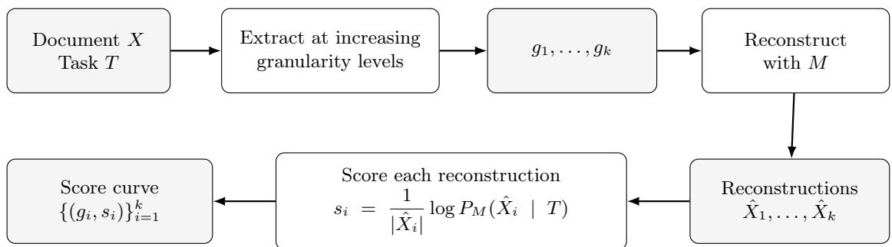
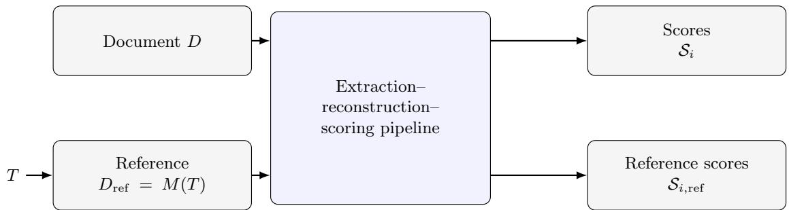
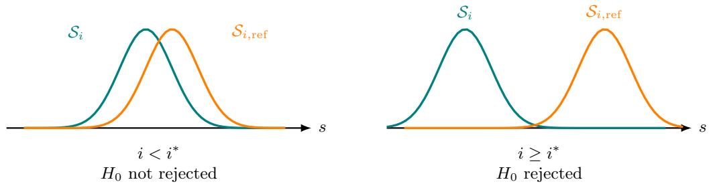
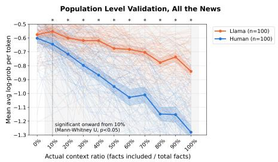
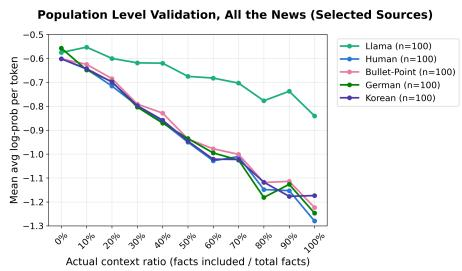
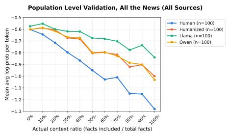
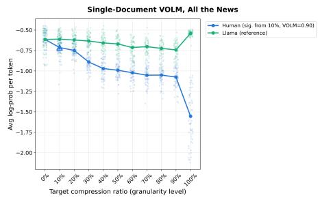
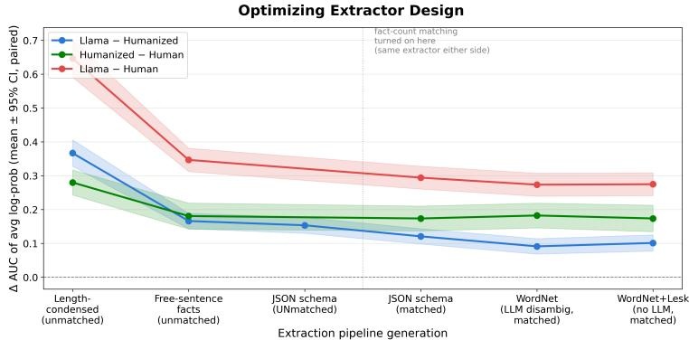
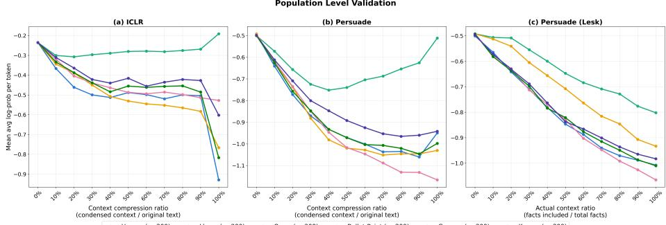
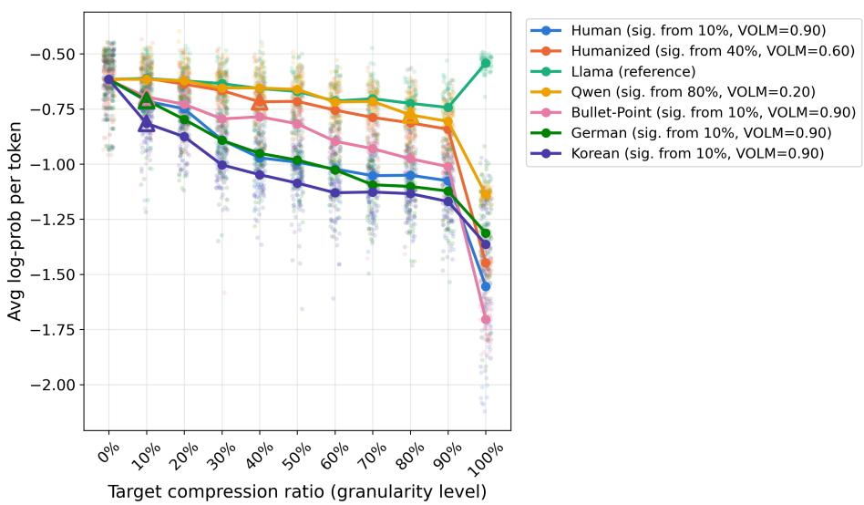

# Value Over Language Model: Detecting Original Contribution in Writing

Vibhhu Sharma, Thorsten Joachims, and Sarah Dean

Cornell University

August 2026

## Abstract

Large Language Models have been rapidly adopted across writing tasks, prompting the development of tools for detecting LLM-generated text. Yet these tools largely measure how much of a document’s surface text was written by an LLM and aren’t fundamentally designed to measure how much of the information content or ideas originated from the LLM itself rather than being supplied by the user in the prompt. In this work, we design a framework that measures how much value a person adds on top of what a language model could have easily produced by itself. The method requires no training or labeled data and never scores the document’s surface text, insulating it from stylistic confounders. Instead, it extracts the document’s content at increasing levels of granularity, uses an LLM to reconstruct the document from each partial representation, and compares these reconstructions with those produced from the task description alone. We call this framework Value Over Language Model (VOLM), which measures a document’s contribution relative to a replacement-level document that an LLM could produce from the task description alone. We evaluate VOLM with a specific instantiation of this framework across three domains: news articles, ICLR peer reviews, and argumentative essays. VOLM separates human-authored documents from matched LLMgenerated documents produced from generic task descriptions, while remaining substantially invariant to content-preserving transformations, including LLM-based reconstruction and round-trip translation. We further find that increasingly constrained content extractors reduce residual differences between LLM-generated and humanized text, demonstrating the importance of disentangling informational content from stylistic variation. We hope these results encourage further work on specialized instantiations of the framework and on assessing human contributions in LLM-assisted writing more generally.

## 1 Introduction

Since their large-scale commercial introduction in late 2022, large language models have seen increasing adoption across writing tasks. An October 2025 study into AI use in American newspapers [Russell et al., 2026] used a state of the art LLM detector [Thai et al., 2025] to find that approximately 9% of newly-published articles in the summer of 2025 were either partially or fully AIgenerated. Another recent survey [Naddaf, 2025] of 1600 academics reported that over 50% of researchers have used artificial intelligence at some point while peer reviewing manuscripts, and 24% of these researchers increased their use of AI for peer review in the past year. These statistics indicate that LLM use is widespread, but they reveal little about how these tools are actually used. The same reported “use" can describe an author who hands a model a single-line prompt and submits whatever comes back, or one who provides a fully formed argument and asks the model only to help render it into prose. This distinction is important because it determines whose ideas the finished document actually expresses.

Consider a reviewer who reads a paper carefully and identifies a specific flaw, for instance, “the proof of Lemma 3 breaks down when n=2, the baseline in Table 2 is run with a diferent learning rate than the proposed method, the related-work section omits a closely related result from Smith et al. and the main theorem’s assumption of bounded noise is not stated in the abstract." She then asks an LLM to expand this into a full review, complete with context, phrasing, and structure. Because the reviewer supplied only the underlying point and the LLM produced most of the surface text, a detector measuring the fraction of LLM-written text would likely flag this review as LLM-assisted. Yet, in this case, the reviewer’s original contribution, i.e., identifying the flaw in the first place, is exactly the kind of substantive engagement peer review depends on, and the LLM’s role was to help express it, not to originate it. Treating this review as suspicious simply because most of its words came from a model conflates the amount of LLM-produced text with the source of the review’s content, and risks discouraging reviewers from making the best use of LLMs to help them communicate more efectively. This distinction is also important for researchers writing in a non-native language. For instance, an reviewer might formulate an argument in her native language and use an LLM to translate it into English. In this case, even though the model generated all of the document’s English surface text, the argument and supporting ideas are still the author’s own. A measure that equates extensive LLM-written text with limited human contribution would thus penalize exactly the kinds of translation and linguistic assistance that can make scholarly communication more accessible.

Existing work around LLM use in writing largely asks the binary question of whether a given piece of text was formulated by a language model or not [Liang et al., 2024a,b, Thai et al., 2025]. The implicit aim is to identify machinegenerated text so that it can be flagged, filtered, or penalized. A more recent line of work refines this by attempting to measure the fraction of text in a document that was subject to “LLM editing” instead, providing a more granular estimate of LLM involvement in writing in the form of a real number between 0 and 1 [Thai et al., 2025]. However, both framings retain the same core motivation, as they propose to measure the amount of LLM involvement in writing the final text, instead of the more involved, and arguably more important, question of whose ideas the text expresses. A document can be almost entirely rendered into prose by a model but still be the product of substantial original thought by a human author, if the author provided detailed information and guidance to the language model as part of their prompt. As such, we aim to design a methodology that definitionally uncovers the extent of original contribution that went into the creation of a document, instead of measuring a document’s closeness to LLM-style writing.

We measure this extent as the gap between what the human supplied as part of their prompt and what a language model was already capable of producing on its own with a generic prompt. If a model can produce a document from a short, generic prompt alone, the content was already latent in its weights (or readily available to the model through tools), and the author’s contribution was minimal. Meanwhile, if producing the same document requires extensive guidance, such as a detailed structure and specific arguments, then the human supplied information that the model did not have.

We operationalize this idea by asking a simpler, related question: how surprised would a language model be by this document, having seen only the task description? Modern LLMs produce text autoregressively [OpenAI et al., 2024], assigning each token a probability conditioned on the tokens before it; the negative log of this probability is the token’s surprisal, and a document’s average surprisal under a model measures how well the model could have anticipated it. A document whose content is already latent in the model, recoverable from a short generic prompt, should be met with low surprisal. On the other hand, a document containing information the human author supplied and the model did not already have should be met with higher surprisal, and this surprisal should persist even as more of the document’s own content is revealed to the model as context.

We name our framework Value Over Language Model (VOLM), borrowing both the name and the underlying premise from Value Over Replacement Player (VORP), an advanced statistic from baseball sabermetrics popularized by Keith Woolner. VORP does not ask how good a player is in some absolute sense, instead asking how much better a player is than a replacement-level player, i.e., one performing at the level a team could obtain at minimal cost, from the pool of freely available talent on the waiver wire.

We adapt this logic to writing. In this context, the role of a ’replacementlevel player’ is taken over by a language model, and we measure a human’s contribution on top of what a language model could have easily written by itself with a generic task prompt. More simply, the baseline replacement-level document is the one a language model would produce given nothing but the generic task description. An author’s value, like a player’s, is not their output in isolation, but their output above what was already freely available.

Our contributions are as follows: First, we reframe the problem of measuring

LLM involvement in writing. Instead of measuring how much of a document’s text a model produced, we measure how much of a document’s ’information’ originated with its human author, a distinction current detectors do not draw. Second, we introduce VOLM, a general framework for quantifying this original contribution, applicable to any document paired with a task description. Third, we develop a specific algorithm that implements VOLM and that requires no model training and no labeled data; it operates entirely through log-probabilities computed with an of-the-shelf language model. Fourth, we show VOLM is robust to transformations of a document’s surface text that leave its information content unchanged, including paraphrase by a diferent LLM, translation round-trips, and, to a meaningful degree, humanizer tools explicitly designed to evade LLM detection, while remaining sensitive to genuine diferences in original content. We evaluate VOLM across three domains: news articles, ICLR peer reviews, and argumentative essays.

## 2 Related Work

A large body of work attempts to determine whether a given document was produced by a language model. Zero-shot methods such as DetectGPT [Mitchell et al., 2023] require no classifier training at all. They observe that minor rewrites of model-generated text tend to have lower log probability under the model than the original sample, while minor rewrites of human-written text may have higher or lower log probability than the original sample. Meanwhile, Liang et al. [2024b] and Liang et al. [2024a] use a statistical approach to LLM detection by positing that human-written text and LLM-written text come from two separate distributions and explicitly defining these distributions for diferent domains. These distributions are modeled as token-specific probabilities and derived from real, labeled data. More recent work relaxes the binary framing and instead estimates the fraction of a document attributable to LLM involvement, training a deep supervised model that ofers a continuous measure of machine editing rather than a yes/no label [Thai et al., 2025]. Across all of these approaches, the target of measurement remains the same – how much of the final text’s surface form was produced by a model. By asking how much of a document’s content the human author contributed on top of what a model could already produce unprompted, VOLM answers a diferent question from what these methods are not designed to answer.

Closest to our motivation is work by Xie et al. [2026], who also propose an information-theoretic measure of human contribution in AI-assisted content generation. They define human contribution as $\phi = I ( x ; y ) / I ( y )$ , the ratio of mutual information between a human’s input x and the AI’s output y to the output’s total self-information, where the self-information $I ( y ) = - \log p _ { \theta } ( y )$ is the output’s probability under no conditioning at all, and the conditional self-information $I ( y \mid x ) = - \log p _ { \theta } ( y \mid x )$ is conditioned on the specific human input actually used to produce it. Their method difers from ours in several key ways: first, their denominator, $I ( y )$ , measures surprisal relative to no context whatsoever, while VOLM measures surprisal relative to the task description $T _ { : }$ which is the level of content freely obtainable by stating the task alone. Genuinely unconditional generation is not a meaningful stand-in for zero human efort since even the least informative real request is still a task description, and comparing against no context at all sets a falsely permissive floor. Next, their primary measure requires the human input $x ,$ which an evaluator seeing only the finished document does not have. They propose an extension that doesn’t require x but this assumes any “plausible" x gives y a per-token probability above a threshold $\tau ,$ yielding the lower bound $\hat { \phi } = 1 - \log ( 1 / \tau ) / \bar { s } ( y )$ , where $\bar { s } ( y )$ is $y \mathrm { { s } }$ average unconditional per-token surprisal. Their estimate is then a monotone function of the document’s own perplexity, with τ hand-calibrated per model. VOLM instead conditions on $T ,$ , compares against an explicit reference document $D _ { \mathrm { r e f } } = M ( T )$ rather than a scalar threshold, and never scores the document’s surface text, only reconstructions of its extracted content, which insulates it from the stylistic variation that directly inflates a perplexity-based estimate.

A separate line of work in HCI approaches contribution attribution from a perceptual or process-tracing perspective rather than an information-theoretic one. He et al. [2025] survey how knowledge workers believe credit should be assigned between human and AI collaborators across diferent types and amounts of contribution, finding that people consistently under-credit AI relative to an equivalent human partner. Kim et al. [2026] propose an operationalized framework that decomposes a task’s goals into verifiable requirements and attributes each to the human or the model by tracing the full multi-turn dialogue. This requires access to the collaboration transcript, which VOLM does not require.

Finally, some of the motivation behind our proposed framework draws from work on LLM memorization. Recently, there has been work stuudying methods that could

Finally, our framework is partially motivated by work that studies memorization by asking how much information is already encoded in a language model’s parameters. Most directly, Schwarzschild et al. [2024] propose the Adversarial Compression Ratio, which measures the length of the shortest prompt that can elicit a target string from a model. A string is considered strongly memorized when a short prompt is enough to generate it. Our proposed framework shares this compression-based intuition that the amount of information in a prompt required to elicit an output reveals how much the model could already produce. However, the two frameworks address diferent questions. Adversarial Compression tests if a particular target string is stored in the model by optimizing a prompt that reproduces it exactly. VOLM instead evaluates a completed document without access to its original prompt, measures contribution relative to a task-specific baseline rather than an empty or optimized prompt, and does not require verbatim reproduction.

## 3 Framework

VOLM estimates how much of a document’s content originated with its human author, relative to a language model M and a task description T. The central idea is to measure how surprised M would be by the document, having seen only $T ,$ , and to track how that surprise changes as the document’s actual content is progressively revealed to M as context.

A document that a generic prompt could already have produced needs little of its own content revealed before M stops being surprised by it. On the other hand, a document containing information the human author supplied, and M did not already have, continues to surprise M as more of its content is revealed. In order to operationalize this idea, we propose a pipeline consisting of an Extractor E that condenses the information present in a document and a Reconstructor R that reconstructs the document with the condensed information as context, and measure how surprised M is when it sees this reconstructed document. Figure 1 illustrates the pipeline and we define each stage formally below.

## 3.1 Pipeline

As stated above, our proposed pipeline consists of two major components, an extractor E and a reconstructor R.

Extraction. Given a document D and task description $T ,$ an extractor E produces content summaries of D at k increasing granularity levels, $g _ { i } =$ $E ( D , T , i )$ for $i = 1 , \ldots , k$ , with $g _ { k }$ approximating the full content of D and lower i retaining coarser, less specific information. Granularity can be defined in multiple ways. For example, a ’content-based’ extractor selects an increasing number of discrete facts or claims from $D ,$ , so that k varies with the document. Alternatively, a ’length-based’ extractor instead condenses D to a fixed sequence of fractions of its original length, so that k is the same for every document. Note that because the meaning of a granularity level depends on this choice, VOLM scores are only meaningfully compared across documents that were processed with the same extractor, since k’s semantics difer across families.

Reconstruction. A reconstructor uses M to generate a reconstructed document $\hat { D } _ { i } = R ( T , g _ { i } , | D | )$ conditioned on the task description and the extracted content at level i. Note that the original D itself is never scored directly, and may have arisen from any mixture of human and model authorship. The pipeline only ever scores the reconstructions ${ \hat { D } } _ { i } ,$ which are always model-generated by construction. This ensures the comparison is never confounded by surface stylistic diferences between human and machine prose. Reconstructions are additionally length-matched to $D$ (within 10% of $| D |$ , enforced as part of the generation prompt), so that diferences in score cannot be attributed to diferences in reconstruction length.

Scoring. Each reconstruction is scored by its average per-token log-probability

  
(a) The extraction–reconstruction–scoring pipeline for a single document X.

  
(b) The observed document and an LLM-generated reference document are processed by the same pipeline.

  
(c) The score distributions are compared at each granularity level. The index $i ^ { * }$ is the first level from which they difer persistently.

Figure 1: The VOLM framework. (a) A document is represented at k levels of granularity, reconstructed by M, and scored by its average per-token logprobability under M conditioned only on T. (b) The document D and reference $D _ { \mathrm { r e f } } = M ( T )$ are processed identically. (c) A two-sided test compares their score distributions at each level. The earliest level i<sup>∗</sup> at which they difer significantly and persistently determines $\operatorname { V O L M } ( D ) = 1 - i ^ { * } / k$

under M, conditioned on the task description alone:

$$
s _ { i } = \frac { 1 } { \vert \hat { D } _ { i } \vert } \log P _ { M } \left( \hat { D } _ { i } \mid T \right) = \frac { 1 } { \vert \hat { \underline { { J } } } _ { i } \vert } \sum _ { j = 1 } ^ { \vert \hat { D } _ { i } \vert } \log P _ { M } \left( \hat { d } _ { i , j } \mid T , \hat { d } _ { i , < j } \right) ,\tag{1}
$$

where $| \hat { D } _ { i } |$ is the token length of $\hat { D } _ { i }$ and $\hat { d } _ { i , j }$ its j-th token. This asks how probable, on a per-token basis, $\hat { D } _ { i }$ would be to a model that only ever saw the generic task description.

## 3.2 Score Distributions

Both extraction and reconstruction are stochastic (because they are LLM inference operations), giving two independent sources of variation at each granularity level. For any input document $X$ , we therefore draw m extraction samples $g _ { i } ^ { ( 1 ) } , \ldots , g _ { i } ^ { ( m ) }$ and, for each, n reconstructions

$$
\hat { X } _ { i } ^ { ( j , l ) } = R \left( T , g _ { i } ^ { ( j ) } , | X | \right) , \qquad j = 1 , \ldots , m , \quad l = 1 , \ldots , n .
$$

Scoring each reconstruction as in Equation (1) yields, at each level $i ,$ a distribution of $m \times n$ scores

$$
\begin{array} { r } { S _ { i } ( X ) = \left\{ s _ { i } ^ { ( j , l ) } \right\} . } \end{array}
$$

The pipeline thus maps a document to a sequence of score distributions, one per granularity level.

## 3.3 The Replacement-Level Document

Similar to VORP requiring a well-defined replacement-level player to serve as its baseline, VOLM requires a well-defined baseline reference document. We construct this baseline directly as

$$
D _ { \mathrm { r e f } } = M ( T ) ,
$$

such that $D _ { \mathrm { r e f } }$ is the document that M produces from the task description alone, with no additional content supplied. $D _ { \mathrm { r e f } }$ is passed through the same pipeline as $D _ { : }$ yielding its own score distributions $S _ { i } ( D _ { \mathrm { r e f } } )$ at each level.

## 3.4 VOLM

At each level i, we test the null hypothesis that $S _ { i } ( D )$ and $S _ { i } ( D _ { \mathrm { r e f } } )$ are drawn from the same distribution, against a two-sided alternative, rejecting at $p < 0 . 0 5$ .

Let $i ^ { * }$ be the smallest index at which $H _ { 0 }$ is rejected and remains rejected at all subsequent levels $i \geq i ^ { * }$ . This persistence condition is to guard against a single spurious early rejection that could end up inflating the resulting score. We define

$$
\mathrm { V O L M } ( D ) = 1 - \frac { i ^ { * } } { k } .
$$

A document whose content is genuinely surprising to a language model departs from the reference early $( i ^ { * }$ small, VOLM close to 1), since even a small amount of revealed content distinguishes it from $D _ { \mathrm { r e f } }$ . A document indistinguishable from the reference until nearly all of its content is revealed departs late or not at all $( i ^ { * }$ close to $k ,$ or undefined, with VOLM close to or equal to 0).

## 3.5 Summary of the Procedure

Concretely, suppose you are the evaluator, with access to M and nothing else.   
You are given a document D and its task description T.

Step 0: Generate the replacement-level document.

$$
D _ { \mathrm { r e f } } = M ( T ) .
$$

You now hold two documents, D and $D _ { \mathrm { r e f } } .$ . Both are taken through an identical procedure that is detailed in Steps 1-3 below, and X stands for either one.

Step 1: Extract – Apply E to obtain content representations of X at granularity levels $g _ { 1 } , \ldots , g _ { k }$

Step 2: Reconstruct – At each level i, generate

$$
\begin{array} { r } { \hat { X } _ { i } = R \left( T , g _ { i } , | X | \right) . } \end{array}
$$

Step 3: Score – Score each reconstruction as in Equation (1). When evaluating a single document, repeat Steps 1-2 over m extraction and n reconstruction samples to obtain the distributions $S _ { i } ( X )$ of Section 3.2 as described in Section 3.2.

Step 4: Compare – Test $S _ { i } ( D )$ against $S _ { i } ( D _ { \mathrm { r e f } } )$ at each level, identify the earliest persistent rejection $i ^ { * }$ , and report $\operatorname { V O L M } ( D ) = 1 - i ^ { * } / k$

## 4 Experiments

In order to show the eficacy of our proposed pipeline, we first conduct experiments at a corpus level in Section 4.3, demonstrating that LLM-written documents produced from a generic task description and human-authored documents behave diferently when passed through the pipeline. We use a corpus-level comparison for this initial illustration, rather than a single-document comparison, so that variation between individual documents averages out, rather than tying our results to the particulars of any one document. This also mirrors [Liang et al., 2024b], who studied the AI detection problem at a corpus level, identifying the amount of LLM use in paper abstracts.

## 4.1 Data

We test our framework on datasets spanning journalism, academic peer review, and school essay writing, to show its eficacy in identifying original contribution across domains with meaningfully diferent notions of a task description T. In each domain, we begin with a set of human-written documents and construct a matched LLM-generated counterpart for each, by prompting M with the same T as the human document. Below we define their construction.

All the News: We sample 100 articles from the All the News [Thompson, 2020] corpus. T is the article’s published headline.

ICLR Reviews: We randomly sample 200 papers from ICLR 2023, selecting one review at random per paper. $T$ consists of the full paper, the venue’s reviewer instructions, and its rating scale. More details are provided in $\mathrm { A p \mathrm { - } }$ pendix A.

Persuasive Argumentation: We sample 200 documents from the 8 independentwriting prompts in the PERSUADE 2.0 corpus [Crossley et al., 2024] (25 essays per prompt). We exclude the corpus’s 7 source-based prompts, which would require source material as part of T. T is then the essay prompt itself.

For every document, its LLM-generated counterpart is constrained to be within 10% of the human document’s length, enforced as part of the generation prompt, to remove length as a confounder.

## 4.2 Instantiation

The framework in Section 3 is agnostic to the specific choice of extractor $E ,$ reconstructor R, and model M. For the experiments that follow, we fix a concrete instantiation, described here for the All the News dataset. We defer the analogous instantiations for ICLR Reviews and Persuade Essays to the Appendix A, and all the experiments in the main text conducted on All the News dataset alone.

## 4.2.1 Model

We use Llama 3.1 8B Instruct as M throughout, serving both as the extractor’s underlying model and as the reconstructor.

## 4.2.2 Extractor

For the experiments reported in the main text, we use the Equalized Schema-Constrained Fact Extractor with WordNet canonicalization described in Section A.1.5. This extractor prompts M to decompose a document into an ordered list of discrete facts, with each fact represented by a fixed schema containing a subject, action, object, and any associated quantity, date, or quotation.

To reduce variation in the representation of actions, the extractor first identifies a base-form verb for each fact and then canonicalizes the action using WordNet. When multiple WordNet senses are available, we disambiguate the sense using the deterministic Lesk algorithm [Lesk, 1986], using the fact’s subject and object as context. The representative verb of the selected sense is then used when rendering the fact.

We equalize the number of extracted facts across documents. The number of facts extracted from the reference LLM-generated document is used as the target count, and the extractor is prompted to produce the same number of facts for the document being evaluated. Granularity is defined as the fraction of this fact list included, $g _ { i } \in \{ 0 . 0 , 0 . 1 , \ldots , 1 . 0 \}$ , giving eleven levels; at level $g _ { i }$ the extractor returns the first $\lceil g _ { i } \cdot n \rceil$ facts of the n extracted in total.

## 4.2.3 Reconstructor

R prompts M to write a document satisfying T, given the facts included at that level as additional context, and constrained to fall within 10% of the original document’s word count, matching the length-matching described in Section 4.1.

## 4.2.4 Procedure

The procedure of Section 3.5 is instantiated for All the News as follows. $T$ is the article’s published title, E is the WordNet-canonicalized fact extractor of Section A.1.5, with granularity levels $g _ { i } ~ = ~ i / 1 0$ for $i = 0 , 1 , \ldots , 1 0 ;$ at level $g _ { i } ,$ , the extractor returns the first $\lceil g _ { i } \cdot n _ { X } \rceil$ of the $n _ { X }$ facts extracted from X. Prompts for extraction and reconstruction are given in Appendix $\mathrm { A }$

Step 0: Generate the replacement-level document.

$$
D _ { \mathrm { r e f } } = M ( T ) .
$$

You now hold two documents, D and $D _ { \mathrm { r e f } } .$ and take both through an identical procedure; below, X stands for either one.

Step 1: Extract facts - For $X \in \{ D , D _ { \mathrm { r e f } } \}$ , extract an ordered list of $n _ { X }$ facts, ranked by order of appearance in X:

$$
E ( X ) = \left( f _ { 1 } ^ { X } , \dots , f _ { n _ { X } } ^ { X } \right) .
$$

Step 2: Take granularity subsets - For $i = 0 , 1 , \ldots , 1 0$ , let $g _ { i } = i / 1 0$ and let $F _ { i } ^ { X }$ be the first $\lceil g _ { i } \cdot n _ { X } \rceil$ facts of $E ( X )$

$$
\begin{array} { r } { F _ { i } ^ { X } = \left( f _ { 1 } ^ { X } , \dots , f _ { \lceil g _ { i } \cdot n _ { X } \rceil } ^ { X } \right) . } \end{array}
$$

Step 3: Reconstruct - At each level $i ,$ prompt M with $T$ and the facts included so far:

$$
\hat { X } _ { i } = R \left( T , F _ { i } ^ { X } \right) .
$$

Step 4: Score - Score each reconstruction by its average per-token logprobability under $M ,$ conditioned on $T$ alone:

$$
s _ { i } ^ { X } = { \frac { 1 } { \left| { \hat { X _ { i } } } \right| } } \log P _ { M } \left( { \hat { X _ { i } } } \mid T \right) .
$$

Applying Steps 1-4 to $X = D$ and $X = D _ { \mathrm { r e f } }$ yields two score curves over the eleven granularity levels,

$$
\left\{ \left( g _ { i } , s _ { i } ^ { D } \right) \right\} _ { i = 0 } ^ { 1 0 } \quad \mathrm { a n d } \quad \left\{ \left( g _ { i } , s _ { i } ^ { D _ { \mathrm { r e f } } } \right) \right\} _ { i = 0 } ^ { 1 0 }
$$

For these corpus-level experiments we use a single extraction and a single reconstruction per document per granularity level $( m = n = 1 )$ , since averaging across 100 documents provides the variance reduction that per-document resampling provides in the single-document setting.

## 4.3 Population-Level Validation

We repeat Steps 0-4 independently for each of the 100 human articles and their matched replacement-level documents.

For document $d = 1 , \ldots ,$ 100, applying Steps 1-4 yields eleven scores, $s _ { i } ^ { ( d ) }$ for the human article and $s _ { i , \mathrm { r e f } } ^ { ( d ) }$ for its replacement-level counterpart.

Because Step 2 selects $\lceil g _ { i } \cdot n _ { d } \rceil$ facts out of $n _ { d }$ total, the realized fraction of content actually included,

$$
\rho _ { i } ^ { ( d ) } = \frac { \left\lceil g _ { i } \cdot n _ { d } \right\rceil } { n _ { d } } ,
$$

can difer slightly from the target fraction $g _ { i } .$ , particularly for documents with few extracted facts. We therefore aggregate each group’s $\left( \rho _ { i } ^ { ( d ) } , s _ { i } ^ { ( d ) } \right)$ pairs by the actual realized fraction instead of the target fraction and use binning to help with averaging.

For each of the eleven bins centered at $g _ { 0 } , \ldots , g _ { 1 0 }$ , we pool every point across all 100 documents whose realized fraction falls within that bin, and report the bin’s mean and 95% confidence interval (computed via a t-distribution over the pooled points). This yields two population curves,

$$
\begin{array} { r } { \bar { s } ( g _ { i } ) \quad \mathrm { a n d } \quad \bar { s } _ { \mathrm { r e f } } ( g _ { i } ) , } \end{array}
$$

for the human and replacement-level groups respectively, each with an associated confidence band. Figure 2a shows these curves together on the same plot. We see that the human population-level curve departs from the reference Llama population level curve immediately, showing a statistically significant diference at granularity level 0.1. The human curve decays quickly – as more context is provided to the model $M .$ , the article it generates deviates from the one it would have written with no context, and this manifests as a significantly lower logprobability score. Meanwhile, the reference Llama curve decays slowly because all the additional information ${ \boldsymbol { F } } _ { i } ^ { D _ { r e f } }$ being provided as context to the model is itself extracted from a reference article $D _ { r e f }$ that was created with no context in the first place. This means all the additional context being provided was already inherent in the model M and prompt T, and the model is not surprised or meaningfully swayed by this context. This also lends a useful and elegant meaning to our method: we are measuring the amount of content in a document that isn’t already implicit in a language model’s weights and a task description prompt.

## 4.4 Invariance to LLM-style writing

A stronger test of VOLM is whether it tracks a document’s information content specifically, rather than superficial properties of its authorship. As stated earlier, the goal of our method is to detect original contribution in writing, on top of what a language model could have easily produced, and a document being written in ’LLM-style’ should not afect this measurement.

We construct, for each document of each dataset, three variants:

  
(a) Human-written corpus vs. reference LLM-generated corpus.

  
(b) Human-written corpus, its contentpreserving variants (round-trip translated, or bullet-condensed and reconstructed), and the reference corpus.  
Figure 2: Averaged log-probability curves on the All the News dataset. Panel (a) shows the baseline separation between human and reference documents; panel (b) tests invariance of the human curve under content-preserving transformations.

• Bullet-reconstructed: the article is condensed to bullet points, then reconstructed into prose using a language model. We use M itself, as a worst case scenario: the text will now have been subjected to two LLM transformations using the same model that is being used to evaluate it and is now ostensibly written in the style of M.

• Round-trip translated: the article translated to another language and then back to English. We do this for two languages: German and Korean, so as to have a sample in the same language family as English and another in an entirely diferent language family that could force the LLM to not retain the structure and phrasing of the original text while translating.

Both variants are, by surface appearance, heavily LLM-touched and a detector measuring surface LLM involvement could plausibly flag either as machinewritten. Neither, however, introduces or removes any information relative to the original article. Passing each variant through the procedure of Section 4.2, we expect both to produce score curves close to the original human article’s curve, and clearly separated from $D _ { \mathrm { r e f } } { \mathrm { ^ { \circ } s } } .$ , since VOLM importantly never scores a document’s own surface text and only ever scores reconstructions built from its extracted content.

We compute similar group-averaged score curves for these 3 variants across all three datasets. Figure 2b shows these curves for the All the News dataset (the same graphs for the ICLR and Persuade dataset are again deferred to the Appendix). Each of the three curves closely tracks the human curve and significantly departs the reference Llama curve early, indicating the presence of original content beyond what the language model could easily write. Subjecting original text to LLM transformations did not alter its evaluation by our method.

  
(a) Reference LLM-generated corpus, its Qwen-generated counterpart, and its humanized counterpart.

  
(b) Full per-document procedure, including resampling and the significance test of Section 3.3, on a single sample document.

Figure 3: Left: robustness of the population-level curves to a diferent generator model and to humanization (Section 4.5). Right: VOLM’s complete per-document procedure applied to a single illustrative document (Section 4.6).

## 4.5 Robustness

We check VOLM’s robustness to two adversarial settings below, namely, documents written by a language model diferent from the evaluation model M, and LLM-written documents that have been passed through a humanizer. Ideally, both settings have a low VOLM score, since they did not involve substantial human contribution on top of what a language model could’ve easily written with a generic prompt.Text that was easily elicited from a diferent language model using a generic prompt should be flagged in the same way text generated from the evaluator model is, ’humanized’ generic text shouldn’t be considered any more original than the text that originated it.

## 4.5.1 Text written by other language models

We use the same task description prompt T to generate a document using a diferent language model from M. In our test instantiation, we use Qwen 3-8B as the generator and Llama 3.1 8B as the evaluator model M.

Figure 3a shows the averaged log probability curve following the procedure detailed in Section 4.2.4 for Qwen generated documents in yellow.

## 4.5.2 Humanization

Humanizers are designed to evade LLM detectors by adversarially paraphrasing text in a manner that bypasses trained detectors. Though our method is not an LLM detector and measures a diferent objective (the value provided on top of a language model), robustness to humanization is still important – a piece of text should not acquire a higher VOLM score, simply because it was paraphrased by a humanizer. In this sense, an ideal measure of VOLM is one that is resistant to stylistic confounding and solely measures information gaps, i.e., whether the presented document contains information that a language model would not have generated with a short task description prompt.

We use DIPPER [Krishna et al., 2023] as the humanizer and apply it to our corpus of Llama generated documents for all 3 datasets.

Figure 3a shows the averaged log probability curve following the procedure detailed in Section 4.2.4 for humanized documents in orange.

The figure shows a clear hierarchy – the reference curve, made up of documents generated by M itself from T alone, decreases only slowly as granularity increases. Even once the reconstructor is given the entirety of $D _ { \mathrm { r e f } }$ as context, M largely continues to produce what it would have produced from T alone, since $D _ { \mathrm { r e f } }$ contains no information M did not already supply. The other-model and humanized curves form a second tier. They decrease more sharply than the reference curve but remain well above the bottom tier. One was generated by a diferent model and the other adversarially paraphrased, so both difer from the reference in surface origin, but neither introduces any genuinely new information, and VOLM correctly places both close to, though measurably above, documents with real original content. The bottom tier contains the human curve together with its two content-preserving transformations from Section 4.4, the bullet-reconstructed and round-trip translated variants. All three decrease sharply and closely track one another, despite having been substantially rewritten by an LLM at some stage, since none of these transformations removes the information the human author originally supplied. This ordering is exactly what VOLM’s underlying premise predicts: separation by information content relative to a generic prompt, regardless of which process most recently touched a document’s surface text.

## 4.6 Single-Document Illustration

Finally, we walk through VOLM’s complete per-document procedure, including resampling and the significance test of Section 3.3, on a sample document provided in Appendix A.4 alongside its corresponding reference document, othermodel document, humanized document, and transformed variants.

Figure 3b shows the log-probability curves for a single sample human written document and a reference Llama-composed document on a single plot. The human document’s curve departs significantly from its reference LLM counterpart at granularity level 0.1, yielding a VOLM score of 0.9. Figure 7 shows this same figure overlayed with curves corresponding to other transformed variants.

## 5 Discussion

The results in Section 4 paint an interesting picture. The idea behind VOLM is principled: in order to figure out the amount of information content in a document that is ’genuinely new’ and could not have easily been produced by a language model without deliberate prompting, we measure how surprised a language model would be to see the document if it only had a generic prompt to work with. However, since this is very prone to stylistic confounding (LLMs would be less surprised to see text that is ostensibly ’LLM-style’), this would afect a straightforward log-probability based metric. In order to avoid this, we 1) ensure every document scored by the evaluator model M is a reconstruction via M itself, and not original text, and 2) iterate on better extractors that strip away style. We expand on the second point below.

Figure 3a shows a clear separation between the reference curve, i.e., documents generated by M itself from T alone, and the human curve together with its content-preserving variants from Section 4.4. The Qwen-generated and humanized curves, however, do not fully coincide with the reference curve and both fall at an intermediate level between the two extremes. Because neither variant introduces any content beyond what T already supplies (under the assumption that the Qwen model does not have a significantly diferent training corpus than the Llama model), we do not interpret this gap as evidence of genuine original content. A more likely explanation is the presence of residual stylistic diferences that persist even after we try to eliminate them. Text produced by a diferent model, or adversarially perturbed by a humanizer, may carry diferent tokenlevel statistics from M’s own output, independent of its informational content, which would lower its assigned log-probability under M even at low granularity. We get to test this experimentally and quantify the contribution of stylistic diferences and information diferences by varying our choice of Extractor E.

Consider the two snippets shown in Figure 4. The snippet on the left is the reference LLM-generated article, written by prompting Llama 3.1 8B with the article’s title and a required length, while the snippet on the right is the same article after being run through the DIPPER humanizer. The figure shows these snippets in their original form, after condensation (at level 80%), and after final reconstruction.

We begin with an extractor E that condenses documents to smaller fractions of their original length. For instance, at granularity level 0.1, the extractor issues an LLM call to the evaluator model M that condenses the article to 10% of its original length. Similarly, at granularity level 0.6, this becomes 60% of its original length. The idea is that condensing to a shorter length forces the extractor to retain only the most important x% of the information, for granularity level x.

When using this extractor, we noticed that even after two rounds of LLM transformations, condensation and reconstruction, multiple stylistic nuances from the original text persisted, undermining the purpose reconstruction is meant to serve. The LLM tends to continue using words from the original text. As a result, in trying to measure only information gaps, we end up measuring stylistic gaps as well. We find that if particular word choices propagate through the extractor, the reconstructor is likely to pick them up as well. We observed this pattern across many articles.

This explains why the humanized Llama text appears to have a non-zero VOLM score. There is a stylistic gap, and because the LLM does not expect these unfamiliar word choices, the reconstruction’s log-probability is lower, even though it is expressing the same information. Our two-step extractionreconstruction procedure does help to some extent. The log-probability gap between the initial Llama and initial humanized articles is larger than the gap between their reconstructed counterparts, but the reduction is not suficient. We therefore set about redesigning the extractor to allow for this degree of freedom in word choice.

<table><tr><td></td><td>Original Article</td><td>80% Condensed</td><td>Reconstructed</td></tr><tr><td>Llama</td><td>With its melancholic melody and heartfeltlyrics, the song has become a staple of Christmas playlists, providing a sense of validation for those who are struggling to find joy during this time.</td><td>With its melancholic melody and heartfelt lyrics, the song has become a staple of Christmas playlists, providing a sense of validation for those who are struggling to find joy during this time.</td><td>With its melancholic melody andheartfelt lyrics, the song has become a staple of Christmas playlists, providing a sense of validation for those who are struggling to find joy during this time.</td></tr><tr><td>Humanized</td><td>With its mournful melody and sincere lyrics, it has become a standard on Christmastime radio, and it speaks to people who are struggling to find joy at this time of year.</td><td>With its mournful melody andsincere lyrics, it has become a standard on Christmastime radio, speaking to people who are struggling to find joy at this time of year.</td><td>Its mournful melody and sincere lyrics have become a staple on Christmastime radio, offering a sense of solidarity and understanding to those who are struggling to find joy.</td></tr></table>

Figure 4: Persistence of a document’s specific word choices across condensation and reconstruction, for a reference Llama-generated article (top) versus the same article after DIPPER humanization (bottom). Blue marks the Llama article’s descriptive word choice, orange marks the humanized article’s. both pairs persist unchanged through the extractor and reconstructor, even though the two articles start from diferent wording.

To summarize a document’s entire curve as a single scalar rather than comparing sources at one arbitrary compression level, we integrate it over the compression ratio, giving a per-document measure of how surprising that source’s generation process is to the model across the full reveal range. For two sources A and B, we then define the gap between them as the paired diference in AUC, $\mathrm { A U C } _ { A } ( d ) - \mathrm { A U C } _ { B } ( d )$ , computed per document d and averaged over the corpus with a 95% confidence interval over that per-document distribution. Here, pairing on the same document cancels out document-level dificulty (since some titles are inherently easier or harder to predict than others) and isolates the efect of the source itself.

We consider extractors with increasingly rigid extraction parameters, and we detail them in Appendix A.1. As we increase the rigidity of the extractor by imposing constraints that limit stylistic choices, we see a notable decrease in the gap between the curves corresponding to the Llama and Humanized corpus. Figure 5 depicts this narrowing. Moving from the condensation-based extractor to the fact extractor, the schema-constrained equalized fact extractor, and finally the WordNet-canonicalized equalized schema extractor, the Llama-Humanized gap fell from 0.367 to 0.166 to 0.121 to 0.101 (AUC of average log-probability across the compression sweep), a total reduction of 72.4% from the least to the most constrained extractor. We note that this reduction wasn’t just a byproduct of equalizing fact counts between corpora. Adding WordNet canonicalization alone reduced the gap by a further 16.2% (0.121 to 0.101), indicating that constraining the extractor’s vocabulary sharpens the measured similarity between Llama-generated and humanized text. We disambiguated WordNet senses using the deterministic Lesk algorithm [Lesk, 1986] but we also saw that substituting an LLM-based disambiguation step (prompting an LLM to choose the correct word-sense) in its place produced roughly the same result. By contrast, the Humanized-Human gap remained essentially unchanged across the same progression, measuring 0.181, 0.174, and 0.174 for the fact, equalized schema, and equalized schema with WordNet extractors respectively, corresponding to a net change under 4%. Only comparisons with the reference LLM were afected by the extractor optimization since the log probabilities are measured with respect to the reference LLM.

  
Figure 5: Paired AUC gap mean of avg log-probability per token, integrated over the compression sweep, paired per document, n=100) between each source pair, tracked across six successive extractor designs detailed in Appendix A.1. A sharper extractor makes humanized text look more like unconditioned LLM output.

We encourage more involved work on extractor design within our proposed framework to further narrow the gap between reference LLM-humanized text so that VOLM only measures information gaps and not stylistic diferences.

The instantiation of our framework used for the experiments in this paper also presently attributes a non-zero VOLM to text produced by models diferent from the evaluator model M, though the magnitude of this VOLM is generally lower than it is for genuinely original documents. Intelligent thresholding or defining what VOLM level is significant could resolve this issue. Another way to get past this is to use multiple evaluator models M and measure VOLM for all of them. We note that this is an artifact of the method itself – small diferences in training data and styles (if the extractor isn’t optimized) could lead to one model seeing the text generated by another model as original to some degree.

A key motivating idea for VOLM and our proposed framework came from the following thought experiment: “Consider yourself an experienced computer science researcher tasked with summarizing a given document to a shorter length. If the document is a computer science-related document, you would probably be able to do it easily, because you have the necessary domain knowledge to adequately express these ideas concisely. On the other hand, suppose the document is a biology-related document, In this case, condensing it to a smaller length would be harder, because you lack the necessary domain knowledge to know what to keep/discard." Along similar lines, we posited, “An LLM will find it harder to condense information that isn’t already implicit in its weights." When we design an extractor E to approximate the original document D at different granularity levels, we are performing the same information compression. If the document that an LLM generates when it is provided a large fraction of the information in a given document is not substantially diferent than what it would’ve generated when not provided with any of that information, then the document’s author did not provide substantial input that influenced the creation of the final document, implying a low VOLM.

We emphasize that the key contribution of this work is in defining a general framework that measures the value of the input that went into a language model to produce a provided document. The experiments demonstrate the feasibility of this framework and encourage work into defining more principled extractors and reconstructors. As a training-free method, this framework ofers easy adoption and adaptability as the landscape of language model research and adoption keeps shifting.

## 6 Conclusion

As people continue to adopt LLMs into their writing process and LLMs become increasingly capable of complex reasoning, authorship attribution is becoming both more ambiguous and more important. The question is no longer just whether a person used an LLM, or even how much of a document’s final text was generated by one. An author may rely heavily on an LLM to render a document’s prose while still supplying the ideas, arguments, and structure that give it its substantive value. Conversely, a document could be the product of little or no original human contribution even if its surface form has been modified to appear more human-written. In this paper, we introduce a trainingfree framework for making this distinction. Instead of measuring the fraction of text attributable to an LLM, VOLM measures a document’s ’value’ relative to what a language model could already produce from the task description alone. By extracting a document’s content at increasing levels of granularity, reconstructing it using a language model, and measuring how surprising those reconstructions are relative to a replacement-level document, VOLM aims to quantify how much information in a document goes beyond what was already readily available to the model.

Our experiments demonstrate the feasibility of this approach across journalism, peer review, and student essays. VOLM separates human-authored documents from matched documents generated from generic task descriptions, while remaining substantially invariant to content-preserving transformations, including LLM reconstruction and round-trip translation. At the same time, our analysis discovers that residual stylistic information can often persist even after multiple rounds of LLM-assisted rephrasing operations, causing text produced by diferent models or adversarial humanizers to receive non-zero VOLM scores despite containing little additional original information. We show that increasingly constrained extractors can substantially reduce this efect, pointing to extractor design as an important direction for future work.

We view the present work as a first step toward measuring contribution at a granular level rather than merely detecting AI use. More principled extractors and reconstructors and multiple evaluator models are all promising directions for future work. As the boundary between human and machine writing continues to blur, methods that distinguish who produced the words from who contributed the ideas may become increasingly important for assigning credit, evaluating work, and understanding what relevant human contribution looks like in the age of language models.

Acknowledgement: Thank you to Nat, Owen, and David Mimno for helping coin “VOLM" and their very useful feedback. This research was supported in part by NSF Awards IIS-2312865 and OAC-2311521.

## References

S.A. Crossley, Y. Tian, P. Bafour, A. Franklin, M. Benner, and U. Boser. A large-scale corpus for assessing written argumentation: Persuade 2.0. Assessing Writing, 61:100865, 2024. ISSN 1075-2935. doi: https://doi.org/10. 1016/j.asw.2024.100865. URL https://www.sciencedirect.com/science/ article/pii/S1075293524000588.

Jason Guerrasio. Review: Matthew mcconaughey’s new movie has no heart – and stephen king fans will be angry. https://www.businessinsider.com/ the-dark-tower-movie-review-2017-8, August 2017.

Jessica He, Stephanie Houde, and Justin D. Weisz. Which contributions deserve credit? perceptions of attribution in human-ai co-creation, 2025. URL https: //arxiv.org/abs/2502.18357.

Eunsu Kim, Jessica R. Mindel, Kyungjin Kim, and Sherry Tongshuang Wu. "i didn’t make the micro decisions": Measuring, inducing, and exposing goallevel ai contributions in collaboration, 2026. URL https://arxiv.org/abs/ 2605.21363.

Kalpesh Krishna, Yixiao Song, Marzena Karpinska, John Wieting, and Mohit Iyyer. Paraphrasing evades detectors of ai-generated text, but retrieval is an efective defense, 2023. URL https://arxiv.org/abs/2303.13408.

Michael Lesk. Automatic sense disambiguation using machine readable dictionaries: how to tell a pine cone from an ice cream cone. In Proceedings of

the 5th Annual International Conference on Systems Documentation, SIG-DOC ’86, page 24–26, New York, NY, USA, 1986. Association for Computing Machinery. ISBN 0897912241. doi: 10.1145/318723.318728. URL https://doi.org/10.1145/318723.318728.

Weixin Liang, Zachary Izzo, Yaohui Zhang, Haley Lepp, Hancheng Cao, Xuandong Zhao, Lingjiao Chen, Haotian Ye, Sheng Liu, Zhi Huang, Daniel A. McFarland, and James Y. Zou. Monitoring ai-modified content at scale: a case study on the impact of chatgpt on ai conference peer reviews. In Proceedings of the 41st International Conference on Machine Learning, ICML’24. JMLR.org, 2024a.

Weixin Liang, Yaohui Zhang, Zhengxuan Wu, Haley Lepp, Wenlong Ji, Xuandong Zhao, Hancheng Cao, Sheng Liu, Siyu He, Zhi Huang, Diyi Yang, Christopher Potts, Christopher D Manning, and James Y. Zou. Mapping the increasing use of llms in scientific papers, 2024b. URL https: //arxiv.org/abs/2404.01268.

Eric Mitchell, Yoonho Lee, Alexander Khazatsky, Christopher D. Manning, and Chelsea Finn. Detectgpt: Zero-shot machine-generated text detection using probability curvature, 2023. URL https://arxiv.org/abs/2301.11305.

Miryam Naddaf. More than half of researchers now use ai for peer review — often against guidance. Nature, 649:273 – 274, 2025. URL https://api. semanticscholar.org/CorpusID:283907941.

OpenAI, :, Aaron Hurst, Adam Lerer, Adam P. Goucher, Adam Perelman, Aditya Ramesh, Aidan Clark, AJ Ostrow, Akila Welihinda, Alan Hayes, Alec Radford, Aleksander Mądry, Alex Baker-Whitcomb, Alex Beutel, Alex Borzunov, Alex Carney, Alex Chow, Alex Kirillov, Alex Nichol, Alex Paino, Alex Renzin, Alex Tachard Passos, Alexander Kirillov, Alexi Christakis, Alexis Conneau, Ali Kamali, Allan Jabri, Allison Moyer, Allison Tam, Amadou Crookes, Amin Tootoochian, Amin Tootoonchian, Ananya Kumar, Andrea Vallone, Andrej Karpathy, Andrew Braunstein, Andrew Cann, Andrew Codispoti, Andrew Galu, Andrew Kondrich, Andrew Tulloch, Andrey Mishchenko, Angela Baek, Angela Jiang, Antoine Pelisse, Antonia Woodford, Anuj Gosalia, Arka Dhar, Ashley Pantuliano, Avi Nayak, Avital Oliver, Barret Zoph, Behrooz Ghorbani, Ben Leimberger, Ben Rossen, Ben Sokolowsky, Ben Wang, Benjamin Zweig, Beth Hoover, Blake Samic, Bob McGrew, Bobby Spero, Bogo Giertler, Bowen Cheng, Brad Lightcap, Brandon Walkin, Brendan Quinn, Brian Guarraci, Brian Hsu, Bright Kellogg, Brydon Eastman, Camillo Lugaresi, Carroll Wainwright, Cary Bassin, Cary Hudson, Casey Chu, Chad Nelson, Chak Li, Chan Jun Shern, Channing Conger, Charlotte Barette, Chelsea Voss, Chen Ding, Cheng Lu, Chong Zhang, Chris Beaumont, Chris Hallacy, Chris Koch, Christian Gibson, Christina Kim, Christine Choi, Christine McLeavey, Christopher Hesse, Claudia Fischer, Clemens Winter, Coley Czarnecki, Colin Jarvis, Colin Wei, Constantin Koumouzelis, Dane Sherburn, Daniel Kappler, Daniel Levin, Daniel Levy, David Carr, David Farhi, David

Mely, David Robinson, David Sasaki, Denny Jin, Dev Valladares, Dimitris Tsipras, Doug Li, Duc Phong Nguyen, Duncan Findlay, Edede Oiwoh, Edmund Wong, Ehsan Asdar, Elizabeth Proehl, Elizabeth Yang, Eric Antonow, Eric Kramer, Eric Peterson, Eric Sigler, Eric Wallace, Eugene Brevdo, Evan Mays, Farzad Khorasani, Felipe Petroski Such, Filippo Raso, Francis Zhang, Fred von Lohmann, Freddie Sulit, Gabriel Goh, Gene Oden, Geof Salmon, Giulio Starace, Greg Brockman, Hadi Salman, Haiming Bao, Haitang Hu, Hannah Wong, Haoyu Wang, Heather Schmidt, Heather Whitney, Heewoo Jun, Hendrik Kirchner, Henrique Ponde de Oliveira Pinto, Hongyu Ren, Huiwen Chang, Hyung Won Chung, Ian Kivlichan, Ian O’Connell, Ian O’Connell, Ian Osband, Ian Silber, Ian Sohl, Ibrahim Okuyucu, Ikai Lan, Ilya Kostrikov, Ilya Sutskever, Ingmar Kanitscheider, Ishaan Gulrajani, Jacob Coxon, Jacob Menick, Jakub Pachocki, James Aung, James Betker, James Crooks, James Lennon, Jamie Kiros, Jan Leike, Jane Park, Jason Kwon, Jason Phang, Ja son Teplitz, Jason Wei, Jason Wolfe, Jay Chen, Jef Harris, Jenia Varavva, Jessica Gan Lee, Jessica Shieh, Ji Lin, Jiahui Yu, Jiayi Weng, Jie Tang, Jieqi Yu, Joanne Jang, Joaquin Quinonero Candela, Joe Beutler, Joe Lan ders, Joel Parish, Johannes Heidecke, John Schulman, Jonathan Lachman, Jonathan McKay, Jonathan Uesato, Jonathan Ward, Jong Wook Kim, Joost Huizinga, Jordan Sitkin, Jos Kraaijeveld, Josh Gross, Josh Kaplan, Josh Sny der, Joshua Achiam, Joy Jiao, Joyce Lee, Juntang Zhuang, Justyn Harriman, Kai Fricke, Kai Hayashi, Karan Singhal, Katy Shi, Kavin Karthik, Kayla Wood, Kendra Rimbach, Kenny Hsu, Kenny Nguyen, Keren Gu-Lemberg, Kevin Button, Kevin Liu, Kiel Howe, Krithika Muthukumar, Kyle Luther, Lama Ahmad, Larry Kai, Lauren Itow, Lauren Workman, Leher Pathak, Leo Chen, Li Jing, Lia Guy, Liam Fedus, Liang Zhou, Lien Mamitsuka, Lil ian Weng, Lindsay McCallum, Lindsey Held, Long Ouyang, Louis Feuvrier, Lu Zhang, Lukas Kondraciuk, Lukasz Kaiser, Luke Hewitt, Luke Metz, Lyric Doshi, Mada Aflak, Maddie Simens, Madelaine Boyd, Madeleine Thompson, Marat Dukhan, Mark Chen, Mark Gray, Mark Hudnall, Marvin Zhang, Marwan Aljubeh, Mateusz Litwin, Matthew Zeng, Max Johnson, Maya Shetty, Mayank Gupta, Meghan Shah, Mehmet Yatbaz, Meng Jia Yang, Mengchao Zhong, Mia Glaese, Mianna Chen, Michael Janner, Michael Lampe, Michael Petrov, Michael Wu, Michele Wang, Michelle Fradin, Michelle Pokrass, Miguel Castro, Miguel Oom Temudo de Castro, Mikhail Pavlov, Miles Brundage, Miles Wang, Minal Khan, Mira Murati, Mo Bavarian, Molly Lin, Murat Yesildal, Nacho Soto, Natalia Gimelshein, Natalie Cone, Natalie Staudacher, Natalie Summers, Natan LaFontaine, Neil Chowdhury, Nick Ryder, Nick Stathas, Nick Turley, Nik Tezak, Niko Felix, Nithanth Kudige, Nitish Keskar, Noah Deutsch, Noel Bundick, Nora Puckett, Ofir Nachum, Ola Okelola, Oleg Boiko, Oleg Murk, Oliver Jafe, Olivia Watkins, Olivier Godement, Owen Campbell-Moore, Patrick Chao, Paul McMillan, Pavel Belov, Peng Su, Peter Bak, Peter Bakkum, Peter Deng, Peter Dolan, Peter Hoeschele, Peter Welinder, Phil Tillet, Philip Pronin, Philippe Tillet, Prafulla Dhariwal, Qiming Yuan, Rachel Dias, Rachel Lim, Rahul Arora, Rajan Troll, Ran dall Lin, Rapha Gontijo Lopes, Raul Puri, Reah Miyara, Reimar Leike, Re naud Gaubert, Reza Zamani, Ricky Wang, Rob Donnelly, Rob Honsby, Rocky Smith, Rohan Sahai, Rohit Ramchandani, Romain Huet, Rory Carmichael, Rowan Zellers, Roy Chen, Ruby Chen, Ruslan Nigmatullin, Ryan Cheu, Saachi Jain, Sam Altman, Sam Schoenholz, Sam Toizer, Samuel Miserendino, Sandhini Agarwal, Sara Culver, Scott Ethersmith, Scott Gray, Sean Grove, Sean Metzger, Shamez Hermani, Shantanu Jain, Shengjia Zhao, Sherwin Wu, Shino Jomoto, Shirong Wu, Shuaiqi, Xia, Sonia Phene, Spencer Papay, Srinivas Narayanan, Steve Cofey, Steve Lee, Stewart Hall, Suchir Balaji, Tal Broda, Tal Stramer, Tao Xu, Tarun Gogineni, Taya Christianson, Ted Sanders, Tejal Patwardhan, Thomas Cunninghman, Thomas Degry, Thomas Dimson, Thomas Raoux, Thomas Shadwell, Tianhao Zheng, Todd Underwood, Todor Markov, Toki Sherbakov, Tom Rubin, Tom Stasi, Tomer Kaftan, Tristan Heywood, Troy Peterson, Tyce Walters, Tyna Eloundou, Valerie Qi, Veit Moeller, Vinnie Monaco, Vishal Kuo, Vlad Fomenko, Wayne Chang, Weiyi Zheng, Wenda Zhou, Wesam Manassra, Will Sheu, Wojciech Zaremba, Yash Patil, Yilei Qian, Yongjik Kim, Youlong Cheng, Yu Zhang, Yuchen He, Yuchen Zhang, Yujia Jin, Yunxing Dai, and Yury Malkov. Gpt-4o system card, 2024. URL https://arxiv.org/abs/2410.21276.

Jenna Russell, Marzena Karpinska, Destiny Akinode, Katherine Thai, Bradley Emi, Max Spero, and Mohit Iyyer. Ai use in american newspapers is widespread, uneven, and rarely disclosed, 2026. URL https://arxiv.org/ abs/2510.18774.

Avi Schwarzschild, Zhili Feng, Pratyush Maini, Zachary C. Lipton, and J. Zico Kolter. Rethinking llm memorization through the lens of adversarial compression, 2024. URL https://arxiv.org/abs/2404.15146.

Katherine Thai, Bradley Emi, Elyas Masrour, and Mohit Iyyer. Editlens: Quantifying the extent of ai editing in text, 2025. URL https://arxiv.org/abs/ 2510.03154.

Andrew Thompson. all-the-news-2-1-component-one. https://huggingface. co/datasets/rjac/all-the-news-2-1-Component-one, 2020.

Yueqi Xie, Tao Qi, Jingwei Yi, Xiyuan Yang, Ryan Whalen, Junming Huang, Qian Ding, Yu Xie, Xing Xie, and Fangzhao Wu. Measuring human contribution in ai-assisted content generation, 2026. URL https://arxiv.org/abs/ 2408.14792.

## A Appendix

## A.1 Extractor Design

## A.1.1 Condensation-based Extractor

A condensation-based extractor constructs a document g<sub>i</sub> at granularity level i by prompting the evaluator model M to condense the document to a fraction i

of its original length. For instance, a document $g _ { 0 . 1 }$ would be a document that an LLM generates when asked to condense the original document to 10% of it’s original length.

## A.1.2 Fact Extractor

A fact extractor first prompts the evaluator model M to extract facts from the provided document with no limit mentioned. It then constructs a document g<sub>i</sub> at granularity level i by only taking the first $i ^ { t h }$ fraction of those facts. For instance, if the extractor extracted 10 facts from the document, $g _ { 0 . 1 }$ would only consist of the first fact. If the extractor extracted 15 facts from the document, $g _ { 0 . 1 }$ would consist of 2 facts (ceiling operator used).

## A.1.3 Equalized Fact Extractor

An equalized fact extractor is the same as a generic fact extractor in all respects, except it sets a target on the number of facts to be extracted. By prompting, we ensure that the number of facts extracted from any document that is being evlauated is the same as the number of facts that were extracted from the reference LLM document.

## A.1.4 Equalized Schema-constrained Fact Extractor

An equalized schema-constrained fact extractor is an equalized fact extractor with the additional constraint that each extracted fact must conform to a fixed schema. Specifically, each fact is represented using the following fields:

<table><tr><td>Field</td><td>Description</td></tr><tr><td>subject</td><td>Entity central to the fact, given exactly as named in the source.</td></tr><tr><td>action</td><td>Relation or event described by the fact.</td></tr><tr><td>object</td><td>Remainder of the claim, preserving all named entities.</td></tr><tr><td>quantity</td><td>Number, percentage, or amount associated with the fact, if any.</td></tr><tr><td>date</td><td>Date, year, or time reference associated with the fact, if any.</td></tr><tr><td>quote</td><td>Direct quotation associated with the fact, if any.</td></tr></table>

Table 1: Schema used by the schema-constrained fact extractor.

For example, given the following text:

Ford Motor Company announced plans in 2020 to invest 1.5 billion dollars in its plant in Chongqing to produce the Ford Mondeo.

the extractor produces the following structured fact:

"object": "in its plant in Chongqing to produce the Ford Mondeo",   
"quantity": "\$1.5 billion",   
"date": "2020",   
"quote": null   
}

The schema constrains both the information represented by each fact and the manner in which that information is subsequently serialized. Now, the extracted records are deterministically rendered using a fixed template rather than being rewritten as free-form sentences by the language model.

## A.1.5 Equalized Schema-Constrained Fact Extractor with WordNet Canonicalization

We first test whether constraining the action field to a fixed vocabulary improves the consistency of the extracted facts. We use a vocabulary of 61 canonical action verbs, with an other:<lemma> escape hatch for relations that do not fit the predefined vocabulary. This intermediate extractor reduces stylistic variation relative to the schema-constrained extractor alone.

We then take this idea further by removing the fixed-vocabulary restriction and instead canonicalizing actions using WordNet. The extractor first identifies a base-form verb that best describes each relation or event. For each extracted verb, we retrieve its possible WordNet verb senses and use the deterministic Lesk algorithm [Lesk, 1986] to select the sense that best matches the fact’s context. The canonical action is then obtained from the selected WordNet synset and used when rendering the fact. We also try using a language model (the same evaluator model M) as a word-sense diambiguator to choose the correct baseform verb and achieve similar results to when we use Lesk’s algorithm.

The fixed-vocabulary experiment therefore serves as an intermediate test of whether restricting action vocabulary is beneficial, while the WordNet version generalizes this approach beyond a manually specified set of actions. All experiments reported in the main text use the latter WordNet-canonicalized extractor.

## A.2 Results on ICLR Reviews

Figure 6a shows the logprobability curves for the ICLR 2023 review dataset. The extractor E here is the simple condensation-based extractor described above in Section A.1.1. The reference LLM (Llama) curve stands out against every other curve.

## A.3 Results on Persuade Essays

Figure 6b shows the logprobability curves for the Persuade 2.0 essay dataset. The extractor E here is the simple condensation-based extractor described above in Section A.1.1. Again, the reference LLM (Llama) curve stands out against every other curve.

  
Figure 6: Corpus-level log-probability curves for the ICLR and Persuade datasets. (a) Corpus-level log-probability curve for the ICLR Reviews Dataset using a simple condensation based extractor. (b) Corpus-level log-probability curve for the Persuade 2.0 essay Dataset using a simple condensation based extractor. (c) Corpus-level log-probability curve for the Persuade 2.0 essay Dataset using an Equalized Schema-Constrained Fact Extractor with WordNet Canonicalization.

However, when using a better extractor like the one detailed in Section A.1.5, we are able strip away stylistic diferences to a greater extent and see an ordering that resembles what we saw for the News dataset: the curve for the Qwen corpus lies in the middle of two extremes, one corresponding to the reference LLM (Llama) curve, and the other corresponding to the Human corpus and its information-preserving variants.

## A.4 Sample Document

Figure 7 shows the curves resulting from applying VOLM’s complete per-document procedure to a single illustrative document.

## A.4.1 Human

Source: Business Insider [Guerrasio, 2017].

There’s a creed The Gunslinger lives by in “The Dark Tower,” and it ends with: “You do not kill with your gun. He who kills with his gun has forgotten the face of his father. You kill with your heart.” Director Nikolaj Arcel and everyone at Sony should have thought about that meaning more when adapting Stephen King’s eight-book series, because unlike The Gunslinger, they had no heart in their attempt to bring this classic to life. Done in a brisk 90 minute running time, the movie feels like a bunch of scenes cobbled together. With a disregard to character development, or even simply giving the audience a moment to breath in the world, the feeling of watching “The Dark Tower” is like racing through a meal because you are late to an appointment. At one point, I was imaging what it must have been like to edit this movie. Likely it was days filled with Sony Pictures head Tom Rothman standing over the editor screaming, “IS IT DONE YET? IS IT DONE YET?? IS IT DONE YET!?!?!?”

Single-Document VOLM, All the News  
  
Figure 7: VOLM framework applied to a sample document and multiple LLMtransformed variants.

The movie opens with teenager Jake Chambers (Tom Taylor) having a nightmare that kids are being forced to be weapons for an evil Man in Black (Matthew McConaughey) in his quest to destroy the Dark Tower, a giant black structure that goes high up in the sky. Seriously, that’s all I know about it. The movie gives very little indication of its importance outside of it being very powerful. Gradually, we learn that Jake continues to have visions of The Man In Black and Roland Deschain/The Gunslinger (Idris Elba), while noticing that people around him seem to be strange creatures disguised as humans. Eventually, Jake’s visions lead him to a portal to another dimension, and there he meets The Gunslinger. The two then go out to find the Dark Tower and also face The Man in Black.

I never read the King books, but it’s more than obvious Arcel and the slew of screenwriters who have taken on this project over the years — there are four credited, including Arcel — completely slaughtered King’s material. Numerous supporting characters are given zero time for audiences to understand who they are and their importance in the story. And even more bizarre is the major power Jack has in the movie is actually a reference to another King book. About halfway through the movie, Jack discovers that he shines, which means he has psychic abilities. It’s a power Danny Torrance possesses in King’s novel, “The Shining.” Though it’s kind of cool that the movie makes a reference to another King classic, it’s also very weird. In King’s “The Dark Tower” books,

Jack possess a similar power called “The Touch.” Wouldn’t it have made more sense to go with that? Fans of books like the movies they are based on to reference what’s actually in them.

It’s hard to fault Elba or McConaughey for their performances. Whatever they were sold on to accomplish in this movie likely never panned out. Honestly, outside of some fish-out-of water comedy done by Elba when The Gunslinger transports to Earth briefly, there’s nothing memorable about any performance. It’s more than obvious Sony wasn’t looking to really make a movie for the fans of the books — which is just plain bizarre. They are the ones who can’t wait to see this! “The Dark Tower” turns out to be just the latest in a long line of movies based on King’s books that are nothing like his work. The added problem with this one, however, is it’s nowhere near close to being as good a standalone movie as most of those others. “The Dark Tower” opens in theaters on Friday.

## A.4.2 Humanized

In the vast and wondrous world of cinema, there are few franchises that have attracted audiences with as much intensity as the Stephen King universe. The master of horror has inspired countless adaptations, but none of them has been more eagerly awaited than the film adaptation of his iconic Dark Tower series. Unfortunately, director Nikolaj Arcel’s film is a huge disappointment, a soulless and misguided attempt to compress the complex and sprawling world of King’s books into a shallow, action-packed blockbuster.

From the very first scene, you sense that something is wrong. The film’s mood is all over the place, from a dark fantasy to a buddy comedy and back again. This disturbing inconsistency is a symptom of a more fundamental problem, which is the failure of the film to understand King’s core vision. The Dark Tower series is a rich and complex meditation on good and evil, on the nature of identity and on the power of storytelling. The series spans many worlds, many time-lines and many dimensions, and is a sweeping epic as much about the power of myth as it is about a quest to save the universe.

In the film, this rich tapestry is reduced to a simplistic CGI spectacle, with Roland Deschain (Idris Elba), the gunslinger at the heart of the matter, reduced to essentially a generic comic actor, and even the main character, who is Idris, is simply a funny gangster. The best actor working today, is completely wasted here, and his charisma and presence are squandered on a character who is more caricature than real human being. The rest of the cast, including Matthew McConaughey as the villainous Walter Padick, is equally wasted, with Mc-Conaughey’s self-parodying performance seeming to be a parody of his own work rather than a genuine attempt to bring depth to the role.

But the worst thing about The Dark Tower is how it treats King’s beloved characters and world. The script by Akiva Goldsman, Jef Pinkner, Anders Thomas Jensen and Nikolaj Arcel takes a good deal of liberties with the original material, altering plots and characters in ways that are both puzzling and infuriating, resulting in a narrative that is confusing, unstructured, and muddled. At several points, it feels as though the film-makers have drawn breath, thrown up their hands, and said, “That’ll do!”

And the visuals are a let-down too. While the film’s CGI is very impressive, it also seems to overwhelm everything else, making the picture feel like a series of elaborately staged gaming sequences, and the world of Mid-World, which should have been a richly detailed and immersive place, looks instead like a bland, shallow, fantasy-game setting. The action sequences, which should be the high points of the film, are instead noisy, messy and CGI-heavy. And this is a shame because the books are full of clever and inventive action scenes that would have been a joy to see brought to the big screen.

In the end, The Dark Tower is a disappointment, failing to capture the essence of King’s beloved series. It is a derivative, action-packed blockbuster that seems more concerned with setting up a franchise than with telling a compelling story. Fans of the books will be disappointed, and its many missteps and mistakes will feel like a betrayal of the source material. With its shallow characters, disjointed narrative and overblown visuals, The Dark Tower is a film best avoided, a misguided attempt to bring King’s epic series to the big screen.

## A.4.3 Qwen-1

The Dark Tower Movie Review: It Has No Heart, Slaughters Stephen King Books

In a cinematic landscape that often prioritizes spectacle over substance, The Dark Tower, the latest adaptation of Stephen King’s iconic literary series, has landed with a thud. Directed by Nikolaj Arcel and starring Idris Elba as the enigmatic Roland Deschain, the film is a disheartening misfire that fails to capture the essence of the source material. Instead of honoring King’s richly layered world, it feels more like a hollow, misguided attempt to cash in on nostalgia and a cult following.

At its core, The Dark Tower is a story about destiny, sacrifice, and the search for meaning. King’s novel, first published in 1982, is a sprawling, philosophical tale that blends fantasy, western, and horror elements into a unique narrative. The film, however, seems more interested in delivering a derivative action sequence than in exploring the emotional and thematic depth of the original work. The result is a disjointed experience that feels more like a watered-down version of a video game than a true adaptation of a beloved novel.

Elba’s performance as Roland is commendable in some respects, but the film underutilizes his talents. His character is meant to be a brooding, tragic figure, but the script lacks the nuance and emotional weight necessary to bring him to life. The supporting cast, including Matthew McConaughey as the gunslinger Jake and Emily Blunt as the witch, is similarly underdeveloped, with their characters reduced to caricatures rather than fully realized individuals.

The film’s pacing is another major issue. It meanders through its narrative without a clear sense of direction, often dragging scenes that could have been more impactful. The action sequences, while visually impressive, feel unconnected and lack the emotional resonance that would make them memorable.

The use of CGI is heavy-handed, often detracting from the story rather than enhancing it. One scene in particular, where a character is transformed into a monstrous form, is so over-the-top that it feels more like a horror movie than a fantasy epic.

Perhaps the most disappointing aspect of The Dark Tower is its treatment of Stephen King’s work. The film is a clear example of how Hollywood often prioritizes profit over respect for the source material. The plot is a chaotic patchwork of events that bear little resemblance to the original novel, and the themes that made the book so compelling are either ignored or misrepresented. King’s prose is known for its lyrical beauty and philosophical depth, yet the film ofers none of that. Instead, it delivers a shallow, formulaic story that feels like it was written by someone who has never read the book.

The film’s title, The Dark Tower, is a reference to the central element of the story—a mysterious structure that serves as a gateway between worlds. In the movie, this tower is reduced to a mere prop, with little significance to the plot. This is emblematic of the film’s broader failure to engage with the core themes of the original work. The Dark Tower is not just a setting; it is a symbol of destiny, hope, and the struggle between good and evil. By ignoring this, the film misses the opportunity to create something truly meaningful.

In conclusion, The Dark Tower is a disappointing and ultimately unsatisfying experience. It fails to honor the legacy of Stephen King’s work and instead delivers a hollow, derivative film that feels more like a marketing ploy than a genuine adaptation. While it may appeal to fans of action movies or those looking for a visual spectacle, it is unlikely to satisfy anyone who has read the source material. For a story that was once hailed as a masterpiece, the film is a sad letdown.

## A.4.4 Llama-1

The Dark Tower movie review: It has no heart, slaughters Stephen King books In the vast and wondrous realm of cinema, few franchises have captivated audiences as intensely as the Stephen King universe. The master of horror’s sprawling literary empire has been the subject of countless adaptations, but none have been as eagerly anticipated as the big-screen adaptation of his iconic series, The Dark Tower. Unfortunately, director Nikolaj Arcel’s film is a crushing disappointment, a soulless and misguided attempt to condense the intricate, sprawling world of King’s novels into a shallow, action-packed blockbuster.

From the opening frame, it’s clear that something is amiss. The film’s tone is all over the map, veering wildly from dark fantasy to buddy-cop comedy and back again. This jarring inconsistency is a symptom of a deeper problem: the filmmakers’ failure to grasp the core of King’s vision. The Dark Tower series is a rich, complex exploration of good vs. evil, identity, and the power of storytelling. It’s a sweeping epic that spans multiple worlds, timelines, and dimensions, with a narrative that’s as much about the power of myth as it is about the quest to save the universe.

In the film, this rich tapestry is reduced to a simplistic, CGI-heavy spectacle, with Roland Deschain (Idris Elba), the gunslinger at the center of the story, serving as a sort of generic, wise-cracking action hero. Elba, one of the most talented actors working today, is wasted in this role, his charisma and presence squandered on a character that’s more caricature than fully fleshed-out human being. The supporting cast, including Matthew McConaughey as the villainous Walter Padick, is equally underutilized, with McConaughey’s scenery-chewing performance feeling more like a parody of his usual style than a genuine attempt to bring depth to the role.

But the biggest problem with The Dark Tower is its treatment of King’s beloved characters and world. The film’s script, credited to Akiva Goldsman, Jef Pinkner, Anders Thomas Jensen, and Nikolaj Arcel, takes significant liberties with the source material, altering key plot points and characters in ways that feel both bafling and infuriating. The result is a narrative that’s disjointed and confusing, with major plot threads left dangling and unresolved. It’s as if the filmmakers took a deep breath, threw up their hands, and said, “Good enough.”

The visuals, too, are a letdown. While the film’s use of CGI is certainly impressive, it’s also overwhelming, with entire scenes feeling like little more than a series of elaborate video game cutscenes. The world of Mid-World, which is supposed to be a richly detailed and immersive environment, feels instead like a shallow, video game-inspired fantasy realm. The action sequences, which are supposed to be the film’s highlights, are instead loud, messy, and overly reliant on CGI. It’s a shame, really, because the source material is full of clever, inventive action set pieces that would have been a joy to see brought to life on screen.

Ultimately, The Dark Tower is a disappointment, a film that fails to capture the essence of King’s beloved series. It’s a shallow, action-packed blockbuster that’s more concerned with setting up a potential franchise than with telling a compelling, well-crafted story. Even fans of the books will find themselves feeling frustrated and disappointed, as the film’s many missteps and mistakes feel like a betrayal of the source material. With its shallow characters, disjointed narrative, and overwhelming visuals, The Dark Tower is a film that’s best avoided, a misguided attempt to bring King’s epic series to the big screen.

## A.4.5 German (back-translated)

There is a creed that the Gunslinger in “The Dark Tower” lives by, and it ends with: “You do not kill with your gun. He who kills with his gun has forgotten the face of his father. You kill with your heart.” Director Nikolaj Arcel and everyone at Sony should have thought more about this meaning when they approached Stephen King’s eight-part series, because they did not put a heart into their eforts to bring this classic to life, unlike “The Gunslinger.” In a tight 90-minute runtime, the film feels like a bunch of scenes glued together. With a lack of character development or simply the opportunity to give the audience a moment to breathe in the world, watching “The Dark Tower” feels like running through a meal because you’re late for an appointment.

At one point, I was sure what it would take to fix this film. It were probably days filled with Sony Pictures head Tom Rothman standing over the editor and screaming: “IS IT DONE YET? IS IT DONE YET? IS IT DONE YET!!!!!!”

The film starts with teenager Jake Chambers (Tom Taylor), who has a nightmare in which children are forced to make guns for the evil Man in Black (Matthew McConaughey) in his attempt to destroy the dark tower, a massive black structure that reaches high into the sky. Honestly, I don’t remember much about it. The film gives very little hints about its significance beyond the fact that it’s very powerful.

Gradually, we learn that Jake continues to have visions of the Man in Black and Roland Deschain/The Gunslinger (Idris Elba), while he notices that the people around him are strange beings disguised as humans. Eventually, Jake’s visions lead him to a portal in another dimension, where he meets the Gunslinger. The two then set out to find the dark tower and face the Man in Black.

I’ve never read the King books, but it’s more than obvious that Arcel and the numerous screenwriters involved in this project over the years — there are four, including Arcel — have completely destroyed King’s material. Many supporting characters are given no time for the audience to understand who they are and their significance in the story. And even stranger is the fact that the main advantage Jack has in the film is actually a reference to another King book.

About halfway through the film, Jack discovers that he shines, which means he has psychic abilities. It’s a ability that Danny Torrance has in King’s novel “The Shining.” While it’s pretty cool that the film references another King classic, it’s also very strange. In King’s “The Dark Tower” books, Jack has a similar ability called “The Touch.” Wouldn’t it make more sense to stick to that?

It’s hard to criticize Elba or McConaughey for their performances. Whatever they set out to do, it’s probably never happened. Honestly, apart from some fish-out-of-water comedies that Elba makes during the transportation of the Gunslinger to Earth, there’s nothing memorable about either performance. It’s more than obvious that Sony wasn’t interested in making a film for the book fans — which is just strange. They’re the ones who can’t wait to see it!

“The Dark Tower” turns out to be just the latest in a long line of films based on King’s books that have nothing to do with his work. The biggest problem with this one, however, is that it’s not even close to being as good as a standalone film like most of the others. “The Dark Tower” opens in theaters this Friday.

## A.4.6 Korean (back-translated)

There is a belief that is important to the shooter in “Dark Tower,” but the director, Nikolaj Arcel, and everyone at Sony should have thought about it more deeply. “Don’t kill with a gun. The one who was killed forgot the face of his father. Kill with the heart.” Arcel and everyone at Sony did not think about this belief when they made this movie. This movie, made in a short 90 minutes, feels like it was made by piecing together multiple scenes. It lacks character development and even fails to give the audience time to breathe, making the viewing experience feel like eating while rushing to a meeting. I once wondered what the editor felt that day. It was probably Sony Pictures CEO Tom Rothman who stood up and shouted at the editor, “DONE YET? DONE YET? DONE YET?!”

The movie starts with 10-year-old Jake Chambers (Tom Taylor) having a nightmare in the consciousness of the devil, Black Man (Matthew McConaughey), where the devil forces children to become weapons. We can see that Black Man is trying to destroy the Dark Tower. The Dark Tower is a massive black structure that rises high into the sky. That’s all. The movie does not explain the importance of the Dark Tower. It only tells us that it is very powerful. Gradually, we experience Jake’s visions of Black Man and Roland Deschain/Shooter (Idris Elba) in their consciousness. Some of the people around him seem like strange beings who are hiding their humanity. Jake’s visions lead him to another dimension, where he meets the shooter. They are searching for the Dark Tower and meet Black Man.

I haven’t read King’s book, but like Arcel and many screenwriters, this movie ignored King’s novel completely. The supporting characters are not given enough time for the audience to understand their importance. Jake’s main ability is actually taken from another King book. Around the middle, Jake discovers that he is shining, which means he has a psychic ability. This ability is related to Danny Torrance in King’s novel “Shine.” However, it is quite strange that this movie refers to King’s novel. In King’s “Dark Tower” novel, Jake has the ability of “Touch.” He should have used that ability. Fans who read the book will like the movie that refers to the book.

Elba and McConaughey’s acting is not bad. They probably didn’t understand what they were supposed to achieve in this movie. In fact, this movie was not made for fans who read the book. They did not make this movie for fans who read the book. They did this because they know that fans who read the book are waiting for this movie. “Dark Tower” is one of the movies based on King’s book. However, this movie is diferent from the others. This movie is bad because it does not refer to King’s book. This movie is bad because it does not refer to King’s book.

## A.4.7 Bullet-Point-1

The highly anticipated movie adaptation of Stephen King’s eight-book series, “The Dark Tower,” has finally arrived, but unfortunately, it lacks the heart that defines the creed of The Gunslinger. The phrase “You do not kill with your gun. He who kills with his gun has forgotten the face of his father. You kill with your heart” is a poignant reminder of the importance of compassion and empathy, values that are sorely missing in the movie.

Director Nikolaj Arcel and the team at Sony should have taken a closer look at the meaning behind this creed when adapting the series. Instead, the movie feels like a disjointed collection of scenes, hastily assembled to fit a brisk 90- minute running time. This leaves the audience with no time to breathe in the world, no time to become invested in the characters or the story.

Watching “The Dark Tower” is akin to racing through a meal because you are late to an appointment. The movie opens with teenager Jake Chambers, played by Tom Taylor, having a nightmare that kids are being forced to be weapons for the evil Man in Black, played by Matthew McConaughey, in his quest to destroy the Dark Tower. However, the movie gives very little indication of the importance of the Dark Tower outside of it being a powerful artifact.

As the story unfolds, Jake continues to have visions of The Man In Black and Roland Deschain, also known as The Gunslinger, played by Idris Elba. He begins to notice that people around him seem to be strange creatures disguised as humans. Jake’s visions lead him to a portal to another dimension, where he meets The Gunslinger, and the two embark on a perilous journey to find the Dark Tower and face The Man in Black.

Unfortunately, it’s clear that Arcel and the slew of screenwriters who have worked on this project over the years have completely butchered King’s material. Numerous supporting characters are given zero time for audiences to understand who they are and their importance in the story. Even more bizarre is the major power that Jack possesses in the movie, which is actually a reference to another King book, specifically “The Shining,” where the character Danny Torrance possesses psychic abilities.

In the movie, Jack’s power is called “shining,” which means he has psychic abilities, but in King’s “The Dark Tower” books, Jack possesses a similar power called “The Touch.” It would have made more sense to go with “The Touch” instead of referencing another King classic. Fans of books like the movies they are based on expect to see a faithful adaptation, not a watered-down version that references other works.

It’s hard to fault Elba or McConaughey for their performances, as they were likely sold on a diferent vision for the movie. Outside of some fish-out-of-water comedy done by Elba when The Gunslinger transports to Earth briefly, there’s nothing memorable about any performance. Sony’s decision to make a movie that doesn’t cater to the fans of the books is puzzling, as they are the ones who are eagerly waiting to see this adaptation.

“The Dark Tower” turns out to be just the latest in a long line of movies based on King’s books that are nothing like his work. The added problem with this one, however, is that it’s nowhere near close to being as good a standalone movie as most of those others. The movie opens in theaters on Friday, and fans of the books will likely be disappointed by the lack of faithfulness to the source material.

## A.5 Prompts used for Extraction and Reconstruction

## A.5.1 All the News

Fact Extraction Prompt (WordNet+Lesk Extractor) System prompt (the exactly {target\_count} facts line is appended only when fact-count matching to another source is enabled):

You extract structured facts from a news article as a JSON array of

records. Each record has exactly these fields:

\- "subject": the entity performing or central to the fact -- a proper name or specific noun phrase exactly as named in the article, never a pronoun.

\- "action": the single verb that best describes the relation or event, in its base/infinitive form (e.g. "invest", "accuse", "say" -- not "invested", "to accuse", "is saying").

\- "object": the rest of the claim. If the source names multiple specific entities (people, places, organizations, products), preserve all of their names verbatim here -- never summarize them into a vague group like "several companies" or "various officials".

\- "quantity": a number, percentage, or amount in this fact, written exactly as in the source (e.g. "40% null if none.

\- "date": a date, year, or time reference for this fact, or null if none.

\- "quote": if this fact is a direct quotation, the exact quoted words verbatim -- never paraphrase a quote -- or null if none.

## Rules:

\- One record per distinct (subject, action, object) triple. Do not merge distinct triples into one record, and do not split a single triple into two.

\- Preserve every specific named entity, number, and date exactly as written in the source -- never generalize, round, or invent one.

\- List records in the order the underlying facts first appear in the article.

\- Output a JSON array of these record objects and nothing else -- no preamble, no commentary.

[- You must extract exactly {target\_count} facts -- no more, no fewer.]

One-shot example (user turn, then assistant turn) precedes the target document, which is then sent as a final user turn:

## [USER]

Ford Motor Company announced plans in 2020 to invest \$1.5 billion in its plant in Chongqing to produce the Ford Mondeo. The Camp Fire swept through the town of Paradise, California, in 2018, burning down nearly 19,000 structures and forcing the evacuation of over 50,000 people. Seattle is home to a burgeoning start-up scene with companies like Zillow, Expedia, and Tableau Software. "It’s a great way to humanize politicians," said Emily Chen, a 25-year-old social media influencer.

## [ASSISTANT]

[{"subject": "Ford Motor Company", "action": "invest", "object": "in its plant in Chongqing to produce the Ford Mondeo", "quantity": "\$1.5 billion", "date": "2020", "quote": null}, {"subject": "Camp Fire", "action": "destroy", "object": "structures in Paradise, California", "quantity": "19,000", "date": "2018", "quote": null}, {"subject": "Camp Fire", "action": "evacuate", "object": "residents of Paradise, California", "quantity": "50,000", "date": "2018", "quote": null}, {"subject": "Seattle", "action": "house", "object": "a burgeoning start-up scene with companies including Zillow, Expedia, and Tableau Software", "quantity": null, "date": null, "quote": null}, {"subject": "Emily Chen", "action": "say", "object": "a 25-year-old social media influencer, on memes about politicians", "quantity": null, "date": null, "quote": "It’s a great way to humanize politicians"}]

Verb sense disambiguation is not an LLM prompt: the extracted action lemma is canonicalized to a WordNet synset via the deterministic Simplified Lesk algorithm (word overlap between the surrounding subject/object context and each candidate sense’s gloss), with no model call involved.

Reconstruction Prompt System prompt:

Write a news article with the following title:

User prompt (generation, context bracketed since it is omitted at the 0% level and during scoring):

{title}

Length requirement: write approximately {target\_words} words. Your article must be between {lo\_words} and {hi\_words} words (inclusive). Do not mention the word count in the article itself.

Scoring (teacher-forcing P(D<sup>ˆ</sup> | ·)) always uses the no-context form of this same user prompt, regardless of the compression ratio the article was generated at.

## A.5.2 Persuade

Condensation Prompt (Condensation-based Extractor) System prompt:

Condense the provided text to approximately {target\_words} words. Your response MUST be at least {min\_words} words. Output only the condensed text -- no preamble, no word count, no commentary.

User prompt: {original\_essay\_text}

Reconstruction Prompt System prompt:

Write a persuasive essay responding to the following prompt:

User prompt:

Prompt: {assignment}

Length requirement: write approximately {target\_words} words. Your essay must be between {lo\_words} and {hi\_words} words (inclusive). Do not mention the word count in the essay itself.

Additional context:

{context}]

Scoring again always uses the no-context form.

## A.5.3 ICLR

Condensation Prompt (Condensation-based Extractor) Identical template to Persuade’s, applied to the review text instead of an essay:

Condense the provided text to approximately {target\_words} words. Your response MUST be at least {min\_words} words. Output only the condensed text -- no preamble, no word count, no commentary.

User prompt: {original\_review\_text}

Reconstruction Prompt Single user turn (no separate system message):

You are an expert reviewer for ICLR 2023, a top machine learning conference.

A research paper is provided below in full text. Read it carefully and write a thorough peer review following the guidelines below. {iclr\_2023\_reviewer\_guidelines}

Write your review in free-form prose, structured with the following sections in order:

\*\*Summary of the paper\*\*

[Summarize what the paper claims to contribute.]

\*\*Strengths and Weaknesses\*\*   
[Comprehensive list of strong and weak points.]

\*\*Clarity, Quality, Novelty and Reproducibility\*\* [Assess the paper’s clarity, technical quality, novelty, and reproducibility.]

\*\*Summary of the review\*\*   
[Brief overall summary and recommendation.]

\*\*Rating:\*\* [a single integer from the scale below]   
\*\*Confidence:\*\* [a single integer from the scale below]

```twig
Rating scale: {iclr_rating_scale}
```

Confidence scale: {iclr\_confidence\_scale}

Length requirement: write approximately {target\_words} words. Your review must be between {lo\_words} and {hi\_words} words (inclusive). Do not mention the word count in the review itself.

\## Paper

{paper\_text}

where {iclr\_2023\_reviewer\_guidelines} is the oficial ICLR 2023 Reviewer Guidelines (https://iclr.cc/Conferences/2023/ReviewerGuide), and the rating/confidence scales are:

Rating scale:

\- 1: Strong Reject

\- 3: Reject, not good enough

\- 5: marginally below the acceptance threshold

\- 6: marginally above the acceptance threshold

\- 8: Accept, Good paper

\- 10: strong accept, should be highlighted at the conference

Confidence scale (reviewer’s certainty about assessment):

\- 1: You are not confident in your assessment and your review should

be taken lightly.

\- 2: You are willing to defend your assessment, but it is quite likely that you did not understand the central parts of the submission or that you are unfamiliar with some pieces of related work. Math/other details were not carefully checked.

\- 3: You are fairly confident in your assessment. It is possible that you did not understand some parts of the submission or that you are unfamiliar with some pieces of related work. Math/other details were not carefully checked.

\- 4: You are confident in your assessment, but not absolutely certain. It is unlikely, but not impossible, that you did not understand the central parts of the submission or that you are unfamiliar with some pieces of related work.

\- 5: You are absolutely certain about your assessment. You are very familiar with the related work and checked the math/other details carefully.

Scoring again always uses the no-context form of the reconstruction prompt.