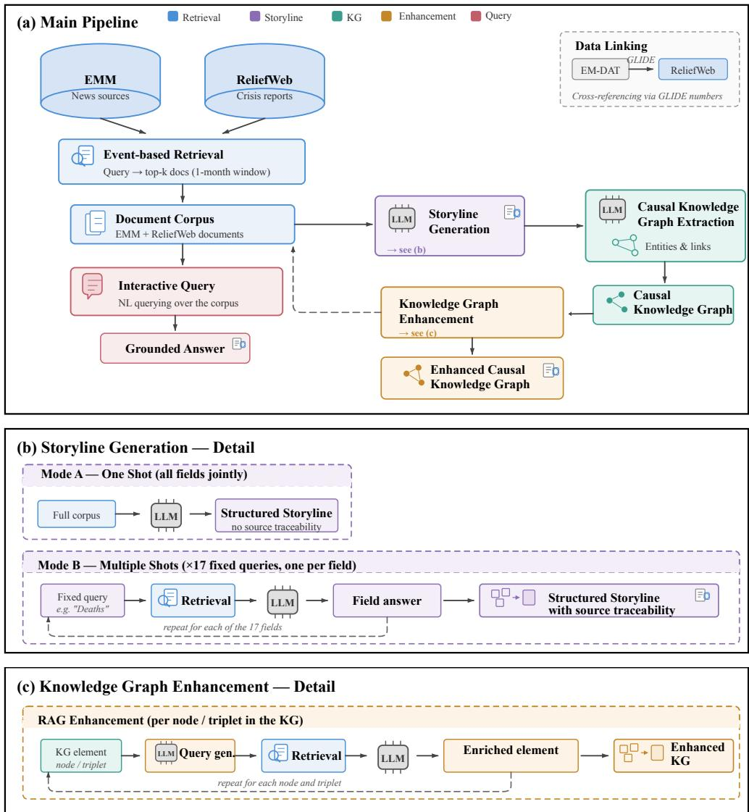
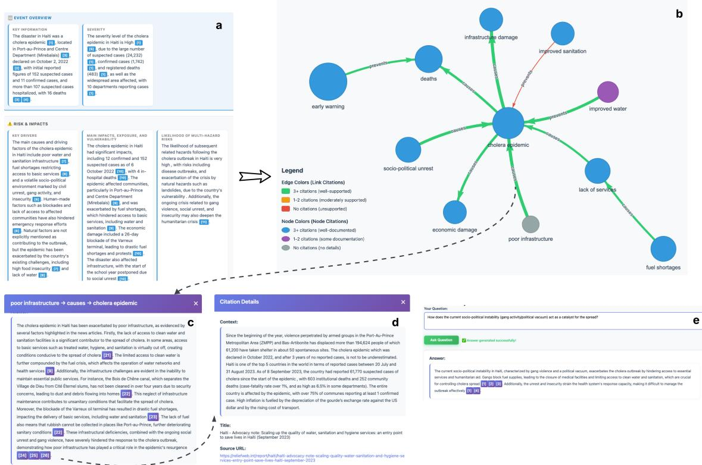
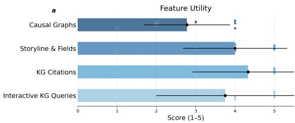
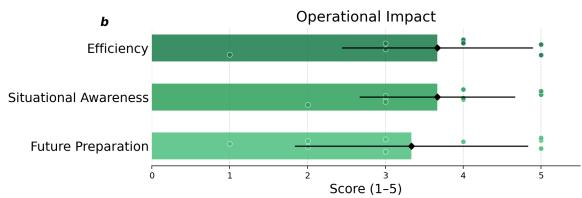
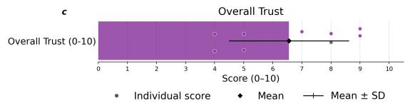

# Verifiable Disaster Storylines and Causal Knowledge Graphs: A Citation-Grounded Pipeline from Heterogeneous Humanitarian

Sources

Ivan Decostanzi   
ivan.decostanzi@isi.it   
ISI Foundation   
Turin, Italy

Christina Corbane christina.corbane@ec.europa.eu European Commission, Joint Research Centre (JRC) Ispra, Italy

Daria Mihaila daria.mihaila@ec.europa.eu European Commission, Joint Research Centre (JRC) Ispra, Italy

Yelena Mejova   
yelena.mejova@isi.it   
ISI Foundation   
Turin, Italy

Michele Ronco michele.ronco@ec.europa.eu European Commission, Joint Research Centre (JRC) Ispra, Italy

Lorenzo Bertolini lorenzo.bertolini@ec.europa.eu European Commission, Joint Research Centre (JRC) Ispra, Italy

Manuel Garcia-Herranz   
mherranz@unicef.org   
UNICEF   
New York, USA

Sergio Consoli sergio.consoli@ec.europa.eu European Commission, Joint Research Centre (JRC) Ispra, Italy

Indaco Biazzo indaco.biazzo@ec.europa.eu European Commission, Joint Research Centre (JRC) Ispra, Italy

Felix Schwebel   
fschwebel@unicef.org   
UNICEF   
New York, USA   
Kyriaki Kalimeri   
kyriaki.kalimeri@isi.it   
ISI Foundation & UNICEF   
Turin, Italy

## Abstract

Efective humanitarian response depends on the rapid synthesis of heterogeneous, high-volume information sources — a task that routinely exceeds human analytical capacity in the critical early hours of a crisis. We present a pipeline that combines structured disaster records from EM-DAT with unstructured documents from ReliefWeb and the European Media Monitor (EMM) to produce source-grounded disaster storylines and causal knowledge graphs supporting situational awareness for responders and analysts. Using Retrieval-Augmented Generation, the pipeline extracts structured storylines — tabular event profiles covering 17 fields, from severity and key drivers to child-sensitive impact indicators — and constructs causal knowledge graphs where each node and edge is enriched with citation-grounded explanatory narratives, enabling full traceability back to primary sources. We evaluate the system on three diverse crisis use cases through a human evaluation involving 9 domain expert and 9 non-expert evaluators. Results confirm high retrieval precision, strong faithfulness of extracted causal relations, and a clear expert preference for citation-grounded components over ungrounded alternatives. The pipeline is designed to scale to

the full EM-DAT catalogue, with the goal of publicly releasing a narrative-enriched version of the database.

## CCS Concepts

• Computing methodologies → Artificial intelligence; Natural language processing; • Information systems → Information extraction.

## Keywords

Disaster Risk Management, Retrieval-Augmented Generation, Knowledge Graphs, Situational Awareness, Humanitarian Response

## ACM Reference Format:

Ivan Decostanzi, Michele Ronco, Sergio Consoli, Christina Corbane, Lorenzo Bertolini, Indaco Biazzo, Daria Mihaila, Manuel Garcia-Herranz, Felix Schwebel, Yelena Mejova, and Kyriaki Kalimeri. 2026. Verifiable Disaster Storylines and Causal Knowledge Graphs: A Citation-Grounded Pipeline from Heterogeneous Humanitarian Sources. In International Conference on Information Technology for Social Good (GoodIT ’26), September 02–04, 2026, Pisa, Italy. ACM, New York, NY, USA, 9 pages. https://doi.org/10.1145/3794786.3830759

## 1 Introduction

In the immediate aftermath of a disaster, the ability to gather, synthesise, and act upon factual information is the diference between a coordinated response and a chaotic one. Disaster risk management (DRM) frameworks, utilised by entities such as the European Civil Protection and Humanitarian Aid Operations (ECHO), the

United Nations Ofice for the Coordination of Humanitarian Afairs (UNOCHA), and the International Federation of Red Cross and Red Crescent Societies (IFRC), rely heavily on secondary data sources — news reports, situational updates, and field observations — to identify relief priorities and allocate resources efectively. However, modern disaster response faces an information paradox: while data availability has increased exponentially, the high volume and velocity of unstructured textual information routinely exceed human analytical capacity [15]. Manually reviewing thousands of articles and reports to identify specific causal links — such as the relationship between a flood event and subsequent displacement or disruption of health services — is frequently intractable within the necessary operational timeframes. Standard disaster databases such as EM-DAT1, while globally recognised, record aggregate impact statistics and systematically exclude smaller-scale events that do not meet reporting thresholds [23], leaving significant gaps in situational awareness.

Complementary textual sources — news articles, field assessments, and humanitarian coordination documents — can fill these gaps by capturing qualitative and quantitative details on impacts, exposed populations, local vulnerabilities, and cascading efects that are often absent from conventional event catalogues [26]. When paired with Retrieval-Augmented Generation (RAG) [20], these unstructured sources can be transformed into coherent, factually anchored narratives. Knowledge graphs (KGs), which represent entities and their relationships as machine-readable triples, ofer a particularly efective formalism for organising the resulting in formation and enabling structured reasoning over it [5, 30, 33]. Recent work has demonstrated the viability of this approach across diverse hazard types: LLM-driven KG pipelines have been applied to earthquake emergency management [33], typhoon tracking [14], compound urban crises [11], and flood impact reporting [6, 23]. A convergent finding across these systems is that grounding LLM outputs in structured or retrieved knowledge — rather than relying on parametric memory alone — is essential for factual accuracy in highstakes operational contexts [5, 11, 33]. Broader surveys confirm both the momentum and the remaining challenges of deploying LLMs responsibly in humanitarian settings, stressing the need for human oversight, transparency, and explainability [19, 25, 31].

However, a persistent limitation of existing LLM-driven KG systems is that both generated narratives and graph elements are typically produced without explicit links to the source evidence from which they are derived. In high-stakes operational contexts — where every claim must be verifiable — this lack of traceability undermines user trust and limits practitioner adoption. Moreover, standard databases under-represent dimensions of particular con cern to humanitarian actors, including child-specific vulnerabilities such as displacement, casualties, and loss of access to education and health services [12, 16].

Our prior work [26] introduced a pipeline that constructs causal KGs from over 3,000 global disaster events by combining EM-DAT records with news articles from the European Media Monitor (EMM) 2 through RAG-based extraction. Concretely, given an EM-DAT event record — e.g., Flood, Pakistan, June 2023 — the system retrieves relevant news articles and synthesises them into a structured event profile, which we term a storyline: a fixed-schema tabular summary capturing dimensions such as severity, key drivers, and impacts on critical services. From this storyline, a causal knowledge graph is extracted, encoding the event’s dynamics as subject–predicate–object triples constrained to causes and prevents relations. The present paper extends this framework in several directions:

• Humanitarian reports integration and enriched evidence base: We incorporate ReliefWeb3 as a complementary source, linking EM-DAT events to ReliefWeb disaster records via GLIDE identifiers [2] and merging humanitarian field reports with news-derived documents. To our knowledge, this is the first pipeline to combine these two sources within an LLM-driven causal KG workflow.

• Full source traceability We introduce a Multi-Shot RAG strategy in which each storyline field is extracted through an independent retrieval-generation cycle, and a secondary validation step that generates explanatory text for every KG node and edge. Both mechanisms ground every output element in explicit citations to the underlying source documents, providing a verifiable audit trail that directly addresses concerns about transparency and explainability in automated DRM pipelines [25].

• Child-sensitive impact dimensions: The storyline extraction schema is expanded to cover child-specific indicators, including displacement, casualties, and loss of access to education and health services.

• Exploration platform: We provide an interactive dashboard enabling exploration and analysis of the enriched causal knowledge graphs, enhanced source-grounded storylines, and child-specific risk indicators. Additionally, users can interact with the underlying database through natural language queries.

• Rigorous multi-level evaluation: We conduct rigorous human evaluation — involving 18 independent annotators — across three diverse crisis use cases spanning public health, natural disaster, and armed conflict, including a citation-level assessment of precision and recall of the generated attributions.

All source code is publicly available,4 and an interactive dashboard for exploring storylines, knowledge graphs, and child-specific risk indicators is accessible at https://idecost.github.io/StoryLine\_ KG/Viewer. The remainder of this paper is organised as follows: Section 2 details the pipeline, Section 3 the evaluation protocol, Section 4 the results, and Section 5 discusses limitations and future directions.

## 2 Methods

This section details each component of the pipeline illustrated in Figure 1a, highlighting the extensions introduced relative to [26]. We begin with the integration of ReliefWeb as a complementary humanitarian data source (Section 2.1), then describe the expanded storyline extraction schema and the two generation strategies (Sec tion 2.2), the causal KG construction (Section 2.3), the citationgrounded validation layer (Section 2.4), and the natural language query interface (Section 2.5).

  
Figure 1: End-to-end pipeline for source-grounded disaster storyline and KG generation. (a) Main pipeline integrating EM-DAT, EMM, and ReliefWeb through RAG-based retrieval. (b) One-Shot vs. Multi-Shot storyline generation strategies. (c) Per-element RAG enhancement of the causal knowledge graph with citation-grounded narratives.

## 2.1 ReliefWeb Integration

To enrich the information available for each disaster event, we extend the document retrieval pipeline by incorporating humanitarian reports from ReliefWeb. This integration is motivated by the complementary nature of ReliefWeb’s content, which aggregates situation reports, assessments, and humanitarian coordination documents. These sources often capture operational details and granular field data absent from news-based channels, thereby providing a more comprehensive operational picture of each disaster.

Consistent with the RAG paradigm, where model performance is enhanced by surfacing relevant external context, we align ReliefWeb data with our existing event-based structure. To link events across the two databases, we rely on GLIDE numbers [2], a standardized disaster identification system jointly developed by ADRC, CRED, OCHA/ReliefWeb, and UNDRR. This system assigns a unique structured code to each disaster, enabling unambiguous cross-referencing across humanitarian data systems. Each EM-DAT event is matched to its corresponding ReliefWeb disaster record using this identifier.

The full set ofextracted text is then embedded using the BAAI/bgem3 model [22], with a chunking strategy of four sentences per chunk and a one-sentence overlap. Candidate chunks are ranked by relevance using BAAI/bge-reranker-v2-m3 [22], and the top 15 chunks are retained. These ReliefWeb-derived documents are merged with the document set retrieved from EMM, collectively forming the updated evidence base for all downstream tasks.

## 2.2 Storyline Generation

As illustrated in Figure 1a, the first analytical stage of the pipeline transforms the document corpus into a structured storyline: a set of 17 fields that capture the key dimensions of a disaster event. These fields span standard impact indicators — damage analytics, event mapping, vital service continuity, and contextual threat assessments — as defined by established humanitarian frameworks [1, 12]. Compared to [26], we expand the extraction schema to include child-specific indicators covering casualties, displacement, and loss of access to education and health services, a dimension that remains systematically underreported in standard disaster databases [16]. The complete list of fields is provided in Table 1. Not all fields are necessarily populated for every event, as their availability depends on the completeness and detail of the underlying source documents. If no information is available for a given field, it is left as ’Unknown’.

We implement two alternative strategies for generating storylines, detailed in Figure 1b. They share the same extraction schema and the same underlying model (Meta-Llama-3-70B-Instruct [10]), but difer in how the document corpus is presented to the model and, crucially, in whether the outputs are traceable to their source evidence.

2.2.1 One-Shot Approach. The One-shot approach serves as the baseline in our evaluation. All documents retrieved for a given event are provided to the model as a single context block, and the 17 storyline fields are extracted jointly in one generation step (Figure 1b, Mode A). This strategy is straightforward and eficient, as it requires a single model invocation per event. However, because all fields are produced in a single pass over the full corpus, there is no mechanism to trace individual outputs back to their supporting passages.

2.2.2 Multi-Shot Approach (RAG). To address the traceability limitation of the One-shot strategy, we introduce the Multi-shot approach (Figure 1b, Mode B). Rather than extracting all fields at once, each of the 17 storyline fields is treated as an independent information need. For each field, a fixed natural language query is formulated. This query is used to retrieve the most relevant passages from the unified document corpus via the RAG infrastructure (BGE-M3 embeddings and BGE-Reranker [22]). The model then generates the field value based on the retrieved passages, and the supporting source documents are recorded alongside the output.

Table 1: Storyline extraction elements grouped by category.
<table><tr><td>Category</td><td>Elements</td></tr><tr><td>Assessment</td><td>Hazard Profile &amp; Risk Key information; Severity; Key drivers; Main impacts, exposure, and vulnerability; Likelihood of multi-hazard</td></tr><tr><td>tional Context</td><td>risks Temporal &amp; Situa- Temporal details; Phase classification; Non-events</td></tr><tr><td></td><td>Children &amp; Education Impact on children; Impact on schools</td></tr><tr><td>Impact</td><td>Critical Services Dis- Health facilities disrupted; Water and sanitation access</td></tr><tr><td>ruption</td><td>disrupted Risk Governance &amp; Best practices for managing this risk</td></tr><tr><td>Best Practices Recovery &amp; Response</td><td>Recommendations and supportive measures for recov-</td></tr><tr><td>Source Assessment</td><td>ery Source type; Confidence level of information; Potential reporting bias</td></tr></table>

This decomposition yields two advantages. First, by narrowing the retrieval scope to a single information need at a time, the model receives more focused context for each field, reducing the risk that relevant details are overlooked or conflated within long input sequences. Second, each output element is naturally accompanied by explicit references to the source passages that support it, enabling full traceability from the structured storyline back to the original EMM and ReliefWeb documents. The 17 individually grounded fields are then assembled into a complete structured storyline with source attribution.

A comparative evaluation of the One-shot and Multi-shot approaches is presented in Section 3, where human annotators assess both factual accuracy and the perceived value of source attribution.

## 2.3 Causal Knowledge Graph Construction

The generated storyline, produced by either the One-shot or the Multi-shot approach, serves as input for the construction of a causal knowledge graph, following the text-to-graph methodology in [26] (Figure 1a, Causal Knowledge Graph Extraction). By construction, graph elements — nodes and triplets — are compact abstractions detached from the textual evidence from which they originate. While their accuracy can be assessed through manual inspection against the source documents, as demonstrated in the evaluation of[26] and in Section 4, this process is labour-intensive and does not scale to the thousands of elements produced across a large event catalogue. To address this, we introduce an automated citation-grounded validation layer (Section 2.4) that enriches every KG element with explanatory text and explicit source references, enabling practitioners to verify the factual basis of each node and edge without revisiting the full document corpus.

## 2.4 Citation-Grounded KG Validation

Our validation approach follows the “attribute-then-generate” paradigm [24, 29], adapted to the KG setting drawing on LLM-based fact verification methods [13, 28, 32]. As illustrated in Figure 1c, the framework operates as a secondary RAG-based pipeline applied independently to every node and triplet in the KG. For each element, the process proceeds in three steps:

(1) Query formulation. The LLM converts the KG element — a node label or a subject–predicate–object triplet — into a natural language question designed to retrieve supporting evidence. Unlike the Multi-shot storyline generation, where queries are fixed and predefined, here they are generated dynamically, since KG elements emerge from the extraction process and cannot be anticipated in advance (e.g., a node labelled “infrastructure damage” might yield the query “What infrastructure was damaged during the event?”).

(2) Grounded retrieval. The generated query is executed against the unified embedding space containing both ReliefWeb and EMM documents, using the same BGE-M3 and BGE-Reranker models employed throughout the pipeline.

(3) Narrative synthesis. The retrieved passages are used to generate a concise explanatory narrative that contextualises the graph element within the broader disaster account, rather than leaving it as an isolated structural statement.

Each generated narrative is accompanied by explicit citations to the source documents and their metadata, producing the Enhanced Causal Knowledge Graph shown in Figure 1a. This audit trail allows practitioners to verify whether each node and relationship is factually supported by oficial sources, directly mitigating the propagation of hallucinated content through the knowledge graph. An example of the output is presented in Figure 2(b,c,d).

## 2.5 Natural Language Database Interaction

The structured outputs described above — storylines and knowledge graphs — capture the information the pipeline is designed to extract. However, users may have questions that fall outside the scope of the predefined 17 fields or the graph structure, such as crossevent comparisons or queries about contextual factors not covered by the extraction schema. To support such exploratory analysis, we provide a natural language query interface to the underlying database. Users can formulate free-text questions about disaster events, impacts, and contextual factors. Each question is translated into a structured database query by the LLM, executed against the stored records, and the resulting answer is supported by retrieved textual evidence when available, ensuring that responses remain grounded in the source material. This functionality enables nontechnical stakeholders — including field coordinators and policy analysts — to discover event-level details and cross-event patterns that may not surface through the structured pipeline outputs alone.

## 3 Evaluation

This section presents the evaluation of the pipeline across multiple dimensions. We describe the three crisis use cases selected for assessment (Section 3.1), as well as the employed human evaluation protocol (Section 3.2). The pipeline outputs — including the causal knowledge graphs, source-grounded storylines, and risk indicators — are publicly accessible through an interactive exploration dashboard at https://idecost.github.io/StoryLine\_KG/Viewer/, which showcases a set of precomputed humanitarian events alongside the three use cases employed in this evaluation.

## 3.1 Use Cases

We evaluate the pipeline on three events spanning distinct humanitarian crisis typologies: a public health emergency, a sudden-onset natural disaster, and a protracted conflict. The cases were selected for their humanitarian significance, the richness of their documentation across EM-DAT and ReliefWeb, and their diversity along dimensions relevant to pipeline performance — geographic context, temporal dynamics, and reporting density.

Event 1 — Haiti Cholera Outbreak (2022). The resurgence of cholera in Haiti in October 2022 occurred against a backdrop of political instability, gang violence disrupting aid delivery, and collapsed water and sanitation infrastructure5. The outbreak spread to all ten departments, resulting in tens of thousands of suspected cases, with children under five disproportionately afected. Its multicausal nature — intersecting public health, governance failure, and conflict — makes it a demanding test of the pipeline’s ability to extract complex causal chains.

Event 2 —Hurricane Melissa, Dominican Republic (2025). Hurricane Melissa6 caused widespread displacement and infrastructure damage across the Caribbean in late 2025. We focus on the Dominican Republic, where the storm disrupted roads, schools, and health facilities across southern and eastern regions. The event is well-documented through OCHA and Dominican Civil Defence situation reports on ReliefWeb, providing a strong reference for evaluating KG faithfulness. Its rapid-onset, geographically bounded character ofers a useful contrast to the other two cases.

Event 3 — Syria Conflict Escalation (Late 2024). The armed conflict escalation beginning in November 2024 — culminating in the fall of Aleppo and the collapse of the Assad government — triggered the displacement of over one million people within weeks, alongside widespread destruction of civilian infrastructure and acute food insecurity7. As the most information-dense and structurally complex of the three cases, it tests the pipeline’s capacity to handle rapidly evolving conflict settings with fragmented and heterogeneous source material.

## 3.2 Human Evaluation

We conduct an extensive human evaluation of the full pipeline across the three use cases. The evaluation is carried out by 18 independent annotators — 9 domain experts and 9 non-experts — none of whom are afiliated with the project or have conflicts of interest. Each evaluated item has been judged by nine diferent annotators. To assess the reliability of the collected annotations, we compute multiple complementary agreement measures. As the primary measure, we report Krippendorf’s � [17], a standard metric for multi-annotator settings that accommodates ordinal scales and missing data. We additionally compute Fleiss’ � as a crosscheck; consistent with the literature [34], we find that Fleiss’ � yields values very close to Krippendorf’s � across all tasks, and therefore do not report it separately. We also compute, for each pair of annotators, the raw percentage agreement and the Prevalence-Adjusted Bias-Adjusted Kappa (PABAK) [4], a variant of Cohen’s � that corrects for prevalence and response-bias artefacts, and report the mean values across all annotator pairs. In summary, we report Krippendorf’s �, mean pairwise percentage agreement, and mean pairwise PABAK as our agreement measures.

Diferent evaluation stages, detailed in the following, are assigned to the most appropriate annotator profile: non-experts assess retrieval quality, KG text quality, and citation quality as these tasks require no domain-specific knowledge; experts evaluate storyline quality, KG faithfulness, and the overall system through the interactive dashboard.

Retrieval Quality. While automatic RAG evaluation frameworks exist [8, 27], their application to the humanitarian domain remains largely unexplored. We therefore perform a precision-oriented human assessment: for each retrieved chunk (from ReliefWeb or EMM), non-expert annotators judge (a) relevance — whether the paragraph refers to the specific target disaster, mentioning the correct location, timeframe, or hazard type — and (b) informativeness — whether it contains concrete facts or analysis, as opposed to boilerplate, fragments, or garbled text.

  
Figure 2: Example output for the Haiti cholera case study. (a) Excerpt of the generated storyline with inline citations. (b) Causal knowledge graph derived from the storyline. (c) Source-grounded narrative associated with a selected edge. (d) Citation detail popup showing the retrieved source passage. (e) RAG-based Q&A answering a user query beyond the scope of the storyline and knowledge graph.

Storyline Quality. Domain experts compare the two storyline generation approaches — One-shot and Multi-shot — on a field-by-field basis across the 17 categories in Table 1. For each field, evaluators select one of the options: One-shot is better, Multi-shot is better, or Cannot tell. Additionally, evaluators provide an overall quality rating for each storyline on a 1–5 Likert scale. This design enables fine-grained analysis of which information categories benefit from each approach, as well as a holistic assessment of the two generation strategies.

Knowledge Graph Text Quality. For the explanatory texts generated for each KG node and link (Section 2.4), non-expert annotators evaluate two independent dimensions. Relevance: whether the gen erated text discusses the correct concept (for nodes) or the correct relationship between source and target (for links), as opposed to being of-topic or addressing unrelated concepts. Informativeness: whether the text provides concrete, useful information about the disaster event, rated on a three-point scale — very informative (rich in facts, figures, or details), quite informative (some useful content but limited in depth), or not informative (empty, boilerplate, or tautological). Nodes and links are assessed in separate sub-tasks.

Knowledge Graph Faithfulness. Following [26], domain experts evaluate whether the extracted triples are supported by the storyline from which they are derived. Each triple (Source → Relation → Target) is classified as: Fully supported (explicitly stated), Partially supported (one entity or an implicit relation is present), Not present, or Cannot determine.

Citation Quality. We additionally assess the citations attached to storyline fields (Section 2.2.2) and to KG node and link narratives (Section 2.4), adopting the citation recall and citation precision definitions established in prior work [7, 9]. Given a generated text composed of statements $s _ { 1 } , \ldots , s _ { n } ,$ where each �� cites a set of passages $C _ { i } = \{ c _ { i , 1 } , c _ { i , 2 } , . . . \}$ , citation recall evaluates whether �� is supported by $C _ { i }$ as a whole, while citation precision evaluates whether each individual citation $c _ { i , j }$ is relevant to $s _ { i } ;$ the two coincide when a statement carries a single citation. Non-expert annotators judge both dimensions on a three-point scale — fully supports, partially supports, does not support — applied to the individual citation (precision) or to the citation set (recall).

Expert System Assessment. Finally, domain experts interact with the full exploration dashboard — including the knowledge graph visualisation, source-grounded storylines, and the natural language database interface (Section 2.5) — and provide a holistic evaluation of the system. Following established usability assessment practices [3, 26], experts respond to structured questions covering the perceived usefulness of individual components, the utility of the system for humanitarian workflows, and overall trust in the generated outputs. Responses are collected on a five-point Likert scale, except for overall trust which is rated on a 0–10 scale.

## 4 Evaluation Results

All agreement metrics are computed pooling annotations across the three events; per-event breakdowns are available upon request. Each task is assessed by all 9 annotators of the relevant profile.

A recurring pattern across tasks is that Krippendorf’s � remains modest, while mean pairwise percentage agreement and PABAK are considerably higher. This is expected given the strong label imbalance present in most tasks—for instance, the large majority of retrieved paragraphs are judged relevant, and most KG texts are rated as relevant to their concept. As discussed in Section 3.2, both �- and �-family statistics are known to be deflated under such prevalence conditions [21], making PABAK and raw percentage agreement more informative indicators of true annotator consistency in this setting.

Retrieval Quality. A total of 110 paragraphs are evaluated across the three events. For relevance, annotators reach 83.1% mean pairwise agreement $( \mathrm { P A B A K } = 0 . 6 6 2$ , Krippendorf’ $\mathrm { ~ ; ~ } \alpha = 0 . 3 0 5$ , fair agreement [18]). On average, $8 5 . 8 \pm 4 . 7 \%$ of retrieved paragraphs are judged relevant to the target event, confirming the high precision of the retrieval stage. For informativeness, agreement is somewhat lower (67.2% mean pairwise, $\mathrm { P A B A K } = 0 . 3 4 4 , \alpha = 0 . 1 8 7$ , fair), reflecting the greater subjectivity of distinguishing substantive content from boilerplate; $7 2 . 0 \pm 1 5 .$ .1% ofparagraphs are nonetheless deemed meaningful.

Storyline Quality. A total of 51 field comparisons are evaluated across the three events (17 fields per event). For each field, evaluators choose Multi-shot is better, One-shot is better, or Cannot tell; they additionally rate each storyline as a whole on a 1–5 scale. Agreement on this task is substantially lower than on retrieval and KG quality: pooled across all three events, annotators reach only 51.6% mean pairwise agreement $( \mathrm { P A B A K } = 0 . 0 3 3$ , Krippendorf’s $\alpha = 0 . 0 9 7$ , slight agreement), reflecting the inherent subjectivity of comparing narrative outputs.

Results vary considerably across events. For Event 1, the Multishot storyline is preferred in $6 2 . 7 \pm 9 . 0 \%$ of fields, One-shot in $1 9 . 6 \pm 6 . 8 \%$ , and $1 7 . 6 \pm 5 . 9 \%$ are judged Cannot tell. Event 3 shows a similar pattern with a stronger preference for Multi-shot (68.6 ± $9 . 0 \% \mathrm { v s . } 2 3 . 5 \pm 1 7 . 6 \% )$ . Event 2 diverges markedly, driven by sharp annotator disagreement—one expert preferred Multi-shot in 94.1% of fields while another preferred One-shot in 58.8%. Overall, the Multi-shot storyline is preferred in $6 2 . 1 \pm 2 0 . 0 \%$ of fields, One-shot in $2 6 . 1 \pm 1 9 . 5 \% $ , and $1 1 . 8 \pm 9 . 3 \%$ are judged Cannot tell.

Overall quality ratings confirm a mild preference for the Multishot approach. Multi-shot receives a mean rating of $3 . 6 7 \pm 0 . 7 1$ out of 5 across all nine annotators, compared to $2 . 7 8 \pm 0 . 8 3$ for Oneshot, and seven out of nine annotators express an overall preference for Multi-shot. Annotators consistently value the source citations present in Multi-shot storylines, deemed essential for verifiability, though some fields are better served by the more concise One-shot output.

Knowledge Graph Text Quality. A total of 35 node texts and 28 link texts are evaluated. For KG node texts, $9 4 . 0 \pm 2 . 7 \%$ of node texts are judged relevant to their concept (mean pairwise agreement 90.8%, $\mathrm { P A B A K } = 0 . 8 1 6 , \alpha = 0 . 1 9 0 )$ . The low � relative to the high percentage agreement is consistent with the near-ceiling label distribution. Informativeness agreement is more moderate (60.0% mean pairwise, PABAK = 0.200, � = 0.302, fair); $8 9 . 6 \pm 6 .$ 3% of node texts are rated at least quite $\mathrm { i n f o r m a t i v e } { - 3 5 . 6 \pm 1 3 . 2 \% }$ very informative and 54 $. 0 \pm 9 . 0 \%$ quite informative—while only $1 0 . 5 \pm 8 . 1 \%$ are rated not informative. The high standard deviations on the two positive categories suggest that disagreement concentrates on the boundary between very and quite informative rather than on whether a text is informative at all.

For KG link texts, relevance follows a similar pattern $( 9 2 . 3 \pm$ 4.9% judged relevant; mean pairwise agreement 88.6%, PABAK = $0 . 7 7 1 , \alpha = 0 . 2 0 1$ , fair). Informativeness agreement is lower (55.5% mean pairwise, PABAK = 0.109, � = 0.174, slight), reflecting the inherent dificulty of assessing the informational depth of short relational descriptions; $9 4 . 4 \pm 9 . 5 \%$ of link texts are rated at least quite informative—54.4 ± 14.1% very informative and $4 0 . 1 \pm 1 4 . 6 \%$ quite informative—while only $5 . 6 \pm 5 . 1 \%$ are rated not informative. As with node texts, the high variability across annotators on the two positive categories confirms that the distinction between very and quite informative is inherently subjective.

Knowledge Graph Faithfulness. A total of 28 triples are assessed across the three events, with no substantial variation observed across individual disasters. Overall, 86.7% of triples are judged as supported by the storyline—56.1 ± 26.5% fully supported and $3 0 . 6 \pm 2 0 . 7 \%$ partially supported—while only $9 . 2 \pm 9 . 4 \%$ are rated as not present and $4 . 2 \pm 1 2 . 5 \%$ as cannot determine. These results confirm that the large majority of automatically extracted causal relations are grounded in the generated narrative. Inter-annotator agreement is modest (Krippendorf’s $\alpha = 0 . 2 2 2$ , mean pairwise agreement = 54.2%, PABAK = 0.083). As in previous tasks, disagreement concentrates on the boundary between the two positive categories rather than on whether a triple is supported at all.

Citation Quality. A total of 391 unique citations and 261 claims are assessed across 70 items and the three events. Pooled over all components, 91.7% of citations are at least partially relevant to the statement they support (79.3% relevant, 12.4% partially relevant; Krippendorf’s $\alpha = 0 . 5 1 5$ , mean pairwise agreement = 77.4%, $\mathrm { P A B A K } = 0 . 6 6 2 )$ , and 93.5% of claims are at least partially supported by their citation set (87.1% supported, 6.4% partially supported; $\alpha = 0 . 4 6 5$ , mean pairwise agreement = 86.4%, $\mathrm { P A B A K } = 0 . 7 9 6 )$ . Performance is uneven across components: KG node and link citations are consistently reliable (95.7% and 92.6% at least partially relevant; 99.1% and 98.4% of claims at least partially supported), whereas storyline citations show substantially more variability (71.7% and 65.4%, respectively). This appears to stem from over-citation: in the storyline the model attaches citations even when it lacks the evidence to answer, so short fields often carry several irrelevant sources. This reluctance to abstain deserves dedicated investigation, as citation errors disproportionately afect trust in this domain.

Expert System Assessment. Nine domain experts interact with the exploration dashboard and, as described in the following, they provide holistic evaluations across three dimensions: feature utility, operational impact, and overall trust.

  
Figure 3: Expert evaluation results from 9 domain experts. (a) Feature utility scores (1–5 scale) for the four main components of the dashboard: causal graphs, storyline fields, knowledge graph citations, and interactive KG queries. (b) Perceived operational impact (1–5 scale) across 3 dimensions: eficiency in crisis analysis workflows, enhancement of situational awareness, and usefulness for future disaster preparation. (c) Overall trust in the system, rated on a 0–10 scale.

For assessing the feature utility dimension, experts rated the perceived usefulness of each individual component of the pipeline on a 1–5 Likert scale (Figure 3a). The highest-rated components are KG Citations $( M \ = \ 4 . 3 3 , \ : S D \ = \ 1 . 4 1 )$ and Storyline & Fields $( M = 4 . 0 0 , S D = 1 . 3 2 )$ , indicating that experts find the most value in the structured narrative summaries and in the source-grounded textual descriptions attached to knowledge graph elements. Interactive KG Queries receive a moderately positive rating $( M = 3 . 7 5$ $S D = 1 . 7 5 , N = 8 )$ , though the high standard deviation signals polarised opinions—some experts appreciate the exploratory capability while others find it less intuitive. Notably, Causal Graphs receive the lowest rating $( M = 2 . 7 8 , S D = 1 . 0 9 )$ , suggesting that the automatically extracted causal structures are not yet perceived as suficiently reliable or actionable by domain practitioners. This is consistent with Ronco et al. [26], where the usefulness of knowl edge graphs was similarly rated as only “somewhat useful” by most evaluators. It is precisely this limitation that motivated the design choice, introduced here, of enriching each KG node and link with automatically generated textual descriptions grounded in source citations (Section 2.4). The efectiveness of this strategy is reflected in the markedly higher ratings received by KG Citations, the highest-scored component in the evaluation, suggesting that anchoring graph elements to retrievable, source-backed explanations substantially increases their perceived value and compensates for the interpretability limitations of the bare graph structure.

For the operational impact dimension, experts rated the system’s potential contribution to humanitarian workflows, providing moderately positive scores across all three features. Eficiency and Situational Awareness both receive a mean of 3.67 $( S D = 1 . 2 2$ and 1.00 respectively), indicating that experts see tangible potential for the system to accelerate information synthesis and support a more comprehensive understanding of evolving crises. Future Preparation is rated slightly lower $( M = 3 . 3 3 , S D = 1 . 5 0 )$ , with the higher variance reflecting uncertainty about whether the system’s outputs—derived primarily from past and ongoing events—can efectively inform preparedness for future disasters. The consistent placement of all three features above the scale midpoint is encouraging, though the moderate absolute values suggest that the system is viewed as a promising complement to, rather than a replacement for, existing analytical workflows.

Finally, experts assessed overall trust in the system, yielding a mean of 6.56 (SD=2.06) on a 0–10 scale (Figure 3c), with all individual ratings falling within the 4–9 range. While these scores indicate adequate rather than high trust, they are encouraging for a fully automated pipeline requiring no human intervention and it is coherent with the positive trends reported across preceding evaluation dimensions. The spread of ratings reflects diverse expert expectations: residual reservations concentrate on causal graph quality and factual inconsistencies in storyline generation. The lowest score (4/10) is particularly instructive — the evaluator independently traced citations back to their original sources and found discrepancies between the reported information and the cited documents. Although such errors were infrequent, this case illustrates how even isolated citation inaccuracies can disproportionately erode trust in high-stakes humanitarian contexts, where every claim is expected to be verifiable.

## 5 Discussion and Conclusion

We presented an end-to-end pipeline for generating source-grounded disaster storylines and causal knowledge graphs from heterogeneous humanitarian sources, integrating ReliefWeb as a complementary evidence base, a Multi-Shot RAG strategy with full source traceability, a citation-grounded validation layer for every KG element, and child-sensitive impact dimensions. Evaluation across three diverse crisis use cases involving 18 independent annotators confirms the pipeline’s efectiveness: 85.8% retrieval precision, 86.7% of causal triples grounded in source material, and an overall expert trust of 6.56 out of 10. Citation-grounded components received the highest utility ratings $\scriptstyle ( M = 4 . 3 3 )$ , validating the design choice of anchoring graph elements to retrievable source evidence. Experts highlighted the tool’s potential for rapid situational overview, crossagency comparison of reported figures, and preliminary impact assessment. The evaluation also surfaces clear limitations, which map onto our future work. Causal graphs received the lowest utility rating $\left( M { = } 2 . 7 8 \right)$ , perceived as oversimplified and potentially misleading without human validation, calling for refined graph complexity and confidence ranges flagging inter-source disagreement. The absence of temporal provenance was identified as a critical gap — storylines lack timestamps showing when figures were reported and how they evolved — motivating timestamped provenance with cross-source reconciliation. Experts further asked for sector-aligned structuring consistent with the humanitarian cluster system and for ingesting user-supplied or restricted-access documents.

Finally, storyline citations proved markedly less reliable than KG ones (71.7% vs. above 92%), as the model keeps citing even when it lacks the evidence to answer — a behaviour that explicit abstention could mitigate.

On the operational side, we plan to run the pipeline over the full EM-DAT catalogue and publicly release the resulting dataset: a source-grounded (EMM and ReliefWeb), narrative-enriched version of EM-DAT ofering contextual detail beyond the aggregate statistics currently available per event.

## Acknowledgments

The European Union owns the copyright of this work. © European Union, 2026.

The authors acknowledge support from the Lagrange Project of the ISI Foundation, funded by Fondazione CRT

## References

[1] Amina Aitsi-Selmi, Shinichi Egawa, Hiroyuki Sasaki, Chadia Wannous, and Virginia Murray. 2015. The Sendai framework for disaster risk reduction: Renewing the global commitment to people’s resilience, health, and well-being. International journal ofdisaster risk science 6, 2 (2015), 164–176.

[2] Asian Disaster Reduction Center. 2024. GLobal IDEntifier Number (GLIDE). https://glidenumber.net/glide/public/search/search.jsp. Accessed: 2024-05-22.

[3] John Brooke. [n. d.]. SUS - A Quick and Dirty Usability Scale. ([n. d.]).

[4] Ted Byrt, Janet Bishop, and John B Carlin. 1993. Bias, prevalence and kappa. Journal ofclinical epidemiology 46, 5 (1993), 423–429.

[5] Minze Chen, Zhenxiang Tao, Weitong Tang, Tingxin Qin, Rui Yang, and Chunli Zhu. 2024. Enhancing emergency decision-making with knowl edge graphs and large language models. International Journal of Disaster Risk Reduction 113, 104804 (2024). doi:10.1016/j.ijdrr.2024.104804 \_eprint: https://www.sciencedirect.com/science/article/pii/S2212420924005661.

[6] Grace Colverd, Paul Darm, Leonard Silverberg, and Noah Kasmanof. 2023. Flood-Brain: Flood Disaster Reporting by Web-based Retrieval Augmented Generation with an LLM. In 6th Workshop on Artificial IntelligenceforHumanitarian Assistance and Disaster Response (NeurIPS 2023). https://arxiv.org/pdf/2311.02597

[7] Ivan Decostanzi, Yelena Mejova, and Kyriaki Kalimeri. 2025. A Large-Language-Model Framework for Automated Humanitarian Situation Reporting. arXiv preprint arXiv:2512.19475 (2025).

[8] Shahul Es, Jithin James, Luis Espinosa Anke, and Steven Schockaert. 2024. RAGAs: Automated Evaluation of Retrieval Augmented Generation. In Proceedings ofthe 18th Conference ofthe European Chapter ofthe Association for Computational Linguistics: System Demonstrations, Nikolaos Aletras and Orphee De Clercq (Eds.). Association for Computational Linguistics, St. Julians, Malta, 150–158. doi:10. 18653/v1/2024.eacl-demo.16

[9] Tianyu Gao, Howard Yen, Jiatong Yu, and Danqi Chen. 2023. Enabling large lan guage models to generate text with citations. In Proceedings ofthe 2023 Conference on Empirical Methods in Natural Language Processing. 6465–6488.

[10] Aaron Grattafiori, Abhimanyu Dubey, AbhinavJauhri, Abhinav Pandey, Abhishek Kadian, Ahmad Al-Dahle, Aiesha Letman, Akhil Mathur, Alan Schelten, Alex Vaughan, et al. 2024. The llama 3 herd of models. arXiv preprint arXiv:2407.21783 (2024).

[11] Haiyan Hao, Xiaorui Chen, Yudi Chen, and Nan Li. 2025. Uncovering compound urban crises with large language model-assisted knowledge graph construction. International Journal of Disaster Risk Reduction 127, 105669 (2025). doi:10.1016/j.ijdrr.2025.105669 \_eprint: https://www.sciencedirect.com/science/article/pii/S2212420925004935.

[12] Laura Hasbini, Luca G. Severino, Mariana Madruga De Brito, Gabriela C. Gesualdo, Ana Maria Rotaru, David N. Bresch, Evelyn Mühlhofer, Jingxian Wang, and Taís Maria Nunes Carvalho. 2026. A database of disaster impacts in the Globa South using Red Cross reports and Large Language Models. doi:10.21203/rs.3.rs-8778674/v1

[13] Elwin Huaman, Elias Kärle, and Dieter Fensel. 2020. Knowledge Graph Validation. doi:10.48550/arXiv.2005.01389 arXiv:2005.01389 [cs].

[14] Yi Huang, Yongqi Xia, Ran Tao, Donglai Jiao, Xiangqiang Min, Jieying Zheng, Yuting Jiang, Wenjun Wu, and Peijun Du. 2026. A LLM-based agent for the construction of typhoon knowledge graphs. Environmental Modelling & Software 197, 106856 (2026). doi:10.1016/j.envsoft.2026.106856

[15] Muhammad Imran et al. 2020. Using AI and Social Media Multimodal Content for Disaster Response and Management. Information Processing & Management (2020).

[16] A. Kadir, Amy J Stevens, Emi A Takahashi, and S. Lal. 2025. Child public health indicators for fragile, conflict-afected, and vulnerable settings: A scoping review. PLOS Global Public Health 5 (2025). doi:10.1371/journal.pgph.0003843

[17] Klaus Krippendorf. 2011. Computing Krippendorf’s alpha-reliability. (2011)

[18] Klaus Krippendorf. 2019. Content Analysis: An Introduction to Its Methodology - Fourth Edition. SAGE Publications, Thousand Oaks, California. doi:10.4135/ 9781071878781

[19] Zhenyu Lei, Yushun Dong, Weiyu Li, Rong Ding, Qi R. Wang, and Jundong Li. 2025. Harnessing Large Language Models for Disaster Management: A Survey. In Findings of the Association for Computational Linguistics: ACL 2025, Wanxiang Che, Joyce Nabende, Ekaterina Shutova, and Mohammad Taher Pilehvar (Eds.). Association for Computational Linguistics, Vienna, Austria, 14528–14551. doi:10. 18653/v1/2025.findings-acl.750

[20] Patrick Lewis, Ethan Perez, Aleksandra Piktus, Fabio Petroni, Vladimir Karpukhin, Naman Goyal, Heinrich Küttler, Mike Lewis, Wen tau Yih, Tim Rocktäschel, Sebastian Riedel, and Douwe Kiela. 2021. Retrieval-Augmented Generation fo Knowledge-Intensive NLP Tasks. arXiv:2005.11401 [cs.CL] https://arxiv.org/abs/ 2005.11401

[21] Giacomo Marzi, Marco Balzano, and Davide Marchiori. 2024. K-Alpha Calculator–Krippendorf’s Alpha Calculator: A user-friendly tool for computing Krippendorf’s Alpha inter-rater reliability coeficient. MethodsX 12 (2024). doi:10.1016/j.mex.2023.102545

[22] Multi-Linguality Multi-Functionality Multi-Granularity. 2024. M3-Embedding: Multi-linguality, multi-functionality, multi-granularity text embeddings through self-knowledge distillation. arXiv preprint arXiv:2402.03216 (2024).

[23] M. Puime Pedra, S. Elkady, F.M. Villar-Rosety, et al. 2026. From headlines to databases: leveraging LLMs for structured disaster event extraction. International Journal ofData Science and Analytics 22 (2026), 65. doi:10.1007/s41060-025-01017- 1

[24] Haosheng Qian, Yixing Fan, Ruqing Zhang, and Jiafeng Guo. 2024. On the Capacity of Citation Generation by Large Language Models. In China Conference on Information Retrieval. Springer, 109–123.

[25] Kasra Rafiezadeh Shahi, Monique M. Kuglitsch, Jean Baptiste Bove, Michele Ronco, Pedram Ghamisi, Yao Sun, Gabriella Duca, Maria Vittoria Gargiulo, Anna Berlin, Juha-Pekka Jäpölä, Félix Pharand-Deschênes, Bruce D. Malamud, Boris Sakschewski, Johan Rockstrom, and Heidi Kreibich. 2026. Governing Generative AI in Disaster Risk Management. (2026). https://doi.org/10.31223/X5HJ2B Preprint, version 2.

[26] Michele Ronco, Luca Bandelli, Lorenzo Bertolini, Sergio Consoli, Damien Delforge, Alessio Spadaro, Marco Verile, and Christina Corbane. 2026. Disaster Storylines and Knowledge Graphs from Global News with Large Language Models and Retrieval-Augmented Generation. Scientific Data (March 2026). doi:10.1038/s41597-026-07036-2

[27] Alireza Salemi and Hamed Zamani. 2024. Evaluating Retrieval Quality in Retrieval-Augmented Generation. arXiv:2404.13781 [cs] doi:10.48550/arXiv.2404. 13781

[28] Farzad Shami, Stefano Marchesin, and Gianmaria Silvello. 2025. Fact Verification in Knowledge Graphs Using LLMs. In Proceedings ofthe 48th International ACM SIGIR Conference on Research and Development in Information Retrieval (SIGIR ’25). Association for Computing Machinery, New York, NY, USA, 3985–3989. doi:10.1145/3726302.3730142

[29] Aviv Slobodkin, Eran Hirsch, Arie Cattan, Tal Schuster, and Ido Dagan. 2024. Attribute first, then generate: Locally-attributable grounded text generation. arXiv preprint arXiv:2403.17104 (2024).

[30] Jose María Tárraga, Eva Sevillano-Marco, Jordi Muñoz-Marí, María Piles, Vasileios Sitokonstantinou, Michele Ronco, María Teresa Miranda, Jordi Cerdà, and Gustau Camps-Valls. 2024. Causal discovery reveals complex patterns ofdrought-induced displacement. iScience 27, 9 (Sept. 2024), 110628. doi:10.1016/j.isci.2024.110628

[31] Fengyi Xu,Jun Ma, Nan Li, andJack C.P. Cheng. 2025. Large language model applications in disaster management: An interdisciplinary review. International Journal ofDisaster Risk Reduction 127, 105642 (2025). doi:10.1016/j.ijdrr.2025.105642 \_eprint: https://www.sciencedirect.com/science/article/pii/S2212420925004662.

[32] Bingcong Xue and Lei Zou. 2022. Knowledge Graph Quality Management: a Comprehensive Survey. IEEE Transactions on Knowledge and Data Engineering (2022), 1–1. doi:10.1109/TKDE.2022.3150080

[33] Liwei Yao, Fu Ren, Kaixuan Du, and Qingyun Du. 2025. From knowl edge graph construction to retrieval-augmented generation: a framework for comprehensive earthquake emergency support. Geo-spatial Information Science 0, 0 (July 2025), 1–21. doi:10.1080/10095020.2025.2514813 \_eprint: https://doi.org/10.1080/10095020.2025.2514813.

[34] A. Zapf, S. Castell, L. Morawietz, and A. Karch. 2016. Measuring inter-rater reliability for nominal data – which coeficients and confidence intervals are appropriate? BMC Medical Research Methodology 16 (2016). doi:10.1186/s12874- 016-0200-9