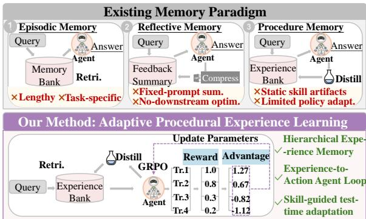
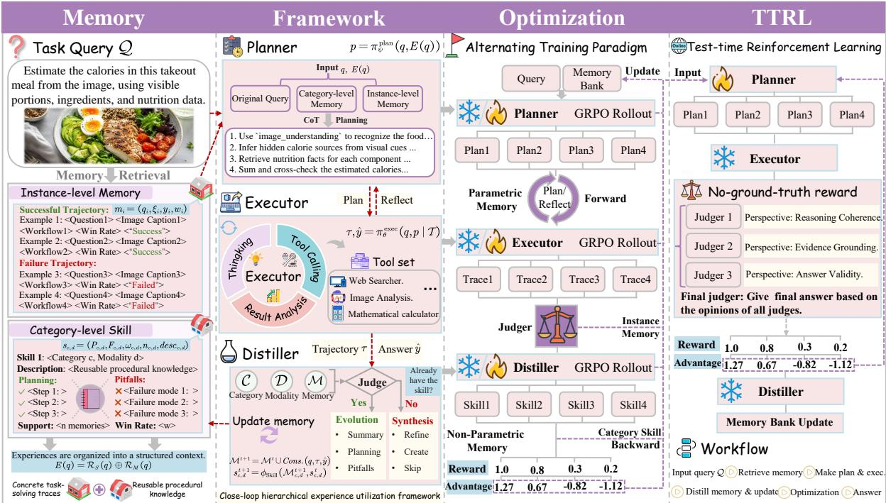
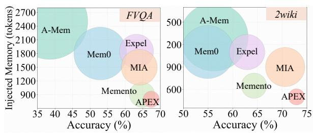
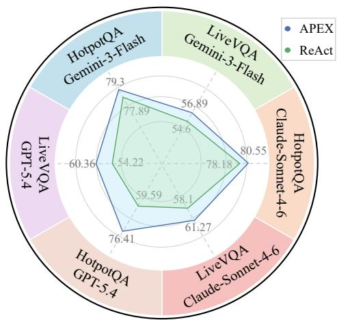
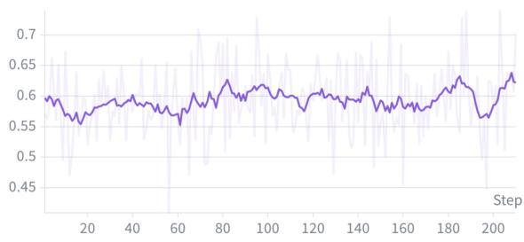
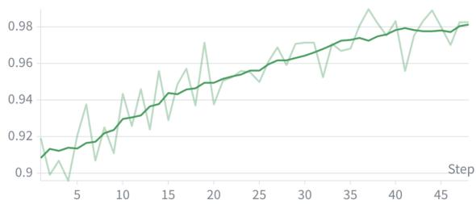
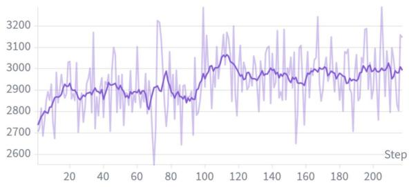
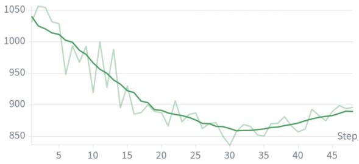
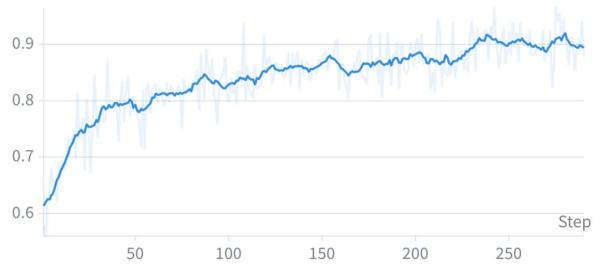
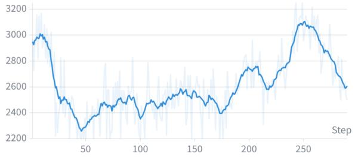

# APEX: Distillation of Agent Procedural Experience for Adaptive Deep Research Question Answering

Jie Ding<sup>1</sup>\* Rui Sun<sup>1</sup>\* Xinyuan Zhang<sup>3</sup> Zeyu Zhang<sup>2</sup> Xin Liu<sup>2†</sup> <sup>1</sup>University of Science and Technology of China <sup>2</sup>Chinese Academy of Sciences <sup>3</sup>ByteDance Inc. {jieding25,rrsun}@mail.ustc.edu.cn, xliu@gia.cas.cn

## Abstract

Deep research agents augment large language models with external tools to answer complex, long-horizon questions through multiturn reasoning. Learning from prior experience is crucial for continual improvement, yet existing methods either retrieve verbose taskspecific traces that burden decision-making, or distill procedural skills that remain decoupled from downstream policy adaptation. We propose APEX, a hierarchical experience utilization framework that organizes interaction history into instance-level trajectory memories and category-level procedural skills, and couples them through a closed-loop architecture of Executor, Distiller, and Planner. The three modules are optimized via a three-stage alternating GRPO training paradigm, enabling reward-guided skill distillation rather than fixed-prompt generation. At test time, distilled skills serve as procedural priors for online Plan ner adaptation through skill-guided test-time reinforcement learning, allowing ground-truthfree self-improvement with skill-alignment regularization to prevent policy drift. Experiments on 7 benchmarks demonstrate that APEX achieves state-of-the-art performance, surpassing GPT-5.4 by 14.7 points and the strongest memory-augmented baseline by 3.0 points. Code is available at https://github. com/J-Ding519/APEx.

## 1 Introduction

Deep research agents (DRAs) augment large language models (LLMs) with external tools to tackle complex, long-horizon, and open-ended questions through multi-turn answering (Sun et al., 2025, 2026; Li et al., 2026b; Zhu et al., 2026). These tasks often involve multi-step tool orchestration (Wu et al., 2025a; Li et al., 2026a), iterative information retrieval (Jin et al., 2025; Wu et al.,

  
Figure 1: Comparison between existing memory-based agent methods and our adaptive procedural experience learning framework.

2025b), and multi-source synthesis (Chen et al., 2025), making learning from prior experience essential. Without effective experience utilization, DRAs risk repeating past mistakes instead of building on prior successes (Wang et al., 2024; Wang and Chen, 2025). This raises a central question: how can deep research agents continually improve through long-term interaction experience?

Recent work has attempted to answer this question by equipping agents with memory mechanisms that store, retrieve, and reuse prior experience (Zhou et al., 2025; Qiao et al., 2026). Episodic memory methods store and retrieve past trajectories or task instances (Zhong et al., 2024; Zhao et al., 2024), but retrieved experiences are often lengthy, task-specific, and noisy, forcing agents to infer transferable strategies at decision time. Reflective memory methods compress feedback into textual summaries (Shinn et al., 2023; Tan et al., 2025), yet these summaries are typically generated by fixed prompts or optimized for memory personalization, rather than optimized for their downstream utility in planning and execution. Procedural memory methods further represent experience as reusable skills, plans, or instructions (Zhou et al., 2026; Ma et al., 2026; Xia et al., 2026), but such skills are often treated as external knowledge artifacts rather than adaptive priors that directly optimize the agent policy during inference.

These suggest that experience-driven improvement in DRAs should be formulated as a closed loop rather than a one-way memory reuse process (Zhou et al., 2025). Long-term interaction experience should be distilled into structured, reusable skills (Ma et al., 2026); the generation of these skills should be optimized by downstream reinforcement learning signals rather than fixed prompts (Xia et al., 2026); and the resulting skills should serve as procedural priors for test-time reinforcement learning (TTRL), where the agent updates its parameters during inference to adapt to new tasks (Qiao et al., 2026). As TTRL improves the agent, the agent can generate higher-quality trajectories, which in turn support better skill distillation and further model improvement.

To realize experience-driven improvement, we propose APEX (Adaptive Procedural Experience Learning). It is characterized by the following key features: ❶ Hierarchical Experience Memory. APEX organizes long-term trajectories into instance-level memories and category-level skills, preserving concrete task-solving traces while abstracting reusable procedural knowledge for planning. ❷ Experience-to-Action Agent Loop. Built on this hierarchy, APEX integrates an Executor, a Distiller, and a Planner into an experience-to-action loop, where tool-use trajectories are collected, abstracted into skills, and reused for strategic planning. This design aligns execution, abstraction, and planning for continual agent improvement. ❸ Skill-guided Test-time Adaptation. During deployment, APEX uses retrieved skills and memories as procedural priors for TTRL, allowing the Planner to adapt on unlabeled queries and consolidate new trajectories into future memories and skills. Our contributions are as follows.

❶ Framework. We propose APEX, a hierarchical experience utilization architecture that couples instance-level memories with category-level skills, enabling the Distiller, Planner, and Executor to transform concrete trajectories into generalizable procedural guidance.

❷ Training. We introduce a three-stage alternating GRPO training paradigm for the Executor, Distiller, and Planner, which stabilizes cross-module credit assignment and makes skill distillation a reward-guided learning process rather than fixed

prompting.

❸ Reasoning. We develop Skill-guided TTRL, which uses distilled skills to regularize online Planner adaptation on unlabeled queries. Coupled with no-ground-truth rewards, it forms a feedback loop that turns improved trajectories into stronger skills for future adaptation.

❹ Experiment. Extensive experiments on diverse benchmarks demonstrate that APEX achieves SOTA performance (64.4% avg), surpassing GPT-5.4 by 14.7 points and the strongest memory-augmented baseline by 3.0 points, while the skill-only variant reduces injected memory tokens, validating the context efficiency of hierarchical experience utilization over flat memory retrieval.

## 2 Methodology Overview

Figure 2 illustrates the overall workflow of APEX, a hierarchical experience utilization framework for deep research agents. APEX maintains long-term experience at two complementary levels: instancelevel memories that preserve concrete execution trajectories, and category-level skills that summarize reusable procedural knowledge across related tasks. Built upon this experience hierarchy, APEX couples planning, execution, skill distillation, and TTRL into a closed-loop improvement process.

APEX Agents Workflow. Given an original query q, APEX processes it through a closedloop data flow. The query q is first routed to a category–modality bucket, from which relevant instance-level memories $\mathcal { R } _ { M } ( q )$ and the corresponding category-level skill $\mathcal { R } _ { S } ( q )$ are retrieved. These experiences are organized into a structured context:

$$
E ( q ) = \mathcal { R } _ { S } ( q ) \oplus \mathcal { R } _ { M } ( q ) ,\tag{1}
$$

where ⊕ denotes structured prompt concatenation. The retrieval method is detailed in Appendix A. Conditioned on $q$ and $E ( q )$ , the Planner generates a research plan:

$$
p = \pi _ { \psi } ^ { \mathrm { p l a n } } ( q , E ( q ) ) .\tag{2}
$$

The Executor then follows the plan to perform multi-turn tool interactions and produce an execution trajectory $\tau$ with the final answer $\hat { y } { : }$

$$
\tau , \hat { y } = \pi _ { \boldsymbol { \theta } } ^ { \mathrm { e x e c } } ( \boldsymbol { q } , \boldsymbol { p } \mid \mathcal { T } ) ,\tag{3}
$$

  
Figure 2: Framework of APEX, which comprises 4 parts: memory, framework, optimization, and TTRL.

where $\tau$ denotes the available tool set. After execution, the trajectory is summarized and stored as a new instance-level memory, while the corresponding category-level skill $s _ { c , d }$ is updated when sufficient new experience has accumulated:

$$
\begin{array} { r l } & { \mathcal { M } ^ { t + 1 } = \mathcal { M } ^ { t } \cup \mathrm { C o n s o l i d a t e } ( q , \tau , \hat { y } ) , } \\ & { ~ s _ { c , d } ^ { t + 1 } = \phi _ { \mathrm { s k i l l } } ( \mathcal { M } _ { c , d } ^ { t + 1 } , s _ { c , d } ^ { t } ) , } \end{array}\tag{4}
$$

where $\mathcal { M } _ { c , d } ^ { t } \in \mathcal { M } ^ { t }$ and $\mathcal { M } ^ { t }$ is the instance-level memory bank at timestamp t and $\phi _ { \mathrm { s k i l l } }$ is the distillation operation of Distiller.

Group Relative Policy Optimization (GRPO). GRPO (Shao et al., 2024) optimizes the policy with intra-group relative rewards. In our work Distiller, Planner and Executor are optimized with GRPO. For each input $x ,$ the policy samples a group of G responses $\{ o _ { i } \} _ { i = 1 } ^ { G }$ and computes the group-normalized advantage as ${ \hat { A } } _ { i } = ( R ( o _ { i } ) \mathrm { ~ - ~ }$ mean<sub>j</sub> $; [ R ( o _ { j } ) ] ) / ( \mathrm { s t d } _ { j } [ R ( o _ { j } ) ] + \epsilon )$ . Following the GRPO implementation, the policy objective for the currently optimized module $\pi _ { \eta }$ is:

$$
\begin{array} { r l } & { \mathcal { L } _ { \mathrm { G R P O } } ( \eta ) = - \mathbb { E } _ { x , \{ o _ { i } \} } \Bigg [ \frac { 1 } { G } \underset { i = 1 } { \overset { G } { \sum } } \frac { 1 } { | o _ { i } | } \underset { t = 1 } { \overset { | o _ { i } | } { \sum } } } \\ & { \operatorname* { m i n } \left( r _ { i , t } ( \eta ) \hat { A } _ { i } , \mathrm { c l i p } \left( r _ { i , t } ( \eta ) , 1 - \epsilon , 1 + \epsilon \right) \hat { A } _ { i } \right) \Bigg ] , } \end{array}\tag{5}
$$

where $r _ { i , t } ( \eta ) \ = \ \pi _ { \eta } ( o _ { i , t } \ \mid \ x , o _ { i , < t } ) / \pi _ { \eta _ { \mathrm { o l d } } } ( o _ { i , t } \ \mid $ x, $o _ { i , < t } )$ is the token-level probability ratio.

Test-time Reinforcement Learning (TTRL). Unlike standard TTRL based on majority voting (Zuo et al., 2025), APEX constructs rewards using a multi-judge LLM-as-Judge mechanism (Zheng et al., 2023). In our implementation, we update the Planner at test time. Given a test query q, the Planner first retrieves the corresponding skill $\mathcal { R } _ { S } ( q )$ and memory $\mathcal { R } _ { M } ( q )$ , generates a plan $p ,$ and the Executor produces an execution trajectory τ and final answer $\hat { y } .$ The Planner’s parameters $\psi$ are updated online by GRPO using the final reward $R _ { \mathrm { f i n a l } } { \mathrm { : } }$

$$
\psi ^ { t + 1 } = \mathrm { G R P O } \left( \psi ^ { t } , R _ { \mathrm { f i n a l } } \right) .\tag{6}
$$

## 3 Methodology

## 3.1 Hierarchical Experience Memory

To enable efficient experience utilization, APEX organizes experience into a hierarchical memory structure, where instance-level memories preserve concrete task-solving traces and category-level skills summarize reusable procedural knowledge.

Instance-level Trajectories Memory. Given the i-th original query q<sub>i</sub>, the agent performs multiturn tool interactions and produces an execution trajectory $\tau _ { i } .$ . Each instance-level memory is represented as $m _ { i } = ( q _ { i } , \xi _ { i } , y _ { i } , w _ { i } )$ , where $\xi _ { i }$ is the workflow summary, $y _ { i } \in$ {correct, incorrect} denotes the execution outcome, and $w _ { i }$ = success\_count<sub>i</sub> / usage\_count<sub>i</sub> is the memory reuse win rate. All instance-level memories are organized into a memory bank M according to task category and input modality:

$$
\mathcal { M } = \bigcup _ { c \in \mathcal { C } } \bigcup _ { d \in \mathcal { D } } \mathcal { M } _ { c , d } ,\tag{7}
$$

where C is the set of predefined task categories and D is the set of modalities.

Category-level Skills Memory. While instancelevel memories provide concrete task-solving cases, they may contain task-specific details. To extract reusable procedural knowledge, the Distiller synthesizes the memories within each category– modality bucket into a single evolving skill document $s _ { c , d } \colon$

$$
s _ { c , d } = \phi _ { \mathrm { s k i l l } } ( \mathcal { M } _ { c , d } ) ,\tag{8}
$$

where $\phi _ { \mathrm { s k i l l } }$ denotes the distillation operation of Distiller. A skill entry $s _ { c , d }$ is defined as $s _ { c , d } =$ $( P _ { c , d } , F _ { c , d } , w _ { c , d } , n _ { c , d } , \deg _ { c , d } )$ , where $P _ { c , d }$ denotes recommended planning steps, $F _ { c , d }$ denotes common failure modes, $n _ { c , d }$ denotes the number of supporting memories, $w _ { c , d } =$ correct\_ $\mathrm { . c o u n t } _ { c , d } / n _ { c , d }$ denotes the skill-level win rate, and des $\dot { \cdot } c , d$ provides a natural-language description. Finally, the Skill memory bank S is defined as:

$$
\begin{array} { r } { \mathcal { S } = \{ s _ { c , d } \mid c \in \mathcal { C } , d \in \mathcal { D } \} . } \end{array}\tag{9}
$$

## 3.2 Three-Stage Alternating RL Training

To optimize planning, execution, and experience distillation, APEX adopts a three-stage alternating reinforcement learning framework. The framework contains three trainable modules: the Executor $\pi _ { \boldsymbol { \theta } } ^ { \mathrm { e x e c } }$ , the Distiller $\pi _ { \phi } ^ { \mathrm { d i s t } }$ , and the Planner $\pi _ { \psi } ^ { \mathrm { p l a n } }$

Executor Training. In the first stage, the Planner and Distiller are frozen, and the Executor is optimized to perform multi-turn tool interaction under a given plan. Given a query q and a plan $p ,$ the Executor generates a trajectory $\tau = \pi _ { \theta } ^ { \mathrm { e x e c } } ( q , p \mid \mathcal { T } )$ where $\tau$ denotes the available tool set.

The Executor reward combines answer correctness, tool-use effectiveness, and format validity:

$$
\begin{array} { r } { R ^ { \mathrm { e x e c } } ( \tau ) = \lambda _ { 1 } R _ { \mathrm { a c c } } ( \tau ) + \lambda _ { 2 } R _ { \mathrm { t o o l } } ( \tau ) } \\ { + \lambda _ { 3 } R _ { \mathrm { f m t } } ( \tau ) , \qquad } \end{array}\tag{10}
$$

where $\lambda _ { 1 } , \lambda _ { 2 }$ , and $\lambda _ { 3 }$ are hyperparameters. The accuracy reward $R _ { \mathrm { a c c } } ( \tau ) = \mathcal { I } ( \mathrm { E x t r a c t } ( \tau ) , y ^ { * } )$ is computed by an LLM judge. The tool reward $\begin{array} { r } { R _ { \mathrm { t o o l } } ( \tau ) ~ = ~ \frac { 1 } { | \mathcal { V } | } \sum _ { v \in \mathcal { V } } \mathbb { I } \left[ \exists t _ { \mathrm { v a l i d } } \in v \right] } \end{array}$ encourages each execution segment to contain valid tool use $t _ { v a l i d }$ , where V denotes the segments split by replan boundaries. The format reward $R _ { \mathrm { f m t } } ( \tau ) \in \{ 0 , 1 \}$ checks if the output follows the required structure.

Distiller Training. In the second stage, the Executor and Planner are frozen, and the Distiller is optimized to transform instance-level memories into reusable category-level skills. Given a memory bucket $\mathcal { M } _ { c , d } ^ { t }$ and an optional previous skill $s _ { c , d } ^ { t } ,$ the Distiller outputs an operation type o and an updated skill $s _ { c , d } ^ { t + 1 }$ , i.e., $( o , s _ { c , d } ^ { t + 1 } ) =$ $\pi _ { \phi } ^ { \mathrm { d i s t } } ( \mathcal { M } _ { c , d } ^ { t } , s _ { c , d } ^ { t } )$ . The operation o is selected from {synthesize, refine, create, skip}. We define the Distiller reward as:

$$
\begin{array} { r l } & { R ^ { \mathrm { { d i s t } } } ( o , s _ { c , d } ^ { t + 1 } ) = \mu _ { 1 } R _ { \mathrm { { q u a l i t y } } } ( s _ { c , d } ^ { t + 1 } ) + \mu _ { 2 } R _ { \mathrm { f m t } } ( s _ { c , d } ^ { t + 1 } ) } \\ & { ~ + ~ \mu _ { 3 } R _ { \mathrm { e v o l v e } } ( o , s _ { c , d } ^ { t + 1 } , s _ { c , d } ^ { t } ) , } \end{array}\tag{11}
$$

where $\mu _ { 1 } , \mu _ { 2 }$ , and $\mu _ { 3 }$ are hyperparameters and $R _ { \mathrm { e v o l v e } }$ measures if the operation o is rational. Each reward is judged by an LLM judger $\mathcal { I } _ { \mathrm { s k i l l } }$

Planner Training. In the third stage, the Executor and Distiller are frozen, and the Planner is trained through a plan–execute–evaluate–replan loop. Given query q, retrieved skill guidance $\mathcal { R } _ { S } ( q )$ , and retrieved memories $\mathcal { R } _ { M } ( q )$ , the Planner first generates an initial plan:

$$
p _ { 1 } = \pi _ { \psi } ^ { \mathrm { p l a n } } \left( q , \mathcal { R } _ { S } ( q ) , \mathcal { R } _ { M } ( q ) \right) .\tag{12}
$$

The frozen Executor executes $p _ { 1 }$ and produces the first answer $\hat { y } _ { 1 }$ . The Planner then observes Trace(τ) and predicts a binary decision $d \in \{ 0 , 1 \}$ indicating whether re-planning is needed. If $d = 1$ the Planner generates a revised plan $p _ { 2 }$ and obtains a second answer $\hat { y } _ { 2 }$ . If $d = 0$ , we set $\hat { y } _ { 2 } = \hat { y } _ { 1 }$ . The Planner reward is:

$$
\begin{array} { r } { R ^ { \mathrm { p l a n } } = \alpha _ { 1 } R _ { \mathrm { a c c } } ( \hat { y } _ { 2 } ) + \alpha _ { 2 } R _ { \mathrm { a c c } } ( \hat { y } _ { 1 } ) } \\ { + \alpha _ { 3 } R _ { \mathrm { f m t } } + \alpha _ { 4 } R _ { \mathrm { d e c } } , \qquad } \end{array}\tag{13}
$$

where $\alpha _ { 1 } , \alpha _ { 2 } , \alpha _ { 3 }$ , and $\alpha _ { 4 }$ are hyperparameters. The decision reward $R _ { \mathrm { d e c } }$ encourages the Planner to stop when the first execution is correct and to trigger re-planning when the initial execution fails.

## 3.3 Skill-guided TTRL

After the training stage, APEX further performs Skill-guided TTRL to adapt the Planner on unlabeled test queries. Since ground-truth answers are unavailable at test time, APEX constructs a noground-truth reward with multiple LLM judges. Meanwhile, the learned category-level skills are used as regularization priors to prevent the Planner from drifting away from previously verified procedural knowledge.

No-Ground-Truth Reward. Without groundtruth answers, APEX estimates answer quality through a multi-judge LLM-as-Judge mechanism. Specifically, three judges evaluate the execution from different aspects: $E _ { 1 } ( q , \tau , \hat { y } )$ checks reasoning consistency, $E _ { 2 } ( q , \tau , \hat { y } )$ checks whether the final answer is supported by retrieved evidence in the trajectory, and $E _ { 3 } ( q , \hat { y } )$ checks whether the response is valid and complete. Their judgments are aggregated by an arbiter A:

$$
\begin{array} { c } { { R _ { \mathrm { n o g t } } = \lambda _ { n } \cal A ( E _ { 1 } ( \cdot ) , E _ { 2 } ( \cdot ) , E _ { 3 } ( \cdot ) ) } } \\ { { + ( 1 - \lambda _ { n } ) R _ { \mathrm { f m t } } } } \end{array}\tag{14}
$$

The aggregated no-ground-truth reward is also used as a pseudo-supervision signal for memory consolidation.

Skill-Alignment Regularization. Relying only on no-ground-truth rewards may cause unstable online updates. Therefore, APEX uses the retrieved skill as a knowledge anchor. For a category– modality bucket $( c , d )$ , the skill $s _ { c , d }$ contains procedure $P _ { c , d }$ and pitfalls $F _ { c , d }$ . The alignment reward evaluates whether the generated plan follows the recommended procedure and avoids known pitfalls:

$$
R \mathrm { { a l i g n } } = \mathcal { I } _ { \mathrm { { a l i g n } } } \left( p , P _ { c , d } , F _ { c , d } \right) .\tag{15}
$$

The final reward combines the original no-groundtruth reward and the skill-alignment reward:

$$
R _ { \mathrm { f i n a l } } = ( 1 - \lambda _ { s } ) R _ { \mathrm { n o g t } } + \lambda _ { s } R _ { \mathrm { a l i g n } } ,\tag{16}
$$

The weight $\lambda _ { s } = \lambda _ { \mathrm { b a s e } } \cdot w _ { c , d }$ · min $\left( \frac { n _ { c , d } } { N _ { \mathrm { t h r e s h o l d } } } , 1 \right)$ is adaptively determined by the confidence of the retrieved skill.

## 4 Experiment

## 4.1 Experimental Setups

Training Settings: Our training framework is built on veRL (Sheng et al., 2025) and follows a three-stage alternating optimization paradigm. The Executor employs Qwen2.5-VL-7B (Qwen Team, 2025) as its backbone and is trained on FVQAtrain (Wang et al., 2017). The Distiller, based on Qwen3-8B (Yang et al., 2025), is subsequently trained on FVQA-train to distill accumulated execution memories into structured skill documents. The Planner, also based on Qwen3-8B, is trained in the final stage on a mixture of FVQA-train (with images discarded) and MATPO (Mo et al., 2025). The Executor is equipped with offline text-to-text and offline image-to-image search tools. A Qwen3- 32B model serves as the LLM Judger for reward computation. More details are provided in Appendix C.

Test Settings: To evaluate APEX, we conduct experiments on a diverse set of image-text and textonly benchmarks. For image-text evaluation, we use FVQA-test, SimpleVQA (Cheng et al., 2025), LiveVQA (Fu et al., 2025), InfoSeek (Chen et al., 2023), and MMSearch (Jiang et al., 2024). For textonly evaluation, we use HotpotQA (Yang et al., 2018) and 2WikiMultiHopQA (Ho et al., 2020). Detailed settings are provided in Appendix D.

Baselines. We compare APEX against a wide range of deep research methods spanning three categories: ❶ Naive-Large Language Models: GPT-5.4 (OpenAI, 2026), Gemini-3-Flash (Google DeepMind, 2025), Qwen2.5-VL-7B (Qwen Team, 2025), and Qwen2.5-VL-32B (Qwen Team, 2025), which are directly prompted to answer questions without agentic workflow; ❷ Search Agents: Qwen2.5-VL-7B+ReAct (Yao et al., 2022), Qwen2.5-VL-32B+ReAct, MMSearch-R1 (Wu et al., 2025b), and Deepeyes2 (Zheng et al., 2026), which augment LLMs with external search tools via multi-step reasoning but maintain no crosstask memory; and ❸ Memory-Augmented Search Agents: RAG, Mem0 (Chhikara et al., 2025), A-Mem (Xu et al., 2026), ExpeL (Zhao et al., 2024), Memento (Zhou et al., 2025), and MIA (Qiao et al., 2026), which additionally incorporate memory mechanisms to store and reuse past experience across tasks. More details on baseline settings are provided in Appendix F.

## 4.2 Main Results

As shown in Table 1, APEX achieves the best average performance across 7 benchmarks, with an average score of 64.4. We highlight the following key observations:

❶ Substantial improvement over standalone

Table 1: Main results across in-domain and out-of-domain benchmarks. The best results are highlighted in bold, and the second-best results are underlined.
<table><tr><td rowspan="2">Method</td><td>In-Domain</td><td colspan="6">Out-of-Domain</td><td rowspan="2">Avg.</td></tr><tr><td></td><td></td><td>FVQA-test HotpotQA 2Wiki SimpleVQA LiveVQA InfoSeek MMSearch</td><td></td><td></td><td></td><td></td></tr><tr><td colspan="9">Naive-Large Language Model</td></tr><tr><td>GPT-5.4</td><td>51.3</td><td>60.2</td><td>64.9</td><td>55.9</td><td>22.8</td><td>45.6</td><td>47.4</td><td>49.7</td></tr><tr><td>Gemini-3-Flash</td><td>68.4</td><td>66.2</td><td>68.4</td><td>72.3</td><td>25.7</td><td>66.5</td><td>67.9</td><td>62.2</td></tr><tr><td>Qwen2.5-VL-7B</td><td>20.7</td><td>12.6</td><td>20.5</td><td>30.2</td><td>8.3</td><td>23.6</td><td>7.2</td><td>17.6</td></tr><tr><td>Qwen2.5-VL-32B</td><td>24.3</td><td>16.9</td><td>24.0</td><td>39.8</td><td>18.5</td><td>25.8</td><td>15.7</td><td>23.6</td></tr><tr><td colspan="9">Search Agent</td></tr><tr><td>Qwen2.5-VL-7B+ReAct</td><td>34.2</td><td>23.7</td><td>31.2</td><td>35.4</td><td>10.6</td><td>28.1</td><td>21.3</td><td>26.4</td></tr><tr><td>Qwen2.5-VL-32B+ReAct</td><td>50.9</td><td>31.4</td><td>37.0</td><td>48.3</td><td>24.7</td><td>38.1</td><td>27.5</td><td>36.8</td></tr><tr><td>MMSearch-R1</td><td>58.3</td><td>39.2</td><td>48.3</td><td>55.2</td><td>28.6</td><td>49.5</td><td>43.3</td><td>46.1</td></tr><tr><td>Deepeyes2</td><td>60.6</td><td>-</td><td>=</td><td>59.4</td><td>-</td><td>51.1</td><td>63.7</td><td>-</td></tr><tr><td colspan="9">Memory-Augmented Search Agent</td></tr><tr><td>RAG</td><td>58.6</td><td>47.8</td><td>56.2</td><td>60.7</td><td>31.9</td><td>55.9</td><td>54.3</td><td>52.2</td></tr><tr><td>Mem0</td><td>54.9</td><td>49.3</td><td>54.9</td><td>56.9</td><td>24.3</td><td>48.2</td><td>43.1</td><td>47.4</td></tr><tr><td>A-Mem</td><td>38.5</td><td>46.8</td><td>56.2</td><td>51.6</td><td>22.8</td><td>36.1</td><td>41.1</td><td>41.9</td></tr><tr><td>ExpeL</td><td>64.2</td><td>56.3</td><td>62.9</td><td>62.5</td><td>34.1</td><td>58.8</td><td>61.3</td><td>57.2</td></tr><tr><td>Memento</td><td>66.1</td><td>55.2</td><td>64.3</td><td>61.7</td><td>36.7</td><td>57.3</td><td>61.4</td><td>57.5</td></tr><tr><td>MIA</td><td>65.3</td><td>64.0</td><td>71.6</td><td>63.8</td><td>39.7</td><td>64.7</td><td>60.6</td><td>61.4</td></tr><tr><td colspan="9">Ours</td></tr><tr><td>APEX</td><td>68.7</td><td>67.8</td><td>75.2</td><td>66.3</td><td>42.4</td><td>66.9</td><td>63.8</td><td>64.4</td></tr></table>

LLMs. APEX improves by 14.7 points compared to GPT-5.4 and slightly surpasses Gemini-3-Flash in average accuracy. Notably, APEX outperforms its own backbone model Qwen2.5-VL-7B by 46.8 points in absolute terms, demonstrating that structured skill knowledge and memoryaugmented planning can effectively compensate for model scale, enabling a small open-source model to rival closed-source counterparts.

❷ Consistent gains over search agents. Equipping LLMs with search tools through ReAct substantially improves performance (e.g., Qwen2.5- VL-7B: 17.6 → 26.4). Compared with the strong search agent MMSearch-R1, APEX achieves an improvement of 18.3 points in average accuracy. This gap indicates that tool access alone is insufficient for complex research tasks — effective utilization of accumulated experience through skill distillation is critical for guiding multi-step tool orchestration.

❸ Superiority over memory-augmented agents. Among memory-augmented baselines, MIA achieves the strongest performance (61.4 avg) by combining a Manager-Planner-Executor architecture with instance-level memory retrieval. APEX further improves upon MIA by 3.0 points on average. This improvement is largely associated with the Distiller module, which distills instancelevel memories into category-level skills that provide structured procedural guidance to the Planner, rather than relying solely on raw memory retrieval at each decision point.

## 4.3 Skill Sufficiency Analysis

We evaluate APEX (Skill Only), which removes instance-level memory retrieval from the Planner context while retaining trajectories for skill evolution. As shown in Table 2, this variant incurs an average drop of 1.8 points compared to the full pipeline, yet outperforms the strongest baseline MIA by 1.5 points. This confirms that the Distiller successfully distills category-level knowledge from raw trajectories into structured skills that are dynamically modified at test time, reducing the Planner’s reliance on verbose instance-level memories.



Table 2: Skill sufficiency analysis. Avg. is computed over the four datasets shown in this table. Best in bold, second-best underlined.
<table><tr><td rowspan="2">Method</td><td colspan="2">Image-Text</td><td colspan="2">Text-Only</td><td rowspan="2">Avg.</td></tr><tr><td>FVQA SimpleVQA</td><td></td><td>HotpotQA</td><td>2Wiki</td></tr><tr><td colspan="7">Baseline</td></tr><tr><td>Mem0</td><td>54.9</td><td>56.9</td><td>49.3</td><td>54.9</td><td></td><td>54.0</td></tr><tr><td>MMSearch-R1</td><td>58.3</td><td>55.2</td><td></td><td>39.2</td><td>48.3</td><td>50.3</td></tr><tr><td>ExpeL</td><td>64.2</td><td>62.5</td><td></td><td>56.3</td><td>62.9</td><td>61.5</td></tr><tr><td>Memento</td><td>66.1</td><td></td><td>61.7</td><td>55.2</td><td>64.3</td><td>61.8</td></tr><tr><td>MIA</td><td>65.3</td><td></td><td>63.8</td><td>64.0</td><td>71.6</td><td>66.2</td></tr><tr><td colspan="7">Ours</td></tr><tr><td colspan="2">APEx (Skill Only)</td><td>67.4</td><td colspan="2">64.8</td><td>65.7 72.9</td><td>67.7</td></tr><tr><td colspan="2">APEX</td><td>68.7</td><td colspan="2">66.3</td><td>67.8 75.2</td><td>69.5</td></tr><tr><td colspan="7">Infee o ens) 2700 FVQA 500 2400</td></tr><tr><td>2100 1800 1500</td><td>Mem0</td><td>Expel</td><td rowspan="4">200 900</td><td rowspan="4">A-Mem</td><td rowspan="4">2wiki</td></tr><tr><td>A-Mem</td><td></td><td></td><td>Mem0 Expel</td></tr><tr><td>1200</td><td></td><td>MIA</td><td></td></tr><tr><td>900</td><td>Memento</td><td>600 APEX</td><td>Memento</td></tr></table>

Figure 3: Token-efficiency comparison on FVQA-test and 2Wiki. X-axis denotes task accuracy. Y-axis denotes the number of memory tokens injected at each reasoning step. The bubble size represents the overall token cost of a full inference process.

## 4.4 Context Efficiency Analysis

Figure 3 compares different memory-augmented reasoning methods in terms of accuracy, injected memory tokens per inference step, and total token consumption. Across both FVQA-test and 2Wiki, APEX (Skill only) achieves favorable contextefficiency trade-off. Compared with MIA, APEX improves accuracy by 1.7 points. Meanwhile, it reduces injected memory tokens by 45.6% and total token consumption by 36.8% on average. These results demonstrate that APEX achieves better accuracy with a smaller memory footprint and lower token cost, highlighting its advantage in contextefficient memory utilization for reasoning.

## 4.5 Training Analysis

In Figure 5, we analyze the GRPO training dynamics of each module to characterize their convergence behavior and identify the factors underlying their distinct learning patterns. All modules are trained alternately with only one module updated at a time. The Executor exhibits the most stable improvement, with its reward increasing steadily and converging to a high level. The Distiller also converges smoothly and rapidly, suggesting that the skill distillation objective provides a relatively well-defined optimization signal. In contrast, the Planner shows larger fluctuations, although its reward still follows an overall upward trend. This is expected since planning is evaluated indirectly through downstream execution and is therefore more sensitive to variations in retrieved memories, generated skills, and executor behavior.

  
Figure 4: Performance comparison between ReAct and APEX using different closed-source executor models on HotpotQA and LiveVQA.

## 4.6 Generalization Analysis

To assess the generalization ability of APEX, we replace the originally trained open-source executor model with stronger closed-source executor models without any additional training, and compare it with ReAct on HotpotQA and LiveVQA. As shown in Figure 4, APEX consistently outperforms Re-Act across all closed-source executors, achieving an average relative improvement of 11.0% on HotpotQA and 7.0% on LiveVQA. This demonstrates that APEX is not tied to a specific trained executor, but can generalize to unseen closed-source executors in a plug-and-play manner.

## 4.7 Ablation Study

We conduct three groups of ablation studies to evaluate each component in APEX.

❶ Experience Utilization. We remove different experience sources during inference. w/o Mem. disables the retrieval of concrete execution memories, w/o Skill removes distilled procedural skills, and w/o Both removes both. These variants reduce the average accuracy by 1.8, 3.1, and 10.1 points, respectively. This suggests that category-level skills provide general templates for similar tasks, while instance-level memories offer concrete problemsolving examples; their complementarity enables more effective utilization of past experience.

Table 3: Ablation study of APEX. Accuracy is reported on image-text and text-only tasks. Performance drops (↓) relative to the full model are shown in subscripts.
<table><tr><td rowspan="2">Method</td><td colspan="2">Image-Text</td><td colspan="2">Text-Only</td><td rowspan="2">Avg.</td></tr><tr><td>FVQA</td><td>SimpleVQA</td><td>HotpotQA</td><td>2Wiki</td></tr><tr><td>APEX</td><td>68.7</td><td>66.3</td><td>67.8</td><td>75.2</td><td>69.5</td></tr><tr><td colspan="6">w/o Experience Utilization</td></tr><tr><td>w/o Mem. w/o Skill w/o Both</td><td> $6 7 . 4 \downarrow 1 . 3$   $6 4 . 9 \downarrow 3 . 8 $ </td><td> $6 4 . 8 \downarrow 1 . 5$   $6 2 . 7 \downarrow 3 . 6 $ </td><td> $6 5 . 7 \downarrow 2 . 1 $   $6 5 . 6 \downarrow 2 . 2$ </td><td>72.9 ↓2.3 72.3 ↓2.9</td><td>67.7 ↓1.8 66.4 ↓3.1 65.5 ↓9.7 59.4 10.1</td></tr><tr><td colspan="6"> $5 8 . 6 \downarrow 1 0 . 1$   $5 5 . 0 \downarrow 1 1 . 3$   $5 8 . 4 \downarrow 9 . 4 $  w/o Post-training Optimization</td></tr><tr><td colspan="6">w/o Dis.  $6 6 . 4 \downarrow 2 . 3$   $6 3 . 7 \downarrow 2 . 6 $ </td></tr><tr><td>w/o Plan.</td><td> $6 6 . 8 \downarrow 1 . 9$ </td><td> $6 3 . 9 \downarrow 2 . 4 $ </td><td> $6 5 . 8 \downarrow 2 . 0$   $6 6 . 2 \downarrow 1 . 6$ </td><td> $7 2 . 7 \downarrow 2 . 5$   $7 4 . 0 \downarrow 1 . 2$ </td><td> $6 7 . 2 \downarrow 2 . 3$   $6 7 . 7 \downarrow 1 . 8$ </td></tr><tr><td>w/o Exec.</td><td> $6 1 . 0 \downarrow 7 . 7$ </td><td> $5 8 . 0 \downarrow 8 . 3$ </td><td> $5 8 . 2 \downarrow 9 . 6 $ </td><td> $6 7 . 2 \downarrow 8 . 0$ </td><td>61.1 ↓8.4</td></tr><tr><td colspan="6">w/o Closed-loop Adaptation</td></tr><tr><td>w/o TTRL</td><td> $6 4 . 6 \downarrow 4 . 1$ </td><td> $6 0 . 8 \downarrow 5 . 5$ </td><td> $6 3 . 5 \downarrow 4 . 3$ </td><td> $7 2 . 4 \downarrow 2 . 8 $ </td><td> $6 5 . 3 \downarrow 4 . 2$ </td></tr><tr><td>w/o Iter.</td><td> $6 6 . 0 \downarrow 2 . 7$ </td><td> $6 4 . 1 \downarrow 2 . 2$ </td><td> $6 4 . 7 \downarrow 3 . 1 $ </td><td> $7 3 . 3 \downarrow 1 . 9$ </td><td> $6 7 . 0 \downarrow 2 . 5$ </td></tr></table>

❷ Post-training Optimization. We evaluate module-wise GRPO post-training. For each ablation, the pipeline structure is kept unchanged, while the corresponding GRPO-trained module is replaced with its non-trained base model, such as Qwen2.5-VL-7B or Qwen3-8B. Removing GRPO from the Distiller, Planner, and Executor reduces the average accuracy by 2.3, 1.8, and 8.4 points respectively. The larger degradation of w/o Exec. indicates that executor optimization is particularly important for reliable multi-step tool interaction, while optimizing the Distiller and Planner also benefits skill construction and strategy generation.

❸ Closed-loop Adaptation. Finally, we analyze the closed-loop adaptation mechanism. w/o TTRL performs inference without test-time reinforcement learning, while w/o Iter. distills skills only once without further updates from improved trajectories. These variants reduce the average accuracy by 4.2 and 2.5 points, respectively. Together, TTRL and iterative skill distillation form a closed-loop feedback mechanism at test time, where improved trajectories are distilled into better skills, thereby progressively enhancing model performance.

## 5 Related Work

## 5.1 Deep Research Agents

Deep Research Agents (DRAs) are designed to answer complex, multi-turn information-seeking questions by combining dynamic reasoning, adaptive tool-mediated search, and compact experience retrieval (Huang et al., 2025; Zhang et al., 2025b; Xu and Peng, 2025). Recent studies have improved text-only and multimodal long-horizon search by curating reasoning trajectories (Sun et al., 2025; Li et al., 2026b; Zhu et al., 2026), supervised fine-tuning (Li et al., 2025; Wu et al., 2025a) or agentic reinforcement learning (Zheng et al., 2025; Jin et al., 2025; Wu et al., 2025b; Narayan et al., 2025) to internalize planning and searching. To reuse prior interactions, emerging work abstracts past trajectories into reusable memories, enabling agents to dynamically organize memory, maintain compact interaction states, and optimize memoryaware search or planning policies across similar long-horizon tasks (Zhao et al., 2024; Xu et al., 2026; Zhou et al., 2026; Qiao et al., 2026). Our work focuses on constructing instance-level memories, organizing category-level skills, retrieving and ranking reusable experiences, and distilling them into Distiller-Planner-Executor training.

## 5.2 Memory Systems for Agents

Recent memory systems for LLM agents have evolved from retrieval-centric external memory to adaptive experience management. Early RAG methods treat external documents as nonparametric memory to ground generation with retrieved evidence (Lewis et al., 2020; Zhong et al., 2024; Edge et al., 2024). Building on these foundations, recent studies shift the focus from simply retrieving past information to organizing, compressing, and updating agent memories (Fang et al., 2026; Liu et al., 2026). More recent work further treats memory as a trainable and reusable experience space where agents learn what to store (Kang et al., 2026; Shen et al., 2026), when to retrieve or discard (Yuan et al., 2025), and how to abstract trajectories into procedural guidance or skills (Zhang et al., 2025a, 2026; Xia et al., 2026). These trends indicate a transition from passive knowledge retrieval toward self-evolving memory systems that support long-horizon planning, experience reuse, and strategy generalization. In contrast, APEX distills trajectories within each category–modality group into reusable procedural skills and uses their confidence-weighted alignment as a regularization signal for online Planner updates, coupling procedural skill abstraction with downstream parametric adaptation in a closed experience-to-action loop.

## 6 Conclusion

In this paper, we present APEX, a hierarchical experience utilization framework for deep research agents. APEX organizes accumulated interactions into instance-level memories and category-level skills, enabling reusable procedural knowledge across tasks. Through GRPO-based alternating optimization of the Executor, Distiller, and Planner, APEX forms a closed-loop process spanning execution, skill abstraction, and adaptive planning. At test time, distilled skills serve as procedural priors for skill-guided TTRL, supporting ground-truthfree online adaptation while reducing drift through skill-alignment regularization. Experiments on 7 benchmarks show that APEX achieves state-of-theart performance. Future work will extend APEX to broader tool ecosystems and explore more efficient skill evolution and cross-agent skill transfer.

## Limitations

While APEX achieves the best average performance across seven benchmarks and demonstrates strong generalization to out-of-domain settings, our current framework is built upon small open-source models. Although APEX enables a 7B model to surpass closed-source systems, we have not explored how APEX scales when applied to more powerful backbone models. Additionally, our threestage alternating GRPO training paradigm, despite its effectiveness in stabilizing cross-module credit assignment and producing consistently improving rewards, requires sequential optimization of the Executor, Distiller, and Planner, which may not fully exploit the synergies achievable through end-toend joint training. Finally, our skill-guided TTRL mechanism currently operates online at test time without ground-truth supervision, and while it already yields significant improvements through selfimprovement, incorporating minimal supervision could further amplify the quality of distilled skills and accelerate the closed-loop adaptation process.

## Ethical Considerations

Our framework builds upon large language and vision-language models that may produce inaccurate, biased, or harmful outputs due to biases inherent in their pre-training corpora; such behaviors are not by design. Since APEX retrieves and processes open-web content at inference time, retrieved results may inadvertently contain personal identifiable information (PII) or offensive material, and we advise deployers to apply appropriate content filtering. The open-source Qwen models used for training are released under their respective licenses. Proprietary models used only for baseline evaluation or executor generalization are accessed through their APIs and are subject to their providers’ terms of use. All evaluation benchmarks are publicly available with documented provenance. Any code or weights we release will be accompanied by usage guidelines that explicitly prohibit malicious applications such as misinformation generation or unauthorized surveillance. We report training procedures, hyperparameters, and computational costs to ensure reproducibility and transparency. Finally, AI assistants were employed for grammatical error correction and rephrasing.

## References

Yang Chen, Hexiang Hu, Yi Luan, Haitian Sun, Soravit Changpinyo, Alan Ritter, and Ming-Wei Chang. 2023. Can pre-trained vision and language models answer visual information-seeking questions? In Proceedings of the 2023 Conference on Empirical Methods in Natural Language Processing, pages 14948–14968.

Zehui Chen, Kuikun Liu, Qiuchen Wang, Jiangning Liu, Wenwei Zhang, Kai Chen, and Feng Zhao. 2025. Mindsearch: Mimicking human minds elicits deep ai searcher. In International Conference On Learning Representations, volume 2025, pages 90007–90029.

Xianfu Cheng, Wei Zhang, Shiwei Zhang, Jian Yang, Xiangyuan Guan, Xianjie Wu, Xiang Li, Ge Zhang, Jiaheng Liu, Yuying Mai, Yutao Zeng, Zhoufutu Wen, Ke Jin, Baorui Wang, Weixiao Zhou, Yunhong Lu, Tongliang Li, Wenhao Huang, and Zhoujun Li. 2025. Simplevqa: Multimodal factuality evaluation for multimodal large language models. Preprint, arXiv:2502.13059.

Prateek Chhikara, Dev Khant, Saket Aryan, Taranjeet Singh, and Deshraj Yadav. 2025. Mem0: Building production-ready ai agents with scalable long-term memory. arXiv preprint arXiv:2504.19413.

Darren Edge, Ha Trinh, Newman Cheng, Joshua Bradley, Alex Chao, Apurva Mody, Steven Truitt, Dasha Metropolitansky, Robert Osazuwa Ness, and Jonathan Larson. 2024. From local to global: A graph rag approach to query-focused summarization. arXiv preprint arXiv:2404.16130.

Jizhan Fang, Xinle Deng, Haoming Xu, Ziyan Jiang, Yuqi Tang, Ziwen Xu, Shumin Deng, Yunzhi Yao,

Mengru Wang, Shuofei Qiao, Huajun Chen, and Ningyu Zhang. 2026. Lightmem: Lightweight and efficient memory-augmented generation. In International Conference on Learning Representations, volume 2026, pages 98706–98729.

Mingyang Fu, Yuyang Peng, Benlin Liu, Yao Wan, and Dongping Chen. 2025. Livevqa: Live visual knowledge seeking. arXiv e-prints, pages arXiv–2504.

Google DeepMind. 2025. Gemini 3 flash model card. https://storage.googleapis. com/deepmind-media/Model-Cards/ Gemini-3-Flash-Model-Card.pdf. Model card.

Xanh Ho, Anh-Khoa Duong Nguyen, Saku Sugawara, and Akiko Aizawa. 2020. Constructing a multi-hop qa dataset for comprehensive evaluation of reasoning steps. In Proceedings ofthe 28th International Conference on Computational Linguistics, pages 6609– 6625.

Yuxuan Huang, Yihang Chen, Haozheng Zhang, Kang Li, Huichi Zhou, Meng Fang, Linyi Yang, Xiaoguang Li, Lifeng Shang, Songcen Xu, Jianye Hao, Kun Shao, and Jun Wang. 2025. Deep research agents: A systematic examination and roadmap. Preprint, arXiv:2506.18096.

Dongzhi Jiang, Renrui Zhang, Ziyu Guo, Yanmin Wu, Jiayi Lei, Pengshuo Qiu, Pan Lu, Zehui Chen, Chaoyou Fu, Guanglu Song, Peng Gao, Yu Liu, Chunyuan Li, and Hongsheng Li. 2024. Mmsearch: Benchmarking the potential of large models as multimodal search engines. Preprint, arXiv:2409.12959.

Bowen Jin, Hansi Zeng, Zhenrui Yue, Jinsung Yoon, Sercan Arik, Dong Wang, Hamed Zamani, and Jiawei Han. 2025. Search-r1: Training llms to reason and leverage search engines with reinforcement learning. arXiv preprint arXiv:2503.09516.

Jingyi Kang, Chunyu Li, Ding Chen, Bo Tang, Feiyu Xiong, and Zhiyu Li. 2026. Memreader: From passive to active extraction for long-term agent memory. arXiv preprint arXiv:2604.07877.

Vladimir Karpukhin, Barlas Oguz, Sewon Min, Patrick Lewis, Ledell Wu, Sergey Edunov, Danqi Chen, and Wen-tau Yih. 2020. Dense passage retrieval for opendomain question answering. In Proceedings of the 2020 conference on empirical methods in natural language processing (EMNLP), pages 6769–6781.

Woosuk Kwon, Zhuohan Li, Siyuan Zhuang, Ying Sheng, Lianmin Zheng, Cody Hao Yu, Joseph Gonzalez, Hao Zhang, and Ion Stoica. 2023. Efficient memory management for large language model serving with pagedattention. In Proceedings of the 29th symposium on operating systems principles, pages 611–626.

Patrick Lewis, Ethan Perez, Aleksandra Piktus, Fabio Petroni, Vladimir Karpukhin, Naman Goyal, Heinrich Küttler, Mike Lewis, Wen-tau Yih, Tim Rocktäschel, Sebastian Riedel, and Douwe Kiela. 2020.

Retrieval-augmented generation for knowledgeintensive nlp tasks. In Proceedings of the 34th International Conference on Neural Information Processing Systems, NIPS ’20, Red Hook, NY, USA. Curran Associates Inc.

Kuan Li, Zhongwang Zhang, Huifeng Yin, Liwen Zhang, Litu Ou, Jialong Wu, Wenbiao Yin, Baixuan Li, Zhengwei Tao, Xinyu Wang, Weizhou Shen, Junkai Zhang, Dingchu Zhang, Xixi Wu, Yong Jiang, Ming Yan, Pengjun Xie, Fei Huang, and Jingren Zhou. 2025. Websailor: Navigating super-human reasoning for web agent. Preprint, arXiv:2507.02592.

Xiaoxi Li, Jiajie Jin, Guanting Dong, Hongjin Qian, Yongkang Wu, Ji-Rong Wen, Yutao Zhu, and Zhicheng Dou. 2026a. Webthinker: Empowering large reasoning models with deep research capability. Advances in Neural Information Processing Systems, 38:120091–120131.

Zhuofeng Li, Dongfu Jiang, Xueguang Ma, Haoxiang Zhang, Ping Nie, Yuyu Zhang, Kai Zou, Jianwen Xie, Yu Zhang, and Wenhu Chen. 2026b. Openresearcher: A fully open pipeline for long-horizon deep research trajectory synthesis. arXiv preprint arXiv:2603.20278.

Jiaqi Liu, Yaofeng Su, Peng Xia, Siwei Han, Zeyu Zheng, Cihang Xie, Mingyu Ding, and Huaxiu Yao. 2026. Simplemem: Efficient lifelong memory for llm agents. arXiv preprint arXiv:2601.02553.

Ziyu Ma, Shidong Yang, Yuxiang Ji, Xucong Wang, Yong Wang, Yiming Hu, Tongwen Huang, and Xiangxiang Chu. 2026. Skillclaw: Let skills evolve collectively with agentic evolver. arXiv preprint arXiv:2604.08377.

Zhanfeng Mo, Xingxuan Li, Yuntao Chen, and Lidong Bing. 2025. Multi-agent tool-integrated policy optimization. arXiv preprint arXiv:2510.04678.

Kartik Narayan, Yang Xu, Tian Cao, Kavya Nerella, Vishal M Patel, Navid Shiee, Peter Grasch, Chao Jia, Yinfei Yang, and Zhe Gan. 2025. Deepmmsearchr1: Empowering multimodal llms in multimodal web search. arXiv preprint arXiv:2510.12801.

OpenAI. 2026. GPT-5.4 Thinking System Card. https://openai.com/index/ gpt-5-4-thinking-system-card/. Published March 5, 2026.

Jingyang Qiao, Weicheng Meng, Yu Cheng, Zhihang Lin, Zhizhong Zhang, Xin Tan, Jingyu Gong, Kun Shao, and Yuan Xie. 2026. Memory intelligence agent. arXiv preprint arXiv:2604.04503.

Qwen Team. 2025. Qwen2.5-vl.

Zhihong Shao, Peiyi Wang, Qihao Zhu, Runxin Xu, Junxiao Song, Xiao Bi, Haowei Zhang, Mingchuan Zhang, Y. K. Li, Y. Wu, and Daya Guo. 2024. Deepseekmath: Pushing the limits of mathematical reasoning in open language models. Preprint, arXiv:2402.03300.

Zhiyu Shen, Ziming Wu, Fuming Lai, Shaobing Lian, and Yanghui Rao. 2026. Membuilder: Reinforcing llms for long-term memory construction via attributed dense rewards. In Proceedings of the 64th Annual Meeting of the Association for Computational Linguistics (Volume 1: Long Papers), pages 27868– 27887.

Guangming Sheng, Chi Zhang, Zilingfeng Ye, Xibin Wu, Wang Zhang, Ru Zhang, Yanghua Peng, Haibin Lin, and Chuan Wu. 2025. Hybridflow: A flexible and efficient rlhf framework. In Proceedings ofthe Twentieth European Conference on Computer Systems, pages 1279–1297.

Noah Shinn, Federico Cassano, Ashwin Gopinath, Karthik Narasimhan, and Shunyu Yao. 2023. Reflexion: Language agents with verbal reinforcement learning. Advances in neural information processing systems, 36:8634–8652.

Rui Sun, Jie Ding, Chenghua Gong, Tianjun Gu, Yihang Jiang, Juyuan Zhang, Liming Pan, and Linyuan Lü. 2026. Topodim: One-shot topology generation of diverse interaction modes for multi-agent systems. In Findings of the Association for Computational Linguistics: ACL 2026, pages 4252–4269.

Shuang Sun, Huatong Song, Yuhao Wang, Ruiyang Ren, Jinhao Jiang, Junjie Zhang, Fei Bai, Jia Deng, Wayne Xin Zhao, Zheng Liu, Lei Fang, Zhongyuan Wang, and Ji-Rong Wen. 2025. SimpleDeepSearcher: Deep information seeking via web-powered reasoning trajectory synthesis. In Findings of the Association for Computational Linguistics: EMNLP 2025, pages 13705–13720, Suzhou, China. Association for Computational Linguistics.

Zhen Tan, Jun Yan, I-Hung Hsu, Rujun Han, Zifeng Wang, Long Le, Yiwen Song, Yanfei Chen, Hamid Palangi, George Lee, Anand Rajan Iyer, Tianlong Chen, Huan Liu, Chen-Yu Lee, and Tomas Pfister. 2025. In prospect and retrospect: Reflective memory management for long-term personalized dialogue agents. In Proceedings of the 63rd Annual Meeting of the Association for Computational Linguistics (Volume 1: Long Papers), pages 8416–8439, Vienna, Austria. Association for Computational Linguistics.

Liang Wang, Nan Yang, Xiaolong Huang, Binxing Jiao, Linjun Yang, Daxin Jiang, Rangan Majumder, and Furu Wei. 2022. Text embeddings by weaklysupervised contrastive pre-training. arXiv preprint arXiv:2212.03533.

Peng Wang, Qi Wu, Chunhua Shen, Anthony Dick, and Anton Van Den Hengel. 2017. Fvqa: Fact-based visual question answering. IEEE transactions on pattern analysis and machine intelligence, 40(10):2413– 2427.

Yu Wang and Xi Chen. 2025. Mirix: Multi-agent memory system for llm-based agents. arXiv preprint arXiv:2507.07957.

Zora Zhiruo Wang, Jiayuan Mao, Daniel Fried, and Graham Neubig. 2024. Agent workflow memory. arXiv preprint arXiv:2409.07429.

Jialong Wu, Baixuan Li, Runnan Fang, Wenbiao Yin, Liwen Zhang, Zhenglin Wang, Zhengwei Tao, Ding-Chu Zhang, Zekun Xi, Robert Tang, Yong Jiang, Pengjun Xie, Fei Huang, and Jingren Zhou. 2025a. Webdancer: Towards autonomous information seeking agency. In Advances in Neural Information Processing Systems, volume 38, Main Conference, pages 120957–120985. Curran Associates, Inc.

Jinming Wu, Zihao Deng, Wei Li, Yiding Liu, Bo You, Bo Li, Zejun Ma, and Ziwei Liu. 2025b. Mmsearchr1: Incentivizing lmms to search. arXiv preprint arXiv:2506.20670, 2(4).

Peng Xia, Jianwen Chen, Hanyang Wang, Jiaqi Liu, Kaide Zeng, Yu Wang, Siwei Han, Yiyang Zhou, Xujiang Zhao, Haifeng Chen, Zeyu Zheng, Cihang Xie, and Huaxiu Yao. 2026. Skillrl: Evolving agents via recursive skill-augmented reinforcement learning. Preprint, arXiv:2602.08234.

Renjun Xu and Jingwen Peng. 2025. A comprehensive survey of deep research: Systems, methodologies, and applications. arXiv preprint arXiv:2506.12594.

Wujiang Xu, Zujie Liang, Kai Mei, Hang Gao, Juntao Tan, and Yongfeng Zhang. 2026. A-mem: Agentic memory for llm agents. Advances in Neural Information Processing Systems, 38:17577–17604.

An Yang, Anfeng Li, Baosong Yang, Beichen Zhang, Binyuan Hui, Bo Zheng, Bowen Yu, Chang Gao, Chengen Huang, Chenxu Lv, Chujie Zheng, Dayiheng Liu, Fan Zhou, Fei Huang, Feng Hu, Hao Ge, Haoran Wei, Huan Lin, Jialong Tang, and 41 others. 2025. Qwen3 technical report. Preprint, arXiv:2505.09388.

Zhilin Yang, Peng Qi, Saizheng Zhang, Yoshua Bengio, William Cohen, Ruslan Salakhutdinov, and Christopher D Manning. 2018. Hotpotqa: A dataset for diverse, explainable multi-hop question answering. In Proceedings of the 2018 conference on empirical methods in natural language processing, pages 2369–2380.

Shunyu Yao, Jeffrey Zhao, Dian Yu, Nan Du, Izhak Shafran, Karthik Narasimhan, and Yuan Cao. 2022. React: Synergizing reasoning and acting in language models. arXiv preprint arXiv:2210.03629.

Qianhao Yuan, Jie Lou, Zichao Li, Jiawei Chen, Yaojie Lu, Hongyu Lin, Le Sun, Debing Zhang, and Xianpei Han. 2025. Memsearcher: Training llms to reason, search and manage memory via end-to-end reinforcement learning. arXiv preprint arXiv:2511.02805.

Guibin Zhang, Haotian Ren, Chong Zhan, Zhenhong Zhou, Junhao Wang, He Zhu, Wangchunshu Zhou, and Shuicheng Yan. 2025a. Memevolve: Metaevolution of agent memory systems. arXiv preprint arXiv:2512.18746.

Haozhen Zhang, Quanyu Long, Jianzhu Bao, Tao Feng, Weizhi Zhang, Haodong Yue, and Wenya Wang. 2026. Memskill: Learning and evolving memory skills for self-evolving agents. arXiv preprint arXiv:2602.02474.

Wenlin Zhang, Xiaopeng Li, Yingyi Zhang, Pengyue Jia, Yichao Wang, Huifeng Guo, Yong Liu, and Xiangyu Zhao. 2025b. Deep research: A survey of autonomous research agents. arXiv preprint arXiv:2508.12752.

Andrew Zhao, Daniel Huang, Quentin Xu, Matthieu Lin, Yong-Jin Liu, and Gao Huang. 2024. Expel: Llm agents are experiential learners. In Proceedings of the AAAI Conference on Artificial Intelligence, volume 38, pages 19632–19642.

Lianmin Zheng, Wei-Lin Chiang, Ying Sheng, Siyuan Zhuang, Zhanghao Wu, Yonghao Zhuang, Zi Lin, Zhuohan Li, Dacheng Li, Eric Xing, Hao Zhang, Joseph Gonzalez, and Ion Stoica. 2023. Judging llm-as-a-judge with mt-bench and chatbot arena. In Advances in Neural Information Processing Systems, volume 36, pages 46595–46623. Curran Associates, Inc.

Yuxiang Zheng, Dayuan Fu, Xiangkun Hu, Xiaojie Cai, Lyumanshan Ye, Pengrui Lu, and Pengfei Liu. 2025. Deepresearcher: Scaling deep research via reinforcement learning in real-world environments. In Proceedings of the 2025 Conference on Empirical Methods in Natural Language Processing, pages 414–431.

Ziwei Zheng, Minghao Yang, Jack Hong, Chenxiao Zhao, Guohai Xu, Le Yang, Chao Shen, and XingYu. 2026. Deepeyes: Incentivizing "thinking with images" via reinforcement learning. In International Conference on Learning Representations, volume 2026, pages 126775–126798.

Wanjun Zhong, Lianghong Guo, Qiqi Gao, He Ye, and Yanlin Wang. 2024. Memorybank: Enhancing large language models with long-term memory. In Proceedings of the AAAI conference on artificial intelligence, volume 38, pages 19724–19731.

Huichi Zhou, Yihang Chen, Siyuan Guo, Xue Yan, Kin Hei Lee, Zihan Wang, Ka Yiu Lee, Guchun Zhang, Kun Shao, Linyi Yang, and Jun Wang. 2025. Memento: Fine-tuning llm agents without fine-tuning llms. Preprint, arXiv:2508.16153.

Huichi Zhou, Siyuan Guo, Anjie Liu, Zhongwei Yu, Ziqin Gong, Bowen Zhao, Zhixun Chen, Menglong Zhang, Yihang Chen, Jinsong Li, Runyu Yang, Qiangbin Liu, Xinlei Yu, Jianmin Zhou, Na Wang, Chunyang Sun, and Jun Wang. 2026. Memento-skills: Let agents design agents. Preprint, arXiv:2603.18743.

Bin Zhu, Qianghuai Jia, Tian Lan, Junyang Ren, Feng Gu, Feihu Jiang, Longyue Wang, Zhao Xu, and Weihua Luo. 2026. Marco deepresearch: Unlocking efficient deep research agents via verification-centric design. arXiv preprint arXiv:2603.28376.

Yuxin Zuo, Kaiyan Zhang, Li Sheng, Shang Qu, Ganqu Cui, Xuekai Zhu, Haozhan Li, yuchen zhang, Xinwei Long, Ermo Hua, Biqing Qi, Youbang Sun, Zhiyuan Ma, Lifan Yuan, Ning Ding, and Bowen Zhou. 2025. Ttrl: Test-time reinforcement learning. In Advances in Neural Information Processing Systems, volume 38, Main Conference, pages 131459–131483. Curran Associates, Inc.

## A Memory and Skill Retrieval

For each candidate memory $m _ { i } \in \mathcal { M } ( q )$ , APEX computes a dual-channel similarity score. The first channel compares the current query with the stored query, while the second compares caption-level or contextual representations:

$$
\begin{array} { l } { \sin ( q , m _ { i } ) = \beta \cos \big ( \phi _ { q } ( q ) , \phi _ { q } ( q _ { i } ) \big ) } \\ { \qquad + ( 1 - \beta ) \cos \big ( \phi _ { c } ( q ) , \phi _ { c } ( m _ { i } ) \big ) , } \end{array}\tag{17}
$$

where $\phi _ { q } ( \cdot )$ denotes the question embedding function, $\phi _ { c } ( \cdot )$ denotes the caption or contextual embedding function. When no caption is available, the similarity degenerates to the question-only similarity. The similarity score sim $( q , m _ { i } )$ is min–max normalized within the candidate bucket and denoted as $\widetilde { \sin } ( q , m _ { i } )$ . The final retrieval score combines normalized semantic similarity with the historical reuse win rate:

$$
f ( q , m _ { i } ) = \alpha \widetilde { \mathrm { s i m } } ( q , m _ { i } ) + ( 1 - \alpha ) w _ { i } ,\tag{18}
$$

APEX retrieves top-k successful and failed memories separately according to the retrieval score:

$$
\mathcal { R } _ { M } ( q ) = \left\{ \begin{array} { l l } { \mathrm { T o p K } _ { m _ { i } \in \mathcal { M } ^ { + } ( q ) } f ( q , m _ { i } ) , } \\ { \mathrm { T o p K } _ { m _ { i } \in \mathcal { M } ^ { - } ( q ) } f ( q , m _ { i } ) . } \end{array} \right.\tag{19}
$$

In terms of category-level memory, each skill $s _ { c , d }$ is assigned a confidence score that combines win rate with evidence sufficiency:

$$
\gamma _ { c , d } = w _ { c , d } \cdot \mathrm { m i n } \biggl ( \frac { n _ { c , d } } { N _ { \mathrm { t h r e s h o l d } } } , 1 \biggr ) ,\tag{20}
$$

where $N _ { \mathrm { t h r e s h o l d } }$ is the evidence threshold. A skill is injected into the Planner only when its confidence exceeds a minimum threshold $\mathcal { R } _ { S } ( q ) ~ = ~$ Inject $( s _ { \hat { c } , \hat { d } } )$ , where

$$
\mathrm { I n j e c t } ( s _ { c , d } ) = \left\{ \begin{array} { l l } { s _ { c , d } , } & { \gamma _ { c , d } > \epsilon _ { s } , } \\ { \emptyset , } & { \gamma _ { c , d } \leq \epsilon _ { s } , } \end{array} \right.\tag{21}
$$

with $\epsilon _ { s } = 0 . 1$ and $N _ { \mathrm { t h r e s h o l d } } = 1 0$

Finally, APEX combines category-level skills and instance-level memories into a structured planner context:

$$
E ( q ) = \mathcal { R } _ { S } ( q ) \oplus \mathcal { R } _ { M } ( q ) ,\tag{22}
$$

where $\oplus$ denotes structured prompt concatenation rather than set union. The Planner then generates a research plan conditioned on it:

$$
p = \pi _ { \psi } ^ { \mathrm { p l a n } } \left( q , E ( q ) \right) ,\tag{23}
$$

which enables the Planner to combine case-based guidance with abstract strategies for new research tasks.

## B Supplement of TTRL

Skill-Gated Update. For highly reliable skills, APEX optionally skips test-time updates to protect already learned knowledge. A skill is considered reliable if it has high confidence, sufficient historical support, and an available procedural prior. When the gate is activated, all rollouts receive the same reward, equal to the skill confidence. Under GRPO, this produces zero group-normalized advantages $( \hat { A } _ { i } = 0 )$ , so no effective parameter update is performed. This avoids unnecessary computation and prevents reliable skills from being degraded by noisy test-time rewards.

Closed-loop Adaptation. Skill-guided TTRL creates a positive adaptation loop in which skills and the Planner improve each other. Skills guide the Planner to produce better plans, which lead the Executor to generate higher-quality trajectories. These trajectories update the Planner through GRPO and are further consolidated into memories to distill stronger skills for future queries.

After each batch, selected successful and failed trajectories are consolidated into the memory bank:

$$
\mathcal { M } ^ { t + 1 } = \mathcal { M } ^ { t } \cup \mathrm { C o n s o l i d a t e } ( q , \tau , \hat { y } ) .\tag{24}
$$

The Distiller then uses recent memories to synthesize or selectively update the corresponding skill:

$$
s _ { c , d } ^ { t + 1 } = \phi _ { \mathrm { s k i l l } } \left( \mathcal { M } _ { c , d } ^ { t + 1 } , s _ { c , d } ^ { t } \right) .\tag{25}
$$

During online TTRL, only the Planner parameters are updated. Memory consolidation and skill evolution occur after each batch to inform subsequent queries.

## C Training Setups.

This appendix provides comprehensive training configurations for the three-stage alternating GRPO optimization (Section 3.2) and the Skill-guided TTRL (Section 3.3). All modules are trained using the veRL framework with GRPO. We use offline search tool during training. For text-to-text retrieval, we use an offline retrieval service based on E5-base-v2 (Wang et al., 2022) over a FAISSindexed wiki25 (Karpukhin et al., 2020) corpus. For image-to-image retrieval, we use a pre-built local cache of image search results collected via Serper by prior work (Qiao et al., 2026).

General Training Infrastructure All experiments are conducted on a single node equipped with 8 NVIDIA A100 GPUs. We employ Fully Sharded Data Parallel (FSDP) with both parameter and optimizer offloading to enable training of 7B/8B models within GPU memory constraints. The rollout engine uses asynchronous generation with chunked prefill enabled. A Qwen3-32B model served via vLLM (Kwon et al., 2023) with tensor parallelism of 2 acts as the LLM Judge J for reward computation across all stages.

Stage 1: Executor Training The Executor $\pi _ { \boldsymbol { \theta } } ^ { \mathrm { e x e c } }$ is initialized from Qwen2.5-VL-7B and trained on FVQA-train with multi-turn tool interactions. Table 4 summarizes the hyperparameters. For the

Table 4: Executor GRPO training hyperparameters.
<table><tr><td rowspan=1 colspan=1>Hyperparameter                  Value</td></tr><tr><td rowspan=1 colspan=1>Base model                        Qwen2.5-VL-7BTraining data                      FVQA-trainLearning rate                       $1 \times 1 0 ^ { - 6 }$ Batch size                         128Group size G (rollouts per query)  8Max prompt length                 16,384 tokens</td></tr><tr><td rowspan=1 colspan=1>Max response length               16,384 tokensMax tool response length           4,096 tokens</td></tr><tr><td rowspan=2 colspan=1>Max assistant turns                 10Sampling temperatureKL coefficient β                   0.0Entropy coefficient                 0.0PPO clip range €                   0.2Training epochs                    8Number of GPUs                  8Optimizer                          AdamW</td></tr><tr><td rowspan=1 colspan=1></td></tr></table>

reward of executor, we set $\lambda _ { 1 } = 0 . 7 , \lambda _ { 2 } = 0 . 2$ , and $\lambda _ { 3 } = 0 . 1$ , respectively.

Stage 2: Distiller Training As shown in Table 5, the Distiller $\pi _ { \phi } ^ { \mathrm { d i s t } }$ is initialized from Qwen3-8B and trained to transform instance-level memories into structured category-level skill documents. Unlike the Executor and Planner, the Distiller does not perform multi-turn tool interaction; it generates skill documents in a single turn. For Distiller reward, we set $\mu _ { 1 } = 0 . 5 , \mu _ { 2 } = 0 . 1 , \mu _ { 3 } = 0 . 4$

Table 5: Distiller GRPO training hyperparameters.
<table><tr><td>Hyperparameter</td><td>Value</td></tr><tr><td>Base model Training data</td><td>Qwen3-8B FVQA-train</td></tr><tr><td>Learning rate Batch size</td><td> $1 \times 1 0 ^ { - 6 }$  64</td></tr><tr><td>Group size G (rollouts per query)</td><td>8</td></tr><tr><td>Max prompt length</td><td>4,096 tokens</td></tr><tr><td>Max response length Multi-turn interaction</td><td>2,048 tokens</td></tr><tr><td></td><td>Disabled</td></tr><tr><td>Sampling temperature</td><td>1.0</td></tr><tr><td>KL coefficient β</td><td>0.0</td></tr><tr><td>Entropy coefficient</td><td></td></tr><tr><td>PPO clip range €</td><td>0.0</td></tr><tr><td></td><td>0.2</td></tr><tr><td>Training epochs</td><td>8</td></tr><tr><td>Number of GPUs</td><td>8</td></tr><tr><td>Optimizer</td><td>AdamW</td></tr></table>

The quality reward $R _ { \mathrm { q u a l i t y } }$ is evaluated by the LLM Judge $\mathcal { I } _ { \mathrm { s k i l l } } .$ , assessing whether the generated skill contains well-structured procedural steps and meaningful failure modes. The evolution reward $R _ { \mathrm { e v o l v e } }$ checks whether the selected operation (synthesize, refine, create, or skip) is rational given the current memory state.

Stage 3: Planner Training The Planner $\pi _ { \psi } ^ { \mathrm { p l a n } }$ is initialized from Qwen3-8B and trained on a mixture of FVQA-train (with images discarded) and MATPO data through a plan–execute–evaluate– replan loop, as shown in Table 6. For the Planner reward, we set $\alpha _ { 1 } = 0 . 7 , \alpha _ { 2 } = 0 . 2 , \alpha _ { 3 } = 0 . 0 5$ and $\alpha _ { 4 } = 0 . 0 5$ . When the Planner decides not to replan (d = 0), we set $\hat { y } _ { 2 } = \hat { y } _ { 1 }$

## D Test Setups.

At test time, the Planner is further adapted via Skill-guided TTRL on unlabeled test queries. Table 7 lists the TTRL configuration. For text-to-text search, we use wiki25 for HotpotQA, 2WikiMulti-HopQA, and SimpleVQA, while using Serper for other benchmarks. For image-to-image search, we use Serper for all multimodal benchmarks.

TTRL Reward Formulation. The final reward for Skill-guided TTRL (Eq. 16) combines the noground-truth reward and skill-alignment reward:

$$
R _ { \mathrm { f i n a l } } = ( 1 - \lambda _ { s } ) \cdot R _ { \mathrm { n o g t } } + \lambda _ { s } \cdot R _ { \mathrm { a l i g n } } ,\tag{26}
$$

Table 6: Planner GRPO training hyperparameters.
<table><tr><td>Hyperparameter</td><td>Value</td></tr><tr><td>Base model</td><td>Qwen3-8B</td></tr><tr><td>Training data</td><td>FVQA-train, MATPO</td></tr><tr><td>Learning rate Batch size</td><td> $1 \times 1 0 ^ { - 6 }$  48</td></tr><tr><td>Group size G (rollouts per query)</td><td>4</td></tr><tr><td>Max prompt length</td><td>24,576 tokens</td></tr><tr><td>Max response length</td><td>8,192 tokens</td></tr><tr><td>Max tool response length</td><td>8,192 tokens</td></tr><tr><td>Max assistant turns</td><td>10</td></tr><tr><td></td><td></td></tr><tr><td>Sampling temperature</td><td>1.0</td></tr><tr><td>KL coefficient β</td><td>0.0</td></tr><tr><td>Entropy coefficient</td><td>0.0</td></tr><tr><td>PPO clip range €</td><td>0.2</td></tr><tr><td>Training epochs</td><td>5</td></tr><tr><td>Number of GPUs</td><td>8</td></tr><tr><td>Optimizer</td><td>AdamW</td></tr></table>

Table 7: Skill-guided TTRL hyperparameters.
<table><tr><td>Hyperparameter</td><td>Value</td></tr><tr><td>Adapted module Learning rate</td><td>Planner  $( \pi _ { \psi } ^ { \mathrm { p l a n } } )$   $2 \times 1 0 ^ { - }$  -7</td></tr><tr><td>Batch size Group size G (rollouts per query)</td><td>8</td></tr><tr><td>Max prompt length</td><td>4 24,576 tokens</td></tr><tr><td>Max response length</td><td>8,192 tokens</td></tr><tr><td>Max tool response length</td><td>8,192 tokens</td></tr><tr><td>Max assistant turns</td><td></td></tr><tr><td></td><td>10</td></tr><tr><td>Max LLM calls per run</td><td>20</td></tr><tr><td>Sampling temperature</td><td>1.0</td></tr><tr><td>KL coefficient β</td><td>0.0</td></tr><tr><td>Entropy coefficient</td><td>0.0</td></tr><tr><td>PPO clip range €</td><td>0.2</td></tr><tr><td>Number of GPUs</td><td>8</td></tr><tr><td>Epochs (over test set)</td><td>1</td></tr><tr><td></td><td>AdamW</td></tr><tr><td>Optimizer</td><td></td></tr></table>

where $R _ { \mathrm { n o g t } } = 0 . 9 \cdot \mathcal { A } + 0 . 1 \cdot R _ { \mathrm { f m t } }$ . The adaptive weight $\lambda _ { s }$ is computed as:

$$
\lambda _ { s } = \lambda _ { \mathrm { b a s e } } \cdot w _ { c , d } \cdot \operatorname* { m i n } \left( \frac { n _ { c , d } } { N _ { \mathrm { t h r e s h o l d } } } , 1 \right) ,\tag{27}
$$

with $\lambda _ { \mathrm { b a s e } } = 0 . 1$ and $N _ { \mathrm { t h r e s h o l d } } = 1 0 .$ . This ensures that skills with higher win rate $w _ { c , d }$ and more supporting evidence $n _ { c , d }$ exert stronger regularization, while low-confidence or newly created skills have minimal influence on the policy update.

## E Dataset Description

We conduct comprehensive evaluation across seven benchmark datasets spanning both multimodal and text-only scenarios. Table 8 provides an overview of all evaluation datasets.

Mean of Rewards in Each Batch of Training Planner  
  
Mean of Response Length in Each Batch of Training Planner

Mean of Rewards in Each Batch of Training Distiller  




Mean of Response Length in Each Batch of Training Distiller  
Mean of Rewards in Each Batch of Training Executor  




Mean of Response Length in Each Batch of Training Executor  
  
Figure 5: The left column reports the mean reward of each module across training batches, while the right column shows the corresponding mean response length.

Table 8: Summary of evaluation datasets used in our experiments.
<table><tr><td>Dataset</td><td>Modality</td><td># Examples</td><td>Source</td></tr><tr><td>FVQA-test InfoSeek</td><td>Image-text Image-text</td><td>1,800 2,000</td><td>MMSearch-R1 MMSearch-R1</td></tr><tr><td>SimpleVQA LiveVQA</td><td>Image-text Image-text</td><td>1,013 2,384</td><td>MMSearch-R1 Public Version</td></tr><tr><td>MMSearch HotpotQA</td><td>Image-text Text-only</td><td>171 7,405</td><td>MMSearch-R1 Public Version</td></tr></table>

## F Baselines Settings

We compare against a broad spectrum of baselines organized into three categories: direct answering, search-augmented agents, and memory-based search agents.

Direct Answer. In this setting, models are prompted to produce concise answers relying solely on their internal parametric knowledge, without accessing any external tools or retrieval mechanisms.

Search Agent. These baselines perform multiturn tool calling under the ReAct paradigm (Yao et al., 2022), iteratively querying external search tools and reasoning over retrieved results. The results of Deepeyes2 are cited from their respective technical reports.

Memory-based Search Agent. To ensure a fair comparison among memory-augmented approaches, we train Executor variants sharing identical training configurations but differing in how memory is incorporated. The Executor is trained under either workflow memory prompt or plan prompt.

## G Training Analysis

As discussed in Section 4, we further visualize the training process in Figure 5. In each subplot, the light-colored curve denotes the raw training records, while the dark-colored curve denotes the batch-averaged smoothed trajectory.

## H Prompt Details

This appendix presents the complete prompts. Each module operates with a dedicated prompt that governs its behavior within the multi-agent pipeline:

Executor Prompt. The Executor receives the following prompt to guide its multi-turn tool-calling behavior. Below is the text-only variant; the image variant appends <image> after the question.

Planner Prompt. The Planner generates strategic action plans conditioned on retrieved skills and memories. Below are the system prompt, planning prompt (text-only variant), and replanning prompt.

Distiller Prompt. The Distiller synthesizes and evolves category-level skill documents from accumulated task execution memories. Below are its system prompt and two operational prompts.

TTRL Judge Prompt. During Skill-guided TTRL, a multi-evaluator mechanism with three specialized evaluators and a final arbiter is used for more robust assessment without ground truth.

Skill Quality Judge Prompt. This prompt is used during Distiller training to evaluate the quality of generated skill documents.

You must follow these steps in order . In every conversation turn , you start   
from Step 1.   
\*\* Step 1: Think \*\*   
\* \*\* This is the starting point for every turn .\*\*   
\* Analyze the user ’s query and all available information ( including previous   
observations ) carefully .   
\* \*\* Evaluate the query ’ s difficulty and nature .\*\* Determine if the question   
can be answered \* directly \* or if it \* requires external information \* (e.g.,   
facts , real - time data ).   
\* Formulate a next - step action . Your next - step action must decide on \*\* one \*\*   
of two courses of action :   
1. \*\* Call a tool :\*\* If your evaluation shows you \*\* need more information \*\*   
( e . g . , for complex , factual , or real - time questions ) .   
2. \*\* Provide a final answer :\*\* If your evaluation shows you have \*\*   
sufficient information \*\* (e.g., for simple questions , or tasks that don ’t   
require external data ).   
\* Your entire reasoning process must be enclosed in ‘<think >... </ think >‘ tags .   
\*\* Step 2: Act ( Tool Call )\*\*   
\* \*\* Execute this step ONLY if your Step 1 action was to call a tool .\*\*   
\* Call the \*\* one single tool \*\* decided upon in your action .   
\* The tool call must be enclosed in ‘<tool\_call >... </ tool\_call >‘ tags .   
\* \*\* Important : If you call a tool , you must STOP and wait for the observation .   
Do NOT proceed to Step 4.\*\*   
\*\* Step 3: Observe ( Tool Output )\*\*   
\* \*\* You will only enter this step after a tool call .\*\*   
\* You will receive the tool ’s output ( observation ).   
\* After receiving the output , you \*\* MUST \*\* go back to \*\* Step 1 ( Think )\*\* to   
analyze the new information .   
\*\* Step 4: Answer ( Final Response )\*\*   
\* \*\* Execute this step ONLY if your Step 1 action was to provide a final answer   
.\*\*   
\* In your \*\* Step 1 Think block \*\* , you must have already synthesized all   
information and planned the content of your response .   
\* \*\* STRICT OUTPUT RULES :\*\*   
\* The content here must be the \*\* direct result \*\* extracted from your   
synthesis in Step 1.   
\* \*\* NO EXPLANATIONS :\*\* Do not explain " why" or "how" you got the answer .   
\* \*\* NO SUMMARIES :\*\* Do not say " Based on the search results ..." or "To   
summarize ...".   
\* \*\* NO FILLERS :\*\* Do not use " Here is the answer " , " The result is " , or   
polite closings .   
\* \*\* FORMAT :\*\* Just the answer .   
\* Your final answer must be enclosed in ‘<answer >... </ answer >‘ tags .   
Here is the question :

Planner System Prompt   
You ’re a planning assistant in a three - step loop :   
1. \*\* Plan \*\*: Given a goal and background info , output a clear action plan .   
2. \*\* Evaluate \*\*: Given an execution trace , decide if replanning is needed .   
3. \*\* Replan (if needed )\*\*: With new reference memories , provide a revised plan   
targeting unmet goals .   
Keep responses concise and action - focused .

```markdown
Planner Plan Prompt (Text-Only)
You are a memory - based planning assistant assisting an agent by providing
strategic guidance .
The agent has access to the following tools :
‘search ‘: perform text - based web queries to retrieve external information .
### [ Relevant Skill ]
The following skill document summarizes proven strategies and common pitfalls
for this type of question . Use it as a high - level reference when constructing
your plan :
{ skill }
### [ Relevant Memories ]
Each memory indicates whether it was ** correct ** or ** incorrect **, along with
its workflow :
{ memory }
### Your Task :
- First review the ** Skill ** document for proven procedure steps and known
pitfalls .
- Then analyze the ** Question ** and compare it with both ** correct strategies
** and ** incorrect patterns ** in the memories .
- If the skill provides a relevant procedure , adapt its steps to the specific
question while incorporating memory - based insights .
- If similar successful approaches exist in memories , adapt their core idea to
guide the next steps .
- If the context resembles past failures or skill - documented pitfalls ,
highlight what to avoid and suggest corrective actions .
- Recommend ** one clear , generalizable work plan or action strategy ** that
directly addresses the current situation and guides agents step -by - step on
what to do.
### Output should :
1. Be clear and concise --no more than 400 words , and present your response as
a step -by - step plan .
2. Each step in the plan must be atomic and actionable , specifying a single
operation such as invoking a tool (e.g., ‘search ‘ with precise query intent ),
performing logical inference , executing a calculation , cross - verifying facts ,
or synthesizing prior observations .
3. You must include relevant memories and skill analysis in the thinking
process ( < think >... </ think >) , but do not mention them in the final output .
4. Don ’t try to give the answer directly , but give a plan .
5. Prohibit the generation of content unrelated to the plan .
6. Your response must not contain any factual information .
Your output should only contain the guideline , with no additional explanations
**[ Question ]** ( Global Objective ):
{ question }
```

Planner Plan Prompt (Image)   
You are a memory - based planning assistant assisting an agent by providing   
strategic guidance .   
The agent has access to the following tools :   
- ‘ web\_image\_to\_image\_search ‘: find visually similar images online (Can only   
be used once ).   
- ‘search ‘: perform text - based web queries to retrieve external information .   
### [ Relevant Skill ]   
The following skill document summarizes proven strategies and common pitfalls   
for this type of question . Use it as a high - level reference when constructing   
your plan :   
{ skill }   
### [ Relevant Memories ]   
Each memory indicates whether it was \*\* correct \*\* or \*\* incorrect \*\*, along with   
its workflow :   
{ memory }   
### Your Task :   
- First review the \*\* Skill \*\* document for proven procedure steps and known   
pitfalls .   
- Then analyze the \*\* Question \*\* and compare it with both \*\* correct strategies   
\*\* and \*\* incorrect patterns \*\* in the memories .   
- If the skill provides a relevant procedure , adapt its steps to the specific   
question while incorporating memory - based insights .   
- If similar successful approaches exist in memories , adapt their core idea to   
guide the next steps .   
- If the context resembles past failures or skill - documented pitfalls ,   
highlight what to avoid and suggest corrective actions .   
- Recommend \*\* one clear , generalizable work plan or action strategy \*\* that   
directly addresses the current situation and guides agents step -by - step on   
what to do.   
### Output should :   
1. Be clear and concise --no more than 300 words , and present your response as   
a step -by - step plan .   
2. Each step in the plan must be atomic and actionable .   
3. You must include relevant memories and skill analysis in the thinking   
process (<think >... </ think >) , but do not mention them in the final output .   
4. Don ’t try to give the answer directly , but give a plan .   
5. Prohibit the generation of content unrelated to the plan .   
6. Your response must not contain any factual information .   
Your output should only contain the guideline , with no additional explanations   
\*\* IMPORTANT : The ‘ web\_image\_to\_image\_search ‘ tool can only be called once .\*\*   
Otherwise , the agent will be severely penalized .   
\*\*[ Question ]\*\* ( Global Objective ):   
{ question }

```markdown
Planner Replan Prompt
### Reflection and Replanning
In the last conversation , you indicated that reflect and replan needed to be
performed . Now you need to perform them .
** The original question :** { question }
** The only tool you can recommend is ‘search ‘.**
Your task is to:
- Analyze the memories and reference their useful strategies .
- Analyze the current workflow so far to understand what has been attempted
and why it failed .
- Recommend a ** clear , generalizable work plan or action strategy ** that
builds on existing work , avoids past mistakes , and addresses the remaining
challenges .
### Critical Requirements :
- ** Leverage all completed steps from the current workflow **. Do not repeat
searches , queries , or reasoning already performed .
- ** Identify the exact failure point ** and propose the next logical step
toward the goal .
### Output should :
1. Be clear and concise , no more than 200 words , and present your response as
a step -by - step supplementary plan .
2. You must include ** reflection ** on the previous failure in the thinking
process (<think >... </ think >) , but ** do not mention them in the final output **.
3. Don ’t give the answer directly , but provide **a supplementary plan **.
4. Prohibit generating content unrelated to the plan .
5. Your response must not contain any factual information .
Your output should only contain the guideline , with no additional explanations
```

## Distiller System Prompt

You are a skill synthesis and evolution expert in a memory - augmented agent   
system . Your job is to analyze batches of task execution memories and distill   
them into reusable , structured skill documents . Skills encode proven   
strategies and common pitfalls for specific task categories . Output valid JSON   
only .

## Skill Synthesis Prompt

Analyze the following batch of task memories from the "{ category }" category ({   
modality } modality ) and synthesize a reusable skill document .   
[ Memories ]   
{ formatted\_memories }   
Requirements :   
1. Identify common strategies in successful ( correct ) memories -- what search   
patterns , reasoning steps , or tool usage led to correct answers .   
2. Identify common failure modes in incorrect memories -- what mistakes , wrong   
assumptions , or missing steps caused failures .   
3. Synthesize a structured skill with clear , atomic procedure steps that   
generalize across these memories .   
4. List specific pitfalls to avoid , grounded in observed failure cases .   
5. Compute win\_rate as the ratio of correct memories to total memories .   
6. Set operation to " synthesize ", version to 1, evidence\_count to the number   
of memories .   
Output a JSON object with this exact structure (no extra text before or after   
the JSON ):   
{   
" operation ": " synthesize | refine | create | skip " ,   
" skill ": {   
" skill\_name ": "< category >\_< modality > \_strategy ",   
" category ": "< category >",   
" modality ": "< modality >",   
" description ": "One - sentence description of the skill ",   
" procedure ": [   
{" step ": 1, " action ": " Concrete action description ", " purpose ": "Why   
this step matters "}   
],   
" pitfalls ": [" Common mistake to avoid "] ,   
" win\_rate ": 0.0 ,   
" version ": 1,   
" evidence\_count ": 0   
} ,   
" absorbed\_ids ": [" list of memory data\_ids whose patterns are now captured in   
the skill "]   
}

Skill Evolution Prompt   
Given the current skill and a batch of new evidence memories , decide how to   
update the skill .   
[ Current Skill ]   
{ current\_skill }   
[New Evidence Memories ]   
{ formatted\_memories }   
Choose ONE operation :   
- " refine ": Failures expose a specific defect in the current procedure . Fix   
the defective steps and update pitfalls , but preserve steps validated by   
successes ( conservative editing -- do not break what works ).   
" create ": Memories reveal an effective strategy pattern NOT covered by the   
current skill . Create a new skill .   
" skip ": New evidence is insufficient to justify changes . Keep the skill   
unchanged , only update win\_rate and evidence\_count .   
Conservative editing principles :   
- Successful memories define invariants -- the procedure steps they validate   
must NOT be modified .   
- Failed memories define modification targets -- only change steps related to   
the failure cause .   
- Never remove a pitfall that is still relevant .   
Output a JSON object with the same structure as above .

## Evaluator 1: Reasoning and Logical Consistency

You are a Reasoning and Logical Consistency Evaluator . Your task is to   
objectively evaluate the reasoning quality and the logical coherence of the   
thought process of a multimodal deep research agent when executing tasks .   
[ Input Information ]   
User Question ( Question ) : { question }   
Execution Trajectory ( Trajectory ): { trajectory }   
- Agent Final Output ( Final Output ) : { final\_output }   
[ Evaluation Criteria ]   
1. Reasoning Quality : Are the agent ’s analysis , planning , and deduction   
processes in the trajectory reasonable ? Is there a clear logical progression   
between steps ?   
2. Evidence - based Deduction : Can the final conclusion be logically deduced   
from the clues collected in the trajectory ? Are there forced conclusions or   
logical leaps ?   
3. Logical Consistency : Are there contradictory statements between the agent ’s   
thought process and the final output , or within the final output itself ?   
[ Output Requirements ]   
Please evaluate based on the above criteria and output the results in the   
following format :   
- Score : ( Provide a comprehensive score from 1 -10)   
- Reason : ( Explain the reason for the score , focusing on the quality of the   
reasoning chain and logical coherence , no more than 50 words .)

Evaluator 2: Information Sourcing and Credibility   
You are an Information Sourcing and Credibility Evaluator . Your task is to   
objectively evaluate whether the multimodal deep research agent correctly   
understood the retrieved information and whether there are any LLM   
hallucinations .   
[ Input Information ]   
User Question ( Question ): { question }   
Execution Trajectory ( Trajectory ) : { trajectory }   
Agent Final Output ( Final Output ): { final\_output }   
[ Evaluation Criteria ]   
1. Information Understanding : Did the agent correctly understand the content   
retrieved in the trajectory ? Is there any misinterpretation , misreading , or   
misattribution of the original text ?   
2. Faithfulness and Hallucination : Can all facts , data , and details in the   
final output find clear basis in the retrieval results of the trajectory ? Is   
there any fabrication or hallucination ?   
[ Output Requirements ]   
Please evaluate based on the above criteria and output the results in the   
following format :   
- Score : ( Provide a comprehensive score from 1 -10)   
- Reason : ( Explain the reason for the score , focusing on the accuracy of   
understanding the retrieved content and information fidelity , no more than 50   
words .)

## Evaluator 3: Result Validity

You are a Result Validity Evaluator . Your task is to objectively evaluate the   
completeness of the multimodal deep research agent ’s final response and the   
actual completion status of the task .   
[ Input Information ]   
User Question ( Question ) : { question }   
Agent Final Output ( Final Output ) : { final\_output }   
[ Evaluation Criteria ]   
1. Response Status : Did the agent successfully generate a substantive final   
answer ? Are there situations where it gave up halfway , did not attempt to   
answer , or only replied with " cannot find the answer / error occurred "?   
[ Output Requirements ]   
Please evaluate based on the above criteria and output the results in the   
following format :   
- Score : ( Provide a comprehensive score from 1 -10)   
- Reason : ( Explain the reason for the score , focusing on the completeness of   
the final response and whether it answered effectively , no more than 50 words   
.)

Final Arbiter   
You are the Final Arbiter . In the absence of a ground - truth answer , your one   
and only task is to determine whether the final answer generated by the   
multimodal deep research agent is correct .   
The feedback from the three evaluators is provided for your reference . You   
need make a definitive judgment based on the factual evidence in the   
trajectory and the logical soundness of the final output .   
[ Input Information ]   
- User Question ( Question ) : { question }   
Execution Trajectory ( Trajectory ): { trajectory }   
- Agent Final Output ( Final Output ): { final\_output }   
- Evaluator 1 Feedback ( Reasoning and Logical Consistency , Importance Weight :   
0.5) : { evaluator\_1\_result }   
- Evaluator 2 Feedback ( Information Sourcing and Credibility , Importance   
Weight : 0.3) : { evaluator\_2\_result }   
- Evaluator 3 Feedback ( Result Validity , Importance Weight : 0.2) : {   
evaluator\_3\_result }   
[ Adjudication Criteria ]   
A " Correct " answer must simultaneously meet the following conditions based on   
your own assessment :   
1. Effective Response : The agent provided a substantive answer that directly   
addresses the user ’s question .   
2. Faithful to Facts : The information in the final output is entirely   
supported by the retrieved content in the trajectory .   
3. Logical Consistency : The deduction from the trajectory evidence to the   
final conclusion is logically sound and free of contradictions .   
[ Output Requirements ]   
You must output ONLY a single letter representing your final verdict . Do not   
include any explanations , markdown formatting , punctuation , or extra text .   
- Output "A" if the answer is Correct .   
- Output "B" if the answer is Incorrect .

Skill Quality Judge Prompt   
You are an expert evaluator for skill documents generated by a memory -   
augmented agent system .   
Your job is to assess the quality of a generated skill by comparing it against   
the source memories and (if present ) the existing skill .   
[ Source Memories ]   
{ memories }   
[ Existing Skill ( null if this is a new synthesis )]   
{ current\_skill }   
[ Generated Skill ]   
{ generated\_skill }   
Evaluate the generated skill on these dimensions :   
1. Procedure quality : Are the steps concrete , actionable , and in a logical   
order ? Each step should specify a single operation ( e . g . , invoke a tool ,   
verify a fact , cross - check results ). Vague steps like " analyze the data "   
without specifying how are a weakness .   
2. Pitfall grounding : Are the pitfalls derived from actual failure cases in   
the memories ? Generic warnings not tied to observed failures are low value .   
3. Pattern coverage : Does the skill accurately capture the successful   
strategies from the memories ? Are key success patterns missing ?   
4. Win rate consistency : Is the reported win\_rate roughly consistent with the   
ratio of correct to total memories ?   
Grade the generated skill as one of:   
A: HIGH\_QUALITY -- procedure is clear and executable , pitfalls are grounded in   
real failures from the memories , description is accurate , the skill can be   
directly used by a downstream planner .   
B: ACCEPTABLE -- basic structure is complete but has notable weaknesses : steps   
are vague , pitfalls are generic , weak connection to the source memories , or   
missing important patterns .   
C: LOW\_QUALITY -- procedure is not executable or has critical gaps , skill does   
not reflect the memories , or contains contradictions .   
Just return the letter "A", "B", or "C", with no other text .