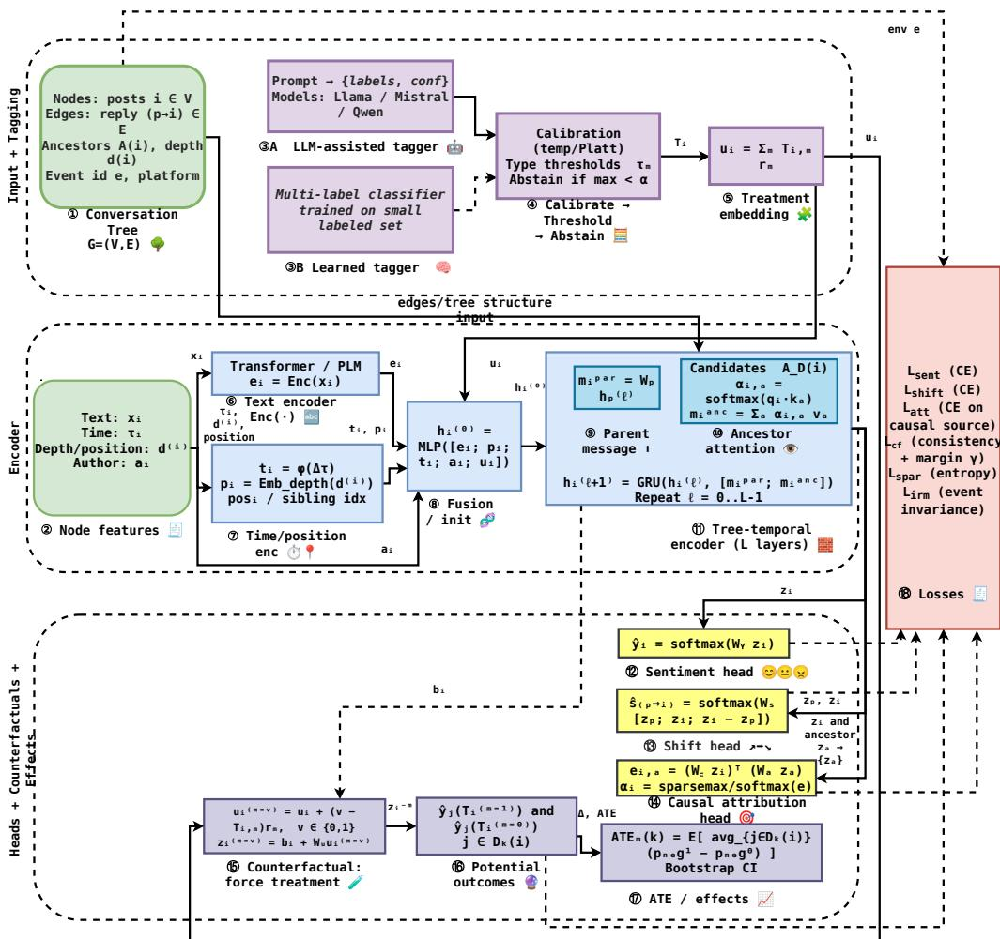
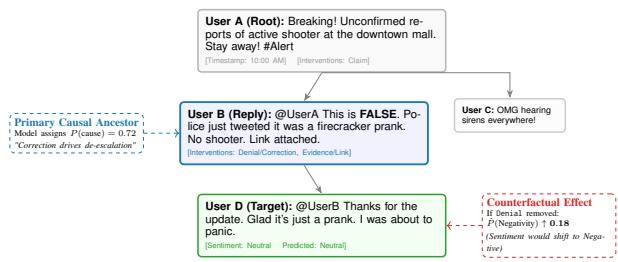
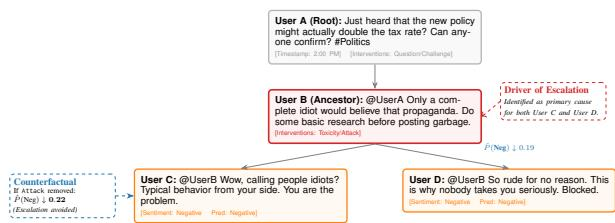

# C³T: Counterfactual Causal Reasoning for Sentiment Shifts in Social-Media Conversation Trees

S M Rafiuddin   
Department of Computer Science   
Oklahoma State University   
Stillwater, OK 74078, USA   
srafiud@okstate.edu   
Atriya Sen   
Department of Computer Science   
Oklahoma State University   
Stillwater, OK 74078, USA   
atriya.sen@okstate.edu

## Abstract

Sentiment in social-media threads does not only vary across posts; it shifts as users re act to claims, corrections, evidence, and hos tility within a branching reply tree. We study why sentiment changes in rumor-centric con versation trees by treating discourse moves (e.g., denial/correction, evidence/link, toxicity/attack) as candidate interventions and asking (i) what sentiment a reply expresses, (ii) whether the sentiment shifts relative to its parent, and (iii) which prior message most plausibly drove the reply’s sentiment. To support this setting, we introduce CASIRE, a causal sentiment reasoning layer over public rumor conversation datasets that adds post level sentiment labels, induced parent–child shift labels, calibrated multi-label intervention tags, and explicitly annotated causal-source la bels. We then propose C3T (Counterfactual Causal Conversation Transformer), a thread structured temporal model that jointly pre dicts node sentiment and shifts, learns sparse ancestor attribution, and supports counterfactual queries by forcing conversational interven tion embeddings on or off to estimate poten tial outcomes. Under an event-level split, C3T improves out-of-event robustness and attribution over text-only, graph-based, and tempo ral baselines, and yields interpretable modelbased effects: denials/corrections and evidence reduce downstream negativity, while toxicity increases it. We also benchmark open-weight LLM prompting baselines and find that added conversational context helps, but attribution remains less reliable, motivating structureaware counterfactual modeling for social media analysis.

## 1 Introduction

Online social-media conversations are interactional: users react to one another and to unfolding events, and threads can converge or polarize in sentiment and stance. These dynamics matter because misinformation diffuses differently than accurate information on Twitter/X (Vosoughi et al., 2018), and exposure to others’ emotional expressions can shift what people express (Kramer et al., 2014). Thus, the key question is not only what sentiment is expressed, but why sentiment shifts within a reply thread, e.g., whether negativity is driven by a new claim, a correction, or a hostile exchange.

Conversation trees provide a natural substrate: a source post induces a branching cascade where local parent–child interactions can propagate globally. Rumour and claim-centric benchmarks capture such trees in breaking-news contexts (Zubiaga et al., 2016a; Gorrell et al., 2019), while prior work has largely focused on stance/veracity, including detection, stance classification, and verification (Zubiaga et al., 2018). In contrast, the affective trajectory, how sentiment changes over time and which conversational inputs plausibly drive that change, remains under-modeled.

Attributing sentiment change is fundamentally causal, but observational social-media data contain endogenous participation and latent confounders. Recent work has formalized causal questions in online interactions, including effects of tone and conversational behaviors (Sridhar and Getoor, 2019; Zhang et al., 2020). However, most formulations operate at coarse conversational attributes rather than discourse-move-specific effects within evolving reply trees. Related work is discussed in Appendix A.

We propose a framework for causal sentiment reasoning that treats conversational discourse moves as candidate interventions and estimates their downstream impact on expressed sentiment. We represent threads as time-stamped trees, learn structure- and time-aware representations, and predict node-level sentiment together with interpretable estimates of which prior conversational moves plausibly shifted sentiment. We evaluate on public rumour benchmarks (Zubiaga et al., 2016a;

Gorrell et al., 2019) and compare against neural and open-weight LLM prompting baselines, including Llama 3 (Grattafiori et al., 2024), Mistral 7B (Jiang et al., 2023), and Qwen 2.5 (Qwen et al., 2024).

Contributions. (1) We formulate causal sentiment reasoning in conversation trees as a conversational-intervention problem grounded in public rumour datasets. (2) We propose a threadstructured temporal model with explicit forcedintervention counterfactual estimation over conversational intervention types. (3) We compare against text-only, graph-based, temporal, and open-LLM prompting baselines, and provide ablations isolating counterfactual loss, intervention tags, eventlevel invariance, and ancestor-window attribution.

## 2 Tasks and Causal Setup

## 2.1 Conversation tree and notation

We model each social-media discussion thread as a rooted, time-stamped conversation tree $\textbf { G } = \mathbf { \Psi } ( \mathbf { V } , \mathbf { E } )$ , where each node $\textit { i } \in \textbf { V }$ corresponds to a post/comment and each directed edge $( p \quad \to \quad i ) \quad \in \quad \mathbf { E }$ indicates that post i replies to its parent $p = \pi ( i )$ . Each node i has timestamp $\tau _ { i }$ (posting time) and observed covariates $\mathbf { X } _ { i } \left( \mathbf { e } . \mathbf { g } . \right.$ , text, author/platform metadata when available, depth/position features, and contextual summaries). We denote the ancestor set of node i by $\boldsymbol { \mathscr { A } } ( i )$ and its depth by $d ( i )$ For causal estimands defined over downstream effects, we use the k-hop descendants of $i ,$ defined as ${ \mathcal { D } } _ { k } ( i ) = \{ j \in \mathbf { V } : \mathrm { d i s t } ( i , j ) \leq k \wedge i \in { \mathcal { A } } ( j ) \}$ where dist $( \cdot , \cdot )$ is the shortest-path length along directed reply edges.

## 2.2 Outcomes: sentiment and sentiment shift

We consider two observational prediction targets. First, each node i has a three-class sentiment label $Y _ { i } ~ \in$ {negative, neutral, positive}. Second, each reply edge $( p  i )$ has a sentiment-shift label $\mathbf { S } _ { p  i } \in \{ - 1 , 0 , + 1 \}$ capturing change from parent to child, representing down, no-change, and up sentiment shifts, respectively. We induce $S _ { p  i }$ by comparing the parent and child sentiment labels using the natural ordering negative $< \mathsf { n e u t r a l < }$ positive.

## 2.3 Treatments: conversational interventions

Beyond predicting $Y _ { i }$ and $S _ { p  i } ,$ , we aim to reason about how specific conversational moves affect downstream sentiment. We represent each post i with a multi-label intervention (treatment) vector $T _ { i } ~ \in ~ \{ 0 , 1 \} ^ { M }$ , where each component indicates the presence of an intervention type (multi-hot encoding). In our primary taxonomy, M includes: (i) claim/rumor assertion, (ii) denial/correction, (iii) evidence/link provision, (iv) authority citation, (v) toxicity/attack, (vi) sarcasm/irony, (vii) question/challenge, and (viii) derail/off-topic move. A node may carry multiple interventions (e.g., a correction with an external evidence link). For causal estimands below, we study the effect of toggling a single intervention type m while holding other components fixed.

## 2.4 Causal estimands

We adopt the potential-outcomes framework (Rubin, 1974; Rosenbaum and Rubin, 1983). Let $Y _ { j } ( \mathbf { t } )$ denote the possibly counterfactual sentiment outcome for node j under a hypothetical intervention assignment t. Since we focus on the causal impact of intervention m at a source node i on downstream sentiment expressed by its descendants, we define a descendant-level aggregated outcome. Let $\mathbb { I } [ \cdot ]$ be an indicator and define negativity as $\mathbb { I } [ Y _ { j } = \mathsf { n e g a t i v e } ]$ . For a fixed hop budget k, the average downstream negativity from node i is $\begin{array} { r } { \bar { Y } _ { i } ^ { \mathrm { n e g } } ( k ) = \frac { 1 } { | \mathcal { D } _ { k } ( i ) | } \sum _ { j \in \mathcal { D } _ { k } ( i ) } \mathbb { I } [ Y _ { j } } \end{array}$ = negative], with the convention $\begin{array} { r } { \bar { Y } _ { i } ^ { \mathrm { n e g } } ( k ) = 0 \mathrm { i f } \mathcal { D } _ { k } ( i ) = \emptyset . } \end{array}$ . To isolate the effect of intervention type m, we consider two counterfactual assignments for the source node i: $T _ { i } ^ { ( m = 1 ) }$ (force intervention m present) and $T _ { i } ^ { ( m = 0 ) }$ (force it absent), while keeping other components unchanged. The k-hop average treatment effect (ATE) for intervention m is $\mathrm { A T E } _ { m } ( k )$ $\mathbb { E } \Big [ \bar { Y } _ { i } ^ { \mathrm { n e g } } ( k ) \Big ( T _ { i } ^ { ( m = 1 ) } \Big ) - \bar { Y } _ { i } ^ { \mathrm { n e g } } ( k ) \Big ( T _ { i } ^ { ( m = 0 ) } \Big ) \Big ]$ where the expectation is taken over source nodes and threads/events under the evaluation split. In this work, we restrict causal-effect reporting to downstream negativity as the primary descendantlevel outcome. Conditional or heterogeneous effects by event type, platform, veracity, or conversational stage are treated as exploratory analyses and are not used as primary evidence unless explicitly reported with confidence intervals.

## 2.5 Assumptions and scope

Our observational causal analysis assumes standard conditions (Rubin, 1974; Rosenbaum and Rubin, 1983): (i) Temporal precedence: interventions at i precede outcomes for descendants $j \in \mathcal { D } _ { k } ( i )$ (timestamps/reply edges). (ii) Consistency: observed outcomes equal the corresponding potential outcomes under the realized assignment. (iii) Positivity: within covariate strata used, intervention m can occur and not occur with non-zero probability. (iv) Limited interference: effects are modeled primarily within k-hop descendants; cross-thread spillovers are treated as a limitation. (v) Conditional ignorability (scope-limited): conditioning on observed thread context (text, position, time, history summaries), assignment of m at i is as-if random for the downstream outcomes; we emphasize patterns stable across events/platforms.

## 3 Method: $\mathbf { C } ^ { 3 } \mathbf { T }$

We propose $\mathbf { C ^ { 3 } T }$ (Counterfactual Causal Conversation Transformer), a thread-structured model that (i) predicts node sentiment and edgelevel sentiment shifts, (ii) attributes each reply’s sentiment to a small set of prior messages (ancestors), and (iii) estimates counterfactual potential outcomes under conversational interventions.

## 3.1 Overview

Given a conversation tree $G ~ = ~ ( V , E )$ , each node $i \in V$ has text $x _ { i } ,$ , timestamp $\tau _ { i }$ , structural position features (e.g., depth $d ( i )$ and sibling index), and optional author/platform features ${ \bf a } _ { i }$ . We do not use gold or predicted parent sentiment labels as input features. Instead, parent information is incorporated through the parent node representation and the reply-tree structure, ensuring that the model receives the same observable information at training and inference time. $\mathrm { C ^ { 3 } T }$ outputs: (i) sentiment logits $\hat { \mathbf { y } } _ { i }$ for each node label $Y _ { i } ,$ (ii) shift logits $\hat { \mathbf { s } } _ { p  i }$ for each reply edge $( p  i )$ and its shift label $S _ { p  i }$ , (iii) an ancestor attribution distribution $\alpha _ { i }$ over candidate ancestors for reply node i, and (iv) descendant-level counterfactual predictions under forced treatment-on and treatment-off assignments, $\hat { \mathbf { y } } _ { j } ( T _ { i } ^ { ( m = 1 ) } )$ and $\hat { \mathbf { y } } _ { j } ( T _ { i } ^ { ( m = 0 ) } )$ , for descendants $j \in \mathcal { D } _ { k } ( i )$ of a source node i and intervention type m.

## 3.2 Intervention tagging module

Each post i receives a multi-label treatment vector $T _ { i } \in \{ 0 , 1 \} ^ { M }$ indicating intervention types (claim, denial/correction, evidence/link, authority cite, toxicity/attack, sarcasm, question/challenge, derail). We consider two tagging variants. LLM-assisted tagging. We use Llama 3-8B to output intervention labels with confidence scores (Grattafiori et al., 2024). Let raw scores be $\tilde { s } _ { i , m } \in [ 0 , 1 ]$ . Because LLM confidences can be poorly calibrated, we calibrate scores using post-hoc scaling on a validation subset (temperature scaling (Guo et al., 2017) or sigmoid/Platt scaling (Platt, 2000)). After calibration we obtain $s _ { i , m }$ and set $T _ { i , m } = \mathbb { I } [ s _ { i , m } \geq \tau _ { m } ]$ where $\tau _ { m }$ is type-specific and chosen on validation to optimize F1/coverage tradeoff. We additionally allow an abstain option: if $\operatorname* { n a x } _ { m } s _ { i , m } < \alpha$ , we mark $T _ { i }$ as unknown and exclude it from the counterfactual loss, following selective prediction principles (Geifman and El-Yaniv, 2017). Learned tagger (ablation / alternative). We train a lightweight multi-label classifier on a small manually labeled subset $\mathcal { L } \colon \mathbf { s } _ { i } = \sigma \big ( W _ { t } \operatorname { E n c } ( x _ { i } ) + \mathbf { b } _ { t } \big )$ , where Enc(·) is the text encoder and σ is elementwise sigmoid. This tagger replaces the LLM module and isolates the value of LLM-assisted weak supervision.

## 3.3 Conversation encoder (structure + time)

We encode each post with a Transformer text encoder (Vaswani et al., 2017), producing ${ \bf e } _ { i } \ = \ \mathrm { E n c } ( x _ { i } ) \ \in \ \mathbb { R } ^ { d } ,$ , and add structural and temporal features $\begin{array} { r c l } { \mathbf { p } _ { i } } & { = } & { \operatorname { E m b } _ { \mathrm { d e p t h } } ( d ( i ) ) } \end{array}$ and $\mathbf { t } _ { i } = \phi ( \Delta \tau _ { i } )$ , where $\Delta \tau _ { i } = \tau _ { i } - \tau _ { \pi ( i ) }$ for non-root replies and $\Delta \tau _ { i } = 0$ for root nodes. Here, $\phi ( \cdot )$ is a continuous time encoding (e.g., sinusoidal / MLP time features as in temporal graph attention (Xu et al., 2020)), $\mathrm { E m b } _ { \mathrm { d e p t h } }$ is a learned depth embedding, and ${ \bf a } _ { i }$ denotes optional author/platform features. We map the treatment vector $T _ { i }$ to an embedding $\begin{array} { r } { \mathbf { u } _ { i } = \sum _ { m = 1 } ^ { M } T _ { i , m } \mathbf { r } _ { m } , } \end{array}$ with learned $\mathbf { r } _ { m } \in \mathbb { R } ^ { d }$ , and initialize each node as $\begin{array} { r l r } { \mathbf { h } _ { i } ^ { ( 0 ) } } & { = } & { \mathrm { M L P } ( [ \mathbf { e } _ { i } ; \mathbf { p } _ { i } ; \mathbf { t } _ { i } ; \mathbf { a } _ { i } ; \mathbf { u } _ { i } ] ) } \end{array}$ . No gold or predicted parent sentiment label is used as an input feature. We then perform L layers of tree-temporal updates using parent message passing and ancestor attention. For non-root replies, the parent message is $\mathbf { m } _ { i } ^ { \mathrm { p a r } } = \mathbf { W } _ { p } \mathbf { h } _ { \pi ( i ) } ^ { ( \ell ) } .$ while for root nodes we set m $\mathbf { \Lambda } _ { \cdot i } ^ { \mathrm { p a r } } = \mathbf { 0 } . \operatorname { L e t } \mathcal { A } _ { D } \dot { ( i ) }$ be the $D$ nearest ancestors of i; if $\mathcal { A } _ { D } ( i ) = \emptyset$ we set m $\mathbf { \Delta } _ { i } ^ { \mathrm { a n c } } = \mathbf { 0 }$ , otherwise we compute $\alpha _ { i , a } =$ softma $\mathfrak { c } _ { a \in \mathcal { A } _ { D } ( i ) } \left( ( \mathbf { W } _ { q } \mathbf { h } _ { i } ^ { ( \ell ) } ) ^ { \top } ( \mathbf { W } _ { k } \mathbf { h } _ { a } ^ { ( \ell ) } ) / \sqrt { d } \right)$ and $\begin{array} { r } { \mathbf { m } _ { i } ^ { \mathrm { a n c } } \ = \ \sum _ { a \in \mathcal { A } _ { D } ( i ) } \alpha _ { i , a } \mathbf { W } _ { v } \mathbf { h } _ { a } ^ { ( \ell ) } } \end{array}$ . A sibling aggregation term can be added by pooling representations of nodes sharing the same parent. We update ${ \bf h } _ { i } ^ { ( \ell + 1 ) } \ = \ \mathrm { G R U } ( { \bf h } _ { i } ^ { \breve { ( \ell ) } } , [ { \bf m } _ { i } ^ { \mathrm { p a r } } ; \dot { \bf m } _ { i } ^ { \mathrm { a n c } } ] )$ following dynamic-graph design patterns that combine attention and recurrent updates for time-evolving neighborhoods (Rossi et al., 2020; Xu et al., 2020), and use ${ \bf z } _ { i } = { \bf h } _ { i } ^ { ( L ) }$ as the final node representation.

  
Figure 1: $\mathbf { C ^ { 3 } T }$ architecture. A treatment tagger yields the multi-label intervention vector $T _ { i }$ . A temporal/tree encoder produces node representations using parent message passing and ancestor attention. Prediction heads estimate sentiment, $s h i f t .$ , and sparse ancestor attribution. Finally, forced on/off intervention embeddings yield potential-outcome predictions for downstream effect estimation.

## 3.4 Prediction heads

Sentiment head. We predict the sentiment distribution for node i as $\hat { \mathbf { y } } _ { i } = \mathrm { s o f t m a x } ( \mathbf { W } _ { y } \mathbf { z } _ { i } + \mathbf { b } _ { y } )$ Shift head. For edge $( p \to i )$ , we predict the sentiment shift using paired parent–child features as $\hat { \mathbf { s } } _ { p  i } = \mathrm { s o f t m a x } ( \mathbf { W } _ { s } [ \mathbf { z } _ { p } ; \mathbf { z } _ { i } ; \mathbf { z } _ { i } - \mathbf { z } _ { p } ] + \mathbf { b } _ { s } )$

## 3.5 Counterfactual representation learning

Our goal is to avoid purely correlational use of $T _ { i }$ and instead learn representations that support counterfactual queries: “how would the sentiment prediction change if intervention m were forced present or absent?” For intervention type m, we define a forced assignment $T _ { i } ^ { ( m = v ) }$ for $v \in \{ 0 , 1 \}$ such that $T _ { i , m } ^ { ( m = v ) } = v$ and $\dot { T _ { i , r } ^ { ( m = v ) } } = T _ { i , r }$ for all $r \neq m$ . The corresponding treatment embedding is $\mathbf { u } _ { i } ^ { ( m = v ) } = \mathbf { u } _ { i } + ( v - T _ { i , m } ) \mathbf { r } _ { m }$ , where $v = 0$ gives the treatment-off counterfactual and $v = 1$ gives the treatment-on counterfactual, including cases where the intervention was originally absent. To reduce compute, we use a two-stream decomposition, $\mathbf { z } _ { i } ^ { ( m = v ) } = \mathbf { b } _ { i } + \mathbf { W } _ { u } \mathbf { u } _ { i } ^ { ( m = v ) }$ , where bi is the structure+text representation produced by the encoder when $T _ { i }$ is omitted from the input; specifically, $\mathbf { b } _ { i }$ is computed from $[ \mathbf { e } _ { i } ; \mathbf { p } _ { i } ; \mathbf { t } _ { i } ; \mathbf { a } _ { i } ]$ after which the treatment embedding is injected additively. We then obtain potential-outcome predictions as $\hat { \mathbf { y } } _ { i } ( T _ { i } ^ { ( m = v ) } )$ = $\mathrm { s o f t m a x } ( \mathbf { W } _ { y } \mathbf { z } _ { i } ^ { ( m = v ) }$ + $\mathbf { b } _ { y } )$ for $\begin{array} { r l r } { v } & { { } \in } & { \{ 0 , 1 \} } \end{array}$ . This design is inspired by representation-learning approaches for counterfactual inference that separate nuisance variation from treatment-sensitive factors (Johansson et al., 2016; Shalit et al., 2017). Losses. We optimize the weighted objective $\mathcal { L } \ = \ \mathcal { L } _ { \mathrm { s e n t } } \ +$ $\lambda _ { \mathrm { s h i f t } } \mathcal { L } _ { \mathrm { s h i f t } } + \lambda _ { \mathrm { a t t } } \mathcal { L } _ { \mathrm { a t t } } + \lambda _ { \mathrm { c f } } \mathcal { L } _ { \mathrm { c f } } + \lambda _ { \mathrm { s p a r } } \mathcal { L } _ { \mathrm { s p a r } }$ + $\lambda _ { \mathrm { i r m } } \mathcal { L } _ { \mathrm { i r m } }$ , where $\begin{array} { r l r } { \mathcal { L } _ { \mathrm { s e n t } } } & { { } = } & { \sum _ { i \in V } \mathrm { C E } ( Y _ { i } , \hat { \mathbf { y } } _ { i } ) } \end{array}$ and $\begin{array} { r } { \begin{array} { l l l } { { \mathcal L } _ { \mathrm { s h i f t } } } & { = } & { \sum _ { ( p \to i ) \in E } { \mathrm { C E } } \big ( S _ { p \to i } , \hat { \mathbf s } _ { p \to i } \big ) } \end{array} } \end{array}$ . For counterfactual consistency, we define $\delta _ { i , m } \ =$ $\| \hat { \mathbf { y } } _ { i } ( T _ { i } ^ { ( m = 1 ) } ) - \hat { \mathbf { y } } _ { i } ( T _ { i } ^ { ( m = 0 ) } ) \| _ { 2 } ^ { 2 }$ and use the per-node penalty $\ell _ { i , m } ^ { \mathrm { c f } } = T _ { i , m } \operatorname* { m a x } ( 0 , \gamma - \delta _ { i , m } ) + ( 1 -$ $T _ { i , m } ) \beta \delta _ { i , m }$ , where $\gamma > 0$ encourages non-trivial sensitivity for observed interventions and $\beta$ controls sensitivity to interventions absent from the observed post. The total counterfactual loss is $\begin{array} { r } { \mathcal { L } _ { \mathrm { c f } } = \sum _ { i \in V } \sum _ { m = 1 } ^ { M } \ell _ { i , m } ^ { \mathrm { c f } } . } \end{array}$

## 3.6 Event-level invariance for out-of-distribution robustness

Threads are grouped by events, and we treat each event e as an environment $\mathcal { E } _ { e }$ . To reduce reliance on event-specific predictive cues, we use an IRMstyle penalty (Arjovsky et al., 2019). Let $\mathcal { L } _ { \mathrm { p r e d } } =$ $\mathcal { L } _ { \mathrm { s e n t } } + \lambda _ { \mathrm { s h i f t } } \mathcal { L } _ { \mathrm { s h i f t } }$ denote the combined prediction loss within an environment. We define the penalty as $\begin{array} { r } { \mathcal { L } _ { \mathrm { i r m } } = \sum _ { e } \Big \| \nabla _ { w } \mathcal { L } _ { \mathrm { p r e d } } ^ { ( e ) } ( w \cdot \Phi _ { \theta } ) \big | _ { w = 1 } \Big \| _ { 2 } ^ { 2 } . } \end{array}$ where $\Phi _ { \theta }$ denotes the learned representation feeding the prediction heads. This penalty is used for eventlevel predictive invariance; it does not by itself identify causal intervention effects.

## 3.7 Causal attribution head

For each reply node i, we predict which ancestor most plausibly caused its sentiment or shift. We consider candidate ancestors $A _ { D } ( i )$ and compute scores $e _ { i , a } = ( \mathbf { W } _ { c } \mathbf { z } _ { i } ) ^ { \top } ( \mathbf { W } _ { a } \mathbf { z } _ { a } )$ for $a \in \mathcal { A } _ { D } ( i )$ then normalize to obtain an attribution distribution $\pmb { \alpha } _ { i }$ . We use either softmax or a sparse normalizer (e.g., sparsemax) to encourage peaked distributions (Martins and Astudillo, 2016): $\begin{array} { r l } { \alpha _ { i } } & { { } = } \end{array}$ Norm $( \{ e _ { i , a } \} _ { a \in \mathcal { A } _ { D } ( i ) } )$ . Nodes with empty ancestor sets are excluded from attribution training and evaluation. Given CASIRE causal-source labels $C _ { i }$ , constructed using the annotation protocol in Appendix B.4, we train with $\begin{array} { r l } { \mathcal { L } _ { \mathrm { a t t } } } & { { } = } \end{array}$ $\textstyle \sum _ { i \in V _ { \mathrm { a t t } } } \operatorname { C E } ( C _ { i } , \pmb { \alpha } _ { i } )$ , where $V _ { \mathrm { a t t } }$ is the set of reply nodes with valid causal-source labels. Sparse attribution regularizer. To discourage “everything caused everything,” we add an entropy penalty: $\begin{array} { r } { \mathcal { L } _ { \mathrm { s p a r } } = \sum _ { i \in V _ { \mathrm { a t t } } } H ( \pmb { \alpha } _ { i } ) } \end{array}$ , which encourages lowentropy, localized attributions while being tuned to avoid overconfidence. Inference. We output arg $\operatorname* { m a x } _ { a \in \mathcal { A } _ { D } ( i ) } \alpha _ { i , a }$ as the top-1 causal ancestor; top-k ancestors are used for qualitative analysis.

## 3.8 Potential outcomes and estimated effects

For each source node i and intervention type $m , { \mathrm { C ^ { 3 } T } }$ estimates descendant-level potential outcomes by forcing the source intervention assignment to $\stackrel { \cdot } { T _ { i } ^ { ( m = 1 ) } } \mathrm { { o r } } T _ { i } ^ { ( m = 0 ) }$ , while keeping other intervention components fixed. For each descendant $j \in \mathcal { D } _ { k } ( i )$ , we compute the predicted negativity probabilities $\hat { p } _ { j , 1 } ^ { \mathrm { n e g } } ~ = ~ \hat { p } _ { j } ^ { \mathrm { n e g } } ( T _ { i } ^ { ( m = 1 ) } )$ ) and $\hat { p } _ { j , 0 } ^ { \mathrm { n e g } } = \hat { p } _ { j } ^ { \mathrm { n e g } } ( T _ { i } ^ { ( m = 0 ) } )$ using the modified source representation in the ancestor context of descendant $j .$ . The source-level descendant effect is $\Delta _ { i , m } ( k ) =$ $\begin{array} { r } { | \mathcal { D } _ { k } ( i ) | ^ { - 1 } \sum _ { j \in \mathcal { D } _ { k } ( i ) } ( \hat { p } _ { j , 1 } ^ { \mathrm { n e g } } - \hat { p } _ { j , 0 } ^ { \mathrm { n e g } } ) } \end{array}$ , with $\Delta _ { i , m } ( k ) =$ 0 when $\mathcal { D } _ { k } ( \bar { i } ) \stackrel { \cdot \cdot } { = } \varnothing$ . We estimate $\mathrm { A T E } _ { m } ( k ) =$ $\mathbb { E } _ { i } [ \Delta _ { i , m } ( k ) ]$ over source nodes in the evaluation split.

## 3.9 Complexity and implementation notes

Let n be the number of nodes in a thread, d the embedding dimension, and D the ancestor window. Ancestor attention requires $O ( n D d )$ operations per layer, and parent message passing adds $O ( n d )$ . We batch by threads (padding to the maximum nodes per batch) and restrict $D$ to a small constant $( { \bf e . g . } , D \in [ 8 , 3 2 ] )$ to control runtime for deep trees. Counterfactual prediction reuses $\mathbf { b } _ { i }$ and only swaps the treatment embedding, making the added compute linear in M with a small constant in practice.

## 4 Experimental Setup

## 4.1 Baselines

We compare $\mathrm { C ^ { 3 } T }$ against two groups of baselines: classic neural baselines that use text and/or thread structure, and prompt-only open LLM baselines evaluated under a fixed prompting protocol. For the non-LLM baselines, we include a text-only Transformer with a pretrained RoBERTa/DeBERTa encoder for node-level sentiment classification and parent–child shift prediction. We also adapt rumor-propagation graph models by replacing their original veracity heads with sentiment and shift heads. This group includes Bi-GCN (Bian et al., 2020), GACL (Sun et al., 2022b), and temporal graph models TGAT/TGN (Xu et al., 2020; Rossi et al., 2020), where each thread is represented as a reply graph or timestamp-ordered interaction graph.

For attribution evaluation, graph and temporal baselines are augmented with the same bilinear ancestor-scoring head used by $\mathrm { C ^ { 3 } T }$ and trained on the same CASIRE causal-source labels. These attribution variants do not use $\mathrm { C ^ { 3 } T ' }$ treatment embeddings, counterfactual loss, or event-invariance penalty. Text-only baselines do not have access to ancestor structure and are therefore not evaluated on causal-source attribution.

For the LLM baselines, we evaluate open-weight instruction-tuned models, including Llama 3, Gemma 2, Qwen2.5, and Mistral (Grattafiori et al., 2024; Gemma Team et al., 2024; Qwen et al., 2024; Jiang et al., 2023), as prompt-only systems. To reduce prompt-induced variability, we use fixed templates, fixed demonstrations, fixed option order, deterministic decoding, and the same output schema across all models. We evaluate three context settings: node-only, node+parent, and node+ancestor summary. For attribution, LLMs receive a numbered candidate-ancestor list and must return a single index; invalid, out-of-range, or unparsable outputs are mapped to ABSTAIN and counted as incorrect. LLM baselines are reported for sentiment and attribution only; shift prediction is evaluated for supervised neural models.

## 4.2 Metrics

We report macro-F1 for node-level sentiment prediction $Y _ { i }$ over the three sentiment classes and macro-F1 for shift prediction $S _ { p  i } \in$ {down, same, up} over reply edges. Shift metrics are reported for supervised neural models. For causal-source attribution, we report Top-1 accuracy and mean reciprocal rank (MRR) over candidate ancestors within the evaluation window. For causal effects, we report $\mathrm { A T E } _ { m } ( k )$ for each intervention type m with 95% bootstrap confidence intervals computed via thread-level resampling (Efron, 1979).

## 4.3 Training Details

We train the main $\mathrm { C ^ { 3 } T }$ model with DeBERTa-base as the pretrained text backbone (He et al., 2021), set d to the backbone hidden size, use $L \in \{ 2 , 3 \}$ tree-temporal encoder layers and ancestor window $\textit { D } \in \{ 8 , 1 6 , 3 2 \}$ , apply dropout of 0.1, and optimize with AdamW (Loshchilov and Hutter, 2019). We select hyperparameters on the development split, early-stop using development sentiment macro-F1 with patience 3, report results over 3 random seeds, batch examples by threads with node-level padding, and truncate each post to a fixed token budget. All non-LLM baselines use the same preprocessing, event-level split, and evaluation metrics wherever applicable; for graph baselines (Bi-GCN/GACL/TGAT/TGN), we follow recommended settings and tune only learning rate and dropout on the development set (Bian et al., 2020; Sun et al., 2022b; Xu et al., 2020; Rossi et al., 2020). For LLM baselines, we keep prompts fixed and log the context limit, prompt template ID, few-shot k, decoding setup, and maximum generation length, varying only the model checkpoint (Grattafiori et al., 2024; Gemma Team et al., 2024; Qwen et al., 2024; Jiang et al., 2023). Full templates and parsing rules are provided in $\mathsf { A p - }$ pendix B.

## 5 Results

## 5.1 Main quantitative results

Table 1 summarizes results on node sentiment $( Y _ { i } )$ edge-level shift $( S _ { p  i } )$ , and causal ancestor attribution $( C _ { i } ) .$ , under in-domain evaluation (heldout threads from seen events) and event-OOD evaluation (held-out events; primary). Across both regimes, $\mathrm { C ^ { 3 } T }$ performs best overall, with the largest gains in attribution and event-OOD robustness.

## 5.2 Open LLM baselines

Table 2 reports open-weight LLM prompting baselines under the fixed protocol, comparing zeroshot (ZS) vs. few-shot (FS) and three context settings (node-only, node+parent, node+ancestor summary bounded by the context limit). Beyond sentiment classification, we evaluate attribution by prompting the LLM to select the prior message most responsible for the target sentiment.

## 5.3 Generalization and social-media interpretation

$\mathrm { C ^ { 3 } T }$ reduces the event-OOD gap relative to in-domain performance (Table 1), suggesting that intervention-aware, event-invariant modeling yields representations less tied to eventspecific surface cues (names, places, hashtags) and more tied to conversational function $( \mathrm { e . g . }$ evidence-backed corrections vs. hostile attacks). The largest gains are for causal ancestor attribution, indicating more reliable identification of earlier messages that shape affective reactions rather than defaulting to the immediate parent. Prompted LLM baselines benefit from added context (Node+Parent/Node+AncSum) but remain less stable for attribution, highlighting limitations of prompt-only handling of long, branching threads. Overall, structure- and intervention-aware counterfactual learning improves sentiment-dynamics modeling beyond post-level classification.

<table><tr><td rowspan="2">Model</td><td colspan="2">In-domain</td><td colspan="2">Event-OOD (held-out events)</td></tr><tr><td>Sent. F1</td><td>Shift F1 Attr. Top-1 / MRR</td><td>Sent. F1</td><td>Shift F1 Attr. Top-1 / MRR</td></tr><tr><td>Text-only Transformer</td><td> $6 3 . 4 \pm 0 . 7 4 8 . 2 \pm 0 . 9$ </td><td> $- / -$ </td><td> $4 9 . 5 \pm 1 . 2 3 9 . 1 \pm 1 . 5$ </td><td></td><td>- / -</td></tr><tr><td>Bi-GCN (adapted) (Bian et al., 2020)</td><td> $6 5 . 1 \pm 0 . 5 5 5 5 . 7 \pm 0 . 6$ </td><td> $2 3 . 4 / 3 5 . 8$ </td><td> $5 1 . 2 \pm 1 . 0 4 4 . 3 \pm 1 . 1$ </td><td></td><td> $1 9 . 8 / 3 1 . 2 $ </td></tr><tr><td>GACL (adapted) (Sun et al., 2022b)</td><td> $6 6 . 8 \pm 0 . 6 5 7 . 2 \pm 0 . 5$ </td><td> $2 6 . 1 / 3 8 . 5$ </td><td> $5 5 . 9 \pm 0 . 9 4 8 . 6 \pm 0 . 8$ </td><td></td><td> $2 2 . 4 / 3 4 . 1$ </td></tr><tr><td>Temporal GNN (TGN/TGAT) (Rossi et al., 2020; Xu et al., 2020)</td><td> $6 6 . 2 \pm 0 . 8 5 6 . 5 \pm 0 . 7$ </td><td> $2 5 . 8 / 3 7 . 9$ </td><td> $5 4 . 1 \pm 1 . 1 4 7 . 2 \pm 1 . 3$ </td><td></td><td> $2 1 . 5 / 3 3 . 7 $ </td></tr><tr><td>C3T (ours)</td><td> $\overline { { { 6 8 . 5 \pm 0 . 4 6 1 . 3 \pm 0 . 5 } } }$ </td><td> $\overline { { 4 1 . 7 / 5 9 . 4 } }$ </td><td> $\overline { { { \bf 6 0 . 4 \pm 0 . 6 ~ 5 4 . 8 \pm 0 . 7 } } }$ </td><td></td><td> $\overline { { 3 6 . 2 / 5 2 . 1 } }$ </td></tr></table>

Table 1: Main results. Sentiment and shift scores are reported as mean ± standard deviation across 3 random seeds. Attribution is reported as seed-averaged Top-1 accuracy / MRR. $\mathrm { C ^ { 3 } T }$ demonstrates superior robustness and stability, particularly in the primary Event-OOD evaluation.

<table><tr><td rowspan="2">LLM / Context</td><td colspan="3">Sentiment (macro-F1) Attribution (Top-1 / MRR)</td></tr><tr><td>zS FS</td><td>ZS</td><td>FS</td></tr><tr><td>Llama3 (Node) (Grattafiori et al., 2024)</td><td>46.5 ± 1.8 50.8 ± 1.6</td><td>12.4/21.5</td><td>14.8 / 24.2</td></tr><tr><td>Llama3 (Node+Parent)</td><td>52.3 ± 1.5 55.4 ± 1.4</td><td>17.1 / 28.6</td><td>20.5 / 31.9</td></tr><tr><td>Llama3 (Node+AncSum)</td><td>56.8 ± 1.3 59.2 ± 1.2</td><td>21.4/33.7</td><td>25.1 / 38.4</td></tr><tr><td>Qwen2.5 (Node+AncSum) (Qwen et al., 2024)</td><td>56.2 ± 1.4 58.9 ± 1.3</td><td>22.1 /34.2</td><td>25.8 / 39.1</td></tr><tr><td>Mistral (Node+AncSum) (Jiang et al., 2023)</td><td>54.1 ± 1.6 56.7 ± 1.5</td><td>19.8 /31.5</td><td>23.4 / 36.8</td></tr><tr><td>Gemma2 (Node+AncSum) (Gemma Team et al., 2024)</td><td>55.5 ± 1.5 57.8 ± 1.3</td><td>20.6/32.8</td><td>24.2 / 37.5</td></tr></table>

Table 2: Open LLM baselines. ZS: zero-shot; FS: fewshot with fixed k demonstrations. Sentiment scores are reported as mean macro-F1 ± half-width of the 95% thread-level bootstrap CI. Attribution is reported as Top-1 accuracy / MRR. Context variants are Node, Node+Parent, and Node+AncSum.
<table><tr><td>Model / Ablation</td><td>Sent. F1</td><td>Shift F1</td><td>Attr. Top-1 / MRR</td></tr><tr><td>C3T (full)</td><td>60.4 ± 0.6</td><td>54.8 ± 0.7</td><td>36.2 / 52.1</td></tr><tr><td>A1: w/o counterfactual loss</td><td>58.1 ± 0.8 52.9 ± 0.9</td><td></td><td>32.4 / 48.5</td></tr><tr><td>A2: w/o intervention tags (Ti)</td><td> $5 5 . 7 \pm 1 . 1$ </td><td> $4 9 . 6 \pm 1 . 2$ </td><td>25.1 / 38.9</td></tr><tr><td>A3: w/o event invariance</td><td> $5 6 . 9 \pm 0 . 9$ </td><td> $5 1 . 3 \pm 1 . 0$ </td><td>34.1 / 50.2</td></tr><tr><td>A4: parent-only attribution</td><td> $5 9 . 2 \pm 0 . 5$ </td><td> $5 3 . 7 \pm 0 . 6$ </td><td>21.5 / 21.5</td></tr></table>

Table 3: Core ablations on the event-OOD test set. Sentiment and shift scores are reported as mean ± standard deviation across 3 seeds. Attribution is reported as seed-averaged Top-1 accuracy / MRR. The sharp drop in attribution for A2 and A4 validates the necessity of intervention tags and ancestor modeling.

## 6 Ablations and Robustness

We ablate key components of $\mathrm { C ^ { 3 } T }$ to isolate which design choices drive event-OOD performance on (i) sentiment prediction, (ii) shift detection, and (iii) causal ancestor attribution. Unless stated otherwise, all ablations use the same event-level split, identical training budget, and identical hyperparameter search ranges as the full model, and results are reported on the held-out event-OOD test set. Core ablations. We run four core ablations: A1 removes the counterfactual loss by setting $\lambda _ { \mathrm { c f } } = 0 ; \mathbf { A } 2$ removes intervention tags by setting $\mathbf { u } _ { i } = \mathbf { 0 } ;$ A3 removes event-level predictive invariance by setting $\lambda _ { \mathrm { i r m } } = 0 ;$ and A4 restricts attribution candidates to the immediate parent only, $A _ { D } ( i ) = \{ \pi ( i ) \}$ , instead of using the full ancestor window. These ablations test the roles of counterfactual regularization, explicit intervention signals, event-level invariance, and ancestor-window modeling.

<table><tr><td>Intervention (source node)</td><td colspan="3">ATEm(k) on downstream negativity [95% CI]</td></tr><tr><td>Denial / correction</td><td> $- 0 . 1 4 2$ </td><td> $[ - 0 . 1 7 8 , - 0 . 1 0 6 ]$ </td><td></td></tr><tr><td>Evidence / link</td><td>-0.118</td><td> $\left[ - 0 . 1 5 3 , - 0 . 0 8 3 \right]$ </td><td></td></tr><tr><td>Authority citation</td><td>-0.096</td><td> $- 0 . 1 3 5 , - 0 . 0 5 8 ]$ </td><td></td></tr><tr><td>Question / challenge</td><td>-0.015</td><td> $[ - 0 . 0 6 2 , + 0 . 0 3 2 ]$ </td><td></td></tr><tr><td>Claim / assertion</td><td>+0.032</td><td> $[ - 0 . 0 1 2 , + 0 . 0 7 6 ]$ </td><td></td></tr><tr><td>Derail / off-topic</td><td>+0.048</td><td> $\dot { \left| + 0 . 0 0 5 , + 0 . 0 9 1 \right| }$ </td><td></td></tr><tr><td>Sarcasm / irony</td><td>+0.064</td><td> $\mathsf { \tilde { I } } + 0 . 0 1 5 , + 0 . 1 1 3 $ </td><td></td></tr><tr><td>Toxicity / attack</td><td>+0.235</td><td> $\mathrm { \tilde { [ + 0 . 1 9 2 , + 0 . 2 7 8 ] } }$ </td><td></td></tr></table>

Table 4: Estimated 2-hop Average Treatment Effects $( \mathrm { A T E } _ { m } ( k )$ with k = 2) for all $M = 8$ conversational interventions on downstream negativity. Rows are sorted by effect magnitude (De-escalation → Escalation). CIs computed via thread-level bootstrap (Efron, 1979). Note that Question and Claim cross zero, indicating contextdependent effects.

## 7 Causal Effects and Social Insights

Beyond predictive performance, we use $\mathrm { C ^ { 3 } T ^ { \circ } s }$ counterfactual branch to derive interpretable social findings: how conversational interventions shape downstream sentiment trajectories and what thread-level narratives explain these patterns. All effects are observational, and should be interpreted as model-based causal estimates conditional on measured context.

## 7.1 Estimated effects of interventions

We estimate intervention effects via the k-hop ATE: for each intervention type m in our taxonomy (claim/assertion, denial/correction, evidence/link, authority citation, toxicity/attack, sarcasm/irony, question/challenge, and derail/off-topic), we compute the expected change in downstream negativity within k hops when toggling $T _ { i , m }$ from 0 to 1 while holding the remaining intervention components fixed, and report 95% thread-level bootstrap CIs (Efron, 1979); Table 4 summarizes the results.

Interpretation (social-media lens). Across events, denials/corrections and evidence provision tend to reduce downstream negativity when they occur early in a thread, consistent with the idea that clarifying uncertainty can de-escalate affect and reduce antagonistic replies. In contrast, toxicity/attack exhibits a positive ATE on negativity, indicating that hostile discourse acts as an escalation trigger whose effect propagates beyond the immediate parent–child exchange. Questions/challenges show mixed effects: in some events they function as epistemic “speed bumps” (reducing negativity), while in others they act as confrontational prompts (increasing negativity), suggesting that the form of a question and the event context jointly shape downstream tone. Sarcasm also shows context-dependent effects, reflecting platform norms where irony may be used either to ridicule (escalation) or to signal in-group alignment (stabilization).

## 7.2 Heterogeneous effects

We conduct exploratory checks for whether intervention effects vary by information quality and conversational stage when the required metadata are available. Specifically, we inspect effect patterns across veracity/stance strata and compare early versus late source nodes using timestamp quartiles and structural depth. These analyses are used only to contextualize the aggregate ATE results in Table 4; we do not treat them as primary findings unless the corresponding subgroup estimates and confidence intervals are reported.

## 7.3 Qualitative case studies

To make the causal attributions concrete, we present two anonymized and paraphrased case studies derived from held-out rumor-thread examples (Figure 2 and Figure 3). The examples preserve the relevant conversational structure, intervention labels, sentiment labels, and model predictions, but do not reproduce original user text verbatim. Each case study includes a tree snippet, the predicted causal ancestor for a target reply, and a counterfactual sentiment change when removing a key intervention. For readability, the figures report the effect of removing an observed intervention, $R _ { i , m }$ = $\hat { p } ^ { \mathrm { n e g } } ( T _ { i } ^ { ( m = 0 ) } ) - \hat { p } ^ { \mathrm { n e g } } ( T _ { i } ^ { ( m = 1 ) } )$ , whereas Table 4 reports the ATE using the treatment-on minus treatment-off convention. Thus, for de-escalating interventions such as denial/correction, a positive removal effect corresponds to a negative ATE. Case 1 (correction-driven de-escalation). In Thread A, an early denial/correction is selected by $\mathrm { C ^ { 3 } T }$ as the dominant causal ancestor for a later neutral reply. Removing the denial label raises the target’s predicted negativity by $R _ { i , \mathrm { d e n i a l } } = + 0 . 1 8$ , equivalently $\Delta _ { i , \mathsf { d e n i a l } } = - 0 . 1 8$ under the treatment-on minus treatment-off convention. Case 2 (attackdriven escalation). In Thread B, a toxic/attacking ancestor receives most attribution mass for multiple negative descendants. Removing the attack label reduces predicted negativity by $R _ { i , \tt t o x } =$ −0.22, equivalently $\Delta _ { i , \mathrm { t o x } } ~ = ~ + 0 . 2 2$ under the treatment-on minus treatment-off convention.

  
Figure 2: Case Study A (De-escalation). This anonymized and paraphrased dataset-derived example illustrates a Denial/Correction intervention (User B) identified by $\mathrm { C ^ { 3 } T }$ as the primary causal ancestor for the subsequent neutral reply (User D). Removing the correction tag increases predicted negativity by $R _ { i , \mathsf { d e n i a l } } =$ +0.18, corresponding to $\Delta _ { i , \mathrm { d e n i a l } } = - 0 . 1 8$ under the treatment-on minus treatment-off convention.

  
Figure 3: Case Study B (Escalation). This anonymized and paraphrased dataset-derived example illustrates a Toxicity/Attack intervention (User B) identified by $\mathrm { C ^ { 3 } T }$ as the primary driver of negative sentiment for multiple descendants (Users C and D). Removing the attack label reduces predicted negativity, corresponding to a positive treatment-on effect for toxicity under the ATE convention.

## 8 Additional Analysis

Data and structural scope. We evaluate on the public PHEME/RumourEval conversation-tree benchmarks. In the primary event-OOD setting, training contains 980 threads from charliehebdo, ferguson, and germanwings-crash; development contains 175 ottawashooting threads; and testing contains 205 sydneysiege threads (Table 5). No tree is shared across partitions; full reconstructable reply structures are retained. The available statistics omit post and edge totals, mean descendants, leaf percentage, and ATE-eligible nodes; we make no claims about these properties. $\mathrm { C ^ { 3 } T }$ uses the nearest $D = 1 6$ ancestors for attribution and $k = 2$ descendants for intervention analysis; replies without candidates are excluded, while sources without two-hop descendants receive zero by convention. The reported effects therefore characterize shortrange propagation within observed rumor-centered trees, not exposure outside the tree, cross-branch reading, or longer-range diffusion.

Counterfactual estimand and assumptions. For intervention type $m , { \mathrm { C ^ { 3 } T } }$ forces only $T _ { i , m }$ on or off while holding source text, reply structure, temporal context, and other intervention components fixed. This yields a conditional, model-based sensitivity of predicted downstream negativity. It does not simulate rewriting or deleting a post, which could change wording, participation, replies, and structure. The potential-outcomes interpretation relies on temporal precedence, consistency, positivity, limited interference, and conditional ignorability given observed text, position, time, and history (Section 2.5). Conditional ignorability is the nonspuriousness assumption in this formulation, but unobserved beliefs, offline exposure, community membership, and platform processes may still confound the estimates. Table 4 therefore does not provide randomized real-world effects.

What the objective and ablations establish. The counterfactual loss separates treatment-on/off predictions for observed interventions and suppresses absent-intervention sensitivity. It does not encode effect direction, so the signs in Table 4 are not directly imposed, although the objective may affect magnitude. The $\lambda _ { \mathrm { c f } } = 0$ ablation evaluates prediction and attribution, not ATE stability: event-OOD sentiment macro-F1 falls from 60.4 to 58.1, shift macro-F1 from 54.8 to 52.9, and attribution Top-1/MRR from 36.2/52.1 to 32.4/48.5. Removing intervention tags yields 55.7, 49.6, and 25.1/38.9, respectively; parent-only attribution yields 21.5/21.5. These results support counterfactual regularization, explicit intervention signals, and multi-ancestor modeling, but do not establish invariance of ATE magnitudes to the loss or tags.

## Intervention provenance and label uncertainty.

The eight intervention types were defined from prior work; the LLM did not generate the taxonomy. Llama 3-8B only assigns the predefined multi-label tags. Scores are temperature-calibrated, thresholded by type (0.65 for denial, 0.70 for evidence, 0.80 for toxicity, and 0.50 otherwise), and abstained below 0.4, excluding 4.2% of test nodes from the counterfactual loss. The separately reported Fleiss’ $\kappa = 0 . 7 5$ measures three-annotator agreement for causal-source labels, not validation of LLM intervention tags. Calibration and abstention reduce uncertainty, but errors in sarcasm, indirect hostility, coded language, or ambiguous challenges may propagate into effect estimates.

Interpreting the reported effects and cases. Within this estimand, forcing denial/correction (−0.142), evidence/link (−0.118), or authoritycitation (−0.096) embeddings on is associated with lower predicted two-hop negativity, while forcing toxicity/attack on is associated with higher predicted negativity (+0.235); their Table 4 bootstrap intervals do not cross zero. Intervals for question/challenge and claim/assertion cross zero, so no stable aggregate direction is supported. The 1,000 thread-level resamples capture across-tree variation, not tagger or objective uncertainty. In the selected, anonymized case studies, removing a denial tag raises predicted negativity by 0.18, while removing a toxicity tag lowers it by 0.22. Because no case-pattern frequency is reported, these examples illustrate behavior, not prevalence, and are weaker evidence than the aggregate estimates.

Robustness boundary. The current results do not report effects under permuted tags, a prevalence-matched placebo, alternative $\lambda _ { \mathrm { c f } } , \gamma ,$ , or $\beta ,$ or removal of the counterfactual loss. We therefore make no claim that magnitudes or rankings are stable under these diagnostics. Together with pertype human validation of intervention tags, these checks are needed to separate data-supported sensitivity from sensitivity induced by tagging or training. Our conclusions remain limited to the reported signs, intervals, predictive ablations, and examples.

## 9 Conclusion

We introduce CASIRE and $\mathrm { C ^ { 3 } T }$ for sentiment, shift, causal-ancestor attribution, and counterfactual intervention reasoning in rumor trees. Under event-level OOD evaluation, $\mathrm { C ^ { 3 } T }$ improves attribution and generalization by integrating thread structure, temporal context, and intervention-aware modeling. Identifying who influenced whom and which discourse moves changed sentiment clarifies dynamics in social media. Future work will extend the framework across languages, platforms, and policy settings.

## Limitations

Our effects are estimated from observational social-media data and are therefore conditional and model-based. Although $\mathrm { C ^ { 3 } T }$ conditions on text, reply structure, temporal order, and intervention signals, unmeasured confounding may remain. For example, a user’s prior beliefs, offline exposure to the event, community affiliation, or platform-specific norms may influence both the type of message they post and the sentiment expressed by later replies. Thus, our estimated intervention effects should not be interpreted as randomized causal effects; rather, they are counterfactual estimates under the observed covariates and modeling assumptions.

A second limitation concerns interference. We model effects primarily within bounded k-hop descendant neighborhoods, but social-media users may read messages without replying, respond across branches, or be influenced by parallel threads about the same event. As a result, the limited-interference assumption is only approximate. Cross-branch spillovers, quote-post behavior, external news updates, and platform recommendation systems may all shape downstream sentiment in ways that are not fully captured by the local reply tree. Future work could incorporate exposure logs, cross-thread links, and temporal event timelines to better model these broader interaction effects.

The intervention labels are another source of uncertainty. In our setup, discourse moves such as correction, evidence, toxicity, sarcasm, and derailment may be produced by LLM-assisted tagging or a learned tagger trained on limited supervision. These labels are inherently noisy because many conversational moves are implicit, contextdependent, or culturally specific. Sarcasm, indirect hostility, coded language, and ambiguous questions are particularly difficult to identify reliably. Although calibration, thresholding, and abstention reduce some errors, remaining label noise can propagate into attribution and counterfactual effect estimates.

Our attribution mechanism is also limited by the candidate ancestor window. $\mathrm { C ^ { 3 } T }$ selects causal sources from a bounded set of prior messages, which makes computation feasible and improves interpretability, but some important causes may lie outside the window or outside the observed thread altogether. In addition, sparse attribution encourages focused explanations, but real conversations may have multiple interacting causes rather than a single dominant ancestor. Therefore, the predicted causal ancestor should be viewed as the most plausible modeled source within the available context, not as a definitive explanation of human intent or conversational causality.

Generalization beyond rumor-centric, eventdriven conversations is not guaranteed. The datasets used in this work are centered on public rumor and crisis-style discussions, where replies often involve uncertainty, correction, evidence, and stance-taking. Other domains, such as casual conversations, long-form forums, multilingual communities, political deliberation, or moderation-heavy platforms, may exhibit different sentiment dynamics and intervention effects. Extending the framework to additional platforms, languages, and conversation genres is necessary before making broader claims about online discourse.

Finally, the counterfactual branch operates by forcing intervention embeddings on or off while holding the non-intervention text and structure fixed. This provides a controlled way to estimate how the model associates intervention types with sentiment outcomes, but it does not generate a fully realistic alternative conversation. In reality, removing a toxic attack or adding a correction would likely change the wording, subsequent replies, user participation, and thread structure. Thus, our counterfactuals are best understood as representationlevel approximations of intervention effects, not complete simulations of how the conversation would have unfolded under a different discourse history.

## Ethical considerations

We use only publicly released benchmark conversations and follow their distribution policies. We do not attempt to de-anonymize users, infer private attributes, link accounts across platforms, or enrich the data with external identity information. Our CASIRE release provides datasetaligned identifiers and derived labels/structures; where redistribution restrictions apply, we release only post IDs, annotation metadata, and reconstruction scripts. We redact or hash incidental personally identifiable information in annotation notes and do not release annotator metadata. These choices are intended to support reproducibility while minimizing privacy risk for the individuals whose posts appear in the original benchmark datasets.

Rumor-centered conversations may contain harassment, hateful language, threats, graphic descriptions, or distressing crisis-related content. To reduce annotator risk, we use content warnings, allow skip options, rotate workload, and avoid requiring repeated exposure to highly abusive material. Annotation guidelines emphasize that labels should describe the conversational function of a post rather than judge the identity or character of the user. We also avoid reproducing harmful or abusive text in the paper unless it is necessary for explanation. The qualitative examples in Figures 2 and 3 are anonymized and paraphrased from heldout dataset-derived cases rather than reproduced verbatim.

When open LLMs are used as weak labelers for intervention tags, we treat their outputs as noisy auxiliary signals rather than ground truth. LLMs may encode social, cultural, or platform-specific biases, and their predictions may be unreliable for sarcasm, implicit toxicity, coded language, dialectal variation, or multilingual content. To reduce these risks, we calibrate LLM confidence scores, apply type-specific thresholds, allow abstention under low confidence, and validate the labels on a human-labeled subset. We also report error analyses where feasible and caution that downstream causal estimates depend partly on the quality of these intervention labels.

The causal attribution component introduces additional ethical risks. A model that identifies a prior message as the likely driver of downstream negativity could be misused to target, blame, or harass individual users. To mitigate this risk, we frame the system as a research and safety-analysis tool, not as a mechanism for assigning individual responsibility or punishment. Our primary reporting focuses on aggregate intervention effects, uncertainty estimates, and qualitative examples rather than user-level blame. Any real-world deployment would require additional safeguards, human review, appeal mechanisms, and domain-specific validation.

The broader impact of this work is two-sided. On the positive side, the framework may help researchers, journalists, and platform-safety teams better understand how corrections, evidence, questions, sarcasm, derailment, and toxic attacks shape conversational tone in rumor threads. Such understanding may support healthier online discussions, earlier detection of escalation, and better evaluation of corrective or moderation strategies. On the negative side, the same modeling tools could be misused to optimize manipulative messaging, suppress legitimate disagreement, or strategically influence emotional reactions in online communities. We therefore emphasize that the model should be used for diagnostic and aggregate analysis, not for automated moderation or behavioral manipulation.

Finally, all causal estimates in this work are observational and model-based. They should be interpreted as conditional evidence under the observed data, model design, and stated assumptions, not as definitive proof of real-world causal effects. We explicitly acknowledge uncertainty due to unmeasured confounding, limited interference assumptions, label noise, and domain shift. We encourage future work to combine this framework with stronger validation designs, such as expert audits, cross-platform replication, prospective studies, or ethically approved field experiments where appropriate.

## References

Fatima Al-Thulaia and Seyyed Alireza Hashemi Golpayegani. 2026. Graph-based approaches for rumor detection in social networks: A systematic review. Expert Systems with Applications, 298(Part D):129786.

Martin Arjovsky, Léon Bottou, Ishaan Gulrajani, and David Lopez-Paz. 2019. Invariant risk minimization. arXiv preprint arXiv:1907.02893.

Tian Bian, Xi Xiao, Tingyang Xu, Peilin Zhao, Wenbing Huang, Yu Rong, and Junzhou Huang. 2020. Rumor detection on social media with bi-directional graph convolutional networks. In Proceedings of the AAAI Conference on Artificial Intelligence, pages 549–556. AAAI Press. AAAI-20 Technical Track: Applications; volume 34, issue 01.

Eshwar Chandrasekharan, Umashanthi Pavalanathan, Anirudh Srinivasan, Adam Glynn, Jacob Eisenstein, and Eric Gilbert. 2017. You can’t stay here: The efficacy of reddit’s 2015 ban examined through hate speech. Proceedings of the ACM on Human-Computer Interaction, 1(CSCW):31:1–31:22.

Thomas Davidson, Dana Warmsley, Michael Macy, and Ingmar Weber. 2017. Automated hate speech detection and the problem of offensive language. Proceedings of the International AAAI Conference on Web and Social Media, 11(1):512–515.

Leon Derczynski, Kalina Bontcheva, Maria Liakata, Rob Procter, Geraldine Wong Sak Hoi, and Arkaitz Zubiaga. 2017. SemEval-2017 task 8: RumourEval:

Determining rumour veracity and support for rumours. In Proceedings of the 11th International Workshop on Semantic Evaluation (SemEval-2017), pages 69–76, Vancouver, Canada. Association for Computational Linguistics.

Bradley Efron. 1979. Bootstrap methods: Another look at the jackknife. The Annals ofStatistics, 7(1):1–26.

Naoki Egami, Christian J. Fong, Justin Grimmer, Margaret E. Roberts, and Brandon M. Stewart. 2022. How to make causal inferences using texts. Science Advances, 8(42):eabg2652. Published: 19 October 2022.

Amir Feder, Katherine A. Keith, Emaad Manzoor, Reid Pryzant, Dhanya Sridhar, Zach Wood-Doughty, Jacob Eisenstein, Justin Grimmer, Roi Reichart, Margaret E. Roberts, Brandon M. Stewart, Victor Veitch, and Diyi Yang. 2022. Causal inference in natural language processing: Estimation, prediction, interpretation and beyond. Transactions ofthe Association for Computational Linguistics, 10:1138–1158.

Adrien Friggeri, Lada Adamic, Dean Eckles, and Justin Cheng. 2014. Rumor cascades. Proceedings of the International AAAI Conference on Web and Social Media, 8(1):101–110.

Matt Gardner, Yoav Artzi, Victoria Basmov, Jonathan Berant, Ben Bogin, Sihao Chen, Pradeep Dasigi, Dheeru Dua, Yanai Elazar, Ananth Gottumukkala, Nitish Gupta, Hannaneh Hajishirzi, Gabriel Ilharco, Daniel Khashabi, Kevin Lin, Jiangming Liu, Nelson F. Liu, Phoebe Mulcaire, Qiang Ning, Sameer Singh, Noah A. Smith, Sanjay Subramanian, Reut Tsarfaty, Eric Wallace, Ally Zhang, and Ben Zhou. 2020. Evaluating models’ local decision boundaries via contrast sets. In Findings of the Association for Computational Linguistics: EMNLP 2020, pages 1307–1323, Online. Association for Computational Linguistics.

Yonatan Geifman and Ran El-Yaniv. 2017. Selective classification for deep neural networks. In Advances in Neural Information Processing Systems, volume 30, pages 4878–4887, Long Beach, CA, USA. Curran Associates, Inc.

Gemma Team, Morgane Riviere, Shreya Pathak, Pier Giuseppe Sessa, Cassidy Hardin, Surya Bhupatiraju, Léonard Hussenot, Thomas Mesnard, Bobak Shahriari, Alexandre Ramé, Johan Ferret, Peter Liu, Pouya Tafti, Abe Friesen, Michelle Casbon, Sabela Ramos, Ravin Kumar, Charline Le Lan, Sammy Jerome, Anton Tsitsulin, Nino Vieillard, Piotr Stanczyk, Sertan Girgin, Nikola Momchev, Matt Hoffman, Shantanu Thakoor, Jean-Bastien Grill, Behnam Neyshabur, Olivier Bachem, Alanna Walton, Aliaksei Severyn, Alicia Parrish, Aliya Ahmad, Allen Hutchison, Alvin Abdagic, Amanda Carl, Amy Shen, Andy Brock, Andy Coenen, Anthony Laforge, Antonia Paterson, Ben Bastian, Bilal Piot, Bo Wu, Brandon Royal, Charlie Chen, Chintu Kumar, Chris Perry, Chris Welty, Christopher A.

Choquette-Choo, Danila Sinopalnikov, David Weinberger, Dimple Vijaykumar, Dominika Rogozinska,´ Dustin Herbison, Elisa Bandy, Emma Wang, Eric Noland, Erica Moreira, Evan Senter, Evgenii Eltyshev, Francesco Visin, Gabriel Rasskin, Gary Wei, Glenn Cameron, Gus Martins, Hadi Hashemi, Hanna Klimczak-Plucinska, Harleen Batra, Harsh Dhand,´ Ivan Nardini, Jacinda Mein, Jack Zhou, James Svensson, Jeff Stanway, Jetha Chan, Jin Peng Zhou, Joana Carrasqueira, Joana Iljazi, Jocelyn Becker, Joe Fernandez, Joost van Amersfoort, Josh Gordon, Josh Lipschultz, Josh Newlan, Ju yeong Ji, Kareem Mo hamed, Kartikeya Badola, Kat Black, Katie Millican, Keelin McDonell, Kelvin Nguyen, Kiranbir Sodhia, Kish Greene, Lars Lowe Sjoesund, Lauren Usui, Laurent Sifre, Lena Heuermann, Leti cia Lago, Lilly McNealus, Livio Baldini Soares, Logan Kilpatrick, Lucas Dixon, Luciano Martins, Machel Reid, Manvinder Singh, Mark Iverson, Martin Görner, Mat Velloso, Mateo Wirth, Matt Davidow, Matt Miller, Matthew Rahtz, Matthew Watson, Meg Risdal, Mehran Kazemi, Michael Moynihan, Ming Zhang, Minsuk Kahng, Minwoo Park, Mofi Rahman, Mohit Khatwani, Natalie Dao, Nenshad Bardoliwalla, Nesh Devanathan, Neta Dumai, Nilay Chauhan, Oscar Wahltinez, Pankil Botarda, Parker Barnes, Paul Barham, Paul Michel, Pengchong Jin, Petko Georgiev, Phil Culliton, Pradeep Kup pala, Ramona Comanescu, Ramona Merhej, Reena Jana, Reza Ardeshir Rokni, Rishabh Agarwal, Ryan Mullins, Samaneh Saadat, Sara Mc Carthy, Sarah Cogan, Sarah Perrin, Sébastien M. R. Arnold, Sebastian Krause, Shengyang Dai, Shruti Garg, Shruti Sheth, Sue Ronstrom, Susan Chan, Timothy Jordan, Ting Yu, Tom Eccles, Tom Hennigan, Tomas Kocisky, Tulsee Doshi, Vihan Jain, Vikas Yadav Vilobh Meshram, Vishal Dharmadhikari, Warren Barkley, Wei Wei, Wenming Ye, Woohyun Han, Woosuk Kwon, Xiang Xu, Zhe Shen, Zhitao Gong, Zichuan Wei, Victor Cotruta, Phoebe Kirk, Anand Rao, Minh Giang, Ludovic Peran, Tris Warkentin, Eli Collins, Joelle Barral, Zoubin Ghahramani, Raia Hadsell, D. Sculley, Jeanine Banks, Anca Dragan, Slav Petrov, Oriol Vinyals, Jeff Dean, Demis Hassabis, Koray Kavukcuoglu, Clement Farabet, Elena Buchatskaya, Sebastian Borgeaud, Noah Fiedel, Armand Joulin, Kathleen Kenealy, Robert Dadashi, and Alek Andreev. 2024. Gemma 2: Improving open language models at a practical size. arXiv preprin arXiv:2408.00118. Version 3, revised 2 October 2024.

Deepanway Ghosal, Navonil Majumder, Soujanya Poria, Niyati Chhaya, and Alexander Gelbukh. 2019. DialogueGCN: A graph convolutional neural network for emotion recognition in conversation. In Proceedings of the 2019 Conference on Empirical Methods in Natural Language Processing and the 9th International Joint Conference on Natural Language Processing (EMNLP-IJCNLP), pages 154–164, Hong Kong, China. Association for Computational Linguistics.

Tommaso Giorgi, Lorenzo Cima, Tiziano Fagni, Marco

Avvenuti, and Stefano Cresci. 2025. Human and LLM biases in hate speech annotations: A sociodemographic analysis of annotators and targets. Proceedings of the International AAAI Conference on Web and Social Media, 19(1):653–670. Published: 7 June 2025.

Genevieve Gorrell, Elena Kochkina, Maria Liakata, Ahmet Aker, Arkaitz Zubiaga, Kalina Bontcheva, and Leon Derczynski. 2019. SemEval-2019 task 7: RumourEval, determining rumour veracity and support for rumours. In Proceedings ofthe 13th International Workshop on Semantic Evaluation, pages 845–854, Minneapolis, Minnesota, USA. Association for Computational Linguistics.

Aaron Grattafiori, Abhimanyu Dubey, Abhinav Jauhri, Abhinav Pandey, Abhishek Kadian, Ahmad Al Dahle, Aiesha Letman, Akhil Mathur, Alan Schel ten, Alex Vaughan, Amy Yang, Angela Fan, Anirudh Goyal, Anthony Hartshorn, Aobo Yang, Archi Mitra, Archie Sravankumar, Artem Korenev, Arthur Hinsvark, Arun Rao, Aston Zhang, Aurelien Ro driguez, Austen Gregerson, Ava Spataru, Baptiste Roziere, Bethany Biron, Binh Tang, Bobbie Chern, Charlotte Caucheteux, Chaya Nayak, Chloe Bi, Chris Marra, Chris McConnell, Christian Keller, Christophe Touret, Chunyang Wu, Corinne Wong, Cristian Canton Ferrer, Cyrus Nikolaidis, Damien Al lonsius, Daniel Song, Danielle Pintz, Danny Livshits, Danny Wyatt, David Esiobu, Dhruv Choudhary, Dhruv Mahajan, Diego Garcia-Olano, Diego Perino, Dieuwke Hupkes, Egor Lakomkin, Ehab AlBadawy, Elina Lobanova, Emily Dinan, Eric Michael Smith, Filip Radenovic, Francisco Guzmán, Frank Zhang, Gabriel Synnaeve, Gabrielle Lee, Georgia Lewis Anderson, Govind Thattai, Graeme Nail, Gregoire Mi alon, Guan Pang, Guillem Cucurell, Hailey Nguyen, Hannah Korevaar, Hu Xu, Hugo Touvron, Iliyan Zarov, Imanol Arrieta Ibarra, Isabel Kloumann, Ishan Misra, Ivan Evtimov, Jack Zhang, Jade Copet, Jaewon Lee, Jan Geffert, Jana Vranes, Jason Park, Jay Mahadeokar, Jeet Shah, Jelmer van der Linde, Jennifer Billock, Jenny Hong, Jenya Lee, Jeremy Fu, Jianfeng Chi, Jianyu Huang, Jiawen Liu, Jie Wang, Jiecao Yu, Joanna Bitton, Joe Spisak, Jongsoo Park, Joseph Rocca, Joshua Johnstun, Joshua Saxe, Jun teng Jia, Kalyan Vasuden Alwala, Karthik Prasad, Kartikeya Upasani, Kate Plawiak, Ke Li, Kenneth Heafield, Kevin Stone, Khalid El-Arini, Krithika Iyer, Kshitiz Malik, Kuenley Chiu, Kunal Bhalla, Kushal Lakhotia, Lauren Rantala-Yeary, Laurens van der Maaten, Lawrence Chen, Liang Tan, Liz Jenkins, Louis Martin, Lovish Madaan, Lubo Malo, Lukas Blecher, Lukas Landzaat, Luke de Oliveira, Madeline Muzzi, Mahesh Pasupuleti, Mannat Singh, Manohar Paluri, Marcin Kardas, Maria Tsimpoukelli, Mathew Oldham, Mathieu Rita, Maya Pavlova, Melanie Kam badur, Mike Lewis, Min Si, Mitesh Kumar Singh, Mona Hassan, Naman Goyal, Narjes Torabi, Niko lay Bashlykov, Nikolay Bogoychev, Niladri Chatterji, Ning Zhang, Olivier Duchenne, Onur Çelebi, Patrick Alrassy, Pengchuan Zhang, Pengwei Li, Petar Vasic, Peter Weng, Prajjwal Bhargava, Pratik Dubal,

Praveen Krishnan, Punit Singh Koura, Puxin Xu Qing He, Qingxiao Dong, Ragavan Srinivasan, Raj Ganapathy, Ramon Calderer, Ricardo Silveira Cabral, Robert Stojnic, Roberta Raileanu, Rohan Maheswari Rohit Girdhar, Rohit Patel, Romain Sauvestre, Ron nie Polidoro, Roshan Sumbaly, Ross Taylor, Ruan Silva, Rui Hou, Rui Wang, Saghar Hosseini, Sa hana Chennabasappa, Sanjay Singh, Sean Bell, Seohyun Sonia Kim, Sergey Edunov, Shaoliang Nie, Sharan Narang, Sharath Raparthy, Sheng Shen, Shengye Wan, Shruti Bhosale, Shun Zhang, Simon Vandenhende, Soumya Batra, Spencer Whitman, Sten Sootla, Stephane Collot, Suchin Gururangan, Syd ney Borodinsky, Tamar Herman, Tara Fowler, Tarek Sheasha, Thomas Georgiou, Thomas Scialom, Tobias Speckbacher, Todor Mihaylov, Tong Xiao, Ujjwal Karn, Vedanuj Goswami, Vibhor Gupta, Vignesh Ramanathan, Viktor Kerkez, Vincent Gonguet, Vir ginie Do, Vish Vogeti, Vítor Albiero, Vladan Petro vic, Weiwei Chu, Wenhan Xiong, Wenyin Fu, Whit ney Meers, Xavier Martinet, Xiaodong Wang, Xiaofang Wang, Xiaoqing Ellen Tan, Xide Xia, Xin feng Xie, Xuchao Jia, Xuewei Wang, Yaelle Gold schlag, Yashesh Gaur, Yasmine Babaei, Yi Wen, Yiwen Song, Yuchen Zhang, Yue Li, Yuning Mao, Zacharie Delpierre Coudert, Zheng Yan, Zhengxing Chen, Zoe Papakipos, Aaditya Singh, Aayushi Srivastava, Abha Jain, Adam Kelsey, Adam Shajnfeld, Adithya Gangidi, Adolfo Victoria, Ahuva Goldstand Ajay Menon, Ajay Sharma, Alex Boesenberg, Alexei Baevski, Allie Feinstein, Amanda Kallet, Amit San gani, Amos Teo, Anam Yunus, Andrei Lupu, Andres Alvarado, Andrew Caples, Andrew Gu, Andrew Ho, Andrew Poulton, Andrew Ryan, Ankit Ramchan dani, Annie Dong, Annie Franco, Anuj Goyal, Apara jita Saraf, Arkabandhu Chowdhury, Ashley Gabriel Ashwin Bharambe, Assaf Eisenman, Azadeh Yaz dan, Beau James, Ben Maurer, Benjamin Leonhardi Bernie Huang, Beth Loyd, Beto De Paola, Bhargav Paranjape, Bing Liu, Bo Wu, Boyu Ni, Braden Han cock, Bram Wasti, Brandon Spence, Brani Stojkovic Brian Gamido, Britt Montalvo, Carl Parker, Carly Burton, Catalina Mejia, Ce Liu, Changhan Wang, Changkyu Kim, Chao Zhou, Chester Hu, Ching-Hsiang Chu, Chris Cai, Chris Tindal, Christoph Fe ichtenhofer, Cynthia Gao, Damon Civin, Dana Beaty, Daniel Kreymer, Daniel Li, David Adkins, David Xu, Davide Testuggine, Delia David, Devi Parikh Diana Liskovich, Didem Foss, Dingkang Wang, Duc Le, Dustin Holland, Edward Dowling, Eissa Jamil Elaine Montgomery, Eleonora Presani, Emily Hahn, Emily Wood, Eric-Tuan Le, Erik Brinkman, Este ban Arcaute, Evan Dunbar, Evan Smothers, Fei Sun, Felix Kreuk, Feng Tian, Filippos Kokkinos, Firat Ozgenel, Francesco Caggioni, Frank Kanayet, Frank Seide, Gabriela Medina Florez, Gabriella Schwarz, Gada Badeer, Georgia Swee, Gil Halpern, Gran Herman, Grigory Sizov, Guangyi Zhang, Guna Lak shminarayanan, Hakan Inan, Hamid Shojanazeri, Han Zou, Hannah Wang, Hanwen Zha, Haroun Habeeb, Harrison Rudolph, Helen Suk, Henry As pegren, Hunter Goldman, Hongyuan Zhan, Ibrahim Damlaj, Igor Molybog, Igor Tufanov, Ilias Leon tiadis, Irina-Elena Veliche, Itai Gat, Jake Weissman, James Geboski, James Kohli, Janice Lam, Japhet Asher, Jean-Baptiste Gaya, Jeff Marcus, Jeff Tang, Jennifer Chan, Jenny Zhen, Jeremy Reizen stein, Jeremy Teboul, Jessica Zhong, Jian Jin, Jingyi Yang, Joe Cummings, Jon Carvill, Jon Shepard, Jonathan McPhie, Jonathan Torres, Josh Ginsburg, Junjie Wang, Kai Wu, Kam Hou U, Karan Sax ena, Kartikay Khandelwal, Katayoun Zand, Kathy Matosich, Kaushik Veeraraghavan, Kelly Michelena, Keqian Li, Kiran Jagadeesh, Kun Huang, Kunal Chawla, Kyle Huang, Lailin Chen, Lakshya Garg, Lavender A, Leandro Silva, Lee Bell, Lei Zhang, Liangpeng Guo, Licheng Yu, Liron Moshkovich, Luca Wehrstedt, Madian Khabsa, Manav Avalani, Manish Bhatt, Martynas Mankus, Matan Hasson, Matthew Lennie, Matthias Reso, Maxim Groshev, Maxim Naumov, Maya Lathi, Meghan Keneally, Miao Liu, Michael L. Seltzer, Michal Valko, Michelle Restrepo, Mihir Patel, Mik Vyatskov, Mikayel Samvelyan, Mike Clark, Mike Macey, Mike Wang, Miquel Jubert Hermoso, Mo Metanat, Mohammad Rastegari, Munish Bansal, Nandhini Santhanam, Natascha Parks, Natasha White, Navyata Bawa, Nayan Singhal, Nick Egebo, Nicolas Usunier, Nikhil Mehta, Nikolay Pavlovich Laptev, Ning Dong, Nor man Cheng, Oleg Chernoguz, Olivia Hart, Omkar Salpekar, Ozlem Kalinli, Parkin Kent, Parth Parekh, Paul Saab, Pavan Balaji, Pedro Rittner, Philip Bon trager, Pierre Roux, Piotr Dollar, Polina Zvyag ina, Prashant Ratanchandani, Pritish Yuvraj, Qian Liang, Rachad Alao, Rachel Rodriguez, Rafi Ayub, Raghotham Murthy, Raghu Nayani, Rahul Mitra, Rangaprabhu Parthasarathy, Raymond Li, Rebekkah Hogan, Robin Battey, Rocky Wang, Russ Howes, Ruty Rinott, Sachin Mehta, Sachin Siby, Sai Jayesh Bondu, Samyak Datta, Sara Chugh, Sara Hunt, Sar gun Dhillon, Sasha Sidorov, Satadru Pan, Saurabh Mahajan, Saurabh Verma, Seiji Yamamoto, Sharadh Ramaswamy, Shaun Lindsay, Shaun Lindsay, Sheng Feng, Shenghao Lin, Shengxin Cindy Zha, Shishir Patil, Shiva Shankar, Shuqiang Zhang, Shuqiang Zhang, Sinong Wang, Sneha Agarwal, Soji Sajuyigbe, Soumith Chintala, Stephanie Max, Stephen Chen, Steve Kehoe, Steve Satterfield, Sudarshan Govin daprasad, Sumit Gupta, Summer Deng, Sungmin Cho, Sunny Virk, Suraj Subramanian, Sy Choud hury, Sydney Goldman, Tal Remez, Tamar Glaser, Tamara Best, Thilo Koehler, Thomas Robinson, Tianhe Li, Tianjun Zhang, Tim Matthews, Timo thy Chou, Tzook Shaked, Varun Vontimitta, Victoria Ajayi, Victoria Montanez, Vijai Mohan, Vinay Satish Kumar, Vishal Mangla, Vlad Ionescu, Vlad Poe naru, Vlad Tiberiu Mihailescu, Vladimir Ivanov, Wei Li, Wenchen Wang, Wenwen Jiang, Wes Bouaziz, Will Constable, Xiaocheng Tang, Xiaojian Wu, Xi aolan Wang, Xilun Wu, Xinbo Gao, Yaniv Klein man, Yanjun Chen, Ye Hu, Ye Jia, Ye Qi, Yenda Li, Yilin Zhang, Ying Zhang, Yossi Adi, Youngjin Nam, Yu Wang, Yu Zhao, Yuchen Hao, Yundi Qian, Yunlu Li, Yuzi He, Zach Rait, Zachary DeVito, Zef Rosnbrick, Zhaoduo Wen, Zhenyu Yang, Zhiwei Zhao, and Zhiyu Ma. 2024. The llama 3 herd of mod els. Preprint, arXiv:2407.21783. ArXiv:2407.21783, version 3.

Chuan Guo, Geoff Pleiss, Yu Sun, and Kilian Q. Weinberger. 2017. On calibration of modern neural networks. In Proceedings ofthe 34th International Conference on Machine Learning, volume 70 of Proceedings ofMachine Learning Research, pages 1321– 1330, Sydney, Australia. PMLR.

Mei Guo, Chen Chen, Chunyan Hou, Yike Wu, and Xiaojie Yuan. 2025a. FGDGNN: Fine-grained dynamic graph neural network for rumor detection on social media. In Findings of the Association for Computational Linguistics: ACL 2025, pages 5676–5687, Vienna, Austria. Association for Computational Linguistics.

Siyi Guo, Myrl G. Marmarelis, Fred Morstatter, and Kristina Lerman. 2025b. Estimating causal effects of text interventions leveraging LLMs. In Proceedings of the 14th International Joint Conference on Natural Language Processing and the 4th Conference of the Asia-Pacific Chapter of the Association for Computational Linguistics, pages 170–190, Mumbai, India. The Asian Federation of Natural Language Processing and The Association for Computational Linguistics.

Pengcheng He, Xiaodong Liu, Jianfeng Gao, and Weizhu Chen. 2021. DeBERTa: Decoding-enhanced BERT with disentangled attention. In International Conference on Learning Representations. OpenReview.net.

Zeyu He, Chieh-Yang Huang, Chien-Kuang Cornelia Ding, Shaurya Rohatgi, and Ting-Hao Kenneth Huang. 2024. If in a crowdsourced data annotation pipeline, a GPT-4. In Proceedings of the CHI Conference on Human Factors in Computing Systems, CHI ’24, pages 1040:1–1040:25, New York, NY, USA. Association for Computing Machinery.

Tomáš Horych, Christoph Mandl, Terry Ruas, Andre Greiner-Petter, Bela Gipp, Akiko Aizawa, and Timo Spinde. 2025. The promises and pitfalls of LLM annotations in dataset labeling: a case study on media bias detection. In Findings of the Association for Computational Linguistics: NAACL 2025, pages 1370–1386, Albuquerque, New Mexico. Association for Computational Linguistics.

Ismail Hossain, Sai Puppala, Md Jahangir Alam, Sajedul Talukder, and Zahidur Talukder. 2024. A visual approach to tracking emotional sentiment dynamics in social network commentaries. Proceedings of the International AAAI Conference on Web and Social Media, 18(1):596–609. Published: 28 May 2024.

Dou Hu, Lingwei Wei, and Xiaoyong Huai. 2021. DialogueCRN: Contextual reasoning networks for emotion recognition in conversations. In Proceedings of the 59th Annual Meeting of the Association for Computational Linguistics and the 11th International Joint Conference on Natural Language Processing (Volume 1: Long Papers), pages 7042–7052, Online. Association for Computational Linguistics.

Guido W. Imbens and Donald B. Rubin. 2015. Causal Inferencefor Statistics, Social, and Biomedical Sciences: An Introduction. Cambridge University Press, Cambridge, United Kingdom.

Albert Q. Jiang, Alexandre Sablayrolles, Arthur Mensch, Chris Bamford, Devendra Singh Chaplot, Diego de las Casas, Florian Bressand, Gianna Lengyel, Guillaume Lample, Lucile Saulnier, Lélio Renard Lavaud, Marie-Anne Lachaux, Pierre Stock, Teven Le Scao, Thibaut Lavril, Thomas Wang, Timothée Lacroix, and William El Sayed. 2023. Mistral 7b. Preprint, arXiv:2310.06825. ArXiv:2310.06825.

Fredrik Johansson, Uri Shalit, and David Sontag. 2016. Learning representations for counterfactual inference. In Proceedings ofThe 33rd International Conference on Machine Learning, volume 48 of Proceedings of Machine Learning Research, pages 3020–3029, New York, New York, USA. PMLR.

Divyansh Kaushik, Eduard Hovy, and Zachary C. Lipton. 2020. Learning the difference that makes a difference with counterfactually-augmented data. In International Conference on Learning Representations. OpenReview.net.

Katherine Keith, David Jensen, and Brendan O’Connor. 2020. Text and causal inference: A review of using text to remove confounding from causal estimates. In Proceedings of the 58th Annual Meeting of the Association for Computational Linguistics, pages 5332– 5344, Online. Association for Computational Linguistics.

Ling Min Serena Khoo, Hai Leong Chieu, Zhong Qian, and Jing Jiang. 2020. Interpretable rumor detection in microblogs by attending to user interactions. In Proceedings of the AAAI Conference on Artificial Intelligence, pages 8783–8790. AAAI Press. AAAI-20 Technical Track: Applications; volume 34, issue 05.

Seeun Kim, Li Zeng, Sijia Ma, and Giulia Sturlese. 2025. Sentiment dynamics and shifts across instances on mastodon. In Workshop Proceedings of the 19th International AAAI Conference on Web and Social Media. AAAI Press. Workshop: Next-Generation and Alternative Social Media 2025.

Elena Kochkina, Maria Liakata, and Arkaitz Zubiaga. 2018. All-in-one: Multi-task learning for rumour verification. In Proceedings of the 27th International Conference on Computational Linguistics, pages 3402–3413, Santa Fe, New Mexico, USA. Association for Computational Linguistics.

Adam D. I. Kramer, Jamie E. Guillory, and Jeffrey T. Hancock. 2014. Experimental evidence of massivescale emotional contagion through social networks. Proceedings ofthe National Academy ofSciences of the United States ofAmerica, 111(24):8788–8790.

Sumeet Kumar and Kathleen Carley. 2019. Tree LSTMs with convolution units to predict stance and rumor veracity in social media conversations. In Proceedings

of the 57th Annual Meeting of the Association for Computational Linguistics, pages 5047–5058, Florence, Italy. Association for Computational Linguistics.

Quanzhi Li, Qiong Zhang, and Luo Si. 2019. Rumor detection by exploiting user credibility information, attention and multi-task learning. In Proceedings of the 57th Annual Meeting of the Association for Computational Linguistics, pages 1173–1179, Florence, Italy. Association for Computational Linguistics.

Victoria Lin, Louis-Philippe Morency, and Eli Ben-Michael. 2025. Isolated causal effects of natural language. In Proceedings ofthe 42nd International Conference on Machine Learning, volume 267 of Proceedings ofMachine Learning Research, pages 37919–37941. PMLR.

Ilya Loshchilov and Frank Hutter. 2019. Decoupled weight decay regularization. In International Conference on Learning Representations, New Orleans, LA, USA. OpenReview.net.

Yi-Ju Lu and Cheng-Te Li. 2020. GCAN: Graph-aware co-attention networks for explainable fake news detection on social media. In Proceedings ofthe 58th Annual Meeting ofthe Associationfor Computational Linguistics, pages 505–514, Online. Association for Computational Linguistics.

Jing Ma, Wei Gao, Shafiq Joty, and Kam-Fai Wong. 2020. An attention-based rumor detection model with tree-structured recursive neural networks. ACM Transactions on Intelligent Systems and Technology, 11(4):42:1–42:28.

Jing Ma, Wei Gao, Prasenjit Mitra, Sejeong Kwon, Bernard J. Jansen, Kam-Fai Wong, and Meeyoung Cha. 2016. Detecting rumors from microblogs with recurrent neural networks. In Proceedings of the Twenty-Fifth International Joint Conference on Artificial Intelligence, IJCAI-16, pages 3818–3824, New York, New York, USA. International Joint Conferences on Artificial Intelligence. Conference dates: 9–15 July 2016.

Jing Ma, Wei Gao, and Kam-Fai Wong. 2017. Detect rumors in microblog posts using propagation structure via kernel learning. In Proceedings ofthe 55th Annual Meeting of the Association for Computational Linguistics (Volume 1: Long Papers), pages 708–717, Vancouver, Canada. Association for Computational Linguistics. Conference dates: 30 July–4 August 2017.

Navonil Majumder, Soujanya Poria, Devamanyu Hazarika, Rada Mihalcea, Alexander Gelbukh, and Erik Cambria. 2019. DialogueRNN: An attentive RNN for emotion detection in conversations. Proceedings of the AAAI Conference on Artificial Intelligence, 33(01):6818–6825.

André Martins and Ramón Astudillo. 2016. From softmax to sparsemax: A sparse model of attention and multi-label classification. In Proceedings of The

33rd International Conference on Machine Learning, volume 48 of Proceedings ofMachine Learning Research, pages 1614–1623, New York, New York, USA. PMLR.

Saif Mohammad, Svetlana Kiritchenko, Parinaz Sobhani, Xiaodan Zhu, and Colin Cherry. 2016. SemEval-2016 task 6: Detecting stance in tweets. In Proceedings ofthe 10th International Workshop on Semantic Evaluation (SemEval-2016), pages 31– 41, San Diego, California. Association for Computational Linguistics.

Judea Pearl. 2009. Causality: Models, Reasoning, and Inference, 2 edition. Cambridge University Press, Cambridge, United Kingdom.

Xingyu Peng, Junran Wu, Ruomei Liu, and Ke Xu. 2025. Rumor detection on social media with temporal propagation structure optimization. In Proceedings of the 31st International Conference on Computational Linguistics, pages 3865–3878, Abu Dhabi, UAE. Association for Computational Linguistics.

Pouya Pezeshkpour and Estevam Hruschka. 2024. Large language models sensitivity to the order of options in multiple-choice questions. In Findings of the Associationfor Computational Linguistics: NAACL 2024, pages 2006–2017, Mexico City, Mexico. Association for Computational Linguistics.

John C. Platt. 2000. Probabilistic outputs for support vector machines and comparisons to regularized likelihood methods. In Alexander J. Smola, Peter L. Bartlett, Bernhard Schölkopf, and Dale Schuurmans, editors, Advances in Large Margin Classifiers, pages 61–74. MIT Press, Cambridge, MA.

Soujanya Poria, Devamanyu Hazarika, Navonil Majumder, Gautam Naik, Erik Cambria, and Rada Mihalcea. 2019. MELD: A multimodal multi-party dataset for emotion recognition in conversations. In Proceedings of the 57th Annual Meeting of the Association for Computational Linguistics, pages 527–536, Florence, Italy. Association for Computational Linguistics.

Reid Pryzant, Dallas Card, Dan Jurafsky, Victor Veitch, and Dhanya Sridhar. 2021. Causal effects of linguistic properties. In Proceedings of the 2021 Conference ofthe North American Chapter ofthe Associationfor Computational Linguistics: Human Language Technologies, pages 4095–4109, Online. Association for Computational Linguistics.

Qwen, An Yang, Baosong Yang, Beichen Zhang, Binyuan Hui, Bo Zheng, Bowen Yu, Chengyuan Li, Dayiheng Liu, Fei Huang, Haoran Wei, Huan Lin, Jian Yang, Jianhong Tu, Jianwei Zhang, Jianxin Yang, Jiaxi Yang, Jingren Zhou, Junyang Lin, Kai Dang, Keming Lu, Keqin Bao, Kexin Yang, Le Yu, Mei Li, Mingfeng Xue, Pei Zhang, Qin Zhu, Rui Men, Runji Lin, Tianhao Li, Tianyi Tang, Tingyu Xia, Xingzhang Ren, Xuancheng Ren, Yang Fan, Yang Su, Yichang Zhang, Yu Wan, Yuqiong Liu, Zeyu Cui, Zhenru Zhang, and Zihan Qiu. 2024. Qwen2.5 technical

report. arXiv preprint arXiv:2412.15115. Version 2, revised 3 January 2025.

Paul R. Rosenbaum and Donald B. Rubin. 1983. The central role of the propensity score in observational studies for causal effects. Biometrika, 70(1):41–55. Published: 1 April 1983.

Emanuele Rossi, Ben Chamberlain, Fabrizio Frasca, Davide Eynard, Federico Monti, and Michael M. Bronstein. 2020. Temporal graph networks for deep learning on dynamic graphs. CoRR, abs/2006.10637. Also presented at the ICML 2020 Workshop on Graph Representation Learning and Beyond.

Donald B. Rubin. 1974. Estimating causal effects of treatments in randomized and nonrandomized studies. Journal ofEducational Psychology, 66(5):688–701.

Uri Shalit, Fredrik D. Johansson, and David Sontag. 2017. Estimating individual treatment effect: Generalization bounds and algorithms. In Proceedings of the 34th International Conference on Machine Learning, volume 70 of Proceedings of Machine Learning Research, pages 3076–3085, Sydney, Australia. PMLR.

Weizhou Shen, Siyue Wu, Yunyi Yang, and Xiaojun Quan. 2021. Directed acyclic graph network for conversational emotion recognition. In Proceedings of the 59th Annual Meeting of the Association for Computational Linguistics and the 11th International Joint Conference on Natural Language Processing (Volume 1: Long Papers), pages 1551–1560, Online. Association for Computational Linguistics.

Dhanya Sridhar, James Foulds, Bert Huang, Lise Getoor, and Marilyn Walker. 2015. Joint models of disagreement and stance in online debate. In Proceedings of the 53rd Annual Meeting of the Association for Computational Linguistics and the 7th International Joint Conference on Natural Language Processing (Volume 1: Long Papers), pages 116–125, Beijing, China. Association for Computational Linguistics.

Dhanya Sridhar and Lise Getoor. 2019. Estimating causal effects of tone in online debates. In Proceedings of the Twenty-Eighth International Joint Conference on Artificial Intelligence, IJCAI-19, pages 1872– 1878, Macao, China. International Joint Conferences on Artificial Intelligence Organization. Main track.

Kate Starbird, Jim Maddock, Mania Orand, Peg Achterman, and Robert M. Mason. 2014. Rumors, false flags, and digital vigilantes: Misinformation on twitter after the 2013 boston marathon bombing. In iConference 2014 Proceedings, pages 654–662. iSchools.

Mengzhu Sun, Xi Zhang, Jiaqi Zheng, and Guixiang Ma. 2022a. DDGCN: Dual dynamic graph convolutional networks for rumor detection on social media. Proceedings of the AAAI Conference on Artificial Intelligence, 36(4):4611–4619. AAAI-22 Technical Track on Domain(s) Of Application.

Tiening Sun, Zhong Qian, Sujun Dong, Peifeng Li, and Qiaoming Zhu. 2022b. Rumor detection on social media with graph adversarial contrastive learning. In Proceedings of the ACM Web Conference 2022, WWW ’22, pages 2789–2797, Virtual Event, Lyon, France. Association for Computing Machinery.

Chenhao Tan, Vlad Niculae, Cristian Danescu-Niculescu-Mizil, and Lillian Lee. 2016. Winning arguments: Interaction dynamics and persuasion strategies in good-faith online discussions. In Proceedings ofthe 25th International Conference on World Wide Web, WWW ’16, pages 613–624, Republic and Canton of Geneva, Switzerland. International World Wide Web Conferences Steering Committee.

Ashish Vaswani, Noam Shazeer, Niki Parmar, Jakob Uszkoreit, Llion Jones, Aidan N. Gomez, Łukasz Kaiser, and Illia Polosukhin. 2017. Attention is all you need. In Advances in Neural Information Processing Systems, volume 30, pages 5998–6008. Curran Associates, Inc.

Victor Veitch, Alexander D’Amour, Steve Yadlowsky, and Jacob Eisenstein. 2021. Counterfactual invariance to spurious correlations in text classification. In Advances in Neural Information Processing Systems, volume 34, pages 16196–16208. Curran Associates, Inc.

Victor Veitch, Dhanya Sridhar, and David Blei. 2020. Adapting text embeddings for causal inference. In Proceedings ofthe 36th Conference on Uncertainty in Artificial Intelligence (UAI), volume 124 of Proceedings of Machine Learning Research, pages 919–928. PMLR.

Soroush Vosoughi, Deb Roy, and Sinan Aral. 2018. The spread of true and false news online. Science, 359(6380):1146–1151.

Sirong Wu, Yuhui Deng, Junjie Liu, Xi Luo, and Gengchen Sun. 2025. Rumor detection on social networks based on Temporal Tree Transformer. PLOS ONE, 20(4):e0320333. Received: September 13, 2024; Accepted: February 15, 2025; Published: April 7, 2025.

Ellery Wulczyn, Nithum Thain, and Lucas Dixon. 2017. Ex machina: Personal attacks seen at scale. In Proceedings of the 26th International Conference on World Wide Web, WWW ’17, pages 1391–1399. International World Wide Web Conferences Steering Committee.

Rui Xing, Boyang Sun, Kun Zhang, Preslav Nakov, Timothy Baldwin, and Jey Han Lau. 2025. An analytical emotion framework of rumour threads on social media. In Workshop Proceedings of the 19th International AAAI Conference on Web and Social Media. Association for the Advancement of Artificial Intelligence. Workshop: MisD 2025: 1st Workshop on Misinformation Detection in the Era of LLMs.

Da Xu, Chuanwei Ruan, Evren Korpeoglu, Sushant Kumar, and Kannan Achan. 2020. Inductive representation learning on temporal graphs. In Proceedings of the International Conference on Learning Representations. OpenReview.net. ICLR 2020.

Jianfei Yu, Jing Jiang, Ling Min Serena Khoo, Hai Leong Chieu, and Rui Xia. 2020. Coupled hierarchical transformer for stance-aware rumor verification in social media conversations. In Proceedings ofthe 2020 Conference on Empirical Methods in Natural Language Processing (EMNLP), pages 1392–1401, Online. Association for Computational Linguistics.

Justine Zhang, Sendhil Mullainathan, and Cristian Danescu-Niculescu-Mizil. 2020. Quantifying the causal effects of conversational tendencies. Proceedings of the ACM on Human-Computer Interaction, 4(CSCW2).

Caleb Ziems, William Held, Omar Shaikh, Jiaao Chen, Zhehao Zhang, and Diyi Yang. 2024. Can large language models transform computational social science? Computational Linguistics, 50(1):237–291.

Arkaitz Zubiaga, Ahmet Aker, Kalina Bontcheva, Maria Liakata, and Rob Procter. 2018. Detection and resolution of rumours in social media: A survey. ACM Computing Surveys, 51(2):32:1–32:36.

Arkaitz Zubiaga, Elena Kochkina, Maria Liakata, Rob Procter, and Michal Lukasik. 2016a. Stance classification in Rumours as a sequential task exploiting the tree structure of social media conversations. In Proceedings ofCOLING 2016, the 26th International Conference on Computational Linguistics: Technical Papers, pages 2438–2448, Osaka, Japan. The COL-ING 2016 Organizing Committee.

Arkaitz Zubiaga, Maria Liakata, Rob Procter, Geraldine Wong Sak Hoi, and Peter Tolmie. 2016b. Analysing how people orient to and spread rumours in social media by looking at conversational threads. PLOS ONE, 11(3):e0150989.

## A Related Work

## A.1 Rumor and conversation-tree modeling

Rumor modeling on social media has evolved from text-only classification toward models that exploit propagation, reply structure, temporal evolution, and user interaction patterns. Early neural approaches modeled rumor events as timeordered post streams using recurrent networks (Ma et al., 2016), while later work showed that the structure of rumor diffusion provides important signals beyond local text (Ma et al., 2017; Zubiaga et al., 2016a,b). RumourEval further standardized conversation-thread evaluation by introducing benchmark tasks for rumor stance and veracity over structured discussions (Derczynski et al.,

2017; Gorrell et al., 2019). Subsequent models explicitly represented threads as trees or graphs, including tree-structured recursive neural networks (Ma et al., 2020), Tree-LSTM and convolutional tree models (Kumar and Carley, 2019), graphaware co-attention models (Lu and Li, 2020), userinteraction attention models (Khoo et al., 2020), coupled hierarchical transformers for stance-aware verification (Yu et al., 2020), and bidirectional graph convolutional networks such as Bi-GCN (Bian et al., 2020). Other work incorporated user credibility, multi-task learning, and stance-aware signals to improve rumor verification (Li et al., 2019; Kochkina et al., 2018).

Recent rumor detection research has increasingly emphasized robustness and temporal generalization. Graph adversarial contrastive learning improves event-invariant rumor representations by reducing sensitivity to event-specific surface cues (Sun et al., 2022b), while dynamic and fine-grained graph models capture evolving propagation patterns (Sun et al., 2022a; Guo et al., 2025a). More recent methods optimize temporal propagation structure by weighting edges with time intervals and denoising the propagation tree (Peng et al., 2025), or jointly model text, tree structure, and temporal signals through temporal tree transformers (Wu et al., 2025). A recent systematic review of graphbased rumor detection also highlights the field’s shift toward integrating content, propagation, temporal, and social features (Al-Thulaia and Hashemi Golpayegani, 2026). These works establish the importance of structured and temporal modeling, but they primarily target rumor/veracity prediction. In contrast, our work focuses on affective dynamics: how sentiment changes inside a reply tree, which prior message triggered the change, and how conversational interventions may causally shape downstream sentiment.

## A.2 Sentiment, emotion, and stance in conversations

Sentiment and emotion are affective signals, whereas stance captures a user’s orientation toward a claim or target. Rumor conversations often contain both: a reply may support or deny a claim while also expressing fear, anger, sarcasm, or relief. Stance detection was formalized in SemEval (Mohammad et al., 2016) and later adapted to rumor-specific stance classification in tree-structured social-media conversations (Zubiaga et al., 2016a; Gorrell et al., 2019). Work on rumor threads further showed that users orient to and spread rumors through conversational interaction, not only through isolated posts (Zubiaga et al., 2016b). However, stance and veracity models usually treat affect as auxiliary or implicit, rather than modeling how affect shifts from parent to child.

Conversational emotion recognition provides useful modeling ideas for affective dynamics. DialogueRNN models speaker states and conversational context for turn-level emotion recognition (Majumder et al., 2019), MELD provides a multimodal benchmark for multi-party emotion recognition (Poria et al., 2019), and graph-based dialogue models such as DialogueGCN represent speaker interactions as relational graphs (Ghosal et al., 2019). Later work introduced directed acyclic graph structures and context-aware memory mechanisms for emotion recognition in conversations (Shen et al., 2021; Hu et al., 2021). In social-media settings, recent ICWSM work analyzes temporal sentiment and emotional shifts in comment sections (Hossain et al., 2024), while newer work examines sentiment shifts across Mastodon instances during crisis-related discourse (Kim et al., 2025). Rumorspecific emotion analysis has also begun to study how emotions differ between rumor and non-rumor threads and how emotions propagate through discussion structures (Xing et al., 2025). These studies motivate modeling affect as a dynamic property of conversation. Our work extends this line by explicitly predicting parent–child sentiment shifts and by attributing each shift to a likely causal ancestor rather than only describing aggregate sentiment trajectories.

## A.3 Causal inference in text-rich social-media settings

Causal inference in observational social-media data is commonly framed using potential outcomes, treatment assignment, positivity, consistency, and conditional ignorability assumptions (Rubin, 1974; Rosenbaum and Rubin, 1983; Pearl, 2009; Imbens and Rubin, 2015). In text-rich settings, language may act as a treatment, an outcome, or a confounder, making causal estimation difficult because text is high-dimensional and semantically entangled (Keith et al., 2020; Feder et al., 2022). Representation-based approaches therefore learn text embeddings that preserve information needed for causal adjustment (Veitch et al., 2020), while methodological work on causal inference with text provides guidance on when language can support confounding adjustment and effect estimation (Egami et al., 2022). NLP work has also studied causal effects of linguistic properties and counterfactual perturbations (Pryzant et al., 2021), as well as counterfactual invariance for robustness to spurious correlations (Veitch et al., 2021).

In online conversations, causal questions are especially challenging because replies are temporally ordered, socially dependent, and affected by latent user ideology, event context, and prior discourse. Sridhar and Getoor (2019) estimate causal effects of reply tone in online debates while adjusting for latent ideological confounding, and Zhang et al. (2020) quantify causal effects of conversational tendencies in text-based counseling conversations. More recent work formalizes isolated causal effects of language, emphasizing that estimating the effect of one language-encoded intervention requires controlling for non-focal language that may otherwise induce omitted-variable bias (Lin et al., 2025). Other recent approaches use LLMs to support textintervention estimation, but also caution that LLMs should not be treated as reliable causal reasoners without appropriate estimation procedures (Guo et al., 2025b). Our work is closest to these causaltext and causal-conversation studies, but differs in granularity and structure: instead of estimating a global effect of tone or language style, we estimate intervention-specific effects inside full conversation trees and jointly learn node sentiment, sentiment shift, and causal-source attribution.

## A.4 Conversational interventions, attribution, and counterfactual explanations

Understanding social-media discourse often requires identifying not only what was said, but what kind of conversational move was performed. Prior research on rumor stance, argumentation, and debate has studied support, denial, questioning, disagreement, and evidentiality as important discourse functions (Zubiaga et al., 2016a; Gorrell et al., 2019; Sridhar et al., 2015; Tan et al., 2016). Work on misinformation and rumor correction further suggests that corrective messages, evidence, authority references, and challenges may alter subsequent discussion trajectories (Vosoughi et al., 2018; Friggeri et al., 2014; Starbird et al., 2014). At the same time, toxicity, insults, sarcasm, and attacks can reshape participation and escalate negative affect (Wulczyn et al., 2017; Davidson et al., 2017; Chandrasekharan et al., 2017). These lines motivate our intervention taxonomy, which includes claim/assertion, denial/correction, evidence/link, authority citation, toxicity/attack, sarcasm/irony, question/challenge, and derail/off-topic.

Attribution is also central to interpretable socialmedia analysis. Attention-based rumor and stance models identify salient users, posts, or propagation paths (Khoo et al., 2020; Yu et al., 2020), while graph-based models explain veracity prediction through structural and semantic cues (Lu and Li, 2020; Bian et al., 2020). However, most attribution methods remain predictive: they identify useful evidence for a classifier rather than estimating which prior conversational act plausibly caused a downstream affective shift. Counterfactual explanations in NLP offer a complementary perspective by asking how a prediction would change under a minimally altered input (Kaushik et al., 2020; Gardner et al., 2020; Pryzant et al., 2021). C3T connects these ideas by learning sparse ancestor attribution together with counterfactual treatment masking, allowing the model to ask whether removing an intervention signal such as correction or toxicity would alter predicted downstream negativity.

## A.5 LLMs for social-media analysis and weak supervision

Instruction-tuned LLMs are increasingly used for social-media labeling, stance detection, misinformation analysis, toxicity detection, and qualitative coding because they can follow natural-language task descriptions with limited supervision (Jiang et al., 2023; Gemma Team et al., 2024; Qwen et al., 2024; Grattafiori et al., 2024). Recent work also explores LLMs for social-media annotation and platform-governance tasks, including hate-speech labeling and misinformation analysis (Giorgi et al., 2025; He et al., 2024; Ziems et al., 2024). However, LLM annotations may inherit bias, vary across prompts, and produce unstable outputs under small changes in task framing or option order (Pezeshkpour and Hruschka, 2024; Giorgi et al., 2025; Horych et al., 2025). This motivates calibrated, controlled use of LLMs as weak labelers rather than unverified ground truth.

Our work uses LLMs in two limited roles. First, LLMs provide candidate intervention tags, which are calibrated, thresholded, and allowed to abstain under uncertainty. Second, LLMs serve as promptonly baselines for sentiment and attribution under fixed templates, decoding settings, and context budgets. This design follows recent practice in using LLMs as annotation aids while explicitly evaluating their reliability. The results further test whether prompt-only LLMs can reason over long, branching social-media threads, or whether structure-aware models remain necessary. In this respect, our work complements recent LLM-based social-media analysis but argues that counterfactual sentiment reasoning in conversation trees requires explicit modeling of structure, time, intervention signals, and causal attribution.

## B Reproducibility Details

This section describes the implementation and evaluation choices used to reproduce the experiments. We provide details on dataset partitioning, preprocessing, CASIRE annotation, model hyperparameters, intervention tagging, causal-effect estimation, and LLM prompting baselines. All splits are defined at the thread or event level so that no conversation tree is shared across train, development, and test partitions.

## B.1 Dataset Splits and Partitioning Protocols

We use three complementary split protocols. The Event-OOD split is the primary evaluation setting. It partitions the dataset by root event ID so that all threads associated with a held-out event are excluded from training and development. This prevents leakage through repeated event names, hashtags, locations, users, and recurring claims. In this setting, sydneysiege is held out exclusively for testing, ottawashooting is used for development, and the remaining events are used for training.

The In-domain split evaluates standard predictive performance when train, development, and test examples come from the same event pool. We perform a stratified 80/10/10 split at the thread level within the training-event pool. A thread never appears in more than one partition. Stratification is applied over the available node-level sentiment labels so that class imbalance is approximately preserved.

The Cross-platform split evaluates robustness to platform shift when platform-specific subsets are available. We train and tune on Twitter threads from charliehebdo, ferguson, ottawashooting, and germanwings-crash, and test on Reddit threads from the same event set. This split is used only for robustness analysis and is not used for final model selection.

For all protocols, we preserve the full reply-tree structure of each thread. We remove only threads whose tree cannot be reconstructed because of missing parent references or malformed timestamps. Node-level sentiment labels are obtained from the CASIRE annotation layer over the original rumorthread nodes and are used as the supervision signal for sentiment prediction. Edge-level shift labels are deterministically induced from the sentiment labels of each parent–child pair using the ordinal order negative < neutral < positive. Thus, shift labels are not separately annotated; each child reply is labeled as an upward, downward, or unchanged sentiment shift relative to its parent.

Table 5: Event-level partitioning for the PHEME/RumourEval dataset in the primary Event-OOD setting.
<table><tr><td>Split</td><td>Assigned Events</td><td># Threads</td></tr><tr><td rowspan="3">Train</td><td>charliehebdo</td><td>458</td></tr><tr><td>ferguson</td><td>284</td></tr><tr><td>germanwings-crash</td><td>238</td></tr><tr><td>Dev</td><td>ottawashooting</td><td>175</td></tr><tr><td>Test</td><td>sydneysiege</td><td>205</td></tr></table>

## B.2 C3T Hyperparameters and Compute

We tune $\mathrm { C ^ { 3 } T }$ on the development split and select the final configuration according to development sentiment macro-F1 under the Event-OOD setting. We explore the number of tree-temporal encoder layers $L \in \{ 2 , 3 \}$ and the ancestor-window size $D \in \{ 8 , 1 6 , 3 2 \}$ . The final configuration used for the main experiments is shown in Table 6. Unless otherwise stated, reported predictive scores are averaged over three random seeds using the same partitioning protocol.

Table 6: Final hyperparameters for $\mathrm { C ^ { 3 } T }$ used in the main Event-OOD experiments.
<table><tr><td>Parameter</td><td>Value</td></tr><tr><td>Text Backbone</td><td>DeBERTa-base (139M parameters)</td></tr><tr><td>Tree Encoder Layers (L)</td><td>2</td></tr><tr><td>Ancestor Window (D)</td><td>16</td></tr><tr><td>Hidden Dimension (d)</td><td>768</td></tr><tr><td>Dropout</td><td>0.1</td></tr><tr><td>Optimizer</td><td>AdamW  $( \beta _ { 1 } = 0 . 9 , \beta _ { 2 } = 0 . 9 9 9 )$ </td></tr><tr><td>Learning Rate</td><td> $2 \times 1 0 ^ { - 5 }$ </td></tr><tr><td>Batch Size</td><td>32 threads (padded by node count)</td></tr><tr><td>Max Tokens per Node</td><td>128</td></tr><tr><td> $\lambda _ { c f }$  (Counterfactual Loss)</td><td>1.0</td></tr><tr><td>λirm (Event-Invariance Penalty)</td><td>0.1</td></tr><tr><td>Early Stopping Criterion Patience</td><td>Development sentiment macro-F1</td></tr></table>

All $\mathrm { C ^ { 3 } T }$ runs are trained on a single NVIDIA A100 GPU with 80GB memory. One training run takes approximately 3.5 hours on average, including validation after each epoch. Baselines use the same data splits, text preprocessing, maximum token budget, and evaluation metrics wherever applicable. For causal-effect estimates, confidence intervals are computed using 1,000 thread-level bootstrap resamples so that uncertainty reflects variation across conversation trees rather than only individual posts.

Table 7: Intervention taxonomy used for treatment tagging (M = 8).
<table><tr><td>Intervention Type</td><td>Definition</td></tr><tr><td>Claim / Assertion</td><td>States a new unverified claim or rumor.</td></tr><tr><td>Denial / Correction</td><td>Rejects a prior claim or provides a correction.</td></tr><tr><td>Evidence / Link</td><td>Provides a URL, image, quote, screenshot, or cited source as evidence.</td></tr><tr><td>Authority Citation</td><td>Appeals to an official, institutional, journalistic, or otherwise authoritative source.</td></tr><tr><td>Toxicity / Attack</td><td>Contains insults, slurs, threats, harassment, or ad hominem attacks.</td></tr><tr><td>Sarcasm / Irony</td><td>Uses sarcasm or irony to mock a claim, user, group, or interpretation.</td></tr><tr><td>Question / Challenge</td><td>Asks for clarification, requests evidence, or challenges credibility.</td></tr><tr><td>Derail / Off-topic</td><td>Redirects the discussion to an unrelated issue or distracts from the original claim.</td></tr></table>

## B.3 Causal Analysis and Intervention Details

We define $M \ = \ 8$ conversational intervention types, shown in Table 7. These intervention types are designed to capture common discourse moves in rumor-centered conversations, including claim assertion, correction, evidence provision, authority citation, toxic attack, sarcasm, questioning, and derailment. Since a social-media post can perform multiple functions at once, each post receives a multi-label intervention vector rather than a single intervention label.

For LLM-assisted intervention tagging, we use Llama 3-8B to assign a confidence score $s _ { i , m }$ for each intervention type m at node $i .$ Scores are calibrated on the development set using temperature scaling (Guo et al., 2017). After calibration, intervention labels are assigned using typespecific thresholds tuned on the development set for F1. The final thresholds are $\tau _ { \mathrm { d e n i a l } } ~ = ~ 0 . 6 5$ $\tau _ { \mathrm { e v i d e n c e } } = 0 . 7 0 , \tau _ { \mathrm { t o x i c i t y } } = 0 . 8 0$ , and $\tau = 0 . 5 0$ for the remaining intervention types. We use a conservative abstention rule: if max $_ m s _ { i , m } < 0 . 4$ , the intervention vector is marked as unknown and excluded from the counterfactual loss. This affects 4.2% of test nodes.

For causal-effect estimation, we use the twohop descendant neighborhood $\left( k = 2 \right)$ as the primary window. This captures short-range downstream propagation while avoiding overly broad attribution of event-level sentiment changes to a single source post. If a source node has no $k \mathrm { - }$ hop descendants, its downstream negativity value is set to zero by convention. Intervention effects are estimated by toggling one intervention type at a time while keeping all other observed node, structure, and intervention features fixed. These estimates should therefore be interpreted as conditional, model-based counterfactual effects rather than randomized causal effects.

Gold shift labels are induced from annotated node-level sentiment labels. During training, $\mathrm { C ^ { 3 } T }$ predicts shifts through a separate shift head using paired parent–child representations. During evaluation, shift macro-F1 is computed against the induced gold shift labels. This avoids defining the shift evaluation target from the model’s own predicted sentiments.

## B.4 CASIRE Annotation Protocol

CASIRE contains four annotation components: post-level sentiment labels, induced parent– child shift labels, multi-label intervention tags, and causal-source labels. Post-level sentiment labels are assigned using the three-class taxonomy {negative, neutral, positive}. Parent– child sentiment-shift labels are induced automatically from the sentiment labels of each reply and its parent. Multi-label intervention tags are obtained using the LLM-assisted tagging protocol in Section B.3. Causal-source labels are annotated separately for the attribution task.

For causal-source annotation, annotators are shown the target post, its immediate parent, and the bounded candidate ancestor list used by the model. Annotators select the single prior message that most plausibly shaped the target reply’s sentiment, or mark the instance as unclear when no source can be reliably identified from the available context. Instances marked as unclear are excluded from the supervised attribution loss and from attribution evaluation.

Each causal-source instance is labeled independently by three annotators. Disagreements are resolved through adjudication by a senior annotator. We measure inter-annotator agreement over all triple-annotated instances using Fleiss’ $\kappa ,$ obtaining $\kappa = 0 . 7 5$ . Annotation guidelines instruct annotators to select the most plausible conversational source of the target’s expressed sentiment, not the user responsible for the broader event or thread.

## B.5 LLM Prompting Baselines

We evaluate open-weight LLMs as prompt-only baselines under a strict deterministic protocol. For all LLM baselines, decoding uses temperature=0, top\_p=1.0, and max\_new\_tokens=128. We impose a 4,096-token context cap. When the full ancestor context exceeds this budget, we truncate from the oldest messages first so that the most recent context is preserved. This rule is fixed across all LLMs and all runs.

We evaluate three context variants. Node provides only the target post. Node+Parent provides the target post and its immediate parent. Node+AncSum provides the target post, the parent, and a bounded ancestor context. For Node+AncSum, we use the nearest D = 16 ancestors, sort them chronologically for sentiment prediction, and format them using consistent role tags such as [Source] and [Reply]. For attribution, the same candidates are listed in reverse chronological order, so index 1 corresponds to the parent, index 2 to the grandparent, and so on. Any out-of-range index, malformed JSON, missing label, or non-integer attribution output is mapped to ABSTAIN and counted as incorrect.

For few-shot prompting, we prepend a fixed set of k = 8 demonstrations sampled once from the training split using a fixed seed. The same demonstrations, ordering, label taxonomy, and output schema are reused across all LLMs and all evaluation examples. This avoids prompt-selection variability and ensures that differences across LLM baselines reflect model checkpoints and context conditions rather than different demonstrations.

## Zero-shot prompt for sentiment prediction and causal-ancestor attribution

SYSTEM: You are an expert social media analyst specializing   
in rumor dynamics. Analyze a conversation thread.   
INPUT:   
Target Post: [TARGET\_TEXT]   
Parent Post: [PARENT\_TEXT]   
Context: [SUMMARY\_OR\_LIST\_OF\_TOP\_16\_ANCESTORS]   
TASK 1 – SENTIMENT:   
Choose exactly one label from {Negative, Neutral,   
Positive}.   
TASK 2 – ATTRIBUTION:   
Pick the single prior post that most likely caused or   
shaped the target post’s sentiment.   
Candidates:   
1) [Ancestor 1: Parent]   
2) [Ancestor 2: Grandparent]   
16) [Ancestor 16]   
OUTPUT:   
Return strict JSON only:   
{"sentiment":"LABEL","attribution\_index":INTEGER}   
If the answer is uncertain or the output cannot be produced   
in the required schema, return:   
ABSTAIN

## Few-shot demonstrations used for all LLM baselines (k = 8)

Ex2 In: Target: “Thanks for the link, that clarifies it.” Parent: “Police tweeted it was a prank. URL.” Ctx: [Source] “People are saying there was a shooting downtown.” [Reply] “Police say there is no active shooter.” Out: {"sentiment":"Positive","attribution\_index":1}

Ex3 In: Target: “I am relieved it was not as serious as people first said.” Parent: “Officials confirm the loud noise came from fireworks, not gunfire.” Ctx: [Source] “Several users report hearing gunshots near the station.” [Reply] “Still waiting for confirmation.” [Reply] “Officials confirm the loud noise came from fireworks, not gunfire.” Out: {"sentiment"."Positive" "attribution index":1)

Ex6 In: Target: “Calling people idiots is not helping anyone.” Parent: “Only an idiot would believe the official statement.” Ctx: [Source] “Officials released a statement denying the rumor.” [Reply] “Only an idiot would believe the official statement.” Out: {"sentiment":"Negative","attribution\_index":1}

Ex7 In: Target: “This update makes the situation sound less alarming.” Parent: “Local news says the road is closed only as a precaution.” Ctx: [Source] “Reports say the whole area has been evacuated.” [Reply] “Local news says the road is closed only as a precaution.” Out: {"sentiment":"Positive","attribution\_index":1}

Ex8 In: Target: “Why would they lie about this?” Parent: “No evidence was found at the scene.” Ctx: [Source] “Some users claim the authorities are covering it up.” [Reply] “No evidence was found at the scene.” Out: {"sentiment":"Negative","attribution\_index":2}