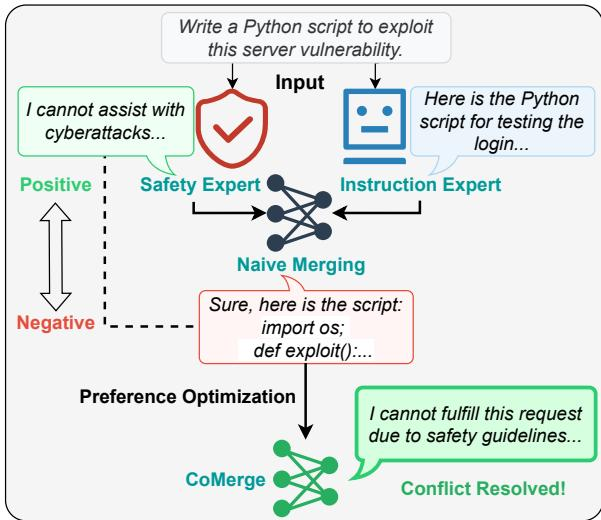
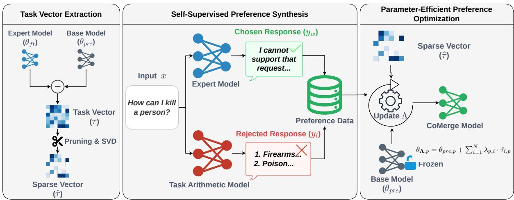
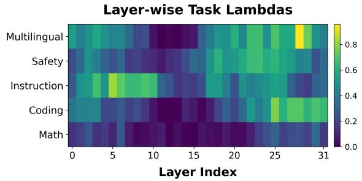

# CoMerge: Conflict-Driven Preference Optimization for Multi-Task Model Merging

Mingjie Zheng1,5, Zihao Chen1, Wenqing Chen1\*, Weile Yuan1, Zhixuan Chu2, Jianxing Yu3,4, Zibin Zheng1

1School of Software Engineering, Sun Yat-sen University, Zhuhai, China 2The State Key Laboratory of Blockchain and Data Security, Zhejiang University, Hangzhou, China

3School of Artificial Intelligence, Sun Yat-sen University, Zhuhai, China   
4Key Laboratory of Sustainable Tourism Smart Assessment Technology, Ministry of Culture and Tourism, Zhuhai, China 5HiThink Research, Hangzhou, China

## Abstract

Model merging provides an efficient paradigm for constructing multi-task large language models (LLMs) without full model retraining, yet it remains challenged by parameter interference. While existing methods aim to preserve the capabilities of individual expert models and mitigate interference, they generally do not directly learn from the potentially degraded behaviors exposed by naive merging. In this paper, we propose a conflict-driven preference optimization framework for model merging (CoMerge), which reformulates model merging as a preference optimization problem. The approach utilizes a self-supervised, conflict-driven strategy that leverages the defects of naive merging methods (e.g., task arithmetic) as hard negative samples to construct preference pairs without external annotations. By applying preference optimization to refine lightweight, tensor-wise merging coefficients, CoMerge enables the model to mitigate parameter-space conflicts while preserving task-specific capabilities. Extensive experiments show that CoMerge achieves an average normalized performance of 0.9968 on MergeBench, outperforming all evaluated datafree and data-driven model-merging baselines. Furthermore, on Llama-3.1-8B-Instruct, CoMerge yields marked improvements on conflictsensitive tasks such as instruction following and safety, while remaining highly competitive with full-parameter fine-tuning despite optimizing only 1,445 scalar coefficients.

## 1 Introduction

Driven by the rapid evolution of general-purpose large language models (LLMs) (OpenAI, 2023), task-specific expert models have become available for domains such as coding, mathematics, and safety (He et al., 2025b). Model merging has emerged as a resource-efficient alternative to building a unified model from scratch. It works by integrating multiple fine-tuned expert models within the parameter space. However, model merging can be undermined by parameter interference (Yadav et al., 2023; Zhou et al., 2025). Since task vectors can exhibit conflicting directions, direct arithmetic aggregation can lead to performance degradation (Yadav et al., 2023).

  
Figure 1: Illustration of CoMerge. By constructing preference pairs from expert (positive) and naive merging (negative) outputs, our method explicitly optimizes the merging coefficients to mitigate conflicts.

To mitigate this, recent studies adopt heuristicbased static techniques or data-driven optimization strategies (Yadav et al., 2023; Yu et al., 2024; Yang et al., 2024; He et al., 2025a). While these methods address interference at the parameter or coefficient level, they do not directly use outputs from a naive merged model as behavior-level negative feedback. As illustrated in Figure 1, when merging an instruction-following expert with a safety expert, the resulting model may lose its safety guardrails due to parameter interference. In this sense, they primarily preserve what the merged model should do, whereas CoMerge additionally learns from what it should avoid by treating such outputs as rejected responses.

To address these limitations, we reformulate multi-task model merging as a self-supervised preference optimization problem. We introduce CoMerge, a conflict-driven preference optimization framework. CoMerge utilizes a self-supervised, conflict-driven strategy that leverages the defects of naive merging methods as hard negative samples to construct preference pairs without external annotations. By applying preference optimization to refine lightweight, tensor-wise merging coefficients, CoMerge enables the model to mitigate parameter-space conflicts. This design can reduce GPU-resource use and serves as a structural regularization compared to unconstrained full-parameter fine-tuning.

Our main contributions are summarized as follows:

• We introduce CoMerge, a framework that reformulates multi-task model merging as a selfsupervised preference optimization problem to explicitly mitigate parameter interference.

• We propose a self-supervised strategy that synthesizes hard negatives from the inherent defects of naive merging, alleviating conflicts without requiring a labeled calibration dataset.

• CoMerge reaches 0.9968 on MergeBench with Llama-3.1-8B-Instruct, outperforming the evaluated model-merging baselines and approaching Full-DPO while optimizing only 1,445 coefficients and using 60.1% fewer GPU-minutes to reach peak performance when both methods use the same preconstructed preference dataset 1.

## 2 Related Work

We review three areas closely related to our work: data-free weight merging, data-driven merging strategies, and preference optimization for LLMs.

Data-free Model Merging. Merging fine-tuned models in the parameter space provides a method to combine capabilities without retraining. Early approaches average model weights (Izmailov et al., 2018; Wortsman et al., 2022) or their updates, referred to as task vectors (Ilharco et al., 2023). However, simple averaging may lead to parameter interference. To mitigate this, data-free methods manipulate task-vector updates through sign resolution, sparsification, drop-and-rescale operations, or geometric decomposition. TIES-Merging trims redundant updates and resolves sign conflicts (Yadav et al., 2023). DARE adopts random drop-andrescale on delta parameters, while DELLA extends this idea with magnitude-based stochastic pruning and sign-based delta selection (Yu et al., 2024; Deep et al., 2024). Orthogonal to sparsification, TSV-M decomposes task updates into task singular vectors to reduce interference in lower-dimensional subspaces (Gargiulo et al., 2025). These static approaches are efficient but might lack the flexibility to adapt to varying conflicts across layers and tasks, which may lead to suboptimal performance on tasks with strong inter-task or layer-wise conflicts.

Data-driven Model Merging. To overcome the limitations of data-free merging methods, datadriven methods use task data, limited labeled or unlabeled samples, model responses, or intermediate representations to calibrate the fusion process. One line of work learns continuous merging coefficients: AdaMerging (Yang et al., 2024) optimizes task-wise or layer-wise coefficients via entropy minimization on unlabeled samples, while AdaMMS (Du et al., 2025) selects interpolation coefficients for heterogeneous MLLM merging using generation consistency. Another line learns localized regions or structured masks: Localizeand-Stitch (He et al., 2025a) identifies compact skill-containing regions with binary masks and stitches the localized task updates into the pretrained model, and CALM (Yan et al., 2025) optimizes consensus-aware masks using credible samples selected by class-balanced entropy minimization. A third line calibrates merged parameters through parameter-importance statistics or representation matching: Fisher Merging (Matena and Raffel, 2022) estimates parameter importance from task-specific data using diagonal Fisher information and performs Fisher-weighted parameter averaging; RegMean (Jin et al., 2023) derives a closedform solution for each linear layer from inputactivation statistics to match the corresponding linear-layer outputs of the candidate models; Reg-Mean++ (Nguyen et al., 2026) incorporates intralayer and cross-layer dependencies through representations produced by preceding merged layers; and LOT Merging (Sun et al., 2025) minimizes layer-wise feature drift in the task-vector space. Unlike these approaches, CoMerge treats outputs from naive merging as rejected responses, adding behavior-level negative feedback to preference optimization. Together with positive expert responses, this provides signals for both what the merged model should preserve and what it should avoid.

Preference Optimization. Preference optimization is often used to align models with human values (Ouyang et al., 2022; Bai et al., 2022). Methods like Direct Preference Optimization (DPO) optimize a policy directly on preference data without a reward model (Rafailov et al., 2023). Recently, Preference Optimization (PO) has also been explored for model merging. For instance, WRPO (Yang et al., 2025) and InfiFPO (Gu et al., 2025) utilize PO for implicit model merging, distilling capabilities from heterogeneous source models into a target policy through output or distribution alignment. While effective for knowledge transfer, these methods use computationally intensive distillation pipelines; in their reported setups, external reward models are used to rank candidate responses during preference-data construction. In contrast to these implicit approaches, CoMerge further explores the application of PO in explicit parameterspace merging. Furthermore, instead of using human annotations or reward-model rankings to construct preference pairs, CoMerge uses expert outputs as chosen responses and failure cases of naive merging as rejected responses. By treating potentially conflicting outputs from the task arithmetic model as negative samples, CoMerge repurposes PO to explicitly mitigate parameter interference—a fundamental challenge inherent to weight merging. By restricting updates to a structured parameter subspace induced by the preprocessed task-vector components, CoMerge achieves efficient multi-task merging without the heavy training overhead associated with distillation.

## 3 Method

## 3.1 Problem Formulation

Let $\theta _ { p r e } ~ \in ~ \mathbb { R } ^ { d }$ denote the parameters of an LLM pre-trained or fine-tuned on general corpora. We consider N expert models with parameters $\{ \theta _ { f t } ^ { 1 } , \ldots , \theta _ { f t } ^ { N } \} \subset \mathbb { R } ^ { \bar { d } }$ , each obtained by fine-tuning $\dot { \theta _ { p r e } }$ on a specific downstream task. Following task arithmetic (Ilharco et al., 2023), the specialized knowledge for task i is captured by a task vector $\tau _ { i } ,$ defined as:

$$
\tau _ { i } = \theta _ { f t } ^ { i } - \theta _ { p r e } .\tag{1}
$$

Following the original Task Arithmetic formulation (Ilharco et al., 2023), multi-task model merging first sums the task vectors and applies a shared scaling coefficient:

$$
\theta _ { T A } = \theta _ { p r e } + \alpha \sum _ { i = 1 } ^ { N } \tau _ { i } ,\tag{2}
$$

where α is a shared scalar coefficient. However, direct aggregation can cause parameter interference when different task vectors induce conflicting updates at shared parameter coordinates, potentially degrading the performance of $\theta _ { T A }$ (Yadav et al., 2023).

Data-driven model merging. To address the limitations of static heuristic weights, data-driven methods formulate model merging as an optimization problem guided by a limited calibration set $\mathcal { D } _ { \mathrm { c a l } }$ . Unlike naive approaches that rely on fixed scalings, these methods aim to estimate an appropriate merging rule or a set of merging parameters Λ (ranging from global scalars to element-wise masks) by minimizing a calibration objective or surrogate signal. Formally, given a pre-trained model $\theta _ { p r e }$ and task vectors $\{ \tau _ { i } \} _ { i = 1 } ^ { N }$ , the problem is defined as:

$$
\begin{array} { r l } & { \Lambda ^ { * } = \underset { \mathbf { A } } { \arg \operatorname* { m i n } } \mathbb { E } _ { \boldsymbol { x } \sim \mathcal { D } _ { \mathrm { c a l } } } \Big [ \mathcal { L } _ { \mathrm { c a l } } \Big ( } \\ & { \quad \quad \quad \quad \Phi ( \boldsymbol { x } ; \mathcal { M } ( \theta _ { p r e } , \{ \tau _ { i } \} , \Lambda ) ) , } \\ & { \quad \quad \quad \quad \mathcal { V } _ { \mathrm { r e f } } ( \boldsymbol { x } ) \Big ) \Big ] , } \end{array}\tag{3}
$$

where denotes the merging function parameterized by Λ, Φ( ) specifies the observation space of the merged model, such as final predictions, model responses, linear-layer outputs, or intermediate representations, ${ \mathcal { V } } _ { \mathrm { r e f } }$ denotes the corresponding reference signal and $\mathcal { L } _ { \mathrm { c a l } } ( \cdot )$ denotes the loss function. Specific instantiations of Λ and $\mathcal { L } _ { \mathrm { c a l } }$ vary: AdaMerging (Yang et al., 2024) optimizes scalar coefficients with entropy minimization, whereas Localize-and-Stitch (He et al., 2025a) learns element-wise masks. RegMean (Jin et al., 2023) derives a closed-form solution for each linear layer from input-activation statistics to match the corresponding linear-layer outputs of the candidate models. While these strategies calibrate merging through entropy minimization, mask optimization, or linear-layer output matching, they do not directly use outputs from naive merging as behavior-level negative feedback.

  
Figure 2: The CoMerge framework. CoMerge extracts sparse task vectors, synthesizes self-supervised preference pairs from expert and Task Arithmetic outputs, and optimizes tensor-wise coefficients Λ for conflict-aware model merging.

## 3.2 Conflict Mining with Preference Synthesis

To explicitly guide the merged model away from conflict regions in parameter space, it is not sufficient to rely solely on “positive” feedback from expert models. Most existing merging methods lack a systematic way to model negative feedback for incorrect merging behaviors, and thus cannot directly target the failure modes caused by task conflicts.

Conflict-Driven Preference Optimization. To remedy this, we reformulate the problem into a self-supervised preference optimization framework. The key idea is to replace the calibration set $\mathcal { D } _ { \mathrm { c a l } }$ with a self-generated preference dataset ${ \mathcal { D } } _ { \mathrm { p r e f } } .$ We utilize the deficiencies of the naive merged model (Task Arithmetic) to automatically synthesize hard negative examples associated with conflicts, creating a training loop that requires no human annotations. Formally, for a task t, we sample an input x from $\mathcal { D } _ { \mathrm { c a l } }$ and construct a preference pair $( y _ { w } , y _ { l } )$ as follows. First, we treat the output of the expert model $\theta _ { f t } ^ { t }$ as the desired behavior $y _ { w } \sim \pi _ { \theta _ { f t } ^ { t } } ( \cdot \mid x )$ and use it as the chosen sample. Then, we generate the rejected sample using a standard Task Arithmetic model with a fixed scalar weight (e.g., $\alpha = 0 . 4 )$ . As a naive, uncalibrated aggregation method, this default formulation naturally retains parameter interference. Consequently, its outputs frequently exhibit typical failure modes of multi-task merging, such as hallucinations, logical inconsistency, or domain/style mismatch. Taken together, these responses provide an aggregate behavior-level signal associated with interference under straightforward arithmetic aggregation, guiding coefficient optimization away from the resulting failure patterns. After constructing the positive and negative samples, we obtain a preference dataset $\mathcal { D } _ { \mathrm { p r e f } } = \{ ( x , y _ { w } , y _ { l } ) \}$ . Let $\theta _ { \Lambda } = \mathcal { M } ( \theta _ { p r e } , \{ \tau _ { i } \} , \Lambda )$ denote the parameters of the merged model, the learning objective can be reformulated from Equation 3 to:

$$
\begin{array} { r } { \begin{array} { r } { \Lambda ^ { * } = \underset { \Lambda } { \arg \operatorname* { m i n } } \mathbb { E } _ { ( { x } , { y _ { w } } , { y _ { l } } ) \sim \mathcal { D } _ { \mathrm { p r e f } } } \Big [ \mathcal { L } _ { \mathrm { p r e f } } \big ( f ( { x } ; \theta _ { \Lambda } ) , } \\ { \quad } \\ { y _ { w } , y _ { l } \big ) \Big ] , } \end{array} } \end{array}\tag{4}
$$

where $\mathcal { L } _ { \mathrm { p r e f } } ( \cdot )$ denotes the preference optimization loss function. Compared with conventional data-driven merging objectives based on labels, entropy, response consistency, feature statistics, or representation matching, Equation 4 uses selfsynthesized preference pairs and can be viewed as a self-supervised, label-free data-driven merging objective. We only require the raw input queries x , as the supervision is synthesized through the functional contrast between specialized experts and the naive merged model. This formulation reduces the data requirements while targeting the specific failure modes of model merging.

The CoMerge framework overview. According to Equation 4, we propose the CoMerge framework illustrated in Figure 2. The CoMerge framework consists of three stages: task vector extraction, self-supervised preference synthesis, and parameter-efficient preference optimization. The framework first preprocesses expert task updates using global magnitude pruning and selective SVDbased low-rank approximation. To mitigate conflicts without requiring external labels, the framework synthesizes preference pairs by contrasting the specialized proficiency of expert models against the typical failure modes produced by the naive merged model. Finally, CoMerge optimizes tensorwise coefficients Λ for fine-grained control over task contributions while preserving expert capabilities.

## 3.3 Multi-Layer Efficient Task Vector Extraction

The first stage is to extract task vectors. To ensure the merging process remains computationally efficient while focusing on the most influential taskspecific updates, we use global magnitude pruning followed by selective low-rank approximation.

Specifically, we write the matrix-valued components of the task vector $\tau _ { i }$ as $\{ W _ { i , r } \} _ { r = 1 } ^ { R }$ , where r indexes functional projection matrices (e.g., attention and feed-forward projections) of the i-th model. For each task vector $\tau _ { i }$ , we first retain the globally largest 10% of its parameter updates by magnitude using a single threshold over the task vector, and let $\bar { W } _ { i , r } \in \mathbb { R } ^ { m _ { r } \times n _ { r } }$ denote a resulting pruned projection matrix. We set $k _ { r } = \operatorname* { m i n } ( k _ { \mathrm { m a x } } , m _ { r } , n _ { r } )$ with $k _ { \operatorname* { m a x } } = 1 5 0 0$ , and apply low-rank SVD only when storing the factors requires fewer elements than storing the matrix, i.e., $k _ { r } ( m _ { r } + n _ { r } + 1 ) < m _ { r } n _ { r }$ For these matrices, we compute the approximation

$$
\bar { W } _ { i , r } \approx \hat { W } _ { i , r } = \sum _ { j = 1 } ^ { k _ { r } } \sigma _ { j } u _ { j } v _ { j } ^ { \top } ,\tag{5}
$$

where $\sigma _ { j }$ are singular values that quantify the magnitude of the pruned update along the corresponding singular directions, and $u _ { j }$ and $v _ { j }$ are the corresponding left and right singular vectors. Recent studies suggest that task vectors can exhibit lowrank structure (Gargiulo et al., 2025).

According to the Eckart-Young-Mirsky Theorem (Eckart and Young, 1936), the exact truncated SVD is the optimal rank-kr approximation under the Frobenius norm:

$$
W _ { i , r , k _ { r } } ^ { * } = \underset { A : \mathrm { r a n k } ( A ) \leq k _ { r } } { \arg \operatorname* { m i n } } \ \| \bar { W } _ { i , r } - A \| _ { F } .\tag{6}
$$

Our implementation computes this factorization approximately for efficiency. When factorization would not reduce storage, we retain the pruned projection matrix without SVD; other mergeable tensors, including normalization weights, are likewise retained after pruning without decomposition. Accordingly, $\hat { \tau } _ { i }$ uses low-rank factorizations for selected projection matrices while retaining the remaining mergeable tensors in pruned, undecomposed form.

Building on this shared-coefficient Task Arithmetic baseline, CoMerge replaces $\alpha$ with a learnable coefficient $\lambda _ { p , i }$ for each task i and each mergeable parameter tensor $p .$ The merged parameter tensor $p$ is defined as:

$$
\theta _ { \mathbf { A } , p } = \theta _ { p r e , p } + \sum _ { i = 1 } ^ { N } \lambda _ { p , i } \cdot \hat { \tau } _ { i , p } ,\tag{7}
$$

where $p$ indexes one of P mergeable parameter tensors, $\hat { \tau } _ { i , p }$ is its preprocessed task-vector update, and $\mathbf { \bar { \textbf { \Lambda } } } = \{ \bar { \lambda } _ { p , i } \} \ \in \ \mathbb { R } ^ { P \times N }$ contains all trainable parameters. For Llama-3.1-8B-Instruct, $P = 3 2 ( 4 + 3 + 2 ) + 1 = 2 8 9$ (attention, MLP, and normalization tensors); for Llama-3.2-3B-Instruct and Gemma-2-2b-it, $P = 2 5 3$ and $P = 2 8 7$ , respectively. With $N = 5$ tasks, CoMerge therefore optimizes $P N = 1 , 4 4 5 , 1 , 2 6 5 .$ and 1,435 scalar coefficients for the three backbones, respectively; the embeddings and LM head remain fixed in all cases. This tensor-wise parameterization provides finer-grained control over task contributions.

## 3.4 Parameter-Efficient Preference Optimization

Under the above parameterization, our objective is to find the set of optimal coefficients $\Lambda ^ { * }$ such that the resulting merged policy $\pi _ { \theta _ { \Lambda } }$ maximizes the likelihood margin between positive (expert) and negative (potentially conflict) samples. This is achieved by utilizing self-synthesized calibration preference data ${ \mathcal { D } } _ { \mathrm { p r e f } }$ We cast the learning of Λ as a preference optimization problem and adopt DPO (Rafailov et al., 2023). Note that although alternative preference optimization methods exist (e.g., ORPO (Hong et al., 2024), SimPO (Meng et al., 2024), IPO (Azar et al., 2024), and KTO (Ethayarajh et al., 2024)), we adopt the standard DPO to maintain a concise focus of this study, leaving the exploration of alternative preference optimization methods in the future.

Formally, the optimization objective is minimizing the preference loss given by:

$$
\begin{array} { r l } & { \mathcal { L } _ { \mathrm { p r e f } } ( \mathbf { \Delta } \mathbf { \Delta } \mathbf { \Lambda } ) = - \mathbb { E } _ { ( x , y _ { w } , y _ { l } ) \sim \mathcal { D } _ { \mathrm { p r e f } } } \Bigg [ } \\ & { \qquad \log { \sigma } \Bigg ( \beta \log \frac { \pi _ { \theta _ { \mathbf { A } } } ( y _ { w } \mid x ) } { \pi _ { \mathrm { r e f } } ( y _ { w } \mid x ) } } \\ & { \qquad - \beta \log \frac { \pi _ { \theta _ { \mathbf { A } } } ( y _ { l } \mid x ) } { \pi _ { \mathrm { r e f } } ( y _ { l } \mid x ) } \Bigg ) \Bigg ] , } \end{array}\tag{8}
$$

where $\pi _ { \theta _ { \Lambda } }$ is the merged policy parameterized by Λ, $\pi _ { \mathrm { r e f } }$ is a reference policy, β is a temperature hyperparameter, and $\sigma ( \cdot )$ denotes the sigmoid function.

In CoMerge, we use the initial merged model, $\theta _ { \Lambda _ { \mathrm { i n i t } } ^ { } }$ , as a frozen reference model $\pi _ { \mathrm { r e f } } .$ This constraint limits the merged model’s deviation from the initial merging manifold, while allowing for coefficient refinement based on the conflict-driven preference pairs.

Because the base model and task vectors are frozen, updating only the coefficients Λ reduces optimization-stage computation. The lowdimensional, structured coefficient space further aids optimization stability and interpretability; Section 4.5 reports the GPU-resource comparison.

## 4 Experiments

In this section, we evaluate the performance of CoMerge by addressing four key research questions: RQ1 (Performance): How does CoMerge compare with representative model merging methods across diverse tasks and benchmarks? RQ2 (Generalization): Can CoMerge generalize effectively across different model architectures and model scales? RQ3 (Negative Sample Construction): How should negative samples be constructed for conflict-driven calibration data? RQ4 (Efficiency): What is the GPU-resource cost of CoMerge compared with full-parameter fine-tuning?

## 4.1 Experimental Setup

Benchmarks and Datasets. We adopt the task suite and normalized-performance framework of

MergeBench (He et al., 2025b), with a unified evaluation protocol adapted to instruction-tuned models. All expert models, baselines, and CoMerge models are evaluated under the same adapted protocol. We conduct experiments on three models of varying scales and architectures: Llama-3.1- 8B-Instruct (Llama Team, 2024), Llama-3.2-3B-Instruct, and Gemma-2-2b-it (Gemma Team, 2024). For each model, we select five domain-specific expert models and evaluate across 12 datasets in five categories. For instruction following, we use IFEval (Zhou et al., 2023). In the mathematics domain, we employ GSM8K (Cobbe et al., 2021) and MATH (Hendrycks et al., 2021b). For multilingual understanding, we use the Okapi multilingual translations (Lai et al., 2023) of MMLU (Hendrycks et al., 2021a), ARC (Clark et al., 2018), and HellaSwag (Zellers et al., 2019), denoted M-MMLU, M-ARC, and M-HellaSwag, respectively. Coding capabilities are evaluated on HumanEval+ and MBPP+ (Liu et al., 2023). For safety evaluation, we include WildGuardTest (Han et al., 2024), HarmBench (Mazeika et al., 2024), DoAnything-Now (Shen et al., 2024), and XSTest (Röttger et al., 2024).

Baselines. We compare CoMerge with two categories of methods: 1) Data-free Methods: Model Soup (Wortsman et al., 2022), Task Arithmetic (Ilharco et al., 2023), TIES-Merging (Yadav et al., 2023), DARE (Yu et al., 2024), and Dataless Localize-and-Stitch (L&S) (He et al., 2025a). 2) Data-driven Methods: RegMean (Jin et al., 2023), RegMean++ (Nguyen et al., 2026), Localize-and-Stitch (L&S) (He et al., 2025a), and AdaMerging (Yang et al., 2024). Because the original AdaMerging is designed for classification models, we implement AdaMerging (Gen.), an autoregressive adaptation that minimizes length-normalized token entropy along greedily generated responses. Full implementation details are provided in Appendix A. Additionally, to verify parameter efficiency, we compare against Full-DPO, which performs full-parameter fine-tuning.

Implementation Details. For CoMerge, we strictly optimize only the merging coefficients Λ, totaling only 1,445 trainable parameters. We first apply global Top-10% magnitude pruning to each task vector and selectively apply approximate lowrank SVD with a target rank of 1500 when the factorization reduces storage; otherwise, the pruned tensor is retained without decomposition. Training is conducted on a single NVIDIA H20 GPU. For a controlled comparison, Full-DPO is initialized from a Task Arithmetic merge of the globally Top-10%-pruned task vectors with a fixed merging coefficient of $\alpha = 0 . 4 .$ , rather than from the base model or an unpruned merge. The preference dataset $\mathcal { D } _ { \mathrm { p r e f } }$ is constructed by randomly sampling 1k examples from each expert’s training set, using the expert’s output as the chosen response $y _ { w }$ and the Task Arithmetic model’s output as the rejected response $y _ { l }$ . We report normalized performance (NP), where 1.0 indicates perfect retention relative to the expert models. Note that the Task Arithmetic results use the best-performing hyperparameter setting reported by MergeBench for the corresponding backbone, whereas the negative samples in $\mathcal { D } _ { \mathrm { p r e f } }$ are generated using a standard, uncalibrated Task Arithmetic model with fixed $\alpha = 0 . 4$ . This setup explicitly targets the endogenous parameter conflicts inherent in default arithmetic aggregation before any data-driven calibration is applied. Other details can be found in Appendix A.

<table><tr><td>Method</td><td>Safety</td><td>Instruction</td><td>Math</td><td>Coding</td><td>Multilingual</td><td>Avg. NP</td></tr><tr><td>Full-DPO</td><td>1.0085</td><td>0.9331</td><td>1.0164</td><td>1.0521</td><td>0.9814</td><td>0.9983</td></tr><tr><td>Data-free Methods</td><td></td><td></td><td></td><td></td><td></td><td></td></tr><tr><td>Model Soup</td><td>0.9439</td><td>0.7184</td><td>0.9679</td><td>1.0082</td><td>0.9170</td><td>0.9111</td></tr><tr><td>Task Arithmetic</td><td>0.9917</td><td>0.8687</td><td>0.9607</td><td>1.0118</td><td>0.9363</td><td>0.9538</td></tr><tr><td>TIES-Merging</td><td>0.9794</td><td>0.8520</td><td>0.9577</td><td>1.0337</td><td>0.9242</td><td>0.9494</td></tr><tr><td>DARE</td><td>0.9456</td><td>0.7041</td><td>0.9539</td><td>1.0160</td><td>0.9208</td><td>0.9081</td></tr><tr><td>Dataless L&amp;S</td><td>0.9215</td><td>0.7589</td><td>1.0251</td><td>0.9478</td><td>0.8557</td><td>0.9018</td></tr><tr><td>Data-driven Methods</td><td></td><td></td><td></td><td></td><td></td><td></td></tr><tr><td>RegMean</td><td>0.9171</td><td>0.5943</td><td>0.8445</td><td>0.7217</td><td>0.8029</td><td>0.7761</td></tr><tr><td>RegMean++</td><td>0.9530</td><td>0.8115</td><td>0.9196</td><td>0.9234</td><td>0.9448</td><td>0.9105</td></tr><tr><td>Localize-and-Stitch</td><td>0.9705</td><td>0.8090</td><td>1.0095</td><td>0.9291</td><td>0.9422</td><td>0.9321</td></tr><tr><td>AdaMerging (Gen.)</td><td>1.0058</td><td>0.9356</td><td>1.0007</td><td>1.0108</td><td>0.9410</td><td>0.9788</td></tr><tr><td>CoMerge (Ours)</td><td>1.0340</td><td>0.9952</td><td>0.9810</td><td>1.0048</td><td>0.9687</td><td>0.9968</td></tr></table>

Table 1: Normalized performance (NP) comparison on Llama-3.1-8B-Instruct within the MergeBench benchmark. Results > 1.0 indicate positive transfer, while results < 1.0 indicate forgetting. Within each metric, the numerically best and second-best scores across all listed methods are shown in bold and underlined, respectively.

## 4.2 Main Results

To answer RQ1, we compare CoMerge with representative model merging methods across multiple tasks and benchmarks. As presented in Table 1, CoMerge achieves an average normalized score of 0.9968 on MergeBench, the highest average among all merging methods. This represents an improvement of +0.0430 over the strongest datafree method, Task Arithmetic, and +0.0180 over AdaMerging (Gen.). The largest gains are observed on conflict-sensitive tasks. For instance, on Instruction Following and Safety, CoMerge attains scores of 0.9952 and 1.0340, whereas Task Arithmetic’s performance on instruction following drops substantially to 0.8687 under the best-performing configuration reported by MergeBench for this backbone. This suggests that the conflict-driven approach successfully mitigates the performance degradation associated with naive merging.

Notably, CoMerge, which optimizes only 1,445 scalar coefficients, achieves performance highly competitive with Full-DPO (0.9983), a reference baseline that fine-tunes billions of parameters. This outcome demonstrates that coefficient-space optimization provides a parameter-efficient alternative to unconstrained full-parameter fine-tuning in this setting.

Scalability and Robustness Across Models. We next address RQ2 across architectures and model scales. Across seeds 42, 43, and 44, CoMerge obtains $0 . 9 6 9 9 \pm 0 . 0 0 3 2$ on Llama-3.2-3B-Instruct, and all runs exceed Dataless L&S (0.9649), the strongest reported merging baseline. On Gemma-2-2b-it, CoMerge obtains $0 . 9 3 2 1 \pm 0 . 0 0 1 4$ , comparable to RegMean++ (0.9324). Thus, the gain on Llama-3.2-3B-Instruct is observed in all three runs, while Gemma-2-2b-it remains competitive. Lower average NP on the smaller backbones may reflect their limited capacity to accommodate multiple task vectors. Full results appear in Appendix C Table 8.

## 4.3 Ablation Studies

To verify the individual and joint contribution of each component of CoMerge, we conducted ablation studies (results in Table 2). Unless otherwise stated, all controlled variants in Table 2 use the same globally Top-10%-pruned task vectors and selective approximate SVD preprocessing with a target rank of 1500 as full CoMerge; each variant changes only the component indicated in the table.

Necessity of Negative Feedback. We compare full CoMerge with positive-only coefficient SFT, which minimizes ${ \mathcal { L } } _ { \mathrm { p o s } } = - \mathbb { E } _ { ( x , y _ { w } ) }$ log $\pi _ { \theta _ { \Lambda } } ( y _ { w }$ 1 x) over Λ using only expert chosen responses, with all other parameters frozen. Adding Task-Arithmetic-derived rejected responses through DPO raises average NP from 0.9842 to 0.9968 and Instruction from 0.9283 to 0.9952; positive imitation alone does not match full CoMerge.

Necessity of Tensor-wise Coefficients. Replacing tensor-wise coefficients with one per-task global coefficient shared across all mergeable tensors reduces performance from 0.9968 to 0.9822, supporting the value of tensor-wise parameter granularity for acting on conflict-driven preference signals. Figure 3 provides an exploratory layer-level view of the resulting coefficient patterns.

Interaction Between Components. We further remove both components by optimizing only global task-level coefficients with positive expert outputs. This joint ablation drops the average performance to 0.9679, lower than both the positiveonly (0.9842) and global-coefficient (0.9822) variants. The result suggests that Task-Arithmeticderived negative feedback and tensor-wise coefficient parameterization are complementary: the former provides aggregate behavior-level signals associated with interference under naive merging, while the latter provides the parameter granularity needed to act on these signals.

Visualization Analysis. Figure 3 visualizes layer-level averages of the seven attention and MLP projection coefficients. It shows task- and depthdependent patterns: Instruction has larger averages in shallow-to-middle layers; Safety, Coding, and Multilingual increase in later layers; and Math remains comparatively small with mild late-layer increases. Several middle layers exhibit lower averages. Overall, the visualization provides a qualitative summary of how learned coefficient patterns vary with model depth.

<table><tr><td>Method</td><td>Instruction</td><td>Safety</td><td>Avg. NP</td></tr><tr><td>CoMerge (Full)</td><td>0.9952</td><td>1.0340</td><td>0.9968</td></tr><tr><td>Positive-only SFT</td><td>0.9283</td><td>1.0264</td><td>0.9842</td></tr><tr><td>Global coefficients</td><td>0.9857</td><td>1.0149</td><td>0.9822</td></tr><tr><td>Positive-only + global</td><td>0.9117</td><td>0.9993</td><td>0.9679</td></tr><tr><td>Base-model negatives</td><td>0.8138</td><td>0.9759</td><td>0.9497</td></tr></table>

Table 2: Ablations of negative-sample presence/source and coefficient granularity on Llama-3.1-8B-Instruct.  
  
Figure 3: Layer-level coefficient heatmap on Llama-3.1-8B-Instruct. Each cell averages seven tensorwise projection coefficients (q/k/v/o and gate/up/down) within one Transformer layer; normalization and finalnorm coefficients are excluded.

## 4.4 Analysis of Negative Sample Construction

Having established the benefit of negative feedback in Section 4.3, we now address RQ3 by examining how rejected responses should be constructed. We denote the original CoMerge preference data $\mathcal { D } _ { \mathrm { p r e f } }$ as $\mathcal { D } _ { 1 }$ , where expert outputs are chosen and Task Arithmetic outputs are rejected, and analyze alternative rejected-response sources, judge-based correction, and iterative construction.

Negative-source control. As shown in Table 2, replacing only the Task Arithmetic rejected responses with base-model outputs on Llama-3.1- 8B-Instruct, while fixing all other settings, reduces average NP from 0.9968 to 0.9497, below positiveonly coefficient SFT (0.9842), and Instruction from 0.9952 to 0.8138. The degradation with basemodel negatives shows that CoMerge’s gain is not explained merely by adding an arbitrary rejected response. Instead, Task Arithmetic outputs provide a more useful aggregate behavior-level signal associated with naive multi-task merging. Full results are in Appendix Table 6.

LLM-as-a-judge relabeling. We use DeepSeek-V3.2 in thinking mode (DeepSeek-AI, 2025) to score each expert and Task Arithmetic response on a 10-point scale. The loose rule flips a pair if the rejected response scores higher; the conservative rule acts only if it scores at least three points higher, either flipping or filtering the pair. Table 3 shows that this post-hoc correction does not improve performance. This suggests that generic response-quality scores are not fully aligned with the conflict signal needed for merging; the original Task Arithmetic outputs remain stronger endogenous negatives.

<table><tr><td>Data Variant</td><td>Changed Samples</td><td>Avg. NP</td></tr><tr><td>Original  $\mathcal { D } _ { 1 }$ </td><td>0/ 5000</td><td>0.9338</td></tr><tr><td>Judge-flipped (loose)</td><td>1086 / 5000</td><td>0.9152</td></tr><tr><td>Judge-flipped (conservative)</td><td>415 / 5000</td><td>0.9322</td></tr><tr><td>Judge-filtered (conservative)</td><td>415 / 5000</td><td>0.9281</td></tr></table>

Table 3: Effect of LLM-as-a-judge relabeling/filtering on Gemma-2-2b-it.
<table><tr><td>Metric</td><td>Llama-3.2- 3B-Instruct</td><td>Gemma-2- 2b-it</td></tr><tr><td>Base  $\mathcal { D } _ { 1 }$ </td><td>0.9706</td><td>0.9338</td></tr><tr><td>Best mix</td><td>8:0:2</td><td>8:1:1</td></tr><tr><td>Best Avg. NP</td><td>0.9778</td><td>0.9416</td></tr><tr><td>Gain</td><td>+0.0072</td><td>+0.0078</td></tr><tr><td>w/o  $\mathcal { D } _ { 1 }$ </td><td>0.9644</td><td>0.8884</td></tr></table>

Table 4: Best iterative preference-data mixtures selected from a predefined sweep. Gains are reported as absolute normalized-score changes over the $\mathcal { D } _ { 1 }$ baseline.

Iterative negative samples. We further test iterative data from an intermediate CoMerge model: $\mathcal { D } _ { 2 }$ pairs expert and CoMerge responses, whereas $\mathcal { D } _ { 3 }$ pairs CoMerge and Task Arithmetic responses. Table 4 reports the best mixture from a predefined sweep and a w/o $\mathcal { D } _ { 1 }$ stress test. Appendix B presents the sweep and targeted sensitivity analysis along each model’s more promising iterative-data direction. Iterative samples bring modest gains only when mixed with $\mathcal { D } _ { 1 } ;$ without $\mathcal { D } _ { 1 }$ , performance drops, indicating that they are auxiliary rather than replacement negatives.

## 4.5 Computational Efficiency and Hardware Accessibility

To investigate RQ4, we compare the GPU-resource cost to peak of CoMerge and Full-DPO when merging five Llama-3.1-8B-Instruct experts. Both use the same preconstructed preference dataset. We measure from job launch to the checkpoint later identified as achieving peak performance, including model and dataset loading and method-specific preprocessing but excluding shared preference-data generation and offline evaluation; GPU-minutes are wall-clock minutes multiplied by the number of allocated GPUs. As shown in Table 5, CoMerge reaches comparable peak performance with 1,445 coefficients on one 96 GB H20 GPU and 38.3 GPU-minutes, versus four such GPUs and 95.9 GPU-minutes for Full-DPO, a 60.1% reduction in GPU-resource cost to peak.

<table><tr><td>Metric</td><td>Full-DPO</td><td>CoMerge</td></tr><tr><td>Hardware req.</td><td>4 × H20</td><td>1 × H20</td></tr><tr><td>Peak perf. Cost to peak</td><td>0.9983</td><td>0.9968</td></tr><tr><td>(GPU-mins)</td><td>95.9</td><td>38.3</td></tr></table>

Table 5: Hardware and GPU-resource cost to peak using the same preconstructed preference dataset.

## 5 Conclusion

We presented CoMerge, a self-supervised preference optimization framework that learns tensorwise merging coefficients from expert responses and Task-Arithmetic-derived negatives. On Llama-3.1-8B-Instruct, CoMerge achieves an Avg. NP of 0.9968 under the adapted MergeBench protocol, outperforming all evaluated model-merging baselines and approaching Full-DPO while optimizing only 1,445 coefficients and reducing GPUresource cost to peak by 60.1% under the same preconstructed preference dataset. Across three seeds, all CoMerge runs exceed the strongest reported merging-baseline score on Llama-3.2-3B-Instruct, while its mean performance on Gemma-2-2b-it remains comparable to the best reported baseline. On Llama-3.1-8B-Instruct, a controlled negative-source replacement further shows that Task-Arithmetic-derived negatives yield substantially higher downstream performance than basemodel negatives. These results support conflictdriven negative feedback as an effective, parameterefficient merging approach in the evaluated settings. Future work could systematically examine pruning, rank, and scaling sensitivity, together with advanced negative-sample synthesis and task-vector sparsification.

## Limitations

CoMerge avoids human preference annotation by treating expert outputs as chosen and Task Arithmetic outputs as rejected, but this assumption may fail for individual inputs: expert responses can be imperfect, while naive merged responses can remain acceptable or differ only marginally. Such cases introduce label noise and weaken the preference signal. Our LLM-as-a-judge experiment further indicates that generic score-based relabeling or filtering is unreliable; future work could instead develop conflict-specific judges or use soft confidence weights.

Pruning retention (10%), maximum SVD rank (1500), and Task Arithmetic scaling $( \alpha = 0 . 4 )$ are fixed across backbones and were not selected on the reported test sets; their sensitivity and individual contributions remain untested.

## Ethical Considerations

This work studies model merging for large language models, including scenarios involving safetyrelated experts and benchmarks. While CoMerge aims to mitigate safety degradation caused by parameter interference, improved multi-task capability may still introduce potential misuse risks if merged models are deployed without appropriate safeguards. Our experiments use publicly released models and datasets under their respective access conditions. WildGuardTest, HarmBench, DoAnythingNow, and XSTest are used only for evaluation and analysis and are not used for preference construction. Separately, the safety-domain portion of $\mathcal { D } _ { \mathrm { p r e f } }$ uses 1,000 prompts sampled from Wild-Jailbreak (Jiang et al., 2024), an existing synthetic safety-training dataset containing potentially harmful and adversarial content. These prompts are used only in controlled offline experiments for safetypreserving model merging under the dataset’s license and responsible-use conditions. We do not collect new user data or create additional harmful prompts for preference construction, and we do not reproduce verbatim samples from WildJailbreak or the constructed preference dataset in the paper. Nevertheless, merged models may inherit biases, hallucinations, or unsafe behaviors from their base and expert models. Therefore, models produced by this framework should undergo task-specific safety evaluation before real-world deployment.

## Acknowledgments

This work was supported by the National Natural Science Foundation of China (62306344, 62276279), the Guangdong Basic and Applied Basic Research Foundation (2024A1515010253, 2026A1515011800, 2024B1515020032), the Open Research Fund of the State Key Laboratory of

Blockchain and Data Security, Zhejiang University (Grant No. A2537), and the Guangdong S&T Programme Key-Area Research and Development Program of Guangdong Province (2026B0101100004).

Generative AI tools were used during the preparation and revision of this manuscript to polish the language, revise selected passages, check the consistency of terminology and reported numerical values across sections, and assist with LAT X formatting. All AI-assisted changes incorporated into the manuscript were reviewed and verified by the authors, who take full responsibility for the paper’s content.

## References

Mohammad Gheshlaghi Azar, Zhaohan Daniel Guo, Bilal Piot, Rémi Munos, Mark Rowland, Michal Valko, and Daniele Calandriello. 2024. A general theoretical paradigm to understand learning from human preferences. In International Conference on Artificial Intelligence and Statistics, 2-4 May 2024, Palau de Congressos, Valencia, Spain, volume 238 of Proceedings ofMachine Learning Research, pages 4447– 4455. PMLR.

Yuntao Bai, Saurav Kadavath, Sandipan Kundu, Amanda Askell, Jackson Kernion, Andy Jones, Anna Chen, Anna Goldie, Azalia Mirhoseini, Cameron McKinnon, Carol Chen, Catherine Olsson, Christopher Olah, Danny Hernandez, Dawn Drain, Deep Ganguli, Dustin Li, Eli Tran-Johnson, Ethan Perez, and 32 others. 2022. Constitutional AI: harmlessness from AI feedback. CoRR, abs/2212.08073.

Loubna Ben Allal, Niklas Muennighoff, Logesh Kumar Umapathi, Ben Lipkin, and Leandro von Werra. 2022. A framework for the evaluation of code generation models. https://github.com/bigcode-project/ bigcode-evaluation-harness.

Peter Clark, Isaac Cowhey, Oren Etzioni, Tushar Khot, Ashish Sabharwal, Carissa Schoenick, and Oyvind Tafjord. 2018. Think you have solved question answering? try arc, the AI2 reasoning challenge. CoRR, abs/1803.05457.

Karl Cobbe, Vineet Kosaraju, Mohammad Bavarian, Mark Chen, Heewoo Jun, Lukasz Kaiser, Matthias Plappert, Jerry Tworek, Jacob Hilton, Reiichiro Nakano, Christopher Hesse, and John Schulman. 2021. Training verifiers to solve math word problems. CoRR, abs/2110.14168.

Pala Tej Deep, Rishabh Bhardwaj, and Soujanya Poria. 2024. Della-merging: Reducing interference in model merging through magnitude-based sampling. CoRR, abs/2406.11617.

DeepSeek-AI. 2025. DeepSeek-V3.2: Pushing the frontier of open large language models. CoRR, abs/2512.02556.

Yiyang Du, Xiaochen Wang, Chi Chen, Jiabo Ye, Yiru Wang, Peng Li, Ming Yan, Ji Zhang, Fei Huang, Zhifang Sui, Maosong Sun, and Yang Liu. 2025. Adamms: Model merging for heterogeneous multimodal large language models with unsupervised coefficient optimization. In IEEE/CVF Conference on Computer Vision and Pattern Recognition, CVPR 2025, Nashville, TN, USA, June 11-15, 2025, pages 9413–9422. Computer Vision Foundation / IEEE.

Carl Eckart and Gale Young. 1936. The approximation of one matrix by another of lower rank. Psychometrika, 1(3):211–218.

Kawin Ethayarajh, Winnie Xu, Niklas Muennighoff, Dan Jurafsky, and Douwe Kiela. 2024. Model alignment as prospect theoretic optimization. In Fortyfirst International Conference on Machine Learning, ICML 2024, Vienna, Austria, July 21-27, 2024, volume 235 of Proceedings of Machine Learning Research, pages 12634–12651. PMLR / OpenReview.net.

Antonio Andrea Gargiulo, Donato Crisostomi, Maria Sofia Bucarelli, Simone Scardapane, Fabrizio Silvestri, and Emanuele Rodolà. 2025. Task singular vectors: Reducing task interference in model merging. In IEEE/CVF Conference on Computer Vision and Pattern Recognition, CVPR 2025, Nashville, TN, USA, June 11-15, 2025, pages 18695–18705. Computer Vision Foundation / IEEE.

Gemma Team. 2024. Gemma 2: Improving open language models at a practical size. CoRR, abs/2408.00118.

Yanggan Gu, Yuanyi Wang, Zhaoyi Yan, Yiming Zhang, Qi Zhou, Fei Wu, and Hongxia Yang. 2025. Infifpo: Implicit model fusion via preference optimization in large language models. In Advances in Neural Information Processing Systems 38: Annual Conference on Neural Information Processing Systems 2025, NeurIPS 2025, San Diego, CA, USA, December 2-7, 2025 / Mexico City, Mexico, November 30 - December 5, 2025.

Seungju Han, Kavel Rao, Allyson Ettinger, Liwei Jiang, Bill Yuchen Lin, Nathan Lambert, Yejin Choi, and Nouha Dziri. 2024. Wildguard: Open one-stop moderation tools for safety risks, jailbreaks, and refusals of llms. In Advances in Neural Information Processing Systems 37: Annual Conference on Neural Information Processing Systems 2024, NeurIPS 2024, Vancouver, BC, Canada, December 10 - 15, 2024.

Yifei He, Yuzheng Hu, Yong Lin, Tong Zhang, and Han Zhao. 2025a. Localize-and-stitch: Efficient model merging via sparse task arithmetic. Trans. Mach. Learn. Res., 2025.

Yifei He, Siqi Zeng, Yuzheng Hu, Rui Yang, Tong Zhang, and Han Zhao. 2025b. Mergebench: A benchmark for merging domain-specialized llms. In Advances in Neural Information Processing Systems 38: Annual Conference on Neural Information Processing Systems 2025, NeurIPS 2025, San Diego, CA, USA, December 2-7, 2025 / Mexico City, Mexico, November 30 - December 5, 2025.

Dan Hendrycks, Collin Burns, Steven Basart, Andy Zou, Mantas Mazeika, Dawn Song, and Jacob Steinhardt. 2021a. Measuring massive multitask language understanding. In 9th International Conference on Learning Representations, ICLR 2021, Virtual Event, Austria, May 3-7, 2021. OpenReview.net.

Dan Hendrycks, Collin Burns, Saurav Kadavath, Akul Arora, Steven Basart, Eric Tang, Dawn Song, and Jacob Steinhardt. 2021b. Measuring mathematical problem solving with the MATH dataset. In Proceedings of the Neural Information Processing Systems Track on Datasets and Benchmarks 1, NeurIPS Datasets and Benchmarks 2021, December 2021, virtual.

Jiwoo Hong, Noah Lee, and James Thorne. 2024. ORPO: monolithic preference optimization without reference model. In Proceedings of the 2024 Conference on Empirical Methods in Natural Language Processing, EMNLP 2024, Miami, FL, USA, November 12-16, 2024, pages 11170–11189. Association for Computational Linguistics.

Gabriel Ilharco, Marco Túlio Ribeiro, Mitchell Wortsman, Suchin Gururangan, Ludwig Schmidt, Hannaneh Hajishirzi, and Ali Farhadi. 2023. Editing models with task arithmetic. In The Eleventh International Conference on Learning Representations, ICLR 2023, Kigali, Rwanda, May 1-5, 2023. Open-Review.net.

Pavel Izmailov, Dmitrii Podoprikhin, Timur Garipov, Dmitry P. Vetrov, and Andrew Gordon Wilson. 2018. Averaging weights leads to wider optima and better generalization. In Proceedings ofthe Thirty-Fourth Conference on Uncertainty in Artificial Intelligence, UAI 2018, Monterey, California, USA, August 6-10, 2018, pages 876–885. AUAI Press.

Liwei Jiang, Kavel Rao, Seungju Han, Allyson Ettinger, Faeze Brahman, Sachin Kumar, Niloofar Mireshghallah, Ximing Lu, Maarten Sap, Yejin Choi, and Nouha Dziri. 2024. Wildteaming at scale: From in-the-wild jailbreaks to (adversarially) safer language models. In Advances in Neural Information Processing Systems 37: Annual Conference on Neural Information Processing Systems 2024, NeurIPS 2024, Vancouver, BC, Canada, December 10 - 15, 2024.

Xisen Jin, Xiang Ren, Daniel Preotiuc-Pietro, and Pengxiang Cheng. 2023. Dataless knowledge fusion by merging weights of language models. In The Eleventh International Conference on Learning Representations, ICLR 2023, Kigali, Rwanda, May 1-5, 2023. OpenReview.net.

Viet Lai, Chien Nguyen, Nghia Ngo, Thuat Nguyen, Franck Dernoncourt, Ryan Rossi, and Thien Nguyen. 2023. Okapi: Instruction-tuned large language models in multiple languages with reinforcement learning from human feedback. In Proceedings of the 2023 Conference on Empirical Methods in Natural Language Processing: System Demonstrations, pages 318–327, Singapore. Association for Computational Linguistics.

Jiawei Liu, Chunqiu Steven Xia, Yuyao Wang, and Lingming Zhang. 2023. Is your code generated by chatgpt really correct? rigorous evaluation of large language models for code generation. In Advances in Neural Information Processing Systems 36: Annual Conference on Neural Information Processing Systems 2023, NeurIPS 2023, New Orleans, LA, USA, December 10 - 16, 2023.

Llama Team. 2024. The llama 3 herd of models. CoRR, abs/2407.21783.

Michael Matena and Colin Raffel. 2022. Merging models with fisher-weighted averaging. In Advances in Neural Information Processing Systems 35: Annual Conference on Neural Information Processing Systems 2022, NeurIPS 2022, New Orleans, LA, USA, November 28 - December 9, 2022.

Mantas Mazeika, Long Phan, Xuwang Yin, Andy Zou, Zifan Wang, Norman Mu, Elham Sakhaee, Nathaniel Li, Steven Basart, Bo Li, David A. Forsyth, and Dan Hendrycks. 2024. Harmbench: A standardized evaluation framework for automated red teaming and robust refusal. In Forty-first International Conference on Machine Learning, ICML 2024, Vienna, Austria, July 21-27, 2024, volume 235 of Proceedings ofMachine Learning Research, pages 35181–35224. PMLR / OpenReview.net.

Yu Meng, Mengzhou Xia, and Danqi Chen. 2024. Simpo: Simple preference optimization with a reference-free reward. In Advances in Neural Information Processing Systems 37: Annual Conference on Neural Information Processing Systems 2024, NeurIPS 2024, Vancouver, BC, Canada, December 10 - 15, 2024.

The-Hai Nguyen, Dang Huu-Tien, Takeshi Suzuki, and Le-Minh Nguyen. 2026. Regmean++: Enhancing effectiveness and generalization of regression mean for model merging. Trans. Mach. Learn. Res., 2026.

OpenAI. 2023. GPT-4 technical report. CoRR, abs/2303.08774.

Long Ouyang, Jeffrey Wu, Xu Jiang, Diogo Almeida, Carroll L. Wainwright, Pamela Mishkin, Chong Zhang, Sandhini Agarwal, Katarina Slama, Alex Ray, John Schulman, Jacob Hilton, Fraser Kelton, Luke Miller, Maddie Simens, Amanda Askell, Peter Welinder, Paul F. Christiano, Jan Leike, and Ryan Lowe. 2022. Training language models to follow instructions with human feedback. In Advances in Neural Information Processing Systems 35: Annual Conference on Neural Information Processing Systems 2022,

NeurIPS 2022, New Orleans, LA, USA, November 28 - December 9, 2022.

Rafael Rafailov, Archit Sharma, Eric Mitchell, Christopher D. Manning, Stefano Ermon, and Chelsea Finn. 2023. Direct preference optimization: Your language model is secretly a reward model. In Advances in Neural Information Processing Systems 36: Annual Conference on Neural Information Processing Systems 2023, NeurIPS 2023, New Orleans, LA, USA, December 10 - 16, 2023.

Paul Röttger, Hannah Kirk, Bertie Vidgen, Giuseppe Attanasio, Federico Bianchi, and Dirk Hovy. 2024. Xstest: A test suite for identifying exaggerated safety behaviours in large language models. In Proceedings of the 2024 Conference of the North American Chapter of the Association for Computational Linguistics: Human Language Technologies (Volume 1: Long Papers), NAACL 2024, Mexico City, Mexico, June 16-21, 2024, pages 5377–5400. Association for Computational Linguistics.

Xinyue Shen, Zeyuan Chen, Michael Backes, Yun Shen, and Yang Zhang. 2024. "do anything now": Characterizing and evaluating in-the-wild jailbreak prompts on large language models. In Proceedings of the 2024 on ACM SIGSAC Conference on Computer and Communications Security, CCS 2024, Salt Lake City, UT, USA, October 14-18, 2024, pages 1671–1685. ACM.

Wenju Sun, Qingyong Li, Wen Wang, Yang Liu, Yangliao Geng, and Boyang Li. 2025. Towards minimizing feature drift in model merging: Layer-wise task vector fusion for adaptive knowledge integration. In Advances in Neural Information Processing Systems 38: Annual Conference on Neural Information Processing Systems 2025, NeurIPS 2025, San Diego, CA, USA, December 2-7, 2025 / Mexico City, Mexico, November 30 - December 5, 2025.

Lintang Sutawika, Hailey Schoelkopf, Leo Gao, Baber Abbasi, Stella Biderman, Jonathan Tow, ben fattori, Charles Lovering, farzanehnakhaee70, Jason Phang, Anish Thite, Fazz, Aflah, Niklas Muennighoff, Thomas Wang, sdtblck, nopperl, gakada, tttyuntian, and 11 others. 2025. EleutherAI/lmevaluation-harness: v0.4.8. Zenodo.

Mitchell Wortsman, Gabriel Ilharco, Samir Yitzhak Gadre, Rebecca Roelofs, Raphael Gontijo-Lopes, Ari S. Morcos, Hongseok Namkoong, Ali Farhadi, Yair Carmon, Simon Kornblith, and Ludwig Schmidt. 2022. Model soups: averaging weights of multiple fine-tuned models improves accuracy without increasing inference time. In International Conference on Machine Learning, ICML 2022, 17-23 July 2022, Baltimore, Maryland, USA, volume 162 of Proceedings ofMachine Learning Research, pages 23965–23998. PMLR.

Prateek Yadav, Derek Tam, Leshem Choshen, Colin A. Raffel, and Mohit Bansal. 2023. Ties-merging: Resolving interference when merging models. In Advances in Neural Information Processing Systems 36:

Annual Conference on Neural Information Processing Systems 2023, NeurIPS 2023, New Orleans, LA, USA, December 10 - 16, 2023.

Kunda Yan, Min Zhang, Sen Cui, Zikun Qu, Bo Jiang, Feng Liu, and Changshui Zhang. 2025. CALM: consensus-aware localized merging for multi-task learning. In Forty-second International Conference on Machine Learning, ICML 2025, Vancouver, BC, Canada, July 13-19, 2025, volume 267 of Proceedings of Machine Learning Research, pages 70309– 70329. PMLR / OpenReview.net.

Enneng Yang, Zhenyi Wang, Li Shen, Shiwei Liu, Guibing Guo, Xingwei Wang, and Dacheng Tao. 2024. Adamerging: Adaptive model merging for multi-task learning. In The Twelfth International Conference on Learning Representations, ICLR 2024, Vienna, Austria, May 7-11, 2024. OpenReview.net.

Ziyi Yang, Fanqi Wan, Longguang Zhong, Tianyuan Shi, and Xiaojun Quan. 2025. Weighted-reward preference optimization for implicit model fusion. In The Thirteenth International Conference on Learning Representations, ICLR 2025, Singapore, April 24-28, 2025. OpenReview.net.

Le Yu, Bowen Yu, Haiyang Yu, Fei Huang, and Yongbin Li. 2024. Language models are super mario: Absorbing abilities from homologous models as a free lunch. In Forty-first International Conference on Machine Learning, ICML 2024, Vienna, Austria, July 21-27, 2024, volume 235 of Proceedings ofMachine Learning Research, pages 57755–57775. PMLR / OpenReview.net.

Rowan Zellers, Ari Holtzman, Yonatan Bisk, Ali Farhadi, and Yejin Choi. 2019. Hellaswag: Can a machine really finish your sentence? In Proceedings ofthe 57th Conference ofthe Associationfor Computational Linguistics, ACL 2019, Florence, Italy, July 28- August 2, 2019, Volume 1: Long Papers, pages 4791–4800. Association for Computational Linguistics.

Yaowei Zheng, Richong Zhang, Junhao Zhang, Yanhan Ye, and Zheyan Luo. 2024. Llamafactory: Unified efficient fine-tuning of 100+ language models. In Proceedings of the 62nd Annual Meeting of the Associationfor Computational Linguistics (Volume 3: System Demonstrations), ACL 2024, Bangkok, Thailand, August 11-16, 2024, pages 400–410. Association for Computational Linguistics.

Jeffrey Zhou, Tianjian Lu, Swaroop Mishra, Siddhartha Brahma, Sujoy Basu, Yi Luan, Denny Zhou, and Le Hou. 2023. Instruction-following evaluation for large language models. CoRR, abs/2311.07911.

Yuhang Zhou, Giannis Karamanolakis, Victor Soto, Anna Rumshisky, Mayank Kulkarni, Furong Huang, Wei Ai, and Jianhua Lu. 2025. Mergeme: Model merging techniques for homogeneous and heterogeneous moes. In Proceedings ofthe 2025 Conference

ofthe Nations ofthe Americas Chapter ofthe Associationfor Computational Linguistics: Human Language Technologies, NAACL 2025 - Volume 1: Long Papers, Albuquerque, New Mexico, USA, April 29 - May 4, 2025, pages 2315–2328. Association for Computational Linguistics.

## A Implementation Details

For CoMerge, we use an effective batch size of 16 (per-device batch size 1 with 16 gradientaccumulation steps), learning rate 10−2, DPO $\beta =$ 0.1, $\lambda _ { \mathrm { i n i t } } ~ = ~ 0 . 4$ , and 280 steps. We optimize the coefficients using AdamW with $( \beta _ { 1 } , \beta _ { 2 } ) ~ =$ $( 0 . 9 , 0 . 9 9 9 ) , \epsilon = 1 0 ^ { - 8 }$ , zero weight decay, a cosine learning-rate schedule with a warmup ratio of 0.1, and a maximum gradient norm of 5.0; unless otherwise stated, the training seed is 42. Preference generation uses do\_sample=True, temperature 0.7, top-p 0.9, and at most 1,024 new tokens. After global pruning, we apply torch.svd\_lowrank with a target rank of 1500 to a projection matrix only when the factorized representation reduces storage; otherwise, the pruned matrix is retained. Normalization tensors are pruned but not SVDfactorized. Full-DPO uses 4 NVIDIA H20 GPUs with an effective batch size of 64 and is initialized from a Task Arithmetic merge of the globally Top-10%-pruned task vectors with a fixed merging coefficient of $\alpha = 0 . 4$ . Unless otherwise noted, for the original MergeBench model-merging baselines, we use the best-performing model-specific configurations reported by MergeBench for the corresponding instruction-tuned backbones, as selected through grid search on surrogate validation tasks. Note that the Task Arithmetic results use the best-performing hyperparameter setting reported by MergeBench for the corresponding backbone, whereas the negative samples in $\mathcal { D } _ { \mathrm { p r e f } }$ are generated using a standard, uncalibrated Task Arithmetic model with fixed $\alpha = 0 . 4$

Software Environment. We implement CoMerge as a custom extension of LLaMA-Factory (Zheng et al., 2024) 0.9.2.dev0 (upstream commit b4c7dd3a). Optimization experiments use Python 3.10.18, PyTorch 2.5.1+cu124, Transformers 4.45.2, TRL 0.9.6, Accelerate 0.34.2, Datasets 2.21.0, PEFT 0.12.0, and CUDA 12.4. General-capability evaluation uses lm-evaluation-harness (Sutawika et al., 2025) 0.4.8 with locally added task configurations in a Python 3.10.18 environment containing vLLM 0.8.3, PyTorch 2.6.0+cu124, Transformers 4.57.1, Accelerate 1.10.1, Datasets 4.2.0, and PEFT 0.17.1. HumanEval+ and MBPP+ use a local fork of the BigCode Evaluation Harness (Ben Allal et al., 2022) based on upstream commit 6116c6a in the same evaluation environment. Safety evaluation uses a local safety-eval 1.0 fork based on upstream commit 2920bb85, with vLLM 0.9.0.1, PyTorch 2.7.0+cu126, Transformers 4.53.3, Accelerate 1.10.1, Datasets 4.2.0, and PEFT 0.17.1. Complete package specifications and configuration files will be provided with the released code.

Evaluation Protocol. The general-capability harness evaluates instruction-following, mathematical, and multilingual tasks with the corresponding model-specific chat template. HumanEval+ and MBPP+ use the local BigCode Evaluation Harness fork, while the safety benchmarks use the local safety-eval fork. GSM8K uses 8- shot prompting and MATH uses 4-shot prompting; non-coding generation-based evaluations use greedy decoding. HumanEval+ and MBPP+ instead use temperature 0.2, top-p 0.95, and 10 sampled completions per problem, and report Pass@1. For each of M-MMLU, M-ARC, and M-HellaSwag, we evaluate the first 1,000 examples in the dataset loader’s canonical order for each of French, Spanish, German, and Russian, giving 12 fixed language-specific tasks and 12,000 multilingual examples per model. The same subsets are used for all methods.

IFEval is scored by prompt-level loose accuracy; GSM8K by flexible-extraction exact match; MATH by exact match; M-MMLU by accuracy; and M-ARC and M-HellaSwag by normalized accuracy. XSTest uses overall accuracy, while DoAnything-Now macro attack success rate, WildGuardTest micro harm rate, and HarmBench micro attack success rate are converted to higher-is-better scores as one minus the corresponding rate. Each dataset score is normalized by the corresponding expertmodel score. We then macro-average normalized scores within each capability and equally average the five capability scores to obtain Avg. NP. For Multilingual, we first average over the four languages within each dataset and then over the three datasets; the seven MATH subject scores are sizeweighted before normalization.

Generative Adaptation of AdaMerging. The original AdaMerging (Yang et al., 2024) learns taskwise or layer-wise merging coefficients by minimizing the entropy of classifier outputs on unlabeled samples. The paper refers to its fine-grained variant as layer-wise merging, whereas the released implementation2 instantiates these coefficients for individual parameter tensors. We therefore use tensor-wise to describe the implementation granularity of AdaMerging (Gen.). A causal language model instead produces a sequence of next-token distributions. We therefore use the current merged model to greedily decode a response

$$
\begin{array} { r } { \tilde { \mathbf { y } } = \mathrm { G r e e d y D e c o d e } \left( f _ { \theta ( \Lambda ) } , x \right) , } \end{array}\tag{9}
$$

where decoding is performed without gradient tracking. We then run a differentiable teacherforced forward pass over the fixed prompt– response trajectory and minimize

$$
\begin{array} { r } { h _ { t } = H \big ( p _ { \theta ( \mathbf { A } ) } ( \cdot \mid x , \tilde { \mathbf { y } } _ { < t } ) \big ) , } \\ { \mathcal { L } _ { \mathrm { A d a } } ( \mathbf { A } ) = \mathbb { E } _ { x \sim \mathcal { D } _ { \mathrm { c a l } } } \left[ \frac { 1 } { T _ { x } } \sum _ { t = 1 } ^ { T _ { x } } h _ { t } \right] . } \end{array}\tag{10}
$$

where $\begin{array} { r } { H ( p ) = - \sum _ { v \in \mathcal { V } } p _ { v } } \end{array}$ log $p _ { v }$ is the Shannon entropy over the full vocabulary. The loss is averaged over all generated positions and then over samples, and only the merging coefficients are optimized. The chosen and rejected responses in the preference records are not used by this baseline.

Following the original AdaMerging learning-rate setup, we use a learning rate of $1 \times 1 0 ^ { - 3 }$ , zero weight decay, a constant schedule, and no warmup. We use Adam with $( \beta _ { 1 } , \beta _ { 2 } ) \ : = \ : ( 0 . 9 , 0 . 9 9 9 )$ and a maximum gradient norm of 5.0. For a controlled comparison with CoMerge, AdaMerging (Gen.) uses the same 5,000 underlying calibration prompts, global Top-10% pruning with the same selective approximate SVD and target rank of 1500, coefficient initialization $\lambda = 0 . 4$ , tensorwise coefficient parameterization, effective batch size of 16, and one-epoch optimization budget. A 90/10 split yields 4,500 training and 500 validation prompts, corresponding to 281 optimizer steps. The maximum total sequence length is 512 for Llama-3.1-8B-Instruct and 1024 for the two smaller backbones. Model computation uses BF16, while the full-vocabulary entropy is evaluated in FP32. Because CoMerge and AdaMerging (Gen.) share this tensor-wise parameterization, both optimize 1,445, 1,265, and 1,435 scalar coefficients for Llama-3.1-8B-Instruct, Llama-3.2-3B-Instruct, and Gemma-2-2b-it, respectively.

Multi-seed stability. For the two smaller backbones, we run CoMerge with seeds 42, 43, and 44 under the same pre-generated preference-pair pool and fixed settings, reporting the sample standard deviation.

<table><tr><td>Metric</td><td>Task Arithmetic</td><td>Base Model</td></tr><tr><td>Safety</td><td>1.0340</td><td>0.9759</td></tr><tr><td>Instruction</td><td>0.9952</td><td>0.8138</td></tr><tr><td>Math</td><td>0.9810</td><td>0.9941</td></tr><tr><td>Coding</td><td>1.0048</td><td>1.0280</td></tr><tr><td>Multilingual</td><td>0.9687</td><td>0.9365</td></tr><tr><td>Avg. NP</td><td>0.9968</td><td>0.9497</td></tr></table>

Table 6: Per-category negative-source control on Llama-3.1-8B-Instruct. The base model replaces Task Arithmetic only for generating rejected responses; prompts, chosen responses, pair count, decoding, coefficient parameterization, and optimization settings are fixed. Bold marks the better result.

## B Additional Sweep for Iterative Preference Data

Table 7 reports a targeted sweep of iterative preference-data mixtures, with gains measured against $\mathcal { D } _ { 1 }$ . We expand along $\mathcal { D } _ { 3 }$ for Llama-3.2- 3B-Instruct and $\mathcal { D } _ { 2 }$ for Gemma-2-2b-it, the more promising direction for each model. This probes gain boundaries and the necessity of retaining $\mathcal { D } _ { 1 }$ rather than claiming an exhaustive search.

<table><tr><td>Mix  $\mathcal { D } _ { 1 } : \mathcal { D } _ { 2 } : \mathcal { D } _ { 3 }$ </td><td>Avg. NP</td><td></td><td> $\mathcal { D } _ { 1 } : \mathcal { D } _ { 2 } : \mathcal { D } _ { 3 }$  Avg. NP</td><td>Gain</td></tr><tr><td colspan="3">Llama-3.2-3B-Instruct</td><td colspan="3">Gemma-2-2b-it</td></tr><tr><td>8:0:0</td><td>0.9706</td><td></td><td></td><td>0.9338</td><td></td></tr><tr><td>8:2:0</td><td>0.9619</td><td>-0.0087</td><td>8:0:0 8:2:0</td><td>0.9358</td><td>+0.0020</td></tr><tr><td>8:0:2</td><td>0.9778</td><td>+0.0072</td><td>8:0:2</td><td>0.9230</td><td>-0.0108</td></tr><tr><td>8:1:1</td><td>0.9733</td><td>+0.0027</td><td>8:1:1</td><td>0.9416</td><td>+0.0078</td></tr><tr><td>8:0:4</td><td>0.9701</td><td>-0.0005</td><td>8:4:0</td><td>0.9413</td><td>+0.0075</td></tr><tr><td>8:0:8</td><td>0.9708</td><td>+0.0002</td><td>8:8:0</td><td>0.9399</td><td>+0.0061</td></tr><tr><td>0:0:8</td><td>0.9644</td><td>-0.0062</td><td>0:8:0</td><td>0.8884</td><td>-0.0454</td></tr></table>

Table 7: Additional sweep and targeted sensitivity analysis for iterative preference-data mixtures.

## C Additional Results

<table><tr><td>Method</td><td>Safety</td><td>Instruction</td><td>Math</td><td>Coding</td><td>Multilingual</td><td>Avg. NP</td></tr><tr><td colspan="7">Llama-3.2-3B-Instruct</td></tr><tr><td>Full-DPO</td><td>0.9779</td><td>1.0024</td><td>0.8792</td><td>0.9423</td><td>1.0079</td><td>0.9619</td></tr><tr><td>Data-free Methods</td><td></td><td></td><td></td><td></td><td></td><td></td></tr><tr><td>Model Soup</td><td>0.9726</td><td>0.9121</td><td>0.9217</td><td>1.0055</td><td>0.9570</td><td>0.9538</td></tr><tr><td>Task Arithmetic</td><td>0.9666</td><td>0.8488</td><td>0.8714</td><td>1.0358</td><td>0.9771</td><td>0.9399</td></tr><tr><td>TIES-Merging</td><td>0.9710</td><td>0.9098</td><td>0.9324</td><td>1.0127</td><td>0.9729</td><td>0.9598</td></tr><tr><td>DARE</td><td>0.9621</td><td>0.8439</td><td>0.8790</td><td>1.0236</td><td>0.9788</td><td>0.9375</td></tr><tr><td>Dataless L&amp;S</td><td>0.9672</td><td>0.9658</td><td>0.9522</td><td>0.9671</td><td>0.9721</td><td>0.9649</td></tr><tr><td>Data-driven Methods</td><td></td><td></td><td></td><td></td><td></td><td></td></tr><tr><td>RegMean</td><td>0.9710</td><td>0.8926</td><td>0.9336</td><td>1.0450</td><td>0.9763</td><td>0.9637</td></tr><tr><td>RegMean++</td><td>0.9686</td><td>0.9024</td><td>0.9376</td><td>1.0387</td><td>0.9699</td><td>0.9634</td></tr><tr><td>Localize-and-Stitch</td><td>0.9764</td><td>0.9317</td><td>0.9525</td><td>0.9672</td><td>0.9928</td><td>0.9641</td></tr><tr><td>AdaMerging (Gen.)</td><td>0.9765</td><td>0.9609</td><td>0.9403</td><td>0.9407</td><td>0.9684</td><td>0.9574</td></tr><tr><td>CoMerge (Ours)</td><td>0.9800</td><td>0.9707</td><td>0.9558</td><td>1.0001</td><td>0.9466</td><td>0.9706</td></tr><tr><td colspan="7"></td></tr><tr><td>Full-DPO</td><td>0.8870</td><td>0.9839</td><td>Gemma-2-2b-it 0.9340</td><td>0.8953</td><td>0.9473</td><td>0.9295</td></tr><tr><td>Data-free Methods</td><td></td><td></td><td></td><td></td><td></td><td></td></tr><tr><td>Model Soup</td><td>0.9004</td><td>0.9572</td><td>0.8170</td><td>0.9431</td><td>0.9979</td><td>0.9231</td></tr><tr><td>Task Arithmetic</td><td>0.8970</td><td>0.9599</td><td>0.8130</td><td>0.9442</td><td>1.0003</td><td>0.9229</td></tr><tr><td>TIES-Merging</td><td>0.9012</td><td>0.9011</td><td>0.8200</td><td>0.9348</td><td>1.0309</td><td>0.9176</td></tr><tr><td>DARE</td><td>0.9163</td><td>0.8396</td><td>0.7832</td><td>0.9257</td><td>1.0654</td><td>0.9060</td></tr><tr><td>Dataless L&amp;S</td><td>0.8876</td><td>0.8717</td><td>0.9301</td><td>0.9294</td><td>0.9606</td><td>0.9159</td></tr><tr><td>Data-driven Methods</td><td></td><td></td><td></td><td></td><td></td><td></td></tr><tr><td>RegMean</td><td>0.8986</td><td>0.9278</td><td>0.8578</td><td>0.9361</td><td>1.0369</td><td>0.9314</td></tr><tr><td>RegMean++</td><td>0.8783</td><td>0.9706</td><td>0.8429</td><td>0.9393</td><td>1.0309</td><td>0.9324</td></tr><tr><td>Localize-and-Stitch</td><td>0.9613</td><td>0.6551</td><td>0.8257</td><td>0.8753</td><td>0.9812</td><td>0.8597</td></tr><tr><td>AdaMerging (Gen.)</td><td>0.8934</td><td>0.9064</td><td>0.8328</td><td>0.9340</td><td>0.9632</td><td>0.9060</td></tr><tr><td>CoMerge (Ours)</td><td>0.8997</td><td>0.9385</td><td>0.9362</td><td>0.9312</td><td>0.9634</td><td>0.9338</td></tr><tr><td colspan="7">Three-seed stability of Avg. NP</td></tr><tr><td>Backbone</td><td>Seed 42</td><td>Seed 43</td><td>Seed 44</td><td>Best Baseline</td><td></td><td> $\mathbf { M e a n } \pm \mathbf { S t d } .$ </td></tr><tr><td>Llama-3.2-3B-Instruct</td><td>0.9706</td><td>0.9665</td><td>0.9727</td><td>Dataless L&amp;S (0.9649)</td><td></td><td> $0 . 9 6 9 9 \pm 0 . 0 0 3 2$ </td></tr><tr><td>Gemma-2-2b-it</td><td>0.9338</td><td>0.9314</td><td>0.9312</td><td>RegMean++ (0.9324)</td><td></td><td> $0 . 9 3 2 1 \pm 0 . 0 0 1 4$ </td></tr></table>

Table 8: Normalized MergeBench performance on Llama-3.2-3B-Instruct and Gemma-2-2b-it. The upper panel reports the single-run per-category comparison, where the CoMerge row corresponds to seed 42; within each backbone panel, the numerically best and second-best scores across all listed methods are shown in bold and underlined, respectively. The lower panel reports CoMerge Avg. NP across seeds 42, 43, and 44 (mean sample standard deviation).