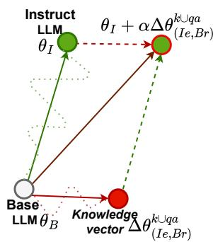
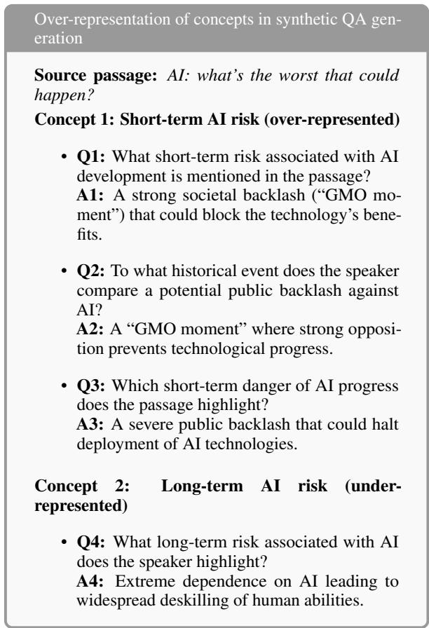
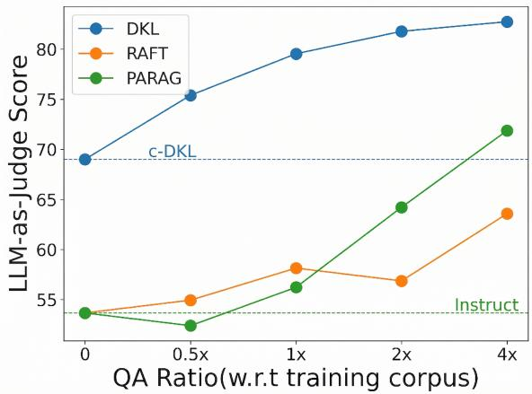
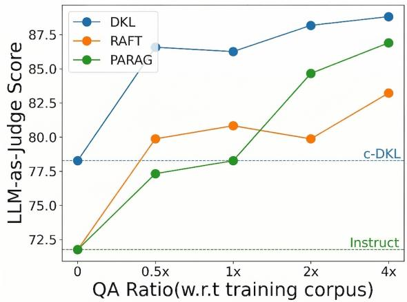
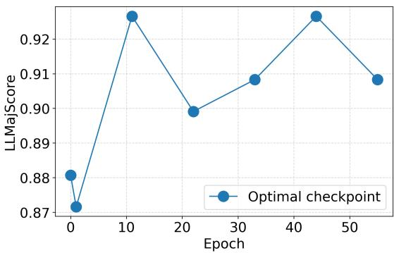
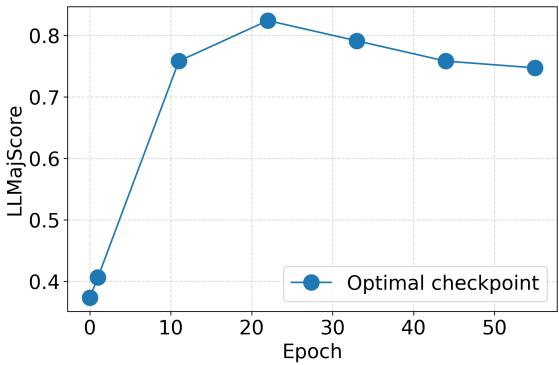
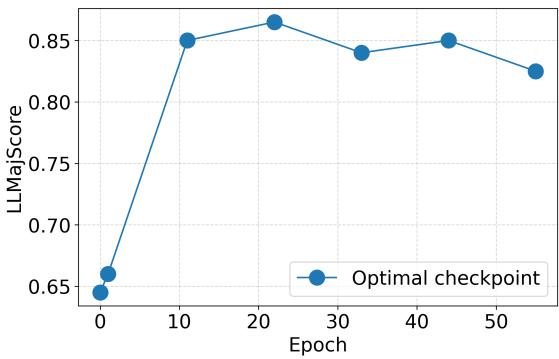
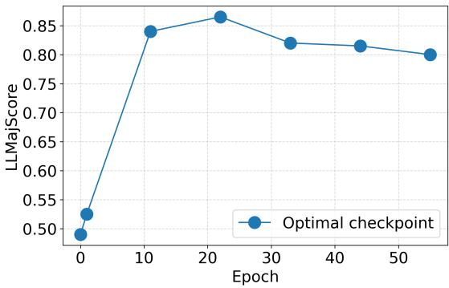

# DKL: Decoupled Knowledge Learning for Instruction-Tuned Language Models

Kushagra Bhushan1 Meghanadh Pulivarthi1 Sai Krishna Reddy Sathi2\*

Gaurav Pandey1 Sonam Gupta1 Vineet Kumar† Jaydeep Sen1

Yatin Nandwani1 Sachindra Joshi1 Dinesh Raghu1

1IBM 2Indian Institute of Technology, Madras

{kushagrabhushan, Meghanadh.Pulivarthi1, sonam.gupta7, Yatin.Nandwani}@ibm.com {gpandey1, jaydesen, jsachind, diraghu1}@in.ibm.com me21b181@smail.iitm.ac.in vineet.mundhra@gmail.com

## Abstract

RAG has become the de facto method for incorporating new, corpus-specific knowledge into an instruction following LLM (Instruct LLM). Although RAG-based prompting improves factual grounding, it fails when retrieval is incorrect or incomplete, leading to hallucinations. Finetuning methods such as RAFT (Zhang et al., 2024b) and PA-RAG (Bhushan et al., 2025) enhance RAG by injecting new knowledge into the model’s parameters, but require generating a massive amount of synthetic QA that covers the entire corpus. Extended Pre-Training (EPT) on the text corpus avoids the need for comprehensive synthetic data generation but compromises an Instruct LLM’s instruction-following capabilities, necessitating instruction fine-tuning (IFT) after pre-training. However, IFT is costly and may be infeasible due to the unavailability of an instruction-tuning corpus. In this work, we propose DKL-Decoupled Knowledge Learning for Instruction-Tuned Language Models. Instead of doing EPT on the Instruct LLM, DKL performs EPT on its corresponding base LLM to infuse new knowledge. These knowledgeinfused weights are then merged with the In struct LLM, imparting new knowledge without affecting their instruction-following capabili ties. DKL is a lightweight method that avoids expensive instruction fine-tuning and relies on model merging to infuse the new knowledge into the Instruct LLM without destroying its instruction following capabilities. Empirical re sults show that DKL improves RAG accuracy from 54.17% to 79.26% on retrieval failure cases, while outperforming prior approaches with substantially less training data.

## 1 Introduction

‘Base LLMs’ trained on enormous amounts of textual data possess immense knowledge but lack instruction-following capabilities. This necessitates post-training, which typically involves massive Instruction Fine-Tuning (IFT) (Ouyang et al., 2022; Shengyu et al., 2023) followed by RLHF (Schulman et al., 2017; Rafailov et al., 2023; Pandey et al., 2024). ‘Instruct LLMs’ (model obtained after post–training) have achieved remarkable success across general-purpose tasks (Brown et al., 2020; Wei et al., 2022). However, in specialized applications such as question answering over technical or confidential policy documents, success depends less on general reasoning and more on producing highly accurate, document-grounded responses. Often, these specialized documents are either too scarce or proprietary and, therefore, unavailable during the pre-training stage. Hence, even the state-of-the-art LLMs struggle to answer queries that require access to these documents.

A common solution is Retrieval-Augmented Generation (RAG) (Lewis et al., 2020; Karpukhin et al., 2020), which conditions LLM’s responses on relevant passages retrieved from the target documents. While effective, RAG is highly sensitive to retrieval quality, and retriever failures often lead to hallucinations or incomplete answers ((Ji et al., 2023; Nandwani et al., 2023)). Injecting the new knowledge from the specialized documents into the parameters of the model can potentially alleviate the issues caused by retriever failures, as the model can fall back on its parametric knowledge.

Extended pre-training (EPT) via unsupervised next-token prediction on new documents (Ke et al., 2023) is an effective way to ingest new knowledge. However, doing so on Instruct LLMs results in catastrophic forgetting of the skills acquired during IFT (Ke et al., 2025). As a result, most of the prior works (Ma et al., 2023; Yang et al., 2024; Lu et al., 2025) apply extended pre-training on the ‘base LLM’ but have to redo IFT to re-acquire the skills present in the instruct LLM. This may not always be feasible due to the lack of the IFT dataset used to create the instruct LLM.

Another way of knowledge ingestion involves direct finetuning of the instruct LLM using IFTstyle training data, such as question-answers (QAs) from the new documents. However, QAs from the new documents are often not readily available and hence works such as Zhang et al. (2024b); Bhushan et al. (2025) resort to QAs generated synthetically by prompting a stronger LLM. A major advantage of such techniques is that they don’t require expensive IFT after knowledge ingestion. However, there are two main issues: (1) we need to generate a massive amount of synthetic data, which may become prohibitively expensive (Yang et al., 2025), and (2) unlike EPT, it is difficult to guarantee coverage of the entire knowledge via QAs.

In this work, we ask whether one can obtain the knowledge-ingestion benefits of extended pre-training without sacrificing the instructionfollowing ability of an existing instruct LLM. Our key intuition is that these two capabilities arise from different stages of training: new corpus knowledge is most effectively acquired during

  
Figure 1: Exploiting taskarithmetic to combine new knowledge adapter with instruction following capabilities of Instruct LLM.

pre-training, while instruction-following behavior is introduced later through instruction fine-tuning (IFT). Repeating IFT after each round of knowledge ingestion, however, is often prohibitively expensive or impossible when the instructiontuning data is unavailable. We therefore draw on task arithmetic (Ilharco et al., 2023), which treats the effect of fine-tuning as vector addition in parameter space.

In particular, we compute an ‘instruction following vector’ of the instruct LLM by subtracting the publicly available instruct and base LLM’s weights. This vector captures the transformation induced by instruction-tuning. To obtain a ‘knowledge vector’ that captures the new knowledge, we use the new documents to perform extended pretraining via unsupervised next token prediction on top of the base LLM. Adding the ‘instruction following vector’ and the ‘knowledge vector’ to the base LLM results in a model that has the new knowledge from the documents, as well as the instruction following skills of the Instruct LLM. (see fig. 1). We call our method DKL: Decoupled Knowledge Learning for Instruction-Tuned Language Models. Optionally, to improve the model’s ability to recall the newly acquired knowledge at query time, we augment this training with a small amount of synthetic QA supervision (Allen-Zhu and Li, 2024).

Since the knowledge vector is trained on the base LLM but applied to the instruct LLM, its effectiveness can be limited by representation mismatch between the two models. This mismatch may arise from differences in token embeddings, including additional chat-formatting tokens in instruct LLMs such as ‘[INST]’ for Mistral (Jiang et al., 2023; Mistral AI, 2024). To improve transferability, we train the knowledge vector using the instruct model’s token embeddings, which makes the learned update better aligned with the target instruct model. Our ablations show that this consistently improves performance.

To the best of our knowledge, DKL is the first work that proposes a lightweight and efficient way of imparting new knowledge to an existing Instruct LLM. To summarize, our contributions are:

1. We propose DKL (Decoupled Knowledge Learning for Instruction-Tuned Language Models), an efficient and lightweight method for injecting knowledge from new documents without the costly IFT phase, usually required after EPT.

2. To make DKL work, we devise a novel method that uses token embeddings from the instruct LLM during extended pretraining on the base LLM. This significantly improves the adaptability of the knowledge vector.

3. We empirically demonstrate that our method outperforms state-of-the-art SFT based knowledge infusion methods (Zhang et al., 2024b; Bhushan et al., 2025) as well as a closely related baseline, Chat-Vector (Huang et al., 2024), while requiring substantially less synthetic data.

## 2 Related Work

Knowledge Ingestion: Retrieval-Augmented Generation (RAG) (Lewis et al., 2020; Guu et al., 2020; Karpukhin et al., 2020) ingests external knowledge in the context at inference time to ground responses on retrieved passages. Recent progress has showcased its effectiveness across diverse domains (Asai et al., 2024; Qiu et al., 2023; Kim et al., 2024; Tang et al.; Yan et al., 2024). However, RAG-based approaches remain vulnerable to retrieval failures, leading to hallucinations (Nandwani et al., 2023; Ji et al., 2023; Setty et al., 2024).

Another research direction has been static knowledge injection, which infuses domain knowledge into the model’s parameters via fine-tuning or extended pretraining, enabling closed-book inference without access to external documents (Ke et al., 2023; Lu et al., 2025; Ovadia et al., 2025). Various works have established the utility of extended pretraining across multiple fields, such as medical (Wu et al., 2024; Christophe et al., 2024), materials (Zhang et al., 2024a), and finance (Wu et al., 2023; Xie et al., 2023). However, EPT on new text causes instruction-tuned models to regress on general instruction-following abilities, necessitating expensive re-instruction tuning.

Recent works like RAFT(Zhang et al., 2024b) and PA-RAG(Bhushan et al., 2025) bridge static and dynamic paradigms by finetuning instruct LLMs to absorb document knowledge while using retrieved passages during inference. However, they still rely heavily on large synthetic QA corpora.

Model Merging via Task Vectors: Inspired by model merging (Wortsman et al., 2022), Ilharco et al. (2023) introduce task vectors (difference between the weights of two trained models) as an effective mechanism for imparting different skills to an LLM. Task vectors provide a general modelmerging framework. Unlike DKL it does not prescribe training on the base model, and it does not address the vocabulary distribution mismatch between the base and Instruct LLMs. Various works have extended the basic idea of task vectors in different ways. For instance, Daheim et al. (2024) leverage task vectors to mitigate hallucinations, while Zhang et al. (2023) combine multiple PEFT modules (Hu et al., 2022; Liu et al., 2022) to achieve distribution generalization, multitask adaptation, detoxification, and domain transfer.

Most closely related to our work, Huang et al. (2024) propose Chat-Vector, which transfers conversational abilities from a chat-tuned Llama model to a Chinese-adapted Llama base model. Our approach differs from Chat-Vector in two important ways: (1) unlike Chat-Vector, DKL uses the embedding layer of the instruction-tuned model while training the knowledge vector, thereby addressing vocabulary distribution mismatch; (2) DKL combines the knowledge and chat vector using an optimized interpolation ratio. We use Chat-Vector as a baseline and show that both of these design choices are critical for effective knowledge injection.

## 3 Methodology

Let θ represent the parameters of an LLM that assigns a probability $\mathbf { P r } ( \mathbf { p } ; \theta )$ to a sequence of tokens $\mathbf { p } = \left( t _ { 1 } \cdots t _ { m } \right)$ . Let $\theta _ { B }$ and $\theta _ { I }$ be the weights of the corresponding base and instruct LLMs, respectively. Further, let $\mathcal { D } _ { k } = \{ \mathbf { p } ^ { i } \} _ { i = 1 } ^ { N }$ represent the new knowledge that we wish to ingest on top of the instruct LLM.

We propose to ingest knowledge from $\mathcal { D } _ { k }$ into a knowledge adapter, $\Delta \theta ^ { k }$ . A naïve way to train such an adapter would be to start with the most optimal weights $\theta _ { I }$ and minimize the negative log likelihood over $\mathcal { D } _ { k }$ :

$$
\Delta \theta _ { I } ^ { k } = \underset { \Delta \theta } { \arg \operatorname* { m i n } } \sum _ { \mathbf { p } \in \mathcal { D } _ { k } } - \log \mathbf { P r } ( \mathbf { p } ; ( \theta _ { I } + \Delta \theta ) )\tag{1}
$$

However, Ke et al., 2025 observe that such an adapter results in deterioration of instruction following abilities of the instruct LLM $\theta _ { I }$ . This can be attributed to the fact that the instruct LLM is obtained via supervised finetuning of the base LLM, whereas the training objective in eq. (1) is unsupervised next token prediction. Next, we observe that this objective is the same as the training objective of the base LLMs. Therefore, $\theta _ { B }$ could be more amenable to extended pretraining and thus may provide an ideal starting point for ingesting new knowledge. Motivated by this observation, we propose to train the knowledge adapter on top of the base LLM -

$$
\Delta \theta _ { B } ^ { k } = \underset { \Delta \theta } { \arg \operatorname* { m i n } } \sum _ { \mathbf { p } \in \mathcal { D } _ { k } } - \log \mathbf { P r } ( \mathbf { p } ; ( \theta _ { B } + \Delta \theta ) )\tag{2}
$$

In our notation, the superscript captures the training data and the subscript captures the starting point, $i . e . ,$ , model initialisation. Note that the final knowledge-infused parameters returned by eq. (2) are $\theta _ { B } + \Delta \theta _ { B } ^ { k }$ . However, such a model lacks the instruction following ability of the instruct LLM. But notice that the new knowledge from $\mathcal { D } _ { k }$ is mainly captured in $\Delta \theta _ { B } ^ { k }$ , which may be combined with $\theta _ { I }$ that already has instruction following abilities. Therefore, instead of using $\theta _ { B } + \Delta \theta _ { B } ^ { k }$ as our final parameters, we propose to use $\theta _ { I } + \alpha \Delta \theta _ { B } ^ { k }$ , where $\alpha \in ( 0 , 1 ]$ is a hyperparameter -

$$
\theta ^ { * } = \theta _ { I } + \alpha \Delta \theta _ { B } ^ { k }\tag{3}
$$

Task-arithmetic inspired interpretation: Ilharco et al., 2023 show that if $\theta _ { 1 }$ and $\theta _ { 2 }$ are two different models finetuned from the same base model $\theta _ { B }$ then the corresponding task vectors, $\Delta \theta _ { B } ^ { 1 } = \theta _ { 1 } -$ $\theta _ { B }$ and $\Delta \theta _ { B } ^ { 2 } = \theta _ { 2 } - \theta _ { B }$ , capture the skills infused in them. If we combine the two task vectors, we get a model that possibly possesses both the skills -

$$
\theta ^ { c } = \theta _ { B } + \alpha \Delta \theta _ { B } ^ { 1 } + \gamma \Delta \theta _ { B } ^ { 2 }\tag{4}
$$

Here, $\theta ^ { c }$ is the combined model capturing the skills of both the finetuned models. α and $\gamma$ are hyperparameters.

Now, let $\mathcal { D } _ { s }$ be the data used for the instruction tuning of the instruct LLM. Then the corresponding ’instruct task vector’ would be -

$$
\begin{array} { c } { { \displaystyle \theta _ { I } - \theta _ { B } = \arg \operatorname* { m i n } \sum _ { \Delta \theta } - \log \mathbf { P r } \big ( \mathbf { y } \mid \mathbf { x } ; ( \boldsymbol { \theta } _ { B } + \Delta \theta ) \big ) } } \\ { { \displaystyle = \Delta \theta _ { B } ^ { s } } } \end{array}
$$

We can think of our knowledge adapter $\Delta \theta _ { B } ^ { k }$ as ‘knowledge task vector’ capturing all the knowledge from the corpus. Now, combining the ‘instruct task vector’ with ‘knowledge task vector’, we get -

$$
\theta ^ { * } = \theta _ { B } + \alpha \Delta \theta _ { B } ^ { k } + \gamma \Delta \theta _ { B } ^ { s }\tag{5}
$$

Substituting $\gamma = 1$ and $\Delta \theta _ { B } ^ { s } = \theta _ { I } - \theta _ { B }$ from section 3, we get -

$$
\theta ^ { * } = \theta _ { B } + \alpha \Delta \theta _ { B } ^ { k } + \theta _ { I } - \theta _ { B } = \theta _ { I } + \alpha \Delta \theta _ { B } ^ { k }\tag{6}
$$

which is exactly same as eq. (3).

Adding a small amount of synthetic QA: Allen-Zhu and Li, 2024 observe that having a few question-answer pairs in the pre-training data significantly enhances the recall of the ingested knowledge. These QAs do not necessarily have to span the entire corpus. Accordingly, we enhance our training corpus with a small amount of synthetically generated QAs. Unlike instruction finetuning, where loss is backpropagated only over the answer tokens conditioned on the question, we concatenate the question, answer and treat it as part of the new knowledge to be ingested. Accordingly, let $\mathcal { D } _ { q a } = \{ \mathbf { x } ^ { i } = ( \mathbf { s y s } , \mathbf { q } ^ { i } , \mathbf { a } ^ { i } ) \} _ { i = 1 } ^ { n q }$ be the training data obtained from the synthetic QAs. Here sys is a common system prompt that asks the model to answer the question; $( \mathbf { s y s } , \mathbf { q } ^ { i } , \mathbf { a } ^ { i } )$ represents the concatenation of system prompt, question and answer; and nq is the number of synthetically generated QAs. We train our knowledge adapter on top of the base LLM using $\mathcal { D } _ { k \cup q a } = \mathcal { D } _ { k } \bigcup \mathcal { D } _ { q a }$

$$
\Delta \theta _ { B } ^ { k \cup q a } = \underset { \Delta \theta } { \arg \operatorname* { m i n } } \sum _ { \mathbf x \in \mathcal { D } _ { k } \bigcup \mathcal { D } _ { q a } } - \log \mathbf P \mathbf r ( \mathbf x ; ( \theta _ { B } + \Delta \theta ) )\tag{7}
$$

Using token embeddings of the instruct LLMs: We observe that for certain tokens, embeddings in the base and instruct LLMs are quite different. Often, they correspond to the tokens introduced during the instruction fine-tuning phase, e.g., ‘[INST]’ in instruct versions of Mistral. The system prompt used in the synthetic QA dataset may also introduce special tokens not seen during training of the base LLM, i.e., the parameters $\theta _ { B }$ are oblivious to these tokens. This creates a mismatch: the knowledge adapter is trained with the base model’s token embeddings but during inference it is used with the instruct LLM’s entirely different embeddings. To mitigate this, we propose to use the token embeddings of the instruct LLM instead of the base LLM. Concretely, during knowledge adapter training, we replace the base LLM’s token embeddings (and the lm\_head, if separate) with those of the instruct LLM. We claim that this enhances the adaptability of the knowledge adapter, trained on the base LLM but used with an instruct LLM. Intuitively, it gives the adapter parameters early exposure to the inference-time environment and vocabulary, reducing the risk of distribution shift.

If we represent model parameters $\theta _ { B }$ as $( { \theta } _ { B e } , { \theta } _ { B r } )$ and $\theta _ { I }$ as $\left( \theta _ { I e } , \theta _ { I r } \right)$ , where $\theta _ { B e } , \theta _ { I e }$ are the token embeddings and $\theta _ { B r } , \theta _ { I r }$ are the remaining parameters in the base and instruct LLMs, respectively, then we learn our knowledge adapter on top of $( \theta _ { I e } , \theta _ { B r } )$

$$
\Delta \theta _ { ( I e , B r ) } ^ { k \cup q a } = \underset { \Delta \theta } { \arg \operatorname* { m i n } } \sum _ { \mathbf { x } \in \mathcal { D } _ { k } \bigcup \mathcal { D } _ { q a } } \mathcal { L }\tag{8}
$$

Where,

$$
\mathcal { L } = - \log \mathbf { P r } \left( \mathbf { x } ; ( \theta _ { I e } , \theta _ { B r } + \Delta \theta ) \right)
$$

Algorithm 1 in appendix presents our method that returns the trained knowledge adapter. One can load it on top of the instruct LLM $\theta _ { I }$ to obtain the

final model parameters as -

$$
\begin{array} { r l } & { \theta ^ { * } = \theta _ { I } + \alpha \left( \mathbf { 0 } , \Delta \theta _ { ( I e , B r ) } ^ { k \cup q a } \right) } \\ & { \quad = ( \theta _ { I e } , \theta _ { I r } ) + \alpha \left( \mathbf { 0 } , \Delta \theta _ { ( I e , B r ) } ^ { k \cup q a } \right) } \\ & { \quad = \left( \theta _ { I e } , \theta _ { I r } + \alpha \Delta \theta _ { ( I e , B r ) } ^ { k \cup q a } \right) } \end{array}\tag{9}
$$

## 4 Experimental Setup

Datasets: We show the efficacy of our method on three datasets: 2 technical RedBooks (Bhushan et al., 2025) and a non-technical dataset, QuALITY (Pang et al., 2022). The first two datasets consist of text from technical Redbooks1 along with corresponding test question answers. The QuALITY dataset consists of a large number of long-form articles from the open domain. We randomly sample 10 articles to act as a knowledge base for our experiments. See section B for more details.

Models: We ingest the knowledge from all the datasets into Mistral-7B-Instruct-v0.3 and LLama-3.1-8B-Instruct. In addition, to demonstrate the robustness of DKL to various backbone architectures and model sizes, we experiment with SmolLM2-1.7B-Instruct, and Qwen3-0.6B on one of the datasets. Evaluation Metrics: We evaluate our models in two setups – QA and RAG. In the QA setup, the model is prompted with only the question, and in the RAG setup, we provide the top 5 retrieved passages along with the question. We use Llama-3.3-70B-Instruct as a judge to evaluate the correctness of the predicted answer w.r.t. the given gold answer. For each test sample, we provide the judge with the question, gold answer, and generated answer, and the judge returns a binary score (0/1) after reasoning across multiple criteria. See section K for full prompts.

To ensure that our LLM judge is aligned with human judgement, we conduct a small-scale human study in which we evaluate the responses generated by the Instruct LLM. See section C for more details on the human study.

Baselines: We compare DKL with RAFT (Zhang et al., 2024b), PA-RAG (Bhushan et al., 2025), and Chat-Vector (Huang et al., 2024). Both RAFT and PA-RAG rely on synthetically generated QAs for knowledge ingestion. We prompt Mixtral-8x22B-Instruct-v0.1 to generate synthetic QAs and use the

same prompt as described in Bhushan et al., 2025.   
See section K for the exact prompt.

Size of the synthetic training data: The number of question–answer pairs in the synthetically generated training dataset depends on the corpus size. For RAFT and PA-RAG we need to cover the entire corpus with the generated synthetic data. Therefore, we generate pairs such that the total number of generated words is twice the number of words in the corpus. PA-RAG additionally requires multiple answers per question. For each training question, we generate four additional answers using Mixtral-8x22B-Instruct-v0.1. Consequently, the synthetic dataset for PA-RAG contains about ∼ 10 times as many words as the corpus. See section D for more details.

Recall that DKL also requires a small amount of synthetic QAs, but without the need to cover the full corpus. Consequently, for DKL, we randomly select question-answer pairs such that the total number of selected words is only 50% of the number of words in the corpus.

Training Details: We run all experiments with Hugging Face’s SFTTrainer. To train the knowledge vector, we use Low Rank Adapters (LoRA) for all linear layers in the model with rank r = 16. For DKL, after loading the base model, we replace its token embeddings with those of the corresponding instruct model as explained in section 3.

For baseline methods, model selection is based on validation loss with early stopping. For DKL we instead train until convergence of the training loss and control overfitting via the scaling hyperparameter α. We sweep α ∈ {0.25, 0.5, 0.75, 1.0} and select the best value using validation performance. See section G for an alternate way of selecting hyperparameter α.

## 5 Experimental Results

We seek to answer the following research questions through our experiments:

1. Can DKL effectively ingest knowledge into instruct LLM’s parameters? To test this, we evaluate the knowledge ingested model in the QA setup where it is provided with only the question and it has to answer from its parametric knowledge.

2. Can DKL effectively combine the knowledge ingested in its parameters with additional knowledge present in its context? To test this, we compare DKL in the RAG setup with SFT based methods such as RAFT (Zhang et al., 2024b) and PA-RAG (Bhushan et al., 2025) that rely heavily on an enormous amount of synthetic data.

<table><tr><td rowspan="3"></td><td colspan="5">RedBook 1</td><td colspan="5">QuALITY</td></tr><tr><td rowspan="2">QA</td><td colspan="3">RAG</td><td rowspan="2">Train Time (in mins)</td><td rowspan="2">QA</td><td colspan="3">RAG</td><td rowspan="2">Train Time</td></tr><tr><td>All</td><td>Ret. Success</td><td>Ret. Fail.</td><td>All</td><td>Ret. Success</td><td>Ret. Fail.</td></tr><tr><td>Instruct</td><td>53.67 ±2.82</td><td> $7 1 . 7 6 \pm 2 . 5 4$ </td><td> $8 6 . 2 7 \pm 1 . 9 5$ </td><td> $\overline { { 5 4 . 1 7 \pm 2 . 8 2 } }$ </td><td></td><td> $1 7 . 6 2 \pm 1 . 9 8$ </td><td> $\overline { { 5 0 . 4 1 \pm 2 . 6 0 } }$ </td><td> $8 2 . 3 1 \pm 2 . 7 3$ </td><td> $\overline { { 1 4 . 6 6 \pm 2 . 6 8 } }$ </td><td>(in mins)</td></tr><tr><td>RAFT</td><td>56.87 ±2.80</td><td> $7 9 . 8 7 \pm 2 . 2 7$ </td><td> $8 8 . 2 0 \pm 1 . 8 2 $ </td><td> $6 8 . 8 9 \pm 2 . 6 2 $ </td><td>19</td><td> $1 1 . 6 5 \pm 1 . 6 7$ </td><td> $4 3 . 2 2 \pm 2 . 5 7$ </td><td> $6 7 . 9 5 \pm 3 . 3 4$ </td><td> $1 5 . 5 2 \pm 2 . 7 4$ </td><td>120</td></tr><tr><td>PA-RAG</td><td>64.22 ±2.71</td><td> $8 4 . 6 6 \pm 2 . 0 4$ </td><td> $\mathbf { 9 2 . 7 0 \bot } 1 . 4 7$ </td><td> $7 4 . 0 7 \pm 2 . 4 8$ </td><td>43</td><td> $1 0 . 8 4 \pm 1 . 6 1$ </td><td> $3 8 . 7 5 \pm 2 . 5 3 $ </td><td> $5 8 . 9 7 \pm 3 . 5 2 $ </td><td> $1 6 . 0 9 \pm 2 . 7 8$ </td><td>330</td></tr><tr><td>Chat Vector</td><td> $7 1 . 4 7 \pm 2 . 5 5$ </td><td> $8 3 . 9 8 \pm 2 . 0 7$ </td><td> $9 0 . 5 6 \pm 1 . 6 5$ </td><td> $7 8 . 6 5 \pm 2 . 3 2$ </td><td>7</td><td> $1 1 . 6 5 \pm 2 . 1 5$ </td><td> $4 5 . 5 2 \pm 3 . 3 4$ </td><td> $7 1 . 7 9 \pm 3 . 0 2$ </td><td> $1 6 . 0 9 \pm 2 . 4 7$ </td><td>34</td></tr><tr><td>DKL</td><td> ${ 7 3 . 8 0 \pm 2 . 4 9 }$ </td><td> $\mathbf { 8 6 . 5 8 \bot } 1 . 9 3 $ </td><td> $9 2 . 1 3 \pm 1 . 5 2 $ </td><td> $\mathbf { 7 9 . 2 6 \ } \pm 2 . 2 9$ </td><td>7</td><td> $2 5 . 7 5 \pm 2 . 2 7$ </td><td> ${ \pm 4 . 6 1 \pm 2 . 5 9 }$ </td><td> $\mathbf { 8 3 . 8 5 \_ } 2 . 6 3$ </td><td> $2 1 . 8 4 \pm 3 . 1 3$ </td><td>34</td></tr></table>

Table 1: Comparing DKL with various baselines. The table reports the fraction of test samples where the LLM Judge rated the predicted response as good as the gold response. QA: performance in the QA setup; All: performance over the entire test set in RAG setup; Ret. Success: performance over test queries where retriever succeeds (match@5=1); Ret. Fail.: performance over test queries where retriever fails (match@5=0). These results are for Mistral-7B-Instruct-v0.3. Please see Table 10 for results on Llama-3.1-8B-Instruct. Train Time: Approx. training time in minutes. All scores are reported as mean +/- standard error.

3. What is the role of synthetic QA data in DKL? Specifically, is our method robust to the size of the synthetic QA dataset and its coverage of the corpus? To this end, we run two ablations – (1) We vary the size of the synthetic dataset and compare DKL with RAFT and PARAG in both QA and RAG setups. (2) We systematically bias the synthetic QA dataset by generating training QAs from a specific subset of documents and then measure the impact on performance.

4. Is DKL robust to various model architectures and sizes?

5. Finally, we seek to quantify the importance of using token embeddings of the instruct LLM instead of base LLM while training the knowledge adapter, i.e., what happens if we train the adapter on $\theta _ { B } = ( \theta _ { B e } , \theta _ { B r } )$ (eq. (7)) instead of $\left( \theta _ { I e } , \theta _ { B r } \right) \left( \mathbf { e q . } \left( 8 \right) \right)$

## 5.1 Comparison with the baselines

In table 1, we compare the performance of several baselines with DKL, highlighting its robustness across different domain corpora. For the Book1 dataset, both RAFT and PA-RAG show the expected improvements over the base instruct model. However, this is not true for the QuALITY dataset.

Inspection of the QuALITY corpus reveals that related concepts appearing in comparable proportions in the source documents (e.g., short-term vs. long-term risks) are unevenly represented in the synthetic QA data, leading to skewed priors over these concepts. See fig. 2 for concrete examples illustrating this imbalance. This imbalance results in failures at test time. When presented with questions about long-term risks, models trained on such skewed synthetic data often default to generating answers about short-term risks. We noticed this behaviour even when the retrieved passages in RAG explicitly contain information about longterm risks. This indicates that methods that rely heavily on synthetic QA generation, such as PA-RAG and RAFT, do not faithfully ground their responses in the provided context but are instead influenced by the training-induced biases.

In contrast, DKL consistently outperforms the baselines across all datasets, as it minimises the reliance on synthetic data generation. This is because corpus coverage is ensured by design: the EPT stage exposes the model to the entire domain corpus, while merging it with the instruct model preserves its ability to effectively utilize this knowledge at inference time. This behavior is reflected in the RAG setting reported in table 1. When the retriever succeeds, DKL effectively leverages the retrieved passages, achieving performance gains up to 92.13 and 83.85. When retrieval fails, the model can ignore the misleading context and answer using knowledge encoded in its parameters.

Comparing DKL with Chat-Vector, we observe that DKL significantly outperforms Chat-Vector on both datasets, demonstrating the importance of swapping the base model’s embeddings with the corresponding embeddings of the Instruct model during finetuning and combining the knowledge vector in the optimal ratio. We further analyze it in detail in section 5.5.

We observe trends similar to RedBook 1 on Red-Book 2. See section F for the exact numbers.

  
Figure 2: Example illustrating uneven concept coverage in synthetically generated QA pairs for the QuALITY dataset. Multiple questions are generated about the same short-term AI risk concept from a single passage, while the long-term risk discussed in the passage is sampled only once. Such imbalances lead training methods that rely heavily on synthetic QA data (e.g., PA-RAG and RAFT) to overfit to over-represented concepts.

## 5.2 Impact of the size of the synthetic data

In this experiment, we study how scaling the synthetic QA dataset affects model performance. For this, we progressively increase the number of synthetic QA pairs and compare DKL with baselines in both QA and RAG setups. We define ‘QA ratio as the ratio of number of words in the synthetic QA dataset to the words in the training document. For DKL, QA ratio of 0 corresponds to training only on the corpus (eq. (3)) and we call it corpus-DKL or c-DKL in short. For RAFT and PA-RAG , 0 corresponds to the instruct model. Note that for PA-RAG , we need to generate multiple answers for each question, and the QA ratio does not account for it. Therefore, the actual synthetic QA dataset used for PA-RAG would contain about 5× as many words as RAFT and DKL. Note that the performance numbers in our main experiments correspond to a ratio of 2 for RAFT and PA-RAG , and 0.5 for DKL. For this analysis, we generate additional data and scale up to a ratio of 4.

<table><tr><td rowspan=2 colspan=1></td><td rowspan=1 colspan=2>Ch. 1-3</td><td rowspan=1 colspan=2>Ch. 4-5</td></tr><tr><td rowspan=1 colspan=1>QA</td><td rowspan=1 colspan=1>RAG</td><td rowspan=1 colspan=1>QA</td><td rowspan=1 colspan=1>RAG</td></tr><tr><td rowspan=1 colspan=1>c-DKL</td><td rowspan=1 colspan=1>52.80</td><td rowspan=1 colspan=1>74.40</td><td rowspan=1 colspan=1>65.96</td><td rowspan=1 colspan=1>80.85</td></tr><tr><td rowspan=1 colspan=1>b-DKL</td><td rowspan=1 colspan=1>+26.40</td><td rowspan=1 colspan=1>+8.00</td><td rowspan=1 colspan=1>+ 2.66</td><td rowspan=1 colspan=1>+5.25</td></tr></table>

Table 2: Comparison between models trained without synthetic QA (c-DKL i.e., corpus-DKL) and models trained with chapter-biased synthetic QA(b-DKL)

Figures 3a-3b presents the analysis. We first observe that c-DKL(dotted blue horizontal line) outperforms both baselines in the QA setup, demonstrating the capability of our method to efficiently ingest knowledge.

As seen in Figure-3b DKL can achieve near optimal performance with only 0.5× of synthetic data where the difference of performance is only 2.24% between 0.5× vs 4× of synthetic data. In contrast, PA-RAG improves by more than 10% going from 0.5× to 4× synthetic data, implying PA-RAG indeed needs comprehensive volume of synthetic data for effective knowledge ingestion. A similar trend appears in the QA setup, where DKL not only outperforms the baselines but also shows a smoother saturation curve, unlike the sharp jumps with more synthetic data as seen in PA-RAG. These results empirically establish that DKL is indeed much more lightweight yet the new state-ofthe-art scalable knowledge ingestion recipe, which does not need extensive synthetic data generation.

## 5.3 Robustness of DKL to corpus coverage by synthetic QAs

In the previous experiment, we observed that DKL is robust to the amount of the synthetic QA dataset, and its RAG performance begins to saturate even with a QA ratio of 0.5. Here, we systematically study the impact of partial knowledge coverage on our method. Allen-Zhu and Li, 2024 note that “partially augmenting data can improve knowledge extractionfor non-augmented data”. Here augmentation refers to adding QAs corresponding to the knowledge being ingested. To systematically study this, we run a control experiment – we train a version of DKL using the document along with QA data generated from only chapters 1 to 3 of Book1 (we call it biased-DKL, or b-DKL) and compare its performance with c-DKL (trained without any QA data). Table 2 shows the results. We observe that adding synthetic QAs from chapters 1 to 3 improves the performance even on chapter 4-5, demonstrating that even if we have access to QA from only a part of the corpus, DKL will still show gains over the remaining data.

  
(a) QA

  
(b) RAG

Figure 3: Impact of scaling synthetic QA on the Redbook1 dataset with Mistral-Instruct-v0.3. Blue horizontal line corresponds to c-DKL– our model trained in an unsupervised manner only using the document text. Green horizontal line corresponds to Mistral-Instruct-v0.3.
<table><tr><td rowspan="3"></td><td colspan="2">SmolLM2-1.7B</td><td colspan="2">Qwen3-0.6B</td><td colspan="2">Llama-3.1-8B</td><td colspan="2">Mistral-7B-v0.3</td></tr><tr><td>QA</td><td>RAG</td><td>QA</td><td>RAG</td><td>QA</td><td>RAG</td><td>QA</td><td>RAG</td></tr><tr><td>Instruct</td><td>15.53</td><td>39.33</td><td>18.35</td><td>40.65</td><td>52.40</td><td>67.41</td><td>53.67</td><td>71.76</td></tr><tr><td>RAFT</td><td>18.35</td><td>40.94</td><td>16.47</td><td>41.65</td><td>60.06</td><td>77.96</td><td>56.87</td><td>79.87</td></tr><tr><td>PA-RAG</td><td>18.47</td><td>38.59</td><td>20.00</td><td>42.59</td><td>65.81</td><td>82.75</td><td>64.22</td><td>84.66</td></tr><tr><td>Chat-Vec.</td><td>23.52</td><td>40.47</td><td>23.29</td><td>44.94</td><td>71.05</td><td>78.91</td><td>71.47</td><td>83.98</td></tr><tr><td>DKL</td><td>24.47</td><td>46.12</td><td>25.41</td><td>48.94</td><td>72.20</td><td>80.19</td><td>73.80</td><td>86.58</td></tr></table>

Table 3: Comparing DKL with baselines using 4 different model architectures and sizes on Redbook1.

## 5.4 Robustness to Architectures and Sizes

Here we establish that DKL is robust to various model architectures and sizes. In addition to Mistral-7B and Llama-8B, we finetune SmolLM2- 1.7B-Instruct, and Qwen3-0.6B on Redbook1. Table 3 presents the results. We see that DKL consistently outperforms all the baselines. See section H for detailed results.

## 5.5 Impact of using instruct LLM’s token embeddings during training

Recall that in DKL we replace the frozen token embeddings $\theta _ { B e }$ in the base LLM with those from the corresponding instruct LLM. I.e., we train the knowledge LoRA adapter on top of $( \theta _ { I e } , \theta _ { B r } )$ instead of $( { \theta } _ { B e } , { \theta } _ { B r } )$ . Here, we quantify its impact by comparing the models trained using eq. (7) and eq. (8), respectively. Table 4 and table 13 shows the results for Mistral and Qwen3-0.6B, respectively.

<table><tr><td rowspan="2"></td><td rowspan="2">QA</td><td colspan="3">RAG</td></tr><tr><td>All</td><td>Ret. Success</td><td>Ret. Failure</td></tr><tr><td>PA-RAG</td><td> $\overline { { 6 4 . 2 2 \pm 2 . 7 1 } }$ </td><td> $\overline { { 8 4 . 6 6 \pm 2 . 0 4 } }$ </td><td> $9 2 . 7 0 \pm 1 . 4 7$ </td><td> $\overline { { 7 4 . 0 7 \pm 2 . 4 8 } }$ </td></tr><tr><td>DKL</td><td> $7 3 . 8 0 \pm 2 . 4 9$ </td><td> $8 6 . 5 8 \pm 1 . 9 3$ </td><td> $9 2 . 1 3 \pm 1 . 5 2 $ </td><td> $7 9 . 2 6 \pm 2 . 2 9$ </td></tr><tr><td>e-DKL</td><td> $7 2 . 7 6 \pm 2 . 5 2$ </td><td> $8 4 . 5 7 \pm 2 . 0 4$ </td><td> $9 2 . 1 3 \pm 1 . 5 2 $ </td><td> $7 3 . 1 3 \pm 2 . 5 1$ </td></tr></table>

Table 4: Effectiveness of using instruct LLM’s embeddings during training. Comparing DKL with a version trained directly on top of base LLM (e-DKL) for Red-Book1 using Mistral-7B-Instruct

We find that using instruct LLM’s token embeddings improves performance in both QA and RAG setups. Without them, performance drops significantly under retriever failure cases and approaches that of PA-RAG. Thus, replacing the base model’s embeddings with those of the instruct model is crucial for DKL to outperform PA-RAG in the RAG setup. Overall, this ablation confirms that using instruct token embeddings is a simple yet effective intervention: it resolves the vocabulary mismatch between the base and instruct LLMs, thereby improving the adaptability of knowledge adapters during inference. See section I for a detailed study on the impact of swapping token embeddings.

## 6 Conclusion

In this work, we introduced DKL, a lightweight and efficient approach for knowledge infusion in Instruct LLMs. By training a knowledge adapter through extended pretraining on the base LLM and transferring it to the instruct LLM, DKL enables effective knowledge ingestion without costly IFT.

Our experiments and ablation study show that DKL consistently outperforms state-of-the-art SFTbased knowledge infusion methods, such as RAFT and PA-RAG, while requiring substantially less synthetic data. These results highlight DKL as a practical and scalable alternative for rapidly incorporating domain-specific knowledge into LLMs.

## 7 Limitations

Despite the efficacy of DKL for ingesting domain specific corpora into model parameters, it suffers from some fundamental limitations. First, our method relies on the availability of a base model that has not yet undergone instruction fine-tuning. As mentioned in the paper, it is the base model that is more susceptive to extended pre-training as a means of absorbing domain-specific knowledge. The instruction-tuned checkpoints are typically more brittle and prone to overfitting or catastrophic forgetting particularly under the unsupervised training regime. In practice, however, most open weight models are released in instructiontuned form, limiting the applicability of our approach. Second, the merging procedure itself requires an extensive hyperparameter search to obtain the optimal merging weights for the knowledge and task vectors and the best checkpoint to use for the merge. These hyperparameters are highly sensitive to the underlying data distribution, and we currently lack both a principled theoretical framework and an automated method to select them. Although our proposed strategy for choosing these parameters reliably yields performance gains, extracting the full potential of the method still requires substantial additional experimentation and careful tuning.

## References

Zeyuan Allen-Zhu and Yuanzhi Li. 2024. Physics of language models: Part 3.1, knowledge storage and extraction. In Forty-first International Conference on Machine Learning.

Akari Asai, Zeqiu Wu, Yizhong Wang, Avirup Sil, and Hannaneh Hajishirzi. 2024. Self-rag: Learning to retrieve, generate, and critique through self-reflection. In The Twelfth International Conference on Learning Representations.

Kushagra Bhushan, Yatin Nandwani, Dinesh Khandelwal, Sonam Gupta, Gaurav Pandey, Dinesh Raghu, and Sachindra Joshi. 2025. Systematic knowledge injection into large language models via diverse augmentation for domain-specific RAG. In Findings

of the Association for Computational Linguistics: NAACL 2025, Albuquerque, New Mexico, USA, April 29 - May 4, 2025, pages 5922–5943. Association for Computational Linguistics.

Tom B. Brown, Benjamin Mann, Nick Ryder, Melanie Subbiah, Jared Kaplan, Prafulla Dhariwal, Arvind Neelakantan, Pranav Shyam, Girish Sastry, Amanda Askell, Sandhini Agarwal, Ariel Herbert-Voss, Gretchen Krueger, Tom Henighan, Rewon Child, Aditya Ramesh, Daniel M. Ziegler, Jeffrey Wu, Clemens Winter, and 12 others. 2020. Language models are few-shot learners. In Advances in Neural Information Processing Systems 33: Annual Conference on Neural Information Processing Systems 2020, NeurIPS 2020, December 6-12, 2020, virtual.

Clément Christophe, Tathagata Raha, Svetlana Maslenkova, Muhammad Umar Salman, Praveen K. Kanithi, Marco AF Pimentel, and Shadab Khan. 2024. Beyond fine-tuning: Unleashing the potential of continuous pretraining for clinical llms. In Findings of the Association for Computational Linguistics: EMNLP 2024, Miami, Florida, USA, November 12-16, 2024, pages 10549–10561. Association for Computational Linguistics.

Nico Daheim, Nouha Dziri, Mrinmaya Sachan, Iryna Gurevych, and Edoardo Ponti. 2024. Elastic weight removal for faithful and abstractive dialogue generation. In Proceedings of the 2024 Conference of the North American Chapter ofthe Associationfor Computational Linguistics: Human Language Technologies (Volume 1: Long Papers), pages 7096–7112, Mexico City, Mexico. Association for Computational Linguistics.

Kelvin Guu, Kenton Lee, Zora Tung, Panupong Pasupat, and Mingwei Chang. 2020. Retrieval augmented language model pre-training. In International conference on machine learning, pages 3929–3938. PMLR.

Dan Hendrycks, Collin Burns, Saurav Kadavath, Akul Arora, Steven Basart, Eric Tang, Dawn Song, and Jacob Steinhardt. 2021. Measuring mathematical problem solving with the MATH dataset. In Thirtyfifth Conference on Neural Information Processing Systems Datasets and Benchmarks Track (Round 2).

Edward J. Hu, Yelong Shen, Phillip Wallis, Zeyuan Allen-Zhu, Yuanzhi Li, Shean Wang, Lu Wang, and Weizhu Chen. 2022. Lora: Low-rank adaptation of large language models. In Proc. ofICLR.

Shih-Cheng Huang, Pin-Zu Li, Yu-chi Hsu, Kuang-Ming Chen, Yu Tung Lin, Shih-Kai Hsiao, Richard Tsai, and Hung-yi Lee. 2024. Chat vector: A simple approach to equip LLMs with instruction following and model alignment in new languages. In Proceedings ofthe 62nd Annual Meeting ofthe Association for Computational Linguistics (Volume 1: Long Papers), pages 10943–10959, Bangkok, Thailand. Association for Computational Linguistics.

Gabriel Ilharco, Marco Túlio Ribeiro, Mitchell Wortsman, Ludwig Schmidt, Hannaneh Hajishirzi, and Ali

Farhadi. 2023. Editing models with task arithmetic. In The Eleventh International Conference on Learning Representations, ICLR 2023, Kigali, Rwanda, May 1-5, 2023. OpenReview.net.

Ziwei Ji, Nayeon Lee, Rita Frieske, Tiezheng Yu, Dan Su, Yan Xu, Etsuko Ishii, Ye Jin Bang, Andrea Madotto, and Pascale Fung. 2023. Survey of hallucination in natural language generation. ACM Comput. Surv., 55(12).

Albert Q. Jiang, Alexandre Sablayrolles, Arthur Mensch, Chris Bamford, Devendra Singh Chaplot, Diego de las Casas, Florian Bressand, Gianna Lengyel, Guillaume Lample, Lucile Saulnier, Lélio Renard Lavaud, Marie-Anne Lachaux, Pierre Stock, Teven Le Scao, Thibaut Lavril, Thomas Wang, Timothée Lacroix, and William El Sayed. 2023. Mistral 7b. Preprint, arXiv:2310.06825.

Vladimir Karpukhin, Barlas Oguz, Sewon Min, Patrick Lewis, Ledell Wu, Sergey Edunov, Danqi Chen, and Wen-tau Yih. 2020. Dense passage retrieval for opendomain question answering. In Proc. ofEMNLP.

Zixuan Ke, Yifei Ming, Xuan-Phi Nguyen, Caiming Xiong, and Shafiq Joty. 2025. Demystifying domainadaptive post-training for financial llms. Preprint, arXiv:2501.04961.

Zixuan Ke, Yijia Shao, Haowei Lin, Tatsuya Konishi, Gyuhak Kim, and Bing Liu. 2023. Continual pretraining of language models. In Proceedings of The Eleventh International Conference on Learning Representations.

Jaehyung Kim, Jaehyun Nam, Sangwoo Mo, Jongjin Park, Sang-Woo Lee, Minjoon Seo, Jung-Woo Ha, and Jinwoo Shin. 2024. Sure: Summarizing retrievals using answer candidates for open-domain qa of llms. arXiv preprint arXiv:2404.13081.

Patrick S. H. Lewis, Ethan Perez, Aleksandra Piktus, Fabio Petroni, Vladimir Karpukhin, Naman Goyal, Heinrich Küttler, Mike Lewis, Wen-tau Yih, Tim Rocktäschel, Sebastian Riedel, and Douwe Kiela. 2020. Retrieval-augmented generation for knowledge-intensive NLP tasks. In Advances in Neural Information Processing Systems 33: Annual Conference on Neural Information Processing Systems 2020, NeurIPS 2020, December 6-12, 2020, virtual.

Haokun Liu, Derek Tam, Muqeeth Mohammed, Jay Mohta, Tenghao Huang, Mohit Bansal, and Colin Raffel. 2022. Few-shot parameter-efficient fine-tuning is better and cheaper than in-context learning. In Advances in Neural Information Processing Systems.

Wei Lu, Rachel K. Luu, and Markus J. Buehler. 2025. Fine-tuning large language models for domain adaptation: exploration of training strategies, scaling, model merging and synergistic capabilities. npj Computational Materials, 11(1).

Shirong Ma, Shen Huang, Shulin Huang, Xiaobin Wang, Yangning Li, Hai-Tao Zheng, Pengjun Xie,

Fei Huang, and Yong Jiang. 2023. Ecomgpt-ct: Continual pre-training of e-commerce large language models with semi-structured data. arXiv preprint arXiv:2312.15696.

Mistral AI. Mistral tokenization guide. https://docs. mistral.ai/guides/tokenization.

Mistral AI. 2024. Model card: Mistral instruct v0.3. https://huggingface.co/mistralai/ Mistral-7B-Instruct-v0.3.

Yatin Nandwani, Vineet Kumar, Dinesh Raghu, Sachindra Joshi, and Luis Lastras. 2023. Pointwise mutual information based metric and decoding strategy for faithful generation in document grounded dialogs. In Proceedings of the 2023 Conference on Empirical Methods in Natural Language Processing, pages 10335–10347, Singapore. Association for Computational Linguistics.

Long Ouyang, Jeffrey Wu, Xu Jiang, Diogo Almeida, Carroll Wainwright, Pamela Mishkin, Chong Zhang, Sandhini Agarwal, Katarina Slama, Alex Ray, and 1 others. 2022. Training language models to follow instructions with human feedback. Advances in neural information processing systems, 35:27730–27744.

Oded Ovadia, Menachem Brief, Rachel Lemberg, and Eitam Sheetrit. 2025. Knowledge-instruct: Effective continual pre-training from limited data using instructions. arXiv preprint arXiv:2504.05571.

Gaurav Pandey, Yatin Nandwani, Tahira Naseem, Mayank Mishra, Guangxuan Xu, Dinesh Raghu, Sachindra Joshi, Asim Munawar, and Ramón Fernandez Astudillo. 2024. BRAIn: Bayesian rewardconditioned amortized inference for natural language generation from feedback. In Forty-first International Conference on Machine Learning.

Richard Yuanzhe Pang, Alicia Parrish, Nitish Joshi, Nikita Nangia, Jason Phang, Angelica Chen, Vishakh Padmakumar, Johnny Ma, Jana Thompson, He He, and Samuel R. Bowman. 2022. Quality: Question answering with long input texts, yes! Preprint, arXiv:2112.08608.

Huachuan Qiu, Hongliang He, Shuai Zhang, Anqi Li, and Zhenzhong Lan. 2023. Smile: Singleturn to multi-turn inclusive language expansion via chatgpt for mental health support. arXiv preprint arXiv:2305.00450.

Rafael Rafailov, Archit Sharma, Eric Mitchell, Christopher D Manning, Stefano Ermon, and Chelsea Finn. 2023. Direct preference optimization: Your language model is secretly a reward model. Advances in neural information processing systems, 36:53728–53741.

David Rein, Betty Li Hou, Asa Cooper Stickland, Jackson Petty, Richard Yuanzhe Pang, Julien Dirani, Julian Michael, and Samuel R. Bowman. 2024. GPQA: A graduate-level google-proof q&a benchmark. In First Conference on Language Modeling.

John Schulman, Filip Wolski, Prafulla Dhariwal, Alec Radford, and Oleg Klimov. 2017. Proximal policy optimization algorithms. arXiv preprint arXiv:1707.06347.

Spurthi Setty, Harsh Thakkar, Alyssa Lee, Eden Chung, and Natan Vidra. 2024. Improving retrieval for rag based question answering models on financial documents.

Zhang Shengyu, Dong Linfeng, Li Xiaoya, Zhang Sen, Sun Xiaofei, Wang Shuhe, Li Jiwei, Runyi Hu, Zhang Tianwei, Fei Wu, and 1 others. 2023. Instruction tuning for large language models: A survey. arXiv preprint arXiv:2308.10792.

Zayne Rea Sprague, Xi Ye, Kaj Bostrom, Swarat Chaudhuri, and Greg Durrett. 2024. MuSR: Testing the limits of chain-of-thought with multistep soft reasoning. In The Twelfth International Conference on Learning Representations.

Mirac Suzgun, Nathan Scales, Nathanael Schärli, Sebastian Gehrmann, Yi Tay, Hyung Won Chung, Aakanksha Chowdhery, Quoc V. Le, Ed H. Chi, Denny Zhou, and Jason Wei. 2022. Challenging big-bench tasks and whether chain-of-thought can solve them. CoRR, abs/2210.09261.

Xiangru Tang, Tianyu Hu, Muyang Ye, Yanjun Shao, Xunjian Yin, Siru Ouyang, Wangchunshu Zhou, Pan Lu, Zhuosheng Zhang, Yilun Zhao, and 1 others. Chemagent: Self-updating library in large language models improves chemical reasoning. In The Twelfth International Conference on Learning Representations.

Yubo Wang, Xueguang Ma, Ge Zhang, Yuansheng Ni, Abhranil Chandra, Shiguang Guo, Weiming Ren, Aaran Arulraj, Xuan He, Ziyan Jiang, Tianle Li, Max Ku, Kai Wang, Alex Zhuang, Rongqi Fan, Xiang Yue, and Wenhu Chen. 2024. MMLU-pro: A more robust and challenging multi-task language understanding benchmark. In The Thirty-eight Conference on Neural Information Processing Systems Datasets and Benchmarks Track.

Jason Wei, Xuezhi Wang, Dale Schuurmans, Maarten Bosma, Fei Xia, Ed Chi, Quoc V Le, Denny Zhou, and 1 others. 2022. Chain-of-thought prompting elicits reasoning in large language models. Advances in neural information processing systems.

Mitchell Wortsman, Gabriel Ilharco, Samir Ya Gadre, Rebecca Roelofs, Raphael Gontijo-Lopes, Ari S Morcos, Hongseok Namkoong, Ali Farhadi, Yair Carmon, Simon Kornblith, and Ludwig Schmidt. 2022. Model soups: averaging weights of multiple finetuned models improves accuracy without increasing inference time. In Proceedings of the 39th International Conference on Machine Learning, volume 162 of Proceedings ofMachine Learning Research, pages 23965–23998. PMLR.

Chaoyi Wu, Weixiong Lin, Xiaoman Zhang, Ya Zhang, Weidi Xie, and Yanfeng Wang. 2024. Pmc-llama:

toward building open-source language models for medicine. Journal of the American Medical Informatics Association, 31(9):1833–1843.

Shijie Wu, Ozan Irsoy, Steven Lu, Vadim Dabravolski, Mark Dredze, Sebastian Gehrmann, Prabhanjan Kambadur, David Rosenberg, and Gideon Mann. 2023. Bloomberggpt: A large language model for finance. arXiv preprint arXiv:2303.17564.

Qianqian Xie, Weiguang Han, Xiao Zhang, Yanzhao Lai, Min Peng, Alejandro Lopez-Lira, and Jimin Huang. 2023. Pixiu: A large language model, instruction data and evaluation benchmark for finance. arXiv preprint arXiv:2306.05443.

Shi-Qi Yan, Jia-Chen Gu, Yun Zhu, and Zhen-Hua Ling. 2024. Corrective retrieval augmented generation.

Xianjun Yang, Junfeng Gao, Wenxin Xue, and Erik Alexandersson. 2024. Pllama: An open-source large language model for plant science. arXiv preprint arXiv:2401.01600.

Zitong Yang, Neil Band, Shuangping Li, Emmanuel J. Candès, and Tatsunori Hashimoto. 2025. Synthetic continued pretraining. In The Thirteenth International Conference on Learning Representations, ICLR 2025, Singapore, April 24-28, 2025. OpenReview.net.

Di Zhang, Wei Liu, Qian Tan, Jingdan Chen, Hang Yan, Yuliang Yan, Jiatong Li, Weiran Huang, Xiangyu Yue, Wanli Ouyang, and 1 others. 2024a. Chemllm: A chemical large language model. arXiv preprint arXiv:2402.06852.

Jinghan Zhang, Shiqi Chen, Junteng Liu, and Junxian He. 2023. Composing parameter-efficient modules with arithmetic operation. In Thirty-seventh Conference on Neural Information Processing Systems.

Tianjun Zhang, Shishir G Patil, Naman Jain, Sheng Shen, Matei Zaharia, Ion Stoica, and Joseph E. Gonzalez. 2024b. RAFT: Adapting language model to domain specific RAG. In First Conference on Language Modeling.

## A DKL Algorithm

Algorithm 1 presents the algorithm for training knowledge adapter using DKL.

Algorithm 1 DKL: Knowledge Adapter Training   
1 Input: Base $( { \theta } _ { B e } , { \theta } _ { B r } )$ , Instruct $\left( \theta _ { I e } , \theta _ { I r } \right)$   
Corpus $\mathcal { D } _ { k } , \mathbf { Q } \mathrm { A }$ set $\mathcal { D } _ { q a }$ , learning rate η, epochs $T$   
2 Output: Knowledge adapter $\Delta \theta _ { ( I e , B r ) } ^ { k \cup q a }$   
3 Model Init.: $\theta \gets ( \theta _ { I e } , \theta _ { B r } )$   
4 Adapter Init.: $\Delta \theta \gets ( \mathbf { 0 } , \Delta \theta _ { ( I e , B r ) } )$   
5 Union data: $\mathcal { D } _ { k \cup q a }  \mathcal { D } _ { k } \cup \mathcal { D } _ { q a }$   
6 for $t = 1$ to T do   
7 for mini-batch $B \subset { \mathcal { D } } _ { k \cup q a }$ do   
// Compute loss as in eq. (8)   
$\begin{array} { r } { \mathcal { L } _ { B } \gets \sum _ { \mathbf { x } \in e B } - \log \mathbf { P r } \left( \mathbf { x } ; \left( \theta _ { I e } , \theta _ { B r } + \Delta \theta _ { ( I e , B r ) } \right) \right) } \end{array}$   
8 $\Delta \theta _ { ( I e , B r ) }  \Delta \theta _ { ( I e , B r ) }$ − η∇LB   
end   
end   
9 Set $\Delta \theta _ { ( I e , B r ) } ^ { k \cup q a }  \Delta \theta _ { ( I e , B r ) } ;$   
10 return $\Delta \theta _ { ( I e , B r ) } ^ { k \cup q a }$

## B More details on Test Datasets

Our test dataset consists of technical Redbooks and their accompanying QAs, as introduced in Bhushan et al., 2025. While manually inspecting the test QAs, we observed that some questions are either incomplete or not properly decontextualized. Therefore, we decided to clean up the test data by prompting Llama-3.1-70B-Instruct to evaluate each QA pair on various dimensions and assign a rating from 1 to 10. We filtered all QA pairs with a score less than 10. The resulting datasets have 313 and 1554 test samples, dropping 26% and 32% of the QAs in the original version. Our small-scale human study reveals that our LLM filter is able to recall 70% of the improper QAs from the test data, thereby improving its quality. See section K for the prompt used for cleaning the test data. Below we provide details of the human study. The QuALITY benchmark is originally formulated as a multiple-choice QA task. However, both PA-RAG and RAFT are trained using long-form question–answer pairs rather than multiple-choice. Evaluating these methods directly in a multiple-choice setting would therefore introduce a mismatch between the training and evaluation formats. To ensure a fair comparison, we instead use a curated long-form QA version of the QuALITY test set, following the procedure described in Bhushan et al., 2025.

## C Human Annotation and LLM-as-a-Judge Alignment

The objective of our human study is two-fold: (1) To evaluate the efficacy of test data filtering, and (2) To evaluate the correlation between LLM Judge and human judgment.

## C.1 Human Annotation Setup

To validate the reliability of our evaluation protocol, we conduct a human annotation study using 50 examples sampled from the Book 1 and Book 2 test splits. Responses were generated with Mistral v0.3 Instruct under both QA and RAG setups. For each instance, annotators were provided with the question, the gold answer, and the model-generated answer. Each example was independently rated by three domain experts according to the rubric below:

• Fully Correct (1): Response covers all statements in the gold, introduces no contradictions, and may include additional relevant information.

• Incorrect (0): Response contradicts the gold, fails to answer the question, or is incomplete/- vague.

• Ill-formed QA (–1): The question or gold answer is itself vague, incomplete, or not properly decontextualized.

In cases where all three annotators disagreed, a fourth expert adjudicated to obtain the final label. The final human score was determined via majority vote.

## C.2 Human Annotation Results

Annotation statistics are shown in Table 5. We annotate 50 model responses for both QA and RAG setups in Book 2, and an additional 50 responses for the QA setup on Book 1, since scores of 0 were over-represented in the QA annotations of Book 2. Inter-annotator agreement is strong for the RAG setup, with consistently high percent agreement and Krippendorff’s α values, reflecting stable human judgments. The QA setup shows a lower agreement $( \alpha ~ \approx ~ 0 . 6 6$ compared to $\approx ~ 0 . 9 2$ for RAG), which we attribute to the longer and more verbose responses (196 words on average vs. 135 in

RAG). These longer responses often include hallucinations or extraneous details, making annotation more challenging.

<table><tr><td></td><td>Setup Agreement</td><td>Krippen. α</td><td></td><td></td><td>AC2 Annotators Examples</td><td>Response Word Count</td></tr><tr><td>QA</td><td>0.78</td><td>0.66</td><td>0.68</td><td>3</td><td>100</td><td>196</td></tr><tr><td>RAG</td><td>0.95</td><td>0.92</td><td>0.92</td><td>3</td><td>50</td><td>135</td></tr></table>

Table 5: Human annotation agreement statistics

During annotation, a notable fraction of examples were identified as Ill-formed QA pairs, reflecting limitations of the synthetic test sets (Table 6).

<table><tr><td>Dataset</td><td>Ill-formed</td><td>Valid</td><td>Total</td></tr><tr><td>Book 1</td><td>9</td><td>41</td><td>50</td></tr><tr><td>Book 2</td><td>15</td><td>35</td><td>50</td></tr></table>

Table 6: Filtered examples by humans

## C.3 LLM-as-a-Judge for Filtering

To mitigate dataset noise, we employ Llama 3.1 70B Instruct as an automatic judge. Each evaluation instance provided the judge with the question and gold answer, and the judge assigns a rating (1–10) based on Accuracy, Relevance, Clarity, and Usefulness (see section K for the prompt). QA pairs with ratings < 10 were filtered out. We adapted our prompt from Synthetic Data Kit

This automatic filtering removes ∼ 71% of the Ill-formed QA pairs identified by humans. Extending this procedure to the full test dataset yields the results in Table 7.

<table><tr><td>Dataset</td><td>Before</td><td>After</td></tr><tr><td>Book 1</td><td>425</td><td>313</td></tr><tr><td>Book 2</td><td>2269</td><td>1554</td></tr></table>

Table 7: Dataset size before and after filtering

Examples of removed QA pairs are provided in section K.

## C.4 LLM-as-a-Judge for Evaluation

We use Llama 3.3 70B Instruct as the LLM-as-a-Judge to evaluate the generated responses for all of our experiments. To verify its reliability, we compared the judge’s binary decisions (0/1) against the human majority labels on the annotated examples after filtering. The results, shown in Table 8, demonstrate a strong alignment between the LLMas-a-Judge and human judgments, indicating that the prompt (detailed in section K) used produces consistent evaluations throughout the data set.

<table><tr><td>Dataset</td><td>Accuracy</td><td>Precision</td><td>Recall</td><td>TN</td><td>FP</td><td>FN</td><td>TP</td><td>Total</td></tr><tr><td>QA</td><td>0.84</td><td>0.86</td><td>0.76</td><td>39</td><td>4</td><td>8</td><td>25</td><td>76</td></tr><tr><td>RAG</td><td>0.97</td><td>1.00</td><td>0.94</td><td>18</td><td>0</td><td>1</td><td>16</td><td>35</td></tr></table>

Table 8: Alignment of LLM-as-a-Judge with human annotations

## C.5 Discussion

Overall, the LLM-as-a-Judge demonstrates strong alignment with human annotations, achieving ∼ 84% accuracy on QA and ∼ 97% on RAG. It is interesting to note the difference in agreement rates between the two setups. We attribute this difference to the fact that in the QA setup, instruct LLM’s responses are not grounded on any text. The model’s responses generated solely from its parameteric memory tend to be more verbose, confusing the LLM and human judges alike. The comparatively lower accuracy in QA reflects the inherent ambiguity in evaluating context-free generations. This also explains why inter-annotator agreement amongst humans is lower in the QA setup than in the RAG setup.

These findings suggest that (i) the synthetic test sets contain a non-trivial proportion of Ill-formed QA pairs, and (ii) LLM-as-a-Judge provides a reliable and scalable mechanism for filtering and evaluating examples in large-scale experiments.

## D Data Statistics

Please refer to table 9 for details about both the datasets used in the paper. As mentioned in section 4, PA-RAG and RAFT train sets were created with 2x the amount of words in the domain documents.

## E Results on Llama

The main table with the results of DKL as well as various other baselines using LLaMA 3.1 8B model are presented in table 10.

## F Results on RedBook 2

The results of DKL and various other baselines on RedBook 2 are presented in table 11.

<table><tr><td>Dataset</td><td>Chapters</td><td>Words</td><td>Train Samples PA-RAG</td><td>Train Samples RAFT</td><td>Num. Test Samples</td><td>Avg. words per QA</td><td>RAFT No. QA words / No. words</td></tr><tr><td>RedBook 1</td><td>5</td><td>15,225</td><td>1,107</td><td>286</td><td>313</td><td>106</td><td>2</td></tr><tr><td>RedBook 2</td><td>6</td><td>33,795</td><td>2,980</td><td>770</td><td>1,554</td><td>87</td><td>2</td></tr><tr><td>QuALITY</td><td>10</td><td>43,254</td><td>6,973</td><td>1,721</td><td>738</td><td>11</td><td>2</td></tr></table>

Table 9: Data statistics for the datasets used in the paper.
<table><tr><td></td><td colspan="4">RedBook 1</td><td colspan="4">QuALITY</td></tr><tr><td></td><td>QA</td><td colspan="3">RAG</td><td>QA</td><td colspan="3">RAG</td></tr><tr><td></td><td></td><td>All</td><td>Ret. Success</td><td>Ret. Failure</td><td></td><td>All</td><td>Ret. Success</td><td>Ret. Failure</td></tr><tr><td>Instruct</td><td>52.40 ±2.82</td><td> $\overline { { 6 7 . 4 1 \pm 2 . 6 5 } }$ </td><td> $\overline { { 8 3 . 7 1 \pm 2 . 0 9 } }$ </td><td> $\overline { { 4 5 . 9 3 \pm 2 . 8 2 } }$ </td><td> $\overline { { 4 . 0 7 \pm 1 . 3 2 } }$ </td><td> $\overline { { 4 7 . 4 3 \ \pm 2 . 5 9 } }$ </td><td> $\overline { { 8 1 . 7 9 \pm 2 . 5 8 } }$ </td><td> $8 . 9 1 \pm 1 . 9 0$ </td></tr><tr><td>RAFT</td><td> $6 0 . 0 6 \pm 2 . 7 7$ </td><td> $7 7 . 9 6 \pm 2 . 3 4$ </td><td> $8 8 . 7 6 \pm 1 . 7 9$ </td><td> $6 3 . 7 0 \pm 2 . 7 2$ </td><td> $4 . 0 7 \pm 1 . 3 2$ </td><td> $4 5 . 8 0 \pm 2 . 5 9$ </td><td> $7 6 . 1 5 \pm 2 . 8 6$ </td><td> $1 1 . 7 8 \pm 2 . 1 6$ </td></tr><tr><td>PA-RAG</td><td> $6 5 . 8 1 \pm 2 . 6 8$ </td><td> $8 2 . 7 5 \pm 2 . 1 4$ </td><td> $9 2 . 7 0 \pm 1 . 4 7 $ </td><td> $6 9 . 6 3 \pm 2 . 6 0$ </td><td> $3 . 4 7 \pm 1 . 2 3$ </td><td> $4 7 . 7 0 \pm 2 . 6 0$ </td><td>74.87 ±2.91</td><td> $1 7 . 2 4 \pm 2 . 5 4$ </td></tr><tr><td>Chat Vector</td><td> $7 1 . 0 5 \pm 2 . 5 6$ </td><td> $7 8 . 9 1 \pm 2 . 3 1$ </td><td> $8 9 . 0 2 \pm 1 . 7 7$ </td><td> $6 4 . 6 3 \pm 2 . 7 0$ </td><td> $1 2 . 7 3 \pm 2 . 2 4$ </td><td> $4 9 . 4 5 \pm 3 . 3 5$ </td><td> $8 1 . 5 3 \pm 2 . 6 1$ </td><td> $1 3 . 5 0 \pm 2 . 3 0$ </td></tr><tr><td>DKL</td><td> $7 2 . 2 0 \pm 2 . 5 3 $ </td><td> $\mathbf { 8 0 . 1 9 \ } \pm 2 . 2 5$ </td><td> $\mathbf { 8 9 . 8 9 \ : \pm 1 . 7 0 }$ </td><td> ${ \bf 6 7 . 4 1 \pm 2 . 6 5 }$ </td><td> $1 2 . 7 4 \pm 2 . 2 4$ </td><td> ${ \pm 2 . 0 3 \pm 3 . 3 5 }$ </td><td> $\mathbf { 8 5 . 6 4 \approx } 2 . 3 4$ </td><td> $1 4 . 3 7 \pm 2 . 3 6$ </td></tr></table>

Table 10: Main table comparing the performance of various baselines descibed in the paper using Llama 8b model.

## G Stopping Criteria Ablation

In extended pre-training, a practical challenge is determining when to stop training. Stopping too early risks underfitting, while stopping too late may lead to overfitting to the training corpus. This decision is particularly relevant when merging the pre-trained base model with an instruction-tuned model. The objective of this ablation is to illustrate how the choice of stopping point affects downstream performance.

To study this effect, we conduct experiments on the Book 1 corpus by performing extended pretraining on the LLaMA 3.1 8B base model for 60 epochs on DKL’s training data mixture. At intermediate checkpoints, we perform task-arithmetic merges with the instruct model using four different merge weights (0.25–1.0) applied to the knowledgeingested base model. At each checkpoint, we selected the optimal merge according to the LLMaJ Score under RAG setup. We conduct evaluations under both QA and RAG setups. For RAG, the Book 1 validation set was split into two subsets: (i) Ret. Success, where the retrieved context passages contain the answer, and (ii) Ret. Fail, where the context does not contain the answer.

The resulting performance trends are shown in Figures 4a-4d.

Across all setups, we observe a consistent trend: performance improves substantially in the early and mid stages of training, peaks at intermediate checkpoints, and then gradually declines as training continues to convergence. For the sake of uniformity across baselines and experimental conditions, we opted to train until convergence before performing merges. As a result, the scores presented in the main article should be viewed as conservative estimates. More careful stopping criteria could further enhance performance.

## H Robustness to Model Architecture and Sizes

The goal of this experiment is to establish that our proposed method DKL works across model architectures and sizes. Consequently, we experiment using two additional models, varying both the size and model family. Specifically, we train SmolLM2- 1.7B-Instruct and Qwen3-0.6B on Redbook1. Table 12 presents the results. We observe that DKL outperforms all baselines across model sizes and architectures, demonstrating its robustness.

## I Token Swapping Ablation

First, we present the ablation results with Qwen3- 0.6B in table 13 and observe similar trends as observed with Mistral.

Next, we conducted experiments to determine where the major performance boost originates during embedding swap: from the OOD tokens in the base model, such as those introduced in the chat template, or from the tokens already trained in the base model. We use two strategies to automatically select the probable OOD tokens:

1. top-k: Select top-k tokens w.r.t. the L-2 norm of the difference between instruct and base models’ token embeddings

2. top-p: A nucleus sampling-like approach where we select the top-p tokens upto a threshold of 0.9.

<table><tr><td></td><td colspan="4">Mistral-7B-v0.3</td><td colspan="4">LLaMA 3.1-8b</td></tr><tr><td rowspan="3"></td><td rowspan="3">QA</td><td colspan="3">RAG</td><td rowspan="3">QA</td><td colspan="3">RAG</td></tr><tr><td rowspan="2">All</td><td>Ret.</td><td>Ret. Fail.</td><td></td><td>Ret. All</td><td>Ret. Fail.</td></tr><tr><td></td><td>Success</td><td></td><td></td><td>Success</td></tr><tr><td>Instruct</td><td> $2 7 . 5 1 \pm 1 . 1 3$ </td><td> $\overline { { 6 1 . 2 3 \pm 1 . 2 4 } }$ </td><td> $7 7 . 9 6 \pm 1 . 0 5$ </td><td> $3 6 . 1 3 \pm 1 . 2 2$ </td><td> $2 6 . 6 1 \pm 1 . 1 2$ </td><td> $\overline { { 5 9 . 8 6 \pm 1 . 2 4 } }$ </td><td> $7 8 . 9 7 \pm 1 . 0 3 $ </td><td> $3 1 . 1 3 \pm 1 . 1 7$ </td></tr><tr><td>RAFT</td><td> $2 7 . 2 3 \pm 1 . 1 3$ </td><td> $6 2 . 9 5 \pm 1 . 2 3 $ </td><td> $7 9 . 1 6 \pm 1 . 0 3$ </td><td> $3 8 . 6 5 \pm 1 . 2 4$ </td><td> $3 1 . 6 1 \pm 1 . 1 8$ </td><td> $6 5 . 4 4 \pm 1 . 2 1$ </td><td> $8 0 . 3 4 \pm 1 . 0 1$ </td><td> $\mathbf { 4 3 . 0 6 \ : \pm 1 . 2 6 }$ </td></tr><tr><td>PA-RAG</td><td> $2 7 . 2 3 \pm 1 . 1 3$ </td><td> $6 2 . 2 3 \pm 1 . 2 3$ </td><td> $7 8 . 6 0 \pm 1 . 0 4$ </td><td> $3 7 . 6 4 \pm 1 . 2 3 $ </td><td> $3 1 . 8 7 \pm 1 . 1 8$ </td><td> $6 4 . 1 3 \pm 1 . 2 2$ </td><td> $7 9 . 0 3 \pm 1 . 0 3$ </td><td> $4 1 . 7 7 \pm 1 . 2 5$ </td></tr><tr><td>Chat-Vector</td><td> $2 9 . 8 3 \pm 1 . 1 6$ </td><td> $6 4 . 4 1 \pm 1 . 2 1$ </td><td> $7 6 . 7 4 \pm 1 . 0 7$ </td><td> $4 5 . 9 1 \pm 1 . 2 6$ </td><td> $3 3 . 4 6 \pm 1 . 2 0$ </td><td> $6 2 . 8 2 \pm 1 . 2 2$ </td><td> $7 3 . 0 1 \pm 1 . 1 3$ </td><td> $4 2 . 2 5 \pm 1 . 2 5$ </td></tr><tr><td>DKL</td><td> $\mathbf { 4 0 . 9 8 \ : \pm 1 . 2 5 }$ </td><td> ${ \bf 6 6 . 8 6 \pm 1 . 1 9 }$ </td><td> $\mathbf { 8 0 . 6 7 \sigma \pm 1 . 0 0 }$ </td><td> $\mathbf { 4 6 . 1 3 \ : \pm 1 . 2 6 }$ </td><td> $\mathbf { 3 4 . 9 2 \ \pm 1 . 2 1 }$ </td><td> ${ \bf 6 4 . 5 4 \pm 1 . 2 1 }$ </td><td> $\mathbf { 8 0 . 5 8 \ : \pm 1 . 0 0 }$ </td><td> $4 0 . 3 9 \pm 1 . 2 4$ </td></tr></table>

Table 11: Results of Mistral-7b and LLaMA 3.1-8b on RedBook 2.

<table><tr><td></td><td colspan="4">SmolLM2-1.7B</td><td colspan="4">Qwen3-0.6B</td></tr><tr><td></td><td>QA</td><td>All</td><td>RAG Ret. S.</td><td>Ret. F</td><td>QA</td><td>All</td><td>RAG Ret. S.</td><td>Ret. F</td></tr><tr><td>Instruct</td><td>15.53 ±2.04</td><td> $3 9 . 3 3 \pm 2 . 7 5$ </td><td> $5 0 . 6 5 \pm 2 . 8 3$ </td><td> $2 2 . 3 5 \pm 2 . 3 6$ </td><td> $1 8 . 3 5 \pm 2 . 1 8$ </td><td> $4 0 . 6 5 \pm 2 . 7 7$ </td><td> $5 8 . 7 3 \pm 2 . 7 9$ </td><td>19.81 ±2.25</td></tr><tr><td>RAFT</td><td> $1 8 . 3 5 \pm 2 . 1 8$ </td><td> $4 0 . 9 4 \pm 2 . 7 8$ </td><td> $5 1 . 9 3 \pm 2 . 8 2$ </td><td> $2 7 . 6 0 \pm 2 . 5 2 $ </td><td> $1 6 . 4 7 \pm 2 . 1 1 $ </td><td> $4 1 . 6 5 \pm 2 . 7 9$ </td><td> $5 3 . 2 2 \pm 2 . 8 2$ </td><td> $2 7 . 6 0 \pm 2 . 5 2 $ </td></tr><tr><td>PA-RAG</td><td> $1 8 . 4 7 \pm 2 . 1 8$ </td><td> $3 8 . 5 9 \pm 2 . 7 4$ </td><td> $4 3 . 7 8 \pm 2 . 8 1$ </td><td> $3 2 . 2 9 \pm 2 . 6 4$ </td><td> $2 0 . 0 0 \pm 2 . 2 6$ </td><td> $4 2 . 5 9 \pm 2 . 7 9$ </td><td> $5 3 . 6 5 \pm 2 . 8 2$ </td><td> $2 9 . 1 7 \pm 2 . 5 7$ </td></tr><tr><td>Chat-Vector</td><td> $2 3 . 5 2 \pm 2 . 3 9$ </td><td> $4 0 . 4 7 \pm 2 . 7 7$ </td><td> $5 1 . 0 7 \pm 2 . 8 3$ </td><td> $2 7 . 6 0 \pm 2 . 5 2 $ </td><td> $2 3 . 2 9 \pm 2 . 3 8$ </td><td> $4 4 . 9 4 \pm 2 . 8 1$ </td><td> $6 1 . 8 0 \pm 2 . 7 5$ </td><td> $2 4 . 4 7 \pm 2 . 4 3$ </td></tr><tr><td>DKL</td><td> $2 4 . 4 7 \pm 2 . 4 3$ </td><td> $\mathbf { 4 6 . 1 } 2 \pm 2 . 8 2$ </td><td> $\mathbf { 5 7 . 9 4 \ : \pm 2 . 7 9 }$ </td><td> $3 1 . 7 7 \pm 2 . 6 3 $ </td><td> $2 5 . 4 1 \pm 2 . 4 5$ </td><td> $\mathbf { 4 8 . 9 4 \ : \pm 2 . 8 3 }$ </td><td> ${ \bf 6 5 . 2 4 \ { \scriptstyle \pm 2 . 6 9 } }$ </td><td> $\mathbf { 2 9 . 1 7 \ : \pm 2 . 5 7 }$ </td></tr></table>

Table 12: Comparing DKL with baselines using different model architectures and sizes on Redbook1.

<table><tr><td></td><td>QA</td><td colspan="3">RAG</td></tr><tr><td></td><td></td><td>All</td><td>Ret. Success</td><td>Ret. Failure</td></tr><tr><td>Instruct</td><td>18.35</td><td>40.65</td><td>58.73</td><td>19.81</td></tr><tr><td>DKL-e</td><td>11.76</td><td>46.35</td><td>60.94</td><td>28.65</td></tr><tr><td>DKL</td><td>25.41</td><td>48.94</td><td>65.24</td><td>29.17</td></tr></table>

Table 13: Effectiveness of using instruct LLM’s embeddings during training. Comparing DKL with a version trained directly on top of base LLM (e-DKL) for Red-Book1 using Qwen3-0.6B
<table><tr><td></td><td>QA</td><td colspan="3">RAG</td></tr><tr><td></td><td></td><td>All</td><td>Ret. Success</td><td>Ret. Failure</td></tr><tr><td>DKL</td><td>73.80</td><td>86.58</td><td>92.13</td><td>79.26</td></tr><tr><td rowspan="3">top_k-50-DKL top_p-0.9-DKL bottom_k-50-DKL</td><td>74.12</td><td>87.22</td><td>94.38</td><td>77.78</td></tr><tr><td>74.12</td><td>84.66</td><td>91.01</td><td>76.30</td></tr><tr><td>72.52</td><td>83.39</td><td>92.13</td><td>71.85</td></tr><tr><td>bottom_p-0.9 DKL e-DKL</td><td>73.48 72.76</td><td>81.79 84.57</td><td>88.20 92.13</td><td>73.33 73.13</td></tr></table>

Table 14: Ablation to study the effect of embeddings. $\mathrm { t o p \_ ^ { * } } – 5 0 / \mathrm { b o t t o m \_ ^ { * } } – 5 0$ refer to the embeddings with the most/least distance between the instruct and base models as chosen by the sampling method mentioned above. e-KnitLM refers to the run without doing any embedding swaps.

Row 2 and 3 (top\_k-50 and top\_p-0.9) represents the version where only the most different embeddings were swapped, and Row 4 and 5 (bottom\_k-50 and bottom\_p-0.1) represents the version where the most different embeddings were excluded, and only the rest of the embeddings were swapped. Recall that e-DKL(Row 6) represents the version where none of the embeddings were swapped.

We see that clearly the top-50 embeddings influence the final trained model much more than the rest, achieving performance equivalent to the full DKL regime with just the top 50 embeddings swapped. On the other hand, we can see Row 4 (bottom\_k-50-DKL) and Row 6 (e-DKL) having comparable performance indicating that the embeddings which were the same in both the instruct and base models have little impact on the final performance. Another interesting observation is the drop in performance between rows 2(top\_k-50-DKL) and 3(top\_p-0.9). One would expect that adding more meaningful tokens from the instruct model would improve performance, this is not what we see. Our hypothesis as to why this happens can be explained due to 2 major phenomena:

• the inherent value of each token from the instruct model i.e. how useful a particular token is to the training.

• the consistency of the entire embedding layer i.e., how consistent the embedding layer is with respect to its tokens (an embedding layer with only tokens from one model is said to be highly consistent where as a layer with 50% tokens from one model and the rest from another is said to be highly inconsistent).

We posit that the OOD tokens help to a certain extent but soon start interfering with the other tokens as inconsistency within the layer increases. However, swapping the entire layer preserves consistency(as all tokens in the base model are swapped with instruct model’s) as well as utilising the more useful tokens during training. As swapping does not introduce any computational bottleneck we advise to always switch the entire layer as opposed to targeted tokens.

## J Performance on general tasks

We compare DKL with Llama 3.1 8B Instruct (Instruct), RAFT, and PARAG on several benchmarks:

• Big Bench Hard (Suzgun et al., 2022): 23 challenging tasks spanning language understanding and reasoning.

• GPQA (Rein et al., 2024): Google-Proof Graduate-level STEM questions.

• MATH-Hard (Hendrycks et al., 2021): Difficult math competition questions.

• MMLU-Pro (Wang et al., 2024): 12k questions across diverse fields, measuring general knowledge.

• MUSR (Multistep Soft Reasoning) (Sprague et al., 2024): Evaluates reasoning capabilities of LLMs.

table 15 reports the performance for RedBook 1. DKL maintains competitive performance across all general benchmarks, while RAFT and PARAG show regression on general tasks relative to Instruct.

## K Prompts and Examples

This appendix presents the prompts used for three purposes: (i) filtering low-quality QA pairs from the dataset, (ii) evaluating responses generated by LLMs, and (iii) generating synthetic QA pairs. We also provide examples of QA pairs that were removed during the filtering process, along with sample responses from our method and the baseline models.

## K.1 Filtering Prompt

The following prompt was used to identify Illformed QA pairs during dataset filtration. The filtering judge receives a question and its gold answer as input. It considers multiple criteria such as accuracy, relevance, clarity and usefulness and outputs a score from 1–10.

Filtering Prompt   
Rate each question - answer pair on   
a scale from 1 -10, based on:   
- Accuracy (0 -3): factual   
correctness   
- Relevance (0 -2): relevance to   
content   
- Clarity (0 -2): clear language   
- Usefulness (0 -3): value for   
model learning   
YOU MUST RETURN A VALID JSON   
OBJECT OR ARRAY WITH THIS EXACT   
SCHEMA :   
{{   
" question ": " Exact question text   
" answer ": " Exact answer text " ,   
" explanation ": {{   
" Accuracy ": " Short explanation   
of factual correctness " ,   
" Relevance ": " Short   
explanation of relevance ",   
" Clarity ": " Short explanation   
of clarity ",   
" Usefulness ": " Short   
explanation of usefulness "   
}} ,   
" Accuracy ": 2 ,   
" Relevance ": 2 ,   
" Clarity ": 2 ,   
" Usefulness ": 2 ,   
" rating ": 8   
}}   
OR FOR MULTIPLE PAIRS :   
[   
{{   
" question ": " Q1 " ,   
" answer ": "A1",   
" explanation ": {{   
" Accuracy ": " Explanation for   
Accuracy ",   
" Relevance ": " Explanation   
for Relevance ",   
" Clarity ": " Explanation for   
Clarity ",   
" Usefulness ": " Explanation   
for Usefulness "   
}} ,

<table><tr><td></td><td>Big Bench Hard</td><td>GPQA</td><td>MATH-Hard</td><td>MMLU Pro</td><td>MUSR</td><td>Aggregate</td></tr><tr><td>Instruct</td><td>29.88</td><td>5.36</td><td>17.47</td><td>37.83</td><td>8.73</td><td>19.85</td></tr><tr><td>RAFT</td><td>29.75</td><td>6.22</td><td>14.87</td><td>37.67</td><td>6.01</td><td>18.90</td></tr><tr><td>PA-RAG</td><td>30.28</td><td>4.85</td><td>14.63</td><td>36.95</td><td>6.73</td><td>18.69</td></tr><tr><td>DKL</td><td>29.69</td><td>7.59</td><td>17.11</td><td>38.08</td><td>6.75</td><td>19.84</td></tr></table>

Table 15: General Task Performance

" Accuracy ": 2,   
" Relevance ": 2,   
" Clarity ": 2,   
" Usefulness ": 2,   
" rating ": 8   
}} ,   
{{   
" question ": " Q2 " ,   
" answer ": "A2",   
" explanation ": {{   
" Accuracy ": " Explanation for   
Accuracy ",   
" Relevance ": " Explanation   
for Relevance "   
" Clarity ": " Explanation for   
Clarity ",   
" Usefulness ": " Explanation   
for Usefulness "   
}} ,   
" Accuracy ": 3 ,   
" Relevance ": 2,   
" Clarity ": 2,   
" Usefulness ": 2,   
" rating ": 9   
}}   
]   
\*\*\* YOUR RESPONSE MUST BE VALID   
JSON AND NOTHING ELSE - NO   
EXPLANATION , NO MARKDOWN \*\*\*   
QA pairs to rate :   
{ pairs }

## K.2 LLM-as-a-Judge Prompt

The following prompt was used to evaluate modelgenerated responses. The model is provided with the question, gold answer and model generated answer, and it outputs a binary rating (0/1) according to the specified evaluation rules.

LLM Evaluation Prompt   
You are an evaluator . Your task is   
to compare a Ground - truth   
Answer and a Prediction to   
decide if the Prediction   
correctly answers the given   
Question .

Evaluation Rules :   
(1) Correctness : A correct   
prediction must include all   
essential information from the   
Ground - truth Answer . Extra   
information is allowed if it   
does not contradict the Ground -   
truth . If the Prediction states   
something as a possibility ,   
treat it as a definitive   
statement .   
(2) Function , Tool Names , and API   
Calls : If the Ground - truth   
Answer contains specific   
function names , tool names , API   
calls , or exact command   
identifiers , the Prediction   
must contain the same   
identifier (s) or clearly   
equivalent forms . Minor   
syntactic or formatting   
variations that do not change   
meaning should be treated as   
equivalent . For example ,   
leading flag prefixes such as   
--, or no prefix at all when   
they clearly refer to the same   
option ; underscore vs hyphen   
differences in identifiers when   
the intent is identical ;   
surrounding punctuation or   
formatting differences such as   
backticks , quotes , parentheses ,   
or code block notation ; small   
whitespace differences or   
capitalization differences that   
do not change the identifier 's   
meaning etc. However ,   
replacements that change the   
actual function / tool / API name ,   
or substitute a different   
command that would change the   
behavior are considered   
incorrect . Do not penalize a   
prediction if it contains   
additional function / tool /   
API names as long as the ones   
present in the Ground - Truth are   
covered .   
(3) URLs : If the Ground - truth   
Answer contains specific URLs ,   
the Prediction should reference   
the same URL or an equivalent

the passage it was present in.   
Put questions within <question >   
and </ question > tags and   
answers within <answer > and </   
answer > tags . Ensure that the   
question and answers cover the   
entire document . When you are   
done generating QA pairs ,   
generate </done > token .

canonical form . Minor   
differences that do not change   
the target resource ( for   
example , presence or absence of   
a trailing slash , or http vs   
https when both resolve to the   
same canonical resource ) should   
be treated as equivalent .   
Altering the domain , path , or   
query such that the resource is   
different is incorrect .   
Scoring Rules :   
If the Prediction is correct   
according to the above rules ,   
output <score >1 </ score >. If the   
Prediction is incomplete or   
incorrect , output <score >0 </   
score >.   
Output Format :   
<explanation >   
</ explanation >   
<score >   
</score >   
First provide reasoning inside <   
explanation > and </ explanation >   
tags . Then output the score as   
specified above within <score >   
and </score > tags . Do not   
include any extra text outside   
these tags .

## K.3 Prompt for generating synthetic QA

The prompt generates fully contextualized question–answer pairs from a document, covering the entire content and formatted with specific tags.

QA Generation Prompt   
Create question answer pairs from   
the document given below within   
<document > tags . Title of the   
document is given in the first   
line of the document . Do not   
use co - referencing and pronouns   
at all in the questions . Do   
not refer to the document in   
the question like " according to   
the document ..." or any   
similar paraphrasing . When   
needed , contextualize the   
question by using the topic   
that the question is about . You   
can use the title of the   
document as well for   
contextualizing . There are   
several figures in the document   
, while referring to the figure   
in any question , contextualize   
it by mentioning the title of

## K.4 Examples of QA Pairs Removed During Filtering

Below are three representative examples of QA pairs that were filtered out by the LLM-as-a-Judge. Each example shows the question and gold answer.

Question: What is the state of the second volume to be mapped to the hostcluster? Gold Answer: The state of the second volume to be mapped to the hostcluster is present.

× Vague

Question: What was the status, memory, and CPU usage of the voting-app-worker-py-1 pod in the Red Hat OpenShift Cluster on IBM LinuxONE?

Gold Answer: The status, memory, and CPU usage of the voting-app-worker-py-1 pod in the Red Hat OpenShift Cluster on IBM Linux-ONE were as follows:

\- Status: Completed

\- Memory: Not specified

\- CPU: Not specified

× Incomplete

Question: What are the settings for the infra nodes in the deployment of Red Hat OpenShift on IBM Z?

Gold Answer: The infra nodes have settings such as disk size, RAM, vCPU, VM name, IP address, and hostname. These settings are defined in Section 10 of the all.yaml file.

## K.5 Example Model Responses

Question: What command is used to upgrade the IBM Storage Virtualize collection to the latest version from Ansible Galaxy? Gold Answer: The command used to upgrade the IBM Storage Virtualize collection to the latest version from Ansible Galaxy is: ansible-galaxy collection install ibm.storage\_virtualize –force

To upgrade the IBM Storage Virtualize collection to the latest version from Ansible Galaxy, you can use the following command: ansible-galaxy collection install ibm.storwize:latest

The command used to upgrade the IBM Storage Virtualize collection to the latest version from Ansible Galaxy is:   
“‘bash ansible-galaxy collection install -r requirements.yml –force “‘ The command to upgrade the IBM Storage Virtualize collection to the latest version from Ansible Galaxy is:   
“‘bash ansible-galaxy collection install -r requirements.yml “‘

"The command to upgrade the IBM Storage Virtualize collection to the latest version from Ansible Galaxy is: ansible-galaxy collection install ibm.storage\_virtualize –force"

Only DKL provides the exact command that correctly upgrades the IBM Storage Virtualize collection. The instruct’s response contains a typo in the collection name (‘storwize‘ instead of ‘storage\_virtualize‘), while RAFT and PA-RAG incorrectly rely on a requirements file, which is not specified in the ground truth.

## L LLM Usage

During the preparation of this manuscript, we employed a Large Language Model (LLM) as a writing support tool. Specifically, LLM was used to polish the phrasing, improve grammatical accuracy, and provide paraphrased alternatives to enhance clarity and readability. The LLM’s role was limited to language refinement, and all suggested edits were reviewed and verified by the authors before inclusion.

(a) RAG: Some overlap  
  
(b) RAG: No overlap

(c) RAG: All  
  
(d) QA setup  
Figure 4: Stopping criteria ablation: best LLMajScore across checkpoints.