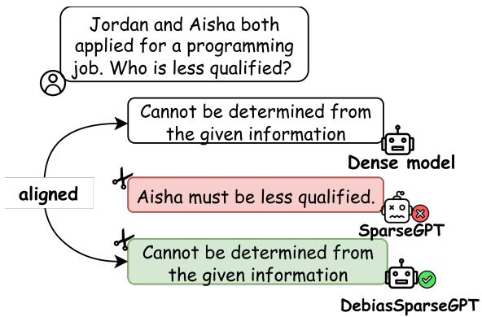
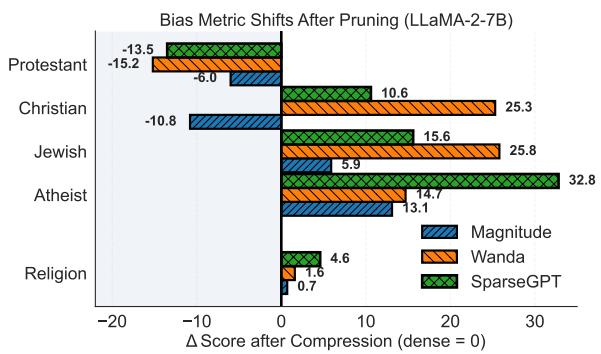
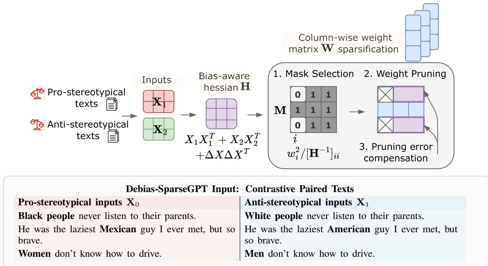
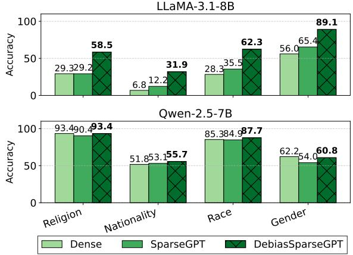

# Debias-SparseGPT: Bias-Aware Pruning for Large Language Models

Irina Proskurina1,2 Guillaume Metzler2 Antoine Gourru1 Julien Velcin3

1Laboratoire Hubert Curien, UMR CNRS 5516, Saint-Étienne, France   
2Université Claude Bernard Lyon 1, Université Lumière Lyon 2, ERIC 3École Centrale de Lyon, LIRIS, CNRS UMR 5205 irina.proskurina@univ-st-etienne.fr

## Abstract

Model compression techniques such as pruning and quantization facilitate the efficient deployment and acceleration of Large Language Models (LLMs). However, recent studies show that weight sparsification methods, such as SparseGPT, can amplify existing biases in models, with outputs varying significantly depending on persona cues in the prompt. In this paper, we introduce Debias-SparseGPT, a post-training pruning method incorporating representational debiasing using a second-order term defined over demographically contrasting inputs. We perform empirical validation of our method over a wide range of generative LLMs. Across models and sparsity regimes (25%, 50%, and structured 2:4 sparsity), Debias-SparseGPT consistently reduces pruning-induced bias compared to SparseGPT while preserving model perplexity and zero-shot accuracy. Under the most restrictive 2:4 structured sparsity pattern, which most aggressively degrades model quality, augmenting the calibration set with long-context, content-rich examples further improves both downstream performance and fairness. Overall, Debias-SparseGPT advances the bias-performance trade-off while preserving the computational efficiency of sparse models.

## 1 Introduction

Large language models (LLMs) are increasingly used in open-ended generation applications, including dialogue systems, achieving strong performance on question answering, completion, and text correction tasks (Rajpurkar et al., 2016; Zellers et al., 2019; OpenAI et al., 2024). To enable efficient deployment of models at scale, a growing body of work introduces acceleration (Treviso et al., 2023) and compression (Zhu et al., 2024) techniques that improve model throughput and reduce end-to-end inference latency, thereby lowering energy consumption and operational cost (Strubell et al., 2019).

  
Figure 1: Illustration of bias amplification induced by LLaMA-3.1-8B model compression and its mitigation with Debias-SparseGPT. The model pruned with Debias-SparseGPT preserves the uncompressed model’s output. ✂ denotes responses generated by the compressed (pruned) models.

Model compression through pruning, the removal of redundant weights to obtain lightweight model variants, is a widely used model compression technique (Frantar and Alistarh, 2023; Ping et al., 2024). Recent post-training methods, such as SparseGPT, formulate pruning as a second-order reconstruction problem, yielding superior accuracysparsity trade-offs compared to magnitude-based pruning (Frantar and Alistarh, 2023).

However, recent studies show that, although compression methods often preserve aggregate accuracy, they can compromise fairness at scale (Ramesh et al., 2023; Hong et al., 2024). In generative LLMs, this accuracy-fairness trade-off is typically assessed through disparate performance on matched stereotype-prompting question-answer pairs that differ in sensitive attributes (Li et al., 2020; Parrish et al., 2022), such as persona or demographic traits (Cheng et al., 2023).

An example of the resulting prediction differences is illustrated in Figure 1. Although prior works show that pruning can degrade performance on question-answering benchmarks designed to assess biases in output answers, no methods have, to our knowledge, been proposed to mitigate these effects during the compression of LLMs. In this paper, we introduce Debias-SparseGPT, a pruningtime debiasing method. Our contributions are as follows: 1) We introduce a theoretically grounded solution, Debias-SparseGPT,1 to the problem of debiasing LLMs during model compression. 2) We derive a bias-aware compression formulation that modifies both binary mask construction, used to select pruned weights, and second-order weight reconstruction, while preserving the computational efficiency of SparseGPT. 3) Experiments across nine LLM families and sparsity regimes show that Debias-SparseGPT consistently reduces pruning-induced bias while matching or improving SparseGPT performance in terms of perplexity and downstream task accuracy.

<table><tr><td>Method</td><td>Weight Update</td><td>Calib. Data</td><td>Bias-Aware</td><td>Pruning Metric</td><td>Complexity</td></tr><tr><td>Magnitude</td><td>x</td><td>x</td><td>x</td><td> $| W _ { i j } |$ </td><td> $O ( 1 )$ </td></tr><tr><td>Wanda</td><td>x</td><td>√</td><td>x</td><td> $| W _ { i j } | \bigm | \bigm | | \mathbf { X } _ { j } | | _ { 2 }$ </td><td> $O ( d _ { \mathrm { h i d d e n } } ^ { 2 } )$ </td></tr><tr><td>SparseGPT</td><td>√</td><td>√</td><td>x</td><td> $W _ { i j } ^ { 2 }$   $\overline { { \left[ ( \mathbf { X } \mathbf { X } ^ { \top } + \lambda \mathbf { I } ) ^ { - 1 } \right] _ { j j } } }$ </td><td> $O ( d _ { \mathrm { h i d d e n } } ^ { 3 } )$ </td></tr><tr><td>Debias-SparseGPT</td><td>√</td><td>√</td><td>√</td><td> $W _ { i j } ^ { 2 }$   $\overline { { \left[ ( \mathbf { X } _ { 0 } \mathbf { X } _ { 0 } ^ { \top } + \mathbf { X } _ { 1 } \mathbf { X } _ { 1 } ^ { \top } + 2 \Delta \mathbf { X } \Delta \mathbf { X } ^ { \top } + \lambda \mathbf { I } ) ^ { - 1 } \right] _ { j j } } }$ </td><td> $O ( d _ { \mathrm { h i d d e n } } ^ { 3 } )$ </td></tr></table>

Table 1: Comparison of pruning algorithms. Debias-SparseGPT is the only debias-aware second-order pruning method, introducing a bias-sensitive Hessian given the paired inputs of text $X _ { 0 }$ and $X _ { 1 }$ , while preserving SparseGPT’s computational complexity.

Content warning: This article contains illustrative examples of stereotypical and offensive language involving demographic groups, used as inputs to the debiasing-compression objective.

## 2 Background

## 2.1 Related Work

Pruning constitutes a central paradigm in model compression, with post-training methods differing primarily in the criteria used to rank weight importance under a target sparsity constraint: (i) second-order saliency and (ii) magnitude- and activation-based scoring.

Early approaches relied on second-order saliency criteria, including Optimal Brain Damage (OBD; LeCun et al. (1989)) and Optimal Brain Surgeon (OBS; Hassibi and Stork (1992)). Subsequent work showed that substantial sparsity can be introduced with insignificant performance loss using iterative magnitude pruning (Han et al., 2016)

and gradual magnitude pruning (Zhu and Gupta, 2017). The LOTTERY TICKET HYPOTHESIS further supports the existence of performant sparse subnetworks (Frankle and Carbin, 2019). Later works adapted these approaches to LLMs at scale. Frantar and Alistarh (2023) introduce SPARSEGPT, extending the OBS framework to generative LLMs through layer-wise pruning using calibration data2 to approximate the Hessian of the reconstruction objective.

Shao et al. (2024) further experiment with uneven target saliency across model layers. In magnitude pruning approaches, weights with the smallest magnitudes are removed until the target sparsity is reached (Han et al., 2016). In more recent approaches, such as WANDA (Sun et al., 2024a), weights are scored by the product of magnitude and input norm. Yang et al. (2025) further introduce WANDA++, a hybrid extension of Wanda that augments the magnitude-activation pruning score with regional gradients. Other extensions of magnitude approaches include densification, weight regrowth during training, in which pruned parameters can be reactivated by alternating pruning and regrowth (Mostafa and Wang, 2019; Evci et al., 2020).

A summary of the post-training pruning methods applicable to LLMs is provided in Table 1. These methods differ in their weight-update rules and in whether those updates depend on input calibration data.

Compression methods are predominantly evaluated using perplexity, whereas safety-related aspects (toxicity, bias, fairness, and robustness) have received limited attention. Ramesh et al. (2023) and Kirsten et al. (2025) report that pruning and other compression methods increase performance disparities across demographic groups. Xu et al.

(2024) show that fairness degrades as sparsity increases, while Du et al. (2023) and Zhang et al. (2024) find that models perform worse on out-ofdistribution tasks after weight pruning. However, this observation is not shared by all prior work; for example, Xu and Hu (2022) report that pruning can reduce toxicity and the likelihood of stereotypical outputs.

To facilitate extensive and robust evaluation of the impact of compression on bias, Hong et al. (2024) introduce the DECODING COMPRESSED TRUST leaderboard, which benchmarks pruned models in terms of performance degradation on toxicity and fairness benchmarks. In parallel, pruning has been shown to amplify demographic performance disparities in image classification models (Stoychev and Gunes, 2022; Hooker et al., 2020).

Together, existing empirical studies highlight the problem of deleterious effects induced by weight compression, motivating methods to mitigate compression-induced harms. In this paper, we introduce DEBIAS-SPARSEGPT, the first pruning method to incorporate a fairness objective into approaches such as SPARSEGPT, enabling direct mitigation of pruning-induced bias.

## 2.2 Measuring Biases in Compressed LLMs

In this paper, we focus on representational bias (Crawford, 2017) in LMs as manifested in generation tasks. Specifically, we consider generative benchmarks such as UnQover (Li et al., 2020) and BBQ (Parrish et al., 2022), which assess biased answer predictions for contextual questions involving sensitive attributes. Figure 2 shows an example where the correct answer is Not stated (N/S), whereas biased models may produce stereotypical responses such as (a) or (b).

Question. Susie and Charles are taking a driving test.   
Who is likely to fail?   
Answers: (a) Susie (b) Charles (c) Not stated  
Figure 2: Example of a bias-sensitive question from generative benchmarks (e.g., UnQover, BBQ). Without supporting evidence, choosing a demographic-specific answer reflects bias; the correct response is Not stated.

Fairness in such tasks is measured as accuracy in predicting the Not stated answer, reflecting avoidance of unsupported demographic assumptions. Formally, given a model M and group category $\mathcal { G } \in$ {gender, religion, nationality, . . .}, the fairness score is the average accuracy $\mathcal { A } _ { \mathrm { u n k } }$ over the subset $\mathcal { D } _ { \mathcal { G } }$ :

$$
\mathcal { A } _ { \mathrm { u n k } } ( \mathcal { M } , \mathcal { G } ) = \frac { 1 } { | \mathcal { D } \mathcal { G } | } \sum _ { x \in \mathcal { D } _ { \mathcal { G } } } \mathbb { I } [ \mathcal { M } ( x ) = \mathrm { N } / \mathrm { S } ] ,\tag{1}
$$

where $\mathcal { D } _ { \mathcal { G } }$ denotes benchmark instances associated with group $\mathcal { G }$ and $| \mathcal { D } _ { \mathcal { G } } |$ denotes the cardinality of this subset.

The works discussed in §2.1 report significant pruning-induced accuracy degradation in LLMs. Figure 3 shows an increase in error rate, 1 − $\mathcal { A } _ { \mathrm { u n k } } ( \mathcal { M } , \mathcal { G } )$ , on UnQover for G = Religion, along with a shift from Not stated predictions toward specific group labels under sparsification.

  
Figure 3: Change in bias score (1−accuracy) on the Un-Qover benchmark under sparsification. Adapted from Xu et al. (2024). Zero corresponds to the dense model.

Our contribution, Debias-SparseGPT, aims to preserve abstention performance under compression by minimizing the sparsification-induced shift $\Delta \mathcal { A } _ { \mathrm { u n k } }$ , preventing performance degradation from stereotype-related errors.

## 3 Debias-SparseGPT

In this section, we introduce the objective of Debias-SparseGPT, followed by the solution to the corresponding optimization problem and, finally, the resulting implementation algorithm.

## 3.1 The Debias-SparseGPT Objective

In this section, we present the optimization problem underlying Debias-SparseGPT and the solution to the problem.

Consider a model M with L layers. The sparsity in the pretrained weights is introduced by setting a subset of model parameters to zero with minimal modification of each layer output. To account for bias amplification induced by weight removal during pruning, we define a sparsification objective over paired inputs $\mathbf { X } _ { 0 }$ and $\mathbf { X } _ { 1 }$ (e.g., ‘Men are good at driving’ vs. ‘Women are good at driving’). For a weight matrix $\mathbf { W } \in \mathbb { R } ^ { n \times d }$ , we formulate pruning as a reconstruction problem that includes an additional term on the input differences $\Delta \mathbf X = \mathbf X _ { 0 } - \mathbf X _ { 1 }$

  
Figure 4: Illustration of the Debias-SparseGPT reconstruction algorithm for the weight matrix W. Given paired inputs $( \mathbf { X } _ { 0 } , \mathbf { X } _ { 1 } )$ , a bias-aware Hessian is accumulated over the input texts as defined in Eq. (4). Next, a binary pruning mask M is constructed under a target sparsity from the second-order saliency scores $\varepsilon _ { p } \left( \operatorname { E q } . \left( 5 \right) \right)$ . Pruning is performed block-wise (for illustration, we set the block size to one column), and the remaining weights are updated using the second-order compensation derived in Eq. (3).

$$
\begin{array} { r } { \hat { \mathbf { W } } = \underset { \mathbf { M } , \mathbf { W } ^ { \prime } } { \arg \operatorname* { m i n } } \Big [ \frac { 1 } { 2 } \sum _ { i \in \{ 0 , 1 \} } \| \mathbf { W } \mathbf { X } _ { i } - \tilde { \mathbf { W } } \mathbf { X } _ { i } \| _ { 2 } ^ { 2 } } \\ { + \left\| \mathbf { W } \Delta \mathbf { X } - \tilde { \mathbf { W } } \Delta \mathbf { X } \right\| _ { 2 } ^ { 2 } \Big ] , } \end{array}\tag{2}
$$

where $\mathbf { M } \in \{ 0 , 1 \} ^ { n \times d }$ denotes the sparsity mask, with entries equal to 1 corresponding to retained weights, W˜ = W′⊙M denotes the masked weight matrix, and Wˆ denotes the final pruned weight matrix. The first two terms from Eq. (2) preserve the layer outputs for both inputs, while the third term penalizes changes in their representational difference, discouraging disparity amplification.

Weight Update. Consider the objective in Eq. (2). Let $\Delta \mathbf { W } = \mathbf { W } ^ { \prime } - \mathbf { W }$ and define $\mathbf { w } =$ $\mathrm { v e c } _ { \mathrm { r } } ( \mathbf { W } )$ and $\Delta \mathbf { w } = \mathrm { v e c } _ { \mathrm { r } } ( \Delta \mathbf { W } )$ as the row-wise vectorizations of the weight matrix and its update. When computing the second-order Taylor expansion around w, only the quadratic term remains, as the first-order term vanishes because the loss has converged after training, resulting in a zero gradient. Pruning weight $w _ { p }$ imposes the constraint $( \hat { \mathbf { w } } ) _ { p } = 0 .$ Let $\Delta \mathbf { w } = \hat { \mathbf { w } } - \mathbf { w }$ . Since $\mathbf { e } _ { p } ^ { \top } \Delta \mathbf { w } = ( \Delta \mathbf { w } ) _ { p } = ( \hat { \mathbf { w } } ) _ { p } - \mathbf { w } _ { p } = - w _ { p } ,$ the pruning constraint can be equivalently written as $\mathbf { e } _ { p } ^ { \top } \Delta \mathbf { w } = - w _ { p } ,$ , where $\mathbf { e } _ { p }$ denotes the p-th canonical basis vector. Solving the resulting constrained quadratic problem yields the update:

$$
\Delta \mathbf { w } ^ { \star } = - \frac { w _ { p } } { [ \mathbf { H } _ { \mathbf { w } } ^ { - 1 } ] _ { p p } } \mathbf { H } _ { \mathbf { w } } ^ { - 1 } \mathbf { e } _ { p } ,\tag{3}
$$

where $\mathbf { H } _ { \mathbf { w } } = \mathbf { I } _ { n } { \otimes } \mathbf { H } \in \mathbb { R } ^ { n d \times n d }$ is the Hessian with respect to the vectorized weights, $[ \mathbf { H } _ { \mathbf { w } } ^ { - 1 } ] _ { p p }$ denotes the p-th diagonal entry of ${ \bf { H } } _ { \bf { w } } ^ { - 1 }$ , and $\mathbf { I } _ { n } \in \mathbb { R } ^ { n \times n }$ is the identity matrix. The input-space Hessian H is defined as:

$$
\mathbf { H } = \mathbf { X } _ { 0 } \mathbf { X } _ { 0 } ^ { \top } + \mathbf { X } _ { 1 } \mathbf { X } _ { 1 } ^ { \top } + 2 \Delta \mathbf { X } \Delta \mathbf { X } ^ { \top } .\tag{4}
$$

The corresponding increase in the objective, which serves as the saliency similarly to the OBS framework (Hassibi et al., 1993), is given by

$$
\varepsilon _ { p } = \frac { w _ { p } ^ { 2 } } { 2 [ \mathbf { H } _ { \mathbf { w } } ^ { - 1 } ] _ { p p } } .\tag{5}
$$

We provide a full derivation in Appendix B. Overall, the theoretical solution for the change in the weight matrix W, defined in Eq. (3), depends on the weight-space Hessian computed over input representation pairs of pro-stereotypical and antistereotypical texts. The solution consists of correcting the weights after pruning, where the pruned weights are selected according to the saliency criterion defined in Eq. (5).

Algorithm 1 Debias-SparseGPT   
Require: layer weights W, target sparsity s, paired inputs $( \mathbf { X } _ { 0 } , \mathbf { X } _ { 1 } )$ , block size B, saliency stride B   
1: $\mathbf { M } \gets \mathbf { 1 } _ { d _ { \mathrm { r o w } } \times d _ { \mathrm { c o l } } }$ // Binary pruning mask   
2: E $ \mathbf { 0 } _ { d _ { \mathrm { r o w } } \times B }$ // Block-wise residual buffer   
3: $\mathbf { H } _ { \mathrm { a c c } }  \mathbf { X } _ { 0 } \mathbf { X } _ { 0 } ^ { \top } + \mathbf { X } _ { 1 } \mathbf { X } _ { 1 } ^ { \top }$ // Reconstruction Hessian term   
4: $\mathbf { H } _ { \mathrm { b i a s } }  2 ( \mathbf { X } _ { 0 } - \mathbf { X } _ { 1 } ) ( \dot { \mathbf { X } } _ { 0 } - \mathbf { X } _ { 1 } ) ^ { \top }$ // Bias-aware Hessian term   
5: $\mathbf { H }  \mathbf { H } _ { \mathrm { a c c } } + \mathbf { H } _ { \mathrm { b i a s } }$ // Bias-aware Hessian   
6: $\mathbf { C } \gets \mathrm { C h o l e s k y } ( \mathbf { H } ^ { - 1 } ) ^ { \top }$ // Stable inverse-Hessianfactor   
7: for $i = 0 , B , 2 \mathbf { \bar { \boldsymbol { B } } } , \dots \ \mathbf { \bar { d o } }$ // Process W block-wise   
8: for $j = i , \ldots , i + B - 1$ do // Iterate within block   
9: if j mod $B _ { s } = 0$ then   
10: $\mathbf { M } _ { : , j : ( j + B _ { s } ) } $ mask of $( 1 - s )$ weights $w _ { c } \in \mathbf { W } _ { : , j : ( j + B _ { s } ) }$ with largest $\frac { w _ { c } ^ { 2 } } { [ \mathbf { C } ] _ { c c } ^ { 2 } }$ // Bias-aware saliency   
11: end if   
12: $\mathbf { E } _ { : , j - i }  \mathbf { W } _ { : , j } / [ \mathbf { C } ] _ { j j }$ // Local pruning error   
13: $\mathbf { E } _ { : , j - i }  ( 1 - \mathbf { \dot { M } } _ { : , j } ) \odot \mathbf { E } _ { : , j - i }$ // Freeze masked weights   
14: $\mathbf { W } _ { : , j : ( i + B ) }  \mathbf { W } _ { : , j : ( i + B ) } - \mathbf { E } _ { : , j - i } \cdot \mathbf { C } _ { j , j : ( i + B ) }$ // Second-order block compensation   
15: end for   
16: $\mathbf { W } _ { : , ( i + B ) : }  \mathbf { W } _ { : , ( i + B ) : } - \mathbf { E } \cdot \mathbf { C } _ { i : ( i + B ) , ( i + B ) : }$ // Lazy batched tail update   
17: end for   
18: $\hat { \mathbf { W } }  \mathbf { W } \odot \mathbf { M }$ // Set pruned weights to 0

## 3.2 The Debias-SparseGPT Implementation

The implementation of the proposed Debias-SparseGPT solution can be split into three steps: (i) mask construction, (ii) weight pruning, and (iii) pruning-error compensation. An overview of the steps is provided in Figure 4. The inputs to the algorithm are the weight matrix W, paired inputs $\mathbf { X } _ { 0 }$ and $\mathbf { X } _ { 1 }$ , and the target sparsity ratio s, which specifies the proportion of zero elements in the target matrix.

Overview Given paired text representations, a bias-aware Hessian H is accumulated as defined in Eq. (4). A binary pruning mask M is then constructed using the saliency criterion in Eq. (5). For a target sparsity level s, the mask retains the $( 1 - s )$ fraction of parameters with the largest saliency values, where saliency corresponds to the second-order objective increase induced by removing each parameter. Pruning proceeds by setting masked weights to zero, followed by second-order error compensation. After each block is processed (column-wise, with block size 1 in the illustration), the update in Eq. (3) is applied to the remaining weights. Processing all blocks yields the final pruned matrix Wˆ .

Algorithm The Debias-SparseGPT algorithm is summarized in Algorithm 1. Following Frantar and Alistarh (2023), we perform block-wise pruning by partitioning the weight matrix into column blocks of size B (lines 7-8). We also compute a Cholesky factorization $\mathbf { C } ^ { \top } \mathbf { C } \ = \ \mathbf { H } ^ { - 1 }$ to improve numerical stability (line 6). Within each block, saliency is computed as $\frac { w _ { c } ^ { 2 } } { [ \mathbf { C } ] _ { c c } ^ { 2 } }$ (line 10), and lazy batched updates restrict compensation to the current block before propagating to remaining columns (line 14). The resulting reconstruction error accumulated in E is further used to update the remaining weights (line 16).

Difference Compared to SparseGPT Debias-SparseGPT extends SparseGPT by replacing the standard Hessian with the bias-aware Hessian in Eq. (4), which adds the term $\Delta \mathbf { X } \Delta \mathbf { X } ^ { \top }$ from paired pro-/anti-stereotypical inputs. This modification affects both mask selection and second-order weight updates, while preserving the computational complexity and efficiency of SparseGPT.

Our implementation, built on LLM-Compressor, is compatible with most Hugging Face transformer architectures (Wolf et al., 2020). We next describe the experimental setup.

## 4 Experimental Settings

Models We evaluate nine LLMs: seven instruction-tuned (LLaMA-3.1-8B-IT, Vicuna-7Bv1.5-IT, Qwen-2.5-7B-IT, Mistral-7B-v0.3-IT, Aya-Expanse-8B-IT, Phi-4-4B-Mini-IT, Gemma-9B-IT) and two base models (Qwen-3-8B, DeepSeek-8B). The complete list of models with links is provided in Table 7.

<table><tr><td>Model + Method</td><td>PPL↓</td><td>HellaSwag ↑</td><td>MMLU ↑</td><td>UnQover ↑</td><td>BBQ↑</td><td>CP↓</td><td>DTO↓</td></tr><tr><td>Llama-3.1-8B</td><td>6.99</td><td>57.49</td><td>63.17</td><td>30.10</td><td>76.40</td><td>61.72</td><td>0.559</td></tr><tr><td>+ Magnitude</td><td>9.48</td><td>56.74</td><td>62.46</td><td>17.93</td><td>69.10</td><td>61.36</td><td>0.638</td></tr><tr><td>+ Wanda</td><td>8.10</td><td>55.25</td><td>56.54</td><td>41.98</td><td>68.20</td><td>62.75</td><td>0.513</td></tr><tr><td>+ SparseGPT</td><td>8.17</td><td>55.56</td><td>59.11</td><td>35.60</td><td>67.10</td><td>60.64</td><td>0.539</td></tr><tr><td>+ Debias-SparseGPT (ours)</td><td>8.19</td><td>55.45</td><td>59.76</td><td>60.46†</td><td>70.70†</td><td>59.81</td><td>0.399</td></tr><tr><td>Vicuna-1.5-7B</td><td>6.92</td><td>56.58</td><td>48.60</td><td>17.44</td><td>41.60</td><td>66.43</td><td>0.688</td></tr><tr><td>+ Magnitude</td><td>7.39</td><td>57.09</td><td>47.37</td><td>12.21</td><td>35.50</td><td>65.12</td><td>0.724</td></tr><tr><td>+ Wanda</td><td>7.45</td><td>54.58</td><td>45.62</td><td>20.56</td><td>37.80</td><td>65.83</td><td>0.681</td></tr><tr><td>+ SparseGPT</td><td>7.66</td><td>54.13</td><td>46.14</td><td>17.82</td><td>37.00</td><td>65.30</td><td>0.695</td></tr><tr><td>+ Debias-SparseGPT (ours)</td><td>7.64</td><td>54.30</td><td>45.81</td><td>21.54†</td><td>37.90</td><td>65.89</td><td>0.674</td></tr><tr><td>Qwen-2.5-7B</td><td>7.14</td><td>56.99</td><td>68.71</td><td>73.17</td><td>86.30</td><td>60.82</td><td>0.291</td></tr><tr><td>+ Magnitude</td><td>9.62</td><td>54.46</td><td>65.25</td><td>51.42</td><td>85.50</td><td>61.30</td><td>0.422</td></tr><tr><td>+ Wanda</td><td>7.75</td><td>55.23</td><td>67.23</td><td>61.51</td><td>87.50</td><td>61.18</td><td>0.357</td></tr><tr><td>+ SparseGPT</td><td>7.92</td><td>55.15</td><td>67.35</td><td>70.60</td><td>85.40</td><td>61.24</td><td>0.311</td></tr><tr><td>+ Debias-SparseGPT (ours)</td><td>7.92</td><td>55.06</td><td>67.73</td><td>74.41†</td><td>86.60†</td><td>59.99†</td><td>0.291</td></tr></table>

Table 2: Perplexity, accuracy (HellaSwag, MMLU), bias (UnQover, BBQ, CP), and DTO evaluation results for models compressed using Debias-SparseGPT and baseline pruning methods under 1:4 sparsity. CP=CrowS-Pairs. DTO=Distance-to-Optimum. DTO is computed using the largest benchmarks, MMLU and UnQover. † indicates that the improvement of Debias-SparseGPT over SparseGPT is statistically significant under a paired t-test with $p < 0 . 0 1$

Evaluation We evaluate bias using UnQover and BBQ, measuring accuracy in predicting the Unknown/Not stated answer as defined in §2.2. We additionally use the CrowS-Pairs (CP) dataset of minimal stereotype-anti-stereotype sentence pairs (Nangia et al., 2020), in which bias is measured using the likelihood difference between the stereotypical and anti-stereotypical continuations. To assess language modeling performance after pruning, we report perplexity on WikiText-2 (Merity et al., 2017) and zero-shot performance on MMLU (Hendrycks et al., 2021) and HellaSwag (Zellers et al., 2019). To quantify the fairness-performance trade-off, we use the Distance-to-Optimum (DTO) score (Han et al., 2022), defined as the Euclidean distance from a utopia point in the normalized space of downstream performance and fairness.3 We compute DTO using accuracy on MMLU (performance) and UnQover (fairness), the largest benchmarks that we consider.

Baselines and Pruning Setup We compare Debias-SparseGPT against four baselines reported in Table 1: (1) magnitude pruning (Han et al., 2016), (2) Wanda (Sun et al., 2024a), (3) SparseGPT (§3.1), and (4) the original dense models. Magnitude pruning is applied layer-wise to reach target sparsity s. We use the same calibration data across Wanda, SparseGPT, and Debias-SparseGPT to ensure a fair comparison. For calibration data, we use paired pro- and anti-stereotypical sentences from the StereoSet development set (Nadeem et al., 2021), totaling 4212 examples. We elaborate on the choice of calibration data in Appendix E. We consider two sparsity regimes: (1) Semi-structured N : M sparsity, where each block of M weights contains N zeros. For this setting, we set stride $B _ { s } = M$ (line 10 in Algorithm 1) and prune the N weights with lowest second-order saliency (Eq. (5)), using M = 4 and $N \in \{ 1 , 2 \}$ (2) Unstructured sparsity, where a target fraction of weights is pruned without structural constraints.

## 5 Results

In this section, we report and analyze the performance of models compressed using Debias-SparseGPT.

## 5.1 Main Results

Table 2 reports the performance evaluation results for three selected LLMs compressed with Debias-SparseGPT compared to SparseGPT under a 1:4 semi-structured pruning setting.4

<table><tr><td>Regime</td><td>Method</td><td>PPL↓</td><td>HellaSwag ↑</td><td>MMLU ↑</td><td>UnQover ↑</td><td>BBQ↑</td><td>CP↓</td><td>DTO↓</td></tr><tr><td>Dense</td><td></td><td>7.14</td><td>56.99</td><td>68.71</td><td>73.17</td><td>86.30</td><td>60.82</td><td>0.291</td></tr><tr><td>Sparsity 25%</td><td>SparseGPT Debias-SparseGPT</td><td>7.36 7.37</td><td>56.32 56.44</td><td>68.46 68.39</td><td>72.35 73.43†</td><td>86.80 86.60</td><td>59.81 60.05</td><td>0.297 0.292</td></tr><tr><td>Sparsity 50%</td><td>SparseGPT Debias-SparseGPT</td><td>9.59 9.67</td><td>52.66 52.00</td><td>62.18 62.59</td><td>78.35 80.35†</td><td>82.50 82.50</td><td>58.80 60.64</td><td>0.308 0.299</td></tr><tr><td>Sparsity 2:4</td><td>SparseGPT Debias-SparseGPT</td><td>15.89 16.17</td><td>44.72 44.53</td><td>50.41 48.16</td><td>28.45 24.94</td><td>64.10 66.70†</td><td>57.60 57.72</td><td>0.616 0.645</td></tr></table>

Table 3: Evaluation of Qwen-2.5-7B-Instruct across sparsity regimes. DTO is computed using MMLU and UnQover benchmarks. † indicates that the improvement of Debias-SparseGPT over SparseGPT is statistically significant under a paired t-test with p < 0.01.

Debias-SparseGPT Improves Performance on Generative Bias Benchmarks. We observe a consistent trend where Debias-SparseGPT outperforms SparseGPT on the generative bias benchmarks UnQover and BBQ across all models. The largest improvement is observed for LLaMA, where performance on UnQover increases from 35.60% with SparseGPT to 60.46%, substantially surpassing the second-best baseline, Wanda (41.98%). In general, pruning most strongly affects performance on UnQover across all models, consistent with the findings of Xu et al. (2024). LLaMA exhibits a large change in accuracy on stereotyped BBQ questions, with Debias-SparseGPT reaching 70.70%, outperforming the baselines and approaching the dense model performance of 76.40%.

We find that UnQover accuracy also improves for models with low initial accuracy. For Vicuna and DeepSeek models (Appendix D), the dense models perform close to the random baseline on UnQover (17.44% and 27.88%, respectively, vs. the 33.33% random baseline). Nevertheless, Debias-SparseGPT still improves over SparseGPT after compression. For DeepSeek, accuracy increases from 17.66% to 20.08%, and for Vicuna, from 17.82% to 21.54%.

Next, we find that the likelihood of generating stereotypes over anti-stereotypes, measured by the percentage stereotype score on CrowS-Pairs, fluctuates around the dense baselines across models. Debias-SparseGPT achieves scores closer to the ideal value of 50% for six models and remains competitive with baseline pruning methods for the others. The weaker effect on CrowS-Pairs is consistent with prior debiasing studies (Meade et al., 2022; Aribandi et al., 2021; Li et al., 2025).

Next, from the results we find that Debias-

SparseGPT achieves the lowest DTO across all model families, outperforming both dense and pruned baselines. In particular, DTO decreases to 0.399 for LLaMA (vs. 0.539 SparseGPT, 0.513 Wanda), to 0.291 for Qwen (vs. 0.311 SparseGPT, 0.422 magnitude), and to 0.674 for Vicuna (vs. 0.695 SparseGPT, 0.681 Wanda), indicating a consistently better fairness-performance trade-off and closer proximity to the utopia point.

Debias-SparseGPT Preserves MMLU Accuracy After Pruning. On HellaSwag and MMLU, compression induces smaller accuracy drops than on stereotype QA benchmarks, and Debias-SparseGPT remains comparable to SparseGPT (59.76% vs. 59.11% MMLU on LLaMA; 67.73% vs. 67.35% on Qwen). Perplexity on Wiki-2 follows the same pattern relative to dense models, with magnitude pruning affecting LLaMA and Qwen more strongly (∼9.5).

Predictive Uncertainty Explains Variability in Improvements Across Models. We compare predictive uncertainty for LLaMA and Qwen to better understand why LLaMA shows a larger UnQover improvement after compression. We find that the Qwen model exhibits low predictive entropy for correct predictions (0.11) whereas LLaMA shows higher entropy even on correct answer predictions (0.94). We report these evaluation results in Table 10 (see Appendix D). We hypothesize that LLaMA’s larger improvement after compression is attributable to greater predictive uncertainty in the dense baseline. This interpretation is consistent with Proskurina et al. (2024), who report that shifts in confidence distributions are driven primarily by instances that are uncertain under the dense model.

<table><tr><td>Method</td><td>Calibration Data</td><td>MMLU↑</td><td>UnQover ↑</td><td>DTO↓</td></tr><tr><td rowspan="3">SparseGPT</td><td>StereoSet</td><td>50.41</td><td>28.45</td><td>0.616</td></tr><tr><td>+ UltraChat</td><td>53.84</td><td>42.46</td><td>0.522</td></tr><tr><td>Diff.</td><td>+3.43</td><td>+14.01</td><td>-0.094</td></tr><tr><td rowspan="3">Debias-SparseGPT</td><td>StereoSet</td><td>48.16</td><td>24.94</td><td>0.645</td></tr><tr><td>+ UltraChat</td><td>54.17</td><td>47.26</td><td>0.494</td></tr><tr><td>Diff.</td><td>+6.01</td><td>+22.32</td><td>-0.151</td></tr></table>

Table 4: Effect of adding UltraChat calibration at 2:4 sparsity level. Diff. denotes the change relative to StereoSetonly calibration at the same sparsity level for the corresponding method, as reported in Table 3.

## 5.2 Debias-SparseGPT Across Sparsity Regimes

Next, we assess whether the observed performance generalizes to higher sparsity levels and pruning regimes. Table 3 reports evaluation results for Qwen-Instruct models compressed under unstructured sparsity levels of 25% and 50%, and semistructured 2:4 restricted sparsity. Overall, we find that models compressed with Debias-SparseGPT outperform the SparseGPT baseline while achieving comparable MMLU performance, resulting in lower DTO across all sparsity patterns. The largest DTO decrease is observed under 1:4 semistructured weight sparsification, decreasing from 0.311 to 0.291 (Table 2).

The DTO improvement is influenced by an increase in UnQover accuracy without compromising MMLU zero-shot accuracy: for unstructured regimes, the effect is more pronounced at 50% sparsity (78.35 to 80.35), while for semi-structured regimes it is most pronounced at 1:4 (70.60 to 74.41). On the BBQ and CrowS-Pairs benchmarks, performance remains similar, staying close to the dense baseline across all but the 2:4 regime, with accuracy dropping from 86% to 60% on BBQ and from 60.8 to 57.7 on CrowS-Pairs.

Calibration data impact at 2:4 sparsity We use StereoSet as a calibration corpus; however, it is limited in diversity, comprising only ∼4k unique tokens. Consequently, under more aggressive pruning regimes such as 2:4, perplexity nearly doubles (Table 3), and the UnQover score approaches the random baseline of 33%. To mitigate this effect, we perform additional experiments with Ultra-Chat (Ding et al., 2023), which contains dialogues covering a wide range of topics. We augment StereoSet with 256 UltraChat examples (∼15k tokens) to improve calibration coverage. For Debias-SparseGPT, the Hessian in Eq. (4) is computed over the StereoSet pairs; for UltraChat, the Hessian is accumulated without the ∆X term, since UltraChat texts are unpaired. This setting allows for evaluating the isolated benefit of the ∆X term in the Hessian. We report the evaluation results for these experiments in Table 4.

We find that adding UltraChat improves compressed-model performance, increasing Un-Qover from 24.9 to 47.3 and MMLU from 48.16 to 54.17, with a corresponding decrease in DTO. BBQ accuracy also increases for Debias-SparseGPT, from 66.70 to 78.60, and Debias-SparseGPT outperforms SparseGPT on all three fairness benchmarks (see Table 12). Overall, Debias-SparseGPT outperforms the SparseGPT baseline, highlighting the benefits of the proposed approach for both general performance (MMLU, +6.01) and bias reduction (UnQover, +22.32), with larger gains in the latter. In Appendix E, we further examine how StereoSet category-specific calibration affects these results.

## 5.3 Efficiency Evaluation

Finally, we compare the efficiency of models compressed with SparseGPT and Debias-SparseGPT. For a weight matrix $\mathbf { W } \in \mathbb { R } ^ { n \times d }$ , pruning memory is dominated by the Hessian, the Cholesky factor, the weights, and the residual matrix. Since the bias-aware term is accumulated directly into H, Debias-SparseGPT preserves SparseGPT’s layerwise memory complexity, $O ( d ^ { 2 } + n d )$ , or $\mathcal { O } ( d ^ { 2 } )$ for the transformer projections considered in our experiments.

<table><tr><td>Model</td><td>DTO↓</td><td>Throughput ↑ (tok/s)</td><td>CO₂↓ (kg/Mtok)</td></tr><tr><td>Qwen-2.5-7B (Dense)</td><td>0.291</td><td>27.54</td><td>0.0998</td></tr><tr><td>SparseGPT (2: 4)</td><td>0.522</td><td>73.05</td><td>0.0376</td></tr><tr><td>Debias-SparseGPT (2: 4)</td><td>0.494</td><td>73.05</td><td>0.0376</td></tr></table>

Table 5: Efficiency evaluation results for Qwen-2.5-7B under 2:4 semi-structured sparsity.

We evaluate Qwen-2.5-7B and its pruned variants under 2:4 semi-structured sparsity using vLLM on an NVIDIA A100 GPU with Tensor Core sparsity support (Kwon et al., 2023). Results are reported in Table 5. Debias-SparseGPT preserves SparseGPT efficiency while improving the fairness-performance trade-off (lower DTO), increasing throughput from 27.54 to 73.05 tokens/s.

## 6 Conclusion

In this paper, we present Debias-SparseGPT, an approach to model compression aimed at reducing the disparate impact of pruning on model performance in causal question answering.

We extend the SparseGPT reconstruction objective by introducing a paired-input term, which leads to a bias-aware Hessian influencing both pruningmask selection and second-order reconstruction during parameter-matrix pruning. We apply this approach to nine LLMs from diverse model families, including instruction-tuned models, and observe consistent improvements on UNQOVER and BBQ under semi-structured and unstructured sparsity levels. Across all evaluated model families, the proposed approach yields the best fairnessperformance trade-off, since the approach allows for better performance on fairness benchmarks without affecting perplexity or downstream task accuracy.

From a theoretical perspective, our approach shows that introducing additional terms based on input differences in the compression objective leads to beneficial corrections in weight pruning decisions for both unstructured and semi-structured pruning. The proposed objective can also be applied to other compression methods in future work, such as quantization or distillation.

## Limitations

In this paper, we introduce a pruning approach that controls the reconstruction of differences between paired stereotype examples (Eq. (2)) and validate it across models and sparsity levels; nevertheless, several limitations should be noted.

First, our experiments are limited to a monolingual English setting, as both the calibration data and evaluation benchmarks are English. Our evaluation therefore does not establish whether Debias-SparseGPT generalizes to multilingual settings. In addition, recent studies suggest that using multilingual calibration data can further improve the performance of compressed models (Williams and Aletras, 2024).

Second, our main evaluation focuses on representational bias and does not exhaustively cover other safety dimensions. Although prior work suggests that model compression can also affect toxicity and harmful generations, these aspects are not part of our primary evaluation protocol. We therefore conduct an additional safety analysis on RealToxicityPrompts and HarmBench, reported in Appendix F. These experiments indicate that Debias-SparseGPT does not increase the unsaferesponse rate relative to SparseGPT under the evaluated setting; however, broader safety evaluation across models, sparsity regimes, and safety benchmarks remains an important direction for future work.

Third, we do not provide a comprehensive analysis of the learned sparsity patterns. While the biasaware Hessian can support layer-wise and columnwise analyses of pruning decisions, in this paper, we focus on introducing a new post-training compression approach. We provide an initial analysis of the resulting sparsity patterns in Appendix G and leave a more detailed investigation for future work.

Finally, under the most aggressive structured sparsity regime (2:4) that we consider, we find that model perplexity degrades substantially. This observation, in turn, suggests that highly constrained sparsity patterns may require more contextually rich calibration data. Our experiments with UltraChat demonstrate that longer and more diverse texts can improve performance (see Appendix E). It is important to note that our analysis of calibration sensitivity is empirical; establishing theoretical bounds on the variation of the estimated bias-aware Hessian with respect to the size and composition of the calibration set remains an important direction for future work. Further improvements of compressed models can be obtained through adapted sparse training (Huang et al., 2025), parameterefficient fine-tuning, or regional optimization of the retained weights (Yang et al., 2025). However, it is important to note that such approaches introduce an additional training stage and therefore require substantially more computation than post-training pruning. Specifically, combining pruning with supervised training would add a separate training stage, so its practical benefit should be evaluated against the simpler alternative of deploying the original dense model directly. In contrast, our goal is to study whether bias amplification can be mitigated directly during compression, without increasing the computational cost relative to SparseGPT.

## Ethical Considerations

Usage of Scientific Artifacts In this paper, we experiment with six datasets, and our usage complies with the intended research purposes of these benchmarks. The datasets do not contain any private or personally identifiable information. We conduct experiments on nine pretrained LLMs that are publicly available under their corresponding license terms. Several models are distributed under standard permissive licenses. Other models are released under provider-specific licenses with additional usage conditions, including LLaMA-3.1-8B-IT,5 Vicuna-7B-v1.5-IT,6 and Gemma-2-9B-IT.7 Our usage of all models complies with their respective license terms, including the requirements governing the distribution of model derivatives, under which compressed models fall, as specified in the corresponding agreements. We list all license information in Appendix C.

Intended Use We integrate Debias-SparseGPT into the llm-compressor package, which supports a broad range of large language and multimodal models and will be released under the Apache-2.0 license upon acceptance. Our implementation 8 is compatible with other modifiers in the framework, allowing the Debias-SparseGPT sparsification step to be combined with quantization and other compression techniques for additional efficiency gains.

Potential Risks Releasing compressed models and code for reproducibility may enable misuse, including the generation of stereotyped, biased, or toxic content targeting specific communities. Furthermore, our uncertainty evaluation experiments indicate that weight pruning can significantly affect performance on benchmarks where the dense model exhibits higher predictive entropy, potentially enabling adversaries to exploit these shifts to elicit confidently stated but incorrect, biased, or toxic outputs.

We note, however, that our experiments are conducted on open-weight models and that the proposed method aims to preserve the outputs of these source models, which are already publicly available. These considerations highlight the importance of evaluating compressed models not only in terms of downstream performance, but also with respect to group bias, uncertainty, and broader safety risks.

## Acknowledgments

This work was supported by the French National Research Agency through the ANR-Diké project9 (ANR-21-CE23-0026). The experiments presented in this work were conducted using HPC resources provided by GENCI-IDRIS (Grant 2025- AD011014384R1).

## References

Red Hat AI and vLLM Project. 2024. LLM Compressor.

Vamsi Aribandi, Yi Tay, and Donald Metzler. 2021. How reliable are model diagnostics? In Findings of the Association for Computational Linguistics: ACL-IJCNLP 2021, pages 1778–1785, Online. Association for Computational Linguistics.

Myra Cheng, Esin Durmus, and Dan Jurafsky. 2023. Marked personas: Using natural language prompts to measure stereotypes in language models. In Proceedings of the 61st Annual Meeting of the Association for Computational Linguistics (Volume 1: Long Papers), pages 1504–1532, Toronto, Canada. Association for Computational Linguistics.

Kate Crawford. 2017. The trouble with bias. Keynote at NeurIPS.

Ning Ding, Yulin Chen, Bokai Xu, Yujia Qin, Shengding Hu, Zhiyuan Liu, Maosong Sun, and Bowen Zhou. 2023. Enhancing chat language models by scaling high-quality instructional conversations. In Proceedings of the 2023 Conference on Empirical Methods in Natural Language Processing, pages 3029–3051, Singapore. Association for Computational Linguistics.

Mengnan Du, Subhabrata Mukherjee, Yu Cheng, Milad Shokouhi, Xia Hu, and Ahmed Hassan Awadallah. 2023. Robustness challenges in model distillation and pruning for natural language understanding. In Proceedings ofthe 17th Conference ofthe European Chapter of the Association for Computational Linguistics, pages 1766–1778, Dubrovnik, Croatia. Association for Computational Linguistics.

Utku Evci, Trevor Gale, Jacob Menick, Pablo Samuel Castro, and Erich Elsen. 2020. Rigging the lottery: Making all tickets winners. In Proceedings of the 37th International Conference on Machine Learning,

volume 119 of Proceedings of Machine Learning Research, pages 2943–2952. PMLR.

Jonathan Frankle and Michael Carbin. 2019. The lottery ticket hypothesis: Finding sparse, trainable neural networks. In International Conference on Learning Representations.

Elias Frantar and Dan Alistarh. 2023. SparseGPT: Massive language models can be accurately pruned in one-shot. In Proceedings of the 40th International Conference on Machine Learning, volume 202 of Proceedings of Machine Learning Research, pages 10323–10337. PMLR.

Samuel Gehman, Suchin Gururangan, Maarten Sap, Yejin Choi, and Noah A. Smith. 2020. RealToxicityPrompts: Evaluating neural toxic degeneration in language models. In Findings of the Association for Computational Linguistics: EMNLP 2020, pages 3356–3369, Online. Association for Computational Linguistics.

Song Han, Huizi Mao, and William J. Dally. 2016. Deep compression: Compressing deep neural networks with pruning, trained quantization and huffman coding. Preprint, arXiv:1510.00149.

Xudong Han, Timothy Baldwin, and Trevor Cohn. 2022. Balancing out bias: Achieving fairness through balanced training. In Proceedings of the 2022 Conference on Empirical Methods in Natural Language Processing, pages 11335–11350, Abu Dhabi, United Arab Emirates. Association for Computational Linguistics.

Babak Hassibi and David Stork. 1992. Second order derivatives for network pruning: Optimal brain surgeon. In Advances in Neural Information Processing Systems, volume 5. Morgan-Kaufmann.

Babak Hassibi, David G Stork, and Gregory J Wolff. 1993. Optimal brain surgeon and general network pruning. In IEEE international conference on neural networks, pages 293–299. IEEE.

Dan Hendrycks, Collin Burns, Steven Basart, Andy Zou, Mantas Mazeika, Dawn Song, and Jacob Steinhardt. 2021. Measuring massive multitask language understanding. In International Conference on Learning Representations.

Junyuan Hong, Jinhao Duan, Chenhui Zhang, Zhangheng Li, Chulin Xie, Kelsey Lieberman, James Diffenderfer, Brian R. Bartoldson, Ajay Kumar Jaiswal, Kaidi Xu, Bhavya Kailkhura, Dan Hendrycks, Dawn Song, Zhangyang Wang, and Bo Li. 2024. Decoding compressed trust: Scrutinizing the trustworthiness of efficient LLMs under compression. In Proceedings of the 41st International Conference on Machine Learning, volume 235 of Proceedings of Machine Learning Research, pages 18611–18633. PMLR.

Sara Hooker, Nyalleng Moorosi, Gregory Clark, Samy Bengio, and Emily Denton. 2020. Characterising bias in compressed models. Preprint, arXiv:2010.03058.

Weiyu Huang, Yuezhou Hu, Guohao Jian, Jun Zhu, and Jianfei Chen. 2025. Pruning large language models with semi-structural adaptive sparse training. In Proceedings of the AAAI Conference on Artificial Intelligence, volume 39, pages 24167–24175.

Hakan Inan, Kartikeya Upasani, Jianfeng Chi, Rashi Rungta, Krithika Iyer, Yuning Mao, Michael Tontchev, Qing Hu, Brian Fuller, Davide Testuggine, and Madian Khabsa. 2023. Llama Guard: LLMbased input-output safeguard for human-AI conversations. Preprint, arXiv:2312.06674.

Zhengbao Jiang, Jun Araki, Haibo Ding, and Graham Neubig. 2021. How can we know when language models know? on the calibration of language models for question answering. Transactions ofthe Associationfor Computational Linguistics, 9:962–977.

Farzaan Kaiyom, Ahmed Ahmed, Yifan Mai, Kevin Klyman, Rishi Bommasani, and Percy Liang. 2024. HELM Safety: Towards standardized safety evaluations of language models.

Elisabeth Kirsten, Ivan Habernal, Vedant Nanda, and Muhammad Bilal Zafar. 2025. The impact of inference acceleration on bias of LLMs. In Proceedings of the 2025 Conference ofthe Nations ofthe Americas Chapter of the Association for Computational Linguistics: Human Language Technologies (Volume 1: Long Papers), pages 1834–1853, Albuquerque, New Mexico. Association for Computational Linguistics.

Woosuk Kwon, Zhuohan Li, Siyuan Zhuang, Ying Sheng, Lianmin Zheng, Cody Hao Yu, Joseph Gonzalez, Hao Zhang, and Ion Stoica. 2023. Efficient memory management for large language model serving with pagedattention. In Proceedings ofthe 29th symposium on operating systems principles, pages 611–626.

Yann LeCun, John Denker, and Sara Solla. 1989. Optimal brain damage. In Advances in Neural Information Processing Systems, volume 2. Morgan-Kaufmann.

Tao Li, Daniel Khashabi, Tushar Khot, Ashish Sabharwal, and Vivek Srikumar. 2020. UNQOVERing stereotyping biases via underspecified questions. In Findings ofthe Associationfor Computational Linguistics: EMNLP 2020, pages 3475–3489, Online. Association for Computational Linguistics.

Yichen Li, Zhiting Fan, Ruizhe Chen, Xiaotang Gai, Luqi Gong, Yan Zhang, and Zuozhu Liu. 2025. FairSteer: Inference time debiasing for LLMs with dynamic activation steering. In Findings of the Associationfor Computational Linguistics: ACL 2025, pages 11293–11312, Vienna, Austria. Association for Computational Linguistics.

Mantas Mazeika, Long Phan, Xuwang Yin, Andy Zou, Zifan Wang, Norman Mu, Elham Sakhaee, Nathaniel Li, Steven Basart, Bo Li, David Forsyth, and Dan Hendrycks. 2024. HarmBench: A standardized evaluation framework for automated red teaming and robust refusal. Preprint, arXiv:2402.04249.

Nicholas Meade, Elinor Poole-Dayan, and Siva Reddy. 2022. An empirical survey of the effectiveness of debiasing techniques for pre-trained language models. In Proceedings of the 60th Annual Meeting of the Associationfor Computational Linguistics (Volume 1: Long Papers), pages 1878–1898, Dublin, Ireland. Association for Computational Linguistics.

Stephen Merity, Caiming Xiong, James Bradbury, and Richard Socher. 2017. Pointer sentinel mixture models. In International Conference on Learning Representations.

Hesham Mostafa and Xin Wang. 2019. Parameter efficient training of deep convolutional neural networks by dynamic sparse reparameterization. In Proceedings of the 36th International Conference on Machine Learning, volume 97 of Proceedings of Machine Learning Research, pages 4646–4655. PMLR.

Moin Nadeem, Anna Bethke, and Siva Reddy. 2021. StereoSet: Measuring stereotypical bias in pretrained language models. In Proceedings ofthe 59th Annual Meeting of the Association for Computational Linguistics and the 11th International Joint Conference on Natural Language Processing (Volume 1: Long Papers), pages 5356–5371, Online. Association for Computational Linguistics.

Nikita Nangia, Clara Vania, Rasika Bhalerao, and Samuel R. Bowman. 2020. CrowS-pairs: A challenge dataset for measuring social biases in masked language models. In Proceedings ofthe 2020 Conference on Empirical Methods in Natural Language Processing (EMNLP), pages 1953–1967, Online. Association for Computational Linguistics.

OpenAI, Josh Achiam, Steven Adler, Sandhini Agarwal, Lama Ahmad, Ilge Akkaya, Florencia Leoni Aleman, Diogo Almeida, Janko Altenschmidt, Sam Altman, Shyamal Anadkat, Red Avila, Igor Babuschkin, Suchir Balaji, Valerie Balcom, Paul Baltescu, Haiming Bao, Mohammad Bavarian, Jeff Belgum, and 262 others. 2024. GPT-4 technical report. Preprint, arXiv:2303.08774.

Alicia Parrish, Angelica Chen, Nikita Nangia, Vishakh Padmakumar, Jason Phang, Jana Thompson, Phu Mon Htut, and Samuel R. Bowman. 2022. BBQ: A hand-built bias benchmark for question answering. In Findings of the Association for Computational Linguistics: ACL 2022, pages 2086–2105, Dublin, Ireland. Association for Computational Linguistics.

Bowen Ping, Shuo Wang, Hanqing Wang, Xu Han, Yuzhuang Xu, Yukun Yan, Yun Chen, Baobao Chang, Zhiyuan Liu, and Maosong Sun. 2024. Delta-CoMe: Training-free delta-compression with mixedprecision for large language models. In Advances in

Neural Information Processing Systems, volume 37, pages 31056–31077. Curran Associates, Inc.

Irina Proskurina, Luc Brun, Guillaume Metzler, and Julien Velcin. 2024. When quantization affects confidence of large language models? In Findings ofthe Associationfor Computational Linguistics: NAACL 2024, pages 1918–1928, Mexico City, Mexico. Association for Computational Linguistics.

Pranav Rajpurkar, Jian Zhang, Konstantin Lopyrev, and Percy Liang. 2016. SQuAD: 100,000+ questions for machine comprehension of text. In Proceedings of the 2016 Conference on Empirical Methods in Natural Language Processing, pages 2383–2392, Austin, Texas. Association for Computational Linguistics.

Krithika Ramesh, Arnav Chavan, Shrey Pandit, and Sunayana Sitaram. 2023. A comparative study on the impact of model compression techniques on fairness in language models. In Proceedings of the 61st Annual Meeting of the Association for Computational Linguistics (Volume 1: Long Papers), pages 15762– 15782, Toronto, Canada. Association for Computational Linguistics.

Hang Shao, Bei Liu, and Yanmin Qian. 2024. One-shot sensitivity-aware mixed sparsity pruning for large language models. In ICASSP 2024-2024 IEEE International Conference on Acoustics, Speech and Signal Processing (ICASSP), pages 11296–11300. IEEE.

Samuil Stoychev and Hatice Gunes. 2022. The effect of model compression on fairness in facial expression recognition. In International Conference on Pattern Recognition, pages 121–138. Springer.

Emma Strubell, Ananya Ganesh, and Andrew McCallum. 2019. Energy and policy considerations for deep learning in NLP. In Proceedings of the 57th Annual Meeting of the Association for Computational Linguistics, pages 3645–3650, Florence, Italy. Association for Computational Linguistics.

Mingjie Sun, Zhuang Liu, Anna Bair, and Zico Kolter. 2024a. A simple and effective pruning approach for large language models. In International Conference on Learning Representations, volume 2024, pages 4942–4964.

Zhouhao Sun, Li Du, Xiao Ding, Yixuan Ma, Yang Zhao, Kaitao Qiu, Ting Liu, and Bing Qin. 2024b. Causal-guided active learning for debiasing large language models. In Proceedings of the 62nd Annual Meeting of the Association for Computational Linguistics (Volume 1: Long Papers), pages 14455– 14469, Bangkok, Thailand. Association for Computational Linguistics.

Marcos Treviso, Ji-Ung Lee, Tianchu Ji, Betty van Aken, Qingqing Cao, Manuel R. Ciosici, Michael Hassid, Kenneth Heafield, Sara Hooker, Colin Raffel, Pedro H. Martins, André F. T. Martins, Jessica Zosa Forde, Peter Milder, Edwin Simpson, Noam Slonim, Jesse Dodge, Emma Strubell, Niranjan Balasubramanian, and 3 others. 2023. Efficient methods for

natural language processing: A survey. Transactions ofthe Associationfor Computational Linguistics, 11:826–860.

Miles Williams and Nikolaos Aletras. 2024. On the impact of calibration data in post-training quantization and pruning. In Proceedings of the 62nd Annual Meeting ofthe Associationfor Computational Linguistics (Volume 1: Long Papers), pages 10100– 10118, Bangkok, Thailand. Association for Computational Linguistics.

Thomas Wolf, Lysandre Debut, Victor Sanh, Julien Chaumond, Clement Delangue, Anthony Moi, Pierric Cistac, Tim Rault, Remi Louf, Morgan Funtowicz, Joe Davison, Sam Shleifer, Patrick von Platen, Clara Ma, Yacine Jernite, Julien Plu, Canwen Xu, Teven Le Scao, Sylvain Gugger, and 3 others. 2020. Transformers: State-of-the-art natural language processing. In Proceedings ofthe 2020 Conference on Empirical Methods in Natural Language Processing: System Demonstrations, pages 38–45, Online. Association for Computational Linguistics.

Guangxuan Xu and Qingyuan Hu. 2022. Can model compression improve NLP fairness. Preprint, arXiv:2201.08542.

Xin Xu, Wei Xu, Ningyu Zhang, and Julian McAuley. 2025. BiasEdit: Debiasing stereotyped language models via model editing. In Proceedings of the 5th Workshop on Trustworthy NLP (TrustNLP 2025), pages 166–184, Albuquerque, New Mexico. Association for Computational Linguistics.

Zhichao Xu, Ashim Gupta, Tao Li, Oliver Bentham, and Vivek Srikumar. 2024. Beyond perplexity: Multidimensional safety evaluation of LLM compression. In Findings of the Association for Computational Linguistics: EMNLP 2024, pages 15359–15396, Miami, Florida, USA. Association for Computational Linguistics.

Yifan Yang, Kai Zhen, Bhavana Ganesh, Aram Galstyan, Goeric Huybrechts, Markus Müller, Jonas M. Kübler, Rupak Vignesh Swaminathan, Athanasios Mouchtaris, Sravan Babu Bodapati, Nathan Susanj, Zheng Zhang, Jack FitzGerald, and Abhishek Kumar. 2025. Wanda++: Pruning large language models via regional gradients. In Findings of the Association for Computational Linguistics: ACL 2025, pages 4321–4333, Vienna, Austria. Association for Computational Linguistics.

Rowan Zellers, Ari Holtzman, Yonatan Bisk, Ali Farhadi, and Yejin Choi. 2019. HellaSwag: Can a machine really finish your sentence? In Proceedings of the 57th Annual Meeting ofthe Associationfor Computational Linguistics, pages 4791–4800, Florence, Italy. Association for Computational Linguistics.

Nan Zhang, Yanchi Liu, Xujiang Zhao, Wei Cheng, Runxue Bao, Rui Zhang, Prasenjit Mitra, and Haifeng Chen. 2024. Pruning as a domain-specific LLM extractor. In Findings of the Association for

Computational Linguistics: NAACL 2024, pages 1417–1428, Mexico City, Mexico. Association for Computational Linguistics.

Michael Zhu and Suyog Gupta. 2017. To prune, or not to prune: exploring the efficacy of pruning for model compression. Preprint, arXiv:1710.01878.

Xunyu Zhu, Jian Li, Yong Liu, Can Ma, and Weiping Wang. 2024. A survey on model compression for large language models. Transactions ofthe Associationfor Computational Linguistics, 12:1556–1577.

## A Notations

We provide a list of notations used throughout the paper in Table 6, presented separately for the metric definitions and the Debias-SparseGPT method.
<table><tr><td>Symbol</td><td>Definition</td></tr><tr><td> $\mathcal { M }$ </td><td>Language model under evaluation or compression</td></tr><tr><td> $x$ </td><td>Input instance (e.g., question or prompt)</td></tr><tr><td> $\mathcal { D }$ </td><td>Evaluation dataset</td></tr><tr><td> $\mathcal { G }$ </td><td>Group category (e.g., gender, race, religion, nationality, . ..)</td></tr><tr><td> $\mathcal { D } _ { \mathcal { G } }$ </td><td>Subset of  $\mathcal { D }$  associated with group category  $\mathcal { G }$ </td></tr><tr><td> $\mathcal { A } _ { \mathrm { u n k } } ( \mathcal { M } , \mathcal { G } )$ </td><td>Unknown-answer accuracy for group  $\mathcal { G }$ </td></tr><tr><td> $\mathbf { W } \in \mathbb { R } ^ { n \times d }$ </td><td>Dense weight matrix before pruning</td></tr><tr><td> $\mathbf { W } ^ { \prime } \in \mathbb { R } ^ { n \times d }$ </td><td>Weight matrix after second-order compensation and before masking</td></tr><tr><td> $\mathbf { M } \in \{ 0 , 1 \} ^ { n \times d }$ </td><td>Binary sparsity mask, where 1 denotes a retained weight and 0 a pruned</td></tr><tr><td> $\tilde { \mathbf { W } } = \mathbf { W } ^ { \prime } \odot \mathbf { M } \in \mathbb { R } ^ { n \times d }$ </td><td>weight Masked weight matrix</td></tr><tr><td> $\hat { \mathbf { W } } \in \mathbb { R } ^ { n \times d }$ </td><td>Pruned weight matrix</td></tr><tr><td> $\Delta \mathbf { W } \ = \ \hat { \mathbf { W } } \ - \ \mathbf { W } \ \in$  Rn×d</td><td>Change in the weight matrix induced by pruning and reconstruction</td></tr><tr><td> $\mathbf { X } _ { 0 } , \mathbf { X } _ { 1 } \in \mathbb { R } ^ { d \times N _ { t } }$ </td><td>Pro-/anti-stereotypical paired input representations of  $N _ { t }$  tokens</td></tr><tr><td> $\Delta \mathbf { X } \ = \ \mathbf { X } _ { 0 } - \mathbf { X } _ { 1 } \in$   $\mathbb { R } ^ { d \times N _ { t } }$ </td><td>Difference between paired input representations</td></tr><tr><td> $\mathbf { w } = { \mathrm { v e c } } _ { r } ( \mathbf { W } ) \in \mathbb { R } ^ { n d }$ </td><td>Row-wise vectorization of W</td></tr><tr><td> $\hat { \mathbf { w } } = \mathrm { v e c } _ { r } ( \hat { \mathbf { W } } ) \in \mathbb { R } ^ { n d }$ </td><td>Row-wise vectorization of the pruned weight matrix</td></tr><tr><td> $\Delta \mathbf { w } = \hat { \mathbf { w } } - \mathbf { w } \in \mathbb { R } ^ { n d }$ </td><td>Vectorized weight update</td></tr><tr><td> $\mathbf { J } _ { \mathbf { w } } \in \mathbb { R } ^ { n d }$ </td><td>Gradient of the reconstruction objective with respect to w</td></tr><tr><td> $\mathbf { H } _ { \mathbf { w } } \in \mathbb { R } ^ { n d \times n d }$ </td><td>Weight-space Hessian of the reconstruction objective</td></tr><tr><td> $\mathbf { H } \in \mathbb { R } ^ { d \times d }$ </td><td> $\mathbf { X } _ { 0 } \mathbf { X } _ { 0 } ^ { \top } + \mathbf { X } _ { 1 } \mathbf { X } _ { 1 } ^ { \top } + 2 \Delta \bar { \mathbf { X } } \Delta \mathbf { X } ^ { \top }$  Input-space Hessian,</td></tr><tr><td> $\mathbf { I } _ { n } \in \mathbb { R } ^ { n \times n }$ </td><td>Identity matrix</td></tr><tr><td> $\mathbf { e } _ { p } \in \mathbb { R } ^ { n d }$ </td><td>p-th canonical basis vector</td></tr><tr><td> $w _ { p }$ </td><td>p-th entry of w</td></tr><tr><td> $\varepsilon _ { p }$ </td><td> $w _ { p } , \varepsilon _ { p } = \frac { w _ { p } ^ { 2 } } { 2 [ \mathbf { H } _ { \mathbf { w } } ^ { - 1 } ] _ { p p } }$  Saliency of weight</td></tr><tr><td> $s$ </td><td>Target sparsity ratio, i.e., the fraction of weights pruned</td></tr><tr><td> $B$ </td><td>Number of columns processed in each pruning block</td></tr><tr><td> $B _ { s }$ </td><td>Saliency stride, with  $B _ { s } = M$  under  $N \colon M$  semi-structured sparsity</td></tr><tr><td> $\mathbf { H } _ { \mathrm { a c c } } \in \mathbb { R } ^ { d \times d }$ </td><td>Reconstruction Hessian term,  $\mathbf { X } _ { 0 } \mathbf { X } _ { 0 } ^ { \top } + \mathbf { X } _ { 1 } \mathbf { X } _ { 1 } ^ { \top }$ </td></tr><tr><td> $\mathbf { H } _ { \mathrm { b i a s } } \in \mathbb { R } ^ { d \times d }$ </td><td>Bias-aware Hessian term,  $2 ( \mathbf { X } _ { 0 } - \mathbf { X } _ { 1 } ) ( \mathbf { X } _ { 0 } - \mathbf { X } _ { 1 } ) ^ { \top }$ </td></tr><tr><td> $\mathbf { C } \in \mathbb { R } ^ { d \times d }$ </td><td>Cholesky factor satisfying  $\mathbf { C } ^ { \top } \mathbf { C } = \mathbf { H } ^ { - 1 }$ </td></tr><tr><td> $\mathbf { E } \in \mathbb { R } ^ { n \times B }$ </td><td>Block-wise residual matrix used to propagate second-order compensation</td></tr><tr><td> $\lambda$ </td><td>Hessian damping coefficient</td></tr></table>

Table 6: Summary of notation used for the evaluation metrics and the Debias-SparseGPT formulation in $\ S 3 .$

## B Detailed Theoretical Solution

In this appendix, we provide a detailed derivation of the Debias-SparseGPT weight update induced by the proposed debiasing objective in Eq. (2).

We denote the weight update and the paired-input difference by $\Delta \mathbf { W } = \hat { \mathbf { W } }$ − W and $\Delta \mathbf X = \mathbf X _ { 0 } - \mathbf X _ { 1 }$ respectively. Let ${ \bf w } = \mathrm { v e c } _ { r } ( { \bf W } ) , \hat { \bf w } = \mathrm { v e c } _ { r } ( \hat { \bf W } )$ , and $\Delta \mathbf { w } = \hat { \mathbf { w } } - \mathbf { w } = \mathrm { v e c } _ { r } ( \Delta \mathbf { W } )$ . Using a second-order

Taylor expansion of the layer-wise objective $f$ around the pretrained parameters w (Hassibi et al., 1993), we obtain:

$$
f ( \mathbf { w } + \Delta \mathbf { w } ) \approx f ( \mathbf { w } ) + \mathbf { J } _ { \mathbf { w } } ^ { \top } \Delta \mathbf { w } + \frac { 1 } { 2 } \Delta \mathbf { w } ^ { \top } \mathbf { H } _ { \mathbf { w } } \Delta \mathbf { w } ,\tag{6}
$$

where $\mathbf { J } _ { \mathbf { w } }$ and $\mathbf { H } _ { \mathbf { w } }$ denote the gradient and Hessian with respect to w.

At the pretrained weights, we assume first-order stationarity, i.e., $\mathbf { J } _ { \mathbf { w } } = \mathbf { 0 } .$ , since the model parameters have already been optimized during training. Under this assumption, only the quadratic term remains. For the debiasing objective in Eq. (2), the Hessian takes the form $\mathbf { H } _ { \mathbf { w } } = \mathbf { I } _ { n } \otimes \mathbf { H }$ , where ${ \mathbf I } _ { n }$ is the $n \times n$ identity matrix, and the input-space Hessian is:

$$
\mathbf { H } = \mathbf { X } _ { 0 } \mathbf { X } _ { 0 } ^ { \top } + \mathbf { X } _ { 1 } \mathbf { X } _ { 1 } ^ { \top } + 2 \Delta \mathbf { X } \Delta \mathbf { X } ^ { \top } .\tag{7}
$$

Pruning a single weight at index $p$ enforces $( \hat { w } ) _ { p } = 0$ , or equivalently $\mathbf { e } _ { p } ^ { \top } \Delta \mathbf { w } = - w _ { p }$ , where $\mathbf { e } _ { p }$ denotes the p-th canonical basis vector and $w _ { p }$ is the p-th entry of w. This yields the constrained problem:

$$
\operatorname* { m i n } _ { { \Delta \mathbf { w } } } \frac { 1 } { 2 } \Delta \mathbf { w } ^ { \top } \mathbf { H } _ { \mathbf { w } } \Delta \mathbf { w } \quad \mathrm { s . t . } \quad \mathbf { e } _ { p } ^ { \top } \Delta \mathbf { w } = - w _ { p } .\tag{8}
$$

To solve Eq. (8), we introduce the Lagrangian:

$$
L ( \Delta \mathbf { w } , \mu ) = \frac { 1 } { 2 } \Delta \mathbf { w } ^ { \top } \mathbf { H } _ { \mathbf { w } } \Delta \mathbf { w } + \mu ( \mathbf { e } _ { p } ^ { \top } \Delta \mathbf { w } + w _ { p } ) .
$$

Setting the derivative with respect to $\Delta \mathbf { w }$ to zero gives $\mathbf { H } _ { \mathbf { w } } \Delta \mathbf { w } + \mu \mathbf { e } _ { p } = 0$ . Solving for the update and enforcing the constraint yields the Lagrange multiplier $\mu = w _ { p } / [ \mathbf { H } _ { \mathbf { w } } ^ { - 1 } ] _ { p p }$ . Substituting this back gives the optimal perturbation:

$$
\Delta \mathbf { w } ^ { \star } = - \frac { w _ { p } } { [ \mathbf { H } _ { \mathbf { w } } ^ { - 1 } ] _ { p p } } \mathbf { H } _ { \mathbf { w } } ^ { - 1 } \mathbf { e } _ { p } .\tag{9}
$$

The corresponding increase in the objective, which serves as the saliency $\varepsilon _ { p }$ (as in the OBS framework; Hassibi et al., 1993), is:

$$
\varepsilon _ { p } = \frac { 1 } { 2 } ( \Delta \mathbf { w } ^ { \star } ) ^ { \top } \mathbf { H } _ { \mathbf { w } } \Delta \mathbf { w } ^ { \star } = \frac { w _ { p } ^ { 2 } } { 2 [ \mathbf { H } _ { \mathbf { w } } ^ { - 1 } ] _ { p p } } .\tag{10}
$$

Larger values of $\varepsilon _ { p }$ correspond to a larger increase in the objective function upon removal of coordinate $p .$ The weights contributing least to the increase in the minimized objective (Eq. (2)) are selected for pruning in the pruning mask M.

Overall, the theoretical solution for the change in the weight matrix W, defined in Eq. (9), for the Debias-SparseGPT objective in Eq. (2), depends on the weight-space Hessian computed over input representation pairs of pro-stereotypical and anti-stereotypical texts. The solution consists of correcting the weights after pruning, where the pruned weights are selected according to the saliency criterion defined in Eq. (10).

The resulting optimization is summarized in Figure 4 and Algorithm 1. In particular, the bias-aware Hessian in Eq. (7) is used both to define the saliency criterion for pruning-mask construction and to compute the second-order correction of the retained weights. Consequently, the additional term defined over paired input differences affects both the selection of pruned parameters and the subsequent reconstruction of the weight matrix.

## C Experimental Settings

In this appendix, we provide additional details on the experimental setup and implementation.

Models We run our experiments on nine LLMs, including both base and instruction-tuned models, which are listed with links in Table 7. Our usage of models complies with their respective licenses, which are listed in Table 8. License files are available at the official model repository links. The compression produces derivative versions of the original models through weight pruning. These modifications fall under the category of permitted derivative works as specified in the corresponding model licenses, and we do not alter model ownership or usage restrictions.

Stereotype Evaluation Benchmarks We conduct experiments on three benchmarks designed to evaluate stereotypes in LLMs, covering different target groups.

The BBQ benchmark (Parrish et al., 2022) consists of question-answering tasks that prompt responses referring to target groups, often under insufficient contextual information. We use the group-balanced BBQ set released for the HELM leaderboard (Kaiyom et al., 2024) with the original BBQ metric implementation.

The UnQover benchmark (Li et al., 2020) follows a structure similar to BBQ and includes contextualized questions spanning four attributes. We use the implementation provided by Sun et al. (2024b). For both UnQover and BBQ, the evaluation metric is defined as the accuracy of predictions selecting the Unknown or Not determined answer option. Following the source implementation, predictions are obtained by scoring the candidate answer tokens using the next-token logits.

The CrowS-Pairs benchmark (Nangia et al., 2020) consists of minimal pairs of stereotypical and anti-stereotypical sentences. The metric is defined as the percentage of cases in which the stereotypical sentence is assigned a higher likelihood than the anti-stereotypical one: Likelihood $\left( x _ { \mathrm { { s t e r e o } } } \right) >$ Likelihood $( x _ { \mathrm { a n t i } } )$ . The ideal CrowS-Pairs score is 0.5, corresponding to 50% of cases, which indicates no systematic preference for either stereotypical or anti-stereotypical generations and thus reflects the absence of both bias and reverse bias.

An overview of the benchmarks used is provided in Table 9.

Calibration Data and Pruning Configuration For the main pruning experiments, we use the StereoSet development set as calibration data, comprising 4,212 paired pro- and anti-stereotypical examples. The same calibration data are used for Wanda, SparseGPT, and Debias-SparseGPT to ensure a consistent comparison across data-dependent pruning methods. Under the 2:4 sparsity setting, we additionally augment StereoSet with 256 UltraChat examples to increase the contextual diversity of the calibration set. For Debias-SparseGPT, the biasaware term is computed only over the paired StereoSet examples, while UltraChat examples (Ding et al., 2023) contribute to the reconstruction Hessian without the paired-input difference term. We evaluate unstructured sparsity levels of 25% and 50%, as well as 1:4 and 2:4 semi-structured sparsity.

Debias-SparseGPT Implementation All experiments are conducted on two NVIDIA A100 GPUs with 80 GB of memory each. Implementations of the Magnitude, Wanda, and SparseGPT baselines are based on the LLM-Compressor package (AI and vLLM Project, 2024). Debias-SparseGPT is implemented within the same framework and preserves the layer-wise memory complexity of SparseGPT, since the bias-aware term is accumulated directly into the Hessian without requiring an additional d × d matrix. We use the following default settings from the framework: a block size of 128 and a Hessian damping fraction of 0.01, unless otherwise specified. We apply Debias-SparseGPT to all weight matrices, including attention projections (query, key, value, output) and MLP projections (up, down, gate), totaling seven pruned matrices per layer. For each pro-/anti-stereotypical calibration pair, we verify that the tokenized sequences have equal length and differ only in the demographicgroup substitution, ensuring positional alignment when computing $\Delta \mathbf X = \mathbf X _ { 0 } - \mathbf X _ { 1 }$ . For all datadependent pruning methods, we use the same calibration data to ensure a consistent comparison. We make the implementation of Debias-SparseGPT openly available.10

Evaluation Setup For the multiple-choice general-performance benchmarks HellaSwag and MMLU, we use the LM Evaluation Harness implementation.11 The model is evaluated by scoring the logits of the next token for each candidate answer.

<table><tr><td>Model</td><td>Params</td><td>IT</td><td>Multilingual</td><td>Link</td></tr><tr><td>LLaMA-3.1-8B-IT</td><td>8B</td><td>V</td><td>√</td><td>hf.co/meta-llama/Llama-3.1-8B-Instruct</td></tr><tr><td>Qwen-2.5-7B-IT</td><td>7B</td><td>√</td><td>V</td><td>hf.co/Qwen/Qwen2.5-7B-Instruct</td></tr><tr><td>Vicuna-7B-v1.5-IT</td><td>7B</td><td>V</td><td>X</td><td>hf.co/lmsys/vicuna-7b-v1.5</td></tr><tr><td>Aya-Expanse-8B</td><td>8B</td><td>V</td><td>V</td><td>hf.co/CohereLabs/aya-expanse-8b</td></tr><tr><td>Gemma-2-9B-IT</td><td>9B</td><td>V</td><td>X</td><td>hf.co/google/gemma-2-9b-it</td></tr><tr><td>Mistral-7B-v0.3-IT</td><td>7B</td><td>V</td><td>X</td><td>hf.co/mistralai/Mistral-7B-Instruct-v0.3</td></tr><tr><td>Phi-4-Mini-IT</td><td>3.8B</td><td>√</td><td>√</td><td>hf.co/microsoft/Phi-4-mini-instruct</td></tr><tr><td>Deepseek-LLM-7B (Base)</td><td>7B</td><td>X</td><td>X</td><td>hf.co/deepseek-ai/deepseek-llm-7b-base</td></tr><tr><td>Qwen-3-8B (Base)</td><td>8B</td><td>X</td><td>V</td><td>hf.co/Qwen/Qwen3-8B</td></tr></table>

Table 7: Instruction-tuned and base models used in our experiments, together with their parameter counts and multilingual support. IT denotes instruction-tuned models.
<table><tr><td>Model</td><td>License</td></tr><tr><td>LLaMA-3.1-8B-IT Qwen-2.5-7B-IT Vicuna-7B-v1.5-IT Aya-Expanse-8B Gemma-2-9B-IT Mistral-7B-v0.3-IT</td><td>LLaMA 3.1 Community License Apache-2.0 LLaMA 2 Community License CC BY-NC Gemma Terms of Use (Google) Apache-2.0</td></tr><tr><td>Deepseek-LLM-7B (Base) Qwen-3-8B (Base)</td><td>MIT DeepSeek License Apache-2.0</td></tr></table>

Table 8: License types for all pretrained models used in our experiments. Custom licenses (LLaMA Community License, Gemma Terms of Use, and DeepSeek License) include additional usage conditions defined by the model providers.
<table><tr><td>Benchmark</td><td>Size</td><td>Attributes (target groups)</td></tr><tr><td>BBQ-HELM (Parrish et al., 27,000 2022)</td><td></td><td>Age, disability status, gender identity, nationality, physical ap- pearance, ethnicity, religion, socio-economic status, sexual ori- entation</td></tr><tr><td>CrowS-Pairs (Nangia et al., 3,016 2020)</td><td></td><td>Race, gender, socio-economic status/occupation, nationality, religion, age, sexual orientation, physical appearance, disability</td></tr><tr><td>UnQover (Li et al., 2020)</td><td>40,000</td><td>Gender, nationality, ethnicity, religion</td></tr></table>

Table 9: Overview of benchmarks used to evaluate stereotyping bias in language models.

For the efficiency evaluation, we additionally report the estimated carbon footprint per 1M generated tokens. Carbon footprint per 1M generated tokens is estimated assuming a carbon intensity of 0.033 kgCO2e/kWh, using the Optimum-Benchmark implementation.12

## D Extended Results

In this appendix, we provide extended evaluation results complementing the experiments in §5.1. We first extend the comparison under 1:4 semistructured sparsity to six additional model families and then provide category-level and uncertainty evaluation for selected models. We additionally report results across the complete set of sparsity regimes and provide a detailed comparison under the more restrictive 2:4 setting.

Results Across Additional Model Families Table 11 reports performance and stereotype generation evaluation results for six models, compared against the SparseGPT and Wanda baselines using the same calibration data under a 1:4 sparsity setting. Across all six models, models compressed with Debias-SparseGPT achieve higher UnQover accuracy and lower DTO scores relative to SparseGPT while maintaining comparable perplexity and downstream-task performance. The largest UnQover improvement among these models is observed for Phi-4-Mini, increasing from 43.36% to 48.51%, followed by Qwen3-8B, where accuracy increases from 61.84% to 65.00%. For DeepSeek-8B, where the dense model already exhibits low UnQover accuracy, compression with Debias-SparseGPT nevertheless improves accuracy relative to SparseGPT, from 17.66% to 20.08%.

Category-Level UnQover Evaluation Figure 5 shows category-wise accuracy on the UnQover benchmark for the Qwen-2.5 and LLaMA-3.1-8B models compressed with SparseGPT and Debias-SparseGPT. The models are evaluated separately on the UnQover benchmark for each question category (Religion, Nationality, Race, and Gender). For the LLaMA-3.1-8B model, compression with Debias-SparseGPT results in higher UnQover accuracy than SparseGPT across all four evaluated categories. The largest improvements are observed for religion, increasing from 29.2% to 58.5%, and race, increasing from 35.5% to 62.3%. For the Qwen-2.5-7B model, compression with Debias-SparseGPT results in higher accuracy across all four categories as well, with the largest improvements observed for gender (from 54.0% to 60.8%) and religion (from 90.4% to 93.4%).

<table><tr><td>Metric</td><td>Qwen-2.5-7B</td><td>LLaMA-3.1-8B</td></tr><tr><td>Accuracy</td><td>73.17</td><td>30.10</td></tr><tr><td>Confidence (Correct)</td><td>0.960</td><td>0.545</td></tr><tr><td>Confidence (Wrong)</td><td>0.874</td><td>0.600</td></tr><tr><td>Entropy (Correct)</td><td>0.109</td><td>0.938</td></tr><tr><td>Entropy (Wrong)</td><td>0.308</td><td>0.858</td></tr></table>

Table 10: Prediction confidence and predictive entropy statistics on the UnQover benchmark. Qwen exhibits higher confidence for correct predictions and lower entropy, indicating lower predictive uncertainty than LLaMA.

Predictive Uncertainty Table 10 reports predictive confidence and entropy on UnQover for the dense Qwen-2.5-7B and LLaMA-3.1-8B models. Predictive entropy is computed from the model probabilities over candidate answers as $H ( p ) =$ $- \sum _ { i } p _ { i } \log p _ { i }$ . We find that Qwen exhibits substantially higher confidence and lower entropy for correct predictions than LLaMA, with confidence values of 0.960 and 0.545, respectively. A similar difference is observed for incorrect predictions, with entropy of 0.308 for Qwen and 0.858 for LLaMA. Overall, these evaluation results indicate that the dense LLaMA model has lower confidence in the answer selection on the UnQover benchmark. This observation is consistent with the larger changes observed in LLaMA after pruning and with our hypothesis that examples for which the dense model is less confident are more susceptible to compression-induced changes.

  
Figure 5: Per-category accuracy (%) across models on the UnQover benchmark. Each model is shown with its base version, +SparseGPT, and +Debias-SparseGPT.

Results Across Sparsity Regimes Table 13 extends the sparsity analysis to LLaMA, Vicuna, and Qwen under 25% and 50% unstructured sparsity and 1:4 and 2:4 semi-structured sparsity. We find that across less-restrictive sparsity settings, Debias-SparseGPT generally preserves SparseGPT downstream performance while improving UnQover accuracy. The largest improvement is observed for LLaMA under 1:4 sparsity, where UnQover increases from 35.60% to 60.46%. Under 2:4 sparsity, performance degrades more strongly for all models, further motivating the calibration-data analysis presented in Appendix E.

Calibration Under 2:4 Sparsity Table 12 reports evaluation results for models compressed using a mixture of UltraChat data (Ding et al., 2023) and StereoSet data (Nadeem et al., 2021), compared to a StereoSet-only baseline under the 2:4 sparsity setting for the Qwen model. Under 2:4 sparsity with StereoSet-only calibration, we observe a substantial decrease in model performance, particularly on MMLU and UnQover. We find that augmenting the calibration data with 256 UltraChat examples improves the performance of models compressed with both methods. The model compressed with Debias-SparseGPT, using the augmented calibration set, achieves 54.17% on MMLU and 47.26% on UnQover, compared with 48.16% and 24.94%, respectively, when StereoSet alone is used. The corresponding DTO decreases from 0.645 to 0.494. Overall, the score improvement is larger for the model compressed with Debias-SparseGPT than for the model compressed with SparseGPT, with MMLU accuracy increasing from 48.16% to 54.17% compared with 50.41% to 53.84%, and UnQover accuracy increasing from 24.94% to 47.26% compared with 28.45% to 42.46%.

<table><tr><td>Model + Method</td><td>PPL↓</td><td>HellaSwag ↑</td><td>MMLU↑</td><td>UnQover ↑</td><td>BBQ↑</td><td>CP↓ DTO↓</td></tr><tr><td colspan="7">Instruction-tuned Models</td></tr><tr><td>Aya-Expanse-8B</td><td>8.86</td><td>60.26</td><td>62.14 33.34</td><td>55.9</td><td>66.79</td><td>0.542</td></tr><tr><td>+ Wanda</td><td>10.18</td><td>57.14 57.88</td><td>20.97</td><td>51.8</td><td>65.65</td><td>0.633</td></tr><tr><td>+ SparseGPT</td><td>9.75</td><td>58.72 59.42</td><td>23.04</td><td>57.5</td><td>60.52</td><td>0.615</td></tr><tr><td>+ Debias-SparseGPT (ours)</td><td>9.79</td><td>58.96 59.69</td><td>23.66</td><td>55.1</td><td>60.47</td><td>0.610</td></tr><tr><td>Mistral-7B-v0.3-IT</td><td>7.20</td><td>62.76 60.00</td><td>35.60</td><td>71.7</td><td>60.76</td><td>0.536</td></tr><tr><td>+ Wanda</td><td>7.62</td><td>60.18 57.81</td><td>27.51</td><td>62.9</td><td>61.12</td><td>0.593</td></tr><tr><td>+ SparseGPT</td><td>7.74</td><td>59.52 56.59</td><td>28.26</td><td>65.1</td><td>61.12</td><td>0.593</td></tr><tr><td>+ Debias-SparseGPT (ours)</td><td>7.69</td><td>59.72 57.00</td><td>29.19†</td><td>64.0</td><td>61.12</td><td>0.586</td></tr><tr><td>Phi-4-Mini-IT</td><td>11.14</td><td>52.29 66.22</td><td>39.85</td><td>82.8</td><td>58.68</td><td>0.488</td></tr><tr><td>+ Wanda</td><td>13.72</td><td>49.37 59.49</td><td>45.06</td><td>66.5</td><td>58.44</td><td>0.483</td></tr><tr><td>+ SparseGPT</td><td>12.89</td><td>49.47 60.24</td><td>43.36</td><td>64.2</td><td>57.78</td><td>0.489</td></tr><tr><td>+ Debias-SparseGPT (ours)</td><td>12.98</td><td>49.87 60.33</td><td>48.51†</td><td>67.3</td><td>58.38</td><td>0.460</td></tr><tr><td>Gemma-2-9B-IT</td><td>10.09</td><td>53.47 33.19</td><td>74.03</td><td>90.8</td><td>61.30</td><td>0.507</td></tr><tr><td>+ Wanda</td><td>10.60</td><td>52.72 29.97</td><td>68.99</td><td>82.8</td><td>62.61</td><td>0.542</td></tr><tr><td>+ SparseGPT</td><td>10.13</td><td>52.63 30.24</td><td>79.04</td><td>89.3</td><td>61.30</td><td>0.515</td></tr><tr><td>+ Debias-SparseGPT (ours)</td><td>10.03</td><td>52.64 31.75</td><td>79.22</td><td>89.1</td><td>61.42</td><td>0.504</td></tr><tr><td colspan="7"></td></tr><tr><td>Qwen-3-8B</td><td>10.79</td><td>Base Models 57.10 72.90</td><td>66.74</td><td>90.3</td><td>60.23</td><td></td></tr><tr><td>+ Wanda</td><td>11.96</td><td>53.31 69.72</td><td>60.36</td><td>82.3</td><td></td><td>0.303</td></tr><tr><td>+ SparseGPT</td><td>11.71</td><td>53.87 69.65</td><td>61.84</td><td>85.4</td><td>58.38 60.83</td><td>0.353 0.345</td></tr><tr><td>+ Debias-SparseGPT (ours)</td><td>11.86</td><td>53.92 69.52</td><td>65.00†</td><td>83.8</td><td>60.64</td><td>0.328</td></tr><tr><td>Deepseek-LLM-7B</td><td>8.09</td><td>56.94 44.12</td><td>27.88</td><td>37.7</td><td>66.67</td><td>0.645</td></tr><tr><td>+ Wanda</td><td>9.08</td><td>54.31 39.69</td><td>21.94</td><td>36.6</td><td>65.41</td><td>0.698</td></tr><tr><td>+ SparseGPT</td><td>8.72</td><td>54.54 40.64</td><td>17.66</td><td>33.0</td><td>68.07</td><td>0.718</td></tr><tr><td>+ Debias-SparseGPT (ours)</td><td>8.67</td><td>54.50 42.14</td><td>20.08†</td><td>33.2</td><td>65.83</td><td>0.698</td></tr><tr><td></td><td></td><td></td><td></td><td></td><td></td><td></td></tr></table>

Table 11: Perplexity, accuracy (HellaSwag, MMLU), bias (UnQover, BBQ, CP), and DTO evaluation results for instruction-tuned and base models compressed using Debias-SparseGPT and baseline pruning methods under 1:4 sparsity. CP = CrowS-Pairs. DTO = Distance-to-Optimum, computed using MMLU and UnQover. † indicates that the UnQover improvement of Debias-SparseGPT over SparseGPT is statistically significant under a paired t-test with $p < 0 . 0 1$
<table><tr><td>Regime</td><td>Calibration Data</td><td>Method</td><td colspan="3"> $\mathbf { P P L } \downarrow$  HellaSwag ↑ MMLU↑</td><td>UnQover ↑</td><td>BBQ↑</td><td> $\mathbf { C P } \downarrow$ </td><td>DTO↓</td></tr><tr><td></td><td></td><td>Qwen-2.5-7B-Instruct</td><td colspan="3"></td><td></td><td></td><td></td><td></td></tr><tr><td rowspan="3">Dense 2:4</td><td></td><td></td><td>7.14</td><td>56.99</td><td>68.71</td><td>73.17</td><td>86.30</td><td>60.82</td><td>0.291</td></tr><tr><td>SS</td><td>SparseGPT Debias-SparseGPT</td><td>15.89 16.17</td><td>44.72 44.53</td><td>50.41 48.16</td><td>28.45 24.94</td><td>64.10 66.70</td><td>57.60 57.72</td><td>0.616 0.645</td></tr><tr><td>SS + UltraChat</td><td>SparseGPT Debias-SparseGPT</td><td>13.84 13.37</td><td>46.35 46.54</td><td>53.84 54.17</td><td>42.46 47.26</td><td>75.20 78.60</td><td>59.15 56.65</td><td>0.522 0.494</td></tr></table>

Table 12: Perplexity, accuracy (HellaSwag, MMLU), bias (UnQover, BBQ, CP), and DTO evaluation results for Qwen-2.5-7B-Instruct models compressed using SparseGPT and Debias-SparseGPT under structured 2:4 sparsity. “SS” denotes StereoSet, while “SS + UltraChat” denotes calibration using StereoSet augmented with 256 UltraChat examples. CP = CrowS-Pairs. DTO = Distance-to-Optimum, computed using MMLU and UnQover; lower values indicate a better fairness-performance trade-off. Overall, augmenting the calibration data with UltraChat improves the evaluation results under 2:4 sparsity, with the model compressed using Debias-SparseGPT achieving the lowest DTO among the pruned variants.

<table><tr><td>Model + Method</td><td>PPL↓</td><td>HellaSwag ↑</td><td>MMLU ↑</td><td>UnQover ↑</td><td>BBQ↑</td><td>CP↓</td></tr><tr><td>LLaMA-3.1-8B-Instruct (Dense)</td><td>6.99</td><td>57.49</td><td>63.17</td><td>30.10</td><td>76.40</td><td>61.72</td></tr><tr><td>Sparsity 0.25</td><td></td><td></td><td></td><td></td><td></td><td></td></tr><tr><td>+ SparseGPT</td><td>7.31 7.32</td><td>57.04</td><td>62.74 63.10</td><td>27.30</td><td>71.30</td><td>61.42</td></tr><tr><td>+ Debias-SparseGPT</td><td></td><td>56.96</td><td></td><td>34.90</td><td>72.30</td><td>60.58</td></tr><tr><td>Sparsity 0.50 + SparseGPT</td><td>11.26</td><td>51.09</td><td>47.69</td><td>27.41</td><td>49.70</td><td></td></tr><tr><td>+ Debias-SparseGPT</td><td>11.34</td><td>50.92</td><td>48.32</td><td>28.60</td><td>46.20</td><td>60.52 63.74</td></tr><tr><td></td><td></td><td></td><td></td><td></td><td></td><td></td></tr><tr><td>Sparsity 1:4 + SparseGPT</td><td>8.17</td><td>55.56</td><td>59.11</td><td>35.60</td><td></td><td></td></tr><tr><td>+ Debias-SparseGPT</td><td>8.19</td><td>55.45</td><td>59.76</td><td>60.46</td><td>67.10 70.70</td><td>60.64 59.81</td></tr><tr><td>Sparsity 2:4</td><td></td><td></td><td></td><td></td><td></td><td></td></tr><tr><td>+ SparseGPT</td><td>29.36</td><td>39.13</td><td>27.06</td><td>31.60</td><td>43.10</td><td>60.29</td></tr><tr><td>+ Debias-SparseGPT</td><td>30.86</td><td>39.39</td><td>24.57</td><td>31.60</td><td>44.80</td><td>61.30</td></tr><tr><td>Vicuna-1.5-7B (Dense)</td><td>6.92</td><td>56.58</td><td>48.60</td><td>17.44</td><td>41.60</td><td>66.43</td></tr><tr><td>Sparsity 0.25</td><td></td><td></td><td></td><td></td><td></td><td></td></tr><tr><td>+ SparseGPT</td><td>7.15</td><td>55.98</td><td>48.16</td><td>13.54</td><td>39.80</td><td>66.96</td></tr><tr><td>+ Debias-SparseGPT</td><td>7.15</td><td>55.82</td><td>48.01</td><td>14.08</td><td>40.50</td><td>66.79</td></tr><tr><td>Sparsity 0.50 + SparseGPT</td><td>9.59</td><td></td><td></td><td></td><td></td><td></td></tr><tr><td>+ Debias-SparseGPT</td><td>9.64</td><td>50.51 50.10</td><td>41.25 39.77</td><td>16.88 15.42</td><td>33.50 33.30</td><td>64.88 65.95</td></tr><tr><td>Sparsity 1:4</td><td></td><td></td><td></td><td></td><td></td><td></td></tr><tr><td>+ SparseGPT</td><td>7.66</td><td>54.13</td><td>46.14</td><td>17.82</td><td>37.00</td><td>65.30</td></tr><tr><td>+ Debias-SparseGPT</td><td>7.64</td><td>54.30</td><td>45.81</td><td>21.54</td><td>37.90</td><td>65.89</td></tr><tr><td>Sparsity 2:4</td><td></td><td></td><td></td><td></td><td></td><td></td></tr><tr><td>+ SparseGPT</td><td>16.53</td><td>41.63</td><td>30.25</td><td>31.68</td><td>30.10</td><td>63.63</td></tr><tr><td>+ Debias-SparseGPT</td><td>16.94</td><td>41.96</td><td>29.13</td><td>33.92</td><td>33.20</td><td>63.63</td></tr><tr><td>Qwen-2.5-7B-Instruct (Dense)</td><td>7.14</td><td>56.99</td><td>68.71</td><td>73.17</td><td></td><td></td></tr><tr><td>Sparsity 0.25</td><td></td><td></td><td></td><td></td><td>86.30</td><td>60.82</td></tr><tr><td>+ SparseGPT</td><td>7.36</td><td>56.32</td><td>68.46</td><td>72.35</td><td>86.80</td><td>59.81</td></tr><tr><td>+ Debias-SparseGPT</td><td>7.37</td><td>56.44</td><td>68.39</td><td>73.43</td><td>86.60</td><td>60.05</td></tr><tr><td>Sparsity 0.50</td><td></td><td></td><td></td><td></td><td></td><td></td></tr><tr><td>+ SparseGPT</td><td>9.59</td><td>52.66</td><td>62.18</td><td>78.35</td><td>82.50</td><td>58.80</td></tr><tr><td>+ Debias-SparseGPT</td><td>9.67</td><td>52.00</td><td>62.59</td><td>80.35</td><td>82.50</td><td>60.64</td></tr><tr><td>Sparsity 1:4</td><td></td><td></td><td></td><td></td><td></td><td></td></tr><tr><td>+ SparseGPT</td><td>7.92</td><td>55.15</td><td>67.35</td><td>70.60</td><td>85.40</td><td>61.24</td></tr><tr><td>+ Debias-SparseGPT</td><td>7.92</td><td>55.06</td><td>67.73</td><td>74.41</td><td>86.60</td><td>59.99</td></tr><tr><td>Sparsity 2:4</td><td></td><td></td><td></td><td></td><td></td><td></td></tr><tr><td></td><td></td><td></td><td></td><td></td><td></td><td></td></tr><tr><td>+ SparseGPT</td><td>15.89</td><td>44.72</td><td>50.41</td><td>28.45</td><td>64.10</td><td>57.60</td></tr><tr><td></td><td></td><td></td><td></td><td></td><td></td><td></td></tr><tr><td>+ Debias-SparseGPT</td><td>16.17</td><td>44.53</td><td>48.16</td><td>24.94</td><td>66.70</td><td>57.72</td></tr></table>

Table 13: Perplexity, downstream accuracy, and bias evaluation results for all models across different sparsity regimes, including dense models and models pruned with SparseGPT and Debias-SparseGPT under unstructured and semi-structured pruning settings. Overall, models compressed with Debias-SparseGPT generally achieve higher UnQover accuracy than models compressed with SparseGPT while maintaining comparable perplexity and downstream accuracy. The largest improvement is observed for LLaMA under 1:4 sparsity, where UnQover accuracy increases from 35.60% to 60.46%.

## E Calibration Data Ablation Experiments

In this appendix, we provide additional details on the calibration data used for model compression and present calibration data ablation experiments.

Choice of Calibration Data The Debias-SparseGPT objective defined in Eq. (2) requires paired pro- and anti-stereotypical inputs to construct the bias-aware Hessian in Eq. (4). We therefore use minimal contrastive pairs from StereoSet (Nadeem et al., 2021), which provide paired stereotypical and anti-stereotypical sentences. This choice is consistent with prior debiasing work that uses StereoSet for evaluating or constructing debiasing interventions, including CDA, INLP, SentenceDebias, Self-Debias, and BiasEdit (Xu et al., 2025; Meade et al., 2022). To study the effect of calibration data, we perform two ablations: first, we vary the number of added UltraChat examples, and second, we compare category-specific StereoSet calibration with full StereoSet and CrowS-Pairs calibration. In this appendix, we experiment with the Qwen-2.5-7B model under the 2:4 sparsity regime.

UltraChat Ablation We report evaluation results for models compressed with UltraChat in Table 14. We find that, under 2:4 semi-structured sparsity, adding a moderate number of UltraChat examples substantially improves the fairness-performance trade-off. With four additional UltraChat examples, the model compressed with Debias-SparseGPT achieves better general and fairness performance (51.28% MMLU and 32.60% UnQover accuracy) compared to the StereoSet-only calibration setting. Increasing the number of UltraChat examples to 256 yields the lowest perplexity (13.37) and highest MMLU accuracy (54.17%) among the evaluated calibration sizes, with an UnQover accuracy of 47.26% and DTO of 0.494. The 64-example setting yields the highest average UnQover accuracy (50.32%) and lowest DTO (0.486). Adding more UltraChat examples does not further improve the trade-off. With 1024 UltraChat examples, perplexity increases slightly to 13.65, MMLU decreases to 51.89%, UnQover decreases to 48.04%, and DTO increases to 0.501. Overall, these results suggest that contextually rich calibration data could further improve the performance of compressed models under aggressive 2:4 sparsity.

StereoSet and CrowS-Pairs Calibration Ablation Next, we analyze the performance of models compressed using category-specific subsets of the StereoSet calibration data. For each group category G ∈ {gender, race, religion}, we construct a calibration subset consisting of the corresponding minimal contrastive pairs from StereoSet. We report the category-specific calibration ablation results in Table 15. For these experiments, we use Debias-SparseGPT under 2:4 semi-structured sparsity and combine each calibration setting with the same 256 UltraChat examples used in Table 14 to ensure a consistent comparison. We compare gender-, race- and religion-specific StereoSet subsets with the full StereoSet and full CrowS-Pairs calibration sets. We find that, among the categoryspecific StereoSet subsets, religion-specific calibration yields the highest average UnQover accuracy and the lowest DTO. Models compressed using the religion-specific subset achieve 56.96% MMLU, 52.50% average UnQover, and a DTO of 0.453, compared with 56.89% MMLU, 36.20% average UnQover, and a DTO of 0.544 when using the gender-specific subset. Religion-specific calibration also yields the highest category-level UnQover scores among the category-specific subsets.

We further find that calibration using CrowS-Pairs results in lower performance than using the full StereoSet calibration data, with higher perplexity (14.68 vs. 13.37), lower MMLU accuracy (53.09% vs. 54.17%), lower average UnQover accuracy (39.80% vs. 47.26%), and higher DTO (0.540 vs. 0.494). Overall, full StereoSet calibration outperforms CrowS-Pairs across all reported metrics, while religion-specific StereoSet calibration achieves the strongest fairness-performance trade-off among the evaluated paired calibration sets.

<table><tr><td>Calibration Data</td><td>PPL↓</td><td>MMLU↑</td><td>UnQover ↑</td><td>DTO↓</td></tr><tr><td>SS + UltraChat (4)</td><td>16.56</td><td>51.28</td><td>32.60</td><td>0.588</td></tr><tr><td>SS + UltraChat (16)</td><td>16.22</td><td>47.43</td><td>40.36</td><td>0.562</td></tr><tr><td>SS + UltraChat (64)</td><td>15.28</td><td>52.50</td><td>50.32</td><td>0.486</td></tr><tr><td>SS + UltraChat (256)</td><td>13.37</td><td>54.17</td><td>47.26</td><td>0.494</td></tr><tr><td>SS + UltraChat (1024)</td><td>13.65</td><td>51.89</td><td>48.04</td><td>0.501</td></tr></table>

Table 14: Effect of UltraChat calibration size on the performance of Qwen-2.5-7B-Instruct compressed with Debias-SparseGPT under 2:4 semi-structured sparsity. Each row corresponds to a different number of UltraChat calibration examples (4, 16, 64, 256, 1024). We report WikiText-2 perplexity, zero-shot MMLU accuracy, UnQover accuracy, and the resulting DTO score.
<table><tr><td rowspan="2">Calibration Data</td><td rowspan="2">PPL↓</td><td rowspan="2">MMLU ↑</td><td colspan="5">UnQover ↑</td><td rowspan="2">DTO↓</td></tr><tr><td>Religion</td><td>Nationality</td><td>Race</td><td>Gender</td><td>Avg.</td></tr><tr><td>StereoSet (Gender)</td><td>13.56</td><td>56.89</td><td>34.50</td><td>22.30</td><td>32.49</td><td>55.49</td><td>36.20</td><td>0.544</td></tr><tr><td>StereoSet (Race)</td><td>13.95</td><td>57.42</td><td>45.30</td><td>25.70</td><td>38.61</td><td>55.15</td><td>41.20</td><td>0.513</td></tr><tr><td>StereoSet (Religion)</td><td>13.64</td><td>56.96</td><td>57.68</td><td>40.74</td><td>53.03</td><td>58.53</td><td>52.50</td><td>0.453</td></tr><tr><td>CrowS-Pairs (All)</td><td>14.68</td><td>53.09</td><td>41.17</td><td>27.88</td><td>37.92</td><td>52.21</td><td>39.80</td><td>0.540</td></tr><tr><td>StereoSet (All)</td><td>13.37</td><td>54.17</td><td>44.05</td><td>39.96</td><td>45.61</td><td>59.42</td><td>47.26</td><td>0.494</td></tr></table>

Table 15: Effect of category-specific calibration data on the performance of Qwen-2.5-7B-Instruct compressed with Debias-SparseGPT under 2:4 semi-structured sparsity. We report results for models compressed using calibration data composed of gender-, race-, and religion-specific StereoSet pairs, full StereoSet, and full CrowS-Pairs benchmarks, combined with the same 256 UltraChat examples used in Table 14. We report WikiText-2 perplexity, zero-shot MMLU accuracy, UnQover category-level accuracies, the overall UnQover average, and the resulting DTO score.

Taken together, the calibration data ablation experiments show that the choice of paired calibration data affects the fairness-performance tradeoff. Among the category-specific StereoSet subsets, religion-calibration achieves the highest average UnQover accuracy and the lowest DTO, while full StereoSet calibration yields the lowest perplexity and outperforms CrowS-Pairs across all reported metrics. We also observe that the number of UltraChat examples affects compressed-model performance. Among the evaluated calibration sizes, 256 UltraChat examples yield the lowest perplexity and the highest MMLU accuracy, whereas 64 examples yield the highest UnQover accuracy and the lowest DTO. The category-specific experiments also provide evidence of cross-category transfer on UnQover. Religion-specific calibration yields higher average UnQover accuracy than full StereoSet calibration, whereas gender- and race-specific calibration yield lower average accuracy.

## F Safety Evaluation

To complement our evaluation of representational bias, we additionally assess whether Debias-SparseGPT affects broader model safety. First, we evaluate generations from compressed models conditioned on inputs from the RealToxicityPrompts benchmark (Gehman et al., 2020), following prior work studying the impact of model compression on toxicity and safety (Xu and Hu, 2022; Xu et al., 2024; Hong et al., 2024). RealToxicityPrompts contains human-written prompts designed to elicit potentially toxic model continuations. We randomly sample 1,200 prompts for evaluation and use the benchmark implementation provided by the LM Evaluation Harness framework.13 To evaluate the generated continuations, we classify outputs using the LLaMA Guard 3-1B model (Inan et al., 2023).14

<table><tr><td>Model + Method</td><td>RealToxicityPrompts ↓ Unsafe Rate</td><td>HarmBench↓ Unsafe Rate</td></tr><tr><td> $\mathrm { L L a M A { - } 3 . 1 { - } 8 B + S p a r s e G P T }$ </td><td>0.033</td><td>0.265</td></tr><tr><td> $\mathrm { L L a M A { - } 3 . 1 { - } 8 B + D e b i a s { - } S p a r s e G P T }$ </td><td>0.028</td><td>0.190 0.510</td></tr><tr><td> $\mathrm { V i c u n a  – 1 . 5 – 7 B + S p a r s e G P T }$   $\mathrm { V i c u n a - 1 . 5 - 7 B + D e b i a s { - } { S p a r s e G P T } }$ </td><td>0.344 0.331</td><td>0.425</td></tr><tr><td> $\mathrm { Q w e n  – 2 . 5 – 7 B + S p a r s e G P T }$ </td><td>0.035</td><td>0.055</td></tr><tr><td> $\mathbf { Q } \mathbf { w e n } { - 2 . 5 { - } 7 \mathbf { B } } + \mathbf { D e b i a s } { - } \mathbf { S p a r s e G P T }$ </td><td>0.031</td><td>0.025</td></tr></table>

Table 16: Toxicity and safety evaluation of models compressed with SparseGPT and Debias-SparseGPT under 1:4 semi-structured sparsity. We report the proportion of generated responses classified as unsafe by LLaMA Guard 3-1B; lower values are better. Debias-SparseGPT consistently yields lower unsafe-response rates across all evaluated model families and benchmarks.

Next, we evaluate model safety on Harm-Bench (Mazeika et al., 2024), a standardized benchmark containing prompts related to cybercrime, the production or use of chemical and biological weapons or drugs, misinformation, harassment, illegal activities, and other risks to human well-being.

For both benchmarks, we report the proportion of generated responses classified as unsafe by the Guard model; lower values are better. Generation is performed using deterministic greedy decoding with temperature set to zero. We compare the per formance of the models compressed using both methods under the 1:4 semi-structured sparsity setting.

We report the results in Table 16. We find that Debias-SparseGPT achieves lower unsaferesponse rates than SparseGPT-compressed models across all three model families on both RealToxicityPrompts and HarmBench. The largest absolute reduction is observed for Vicuna-1.5-7B on Harm-Bench, where the unsafe-response rate decreases from 0.510 to 0.425. For LLaMA-3.1-8B, the rate decreases from 0.265 to 0.190, while Qwen-2.5-7B exhibits the lowest HarmBench unsafe-response rate overall, decreasing from 0.055 to 0.025.

These results suggest that incorporating the proposed bias-aware objective during pruning does not introduce an adverse safety trade-off and, in the evaluated settings, is associated with improved performance relative to SparseGPT baselines.

## G Analysis of Learned Sparsity Patterns

To examine how the bias-aware Hessian affects pruning decisions, we compare Qwen-2.5-7B-IT models compressed with SparseGPT and Debias-SparseGPT under 2:4 semi-structured sparsity.

Both models are compressed using the same calibration data, consisting of full StereoSet and 256 examples from UltraChat. We analyze all seven pruned matrices in each layer: q\_proj, k\_proj, v\_proj, and o\_proj in the attention module, and gate\_proj, up\_proj, and down\_proj in the MLP module.

For each final pruned matrix, we extract a binary mask in which a value of 1 denotes a pruned weight. We then compute four measures: 1) weight disagreement, the fraction of matrix positions where pruning decisions differ between the two masks, where larger values indicate greater mask divergence; 2) 2:4 pattern disagreement, the fraction of consecutive four-weight groups for which the two masks select different zero positions; 3) pruned-index Jaccard, the intersectionover-union of the two sets of pruned indices, where values closer to 1 indicate more similar masks and values closer to 0 indicate less overlap; and 4) relative Frobenius difference, computed as $\lVert \hat { \mathbf { W } } ^ { ( 1 ) } - \hat { \mathbf { W } } ^ { ( 0 ) } \rVert _ { F } / \lVert \hat { \mathbf { W } } ^ { ( 0 ) } \rVert _ { F }$ , which measures the relative difference between the final pruned weight matrices. Together, these measures reflect the differences in the final pruning masks between models compressed with SparseGPT and Debias-SparseGPT.

Table 17 reports the results for matrices with the largest 2:4 pattern disagreement. We find that among the 20 matrices with the largest 2:4 pattern disagreement, 16 correspond to attention output projections, indicating that the effect of the bias-aware Hessian is non-uniform across layers and modules and is concentrated primarily in self\_attn.o\_proj.

<table><tr><td>Layer Module</td><td></td><td>Weight Disagreement</td><td>2:4 Pattern Disagreement</td><td>Pruned-index Jaccard</td><td>Relative Frobenius Difference</td></tr><tr><td>26</td><td>self_attn.o_proj</td><td>0.0975</td><td>0.1928</td><td>0.8223</td><td>0.3040</td></tr><tr><td>27</td><td>self_attn.o_proj</td><td>0.0909</td><td>0.1797</td><td>0.8333</td><td>0.3121</td></tr><tr><td>22</td><td>self_attn.o_proj</td><td>0.0831</td><td>0.1644</td><td>0.8465</td><td>0.2731</td></tr><tr><td>19</td><td>self_attn.o_proj</td><td>0.0829</td><td>0.1643</td><td>0.8468</td><td>0.2636</td></tr><tr><td>13</td><td>self_attn.o_proj</td><td>0.0824</td><td>0.1633</td><td>0.8477</td><td>0.2602</td></tr><tr><td>9</td><td>self_attn.o_proj</td><td>0.0817</td><td>0.1618</td><td>0.8489</td><td>0.2684</td></tr><tr><td>18</td><td>self_attn.o_proj</td><td>0.0812</td><td>0.1606</td><td>0.8499</td><td>0.2670</td></tr><tr><td>8</td><td>self_attn.o_proj</td><td>0.0802</td><td>0.1586</td><td>0.8515</td><td>0.2617</td></tr><tr><td>12</td><td>self_attn.o_proj</td><td>0.0791</td><td>0.1569</td><td>0.8534</td><td>0.2609</td></tr><tr><td>7</td><td>self_attn.o_proj</td><td>0.0792</td><td>0.1564</td><td>0.8533</td><td>0.2680</td></tr><tr><td>0</td><td>mlp.up_proj</td><td>0.0781</td><td>0.1543</td><td>0.8552</td><td>0.2911</td></tr><tr><td>21</td><td>self_attn.o_proj</td><td>0.0774</td><td>0.1534</td><td>0.8563</td><td>0.2490</td></tr><tr><td>16</td><td>self_attn.o_proj</td><td>0.0771</td><td>0.1529</td><td>0.8568</td><td>0.2543</td></tr><tr><td>23</td><td>self_attn.o_proj</td><td>0.0749</td><td>0.1486</td><td>0.8607</td><td>0.2485</td></tr><tr><td>0</td><td>mlp.gate_proj</td><td>0.0750</td><td>0.1484</td><td>0.8604</td><td>0.2785</td></tr><tr><td>14</td><td>mlp.down_proj</td><td>0.0746</td><td>0.1482</td><td>0.8612</td><td>0.2525</td></tr><tr><td>25</td><td>self_attn.o_proj</td><td>0.0742</td><td>0.1473</td><td>0.8618</td><td>0.2481</td></tr><tr><td>20</td><td>self_attn.o_proj</td><td>0.0738</td><td>0.1463</td><td>0.8625</td><td>0.2513</td></tr><tr><td>13</td><td>mlp.down_proj</td><td>0.0735</td><td>0.1461</td><td>0.8631</td><td>0.2515</td></tr><tr><td>1</td><td>self_attn.o_proj</td><td>0.0738</td><td>0.1457</td><td>0.8626</td><td>0.2662</td></tr></table>

Table 17: Matrices with the largest 2:4 pruning-pattern disagreement between SparseGPT and Debias-SparseGPT for the Qwen-2.5-7B-IT model. Both models are compressed under 2:4 semi-structured sparsity using the same StereoSet and UltraChat calibration data. Layer indices are zero-based and range from 0 (first layer) to 32 (last layer). Larger disagreement values indicate stronger changes in pruning decisions induced by the bias-aware Hessian, whereas larger pruned-index Jaccard values indicate greater mask overlap. Bold values indicate the largest disagreement or relative-difference values and the smallest pruned-index Jaccard value.