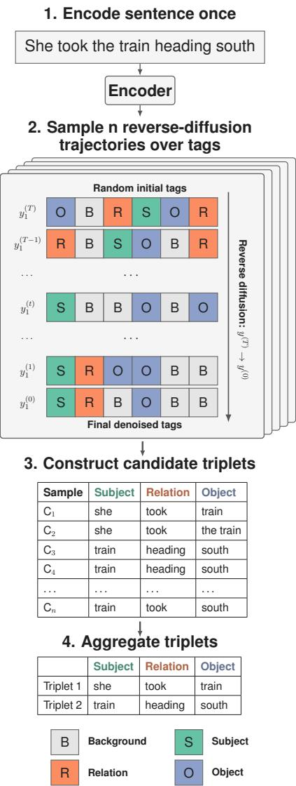

# DiffIE: Diffusion-based Open Information Extraction

Konstantin Fedorov1,2 Valentin Malykh3,4,5

1Matrosov Institute for System Dynamics and Control Theory, SB RAS, 2AI Talent Hub, ITMO University, 3MWS AI, 4Trusted AI Research Center, RAS, 5IITU University Correspondence: k.fedorov@innopolis.university

## Abstract

A single sentence often expresses multiple valid relational triplets, which makes Open Information Extraction (OpenIE) fundamentally a multi-output task. Existing neural systems handle this by autoregressive generation, which is flexible but slow and prone to redundancy, or by fixed-slot prediction, which is efficient but couples the extraction budget to training. We introduce DIFFIE which instead treats the stochasticity of conditional discrete diffusion as the extraction mechanism itself: independent reverse-diffusion trajectories over per-token role tags produce a pool of candidate triplets, which are clustered under lenient matching and ranked to form the output. Both the pool size and the number of returned extractions are inference-time choices, decoupling the extraction budget from training and exposing test-time compute as a tunable axis. DIFFIE achieves the new state of the art in CaRB (1-1) both F1 and AUC, and outperforms the strongest rule-based system (ClausIE) in BenchIE; it also remains competitive in stan dard CaRB and WiRe57 evaluations, giving the best average score among systems that report all four benchmarks. Ablations show that uniform discrete diffusion outperforms absorbingstate diffusion in our setting, and that a matched non-diffusion stochastic tagger does not reproduce its gains. Our results indicate that diffu sion stochasticity is an effective mechanism for structured prediction tasks with multiple valid outputs.

## 1 Introduction

Open Information Extraction (OpenIE) aims to extract schema-free relational triplets (Subject, Relation, Object) from natural language text, where a single sentence typically expresses multiple distinct facts. Existing neural approaches divide into autoregressive sequence generators (Cui et al., 2018; Kolluru et al., 2020b; Chen et al., 2024), which are flexible but slow and prone to redundancy, and sequence-labeling models (Stanovsky et al., 2018; Kolluru et al., 2020a; Zhan and Zhao, 2020), which are efficient but typically produce one triplet per pass. DetIE (Vasilkovsky et al., 2022) addresses this with an object-detection-inspired design that predicts a fixed number N of candidates in a single forward pass, demonstrating that nonautoregressive multi-triplet extraction is viable; the trade-off is that N is fixed at training time and the model must be retrained when the target cardinality changes.

  
Figure 1: Overview of DIFFIE inference. Multiple reverse-diffusion trajectories conditioned on the same sentence produce candidate triplets, which may include duplicates and noisy outputs. Lenient aggregation clusters candidates and returns the top-ranked extractions.

We propose DIFFIE, a non-autoregressive sequence-labeling model based on conditional discrete diffusion over per-token role tags. Rather than decoding a single tag sequence, DIFFIE exploits the stochasticity of the reverse diffusion process: n independent denoising trajectories yield a samplebased candidate pool of valid tag sequences, which a lenient-match extractor aggregates into a final triplet set. Because n is set at inference time, it doubles as a tunable compute–quality axis: more samples expand the candidate pool at greater inference cost. The size of the returned extraction set is likewise an inference-time choice, so the extraction budget can be retuned per corpus without retraining.

Our contributions are: (1) the first application of discrete diffusion language models to OpenIE, formulating it as conditional sequence labeling; (2) a sample-aggregation inference mechanism, paired with a lenient-match extractor tailored to the multi-reference nature of OpenIE ground truth, that decouples the extraction budget from training; (3) an empirical demonstration that uniform-noise discrete diffusion (D3PM) outperforms absorbingstate diffusion (MDLM) in the extreme smallvocabulary regime (|V| = 4); (4) a matched nondiffusion stochastic tagger control that isolates reverse diffusion, rather than repeated sampling and clustering, as the source of the gains; and (5) best reported CaRB (1-1) F1 and AUC and BenchIE F1, outperforming prior neural systems and the strongest rule-based baseline on BenchIE.1

## 2 Related Work

## 2.1 Neural Open Information Extraction

Sequence-labeling approaches treat extraction as token-level tagging, typically with BIO-style schemes (Stanovsky et al., 2018). OpenIE6 (Kolluru et al., 2020a) replaces flat tagging with a 2-D Iterative Grid Labeling formulation that captures discontinuous spans and overlapping relations, and

SpanOIE (Zhan and Zhao, 2020) first detects predicate spans and then classifies their arguments. Most relevant to our work, DetIE (Vasilkovsky et al., 2022) adopts an object-detection-inspired formulation that emits a fixed number N of triplet candidates in a single forward pass with bipartite matching at training time. Our method belongs to this family but replaces the train-time fixed budget with inference-time sampling from a distributional model (§3).

Sequence-generation approaches formulate OpenIE as autoregressive text-to-text generation. Early work introduced encoder–decoder copy mechanisms (Cui et al., 2018); IMoJIE (Kolluru et al., 2020b) produces extractions iteratively, conditioning each on previously generated ones. More recent systems include T5-based formulations (Fan and He, 2023) and dual learning to reduce missing and redundant triples (Chen et al., 2024). CycleOIE (Jin et al., 2025) introduces a low-resource training framework whose curated LSOIE-EXAMPLES subset we use as our training corpus. Generative approaches are flexible but pay an autoregressive inference cost and tend to produce redundant extractions, motivating non-autoregressive alternatives like (Vasilkovsky et al., 2022), of which ours is one.

Low-resource OpenIE. CycleOIE (Jin et al., 2025) argues that neural OpenIE remains heavily dependent on large annotated corpora and curates small, GPT-annotated training sets via two prompting strategies, reporting stronger results from the few-shot examples variant. We use this LSOIE-EXAMPLES subset as our training source and later analyze whether augmenting it with raw LSOIE helps.

Relation to LLM prompting. Recent work prompts LLMs to perform OpenIE directly (Chen et al., 2024); such systems are autoregressive, expensive at corpus scale, and offer little control over the extraction distribution. DIFFIE encodes each sentence once and exposes test-time compute as a tunable axis, so its cost can be set after training rather than fixed by a decoder (§6.2).

## 2.2 Discrete Diffusion Language Models

Diffusion models for text fall into continuous-space variants—which embed discrete tokens into a continuous latent and diffuse there (Li et al., 2022)— and discrete-space variants, which define the noising process directly over the categorical vocabulary. D3PM (Austin et al., 2021) establishes the discretediffusion framework with several transition matrix choices, of which absorbing-state and uniform corruption are the two most widely used. MDLM (Sahoo et al., 2024) simplifies absorbing-state diffusion and, alongside SEDD (Lou et al., 2024) and LLaDA (Nie et al., 2025), has established discrete diffusion as a viable alternative to autoregressive language modeling.

The relative performance of the two formulations depends on vocabulary size: Schiff et al. (2025) show that uniform-noise diffusion can match or exceed absorbing-state on small-vocabulary language modeling, contrary to the common assumption that absorbing-state is uniformly stronger. Our foursymbol tag vocabulary is an extreme instance of this regime; we implement both and report the comparison in §6.3.

## 2.3 Diffusion for Structured Prediction

Prior diffusion-based approaches to structured NLP either operate in continuous space (DiffusionNER (Shen et al., 2023)) or assume a fixed relation schema (IPED (Zhao et al., 2024)), making them incompatible with schema-free, multi-extraction OpenIE. Closest to our work, DiffusionSL (Huang et al., 2023) performs sequence labeling via a Bit-Tag Converter that encodes each tag as a bit pattern and applies continuous Gaussian diffusion in bit space; it is evaluated on tasks (NER, POS, chunking) where each sentence has a single best label sequence and decodes from a single trajectory. DIFFIE differs in three ways: we use categorical discrete diffusion over the four-symbol tag vocabulary directly; we draw n trajectories at inference and aggregate them, treating sample diversity as the mechanism for capturing multiple valid extractions; and we introduce task-specific extractors (§3.4) for the multi-reference nature of OpenIE ground truth.

## 2.4 OpenIE Evaluation Benchmarks

OpenIE evaluation is complicated by the fact that a single sentence admits many valid extractions with substantial surface-form variation, and benchmarks differ in both reference construction and matching.

CaRB and CaRB (1-1). CaRB (Bhardwaj et al., 2019) provides crowdsourced extractions for 1,282 sentences with a token-level matcher allowing partial credit. The standard matcher permits manyto-one alignment scored by token overlap, which rewards systems that emit overly long extractions covering many gold tokens at once (Lechelle et al., 2019; Gashteovski et al., 2022; Fatahi Bayat et al., 2022). CaRB (1-1) enforces one-to-one alignment via the Hungarian algorithm and is widely regarded as a more faithful measure of extraction quality.

BenchIE. BenchIE (Gashteovski et al., 2022) replaces per-triplet gold annotations with fact synsets—exhaustive clusters of acceptable surface realizations of the same underlying fact—and applies strict synset-level matching. Because credit requires hitting a fact rather than fragments of one, BenchIE is substantially harder to game by overextraction.

WiRe57. WiRe57 (Lechelle et al., 2019) is a smaller benchmark (57 sentences) with manually curated, high-precision references, providing a complementary sanity check.

Benchmark selection. We evaluate DIFFIE on all four, treating CaRB (1-1) and BenchIE as the more rigorous indicators of extraction quality. The suite spans the full lenient-to-strict matching spectrum, letting us characterize where our method’s strengths lie.

## 3 Method

We formulate OpenIE as conditional discrete diffusion over per token tag sequences. Given an input sentence, our model learns to reverse a discrete corruption process that maps a random tag sequence to the ground-truth tagging. At inference time, we exploit the stochasticity of this reverse process: by drawing many independent denoising trajectories from the same sentence, we obtain a sample-based candidate pool of valid tag sequences, which we then aggregate into a final set of (Subject, Relation, Object) triplets.

## 3.1 Problem Formulation

Let $x = ( x _ { 1 } , \ldots , x _ { L } ) $ denote an input sentence of L tokens. Following prior sequence-labeling formulations of OpenIE (Vasilkovsky et al., 2022; Kolluru et al., 2020a), we represent extractions as a tag sequence $y = ( y _ { 1 } , \dots , y _ { L } )$ where each $y _ { i } \in$ $\mathcal { V } = \{ B , S , R , O \}$ assigns a role—Background, Subject, Relation, or Object—to the i-th token. A single tag sequence encodes exactly one triplet, and in the current post-sampling construction step we recover the Subject, Relation, and Object spans as the longest contiguous runs of their respective tags.

Unlike DetIE (Vasilkovsky et al., 2022), which predicts a fixed number N of triplets simultaneously and resolves multi-extraction via bipartite matching at train time, and unlike IMoJIE (Kolluru et al., 2020b), which generates triplets autoregressively, our formulation produces one tag sequence perforward sample. Multi-extraction is recovered at inference time through repeated stochastic sampling (§3.4).

## 3.2 Architecture

DIFFIE consists of two components: a pretrained transformer encoder and a small randomlyinitialized diffusion denoiser. An overview is shown in Figure 1.

Encoder. We use a pretrained transformer encoder Enc(·) to map the input sentence to contextual token embeddings $h ^ { \mathsf { e n c } } \in \mathbb { R } ^ { L \times d }$ . Depending on the tuned configuration, some lower encoder layers may be frozen while the remaining layers are fine-tuned jointly with the denoiser.

Denoiser. The denoiser is a small transformer with self-attention only and is trained from scratch. At denoising step t, it takes the current noisy tag sequence $y ^ { ( t ) }$ , embeds it as $h ^ { \mathrm { t a g } } \in \mathbb { R } ^ { L \times d }$ , and projects the encoder context to the same dimension. Conditioning is implemented by tokenwise fusion: for each position $i ,$ the tag embedding and contextual embedding are concatenated and mapped through a learned projection to obtain a shared latent representation. The resulting sequence is then processed exclusively by self-attention, so the encoder information enters the denoiser without a separate cross-attention module. A timestep embedding is added before the self-attention stack, and the decoder outputs logits over the tag states for each token position.

## 3.3 Discrete Diffusion Training

A sentence with m gold triplets is expanded into m independent (sentence, tag-sequence) examples, one per triplet, which are then shuffled into minibatches. The denoiser thus learns the marginal distribution over single-triplet taggings conditioned on the sentence; this marginal is sampled repeatedly at inference to recover the variable-cardinality extraction set.

We adopt the uniform discrete diffusion formulation of Austin et al. (2021). The forward process gradually corrupts the ground-truth tag sequence ${ \boldsymbol y } ^ { ( 0 ) } = { \boldsymbol y } ^ { * }$ by transitioning each token toward a uniform draw from $\nu$ according to a noise schedule $\bar { \alpha } _ { t } \mathbf { : }$

$$
\begin{array} { r } { q ( y _ { i } ^ { ( t ) } \mid y _ { i } ^ { ( 0 ) } ) = \bar { \alpha } _ { t } \mathbf { e } _ { y _ { i } ^ { ( 0 ) } } + ( 1 - \bar { \alpha } _ { t } ) \frac { 1 } { | \mathcal { V } | } \mathbf { 1 } , } \end{array}\tag{1}
$$

where ${ \bf e } _ { y _ { i } ^ { ( 0 ) } }$ is the one-hot vector at position $y _ { i } ^ { ( 0 ) }$ and 1 is the all-ones vector over $\nu$

The denoising model $p _ { \theta } ( y ^ { ( 0 ) } \mid y ^ { ( t ) } , x )$ is trained with the standard D3PM uniform-kernel denoising objective, implemented as token-level crossentropy at a uniformly sampled timestep t. To mitigate label imbalance, we use per-class loss weights during training.

## 3.4 Sample-Aggregation Inference

Because OpenIE admits multiple valid extractions per sentence, single-trajectory decoding is fundamentally limited. We instead exploit the stochasticity of the reverse diffusion process to build a sample-based candidate pool.

Sampling. Given a sentence $x ,$ we encode it once and run n independent reverse-diffusion trajectories, each initialized from a uniform random tag sequence $y ^ { ( T ) } \sim \mathrm { U n i f } ( \mathcal { V } ^ { L } )$ . In implementation, the n noisy tag sequences are stacked along the batch dimension and denoised in parallel for $T = 1 6$ steps, reusing the same encoder states. Each trajectory yields a denoised tag sequence $y _ { k } ^ { ( 0 ) }$ for $k = 1 , \dots , n$

Triplet construction. The diffusion model predicts token-level role tags and does not require role labels to be contiguous. In the current postsampling construction step, we surface the longest contiguous span for each role. This simple heuristic filters isolated tag errors and works well in our experiments, but it may drop useful tokens when a predicted role is discontinuous. Because this step is applied only after sampling, alternative tripletconstruction rules can be used without retraining the model. Future work could replace the longestspan heuristic with construction rules that preserve multiple predicted spans per role. If any of the three role tags is absent from $\hat { y } _ { k } ^ { ( 0 ) }$ , the sample produces no triplet.

Aggregation. The n trajectories yield candidate triplets $C _ { 1 } , \ldots , C _ { n }$ , treated as i.i.d. samples from $p _ { \theta } ( \cdot \mid x )$ . For any triplet $T .$ , the empirical frequency

$$
{ \hat { p } } _ { n } ( T \mid x ) = { \frac { 1 } { n } } \sum _ { k = 1 } ^ { n } \mathbf { 1 } \{ C _ { k } = T \}\tag{2}
$$

is the empirical frequency of each candidate or candidate cluster. We use these frequencies as confidence scores in two extractors.

Lenient-match extractor. To recover this dispersed mass, we cluster candidates under CaRBstyle lenient matching (Bhardwaj et al., 2019). For triplets $T ^ { ( i ) }$ and $T ^ { ( j ) }$ with total word counts $n _ { i } , n _ { j }$ let $m _ { i j }$ be the role-wise lowercased word-multiset overlap, summed over subject, relation, and object. The symmetric lenient F1 is

$$
F _ { i j } = \frac { 2 m _ { i j } } { n _ { i } + n _ { j } } ,\tag{3}
$$

matching the CaRB evaluator’s token-level matcher. Triplets with $F _ { i j } \geq \tau$ are declared equivalent, and we take connected components under this relation as clusters. Each cluster’s mass is the sum of its members’ frequencies; we return the top-k clusters by mass, each surfaced by its highest-frequency member. $\mathbf { A s } \tau  1$ the extractor reduces to the frequency baseline; $\tau , k ,$ , and n are tuned on validation data. We fix the output budget to k = 4 and the lenient-clustering threshold to $\tau = 0 . 9$ , selected on the CaRB development set. The sample count n controls the size of the candidate pool, while k controls how many clustered extractions are returned. Unlike fixed-slot models, changing k at inference time does not require retraining.

Test-time compute control. The number of samples n is a hyperparameter of inference, not training. This makes n a tunable compute-quality axis: larger n provides a larger candidate pool at greater inference cost. We analyze this tradeoff in §6.2.

## 4 Experimental Setup

Training data. We train on LSOIE-examples (Jin et al., 2025), a 4,901-sentence subset of LSOIE (Solawetz and Larson, 2021) curated by CycleOIE via example-guided prompting. We use this variant because CycleOIE reports stronger performance for example-guided curation than for its principlesguided alternative, particularly in recall and F1. Since LSOIE-examples is distributed in a generative format pairing each sentence with one or more extracted triplets, we convert it to sequencelabeling supervision by decomposing each sentence into one (sentence, triplet) instance per triplet and assigning per-token B/S/R/O labels via span alignment to tokenizer offsets. Alignment is filtered at the triplet level: instances for which the alignment fails to cover all tokens of any argument span are discarded, while the sentence is retained if at least one of its triplets aligns successfully. This filtering removes 38–40% of instances across configurations, a stable rate attributable to CycleOIE’s tendency to paraphrase argument spans rather than copy them verbatim from the source sentence. We study five curated subsets of varying size (50–4,901 sentences) and two configurations that augment the full curated set with raw LSOIE data. Statistics for all configurations are reported in Table 1. We adopt LSOIE-EX-2.5K as our primary configuration; the ablation justifying this choice is presented in §6.1.

<table><tr><td>Configuration</td><td>Sentences</td><td>Instances</td><td>Filtered</td></tr><tr><td>LSOIE-EX-50</td><td>50</td><td>267</td><td>171</td></tr><tr><td>LSOIE-EX-250</td><td>250</td><td>1,313</td><td>781</td></tr><tr><td>LSOIE-EX-1.25K</td><td>1,250</td><td>6,760</td><td>4,129</td></tr><tr><td>LSOIE-EX-2.5K</td><td>2,500</td><td>13,415</td><td>8,266</td></tr><tr><td>LSOIE-EX-FULL</td><td>4,901</td><td>26,349</td><td>16,359</td></tr><tr><td>+ LSOIE-20K</td><td>24,901</td><td>46,349</td><td>36,359</td></tr><tr><td>+ LSOIE-FULL</td><td>50,917</td><td>72,365</td><td>62,375</td></tr></table>

Table 1: Dataset statistics for all training configurations. Instances: triplet pairs after sentence decomposition. Filtered: instances surviving span-alignment filtering. The upper block contains subsets of LSOIE-examples; the lower block augments LSOIE-EX-FULL with raw LSOIE data (100% retention, as LSOIE is already in token-labeled format).

Implementation details. We use bert-base-uncased as the encoder, with the four lowest transformer layers frozen during training. The denoiser is a 6-layer self-attention transformer with model dimension 512, 8 attention heads, and concatenation-based encoder fusion. The diffusion process uses T = 16 steps with a cosine noise schedule $( s ~ = ~ 0 . 0 0 2 )$ . We train with AdamW, using a learning rate of $2 \times 1 0 ^ { - 4 }$ for the denoiser and $5 \times 1 0 ^ { - 5 }$ for the encoder, weight decay 0.01, 500 linear warmup steps, and a batch size of 32 for 12 epochs. To mitigate label imbalance we assign a class weight of 0.7 to the background label and 1.0 to all other tags. Hyperparameters were selected by grid search on the CaRB development set.

Evaluation protocol. Unless otherwise stated, we use LSOIE-EX-2.5K as the primary training configuration; §6.1 analyzes this choice. All

<table><tr><td rowspan="2"></td><td colspan="2">CaRB</td><td colspan="2">CaRB (1-1)</td><td>BenchIE</td><td>WiRe57</td><td rowspan="2">Avg</td></tr><tr><td>F1</td><td>AUC</td><td>F1</td><td>AUC</td><td>F1</td><td>F1</td></tr><tr><td>OpenIE6 (Kolluru et al., 2020a)</td><td>52.7</td><td>33.7</td><td>46.4</td><td>26.8</td><td>25.0</td><td>40.0</td><td>41.0</td></tr><tr><td>IMoJIE (Kolluru et al., 2020b)</td><td>53.5</td><td>33.3</td><td>41.4</td><td>22.2</td><td>18.6</td><td>36.0</td><td>37.4</td></tr><tr><td>DetIE (Vasilkovsky et al., 2022)</td><td>52.1</td><td>36.7</td><td>40.1</td><td>29.3</td><td></td><td>36.0</td><td></td></tr><tr><td>ClausIE (Del Corro and Gemulla, 2013)</td><td>45.0</td><td>22.0</td><td>40.2</td><td>17.7</td><td>34.0</td><td>33.2</td><td>38.1</td></tr><tr><td>CompactIE (Fatahi Bayat et al., 2022)</td><td>45.0</td><td></td><td></td><td></td><td>26.2</td><td>31.8</td><td></td></tr><tr><td>DualOIE (Chen et al., 2024)</td><td>56.3</td><td></td><td>51.5</td><td></td><td></td><td></td><td></td></tr><tr><td>ChatGPT (Chain-of-Thought) (Chen et al., 2024)</td><td>53.4</td><td></td><td></td><td></td><td></td><td></td><td></td></tr><tr><td>CycleOIE (Jin et al., 2025)</td><td>51.2</td><td>39.0</td><td>47.4</td><td>33.6</td><td></td><td></td><td></td></tr><tr><td>DIFFIE</td><td>52.2</td><td>37.1</td><td>51.9</td><td>34.5</td><td>34.3</td><td>36.1</td><td>43.6</td></tr></table>

Table 2: Main results across four OpenIE benchmarks. We compare to the strongest published numbers available for each benchmark. Since prior systems do not all report the same metrics, we emphasize per-benchmark comparisons rather than a single aggregate score; Avg is defined only for systems reporting all four benchmarks. DIFFIE results are means over 10 random seeds. BenchIE and WiRe57 scores for OpenIE6 are from Jin et al. (2025); BenchIE scores for IMoJIE and ClausIE are from Fatahi Bayat et al. (2022) and Gashteovski et al. (2022) respectively; remaining baseline scores are from their original papers. Bold: best in column.

DIFFIE results are averaged over 10 independent random seeds. The denoising sample count n, output budget k, and lenient-matching threshold τ are fixed globally using the CaRB development set.

## 5 Results

DIFFIE achieves the best reported CaRB (1-1) F1 and AUC among published OpenIE systems. This improvement is consistent across runs: every seed exceeds the previous best reported CaRB (1-1) F1 score of 51.5. Across benchmarks, F1 variance is low, with standard deviation at most 0.5 points. Holm-corrected one-sample t-tests against the published scores give adjusted $p = 0 . 0 0 1 7 , p < 1 0 ^ { - 7 }$ and $p = 0 . 0 1 9 6$ for CaRB (1-1) F1, CaRB (1-1) AUC, and BenchIE F1, treating the baselines as fixed references rather than as paired comparisons.

On BenchIE, DIFFIE achieves the best average reported F1, with 9 of 10 seeds exceeding ClausIE, the strongest rule-based baseline. The gain over ClausIE is small, but DIFFIE substantially outperforms prior neural OpenIE systems on this stricter fact-level benchmark.

CycleOIE is a particularly relevant comparison because our primary model is trained on a 2.5Ksentence subset of its LSOIE-examples resource. Despite using only this subset, DIFFIE improves over CycleOIE on CaRB F1 and on the stricter CaRB (1-1) F1/AUC metrics, although CycleOIE retains higher standard CaRB AUC. On WiRe57, DIFFIE trails OpenIE6, indicating that its gains do not transfer uniformly across all evaluation settings.

## 6 Ablation Study

All ablations are evaluated on the CaRB development set, the only one of our four benchmarks with a designated development split. BenchIE and WiRe57 provide test-only resources.

## 6.1 Effect of Training Data Size

Table 3 reports CaRB and CaRB (1-1) F1 on the development set across all training configurations. The two metrics tell different stories above LSOIE-EX-1.25K: CaRB F1 is essentially flat across the three largest curated-only configurations (52.6, 52.4, 52.5), while CaRB (1-1) F1 peaks at LSOIE-EX-2.5K (53.1), 1.8 points above LSOIE-EX-1.25K (51.3) and 1.7 points above LSOIE-EX-FULL (51.4). We adopt LSOIE-EX-2.5K as the primary configuration on the basis of this CaRB (1-1) advantage. Augmenting with raw LSOIE data degrades performance in both metrics, and the degradation grows with the volume of raw data added: +LSOIE-FULL falls 5.6 F1 points below LSOIE-EX-FULL on CaRB and 7.4 points on CaRB (1-1). The two sources differ in annotation construction and target labels, not only in size, so we read this degradation as annotation-distribution mismatch rather than as evidence that the original LSOIE labels are noisier.

These results are consistent with the lowresource motivation of (Jin et al., 2025): for DIFFIE , more data is not automatically better. The curated LSOIE-EX-2.5K subset outperforms both the larger curated set and the configurations augmented with raw LSOIE, suggesting that supervision quality and span alignment are more important than raw corpus size in this setting.

<table><tr><td>Configuration</td><td>CaRB F1</td><td>CaRB (1-1) F1</td></tr><tr><td>LSOIE-EX-50</td><td> $1 4 . 4 \pm 0 . 2$ </td><td> $1 6 . 1 \pm 0 . 3$ </td></tr><tr><td> $_ { \mathrm { L S O I E - E X - 2 5 0 } }$ </td><td> $3 9 . 0 \pm 0 . 1$ </td><td> $3 8 . 9 \pm 0 . 2$ </td></tr><tr><td> $_ { \mathrm { L S O I E - E X - 1 } . 2 5 \mathrm { K } }$ </td><td> $5 2 . 6 \pm 0 . 2$ </td><td> $5 1 . 3 \pm 0 . 2$ </td></tr><tr><td> $_ { \mathrm { L S O I E - E X - 2 . 5 K } }$ </td><td> $5 2 . 4 \pm 0 . 2$ </td><td> $5 3 . 1 \pm 0 . 2$ </td></tr><tr><td> $_ { \mathrm { L S O I E - E X - F U L L } }$ </td><td> $5 2 . 5 \pm 0 . 1$ </td><td> $5 1 . 4 \pm 0 . 2$ </td></tr><tr><td> $+ \mathrm { L S O I E } { - 2 0 \mathrm { K } }$ </td><td> $5 1 . 7 \pm 0 . 2$ </td><td> $4 9 . 3 \pm 0 . 2$ </td></tr><tr><td> $+ \mathrm { L S O I E - F U L L }$ </td><td> $4 6 . 9 \pm 0 . 3$ </td><td> $4 4 . 0 \pm 0 . 2$ </td></tr></table>

Table 3: CaRB and CaRB (1-1) F1 on the development set for all training configurations (mean ± std over 10 seeds). Upper block: curated-only subsets of LSOIEexamples. Lower block: LSOIE-EX-FULL augmented with raw LSOIE data.

## 6.2 Test-Time Compute Scaling

A central property of DIFFIE is that the number of denoising samples n is an inference-time hyperparameter, allowing a tunable trade-off between extraction quality and compute. Full sensitivity tables for n, the output budget k, and the clustering threshold τ , together with the exact-frequency extractor baseline, are reported in Appendix B. Performance improves with larger sample pools and then saturates, while lenient matching consistently improves over exact-frequency aggregation. The single CaRB-dev-selected setting (n = 512, k = 4, $\tau = 0 . 9 )$ is used for every reported test result; it is within 2.0 F1 of the best diagnostic sweep point on BenchIE and matches the best point on WiRe57.

Inference cost. Table 4 reports end-to-end throughput and peak memory on a single NVIDIA A100 over a CaRB development subset. Lowering n from 512 to 64 costs 1.5 F1 and to 16 costs 3.0 F1, while raising throughput by 6.6× and 15×; clustering and ranking account for 0.2–1.0% of runtime. DIFFIE is not faster than fixed-slot tagging in absolute terms: DetIE processes 686 sentences per second against 14.2 at n=16. The claim is controllable inference cost, not raw speed. Against direct LLM prompting the comparison is favorable: at n=16 DIFFIE matches a prompted Qwen3- 30B-A3B (49.3 vs. 49.5 F1) at roughly 50× the throughput and a small fraction of the memory. We also evaluate the released DetIE-LSOIE checkpoint under our evaluator (45.1 F1). That comparison shares an evaluator but not annotation targets— DetIE-LSOIE trains on original LSOIE token labels, DIFFIE on CycleOIE annotations—so we report it as a same-evaluator reference point rather than a controlled training comparison.

<table><tr><td>System</td><td>n F1</td><td>sent/s</td><td>VRAM</td></tr><tr><td>DetIE-LSOIE Qwen3-30B-A3B (prompted)</td><td>45.1</td><td>686.0</td><td>≈0.7</td></tr><tr><td></td><td>49.5</td><td>0.28</td><td>≈80</td></tr><tr><td>DIFFIE</td><td>16 49.3 64 50.8</td><td>14.2</td><td>0.55</td></tr><tr><td>512</td><td>52.3</td><td>6.3 0.95</td><td>0.65</td></tr><tr><td></td><td></td><td></td><td>1.74</td></tr></table>

Table 4: End-to-end inference on the CaRB development set, single NVIDIA A100. F1 is CaRB F1, sent/s is sentences per second, and VRAM is peak GPU memory in GB. The DetIE memory figure is estimated; the Qwen figure is vLLM’s memory reservation rather than the model’s parameter footprint.

## 6.3 D3PM-uniform vs. absorbing-state diffusion

We compare D3PM-uniform against MDLM (Sahoo et al., 2024), the standard absorbing-state discrete diffusion formulation, training both systems on LSOIE-EX-2.5K and LSOIE-EX-FULL. For MDLM we sweep noise schedule (cosine, linear, log-linear, mutual-information), number of sampling steps (8–64), temperature, and remasking strategy on the CaRB development set, and report the best configuration found for each training set.

Results are shown in Table 5. D3PM-uniform outperforms MDLM at both training set sizes; the ∆ rows show the advantage is +2.2/+3.4 points at LSOIE-EX-2.5K and widens to +4.1/+2.9 at LSOIE-EX-FULL. This is consistent with Schiff et al. (2025), who show that uniform-noise diffusion can match or exceed absorbing-state diffusion in small-vocabulary regimes; our four-symbol tag vocabulary $( | \nu | = 4 )$ is an extreme instance of this effect.

<table><tr><td>Data</td><td>System</td><td>CaRB</td><td>CaRB (1-1)</td></tr><tr><td>LSOIE-EX-2.5K</td><td>Uniform MDLM ∆</td><td> $5 2 . 4 \pm 0 . 2$   $5 0 . 2 \pm 0 . 2$  +2.2</td><td> $5 3 . 1 \pm 0 . 2$   $4 9 . 7 \pm 0 . 2$  +3.4</td></tr><tr><td>LSOIE-EX-FULL</td><td>Uniform MDLM ∆</td><td> $5 2 . 5 \pm 0 . 1$   $4 8 . 4 \pm 0 . 3$  +4.1</td><td> $5 1 . 4 \pm 0 . 2$   $4 8 . 5 \pm 0 . 3$  +2.9</td></tr></table>

Table 5: D3PM-uniform vs. MDLM on the CaRB development set. Each score entry reports mean ± std F1 over 10 seeds for CaRB and CaRB (1-1); ∆ denotes D3PM-uniform minus MDLM within each data configuration.

## 6.4 Is diffusion necessary?

Sample aggregation could in principle be driven by any stochastic tagger. To isolate the contribution of reverse diffusion, we train an MC-dropout sequence tagger that shares everything else with DIFFIE : the same training instances, the same bert-base-uncased encoder, the same B/S/R/O label space, longest-span construction, and lenient clustering and ranking. Full-encoder MC dropout replaces reverse diffusion as the candidate generator, and we select its best configuration on the CaRB development set from the same grid.

The control reaches 37.5 CaRB F1 against 52.3 for DIFFIE (Table 6), and 37.3 against 53.1 under one-to-one matching. The gap is driven by recall: across the whole tagger sweep, recall never exceeds 27.3 on CaRB or 27.9 on CaRB (1-1), whereas DIFFIE reaches 45.8 and 48.0. The control is therefore candidate-pool limited, as no setting of the shared clustering stage can recover triplets the tagger never proposes. This attributes the gain to reverse-diffusion candidate generation rather than to repeated sampling and clustering alone.

<table><tr><td>System</td><td>F1</td><td>P</td><td>R</td><td>AUC</td></tr><tr><td>MC-dropout tagger</td><td>37.5</td><td>68.9</td><td>25.8</td><td>21.3</td></tr><tr><td>DIFFIE</td><td>52.3</td><td>61.0</td><td>45.8</td><td>37.0</td></tr></table>

Table 6: Matched non-diffusion control on the CaRB development set. Both systems share encoder, training instances, label space, triplet construction, and aggregation; only the candidate generator differs.

## 7 Discussion

Why diffusion fits OpenIE. OpenIE is a multioutput task by nature: a sentence usually contains several valid triplets, so any single tagging is incomplete. Diffusion fits this well because its reverse process is stochastic — running it several times on the same input gives different valid outputs, which matches how OpenIE ground truth is structured. Other non-autoregressive methods handle this by building multiplicity into the architecture (fixed slots, bipartite matching) or the decoder (autoregressive iteration); DIFFIE instead lets sample diversity do the work, and turns the candidate-pool size into an inference-time knob. That knob is a cost control: DIFFIE is slower than fixed-slot tagging but substantially faster and more memoryefficient than direct LLM prompting. Its sample count allows quality to be traded against throughput after training (Table 4). Table 10 shows that this pool converges, and that lenient-match beats frequency aggregation across all n shows that the candidate pool contains many near-equivalent triplets that differ only in span boundaries — variation that clustering recovers but exact-match aggregation fragments. The gains show up most on CaRB (1- 1) and BenchIE, the two benchmarks built to penalize over-extraction; on WiRe57, whose references prefer short, syntactically tight extractions, DIFFIE trails OpenIE6. We attribute this to the style of our LSOIE-derived training supervision, which by construction rewards exhaustive extraction and multi-token relation spans that include modifiers and determiners — a style well aligned with CaRB but at odds with WiRe57’s curated references.

Uniform vs. absorbing-state diffusion. Uniform-noise diffusion outperforms MDLM at both training sizes, and the gap widens with more data (§6.3). We attribute this to a structural difference in the reverse process: under absorbingstate corruption, each position transitions once from [MASK] to a tag and stays there, so an early wrong commitment is locked in unless explicitly remasked at inference; under uniform corruption, positions can transition between non-mask tags at any step, letting the denoiser revise earlier decisions as more context becomes available. This matters for OpenIE because role tags are jointly constrained. Our MDLM sweep included remasking strategies and uniform diffusion still won, consistent with this account. Together with Schiff et al. (2025), this suggests uniform corruption is the better default for structured prediction over small label vocabularies.

## 8 Conclusion

We introduced DIFFIE , which treats Open Information Extraction as conditional discrete diffusion over per-token role tags and uses the stochasticity of the reverse process as the extraction mechanism itself. Independent denoising trajectories conditioned on the same sentence yield a diverse pool of candidate triplets, which a lenient-match extractor clusters and ranks to recover multiple valid extractions without autoregressive decoding or train-time fixed slots. Because both the candidate-pool size and the number of returned clusters are inferencetime choices, DIFFIE exposes test-time compute as a tunable quality–cost axis. Across four OpenIE benchmarks, DIFFIE achieves the best reported CaRB (1-1), both F1 and AUC, and beats the strongest rule-based system on BenchIE while substantially outperforming all prior neural OpenIE systems with reported BenchIE numbers. It remains competitive on standard CaRB and WiRe57, and has the best average score among systems that report all four benchmarks. A matched MCdropout tagger sharing our encoder, labels, and aggregation does not reproduce these gains, which places them in candidate generation. We further find that uniform discrete diffusion outperforms absorbing-state diffusion in this four-tag setting, which we attribute to the reverse process’s ability to revise earlier decisions, and that supervision quality matters more than corpus size for sampleaggregation models. More broadly, our results indicate that diffusion stochasticity is a useful mechanism for structured prediction tasks with multiple valid outputs, and we leave its application to other multi-reference NLP tasks to future work.

## Acknowledgments

This work was carried out within the state assignment under the research theme “Methods and technologies of a cloud-based, service-oriented digital platform for collecting, storing, and processing large volumes of multi-format interdisciplinary data and knowledge, based on the use of artificial intelligence, component-based and model-driven approaches, and machine learning” (code FWEW-2026-0012, State Registration No. 126021217141- 8).

## Limitations

Longest-span construction heuristic. We construct triplets from denoised tag sequences by taking the longest contiguous run of each role tag (§3). This filters isolated tag errors but discards information when a role is discontinuous in the prediction. On the CaRB dev set, 28.9% of denoised samples contain at least one discontinuous role-tag run, most often in Relations (18.6%) and Objects (12.2%), discarding 2.4 tokens on average when triggered — roughly 0.7 tokens per sample unconditionally. Because DIFFIE aggregates n = 512 trajectories per sentence and ranks clusters by mass, these occasional drops are absorbed in aggregation rather than directly producing wrong extractions — the same fact is typically recovered by other trajectories whose longest-span construction succeeds.

Alternative construction rules that preserve multiple maximal spans per role are straightforward to plug in post-sampling and may further improve recall; we leave this to future work. More generally, the four-tag scheme assigns each token a single role within a trajectory, so overlapping roles and discontinuous arguments cannot be represented inside one sample. Sampling removes the cap on how many triplets a sentence yields, but not this per-trajectory restriction.

Training data scope. All experiments use English supervision from CycleOIE’s curated LSOIE-EXAMPLES (Jin et al., 2025). We do not evaluate on other languages or out-of-domain corpora. Our span-alignment filter additionally discards roughly 40% of instances whose GPT-generated arguments do not match source spans verbatim; training on datasets with cleaner extractive spans could increase usable supervision. We have not carried out a stratified audit of the discarded instances, so we cannot say whether the filter correlates with relation type, argument length, discontinuity, or syntactic construction; our conclusions are scoped to the retained, extractive portion of the data.

## References

Jacob Austin, Daniel D. Johnson, Jonathan Ho, Daniel Tarlow, and Rianne van den Berg. 2021. Structured denoising diffusion models in discrete state-spaces. In Advances in Neural Information Processing Systems, volume 34, pages 17981–17993. Curran Associates, Inc.

Sangnie Bhardwaj, Samarth Aggarwal, and Mausam. 2019. CaRB: A crowdsourced benchmark for open IE. In Proceedings ofthe 2019 Conference on Empirical Methods in Natural Language Processing and the 9th International Joint Conference on Natural Language Processing (EMNLP-IJCNLP), pages 6262– 6267, Hong Kong, China. Association for Computational Linguistics.

Zhen Chen, Jingping Liu, Deqing Yang, Yanghua Xiao, Huimin Xu, Zongyu Wang, Rui Xie, and Yunsen Xian. 2024. Exploiting duality in open information extraction with predicate prompt. In Proceedings of the 17th ACM International Conference on Web Search and Data Mining, pages 125–133.

Lei Cui, Furu Wei, and Ming Zhou. 2018. Neural open information extraction. In Proceedings of the 56th Annual Meeting of the Association for Computational Linguistics (Volume 2: Short Papers), pages 407–413, Melbourne, Australia. Association for Computational Linguistics.

Luciano Del Corro and Rainer Gemulla. 2013. Clausie: clause-based open information extraction. In Proceedings of the 22nd International Conference on World Wide Web, WWW ’13, page 355–366, New York, NY, USA. Association for Computing Machinery.

Zhiyuan Fan and Shizhu He. 2023. Efficient data learning for open information extraction with pre-trained language models. In Findings of the Association for Computational Linguistics: EMNLP 2023, pages 13056–13063, Singapore. Association for Computational Linguistics.

Farima Fatahi Bayat, Nikita Bhutani, and H. Jagadish. 2022. CompactIE: Compact facts in open information extraction. In Proceedings ofthe 2022 Conference of the North American Chapter of the Association for Computational Linguistics: Human Language Technologies, pages 900–910, Seattle, United States. Association for Computational Linguistics.

Kiril Gashteovski, Mingying Yu, Bhushan Kotnis, Carolin Lawrence, Mathias Niepert, and Goran Glavaš. 2022. BenchIE: A framework for multi-faceted factbased open information extraction evaluation. In Proceedings of the 60th Annual Meeting of the Associationfor Computational Linguistics (Volume 1: Long Papers), pages 4472–4490, Dublin, Ireland. Association for Computational Linguistics.

Ziyang Huang, Pengfei Cao, Jun Zhao, and Kang Liu. 2023. DiffusionSL: Sequence labeling via tag diffusion process. In Findings of the Association for Computational Linguistics: EMNLP 2023, pages 12902– 12920, Singapore. Association for Computational Linguistics.

Zhihong Jin, Chunhong Zhang, Zheng Hu, Jibin Yu, Ruiqi Ma, Qingyun Chen, Xiaohao Liao, and Yanxing Zhang. 2025. CycleOIE: A low-resource training framework for open information extraction. In Proceedings ofthe 31st International Conference on Computational Linguistics, pages 3372–3390, Abu Dhabi, UAE. Association for Computational Linguistics.

Keshav Kolluru, Vaibhav Adlakha, Samarth Aggarwal, Mausam, and Soumen Chakrabarti. 2020a. OpenIE6: Iterative Grid Labeling and Coordination Analysis for Open Information Extraction. In Proceedings ofthe 2020 Conference on Empirical Methods in Natural Language Processing (EMNLP), pages 3748–3761, Online. Association for Computational Linguistics.

Keshav Kolluru, Samarth Aggarwal, Vipul Rathore, Mausam, and Soumen Chakrabarti. 2020b. IMo-JIE: Iterative memory-based joint open information extraction. In Proceedings ofthe 58th Annual Meeting of the Association for Computational Linguistics, pages 5871–5886, Online. Association for Computational Linguistics.

William Lechelle, Fabrizio Gotti, and Phillippe Langlais. 2019. WiRe57 : A fine-grained benchmark for open

information extraction. In Proceedings of the 13th Linguistic Annotation Workshop, pages 6–15, Florence, Italy. Association for Computational Linguistics.

Xiang Lisa Li, John Thickstun, Ishaan Gulrajani, Percy Liang, and Tatsunori B. Hashimoto. 2022. Diffusionlm improves controllable text generation. In Proceedings of the 36th International Conference on Neural Information Processing Systems, NIPS ’22, Red Hook, NY, USA. Curran Associates Inc.

Aaron Lou, Chenlin Meng, and Stefano Ermon. 2024. Discrete diffusion modeling by estimating the ratios of the data distribution. In Proceedings of the 41st International Conference on Machine Learning, ICML’24. JMLR.org.

Shen Nie, Fengqi Zhu, Zebin You, Xiaolu Zhang, Jingyang Ou, Jun Hu, Jun Zhou, Yankai Lin, Ji-Rong Wen, and Chongxuan LI. 2025. Large language diffusion models. In Advances in Neural Information Processing Systems, volume 38, pages 50608–50646. Curran Associates, Inc.

Subham Sekhar Sahoo, Marianne Arriola, Aaron Gokaslan, Edgar Mariano Marroquin, Alexander M Rush, Yair Schiff, Justin T Chiu, and Volodymyr Kuleshov. 2024. Simple and effective masked diffusion language models. In The Thirty-eighth Annual Conference on Neural Information Processing Systems.

Yair Schiff, Subham Sahoo, Hao Phung, Guanghan Wang, Sam Boshar, Hugo Dalla-torre, Bernardo Almeida, Alexander Rush, Thomas Pierrot, and Volodymyr Kuleshov. 2025. Simple guidance mechanisms for discrete diffusion models. In International Conference on Learning Representations, volume 2025, pages 43776–43821.

Yongliang Shen, Kaitao Song, Xu Tan, Dongsheng Li, Weiming Lu, and Yueting Zhuang. 2023. Diffusion-NER: Boundary diffusion for named entity recognition. In Proceedings of the 61st Annual Meeting of the Association for Computational Linguistics (Volume 1: Long Papers), pages 3875–3890, Toronto, Canada. Association for Computational Linguistics.

Jacob Solawetz and Stefan Larson. 2021. LSOIE: A large-scale dataset for supervised open information extraction. In Proceedings ofthe 16th Conference of the European Chapter ofthe Associationfor Computational Linguistics: Main Volume, pages 2595–2600, Online. Association for Computational Linguistics.

Gabriel Stanovsky, Julian Michael, Luke Zettlemoyer, and Ido Dagan. 2018. Supervised open information extraction. In Proceedings ofthe 2018 Conference of the North American Chapter ofthe Associationfor Computational Linguistics: Human Language Technologies, Volume 1 (Long Papers), pages 885–895, New Orleans, Louisiana. Association for Computational Linguistics.

Mikhail Vasilkovsky, Anton Alekseev, Valentin Malykh, Ilya Shenbin, Elena Tutubalina, Dmitry Salikhov, Mikhail Stepnov, Andrey Chertok, and Sergey Nikolenko. 2022. DetIE: Multilingual open information extraction inspired by object detection. In Proceedings ofthe 36th AAAI Conference on Artificial Intelligence.

Junlang Zhan and Hai Zhao. 2020. Span model for open information extraction on accurate corpus. Proceedings ofthe AAAI Conference on Artificial Intelligence,

34(05):9523–9530.

Jianli Zhao, Changhao Xu, and Bin. Jiang. 2024. IPED: An implicit perspective for relational triple extraction based on diffusion model. In Proceedings ofthe 2024 Conference of the North American Chapter of the Associationfor Computational Linguistics: Human Language Technologies (Volume 1: Long Papers), pages 2080–2092, Mexico City, Mexico. Association for Computational Linguistics.

## A Full Results with Standard Deviations

Tables 7 and 8 report precision, recall, F1, and AUC where applicable for DIFFIE on CaRB, CaRB (1- 1), BenchIE, and WiRe57 across 10 samples. All metrics are shown in percentage points. Each panel reports the mean and standard deviation across samples in its final row.

<table><tr><td>CaRB</td><td colspan="10"></td></tr><tr><td>Metric</td><td colspan="9"></td></tr><tr><td></td><td>0</td><td>1</td><td>2</td><td>3</td><td></td><td>4</td><td>5</td><td>6</td><td>7</td><td>8</td></tr><tr><td>AUC P</td><td>37.4 36.9 37.2 37.1 37.2 37.0 36.9 37.0 37.2 37.3</td><td></td><td></td><td></td><td></td><td></td><td></td><td></td><td></td><td>63.2 63.1 65.7 66.2 62.5 64.5 63.2 64.9 62.6 65.1</td></tr><tr><td></td><td colspan="9">44.844.543.1 43.4 44.744.044.343.744.843.8</td></tr><tr><td>R</td><td colspan="9"></td></tr><tr><td>F1</td><td colspan="9">52.4 52.2 52.1 52.4 52.1 52.3 52.1 52.2 52.2 52.4</td></tr><tr><td>Mean ± Std</td><td colspan="9">AUC = 37.1 ± 0.2, P = 64.1 ± 1.3 R = 44.1 ± 0.6, F1 = 52.2 ± 0.1</td></tr><tr><td></td><td colspan="9">CaRB (1-1)</td></tr><tr><td>Metric</td><td colspan="9">Sample</td></tr><tr><td></td><td colspan="9">1 2</td></tr><tr><td>AUC</td><td></td><td></td><td></td><td></td><td></td><td>34.634.334.434.734.534.434.434.434.234.6</td><td></td><td></td><td></td></tr><tr><td>P</td><td colspan="9">59.8 62.1 58.9 60.9 59.8 59.9 60.8 60.3 60.3 59.4</td></tr><tr><td>R</td><td colspan="9">46.1 44.3 46.1 46.0 45.8 45.7 45.3 45.4 45.1 45.9</td></tr><tr><td>F1</td><td colspan="9">52.1 51.7 51.7 52.4 51.8 51.8 51.9 51.8 51.6 51.8</td></tr><tr><td></td><td colspan="9"></td></tr><tr><td>Mean ± Std</td><td colspan="9">AUC = 34.5 ± 0.1, P = 60.2 ± 0.9 R = 45.6 ± 0.5, F1 = 51.9 ± 0.2</td></tr></table>

Table 7: DIFFIE results on CaRB and CaRB (1-1) for the LSOIE-EX-2.5K configuration.

<table><tr><td colspan="10">BenchIE</td></tr><tr><td>Metric</td><td colspan="10">Sample</td></tr><tr><td></td><td>0</td><td>1</td><td>2</td><td>3</td><td>4</td><td>5</td><td>6</td><td>7</td><td>8</td><td>9</td></tr><tr><td>P</td><td>38.6 38.5 37.9 39.0 38.3 38.2 38.6 37.5 38.5</td><td></td><td></td><td></td><td></td><td></td><td></td><td></td><td></td><td>38.9</td></tr><tr><td>R</td><td>31.0 30.7 31.0 31.3 31.0 31.0 31.3 30.4 30.9</td><td></td><td></td><td></td><td></td><td></td><td></td><td></td><td></td><td>31.3</td></tr><tr><td>F1</td><td>34.4 34.2 34.1 34.7 34.2 34.2 34.6 33.6 34.3</td><td></td><td></td><td></td><td></td><td></td><td></td><td></td><td></td><td>34.7</td></tr><tr><td colspan="11">Mean ± Std P = 38.4 ± 0.4, R = 31.0 ± 0.3, F1 = 34.3 ± 0.3</td></tr><tr><td></td><td></td><td></td><td></td><td></td><td></td><td></td><td></td><td></td><td></td><td></td></tr><tr><td></td><td></td><td></td><td></td><td></td><td>WiRe57</td><td></td><td></td><td></td><td></td><td></td></tr><tr><td>Metric</td><td colspan="10">Sample</td></tr><tr><td></td><td>0</td><td>1</td><td>2</td><td>3</td><td>4</td><td>5</td><td>6</td><td>7</td><td>9</td></tr><tr><td>P R</td><td>42.242.144.143.142.943.942.743.543.0</td><td></td><td></td><td></td><td></td><td></td><td></td><td></td><td>42.7</td></tr><tr><td></td><td>30.4 30.7 31.3 30.8 30.5 32.0 31.5 31.0 31.1</td><td></td><td></td><td></td><td></td><td></td><td></td><td></td><td>31.7</td></tr><tr><td>F1</td><td>35.435.536.635.935.637.036.336.236.1</td><td></td><td></td><td></td><td></td><td></td><td></td><td></td><td>36.4</td></tr><tr><td colspan="10">Mean ± Std P = 43.0 ± 0.6, R = 31.1 ± 0.5, F1 = 36.1 ± 0.5</td></tr></table>

Table 8: DIFFIE results on BenchIE and WiRe57 for the LSOIE-EX-2.5K configuration.

## B Sensitivity Analyses

Tables 9 and 10 vary τ, k, and n one at a time, holding the other two at the CaRB-dev-selected values. BenchIE and WiRe57 have no development split, so their sweeps are diagnostic only and do not determine any reported test setting. The selected operating point is τ = 0.9, k = 4, and n = 512.

<table><tr><td>Sweep</td><td>Value</td><td>CaRB dev</td><td>BenchIE</td><td>WiRe57</td></tr><tr><td rowspan="6">T</td><td>0.50</td><td>43.9</td><td>22.2</td><td>18.6</td></tr><tr><td>0.60</td><td>44.8</td><td>22.9</td><td>19.6</td></tr><tr><td>0.70</td><td>47.3</td><td>25.0</td><td>25.7</td></tr><tr><td>0.80</td><td>51.7</td><td>28.8</td><td>30.5</td></tr><tr><td>0.90</td><td>52.3</td><td>34.3</td><td>36.1</td></tr><tr><td>0.95</td><td>49.8</td><td>36.3</td><td>34.8</td></tr><tr><td rowspan="6">k</td><td>1</td><td>43.4</td><td>20.0</td><td>17.4</td></tr><tr><td>2</td><td>51.8</td><td>30.2</td><td>27.0</td></tr><tr><td>4</td><td>52.3</td><td>34.3</td><td>36.1</td></tr><tr><td>6</td><td>52.2</td><td>31.9</td><td>36.1</td></tr><tr><td>8</td><td>52.2</td><td>29.4</td><td>34.4</td></tr><tr><td>10</td><td>52.2</td><td>27.1</td><td>32.4</td></tr></table>

Table 9: One-at-a-time sensitivity of F1 (percentage points) to the clustering threshold τ and output budget k. Bold rows mark the CaRB-dev-selected values used for all reported results.

Table 10 reports sample-count scaling across all benchmarks and additionally compares the lenient-match extractor with exact-frequency aggregation on CaRB development data. The latter groups triplets only when all three span boundaries match exactly, fragmenting posterior mass across boundary-shifted realizations of the same fact. Lenient matching is consistently stronger once multiple samples are available, and all benchmarks show diminishing returns at larger n.

<table><tr><td colspan="2">CaRB</td><td colspan="4">CaRB (1-1) BenchIE</td></tr><tr><td>n Len.</td><td></td><td>Freq.</td><td>Len. Freq.</td><td>Len.</td><td>Len.</td></tr><tr><td></td><td>1 39.8</td><td>39.8</td><td>40.7</td><td>40.7</td><td>13.7 15.3</td></tr><tr><td>2</td><td>46.2</td><td>45.9</td><td>47.0 46.8</td><td>19.9</td><td>19.7</td></tr><tr><td>4</td><td>48.3</td><td>47.3</td><td>49.7 49.1</td><td>25.8</td><td>29.2</td></tr><tr><td>8</td><td>48.3</td><td>46.6</td><td>50.0 48.7</td><td>28.2</td><td>30.2</td></tr><tr><td>16</td><td>50.6</td><td>48.1</td><td>51.2 49.0</td><td>30.5</td><td>32.8</td></tr><tr><td>32</td><td>50.6</td><td>48.8</td><td>51.6</td><td>49.6 31.9</td><td>33.2</td></tr><tr><td>64</td><td>51.5</td><td>49.1</td><td>52.1 50.0</td><td>33.9</td><td>34.3</td></tr><tr><td>128</td><td>51.8</td><td>49.4</td><td>52.5 50.2</td><td>34.7</td><td>35.7</td></tr><tr><td>256</td><td>52.6</td><td>49.3</td><td>53.1 50.1</td><td>35.1</td><td>36.0</td></tr><tr><td>512</td><td>52.3</td><td>49.1</td><td>53.1</td><td>50.2 34.3</td><td>36.1</td></tr><tr><td>1024</td><td>52.5</td><td>49.1</td><td>52.9</td><td>50.0</td><td></td></tr></table>

Table 10: F1 versus the number of sampled trajectories. CaRB development results compare lenientmatch (Len.) and exact-frequency (Freq.) aggregation; BenchIE and WiRe57 use lenient matching. Bold entries mark the globally selected n.