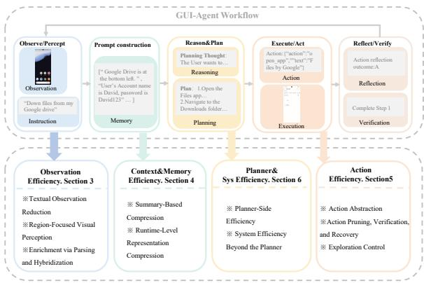
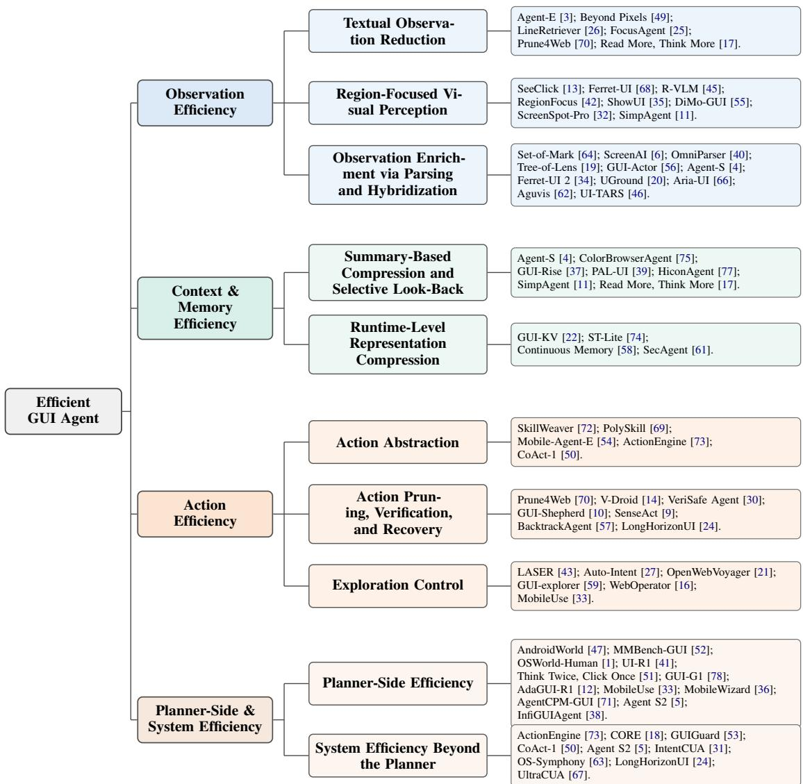

# Efficient GUI Agents: A Systems Survey of Observation, Memory, Action, and Runtime Optimization

Bizhe Bai1,2,†, Jiakang Yuan1,†, Hongming Wu1, Xinyue Wang1, Jie Ren1, Siyao Chen1, Yuchen Ya1, Fan Bai3, Pai Peng3, Huafeng Qin4, Tao Chen1,2

1College of Future Information Technology, Fudan University, Shanghai, China 2Shanghai Innovation Institute, Shanghai, China 3Independent Researcher 4Chongqing Technology and Business University

## Abstract

GUI agents increasingly operate across websites, mobile apps, and desktop environments, yet the field still reports progress primarily through task success. We argue that practical deployment depends equally on efficiency: how much context, computation, action budget, and runtime overhead an agent consumes while succeeding. This survey studies efficient GUI agents through an end-to-end systems lens that preserves the current technical axes of observation efficiency, context and memory efficiency, action efficiency, and planner-side/system efficiency. For each subsection, we expand the seed literature through targeted search plus backward and forward citation chaining, then synthesize the dominant mechanisms, reported efficiency signals, and new overheads they introduce. Across the literature, recent progress converges on a small set of recurring ideas: selective reading instead of full-context ingestion, global-to-local visual allocation, recoverable memory rather than raw history replay, verification-aware control, and hybrid runtimes that can switch between GUI and non-GUI execution. We conclude by identifying the main open problems, including honest accounting of verifier cost, cross-benchmark comparability, and co-design of observation, memory, and execution layers under real latency and privacy constraints.

## 1 Introduction

Large language models (LLMs) and visionlanguage models (VLMs) have moved GUI automation toward open-ended computer use: modern agents can interpret natural-language instructions, inspect live graphical interfaces, and carry out multi-step tasks across websites, mobile applications, and desktop operating systems (Yang et al., 2026b; Sager et al., 2025; Nguyen et al., 2024). This progress is reflected in interactive benchmarks such as Mind2Web, WebArena, VisualWebArena, BrowserGym, AndroidWorld, OS-World, and Windows Agent Arena, which evaluate agents on web navigation, visually grounded web interaction, mobile-app control, and openended operating-system tasks (Deng et al., 2023; Zhou et al., 2023; Koh et al., 2024; Le Sellier De Chezelles et al., 2024; Rawles et al., 2024; Xie et al., 2024; Bonatti et al., 2024). Collectively, these benchmarks show that recent GUI agents are becoming capable of increasingly realistic computer-use tasks, from navigating complex websites and operating mobile apps to completing multi-step workflows in desktop environments.

At the same time, these capabilities often come with substantial interaction and runtime costs. A GUI agent may eventually complete a task, but only after many observation–reasoning–action cycles, repeated model calls, redundant interface operations, or long waits between steps. OSWorld-Human, for example, shows that leading computeruse agents on OSWorld still take substantially more steps than human-derived trajectories and that planning, judging, and reflection dominate end-to-end latency (Abhyankar et al., 2025). This matters in practice because GUI agents interact with the same visible interfaces that users depend on: an agent that occupies the screen for too long, performs unnecessary actions, or requires users to wait through slow intermediate steps can be difficult to deploy even when its final answer is correct. Recent efficiency-aware studies have therefore begun to profile step counts, visual-token and cache costs, planning latency, action abstraction, and end-to-end runtime overhead in GUI-agent execution (Huang et al., 2025; Zhong et al., 2026; Abhyankar et al., 2026). These findings expose a limitation of success-only evaluation: an agent that eventually completes a task may still be too slow, too costly, too context-heavy, or too interactioninefficient for practical deployment.

Following recent surveys on efficient agents, computer-use agents, and GUI agents (Yang et al., 2026b; Sager et al., 2025; Nguyen et al., 2024), we distinguish among three related notions:

In this survey, we use agent in the above closedloop sense. A GUI agent is therefore not simply an LLM prompted with screenshots: it is a computeruse agent whose observations and actions are tied to screenshots, DOM or HTML structures, accessibility trees, focused elements, window metadata, and interface-level operations such as clicking, typing, scrolling, dragging, invoking shortcuts, or switching applications (Deng et al., 2023; Zhou et al., 2023; Rawles et al., 2024; Xie et al., 2024; Nguyen et al., 2024; Sager et al., 2025). Unlike text-only tool agents, GUI agents must solve visual grounding, partial observability, long-horizon state tracking, and execution under noisy or incomplete interface representations (Koh et al., 2024; Xie et al., 2024; Nguyen et al., 2024; Sager et al., 2025). Why is efficiency particularly critical for GUI agents? GUI interaction is intrinsically multimodal and observation-intensive. On the web, agents may need to parse long DOM or accessibility trees whose redundant structure inflates context length and reasoning cost (Abuelsaad et al., 2024; Schiepanski and Piël, 2025; Kerboua et al., 2025a; Zhang et al., 2025a). In screenshot-centric settings, the agent must interpret visually dense screens, small targets, and weakly structured ac cessibility metadata, which makes grounding both computationally expensive and error-prone (Cheng et al., 2024; You et al., 2024; Gou et al., 2024; Xie et al., 2024; Bonatti et al., 2024). More broadly, literature on efficient multimodal-LLM indicates that multimodal capability is often constrained by training cost, inference latency, memory pressure, and repeated visual computation (Jin et al., 2024). These issues become sharper in GUI environments because perception, reasoning, and action are interleaved at every step rather than amortized over a single query. GUI tasks are also long-horizon and error-sensitive: agents must recover from failed actions, interface changes, and lengthy trajectories, and human profiling already shows large step and latency gaps in realistic computer-use tasks (Agashe et al., 2024; Abhyankar et al., 2025; Kang et al., 2026; Rawles et al., 2024). Efficiency also shapes deployability and privacy, since practical systems may need to minimize exposed UI content, cloud traffic, and runtime overhead (Jin et al., 2024; Fan et al., 2025; Wang et al., 2026).

This survey makes two contributions. First, we organize the literature with an efficiency-centered taxonomy spanning observation, context and memory, action, and planner-side/system optimization. Second, we synthesize the main cross-layer tradeoffs and open challenges, including cases where apparent savings are offset by new parser, verifier, retriever, or orchestration costs.

## 2 Preliminaries

This section fixes the terminology and the system view used in the rest of the survey. The goal is not to formalize every implementation detail, but to provide a compact description of what a GUI agent is, how it works, and where efficiency enters the loop.

## 2.1 From Agents to GUI Agents

From the perspective of this survey, GUI agents are a specific class of agentic systems: they receive a user goal, observe a graphical interface, reason about the next step, and execute an interface-level action (Yang et al., 2026b; Sager et al., 2025). A compact way to write this loop is

$$
a _ { t } \sim \pi ( g , o _ { t } , m _ { t } ) ,\tag{1}
$$

where g is the user goal, $O t$ is the current GUI observation, $m _ { t }$ is the retained context or memory, and $a _ { t }$ is the next action. We use this formulation only to fix notation. In practice, $o _ { t }$ may include screenshots, DOM or HTML, accessibility trees, or related interface metadata, while $a _ { t }$ may include clicking, typing, scrolling, dragging, hotkeys, or app switching (Deng et al., 2023; Zhou et al., 2023; Rawles et al., 2024; Xie et al., 2024). A more detailed discussion of GUI-agent is stated in Appendix A

  
Figure 1: A GUI-agent system can be viewed as a loop of observation/perception, context and memory, planning/reasoning, grounding/action execution, and verification/feedback. The four taxonomy axes of this survey are shown explicitly on the corresponding stages: Observation Efficiency, Context and Memory Efficiency, Action Efficiency, and Planner-Side and System Efficiency.

## 2.2 How GUI Agents implement and What Should Be Efficient

Although implementations differ, most GUI agents follow the same functional pipeline. They first construct an actionable representation of the current interface from screenshots, DOM or HTML, accessibility trees, or hybrid parsing outputs (Deng et al., 2023; Zhou et al., 2023; Cheng et al., 2024; Gou et al., 2024). They then retain task-relevant context through short-horizon history or explicit memory structures, reason about the next subgoal or action, ground that decision to an executable element or coordinate, execute the action, and verify whether the intended effect occurred (Agashe et al., 2024; Xie et al., 2024; Lee et al., 2025; Chen et al., 2025a; Kang et al., 2026). Some systems collapse these stages into a single multimodal model, while others expose them as separate modules; the workflow remains the same.

This workflow also clarifies what this survey means by efficiency. Observation efficiency concerns how the current interface is represented without overwhelming the model with redundant text or visual tokens (Abuelsaad et al., 2024; Schiepanski and Piël, 2025; Lin et al., 2025a). Context and memory efficiency concerns how historical information is compressed, retained, or retrieved across steps (Liu et al., 2025a,b). Action efficiency concerns how economically the agent reaches the goal through abstraction, pruning, verification, and recovery (Zhang et al., 2025a; Lee et al., 2025; Kang et al., 2026). Planner-side and system efficiency concerns reasoning depth, orchestration overhead, backend routing, and end-to-end runtime beyond the next-action predictor itself (Yang et al., 2026b; Fan et al., 2025; Wang et al., 2026).

## 2.3 Efficiency Metrics for GUI Agents

Objective evaluation should separate effectiveness from efficiency. Effectiveness metrics measure task quality; efficiency metrics measure the resources spent to obtain that quality. We use the following vocabulary:

1. Latency metrics: TTFT is time from request dispatch to the first generated token; TPOT is average time per generated token after the first token; inference latency is total model-call time; per-step latency is one observe–plan– act–verify cycle; end-to-end latency is time from task start to success or failure.

2. Observation metrics: perception calls count screenshot, crop, OCR, VLM, DOM, HTML, or AxTree parsing invocations; DOM/HTML/AxTree length measures serialized interface size; image crops count localized visual inputs.

3. Context and memory metrics: history length, retrieved memory size, KV-cache size, and memory footprint measure retained context, retrieved state, and serving memory cost.

## 2.4 Organization of This Survey

The remainder of this survey is organized as follows. Section 3 reviews Observation Efficiency. Section 4 reviews Context and Memory Efficiency. Section 5 reviews Action Efficiency. Section 6 discusses Planner-Side and System Efficiency. Section 7 outlines Open Challenges and Future Directions. For readability, the tree-structured taxonomy is collected in Figure 2, while the section-wise paper summary tables are collected in the Appendix D.

## 3 Observation Efficiency

Observation efficiency concerns how a GUI agent acquires a decision-sufficient representation of the current interface while minimizing redundancy, grounding ambiguity, and downstream reasoning cost. In GUI environments, inefficiency may arise from overly long textual interface representations, visually cluttered screenshots, or weakly structured multimodal observations.

  
Figure 2: Survey taxonomy of this review-paper layout rooted at Efficient GUI Agent. The left column gives the four major efficiency topics, the middle column preserves the existing subsection taxonomy, and the right column lists the papers integrated under each subtopic.

## 3.1 Textual Observation Reduction

For agents operating on the Document Object Model (DOM) or the accessibility tree (AxTree), the primary inefficiency arises from an overabundance of textual interface structure. Real web pages often expose large interface trees containing decorative nodes, repeated text spans, layout artifacts, and task-irrelevant branches, which substantially increase computational cost without improving action prediction (Abuelsaad et al., 2024). Agent-E made this issue explicit in practical web-agent design by advocating flexible DOM distillation and denoising as part of a hierarchical browser-agent architecture, where raw DOM inputs can reach up to 800k tokens and typical tasks require 150– 220 seconds and about 25 LLM calls (Abuelsaad et al., 2024). Beyond Pixels studies the issue directly through DOM downsampling, showing that aggressively compressed DOM snapshots can remain around the 103-token order while preserving useful hierarchical signals for downstream decision making (Schiepanski and Piël, 2025). A more selective direction formulates reduction as retrieval rather than uniform truncation. LineRetriever argues that the most useful lines are those that support future navigation decisions rather than those that are merely semantically similar to the goal text, reporting observation reductions of 61%, 72%, and 73% while retrieving up to 10 chunks of 100 tokens (Kerboua et al., 2025b). FocusAgent selectively retrieves task-relevant AxTree lines at each step, achieving more than 50% average Ax-Tree reduction, often more than 80%, while capping context at 2k tokens (Kerboua et al., 2025a). Prune4Web pushes this line further by moving pruning from inference-time reading into explicit executable filtering programs, with examples where DOM trees of 10k–100k tokens and more than 500 candidate elements are reduced to fewer than 20 actionable candidates, thereby reducing both observation length and grounding search complexity (Zhang et al., 2025a).

## 3.2 Region-Focused Visual Perception

When the primary observation is a screenshot, inefficiency is mainly an allocation problem: GUI images contain small actionable targets, repeated widgets, and irrelevant background regions. SeeClick established the feasibility of screenshot-only GUI agents while exposing visual grounding as a major bottleneck, although it does not report directly comparable token, latency, memory, or step savings (Cheng et al., 2024). Ferret-UI and R-VLM address this bottleneck by reallocating visual resolution through sub-image partitioning, zoomed region proposals, and region-aware grounding objectives; Ferret-UI splits each screen into two subimages for any-resolution processing, while R-VLM reports about 5.6 seconds per sample and up to 2× inference-latency cost, showing that region proposals may shift cost into extra inference (You et al., 2024; Park et al., 2025). RegionFocus and DiMo-GUI make this focusing process adaptive at inference time, progressively zooming into taskrelevant or ambiguous regions instead of encoding the full screen uniformly; this improves visual allocation but can introduce new overhead, with RegionFocus reporting 66.8% average trajectory overhead and a 19.74% step-count increase, and DiMo-GUI using up to seven zoom iterations (Luo et al., 2025; Wu et al., 2025a). ShowUI applies the same principle at the token level, selecting UI-relevant visual tokens to remove 33% redundant visual tokens and obtain a 1.4× training speedup (Lin et al., 2025a). ScreenSpot-Pro and SimpAgent further show why such selective perception matters: professional high-resolution GUI screens often exceed 3k × 2k resolution, while SimpAgent compresses history images into 64 tokens, uses 10–20-token action outputs, and reports a 27% FLOP reduction in the LLM branch (Li et al., 2025a; Chen et al., 2025b).

## 3.3 Observation Enrichment via Parsing and Hybridization

Observation efficiency is not only input reduction; it also depends on whether the observation is im mediately actionable. Screenshots preserve rendered context but lack structure, while DOM or AxTree representations are compact yet often incomplete, noisy, or misaligned with the rendered interface. Set-of-Mark and ScreenAI address this gap by adding lightweight referential or textual annotations to screen elements; ScreenAI also illustrates the scale of screen-understanding backbones, reporting 670M, 2B, and 5B model variants and input resolution up to $8 1 2 ^ { 2 }$ (Yang et al., 2023; Baechler et al., 2024). OmniParser and Tree-of-Lens go further by converting screenshots or pointed regions into semi-structured region, function, and layout representations that expose content and spatial relations for downstream reasoning; OmniParser adds two parser models and can restrict downstream reasoning to the top-50 relevant elements (Lu et al., 2024; Fan et al., 2024). GUI-Actor complements this parser-style enrichment with coordinate-free action regions and a grounding verifier, adding about 20M parameters for a 2B model and 100M parameters for a 7B model so that action candidates can be generated in one forward pass while reducing brittle coordinate decoding (Wu et al., 2025b). Hybrid systems such as Agent-S and Ferret-UI 2 combine rendered visual context with accessibility or cross-platform structural signals, whereas UGround, Aria-UI, Aguvis, and UI-TARS show that strong screenshot-first pipelines can also support grounding, planning, and action prediction without relying on full DOM or AxTree input: UGround uses about two-thirds of the visual tokens required by a fixed 1344 × 1344 setting, Aguvis reduces text-agent inputs from roughly 4k–6k tokens per step to 1,196 tokens for a 70% input-token reduction (Agashe et al., 2024; Li et al., 2024; Gou et al., 2024; Yang et al., 2025a; Xu et al., 2024; Qin et al., 2025).

## 4 Context and Memory Efficiency

Context and memory efficiency concerns how agents preserve, access, and update historical information over long interaction horizons without allowing context growth to dominate runtime and memory consumption.

## 4.1 Summary-Based Compression and Selective Look-Back

As GUI trajectories grow longer, replaying past screenshots, actions, and reasoning traces becomes both costly and noisy. Agent-S, ColorBrowserAgent, and GUI-Rise address this problem by replacing raw trajectory replay with compact taskprogress memories, progressive summaries, or progress-aware summaries trained to support later action prediction; ColorBrowserAgent, for example, caps the interaction horizon at 30 steps, highlighting the need to prevent history growth from becoming unbounded (Agashe et al., 2024; Zhou et al., 2026b; Liu et al., 2025a). More recent systems make this compression selective rather than purely lossy. PAL-UI combines dual-level summarization with active look-back, while HiconAgent and SimpAgent reduce redundant history through dynamic context sampling, anchor-guided compression, or consistency-guided pruning; HiconAgent reports 25.21T FLOPs for compressed history compared with 35.75T for an uncompressed 3B setting and 62.31T for a 7B setting (Liu et al., 2025b; Zhou et al., 2025a; Chen et al., 2025b). Read More, Think More (Enomoto et al., 2026) showing that diff-based history can be more token-efficient than replaying full prior observations, especially when WorkArena HTML pages can reach 40k–500k tokens under 4-step or 9-step look-back settings.

## 4.2 Runtime-Level Representation Compression

A second family of methods addresses the memory bottleneck directly at the representation and serving level. These methods optimize how the preserved information is represented and reused during inference. GUI-KV exploits the spatial and temporal redundancy of GUI trajectories, tailoring compression policies to GUI-specific attention patterns; it reports 38.9% fewer MFLOPs per decoded token at five screenshots, uses 5–20% cache budgets, and notes that five screenshots can exceed 80GB of GPU memory (Huang et al., 2025). ST-Lite similarly targets the cache bottleneck with a training-free KV-compression strategy designed for long-horizon GUI workloads, operating at 10– 20% cache budgets and reporting a 2.45× decoding speedup and 1.40× end-to-end speedup, although prefill remains close to 1.0×, indicating that the savings are concentrated mainly on the decode side (Zhou et al., 2026a). These methods are especially important because they improve scalability even when the high-level memory policy remains unchanged.

Other work reduces context cost by replacing symbolic histories with denser internal representations. Auto-scaling Continuous Memory for GUI Agent replaces long textual summaries with fixedlength continuous memory representations that preserve fine-grained visual information, compressing each trajectory into eight embeddings even when raw trajectories exceed 15k tokens, with a reported data-collection cost of about \$4k and tuning of 1.2% of parameters (Wu et al., 2025d). SecAgent takes a lighter-weight route by distilling prior screenshots and actions into concise semantic context for efficient mobile control (Xie et al., 2026).

## 5 Action Efficiency

Even when model inference is efficient, GUI agents can remain impractical because they waste interaction steps. Action efficiency studies how to complete tasks with fewer actions, fewer irreversible mistakes, and less unproductive exploration.

## 5.1 Action Abstraction

Action abstraction reduces step count by lifting repeated primitive operations into reusable skills, routines, or programs. In the web setting, SkillWeaver discovers reusable website procedures and distills them into lightweight callable APIs (Zheng et al., 2025). PolySkill sharpens that idea from a transfer perspective by separating a skill’s abstract goal from its site-specific implementation, with learned functions typically covering 2–5 GUI steps and allowing web agents to reuse skills across seen and unseen websites with fewer redundant exploratory actions (Yu et al., 2026). Mobile-Agent-E adopts a reusable Shortcuts with explicit preconditions, turning recurrent subtasks into more efficient and more robust routines (Wang et al., 2025b). These methods share a stable intuition: if a control pattern recurs, the agent should not keep paying the full planning cost every time it appears.

At a more programmatic extreme, ActionEngine replaces repeated reactive planning with statemachine memory and executable programs, showing that frequent GUI interaction patterns can be compiled into reusable control structures; this compilation reduces cost from \$0.71 to \$0.06, latency from 237.5 to 118.3 seconds, input tokens from 62.3k to 8.1k, and model calls from 10.2 to

1.8 (Zhong et al., 2026). CoAct-1 expands abstraction beyond pure GUI actions by allowing coding to function as an execution modality, letting the system dynamically delegate a subtask either to a GUI operator or to a programmer agent that writes and executes code; this routing reduces average steps to 10.15, compared with 15.22 for GTA-1 and 14.90 for UI-TARS (Song et al., 2026). This matters for action efficiency because some subtasks, especially OS-level file manipulation or data processing, are inefficient when expressed as long GUI-only trajectories.

## 5.2 Action Pruning, Verification, and Recovery

A second route to action efficiency is to reduce or validate candidate actions before expensive reasoning or irreversible execution. Prune4Web reduces both observation size and downstream action search by pruning DOM candidates early, with examples where more than 500 DOM elements shrink to fewer than 20 candidates (Zhang et al., 2025a). V-Droid, ALTP and VeriSafe Agent score or verify candidate actions before execution to improve deployment efficiency and intent alignment: V-Droid reports 2.6k–8.9k input tokens, 0.7 seconds per decision, and 4.3 seconds per step compared with typical mobile agents above 20 seconds per step, while VeriSafe Agent shows recovery examples requiring 1–3 actions and notes that tasks above 10 steps can exceed \$1 (Dai et al., 2025; Lee et al., 2025; Bai et al., 2025). GUI-Shepherd learns process-level rewards that can later be reused as a verifier signal during inference, although verifier-call and latency metrics are not yet reported separately (Chen et al., 2025a). SenseAct structures actions through typed commitments and post-condition checks, reducing UI exposure by 65.51% and reducing the need to repeatedly consult a large VLM for every low-level execution decision (Cai et al., 2026).

Once actions are executed in long-horizon settings, recovery becomes equally important. BacktrackAgent explicitly introduces backtracking, together with verifier, judger, and reflector modules, to mitigate cascading failures after early mistakes (Wu et al., 2025c). LongHorizonUI combines reflective decision making with rollback-oriented execution over average trajectories of 24.6 steps and maximum trajectories of 37 steps (Kang et al., 2026). The shared lesson is that action efficiency is not only about choosing fewer actions. It is also about failing in ways that are detectable, reversible,

and cheap to correct.

## 5.3 Exploration Control

A third source of inefficiency is unstructured exploration in unfamiliar interfaces. LASER models web interaction as state-space exploration with explicit backtracking, making recovery from off-trajectory decisions more systematic than in forward-only prompting schemes (Ma et al., 2023). Auto-Intent distills compact intents from demonstrations and uses them to guide self-exploration, so that search is constrained by higher-level latent goals rather than by unrestricted trial and error (Kim et al., 2024). OpenWebVoyager propose an exploration– feedback–optimization loop, treating exploration as a continual self-improvement process rather than as a one-off phase (He et al., 2024). GUI-explorer further enriches this line by autonomously mining transition-aware knowledge and function-aware trajectories (Xie et al., 2025). WebOperator combines pre-execution filtering, best-first search, and safe backtracking so that the agent does not pay the full price of blind rollout in complex web tasks (Dihan et al., 2025).MobileUse propose a system where proactive exploration is invoked to handle cold-start mobile environments rather than as an always-on behavior (Li et al., 2025b). Across these works, the shared lesson is that exploration becomes action-efficient only when it is guided by reusable structure, predicted intent, or learned transition logic.

## 6 Planner-Side and System Efficiency

Planner-side efficiency concerns the computational burden inside the decision loop, while system efficiency concerns the broader runtime around the planner, including memory reuse, privacy-aware routing, and orchestration across heterogeneous components.

## 6.1 Planner-Side Efficiency

Recent benchmark work makes clear that efficiency is not reducible to final task success. MMBench-GUI introduce an explicitly efficiency-aware evaluation perspective across multiple platforms, using a 50-step budget and reporting redundant-step cost values of 7–8, privacy noise of 40%, and specialist cost of 16% (Wang et al., 2025a). OSWorld-Human sharpens the diagnosis further by showing that planning and reflection dominate end-to-end latency in computer-use agents, with agents requiring $2 . 7 { \times } { - } 4 . 3 { \times }$ more steps than human-derived trajectories and reflection accounting for 76%–96% of task latency (Abhyankar et al., 2025). These benchmark-driven analyses are important because they motivate planner-side efficiency as a first-class systems objective rather than an afterthought.

Methodologically, UI-R1 shows that rule-based reinforcement learning can improve GUI action prediction efficiently even in relatively compact models, using only 136 training samples and about 8 hours on 8 RTX 4090 GPUs, while also exposing OOM risk under high-pixel settings (Lu et al., 2025). Think Twice, Click Once argues that grounding and decision making should not use uniform reasoning depth; instead, fast and slow modes should be deployed selectively according to task difficulty, even though invoking slow thinking raises processing time from 2.6 to 5.4 seconds and its data include 300k examples with 150k slow samples (Tang et al., 2025). GUI-G1 analyzes R1-style GUI grounding pipelines and finds that longer chains of thought can hurt rather than help. AdaGUI-R1 reports a similar lesson from adaptive reasoning scheduling, reducing unnecessary reasoning tokens by 40% while adding 23.5% FLOPs under its harder-example schedule, suggesting that selective thinking is likely to remain central in mobile and cross-app control (Chen et al., 2025c).

Other methods factorize planning rather than merely shortening it. MobileUse uses hierarchical reflection invoked on demand rather than at every step, reducing reflection overhead to 10% after exploration that can cost up to 100 steps per app at 19.5 seconds per step (Li et al., 2025b). MobileWizard combines structured reasoning with progressive reinforcement learning to achieve strong performance from modest data budgets, using 24.5k public trajectories plus 300 remedial trajectories and fewer than 50k trajectories overall (Lin et al., 2025b). AgentCPM-GUI emphasizes efficient deployment through grounding-aware training and a compact action space, trained on 470k atomic steps with about 8.5 steps per trajectory, while retaining the last four actions/images and using a max\_new\_tokens setting of 2048 (Zhang et al., 2025b). Agent S2 reframes planner efficiency compositionally, delegating different cognitive roles across generalist and specialist modules to avoid overloading a single monolithic planner with every subproblem (Agashe et al., 2025). InfiGUIAgent adds another perspective by showing that a compact generalist model can integrate native reasoning and reflection without fully externalizing every planner role into a separate subsystem (Liu et al., 2026).

## 6.2 System Efficiency Beyond the Planner

System efficiency depends on the runtime around the planner, not only on the planner itself. ActionEngine amortizes repeated online reasoning through state-machine memory and program synthesis, while CoAct-1 routes subtasks between GUI interaction and code execution when different backends offer lower cost (Zhong et al., 2026; Song et al., 2026). CORE and GUIGuard make deployment topology part of the efficiency problem by splitting work across local/cloud models and adding explicit privacy-recognition or privacyprotection stages (Fan et al., 2025; Wang et al., 2026). IntentCUA reduces redundant replanning through intent-level abstractions and shared plan memory across collaborative desktop workflows (Lee et al., 2026). OS-Symphony and LongHorizonUI extend this systems view to long-horizon robustness, combining reflection, memory, tutorial retrieval, element-indexed perception, or rollbackbased execution to keep trajectories recoverable in unseen or sustained tasks (Yang et al., 2026a; Kang et al., 2026). The central lesson is that efficient GUI agency requires joint accounting of observation design, memory placement, execution routing, verification, and orchestration cost across the full runtime.

## 7 Open Challenges and Future Directions

Several open problems follow from this systems view. First, the field still lacks honest efficiency accounting: many papers report local savings in tokens, actions, or module latency, but benchmarks often stop at success rate or aggregate completion, making cross-paper comparison difficult. OSWorld-Human and MMBench-GUI move in the right direction by profiling efficiency more directly, yet verifier calls, parser overhead, and multi-agent orchestration still lack a shared pricing framework (Abhyankar et al., 2025; Wang et al., 2025a). The second challenge is that there are fewer GUI-agent benchmarks. Future benchmarks should report peak GPU memory, prefill and decode latency, MFLOPs per decoded token, GPU-hours for training or search, and success-normalized GPU cost, so that the community can evaluate whether an agent is deployable under realistic serving constraints rather than merely efficient in tokens or steps.

## References

Reyna Abhyankar, Qi Qi, and Yiying Zhang. 2025. Osworld-human: Benchmarking the efficiency of computer-use agents. arXiv preprint arXiv:2506.16042.

Reyna Abhyankar, Qi Qi, and Yiying Zhang. 2026. Osworld-human: Benchmarking the efficiency of computer-use agents. Preprint, arXiv:2506.16042.

Tamer Abuelsaad, Deepak Akkil, Prasenjit Dey, Ashish Jagmohan, Aditya Vempaty, and Ravi Kokku. 2024. Agent-e: From autonomous web navigation to foundational design principles in agentic systems. arXiv preprint arXiv:2407.13032.

Saaket Agashe, Jiuzhou Han, Shuyu Gan, Jiachen Yang, Ang Li, and Xin Eric Wang. 2024. Agent s: An open agentic framework that uses computers like a human. arXiv preprint arXiv:2410.08164.

Saaket Agashe, Kyle Wong, Vincent Tu, Jiachen Yang, Ang Li, and Xin Eric Wang. 2025. Agent s2: A compositional generalist-specialist framework for computer use agents. arXiv preprint arXiv:2504.00906.

Gilles Baechler, Srinivas Sunkara, Maria Wang, Fedir Zubach, Hassan Mansoor, Vincent Etter, Victor Carbune, Jason Lin, Jindong Chen, and Abhanshu˘ Sharma. 2024. Screenai: A vision-language model for ui and infographics understanding. arXiv preprint arXiv:2402.04615.

Bizhe Bai, Jianjian Cao, Yadan Luo, and Tao Chen. 2025. Local information matters: Inference acceleration for grounded conversation generation models through adaptive local-aware token pruning. Preprint, arXiv:2503.23959.

Rogerio Bonatti, Dan Zhao, Francesco Bonacci, Dillon Dupont, Sara Abdali, Yinheng Li, Yadong Lu, Justin Wagle, Kazuhito Koishida, Arthur Bucker, Lawrence Jang, and Zack Hui. 2024. Windows Agent Arena: Evaluating multi-modal os agents at scale. arXiv preprint arXiv:2409.08264.

Hongtian Cai, Tianyi Ma, Jie-Jing Shao, Tianyi Tang, Ivor Tsang, Yueming Lyu, and Haiyan Yin. 2026. Senseact: Structuring gui actions for reliable planning and verification. OpenReview, ICLR 2026 AI-WILD workshop.

Cong Chen, Kaixiang Ji, Hao Zhong, Muzhi Zhu, Anzhou Li, Guo Gan, Ziyuan Huang, Cheng Zou, Jiajia Liu, Jingdong Chen, Hao Chen, and Chunhua Shen. 2025a. Gui-shepherd: Reliable process reward and verification for long-sequence gui tasks. Open-Review, submitted to ICLR 2026.

Gongwei Chen, Xurui Zhou, Rui Shao, Yibo Lyu, Kaiwen Zhou, Shuai Wang, Wentao Li, Yinchuan Li, Zhongang Qi, and Liqiang Nie. 2025b. Less is more: Empowering gui agent with context-aware simplification. In Proceedings ofthe IEEE/CVF International Conference on Computer Vision, pages 5901–5911.

Jiafu Chen, Rui Lv, Hongyi Jing, Ziqiang Dang, Shuo Fang, Chenguang Ma, Lei Zhao, and Jiajie Teng. 2025c. Difficulty-aware reasoning for mobile gui automation via reinforcement fine-tuning. OpenReview, submitted to ICLR 2026.

Kanzhi Cheng, Qiushi Sun, Yougang Chu, Fangzhi Xu, YanTao Li, Jianbing Zhang, and Zhiyong Wu. 2024. Seeclick: Harnessing gui grounding for advanced visual gui agents. In Proceedings ofthe 62nd Annual Meeting of the Association for Computational Linguistics (Volume 1: Long Papers), pages 9313–9332.

Gaole Dai, Shiqi Jiang, Ting Cao, Yuanchun Li, Yuqing Yang, Rui Tan, Mo Li, and Lili Qiu. 2025. Advancing mobile gui agents: A verifier-driven approach to practical deployment. arXiv preprint arXiv:2503.15937.

Xiang Deng, Yu Gu, Boyuan Zheng, Shijie Chen, Samuel Stevens, Boshi Wang, Huan Sun, and Yu Su. 2023. Mind2Web: Towards a generalist agent for the web. arXiv preprint arXiv:2306.06070.

Mahir Labib Dihan, Tanzima Hashem, Mohammed Eunus Ali, and Md Rizwan Parvez. 2025. Weboperator: Action-aware tree search for autonomous agents in web environment. OpenReview, submitted to ICLR 2026.

Masafumi Enomoto, Ryoma Obara, Haochen Zhang, and Masafumi Oyamada. 2026. Read more, think more: Revisiting observation reduction for web agents. arXiv preprint arXiv:2604.01535.

Gucongcong Fan, Chaoyue Niu, Chengfei Lyu, Fan Wu, and Guihai Chen. 2025. Core: Reducing ui exposure in mobile agents via collaboration between cloud and local llms. In Advances in Neural Information Processing Systems.

Yue Fan, Lei Ding, Ching-Chen Kuo, Shan Jiang, Yang Zhao, Xinze Guan, Jie Yang, Yi Zhang, and Xin Eric Wang. 2024. Read anywhere pointed: Layout-aware gui screen reading with tree-of-lens grounding. arXiv preprint arXiv:2406.19263.

Boyu Gou, Ruohan Wang, Boyuan Zheng, Yanan Xie, Cheng Chang, Yiheng Shu, Huan Sun, and Yu Su. 2024. Navigating the digital world as humans do: Universal visual grounding for gui agents. arXiv preprint arXiv:2410.05243.

Hongliang He, Wenlin Yao, Kaixin Ma, Wenhao Yu, Hongming Zhang, Tianqing Fang, Zhenzhong Lan, and Dong Yu. 2024. Openwebvoyager: Building multimodal web agents via iterative real-world exploration, feedback and optimization. arXiv preprint arXiv:2410.19609.

Kung-Hsiang Huang, Haoyi Qiu, Yutong Dai, Caiming Xiong, and Chien-Sheng Wu. 2025. Gui-kv: Efficient gui agents via kv cache with spatio-temporal awareness. arXiv preprint arXiv:2510.00536.

Yizhang Jin, Jian Li, Yexin Liu, Tianjun Gu, Kai Wu, Zhengkai Jiang, Muyang He, Bo Zhao, Xin Tan, Zhenye Gan, Yabiao Wang, Chengjie Wang, and Lizhuang Ma. 2024. Efficient multimodal large language models: A survey. arXiv preprint arXiv:2405.10739.

Bin Kang, Shaoguo Wen, Yifei Bi, Shunlong Wu, Xinbin Yuan, Rui Shao, Junle Wang, and Zhuotao Tian. 2026. Longhorizonui: A unified framework for robust long-horizon task automation of gui agent. In The Thirteenth International Conference on Learning Representations.

Imene Kerboua, Sahar Omidi Shayegan, Xing Han Lù, Léo Boisvert, Megh Thakkar, Massimo Caccia, Jérémy Espinas, Alexandre Aussem, Véronique Eglin, and Alexandre Lacoste. 2025a. Focusagent: Simple yet effective ways of trimming the large context of web agents. arXiv preprint arXiv:2510.03204.

Imene Kerboua, Sahar Omidi Shayegan, Megh Thakkar, Xing Han Lù, Massimo Caccia, Véronique Eglin, Alexandre Aussem, Jérémy Espinas, and Alexandre Lacoste. 2025b. Lineretriever: Planning-aware observation reduction for web agents. arXiv preprint arXiv:2507.00210.

Jaekyeom Kim, Dong-Ki Kim, Lajanugen Logeswaran, Sungryull Sohn, and Honglak Lee. 2024. Autointent: Automated intent discovery and selfexploration for large language model web agents. arXiv preprint arXiv:2410.22552.

Jing Yu Koh, Robert Lo, Lawrence Jang, Vikram Duvvur, Ming Chong Lim, Po-Yu Huang, Graham Neubig, Shuyan Zhou, Ruslan Salakhutdinov, and Daniel Fried. 2024. VisualWebArena: Evaluating multimodal agents on realistic visual web tasks. arXiv preprint arXiv:2401.13649.

Thibault Le Sellier De Chezelles, Maxime Gasse, Alexandre Drouin, Massimo Caccia, Léo Boisvert, Megh Thakkar, Tom Marty, Rim Assouel, Sahar Omidi Shayegan, Lawrence Keunho Jang, Xing Han Lù, Ori Yoran, Dehan Kong, Frank F. Xu, Siva Reddy, Quentin Cappart, Graham Neubig, Ruslan Salakhutdinov, Nicolas Chapados, and Alexandre Lacoste. 2024. The BrowserGym ecosystem for web agent research. arXiv preprint arXiv:2412.05467.

Jungjae Lee, Dongjae Lee, Chihun Choi, Youngmin Im, Jaeyoung Wi, Kihong Heo, Sangeun Oh, Sunjae Lee, and Insik Shin. 2025. Verisafe agent: Safeguarding mobile gui agent via logic-based action verification. arXiv preprint arXiv:2503.18492.

Seoyoung Lee, Seobin Yoon, Seongbeen Lee, Dayoung Park, Doyeon Kim, Yoojung Chun, and Joo Yong Sim. 2026. Intentcua: Learning intent-level representations for skill abstraction and multi-agent planning in computer-use agents. OpenReview, AAMAS 2026 full paper.

Kaixin Li, Ziyang Meng, Hongzhan Lin, Ziyang Luo, Yuchen Tian, Jing Ma, Zhiyong Huang, and Tat-Seng

Chua. 2025a. Screenspot-pro: Gui grounding for professional high-resolution computer use. arXiv preprint arXiv:2504.07981.

Ning Li, Xiangmou Qu, Jiamu Zhou, Jun Wang, Muning Wen, Kounianhua Du, Xingyu Lou, Qiuying Peng, Jun Wang, and Weinan Zhang. 2025b. Mobileuse: A hierarchical reflection-driven gui agent for autonomous mobile operation. OpenReview, NeurIPS 2025 poster.

Zhangheng Li, Keen You, Haotian Zhang, Di Feng, Harsh Agrawal, Xiujun Li, Mohana Prasad Sathya Moorthy, Jeff Nichols, Yinfei Yang, and Zhe Gan. 2024. Ferret-ui 2: Mastering universal user interface understanding across platforms. arXiv preprint arXiv:2410.18967.

Kevin Qinghong Lin, Linjie Li, Difei Gao, Zhengyuan Yang, Shiwei Wu, Zechen Bai, Weixian Lei, Lijuan Wang, and Mike Zheng Shou. 2025a. Showui: One vision-language-action model for gui visual agent. In Proceedings ofthe IEEE/CVF Conference on Computer Vision and Pattern Recognition, pages 19498– 19508.

Weifeng Lin, Yuxiang Chai, Han Xiao, Liuyang Bian, Guangyi Liu, Liang Liu, Shuai Ren, Penggang Shi, Yafei Wen, Xiaoxin Chen, Aojun Zhou, and Hongsheng Li. 2025b. Mobilewizard: A data-efficient gui agent with structured reasoning and progressive reinforcement learning. OpenReview.

Tao Liu, Chongyu Wang, Rongjie Li, Yingchen Yu, Xuming He, and Song Bai. 2025a. Gui-rise: Structured reasoning and history summarization for gui navigation. OpenReview, NeurIPS 2025 poster.

Yuhang Liu, Pengxiang Li, Zishu Wei, Congkai Xie, Xueyu Hu, Xinchen Xu, Shengyu Zhang, Xiaotian Han, Hongxia Yang, and Fei Wu. 2026. Infiguiagent: A multimodal generalist gui agent with native reasoning and reflection. In Proceedings of the 19th Conference of the European Chapter of the Associationfor Computational Linguistics (Volume 1: Long Papers), pages 1035–1051.

Zikang Liu, Junyi Li, Wayne Xin Zhao, Dawei Gao, Yaliang Li, and Ji-rong Wen. 2025b. Pal-ui: Planning with active look-back for vision-based gui agents. arXiv preprint arXiv:2510.00413.

Yadong Lu, Jianwei Yang, Yelong Shen, and Ahmed Awadallah. 2024. Omniparser for pure vision based gui agent. arXiv preprint arXiv:2408.00203.

Zhengxi Lu, Yuxiang Chai, Yaxuan Guo, Xi Yin, Liang Liu, Hao Wang, Han Xiao, Shuai Ren, Guanjing Xiong, and Hongsheng Li. 2025. Ui-r1: Enhancing efficient action prediction of gui agents by reinforcement learning. arXiv preprint arXiv:2503.21620.

Tiange Luo, Lajanugen Logeswaran, Justin Johnson, and Honglak Lee. 2025. Visual test-time scaling for gui agent grounding. arXiv preprint arXiv:2505.00684.

Kaixin Ma, Hongming Zhang, Hongwei Wang, Xiaoman Pan, and Dong Yu. 2023. Laser: Llm agent with state-space exploration for web navigation. arXiv preprint arXiv:2309.08172.

Dang Nguyen, Jian Chen, Yu Wang, Gang Wu, Namyong Park, Zhengmian Hu, Hanjia Lyu, Junda Wu, Ryan Aponte, Yu Xia, Xintong Li, Jing Shi, Hongjie Chen, Viet Dac Lai, Zhouhang Xie, Sungchul Kim, Ruiyi Zhang, Tong Yu, Mehrab Tanjim, and 11 others. 2024. GUI agents: A survey. arXiv preprint arXiv:2412.13501.

Joonhyung Park, Peng Tang, Sagnik Das, Srikar Appalaraju, Kunwar Yashraj Singh, R. Manmatha, and Shabnam Ghadar. 2025. R-vlm: Region-aware vision language model for precise gui grounding. In Findings ofthe Associationfor Computational Linguistics: ACL 2025, pages 9669–9685.

Yujia Qin, Yining Ye, Junjie Fang, Haoming Wang, Shihao Liang, Shizuo Tian, Junda Zhang, Jiahao Li, Yunxin Li, Shijue Huang, Wanjun Zhong, Kuanye Li, Jiale Yang, Yu Miao, Woyu Lin, Longxiang Liu, Xu Jiang, Qianli Ma, Jingyu Li, and 16 others. 2025. Ui-tars: Pioneering automated gui interaction with native agents. arXiv preprint arXiv:2501.12326.

Christopher Rawles, Sarah Clinckemaillie, Yifan Chang, Jonathan Waltz, Gabrielle Lau, Marybeth Fair, Alice Li, William Bishop, Wei Li, Folawiyo Campbell-Ajala, Daniel Toyama, Robert Berry, Divya Tyamagundlu, Timothy Lillicrap, and Oriana Riva. 2024. Androidworld: A dynamic benchmarking environment for autonomous agents. arXiv preprint arXiv:2405.14573.

Pascal J. Sager, Benjamin Meyer, Peng Yan, Rebekka von Wartburg-Kottler, Layan Etaiwi, Aref Enayati, Gabriel Nobel, Ahmed Abdulkadir, Benjamin F. Grewe, and Thilo Stadelmann. 2025. A comprehensive survey of agents for computer use: Foundations, challenges, and future directions. arXiv preprint arXiv:2501.16150.

Thassilo M. Schiepanski and Nicholas Piël. 2025. Beyond pixels: Exploring dom downsampling for llmbased web agents. arXiv preprint arXiv:2508.04412.

Linxin Song, Yutong Dai, Viraj Prabhu, Jieyu Zhang, Taiwei Shi, Li Li, Junnan Li, Silvio Savarese, Zeyuan Chen, Jieyu Zhao, Ran Xu, and Caiming Xiong. 2026. Coact-1: Computer-using multi-agent system with coding actions. OpenReview, ICLR 2026 poster.

Fei Tang, Yongliang Shen, Hang Zhang, Siqi Chen, Guiyang Hou, Wenqi Zhang, Wenqiao Zhang, Kaitao Song, Weiming Lu, and Yueting Zhuang. 2025. Think twice, click once: Enhancing gui grounding via fast and slow systems. arXiv preprint arXiv:2503.06470.

Xuehui Wang, Zhenyu Wu, JingJing Xie, Zichen Ding, Bowen Yang, Zehao Li, Zhaoyang Liu, Qingyun Li, Xuan Dong, Zhe Chen, Weiyun Wang, Xiangyu Zhao, Jixuan Chen, Haodong Duan, Tianbao Xie, Chenyu

Yang, Shiqian Su, Yue Yu, Yuan Huang, and 9 others. 2025a. Mmbench-gui: Hierarchical multi-platform evaluation framework for gui agents. arXiv preprint arXiv:2507.19478.

Yanxi Wang, Zhiling Zhang, Wenbo Zhou, Weiming Zhang, Jie Zhang, Qiannan Zhu, Yu Shi, Shuxin Zheng, and Jiyan He. 2026. Guiguard: Toward a general framework for privacy-preserving gui agents. arXiv preprint arXiv:2601.18842.

Zhenhailong Wang, Haiyang Xu, Junyang Wang, Xi Zhang, Ming Yan, Ji Zhang, Fei Huang, and Heng Ji. 2025b. Mobile-agent-e: Self-evolving mobile assistant for complex tasks. arXiv preprint arXiv:2501.11733.

Hang Wu, Hongkai Chen, Yujun Cai, Chang Liu, Qingwen Ye, Ming-Hsuan Yang, and Yiwei Wang. 2025a. Dimo-gui: Advancing test-time scaling in gui grounding via modality-aware visual reasoning. In Proceedings ofthe 2025 Conference on Empirical Methods in Natural Language Processing, pages 26246–26256.

Qianhui Wu, Kanzhi Cheng, Rui Yang, Chaoyun Zhang, Jianwei Yang, Huiqiang Jiang, Jian Mu, Baolin Peng, Bo Qiao, Reuben Tan, Si Qin, Lars Liden, Qingwei Lin, Huan Zhang, Tong Zhang, Jianbing Zhang, Dongmei Zhang, and Jianfeng Gao. 2025b. Gui-actor: Coordinate-free visual grounding for gui agents. NeurIPS 2025 poster.

Qinzhuo Wu, Pengzhi Gao, Wei Liu, and Jian Luan. 2025c. Backtrackagent: Enhancing gui agent with error detection and backtracking mechanism. In Proceedings ofthe 2025 Conference on Empirical Methods in Natural Language Processing, pages 4250– 4272.

Wenyi Wu, Kun Zhou, Ruoxin Yuan, Vivian Yu, Stephen Wang, Zhiting Hu, and Biwei Huang. 2025d. Autoscaling continuous memory for gui agent. arXiv preprint arXiv:2510.09038.

Bin Xie, Rui Shao, Gongwei Chen, Kaiwen Zhou, Yinchuan Li, Jie Liu, Min Zhang, and Liqiang Nie. 2025. Gui-explorer: Autonomous exploration and mining of transition-aware knowledge for gui agent. In Proceedings of the 63rd Annual Meeting of the Association for Computational Linguistics.

Tianbao Xie, Danyang Zhang, Jixuan Chen, Xiaochuan Li, Siheng Zhao, Ruisheng Cao, Toh Jing Hua, Zhoujun Cheng, Dongchan Shin, Fangyu Lei, Yitao Liu, Yiheng Xu, Shuyan Zhou, Silvio Savarese, Caiming Xiong, Victor Zhong, and Tao Yu. 2024. OSWorld: Benchmarking multimodal agents for open-ended tasks in real computer environments. arXiv preprint arXiv:2404.07972.

Yiping Xie, Song Chen, Jingxuan Xing, Wei Jiang, Zekun Zhu, Yingyao Wang, Pi Bu, Jun Song, Yuning Jiang, and Bo Zheng. 2026. Secagent: Efficient mobile gui agent with semantic context. arXiv preprint arXiv:2603.08533.

Yiheng Xu, Zekun Wang, Junli Wang, Dunjie Lu, Tianbao Xie, Amrita Saha, Doyen Sahoo, Tao Yu, and Caiming Xiong. 2024. Aguvis: Unified pure vision agents for autonomous gui interaction. arXiv preprint arXiv:2412.04454.

Bowen Yang, Kaiming Jin, Zhenyu Wu, Zhaoyang Liu, Qiushi Sun, Zehao Li, JingJing Xie, Zhoumianze Liu, Fangzhi Xu, Kanzhi Cheng, Qingyun Li, Yian Wang, Yu Qiao, Zun Wang, and Zichen Ding. 2026a. Os-symphony: A holistic framework for robust and generalist computer-using agent. arXiv preprint arXiv:2601.07779.

Jianwei Yang, Hao Zhang, Feng Li, Xueyan Zou, Chunyuan Li, and Jianfeng Gao. 2023. Set-of-mark prompting unleashes extraordinary visual grounding in gpt-4v. arXiv preprint arXiv:2310.11441.

Xiaofang Yang, Lijun Li, Heng Zhou, Tong Zhu, Xiaoye Qu, Yuchen Fan, Qianshan Wei, Rui Ye, Li Kang, Yiran Qin, Zhiqiang Kou, Daizong Liu, Qi Li, Ning Ding, Siheng Chen, and Jing Shao. 2026b. Toward efficient agents: Memory, tool learning, and planning. arXiv preprint arXiv:2601.14192.

Yuhao Yang, Yue Wang, Dongxu Li, Ziyang Luo, Bei Chen, Chao Huang, and Junnan Li. 2025a. Aria-ui: Visual grounding for gui instructions. In Findings of the Association for Computational Linguistics: ACL 2025, pages 22418–22433.

Yuhao Yang, Zhen Yang, Zi-Yi Dou, Anh Tuan Nguyen, Omar Attia, Andrew Szot, Keen You, Michael Feng, Ram Ramrakhya, Alexander T. Toshev, Chao Huang, Yinfei Yang, and Zhe Gan. 2025b. Ultracua: Scaling computer use agent through gui and programmatic control. OpenReview, ICLR 2026 desk rejected submission.

Keen You, Haotian Zhang, Eldon Schoop, Floris Weers, Amanda Swearngin, Jeffrey Nichols, Yinfei Yang, and Zhe Gan. 2024. Ferret-ui: Grounded mobile ui understanding with multimodal llms. arXiv preprint arXiv:2404.05719.

Simon Yu, Gang Li, Weiyan Shi, and Peng Qi. 2026. Polyskill: Learning generalizable skills through polymorphic abstraction for continual learning. OpenReview, ICLR 2026 poster.

Jiayuan Zhang, Kaiquan Chen, Zhihao Lu, Enshen Zhou, Qian Yu, and Jing Zhang. 2025a. Prune4web: Dom tree pruning programming for web agent. arXiv preprint arXiv:2511.21398.

Zhong Zhang, Yaxi Lu, Yikun Fu, Yupeng Huo, Shenzhi Yang, Yesai Wu, Han Si, Xin Cong, Haotian Chen, Yankai Lin, Jie Xie, Wei Zhou, Wang Xu, Yuanheng Zhang, Zhou Su, Zhongwu Zhai, Xiaoming Liu, Yudong Mei, Jianming Xu, and 6 others. 2025b. Agentcpm-gui: Building mobile-use agents with reinforcement fine-tuning. In Proceedings of the 2025 Conference on Empirical Methods in Natural Language Processing: System Demonstrations, pages 155–180.

Boyuan Zheng, Michael Y. Fatemi, Xiaolong Jin, Zora Zhiruo Wang, Apurva Gandhi, Yueqi Song, Yu Gu, Jayanth Srinivasa, Gaowen Liu, Graham Neubig, and Yu Su. 2025. Skillweaver: Web agents can self-improve by discovering and honing skills. arXiv preprint arXiv:2504.07079.

Hongbin Zhong, Fazle Faisal, Luis França, Tanakorn Leesatapornwongsa, Adriana Szekeres, Kexin Rong, and Suman Nath. 2026. Actionengine: From reactive to programmatic gui agents via state machine memory. arXiv preprint arXiv:2602.20502.

Bowen Zhou, Zhou Xu, Wanli Li, Jingyu Xiao, and Haoqian Wang. 2026a. Efficient long-horizon gui agents via training-free kv cache compression. arXiv preprint arXiv:2603.00188.

Jiamu Zhou, Jihong Wang, Weiming Zhang, Weiwen Liu, Zhuosheng Zhang, Xingyu Lou, Weinan Zhang, Huarong Deng, and Jun Wang. 2026b. Colorbrowseragent: Complex long-horizon browser agent with adaptive knowledge evolution. arXiv preprint arXiv:2601.07262.

Shuyan Zhou, Frank F. Xu, Hao Zhu, Xuhui Zhou, Robert Lo, Abishek Sridhar, Xianyi Cheng, Tianyue Ou, Yonatan Bisk, Daniel Fried, Uri Alon, and Graham Neubig. 2023. WebArena: A realistic web environment for building autonomous agents. arXiv preprint arXiv:2307.13854.

Xurui Zhou, Gongwei Chen, Yuquan Xie, Zaijing Li, Kaiwen Zhou, Shuai Wang, Shuo Yang, Zhuotao Tian, and Rui Shao. 2025a. Hiconagent: History context-aware policy optimization for gui agents. arXiv preprint arXiv:2512.01763.

Yuqi Zhou, Sunhao Dai, Shuai Wang, Kaiwen Zhou, Qinglin Jia, and Jun Xu. 2025b. Gui-g1: Understanding r1-zero-like training for visual grounding in gui agents. OpenReview, NeurIPS 2025 poster.

## A GUI-agent

A single next-action equation hides the fact that deployment cost accumulates over a full interaction. We therefore also view a GUI-agent episode as a system-level trajectory. Let $s _ { t }$ denote the latent environment state, $O t$ the GUI observation extracted from that state, $m _ { t }$ the retained context or memory, $a _ { t }$ the executed interface action, and $v _ { t }$ a verification or reflection signal after execution. A compact abstraction is

$$
o _ { t } = \Omega ( s _ { t } ) ,\tag{2}
$$

$$
m _ { t } = U _ { m } ( m _ { t - 1 } , o _ { t } , a _ { t - 1 } , v _ { t - 1 } ) ,\tag{3}
$$

$$
a _ { t } \sim \pi _ { \theta } ( g , o _ { t } , m _ { t } ) ,\tag{4}
$$

$$
s _ { t + 1 } \sim T ( s _ { t } , a _ { t } ) ,\tag{5}
$$

$$
v _ { t } = V ( g , s _ { t } , o _ { t } , a _ { t } , s _ { t + 1 } ) ,\tag{6}
$$

where $\Omega$ covers screenshot, DOM, HTML, AxTree, parser, or hybrid perception modules; $U _ { m }$ covers history summarization, retrieval, compression, or KV-cache reuse; π covers the planner, grounding model, or orchestrator; $\tau$ is the GUI environment transition; and V denotes explicit verifiers, self-reflection, post-condition checks, or implicit task-progress feedback. The full execution is

$$
\tau = ( s _ { 0 } , o _ { 0 } , m _ { 0 } , a _ { 0 } , v _ { 0 } , \ldots , s _ { T } , o _ { T } , m _ { T } ) ,\tag{7}
$$

with task outcome $S ( \tau ) \in \{ 0 , 1 \}$ or a graded completion score. Sections 3–6 can be read as four ways to reduce this trajectory cost: cheaper observations, cheaper memory and context updates, fewer or more recoverable actions, and lower planner/runtime overhead.

For ease of reading in the main text, we collect the tree-structured taxonomy overview and the sectionwise paper summary tables in this appendix.

## B Literature Expansion Protocol

We expanded the seed draft subsection by subsection rather than treating literature search as a single flat retrieval problem. For each existing subsection, we began with the papers already cited in the draft, then used targeted search over arXiv, ACL Anthology, and OpenReview together with backward and forward citation chaining to surface closely related work. We retained papers only when they directly addressed efficiency in the relevant subsection: observation length or actionability, memory size or retrieval cost, action count or recoverability, or planner/runtime overhead. We excluded generic GUI grounding papers, pure benchmark-generation papers, and unrelated long-horizon agent work unless they directly informed the subsection’s efficiency mechanism. Where a paper had both a preprint and a later venue version, we normalized it to a single canonical entry.

## C Added Works by Subsection

Table 1: Additional works integrated beyond the seed draft, grouped by the existing subsection taxonomy.
<table><tr><td>Subsection</td><td>Added or normalized works</td></tr><tr><td>Textual Observation Reduction</td><td>Searched adjacent pruning, retrieval, and adaptive formatting work; retained the seed pruning/retrieval cluster as the representative core because no equally</td></tr><tr><td>Region-Focused Visual Perception</td><td>central stable additions survived screening. Added R-VLM and DiMo-GUI to broaden the zoom, region-proposal, and modality-aware token-allocation line.</td></tr><tr><td>Observation Enrichment via Parsing and Hybridization</td><td>Added Read Anywhere Pointed / Tree-of-Lens and GUI-Actor; normalized Aria-UI to its ACL Findings 2025 version.</td></tr><tr><td>Summary-Based Compression and Selec- tive Look-Back</td><td>Added GUI-Rise and retained PAL-UI, HiconAgent, and SimpAgent as com- plementary evidence on selective retrieval and history compression.</td></tr><tr><td>Runtime-Level Representation Compres- sion</td><td>Retained the GUI-KV, ST-Lite, continuous-memory, and SecAgent cluster after screening for GUI-specific serving-level compression.</td></tr><tr><td>Action Abstraction Action Pruning, Verification, and Recov-</td><td>Added PolySkill and normalized CoAct-1 as a stable OpenReview publication signal for hybrid GUI-plus-code execution.</td></tr><tr><td>ery Exploration Control</td><td>Normalized BacktrackAgent to EMNLP 2025 and added GUI-Shepherd plus SenseAct as explicitly marked emerging evidence.</td></tr><tr><td></td><td>Added WebOperator as a clearly labeled prepublication signal on search-aware, backtracking-heavy web control.</td></tr><tr><td>Planner-Side Efficiency</td><td>Added GUI-G1, AdaGUI-R1, and InfiGUIAgent; normalized MobileUse and AgentCPM-GUI status.</td></tr><tr><td>System Efficiency Beyond the Planner</td><td>Added IntentCUA, normalized Agent S2 and CoAct-1, and kept UltraCUA only in the challenges section because its current status is unstable.</td></tr></table>

## D Taxonomy Figure and Section Summary Tables

For ease of reading in the main text, we collect the tree-structured taxonomy overview and the section-wise paper summary tables in this appendix. In Tables 2–5, NR means that the source paper does not report a comparable quantitative efficiency metric. Reported percentages, speedups, token counts, costs, and step counts are copied from the authors’ baseline comparisons and should be read as an evidence ledger rather than a direct meta-analysis.

Table 2: Observation-efficiency papers discussed in this survey, grouped by the existing subsection structure.
<table><tr><td>Paper</td><td>Venue</td><td>Platform+UI</td><td colspan="2">Core mechanism Reported efficiency signal</td><td>Unreported / shifted cost</td><td>Code</td></tr><tr><td colspan="7">Textual Observation Reduction Agent-E (Abuelsaad et al., arXiv'24</td></tr><tr><td>2024)</td><td></td><td></td><td>DOM filtering</td><td>150–220 s/task; about 25 LLM calls/task; raw DOM up to 800k tokens.</td><td>Filtered-token saving and DOM-filter latency are NR.</td><td>GitHub</td></tr><tr><td>Beyond Pixels (Schiepanski and Piël, 2025) LineRetriever (Kerboua et al., arXiv'25</td><td>arXiv'25</td><td>Web/DOM</td><td>DOM compression</td><td>Compressed DOM snapshots stay around the 10³ token order. Observation reduced by</td><td>DOM downsampling runtime is NR.</td><td></td></tr><tr><td>2025b)</td><td></td><td>Web/AxTree</td><td>line retrieval</td><td>61%/72%/73%; retrieves up to 10 chunks of 100 tokens.</td><td>Retriever latency and extra model cost are NR.</td><td></td></tr><tr><td>FocusAgent (Kerboua et al., 2025a)</td><td>arXiv'25</td><td>Web/AxTree</td><td>AxTree filtering</td><td>&gt;50% average reduction, often &gt;80%; Full wall-clock retrieval caps context at 2k tokens.</td><td>overhead is NR.</td><td></td></tr><tr><td>Prune4Web (Zhang et al., 2025a)</td><td>arXiv'25</td><td>Web/DOM</td><td>DOM/action pruning</td><td>DOMs: 10k-100k tokens; example shrinks &gt;500 elements to &lt;20.</td><td>Filter-program generation/runtime is NR.</td><td></td></tr><tr><td>Read More, Think More (Enomoto et al., 2026)</td><td>arXiv'26</td><td>Web/HTML+Ax adaptive view</td><td></td><td>WorkArena HTML pages: 40k–500k tokens; look-back settings: 4/9 steps.</td><td>Adaptive-view saving and latency are NR.</td><td></td></tr><tr><td colspan="7">Region-Focused Visual Perception SeeClick (Cheng et al., 2024) ACL’24</td></tr><tr><td></td><td></td><td>GUI/screen</td><td>GUI pretraining</td><td>NR; no reported token, latency, memory, or step saving.</td><td>Screenshot-only runtime cost isGitHub NR.</td><td></td></tr><tr><td>Ferret-UI (You et al., 2024)</td><td>arXiv'24</td><td>Mobile/screen</td><td>screen crops</td><td>Any-resolution processing splits each screen into 2 sub-images.</td><td>Crop encoding and inference overhead are NR.</td><td></td></tr><tr><td>R-VLM (Park et al., 2025)</td><td>ACL F.'25</td><td>GUI/screen</td><td></td><td>region proposals Reports about 5.6 s/sample and up to 2× inference-latency cost.</td><td>Region proposal shifts cost to extra inference.</td><td></td></tr><tr><td>RegionFocus (Luo et al., 2025)</td><td>arXiv'25</td><td>GUI/screen</td><td>zoom search</td><td>Average trajectory overhead 66.8%; step count increases by 19.74%.</td><td>Zoom-search latency is only partially reported.</td><td></td></tr><tr><td>ShowUI (Lin et al., 2025a)</td><td>CVPR'25</td><td>GUI/screen</td><td>token pruning</td><td>Removes 33% redundant visual tokens; End-to-end agent latency is reports 1.4× training speedup.</td><td>NR.</td><td>GitHub</td></tr><tr><td>DiMo-GUI (Wu et al., 2025a) EMNLP’25 ScreenSpot-Pro (Li et al.,</td><td></td><td>GUI/screen</td><td>adaptive zoom cascaded search</td><td>Uses up to 7 zoom iterations. Benchmark screens often exceed</td><td>Extra zoom-call latency is NR. - Benchmark only; runtime</td><td></td></tr><tr><td>2025a) SimpAgent (Chen et al.,</td><td>arXiv'25</td><td>GUI/high-res</td><td>GUI/screen+hist screen masking</td><td>3k × 2k resolution. History image: 64 tokens; action</td><td>metric is NR. Simplifier overhead and</td><td></td></tr><tr><td>2025b)</td><td>ICCV'25</td><td></td><td></td><td>output: 10–20 tokens; LLM branch: 27% FLOP reduction.</td><td>full-task latency are NR.</td><td></td></tr><tr><td colspan="7">Observation Enrichment via Parsing and Hybridization</td></tr><tr><td>Set-of-Mark (Yang et al., 2023)</td><td>arXiv'23</td><td>GUI/screen</td><td>region marks</td><td>NR; no comparable token, latency, or memory metric.</td><td>Mark rendering cost is NR.</td><td></td></tr><tr><td>ScreenAI (Baechler et al., 2024)</td><td>arXiv'24</td><td>GUI/screen-text</td><td>screen captioning</td><td>Reports 670M/2B/5B model scales and GUI-agent latency or token up to 8122 input resolution.</td><td>saving is NR.</td><td></td></tr><tr><td>OmniParser (Lu et al., 2024)</td><td>arXiv'24</td><td>GUI/parser</td><td>screen parsing</td><td>Adds 2 parser models; one setting keeps Parser latency and extra calls top-50 relevant elements.</td><td>are NR.</td><td>GitHub</td></tr><tr><td>Tree-of-Lens (Fan et al., 2024)</td><td>arXiv'24</td><td>GUI/pointed</td><td>layout tree</td><td>NR; no reported token, latency, or parser-cost saving.</td><td>Detector/layout-tree runtime isGitHub NR.</td><td></td></tr><tr><td>GUI-Actor (Wu et al., 2025b) NeurIPS'25</td><td></td><td>GUI/screen</td><td>region actions</td><td>Action head adds about 20M params for Wall-clock latency is NR. 2B and 100M for 7B; candidates in one</td><td></td><td>GitHub</td></tr><tr><td>Agent-S (Agashe et al., 2024) arXiv'24</td><td></td><td>OS/img+AX</td><td>hybrid</td><td>forward pass. NR; no observation-side cost metric.</td><td>Step count and wall-clock</td><td></td></tr><tr><td>Ferret-UI 2 (Li et al., 2024)</td><td>arXiv'24</td><td>Cross-platform</td><td>perception adaptive scaling</td><td>NR; no runtime or token-efficiency</td><td>overhead are NR. Adaptive-scaling overhead is</td><td></td></tr><tr><td>UGround (Gou et al., 2024)</td><td>ICLR'25</td><td>GUI/screen</td><td></td><td>metric. visual grounding Adaptive resolution uses about 2/3 of</td><td>NR. End-to-end agent latency is</td><td>GitHub</td></tr><tr><td>Aria-UI (Yang et al., 2025a)</td><td>ACL F.'25</td><td>GUI/screen</td><td>instruction</td><td>fixed 1344× 1344 visual tokens. 3.9B activated params; phase-1 training: Exact inference latency is NR. –</td><td>NR.</td><td></td></tr><tr><td>Aguvis (Xu et al., 2024)</td><td>arXiv'24</td><td>GUI/screen</td><td>grounding</td><td>about 18 h/10k steps. pure-vision loop Text agents: 4k-6k tokens/step; pure-vision loop: 1,196 tokens; 70%</td><td>Vision-encoder latency is NR.</td><td></td></tr><tr><td></td><td></td><td></td><td></td><td>input-token reduction. Model scales: 2B/7B/72B; training</td><td>Training cost and inference</td><td></td></tr><tr><td>UI-TARS (Qin et al., 2025)</td><td>arXiv'25</td><td>GUI/screen</td><td>native screen agent</td><td>budget about 50B tokens; OSWorld budgets: 15/50 steps.</td><td>latency are NR.</td><td>GitHub</td></tr></table>

Table 3: Context- and memory-efficiency papers discussed in this survey, grouped by the existing subsection structure.
<table><tr><td>Paper</td><td>Venue</td><td>Platform+UI</td><td colspan="2">Core mechanism Reported efficiency signal</td><td>Unreported / shifted cost</td><td>Code</td></tr><tr><td colspan="6">Summary-Based Compression and Selective Look-Back Agent-S (Agashe et al., 2024) arXiv'24</td><td></td></tr><tr><td></td><td></td><td>OS/img+AX</td><td>episodic memory</td><td>NR; no memory footprint, prompt-growth, or latency metric.</td><td>Memory update/storage overhead is NR.</td><td>GitHub</td></tr><tr><td>ColorBrowserAgent (Zhou et al., 2026b)</td><td>arXiv'26</td><td>Web/GUI</td><td>progress summaries</td><td>Interaction horizon capped at 30 steps. Summary-token saving and</td><td>latency are NR.</td><td></td></tr><tr><td>GUI-Rise (Liu et al., 2025a)</td><td>NeurIPS'25</td><td>GUI/img</td><td>task summaries</td><td>NR; no summary compression ratio or retrieval-cost metric.</td><td>Summary and retrieval overhead are NR.</td><td>GitHub</td></tr><tr><td>PAL-UI (Liu et al., 2025b)</td><td>arXiv’25</td><td>GUI/img</td><td>summary + retrieval</td><td>NR; no memory footprint or latency metric.</td><td>Retrieval cost is NR.</td><td></td></tr><tr><td>HiconAgent (Zhou et al., 2025a)</td><td>arXiv'25</td><td>GUI/img</td><td></td><td>context sampling Compressed history uses 25.21T FLOPs vs. 35.75T uncompressed 3B and 62.31T 7B; reports 60% FLOP</td><td>Wall-clock latency and measured memory footprint are</td><td>GitHub</td></tr><tr><td>SimpAgent (Chen et al., 2025b)</td><td>ICCV'25</td><td>GUI/img+hist</td><td>history pruning</td><td>reduction. History image: 64 tokens; LLM branch: Simplifier overhead and 27% FLOP reduction.</td><td></td><td></td></tr><tr><td>Read More, Think More (Enomoto et al., 2026)</td><td>arXiv'26</td><td>Web/history</td><td>history diffs</td><td>HTML pages: 40k–500k tokens; history settings: 4/9 past steps.</td><td>full-task latency are NR. History-diff compression ratio – and latency are NR.</td><td></td></tr><tr><td>Continuous Memory (Wu et al., 2025d)</td><td>arXiv'25</td><td>GUI/latent mem. latent memory</td><td></td><td colspan="2">Each trajectory becomes 8 embeddings; Latent retrieval and embedding Gu raw trajectories can exceed 15k tokens; overhead are NR. collection cost about $4k; tunes 1.2%</td><td></td></tr><tr><td>SecAgent (Xie et al., 2026)</td><td>arXiv'26</td><td>Mobile/sem. ctx semantic</td><td>summaries</td><td>N=1 to N=5: ITC 2,239→3,642 (+62.7%); TTFT 0.11→0.22; TPS 140→122.</td><td>Full-task runtime and training – cost are not unified.</td><td></td></tr></table>

Table 4: Action-efficiency papers discussed in this survey, grouped by the existing subsection structure.
<table><tr><td>Paper</td><td>Venue</td><td>Platform+UI</td><td colspan="2">Core mechanism Reported efficiency signal</td><td>Unreported / shifted cost</td><td>Code</td></tr><tr><td colspan="7">Action Abstraction SkillWeaver (Zheng et al.,</td></tr><tr><td>2025)</td><td>arXiv&#x27;25</td><td>Web/APIs</td><td>skill APIs</td><td>NR; no reused-skill action-count or latency saving.</td><td>API overhead is NR.</td><td>GitHub</td></tr><tr><td>PolySkill (Yu et al., 2026)</td><td>ICLR’26</td><td>Web/skills</td><td>polymorphic skills</td><td>Learned functions typically cover 2–5 GUI steps.</td><td>Exact step reduction and skill-search cost are NR.</td><td></td></tr><tr><td>Mobile-Agent-E (Wang et al., arXiv&#x27;25 2025b)</td><td></td><td>Mobile/skills</td><td>shortcut skills</td><td>NR; no shortcut action-count or latency Shortcut discovery/runtime saving. Cost $0.71→$0.06 (11.83×); latency</td><td>cost is NR.</td><td>GitHub</td></tr><tr><td>ActionEngine (Zhong et al., arXiv&#x27;26 2026)</td><td></td><td>GUI/programs</td><td>compiled routines</td><td>237.5→118.3 s; input 62.3k→8.1k tokens; calls 10.2→1.8.</td><td>Compiler, validator, and first-recovery latency remain shifted costs.</td><td></td></tr><tr><td>CoAct-1 (Song et al., 2026)</td><td>ICLR&#x27;26</td><td>OS/GUI+code</td><td>code execution</td><td>Average steps: 10.15 vs. GTA-1 15.22 and UI-TARS 14.90.</td><td>Code-execution overhead and sandboxing cost are NR.</td><td></td></tr><tr><td colspan="7">Action Pruning, Verification, and Recovery</td></tr><tr><td>Prune4Web (Zhang et al., 2025a)</td><td>arXiv&#x27;25</td><td>Web/DOM</td><td>candidate pruning</td><td>Example candidate set shrinks from &gt;500 DOM elements to &lt;20.</td><td>Pruner generation/runtime latency is NR.</td><td></td></tr><tr><td>V-Droid (Dai et al., 2025)</td><td>arXiv&#x27;25</td><td>Mobile/img</td><td>action scoring</td><td>Input 2.6k-8.9k tokens; 0.7 s/decision; Device/controller overhead is 4.3 s/step; typical agents reported above not separated. 20 s/step.</td><td></td><td></td></tr><tr><td>VeriSafe Agent (Lee et al., 2025)</td><td>arXiv&#x27;25</td><td>Mobile/img</td><td>intent checks</td><td>Recovery examples need 1–3 actions; tasks above 10 steps can exceed $1.</td><td>Verifier latency and cost curves – are not tabulated.</td><td></td></tr><tr><td>GUI-Shepherd (Chen et al., 2025a)</td><td></td><td>OpenRev&#x27;25 GUI/process</td><td>reward verifier</td><td>NR; no verifier-call, latency, or cost metric.</td><td>Extra verifier calls and wall-clock latency are NR.</td><td></td></tr><tr><td>SenseAct (Cai et al., 2026)</td><td>ICLR</td><td>GUI/typed acts</td><td>typed checks</td><td>UI exposure reduced by 65.51%</td><td>Typed-check and recovery latency are NR.</td><td></td></tr><tr><td>BacktrackAgent (Wu et al., 2025c)</td><td>Wk.&#x27;26 EMNLP&#x27;25</td><td>Mobile/img</td><td>backtracking</td><td>Speed ratios 0.451/0.517/0.482; action execution about 0.25 s.</td><td>Recovery shifts cost to slower execution.</td><td></td></tr><tr><td>LongHorizonUI (Kang et al., ICLR&#x27;26 2026)</td><td></td><td>OS/img+idx</td><td>rollback loop</td><td>Average trajectory 24.6 steps, max 37; 1 verifier choice changes latency 8.26 s→5.74–6.59 s/step.</td><td>Rollback verifier-call overhead – remains.</td><td></td></tr><tr><td colspan="7">Exploration Control</td></tr><tr><td>LASER (Ma et al., 2023)</td><td>arXiv&#x27;23</td><td>Web/text</td><td>state search</td><td>NR; no search-cost, latency, or action-count saving.</td><td>Exploration overhead is NR.</td><td></td></tr><tr><td>Auto-Intent (Kim et al., 2024) arXiv&#x27;24</td><td></td><td>Web/demo- guided</td><td>intent guidance</td><td>Training uses about 1k A100-40GB GPU hours plus 0.4k GPU-hour search; inference up to 5 tokens.</td><td>Action-count saving is NR.</td><td></td></tr><tr><td>OpenWebVoyager (He et al., arXiv&#x27;24 2024)</td><td></td><td>Web/mm</td><td>explore- optimize</td><td>Samples each task trajectory up to 5 times; keeps at most 3 screenshots in</td><td>Exploration amortization, latency, and cost are NR.</td><td></td></tr><tr><td>GUI-explorer (Xie et al., 2025)</td><td>ACL&#x27;25</td><td>GUI/mixed</td><td>transition</td><td>context. 66 s per interaction step; ranker 28.5 s; Transition mining is a major mining is 42.9% of runtime.</td><td></td><td></td></tr><tr><td>WebOperator (Dihan et al., 2025)</td><td>OpenRev&#x27;25 Web/search</td><td></td><td>mining tree search</td><td>Tree search uses 31.34 actions vs. 24.79 naive (+6.55); up to 3</td><td>overhead. Backtracking increases action count.</td><td></td></tr><tr><td>MobileUse (Li et al., 2025b) OpenRev&#x27;25 Mobile/img</td><td></td><td></td><td>proactive</td><td>candidates/step. Exploration cap: 100 steps/app at 19.5 Exploration cost is amortized, – s/step; reflection overhead reducible to not eliminated.</td><td></td><td></td></tr></table>

Table 5: Planner-side and system-efficiency papers discussed in this survey, grouped by the existing subsection structure.
<table><tr><td>Paper</td><td>Venue</td><td>Platform+UI</td><td colspan="2">Core mechanism Reported efficiency signal</td><td>Unreported / shifted cost</td><td>Code</td></tr><tr><td colspan="7">Planner-Side Efficiency AndroidWorld (Rawles et al., arXiv'24</td></tr><tr><td>2024)</td><td></td><td></td><td></td><td>Benchmark footprint about 2GB memory and 8GB disk; 116 tasks across 20 apps.</td><td>Benchmark only; agent latency/cost metric is NR.</td><td></td></tr><tr><td>MMBench-GUI (Wang et al., arXiv'25 2025a)</td><td></td><td>eval</td><td></td><td>50-step budget; redundant-step cost EQ2 is 7–8; privacy noise 40%; specialist cost 16%. human profiling Agents need 2.7×-4.3× more steps;</td><td>Evaluation metrics expose cost – but do not optimize runtime.</td><td></td></tr><tr><td>OSWorld-Human (Abhyankar arXiv'25 et al., 2025)</td><td></td><td></td><td>OS/human eval</td><td>reflection takes 76%-96% of task latency.</td><td>Profiling only; no new optimization.</td><td></td></tr><tr><td>UI-R1 (Lu et al., 2025)</td><td>arXiv'25</td><td></td><td>GUI action pred. RL policy</td><td>RFT uses only 136 training samples; training takes about 8 h on 8 RTX 4090 output-token cost are NR; high GPUs.</td><td>Inference latency and pixel settings can cause OOM.</td><td></td></tr><tr><td>Think Twice, Click Once (Tang et al., 2025)</td><td>arXiv'25</td><td>GUI grounding</td><td>adaptive reasoning</td><td colspan="2">Adaptive slow thinking raises Higher reasoning depth trades processing time 2.6→5.4 s; data include for about 2× latency. 300k examples and 150k slow samples.</td><td></td></tr><tr><td>GUI-G1 (Zhou et al., 2025b) OpenRev'25 GUI grounding</td><td></td><td></td><td></td><td colspan="2">fast-thinking RL Output tokens: 37/39/39 on Wall-clock latency is NR. mobile/desktop/web vs. 107/107/114 for InfiGUI-R1, about 1/3.</td><td></td></tr><tr><td>AdaGUI-R1 (Chen et al., 2025c)</td><td>OpenRev'25 Mobile/GUI</td><td></td><td>reasoning schedule</td><td colspan="2">Unnecessary reasoning tokens reduced Latency and end-to-end cost by 40%; harder-example schedule adds are NR. 23.5% FLOPs.</td><td></td></tr><tr><td>MobileUse (Li et al., 2025b) OpenRev'25 Mobile/img</td><td></td><td></td><td>on-demand reflection</td><td>Reflection overhead can be reduced to Exploration cost is amortized 10%; exploration costs up to 100</td><td colspan="2">across tasks.</td></tr><tr><td>MobileWizard (Lin et al., 2025b)</td><td>OpenRev'25 Mobile/img</td><td></td><td>structured planning</td><td>steps/app at 19.5 s/step. Uses 24.5k public trajectories plus 300 Planner runtime, latency, and remedial trajectories; fewer than 50k</td><td>memory cost are NR.</td><td></td></tr><tr><td>AgentCPM-GUI (Zhang et al., EMNLP 2025b) SD.'25</td><td></td><td>Mobile/img</td><td>compact actions</td><td>trajectories. 470k atomic steps, about 8.5 steps/trajectory; retains last 4</td><td colspan="2">Actual output-token saving andGitHub latency are NR</td></tr><tr><td>Agent S2 (Agashe et al., 2025)</td><td>COLM'25</td><td>OS/img+mods</td><td>planner split</td><td>actions/images; max_new_tokens 2048. NR; no specialist-routing latency, cost, Specialist orchestration</td><td></td><td>GitHub</td></tr><tr><td>InfiGUIAgent (Liu et al., 2026)</td><td>EACL'26</td><td>GUI/mm</td><td>compact reflection</td><td>or memory metric. Training uses 8 A800-80GB GPUs and Exact inference latency and</td><td>overhead is NR.</td><td></td></tr><tr><td>System Efficiency Beyond the Planner</td><td></td><td></td><td></td><td>32k context.</td><td>memory saving are NR.</td><td></td></tr><tr><td colspan="5">ActionEngine (Zhong et al., arXiv'26</td><td>Compiler, validator, sandbox,</td><td></td></tr><tr><td>2026)</td><td></td><td>GUI/programs</td><td>runtime programs</td><td>Cost $0.71→$0.06 (11.83×); latency 237.5→118.3 s; input 62.3k→8.1k tokens; calls 10.2→1.8.</td><td>and first-recovery overhead remain shifted costs.</td><td></td></tr><tr><td>CORE (Fan et al., 2025)</td><td></td><td>NeurIPS'25 Mobile/cloud</td><td>local-cloud routing</td><td>UI exposure reduced by 55.60%/34.96%; latency 1.52–1.66× baseline; cloud tokens 0.94–1.15×.</td><td>Privacy saving trades for local-routing latency.</td><td></td></tr><tr><td>GUIGuard (Wang et al., 2026) arXiv'26</td><td></td><td>GUI/privacy</td><td>privacy stages</td><td>NR; no privacy-detector runtime or deployment-overhead metric.</td><td>Detector/runtime overhead is NR.</td><td></td></tr><tr><td>CoAct-1 (Song et al., 2026)</td><td>ICLR'26</td><td>OS/GUI+code</td><td>backend routing</td><td>Average steps: 10.15 vs. GUI baselines Code backend overhead and around 15 steps.</td><td>safety cost are NR.</td><td></td></tr><tr><td>Agent S2 (Agashe et al., 2025)</td><td>COLM'25</td><td>OS/modular</td><td>split modules</td><td>NR; no module-routing latency, cost, or Module orchestration overheadGttub memory metric.</td><td>is NR.</td><td></td></tr><tr><td>IntentCUA (Lee et al., 2026)</td><td>AAMAS’26</td><td>OS/multi-agent</td><td>plan reuse</td><td>NR; public source PDF was unavailable Plan-reuse overhead is NR. in this extraction pass.</td><td></td><td></td></tr><tr><td>OS-Symphony (Yang et al., 2026a)</td><td>arXiv'26</td><td>OS/framework</td><td>orch. runtime</td><td>NR; no message-protocol or orchestration-latency metric.</td><td>Framework overhead is NR</td><td></td></tr><tr><td>LongHorizonUI (Kang et al., ICLR'26 2026)</td><td></td><td>OS/reflection</td><td></td><td>rollback runtime Average trajectory 24.6 steps, max 37; Rollback verifier-call overhead – verifier choice changes latency 8.26</td><td>remains.</td><td></td></tr><tr><td>UltraCUA (Yang et al., 2025b) OpenRev'25 GUI+prog.</td><td></td><td></td><td></td><td>s→5.74–6.59 s/step. GUI/API fusion Reports 11% fewer steps overall; hybrid control uses 14.9% fewer steps. runtime cost are NR.</td><td>Tool/API routing latency and</td><td></td></tr></table>