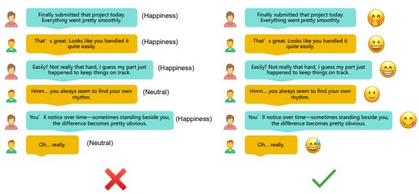
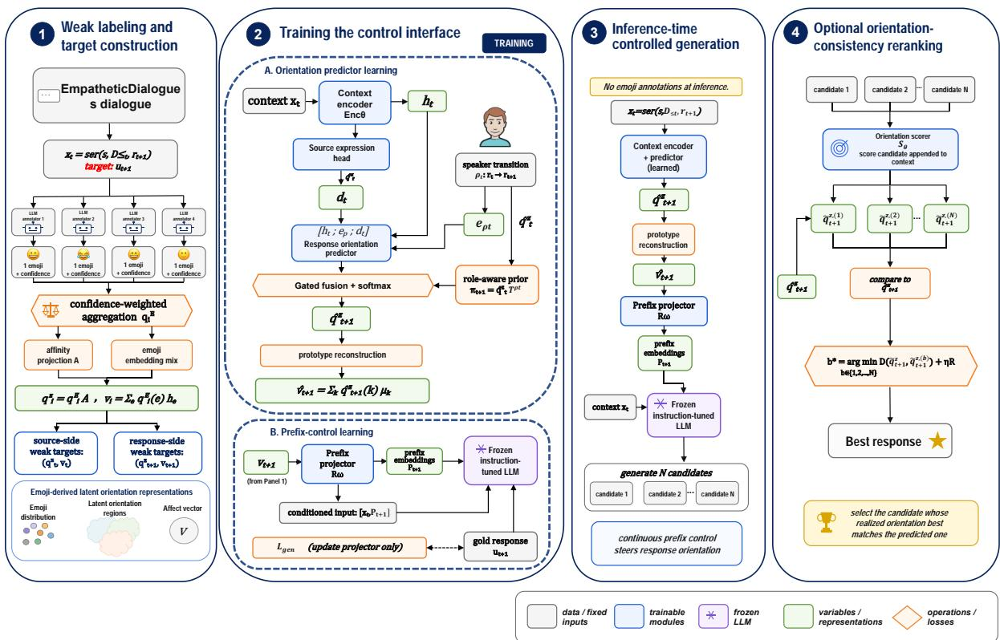
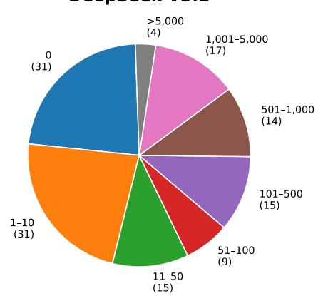
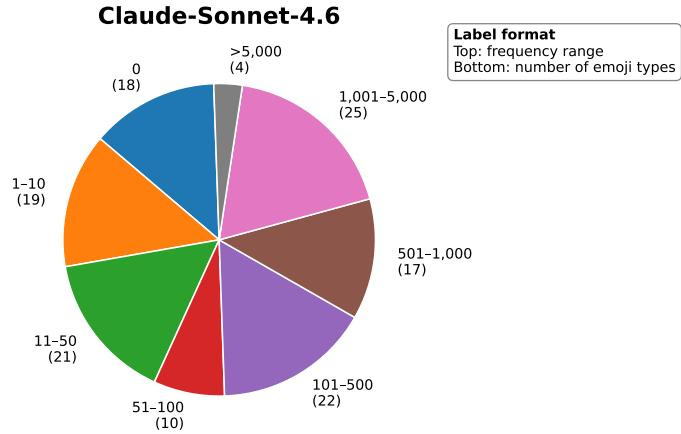
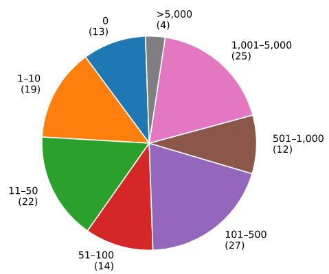
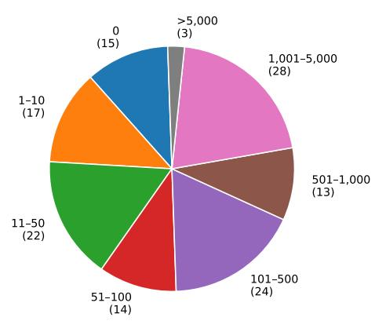
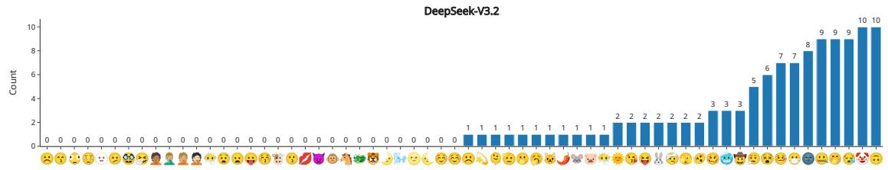
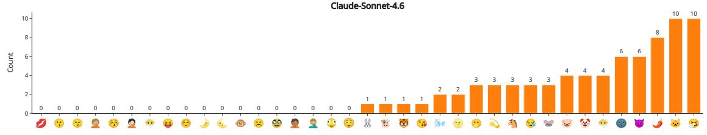
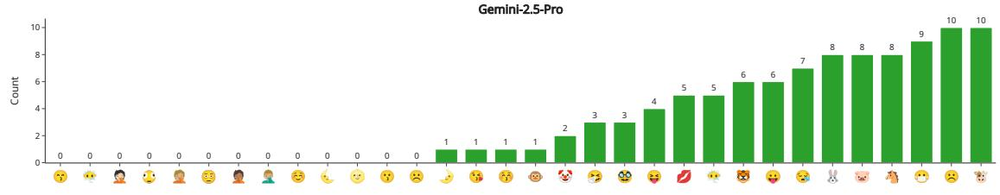
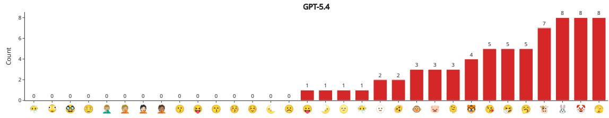

# EmoStance: Response-Side Affective-Orientation Control for Empathetic Response Generation via Emoji Weak Supervision

Ziyuan Jin, Yuxuan Ge, Zheng Tian†

ShanghaiTech University, Shanghai, China

{jinzy2024, geyx2023, tianzheng}@shanghaitech.edu.cn

†Corresponding author.

## Abstract

Empathetic response generation requires models to decide not only what to say, but also how to respond to the previous speaker’s affective situation. We formulate this as responseside affective-orientation control and use multiannotator emoji distributions as weak affective– attitudinal evidence, rather than as output symbols or gold labels, to induce a latent control space that operationally approximates listener stance. We construct EMOJIDIA-LOGUE, an utterance-level extension of EM-PATHETICDIALOGUES with emoji votes and confidence scores, and propose EMOSTANCE, which models source-side affective expression, predicts a soft response-side orientation from dialogue context and speaker roles, and steers a frozen instruction-tuned LLM through continuous prefix embeddings. In blind pairwise evaluation with 20 annotators and 800 judgments, EMOSTANCE achieves a 62.2% decisive win rate, with the clearest gains in contextual specificity and perceived responsiveness, while remaining complementary to external-knowledge methods. Code, annotation metadata, and reconstruction scripts are available in our GitHub repository: https://github.com/18277390221/EmoStance.

## 1 Introduction

Empathetic dialogue generation requires models to decide not only what to say, but also how the next speaker should take up the previous turn. A response can be topically relevant yet still feel detached, overly cheerful, intrusive, didactic, or insufficiently responsive to the speaker’s affective situation. We refer to this operational variable as response-side affective orientation: a soft representation of how the next reply should be affectively and interpersonally oriented before it is verbalized. This notion is related to listener stance, but we do not assume access to direct or gold listenerstance labels; instead, we treat listener stance as a higher-level interpretation of a weakly supervised response-side control representation.

Existing supervision only partially captures this orientation. Prior work represents affective context through situation-level emotion labels (Rashkin et al., 2019), dimensional affect representations (Mohammad, 2018; Colombo et al., 2019), and support-strategy taxonomies, such as questioning, reflection, suggestion, and information provision (Liu et al., 2021). Subsequent systems model turnlevel state transitions, mixed initiative, strategyresponse decoupling, or discourse dynamics (Zhao et al., 2023; Deng et al., 2023; Zhang et al., 2025a; Wan et al., 2025). These variables characterize the dialogue state, but do not by themselves determine whether the next response should realize reassurance, shared excitement, gentle concern, cautious probing, or another interpersonal orientation. Prompt-based interfaces have also been studied for smooth control of predefined attribute intensity (Zhou et al., 2024). Our target instead is a responsespecific, mixture-like latent orientation that may be difficult to verbalize as a short and stable instruction. These limitations motivate a soft intermediate variable for modeling how the next response should be affectively and interpersonally positioned.

Figure 1 illustrates this distinction. Contexts with the same coarse emotion label may require different affective uptake, interpersonal distance, or response strength. Moreover, response-side affective orientation is often ambiguous: multiple responses may be plausible for the same context, and annotators may reasonably prefer different orientations. This makes hard, single-label supervision ill-suited for fine-grained response-orientation control.

We use emoji as weak supervision for inducing this control representation. The key point is not that empathetic systems should generate emoji. Prior work shows that large-scale emoji prediction can yield transferable representations for sentiment, emotion, and sarcasm (Felbo et al., 2017); textual descriptions can support semantic emoji representations (Eisner et al., 2016); and emoji sequences can express compositional meanings (Yang et al., 2024). In our annotation setting, these signals may operationally correspond to response orientations such as encouragement, sympathy, celebration, hesitation, teasing, surprise, or concern. Since emoji meanings are context-dependent and annotators may disagree, we aggregate multi-annotator emoji votes and confidence scores into soft distributions, following disagreement-aware soft-label learning and emotion-distribution estimation (Fornaciari et al., 2021; Wu et al., 2024). We do not treat emoji as output symbols, gold emotion labels, or gold listener-stance labels. These distributions provide weak affective–attitudinal evidence for modeling source-side affective expression and response-side affective orientation.

  
Figure 1: The same coarse emotion label can hide different response-side affective-orientation cues. Emoji are used only as weak affective–attitudinal contextual signals, not as gold emotion or listener-stance labels.

Based on this idea, we construct EMO-JIDIALOGUE, an utterance-level emoji-weaklysupervised extension of EmpatheticDialogues (Rashkin et al., 2019), where multiple LLM annotators provide emoji votes and confidence scores for each utterance. We further propose EMOSTANCE, a controllable generation framework that induces a name-free latent affective-orientation space, predicts the response-side orientation from dialogue context and speaker-role transitions, reconstructs it as a continuous control vector, and injects it into a frozen instruction-tuned LLM through learned prefix embeddings (Li and Liang, 2021). Experiments show that prototype-based reconstruction is substantially more stable than direct vector regression. Blind human evaluation further indicates that EMOSTANCE mainly improves contextual specificity and perceived responsiveness, while remaining complementary to commonsense-enhanced sys-

tems.

Our contributions are threefold. First, we formulate empathetic response generation as responseside affective-orientation control, using the learned orientation representation as an operational approximation of listener stance rather than as a directly annotated stance label. Second, we introduce EMOJIDIALOGUE, a scalable weak-supervision resource that preserves ambiguity through multiannotator emoji distributions. Third, we propose EMOSTANCE, a latent affective-orientation control framework that models source-side affective expression, predicts context- and role-conditioned response-side affective orientation, and realizes the predicted orientation through continuous prefix control of a frozen LLM.

## 2 Related Work

Empathetic and supportive dialogue generation. Empathetic dialogue generation is commonly framed as recognizing an interlocutor’s affective state and producing an appropriate response, with EmpatheticDialogues serving as a widely used benchmark for emotionally grounded open-domain conversations (Rashkin et al., 2019). Early work improves empathetic response generation by incorporating affective signals, such as explicit emotion conditioning, continuous affect representations, and emotion distributions (Zhou et al., 2018; Lin et al., 2019; Majumder et al., 2020; Li et al., 2020). Another line of work extends empathetic dialogue generation with commonsense cognition or models emotional support conversations through support strategies and user states (Liu et al., 2021; Sabour et al., 2022; Zhao et al., 2023; Zhou et al., 2023; Li et al., 2024). More recent studies further introduce discourse-level planning or intentoriented intermediate variables for supportive response generation (Wan et al., 2025; Zhang et al., 2025b). These studies show the value of explicit intermediate planning, but their planning variables are usually speaker emotions, support strategies, intentions, or external commonsense. In contrast, we focus on listener stance: the response-side affective and interpersonal orientation that the next utterance should adopt before it is verbalized.

Listener stance and emoji weak supervision. Our formulation is related to work on interpersonal stancetaking, which views conversational meaning as a way of positioning the speaker toward the interlocutor, the topic, and the ongoing interaction (Kiesling et al., 2018). We study a response-side variant of this problem: listener stance describes how the next speaker should take up the previous turn, rather than what private emotion the previous speaker has. Since stance interpretation is subjective, context-dependent, and often underdetermined, our work also follows recent studies arguing that annotator disagreement should be preserved rather than collapsed into a single hard label (Fornaciari et al., 2021; Mostafazadeh Davani et al., 2022; Uma et al., 2021; Wu et al., 2024). Predictive uncertainty has also been used to identify ambiguous instances in subjective annotation tasks (Alies et al., 2025). Emoji provide a useful weak-supervision interface for this purpose because they are compact affective and semantic signals that can express nuanced and sometimes ambiguous interpersonal meanings (Eisner et al., 2016; Felbo et al., 2017; Yang et al., 2024). Unlike prior emoji-supervised response generation such as MojiTalk (Zhou and Wang, 2018), we do not predict or output emoji, nor do we use a single emoji as a discrete control code. Instead, we aggregate multi-annotator emoji votes and confidence scores into soft distributions and use them to induce a name-free latent stance space for listener-stance planning.

Continuous control for frozen language models. Controllable generation methods steer language models with discrete labels, attribute classifiers, decoding-time discriminators, natural-language instructions, or continuous prompts (Pascual et al., 2021; Yang and Klein, 2021; Krause et al., 2021; Li and Liang, 2021; Zhou et al., 2024). EmoStance follows the continuous-control direction, but its control signal is not a manually specified attribute, a binary discriminator target, or a verbal instruction. It is a continuous listener-stance vector induced from emoji weak supervision, predicted from the dialogue context and role transition, and injected into a frozen instruction-tuned LLM through learned prefix embeddings. A more detailed discussion of related work is provided in Appendix A.

## 3 Weak Affective-Orientation Supervision

We construct EMOJIDIALOGUE as an utterancelevel weak supervision layer on top of Empathetic-Dialogues (Rashkin et al., 2019). Since the original situation-level emotion labels do not specify how a target response should be affectively and interpersonally oriented, we collect multi-annotator emoji votes for each utterance and aggregate them into

soft emoji distributions.

We convert adjacent dialogue turns into source– response examples, where the input contains the situation, dialogue history, and next-speaker marker, and the target is the next utterance. The resulting EMOJIDIALOGUE dataset comprises 76,489 source–response examples, split into 58,829/9,263/8,397 train/validation/test instances. A human plausibility audit shows high weak-label plausibility, with 99.69% valid annotations and 99.77% valid or ambiguous-but-acceptable annotations. Full construction, audit, licensing, privacy, and release details are provided in Appendices B and E.

## 4 Method: Emoji-Supervised Affective-Orientation Control

EmoStance uses the weak supervision described in Section 3 to learn an internal control variable for empathetic response generation. The key idea is to separate two decisions that are usually entangled in direct generation: how the next response should be affectively and interpersonally oriented toward the previous speaker, and how that orientation should be realized in natural language. We call this intermediate signal a response-side affective-orientation representation. Emoji annotations are used only during training as weak affective–attitudinal observations; they are not treated as output symbols, gold emotion labels, or gold listener-stance labels. At inference time, EmoStance receives only the dialogue context and next-speaker marker, without emoji annotations, response-derived orientation vectors, gold listener-stance labels, or the gold response.

## 4.1 Overview and Problem Setup

Let a dialogue be a sequence of role-marked utterances

$$
D = \{ ( r _ { 1 } , u _ { 1 } ) , \ldots , ( r _ { T } , u _ { T } ) \} ,
$$

where $u _ { t }$ is the utterance at turn $t ,$ and $r _ { t }$ denotes the speaker role. In dyadic dialogue, $r _ { t } \in \{ A , B \}$ although the formulation also allows a larger finite set of roles. Each dialogue may additionally include a situation description s. For each adjacent pair $( u _ { t } , u _ { t + 1 } )$ , we construct the serialized input

$$
x _ { t } = \operatorname { s e r } ( s , D _ { \leq t } , r _ { t + 1 } ) ,
$$

where $D _ { \leq t } = \{ ( r _ { 1 } , u _ { 1 } ) , \dots , ( r _ { t } , u _ { t } ) \}$ , and $\operatorname { s e r } ( { \mathord { \cdot } } )$ serializes the situation, dialogue history, and nextspeaker marker into a role-marked textual input. The next response is $u _ { t + 1 }$

  
Figure 2: Overview of EMOSTANCE. Emoji weak supervision induces a name-free latent affective-orientation space for source-side expression modeling, role-aware response-orientation prediction, prefix-based generation control, and optional orientation-consistency reranking. Emoji are not treated as gold emotion or listener-stance labels.

EmoStance has three stages. First, multiannotator emoji distributions are projected into a soft, name-free affective-orientation space, avoiding predefined orientation names such as happiness, sadness, comfort, or surprise. Second, a roleaware orientation predictor estimates the responseside affective-orientation distribution from dialogue context and speaker transition, conditioned on the source-side affective expression of the latest observed turn. Third, the predicted distribution is reconstructed through orientation prototypes into a continuous control vector, which is mapped into prefix embeddings to steer a frozen instructiontuned language model. An optional reranker selects the candidate response whose realized orientation best matches the predicted orientation.

## 4.2 Inducing a Name-Free Affective-Orientation Space

Affective orientation in dialogue is fine-grained, context-dependent, and often ambiguous, so we do not represent it as a single hard label. A single utterance may express several subtle affective or interpersonal cues at once, such as sympathy, reassurance, cautious encouragement, hesitation, or concern. EmoStance therefore represents emojiderived affective–attitudinal evidence as a soft distribution over latent regions.

For each utterance $u _ { t } .$ , annotators select emoji from a fixed candidate inventory E and provide confidence scores. We aggregate these annotations into a soft emoji distribution

$$
q _ { t } ^ { E } \in \Delta ^ { | \mathcal { E } | } .
$$

This distribution preserves annotator disagreement and confidence variation rather than collapsing them into a majority label. Such disagreement is not treated simply as noise: for affective and interpersonal meanings, it may reflect genuine ambiguity in how an utterance can be read or how a listener might respond.

Directly using individual emoji as orientation labels would be brittle because emoji are surface symbols: some are rare, nearly synonymous in a given context, or polysemous across contexts, and their human-readable names can impose misleading categories. We therefore induce a name-free affective-orientation space from relational evidence among emoji, including which emoji appear in similar textual contexts, are confused or co-selected by annotators, or behave similarly as weak affective– attitudinal signals.

Concretely, we construct an emoji affinity structure over $\mathcal { E }$ and derive a soft membership matrix

$$
A \in [ 0 , 1 ] ^ { | \mathcal { E } | \times K } ,
$$

where $A _ { e , k }$ measures the degree to which emoji $e$ belongs to latent affective-orientation region $k .$ We write emoji distributions as row vectors when multiplying by A. The utterance-level latent-region distribution is

$$
q _ { t } ^ { Z } = q _ { t } ^ { E } A ,
$$

where $q _ { t } ^ { Z } \in \Delta ^ { K }$ . Here, $Z$ denotes latent emojiinduced affective-orientation regions, not a gold listener-stance label space. This projection changes sparse emoji supervision into a smoother distribution over latent regions. The induced regions act as denoising anchors, retaining fine-grained information from emoji weak supervision while reducing sensitivity to idiosyncratic or low-frequency emoji choices.

A distribution over latent regions is useful for orientation prediction, but generation also benefits from a continuous signal that can express withinregion nuance. Let $\mathbf { h } _ { e }$ denote the embedding of emoji e. We define the continuous emoji-derived affective vector for utterance $u _ { t }$ as

$$
v _ { t } = \sum _ { e \in \mathcal { E } } q _ { t } ^ { E } ( e ) \mathbf { h } _ { e } .
$$

Thus, $q _ { t } ^ { Z }$ provides a structured distribution over latent affective-orientation regions, while $v _ { t }$ preserves fine-grained information from the original emoji distribution.

The same emoji-derived quantities are interpreted according to their role in an adjacent-turn example. For the latest observed turn $u _ { t } , ( q _ { t } ^ { Z } , v _ { t } )$ represents the source-side affective expression available in the dialogue context. For the target response $u _ { t + 1 } , ( q _ { t + 1 } ^ { Z } , v _ { t + 1 } )$ represents the response-side affective orientation observed during training. The central learning problem is to predict the responseside orientation from the context before generating $u _ { t + 1 }$ . These representations are induced from weak emoji-based affective–attitudinal evidence and should not be interpreted as gold listener-stance labels.

## 4.3 Predicting the Response-Side Affective Orientation

Given the serialized context $x _ { t } ,$ EMOSTANCE predicts the response-side affective orientation that should guide the next response. Instead of directly regressing a high-dimensional continuous orientation vector from text, we first predict a distribution over induced latent regions and then reconstruct a continuous control vector from orientation prototypes. This keeps prediction tied to the denoised latent affective-orientation space introduced in Section 4.2.

We encode the context and estimate the sourceside affective expression of the latest observed turn:

$$
\mathbf { h } _ { t } = \mathrm { E n c } _ { \theta } ( x _ { t } ) , \qquad \hat { q } _ { t } ^ { Z } = \mathrm { s o f t m a x } ( f _ { \mathrm { c u r } } ( \mathbf { h } _ { t } ) ) .
$$

Let $d _ { t }$ be a compact representation of this predicted source-side affective expression, and let $\rho _ { t } = r _ { t } \to r _ { t + 1 }$ denote the ordered speaker transition with embedding $\mathbf { e } _ { \rho _ { t } }$ . A neural prediction head first produces prior-free, context-based logits for the next-response orientation:

$$
\ell _ { t + 1 } ^ { 0 } = f _ { \mathrm { n e x t } } \left( \left[ \mathbf { h } _ { t } ; \mathbf { e } _ { \rho _ { t } } ; d _ { t } \right] \right) .
$$

The neural predictor captures what the local context suggests, but dyadic dialogue also exhibits regular affective-uptake patterns: anxious turns often invite reassurance, celebratory turns invite congratulations, and self-deprecating turns may invite encouragement or gentle correction. To incorporate such structure, we estimate a role-aware transition prior from training data. For each ordered role transition $\rho ,$ we estimate a smoothed transition matrix $T ^ { \rho }$ over latent affective-orientation regions. Given the predicted source-side expression, the role-conditioned prior for the next response is

$$
\pi _ { t + 1 } = \hat { q } _ { t } ^ { Z } T ^ { \rho _ { t } } .
$$

The final orientation distribution combines the neural logits and the prior through a gated interpolation:

$$
\hat { q } _ { t + 1 } ^ { Z } = \mathrm { s o f t m a x } \left( \ell _ { t + 1 } ^ { 0 } + \lambda _ { \mathrm { t r } } \gamma _ { t } \log ( \pi _ { t + 1 } + \epsilon ) \right) ,
$$

where $\gamma _ { t } \in [ 0 , 1 ]$ controls how strongly the transition prior is used. The prior is therefore a soft structural bias rather than a replacement for contextual prediction.

The predicted orientation distribution is then mapped back to a continuous control vector through orientation prototypes:

$$
\hat { v } _ { t + 1 } = \sum _ { k = 1 } ^ { K } \hat { q } _ { t + 1 } ^ { Z } ( k ) \mu _ { k } .
$$

This prototype reconstruction preserves continuous control while preventing the model from chasing idiosyncratic noise in weak emoji-derived vectors.

The orientation predictor is trained with weak supervision derived from the observed response:

$$
\begin{array} { r l } & { { \mathcal { L } } _ { \mathrm { o r i e n t } } = \mathrm { C E } \left( q _ { t + 1 } ^ { Z } , \hat { q } _ { t + 1 } ^ { Z } \right) } \\ & { ~ + \lambda _ { \mathrm { v e c } } \| \hat { v } _ { t + 1 } - v _ { t + 1 } \| _ { 2 } ^ { 2 } } \\ & { ~ + \lambda _ { \mathrm { c u r } } { \mathcal { L } } _ { \mathrm { c u r } } . } \end{array}
$$

Here, ${ \mathcal { L } } _ { \mathrm { c u r } }$ supervises the source-side expression estimate $\hat { q } _ { t } ^ { Z }$ , which anchors the role-aware transition prior. Implementation details, including smoothed transition counts, the uncertainty gate, optional weighted cross-entropy, and the auxiliary prior-free next-response loss, are given in $\mathsf { A p - }$ pendix C.

## 4.4 Realizing the Predicted Orientation with a Frozen Generator

The predicted response-side affective orientation must be realized as natural language. One possible approach is to verbalize it as a textual prompt, such as “respond supportively” or “sound encouraging.” We avoid this because the orientation representation is soft and mixture-like: it may combine several latent regions with different weights, which is difficult to express as a short and stable instruction. EmoStance instead uses embedding-level control. In our experiments, the frozen generator is instantiated as mistralai/Mistral-7B-Instruct-v0.3, from the Mistral 7B model family (Jiang et al., 2023). Exact model checkpoints, parameter counts, licenses, and compute details are reported in $\mathsf { A p - }$ pendix E.

A lightweight prefix projector maps an orientation vector into m continuous prefix embeddings:

$$
P _ { t + 1 } = R _ { \omega } ( v _ { t + 1 } ) \in \mathbb { R } ^ { m \times d _ { \Omega } } ,
$$

where $d _ { \Omega }$ is the embedding dimension of the frozen generator. The prefix embeddings are prepended to the serialized dialogue input, allowing the orientation signal to guide generation without appearing as explicit text.

During projector training, the observed response $u _ { t + 1 }$ is available, so we use its weak response-side orientation vector $v _ { t + 1 }$ . The generator parameters Ω remain frozen, and only the prefix projector parameters $\omega$ are updated:

$$
\mathcal { L } _ { \mathrm { g e n } } = - \sum _ { j = 1 } ^ { \left| u _ { t + 1 } \right| } \log p _ { \Omega } \left( u _ { t + 1 , j } \mid P _ { t + 1 } , x _ { t } , u _ { t + 1 , < j } \right) .
$$

At inference time, $v _ { t + 1 }$ is replaced by the predicted vector $\hat { v } _ { t + 1 }$ . The frozen language model then generates from

$$
p _ { \Omega } \left( \cdot \mid R _ { \omega } ( \hat { v } _ { t + 1 } ) , x _ { t } \right) .
$$

This design separates orientation prediction from surface realization: the orientation predictor decides how the next response should be positioned, while the frozen generator realizes that control signal in natural language.

## 4.5 Orientation-Consistency Reranking

Prefix control does not guarantee that every sampled response realizes the intended orientation. The frozen generator may still produce several fluent but differently positioned continuations. EmoStance therefore uses orientation-consistency reranking as an optional decoding-time check.

Given the predicted orientation $\hat { q } _ { t + 1 } ^ { Z }$ and control vector $\hat { v } _ { t + 1 }$ , the generator samples B candidate responses:

$$
\left\{ \widetilde { u } _ { t + 1 } ^ { ( 1 ) } , \ldots , \widetilde { u } _ { t + 1 } ^ { ( B ) } \right\} .
$$

For each candidate, we append it to the dialogue context and use the orientation scorer to estimate the orientation realized by that candidate:

$$
\widetilde { q } _ { t + 1 } ^ { Z , ( b ) } = S _ { \ell } \left( x _ { t } , \widetilde { u } _ { t + 1 } ^ { ( b ) } \right) .
$$

The selected response minimizes divergence from the intended orientation, with an optional length regularizer R:

$$
b ^ { * } = \arg \operatorname* { m i n } _ { 1 \leq b \leq B } \left[ D \left( \widehat { q } _ { t + 1 } ^ { Z } , \widetilde { q } _ { t + 1 } ^ { Z , ( b ) } \right) + \eta \mathcal { R } \left( \widetilde { u } _ { t + 1 } ^ { ( b ) } \right) \right] ,
$$

$$
\hat { u } _ { t + 1 } = \widetilde { u } _ { t + 1 } ^ { ( b ^ { * } ) } .
$$

By default, D is cross-entropy between the intended and realized orientation distributions. Reranking does not introduce additional labels or external knowledge; it only selects the candidate whose realized orientation best matches the predicted orientation.

## 4.6 Training and Inference

Training and inference differ only in the availability of weak affective-orientation observations. During training, emoji annotations of the observed source– response pair are aggregated into soft emoji distributions, projected into the name-free affectiveorientation space, and used to train the orientation predictor and prefix projector with $\mathcal { L } _ { \mathrm { o r i e n t } }$ and ${ \mathcal { L } } _ { \mathrm { g e n } }$ , while the generator remains frozen. At inference time, no emoji annotations, response-derived orientation vectors, gold listener-stance labels, or gold responses are available. EmoStance predicts the response-side affective orientation from $x _ { t }$ , reconstructs the corresponding control vector, maps it into prefix embeddings, and generates with the frozen language model; optional reranking selects the candidate most consistent with the predicted orientation. Thus, emoji are used only as training-time weak observations for learning an internal affectiveorientation control interface, not as test-time inputs, gold emotion labels, gold listener-stance labels, or desired outputs.

## 5 Experiments

We evaluate EMOSTANCE along three questions: whether response-side affective-orientation control improves empathetic response generation, which aspects of response quality it affects, and whether the proposed components are necessary. Blind pairwise human preference is treated as the primary evidence for generation quality, while automatic metrics and internal orientation-control diagnostics are used as supporting analyses rather than substitutes for human judgment.

## 5.1 Experimental Setup

We evaluate EMOSTANCE in two settings: component analyses on the EMOJIDIALOGUE adjacentturn split introduced in Section 3, and system comparisons on the full EmpatheticDialogues (ED) test set. In every deployable setting, the input is restricted to the situation description, dialogue history, and speaker-role markers. Emoji annotations, latent-region targets, response-derived orientation vectors, and reference responses are unavailable at inference time. Dataset statistics and decoding settings are provided in Appendix D.1.

We compare against seven baselines: an instruction-tuned LLM without affective control, a prompt-level control variant, supervised finetuning without the latent orientation module, an

EmPO-DPO preference-optimization baseline (Sotolar et al., 2024), two ED-compatible task-specific systems—CASE (Zhou et al., 2023) and APT-NESS (Hu et al., 2024)—and Sibyl, a futureaware commonsense-enhanced system (Wang et al., 2025). All baseline outputs are produced by our own ED-compatible reproductions under the shared mistralai/Mistral-7B-Instruct-v0.3 backbone, aligned input format, test contexts, and decoding setup. These comparisons therefore evaluate controlled same-backbone variants and should not be interpreted as exact replications or upper bounds of the original released systems. Appendix D.2 provides the full baseline configurations.

Our primary evaluation is blind pairwise human preference. Each item presents a dialogue context, one evaluation question, and anonymized responses from EMOSTANCE and one baseline. The five dimensions are emotion appropriateness, felt responded, context specificity, naturalness, and AI-like/problematic phrasing. The first four are positive dimensions, whereas AI-like/problematic phrasing is reverse-scored.

We conducted two evaluation batches using the same instructions, blinding, and scoring protocol. The second batch recruited 10 new annotators and independently sampled new evaluation instances rather than reannotating the original items. The combined evaluation contains 20 annotators and 800 judgments. Ties and “neither/both bad” are retained as neutral outcomes and excluded from decisive win rates. We report 95% Wilson confidence intervals and two-sided exact sign tests. The main table additionally reports Holm-adjusted pvalues across the seven per-baseline comparisons. Appendix D.3 provides the complete protocol.

## 5.2 Human Evaluation

Table 1 reports the expanded blind pairwise evaluation. Across 800 judgments, EMOSTANCE receives 395 wins, 71 ties, 94 neither/both-bad judgments, and 240 losses. Excluding neutral outcomes, the overall decisive win rate is 62.2%, with a 95% Wilson confidence interval of [58.4, 65.9] and a two-sided exact sign-test value of $p < . 0 0 1$

The aggregate result is qualified by the perbaseline comparisons. After Holm correction, EMOSTANCE is significantly preferred over the controlled CASE and APTNESS variants. The numerical margin over LLM-SFT is positive but does not remain significant after correction, and the comparisons with LLM-only, LLM-prompt, EmPO-DPO, and Sibyl are statistically inconclusive. In particular, Sibyl receives more decisive preferences numerically, but its confidence interval includes parity. We therefore do not claim uniform dominance over strong or knowledge-enhanced systems. The evidence instead supports responseside affective orientation as a useful control signal that improves aggregate preference and is potentially complementary to preference optimization and future-aware commonsense modeling.

<table><tr><td>Baseline</td><td>Win</td><td>Tie</td><td>None</td><td>Lose</td><td>Win%</td><td>95% CI</td><td>p</td><td>PHolm</td></tr><tr><td>LLM-only</td><td>49</td><td>17</td><td>13</td><td>41</td><td>54.4</td><td>[44.2, 64.3]</td><td>0.461</td><td>0.754</td></tr><tr><td>LLM-prompt</td><td>52</td><td>12</td><td>16</td><td>40</td><td>56.5</td><td>[46.3, 66.2]</td><td>0.251</td><td>0.754</td></tr><tr><td>LLM-SFT</td><td>62</td><td>10</td><td>11</td><td>37</td><td>62.6</td><td>[52.8, 71.5]</td><td>0.015</td><td>0.077</td></tr><tr><td>EmPO-DPO</td><td>54</td><td>13</td><td>14</td><td>39</td><td>58.1</td><td>[47.9, 67.6]</td><td>0.146</td><td>0.585</td></tr><tr><td>CASE</td><td>80</td><td>3</td><td>15</td><td>22</td><td>78.4</td><td>[69.5, 85.3]</td><td>&lt; .001</td><td>&lt; .001</td></tr><tr><td>APTNESS</td><td>72</td><td>8</td><td>14</td><td>26</td><td>73.5</td><td>[64.0, 81.2]</td><td>&lt; .001</td><td>&lt; .001</td></tr><tr><td>Sibyl</td><td>26</td><td>8</td><td>11</td><td>35</td><td>42.6</td><td>[31.0, 55.1]</td><td>0.306</td><td>0.754</td></tr><tr><td>Overall</td><td>395</td><td>71</td><td>94</td><td>240</td><td>62.2</td><td>[58.4, 65.9]</td><td>&lt; .001</td><td>一</td></tr></table>

Table 1: Expanded blind pairwise human evaluation. Wins and losses are counted from EMOSTANCE’s perspective; ties and neither/both-bad outcomes are excluded from Win%. The p column reports uncorrected two-sided exact sign tests over decisive judgments. p applies Holm correction across the seven per-baseline comparisons.

Dimension-level results identify where the aggregate gain arises. EMOSTANCE achieves decisive win rates of 75.9% for context specificity and 73.5% for felt responded. The estimates for emotion appropriateness (56.0%) and naturalness (57.7%) are more modest, and their confidence intervals include parity. AI-like/problematic phrasing is also statistically inconclusive at 45.1%. Thus, the supported improvement is concentrated in contextual uptake and perceived responsiveness rather than broad surface-form enhancement. Full counts and confidence intervals are reported in Appendix D.4.

To assess the weak supervision separately from response preference, we also conduct a human– LLM distributional audit on 120 test utterances. Exact emoji choices show non-trivial divergence between human and LLM annotators, whereas projection through the fixed learned emoji-to-region matrix reduces mean JSD from 0.442 to 0.206 and increases distributional overlap from 0.449 to 0.670. We interpret this as sample-specific evidence that the induced orientation regions are less sensitive to exact-symbol variation, not as evidence that LLM annotations are equivalent to human annotations or culturally universal. Appendix B.7 provides the complete audit.

## 5.3 Automatic Evaluation

Appendix D.6 reports reference-based metrics— BERTScore-F1, ROUGE-L, BLEU-2, and ME-TEOR (Zhang et al., 2020; Lin, 2004; Papineni et al., 2002; Banerjee and Lavie, 2005)— together with Distinct-1/2 (Li et al., 2016), Self-BLEU (Zhu et al., 2018), and a rule-based Generic diagnostic. On the aligned ED test set, EMOSTANCE obtains the highest BERTScore-F1, ROUGE-L, and BLEU-2 among the controlled same-backbone systems. METEOR and diversity-related diagnostics are mixed: EMOSTANCE is not the most lexically diverse system and does not obtain the lowest genericresponse rate. We therefore interpret these metrics narrowly as reference-alignment and surface-form diagnostics. They do not by themselves establish superior empathy, naturalness, diversity, or reduced template-like phrasing.

## 5.4 Component Analysis

We examine response-orientation prediction, continuous orientation-vector construction, and generation-time control; full tables and secondary diagnostics are provided in Appendices D.7 and D.8.

First, soft distributional supervision is more effective than argmax targets, improving responseorientation prediction from 1.4450 to 1.3792 in CE and from 0.3067 to 0.3260 in macro-F1. Second, prototype reconstruction is substantially more stable than direct 256-dimensional regression, increasing target-vector cosine similarity from 0.3220 to 0.9236 and reducing MSE from 0.001058 to 0.000022. This result supports the predictability of the prototype-structured control representation, but it should not be interpreted as evidence that the prototype mixture preserves all information in the dense response-derived target.

Third, generation-control diagnostics show that predicted orientation controls are more meaningful than shuffled controls and that reranking improves realization of the supplied orientation. The remaining gap to reference-conditioned upper-reference settings reflects both prediction error and task underdetermination: the observed context does not uniquely determine how a listener must respond, while the upper-reference conditions directly observe the orientation realized in the single ED reference response. We therefore treat the reference response as one plausible human continuation rather than the unique correct orientation.

<table><tr><td>Comparison</td><td>Win</td><td>Tie</td><td>Neither</td><td>Lose</td><td>Win Rate</td><td>95% CI</td><td>p</td></tr><tr><td>vs. w/o rerank</td><td>156</td><td>53</td><td>18</td><td>73</td><td>68.1%</td><td>[61.8, 73.8]</td><td>&lt; .001</td></tr><tr><td>vs. w/o role-aware</td><td>138</td><td>66</td><td>18</td><td>78</td><td>63.9%</td><td>[57.3, 70.0]</td><td>&lt; .001</td></tr><tr><td>vs. zero control</td><td>222</td><td>20</td><td>21</td><td>37</td><td>85.7%</td><td>[80.9, 89.5]</td><td>&lt; .001</td></tr><tr><td>Overall</td><td>516</td><td>139</td><td>57</td><td>188</td><td>73.3%</td><td>[69.9, 76.4]</td><td>&lt; .001</td></tr></table>

Table 2: Expanded focused human ablation at the judgment level. Wins and losses are counted from the final EMOSTANCE system’s perspective; ties and neither/both-bad outcomes are excluded from the decisive win rate.

Table 2 reports the expanded human ablation. The final system is preferred over all three deployable variants, with decisive win rates of 68.1% over no reranking, 63.9% over the variant without roleaware response-orientation prediction, and 85.7% over zero control. These results support the contributions of the orientation signal, role-aware prediction, and orientation-consistency selection.

Reranking has a measurable efficiency cost. On a single RTX 4090 under matched decoding settings, the B = 1 no-reranking configuration requires 331.7 ms per example on average and processes 3.015 examples/s, whereas B = 4 reranking requires 1,333.4 ms and processes 0.750 examples/s, corresponding to a 4.02× cost increase. Candidate generation accounts for 99.48% of the B = 4 runtime, while orientation scoring and final selection together account for only 0.52%. We therefore present B = 1 as the efficiency-oriented deployment mode and B = 4 as the quality-oriented mode. Appendix E.3.1 provides the complete latency and profiling results.

## 6 Conclusion

We introduced EMOSTANCE, a weakly supervised and role-aware framework for listener-stance control in empathetic response generation. The method uses multi-annotator emoji distributions as soft training-time signals, predicts a distribution over plausible next-response stances, and reconstructs a prototype-structured continuous control vector that steers a frozen instruction-tuned language model through prefix embeddings. Blind pairwise evaluation with 20 annotators and 800 judgments yields a 62.2% aggregate decisive win rate, with the clearest gains in context specificity and felt responded. These findings support listener stance as a useful intermediate variable for improving contextual uptake and perceived responsiveness, but do not indicate uniform superiority across all quality dimensions or strong baselines. Future work should improve uncertainty-aware stance prediction, develop richer and more efficient control mechanisms, and evaluate generalization across languages, cultures, datasets, and interaction settings.

## Limitations

Weak supervision and construct validity. The response-side affective-orientation targets are derived from LLM-provided emoji annotations rather than direct human labels of emotion, empathy, mental state, or listener stance. Human audits support their contextual plausibility, but do not establish gold-standard, exhaustive, or culturally universal supervision. Emoji meanings vary across communities, platforms, age groups, and conversational norms, and the name-free design cannot remove biases inherited from the source corpus or annotator models. The induced space should therefore be interpreted as a corpus-dependent control representation that approximates aspects of listener stance, not as an independently validated taxonomy.

Scope and evaluation. Experiments are limited to short English dyadic conversations from EmpatheticDialogues and do not cover long-horizon support, multi-party interaction, persistent memory, or open-domain assistants with stronger factual, safety, and tool-use requirements. The appropriate response orientation may also be underdetermined: several orientations can be reasonable for the same context, so the gap to reference-conditioned upperreference settings reflects both prediction error and task ambiguity. Moreover, several automatic consistency metrics reuse the induced orientation space or a related scorer and should be treated as internal control-realization diagnostics rather than independent evidence of empathy. The human studies evaluate static response pairs rather than live, longitudinal interactions.

Efficiency and capability boundaries. Multicandidate orientation-consistency reranking improves control at higher inference cost, while single-generation decoding provides a lower-cost alternative. EMOSTANCE targets affective and interpersonal orientation rather than commonsense reasoning, factual grounding, safety, or surfaceform quality; its contribution is therefore complementary to knowledge-augmented and other optimization methods.

## Ethical Considerations

Interpretation and annotation bias. Emoji annotations and latent orientations are weak conversational signals, not ground-truth emotions, psychological states, personality traits, clinical indicators, or evidence of a user’s internal feelings. Generated responses reflect a selected communicative orientation rather than a diagnosis. Although soft distributions preserve disagreement, LLM annotators and emoji conventions may still encode biases involving dialect, indirectness, politeness, humor, cultural norms, disability-related communication styles, or non-standard phrasing. The resulting resources should not be used for user profiling, mental-state detection, clinical decision making, or authoritative affective judgment.

Deployment risks. Affective-orientation control may make systems appear more emotionally attuned, but it could also be used for persuasion, dependency induction, or emotional manipulation. Systems should not exploit distress, covertly steer decisions, simulate human care relationships, or override safety policies. EMOSTANCE is not designed for diagnosis, crisis counseling, medical or legal advice, or professional emotional care; safetycritical cases require appropriate refusal, escalation, crisis-resource referral, and human oversight.

Privacy, transparency, and release. Benchmark dialogue may contain sensitive personal experiences. Data collection, auditing, and release should respect applicable consent, compensation, licensing, and data-protection requirements, document the weak-supervision procedure and non-clinical scope, and avoid exposing identifying information. Users should also be informed when they are interacting with an AI system and when responses may be guided by inferred affective or interpersonal orientations.

## References

Richard Alies, Elena Merdjanovska, and Alan Akbik. 2025. Measuring label ambiguity in subjective tasks using predictive uncertainty estimation. In Proceedings of the 19th Linguistic Annotation Workshop (LAW-XIX-2025), pages 21–34.

Satanjeev Banerjee and Alon Lavie. 2005. METEOR: An automatic metric for MT evaluation with improved correlation with human judgments. In Proceedings ofthe ACL Workshop on Intrinsic and Extrinsic Evaluation Measures for Machine Translation and/or Summarization, pages 65–72, Ann Arbor, Michigan. Association for Computational Linguistics.

Pierre Colombo, Wojciech Witon, Ashutosh Modi, James Kennedy, and Mubbasir Kapadia. 2019. Affect-driven dialog generation. In Proceedings of the 2019 Conference of the North American Chapter of the Association for Computational Linguistics: Human Language Technologies, Volume 1 (Long and Short Papers), pages 3734–3743.

Sumanth Dathathri, Andrea Madotto, Janice Lan, Jane Hung, Eric Frank, Piero Molino, Jason Yosinski, and Rosanne Liu. 2020. Plug and play language models: A simple approach to controlled text generation. In International Conference on Learning Representations.

Yang Deng, Wenxuan Zhang, Yifei Yuan, and Wai Lam. 2023. Knowledge-enhanced mixed-initiative dialogue system for emotional support conversations. In Proceedings of the 61st Annual Meeting of the Associationfor Computational Linguistics (Volume 1: Long Papers), pages 4079–4095.

Ben Eisner, Tim Rocktäschel, Isabelle Augenstein, Matko Bošnjak, and Sebastian Riedel. 2016. emoji2vec: Learning emoji representations from their description. In Proceedings of the Fourth International Workshop on Natural Language Processing for Social Media, pages 48–54.

Bjarke Felbo, Alan Mislove, Anders Søgaard, Iyad Rahwan, and Sune Lehmann. 2017. Using millions of emoji occurrences to learn any-domain representations for detecting sentiment, emotion and sarcasm. In Proceedings of the 2017 Conference on Empirical Methods in Natural Language Processing, pages 1615–1625.

Tommaso Fornaciari, Alexandra Uma, Silviu Paun, Barbara Plank, Dirk Hovy, and Massimo Poesio. 2021.

Beyond black & white: Leveraging annotator disagreement via soft-label multi-task learning. In Proceedings ofthe 2021 Conference ofthe North American Chapter of the Association for Computational Linguistics: Human Language Technologies, pages 2591–2597.

Fabrizio Gilardi, Meysam Alizadeh, and Maël Kubli. 2023. ChatGPT outperforms crowd workers for text-annotation tasks. Proceedings of the National Academy ofSciences, 120(30):e2305016120.

Pengcheng He, Jianfeng Gao, and Weizhu Chen. 2023. DeBERTaV3: Improving DeBERTa using ELECTRA-style pre-training with gradientdisentangled embedding sharing. In The Eleventh International Conference on Learning Representations.

Yuxuan Hu, Minghuan Tan, Chenwei Zhang, Zixuan Li, Xiaodan Liang, Min Yang, Chengming Li, and Xiping Hu. 2024. APTNESS: Incorporating appraisal theory and emotion support strategies for empathetic response generation. In Proceedings ofthe 33rd ACM International Conference on Information and Knowledge Management, pages 900–909. Association for Computing Machinery.

Albert Q. Jiang, Alexandre Sablayrolles, Arthur Mensch, Chris Bamford, Devendra Singh Chaplot, Diego de Las Casas, Florian Bressand, Gianna Lengyel, Guillaume Lample, Lucile Saulnier, Lélio Renard Lavaud, Marie-Anne Lachaux, Pierre Stock, Teven Le Scao, Thibaut Lavril, Thomas Wang, Timothée Lacroix, and William El Sayed. 2023. Mistral 7B. CoRR, abs/2310.06825.

Scott F. Kiesling, Umashanthi Pavalanathan, Jim Fitzpatrick, Xiaochuang Han, and Jacob Eisenstein. 2018. Interactional stancetaking in online forums. Computational Linguistics, 44(4):683–718.

Ben Krause, Akhilesh Deepak Gotmare, Bryan McCann, Nitish Shirish Keskar, Shafiq Joty, Richard Socher, and Nazneen Fatema Rajani. 2021. GeDi: Generative discriminator guided sequence generation. In Findings of the Association for Computational Linguistics: EMNLP 2021, pages 4929–4952.

Jiwei Li, Michel Galley, Chris Brockett, Jianfeng Gao, and Bill Dolan. 2016. A diversity-promoting objective function for neural conversation models. In Proceedings of the 2016 Conference of the North American Chapter of the Association for Computational Linguistics: Human Language Technologies, pages 110–119, San Diego, California. Association for Computational Linguistics.

Junlin Li, Bo Peng, Yu-Yin Hsu, and Chu-Ren Huang. 2024. Be helpful but don’t talk too much - enhancing helpfulness in conversations through relevance in multi-turn emotional support. In Proceedings of the 2024 Conference on Empirical Methods in Natural Language Processing, pages 1976–1988, Miami, Florida, USA. Association for Computational Linguistics.

Qintong Li, Hongshen Chen, Zhaochun Ren, Pengjie Ren, Zhaopeng Tu, and Zhumin Chen. 2020. EmpDG: Multi-resolution interactive empathetic dialogue generation. In Proceedings of the 28th International Conference on Computational Linguistics, pages 4454–4466.

Xiang Lisa Li and Percy Liang. 2021. Prefix-tuning: Optimizing continuous prompts for generation. In Proceedings of the 59th Annual Meeting of the Association for Computational Linguistics and the 11th International Joint Conference on Natural Language Processing (Volume 1: Long Papers), pages 4582– 4597, Online. Association for Computational Linguistics.

Chin-Yew Lin. 2004. ROUGE: A package for automatic evaluation of summaries. In Text Summarization Branches Out, pages 74–81, Barcelona, Spain. Association for Computational Linguistics.

Zhaojiang Lin, Andrea Madotto, Jamin Shin, Peng Xu, and Pascale Fung. 2019. MoEL: Mixture of empathetic listeners. In Proceedings ofthe 2019 Conference on Empirical Methods in Natural Language Processing and the 9th International Joint Conference on Natural Language Processing (EMNLP-IJCNLP), pages 121–132.

Siyang Liu, Chujie Zheng, Orianna Demasi, Sahand Sabour, Yu Li, Zhou Yu, Yong Jiang, and Minlie Huang. 2021. Towards emotional support dialog systems. In Proceedings of the 59th Annual Meeting ofthe Associationfor Computational Linguistics and the 11th International Joint Conference on Natural Language Processing (Volume 1: Long Papers), pages 3469–3483.

Navonil Majumder, Pengfei Hong, Shanshan Peng, Jiankun Lu, Deepanway Ghosal, Alexander Gelbukh, Rada Mihalcea, and Soujanya Poria. 2020. MIME: MIMicking emotions for empathetic response generation. In Proceedings ofthe 2020 Conference on Empirical Methods in Natural Language Processing (EMNLP), pages 8968–8979.

Saif Mohammad. 2018. Obtaining reliable human ratings of valence, arousal, and dominance for 20,000 English words. In Proceedings of the 56th Annual Meeting of the Association for Computational Linguistics (Volume 1: Long Papers), pages 174–184.

Aida Mostafazadeh Davani, Mark Díaz, and Vinodkumar Prabhakaran. 2022. Dealing with disagreements: Looking beyond the majority vote in subjective annotations. Transactions ofthe Associationfor Computational Linguistics, 10:92–110.

Kishore Papineni, Salim Roukos, Todd Ward, and Wei-Jing Zhu. 2002. Bleu: a method for automatic evaluation of machine translation. In Proceedings ofthe 40th Annual Meeting of the Association for Computational Linguistics, pages 311–318, Philadelphia, Pennsylvania, USA. Association for Computational Linguistics.

Damian Pascual, Beni Egressy, Clara Meister, Ryan Cotterell, and Roger Wattenhofer. 2021. A plug-andplay method for controlled text generation. In Findings of the Association for Computational Linguistics: EMNLP 2021, pages 3973–3997, Punta Cana, Dominican Republic. Association for Computational Linguistics.

Hannah Rashkin, Eric Michael Smith, Margaret Li, and Y-Lan Boureau. 2019. Towards empathetic opendomain conversation models: A new benchmark and dataset. In Proceedings of the 57th Annual Meeting of the Association for Computational Linguistics, pages 5370–5381.

Nuria Rodríguez-Barroso, Eugenio Martínez Cámara, Jose Camacho Collados, M. Victoria Luzón, and Francisco Herrera. 2024. Federated learning for exploiting annotators’ disagreements in natural language processing. Transactions of the Association for Computational Linguistics, 12:630–648.

Sahand Sabour, Chujie Zheng, and Minlie Huang. 2022. CEM: Commonsense-aware empathetic response generation. Proceedings of the AAAI Conference on Artificial Intelligence, 36(10):11229–11237.

Ondrej Sotolar, Vojtech Formanek, Alok Debnath, Allison Lahnala, Charles Welch, and Lucie Flek. 2024. EmPO: Emotion grounding for empathetic response generation through preference optimization. arXiv preprint arXiv:2406.19071.

Zhen Tan, Dawei Li, Song Wang, Alimohammad Beigi, Bohan Jiang, Amrita Bhattacharjee, Mansooreh Karami, Jundong Li, Lu Cheng, and Huan Liu. 2024. Large language models for data annotation and synthesis: A survey. In Proceedings ofthe 2024 Conference on Empirical Methods in Natural Language Processing, pages 930–957.

V. A. Traag, L. Waltman, and N. J. van Eck. 2019. From Louvain to Leiden: guaranteeing well-connected communities. Scientific Reports, 9:5233.

Quan Tu, Yanran Li, Jianwei Cui, Bin Wang, Ji-Rong Wen, and Rui Yan. 2022. MISC: A mixed strategyaware model integrating COMET for emotional support conversation. In Proceedings ofthe 60th Annual Meeting of the Association for Computational Linguistics (Volume 1: Long Papers), pages 308–319.

Alexandra N. Uma, Tommaso Fornaciari, Dirk Hovy, Silviu Paun, Barbara Plank, and Massimo Poesio. 2021. Learning from disagreement: A survey. Journal ofArtificial Intelligence Research, 72:1385– 1470.

Chenwei Wan, Matthieu Labeau, and Chloé Clavel. 2025. EmoDynamiX: Emotional support dialogue strategy prediction by modelling MiXed emotions and discourse dynamics. In Proceedings ofthe 2025 Conference of the Nations of the Americas Chapter of the Association for Computational Linguistics: Human Language Technologies (Volume 1: Long Papers), pages 1678–1695.

Lanrui Wang, Jiangnan Li, Chenxu Yang, Zheng Lin, Hongyin Tang, Huan Liu, Yanan Cao, Jingang Wang, and Weiping Wang. 2025. Sibyl: Empowering empathetic dialogue generation in large language models via sensible and visionary commonsense inference. In Proceedings ofthe 31st International Conference on Computational Linguistics, pages 123–140.

Wen Wu, Bo Li, Chao Zhang, Chung-Cheng Chiu, Qiujia Li, Junwen Bai, Tara Sainath, and Phil Woodland. 2024. Handling ambiguity in emotion: From outof-domain detection to distribution estimation. In Proceedings of the 62nd Annual Meeting of the Associationfor Computational Linguistics (Volume 1: Long Papers), pages 2078–2093.

Kevin Yang and Dan Klein. 2021. FUDGE: Controlled text generation with future discriminators. In Proceedings ofthe 2021 Conference ofthe North American Chapter of the Association for Computational Linguistics: Human Language Technologies, pages 3511–3535.

Zi Yun Yang, Ziqing Zhang, and Yisong Miao. 2024. The ELCo dataset: Bridging emoji and lexical composition. In Proceedings ofthe 2024 Joint International Conference on Computational Linguistics, Language Resources and Evaluation (LREC-COLING 2024), pages 15899–15909.

Chao Zhang, Xin Shi, Xueqiao Zhang, Yifan Zhu, Yi Yang, and Yawei Luo. 2025a. DecoupledESC: Enhancing emotional support generation via strategyresponse decoupled preference optimization. In Findings ofthe Associationfor Computational Linguistics: EMNLP 2025, pages 22189–22215, Suzhou, China. Association for Computational Linguistics.

Tianyi Zhang, Varsha Kishore, Felix Wu, Kilian Q. Weinberger, and Yoav Artzi. 2020. BERTScore: Evaluating text generation with BERT. In Proceedings of the International Conference on Learning Representations.

Xinjie Zhang, Wenxuan Wang, and Qin Jin. 2025b. IntentionESC: An intention-centered framework for enhancing emotional support in dialogue systems. In Findings ofthe Associationfor Computational Linguistics: ACL 2025, pages 26494–26516.

Weixiang Zhao, Yanyan Zhao, Shilong Wang, and Bing Qin. 2023. TransESC: Smoothing emotional support conversation via turn-level state transition. In Findings of the Association for Computational Linguistics: ACL 2023, pages 6725–6739.

Hao Zhou, Minlie Huang, Tianyang Zhang, Xiaoyan Zhu, and Bing Liu. 2018. Emotional chatting machine: Emotional conversation generation with internal and external memory. In Proceedings ofthe AAAI Conference on Artificial Intelligence, volume 32, pages 730–738.

Jinfeng Zhou, Chujie Zheng, Bo Wang, Zheng Zhang, and Minlie Huang. 2023. CASE: Aligning coarse-tofine cognition and affection for empathetic response

generation. In Proceedings ofthe 61st Annual Meeting of the Association for Computational Linguistics (Volume 1: Long Papers), pages 8223–8237.

Shang Zhou, Feng Yao, Chengyu Dong, Zihan Wang, and Jingbo Shang. 2024. Evaluating the smooth control of attribute intensity in text generation with LLMs. In Findings ofthe Associationfor Computational Linguistics: ACL 2024, pages 4348–4362.

Xianda Zhou and William Yang Wang. 2018. MojiTalk: Generating emotional responses at scale. In Proceedings ofthe 56th Annual Meeting ofthe Associationfor Computational Linguistics (Volume 1: Long Papers), pages 1128–1137.

Yaoming Zhu, Sidi Lu, Lei Zheng, Jiaxian Guo, Weinan Zhang, Jun Wang, and Yong Yu. 2018. Texygen: A benchmarking platform for text generation models. In The 41st International ACM SIGIR Conference on Research & Development in Information Retrieval, SIGIR 2018, Ann Arbor, MI, USA, July 08-12, 2018, pages 1097–1100. ACM.

## A Additional Related Work

Empathetic dialogue and emotional support. Empathetic dialogue generation has been widely studied as the problem of recognizing an interlocutor’s affective state and producing an appropriate response. EmpatheticDialogues provides a representative benchmark for emotionally grounded open-domain conversations (Rashkin et al., 2019). Earlier and subsequent work has explored explicit emotion conditioning, continuous affect representations, emotion distributions, emotion mimicry, fine-grained emotional cues, user feedback, and commonsense cognition for empathetic response generation (Zhou et al., 2018; Colombo et al., 2019; Lin et al., 2019; Majumder et al., 2020; Li et al., 2020; Sabour et al., 2022; Zhou et al., 2023). Emotional support conversation further extends this line of work from one-shot empathy to multi-turn support, introducing support strategies, user states, strategy mixtures, turn-level transitions, initiative control, helpfulness optimization, and discourse dynamics (Liu et al., 2021; Tu et al., 2022; Zhao et al., 2023; Deng et al., 2023; Li et al., 2024; Wan et al., 2025; Zhang et al., 2025b). Recent LLMbased systems also improve empathetic generation by injecting commonsense or future-aware inferences (Wang et al., 2025). These works motivate the importance of intermediate planning for affective dialogue, but they usually plan through predefined emotions, strategies, intentions, or external commonsense variables. Our work instead studies listener stance as the response-side orientation that mediates between dialogue context and surface realization.

Interactional stance and response-side uptake. Our notion of listener stance is related to work on interpersonal stancetaking, where conversational meaning is understood as positioning the speaker toward the interlocutor, the topic, and the ongoing interaction. Computational work has operationalized interactional stance through dimensions such as affect, investment, and alignment (Kiesling et al., 2018). We focus on a response-side variant of this idea. Rather than modeling the previous speaker’s private emotion, listener stance describes how the next speaker should take up the previous turn. This makes the variable role- and transition-sensitive: the same source utterance may invite different affective or interpersonal uptake depending on who is responding and how the local interaction has evolved. Prior emotional-support transition models capture related dynamics, but typically through discrete emotion, strategy, or state transitions (Zhao et al., 2023; Wan et al., 2025). EmoStance instead learns a latent stance space without requiring predefined stance names.

Ambiguity, disagreement, and soft supervision. Stance interpretation in dialogue is often subjective and underdetermined. The same utterance can reasonably invite multiple affective or interpersonal responses, and different annotators may emphasize different aspects of the local context. This connects our work to studies arguing that disagreement should be preserved rather than treated as annotation noise. Prior work has shown the limitations of collapsing subjective judgments into a single hard label and has proposed methods for learning from annotator distributions, disagreement patterns, or individualized annotator behavior (Fornaciari et al., 2021; Mostafazadeh Davani et al., 2022; Uma et al., 2021; Wu et al., 2024; Rodríguez-Barroso et al., 2024). Predictive uncertainty has also been used to measure label ambiguity in subjective tasks (Alies et al., 2025). EmojiDialogue follows this direction by preserving multi-annotator emoji votes and confidence scores as soft supervision rather than converting them into a single gold stance label.

Emoji as affective and interpersonal signals. Emoji have been used as compact affective and semantic signals in representation learning and dialogue generation. Emoji2vec learns emoji embeddings from Unicode descriptions (Eisner et al.,

2016), while DeepMoji uses large-scale emoji prediction to induce transferable representations for affective understanding (Felbo et al., 2017). Recent work further shows that emoji sequences can express compositional meanings beyond one-toone emotion labels (Yang et al., 2024). MojiTalk is especially relevant because it uses naturally occurring response emoji in Twitter conversations as emotional supervision and as control codes for response generation (Zhou and Wang, 2018). Our use of emoji is different in three ways. First, emoji are used as weak supervision for inducing listener stance, not as the final prediction target. Second, we aggregate multiple emoji annotations into soft distributions instead of selecting a single discrete emoji label. Third, the learned stance representation controls a frozen instruction-tuned LLM through continuous prefix embeddings, rather than requiring the model to generate or condition on explicit emoji tokens at test time.

LLM-based annotation. Because EmojiDialogue uses multiple LLM annotators to obtain emoji-based weak supervision, it is also related to LLM-based data annotation. Recent studies show that LLMs can provide scalable annotations for subjective and social-science tasks, while also emphasizing the need to audit reliability, bias, and consistency (Gilardi et al., 2023; Tan et al., 2024). Our setting uses LLM annotators not to create hard gold labels, but to obtain multiple weak signals whose disagreement and confidence structure are preserved. This design is intended to support scalable listener-stance supervision while avoiding the claim that any single emoji label is a human gold standard for emotion or mental state.

Controllable generation and continuous prompts. Controllable generation methods steer language models using discrete labels, attribute classifiers, decoding-time discriminators, natural-language instructions, or continuous prompts. PPLM steers generation by using gradients from attribute models to perturb a pretrained language model’s hidden activations (Dathathri et al., 2020). Pascual et al. (2021) propose a separate plug-and-play decoding method that shifts the vocabulary distribution toward words semantically related to a supplied topic or keyword. FUDGE and GeDi steer decoding with future or generative discriminators (Yang and Klein, 2021; Krause et al., 2021). Prefix-tuning keeps the base language model frozen and optimizes continuous prefix vectors that act as virtual tokens (Li and Liang, 2021). Recent work further studies whether LLMs can smoothly control attribute intensity through prompt-based interfaces (Zhou et al., 2024). EmoStance follows the continuous-control direction, but its control signal is not a manually specified attribute, a binary discriminator target, or a natural-language instruction. Instead, the control vector is induced from emoji weak supervision, predicted from the dialogue context and role transition, and injected into a frozen generator through learned prefix embeddings.

## B Dataset Annotation Details and Emoji Usage Statistics

This appendix provides additional details for the construction and validation of EMOJIDIALOGUE, including the source corpus processing, adjacentturn example construction, emoji inventory, human screening protocol, LLM annotation prompt format, confidence statistics, emoji usage patterns, and human plausibility audit. Artifact licenses, intended use, privacy checks, and release conditions are discussed separately in Appendix E.

## B.1 Source Corpus and Adjacent-Turn Example Construction

EMOJIDIALOGUE is built on top of EmpatheticDialogues (Rashkin et al., 2019), an English dyadic dialogue corpus in which each conversation is grounded in an emotional situation. EmpatheticDialogues provides 32 situation-level emotion categories. We use these categories as part of the original corpus context, but we do not treat them as utterance-level emotion labels or as direct supervision targets for response generation.

The utterance-level annotation layer covers 99,556 utterances for each LLM annotator. Since each utterance is annotated independently by four annotator models, the full annotation layer contains four emoji judgments and four confidence scores per utterance.

We construct source–response examples from adjacent dialogue turns. For a turn pair $( u _ { t } , u _ { t + 1 } )$ the source contains the situation description, the dialogue history up to $u _ { t }$ , and a marker indicating the next speaker. The target response is $u _ { t + 1 }$ We split the corpus at the dialogue level before constructing adjacent-turn examples, so that no dialogue contributes turns to more than one partition. This prevents leakage of dialogue context across the training, validation, and test splits.

<table><tr><td>Split</td><td>Adjacent-turn examples</td></tr><tr><td>Train</td><td>58,829</td></tr><tr><td>Validation</td><td>9,263</td></tr><tr><td>Test</td><td>8,397</td></tr><tr><td>Total</td><td>76,489</td></tr></table>

Table 3: Prepared adjacent-turn source–response examples after dialogue-level splitting.

## B.2 Emoji Inventory and Human Screening

We construct the initial emoji universe from the Python emoji package. For reproducibility, we fix the Python emoji package version to 0.1.0. The extracted initial emoji universe contains 845 emoji entries, denoted as $\mathcal { E } _ { \mathrm { p k g } }$

Not all emoji in the original Python emoji universe are suitable as weak affective, interpersonal, or conversational-attitude signals. We therefore conduct a human screening step. Three volunteer screeners independently review the initial emoji universe and vote on whether each emoji can plausibly express an affective state, interpersonal stance, or conversational attitude.

The three screeners select 116, 122, and 107 emoji, respectively, from the 845-entry initial universe. Their unanimous intersection contains 96 emoji, while their union contains 136 emoji. Since emoji-based affective–attitudinal cues are inherently subjective, we use the union of the three screeners’ selections as the affective candidate pool. This choice allows the pool to retain boundary cases and rare but potentially meaningful affective– attitudinal signals that may be accepted by only one screener. Formally, the candidate pool is defined as

$$
\begin{array} { r l } & { \mathcal { E } _ { \mathrm { c a n d } } = \mathcal { E } _ { A } \cup \mathcal { E } _ { B } \cup \mathcal { E } _ { C } , } \\ & { \mathcal { E } _ { \mathrm { c a n d } } \subseteq \mathcal { E } _ { \mathrm { p k g } } , } \\ & { \left| \mathcal { E } _ { \mathrm { c a n d } } \right| = 1 3 6 . } \end{array}
$$

Rare but semantically meaningful affective emoji are retained at this stage so that the candidate pool does not prematurely remove low-frequency but valid affective–attitudinal cues. Sparsity is handled later by the downstream emoji graph and affective-orientation projection components. In the final annotated version of EMOJIDIALOGUE, 124 out of the 136 candidate emoji are selected by at least one annotator model, indicating that most of the screened candidate pool is used during annotation.

<table><tr><td>Statistic</td><td>Value</td></tr><tr><td>Initial emoji universe</td><td>845</td></tr><tr><td>Screener A selected</td><td>116</td></tr><tr><td>Screener B selected</td><td>122</td></tr><tr><td>Screener C selected</td><td>107</td></tr><tr><td>Selected by all three screeners</td><td>96</td></tr><tr><td>Selected by at least two screeners</td><td>113</td></tr><tr><td>Selected by at least one screener</td><td>136</td></tr><tr><td>Observed annotated emoji</td><td>124</td></tr></table>

Table 4: Human screening statistics for affective emoji candidate selection. Each screener independently judged whether an emoji could plausibly express an affective state, interpersonal stance, or conversational attitude. The final candidate pool is defined as the union of the three screeners’ selections.

## B.3 LLM Annotation Protocol and Confidence-Weighted Soft Emoji Aggregation

Each utterance in EMOJIDIALOGUE is annotated independently by four LLM annotators: DeepSeek-V3.2, Claude-Sonnet-4.6, Gemini-2.5-Pro, and GPT-5.4. For each utterance, the annotator receives the situation description, the dialogue context, the current speaker role, the current utterance, and the screened 136-emoji candidate pool. The annotator is instructed to select exactly one emoji from the candidate pool and to provide a confidence score on a five-point scale. The original situation-level emotion category from EmpatheticDialogues is not treated as an utterance-level supervision target.

The annotation prompt follows the format below.

Task. Given the situation, dialogue context, current speaker role, and current utterance, choose one emoji from the provided candidate emoji list. The emoji should reflect the utterance’s affective state, interpersonal stance, or conversational attitude in context.

Constraints. Select exactly one emoji. Use only emoji from the provided candidate list. Do not introduce new emoji outside the list.

Confidence. Provide a confidence score from 1 to 5, where higher scores indicate higher confidence in the selected emoji.

Output. Return the selected emoji and the confidence score using the specified structured output fields: emoji and confidence.

The resulting annotations are used as weak affective–attitudinal observations, not as gold emotion labels or gold listener-stance labels. For an utterance $u _ { i } .$ , let $a _ { i , m } \in \mathcal { E } _ { \mathrm { c a n d } }$ denote the emoji selected by annotator m, and let $c _ { i , m } \in \{ 1 , \ldots , 5 \}$ denote the corresponding confidence score, where m $\in \{ 1 , \ldots , 4 \}$ . Rather than collapsing the four annotations into a majority label, we aggregate them into an utterance-level soft emoji distribution using confidence-normalized annotator weights. Specifically, we define

$$
\alpha _ { i , m } = \frac { c _ { i , m } } { \sum _ { m ^ { \prime } = 1 } ^ { 4 } c _ { i , m ^ { \prime } } } , \qquad \sum _ { m = 1 } ^ { 4 } \alpha _ { i , m } = 1 ,
$$

and compute the soft emoji distribution as

$$
q _ { i } ^ { E } ( e ) = \sum _ { m = 1 } ^ { 4 } \alpha _ { i , m } \mathbb { I } [ a _ { i , m } = e ] , \qquad e \in \mathcal { E } _ { \mathrm { c a n d } } .
$$

Equivalently,

$$
q _ { i } ^ { E } ( e ) = \frac { \sum _ { m = 1 } ^ { 4 } c _ { i , m } \mathbb { I } [ a _ { i , m } = e ] } { \sum _ { m = 1 } ^ { 4 } c _ { i , m } } , \qquad e \in \mathcal { E } _ { \mathrm { c a n d } } .
$$

This confidence-weighted representation preserves multi-annotator ambiguity and disagreement while allowing higher-confidence annotations to contribute more mass to the corresponding emoji. If all four annotators assign the same confidence score, the formulation reduces to an unweighted vote distribution. The raw confidence scores are also retained as annotation metadata and analyzed descriptively in Appendix B.4.

## B.4 Dataset Format and Confidence Statistics

Each dialogue-turn record in EMOJIDIALOGUE contains the situation description, dialogue context, speaker role, current utterance, emoji annotations selected by the four annotator models, and the corresponding confidence scores. This structure allows the model to use both the textual dialogue context and weak affective–attitudinal supervision signals from multiple annotators.

Table 5 reports the confidence-score distribution for the four LLM annotators on the full utterancelevel annotation set. Each annotator contributes 99,556 single-utterance emoji annotations. Rows corresponding to confidence levels with zero count are omitted.

## B.5 Emoji Usage Statistics

This section reports emoji usage statistics for the full EMOJIDIALOGUE dataset. All statistics are computed on the complete dataset and do not distinguish between the training, validation, and test splits. The affective emoji candidate pool contains 136 emoji types. Each utterance is annotated once by each of the four annotator models:

<table><tr><td>Annotator model</td><td>Confidence</td><td>Count</td><td>Proportion</td></tr><tr><td>DeepSeek-V3.2</td><td>2</td><td>22</td><td>0.0221%</td></tr><tr><td>DeepSeek-V3.2</td><td>3</td><td>9,054</td><td>9.0944%</td></tr><tr><td>DeepSeek-V3.2</td><td>4</td><td>67,542</td><td>67.8432%</td></tr><tr><td>DeepSeek-V3.2</td><td>5</td><td>22,938</td><td>23.0403%</td></tr><tr><td>Claude-Sonnet-4.6</td><td>1</td><td>2</td><td>0.0020%</td></tr><tr><td>Claude-Sonnet-4.6</td><td>2</td><td>52</td><td>0.0522%</td></tr><tr><td>Claude-Sonnet-4.6</td><td>3</td><td>1,652</td><td>1.6594%</td></tr><tr><td>Claude-Sonnet-4.6</td><td>4</td><td>58,949</td><td>59.2119%</td></tr><tr><td>Claude-Sonnet-4.6</td><td>5</td><td>38,901</td><td>39.0745%</td></tr><tr><td>Gemini-2.5-Pro</td><td>1</td><td>18</td><td>0.0181%</td></tr><tr><td>Gemini-2.5-Pro</td><td>2</td><td>45</td><td>0.0452%</td></tr><tr><td>Gemini-2.5-Pro</td><td>3</td><td>2,296</td><td>2.3062%</td></tr><tr><td>Gemini-2.5-Pro</td><td>4</td><td>41,529</td><td>41.7142%</td></tr><tr><td>Gemini-2.5-Pro</td><td>5</td><td>55,668</td><td>55.9163%</td></tr><tr><td>GPT-5.4</td><td>1</td><td>44</td><td>0.0442%</td></tr><tr><td>GPT-5.4</td><td>2</td><td>588</td><td>0.5906%</td></tr><tr><td>GPT-5.4</td><td>3</td><td>12,057</td><td>12.1108%</td></tr><tr><td>GPT-5.4</td><td>4</td><td>54,363</td><td>54.6054%</td></tr><tr><td>GPT-5.4</td><td>5</td><td>32,504</td><td>32.6490%</td></tr></table>

Table 5: Confidence-score distribution of emoji annotations across the four LLM annotators. Each annotator contributes 99,556 single-utterance annotations on the full EMOJIDIALOGUE dataset.

DeepSeek-V3.2, Claude-Sonnet-4.6, Gemini-2.5- Pro, and GPT-5.4. Therefore, each model contributes 99,556 single-utterance emoji annotations on the full dataset.

## B.5.1 Frequency-Binned Emoji Usage by Annotator Model

To summarize the overall shape of emoji usage, we group candidate emoji by their usage frequency within each annotator model. Because the distribution is highly skewed and long-tailed, we use the following frequency bins: 0, 1–10, 11–50, 51–100, 101–500, 501–1,000, 1,001–5,000, and > 5,000. These bins provide a compact view of both the head and the tail of the distribution while keeping the figure readable.

Figure 3 presents one pie chart for each annotator model. Each slice denotes the number of emoji types whose usage counts fall into a given frequency bin. Thus, the pie charts summarize how the 136 candidate emoji are distributed across usage-frequency intervals, rather than the raw number of utterance-level annotations themselves.

Overall, the four annotator models show a similar long-tail pattern. A relatively small number of emoji occupy the high-frequency bins, while a large portion of the candidate pool lies in lowfrequency or zero-frequency bins. DeepSeek-V3.2 leaves 31 emoji unused, Claude-Sonnet-4.6 leaves 18 unused, Gemini-2.5-Pro leaves 13 unused, and

GPT-5.4 leaves 15 unused. At the same time, each model also uses a substantial number of mediumand high-frequency emoji, indicating that the candidate pool is broad enough to support diverse annotation behavior without forcing all candidate emoji to be used.

## B.5.2 Low-Frequency and Zero-Frequency Emoji

We next focus on the tail of the distribution by examining candidate emoji with usage counts less than or equal to 10. This subset includes both low-frequency emoji (1 ≤ count ≤ 10) and zerofrequency emoji (count = 0). Figure 4 visualizes these emoji for each annotator model using vertical bar charts. The x-axis shows the emoji symbols themselves, and the y-axis shows the corresponding usage counts. Zero-frequency emoji are included explicitly and labeled with count 0.

This figure is useful for understanding which candidate emoji remain rarely used or entirely unused by a given model. In particular, DeepSeek-V3.2 has 62 emoji with counts less than or equal to 10, including 31 zero-frequency emoji; Claude-Sonnet-4.6 has 37 such emoji, including 18 zerofrequency emoji; Gemini-2.5-Pro has 32, including 13 zero-frequency emoji; and GPT-5.4 also has 32, including 15 zero-frequency emoji. These results further support the view that the candidate pool is not overly narrow: each annotator model uses only a subset of the available inventory, while still leaving a visible long tail of rare or unused emoji.

## B.6 Human Plausibility Audit of Emoji Weak Annotations

To evaluate the plausibility of the emoji weak annotations, we conduct a representative dialogue-level human audit. The goal of this audit is to determine whether the emoji assigned by an LLM annotator is plausible in the full dialogue context, rather than to produce gold-standard emotion or listener-stance labels.

We randomly sample 300 model-dialogue packages from the finalized training/validation/test splits, proportional to their sizes: 231 training, 36 validation, and 33 test packages. Each package contains a complete dialogue paired with one LLM annotator. The four LLM annotators are evenly represented, with 75 packages per model.

Each dialogue is presented to human annotators one at a time. For each turn, annotators see the original English text and the emoji assigned by the sampled LLM. The model identity and confidence score are hidden. Annotators judge whether the emoji plausibly expresses the utterance’s affective state, interpersonal stance, or conversational attitude in context. The available labels are reasonable, questionable but acceptable, and clearly unreasonable.

Each turn is independently reviewed by three annotators. Judgments are aggregated by majority vote: a turn is marked invalid if at least two annotators choose clearly unreasonable, ambiguous if at least two choose questionable but acceptable or if all three annotators disagree, and valid otherwise. Turn-level proportions are reported with 95% package-clustered bootstrap confidence intervals.

The audit confirms that the weak annotations are highly plausible. Out of 1,297 turn-level items, 1,293 are judged valid, 1 ambiguous, and 3 invalid, corresponding to a valid rate of 99.69% with a 95% confidence interval of [99.38%, 99.92%]. The plausible rate, which counts both valid and ambiguous annotations, is 99.77% with a 95% confidence interval of [99.46%, 100.00%]. All four annotators achieve plausible rates above 99.3%, with DeepSeek-V3.2 showing no majority-invalid or majority-ambiguous turns.

Inter-annotator agreement is also high: exact three-annotator agreement is 95.53%, and pairwise agreement is 97.02%. Fleiss’ κ is 0.068, reflecting the highly skewed judgment distribution toward reasonable rather than poor agreement. Overall, the audit supports the use of LLM-assigned emoji as weak affective–attitudinal supervision, while maintaining the distinction between contextual plausibility validation and gold-standard emotion or listener-stance annotation.

## B.7 Human–LLM Distributional Audit

The preceding plausibility audit evaluates whether an individual LLM-assigned emoji is acceptable in context, but it does not measure whether aggregated LLM and human annotators produce similar distributions. We therefore conduct a separate audit that directly estimates human–LLM divergence at both the emoji-symbol level and the induced latent affective-orientation level. The purpose is to quantify sample-specific divergence, not to establish that LLM annotations are equivalent to human gold labels or culturally universal.

We begin with the 8,397 utterances in the EMO-JIDIALOGUE test split. Using a fixed seed, we stratify the candidates by the entropy of the exist-

DeepSeek-V3.2

  
Figure 3: Frequency-binned emoji usage by annotator model on the full EMOJIDIALOGUE dataset. Each pie chart reports the number of emoji types in each usage-frequency bin for one annotator model. Each model contributes $N = 9 9 , 5 5 6$ single-utterance annotations. The numbers of observed emoji types out of the 136-candidate pool are 105 for DeepSeek-V3.2, 118 for Claude-Sonnet-4.6, 123 for Gemini-2.5-Pro, and 121 for GPT-5.4.

ing four-LLM confidence-weighted emoji distribution and sample 40 utterances from each low-, medium-, and high-disagreement tertile. Each dialogue contributes at most one utterance, yielding 120 unique utterances from 120 dialogues. Three anonymous human annotators independently annotate every item using the same 136-emoji inventory and provide a 1–5 confidence score, producing 360 human judgments. No new LLM annotations are requested. The emoji-to-region matrix A is fixed before the audit, and no human annotation from this audit is used to construct, select, or tune it.

For each item, we compare the pre-existing confidence-weighted four-LLM emoji distribution with the aggregated human distribution. The primary human distribution uses unweighted votes, while confidence-weighted aggregation is included as a robustness analysis. We evaluate both the original emoji-symbol distributions and their projections through the fixed matrix A into the nine-region affective-orientation space. Jensen– Shannon divergence uses base-2 logarithms. Distributional overlap is defined as

$$
\operatorname { O v e r l a p } ( p , q ) = \sum _ { i } \operatorname* { m i n } \{ p _ { i } , q _ { i } \} .
$$

All confidence intervals are 95% paired samplelevel bootstrap intervals with 10,000 resamples.

The audit reveals non-trivial disagreement at the exact emoji-symbol level. After projection, the paired change defined as region-level JSD minus emoji-level JSD is −0.237, with a 95% interval of [−0.268, −0.206], while mean overlap increases from 0.449 to 0.670. This pattern is consistent with symbol-specific variation: humans and LLMs may select different emoji that the learned mapping associates with similar affective or interpersonal orientations.

The reduction occurs in all three disagreement strata. However, any shared coarse projection can mechanically contract divergence. To test whether the learned correspondence between emoji and regions is more meaningful than arbitrary nine-region coarsening, we perform 1,000 row permutations of

  
Figure 4: Tail usage of candidate emoji across annotator models. Each panel includes emoji with per-model counts no greater than 10, including zero-frequency candidates.

A. Each permutation preserves the set and shape of the soft membership rows while randomly breaking their correspondence with emoji symbols.

The learned mapping produces a lower regionlevel JSD than every permuted mapping. Thus, the observed reduction is not explained only by projecting the emoji into nine regions; the learned matrix groups some human–LLM symbol-level disagreements more meaningfully than arbitrary assignments.

The result is robust to confidence-weighted aggregation of the human annotations. Exact emoji selection is also highly variable among the human annotators themselves.

As contextual evidence for task subjectivity, a leave-one-human-out comparison gives an emojilevel JSD of 0.851 and a region-level JSD of 0.465. This is not a strictly matched baseline because it compares one human with the other two, whereas the primary audit compares aggregated four-LLM and three-human distributions.

We therefore do not treat the human annotations as a unique hard ground truth. The audit provides a direct estimate of LLM–human divergence on a stratified English test subset and shows that the learned region mapping is less sensitive to exactsymbol disagreement than the original emoji space. It does not establish equivalence to human annotation, cultural universality, or a complete taxonomy of response-side affective orientation.

## C Additional Method Details

This appendix provides implementation details omitted from the main method section, including role-marked serialization, weak emoji distribution construction, name-free emoji membership construction, continuous emoji-derived affective vectors, role-aware orientation transition priors, loss computation, prefix projection, and candidate reranking. All emoji-derived quantities used by the model are constructed from the training data. At inference time, the model uses only the situation description, dialogue history, and speaker-role markers.

<table><tr><td>Subset</td><td>Packages</td><td>Turns</td><td>Valid</td><td>Ambiguous</td><td>Invalid</td><td>Plausible</td></tr><tr><td>Overall</td><td>300</td><td>1297</td><td>99.69%</td><td>0.08%</td><td>0.23%</td><td>99.77%</td></tr><tr><td>Claude-Sonnet-4.6</td><td>75</td><td>316</td><td>99.37%</td><td>0.00%</td><td>0.63%</td><td>99.37%</td></tr><tr><td>DeepSeek-V3.2</td><td>75</td><td>334</td><td>100.00%</td><td>0.00%</td><td>0.00%</td><td>100.00%</td></tr><tr><td>GPT-5.4</td><td>75</td><td>322</td><td>99.69%</td><td>0.31%</td><td>0.00%</td><td>100.00%</td></tr><tr><td>Gemini-2.5-Pro</td><td>75</td><td>325</td><td>99.69%</td><td>0.00%</td><td>0.31%</td><td>99.69%</td></tr></table>

Table 6: Human plausibility audit of emoji weak annotations. Each package contains a complete dialogue paired with a hidden LLM annotator. Plausible is the sum of Valid and Ambiguous. This audit evaluates weak-annotation plausibility in context rather than gold-standard emotion or listener-stance correctness.

<table><tr><td colspan="2">Audit item Value</td></tr><tr><td>Test candidate utterances</td><td>8,397</td></tr><tr><td>Sampled utterances Low / medium / high disagreement</td><td>120 40 / 40 / 40</td></tr><tr><td>Unique dialogues Emoji inventory</td><td>120 136</td></tr><tr><td>Observed emoji represented in A</td><td>124</td></tr><tr><td>Human annotators</td><td>3</td></tr><tr><td>Human judgments</td><td>360</td></tr></table>

Table 7: Construction summary for the human–LLM emoji-distribution audit. The remaining 12 inventory entries comprise 10 canonicalized variants and two unselected zero-mass emoji.
<table><tr><td>Representation</td><td>JSD, mean [95% CI]</td><td>Overlap, mean [95% CI]</td></tr><tr><td>Emoji-symbol</td><td>0.442</td><td>0.449</td></tr><tr><td>level Latent-region</td><td>[0.403, 0.482] 0.206</td><td>[0.415, 0.483] 0.670</td></tr><tr><td>level</td><td>[0.173, 0.239][0.630, 0.710]</td><td></td></tr></table>

Table 8: Distributional comparison between aggregated LLM and human annotations before and after projection through the fixed learned membership matrix A.

Throughout this appendix, we write distributions as row vectors when multiplying by the emoji-toregion membership matrix A. The superscript Z denotes latent emoji-induced affective-orientation regions, not a gold listener-stance label space.

## C.1 Role-Marked Serialization

For each adjacent-turn example $( u _ { t } , u _ { t + 1 } )$ , the serialized input contains the optional situation description, the dialogue history up to turn t, and the role marker of the next speaker:

$$
\begin{array} { r } { x _ { t } = \left[ \mathrm { S I T } \right] s \left[ \mathrm { C T X } \right] \langle r _ { 1 } \rangle u _ { 1 } \mathrm { ~ } \cdot \mathrm { ~ } \cdot \cdot } \\ { \langle r _ { t } \rangle u _ { t } \left[ \mathrm { N E X T } \right] \langle r _ { t + 1 } \rangle . } \end{array}
$$

If no situation description is available, the situation segment is omitted. The target response $u _ { t + 1 }$

<table><tr><td>LLM-disagreement stratum</td><td>Emoji N JSD</td><td>Region JSD</td><td>Region overlap</td></tr><tr><td>Low</td><td>40 0.364</td><td>0.174</td><td>0.709</td></tr><tr><td>Medium</td><td>40 0.470</td><td>0.236</td><td>0.634</td></tr><tr><td>High</td><td>40 0.493</td><td>0.207</td><td>0.667</td></tr></table>

Table 9: Human–LLM distributional divergence across strata defined by the entropy of the original four-LLM distribution.
<table><tr><td>Mapping</td><td>Mean region-level JSD</td></tr><tr><td>Learned A</td><td>0.205526</td></tr><tr><td>Randomly permuted</td><td></td></tr><tr><td>mappings, mean</td><td>0.315756</td></tr><tr><td>Random-permutation 2.5th percentile</td><td>0.288704</td></tr><tr><td></td><td></td></tr></table>

Table 10: Comparison of the learned emoji-to-region mapping with 1,000 row-permuted mappings. None of the permutations attains a JSD as low as the learned mapping, giving a smoothed one-sided empirical value of $p = . 0 0 1$

emoji annotations, emotion labels, and all weak affective-orientation targets are excluded from the input. The ordered role transition is

$$
\rho _ { t } = r _ { t } \to r _ { t + 1 } .
$$

## C.2 Weak Emoji Distributions

Let E denote the screened emoji inventory. Suppose utterance $u _ { t }$ receives $n _ { t }$ emoji judgments. Each judgment provides an emoji $e _ { t , m } \in \mathcal { E }$ and, when available, a confidence weight $\alpha _ { t , m }$ . We aggregate the judgments into a soft emoji distribution:

$$
q _ { t } ^ { E } ( e ) = \frac { \sum _ { m = 1 } ^ { n _ { t } } \alpha _ { t , m } \mathbb { I } [ e _ { t , m } = e ] } { \sum _ { m = 1 } ^ { n _ { t } } \alpha _ { t , m } + \epsilon } .
$$

If confidence scores are not provided, we set $\alpha _ { t , m } = 1$ . Emoji outside the screened inventory are discarded, and the remaining distribution is renormalized. This soft distribution is used as the starting point for all emoji-derived weak affectiveorientation targets.

<table><tr><td>Human aggregation</td><td>Emoji JSD</td><td>Region JSD</td><td>Emoji overlap</td><td>Region overlap</td></tr><tr><td>Unweighted votes</td><td>0.442</td><td>0.206</td><td>0.449</td><td>0.670</td></tr><tr><td>Confidence-weighted votes</td><td>0.432</td><td>0.200</td><td>0.458</td><td>0.676</td></tr></table>

Table 11: Robustness of the human–LLM comparison to confidence-weighted aggregation of the three human annotations.

<table><tr><td>Human exact-emoji pattern</td><td>Count</td><td>Percentage</td></tr><tr><td>All three selected the same emoji</td><td>0</td><td>0.0%</td></tr><tr><td>Two selected the same emoji</td><td>39</td><td>32.5%</td></tr><tr><td>All three selected different emoji</td><td>81</td><td>67.5%</td></tr></table>

Table 12: Exact-emoji agreement patterns among the three human annotators.

The soft distribution is important because the target object is not a single-objective emotion category. For affective and interpersonal meanings, annotator disagreement may indicate ambiguity or multiple plausible readings rather than noise alone.

## C.3 Name-Free Emoji Membership Construction

We construct a name-free emoji membership matrix using only data-internal relations among emoji. The construction combines contextual usage similarity and annotator co-selection similarity. Emoji names are not used.

Let $\psi ( u _ { t } )$ be a frozen utterance representation. The contextual centroid of emoji e is

$$
\mathbf { c } _ { e } = \frac { \sum _ { t } q _ { t } ^ { E } ( e ) \psi ( u _ { t } ) } { \sum _ { t } q _ { t } ^ { E } ( e ) + \epsilon } .
$$

The contextual similarity between emoji e and $e ^ { \prime }$ is computed as

$$
S _ { \mathrm { c t x } } ( e , e ^ { \prime } ) = \frac { 1 + \cos ( { \bf c } _ { e } , { \bf c } _ { e ^ { \prime } } ) } { 2 } .
$$

The affine transformation maps cosine similarity into [0, 1].

For annotator co-selection similarity, we compare how often two emoji receive mass on the same utterances:

$$
S _ { \mathrm { c o n f } } ( e , e ^ { \prime } ) = \frac { \sum _ { t } q _ { t } ^ { E } ( e ) q _ { t } ^ { E } ( e ^ { \prime } ) } { \sqrt { \sum _ { t } q _ { t } ^ { E } ( e ) ^ { 2 } } \sqrt { \sum _ { t } q _ { t } ^ { E } ( e ^ { \prime } ) ^ { 2 } } + \epsilon } .
$$

The final emoji affinity matrix is

$$
W = \frac { \lambda _ { \mathrm { c t x } } } { \lambda _ { \mathrm { c t x } } + \lambda _ { \mathrm { c o n f } } } S _ { \mathrm { c t x } } + \frac { \lambda _ { \mathrm { c o n f } } } { \lambda _ { \mathrm { c t x } } + \lambda _ { \mathrm { c o n f } } } S _ { \mathrm { c o n f } } .
$$

We sparsify W by retaining the top-k neighbors of each emoji and then symmetrize the graph. We then apply the Leiden community-detection algorithm (Traag et al., 2019) to the sparse graph, producing K latent affective-orientation regions $\mathcal { C } = \{ C _ { 1 } , \ldots , C _ { K } \}$

The emoji-to-region membership matrix

$$
A \in [ 0 , 1 ] ^ { | \mathcal { E } | \times K }
$$

maps emoji distributions into the latent affectiveorientation space. Each row of A sums to one:

$$
A _ { e , k } \geq 0 , \qquad \sum _ { k = 1 } ^ { K } A _ { e , k } = 1 .
$$

For emoji that clearly belong to a single community, the membership is nearly one-hot. For boundary emoji, we allow soft multi-region membership based on their affinity to neighboring regions.

One implementation is to compute the affinity of emoji e to region k as

$$
B _ { e , k } = \frac { \sum _ { e ^ { \prime } \in \mathcal { C } _ { k } } W _ { e , e ^ { \prime } } } { \sum _ { m = 1 } ^ { K } \sum _ { e ^ { \prime } \in \mathcal { C } _ { m } } W _ { e , e ^ { \prime } } + \epsilon } ,
$$

and then combine this soft affinity with the hard community assignment:

$$
A _ { e , k } = ( 1 - \delta ) \mathbb { I } [ e \in \mathcal { C } _ { k } ] + \delta B _ { e , k } ,
$$

where $\delta \in [ 0 , 1 ]$ controls the amount of boundary smoothing. The utterance-level latent-region distribution is

$$
q _ { t } ^ { Z } = q _ { t } ^ { E } A .
$$

Since $q _ { t } ^ { E }$ is a probability distribution and each row of A is normalized, $q _ { t } ^ { Z }$ is also a probability distribution over latent affective-orientation regions.

## C.4 Continuous Emoji-Derived Vectors and Orientation Prototypes

Each emoji e is assigned a continuous vector $\mathbf { h } _ { e }$ based on its contextual usage in the training corpus:

$$
\mathbf { h } _ { e } = \frac { \sum _ { t } q _ { t } ^ { E } ( e ) \psi ( u _ { t } ) } { \sum _ { t } q _ { t } ^ { E } ( e ) + \epsilon } .
$$

The utterance-level continuous emoji-derived affective vector is the emoji-weighted average

$$
v _ { t } = \sum _ { e \in \mathcal { E } } q _ { t } ^ { E } ( e ) \mathbf { h } _ { e } .
$$

This vector preserves fine-grained information from the original emoji distribution, including within-region variation.

For each latent affective-orientation region $k ,$ we compute an orientation prototype vector from the training set:

$$
\mu _ { k } = \frac { \sum _ { t \in \mathcal { T } _ { \mathrm { t r a i n } } } q _ { t } ^ { Z } ( k ) v _ { t } } { \sum _ { t \in \mathcal { T } _ { \mathrm { t r a i n } } } q _ { t } ^ { Z } ( k ) + \epsilon } ,
$$

where $\tau _ { \mathrm { t r a i n } }$ indexes training utterances. These prototypes define the reconstruction map from a predicted orientation distribution to a continuous control vector:

$$
\hat { v } = \sum _ { k = 1 } ^ { K } \hat { q } ^ { Z } ( k ) \mu _ { k } .
$$

For next-response generation, this gives

$$
\hat { v } _ { t + 1 } = \sum _ { k = 1 } ^ { K } \hat { q } _ { t + 1 } ^ { Z } ( k ) \mu _ { k } .
$$

## C.5 Role-Aware Response-Orientation Predictor

The orientation predictor uses an encoder to obtain a contextual representation:

$$
\mathbf { h } _ { t } = \operatorname { E n c } _ { \theta } ( x _ { t } ) .
$$

A source-expression head predicts the source-side affective-expression distribution of the latest observed utterance:

$$
a _ { t } ^ { \mathrm { c u r } } = f _ { \mathrm { c u r } } ( { \bf h } _ { t } ) , \qquad \hat { q } _ { t } ^ { Z } = \mathrm { s o f t m a x } ( a _ { t } ^ { \mathrm { c u r } } ) .
$$

We reconstruct an auxiliary source-side expression vector as

$$
\hat { v } _ { t } = \sum _ { k = 1 } ^ { K } \hat { q } _ { t } ^ { Z } ( k ) \mu _ { k } .
$$

The compact source-side expression summary used by the response-orientation head is

$$
d _ { t } = \mathrm { M L P } _ { d } \left( \left[ \hat { q } _ { t } ^ { Z } ; \hat { v } _ { t } \right] \right) .
$$

Let $\mathbf { e } _ { \rho _ { t } }$ be a learned embedding of the ordered role transition $\rho _ { t } = r _ { t } \to r _ { t + 1 }$ . The prior-free next-response logits are

$$
\ell _ { t + 1 } ^ { 0 } = f _ { \mathrm { n e x t } } \left( \left[ \mathbf { h } _ { t } ; \mathbf { e } _ { \rho _ { t } } ; d _ { t } \right] \right) .
$$

This head provides the neural estimate of the response-side affective orientation before the roleaware transition prior is added.

To make the transition prior sensitive to sourceexpression uncertainty, we compute the normalized entropy of the predicted source-side distribution:

$$
\bar { H } _ { t } = - \frac { 1 } { \log K } \sum _ { k = 1 } ^ { K } \hat { q } _ { t } ^ { Z } ( k ) \log \left( \hat { q } _ { t } ^ { Z } ( k ) + \epsilon \right) .
$$

The uncertainty-aware gate is

$$
\gamma _ { t } = \left( 1 - \bar { H } _ { t } \right) \cdot \sigma \left( \mathrm { M L P } _ { g } \left( \left[ \mathbf { h } _ { t } ; \mathbf { e } _ { \rho _ { t } } ; d _ { t } \right] \right) \right) ,
$$

where $\sigma ( \cdot )$ is the sigmoid function. The gate reduces the influence of the transition prior when the source-expression prediction is highly uncertain.

## C.6 Role-Aware Transition Prior

For each ordered role transition $\rho ,$ we estimate a smoothed transition matrix

$$
T ^ { \rho } \in \mathbb { R } ^ { K \times K }
$$

from the training set. The soft count from sourceside affective-expression region k to response-side affective-orientation region $k ^ { \prime }$ is

$$
N _ { k , k ^ { \prime } } ^ { \rho } = \sum _ { t : \rho _ { t } = \rho } q _ { t } ^ { Z } ( k ) q _ { t + 1 } ^ { Z } ( k ^ { \prime } ) .
$$

With additive smoothing coefficient $\alpha ,$ the transition probability is

$$
T _ { k , k ^ { \prime } } ^ { \rho } = \frac { N _ { k , k ^ { \prime } } ^ { \rho } + \alpha } { \sum _ { m = 1 } ^ { K } \Big ( N _ { k , m } ^ { \rho } + \alpha \Big ) } .
$$

Given the predicted source-side affectiveexpression distribution $\hat { q } _ { t } ^ { Z }$ , the role-conditioned response-orientation prior is

$$
\pi _ { t + 1 } ( k ^ { \prime } ) = \sum _ { k = 1 } ^ { K } \hat { q } _ { t } ^ { Z } ( k ) T _ { k , k ^ { \prime } } ^ { \rho _ { t } } .
$$

Equivalently, writing distributions as row vectors,

$$
\pi _ { t + 1 } = \hat { q } _ { t } ^ { Z } T ^ { \rho _ { t } } .
$$

The final next-response logits are

$$
\ell _ { t + 1 } = \ell _ { t + 1 } ^ { 0 } + \lambda _ { \mathrm { t r } } \gamma _ { t } \log ( \pi _ { t + 1 } + \epsilon ) ,
$$

and the predicted response-orientation distribution is

$$
\hat { q } _ { t + 1 } ^ { Z } = \mathrm { s o f t m a x } ( \ell _ { t + 1 } ) .
$$

## C.7 Loss Details

The orientation predictor is trained with soft weak targets. For a weak target distribution q and predicted distribution qˆ, the soft cross-entropy is

$$
\mathrm { C E } ( { q , \hat { q } } ) = - \sum _ { k = 1 } ^ { K } q ( k ) \log \left( \hat { q } ( k ) + \epsilon \right) .
$$

To handle latent-region imbalance on the response-orientation side, we optionally use weighted soft cross-entropy:

$$
\mathrm { C E } _ { w } ( q , \hat { q } ) = - \sum _ { k = 1 } ^ { K } w _ { k } q ( k ) \log \left( \hat { q } ( k ) + \epsilon \right) .
$$

The class weight $w _ { k }$ is computed from the training frequency $\varphi _ { k }$ of latent region k:

$$
\varphi _ { k } = \frac { \sum _ { t \in \mathcal { T } _ { \mathrm { t r a i n } } } q _ { t + 1 } ^ { Z } ( k ) } { \sum _ { m = 1 } ^ { K } \sum _ { t \in \mathcal { T } _ { \mathrm { t r a i n } } } q _ { t + 1 } ^ { Z } ( m ) + \epsilon } ,
$$

$$
w _ { k } = \left( \frac { 1 } { \varphi _ { k } + \epsilon } \right) ^ { \beta } ,
$$

and the weights are normalized so that their mean is one:

$$
w _ { k }  \frac { K w _ { k } } { \sum _ { m = 1 } ^ { K } w _ { m } + \epsilon } .
$$

The exponent $\beta$ controls the strength of imbalance correction.

For example $( u _ { t } , u _ { t + 1 } )$ , the source-expression loss is

$$
\begin{array} { r } { L _ { t } ^ { \mathrm { c u r } } = \mathrm { C E } \left( q _ { t } ^ { Z } , \hat { q } _ { t } ^ { Z } \right) . } \end{array}
$$

The response-orientation loss is

$$
\begin{array} { r } { L _ { t } ^ { \mathrm { n e x t } } = \mathrm { C E } _ { w } \left( q _ { t + 1 } ^ { Z } , \hat { q } _ { t + 1 } ^ { Z } \right) . } \end{array}
$$

We also use an auxiliary prior-free responseorientation loss:

$$
\begin{array} { r l } & { \quad \hat { q } _ { t + 1 } ^ { Z , 0 } = \mathrm { s o f t m a x } ( \ell _ { t + 1 } ^ { 0 } ) , } \\ & { \quad } \\ & { \quad { L } _ { t } ^ { 0 } = { \mathrm { C E } _ { w } } \left( q _ { t + 1 } ^ { Z } , \hat { q } _ { t + 1 } ^ { Z , 0 } \right) . } \end{array}
$$

This term applies the same weak supervision before the transition prior is added, which stabilizes response-orientation prediction. If this auxiliary term is not used, its coefficient can be set to zero.

The vector reconstruction loss is

$$
L _ { t } ^ { \mathrm { v e c } } = \left\| \hat { v } _ { t } - v _ { t } \right\| _ { 2 } ^ { 2 } + \left\| \hat { v } _ { t + 1 } - v _ { t + 1 } \right\| _ { 2 } ^ { 2 } ,
$$

where

$$
\hat { v } _ { t + 1 } = \sum _ { k = 1 } ^ { K } \hat { q } _ { t + 1 } ^ { Z } ( k ) \mu _ { k } .
$$

The full orientation-prediction objective is

$$
\begin{array} { l } { \displaystyle \mathcal { L } _ { \mathrm { o r i e n t } } = \frac { 1 } { N } \sum _ { t = 1 } ^ { N } } \\ { \displaystyle \left( \lambda _ { \mathrm { n e x t } } L _ { t } ^ { \mathrm { n e x t } } + \lambda _ { 0 } L _ { t } ^ { 0 } + \lambda _ { \mathrm { c u r } } L _ { t } ^ { \mathrm { c u r } } + \lambda _ { \mathrm { v e c } } L _ { t } ^ { \mathrm { v e c } } \right) . } \end{array}
$$

In the main text, this objective is written in simplified form to emphasize the response-orientation prediction term, the vector reconstruction term, and the auxiliary source-expression term.

## C.8 Prefix Projector

The frozen generator has embedding dimension dΩ. The prefix projector maps an orientation vector $v \in \mathbb { R } ^ { d }$ into m continuous prefix embeddings:

$$
R _ { \omega } ( v ) \in \mathbb { R } ^ { m \times d _ { \Omega } } .
$$

In our implementation, $R _ { \omega }$ is a lightweight MLP:

$$
R _ { \omega } ( v ) = \mathrm { r e s h a p e } \left( W _ { 2 } \sigma ( W _ { 1 } v + b _ { 1 } ) + b _ { 2 } \right) ,
$$

where the output is reshaped into m prefix tokens. These prefix embeddings are prepended to the token embeddings of the serialized dialogue context.

The generator parameters Ω remain frozen, and only the projector parameters ω are updated with

$$
\begin{array} { l } { { \displaystyle { \mathcal L } _ { \mathrm { g e n } } = } } \\ { { \displaystyle - \sum _ { t } \sum _ { j = 1 } ^ { | u _ { t + 1 } | } \log p _ { \Omega } \left( u _ { t + 1 , j } \mid P _ { t + 1 } , x _ { t } , u _ { t + 1 , < j } \right) . } } \end{array}
$$

The loss is computed only over the response tokens. During projector training, the weak response-side orientation vector $v _ { t + 1 }$ derived from the observed response is used, with

$$
P _ { t + 1 } = R _ { \omega } ( v _ { t + 1 } ) .
$$

During inference, $v _ { t + 1 }$ is replaced by the reconstructed predicted vector $\hat { v } _ { t + 1 }$

## C.9 Candidate Reranking

At decoding time, we optionally sample B candidate responses

$$
\left\{ \widetilde u _ { t + 1 } ^ { ( 1 ) } , \ldots , \widetilde u _ { t + 1 } ^ { ( B ) } \right\}
$$

from the same predicted response-side orientation vector $\hat { v } _ { t + 1 }$ . To score a candidate, we append it to the dialogue history:

$$
\widetilde { D } _ { t } ^ { ( b ) } = D _ { \leq t } \cup \left\{ ( r _ { t + 1 } , \widetilde { u } _ { t + 1 } ^ { ( b ) } ) \right\} .
$$

The appended context is serialized and passed through the orientation scorer:

$$
\widetilde { x } _ { t } ^ { ( b ) } = \mathrm { s e r } \left( s , \widetilde { D } _ { t } ^ { ( b ) } , r _ { t } \right) .
$$

The source-expression head is then used to estimate the orientation realized by the appended candidate, which is now the latest observed turn:

$$
\widetilde { q } _ { t + 1 } ^ { Z , ( b ) } = \mathrm { s o f t m a x } \left( f _ { \mathrm { c u r } } \left( \mathrm { E n c } _ { \theta } \left( \widetilde { x } _ { t } ^ { ( b ) } \right) \right) \right) .
$$

Each candidate is scored by its consistency with the intended response-side orientation:

$$
J ^ { ( b ) } = D \left( \widehat { q } _ { t + 1 } ^ { Z } , \widetilde { q } _ { t + 1 } ^ { Z , ( b ) } \right) + \eta \mathcal { R } \left( \widetilde { u } _ { t + 1 } ^ { ( b ) } \right) .
$$

By default, we use cross-entropy as the distributional divergence:

$$
\begin{array} { l } { { \displaystyle { \cal D } \left( \widehat { q } _ { t + 1 } ^ { Z } , \widetilde { q } _ { t + 1 } ^ { Z , ( b ) } \right) = } \ ~ } \\ { { \displaystyle - \sum _ { k = 1 } ^ { K } \widehat { q } _ { t + 1 } ^ { Z } ( k ) \log \left( \widetilde { q } _ { t + 1 } ^ { Z , ( b ) } ( k ) + \epsilon \right) . } \ ~ } \end{array}
$$

The length regularizer is optional. When used, it penalizes candidates whose length deviates substantially from the expected response length:

$$
\mathcal { R } _ { \mathrm { l e n } } ( \widetilde { u } ) = \left( \frac { | \widetilde { u } | - \mu _ { \ell } } { \sigma _ { \ell } + \epsilon } \right) ^ { 2 } ,
$$

where $\mu _ { \ell }$ and $\sigma _ { \ell }$ are estimated from training responses.

The final response is

$$
b ^ { * } = \arg \operatorname* { m i n } _ { 1 \leq b \leq B } J ^ { ( b ) } , \qquad \hat { u } _ { t + 1 } = \widetilde { u } _ { t + 1 } ^ { ( b ^ { * } ) } .
$$

Reranking is applied only at decoding time and does not update any model parameters.

## C.10 Training and Inference Protocol

Training consists of three preparation and optimization steps. First, weak emoji distributions $q _ { t } ^ { E }$ , the name-free membership matrix A, latent affective-orientation distributions $q _ { t } ^ { Z }$ , continuous emoji-derived affective vectors $v _ { t }$ , orientation prototypes $\mu _ { k }$ , and role-aware transition matrices $T ^ { \rho }$ are constructed from the training data. Second, the role-aware orientation predictor is trained with $\mathcal { L } _ { \mathrm { o r i e n t } }$ . Third, the generator is kept frozen and the prefix projector is trained with ${ \mathcal { L } } _ { \mathrm { g e n } }$ using weak response-side orientation vectors derived from observed responses.

<table><tr><td>Statistic</td><td>Value</td></tr><tr><td>Adjacent-turn examples</td><td>76,489</td></tr><tr><td>Training examples</td><td>58,829</td></tr><tr><td>Validation examples</td><td>9,263</td></tr><tr><td>Test examples Observed emoji</td><td>8,397</td></tr><tr><td>Latent affective-orientation regions</td><td>124</td></tr><tr><td>Continuous orientation dimension</td><td>9 256</td></tr></table>

Table 13: Statistics of the prepared EMOJIDIALOGUE split used for response-orientation prediction and ablation experiments.

At inference time, emoji annotations are unavailable and are not required. For each input $x _ { t } .$ , EMOSTANCE predicts the source-side affective expression $\hat { q } _ { t } ^ { Z }$ , constructs the role-conditioned transition prior $\pi _ { t + 1 }$ , predicts the response-side affective orientation $\hat { q } _ { t + 1 } ^ { Z }$ , reconstructs the continuous control vector $\hat { v } _ { t + 1 }$ , maps it into prefix embeddings, and generates the response with the frozen language model. Optional reranking can then be applied to improve orientation consistency.

This protocol ensures that emoji annotations are used only as weak supervision during training. They are not appended to the test-time input, are not treated as gold emotion labels or gold listenerstance labels, and are not the desired output of the system.

## D Experimental Details and Supplementary Results

## D.1 Data and Inference Setting

Table 13 summarizes the prepared EMOJIDIA-LOGUE split used for response-orientation prediction and generation-control ablations.

Across all deployable settings, the model input is restricted to inference-time information: the situation description, dialogue history up to the current turn, and speaker-role markers. Emoji annotations, latent-region targets, response-derived orientation vectors, and reference responses are never provided at inference time. System-level automatic comparison with prior empathetic-response systems is conducted on the full ED test set, where the aligned evaluation set contains 5,255 examples.

## D.2 Baseline Details

Table 14 summarizes the baseline groups used in the main comparison. All baseline outputs are produced by our own reproduction under the same aligned EmpatheticDialogues evaluation setting. All systems use mistralai/Mistral-7B-Instruct-v0.3 as the base generator and are evaluated on the same aligned ED test contexts. The input contains only the situation description, dialogue history, and speaker-role markers available at inference time. No system receives reference responses, emoji annotations, latent-region targets, or response-derived orientation vectors at test time.

The baselines differ in the additional control or training signal used on top of the shared Mistral backbone. LLM-only uses the base instructiontuned generator without affective control; LLMprompt uses verbal affective instructions; LLM-SFT uses supervised response learning without the latent affective-orientation module; EmPO-DPO uses preference optimization; and CASE, APTNESS, and Sibyl are reproduced as EDcompatible Mistral-based variants of their respective task-specific or commonsense-conditioning mechanisms.

The prior-method baselines are not evaluated using released outputs from the original papers. Instead, they are reproduced within our aligned evaluation pipeline to control for backbone, input format, test set, and decoding setup. The results should therefore be interpreted as a controlled same-backbone comparison of ED-compatible system variants rather than as an exact replication of each prior system’s original implementation, backbone, training data, or compute environment. Where a baseline requires method-specific training, conditioning, or auxiliary inference steps, we follow the corresponding reproduced configuration and keep generation-time settings matched whenever applicable.

## D.3 Human Evaluation Protocol

Table 15 defines the five dimensions used in the main human evaluation.

The main blind pairwise evaluation was conducted in two batches with the same instructions, blinding, and scoring procedure. The first batch used 10 annotators and 400 judgments. The second batch recruited 10 new annotators and independently sampled new dialogue–response comparisons, adding another 400 judgments. The combined evaluation therefore contains 20 annotators, 40 judgments per annotator, and 800 judgments in total.

Each item contains one dialogue context, one evaluation question, and two anonymized responses. Annotators do not see system names, emoji annotations, latent affective-orientation regions, orientation vectors, or other latent-control information. Response order is anonymized.

For positive dimensions, selecting the EMOSTANCE response is counted as a win. For AI-like/problematic phrasing, the response selected as more problematic is counted as a loss for that system, so the dimension is reverse-scored. Tie/Both equally good and Neither/Both bad are retained as separate neutral categories and excluded from decisive win rates.

The analyses use individual judgments rather than treating an item-majority label as a unique gold preference. We report 95% Wilson confidence intervals over decisive judgments and two-sided exact sign tests. The main per-baseline table additionally applies Holm correction across the seven baseline comparisons.

The evaluation is intentionally interpreted as preference evidence rather than as recovery of a unique correct response. Fine-grained dialogue judgments are subjective, and different annotators can reasonably prefer different plausible affective orientations or response realizations.

## D.4 Dimension-Level Human Results

Table 16 groups the 800 blind pairwise judgments by the evaluation question used for each item. Context specificity and felt responded show the clearest gains. Emotion appropriateness and naturalness have positive point estimates, but their confidence intervals include parity. AI-like/problematic phrasing provides no evidence of improvement.

## D.5 Focused Human-Ablation Details

The focused human ablation compares the final EMOSTANCE system with three deployable variants: without reranking, without the role-aware response-orientation predictor, and without orientation control. As in the main evaluation, we collected a second batch from 10 new annotators using newly sampled contexts and the same blind pairwise protocol.

The combined study contains 20 annotators and 900 judgments. Each comparison covers 100 dialogue contexts with three judgments per context, yielding 300 judgments per ablation.

<table><tr><td>Baseline</td><td>Category</td><td>Purpose</td></tr><tr><td>LLM-only</td><td>Backbone generator</td><td>Base instruction-tuned generator without affective control.</td></tr><tr><td>LLM-prompt</td><td>Prompt-level control</td><td>Uses verbal affective instructions only.</td></tr><tr><td>LLM-SFT</td><td>Supervised tuning</td><td>Supervised response learning without the latent affective-orientation</td></tr><tr><td>EmPO-DPO</td><td>Preference optimization</td><td>module. Tests whether preference optimization alone explains the improvements.</td></tr><tr><td>CASE</td><td>Prior ED system</td><td>ED-compatible same-backbone adaptation of CASE (Zhou et al., 2023).</td></tr><tr><td>APTNESS</td><td>Prior ED system</td><td>ED-compatible same-backbone adaptation of APTNESS (Hu et al., 2024).</td></tr><tr><td>Sibyl</td><td>Future-aware common- sense</td><td>ED-compatible commonsense-augmented adaptation of Sibyl (Wang et al., 2025).</td></tr></table>

Table 14: Baseline groups used in the main comparison.
<table><tr><td>Dimension</td><td>Evaluation question</td><td>Scoring direc- tion</td></tr><tr><td>ateness</td><td>Emotion appropri- Which response better matches the emotional situation and the preceding Positive speaker&#x27;s affective state?</td><td></td></tr><tr><td>Felt responded</td><td>Which response would make the previous speaker feel more seriously responded Positive to or understood?</td><td></td></tr><tr><td>Context specificity</td><td>Which response uses the concrete dialogue context more specifically rather than Positive giving a generic reply?</td><td></td></tr><tr><td>Naturalness</td><td>Which response sounds more natural as a human dialogue continuation?</td><td>Positive</td></tr><tr><td></td><td>AI-like/problematic Which response sounds more template-like, excessive, didactic, or otherwise Negative; problematic?</td><td>reverse- scored</td></tr></table>

Table 15: Human-evaluation dimensions. For positive dimensions, selecting EMOSTANCE is an EMOSTANCE win. For the negative AI-like/problematic dimension, selecting the baseline as more problematic is counted as an EMOSTANCE win.

At the judgment level, EMOSTANCE receives 156 wins, 53 ties, 18 neither/both-bad outcomes, and 73 losses against the variant without reranking. Excluding neutral outcomes, this corresponds to a 68.1% decisive win rate.

Against the variant without role-aware responseorientation prediction, EMOSTANCE receives 138 wins, 66 ties, 18 neither/both-bad outcomes, and 78 losses, corresponding to a 63.9% decisive win rate.

Against zero control, EMOSTANCE receives 222 wins, 20 ties, 21 neither/both-bad outcomes, and 37 losses, corresponding to an 85.7% decisive win rate.

Across the three comparisons, the final system receives 516 wins, 139 ties, 57 neither/both-bad outcomes, and 188 losses. This gives a 73.3% overall decisive win rate. All three comparisons have two-sided exact sign-test values below .001. Table 2 in the main paper reports the corresponding Wilson confidence intervals.

## D.6 Automatic Main Evaluation

Table 17 presents system-level automatic results on the full ED test set. We report reference-based similarity metrics and surface-form diagnostics. BERTScore-F1 is the main semantic-similarity measure; ROUGE-L, BLEU-2, and METEOR are included for comparability with prior work. Distinct-1/2, Self-BLEU, and Generic measure diversity and template-like response rates. These automatic metrics are treated as diagnostic indicators rather than substitutes for human preference.

The automatic comparison should be interpreted separately from human preference. Referencebased metrics show that EMOSTANCE is well aligned with ED references under BERTScore-F1, ROUGE-L, and BLEU-2, but they do not by themselves establish superior empathy or naturalness. The diversity diagnostics also do not support a uniform diversity claim: EMOSTANCE is neither the most lexically diverse system nor the least generic system.

Interpreting the Generic diagnostic. The Generic score should be interpreted as a surfaceform diagnostic rather than as a direct measure of context specificity. In our implementation, Generic flags responses that match fixed generic-response rules and very short responses with at most four tokens. It can therefore detect short or formulaic realizations, but it cannot determine whether a response semantically takes up the concrete dialogue context.

<table><tr><td>Dimension</td><td>Win</td><td>Neutral</td><td>Lose</td><td>Win%</td><td>95% CI</td></tr><tr><td>Emotion appropriateness</td><td>75</td><td>26</td><td>59</td><td>56.0</td><td>[47.5, 64.1]</td></tr><tr><td>Felt responded</td><td>97</td><td>28</td><td>35</td><td>73.5</td><td>[65.4, 80.3]</td></tr><tr><td>Context specificity</td><td>101</td><td>27</td><td>32</td><td>75.9</td><td>[68.0, 82.4]</td></tr><tr><td>Naturalness</td><td>71</td><td>37</td><td>52</td><td>57.7</td><td>[48.9, 66.1]</td></tr><tr><td>AI-like/problematic</td><td>51</td><td>47</td><td>62</td><td>45.1</td><td>[36.3, 54.3]</td></tr></table>

Table 16: Expanded human preference results by evaluation dimension. Neutral combines Tie and Neither/Both bad. AI-like/problematic is reverse-scored because the selected response is the more problematic one.
<table><tr><td>Method</td><td>BERTScore ↑</td><td>R-L↑</td><td>B-2↑</td><td>METEOR ↑</td><td>Dist-1 ↑</td><td>Dist-2 ↑</td><td>Self-BLEU↓</td><td>Generic ↓</td></tr><tr><td>EMOSTANCE / Ours</td><td>0.6523</td><td>0.1453</td><td>0.0399</td><td>0.1594</td><td>0.0416</td><td>0.2450</td><td>0.6804</td><td>0.4186</td></tr><tr><td>LLM-only</td><td>0.6348</td><td>0.0908</td><td>0.0168</td><td>0.2042</td><td>0.0344</td><td>0.2947</td><td>0.6204</td><td>0.0228</td></tr><tr><td>LLM-prompt</td><td>0.6353</td><td>0.0867</td><td>0.0152</td><td>0.2199</td><td>0.0272</td><td>0.2404</td><td>0.6792</td><td>0.0057</td></tr><tr><td>LLM-SFT</td><td>0.6440</td><td>0.1310</td><td>0.0329</td><td>0.1624</td><td>0.0427</td><td>0.2624</td><td>0.6464</td><td>0.2634</td></tr><tr><td>EmPO-DPO</td><td>0.6479</td><td>0.1305</td><td>0.0345</td><td>0.1694</td><td>0.0507</td><td>0.3489</td><td>0.5434</td><td>0.1412</td></tr><tr><td>CASE</td><td>0.6240</td><td>0.1354</td><td>0.0309</td><td>0.1379</td><td>0.0072</td><td>0.0282</td><td>0.9315</td><td>0.4725</td></tr><tr><td>APTNESS</td><td>0.6187</td><td>0.0768</td><td>0.0107</td><td>0.1906</td><td>0.0264</td><td>0.2292</td><td>0.6914</td><td>0.0021</td></tr><tr><td>Sibyl</td><td>0.6492</td><td>0.1115</td><td>0.0243</td><td>0.2027</td><td>0.0375</td><td>0.2716</td><td>0.6502</td><td>0.1743</td></tr></table>

Table 17: System-level automatic evaluation on the full ED test set. Reference-based metrics compare generated responses with ED references. Distinct-1/2 and Self-BLEU measure diversity; Generic measures template-like responses.

This distinction helps explain why EMOSTANCE can have a relatively high Generic rate in Table 17 while still being preferred by humans on context specificity and felt responded. The human dimensions evaluate response quality at the dialogue-semantic level. At the same time, the high Generic rate reflects a real surface-level limitation: EMOSTANCE sometimes realizes the predicted orientation through safe, short, or formulaic empathetic phrasing. We therefore interpret EMOSTANCE as improving contextual uptake and perceived responsiveness rather than as eliminating template-like surface phrasing.

## D.7 Automatic Component Ablations

We evaluate three functional components of EMOSTANCE: response-orientation prediction, continuous orientation-vector construction, and generation-time control. Table 18 summarizes the ablation design.

For orientation prediction, we report soft crossentropy (CE), Jensen–Shannon divergence (JSD), macro-F1, and Brier score. CE and JSD measure distributional closeness to weak responseorientation targets; macro-F1 accounts for latentregion imbalance; and Brier score measures probability quality. For continuous orientation vectors, we report target-vector cosine similarity and mean squared error (MSE). For generation control, we report orientation consistency against the weak response-derived target distribution, together with generic-response and repetition rates. These automatic generation-control metrics are diagnostics of control realization rather than direct measures of human preference.

## D.7.1 Response-Orientation Prediction

The full role-aware predictor is useful but not uniformly dominant across all automatic metrics. It achieves the best macro-F1, whereas the contextonly predictor has slightly lower CE, JSD, and Brier score. The ablation rows are more informative for the design choice: removing role-aware transition information or removing the gated transition prior worsens CE relative to the full predictor, while hard-target supervision substantially degrades CE and macro-F1.

## D.7.2 Continuous Orientation-Vector Construction

Prototype reconstruction produces a substantially more stable predicted control vector than direct regression. The paired bootstrap comparison gives a target-vector cosine delta of 0.6015 with a 95% confidence interval of [0.5997, 0.6033] and an MSE delta of −0.0010 with a 95% confidence interval of $[ - 0 . 0 0 1 0 5 , - 0 . 0 0 1 0 3 ]$ , favoring prototype reconstruction. This comparison demonstrates predictability under the proposed supervision; it does not establish lossless reconstruction. The deployable vector remains constrained to mixtures of the nine prototypes and can omit response-specific residual variation present in the dense weak target.

<table><tr><td>Component</td><td>Variant</td><td></td><td>Purpose</td></tr><tr><td>Orientation tion</td><td>predic-</td><td>Context-only predictor</td><td>Predicts source-side affective expression and response-side orienta- tion from text context only.</td></tr><tr><td>Orientation tion</td><td>predic-</td><td>Full role-aware predictor</td><td>Adds speaker-role features, role-transition features, source- expression conditioning, and a gated transition prior.</td></tr><tr><td>Orientation tion</td><td>predic-</td><td>Role-blind target prediction</td><td>Removes role and transition features to test whether dyadic role structure helps response-orientation prediction.</td></tr><tr><td>Orientation tion</td><td>predic-</td><td>Neural-only target prediction</td><td>Removes the gated transition prior while retaining neural response- orientation prediction.</td></tr><tr><td>Orientation tion</td><td>predic-</td><td>Hard-target supervision</td><td>Replaces soft orientation distributions with argmax labels to test the value of distributional supervision.</td></tr><tr><td>Vector construction</td><td></td><td>Direct vector regression</td><td>Predicts the 256-dimensional response-side control vector directly.</td></tr><tr><td>Vector construction</td><td></td><td>Prototype reconstruction</td><td>Predicts a latent-region distribution and reconstructs the vector as a mixture of orientation prototypes.</td></tr><tr><td>Generation control</td><td></td><td>Zero control</td><td>Uses the prefix architecture with a null control vector.</td></tr><tr><td>Generation control</td><td></td><td>Shuffled control</td><td>Intentionally mismatches orientation vectors across examples as a negative control.</td></tr><tr><td>Generation control</td><td></td><td>Predicted control</td><td>Uses the response orientation predicted from deployable text input.</td></tr><tr><td>Generation control</td><td></td><td>Role-aware predicted control</td><td>Uses the role-aware orientation predictor.</td></tr><tr><td>Generation control</td><td></td><td>Role-aware control + rerank- ing</td><td>Samples multiple candidates and selects the response whose real- ized orientation best matches the intended control.</td></tr><tr><td>Generation control</td><td></td><td>Reference-conditioned con- trols</td><td>Use reference-response orientation information and are reported only as non-deployable upper-reference conditions.</td></tr></table>

Table 18: Ablation design. Deployable variants use only inference-time text input. Reference-conditioned variants use reference-response information and are not deployable systems.
<table><tr><td>Method</td><td>CE↓</td><td>JSD ↓</td><td>Macro-F1 ↑</td><td>Brier ↓</td></tr><tr><td>Full role-aware predictor</td><td>1.3792</td><td>0.1823</td><td>0.3260</td><td>0.2578</td></tr><tr><td>Context-only DeBERTa</td><td>1.3741</td><td>0.1706</td><td>0.3140</td><td>0.2546</td></tr><tr><td>w/o role-aware transition</td><td> $1 . 3 9 0 8 \pm 0 . 0 0 6 1$ </td><td> $0 . 1 8 1 7 \pm 0 . 0 0 1 2$ </td><td> $0 . 3 1 9 8 \pm 0 . 0 0 4 0$ </td><td> $0 . 2 6 0 9 \pm 0 . 0 0 2 5$ </td></tr><tr><td>w/o gated transition prior</td><td> $1 . 3 8 8 8 \pm 0 . 0 0 8 0$ </td><td> $0 . 1 8 2 3 \pm 0 . 0 0 1 3$ </td><td> $0 . 3 2 3 1 \pm 0 . 0 0 1 1$ </td><td> $0 . 2 6 1 0 \pm 0 . 0 0 3 2$ </td></tr><tr><td>Hard-label training</td><td> $1 . 4 4 5 0 \pm 0 . 0 0 3 4$ </td><td> $0 . 1 8 5 1 \pm 0 . 0 0 1 9$ </td><td> $0 . 3 0 6 7 \pm 0 . 0 0 6 2$ </td><td> $0 . 2 7 9 0 \pm 0 . 0 0 0 8$ </td></tr></table>

Table 19: Response-orientation prediction ablations. Newly run stochastic ablations are reported as mean ± standard deviation over seeds 13, 21, and 42. The full and context-only rows are single-run results.

<table><tr><td>Method</td><td>Target cosine Target MSE ↑</td><td>↓</td></tr><tr><td>Prototype reconstruction</td><td>0.9236</td><td>0.000022</td></tr><tr><td>Direct vector regression</td><td>0.3220</td><td>0.001058</td></tr></table>

Table 20: Continuous target-vector construction. Prototype reconstruction maps the predicted orientation distribution to a mixture of orientation prototypes, while direct regression predicts the continuous vector directly.

## D.7.3 Generation Control

Among deployable systems, role-aware predicted control with reranking obtains the best orientationconsistency diagnostics: it has the lowest CE and JSD and the highest macro-F1. It also reduces generic-response degeneration relative to role-aware predicted control without reranking.

Reference-conditioned rows directly observe the orientation realized in the ED reference response and are included only as non-deployable upperreference conditions. Their advantage over predicted control combines model error with contextual underdetermination, because several responseside orientations may be reasonable before the actual reference response is observed.

## D.8 Supplementary Ablation Diagnostics

This subsection collects secondary diagnostics that are useful for analysis but are not the primary basis for the paper’s claims. Top-1 accuracy collapses soft orientation distributions into hard labels, expected calibration error depends on binning choices, and generation-control diversity or controlrealization metrics are descriptive system analyses rather than direct measures of empathy, naturalness, or human preference.

<table><tr><td>Method</td><td>Status</td><td>CE↓</td><td>JSD↓</td><td>Macro-F1 ↑</td><td>Generic ↓</td><td>Repetition ↓</td></tr><tr><td>Zero control</td><td>Diagnostic</td><td> $1 . 7 8 1 6 \pm 0 . 0 1 7 3$ </td><td> $0 . 2 0 4 1 \pm 0 . 0 0 2 5$ </td><td> $0 . 2 5 8 4 \pm 0 . 0 0 3 9$ </td><td> $0 . 0 3 2 6 \pm 0 . 0 0 2 3$ </td><td> $0 . 0 0 2 0 \pm 0 . 0 0 2 0$ </td></tr><tr><td>Shuffled control Reference-conditioned</td><td>Diagnostic</td><td> $2 . 0 5 7 0 \pm 0 . 0 5 7 1$ </td><td> $0 . 2 2 8 6 \pm 0 . 0 0 9 2$ </td><td> $0 . 2 3 3 2 \pm 0 . 0 1 6 2$ </td><td> $0 . 1 9 2 1 \pm 0 . 0 0 9 8$ </td><td> $0 . 0 1 1 1 \pm 0 . 0 0 9 8$ </td></tr><tr><td>control</td><td>Upper reference</td><td> $1 . 2 6 7 8 \pm 0 . 0 3 4 9$ </td><td> $0 . 1 0 8 9 \pm 0 . 0 0 6 6$ </td><td> $0 . 4 1 6 2 \pm 0 . 0 0 9 8$ </td><td> $0 . 1 5 8 9 \pm 0 . 0 1 8 1$ </td><td> $0 . 0 1 1 1 \pm 0 . 0 0 7 4$ </td></tr><tr><td>Predicted control Role-aware predicted</td><td>Deployable</td><td> $1 . 7 5 7 6 \pm 0 . 0 5 7 2$ </td><td> $0 . 1 7 9 1 \pm 0 . 0 0 9 9$ </td><td> $0 . 2 9 2 0 \pm 0 . 0 1 8 3$ </td><td> $0 . 2 7 0 8 \pm 0 . 0 2 7 7$ </td><td> $0 . 0 0 7 8 \pm 0 . 0 0 2 0$ </td></tr><tr><td>control Role-aware control</td><td>Deployable</td><td> $1 . 7 3 6 7 \pm 0 . 0 4 4 9$ </td><td> $0 . 1 8 0 0 \pm 0 . 0 0 8 0$ </td><td> $0 . 3 0 4 0 \pm 0 . 0 2 0 3$ </td><td> $0 . 2 6 8 2 \pm 0 . 0 2 7 4$ </td><td> $0 . 0 0 7 8 \pm 0 . 0 0 2 0$ </td></tr><tr><td>+ rerank Reference-conditioned</td><td>Deployable</td><td> $\mathbf { 1 . 5 5 6 8 \pm 0 . 0 2 9 9 }$ </td><td> $\mathbf { 0 . 1 7 0 4 \ : \pm 0 . 0 0 4 8 }$ </td><td> $\mathbf { 0 . 3 4 1 2 \pm 0 . 0 1 1 7 }$ </td><td> $\mathbf { 0 . 1 6 4 1 \pm 0 . 0 1 1 9 }$ </td><td> $\mathbf { 0 . 0 0 6 5 \ : \pm 0 . 0 0 4 1 }$ </td></tr><tr><td>selection</td><td>Upper reference</td><td> $1 . 2 5 8 3 \pm 0 . 0 2 7 7$ </td><td> $0 . 1 1 4 1 \pm 0 . 0 0 6 6$ </td><td> $0 . 4 4 1 6 \pm 0 . 0 4 5 3$ </td><td> $0 . 1 4 6 5 \pm 0 . 0 1 1 9$ </td><td> $0 . 0 0 7 2 \pm 0 . 0 0 1 1$ </td></tr></table>

Table 21: Generation-control diagnostics over three seeds on 512-example test subsets. The best deployable result is bolded. Reference-conditioned rows use reference-response information and are not deployable. These metrics measure orientation consistency and degeneration diagnostics rather than human preference.

<table><tr><td>Method</td><td>Accuracy ↑</td><td>ECE ↓</td></tr><tr><td>Full role-aware predictor</td><td>0.5316</td><td>0.0404</td></tr><tr><td>Context-only DeBERTa</td><td>0.5428</td><td>0.0152</td></tr><tr><td>w/o role-aware transition</td><td> $0 . 5 2 6 6 \pm 0 . 0 0 0 5 \ 0 . 0 2 9 4 \pm 0 . 0 0 6 6$ </td><td></td></tr><tr><td>w/o gated transition prior</td><td> $0 . 5 2 8 7 \pm 0 . 0 0 2 3 0 . 0 3 4 9 \pm 0 . 0 0 9 5$ </td><td></td></tr><tr><td>Hard-label training</td><td></td><td></td></tr><tr><td>Graph-only</td><td> $\begin{array} { r } { 0 . 5 2 8 6 \pm 0 . 0 0 1 6 \ 0 . 0 3 1 1 \pm 0 . 0 1 0 9 } \\ { 0 . 4 8 4 6 \ 0 . 0 5 8 1 } \end{array}$ </td><td></td></tr><tr><td>Calibrated graph fusion</td><td>0.5428</td><td>0.0152</td></tr></table>

Table 22: Supplementary orientation-prediction metrics. Accuracy is less central than CE and JSD because the weak target is a soft distribution rather than a hard gold label.

## D.8.1 Supplementary Orientation-Prediction Metrics

Accuracy measures whether the most probable predicted region matches the most probable weak target region. ECE measures confidence calibration after binning predicted probabilities. The graph-only diagnostic is weaker than text-based prediction, indicating that the induced emoji/orientation graph should not be treated as a stand-alone response-orientation classifier. In the available calibrated-fusion artifact, the selected fusion weight is zero, so calibrated graph fusion matches the context-only predictor. These supplementary metrics reinforce the caution used in the main paper: the role-aware predictor is not uniformly best across all intrinsic metrics.

## D.8.2 Source-Vector Feature Ablation

These source-vector results are diagnostic rather than central to the main claims. They indicate that source-side affective-expression features can influence response-orientation prediction, but they do not replace the main evidence that prototype reconstruction provides a stable mechanism for constructing the response-side control vector used by the generator.

## D.8.3 Supplementary Generation-Control Diversity Diagnostics

Distinct-2 and Self-BLEU describe response diversity and are not interpreted as direct humanpreference metrics. The reranked deployable system obtains the best supplementary accuracy, Distinct-2, and Self-BLEU values among deployable variants in this diagnostic setting. These metrics describe surface-form and internal orientationscoring behavior only.

## D.8.4 Intended-Control Realization Diagnostics

The zero-control condition has no intended orientation distribution and is therefore marked as unavailable. These diagnostics show that reranking improves realization of the supplied control among deployable systems. The result is useful for validating the control mechanism, but it is not itself a human-quality result.

## D.8.5 Targeted Bootstrap Diagnostics for Generation Control

The paired-bootstrap comparisons support the diagnostic claim that reranking improves automatic orientation consistency and reduces generic-response behavior relative to the non-reranked role-aware variant. Human preference is assessed separately through the focused ablation evaluation.

<table><tr><td>Method</td><td>Target CE ↓</td><td>Macro-F1 ↑</td><td>Target cosine ↑</td><td>Source cosine ↑</td></tr><tr><td>No source-vector feature</td><td>1.3840</td><td>0.3125</td><td>0.9225</td><td>0.2120</td></tr><tr><td>Direct source-vector feature</td><td>1.3794</td><td>0.3253</td><td>0.9230</td><td>0.2445</td></tr><tr><td>Prototype source-vector feature</td><td>1.3794</td><td>0.3224</td><td>0.9229</td><td>0.9431</td></tr></table>

Table 23: Supplementary source-vector feature ablation. Source-vector cosine compares feature stability, while target CE and macro-F1 indicate the effect on response-orientation prediction.
<table><tr><td>Method</td><td>Status</td><td>Accuracy ↑</td><td>Distinct-2 ↑</td><td>Self-BLEU↓</td></tr><tr><td>Zero control</td><td>Diagnostic</td><td> $0 . 4 8 3 7 \pm 0 . 0 1 6 3$ </td><td> $0 . 5 3 6 0 \pm 0 . 0 3 0 8$ </td><td> $0 . 6 8 6 3 \pm 0 . 0 1 7 3$ </td></tr><tr><td>Shuffled control</td><td>Diagnostic</td><td> $0 . 4 3 6 8 \pm 0 . 0 2 3 6$ </td><td> $0 . 5 1 2 5 \pm 0 . 0 1 5 0$ </td><td> $0 . 5 6 6 3 \pm 0 . 0 1 2 8$ </td></tr><tr><td>Reference-conditioned control</td><td>Upper reference</td><td> $0 . 6 3 4 8 \pm 0 . 0 1 4 1$ </td><td> $0 . 5 2 7 0 \pm 0 . 0 0 8 1$ </td><td> $0 . 5 7 5 2 \pm 0 . 0 1 3 3$ </td></tr><tr><td>Predicted control</td><td>Deployable</td><td> $0 . 5 1 8 2 \pm 0 . 0 2 6 2$ </td><td> $0 . 4 8 7 5 \pm 0 . 0 1 3 9$ </td><td> $0 . 5 9 0 1 \pm 0 . 0 1 3 6$ </td></tr><tr><td>Role-aware predicted control</td><td>Deployable</td><td> $0 . 5 1 6 9 \pm 0 . 0 2 8 3$ </td><td> $0 . 4 9 4 8 \pm 0 . 0 2 1 4$ </td><td> $0 . 5 8 0 3 \pm 0 . 0 1 6 6$ </td></tr><tr><td>Role-aware control + rerank</td><td>Deployable</td><td> $\mathbf { 0 . 5 3 6 5 \pm 0 . 0 3 5 4 }$ </td><td> $\mathbf { 0 . 5 8 0 3 \pm 0 . 0 0 8 6 }$ </td><td> $\mathbf { 0 . 4 6 8 9 \pm 0 . 0 0 1 7 }$ </td></tr><tr><td>Reference-conditioned selection</td><td>Upper reference</td><td> $0 . 6 5 5 6 \pm 0 . 0 2 2 9$ </td><td> $0 . 5 7 1 5 \pm 0 . 0 1 4 3$ </td><td> $0 . 4 7 9 2 \pm 0 . 0 1 2 3$ </td></tr></table>

Table 24: Supplementary generation-control diversity diagnostics. The best deployable result is bolded.

## E Reproducibility, Artifacts, and Human-Participant Details

This appendix provides checklist-related reproducibility information for artifacts, licenses and intended use, privacy, compute, hyperparameters, software, human-participant procedures, and AIassistance disclosure. The accompanying code artifact contains the full implementation, configuration files, preprocessing scripts, and evaluation scripts.

## E.1 Artifacts, Licenses, and Intended Use

Table 27 summarizes the main artifacts used or created in this work. Existing datasets, pretrained models, software packages, and baseline outputs are used for research on empathetic dialogue generation. The derived emoji annotations and latent stance representations are intended as weak supervision for research, not as gold emotion labels, userprofiling signals, clinical indicators, or mental-state diagnoses.

If released, EmojiDialogue will be distributed only under terms compatible with the original EmpatheticDialogues license. We will release annotation metadata and construction scripts, such as example identifiers, emoji annotations, confidence scores, soft emoji distributions, induced stance-cluster assignments, and preprocessing code. We will not redistribute the original EmpatheticDialogues dialogue text or situation descriptions. Users who wish to reconstruct the full resource should obtain EmpatheticDialogues under its own access and license conditions and then apply our released metadata and scripts. All baseline outputs used in the main comparison are produced by our own reproduction under the aligned EmpatheticDialogues evaluation setting using mistralai/Mistral-7B-Instruct-v0.3 as the base generator. The reproduced outputs are used for research comparison and are subject to the same dataset-use restrictions as EmoStance outputs.

The intended use of EmojiDialogue and EmoStance is research on weakly supervised listener-stance modeling and empathetic response generation. The derived annotation layer should not be used as gold emotion annotation, psychological diagnosis, protected-attribute inference, user profiling, clinical decision making, or evidence of a user’s true internal mental state.

## E.2 Privacy, Identifying Information, and Sensitive Content

We do not collect new dialogue data from speakers. The dialogue text comes from the publicly released EmpatheticDialogues benchmark. Our added annotation layer consists of emoji labels, confidence scores, soft emoji distributions, latent stance clusters, continuous stance vectors, and derived stance-control representations. The annotation and stance-construction pipeline does not add names, usernames, email addresses, phone numbers, locations, account identifiers, or other direct personal identifiers.

We do not infer protected attributes such as gender, ethnicity, health status, political views, sexual orientation, disability status, or other sensitive demographic properties. The emoji labels and latent stance representations are treated as weak conversational stance signals rather than as evidence of a speaker’s true internal state, identity, or demographic attributes.

<table><tr><td>Method</td><td>Status</td><td>Intended CE ↓</td><td>Intended JSD ↓</td><td></td><td>Intended Acc. ↑ Intended Macro-F1 ↑</td></tr><tr><td>Zero control</td><td>Diagnostic</td><td></td><td></td><td></td><td></td></tr><tr><td>Shuffled control</td><td>Diagnostic</td><td> $2 . 1 0 7 7 \pm 0 . 0 6 3 6$ </td><td> $0 . 2 3 0 2 \pm 0 . 0 1 2 2$ </td><td> $0 . 4 2 8 4 \pm 0 . 0 0 2 3$ </td><td> $0 . 2 4 0 2 \pm 0 . 0 1 3 6$ </td></tr><tr><td>Reference-conditioned control</td><td>Upper reference</td><td> $1 . 2 6 7 8 \pm 0 . 0 3 4 9$ </td><td> $0 . 1 0 8 9 \pm 0 . 0 0 6 6$ </td><td> $0 . 6 3 4 8 \pm 0 . 0 1 4 1$ </td><td> $0 . 4 1 6 2 \pm 0 . 0 0 9 8$ </td></tr><tr><td>Predicted control</td><td>Deployable</td><td> $1 . 7 0 1 8 \pm 0 . 0 0 6 6$ </td><td> $0 . 0 7 6 2 \pm 0 . 0 0 1 8$ </td><td> $0 . 6 5 1 0 \pm 0 . 0 1 4 9$ </td><td> $0 . 4 0 2 5 \pm 0 . 0 2 3 6$ </td></tr><tr><td>Role-aware predicted control</td><td>Deployable</td><td> $1 . 9 6 6 8 \pm 0 . 0 1 7 2$ </td><td> $0 . 0 9 2 2 \pm 0 . 0 0 2 1$ </td><td> $0 . 6 3 8 0 \pm 0 . 0 1 8 1$ </td><td> $0 . 4 1 9 7 \pm 0 . 0 4 1 3$ </td></tr><tr><td>Role-aware control + rerank</td><td>Deployable</td><td> $1 . 6 7 0 8 \pm 0 . 0 1 2 0$ </td><td> $0 . 0 5 3 5 \pm 0 . 0 0 1 3$ </td><td> $0 . 7 0 3 1 \pm 0 . 0 1 1 9$ </td><td> $0 . 6 2 8 5 \pm 0 . 0 4 1 5$ </td></tr><tr><td>Reference-conditioned selection</td><td>Upper reference</td><td> $1 . 2 5 8 3 \pm 0 . 0 2 7 7$ </td><td> $0 . 1 1 4 1 \pm 0 . 0 0 6 6$ </td><td> $0 . 6 5 5 6 \pm 0 . 0 2 2 9$ </td><td> $0 . 4 4 1 6 \pm 0 . 0 4 5 3$ </td></tr></table>

Table 25: Control-realization diagnostics against the intended orientation distribution. These metrics evaluate whether the generator realizes the supplied control, not whether the response is preferred by humans.
<table><tr><td>System A</td><td>System B</td><td>Metric</td><td>Delta [95% CI]</td></tr><tr><td> ${ \mathrm { R o l e - a w a r e } } + { \mathrm { r e r a n k } }$ </td><td>Role-aware</td><td>Target CE ↓</td><td> $- 0 . 1 7 9 9 [ - 0 . 2 2 4 0 , - 0 . 1 3 4 9 ]$ </td></tr><tr><td> ${ \mathrm { R o l e - a w a r e } } + { \mathrm { r e r a n k } }$ </td><td>Role-aware</td><td>Target JSD ↓</td><td>-0.0097  $[ - 0 . 0 1 5 7 , - 0 . 0 0 3 5 ]$ </td></tr><tr><td> ${ \mathrm { R o l e - a w a r e } } + { \mathrm { r e r a n k } }$ </td><td>Role-aware</td><td>Generic ↓</td><td> $- 0 . 1 0 4 2 \ : [ - 0 . 1 2 6 3 , - 0 . 0 8 2 7 ]$ </td></tr></table>

Table 26: Targeted context-level paired-bootstrap diagnostics for generation-control ablation. Deltas are computed as System A minus System B. These comparisons evaluate automatic orientation consistency and degeneration behavior rather than human preference.

We did not conduct a separate exhaustive PII audit beyond using the publicly released benchmark and ensuring that our annotation pipeline does not add new personal identifiers. This means that we cannot guarantee that the original benchmark contains no residual identifying information. To reduce redistribution risk, any future release of EmojiDialogue will avoid redistributing the original text and will release only annotation metadata and construction scripts, consistent with Appendix E.1.

Human annotator identities are not linked to released dialogue examples. Human-evaluation results are reported only in aggregate. We do not release individual annotator identities together with item-level judgments. If item-level annotation metadata are released, they will not include annotator names, contact information, raw API logs, provider account metadata, timestamps, or other information that could link individual annotators or API accounts to specific judgments.

We did not perform additional offensive-content filtering beyond the original benchmark preprocessing, because emotionally grounded dialogue may naturally include distressing, sensitive, or personally framed experiences. Human annotation and evaluation results should therefore be interpreted as research judgments over benchmark dialogue, not as judgments about real users or clinical cases.

## E.3 Model Size, Infrastructure, and Compute Budget

Table 28 summarizes the model sizes, trainable components, runtime environment, and approximate training budget. The frozen generator is instantiated as mistralai/ Mistral-7B-Instruct-v0.3 and is not updated during EMOSTANCE training. The context and orientation modules use microsoft/deberta-v3-base, a DeBERTaV3 encoder (He et al., 2023). The trainable components consist of the DeBERTa-based orientation modules and the prefix projector.

The utterance representation $\psi ( u _ { t } )$ used for name-free clustering, emoji-centroid construction, and orientation-vector construction is produced by the in-repository hashed TF–IDF and emojicentroid pipeline rather than by the DeBERTa checkpoint. Full model definitions and trainableparameter details are provided in the supplementary code artifact.

GPU-hour estimates are computed as wall-clock hours multiplied by the number of GPUs. Because the experiments use a single GPU, GPU-hours equal wall-clock hours for the reported main training run. These values are author-reported runningenvironment estimates, and no separate GPU-hour log was retained for the additional decoding, ablation, and baseline runs. The LLM annotators used to construct the weak emoji annotations were accessed through external APIs and are not included in the local GPU-hour budget. The inference cost of multi-candidate reranking is also separate from the 2–3 GPU-hour main training estimate and is quantified below.

<table><tr><td>Artifact</td><td>Version / source</td><td>Use in this paper</td><td>License / terms</td></tr><tr><td>EmpatheticDialogues</td><td>Official EmpatheticDialogues split</td><td>Source English dyadic dialogue corpus for constructing EMO- CC BY-NC 4.0; JIDIALOGUE and for EmpatheticDialogues response-generation commercial research use. evaluation.</td><td>non-</td></tr><tr><td>Derived LOGUE metadata</td><td>EMOJIDIA- Constructed in this work</td><td>Emoji annotations, confidence scores, soft emoji distributions, Research-only, latent stance clusters, continuous stance vectors, and construction commercial, CC BY-NC metadata.</td><td>non- 4.0-compatible terms. The accompanying artifact contains metadata and</td></tr><tr><td></td><td>Code artifact and scripts Accompanying code artifact</td><td>Preprocessing, stance construction, training, decoding, reranking, MIT License. and evaluation scripts.</td><td>dialogue text.</td></tr><tr><td>Python emoji package LLM annotators</td><td>emoji==0.1.0</td><td>Initial emoji universe construction before human screening. DeepSeek-V3.2; Claude-Sonnet-4.6; Training-time weak emoji annotation only. These models are not Provider terms of service;</td><td>BSD License.</td></tr><tr><td></td><td>Gemini-2.5-Pro; GPT-5.4, accessed used at EMoSTANCE inference time. via API in March–April 2026</td><td></td><td>model weights are not redis- tributed.</td></tr><tr><td>Frozen generator and mistralai/ baseline base model</td><td>Mistral-7B-Instruct-v0.3</td><td>Frozen generator for EMoSTANCE and base generator for repro- Apache-2.0. duced baselines.</td><td></td></tr><tr><td></td><td>Context / stance encoder microsoft/deberta-v3-base</td><td>Encoder used by the DeBERTa-based stance modules.</td><td>MIT.</td></tr><tr><td>/ clustering pipeline</td><td></td><td>Utterance representation In-repository hashed TF-IDF utter- Computes ψ(ut) for name-free clustering, emoji centroids, and Covered by the accompany- ance encoder and emoji-centroid stance-vector construction. This is not a DeBERTa checkpoint. ing MIT-licensed code arti-</td><td></td></tr></table>

Table 27: Artifacts, sources, licenses, and intended uses.

## E.3.1 Inference-Efficiency Benchmark

We benchmark end-to-end inference on a single NVIDIA RTX 4090 over a fixed evaluation set under identical decoding settings. The efficiencyoriented configuration generates one controlled response and performs no reranking (B = 1). The quality-oriented configuration generates four candidates, scores each candidate for orientation consistency, and selects the highest-scoring response (B = 4). The two configurations otherwise use the same model checkpoints and generation settings.

The B = 4 configuration increases mean endto-end latency from approximately 0.332 seconds to 1.333 seconds per example, corresponding to a 4.02× relative cost increase. Throughput decreases from 3.015 to 0.750 examples per second. Component-level profiling indicates that this additional cost arises almost entirely from generating the extra candidates.

Orientation scoring and final selection together account for only 0.52% of the quality-oriented runtime, while four-candidate generation accounts for 99.48%. The computational overhead therefore scales primarily with the number of generated candidates rather than with the orientation scorer or final selection operation.

This efficiency cost should be considered together with the expanded human ablation in Table 2, where the reranked system achieves a 68.1% decisive win rate over the no-reranking configuration $( p < . 0 0 1 )$ . We therefore present $B = 1$ as the lower-cost, single-generation deployment mode and $B = 4$ as the quality-oriented mode that trades approximately fourfold inference cost for higher human preference and stronger orientation consistency.

The reported latency and throughput values are specific to the stated hardware, implementation, prompt and response lengths, batch configuration, and decoding settings. They should therefore be interpreted as a controlled within-system comparison rather than as universal deployment figures.

## E.4 Hyperparameters, Model Selection, and Reporting Protocol

Hyperparameters were selected using the validation split. We did not tune hyperparameters on the test set. Full configuration files are included in the accompanying code artifact; Table 31 reports the key values needed to interpret the main experiments.

The coefficient $\lambda _ { 0 }$ corresponds to the prior-free target auxiliary loss. The coefficient $\lambda _ { \mathrm { t r } }$ controls the strength of the transition-prior logits rather than an additive training loss. Unless otherwise stated, rows explicitly described as single-run artifacts are not averaged over seeds. Bootstrap confidence intervals, Wilson confidence intervals, and two-sided sign tests are reported where specified in the main text and appendices.

## E.5 Software and Metric Implementations

Exact software versions and evaluation scripts are included in the accompanying code artifact. Table 32 records the runtime environment and metric implementations most relevant for reproducing the reported scores. Metric names follow the main automatic evaluation tables.

<table><tr><td>Item</td><td>Value</td></tr><tr><td>Frozen generator</td><td>mistralai/</td></tr><tr><td>Generator size</td><td>Mistral-7B-Instruct-v0.3 Approximately 7B parameters</td></tr><tr><td>Context / orientation</td><td>microsoft/deberta-v3-base</td></tr><tr><td>encoder Encoder size</td><td></td></tr><tr><td>Utterance representa-</td><td>Approximately 184M parameters In-repository hashed TF-IDF /</td></tr><tr><td>tion Trainable modules</td><td>emoji-centroid pipeline DeBERTa-based orientation mod-</td></tr><tr><td>Trainable-parameter</td><td>ules and prefix projector Provided in the supplementary</td></tr><tr><td>details</td><td>code artifact</td></tr><tr><td>Hardware Precision</td><td>1× NVIDIA RTX 4090 bf16 for the frozen Mistral gener-</td></tr><tr><td></td><td>ator; fp32 for the DeBERTa-based orientation modules</td></tr><tr><td>Main EMOSTANCE training time</td><td>Approximately 2-3 wall-clock hours</td></tr><tr><td>training budget</td><td>Main EMOSTANCE Approximately 2-3 GPU-hours</td></tr><tr><td>ablation, and baseline not separately logged runs</td><td>Additional decoding, Same single-GPU environment;</td></tr><tr><td>Efficiency-oriented decoding</td><td>B = 1; single controlled genera- tion without reranking</td></tr><tr><td></td><td>Quality-oriented de- B = 4; orientation-consistency</td></tr></table>

Table 28: Model size, infrastructure, and approximate compute budget. GPU-hour values are approximate single-GPU estimates. Decoding, reranking, ablation, baseline, and API-annotation costs are not included in the main training budget.
<table><tr><td>Metric</td><td>No reranking</td><td>Reranking</td></tr><tr><td>Candidates</td><td>1</td><td>4</td></tr><tr><td>Mean latency</td><td>331.7 ms</td><td>1,333.4 ms</td></tr><tr><td>P50 / P95 latency</td><td>317.4 / 548.3 ms</td><td>1,279.6 / 2,026.9 ms</td></tr><tr><td>Throughput</td><td>3.015 ex./s</td><td>0.750 ex./s</td></tr><tr><td>Relative cost</td><td>1.00×</td><td>4.02×</td></tr></table>

Table 29: End-to-end inference efficiency for singlegeneration decoding and four-candidate orientationconsistency reranking. Both configurations are measured on the same hardware under identical decoding settings.

Automatic metrics are treated as diagnostics rather than substitutes for human preference. Reference-based metrics measure similarity to ED references, while diversity and generic-response diagnostics describe surface-form behavior.

## E.6 Human Annotators and Participant Procedures

Human participants were involved in five procedures: emoji-inventory screening, weak-annotation plausibility auditing, the human–LLM emojidistribution audit, the main blind pairwise evaluation, and the focused ablation evaluation.

<table><tr><td>Component</td><td>Total</td><td>Share of time B = 4 time</td></tr><tr><td>No-reranking pipeline</td><td>169.831 s</td><td></td></tr><tr><td>Full reranking pipeline</td><td>682.725 s</td><td>100.00%</td></tr><tr><td>Four-candidate generation</td><td>679.191 s</td><td>99.48%</td></tr><tr><td>Orientation scoring</td><td>3.268 s</td><td>0.48%</td></tr><tr><td>Final selection</td><td>0.267 s</td><td>0.04%</td></tr><tr><td></td><td></td><td></td></tr></table>

Table 30: Component-level runtime profile of the fourcandidate orientation-consistency reranking pipeline.

The emoji-inventory screening used 3 volunteer screeners. The plausibility audit used 300 model– dialogue packages and 1,297 turn-level items, with three annotations per turn. The human–LLM distributional audit used 3 human annotators, 120 utterances, and 360 emoji judgments. The expanded main pairwise evaluation used 20 annotators and 800 judgments. The expanded focused ablation used 20 annotators, 100 dialogue contexts per comparison, three judgments per context, and 900 judgments in total.

Recruitment and compensation. Annotators were recruited from lab members, graduate students, and university student volunteers. They were unpaid volunteers. Participation was voluntary, and annotators could withdraw at any time.

Consent and annotator information. Annotators were informed that their judgments would be used for research and reported only in aggregate. They were informed that the task involved emotionally grounded dialogue and could include sensitive or distressing content. Annotators could skip items or withdraw from the study.

Annotators were fluent English speakers with NLP or dialogue-evaluation background. The annotator pool was drawn from a China-based university community. We did not collect individual-level recruitment-group labels beyond the recruitment sources stated above, and we did not collect sensitive demographic attributes such as gender, ethnicity, health status, political views, sexual orientation, or disability status.

Ethics-review status. No formal ethics review was sought. The study involved aggregate evaluation of publicly released benchmark dialogue and did not collect new dialogue data from speakers.

Hyperparameter Value   
Optimizer AdamW   
Planner / stance-module learning rate 1.5 × 10−5   
Prefix-projector learning rate $1 \times 1 0 ^ { - 4 }$   
Planner batch size / effective batch size 8 per device / 8 effective   
Generator batch size / effective batch size 1 per device / 1 effective   
Gradient accumulation Not used; 1   
Planner epochs 3   
Prefix-projector epochs 1   
Warmup 0.06 warmup ratio for the planner; not used for prefix-projector training   
Weight decay 0.01 for the planner; the prefix projector uses the PyTorch AdamW default and is not separately   
configured   
Maximum stance-input length 320 tokens   
Maximum generator prompt length 384 tokens   
Maximum response length during generator train- 128 tokens   
ing   
Maximum new tokens during generation / reranking 64 tokens   
Latent stance clusters K 9   
Continuous stance dimension 256   
Prefix length m 8   
Projector hidden dimension 4096   
Role embedding dimension 32   
Main loss weights $\lambda _ { \mathrm { t a r } } = 1 . 0 , \lambda _ { 0 } = 0 . 2 , \lambda _ { \mathrm { s r c } } = 0 . 4 , \lambda _ { \mathrm { v e c } } = 0 . 1 , \mathrm { a n d } \lambda _ { \mathrm { t r } } = 0 . 5$   
Transition / imbalance settings Transition smoothing α = 0.05; focal γ = 0.0; class-imbalance exponent $\beta = 0 . 2 5$   
Emoji graph / clustering $\lambda _ { \mathrm { c t x } } = 0 . 6 5 , \lambda _ { \mathrm { c o n f } } = 0 . 3 5 , \mathrm { t o p } { - k } = 8 ,$ centroid shrinkage $\tau = 5 0 . 0 ; 1$ Leiden resolution = 1.6   
Boundary membership Absolute threshold 0.70; relative threshold 0.85; maximum 4 clusters   
Soft-membership sharpening temperature 0.7   
Decoding settings Sampling; temperature = 0.7, top-p = 0.9, top-k not used, maximum new tokens = 64   
Reranking B = 4 candidates per input; $\eta = 0 . 0$ length penalty   
Random seeds 13, 21, and 42 for newly run stochastic ablations   
Main-result reporting Role-aware stance checkpoint selected by development-set target soft cross-entropy; generation-control   
and reranking diagnostics are reported as mean ± standard deviation over seeds 13, 21, and 42 on   
512-example development/test subsets. The prefix projector is trained for one epoch and the final   
checkpoint is used.

Table 31: Key hyperparameters. Full configuration files are provided in the accompanying code artifact.
<table><tr><td>Component</td><td>Implementation / settings</td></tr><tr><td>Runtime</td><td>Python 3.10.14; PyTorch 2.6.0+cu118; CUDA 11.8 via torch. version. cuda</td></tr><tr><td>Transformer stack</td><td>transformers==4.46.3;tokenizers==0.20.3;accelerate==1.13.0</td></tr><tr><td>Data / numerical packages</td><td>datasets==2.19.1; numpy==2.2.6; pandas==2.3.3; scikit-1earn==1.7.2; scipy==1.15.3;networkx==3.4.2</td></tr><tr><td>PEFT / DeepSpeed</td><td>peft==0.19.1 installed but not used by the main EmoStance modules; DeepSpeed not used</td></tr><tr><td>Emoji inventory</td><td>emoji==0.1.0</td></tr><tr><td>Graph / clustering scripts</td><td>In-repo hashed TF-IDF and emoji-centroid scripts; released clustering artifacts are provided with the code artifact</td></tr><tr><td>BERTScore</td><td>bert-score==0.3.12; model distilbert-base-uncased; 6 layers; English</td></tr><tr><td>ROUGE-L BLEU-2</td><td>Custom script; mean sentence-level LCS F1 with the project tokenizer</td></tr><tr><td></td><td>Custom script; mean sentence-level BLEU-2 with clipped n-gram precision and 10−9 precision-floor smoothing</td></tr><tr><td>METEOR</td><td>Standard NLTK METEOR.</td></tr><tr><td>Distinct-1/2</td><td>Custom script; corpus-level unique unigram and bigram ratios over generated responses</td></tr><tr><td>Self-BLEU</td><td>Custom script; sentence BLEU-2 against other generated responses, with a fixed- seed sample capped at 200 items.</td></tr><tr><td>Generic-response rate</td><td>Custom rule-based diagnostic released with the code artifact; flags responses match- ing fixed generic-response rules and very short responses with at most four tokens as generic</td></tr></table>

Table 32: Software and metric implementations. Metric names follow the main automatic evaluation tables.

Annotators were informed of the task purpose, participated voluntarily, and results are reported only in aggregate.

Emoji-inventory screening instructions. Screeners were asked whether each emoji could plausibly express an affective state, interpersonal stance, or conversational attitude in dialogue. They were instructed to include boundary cases when an emoji could reasonably convey affect, orientation, attitude, hesitation, sympathy, celebration, concern, embarrassment, teasing, or related conversational meanings.

Plausibility-audit instructions. For the weakannotation plausibility audit, annotators saw a full dialogue context, one utterance, and one emoji assigned by a hidden LLM annotator. They judged whether the emoji plausibly expressed the utterance’s affective state, interpersonal stance, or conversational attitude in context. The available labels were reasonable, questionable but acceptable, and clearly unreasonable. Annotators were instructed that the goal was not to identify a gold-standard emotion label or the speaker’s true mental state, but only to judge contextual plausibility.

Human–LLM distributional-audit instructions. Annotators saw the situation description, preceding dialogue context, current speaker role, current utterance, and the same 136-emoji candidate inventory used for LLM annotation. They independently selected exactly one emoji and provided a 1–5 confidence score. LLM identities, LLM choices, LLM confidence scores, and latent-region assignments were hidden. Annotators were told that several emoji could be plausible and that the study would compare aggregated distributions rather than treat any individual selection as a unique gold label.

Main pairwise-evaluation instructions. Annotators saw a dialogue context and two anonymized candidate responses, Response A and Response B. System names were hidden. Annotators answered one evaluation question per item and selected A, B, Tie/Both equally good, or Neither/Both bad. The five evaluation dimensions were emotion appropriateness, felt responded, context specificity, naturalness, and AI-like/problematic phrasing. The AI-like/problematic dimension was reverse-scored.

Focused-ablation instructions. Annotators saw a dialogue context and two anonymized responses. They answered the following question: Which response better fits the dialogue context and would make the previous speaker feel more seriously responded to or understood? The available options were A, B, Tie/Both equally good, and Neither/Both bad.

## E.7 AI Assistance Disclosure

We used LLMs as annotation tools to produce weak emoji labels, as described in Section 3 and Appendix B.3. These LLM annotations are part of the experimental design and are treated as weak supervision rather than gold labels. The LLM annotators are not used by EmoStance at inference time.

AI assistants were used for limited language polishing, checklist documentation, and code-editing assistance. All AI-assisted code edits were reviewed, tested, and modified by the authors before use. All scientific claims, experimental design choices, code, analyses, results, and conclusions were reviewed and verified by the authors. AI assistants were not credited as authors.