# How LLMs Build Fictional Worlds: Setting and Narrative Space in AI-Generated Creative Storytelling

Katrin Rohrbacher1, Björn Nieth2,5, Emmanuelle Salin2, Bjoern Eskofier2,3,5,6, Michaela Mahlberg1,4

1The Text and Language Lab, Department of Digital Humanities and Social Studies (DHSS), FAU Erlangen-Nürnberg, Germany

2Department Artificial Intelligence in Biomedical Engineering (AIBE), FAU Erlangen-Nürnberg, Germany

3Chair of AI-supported Therapy Decisions, LMU München, Germany

4Department of Linguistics and Communication, University of Birmingham, United Kingdom

5Munich Center for Machine Learning (MCML), Munich, Germany

6Institute of AI for Health, Helmholtz Zentrum München, Neuherberg, Germany

{katrin.rohrbacher, bjoern.nieth, emmanuelle.salin, bjoern.eskofier, michaela.mahlberg}@fau.de

## Abstract

In this paper, we analyze how Large Language Models (LLMs) employ worldbuilding strategies, focusing on setting as one measurable dimension of storyworld construction. We compare 1,000 AI-generated stories per model in English and German with human-authored fiction from Project Gutenberg. Building on prior work, we operationalize setting through five types of narrative space: “action,” “perceived,” “visual,” “descriptive” and “no space”, identified using fine-tuned BERT classifiers for German and English. We generate narratives using GPT 4.1, LlaMA 3.3, Mistral 3.2, and Gemma 3 and compare their spatial distributions to a human-authored baseline. We find that human-authored texts predominantly employ “action space,” grounding narratives in embodied character–environment interaction, whereas LLMs systematically overproduce “perceived space,” emphasizing atmosphere and affect. This divergence remains stable across narrative time. Overall, our findings show that LLMs exhibit worldbuilding patterns that differ consistently from human-authored fiction in ways that are both model-specific and language-sensitive.

## 1 Introduction

Research in narratology, literary studies, and linguistics has identified worldbuilding as a central element of storytelling and one of its core communicative functions. Herman argues that storyworlds are built from verbal and visual cues that prompt readers to mentally construct the depicted world as it evolves through interactions among characters, objects, and settings (Herman, 2002). In cognitive linguistics and corpus stylistics, researchers have explored how readers construct mental rep-

## Human-authored

## GPT 4.1

Lilian Boyd entered the small, rather shabby room, neat, though everything was well worn. action space Her mother sat by a little work table busy with some muslin sewing and she looked up with a weary smile. descriptive space Lilian laid a five-dollar bill on the table. action space “Madame Lupton sails on Saturday,” she said. no space “Oh how splendid it must be to go to Paris!” no space

Lilian Boyd entered the small, rather shabby room, neat, though everything was well worn. action space A stuffy scent, reminiscent of dust and distant rain, lingered in the corners. perceived space [. . . ] Lilian closed the door behind her and allowed her eyes to sweep across the sparse furnishings. visual space The same old brown armchair squatted in the corner by the window. descriptive space

Legend: action perceived descriptive visual no space

Figure 1: The same opening sentence (bold) continued by a human author (Amanda M. Douglas, The Girls at Mount Morris, 1914) and GPT 4.1, annotated by the setting classifier.

resentations of fictional worlds drawing on “textual building blocks” or “world-building elements” (Mahlberg, 2013; Gavins, 2007). Gavins, in her work on “world-building” in fiction, explicitly focuses on the opening paragraphs of stories, which serve as “an initial introduction to the fictional worlds about to be realized by the text” (Gavins, 2007, p. 133). These approaches emphasize that fictional worlds emerge through specific textual structures, which collectively shape how readers experience and navigate storyworlds.

The task of creative text generation has received increasing attention in current LLM research. Existing studies on LLMs’ capacities to generate fiction have primarily analyzed outputs through creativity tests or human judgments of stylistic quality (Zhao et al., 2024; Ismayilzada et al., 2025). Other studies have examined specific narrative and stylistic features, such as embodied language, emotional expression, temporal structure, and plot construction, to better understand how LLMs generate narratives (Hicke et al., 2025; Ishikawa and Yoshino, 2025; Zhong et al., 2024; Fatemi et al., 2024; Ahuja et al., 2025). However, the spatial dimension of worldbuilding in AI-generated fiction remains largely unexplored.

In this study, we focus on setting as a central dimension of worldbuilding in creative storytelling, understanding it as one of the primary textual mechanisms (alongside time and events) through which fictional worlds are constructed. We build on the framework introduced in Rohrbacher (2025b), which grounds narrative setting in the phenomenological notion of lived space (Hoffmann, 1978; Ströker, 1965), i.e., space as it is experienced and inhabited by a perceiving subject, not as a neutral, abstract extension. Lived space, in this sense, is not simply described but organized around characters perception and embodied engagement with their surroundings, conveying “what it is like” to inhabit a fictional world (Herman, 2009). The framework defines five categories. Action space, perceived space, and visual space reflect distinct modes of spatial experience. Descriptive space, by contrast, situates characters and objects in space without being anchored to any character’s point of view or experiential engagement. “No space” covers sentences without spatial reference.

To assess how LLMs use these spatial categories to construct narrative worlds, we apply the setting classifier introduced in Rohrbacher (2025b), a finetuned BERT model originally developed for German fiction and extended in this study to English. We generate 1,000 stories per model and language and compare the resulting distributions against a human-authored corpus serving as a baseline.

The contributions of this paper are as follows:

• We find that LLM storytelling is systematically more atmospheric and less embodied/action-driven than human fiction.

• Through a cross-linguistic comparison of English and German corpora, we show that these deviation patterns are jointly shaped by model and language context.

• We release a large-scale dataset of 8,000 AIgenerated stories (1,000 per model across four

LLMs and two languages), matched with a human-authored corpus.

• We release an English setting classifier and accompanying annotation resources that replicate an existing German classifier, supporting corpus-scale, narratology-informed evaluation of AI-generated fiction.

## 2 Related Work

Despite the extensive narratological literature on how stories are told, relatively little machine learning research has drawn on narratological concepts to analyze how LLMs generate narratives. Existing approaches to evaluating LLM-generated narratives include creativity tests (Chakrabarty et al., 2024; Ismayilzada et al., 2025), often adapted from psychological frameworks such as the Torrance Test of Creative Thinking (Zhao et al., 2024; Marco et al., 2024; Chen and Ding, 2023), which primarily measure human creative cognition rather than how creativity is realized in textual form. Other work has used human raters, for instance to assess stylistic properties in order to infer perceived quality or humanlikeness (Chakrabarty et al., 2025), or to identify a story’s origin and rate its quality (Sears and Weisberg, 2026). A third line of work focuses on identifying specific storytelling patterns in generated prose, including lexicon- or dictionarybased approaches for capturing concepts such as embodiment in narrative (Hicke et al., 2025). However, such approaches struggle with polysemy and contextual meaning, a particular challenge in fiction, where the same word may carry spatial or non-spatial meaning depending on context. Our classifier, trained on manually annotated prose, implicitly learns contextual meaning rather than relying on surface vocabulary.

To model patterns of setting, we draw on prior work demonstrating that fine-tuning transformer models on hand-annotated data is effective for capturing complex narratological phenomena, including narrativity, events, and space (Antoniak et al., 2024; Vauth et al., 2021; Kababgi et al., 2024; Soni et al., 2023). Unlike dictionary-based methods, transformer classifiers capture contextual and longrange semantic dependencies, allowing for the detection of abstract patterns beyond n-gram overlap (Vaswani et al., 2023; Wankmüller, 2024).

Research on long-form narrative generation remains limited. Existing studies often focus on short passages or synopses (Tian et al., 2024).1 While LLMs continue to struggle with extended narrative coherence, longer context windows and improved prompting strategies have made extended generation more feasible for recent models (e.g., Wang et al. 2025; Bae and Kim 2024).

## 3 Method

## 3.1 Dataset

We draw a random sample of 1,000 works per language from English and German fiction corpora of approximately 4,300 public-domain texts. The English corpus (1800–1920) was scraped from Project Gutenberg based on the metadata provided by Cuthbert et al. (2019). Genre labels for the English corpus were assigned by us using the subject and topic metadata that Project Gutenberg supplies for each work. The German corpus (1780–1940) was drawn from Rohrbacher (2025a), itself sourced primarily from Projekt Gutenberg-DE with a small fraction coming from German works in the English Project Gutenberg. Genre labels for the German corpus were taken from Projekt Gutenberg-DE, which follows the categories of the German book trade, and are provided with the corpus. Both corpora consist primarily of novels and novellas and cover a broad range of narrative subgenres, including speculative fiction, crime fiction, fairy tales, and young adult literature.

## 3.2 Narrative generation

We use prompts that contain the first sentence of each human-written text to generate long-form narratives of four chapters averaging 6,500–9,400 words per model (Appendix I). We refer to these model-generated texts as “continuations”. Genre information is provided as an additional conditioning input (e.g., novel, speculative fiction, fairy tale). To analyze variation across model families, we prompted three open-source models and one closed-source model (LlaMA-3.3 70B (Grattafiori et al., 2024), Mistral 3.2 24B2, Gemma 3 27B (Gemma Team, 2025), and GPT 4.1 (gpt-4.1-2025- 04-14)3).4 Model selection was informed by prior evaluations of creative writing performance (Paech, 2023). Additional models were piloted but excluded due to recurrent generation failures, including truncation, repetition, and unintended language switching.5 We sampled all models with a temperature and top-p of 1 to study model behavior without the influence of sampling parameters, making results comparable across models. For reproducibility, we used a seeded random function with a fixed seed.

<table><tr><td>Model</td><td>Sent. Length</td></tr><tr><td>GPT 4.1 en</td><td>16</td></tr><tr><td>Gemma 3 en</td><td>11</td></tr><tr><td>LlaMA 3.3 en</td><td>17</td></tr><tr><td>Mistral 3.2 en</td><td>16</td></tr><tr><td>GPT 4.1 de</td><td>16</td></tr><tr><td>Gemma 3 de</td><td>11</td></tr><tr><td>Llama 3.3 de</td><td>14</td></tr><tr><td>Mistral 3.2 de</td><td>14</td></tr><tr><td>Human en</td><td>25</td></tr><tr><td>Human de</td><td>27</td></tr></table>

Table 1: Average sentence length in words for English (en) and German (de) texts. The matched human excerpts average 10,761 words in English and 7,953 in German. Story lengths for the generated texts are reported in Appendix I

Because long-form generation remains challenging for many models, particularly open-source ones, we employ an iterative, chapter-based prompting strategy. Rather than issuing a single prompt, we guide generation incrementally, with each chapter conditioned on the model’s prior output. As shown in Table 2, the model is assigned a system role and given stepwise user instructions for generating the narrative chapters. Prompts were refined through iterative testing to suppress meta-commentary, user-directed dialogue, repetition, and premature endings. The resulting dataset, a corpus of 8,000 AI-generated stories (1,000 per model for each language), is available in our code repository, together with the metadata and opening sentences of the matched human-authored sample.6

We report four robustness checks. To rule out memorization, we measured 13-gram overlap between generated texts and their source books. To confirm robustness to prompt formulation, we ran three prompt variants for each open-source model and language, which vary phrasing and verbosity (see Appendix C). Because each chapter is prompted separately, every chapter start may behave like a story opening and drive the patterns we report across narrative time. To test this, we re-bin the generated texts by position within chapter (Section 3.4). Finally, we include genre as a covariate in the statistical model, since it is supplied to the models during generation and could influence the spatial distributions (Section 3.5).

## 3.3 Setting classification

We use a fine-tuned BERT classifier that assigns each sentence to one of five categories: action space, perceived space, visual space, descriptive space, and “no space” (Rohrbacher, 2025b). The five categories capture distinct modes of spatial representation. See Table 3 for full definitions and examples. The classifier was originally developed for German-language fiction. For the present study, we replicate it for English by fine-tuning on a manually annotated dataset of English fictional prose following the same annotation scheme, achieving comparable performance (see Appendix A.2). Since the classifier was fine-tuned on human-authored fictional prose, we validated its generalization to AI-generated text using a manually annotated sample (see Section 4.1).

## 3.4 Analysis design

To compare how narrative environments are structured across AI-generated and human-authored texts, we compute the proportion of each category across all sentences in a corpus. We apply the classifier to both, matching each literary excerpt to the length of its corresponding generated story.7 We analyze setting at two levels of granularity. At the micro level, we focus on the opening of the text. Narratological research identifies openings as the primary site of world-establishment (Gavins, 2007; Herman, 2009), but they have no fixed textual boundary. We therefore operationalize the opening as the first 15 sentences of each text, an approximation we adopt for the present analysis. At the macro level, we segment texts into ten equal-length sections and track the normalized frequency of each category across these intervals. Here, normalized frequency refers to the proportion of sentences assigned to a given category within each section. This design is motivated by prior work showing that fictional texts follow recognizable patterns in how setting unfolds across narrative time (Rohrbacher, 2025b; Boyd et al., 2020). Although the generated excerpts lack canonical endings, this normalization allows comparison across texts of varying length.

Because narratives were generated chapter by chapter (Section 3.2), openings recur at every chapter boundary, and the ten-section grid is not aligned to them. We therefore additionally re-bin each generated text by position within chapter, dividing each of the four chapters into quarters (16 bins per story).

## 3.5 Statistical analysis

To test whether setting category distributions differ systematically between human-authored and model-generated texts across narrative time, we fit a Generalized Linear Mixed Model (GLMM) for each spatial category using the glmmTMB R package (Brooks et al., 2017). We modeled each setting category as a function of a five-level author factor (Human, GPT 4.1, Gemma 3, LlaMA 3.3, Mistral 3.2) crossed with narrative section. To account for story-specific variation, the model included a by-story random intercept. Genre was included as a covariate. Due to the small size of most genre types, we code genre as novel vs. other fiction to avoid modeling minor subgenres separately. Each generated story takes the genre label of the source text that seeded it, so the genre distribution is identical across all five author conditions (English: 69.2% novel; German: 79.6%). The full specification is space \~ author × section + genre + (1 | story). As each outcome is a proportion bounded in [0, 1], including exact zeros and ones, we used the ordbeta family (Kubinec, 2023). Significance was assessed via Type III Wald $\chi ^ { 2 }$ tests. Post-hoc contrasts were computed as estimated marginal means using emmeans (Lenth and Piaskowski, 2026).

## 4 Results

## 4.1 Classifier validation

Two annotators (the first author and a research student) manually labeled a stratified sample of 600 sentences drawn from the AI-generated texts, covering all four models and both languages. Interannotator agreement was substantial (κ = 0.736, 79.2% raw agreement). The classifier achieved an accuracy of 78.0% and a mean Cohen’s κ of 0.725, closely approaching the human inter-annotator ceiling. Performance was consistent across languages and models, with the exception of Mistral 3.2 (see Appendix A.3).

<table><tr><td>Role</td><td>Instruction</td></tr><tr><td>System</td><td>You are an award-winning author. Your task is to write a fictional narrative. Write a continuous narrative without interruptions or questions. Do not break your role as the author. Avoid summarizing or bringing the story to an end. Avoid repetitions and do not rewrite text from the previous chapter. Each chapter should introduce new elements, deepen existing characters, and further develop the plot.</td></tr><tr><td>Step 1</td><td>Write a fictional story in the following genre: {genre}. Use the following opening: {sentence}. Write the first chapter with approximately 3,000 tokens. Avoid any AI comments or meta-statements that break the role of the author.</td></tr><tr><td>Step 2 (repeated per chapter)</td><td>Continue the narrative from where the previous chapter ended, introducing new plot elements and deepening existing characters (~3,000 tokens). Avoid repetition and meta-commentary. Repeated for four chapters.</td></tr></table>

Table 2: Instructions for model-generated narratives. {genre} and {sentence} are filled with metadata and the opening sentence of each source text. Generation was capped at 3,000 tokens per chapter and stopped at the end-of-sequence token, for a total of 10,000–12,000 tokens per story (Appendix I).
<table><tr><td>Type</td><td>Definition</td><td>Example</td></tr><tr><td>Action space</td><td>Space characters move through; objects serve functional roles.</td><td>He jumped up, jerked the window-shade, and dragged his chair closer to examine the shoes (Thierry, 1918).</td></tr><tr><td>Perceived space</td><td>Space sensorially experienced; contributes to mood and atmosphere.</td><td>The terror of loneliness among those overhanging mountains gripped at the boy&#x27;s throat (Garland, 1915).</td></tr><tr><td>Visual space</td><td>Space viewed from a static position; presents itself to the character.</td><td>He glanced from Tom to the cabin (Chapman, 1910).</td></tr><tr><td>Descriptive space</td><td>Spatial information not tied to character agency.</td><td>On either side of the towpath were farms and gardens (Hill, 1916).</td></tr><tr><td>No space</td><td>No spatial relationship present</td><td>By this curious turn of disposition I have gained the reputation of deliberate heartlessness (Brontë, 1847).</td></tr></table>

Table 3: Categories of narrative setting used by the setting classifier (adapted from Rohrbacher (2025a)). Labels follow English translations of the original German terms: Aktionsraum (action space), gestimmter Raum (perceived space), Anschauungsraum (visual space).

## 4.2 Analysis of setting in story openings

Figure 2 shows the normalized frequency of each spatial category in the opening 15 sentences, compared across models and languages. It reveals a pronounced contrast between human-authored and model-generated openings. Perceived space is the most frequent category in both model-generated texts and human-authored fiction. Whereas humanauthored fiction shows normalized frequencies of around 0.19 in both languages, all four models exceed this level, with GPT 4.1 reaching around 0.47 in English and 0.38 in German, roughly twice the human baseline. For action space, Gemma 3 differs most strongly from the human baseline, while the other three models remain broadly within the same range. Visual space shows a moderate but consistent increase in model-generated text, most pronounced for LlaMA 3.3, which reaches roughly twice the human baseline in both languages. Descriptive space is the category that models reproduce most closely, with language-specific differences shown in both human and AI-generated texts. The overall gap between human-authored and generated texts is more pronounced in English than in German.

The example in Table 4 illustrates how these distributional differences operate at the sentence level. After the shared opening sentence, the two passages immediately diverge. Norris constructs space primarily through movement and touch. The character

Human-authored Frank Norris, McTeague: A Story ofSan Francisco (1899)

It was Sunday, and, according to his custom on that day, McTeague took his dinner at two in the afternoon at the car conductors’ coffee-joint on Polk Street. action space He had a thick gray soup; heavy, underdone meat, very hot, on a cold plate; two kinds of vegetables; and a sort of suet pudding, full of strong butter and sugar. perceived space On his way back to his office, one block above, he stopped at Joe Frenna’s saloon and bought a pitcher of steam beer. action space It was his habit to leave the pitcher there on his way to dinner. action space Once in his office, he took off his coat and shoes, unbuttoned his vest, and, having crammed his little stove full of coke, lay back in his operating chair at the bay window, reading the paper, drinking his beer, and smoking his huge porcelain pipe while his food digested; crop-full, stupid, and warm. action space By and by, gorged with steam beer, and overcome by the heat of the room, the cheap tobacco, and the effects of his heavy meal, he dropped off to sleep. [...] perceived space

Legend: action space perceived space descriptive space

GPT 4.1 generated Continuation from same opening sentence

It was Sunday, and, according to his custom on that day, McTeague took his dinner at two in the afternoon at the car conductors’ coffee-joint on Polk Street. action space The sky outside was a sullen, unpolished grey, holding back the barely audible grumble of distant thunder; a few straggling shoppers hurried past the big front window, bent under coats and unhappy hats, all the world’s machinery seeming to slow with the prospect of Sunday’s late rain. perceived space Inside, under an uneven circle of yellow light, McTeague sat waiting, his big hands turning and returning a battered steel fork, above a square wooden patch of table darkened by years of elbows and spilled drinks. perceived space The place was narrow, long, heavy with the paraffin tang of old oilcloth and the low murmurs of the regulars, conductors in soiled blue coats, a few shop clerks, a woman with a battered net of oranges, all as familiar and faded to McTeague as the blurred wallpaper. perceived space There were no clocks in the coffee-joint. [...] descriptive space

Table 4: Comparison of story openings: human-authored passage from Frank Norris’ McTeague: A Story ofSan Francisco (Norris, 1899) versus GPT 4.1 continuation of the same opening sentence. Colours indicate the narrative space type assigned by the setting classifier.  
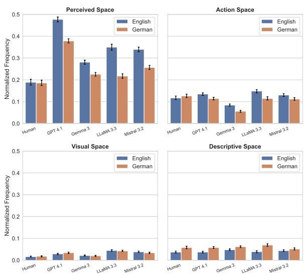  
Figure 2: Normalized frequencies of setting categories in the opening sentences (first 15 sentences) of humanauthored and AI-generated texts in English and German. Error bars indicate 95% confidence intervals.

McTeague traverses a habitual route from restaurant to saloon to office, and the setting emerges through that trajectory. Objects serve functional roles, the pitcher left at the saloon to be collected on the way back, the stove crammed with coke. Perceived space, where it appears, is bound to the body and conveys temperature and smoke only through their effect on the character. GPT 4.1, by contrast, arrests movement from the second sentence onward. Three consecutive sentences of perceived space follow. Objects become prominent as sensory props rather than instruments for purposeful action, the “turning and returning” of the fork, the table textured by “years” of use. The environment is rendered quasi-anthropomorphic, its grey sky “sullen” and “the world’s machinery seeming to slow.” Unlike in Norris’ passage, the detail of the external world is emphasized. The passage illustrates a storyworld pervaded by atmosphere, where the environment presses in on the character. What the classifier labels as perceived space is, at the level of narrative experience, a world felt before it is actively inhabited.

## 4.3 Temporal distribution of setting across narrative time

## 4.3.1 Overall differences in proportion

In human-authored fiction, action space is the most frequently produced spatial category. LLMs deviate systematically from the distributional profile of human-authored fiction, most consistently in their overuse of perceived space. Figure 3 shows the deviation of each model from the human baseline across ten narrative sections for English and German. The statistical model confirms significant model differences in the first section and a significant model×section interaction, indicating that models diverge from human authors in ways that vary across narrative time (English: model main effect $\chi ^ { 2 } ( 4 ) = 2 5 0 9 . 3 7 , p < . 0 0 1 ; \mathrm { m o d e l } ;$ ×section interaction $\chi ^ { 2 } ( 3 6 ) = 2 0 1 3 . 4 8 , p < . 0 0 1 )$ . Posthoc contrasts confirm that all four LLMs produce significantly more perceived space than human authors across every narrative section (all $p < . 0 0 1$ after Holm correction). GPT 4.1 shows the largest deviations on average (∼0.14–0.25 above baseline) and LlaMA 3.3 the second largest (∼0.10–0.23), while Gemma 3 remains closest to the human baseline $( \sim 0 . 0 6 \ – 0 . 1 0 )$ . For action space, GPT 4.1 is the only model that remains close to or above the human baseline. Gemma 3 and Mistral 3.2 fall below it from the opening section onward, while LlaMA 3.3 diverges from section 2 onward. These differences produce a significant model effect (English: $\chi ^ { 2 } ( 4 ) = 4 5 6 . 7 8 , p < . 0 0 1 )$ . LlaMA 3.3 shows the largest deficit overall, based on post-hoc contrasts (estimates $- 0 . 0 4 -- 0 . 0 7 $ across sections 2–10, all $p \ < \ . 0 0 1 )$ . This pattern is reflected in the all-space aggregate: GPT 4.1 produces a consistently higher proportion of spatially marked sentences than human authors.

## 4.3.2 Differences in trend

Figure 4 shows action and descriptive space frequency across ten narrative sections. For action space, GPT 4.1 tracks closely with the human baseline and shares its slight upward trend. LlaMA 3.3 declines continuously, while Gemma 3 and Mistral 3.2 stabilize below the baseline after an initial drop. For descriptive space, all models broadly follow the human baseline’s declining trend, with GPT 4.1 and Gemma 3 remaining somewhat elevated, and Mistral 3.2 and LlaMA 3.3 falling below it. For perceived space (Figure 9 in Appendix D), the human baseline starts moderately and remains largely flat across narrative sections, whereas all models start higher and show no comparable stabilization. GPT 4.1 and LlaMA 3.3 in particular fluctuate considerably throughout. Part of this variance is attributable to chapter boundaries in the generation procedure (Section 4.4, Appendix H). Beyond the boundary effect, the models distribute atmospheric density less evenly across a narrative than human authors do.

## 4.3.3 Comparison English vs. German

The cross-linguistic comparison (Figure 3) shows a reversal for perceived space. While all models exceed the English human baseline, most fall at or below the German baseline (GPT 4.1 excepted, which remains elevated in both languages). Post-hoc contrasts show that Gemma 3 and Mistral 3.2 are indistinguishable from the German human baseline in several later sections, while LlaMA 3.3 falls consistently below it from section 3 onward $( \chi ^ { 2 } ( 3 6 ) = 1 8 6 0 . 1 5 , p < . 0 0 1 )$ . For action space, the pattern of deviation replicates across languages but is more pronounced in German $( \chi ^ { 2 } ( 3 6 ) = 1 4 4 9 . 7 9 , p < . 0 0 1 )$ . LlaMA’s declining trajectory and Gemma’s and Mistral’s stable deficit are visible in both corpora, with the gap widening in German. The all-space aggregate mirrors this. GPT 4.1 exceeds the human baseline in both languages, whereas the remaining models, which approach human levels in English, fall clearly below it in German.

## 4.4 Ablation studies

Memorization. Across both languages we found no instances of verbatim reconstruction, with the single exception of Gemma 3 reproducing the wellknown opening sentence of Dickens’ A Tale of Two Cities.

Prompt sensitivity. As shown in Figures 7 and 8, prompt formulation influences the absolute frequency of spatial categories to some degree, but overall trajectories across narrative sections remain consistent across all conditions, confirming that the main findings are not an artifact of the specific prompt used.

Chapter-boundary position. Perceived space is elevated at the start of every chapter relative to the second quarter of the chapter, across all eight model-language conditions, and rises again in the final quarter in English (except Gemma 3) and, in German, for GPT 4.1. The effect is small relative to the difference we report. The largest withinchapter range is 0.09, whereas the English models exceed the human baseline by 0.11 to 0.21 overall, and even at their within-chapter minimum all four produce two to three times as much perceived space as human authors. The overproduction is moreover already present in chapter 1, which is generated from a single prompt before any continuation instruction. Part of the temporal variance described in Appendix D is therefore attributable to the chapter-based prompting strategy, but the overproduction itself is not.

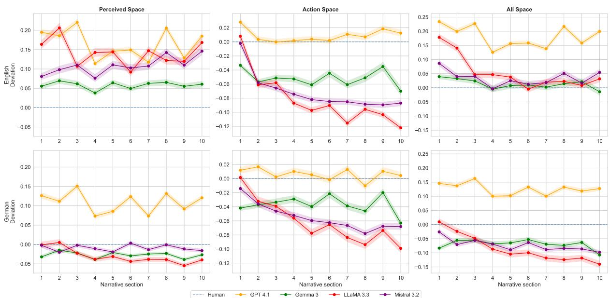

Figure 3: Deviation of model predictions from the human baseline for perceived and action space across narrative sections, comparing English and German corpora.  
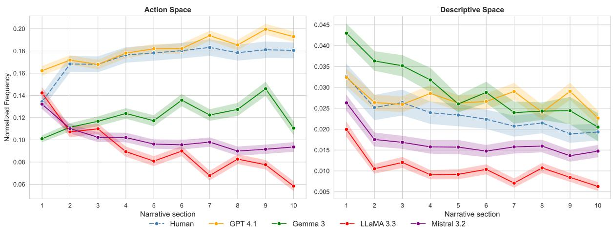  
Figure 4: Normalized frequency of action space and descriptive space across narrative sections for human-authored and AI-generated texts in English. Shaded bands indicate ±1 standard error.

Genre. Genre is significant for perceived and action space in English $( \chi ^ { 2 } ( 1 ) = 1 8 . 6 3$ and 23.14, both $p \ < \ . 0 0 1 )$ and for all categories except descriptive space in German. The author main effect and the author × section interaction remain highly significant with genre included (Appendix G).

## 5 Discussion

In human-authored fiction, action space in story openings anchors readers in sequences of habitual, embodied action, generating narrative momentum through characters’ movement and routine interaction with space. LLM-generated openings, instead, privilege perceived space, foregrounding Stimmung (i.e., mood or atmosphere) over action, resulting in a diffuse “background feeling” (Colombetti, 2013) untethered from what characters actually do.8 This skew contributes to an empirically recognizable generative AI style—rich in affect and ambience, but less grounded in embodied action and spatial concreteness. This pattern aligns with prior work documenting LLMs’ preference for sensorial and affect-laden language (Hicke et al., 2025; Lee and Lim, 2024), and extends it by showing how these preferences manifest at the level of narrative setting and shape storyworld construction.

A plausible explanation is that post-training alignment methods might amplify this tendency. If human raters reward emotionally resonant, atmospheric prose, generation may be biased systematically toward perceived space. Importantly, the pattern we observe does not appear to be driven by historical periodicity in the human baseline. Spatial category distributions in the human-authored corpora show no systematic directional trend across the main period of the corpus (see Appendix F). This suggests the observed differences reflect a systematic contrast between human and LLM writing rather than a temporal drift in narrative space composition.

A second explanation concerns the generation procedure itself. Because each chapter is prompted afresh, every chapter start is treated as an opening, and perceived space rises at chapter boundaries relative to chapter middles (Appendix H). This accounts for part of the fluctuation across narrative sections, but not for the overall level, which is already elevated in chapter 1. Chapter-level prompting is a necessity given current long-form performance, and a different strategy would produce a different boundary profile without removing the underlying skew.

The cross-linguistic asymmetry suggests that these tendencies are not uniformly stable across languages. Open-source models align more closely with GPT 4.1 in English than in German. In the latter, their perceived space distributions converge toward or fall below the human baseline, and their action space deficit widens. The perceived and action spaces of GPT 4.1, by contrast, remain elevated in both languages. In most cases, the three open-source models show comparatively little variation relative to each other despite differing in architecture and size. This suggests that the observed spatial tendencies reflect shared properties of instruction-tuned LLMs more broadly, such as preference optimization or training data composition, rather than model-specific factors.

Included as a covariate, genre has a significant effect for several categories in both languages (Appendix G). But because genre is matched across author conditions, this does not affect the humanmodel comparison. It does, however, indicate that spatial composition varies with genre, and the framework could be applied to genre-stratified corpora to examine this directly.

The fact that spatial category distributions alone are sufficient to identify the generating model well above chance (see Appendix E) indicates that setting constitutes a reliable stylistic marker of AIgenerated fiction. We identify two directions that could build on this. The first is space-conditioned generation, in which models would be explicitly constrained to produce texts belonging to certain narrative spaces during prompting, which could mitigate the differences we report. The second is empirical validation with readers. Our analysis documents a difference in spatial composition, which is manifest in the texts themselves, but does not establish what that difference means for the reading experience. Existing work compares humanauthored and AI-generated stories as wholes and finds that readers rate the AI-generated ones as more absorbing (Sears and Weisberg, 2026), but these judgements are not linked to any measured property of the texts. A reader study could vary spatial composition directly and test whether it corresponds to differences in immersion or perceived quality.

## 6 Conclusion

We introduced a narratology-informed framework for analyzing worldbuilding in AI-generated fiction, comprising five spatial categories grounded in narrative theory, a fine-tuned BERT classifier for English (extending an existing German classifier), and a corpus-scale application across four LLMs in both languages. The results reveal consistent differences between LLM-generated and human-authored text in how narrative space is constructed. LLMs systematically overrepresent perceived space while producing less action space than human authors, a pattern that holds across models and across narrative sections, though with modelspecific and cross-linguistic variation in magnitude. GPT 4.1 shows the largest and most consistent overproduction of perceived space across both languages, while remaining close to the human baseline for action and descriptive space. These findings suggest that LLMs do not reproduce the spatial distributions of human fiction, but construct storyworlds in a way that differs systematically from literary norms. The spatial metrics that we propose in this paper, derived from narratological theory and grounded in literary scholarship, offer a path toward richer evaluation of AI-generated narratives.

## Limitations

Long-form generation remains challenging for LLMs, and the patterns we report, particularly re garding narrative time, may therefore reflect tendencies rather than fully stable narrative strategies. Because we prompted the models to pro duce “chapters”, part of the variance in spatial dis tributions across narrative time is attributable to chapter boundaries, where perceived space is ele vated (Section 4.4, Appendix H). The classifier’s comparatively lower performance on Mistral 3.2 outputs, most pronounced in German, means that the results for this model should be interpreted with some caution. Additionally, our analysis focuses on English and German texts from public-domain Project Gutenberg (English: 1800–1920; German: 1780–1940), which may limit the generalizability of our findings to contemporary fiction and to lan guages beyond English and German. Extending the analysis to contemporary fiction remains an open direction, and would show whether the patterns we report hold for present-day fiction. Since we use only the first sentence of each human-authored text as a prompt and provide no information on year of publication, we cannot expect LLMs to reproduce the stylistic conventions of this historical period.9 Our coarse novel vs. other coding cannot capture genre-specific worldbuilding strategies (e.g., “speculative fiction” vs. “fairy tales”), and subgenre-stratified sample sizes are too small rela tive to the dominant novel and novella categories to test whether the divergence we report varies in magnitude across genres. A genre-balanced corpus would be needed to answer this, which we leave to future work. Despite these limitations, our results provide valuable insight into systematic differences between AI-generated and human-authored fiction.

## Acknowledgments

The authors gratefully acknowledge the scientific support and HPC resources provided by the Erlangen National High Performance Computing Center (NHR@FAU) of the Friedrich-Alexander-Universität Erlangen-Nürnberg (FAU). The hardware is partially funded by the German Research Foundation (DFG). The authors further acknowledge support from the Alexander von Humboldt

Foundation as part of the Alexander von Humboldt Professorship endowed by the German Federal Ministry of Research, Technology and Space (BMFTR). The authors thank Jan-Oliver Reincke for help with the annotation.

## References

Kabir Ahuja, Melanie Sclar, and Yulia Tsvetkov. 2025. Finding flawed fictions: Evaluating complex reasoning in language models via plot hole detection. Preprint, arXiv:2504.11900.

Maria Antoniak, Joel Mire, Maarten Sap, Elliott Ash, and Andrew Piper. 2024. Where do people tell stories online? story detection across online communities. In Proceedings of the 62nd Annual Meeting of the Associationfor Computational Linguistics (Volume 1: Long Papers), pages 7104–7130, Bangkok, Thailand. Association for Computational Linguistics.

Minwook Bae and Hyounghun Kim. 2024. Collective critics for creative story generation. In Proceedings of the 2024 Conference on Empirical Methods in Natural Language Processing, pages 18784–18819, Miami, Florida, USA. Association for Computational Linguistics.

Ryan L Boyd, Kate G Blackburn, and James W Pennebaker. 2020. The narrative arc: Revealing core narrative structures through text analysis. Science advances, 6(32):eaba2196.

Emily Brontë. 1847. Wuthering Heights. Project Gutenberg.

Mollie E. Brooks, Kasper Kristensen, Koen J. van Benthem, Arni Magnusson, Casper W. Berg, Anders Nielsen, Hans J. Skaug, Martin Mæchler, and Benjamin M. Bolker. 2017. glmmTMB balances speed and flexibility among packages for zero-inflated generalized linear mixed modeling. The R Journal, 9(2):378–400.

Tuhin Chakrabarty, Jane C. Ginsburg, and Paramveer Dhillon. 2025. Readers Prefer Outputs of AI Trained on Copyrighted Books over Expert Human Writers.

Tuhin Chakrabarty, Philippe Laban, Divyansh Agarwal, Smaranda Muresan, and Chien-Sheng Wu. 2024. Art or Artifice? Large Language Models and the False Promise of Creativity. arXiv preprint. ArXiv:2309.14556 [cs].

Allen Chapman. 1910. Tom Fairfield’s Hunting Trip, or Lost in the Wilderness. Project Gutenberg.

Honghua Chen and Nai Ding. 2023. Probing the “Creativity” of Large Language Models: Can models produce divergent semantic association? In Findings of the Association for Computational Linguistics: EMNLP 2023, pages 12881–12888, Singapore. Association for Computational Linguistics.

Domenic V. Cicchetti and Alvan R. Feinstein. 1990. High agreement but low kappa: II. resolving the paradoxes. Journal ofClinical Epidemiology, 43(6):551– 558.

Giovanna Colombetti. 2013. The Feeling Body: Affective Science Meets the Enactive Mind. MIT Press, Cambridge, MA.

Michael Scott Asato Cuthbert, Lisa Tagliaferri, Stephan Risi, and 1 others. 2019. Computational reading of gender in novels, 1770–1922. MIT Digital Humanities Lab.

Jacob Devlin, Ming-Wei Chang, Kenton Lee, and Kristina Toutanova. 2019. BERT: Pre-training of Deep Bidirectional Transformers for Language Understanding. In Proceedings ofthe 2019 Conference ofthe North American Chapter ofthe Associationfor Computational Linguistics: Human Language Technologies, Volume 1 (Long and Short Papers), pages 4171–4186, Minneapolis, Minnesota. Association for Computational Linguistics.

Bahare Fatemi, Mehran Kazemi, Anton Tsitsulin, Karishma Malkan, Jinyeong Yim, John Palowitch, Sungyong Seo, Jonathan Halcrow, and Bryan Perozzi. 2024. Test of time: A benchmark for evaluating llms on temporal reasoning. arXiv preprint arXiv:2406.09170.

John Garland. 1915. Ross Grant Tenderfoot. Project Gutenberg.

Joanna Gavins. 2007. Text world theory : an introduction. Edinburgh University Press, Edinburgh. OCLC: 1162422251.

Gemma Team. 2025. Gemma 3 technical report. ArXiv:2503.19786 [cs.CL].

Aaron Grattafiori, Abhimanyu Dubey, Abhinav Jauhri, Abhinav Pandey, Abhishek Kadian, Ahmad Al-Dahle, Aiesha Letman, Akhil Mathur, Alan Schelten, Alex Vaughan, Amy Yang, Angela Fan, Anirudh Goyal, Anthony Hartshorn, Aobo Yang, Archi Mitra, Archie Sravankumar, Artem Korenev, Arthur Hinsvark, and 542 others. 2024. The Llama 3 Herd of Models. arXiv preprint. ArXiv:2407.21783 [cs].

David Herman. 2002. Story Logic: Problems and Possibilities of Narrative. University of Nebraska Press, Lincoln and London.

David Herman. 2009. Basic elements of narrative. Wiley-Blackwell, Chichester, U.K. ; Malden, MA. OCLC: 229467488.

Rebecca M. M. Hicke, Sil Hamilton, and David Mimno. 2025. The Zero Body Problem: Probing LLM Use of Sensory Language. arXiv preprint. ArXiv:2504.06393 [cs].

Grace Brooks Hill. 1916. The Corner House Girls on a Houseboat. Project Gutenberg.

Gerhard Hoffmann. 1978. Gerhard Hoffmann: Raum, Situation, erzählte Wirklichkeit. Poetologische und historische Studien zum englischen und amerikanischen Roman. J. B. Metzler.

George Hripcsak and Adam S. Rothschild. 2005. Agreement, the F-measure, and reliability in information retrieval. Journal ofthe American Medical Informatics Association, 12(3):296–298.

Shin-nosuke Ishikawa and Atsushi Yoshino. 2025. AI with Emotions: Exploring Emotional Expressions in Large Language Models. In Proceedings of the 5th International Conference on Natural Language Processingfor Digital Humanities, pages 614–627, Albuquerque, USA. Association for Computational Linguistics.

Mete Ismayilzada, Claire Stevenson, and Lonneke van der Plas. 2025. Evaluating Creative Short Story Generation in Humans and Large Language Models. arXiv preprint. ArXiv:2411.02316 [cs].

Daniel Kababgi, Giulia Grisot, Federico Pennino, and J. Berenike Herrmann. 2024. Recognising nonnamed spatial entities in literary texts: A novel spatial entities classifier. In Proceedings of the Computational Humanities Research Conference (CHR 2024), pages 472–481.

Robert Kubinec. 2023. Ordered beta regression: A parsimonious, well-fitting model for continuous data with lower and upper bounds. Political Analysis, 31(4):519–536.

J. Richard Landis and Gary G. Koch. 1977. The measurement of observer agreement for categorical data. Biometrics, 33(1):159–174.

Bruce W. Lee and JaeHyuk Lim. 2024. Language Models Don’t Learn the Physical Manifestation of Language. arXiv preprint. ArXiv:2402.11349 [cs].

Russell V. Lenth and Julia Piaskowski. 2026. emmeans: Estimated Marginal Means, aka Least-Squares Means. R package version 2.0.3.

Li Lucy and David Bamman. 2021. Gender and Representation Bias in GPT-3 Generated Stories. In Proceedings of the Third Workshop on Narrative Understanding, pages 48–55, Virtual. Association for Computational Linguistics.

Michaela Mahlberg. 2013. Corpus stylistics and Dickens’s fiction. Routledge advances in corpus linguistics; 14. Routledge, New York.

Guillermo Marco, Julio Gonzalo, M.Teresa Mateo-Girona, and Ramón Del Castillo Santos. 2024. Pron vs Prompt: Can Large Language Models already Challenge a World-Class Fiction Author at Creative Text Writing? In Proceedings of the 2024 Conference on Empirical Methods in Natural Language Processing, pages 19654–19670, Miami, Florida, USA. Association for Computational Linguistics.

Frank Norris. 1899. McTeague: A story of San Francisco. Project Gutenberg.

Samuel J. Paech. 2023. Eq-bench: An emotional intelligence benchmark for large language models. Preprint, arXiv:2312.06281.

Katrin Rohrbacher. 2025a. de-corp: A corpus of german-language fiction and non-fiction (1780– 1930). Journal ofOpen Humanities Data, 11(1):51.

Katrin Rohrbacher. 2025b. Opening worlds: Narrative beginnings and the role of setting. CCLS2025 Conference Preprints, 4(1).

Katrin Rohrbacher. forthcoming. “lived space”: A computational study of setting in fiction. In R. M. Aust, G. Grisot, and B. Herrmann, editors, Comparing landscapes: Approaches to space and affect in literaryfiction. Bielefeld University Press.

Sydney Sears and Deena Skolnick Weisberg. 2026. Bot or not: Can people tell the difference between stories written by a human or by an AI system? Judgment and Decision Making, 21:e21.

Sandeep Soni, Amanpreet Sihra, Elizabeth Evans, Matthew Wilkens, and David Bamman. 2023. Grounding characters and places in narrative text. In Proceedings of the 61st Annual Meeting of the Associationfor Computational Linguistics (Volume 1: Long Papers), pages 11723–11736, Toronto, Canada. Association for Computational Linguistics.

E. Ströker. 1965. Philosophische Untersuchungen zum Raum. Philosophische Abhandlungen. V. Klostermann.

James Francis Thierry. 1918. The Adventure of the Eleven Cuff-Buttons. Project Gutenberg.

Yufei Tian, Tenghao Huang, Miri Liu, Derek Jiang, Alexander Spangher, Muhao Chen, Jonathan May, and Nanyun Peng. 2024. Are Large Language Models Capable of Generating Human-Level Narratives? arXiv preprint. ArXiv:2407.13248 [cs].

Ted Underwood, Laura K. Nelson, and Matthew Wilkens. 2025. Can Language Models Represent the Past without Anachronism? arXiv preprint. ArXiv:2505.00030 [cs].

Ashish Vaswani, Noam Shazeer, Niki Parmar, Jakob Uszkoreit, Llion Jones, Aidan N. Gomez, Lukasz Kaiser, and Illia Polosukhin. 2023. Attention Is All You Need. arXiv preprint. ArXiv:1706.03762 [cs].

Michael Vauth, Hans Ole Hatzel, Evelyn Gius, and Chris Biemann. 2021. Automated event annotation in literary texts. In Proceedings ofthe Conference on Computational Humanities Research 2021, volume 2989 of CEUR Workshop Proceedings, pages 333– 345, Amsterdam, the Netherlands. CEUR-WS.org.

Qianyue Wang, Jinwu Hu, Zhengping Li, Yufeng Wang, Daiyuan Li, Yu Hu, and Mingkui Tan. 2025. Generating long-form story using dynamic hierarchical outlining with memory-enhancement. In Proceedings of the 2025 Conference ofthe Nations ofthe Americas Chapter of the Association for Computational Linguistics: Human Language Technologies (Volume 1: Long Papers), pages 1352–1391, Albuquerque, New Mexico. Association for Computational Linguistics.

Sandra Wankmüller. 2024. Introduction to Neural Transfer Learning With Transformers for Social Science Text Analysis. Sociological Methods & Research, 53(4):1676–1752. Publisher: SAGE Publications Inc.

Yunpu Zhao, Rui Zhang, Wenyi Li, Di Huang, Jiaming Guo, Shaohui Peng, Yifan Hao, Yuanbo Wen, Xing Hu, Zidong Du, Qi Guo, Ling Li, and Yunji Chen. 2024. Assessing and Understanding Creativity in Large Language Models. ArXiv:2401.12491 [cs].

Shu Zhong, Elia Gatti, Youngjun Cho, and Marianna Obrist. 2024. Exploring Human-AI Perception Alignment in Sensory Experiences: Do LLMs Understand Textile Hand? arXiv preprint. ArXiv:2406.06587 [cs].

## A English setting classifier

## A.1 Annotation Guidelines

## General Principles

Each sentence is assigned to exactly one category. Where multiple space types are present, assign the category that is most prominent. Sentences where space is implied but no concrete or atmospheric markers are present (e.g., references to imagined, dreamt, or remembered spaces) are labeled no space. Only spaces that are part of the concrete storyworld are considered.

## Category Definitions

Action space (Aktionsraum) Space that is moved through or interacted with by a character. Objects serve functional roles, enabling or hindering movement and goal-directed action. The character appropriates space through touch and bodily movement rather than through observation or sensory perception. Example: “He jumped up, jerked the window-shade, and dragged his chair closer to examine the shoes.”

Perceived space (gestimmter Raum) Space experienced as atmospheric and mood-laden. The character is affected by or absorbed into the environment through diffuse sensory experience — sounds, smells, light, weather — without clear directionality or goal-oriented movement. Setting may function quasi-anthropomorphically, as though it acts upon the character. Example: “The terror of loneliness among those overhanging mountains gripped at the boy’s throat.”

Visual space (Anschauungsraum) Space observed from a static or near-static position. The character surveys the environment with their eyes rather than moving through it. Space presents itself to the character; the focus is on what is seen rather than on how the character is affected. Example: “He glancedfrom Tom to the cabin.”

Descriptive space Spatial information that situates characters or objects without being anchored to any character’s perception, agency, or emotional experience. Functions as neutral scene-setting or localization. Example: “On either side ofthe towpath werefarms and gardens.”

No space No spatial relationship is present, or space appears only as imagined, dreamt, remembered, or planned, i.e., not part of the concrete storyworld. Example: “By this curious turn I have gained the reputation ofdeliberate heartlessness.”

## Common Ambiguities

Action vs. perceived space. When movement and atmosphere co-occur, assign the category that predominates. If a character moves through space but is primarily affected by or absorbed into it, prefer perceived space. If movement and goaldirected interaction with objects are foregrounded, prefer action space. Perceived vs. visual space. Both involve a relatively static character, but visual space is detached and observational, while perceived space involves affective absorption. If the environment is rendered anthropomorphic or the character is emotionally moved by it, prefer perceived space. Descriptive vs. visual space. Descriptive space is not anchored to any character’s point of view; visual space is. If a character is explicitly observing the described scene, prefer visual space.

## A.2 Model and Training

The English setting classifier was fine-tuned from RoBERTa (“roberta-base”)10, an encoder model based on the BERT architecture (Devlin et al., 2019), trained for 5 epochs with a learning rate of 1e-5 on 70% of the annotated data and evaluated on a held-out test set of 30% (n = 972). Classification performance is reported in Table 5. For comparison, Table 6 reports the performance of the German classifier, adapted from Rohrbacher (2025b), which achieves a macro F1 of 0.85, broadly similar to the English classifier, with the German classifier performing slightly higher overall.

<table><tr><td>Class</td><td>Precision</td><td>Recall</td><td>F1-score</td></tr><tr><td>Perceived space</td><td>0.81</td><td>0.82</td><td>0.82</td></tr><tr><td>Action space</td><td>0.87</td><td>0.83</td><td>0.85</td></tr><tr><td>Visual space</td><td>0.65</td><td>0.76</td><td>0.70</td></tr><tr><td>Descriptive space</td><td>0.75</td><td>0.85</td><td>0.80</td></tr><tr><td>No space</td><td>0.95</td><td>0.90</td><td>0.92</td></tr><tr><td>Macro avg</td><td>0.81</td><td>0.83</td><td>0.82</td></tr><tr><td>Class</td><td>Precision</td><td>Recall</td><td>F1</td></tr><tr><td>Perceived space</td><td>0.86</td><td>0.82</td><td>0.84</td></tr><tr><td>Action space</td><td>0.91</td><td>0.81</td><td>0.86</td></tr><tr><td>Visual space</td><td>0.79</td><td>0.88</td><td>0.83</td></tr><tr><td>Descriptive space</td><td>0.78</td><td>0.84</td><td>0.81</td></tr><tr><td>No space</td><td>0.86</td><td>0.93</td><td>0.91</td></tr><tr><td>Macro avg</td><td>0.84</td><td>0.86</td><td>0.85</td></tr></table>

Table 5: Classification report for the English setting classifier. Precision, Recall, and F1-score are reported per class, along with macro averages.

Table 6: Classification report for the German setting classifier. Precision, Recall, and F1-score are reported per class, along with macro averages. Adapted from Rohrbacher (2025b).

## A.3 Classifier Validation

Since the classifier was fine-tuned on humanauthored fictional prose, a key question is whether it generalizes to AI-generated text, which may differ systematically from its training domain in vocabulary or stylistic conventions. To assess this, two annotators manually labeled a stratified sample of 600 sentences drawn from the AI-generated texts used in the main study, covering all four models and both languages. Inter-annotator agreement was substantial $( \kappa = 0 . 7 3 6$ , 79.2% raw agreement), and remaining disagreements were resolved through discussion, producing a gold standard against which classifier performance was evaluated.

Table 7 reports per-class precision, recall, and F1 for the classifier evaluated against the gold standard annotations. Table 8 shows performance broken down by model and language. Results are consistent across most model-language combinations, where accuracy ranges from 77.3% to 85.3% with κ values indicating substantial agreement. This confirms that the classifier generalizes well to AIgenerated text. Mistral 3.2 shows somewhat lower performance in both languages, most pronounced in German (62.7%, $\kappa = 0 . 5 3 3 )$ ). During annotation, we observed that Mistral 3.2 occasionally produced grammatically malformed or semantically incoherent sentences that superficially resembled a spatial category but could not be assigned one meaningfully. These were labeled as no space by annotators. The classifier, trained on well-formed prose, was not exposed to such cases during fine-tuning and therefore tends to assign a spatial label rather than no space in these instances, which disproportionately affects Mistral 3.2 across both languages and is most pronounced in German where such outputs were most frequent. Performance for all other models and languages falls within a narrow and acceptable range, supporting the classifier’s general applicability to AI-generated text.

<table><tr><td>Category</td><td>P</td><td>R</td><td>F1</td><td>n</td></tr><tr><td>Action space</td><td>0.758</td><td>0.805</td><td>0.781</td><td>113</td></tr><tr><td>Descriptive space</td><td>0.733</td><td>0.946</td><td>0.826</td><td>93</td></tr><tr><td>No space</td><td>0.933</td><td>0.586</td><td>0.720</td><td>191</td></tr><tr><td>Perceived space</td><td>0.708</td><td>0.867</td><td>0.780</td><td>98</td></tr><tr><td>Visual space</td><td>0.767</td><td>0.876</td><td>0.818</td><td>105</td></tr><tr><td>Macro avg</td><td>0.780</td><td>0.816</td><td>0.785</td><td>600</td></tr></table>

Table 7: Per-class classifier performance against gold standard annotations (n=600).

<table><tr><td>Language</td><td>Model</td><td>Accuracy</td><td>κ</td><td>Macro F1</td></tr><tr><td rowspan="4">English</td><td>GPT 4.1</td><td>81.3%</td><td>0.767</td><td>0.810</td></tr><tr><td>Gemma 3</td><td>77.3%</td><td>0.717</td><td>0.777</td></tr><tr><td>LlaMA 3.3</td><td>77.3%</td><td>0.717</td><td>0.773</td></tr><tr><td>Mistral 3.2</td><td>72.0%</td><td>0.650</td><td>0.722</td></tr><tr><td rowspan="4">German</td><td>GPT 4.1</td><td>85.3%</td><td>0.817</td><td>0.855</td></tr><tr><td>Gemma 3</td><td>85.3%</td><td>0.817</td><td>0.855</td></tr><tr><td>LlaMA 3.3</td><td>82.7%</td><td>0.783</td><td>0.827</td></tr><tr><td>Mistral 3.2</td><td>62.7%</td><td>0.533</td><td>0.645</td></tr></table>

Table 8: Classifier performance by model and language.

## A.3.1 Inter-annotator agreement

<table><tr><td>Category</td><td>IoU</td><td>κ</td><td> $n _ { \cup }$ </td></tr><tr><td>Action space</td><td>0.672</td><td>0.761</td><td>128</td></tr><tr><td>Descriptive space</td><td>0.734</td><td>0.818</td><td>109</td></tr><tr><td>No space</td><td>0.710</td><td>0.760</td><td>207</td></tr><tr><td>Perceived space</td><td>0.543</td><td>0.646</td><td>127</td></tr><tr><td>Visual space</td><td>0.604</td><td>0.689</td><td>154</td></tr><tr><td>Overall</td><td>79.2 % raw</td><td>0.736</td><td>600</td></tr></table>

Table 9: Inter-annotator agreement per category on the double-coded sample $( n = 6 0 0$ sentences). IoU is the number of sentences both annotators assigned to a category divided by the number $n _ { \cup }$ that at least one annotator did; κ is the chance-corrected one-vs-rest Cohen’s κ. The $n _ { \cup }$ column sums to 725 rather than 600 because each of the 125 disagreed sentences counts toward two categories. The underlying marginals are given in Figure 5a.

Table 9 reports two per-category agreement statistics on the pooled English and German sample. IoU is a stricter variant of the standard positivespecific agreement statistic (inter-annotator F1; Cicchetti and Feinstein, 1990; Hripcsak and Rothschild, 2005), which ranks the categories identically. Perceived space shows the lowest raw agreement (IoU = 0.543) but a chance-corrected κ of 0.646, conventionally substantial agreement (Landis and Koch, 1977). These are initial assessment values. All disagreements were subsequently resolved through discussion, and the classifier was evaluated against the resulting adjudicated gold standard, on which its perceived-space F1 (0.780) is comparable to the other categories (0.720–0.826; Table 7).

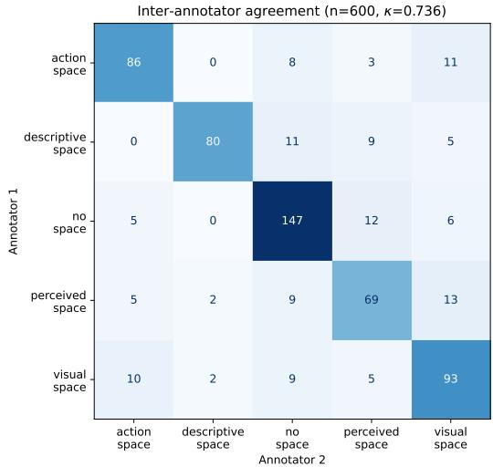  
(a) Annotator 1 (rows) against Annotator 2 (columns) on the double-coded sample, n = 600.

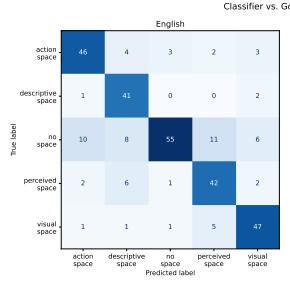

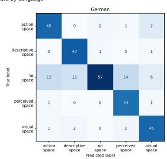  
(b) Classifier predictions (columns) against the adjudicated gold standard (rows), n = 300 per language.  
Figure 5: Confusion structure of the five-category scheme. Panel a reports human–human agreement; panel b reports classifier–gold agreement.

Figure 5 shows the confusion structure behind these agreement figures, which suggests that the disagreements follow a systematic pattern. In panel a, perceived space is confused principally with no space (21 sentences) and with visual space (18). Both confusions involve threshold judgments, one about whether atmospheric content is concretely spatial at all, the other about affective absorption as against detached observation (Appendix A.1). Perceived and action space, the two categories carrying the central contrast of this paper, are almost never confused. The count is 8 of 600 sentences (1.3%) between annotators, and 4 of 300 (English) and 2 of 300 (German) for the classifier against the gold standard. The reported difference is therefore unlikely to be an artefact of annotator or classifier uncertainty between these two categories. Panel b shows that the classifier’s errors are concentrated in the no space row. Recall for that category is 0.611 in English (55 of 90) and 0.564 in German (57 of 101). Misassigned sentences go most often to perceived space, and over half of these come from Mistral 3.2, whose outputs are frequently malformed (Section A.3). Only four occur across all 150 GPT 4.1 sentences. Because gold no-space sentences are by construction those with the weakest spatial signal, this asymmetry inflates the measured amount of represented space, but is concentrated in Mistral 3.2, whose deviations are among the smallest of the four models reported in Section 4.3. The central contrast is unaffected.

## B Deviation from Human Baseline: English and German

Figure 6 shows the deviation of each model from the human baseline across ten narrative sections for English and German.

## C Prompt Sensitivity

To validate that the findings are not sensitive to prompt formulation, we ran three prompt variants (see Table 10) per open-source model and language in addition to the original prompt. Figures 7 and 8 show the normalized frequency of each spatial category across ten narrative sections for the original prompt and three variants, for English and German respectively. Although prompt formulation introduces some variation in the absolute frequency of each category, the overall trends across the narrative sections remain consistent across all conditions. This suggests that the patterns reported in the main analysis are not an artifact of the specific prompt used.

## D Temporal Distribution of Setting across Narrative Time

Figure 9 shows the full temporal distribution of setting categories across narrative time for English and German.

## E Model Identifiability from Spatial Distributions

A random forest classifier trained on per-section spatial category proportions identified the source model well above chance in both languages (confusion matrices in Figures 10a and 10b). In English, human-authored texts are most reliably identified (recall = 0.97), while Mistral 3.2 is hardest (0.56). The main source of confusion is between LlaMA 3.3 and Mistral 3.2, consistent with their closely aligned setting distributions. In German, human recall drops to 0.79 as LLM distributions converge toward the baseline.

## F Temporal Stability of Human-Authored Corpora

Figure 11 shows the distribution of setting categories across publication years in the humanauthored corpora for English and German. Distributions are broadly stable across the main period of each corpus, supporting the assumption that observed differences between human-authored and AI-generated texts are not driven by historical subperiod.

## G Full GLMM Results

Table 11 reports the full Type III Wald $\chi ^ { 2 }$ tests for the GLMM described in Section 3.5, fitted separately for each setting category and language. These are the models from which all test statistics reported in Section 4.3 are taken. Genre is coded as novel vs. other fiction and, as noted in Section 3.5, is matched across author conditions by construction.

## H Chapter-Boundary Position

Figures 12 and 13 show the profiles for perceived space by position within chapter, for English and German respectively, and Table 12 reports the corresponding means.

Beyond perceived space, action space shows the mirror pattern, dropping at chapter boundaries relative to chapter middles, while visual and descriptive space decline slightly and steadily across each chapter, with a total spread of at most 0.006 and no boundary peak. The boundary effect is thus specific to perceived and, inversely, action space.

## I Generation Length

We generated between 2,500 and 3,000 tokens per chapter with an enforced maximum of 3,000 tokens, stopping when the model emitted an endof-sequence token or reached the cap, for four chapters and a total of 10,000–12,000 tokens per story. Where a model reproduced the seeding sentence verbatim, we removed the duplicated first sentence; where generation stopped mid-sentence, we removed the trailing incomplete sentence. Table 13 reports the resulting story lengths in words.

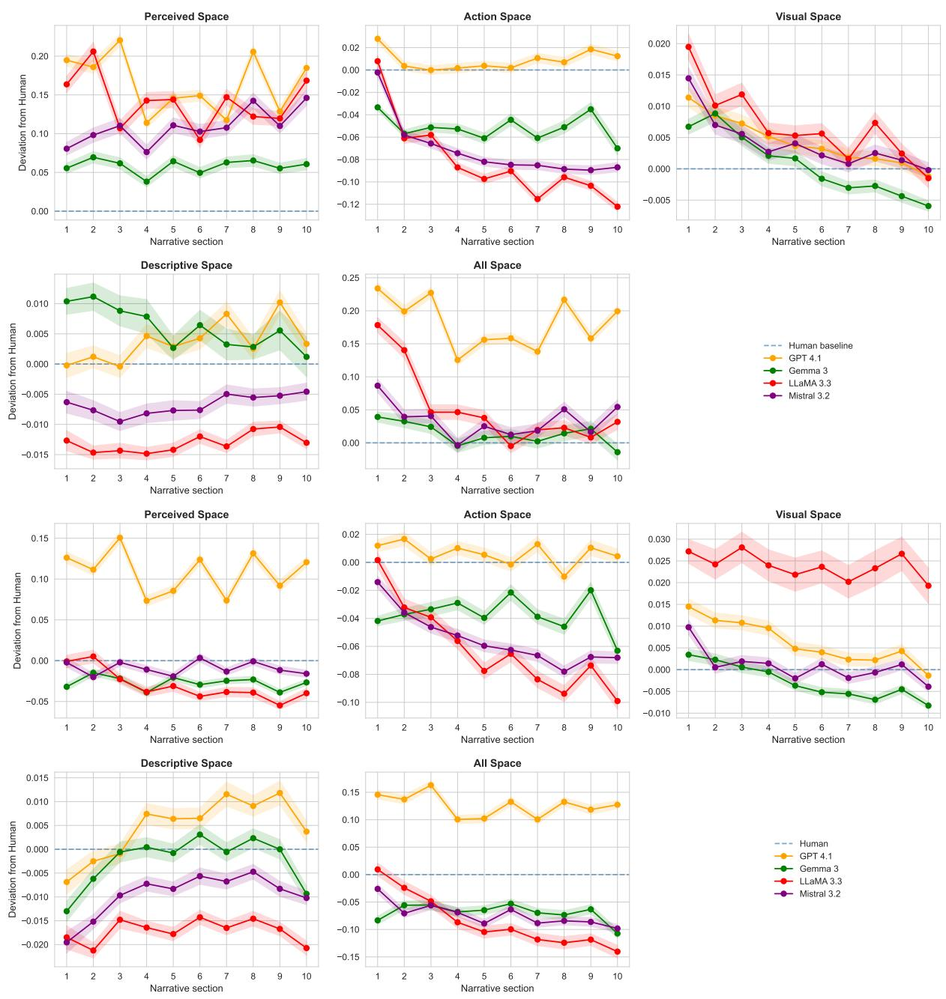  
Figure 6: Deviation of AI model predictions from the human baseline across narrative sections for each spatial category, for English (top) and German (bottom). The human baseline represents the average normalized frequency of each space type per narrative section (deviation = 0); positive values indicate higher proportions than humanauthored texts, negative values indicate lower. Error bars indicate 95% confidence intervals.

<table><tr><td>Variant</td><td>Role</td><td>Instruction</td></tr><tr><td>V1</td><td>System</td><td>As an award-winning author, you are tasked with writing a fictional narrative. Write a continuous narrative without any interruptions or questions. Do not break the role of the author. Do not finish the story or begin to summarize the narrative. Do not repeat yourself or reuse content from previous chapters. Each chapter should continue the story by introducing new elements, deepening existing characters, and progressing the plot.</td></tr><tr><td rowspan="2"></td><td>Step 1</td><td>Write a fictional story in the genre {genre}, beginning with the following opening: {sentence}. Produce the first chapter as a continuous text of approximately 3,000 tokens. Do not include any AI comments, notes, or meta-statements that would break the role of the author.</td></tr><tr><td>Step 2+</td><td>Write the next chapter of your narrative, continuing exactly from where the previous chapter ended. Introduce new elements, further develop the existing characters, and expand the narrative (~3,000 tokens). Do not conclude the story. Avoid repeating content from the previous chapter and do not include any AI comments or meta-statements.</td></tr><tr><td rowspan="4">V2</td><td>System</td><td>Take the role of an award-winning author. Your task is to write a fictional narrative. Avoid interacting with the user by making meta-comments or by asking questions. Write a continuous narrative. Do not finish your story or summarize the plot; instead each chapter should introduce new ideas and build upon the established story line and characters. Let the story run as long as possible.</td></tr><tr><td>Step 1</td><td>Write a fictional story in the genre {genre}. Begin your narrative with the following opening sentence: {sentence}. Produce the first chapter as a continuous piece of text of around 3,000 tokens. Keep the story flowing without stopping. Avoid any meta-comments, notes, or statements that break the role of the author.</td></tr><tr><td>Step 2+</td><td>Write the next chapter of your narrative. Continue exactly where the previous chapter ended. Introduce new elements, further develop the existing characters, and expand the narrative (~3,000 tokens). Do not bring the story to an end. Avoid repeating content from the previous chapter and do not include any AI comments or meta-statements.</td></tr><tr><td>System</td><td>Assume the role of an award-winning author and compose a fictional narrative. Do not interact with the user; avoid posing questions, making meta-comments, or producing any statements outside the narrative. The story must not be concluded or summarized. Each chapter should introduce new elements and further develop the existing storyline and</td></tr><tr><td rowspan="2"></td><td>Step 1</td><td>characters. Allow the narrative to continue for as long as possible. Compose a fictional narrative in the genre {genre}. Begin with the following opening sentence: {sentence}. Produce the first chapter as a continuous text of approximately 3,000 tokens, maintaining an uninterrupted narrative flow. Do not include any</td></tr><tr><td>Step 2+</td><td>meta-comments, notes, or statements that would break the role of the author. Compose the next chapter of the narrative, continuing exactly from where the previous chapter ended. Introduce new elements, further develop the existing characters, and expand the narrative (～3,000 tokens). Do not conclude the story. Avoid repeating material from the previous chapter and do not include any AI comments or meta-statements.</td></tr></table>

Table 10: Prompt variants used in the prompt sensitivity ablation. V1–V3 vary in phrasing and verbosity. {genre} and {sentence} are filled with metadata and the opening sentence of each source text. Step 2 is repeated for each subsequent chapter.

<table><tr><td>Category</td><td></td><td> $\chi ^ { 2 } ( 4 )$ </td><td> $\chi ^ { 2 } ( 9 )$ </td><td>model section genre  $\chi ^ { 2 } ( 1 )$ </td><td>model × section  $\chi ^ { 2 } ( 3 6 )$ </td></tr><tr><td rowspan="5">Eulish</td><td>Perceived space</td><td> $2 5 0 9 . 3 7 ^ { * * * }$ </td><td> $1 0 . 2 5 ^ { \mathrm { n . s . } }$ </td><td> $1 8 . 6 3 ^ { * * * }$ </td><td> $2 0 1 3 . 4 8 ^ { * * * }$ </td></tr><tr><td>Action space</td><td> $4 5 6 . 7 8 ^ { * * * }$ </td><td></td><td> $4 9 . 0 5 ^ { * * * } 2 3 . 1 4 ^ { * * * }$ </td><td> $2 6 6 0 . 8 8 ^ { * * * }$ </td></tr><tr><td>Visual space</td><td> $2 7 3 . 8 8 ^ { * * * }$ </td><td> $4 9 . 1 9 ^ { * * * }$ </td><td> $0 . 3 9 ^ { \mathrm { n . s . } }$ </td><td> $4 5 7 . 0 7 ^ { \ast \ast \ast }$ </td></tr><tr><td>Descriptive space</td><td> $2 5 9 . 4 1 ^ { \ast \ast \ast }$ </td><td> $5 3 7 . 0 6 ^ { \ast \ast \ast }$ </td><td> $2 . 4 1 ^ { \mathrm { n . s . } }$ </td><td> $4 8 7 . 6 1 ^ { \ast \ast \ast }$ </td></tr><tr><td>All spâce</td><td> $1 8 3 4 . 6 4 ^ { * * * }$ </td><td> $1 4 . 2 4 ^ { \mathrm { n . s . } }$ </td><td> $0 . 4 1 ^ { \mathrm { n . s . } }$ </td><td> $1 8 8 9 . 3 5 ^ { \ast \ast \ast }$ </td></tr><tr><td rowspan="5">Geman</td><td>Perceived space</td><td> $1 9 7 8 . 0 4 ^ { \ast \ast \ast }$ </td><td> $8 1 . 7 8 ^ { * * * }$ </td><td> $8 8 . 5 1 ^ { \ast \ast \ast }$ </td><td> $1 8 6 0 . 1 5 ^ { * * * }$ </td></tr><tr><td>Action space</td><td> $3 0 7 . 4 2 ^ { \ast \ast \ast }$ </td><td> $5 4 . 3 9 ^ { \ast \ast \ast }$ </td><td> $1 4 . 8 6 ^ { * * * }$ </td><td> $1 4 4 9 . 7 9 ^ { \ast \ast \ast }$ </td></tr><tr><td>Visual space</td><td> $7 0 0 . 5 8 ^ { \ast \ast \ast }$ </td><td> $2 1 . 3 9 ^ { * }$ </td><td> $2 6 . 4 4 ^ { * * * }$ </td><td> $4 7 6 . 0 3 ^ { \ast \ast \ast }$ </td></tr><tr><td>Descriptive space</td><td> $2 4 3 . 0 1 ^ { \ast \ast \ast }$ </td><td>242.25***</td><td> $1 . 0 5 ^ { \mathrm { n . s . } }$ </td><td> $7 3 8 . 4 0 ^ { \ast \ast \ast }$ </td></tr><tr><td>All spâce</td><td> $1 4 7 8 . 2 4 ^ { \ast \ast \ast }$ </td><td> $1 8 . 7 5 ^ { * }$ </td><td> $1 1 . 5 1 ^ { \ast \ast \ast }$ </td><td> $1 7 4 9 . 9 1 ^ { \ast \ast \ast }$ </td></tr></table>

Table 11: Type III Wald $\chi ^ { 2 }$ tests for the GLMM, space \~ author × section + genre + (1 | story), fitted separately per setting category and language. $^ { * * * } p < . 0 0 1$ $^ { * } p < . 0 5 .$ , n.s. = not significant.

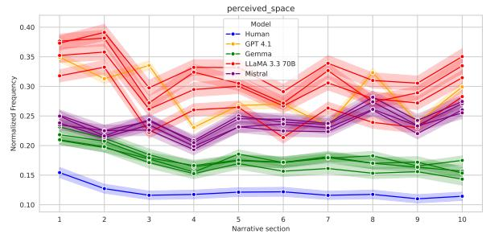

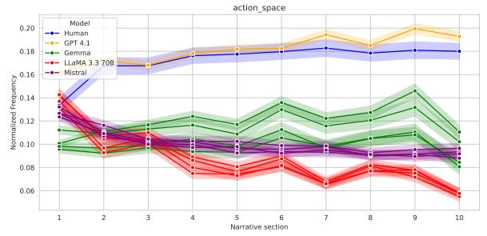

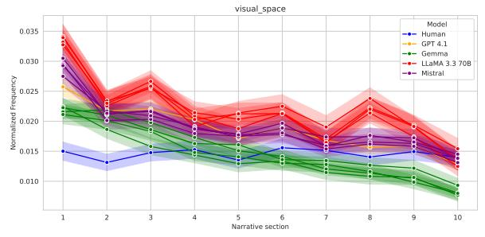

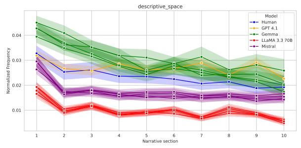

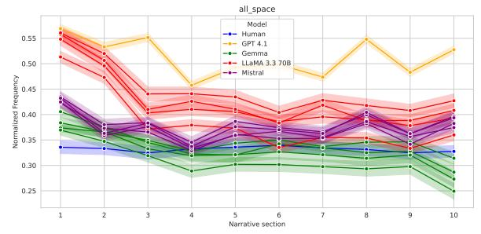  
Figure 7: Normalized frequency of spatial categories across ten narrative sections (English). Human-authored fiction is shown as a single line; for each model, four lines represent the original prompt and three prompt variants.

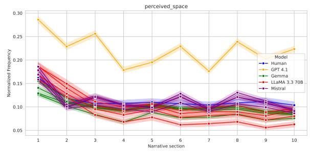

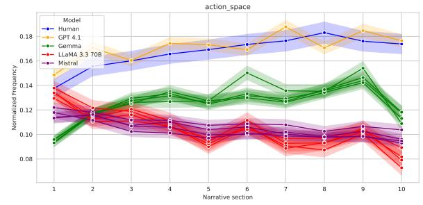

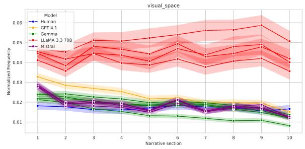

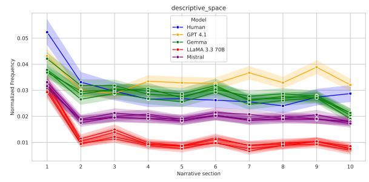

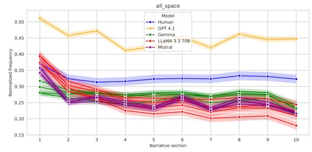  
Figure 8: Normalized frequency of spatial categories across ten narrative sections (German). Humanauthored fiction is shown as a single line. For each model, four lines represent the original prompt and three prompt variants.

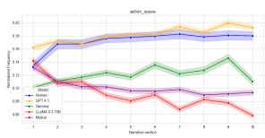

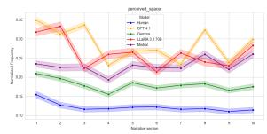

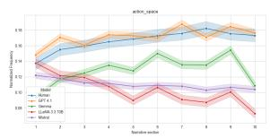

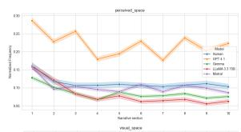

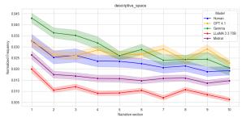

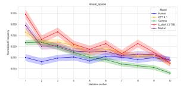

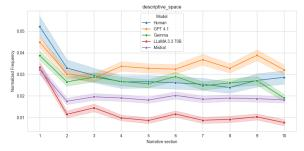

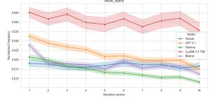

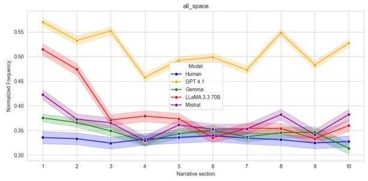

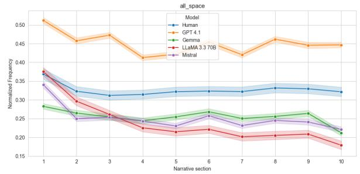  
Figure 9: Temporal distribution of setting categories across narrative time for English (left) and German (right).

<table><tr><td>Model</td><td>Q1</td><td>Q2</td><td>Q3</td><td>Q4</td></tr><tr><td>English GPT 4.1</td><td>0.333</td><td>0.241</td><td>0.260</td><td>0.322</td></tr><tr><td>LlaMA 3.3 Mistral 3.2</td><td>0.280 0.246</td><td>0.247 0.198</td><td>0.263 0.225</td><td>0.291 0.262</td></tr><tr><td>Gemma 3</td><td>0.193</td><td>0.172</td><td>0.200</td><td>0.197</td></tr><tr><td>Human</td><td></td><td>0.083</td><td></td><td></td></tr><tr><td></td><td></td><td></td><td></td><td></td></tr><tr><td>German</td><td></td><td></td><td></td><td></td></tr><tr><td>GPT 4.1</td><td>0.281</td><td>0.183</td><td>0.190</td><td></td></tr><tr><td>Mistral 3.2</td><td>0.143</td><td>0.099</td><td></td><td>0.244</td></tr><tr><td>LlaMA 3.3</td><td>0.113</td><td></td><td>0.087</td><td>0.088</td></tr><tr><td></td><td></td><td>0.087</td><td>0.080</td><td>0.077</td></tr><tr><td>Gemma 3</td><td>0.106</td><td>0.074</td><td></td><td></td></tr><tr><td></td><td></td><td></td><td>0.085</td><td>0.081</td></tr><tr><td>Human</td><td></td><td>0.084</td><td></td><td></td></tr></table>

Table 12: Normalized frequency of perceived space by quarter within chapter (Q1–Q4), averaged over the four chapters. Human-authored texts are not chaptersegmented; their corpus mean is given as a single reference value.

<table><tr><td>Model</td><td>Mean</td><td>SD</td><td>Min</td><td>P10</td><td>Max</td></tr><tr><td>English</td><td></td><td></td><td></td><td></td><td></td></tr><tr><td>GPT 4.1</td><td>8,456</td><td>324</td><td>6,971</td><td>8,035</td><td>9,317</td></tr><tr><td>Gemma 3 LlaMA 3.3</td><td>8,525 9,376</td><td>540 356</td><td>5,472 8,120</td><td>7,860 8,898</td><td>9,801 10,242</td></tr><tr><td>Mistral 3.2</td><td>9,353</td><td>452</td><td>7,479</td><td>8,766</td><td>10,526</td></tr><tr><td>German</td><td></td><td></td><td></td><td></td><td></td></tr><tr><td>GPT 4.1</td><td>6,522</td><td>807</td><td>2,233</td><td>5,815</td><td>7,748</td></tr><tr><td>Gemma 3</td><td>7,074</td><td>382</td><td>5,518</td><td>6,572</td><td>8,438</td></tr><tr><td>LlaMA 3.3</td><td>6,788</td><td>260</td><td>5,899</td><td></td><td></td></tr><tr><td>Mistral 3.2</td><td>7,255</td><td>515</td><td>3,723</td><td>6,457 6,568</td><td>7,628 8,715</td></tr></table>

Table 13: Story length in words per model and language (n = 1,000 each).

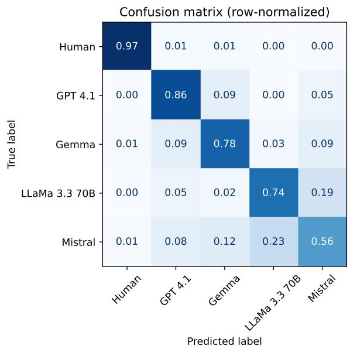  
(a) English

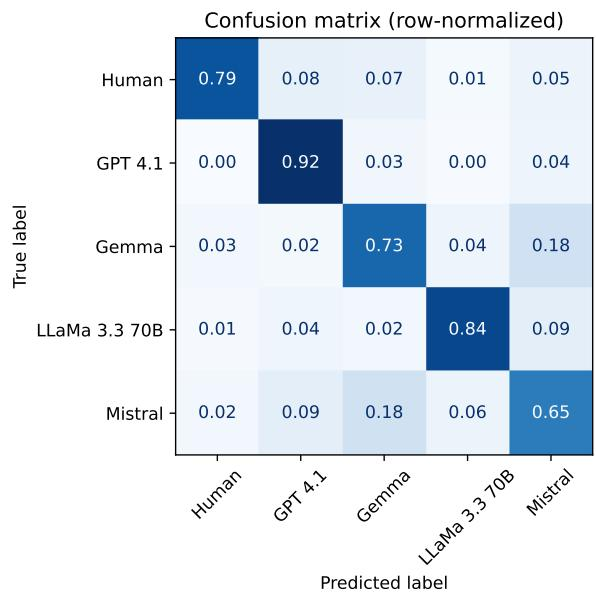  
(b) German  
Figure 10: Row-normalized confusion matrices for model identification from spatial category distributions.

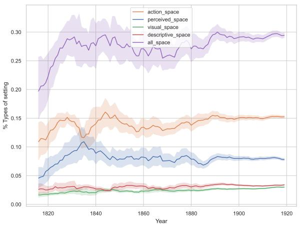  
(a) English corpus (1800–1920).

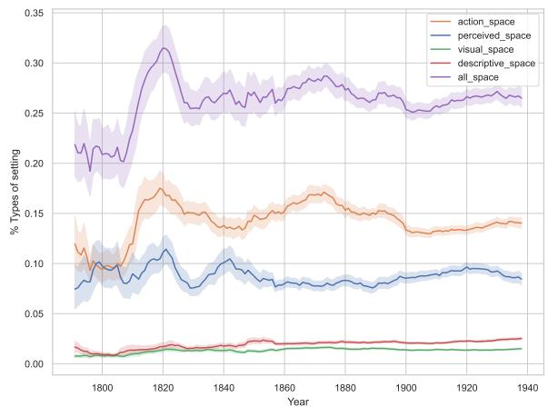  
(b) German corpus (1780–1940), reproduced from Rohrbacher (forthcoming).  
Figure 11: Normalized frequencies of setting categories across publication years in the human-authored corpora. Shaded bands indicate 95% confidence intervals. Wider intervals in earlier decades reflect smaller sample sizes. Distributions are broadly stable across the main period of each corpus.

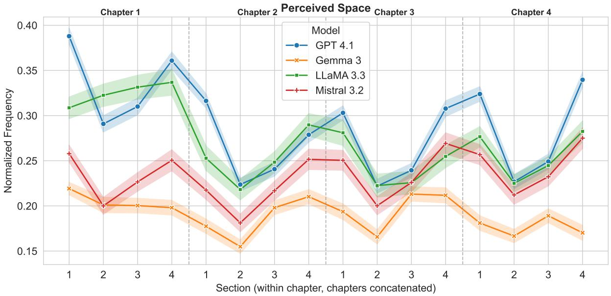  
Figure 12: Normalized frequency of perceived space by position within chapter, English. Each chapter is divided into four equal-length sections and the four chapters are shown consecutively. The dashed line indicates the human baseline.

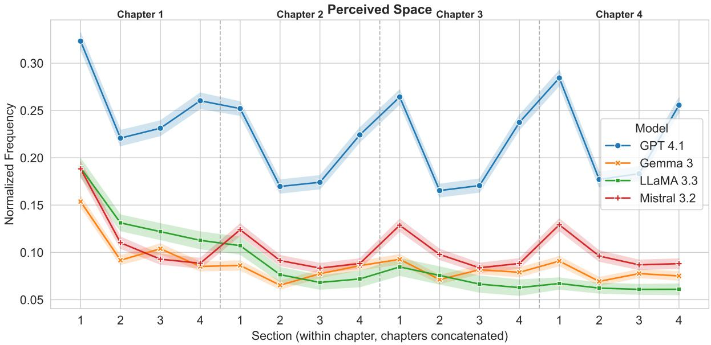  
Figure 13: Normalized frequency of perceived space by position within chapter, German. Each chapter is divided into four equal-length sections and the four chapters are shown consecutively. The dashed line indicates the human baseline.