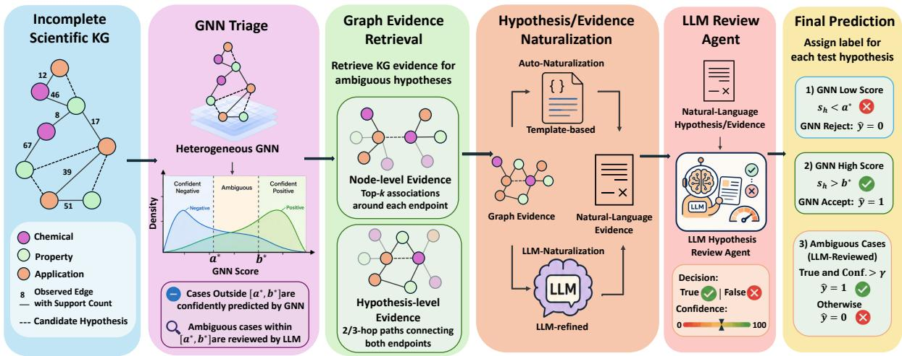
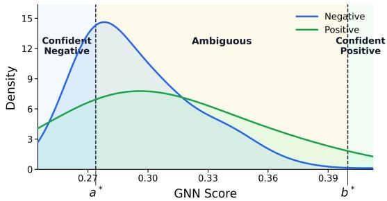
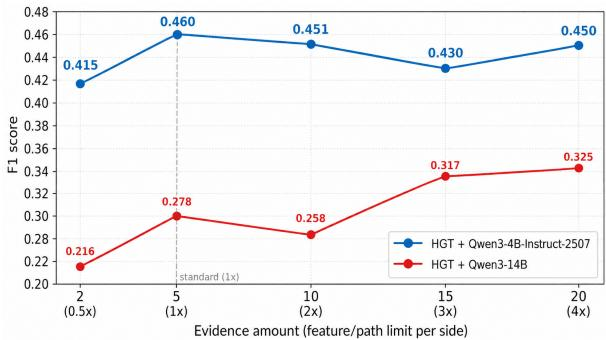
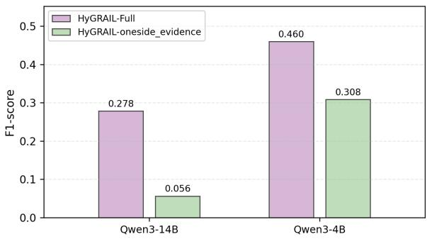
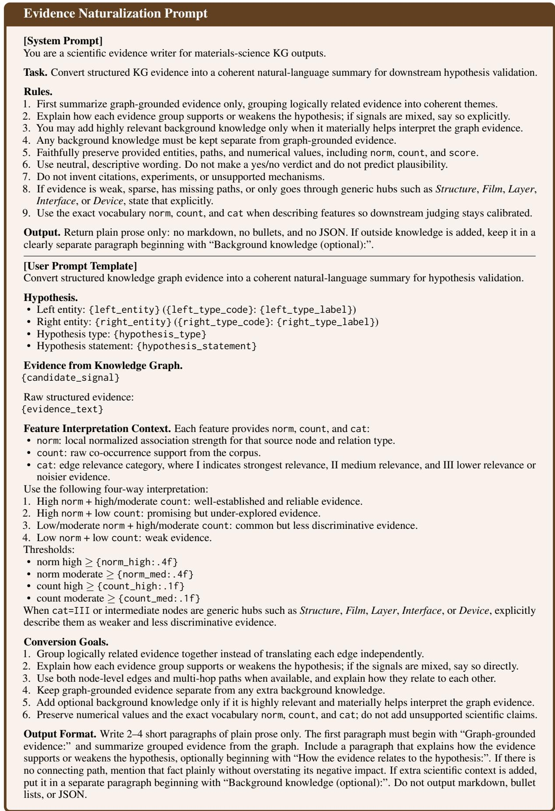
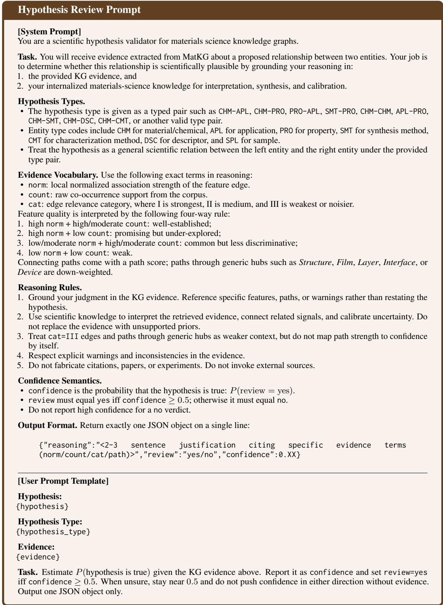

# HyGRAIL: Cost-Aware and Evidence-Grounded Scientific Hypothesis Discovery over Knowledge Graphs

Yihang Sun1 Zhihan Zhu1,† Zhiyuan Jiang1,† Jingyi Ge1,† Zixuan Li1,† Jiaxuan You1 1University of Illinois Urbana-Champaign

## Abstract

Scientific knowledge graphs organize entities and relations extracted from scientific litera ture, but they remain inherently incomplete. Missing typed links in such graphs can therefore represent plausible scientific hypotheses, such as unexplored associations between materials and applications. However, scientific hypothesis discovery is challenging because true discoveries are extremely sparse among typed candidate pairs: graph neural networks (GNNs) are efficient but unreliable for ambigu ous cases, while large language models (LLMs) are knowledgeable but too costly to apply exhaustively and are not naturally grounded in graph structures. We propose HyGRAIL, a cost-aware and evidence-grounded framework that combines heterogeneous GNN triage with LLM-based hypothesis review. HyGRAIL first uses a GNN to score candidate hypotheses and identify a validation-calibrated ambiguous region, routing only graph-uncertain cases to LLM review. For each routed hypothesis, Hy GRAIL retrieves node-level associations and multi-hop relational paths from the KG, then converts this structured evidence into natu ral language through template-based or LLMbased naturalization. An LLM review agent finally judges each hard hypothesis using the naturalized evidence and validation-selected de cision criteria. On MatKG, HyGRAIL achieves the best F1 score of 0.429, improving over the strongest prior baseline by 0.242 F1 points and over the GNN-only baseline by 0.322. Mean while, GNN triage reduces the LLM call rate by 54.36% on average. Ablation studies further show that retrieved graph evidence is crucial for reliable hypothesis verification and that compact, two-sided evidence is more effective than simply increasing retrieval quantity.

## 1 Introduction

Scientific progress increasingly depends on the ability to synthesize knowledge scattered across rapidly growing scientific literature. Knowledge graphs (KGs) provide a natural substrate for this goal by representing domain entities and their typed relations in a structured form. Such graphs have been constructed across a wide range of scientific domains, including materials science, biomedicine, drug discovery, and scholarly knowledge organization (Venugopal and Olivetti, 2024; Kilicoglu et al., 2012; Himmelstein et al., 2017; Jaradeh et al., 2019; Zhang et al., 2025). For example, MatKG (Venugopal and Olivetti, 2024) encodes materials-science entities such as chemicals, properties, applications, synthesis methods, characterization methods, and descriptors, together with typed associations extracted from scientific literature. In incomplete scientific KGs, many scientifically meaningful associations may be absent simply because they have not yet been reported, extracted, or connected in the graph. This naturally motivates a link-prediction view of scientific discovery: a missing typed link between two entities can be interpreted as a candidate scientific hypothesis to be verified (Swanson, 1986; Sosa et al., 2020; Sybrandt et al., 2020; Borrego et al., 2025). For instance, a missing CHM–APL link in MatKG may suggest that a chemical has unexplored potential for a particular application.

This formulation turns scientific discovery into a typed link prediction problem (Sosa et al., 2020; Sybrandt et al., 2020; Borrego et al., 2025), but in our setting discovery-relevant links are extremely sparse among all plausible typed node pairs, as shown in Table 1. For a hypothesis type such as CHM–APL, the candidate space grows with the Cartesian product between chemicals and applications, while only a tiny fraction of these pairs are supported by existing scientific evidence. Table 1 illustrates this sparsity for the seven MatKG hypothesis types considered in our study. This extreme imbalance makes scientific hypothesis discovery both statistically difficult and practically high-stakes: false positives may waste downstream expert attention or experimental resources, while false negatives may overlook promising discoveries.

<table><tr><td>Type</td><td> $\mathbf { P } \left( 1 0 ^ { 5 } \right)$ </td><td> $\mathbf { C } \left( 1 0 ^ { 8 } \right)$ </td><td> $\rho \left( 1 0 ^ { - 3 } \right)$ </td></tr><tr><td>CHM-APL</td><td>1.06</td><td>1.91</td><td>0.556</td></tr><tr><td>CHM-PRO</td><td>3.40</td><td>4.27</td><td>0.796</td></tr><tr><td>PRO-APL</td><td>1.18</td><td>3.23</td><td>0.367</td></tr><tr><td>SMT-PRO</td><td>0.757</td><td>1.82</td><td>0.417</td></tr><tr><td>CHM-SMT</td><td>0.831</td><td>1.07</td><td>0.774</td></tr><tr><td>CHM-DSC</td><td>1.66</td><td>0.927</td><td>1.79</td></tr><tr><td>CHM-CMT</td><td>2.10</td><td>1.96</td><td>1.07</td></tr></table>

Table 1: Discovery-oriented hypothesis links are extremely sparse in MatKG. P denotes positive links, C denotes candidate pairs, and $\rho$ denotes density.

Graph-based models are natural candidates for this problem because they can exploit the relational structure of scientific KGs. Classical KG embedding methods and relational GNNs have been widely used for link prediction over multirelational graphs (Bordes et al., 2013; Yang et al., 2015; Schlichtkrull et al., 2018), while heterogeneous GNNs further model node and edge type information through mechanisms such as meta-path attention or type-specific transformations (Wang et al., 2019; Hu et al., 2020). However, graph-only models primarily rely on observed topology and relation statistics. In sparse scientific discovery settings, this often leads to a large ambiguous region in the predicted score distribution: positive and negative hypotheses may be separable at the two extremes, but heavily mixed in the middle (Wang et al., 2021; Huang et al., 2023; Zhao et al., 2024). As a result, even strong GNNs can serve as efficient scoring models but remain unreliable as final arbiters for difficult scientific hypotheses.

LLMs offer a complementary strength. Recent studies have explored their potential for scientific synthesis, hypothesis generation, and biomedical or chemistry-oriented discovery (Zheng et al., 2023b; Zhou et al., 2024; Qi et al., 2024; Yang et al., 2024). Their broad parametric knowledge and naturallanguage reasoning ability make them appealing as scientific hypothesis reviewers. Yet applying LLMs directly to all candidate links in a KG is computationally prohibitive, especially when the vast majority of candidates are likely negative. Moreover, LLMs are not naturally designed to consume raw graph structures (Li et al., 2024; Zhang et al., 2024; Cao et al., 2025). Unguided LLM review may also rely on incomplete parametric memory rather than explicit evidence, motivating retrieval-based grounding (Lewis et al., 2020; Guu et al., 2020; Karpukhin et al., 2020). Retrieval-augmented generation alleviates such grounding issues by conditioning LLMs on external knowledge (Lewis et al., 2020), and recent KG-guided RAG methods further show that graph relations can help organize retrieved evidence (Zhu et al., 2025). However, existing KG-RAG work primarily targets question answering or text generation, whereas scientific hypothesis discovery requires evidence-grounded verification of typed candidate links.

We propose HyGRAIL, a hybrid framework for cost-aware and evidence-grounded scientific hypothesis discovery over heterogeneous KGs. Hy-GRAIL uses a heterogeneous GNN as a lightweight triage model: after training on the observed training graph, it identifies a validation-calibrated ambiguous score interval where graph-only predictions are unreliable. Only hypotheses falling into this hard region are routed to an LLM review agent, while easy hypotheses are handled directly by the GNN. For each routed hypothesis, HyGRAIL retrieves hypothesis-relevant graph evidence, including node-level associations and multi-hop relational paths, using both raw edge support and normalized relation importance. The structured evidence is then converted into natural language through either template-based or LLM-based naturalization, allowing the review agent to reason over scientific evidence without directly manipulating KG triples. Finally, the agent accepts a hypothesis only when both its binary decision and confidence score satisfy validation-selected criteria. This design combines the scalability of GNNs with the reasoning ability of LLMs while keeping LLM calls focused on the cases where they are most needed.

We summarize our contributions as follows:

• We formulate scientific discovery as cost-aware, evidence-grounded hypothesis verification over incomplete weighted heterogeneous KGs.

• We introduce HyGRAIL, a hybrid GNN–LLM framework that uses validation-calibrated GNN score distributions to route only ambiguous hypotheses to LLM review.

• We design hypothesis-guided graph evidence retrieval and naturalization methods that transform node-level and multi-hop KG evidence into LLM-readable scientific evidence.

• We evaluate HyGRAIL across multiple GNNs and LLMs, achieving the best F1 score of 0.429 and reducing the LLM call rate by 54.36% on average. Ablations further show that retrieved graph evidence and two-sided endpoint context are crucial for reliable hypothesis verification.

## 2 Task Formulation

## 2.1 Scientific Knowledge Graphs

We consider a scientific knowledge graph as a weighted heterogeneous graph $\mathcal { G } = ( \mathcal { V } , \mathcal { E } , \phi , \psi , c )$ where V is the set of entities, E is the set of observed edges, $\phi : \mathcal { V } \to \mathcal { T } _ { V }$ maps each node to a node type, $\psi : { \mathcal { E } }  { \mathcal { T } } _ { E }$ maps each edge to an edge type, and $c ( e ) \in \mathbb { N } ^ { + }$ denotes the support count of edge e (Venugopal and Olivetti, 2024; Himmelstein et al., 2017; Jaradeh et al., 2019). The support count records how many scientific papers support the association represented by the edge (Venugopal and Olivetti, 2024). We treat edges as undirected typed associations, where the semantics of an edge are determined by the types of its endpoints.

## 2.2 Hypotheses as Typed Missing Links

Not all edge types in a scientific KG are necessarily discovery targets. We define a set of hypothesis edge types $\mathcal { R } _ { H } \subseteq \mathcal { T } _ { E }$ , where each $r \in \mathcal { R } _ { H }$ specifies a type of scientific association to be discovered (Himmelstein et al., 2017; Sybrandt et al., 2020). A candidate hypothesis is a typed node pair $\boldsymbol { h } = ( u , v , r )$ , where $u , v \in \mathcal { V }$ and the endpoint types of u and v match the relation type r. For example, a CHM–APL hypothesis states that a chemical may be useful for a particular application. The hypothesis space for relation type r is defined as

$$
{ \mathcal { H } } _ { r } = \{ ( u , v , r ) ~ | ~ \phi ( u ) = t _ { u } ( r ) , ~ \phi ( v ) = t _ { v } ( r ) \} ,
$$

where $t _ { u } ( r )$ and $t _ { v } ( r )$ denote the endpoint node types associated with relation type r. The full hypothesis space is $\begin{array} { r } { \mathcal { H } = \bigcup _ { r \in \mathcal { R } _ { H } } \mathcal { H } _ { r } } \end{array}$

As shown in Table 1, these hypothesis spaces are highly sparse: only a small fraction of typed candidate pairs are observed as positive links. This sparsity makes exhaustive manual or LLM-based review impractical, and also makes graph-only prediction unreliable for ambiguous hypotheses.

## 2.3 Closed-World Evaluation and Candidate Construction

For evaluation, observed edges whose types belong to $\mathcal { R } _ { H }$ are treated as positive hypotheses. Unlinked typed node pairs sampled from the same hypothesis space are treated as negative hypotheses under a closed-world evaluation protocol (Bordes et al., 2013; Yang et al., 2015; Trouillon et al., 2016; Kotnis and Nastase, 2017). Let $\mathcal { E } _ { H }$ denote observed hypothesis edges and $\boldsymbol { \mathcal { U } } _ { H }$ denote sampled unlinked candidates. Each evaluated hypothesis $\boldsymbol { h } \ : = \ : ( u , v , r )$ receives label $y _ { h } = 1 { \mathrm { ~ i f ~ } } h \in { \mathcal { E } } _ { H }$ and $y _ { h } = 0 \mathrm { i f } h \in \mathcal { U } _ { H }$ . This protocol follows standard practice in link prediction (Bordes et al., 2013; Yang et al., 2015; Trouillon et al., 2016), but we emphasize that an unobserved edge does not necessarily correspond to a scientifically false hypothesis (Kotnis and Nastase, 2017; Kazemi and Poole, 2018). Thus, negative labels are closed-world evaluation labels rather than definitive scientific invalidity. In our benchmark, held-out observed edges serve as ground-truth positives for evaluation; in practical deployment, newly accepted unobserved links should be treated as candidate hypotheses for further expert or experimental validation.

## 3 Method

Overview. Given a scientific KG G and a set of candidate hypotheses H, where each candidate hypothesis is a typed node pair $h = ( u , v , r )$ defined in Section 2, our goal is to predict whether h corresponds to a valid scientific association. As illustrated in Figure 1, HyGRAIL consists of four components. (1) It trains a heterogeneous GNN to score hypotheses and identify an ambiguous score region where graph-only predictions are unreliable. (2) For hypotheses in this region, it retrieves hypothesis-relevant graph evidence, including node-level associations and multi-hop relational paths. (3) It converts structured evidence into natural language through either templatebased or LLM-based naturalization. (4) It asks an LLM hypothesis review agent to judge each hard hypothesis using the naturalized evidence and validation-selected decision criteria. This design combines scalable graph representation learning (Schlichtkrull et al., 2018; Wang et al., 2019; Hu et al., 2020) with evidence-grounded LLM reasoning (Lewis et al., 2020; Guu et al., 2020; Karpukhin et al., 2020).

## 3.1 GNN-based Hypothesis Triage

HyGRAIL first uses a heterogeneous GNN as a lightweight triage model. Heterogeneous and relational GNNs are well suited for scientific KGs because they can model typed nodes and typed relations through relation-specific transformations, attention, or message passing (Schlichtkrull et al., 2018; Wang et al., 2019; Hu et al., 2020). For a candidate hypothesis $\boldsymbol { h } = ( u , v , r )$ , the GNN encoder computes node representations and a relationspecific decoder outputs a score $s _ { h } = f _ { \theta } ( u , v , r )$ where larger $s _ { h }$ indicates stronger graph-based support. The GNN is trained on the training graph using observed hypothesis edges as positives and sampled unlinked typed pairs as negatives (Bordes et al., 2013; Yang et al., 2015; Trouillon et al., 2016; Schlichtkrull et al., 2018).

Figure 1: Overview of HyGRAIL. HyGRAIL uses a heterogeneous GNN to triage candidate hypotheses, retrieves graph evidence for ambiguous hypotheses, naturalizes structured evidence into language, and asks an LLM review agent to make evidence-grounded decisions.  
  
Figure 2: Validation-calibrated ambiguous region for GNN-based hypothesis triage. This figure shows the HGT results on PRO–APL hypotheses. HyGRAIL directly classifies confident low-score and high-score hypotheses, and routes only ambiguous hypotheses to LLM review.

HyGRAIL uses validation scores to decide where LLM review is needed. For a lower threshold $^ { a , }$ we define the negative purity below a as the fraction of validation hypotheses with $s _ { h } < a$ whose labels are negative. Similarly, for an upper threshold $b ,$ we define the positive purity above b as the fraction of validation hypotheses with $s _ { h } > b$ whose labels are positive. Given two preset purity parameters m and $n ,$ chosen according to the positive– negative ratio of each KG, HyGRAIL selects the smallest interval $[ a ^ { * } , b ^ { * } ]$ such that the negative purity below $a ^ { * }$ is at least m and the positive purity above $b ^ { * }$ is at least n. Here, “smallest” means that the interval routes the fewest validation hypotheses to the LLM among all feasible intervals.

At inference time, HyGRAIL predicts negative if $s _ { h } < a ^ { * }$ , predicts positive if $s _ { h } > b ^ { * }$ , and routes h to the LLM review agent only when $a ^ { * } \leq s _ { h } \leq$ $b ^ { * }$ . This triage mechanism reserves costly LLM inference for hypotheses that graph-only models cannot confidently resolve.

## 3.2 Hypothesis-Guided Graph Evidence Retrieval

For each routed hypothesis $\boldsymbol { h } ~ = ~ ( u , v , r )$ , Hy-GRAIL retrieves graph evidence from the KG before invoking the LLM. Unlike standard text retrieval, the retrieved evidence is structured, typed, and relation-dependent. HyGRAIL retrieves two complementary kinds of evidence: node-level evidence and hypothesis-level evidence.

Node-level evidence. For each endpoint node $x \in \{ u , v \}$ , HyGRAIL retrieves local associations that characterize the scientific context of $x .$ For each node type $t ,$ we define an evidence edge type set $\mathcal { R } _ { \mathrm { e v i } } ( t )$ , which contains edge types considered informative for describing nodes of type t. For example, evidence for a chemical node may include its associated properties or applications, while evidence for an application node may include chemicals or properties associated with that application.

Let $\mathcal { N } _ { r ^ { \prime } } ( x )$ denote the set of observed edges incident to x whose edge type is $r ^ { \prime } \in \mathcal { R } _ { \mathrm { e v i } } ( \phi ( x ) )$ For each evidence edge $e \in \mathcal { N } _ { r ^ { \prime } } ( x ) , \mathrm { H y G R A I I }$ uses both its raw support count $c ( e )$ and its normalized weight $w ( e ) = c ( e ) / \textstyle \sum _ { e ^ { \prime } \in \mathcal { N } _ { r ^ { \prime } } ( x ) } c ( e ^ { \prime } )$ . The support count captures how well established an association is in the literature, while the normalized weight captures how distinctive the association is among edges of the same type for node x.

To combine these two signals, we define

$$
\operatorname { N o r m C o u n t } ( e ) = \frac { \log ( 1 + c ( e ) ) } { \operatorname* { m a x } _ { e ^ { \prime } \in \mathcal { N } _ { r ^ { \prime } } ( x ) } \log ( 1 + c ( e ^ { \prime } ) ) } ,
$$

which normalizes absolute support counts within the same evidence edge type. HyGRAIL then ranks candidate evidence edges by EviScore $: ( e ) = { }$ α · NormCount $( e ) + ( 1 - \alpha ) \cdot w ( e )$ , where α balances absolute literature support and relative distinctiveness. The top-k edges are retained as node-level evidence.

Hypothesis-level evidence. Node-level evidence describes each endpoint independently, whereas a scientific hypothesis concerns the relation between two endpoints. Therefore, HyGRAIL also retrieves short paths connecting u and $v ,$ focusing on 2-hop and 3-hop paths as hypothesis-level relational evidence (Lao and Cohen, 2010; Neelakantan et al., 2015). These paths provide structured signals about how the two endpoint entities are connected through intermediate scientific entities.

## 3.3 Graph Evidence Naturalization

Although LLMs can reason effectively over natural language, raw KG evidence is represented as typed edges and paths. Directly providing such structured triples to an LLM may force the model to interpret graph notation rather than evaluate the scientific hypothesis. Therefore, HyGRAIL naturalizes retrieved graph evidence into concise naturallanguage statements before review.

We consider two naturalization strategies.

Auto-Naturalization. Auto-Naturalization uses deterministic templates to convert graph evidence into natural language. For each hypothesis type and evidence type, we design templates that describe the scientific meaning of the corresponding edge or path. To preserve quantitative information, each evidence item is categorized by whether its support count and normalized weight are high or low, yielding four template styles: well-established, common, promising, and weak. Thus, Auto-Naturalization can distinguish strong, common, emerging, and weak signals while remaining inexpensive, deterministic, and easy to audit. The naturalization templates used in our framework are provided in Appendix D.2.

LLM-Naturalization. LLM-Naturalization uses an LLM to rewrite structured evidence into a coherent natural-language summary. Given the retrieved node-level edges and multi-hop paths, the naturalizer is instructed to group logically related evidence, explain how different pieces of evidence may support or weaken the hypothesis, and optionally add highly relevant background knowledge. To reduce unsupported generation, we require the naturalizer to separate graph-grounded evidence from any additional background knowledge it introduces. Compared with Auto-Naturalization, LLM-Naturalization is more flexible and can better organize heterogeneous evidence, but it introduces additional inference cost.

## 3.4 LLM Hypothesis Review Agent

The final component of HyGRAIL is an LLM review agent that evaluates each routed hypothesis using the naturalized evidence. The review prompt contains the hypothesis, the naturalized evidence, and instructions that encourage the model to assess scientific plausibility based on the provided evidence rather than unsupported assumptions (Wei et al., 2022; Yao et al., 2023; Zheng et al., 2023a; Zhou et al., 2024; Qi et al., 2024).

For each reviewed hypothesis $h ,$ the agent outputs a binary decision $d _ { h } \in \{ \mathrm { T r u e } , \mathrm { F a l s e } \}$ and a confidence score $q _ { h } \in [ 0 , 1 0 0 ]$ . We use both outputs because either one alone can be unreliable. A binary decision provides a direct accept/reject judgment, but it does not expose the model’s degree of uncertainty. A scalar confidence score provides a ranking signal, but LLM confidence estimates can be miscalibrated or concentrated in narrow score ranges (Kadavath et al., 2022; Tian et al., 2023). Combining both signals allows HyGRAIL to reject clearly implausible hypotheses while retaining a validation-calibrated threshold over plausible ones.

The confidence threshold $\gamma$ is selected on validation hypotheses routed to the LLM. For a test-time routed hypothesis, HyGRAIL accepts it only if $d _ { h } = \mathrm { T r u e }$ and $q _ { h } \ge \gamma$ . Together with GNN triage, the final prediction rule is: predict 0 when $s _ { h } < a ^ { * }$ predict 1 when $s _ { h } ~ > ~ b ^ { * }$ , and otherwise use the LLM review decision. Thus, the GNN handles easy hypotheses at low cost, while the LLM review agent is invoked only for ambiguous hypotheses where natural-language scientific reasoning is expected to add value.

## 4 Experimental Setup

Dataset. We evaluate HyGRAIL on MatKG (Venugopal and Olivetti, 2024), a large-scale materialsscience KG automatically constructed from scientific literature. MatKG is a suitable testbed because it contains typed scientific entities and relations, such as chemicals, properties, and applications, together with edge support counts derived from literature evidence. To keep the experiments computationally affordable, we sample a 3,000-node subgraph from MatKG while approximately preserving graph density, node type distributions, and edge type distributions. We use seven MatKG hypothesis types for evaluation; detailed subgraph statistics are provided in Appendix A.1.

Data splits. For each MatKG edge, we assign a timestamp using the publication time of the oldest paper contributing to its edge count. For each hypothesis type, observed positive edges are sorted by timestamp and split into train, validation, and test sets with a ratio of 7:1:2. Within each split, we sample unlinked typed node pairs from the same hypothesis space as negatives, maintaining a positive-to-negative ratio of 1:20 to simulate the highly sparse discovery setting. Validation and test hypothesis edges are removed from the training graph to prevent label leakage. The validation set is used for all threshold selection, and the test set is used only for final evaluation.

GNN backbones. We instantiate the GNN triage module with three heterogeneous graph backbones:

• HeteroConv: A simple heterogeneous messagepassing baseline that applies relation-specific convolutions over typed MatKG edges and ag gregates incoming relation-specific representations by mean pooling.

• HGT: A stronger heterogeneous encoder that uses type-specific projections and multi-head attention to weight messages from different node and edge types (Hu et al., 2020).

• R-GCN: A relational GNN backbone that applies basis-decomposed relation-specific convolutions and scores candidate hypotheses with an MLP over endpoint, relation, and local graph features (Schlichtkrull et al., 2018).

Implementation details and hyperparameters are provided in Appendix B.1.

LLM review models. We evaluate four openweight LLMs with different sizes and families as hypothesis review agents: Qwen3-4B-Instruct-2507, Qwen3-14B, Ministral-3B-Reasoning, and Ministral-14B-Reasoning (Yang et al., 2025; Liu et al., 2026). All prompts and naturalization templates are provided in Appendix D.

Baselines. In addition to GNN methods, we compare HyGRAIL with the following variants or prior methods as baselines.

• HyGRAIL-no\_evidence(NE). removes the evidence from HyGRAIL, allowing the LLM to review each routed hypothesis using only the hypothesis text; we use it to evaluate the effectiveness of evidence for hypothesis verification.

• Topological–Semantic Hybrid(TSH). Following Marwitz et al. (2026), this baseline combines local topological descriptors and MatSciB-ERT entity-name embeddings with validationtuned weights, omitting the original LLM-based concept extraction stage since our input is already a curated KG.

• KG-FM. Following Bai et al. (2025), this baseline augments an LLM reviewer with KGretrieved context and applies it directly to MatKG hypothesis verification.

Metrics. We report recall and F1 score on the test set, where all thresholds are selected to maximize F1 score on the validation set. Since HyGRAIL is designed to reduce unnecessary LLM inference, we also report the LLM call rate, defined as the fraction of test hypotheses routed to the LLM review agent.

## 5 Results and Analysis

## 5.1 Main Results

Table 2 reports the main results on MatKG hypothesis verification. HyGRAIL achieves the best overall performance with R-GCN and Qwen3-4B, reaching an F1 score of 0.429. This improves over TSH by 0.242 F1 points, over the best KG-FM result by 0.256, and over the corresponding R-GCN-only baseline by 0.322, showing that graph scores alone are insufficient in this sparse setting.

Retrieved evidence is consistently beneficial over the evidence-free variant. Under Hetero-Conv, HyGRAIL-Auto improves over HyGRAIL-NE across all four LLM reviewers, with F1 gains of 0.035–0.066. With R-GCN, the gains are larger: 0.313 and 0.215 F1 points for Qwen3-4B and Qwen3-14B. These results confirm that hypothesisguided graph evidence and evidence naturalization are central to HyGRAIL’s effectiveness.

Table 2: Main results on MatKG hypothesis verification. We report recall and F1 score on the test set. TSH is independent of both GNN and LLM choices, while KG-FM depends on the LLM reviewer but not the GNN backbone. For HyGRAIL variants, results are reported across three GNN backbones and four LLM review models. All highlights are applied to F1 only: bold denotes the overall best result, underline denotes the best result within each GNN block, and italics denote the best result for each LLM reviewer among LLM-conditioned methods.
<table><tr><td rowspan=1 colspan=1>Method</td><td rowspan=1 colspan=4>Prior Baselines</td></tr><tr><td rowspan=1 colspan=1>LLMMethod</td><td rowspan=1 colspan=1>Qwen3-4BRec.    F1</td><td rowspan=1 colspan=1>Qwen3-14BRec.    F1</td><td rowspan=1 colspan=1>Ministral-3BRec.    F1</td><td rowspan=1 colspan=1>Ministral-14BRec.    F1</td></tr><tr><td rowspan=1 colspan=1>TSHKG-FM</td><td rowspan=1 colspan=4>Rec. 0.379  F1 0.1870.089 0.113  0.012 0.023  0.245 0.149  0.173  0.173</td></tr><tr><td rowspan=1 colspan=1>GNN Backbone</td><td rowspan=1 colspan=4>HeteroConv</td></tr><tr><td rowspan=1 colspan=1>LLMMethod</td><td rowspan=1 colspan=1>Qwen3-4BRec.    F1</td><td rowspan=1 colspan=1>Qwen3-14BRec.    F1</td><td rowspan=1 colspan=1>Ministral-3BRec.   F1</td><td rowspan=1 colspan=1>Ministral-14BRec.    F1</td></tr><tr><td rowspan=1 colspan=1>GNNHyGRAIL-NE</td><td rowspan=1 colspan=2>Rec. 0.8680.450 0.153 0.441 0.159</td><td rowspan=1 colspan=1>F1 0.0930.481 0.144</td><td rowspan=1 colspan=1>0.485  0.150</td></tr><tr><td rowspan=1 colspan=1>HyGRAIL-AutoHyGRAIL-LLM</td><td rowspan=1 colspan=1>0.512 0.2190.479 0.206</td><td rowspan=1 colspan=1>0.512 0.2150.443 0.194</td><td rowspan=1 colspan=1>0.398 0.1790.394 0.173</td><td rowspan=1 colspan=1>0.472  0.2070.450  0.197</td></tr><tr><td rowspan=1 colspan=1>GNN Backbone</td><td rowspan=1 colspan=2>HG</td><td rowspan=1 colspan=2>T</td></tr><tr><td rowspan=1 colspan=1>LLMMethod</td><td rowspan=1 colspan=1>Qwen3-4BRec.    F1</td><td rowspan=1 colspan=1>Qwen3-14BRec.    F1</td><td rowspan=1 colspan=1>Ministral-3BRec.    F1</td><td rowspan=1 colspan=1>Ministral-14BRec.    F1</td></tr><tr><td rowspan=1 colspan=1>GNNHyGRAIL-NE</td><td rowspan=1 colspan=1>0.568 0.103</td><td rowspan=1 colspan=1>Rec. 0.9420.597 0.106</td><td rowspan=1 colspan=1>F1 0.0930.577 0.102</td><td rowspan=1 colspan=1>0.588  0.103</td></tr><tr><td rowspan=1 colspan=1>HyGRAIL-AutoHyGRAIL-LLM</td><td rowspan=1 colspan=1>0.617 0.1170.626 0.117</td><td rowspan=1 colspan=1>0.611  0.1150.557  0.106</td><td rowspan=1 colspan=1>0.546 0.1050.548  0.105</td><td rowspan=1 colspan=1>0.579  0.1100.557  0.106</td></tr><tr><td rowspan=1 colspan=1>GNN Backbone</td><td rowspan=1 colspan=4>R-GCN</td></tr><tr><td rowspan=1 colspan=1>LLMMethod</td><td rowspan=1 colspan=1>Qwen3-4BRec.    F1</td><td rowspan=1 colspan=1>Qwen3-14BRec.    F1</td><td rowspan=1 colspan=1>Ministral-3BRec.    F1</td><td rowspan=1 colspan=1>Ministral-14BRec.    F1</td></tr><tr><td rowspan=1 colspan=1>GNNHyGRAIL-NE</td><td rowspan=1 colspan=1>0.273 0.116</td><td rowspan=1 colspan=1>Rec. 0.380.169 0.147</td><td rowspan=1 colspan=1>F1 0.1070.312 0.122</td><td rowspan=1 colspan=1>0.506  0.132</td></tr><tr><td rowspan=1 colspan=1>HyGRAIL-AutoHyGRAIL-LLM</td><td rowspan=1 colspan=1>0.351  0.4290.377 0.337</td><td rowspan=1 colspan=1>0.351  0.3620.234 0.319</td><td rowspan=1 colspan=1>0.091  0.1590.974 0.092</td><td rowspan=1 colspan=1>0.286  0.3330.156  0.247</td></tr></table>

HyGRAIL-Auto is generally stronger than HyGRAIL-LLM, suggesting that deterministic template-based naturalization provides more concise and controlled evidence descriptions. Overall, the results support our design of using GNNs for cost-aware triage and naturalized graph evidence for LLM review on ambiguous hypotheses.

## 5.2 LLM Call Reduction

Table 3 reports the fraction of test hypotheses routed to the LLM review agent. By filtering confident low-score and high-score hypotheses before LLM review, HyGRAIL substantially reduces the number of LLM calls across all GNN backbones. On average, GNN triage lowers the LLM call rate to 45.64%. This confirms that GNN triage is not only a predictive component, but also an effective cost-control mechanism for large-scale scientific hypothesis discovery.

Table 3: GNN triage reduces LLM review cost. LLM call rate is the fraction of test hypotheses routed to the LLM review agent.
<table><tr><td>GNN Backbone</td><td>LLM Call Rate</td><td>Reduction</td></tr><tr><td>HeteroConv</td><td>53.45%</td><td>46.55%</td></tr><tr><td>HGT</td><td>29.99%</td><td>70.01%</td></tr><tr><td>R-GCN</td><td>53.49%</td><td>46.51%</td></tr></table>

## 5.3 Ablation Study

We conduct ablations with HGT and Qwen3-4B / Qwen3-14B to examine how retrieved graph evidence affects hypothesis verification.

Effect of evidence quantity. Figure 3 shows that retrieved evidence is essential, but simply increasing the amount of evidence is not always beneficial. Compared with the smaller evidence budget, the default HyGRAIL setting improves F1 from 0.415 to 0.460 for Qwen3-4B and from 0.216 to 0.278 for Qwen3-14B. However, further increasing the evidence budget yields unstable gains: Qwen3-4B drops below its default-budget performance under all larger budgets, while Qwen3-14B benefits only at larger budgets after an initial drop at 2× evidence. This suggests that excessive retrieved context may introduce noise rather than useful scientific signal, supporting our design choice of using a compact, hypothesis-guided evidence set instead of maximizing retrieval quantity.

Figure 3: Evidence is useful, but more evidence is not always better. The default budget improves over smaller evidence, while excessive evidence yields inconsistent gains and can hurt stronger reviewers.  
  
Figure 4: Evidence from both endpoints is crucial. Full HyGRAIL substantially outperforms the one-sided evidence variant under both LLM reviewers.

Effect of two-sided endpoint evidence. Figure 4 compares HyGRAIL with a one-sided variant that keeps the total amount of node-level evidence unchanged but retrieves evidence from only one endpoint. Full HyGRAIL substantially outperforms the one-sided variant for both LLM reviewers, improving F1 by 0.222 for Qwen3-14B and 0.152 for Qwen3-4B. This indicates that the two endpoints of a candidate link provide complementary scientific context, and that balanced evidence from both sides is important for reliable hypothesis verification.

## 6 Related Work

Scientific KGs and hypothesis discovery. Computational scientific discovery has long studied how hidden hypotheses can be inferred by connecting fragmented literature evidence (Swanson, 1986).

Scientific KGs scale this process by structuring entities and relations from literature or curated databases, including biomedical KGs (Kilicoglu et al., 2012; Himmelstein et al., 2017), scholarly KGs (Jaradeh et al., 2019), and materials-science KGs (Venugopal and Olivetti, 2024). These resources support graph- and literature-based hypothesis generation (Sosa et al., 2020; Sybrandt et al., 2020), while recent work also explores LLMs for scientific hypothesis generation (Zhou et al., 2024; Qi et al., 2024; Yang et al., 2024). HyGRAIL differs by focusing on evidence-grounded verification of typed missing links rather than open-ended hypothesis generation.

Graph-based link prediction. KG completion methods, including embedding models (Bordes et al., 2013; Yang et al., 2015; Trouillon et al., 2016), relational and heterogeneous GNNs (Schlichtkrull et al., 2018; Wang et al., 2019; Hu et al., 2020), and path-based reasoning methods (Lao and Cohen, 2010; Neelakantan et al., 2015; Das et al., 2018), provide efficient tools for missing-relation prediction. However, they mainly rely on observed topology and relation statistics, which can be insufficient for sparse and ambiguous scientific hypotheses. HyGRAIL instead uses GNNs as a cost-aware triage module and invokes LLM-based evidence reasoning only for graphambiguous cases.

Retrieval-augmented LLM reasoning. Retrievalaugmented language models ground generation in external evidence (Lewis et al., 2020; Guu et al., 2020; Karpukhin et al., 2020), and KG-guided RAG further uses graph relations to organize retrieved information (Zhu et al., 2025). KG-totext and data-to-text methods verbalize structured triples into natural language (Gardent et al., 2017; Ribeiro et al., 2020), complementing LLM reasoning and agentic prompting (Wei et al., 2022; Yao et al., 2023). Unlike prior work on QA, text generation, or free-form reasoning, HyGRAIL retrieves and naturalizes typed graph evidence for cost-aware verification of specific scientific hypotheses.

## 7 Conclusion

We introduced HyGRAIL, a hybrid framework for cost-aware and evidence-grounded scientific hypothesis discovery over incomplete heterogeneous KGs. By combining GNN-based triage, hypothesisguided graph evidence retrieval, evidence naturalization, and LLM-based review, HyGRAIL improves hypothesis verification while reducing unnecessary LLM calls. Experiments on MatKG and ablations on evidence quantity and sidedness show that retrieved graph evidence is crucial for reliable verification. HyGRAIL further supports evidencegrounded hypothesis prioritization for expert inspection or experimental validation. Overall, our results highlight the complementary value of scalable graph learning and evidence-grounded LLM reasoning for scientific discovery.

## 8 Limitations

Our study has several limitations. First, our evaluation follows a closed-world link prediction protocol, where held-out observed edges are treated as positives and sampled unlinked pairs are treated as negatives. This protocol is standard for KG link prediction, but an unobserved edge does not necessarily imply scientific invalidity. Therefore, hypotheses accepted by HyGRAIL should be interpreted as candidates for expert inspection or experimental validation rather than definitive scientific facts.

Second, HyGRAIL relies on predefined hypothesis types and evidence edge type sets for graph evidence retrieval. This design improves controllability and interpretability, but transferring the framework to a new KG schema may require lightweight domain-specific configuration. Future work could explore more automated evidence type selection and schema adaptation.

Third, the LLM review stage may be affected by model choice, prompting details, and confidence calibration. Although HyGRAIL mitigates this issue by using validation-selected thresholds and explicit evidence grounding, further calibration or ensemble-based review could make the final decisions more robust.

## 9 Ethical Considerations

This work studies scientific hypothesis verification over a publicly available scientific knowledge graph and does not involve human subjects, personal data, private user information, or demographic attributes. The proposed framework is intended to assist scientific hypothesis prioritization rather than replace expert judgment or experimental validation. Because hypotheses accepted by HyGRAIL are model-generated candidates, they should be interpreted as suggestions for further expert review. We do not foresee direct ethical risks beyond standard concerns associated with automated scientific decision support, such as overreliance on model outputs without domain expert validation. We use publicly available scientific artifacts and open-weight models only for research evaluation, cite their original creators, and do not redistribute the original artifacts.

## References

Xuefeng Bai, Song He, Yi Li, Yabo Xie, Xin Zhang, Wenli Du, and 1 others. 2025. Construction of a knowledge graph for framework material enabled by large language models and its application. npj Computational Materials, 11(51).

Antoine Bordes, Nicolas Usunier, Alberto Garcia-Durán, Jason Weston, and Oksana Yakhnenko. 2013. Translating embeddings for modeling multirelational data. In Advances in Neural Information Processing Systems, volume 26.

Agustín Borrego, Danilo Dessì, Daniel Ayala, Inma Hernández, Francesco Osborne, Diego Reforgiato Recupero, Davide Buscaldi, David Ruiz, and Enrico Motta. 2025. Research hypothesis generation over scientific knowledge graphs. Knowledge-Based Systems, 315:113280.

Yukun Cao, Shuo Han, Zengyi Gao, Zezhong Ding, Xike Xie, and S. Kevin Zhou. 2025. Graphinsight: Unlocking insights in large language models for graph structure understanding. In Proceedings of the 63rd Annual Meeting ofthe Associationfor Computational Linguistics.

Rajarshi Das, Shehzaad Dhuliawala, Manzil Zaheer, Luke Vilnis, Ishan Durugkar, Akshay Krishnamurthy, Alex Smola, and Andrew McCallum. 2018. Go for a walk and arrive at the answer: Reasoning over paths in knowledge bases using reinforcement learning. In International Conference on Learning Representations.

Claire Gardent, Anastasia Shimorina, Shashi Narayan, and Laura Perez-Beltrachini. 2017. The WebNLG challenge: Generating text from RDF data. In Proceedings of the 10th International Conference on Natural Language Generation, pages 124–133.

Kelvin Guu, Kenton Lee, Zora Tung, Panupong Pasupat, and Ming-Wei Chang. 2020. REALM: Retrievalaugmented language model pre-training. In Proceedings ofthe 37th International Conference on Machine Learning, pages 3929–3938.

Daniel S. Himmelstein, Antoine Lizee, Christine Hessler, Leo Brueggeman, Sabrina L. Chen, Dexter Hadley, Ari Green, Pouya Khankhanian, and Sergio E. Baranzini. 2017. Systematic integration of biomedical knowledge prioritizes drugs for repurposing. eLife, 6:e26726.

Ziniu Hu, Yuxiao Dong, Kuansan Wang, and Yizhou Sun. 2020. Heterogeneous graph transformer. In Proceedings of The Web Conference 2020, pages 2704–2710.

Kexin Huang, Ying Jin, Emmanuel Candes, and Jure Leskovec. 2023. Uncertainty quantification over graph with conformalized graph neural networks. In Advances in Neural Information Processing Systems, volume 36.

Mohamad Yaser Jaradeh, Allard Oelen, Kheir Eddine Farfar, Manuel Prinz, Jennifer D’Souza, Gábor Kismihók, Markus Stocker, and Sören Auer. 2019. Open research knowledge graph: Next generation infrastructure for semantic scholarly knowledge. In Proceedings of the 10th International Conference on Knowledge Capture, pages 243–246.

Saurav Kadavath, Tom Conerly, Amanda Askell, Tom Henighan, Dawn Drain, Ethan Perez, Nicholas Schiefer, Zac Dodds, Nova DasSarma, Eli Tran-Johnson, and 1 others. 2022. Language models (mostly) know what they know. arXiv preprint arXiv:2207.05221.

Vladimir Karpukhin, Barlas Oguz, Sewon Min, Patrick Lewis, Ledell Wu, Sergey Edunov, Danqi Chen, and Wen-tau Yih. 2020. Dense passage retrieval for opendomain question answering. In Proceedings of the 2020 Conference on Empirical Methods in Natural Language Processing, pages 6769–6781.

Seyed Mehran Kazemi and David Poole. 2018. SimplE embedding for link prediction in knowledge graphs. In Advances in Neural Information Processing Systems, volume 31.

Halil Kilicoglu, Dongwook Shin, Marcelo Fiszman, Graciela Rosemblat, and Thomas C. Rindflesch. 2012. Semmeddb: a pubmed-scale repository of biomedical semantic predications. Bioinformatics, 28(23):3158–3160.

Bhushan Kotnis and Vivi Nastase. 2017. Analysis of the impact of negative sampling on link prediction in knowledge graphs. arXiv preprint arXiv:1708.06816.

Ni Lao and William W. Cohen. 2010. Relational retrieval using a combination of path-constrained random walks. In Machine Learning, pages 53–67.

Patrick Lewis, Ethan Perez, Aleksandra Piktus, Fabio Petroni, Vladimir Karpukhin, Naman Goyal, Heinrich Küttler, Mike Lewis, Wen-tau Yih, Tim Rocktäschel, Sebastian Riedel, and Douwe Kiela. 2020. Retrieval-augmented generation for knowledgeintensive nlp tasks. In Advances in Neural Information Processing Systems, volume 33, pages 9459– 9474.

Yuhan Li, Zhixun Li, Peisong Wang, Jia Li, Xiangguo Sun, Hong Cheng, and Jeffrey Xu Yu. 2024. A survey of graph meets large language model: Progress

and future directions. In Proceedings of the Thirty-Third International Joint Conference on Artificial Intelligence, pages 8123–8131.

Albert Q. Liu and 1 others. 2026. Ministral 3. arXiv preprint arXiv:2601.08584.

Thomas Marwitz, Alexander Colsmann, Ben Breitung, and 1 others. 2026. Predicting new research directions in materials science using large language models and concept graphs. Nature Machine Intelligence, 8:535–544.

Arvind Neelakantan, Benjamin Roth, and Andrew Mc-Callum. 2015. Compositional vector space models for knowledge base completion. In Proceedings of the 53rd Annual Meeting of the Association for Computational Linguistics and the 7th International Joint Conference on Natural Language Processing, pages 156–166.

Biqing Qi, Kaiyan Zhang, Kai Tian, Haoxiang Li, Zhang-Ren Chen, Sihang Zeng, Ermo Hua, Jinfang Hu, and Bowen Zhou. 2024. Large language models as biomedical hypothesis generators: A comprehensive evaluation. arXiv preprint arXiv:2407.08940.

Leonardo F. R. Ribeiro, Martin Schmitt, Hinrich Schütze, and Iryna Gurevych. 2020. Investigating pretrained language models for graph-to-text generation. In Proceedings ofthe 3rd International Workshop on Natural Language Generation from the Semantic Web, pages 211–227.

Michael Schlichtkrull, Thomas N. Kipf, Peter Bloem, Rianne van den Berg, Ivan Titov, and Max Welling. 2018. Modeling relational data with graph convolutional networks. In The Semantic Web, pages 593– 607. Springer.

Daniel N. Sosa, Alexander Derry, Margaret Guo, Eric Wei, Connor Brinton, and Russ B. Altman. 2020. A literature-based knowledge graph embedding method for identifying drug repurposing opportunities in rare diseases. In Pacific Symposium on Biocomputing, volume 25, pages 463–474.

Don R. Swanson. 1986. Undiscovered public knowledge. The Library Quarterly, 56(2):103–118.

Justin Sybrandt, Ilya Tyagin, Michael Shtutman, and Ilya Safro. 2020. AGATHA: Automatic graph mining and transformer based hypothesis generation approach. In Proceedings of the 29th ACM International Conference on Information and Knowledge Management, pages 2757–2764. ACM.

Katherine Tian, Eric Mitchell, Huaxiu Yao, Christopher D. Manning, and Chelsea Finn. 2023. Just ask for calibration: Strategies for eliciting calibrated confidence scores from language models fine-tuned with human feedback. arXiv preprint arXiv:2305.14975.

Théo Trouillon, Johannes Welbl, Sebastian Riedel, Éric Gaussier, and Guillaume Bouchard. 2016. Complex

embeddings for simple link prediction. In International Conference on Machine Learning, pages 2071– 2080.

Vineeth Venugopal and Elsa Olivetti. 2024. Matkg: An autonomously generated knowledge graph in material science. Scientific Data, 11(217).

Xiao Wang, Houye Ji, Chuan Shi, Bai Wang, Yanfang Ye, Peng Cui, and Philip S. Yu. 2019. Heterogeneous graph attention network. In The World Wide Web Conference, pages 2022–2032.

Xiao Wang, Hongrui Liu, Chuan Shi, Cheng Yang, Zhiyuan Liu, and Jundong Li. 2021. Be confident! towards trustworthy graph neural networks via confidence calibration. In Advances in Neural Information Processing Systems, volume 34, pages 23768–23779.

Jason Wei, Xuezhi Wang, Dale Schuurmans, Maarten Bosma, Fei Xia, Ed H. Chi, Quoc V. Le, and Denny Zhou. 2022. Chain-of-thought prompting elicits reasoning in large language models. In Advances in Neural Information Processing Systems, volume 35, pages 24824–24837.

An Yang, Anfeng Li, Baosong Yang, and 1 others. 2025. Qwen3 technical report. arXiv preprint arXiv:2505.09388.

Bishan Yang, Wen-tau Yih, Xiaodong He, Jianfeng Gao, and Li Deng. 2015. Embedding entities and relations for learning and inference in knowledge bases. In International Conference on Learning Representations.

Zonglin Yang, Wanhao Liu, Ben Gao, Tong Xie, Yuqiang Li, Wanli Ouyang, Soujanya Poria, Erik Cambria, and Dongzhan Zhou. 2024. Moose-chem: Large language models for rediscovering unseen chemistry scientific hypotheses. arXiv preprint arXiv:2410.07076.

Shunyu Yao, Jeffrey Zhao, Dian Yu, Nan Du, Izhak Shafran, Karthik Narasimhan, and Yuan Cao. 2023. ReAct: Synergizing reasoning and acting in language models. In International Conference on Learning Representations.

Yuan Zhang, Xin Sui, Feng Pan, and 1 others. 2025. A comprehensive large-scale biomedical knowledge graph for ai-powered data-driven biomedical research. Nature Machine Intelligence, 7:602–614.

Ziwei Zhang, Xiaoxiao Liu, Yuxuan Zhang, Qi Su, Xu Sun, and Bin He. 2024. Graph meets LLMs: Towards large graph models. arXiv preprint arXiv:2308.14522.

Tianyi Zhao, Jian Kang, and Lu Cheng. 2024. Conformalized link prediction on graph neural networks. In Proceedings ofthe 30th ACM SIGKDD Conference on Knowledge Discovery and Data Mining, pages 4496–4507.

Lianmin Zheng, Wei-Lin Chiang, Ying Sheng, Siyuan Zhuang, Zhanghao Wu, Yonghao Zhuang, Zi Lin, Zhuohan Li, Dacheng Li, Eric P. Xing, Hao Zhang, Joseph E. Gonzalez, and Ion Stoica. 2023a. Judging llm-as-a-judge with mt-bench and chatbot arena. In Advances in Neural Information Processing Systems, volume 36.

Yizhen Zheng, Huan Yee Koh, Jiaxin Ju, Anh T. N. Nguyen, Lauren T. May, Geoffrey I. Webb, and Shirui Pan. 2023b. Large language models for scientific synthesis, inference and explanation. arXiv preprint arXiv:2310.07984.

Yangqiaoyu Zhou, Haokun Liu, Tejes Srivastava, Hongyuan Mei, and Chenhao Tan. 2024. Hypothesis generation with large language models. arXiv preprint arXiv:2404.04326.

Xiangrong Zhu, Yuexiang Xie, Yi Liu, Yaliang Li, and Wei Hu. 2025. Knowledge graph-guided retrieval augmented generation. arXiv preprint arXiv:2502.06864.

## A Details of MatKG and Data Construction

## A.1 Statistics of the Sampled MatKG Subgraph

We sample a 3,000-node subgraph from MatKG while approximately preserving graph density, node type distribution, and edge type distribution. Detailed statistics of the sampled subgraph are shown in Tables 4 and 5. The graph density of the sampled subgraph is 1.097 × 10−3.

<table><tr><td>Node Type</td><td># Nodes</td><td>Ratio</td></tr><tr><td>CHM</td><td>661</td><td>22.03%</td></tr><tr><td>PRO</td><td>1,013</td><td>33.77%</td></tr><tr><td>APL</td><td>419</td><td>13.97%</td></tr><tr><td>SMT</td><td>221</td><td>7.37%</td></tr><tr><td>DSC</td><td>205</td><td>6.83%</td></tr><tr><td>CMT</td><td>448</td><td>14.93%</td></tr><tr><td>SPL</td><td>33</td><td>1.10%</td></tr><tr><td>Total</td><td>3,000</td><td>100%</td></tr></table>

Table 4: Node type statistics of the sampled MatKG subgraph.

## A.2 Data Split Statistics

For each hypothesis type, observed positive edges are split into training, validation, and test sets with a ratio of 7:1:2 according to edge timestamps. Within each split, negative examples are sampled from unlinked typed node pairs with a positive-to-negative ratio of 1:20. Table 6 summarizes the number of cases for each hypothesis type and split.

<table><tr><td>Edge Type</td><td># Edges</td><td>Ratio</td></tr><tr><td>CHM-APL</td><td>194</td><td>1.96%</td></tr><tr><td>CHM-PRO</td><td>621</td><td>6.29%</td></tr><tr><td>PRO-APL</td><td>216</td><td>2.19%</td></tr><tr><td>SMT-PRO</td><td>138</td><td>1.40%</td></tr><tr><td>CHM-SMT</td><td>152</td><td>1.54%</td></tr><tr><td>CHM-DSC</td><td>304</td><td>3.08%</td></tr><tr><td>CHM-CMT</td><td>385</td><td>3.90%</td></tr><tr><td>Other edge types</td><td>7,864</td><td>79.65%</td></tr><tr><td>Total</td><td>9,874</td><td>100%</td></tr></table>

Table 5: Edge type statistics of the sampled MatKG subgraph.

## A.3 Evidence Edge Types for Node-level Retrieval

For node-level evidence retrieval, each node type is associated with a predefined set of evidence edge types. Table 7 lists the evidence edge type set used for each MatKG node type.

## B Implementation Details

## B.1 GNN Implementation Details and Hyperparameter Selection

All GNN backbones are trained separately for each target hypothesis type. For each relation, we build the message-passing graph from the sampled MatKG subgraph and remove validation and test positive edges of the target relation from the training graph to avoid label leakage. Edge support counts are transformed with $\log ( 1 + c )$ and minmax normalized within each edge relation when the backbone uses edge weights. The candidate classifier is trained with binary cross-entropy over the timestamp-based training split with the same 1:20 positive-to-negative ratio described in Section 4. All experiments use Adam with learning rate 10−3 and random seed 42. For evaluation, each GNN produces a score $s _ { h } \in [ 0 , 1 ]$ for a candidate hypothesis h; the binary decision threshold is selected on the validation split by maximizing F1 and is then fixed for test evaluation.

HeteroConv. The HeteroConv backbone uses learnable node embeddings for each MatKG node type and two PyG HeteroConv layers. Each layer contains a separate GraphConv operator for every observed typed edge relation, uses mean aggregation across relations, and applies layer normalization; the first layer is followed by ReLU. The hidden dimension is 64, training runs for 100 epochs, and validation metrics are checked every 10 epochs.

The link decoder computes the dot product between ℓ2-normalized endpoint embeddings.

HGT. The HGT backbone also starts from learnable type-specific node embeddings, followed by type-specific linear projections and two HGTConv layers. We use hidden dimension 64 and 4 attention heads, with layer normalization and ReLU after each HGT layer. Training runs for 100 epochs with validation checked every 10 epochs, and the same normalized dot-product decoder is used for candidate-edge scoring.

R-GCN. For the R-GCN-style backbone, all nodes are mapped into one global node-id space and each KG edge is assigned a relation-type id. The encoder uses two RGCNConv layers with hidden dimension 96 and 8 basis functions, followed by layer normalization. Unlike the other two backbones, this model uses an edge scorer designed for sparse scientific hypothesis links: for each candidate, it concatenates the normalized source embedding, normalized target embedding, elementwise product, absolute embedding difference, a learned target-relation embedding, and six standardized local features. These local features are the log weighted degree of each endpoint, a weighted two-hop/shared-neighbor signal, log common-neighbor count, Jaccard similarity, and an Adamic-Adar-style score. The concatenated vector is passed through an MLP with two hidden layers and dropout rates 0.15 and 0.10. We train for 120 epochs, check validation metrics every 20 epochs, and use Adam with weight decay $1 0 ^ { - 5 }$ . The best R-GCN checkpoint is selected by validation max-F1 before selecting the final validation F1 threshold.

## B.2 LLM Inference Hyperparameter Selection

Serving Stack. Each of the four models is launched as an independent vLLM instance exposing an OpenAI-compatible /v1/chat/completions endpoint on a dedicated GPU and port, with no tensor parallelism.

Per-Model Serving and Token Budgets. vLLM launch settings and client-side decoding budgets are summarised in Table 8.

Decoding. Sampling parameters are shared across all models:

• temperature = 0.2

• top\_p = 0.9

$$
\bullet r e q u e s t _ { - } \mathrm { t i m e o u t } = 1 8 0 \mathrm { s }
$$

<table><tr><td rowspan="2">Hypothesis Type</td><td colspan="3">Train</td><td colspan="3">Validation</td><td colspan="3">Test</td></tr><tr><td>Pos.</td><td>Neg.</td><td>Total</td><td>Pos.</td><td>Neg.</td><td>Total</td><td>Pos.</td><td>Neg.</td><td>Total</td></tr><tr><td>CHM-APL</td><td>137</td><td>2,714</td><td>2,851</td><td>18</td><td>390</td><td>408</td><td>39</td><td>776</td><td>815</td></tr><tr><td>CHM-PRO</td><td>437</td><td>8,691</td><td>9,128</td><td>58</td><td>1,246</td><td>1,304</td><td>126</td><td>2,483</td><td>2,609</td></tr><tr><td>PRO-APL</td><td>152</td><td>3,023</td><td>3,175</td><td>21</td><td>432</td><td>453</td><td>43</td><td>865</td><td>908</td></tr><tr><td>SMT-PRO</td><td>98</td><td>1,930</td><td>2,028</td><td>13</td><td>277</td><td>290</td><td>27</td><td>553</td><td>580</td></tr><tr><td>CHM-SMT</td><td>106</td><td>2,128</td><td>2,234</td><td>15</td><td>304</td><td>319</td><td>31</td><td>608</td><td>639</td></tr><tr><td>CHM-DSC</td><td>213</td><td>4,255</td><td>4,468</td><td>31</td><td>608</td><td>639</td><td>60</td><td>1,217</td><td>1,277</td></tr><tr><td>CHM-CMT</td><td>270</td><td>5,389</td><td>5,659</td><td>38</td><td>771</td><td>809</td><td>77</td><td>1,540</td><td>1,617</td></tr><tr><td>Total</td><td>1,413</td><td>28,130</td><td>29,543</td><td>194</td><td>4,028</td><td>4,222</td><td>403</td><td>8,042</td><td>8,445</td></tr></table>

Table 6: Data split statistics for the seven MatKG hypothesis types. Each split maintains a positive-to-negative ratio of 1:20.
<table><tr><td>Node Type</td><td>Evidence Edge Types</td></tr><tr><td>CHM</td><td>CHM-PRO, CHM-APL, CHM-SPL, CHM-SMT, CHM-CMT, CHM-DSC, CHM-CHM</td></tr><tr><td>PRO</td><td>PRO-CHM, PRO-SPL, PRO-APL, PRO-SMT, PRO-CMT</td></tr><tr><td>APL</td><td>APL-PRO, APL-CHM</td></tr><tr><td>SMT</td><td>SMT-CHM, SMT-SPL, SMT-PRO, SMT-CMT</td></tr><tr><td>DSC</td><td>DSC-CHM</td></tr><tr><td>CMT</td><td>CMT-PRO, CMT-SPL, CMT-CHM</td></tr><tr><td>SPL</td><td>SPL-CHM, SPL-PRO, SPL-SMT, SPL-CMT</td></tr></table>

Table 7: Evidence edge type set for each MatKG node type.

Table 8: Per-model vLLM serving and decoding settings.
<table><tr><td>Model</td><td>gpu-mem max-len max-seq new-tok</td><td></td><td></td><td></td></tr><tr><td>Qwen3-4B-Instruct-2507</td><td>0.90</td><td>32,768</td><td>64</td><td>1024</td></tr><tr><td>Qwen3-14B</td><td>0.90</td><td>32,768</td><td>32</td><td>1024</td></tr><tr><td>Mistral-3B-reasoning</td><td>0.85</td><td>default</td><td>64</td><td>4096</td></tr><tr><td>Magistral-Small-14B</td><td>0.90</td><td>32,768</td><td>16</td><td>4096</td></tr></table>

Thinking Mode Control. Reasoning behaviour is governed at the client side through chat\_template\_kwargs={"enable\_thinking":. rather than through the server flag –reasoning-parser.

• Qwen3-14B: thinking explicitly disabled.

• Qwen3-4B-Instruct-2507: no thinking mode by construction.

• Mistral / Magistral reasoning models: native thinking chain retained, parameter left unset.

Output Contract. Every model is required to emit a single-line JSON object of the form {"reasoning":..., "review":"yes/no", "confidence":0.XX}. The semantic convention is review="yes" iff confidence ≥ 0.5, where confidence denotes P(hypothesis is true).

Inference Matrix. The full sweep covers 7 relations × 4 models × 3 evidence modes (no-evidence, template-evidence, llm-evidence). The no-evidence mode uses a dedicated prompt that elicits the model prior, while template-evidence and llm-evidence share a prompt that conditions the model on the KG-derived evidence vocabulary.

## C The Use of Large Language Models

During the writing of this paper, we used the GPT-5 Mini model for text polishing and grammatical corrections to enhance the readability of the manuscript.

## D Prompts and Naturalization Templates

## D.1 LLM Prompts

We provide the prompts used for evidence naturalization and hypothesis review in Figures 5 and 6, respectively.

## D.2 Naturalization Templates

Auto-Naturalization uses deterministic templates to convert structured graph evidence into naturallanguage statements. Table 9 summarizes the template styles used in our framework.

Table 9: Summary of Hypothesis and Evidence Naturalization Templates
<table><tr><td>Category</td><td>Template Structure</td></tr><tr><td colspan="2">1. Overall Evidence Format</td></tr><tr><td>Full Structure</td><td>Hypothesis: {hypothesis_statement} Evidence: The following evidence about {left_entity} and {right_entity} has been extracted from the knowledge graph: {left_entity_feature_sentences} {right_entity_feature_sentences} {connecting_path_sentences or no-path sentence} {optional_convergence_sentence}</td></tr><tr><td>2. Hypothesis Statements</td><td>{optional_contradiction_sentence} (GNN prediction score: {score:4f})</td></tr><tr><td colspan="2"></td></tr><tr><td>CHM-APL CHM-PRO</td><td>The material {left} can be effectively used for {right}. The material {left} exhibits the property {right}.</td></tr><tr><td>PRO-APL</td><td>The property {left} is relevant and beneficial to the application {right}.</td></tr><tr><td>SMT-PRO</td><td>The synthesis method {left} can produce or enhance the property {right}.</td></tr><tr><td>CHM-SMT</td><td></td></tr><tr><td>CHM-DSC</td><td>The material {left} can be synthesized using the method {right}. The material {left} can be described by the descriptor {right}.</td></tr><tr><td>CHM-CMT</td><td>The material {left} can be characterized using the method {right}.</td></tr><tr><td></td><td></td></tr><tr><td colspan="2">3. Left-Entity Features</td></tr><tr><td>Well-established</td><td>{left} is strongly characterized by {right} (norm={norm:.2f}, count={count:.Of}), representing a</td></tr><tr><td>Promising</td><td>well-established and defining trait {left} shows a notable association with {right} (norm={norm:.2f}, count={count:.Of}), suggesting a promising but less-explored characteristic</td></tr><tr><td>Common</td><td>{left} has some association with {right} (norm={norm:.2f}, count={count:.Of}), though this is a common trait shared by many materials</td></tr><tr><td>Weak</td><td>{left} has a weak association with {right} (norm={norm:.2f}, count={count:.Of}), providing limited discriminative evidence</td></tr><tr><td colspan="2">4. Right-Entity Features</td></tr><tr><td>Well-established</td><td>{left} fundamentally requires {right} (norm={norm:.2f}, count={count:.0f}), a well-documented core requirement</td></tr><tr><td>Promising</td><td>{left} appears to benefit from {right} (norm={norm:.2f}, count={count:.Of}), an emerging but less-explored requirement</td></tr><tr><td>Common</td><td>{left} has some relevance to {right} (norm={norm:.2f}, count={count:.Of}), though this is a general association</td></tr><tr><td>Weak</td><td>{left} shows weak relevance to {right} (norm={norm:.2f}, count={count:.Of}), suggesting peripheral importance</td></tr><tr><td colspan="2">5. Connecting Paths</td></tr><tr><td>Strong</td><td>A strong mechanistic link exists: {material} possesses {intermediate}, which is directly relevant to {application} (path score={score:.3f}, indicating robust evidence)</td></tr><tr><td>Moderate</td><td>A plausible connection exists: {material} exhibits {intermediate}, which relates to {application} (path score={score:.3f}, suggesting moderate evidence)</td></tr><tr><td>Weak</td><td>A weak connection exists: {material} is linked to {application} via {intermediate} (path score={score:.3f}), but this provides limited mechanistic support</td></tr><tr><td>Hub Node</td><td>A path exists via {intermediate}, but this is a generic/common node (path score={score:.3f}), providing weak discriminative evidence</td></tr><tr><td colspan="2">6. Structural Context Sentences</td></tr><tr><td>No-path</td><td>No connecting paths were found in the knowledge graph between {left_entity} and {right_entity}, limiting the mechanistic evidence available.</td></tr><tr><td>Convergence</td><td>Notably, multiple connecting paths converge on similar mechanisms ({mechanisms }), strengthening the evidence for this relationship.</td></tr><tr><td>Contradiction</td><td>However, there is potential inconsistency: {description }. This warrants caution in the confidence assessment.</td></tr></table>

  
Figure 5: Prompt used for LLM-based evidence naturalization.

  
Figure 6: Prompt used for LLM hypothesis review.