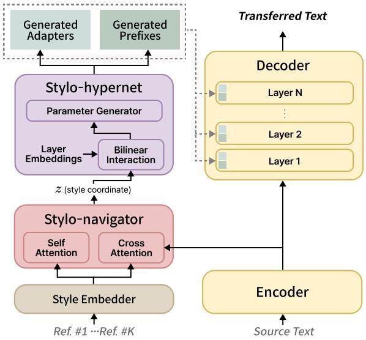
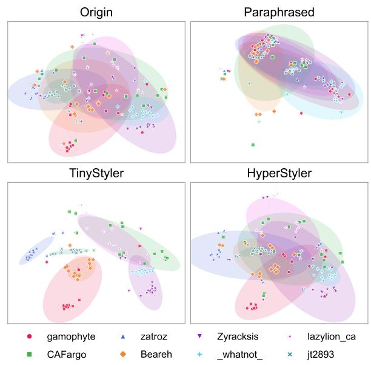
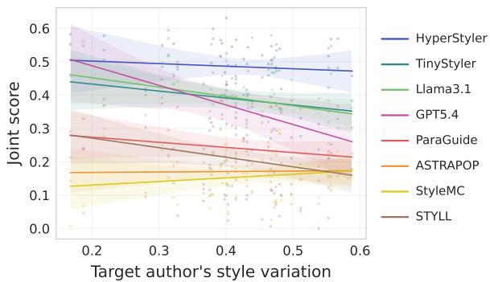
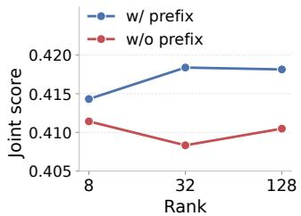
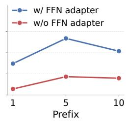
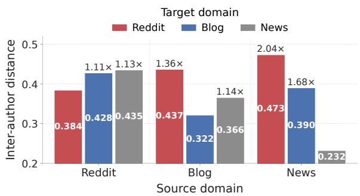
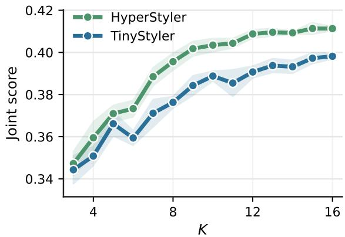
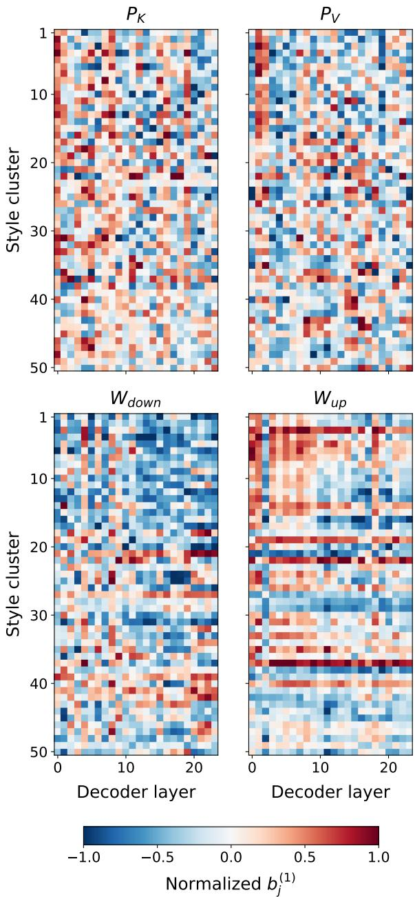
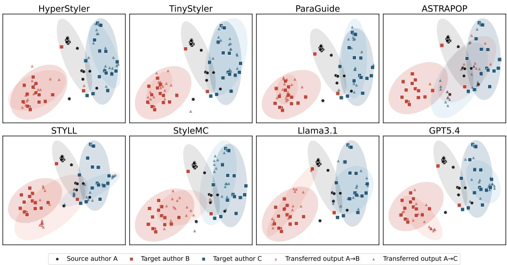

# HyperStyler: Low-resource Authorship Style Transfer via Context-aware Style Navigation and Hypernetworks

Jongkyung Shin1† Minguk Jeon1 Chanwoo Park2 Chiehyeon Lim1,2,3†

1UNIST 2POSTECH 3POSCO Holdings Inc.

{shinjk1156, rzbsys}@unist.ac.kr {cks1091, chiehyeon.lim}@postech.ac.kr

## Abstract

Low-resource authorship style transfer (LAST) aims to rewrite text into the style of an arbitrary target author using only a few reference examples while preserving the original meaning. Existing methods often struggle to achieve both high style fidelity and semantic preservation because they compress diverse references into a single static author embedding, which averages out context-dependent stylistic variation, and rely on hidden representations for style control, which entangle style with content. We propose HyperStyler, a novel architecture that decouples LAST into style selection and style realization. Stylo-navigator predicts style coordinates by jointly modeling the source context and target-author references, and Stylo-hypernet realizes them via dynamic parameter modulation instead of hidden-state injection. Our experiments on Reddit, Blog, and News datasets demonstrate that HyperStyler consistently outperforms prior methods including LLM-based approaches and generalizes robustly across domains. Notably, HyperStyler achieves superior performance with as few as 2.4% additional parameters over T5-large, while being over 1.8× faster than LLMs at inference.

## 1 Introduction

Even when writing the same content, individuals exhibit distinctive lexical choices, syntactic structures, and modes of expression (Stamatatos, 2009; Wang et al., 2023). Low-resource authorship style transfer (LAST) aims to rewrite a source text in the style of an arbitrary target author, preserving the original semantics given only a few reference examples (Patel et al., 2024). Unlike traditional style transfer, which is often restricted to authors with massive corpora, LAST extends the scope to everyday writers with a small number of sentences. This shift offers significant practical value, enabling users to efficiently transform drafts into the nuanced voice of any desired author.

Despite its potential, high-fidelity style transfer remains a significant challenge. Initial attempts leverage in-context learning (Patel et al., 2024) or inference-time control methods (Khan et al., 2024; Horvitz et al., 2024a), but often yield weak stylistic transfer. More recent approaches (Liu et al., 2024; Horvitz et al., 2024b) introduce unsupervised style alignment frameworks by constructing pseudo-parallel datasets. However, they still struggle to achieve strong style fidelity and semantic preservation simultaneously.

We can find the first root cause of this challenge in the stylometry literature. According to prior studies, an author’s style is not a static template but a multifaceted phenomenon that shifts with topic and register (Sapkota et al., 2014; Hoover, 2017; Grieve, 2023). In the few-shot setting of LAST, this context-dependency introduces a fundamental problem. Since the references provided at inference time each capture the author’s style in a specific context, processing all references without explicitly identifying which is most relevant to the source text can result in a style that is either diluted into a generic average or dominated by the most salient reference. Specifically, some methods compressing references into a single static author embedding directly induce mode averaging, while other methods directly feeding all references into the context window lack any mechanism to prioritize contextually relevant references, potentially causing the model to latch onto the most stylistically prominent one.

The second cause lies in how existing methods perform style control in the hidden state space. When stylistic signals are directly injected into hidden states, they become entangled with semantic content, making it difficult to isolate style from semantic content. This is particularly problematic in LAST, where the model must handle the openended stylistic variation of unseen authors rather than a fixed set of style categories. Such stylecontent interference makes it increasingly difficult to precisely realize diverse stylistic variations while preserving the original meaning.

To address these limitations, we propose HyperStyler, a novel architecture that decouples the task into a style selection and a style realization stage via two specialized modules. First, Stylonavigator explicitly predicts style coordinates by considering both the input context and target-author references. Second, Stylo-hypernet realizes these coordinates through dynamic parameter modulation, shifting the control mechanism to the parameter space to reduce content-style entanglement and enable fine-grained controllability. Extensive experiments across Reddit, Blog, and News domains demonstrate that HyperStyler consistently outperforms existing baselines including LLM-based approaches, and generalizes robustly across domains. Furthermore, HyperStyler is over 1.8× faster than LLMs at inference, and maintains superior performance even with only a 2.4% parameter increase over T5-large, highlighting its practical utility for time- and resource-constrained applications.

## 2 Related Work

## 2.1 Unsupervised Alignment for LAST

Due to the scarcity of parallel data, recent LAST methods commonly follow a two-stage unsupervised alignment framework (Krishna et al., 2020). The first stage trains a model to reconstruct the original text from style-neutralized paraphrases, conditioned on either a static author embedding (Horvitz et al., 2024b) or a set of reference samples (Liu et al., 2024). In the second stage, the model is further aligned using filtered pseudo-parallel data. HyperStyler follows this framework but diverges by aligning toward predicted style coordinates rather than a fixed author embedding, enabling the model to account for the author’s stylistic variation.

## 2.2 Hypernetworks

Hypernetworks (Ha et al., 2017) generate parameters of a target model conditioned on an external signal, enabling more flexible modulation than static adapters. They have been primarily used for task- or domain-conditioned adaptation (Ivison et al., 2023; Li et al., 2024). However, their use for controlling fine-grained linguistic patterns in open-ended and few-shot settings, where the model must generalize to unseen authors and conditioning signals, remains underexplored. In this paper, we address this gap by conditioning hypernetworks on stylistic coordinates from few-shot references, enabling dynamic style control while reducing content-style entanglement.

  
Figure 1: Overall architecture of HyperStyler

## 3 HyperStyler

## 3.1 Overview

Given a source text x and a set of references $R = \{ r _ { i } \} _ { i = 1 } ^ { K }$ written by a target author, our goal is to generate y that matches the target author’s writing style while preserving the semantics of x. We explicitly decompose this process into two subtasks: (1) style selection, which infers a target style from the references and source context, and (2) stylistic realization, which rewrites x in the target style without altering its meaning.

As illustrated in Figure 1, HyperStyler implements these subtasks via two modules attached to an encoder–decoder paraphraser. This architecture decouples content encoding in the encoder from stylistic realization in the decoder, aligning with established practices in style transfer (Krishna et al., 2020; Lee et al., 2021; Zhao et al., 2024). First, the Stylo-navigator predicts a style coordinate z from x and R. To ensure parameter efficiency, we reuse the backbone encoder representations $H _ { \mathrm { e n c } } = \operatorname { E n c } ( x )$ as the contextual signal for x without an extra encoder. Second, the Stylo-hypernet generates parameter modulations conditioned on z, which are applied to the decoder as key/value prefixes in the attention layers and low-rank weight updates in the feed-forward networks (FFNs).

## 3.2 Stylo-navigator

We define a stylistic coordinate z in the style embedding space using STYLE embedder (Wegmann et al., 2022) trained to capture content-independent stylistic representations. This reduces the influence of content semantics from the reference sentences on the control signal, encouraging z to primarily reflect stylistic characteristics. Each reference sentence $r _ { i }$ is mapped to a style embedding $s _ { i } ,$ yielding a set of reference embeddings $S \in \mathbb { R } ^ { K \times d }$

The Stylo-navigator predicts a stylistic coordinate z by attending reference weights conditioned on the source context via two parallel attention mechanisms. We apply self-attention over $S$ to capture inter-reference stylistic patterns that characterize the author’s uniqueness, producing $\tilde { S } = \mathrm { S e l f A t t n } ( S )$ . In parallel, cross-attention is applied with $H _ { \mathrm { e n c } }$ as queries and S as keys and values, where each token-level hidden state attends to the entire reference set for fine-grained, contextdependent style selection. The token-specific results are aggregated via mean pooling to form a context-aware style query $q \in \mathbb { R } ^ { d }$

$$
q = \mathrm { M e a n P o o l } \big ( \mathrm { C r o s s A t t n } ( H _ { \mathrm { e n c } } , S , S ) \big ) .\tag{1}
$$

We then compute a scaled dot product between q and each $\tilde { s _ { i } } \in \mathbb { R } ^ { d }$ to obtain the contribution weight $\alpha _ { i }$ of each reference:

$$
\alpha _ { i } = \frac { \exp ( \bar { q } \cdot \bar { \tilde { s } } _ { i } / \sqrt { d } ) } { \sum _ { k = 1 } ^ { K } \exp ( \bar { q } \cdot \bar { \tilde { s _ { k } } } / \sqrt { d } ) } ,\tag{2}
$$

where $\bar { q }$ and $\bar { \tilde { s } } _ { i }$ are layer-normalized for stability. The stylistic coordinate z is obtained as the weighted sum of the reference embeddings:

$$
z = \sum _ { i = 1 } ^ { K } \alpha _ { i } s _ { i } .\tag{3}
$$

Note that z lies within the STYLE space, not in a newly defined space. Because the weights $\alpha _ { i }$ are conditioned on the source contex $\operatorname { t } , z$ varies with the context even for the same author. As an interpolation rather than a selection, z can also reach coordinates between individual references.

## 3.3 Stylo-hypernet

Stylo-hypernet dynamically modulates the decoder conditioned on the stylistic coordinate z. Prior analyses suggest that transformer layers contribute differently to generation (Langedijk et al., 2024;

Alshomary et al., 2025), implying that stylistic realization may be inherently layer-dependent. Motivated by this observation and inspired by Ivison et al. (2023), we introduce learnable layer embeddings and modulate them with z to construct layerspecific style signals. Concretely, we compute a style-dependent offset for each modulation target and add it to the corresponding layer embedding via a residual connection to preserve layer identity. The resulting layer-specific signals are then used to generate modulation parameters for the decoder.

Style-conditioned Layer Embeddings. Let $E ^ { ( t ) } = [ e _ { 1 } ; \dots ; e _ { N _ { t } } ] \in \mathbb { R } ^ { N _ { t } \times d _ { e } }$ be a learnable embedding table associated with a modulation target t (e.g., cross-attention prefix keys). Here, $N _ { t }$ is the number of embeddings for target t, and each row $e _ { j }$ corresponds to a distinct modulation target indexed by a tuple (layer, type, position). Prefix embeddings are indexed by (layer, key/value, prefix position) and adapter embeddings are indexed only by projection type (layer, up/down).

We compute compatibility scores between z and each layer embedding through a multi-head bilinear interaction:

$$
b _ { j } ^ { ( h ) } = ( W _ { e } \bar { e } _ { j } ) ^ { ( h ) \top } ( W _ { s } \bar { z } ) ^ { ( h ) } ,\tag{4}
$$

where $( \cdot ) ^ { ( h ) }$ is the h-th head, $W _ { e }$ and $W _ { s }$ are trainable projection matrices, and $\bar { e } _ { j }$ and z¯ denote layernormalized vectors. Each $b _ { j } ^ { ( h ) }$ is a style-dependent and embedding-specific signal that determines the relative contribution of the corresponding subspace of z to embedding j. We then form the offset $o _ { j }$ by projecting z¯ with trainable matrix $W _ { v }$ , scaling each head with its corresponding score, and concatenating all $N _ { h }$ heads:

$$
o _ { j } = \big [ b _ { j } ^ { ( 1 ) } ( W _ { v } \bar { z } ) ^ { ( 1 ) } ; \dots ; b _ { j } ^ { ( N _ { h } ) } ( W _ { v } \bar { z } ) ^ { ( N _ { h } ) } \big ] .\tag{5}
$$

Finally, we project the offset $o _ { j }$ with trainable matrix $W _ { o }$ and apply layer normalization to obtain a stable style-conditioned update $\Delta e _ { j }$ , which is added to the original embedding $e _ { j }$

$$
\Delta e _ { j } = \mathrm { L N } ( W _ { o } o _ { j } ) , \quad \tilde { e } _ { j } = e _ { j } + \Delta e _ { j } .\tag{6}
$$

Generating Modulation Parameters. We map the style-conditioned layer embeddings $\tilde { E } ^ { ( t ) }$ to modulation parameters using two-layer MLPs. We use dedicated generators for different modulation targets, as each target operates on distinct parameter spaces with different dimensionalities and functional roles. Here, $d _ { \mathrm { m o d e l } }$ denotes the hidden dimensionality of the underlying model.

Cross-attention prefixes modulate how the decoder references the source context during generation (Li and Liang, 2021). We generate key and value prefix vectors using two independent MLPs. The generated vectors are grouped into length-p prefixes per layer, $P _ { K } ^ { \ell } , P _ { V } ^ { \ell } \in \bar { \mathbb { R } } ^ { p \times d _ { \mathrm { m o d e l } } }$ and concatenated to the original keys and values along the sequence dimension, $\boldsymbol { K } ^ { \prime } = [ P _ { K } ^ { \ell } ; K ^ { \ell } ]$ and $\hat { V } ^ { \prime \ell } = \hat { \lvert P _ { V } ^ { \ell } ; V ^ { \ell } \rvert }$

Low-rank adapters target FFN layers, which have been shown to store substantial linguistic information (Geva et al., 2021, 2022), making them well-suited for controlling surface realization such as lexical choice and syntactic patterns. For each layer $\ell ,$ we generate low-rank downand up-projection weights using separate ML $\mathrm { P s }$ $W _ { d o w n } ^ { \ell } ~ \in ~ \mathbb { R } ^ { d _ { \mathrm { m o d e l } } \times r }$ and $W _ { u p } ^ { \ell } \in \bar { \mathbb { R } ^ { r \times d _ { \mathrm { m o d e l } } } }$ . The resulting branch is added to the FFN output:

$$
h _ { \mathrm { o u t } } ^ { l } = \mathrm { F F N } ^ { l } ( h _ { \mathrm { i n } } ^ { l } ) + \sigma ( h _ { \mathrm { i n } } ^ { l } W _ { d o w n } ^ { \ell } ) W _ { u p } ^ { \ell } ,\tag{7}
$$

where $h _ { \mathrm { i n } }$ and $\sigma ( \cdot )$ denote the FFN input hidden states and the activation function, respectively. In our implementation, each MLP outputs a vector of length $r \cdot d _ { \mathrm { m o d e l } }$ , which is reshaped into the corresponding low-rank matrix for each layer.

## 3.4 Training Procedure

Due to the lack of a parallel dataset for LAST, we adopt an unsupervised training setting, and the overall training procedure consists of three stages.

Stage 1: Training the Underlying Model. For each author, we collect an author-specific corpus consisting of a sentence set $X ~ = ~ \{ x _ { i } \} _ { i = 1 } ^ { K }$ . Using a pretrained paraphraser, we generate a synthetic paraphrase $x _ { i } ^ { \prime }$ for each sentence $x _ { i }$ , thereby constructing synthetic pairs $\{ ( x _ { i } , x _ { i } ^ { \prime } ) \} _ { i = 1 } ^ { K }$ . To mitigate stylistic bias inherited from the pretrained paraphraser and to improve both diversity and semantic preservation, we train the underlying model with a bidirectional reconstruction objective over $( x _ { i }  x _ { i } ^ { \prime } )$ pairs (Sjöblom et al., 2020; Ma et al., 2021). The goal of this stage is not to acquire any specific style, but to establish a semantically reliable paraphrasing backbone.

Stage 2: Training the Stylo-navigator and Stylohypernet. We freeze the underlying paraphraser and integrate it with the Stylo-navigator and Stylohypernet to be trained simultaneously through an unsupervised reconstruction task. For each author, the reference set R = X is embedded into the style embeddings $S \in \mathbb { R } ^ { K \times d }$ . The Stylo-navigator is trained to identify the stylistic target within $S$ that best matches $x _ { i }$ given the source context $x _ { i } ^ { \prime }$ . We use the index i of the target sentence as a ground-truth label and minimize the negative log-likelihood of the predicted selection probabilities α:

$$
\mathcal { L } _ { \mathrm { n a v } } = - \sum \log \alpha _ { i } .\tag{8}
$$

To prevent the navigator’s prediction errors from propagating to the Stylo-hypernet, we use teacherforced style conditioning, where the Stylo-hypernet is conditioned on the ground-truth style embedding $s _ { i }$ (obtained by encoding $x _ { i }$ with the STYLE embedder) rather than the predicted coordinate z. This isolates hypernetwork optimization from navigator errors and allows the Stylo-hypernet to focus on learning precise parameter modulation. The Stylo-hypernet is optimized to maximize the reconstruction likelihood of $x _ { i } { \cdot }$

$$
{ \mathcal { L } } _ { \mathrm { h y p e r n e t } } = - \sum \log p ( x _ { i } \mid x _ { i } ^ { \prime } , s _ { i } ) .\tag{9}
$$

Stage 3: Unsupervised Alignment Training. Finally, we optimize the model for style transfer beyond reconstruction, conditioning the Stylohypernet on the stylistic coordinate z from the Stylo-navigator. Since parallel data between source and target authors is unavailable, we construct a high-quality parallel dataset via self-distillation (Zhang et al., 2019). Specifically, we generate style-transferred outputs using the Stage 2 model and filter them following the Rerank and Filtering procedure from Horvitz et al. (2024b). Unlike prior work that uses a mean-pooled reference embedding, we use predicted z to evaluate style fidelity during filtering. Using the pseudo-parallel data, we jointly train the Stylo-navigator and Stylo-hypernet.

## 4 Experiments

## 4.1 Experimental Setup

Datasets. We conduct experiments on three datasets with distinct genres: Reddit (Khan et al., 2021), Blog (Schler et al., 2006), and News (Allthe-news). Following prior works for LAST (Patel et al., 2024; Horvitz et al., 2024a,b), we segment each author’s corpus into sentences and randomly sample 10 sentences per author. We filter out any samples exceeding 60 tokens and split the data by author into training, validation, and test sets with a 0.9/0.05/0.05 ratio. More details of the datasets are described in the Appendix A.

<table><tr><td rowspan="2">Method</td><td colspan="4">Reddit</td><td colspan="4">Blog</td><td colspan="4">News</td></tr><tr><td>AWAY</td><td>TOWARDS</td><td>SIM</td><td>JOINT</td><td>AWAY</td><td>TOWARDS</td><td>SIM</td><td>JOINT</td><td>AWAY</td><td>TOWARDS</td><td>SIM</td><td>JOINT</td></tr><tr><td>STYLL(Qwen2.5-7B)</td><td>0.811</td><td>0.063</td><td>0.428</td><td>0.208</td><td>0.812</td><td>0.071</td><td>0.408</td><td>0.179</td><td>0.739</td><td>0.009</td><td>0.479</td><td>0.061</td></tr><tr><td>GPT4-turbo</td><td>0.814</td><td>0.081</td><td>0.702</td><td>0.314</td><td>0.896</td><td>0.128</td><td>0.713</td><td>0.331</td><td>0.677</td><td>0.063</td><td>0.860</td><td>0.290</td></tr><tr><td>GPT5-mini</td><td>0.856</td><td>0.082</td><td>0.728</td><td>0.332</td><td>0.885</td><td>0.126</td><td>0.687</td><td>0.333</td><td>0.719</td><td>0.093</td><td>0.759</td><td>0.336</td></tr><tr><td>GPT5.4</td><td>0.918</td><td>0.117</td><td>0.597</td><td>0.359</td><td>0.958</td><td>0.093</td><td>0.526</td><td>0.276</td><td>0.848</td><td>0.071</td><td>0.718</td><td>0.273</td></tr><tr><td>Llama3.1-8B-Instruct</td><td>0.756</td><td>0.135</td><td>0.587</td><td>0.390</td><td>0.875</td><td>0.173</td><td>0.539</td><td>0.407</td><td>0.819</td><td>0.107</td><td>0.493</td><td>0.281</td></tr><tr><td>ParaGuideλ=200</td><td>0.763</td><td>0.053</td><td>0.598</td><td>0.235</td><td>0.661</td><td>0.069</td><td>0.719</td><td>0.301</td><td>0.595</td><td>0.038</td><td>0.545</td><td>0.187</td></tr><tr><td>ParaGuideλ=2500</td><td>0.853</td><td>0.067</td><td>0.450</td><td>0.240</td><td>0.736</td><td>0.100</td><td>0.627</td><td>0.341</td><td>0.515</td><td>0.026</td><td>0.685</td><td>0.164</td></tr><tr><td>StyleMC</td><td>0.658</td><td>0.036</td><td>0.450</td><td>0.154</td><td>0.565</td><td>0.063</td><td>0.439</td><td>0.195</td><td>0.403</td><td>0.029</td><td>0.574</td><td>0.153</td></tr><tr><td>ASTRAPOP</td><td>0.578</td><td>0.027</td><td>0.728</td><td>0.171</td><td>0.997</td><td>0.255</td><td>0.014</td><td>0.060</td><td>0.840</td><td>0.060</td><td>0.170</td><td>0.139</td></tr><tr><td>ASTRAPOPJOINT</td><td>0.620</td><td>0.029</td><td>0.695</td><td>0.173</td><td>0.840</td><td>0.070</td><td>0.171</td><td>0.139</td><td>0.576</td><td>0.082</td><td>0.713</td><td>0.319</td></tr><tr><td>TinyStylerREC</td><td>0.897</td><td>0.144</td><td>0.352</td><td>0.323</td><td>0.791</td><td>0.134</td><td>0.603</td><td>0.379</td><td>0.605</td><td>0.053</td><td>0.582</td><td>0.223</td></tr><tr><td>TinyStylerREC,RERANK(5)</td><td>0.888</td><td>0.141</td><td>0.506</td><td>0.387</td><td>0.793</td><td>0.135</td><td>0.721</td><td>0.421</td><td>0.598</td><td>0.054</td><td>0.691</td><td>0.252</td></tr><tr><td>TinyStyler</td><td>0.860</td><td>0.122</td><td>0.626</td><td>0.399</td><td>0.743</td><td>0.129</td><td>0.786</td><td>0.434</td><td>0.541</td><td>0.057</td><td>0.797</td><td>0.278</td></tr><tr><td>TinyStylerRERANK(5)</td><td>0.859</td><td>0.122</td><td>0.730</td><td>0.436</td><td>0.756</td><td>0.128</td><td>0.844</td><td>0.452</td><td>0.561</td><td>0.057</td><td>0.843</td><td>0.294</td></tr><tr><td>HyperStylerREC</td><td>0.806</td><td>0.155</td><td>0.475</td><td>0.378</td><td>0.676</td><td>0.187</td><td>0.684</td><td>0.477</td><td>0.581</td><td>0.110</td><td>0.615</td><td>0.355</td></tr><tr><td>HyperStylerREC,RERANK(5)</td><td>0.800</td><td>0.152</td><td>0.705</td><td>0.460</td><td>0.692</td><td>0.189</td><td>0.854</td><td>0.537</td><td>0.587</td><td>0.101</td><td>0.802</td><td>0.399</td></tr><tr><td>HyperStyler</td><td>0.818</td><td>0.152</td><td>0.578</td><td>0.418</td><td>0.731</td><td>0.183</td><td>0.701</td><td>0.489</td><td>0.571</td><td>0.098</td><td>0.678</td><td>0.370</td></tr><tr><td>HyperStylerRERANK(5)</td><td>0.815</td><td>0.147</td><td>0.791</td><td>0.485</td><td>0.736</td><td>0.183</td><td>0.864</td><td>0.538</td><td>0.585</td><td>0.083</td><td>0.865</td><td>0.372</td></tr></table>

Table 1: Performance comparison results on three datasets. For the Reddit dataset, we report the average performance across three splits. The highest JOINT scores without and with reranking are bolded and underlined, respectively.

We use three evaluation sets of Reddit from Patel et al. (2024): Random, Single, and Diverse. Each split comprises 15 source and 15 target authors with 16 samples each, totaling 225 transfer directions and 3,600 transformations. We apply the same configuration to Blog and News by randomly selecting hold-out authors from the test dataset.

Evaluation Metrics. To ensure fair comparison, we follow the evaluation protocol established in prior LAST studies (Patel et al., 2024; Horvitz et al., 2024b). AWAY and TOWARDS measure the degree to which the set of transferred texts moves away from the source author’s style and toward the target author’s style, respectively. These metrics are computed using a held-out UAR embedder (Rivera-Soto et al., 2021) trained via contrastive learning for authorship verification. To evaluate semantic preservation, we use the Mutual Implication Score (Babakov et al., 2022) as SIM. Finally, the JOINT score summarizes overall performance of style transfer: JOINT = G(G(TOWARDS, AWAY), SIM), where G(·) denotes the geometric mean. (see details in C.1)

Baselines. We compare against baselines across three categories for the LAST task.

In-context learning methods include STYLL (Patel et al., 2024) with Qwen2.5, and models prompted with the instructions from Horvitz et al. (2024b), including Llama3.1, GPT4-turbo, and the reasoning enabled GPT5-mini and GPT5.4.

Inference-time control methods include

ParaGuide (Horvitz et al., 2024a), a diffusionbased model, and StyleMC (Khan et al., 2024), which performs Metropolis-Hastings sampling guided by a future regressor.

Unsupervised alignment methods include TinyStyler (Horvitz et al., 2024b), which conditions on a mean-pooled style embedding for references and utilizes self-distillation, and ASTRAPOP (Liu et al., 2024), a policy optimization conditioning on the entire reference sentences. Beyond its original length-based reward, we also train ASTRAPOP using the JOINT as a reward.

Implementation Details. To ensure fair comparison, we apply two principles: (1) we unify the backbone to T5-large (Raffel et al., 2020) across all trainable baselines so that performance reflects methodological rather than capacity differences, and (2) for baselines that require a style guide, we provide a mean-pooled style embedding rather than the UAR embedding used for evaluation to prevent baselines from directly optimizing the evaluation metric. We utilize off-the-shelf paraphrasing PE-GASUS (Zhang et al., 2020), following Horvitz et al. (2024b), and set the adapter rank to 32 and the prefix length to 5. Following TinyStyler, we apply reranking (Suzgun et al., 2022) at inference time, but use the predicted z as the target style instead of a mean-pooled embedding. Other details are provided in the Appendix B. Our implementation code for HyperStyler is available at https: //github.com/JK-SHIN-PG/HyperStyler.

<table><tr><td>Model</td><td>AWAY</td><td>TOWARDS</td><td>SIM</td><td>JOINT</td><td>AWAY</td><td>TOWARDS</td><td>SIM</td><td>JOINT</td><td>AWAY</td><td>TOWARDS</td><td>SIM</td><td>JOINT</td><td>AWAY</td><td>TOWARDS</td><td>SIM</td><td>JOINT</td></tr><tr><td></td><td></td><td></td><td></td><td></td><td></td><td></td><td></td><td>Train: Reddit</td><td></td><td></td><td></td><td></td><td></td><td></td><td></td><td></td></tr><tr><td></td><td></td><td colspan="3">Reddit → Blog</td><td></td><td>Reddit → News</td><td></td><td></td><td></td><td>Blog → Reddit</td><td></td><td></td><td></td><td>News → Reddit</td><td></td><td></td></tr><tr><td>TinyStyler</td><td>0.768</td><td>0.175</td><td>0.653</td><td>0.477</td><td>0.716</td><td>0.123</td><td>0.621</td><td>0.412</td><td>0.672</td><td>0.093</td><td>0.797</td><td>0.393</td><td>0.428</td><td>0.037</td><td>0.843</td><td>0.231</td></tr><tr><td>HyperStyler</td><td>0.757</td><td>0.239</td><td>0.601</td><td>0.499</td><td>0.718</td><td>0.182</td><td>0.567</td><td>0.446</td><td>0.755</td><td>0.209</td><td>0.604</td><td>0.481</td><td>0.660</td><td>0.197</td><td>0.614</td><td>0.459</td></tr><tr><td></td><td colspan="4"></td><td colspan="3"></td><td colspan="3">Train: Blog</td><td colspan="3"></td><td colspan="3"></td></tr><tr><td></td><td></td><td></td><td>Blog → News</td><td></td><td></td><td>Blog → Reddit</td><td></td><td></td><td></td><td>News → Blog</td><td></td><td></td><td></td><td>Reddit → Blog</td><td></td><td></td></tr><tr><td>TinyStyler</td><td>0.632</td><td>0.103</td><td>0.759</td><td>0.399</td><td>0.678</td><td>0.094</td><td>0.794</td><td>0.400</td><td>0.469</td><td>0.030</td><td>0.835</td><td>0.224</td><td>0.765</td><td>0.176</td><td>0.662</td><td>0.479</td></tr><tr><td>HyperStyler</td><td>0.630</td><td>0.117</td><td>0.720</td><td>0.411</td><td>0.618</td><td>0.104</td><td>0.718</td><td>0.397</td><td>0.596</td><td>0.154</td><td>0.718</td><td>0.442</td><td>0.762</td><td>0.252</td><td>0.639</td><td>0.523</td></tr><tr><td rowspan="2"></td><td colspan="10"></td><td colspan="3"></td><td colspan="3"></td></tr><tr><td></td><td></td><td>News → Blog</td><td></td><td></td><td>News → Reddit</td><td></td><td></td><td></td><td>Blog → News</td><td></td><td></td><td></td><td>Reddit → News</td><td></td><td></td></tr><tr><td>TinyStyler</td><td>0.470</td><td>0.031</td><td>0.837</td><td>0.230</td><td>0.426</td><td>0.037</td><td>0.846</td><td>0.237</td><td>0.633</td><td>0.101</td><td>0.754</td><td>0.396</td><td>0.713</td><td>0.123</td><td>0.613</td><td>0.412</td></tr><tr><td>HyperStyler</td><td>0.516</td><td>0.100</td><td>0.737</td><td>0.391</td><td>0.444</td><td>0.066</td><td>0.725</td><td>0.315</td><td>0.714</td><td>0.193</td><td>0.593</td><td>0.454</td><td>0.779</td><td>0.250</td><td>0.507</td><td>0.468</td></tr></table>

Table 2: Cross-domain authorship style transfer performance across three datasets. Source → Target indicates the transformation of texts from a source domain author’s style to a target domain author’s style. The highest JOINT scores for each pair are in bold; values below 0.3 shaded in red . We report results without reranking.
<table><tr><td>Model</td><td>AWAY</td><td>TOWARDS</td><td>SIM</td><td>JOINT</td><td>AWAY</td><td>TOWARDS</td><td>SIM</td><td>JOINT</td><td>AWAY</td><td>TOWARDS</td><td>SIM</td><td>JOINT</td></tr><tr><td></td><td colspan="9"></td><td colspan="4"></td></tr><tr><td></td><td></td><td colspan="3">Reddit → Reddit</td><td></td><td colspan="3">Blog → Blog</td><td></td><td colspan="3">News → News</td></tr><tr><td>TinyStyler HyperStyler</td><td>0.860 0.818</td><td>0.122 0.152</td><td>0.626 0.578</td><td>0.399</td><td>0.776 0.779</td><td>0.111 0.172</td><td>0.733</td><td>0.388</td><td>0.600</td><td>0.017</td><td>0.762</td><td>0.123 0.249</td></tr><tr><td></td><td></td><td></td><td>0.418</td><td></td><td>Train: Blog</td><td></td><td>0.669</td><td>0.476</td><td>0.601</td><td>0.045</td><td>0.724</td><td></td></tr><tr><td></td><td colspan="9"></td><td rowspan="3"></td><td rowspan="3"></td></tr><tr><td></td><td></td><td>Reddit → Reddit</td><td></td><td></td><td></td><td>Blog → Blog</td><td></td><td></td><td>News → News</td></tr><tr><td>TinyStyler HyperStyler</td><td>0.828 0.787</td><td>0.061 0.073</td><td>0.711 0.641</td><td>0.276 0.304</td><td>0.743 0.731</td><td>0.129 0.183</td><td>0.786 0.701</td><td>0.434 0.489</td><td>0.538 0.556</td><td>0.034 0.800 0.057</td><td>0.216 0.746 0.284</td></tr><tr><td></td><td colspan="9"></td></tr><tr><td rowspan="2"></td><td></td><td></td><td></td><td></td><td></td><td>Train: News</td><td></td><td></td><td></td><td></td><td></td><td></td></tr><tr><td></td><td colspan="9">Reddit → Reddit</td></tr><tr><td>TinyStyler</td><td>0.718</td><td>0.029</td><td>0.726</td><td>0.182</td><td>0.673</td><td>Blog → Blog 0.046</td><td>0.780</td><td>0.243</td><td>0.541</td><td>News → News 0.057</td><td>0.797</td><td>0.278</td></tr><tr><td>HyperStyler</td><td>0.766</td><td>0.036</td><td>0.614</td><td>0.185</td><td>0.694</td><td>0.120</td><td>0.712</td><td>0.428</td><td>0.578</td><td>0.094</td><td>0.683</td><td>0.365</td></tr></table>

Table 3: In-domain authorship style transfer performance across three datasets. The highest JOINT scores are in bold for each pair. Best results are shaded for each training domain: red for TinyStyler and yellow for HyperStyler.

## 4.2 Results

Overall Performance. Style transfer requires simultaneously achieving high style fidelity and semantic preservation, as a model biased toward preservation fails to transfer style, while one biased toward style fidelity risks distorting meaning (Fu et al., 2018; Horvitz et al., 2024b). As shown in Table 1, HyperStyler strikes the best balance between the two objectives, improving TOWARDS while maintaining competitive SIM scores, resulting in the highest JOINT scores across all three domains. Further improvements are observed when reranking is applied.

Most baselines have relatively low performance on the News, as news articles are more formal and exhibit lower stylistic variability, making it more difficult to capture distinctive author-specific styles (Eder et al., 2021; Wang and Riddell, 2022) (Table 8). Despite this, HyperStyler outperforms all baselines, including LLMs. Additional experimental results including qualitative analysis are provided in Appendix D.

Generalization Capability. We compare the generalization capability of HyperStyler with TinyStyler, the strongest baseline in our experiments. As shown in Table 2, TinyStyler consistently degrades when transferring from News to Reddit and Blog, where the inter-author distances to the target authors are approximately 2.04× and 1.68× larger than those in the in-domain setting, respectively (Figure 5). Given these larger distances and the high style variation in Blog and Reddit, this degradation suggests that a single mean embedding fails to provide sufficiently fine-grained style signals for such large stylistic shifts. In contrast, HyperStyler achieves consistently strong performance across most domain pairs, as its context-aware style selection and parameter modulation enable more precise stylistic adaptation across diverse domains.

We also evaluate in-domain authorship style transfer under out-of-domain training. As shown in Table 3, TinyStyler performs well when trained and evaluated within the same domain, but its performance degrades substantially when applied to other domains. Since the training domain shapes the range and granularity of styles a model learns, and each target domain may require a different level of stylistic precision, some degree of degradation under domain shift is expected. Nevertheless, Hyper-Styler exhibits relatively limited degradation. Notably, HyperStyler trained only on News achieves Blog→Blog transfer performance close to that of TinyStyler trained directly on Blog, highlighting HyperStyler’s robust generalization capability.

## 4.3 Analysis and Ablation Study

Capturing Context-dependent Style Variation. We examine whether HyperStyler navigates the style space in a context-dependent manner. Specifically, we paraphrase the original texts and have the model reconstruct them in their corresponding styles. As shown in Figure 2, TinyStyler, which is conditioned on a single static embedding, fails to faithfully reproduce the original stylistic distribution, whereas HyperStyler closely matches it. Furthermore, the predicted z achieves a cosine similarity of 0.82 with the original style embedding and a Mean Reciprocal Rank (MRR) of 0.80, substantially outperforming mean pooling (cosine similarity:0.58, MRR: 0.21). These results demonstrate that the Stylo-navigator accurately identifies the context-appropriate style target. We also analyze performance under target-author style variation. Figure 3 shows that HyperStyler remains robust as variation increases, whereas the baselines degrade. This highlights that context-aware style selection enables HyperStyler to effectively handle high stylistic variation within an author’s style.

Does style selection need to be explicit? We compare the Stylo-navigator against two alternative strategies. (1) Mean pooling: We inject the mean-pooled reference embedding into the Stylohypernet. (2) Implicit selection: We provide all reference embeddings and perform layer-wise style selection implicitly via cross-attention. The results in Table 4 show that both alternatives exhibit substantially lower TOWARDS scores compared to the Stylo-navigator, demonstrating that explicit style selection conditioned on the source context is effective in improving style fidelity.

Figure 2: t-SNE visualization of the style embeddings for original texts, their paraphrases, and reconstructed outputs from TinyStyler and HyperStyler. Each ellipse indicates the approximate style distribution of an author.  

Figure 3: Trends of JOINT score with respect to the target author’s style variation on Reddit. Lines indicate fitted linear trends with 95% confidence bands.
<table><tr><td>Model</td><td>AWAY</td><td>TOWARDS</td><td>SIM</td><td>JOINT</td></tr><tr><td>HyperStyler</td><td>0.818</td><td>0.152</td><td>0.578</td><td>0.418</td></tr><tr><td>w/o Stylo-navigator (Mean-pooling)</td><td>0.783</td><td>0.099</td><td>0.706</td><td>0.368</td></tr><tr><td>w/o Stylo-navigator (Implicit selection)</td><td>0.778</td><td>0.114</td><td>0.671</td><td>0.384</td></tr><tr><td>w/o Stylo-hypernet (Global)</td><td>0.990</td><td>0.006</td><td>0.165</td><td>0.016</td></tr><tr><td>w/o Stylo-hypernet (Layer-wise)</td><td>0.791</td><td>0.121</td><td>0.630</td><td>0.394</td></tr><tr><td>w/o adapter in FFN</td><td>0.800</td><td>0.134</td><td>0.608</td><td>0.409</td></tr><tr><td>w/o prefix in CrossAttn</td><td>0.825</td><td>0.150</td><td>0.551</td><td>0.408</td></tr><tr><td>w/ prefix in SelfAttn</td><td>0.969</td><td>0.016</td><td>0.461</td><td>0.076</td></tr><tr><td>Underlying paraphraser</td><td>0.896</td><td>0.013</td><td>0.718</td><td>0.088</td></tr></table>

Table 4: Ablation study on HyperStyler. We report the averaged value across three test splits of Reddit dataset.

Should style realization operate in parameter space? We compare parameter modulation against two hidden-state injection strategies. (1) Global: We concatenate predicted z to the encoder hidden states, providing the same style signal to all decoder layers. (2) Layer-wise: We generate layerspecific style embeddings and concatenate them to the encoder hidden states for each decoder layer. The global strategy fails to induce style changes, confirming that layer-wise style control is necessary. More importantly, while layer-wise injection shows some improvement, the TOWARDS/SIM ratio of HyperStyler (0.263) is approximately 37% higher than that of layer-wise injection (0.192), indicating that parameter modulation achieves higher style fidelity for the same semantic cost compared to hidden-state injection. This demonstrates the effectiveness of parameter modulation in realizing style while preserving content.

Which decoder components should be modulated? We compare different combinations of modulation targets. Modulating only the crossattention (w/o Adapter in FFN) achieves high performance but falls short in style fidelity, while modulating only the FFN (w/o Prefix in CrossAttn) improves style fidelity but degrades content preservation. Modulating the self-attention layers results in broken sentence structures, interfering with the decoder’s generation process. These results suggest that jointly modulating FFN and cross-attention achieves the best balance between style fidelity and content preservation.

We further analyze the effects of varying rank and prefix length. As shown in Figure 4, increasing the rank yields only limited additional benefit, and a longer prefix does not necessarily yield further gains. Across all combinations of rank and prefix length, using both modulation components consistently outperforms variants that remove either the FFN adapter or the cross-attention prefix, further supporting the structural effectiveness of dual modulation.

  
Figure 4: Effect of rank and prefix length with and without each modulation component, averaged across three test splits on the Reddit dataset.

## 4.4 Human Evaluation

We conduct a human evaluation of style transfer quality. Annotators evaluated two criteria: style fidelity (SF), where they selected whether the transferred text or the source text better matches the target author’s style, and content similarity (CS), where they rated how well the transferred text preserves the meaning of the source text. More details are provided in Appendix C.2. As shown in Table 5, HyperStyler achieves the highest SF and G.mean scores. Its SF score is statistically significantly higher than those of GPT5.4 and ParaGuide. Meanwhile, its CS score is not significantly different from ParaGuide, which achieves the highest CS score. These results further validate that Hyper-Styler achieves high style fidelity while preserving content comparably to the baseline, demonstrating consistency across both automated metrics and human judgment.

<table><tr><td>Model</td><td>SF</td><td>CS</td><td>G.mean</td></tr><tr><td>GPT5.4</td><td>0.47†</td><td>1.17</td><td>0.36</td></tr><tr><td>Llama3.1</td><td>0.59</td><td>1.07†‡</td><td>0.41</td></tr><tr><td>ParaGuide</td><td>0.44</td><td>1.20</td><td>0.34</td></tr><tr><td>TinyStyler</td><td>0.59</td><td>1.16</td><td>0.44</td></tr><tr><td>TinyStylerRERANK</td><td>0.51</td><td>1.10</td><td>0.38</td></tr><tr><td>HyperStyler</td><td>0.61</td><td>1.15</td><td>0.46</td></tr><tr><td>HyperStylerRERANK</td><td>0.58</td><td>1.19</td><td>0.43</td></tr></table>

Table 5: Human evaluation results. Bold and underlining indicate the best and second-best scores, respectively. † and ‡ denote significant differences from them, respectively. Significance is assessed at $p < 0 . 0 5$ using McNemar’s test for SF and paired t-tests for CS. G.mean is the geometric mean of SF and normalized CS.

## 4.5 Efficiency

Parameter Efficiency. We evaluate the parameter efficiency of our approach by testing a constrained configuration with a reduced rank and prefix length. As summarized in Table 6, decreasing the number of parameters leads to a slight degradation in performance. Nevertheless, even with the rank and prefix length set to 1, our model still outperforms TinyStyler while adding only 2.4% of the underlying model’s parameters. This result demonstrates that HyperStyler maintains robust performance even under parameter constraints.

<table><tr><td>Model</td><td>r p</td><td></td><td>AWAY TOWARDS</td><td>SIM</td><td></td><td>JOINT #Params</td><td>∆</td></tr><tr><td>TinyStyler</td><td></td><td>-</td><td>0.860</td><td>0.122</td><td>0.626 0.399</td><td>783M</td><td>=</td></tr><tr><td>HyperStyler</td><td>1</td><td>1</td><td>0.801</td><td>0.141</td><td>0.602 0.413</td><td>802M</td><td>+2.4%</td></tr><tr><td></td><td>8</td><td>5</td><td>0.817</td><td>0.148</td><td>0.580 0.414</td><td>817M</td><td>+4.3%</td></tr><tr><td></td><td>32 5</td><td></td><td>0.818</td><td>0.152</td><td>0.578 0.418</td><td>867M</td><td>+10.7%</td></tr></table>

Table 6: Parameter efficiency analysis. r and p denote the adapter rank and prefix length, respectively. #Params denotes the number of parameters and ∆ represents the percentage increase relative to the T5-large model.

Inference Time and Memory. HyperStyler achieves approximately one second per inference on a single A100 GPU, with a modest overhead over TinyStyler (Table 17). Compared to opensource LLMs, HyperStyler is over 1.8× faster and uses less than one-eighth of the VRAM, and over 2.0× faster than API-based LLMs. Notably, even with reranking applied, HyperStyler remains faster than LLM-based baselines. These results demonstrate that high style transfer performance can be achieved without compromising computational efficiency, highlighting its suitability for time- and memory-constrained practical applications.

## 5 Conclusion

We introduce HyperStyler, a novel architecture for LAST grounded in the stylometric view that authorship style is not static but varies with context. HyperStyler explicitly decouples the task into two stages: context-aware style selection and stylistic realization. By explicitly selecting the most contextually appropriate style from a limited set of references and realizing it through parameter-space modulation, HyperStyler effectively addresses the mode averaging and style-content entanglement problems of existing methods. Extensive experiments demonstrate that HyperStyler consistently outperforms existing baselines and generalizes robustly across diverse domains, while maintaining superior performance even with only a 2.4% increase in parameters. These results suggest that explicitly decoupling style selection and realization is a promising direction for achieving high-fidelity authorship style transfer in few-shot settings.

## Limitations

While HyperStyler achieves strong performance, we acknowledge several limitations stemming from the current LAST task setting. Our study primarily focuses on short-text transformation, typically consisting of one to three sentences, following the established protocols of the LAST benchmark (Patel et al., 2024). In practical applications, stylistic editing often extends beyond short texts to paragraphor document-level inputs. However, paragraphlevel authorship transfer requires dedicated solutions for defining and representing long-form stylistic elements as style conditions. Authorship style at this level encompasses compositional elements beyond sentence-level lexical and syntactic patterns, such as discourse structure, argument development, inter-sentence coherence, transitions, and narrative flow. Furthermore, extending authorship transfer to longer texts is hindered by the lack of reliable evaluation protocols for long-form style transfer, as current UAR-based evaluation metrics are primarily validated in short-text settings and may fail to capture cross-sentence stylistic coherence. These challenges highlight the need for future work on authorship transfer at the paragraph and document level, along with long-form evaluation protocols.

Another limitation is that our experiments are conducted on English corpora. Although Hyper-Styler is not inherently language-specific, extending LAST to multilingual or cross-lingual settings would require language-appropriate style representations capable of capturing content-independent stylistic signals across languages, as well as reliable evaluation protocols for assessing style fidelity and content preservation in multilingual settings. Addressing multilingual and cross-lingual authorship transfer remains an important direction for future work.

## Ethics Considerations

Potential Misuse and Impersonation: LAST enables effective content personalization and stylistic imitation using only a few examples. However, this technique could be exploited by malicious actors for unauthorized impersonation. High-fidelity stylistic imitation, which HyperStyler achieves, poses a significant challenge to existing AI-generated text detection methods, suggesting that a new paradigm for authorship-aware detection is required to identify sophisticated synthetic texts. We advocate for the respectful use of stylistic imitation and emphasize that the responsibility for the generated content remains with the user.

Content Risks and Potential Bias: Our training data includes datasets from online communities such as Reddit, which inherently contain offensive language, sexual content, or unethical sentiments. In this study, we did not apply explicit pre-filtering to the training data to preserve the raw stylistic features of the source domains. Consequently, the model may inadvertently generate unethical or biased outputs. We strongly advise that robust safety filters and post-processing mechanisms must accompany any real-world deployment of the model to prevent the dissemination of harmful content.

## Acknowledgments

This material is based upon work supported by the Air Force Office of Scientific Research under award number FA2386-23-1-4121, by the National Research Foundation of Korea (NRF) grant funded by the Korea government (MSIT) (RS-2024-00458720), and by the Institute of Information & Communications Technology Planning & Evaluation (IITP) grants funded by the Korean government (MSIT) (RS-2024-00439932, SW Starlab; No.RS-2020-II201336, Artificial Intelligence graduate school support (UNIST); No.RS-2021- II212068, Artificial Intelligence Innovation Hub; RS-2025-25442824, AI Star Fellowship Program (Ulsan National Institute of Science and Technology)). The authors used a generative AI tool for linguistic refinement and grammatical editing of the manuscript.

## References

Milad Alshomary, Nikhil Reddy Varimalla, Vishal Anand, Smaranda Muresan, and Kathleen McKeown. 2025. Layered insights: Generalizable analysis of human authorial style by leveraging all transformer layers. In Proceedings of the 2025 Conference on Empirical Methods in Natural Language Processing, pages 10279–10292, Suzhou, China. Association for Computational Linguistics.

Nikolay Babakov, David Dale, Varvara Logacheva, and Alexander Panchenko. 2022. A large-scale computational study of content preservation measures for text style transfer and paraphrase generation. In Proceedings ofthe 60th Annual Meeting ofthe Associationfor Computational Linguistics: Student Research Work shop, pages 300–321, Dublin, Ireland. Association for Computational Linguistics.

Djork-Arné Clevert, Thomas Unterthiner, and Sepp Hochreiter. 2016. Fast and accurate deep network learning by exponential linear units (elus). In 4th International Conference on Learning Representations, ICLR 2016, San Juan, Puerto Rico, May 2-4, 2016, Conference Track Proceedings.

Elisabeth Eder, Ulrike Krieg-Holz, and Udo Hahn. 2021. Acquiring a formality-informed lexical resource for style analysis. In Proceedings of the 16th Conference of the European Chapter of the Association for Computational Linguistics: Main Volume, pages 2028–2041, Online. Association for Computational Linguistics.

Zhenxin Fu, Xiaoye Tan, Nanyun Peng, Dongyan Zhao, and Rui Yan. 2018. Style transfer in text: Exploration and evaluation. In Proceedings of the AAAI conference on artificial intelligence, volume 32.

Mor Geva, Avi Caciularu, Kevin Wang, and Yoav Goldberg. 2022. Transformer feed-forward layers build predictions by promoting concepts in the vocabulary space. In Proceedings of the 2022 Conference on Empirical Methods in Natural Language Processing, pages 30–45, Abu Dhabi, United Arab Emirates. Association for Computational Linguistics.

Mor Geva, Roei Schuster, Jonathan Berant, and Omer Levy. 2021. Transformer feed-forward layers are keyvalue memories. In Proceedings ofthe 2021 Conference on Empirical Methods in Natural Language Processing, pages 5484–5495, Online and Punta Cana, Dominican Republic. Association for Computational Linguistics.

Jack Grieve. 2023. Register variation explains stylometric authorship analysis. Corpus Linguistics and Linguistic Theory, 19(1):47–77.

David Ha, Andrew M. Dai, and Quoc V. Le. 2017. Hypernetworks. In International Conference on Learning Representations.

Skyler Hallinan, Faeze Brahman, Ximing Lu, Jaehun Jung, Sean Welleck, and Yejin Choi. 2023. STEER: Unified style transfer with expert reinforcement. In Findings of the Association for Computational Linguistics: EMNLP 2023, pages 7546–7562, Singapore. Association for Computational Linguistics.

Dan Hendrycks and Kevin Gimpel. 2016. Gaussian error linear units (gelus). Preprint, arXiv:1606.08415.

David L Hoover. 2017. The microanalysis of style variation. Digital Scholarship in the Humanities, 32(suppl\_2):ii17–ii30.

Zachary Horvitz, Ajay Patel, Chris Callison-Burch, Zhou Yu, and Kathleen McKeown. 2024a. Paraguide: Guided diffusion paraphrasers for plug-and-play textual style transfer. In Proceedings ofthe AAAI Conference on Artificial Intelligence, volume 38, pages 18216–18224.

Zachary Horvitz, Ajay Patel, Kanishk Singh, Chris Callison-Burch, Kathleen McKeown, and Zhou Yu. 2024b. TinyStyler: Efficient few-shot text style transfer with authorship embeddings. In Findings ofthe Association for Computational Linguistics: EMNLP 2024, pages 13376–13390, Miami, Florida, USA. Association for Computational Linguistics.

Hamish Ivison, Akshita Bhagia, Yizhong Wang, Hannaneh Hajishirzi, and Matthew Peters. 2023. HINT: Hypernetwork instruction tuning for efficient zeroand few-shot generalisation. In Proceedings of the 61st Annual Meeting of the Association for Computational Linguistics (Volume 1: Long Papers), pages 11272–11288, Toronto, Canada. Association for Computational Linguistics.

Aleem Khan, Elizabeth Fleming, Noah Schofield, Marcus Bishop, and Nicholas Andrews. 2021. A deep

metric learning approach to account linking. In Proceedings of the 2021 Conference of the North American Chapter ofthe Associationfor Computational Linguistics: Human Language Technologies, pages 5275–5287, Online. Association for Computational Linguistics.

Aleem Khan, Andrew Wang, Sophia Hager, and Nicholas Andrews. 2024. Learning to generate text in arbitrary writing styles. Preprint, arXiv:2312.17242.

Kalpesh Krishna, John Wieting, and Mohit Iyyer. 2020. Reformulating unsupervised style transfer as paraphrase generation. In Proceedings ofthe 2020 Conference on Empirical Methods in Natural Language Processing (EMNLP), pages 737–762, Online. Association for Computational Linguistics.

Anna Langedijk, Hosein Mohebbi, Gabriele Sarti, Willem Zuidema, and Jaap Jumelet. 2024. Decoder-Lens: Layerwise interpretation of encoder-decoder transformers. In Findings ofthe Associationfor Computational Linguistics: NAACL 2024, pages 4764– 4780, Mexico City, Mexico. Association for Computational Linguistics.

Dongkyu Lee, Zhiliang Tian, Lanqing Xue, and Nevin L. Zhang. 2021. Enhancing content preservation in text style transfer using reverse attention and conditional layer normalization. In Proceedings ofthe 59th Annual Meeting ofthe Associationfor Computational Linguistics and the 11th International Joint Conference on Natural Language Processing (Volume 1: Long Papers), pages 93–102, Online. Association for Computational Linguistics.

Changqun Li, Linlin Wang, Xin Lin, Shizhou Huang, and Liang He. 2024. Hypernetwork-assisted parameter-efficient fine-tuning with meta-knowledge distillation for domain knowledge disentanglement. In Findings ofthe Associationfor Computational Linguistics: NAACL 2024, pages 1681–1695, Mexico City, Mexico. Association for Computational Linguistics.

Xiang Lisa Li and Percy Liang. 2021. Prefix-tuning: Optimizing continuous prompts for generation. In Proceedings of the 59th Annual Meeting of the Association for Computational Linguistics and the 11th International Joint Conference on Natural Language Processing (Volume 1: Long Papers), pages 4582– 4597, Online. Association for Computational Linguistics.

Shuai Liu, Shantanu Agarwal, and Jonathan May. 2024. Authorship style transfer with policy optimization. Preprint, arXiv:2403.08043.

Yun Ma, Yangbin Chen, Xudong Mao, and Qing Li. 2021. Collaborative learning of bidirectional decoders for unsupervised text style transfer. In Proceedings of the 2021 Conference on Empirical Methods in Natural Language Processing, pages 9250– 9266, Online and Punta Cana, Dominican Republic. Association for Computational Linguistics.

Quinn McNemar. 1947. Note on the sampling error of the difference between correlated proportions or percentages. Psychometrika, 12(2):153–157.

Vinod Nair and Geoffrey E. Hinton. 2010. Rectified linear units improve restricted boltzmann machines. In Proceedings ofthe 27th International Conference on International Conference on Machine Learning, ICML’10, page 807–814, Madison, WI, USA. Omnipress.

Ajay Patel, Nicholas Andrews, and Chris Callison-Burch. 2024. Low-resource authorship style transfer: Can non-famous authors be imitated? Preprint, arXiv:2212.08986.

Colin Raffel, Noam Shazeer, Adam Roberts, Katherine Lee, Sharan Narang, Michael Matena, Yanqi Zhou, Wei Li, and Peter J. Liu. 2020. Exploring the limits of transfer learning with a unified text-to-text transformer. Journal ofMachine Learning Research, 21(140):1–67.

Rafael A. Rivera-Soto, Olivia Elizabeth Miano, Juanita Ordonez, Barry Y. Chen, Aleem Khan, Marcus Bishop, and Nicholas Andrews. 2021. Learning universal authorship representations. In Proceedings of the 2021 Conference on Empirical Methods in Natural Language Processing, pages 913–919, Online and Punta Cana, Dominican Republic. Association for Computational Linguistics.

Upendra Sapkota, Thamar Solorio, Manuel Montes, Steven Bethard, and Paolo Rosso. 2014. Cross-topic authorship attribution: Will out-of-topic data help? In Proceedings of COLING 2014, the 25th International Conference on Computational Linguistics: Technical Papers, pages 1228–1237, Dublin, Ireland. Dublin City University and Association for Computational Linguistics.

Jonathan Schler, Moshe Koppel, Shlomo Argamon, and James W Pennebaker. 2006. Effects of age and gender on blogging. In AAAI spring symposium: Computational approaches to analyzing weblogs, volume 6, pages 199–205.

Noam Shazeer. 2020. Glu variants improve transformer. Preprint, arXiv:2002.05202.

Eetu Sjöblom, Mathias Creutz, and Yves Scherrer. 2020. Paraphrase generation and evaluation on colloquialstyle sentences. In Proceedings of the Twelfth Language Resources and Evaluation Conference, pages 1814–1822, Marseille, France. European Language Resources Association.

Efstathios Stamatatos. 2009. A survey of modern authorship attribution methods. Journal ofthe American Societyfor information Science and Technology, 60(3):538–556.

Mirac Suzgun, Luke Melas-Kyriazi, and Dan Jurafsky. 2022. Prompt-and-rerank: A method for zeroshot and few-shot arbitrary textual style transfer with small language models. In Proceedings ofthe 2022

Conference on Empirical Methods in Natural Language Processing, pages 2195–2222, Abu Dhabi, United Arab Emirates. Association for Computational Linguistics.

Ashish Vaswani, Noam Shazeer, Niki Parmar, Jakob Uszkoreit, Llion Jones, Aidan N Gomez, Ł ukasz Kaiser, and Illia Polosukhin. 2017. Attention is all you need. In Advances in Neural Information Processing Systems, volume 30. Curran Associates, Inc.

Andrew Wang, Cristina Aggazzotti, Rebecca Kotula, Rafael Rivera Soto, Marcus Bishop, and Nicholas Andrews. 2023. Can authorship representation learning capture stylistic features? Transactions of the Associationfor Computational Linguistics, 11:1416– 1431.

Haining Wang and Allen Riddell. 2022. CCTAA: A reproducible corpus for Chinese authorship attribution research. In Proceedings ofthe Thirteenth Language Resources and Evaluation Conference, pages 5889–5893, Marseille, France. European Language Resources Association.

Anna Wegmann, Marijn Schraagen, and Dong Nguyen. 2022. Same author or just same topic? towards content-independent style representations. In Proceedings of the 7th Workshop on Representation Learningfor NLP, pages 249–268, Dublin, Ireland. Association for Computational Linguistics.

Haoran Xu, Amr Sharaf, Yunmo Chen, Weiting Tan, Lingfeng Shen, Benjamin Van Durme, Kenton Murray, and Young Jin Kim. 2024. Contrastive preference optimization: Pushing the boundaries of LLM performance in machine translation. In Forty-first International Conference on Machine Learning.

Jingqing Zhang, Yao Zhao, Mohammad Saleh, and Peter J. Liu. 2020. Pegasus: pre-training with extracted gap-sentences for abstractive summarization. In Proceedings of the 37th International Conference on Machine Learning, ICML’20. JMLR.org.

Linfeng Zhang, Jiebo Song, Anni Gao, Jingwei Chen, Chenglong Bao, and Kaisheng Ma. 2019. Be your own teacher: Improve the performance of convolutional neural networks via self distillation. In 2019 IEEE/CVF International Conference on Computer Vision (ICCV), pages 3712–3721.

Jie Zhao, Ziyu Guan, Cai Xu, Wei Zhao, and Yue Jiang. 2024. SC2: Towards enhancing content preservation and style consistency in long text style transfer. In Proceedings of the 62nd Annual Meeting of the Associationfor Computational Linguistics (Volume 1: Long Papers), pages 9949–9960, Bangkok, Thailand. Association for Computational Linguistics.

## A Data Description

## A.1 Reddit

We use Million User Dataset (MUD) (Khan et al., 2021), a large-scale publicly available (Apache-2.0) user text dataset collected from the social media platform Reddit. The dataset comprises over 300 million Reddit posts produced by approximately one million users over the course of one year, and includes text-based user contributions in the form of comments. Evaluation is conducted on three predefined splits from Patel et al. (2024).

• Diverse: Source and target authors with posts on diverse topics across 13 or more different subreddits.

• Random: Random source and target authors.

• Single: All posts belong to a popular college football subreddit.

## A.2 Blog

We use the Blog Authorship Corpus (Schler et al., 2006) collected from blogger.com, which consists of blog posts written by 19,320 individual bloggers. This dataset is freely available for noncommercial research purposes. This dataset is available at https://www.kaggle.com/datasets/ rtatman/blog-authorship-corpus/data

## A.3 News

All-the-news dataset contains news articles collected from major U.S. and English-language news outlets. This dataset is available at https://huggingface.co/datasets/rjac/ all-the-news-2-1-Component-one.

Since our objective is to analyze writing characteristics at the single-author level, we apply a series of filtering steps to ensure data quality. Specifically, we remove articles with missing author information, exclude articles attributed to organizations or non-individual entities, and discard articles with multiple authors. After filtering, only articles attributed to clearly identifiable individual authors are retained.

<table><tr><td>Dataset</td><td>#samples</td><td>#authors</td><td>#parallel pairs</td></tr><tr><td>Reddit</td><td>7.5M</td><td>946K</td><td>200K</td></tr><tr><td>Blog</td><td>177K</td><td>17K</td><td>40K</td></tr><tr><td>News</td><td>538K</td><td>53K</td><td>200K</td></tr></table>

Table 7: Dataset statistics for training.

## A.4 Stylistic Distance across Datasets

Table 8 reports intra-author style variation and interauthor distance for each dataset, providing supporting statistics for the performance differences observed across domains. Style variation is measured as the mean cosine distance of each author’s style embeddings to their centroid, averaged across authors. Inter-author distance is measured as the mean pairwise cosine distance between authors in the UAR space.

<table><tr><td>Dataset</td><td>Style variation</td><td>Inter-author distance</td></tr><tr><td>Reddit (Single)</td><td>0.407</td><td>0.310</td></tr><tr><td>Reddit (Random)</td><td>0.414</td><td>0.384</td></tr><tr><td>Reddit (Diverse)</td><td>0.398</td><td>0.357</td></tr><tr><td>Blog</td><td>0.316</td><td>0.322</td></tr><tr><td>News</td><td>0.230</td><td>0.232</td></tr></table>

Table 8: Style variation and inter-author distance across datasets. Higher values reflect greater intra-author stylistic variability and greater inter-author separation.

## A.5 Cross-domain Inter-author Distance

Figure 5 shows the mean pairwise inter-author distances between source and target domain authors in the UAR space. Cross-domain distances are consistently larger than in-domain distances across all domain pairs. The largest differences relative to indomain distance are observed for News to Reddit and Blog. Notably, since the TOWARDS and AWAY metric is normalized by the source-target distance (Eq. 11), larger inter-author distances naturally yield lower TOWARDS values regardless of model performance. Consequently, TOWARDS and JOINT are not directly comparable across domain pairs with different inter-author distances, and should be interpreted in terms of relative differences between models within the same domain pair.

  
Figure 5: Cross-domain inter-author distances measured in the UAR space. Bars show inter-author distance, with annotations indicating the ratio relative to the in-domain distance.

## B Implementation Details

All training experiments are conducted on two NVIDIA A100 80GB GPUs. We use a batch size of 128 for all training stages. T5-large (Raffel et al., 2020) is used as the base model for HyperStyler and all trainable baselines. For each method, we select the checkpoint with the lowest validation loss. At inference time, we use sampling with a temperature of 0.8 and top-p to 1.0.

## B.1 HyperStyler

For all attention layers in HyperStyler, we follow the T5 backbone by adopting a pre-norm structure with layer normalization and a multi-head decomposition (Vaswani et al., 2017) with $N _ { h } = 1 6$ . We set $d = d _ { e }$ for simplicity. For parameter efficiency, we share the projection matrices across all embedding tables.

## B.1.1 Selection of Style Embedding Space

We adopt the STYLE embedder (Wegmann et al., 2022) to ensure a fair comparison with TinyStyler (Horvitz et al., 2024b) and ParaGuide (Horvitz et al., 2024a), which also rely on it as the style conditioning signal. This embedder is trained via contrastive learning with negative samples from the same topic and domain, encouraging the model to capture subtle stylistic signals that distinguish authors within the same topic, yielding contentindependent style representations. To empirically confirm this, we apply k-means clustering with Reddit dataset. Table 21 exhibits the resulting clusters, which are clear and interpretable stylistic patterns, confirming that the STYLE embedder captures meaningful stylistic features beyond content.

## B.1.2 Selection of Activation Function for FFN Adapter

We apply an activation function to the low-rank adapter used for FFN modulation (Eq. 7). To examine whether an activation function is necessary and how the choice of activation function affects performance, we compare five variants: no activation, ReLU (Nair and Hinton, 2010), ELU (Clevert et al., 2016), GELU (Hendrycks and Gimpel, 2016), and GeGLU (Shazeer, 2020). As shown in Table 9, the variant without an activation function exhibits relatively strong style transfer, but achieves the lowest overall performance due to lower semantic preservation. In contrast, variants using activation functions generally perform better than the no-activation variant. This suggests that an adapter with an activation function is more effective for balancing the trade-off between style fidelity and semantic preservation than a simple linear low-rank transformation.

Meanwhile, the performance differences among activation functions are relatively small. Therefore, we attribute the improvement primarily to the presence of an activation function rather than to any specific choice. Since GeGLU is used in the FFN of the underlying model (google/T5-v1.1- large) and achieves competitive performance, we adopt GeGLU in our model as well.

<table><tr><td>Activation</td><td>AWAY</td><td>TOWARDS</td><td>SIM</td><td>JOINT</td></tr><tr><td>w/o ACT</td><td>0.881</td><td>0.165</td><td>0.454</td><td>0.386</td></tr><tr><td>ReLU</td><td>0.819</td><td>0.148</td><td>0.565</td><td>0.415</td></tr><tr><td>ELU</td><td>0.821</td><td>0.150</td><td>0.565</td><td>0.415</td></tr><tr><td>GeLU</td><td>0.827</td><td>0.151</td><td>0.560</td><td>0.411</td></tr><tr><td>GeGLU</td><td>0.818</td><td>0.152</td><td>0.578</td><td>0.418</td></tr></table>

Table 9: Effect of activation function choice in the FFN adapter. ’w/o ACT’ denotes the setting without an activation function (no activation).

<table><tr><td>Configuration</td><td>Stage 1</td><td>Stage 2</td><td>Stage 3</td></tr><tr><td>Learning rate</td><td> $5 e ^ { - 5 }$ </td><td> $1 e ^ { - 4 }$ </td><td> $1 e ^ { - 4 }$ </td></tr><tr><td>Batch size</td><td>128</td><td>128</td><td>128</td></tr><tr><td>Optimizer</td><td>AdamW</td><td>AdamW</td><td>AdamW</td></tr><tr><td>Weight decay</td><td>0.01</td><td>0.01</td><td>0.01</td></tr><tr><td>Scheduler</td><td>Constant</td><td>Cosine</td><td>Constant</td></tr><tr><td>Warm-up steps</td><td>2000</td><td>2000</td><td>5% of max steps</td></tr><tr><td>Max steps / epochs</td><td>200K steps</td><td>100K steps</td><td>3 epochs</td></tr></table>

Table 10: Training setup for HyperStyler.

## B.2 TinyStyler

We follow the original paper’s configuration and use the provided training code (Horvitz et al., 2024b). Only for the Reddit dataset, we use the publicly available checkpoint rather than training from scratch, as we found that training from scratch in our environment yielded lower performance than originally reported.

<table><tr><td>Configuration</td><td>Value</td></tr><tr><td>Pretrained Ckpt Learning rate</td><td>google/t5-v1_1-large  $1 e ^ { - 5 }$ </td></tr><tr><td>Batch size</td><td>128</td></tr><tr><td>Optimizer</td><td>Adam</td></tr><tr><td>Weight decay Schedule</td><td>0.01</td></tr><tr><td></td><td>Constant</td></tr><tr><td>Warm-up Steps</td><td>2000</td></tr><tr><td>Total Steps</td><td>150K</td></tr></table>

Table 11: Hyperparameters of TinyStyler.

## B.3 StyleMC

Since the official source code for StyleMC (Khan et al., 2024) is not publicly available, we implemented the method by strictly adhering to the descriptions provided in the original paper. While we made every effort to ensure a faithful reproduction, minor discrepancies may exist compared to the original implementation due to unspecified details of the algorithm or hyperparameters. For a fair comparison, we modified the baseline STYLEMC by replacing its original UAR-based implementation with the STYLE embedder (Wegmann et al., 2022). An author embedding was then calculated via mean pooling, aligning it with the evaluation protocol used for other models.

<table><tr><td>Configuration</td><td>Value</td></tr><tr><td>Learning rate</td><td>1e−5</td></tr><tr><td>Batch size Optimizer</td><td>128 AdamW</td></tr><tr><td>Weight decay</td><td>0.01</td></tr><tr><td>Future discriminator Ckpt</td><td>facebook/opt-1.3b</td></tr><tr><td>Proposal generator Ckpt</td><td>google/t5-v1_1-large</td></tr><tr><td>Number of steps</td><td>80×Sequence length</td></tr><tr><td>αfluency</td><td>0.005</td></tr><tr><td></td><td></td></tr><tr><td>αstyle</td><td>1.0</td></tr><tr><td>αsemantic</td><td>1.0</td></tr><tr><td>αedit</td><td>0.01</td></tr></table>

Table 12: Hyperparameters of StyleMC.

## B.4 ASTRAPOP

We conduct experiments based on the ASTRAPOP framework (Liu et al., 2024) with CPO (Xu et al., 2024), its best-performing variant, while modifying several components to better align it with our experimental setting. Originally, ASTRAPOP uses LLaMA-2-7B, a decoder-only model, as its backbone architecture. To ensure a fair evaluation, we replace the backbone with T5-Large. This architectural change requires decisions on how the source and reference texts are arranged in the encoder input. We also explore the JOINT reward formulation, following the filtering criterion used in TinyStyler, to examine whether it provides a more effective training signal than the original reward. To identify the configuration that performs best under our setting, we evaluate four variants combining input order and reward function:

• ASTRAPOP follows the original input order and reward formulation.

• ASTRAPOPJOINT adopts the JOINT reward formulation while preserving the original input order.

• ASTRAPOPreverse places the [src] token at the beginning of the input sequence, while the original reward formulation remains unchanged.

• ASTRAPOPreverse, JOINT combines both the reversed input order and the JOINT reward formulation.

According to Table 22, no configuration performs consistently best across datasets. We therefore report the two variants that preserve the original input order in Table 1.

In addition, to examine whether the backbone replacement puts ASTRAPOP at a disadvantage, we train ASTRAPOP with its original LLaMA-2-7B backbone and compare it with HyperStyler. As shown in Table 23, despite a more than 9× difference in model size, HyperStyler consistently achieves higher JOINT scores across three datasets.

<table><tr><td>Configuration</td><td>SFT</td><td>CPO</td></tr><tr><td>learning rate</td><td>5e-5</td><td>1e−5</td></tr><tr><td>batch size</td><td>128</td><td>128</td></tr><tr><td>Optimizer</td><td>Adam</td><td>Adam</td></tr><tr><td># epochs</td><td>20</td><td>20</td></tr><tr><td>Max steps</td><td>100K</td><td>100K</td></tr><tr><td>β</td><td>一</td><td>0.1</td></tr><tr><td>top p</td><td></td><td>1.0</td></tr><tr><td>temperature</td><td></td><td>0.8</td></tr><tr><td>length penalty α</td><td></td><td>0.5</td></tr><tr><td>Context Size</td><td>512</td><td>512</td></tr><tr><td>Output Size</td><td>80</td><td>80</td></tr></table>

Table 13: Hyperparameters of ASTRAPOP.

## B.5 Paraguide

We followed the experimental setup used in the original paper (Horvitz et al., 2024a).

## B.6 In-context Learning Methods

For GPT-based models and Llama-3.1, we use the prompt from Horvitz et al. (2024b), with default API settings for GPT-4-turbo (gpt-4-turbo-2024- 04-09), GPT-5-mini (gpt-5-mini-2025-08-07), and GPT-5.4 (gpt-5.4-2026-03-05, medium). STYLL follows the original experimental setup (Patel et al., 2024) using Qwen2.5-7B.

<table><tr><td>Configuration</td><td>Value</td></tr><tr><td>Pretrained Ckpt</td><td>xhan77/ssdklm</td></tr><tr><td>Learning rate</td><td> $5 \times 1 0 ^ { - 6 }$ </td></tr><tr><td>Batch size</td><td>128</td></tr><tr><td>Optimizer</td><td>AdamW</td></tr><tr><td>Weight decay</td><td>0.01</td></tr><tr><td>Schedule</td><td>Constant</td></tr><tr><td>Warm-up Steps</td><td>2000</td></tr><tr><td>Total Steps</td><td>150K</td></tr><tr><td>Diffusion Steps</td><td>200</td></tr><tr><td>Context Size</td><td>80</td></tr><tr><td>Output Size</td><td>80</td></tr></table>

Table 14: Hyperparameters of Paraguide.

## C Evaluation Details

## C.1 Metric Formula Definition

We adopt the evaluation metrics proposed by Patel et al. (2024) for LAST. For any author a, let $P _ { a }$ denote their set of 16 posts, and $P _ { s  t }$ denote the set of posts written by source author s and styletransferred to target author t. Let $\vec { R } ( P )$ denote a single UAR embedding produced over a set of posts P. Finally, we define $S ( \mathbf { u } , \mathbf { v } )$ scaled to the range [0, 1], given by $\begin{array} { r } { S ( \vec { u } , \vec { v } ) = \frac { \sin ( \vec { u } , \vec { v } ) + 1 } { 2 } } \end{array}$ . We further define its complement as $S _ { c } ( \vec { u } , \bar { \vec { v } } ) = 1 - S ( \vec { u } , \vec { v } )$

AWAY measures how far a style-transferred text departs from the source author’s style:

$$
\displaystyle \frac { \operatorname* { m i n } \Big ( S _ { c } \big ( \vec { R } ( P _ { s  t } ) , \vec { R } ( P _ { s } ) \big ) , S _ { c } \big ( \vec { R } ( P _ { t } ) , \vec { R } ( P _ { s } ) \big ) \Big ) } { S _ { c } \big ( \vec { R } ( P _ { t } ) , \vec { R } ( P _ { s } ) \big ) }\tag{10}
$$

TOWARDS measures how far a style-transferred text moves toward the target author’s style:

$$
\displaystyle \frac { \operatorname* { m a x } \Big ( S \big ( \vec { R } ( P _ { s  t } ) , \vec { R } ( P _ { t } ) \big ) - S \big ( \vec { R } ( P _ { s } ) , \vec { R } ( P _ { t } ) \big ) , 0 \Big ) } { S _ { c } \big ( \vec { R } ( P _ { s } ) , \vec { R } ( P _ { t } ) \big ) }\tag{11}
$$

SIM measures how well the transferred text preserves the meaning of the source text. The average Mutual Implication Score (Babakov et al., 2022) between two sets of posts authored by a and b is denoted as $\mathrm { M I S } ( P _ { a } , P _ { b } )$

$$
\frac { \operatorname* { m a x } \Big ( \mathrm { M I S } ( P _ { s  t } , P _ { s } ) - \mathrm { M I S } ( P _ { t } , P _ { s } ) , 0 \Big ) } { 1 - \mathrm { M I S } ( P _ { t } , P _ { s } ) }\tag{12}
$$

## C.2 Details on Human Evaluation

We recruit annotators from Amazon Mechanical Turk, restricting participation to workers from

English-speaking countries (i.e., US, UK, Canada, Australia) with a 95% or higher approval rating. As the evaluation of style transfer is known to be difficult for humans (Krishna et al., 2020; Patel et al., 2024; Hallinan et al., 2023; Liu et al., 2024), we introduce a qualification test to ensure a minimum level of annotation quality. The test consists of three items. In each item, annotators are shown five reference texts from each of two randomly selected authors and asked to identify which author wrote a held-out target text. Only annotators who correctly answer all three items are admitted to the main evaluation.

For each baseline category, we select the bestperforming model for the main evaluation. The evaluation is conducted on the same 100 sourcetarget author pairs sampled from the Reddit test set, with three annotators assigned to each model output. We exclude examples whose source texts or target-author references contain violent, sexually explicit, or profane content to minimize annotator exposure to potentially harmful or offensive material. Annotators are also informed before the task that they may encounter potentially harmful or offensive content, and only those who agree to proceed participate in the evaluation. We pay 60 cents per annotated pair, corresponding to an estimated hourly rate based on the average completion time.

For style fidelity, annotators are shown eight reference texts from the target author, along with an anonymized source text and a transferred text in randomized order. They are then asked to select which text is more likely to have been written by the target author. The final label is determined by majority vote (Krippendorff’s $\alpha = 0 . 1 0 )$ , with a score of 1 assigned when the transferred text is selected and 0 otherwise. For content similarity, annotators are shown the source text and the transferred text and asked to rate their semantic similarity on a 3-point Likert scale: 0 indicates Not Similar, 1 indicates Somewhat Similar, and 2 indicates Similar. The average score across annotators is used as the final content similarity score. Detailed instructions are shown in Tables 15 and 16. Our content similarity question and rating scale are adapted from Liu et al. (2024). We use McNemar’s test (McNemar, 1947) for style fidelity and paired t-test for content similarity to verify whether performance differences between models are statistically significant, with $p < 0 . 0 5$

Instruction   
Read the reference author’s writing samples, then   
decide which of the two texts is more likely written by   
that author based on writing style (sentence structure,   
word choice, tone — not topic).   
Reference Author’s Writing Samples   
[Writing samples are shown here]   
Text A: [Text A is shown here]   
Text B: [Text B is shown here]   
Which text is more likely written by the Reference   
Author, based on writing style?   
□ Text A   
□ Text B  
Table 15: Instruction for style fidelity evaluation.

<table><tr><td>Instruction Read both texts and judge how similar they are. Fo- cus on the core content and key information con- veyed, not the writing style.</td></tr><tr><td>Text A: [Text A is shown here] Text B: [Text B is shown here]</td></tr><tr><td>How similar are the two texts? 0 — Not Similar Only small portions (less than 50%) of the passages are the same.</td></tr><tr><td>1 — Somewhat Similar Large portions (50–75%) of the passages are the same, but there are significant sections that differ or are present in only one passage.</td></tr><tr><td>2 — Similar Most of the content (75% or more) of the two pas- sages is the same.</td></tr></table>

Table 16: Instruction for content similarity evaluation.

## D Additional Experimental Results

## D.1 Analysis on the Number of References

We analyze how performance varies with the number of references K. As shown in Figure 6, HyperStyler shows a consistent and substantial performance advantage over TinyStyler from K = 6. Notably, HyperStyler with only K = 9 references surpasses TinyStyler’s best performance at K = 16. This suggests that HyperStyler uses the available references more effectively through context-aware style selection. These results indicate that the key factor is not simply the number of references, but how the model selects and uses stylistic evidence relevant to the source context.

  
Figure 6: Trend of JOINT score across K on the Reddit Random split, with shaded bands indicating standard error of the mean over five random samplings.

<table><tr><td>Method</td><td>Time(s) VRAM(GiB)</td><td></td></tr><tr><td>In-context learning</td><td></td><td></td></tr><tr><td>STYLL (Qwen2.5-7B)</td><td>14.85</td><td>32.3</td></tr><tr><td>GPT-4 Turbo</td><td>2.01</td><td></td></tr><tr><td>GPT-5 Mini</td><td>5.14</td><td></td></tr><tr><td>GPT-5.4</td><td>8.50</td><td></td></tr><tr><td>Llama-3.1-8B-Instruct</td><td>1.83</td><td>30.8</td></tr><tr><td>Inference-time control</td><td></td><td></td></tr><tr><td>ParaGuideλ=200</td><td>20.93</td><td>3.40</td></tr><tr><td>ParaGuideλ=2500</td><td>20.86</td><td>3.40</td></tr><tr><td>StyleMC</td><td>49.51</td><td>9.29</td></tr><tr><td>Unsupervised alignment ASTRAPOP</td><td>1.72</td><td>3.55</td></tr><tr><td>TinyStyler</td><td>0.82</td><td>3.17</td></tr><tr><td>TinyStylerRERANK(5)</td><td>1.15</td><td>5.05</td></tr><tr><td>Proposed method</td><td>r p</td><td></td></tr><tr><td>HyperStyler</td><td>1 1 0.94</td><td>3.80</td></tr><tr><td>HyperStylerRERANK(5)</td><td>1 1 1.26</td><td>5.08</td></tr><tr><td>HyperStyler</td><td>8 5 1.01</td><td>3.80</td></tr><tr><td>HyperStylerRERANK(5)</td><td>8 5 1.45</td><td>5.13</td></tr><tr><td>HyperStyler</td><td>32 5 1.03</td><td>3.85</td></tr><tr><td></td><td></td><td></td></tr><tr><td>HyperStylerRERANK(5)</td><td>32 5 1.45</td><td>5.26</td></tr></table>

Table 17: Inference cost. r and p denote the adapter rank and prefix length, respectively. Time denotes the average inference time over 300 instances in the Reddit test dataset, and VRAM denotes peak memory usage.

## D.2 Computational Cost Analysis

Table 17 reports inference latency and memory usage on the Reddit test set. Inference time is averaged over 300 instances, and VRAM is measured as peak FP32 memory usage for locally hosted models on a single NVIDIA A100 GPU. For APIbased LLMs, we report wall-clock latency only, as server-side memory usage is not accessible. For reranking variants, the reported time includes both candidate generation and reranking.

<table><tr><td>Training stage</td><td>GPUs</td><td>Time</td></tr><tr><td>HyperStyler</td><td></td><td></td></tr><tr><td>Stage1</td><td>A100 80G x2</td><td>28h</td></tr><tr><td>Stage2</td><td>A100 80G x2</td><td>16h 0.5h</td></tr><tr><td>Stage3</td><td>A100 80G x2</td><td></td></tr><tr><td>TinyStyler Training</td><td>A100 80G x2</td><td>42h</td></tr><tr><td>Self-distillation</td><td>A100 80G x2</td><td>4h</td></tr><tr><td>ASTRAPOP</td><td></td><td></td></tr><tr><td>SFT</td><td>A100 80G x2</td><td>45h</td></tr><tr><td>CPO</td><td>A100 80G x2</td><td>24h</td></tr><tr><td>Paraguide</td><td></td><td></td></tr><tr><td>Finetuning</td><td>A100 80G x2</td><td>14h</td></tr><tr><td>StyleMC</td><td></td><td></td></tr><tr><td>Future regressor</td><td>A100 80G x2</td><td>18h</td></tr></table>

Table 18: Training cost on the Reddit dataset under each method’s training configuration.

Table 18 reports training times on the Reddit dataset. These times characterize the practical computational cost under our experimental setup rather than provide a strictly controlled comparison of training efficiency, since methods differ in training objectives, optimization hyperparameters, and training schedules. We omit in-context learning baselines because they do not require taskspecific training. HyperStyler takes 28h, 16h, and 0.5h for its three stages, respectively. Its final selfdistillation stage uses a filtered set of roughly 40K instances, similar to TinyStyler’s, but requires less training time under our configuration.

## D.3 Qualitative Analysis

Target-dependent style transfer. Figure 8 visualizes t-SNE projections of style embeddings for the same source texts transferred from source author A to two target authors B and C. HyperStyler’s A→B and A→C outputs occupy distinct stylistic regions and are more closely aligned with the corresponding target author’s style variation. In contrast, TinyStyler and ParaGuide, which rely on static author embeddings, tend to concentrate in a particular stylistic region rather than aligning with the targetauthor references. Moreover, baselines that receive all reference texts as input also show weaker targetwise separation or weaker alignment with the corresponding target author’s style. These results suggest that HyperStyler’s explicit style navigation enables target-dependent style transfer, producing outputs that reflect the distinct stylistic characteristics of each target author.

Table 20 presents examples where each source text is rewritten using two different target-author reference sets. Source 1 is an argumentative reply. For Target author A, the output opens with a question that reflects the question-based style observed in the references (What is your point?), then restates the original advice in a more explicit form. For Target author B, the output stays relatively close to the source wording while reflecting the ellipsis usage observed in the references (personally....). Source 2 is a reassurance-oriented comment. Target author A makes the response warmer and more supportive (I’m glad you found it, :D), whereas Target author B keeps it concise and neutral without an emotive marker. Source 3 is an event recap. For Target author A, the output adopts a more casual, punctuation-heavy recap style (yep.., !!). For Target author B, the output becomes a more straightforward recap, consistent with the more explanatory phrasing observed in the references. These examples suggest that Hyper-Styler can realize target-author-specific style cues differently while preserving the source context.

<table><tr><td rowspan=1 colspan=1>Case 1: content omission under compressive style</td></tr><tr><td rowspan=1 colspan=1>Source: Yeah, the difference between the two ranksis pretty minimal. I mentioned a few weeks backthat I didn&#x27;t think we&#x27;d get a true gauge on MichiganState until the Notre Dame game ... I watched thatentire game ...</td></tr><tr><td rowspan=1 colspan=1>Output: i didn&#x27;t think we&#x27;d get a true gauge onMichigan State until the Notre Dame game, but idefinitely stand by that after the Furman game lmao</td></tr><tr><td rowspan=1 colspan=1>Case 2: over-generation under elaborative style</td></tr><tr><td rowspan=1 colspan=1>Source: Which is why I don&#x27;t respect early seasonrankings ... AT ALL</td></tr><tr><td rowspan=1 colspan=1>Output: I&#x27;m not a big fan of early season rankings,but I&#x27;m glad someone is enjoying the game. AJ Greenis a good player</td></tr></table>

Table 19: Representative failure cases.

Failure mode. We identified two representative failure modes, shown in Table 19, that arise when the information density of the source text is misaligned with the stylistic signals provided by the reference set. The first is content omission under compressive target style, which occurs when the source text is long and information-dense while the reference set reflects a short, reaction-oriented conversational style. In such cases, HyperStyler tends to compress the source text, retaining the main stance but omitting secondary propositions and supporting details. The second is over-generation under elaborative target style, which occurs when the source text is short and self-contained while the reference set reflects a more expressive and elaborative style. In such cases, the model tends to expand the output to realize the target style, introducing content that is not grounded in the source text and potentially leading to semantic drift. These cases suggest that authorship style transfer becomes particularly challenging when the amount of information that must be preserved from the source conflicts with the degree of compression or elaboration implied by the target reference style.

## D.4 Analysis on Style-dependent and Layer-wise Modulation

Stylo-hypernet modulates each decoder layer via a bilinear interaction between the style coordinate and learnable layer embeddings (Eq. 4), yielding compatibility scores for each modulation target. We examine whether these scores vary across styles and layers. Using the k-means clustering results in Section B.1.1, we select the 50 sentences closest to each cluster centroid. Each sentence is fed into the Stylo-hypernet to obtain its compatibility scores $b _ { j } ^ { ( h ) }$ , which are averaged within each cluster. The resulting scores are normalized per layer by the maximum absolute value across clusters. As shown in Figure 7, within a given layer, scores differ across style clusters. Within a given cluster, the scores also change from layer to layer. These results confirm that Stylo-hypernet assigns distinct scores across styles and layers, as intended by its design.

## E Licenses and Use of Artifacts

Table 27 lists artifacts used in this work, including models for training and evaluation and software libraries, with their licenses and links to the sources. Our use of the artifacts is consistent with their licenses and intended use. In particular, artifacts released under permissive licenses are used for research in accordance with their terms, and the artifact licensed under CC BY-NC-SA 4.0 is used only in a non-commercial research context. We do not redistribute any artifact in a manner inconsistent with its original license or access conditions, and any outputs or derived materials from this work are intended only for research use.

  
Figure 7: Compatibility scores $b _ { j } ^ { ( 1 ) }$ for the first head across 50 style clusters and decoder layers. Top: crossattention prefixes $( P _ { K } , P _ { V }$ , first prefix position). Bottom: FFN low-rank projections $( W _ { d o w n } , W _ { u p } )$

  
Figure 8: t-SNE visualization of style-transferred outputs across methods. Each panel shows how the stylistic distribution of transferred outputs shifts from the source author texts toward two target authors’ styles (Target author B and Target author C), where ellipses indicate the approximate stylistic distribution boundary of each group.

<table><tr><td>Target author references</td><td>HyperStyler output</td></tr><tr><td colspan="2">Source 1: Why do you need to address him personally at all? Attack the argument, not the person.</td></tr><tr><td>Target author A: Why not? Im not a Nasus main but Rylai procs on his ult and E.; Uhm hello what year is this? Even if hes in a straight relationship, he the person shouldnt do that.; Can u explain the reference?; DAE also think masc is the most opressed!!!?; TIL the internet is one person</td><td>t What is your point? It is an argument, not a person. Attack the argument not</td></tr><tr><td>Target author B: Big difference between being a fanboi and simply not falling inline with the circlejerk....; Don&#x27;t worry /r/cars tells them everyday....; For $5,000 all you should expect is a pile of rusty parts...; Wouldn&#x27;t that be the Skrillex cut?; This thread officially proves we are no better than the YouTube comments section</td><td>Why are you even addressing him personally.... Attack the argument not the person.</td></tr><tr><td colspan="2">Source 2: No prob! Easy to make the mistake. Not like Reddit is graded or anything. :)</td></tr><tr><td>Target author A: I guess I&#x27;m building. Thank you for your help! I really appreciate it!; You guys have been really polite, I&#x27;m really surprised! Thank you for all your help so far!; Thank you for your time, looks like I&#x27;m building it! c:; Thank you for your help!; Oh, I&#x27;d rather get a new case then. [...] Should I just throw it away?</td><td>I&#x27;m glad you found it. It&#x27;s easy to make a mistake, like Reddit isn&#x27;t graded! :D</td></tr><tr><td>Target author B: My two cents: If you are asking technical questions then yes definitely. [...]; Hey someone photoshopped out the tea label!; I bet that the bot power is conducted through the floor.; Or poke around on the ground; That sucks. I thought dog treats were like essential kit [...]</td><td>Nice. Easy to make the mistake. Like reddit isn&#x27;t graded or anything.</td></tr><tr><td colspan="2">Source 3: Approx 35 people attended, which meant there was more than enough beer to go around.</td></tr><tr><td>Target author A: and that&#x27;s a record .. i had a temporary vacation from blogging because of my preliminary exams earlier this week!!; i didnt take it badly though.. because he reasoned out that there was traffic along e. rod or something...; i was sarcastic.. coz i was reviewing.. [...] luv u!!!; if there&#x27;s one way i would like to express my thoughts and ideas.. it is through writing!!; ahhh.. naaalala ko na!!</td><td>yep.. there was more than enough beer to go around, because 35 people attended!!</td></tr><tr><td>50 people - so everybody can come over and eat lots.; I&#x27;ll keep ya looped.; to go around. Well, I&#x27;m free for 10 whole weeks.; Met some new people.; Well, I&#x27;ve been on Prophet&#x27;s Inc. and Fantasy Essentials - my favourite forums - for the last few hours, chatting to random people.</td><td>Target author B: But they&#x27;re having a party on the 17th - not massive, only It was a good night– 35 people attended and there was more than enough beer</td></tr></table>

Table 20: Illustrative examples showing that HyperStyler generates different outputs depending on the target-author references given the same source text.

<table><tr><td>Cluster</td><td>Stylistic description</td><td>Representative examples</td></tr><tr><td rowspan="2">1</td><td rowspan="2">First-person informal narrative reply. These instances are characterized by first-person narration, informal register, and anecdotal narrative structure.</td><td>“I certainly did! [...] I was 37 at the time [...] haha&quot; &quot;That was my sibling, haha! Siblings are cruel ;_;&quot;</td></tr><tr><td></td></tr><tr><td rowspan="3">2</td><td rowspan="3">Brief appreciative reaction with emoticons. These in-</td><td>&quot;As I was going through your list, I was thinking &#x27;Ha! I know all these guys!’ [...]”</td></tr><tr><td>- &quot;It did indeed work, thank you so much :D&quot;</td></tr><tr><td>&quot;I actually lost the little plastic bit on the end, but I definitely will glue it back in, thanks :)&quot;</td></tr><tr><td rowspan="3">6</td><td rowspan="3">preciation, positive evaluation, and emoticon usage. Terse information-seeking question. These instances are</td><td>&quot;I have no funny / awesome screenshots to share, but hey, maybe if I win I can take some ;D</td></tr><tr><td>&quot;What about the baby versions?&quot;</td></tr><tr><td>“When did you get it?&quot;</td></tr><tr><td rowspan="3">11</td><td rowspan="3">follow-up requests for information. Extended clause-heavy justification reply. These instances</td><td>&quot;What happens when you break it?&quot;</td></tr><tr><td>“There is virtually no chance of getting them both. If it were possible, of course</td></tr><tr><td>it&#x27;s a great strategy [...]”</td></tr><tr><td rowspan="3"></td><td rowspan="3">build toward a conclusion through chained reasoning, condi- tional framing, or supporting elaboration. Extended conversational reply. These instances are long,</td><td>“For sure. People look more into where a player was drafted than their actual skill [...]”</td></tr><tr><td>&quot;The fact that the handle is his name has a lot to do with it [...]”</td></tr><tr><td>&quot;I love the song a lot haha. You should check out [...]”</td></tr><tr><td rowspan="3"></td><td rowspan="3">chatty responses combining informal register, colloquial markers, and loosely connected clauses.</td><td>&quot;Lol they were out of stock pretty much as soon as that price was up. [...]&quot;</td></tr><tr><td>“Yeah I was so hype when Honedge was announced [...]”</td></tr><tr><td>“Upvote for the title!&quot;</td></tr><tr><td rowspan="3"></td><td rowspan="3">Formulaic endorsement. These instances are short eval- uative formulas used to express approval, endorsement, or visibility boosting.</td><td>“This needs to be higher up in the comments!&quot;</td></tr><tr><td>“&quot;Well worth the hike!&quot;</td></tr><tr><td>&quot;Google a video on how to make it.&quot;</td></tr><tr><td rowspan="3"></td><td rowspan="3">Directive second-person reply. These instances express second-person guidance through imperative constructions or modal advisory forms directed at the interlocutor.</td><td>&quot;You should put her on the side then.&quot;</td></tr><tr><td>“You should post pictures sometime of the village if you have any.&quot;</td></tr><tr><td>“A good landing is one where no-one gets hurt. [...]”</td></tr><tr><td rowspan="3">18</td><td rowspan="3">Segmented multi-line commentary. These instances are structured as short line-separated discourse units, often juxta- posing multiple evaluative or explanatory statements.</td><td>&quot;Symbols are dangerous. I love my heritage. [..”</td></tr><tr><td>“Wow. [...] The type of video that just leaves you speechless. [...]&quot;</td></tr><tr><td>&quot;It&#x27;s blue because he&#x27;s cold”</td></tr><tr><td rowspan="3">23</td><td rowspan="3">Blunt categorical assertion. These instances express direct and compact judgments or corrections in forceful declarative form.</td><td>“If all that&#x27;s on your resume you&#x27;ll be fine&quot;”</td></tr><tr><td>“If it&#x27;s just the glass on top it&#x27;s cheap&quot;</td></tr><tr><td>“&gt; Have had our house professionally cleaned and it still smells [...]</td></tr><tr><td rowspan="5"></td><td rowspan="5">a quote-response structure in which quoted content is fol- lowed by contradiction, correction, or practical follow-up.</td><td>Wash the walls with diluted vinegar.&quot;</td></tr><tr><td>“&gt; and that&#x27;s a man with no engineering or mechanical educational background [...]</td></tr><tr><td>Education is completely irrelevant here.&quot;</td></tr><tr><td>“&gt; bring em and register [..] There is no legal obligation to register your firearms [...]&quot;</td></tr><tr><td></td></tr><tr><td rowspan="3"></td><td rowspan="3">stances take interrogative form with ironic or sarcastic phras- ing directed at the interlocutor, functioning as implicit chal-</td><td>Rhetorical second-person interrogative reply. These in- &quot;Don&#x27;t you think that&#x27;s setting the bar a little high?&quot;</td></tr><tr><td>“You sure you aren&#x27;t just hearing Hanley&#x27;s bat?&quot; &quot;Are you sure your teacher isn&#x27;t Dwight Schrute?&quot;</td></tr><tr><td></td></tr><tr><td rowspan="3">41</td><td rowspan="3">Punctuation-heavy expressive reply. These instances are “it is my top 2 as well!! fantastic story, great visuals and amazing characters!!&quot;</td><td></td></tr><tr><td>characterized by repeated or emphatic punctuation and ex- “i was lucky enough to be there! [...] and it was FANTASTIC!!!&quot;</td></tr><tr><td>“we will make it and have a roo meet up [..] BEAT THE CAPS!!&quot;</td></tr><tr><td rowspan="3">45</td><td rowspan="3">tensity. Emphatic congratulatory/supportive reaction. These in- &quot;Amazing!! Really beautiful gift :)&quot;</td><td></td></tr><tr><td>“You can do it!! Good luck =)&quot;</td></tr><tr><td>&quot;Awww!! So sweet!! :) Congrats on the wedding!!&quot;</td></tr><tr><td rowspan="3"></td><td rowspan="3">and emoticons. Ellipsis-heavy hesitant reply. These instances are marked</td><td></td></tr><tr><td>&quot;that... that man has had some BAD food...&quot;</td></tr><tr><td>“[...] our humanity and kindness can circumvent that...&quot;</td></tr><tr><td rowspan="3">48</td><td rowspan="3">a hesitant and trailing conversational rhythm. Extended formal expository prose. These instances are</td><td>&quot;this... this perfectly describes the whole datamining standpoint...&quot;</td></tr><tr><td>“The events are in-game ones which cause unusual monster spawns, unusual numbers</td></tr><tr><td></td></tr><tr><td rowspan="6">structure.</td><td rowspan="6">characterized by long-form prose with formal register, tech- nical or domain-specific vocabulary, and dense information</td><td>of monsters, or give monsters new abilities.&quot;</td></tr><tr><td>“Traditional IRA contributions are an above-the-line deduction that happens</td></tr><tr><td>before itemized or standard deductions [...]”</td></tr><tr><td></td></tr><tr><td>“Finding the minimum/maximum is all about finding out the points at which</td></tr><tr><td>the derivative of the function is 0 [...]”</td></tr></table>

Table 21: Selected clusters from a k-means clustering (k=50) in the STYLE embedding space. Sentences in each cluster group share distinct stylistic characteristics, illustrating that the STYLE embedder captures interpretable stylistic patterns independently of topic and content.

<table><tr><td rowspan="2">Method</td><td colspan="4">Reddit</td><td colspan="4">Blog</td><td colspan="4">News</td></tr><tr><td>AWAY</td><td>TOWARDS</td><td>SIM</td><td>JOINT</td><td>AWAY</td><td>TOWARDS</td><td>SIM</td><td>JOINT</td><td>AWAY</td><td>TOWARDS</td><td>SIM</td><td>JOINT</td></tr><tr><td>ASTRAPOP</td><td>0.578</td><td>0.027</td><td>0.728</td><td>0.171</td><td>0.997</td><td>0.255</td><td>0.014</td><td>0.060</td><td>0.840</td><td>0.060</td><td>0.170</td><td>0.139</td></tr><tr><td>ASTRAPOPJOINT</td><td>0.620</td><td>0.029</td><td>0.695</td><td>0.173</td><td>0.840</td><td>0.070</td><td>0.171</td><td>0.139</td><td>0.576</td><td>0.082</td><td>0.713</td><td>0.319</td></tr><tr><td>ASTRAPOPreverse</td><td>0.571</td><td>0.026</td><td>0.743</td><td>0.172</td><td>0.991</td><td>0.275</td><td>0.077</td><td>0.170</td><td>0.655</td><td>0.086</td><td>0.394</td><td>0.248</td></tr><tr><td>ASTRAPOPreverse,JOINT</td><td>0.596</td><td>0.026</td><td>0.725</td><td>0.172</td><td>0.988</td><td>0.243</td><td>0.125</td><td>0.213</td><td>0.950</td><td>0.005</td><td>0.202</td><td>0.115</td></tr></table>

Table 22: Performance comparison results on the configuration of ASTRAPOP.
<table><tr><td rowspan="2">Method</td><td colspan="4">Reddit</td><td colspan="3">Blog</td><td colspan="5">News</td></tr><tr><td>AWAY</td><td>TOWARDS</td><td>SIM</td><td>JOINT</td><td>AWAY</td><td>TOWARDS</td><td>SIM</td><td>JOINT</td><td>AWAY</td><td>TOWARDS</td><td>SIM</td><td>JOINT</td></tr><tr><td>ASTRAPOP (LLaMA-2-7B)</td><td>0.708</td><td>0.188</td><td>0.505</td><td>0.333</td><td>0.813</td><td>0.244</td><td>0.569</td><td>0.479</td><td>0.799</td><td>0.110</td><td>0.559</td><td>0.322</td></tr><tr><td>HyperStyler (T5-large)</td><td>0.818</td><td>0.152</td><td>0.578</td><td>0.418</td><td>0.731</td><td>0.183</td><td>0.701</td><td>0.489</td><td>0.571</td><td>0.098</td><td>0.678</td><td>0.370</td></tr></table>

Table 23: Comparison between ASTRAPOP with its original backbone and HyperStyler.
<table><tr><td rowspan="2">Method</td><td colspan="4">Diverse</td><td colspan="4"></td><td colspan="4">Single</td></tr><tr><td>AWAY</td><td>TOWARDS</td><td>SIM</td><td>JOINT</td><td>AWAY</td><td>TOWARDS</td><td>SIM</td><td>JOINT</td><td>AWAY</td><td>TOWARDS</td><td>SIM</td><td>JOINT</td></tr><tr><td>STYLL(Qwen2.5-7B)</td><td>0.797</td><td>0.069</td><td>0.405</td><td>0.200</td><td>0.739</td><td>0.074</td><td>0.416</td><td>0.240</td><td>0.896</td><td>0.047</td><td>0.463</td><td>0.184</td></tr><tr><td>gpt-4-turbo-2024-04-09</td><td>0.832</td><td>0.073</td><td>0.683</td><td>0.296</td><td>0.760</td><td>0.087</td><td>0.706</td><td>0.332</td><td>0.850</td><td>0.083</td><td>0.715</td><td>0.313</td></tr><tr><td>gpt-5-mini-2025-08-07</td><td>0.861</td><td>0.082</td><td>0.718</td><td>0.321</td><td>0.805</td><td>0.080</td><td>0.736</td><td>0.330</td><td>0.902</td><td>0.083</td><td>0.729</td><td>0.346</td></tr><tr><td>gpt-5.4-2026-03-05 (medium)</td><td>0.940</td><td>0.077</td><td>0.501</td><td>0.238</td><td>0.866</td><td>0.139</td><td>0.679</td><td>0.436</td><td>0.948</td><td>0.135</td><td>0.610</td><td>0.402</td></tr><tr><td>meta-llama/Llama-3.1-8B-Instruct</td><td>0.724</td><td>0.119</td><td>0.602</td><td>0.371</td><td>0.743</td><td>0.127</td><td>0.564</td><td>0.369</td><td>0.800</td><td>0.158</td><td>0.595</td><td>0.431</td></tr><tr><td>ParaGuideλ=200</td><td>0.774</td><td>0.056</td><td>0.544</td><td>0.221</td><td>0.696</td><td>0.047</td><td>0.585</td><td>0.222</td><td>0.818</td><td>0.057</td><td>0.664</td><td>0.263</td></tr><tr><td>ParaGuideλ=2500</td><td>0.859</td><td>0.078</td><td>0.381</td><td>0.239</td><td>0.801</td><td>0.065</td><td>0.456</td><td>0.246</td><td>0.900</td><td>0.058</td><td>0.512</td><td>0.235</td></tr><tr><td>StyleMC</td><td>0.603</td><td>0.051</td><td>0.462</td><td>0.189</td><td>0.625</td><td>0.039</td><td>0.453</td><td>0.173</td><td>0.746</td><td>0.017</td><td>0.435</td><td>0.100</td></tr><tr><td>ASTRAPOP</td><td>0.612</td><td>0.031</td><td>0.679</td><td>0.168</td><td>0.516</td><td>0.027</td><td>0.736</td><td>0.192</td><td>0.607</td><td>0.022</td><td>0.770</td><td>0.152</td></tr><tr><td>ASTRAPOPJOINT</td><td>0.656</td><td>0.035</td><td>0.645</td><td>0.168</td><td>0.550</td><td>0.029</td><td>0.702</td><td>0.205</td><td>0.653</td><td>0.022</td><td>0.739</td><td>0.145</td></tr><tr><td>TinyStylerREC</td><td>0.897</td><td>0.130</td><td>0.306</td><td>0.282</td><td>0.863</td><td>0.154</td><td>0.314</td><td>0.315</td><td>0.932</td><td>0.148</td><td>0.436</td><td>0.371</td></tr><tr><td>TinyStylerREC,RERANK(5)</td><td>0.883</td><td>0.127</td><td>0.462</td><td>0.346</td><td>0.854</td><td>0.148</td><td>0.465</td><td>0.384</td><td>0.927</td><td>0.149</td><td>0.592</td><td>0.432</td></tr><tr><td>TinyStyler</td><td>0.836</td><td>0.109</td><td>0.582</td><td>0.356</td><td>0.835</td><td>0.127</td><td>0.590</td><td>0.396</td><td>0.910</td><td>0.130</td><td>0.706</td><td>0.445</td></tr><tr><td>TinyStylerRERANK(5)</td><td>0.831</td><td>0.111</td><td>0.693</td><td>0.393</td><td>0.839</td><td>0.125</td><td>0.705</td><td>0.434</td><td>0.907</td><td>0.131</td><td>0.793</td><td>0.480</td></tr><tr><td>HyperStylerREC</td><td>0.810</td><td>0.162</td><td>0.426</td><td>0.368</td><td>0.748</td><td>0.163</td><td>0.468</td><td>0.384</td><td>0.857</td><td>0.143</td><td>0.538</td><td>0.399</td></tr><tr><td>HyperStylerREC,RERANK(5)</td><td>0.803</td><td>0.159</td><td>0.650</td><td>0.449</td><td>0.746</td><td>0.159</td><td>0.709</td><td>0.472</td><td>0.849</td><td>0.138</td><td>0.765</td><td>0.470</td></tr><tr><td>HyperStyler</td><td>0.813</td><td>0.153</td><td>0.547</td><td>0.402</td><td>0.768</td><td>0.157</td><td>0.542</td><td>0.410</td><td>0.872</td><td>0.145</td><td>0.645</td><td>0.443</td></tr><tr><td>HyperStylerRERANK(5)</td><td>0.807</td><td>0.149</td><td>0.760</td><td>0.467</td><td>0.766</td><td>0.148</td><td>0.768</td><td>0.480</td><td>0.871</td><td>0.145</td><td>0.844</td><td>0.508</td></tr></table>

Table 24: Performance comparison results on Reddit (Diverse / Random / Single) splits.
<table><tr><td rowspan="2">Model</td><td colspan="4">Diverse</td><td colspan="4">Random</td><td colspan="4">Single</td></tr><tr><td>AWAY</td><td>TOWARDS</td><td>SIM</td><td>JOINT</td><td>AWAY</td><td>TOWARDS</td><td>SIM</td><td>JOINT</td><td>AWAY</td><td>TOWARDS</td><td>SIM</td><td>JOINT</td></tr><tr><td>HyperStyler</td><td>0.813</td><td>0.153</td><td>0.547</td><td>0.402</td><td>0.768</td><td>0.157</td><td>0.542</td><td>0.410</td><td>0.872</td><td>0.145</td><td>0.645</td><td>0.443</td></tr><tr><td>w/o Stylo-navigator (Mean-pooling)</td><td>0.776</td><td>0.088</td><td>0.677</td><td>0.332</td><td>0.732</td><td>0.112</td><td>0.666</td><td>0.389</td><td>0.842</td><td>0.097</td><td>0.775</td><td>0.385</td></tr><tr><td>w/o Stylo-navigator (Implicit selection)</td><td>0.770</td><td>0.102</td><td>0.641</td><td>0.348</td><td>0.729</td><td>0.124</td><td>0.627</td><td>0.392</td><td>0.833</td><td>0.116</td><td>0.746</td><td>0.412</td></tr><tr><td>w/o Stylo-hypernet (Global)</td><td>0.985</td><td>0.009</td><td>0.142</td><td>0.015</td><td>0.986</td><td>0.008</td><td>0.150</td><td>0.033</td><td>0.999</td><td>0.000</td><td>0.202</td><td>0.002</td></tr><tr><td>w/o Stylo-hypernet (Layer-wise)</td><td>0.789</td><td>0.119</td><td>0.597</td><td>0.374</td><td>0.734</td><td>0.123</td><td>0.595</td><td>0.388</td><td>0.852</td><td>0.121</td><td>0.697</td><td>0.421</td></tr><tr><td>w/o adapter in FFN</td><td>0.794</td><td>0.129</td><td>0.579</td><td>0.385</td><td>0.747</td><td>0.139</td><td>0.565</td><td>0.400</td><td>0.859</td><td>0.134</td><td>0.681</td><td>0.443</td></tr><tr><td>w/o prefix in CrossAttn</td><td>0.830</td><td>0.150</td><td>0.521</td><td>0.396</td><td>0.768</td><td>0.156</td><td>0.512</td><td>0.399</td><td>0.877</td><td>0.142</td><td>0.621</td><td>0.430</td></tr><tr><td>w/ prefix in SelfAttn</td><td>0.958</td><td>0.022</td><td>0.416</td><td>0.094</td><td>0.960</td><td>0.016</td><td>0.434</td><td>0.081</td><td>0.990</td><td>0.010</td><td>0.529</td><td>0.071</td></tr><tr><td>w/o predicted z in stage 3 (mean-pooling)</td><td>0.809</td><td>0.143</td><td>0.542</td><td>0.399</td><td>0.768</td><td>0.157</td><td>0.546</td><td>0.407</td><td>0.878</td><td>0.133</td><td>0.654</td><td>0.421</td></tr><tr><td>Underlying paraphraser</td><td>0.889</td><td>0.019</td><td>0.682</td><td>0.123</td><td>0.849</td><td>0.012</td><td>0.696</td><td>0.084</td><td>0.949</td><td>0.007</td><td>0.776</td><td>0.058</td></tr></table>

Table 25: Ablation study results on Reddit (Diverse / Random / Single) splits.
<table><tr><td rowspan="2">Rank</td><td rowspan="2">Prefix</td><td colspan="4">Diverse</td><td colspan="4">Random</td><td colspan="4">Single</td></tr><tr><td>AWAY</td><td>TOWARDS</td><td>SIM</td><td>JOINT</td><td>AWAY</td><td>TOWARDS</td><td>SIM</td><td>JOINT</td><td>AWAY</td><td>TOWARDS</td><td>SIM</td><td>JOINT</td></tr><tr><td>8 8</td><td>= 5</td><td>0.814 0.819</td><td>0.141 0.147</td><td>0.546 0.551</td><td>0.396 0.400</td><td>0.760 0.763</td><td>0.149 0.154</td><td>0.531 0.540</td><td>0.400 0.403</td><td>0.870 0.870</td><td>0.141 0.143</td><td>0.641 0.648</td><td>0.438 0.440</td></tr><tr><td>128</td><td>-</td><td>0.816</td><td>0.154</td><td>0.516</td><td>0.401</td><td>0.781</td><td>0.164</td><td>0.500</td><td>0.401</td><td>0.875</td><td>0.143</td><td>0.618</td><td>0.429</td></tr><tr><td>128 =</td><td>5 1</td><td>0.822 0.792</td><td>0.156 0.125</td><td>0.524 0.600</td><td>0.403 0.391</td><td>0.770 0.741</td><td>0.164 0.130</td><td>0.528 0.591</td><td>0.411 0.390</td><td>0.877 0.853</td><td>0.148 0.128</td><td>0.627 0.701</td><td>0.440 0.437</td></tr><tr><td>32 1</td><td>1 10</td><td>0.818 0.807</td><td>0.145 0.132</td><td>0.538 0.573</td><td>0.396 0.381</td><td>0.764 0.752</td><td>0.150 0.138</td><td>0.536 0.559</td><td>0.397 0.398</td><td>0.871 0.864</td><td>0.145 0.141</td><td>0.640 0.674</td><td>0.438 0.447</td></tr></table>

Table 26: Hyperparameter study results on Reddit (Diverse / Random / Single) splits.

<table><tr><td>Type</td><td>Artifact</td><td>License</td><td>Link</td></tr><tr><td rowspan="5">Model</td><td>UAR embedding</td><td>Apache-2.0</td><td>https://huggingface.co/rrivera1849/LUAR-MUD</td></tr><tr><td>STYLE embedding</td><td>MIT</td><td>https://huggingface.co/AnnaWegmann/Style-Embedding</td></tr><tr><td>Paraphrasing PEGASUS</td><td>Apache-2.0</td><td>https://huggingface.co/tuner007/pegasus_paraphrase</td></tr><tr><td>Mutual Implication Score</td><td>CC BY-NC-SA 4.0</td><td>https://github.com/s-nlp/mutual_implication_score</td></tr><tr><td>T5-large</td><td>Apache-2.0</td><td>https://huggingface.co/google/t5-v1_1-large</td></tr><tr><td rowspan="5">Software</td><td>HuggingFace Transformers Accelerate</td><td>Apache-2.0</td><td>https://github.com/huggingface/transformers</td></tr><tr><td></td><td>Apache-2.0</td><td>https://github.com/huggingface/accelerate</td></tr><tr><td>Scikit-learn</td><td>BSD-3-Clause</td><td>https://scikit-learn.org/stable/</td></tr><tr><td>NLTK</td><td>Apache-2.0</td><td>https://www.nltk.org/</td></tr><tr><td>Matplotlib</td><td>PSF</td><td>https://matplotlib.org/stable/project/license.html</td></tr></table>

Table 27: Used artifacts and their licenses and links. All artifacts are used consistent with their intended use.