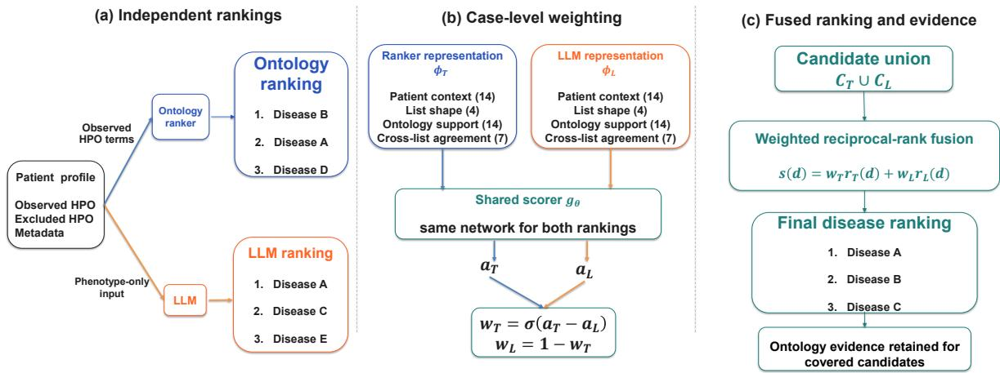
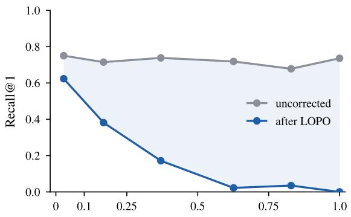

# Learning to Fuse LLMs with Ontology Rankers for Rare-Disease Diagnosis

Zhaoyang Jiang1 Xuanqi Peng1 Fei Teng1 Yunsoo Kim1 Zhizhong Fu3 Jiacong Mi2 Zicheng Li4 Honghan Wu1∗

1School of Health & Wellbeing, University of Glasgow, Glasgow, UK

2Department of Respiratory and Critical Care Medicine, Shanghai Sixth People’s Hospital,

Shanghai Jiao Tong University School of Medicine, Shanghai, China

3School of Life Science and Technology,

University of Electronic Science and Technology of China, Chengdu, China 3167645J@student.gla.ac.uk, Honghan.Wu@glasgow.ac.uk,

## Abstract

Ontology rankers remain useful for raredisease diagnosis because each candidate can be traced to matched patient phenotypes. Large language models (LLMs) can generate differential diagnoses from the same patient description, but their predictions lack an equally clear evidence trail. Rather than asking which system should replace the other, we ask whether an LLM can improve the ranker without giving up its evidence. Our behavior-based fusion model examines the two ranked lists, their agreement, and the ontology support behind each candidate, and learns how much to rely on each system for the individual case. Before comparison, we remove a documented test-set leakage pathway caused by benchmark cases and ontology annotations being derived from the same publications. Across eight open LLMs, fusion improves Phenomizer Recall@1 by 7.86 percentage points on Phenopacket Store and 20.18 points on RAMEDIS. When paired with DeepSeek-V4-Flash through an API, a fusion model trained only on the other LLMs improves Recall@1 from 0.1657 to 0.2176, a 5.19-point gain, without retraining. For 90.8% of correct fused diagnoses, the disease retains candidate-level ontology evidence that can be inspected. These results show that LLMs can strengthen an established diagnostic tool without discarding the structured evidence that makes it useful.

## 1 Introduction

Rare-disease diagnosis often begins with a list of findings rather than a familiar disease name. Phenotype tools such as Exomiser (Robinson et al.,

2014), LIRICAL (Robinson et al., 2020), and Phenomizer (Köhler et al., 2009) compare those findings with disease profiles in the Human Phenotype Ontology (HPO) (Köhler et al., 2021) and return a ranked differential diagnosis. Their value is not limited to the ranking. A clinician can inspect the HPO terms supporting each candidate and, for Phenomizer, the statistical strength of the match. This evidence remains important in clinical decision support, where clinicians need to examine the basis for a recommendation (Amann et al., 2020).

The arrival of LLMs has made it possible to produce a differential diagnosis directly from clinical text or HPO terms, drawing on knowledge beyond a fixed curated resource. Yet the strongest structured comparisons have favored classical tools. A large systematic benchmark reports Exomiser ahead of every one of seven LLMs across accuracy metrics and clinical subgroups (Reese et al., 2026), and prompt-only LLMs also trail established phenotype pipelines in related rare-disease gene prioritization (Lee et al., 2026). LLM output introduces a second concern. Medical models can elaborate fabricated clinical details (Omar et al., 2025), the medical hallucination literature identifies factual reliability as a persistent problem (Zhu et al., 2025), and verbal confidence systematically overstates diagnostic reliability (Savage et al., 2025). A bare LLM ranking also lacks the independently computed HPO matches and statistical score supplied by an ontology tool. On the surface, classical systems seem to offer both greater accuracy and a more auditable decision path.

These findings establish the continuing strength of classical pipelines, but they do not determine how much a ranker backed by the HPO annotation database (HPOA) benefits from the construction of a particular benchmark. Phenopackets are structured patient records, many curated from published case reports. HPOA is curated from the same literature. The same paper can therefore supply both a test patient’s findings and the phenotype evidence attached to that patient’s confirmed disease in the knowledge base. We call this publication-source overlap.

Because both resources record publication provenance, we remove any phenotype relationship whose only supporting source is the test case’s paper before rerunning the unchanged ontology ranker. After this correction, the ranker and LLM show complementary strengths rather than a simple winner.

This motivates a different role for the LLM. It need not replace the ontology tool, because the two systems fail for different reasons and can supply what the other lacks. Recent work already shows the value of this combination. LA-MARRVEL improves a phenotype-driven gene ranker with language-aware reranking (Lee et al., 2026), while DeepRare integrates LLM reasoning with specialized tools and traceable external evidence (Zhao et al., 2026). Most directly, Elmofty and Leser (2026) find complementary correct diagnoses from ontology retrieval and unrestricted LLM generation on every rare-disease benchmark they test. Their experiments also expose the unresolved step. They call cases whose correct diagnosis falls outside the retriever’s candidate set non-retrievable, a hard ceiling for any method using that pool. They explicitly leave a learned router using case characteristics as the next step. Complementary answers are available, but identifying which one to use on a new case remains unresolved.

We learn a case-level decision rule. The LLM diagnoses independently rather than reordering the ontology list, and a small behavior-based gate assigns case-specific weights before combining the union of both outputs. It observes only their behavior: how clearly the leading diagnoses stand out, whether the lists agree, how well patient findings match the candidates, and how much ontology knowledge is available for them. The gate receives neither model identity nor a model-specific representation. During training, we exclude the target LLM together with every other model from its backbone family. It can therefore be applied to a newly introduced LLM without first collecting labels for that model, allowing the pipeline to adopt a stronger diagnostic model while retaining access to candidate-level ontology evidence.

Code is available at https://github.com/ Anonymous-Awesome-Submissions/PhenoGate.

## 2 Related Work

Ontology-based rare-disease diagnosis represents patient findings with the Human Phenotype Ontology (HPO) (Köhler et al., 2021). Phenomizer introduced semantic-similarity disease ranking with an empirical significance estimate (Köhler et al., 2009); Exomiser combined phenotype matching with variant prioritization (Robinson et al., 2014); and LIRICAL expressed phenotype evidence through likelihood ratios (Robinson et al., 2020). Together, these systems established a diagnostic pipeline grounded in curated disease profiles and inspectable HPO matches. Their continued strength in a recent comparison with LLMs shows that they remain active diagnostic systems rather than merely historical baselines (Reese et al., 2026).

LLM research first tested whether pretrained knowledge could recover diseases or genes directly from phenotype descriptions, with RareBench and RareArena extending evaluation across diseases and model families (Chen et al., 2024, 2026). Later systems increasingly combined language models with structured resources. LA-MARRVEL refines candidates from a phenotype-based gene ranker (Lee et al., 2026), whereas DeepRare coordinates LLM reasoning with specialist tools and external evidence (Zhao et al., 2026). Elmofty and Leser (2026) directly compare ontology retrieval with unrestricted LLM diagnosis and find that the two solve complementary cases. The literature has consequently moved from replacement toward hybrid diagnosis through candidate reranking, toolusing agents, and parallel prediction.

Hybrid diagnosis also draws on rank aggregation and model selection. Information retrieval developed score-, rank-, and probability-based fusion, including CombMNZ, Borda-fuse, Bayes-fuse, Prob-Fuse, reciprocal-rank fusion, and Rank-Biased Centroids (Fox and Shaw, 1994; Aslam and Montague, 2001; Lillis et al., 2006; Cormack et al., 2009; Bailey et al., 2017); later work studied learned score combinations for hybrid retrieval (Bruch et al., 2023). A parallel line learns when to accept one system or defer to another, from confidencebased cascades and clinical deferral to preferencesupervised and label-free LLM routing (Jitkrittum et al., 2023; Kondadadi and Ortega, 2026; Ong et al., 2025; Guha et al., 2024). These studies replace a single rule for all inputs with inputdependent selection.

Benchmark research has meanwhile expanded its view of contamination. Work on LLM evaluation primarily examines whether test examples appeared in pretraining data (Balloccu et al., 2024); prospective clinical benchmarks reduce that risk with newly collected cases (Wang et al., 2026a). For systems that retrieve external information, leakage can instead occur at inference time when search exposes benchmark answers (Wang et al., 2026b). Open-domain question answering likewise treats the retrievable evidence collection as part of the evaluated task (Kwiatkowski et al., 2019; Lee et al., 2019). Collectively, this literature shows that benchmark validity depends not only on model training data, but also on what information the evaluation pipeline makes available during inference.

## 3 Correcting Publication-Source Overlap

Consider a paper that reports one or more patients with disease D. It may be curated both as a test case whose answer is D and as knowledge-base entries associating D with findings described in the paper. A phenotype ranker then compares a test patient’s findings with a disease profile supported by the same document. HPOA records the publication supporting each relationship, making this reuse of the source document directly observable. We say that a case has publication-source overlap when an annotation supporting its gold disease cites the case’s source publication, and call an annotation source-exclusive when that publication is its only recorded support.

For a case with source publication $p ,$ our leaveone-publication-out (LOPO) evaluation removes each entry e that links a disease to a phenotype when $\operatorname { r e f s } ( e ) = \{ p \}$ . Entries corroborated by any other publication remain, as do entries without recorded provenance. We then rebuild each disease profile by adding the HPO ancestors of its remaining annotations and rerun the unchanged ranker over all candidate diseases. Information content is held fixed between the original and LOPO conditions, so the comparison changes only the case-specific evidence derived exclusively from $p .$ Phenopacket Store records a source publication for each case, and HPOA records sources for individual annotations, enabling this publication-level join.

## 4 Ontology and LLM Fusion

Figure 1 summarizes the model. The ontology ranker and the LLM first construct separate disease rankings from the available phenotype information. A shared scorer then evaluates how each ranking behaves on the current case and assigns case-specific weights before their candidates are combined.

## 4.1 Independent Rankings and a Shared Representation

The ranker compares the patient’s observed HPO findings with curated disease profiles. We retain its first 100 diseases, including their scores, as $C _ { T }$ . The LLM reads the observed and explicitly excluded findings together with the available demographic context, and produces at most 10 freetext diagnoses, whose names we map to Online Mendelian Inheritance in Man (OMIM) identifiers with a fixed lexicon to obtain $C _ { L }$ . The fused candidate set is $C _ { T } \cup C _ { L }$ . Thus an LLM diagnosis outside the stored ontology prefix can enter the final ranking; a disease outside both lists cannot.

The resulting lists cannot be combined through their native outputs: the ontology ranker assigns a score to each candidate, whereas the LLM supplies an ordering without a comparable confidence scale. We therefore retain only the rank information when the two lists are combined. Let $T$ and $L$ denote the ontology ranker and the LLM, and let $C _ { e }$ be the candidates returned by system e. For $e \in \{ T , L \}$ , let rank (d) denote the one-based position of disease d in $C _ { e }$ . We define $r _ { e } ( d )$ , the rank score assigned to disease d by system e, as

$$
r _ { e } ( d ) = \left\{ \begin{array} { l l } { 1 / ( \kappa + \mathrm { r a n k } _ { e } ( d ) ) , } & { d \in C _ { e } , } \\ { 0 , } & { d \notin C _ { e } . } \end{array} \right.\tag{1}
$$

The shared nonnegative constant κ controls how sharply the score falls down the list: $\kappa = 0$ gives ordinary reciprocal rank, and larger values flatten the decay. We use $\kappa = 0$ on Phenopacket Store and $\kappa = 6 0$ on RAMEDIS. This transformation places both lists on the same scale without treating either system’s native output as a calibrated probability.

To estimate how reliable system e is for the current case, we encode its output in a 39-dimensional vector $\phi _ { e } .$ . The vector contains four groups of signals, each answering a different question. Patient context (14 features) describes how much diagnostic information the case provides through the number, rarity, and specificity of its observed and excluded HPO findings, together with the availability of age, onset, and sex. List shape (4 features) captures how decisive the system’s differential is through its length and how sharply its leading candidates stand out from the rest. Because the LLM supplies no native confidence scores, its candidate at rank r receives the score $1 / r$ for these features. Ontology support (14 features) measures how well the leading candidates fit the patient through phenotype similarity, likelihood-ratio evidence, and the amount of curated phenotype knowledge available for those diseases. Finally, the cross-list relationship (7 features) records whether the two systems support the same diagnoses, using overlap among their leading candidates and the position that each system assigns to the other’s candidates.

  
Figure 1: Fusion proceeds in three stages. (a) The ontology ranker and the LLM independently construct disease rankings from the patient profile. (b) A shared scorer maps their case-level representations to weights. (c) Weighted reciprocal ranks combine the candidate union, while candidates covered by the ranker retain their ontology evidence.

The 14 patient-context features and the four top-$k$ agreement measures $( k = 1 , 3 , 5 , 1 0 )$ have the same values in $\phi _ { T }$ and $\phi _ { L } \mathbf { ; }$ ; the remaining 21 describe the system being scored or how the other system ranks its candidates. For the leading diseases in either list, we compute the same HPObased similarity, likelihood-ratio, and annotationcoverage features. A disease in the LLM’s top 10 is therefore evaluated against the patient’s findings and its curated disease profile even when it falls outside the ontology ranker’s retained top 100. On Phenopacket Store, these calculations use the LOPO-corrected profiles. Model identity, architecture, and parameter count are never features.

Appendix A.4 provides the complete feature definitions.

## 4.2 Learning to Combine the Rankings

We apply the same scoring network $g _ { \theta }$ to the ontology vector $\phi _ { T }$ and the LLM vector $\phi _ { L }$ . The network has two hidden layers, with 48 and 24 units, and produces one scalar for each component:

$$
a _ { e } = g _ { \theta } ( \phi _ { e } ) , \qquad e \in \{ T , L \} .\tag{2}
$$

Only the difference between $a _ { T }$ and $a _ { L }$ affects the fusion. We convert it into two weights:

$$
w _ { T } = \sigma ( a _ { T } - a _ { L } ) , ~ w _ { L } = 1 - w _ { T } ,\tag{3}
$$

where $\sigma$ is the logistic sigmoid. The higher-scoring component receives more influence; equal scores give both rankings weight $1 / 2$ . The weights are recomputed for every patient.

For every disease d in $C _ { T } \cup C _ { L }$ , we compute

$$
s ( d ) = w _ { T } r _ { T } ( d ) + w _ { L } r _ { L } ( d ) ,\tag{4}
$$

and sort the candidates by $s ( d )$ . A component contributes zero when the disease is absent from its list. We train $g _ { \boldsymbol { \theta } }$ with listwise cross-entropy over the candidate union, using the gold diagnosis to supervise the fused ranking directly; no label specifies which component to trust.

Sharing gθ imposes an exchangeable rule. Swapping $( \phi _ { T } , r _ { T } )$ with $\left( \phi _ { L } , r _ { L } \right)$ exchanges $w _ { T }$ and $w _ { L }$ and leaves $s ( d )$ unchanged for every disease. The final combination uses ranks, while features derived from native scores are normalized within each list; positive affine rescaling of a component’s scores therefore leaves the fused ranking unchanged.

## 4.3 Training

For the Phenopacket Store transfer experiment, when evaluating a target LLM L⋆, we exclude its rankings and those of every model built on the same backbone. The remaining models provide the training rankings.

Each training example pairs one case with the ranking produced by one training LLM. It contains the case’s fixed LOPO ontology ranking, that LLM’s ranking, and the gold diagnosis. A case therefore contributes one example for each available training LLM. Because the fusion model can only reorder diseases in $C _ { T } \cup C _ { L }$ , we use an example for training only when this union contains the gold diagnosis. The same case may appear in several examples with an unchanged patient record and ontology ranking but a different LLM ranking; no case crosses the publication-disjoint data splits.

Within each training LLM, we sample eligible examples without replacement and allocate the fixed totals of 7,024 training and 1,094 validation rows as evenly as possible across the available models. This holds the labelled budget constant across target families. The target family is removed before sampling, feature standardization, and early stopping; model identity is never a feature. At test time, each case is paired once with L⋆ and passes through the unchanged map without updating θ or using target-model labels. A gold disease outside the candidate union is counted as an error. The experiment therefore tests whether ranking behavior transfers beyond the model lineage from which it was learned.

## 5 Experimental Setup

Our primary corpus is Phenopacket Store 0.1.27 (Danis et al., 2025), containing 10,377 cases from 1,733 source publications and 780 gold diseases. Cases sharing a publication are kept in the same split, yielding 7,029/1,102/2,246 cases over 1,187/181/365 publications. Ranking experiments require at least one observed HPO term and a gold disease in the fixed candidate space, leaving 7,024/1,094/2,227 eligible cases in the three splits. No system receives information outside a closed phenotype-only view comprising canonical labels for observed and explicitly excluded HPO terms, age, onset, sex, and a hashed case identifier. Each component uses the fields it supports: Phenomizer receives observed HPO terms, whereas the LLM also receives explicit exclusions and available demographics. Disease labels, genes, variants, source identifiers, titles, and archive paths are excluded and checked by a planted-answer negative control. We additionally evaluate the fusion framework on 624 RAMEDIS cases released with RareBench (Chen et al., 2024). RAMEDIS covers 74 inborn errors of metabolism and provides observed HPO findings but not excluded findings, age, onset, sex, or source-publication identifiers. It therefore uses the ordinary HPOA ranking and a five-fold evaluation in which identical phenotype profiles remain in the same fold.

The primary ontology system is Phenomizer (Köhler et al., 2009), run through the Jackson Laboratory reference implementation at commit 1dda137 and the published phenol 1.3.3 jars. It scores mean best-match information content and ranks by the empirical p-value produced by its own null model. Its hard-coded query-size cap and tie handling affect absolute Recall@1, so our provenance estimand is the paired change under the same executable; Appendix A.3 describes the implementation and its sensitivity analyses. We also evaluate the bare semantic-similarity equation, three additional editable ontology rankers, and stock LIRICAL 2.4.1 under both ordinary and exact-LOPO data profiles. Exomiser motivates the comparison but is not a like-for-like component: its benchmarked clinical mode combines phenotype and variant evidence, while its phenotype-only mode natively ranks genes rather than the diseases evaluated here (Robinson et al., 2014). The LLM pool contains Qwen2.5-7B-Instruct, Llama3-OpenBioLLM-8B, MedGemma-27B-text-it, HuatuoGPT-3-8B, Baichuan-M2-32B, MedGemma-4B, Med42-8B, and OpenBioLLM-70B. Each receives the same bounded prompt and returns at most 10 diagnoses; thinking is disabled where supported. For each target LLM, the fusion gate is fitted on 7,024 rows after excluding its complete backbone family. We group OpenBioLLM-8B, OpenBioLLM-70B, and Med42-8B as Llama-3; both MedGemma models as Gemma-3; and, conservatively, Qwen2.5 and the Qwen3-based HuatuoGPT as one Qwen lineage. Baichuan is a singleton family. Every arm follows the fixed-budget sampling protocol above, and all gate results average 5 random seeds. On RAMEDIS, the same 39-feature shared scorer is fitted within each training fold, selected on a separate validation fold, and evaluated only on the held-out fold; every reported patient prediction is out of fold. Appendix A.5 gives the exact split and regularization settings.

Fusion baselines include the two component systems, reciprocal-rank fusion (RRF) (Cormack et al., 2009), Borda-fuse and Bayes-fuse (Aslam and Montague, 2001), ProbFuse (Lillis et al., 2006), and CombMNZ (Fox and Shaw, 1994). We also fit a fixed weight using labels from the target LLM, a deliberate advantage over transfer without targetmodel labels. Three learned controls test whether supervision alone explains the result. Logistic and MLP routers select one component ranking for each case, while an asymmetric MLP predicts a continuous fusion weight from the two concatenated component descriptions. The MLP controls have 3,073 parameters, closely matching the shared scorer’s 3,121, and receive exactly the same observable features. All three are trained with the same family exclusions and labelled budgets as our method. We report Recall@k and MRR, with Recall@1 as the primary diagnostic endpoint. Learned-system point estimates average five seeds, whose standard deviations are reported separately. Difference intervals use 2,000 paired percentile-bootstrap resamples, clustered by source publication on Phenopacket Store and by gold disease on the external corpus. Each resample averages the same five frozen predictions, so these intervals quantify cohort sampling rather than optimization variation. Full system versions, prompts, name normalization, tie policies, and compute are given in the appendix.

## 6 Results

We first measure how publication-source overlap changes ontology ranking. We then evaluate fusion under the corrected protocol and examine its transfer, architecture, candidate coverage, and candidatelevel ontology evidence.

## 6.1 Publication-Source Overlap

Publication-source overlap is common enough to affect the benchmark materially. Among the 10,348 cases whose gold disease is represented in HPOA, 74.6% have at least one gold-disease annotation citing the publication from which the case was constructed. On average, 33.6% of the gold profile is supported only by that publication; for 19.6% of cases, this is true of the entire profile.

Across all evaluable cases, Phenomizer Recall@1 falls from 0.4481 to 0.1217 (Table 1), a paired decrease of 32.64 points [26.06, 40.15]. The result is not specific to Phenomizer’s statistical layer: applying LOPO to the underlying semanticsimilarity score reduces Recall@1 from 0.6484 to 0.2591, and every tie policy preserves the direction and order of magnitude. Ties have their largest effect on the bare score, where source-exclusive annotations can place several candidates at the score ceiling. The empirical p-value reduces this ambiguity, but does not remove the effect of overlap. Full implementation and tie-policy checks are reported in Appendix A.3.

The same intervention produces nearly the same change in an independently implemented clinical tool. With the LIRICAL executable and all settings held fixed, substituting the filtered HPOA lowers Recall@1 from 0.4868 to 0.1724, a paired decrease of 31.43 points [24.82, 38.72]. All 739 cases for which the filter removes no relation retain byteidentical rankings. The effect is therefore neither an artifact of our semantic-similarity implementation nor a between-group comparison.

HPOA provenance stops at the publication and cannot assign a relation to one patient within a multi-case paper. Of the 1,733 source publications, 666 contribute exactly one phenopacket to the release and 1,067 contribute more than one. Restricting the test analysis to the 135 cases from the former group, Phenomizer Recall@1 falls from 0.5556 to 0.3481, a 20.74-point decrease [14.07, 28.15]. Only one of these cases loses its entire gold profile; among the remaining 134, the decrease remains 20.15 points [13.43, 27.61]. This restriction removes ambiguity between benchmark patients represented from the same paper, while the claim remains publication-level because a paper may contain patients not represented in the store.

The single-case analysis removes ambiguity about which benchmark patient supplied the annotations, but a second explanation remains: perhaps any comparable deletion from the correct disease would cause the same loss. We therefore construct a within-disease control. For each source-exclusive annotation, we remove instead an independently supported annotation matched for information content, ontology depth, HPO branch, and contribution to the disease profile. Appendix A.3 describes the matching procedure.

<table><tr><td>Ranker</td><td>Uncorrected</td><td>LOPO</td><td>Decrease (pp) [95% CI]</td></tr><tr><td>Phenomizer</td><td>0.4481</td><td>0.1217</td><td>32.64 [26.06, 40.15]</td></tr><tr><td>Resnik</td><td>0.6484</td><td>0.2591</td><td>38.93 [30.59, 47.24]</td></tr><tr><td>LIRICAL 2.4.1</td><td>0.4868</td><td>0.1724</td><td>31.43 [24.82, 38.72]</td></tr></table>

Table 1: Recall@1 before and after publication-level LOPO on the 2,227 Phenopacket Store test cases.

<table><tr><td>Intervention or cohort</td><td>n</td><td>before</td><td></td><td>after decrease (pp) [95% CI]</td></tr><tr><td>Matched deletion</td><td></td><td></td><td></td><td></td></tr><tr><td>Case-source relations</td><td></td><td></td><td>597 0.42380.1943</td><td>22.95 [15.10, 32.63]</td></tr><tr><td>Matched independent relations</td><td></td><td></td><td>597 0.4238 0.4305</td><td>-0.67 [-2.39, 0.79]</td></tr><tr><td>Gold profile after LOPO</td><td></td><td></td><td></td><td></td></tr><tr><td>Retains annotations</td><td></td><td></td><td>1,717 0.3722 0.1578</td><td>21.43 [15.54, 28.62]</td></tr><tr><td>Emptied</td><td></td><td></td><td>510 0.7039 0.0000</td><td>70.39 [60.18, 79.74]</td></tr></table>

Table 2: Matched-deletion and gold-profile survival analyses. Decreases are paired Recall@1 differences in percentage points; brackets give publication-clustered 95% confidence intervals.

Table 2 reports this matched control together with a complementary profile-survival analysis. The upper panel tests generic deletion burden. On the same 597 cases, removing case-source annotations lowers Recall@1 from 0.4238 to 0.1943, a decrease of 22.95 points [15.10, 32.63]. Removing equally many matched annotations produces a decrease of -0.67 points [-2.39, 0.79]. This contrast shows that annotation count, information content, depth, branch, and profile contribution do not explain the source-deletion effect. It deliberately does not match agreement with the patient query: that agreement is the path by which a paper can supply both the test findings and the relations that retrieve them. Provenance and case-specific semantic alignment are therefore part of the same shortcut mechanism, not separately identified causal effects.

The lower panel distinguishes weakened ranking signal from the degenerate case in which LOPO removes the gold profile altogether. Among the 1,717 cases that retain independently supported golddisease annotations, LOPO reduces Recall@1 from 0.3722 to 0.1578, a 21.43-point decrease. In the remaining 510 cases, Recall@1 falls from 0.7039 to zero because the gold disease is no longer described in HPOA. The all-case estimate in Table 1 measures the ranker’s dependence on the coupled resources; the retained-profile estimate isolates its nondegenerate ranking effect.

The decrease also grows with the fraction of the gold profile supported only by the case publication, while uncorrected accuracy is flat across the same strata (Appendix A.5). All primary Phenopacket

Store fusion experiments use the LOPO ontology ranking.

## 6.2 Diagnostic Accuracy

Phenopacket Store provides the cleanest test of transfer to a new model lineage. Across all 8 targets and 4 held-out families, fusion has the highest Recall@1 point estimate against Phenomizer, the target LLM, RRF, CombMNZ, and a fixed weight fitted with the target model’s own labels (Table 3). Its macro-average is 0.2002 (±0.0007), compared with 0.1515 for CombMNZ, the strongest of the five published rank-fusion rules. Their paired macro difference is +4.88 points [3.12, 6.77]. The gate therefore transfers through observable ranking behavior without seeing outputs from the target backbone family.

The improvement extends beyond the first position. Macro Recall@5 and MRR are 0.2937 and 0.2461, compared with 0.2124 and 0.1689 for Phenomizer and 0.1747 and 0.1393 for the LLMs.

Results are stable to ontology candidate depth. At K = 100, the gold disease occurs in the ontology prefix for 46.6% of test cases and in the test union for 55.1% of all combinations of test case and target LLM. Complete refits at K = 10 and K = 50 obtain 0.2004 and 0.2008 Recall@1, compared with 0.2002 at K = 100; replacing the stored prefix at inference with the exact 8,553-disease ordering changes the result by only -0.001 points.

The improvement is not created by the cases whose gold-disease profile is emptied by LOPO. Among the 1,717 cases with a nonempty independently supported profile, the frozen LOPO gate raises Recall@1 from 0.1578 to 0.2597, a paired gain of +10.19 points [2.65, 18.04]. We also repeat the complete family-held-out training protocol using the ordinary, uncorrected Phenomizer ranking and its corresponding evidence features. Recall@1 rises from 0.4481 to 0.5261, a gain of +7.79 points [1.73, 14.55]. The gate exceeds Phenomizer for all 8 target models in both checks. LOPO changes how the benchmark comparison should be interpreted, but the fusion gain does not depend on its lower

<table><tr><td>Held-out family</td><td>Target LLM</td><td>LLM</td><td>RRF</td><td>CombMNZ</td><td>fixed†</td><td>ours</td></tr><tr><td>Llama-3</td><td>OpenBioLLM-8B</td><td>0.020</td><td>0.114</td><td>0.121</td><td>0.126</td><td> $\mathbf { 0 . 1 3 0 } _ { ( \pm 0 . 0 0 1 ) }$ </td></tr><tr><td></td><td>OpenBioLLM-70B</td><td>0.095</td><td>0.083</td><td>0.115</td><td>0.123</td><td> ${ \bf 0 . 1 8 1 } _ { ( \pm 0 . 0 0 2 ) }$ </td></tr><tr><td></td><td>Med42-8B</td><td>0.094</td><td>0.112</td><td>0.157</td><td>0.145</td><td> $\mathbf { 0 . 1 8 3 } _ { ( \pm 0 . 0 0 3 ) }$ </td></tr><tr><td>Gemma-3</td><td>MedGemma-4B</td><td>0.092</td><td>0.135</td><td>0.178</td><td>0.139</td><td> $\mathbf { 0 . 1 9 9 } _ { ( \pm 0 . 0 0 1 ) }$ </td></tr><tr><td></td><td>MedGemma-27B</td><td>0.106</td><td>0.090</td><td>0.121</td><td>0.132</td><td> $\mathbf { 0 . 1 9 0 } _ { ( \pm 0 . 0 0 0 ) }$ </td></tr><tr><td>Qwen-2.5/3</td><td>Qwen2.5-7B-Instruct</td><td>0.139</td><td>0.115</td><td>0.181</td><td>0.145</td><td> $\mathbf { 0 . 2 2 9 } _ { ( \pm 0 . 0 0 2 ) }$ </td></tr><tr><td></td><td>HuatuoGPT-3-8B</td><td>0.133</td><td>0.111</td><td>0.179</td><td>0.185</td><td> $\mathbf { 0 . 2 2 7 } _ { ( \pm 0 . 0 0 1 ) }$ </td></tr><tr><td>Baichuan</td><td>Baichuan-M2-32B</td><td>0.179</td><td>0.116</td><td>0.160</td><td>0.137</td><td> $\mathbf { 0 . 2 6 4 } _ { ( \pm 0 . 0 0 2 ) }$ </td></tr><tr><td>Macro mean</td><td></td><td>0.107</td><td>0.109</td><td>0.151</td><td>0.142</td><td> $\mathbf { 0 . 2 0 0 } _ { ( \pm 0 . 0 0 1 ) }$ </td></tr></table>

Table 3: Recall@1 on Phenopacket Store with the target backbone family held out. Our results are means and standard deviations over five seeds; † uses target-LLM labels, whereas our method does not.

baseline.

The LLM prompt includes explicitly excluded findings, whereas Phenomizer ranks only the observed findings. To separate complementarity from this input difference, we replace Phenomizer with the LOPO naive-Bayes likelihood-ratio ranker, which consumes both observed and explicitly excluded findings, and repeat the complete familyheld-out protocol. Fusion raises its Recall@1 from 0.1361 to 0.2115, a paired gain of 7.54 points [1.87, 14.12], and exceeds both components in all 8 target arms. The gain therefore persists when the ontology component has access to the same negative phenotype information as the LLM.

We further test the practical setting in which a recent frontier model is added after the gate has been trained. The gate is fitted once on the complete training and validation rankings from the eight open LLMs, while DeepSeek-V4-Flash is queried only for the held-out test cases. Without any DeepSeek-labelled example for training, model selection, or feature standardisation, Recall@1 increases from 0.1217 for Phenomizer and 0.1657 for DeepSeek alone to 0.2176 for fusion, averaged over five seeds. These are gains of 9.59 and 5.19 percentage points over the two components, respectively. Thus the gate can improve an unseen model outside its training pool, rather than only interpolate among the LLMs on which it was learned.

RAMEDIS provides an independently assembled, information-limited test of the same fusion principle. The gate is refitted within the RAMEDIS folds, so this experiment tests fusion on a second corpus rather than parameter transfer from Phenopacket Store. Across the eight LLMs, our method raises Phenomizer’s macro Recall@1 from

0.1554 to 0.3573, a gain of 20.18 points [4.90, 33.79], and exceeds the mean standalone LLM by 10.02 points [2.79, 15.46] (Table 4). It improves on Phenomizer in every arm and on both component systems in 7 of 8. Its macro average is the highest in the table, and it is the strongest listed method for 4 individual LLMs.

RAMEDIS also delineates when learning provides additional value beyond rank aggregation. The corpus contains 624 cases from 74 metabolic diseases and supplies observed HPO findings, but not the excluded findings or demographic context used by several patient-context features. Under this restricted input contract, RRF reaches 0.3562 and our method reaches 0.3573, a difference of 0.11 points [-0.32, 0.46]. The two are therefore statistically indistinguishable on RAMEDIS, showing that parameter-free aggregation can suffice when the available case description is sparse.

## 6.3 Gate Architecture and Features

We compare the shared scorer with supervised controllers under identical inputs, family exclusions, labelled budgets, and test cases. The logistic and MLP routers learn when to select the ontology ranking or the LLM ranking. The asymmetric MLP instead predicts a continuous weight from their concatenated descriptions, using the same listwise objective as our gate. Unlike the shared scorer, these controls may attach a different meaning to the same feature according to which component produced it.

In the five-seed main experiment, the shared scorer reaches 0.2002 Recall@1, compared with 0.1956, 0.1959, and 0.1914 for logistic routing, MLP routing, and asymmetric fusion (Table 5).

<table><tr><td>Target LLM</td><td>Phenomizer</td><td>LLM</td><td>RRF</td><td>Borda-fuse</td><td>CombMNZ</td><td>ours</td></tr><tr><td>Baichuan-M2-32B</td><td>0.1554</td><td>0.2837</td><td>0.3942</td><td>0.3846</td><td>0.3253</td><td>0.4006 (± 0.0032)</td></tr><tr><td>HuatuoGPT-3-8B (thinking disabled)</td><td>0.1554</td><td>0.2548</td><td>0.3221</td><td>0.3237</td><td>0.3253</td><td>0.3272 (± 0.0033)</td></tr><tr><td>Llama3-OpenBioLLM-8B</td><td>0.1554</td><td>0.0224</td><td>0.1571</td><td>0.1587</td><td>0.1619</td><td>0.1577 (± 0.0008)</td></tr><tr><td>Llama3-OpenBioLLM-70B</td><td>0.1554</td><td>0.3061</td><td>0.4103</td><td>0.4054</td><td>0.3333</td><td>0.4128 (± 0.0008)</td></tr><tr><td>Med42-8B</td><td>0.1554</td><td>0.3301</td><td>0.3734</td><td>0.3654</td><td>0.3606</td><td>0.3833 (± 0.0006)</td></tr><tr><td>MedGemma-4B</td><td>0.1554</td><td>0.2019</td><td>0.3702</td><td>0.3654</td><td>0.3654</td><td>0.3692 (± 0.0008)</td></tr><tr><td>MedGemma-27B-text-it</td><td>0.1554</td><td>0.4599</td><td>0.4295</td><td>0.3894</td><td>0.4599</td><td>0.4183 (± 0.0014)</td></tr><tr><td>Qwen2.5-7B-Instruct</td><td>0.1554</td><td>0.1971</td><td>0.3926</td><td>0.3862</td><td>0.2740</td><td>0.3888 (± 0.0031)</td></tr><tr><td>Macro mean</td><td>0.1554</td><td>0.2570</td><td>0.3562</td><td>0.3474</td><td>0.3257</td><td>0.3573</td></tr></table>

Table 4: Recall@1 on RAMEDIS. RRF, Borda-fuse, and CombMNZ require no training. Ours is evaluated by five-fold profile-grouped cross-validation. Learned results are means and standard deviations over five seeds.

<table><tr><td>Control</td><td>dim.</td><td>Recall@1</td><td>decrease (pp)</td></tr><tr><td>Full shared MLP</td><td>39</td><td> $0 . 2 0 0 2 \scriptstyle ( \pm 0 . 0 0 0 7 )$ </td><td>n/a</td></tr><tr><td>– ontology support</td><td>25</td><td> $0 . 1 7 8 0 _ { ( \pm 0 . 0 0 3 2 ) }$ </td><td>2.23 [0.89, 3.93]</td></tr><tr><td>Support + agreement only</td><td>21</td><td> $0 . 1 9 9 1 _ { \mathrm { \ell } ( \pm 0 . 0 0 1 0 ) }$ </td><td>0.12 [-0.10, 0.36]</td></tr><tr><td>Logistic router</td><td>78</td><td> $0 . 1 9 5 6 ( \pm 0 . 0 0 0 8 )$ </td><td>0.46 [0.05, 0.90]</td></tr><tr><td>MLP router</td><td>78</td><td> $0 . 1 9 5 9 _ { ( \pm 0 . 0 0 1 6 ) }$ </td><td>0.43 [-0.02, 1.02]</td></tr><tr><td>Asymmetric fusion MLP</td><td>78</td><td> $0 . 1 9 1 4 ( \pm 0 . 0 0 2 3 )$ </td><td>0.88 [0.10, 2.23]</td></tr></table>

Table 5: Feature ablations and learned controls under family holdout. Values are macro Recall@1, reported as mean and standard deviation over five seeds; decreases are relative to the full shared MLP, with publicationclustered 95% confidence intervals.

These paired cohort intervals average the five seed predictions and do not measure optimization variation. We therefore repeat the shared scorer and both routers under 30 matched initializations. Its mean advantage is 0.43 points [0.38, 0.49] over logistic routing and 0.35 points [0.27, 0.42] over MLP routing, with positive paired differences in 30/30 and 29/30 seeds, respectively across the matched initializations. The symmetric architecture is consequently a small, reproducible refinement, not the primary source of the fusion gain.

Within the shared architecture, the decisive signal is evidence about the proposed diseases. Removing ontology support produces by far the largest decrease, from 0.2002 to 0.1780 Recall@1. A 21-feature scorer retaining only ontology support and cross-list agreement reaches 0.1991; its Phenopacket Store difference from the full contract is not detectable. Thus ontology support and agreement account for nearly all of the measurable Phenopacket Store gain. We retain the complete contract as one representation for corpora that provide different amounts of case context.

A linear shared scorer reaches 0.1881, 3.66 points above CombMNZ but 1.21 points below the MLP. Most of the difference from CombMNZ therefore comes from supervised behavioral and ontology evidence; nonlinear interactions and the symmetric scorer add smaller refinements.

Appendix B reports the remaining provenance analyses, ranking metrics, feature ablations, candidate-depth checks, and rank-fusion comparisons.

## 6.4 Candidate Coverage and Ontology Evidence

The LOPO-corrected Phenopacket Store benchmark reveals substantial complementarity between the two diagnostic systems. An oracle that accepts a correct top prediction from either component exceeds the stronger component by 10.33 Recall@1 points, and the LLM ranks the gold disease first in 0.183 of Phenomizer’s errors. After LOPO, the gold disease has a median of 34 direct HPOA annotations, compared with 12 across the 8,553-disease candidate vocabulary. When a gold profile is sparse, the ontology ranker has less curated evidence on which to act, leaving more room for an independently generated LLM differential to add the diagnosis.

For 90.8% of correct fused predictions, the disease occurs in Phenomizer’s stored top 100, where its matched HPO terms and p-value are available for review. This is candidate-level ontology evidence, not an interpretation of the gate’s complete decision path. Fusion is not restricted to that prefix: 18.0% of all fused top predictions, including 9.2% of the correct ones, originate outside it. Outsideprefix promotions are correct in only 10.3%, compared with 52.7% for promotions from Phenomizer ranks two through ten. Candidate expansion can therefore recover diagnoses absent from the stored prefix, but those predictions are less reliable and carry no stored ontology evidence.

Transfer also depends on the LLM returning an informative, normalizable ranking. MedGemma-27B includes the gold disease in 33.4% of its lists, but places it first in only 31.8% of those cases. Qwen2.5-7B has lower list recall (30.0%) but commits to the gold disease more often once it is present (46.3%). OpenBioLLM-8B produces no normalized list for 955 test cases.

To distinguish failures of name normalization from unusable model output, two clinical experts independently reviewed a blinded sample of 400 failed names or empty parses, 100 from each of 4 models. Among the 190 randomly sampled unmatched occurrences, the experts classified between 22.1% and 23.2% as mapper misses, whereas between 48.9% and 52.6% were invalid or hallucinated. Category agreement was 86.0% (Cohen’s κ = 0.782). Inserting every candidate-space OMIM mapping supplied by either expert repaired between 41 and 53 names and changed between 5 and 9 predicted top labels, but neither changed a single Top-1 correctness outcome (0.00 Recall@1 points). Thus mapper misses are a real interface loss, but they do not explain the audited Top-1 results. Sampling and category definitions are given in Appendix A.

## 7 Discussion and Conclusion

The provenance analysis changes how retrospective evaluations of knowledge-based diagnosis should be read. When a test case and an inference-time knowledge base are curated from the same paper, measured accuracy reflects both ranking quality and the reuse of document-specific evidence. LOPO exposes this dependence, while the matcheddeletion and retained-profile analyses show that it is not explained by generic annotation loss or by cases whose gold profile disappears. For evaluations built from curated cases and curated external resources, shared source provenance is therefore part of benchmark design rather than incidental metadata.

The corrected evaluation also changes the role of the LLM. An independently generated differential can broaden the candidate set, while the ontology ranker supplies structured phenotype evidence for the candidates it covers. Family-held-out training and the test-only DeepSeek arm show that the gate can exploit this complementarity without labels from the target model family. The gain under the ordinary, uncorrected protocol shows that fusion is not an artifact of the lower LOPO baseline, and RAMEDIS extends the result to an independently assembled disease cohort and marks a boundary of the learned gate. With observed phenotypes but no exclusions or demographic context, the gate and RRF are statistically indistinguishable. In this sparse-input setting, combining the rankings matters, but learning their weights provides no detectable additional gain.

Together, these results support a hybrid role for LLMs in phenotype-based diagnosis. The LLM need not replace the ontology tool: behaviorbased fusion improves its ranking while preserving candidate-level ontology evidence for most correct predictions. Because the gate depends on observable ranking behavior rather than model identity, a newly introduced LLM can enter the pipeline without target-model labels. Auditing resource provenance and combining complementary diagnostic evidence offer a cleaner and more adaptable path than treating structured tools and LLMs as competing alternatives.

## Limitations

The provenance analysis concerns Phenopacket Store and HPOA, where both cases and annotations record their source publications. LOPO removes this recorded overlap from the ontology side; it does not audit LLM pretraining data or imply that the same overlap is widespread in other rare-disease benchmarks. Our experiments also address phenotype-only disease ranking rather than Exomiser’s variant-aware clinical mode.

The fusion model requires disease names that can be mapped to a shared ontology. Familyheld-out and test-only experiments support transfer across the models studied, but not every future model or clinical setting. These experiments evaluate diagnostic ranking and candidate-level evidence on public research corpora; they do not establish clinical validity or support autonomous diagnosis.

## Ethics Statement

We use de-identified case descriptions from public research corpora and collect no new patient data. Two clinical experts reviewed de-identified model outputs for the disease-name audit; they did not diagnose or recommend treatment for any real patient. Our experiments evaluate retrospective disease ranking rather than clinical validity, and none of the evaluated systems should be used for autonomous diagnosis. AI assistants supported implementation and language editing; the authors verified the study design, analysis, claims, and reported results.

## References

Julia Amann, Alessandro Blasimme, Effy Vayena, Dietmar Frey, Vince I. Madai, and Precise4Q consortium. 2020. Explainability for artificial intelligence in healthcare: a multidisciplinary perspective. BMC medical informatics and decision making, 20(1):310.

Javed A. Aslam and Mark Montague. 2001. Models for metasearch. In Proceedings of the 24th annual international ACM SIGIR conference on Research and development in information retrieval, pages 276–284.

Peter Bailey, Alistair Moffat, Falk Scholer, and Paul Thomas. 2017. Retrieval consistency in the presence of query variations. In Proceedings of the 40th international ACM SIGIR conference on research and development in information retrieval, pages 395–404.

Simone Balloccu, Patrícia Schmidtová, Mateusz Lango, and Ondrej Dusek. 2024. Leak, cheat, repeat: Data contamination and evaluation malpractices in closed-source llms. In Proceedings of the 18th Conference of the European Chapter of the Association for Computational Linguistics (Volume 1: Long Papers), pages 67–93.

Elias Bassani. 2022. ranx: A blazing-fast python library for ranking evaluation and comparison. In European Conference on Information Retrieval, pages 259–264. Springer.

Sebastian Bruch, Siyu Gai, and Amir Ingber. 2023. An analysis of fusion functions for hybrid retrieval. ACM Transactions on Information Systems, 42(1):1–35.

Haichao Chen, Zhengyun Zhao, Songchi Zhou, Shikai Hu, Jinyuan Wang, Ye Jin, Xianghong Jin, Yih Chung Tham, Xiaofei Wang, Weizhi Ma, Honghan Wu, Bin Sheng, Shuyang Zhang, Sheng Yu, and Tien Yin Wong. 2026. Rarearena:

a comprehensive benchmark dataset unveiling the potential of large language models in rare disease diagnosis. The Lancet Digital Health, 8(2).

Xuanzhong Chen, Xiaohao Mao, Qihan Guo, Lun Wang, Shuyang Zhang, and Ting Chen. 2024. Rarebench: can llms serve as rare diseases specialists? In Proceedings of the 30th ACM SIGKDD conference on knowledge discovery and data mining, pages 4850–4861.

Gordon V. Cormack, Charles L. A. Clarke, and Stefan Buettcher. 2009. Reciprocal rank fusion outperforms condorcet and individual rank learning methods. In Proceedings of the 32nd international ACM SIGIR conference on Research and development in information retrieval, pages 758–759.

Daniel Danis, Michael J. Bamshad, Yasemin Bridges, Pilar Cacheiro, Leigh C. Carmody, Jessica X. Chong, Ben Coleman, Raymond Dalgleish, Peter J. Freeman, Adam S. L. Graefe, Tudor Groza, Julius O. B. Jacobsen, Adam Klocperk, Maaike Kusters, Markus S. Ladewig, Anthony J. Marcello, Teresa Mattina, Christopher J. Mungall, Monica C. Munoz-Torres, Justin T. Reese, Filip Rehburg, Bárbara C. S. Reis, Catharina Schuetz, Damian Smedley, Timmy Strauss, Jagadish Chandrabose Sundaramurthi, Sylvia Thun, Kyran Wissink, John F. Wagstaff, David Zocche, Melissa A. Haendel, and Peter N. Robinson. 2025. A corpus of ga4gh phenopackets: Case-level phenotyping for genomic diagnostics and discovery. Human Genetics and Genomics Advances, 6(1).

Mohamed Elmofty and Ulf Leser. 2026. When does retrieval beat direct llm diagnosis in rare disease? an empirical study of ontology coverage. In BioNLP 2026, pages 508–518.

Edward A Fox and Joseph A Shaw. 1994. Combination of multiple searches. NIST special publication SP, 243.

Neel Guha, Mayee F. Chen, Trevor Chow, Ishan S. Khare, and Christopher Ré. 2024. Smoothie: Label free language model routing. Advances in Neural Information Processing Systems, 37:127645–127672.

Wittawat Jitkrittum, Neha Gupta, Aditya Menon, Harikrishna Narasimhan, Ankit Rawat, and Sanjiv Kumar. 2023. When does confidence-based cascade deferral suffice? Advances in Neural Information Processing Systems, 36:9891–9906.

Rishik Kondadadi and John E. Ortega. 2026. L2dclinical: Learning to defer for adaptive model selection in clinical text classification. arXiv preprint arXiv:2604.13285.

Tom Kwiatkowski, Jennimaria Palomaki, Olivia Redfield, Michael Collins, Ankur Parikh, Chris Alberti, Danielle Epstein, Illia Polosukhin, Jacob Devlin, Kenton Lee, Kristina Toutanova, Llion Jones, Matthew Kelcey, Ming-Wei Chang, Andrew M. Dai, Jakob Uszkoreit, Quoc Le, and Slav Petrov. 2019. Natural questions: a benchmark for question answering research. Transactions of the Association for Computational Linguistics, 7:453–466.

Sebastian Köhler, Michael Gargano, Nicolas Matentzoglu, Leigh C. Carmody, David Lewis-Smith, Nicole A. Vasilevsky, Daniel Danis, Ganna Balagura, Gareth Baynam, Amy M. Brower, Tiffany J. Callahan, Christopher G. Chute, Johanna L. Est, Peter D. Galer, Shiva Ganesan, Matthias Griese, Matthias Haimel, Julia Pazmandi, Marc Hanauer, Nomi L. Harris, Michael J. Hartnett, Maximilian Hastreiter, Fabian Hauck, Yongqun He, Tim Jeske, Hugh Kearney, Gerhard Kindle, Christoph Klein, Katrin Knoflach, Roland Krause, David Lagorce, Julie A. McMurry, Jillian A. Miller, Monica C. Munoz-Torres, Rebecca L. Peters, Christina K. Rapp, Ana M. Rath, Shahmir A. Rind, Avi Z. Rosenberg, Michael M. Segal, Markus G. Seidel, Damian Smedley, Tomer Talmy, Yarlalu Thomas, Samuel A. Wiafe, Julie Xian, Zafer Yüksel, Ingo Helbig, Christopher J. Mungall, Melissa A. Haendel, and Peter N. Robinson. 2021. The human phenotype ontology in 2021. Nucleic acids research, 49(D1):D1207–D1217.

Sebastian Köhler, Marcel H. Schulz, Peter Krawitz, Sebastian Bauer, Sandra Dölken, Claus E. Ott, Christine Mundlos, Denise Horn, Stefan Mundlos, and Peter N. Robinson. 2009. Clinical diagnostics in human genetics with semantic similarity searches in ontologies. The American Journal of Human Genetics, 85(4):457–464.

Jaeyeon Lee, Lin Yao, Hyun-Hwan Jeong, and Zhandong Liu. 2026. La-marrvel: A knowledgegrounded, language-aware llm framework for clinically robust rare disease gene prioritization. ArXiv, pages arXiv–2511.

Kenton Lee, Ming-Wei Chang, and Kristina Toutanova. 2019. Latent retrieval for weakly supervised open domain question answering. In Proceedings of the 57th annual meeting of the association for computational linguistics, pages 6086–6096.

David Lillis, Fergus Toolan, Rem Collier, and John Dunnion. 2006. Probfuse: a probabilistic approach to data fusion. In Proceedings of the 29th annual international ACM SIGIR conference on Research and development in information retrieval, pages 139–146.

Mahmud Omar, Vera Sorin, Jeremy D. Collins, David Reich, Robert Freeman, Nicholas Gavin, Alexander Charney, Lisa Stump, Nicola Luigi Bragazzi, Girish N. Nadkarni, and Eyal Klang. 2025. Multi-model assurance analysis showing large language models are highly vulnerable to adversarial hallucination attacks during clinical decision support. Communications Medicine, 5(1):330.

Isaac Ong, Amjad Almahairi, Vincent Wu, Wei-Lin Chiang, Tianhao Wu, Joseph E. Gonzalez, M. Kadous, and Ion Stoica. 2025. Routellm: Learning to route llms with preference data. In International Conference on Learning Representations, volume 2025, pages 34433–34448.

Justin T. Reese, Leonardo Chimirri, Yasemin Bridges, Daniel Danis, J. Harry Caufield, Michael A. Gargano, Carlo Kroll, Andrew Schmeder, Fengchen Liu, Kyran Wissink, Julie A. McMurry, Adam S. L. Graefe, Enock Niyonkuru, Daniel R. Korn, Elena Casiraghi, Giorgio Valentini, Julius O. B. Jacobsen, Melissa Haendel, Damian Smedley, Christopher J. Mungall, and Peter N. Robinson. 2026. Systematic benchmarking demonstrates large language models have not reached the diagnostic accuracy of traditional rare-disease decision support tools. European Journal of Human Genetics, 34(4):498–504.

Peter N. Robinson, Sebastian Köhler, Anika Oellrich, Sanger Mouse Genetics Project, Kai

Wang, Christopher J. Mungall, Suzanna E. Lewis, Nicole Washington, Sebastian Bauer, Dominik Seelow, Peter Krawitz, Christian Gilissen, Melissa Haendel, and Damian Smedley. 2014. Improved exome prioritization of disease genes through cross-species phenotype comparison. Genome research, 24(2):340–348.

Peter N. Robinson, Vida Ravanmehr, Julius O. B. Jacobsen, Daniel Danis, Xingmin Aaron Zhang, Leigh C. Carmody, Michael A. Gargano, Courtney L. Thaxton, UNC Biocuration Core, Guy Karlebach, Justin Reese, Manuel Holtgrewe, Sebastian Köhler, Julie A. McMurry, Melissa A. Haendel, and Damian Smedley. 2020. Interpretable clinical genomics with a likelihood ratio paradigm. The American Journal of Human Genetics, 107(3):403–417.

Thomas Savage, John Wang, Robert Gallo, Abdessalem Boukil, Vishwesh Patel, Seyed Amir Ahmad Safavi-Naini, Ali Soroush, and Jonathan H. Chen. 2025. Large language model uncertainty proxies: discrimination and calibration for medical diagnosis and treatment. Journal ofthe American Medical Informatics Association, 32(1):139–149.

Nicole A. Vasilevsky, Nicolas A. Matentzoglu, Sabrina Toro, Joseph E. Flack IV, Harshad Hegde, Deepak R. Unni, Gioconda F. Alyea, Joanna S. Amberger, Larry Babb, James P. Balhoff, Taylor I. Bingaman, Gully A. Burns, Orion J. Buske, Tiffany J. Callahan, Leigh C. Carmody, Paula Carrio Cordo, Lauren E. Chan, George S. Chang, Sean L. Christiaens, Louise C. Daugherty, Michel Dumontier, Laura E. Failla, May J. Flowers, H. Alpha Garrett Jr., Jennifer L. Goldstein, Dylan Gration, Tudor Groza, Marc Hanauer, Nomi L. Harris, Jason A. Hilton, Daniel S. Himmelstein, Charles Tapley Hoyt, Megan S. Kane, Sebastian Köhler, David Lagorce, Abbe Lai, Martin Larralde, Antonia Lock, Irene López Santiago, Donna R. Maglott, Adriana J. Malheiro, Birgit H. M. Meldal, Monica C. Munoz-Torres, Tristan H. Nelson, Frank W. Nicholas, David Ochoa, Daniel P. Olson, Tudor I. Oprea, David Osumi-Sutherland, Helen Parkinson, Zoë May Pendlington, Ana Rath, Heidi L. Rehm, Lyubov Remennik, Erin R. Riggs, Paola Roncaglia, Justyne E. Ross, Marion F. Shadbolt, Kent A. Shefchek, Morgan N. Similuk, Nicholas Sioutos, Damian Smedley,

Rachel Sparks, Ray Stefancsik, Ralf Stephan, Andrea L. Storm, Doron Stupp, Gregory S. Stupp, Jagadish Chandrabose Sundaramurthi, Imke Tammen, Darin Tay, Courtney L. Thaxton, Eloise Valasek, Jordi Valls-Margarit, Alex H. Wagner, Danielle Welter, Patricia L. Whetzel, Lori L. Whiteman, Valerie Wood, Colleen H. Xu, Andreas Zankl, Xingmin Aaron Zhang, Christopher G. Chute, Peter N. Robinson, Christopher J. Mungall, Ada Hamosh, and Melissa A. Haendel. 2022. Mondo: Unifying diseases for the world, by the world. MedRxiv, pages 2022–04.

Xidong Wang, Guo Shuqi, Yue Shen, Junying Chen, Jian Wang, Jinjie Gu, Ping Zhang, Lei Liu, and Wang Benyou. 2026a. Liveclin: A live clinical benchmark without leakage. In International Conference on Learning Representations, volume 2026, pages 97981–98011.

Yongjie Wang, Xinyue Zhang, Kunhong Yao, Zhiwei Zeng, Kaisong Song, Jun Lin, and Zhiqi Shen. 2026b. Search-time contamination in deep research agents: Measuring performance inflation in public benchmark evaluation. arXiv preprint arXiv:2606.05241.

Weike Zhao, Chaoyi Wu, Yanjie Fan, Pengcheng Qiu, Xiaoman Zhang, Yuze Sun, Xiao Zhou, Shuju Zhang, Yu Peng, Yanfeng Wang, Xin Sun, Ya Zhang, Yongguo Yu, Kun Sun, and Weidi Xie. 2026. An agentic system for rare disease diagnosis with traceable reasoning. Nature, 651(8106):775–784.

Zhihong Zhu, Yunyan Zhang, Xianwei Zhuang, Fan Zhang, Zhongwei Wan, Yuyan Chen, Qingqing Long, Yefeng Zheng, and Xian Wu. 2025. Can we trust ai doctors? a survey of medical hallucination in large language and large vision-language models. In Findings of the Association for Computational Linguistics: ACL 2025, pages 6748–6769.

## A Reproducibility Details

This appendix follows the evaluation pipeline in the order in which a case is processed. We first describe the corpus and the phenotype-only input, then document the LLM and ontology rankers, the fusion experiments, and the external evaluation.

## A.1 Corpus, Inputs, and Evaluation

Corpus and cohorts. Phenopacket Store 0.1.27 contains 10,377 cases from 1,733 publications.

<table><tr><td>Cases Training / validation / test Ranking-eligible split Distinct diseases (OMIM) Distinct causal genes Distinct source publications Observed HPO terms Excluded HPO terms</td><td>10,377 7,029 / 1,102 / 2,246 7,024 /1,094 /2,227 780 699 1,733 92,068 132,795</td></tr></table>

Table 6: Phenopacket Store 0.1.27 corpus and evaluation cohorts.

Keeping cases from the same publication together gives 7,029 training, 1,102 validation, and 2,246 test cases. Ranking requires at least one observed HPO term and a gold disease in the 8,553-disease candidate space, leaving 7,024, 1,094, and 2,227 eligible cases, respectively. The provenance analysis additionally requires the gold disease to be represented in HPOA, which holds for 10,348 cases. Table 6 summarizes the corpus.

Phenotype-only input. Phenopackets include fields that can reveal the answer, including disease and interpretation records, external references, record identifiers, and archive paths. We therefore construct each input from a fixed set of permitted fields: HPO CURIEs and their canonical labels from the pinned hp.json, sex, normalized age or onset, and a hashed case identifier. No other text enters the model input.

The verifier scans the resulting input for gold disease identifiers, gene symbols, HGNC identifiers, variant expressions, publication identifiers, and archive paths. As a negative control, it inserts a gold disease name into a phenotype label and confirms that the audit detects it. It also verifies that no publication crosses the data splits. Some lexical overlap is intrinsic to the ontology: in 34.7% of cases, an observed phenotype label and the gold disease name share a content word. We retain these valid HPO labels and present them identically to every system.

Systems and evaluation. The editable ontology systems are the reference Phenomizer implementation (Appendix A.3), the Resnik score, symmetric best-match-average Resnik, and two LIRICALstyle naive-Bayes likelihood-ratio rankers that differ in whether they use excluded phenotypes. We also run the unmodified LIRICAL 2.4.1 executable against each filtered HPOA snapshot. We report Recall@k and MRR. Differences on Phenopacket Store use 2,000 paired bootstrap samples clustered by source publication. RAMEDIS does not provide case-source publications, so its paired bootstrap samples are clustered by gold disease. Intervals for learned systems are computed from predictions averaged across five frozen seeds; seed variation is reported separately.

## A.2 LLM Inference and Disease-Name Mapping

Models. The open-model pool comprises Qwen2.5-7B-Instruct, Llama3-OpenBioLLM-8B, MedGemma-27B-text-it, HuatuoGPT-3-8B, Baichuan-M2-32B, MedGemma-4B, Med42-8B, and OpenBioLLM-70B. Each model receives the same phenotype-only input and is asked to return up to 10 ranked disease names. Thinking is disabled where supported. DeepSeek-V4-Flash is evaluated only at test time through SiliconFlow: its rankings are passed to the frozen gate, but it contributes no training or validation examples.

Prompt and decoding. Every LLM receives the following system message:

You are a clinical geneticist performing phenotype-only differential diagnosis of rare Mendelian disease. You are given a patient’s Human Phenotype Ontology findings. Reply with exactly 10 candidate diagnoses, most likely first, one per line, formatted as “<rank>. <disease name>”. Use standard OMIM/Mondo disease names. No explanations, no other text.

Each user message gives sex and age or onset when available, followed by all observed HPO terms and any explicitly excluded terms. It ends with the instruction “List the 10 most likely rare genetic diagnoses, ranked.” Apart from the structured demographic fields, the variable clinical text consists only of canonical HPO labels. Local models use their native chat templates and greedy decoding with temperature 0, one completion, a 4,096- token context limit, and at most 384 generated tokens. DeepSeek uses the same messages and decoding settings through the API. The verifier flags outputs containing explicit reasoning markers. The parser accepts numbered lines matching <rank>[.)] <disease name> and retains the first 10 names.

Disease-name mapping. Surface forms are mapped to OMIM identifiers with a fixed lexicon built from the candidate diseases and the names and exact synonyms of Mondo (Vasilevsky et al., 2022) classes with an OMIM cross-reference. The mapper rejects matches that change an explicitly numbered disease subtype.

We audit 400 unmatched items, with 100 drawn from Baichuan-M2-32B, MedGemma-4B, Llama3- OpenBioLLM-8B, and Qwen2.5-7B-Instruct. For each model, the sample includes up to 20 outputs from which the parser recovered no disease name. The remaining quota is divided equally between randomly sampled unmatched occurrences and unique unmatched surface forms. Two clinical experts independently classify each item as an invalid or hallucinated name, a mapper miss, a granularity mismatch, a valid non-OMIM disease, or a formatting failure. Model identity, case identifier, and gold diagnosis are hidden. We retain both judgments. For the random-occurrence stratum, the main text therefore reports the range between the two experts’ category estimates and evaluates each expert’s proposed OMIM mappings separately.

## A.3 Ontology Rankers and Provenance Controls

Reference Phenomizer implementation. We run the public implementation at https://github. com/TheJacksonLaboratory/Phenomiser at commit 1dda137, the last commit that retains the p-value module. This version uses https: //github.com/monarch-initiative/phenol 1.3.3 (tag v1.3.3, commit a7f2f66). We use the published Maven artifacts rather than a local build. Before execution, the verifier checks their SHA-1 digests against the served values: b42430be 0f60815ef3f2e0d8b5b9d81af4c3f42c, 096ac16a 46861c632d357d4602fdd78c12dc785e, and a18da0be3ae6eef15ab91098fb24c16e11ab17d8.

The reference software performs its own null sampling, ranking, and comparison over 8,553 candidate diseases, using 100,000 Monte Carlo samples. We supply the query term sets and information-content values. Three of the 10,377 cases contain no canonical HPO term after input filtering and cannot be ranked because phenol has no size-zero null distribution. The same cases are absent under both evaluation protocols. Because Monte Carlo sampling is stochastic, Table 7 reports four complete runs.

<table><tr><td>run</td><td>Recall@1 uncorrected Recall@1 LOPO</td><td></td><td>accuracy ratio</td></tr><tr><td>1 (the run reported throughout)</td><td>0.4481</td><td>0.1217</td><td>3.683</td></tr><tr><td>2</td><td>0.4499</td><td>0.1307</td><td>3.443</td></tr><tr><td>3</td><td>0.4522</td><td>0.1226</td><td>3.689</td></tr><tr><td>4</td><td>0.4504</td><td>0.1266</td><td>3.557</td></tr></table>

Table 7: Variation across four Phenomizer runs with 100,000 Monte Carlo samples.
<table><tr><td></td><td>uncorrected LOPO</td></tr><tr><td>Recall@1, capped (reference)</td><td>0.4481 0.1217</td></tr><tr><td>Recall@1, uncapped diagnostic variant</td><td>0.46880.1441</td></tr><tr><td>cases over the cap (n=681)</td><td></td></tr><tr><td>capped (reference)</td><td>0.6931 0.1307</td></tr><tr><td>uncapped (ours)</td><td>0.7753 0.2012</td></tr><tr><td>cases at or under it (n=1,546)</td><td></td></tr><tr><td>capped (reference)</td><td>0.3402 0.1177</td></tr><tr><td>uncapped (ours)</td><td>0.3338 0.1190</td></tr></table>

Table 8: Recall@1 with the native 10-term cap and with the diagnostic uncapped variant.

Query-size cap. The reference code constructs null distributions only for queries of at most 10 terms. A longer query is scored with all of its terms but is compared with the size-10 null distribution. We retain this native behavior for the main results. Table 8 reports a sensitivity analysis using our diagnostic variant with the cap removed.

Native ranking and ties. Phenomizer converts semantic similarity into an empirical p-value against random queries for each candidate. It orders candidates by ascending p-value and then by descending similarity S. When both values are equal, stable downstream sorts preserve the implementation’s original iteration order. Across 4,454 test-case and protocol combinations, 626 rank-1 predictions (14.1%) fall inside an unresolved block of this kind. The mean block size is 1.41 and the maximum is 22. We therefore report the native list order together with tie-averaged and worst-case sensitivities; only the native ordering is used in the fusion experiments.

Effect of the statistical layer. The empirical null correction explains why the reference implementation differs from the bare semantic score in Table 1. The median gold disease has 52 annotations before LOPO and 34 afterward, compared with 12 for a candidate drawn from the full space. A correction for profile richness may therefore attenuate genuine signal together with annotation-density bias.

The Monte Carlo estimate also has limited resolution at the top of the ranking. Sorting the saved reference outputs by p-value alone yields 0.0965 Recall@1 before LOPO and 0.0427 afterward; 77.7% of uncorrected cases place rank one inside a block tied on p-value alone. The similarity criterion resolves most of these primary-key ties, leaving the 14.1% unresolved rate reported above.

Exact LOPO for LIRICAL. For each test publication, we create a temporary LIRICAL data directory containing every pinned 2.4.1 resource except phenotype.hpoa. In its replacement, a relation between an OMIM disease and an HPO term is removed only when the test publication is its sole cited source. All cases from the same publication use this filtered resource with LIRICAL’s stock phenotype-only command. The runner verifies the JAR, HPOA, split, and baseline hashes, stores resumable per-case results, and removes the temporary directory. The run covers the 2,227 rankingeligible cases from 364 publications. For 739 cases, no relation is removed and the filtered and unfiltered rankings are identical.

Matched independent deletion. The matched control begins with the 1,440 test cases for which exact LOPO removes at least one direct annotation from the gold disease. If LOPO removes k annotations, the control pool contains direct annotations of the same disease with recorded support outside the case publication. A case is retained only when this pool contains at least k annotations. This leaves 597 cases containing 793 removed annotations; the other 843 cases do not have enough eligible controls.

We obtain a minimum-cost bipartite assignment without replacement. The matching variables are full-HPO information content, ontology depth, the logarithm of the annotation’s unique contribution to the inherited disease profile, and its major HPO branch. Patient findings and ranking outcomes are not used. Of the 793 matched pairs, 73.9% differ by at most one information-content unit and 89.3% by at most one ontology level. The standardized mean differences are −0.009 for information content and +0.018 for depth.

Each retained query is ranked under three HPOA conditions using the same base null samples and Java implementation: LOPO across all diseases, source-specific deletion from the gold disease only, and matched independent deletion from the gold disease. The unedited baseline is identical across the three conditions. The first two obtain Recall@1 of 0.1943 on this cohort, whereas matched deletion obtains 0.4305. The confidence interval in Table 2 resamples source publications, keeping cases from the same paper together.

## A.4 Fusion Models and Baselines

Table 9 lists the 39 features used to represent each component ranking, in their implementation order. Patient-level features are copied into both component vectors. List geometry, ontology support, and directional cross-list features are computed separately for the ontology ranker and the LLM. Rarity is information content, defined as − log of the fraction of diseases annotated with a finding; specificity is depth below the HPO root.

Gate optimization. The shared scorer uses ReLU hidden layers of 48 and 24 units. We standardize each feature with the mean and standard deviation computed over both component vectors in the source training rows, adding $1 0 ^ { - 6 }$ to each standard deviation. AdamW uses a learning rate of $2 \times 1 0 ^ { - 3 }$ , weight decay of $1 0 ^ { - 4 }$ , and batches of 512. Training runs for at most 100 epochs and stops after 12 validation epochs without improvement in listwise cross-entropy. The fused rank scores are multiplied by 8 inside this training loss.

Learned controls. The two routing controls are trained only on source-family cases for which the ontology and LLM top-1 predictions differ in correctness. The routing label specifies which complete ranking to select; cases for which both predictions have the same outcome provide no routing preference. The logistic router is linear, while the MLP router has nearly the same parameter count as the shared scorer. The asymmetric fusion control uses the same MLP capacity but predicts a continuous mixture weight under the listwise objective. Both MLP controls concatenate the two 39-dimensional feature vectors, giving 78 inputs. Feature standardization, early stopping, and checkpoint selection use source families only. The selected models are applied unchanged to the heldout family.

Rank-fusion baselines. We compare with RRF (Cormack et al., 2009), Borda-fuse and Bayes-fuse (Aslam and Montague, 2001), Prob-Fuse (Lillis et al., 2006), and CombMNZ (Fox and Shaw, 1994). Every method receives the same rankings, candidate pools, cases, and metrics. RRF, Borda-fuse, ProbFuse, and CombMNZ follow ranx 0.3.21 (Bassani, 2022); Bayes-fuse follows the cited likelihood-ratio rule and assigns neutral evidence to an absent candidate. Trained baselines use the same source rows as the gate and no labels from the held-out model family.

<table><tr><td colspan="2">Patient-level features (14, shared by both vectors)</td></tr><tr><td>observed finding count excluded finding count</td><td>number of HPO findings recorded as present number of HPO findings recorded as absent</td></tr><tr><td>log observed count</td><td>log(1 + observed finding count)</td></tr><tr><td></td><td></td></tr><tr><td>excluded fraction</td><td>excluded / (observed + excluded)</td></tr><tr><td>mean observed rarity</td><td>mean information content of observed findings</td></tr><tr><td>maximum observed rarity</td><td>largest observed information content</td></tr><tr><td>minimum observed rarity</td><td>smallest observed information content</td></tr><tr><td>observed rarity spread</td><td>standard deviation of observed information content</td></tr><tr><td>mean observed specificity</td><td>mean ontology depth of observed findings</td></tr><tr><td>maximum observed specificity</td><td>largest ontology depth among observed findings</td></tr><tr><td>mean excluded rarity</td><td>mean information content of excluded findings</td></tr><tr><td>onset available</td><td>1 if age of onset is recorded, otherwise 0</td></tr><tr><td>age available</td><td>1 if age is recorded, otherwise 0</td></tr><tr><td>sex available</td><td>1 if sex is recorded, otherwise 0</td></tr><tr><td colspan="2">Component-ranking statistics (4)</td></tr><tr><td>log list length</td><td></td></tr><tr><td>top-score margin</td><td>log(1 + number of returned candidates) first score minus second after rescaling scores to [0, 1]</td></tr><tr><td>top-10 score entropy</td><td>entropy of the rescaled top-10 scores</td></tr><tr><td>score spread</td><td>standard deviation of the rescaled list scores</td></tr><tr><td colspan="2">Ontology support for leading candidates (14)</td></tr><tr><td>rank-1 match score</td><td></td></tr><tr><td>mean match score, top 3</td><td>semantic similarity of the case to the first candidate mean semantic similarity over the first three candidates</td></tr><tr><td>mean match score, top 10</td><td></td></tr><tr><td>maximum match score, top 10</td><td>mean semantic similarity over the first ten candidates largest semantic similarity among the first ten</td></tr><tr><td>match-score spread, top 10</td><td>standard deviation among the first ten</td></tr><tr><td>rank of maximum match score</td><td>position of the largest top-10 semantic similarity</td></tr><tr><td>rank-1 evidence score</td><td>likelihood ratio for the first candidate</td></tr><tr><td>mean evidence score, top 3</td><td>mean likelihood ratio over the first three candidates</td></tr><tr><td>mean evidence score, top 10</td><td>mean likelihood ratio over the first ten candidates</td></tr><tr><td>maximum evidence score, top 10</td><td>largest likelihood ratio among the first ten</td></tr><tr><td>evidence-score spread, top 10</td><td>standard deviation among the first ten</td></tr><tr><td>rank of maximum evidence score</td><td>position of the largest top-10 likelihood ratio</td></tr><tr><td>rank-1 profile size</td><td>log(1 + HPO annotations for the first candidate)</td></tr><tr><td>mean profile size, top 10</td><td>mean log annotation count over the first ten candidates</td></tr><tr><td>Cross-ranking agreement (7)</td><td></td></tr><tr><td colspan="2"></td></tr><tr><td>reciprocal other-list rank, top 1</td><td>reciprocal rank of this list&#x27;s first candidate in the other list; 0 if absent</td></tr><tr><td>mean reciprocal other-list rank, top 3</td><td>mean reciprocal rank for this list&#x27;s first three candidates</td></tr><tr><td>mean reciprocal other-list rank, top 10</td><td>mean reciprocal rank for this list&#x27;s first ten candidates</td></tr><tr><td>top-1 agreement</td><td>1 if both lists have the same first candidate, otherwise 0</td></tr><tr><td>top-3 Jaccard agreement</td><td>intersection over union of the two top-3 candidate sets</td></tr><tr><td>top-5 Jaccard agreement</td><td>intersection over union of the two top-5 candidate sets</td></tr><tr><td>top-10 Jaccard agreement</td><td>intersection over union of the two top-10 candidate sets</td></tr></table>

Table 9: The 39 features used to represent each component ranking.

## A.5 Additional Evaluation

Source-overlap sensitivity. The dose analysis asks whether the LOPO effect grows with the fraction of the gold disease profile supported only by the case publication. It includes the 7,717 rankingeligible cases with source overlap and uses 2,000 bootstrap samples clustered by source publication.

Cross-corpus overlap. We apply the same PMID join to RareArena (Chen et al., 2026), excluding publications shared with Phenopacket Store before estimating overlap. RareArena uses Orphanet disease identifiers, so cases are mapped to unique OMIM equivalents before they are joined to HPOA. We also check whether each source PMID occurs anywhere in the 8,958-publication HPOA curation pool, a bound that does not depend on disease mapping. As a mapping control, we send the Phenopacket Store disease identifiers through the same OMIM to Orphanet to OMIM procedure and confirm that the strong overlap signal remains detectable.

RAMEDIS. RAMEDIS is the 624-patient inborn-error-of-metabolism split from RareBench (Chen et al., 2024). We use fivefold StratifiedGroupKFold cross-validation, stratifying by gold disease and grouping identical observed-HPO profiles so that duplicate profiles cannot cross folds. In each outer split, one fold is held out for testing, one is used for checkpoint selection, and the remaining three train the gate. Training and validation examples are built separately from their respective patient folds and use rankings from all eight LLMs, including the target LLM; evaluation pairs each held-out test patient only with the corresponding target LLM ranking. We repeat the procedure for five seeds. RAMEDIS uses κ = 60 in Equation 1. The validation fold also selects $\alpha ~ \in ~ \{ 0 , 0 . 1 2 5 , 0 . 2 5 , 0 . 5 , 0 . 7 5 , 1 \}$ and shrinks the learned ontology weight to $1 / 2 \nearrow \alpha ( w _ { T } - 1 / 2 )$ Neither choice uses test labels, predictions, or feature statistics.

## A.6 Compute and Resources

All ontology rankers, provenance interventions, and fusion models run on CPU. A reference Phenomizer run with 100,000 Monte Carlo samples takes 1,752.5 seconds on 92 threads. Local LLM inference uses vLLM on an NVIDIA RTX 6000 Ada with 48 GB memory; MedGemma-27B uses FP8. Total local GPU time is under six hours. The shared scorer has 3,121 parameters.

The resources are Phenopacket Store 0.1.27 under BSD-3-Clause, HPO and HPOA under the HPO license, Mondo under CC-BY 4.0, LIRICAL 2.4.1, Phenomiser commit 1dda137, phenol 1.3.3, ranx 0.3.21, RareBench under its stated terms, and the licenses distributed with the open models.

## B Complementary Results

We first examine how publication-source overlap varies across cases and corpora. We then report complementary ranking metrics, ablations, sensitivity to candidate depth, and comparisons with published fusion rules.

## B.1 Publication-Source Overlap

<table><tr><td>Statistic</td><td>Value</td></tr><tr><td>Cases with publication-source overlap</td><td>74.6%</td></tr><tr><td>Gold-disease annotations that are source-exclusive (mean)</td><td>33.6%</td></tr><tr><td>median</td><td>12.3%</td></tr><tr><td>Cases with an entirely source-exclusive gold profile</td><td>19.6%</td></tr><tr><td>Query terms covered by source-exclusive gold annotations (mean)</td><td>37.7%</td></tr></table>

Table 10: Publication-source overlap between Phenopacket Store and HPOA (n = 10,348).

<table><tr><td>Corpus</td><td></td><td></td><td>analysed cases source overlap relation to Phenopacket Store</td></tr><tr><td>Phenopacket Store</td><td>10,348</td><td>74.6%</td><td>primary</td></tr><tr><td>RareArena RDS benchmark</td><td>2,645</td><td></td><td>0.76% independently assembled</td></tr><tr><td>RareArena RDC benchmark</td><td>1,481</td><td></td><td>0.81% independently assembled</td></tr><tr><td>LIRICAL benchmark</td><td>385</td><td></td><td>51.95% 85.71% same paper/disease</td></tr></table>

Table 11: Publication-source overlap with HPOA in three rare-disease resources. For LIRICAL, the last column gives the fraction of its cases with the same source PMID and gold disease as a Phenopacket Store case.

  
source-exclusive fraction of gold-disease annotations  
Figure 2: Recall@1 by the source-exclusive fraction of the gold disease profile. The six points are placed at the mean fraction within each interval.

B.2 Fusion Robustness
<table><tr><td>System</td><td>Recall@1</td><td>Recall@5</td><td>Recall@10</td><td>MRR</td></tr><tr><td>Phenomizer</td><td>0.1217</td><td>0.2124</td><td>0.2434</td><td>0.1689</td></tr><tr><td>LLM macro</td><td>0.1072</td><td>0.1747</td><td>0.2075</td><td>0.1393</td></tr><tr><td>RRF</td><td>0.1094</td><td>0.2589</td><td>0.3333</td><td>0.1789</td></tr><tr><td>Target-labelled fixed</td><td>0.1415</td><td>0.2877</td><td>0.3453</td><td>0.2141</td></tr><tr><td>Family-held-out gate</td><td>0.2002</td><td>0.2937</td><td>0.3502</td><td>0.2461</td></tr></table>

Table 12: Macro ranking performance on Phenopacket Store. Gate values average five seeds; the LLM row averages eight target models.

<table><tr><td>Control</td><td>dim.</td><td>Recall@1</td><td>decrease (pp)</td></tr><tr><td colspan="4">Feature and scorer controls</td></tr><tr><td>Full shared MLP</td><td>39</td><td> $0 . 2 0 0 2 \scriptstyle { ( \pm 0 . 0 0 0 7 ) }$ </td><td>n/a</td></tr><tr><td>— patient context</td><td>25</td><td> $0 . 1 9 8 4 \scriptstyle ( \pm 0 . 0 0 1 0 )$ </td><td>0.18 [-0.01, 0.42]</td></tr><tr><td>– list shape</td><td>35</td><td> $0 . 2 0 0 1 \scriptstyle ( \pm 0 . 0 0 1 2 )$ </td><td>0.02 [-0.13, 0.17]</td></tr><tr><td>– ontology support</td><td>25</td><td> $0 . 1 7 8 0 _ { ( \pm 0 . 0 0 3 2 ) }$ </td><td>2.23 [0.89, 3.93]</td></tr><tr><td>– cross-list agreement</td><td>32</td><td> $0 . 1 9 7 4 \scriptstyle ( \pm 0 . 0 0 0 7 )$ </td><td>0.28 [0.00, 0.63]</td></tr><tr><td>Support + agreement only</td><td>21</td><td> $0 . 1 9 9 1 \ L _ { ( \pm 0 . 0 0 1 0 ) }$ </td><td>0.12 [-0.10, 0.36]</td></tr><tr><td>Linear shared scorer</td><td>39</td><td> $0 . 1 8 8 1 _ { ( \pm 0 . 0 0 2 0 ) }$ </td><td>1.21 [0.41, 2.10]</td></tr><tr><td colspan="4">Alternative learned controllers</td></tr><tr><td>Logistic router</td><td>78</td><td> $0 . 1 9 5 6 \scriptstyle ( \pm 0 . 0 0 0 8 )$ </td><td>0.46 [0.05, 0.90]</td></tr><tr><td>MLP router</td><td>78</td><td> $0 . 1 9 5 9 _ { ( \pm 0 . 0 0 1 6 ) }$ </td><td>0.43 [-0.02, 1.02]</td></tr><tr><td>Asymmetric fusion MLP</td><td>78</td><td> $0 . 1 9 1 4 ( \pm 0 . 0 0 2 3 )$ </td><td>0.88 [0.10, 2.23]</td></tr></table>

Table 13: Feature ablations and learned controls under family holdout. Parentheses give seed standard deviations; decreases are relative to the full model, with 95% confidence intervals.

<table><tr><td>System</td><td></td><td>Recall@1 shared – control (pp)</td><td>wins</td></tr><tr><td>Shared scorer</td><td> $0 . 1 9 9 7 \pm 0 . 0 0 1 0$ </td><td>n/a</td><td>n/a</td></tr><tr><td>Logistic router</td><td> $0 . 1 9 5 4 \pm 0 . 0 0 1 0$ </td><td>0.43 [0.38, 0.49] 30/30</td><td></td></tr><tr><td>MLP router</td><td> $0 . 1 9 6 2 \pm 0 . 0 0 1 5$ </td><td>0.35 [0.27, 0.42] 29/30</td><td></td></tr></table>

Table 14: Paired results over 30 initializations. Brackets give seed-level 95% confidence intervals.

<table><tr><td>Candidate cutoff K</td><td>ontology coverage</td><td>union coverage</td><td>Recall@1</td></tr><tr><td>10 (refitted)</td><td>24.3%</td><td>43.7%</td><td>0.2004</td></tr><tr><td>50 (refitted)</td><td>36.6%</td><td>50.5%</td><td>0.2008</td></tr><tr><td>100 (refitted)</td><td>46.6%</td><td>55.1%</td><td>0.2002</td></tr><tr><td>8,553 (inference only)</td><td>100.0%</td><td>100.0%</td><td>0.2002</td></tr></table>

Table 15: Gold-disease coverage and Recall@1 at different ontology candidate cutoffs. The final row expands inference for the gate fitted at $K = 1 0 0$

<table><tr><td>Rule</td><td>list order</td><td>tie-averaged</td><td>worst case</td></tr><tr><td>RRF</td><td>0.1094</td><td>0.1009</td><td>0.0885</td></tr><tr><td>Borda-fuse</td><td>0.1022</td><td>0.1010</td><td>0.0968</td></tr><tr><td>Bayes-fuse</td><td>0.1199</td><td>0.0669</td><td>0.0331</td></tr><tr><td>ProbFuse</td><td>0.1201</td><td>0.0788</td><td>0.0538</td></tr><tr><td>CombMNZ‡</td><td>0.1515</td><td>0.1338</td><td>0.1051</td></tr><tr><td>Family-held-out gate (ours)</td><td>0.2002</td><td>n/a</td><td>n/a</td></tr></table>

Table 16: Phenopacket Store Recall@1 for published rank-fusion rules, averaged over eight target LLMs. The three columns apply the native list order, average tied ranks, or assign the least favorable rank within each tie. ‡ marks the ranx score convention.