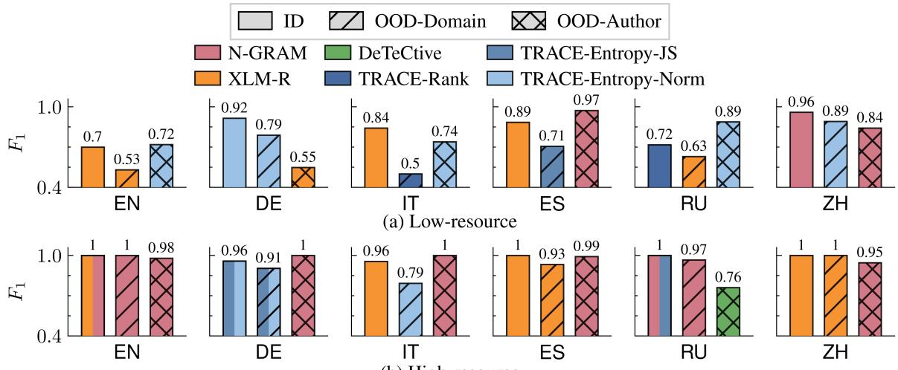
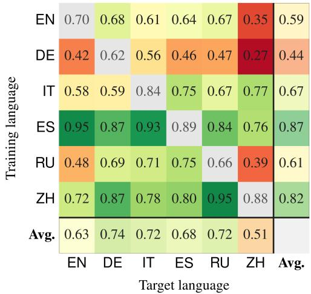
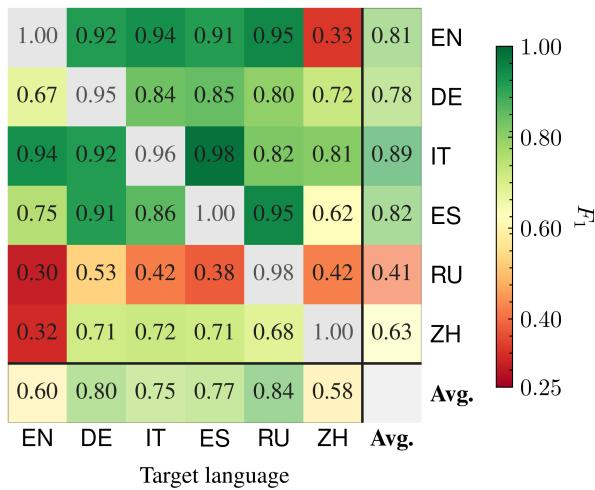
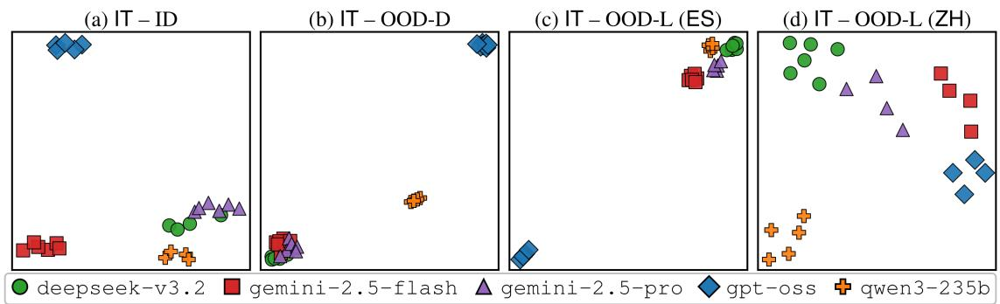
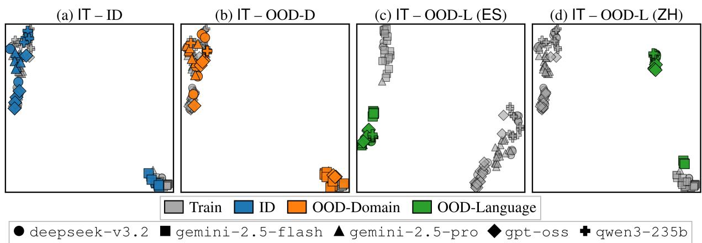

# MULTIGHOSTBENCH: A Multilingual Benchmark for Long-Form LLM-Generated Text Attribution under Distribution Shifts

Matteo Greco1,2∗, Anudeex Shetty1∗, Andrea Tagarelli2, and Jey Han Lau1

1School of Computing and Information Systems, The University of Melbourne, Australia

2DIMES Dept., University of Calabria, Italy

matteogre01@gmail.com,

{anudeex, laujh}@unimelb.edu.au, tagarelli@dimes.unical.it

## Abstract

While existing work on LLM authorship attribution (AA) has made progress, available benchmarks remain limited, often focusing on English, controlled settings, or relatively outdated models, with the few multilingual studies considering only relatively short texts. We introduce MULTIGHOSTBENCH, a multilingual benchmark comprising 928 books generated by five recent LLMs across six languages and three scripts, with an average length of approximately 59K words per book. The benchmark supports evaluation under domain, author, and language shifts. Evaluation of representative AA methods shows that no single method consistently performs best across settings, and performance generally degrades under distribution shifts. Transformer-based detectors can retain generator-related information across languages, although transfer effectiveness varies by language pair, whereas statistical and fingerprintbased detectors are more language-dependent. We envision MULTIGHOSTBENCH as a valuable resource for the development and evaluation of robust AA methods.1

## 1 Introduction

Large language models (LLMs) can now generate high-quality text across multiple languages (Qin et al., 2024; Yue et al., 2025), achieving levels of fluency and coherence comparable to humanwritten content (Jakesch et al., 2023). These advances create new opportunities for communication, creativity, and productivity (Ahuja et al., 2023; Doddapaneni et al., 2025). Still, they also raise concerns about transparency, accountability, misuse, and the authenticity of digital content (Brundage et al., 2024; Rudolph et al., 2023; Russell et al., 2026). These risks motivate the need for robust methods to detect and attribute LLM-generated text (Huang et al., 2025; Wu et al., 2025).

Although prior research has explored LLMgenerated text detection and numerous datasets have been introduced, several limitations remain as outlined in Table 1. First, most formulate detection as a binary human-versus-AI problem (He et al., 2024; Dugan et al., 2024; Thai et al., 2026), while only a limited number of works study the more challenging authorship attribution (AA) task (Uchendu et al., 2021; La Cava and Tagarelli, 2025; Shetty et al., 2026), where the objective is to identify the specific generator LLM that wrote a text. Second, existing datasets predominantly focus on short-form texts (Macko et al., 2025, 2023), despite the emergence of LLM-ghostwritten books (Australian Society of Authors, 2025). Even recent longform efforts, such as Shetty et al. (2026), remain monolingual or limited to a small number of languages (Dugan et al., 2024; Tao et al., 2024). Third, methods are rarely evaluated for multiple distribution shifts, particularly cross-language transfer or generalisation to unseen generators and domains.

In this paper, we introduce MULTIGHOST-BENCH, a multilingual benchmark for LLM AA that evaluates generalisation under domain, generator, and language shifts. To the best of our knowledge, MULTIGHOSTBENCH is the first benchmark designed to jointly evaluate multilingual long-form LLM AA under multiple distribution shifts. To summarise, our main contributions are:

• We introduce MULTIGHOSTBENCH, comprising 928 books (average 59K words) generated by five recent LLMs. It covers six languages and three scripts, and is designed to evaluate AA both within and across languages under domain and generator shifts.

• We conduct a comprehensive evaluation of statistical, supervised, and fingerprint-based attribution detectors, finding that no method performs consistently best across languages, data regimes, and distribution shifts.

• Our analysis reveals that Transformer-based detectors can retain generator-related information across languages, although the extent of this transfer varies across language pairs, whereas statistical and fingerprint-based approaches are more strongly affected by language.

## 2 Related Work

Authorship Attribution. Research on LLMgenerated text has predominantly focused on binary detection (Mitchell et al., 2023; Yang et al., 2024; Thai et al., 2026), with only a few works (Uchendu et al., 2021; La Cava and Tagarelli, 2025; Shetty et al., 2026) studying the AA task, where the goal is to identify the specific LLM that generated a text. However, these studies are predominantly based on supervised methods with limited generalisation. Shetty et al. (2026) studied long-form texts and robustness under domain and unseengenerator shifts, but their study remained restricted to English. They also developed a lightweight fingerprint-based method, TRACE, for the AA task.

Multilingual Authorship Attribution. Similarly, research on multilingual LLM-generated text has primarily focused on binary detection (Wu et al., 2026; Macko and Kopál, 2026; Wang et al., 2024) rather than attribution. MULTITUDE (Macko et al., 2023) evaluates cross-language attribution performance, but its evaluation is not exhaustive, as it does not cover all languages in the dataset. Likewise, attribution experiments in M4GT-BENCH (Wang et al., 2024) focus on cross-domain rather than cross-lingual generalisation. More recently, La Cava et al. (2026) provide a systematic study of multilingual attribution using MULTITUDE and MULTISOCIAL. However, their primary setting is based on short news articles. This misses practical scenarios involving unseen generators and joint evaluation across multiple dimensions as done in this work, which we summarise in Table 1.

## 3 Dataset

Our proposed MULTIGHOSTBENCH is a multilingual dataset of long-form texts generated by five recent LLMs (gemini-pro, gemini-flash, deepseek-v3.2, qwen3-235b, and gpt-oss; more details in Appendix Table 4) covering six languages and supporting AA under domain, author, and language shifts. A unique feature of our dataset is its language-shift setting, which enables the evaluation of whether attribution methods trained on one language can generalise to texts written in a previously unseen language.

<table><tr><td rowspan="2">Dataset</td><td colspan="2">LLMs</td><td colspan="3">OOD</td><td rowspan="2">aan #</td><td rowspan="2">¿suoT</td><td rowspan="2">Avg. Words</td><td rowspan="2">Num Docs</td></tr><tr><td># Rec.</td><td></td><td>D</td><td>A</td><td>L</td></tr><tr><td>TURINGBENCH(2021)</td><td>20</td><td>x</td><td>X</td><td>X</td><td>X</td><td>1</td><td>X</td><td>&lt;200</td><td>160K</td></tr><tr><td>OPENTURING(2025)</td><td>7</td><td>X</td><td>L</td><td></td><td>1</td><td>1</td><td>X</td><td>&lt;500</td><td>497K</td></tr><tr><td>GHOSTWRITEB.(2026)</td><td>10</td><td></td><td></td><td></td><td>X</td><td>1</td><td></td><td>53K</td><td>325</td></tr><tr><td>M4GT-BENCH(2024)</td><td>6</td><td>X</td><td>√</td><td>X</td><td>X</td><td>12</td><td>X</td><td>&lt;500</td><td>87K</td></tr><tr><td>MULTITUDE(2023)</td><td>8</td><td>x</td><td>X</td><td>X</td><td></td><td>11</td><td>X</td><td>&lt;512</td><td>74K</td></tr><tr><td>MULTISOCIAL(2025)</td><td>8</td><td>x</td><td>X</td><td>x</td><td></td><td>22</td><td>X</td><td>&lt;200</td><td>472K</td></tr><tr><td>MULTIGHOSTBENCH</td><td>5</td><td>√</td><td></td><td></td><td>L</td><td>6</td><td></td><td>59K</td><td>928</td></tr></table>

Table 1: Overview of existing datasets for LLMgenerated text attribution. ‘Rec.’ indicates whether benchmark includes recent high-capability LLMs; prior benchmarks include small-scale models (<10B parameters). ‘D’, ‘A’, and ‘L’ denote OOD-Domain, OOD-Author, and OOD-Language, respectively. ‘Long?’ denotes whether documents longer than 10K words.

## 3.1 Language Selection

MULTIGHOSTBENCH covers six languages: Italian (IT), Spanish (ES), German (DE), English (EN), Chinese (ZH), and Russian (RU). These languages represent four language families: Romance (IT and ES), Germanic (DE and EN), Sino-Tibetan (ZH), and Slavic (RU). They also cover multiple writing systems, including Latin, Chinese characters, and Cyrillic scripts as well as languagespecific orthographic conventions. This selection enables evaluation of AA under both closely related and more distant language and script shifts.

## 3.2 Multilingual Book Generation Pipeline

Human book writing is generally hierarchical: authors typically develop a book through multiple stages, such as planning, drafting, and revision (Sun et al., 2022; Lee et al., 2025). We follow the generation process introduced by Shetty et al. (2026) that simulates this multi-stage writing process to create the LLM-generated books.

The book generation pipeline begins with the definition of a set of constraints, such as genres and time period. These constraints are sourced from Project Gutenberg2, an online library of freely available books; see Appendix Table 3 for the list of genres, comprising both fiction and non-fiction genres. A Gutenberg book is usually multi-genre (e.g., LF (Literature & Fiction) + HB (History & Biographies)), therefore books in MULTIGHOSTBENCH are also multi-genre. Each book is expanded iteratively by generating each subsequent segment conditioned on the outline, the previous segment, and a running summary of the narrative, i.e., updated after each generation step. This structure allows models to preserve global coherence while producing texts that exceed the length of a single generation step. We adapt the original prompt templates from Shetty et al. (2026) for the multilingual setting by translating them into each target language. The translations were verified by respective native-speaker volunteers; prompts can be found in Appendix A.1.

<table><tr><td rowspan="2">Lang.</td><td colspan="3"># Books</td><td rowspan="2">Avg. # Words</td></tr><tr><td>Train</td><td>Dev. Test</td><td>Total</td></tr><tr><td>EN</td><td>92</td><td>10 61</td><td>163</td><td>64.8K</td></tr><tr><td>DE</td><td>88</td><td>10 56</td><td>154</td><td>44.4K</td></tr><tr><td>IT</td><td>93</td><td>10 58</td><td>161</td><td>50.2K</td></tr><tr><td>ES</td><td>93</td><td>10 60</td><td>163</td><td>44.9K</td></tr><tr><td>RU</td><td>79</td><td>10 52</td><td>141</td><td>83.6K</td></tr><tr><td>ZH</td><td>82</td><td>10 54</td><td>146</td><td>69.7K</td></tr><tr><td>Total</td><td>527</td><td>60 341</td><td>928</td><td>59.6K</td></tr></table>

Table 2: MULTIGHOSTBENCH statistics: number of training, development, and test books, together with the average book length (in words) for each language. See Appendix Table 5 for detailed breakdown per LLM.

We provide model details for five LLMs and quantitative statistics for these LLM-generated books in Appendix Table 4 and 7, respectively. All the books were generated consistently using the same pipeline described above to minimise pipeline-specific bias. However, some LLMspecific generation bias is inevitable, which we try to reduce through our meticulous data cleaning (§3.4) and analysis (§3.5).

## 3.3 OOD Dimensions

Following Shetty et al. (2026), MULTIGHOST-BENCH supports two OOD evaluation dimensions: OOD-Domain, which measures generalisation to unseen genres, and OOD-Author, which measures generalisation to unseen generators. We further introduce OOD-Language, which evaluates whether AA methods transfer to texts written in languages not observed during training.

In OOD-Domain, genres are partitioned into ID and OOD subsets for each generator LLM, ensuring that no genre appears in both partitions. Recall that these genres are sourced from the Gutenberg corpus comprising both fiction and non-fiction genres. Full statistics for genres in ID and OOD-Domain for different LLMs are provided in Appendix Table 5. In OOD-Author, we adopt a leaveone-author-out protocol: one LLM is held out at a time, methods are trained on the remaining LLMs, and evaluation is performed on books generated by the held-out model. In OOD-Language, methods are trained on one source language and evaluated on a different target language. We do not combine OOD-Language with OOD-Domain, so that the evaluation isolates the effect of language shift rather than conflating it with genre shift.

## 3.4 Data Cleaning

We clean the generated texts to remove generation and encoding artefacts while preserving language-specific features. Invalid control characters, markup, and non-textual symbols are removed, while formatting elements are normalised, preserving language-specific punctuation, diacritics, and non-Latin scripts. Following Shetty et al. (2026), we remove 1.5K tokens from both the beginning and end of each book to reduce shortcut cues from identifier markers, such as author names, titles, or publication years. As a final sanity check, we use GlotLID (Kargaran et al., 2023), an open-source language identification model, to verify that each generated book is written in its intended target language; all books in MULTIGHOSTBENCH match their intended target language.

## 3.5 Data Exploration

Table 2 shows a summary statistics for MULTI-GHOSTBENCH, including the number of books per language across different splits. To provide a consistent estimate of document length across languages, we tokenise each book using a languagespecific tokeniser (listed in Appendix Table 6) and convert the token counts to approximate word counts using the standard 1.5 tokens-per-word conversion.

Quantitative analysis. The generated books are analysed using multiple quantitative textual metrics in Appendix Table 7. We compute perplexity (PPL) as a model-based measure of text predictability (Jurafsky and Martin, 2026), n-gram-based metrics for lexical overlap and diversity (Self-BLEU (S-B), self-repetition (Self-R), and n-gram diversity (NGD)) (Zhu et al., 2018; Salkar et al., 2022; Meister et al., 2023), and compression ratio as a proxy for textual redundancy (Shaib et al., 2025). Given the multilingual nature of MULTIGHOSTBENCH, token-based metrics are computed using languagedependent tokenisers (Appendix Table 6).

For comparison, we select human-written books from the Gutenberg corpus with similar properties (full-length, single-authored works from the nineteenth or twentieth century). Overall, across languages, the generated books exhibit textual properties comparable to human-written books, particularly in lexical diversity and redundancy. However, generated books show higher S-B scores and lower PPL, indicating greater inter-book lexical similarity and higher predictability for the reference model (i.e., mGPT). For Chinese and Russian, no eligible human references were available, hence they were compared with LLM-generated books in other languages. Their metric values remain within a similar range, with some variation for Russian PPL and Chinese NGD.

Human evaluation. We conduct a small-scale human evaluation on a subset of generated books as an initial validation step. Our focus is on novels generated by gemini-pro in the LF (Literature & Fiction) genre. Following prior works (Chhun et al., 2022; Wang et al., 2025; Shetty et al., 2026), the generated books are evaluated along several dimensions that capture both local linguistic quality and broader narrative structure (more in Appendix A.3).

Appendix Table 8 summarises the annotator scores across passage-level and overall book-level dimensions. Overall, the results indicate that the generated books are generally fluent and coherent with strong passage-level scores, while narrativelevel quality is less consistent across languages for subjective dimensions. Although this evaluation is limited to gemini-pro-generated literature books, the findings complement our analyses above, which show similar quality trends across LLMs. Together, these results support the overall quality of books in MULTIGHOSTBENCH.

## 4 Authorship Attribution Methods

The selected methods span three categories: metricbased, model-based supervised, and fingerprintbased. Their multilingual adaptations are summarised below, with further detector and implementation details in Appendix B and C, respectively.

Metric-based methods. For this category, we consider RANK, ENTROPY, and GLTR (Gehrmann et al., 2019). These methods rely on token-level probabilities produced by a reference language model. Following Macko et al. (2023), we use mGPT (Shliazhko et al., 2024) as the multilingual reference model. We adapt their extracted statistics to multi-class attribution following La Cava and Tagarelli (2025); Shetty et al. (2026).

Model-based supervised methods. We consider N-GRAM (Koppel and Schler, 2004), BERT-AA (Fabien et al., 2020), and DETECTIVE (Guo et al., 2024), covering both non-neural and neural detectors. For N-GRAM, we adapt preprocessing to preserve accented and language-specific characters and use $\mathit { J i e b a ^ { 3 } }$ segmentation for Chinese word-level features. For BERT-AA, we use XLM-ROBERTA (Conneau et al., 2020) as the multilingual encoder. For DETECTIVE, we replace the original sentence-embedding model with a multilingual counterpart.

Fingerprint-based methods. We consider TRACE (Shetty et al., 2026), a post-hoc fingerprintbased AA method that models transitions between token-rank or entropy statistics computed by an evaluator language model. A test text is attributed to the generator with the most similar fingerprint. We evaluate TRACErank-js, TRACEentr-js, and TRACEentr-norm. For multilingual evaluation, we replace the original evaluator, GPT-2, with Gemma, also evaluated by Shetty et al. (2026). Previous TRACE evaluations were limited to English.

## 5 Experimental Setup

Training settings. In order to analyse how AA performance varies with respect to the amount of available training data, we follow Shetty et al. (2026) considering two training scenarios: highresource setting where a relatively large number of labelled training books is available for each LLM (10–30 books), and low-resource setting where only a limited number of labelled training books is available for each LLM (1–5 books).

Evaluation settings. Since MULTIGHOST-BENCH includes the OOD-Author dimension, the generator of a test text may not appear among those observed during training. This corresponds to an open-set setting, where an AA method must not only distinguish among known authors, but also reject texts generated by unseen authors. To support this rejection mechanism, all methods are calibrated on the development set by selecting a confidence threshold that best balances attribution performance and rejection ability. All the thresholds can be found in Appendix Table 9.

  
(b) High-resource  
Figure 1: Best-performing detector by language and evaluation setting under the low- and high-resource regimes. Each group includes ID, OOD-Domain, and OOD-Author. Bar height shows macro-F1, colors identify detectors, hatches indicate evaluation settings, and split colors denote ties. The best detector varies across conditions, while more data generally improves performance.

During evaluation, the same threshold is applied across all scenarios: ID, OOD-Domain, OOD-Author, and OOD-Language. We do this because in a practical application we would not know whether a test document is in or out of the training distribution. For texts generated by known authors, predictions below the confidence threshold are counted as missed attributions. For texts generated by unseen authors, the same behaviour is instead counted as a correct rejection, since the method avoids forcing the sample into one of the known author classes. Attribution performance is evaluated using macro-F1, which gives equal weight to all generating LLMs.

## 6 Experimental Results

We first consider in-language evaluation (§6.1), where training and test texts are written in the same language, covering the ID, OOD-Domain, and OOD-Author settings. We then analyse crosslanguage evaluation (§6.2), where attribution methods are trained on one source language and evaluated on a previously unseen target language. Finally, we examine the learned representation (§6.3) space to better interpret the observed performance patterns under domain and language shifts.

## 6.1 In-Language Evaluation

Figure 1 reports the best-performing method for each language and evaluation setting; complete results are reported in Appendix Table 11 and 12. For completeness, the results obtained without confidence-threshold rejection are provided in Appendix Table 13 and 14.

No universal winner. No single method consistently outperforms all others across languages, resource regimes, and evaluation settings. Nevertheless, some methods appear more frequently among the best-performing approaches. XLM-ROBERTA is particularly competitive in the ID and OOD-Domain settings, while N-GRAM becomes a frequent winner in the high-resource regime, especially under OOD-Author evaluation. TRACE variants also obtain the best result in several languagespecific configurations. In contrast, RANK, EN-TROPY, and GLTR consistently achieve low performance, indicating that individual token-level statistics provide insufficient signals for reliable authorship attribution.

More data improves performance. In the highresource setting, the larger amount of training data improves the best achievable performance across all ID and OOD-Domain configurations. In several cases, the best-performing detector approaches or reaches perfect macro-F1.

Full results (Tables Appendix Table 12 and 11) show the impact of additional training data on each detector. Under OOD-Author, XLM-ROBERTA performs worse than in the low-resource setting for Italian, Chinese, and English, whereas DETECTIVE improves across all languages. N-GRAM benefits the most from the additional data, becoming the best-performing OOD-Author detector in five languages and the second-best in Russian. An explanation is that N-GRAM needs more data to estimate reliable lexical and structural patterns, whereas XLM-ROBERTA may become overconfident on texts from unseen authors, assigning them to one of the known classes instead of rejecting them.

  
(a) Low-resource

  
(b) High-resource  
Figure 2: Cross-language macro-F results for XLM-ROBERTA in the (a) low-resource and (b) high-resource settings. Rows indicate source languages and columns target languages; the final row and column report averages excluding the diagonal. Transfer depends on both the source-target pair and the resource regime; Chinese remains the most challenging target.

Robustness drops under OOD shifts. Compared with ID evaluation, performance generally decreases under distribution shift, although the strongest high-resource detectors retain high absolute scores. The OOD-ID differences reported in Appendix Table 15 and 16 are negative in most cases, with OOD-Author generally producing larger drops than OOD-Domain.

Language differences. The low-resource setting reveals clearer performance differences across languages. Chinese achieves the strongest results, whereas English is comparatively more challenging. Indeed, the generators produce Chinese texts of more variable quality, creating stronger generatorspecific signals that attribution detectors can exploit; in contrast, English outputs’ quality may be consistently better, leading to greater stylistic overlap and weaker attribution cues. These differences become less pronounced in the high-resource regime, where most best-performing scores approach or reach perfect macro-F1.

## 6.2 Cross-Language Evaluation

Figure 2 reports the cross-language macro-F1 scores of XLM-ROBERTA under the low- and highresource settings. Rows indicate the source language used for training, while columns indicate the target language used for evaluation. We focus the visual analysis on XLM-ROBERTA because it achieves the strongest overall cross-language performance. DETECTIVE, the other Transformerbased method, also transfers substantially better than the remaining approaches, but generally obtains lower scores than XLM-ROBERTA, despite outperforming it in a limited number of configurations. By contrast, the metric-based, N-GRAM, and fingerprint-based methods achieve near-zero performance in most cross-language configurations, suggesting that the signals they capture are largely language-dependent and do not transfer reliably across languages. For completeness, the full results for all methods with and without thresholding are reported in Appendix Table 17 and Table 18, respectively.

Target language difficulty. Chinese is the most challenging target language. Averaging across source languages, transfer to Chinese achieves a macro-F1 of 0.508 in the low-resource setting and 0.582 in the high-resource setting, the lowest average in both regimes. Russian provides an informative contrast. Although it also uses a non-Latin script, it obtains an average target score of 0.717 in the low-resource setting and 0.841 in the high-resource setting, making it the easiest target language in the latter regime. Therefore, the difficulty of transferring to Chinese cannot be explained by script differences alone. Broader typological differences, tokenisation behaviour, and languagespecific distributional properties may also contribute to the observed performance gap. In particular, the distinctive NGD values observed for Chinese in the quantitative analysis may reflect distributional characteristics that make cross-language transfer more difficult, although these descriptive metrics do not directly establish the source of the performance degradation.

  
Figure 3: UMAP projections of XLM-ROBERTA representations after fine-tuning on Italian. The panels show evaluation on (a) Italian in-distribution (ID), (b) Italian OOD-Domain, and (c) Spanish and (d) Chinese ID texts evaluated under OOD-Language. Generator-specific clusters remain visible in all settings, with clearer separation for Spanish than under domain shift or for Chinese.

Source language effects. The effectiveness of a source language varies substantially across resource regimes. In the low-resource setting, Spanish provides the strongest overall transfer, with an average macro-F1 of 0.866 across target languages, followed by Chinese with 0.823. German is the weakest source language, with an average of 0.435. This ranking changes in the high-resource setting: Italian becomes the strongest source language, with an average macro-F1 of 0.894, followed by Spanish with 0.819, whereas Russian becomes the weakest at 0.410. Chinese also drops markedly, from 0.823 to 0.629, becoming the second-weakest source language in the high-resource regime. In particular, the deterioration observed for Chinese and Russian suggests that, in these languages, training with more data may lead to overfitting to sourcelanguage-specific patterns, reducing the transferability of the learned authorship signals to other languages. The language-specific differences observed in Chinese NGD and Russian PPL may also reflect underlying distributional properties that contribute to this behaviour, although these metrics do not directly explain the transfer degradation.

Language family effects. The clearest evidence of a language-family effect concerns Italian and Spanish. In the low-resource setting, Spanish provides the best transfer to Italian, with a macro-F1 of 0.926, while Italian is the second-best source for Spanish, reaching 0.750. With more training data, the relationship becomes fully reciprocal: Spanish-to-Italian reaches 0.857, while Italianto-Spanish achieves 0.981, the highest score in the table. The Germanic pair (English and German) shows a weaker and less symmetric pattern. English is only the fourth-best source language for German in the low-resource setting, but becomes the strongest source in the high-resource setting, reaching a macro-F1 of 0.916. Conversely, German-to-English achieves only 0.420 in the low resource regime, but improves to 0.673 with more training data, becoming the third-best source language. Overall, language-family relatedness appears to favour transfer, particularly for the Romance pair, but it does not fully determine crosslanguage performance.

## 6.3 Representation Analysis

To better understand the behaviour of XLM-ROBERTA and TRACE beyond their attribution scores, we inspect their respective representation spaces. We use UMAP (McInnes and Healy, 2018) to visualise how XLM-ROBERTA embeddings and TRACE fingerprints change across the ID, OOD-Domain, and OOD-Language settings. The two methods offer complementary perspectives on the attribution task: XLM-ROBERTA relies on learned representations, whereas TRACE operates in a statistical fingerprint space. Comparing these spaces allows us to examine how the two approaches are affected by distribution shifts.

XLM-ROBERTA embeddings. We focus on the representation space learned by XLM-ROBERTA in the high-resource setting, using the model finetuned on Italian, which achieves the strongest average cross-language performance. We consider embeddings from Italian ID texts, Italian OOD-Domain texts, and Spanish and Chinese texts eval uated in the OOD-Language setting to examine the effects of domain and language shifts. Figure 3 illustrates the embedding space produced by XLM-ROBERTA across the four evaluation settings. In the ID setting, texts generated by the same model form compact, well-separated clusters. Under OOD Domain, this organisation is only partially preserved, with clusters becoming less compact and ex hibiting greater overlap. This pattern is consistent with the decrease in macro-F1 from 0.956 in the ID setting to 0.676 under OOD-Domain, indicating that domain shift makes the learned representations less discriminative. When the Italian-fine-tuned model is evaluated on Spanish texts, the modelspecific structure is largely preserved, with compact and well-separated clusters similar to those observed in the Italian ID setting. This is consistent with the strong Italian-to-Spanish transfer performance and suggests that the learned generator related representations generalise effectively between closely related languages. In contrast, when the same model is evaluated on Chinese texts, a model-specific organisation remains visible, but the clusters are broader and less clearly separated than those observed for Spanish. This suggests that the learned representations retain generator-related information across languages, although their discriminative structure is increasingly affected by larger typological and script differences.

TRACE fingerprints. We next analyse the entropy-based fingerprint space of TRACE in the high-resource setting, using Italian as the reference language. While TRACE remains comparatively stable in the same-language settings, its performance drops sharply under OOD-Language evaluation. Since attribution is performed by comparing distances between test and training fingerprints, their relative position provides insight into this behaviour. Figure 4 compares Italian training, ID-test, and OOD-Domain fingerprints with fingerprints from different target languages. Italian ID-test and OOD-Domain samples remain close to the training distribution, whereas fingerprints from other languages occupy clearly displaced regions. Notably, this pattern is observed not only for Chinese, which is linguistically distant from Italian, but also for Spanish, a closely related Romance language. Consequently, cross-language samples lack nearby reference fingerprints, making distance-based attribution less reliable. This suggests that the fingerprint space is strongly influenced by language-specific token transition patterns, which helps explain the poor cross-language performance of TRACE.

## 7 Conclusion

We introduced MULTIGHOSTBENCH, a multilingual benchmark for LLM AA comprising 928 longform books generated by five recent LLMs, and covering six languages from four language families and three scripts. Importantly, it is designed to evaluate generalisation under domain, generator, and language shifts. For the within-language setting (training and testing on the same language), no single method consistently outperforms the others across languages, data regimes, or the ID, OOD-Domain, and OOD-Author conditions. In the cross-language setting (OOD-Language), however, Transformer-based approaches (XLM-ROBERTA and DETECTIVE) substantially outperform other methods. Interestingly, TRACE and metric-based methods drop to near-zero performance. Further analysis shows that cross-language performance is influenced by source and target language, languagefamily proximity, and script differences. These results highlight limitations of current methods in multilingual settings. We hope MULTIGHOST-BENCH will serve as a useful benchmark for developing robust attribution methods.

## Limitations

Although MULTIGHOSTBENCH covers six languages spanning four language families and three writing scripts, it does not capture the full diversity of multilingual LLM-generated text. In particular, it does not cover low-resource languages, languages underrepresented in LLM pre-training data, or languages with substantially different grammatical and morphological characteristics. Furthermore, we consider five recent LLMs capable of generating long-form content across the selected languages. Extending the benchmark to additional and future LLMs is an important direction for future work. Our human evaluation is also limited to a small subset of generated books. Moreover, although the generated books are generally of good quality, multilingual long-form generation remains challenging, particularly with respect to originality, selfevaluation, revision, etc. across languages. These aspects are beyond the scope of this work. Finally, our study focuses on attribution under single-author and non-adversarial settings. Extensions such as mixed authorship (i.e., a book written by multiple authors) and adversarial generalisation (such as obfuscation attacks) remain important directions for future research.

## Ethical Considerations

MULTIGHOSTBENCH consists of LLM-generated books for multiple languages. As with any creative text, some books may contain writing or plot elements that reflect undesirable values. However, all LLMs used in this work incorporate built-in safety guardrails, reducing the likelihood of generating such content. This is further supported by our human evaluation, where no such concerning content was identified. Overall, we aim to adhere to the ACL Code of Ethics.4

## Acknowledgements

This research was conducted during M. Greco’s visit at the University of Melbourne, funded by the Erasmus+ Programme. We thank the volunteer annotators from the University of Melbourne and the University of Calabria for their contribution to the human evaluation. This research was supported by The University of Melbourne’s Research Computing Services and the Petascale Campus Initiative. A. Shetty was supported by the Commonwealth through an Australian Government Research Training Program Scholarship (DOI: https://doi.org/10.82133/C42F-K220), Computing and Information Systems PhD Scholarship, and the Avashya Foundation. A. Tagarelli was partly supported by the Horizon Europe project AI-CODE, GA No. 101135437. J.H. Lau was supported by the Australian Research Council under Grant LP210200917 and DP240101006.

## References

Kabir Ahuja, Harshita Diddee, Rishav Hada, Millicent Ochieng, Krithika Ramesh, Prachi Jain, Akshay Nambi, Tanuja Ganu, Sameer Segal, Mohamed Ahmed, Kalika Bali, and Sunayana Sitaram. 2023.

MEGA: Multilingual evaluation of generative AI. In Proceedings of the 2023 Conference on Empirical Methods in Natural Language Processing, pages 4232–4267, Singapore. Association for Computational Linguistics.

Australian Society of Authors. 2025. Artificial intelligence. [Accessed 13-02-2026].

Miles Brundage, Shahar Avin, Jack Clark, Helen Toner, Peter Eckersley, Ben Garfinkel, Allan Dafoe, Paul Scharre, Thomas Zeitzoff, Bobby Filar, Hyrum Anderson, Heather Roff, Gregory C. Allen, Jacob Steinhardt, Carrick Flynn, Seán Ó hÉigeartaigh, SJ Beard, Haydn Belfield, Sebastian Farquhar, and 7 others. 2024. The malicious use of artificial intelligence: Forecasting, prevention, and mitigation. Preprint, arXiv:1802.07228.

José Cañete, Gabriel Chaperon, Rodrigo Fuentes, Jou-Hui Ho, Hojin Kang, and Jorge Pérez. 2023. Spanish pre-trained bert model and evaluation data. Preprint, arXiv:2308.02976.

Branden Chan, Stefan Schweter, and Timo Möller. 2020. German’s next language model. In Proceedings of the 28th International Conference on Computational Linguistics, pages 6788–6796, Barcelona, Spain (Online). International Committee on Computational Linguistics.

Cyril Chhun, Pierre Colombo, Fabian M. Suchanek, and Chloé Clavel. 2022. Of human criteria and automatic metrics: A benchmark of the evaluation of story generation. In Proceedings of the 29th International Conference on Computational Linguistics, pages 5794–5836, Gyeongju, Republic of Korea. International Committee on Computational Linguistics.

Gheorghe Comanici, Eric Bieber, Mike Schaekermann, Ice Pasupat, Noveen Sachdeva, Inderjit Dhillon, Marcel Blistein, Ori Ram, Dan Zhang, Evan Rosen, Luke Marris, Sam Petulla, Colin Gaffney, Asaf Aharoni, Nathan Lintz, Tiago Cardal Pais, Henrik Jacobsson, Idan Szpektor, Nan-Jiang Jiang, and 3416 others. 2025. Gemini 2.5: Pushing the frontier with advanced reasoning, multimodality, long context, and next generation agentic capabilities. Preprint, arXiv:2507.06261.

Alexis Conneau, Kartikay Khandelwal, Naman Goyal, Vishrav Chaudhary, Guillaume Wenzek, Francisco Guzmán, Edouard Grave, Myle Ott, Luke Zettlemoyer, and Veselin Stoyanov. 2020. Unsupervised cross-lingual representation learning at scale. In Proceedings of the 58th Annual Meeting of the Associationfor Computational Linguistics, pages 8440– 8451, Online. Association for Computational Linguistics.

DeepSeek-AI, Aixin Liu, Bei Feng, Bing Xue, Bingxuan Wang, Bochao Wu, Chengda Lu, Chenggang Zhao, Chengqi Deng, Chenyu Zhang, Chong Ruan, Damai Dai, Daya Guo, Dejian Yang, Deli Chen, Dongjie Ji, Erhang Li, Fangyun Lin, Fucong Dai,

and 181 others. 2025. Deepseek-v3 technical report. Preprint, arXiv:2412.19437.

Jacob Devlin, Ming-Wei Chang, Kenton Lee, and Kristina Toutanova. 2019. Bert: Pre-training of deep bidirectional transformers for language understanding. Preprint, arXiv:1810.04805.

Sumanth Doddapaneni, Gowtham Ramesh, Mitesh Khapra, Anoop Kunchukuttan, and Pratyush Kumar. 2025. A primer on pretrained multilingual language models. ACM Comput. Surv., 57(9).

Liam Dugan, Alyssa Hwang, Filip Trhlík, Andrew Zhu, Josh Magnus Ludan, Hainiu Xu, Daphne Ippolito, and Chris Callison-Burch. 2024. RAID: A shared benchmark for robust evaluation of machinegenerated text detectors. In Proceedings ofthe 62nd Annual Meeting ofthe Associationfor Computational Linguistics (Volume 1: Long Papers), pages 12463– 12492, Bangkok, Thailand. Association for Computational Linguistics.

Maël Fabien, Esau Villatoro-Tello, Petr Motlicek, and Shantipriya Parida. 2020. BertAA : BERT finetuning for authorship attribution. In Proceedings of the 17th International Conference on Natural Language Processing (ICON), pages 127–137, Indian Institute of Technology Patna, Patna, India. NLP Association of India (NLPAI).

Sebastian Gehrmann, Hendrik Strobelt, and Alexander Rush. 2019. GLTR: Statistical detection and visualization of generated text. In Proceedings ofthe 57th Annual Meeting of the Association for Computational Linguistics: System Demonstrations, pages 111–116, Florence, Italy. Association for Computational Linguistics.

Xun Guo, Yongxin He, Shan Zhang, Ting Zhang, Wanquan Feng, Haibin Huang, and Chongyang Ma. 2024. Detective: Detecting ai-generated text via multi-level contrastive learning. Advances in Neural Information Processing Systems, 37:88320–88347.

Xinlei He, Xinyue Shen, Zeyuan Chen, Michael Backes, and Yang Zhang. 2024. Mgtbench: Benchmarking machine-generated text detection. In Proceedings of the 2024 on ACM SIGSAC Conference on Computer and Communications Security, CCS ’24, page 2251–2265, New York, NY, USA. Association for Computing Machinery.

Baixiang Huang, Canyu Chen, and Kai Shu. 2025. Authorship attribution in the era of llms: Problems, methodologies, and challenges. SIGKDD Explor. Newsl., 26(2):21–43.

Maurice Jakesch, Jeffrey T. Hancock, and Mor Naaman. 2023. Human heuristics for ai-generated language are flawed. Proceedings of the National Academy of Sciences, 120(11):e2208839120.

Kaijie Jiao, Quan Wang, Licheng Zhang, Zikang Guo, and Zhendong Mao. 2025. M-RangeDetector: Enhancing generalization in machine-generated text detection through multi-range attention masks. In Findings of the Association for Computational Linguistics: ACL 2025, pages 8971–8983, Vienna, Austria. Association for Computational Linguistics.

Angel B John and Sumam Mary Idicula. 2026. Authorship attribution of malayalam biblical texts using deep learning. In 2026 2nd International Conference on Advances in Intelligent Computing and Applications (AICAPS), pages 1–6.

Daniel Jurafsky and James H. Martin. 2026. Speech and Language Processing: An Introduction to Natural Language Processing, Computational Linguistics, and Speech Recognition with Language Models, 3rd edition. Online manuscript released January 6, 2026.

Amir Hossein Kargaran, Ayyoob Imani, François Yvon, and Hinrich Schuetze. 2023. GlotLID: Language identification for low-resource languages. In Findings of the Association for Computational Linguistics: EMNLP 2023, pages 6155–6218, Singapore. Association for Computational Linguistics.

Moshe Koppel and Jonathan Schler. 2004. Authorship verification as a one-class classification problem. In Proceedings of the twenty-first international conference on Machine learning, page 62.

Yuri Kuratov and Mikhail Arkhipov. 2019. Adaptation of deep bidirectional multilingual transformers for russian language. Preprint, arXiv:1905.07213.

Lucio La Cava, Dominik Macko, Robert Moro, Ivan Srba, and Andrea Tagarelli. 2026. Authorship attribution in multilingual machine-generated texts. In Proceedings of the 64th Annual Meeting of the Association for Computational Linguistics (Volume 1: Long Papers), pages 45136–45152, San Diego, California, United States. Association for Computational Linguistics.

Lucio La Cava and Andrea Tagarelli. 2025. OpenTuringBench: An open-model-based benchmark and framework for machine-generated text detection and attribution. In Proceedings ofthe 2025 Conference on Empirical Methods in Natural Language Processing, pages 26655–26671, Suzhou, China. Association for Computational Linguistics.

Yukyung Lee, Soonwon Ka, Bokyung Son, Pilsung Kang, and Jaewook Kang. 2025. Navigating the path of writing: Outline-guided text generation with large language models. In Proceedings ofthe 2025 Conference ofthe Nations ofthe Americas Chapter of the Associationfor Computational Linguistics: Human Language Technologies (Volume 3: Industry Track), pages 233–250, Albuquerque, New Mexico. Association for Computational Linguistics.

Dominik Macko and Jakub Kopál. 2026. CEAID: Benchmark of multilingual machine-generated text detection methods for Central European languages.

In Findings ofthe Associationfor Computational Linguistics: ACL 2026, pages 29177–29190, San Diego, California, United States. Association for Computational Linguistics.

Dominik Macko, Jakub Kopál, Robert Moro, and Ivan Srba. 2025. MultiSocial: Multilingual benchmark of machine-generated text detection of social-media texts. In Proceedings of the 63rd Annual Meeting of the Association for Computational Linguistics (Volume 1: Long Papers), pages 727–752, Vienna, Austria. Association for Computational Linguistics.

Dominik Macko, Robert Moro, Adaku Uchendu, Jason Lucas, Michiharu Yamashita, Matúš Pikuliak, Ivan Srba, Thai Le, Dongwon Lee, Jakub Simko, and Maria Bielikova. 2023. MULTITuDE: Large-scale multilingual machine-generated text detection benchmark. In Proceedings of the 2023 Conference on Empirical Methods in Natural Language Processing, pages 9960–9987, Singapore. Association for Computational Linguistics.

HF Canonical Model Maintainers. 2022. gpt2 (revision 909a290).

Leland McInnes and John Healy. 2018. Umap: Uniform manifold approximation and projection for dimension reduction.

Clara Meister, Tiago Pimentel, Gian Wiher, and Ryan Cotterell. 2023. Locally typical sampling. Transactions ofthe Associationfor Computational Linguistics, 11:102–121.

Eric Mitchell, Yoonho Lee, Alexander Khazatsky, Christopher D Manning, and Chelsea Finn. 2023. Detectgpt: Zero-shot machine-generated text detection using probability curvature. In International conference on machine learning, pages 24950–24962. PMLR.

Omar Momen, Manuel Schaaf, and Alexander Mehler. 2025. Filling the temporal void: Recovering missing publication years in the Project Gutenberg corpus using LLMs. In Findings ofthe Associationfor Computational Linguistics: ACL 2025, pages 17318–17334, Vienna, Austria. Association for Computational Linguistics.

OpenAI, :, Sandhini Agarwal, Lama Ahmad, Jason Ai, Sam Altman, Andy Applebaum, Edwin Arbus, Rahul K. Arora, Yu Bai, Bowen Baker, Haiming Bao, Boaz Barak, Ally Bennett, Tyler Bertao, Nivedita Brett, Eugene Brevdo, Greg Brockman, Sebastien Bubeck, and 108 others. 2025. gpt-oss-120b & gptoss-20b model card. Preprint, arXiv:2508.10925.

Riccardo Orlando, Luca Moroni, Pere-Lluís Huguet Cabot, Simone Conia, Edoardo Barba, Sergio Orlandini, Giuseppe Fiameni, and Roberto Navigli. 2024. Minerva LLMs: The first family of large language models trained from scratch on Italian data. In Proceedings ofthe Tenth Italian Conference on Computational Linguistics (CLiC-it 2024), pages 707–719, Pisa, Italy. CEUR Workshop Proceedings.

Libo Qin, Qiguang Chen, Yuhang Zhou, Zhi Chen, Yinghui Li, Lizi Liao, Min Li, Wanxiang Che, and Philip S. Yu. 2024. Multilingual large language model: A survey of resources, taxonomy and frontiers. Preprint, arXiv:2404.04925.

Jurgen Rudolph, Samson Tan, and Shannon Tan. 2023. Chatgpt: Bullshit spewer or the end of traditional assessments in higher education? Journal of Applied Learning & Teaching, 6(1):342–363.

Jenna Russell, Marzena Karpinska, Destiny Akinode, James Zhou, Katherine Thai, Bradley Emi, Max Spero, and Mohit Iyyer. 2026. AI use in American newspapers is widespread, uneven, and rarely disclosed. In Proceedings ofthe 64th Annual Meeting of the Association for Computational Linguistics (Volume 1: Long Papers), pages 14554–14580, San Diego, California, United States. Association for Computational Linguistics.

Nikita Salkar, Thomas Trikalinos, Byron Wallace, and Ani Nenkova. 2022. Self-repetition in abstractive neural summarizers. In Proceedings ofthe 2nd Conference of the Asia-Pacific Chapter of the Association for Computational Linguistics and the 12th International Joint Conference on Natural Language Processing (Volume 2: Short Papers), pages 341–350, Online only. Association for Computational Linguistics.

Chantal Shaib, Venkata S Govindarajan, Joe Barrow, Jiuding Sun, Alexa Siu, Byron C Wallace, and Ani Nenkova. 2025. Standardizing the measurement of text diversity: A tool and comparative analysis. In Proceedings ofThe 14th International Joint Conference on Natural Language Processing and The 4th Conference ofthe Asia-Pacific Chapter ofthe Associationfor Computational Linguistics: System Demonstrations, pages 36–46, Mumbai, India. Association for Computational Linguistics.

Anudeex Shetty, Qiongkai Xu, Olga Ohrimenko, and Jey Han Lau. 2026. Who wrote the book? detecting and attributing llm ghostwriters. Preprint, arXiv:2603.28054.

Oleh Shliazhko, Alena Fenogenova, Maria Tikhonova, Anastasia Kozlova, Vladislav Mikhailov, and Tatiana Shavrina. 2024. mGPT: Few-shot learners go multilingual. Transactions ofthe Associationfor Computational Linguistics, 12:58–79.

Xiaofei Sun, Zijun Sun, Yuxian Meng, Jiwei Li, and Chun Fan. 2022. Summarize, outline, and elaborate: Long-text generation via hierarchical supervision from extractive summaries. In Proceedings of the 29th International Conference on Computational Linguistics, pages 6392–6402, Gyeongju, Republic of Korea. International Committee on Computational Linguistics.

Zhen Tao, Yanfang Chen, Dinghao Xi, Zhiyu Li, and Wei Xu. 2024. Towards reliable detection of llmgenerated texts: A comprehensive evaluation framework with cudrt. Preprint, arXiv:2406.09056.

Katherine Thai, Bradley Emi, Elyas Masrour, and Mohit Iyyer. 2026. Editlens: Quantifying the extent of AI editing in text. In The Fourteenth International Conference on Learning Representations.

Jacob Tyo, Bhuwan Dhingra, and Zachary C. Lipton. 2023. Valla: Standardizing and benchmarking authorship attribution and verification through empirical evaluation and comparative analysis. In Proceedings of the 13th International Joint Conference on Natural Language Processing and the 3rd Conference ofthe Asia-Pacific Chapter ofthe Association for Computational Linguistics (Volume 1: Long Papers), pages 649–660, Nusa Dua, Bali. Association for Computational Linguistics.

Adaku Uchendu, Zeyu Ma, Thai Le, Rui Zhang, and Dongwon Lee. 2021. TURINGBENCH: A benchmark environment for Turing test in the age of neural text generation. In Findings of the Association for Computational Linguistics: EMNLP 2021, pages 2001–2016, Punta Cana, Dominican Republic. Association for Computational Linguistics.

Wenqing Wang, Mingqi Gao, Xinyu Hu, and Xiaojun Wan. 2025. Towards a “novel” benchmark: Evaluating literary fiction with large language models. In Findings ofthe Associationfor Computational Linguistics: ACL 2025, pages 21648–21673, Vienna, Austria. Association for Computational Linguistics.

Yuxia Wang, Jonibek Mansurov, Petar Ivanov, Jinyan Su, Artem Shelmanov, Akim Tsvigun, Osama Mohammed Afzal, Tarek Mahmoud, Giovanni Puccetti, Thomas Arnold, Alham Aji, Nizar Habash, Iryna Gurevych, and Preslav Nakov. 2024. M4GTbench: Evaluation benchmark for black-box machinegenerated text detection. In Proceedings of the 62nd Annual Meeting of the Association for Computational Linguistics (Volume 1: Long Papers), pages 3964– 3992, Bangkok, Thailand. Association for Computational Linguistics.

Junchao Wu, Yefeng Liu, Chenyu Zhu, Hao Zhang, Zeyu Wu, Tianqi Shi, Yichao Du, Longyue Wang, Weihua Luo, Jinsong Su, and Derek F. Wong. 2026. DetectRL-X: Towards reliable multilingual and realworld LLM-generated text detection. In Proceedings of the 64th Annual Meeting of the Association for Computational Linguistics (Volume 1: Long Papers), pages 38247–38294, San Diego, California, United States. Association for Computational Linguistics.

Junchao Wu, Shu Yang, Runzhe Zhan, Yulin Yuan, Lidia Sam Chao, and Derek Fai Wong. 2025. A survey on llm-generated text detection: Necessity, methods, and future directions. Computational Linguistics, 51(1):275–338.

An Yang, Anfeng Li, Baosong Yang, Beichen Zhang, Binyuan Hui, Bo Zheng, Bowen Yu, Chang Gao, Chengen Huang, Chenxu Lv, Chujie Zheng, Dayiheng Liu, Fan Zhou, Fei Huang, Feng Hu, Hao Ge, Haoran Wei, Huan Lin, Jialong Tang, and 41 others. 2025. Qwen3 technical report. Preprint, arXiv:2505.09388.

Xianjun Yang, Wei Cheng, Yue Wu, Linda Ruth Petzold, William Yang Wang, and Haifeng Chen. 2024. DNA-GPT: Divergent n-gram analysis for trainingfree detection of GPT-generated text. In The Twelfth International Conference on Learning Representations.

Xiang Yue, Yueqi Song, Akari Asai, Seungone Kim, JEAN NYANDWI, Simran Khanuja, Anjali Kantharuban, Lintang Sutawika, Sathyanarayanan Ramamoorthy, and Graham Neubig. 2025. Pangea: A fully open multilingual multimodal llm for 39 languages. In International Conference on Learning Representations, volume 2025, pages 47758–47811.

Yaoming Zhu, Sidi Lu, Lei Zheng, Jiaxian Guo, Weinan Zhang, Jun Wang, and Yong Yu. 2018. Texygen: A benchmarking platform for text generation models. In The 41st International ACM SIGIR Conference on Research & Development in Information Retrieval, SIGIR ’18, page 1097–1100, New York, NY, USA. Association for Computing Machinery.

## Appendix

## A MULTIGHOSTBENCH Generation

<table><tr><td>Tag</td><td>Genre</td></tr><tr><td>ACM</td><td>Art, Culture &amp; Media</td></tr><tr><td>BLP</td><td>Business, Law &amp; Politics</td></tr><tr><td>HB</td><td>History &amp; Biographies</td></tr><tr><td>JR</td><td>Journals &amp; Reports</td></tr><tr><td>LF</td><td>Literature &amp; Fiction</td></tr><tr><td>LHH</td><td>Lifestyle, Health &amp; Hobbies</td></tr><tr><td>SSP</td><td>Social Sciences &amp; Philosophy</td></tr><tr><td>ST</td><td>Science &amp; Technology</td></tr></table>

Table 3: Different genres used in this work, sourced from Project Gutenberg (Momen et al., 2025).

## A.1 Book Generation Prompts

For brevity, they are not listed here; they can be found in https://github.com/GrecoMT/ MultiGhostBench/blob/main/prompts.py.

## A.2 Quantitative Analysis

We evaluate the generated books using several reference-free metrics capturing lexical diversity, repetition, and redundancy. Given the multilingual setting, token-based metrics are computed using language-specific tokenisers to reduce distortions caused by differences in tokenisation across languages. The analysis includes the following metrics:

• Self-BLEU (S-B): measures the lexical similarity between books generated by the same model by computing BLEU scores between each book and the remaining outputs (Zhu et al., 2018). Higher values indicate greater overlap and, consequently, lower inter-book diversity.

• N-gram Diversity (NGD): measures the variety of lexical patterns in the generated texts based on the proportion of distinct n-grams (Meister et al., 2023). We consider n-grams of length four, with higher values indicating greater diversity.

• Self-Repetition (Self-R): measures the extent to which n-grams are repeated within the generated texts, capturing the tendency of a model to reuse the same lexical patterns (Salkar et al., 2022). Lower values indicate less repetition.

• Compression Ratio (CR): measures text redundancy through gzip compression (Shaib et al., 2025). More repetitive and predictable texts are generally more compressible, making this metric complementary to n-grambased measures.

• Perplexity (PPL): measures how predictable a text is according to a reference language model. We compute perplexity using mGPT (Shliazhko et al., 2024), providing a shared multilingual evaluation model across languages. Lower values indicate that the text is more predictable for the reference model.

## A.3 Human Evaluation

Following Shetty et al. (2026); Chhun et al. (2022); Wang et al. (2025), we evaluate the generated books along several dimensions capturing linguistic, narrative, and structural properties at the micro-, meso-, and macro-levels:

• Relevance (Rel.): measures the degree to which the generated text follows the given instructions and remains consistent with the specified book outline.

• Engagement (Eng.): measures the extent to which the text sustains the reader’s interest and attention.

• Coherence (Coh.): evaluates how logically the narrative develops, considering the consistency of events, characters, and settings, as well as the progression from beginning to end.

• Fluency (Flu.): measures the grammatical correctness, readability, and naturalness of the language.

• Diversity (Div.): measures the degree of variation in vocabulary, sentence structure, and linguistic expression.

• Empathy (Emp.): evaluates how effectively the text conveys the characters’ emotions, motivations, and reactions.

• Surprise (Sur.): measures the degree to which the ending introduces unexpected or non-trivial narrative developments.

• Complexity (Comp.): measures the elaborateness of the narrative in terms of plot structure, character development, and overall sophistication.

<table><tr><td>Model Name</td><td>Context</td><td>Type</td><td>Checkpoint</td></tr><tr><td>deepseek-v3. 2 (DeepSeek-AI et al., 2025)</td><td>163.8K</td><td>Open</td><td>deepseek/deepseek-v3.2</td></tr><tr><td>gpt-oss (OpenAI et al., 2025)</td><td>128.0K</td><td>Open</td><td>openai/gpt-oss-120b</td></tr><tr><td>qwen3-235b (Yang et al., 2025)</td><td>262.1K</td><td>Open</td><td>qwen/qwen3-235b-a22b-2507</td></tr><tr><td>gemini-flash (Comanici et al., 2025)</td><td>1.05M</td><td>Closed</td><td>google/gemini-flash</td></tr><tr><td>gemini-pro (Comanici et al., 2025)</td><td>1.05M</td><td>Closed</td><td>google/gemini-pro</td></tr></table>

Table 4: LLMs checkpoints used in MULTIGHOSTBENCH. ‘Context’ is the total input context supported. ‘Type indicates whether model weights are public ( Open) or if it is proprietary LLM ( Closed).
<table><tr><td>Model</td><td>Split</td><td>Genres</td><td>IT</td><td>ZH</td><td>ES</td><td>DE</td><td>EN</td><td>RU</td></tr><tr><td rowspan="3">gemini-pro</td><td>ID</td><td>LHH, HB</td><td>18</td><td>8</td><td>10</td><td>18</td><td>6</td><td>11</td></tr><tr><td>ID</td><td>HB</td><td>11</td><td>9</td><td>12</td><td>6</td><td>11</td><td>10</td></tr><tr><td>OOD-Domain</td><td>LF</td><td>8</td><td>6</td><td>6</td><td>7</td><td>5</td><td>6</td></tr><tr><td rowspan="2">gemini-flash</td><td>ID</td><td>HB, ACM</td><td>30</td><td>16</td><td>30</td><td>25</td><td>31</td><td>19</td></tr><tr><td>OOD-Domain</td><td>LHH, LF</td><td>8</td><td>5</td><td>8</td><td>7</td><td>6</td><td>6</td></tr><tr><td rowspan="2">deepseek-v3.2</td><td>ID</td><td>LF</td><td>19</td><td>29</td><td>27</td><td>23</td><td>28</td><td>23</td></tr><tr><td>OOD-Domain</td><td>HB</td><td>5</td><td>8</td><td>7</td><td>6</td><td>8</td><td>7</td></tr><tr><td rowspan="5">qwen3-235b</td><td>ID</td><td>SSP, LF</td><td>8</td><td>13</td><td>8</td><td>18</td><td>10</td><td>8</td></tr><tr><td>ID</td><td>LF</td><td>9</td><td>12</td><td>11</td><td>6</td><td>10</td><td>11</td></tr><tr><td>OOD-Domain</td><td>BLP, HB</td><td>2</td><td>1</td><td>1</td><td>2</td><td>4</td><td>2</td></tr><tr><td>OOD-Domain</td><td>HB</td><td>1</td><td>2</td><td>2</td><td>1</td><td>3</td><td>2</td></tr><tr><td>OOD-Domain</td><td>BLP, LHH, HB</td><td>1</td><td>4</td><td>3</td><td>4</td><td>1</td><td>2</td></tr><tr><td rowspan="2">gpt-oss</td><td>ID</td><td>HB, LF</td><td>24</td><td>18</td><td>22</td><td>16</td><td>24</td><td>18</td></tr><tr><td>OOD-Domain</td><td>BLP, HB, SSP</td><td>7</td><td>5</td><td>6</td><td>5</td><td>6</td><td>5</td></tr></table>

Table 5: Detailed ID and OOD-Domain genre splits by generating model, with the number of books reported for each language. Development-set books are excluded from this breakdown.

<table><tr><td>Lang.</td><td>Tokeniser</td><td>Reference</td></tr><tr><td>IT</td><td>MINERVA-7B</td><td>(Orlando et al., 2024)</td></tr><tr><td>DE</td><td>GBERT</td><td>(Chan et al., 2020)</td></tr><tr><td>ES</td><td>BETO</td><td>(Cañete et al., 2023)</td></tr><tr><td>ZH</td><td>CHINESE-BERT</td><td>(Devlin et al., 2019)</td></tr><tr><td>EN</td><td>GPT-2</td><td>(Maintainers, 2022)</td></tr><tr><td>RU</td><td>RUSSIAN-BERT</td><td>(Kuratov and Arkhipov, 2019)</td></tr></table>

Table 6: Language-dependent tokenisers used for tokenbased quantitative textual metrics.

Annotators. The evaluation was conducted by volunteer annotators from our university, representing diverse demographic backgrounds. Each book was independently evaluated by two annotators, both fluent in the language of the evaluated text. Annotators received detailed instructions describing the task and evaluation criteria. Participation was voluntary and uncompensated, and all annotators were informed about the purpose of the study and their role in the evaluation.

Annotation task. Given the length of the generated books, five passages were randomly sampled from each book while preserving the narrative flow. Annotators answered five questions per passage and five book-level questions, for a total of 30 questions per book, using a 5-point Likert scale. Results are reported in Table 8. The evaluation provides a limited assessment of the linguistic and narrative quality of the generated books, with potential confounding factors including annotator subjectivity and the restricted coverage of models and genres.

Results. Table 8 reports the average passagelevel and overall scores. The generated books achieve strong passage-level results for relevance (4.66), coherence (4.45), fluency (4.15), and diversity (4.18), while engagement is lower (3.73).

At the overall level, coherence receives the highest score (4.16), whereas the more subjective dimensions of engagement (3.25) and surprise (3.16) are weaker, indicating more predictable narratives. These results complement the automatic textual analysis (§3.5) and indicate that the generated passages are generally fluent, coherent, diverse, and aligned with the intended narrative constraints. However, the results vary across languages. In particular, Russian books obtain lower ratings across several dimensions but, importantly, maintain high relevance (4.9). Inter-annotator agreement remains low (avg. 0.214) for a highly subjective task, varying across languages. Nevertheless, most paired ratings remain close across languages on avg. 84.4% by at most one point. The limited scale of the evaluation prevents broader language-specific conclusions. Overall, the results indicate adequate linguistic and narrative quality of books in MULTI-GHOSTBENCH.

## A.4 Cost Analysis

Appendix Table 10 lists generation costs per LLM. In total, generating MULTIGHOSTBENCH cost approximately \$972.

<table><tr><td rowspan="2">LLM</td><td colspan="2">API Cost ($/1M)</td><td rowspan="2">Total (in $)</td></tr><tr><td>Input</td><td>Output</td></tr><tr><td>gemini-pro</td><td>1.25</td><td>10.00</td><td>760.0</td></tr><tr><td>gemini-flash</td><td>0.30</td><td>2.50</td><td>61.6</td></tr><tr><td>deepseek-v3.2</td><td>0.20</td><td>0.31</td><td>58.1</td></tr><tr><td>qwen3-235b</td><td>0.09</td><td>0.55</td><td>45.7</td></tr><tr><td>gpt-oss</td><td>0.03</td><td>0.17</td><td>46.4</td></tr><tr><td colspan="3">Total</td><td>971.8</td></tr></table>

Table 10: MULTIGHOSTBENCH generation cost breakdown. ‘Input’ and ‘Output’ denote API cost per 1M tokens. ‘Total’ is the cost of generating all books for a given LLM. OpenRouter API costs are as of April 2026.

## B Authorship Attribution Methods (cont.)

RANK. For each text, we compute the average rank of the observed tokens.

ENTROPY. Similarly, we compute the average token-level entropy.

GLTR. GLTR (Gehrmann et al., 2019) represents a text through the proportion of tokens falling into four predefined rank buckets.

For all three metric-based detectors, we follow La Cava and Tagarelli (2025); Shetty et al. (2026) and adapt the extracted statistics to multi-class attribution by training a logistic regression classifier to predict the generating LLM. Following Macko et al. (2023), we use mGPT (Shliazhko et al., 2024) as the multilingual reference language model.

N-GRAM. N-GRAM (Koppel and Schler, 2004) uses three complementary feature representations. The char analyser preserves letters, punctuation, and spaces. The dist\_char analyser replaces letters with a common placeholder, retaining structural patterns involving punctuation, numbers, symbols, and spacing. The word analyser removes punctuation and operates on word-level features. To preserve language-specific information, accented and language-specific characters are retained during preprocessing. For Chinese, word-level features are extracted after segmenting the text with Jieba.5

BERT-AA. A multi-class classification layer is added on top of the pre-trained encoder, and the complete architecture is fine-tuned to predict the generating LLM. In our implementation, the underlying encoder is XLM-ROBERTA (Conneau et al., 2020).

DETECTIVE. DETECTIVE (Guo et al., 2024) relies on sentence embeddings learned through a multi-level contrastive objective. For AA, these sentence embeddings are used to train a multi-class classifier over the generating LLMs. The original sentenceembedding model is replaced with ZurichNLP/ unsup-simcse-xlm-roberta-base,6 its multilingual counterpart. We also considered the more recent M-RANGEDETECTOR (Jiao et al., 2025) and simpler contrastive-learning approaches (John and Idicula, 2026). However, their implementations are not publicly available, and the methodological details provided were insufficient for reliable reproduction.

TRACE. For each text, TRACE (Shetty et al., 2026) models transitions between consecutive token-rank or entropy values, producing a twodimensional fingerprint. A reference fingerprint is constructed for each generator from its training texts, and a test text is attributed to the generator whose reference fingerprint is most similar to the fingerprint extracted from the test text. $\mathrm { T R A C E } _ { \mathsf { r a n k - j s } }$ uses rank-based transition fingerprints, whereas $\mathrm { T R A C E } _ { \mathsf { e n t r } - \mathsf { j } s }$ and TRACEentr-norm use entropy-based fingerprints and compare them through Jensen-Shannon divergence and normbased distance, respectively. We use $\mathsf { G e m m a } ^ { 7 }$ as the evaluator language model.

## C Experimental Details

We use OpenRouter8 for all LLM API calls used to generate the benchmark. We adopt the same decoding parameters for all generators, setting temperature to 1.0, top-p to 1.0, top-k to 0, and maximum\_output\_length to 8192 tokens. We provide a model card for each LLM used in this work in Table 4. All experiments were conducted using a single A100 GPU with CUDA 12.4 and PyTorch 2.10.0.

Since XLM-ROBERTA cannot process complete long-form documents directly, we split each text into chunks of 512 tokens and average the chunklevel prediction scores to obtain the final documentlevel prediction, following Tyo et al. (2023); Shetty et al. (2026). For DETECTIVE, since it is clusteringbased, we compute the proportion of top-K results assigned to each generator across the text chunks.

All hyperparameter tuning was performed on the development set. The number of fine-tuning epochs depends on the experimental configuration. For XLM-ROBERTA, we fine-tune the model for up to 10 epochs and retain the checkpoint achieving the highest macro-F1 on the development set. For DE-TECTIVE, we train for up to 50 epochs and similarly select the checkpoint with the best developmentset macro-F1. For all TRACE variants, we follow the hyperparameter configuration of Shetty et al. (2026). Specifically, for TR $\mathbf { A C E } _ { \mathsf { r a n k - j s } }$ , we set $\alpha = 1 . 5$ and use 100K samples to approximate the power-law distribution. We use Gemma as the evaluator language model with a context length of 1024 tokens. The entropy-based variants use a grid size of 50, whereas $\mathrm { T R A C E } _ { \mathsf { r a n k - j s } }$ uses 50 clusters.

## D Additional Results

This section provides additional analyses and complete results for all evaluation settings. Figure 4 extends the qualitative analysis of TRACE by comparing entropy fingerprints from Italian training texts with Italian ID, Italian OOD-Domain, and Spanish and Chinese OOD-Language texts. Table 11 and Table 12 report the threshold-based in-language results for ID, OOD-Domain, and OOD-Author in the low- and high-resource settings, while Table 15 and Table 16 report the corresponding changes in macro-F1 relative to ID performance. Table 13 and Table 14 provide the ID and OOD-Domain results without threshold-based rejection. Finally, Table 17 and Table 18 report OOD-Language results across all source–target language pairs, with and without thresholding, under both resource settings.

  
Figure 4: UMAP projections of TRACE entropy fingerprints using Italian as the reference language. The panels compare Italian training fingerprints with (a) Italian ID-test, (b) Italian OOD-Domain, and (c) Spanish and (d) Chinese ID fingerprints evaluated under OOD-Language. Grey points denote the Italian training references, while blue, orange, and green points denote ID, OOD-Domain, and cross-language fingerprints, respectively. Marker shapes identify the LLM generator. Italian ID-test and OOD-Domain fingerprints remain close to the training references, whereas both Spanish and Chinese fingerprints occupy clearly displaced regions, indicating that TRACE fingerprints are strongly language-dependent and transfer poorly under OOD-Language.

<table><tr><td>Lang</td><td>Author</td><td>PPL↓</td><td>S-B↓</td><td>Self-R↓</td><td>NGD↑</td><td>CR↓</td></tr><tr><td rowspan="6">IT</td><td>gemini-pro</td><td>17.48</td><td>0.016</td><td>11.36</td><td>1.38</td><td>2.75</td></tr><tr><td>gemini-flash</td><td>14.99</td><td>0.017</td><td>10.12</td><td>1.58</td><td>2.86</td></tr><tr><td>deepseek-v3.2</td><td>18.31</td><td>0.027</td><td>10.59</td><td>1.48</td><td>3.14</td></tr><tr><td>qwen3-235b</td><td>18.97</td><td>0.019</td><td>11.26</td><td>1.37</td><td>2.75</td></tr><tr><td>gpt-oss</td><td>15.59</td><td>0.019</td><td>11.32</td><td>1.33</td><td>2.92</td></tr><tr><td>Human</td><td>30.07</td><td>0.004</td><td>11.08</td><td>1.484</td><td>2.56</td></tr><tr><td rowspan="6">ES</td><td>gemini-pro</td><td>19.76</td><td>0.019</td><td>10.47</td><td>1.55</td><td>2.72</td></tr><tr><td>gemini-flash</td><td>17.00</td><td>0.014</td><td>9.43</td><td>1.65</td><td>2.85</td></tr><tr><td>deepseek-v3.2</td><td>20.89</td><td>0.013</td><td>11.44</td><td>1.39</td><td>2.81</td></tr><tr><td>qwen3-235b</td><td>20.29</td><td>0.019</td><td>9.44</td><td>1.73</td><td>2.71</td></tr><tr><td>gpt-oss</td><td>16.67</td><td>0.011</td><td>11.29</td><td>1.21</td><td>3.02</td></tr><tr><td>Human</td><td>30.01</td><td>0.004</td><td>11.04</td><td>1.39</td><td>2.73</td></tr><tr><td rowspan="7">DE</td><td>gemini-pro</td><td>20.12</td><td>0.021</td><td>10.19</td><td>1.67</td><td>2.70</td></tr><tr><td>gemini-flash</td><td>16.52</td><td>0.020</td><td>9.51</td><td>1.73</td><td>2.88</td></tr><tr><td>deepseek-v3.2</td><td>21.49</td><td>0.017</td><td>11.53</td><td>1.38</td><td>2.96</td></tr><tr><td>qwen3-235b</td><td>23.87</td><td>0.014</td><td>10.33</td><td>1.58</td><td>2.74</td></tr><tr><td>gpt-oss</td><td>18.47</td><td>0.029</td><td>11.04</td><td>1.48</td><td>2.89</td></tr><tr><td>Human</td><td>39.62</td><td>0.004</td><td>9.33</td><td>1.76</td><td>2.68</td></tr><tr><td>gemini-pro</td><td>30.67</td><td>0.024</td><td>10.68</td><td>1.59</td><td>2.68</td></tr><tr><td rowspan="7">EN</td><td>gemini-flash</td><td>27.81</td><td>0.016</td><td>9.92</td><td>1.65</td><td>2.82</td></tr><tr><td>deepseek-v3.2</td><td>31.43</td><td>0.016</td><td>11.80</td><td>1.40</td><td>2.75</td></tr><tr><td>qwen3-235b</td><td>28.74</td><td>0.013</td><td>11.63</td><td>1.29</td><td>2.68</td></tr><tr><td>gpt-oss</td><td>28.84</td><td>0.016</td><td>11.44</td><td>1.39</td><td>2.79</td></tr><tr><td>Human</td><td></td><td></td><td></td><td></td><td></td></tr><tr><td></td><td>31.36</td><td>0.001</td><td>10.25</td><td>2.14</td><td>2.65</td></tr><tr><td>gemini-pro gemini-flash</td><td>15.46</td><td>0.020</td><td>11.47</td><td>1.61</td><td>3.66</td></tr><tr><td rowspan="5">RU</td><td></td><td>12.16</td><td>0.022</td><td>9.58</td><td>1.90</td><td>3.98</td></tr><tr><td>deepseek-v3.2</td><td>15.66</td><td>0.016</td><td>10.21</td><td>1.56</td><td>3.69</td></tr><tr><td>qwen3-235b</td><td>16.07</td><td>0.022</td><td>11.78</td><td>1.44</td><td>3.96</td></tr><tr><td>gpt-oss</td><td>16.98</td><td>0.022</td><td>11.88</td><td>1.63</td><td>3.63</td></tr><tr><td>gemini-pro</td><td>19.19</td><td>0.027</td><td>11.92</td><td>1.10</td><td>2.27</td></tr><tr><td rowspan="5">ZH</td><td>gemini-flash</td><td>14.16</td><td>0.021</td><td>10.54</td><td>1.20</td><td>2.50</td></tr><tr><td>deepseek-v3.2</td><td>24.55</td><td>0.019</td><td>12.27</td><td>1.08</td><td>2.29</td></tr><tr><td>qwen3-235b</td><td>32.17</td><td>0.010</td><td>11.60</td><td>1.09</td><td>2.33</td></tr><tr><td></td><td></td><td></td><td></td><td></td><td></td></tr><tr><td>gpt-oss</td><td>21.40</td><td>0.022</td><td>11.64</td><td>1.00</td><td>2.56</td></tr></table>

Table 7: Average quantitative textual metrics for human and LLM-generated books across languages. The human reference consists of 100 books randomly sampled per language from the Project Gutenberg corpus released by Momen et al. (2025), retaining only full-length, single-authored works originally written in the target language and published during the nineteenth or twentieth century, while excluding translations, short texts, and multi-authored works. Human values are reported only for languages for which a suitable reference sample was available.

<table><tr><td rowspan="2">Lang.</td><td colspan="5">Passage-level</td><td colspan="5">Overall</td></tr><tr><td>Rel.</td><td>Eng.</td><td>Coh.</td><td>Flu.</td><td>Div.</td><td>Coh.</td><td>Emp.</td><td>Sur.</td><td>Eng.</td><td>Comp.</td></tr><tr><td>EN</td><td>4.8</td><td>4.4</td><td>4.9</td><td>4.6</td><td>4.7</td><td>4.5</td><td>3.5</td><td>4.0</td><td>4.0</td><td>3.5</td></tr><tr><td>DE</td><td>4.9</td><td>3.7</td><td>4.4</td><td>4.0</td><td>3.6</td><td>5.0</td><td>4.5</td><td>3.0</td><td>3.0</td><td>3.5</td></tr><tr><td>IT</td><td>4.8</td><td>4.1</td><td>4.6</td><td>4.2</td><td>4.8</td><td>5.0</td><td>5.0</td><td>3.5</td><td>4.0</td><td>4.0</td></tr><tr><td>ES</td><td>3.7</td><td>3.3</td><td>4.7</td><td>4.5</td><td>4.6</td><td>3.5</td><td>4.0</td><td>3.5</td><td>3.5</td><td>4.0</td></tr><tr><td>RU</td><td>4.9</td><td>2.6</td><td>3.6</td><td>3.0</td><td>2.8</td><td>3.5</td><td>1.5</td><td>2.5</td><td>1.5</td><td>2.0</td></tr><tr><td>ZH</td><td>4.9</td><td>4.3</td><td>4.5</td><td>4.6</td><td>4.6</td><td>3.5</td><td>4.5</td><td>2.5</td><td>3.5</td><td>3.5</td></tr><tr><td>Overall</td><td>4.66</td><td>3.73</td><td>4.45</td><td>4.15</td><td>4.18</td><td>4.16</td><td>3.83</td><td>3.16</td><td>3.25</td><td>3.41</td></tr></table>

Table 8: Human evaluation scores across passage-level and overall narrative quality dimensions for gemini-pro generated books in the Literature & Fiction (LF) genre.

<table><tr><td rowspan="2">Method</td><td colspan="6">Low Resource</td><td colspan="6">High Resource</td></tr><tr><td>EN</td><td>DE</td><td>IT</td><td>ES</td><td>RU</td><td>ZH</td><td>EN</td><td>DE</td><td>IT</td><td>ES</td><td>RU</td><td>ZH</td></tr><tr><td>RANK</td><td>0.316</td><td>0.440</td><td>0.332</td><td>0.408</td><td>0.420</td><td>0.420</td><td>0.340</td><td>0.488</td><td>0.240</td><td>0.460</td><td>0.340</td><td>0.332</td></tr><tr><td>ENTROPY</td><td>0.332</td><td>0.472</td><td>0.336</td><td>0.396</td><td>0.332</td><td>0.332</td><td>0.336</td><td>0.492</td><td>0.240</td><td>0.436</td><td>0.368</td><td>0.360</td></tr><tr><td>GLTR</td><td>0.352</td><td>0.408</td><td>0.336</td><td>0.424</td><td>0.436</td><td>0.320</td><td>0.372</td><td>0.488</td><td>0.256</td><td>0.436</td><td>0.304</td><td>0.372</td></tr><tr><td>N-GRAM</td><td>0.577</td><td>0.433</td><td>0.514</td><td>0.667</td><td>0.325</td><td>0.470</td><td>0.757</td><td>0.937</td><td>0.946</td><td>0.964</td><td>0.658</td><td>0.874</td></tr><tr><td>XLM-ROBERTA</td><td>0.610</td><td>0.660</td><td>0.520</td><td>0.490</td><td>0.610</td><td>0.600</td><td>0.660</td><td>0.860</td><td>0.490</td><td>0.670</td><td>0.670</td><td>0.740</td></tr><tr><td>DETECTIVE</td><td>0.840</td><td>0.720</td><td>0.680</td><td>0.850</td><td>0.658</td><td>0.740</td><td>0.890</td><td>0.850</td><td>0.630</td><td>0.690</td><td>0.950</td><td>0.930</td></tr><tr><td> $\mathrm { T R A C E } _ { \mathsf { r a n k - j s } }$ </td><td>0.946</td><td>0.916</td><td>0.940</td><td>0.914</td><td>0.900</td><td>0.922</td><td>0.945</td><td>0.918</td><td>0.937</td><td>0.927</td><td>0.934</td><td>0.930</td></tr><tr><td> $\mathrm { T R A C E } _ { \mathsf { e n t r - j s } }$ </td><td>0.900</td><td>0.933</td><td>0.957</td><td>0.939</td><td>0.911</td><td>0.953</td><td>0.965</td><td>0.954</td><td>0.935</td><td>0.965</td><td>0.955</td><td>0.961</td></tr><tr><td> $\mathtt { T R A C E } _ { \mathtt { e n t r - n o r m } }$ </td><td>-2.715</td><td>-4.460</td><td>-2.505</td><td>-2.680</td><td>-3.125</td><td>-2.710</td><td>-2.300</td><td>-2.840</td><td>-3.065</td><td>-2.265</td><td>-2.175</td><td>-2.335</td></tr></table>

Table 9: Thresholds for each method and language under the low- and high-resource settings.

<table><tr><td></td><td colspan="3">EN</td><td colspan="3">DE</td><td colspan="3">IT</td><td colspan="3">ES</td><td colspan="3">RU</td><td colspan="3"></td></tr><tr><td>Method</td><td>ID</td><td>OOD-D</td><td>OOD-A</td><td>ID</td><td>OOD-D</td><td>OOD-A</td><td>ID</td><td>OOD-D</td><td>OOD-A</td><td>ID</td><td>OOD-D</td><td>OOD-A</td><td>ID</td><td>OOD-D</td><td>OOD-A</td><td>ID</td><td>OOD-D</td><td>OOD-A</td></tr><tr><td>RANK</td><td>0.245</td><td>0.047</td><td>0</td><td>0.114</td><td>0.191</td><td>0.080</td><td>0</td><td>0</td><td>0.105</td><td>0.080</td><td>0.066</td><td>0</td><td>0.094</td><td>0.080</td><td>0.150</td><td>0.066</td><td>0.200</td><td>0.388</td></tr><tr><td>ENTROPY</td><td>0.250</td><td>0.227</td><td>0.028</td><td>0</td><td>0</td><td>0.300</td><td>0.111</td><td>0.336</td><td>0</td><td>0.120</td><td>0.107</td><td>0.176</td><td>0.286</td><td>0.116</td><td>0</td><td>0.290</td><td>0.289</td><td>0.072</td></tr><tr><td>GLTR</td><td>0.066</td><td>0.050</td><td>0</td><td>0.090</td><td>0.070</td><td>0</td><td>0.080</td><td>0</td><td>0</td><td>0.100</td><td>0.100</td><td>0.200</td><td>0.111</td><td>0.076</td><td>0</td><td>0.220</td><td>0.274</td><td>0</td></tr><tr><td>N-GRAM</td><td>0.447</td><td>0.335</td><td>0.500</td><td>0.639</td><td>0.634</td><td>0.309</td><td>0.493</td><td>0.277</td><td>0.060</td><td>0.581</td><td>0.600</td><td>0.974</td><td>0.605</td><td>0.517</td><td>0.040</td><td>0.960</td><td>0.792</td><td>0.843</td></tr><tr><td>XLM-ROBERTA</td><td>0.700</td><td>0.531</td><td>0.485</td><td>0.620</td><td>0.593</td><td>0.548</td><td>0.842</td><td>0.426</td><td>0.317</td><td>0.886</td><td>0.654</td><td>0.280</td><td>0.661</td><td>0.630</td><td>0.429</td><td>0.882</td><td>0.872</td><td>0.696</td></tr><tr><td>DETECTIVE</td><td>0.494</td><td>0.398</td><td>0.527</td><td>0.511</td><td>0.525</td><td>0.323</td><td>0.512</td><td>0.341</td><td>0.172</td><td>0.665</td><td>0.515</td><td>0.505</td><td>0.506</td><td>0.381</td><td>0.327</td><td>0.891</td><td>0.766</td><td>0.487</td></tr><tr><td>TRACErank-js</td><td>0.486</td><td>0.271</td><td>0.614</td><td>0.479</td><td>0.396</td><td>0.080</td><td>0.709</td><td>0.500</td><td>0.484</td><td>0.391</td><td>0.460</td><td>0.206</td><td>0.718</td><td>0.516</td><td>0.033</td><td>0.898</td><td>0.754</td><td>0.328</td></tr><tr><td>TRACEentr-js</td><td>0.587</td><td>0.472</td><td>0.080</td><td>0.868</td><td>0.702</td><td>0.246</td><td>0.588</td><td>0.374</td><td>0.660</td><td>0.801</td><td>0.707</td><td>0.501</td><td>0.566</td><td>0.302</td><td>0.783</td><td>0.791</td><td>0.856</td><td>0.744</td></tr><tr><td>TRACEentr-norm</td><td>0.641</td><td>0.489</td><td>0.719</td><td>0.916</td><td>0.790</td><td>0.030</td><td>0.540</td><td>0.435</td><td>0.740</td><td>0.774</td><td>0.542</td><td>0.774</td><td>0.413</td><td>0.253</td><td>0.888</td><td>0.829</td><td>0.892</td><td>0.650</td></tr></table>

-based low-resource results for ID, OOD-Domain, and OOD-Author evaluatio

<table><tr><td></td><td colspan="3">EN</td><td colspan="2">DE</td><td colspan="2"></td><td colspan="2">IT</td><td colspan="2">ES</td><td colspan="2"></td><td colspan="2">RU</td><td colspan="3">ZH</td></tr><tr><td>Method</td><td>ID</td><td>OOD-D</td><td>OOD-A</td><td>ID</td><td>OOD-D</td><td>OOD-A</td><td>ID</td><td>OOD-D</td><td>OOD-A</td><td>ID</td><td>OOD-D</td><td>OOD-A</td><td>ID</td><td>OOD-D</td><td>OOD-A</td><td>ID</td><td>OOD-D</td><td>OOD-A</td></tr><tr><td>RANK</td><td>0</td><td>0.142</td><td>0.200</td><td>0.057</td><td>0.125</td><td>0.317</td><td>0.095</td><td>0.046</td><td>0</td><td>0.080</td><td>0.066</td><td>0</td><td>0.166</td><td>0.093</td><td>0.114</td><td>0.114</td><td>0.118</td><td>0</td></tr><tr><td>ENTROPY</td><td>0.070</td><td>0.120</td><td>0.120</td><td>0.023</td><td>0</td><td>0.200</td><td>0.180</td><td>0.129</td><td>0</td><td>0.120</td><td>0.107</td><td>0.120</td><td>0.192</td><td>0.100</td><td>0.036</td><td>0.277</td><td>0.303</td><td>0.156</td></tr><tr><td>GLTR</td><td>0.040</td><td>0.168</td><td>0.200</td><td>0.106</td><td>0.149</td><td>0.257</td><td>0.197</td><td>0.308</td><td>0</td><td>0.277</td><td>0.150</td><td>0.164</td><td>0.200</td><td>0.267</td><td>0</td><td>0.125</td><td>0.278</td><td>0.364</td></tr><tr><td>N-GRAM</td><td>1.000</td><td>1.000</td><td>0.980</td><td>0.803</td><td>0.659</td><td>1.000</td><td>0.896</td><td>0.725</td><td>1.000</td><td>0.869</td><td>0.633</td><td>0.992</td><td>1.000</td><td>0.966</td><td>0.733</td><td>0.971</td><td>0.959</td><td>0.946</td></tr><tr><td>XLM-ROBERTA</td><td>1.000</td><td>0.924</td><td>0.334</td><td>0.949</td><td>0.775</td><td>0.660</td><td>0.956</td><td>0.676</td><td>0.203</td><td>1.000</td><td>0.933</td><td>0.441</td><td>0.977</td><td>0.960</td><td>0.474</td><td>1.000</td><td>1.000</td><td>0.653</td></tr><tr><td>DETECTIVE</td><td>0.931</td><td>0.786</td><td>0.681</td><td>0.955</td><td>0.658</td><td>0.707</td><td>0.924</td><td>0.677</td><td>0.477</td><td>0.953</td><td>0.864</td><td>0.518</td><td>0.769</td><td>0.717</td><td>0.761</td><td>0.844</td><td>0.845</td><td>0.866</td></tr><tr><td>TRACErank-js</td><td>0.682</td><td>0.660</td><td>0.303</td><td>0.694</td><td>0.490</td><td>0.100</td><td>0.831</td><td>0.684</td><td>0.189</td><td>0.361</td><td>0.466</td><td>0.357</td><td>0.959</td><td>0.501</td><td>0.197</td><td>0.801</td><td>0.838</td><td>0.285</td></tr><tr><td>TRACEentr-js</td><td>0.878</td><td>0.541</td><td>0.732</td><td>0.959</td><td>0.905</td><td>0.537</td><td>0.810</td><td>0.662</td><td>0.050</td><td>0.736</td><td>0.610</td><td>0.963</td><td>1.000</td><td>0.741</td><td>0.322</td><td>0.933</td><td>0.814</td><td>0.683</td></tr><tr><td>TRACEentr-norm</td><td>0.966</td><td>0.755</td><td>0.709</td><td>0.959</td><td>0.905</td><td>0.405</td><td>0.893</td><td>0.793</td><td>0.164</td><td>0.869</td><td>0.624</td><td>0.922</td><td>0.931</td><td>0.737</td><td>0.504</td><td>0.880</td><td>0.945</td><td>0.592</td></tr></table>

-based high-resource results for ID, OOD-Domain, and OOD-Author evaluatio

<table><tr><td></td><td colspan="2">EN</td><td colspan="2">DE</td><td colspan="2">IT</td><td colspan="2">ES</td><td colspan="2">RU</td><td colspan="2">ZH</td></tr><tr><td>Method</td><td>ID</td><td>OOD-D</td><td>ID</td><td>OOD-D</td><td>ID</td><td>OOD-D</td><td>ID</td><td>OOD-D</td><td>ID</td><td>OOD-D</td><td>ID</td><td>OOD-D</td></tr><tr><td>RANK</td><td>0.261</td><td>0.045</td><td>0.209</td><td>0.191</td><td>0.140</td><td>0.007</td><td>0.075</td><td>0.068</td><td>0.074</td><td>0.066</td><td>0.071</td><td>0.070</td></tr><tr><td>ENTROPY</td><td>0.248</td><td>0.207</td><td>0.068</td><td>0.063</td><td>0.085</td><td>0.294</td><td>0.075</td><td>0.069</td><td>0.286</td><td>0.116</td><td>0.231</td><td>0.247</td></tr><tr><td>GLTR</td><td>0.050</td><td>0.052</td><td>0.071</td><td>0.064</td><td>0.077</td><td>0.078</td><td>0.075</td><td>0.068</td><td>0.074</td><td>0.066</td><td>0.227</td><td>0.236</td></tr><tr><td>N-GRAM</td><td>0.476</td><td>0.483</td><td>0.625</td><td>0.616</td><td>0.490</td><td>0.374</td><td>0.699</td><td>0.627</td><td>0.591</td><td>0.582</td><td>1.000</td><td>0.906</td></tr><tr><td>XLM-ROBERTA</td><td>0.780</td><td>0.531</td><td>0.696</td><td>0.595</td><td>0.842</td><td>0.456</td><td>0.893</td><td>0.666</td><td>0.814</td><td>0.566</td><td>0.876</td><td>0.874</td></tr><tr><td>DETECTIVE</td><td>0.476</td><td>0.475</td><td>0.500</td><td>0.600</td><td>0.482</td><td>0.305</td><td>0.617</td><td>0.650</td><td>0.488</td><td>0.470</td><td>0.915</td><td>0.826</td></tr><tr><td>TRACErank-js</td><td>0.440</td><td>0.294</td><td>0.479</td><td>0.376</td><td>0.694</td><td>0.579</td><td>0.395</td><td>0.420</td><td>0.718</td><td>0.509</td><td>0.926</td><td>0.787</td></tr><tr><td>TRACEentr-js</td><td>0.587</td><td>0.469</td><td>0.868</td><td>0.702</td><td>0.557</td><td>0.408</td><td>0.786</td><td>0.724</td><td>0.708</td><td>0.328</td><td>0.861</td><td>0.876</td></tr><tr><td>TRACEentr-norm</td><td>0.621</td><td>0.562</td><td>0.916</td><td>0.790</td><td>0.579</td><td>0.446</td><td>0.875</td><td>0.699</td><td>0.733</td><td>0.594</td><td>0.949</td><td>0.920</td></tr></table>

rce results without threshold-based rejection for ID and OOD-Domain evaluatio

<table><tr><td rowspan="2">Method</td><td colspan="2">EN</td><td colspan="2">DE</td><td colspan="2">IT</td><td colspan="2">ES</td><td colspan="2">RU</td><td colspan="2">ZH</td></tr><tr><td>ID</td><td>OOD-D</td><td>ID</td><td>OOD-D</td><td>ID</td><td>OOD-D</td><td>ID</td><td>OOD-D</td><td>ID</td><td>OOD-D</td><td>ID</td><td>OOD-D</td></tr><tr><td>RANK</td><td>0.070</td><td>0.078</td><td>0.068</td><td>0.060</td><td>0.070</td><td>0.055</td><td>0.075</td><td>0.068</td><td>0.074</td><td>0.082</td><td>0.082</td><td>0.082</td></tr><tr><td>ENTROPY</td><td>0.129</td><td>0.080</td><td>0.068</td><td>0.063</td><td>0.180</td><td>0.150</td><td>0.075</td><td>0.167</td><td>0.228</td><td>0.169</td><td>0.300</td><td>0.300</td></tr><tr><td>GLTR</td><td>0.070</td><td>0.078</td><td>0.068</td><td>0.063</td><td>0.347</td><td>0.352</td><td>0.220</td><td>0.223</td><td>0.348</td><td>0.313</td><td>0.082</td><td>0.236</td></tr><tr><td>N-GRAM</td><td>1.000</td><td>1.000</td><td>1.000</td><td>1.000</td><td>1.000</td><td>0.974</td><td>1.000</td><td>0.972</td><td>1.000</td><td>1.000</td><td>1.000</td><td>1.000</td></tr><tr><td>XLM-ROBERTA</td><td>1.000</td><td>1.000</td><td>0.953</td><td>0.819</td><td>0.956</td><td>0.676</td><td>1.000</td><td>0.946</td><td>1.000</td><td>0.968</td><td>1.000</td><td>1.000</td></tr><tr><td>DETECTIVE</td><td>1.000</td><td>1.000</td><td>1.000</td><td>0.850</td><td>0.924</td><td>0.673</td><td>0.966</td><td>0.946</td><td>1.000</td><td>0.968</td><td>1.000</td><td>0.971</td></tr><tr><td>TRACErank-js</td><td>0.719</td><td>0.771</td><td>0.694</td><td>0.536</td><td>0.831</td><td>0.734</td><td>0.415</td><td>0.550</td><td>0.959</td><td>0.494</td><td>0.847</td><td>0.888</td></tr><tr><td>TRACEentr-js</td><td>1.000</td><td>0.710</td><td>0.959</td><td>0.905</td><td>0.810</td><td>0.662</td><td>0.919</td><td>0.800</td><td>1.000</td><td>0.741</td><td>0.949</td><td>0.935</td></tr><tr><td>TRACEentr-norm</td><td>1.000</td><td>0.850</td><td>0.959</td><td>0.905</td><td>0.893</td><td>0.793</td><td>0.919</td><td>0.800</td><td>0.959</td><td>0.690</td><td>1.000</td><td>1.000</td></tr></table>

urce results without threshold-based rejection for ID and OOD-Domain evaluati

<table><tr><td rowspan="2">Detector</td><td colspan="2">EN</td><td colspan="2">DE</td><td colspan="2">IT</td><td colspan="2">ES</td><td colspan="2">RU</td><td colspan="2">ZH</td><td colspan="2">Avg.</td></tr><tr><td> $\Delta _ { \mathrm { D } }$ </td><td> $\Delta _ { \mathrm { A } }$ </td><td> $\Delta _ { \mathrm { D } }$ </td><td> $\Delta _ { \mathrm { A } }$ </td><td> $\Delta _ { \mathrm { D } }$ </td><td> $\Delta _ { \mathrm { A } }$ </td><td> $\Delta _ { \mathrm { D } }$ </td><td> $\Delta _ { \mathrm { A } }$ </td><td> $\Delta _ { \mathrm { D } }$ </td><td> $\Delta _ { \mathrm { A } }$ </td><td> $\Delta _ { \mathrm { D } }$ </td><td> $\Delta _ { \mathrm { A } }$ </td><td> $\Delta _ { \mathrm { D } }$ </td><td> $\Delta _ { \mathrm { A } }$ </td></tr><tr><td>RANK</td><td>-0.198</td><td>-0.245</td><td>0.077</td><td>-0.034</td><td>0.000</td><td>0.105</td><td>-0.014</td><td>-0.080</td><td>-0.014</td><td>0.056</td><td>0.134</td><td>0.322</td><td>-0.003</td><td>0.021</td></tr><tr><td>ENTROPY</td><td>-0.023</td><td>-0.222</td><td>0.000</td><td>0.300</td><td>0.225</td><td>-0.111</td><td>-0.013</td><td>0.056</td><td>-0.170</td><td>-0.286</td><td>-0.001</td><td>-0.218</td><td>0.003</td><td>-0.080</td></tr><tr><td>GLTR</td><td>-0.016</td><td>-0.066</td><td>-0.020</td><td>-0.090</td><td>-0.080</td><td>-0.080</td><td>0.000</td><td>0.100</td><td>-0.035</td><td>-0.111</td><td>0.054</td><td>-0.220</td><td>-0.016</td><td>-0.078</td></tr><tr><td>N-GRAM</td><td>-0.112</td><td>0.053</td><td>-0.005</td><td>-0.330</td><td>-0.216</td><td>-0.433</td><td>0.019</td><td>0.393</td><td>-0.088</td><td>-0.565</td><td>-0.168</td><td>-0.117</td><td>-0.095</td><td>-0.166</td></tr><tr><td>XLM-ROBERTA</td><td>-0.169</td><td>-0.215</td><td>-0.027</td><td>-0.072</td><td>-0.416</td><td>-0.525</td><td>-0.232</td><td>-0.606</td><td>-0.031</td><td>-0.232</td><td>-0.010</td><td>-0.186</td><td>-0.148</td><td>-0.306</td></tr><tr><td>DETECTIVE</td><td>-0.096</td><td>0.033</td><td>0.014</td><td>-0.188</td><td>-0.171</td><td>-0.340</td><td>-0.150</td><td>-0.160</td><td>-0.125</td><td>-0.179</td><td>-0.125</td><td>-0.404</td><td>-0.109</td><td>-0.206</td></tr><tr><td>TRACErank-js</td><td>-0.215</td><td>0.128</td><td>-0.083</td><td>-0.399</td><td>-0.209</td><td>-0.225</td><td>0.069</td><td>-0.185</td><td>-0.202</td><td>-0.685</td><td>-0.144</td><td>-0.570</td><td>-0.131</td><td>-0.323</td></tr><tr><td>TRACEentr-js</td><td>-0.115</td><td>-0.507</td><td>-0.166</td><td>-0.622</td><td>-0.214</td><td>0.072</td><td>-0.094</td><td>-0.300</td><td>-0.264</td><td>0.217</td><td>0.065</td><td>-0.047</td><td>-0.131</td><td>-0.198</td></tr><tr><td>TRACEentr-norm</td><td>-0.152</td><td>0.078</td><td>-0.126</td><td>-0.886</td><td>-0.105</td><td>0.200</td><td>-0.232</td><td>0.000</td><td>-0.160</td><td>0.475</td><td>0.063</td><td>-0.179</td><td>-0.119</td><td>-0.052</td></tr></table>

Table 15: Changes in macro-F1 under OOD evaluation relative to ID performance in the low-resource setting. For each detector and language, the table reports $\Delta _ { \mathrm { D } } = F _ { 1 } ^ { \mathrm { O O D - D } } - F _ { 1 } ^ { \mathrm { i D } }$ and $\Delta _ { \mathrm { A } } = F _ { 1 } ^ { \mathrm { O O D - A } } - F _ { 1 } ^ { \mathrm { I D } }$ . Negative values indicate degradation, while positive values indicate improvement. The Avg. columns report averages across languages.

<table><tr><td rowspan="2">Detector</td><td colspan="2">EN</td><td colspan="2">DE</td><td colspan="2">IT</td><td colspan="2">ES</td><td colspan="2">RU</td><td colspan="2">ZH</td><td colspan="2">Avg.</td></tr><tr><td> $\Delta _ { \mathrm { D } }$ </td><td> $\Delta _ { \mathrm { A } }$ </td><td> $\Delta _ { \mathrm { D } }$ </td><td> $\Delta _ { \mathrm { A } }$ </td><td> $\Delta _ { \mathrm { D } }$ </td><td> $\Delta _ { \mathrm { A } }$ </td><td> $\Delta _ { \mathrm { D } }$ </td><td> $\Delta _ { \mathrm { A } }$ </td><td> $\Delta _ { \mathrm { D } }$ </td><td> $\Delta _ { \mathrm { A } }$ </td><td> $\Delta _ { \mathrm { D } }$ </td><td> $\Delta _ { \mathrm { A } }$ </td><td> $\Delta _ { \mathrm { D } }$ </td><td> $\Delta _ { \mathrm { A } }$ </td></tr><tr><td>RANK</td><td>0.142</td><td>0.200</td><td>0.068</td><td>0.260</td><td>-0.049</td><td>-0.095</td><td>-0.014</td><td>0.040</td><td>-0.073</td><td>-0.052</td><td>0.004</td><td>0.042</td><td>0.013</td><td>0.066</td></tr><tr><td>ENTROPY</td><td>0.050</td><td>0.130</td><td>-0.023</td><td>-0.023</td><td>-0.051</td><td>-0.180</td><td>-0.013</td><td>0.044</td><td>-0.079</td><td>-0.139</td><td>0.026</td><td>0.087</td><td>-0.015</td><td>-0.014</td></tr><tr><td>GLTR</td><td>0.128</td><td>0.160</td><td>0.043</td><td>0.151</td><td>0.111</td><td>-0.197</td><td>-0.127</td><td>-0.113</td><td>0.067</td><td>-0.200</td><td>0.153</td><td>-0.079</td><td>0.063</td><td>-0.046</td></tr><tr><td>N-GRAM</td><td>0.000</td><td>-0.020</td><td>-0.144</td><td>0.197</td><td>-0.171</td><td>0.104</td><td>-0.236</td><td>0.123</td><td>-0.034</td><td>-0.268</td><td>-0.012</td><td>-0.025</td><td>-0.100</td><td>0.019</td></tr><tr><td>XLM-ROBERTA</td><td>-0.076</td><td>-0.666</td><td>-0.174</td><td>-0.289</td><td>-0.280</td><td>-0.753</td><td>-0.067</td><td>-0.559</td><td>-0.071</td><td>-0.318</td><td>0.000</td><td>-0.317</td><td>-0.111</td><td>-0.484</td></tr><tr><td>DETECTIVE</td><td>-0.145</td><td>-0.250</td><td>-0.297</td><td>-0.248</td><td>-0.247</td><td>-0.447</td><td>-0.089</td><td>-0.435</td><td>-0.052</td><td>-0.008</td><td>0.001</td><td>0.022</td><td>-0.138</td><td>-0.228</td></tr><tr><td>TRACErank-js</td><td>-0.230</td><td>-0.640</td><td>-0.182</td><td>-0.692</td><td>-0.147</td><td>-0.642</td><td>0.105</td><td>-0.004</td><td>-0.200</td><td>-0.679</td><td>0.037</td><td>-0.516</td><td>-0.103</td><td>-0.529</td></tr><tr><td>TRACEentr-js</td><td>-0.337</td><td>-0.146</td><td>-0.054</td><td>-0.422</td><td>-0.148</td><td>-0.760</td><td>-0.126</td><td>0.227</td><td>-0.259</td><td>-0.037</td><td>-0.119</td><td>-0.250</td><td>-0.174</td><td>-0.231</td></tr><tr><td>TRACEentr-norm</td><td>-0.211</td><td>-0.257</td><td>-0.054</td><td>-0.554</td><td>-0.100</td><td>-0.729</td><td>-0.245</td><td>0.053</td><td>-0.194</td><td>-0.427</td><td>0.065</td><td>-0.288</td><td>-0.123</td><td>-0.367</td></tr><tr><td rowspan="2">Train</td><td rowspan="2">Method</td><td colspan="6">Low Resource</td><td colspan="6">High Resource</td></tr><tr><td>EN</td><td>DE</td><td>IT</td><td>ES</td><td>RU 0.061</td><td>ZH 0.071</td><td>EN</td><td>DE</td><td>IT</td><td>ES</td><td>RU</td><td>ZH</td></tr><tr><td rowspan="5">EN</td><td>RANK ENTROPY GLTR</td><td></td><td>0.068 0.068 0</td><td>0.055 0.055 0</td><td>0.053 0.053 0.061 0.033</td><td>0.05</td><td>0.071 0.044</td><td></td><td>0 0.030 0.103</td><td>0 0.055 0</td><td>0 0.053 0</td><td>0 0.061 0</td><td>0 0 0</td></tr><tr><td>N-GRAM XLM-ROBERTA</td><td></td><td>0 0.683</td><td>0 0.611</td><td>0 0.642</td><td>0 0 0.666 0.353</td><td></td><td></td><td>0 0.916</td><td>0 0.935</td><td>0 0.914</td><td>0 0.950</td><td>0 0.333</td></tr><tr><td>DETECTIVE TRACErank-js</td><td></td><td>0.542 0.112 0</td><td>0.527 0.404</td><td>0.450 0.295</td><td>0.477 0.203</td><td>0.094 0</td><td>1</td><td>0.766 0</td><td>0.753 0</td><td>0.793 0</td><td>0.533 0</td><td>0.424 0</td></tr><tr><td>TRACEentr-js TRACEentr-norm RANK ENTROPY</td><td>0.070</td><td>0</td><td>0 0 0.068</td><td>0 0 0.100</td><td>0 0 0.061</td><td>0 0 0.080</td><td>0.070</td><td>0 0</td><td>0 0 0</td><td>0 0 0 0.077</td><td>0 0 0</td><td>0 0 0</td></tr><tr><td>DE</td><td>GLTR N-GRAM XLM-ROBERTA</td><td>0 0.070 0.200 0.420</td><td>0.025 一 0.213 0.100 0.555</td><td>0 0.175 0.100 0.463</td><td>0.074 0.236 0.114 0.466</td><td>0.033 0.092 0.133 0.271</td><td>0 0.072 0 0.673</td><td></td><td>0.055 0 0 0.836</td><td>0.023 0 0.848</td><td></td><td>0.074 0.057 0 0.800</td><td>0.095 0.133 0 0.723</td></tr><tr><td rowspan="2"></td><td>DETECTIVE TRACErank-js</td><td>0.550 0.057</td><td>一 一</td><td>0.650 0.038</td><td>0.602 0.600 0.376 0.273</td><td>0.100 0</td><td></td><td>0.766 0.150</td><td></td><td>0.772 0.198</td><td>0.617 0.283</td><td>0.394 0.675</td><td>0.559 0</td></tr><tr><td>TRACEentr-js TRACEentr-norm RANK</td><td>0 0 0.050</td><td>0.068</td><td>0 0</td><td>0 0.160 0.083</td><td>0 0.08 0</td><td>0 0 0.025</td><td>0 0 0.050</td><td>0.071</td><td>0 0</td><td>0 0 0.179</td><td>0 0 0.064</td><td>0 0 0.094</td></tr><tr><td rowspan="3">IT</td><td>ENTROPY GLTR</td><td>0.071 0.050</td><td>0.090 0.090 0.086</td><td></td><td>0 0.125</td><td>0.106 0.061</td><td>0.317 0.069</td><td>0.070 0.248</td><td>0.095 0.205</td><td></td><td>0.078 0.302 0</td><td>0.074 0.061</td><td>0.290 0.260 0</td></tr><tr><td>N-GRAM XLM-ROBERTA DETECTIVE</td><td>0.080 0.585 0.371</td><td>0.589 0.468</td><td></td><td>0.114 0.750 0.471</td><td>0.133 0.669 0.206</td><td>0.076 0.765 0.304</td><td>0 0.938 0.895</td><td>0 0.916 0.749</td><td></td><td>0.981 0.959</td><td>0 0.824 0.788</td><td>0.811 0.813</td></tr><tr><td>TRACErank-js TRACEentr-js TRACEentr-norm</td><td>0 0 0</td><td>0 0 0</td><td></td><td>0 0.08 0 0 0 0</td><td>0 0 0</td><td></td><td>0 0 0</td><td>0 0 0</td><td></td><td>0.189 0 0</td><td>0.05 0 0</td><td>0 0 0</td></tr><tr><td rowspan="3">ES</td><td>RANK ENTROPY GLTR</td><td>0.070 0.071 0.070</td><td>0.071 0.083 0.088</td><td>0.088 0.114 0</td><td>一 一</td><td>0.066 0 0.066</td><td>0.125 0.063 0.109</td><td>0.070 0.071 0.070</td><td>0.068 0.083 0.105</td><td>0.055 0.114 0.133</td><td>一 一</td><td>0.074 0 0.114</td><td>0.082 0.063 0.100</td></tr><tr><td>N-GRAM XLM-ROBERTA DETECTIVE</td><td>0 0.947 0.300</td><td>0 0.866 0.266</td><td>0 0.926 0.483</td><td></td><td>0 0.836 0.200</td><td>0 0.756 0.434</td><td>0 0.753 0.681</td><td>0 0.914 0.867</td><td>0 0.857 0.933</td><td></td><td>0 0.949 0.847</td><td>0 0.622 0.681</td></tr><tr><td>TRACErank-js TRACEentr-js TRACEentr-norm</td><td>0.128 0 0</td><td>0.131 0 0</td><td>0.080 0 0</td><td></td><td>0.146 0 0</td><td>0 0 0</td><td>0.157 0 0</td><td>0.170 0 0</td><td>0.174 0 0</td><td></td><td>0 0 0</td><td>0 0 0</td></tr><tr><td rowspan="3">RU</td><td>RANK ENTROPY GLTR</td><td>0.05 0.051 0.063</td><td>0.068 0.057 0</td><td>0.085 0.148 0</td><td>0.064 0.064 0.076</td><td>一</td><td>0.069 0.190 0.094</td><td>0.070 0.034 0.07</td><td>0.068 0.061 0.095</td><td>0.061 0.106 0.2</td><td>0.075 0.046 0.106</td><td>一</td><td>0.096 0.072 0.229</td><td></td></tr><tr><td>N-GRAM XLM-ROBERTA DETECTIVE</td><td>0 0.482 0.063</td><td>0 0.695 0.283</td><td>0 0.710 0.114</td><td>0 0.749 0.250</td><td></td><td>0 0.393 0.146</td><td>0 0.298 0.200</td><td>0 0.531 0.200</td><td>0 0.419 0.200</td><td>0 0.380 0.184</td><td></td><td></td><td>0 0.420 0</td></tr><tr><td>TRACErank-js TRACEentr-js TRACEentr-norm</td><td>0.125 0 0</td><td>0.413 0 0.142</td><td>0.305 0 0</td><td>0.214 0 0</td><td></td><td>0 0</td><td>0 0 0</td><td>0.270 0 0</td><td>0 0 0</td><td>0 0 0</td><td>一</td><td></td><td>0 0 0</td></tr><tr><td rowspan="4">ZH</td><td>RANK ENTROPY GLTR</td><td>0.070 0.070</td><td>0.068 0.196</td><td>0.055 0.082</td><td>0.053 0.048</td><td>0.061 0.074</td><td>0 一 一</td><td>0.080 0.070</td><td>0 0.150</td><td>0 0.055</td><td></td><td>0 0.075 0</td><td>0 0.074 0.066</td><td>一 一</td></tr><tr><td>N-GRAM XLM-ROBERTA DETECTIVE</td><td>0.055 0.080 0.717</td><td>0.105 0.068 0.871</td><td>0.077 0.077 0.781</td><td>0.066 0.075 0.797</td><td>0.074 0.061 0.950</td><td>一</td><td>0.085 0 0.315</td><td>0 0 0.711</td><td></td><td>0 0 0.719</td><td>0 0.715</td><td>0 0.683</td><td></td></tr><tr><td></td><td>0.673</td><td>0.667 0.080</td><td>0.520 0</td><td>0.667 0</td><td>0.629 0.05</td><td></td><td>0.575 0.023</td><td>0.550 0.109</td><td>0.433 0</td><td>0.360 0</td><td></td><td>0.346 0</td><td></td></tr><tr><td>TRACErank-js TRACEentr-js TRACEentr-norm</td><td>0 0 0</td><td>0 0</td><td>0 0</td><td>0 0</td><td>0 0</td><td></td><td>0 0</td><td>0 0</td><td>0 0</td><td>0 0</td><td></td><td>0 0</td><td></td></tr><tr><td rowspan="5">EN</td><td>RANK ENTROPY GLTR N-GRAM</td><td></td><td>0.068 0.138 0.068</td><td>0.055 0.077 0.16</td><td>0.053 0.064 0.064</td><td>0.061 0.074 0.156</td><td>0.071 0.059 0.059</td><td></td><td>0.057 0.283 0.764</td><td>0.055 0.055 0.490</td><td>0.053 0.157 0.533</td><td>0.061 0.074 0.361</td><td>0.071 0.228 0.139</td></tr><tr><td>XLM-ROBERTA DETECTIVE</td><td></td><td>0.711 0.483</td><td>0.685 0.474</td><td>0.705 0.696 0.466 0.448</td><td>0.380 0.210</td><td></td><td></td><td>0.916 0.868</td><td>1 1 0.846 0.834</td><td>0.955 0.707</td><td></td><td>0.482 0.348</td></tr><tr><td>TRACErank-js TRACEentr-js TRACEentr-norm</td><td></td><td>0.168 0.071 0.409</td><td>0.404 0.386 0.209</td><td>0.298 0.144 0.295</td><td>0.300 0.220 0.331</td><td>0.08 0.144 0.240</td><td></td><td>0.130 0.281 0.076</td><td>0.298 0.08 0.077</td><td>0.172 0.435 0.4</td><td>0.342 0.245 0.119</td><td>0.137 0.361 0.244</td></tr><tr><td>RANK ENTROPY GLTR</td><td>0.070 0.068 0.070</td><td></td><td>0.066 0.055 0.176</td><td>0.118 0.075 0.175</td><td>0.061 0.074 0.236</td><td>0.059 0.082 0.085</td><td>0.070 0.032 0.070</td><td></td><td>0.055 0.055 0.055</td><td>0.075 0.075 0.075</td><td>0.074 0.074 0.074</td><td>0.082 0.082 0.082</td></tr><tr><td>N-GRAM XLM-ROBERTA DETECTIVE</td><td>0.364 0.536 0.633</td><td></td><td>0.560 0.483 0.697</td><td>0.394 0.591 0.681</td><td>0.23 0.602 0.603</td><td>0.059 0.501 0.301</td><td>0.549 0.826 0.840</td><td></td><td>0.819 0.959 0.878</td><td>0.842 1 0.962</td><td>0.618 0.916 0.488</td><td>0.141 0.871 0.668</td></tr><tr><td rowspan="3">IT</td><td>TRACErank-js TRACEentr-js TRACEentr-norm</td><td>0.060 0.271 0.225</td><td></td><td>0.060 0.438 0.290 0.148 0.114</td><td>0.384 0.258 0.774 0.532</td><td>0.109 0.304 0.360</td><td>0.155 0.264 0.276</td><td></td><td>0.225 0.375 0.366</td><td>0.337 0.266 0.391</td><td>0.704 0.544 0.488</td><td>0.226 0.355 0.264</td><td></td></tr><tr><td>RANK ENTROPY GLTR</td><td>0.050 0.070 0.050</td><td>0.068 0.083 0.068</td><td>一</td><td>0.064 0.144 0.045 0.094 0.064 0.074</td><td>0.069 0.466 0.059</td><td>0.248</td><td>0.050 0.070</td><td>0.071 0.095 0.172</td><td>0.179 0.078 0.313</td><td>0.064 0.074 0.088</td><td></td><td>0.094 0.285 0.260</td></tr><tr><td>N-GRAM XLM-ROBERTA DETECTIVE TRACErank-js</td><td>0.100 0.772 0.431</td><td>0.068 0.696 0.432</td><td></td><td>0.075 0.061 0.760 0.772 0.445</td><td>0.059 0.744 0.272 0.290</td><td></td><td>0.962 0.938 0.959</td><td>0.667 0.916 0.916</td><td></td><td>0.963 1 0.941</td><td>0.902 0.783 0.871</td><td>0.175 0.849 0.832</td></tr><tr><td>ES</td><td>TRACEentr-js TRACEentr-norm RANK</td><td>0.168 0.163 0.173</td><td>0.095 0.418 0.243</td><td></td><td>0.146 0.211 0.460 0.34 0.269 0.306</td><td>0.070 0.238 0.225</td><td></td><td>0.370 0.344 0.153</td><td>0.124 0.405 0.327</td><td></td><td>0.281 0.286 0.426</td><td>0.04 0.394 0.340</td><td>0.080 0.144 0.059</td></tr><tr><td rowspan="4"></td><td>ENTROPY GLTR</td><td>0.070 0.071 0.070</td><td>0.068 0.068 0.068</td><td>0.055 0.055 0.055</td><td>一</td><td>0.074 0.061 0.074</td><td>0.082 0.096 0.088</td><td>0.070 0.071 0.070</td><td>0.068 0.068 0.080</td><td>0.055 0.076 0.185</td><td></td><td>0.074 0 0.133</td><td>0.082 0.096</td><td>0.096</td></tr><tr><td>N-GRAM XLM-ROBERTA</td><td>0.450 0.969</td><td>0.566 0.837</td><td>0.509 0.926</td><td></td><td>0.380 0.820</td><td>0.197 0.706</td><td>0.729 0.924</td><td>0.667 1</td><td>0.777 0.922</td><td></td><td>0.900 1</td><td>0.289 0.597</td><td>0.700</td></tr><tr><td>DETECTIVE TRACErank-js TRACEentr-js</td><td>0.574 0.119 0.275</td><td>0.499 0.126 0.512</td><td>0.461 0.246 0.317</td><td></td><td>0.324 0.382 0.398</td><td>0.476 0.008 0.269</td><td>0.700 0.171 0.238</td><td>0.916 0.163 0.513</td><td>1 0.254 0.310</td><td>0.324</td><td>0.818 0.320 0.381</td><td>0.088</td><td>0.226</td></tr><tr><td>TRACEentr-norm RANK ENTROPY GLTR</td><td>0.393 0.05 0.051</td><td>0.558 0.068 0.057</td><td>0.474 0.077 0.148</td><td>0.064 0.064</td><td>0.360</td><td>0.280 0.059 0.190</td><td>0.163 0.070 0.0347</td><td>0.446 0.068 0.059</td><td>0.327</td><td>0.055 0.148</td><td>0.075 0.046</td><td>0.136</td><td>0.229 0.082 0.152</td></tr><tr><td rowspan="2">RU</td><td>N-GRAM XLM-ROBERTA</td><td>0.05 0.070</td><td>0.068 0.068 0.805</td><td>0.077 0.055 0.716</td><td>0.064 0.053</td><td></td><td>0.059 0.071</td><td>0.070 0.189</td><td>0.076 0.235 0.566</td><td>0.176 0.232 0.678</td><td>0.231 0.209 0.592</td><td></td><td>0.296 0.197</td><td>0.344</td></tr><tr><td>DETECTIVE TRACErank-js TRACEentr-js</td><td>0.590 0.217 0.166 0.246</td><td>0.268 0.413 0.525</td><td>0.360 0.305 0.247</td><td>0.819 0.274 0.284 0.245</td><td></td><td>0.427 0.273 0.239 0.196</td><td>0.291 0.256 0.355 0.070</td><td>0.591 0.603 0.420</td><td>0.327 0.171 0.248</td><td>0.406 0.335 0.053</td><td></td><td></td><td>0.2 0.104 0.229</td></tr><tr><td rowspan="2">RANK ZH</td><td>TRACEentr-norm ENTROPY</td><td>0.163 0.070 0.070</td><td>0.401 0.068 0.236</td><td>0.304 0.055 0.077</td><td>0.100 0.053 0.064</td><td>0.061 0.074</td><td>0.210 1</td><td>0.070 0.070 0.070</td><td>0.514 0.068 0.138</td><td>0.26 0.055 0.055</td><td>0.208 0.075 0.075</td><td>0.074 0.074</td><td></td><td>0.197</td></tr><tr><td>GLTR N-GRAM</td><td>0.060 0.080</td><td>0.226 0.068</td><td>0.077 0.077</td><td>0.064 0.075</td><td>0.074 0.061</td><td></td><td>0.070 0.070</td><td>0.206 0.189</td><td></td><td>0.156 0.186</td><td>0.146 0.172</td><td>0.135 0.133</td><td></td></tr><tr><td rowspan="4"></td><td>XLM-ROBERTA DETECTIVE TRACErank-js</td><td>0.811 0.856 0.080</td><td>0.953 0.741</td><td>0.916 0.843</td><td>0.860 0.853</td><td>0.959 0.875</td><td></td><td>0.756 0.351</td><td></td><td>0.809 0.561</td><td>0.949 0.544</td><td>0.833 0.621</td><td>0.800 0.712</td><td></td></tr><tr><td></td><td></td><td>0.205</td><td>0.077</td><td>0.142</td><td>0.156</td><td></td><td>0.082</td><td>0.225</td><td>0.077</td><td>0.092</td><td>0.094</td><td></td><td></td></tr><tr><td>TRACEentr-js TRACEentr-norm</td><td>0.093 0.260</td><td>0.286 0.180</td><td>0.149 0.080</td><td>0.173 0.173</td><td>0.292 0.426</td><td></td><td>0.235 0.264</td><td>0.223 0.172</td><td>0.149 0.077</td><td></td><td>0.225 0.247</td><td>0.209 0.240</td><td></td></tr></table>

Table 16: Changes in macro-F1 under OOD evaluation relative to ID performance in the high-resource setting. For each detector and language, the table reports $\Delta _ { \mathrm { D } } = F _ { 1 } ^ { \mathrm { O O D - D } } - F _ { 1 } ^ { \mathrm { \bar { I } D } }$ and $\Delta _ { \mathrm { A } } = F _ { 1 } ^ { \mathrm { O O D \overline { { { - A } } } } } - F _ { 1 } ^ { \mathrm { I D } }$ . Negative values indicate degradation, while positive values indicate improvement. The Avg. columns report averages across languages.

Table 17: Threshold-based OOD-Language results across source and target languages under low- and high-resource settings. Rows indicate the source language used for training, while columns indicate the target language used for evaluation.

Table 18: OOD-Language results across source and target languages under low- and high-resource settings without thresholding. Rows indicate the source language used for training, while columns indicate the target language used for evaluation.