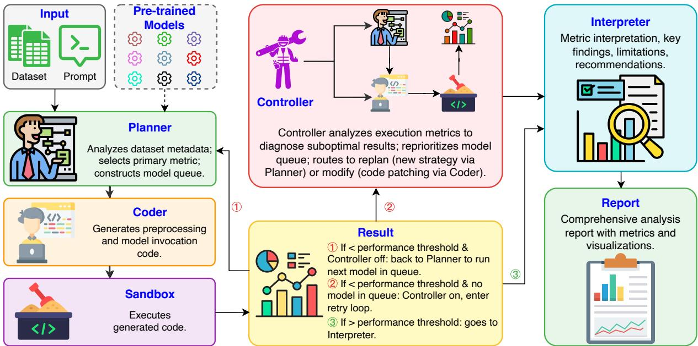
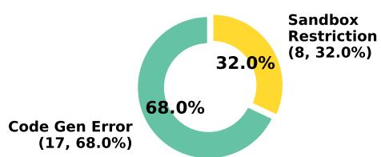
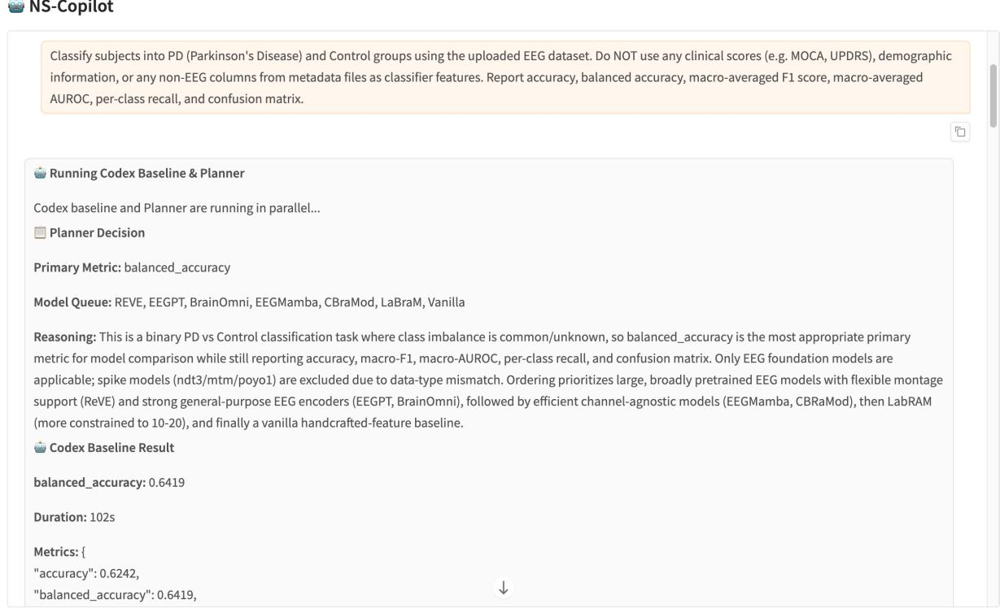
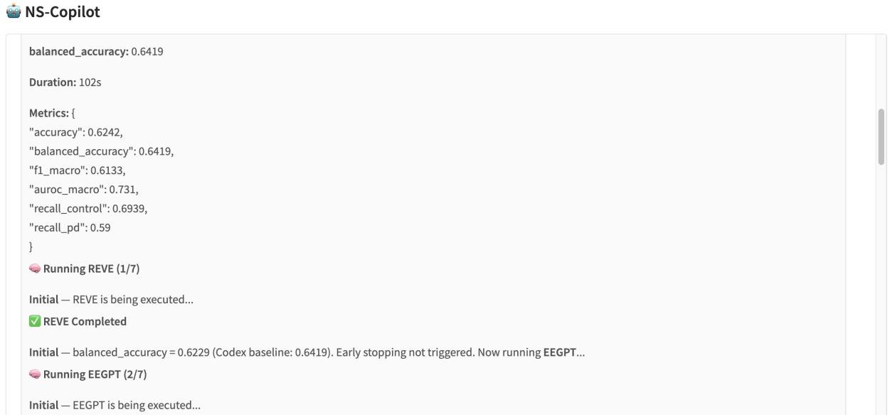
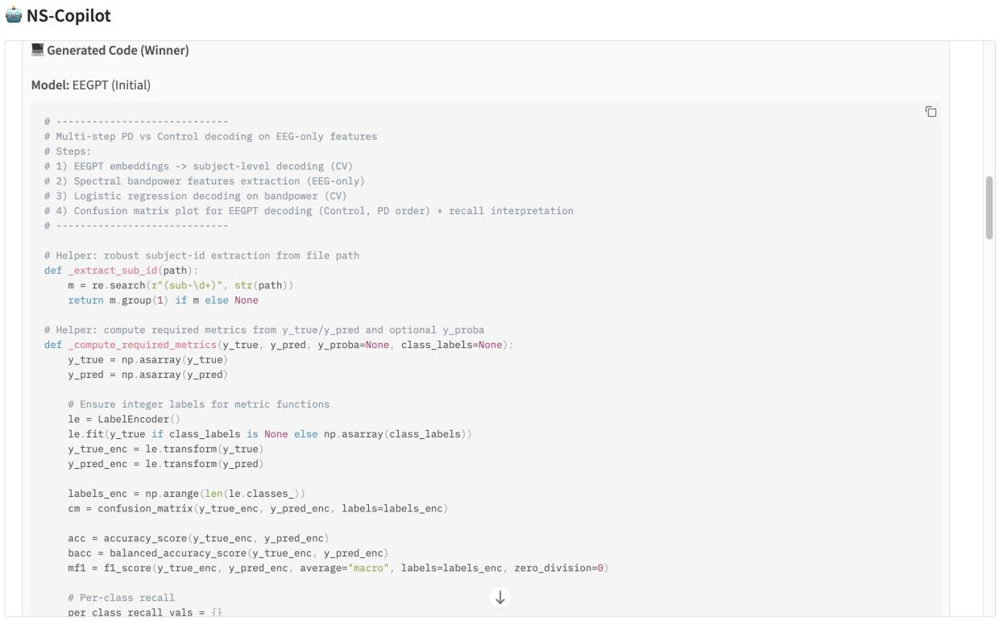
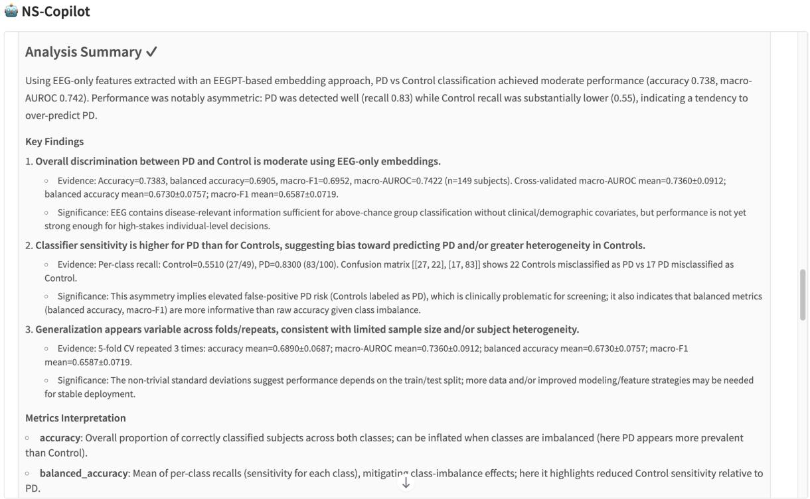
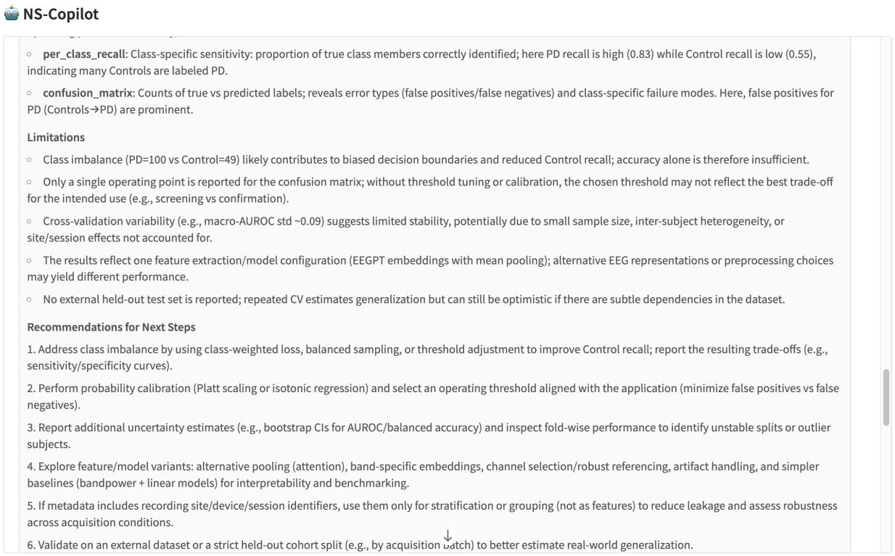
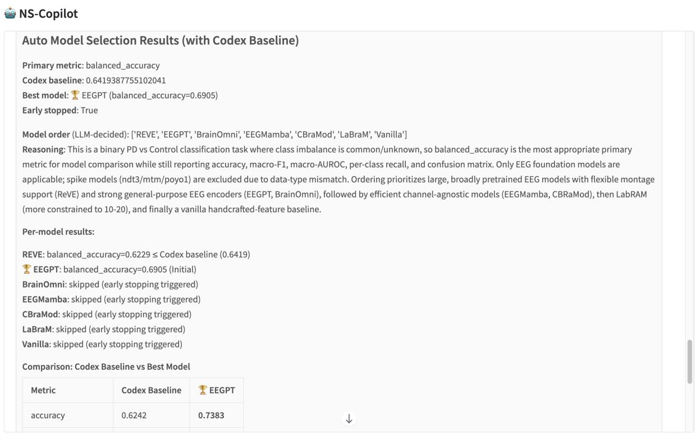
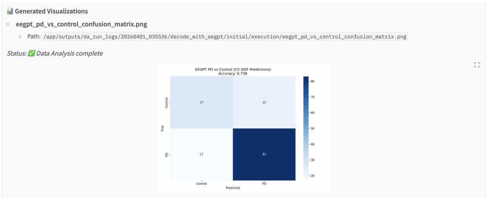

# NS-Copilot: An LLM-Driven Agent System for Autonomous Neuroscience Analysis

Wuche Liu1, Yiran Qiao1, Linlin Hou1, Rui Yang1, Shusen Pu2, Song Wang3, Jing Ma1

1Department of Computer and Data Sciences, Case Western Reserve University,

Cleveland, OH 44106, USA

2Department of Mathematics and Statistics, University of West Florida, Pensacola, FL 32514, USA

3Department of Computer Science, University of Central Florida, Orlando, FL 32816, USA

Correspondence: wxl713@case.edu, jing.ma5@case.edu

## Abstract

AI is rapidly advancing neuroscience, yet many laboratories fail to fully unleash its potential due to significant interdisciplinary barriers. While pre-trained neural models for physiological data are progressing quickly, their heterogeneous architectures and modality-specific constraints hinder systematic integration, selection, and evaluation. Despite recent advances in large language model (LLM)-based agent systems for intelligent scientific applications, existing approaches often still lack the domain expertise required to effectively select and coordinate diverse neuroscience pre-trained models and handle unique data types in this domain. We present NS-Copilot, an LLM-driven multi-agent system for neuroscience analysis that autonomously supports end-to-end work flows for diverse professional tasks. It unifies domain-specific pre-trained models and supports key neuroscience modalities, including EEG and extracellular spike data, through a natural-language interface. Given raw data and a task description, NS-Copilot orchestrates agents with specialized roles for planning, adaptive control, code generation, and result synthesis, enabling analysis without dataset-specific heuristics. We evaluate NS-Copilot on neuroscience benchmarks spanning Alzheimer’s disease, Parkinson’s disease, and working memory spike decoding. Across 8 trials per task, the system consistently outperforms strong baselines on the primary metric, demonstrating the ability of NS-Copilot for effective and scalable neuroscience analysis.

## 1 Introduction

Although AI is driving rapid progress in neuroscience, substantial interdisciplinary barriers still limit the field’s ability to fully realize its potential. Pre-trained neural models for physiological data have advanced quickly (Jiang et al., 2024; Ouahidi et al., 2025; Ye et al., 2025; Azabou et al., 2023), but their heterogeneous architectures and modalityspecific constraints make systematic integration, model selection, and rigorous evaluation challenging (Xiong et al., 2026; Kastrati et al., 2025). Meanwhile, despite recent progress in both scientific and general-purpose LLM-based agent systems (Shen et al., 2023; Huang et al., 2026), most primarily rely on code generation or generic data analysis and machine learning toolkits which are often ill-suited for domain-specific applications, and lack the domain expertise needed to effectively select and coordinate diverse pre-trained neuroscience models and handle highly specialized data types. This gap highlights the need for an autonomous system that can support end-to-end neuroscience analysis workflows.

Despite its importance, this problem still presents three core challenges. First, bridging the interface gap between raw data and modelspecific input requirements. Many pre-trained neuroscience models expect data in a highly specific and domain-dependent format, which includes particular sampling rates, channel layouts, and tensor shapes. This strict requirement reflects the deep architectural heterogeneity across the ecosystem. Preparing raw recordings to satisfy these stringent constraints requires an extremely deep understanding of both the underlying dataset structure and the target model’s preprocessing pipeline, posing a prohibitive barrier for non-expert users. Second, selecting the optimal method or model for a specific neuroscience dataset and task. The ideal choice depends on a complex interplay of multiple factors: data modality (e.g., EEG vs. extracellular spikes), channel configuration, recording paradigm, and specific classification objectives. Since no single pre-trained architecture dominates across all conditions, the choice must be made per dataset. General-purpose AutoML systems (Erickson et al., 2020) do not search over domain-specific pre-trained models, and EEG benchmarks (Xiong et al., 2026) standardize evaluation but require manual per-model configuration. Third, adaptively optimizing the analytical workflow based on execution outcomes. Even when a suitable model is selected and the data is correctly formatted, the generated pipeline may yield suboptimal performance due to misaligned hyperparameters, ineffective feature engineering, or flawed evaluation strategies. Recovering from such failures requires conducting a diagnosis of the root cause and determining an optimization strategy to adaptively adjust the workflow, going beyond the code-level error correction addressed by existing self-repair methods (Chen et al., 2024; Shinn et al., 2023).

We propose NS-Copilot, an autonomous LLMdriven agent system for neuroscience analysis, which addresses the three aforementioned challenges through a unified pipeline, requiring only raw neural data and a natural-language task descrip tion. NS-Copilot integrates multiple pre-trained neuroscience models in different applications. To bridge the interface gap, a Coder agent automatically generates data preprocessing and model invocation code at runtime based on declarative tool specifications (which describe the input requirements of each model) inside our system. To resolve model selection, a Planner agent automatically analyzes user input and dataset metadata (modality, channel count, sampling rate, and class distribution), determines appropriate evaluation metrics, and constructs a dynamically prioritized queue of compatible models for selection. To achieve adaptive optimization, a Controller agent analyzes execution metrics, diagnoses the root causes of suboptimal results, and dynamically routes the system toward targeted code patching (modify) or full strategy resynthesis by the Planner (replan). In the end, an Interpreter summarizes the final evaluation results.

In summary, our core contributions are as follows:

• Unified pre-trained model orchestration framework. We propose NS-Copilot, a novel LLM-driven agent system that first integrates nine representative pre-trained models across different neuroscience data modalities and tasks, achieving fully automated neuroscience analysis without dataset-specific heuristics.

• Automated model selection. We design the Auto Model Selection protocol, in which the Planner in NS-Copilot automatically analyzes dataset characteristics and user intention to determine the primary evaluation metric and construct a prioritized queue of compatible models, with early stopping triggered once a candidate surpasses a performance threshold.

• Closed-loop diagnosis with explicit modifyvs-replan routing. We design an autonomous Controller that diagnoses suboptimal execution outcomes and explicitly routes between targeted code patching (modify) and full strategy resynthesis (replan), enabling iterative optimization without human intervention.

• Empirical validation across diverse neural paradigms. We evaluate NS-Copilot on three benchmarks encompassing Alzheimer’s disease, Parkinson’s disease, and working memory decoding, where it outperforms every baseline on the primary metric of each.

## 2 Related Work

Neural foundation models for brain data. Pretrained foundation models for neural recording data can be broadly categorized by their target modalities. For macroscopic EEG signals, a rapidly growing family of self-supervised models aims to learn generalizable representations from large-scale clinical and research corpora. Representative works include LaBraM (Jiang et al., 2024), CBraMod (Wang et al., 2025a), REVE (Ouahidi et al., 2025), EEGPT (Wang et al., 2024), EEGMamba (Wang et al., 2025b), and BrainOmni (Xiao et al., 2025), with architectures ranging from Transformers to state-space models, and pretraining scales from 2,500 hours to over 60,000 hours. Models such as NeuroLM (Jiang et al., 2025a), BIOT (Yang et al., 2023), and Neuro-GPT (Cui et al., 2024) further expand this ecosystem. For extracellular spike recordings, models like NDT3 (Ye et al., 2025), MtM (Zhang et al., 2024), and POYO-1 (Azabou et al., 2023) target multi-electrode array data, employing autoregressive prediction, multitask masking, and cross-attention mechanisms, respectively, to learn transferable neural dynamics across sessions and brain regions. Notably, NDT3 further demonstrates cross-species generalization spanning non-human primates and human participants. Despite this rapid progress, the ecosystem remains highly fragmented. Each model possesses distinct input constraints, including specific channel montages, sampling rates, and data formats, making cross-model comparisons laborious and error-prone. Recent benchmarking efforts, such as EEG-FM-Bench (Xiong et al., 2026) and EEG-Bench (Kastrati et al., 2025), have begun standardizing the evaluation of EEG models; however, these benchmarks require manual configuration on a permodel basis and do not cover the spike modality. Crucially, to our knowledge, no existing framework provides a unified interface to automatically select, invoke, and evaluate these heterogeneous models based on the characteristics of unseen datasets.

Scientific agents. Several systems have attempted to utilize LLMs as agents for scientific data analysis. EEGAgent (Zhao et al., 2025) uses LLMs to orchestrate EEG analysis tools but does not generate or execute code within a closed loop. NeuroWeaver (Wang et al., 2026) formalizes EEG pipeline design as an evolutionary code search problem with self-debugging, but it only targets a single modality and does not invoke pre-trained foundation models. SciDataCopilot (Rao et al., 2026) provides an agentic data preparation framework for EEG and MEG workflows, featuring code generation and execution capabilities, but its tool space contains only preprocessing routines rather than foundation models. Biomni (Huang et al., 2026) is a general-purpose biomedical agent that integrates over 150 tools and supports retrieval-augmented planning and code execution, but it is oriented toward broad biomedical tasks rather than neural recording analysis. NOBEL (Tang et al., 2026) unifies the representations of EEG, MEG, and fMRI within an LLM backbone, but it exists as a single end-to-end model rather than an orchestrating agent for multiple independent foundation models. Concurrent systems SpikeAgent (Lin et al., 2025) and BCI-Agent (Marin-Llobet et al., 2025) apply LLM/VLM agents to spike sorting and celltype classification, respectively, both with narrower scope. None of the aforementioned systems integrate multiple pre-trained neural foundation models in the neuroscience domain into a unified orchestration pipeline to achieve automated model selection, code generation, execution, and evaluation.

General agents. In the domain of general agents, AutoML systems such as AutoGluon (Erickson et al., 2020), FLAML (Wang et al., 2021), and Auto-sklearn (Feurer et al., 2022) automate model selection and hyperparameter tuning for traditional machine learning models, but their search spaces do not include domain-specific pre-trained foundation models. HuggingGPT (Shen et al., 2023)

and TaskMatrix.AI (Liang et al., 2023) demonstrate LLM-driven selection of pre-trained expert models, yet their selection relies on task semantics and model descriptions rather than the characteristics of the input data. Regarding code self-repair, Self-Debugging (Chen et al., 2024) teaches LLMs to debug their own code through execution feedback, Reflexion (Shinn et al., 2023) accumulates experience across attempts using language reinforcement learning, and Self-Refine (Madaan et al., 2023) iteratively generates feedback and revisions without requiring additional training. These methods primarily address code-level errors (syntax and runtime exceptions). Our Controller extends this paradigm to the analysis of execution metrics, diagnoses the root causes of poor results, and explicitly chooses between targeted code patching and full replanning. Such modify-vs-replan routing has been explored in general ML-engineering agents (Jiang et al., 2025b; Sun et al., 2023); to our knowledge, however, no LLM agent for closedloop neuroscience data analysis adopts this routing as its Controller’s core mechanism.

## 3 Method

## 3.1 Overview

NS-Copilot is a fully automated multi-agent framework that enables users to complete end-to-end neuroscience analyses by providing only raw neural data and a natural-language task description. As illustrated in Figure 1, the system is collaboratively driven by four LLM agents (Planner, Coder, Controller, and Interpreter). Upon initiation, the Planner analyzes the input to determine whether suitable pre-trained models are available; if not, it generates code directly. It then constructs a prioritized queue of pre-trained models based on dataset characteristics and the user’s intent. The user may optionally specify a desired performance threshold, which the system uses as a stopping criterion to trigger early termination once the target is achieved. If not provided, the system automatically determines an appropriate threshold. Subsequently, the system sequentially runs each model within the prioritized queue, and early stopping is triggered the moment the performance threshold is exceeded; however, if all models fail to surpass the threshold, the Controller intervenes to diagnose and optimize the models sequentially. Ultimately, the Interpreter generates a comprehensive report containing metric interpretations and recommendations.

  
Figure 1: Overview of the NS-Copilot system. Left column: The user provides a dataset and a natural language prompt for task description. A registry of pre-trained models is available to the Planner via declarative tool specifications in the system. The Planner adaptively selects a primary metric, constructs a prioritized model queue, and generates an analysis plan. The Coder then synthesizes code for data preprocessing and model invocation, which is executed within a sandboxed environment. Center column: The Result module compares execution outcomes against the performance threshold. If the current model fails to exceed this threshold and alternative models remain in the queue, the system proceeds to evaluate the next model (①). If the entire queue is exhausted without surpassing the threshold, the Controller activates a closed-loop retry mechanism (②). Here, it diagnoses suboptimal results, reprioritizes the model queue, and dynamically routes the execution to either a Replan phase (synthesizing a new strategy via the Planner) or a Modify phase (executing targeted code patches via the Coder). Conversely, if any result successfully exceeds the threshold, the pipeline immediately proceeds to the Interpreter (③). Right column: The Interpreter produces a final comprehensive report detailing metric interpretations, key findings, limitations, and recommendations.

## 3.2 Planner

The Planner serves as the orchestrating intelligence: it analyzes the structured dataset profile (e.g., modality, channel count, sampling rate, and class distribution), dynamically determines the optimal evaluation metric (e.g., utilizing balanced accuracy for imbalanced data and macro F1 for multiclass classification tasks), and constructs a priority queue of candidate models. This ranking is derived from model metadata (such as pre-trained modality, channel compatibility, and parameter scale) and is inferred entirely at runtime.

To satisfy users’ performance requirements, the system incorporates a performance threshold as a target criterion. The core premise of the Auto Model Selection protocol in our system is that pre-trained models do not always outperform carefully tuned traditional methods. This performance threshold is also important to rigorously quantify the utility of pre-trained models. Users may specify this threshold directly; if none is provided, it is derived empirically: an independent LLM programming agent (GPT-5.2-Codex; OpenAI, 2025) receives the same inputs to produce a competitive reference score.

Notably, Planner does not have access to the performance threshold score. This architecture rules out metric selection bias from the Planner: the choice of primary metric cannot be tuned to a score the Planner never observes, and is determined from the dataset profile and the task description alone. For each candidate model in the queue, the Planner formulates a targeted analysis plan (in JSON format) based on dataset characteristics and model constraints, specifying the tools to be used, the analytical steps, and the parameter configurations.

## 3.3 Coder

The Coder receives the analysis plan generated by the Planner, along with the dataset summary, and automatically generates complete Python scripts based on the tool specification. This process includes reading data from raw files, preprocessing to satisfy the input requirements of the target model (e.g., resampling and channel selection), invoking the model’s inference interface to extract features, constructing a downstream classifier, and evaluating performance. The generated code is executed in a sandboxed environment, and all evaluation metrics are automatically extracted.

NS-Copilot currently integrates nine domainspecific pre-trained neural models across two primary modalities, as shown in Table 1. These models encompass a wide range of target tasks, architectures, embedding dimensions (128 to 4096), and spatial constraints (ranging from a strict 10-20 montage to completely channel-agnostic layouts).

To manage this architectural diversity, all pretrained models are abstracted behind a unified tool API. Each model is strictly exposed as a stateless forward-inference endpoint, responsible solely for extracting latent representations; all subsequent downstream logic (such as temporal pooling and classification) is dynamically synthesized by the Coder at runtime. Each endpoint is accompanied by a structured specification (tool specification) detailing its operational constraints, such as supported modalities, acceptable channel counts, and target sampling rates.

## 3.4 Controller

If no candidate exceeds the performance threshold at the conclusion of the initial search phase, the Controller agent initiates the closed-loop optimization phase. Unlike standard LLM self-repair paradigms (which primarily focus on syntax errors or runtime exceptions), our Controller performs deep semantic debugging. By analyzing empirical execution metrics, it diagnoses the root causes of suboptimal performance and dynamically routes between two retry strategies.

At the beginning of each retry round, the Controller dynamically rearranges the search queue, elevating the priority of models that demonstrate the highest potential for improvement relative to the threshold. For each model in the updated queue, the Controller receives the complete execution trace: the synthesized code, empirical metrics, the previous analysis plan, dataset metadata, and the original user prompt. Leveraging this rich context, it identifies subtle performance anomalies (such as accuracy approaching random-chance levels or severe recall imbalances across classes) and formulates highly specific, actionable recommendations.

The Controller translates the diagnostic findings into discrete routing decisions, selecting between two optimization pathways:

Modify mode is triggered when the high-level logic is sound but local algorithmic adjustments are required (such as replacing the classifier, tuning regularization, or adjusting the feature extraction window). In this mode, the Planner is bypassed entirely; the previous scripts and the Controller’s targeted patching instructions are passed directly to the Coder.

Replan mode is invoked when empirical results indicate a fundamental flaw in the methodological approach (such as a completely inappropriate feature extraction paradigm). The diagnostic feedback is routed back to the Planner to synthesize an entirely new analysis strategy from scratch.

Consistent with the initial search phase, if the optimized model exceeds the performance threshold, early stopping is triggered immediately. Otherwise, the Controller proceeds to optimize the next model in the queue until the threshold is surpassed. If all models in the queue fail to exceed the threshold after a full retry round, the system enters the next retry round. To balance computational overhead and optimization efficacy, the framework sets a default limit of two retry rounds.

## 3.5 Interpreter

When the performance of a candidate model successfully exceeds the performance threshold (whether during the initial search or the Controller retry phase), the Interpreter is invoked to generate the final evaluation report. It receives the complete execution results, including the evaluation metrics (accuracy, balanced accuracy, macro F1, AUROC, and per-class recall), the confusion matrices, and the generated visualizations, to scientifically interpret the outcomes, summarize key findings, and propose recommendations for improvement. If no model exceeds the threshold after all retry rounds, the framework reports the best-performing model across all attempts along with its complete metrics.

## 4 Experiments

In this section, we present a comprehensive empirical evaluation of NS-Copilot across three distinct neuroscience benchmarks. Specifically, our experiments are designed to answer the following core research questions.

• RQ1: How does NS-Copilot perform compared with other agents and code generation baselines?

Table 1: Integrated pre-trained models. Embed. = dimension of the feature vector produced by each model’s forward pass in our system (after any pooling or token concatenation; may differ from the model’s internal hidden dimension); Ch. = channel constraint; Hz = target sampling rate; Std. pos. = standard electrode positions; Downstream tasks = representative evaluation tasks reported in the original paper. Models are grouped by modality: spike (top) and EEG (bottom).
<table><tr><td>Model</td><td>Modality</td><td>Embed.</td><td>Ch.</td><td>Hz</td><td>Downstream Tasks</td></tr><tr><td>NDT3 (Ye et al., 2025)</td><td>Spike</td><td>1024</td><td></td><td></td><td>Motor decoding (cursor control, reaching, bimanual)</td></tr><tr><td>MtM (Zhang et al., 2024)</td><td>Spike</td><td>512</td><td></td><td></td><td>Co-smoothing, forward prediction, choice decoding</td></tr><tr><td>POYO-1 (Azabou et al., 2023)</td><td>Spike</td><td>128</td><td></td><td></td><td>Motor decoding (hand velocity, cross-session transfer)</td></tr><tr><td>LaBraM (Jiang et al., 2024)</td><td>EEG</td><td>200</td><td>10-20</td><td>200</td><td>Abnormal detection, event classifica- tion, emotion recognition</td></tr><tr><td>REVE (Ouahidi et al., 2025)</td><td>EEG</td><td>1536</td><td>Any</td><td>200</td><td>Motor imagery, sleep staging, emo- tion recognition, abnormal detection</td></tr><tr><td>CBraMod (Wang et al., 2025a)</td><td>EEG</td><td>600</td><td>Any</td><td>200</td><td>Emotion recognition, motor imagery,</td></tr><tr><td>EEGPT (Wang et al., 2024)</td><td>EEG</td><td>2048</td><td>10-10</td><td>256</td><td>sleep staging, seizure detection Motor imagery, ERP detection, sleep</td></tr><tr><td>EEGMamba (Wang et al., 2025b)</td><td>EEG</td><td>600</td><td>Any</td><td>200</td><td>staging Emotion recognition, motor imagery, sleep staging, seizure detection</td></tr><tr><td>BrainOmni (Xiao et al., 2025)</td><td>EEG</td><td>4096</td><td>Std. pos.</td><td>256</td><td>AD/PD classification, emotion recognition, motor imagery, abnor- mal detection</td></tr></table>

• RQ2: To what extent does the Controller’s closed-loop optimization contribute to the overall system performance?

• RQ3: How do pre-trained models benefit the system?

• RQ4: What are the primary failure modes of the whole system?

## 4.1 Datasets

We evaluate NS-Copilot on three publicly available neural datasets: (1) AD EEG (Alzheimer’s Disease; OpenNeuro ds004504 (Miltiadous et al., 2024)): resting-state EEG from 88 subjects, 19- channel 10-20 montage, 3-class classification (AD/FTD/Healthy); (2) PD EEG (Parkinson’s Disease; OpenNeuro ds004584 (Singh et al., 2023)): resting-state EEG from 149 subjects, 64-channel 10-10 montage, binary classification (PD/Control); (3) WM Spikes (Working Memory; DANDI 000006 (Economo and Svoboda, 2022)): extracellular spike recordings during a delayed-response task, binary decoding of left vs. right lick decisions.

We use one session of 79 units and the 256 trials that remain after applying the dataset’s own quality flag and removing early-lick and no-response trials. These benchmarks span three distinct neuroscience scenarios (Alzheimer’s disease classification, Parkinson’s disease classification, and cognitive working memory decoding), two recording modalities, diverse channel configurations (19–64 channels), and both binary and multi-class tasks.

Data leakage audit. Every pre-trained model is used as a frozen feature extractor, so if a benchmark overlaps with a model’s pre-training corpus, strong results may reflect prior exposure rather than genuine transferability. Considering this, we audited all nine models against the three accession identifiers, and also at the level of the underlying cohort, since one cohort can be released under several identifiers. None of the three is part of any model’s pre-training corpus; Appendix B gives the per-model details. We note only one case of potential partial exposure. BrainOmni uses ds004504 (same as ours in AD) as a downstream benchmark of its own, so its released checkpoint was developed with visibility into results on that dataset. Its task there was a two-class subset of 65 of the 88 subjects; however, ours is three classes over all 88, and the backbone is frozen throughout our experiments: we do not fine-tune it on ds004504, so the exposure is limited to what the released checkpoint already carries.

## 4.2 Experimental Setup

For each benchmark, we conduct 8 independent trials, reporting the mean ± standard deviation across all metrics. Each trial represents a fully autonomous, end-to-end execution, spanning from raw data ingestion to final report generation without any manual intervention.

Evaluation metrics. The Planner dynamically determines the primary optimization metric based on dataset metadata: macro F1 for the 3-class AD task, and balanced accuracy for the binary PD and WM tasks. To provide a comprehensive evaluation, we additionally track accuracy, AUROC, and perclass recall across all experiments.

Baselines. We compare NS-Copilot against three categories of baselines: general agents (AutoML-Agent (Trirat et al., 2025), LAMBDA (Sun et al., 2026), AutoGen (Wu et al., 2023)), scientific agents (SciAgents (Ghafarollahi and Buehler, 2024)), and code generation baselines (Claude-Sonnet-4.5 (Anthropic, 2025), GPT-5.2-Codex (OpenAI, 2025)). The Codex score establishes the performance threshold required to trigger early stopping.

Execution and computational budget. All synthesized scripts are executed within a sandboxed environment inside a Docker container, with restricted imports, controlled builtins, and execution timeouts. A single script execution is allowed 300 s; a script that exceeds it is recorded as a failed attempt and contributes a score of zero to that seed. This budget is uniform across models, so it penalizes the models that need the most compute per trial, and Appendix E shows that one model, BrainOmni, is affected badly enough to distort its reported result. If the initial search phase fails to yield a model that exceeds the baseline threshold, the Controller’s closed-loop optimization is strictly constrained to a default budget of two retry iterations before termination.

## 4.3 RQ1: Overall Performance

Table 2 summarizes the main results across all three benchmarks; the complete per-model, per-stage results for AD and PD are given in Appendix D. NS-

Copilot outperforms the state-of-the-art baselines on the primary metric of all three datasets and on eight of the nine reported predictive metrics (the exception is AUROC on WM), demonstrating that our agent system yields meaningful gains through automatic planning and domain-specific pre-trained model integration.1 While NS-Copilot exhibits a higher execution time due to multiple model trials and the overhead of running pre-trained models, this temporal cost is well justified by the resulting performance improvements and the complete elimination of manual, human-in-the-loop pipeline engineering. A complementary evaluation on a held-out test fold, run with queue search, early stopping and the Controller all switched off, is reported in Appendix C.

## 4.4 RQ2: Effect of the Controller

To evaluate the contribution of the Controller module, we measure the performance of our system across three distinct stages: (1) Initial Run, where the Planner generates an analysis plan and the Coder produces executable code with up to three self-correction attempts for runtime errors, yet without Controller intervention; (2) + Retry 1, where the Controller diagnoses the Initial result by identifying anomalies and issuing targeted recommendations, subsequently triggering a full replanor-modify cycle; and (3) + Retry 2, where the Controller diagnoses the execution once more to trigger a second optimization cycle. We run this ablation on AD, over Vanilla and five pre-trained models (BrainOmni is excluded; see the caption), with the same 8 independent seeds for each configuration (48 runs). Table 3 reports the change in Macro F1 relative to the Initial Run for the forced Retry 2 round and for the value the system returns, together with the seed-to-seed standard deviation of Retry 2 and of the returned value.

Table 3 separates two things the Controller does. The forced exploration is close to neutral on AD: two retry rounds move the mean by −0.11 pp and improve as many runs as they degrade (20 against 20 of 48). What the system returns, the best of the three rounds for each seed, is +3.80 pp above the initial round and is worse than it on none of the 48 runs. A retry round is a fresh point in the configuration space rather than a refinement of the previous one: Modify mode substitutes the classifier, the regularization or the feature window, and Replan mode discards the previous plan and synthesizes a new strategy from scratch. The Controller routes between the two on the evidence of a single score, and when the shortfall is small that score carries more noise than signal; nothing requires the new result to beat the old one before it is recorded. A round that lands on a worse point is therefore an expected cost of exploring. The Controller’s contribution lies in retaining the best round rather than in the exploration itself, and the two ∆ columns are designed to disentangle these effects.

Table 2: Performance comparison with baselines (mean ± std over 8 trials). Primary Metric auto-selected by the Planner: Macro F1 (AD), Balanced Accuracy (PD/WM). $E f f . = \mathrm { a v g }$ execution time (s). Best in bold. NS-Copilot uses online early-stopping; per-seed winners: AD = REVE/BrainOmni/Vanilla, PD = Vanilla/LaBraM, WM = Vanilla/POYO-1.
<table><tr><td>Dataset</td><td>Method</td><td>Primary Metric (%)</td><td> $\mathbf { A c c . } \left( \% \right)$ </td><td>AUROC (%)</td><td>Eff. (s)</td></tr><tr><td rowspan="6">AD EEG</td><td>AutoML-Agent (Trirat et al., 2025)</td><td> $5 . 5 5 \pm 1 5 . 7 1$ </td><td> $6 . 9 5 \pm 1 9 . 6 4$ </td><td> $9 . 3 8 \pm 2 6 . 5 2$ </td><td>255</td></tr><tr><td>LAMBDA (Sun et al., 2026)</td><td> $4 3 . 5 7 \pm 3 8 . 2 8$ </td><td> $4 5 . 3 7 \pm 3 9 . 3 3$ </td><td> $5 4 . 9 9 \pm 4 5 . 8 3$ </td><td>100</td></tr><tr><td>AutoGen (Wu et al., 2023)</td><td> $2 6 . 7 5 \pm 1 1 . 7 0$ </td><td> $3 2 . 7 5 \pm 1 0 . 5 9$ </td><td> $4 4 . 2 5 \pm 1 9 . 9 5$ </td><td>103</td></tr><tr><td>Claude-Sonnet-4.5</td><td> $4 8 . 7 0 \pm 6 . 5 8$ </td><td> $5 1 . 0 0 \pm 7 . 1 8$ </td><td> $6 8 . 4 7 \pm 3 . 2 7$ </td><td>304</td></tr><tr><td>Codex</td><td> $5 1 . 0 1 \pm 2 . 5 2$ </td><td> $5 3 . 9 8 \pm 2 . 9 8$ </td><td> $6 9 . 8 1 \pm 1 . 1 5$ </td><td>68</td></tr><tr><td>NS-Copilot</td><td> ${ \bf 5 7 . 1 6 \pm 5 . 7 1 }$ </td><td> ${ \bf 6 0 . 5 7 \pm 4 . 3 2 }$ </td><td> ${ \pm \mathbf { 5 . 0 9 } \pm \mathbf { 4 . 8 3 } }$ </td><td>425</td></tr><tr><td rowspan="6">PD EEG (Bal. Acc.↑)</td><td>AutoML-Agent (Trirat et al., 2025)</td><td> $1 7 . 3 9 \pm 3 2 . 2 9$ </td><td> $1 8 . 3 3 \pm 3 3 . 9 5$ </td><td> $1 9 . 9 0 \pm 3 7 . 0 1$ </td><td>293</td></tr><tr><td>LAMBDA (Sun et al., 2026)</td><td> $0 . 0 0 \pm 0 . 0 0$ </td><td> $0 . 0 0 \pm 0 . 0 0$ </td><td> $0 . 0 0 \pm 0 . 0 0$ </td><td>284</td></tr><tr><td>AutoGen (Wu et al., 2023)</td><td> $6 . 2 5 \pm 1 7 . 6 8$ </td><td> $8 . 3 8 \pm 2 3 . 6 9$ </td><td> $6 . 2 5 \pm 1 7 . 6 8$ </td><td>308</td></tr><tr><td>Claude-Sonnet-4.5</td><td> $6 5 . 1 2 \pm 3 . 2 7$ </td><td> $7 0 . 9 9 \pm 1 . 5 4$ </td><td> $7 4 . 0 7 \pm 3 . 5 2$ </td><td>516</td></tr><tr><td>Codex</td><td> $6 5 . 5 2 \pm 7 . 9 8$ </td><td> $6 4 . 9 5 \pm 1 2 . 8 7$ </td><td> $7 1 . 0 7 \pm 8 . 2 3$ </td><td>125</td></tr><tr><td>NS-Copilot</td><td> ${ \bf 7 1 . 3 2 \pm 2 . 9 7 }$ </td><td> ${ \bf 7 1 . 9 1 \pm 1 . 8 7 }$ </td><td> ${ \bf 7 8 . 1 5 \pm 1 . 2 1 }$ </td><td>975</td></tr><tr><td rowspan="7">WM Spikes (Bal. Acc.↑)</td><td>AutoML-Agent (Trirat et al., 2025)</td><td> $1 8 . 8 8 \pm 2 6 . 0 5$ </td><td> $2 0 . 6 2 \pm 2 8 . 4 8$ </td><td> $1 9 . 0 0 \pm 2 6 . 2 3$ </td><td>196</td></tr><tr><td>LAMBDA (Sun et al., 2026)</td><td> $7 0 . 6 2 \pm 3 . 1 1$ </td><td> $7 2 . 0 0 \pm 3 . 6 6$ </td><td> $7 8 . 5 0 \pm 4 . 3 8$ </td><td>66</td></tr><tr><td>AutoGen (Wu et al., 2023)</td><td> $5 5 . 0 0 \pm 0 . 0 0$ </td><td> $5 6 . 0 0 \pm 0 . 0 0$ </td><td> $5 9 . 0 0 \pm 0 . 0 0$ </td><td>20</td></tr><tr><td>SciAgents (Ghafarollahi and Buehler, 2024)</td><td> $5 0 . 0 0 \pm 0 . 0 0$ </td><td> $5 1 . 0 0 \pm 0 . 0 0$ </td><td> $5 9 . 0 0 \pm 0 . 0 0$ </td><td>40</td></tr><tr><td>Claude-Sonnet-4.5</td><td> $7 3 . 9 7 \pm 6 . 9 9$ </td><td> $7 4 . 7 6 \pm 7 . 0 5$ </td><td> ${ \bf 8 3 . 8 9 \pm 6 . 7 0 }$ </td><td>164</td></tr><tr><td>Codex</td><td> $7 2 . 5 8 \pm 1 . 6 8$ </td><td> $7 2 . 7 7 \pm 1 . 9 4$ </td><td> $7 8 . 8 7 \pm 2 . 2 3 $ </td><td>97</td></tr><tr><td>NS-Copilot</td><td> ${ \bf 7 4 . 4 3 \pm 3 . 1 8 }$ </td><td> ${ \bf 7 4 . 8 1 \pm 2 . 9 3 }$ </td><td> $8 0 . 9 3 \pm 4 . 2 2$ </td><td>470</td></tr></table>

Table 3: Ablation of the Controller on AD, over all six pre-trained and vanilla configurations and eight seeds each (48 runs). ∆ (exploration) is Retry 2 minus the initial round: what two forced rounds change on their own. ∆ (returned) is what the system reports, the best of the three rounds for each seed, minus the initial round; it cannot be negative by construction, so the quantity of interest is its size, not its sign. The last two columns give the seed-to-seed standard deviation of Retry 2 and of the returned value. Bold marks the three configurations where selecting the best round left the output less dispersed than Retry 2. BrainOmni is excluded: its AD figures are distorted by execution timeouts (Appendix E).
<table><tr><td>Configuration</td><td>△ (exploration)</td><td>△ (returned)</td><td>Retry 2 (std)</td><td>Returned (std)</td></tr><tr><td>Vanilla</td><td>-2.32</td><td>+2.54</td><td>9.53</td><td>4.97</td></tr><tr><td>LaBraM</td><td>-2.18</td><td>+3.50</td><td>3.79</td><td>6.71</td></tr><tr><td>REVE</td><td>-2.91</td><td>+0.65</td><td>5.24</td><td>3.40</td></tr><tr><td>CBraMod</td><td>+3.48</td><td>+7.38</td><td>6.91</td><td>9.12</td></tr><tr><td>EEGPT</td><td>-2.36</td><td>+1.22</td><td>11.00</td><td>3.65</td></tr><tr><td>EEGMamba</td><td>+5.62</td><td>+7.51</td><td>6.53</td><td>6.79</td></tr><tr><td>Mean</td><td>-0.11</td><td>+3.80</td><td></td><td></td></tr><tr><td>Runs improved / degraded (rest unchanged)</td><td>20/ 20</td><td>25/0</td><td></td><td></td></tr></table>

This also explains the standard deviations. They grow across the forced rounds because exploration is genuinely erratic: for each of the six configurations, the largest per-stage standard deviation of Macro F1 in Table 5 falls in Retry 1 or Retry 2 rather than in the initial round. One EEGPT seed collapses in Retry 2, which alone lifts that round’s standard deviation to 11.00. The selection rule discards that round, and the returned standard deviation is 3.65. The dispersion of the forced rounds describes the search, not the output. The forced exploration is more clearly harmful on PD, where

Table 6 puts Retry 2 an average of −2.34 pp in Balanced Accuracy below the initial round over the same six configurations.

## 4.5 RQ3: Effect of Pre-trained Models

To quantify the benefit of pre-trained neural mod els, we compare the vanilla pipeline (handcrafted spike-count features) against POYO-1 on the WM task, with the model fixed in advance and both arms scored on the same held-out partition for each of the 8 seeds. POYO-1 yields a consistent gain of +6.82 pp in Balanced Accuracy on the held-out evaluation $( 7 5 . 3 0 \pm 8 . 3 9 \mathrm { v s . 6 8 . 4 8 \pm 7 . 4 9 ) }$ , favoring the pre-trained model on 7 of 8 seeds (Table 4). This improvement is consistent with POYO-1’s PerceiverIO architecture, which is designed for variable neuron counts; our comparison is end-to-end and does not isolate that property. These results indicate that pre-trained models can provide mean ingful representational advantages over classical features, and that the size of the advantage varies by task, from +13.34 pp on AD to a near-tie on PD (+0.68; Table 4). It is that variation which motivates the automated model selection proto col at the core of NS-Copilot. It is worth being explicit about where the advantage comes from. Codex and Claude-Sonnet-4.5 in Table 2 are pure LLM agents: they receive the same task descrip tion and write their own analysis code, with no pre-trained neural model available. The Vanilla configuration is our architecture with those models removed, and on the two benchmarks with full per stage results its initial round scores below Codex (49.80 vs. 51.01 on AD and 64.52 vs. 65.52 on PD; Tables 5 and 6). Orchestration on its own therefore does not beat a single-shot LLM agent. What the comparison isolates is the integration itself: mak ing nine pre-trained models addressable through one interface, and choosing among them per task, is what produces the gain. The held-out evaluation of Appendix C is also what separates that gain from adaptive selection: there the queue search, the early stopping and the Controller retry loop are all switched off and the model is fixed in advance, so no part of the reported advantage can come from choosing the winner after the fact.

## 4.6 RQ4: Error Analysis

To systematically characterize the failure modes of our system, we analyze 325 execution attempts across the three benchmarks; a script that exceeds the 300 s budget is recorded as a failed attempt in the reported scores and is examined in Appendix E rather than counted here. The system achieves a 92.3% code-level success rate, leaving 25 code-level failures distributed across two primary categories (Figure 2). Code generation errors (68.0%) arise when the LLM produces scripts containing incorrect variable references or label format mismatches. Sandbox module restrictions (32.0%) occur when the generated code attempts to import libraries not permitted within the isolated execution environment. Both failure modes are non-catastrophic: they surface as explicit execution errors rather than as silently incorrect results, and a failure costs a candidate slot rather than the run, since the system continues through the prioritized queue and reports the best model across all attempts.

  
Figure 2: Error distribution: 25 code-level failures out of 325 attempts (92.3% code-level success rate).

## 5 Conclusion

We propose NS-Copilot, an autonomous LLMdriven agent system that unifies nine pre-trained models across EEG and spike modalities behind a single natural-language interface, integrating automated model selection, code generation, and closed-loop optimization. Across three benchmarks, NS-Copilot outperforms every baseline on the primary metric; ablations show that the gain comes from the pre-trained models rather than from orchestration alone, that the Controller’s value lies in keeping the best round rather than in the forced exploration, and that the optimal model varies across tasks. By lowering the barrier to advanced neuroscience analysis, NS-Copilot enables researchers without extensive AI expertise to leverage state-of-the-art models and accelerate data-driven discovery.

## Limitations

Current limitations include increased execution time and computational cost due to closed-loop evaluation, which is necessary to reliably explore candidate models and select the optimal method for each task. Instrumented per-agent token measurements indicate that NS-Copilot’s per-run cost is roughly 1.5–2× that of the single-step Codex baseline; this overhead is justified by the performance gains over Codex. Each of the three scenarios is represented by a single dataset. Adding further datasets within each scenario, so that the same protocol meets greater within-modality variation, is the direction in which we intend to grow the benchmark. Future work will extend the framework to incorporate additional neuroscience tools, add a dedicated validator agent that checks label alignment and output shapes, support new modalities such as fMRI and MEG, explore efficient orchestration strategies, and enable more complex, multi-step analysis workflows.

## Ethics Statement

Use of Large Language Models. This work uses LLMs as a core component of the proposed system: an LLM serves as the orchestration agent that selects pre-trained models, generates analysis code, and drives iterative optimization. Additionally, Claude (Anthropic) was used to assist with code development and paper grammar-checking during this research. LLMs were not used to generate any original research ideas or any original content. All LLM-generated content was reviewed and verified by the authors.

Datasets. All datasets used in this work are publicly available under open licenses. The Alzheimer’s/FTD EEG dataset (OpenNeuro ds004504) is released under CC0 (Public Domain). The Parkinson’s disease EEG dataset (Open-Neuro ds004584) is released under CC0 (Public Domain). The working memory spike dataset (DANDI 000006) is released under CC-BY 4.0. No private or restricted-access data was used. All datasets were collected by their original authors with appropriate ethical approvals as described in their respective publications.

Pre-trained Models. The nine integrated pretrained models are publicly available for research use. All model code is released under permissive open-source licenses (MIT or Apache 2.0). Model weights are distributed by their respective authors via GitHub, Hugging Face, or dedicated servers under varying terms: some under permissive licenses (MIT or Apache 2.0), some under non-commercial licenses (CC-BY-NC 4.0), and some with custom access agreements. REVE weights require accepting a gated access agreement on Hugging Face. Our framework does not redistribute any model weights; users download them directly from the original sources. We obtained access to all models and used them solely for non-commercial academic research in compliance with their respective terms.

Overall, this work does not raise any significant ethical concerns.

Broader Impact. Our framework is designed to lower the barrier for neuroscientists to leverage AI agents and domain-specific pre-trained models. While this democratization of access is broadly positive, we note that automated analysis pipelines should complement, not replace, domain expertise. Users should critically evaluate all outputs, particularly in clinical contexts where incorrect classifications could have downstream consequences. Overall, NS-Copilot represents a step toward more accessible, scalable, and trustworthy AI-driven neuroscience research.

## Reproducibility Statement

All source code, including the complete multiagent pipeline, tool specifications, and experiment scripts, is provided as supplementary material. To ensure reproducibility, the system is fully containerized via Docker (including the Dockerfile and Docker Compose configuration), enabling a seamless, single-command environment setup; Appendix F shows the web interface it exposes. Experimental reproduction is facilitated through run\_test.sh, which fixes the random seeds each run uses. Because the analysis code is written by the LLM agents at run time, a repeated run is not guaranteed to reproduce a given score exactly; every result we report is therefore a mean and standard deviation over eight seeds rather than a single figure. All datasets are publicly available: the AD EEG dataset (OpenNeuro ds004504, CC0), the PD EEG dataset (OpenNeuro ds004584, CC0), and the WM spike dataset (DANDI 000006, CC-BY 4.0). Furthermore, the weights for all nine pre-trained models are publicly accessible, and setup.sh downloads them automatically once the user has accepted the access terms set by the individual providers. The specific LLMs utilized in this study are GPT-5.2 (OpenAI, powering all four NS-Copilot agents), GPT-5.2-Codex (OpenAI, employed to establish the performance threshold), and Claude Sonnet 4.5 (Anthropic, serving as one of the baselines). Each agent baseline (AutoML-Agent, LAMBDA, AutoGen, SciAgents) was evaluated using its originally published default LLM configuration.

## References

Anthropic. 2025. Introducing Claude Sonnet 4.5.

Mehdi Azabou, Vinam Arora, Venkataramana Ganesh, Ximeng Mao, Santosh Nachimuthu, Michael J. Mendelson, Blake Richards, Matthew G. Perich, Guillaume Lajoie, and Eva L. Dyer. 2023. A unified, scalable framework for neural population decoding. In NeurIPS.

Xinyun Chen, Maxwell Lin, Nathanael Schärli, and Denny Zhou. 2024. Teaching large language models to self-debug. In ICLR.

Wenhui Cui, Woojae Jeong, Philipp Thölke, Takfarinas Medani, Karim Jerbi, Anand A. Joshi, and Richard M. Leahy. 2024. Neuro-GPT: Towards a foundation model for EEG. In IEEE International Symposium on Biomedical Imaging (ISBI), pages 1–5.

Michael N. Economo and Karel Svoboda. 2022. Mouse anterior lateral motor cortex (ALM) in delay response task. DANDI Archive. Dandiset 000006, version 0.220126.1855.

Nick Erickson, Jonas Mueller, Alexander Shirkov, Hang Zhang, Pedro Larroy, Mu Li, and Alexander Smola. 2020. AutoGluon-Tabular: Robust and accurate AutoML for structured data. In ICML AutoML Workshop.

Matthias Feurer, Katharina Eggensperger, Stefan Falkner, Marius Lindauer, and Frank Hutter. 2022. Auto-sklearn 2.0: Hands-free AutoML via metalearning. JMLR, 23(261).

Alireza Ghafarollahi and Markus J. Buehler. 2024. Sci-Agents: Automating scientific discovery through multi-agent intelligent graph reasoning. Preprint, arXiv:2409.05556.

Kexin Huang, Serena Zhang, Hanchen Wang, Yuanhao Qu, Yingzhou Lu, Ryan Li, Yusuf Roohani, Lin Qiu, Shiyi Cao, Gavin Li, Junze Zhang, Di Yin, Rick Wierenga, Deniz Kavi, Sherry Liu, Tianwei She, Shruti Marwaha, Jennefer N. Carter, Xin Zhou, and 9 others. 2026. Autonomous biomedical research with an artificial intelligence agent. Science, 393(6813):eadz4351.

Wei-Bang Jiang, Yansen Wang, Bao-Liang Lu, and Dongsheng Li. 2025a. NeuroLM: A universal multitask foundation model for bridging the gap between language and EEG signals. In ICLR.

Wei-Bang Jiang, Li-Ming Zhao, and Bao-Liang Lu. 2024. Large brain model for learning generic representations with tremendous EEG data in BCI. In ICLR.

Zhengyao Jiang, Dominik Schmidt, Dhruv Srikanth, Dixing Xu, Ian Kaplan, Deniss Jacenko, and Yuxiang Wu. 2025b. AIDE: AI-driven exploration in the space of code. Preprint, arXiv:2502.13138.

Ard Kastrati, Josua Bürki, Jonas Lauer, Cheng Xuan, Raffaele Iaquinto, and Roger Wattenhofer. 2025. EEG-Bench: A benchmark for EEG foundation models in clinical applications. Preprint, arXiv:2512.08959.

Yaobo Liang, Chenfei Wu, Ting Song, Wenshan Wu, Yan Xia, Yu Liu, Yang Ou, Shuai Lu, Lei Ji, Shaoguang Mao, Yun Wang, Linjun Shou, Ming Gong, and Nan Duan. 2023. TaskMatrix.AI: Completing tasks by connecting foundation models with millions of APIs. Preprint, arXiv:2303.16434.

Zuwan Lin, Arnau Marin-Llobet, Jongmin Baek, Yichun He, Jaeyong Lee, Wenbo Wang, Xinhe Zhang, Ariel J. Lee, Ningyue Liang, Jin Du, Jie Ding, Na Li, and Jia Liu. 2025. Spike sorting AI agent. bioRxiv. Preprint.

Aman Madaan, Niket Tandon, Prakhar Gupta, Skyler Hallinan, Luyu Gao, Sarah Wiegreffe, Uri Alon, Nouha Dziri, Shrimai Prabhumoye, Yiming Yang, Shashank Gupta, Bodhisattwa Prasad Majumder, Katherine Hermann, Sean Welleck, Amir Yazdanbakhsh, and Peter Clark. 2023. Self-refine: Iterative refinement with self-feedback. In NeurIPS.

Arnau Marin-Llobet, Zuwan Lin, Jongmin Baek, Almir Aljovic, Xinhe Zhang, Ariel J. Lee, Wenbo Wang, Jaeyong Lee, Hao Shen, Yichun He, Na Li, and Jia Liu. 2025. An AI agent for cell-type specific brain computer interfaces. bioRxiv. Preprint.

Andreas Miltiadous, Katerina D. Tzimourta, Theodora Afrantou, Panagiotis Ioannidis, Nikolaos Grigoriadis, Dimitrios G. Tsalikakis, Pantelis Angelidis, Markos G. Tsipouras, Evripidis Glavas, Nikolaos Giannakeas, and Alexandros T. Tzallas. 2024. A dataset of EEG recordings from: Alzheimer’s disease, Frontotemporal dementia and Healthy subjects. OpenNeuro. Dataset ds004504, version 1.0.8.

OpenAI. 2025. Introducing GPT-5.2-Codex.

Yassine El Ouahidi, Jonathan Lys, Philipp Thölke, Nicolas Farrugia, Bastien Pasdeloup, Vincent Gripon, Karim Jerbi, and Giulia Lioi. 2025. REVE: A foundation model for EEG – adapting to any setup with large-scale pretraining on 25,000 subjects. In NeurIPS.

Jiyong Rao, Yicheng Qiu, Jiahui Zhang, Juntao Deng, Shangquan Sun, Fenghua Ling, Hao Chen, Nanqing Dong, Zhangyang Gao, Siqi Sun, Yuqiang Li, Dongzhan Zhou, Guangyu Wang, Lijun Wu, Conghui He, Xuhong Wang, Jing Shao, Xiang Liu, Yu Zhu, and 13 others. 2026. SciDataCopilot: An agentic data preparation framework for AGI-driven scientific discovery. Preprint, arXiv:2602.09132.

Yongliang Shen, Kaitao Song, Xu Tan, Dongsheng Li, Weiming Lu, and Yueting Zhuang. 2023. Hugging-GPT: Solving AI tasks with ChatGPT and its friends in Hugging Face. In NeurIPS.

Noah Shinn, Federico Cassano, Ashwin Gopinath, Karthik Narasimhan, and Shunyu Yao. 2023. Reflexion: Language agents with verbal reinforcement learning. In NeurIPS.

Arun Singh, Rachel Cole, Arturo Espinoza, Jim Cavanagh, and Nandakumar Narayanan. 2023. Rest eyes open. OpenNeuro. Dataset ds004584, version 1.0.0.

Haotian Sun, Yuchen Zhuang, Lingkai Kong, Bo Dai, and Chao Zhang. 2023. AdaPlanner: Adaptive planning from feedback with language models. In Advances in Neural Information Processing Systems (NeurIPS).

Maojun Sun, Ruijian Han, Binyan Jiang, Houduo Qi, Defeng Sun, Yancheng Yuan, and Jian Huang. 2026. LAMBDA: A large model based data agent. Journal ofthe American Statistical Association, 121(553):1– 13.

Changli Tang, Shurui Li, Junliang Wang, Qinfan Xiao, Zhonghao Zhai, Lei Bai, Yu Qiao, Bowen Zhou, Wen Wu, Yuanning Li, and Chao Zhang. 2026. One brain, omni modalities: Towards unified non-invasive brain decoding with large language models. Preprint, arXiv:2602.21522.

Patara Trirat, Wonyong Jeong, and Sung Ju Hwang. 2025. AutoML-Agent: A multi-agent LLM framework for full-pipeline AutoML. In ICML.

Chi Wang, Qingyun Wu, Markus Weimer, and Erkang Zhu. 2021. FLAML: A fast and lightweight AutoML library. In MLSys, volume 3, pages 434–447.

Guangyu Wang, Wenchao Liu, Yuhong He, Cong Xu, Lin Ma, and Haifeng Li. 2024. EEGPT: Pretrained transformer for universal and reliable representation of EEG signals. In NeurIPS, volume 37, pages 39249–39280.

Guoan Wang, Shihao Yang, Jun-En Ding, and Feng Liu. 2026. NeuroWeaver: An autonomous evolutionary agent for exploring the programmatic space of EEG analysis pipelines. Preprint, arXiv:2602.13473.

Jiquan Wang, Sha Zhao, Zhiling Luo, Yangxuan Zhou, Haiteng Jiang, Shijian Li, Tao Li, and Gang Pan. 2025a. CBraMod: A criss-cross brain foundation model for EEG decoding. In ICLR.

Jiquan Wang, Sha Zhao, Zhiling Luo, Yangxuan Zhou, Shijian Li, and Gang Pan. 2025b. EEGMamba: An EEG foundation model with mamba. Neural Networks, 192:107816.

Qingyun Wu, Gagan Bansal, Jieyu Zhang, Yiran Wu, Beibin Li, Erkang Zhu, Li Jiang, Xiaoyun Zhang, Shaokun Zhang, Jiale Liu, Ahmed Hassan Awadallah, Ryen W White, Doug Burger, and Chi Wang. 2023. AutoGen: Enabling next-gen LLM applications via multi-agent conversation. Preprint, arXiv:2308.08155.

Qinfan Xiao, Ziyun Cui, Chi Zhang, Siqi Chen, Wen Wu, Andrew Thwaites, Alexandra Woolgar, Bowen Zhou, and Chao Zhang. 2025. BrainOmni: A brain foundation model for unified EEG and MEG signals. In NeurIPS.

Wei Xiong, Jiangtong Li, Jie Li, Kun Zhu, and Changjun Jiang. 2026. EEG-FM-Bench: A comprehensive benchmark for the systematic evaluation and diagnostic analyses of EEG foundation models. In ICML.

Chaoqi Yang, M. Brandon Westover, and Jimeng Sun. 2023. BIOT: Biosignal transformer for cross-data learning in the wild. In NeurIPS, volume 36, pages 78240–78260.

Joel Ye, Fabio Rizzoglio, Adam Smoulder, Hongwei Mao, Xuan Ma, Patrick Marino, Raeed Chowdhury, Dalton Moore, Gary Blumenthal, William Hockeimer, Nicolas G. Kunigk, J. Patrick Mayo, Aaron P. Batista, Steven Chase, Adam Rouse, Michael L. Boninger, Charles Greenspon, Andrew B. Schwartz, Nicholas G. Hatsopoulos, and 5 others. 2025. A generalist intracortical motor decoder. In NeurIPS.

Yizi Zhang, Yanchen Wang, Donato Jimenez-Beneto, Zixuan Wang, Mehdi Azabou, Blake Richards, Renee Tung, Olivier Winter, The International Brain Laboratory, Eva Dyer, Liam Paninski, and Cole Hurwitz. 2024. Towards a “universal translator” for neural dynamics at single-cell, single-spike resolution. In NeurIPS.

Sha Zhao, Mingyi Peng, Haiteng Jiang, Tao Li, Shijian Li, and Gang Pan. 2025. EEGAgent: A unified framework for automated EEG analysis using large language models. Preprint, arXiv:2511.09947.

## A Baseline Failure Modes

Several baselines exhibit below-chance performance, or produce no usable result at all, on AD, PD and WM; we attribute these to method-specific failures rather than unfair comparison. AutoML-Agent’s rigid Optuna-based search proved incompatible with our raw EEG inputs, causing pipeline crashes on 7/8 AD trials (returning 0). On the WM spike benchmark AutoML-Agent likewise failed to produce runnable code on 5 of 8 trials, which are scored as 0 and pull the mean below chance.

AutoGen consistently generated severely biased pipelines (e.g., 52% AD recall but 5% FTD recall on the 3-class task, indicating majority-class collapse). SciAgents, designed for hypothesis generation rather than supervised classification, produced a degenerate chance-level result on WM, the only benchmark on which we report it: its balanced accuracy is 50.00%, the chance level for a binary task, and its standard deviation is zero on all three reported metrics across the eight trials (Table 2). LAMBDA did not produce a parseable result on any of the PD trials we report: its sessions ended inside its own self-repair loop without printing final metrics, and such a trial contributes a score of zero under the same convention we apply to our own runs (Section 4.2). Importantly, these failures are themselves informative: they demonstrate that domain-aware orchestration, rather than a stronger generic LLM agent, is what enables consistent autonomous performance in this domain.

## B Data Leakage Audit

None of our three benchmarks (ds004504, ds004584, DANDI 000006) is part of the pretraining corpus of any of the nine integrated models. We matched on accession identifiers rather than dataset names, which are not unique.

Identifiers alone are not a sufficient audit, because a single cohort can be released under several of them, and the corpora themselves demonstrate this: BrainOmni pre-trains on the Healthy Brain Network cohort under both ds004186 and ds005505 to ds005512. We therefore also checked the alternative releases of our own cohorts, namely ds006036 for the AD cohort and ds004574, ds004579 and ds004580 from the laboratory that released ds004584. None appears in any corpus.

Two of the nine models draw on OpenNeuro, and both enumerate what they use: REVE lists 55 accession identifiers and BrainOmni 24, and neither list contains ours. The nearest is ds004582, which differs from ds004584 only in its final digit. Clinical cohorts of the same two diseases do occur in these corpora and should not be mistaken for ours: REVE and BrainOmni both pre-train on ds002778, a separate Parkinson’s resting-state set from UC San Diego, and BrainOmni on ds004796, an Alzheimer’s-risk cohort.

The remaining EEG models pre-train on TUEG, PhysioNet, SEED and comparable corpora, which do not redistribute OpenNeuro recordings. Among the spike models, POYO-1 and NDT3 pre-train on non-human primate motor cortex; the NDT3 checkpoint we load is the 200-hour configuration, whose released dataset list contains eleven monkey reaching corpora and no rodent or human source. MtM pre-trains on mouse recordings from other brain regions collected by a different laboratory.

The one partial exposure noted in Section 4.1 is BrainOmni’s use of ds004504 as its own downstream benchmark, where it appears as a 65-subject two-class subset of the 88 subjects we use. Its authors state that all datasets used for downstream testing were excluded from pre-training, so the pretraining claim above holds, but the checkpoint’s design choices were made with those results visible, and we therefore do not describe it as fully naive to that benchmark.

## C Held-out Evaluation

A cross-validation score that is also used to steer model selection and retries becomes optimistically biased. To separate the contribution of the pretrained models from that selection process, we reran each task with the selection process removed entirely and with the final score taken on data that no part of the run had touched. Table 4 reports the outcome.

Two points bound what this evaluation shows. It compares one pre-trained model against Vanilla, the identical pipeline with the pre-trained models withheld, so the only variable is whether a pretrained model was used; it is not a comparison against the single-step LLM baselines. And it does not test whether the queue would have selected the strongest model, since the model is fixed in advance rather than chosen.

The PD row is worth reading carefully. An earlier run of this experiment on three seeds put the PD gap at +5.14; all three happened to favor Brain-Omni. At eight seeds the gap is +0.68 and five of eight seeds favor it, which is the near-tie reported here. This does not contradict the PD result in Table 2, a clear gain over Codex: that table reports the full system with selection enabled, which is a different comparison from the one made here, where a single model is held fixed against Vanilla on a fold no part of the run has touched. The drop from three seeds to eight is a concrete instance of the small-sample effect that motivated this evaluation in the first place.

Table 4: Held-out evaluation, $n = 8$ seeds (5678, 6543, 7890, 42, 123, 456, 2048, 4096). Stratified 70/15/15 train/validation/test split; every hyperparameter is selected by cross-validation on the training portion alone, and the test fold is read once, at the end. Queue search, early stopping and the Controller retry loop are switched off for these runs, which consist of a single initial round with the model fixed in advance, so no advantage reported here can arise from adaptive selection. The comparison is paired: for a given seed both arms use the same partition. Seeds counts how many of the eight favor the pre-trained model.
<table><tr><td>Dataset</td><td>Metric</td><td>Pre-trained model</td><td>Vanilla</td><td> $\Delta$ </td><td>Seeds</td></tr><tr><td>AD</td><td>Macro F1</td><td> $5 7 . 7 1 \pm 1 6 . 2 2$  (REVE)</td><td> $4 4 . 3 7 \pm 1 1 . 0 1$ </td><td>+13.34</td><td>6/8</td></tr><tr><td>WM</td><td>Bal. Acc.</td><td> $7 5 . 3 0 \pm 8 . 3 9$  (POYO-1)</td><td> $6 8 . 4 8 \pm 7 . 4 9$ </td><td>+6.82</td><td>7/8</td></tr><tr><td>PD</td><td>Bal. Acc.</td><td> $6 8 . 1 2 \pm 7 . 1 1$  (BrainOmni)</td><td> $6 7 . 4 5 \pm 6 . 7 5$ </td><td>+0.68</td><td>5/8</td></tr></table>

## D Full Experimental Results

Tables 5 and 6 present the complete per-model, per-stage results on the AD and PD benchmarks, including all baseline comparisons and the iterative Controller optimization trajectory for each pretrained model. WM results are reported in Table 2 for the baseline comparison and in the WM row of Table 4 for the held-out evaluation.

## E Timeouts and the BrainOmni Re-run

Table 5 reports BrainOmni’s initial round on AD as $2 0 . 7 6 \pm 2 8 . 7 9$ Macro F1. A standard deviation larger than the mean is the signature of a budget failure rather than a modeling one: several seeds produced no score at all because the script exceeded the 300 s execution limit, and those seeds enter the average as zeros. BrainOmni has the largest embedding dimension of the nine models we integrate (4096; Table 1), so it is the model this uniform budget binds hardest.

We re-ran BrainOmni on AD with the model fixed in advance and a more generous allocation, over the same eight seeds. Table 7 gives the result. Every metric roughly triples, but the informative change is the dispersion: each standard deviation falls by a factor of eight or more, which is what one expects when zeros stop entering the average. The re-runs completed in 318–680 s per seed and every seed produced a score, which is what the collapse in dispersion reflects. We omit the three per-class recall columns of Table 5: the generated scripts record them under inconsistent keys across seeds, and we could not establish a single class ordering we trust for all eight.

Table 7: BrainOmni on AD under the standard budget, as reported in Table 5, and re-run with a more generous allocation over the same eight seeds. Every standard deviation falls by a factor of eight or more.
<table><tr><td>Metric</td><td>Standard budget</td><td>Re-run</td></tr><tr><td>Macro F1 (%)</td><td> $2 0 . 7 6 \pm 2 8 . 7 9$ </td><td> ${ \bf 6 2 . 3 2 \pm 3 . 2 7 }$ </td></tr><tr><td>Bal. Acc. (%)</td><td> $2 1 . 0 9 \pm 2 9 . 2 2$ </td><td> ${ \bf 6 2 . 8 5 \pm 3 . 4 9 }$ </td></tr><tr><td>Acc. (%)</td><td> $2 1 . 6 0 \pm 2 9 . 9 2$ </td><td> ${ \bf 6 4 . 1 7 \pm 3 . 3 1 }$ </td></tr><tr><td>AUROC (%)</td><td> $2 8 . 3 4 \pm 3 9 . 1 1$ </td><td> $\mathbf { 8 1 . 4 3 \pm 1 . 9 0 }$ </td></tr></table>

This also resolves the cross-dataset discrepancy for this model. Ranked by the initial round under each dataset’s own primary metric, BrainOmni places last of seven on AD but first of seven on PD, which is not what one expects from the same pretrained model on two resting-state EEG corpora. With the timeout lifted it places first on AD as well, and the two datasets agree. The discrepancy was a property of the compute budget, not of the model.

We report the original figure in Table 5 rather than substituting the re-run, because the table describes what the system produces under the budget every model is given. The re-run is reported here so that the number is not read as a statement about BrainOmni itself.

## F Web Interface

Figures 3–9 illustrate the full NS-Copilot web interface workflow on the PD EEG classification task.

Table 5: Full results on the AD EEG benchmark (mean ± std over 8 seeds). Top section: baselines. Bottom section: NS-Copilot with each model across three Controller stages (Initial Run, Retry 1, Retry 2). “Vanilla” denotes NS-Copilot without pre-trained models. The primary metric is Macro F1. Eff. is end-to-end wall-clock time and already includes the Codex baseline run that sets the early-stopping threshold.
<table><tr><td>Method</td><td>Macro F1 (%)</td><td>Bal. Acc. (%)</td><td>Acc. (%)</td><td>AUROC (%)</td><td>AD Rec. (%)</td><td>Healthy Rec. (%)</td><td>FTD Rec. (%)</td><td>Eff. (s)</td></tr><tr><td colspan="9">Baselines</td></tr><tr><td>AutoML-Agent</td><td>5.55 ± 15.71</td><td>5.90 ± 16.69</td><td>6.95 ± 19.64</td><td>9.38 ± 26.52</td><td>9.38 ± 26.52</td><td>0.00 ± 0.00</td><td>8.33 ± 23.57</td><td>255</td></tr><tr><td>LAMBDA</td><td>43.57 ± 38.28</td><td>44.06 ± 38.57</td><td>45.37 ± 39.33</td><td> $5 4 . 9 9 \pm 4 5 . 8 3$ </td><td>33.61 ± 36.35</td><td> $5 0 . 0 0 \pm 5 3 . 4 5$ </td><td> $1 1 . 0 7 \pm 1 2 . 1 6$ </td><td>100</td></tr><tr><td>AutoGen</td><td>26.75 ± 11.70</td><td>27.25 ± 15.03</td><td>32.75 ± 10.59</td><td> $4 4 . 2 5 \pm 1 9 . 9 5$ </td><td>52.00 ± 25.14</td><td> $2 0 . 3 8 \pm 1 9 . 7 0$ </td><td>5.00 ± 14.14</td><td>103</td></tr><tr><td>Claude-Sonnet-4.5</td><td>48.70 ± 6.58</td><td>48.63 ± 6.97</td><td>51.00 ± 7.18</td><td> $6 8 . 4 7 \pm 3 . 2 7$ </td><td>63.15 ± 10.48</td><td>61.91 ± 12.36</td><td>30.86 ± 13.47</td><td>304</td></tr><tr><td>Codex</td><td>51.01 ± 2.52</td><td>51.24 ± 2.75</td><td>53.98 ± 2.98</td><td>69.81 ± 1.15</td><td>64.58 ± 4.64</td><td>62.50 ± 3.88</td><td>26.63 ± 3.63</td><td>68</td></tr><tr><td colspan="9">NS-Copilot (Vanilla)</td></tr><tr><td>Initial Run</td><td>49.80 ± 3.29</td><td>52.21 ± 2.54</td><td>55.46 ± 2.32</td><td>69.15 ± 3.69</td><td>67.66 ± 3.58</td><td>71.51 ± 4.40</td><td>17.71 ± 6.72</td><td>440</td></tr><tr><td>Retry 1</td><td>51.15 ± 5.74</td><td>53.20 ± 4.24</td><td>55.21 ± 4.70</td><td> $6 8 . 0 9 \pm 6 . 5 9$ </td><td>66.12 ± 6.59</td><td> $6 0 . 7 2 \pm 1 9 . 0 9$ </td><td> $3 2 . 2 9 \pm 2 0 . 1 4$ </td><td>385</td></tr><tr><td>Retry 2</td><td>47.47 ± 9.53</td><td>49.64 ± 9.11</td><td>51.77 ± 8.59</td><td>66.65 ± 6.87</td><td>65.34 ± 8.79</td><td>59.95 ± 18.25</td><td>30.50 ± 22.15</td><td>252</td></tr><tr><td colspan="9">NS-Copilot (LaBraM)</td></tr><tr><td>Initial Run</td><td>28.39 ± 3.89</td><td>29.54 ± 4.00</td><td>31.11 ± 4.18</td><td>44.95 ± 4.65</td><td>32.99 ± 14.72</td><td>25.86 ± 12.23</td><td>17.92 ± 9.13</td><td>486</td></tr><tr><td>Retry 1</td><td>31.47 ± 6.98</td><td>32.50 ± 6.86</td><td>33.88 ± 7.52</td><td>47.10 ± 8.34</td><td>38.98 ± 8.87</td><td>36.11 ± 11.97</td><td>23.02 ± 5.28</td><td>128</td></tr><tr><td>Retry 2</td><td>26.21 ± 3.79</td><td>27.20 ± 3.91</td><td>28.16 ± 3.52</td><td>41.73 ± 4.02</td><td>37.09 ± 9.04</td><td>32.85 ± 13.62</td><td>20.52 ± 7.12</td><td>344</td></tr><tr><td colspan="9">NS-Copilot (REVE)</td></tr><tr><td>Initial Run</td><td>52.95 ± 4.49</td><td>54.16 ± 4.89</td><td>56.11 ± 5.20</td><td>71.85 ± 3.19</td><td>60.79 ± 7.01</td><td>68.61 ± 5.90</td><td>32.99 ± 4.45</td><td>236</td></tr><tr><td>Retry 1</td><td>51.05 ± 6.23</td><td>52.40 ± 6.20</td><td>54.08 ± 6.73</td><td>69.26 ± 4.49</td><td>58.06 ± 8.22</td><td>66.75 ± 6.37</td><td>32.38 ± 5.59</td><td>296</td></tr><tr><td>Retry 2</td><td>50.04 ± 5.24</td><td>51.21 ± 5.40</td><td>52.86 ± 5.45</td><td>67.81 ± 3.21</td><td>57.00 ± 4.92</td><td>65.23 ± 8.26</td><td>31.50 ± 7.23</td><td>190</td></tr><tr><td colspan="9">NS-Copilot (CBraMod)</td></tr><tr><td>Initial Run</td><td>34.59 ± 9.74</td><td>36.23 ± 9.31</td><td>36.10 ± 9.92</td><td>50.86 ± 10.24</td><td>39.62 ± 12.80</td><td>36.58 ± 14.35</td><td>30.61 ± 7.85</td><td>469</td></tr><tr><td>Retry 1</td><td>35.17 ± 10.32</td><td>37.28 ± 9.14</td><td>38.08 ± 10.00</td><td>53.89 ± 8.40</td><td>42.50 ± 13.16</td><td>43.06 ± 17.73</td><td>25.69 ± 9.78</td><td>262</td></tr><tr><td>Retry 2</td><td>38.06 ± 6.91</td><td>39.86 ± 5.94</td><td>40.97 ± 6.37</td><td>56.59 ± 5.72</td><td>42.96 ± 9.71</td><td>49.32 ± 13.40</td><td>26.35 ± 9.71</td><td>281</td></tr><tr><td colspan="9">NS-Copilot (EEGPT)</td></tr><tr><td>Initial Run</td><td>48.83 ± 3.13</td><td>49.91 ± 2.89</td><td>50.99 ± 2.24</td><td>67.29 ± 2.41</td><td>54.10 ± 2.75</td><td>58.53 ± 6.39</td><td>36.58 ± 12.68</td><td>296</td></tr><tr><td>Retry 1</td><td>48.34 ± 4.17</td><td>49.56 ± 4.56</td><td>50.69 ± 3.92</td><td>66.70 ± 3.44</td><td>52.96 ± 2.76</td><td>59.53 ± 6.24</td><td>36.03 ± 12.11</td><td>175</td></tr><tr><td>Retry 2</td><td>46.46 ± 11.00</td><td>48.31 ± 9.30</td><td>48.96 ± 9.91</td><td>65.58 ± 8.83</td><td>50.38 ± 10.70</td><td>53.96 ± 18.65</td><td>40.50 ± 7.73</td><td>170</td></tr><tr><td colspan="9">NS-Copilot (EEGMamba)</td></tr><tr><td>Initial Run</td><td>30.11 ± 4.42</td><td>31.39 ± 4.67</td><td>32.42 ± 4.33</td><td>50.09 ± 3.23</td><td>39.61 ± 9.23</td><td>29.69 ± 3.21</td><td>24.60 ± 8.56</td><td>475</td></tr><tr><td>Retry 1</td><td>34.10 ± 5.41</td><td>35.14 ± 5.58</td><td>35.89 ± 5.42</td><td>52.12 ± 5.33</td><td>41.81 ± 9.77</td><td>34.12 ± 7.56</td><td>28.79 ± 7.32</td><td>527</td></tr><tr><td>Retry 2</td><td>35.74 ± 6.53</td><td>36.27 ± 5.97</td><td>37.39 ± 5.81</td><td>54.17 ± 5.27</td><td>43.54 ± 9.73</td><td>37.12 ± 6.11</td><td>28.17 ± 8.91</td><td>569</td></tr><tr><td colspan="9">NS-Copilot (BrainOmni)</td></tr><tr><td>Initial Run</td><td>20.76 ± 28.79</td><td>21.09 ± 29.22</td><td>21.60 ± 29.92</td><td>28.34 ± 39.11</td><td>22.23 ± 30.72</td><td>25.44 ± 35.41</td><td>15.76 ± 22.29</td><td>864</td></tr><tr><td>Retry 1</td><td>28.82 ± 30.84</td><td>29.24 ± 31.27</td><td>29.97 ± 32.05</td><td>38.33 ± 40.98</td><td>30.90 ± 33.11</td><td>35.79 ± 38.32</td><td> $2 1 . 2 0 \pm 2 3 . 4 1$ </td><td>642</td></tr><tr><td>Retry 2</td><td>27.28 ± 29.44</td><td>27.96 ± 30.07</td><td>28.55 ± 30.74</td><td>36.71 ± 39.51</td><td>29.45 ± 31.98</td><td>33.40 ± 36.25</td><td>21.06 ± 23.23</td><td>597</td></tr><tr><td colspan="9">NS-Copilot (Auto Mode)</td></tr><tr><td>Best model</td><td>57.16 ± 5.71</td><td>58.52 ± 5.30</td><td>60.57 ± 4.32</td><td>75.09 ± 4.83</td><td>66.18 ± 3.62</td><td>72.97 ± 4.74</td><td>36.25 ± 14.86</td><td>425</td></tr></table>

Table 6: Full results on the PD EEG benchmark (mean ± std over 8 seeds). Top section: baselines. Bottom section: NS-Copilot with each model across three Controller stages (Initial Run, Retry 1, Retry 2). “Vanilla” denotes NS-Copilot without pre-trained models. The primary metric is Balanced Accuracy. Note that Claude-Sonnet-4.5 achieves the highest PD Recall but at the cost of substantially lower Control Recall (46.28%), indicating a strong prediction bias toward the majority class. Eff. is end-to-end wall-clock time and already includes the Codex baseline run that sets the early-stopping threshold.
<table><tr><td>Method</td><td>Bal. Acc. (%)</td><td>Acc. (%)</td><td>Macro F1 (%)</td><td>AUROC (%)</td><td>Control Rec. (%)</td><td>PD Rec. (%)</td><td>Eff. (s)</td></tr><tr><td colspan="8">Baselines</td></tr><tr><td>AutoML-Agent</td><td> $1 7 . 3 9 \pm 3 2 . 2 9$ </td><td> $1 8 . 3 3 \pm 3 3 . 9 5$ </td><td> $9 . 1 5 \pm 2 5 . 8 8$ </td><td> $1 9 . 9 0 \pm 3 7 . 0 1$ </td><td> $1 0 . 7 1 \pm 3 0 . 3 0$ </td><td> $7 . 8 1 \pm 2 2 . 1 0$ </td><td>293</td></tr><tr><td>LAMBDA</td><td> $0 . 0 0 \pm 0 . 0 0$ </td><td> $0 . 0 0 \pm 0 . 0 0$ </td><td> $0 . 0 0 \pm 0 . 0 0$ </td><td> $0 . 0 0 \pm 0 . 0 0$ </td><td> $0 . 0 0 \pm 0 . 0 0$ </td><td> $0 . 0 0 \pm 0 . 0 0$ </td><td>284</td></tr><tr><td>AutoGen</td><td> $6 . 2 5 \pm 1 7 . 6 8$ </td><td> $8 . 3 8 \pm 2 3 . 6 9$ </td><td> $5 . 0 0 \pm 1 4 . 1 4$ </td><td> $6 . 2 5 \pm 1 7 . 6 8$ </td><td> $0 . 0 0 \pm 0 . 0 0$ </td><td> $1 2 . 5 0 \pm 3 5 . 3 6$ </td><td>308</td></tr><tr><td>Claude-Sonnet-4.5</td><td> $6 5 . 1 2 \pm 3 . 2 7$ </td><td> $7 0 . 9 9 \pm 1 . 5 4$ </td><td> $6 5 . 5 0 \pm 3 . 4 3$ </td><td> $7 4 . 0 7 \pm 3 . 5 2$ </td><td> $4 6 . 2 8 \pm 1 2 . 3 7$ </td><td> $\mathbf { 8 4 . 5 0 \pm 7 . 5 3 }$ </td><td>516</td></tr><tr><td>Codex</td><td> $6 5 . 5 2 \pm 7 . 9 8$ </td><td> $6 4 . 9 5 \pm 1 2 . 8 7$ </td><td> $6 2 . 0 8 \pm 1 2 . 9 8$ </td><td> $7 1 . 0 7 \pm 8 . 2 3$ </td><td> $6 4 . 5 7 \pm 1 0 . 1 1$ </td><td> $6 1 . 0 0 \pm 2 2 . 3 4$ </td><td>125</td></tr><tr><td colspan="8">NS-Copilot (Vanilla)</td></tr><tr><td>Initial Run</td><td> $6 4 . 5 2 \pm 1 . 2 5$ </td><td> $7 0 . 4 9 \pm 1 . 1 8$ </td><td> $6 4 . 4 0 \pm 0 . 6 6$ </td><td> $7 4 . 4 1 \pm 0 . 9 3$ </td><td> $4 7 . 3 4 \pm 7 . 5 7$ </td><td> $8 1 . 8 2 \pm 5 . 3 3$ </td><td>113</td></tr><tr><td>Retry 1</td><td> $5 9 . 0 9 \pm 8 . 5 0$ </td><td> $6 1 . 6 5 \pm 1 2 . 1 5$ </td><td> $5 3 . 9 9 \pm 1 3 . 7 4$ </td><td> $6 4 . 7 4 \pm 7 . 7 7$ </td><td> $5 1 . 5 7 \pm 3 0 . 9 5$ </td><td> $6 6 . 5 8 \pm 2 8 . 9 2$ </td><td>156</td></tr><tr><td>Retry 2</td><td> $6 0 . 4 8 \pm 7 . 0 8$ </td><td> $6 1 . 5 9 \pm 1 2 . 2 3$ </td><td> $5 6 . 0 8 \pm 1 3 . 4 3$ </td><td> $6 6 . 1 4 \pm 7 . 7 8$ </td><td> $5 7 . 1 6 \pm 2 3 . 8 8$ </td><td> $6 3 . 7 5 \pm 2 7 . 1 4$ </td><td>158</td></tr><tr><td colspan="8">NS-Copilot (LaBraM)</td></tr><tr><td>Initial Run</td><td> $5 9 . 4 8 \pm 0 . 5 6$ </td><td> $6 1 . 0 8 \pm 0 . 6 5$ </td><td> $5 8 . 3 5 \pm 0 . 5 4$ </td><td> $6 0 . 2 0 \pm 1 . 3 2$ </td><td> $5 5 . 1 0 \pm 0 . 0 0$ </td><td> $6 4 . 0 8 \pm 0 . 9 4$ </td><td>70</td></tr><tr><td>Retry 1</td><td> $5 6 . 4 9 \pm 3 . 8 1$ </td><td> $5 7 . 9 3 \pm 3 . 9 9$ </td><td> $5 5 . 1 0 \pm 3 . 8 6$ </td><td> $5 8 . 1 8 \pm 4 . 1 7$ </td><td> $5 2 . 2 1 \pm 3 . 4 6$ </td><td> $6 0 . 7 3 \pm 4 . 3 4$ </td><td>76</td></tr><tr><td>Retry 2</td><td> $6 0 . 2 5 \pm 1 . 4 7$ </td><td> $6 1 . 5 8 \pm 1 . 5 7$ </td><td> $5 8 . 7 5 \pm 1 . 3 3$ </td><td> $6 0 . 7 0 \pm 1 . 1 3$ </td><td> $5 6 . 7 2 \pm 2 . 5 7$ </td><td> $6 4 . 0 2 \pm 2 . 2 8$ </td><td>95</td></tr><tr><td colspan="8">NS-Copilot (REVE)</td></tr><tr><td>Initial Run</td><td> $6 2 . 8 3 \pm 0 . 1 6$ </td><td> $6 8 . 4 8 \pm 0 . 0 1$ </td><td> $6 3 . 0 6 \pm 0 . 1 0$ </td><td> $6 3 . 1 1 \pm 0 . 6 1$ </td><td> $4 6 . 5 6 \pm 0 . 5 3$ </td><td> $7 9 . 1 9 \pm 0 . 2 6$ </td><td>78</td></tr><tr><td>Retry 1</td><td> $5 6 . 4 7 \pm 6 . 1 3$ </td><td> $6 1 . 0 8 \pm 8 . 0 2$ </td><td> $5 6 . 2 7 \pm 6 . 5 3$ </td><td> $5 8 . 9 2 \pm 7 . 7 2$ </td><td> $4 3 . 0 7 \pm 1 . 9 4$ </td><td> $6 9 . 8 5 \pm 1 1 . 5 6$ </td><td>90</td></tr><tr><td>Retry 2</td><td> $5 8 . 9 2 \pm 4 . 4 0$ </td><td> $6 3 . 9 1 \pm 5 . 7 5$ </td><td> $5 8 . 7 3 \pm 4 . 6 9$ </td><td> $6 0 . 9 8 \pm 5 . 2 9$ </td><td> $4 4 . 3 9 \pm 2 . 5 6$ </td><td> $7 3 . 4 4 \pm 8 . 4 5$ </td><td>117</td></tr><tr><td colspan="8">NS-Copilot (CBraMod)</td></tr><tr><td>Initial Run</td><td> $5 8 . 7 2 \pm 0 . 4 2$ </td><td> $6 0 . 7 0 \pm 0 . 5 1$ </td><td> $5 7 . 3 7 \pm 0 . 5 1$ </td><td> $6 0 . 7 3 \pm 0 . 6 6$ </td><td> $5 3 . 2 3 \pm 0 . 3 1$ </td><td> $6 4 . 4 2 \pm 0 . 8 3$ </td><td>85</td></tr><tr><td>Retry 1</td><td> $5 9 . 5 8 \pm 3 . 9 5$ </td><td> $6 1 . 6 4 \pm 5 . 2 6$ </td><td> $5 8 . 1 1 \pm 4 . 6 0$ </td><td> $6 2 . 6 4 \pm 4 . 1 6$ </td><td> $5 3 . 3 6 \pm 3 . 9 5$ </td><td> $6 5 . 6 7 \pm 8 . 2 9$ </td><td>87</td></tr><tr><td>Retry 2</td><td> $6 0 . 5 5 \pm 1 . 5 7$ </td><td> $6 2 . 9 5 \pm 1 . 4 6$ </td><td> $5 9 . 2 4 \pm 1 . 4 1$ </td><td> $6 3 . 8 6 \pm 3 . 2 6$ </td><td> $5 3 . 2 3 \pm 3 . 3 7$ </td><td> $6 7 . 6 4 \pm 2 . 3 8$ </td><td>97</td></tr><tr><td colspan="8">NS-Copilot (EEGPT)</td></tr><tr><td>Initial Run</td><td> $6 5 . 7 2 \pm 1 . 2 4$ </td><td> $6 8 . 3 8 \pm 1 . 4 5$ </td><td> $6 5 . 1 6 \pm 1 . 2 2$ </td><td> $6 9 . 2 2 \pm 1 . 4 1$ </td><td> $5 7 . 6 9 \pm 0 . 6 0$ </td><td> $7 3 . 6 9 \pm 1 . 8 1$ </td><td>91</td></tr><tr><td>Retry 1</td><td> $5 8 . 4 2 \pm 1 0 . 0 1$ </td><td> $5 9 . 9 0 \pm 1 0 . 4 7$ </td><td> $5 7 . 2 1 \pm 1 0 . 1 8$ </td><td> $6 1 . 4 2 \pm 1 3 . 4 4$ </td><td> $5 3 . 9 1 \pm 9 . 6 6$ </td><td> $6 2 . 8 8 \pm 1 1 . 7 3$ </td><td>106</td></tr><tr><td>Retry 2</td><td> $6 1 . 0 8 \pm 8 . 2 8$ </td><td> $6 2 . 5 7 \pm 8 . 2 9$ </td><td> $5 9 . 8 6 \pm 8 . 2 3 $ </td><td> $6 4 . 9 1 \pm 1 0 . 9 7$ </td><td> $5 6 . 6 7 \pm 9 . 2 8$ </td><td> $6 5 . 4 8 \pm 8 . 7 6$ </td><td>126</td></tr><tr><td colspan="8">NS-Copilot (EEGMamba)</td></tr><tr><td>Initial Run</td><td> $5 6 . 1 4 \pm 0 . 3 9$ </td><td> $5 7 . 9 2 \pm 0 . 3 8$ </td><td> $5 4 . 8 1 \pm 0 . 4 1$ </td><td> $5 7 . 7 9 \pm 0 . 6 0$ </td><td> $5 1 . 1 9 \pm 0 . 3 1$ </td><td> $6 1 . 2 7 \pm 0 . 5 2$ </td><td>96</td></tr><tr><td>Retry 1 Retry 2</td><td> $4 8 . 3 1 \pm 4 . 8 6$ </td><td> $5 0 . 3 5 \pm 5 . 1 2$ </td><td> $4 6 . 9 6 \pm 5 . 1 5$ </td><td> $4 9 . 8 0 \pm 6 . 6 1$   $5 2 . 8 4 \pm 3 . 5 9$ </td><td> $4 2 . 2 2 \pm 5 . 4 6$   $4 0 . 3 1 \pm 1 3 . 9 7$ </td><td> $5 4 . 3 1 \pm 5 . 9 1$   $6 3 . 8 1 \pm 1 3 . 7 6$ </td><td>77</td></tr><tr><td></td><td> $5 2 . 1 1 \pm 2 . 6 5$ </td><td> $5 6 . 1 1 \pm 5 . 2 6$ </td><td> $5 0 . 3 9 \pm 3 . 0 0$ </td><td></td><td></td><td></td><td>104</td></tr><tr><td colspan="8">NS-Copilot (BrainOmni)</td></tr><tr><td>Initial Run</td><td> $6 7 . 2 9 \pm 2 . 4 4$ </td><td> $7 1 . 3 9 \pm 1 . 8 8$ </td><td> $6 7 . 2 1 \pm 2 . 4 6$ </td><td> $7 3 . 5 0 \pm 1 . 7 7$ </td><td> $5 5 . 3 6 \pm 4 . 0 7$ </td><td> $7 9 . 2 1 \pm 1 . 3 0$ </td><td>114</td></tr><tr><td>Retry 1</td><td> $4 9 . 9 9 \pm 2 1 . 8 1$ </td><td> $5 1 . 1 2 \pm 2 2 . 8 6$ </td><td> $4 8 . 7 8 \pm 2 1 . 6 8$ </td><td> $5 2 . 3 6 \pm 2 3 . 9 1$ </td><td> $4 6 . 6 4 \pm 1 9 . 4 0$ </td><td> $5 3 . 2 9 \pm 2 5 . 1 5$ </td><td>74</td></tr><tr><td>Retry 2</td><td> $5 6 . 2 8 \pm 7 . 4 1$ </td><td> $5 7 . 8 3 \pm 8 . 7 1$ </td><td> $5 4 . 9 9 \pm 7 . 9 4$ </td><td> $6 1 . 1 5 \pm 1 1 . 7 9$ </td><td> $5 1 . 7 4 \pm 5 . 3 6$ </td><td> $6 0 . 7 9 \pm 1 1 . 5 4$ </td><td>105</td></tr><tr><td colspan="8">NS-Copilot (Auto Mode)</td></tr><tr><td>Best model</td><td>71.32 ± 2.97</td><td>71.91 ± 1.87</td><td>69.22 ± 2.47</td><td> ${ \bf 7 8 . 1 5 \pm 1 . 2 1 }$ </td><td>69.80 ± 11.88</td><td> $7 2 . 9 5 \pm 7 . 2 7$ </td><td>975</td></tr></table>

  
Figure 3: User input with task description, parallel performance threshold computation and Planner execution, and Planner’s model queue with reasoning.

  
Figure 4: Performance threshold metrics and initial model search (REVE followed by EEGPT).

  
Figure 5: Generated Python code for the winning model (EEGPT).

  
Figure 6: Interpreter analysis summary with key findings and metric interpretation.

  
Figure 7: Interpreter limitations and recommendations for next steps.

  
Figure 8: Auto Model Selection results with per-model execution outcomes, and a comparison table between the winner model and the performance threshold.

  
Figure 9: NS-Copilot web interface: generated confusion matrix visualization and task completion status.