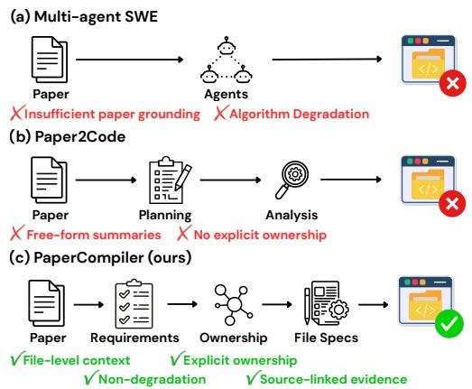
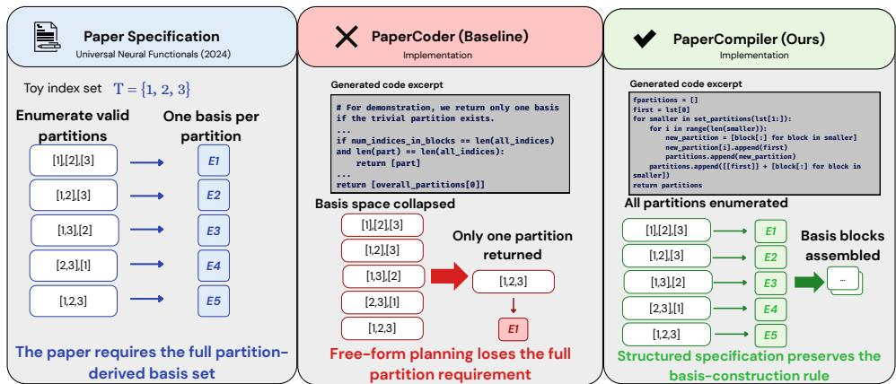
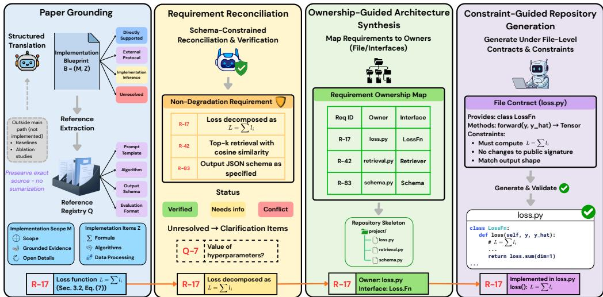
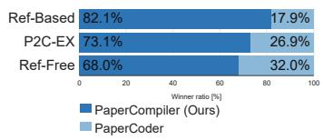
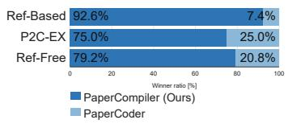
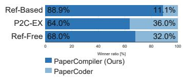
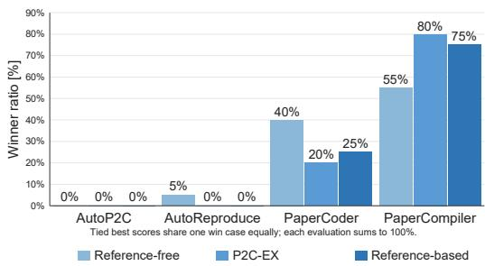

# PAPERCOMPILER: FAITHFUL PAPER-TO-CODE GENER-ATION VIA REPOSITORY-LEVEL SPECIFICATION COM-PILATION

Yunhao Liu NTU Singapore

Hong Phuc Pham NTU Singapore

Jaehong Yoon<sup>†</sup> NTU Singapore

## ABSTRACT

Faithfully translating research papers into repository-level implementations remains challenging because papers often describe methods at a high level, leave implementation assumptions implicit, and require generated repositories to preserve method logic, evaluation protocols, and cross-file consistency. Despite recent advances in paper-to-code agents, their intermediate outputs are often presented as free-form plans or summaries that downstream coding agents may ignore, reinterpret, or compress, leading to algorithmic simplification and inconsistent repository structure. To address these challenges, we introduce PaperCompiler, a paper-to-code generation framework that compiles paper-grounded evidence into explicit repository-level implementation specifications. PaperCompiler grounds implementation-relevant evidence while preserving source provenance and distinguishing paper-supported, inferred, externally delegated, and unresolved information. The resulting specifications encode non-degradation requirements, ownership assignments, cross-file dependencies, and file-level constraints. Repository generation proceeds under these compiled specifications while retaining flexibility over local engineering choices not fixed by the paper. PaperCompiler outperforms strong baselines on Paper2CodeBench, achieving a 13.8% relative improvement in reference-based fidelity (3.64→4.15) and reducing high-severity evaluator critiques (13.2%→6.1%).

## 1 INTRODUCTION

Translating machine-learning papers into repository-level implementations is important for reproducibility and practical adoption, yet remains challenging when official code is unavailable or incomplete (Seo et al., 2026; Starace et al., 2025). Papers often leave implementation-critical details implicit, from data preprocessing and model initialization to evaluation conventions, requiring systems to recover these decisions while maintaining fidelity and consistency throughout the implementation.

Recent code-capable large language models (LLMs) have enabled increasingly automated approaches to this problem (Li et al., 2025; Jimenez et al., 2023). General-purpose software-engineering agents can coordinate repository-level development, but are not explicitly designed to recover and preserve paper-specific methodological constraints (Fig. 1(a)). Paper-specific systems address this gap through dedicated paper analysis and reproduction workflows: PaperCoder (Seo et al., 2026) decomposes repository synthesis into planning, analysis, and coding; AutoP2C (Lin et al., 2026) incorporates multimodal evidence; and AutoReproduce (Zhao et al., 2026) retrieves implicit knowledge from paper lineage and uses generated tests for refinement. However, these systems typically communicate paper-derived knowledge across stages through free-form plans, summaries, or reasoning traces (Fig. 1(b)). Such intermediates do not explicitly bind implementation requirements to the repository components responsible for realizing them, allowing critical details to be lost, weakened, or reinterpreted during generation and leading to method-level deviations and cross-file inconsistencies.

  
Figure 1: Comparison of paper-to-code generation workflows.

To address this remaining bottleneck, we introduce PaperCompiler, a paper-to-code generation framework based on specification compilation (Fig. 1(c)). PaperCompiler transforms implementation evidence from the paper into persistent specifications that link each requirement to the repository components responsible for implementing it. This compilation process determines the implementation requirements supported by the available evidence, while keeping uncertain details explicit and mapping each requirement to its implementation location. These specifications maintain methodcritical semantics and coordinate cross-file dependencies throughout generation.

PaperCompiler consists of three phases: (1) Paper Grounding constructs an implementation blueprint while retaining supporting source evidence needed by later stages. (2) Specification Compilation reconciles the grounded evidence into explicit implementation requirements and organizes them into repository-level ownership, cross-file dependencies, and localized file specifications, including constraints against method-degrading simplifications. (3) Constraint-Guided Repository Generation generates files under the compiled specifications while maintaining interfaces and cross-file consistency. Paper-grounded requirements are carried through these stages to their concrete implementation locations, reducing their weakening or reinterpretation during repository construction.

We evaluate PaperCompiler on 90 papers from Paper2CodeBench (Seo et al., 2026) and Paper2Code-Extra (P2C-Ex) (Hong et al., 2026), comparing it with baselines, including PaperCoder (Seo et al., 2026), AutoP2C (Lin et al., 2026), and AutoReproduce (Zhao et al., 2026). The proposed PaperCompiler achieves consistent improvements under matched settings: 4.7% in reference-free evaluation (4.562→4.777), 4.3% under P2C-Ex (4.535→4.728), and 13.8% in reference-based fidelity (3.647→4.152). The gains are largest when generated repositories are compared against author implementations, indicating improved fidelity to paper-specific implementation details beyond surface-level completeness. This is also reflected in the evaluator-error analysis, where PaperCompiler reduces the high-severity failure rate (13.2% → 6.1%).

## 2 RELATED WORK

Paper-to-Code Workflows Unlike self-contained program-synthesis tasks (Austin et al., 2021; Jain et al., 2024), paper-to-code requires recovering method details and coordinating an entire repository. PaperCoder (Seo et al., 2026) separates planning, analysis, and coding; AutoP2C (Lin et al., 2026) adds multimodal extraction and debugging; AutoReproduce (Zhao et al., 2026) leverages paper lineage and execution feedback; and DeepCode combines blueprints, retrieval, memory, and iterative correction (Li et al., 2025). While these systems improve how implementation knowledge is extracted and refined, information passed between stages is often represented as high-level plans or summaries, leaving downstream generation to reinterpret which details must be preserved and how they map across repository components. PaperCompiler instead compiles paper-grounded evidence into explicit repository-level specifications that preserve implementation requirements and their ownership throughout generation.

Repository-Level Generation and Context Consistency Repository-level code generation requires coordinating information distributed across files and dependencies. Prior work (Zhang et al., 2023; Shrivastava et al., 2023) improves this through cross-file retrieval or repository-aware training, while RepoBench (Liu et al., 2023) and CrossCodeEval (Ding et al., 2023) evaluate whether models can effectively use such distributed context. CodePlan introduces dependency-aware planning (Bairi et al., 2023), while SWE-agent, OpenHands, and Agentless support locating, modifying, and validating components in existing repositories (Yang et al., 2024; Wang et al., 2024; Xia et al., 2024; Jimenez et al., 2023). These approaches largely assume that the repository structure and interfaces are already available. PaperCompiler instead constructs this organization from the paper, explicitly assigning file ownership, interfaces, and producer–consumer dependencies before code generation.

Evaluation of Paper-to-Code Fidelity Existing benchmarks assess different aspects of repositorylevel coding and research automation. ML-Bench evaluates agents on existing ML repositories, while

  
Figure 2: Case study on Universal Neural Functionals. The left panel uses a simplified toy index set to illustrate Algorithm 1 in Zhou et al. (2024): the method constructs one basis element for each valid partition, and the layer is built from the resulting full basis set. The middle and right panels show excerpts from generated code. PaperCoder collapses this requirement by keeping only a single partition candidate, which removes most basis elements from the implementation. In contrast, PaperCompiler preserves the partition-to-basis construction rule and generates code that enumerates valid partitions and assembles the corresponding basis blocks.

MLE-bench and RE-Bench emphasize longer-horizon engineering and research tasks (Tang et al., 2023; Chan et al., 2024; Wijk et al., 2024). PaperBench instead targets end-to-end replication of research results, whereas Paper2CodeBench measures repository-level alignment between generated implementations and source papers (Starace et al., 2025; Seo et al., 2026). Since our focus is faithful translation of paper-specific methods into code, we evaluate on Paper2CodeBench using complementary reference-free, P2C-Ex, and reference-based protocols. In particular, reference-based evaluation compares generated repositories against author implementations, making it more sensitive to methodological deviations that may remain hidden under paper-only evaluation.

## 3 PAPER-TO-REPOSITORY GENERATION VIA SPECIFICATION COMPILATION

We formulate paper-to-code repository generation as a controlled information transformation problem. Given a machine learning paper P, the goal is to synthesize a repository $\mathcal { C } = \{ c _ { 1 } , \ldots , c _ { n } \}$ , where each $c _ { i }$ denotes an implementation file or module, such that the repository collectively implements the paper’s main method, data processing, training or execution procedure, and evaluation protocol. The central challenge is not only to generate code, but to preserve implementation-relevant information as the paper is transformed into a coherent multi-file software system. Paper-grounded facts must remain clearly distinguished from inferred implementation decisions, core methodological requirements must not be diluted into generic approximations, and artifacts produced by one file must be consumed by downstream files with consistent semantics.

As the implementation example shown in Fig. 2, existing workflows often compress paper-specific implementation details into coarse intermediate plans, leaving file-level generation to independently resolve missing requirements and thereby causing algorithmic degradation or cross-file inconsistency.To address this information loss, PaperCompiler treats repository generation as specification compilation. It separates three questions that existing workflows often conflate: (1) what is supported by the paper, (2) which requirements must be preserved or remain unresolved, and (3) where each requirement belongs in the repository. The resulting specifications link paper-derived requirements to their evidence and implementation owners, while defining cross-file artifact flows and interface semantics before code generation. They therefore constrain both local implementation and cross-file dependencies, reducing the risk of methodological simplification or semantic drift.

Formally, we represent PaperCompiler as three conceptual phases:

$$
( B , Q ) = { \mathrm { G r o u n d } } ( { \mathcal { P } } ) ,\tag{1}
$$

$$
( K , G , \{ S _ { i } \} _ { i = 1 } ^ { n } ) = \operatorname { C o m p i l e } ( B , Q ) ,\tag{2}
$$

  
Figure 3: Overview of the PaperCompiler pipeline. MinerU first converts the paper into Markdown. Paper Grounding constructs an implementation blueprint and preserves long or format-sensitive evidence in a reference registry. Specification Compilation reconciles grounded evidence into nondegradation requirements, assigns ownership and artifact flows across the repository, and produces localized file-level specifications. Constraint-Guided Repository Generation then generates files in dependency order using these specifications, preserved references, committed upstream code, and downstream compatibility constraints. Labels such as R-17 and $Q - 7$ are illustrative identifiers for a reconciled requirement and a reference-registry item, respectively.

$$
\begin{array} { l l } { c _ { i } = \mathrm { G e n e r a t e } ( f _ { i } , S _ { i } , \mathcal { C } _ { < i } , S _ { \mathrm { d o w n } ( \mathrm { i } ) } ) , \quad f _ { i } \in \mathrm { T o p o l o g i c a l O r d e r } ( G ) , } \\ { \mathcal { C } = \{ c _ { i } \} _ { i = 1 } ^ { n } . } \end{array}\tag{3}
$$

(4)

Here, Ground denotes Paper Grounding, which combines Blueprint Construction and $R e f$ erence Extraction to produce an implementation blueprint B and a reference registry $Q .$ . Compile denotes Specification Compilation, where Requirement Reconciliation, Ownership-Guided Architecture Syn thesis, and File-Level Contracting transform the grounded evidence into a reconciled implementation specification K, a repository-level ownership graph G, and file-level specifications $\{ S _ { i } \} _ { i = 1 } ^ { n } .$ . Finally, Generate denotes Constraint-Guided Repository Generation, which generates each file $c _ { i }$ from its file-level specification $S _ { i } ,$ previously generated code $\ { \mathcal { C } } _ { < i }$ as committed implementation context, and relevant downstream specifications $\boldsymbol { S } _ { \mathrm { d o w n } ( i ) }$ as compatibility constraints.

## 3.1 PAPER GROUNDING: BLUEPRINT CONSTRUCTION AND REFERENCE EXTRACTION

Paper Grounding converts the parsed paper into structured implementation evidence before the repository architecture is determined, preventing relevant information from being lost prematurely. It consists of Blueprint Construction, which constructs a compact implementation blueprint, and Reference Extraction, which preserves long or format-sensitive source evidence that should not be compressed into the blueprint. Blueprint Construction uses a structured LLM prompt with a fixed output schema to identify the main implementation scope, the execution flow from inputs to reported outputs, and key details of the model, data processing, training or execution procedure, and evaluation protocol. PaperCompiler records each atomic implementation item as $\boldsymbol { z } = ( \boldsymbol { x } , \boldsymbol { \ell } , \tau , r )$ where x describes the implementation detail, ℓ identifies its source location in the paper, τ records its evidence status, and r specifies its intended implementation role. The evidence locator ℓ may refer to a section, table, equation, algorithm, appendix, or external reference. The evidence-status tag τ distinguishes paper-supported, externally delegated, inferred, and unresolved items, while r specifies their downstream implementation role, such as a model component, objective, data format, training or evaluation procedure, runtime boundary, or external dependency.

The resulting implementation blueprint is $B \ = \ ( M , Z )$ , where M defines the implementation scope by distinguishing the paper’s primary method from baselines, optional analyses, and ablationonly components, and $Z = \bar { \{ z _ { j } \} } _ { j = 1 } ^ { m }$ contains the extracted implementation items. This grounded representation provides Specification Compilation with an explicit basis for deciding what must be preserved, what may be inferred, and what should remain unresolved. Some source material is too long or format-sensitive to retain safely as a compact record, such as prompt templates, output schemas, algorithm listings, or benchmark-specific evaluation formats. For such items, Blueprint Construction issues a reference-extraction request specifying the source location, material type, and downstream use. Reference Extraction copies the requested material from the parsed paper into a reference registry $Q$ without summarizing it. For example, an appendix-defined output schema can be preserved in Q in its original form. These outputs, B and Q, provide the grounded evidence used by subsequent Specification Compilation and repository generation.

## 3.2 SPECIFICATION COMPILATION: FROM RECONCILED REQUIREMENTS TO FILE-LEVEL CONTRACTS

Specification Compilation transforms the grounded blueprint $B = \left( M , Z \right)$ and reference registry Q into a reconciled specification K, a repository-level ownership graph G, and file-level specifications $\{ S _ { i } \} _ { i = 1 } ^ { n }$ . It consists of three operations: Requirement Reconciliation, Ownership-Guided Architecture Synthesis, and File-Level Contracting.

Requirement Reconciliation. Grounded implementation items preserve what is stated, inferred, externally delegated, or unresolved in the paper, but they do not yet specify how these details should constrain repository generation. Requirement Reconciliation verifies these items against their associated evidence, groups related items into method-level requirements, and preserves their evidence status and provenance. Each reconciled requirement is represented as

$$
k = ( \mathrm { i d } , \mathrm { r o l e } , \mathrm { s r c } , \mathrm { r e q } , \mathrm { b d r y } , \mathrm { f o r b i d } ) ,\tag{5}
$$

where src links the requirement to grounded evidence, req specifies the behavior to preserve, bdry records relevant semantic or runtime boundaries, and forbid identifies substitutions that would weaken the intended method. The resulting specification $K = \{ k _ { j } \} _ { j = 1 } ^ { m _ { K } }$ covers method behavior, artifact semantics, training or evaluation protocols, external dependencies, and unresolved decisions. It also records abstract producer–consumer relations for artifacts whose semantics must remain consistent across repository components.

Ownership-Guided Architecture Synthesis. Architecture Synthesis maps the reconciled requirements in $\bar { K }$ to a concrete repository design. Let $F = \{ f _ { 1 } , \ldots , f _ { n } \}$ denote the implementation files and $K _ { \mathrm { c o r e } } \subseteq K$ the requirements on the main method path. We define a primary ownership function

$$
\omega : K _ { \mathrm { c o r e } }  F ,\tag{6}
$$

where $\omega ( k )$ identifies the file responsible for implementing or defining requirement k. A requirement may still be consumed by other files through public interfaces or shared artifacts.

Let A denote the set of tracked cross-file artifacts, for each tracked artifact a $\in { \mathcal { A } } ,$ Architecture Synthesis additionally assigns a producer $\pi ( a ) \in F$ and consumers $\Gamma ( a ) \subseteq F$ . Together with dependency edges induced by interfaces, imports, and artifact handoffs, these assignments define the repository graph

$$
G = ( F , { \mathcal { E } } , \omega , \pi , \Gamma ) .\tag{7}
$$

Each file is therefore associated with its semantic role, owned requirements, public interfaces, produced or consumed artifacts, and relevant unresolved constraints. The generation dependencies in $\mathcal { E }$ are kept acyclic to support dependency-compatible code generation, without restricting cyclic interactions that may occur at runtime.

File-Level Contracting. Contracting localizes the repository-level specification into the information required to generate each file. For file $f _ { i }$ , PaperCompiler first constructs

$$
\mathrm { c t x } _ { i } = \mathrm { S l i c e } ( K , G , Q , f _ { i } ) ,\tag{8}
$$

where Slice deterministically selects the requirements, interfaces, artifact relations, dependencies, unresolved cases, and reference materials relevant to $f _ { i }$ . This context is compiled into

$$
{ \cal S } _ { i } = ( I _ { i } , A _ { i } , R _ { i } , H _ { i } , D _ { i } ) ,\tag{9}
$$

where $I _ { i }$ specifies public interfaces, $A _ { i }$ the implementation recipe, $R _ { i }$ produced and consumed artifacts, $H _ { i }$ cross-file handoff requirements, and $D _ { i }$ non-degradation or unresolved constraints. Thus, $S _ { i }$ localizes the obligations assigned to $f _ { i }$ while retaining the cross-file information necessary for compatibility. Missing or contradictory requirements remain explicit.

## 3.3 CONSTRAINT-GUIDED REPOSITORY GENERATION

Given the compiled specifications ${ \cal { S } } = \{ S _ { i } \} _ { i = 1 } ^ { n }$ and repository graph G, Constraint-Guided Repository Generation produces implementation files in a dependency-compatible topological order. For each file $f _ { i } ,$ Engineering uses $S _ { i }$ as the primary generation instruction, previously generated code $\ { \mathcal { C } } _ { < i }$ as committed implementation context, and relevant downstream specifications $\boldsymbol { S } _ { \mathrm { d o w n } ( i ) }$ as compatibility constraints.

Previously generated files are treated as committed with respect to their paths, public APIs, schemas, artifact names, and externally visible behavior, while downstream specifications expose the interfaces and artifacts that later files expect to consume. This prevents individual generation steps from independently redefining shared assumptions. When the compiled specification contains an unresolved dependency, unsupported mode, or incompatible boundary, Engineering preserves the specified interfaces and method-specific requirements while making the limitation explicit.

In this way, repository generation remains constrained by obligations compiled from grounded paper evidence, while the LLM retains flexibility over local engineering choices that are not fixed by the paper or repository specification.

## 4 EXPERIMENTS

Benchmark, baselines, and backbone. We evaluate PaperCompiler on Paper2CodeBench (Seo et al., 2026) using three 30-paper subsets from ICLR, ICML, and NeurIPS 2024, for a total of 90 papers. We compare PaperCompiler with general multi-agent software-development baselines, ChatDEV (Qian et al., 2023) and MetaGPT (Hong et al., 2023), as well as recent paper-to-code agents, including AutoP2C (Lin et al., 2026), AutoReproduce (Zhao et al., 2026), and PaperCoder (Seo et al., 2026). For the latter comparison, all systems receive the same MinerU-parsed Markdown inputs and use o3-mini for generation and o3-mini-high for evaluation, with PaperCoder serving as the most directly comparable staged paper-to-code baseline in this setting.

Following Paper2CodeBench (Seo et al., 2026), we report reference-free scores using the target paper alone and reference-based scores that additionally consult the author repository when available. We also report P2C-Ex (Hong et al., 2026), a finer-grained reference-free protocol. All scores use a 1–5 scale and aggregate multiple independently sampled judge outputs across papers.

## 4.1 MAIN RESULTS

Table 1 presents the full-benchmark comparison on Paper2CodeBench (Seo et al., 2026). Genera multi-agent software-development baselines, ChatDEV and MetaGPT, obtain substantially lower scores and exhibit relatively large standard deviations across conference subsets. PaperCoder provide a considerably stronger paper-to-code baseline, but still falls short of PaperCompiler and generally shows higher variance. PaperCompiler achieves the highest scores across all conference subsets and evaluation protocols, while maintaining lower standard deviations in most settings. Under matched evaluation conditions, the overall average improves from 4.562 to 4.777 in reference-free evaluation, from 4.535 to 4.728 under P2C-Ex, and from 3.647 to 4.152 in reference-based evaluation. The largest gain appears under reference-based evaluation, with a 13.8% relative improvement, indicating stronger fidelity to paper-specific implementation details.

To assess whether the average gains are broadly distributed across papers, Figure 4 reports per-paper win ratios between PaperCompiler and PaperCoder for the ICLR 2024, ICML 2024, and NeurIPS 2024 subsets. Each subset contains 30 papers, with ties excluded from the ratio calculation. PaperCompiler attains higher win ratios under all three evaluation protocols across all three subsets. The margin is largest under reference-based evaluation, consistent with the larger average improvement reported in Table 1. The per-paper results therefore show that the gains are broadly distributed rather than being driven by a small number of high-improvement cases.

The gains can be explained by PaperCompiler’s explicit specification of paper-grounded requirements. Non-degradation constraints limit method-weakening simplifications, while ownership and crossfile dependencies help maintain consistent implementation semantics across files. This reduces opportunities for paper-specific details to be lost or reinterpreted during generation.

<table><tr><td rowspan="2">Subset</td><td rowspan="2">Method</td><td colspan="2">Reference-free</td><td colspan="2">P2C-Ex</td><td colspan="2">Reference-based</td></tr><tr><td>Mean</td><td>Std.</td><td>Mean</td><td>Std.</td><td>Mean</td><td>Std.</td></tr><tr><td rowspan="4">ICLR 2024</td><td>ChatDEV (Qian et al., 2023)</td><td>4.000</td><td>0.650</td><td></td><td></td><td>2.700</td><td>0.630</td></tr><tr><td>MetaGPT (Hong et al., 2023)</td><td>3.520</td><td>0.600</td><td></td><td></td><td>2.480</td><td>0.480</td></tr><tr><td>PaperCoder (Seo et al., 2026)</td><td>4.500</td><td>0.504</td><td>4.479</td><td>0.536</td><td>3.667</td><td>0.566</td></tr><tr><td>PaperCompiler (Ours)</td><td>4.804 (+6.8%)</td><td>0.286</td><td>4.771 (+6.5%)</td><td>0.288</td><td>4.179 (+14.0%)</td><td>0.406</td></tr><tr><td rowspan="4">NeurIPS 2024</td><td>ChatDEV (Qian et al., 2023)</td><td>4.010</td><td>0.740</td><td>一</td><td>一</td><td>2.960</td><td>0.690</td></tr><tr><td>MetaGPT (Hong et al., 2023)</td><td>3.590</td><td>0.920</td><td></td><td></td><td>2.950</td><td>0.870</td></tr><tr><td>PaperCoder (Seo et al., 2026)</td><td>4.596</td><td>0.439</td><td>4.579</td><td>0.403</td><td>3.617</td><td>0.601</td></tr><tr><td>PaperCompiler (Ours)</td><td>4.779 (+4.0%)</td><td>0.298</td><td>4.700 (+2.6%)</td><td>0.447</td><td>4.125 (+14.0%)</td><td>0.473</td></tr><tr><td rowspan="4">ICML 2024</td><td>ChatDEV (Qian et al., 2023)</td><td>4.120</td><td>0.530</td><td></td><td>一</td><td>2.970</td><td>0.580</td></tr><tr><td>MetaGPT (Hong et al., 2023)</td><td>3.630</td><td>0.750</td><td></td><td></td><td>2.750</td><td>0.700</td></tr><tr><td>PaperCoder (Seo et al., 2026)</td><td>4.591</td><td>0.460</td><td>4.547</td><td>0.473</td><td>3.659</td><td>0.586</td></tr><tr><td>PaperCompiler (Ours)</td><td>4.746 (+3.4%)</td><td>0.456</td><td>4.711 (+3.6%)</td><td>0.457</td><td>4.151 (+13.4%)</td><td>0.518</td></tr><tr><td rowspan="4">Average</td><td>ChatDEV (Qian et al., 2023)</td><td>4.043</td><td></td><td>一</td><td></td><td>2.877</td><td></td></tr><tr><td>MetaGPT (Hong et al., 2023)</td><td>3.580</td><td></td><td></td><td></td><td>2.727</td><td></td></tr><tr><td>PaperCoder (Seo et al., 2026)</td><td>4.562</td><td></td><td>4.535</td><td></td><td>3.647</td><td></td></tr><tr><td>PaperCompiler (Ours)</td><td>4.777 (+4.7%)</td><td></td><td>4.728 (+4.3%)</td><td></td><td>4.152 (+13.8%)</td><td></td></tr></table>

Table 1: Comparison on Paper2CodeBench. We use the ChatDev and MetaGPT results reported by PaperCoder; PaperCoder and PaperCompiler are controlled reruns using the same MinerU Markdown inputs, o3-mini backbone, and o3-mini-high evaluator. Std. denotes standard deviation. P2C-Ex is reported only for the controlled reruns. We highlight relative gains over the strongest baseline in blue.

  
(a) ICLR 2024

  
(b) ICML 2024

  
(c) NeurIPS 2024  
Figure 4: Per-paper win ratios between PaperCompiler and PaperCoder on the ICLR 2024, ICML 2024, and NeurIPS 2024 subsets of Paper2CodeBench, each containing 30 papers. Tie cases are excluded when computing the ratios.

## 4.2 COMPARISON WITH END-TO-END PAPER-TO-CODE SYSTEMS

We further broaden the comparison on the randomly sampled ten-paper subset to include AutoP2C and AutoReproduce alongside Paper-Coder (See Appendix for the list of sampled papers). As shown in Table 2, PaperCompiler achieves the highest average score under all three evaluation protocols, outperforming AutoP2C, AutoReproduce, and PaperCoder. The same pattern appears at the paper level in Figure 5: PaperCompiler attains the highest perpaper win rate under each protocol, with particularly large margins under P2C-Ex and referencebased evaluation.

AutoP2C incorporates multimodal paper evidence and iterative debugging, while AutoRe-

  
Figure 5: Per-paper win ratios of AutoP2C, AutoReproduce, PaperCoder, and PaperCompiler on the ten-paper subset across three evaluation protocols. Ties are divided equally among top-scoring methods.

produce augments reproduction with paper-lineage knowledge and generated execution tests. These mechanisms provide broader sources of implementation information and validation, but do not consistently preserve paper-specific requirements across repository components. On this subset, both methods remain substantially below PaperCompiler, particularly under reference-based evaluation, where alignment with the author implementation is assessed directly. AutoReproduce does not report aggregated token usage because it reports average monetary cost but does not provide aggregate input/output token counts, preventing a directly comparable token estimate.

<table><tr><td>Method</td><td>Ref-free</td><td>P2C-Ex</td><td>Ref-based</td><td>Avg. tokens</td></tr><tr><td>AutoP2C (Lin et al., 2026)</td><td>2.700</td><td>2.700</td><td>2.088</td><td>1.68 M</td></tr><tr><td>AutoReproduce (Zhao et al., 2026)</td><td>3.375</td><td>3.013</td><td>2.650</td><td></td></tr><tr><td>PaperCoder (Seo et al., 2026)</td><td>4.450</td><td>4.513</td><td>3.825</td><td>0.98M</td></tr><tr><td>PaperCompiler (Ours)</td><td>4.813</td><td>4.850</td><td>4.263</td><td>1.71 M</td></tr></table>

Table 2: Performance-Efficiency comparison on the Paper2CodeBench subset. Avg. tokens denotes average total tokens per generated repository; “–” indicates that aggregated results are unavailable.

<table><tr><td>Critique signal</td><td>PaperCoder (n = 2561)</td><td>PaperCompiler (n = 2649)</td></tr><tr><td>Algorithmic degradation</td><td>716 / 28.0%</td><td>651 / 24.6%</td></tr><tr><td>Missing core component</td><td>315 / 12.3%</td><td>180 / 6.8%</td></tr><tr><td>Evaluation mismatch</td><td>343 / 13.4%</td><td>222 / 8.4%</td></tr><tr><td>API/schema mismatch</td><td>59 / 2.3%</td><td>106 / 4.0%</td></tr><tr><td>External protocol hallucination</td><td>76 / 3.0%</td><td>99 / 3.7%</td></tr><tr><td>High severity</td><td>337 / 13.2%</td><td>162 / 6.1%</td></tr><tr><td>High or medium severity</td><td>1389 / 54.2%</td><td>1004 / 37.9%</td></tr></table>

Table 3: Diagnostic analysis of reference-based evaluator critiques. Percentages are computed over PaperCoder and PaperCompiler critique items, each assigned one primary failure label.

PaperCompiler uses 1.71M tokens per repository on average, compared with 0.98M for PaperCoder. This additional computation reflects the explicit grounding, requirement reconciliation, ownership assignment, and file-level specification steps used to carry paper-specific constraints into repository generation. The performance difference is not explained by token volume alone: AutoP2C uses a comparable 1.68M tokens, yet achieves substantially lower scores across all three protocols. Increasing PaperCoder’s generation budget alone would not introduce the explicit requirement reconciliation, ownership structure, or file-level constraints provided by PaperCompiler.

At current o3-mini API rates, the average 1.71M-token usage corresponds to approximately \$1.88– \$7.51 per generated repository, depending on the input-output token ratio. This represents a modest absolute cost for the additional specification-compilation steps relative to the observed fidelity gains.

## 4.3 SEMANTIC AND CONTEXT-CONSISTENCY FAILURE ANALYSIS

We analyze reference-based critiques from the 90-paper controlled reruns, as comparisons with author repositories are most sensitive to implementation fidelity. Each critique item is manually assigned one primary label from a fixed taxonomy covering algorithmic degradation, missing core components, evaluation mismatch, API/schema mismatch, external-protocol hallucination, misplaced responsibility, producer-consumer break, config-only fake support, and no clear failure. We retain the evaluator-provided severity and report label frequencies for each method.

Table 3 reports the five most frequent failure categories and severity distributions across around 2.6K critique items for each PaperCoder and PaperCompiler. Our proposed approach reduces algorithmic degradation from 28.0% to 24.6%, with larger reductions in missing core components (12.3%→6.8%) and evaluation mismatches (13.4%→8.4%). High-severity critiques decrease from 13.2% to 6.1%, while high-or-medium-severity critiques decrease from 54.2% to 37.9%. The no-clear-failure category also increases from 6.7% to 13.5%, although this label is sensitive to evaluator phrasing. API/schema mismatches increase modestly from 2.3% to 4.0%.

The increase in API/schema mismatches highlights a remaining interface-alignment challenge. Improving fine-grained API consistency is an important direction for future work.

## 4.4 ABLATION STUDY AND QUALITATIVE ANALYSIS

Setup. We ablate three key components of the proposed approach while regenerating each repository end-to-end. w/o Reconciliation removes the non-degradation and method-level requirements before architecture design (§3.2); w/o Context Slicing gives every file the full reconciled specification and ownership graph; and w/o Contracting generates files without file-level specifications. Blueprint Construction, Ownership-Guided Architecture Synthesis, and Constraint-Guided Repository Generation remain fixed, and all variants reuse upstream artifacts where possible to isolate the targeted mechanism. We randomly sampled nine papers, including INTL, AutoVP, TransformerCompression, RECOMBINER, WassersteinSSL, INTR, Auto-J, VONet, and VDC. Each paper–variant pair is generated once with o3-mini, yielding 27 ablated repositories plus nine PaperCompiler repositories. We use the same three 1–5 evaluation protocols and average eight independent judgments per repository.

Reference-based evaluation provides a more discriminative signal. As shown in Table 4, the ablations often match or exceed the complete PaperCompiler under ref-free and ref-free-ex, where scores cluster near the top of the scale. Removing Context Slicing, for example, improves these scores by +0.15 and +0.32 despite reducing refbased fidelity by 0.26. Reference-free evaluation can reward surface-complete repositories without verifying alignment with the author’s implementation. We therefore focus on reference-based results, where PaperCompiler outperforms all ablations.

<table><tr><td>Variant</td><td>Ref-free</td><td>P2C-Ex</td><td>Ref-based</td></tr><tr><td>PaperCompiler</td><td>4.57</td><td>4.42</td><td>4.38</td></tr><tr><td>w/o Reconciliation</td><td>4.44</td><td>4.39</td><td>3.86</td></tr><tr><td>w/o Context Slicing</td><td>4.72</td><td>4.74</td><td>4.11</td></tr><tr><td>w/o Contracting</td><td>4.65</td><td>4.54</td><td>3.92</td></tr></table>

Table 4: Ablation under three model-based metrics (correctness, 1–5, with each cell averaging 8 judge samples per paper).

Reconciliation has the largest average effect. Removing Reconciliation reduces reference-based performance from 4.38 to 3.86 (−0.51), followed closely by removing Contracting 3.92 (−0.46); removing Context Slicing has a smaller effect 4.11 (−0.26). The larger drops from Reconciliation and Contracting highlight the importance of establishing method-level obligations and carrying them into file-level specifications.

Context Slicing trades broader context for targeted file-level information. Although it has the smallest average reference-based effect (4.38→4.11), removing Context Slicing on VDC replaces multimodal inference with a constant response and reduces performance from 4.75 to 3.75. On WassersteinSSL and INTR, the unsliced variant performs better, indicating that its benefit can be smaller when broader context already provides useful implementation details. Its main benefit therefore lies in protecting file generation from missing critical dependencies, rather than uniformly improving every repository.

Repository-level inspection shows how the ablated components fail in practice. VDC without Contracting, the multimodal inference module becomes an InstructBlipModel placeholder with an unimplemented forward path, and the pipeline falls back to generic questions. Full PaperCompiler instead preserves a functional Instruct-BLIP interface, yielding a 2.25-point reference-based advantage. In INTR without Reconciliation, the decoder retains only cross-attention while omitting the self-attention and feed-forward refinement required by the method. These cases show that Contracting helps carry concrete implementation obligations into individual files, while Reconciliation prevents method-level requirements from being weakened during generation.

## 5 CONCLUSION

We introduce PaperCompiler, a repository-level constraint-guided framework for faithful paperto-code synthesis. PaperCompiler treats repository generation as a controlled transformation from scientific evidence to implementation specifications, preserving paper-derived requirements, assigning file-level responsibilities, and maintaining cross-file consistency. Experiments on Paper2CodeBench show consistent gains over a strong staged baseline across reference-free, P2C-Ex, and referencebased evaluation, with the largest gain in reference-based fidelity. Ablations identify Reconciliation and Contracting as the most important components, while diagnostic analysis shows fewer severe semantic and method-completeness failures. Overall, reliable paper-to-code generation requires not only stronger LLMs, but also explicit control over how paper-derived information is represented, propagated, and consumed during repository construction.

## AI USE STATEMENT

Generative AI tools were used only for language polishing and improving the clarity and readability of the manuscript. The authors developed and verified all research methodology, experiments, analyses, results, and conclusions and take full responsibility for the final content.

## REFERENCES

Jacob Austin, Augustus Odena, Maxwell Nye, Maarten Bosma, Henryk Michalewski, David Dohan, Ellen Jiang, Carrie Cai, Michael Terry, Quoc Le, and Charles Sutton. Program synthesis with large language models, 2021. URL https://arxiv.org/abs/2108.07732.

Ramakrishna Bairi, Atharv Sonwane, Aditya Kanade, Vageesh D C, Arun Iyer, Suresh Parthasarathy, Sriram Rajamani, B. Ashok, and Shashank Shet. Codeplan: Repository-level coding using llms and planning, 2023. URL https://arxiv.org/abs/2309.12499.

Jun Shern Chan, Neil Chowdhury, Oliver Jaffe, James Aung, Dane Sherburn, Evan Mays, Giulio Starace, Kevin Liu, Leon Maksin, Tejal Patwardhan, Lilian Weng, and Aleksander M ˛adry. MLEbench: Evaluating machine learning agents on machine learning engineering, 2024. URL https: //arxiv.org/abs/2410.07095.

Yangruibo Ding, Zijian Wang, Wasi Uddin Ahmad, Hantian Ding, Ming Tan, Nihal Jain, Murali Krishna Ramanathan, Ramesh Nallapati, Parminder Bhatia, Dan Roth, and Bing Xiang. Crosscodeeval: A diverse and multilingual benchmark for cross-file code completion, 2023. URL https://arxiv.org/abs/2310.11248.

Hanhua Hong, Yizhi LI, Jiaoyan Chen, Sophia Ananiadou, Xiaoli Li, Jung jae Kim, and Chenghua Lin. Hiras: A hierarchical multi-agent framework for paper-to-code generation and execution, 2026. URL https://arxiv.org/abs/2604.17745.

Sirui Hong, Mingchen Zhuge, Jiaqi Chen, Xiawu Zheng, Yuheng Cheng, Ceyao Zhang, Jinlin Wang, Zili Wang, Steven Ka Shing Yau, Zijuan Lin, Liyang Zhou, Chenyu Ran, Lingfeng Xiao, Chenglin Wu, and Jürgen Schmidhuber. Metagpt: Meta programming for a multi-agent collaborative framework, 2023. URL https://arxiv.org/abs/2308.00352.

Naman Jain, King Han, Alex Gu, Wen-Ding Li, Fanjia Yan, Tianjun Zhang, Sida Wang, Armando Solar-Lezama, Koushik Sen, and Ion Stoica. Livecodebench: Holistic and contamination free evaluation of large language models for code, 2024. URL https://arxiv.org/abs/2403.07974.

Carlos E. Jimenez, John Yang, Alexander Wettig, Shunyu Yao, Kexin Pei, Ofir Press, and Karthik Narasimhan. Swe-bench: Can language models resolve real-world github issues?, 2023. URL https://arxiv.org/abs/2310.06770.

Zongwei Li, Zhonghang Li, Zirui Guo, Xubin Ren, and Chao Huang. Deepcode: Open agentic coding, 2025. URL https://arxiv.org/abs/2512.07921.

Zijie Lin, Yiqing Shen, Qilin Cai, He Sun, Jinrui Zhou, and Mingjun Xiao. Autop2c: An llm-based agent framework for code repository generation from multimodal content in machine learning papers. In IEEE International Conference on Acoustics, Speech and Signal Processing (ICASSP), 2026. URL https://arxiv.org/abs/2504.20115.

Tianyang Liu, Canwen Xu, and Julian McAuley. Repobench: Benchmarking repository-level code auto-completion systems, 2023. URL https://arxiv.org/abs/2306.03091.

Chen Qian, Wei Liu, Hongzhang Liu, Nuo Chen, Yufan Dang, Jiahao Li, Cheng Yang, Weize Chen, Yusheng Su, Xin Cong, Juyuan Xu, Dahai Li, Zhiyuan Liu, and Maosong Sun. Chatdev: Communicative agents for software development, 2023. URL https://arxiv.org/abs/2307. 07924.

Minju Seo, Jinheon Baek, Seongyun Lee, and Sung Ju Hwang. Paper2code: Automating code generation from scientific papers in machine learning. In International Conference on Learning Representations (ICLR), 2026. URL https://arxiv.org/abs/2504.17192.

Disha Shrivastava, Denis Kocetkov, Harm de Vries, Dzmitry Bahdanau, and Torsten Scholak. Repofusion: Training code models to understand your repository, 2023. URL https://arxiv.org/ abs/2306.10998.

Giulio Starace, Oliver Jaffe, Dane Sherburn, James Aung, Jun Shern Chan, Leon Maksin, Rachel Dias, Evan Mays, Benjamin Kinsella, Wyatt Thompson, Johannes Heidecke, Amelia Glaese, and Tejal Patwardhan. Paperbench: Evaluating ai’s ability to replicate ai research, 2025. URL https://arxiv.org/abs/2504.01848.

Xiangru Tang et al. ML-Bench: Evaluating large language models and agents for machine learning tasks on repository-level code, 2023. URL https://arxiv.org/abs/2311.09835.

Xingyao Wang, Boxuan Li, Yufan Song, Frank F. Xu, Xiangru Tang, Mingchen Zhuge, Jiayi Pan, Yueqi Song, Bowen Li, Jaskirat Singh, Hoang H. Tran, Fuqiang Li, Ren Ma, Mingzhang Zheng, Bill Qian, Yanjun Shao, Niklas Muennighoff, Yizhe Zhang, Binyuan Hui, Junyang Lin, Robert Brennan, Hao Peng, Heng Ji, and Graham Neubig. Openhands: An open platform for ai software developers as generalist agents, 2024. URL https://arxiv.org/abs/2407.16741.

Hjalmar Wijk et al. RE-Bench: Evaluating frontier ai r&d capabilities of language model agents against human experts, 2024. URL https://arxiv.org/abs/2411.15114.

Chunqiu Steven Xia, Yinlin Deng, Soren Dunn, and Lingming Zhang. Agentless: Demystifying llm-based software engineering agents, 2024. URL https://arxiv.org/abs/2407.01489.

John Yang, Carlos E. Jimenez, Alexander Wettig, Kilian Lieret, Shunyu Yao, Karthik Narasimhan, and Ofir Press. SWE-agent: Agent-computer interfaces enable automated software engineering, 2024. URL https://arxiv.org/abs/2405.15793.

Fengji Zhang, Bei Chen, Yue Zhang, Jacky Keung, Jin Liu, Daoguang Zan, Yi Mao, Jian-Guang Lou, and Weizhu Chen. Repocoder: Repository-level code completion through iterative retrieval and generation, 2023. URL https://arxiv.org/abs/2303.12570.

Xuanle Zhao, Zilin Sang, Yuxuan Li, Qi Shi, Weilun Zhao, Shuo Wang, Duzhen Zhang, Xu Han, Zhiyuan Liu, and Maosong Sun. Autoreproduce: Automatic ai experiment reproduction with paper lineage. In Annual Meeting ofthe Associationfor Computational Linguistics (ACL), 2026. URL https://arxiv.org/abs/2505.20662.

Allan Zhou, Chelsea Finn, and James Harrison. Universal neural functionals. Advances in neural information processing systems, 37:104754–104775, 2024.

## A LIMITATIONS

PaperCompiler currently relies primarily on text-parsed paper content, limiting its ability to recover implementation-critical information conveyed through architecture diagrams, complex figures, visual examples, or other non-textual forms. When such details are absent from the parsed content, the system may still rely on the underlying LLM’s parametric knowledge to resolve implicit implementation gaps. This can be challenging for papers that depend on specialized external tools, proprietary APIs, simulators, undocumented benchmark conventions, or auxiliary resources unavailable to the model. Future work could incorporate multimodal document understanding, targeted retrieval, and executable tool interaction to address these cases.

Our evaluation focuses on repository-level method fidelity under controlled paper-to-code protocols and does not establish full reproduction of reported experimental results or executability across all generated repositories, generation seeds, and model families. Moreover, PaperCompiler’s requirements and file-level specifications serve as generation-time guidance rather than formal correctness guarantees. Integrating automated validation, execution-based testing, and independent or human verification would provide stronger guarantees in future work.

## B EXTENDED EXPERIMENTAL DETAILS

For Table 2 and Figure 5, we evaluate PaperCoder, AutoP2C, AutoReproduce, and PaperCompiler on a randomly sampled ten-paper subset of Paper2CodeBench: INTL, AutoVP, TransformerCompression, RECOMBINER, CAML, CARE, GGS, SEABO, iTransformer, and SparseFormer.

## C PAPERCOMPILER ALGORITHM OVERVIEW

Algorithm 1 summarizes the end-to-end repository synthesis procedure of PaperCompiler. The algorithm follows the three conceptual phases introduced in Section 3: Paper Grounding, Specification Compilation, and Constraint-Guided Repository Generation. In Paper Grounding, T denotes Blueprint Construction, which extracts the implementation blueprint B, while ExtractReferences preserves requested source materials in the reference registry Q. During Specification Compilation, R performs Requirement Reconciliation to construct K, and A performs Ownership-Guided Architecture Synthesis to construct the repository graph G. Slice then extracts the context relevant to each file, and FileSpec performs File-Level Contracting to produce $S _ { i } .$ Finally, files are generated in the topological order induced by G, so that each generation step can follow its local specification while respecting already committed interfaces and cross-file compatibility constraints

Algorithm 1 PaperCompiler repository synthesis   
Require: paper P   
Ensure: generated repository C   
Paper Grounding   
1: B ← T(P) ▷ construct implementation blueprint   
2: Q ← ExtractReferences(B, P) ▷ preserve requested source evidence   
Specification Compilation   
3: K ← R(B, Q) ▷ build reconciled implementation specification   
4: G ← A(K) ▷ build repository ownership graph   
5: S ← ∅   
6: for $f _ { i } \in F ( G )$ do   
7: ctx<sub>i</sub> ← Slice(K, G, Q, f<sub>i</sub>)   
8: S<sub>i</sub> ← FileSpec(f<sub>i</sub>, ctx<sub>i</sub>)   
9: S ← S ∪ {S<sub>i</sub>}   
10: end for   
Constraint-Guided Repository Generation   
11: C ← ∅   
12: for $f _ { i } \in$ TopologicalOrder(G) do   
13: c<sub>i</sub> ← Engineer(f<sub>i</sub>, S<sub>i</sub>, C<sub><i</sub>, S<sub>down(i)</sub>)   
14: ${ \mathcal { C } } \gets { \mathcal { C } } \cup { \mathsf { \bar { \{ c _ { i } \} } } }$   
15: end for   
16: return C

## D ADDITIONAL QUALITATIVE CASE DETAILS

This appendix provides additional qualitative diagnostics for selected generated repositories. These cases are not used as statistical evidence; rather, they illustrate how different systems instantiate, weaken, or miss paper-specific implementation structures. We include two main-text cases as evidence notes and two additional appendix cases. The main text uses universal\_neural\_functional as a motivating example of algorithmic-detail collapse and iTransformer as a compact repositorystructure diagnostic. Here we provide the supporting evidence trail and add two further cases: INTL, where PaperCompiler better preserves a training pipeline, and SEABO, where PaperCompiler exhibits a remaining failure in protocol and runner integration.

## D.1 Universal Neural Functionals: ALGORITHMIC BASIS-CONSTRUCTION COLLAPSE.

The main-text figure uses Universal Neural Functionals as a motivating example of algorithmic degradation. The target implementation structure consists of a specification parser, a UNF layer generator, a layer assembler, a channel-extension component, and training or experiment orchestration.

<table><tr><td>Case</td><td>Role</td><td>AutoP2C</td><td>AutoReproduce</td><td>P2C</td><td>PaperCompiler</td></tr><tr><td rowspan="4">Universal Neural Functionals</td><td rowspan="4">Algorithmic basis</td><td></td><td></td><td>3.500</td><td>4.750</td></tr><tr><td></td><td></td><td>3.500</td><td>5.000</td></tr><tr><td></td><td></td><td>2.875</td><td>4.875</td></tr><tr><td></td><td></td><td>3.292</td><td>4.875</td></tr><tr><td rowspan="4">iTransformer</td><td rowspan="4">Repository structure</td><td>4.625</td><td>5.000</td><td>5.000</td><td>4.875</td></tr><tr><td>4.625</td><td>4.125</td><td>5.000</td><td>5.000</td></tr><tr><td>3.125</td><td>3.125</td><td>3.875</td><td>3.625</td></tr><tr><td>4.125</td><td>4.083</td><td>4.625</td><td>4.500</td></tr><tr><td rowspan="4">INTL</td><td rowspan="4">Training pipeline</td><td>2.375</td><td>4.000</td><td>3.375</td><td>5.000</td></tr><tr><td>2.250</td><td>3.750</td><td>3.750</td><td>4.875</td></tr><tr><td>1.750</td><td>3.625</td><td>3.000</td><td>4.500</td></tr><tr><td>2.125</td><td>3.792</td><td>3.375</td><td>4.792</td></tr><tr><td rowspan="4">SEABO</td><td rowspan="4">Failure-oriented</td><td>3.875</td><td>4.000</td><td>5.000</td><td>4.625</td></tr><tr><td>4.125</td><td>4.000</td><td>5.000</td><td>4.625</td></tr><tr><td>2.875</td><td>3.125</td><td>5.000</td><td>4.375</td></tr><tr><td>3.625</td><td>3.708</td><td>5.000</td><td>4.542</td></tr></table>

Table 5: Qualitative case scores. Each score cell reports, from top to bottom, reference-free, P2C-Ex, reference-based, and average scores. Missing entries indicate that no usable generated repository or evaluator output is available for the corresponding system in the artifacts we inspected.

The implementation-critical requirement is that valid partitions should be enumerated and converted into basis elements for the equivariant layer.

The P2C rerun generates a connected implementation path in a flat model.py, including EquivariantBasisGenerator and WeightLayer. However, the partition-generation logic returns only the trivial partition or the first available partition candidate. Thus the generated repository may appear structurally connected while collapsing the basis family to a single candidate. In contrast, PaperCompiler separates specification parsing, basis generation, layer assembly, and multi-channel extension into distinct modules. Its generated src/unf\_layer\_generator.py preserves partition enumeration and constructs corresponding basis functions, which are then consumed by the layer assembly logic.

The intermediate artifacts of PaperCompiler route this requirement into file-level generation. The specification parser is assigned to a dedicated file, and the basis-generation requirement is routed to src/unf\_layer\_generator.py. The relevant file-level specification forbids hard-coded or heuristic defaults for the specification and preserves the valid-partition mapping needed by the basis generator. Evaluator critiques support the same interpretation: P2C is criticized for returning only a trivial or first partition, whereas PaperCompiler is credited for enumerating valid partitions and constructing the corresponding basis representation. This case supports the claim that PaperCompiler can preserve a discrete algorithmic requirement through repository generation; it does not claim full end-to-end fidelity for arbitrary high-order weight spaces or all training settings.

## D.2 iTransformer: REPOSITORY-STRUCTURE DIAGNOSTIC.

The main text uses iTransformer to illustrate repository-structure behavior rather than a clear win for PaperCompiler. The reference implementation is organized as an experiment-oriented forecasting repository with separate components for data providers, models, experiments, utilities, scripts, and experiment entry points. AutoP2C generates a layered application-style repository with configuration, data, model, training, evaluation, and main-entry modules. This preserves the broad variate-as-token idea, but its reference-based evaluation indicates incomplete preservation of the full experimental protocol.

AutoReproduce compresses the reproduction into a single main.py while preserving the central variate-as-token transformation and a connected training and evaluation path. However, it simplifies the surrounding data pipeline and experimental framework relative to the reference implementation. Its strong reference-free score but lower reference-based score therefore reflects a recurring pattern: the headline method is visible, while repository structure and experimental coverage are only partially recovered.

P2C obtains the strongest score on this example. It preserves the input transposition and Transformer backbone, but compresses the repository into six flat files: configuration, dataset loading, model, trainer, evaluation, and main entry. Its data pipeline is also simplified to a CSV sliding-window setting, omitting part of the multi-dataset experimental structure and advanced attention variants. PaperCompiler instead produces a separated src/ pipeline with modules for configuration, data loading, variate embedding, Transformer blocks, projection, training, evaluation, and orchestration. Its intermediate artifacts route configuration objects, forecast tensors, transposed tensors, and training or evaluation outputs across these modules. Evaluator feedback indicates that these modules are connected and that inverted tokenization is preserved, but also criticizes PaperCompiler for compressing the broader experiment suite into a single src/ pipeline and omitting part of the partial-variate training and variate-generalization protocol.

This case illustrates both a benefit and a limitation of specification-guided generation. PaperCompiler makes module boundaries and data flow more explicit, but it can still simplify broad experimental protocols when they are not fully grounded or routed. Therefore, the case does not show that the generated directory structure is superior to the original experiment repository; rather, it shows how different systems trade off model-path preservation, repository organization, and experimental coverage.

## D.3 INTL: TRAINING-PIPELINE PRESERVATION

INTL is included as an appendix case where PaperCompiler more clearly improves training-pipeline fidelity. The target implementation requires an image self-supervised training loop that connects augmentation, backbone and projection modules, IterNorm channel whitening, composite losses, training orchestration, and k-NN evaluation. In particular, the IterNorm transform should operate as channel whitening and should be consumed by the training objective.

AutoP2C defines a spectral transformation component with an iter\_norm operation, but evaluator feedback indicates that this component is not properly connected to the projection head or training loop. Thus a method-specific component is present by name but disconnected from the main producer– consumer chain. P2C implements IterNorm in model.py, but its whitening operation centers along the sample dimension, producing a covariance structure over the batch axis. This is identified as an algorithmic degradation.

AutoReproduce produces a connected single-file pipeline spanning augmentation, representation learning, iterative normalization, the training objective, and evaluation. The method-specific transform is therefore consumed by the main training path rather than remaining disconnected. However, several mathematical and evaluation details are simplified relative to the reference implementation, so the repository preserves the broad topology without fully recovering the algorithmic and experimental protocol.

PaperCompiler separates the IterNorm transform, loss module, and training-loop executor into dedi cated files. Its intermediate artifacts route augmented images from data loading into the backbone, assign IterNorm to src/iter\_norm\_transform.py, assign composite losses to src/loss\_module.py, and assign orchestration to src/training\_loop\_executor.py. The generated implementation uses Newton-iteration-based IterNorm and connects the whitening component with the loss and evaluation pipeline. Remaining gaps include incomplete integration of EMA and multi-crop extensions, which are defined as optional extensions. This case supports the claim that file-level routing can help preserve cross-file whitening–loss–trainer dependencies, while not establishing exact reproduction of every training extension or loss-detail variant.

## D.4 SEABO: A FAILURE-ORIENTED DIAGNOSTIC CASE

SEABO is included as a failure-oriented diagnostic case for PaperCompiler. The target implementation requires a connected offline-RL pipeline: loading D4RL data, extracting expert trajectories, building a nearest-neighbor structure such as a KD-tree, annotating rewards, training an offline RL method such as TD3\_BC or IQL, and evaluating with the appropriate environment and normalized-return protocol.

AutoP2C produces a lower-scoring generated pipeline, but the currently inspected evidence is insufficient to make a precise structure-level claim about its failure. P2C produces the strongest result on this case. Its generated repository connects expert demonstration extraction, KD-tree construction, reward computation, offline-RL training, and evaluation in the main pipeline. It preserves state-only support and achieves a perfect reference-based score, with remaining omissions mainly concerning optional retrieval variants such as Ball-tree or HNSW.

AutoReproduce connects the main SEABO path in a single file, including offline-data loading, expert selection, nearest-neighbor reward annotation, and offline-RL training. This is a substantive implementation rather than a placeholder pipeline. Nevertheless, it narrows the method to one configuration and simplifies parts of the reward, training, and evaluation protocols, which limits its fidelity and experimental coverage relative to the reference repository.

PaperCompiler preserves the main modular topology of the method: data loading, KD-tree construction, reward annotation, offline-RL training, evaluation, and orchestration are separated into dedicated modules. Its intermediate artifacts route global configuration fields such as reward parameters, normalization, and the state-only setting through data loading, reward annotation, training, evaluation, and the main runner. The generated main path also explicitly follows the intended sequence of loading data, extracting expert trajectories, building the KD-tree, annotating rewards, training an offline-RL model, and evaluating.

However, this routed structure is not fully realized in the final executable behavior. The generated runner falls back to a dummy dataset when no real D4RL path is provided, and the offline-RL trainer raises NotImplementedError for the state\_only=True regime. Evaluator feedback confirms that the KD-tree reward annotation and modular offline-RL pipeline are present, but criticizes the use of a dummy environment instead of full D4RL integration and identifies the unsupported state-only path as a high-severity gap. This failure shows that PaperCompiler’s specifications can preserve the intended topology while still failing to complete external-protocol and runner integration. It supports the limitation that file-level specifications are generation-time guidance.

## E STAGE PROMPT EXCERPTS

Prompt excerpt from Reconciliation: contract construction and schema   
PRIMARY PURPOSE:   
Convert the natural-language implementation blueprint into compact, enforceable implementation contracts.   
The Alignment Spec must:   
1. Verify the planning blueprint against the paper reference.   
2. Correct planning drift when the paper evidence disagrees or when planning is too vague for implementation.   
3. Preserve the paper's main execution flow from raw input to final reported output.   
4. Define core path contracts that routing/coding must not violate.   
5. Define object/tensor/state/prompt/artifact flow with producer-consumer semantics.   
6. Define runtime boundaries such as layout, device, preprocessing order, prompt-target boundary, checkpoint/state contents, and   
metric parsing.   
7. Define formula and algorithm exactness requirements when implementation details affect correctness.   
8. Isolate missing details and implementation choices from paper facts.   
9. Keep optional, ablation-only, and baseline-only components out of the main method path.   
FACT CLASSIFICATION:   
Every implementation-relevant claim must use one of:   
\* paper\_fact:   
Explicitly supported by paper text, table, algorithm, figure, formula, prompt template, or appendix.   
\* external\_contract:   
Explicitly delegated by the paper to another protocol, repository, benchmark, prior paper, API, simulator, dataset convention,   
or official implementation.   
\* implementation\_choice:   
Not provided by the paper but useful or necessary for runnable code.   
\* not\_applicable:   
Not relevant to this paper's task archetype.   
OUTPUT JSON STRUCTURE:   
{{   
"metadata": {{   
"task\_type": "...",   
"implementation\_archetype": "...",   
"primary\_reproduction\_target": "...",   
"reproduction\_modes": [],   
"scope\_partition": {{   
"main\_method": "...",

"required\_auxiliary\_components": [],   
"optional\_extensions": [],   
"ablations\_or\_analysis": [],   
"baselines\_or\_external\_methods": []   
}}   
}},   
"planning\_corrections": [],   
"evidence\_index": [],   
"workflow\_contract": {{   
"workflow\_archetype": {{   
"primary": "..."   
"secondary": [],   
"custom\_name\_if\_needed": ""   
}},   
"main\_execution\_path": [],   
"lifecycle\_edges": [],   
"core\_artifacts": [],   
"external\_protocol\_required": [],   
"forbidden\_substitutions": []   
}},   
"core\_path\_contracts": [],   
"experiment\_protocol": {{}},   
"execution\_flow": [],   
"object\_contracts": {{}},   
"runtime\_boundary\_contracts": [],   
"formula\_exactness\_contracts": [],   
"method\_graph": {{   
"representation\_type":   
"objects": {{}},   
"nodes": []   
}},   
"training\_or\_execution\_contract": {{}},   
"evaluation\_contract": {{}},   
"module\_alignment\_hints": [],   
"open\_design\_choices": [],   
"integrity\_checks": [],   
"compact\_handoff": {{   
"must\_preserve": [],   
"must\_assign\_in\_routing": [],   
"high\_risk\_boundaries": [],   
"fail\_fast\_conditions": []   
}}   
}}

## Prompt excerpt from Architecture: ownership, APIs, and dependency routing Prompt excerpt from Architecture: ownership, APIs, and dependency routing

STAGE-3 PURPOSE:   
Assign Stage-2 contracts, objects, execution steps, runtime boundaries, formula contracts, external protocols, experiment fields,   
open design choices, and integrity checks to concrete implementation files and public APIs.   
Your output must enable later stages to:   
\* generate files in a safe dependency order,   
\* avoid duplicated or missing logic,   
\* avoid circular imports,   
\* keep files at reasonable size,   
\* preserve every core contract,   
\* ensure produced artifacts are consumed,   
\* keep external protocols explicit,   
\* fail fast rather than silently using unsupported placeholders.   
CORE PRINCIPLE:   
Design files from Stage-2 contracts outward.   
A file exists because it owns a coherent set of Stage-2 contracts, artifacts, APIs, runtime boundaries, formulas, external   
protocols, or orchestration responsibilities.   
ROUTING RESPONSIBILITIES:   
1. Define a practical file tree.   
2. Assign every Stage-2 core\_path\_contract to exactly one primary owner.   
3. Assign every Stage-2 execution\_flow step to exactly one primary owner unless Stage 2 marks it optional.   
4. Assign every Stage-2 method\_graph node to exactly one primary owner unless optional.   
5. Assign every object/artifact with cross-stage use to a producer and one or more consumers.   
6. Assign every runtime\_boundary\_contract to an owner.   
7. Assign every formula\_exactness\_contract to an owner.   
8. Assign every external protocol or open design choice to an owner and fail-fast policy.   
9. Define public APIs at a routing level: names, inputs, outputs, contract\_refs, producer\_or\_consumer role, and dependency notes.   
10. Define api\_dependency\_edges and generation\_order so coding can proceed without circular imports.   
11. Define mode gating: which files/APIs are active for each reproduction mode and which unsupported modes must fail fast.   
12. Define cross-file invariants that analyzing/coding must preserve.   
13. Define unresolved issues when Stage 2 is too vague to support safe routing.   
PUBLIC API RULES:

Each public API must include:   
\* name,   
\* kind,   
\* inputs,   
\* outputs,   
\* contract\_refs,   
\* producer\_or\_consumer role,   
\* dependency\_notes,   
\* contract.   
Do not specify code internals.   
Do not write algorithms in full.   
Do not create APIs that merely expose a setter for a core artifact unless another routed API computes that artifact and a   
runtime consumer is specified.   
Do not claim support for a mode/strategy through config values alone.

## Prompt excerpt from Per-File Contracting: anti-degradation and cross-file obligations

## F EXAMPLE PAPERCOMPILER OUTPUT ON ITRANSFORMER

This appendix provides a compact example of PaperCompiler’s intermediate artifacts on the iTransformer paper. We do not include the full trajectory because the complete outputs contain long evidence records, reference registries, routing plans, and per-file contracts. Instead, we present a traceability slice centered on src/transformer\_block.py, since iTransformer’s core mechanism depends on preserving the axis inversion: attention is computed over variate tokens. This example illustrates how PaperCompiler preserves paper evidence, reconciles it into non-degradation requirements, assigns the contracts to concrete files and APIs, and anchors final code generation.

<table><tr><td>Paper evidence / requirement</td><td>Contract</td><td>Owner and API</td><td>File-level obligation / code realiza- tion</td></tr><tr><td>Transpose raw multivariate time CR5: Data Transpo- src/data_loader.py series from  $\left( T \times N \right) \mathrm { t o } \left( N \times T \right)$  before embedding.</td><td>sition</td><td>load_and_transpose</td><td>Validate input shape, perform exact transpose, preserve data order, and fail fast if output is not  $( N \times T ) .$ </td></tr><tr><td>Embed each variate as a to- ken:  $H ^ { 0 } = \mathrm { M L P } ( X )$   $H ^ { 0 } \in \mathbb { R } ^ { N \times D } .$ </td><td>CR1: Variate Token src/embedding_module.py where Embedding</td><td>embed_variates</td><td>Produce one token per variate and preserve the  $( N \times \dot { D } )$  token layout for downstream transformer blocks.</td></tr><tr><td>Compute self-attention over variate tokens using Attention softmax  $( Q K ^ { \top } / \sqrt { d _ { k } } ) .$ </td><td>CR2: Inverted Self- src/transformer_block.py</td><td>compute_self_attention</td><td>Compute an attention map with shape  $( N \times N )$  over variate tokens, not temporal positions.</td></tr><tr><td>Apply the feed-forward network CR3: Feed-Forward src/transformer_block.py independently to each variate to- Network ken.</td><td></td><td>apply_ffn</td><td>Apply row-wise FFN while preserv- ing the  $( N \times D )$  token matrix.</td></tr><tr><td>Apply LayerNorm per token after CR4: Layer Nor- src/transformer_block.py transformer sublayers.</td><td>malization</td><td>apply_layer_norm</td><td>Normalize each token independently and preserve token identity and shape.</td></tr><tr><td>Project final token matrix  $H ^ { L }$  into forecast output  $\hat { Y } \in$   $\mathbb { R } ^ { S \times \bar { N } }$ </td><td>Forecast</td><td>CR7: Projection to src/projection_module.py project_to_forecast</td><td>Produce forecast tensor with shape matching the ground-truth future se- ries.</td></tr></table>

Table 6: Traceability slice for the iTransformer example. Each row shows how a paper-level requirement is turned into a reconciled contract, assigned to a concrete file/API, and localized into an implementation obligation.

## F.1 TRACEABILITY SLICE

Table 6 summarizes how selected iTransformer requirements are propagated across PaperCompiler stages. The table focuses on the main execution path and the transformer block slice.

## F.2 SELECTED BLUEPRINT CONSTRUCTION AND REFERENCE EXTRACTION OUTPUTS

The Blueprint Construction stage records the main reproduction scope and execution skeleton before repository architecture is fixed. For iTransformer, the blueprint identifies multivariate time series forecasting as the task, records the inverted tokenization pipeline, and separates the main method from optional ablations and analysis modules.

Excerpt A1: Implementation blueprint execution skeleton   
1. \*\*Data Loading & Preprocessing\*\*   
- \*\*Trigger:\*\* At the start of the training/inference pipeline.   
- \*\*Input Objects:\*\* Raw time series dataset X ∈ R^(T×N) (with provided splits and sampling frequencies; see Table 4).   
- \*\*Operations:\*\*   
- Load dataset following the split protocol from Appendix A.1.   
- Transpose the data from shape (T×N) to (N×T).   
- \*\*Output Objects:\*\* Preprocessed time series tensor X\_transposed ∈ R^(N×T).   
- \*\*Artifact:\*\* Data split information.   
- \*\*Next Step:\*\* MLP Embedding.   
- \*\*Type:\*\* paper\_fact.   
- \*\*Reproduction Mode:\*\* train\_from\_released\_or\_precomputed\_artifacts.   
- \*\*Risk if Omitted:\*\* Incorrect tensor shapes leading to model failure.   
2. \*\*Variate Token Embedding\*\*   
- \*\*Trigger:\*\* Immediately after data loading.   
- \*\*Input:\*\* Preprocessed X\_transposed ∈ R^(N×T).   
- \*\*Operation:\*\*   
- For each variate (each row), apply an MLP (the embedding layer) to map a series of length T to a token vector of   
dimension D.   
- Produces initial token representation H^0 ∈ R^(N×D).   
- \*\*Output:\*\* Embedded tokens H^0.   
- \*\*Artifact:\*\* Model weights for the embedding MLP.   
- \*\*Next Step:\*\* Transformer Block processing.   
- \*\*Type:\*\* paper\_fact.   
- \*\*Mode:\*\* train\_from\_released\_or\_precomputed\_artifacts.

- \*\*Risk:\*\* Misimplementation of inversion (i.e. mixing time and variate dimensions).   
3. \*\*Transformer Block Stack\*\*   
- \*\*Trigger:\*\* Run in a loop for L blocks.   
- \*\*Input:\*\* Token matrix H^(l) ∈ R^(N×D) from the previous block or H^0.   
- \*\*Operations for Each Block:\*\*   
- \*\*Self-Attention Sub-layer:\*\*   
- Compute linearly projected queries, keys, and values from H^(l).   
- Compute attention scores across the variate tokens (resulting in an N×N matrix).   
<sub>- Apply softmax (scaled by</sub> √<sub>d\_k) and produce weighted sum.</sub>   
- Add residual connection and apply Layer Normalization.   
- \*\*Feed-Forward (FFN) Sub-layer:\*\*   
- Apply an MLP (FFN) independently on each token.   
- Add residual connection and apply Layer Normalization.   
- \*\*Output:\*\* Updated token matrix H^(l+1) ∈ R^(N×D).   
- \*\*Artifact:\*\* Model weights for attention and FFN layers.   
- \*\*Next Step:\*\* After L blocks, pass to the Projection Layer.   
- \*\*Type:\*\* paper fact.   
- \*\*Mode:\*\* train\_from\_released\_or\_precomputed\_artifacts.   
- \*\*Risk:\*\* Incorrect axis for attention/FFN may degrade performance.   
4. \*\*Projection to Forecast\*\*   
- \*\*Trigger:\*\* After completion of L Transformer blocks.   
- \*\*Input:\*\* Final token matrix H^L ∈ R^(N×D).   
- \*\*Operation:\*\*   
- Apply a projection MLP to each token mapping from R^D to R^S, where S is the forecast horizon.   
- Transpose the output such that the final prediction tensor is of shape R^(S×N).   
- \*\*Output:\*\* Forecast tensor Y<sup>ˆ</sup> ∈ R^(S×N).   
- \*\*Artifact:\*\* Model weights for the projection MLP.   
- \*\*Next Step:\*\* Loss computation and training steps.   
- \*\*Type:\*\* paper\_fact.   
- \*\*Mode:\*\* train\_from\_released\_or\_precomputed\_artifacts.   
- \*\*Risk:\*\* Misalignment of dimensions which may produce incorrect forecasts.   
5. \*\*Loss Computation and Optimization\*\*   
- \*\*Trigger:\*\* Within each training batch iteration.   
- \*\*Input:\*\* Predicted forecast Y<sup>ˆ</sup> and ground truth future series Y ∈ R^(S×N).   
- \*\*Operation:\*\*   
- Compute the L2 (MSE) loss between Y<sup>ˆ</sup> and Y.   
- Backpropagate the loss.   
- Update all model parameters using the ADAM optimizer.   
- \*\*Output:\*\* Updated model parameters.   
- \*\*Artifact:\*\* Optimizer state, loss values.   
- \*\*Type:\*\* paper\_fact.   
- \*\*Mode:\*\* train\_from\_released\_or\_precomputed\_artifacts.   
- \*\*Risk:\*\* Incorrect loss implementation or optimizer hyperparameters may hinder convergence.   
6. \*\*Evaluation & Metrics Computation\*\*   
- \*\*Trigger:\*\* After training (or during validation after epochs).   
- \*\*Input:\*\* Model predictions on the test set.   
- \*\*Operation:\*\*   
- Compute evaluation metrics: Mean Squared Error (MSE) and Mean Absolute Error (MAE).   
- Aggregate results over multiple forecast lengths as reported.   
- \*\*Output:\*\* Final reported performance metrics.   
- \*\*Type:\*\* paper\_fact.   
- \*\*Mode:\*\* inference\_or\_evaluation\_only.   
- \*\*Risk:\*\* Improper metric calculation can misreport model efficacy.   
7. \*\*Optional Efficient Training Strategy\*\*   
- \*\*Trigger:\*\* When training on extremely high-dimensional series.   
- \*\*Operation:\*\*   
- Randomly sample a subset of variates per batch.   
- Use these partial variates for training while maintaining the ability to predict all variates at inference.   
- \*\*Type:\*\* implementation\_choice.   
- \*\*Mode:\*\* ablation\_or\_analysis\_only.   
- \*\*Risk:\*\* Without proper selection, performance differences may be misinterpreted.  
The auxiliary Reference Extraction stage preserves long or exact-format benchmark materials requested by the blueprint. In this example, the long dataset description table is stored as a structured registry entry instead of being compressed into the main blueprint.

<table><tr><td>Dataset</td><td>Dim</td><td>Prediction length</td><td>Dataset size</td><td>Frequency</td></tr><tr><td>ETTh1, ETTh2</td><td>7</td><td>96, 192, 336, 720</td><td>(8545, 2881, 2881)</td><td>Hourly</td></tr><tr><td>Weather</td><td>21</td><td>96, 192, 336, 720</td><td>(36792, 5271, 10540)</td><td>10min</td></tr><tr><td>Traffic</td><td>862</td><td>96, 192, 336, 720</td><td>(12185, 1757, 3509)</td><td>Hourly</td></tr></table>

Table 7: Example rows from the extracted iTransformer dataset reference registry. The full table is stored in the reference registry.

## F.3 SELECTED RECONCILED CONTRACTS

The Reconciliation stage converts evidence records into implementation contracts. The following excerpt should include only the contracts relevant to src/transformer\_block.py, especially CR2– CR4. This demonstrates how PaperCompiler prevents the core iTransformer mechanism from being weakened into a generic transformer implementation.

```csv
Excerpt A2: Reconciled contracts for the transformer block
{
"contract_id": "CR2",
"contract_type": "formula_exactness",
"paper_role": "Inverted Self-Attention applied on variate tokens",
"required_for_modes": [
"train_from_released_or_precomputed_artifacts"
],
"producer": "Attention Module",
"consumer": "Token Aggregator within Transformer Block",
"minimum_faithful_implementation": "Compute queries, keys, and values from token matrix H using linear projections;
<sub>calculate attention as softmax((QK</sub>T<sub>)/</sub>√<sub>d ); produce an attention map of shape (N×N) that captures multivariate</sub>
correlations.",
"forbidden_downgrades": [
"Switching to temporal attention instead of variate attention"
],
"runtime_consumption_requirement": "Attention scores must be used for weighted token updates",
"fail_fast_if_unavailable": "Abort if attention map is not computed over variate tokens",
"evidence": [
"E_CR2"
],
"severity_if_violated": "high",
"routing_owner_hint": "transformer_block"
},
{
"contract_id": "CR3",
"contract_type": "formula_exactness",
"paper_role": "Feed-Forward Network (FFN) applied independently on each variate token",
"required_for_modes": [
"train_from_released_or_precomputed_artifacts"
],
"producer": "FFN Module within Transformer Block",
"consumer": "Token Representation Consumer",
"minimum_faithful_implementation": "Apply an MLP on each token (row-wise) independently to extract nonlinear
representations, following the same configuration across tokens.",
"forbidden_downgrades": [
"Applying FFN along the wrong dimension (e.g., across time steps)"
],
"runtime_consumption_requirement": "Output shape must remain (N×D)",
"fail_fast_if_unavailable": "Abort if FFN does not process each token independently",
"evidence":「
"E_CR3"
],
"severity_if_violated": "high",
"routing_owner_hint": "transformer_block"
},
{
"contract_id": "CR4",
"contract_type": "formula_exactness",
"paper_role": "Layer Normalization applied per variate token",
"required_for_modes": [
"train_from_released_or_precomputed_artifacts"
],
"producer": "LayerNorm Module",
"consumer": "Each Sub-layer within Transformer Block",
"minimum_faithful_implementation": "Normalize each token vector independently as (token - mean(token)) / sqrt(var(token))
as per Equation (2)",
"forbidden_downgrades": [
"Normalizing across time steps or mixing variate information"
],
"runtime_consumption_requirement": "Normalization output must preserve token identity",
"fail_fast_if_unavailable": "Abort if LayerNorm does not operate per token",
"evidence": [
"E_CR4"
],
"severity_if_violated": "high",
"routing_owner_hint": "transformer_block"
},
```

## F.4 SELECTED ARCHITECTURE OUTPUT

The Architecture stage assigns reconciled contracts to files and public APIs. The following excerpt should show the local ownership slice for src/transformer\_block.py: CR2, CR3, and CR4 are

assigned to this file, and its public APIs are routed as the implementation boundary for attention, FFN, and LayerNorm.

Excerpt A3: Ownership and handoff slice for src/transformer\_block.py   
{   
"contract\_id": "CR2",   
"owner\_file": "src/transformer\_block.py",   
"producer\_apis": [   
"compute\_self\_attention"   
],   
"consumer\_apis": [   
"aggregate\_tokens"   
],   
"runtime\_call\_site": "src/transformer\_block.py::compute\_self\_attention",   
"active\_modes": [   
"train\_from\_released\_or\_precomputed\_artifacts"   
],   
"fail\_fast\_behavior": "Abort if attention map is not computed over variate tokens",   
"notes": "Ensure inverted self-attention is computed across variate tokens."   
},<sub>{</sub>   
"contract\_id": "CR3",   
"owner\_file": "src/transformer\_block.py",   
"producer\_apis": [   
"apply\_ffn"   
],   
"consumer\_apis": [   
"process\_tokens"   
],   
"runtime\_call\_site": "src/transformer\_block.py::apply\_ffn",   
"active\_modes": [   
"train\_from\_released\_or\_precomputed\_artifacts"   
],   
"fail\_fast\_behavior": "Abort if FFN does not process each token independently",   
"notes": "FFN must apply independently on each token (row-wise)."   
},<sub>{</sub>   
"contract\_id": "CR4",   
"owner\_file": "src/transformer\_block.py",   
"producer\_apis": [   
"apply\_layer\_norm"   
],   
"consumer\_apis": [   
"sub\_layer\_processing"   
],   
"runtime\_call\_site": "src/transformer\_block.py::apply\_layer\_norm",   
"active\_modes": [   
"train\_from\_released\_or\_precomputed\_artifacts"   
],   
"fail\_fast\_behavior": "Abort if LayerNorm is not applied per token",   
"notes": "Layer normalization must operate on each token as specified."   
},

If space permits, the following shorter handoff excerpt may also be included to show how artifact flow is routed across files.

Excerpt A4: Critical artifact handoff around the transformer block   
{   
"handoff\_id": "HA3",   
"artifact": "Transformer Output (H^L)",   
"source\_contract\_refs": [   
"CR2",   
"CR3",   
"CR4"   
],   
"producer\_file": "src/transformer\_block.py",   
"consumer\_file": "src/projection\_module.py",   
"producer\_api": "compute\_self\_attention / apply\_ffn",   
"consumer\_api": "project\_to\_forecast",   
"runtime\_call\_site": "Orchestrator in src/main.py manages artifact handoff",   
"scope": "global",   
"required\_invariant": "Token structure must be preserved",   
"forbidden\_implementation": "Incorrect dimension handling",   
"status": "implementable",   
"active\_modes": [   
"train\_from\_released\_or\_precomputed\_artifacts"   
],   
"orchestrated\_by": "src/main.py"   
},

## F.5 PER-FILE CONTRACT FOR src/transformer\_block.py

The Contracting stage localizes the global contract state into a file-level implementation contract. The excerpt below should show the concrete public interface plan and implementation recipes used to guide final code generation.

## Excerpt A5: Public interface plan and implementation recipes Excerpt A5:

```csv
"public_interface_plan": [
{
"name": "compute_self_attention",
"kind": "function",
"visibility": "public",
"signature_or_inputs": [
"embedded tokens (H^0) - tensor with shape (N×D)"
],
"returns_or_outputs": [
"attention map - tensor with shape (N×N)"
],
"side_effects": [],
"state_mutation": [],
"contract_refs": [
"CR2"
],
"acceptance_checks": [
<sub>"Validate</sub> <sub>attention</sub> <sub>map</sub> <sub>is</sub> <sub>computed</sub> <sub>as</sub> <sub>softmax((QK</sub>T<sub>)/</sub>√<sub>dk)</sub> <sub>and</sub> <sub>has</sub> <sub>shape</sub> <sub>(N×N)"</sub>
]
},
{
"name": "apply_ffn",
"kind": "function",
"visibility": "public",
"signature_or_inputs": [
"token matrix - tensor with shape (N×D)"
],
"returns_or_outputs": [
"updated tokens - tensor with shape (N×D)"
],
"side_effects": [],
"state_mutation": [],
"contract_refs": [
"CR3"
],
"acceptance_checks": [
"Verify that FFN is applied independently on each token and that the output shape remains (N×D)"
]
},
{
"name": "apply_layer_norm",
"kind": "function",
"visibility": "public",
"signature_or_inputs": [
"token matrix - tensor with shape (N×D)"
],
"returns_or_outputs": [
"normalized tokens - tensor with shape (N×D)"
],
"side_effects": [],
"state_mutation": [],
"contract_refs": [
"CR4"
],
"acceptance_checks": [
"Check that layer normalization is applied per token and that output maintains token identity and shape"
]
}
],
"implementation_recipes": [
"symbol": "compute_self_attention",
"recipe_type": "model_forward",
"source": "stage2_contract",
"required_steps": [
"Validate that input embedded tokens have shape (N×D)",
"Compute linear projections to derive queries (Q) and keys (K)",
<sub>"Compute raw attention scores as QK</sub>T<sub>, then scale by 1/</sub>√<sub>d ",</sub>
"Apply softmax to obtain the attention map and verify its shape is (N×N)"
],
"required_inputs": [
"Embedded Tokens (H^0)"
],
"required_outputs": [
"attention map"
],
"state_or_artifact_updates": [],
"must_call": [],
"must_not_call": [],
```

<sub>"minimum\_acceptance":</sub> <sub>"Output</sub> <sub>attention</sub> <sub>map</sub> <sub>must</sub> <sub>be</sub> <sub>computed</sub> <sub>as</sub> <sub>softmax((QK</sub>T<sub>)/</sub>√<sub>dk)</sub> <sub>with</sub> <sub>correct</sub> <sub>shape</sub> <sub>(N×N)"</sub>   
},<sub>{</sub>   
"symbol": "apply\_ffn",   
"recipe\_type": "algorithm",   
"source": "stage2\_contract",   
"required\_steps": [   
"Validate that the input token matrix has shape (N×D)",   
"Apply a feed-forward network (MLP) independently to each row",   
"Ensure that the output tensor retains the shape (N×D)"   
],   
"required\_inputs": [   
"token matrix"   
],   
"required\_outputs": [   
"updated tokens"   
],   
"state\_or\_artifact\_updates": [],   
"must\_call": [],   
"must\_not\_call": [],   
"minimum\_acceptance": "Output updated tokens must have identical shape (N×D) with independent FFN processing per token"   
},

The next excerpt should show the compact handoff passed to the coding stage. This is usually the most compact way to demonstrate how PaperCompiler converts global reasoning into a direct coding instruction for a single file.

## Excerpt A6: Compact handoff to coding

"compact\_handoff\_to\_coding": {   
"one\_sentence\_file\_goal": "Implement a Transformer Block that applies inverted self-attention, a feed-forward network, and   
per-token LayerNorm on embedded tokens to produce Transformer Block Output (H^L) for downstream projection.",   
"must\_define": [   
"compute\_self\_attention",   
"apply\_ffn",   
"apply\_layer\_norm"   
],   
"must\_call": [],   
"must\_consume": [   
"Embedded Tokens (H^0)"   
],   
"must\_produce": [   
"Transformer Block Output (H^L)"   
],   
"must\_fail\_fast": [   
"Fail fast if input tensor shape is not (N×D) or if computed outputs violate the invariants of CR2, CR3, or CR4"   
],   
"forbidden\_shortcuts": [   
"Do not substitute with standard temporal attention or generic FFN implementations that do not preserve per-token   
independence"   
],   
"highest\_priority\_acceptance\_checks": [   
"AC\_compute\_self\_attention",   
"AC\_apply\_ffn",   
"AC\_apply\_layer\_norm"   
]   
}

## F.6 GENERATED CODE EXCERPT

Finally, the Engineering stage generates code under the file-level contract. The following excerpt should include only the key functions that realize the transformer block contracts.

## Excerpt A7: Generated src/transformer\_block.py code

```python
class TransformerBlock(nn.Module):
def __init__(self, dim: int, ffn_hidden_dim: int = None) -> None:
n nn
Initializes a Transformer Block.
Args:
dim (int): Token dimension (D) of the input embedded tokens.
ffn_hidden_dim (int, optional): Hidden dimension for the FFN.
If None, defaults to 4 * dim.

super(TransformerBlock, self).__init__()
self.dim: int = dim
# Scale factor for attention: sqrt(dim)
self.scale: float = math.sqrt(dim)
```

```python
# Linear projections for self-attention: query, key, and value.
self.q_proj: nn.Linear = nn.Linear(dim, dim)
self.k_proj: nn.Linear = nn.Linear(dim, dim)
self.v_proj: nn.Linear = nn.Linear(dim, dim)
# Feed-forward network (FFN)
if ffn_hidden_dim is None:
ffn_hidden_dim = 4 * dim
self.ffn: nn.Sequential = nn.Sequential(
nn.Linear(dim, ffn_hidden_dim),
nn.ReLU(),
nn.Linear(ffn_hidden_dim, dim)
)
# LayerNorm modules for each sub-layer.
self.norm1: nn.LayerNorm = nn.LayerNorm(dim)
self.norm2: nn.LayerNorm = nn.LayerNorm(dim)
def compute_self_attention(self, x: torch.Tensor) -> Tuple[torch.Tensor, torch.Tensor]:
Computes self-attention over the variate tokens.
This function projects the input tokens to queries, keys, and values.
Then it computes the attention scores as:
scores = (Q @ K^T) / sqrt(dim)
The attention map is produced by applying softmax across each row.
Args:
x (torch.Tensor): Input tensor of shape (N x D), where
N is the number of variates and D is the token dimension.
Returns:
Tuple[torch.Tensor, torch.Tensor]:
- attn_output: The aggregated attention output with shape (N x D)
- attn_map: The attention map with shape (N x N)

# x shape: (N, D)
Q = self.q_proj(x) # (N, D)
K = self.k_proj(x) # (N, D)
V = self.v_proj(x) # (N, D)
# Compute raw attention scores: (N x N)
scores = torch.matmul(Q, K.transpose(-2, -1)) / self.scale
# Compute attention map using softmax
attn_map = F.softmax(scores, dim=-1) # (N, N)
# Compute weighted output
attn_output = torch.matmul(attn_map, V) # (N, D)
return attn_output, attn_map
def apply_ffn(self, x: torch.Tensor) -> torch.Tensor:
nn
Applies the feed-forward network (FFN) on each variate token independently.
Args:
x (torch.Tensor): Input tensor of shape (N x D).
Returns:
torch.Tensor: Output tensor of shape (N x D) after FFN.
n n n
return self.ffn(x)
def apply_layer_norm(self, x: torch.Tensor) -> torch.Tensor:
nnn
Applies layer normalization on the input tensor.
This static-style function computes per-token normalization: for each token (row in x),
it subtracts the mean and divides by the standard deviation (with a small epsilon for stability).
Args:
x (torch.Tensor): Input tensor of shape (N x D).
Returns:
torch.Tensor: Normalized tensor of shape (N x D).
n n n
epsilon: float = 1e-6
mean = x.mean(dim=-1, keepdim=True)
var = x.var(dim=-1, unbiased=False, keepdim=True)
return (x - mean) / torch.sqrt(var + epsilon)
```

```python
def forward(self, x: torch.Tensor) -> torch.Tensor:
nnn
Forward pass through the Transformer Block.
The block consists of two sub-layers: a self-attention sub-layer and a feed-forward network sub-layer.
Each sub-layer is wrapped with a residual connection and layer normalization.
Args:
x (torch.Tensor): Input tensor with shape (N x D).
Returns:
torch.Tensor: Output tensor with shape (N x D) which is the final token representation (H^L).
n n n
# Self-Attention Sub-layer
attn_output, _ = self.compute_self_attention(x) # attn_output: (N x D)
# Residual connection and layer normalization (using self.norm1)
x = self.norm1(x + attn_output)
# Feed-Forward Sub-layer
ffn_output = self.apply_ffn(x) # (N x D)
# Residual connection and layer normalization (using self.norm2)
x = self.norm2(x + ffn_output)
return x
```  
This example illustrates the intended role of PaperCompiler’s intermediate artifacts. The paper-level axis inversion is first preserved as evidence, then converted into non-degradation requirements, routed to a concrete owner file and public APIs, localized into a file-level implementation contract, and finally reflected in code that computes attention over variate tokens with an (N × N) attention map.