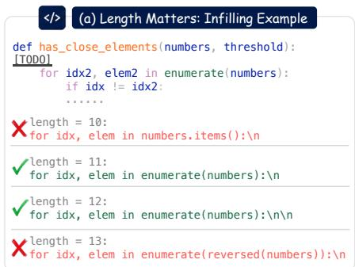
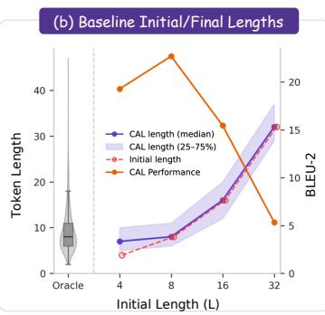
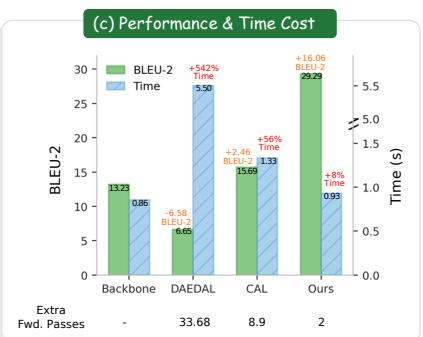
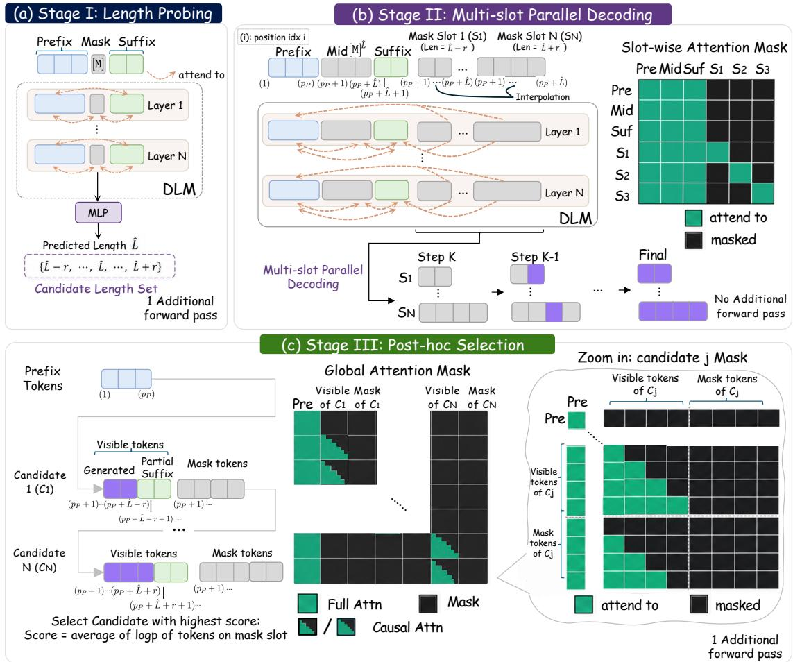
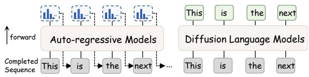
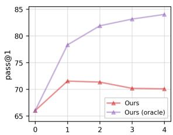
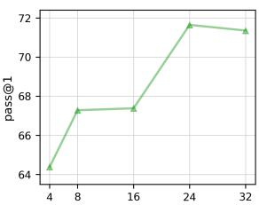
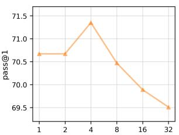
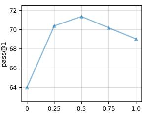
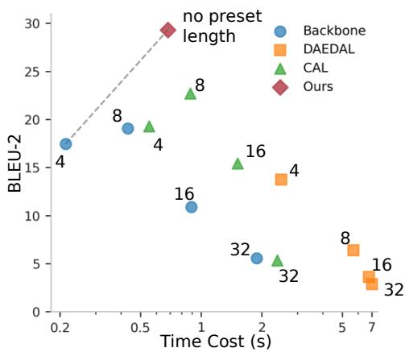

# Predict, Don’t Iterate: Efficient Adaptive-Length Infilling for Diffusion Language Models

Haobo Xu1, Sirui Chen1, Yuanchen Bei1, Lingjie Chen1, Yuchen Yan1, Dongqi Fu2, Jingrui He1, Hanghang Tong1

1 University of Illinois at Urbana-Champaign 2 Meta haoboxu@illinois.edu

## Abstract

Diffusion language models (DLMs) have emerged as a promising alternative to the autoregressive paradigm. With bidirectional attention and any-order generation, DLMs naturally fit infilling tasks, which require generating a middle span conditioned on both the prefix and the suffix. However, infilling is sensitive to the length of the span, while DLMs require the length to be fixed before generation. Although prior studies extend DLMs to dynamic lengths, they still suffer from two limitations. (i) Sensitivity to initial length. These methods require a preset length to initialize the search and are highly sensitive to this initial length, often yielding suboptimal results. (ii) Inference inefficiency. They either insert length-changing operations during generation or repeatedly search for an appropriate length using multi-step denoising confidence, both of which introduce substantial extra forward passes and computational cost. Therefore, we propose PILL (Probing-based InfiLling with preset-Length-free decoding), an efficient infilling method for DLMs that requires no preset initial length and adds far fewer extra forward passes than baselines, substantially reducing inference time. Experiments show that, across five DLMs spanning different families, archi tectures, and training recipes on eight infilling benchmarks, PILL improves over the strongest baseline by +4.8 average pass rate on code and +6.0 BLEU-2 on text, while running 1.82× faster than that baseline. The code is available at https://github.com/Hsu1023/PILL.

## 1 Introduction

Recently, diffusion language models (DLMs) have emerged as a promising alternative to autoregressive (AR) paradigm, showing great potential across various tasks (Nie et al., 2026b; Zhu et al., 2025b,a; Ye et al., 2025). Unlike AR models that rely on causal attention and decode strictly left to right, DLMs employ bidirectional attention and generate in any order, allowing them to condition on both the left and right context simultaneously (Hoogeboom et al., 2021). This property makes DLMs particularly well suited to infilling, generating a middle span that is coherent with both a given prefix and a given suffix, a setting that AR models are hard to handle (Bavarian et al., 2022).

However, DLMs require the number of masked positions to be fixed before decoding, whereas the correct infilling length is unknown in advance and varies from case to case (Bie et al., 2025). Crucially, infilling quality is highly sensitive to the chosen length: as shown in Figure 1(a), the codeinfilling example is solved correctly only when the mask span is given exactly the right number of tokens, while slightly shorter or longer spans produce incorrect completions. The model must therefore determine a length before it knows what to generate, even though the appropriate length depends on the content itself. Recent studies tackle this through adaptive-length decoding (Li et al., 2025a; Wu et al., 2026; Kim et al., 2025; Liu et al., 2026), but they still suffer from two limitations.

First, existing methods are sensitive to the initial length. They require a preset length to start the search for a better infilling length. For example, CAL (Liu et al., 2026) will be trapped into local minima near the initial length, yielding varying performances, as shown in Fig. 1(b). Second, they incur substantial inference overhead. Methods either inject explicit one token length-changing operations (Wu et al., 2026; Li et al., 2025a), or repeatedly probe denoising confidence over many decoding steps to estimate a length (Liu et al., 2026), introducing many extra forward passes and cost.

To this end, we propose PILL, a framework that enables fixed-length DLMs to perform variablelength infilling with only two extra forward passes. PILL consists of three stages. (1) Instead of searching for a length, we directly predict it from the bidirectional hidden state of a single mask token inserted between the prefix and suffix. (2) Since generation is sensitive to length, we expand this estimate into a small set of candidate lengths and decode them in parallel at a cost close to decoding one. (3) Since DLMs cannot score a generated sequence by next-token likelihood, we select the final span with a post-hoc score that favors candidates coherent both internally and with the suffix, using one additional forward pass. In summary, it is more efficient than baselines: it replaces their iterative length search, which spends a forward pass per step, with just two extra passes, while the multislot decoding generates all candidates in parallel at almost no extra cost. As shown in Figure 1(c), it achieves the highest quality while adding < 10% wall-clock time over vanilla fixed-length decoding, whereas baselines pay far more for a smaller gain. Our contributions are three-fold:

  
Figure 1: Motivation and Performance of PILL. (a) For DLM infilling tasks, correctness is sensitive to the span lengths. (b) Baselines must preset an initial length L and their final length stays tied to it, whereas PILL requires no preset length. (c) PILL attains the best performance with minimal overhead compared to fixed-length generation with backbones. Baselines are reported at initial length L = {4, 8, 16, 32}.

• A preset-free infilling framework. We propose PILL, a backbone-frozen framework that enables DLMs to perform adaptive-length infilling beyond the fixed lengths with only two extra forward passes, centered on a length probe that predicts target lengths directly from a mask token’s bidirectional hidden state.

• Parallel decoding and selection. We decode a set of length candidates in parallel at near single-candidate cost via a slot-wise attention mask, and select the final span with a post-hoc coherence score in one pass.

• Extensive validation. Across five DLMs and eight code and text benchmarks, PILL surpasses the strongest baselines by +4.8 pass rate on code and +6.0 BLEU-2 on text while running 1.82× faster.

## 2 Related Work

Diffusion Language Models. DLMs generate text by iteratively denoising masked or corrupted sequences. The idea originates from early works such as D3PM (Austin et al., 2021a) and Diffusion-LM (Li et al., 2022a), and is further developed by Masked Diffusion Language Models (MDLMs), which improve the modeling objective, sampling, and scalability (Shi et al., 2024; Sahoo et al., 2024). Recent models scale DLMs to larger parameters, including research previews such as Gemini-Diffusion and Seed Diffusion (Song et al., 2025) and open-sourced models such as LLaDA (Nie et al., 2026b) and Dream (Ye et al., 2025), reaching competitive performance across tasks including code generation, instruction following, and reasoning (Xie et al., 2025; Bie et al., 2025). Owing to their bidirectional attention, DLMs can condition on both left and right context, which makes them naturally suited to infilling (Li et al., 2025b).

Infilling and Adaptive-Length Decoding. Infilling has been extensively studied in the AR paradigm, including FIM-style training (Bavarian et al., 2022) and code-specialized models (Fried et al., 2022; Li et al., 2023; Roziere et al., 2023), all of which decode the missing span left-to-right via causal attention. While effective, AR models can only access the suffix indirectly through prompt conditioning, motivating bidirectional alternatives such as DLMs that natively condition on both prefix and suffix (Ye et al., 2025). However, DLMs typically require the number of masked positions to be specified before decoding, restricting them to fixed-length generation (Lin et al., 2026a). Recent studies address this by adaptive length decoding. DAEDAL (Li et al., 2025a) dynamically expands the generation canvas during inference, but only focuses on appending at the end of sequences. DreamOn (Wu et al., 2026) introduces explicit length-changing operations into the diffusion process, but requires fine-tuning the DLM, and potentially compromises general-purpose capabilities. FlexMDM (Kim et al., 2025) and DDOT (Zhang et al., 2025a) also introduces additional fine-tuning cost. CAL (Liu et al., 2026) searches for suitable lengths using early-step denoising confidence, but incurs extra forward passes and is highly sensitive to the initial length. In contrast, our approach uses a lightweight probe to directly predict the target length, and a multi-slot decoding scheme that generates and selects among multiple length candidates in parallel. This yields adaptive-length infilling with minimal additional cost and no reliance on a preset initial length.

## 3 Preliminaries

Diffusion Language Models. Let $\begin{array} { r } { x = ( x _ { 1 } , \ldots , } \end{array}$ $x _ { M } )$ be a token sequence over vocabulary V, augmented with a mask token [M]. DLMs define a forward process that independently replaces each $x _ { i }$ with [M] with probability $t \in [ 0 , 1 ]$ , yielding a corrupted sequence $x ^ { ( t ) }$ . A network $\dot { p } _ { \theta } ( x ^ { ( 0 ) } \mid \mathbf { \bar { \Phi } } x ^ { ( t ) } )$ is trained to reconstruct the original tokens at masked positions (Sahoo et al., 2024; Shi et al., 2024). Unlike auto-regressive models, DLMs use bidirectional attention, so every prediction conditions on all other positions on both sides. At inference, given a prefix P and a target length $L ,$ decoding starts from $\boldsymbol { x } ^ { ( K ) } = \boldsymbol { P } \oplus [ \mathsf { M } ] ^ { \boldsymbol { \breve { L } } }$ , where ⊕ denotes concatenation, and proceeds for K steps. At each step $k = K , \ldots , 1$ , the model produces a distribution over V at every masked position; a subset of positions with the highest confidence are unmasked, while the rest remain masked for step k−1. The final $x ^ { ( 0 ) }$ contains no masks. A central limitation is that $L$ must be specified before decoding and remains fixed throughout.

Infilling Tasks for DLMs. The inference setting above fills a masked region given only a prefix $P .$ Infilling extends this setting by additionally fixing a suffix S as a right-side condition, which DLMs can exploit directly thanks to their bidirectional attention and any-order generation. Given a prefix $P$ and a suffix $S _ { ☉ }$ , the infilling task asks for a middle span $M = \left( w _ { 1 } , \dots , w _ { L ^ { * } } \right)$ with $w _ { i } \in \mathcal V$ , such that the concatenation P ⊕ M ⊕ S maximizes a task-specific quality metric Q (e.g., pass rate for code, BLEU-2 for text). The gold length $L ^ { * }$ is unknown at inference time, and Q is inaccessible during decoding. DLMs instantiate the masked region as $P \oplus [ \mathbb { M } ] ^ { \bar { L } _ { 0 } } \oplus S$ at a preset length $L _ { 0 }$ and run iterative masked decoding to fill it.

## 4 Method

## 4.1 Overview

We cast the infilling task as two coupled subproblems: (1) determining the length of the mask span and (2) generating content coherent with both the prefix and the suffix. The two subproblems are entangled, since the appropriate length depends on what to generate, yet DLMs can only generate with fixed lengths. PILL decouples them through a three-stage design shown in Fig. 2. (1) Stage I predicts a target length $\hat { L }$ directly from hidden states of mask token through a single forward pass with a lightweight MLP probe, avoiding iterative length search. Since the generation is sensitive to lengths, we expand $\hat { L }$ into a small candidate set $\{ \hat { L } - r , \cdot \cdot \cdot , \hat { L } + r \}$ to enhance predictive reliability. (2) Stage II generates all candidate lengths in parallel at nearly the cost of decoding one, where each candidate length occupies a separate decoding region (a slot) and a slot-wise attention mask isolates the slots so they share prefix/suffix context but do not leak into one another, accelerating generation. (3) Stage III selects the final span from candidates via a post-hoc score that jointly measures each candidate’s internal coherence and how naturally the suffix continues from it in a single additional forward pass, equipped with a well-designed attention mask mechanism. Throughout the pipeline, we only introduce two passes, the probing pass and the scoring pass. Also, by predicting the length directly rather than searching from a preset value, PILL requires no initial lengths, yielding consistent performance across datasets.

## 4.2 Length Probing

The first stage estimates the length of the missing span directly from hidden states, as shown in Fig. 2(a). Given a prefix $P$ and suffix S, we construct a probing sequence by inserting a single mask token between them, denoted as $x _ { \mathrm { p r o b e } } = P \oplus [ \mathsf { M } ] \oplus S$ , and run a single forward pass of the frozen DLM backbone. We read the hidden state $h _ { [ \mathbb { M } ] } \in \mathbb { R } ^ { d }$ of the mask position at a certain layer. Because the backbone uses bidirectional attention, $h _ { [ \mathsf { M } ] }$ aggregates information from both prefix and suffix, making it a natural summary of how much content the missing span is expected to hold. Rather than using only the mask hidden state, we form the probe representation by concatenating the mean-pooled hidden states of the last four prefix tokens, the mask hidden state, and the mean-pooled hidden states of the first four suffix tokens h = $[ \mathrm { M e a n P o o l } ( h _ { p - 4 : p - 1 } ) ; h _ { [ \mathsf { M } ] } ; \mathrm { M e a n P o o l } ( h _ { s : s + 3 } ) ] \in$ $\dot { \mathbb { R } } ^ { 3 d }$ . This provides a richer representation than the single confidence scores used by DAEDAL (Li et al., 2025a) and CAL (Liu et al., 2026). Then, a lightweight 3-layer MLP probe $f _ { \phi } ( \cdot )$ maps h to a scalar length estimate

  
Figure 2: Pipeline of the proposed method. (a) Stage I probes the hidden state of a mask token to predict the target length Lˆ; (b) Stage II decodes the candidate lengths $\{ \hat { L } - r , \dots , \hat { L } + r \}$ in parallel with a slot-wise attention mask; (c) Stage III selects the final span with post-hoc score in one forward pass via a well-designed attention mask.

$$
\hat { L } = \big \lfloor \exp \big ( f _ { \phi } ( h ) \big ) \big \rceil ,\tag{1}
$$

where ⌊·⌉ rounds to the nearest positive integer. We predict log L rather than L directly, which guarantees a positive estimate and reduces the influence of long-tailed length distribution. More information about the probe can be found in Appendix A.1. The lightweight probe does not touch the backbone, preserving the DLM ability without finetuning the backbone. Also, we only introduce one single forward pass in this stage to avoid presetting an initial length, with minimal overhead. We also validate the probing by comparing predicted lengths against the oracle, indicating that our probe predicts lengths more accurately than the baseline while requiring no preset initial length (Sec. 5.5).

## 4.3 Multi-slot Parallel Decoding

Since the DLM generation is highly sensitive to the length of the mask slot, we expand the length $\hat { L }$ obtained by the probe within a local radius r into $\{ \hat { L } - r , \cdot \cdot \cdot , \hat { L } + r \}$ to better reduce prediction errors, yielding $N = 2 r + 1$ candidates, and assign the $j \cdot$ -th candidate length $\ell _ { j }$ to a separate decoding slot, which is a contiguous block of mask tokens that is decoded independently. But it yields much more decoding cost, therefore we propose a multislot parallel decoding strategy at a cost close to decoding one slot alone (Fig. 2(b)).

Sequence Layout. Since all the candidates share the prefix and suffix, we pack the candidate slots together with a shared context region, $P \oplus [ \mathbb { M } ] ^ { \hat { L } }$ ⊕ $S \oplus [ S _ { 1 } ] \cdot \cdot \cdot [ S _ { N } ]$ , where each slot $S _ { j }$ is initialized with $\ell _ { j }$ mask tokens. The prefix, middle mask slot and suffix form a shared context, and they attend to each other and are attended by every slot $S _ { j }$ . In addition, to avoid interference between mask slots $S _ { j }$ , we isolate the slots through a slot-wise attention mask. Each slot $S _ { j }$ attends only to its own tokens and the shared context $\{ P , [ \mathsf { M } ] ^ { \hat { L } } , S \}$ , but not to any other mask slot $S _ { j ^ { \prime } } ( j ^ { \prime } \neq j )$ . Because each slot sees nearly the same context as in single-slot generation, its denoising behavior, and thus its output, closely matches that of decoding the slot alone. This holds only when each slot is given appropriate position ids, which we address below.

Position IDs. A subtlety is how to assign position ids to slots of different lengths. The key principle is that a DLM places each predicted token at the position dictated by its position id. If the mask span is given more position ids than the content needs, the model treats the extra positions as space still to be filled and under-generates. We illustrate this with a concrete example, in which [TODO] denotes the span to be filled.

I have 13 books, and you have 23 books. (1)

We have [TODO] books.

The numbers below the text are the position ids assigned by LLaDA. The intended answer is $" 3 6 "$ (two tokens). When the gap is given exactly two position ids, the model correctly produces $" 3 6 "$ . But when we keep a single mask token yet leave a oneposition gap between it and one side of the context, the model fills only half the answer: leaving the gap on the suffix side makes the mask take position id $" ( 1 8 ) "$ while the suffix resumes at $" ( 2 0 ) "$ , and the model outputs only "3" (the first token of "36"); leaving the gap on the prefix side instead yields $" 6 "$ (the second token). In each case the model anchors its output to the position ids and leaves the gap unfilled, i.e., it under-generates. It motivates a no-gap mask positional id design. The mask slot should start at the position id immediately after the prefix and end immediately before the suffix, leaving no gaps from them.

We therefore fix the suffix anchor and interpolate each slot’s position ids over a shared gap interval, so that all slots present an identical layout to the suffix regardless of their length. Let the last prefix token have position id $p { _ { P } }$ . We fix the suffix to start at $p _ { S } = p _ { P } + \hat { L } + 1$ , leaving a gap interval $[ p _ { P } + 1 , ~ p _ { S } - 1 ]$ of width $\hat { L } .$ . For a slot $S _ { j }$ of length $\ell _ { j }$ , its k-th token $( k = 1 , \ldots , \ell _ { j } )$ is assigned

Lˆ − 1 pos(Sj, k) = (p + 1) + (k − 1) · (2) ℓj − 1 linearly interpolating the $\ell _ { j }$ tokens between $p _ { P } + 1$ and $p _ { S } - 1$ . Every slot thus spans the same interval and the suffix is anchored at $p _ { S }$ for all candidates, eliminating the length-dependent misalignment above. This design is critical: padding-based alternatives that left- or right-align the slot leave a position-id gap between the candidate and one side of the context, which leads to under-generation by the mechanism above. In contrast, interpolation removes this gap and substantially outperforms both padding variants (Sec 5.5).

Parallel Decoding. Within each slot, we run the original denoising/unmasking process. Since the mask slots do not interfere with each other and can be denoised in parallel, we obtain N infill candidates $\{ C _ { 1 } , \cdots , C _ { N } \}$ in almost the same time as decoding a single slot. This also saves KV-cache computation, since the shared context $\{ P , [ \mathsf { M } ] ^ { \hat { L } } , S \}$ remains unchanged throughout decoding. The middle $[ \boldsymbol { \mathsf { M } } ] ^ { \hat { L } }$ produces no output, and it merely anchors the shared position-id interval, and its KV is identical across all slots and steps. This motivates placing the shared context first in the sequence layout $( P \oplus [ \mathsf { M } ] ^ { \hat { L } } \oplus S \oplus [ S _ { 1 } ] \cdot \cdot \cdot [ S _ { N } ] )$ , so that its KV can be cached and reused across decoding steps. Please see Fig. 2(c) for an illustration.

## 4.4 Post-hoc Selection

Stage II returns N infill candidates $\{ C _ { 1 } , \ldots , C _ { N } \}$ of different lengths, and we must commit to one. AR models can score a sequence by its left-toright next-token likelihood. In contrast, DLMs are trained to predict the token at a masked position rather than the next token, so the distribution at an already-committed token is not a predictive distribution and cannot serve as a score (Fig. 3). Our goal is to select the candidate that makes the

  
Figure 3: Forward-pass targets in ARMs and DLMs.

completed sequence $P \oplus C _ { j } \oplus S$ most coherent as a whole, rather than one that looks good in isolation. A natural score is the pseudo-log-likelihood, which masks each token in turn and reads its loglikelihood from the rest; however, this requires one forward pass per token and is prohibitively expensive. Instead, we fix the prefix as a shared condition across all candidates and score the inner part for internal coherence and the suffix for how naturally it continues from the candidate, all in a single forward pass.

Masked Scoring Probes. For candidate $C _ { j }$ we lay out a visible block $\pmb { v } = C _ { j } \oplus \tilde { \pmb { S } } = ( v _ { 1 } , \dots , v _ { \ell _ { j } + m } )$ the $\ell _ { j }$ committed candidate tokens followed by the m selected suffix tokens $\tilde { S } { \bf - a }$ small, representative subset of the suffix used to judge how well it continues from the candidate (introduced later)- and a block of scoring probes, $\pmb { \mu } = ( \mu _ { 1 } , \dots , \mu _ { \ell _ { i } + m } )$ where each $\mu _ { k }$ is a mask token and shares the position id of $v _ { k }$ . We then carefully design an attention mask (Fig. 2(c)), enforcing a strictly causal read. The prefix $P$ is visible to the entire block. (1) Each visible token $v _ { k }$ attends to $P$ and to $v { \le } k$ (inclusive), so the visible block stays internally causal and no visible representation contains information of a later token. (2) Each probe $\mu _ { k }$ attends to $P$ and to $v _ { < k }$ only (strict), never to $v _ { k }$ itself, to any later position, or to another probe, to prevent it from accessing $v { \geq } k$ . Consequently the output at $\mu _ { k }$ is $p _ { \theta } ( \cdot \mid P , v _ { < k } )$ , and reading it at the observed token gives log $p _ { \theta } ( v _ { k } \mid P , v _ { < k } )$ with no label leakage; the first probe conditions on $P$ alone. The inclusive-causal visible block is essential: were it bidirectional, $v _ { < k }$ would already encode $v _ { k }$ and leak the token the probe is meant to predict. Since the suffix tokens follow the full candidate in v, their probes automatically condition on all of $C _ { j }$ , exactly the quantity needed to judge continuation.

Selection Score. Let $c _ { k }$ and $\tilde { s } _ { k }$ be the k-th token in $C _ { j }$ and ${ \tilde { S } } _ { j }$ . Partitioning the per-position log-probs of v into its candidate and suffix segments gives an inner score and a suffix score,

$$
\begin{array} { r l r } & { } & { s _ { j } ^ { \mathrm { i n } } = \frac { 1 } { \ell _ { j } } \displaystyle \sum _ { k = 1 } ^ { \ell _ { j } } \log p _ { \theta } ( c _ { k } \mid P , c _ { < k } ) , } \\ & { } & { s _ { j } ^ { \mathrm { s u f } } = \frac { 1 } { m } \displaystyle \sum _ { t = 1 } ^ { m } \log p _ { \theta } ( \tilde { s } _ { t } \mid P , C _ { j } , s _ { < t } ) , } \end{array}
$$

and we select the candidate maximizing their convex combination,

$$
j ^ { \star } = \arg \operatorname* { m a x } _ { j } \alpha s _ { j } ^ { \mathrm { i n } } + \left( 1 - \alpha \right) s _ { j } ^ { \mathrm { s u f } } .\tag{3}
$$

The inner score favors spans the model finds internally coherent, while the suffix score favors spans after which the observed suffix becomes likely, penalizing over- and under-generated spans that read fluently on their own but break the transition into S. The weight α balances local fluency against suffix alignment. We choose $\alpha = 0 . 5$ in practice.

Sparse Suffix Selection. Scoring the entire suffix is unnecessary, as the continuation signal concentrates in a few tokens. We build S˜ from (i) suffix head: the first few suffix tokens, which carry the immediate transition, and (ii) important tokens: the suffix tokens that received the highest attention from the infilling region in Stage II, which capture longer-range dependence (e.g., some variables appear later in the code). These two groups need not be contiguous: the intervening suffix tokens are not scored, but are kept as visible context so that each scored token still conditions on the full true suffix preceding it, log $p _ { \theta } ( \tilde { s } _ { t } ~ \vert ~ P , C _ { j } , s _ { < t } )$ , with an attention mask. We cap the considered suffix length at 32 and use $m \in [ 4 , 8 ]$ (the two groups may overlap) scored tokens in practice. For clarity, Fig. 2(c) depicts only the suffix head; the salient tokens follow the same scoring structure and are omitted to save space.

Single-pass Scoring. Finally, the N candidate blocks are packed into one sequence and isolated by a block-wise attention mask (Fig. 2(c), Global Attention Mask): the visible tokens and probes of candidate $j$ attend only to the shared prefix and to $C _ { j } { ' } \mathrm { : }$ s own block, never across candidates, so the blocks cannot interfere with each other. All candidates are therefore scored together in a single additional forward pass.

## 5 Experiments

## 5.1 Experimental Setup

Models. We apply PILL to five diffusion large language models (DLMs): LLaDA-8B-Base/Instruct (Nie et al., 2026b), LLaDA-MoE-Base (Zhu et al., 2025b), Dream-7B-Base (Ye et al., 2025), and Dream-Coder-7B-Base (Xie et al., 2025). These models cover both generalpurpose and code-oriented DLMs, spanning different model families (LLaDA/Dream), architectures (dense/MoE), and training recipes (base/instruction-tuned).

Datasets. We evaluate on code and naturallanguage infilling benchmarks, all disjoint from probe training set. For code, we use HumanEval-Infilling (Bavarian et al., 2022) with single-line (-S) and multi-line (-M) tasks, construct MBPP-S/-M from MBPP (Austin et al., 2021b) by a similar protocol, and build single-line Java and C/C++ tasks from MultiPL-E (Cassano et al., 2022). For text, we construct random contiguous word-span tasks from WikiText (Merity et al., 2016) and arXiv abstracts. We report pass rate for code and BLEU-2/ROUGE-L for text. See Appendix A.13 for details.

<table><tr><td rowspan="2">Datasets</td><td colspan="4">Python</td><td colspan="2">Other Language</td><td colspan="2">Text</td></tr><tr><td>Human-S</td><td>Human-M</td><td>MBPP-S</td><td>MBPP-M</td><td>Java</td><td>C/C++</td><td>Wiki</td><td>Arxiv</td></tr><tr><td colspan="9">LLaDA-8B-Base</td></tr><tr><td>Backbone</td><td>44.68</td><td>15.92</td><td>37.45</td><td>20.45</td><td>34.09</td><td>34.84</td><td>19.90 / 34.48</td><td>13.23 / 30.30</td></tr><tr><td>DAEDAL</td><td>44.99</td><td>16.76</td><td>38.86</td><td>22.48</td><td>35.34</td><td>36.03</td><td>10.82 / 20.78</td><td>6.65 / 16.61</td></tr><tr><td>CAL</td><td>64.74</td><td>24.61</td><td>54.49</td><td>32.21</td><td>50.31</td><td>49.22</td><td>23.00 / 37.25</td><td>15.69 / 32.69</td></tr><tr><td>PILL</td><td>71.35</td><td>28.20</td><td>57.49</td><td>38.19</td><td>57.10</td><td>54.57</td><td>29.29 / 44.96</td><td>20.28 / 39.82</td></tr><tr><td>PILL (Oracle)</td><td>81.90</td><td>38.54</td><td>71.56</td><td>50.92</td><td>60.98</td><td>60.08</td><td>41.51 / 56.76</td><td>29.35 / 50.43</td></tr><tr><td colspan="9">LLaDA-8B-Instruct</td></tr><tr><td>Backbone</td><td>49.73</td><td>17.62</td><td>37.47</td><td>21.15</td><td>32.42</td><td>33.40</td><td>18.07 / 32.77</td><td>12.57 / 29.44</td></tr><tr><td>DAEDAL</td><td>50.20</td><td>18.68</td><td>39.17</td><td>23.02</td><td>34.31</td><td>34.81</td><td>10.37 / 19.98</td><td>6.56 / 16.64</td></tr><tr><td>CAL</td><td>69.77</td><td>26.93</td><td>48.64</td><td>25.31</td><td>49.20</td><td>48.66</td><td>20.52 / 34.93</td><td>14.77 / 31.33</td></tr><tr><td>PILL</td><td>67.86</td><td>27.38</td><td>52.27</td><td>36.86</td><td>52.66</td><td>52.35</td><td>25.58 / 41.91</td><td>18.94 / 38.13</td></tr><tr><td>PILL (Oracle)</td><td>78.99</td><td>41.03</td><td>72.38</td><td>56.67</td><td>61.53</td><td>56.95</td><td>38.07 / 54.54</td><td>28.46 / 49.60</td></tr><tr><td colspan="9">LLaDA-MoE-Base</td></tr><tr><td>Backbone</td><td>45.84</td><td>16.43</td><td>40.42</td><td>22.56</td><td>34.53</td><td>34.92</td><td>17.23 / 31.51</td><td>13.04 / 29.69</td></tr><tr><td>DAEDAL</td><td>46.17</td><td>17.56</td><td>41.50</td><td>24.77</td><td>37.25</td><td>37.14</td><td>8.90 / 18.48</td><td>6.06 / 15.70</td></tr><tr><td>CAL</td><td>67.79</td><td>25.96</td><td>58.32</td><td>34.45</td><td>53.06</td><td>50.41</td><td>19.39 / 33.75</td><td>14.78 / 31.25</td></tr><tr><td>PILL</td><td>71.44</td><td>31.92</td><td>58.52</td><td>43.12</td><td>55.76</td><td>55.23</td><td>25.76 / 41.84</td><td>19.13 / 38.30</td></tr><tr><td>PILL (Oracle)</td><td>81.80</td><td>41.34</td><td>67.56</td><td>54.62</td><td>58.98</td><td>58.77</td><td>37.51 / 53.41</td><td>28.03 / 49.12</td></tr><tr><td colspan="9"></td></tr><tr><td>Backbone</td><td>42.79</td><td>16.13</td><td>40.12</td><td>Dream-7B-Base 22.15</td><td>33.90</td><td>34.30</td><td>19.12 / 33.75</td><td></td></tr><tr><td>DAEDAL</td><td>42.62</td><td>17.60</td><td>41.22</td><td>25.11</td><td>38.20</td><td>37.88</td><td>9.68 / 19.33</td><td>13.56 / 30.97 6.72 / 17.22</td></tr><tr><td>CAL</td><td>64.48</td><td>26.38</td><td>56.00</td><td>33.60</td><td>47.92</td><td>48.00</td><td>21.68 / 36.68</td><td>15.98 / 33.52</td></tr><tr><td>PILL</td><td>68.34</td><td>28.55</td><td>57.97</td><td>37.72</td><td>58.98</td><td>56.30</td><td>32.36 / 48.13</td><td>22.89 / 42.79</td></tr><tr><td>PILL (Oracle)</td><td>79.77</td><td>39.19</td><td>70.91</td><td>52.11</td><td>63.64</td><td>62.63</td><td>44.66 / 59.98</td><td>33.64 /54.49</td></tr><tr><td colspan="9">Dream-Coder-7B-Base</td></tr><tr><td>Backbone</td><td>49.64</td><td>19.00</td><td>43.94</td><td>25.62</td><td>36.89</td><td>37.66</td><td></td><td></td></tr><tr><td>DAEDAL</td><td>50.85</td><td>21.14</td><td>47.79</td><td>30.80</td><td>40.96</td><td>40.72</td><td></td><td></td></tr><tr><td>CAL</td><td>68.56</td><td>28.24</td><td>61.35</td><td>38.91</td><td>51.14</td><td>49.28</td><td></td><td></td></tr><tr><td>PILL</td><td>71.35</td><td>32.14</td><td>62.59</td><td>47.28</td><td>59.87</td><td>59.01</td><td></td><td></td></tr><tr><td>PILL (Oracle)</td><td>82.38</td><td>44.01</td><td>73.59</td><td>63.41</td><td>62.20</td><td>62.88</td><td></td><td></td></tr><tr><td colspan="9"></td></tr></table>

Table 1: Performance Comparison. We compare PILL with baselines on eight benchmarks across five models.

Baselines. We compare PILL with the backbone models (fixed-length decoding) and two dynamic decoding methods, DAEDAL (Li et al., 2025a) and CAL (Liu et al., 2026). Since all baselines require an initial generation length, we follow (Wu et al., 2026; Liu et al., 2026) and report the average performance over $L \in \{ 4 , 8 , 1 6 , 3 2 \}$ . This provides a prior-free evaluation protocol, and per-length results are provided in Appendix. CAL is evaluated using its official implementation and hyperparameters. We adapt DAEDAL following the implementation in (Liu et al., 2026) to fit the infilling setting. We also report comparison with DreamOn (Wu et al., 2026) on text tasks. We also report results on PILL (Oracle), which uses the same generated candidate set as PILL but replaces the Stage III selector with the ground-truth task evaluator, providing a upper bound on candidate selection. All experiments run on a single NVIDIA A40 GPU.

## 5.2 Main Results

Table 1 reports infilling quality across five DLMs and eight code and natural-language benchmarks. PILL delivers the strongest results on nearly every model-dataset combination, improving the most competitive baseline CAL by +4.8 pass rate on average across the code benchmarks and by +6.0

BLEU-2 points on text. These gains hold across model families (LLaDA/Dream), architectures (dense/MoE), training recipes (base/instructiontuned), and both code and text, indicating that PILL fits different models and tasks.

The baselines further illustrate why adaptivelength infilling is needed. DAEDAL, which only appends at the end of the canvas, cannot respect the suffix constraint and degrades even below the fixedlength backbone on text. CAL is the strongest baseline but still trails PILL while incurring repeated confidence-search passes and remaining sensitive to the preset initial length (Fig. 1(b)), whereas PILL needs no preset length at all. Finally, the oracle upper bound PILL (Oracle) shows that the candidate set almost always contains a strong completion, confirming that the multi-slot stage adequately covers the correct length. The remaining gap to the oracle indicates that the principal headroom lies in post-hoc selection rather than generation.

## 5.3 Efficiency Analysis

Beyond the WikiText results in Fig. 1(c), Table 2 compares quality and cost on HumanEval-S with LLaDA-8B-Base. PILL attains the highest Pass@1 while adding only 7% wall-clock time over the fixed-length backbone, in contrast to CAL (+94%) and DAEDAL (+117%). Equivalently, PILL is 1.82× faster than the strongest baseline CAL yet 6.6 points more accurate. One of the reasons for this efficiency is that PILL introduces only two extra forward passes, the probing pass and the scoring pass, whereas the iterative length search in CAL and DAEDAL requires much more.

<table><tr><td>Method</td><td>Pass@11</td><td>Extra Fwd. Passes</td><td>Time Cost</td></tr><tr><td>Backbone</td><td>44.67</td><td>一</td><td>1.10 s (+0%)</td></tr><tr><td>DAEDAL</td><td>44.80</td><td>11.98</td><td>2.29 s (+117%)</td></tr><tr><td>CAL</td><td>64.74</td><td>13.79</td><td>2.13 s (+94%)</td></tr><tr><td>PILL</td><td>71.35</td><td>2.00</td><td>1.18 s (+7%)</td></tr></table>

Table 2: Efficiency of LLaDA-8B-Base on Human-S.

## 5.4 Sensitivity to Design Choices

Length probing and candidate set. Fig. 4(b) varies the layer from which the probe reads the mask hidden state: Pass@1 increases monotonically with depth, consistent with deeper states aggregating richer bidirectional context from both prefix and suffix. We therefore read h from the last layer for convenience. Fig. 4(a) varies the candidate radius r. The oracle upper bound keeps rising with r, confirming that a larger candidate set is more likely to contain the correct length. PILL, however, saturates beyond r = 2, since candidate set is larger and the ratio of correct ones decreases. Also, we validate the effectiveness of length probing, as shown in Sec. 5.5.

Post-hoc selection. Fig. 4(c) varies the number of scored suffix tokens m. Pass@1 peaks at $m = 4$ and declines thereafter, supporting our suffix selection: the continuation signal concentrates in a few tokens near the transition, and scoring more of them only injects noise. Fig. 4(d) varies the weight α between the inner and suffix scores. Performance peaks around $\alpha = 0 . 5$ and drops at both extremes, showing that internal coherence and suffix continuation are complementary and neither alone suffices.

## 5.5 Validation of Stages

Length Probing Effectiveness (Stage I). We directly evaluate predicted lengths against the gold length L∗ on Human-S with LLaDA-8B-Base, using MAE and Acc@k, the fraction of predictions within k tokens of L∗. For CAL, we sweep the preset initial length $l \in \{ 4 , 8 , 1 6 , 3 2 \}$ , while PILL requires no initial length.

As shown in Table 3, CAL is highly sensitive to its initialization: its MAE increases from 3.56 (l=4) to 24.13 (l=32), while Acc@1 drops from 0.58 to 0.02. In contrast, PILL achieves the lowest MAE (2.50) without tuning. Although CAL (l=4) has higher Acc@1, PILL achieves substantially higher Acc@3 and Acc@5, which better reflects our setting since PILL expands $\hat { L }$ into nearby candidate lengths and selects among them. In particular, Acc@5 reaches 86.4%, showing that the target length is covered by the local candidate window in most cases.

<table><tr><td>Method</td><td>MAE</td><td>Acc@1</td><td>Acc@3</td><td>Acc@5</td></tr><tr><td>CAL (l = 4)</td><td>3.5644</td><td>0.5808</td><td>0.7086</td><td>0.7909</td></tr><tr><td>CAL (l = 8)</td><td>3.7106</td><td>0.5595</td><td>0.6912</td><td>0.7773</td></tr><tr><td>CAL (l = 16)</td><td>9.0600</td><td>0.2023</td><td>0.2730</td><td>0.3611</td></tr><tr><td>CAL (l = 32)</td><td>24.1336</td><td>0.0165</td><td>0.0203</td><td>0.0329</td></tr><tr><td>PILL</td><td>2.4974</td><td>0.4472</td><td>0.7822</td><td>0.8635</td></tr></table>

Table 3: Length prediction performance (l: initial length).

Effect of Slot Position-ID Design (Stage II). We compare interpolation with left- and right-padding, which leave a position-ID gap on one side of the context. Since DLMs commonly use RoPE (Su et al., 2024), interpolation at non-integer positions requires no additional tuning (Chen et al., 2023;

  
(a) Radius

  
(b) Probe Input Layer

  
(c) Selection Suffix Length

  
(d) Selection Alpha

Figure 4: Ablation studies on four design choices of PILL.
<table><tr><td>Position-ID Design</td><td>Oracle Pass@1</td><td>Avg Pass@1</td></tr><tr><td>Left-padding</td><td>73.2</td><td>28.2</td></tr><tr><td>Right-padding</td><td>74.2</td><td>31.6</td></tr><tr><td>Interpolation (ours)</td><td>81.9</td><td>51.6</td></tr><tr><td>Independent single-slot</td><td>83.6</td><td>52.9</td></tr></table>

Table 4: Effect of slot position-id design (LLaDA-8B-Base, Human-S, r=2).

Zhang et al., 2025a). For $\ell _ { j } = 1$ , we set the position ID to $p _ { P } + 1$ . As shown in Table 4, interpolation substantially improves both Avg Pass@1 (51.6 vs. 28.2/31.6) and Oracle Pass@1 (81.9 vs. 73.2/74.2) over left/right padding. The gap persists under oracle selection, indicating that padding causes structural generation errors rather than merely poorer candidate selection.

We further compare against independent singleslot decoding. Given the same candidate lengths $\{ \hat { L } - r , \dots , \hat { L } + r \}$ produced by PILL, we decode each candidate separately in its own sequence, and oracle-select the best resulting candidate. Interpolation nearly matches this upper bound (81.9/51.6 vs. 83.6/52.9), showing that the shared multi-slot layout introduces little quality loss.

Ablation of Post-hoc Selection Score (Stage III). We ablate the post-hoc selection score in Table 5. Random uniformly selects a decoded candidate, while predicted-length only uses the center candidate at Lˆ without post-hoc selection. Inner-only and suffix-only correspond to α = 1 and α = 0 in Eq. (3), respectively, and our default combines both signals with $\alpha = 0 . 5$ . Random selection performs poorly despite the presence of strong candidates, showing that effective post-hoc selection is necessary. Using the predicted length alone is substantially stronger, while combining the inner and suffix scores achieves the best performance, confirming that the two signals are complementary.

## 6 Conclusion

We presented PILL, a backbone-frozen framework that turns fixed-length DLMs into adaptive-length infillers through three lightweight stages: probing the mask hidden state to predict the target length, decoding multiple length candidates in parallel via slot-wise attention, and selecting among them with a post-hoc coherence score. Adding only two forward passes and requiring no preset length, PILL outperforms prior adaptive-length baselines across five DLMs on both code and text infilling, running substantially faster than them.

<table><tr><td>Selection Strategy</td><td>Pass@1</td></tr><tr><td>Random candidate</td><td>51.62</td></tr><tr><td>Predicted length only</td><td>66.02</td></tr><tr><td>Inner-only  $( \alpha = 1 )$ </td><td>69.02</td></tr><tr><td>Suffix-only  $( \alpha = 0 )$ </td><td>63.99</td></tr><tr><td>Inner + Suffix  $( \alpha = 0 . 5 )$ </td><td>71.35</td></tr></table>

Table 5: Ablation of the post-hoc selection score on LLaDA-8B-Base and HumanEval-S.

## Limitations

While PILL is effective and efficient across a range of DLMs and infilling benchmarks, many practical scenarios involve complex editing settings, such as nested spans and repository-level code patches, remain interesting directions for future work. In addition, our experiments are conducted on DLMs up to roughly 7B/8B parameters on a single GPU. Whether the behavior of the length probe and the post-hoc selection scales to substantially larger diffusion backbones remains to be verified.

## Acknowledgement

This work is supported by NSF (2324770). The content of the information in this document does not necessarily reflect the position or the policy of the Government, and no official endorsement should be inferred. The U.S. Government is authorized to reproduce and distribute reprints for Government purposes notwithstanding any copyright notation here on.

## References

Jacob Austin, Daniel D Johnson, Jonathan Ho, Daniel Tarlow, and Rianne Van Den Berg. 2021a. Structured denoising diffusion models in discrete state-spaces. Advances in neural information processing systems, 34:17981–17993.

Jacob Austin, Augustus Odena, Maxwell Nye, Maarten Bosma, Henryk Michalewski, David Dohan, Ellen Jiang, Carrie Cai, Michael Terry, Quoc Le, et al. 2021b. Program synthesis with large language models. arXiv preprint arXiv:2108.07732.

Yikun Ban, Yuchen Yan, Arindam Banerjee, and Jingrui He. 2021. Ee-net: Exploitation-exploration neural networks in contextual bandits. arXiv preprint arXiv:2110.03177.

Yikun Ban, Yuchen Yan, Arindam Banerjee, and Jingrui He. 2023. Neural exploitation and exploration of contextual bandits. arXiv preprint arXiv:2305.03784.

Mohammad Bavarian, Heewoo Jun, Nikolas Tezak, John Schulman, Christine McLeavey, Jerry Tworek, and Mark Chen. 2022. Efficient training of language models to fill in the middle. arXiv preprint arXiv:2207.14255.

Yuanchen Bei, Tianxin Wei, Xuying Ning, Yanjun Zhao, Zhining Liu, Xiao Lin, Yada Zhu, Hendrik Hamann, Jingrui He, and Hanghang Tong. 2026. Mem-gallery: Benchmarking multimodal long-term conversational memory for mllm agents. In Proceedings of the 64th Annual Meeting of the Association for Computational Linguistics (Volume 1: Long Papers), pages 40750– 40784.

Tiwei Bie, Maosong Cao, Kun Chen, Lun Du, Mingliang Gong, Zhuochen Gong, Yanmei Gu, Jiaqi Hu, Zenan Huang, Zhenzhong Lan, et al. 2025. Llada2. 0: Scaling up diffusion language models to 100b. arXiv preprint arXiv:2512.15745.

Federico Cassano, John Gouwar, Daniel Nguyen, Sydney Nguyen, Luna Phipps-Costin, Donald Pinckney, Ming-Ho Yee, Yangtian Zi, Carolyn Jane Anderson, Molly Q Feldman, et al. 2022. Multipl-e: A scalable and extensible approach to benchmarking neural code generation. arXiv preprint arXiv:2208.08227.

Jian Chen, Yesheng Liang, and Zhijian Liu. 2026. Dflash: Block diffusion for flash speculative decoding. arXiv preprint arXiv:2602.06036.

Shouyuan Chen, Sherman Wong, Liangjian Chen, and Yuandong Tian. 2023. Extending context window of large language models via positional interpolation. arXiv preprint arXiv:2306.15595.

Xin Cheng, Xingkai Yu, Chenze Shao, Jiashi Li, Yunfan Xiong, Yi Qian, Jiaqi Zhu, Shirong Ma, Xiaokang Zhang, Jiasheng Ye, et al. 2026. Dspark: Confidence-scheduled speculative decoding with semi-autoregressive generation. arXiv preprint arXiv:2607.05147.

Boxin Du, Si Zhang, Yuchen Yan, and Hanghang Tong. 2021. New frontiers of multi-network mining: Recent developments and future trend. In Proceedings of the 27th ACM SIGKDD Conference on Knowledge Discovery & Data Mining, pages 4038–4039.

Daniel Fried, Armen Aghajanyan, Jessy Lin, Sida Wang, Eric Wallace, Freda Shi, Ruiqi Zhong, Wen-tau Yih, Luke Zettlemoyer, and Mike Lewis. 2022. Incoder: A generative model for code infilling and synthesis. arXiv preprint arXiv:2204.05999.

Emiel Hoogeboom, Didrik Nielsen, Priyank Jaini, Patrick Forré, and Max Welling. 2021. Argmax flows and multinomial diffusion: Learning categorical distributions. Advances in neural information processing systems, 34:12454–12465.

Feiran Huang, Yuanchen Bei, Zhenghang Yang, Junyi Jiang, Hao Chen, Qijie Shen, Senzhang Wang, Fakhri Karray, and Philip S Yu. 2025. Large language model simulator for cold-start recommendation. In Proceedings ofthe eighteenth ACM international conference on web search and data mining, pages 261–270.

Baoyu Jing, Yuchen Yan, Kaize Ding, Chanyoung Park, Yada Zhu, Huan Liu, and Hanghang Tong. 2024. Sterling: Synergistic representation learning on bipartite graphs. In Proceedings of the AAAI Conference on Artificial Intelligence, volume 38, pages 12976– 12984.

Jaeyeon Kim, Lee Cheuk-Kit, Carles Domingo-Enrich, Yilun Du, Sham Kakade, Timothy Ngotiaoco, Sitan Chen, and Michael Albergo. 2025. Any-order flexible length masked diffusion. arXiv preprint arXiv:2509.01025.

Xunhao Lai, Weiqi Xu, Yufeng Yang, Qiaorui Chen, Yang Xu, Lunbin Zeng, Xiaolong Li, Haohai Sun, Haichao Zhu, Vito Zhang, et al. 2026. Minimax sparse attention. arXiv preprint arXiv:2606.13392.

Jinning Li, Ruipeng Han, Chenkai Sun, Dachun Sun, Ruijie Wang, Jingying Zeng, Yuchen Yan, Hanghang Tong, and Tarek Abdelzaher. 2024. Large language model-guided disentangled belief representation learning on polarized social graphs. In 2024 33rd International Conference on Computer Communications and Networks (ICCCN), pages 1–9. IEEE.

Jinsong Li, Xiaoyi Dong, Yuhang Zang, Yuhang Cao, Jiaqi Wang, and Dahua Lin. 2025a. Beyond fixed: Training-free variable-length denoising for diffusion large language models. arXiv preprint arXiv:2508.00819.

Raymond Li, Loubna Ben Allal, Yangtian Zi, Niklas Muennighoff, Denis Kocetkov, Chenghao Mou, Marc Marone, Christopher Akiki, Jia Li, Jenny Chim, et al. 2023. Starcoder: may the source be with you! arXiv preprint arXiv:2305.06161.

Tianyi Li, Mingda Chen, Bowei Guo, and Zhiqiang Shen. 2025b. A survey on diffusion language models. arXiv preprint arXiv:2508.10875.

Xiang Li, John Thickstun, Ishaan Gulrajani, Percy S Liang, and Tatsunori B Hashimoto. 2022a. Diffusionlm improves controllable text generation. Advances in neural information processing systems, 35:4328– 4343.

Yuhui Li, Fangyun Wei, Chao Zhang, and Hongyang Zhang. 2026a. Eagle-3: Scaling up inference acceleration of large language models via training-time test. Advances in Neural Information Processing Systems, 38:136737–136756.

Yujia Li, David Choi, Junyoung Chung, Nate Kushman, Julian Schrittwieser, Rémi Leblond, Tom Eccles, James Keeling, Felix Gimeno, Agustin Dal Lago, et al. 2022b. Competition-level code generation with alphacode. Science, 378(6624):1092–1097.

Zixuan Li, Haokun Lin, Yicheng Xiao, Zhiwei Li, Xinyang Song, Zelong Zheng, Yong He, Heng Yao, Ke Ding, Chao Yu, et al. 2026b. Iv-cot: Implicit visual chain-of-thought for structure-aware text-toimage generation. arXiv preprint arXiv:2606.24849.

Haokun Lin, Xinle Jia, Shaozhen Liu, Shujun Xia, Weitao Huang, Haobo Xu, Junyang Li, Yicheng Xiao, Xingrun Xing, Ziyu Guo, et al. 2026a. Efficient diffusion language models: A comprehensive survey.

Haokun Lin, Xinle Jia, Haobo Xu, Bingchen Yao, Xianglong Guo, Yichen Wu, Zhichao Lu, Ying Wei, Qingfu Zhang, and Zhenan Sun. 2026b. Duquant++: Fine-grained rotation enhances microscaling fp4 quantization. arXiv preprint arXiv:2604.17789.

Haokun Lin, Teng Wang, Yixiao Ge, Yuying Ge, Zhichao Lu, Ying Wei, Qingfu Zhang, Zhenan Sun, and Ying Shan. 2025a. Toklip: Marry visual tokens to clip for multimodal comprehension and generation. arXiv preprint arXiv:2505.05422.

Haokun Lin, Haobo Xu, Yichen Wu, Jingzhi Cui, Yingtao Zhang, Linzhan Mou, Linqi Song, Zhenan Sun, and Ying Wei. 2024a. Duquant: Distributing outliers via dual transformation makes stronger quantized llms. Advances in Neural Information Processing Systems, 37:87766–87800.

Haokun Lin, Haobo Xu, Yichen Wu, Ziyu Guo, Renrui Zhang, Zhichao Lu, Ying Wei, Qingfu Zhang, and Zhenan Sun. 2025b. Quantization meets dllms: A systematic study of post-training quantization for diffusion llms. arXiv preprint arXiv:2508.14896.

Haokun Lin, Kaijie Zhu, Haobo Xu, Yichen Wu, Zhichao Lu, Qingfu Zhang, and Zhenan Sun. 2026c. Benchmarking trustworthiness of slms: Pre-trained vs. compressed. arXiv preprint arXiv:2608.11981.

Xiao Lin, Jian Kang, Weilin Cong, and Hanghang Tong. 2024b. Bemap: Balanced message passing for fair graph neural network. In Learning on Graphs Conference, pages 37–1. PMLR.

Xiao Lin, Zhining Liu, Ze Yang, Gaotang Li, Ruizhong Qiu, Shuke Wang, Hui Liu, Haotian Li, Sumit Keswani, Vishwa Pardeshi, et al. 2025c. Moralise: A structured benchmark for moral alignment in visual language models. arXiv preprint arXiv:2505.14728.

Xiao Lin, Zhicheng Tang, Weilin Cong, Mengyue Hang, Kai Wang, Yajuan Wang, Zhichen Zeng, Ting-Wei Li, Hyunsik Yoo, Zhining Liu, et al. 2026d. Mixture of sequence: Theme-aware mixture-of-experts for long-sequence recommendation. In Proceedings of the ACM Web Conference 2026, pages 6469–6480.

Hengchang Liu, Zhao Yang, and Bing Su. 2026. Diffusion lms can approximate optimal infilling lengths implicitly. arXiv preprint arXiv:2602.00476.

Lihui Liu, Zihao Wang, Dawei Zhou, Ruijie Wang, Yuchen Yan, Bo Xiong, Sihong He, and Hanghang Tong. 2025. Few-shot knowledge graph completion via transfer knowledge from similar tasks. In Proceedings of the 34th ACM International Conference on Information and Knowledge Management, pages 4960–4965.

Ruikang Liu, Haoli Bai, Haokun Lin, Yuening Li, Han Gao, Zhengzhuo Xu, Lu Hou, Jun Yao, and Chun Yuan. 2024a. Intactkv: Improving large language model quantization by keeping pivot tokens intact. arXiv preprint arXiv:2403.01241.

Zirui Liu, Jiayi Yuan, Hongye Jin, Shaochen Zhong, Zhaozhuo Xu, Vladimir Braverman, Beidi Chen, and Xia Hu. 2024b. Kivi: A tuning-free asymmetric 2bit quantization for kv cache. arXiv preprint arXiv:2402.02750.

Rohin Manvi, Joey Hong, Tim Seyde, Maxime Labonne, Mathias Lechner, and Sergey Levine. 2026. Zerooverhead introspection for adaptive test-time compute. In International Conference on Learning Representations, volume 2026, pages 109705–109723.

Stephen Merity, Caiming Xiong, James Bradbury, and Richard Socher. 2016. Pointer sentinel mixture models. arXiv preprint arXiv:1609.07843.

Shen Nie, Qiyang Min, Shaoxuan Xu, Zihao Huang, Yuxuan Song, Yong Shan, Yankai Lin, Wayne Xin Zhao, Chongxuan Li, and Ji-Rong Wen. 2026a. Improved large language diffusion models. arXiv preprint arXiv:2606.25331.

Shen Nie, Fengqi Zhu, Zebin You, Xiaolu Zhang, Jingyang Ou, Jun Hu, Jun Zhou, Yankai Lin, Ji-Rong Wen, and Chongxuan Li. 2026b. Large language diffusion models. Advances in Neural Information Processing Systems, 38:50608–50646.

Colin Raffel, Noam Shazeer, Adam Roberts, Katherine Lee, Sharan Narang, Michael Matena, Yanqi Zhou, Wei Li, and Peter J Liu. 2020. Exploring the limits of transfer learning with a unified text-to-text transformer. Journal of machine learning research, 21(140):1–67.

Veselin Raychev, Pavol Bielik, and Martin Vechev. 2016. Probabilistic model for code with decision trees. ACM SIGPLAN Notices, 51(10):731–747.

Shane Roach, Connie Ni, Alexei Kopylov, Tsai-Ching Lu, Jiejun Xu, Si Zhang, Boxin Du, Dawei Zhou, Jun Wu, Lihui Liu, et al. 2020. Canon: Complex analytics of network of networks for modeling adversarial activities. In 2020 IEEE International Conference on Big Data (Big Data), pages 1634–1643. IEEE.

Baptiste Roziere, Jonas Gehring, Fabian Gloeckle, Sten Sootla, Itai Gat, Xiaoqing Ellen Tan, Yossi Adi, Jingyu Liu, Romain Sauvestre, Tal Remez, et al. 2023. Code llama: Open foundation models for code. arXiv preprint arXiv:2308.12950.

Subham S Sahoo, Marianne Arriola, Yair Schiff, Aaron Gokaslan, Edgar Marroquin, Justin T Chiu, Alexander Rush, and Volodymyr Kuleshov. 2024. Simple and effective masked diffusion language models. Advances in Neural Information Processing Systems, 37:130136–130184.

Jiaxin Shi, Kehang Han, Zhe Wang, Arnaud Doucet, and Michalis Titsias. 2024. Simplified and generalized masked diffusion for discrete data. Advances in neural information processing systems, 37:103131– 103167.

Yuxuan Song, Zheng Zhang, Cheng Luo, Pengyang Gao, Fan Xia, Hao Luo, Zheng Li, Yuehang Yang, Hongli Yu, Xingwei Qu, et al. 2025. Seed diffusion: A large-scale diffusion language model with highspeed inference. arXiv preprint arXiv:2508.02193.

Jianlin Su, Murtadha Ahmed, Yu Lu, Shengfeng Pan, Wen Bo, and Yunfeng Liu. 2024. Roformer: Enhanced transformer with rotary position embedding. Neurocomputing, 568:127063.

Dingsu Wang, Yuchen Yan, Ruizhong Qiu, Yada Zhu, Kaiyu Guan, Andrew Margenot, and Hanghang Tong. 2023. Networked time series imputation via positionaware graph enhanced variational autoencoders. In Proceedings ofthe 29th ACM SIGKDD Conference on Knowledge Discovery and Data Mining, pages 2256–2268.

Ruijie Wang, Yuchen Yan, Jialu Wang, Yuting Jia, Ye Zhang, Weinan Zhang, and Xinbing Wang. 2018. Acekg: A large-scale knowledge graph for academic data mining. In Proceedings ofthe 27th ACM international conference on information and knowledge management, pages 1487–1490.

Zirui Wu, Lin Zheng, Zhihui Xie, Jiacheng Ye, Jiahui Gao, Shansan Gong, Yansong Feng, Zhenguo Li, Wei Bi, Guorui Zhou, et al. 2026. Dreamon: Diffusion language models for code infilling beyond fixed-size canvas. arXiv preprint arXiv:2602.01326.

Shujun Xia, Haokun Lin, Yichen Wu, Yinan Zhou, Zixuan Li, Zhongwei Wan, Xingrun Xing, Yefeng Zheng, Xiang Li, Caifeng Shan, et al. 2025. Medrek: Retrieval-based editing for medical llms with keyaware prompts. arXiv preprint arXiv:2510.13500.

Guangxuan Xiao, Yuandong Tian, Beidi Chen, Song Han, and Mike Lewis. 2024. Efficient streaming language models with attention sinks. In International Conference on Learning Representations, volume 2024, pages 21875–21895.

Zhihui Xie, Jiacheng Ye, Lin Zheng, Jiahui Gao, Jingwei Dong, Zirui Wu, Xueliang Zhao, Shansan Gong, Xin Jiang, Zhenguo Li, et al. 2025. Dream-coder 7b: An open diffusion language model for code. arXiv preprint arXiv:2509.01142.

Xingrun Xing, Zheng Liu, Shitao Xiao, Boyan Gao, Yiming Liang, Haokun Lin, Xianlin Zeng, Guoqi Li, and Jiajun Zhang. 2026. Efficientllm: Unified pruning-aware pretraining for auto-designed compact language models. In Proceedings of the 64th Annual Meeting of the Association for Computational Linguistics (Volume 1: Long Papers), pages 7813–7830.

Haobo Xu, Sirui Chen, Ruizhong Qiu, Yuchen Yan, Chen Luo, Monica Xiao Cheng, Jingrui He, and Hanghang Tong. 2026. Prune as you generate: Online rollout pruning for faster and better rlvr. In Proceedings of the 64th Annual Meeting of the Associationfor Computational Linguistics (Volume 1: Long Papers), pages 13876–13893.

Haobo Xu, Yuchen Yan, Dingsu Wang, Zhe Xu, Zhichen Zeng, Tarek F Abdelzaher, Jiawei Han, and Hanghang Tong. 2024. Slog: An inductive spectral graph neural network beyond polynomial filter. In Fortyfirst International Conference on Machine Learning.

Yuchen Yan, Yuzhong Chen, Huiyuan Chen, Xiaoting Li, Zhe Xu, Zhichen Zeng, Lihui Liu, Zhining Liu, and Hanghang Tong. 2024a. Thegcn: Temporal heterophilic graph convolutional network. arXiv preprint arXiv:2412.16435.

Yuchen Yan, Yuzhong Chen, Huiyuan Chen, Minghua Xu, Mahashweta Das, Hao Yang, and Hanghang Tong. 2023a. From trainable negative depth to edge heterophily in graphs. Advances in Neural Information Processing Systems, 36:70162–70178.

Yuchen Yan, Yongyi Hu, Qinghai Zhou, Lihui Liu, Zhichen Zeng, Yuzhong Chen, Menghai Pan, Huiyuan Chen, Mahashweta Das, and Hanghang Tong. 2024b. Pacer: Network embedding from positional to structural. In Proceedings ofthe ACM Web Conference 2024, pages 2485–2496.

Yuchen Yan, Yongyi Hu, Qinghai Zhou, Shurang Wu, Dingsu Wang, and Hanghang Tong. 2024c. Topological anonymous walk embedding: A new structural node embedding approach. In Proceedings of the 33rd ACM International Conference on Information and Knowledge Management, pages 2796–2806.

Yuchen Yan, Baoyu Jing, Lihui Liu, Ruijie Wang, Jinning Li, Tarek Abdelzaher, and Hanghang Tong. 2023b. Reconciling competing sampling strategies of network embedding. Advances in Neural Information Processing Systems, 36:6844–6861.

Yuchen Yan, Aakash Kolekar, Sahika Genc, Wenju Xu, Edward W Huang, Anirudh Srinivasan, Mukesh Jain, Qi He, and Hanghang Tong. 2025. To answer or not to answer (taona): A robust textual graph understanding and question answering approach. In Findings ofthe Associationfor Computational Linguistics: EMNLP 2025, pages 6360–6376.

Yuchen Yan, Lihui Liu, Yikun Ban, Baoyu Jing, and Hanghang Tong. 2021a. Dynamic knowledge graph alignment. In Proceedings of the AAAI conference on artificial intelligence, volume 35, pages 4564–4572.

Yuchen Yan, Si Zhang, and Hanghang Tong. 2021b. Bright: A bridging algorithm for network alignment. In Proceedings of the web conference 2021, pages 3907–3917.

Yuchen Yan, Qinghai Zhou, Jinning Li, Tarek Abdelzaher, and Hanghang Tong. 2022. Dissecting crosslayer dependency inference on multi-layered interdependent networks. In Proceedings ofthe 31st ACM International Conference on Information & Knowledge Management, pages 2341–2351.

Lianwei Yang, Haokun Lin, Yichen Wu, Caifeng Shan, Zhenan Sun, and Qingyi Gu. 2026a. Reshape and rotate: Adaptive weight reshaping and fine-grained rotation for ultra-low-bit diffusion transformers quantization. Neurocomputing, page 133830.

Lianwei Yang, Haokun Lin, Yichen Wu, Zhenan Sun, and Qingyi Gu. 2026b. Dapq-dit: Distribution-aware post-training quantization for efficient generative tasks in diffusion transformers. In Proceedings of the 2026 International Conference on Multimedia Retrieval, pages 2371–2380.

Xiaodong Yang, Huiyuan Chen, Yuchen Yan, Yuxin Tang, Yuying Zhao, Eric Xu, Yiwei Cai, and Hanghang Tong. 2024. Simce: Simplifying cross-entropy loss for collaborative filtering. arXiv preprint arXiv:2406.16170.

Jiacheng Ye, Zhihui Xie, Lin Zheng, Jiahui Gao, Zirui Wu, Xin Jiang, Zhenguo Li, and Lingpeng Kong. 2025. Dream 7b: Diffusion large language models. arXiv preprint arXiv:2508.15487.

Qi Yu, Zhichen Zeng, Yuchen Yan, Zhining Liu, Baoyu Jing, Ruizhong Qiu, Ariful Azad, and Hanghang Tong. 2026. Planetalign: A comprehensive python library for benchmarking network alignment. In International Conference on Learning Representations, volume 2026, pages 66087–66115.

Qi Yu, Zhichen Zeng, Yuchen Yan, Lei Ying, R Srikant, and Hanghang Tong. 2025. Joint optimal transport and embedding for network alignment. In Proceedings of the ACM on Web Conference 2025, pages 2064–2075.

Zhichen Zeng, Wenxuan Bao, Xiao Lin, Ruizhong Qiu, Tianxin Wei, Xuying Ning, Yuchen Yan, Chen Luo, Monica Xiao Cheng, Jingrui He, et al. 2026a. Subspace alignment for vision-language model test-time adaptation. arXiv preprint arXiv:2601.08139.

Zhichen Zeng, Boxin Du, Si Zhang, Yinglong Xia, Zhining Liu, and Hanghang Tong. 2024. Hierarchical multi-marginal optimal transport for network alignment. In Proceedings ofthe AAAI Conference on Artificial Intelligence, volume 38, pages 16660–16668.

Zhichen Zeng, Mengyue Hang, Xiaolong Liu, Xiaoyi Liu, Xiao Lin, Ruizhong Qiu, Tianxin Wei, Zhining Liu, Siyang Yuan, Chaofei Yang, et al. 2025a. Hierarchical lora moe for efficient ctr model scaling. arXiv preprint arXiv:2510.10432.

Zhichen Zeng, Xiaolong Liu, Mengyue Hang, Xiaoyi Liu, Qinghai Zhou, Chaofei Yang, Yiqun Liu, Yichen Ruan, Laming Chen, Yuxin Chen, et al. 2025b. Interformer: Effective heterogeneous interaction learning for click-through rate prediction. In Proceedings of the 34th ACM International Conference on Information and Knowledge Management, pages 6225–6233.

Zhichen Zeng, Ruizhong Qiu, Wenxuan Bao, Tianxin Wei, Xiao Lin, Yuchen Yan, Tarek F Abdelzaher, Jiawei Han, and Hanghang Tong. 2025c. Pave your own path: Graph gradual domain adaptation on fused gromov-wasserstein geodesics. arXiv preprint arXiv:2505.12709.

Zhichen Zeng, Qi Yu, Xiao Lin, Ruizhong Qiu, Xuying Ning, Tianxin Wei, Yuchen Yan, Jingrui He, and Hanghang Tong. 2026b. Harnessing consistency for robust test-time llm ensemble. In Findings of the Association for Computational Linguistics: EACL 2026, pages 3528–3545.

Zhichen Zeng, Si Zhang, Yinglong Xia, and Hanghang Tong. 2023a. Parrot: Position-aware regularized optimal transport for network alignment. In Proceedings ofthe ACM web conference 2023, pages 372–382.

Zhichen Zeng, Ruike Zhu, Yinglong Xia, Hanqing Zeng, and Hanghang Tong. 2023b. Generative graph dictionary learning. In International Conference on Machine Learning, pages 40749–40769. PMLR.

Andrew Zhang, Anushka Sivakumar, Chia-Wei Tang, and Chris Thomas. 2025a. Flexible-length text infilling for discrete diffusion models. In Proceedings of the 2025 Conference on Empirical Methods in Natural Language Processing, pages 31332–31347.

Jingxuan Zhang, Yunta Hsieh, Zhongwei Wan, Haokun Lin, Xin Wang, Ziqi Wang, Yingtie Lei, and Mi Zhang. 2026. Quantvla: Scale-calibrated posttraining quantization for vision-language-action models. arXiv preprint arXiv:2602.20309.

Zhenyu Zhang, Ying Sheng, Tianyi Zhou, Tianlong Chen, Lianmin Zheng, Ruisi Cai, Zhao Song, Yuandong Tian, Christopher Ré, Clark Barrett, et al. 2023. H2o: Heavy-hitter oracle for efficient generative inference of large language models. Advances in neural information processing systems, 36:34661– 34710.

Zongzheng Zhang, Haobo Xu, Zhuo Yang, Chenghao Yue, Zehao Lin, Huan-ang Gao, Ziwei Wang, and

Hao Zhao. 2025b. Ta-vla: Elucidating the design space of torque-aware vision-language-action models. arXiv preprint arXiv:2509.07962.

Zongzheng Zhang, Chenghao Yue, Haobo Xu, Minwen Liao, Xianglin Qi, Huan-ang Gao, Ziwei Wang, and Hao Zhao. 2025c. Robochemist: Long-horizon and safety-compliant robotic chemical experimentation. arXiv preprint arXiv:2509.08820.

Fengqi Zhu, Rongzhen Wang, Shen Nie, Xiaolu Zhang, Chunwei Wu, Jun Hu, Jun Zhou, Jianfei Chen, Yankai Lin, Ji-Rong Wen, et al. 2025a. Llada 1.5: Variance-reduced preference optimization for large language diffusion models. arXiv preprint arXiv:2505.19223.

Fengqi Zhu, Zebin You, Yipeng Xing, Zenan Huang, Lin Liu, Yihong Zhuang, Guoshan Lu, Kangyu Wang, Xudong Wang, Lanning Wei, et al. 2025b. Lladamoe: A sparse moe diffusion language model. arXiv preprint arXiv:2509.24389.

Rui-Jie Zhu, Zixuan Wang, Kai Hua, Tianyu Zhang, Ziniu Li, Haoran Que, Boyi Wei, Zixin Wen, Fan Yin, He Xing, et al. 2025c. Scaling latent reasoning via looped language models. arXiv preprint arXiv:2510.25741.

## A Appendix

## A.1 Details of the Length Probe

Architecture. The probe is implemented as a 3- layer MLP with hidden dimensions of 512 and 128. We use GeLU as the activation function.

Training Datasets. For each model, we train a probe. We collect 196k training samples for each probe, from two sources: (1) a code corpus, including Py150 (Raychev et al., 2016), LeetCode, and CodeContests (Li et al., 2022b); and (2) a text corpus from C4 (Raffel et al., 2020). For each sample, we randomly mask a contiguous span from the original code or text sequence, using the remaining left and right contexts as the prefix and suffix, respectively. The length of the masked span is used as the target length. All training datasets are distinct from the evaluation datasets and are strictly non-overlapping. More details are provided in Sec. A.13.

Data Construction. The probe is trained on auxiliary self-supervised infilling examples and does not use any evaluation instances or test cases from evaluation datasets. Each example consists of a prefix, an original masked span, and a suffix, with the token length of the masked span used as supervision.

For code, we construct examples from the public training splits of Py150, LeetCode, and CodeContests. We retain contexts of at most 2,048 tokens under the LLaDA tokenizer, mask non-comment code lines, and require non-empty prefix and suffix contexts. For multilingual code, the target span is required to contain at least four tokenizer tokens. We restrict Py150 examples to top-level Python functions, extract LeetCode examples from its Python solution field, and use only accepted submissions from CodeContests. No executable tests from these auxiliary datasets are used.

For text, we sample examples from the English training split of C4. We normalize each document, retain documents containing 80-400 words with sufficient alphabetic content, exclude URL-heavy pages, and mask a random contiguous span of 2-8 words while requiring at least 32 characters of both prefix and suffix context. We apply no additional target-length filtering. Since hidden representations differ across backbone models, we train a separate probe for each backbone using the same data-construction pipeline.

Training Recipe. For the length probe, we train a lightweight MLP regressor with a regression objective. Unless otherwise specified, the probe is optimized with AdamW using a learning rate of $1 \times 1 0 ^ { - 3 }$ , weight decay of $1 \times 1 0 ^ { - 4 }$ , batch size of 16, and dropout rate of 0.1. The model is trained for up to 50 epochs with mean squared error (MSE) loss.

Discussion. All adaptive-length methods incur some preparation cost; the key difference lies in its form and when it is paid. The PILL probe is trained only once per backbone (about 100 minutes on a single NVIDIA A40 GPU) and is thereafter reused across all tasks and inputs with no further training, adding merely two forward passes at inference time. In contrast, CAL is not cost-free either: it re-initializes its confidence parameters for each setting (about 20 minutes, 2k samples), and this cost recurs online, since its iterative confidence search introduces many extra forward passes at inference (Table 2). DAEDAL likewise relies on fitted/tuned components rather than operating fully out of the box. PILL’s cost is therefore a one-time, amortized expense, whereas the baselines pay repeatedly at inference. Moreover, the probe’s training cost does not stem from overfitting to the evaluation distribution. As shown in our comparison with DreamOn (Section A.10, Table 17), the text infilling tasks are out-of-distribution for our probe, which is fitted only on code; PILL nonetheless outperforms DreamOn across all of its length configurations on both datasets. This indicates that the length prediction generalizes beyond its training domain, so the gains arise from the method design rather than from in-distribution length statistics.

## A.2 Per-Stage Overhead at a Fixed Length

To attribute cost to each stage, we decompose PILL’s runtime on LLaDA-8B-Base (Human-S) against a controlled baseline: a single fixed-length decoding at the same predicted length Lˆ (denoted Basic Dec.). This isolates the cost added by each stage from any effect of the decoding length itself, and therefore differs from the end-to-end comparison in Table 2, where the backbone is averaged over preset lengths $L \in \{ 4 , 8 , 1 6 , 3 2 \}$ and thus decodes at different lengths. As shown in Table 6, relative to this matched-length decoding, the probe, multislot decoding, and selection add 8.9%, 3.4%, and 9.4% respectively. Notably, the multi-slot stage adds almost nothing despite generating all $2 r + 1$ candidates, confirming that the slot-wise parallel design decodes the full candidate set at a cost close to a single slot; the two lightweight probes account for the remainder.

<table><tr><td>Breakdown Basic Dec. Probe Multi-slot Selection</td><td></td><td></td><td></td><td></td><td>Total</td></tr><tr><td>Time Cost</td><td>0.967s</td><td>0.086s</td><td>0.033s</td><td>0.091s</td><td>1.177s</td></tr><tr><td>Overhead</td><td>1</td><td>8.9%</td><td>3.4%</td><td>9.4%</td><td>21.7%</td></tr></table>

Table 6: Per-stage overhead at a fixed length.

## A.3 Full Results across Initial Lengths

Table 7 reports the per-length results that are averaged into Table 1 of the main paper, on three categories of tasks: Python (Human-S), other language (Java), and text (Wikitext). Two patterns stand out. First, baseline quality is highly sensitive to the preset length and varies non-monotonically with it: the backbone peaks at L=16 on Human-S (56.24) but at L=8 on Wikitext (19.04), and even the strongest baseline CAL drops from 70.86 at L=4 to 50.82 at L=32 on Human-S, and from 22.69 to 5.35 over the same range on Wikitext. Crucially, the best-performing length differs across datasets, so no single preset length transfers, which is precisely the difficulty an adaptive method must resolve. Second, larger lengths inflate the time cost monotonically while quality does not follow, so the longer configurations pay more for worse results. In contrast, PILL uses no preset length and a single run already surpasses the best length-specific result of every baseline, at a time cost close to the cheapest backbone configuration.

## A.4 More Results on Recent DLMs

To further evaluate the generalizability of PILL to stronger DLM backbones, we apply it to iLLaDA-8B-Base (Nie et al., 2026a), a recently proposed model that improves upon LLaDA through scaled pre-training and enhanced fine-tuning. We use the same PILL pipeline and evaluation protocol without modifying the backbone. Table 8 reports the results on Java and C/C++.

PILL consistently outperforms all baselines on both datasets while requiring 1.11s per sample, compared with 1.06s for fixed-length backbone decoding and 2.01s for CAL. Thus, PILL adds only about 5% wall-clock overhead over the backbone while retaining its efficiency advantage over iterative adaptive-length decoding.

## A.5 Extension to Multi-span Infilling

To evaluate PILL beyond single-span infilling, we construct a multi-span infilling setting based on MBPP, where each instance contains multiple disjoint missing spans. PILL handles all gaps jointly within a single sequence: a single probing pass predicts the lengths of all missing spans, multi-slot decoding generates their candidate spans in parallel, and the resulting candidates are scored jointly.

As shown in Table 10, PILL improves the pass rate by 11.79 points over fixed-length decoding and by 4.86 points over CAL. Meanwhile, it incurs only about 1.5% wall-clock overhead over the backbone (6.70s vs. 6.60s) and is approximately 2.6× faster than CAL. These results suggest that the probing and parallel-decoding design extends naturally to multiple disjoint gaps without incurring iterative search for each span.

## A.6 Robustness of Length Probing

Robustness to structural complexity. We first examine whether length probing remains reliable when the dependency between the prefix and suffix becomes structurally more complex. To control for span length, we restrict the analysis to Java and C/C++ examples with the same gold infill length of 10 tokens. We parse each complete gold program and measure structural complexity using (1) the maximum AST nesting depth within the missing span and (2) the number of cross-boundary identifier reuses, i.e., identifiers shared between the missing span and its prefix or suffix. Examples are divided into low- and high-complexity groups at the median.

(a) Results on Human-S dataset
<table><tr><td rowspan="2">Init Length</td><td colspan="2">4</td><td colspan="2">8</td><td colspan="2">16</td><td colspan="2">32</td><td colspan="2">Avg</td></tr><tr><td>Pass@1</td><td>Time</td><td>Pass@1</td><td>Time</td><td>Pass@1</td><td>Time</td><td>Pass@1</td><td>Time</td><td>Pass@1</td><td>Time</td></tr><tr><td>Backbone</td><td>22.36</td><td>0.279</td><td>51.21</td><td>0.567</td><td>56.24</td><td>1.155</td><td>48.89</td><td>2.411</td><td>44.68</td><td>1.103</td></tr><tr><td>DAEDAL</td><td>29.72</td><td>0.519</td><td>53.34</td><td>1.123</td><td>53.63</td><td>3.095</td><td>43.27</td><td>4.417</td><td>44.99</td><td>2.288</td></tr><tr><td>CAL</td><td>70.86</td><td>1.143</td><td>73.48</td><td>1.465</td><td>63.79</td><td>2.275</td><td>50.82</td><td>3.604</td><td>64.74</td><td>2.122</td></tr><tr><td>PILL</td><td></td><td>1</td><td></td><td></td><td>一</td><td>一</td><td>一</td><td></td><td>71.35</td><td>1.176</td></tr></table>

(b) Results on Java dataset
<table><tr><td rowspan="2">Init Length</td><td colspan="2">4</td><td colspan="2">8</td><td colspan="2">16</td><td colspan="2">32</td><td colspan="2">Avg</td></tr><tr><td>Pass@1</td><td>Time</td><td>Pass@1</td><td>Time</td><td>Pass@1</td><td>Time</td><td>Pass@1</td><td>Time</td><td>Pass@1</td><td>Time</td></tr><tr><td>Backbone</td><td>11.20</td><td>0.576</td><td>38.36</td><td>1.163</td><td>43.90</td><td>2.365</td><td>42.90</td><td>4.831</td><td>34.09</td><td>2.234</td></tr><tr><td>DAEDAL</td><td>14.75</td><td>0.828</td><td>41.24</td><td>1.520</td><td>44.79</td><td>4.265</td><td>40.58</td><td>5.800</td><td>35.34</td><td>3.103</td></tr><tr><td>CAL</td><td>49.78</td><td>2.379</td><td>54.99</td><td>3.039</td><td>50.89</td><td>4.432</td><td>45.57</td><td>7.038</td><td>50.31</td><td>4.222</td></tr><tr><td>PILL</td><td></td><td></td><td></td><td></td><td></td><td></td><td></td><td></td><td>57.10</td><td>2.555</td></tr></table>

(c) Results on Wikitext dataset
<table><tr><td rowspan="2">Init Length</td><td colspan="2">4</td><td colspan="2">8</td><td colspan="2">16</td><td colspan="2">32</td><td colspan="2">Avg</td></tr><tr><td>BLEU-2</td><td>Time</td><td>BLEU-2</td><td>Time</td><td>BLEU-2</td><td>Time</td><td>BLEU-2</td><td>Time</td><td>BLEU-2</td><td>Time</td></tr><tr><td>Backbone</td><td>17.44</td><td>0.213</td><td>19.04</td><td>0.434</td><td>10.88</td><td>0.894</td><td>5.57</td><td>1.887</td><td>13.23</td><td>0.857</td></tr><tr><td>DAEDAL</td><td>13.73</td><td>2.494</td><td>6.39</td><td>5.681</td><td>3.62</td><td>6.794</td><td>2.87</td><td>7.040</td><td>6.65</td><td>5.502</td></tr><tr><td>CAL</td><td>19.27</td><td>0.553</td><td>22.69</td><td>0.883</td><td>15.44</td><td>1.513</td><td>5.35</td><td>2.387</td><td>15.69</td><td>1.334</td></tr><tr><td>PILL</td><td>-</td><td>–</td><td>-</td><td></td><td>一</td><td></td><td>-</td><td>-</td><td>29.29</td><td>0.928</td></tr></table>

Table 7: Baseline results under different initial lengths.

<table><tr><td>Dataset</td><td>Backbone</td><td>DAEDAL</td><td>CAL</td><td>PILL</td></tr><tr><td>Java</td><td>35.95</td><td>38.75</td><td>52.99</td><td>57.43</td></tr><tr><td>C/C++</td><td>37.90</td><td>40.39</td><td>52.94</td><td>55.88</td></tr></table>

Table 8: Infilling performance on iLLaDA-8B-Base.

<table><tr><td>Method</td><td>Backbone</td><td>CAL</td><td>PILL</td></tr><tr><td>Pass Rate</td><td>33.80</td><td>40.73</td><td>45.59</td></tr><tr><td>Time / sample</td><td>6.60s</td><td>17.40s</td><td>6.70s</td></tr></table>

Table 10: Performance and efficiency on multi-span infilling constructed from MBPP.
<table><tr><td></td><td>Backbone</td><td>DAEDAL</td><td>CAL</td><td>PILL</td></tr><tr><td>Time / sample</td><td>1.06s</td><td>2.17s</td><td>2.01s</td><td>1.11s</td></tr></table>

Table 9: Inference efficiency on iLLaDA-8B-Base under the same evaluation protocol as Sec. 5.3.

As shown in Table 11, greater structural complexity moderately increases MAE and reduces near-exact prediction accuracy. Nevertheless, 81.4% and 70.2% of high-complexity Java and C/C++ examples, respectively, remain within two tokens of the gold length, matching the default candidate radius r = 2. This suggests that the probe remains effective even in structurally complex, nested, and dependency-heavy contexts.

Robustness to training data size. We further study the sensitivity of the length probe to the amount of auxiliary training data. We train probes with different numbers of samples and evaluate the resulting PILL models on Human-S with LLaDA-8B-Base.

As shown in Table 12, performance improves steadily with more probe-training data but already surpasses CAL with 10k examples (67.96 vs. 64.74). The improvement becomes modest beyond 50k samples, suggesting that the probe does not critically depend on the full 100k training set.

<table><tr><td>Dataset Complexity MAE Exact Within 1 Within 2</td><td></td><td></td><td></td><td></td></tr><tr><td rowspan="2">Java</td><td>Low</td><td>1.14 23.8</td><td>71.4</td><td>92.9</td></tr><tr><td>High</td><td>1.47</td><td>25.6 58.1</td><td>81.4</td></tr><tr><td rowspan="2">C/C++</td><td>Low</td><td>1.59</td><td>21.7 58.7</td><td>78.3</td></tr><tr><td>High</td><td>1.91</td><td>21.3 46.8</td><td>70.2</td></tr></table>

Table 11: Length-probing performance (%) under different levels of structural complexity. MAE is measured in tokens; the remaining columns report the percentage of predictions that exactly match or fall within 1/2 tokens of the gold length.

<table><tr><td># of Samples</td><td>1k</td><td>5k</td><td>10k</td><td>20k</td><td>50k</td><td>100k CAL</td></tr><tr><td>Pass@1</td><td>59.24 66.21</td><td></td><td>67.96</td><td></td><td>69.3170.8671.3564.74</td><td></td></tr></table>

Table 12: Effect of the amount of auxiliary probetraining data on Human-S with LLaDA-8B-Base.

## A.7 Scaling of Multi-slot Parallel Decoding

We study how the computational cost of multislot decoding scales with the number of candidate lengths. We vary the candidate radius from r = 0 to $r \ = \ 4 .$ , corresponding to 1–9 candidates, and profile wall-clock time and peak GPU memory on Human-S with LLaDA-8B-Base using a single NVIDIA A40 GPU.

<table><tr><td>Radius r</td><td>0</td><td>1</td><td>2</td><td>3</td><td>4</td><td>Adaptive</td></tr><tr><td># Candidates</td><td>1</td><td>3</td><td>5</td><td>7</td><td>9</td><td>3/5/7</td></tr><tr><td>Time (s)</td><td>0.82</td><td>0.95</td><td>1.10</td><td>1.27</td><td>1.44</td><td>1.13</td></tr><tr><td>GPU Memory (GB)</td><td>21.3</td><td>23.8</td><td>25.1</td><td>29.1</td><td>33.7</td><td>24.5</td></tr><tr><td>Pass@1</td><td>66.0</td><td>71.5</td><td>71.4</td><td>70.2</td><td>70.1</td><td>71.4</td></tr><tr><td>Oracle Pass@1</td><td>66.0</td><td>78.3</td><td>81.9</td><td>83.2</td><td>84.0</td><td>81.8</td></tr></table>

Table 13: Scaling of multi-slot decoding with the number of candidate lengths on Human-S using LLaDA-8B-Base. The adaptive setting uses 3/5/7 candidates according to prediction uncertainty.

As shown in Table 13, both runtime and memory increase approximately with the number of candidates, since the shared prefix/suffix context is reused while only slot-specific tokens grow with the candidate set. From one to nine candidates, runtime increases from 0.82s to 1.44s (1.76×) and memory from 21.3GB to 33.7GB (1.58×). Meanwhile, Pass@1 saturates around r = 2 even though the oracle upper bound continues to increase, indicating that adding more candidate lengths primarily improves coverage rather than final selected performance. This motivates our default choice of $r = 2 .$

## A.8 Failure Modes

We analyze where the remaining errors of PILL arise by separating them into probe coverage, candidate generation, and post-hoc selection failures. Table 14 summarizes the breakdown.

<table><tr><td>Failure Type</td><td>Ratio</td></tr><tr><td>Probe coverage failure</td><td>24.3%</td></tr><tr><td>of which other candidates still pass</td><td>10.2%</td></tr><tr><td>Candidate generation failure</td><td>3.6%</td></tr><tr><td>Selection failure</td><td>11.4%</td></tr></table>

Table 14: Failure mode analysis of PILL on Human-S.

Probe coverage is the largest source of error. Interestingly, in 10.2% of cases associated with coverage failure, a nearby-length candidate still produces a correct solution. Candidate generation failures are relatively rare (3.6%), while selection failures account for 11.4%, consistent with the remaining gap between PILL and PILL (Oracle).

## A.9 Potential of Uncertainty-aware Candidate Expansion

Our default PILL uses a fixed candidate radius $r =$ 2 for all examples. However, length predictions may have different levels of uncertainty, suggesting that a fixed candidate set may not be optimal for every input. We therefore first examine whether prediction uncertainty provides a useful signal for dynamically adjusting the candidate radius.

Prediction uncertainty. We train five bootstrap length probes and use the standard deviation of their predictions as an uncertainty estimate. Table 15 reports the mean uncertainty grouped by gold span length.

<table><tr><td>Gold Length</td><td>1-8</td><td>9-16</td><td>17-32</td><td>&gt;32</td></tr><tr><td>Mean Uncertainty</td><td>0.106</td><td>0.123</td><td>0.161</td><td>0.185</td></tr></table>

Table 15: Prediction uncertainty across different gold span lengths.

Prediction uncertainty increases consistently with span length and has a Pearson correlation of 0.32 with the gold length. This suggests that longer or more difficult spans tend to require a wider search neighborhood, while a smaller candidate set may suffice for confident predictions.

Dynamic candidate radius. Motivated by this observation, we explore an uncertainty-aware candidate expansion strategy. We divide examples into low-, medium-, and high-uncertainty groups according to uncertainty terciles and assign 3, 5, and 7 candidate lengths, respectively. Compared with the default fixed radius r = 2 (five candidates), the adaptive strategy improves Pass@1 from 71.35 to 71.44.

Although the improvement is modest on the current benchmark, this result shows that prediction uncertainty can be used to dynamically allocate the candidate budget without degrading performance. We view uncertainty-aware candidate expansion as a promising direction for settings with more diverse or longer span-length distributions.

## A.10 Additional Comparison Results

Comparison with Oracle Best-Initialized CAL. Our main evaluation follows a prior-free protocol that averages CAL over initial lengths L ∈ {4, 8, 16, 32}, since the optimal initialization is unknown at deployment time and varies across datasets. To further examine whether our results are driven by this averaging protocol, we compare PILL against an oracle version of CAL that retrospectively selects its best initial length on each test set.

<table><tr><td>Dataset</td><td>CAL (Best Init.)</td><td>PILL</td></tr><tr><td>Human-S</td><td>73.48 (L=8)</td><td>71.35</td></tr><tr><td>Human-M</td><td>31.61 (L=32)</td><td>28.20</td></tr><tr><td>MBPP-S</td><td>56.93 (L=8)</td><td>57.49</td></tr><tr><td>MBPP-M</td><td>37.79 (L=16)</td><td>38.19</td></tr><tr><td>Java</td><td>55.10 (L=8)</td><td>57.10</td></tr><tr><td>C/C++</td><td>54.32 (L=8)</td><td>54.57</td></tr></table>

Table 16: Comparison with CAL using its best test-set initialization among $L \in \{ 4 , 8 , 1 6 , 3 2 \}$ . This oracle initialization is selected retrospectively and is not available in practical deployment.

As shown in Table 16, PILL outperforms oracle best-initialized CAL on four of the six benchmarks, despite requiring no preset initial length. Moreover, CAL’s optimal initialization varies across datasets, ranging from $L = 8 \mathrm { t o } L = 3 2$ , illustrating the difficulty of choosing a single transferable prior. On Human-S and Human-M, oracle CAL performs better, but this comparison assumes access to testset performance when choosing the initialization. Thus, the results support our main prior-free evaluation while providing a stronger upper-bound comparison for CAL.

Comparison with DreamOn. DreamOn (Wu et al., 2026) attains variable-length infilling by fine-tuning the DLM with explicit length-changing operations, whereas PILL requires no backbonefinetuning and leaves the backbone untouched. We compare on the text infilling tasks, which are outof-distribution for both methods (Table 17): DreamOn is trained on code, and for this comparison, our probe is also fitted only on code (with a separately trained code-only probe). The result is presented in Table 17. In this out-of-domain setting, PILL outperforms DreamOn across all of its length configurations (initial length $l \in \{ 1 , 4 , 8 \} \rangle$ ) on both datasets, showing that PILL transfers effectively across domains without backbone finetuning. DreamOn’s performance also varies noticeably with the initial length, whereas PILL requires no preset length. We emphasize that DreamOn operates under a different adaptation regime with task-specific backbone fine-tuning, so this comparison is not intended to establish superiority over its specialized fine-tuned system.

<table><tr><td rowspan="2">Dataset</td><td colspan="2">Wiki</td><td colspan="2">Arxiv</td></tr><tr><td colspan="4">BLEU-2 ROUGE-L BLEU-2 ROUGE-L</td></tr><tr><td>DreamOn (l=1)</td><td>18.72</td><td>33.43</td><td>13.76</td><td>30.25</td></tr><tr><td>DreamOn (l=4)</td><td>21.33</td><td>36.09</td><td>15.62</td><td>33.17</td></tr><tr><td>DreamOn (l=8)</td><td>17.39</td><td>31.34</td><td>14.50</td><td>31.57</td></tr><tr><td>PILL</td><td>23.67</td><td>38.89</td><td>16.11</td><td>34.43</td></tr></table>

Table 17: Comparison with DreamOn (l: initial length).

## A.11 Quality-Efficiency Trade-off

Figure 5 visualizes the quality–time trade-off on Wikitext, with each baseline shown at all four preset lengths $L \in \{ 4 , 8 , 1 6 , 3 2 \}$ and PILL shown as a single length-free point. PILL lies at the upper-left frontier, attaining the highest BLEU-2 at a time cost lower than nearly all baseline configurations; every baseline point is strictly dominated. Sweeping a baseline along L traces a curve that moves rightward (more time) without consistently moving upward (better quality), illustrating that tuning the preset length cannot recover the operating point PILL reaches without any tuning.

## A.12 Additional Related Work

Efficient Large Language Models. With the rapid development of machine learning (Xia et al., 2025; Ban et al., 2023; Roach et al., 2020; Yu et al., 2025; Zeng et al., 2025c) and foundation models (Lin et al., 2025a; Li et al., 2026b), recent studies have explored a wide range of applications, including recommendation (Zeng et al., 2025a,b; Yan et al., 2022, 2024a; Yang et al., 2024; Li et al.,

  
Figure 5: Quality-efficiency trade-off on Wikitext (BLEU-2 vs. wall-clock time, log-scaled x-axis). Each baseline is annotated with its preset length $L \in$ {4, 8, 16, 32}; PILL requires no preset length. PILL sits at the upper-left frontier and dominates all baseline configurations.

2024; Jing et al., 2024; Liu et al., 2025; Lin et al., 2026d), graph learning (Wang et al., 2018, 2023; Du et al., 2021; Xu et al., 2024; Yu et al., 2026; Yan et al., 2021a,b; Lin et al., 2024b), reasoning (Zeng et al., 2026b,a; Yan et al., 2023a,b), and multimodality tasks (Zhang et al., 2025c,b; Bei et al., 2026; Lin et al., 2025c). Meanwhile, as foundation models continue to scale, their increasing computational and memory costs have motivated extensive research on efficient large language models. Existing studies improve efficiency from different perspectives, including small language model learning (Xing et al., 2026; Lin et al., 2026c; Yan et al., 2025), model compression and quantization (Lin et al., 2024a, 2026b, 2025b; Yang et al., 2026b,a; Zhang et al., 2026), efficient attention and longcontext modeling (Xiao et al., 2024; Zhang et al., 2023), KV-cache optimization (Liu et al., 2024b,a), and efficient model architectures (Lai et al., 2026; Zhu et al., 2025c). These approaches aim to reduce the computational and memory overhead of large language models while preserving their modeling capabilities. One can refer to (Lin et al., 2026a).

Efficient Decoding and Inference. Recent advances in artificial intelligence (Zeng et al., 2023b, 2024; Yan et al., 2024b,c; Zeng et al., 2023a; Ban et al., 2021) have led to increasingly capable but computationally intensive generative models (Huang et al., 2025), making efficient inference an important research problem. Existing studies have explored accelerated decoding (Xu et al., 2026), parallel decoding (Cheng et al., 2026), speculative decoding (Chen et al., 2026; Li et al., 2026a), and adaptive inference strategies (Manvi et al., 2026) to reduce sequential computation and redundant model evaluations. Such efficiency is particularly important for diffusion language models, which generate sequences through iterative denoising and may require repeated forward passes during inference. In adaptive-length infilling, existing approaches further introduce additional computation to determine or adjust the generation length. In contrast, PILL directly predicts the target length, decodes multiple nearby length candidates in parallel, and selects the final candidate with a single additional scoring pass, enabling adaptive-length infilling with minimal inference overhead.

## A.13 Details of Datasets

All datasets and models used in this work are publicly available under licenses permitting research use, and we use them accordingly. Also, all evaluation results for test dataset are from a single run with deterministic decoding. Following all prior adaptive-length infilling methods we compare against (Li et al., 2025a; Liu et al., 2026; Wu et al., 2026), we report results from a single run with deterministic decoding, which keeps the comparison protocol identical across methods.

Our use is consistent with these resources’ intended research use, and the infilling benchmarks we derive from them are likewise intended for research only.

HumanEval. HumanEval-Infilling (Bavarian et al., 2022) is an infilling benchmark derived from the original HumanEval code generation benchmark. It evaluates whether a model can complete missing code spans given both the left and right contexts. Following prior work, the benchmark contains several infilling settings, including single-line, multi-line, random-span, and random-span-light, which cover different granularities and locations of missing code.

MBPP. Mostly Basic Python Problems (MBPP) (Austin et al., 2021b) is a Python program synthesis benchmark consisting of 974 crowdsourced programming problems. Each example contains a natural language task description, a reference Python solution, and test cases for functional correctness. The problems are designed to be solvable by entry-level programmers and mainly cover basic programming concepts, standard library usage, and simple algorithmic reasoning.

Py150. Py150 (Raychev et al., 2016) is a largescale Python corpus collected from GitHub repositories. The dataset contains 150k Python files, split into 100k training files and 50k evaluation files. The original release provides parsed Python ASTs as well as source files, and applies filtering steps such as removing duplicate files, excluding repository forks, keeping files that can be parsed, and focusing on permissive licenses. We use Py150 as a source of natural Python code for constructing length-probe training samples.

LeetCode. The LeetCode dataset1 contains algorithmic programming problems from LeetCode, including problem titles, difficulty levels, descriptions, and reference solutions in multiple programming languages such as Python, Java, C++, and JavaScript. Compared with MBPP, these examples are generally more algorithmic and closer to interview-style coding tasks.

CodeContests. CodeContests (Li et al., 2022b) is a competitive programming dataset released by DeepMind and used in the development of Alpha-Code. It contains programming problems collected from multiple online judge platforms, such as Aizu, AtCoder, CodeChef, Codeforces, and HackerEarth. Each problem includes natural language statements, input-output test cases, and both correct and incorrect human submissions in multiple programming languages. We use it as a source of challenging algorithmic code.

MultiPL-E. MultiPL-E (Cassano et al., 2022) is a multilingual code generation benchmark that translates unit-test-driven Python benchmarks, including HumanEval and MBPP, into 18 additional programming languages. It is designed to evaluate whether code generation models generalize beyond Python and across diverse programming languages. In our setting, MultiPL-E provides multilingual code examples and evaluation-style prompts for constructing infilling instances.

WikiText. WikiText (Merity et al., 2016) is a language modeling dataset extracted from verified Good and Featured articles on Wikipedia. Compared with heavily preprocessed corpora such as Penn Treebank, WikiText preserves original casing, punctuation, numbers, and long-form article structure, making it suitable for evaluating long-range dependencies in natural language modeling. We use WikiText as a source of high-quality natural text for non-code infilling samples.

C4. The Colossal Clean Crawled Corpus (C4) (Raffel et al., 2020) is a large-scale cleaned web corpus derived from Common Crawl and introduced with the T5 framework. It contains diverse English web text after a series of filtering and cleaning steps. We use C4 as a broad-domain natural language corpus to improve the coverage of text-side length-probe training examples.

arXiv. The arXiv dataset2 provides metadata and abstracts for scholarly articles across domains such as physics, computer science, statistics, electrical engineering, quantitative biology, and economics. We use arXiv abstracts as scientific-domain natural text, which complements the general-domain text from C4 and WikiText.

## A.14 Potential Risks

PILL is a backbone-frozen method for diffusion language models: it does not modify the underlying backbone, and its lightweight probe is trained only on public corpora. We do not expect any personally identifying information in these resources. As our method builds on pretrained DLMs, it may inherit biases or factual errors present in these backbones, and the infilled spans it produces should be reviewed before use in sensitive applications.

All datasets used in our experiments are commonly used, publicly available research datasets. We rely on their released and curated versions rather than collecting data directly from individuals, and we do not use or intentionally retain personally identifying information. We additionally inspected the data-construction pipeline and did not identify fields intended to contain personal identifiers or offensive content.

## A.15 Declaration of AI Assistance

We used AI tools for language polishing and part of the experimental implementation. These tools did not contribute to the idea, analysis, results, or scientific claims.