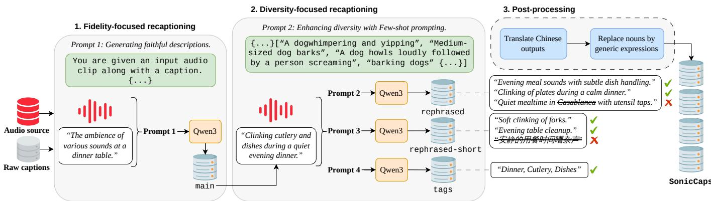
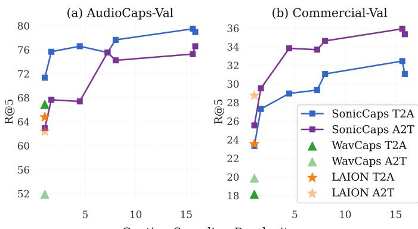
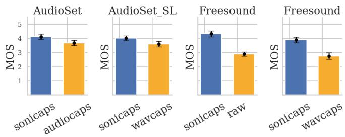
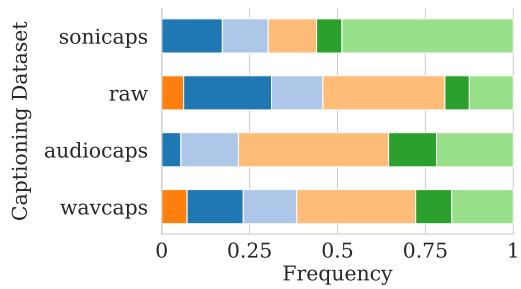
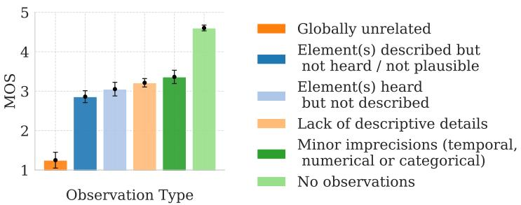

# SONICCAPS: Large-Scale Diverse and Fine-Grained Captioning for

Improved Audio-Retrieval

Zineb Lahrichi∗† Marc Ferras∗, Gaël Richard†, Geoffroy Peeters†

∗Sony CTC, France

†LTCI, Telecom Paris, Institut polytechnique de Paris, France

Abstract—Recent advances in audio-language modeling have been driven by large-scale audio captioning datasets. However, existing datasets remain limited by low semantic diversity, generic descriptions lacking acoustic details, and one-to-one audiocaption mappings that poorly reflect the inherent ambiguity of auditory perception. We introduce SONICCAPS, a largescale audio captioning dataset comprising \~15M captions paired with \~700k audio clips, generated using a multi-modal large language model (Qwen3-Omni) conditioned on both audio and text. To explicitly promote diversity, we generate around 24 captions per audio via structured prompt engineering and fewshot generation, spanning main descriptions, rephrased variants (verbosity, style) and semantic tags. Human evaluation shows that SONICCAPS is rated significantly higher than existing captioning datasets, with fine-grained analyses indicating that our captions are perceived as more descriptive and precise, which strongly correlates with quality judgments. Finally, training CLAP models on SONICCAPS with a multi-caption sampling strategy consistently improves audio retrieval and zero-shot classification, with stronger generalization across public and commercial benchmarks. We release both SONICCAPS and two specialized CLAP models on hugging face: https://huggingface. co/datasets/Zineb/SonicCaps.

Index Terms—Audio-Language datasets, Audio-Retrieval

## I. INTRODUCTION

Understanding and describing sounds through natural language has become a fundamental challenge in multimodal machine learning. Recent surveys emphasize that progress in this area has been strongly shaped by the availability of largescale datasets built from heterogeneous audio sources and annotation strategies [1]–[3]. This growing research area has led to the emergence of a wide range of audio-language tasks, including audio-text retrieval [4], audio question answering [5], text-to-audio generation [6], [7], audio understanding [8], [9], audio editing [10], [11], amongst others. As the field evolved, the quality, diversity, and scale of audio-language datasets quickly appeared as fundamental requirements for effective audio-language modeling.

The introduction of FreeSound [12] and AudioSet [13] marked a turning point for audio-language research. These resources provided the groundwork for scalable supervision through access to large-scale and diverse acoustic content. Building upon this foundation, subsequent works progressively shifted from raw collection pipelines toward the design of curated benchmarks with improved label taxonomies [14], new online-harvested datasets [4], [15], richer linguistic annotations produced either through human annotation [16], [17] or automated LLM-based labeling [18], [19], and more balanced category distributions [17], [20].

However, current audio-language datasets exhibit several critical shortcomings. The limited size of sound event libraries and substantial variation across data providers, particularly between freely available and professional audio collections, creates a persistent distributional shift that significantly affects model generalization [21]. Beyond data distribution issues, existing datasets also lack semantic diversity, which is especially critical for contrastive learning, approaches which rely on large-scale heterogeneous data. Furthermore, a single audio signal can often admit multiple valid textual descriptions and vice versa. Indeed, auditory perception is inherently ambiguous and can be interpreted differently depending on context, focus, and prior knowledge. Such one-to-many mapping is still not exploited in current datasets, which typically provide only one or a few captions per clip. This motivates the investigation of richer captioning strategies that explicitly increase linguistic diversity and better reflect the inherent variability of human perception.

The quality of audio captions presents another major bottleneck in current datasets. In particular, LLM based captioning tends to result in repetitive and overly generic descriptions for acoustically similar events, failing to capture fine-grained variations in sound content. This is especially true for ambiguous sounds such as Foleys, environmental sounds, impact sounds, etc. LLMs are also likely to propagate biases and output hallucinated descriptions. On the other hand, manual annotation is challenging at scale while introducing inherent human biases and inconsistencies across annotators. More fundamentally, the notion of what constitutes a “good” caption still remains largely undefined. In practice, most existing datasets primarily focus on describing the dominant audio events, often overlooking finer acoustic attributes such as background ambiance, texture, temporal dynamics, or intensity variations, despite their relevance in professional contexts.

In this paper, we attempt to bridge the gap between publicly available and commercial captioning data, while encouraging more diverse captioning across heterogeneous audio sources. To this end, we make several contributions:

• We release SONICCAPS, a large-scale audio captioning dataset comprising \~15M captions paired with \~700k audio clips1. Captions are generated using a multimodal large language model (Qwen3-Omni) [9] through a three-stage pipeline consisting of fidelity-focused recaptioning, diversity-focused recaptioning, and postprocessing, as illustrated in Figure 1. To reflect the one-to-many nature of auditory perception, we introduce a diverse captioning strategy that generates around 24 captions per audio clip through prompt engineering and few-shot generation, spanning multiple styles and levels of granularity.

  
Fig. 1. Overview of the proposed caption generation pipeline. High-fidelity captions are first generated from audio, followed by diversity augmentation via prompt engineering and few-shot prompting.

• We further show that sampling diverse captions per audio from SONICCAPS during training yields consistent improvements on audio retrieval and zero-shot classification tasks over existing baselines. These results highlight the benefits of large-scale caption augmentation and show that carefully balancing the composition of captioning data can significantly enhance performance. These gains hold across both public and proprietary benchmarks, demonstrating strong generalization. We release our best-performing model for the audio retrieval task, SONICCLAPAR.

• We introduce a new human evaluation framework for pairwise comparison of captions along several qualitative dimensions. We conduct a subjective human study based on this framework, collecting structured qualitative feedback for each rating. We show that our fidelityfocused captions consistently align better with human preferences and are perceived as more descriptive, capturing richer acoustic details. Training a CLAP model on these captions improves alignment between CLAP scores and human MOS scores. We release this model as SONICCLAPMOS.

We hope that SONICCAPS and SONICCLAP will contribute to advancing research in audio-language multimodal learning, and serve as a foundation for the development of higherquality models in this domain.

## II. RELATED WORKS

## A. Audio Language Datasets

To address the limited availability of paired audio-text data, a major line of research has focused on curating datasets of human-written captions to support audio-language tasks. Early benchmarks such as AudioCaps (46k a/c 2 pairs) [16] and Clotho (25k a/c pairs) [17] introduced manually annotated captions collected from AudioSet and FreeSound audio sources, respectively. However, human annotation remains difficult to scale due to its high cost and variability across annotators, particularly for ambiguous or specialized sound events. As a result, these datasets remain relatively limited in scale and diversity, restricting the generalization capabilities of audio-language models.

In parallel, several large-scale datasets based on automated collection pipelines have emerged. For example, VGGSound (200k a/c pairs) [15] leveraged YouTube videos to build a large-scale audio-visual benchmark with visually grounded event labels, although limited to classification categories rather than natural language descriptions. More recently, large language models have increasingly been adopted for annotation and dataset augmentation. For example ClothoV2\_GPT (100k a/c pairs) [22] extends the Clotho dataset with GPT-3.5-generated descriptions. At a larger scale, LAION-630k (630k a/c pairs) [4] aggregates data from eight online sources and uses a pretrained T5 model to synthesize captions for samples with only tags or label annotations. However, the remaining raw captions are highly noisy, and only a portion of the dataset is publicly available due to licensing restrictions.

WavCaps (400k a/c pairs) [18] mitigates noisy annotations via Chat-GPT-assisted captioning and filtering strategies over heterogeneous audio sources, demonstrating that enhancing caption quality induces significant performance gains in multiple downstream audio language learning tasks. However, because caption generation remains purely text-conditioned, WavCaps relies on aggressive filtering to mitigate noisy metadata, discarding a substantial fraction of the available data. Moreover, without direct conditioning on the audio, there is no guarantee that captions generated from existing descriptions accurately describe the corresponding audio sample. Despite these limitations, WavCaps remains widely adopted in the literature, although, as shown later in this paper, its caption quality remains limited.

Other works leverage audio-language models to generate audio-aware captions for audio-language systems. AF-AudioSet (600k a/c pairs) [23] uses Audio Flamingo [24] to recaption AudioSet and employs LAION CLAP [4] scores to filter low-quality audio-text pairs. By varying the CLAP threshold, the authors study the trade-off between dataset size and caption quality. They show that smaller but higherquality synthetic datasets can lead to comparable or improved text-to-audio generation performance. Auto-ACD (1.5M a/c pairs) [25] combines audio-language and audio-visual models to extract contextual information such as detected objects, captions, and labels, which are then integrated by an LLM into a final audio description. Sound-VECaps (1.6M a/c pairs) [26] uses a similar framework but generates captions enriched with temporal, spatial, and environmental context. In contrast, Auto-ACD intentionally restricts visual input to the middle video frame and ignores purely visual content. This additional visual context enables the generation of more detailed descriptions and yields improved audio retrieval performance, but relies heavily on video metadata. More recently, AudioSetCaps (6M a/c pairs) [19] combines audiolanguage models for content extraction, LLMs for caption generation, and CLAP-based refinement to improve caption quality.

While these methods produce more informative captions and improve downstream performance, they primarily focus on caption quality or audio data scaling rather than diversity. In addition, they remain confined to relatively homogeneous distributions, largely centered around AudioSet and VGGSound.

## B. Human Perception based models

There is a growing interest in developing models that better align with human perception. This has led to efforts to improve the correlation between CLAP-based scores and subjective human judgments, as well as to incorporate human evaluation protocols and comparative analyses of captioning datasets [18]. Additionally, [27] presents a reinforcement learning framework for audio captioning that aligns the model output with human preferences using a custom reward model trained on preference data. In parallel, several works have moved toward more professional and application-driven representations of sound. For instance, [28] introduces structured metadata tailored to sound designers. Similarly, benchmark datasets grounded in professional sound taxonomies, such as FoleyBench [20], provide more finegrained and industry-relevant evaluation frameworks. In this paper, we propose a CLAP model that aligns better with human preferences, by training it on our fidelity-focused captions, which are shown to be more faithful and perceptually detailed.

## III. SONICCAPS

## A. Data sources

In this section, we describe the different audio-language sources used to construct SONICCAPS, including automatic and manually annotated captions. There might be audio overlap across sources, but no overlap over captions.

FreeSound [12] is a collaborative, community-driven audio repository introduced for artists and audio researchers. It operates as an open and continuously growing database where any user can upload, download, and re-purpose a wide variety of sounds. It contains more than \~700k audio recordings under Creative Commons licenses (\~515k currently harvested for audio-language research), spanning diverse categories, including music samples, environmental sounds and synthesized effects. Each clip is annotated by contributors, with descriptions and tags which can be highly noisy: many are only loosely related to the audio, lack grammatical structure, or include overly specific and non-generalizable details. Additionally, redundancy across user uploads further degrades annotation quality, as the same caption is often associated with different audio clips.

AudioCaps [16] is built upon AudioSet [13], a large-scale corpus for audio event analysis. AudioCaps constitutes the largest benchmark with human-written descriptions for audio captioning. The dataset contains roughly 50k audio excerpts. Audio sources are sampled from an ontology of 527 audio event categories derived from AudioSet, while the number of instances per category is capped at 2k in order to reduce class imbalance. Each training example is paired with a single textual annotation, whereas samples in the validation and test partitions are associated with five independent human-written references.

BBC Sound Effects The BBC Sound Effects Archive 3 is a collection of over 33k audio recordings gathered over the past century for personal, educational, and research use. Originally developed to support BBC productions, the archive spans a wide range of natural, urban, mechanical, and atmospheric sounds from around the world, including historically significant recordings dating back to 1889. The captions are generally informative, but often exhibit grammatical inconsistencies or incomplete formulations, and frequently include non-generic details such as city names, landmarks, or dates.

WavCaps is the first large-scale audio captioning dataset, using ChatGPT to scale to over 400k audio-caption pairs sourced from FreeSound, BBC Sound Effects, AudioSet Strongly-Labeled [29], and SoundBible 4. Since their approach uses unimodal text-to-text generation conditioned on raw captions, the authors apply pre-filtering to remove irrelevant and over-represented descriptions, reducing noisy conditioning signals. However, this filtering discards approximately half of the FreeSound data, potentially limiting the dataset’s utility for downstream audio representation learning. Moreover, low-quality raw captions lead to erroneous conditioning, propagating errors into the generated captions. While the filtered captions show improved quality over raw captions, they often lack descriptive detail and exhibit limited diversity across datasets, with frequent grammatical patterns and overly generic descriptions (e.g., “A sound is played”), leaving substantial room for improvement.

## B. Multi-modal Audio Captioning

In this section, we describe the proposed caption generation pipeline, illustrated in Figure 1. The pipeline comprises three stages leading to four complementary caption types (see Table I which summarizes the prompting strategies employed). The first category, referred to as fidelity-focused or main captions, consists of factual, descriptive, and perceptually grounded descriptions that aim to remain as faithful as possible to the audio content (see section III-B1.1). The second stage, leading to three additional captions types, referred to as diversity-focused, produces multiple variants spanning different styles, verbosity levels, and granularities through few-shot prompting (see section III-B1.2). Finally, a post-processing stage removes artifacts and consolidates the resulting captions to construct SONICCAPS. The prompts presented in Table I were empirically derived through an iterative prompt engineering process involving trial-and-error refinement. Specifically, we refined the prompting strategies based on subjective evaluations conducted on small validation batches of approximately 50 examples. This procedure enabled progressive adjustments to the prompt formulations, ultimately reaching configurations that consistently produced highquality and stable outputs.

TABLE I PROMPTS USED FOR QWEN-BASED RECAPTIONING.
<table><tr><td rowspan=1 colspan=1>Caption Type</td><td rowspan=1 colspan=1>Prompt</td></tr><tr><td rowspan=1 colspan=1>main</td><td rowspan=1 colspan=1>You are given an input audio clip along with a caption. Use them to generate an event-based caption of the audio content. Thenew caption must consist of at most one sentence and should not start with an article (A, An, The), but rather with a verb in the-ing form, a noun, or an adjective. Write between 2 and 20 words. Describe what happens in the audio. Do not use a list of tagsor keywords, and do not say “the audio&quot; or &quot;the clip&quot;. Do not use “is heard&quot; or “we hear&quot;. Remove author names, locations, citynames, country names, time references, and device names. Add punctuation. Describe ambient and background sounds if present.Do not transcribe speech. Indicate the presence of speech, speaker gender, language, and speech properties only if speech is theprimary focus. Do not include extra text or metadata. Avoid speculation and describe only clearly audible content.</td></tr><tr><td rowspan=1 colspan=1>rephrased</td><td rowspan=1 colspan=1>You are given an input audio clip along with its caption. Use them to generate ten alternative captions that differ from theoriginal one. Shorter descriptions are allowed. Use “::&quot; to separate the generated captions. Use the following examples as diverseformulations of the same concept “dog barking&quot; : “A dog whimpering and yipping&quot; :: “Medium-sized dog barks&quot; :: “A dog howlsloudly followed by a person screaming&quot; :: &quot;Dog barks, bees buzz, and rail transport moves&quot; :: &quot;barking dogs&quot; :: “A door creakswhile a dog barks in the distance&quot;.</td></tr><tr><td rowspan=1 colspan=1>rephrased-short</td><td rowspan=1 colspan=1>You are given an input audio clip along with its caption . Use them to generate ten different captions that are different from theoriginal. Provide very short descriptions (a few words). Use “::&quot; to separate the ten output descriptions.</td></tr><tr><td rowspan=1 colspan=1>tags</td><td rowspan=1 colspan=1>You are given an input audio clip along with its caption. Use them to generate a list of at most three tags. Tags must be nounsrather than verbs. Use commas to separate the tags.</td></tr></table>

1) Fidelity-focused recaptioning: To enrich the linguistic diversity and descriptive quality of the captions, we performed automatic recaptioning using the multi-modal large language model Qwen/Qwen3-Omni-30B-A3B-Instruct. The model was conditioned on audio inputs resampled to 16 kHz and truncated to a maximum duration of 10 seconds for inference. Caption generation was performed using stochastic decoding with a temperature of 0.6, top-p sampling with p = 0.95, top-k = 20, and a maximum generation length of 30 tokens per caption. In practice, we observed that purely audio-conditioned captioning occasionally produced hallucinated or weakly grounded descriptions, particularly for acoustically ambiguous sound events. To mitigate this issue, we explored prompt engineering strategies and multi-modal contextualization to encourage captions that remain faithful to the underlying audio content while retaining a high level of descriptive detail.

In particular, we iteratively refined the prompt as a set of explicit dos and don’ts to mitigate recurrent generation artifacts and improve both faithfulness and linguistic diversity. First, we discourage generic caption templates commonly produced by Qwen (e.g., captions beginning with “the audio”, “the clip”, “we hear”, or articles such as “A, An, The”). Instead, we explicitly instruct Qwen to start captions with a verb in the -ing form, a noun, or an adjective. Second, we promote factual grounding by framing the task as “event-based” caption generation and instructing the model to describe only clearly audible events while avoiding speculation. Additionally, we explicitly instruct the model to include relevant “ambient and background sounds when present”, as these contextual details are frequently missing from existing captioning datasets. Finally, we encourage informative yet concise descriptions to minimize the irrelevant verbosity and noise often introduced by LLMs. Specifically, we constrain caption length both in the prompt (20 words) and during decoding (30 tokens). We further exclude undesirable content such as speech transcriptions, recording metadata, and other information not directly supported by the audio signal.

We emphasize that these instructions only act as soft constraints rather than strict guarantees, but empirically we found that they effectively reduce undesired generation patterns and improve caption faithfulness.

2) Diversity-focused recaptioning: This stage comprises 3 categories of captions: rephrased, rephrased-short and tags. First, in the rephrased setting, we aim to generate approximately ten rephrased captions per audio with high linguistic diversity while maintaining a length distribution comparable to the main captions. To improve generation efficiency, the captions are produced jointly within a single sampling forward pass using a fixed seed. We further employ few-shot prompting, a technique where the model is conditioned on a small number of output references to guide its behavior at inference time. Specifically, we provide stylistically diverse captions describing the same semantic concept, encouraging variation in linguistic expression. These examples are adapted from the survey [1], which reports the first occurrence of the word “dog” and by extension, the underlying concept of “dog barking” for each captioning dataset examined. The resulting examples illustrate how the same concept can be expressed through different annotation styles.

TABLE II  
EXAMPLE FROM FREESOUND COMPARING RAW ANNOTATIONS, WAVCAPS CAPTIONS, AND THE FOUR CAPTION TYPES IN SONICCAPS. MULTIPLE CAPTIONS ARE SEPARATED BY “::”.
<table><tr><td rowspan=1 colspan=1>Caption Type</td><td rowspan=1 colspan=1>Caption</td></tr><tr><td rowspan=1 colspan=1>Raw caption</td><td rowspan=1 colspan=1>Turning the pages of the book Ruth in thebible (dutch translation) the church has givenmy father in 1942.</td></tr><tr><td rowspan=1 colspan=1>WavCaps</td><td rowspan=1 colspan=1>Pages of a book are being turned.</td></tr><tr><td rowspan=1 colspan=1>main</td><td rowspan=1 colspan=1>Turning pages of a book with crisp paper soundsin a quiet environment.</td></tr><tr><td rowspan=1 colspan=1>rephrased</td><td rowspan=1 colspan=1>Crisp turning of paper pages, likely from a bookor magazine :: Quiet room with paper shufflingsounds :: Close-up of someone flipping througha thick book :: Page turning sounds in a calm,still environment :: Paper being turned one byone, soft and distinct :: Reading in silence withaudible page flips :: A book being read aloud,with crisp page turns :: Someone skimmingthrough a document or notebook :: Page turningwith slight crinkling sound :: Paper rustling,possibly browsing through a photo album</td></tr><tr><td rowspan=1 colspan=1>rephrased-short</td><td rowspan=1 colspan=1>Crisp paper rustling :: Page turning sound ::Book flipping :: Quiet reading noise :: Papershuffling :: Reading in silence :: Soft page turns:: Book handling sounds :: Still environment ::Paper manipulation</td></tr><tr><td rowspan=1 colspan=1>tags</td><td rowspan=1 colspan=1>book, page, paper</td></tr></table>

Generation is conditioned on both the main caption and the corresponding audio input.

The rephrased-short setting is designed to produce concise captions that resemble short user queries or prompts. Approximately ten short captions are generated per sample, conditioned on the main caption and the audio signal. Finally, the tags setting generates three-word descriptions intended to approximate high-level semantic categories. The generated outputs are encouraged to contain nouns rather than verbs in order to emphasize semantic entities over actions. As in the previous settings, generation is conditioned on both the main caption and the audio input.

3) Post-processing: Occasionally, some generated captions contained Chinese text, which we translated into English using facebook/nllb-200-1.3B. In addition, we detected captions containing proper nouns, such as city or country names, and prompted Qwen to regenerate them while explicitly prohibiting the identified entities. Initially, we explored additional filtering strategies to further improve caption quality, including selecting between WavCaps and Qwen-generated captions, as well as sampling multiple generations with different random seeds and retaining the best candidates. However, these approaches were ultimately discarded due to their substantial computational overhead relative to the expected gains. Furthermore, reliably evaluating caption quality remains challenging, as existing automatic metrics are limited. In particular, as discussed in Section V-B, the LAION-CLAP score, despite being widely used to assess audio-text alignment, does not reliably reflect perceived caption quality.

## C. Dataset overview

SONICCAPS contains \~700k audio clips and \~15M audio-caption pairs derived from the four audio sources previously introduced in subsection III-A. Each source is further partitioned into four captioning subsets, corresponding to the four caption types described in Table I. A representative example from FreeSound is shown in Table II, comparing the raw caption with the corresponding WavCaps and SONICCAPS captions. This example shows how the main caption from SONICCAPS provides richer acoustic details than the baselines. The rephrased caption further increases linguistic diversity through variations in syntax, voice (active/passive), and vocabulary, while the rephrased-short caption provides concise captions resembling user queries. Finally, the tags encode the semantic content of the audio using three keywords.

Table III summarizes dataset statistics for SONICCAPS and existing datasets. We first quantify caption redundancy, reporting both the proportion of unique captions and the most frequent caption within each corpus. This issue is particularly pronounced in FreeSound, where many users upload large collections of sounds sharing identical descriptions. WavCaps reduces this redundancy by filtering high-frequency captions assumed to be weakly correlated with the audio content. However, this filtering step sacrifices almost half the available FreeSound data (\~250k against \~515k). Additionally, because caption generation remains primarily text-conditioned in WavCaps, similar metadata frequently yields nearly identical descriptions, limiting linguistic diversity. Joint conditioning on audio and text alleviates this effect, resulting in a substantially higher proportion of unique captions across all audio sources in SONICCAPS. Residual redundancy nevertheless remains for acoustically similar samples sharing the same description, such as collections of hi-hat sounds differing only subtly in texture. This observation suggests that the temporal and spectral resolution of Qwen3-Omni is still insufficient to reliably capture such fine-grained acoustic variations.

Finally, we also report the average caption length in number of words. On average, SONICCAPS produces slightly longer captions than AudioCaps and WavCaps, suggesting richer and more detailed descriptions. Table IV also reports these statistics for each subset of SONICCAPS. The main subset contains the longest and most detailed captions. Caption length then decreases progressively across subsets, from rephrased to rephrased-short, and finally to tags.

The table also reports vocabulary size, showing that rephrased and rephrased-short substantially expand the vocabulary compared to main (41K and 47K unique words vs. 26K, respectively). This confirms the role of our diversityfocused rephrasing strategy in increasing linguistic diversity. The LLM consistently generated the expected number of captions per audio for each prompt, with only minor deviations from the target, yielding approximately 24 captions per audio overall. Finally, main exhibits the highest caption-level diversity (92.4% unique), closely followed by rephrased (86.9%), confirming that our few-shot prompting strategy promotes diverse outputs even when generating 10 captions per input. Diversity drops to 52.2% for rephrased-short and tags, consistent with their shorter, more generic, querylike nature.

TABLE III  
COMPARISON OF DATASET STATISTICS. $\mathrm { \ddot { \Gamma } R A W } ^ { \mathrm { 3 3 } }$ DENOTES THE ORIGINAL CAPTIONS ASSOCIATED WITH EACH AUDIO SOURCE DATASET. THE STATISTICS FOR SONICCAPS ARE COMPUTED ON THE fidelity-focused CAPTIONS, I.E THE MAIN SUBSET.
<table><tr><td>Audio source</td><td>Captions</td><td>#Audios</td><td>%Unique Cap.</td><td>Avg #Words</td><td>Most Frequent Caption (MFC)</td><td># Occ. (MFC)</td></tr><tr><td rowspan="3">FreeSound</td><td>Raw</td><td>515K</td><td>46.7</td><td>10.4 ± 8.5</td><td>Single note sampled from an analog synthesizer by Modular Samples.</td><td>36,773</td></tr><tr><td>WavCaps</td><td>250K</td><td>80.4</td><td> $6 . 7 \pm 2 . 6$ </td><td>Music is being played.</td><td>442</td></tr><tr><td>SONICCAPS</td><td>515K</td><td>92.4</td><td> $1 1 . 1 \pm 2 . 9$ </td><td>Playing a single sustained note on an analog synthesizer.</td><td>317</td></tr><tr><td rowspan="2">BBC Sound Effects</td><td>WavCaps</td><td>31K</td><td>84.5</td><td> $8 . 5 \pm 4 . 1$ </td><td>A clock is striking.</td><td>462</td></tr><tr><td>SONICCAPS</td><td>31K</td><td>86.0</td><td> $9 . 6 \pm 5 . 0$ </td><td>A clock is striking.</td><td>166</td></tr><tr><td rowspan="2">AudioSet SL subset</td><td>WavCaps</td><td>108K</td><td>87.6</td><td> $9 . 7 \pm 3 . 6$ </td><td>Music is playing.</td><td>2,045</td></tr><tr><td>SONICCAPS</td><td>108K</td><td>91.7</td><td> $1 1 . 5 \pm 3 . 0$ </td><td>Music plays while a man speaks.</td><td>83</td></tr><tr><td rowspan="2">AudioSet subset</td><td>AudioCaps</td><td>49K</td><td>91.7</td><td> $8 . 7 \pm 4 . 2$ </td><td>A man speaking.</td><td>80</td></tr><tr><td>SONICCAPS</td><td>49K</td><td>97.6</td><td> $1 1 . 2 \pm 3 . 2$ </td><td>A man speaks while typing on a keyboard.</td><td>35</td></tr></table>

TABLE IV  
STATISTICS OF SONICCAPS
<table><tr><td>Method</td><td>% Unique Caps.</td><td> $\mathbf { A v } \mathbf { g }$  #Words</td><td>Avg # Cap. / Audio</td><td>Vocab.</td></tr><tr><td>main</td><td>92.4</td><td> $1 1 . 2 \pm 2 . 9$ </td><td> $1 \pm 0 . 0$ </td><td>26K</td></tr><tr><td>rephrased</td><td>86.9</td><td> $9 . 1 \pm 2 . 7$ </td><td> $1 0 \pm 0 . 2$ </td><td>41K</td></tr><tr><td>rephrased-short</td><td>52.2</td><td> $4 . 5 \pm 1 . 7$ </td><td> $9 . 9 \pm 0 . 4$ </td><td>47K</td></tr><tr><td>tags</td><td>50.8</td><td> $3 . 3 \pm 0 . 7$ </td><td> $2 . 9 \pm 0 . 2$ </td><td>18K</td></tr><tr><td>SONICCAPS</td><td>61.3</td><td> $5 . 6 \pm 3 . 4$ </td><td> $2 3 . 9 \pm 0 . 5$ </td><td>66K</td></tr></table>

## IV. EXPERIMENTS

## A. Audio Language Retrieval

We evaluate the quality of our captioning dataset on an audio-language retrieval task. The task consists of retrieving audio clips from text queries and vice versa by learning a shared embedding space via contrastive learning. We train CLAP-style models following the architecture and training strategy from [30], using a RoBERTa-Large text encoder [31] and a PaSST audio encoder [32]. The encoder architecture is kept fixed across all experiments while the weights are independently optimized for each model, as investigating alternative CLAP architectures is beyond the scope of this work. A linear projection head maps the pooled audio and text embeddings into a shared 1024-dimensional representation space. Audio signals are resampled to 32 kHz to match PaSST’s native sampling rate, and training uses random 10-second excerpts from full recordings. We optimize a symmetric contrastive objective [33], which encourages aligned audio–text pairs to have higher similarity than all other pairs within the batch. We set the temperature hyperparameter τ to 0.2. Training is performed over 4 GPUs, with a batch size of 112, yielding an effective batch size of $N = 4 4 8$

We first train a model on a baseline audio-language dataset, denoted as (\*), composed of heterogeneous caption sources: AudioCaps (AC), the original FreeSound captions $( \mathrm { F S } _ { \mathrm { r a w } } ) .$ and the BBC Sound Effects and AudioSet Strongly Labeled subsets annotated with WavCaps captions, (BBC+ASL)WC. We exclude SoundBible due to licensing restrictions, though it was originally part of WavCaps. Additionally, since WavCaps does not annotate the full FreeSound corpus, we retain $\mathrm { F S } _ { \mathrm { r a w } }$ captions to maximize audio coverage while keeping the underlying audio data fixed across experimental conditions. This choice is consistent with prior work [19] showing that CLAP performance is strongly driven by the scale of audio training data. For public release of the CLAP models, we further restrict FreeSound samples to compatible licenses, excluding cc-by-nc, cc-by-nc-sa, cc-by-nd, and cc-by-nc-nd content, resulting in 371k audio samples compared to the 250k available in WavCaps.

We then train several CLAP variants using the same underlying audio datasets, while varying the composition and diversity of caption sources through different sampling strategies. For each model, captions are sampled from the baseline dataset and the four SONICCAPS subsets introduced in Table I, according to a predefined probability distribution. For datasets containing multiple captions per audio sample, we first randomly shuffle the caption set and then uniformly sample a caption from the resulting pool. In addition, we randomly remove punctuation marks with a probability of 0.2 during training.

We compare our models against LAION-CLAP HTSAT-base [4], which employs RoBERTa and HTSAT encoders and has a comparable number of parameters to our architecture. We further train a reference model on the AudioCaps and WavCaps (AC+WC) datasets using the same audio and text encoders and training strategy as our proposed models, to ensure a controlled comparison of our datasets under identical optimization conditions.

We evaluate the performance of our CLAP models against our baselines on text-to-audio (T2A) and audio-to-text (A2T) retrieval tasks. Models are evaluated using recall R@k with k ∈ {5, 10}, measuring the fraction of queries for which the ground-truth item appears within the top-k retrieved results. Evaluation is conducted on the AudioCaps validation set, as well as on a mixture of three internal sound effects datasets, from which we extract 500 audio-caption pairs each. These internal datasets are selected to exclude tag-based annotations and retain only natural language sentence-level descriptions. Since the AudioCaps validation set provides five reference captions per audio, we report both R@k-any and R@kall. R@k-any considers a retrieval successful if at least one reference caption is retrieved, whereas R@k-all requires that all five captions are retrieved within the top-k results.

TABLE V  
TAXONOMY OF OBSERVATIONS: RECURRING CATEGORIES OF ERRORS OBSERVED IN AUDIO CAPTIONS DURING DATASET INSPECTION.
<table><tr><td>Qualitative observations</td><td>Description</td></tr><tr><td>Lack of descriptive details</td><td>Insufficient use of meaningful qualitative information such as adjectives, adverbs, texture, rhythm, intensity, or background context.</td></tr><tr><td>Element(s) heard but not described</td><td>One or several sound events is heard by the participant but not mentioned in the caption.</td></tr><tr><td>Element(s) described but not heard / not plausible</td><td>One or several sound events are described in the caption but do not match the audio content. Given the inherent ambiguity of auditory perception, multiple valid interpretations may exist; consequently, plausible alternative descriptions (e.g., “hot coffee&quot; vs. “lemon juice&quot; for a pouring sound) are not considered erroneous.</td></tr><tr><td>Minor imprecisions</td><td>The caption exhibits temporal, numerical or categorical inaccuracies such as incorrect event counts or duration estimates.</td></tr><tr><td>Globally unrelated</td><td>The caption is semantically inconsistent with, or unrelated to, the audio content.</td></tr></table>

Finally, we investigate the relationship between retrieval performance and caption diversity. Since our models are trained by sampling captions from multiple annotation sources, we characterize the effective diversity of the training captions through the caption sampling perplexity. Let S denote the number of caption sources. Source i is sampled with probability $p _ { i }$ , where $\textstyle \sum _ { i = 1 } ^ { S } p _ { i } = 1$ , and provides $N _ { i }$ candidate captions for each audio sample. Assuming uniform sampling among captions within a source, the probability of selecting an individual caption is $p _ { i } / N _ { i }$ . We therefore define the caption sampling perplexity as

$$
\mathrm { P P L } _ { \mathrm { c a p t i o n s } } = \exp \left( - \sum _ { i = 1 } ^ { S } p _ { i } \log \left( \frac { p _ { i } } { N _ { i } } \right) \right) .
$$

This quantity corresponds to the effective number of captions that may be observed for a given audio sample during training. It equals one when training always relies on a single caption and increases as the caption sampling distribution becomes more diverse. We emphasize that this metric captures only the diversity induced by the sampling strategy and caption multiplicity. It does not account for the semantic diversity of the captions themselves, as this quantity cannot be estimated consistently for external baselines for which training data are unavailable.

## B. Subjective Evaluation

To assess the quality of audio captioning systems, we conducted a perceptual evaluation study. The evaluation corpus comprised 60 audio samples, partitioned into four subsets of 15 samples each, drawn from four different audio captioning datasets. The audio and caption pairs were sampled from FreeSound (Raw and WavCaps captions), AudioSet (AudioCaps captions), AudioSet Strongly Labeled (WavCaps captions), and finally SONICCAPS (main captions). BBC Sound Effects was excluded due to missing shared audio identifiers across captioning datasets, preventing reliable caption alignment.

Each participant evaluated 15 samples randomly selected from this fixed pool of 60 audio excerpts. For each audio sample, participants were presented with two candidate captions “Caption A” and “Caption $\mathbf { B } ^ { \ast }$ , and asked to evaluate their quality according to the following criteria:

• Completeness: Does the caption cover all sound events present in the audio?

• Correctness: Do the described elements accurately correspond to the auditory content?

• Plausibility: Are all described elements consistent with what can realistically be perceived in the audio?

• Qualitativeness: Does the caption include meaningful descriptive details (e.g. texture, rhythm, intensity, background) that help imagine the sound?

These criteria reflect the underlying assumption that a highquality caption should faithfully represent the audio content with sufficient details, while avoiding both omissions of sound events and the introduction of inaccurate or implausible information. We prioritize subjective plausibility to better reflect the one-to-many nature of audio-text relationships, where multiple linguistic descriptions can faithfully represent the same audio content. This differs from other works that emphasize video- or context-grounded plausibility, requiring captions to match the specific recording context.

Participants rated each caption using a 5-point Mean Opinion Score (MOS) scale ranging from 1 (Bad) to 5 (Excellent), based on the criteria above. In addition to numerical ratings, qualitative feedback was collected for each caption through multiple-choice checkboxes and optional freetext comments. To that end, we defined an a priori taxonomy of qualitative observations covering common captioning issues we observed in existing datasets. These issues, presented in Table V, include missing details, unsupported content, insufficient descriptiveness, factual imprecisions, and captions unrelated to the audio.

This additional qualitative assessment is essential for characterizing the relationship between the perceived caption quality and the observed factors. Finally, participants reported their overall confidence for each item using a 5-point scale (1 = very unsure, 5 = very confident). The complete evaluation session, including instructions and practice examples, required approximately 15 minutes per participant.

TABLE VI  
TEXT-TO-AUDIO (T2A) AND AUDIO-TO-TEXT (A2T) PERFORMANCE AND ABLATION STUDY ON TRAINING CAPTION DATASETS. SAMPLING PROBABILITIES INDICATE THE PROPORTION OF CAPTIONS DRAWN FROM EITHER OUR BASELINE AUDIO-LANGUAGE DATASET (\*) , OR FROM OUR PROPOSED SONICCAPS CAPTIONS (M AIN (M), R E P H R A S E D (R), R E P H R A S E D-S H O R T (RS) AND T A G S (TAG)).
<table><tr><td>Model</td><td>Training Datasets</td><td colspan="6">Sampling probabilities</td><td colspan="6">AudioCaps-Val</td><td colspan="4">Commercial-Val</td></tr><tr><td></td><td></td><td>|(*)</td><td colspan="3">SONICCAPS</td><td colspan="3">T2A</td><td colspan="2">A2T-any</td><td colspan="3">A2T-all</td><td colspan="3">T2A</td></tr><tr><td></td><td></td><td></td><td>M</td><td>R</td><td>RS</td><td>Tag</td><td>|R@5</td><td>R@10</td><td>R@5</td><td>R@10</td><td>R@5</td><td>R@10</td><td>|R@5</td><td>R@10</td><td>R@5</td><td>R@10</td></tr><tr><td>LAION [4] OursAC+WC</td><td>AC+LA+AS+CL AC+WC</td><td>一 一</td><td>一 一</td><td>一</td><td>一 一</td><td>一 一</td><td>64.7 66.8</td><td>75.8 75.8</td><td>49.7 52.6</td><td>65.3 70.0</td><td>7.6 2.1</td><td>16.6 5.8</td><td>23.5 18.1</td><td>34.8 26.6</td><td>28.7 19.8</td><td>41.6 28.8</td></tr><tr><td></td><td></td><td>1.0</td><td></td><td></td><td></td><td></td><td>71.6</td><td>82.4</td><td>62.4</td><td>78.4</td><td>4.5</td><td>8.9</td><td>23.6</td><td>32.6</td><td>26.6</td><td>35.8</td></tr><tr><td>Ours(1) Ours(2)</td><td>(*) SONICCAPS</td><td>一</td><td>1 1.0</td><td></td><td></td><td>一 一</td><td>71.1</td><td>84.2</td><td>67.6</td><td>82.9</td><td>2.9</td><td>8.9</td><td>23.0</td><td>32.7</td><td>24.4</td><td>33.4</td></tr><tr><td>Ours(3)</td><td>(*)+SONICCAPS</td><td>0.8</td><td>0.2</td><td></td><td></td><td></td><td>75.8</td><td>87.1</td><td>73.2</td><td>86.3</td><td>5.8</td><td>11.8</td><td>27.3</td><td>37.4</td><td>31.0</td><td>39.8</td></tr><tr><td>Ours(4)</td><td>(*)+SONICCAPS</td><td>0.2</td><td>0.8</td><td></td><td></td><td></td><td>75.5</td><td>86.3</td><td>72.1</td><td>83.7</td><td>4.7</td><td>12.1</td><td>27.3</td><td>36.0</td><td>28.0</td><td>38.5</td></tr><tr><td>Ours(5)</td><td>(*)+SONICCAPS</td><td>0.2</td><td>0.4</td><td></td><td>0.4</td><td></td><td>76.6</td><td>87.4</td><td>68.7</td><td>85.0</td><td>8.7</td><td>17.1</td><td>29.0</td><td>38.0</td><td>33.8</td><td>42.0</td></tr><tr><td>Ours(6)</td><td>(*)+SONICCAPS</td><td>0.2</td><td>0.4</td><td></td><td></td><td>0.4</td><td>75.5</td><td>87.1</td><td>71.6</td><td>87.4</td><td>6.8</td><td>16.6</td><td>29.3</td><td>39.1</td><td>33.7</td><td>42.8</td></tr><tr><td>Ours(7)</td><td>(*)+SONICCAPS</td><td>0.2</td><td>0.4</td><td></td><td>0.3</td><td>0.1</td><td>77.6</td><td>89.5</td><td>72.9</td><td>86.3</td><td>9.5</td><td>15.5</td><td>31.1</td><td>41.1</td><td>34.6</td><td>44.3</td></tr><tr><td>Ours(8)</td><td>(*)+SONICCAPS</td><td>0.1</td><td>0.3</td><td>0.2</td><td>0.3</td><td>0.1</td><td>78.9</td><td>88.7</td><td>71.6</td><td>86.8</td><td>8.4</td><td>19.7</td><td>31.1</td><td>41.4</td><td>35.3</td><td>45.0</td></tr><tr><td>Ours(9) = SONICCLAPAR</td><td>(*)+SONICCAPS</td><td>0.2</td><td>0.2</td><td>0.2</td><td>0.2</td><td>0.2</td><td>79.5</td><td>91.3</td><td>71.3</td><td>86.3</td><td>9.5</td><td>19.5</td><td>32.4</td><td>43.2</td><td>35.9</td><td>44.6</td></tr><tr><td></td><td></td><td></td><td></td><td></td><td></td><td></td><td></td><td></td><td></td><td></td><td></td><td></td><td></td><td></td><td></td><td></td></tr></table>

(\*) and SONICCAPS share the same audio corpus, but have different captions (see subsection IV-A). “AC” refers to AudioCaps, “LA” refers to LAION-630K, “CL” refers to Clotho, and “AS” refers to AudioSet.

## C. Zero-shot Audio Classification

To evaluate the informativeness and cross-modal alignment of our CLAP representations, we conduct a zero-shot audio classification experiment. Both audio signals and textual class labels are embedded into the shared audio-text representation space, and classification is performed by computing cosine similarities between the audio embedding and all candidate class embeddings. The predicted label corresponds to the class with the highest similarity score.

We compare three of our CLAP models against the LAION-CLAP baseline and our CLAP model trained on AudioCaps and WavCaps. Performance is evaluated using recall R@k with k ∈ {1, 5}. We first report results on the widely adopted ESC-50 [34], a dataset derived from FreeSound, containing 2k 5-seconds audio clips across 50 classes. However, both our model and all baselines are trained on data originating from FreeSound, which overlaps with ESC-50 and may lead to inflated performance estimates due to dataset leakage. To address this limitation, we further evaluate on FoleyBench [20], a fully disjoint dataset sourced from video content and not included in any training data used by our models or baselines. FoleyBench contains 5k 10-seconds clips spanning 81 categories and provides a broad and balanced coverage of sound categories defined by the Universal Category System (UCS)5, a taxonomy designed for professional sound design.

## V. RESULTS

## A. Audio Language Retrieval

This section investigates the impact of caption diversity on cross-modal audio-text alignment. Table VI reports text-toaudio and audio-to-text retrieval performance, together with a series of ablation studies investigating the impact of different caption mixtures used during CLAP training.

We first compare the LAION-CLAP and $\mathrm { O u r s } _ { \mathrm { A C } + \mathrm { W C } }$ models, the latter being trained on AudioCaps and WavCaps using our CLAP architecture.

Overall, results are mixed between the two models: Ours achieves stronger T2A and A2T-any performance on AudioCaps-Val, while LAION-CLAP obtains better A2Tall results on AudioCaps-Val as well as stronger performance on Commercial-Val. We hypothesize that this discrepancy stems from the LAION-630k dataset used in LAION-CLAP, which is substantially larger and more diverse. Its broader training distribution may improve generalization to the outof-domain Commercial-Val set, whereas the more specialized training distribution of OursAC+WC may instead provide an advantage on the in-domain AudioCaps-Val benchmark.

Then, we evaluate models trained on a single caption source, i.e, Ours(1), which is trained on the baseline dataset (\*), and Ours(2), which is trained on the main captions from SONICCAPS. Both models surpass LAION-CLAP on AudioCaps-Val but overall fall short on Commercial-Val. Ours(2) occasionally outperforms Ours(1) on AudioCaps-Val but it results in slightly weaker performance on the commercial benchmark. This indicates that, despite the higher subjective quality of SONICCAPS captions (see subsection V-B), caption quality alone results in only marginal retrieval improvements. It may also suggest a distribution shift in terms of audio and captions from AudioCaps-Val to the Commercial-Val dataset.

We next investigate the effect of using multiple caption sources. Models Ours(3) and Ours(4) combine the baseline dataset (\*) with the main captions at different sampling ratios ((0.8, 0.2), (0.2, 0.8)). Both models consistently outperform the previous baselines, showing that combining seemingly complementary caption sources is more effective than relying on either annotation style alone.

We then investigate whether increasing linguistic diversity further improves retrieval. Ours(5,6,7) progressively increase the linguistic complexity of the supervision by introducing rephrased-short and tags captions before incorporating the more fine-grained rephrased. Both caption type individually improves retrieval performance while combining them yields further gains, indicating that multiple description granularities provide richer supervision than any single caption style. Finally, Ours(8) and ${ \mathrm { O u r s } } ^ { ( 9 ) }$ leverage the complete SONICCAPS collection, including the rephrased captions and achieve the best overall retrieval performance for equally weighted sources.

  
Caption Sampling Perplexity  
Fig. 2. Text-to-Audio (T2A) and Audio-to-Text (A2T) R@5 Performance vs. Caption Sampling Perplexity (effective number of available captions per audio) on (a) AudioCaps Validation Set and (b) Internal Validation Set.

Overall, these experiments consistently show that caption diversity rather than caption quality alone, is a significant factor driving improvements in CLAP training. Since our models are trained on approximately the same amount of audio data as LAION-CLAP, the observed gains cannot be attributed to audio data scaling. Instead, we show that increasing the diversity and scale of captions substantially strengthens crossmodal alignment without requiring additional audio data.

Figure 2 illustrates the effect of caption sampling perplexity, which can be interpreted as the effective number of captions available per audio sample during training. Under this definition, both WavCaps and LAION-CLAP are positioned at a perplexity of 1. Since several of our trained models, ${ \mathrm { O u r s } } ^ { ( \bar { i } ) }$ , with $i \in \{ 1 , \ldots , 9 \}$ share the same caption sampling perplexity, we report their average retrieval performance as a single point in the figure. Note that, unlike Table VI, A2T results on AudioCaps-Val are here computed in the standard setting, considering only a single caption among the five available per audio. The figure reveals a clear upward trend: performance improves as average caption diversity increases, consistently across both evaluation datasets and both A2T and T2A tasks. This provides a clear illustration of the benefit brought by the diversity of our dataset. Based on this evaluation, we release a specialized CLAP model for audiolanguage retrieval SONICCLAP derived from Ours(9).

## B. Subjective Evaluation

A total of 25 participants took part in the subjective evaluation, yielding 375 assessments with an average of 6 ratings per item. Among them, 88% reported familiarity with listening tests, and 50% indicated prior experience with audio captioning. Evaluations with confidence scores below 3 were discarded, and items rated fewer than 3 times were excluded to ensure statistical reliability. We first report the mean opinion scores (MOS) derived from pairwise comparisons in Figure 3. Overall, SONICCAPS achieves the highest preference scores, outperforming human-authored captions from AudioCaps, raw FreeSound descriptions, as well as automatically generated captions from WavCaps.

  
Fig. 3. Subjective test results : Pairwise Mean opinion scores (MOS) across datasets, with 95% confidence interval.

Figure 4 (left) shows the distribution of the five possible observation categories proposed during the evaluation, along with a sixth category “No observations” corresponding to evaluations where no observation box was checked. Several trends emerge from this analysis. Several trends emerge from this analysis. Globally unrelated captions are observed exclusively for WavCaps and Freesound Raw, indicating these are the only sources prone to substantial semantic misalignment between caption and audio content. Hallucinations and missing elements are comparable across datasets except for AudioCaps for which hallucinations are markedly less frequent, consistent with its humanannotated nature. Finally SONICCAPS stands out by producing substantially fewer captions lacking descriptive detail, with approximately 50% receiving no negative observations at all, compared to less than 25% for the other sources.

Figure 4 (right) additionally report the average MOS as a function of the observation type. When no observation is made, the average score approaches the maximum rating, whereas hallucinations and missing elements appear to be the most penalizing factors. We note that these insights should be taken with caution, as the analysis does not account for the multi-factorial nature of the annotations, meaning that multiple observations can co-occur for a single caption.

Finally, we investigate to what extent CLAP-based similarity scores, as a proxy for text-audio alignment, correlate with human judgments. Since our subjective evaluation protocol is inherently pairwise, we consider two complementary notions of agreement between CLAP scores and MOS scores: (i) a pairwise agreement signal, based on score differences within each comparison, and (ii) an absolute agreement signal, based on absolute values assigned to each caption. The pairwise formulation is the most reliable indicator in our setting, as it directly reflects the comparative nature of the evaluation task. In contrast, absolute MOS values are not calibrated across annotators and should be interpreted with caution. We nonetheless report absolute correlations for completeness, as they provide an additional view of the alignment between model scores and human ratings.

  
Fig. 4. Subjective evaluation results: Distribution of annotated observations (left) across datasets and corresponding Mean Opinion Scores (right), averaged over all datasets.

TABLE VII  
SPEARMAN CORRELATION BETWEEN MOS AND CLAP SCORE.
<table><tr><td>Model</td><td> $\overline { { \rho ( \Delta \mathbf { M O S } , \Delta \mathbf { C L A P } ) } }$  一</td><td> $\overline { { \rho ( \mathbf { M O S } , \mathbf { C L A P } ) } }$  一</td></tr><tr><td> $\overline { { \mathrm { L A I O N - C L A P } } }$ </td><td>-0.07</td><td>0.03</td></tr><tr><td> $\mathrm { O u r s ^ { ( 2 ) } = S O N I C C L A P _ { M O S } }$ </td><td>0.32</td><td>0.22</td></tr></table>

To this end, we compute the Spearman correlation $\rho ( \Delta \mathrm { M O S } , \Delta \mathrm { C L A P } )$ between MOS and CLAP score differences for each pair of evaluated captions, comparing LAION-CLAP and our model ${ \mathrm { O u r s } } ^ { ( 2 ) }$ . Caption pairs with zero MOS difference are excluded. We select ${ \mathrm { O u r s } } ^ { ( 2 ) }$ for this analysis as it is trained on the main captions used in the subjective evaluation, enabling an in-domain comparison. Table VII shows that $\scriptstyle \mathrm { L A I O N - C L A P }$ obtains a slightly negative correlation $( \rho = - 0 . 0 7 )$ , whereas ${ \mathrm { O u r s } } ^ { ( 2 ) }$ achieves a substantially positive correlation $( \rho ~ = ~ 0 . 3 2 )$ , indicating significantly better alignment with human preferences. The same trend is observed when looking at the correlation between absolute MOS and CLAP scores $\rho ( \mathbf { M O S } , \mathbf { C L A P } )$ further confirming the robustness of the result. Based on this evaluation, we release a specialized CLAP model for perceptual caption quality assessment SONICCLAPMOS derived from Ours(2).

## C. Zero-shot Audio classification

We report zero-shot classification results in Table VIII, comparing a subset of our CLAP models with $\scriptstyle \mathrm { L A I O N - C L A P } .$ Specifically, we evaluate OursAC+WC, ${ \mathrm { O u r s } } ^ { ( 1 ) }$ and ${ \mathrm { O u r s } } ^ { ( 2 ) }$ trained respectively on AudioCaps and WavCaps, the baseline dataset (\*) and on SONICCAPS main, which was shown to better align with human judgments (subsection V-B). We further include ${ \mathrm { O u r s } } ^ { ( 8 ) }$ and Ours(9), selected for their superior audio-text retrieval performance.

On ESC-50, LAION-CLAP outperforms our models trained with a single caption per audio (i.e., $\mathrm { O u r s } _ { \mathrm { A C } + \mathrm { W C } }$ and ${ \operatorname { O u r s } } ^ { ( 1 , 2 ) } )$ However, this trend is reversed on FoleyBench, where all of our models consistently outperform LAION-CLAP, with gains of at least 10% in R@5. Since this performance gap extends to $\mathrm { O u r s } _ { \mathrm { A C } + \mathrm { W C } } .$ , which is trained on a smaller and different audio corpus, the observed differences are not solely attributed to dataset scale and may also be explained by architectural choices. A more informative comparison is therefore obtained within our own models. ${ \mathrm { O u r s } } ^ { ( \bar { 1 } ) }$ outperforms ${ \mathrm { O u r s } } ^ { ( 2 ) }$ on ESC-50 (68.9% vs. 65.6% R@1), likely benefiting from the overlapping FreeSound data between the benchmark and the baseline dataset (\*), in terms of both audio and captions. The opposite behavior is observed on the fully disjoint FoleyBench, where ${ \mathrm { O u r s } } ^ { ( 2 ) }$ surpasses ${ \mathrm { O u r s } } ^ { ( 1 ) }$ (9.66% vs. 8.2% R@1), suggesting that the main captions induce representations with stronger cross-domain transfer. Increasing caption diversity reinforces this effect: $\mathrm { O u r s ^ { ( 8 ) } }$ and ${ \mathrm { O u r s } } ^ { ( 9 ) } .$ trained on the full SONICCAPS collection, obtain the best results on both benchmarks, with ${ \mathrm { O u r s } } ^ { ( 9 ) }$ reaching 25.6% R@5 on FoleyBench, compared to 18.4% for $\mathrm { O u r s } _ { \mathrm { A C + W C } }$ and 9.1% for LAION-CLAP.

TABLE VIII ZERO-SHOT CLASSIFICATION RESULTS.
<table><tr><td rowspan="2">Model</td><td>ESC-50</td><td>FoleyBench</td></tr><tr><td>R@1 R@5</td><td>R@1  $\overline { { { \mathrm { ~ R ~ @ ~ 5 ~ } } } }$ </td></tr><tr><td>LAION-CLAP</td><td>82.1 93.6</td><td>1.34 9.14</td></tr><tr><td> $\mathbf { O u r s _ { A C + W C } }$   $\overline { { \mathrm { O u r s } ^ { ( 1 ) } } }$ </td><td>62.6 89.2 68.9 92.3</td><td>6.26 18.4 8.2 22.0</td></tr><tr><td> ${ \mathrm { O u r s } } ^ { ( 2 ) }$ </td><td>65.6 89.9</td><td>9.66 24.8</td></tr><tr><td> $\overline { { \mathrm { { O u r s } } ^ { ( 8 ) } } }$ </td><td>89.4 99.2</td><td>8.80 22.4</td></tr><tr><td> ${ \mathrm { O u r s } } ^ { ( 9 ) }$ </td><td>86.4 98.2</td><td>8.34 25.6</td></tr></table>

Overall, these results provide further evidence that increasing caption diversity substantially improves the semantic representations learned by CLAP models, even when the underlying audio corpus remains unchanged. The consistent gains on FoleyBench, whose audio content is entirely disjoint from the training data, suggest that richer linguistic supervision enhances performance and out-ofdomain generalization.

## VI. CONCLUSION

We introduce SONICCAPS, a new dataset of audio captions designed to improve both fidelity and semantic diversity. We study the impact of semantic caption diversity on learning audio–text representations within a CLAP framework. Through extensive ablations, we show that increasing caption diversity consistently improves crossmodal retrieval and zero-shot performance, outperforming both single-source and large-scale baselines, without having to scale audio data. In contrast, improvements in caption quality alone, validated by subjective evaluations, lead to only marginal gains in retrieval, highlighting diversity as the key driver of performance. However, higher-quality captions enable training CLAP models that are more aligned with human perceptual judgments, improving the correlation with subjective evaluations of caption quality. Overall, our results indicate that enhancing and diversifying textual supervision is a key factor for improving both retrieval performance and perceptual alignment in audio–text learning.

## ACKNOWLEDGMENT

We thank Pro Sound Effects for granting permission to release captions associated with their datasets, which made this work possible. We are also grateful to the Sony AI team members for their valuable guidance, discussions, and feedback throughout the project. In particular, we would like to acknowledge Alexandre Bittar, Gaëtan Hadjeres, Thomas Hummel, Khaled Koutini, Hakim Missoum, Fabio Morreale, Joan Serra and Benno Weck for their insightful input and support at various stages of this work.

## REFERENCES

[1] Gijs Wijngaard, Elia Formisano, Michele Esposito, and Michel Dumontier, “Audio-language datasets of scenes and events: A survey,” IEEE Access, vol. 13, pp. 20328–20360, 2025.

[2] Xinhao Mei, Xubo Liu, Mark D Plumbley, and Wenwu Wang, “Automated audio captioning: An overview of recent progress and new challenges,” EURASIP journal on audio, speech, and music processing, p. 26, 2022.

[3] Xuenan Xu, Zeyu Xie, Mengyue Wu, and Kai Yu, “Beyond the status quo: A contemporary survey of advances and challenges in audio captioning,” IEEE/ACM Transactions on Audio, Speech, and Language Processing, vol. 32, pp. 95–112, 2023.

[4] Yusong Wu, Ke Chen, Tianyu Zhang, Yuchen Hui, Taylor Berg-Kirkpatrick, and Shlomo Dubnov, “Large-scale contrastive languageaudio pretraining with feature fusion and keyword-to-caption augmentation,” in International Conference on Acoustics, Speech and Signal Processing, ICASSP. IEEE, 2023, pp. 1–5.

[5] Samuel Lipping, Parthasaarathy Sudarsanam, Konstantinos Drossos, and Tuomas Virtanen, “Clotho-aqa: A crowdsourced dataset for audio question answering,” in 30th European Signal Processing Conference (EUSIPCO). IEEE, 2022, pp. 1140–1144.

[6] Haohe Liu, Zehua Chen, Yi Yuan, Xinhao Mei, Xubo Liu, Danilo P. Mandic, Wenwu Wang, and Mark D. Plumbley, “Audioldm: Textto-audio generation with latent diffusion models,” in International Conference on Machine Learning, ICML 2023, Honolulu, Hawaii, USA. 2023, vol. 202 of Proceedings of Machine Learning Research, pp. 21450–21474, PMLR.

[7] Zach Evans, Julian D Parker, CJ Carr, Zack Zukowski, Josiah Taylor, and Jordi Pons, “Stable audio open,” in International Conference on Acoustics, Speech and Signal Processing, ICASSP. IEEE, 2025, pp. 1–5.

[8] Yuan Gong, Hongyin Luo, Alexander H. Liu, Leonid Karlinsky, and James R. Glass, “Listen, think, and understand,” in The Twelfth International Conference on Learning Representations, ICLR 2024, Vienna, Austria.

[9] Yunfei Chu, Jin Xu, Xiaohuan Zhou, Qian Yang, Shiliang Zhang, Zhijie Yan, Chang Zhou, and Jingren Zhou, “Qwen-audio: Advancing universal audio understanding via unified large-scale audio-language models,” arXiv preprint arXiv:2311.07919, 2023.

[10] Yuancheng Wang, Zeqian Ju, Xu Tan, Lei He, Zhizheng Wu, Jiang Bian, et al., “Audit: Audio editing by following instructions with latent diffusion models,” Advances in Neural Information Processing Systems, vol. 36, pp. 71340–71357, 2023.

[11] Michael Ungersböck, Florian Grötschla, Luca A. Lanzendörfer, June Young Yi, Changho Choi, and Roger Wattenhofer, “Sao-instruct: Free-form audio editing using natural language instructions,” in Annual Conference on Neural Information Processing Systems, NeurIPS 2025, San Diago, CA, USA, Mexico City, Mexico, 2025.

[12] Frederic Font, Gerard Roma, and Xavier Serra, “Freesound technical demo,” in Proceedings of the 21st ACM international conference on Multimedia, 2013, pp. 411–412.

[13] Jort F Gemmeke, Daniel PW Ellis, Dylan Freedman, Aren Jansen, Wade Lawrence, R Channing Moore, Manoj Plakal, and Marvin Ritter, “Audio set: An ontology and human-labeled dataset for audio events,” in International conference on acoustics, speech and signal processing (ICASSP). IEEE, 2017, pp. 776–780.

[14] Paraskevas Stamatiadis, Michel Olvera, and Slim Essid, “Salt: Standardized audio event label taxonomy,” in Proceedings of the Detection and Classification of Acoustic Scenes and Events 2024 Workshop, Tokyo, Japan, pp. 161–165.

[15] Honglie Chen, Weidi Xie, Andrea Vedaldi, and Andrew Zisserman, “Vggsound: A large-scale audio-visual dataset,” in International Conference on Acoustics, Speech and Signal Processing, ICASSP. IEEE, 2020, pp. 721–725.

[16] Chris Dongjoo Kim, Byeongchang Kim, Hyunmin Lee, and Gunhee Kim, “Audiocaps: Generating captions for audios in the wild,” in Proceedings of the 2019 Conference of the North American Chapter of the Association for Computational Linguistics: Human Language Technologies, Volume 1 (Long and Short Papers), pp. 119–132.

[17] Konstantinos Drossos, Samuel Lipping, and Tuomas Virtanen, “Clotho: An audio captioning dataset,” in International Conference on Acoustics Speech and Signal Processing, ICASSP. IEEE, 2020, pp. 736–740.

[18] Xinhao Mei, Chutong Meng, Haohe Liu, Qiuqiang Kong, Tom Ko, Chengqi Zhao, Mark D Plumbley, Yuexian Zou, and Wenwu Wang, “Wavcaps: A chatgpt-assisted weakly-labelled audio captioning dataset for audio-language multimodal research,” IEEE/ACM Transactions on Audio, Speech, and Language Processing, vol. 32, pp. 3339–3354, 2024.

[19] Jisheng Bai, Haohe Liu, Mou Wang, Dongyuan Shi, Wenwu Wang, Mark D Plumbley, Woon-Seng Gan, and Jianfeng Chen, “Audiosetcaps: An enriched audio-caption dataset using automated generation pipeline with large audio and language models,” IEEE Transactions on Audio, Speech and Language Processing, 2025.

[20] Satvik Dixit, Koichi Saito, Zhi Zhong, Yuki Mitsufuji, and Chris Donahue, “Foleybench: A benchmark for video-to-audio models,” in International Conference on Acoustics, Speech and Signal Processing, ICASSP. IEEE, 2026, pp. 14512–14516.

[21] Ernie Chang, Pin-Jie Lin, Yang Li, Sidd Srinivasan, Gael Le Lan, David Kant, Yangyang Shi, Forrest Iandola, and Vikas Chandra, “In-context prompt editing for conditional audio generation,” in International Conference on Acoustics, Speech and Signal Processing, ICASSP. IEEE, 2024, pp. 5320–5324.

[22] Paul Primus, Khaled Koutini, and Gerhard Widmer, “Advancing naturallanguage based audio retrieval with passt and large audio-caption data sets,” in Proceedings of the 8th Detection and Classification ofAcoustic Scenes and Events 2023 Workshop, Tampere, Finland, pp. 151–155.

[23] Zhifeng Kong, Sang-gil Lee, Deepanway Ghosal, Navonil Majumder, Ambuj Mehrish, Rafael Valle, Soujanya Poria, and Bryan Catanzaro, “Improving text-to-audio models with synthetic captions,” arXiv preprint arXiv:2406.15487, 2024.

[24] Zhifeng Kong, Arushi Goel, Rohan Badlani, Wei Ping, Rafael Valle, and Bryan Catanzaro, “Audio flamingo: A novel audio language model with few-shot learning and dialogue abilities,” in Forty-first International Conference on Machine Learning, ICML 2024, Vienna, Austria, vol. 235, pp. 25125–25148.

[25] Luoyi Sun, Xuenan Xu, Mengyue Wu, and Weidi Xie, “Auto-acd: A large-scale dataset for audio-language representation learning,” in Proceedings of the 32nd ACM International Conference on Multimedia, 2024, pp. 5025–5034.

[26] Yi Yuan, Dongya Jia, Xiaobin Zhuang, Yuanzhe Chen, Zhuo Chen, Yuping Wang, Yuxuan Wang, Xubo Liu, Xiyuan Kang, Mark D Plumbley, et al., “Sound-vecaps: Improving audio generation with visually enhanced captions,” in International Conference on Acoustics, Speech and Signal Processing, ICASSP. IEEE, 2025, pp. 1–5.

[27] Kartik Hegde, Rehana Mahfuz, Yinyi Guo, and Erik Visser, “Aligning audio captions with human preferences,” arXiv preprint arXiv:2509.14659, 2025.

[28] Sripathi Sridhar, Prem Seetharaman, Oriol Nieto, Mark Cartwright, and Justin Salamon, “Audiocards: Structured metadata improves audio language models for sound design,” in International Conference on Acoustics, Speech and Signal Processing, ICASSP. IEEE, 2026, pp. 14522–14526.

[29] Shawn Hershey, Daniel PW Ellis, Eduardo Fonseca, Aren Jansen, Caroline Liu, R Channing Moore, and Manoj Plakal, “The benefit of temporally-strong labels in audio event classification,” in International Conference on Acoustics, Speech and Signal Processing, ICASSP. IEEE, 2021, pp. 366–370.

[30] Gaëtan Hadjeres, Marc Ferras, Khaled Koutini, Benno Weck, Alexandre Bittar, Thomas Hummel, Zineb Lahrichi, Hakim Missoum, Joan Serrà,

and Yuki Mitsufuji, “Woosh: A sound effects foundation model,” CoRR, vol. abs/2604.01929, 2026.

[31] Yinhan Liu, Myle Ott, Naman Goyal, Jingfei Du, Mandar Joshi, Danqi Chen, Omer Levy, Mike Lewis, Luke Zettlemoyer, and Veselin Stoyanov, “Roberta: A robustly optimized bert pretraining approach,” arXiv preprint arXiv:1907.11692, 2019.

[32] Khaled Koutini, Jan Schlüter, Hamid Eghbal-zadeh, and Gerhard Widmer, “Efficient training of audio transformers with patchout,” in 23rd Annual Conference of the International Speech Communication Association, Interspeech 2022, Incheon, Korea, Hanseok Ko and John H. L. Hansen, Eds. pp. 2753–2757, ISCA.

[33] Alec Radford, Jong Wook Kim, Chris Hallacy, Aditya Ramesh, Gabriel Goh, Sandhini Agarwal, Girish Sastry, Amanda Askell, Pamela Mishkin, Jack Clark, et al., “Learning transferable visual models from natural language supervision,” in International conference on machine learning. PmLR, 2021, pp. 8748–8763.

[34] Karol J Piczak, “Esc: Dataset for environmental sound classification,” in Proceedings of the 23rd ACM international conference on Multimedia, 2015, pp. 1015–1018.