# Trace as State: Reasoning Traces as Conditional States for Long-Context Transformers

Xu Zou1 Jie Tang2 1Z.ai 2Tsinghua University

## Abstract

Transformers process information causally, but long-context reasoning may depend on task state discovered only later. We formalize this mismatch through conditional state update tasks. For causal state update processors, providing the condition first can require exponentially less memory in the worst case than providing it last.

Motivated by this principle, we introduce TRACE AS STATE. We use collected reasoning traces as a textual proxy for task state and place it before the long-context block on a fresh pass, allowing information derived previously to guide rereading.

We conduct extensive experiments on TRACE AS STATE and TRACE APPEND, a matched control that uses the same task state proxy but put it after the context. Across three models and three long-context datasets, TRACE AS STATE outperforms TRACE APPEND in 26 of 27 reported combinations of model, task, and metric. On GraphWalks Parents, exact match lifts DeepSeek V4 Pro(Preview) from 29.2% on the initial pass and 43.0% with TRACE APPEND to 81.8% with TRACE AS STATE, and from 66.4% and 83.2% to 100.0% for GLM-5.2. These results show that placing traces before the context can improve long-context reasoning while retaining the causal transformer structure.

## 1 Introduction

Frontier language models can now accept inputs extending to hundreds of thousands or even millions of tokens. Advances in sparse, compressed, and hybrid sequence modeling architectures have substantially enlarged their nominal context windows (DeepSeek-AI, 2025b, 2026a; Qwen Team, 2025a; Yang et al., 2025).

Despite these architectural advances, autoregressive Transformers retain causal attention. Information appearing later remains available to subsequent reasoning and answer generation, but it cannot affect the representations formed at earlier positions within the same pass.

One structural difficulty is a mismatch between input order and reasoning order. Prior work shows that reasoning performance can depend not only on where supporting information appears, but also on the relative order in which it is presented (Chen et al., 2024; Yu et al., 2025). In many long context tasks, a solver must maintain task-relevant state, such as an active target, a search frontier, or a set of rejected hypotheses. Some of this state may become available only after earlier parts of the context have already been processed.

We analyze this asymmetry through conditional state update tasks. Such a task begins from a state specified by a condition and applies an information sequence to it. If the condition is available before the sequence, a causal processor can update the realized state as each item arrives. If the condition arrives after the sequence, the processor may instead need to retain how the sequence would act on every possible condition. We show that these two input orders can have exponentially different memory requirements in the worst case. The separation motivates an ordering principle for causal transformer passes: task-relevant state discovered late in one pass can be made available before the context in the next pass. Figure 1A and 1B illustrate the causal processor and the two input orders.

Modern reasoning models provide an observable interface through the reasoning traces they generate before producing visible answers (DeepSeek-AI, 2025a; Qwen Team, 2025b; Lee et al., 2025). Generated reasoning text can carry intermediate computational information across steps (Nye et al., 2021; Wei et al., 2022; Merrill and Sabharwal, 2024; Levy et al., 2025). Reasoning traces may be incomplete or contain errors, and we treat them as an observable textual proxy for task state, as shown in figure 1C. We therefore introduce TRACE AS STATE, a general inference scaling method that follows a read, compute, feedback, and reread procedure. The model first processes the task and generates one or more reasoning traces. We serialize the collected traces as T and place it before the longcontext block in a fresh pass.

We compare TRACE AS STATE with TRACE AP-PEND, a placement control that gives the second pass serialized trace text after the long context. Under TRACE AS STATE, the trace is available while the context is processed again. Under TRACE AP-PEND, the trace can still guide later reasoning and answer generation, but it cannot influence the representations already formed for the preceding context. Figure 1D summarizes the strict placement design.

We evaluate this placement intervention on GraphWalks 256K, MRCRv2 8-needle, and NUB-1M using three frontier models from different providers: DeepSeek V4 Pro Preview, GLM-5.2, and Qwen 3.7 Max. Across the 27 reported combinations of model, task, and metric, TRACE AS STATE outperforms TRACE APPEND in 26. The result shows that the benefit of using reasoning traces as a task state proxy and placing it before the context is general in long context reasoning, and is consistent with our conditional state update task memory analysis.

We further test alternative explanations through ablations on GraphWalks 256K using DeepSeek V4 Pro Preview. These controls weaken explanations based solely on generic trace scaffolding or access to first-pass answers and further support the TRACE AS STATE interpretation.

Our contributions are as follows:

• We use a conditional state update abstraction to characterize a worst-case exponential order separation for deterministic processors that read the input once, and apply it as a qualitative principle for causal processing of long contexts.

• We introduce TRACE AS STATE, a general inference scaling method for reasoning over long contexts that feeds reasoning traces back as textual state proxies. The method adds feedback between passes while retaining causal processing within each pass.

• Across three models and three benchmarks for reasoning over long contexts, TRACE AS STATE scores above TRACE APPEND in 26 of

27 reported combinations of model, task, and metric.

## 2 Related Work

Long-context architectures and effective use. Sparse, compressed, and hybrid sequence models have extended the nominal context windows of language models (DeepSeek-AI, 2025b, 2026a; Qwen Team, 2025a; Yang et al., 2025). Long-context evaluations nevertheless show continued sensitivity to evidence position, distractors, and the operations required to combine information across an input (Liu et al., 2024; Kuratov et al., 2024; Hsieh et al., 2024).

Causal order in reasoning. Under causal attention, a representation at one position can use only information from that position and its prefix. Ok and Lee attribute a large multi-choice prompt-order gap to this constraint and show that repeating the options after the context partially closes the gap (Ok and Lee, 2026). CoRe reduces sensitivity to the order of supporting documents by repeating the full context, whereas Racing Thoughts traces contextualization errors to layerwise race conditions (Yu et al., 2025; Lepori et al., 2025). Collectively, these studies show that input order, repetition, and contextualization can affect model behavior.

Architectural recurrence. Iterative language models can revisit hidden representations or partially specified text. Geiping et al. train a language model with recurrent depth that repeatedly applies a shared block at test time (Geiping et al., 2025). Saunshi et al. study Transformer blocks with shared weights, and LoopFormer trains variable loop trajectories for different inference budgets (Saunshi et al., 2025; Jeddi et al., 2026). Masked text-diffusion models such as LLaDA reconstruct masked positions over multiple steps using visible context on both sides (Sahoo et al., 2024; Nie et al., 2025). These approaches expand the design space for iterative computation. However, they can require substantial changes to existing training and inference infrastructure.

Rereading and textual feedback. Several methods revisit task information or carry textual state forward during inference. Re2 repeats the question within one prompt and provides a direct rereading baseline without prior reasoning text (Xu et al., 2024). The Markovian Thinker carries a bounded text history across reset reasoning chunks, while

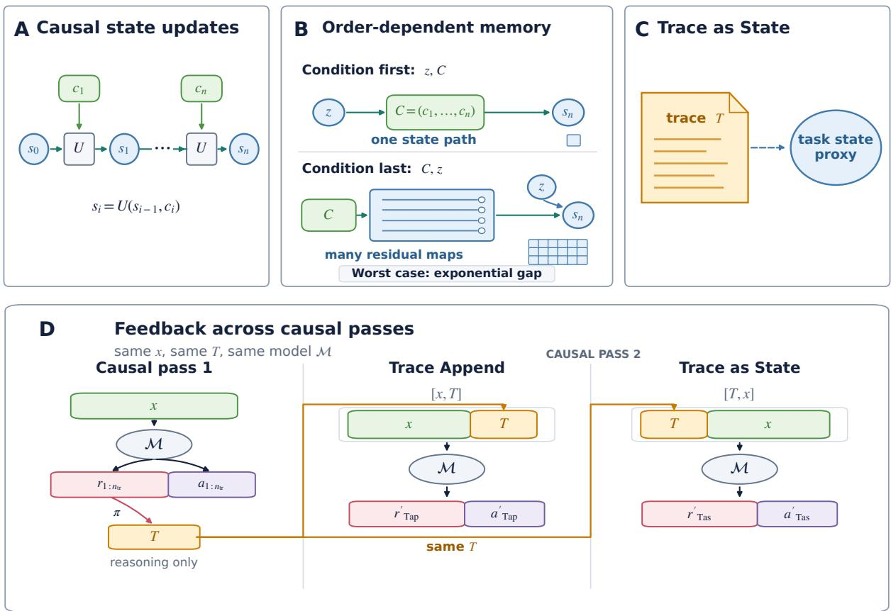  
Figure 1: Overview for TRACE AS STATE (A) A causal processor carries one running state. (B) In a worstcase conditional state update task, condition-first processing tracks only the realized state, whereas condition-last processing can require exponentially more working memory. (C) Reasoning trace T provides a textual proxy for task state. (D) TRACE AS STATE places T before the context in a fresh causal pass.

ReContext recursively builds and replays an evidence pool for the current query (Aghajohari et al., 2026; Zhao et al., 2026). These methods show that feeding task-relevant text back to a model can improve reasoning.

Reasoning traces as state. Reasoning traces can serve not only as explanations, but also as textual records of an evolving computational state. Hao et al. show that synthetic hints inserted into a reasoning trace can affect later outputs even when follow-up explanations do not acknowledge their influence (Hao et al., 2026). The State over Tokens preprint describes the growing reasoning prefix as externalized computational state, whereas causal mediation evidence suggests that models do not reliably use their stated intermediate steps (Levy et al., 2025; Paul et al., 2024). Taken together, the evidence shows that reasoning traces can carry task-relevant information and affect later outputs.

## 3 Methodology

Textual reasoning typically follows a causal order, which is well matched by causal transformers. Yet some reasoning depends on task states whose values become known only later, creating a mismatch especially consequential in long contexts. We formalize this mismatch using causal state update systems and conditional state update tasks and introduce TRACE AS STATE.

Table 1 summarizes the vital notation used in this section.

## 3.1 Causal State Updates and Order-Dependent Memory

Causal state updates. We define a causal state update processor as a processor that reads each input unit once in its presented order and updates its persistent working memory using only its current memory and the newly received unit.

Let $C = ( c _ { 1 } , \ldots , c _ { n } ) $ be an ordered sequence of n information units, with $c _ { i }$ denoting the ith unit. As shown in Figure 1A, a causal state update processor carries a task state $s _ { i }$ in a finite state space S. After reading $c _ { i } .$ , it applies a fixed update rule U:

Table 1: Vital Notations.
<table><tr><td>Symbol</td><td>Meaning</td></tr><tr><td> $c _ { i } , C$ </td><td>The ith information unit and the ordered  $\mathbf { S e - }$  quence  $C = ( c _ { 1 } , \ldots , c _ { n } )$ </td></tr><tr><td> $s _ { i } , S , b$ </td><td>The task state after  $c _ { i } .$  , its finite state space, and the log size of the state space</td></tr><tr><td> $U$ </td><td>The causal state update rule.</td></tr><tr><td> $z$ </td><td>The condition used as the initial task state 1  $s _ { 0 } .$  d</td></tr><tr><td> $x , { \mathcal { M } }$ </td><td>The long context and the causal reasoning model.</td></tr><tr><td> $r _ { j } , a _ { j } , n _ { \mathrm { t r } }$ </td><td>The reasoning trace, visible answer, and num- ber of source model runs.</td></tr><tr><td> $\pi , T$ </td><td>The trace serializer and the resulting serialized trace.</td></tr></table>

$$
s _ { i } = U ( s _ { i - 1 } , c _ { i } ) , \qquad i = 1 , \ldots , n .\tag{1}
$$

The state $s _ { i }$ is the task state the processor reached after processing $c _ { 1 } , \ldots , c _ { i }$ . When the initial state $s _ { 0 }$ is fixed, the processor follows one realized state path through the sequence.

Conditional state update tasks and orderdependent memory. Consider a variant of the causal state update process in which the initial state is supplied by a task condition rather than being fixed. $\mathbf { L e t } \ : z \in \mathcal { S }$ denote this condition. We call the resulting problem a conditional state update task: the processor sets $s _ { 0 } = z$ , applies Equation 1 to $C ,$ and returns $s _ { n }$

Figure 1B compares two orders for the same condition and information sequence. In the condition first order $[ z , C ]$ , the processor receives z before $c _ { 1 } , \ldots , c _ { n } ( n$ is the length of the information sequence) and therefore knows which state path to update. In the condition last order $[ C , z ]$ , it reads the complete sequence before learning which initial state should be propagated through it.

To compare their working memory, consider a causal state update processor that knows exactly the state update rule U. With $[ z , C ]$ , the processor only needs to store the current $s _ { i } ,$ so ⌈b⌉ bits suffice, where $b = \log _ { 2 } | S |$

With $[ C , z ]$ , the processor has not selected a state path when it finishes reading C. Each possible sequence determines a complete response profile: for every $z \in { \mathcal { S } }$ , the profile specifies the resulting $s _ { n }$ The processor must retain a different configuration for every distinct response profile induced by the valid sequences.

There are $| { \cal S } | ^ { | { \cal S } | }$ possible functions from $\boldsymbol { \mathcal { S } }$ to itself. In the worst case, $[ C , z ]$ requires at least

$$
\left\lceil \log _ { 2 } | S | ^ { | S | } \right\rceil = \lceil | S | \log _ { 2 } | S | \rceil = \lceil b 2 ^ { b } \rceil\tag{2}
$$

bits, whereas $[ z , C ]$ requires only ⌈b⌉ bits. In the worst-case scenario, the memory requirement is exponentially larger in the condition last setting than in the condition first setting.

We could derive an ordering principle: a task condition could be much easier to use when it is available before the information whose processing it guides.

## 3.2 Reasoning Traces as a Textual State Proxy

Although transformers may retain per-token kv caches, causal transformers with finite context length and finite precision are causal state update models as the their max memory are bounded. Conditional state update tasks are not literal models of real world long context tasks. Instead, the results in section 3.1 motivate us to test placing task relevant state before the context on a later pass.

The formal condition z represents task state that is already available to the processor. In a long context reasoning problem, however, useful task state may be discovered only while the model is reasoning after reading the context. A reasoning trace may record useful task states like an active target, a resolved reference or a search frontier.

We view reasoning traces as an observable textual proxy for task state, as illustrated in figure 1C. The proxy may be incomplete, lossy, or incorrect. We therefore do not identify a trace with the formal condition z or with a privileged internal model state. The connection is functional: if the trace contains useful state information, placing it before the context can make that information available while the context is processed again.

Let M be a causal state update model and let $x$ denote the long context. We run M $n _ { \mathrm { t r } }$ times on the same problem. Each run $j$ produces a reasoning trace $r _ { j }$ and a separate visible answer $a _ { j }$ :

$$
( r _ { j } , a _ { j } ) \sim \mathcal { M } ( \cdot \mid x ) , \qquad j = 1 , \ldots , n _ { \mathrm { t r } } .\tag{3}
$$

For each task, a serializer π held fixed across the placement conditions constructs the serialized trace

$$
T = \pi ( r _ { 1 } , \ldots , r _ { n _ { \mathrm { t r } } } ) .\tag{4}
$$

The serializer preserves the included reasoning text in source order and adds fixed labels and delimiters. We use $T$ as the textual state proxy to be tested.

## 3.3 Trace as state.

Figure 1D shows the complete procedure. Based on theoretical analysis from section 3.1, we introduce TRACE AS STATE, a method that places the textual state proxy T before the long context x. Therefore, in TRACE AS STATE, a fresh causal pass receives $[ T , x ]$ to generate the answer again. We compare TRACE AS STATE with TRACE APPEND, the method that maintains the original order of x and $T$ and sends the model $[ x , T ]$ on a second pass.

Let $r ^ { \prime }$ and $a ^ { \prime }$ denote the reasoning trace and visible answer produced in this pass:

$$
\begin{array} { r } { ( r _ { \mathrm { T a p } } ^ { \prime } , a _ { \mathrm { T a p } } ^ { \prime } ) \sim \mathcal { M } ( \cdot \mid [ x , T ] ) , } \\ { ( r _ { \mathrm { T a s } } ^ { \prime } , a _ { \mathrm { T a s } } ^ { \prime } ) \sim \mathcal { M } ( \cdot \mid [ T , x ] ) . } \end{array}\tag{5}
$$

TRACE AS STATE and TRACE APPEND use the same long context x and the same textual task state proxy T, with order as the only difference. With TRACE AS STATE, $T$ is available while the model processes x again. With TRACE APPEND, T arrives after x and cannot change representations already formed for the preceding context tokens, although it can still influence subsequent reasoning and the visible answer. The comparison therefore tests whether the same $T$ is more useful during rereading than after the long context has already been processed.

## 4 Experiments

## 4.1 Setup

In this section, we evaluate TRACE AS STATE and its matched placement control TRACE APPEND on long context tasks from different domains. The models come from different providers and have different disclosed architectural designs. A fixed serializer preserves the reasoning traces while adding only necessary delimiters such as "<trace\_start>" and "<trace\_end>" and brief introductory text to construct T. Some traces are so long that we truncate them to the first 50,000 characters to keep the second-pass prompt within the model’s context capacity. These choices define the realization evaluated here; the general TRACE AS STATE framework also permits adapted models, serializers, or state interfaces while retaining causal processing within each pass.

Models. We evaluate Qwen 3.7 Max, DeepSeek V4 Pro Preview, and GLM-5.2. All three are frontier long-context reasoning models that expose reasoning traces that can be logged and supplied back to the model as an imperfect textual proxy that may carry task-state information. They also represent different providers and disclosed long-context designs: DeepSeek V4 Pro Preview uses a hybrid attention stack with Compressed Sparse Attention(CSA), Heavily Compressed Attention(HCA), and Manifold-Constrained Hyper-Connections(mHC) (DeepSeek-AI, 2026a); Qwen 3.7 Max is formed with Gated Deltanet(GDN) and Gated Attention(GA) (Yang et al., 2025; Qiu et al., 2025); and GLM-5.2 is a 1M-token MoE model with DeepSeek Sparse Attention (DSA) optimized by IndexCache (IC), which reuses sparse-attention indices across layers (DeepSeek-AI, 2025b; Bai et al., 2026; GLM-5 Team, 2026; Z.ai, 2026b,a). We choose the highest available reasoning effort in our experiments: max for DeepSeek V4 Pro and GLM-5.2. For Qwen 3.7 Max, we use the official xhigh system prompt. All three support approximately one-million-token inputs in the evaluated interfaces and expose the reasoning traces required by the frozen textual realization evaluated here (Alibaba Cloud, 2026; DeepSeek-AI, 2026b; Z.ai, 2026a).

Details of the models are described in Table 1-1.

Datasets. We use GraphWalks (OpenAI, 2025a), MRCRv2 8-needle (OpenAI, 2025b; Vodrahalli et al., 2024), and 1M-Novel Understanding Bench (NUB-1M) (xz-keg, 2026) for our evaluation. GraphWalks requires the model to maintain graph state over a long edge list; MRCRv2 asks the model to bind a final request to the correct earlier requestresponse instance. Both provide multiple promptlength bins. As different models use different tokenizers, many problems in the 1M bin cannot be fairly tested due to overlength. We therefore choose the longest bins under 1M: The 256K bin for Graph-Walks and the 256K and 512K bins for MRCRv2. This choice also leaves room for additional TRACE AS STATE and TRACE APPEND texts.

NUB-1M is a long novel reading comprehension benchmark with complex questions about a new novel containing 400–700K tokens. The dataset is updated by season to reduce leakage risk. For each season, the problems and answers are manually maintained. We use the season 2 novel for evaluation and report average accuracy of the 20 problems over 5 repeats.

Models may not behave as intended unless the question appears at the end of the prompt. We therefore separate the question from the long context and place it at the end of every input to ensure models behave well focused on the given tasks. The literal orders are therefore TRACE AS STATE [T, x, q] and TRACE APPEND [x, T, q], where x is the long context and q is the question.

Table 1-1: Model configuration and token budgets used in the experiments.
<table><tr><td>Model</td><td>Qwen 3.7 Max</td><td>DeepSeek V4 Pro Preview GLM-5.2</td></tr><tr><td>Arch.ª</td><td>GDN+GA</td><td>CSA+HCA + mHC DSA+IC</td></tr><tr><td>Input Budget</td><td>983,616</td><td>1,048,576 1,048,576</td></tr><tr><td>Output</td><td>65,536</td><td>131,072 65,536</td></tr><tr><td>Budget Reasoning xhighb</td><td></td><td></td></tr></table>

a Architecture. b Via xhigh prompt.

Table 1-2: Datasets and scoring used in the experiments.
<table><tr><td>Task</td><td>GraphWalks MRCRv2</td><td>NUB-1M</td></tr><tr><td></td><td>256K,512K</td><td></td></tr><tr><td>Subsets</td><td>256K 8-needle</td><td>Season 2</td></tr><tr><td>Problems</td><td>200 200</td><td>20</td></tr><tr><td>Repeats</td><td>5 5</td><td>5</td></tr><tr><td>Scoring</td><td>EM set F1</td><td>EM, Seq.b Acc.c</td></tr></table>

a Exact Match. b SequenceMatcher ratio. c Accuracy.

Details of the datasets are listed in Table 1-2.

For each model and task, we compare a singlepass baseline M([x, q]) with two trace-backed conditions TRACE AS STATE, M([T, x, q]) and TRACE APPEND M([x, T, q]) that reuse the model’s own first-pass reasoning traces. Appendix C gives the trace serialization and dataset-specific insertion boundaries.

We evaluate each problem with 5 repeats and include all 5 reasoning traces in the second-pass TRACE AS STATE and TRACE APPEND prompts. We use the official provider for these models, Aliyun Bailian for Qwen 3.7 Max (Alibaba Cloud, 2026), DeepSeek for DeepSeek V4 Pro (DeepSeek-AI, 2026b), and Bigmodel for GLM-5.2 (Z.ai, 2026a). We do not explicitly pass a custom maximum-output value. The run records therefore establish that no client-side cap was requested, but not the effective provider default, which may also change over time.

Our evaluations use EM and set F1 for Graph-Walks, EM and SequenceMatcher ratio for MR-CRv2 8-needle, and DeepSeek V4 Pro modeljudged accuracy for NUB-1M. Blocked, overlong, malformed, missing, nonterminal, or contentfiltered cases are scored as failures.

Some first pass reasoning traces are very long, we therefore truncate each reused trace to its first 50,000 characters to avoid input overlength.

## 4.2 Main Results

Table 2 displays the main experimental results. Across all 27 reported combinations of model, task, and metric, TRACE AS STATE scores higher than TRACE APPEND in 26. DeepSeek V4 Pro and Qwen 3.7 Max favor TRACE AS STATE on every reported dataset, task and metric. GLM-5.2 follows the same pattern except on GraphWalks BFS F1, where TRACE APPEND is 0.8 points higher while TRACE AS STATE has higher exact match. TRACE AS STATE also scores above the first pass in all reported evaluations.

TRACE APPEND improves over the first pass in many settings, showing that the trace text can carry useful information in these settings. The additional advantage of TRACE AS STATE is consistent with the hypothesis that placing reasoning traces as an imperfect textual task state proxy before the context is beneficial when the model processes the context again.

The strongest gains occur on GraphWalks Parents, where success requires the model to maintain predecessor state while interpreting the graph. DeepSeek V4 Pro improves from 46.5 to 91.3 F1, or 29.2 to 81.8 EM, and Qwen 3.7 Max improves from 87.2 to 99.1 F1, or 60.8 to 96.4 EM. GLM-5.2 reaches 100.0 EM and F1 on Parents under TRACE AS STATE. MRCRv2 retrieval and binding comparisons show the same ordering advantage. NUB-1M runs provide supporting evidence in the same direction for detailed long-novel reading comprehension.

## 4.3 Context Order Ablations

We next compare TRACE AS STATE with controls that vary how different context are placed and firstpass outputs are reused on DeepSeek V4 Pro Graph-Walks 256K in table 3. We test several ablations to examine how models behave under different trace placements and feedback controls. For each ablation, the table labels the prompt format and reports the exact match(EM) and F1 score. We also include Majority@5 and Oracle@5 for the first pass in the table. Majority@5 evaluates the major choices of the 5 first pass answers, while Oracle@5 evaluates the best answer among the 5 answers.

Table 2: Long-context results for first pass, TRACE AS STATE and TRACE APPEND. Scores are percentages averaged over 5 repeats; higher is better. The best score within each model-metric column is bolded.
<table><tr><td rowspan="2">Model</td><td rowspan="2">Condition</td><td colspan="4">GraphWalks 256K</td><td colspan="2">MRCRv2 8-needle</td><td rowspan="2">NUB-1M Season 2</td></tr><tr><td>BFS</td><td></td><td>Parents</td><td></td><td>256K</td><td>512K</td></tr><tr><td rowspan="3">DeepSeek V4 Pro Preview</td><td>First Pass</td><td>EM 31.6 36.4</td><td>F1</td><td>EM</td><td>F1</td><td>EM Seq.</td><td>EM Seq.</td><td>Acc.</td></tr><tr><td>TRACE APPEND</td><td>41.8</td><td>48.3</td><td>29.2 43.0</td><td>46.5 65.3</td><td>53.8 78.5 66.6 79.6</td><td>45.4 63.6 49.4</td><td>60.0 71.0</td></tr><tr><td>TRACE AS STATE</td><td>58.8</td><td>65.9</td><td>81.8</td><td>91.3 76.8</td><td>88.7</td><td>66.9 52.6 73.3</td><td>73.0</td></tr><tr><td rowspan="2">Qwen 3.7 Max</td><td>First Pass</td><td>60.0</td><td>68.1</td><td>60.8</td><td>87.2</td><td>79.8 83.1</td><td>36.2</td><td>43.7 37.0</td></tr><tr><td>TRACE APPEND TRACE AS STATE</td><td>60.4 70.4</td><td>71.7</td><td>71.0 96.4</td><td>91.7 99.1</td><td>84.0 87.1</td><td>40.4 47.4</td><td>49.0</td></tr><tr><td rowspan="3">GLM-5.2</td><td>First Pass</td><td>63.8</td><td></td><td></td><td></td><td>88.4 91.3</td><td>46.8 52.5</td><td>51.0</td></tr><tr><td>TRACE APPEND</td><td>55.8 60.0 75.8</td><td>70.7</td><td>66.4 83.2</td><td>88.5 92.7</td><td>40.2 48.2</td><td>42.6 52.0</td><td>43.0</td></tr><tr><td>TRACE AS STATE</td><td></td><td>63.4 75.0 100.0</td><td></td><td>100.0</td><td>61.2 71.9</td><td>40.0 58.3 44.6 59.9 55.4 70.1</td><td>65.0 66.0</td></tr></table>

Question First puts the question q before the task. It substantially improves performance on Parents but remains similar to the first pass baseline on BFS, implying that the question itself may be a vital task state for some tasks.

Re2 (Xu et al., 2024) improves substantially over the first pass, showing that rereading is useful on these long context tasks. However, it remains below TRACE AS STATE, especially on Parents. In this evaluated setting, the comparison is consistent with T carrying task-relevant information beyond that supplied by prompt repetition alone.

Answer Feedback places the first pass answers $a = [ a _ { 1 } , \dotsc , a _ { n _ { \mathrm { t r } } } ]$ before the original prompt. It improves over the first pass but remains far below TRACE AS STATE. This supports the interpretation that serialized reasoning text can serve as a more useful task state proxy than the answers or the questions alone.

Random Trace replaces the prefix with traces sampled from other problems in the same Graph-Walks subtask. It performs worse than the no-trace first pass, much worse than TRACE AS STATE. So the gain of TRACE AS STATE is not due to a generic formatting effect, and a reasoning-trace-like scaffold alone is insufficient without problem-specific, task-relevant information from reasoning traces of the same problem.

All above controls above place a copy of the long context late in the prompt but remain below TRACE

AS STATE, signifying that textual recency alone does not explain the observed TRACE AS STATE gains.

Trace Only sends the first-pass reasoning traces without the original long context prompt. Its performance is similar to TRACE APPEND, showing that the traces contain useful answer-relevant information. Nevertheless, it remains well below TRACE AS STATE, showing that the original input is still useful when placed after the first pass traces. Trace as State also outperforms Oracle@5, showing that the feedback pass improves on what can be obtained by retrospectively selecting the best of the five first pass outputs.

## 4.4 Trace Count Ablation

Finally, we rerun DeepSeek V4 Pro Preview on the GraphWalks 256K while varying the number of reused first-pass traces from $n _ { \mathrm { t r } } = 1 \mathrm { t o } n _ { \mathrm { t r } } = 5$ The block for each count contains the first $n _ { \mathrm { t r } }$ eligible traces in repeat order, so successive settings are nested. For every $n _ { \mathrm { t r } } \ \geq 1$ , TRACE AS STATE and TRACE APPEND receive the same realized T, and each condition averages five fresh second-pass repeats per problem. The $n _ { \mathrm { t r } } ~ = ~ 0$ point is the common five-repeat first-pass mean. Figure 2 shows that performance generally rises as additional traces are included, and TRACE AS STATE remains above TRACE APPEND for every $n _ { \mathrm { t r } } \geq 1$ . Within this frozen-model realization, the result supports trace count as an inference-scaling parameter and shows that the measured TRACE

Table 3: DeepSeek V4 Pro Preview performance on GraphWalks 256K under different prompt conditions. Scores are percentages averaged over 5 repeats. The best scores for each subtask/metric are bolded.
<table><tr><td rowspan="2">Condition</td><td rowspan="2">Prompt</td><td>BFS</td><td>Parents</td></tr><tr><td>Exact Match(%) F1 Score(%) Exact Match(%) F1 Score(%)</td><td></td></tr><tr><td>First pass</td><td> $[ x , q ]$ </td><td>31.6 36.4</td><td>29.2 46.5</td></tr><tr><td>Majority@5</td><td></td><td>35.0 39.6</td><td>31.0 47.8</td></tr><tr><td>Oracle@5</td><td></td><td>50.0 55.5</td><td>50.0 75.0</td></tr><tr><td>Question First</td><td> $[ q , x , q ]$ </td><td>33.4 36.8</td><td>53.0 64.6</td></tr><tr><td>Re2 (Xu et al., 2024)</td><td> $[ x , q , x , q ]$ </td><td>49.0 52.9</td><td>50.0 68.9</td></tr><tr><td>Answer Feedback</td><td> $[ a , x , q ]$ </td><td>35.4 39.4</td><td>45.4 58.0</td></tr><tr><td>Random Trace</td><td> $[ T _ { \mathrm { r a n d } } , x , q ]$ </td><td>22.4 35.9</td><td>14.2 31.3</td></tr><tr><td>Trace Only</td><td> $[ T , q ]$ </td><td>46.2 52.7</td><td>43.8 67.3</td></tr><tr><td>TRACE APPEND</td><td> $[ x , T , q ]$ </td><td>41.8 48.3</td><td>43.0 65.3</td></tr><tr><td>TRACE AS STATE</td><td> $[ T , x , q ]$ </td><td>58.8 65.9</td><td>81.8 91.3</td></tr></table>

A. BFS F1  
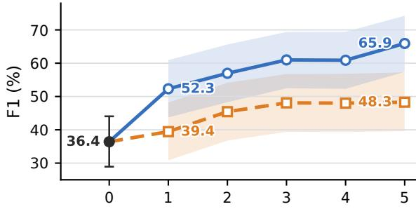

B. Parents F1  
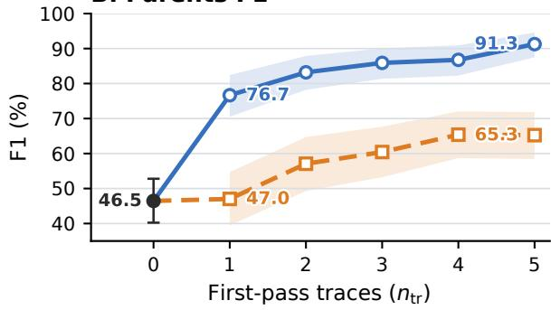  
No trace Trace Append Trace as State  
Figure 2: Trace-count ablation on DeepSeek V4 Pro GraphWalks 256K. Panel A reports BFS F1 and Panel B reports Parents F1. Shading shows 95% percentile confidence intervals.

AS STATE–TRACE APPEND ordering persists from $n _ { \mathrm { t r } } = 1$ through $n _ { \mathrm { t r } } = 5$

## 5 Conclusion

We introduced TRACE AS STATE, an inference approach that reuses task state information carried in reasoning traces as a textual proxy on a fresh pass over a long context task. Its motivation comes from theoretical analysis of conditional state update tasks: for causal state update processors, a condition available before an information sequence can guide a single evolving state, while a late condition can require retaining much more memory about potential conditions of the sequence.

TRACE AS STATE applies this ordering principle by making prior reasoning available before the long context block is processed again. Together, the formal analysis and experiments support a simple view: reasoning traces can carry forward task state information, and the point at which that information becomes available can shape how useful it is.

This view suggests several direct extensions: selecting or compressing traces, learning better textual state interfaces, and optimizing where feedback is placed. A broader training framework could jointly learn the model and the feedback interface while retaining causal processing within each pass.

## Limitations

Our experiments realize cross-pass state feedback through model-generated text. This evaluated realization requires access to raw reasoning traces or another exposed state interface. The requirement comes from the interface used in our experiments. The general cross-pass design can instead use any accessible state interface. Models or APIs that expose only final answers may therefore require a different interface.

TRACE AS STATE uses one or more source runs followed by a fresh pass over the task. These additional passes increase inference latency and token cost. Placing state before the original context can also reduce key–value cache reuse in multi-round settings.

Our evaluation covers three causal transformer models from different providers and three long context task families: GraphWalks, MRCR, and NUB-1M. We do not evaluate multi-round agent tasks. Testing additional models, domains, context lengths, and interactive settings is needed to establish how broadly the observed placement advantage generalizes.

Finally, because the method reuses only model generated traces, it does not introduce additional ethical concerns or misuse risks beyond those associated with the underlying models and tasks.

## References

Milad Aghajohari, Kamran Chitsaz, Amirhossein Kazemnejad, Sarath Chandar, Alessandro Sordoni, Aaron Courville, and Siva Reddy. 2026. The markovian thinker: Architecture-agnostic linear scaling of reasoning. In The Fourteenth International Conference on Learning Representations. Poster.

Alibaba Cloud. 2026. qwen3.7-max model information. https://help.aliyun.com/ zh/model-studio/qwen3-7-max. Official Model Studio documentation. Accessed August 3, 2026.

Yushi Bai, Qian Dong, Ting Jiang, Xin Lv, Zhengxiao Du, Aohan Zeng, Jie Tang, and Juanzi Li. 2026. IndexCache: Accelerating sparse attention via crosslayer index reuse. In Third Conference on Language Modeling.

Xinyun Chen, Ryan Andrew Chi, Xuezhi Wang, and Denny Zhou. 2024. Premise order matters in reasoning with large language models. In Proceedings of the 41st International Conference on Machine Learning, volume 235 of Proceedings of Machine Learning Research, pages 6596–6620. PMLR.

DeepSeek-AI. 2025a. DeepSeek-R1: Incentivizing reasoning capability in LLMs via reinforcement learning. Nature, 645:633–638.

DeepSeek-AI. 2025b. DeepSeek-V3.2: Pushing the frontier of open large language models. Technical report arXiv:2512.02556, DeepSeek-AI.

DeepSeek-AI. 2026a. DeepSeek-V4: Towards highly efficient million-token context intelligence. Technical report arXiv:2606.19348, DeepSeek-AI.

DeepSeek-AI. 2026b. Models & pricing. https://api-docs.deepseek.com/ quick\_start/pricing/. Official API documentation. Accessed August 3, 2026.

Jonas Geiping, Sean Michael McLeish, Neel Jain, John Kirchenbauer, Siddharth Singh, Brian R. Bartoldson, Bhavya Kailkhura, Abhinav Bhatele, and Tom Goldstein. 2025. Scaling up test-time compute with latent reasoning: A recurrent depth approach. In The Thirty-ninth Annual Conference on Neural Information Processing Systems.

GLM-5 Team. 2026. GLM-5: From vibe coding to agentic engineering. Technical report arXiv:2602.15763, Z.ai and Tsinghua University.

Yijie Hao, Lingjie Chen, Ali Emami, and Joyce C. Ho. 2026. Reasoning traces shape outputs but models won’t say so. In Proceedings of the 64th Annual Meeting of the Association for Computational Linguistics (Volume 1: Long Papers), pages 42852– 42878, San Diego, California, United States. Association for Computational Linguistics.

Cheng-Ping Hsieh, Simeng Sun, Samuel Kriman, Shantanu Acharya, Dima Rekesh, Fei Jia, Yang Zhang, and Boris Ginsburg. 2024. RULER: What’s the real context size of your long-context language models? In First Conference on Language Modeling.

Ahmadreza Jeddi, Marco Ciccone, and Babak Taati. 2026. LoopFormer: Elastic-depth looped transformers for latent reasoning via shortcut modulation. In The Fourteenth International Conference on Learning Representations.

Yuri Kuratov, Aydar Bulatov, Petr Anokhin, Ivan Rodkin, Dmitry Sorokin, Artyom Sorokin, and Mikhail Burtsev. 2024. BABILong: Testing the limits of LLMs with long context reasoning-in-a-haystack. In Advances in Neural Information Processing Systems, volume 37. Datasets and Benchmarks Track.

Celine Lee, Alexander M. Rush, and Keyon Vafa. 2025. Critical thinking: Which kinds of complexity govern optimal reasoning length? In Proceedings of the 14th International Joint Conference on Natural Language Processing and the 4th Conference ofthe Asia-Pacific Chapter of the Association for Computational Linguistics.

Michael A. Lepori, Michael Curtis Mozer, and Asma Ghandeharioun. 2025. Racing thoughts: Explaining contextualization errors in large language models. In Proceedings of the 2025 Conference of the Nations ofthe Americas Chapter ofthe Associationfor Computational Linguistics: Human Language Technologies (Volume 1: Long Papers), pages 3020–3036, Albuquerque, New Mexico. Association for Computational Linguistics.

Mosh Levy, Zohar Elyoseph, Shauli Ravfogel, and Yoav Goldberg. 2025. State over tokens: Characterizing the role of reasoning tokens. Preprint, arXiv:2512.12777.

Nelson F. Liu, Kevin Lin, John Hewitt, Ashwin Paranjape, Michele Bevilacqua, Fabio Petroni, and Percy Liang. 2024. Lost in the middle: How language models use long contexts. Transactions ofthe Association for Computational Linguistics, 12:157–173.

William Merrill and Ashish Sabharwal. 2024. The expressive power of transformers with chain of thought. In The Twelfth International Conference on Learning Representations.

Shen Nie, Fengqi Zhu, Zebin You, Xiaolu Zhang, Jingyang Ou, Jun Hu, Jun Zhou, Yankai Lin, Ji-Rong Wen, and Chongxuan Li. 2025. Large language diffusion models. In Advances in Neural Information Processing Systems, volume 38, pages 50608–50646. Curran Associates, Inc.

Maxwell Nye, Anders Johan Andreassen, Guy Gur-Ari, Henryk Michalewski, Jacob Austin, David Bieber, David Dohan, Aitor Lewkowycz, Maarten Bosma, David Luan, Charles Sutton, and Augustus Odena. 2021. Show your work: Scratchpads for intermediate computation with language models. ArXiv:2112.00114.

Hyunjong Ok and Jaeho Lee. 2026. Lost in the prompt order: Revealing the limitations of causal attention in language models. In Findings ofthe Association for Computational Linguistics: ACL 2026, pages 38566–38587, San Diego, California, United States. Association for Computational Linguistics.

OpenAI. 2025a. GraphWalks: A multi hop reasoning long context benchmark. https://huggingface.co/datasets/ openai/graphwalks. Dataset card. Accessed August 3, 2026.

OpenAI. 2025b. OpenAI MRCR: Long context multiple needle in a haystack benchmark. https://huggingface.co/datasets/ openai/mrcr. Dataset card. Accessed August 3, 2026.

Debjit Paul, Robert West, Antoine Bosselut, and Boi Faltings. 2024. Making reasoning matter: Measuring and improving faithfulness of chain-of-thought reasoning. In Findings ofthe Associationfor Computational Linguistics: EMNLP 2024, pages 15012– 15032, Miami, Florida, USA. Association for Computational Linguistics.

Zihan Qiu, Zekun Wang, Bo Zheng, Zeyu Huang, Kaiyue Wen, Songlin Yang, Rui Men, Le Yu, Fei Huang, Suozhi Huang, Dayiheng Liu, Jingren Zhou, and Junyang Lin. 2025. Gated attention for large language models: Non-linearity, sparsity, and attentionsink-free. In Advances in Neural Information Processing Systems, volume 38, pages 110931–110957.

Qwen Team. 2025a. Qwen3-Next-80B-A3B-Instruct model card. Model card, Alibaba Cloud. Official model card.

Qwen Team. 2025b. Qwen3 technical report. Technical report arXiv:2505.09388, Alibaba Cloud.

Subham Sekhar Sahoo, Marianne Arriola, Yair Schiff, Aaron Gokaslan, Edgar Marroquin, Justin T. Chiu, Alexander Rush, and Volodymyr Kuleshov. 2024. Simple and effective masked diffusion language models. In Advances in Neural Information Processing Systems, volume 37.

Nikunj Saunshi, Nishanth Dikkala, Zhiyuan Li, Sanjiv Kumar, and Sashank J. Reddi. 2025. Reasoning with latent thoughts: On the power of looped transformers. In The Thirteenth International Conference on Learning Representations.

Kiran Vodrahalli, Santiago Ontanon, Nilesh Tripuraneni, Kelvin Xu, Sanil Jain, Rakesh Shivanna, Jeffrey Hui, Nishanth Dikkala, Mehran Kazemi, Bahare Fatemi, Rohan Anil, Ethan Dyer, Siamak Shakeri, Roopali Vij, Harsh Mehta, Vinay Ramasesh, Quoc Le, Ed Chi, Yifeng Lu, and 5 others. 2024. Michelangelo: Long context evaluations beyond haystacks via latent structure queries. Preprint, arXiv:2409.12640.

Jason Wei, Xuezhi Wang, Dale Schuurmans, Maarten Bosma, Brian Ichter, Fei Xia, Ed Chi, Quoc V. Le,

and Denny Zhou. 2022. Chain-of-thought prompting elicits reasoning in large language models. In Advances in Neural Information Processing Systems, volume 35, pages 24824–24837.

Xiaohan Xu, Chongyang Tao, Tao Shen, Can Xu, Hongbo Xu, Guodong Long, Jian-Guang Lou, and Shuai Ma. 2024. Re-reading improves reasoning in large language models. In Proceedings of the 2024 Conference on Empirical Methods in Natural Language Processing, pages 15549–15575, Miami, Florida, USA. Association for Computational Linguistics.

xz-keg. 2026. 1M Novel Understanding Bench. https://github.com/xz-keg/ Novel-Understanding-Bench. Project repository. Accessed August 3, 2026.

Songlin Yang, Jan Kautz, and Ali Hatamizadeh. 2025. Gated delta networks: Improving Mamba2 with delta rule. In The Thirteenth International Conference on Learning Representations.

Sangwon Yu, Ik hwan Kim, Jongyoon Song, Saehyung Lee, Junsung Park, and Sungroh Yoon. 2025. Unleashing multi-hop reasoning potential in large language models through repetition of misordered context. In Findings of the Association for Computational Linguistics: NAACL 2025, pages 6450–6470, Albuquerque, New Mexico. Association for Computational Linguistics.

Z.ai. 2026a. GLM-5.2. https://docs. bigmodel.cn/cn/guide/models/text/ glm-5.2. Official model documentation. Accessed August 3, 2026.

Z.ai. 2026b. GLM-5.2 & GLM-5.1 & GLM-5. https: //github.com/zai-org/GLM-5. Official GLM-5 series repository. Accessed August 3, 2026.

Yanjun Zhao, Ruizhong Qiu, Tianxin Wei, Yuanchen Bei, Zhining Liu, Lingjie Chen, Ismini Lourentzou, Hanghang Tong, and Jingrui He. 2026. ReContext: Recursive evidence replay as LLM harness for longcontext reasoning. Preprint, arXiv:2607.02509.

## A Attaining the Worst-Case Residual-Map Count

Let S be a finite nonempty state set, $\mathcal { C }$ an input alphabet, n the sequence length, and $t : \mathcal { C } ^ { n } \times$ $s  s$ a conditional state-update task. For an information sequence $C \in { \mathcal { C } } ^ { n }$ , define the residual map and the number of distinct residual maps by

$$
\begin{array} { c } { \phi _ { C } = ( t ( C , z ) ) _ { z \in { \mathcal { S } } } \in { \mathcal { S } } ^ { \mathcal { S } } , } \\ { \kappa = | \{ \phi _ { C } \mid C \in { \mathcal { C } } ^ { n } \} | . } \end{array}
$$

Equivalently, $\phi _ { C } ( z ) = t ( C , z )$ . For every finite nonempty state set $s ,$ , this appendix constructs a task for which $\mathcal { K } = | \mathcal { S } | ^ { | \mathcal { S } | }$ . The corresponding late-order working-memory requirement is

$$
\left\lceil \log _ { 2 } \mathcal { K } \right\rceil = \left\lceil | S | \log _ { 2 } | S | \right\rceil \mathrm { b i t s } .
$$

Fix an arbitrary finite nonempty state set ${ \mathcal { S } } .$ For this $s ,$ the construction below chooses ${ \mathcal { C } } , n ,$ and t and evaluates $\kappa$ under the definition above. Set $m = | \boldsymbol { S } |$ and write $b = \log _ { 2 } m$ . Since every $\phi _ { C }$ belongs to $\mathcal { S } ^ { S } , \mathcal { K } \le m ^ { m }$

Proposition. For every finite nonempty state set $s ,$ there exist a finite input alphabet $\mathcal { C }$ and a conditional state-update task such that, with $n = 1$ $\mathcal { K } = m ^ { m }$ . Every deterministic one-pass processor that is exact on all inputs and reads $C$ before z must therefore retain at least

$$
\left\lceil \log _ { 2 } { \mathcal { K } } \right\rceil = \left\lceil m \log _ { 2 } m \right\rceil = \left\lceil b 2 ^ { b } \right\rceil
$$

bits of persistent input-dependent state immediately before reading $z .$

Construction. Set $n = 1$ and choose the input alphabet

$$
{ \mathcal { C } } = \{ c _ { f } \mid f \in { \mathcal { S } } ^ { S } \} .
$$

Thus $| { \mathcal { C } } | = m ^ { m }$ . Define one fixed update rule $U : S \times { \mathcal { C } } \to S$ by $U ( s , c _ { f } ) = f ( s )$ , equivalently $U _ { c _ { f } } = f .$ For every $f \in \dot { S } ^ { S }$ , the sequence $C _ { f }$ $\dot { ( c _ { f } ) }$ belongs to ${ \mathcal { C } } ^ { n }$ , and its residual map satisfies

$$
\phi _ { C _ { f } } ( z ) = t ( C _ { f } , z ) = U _ { c _ { f } } ( z ) = f ( z ) .
$$

Consequently,

$$
\{ \phi { \cal C } | { \cal C } \in { \mathcal { C } } ^ { n } \} = { \cal S } ^ { \cal S } ,
$$

and

$$
\begin{array} { c } { { \kappa = | \{ \phi _ { C } | C \in { \mathcal { C } } ^ { n } \} | } } \\ { { = | S ^ { S } | = m ^ { m } . } } \end{array}
$$

Late-order cut. Consider the processor configuration after $C _ { f }$ and immediately before z is read. If two distinct functions $\textit { f } \neq \textit { g }$ produced the same configuration, some $z \in \mathcal { S }$ would satisfy $f ( z ) \neq g ( z )$ . Starting from the shared configuration, the processor would produce the same output after reading the identical suffix $z ,$ contradicting exactness. Thus the cut admits at least $m ^ { m }$ distinct configurations. At this cut, a processor attains the bound by storing the identity of $f$ in one of $m ^ { m }$ states and applying the fixed lookup rule when $z$ arrives. Under the accounting convention above, the exact cut-state requirement for this family is $\lceil \log _ { 2 } ( m ^ { m } ) \rceil$ bits.

Condition-first comparison. For the order $( z , c _ { f } )$ , a single S-valued register suffices: initialize it with z and replace its value by $f ( z )$ when $c _ { f }$ arrives. At the cut after z and immediately before $c _ { f } .$ this implementation has m possible inputdependent configurations. This is optimal. Let $\iota = \mathrm { i d } _ { \mathcal { S } } , \mathrm { s o } c _ { \iota } \in \mathcal { C }$ . If two distinct values $z , z ^ { \prime } \in S$ produced the same configuration at this cut, then reading the identical suffix $c _ { \iota }$ would force the same output from both configurations. Exactness instead requires the respective outputs $\iota ( z ) = z$ and $\iota ( z ^ { \prime } ) = z ^ { \prime }$ . Hence the cut admits at least m configurations, and its exact cut-state requirement is $\left\lceil \log _ { 2 } m \right\rceil = \left\lceil b \right\rceil$ bits. When $m = 1$ , each cut has one configuration and therefore requires zero bits. As a concrete check, $m = 4$ gives $\mathcal { K } = 4 ^ { 4 } = 2 5 6 \mathrm { : }$ the late-order cut requires eight bits, whereas the condition-first cut requires two bits.

Scope. This finite-state existence construction applies to the stated task family and to deterministic, exact, one-pass computation. It is an adversarial worst-case construction whose alphabet and fixed transition table realize all self-maps of S. The processor cannot reread $C ,$ and every auxiliary writable store is included in the counted configuration. Restricted update families may realize fewer residual maps, yielding a smaller lower bound from this residual-map argument.

Causal Transformers are Causal State Update Processors. Transformers use kv caches that may expand as context length grows. Modern transformers may include more complex memory structures like latent kv, shared kv or linear kv. Despite these, causal transformers with a finite maximal context length and finite precisions are indeed causal state update processors defined in section 3.1.

Define the "working state" as to contain the current position, all layerwise key–value entries, and any other persistent input-dependent inference buffers. Causal inference computes the new token representation layer by layer and appends the corresponding key–value entries. Thus the next configuration is a fixed function of the preceding configuration and the new token. The maximum context length and finite precision make the configuration space finite. Per-token or other forms of caches therefore do not violate the causal state update abstraction.

## B Scoring and Run Qualifications

Section 4.1 gives the common model, dataset, condition, and scoring setup. This appendix specifies scorer edge cases, qualifications of the reported runs, and the record-selection rules used to compute the reported cells.

## B.1 Scorer Edge Cases

GraphWalks. The evaluator extracts the terminal line Final Answer: [...] and compares the parsed node set with the gold set. A valid empty prediction is scored normally: two empty sets have EM and F1 equal to one, whereas one empty and one nonempty set have EM and F1 equal to zero. An absent response or a missing, malformed, or nonterminal answer receives zero. For Question First, we conservatively treat a null or unknown termination marker as length-limited. In the evaluated records, 121 have a null marker, none have an unknown marker, and 60 are natively marked as length-limited, for 181 length-limited outputs in total (160 BFS and 21 Parents). One additional stopped BFS output lacks the required terminal answer syntax. All 182 outputs receive zero.

MRCRv2 8-needle. Each example supplies a random prefix that must begin both the prediction and reference. The scorer validates and removes this prefix before computing EM and the ratio returned by Python’s difflib.SequenceMatcher. EM is one when the remaining strings match exactly and zero otherwise. The paper labels the ratio Seq.; it is distinct from GraphWalks set F1. A missing or invalid prefix gives zero for both metrics. Some prompts trigger provider content filters; filtered outputs remain in the denominator and receive zero.

NUB-1M. We maintain a reference answer for each problem and use DeepSeek V4 Pro to compare the extracted solver answer with that reference. Solver identity and feedback order are excluded from the judge prompt. The judge returns a Boolean correctness decision and a short rationale; we use the Boolean as the binary score.

We also manually reviewed the judged outputs and found no errors.

## C Prompt and State Templates

This appendix shows the fixed serializer used to construct T and records the dataset-specific prompt details for experiments. We retain the compact condition notation [T, x] for TRACE AS STATE and [x, T] for TRACE APPEND; the paragraphs below give the exact insertion boundaries and fixed interface text suppressed by that notation.

## C.1 Reusable Trace Block

Let $r = ( r _ { 1 } , \ldots , r _ { n _ { \mathrm { t r } } } )$ denote the selected firstpass reasoning traces in source order, and let $P _ { D }$ denote the dataset-specific trace-block preamble containing its description and warning. Table 4 shows their fixed text form.

Here $P _ { \mathcal { D } }$ is part of T, rather than part of the original task prompt x; its exact value for each dataset is given verbatim below. Separately returned visible answers remain outside T. The five source reasoning fields are taken in repeat-index order. When applying the 50,000-character cap, any reasoning field longer than 50,000 characters is replaced by its first 50,000 characters followed by ...; block formatting then strips leading and trailing whitespace.

## C.2 Model-Specific Details

Qwen 3.7 Max reasoning instruction. For every evaluated Qwen 3.7 Max condition, we use the following fixed xhigh instruction recommended for reasoning scenarios in the official Qwen 3.7 Max evaluation guidance available when the experiments were run:

Reasoning effort is set to   
xhigh. Please think carefully   
through the task, validate key   
assumptions, consider plausible   
alternatives, and prioritize   
correctness, consistency, and   
clarity in the final answer.

Here xhigh names the recommended prompt text rather than a provider-side reasoning\_effort value. For MRCRv2, the runner prepends the instruction to the system message. The GraphWalks and NUB-1M runners prepend it to their single user message. Within each dataset, the delivery format is fixed across the evaluated conditions and does not change the relative placement of T and the long context.

Table 4: The fixed serialization used to construct the reusable trace block.  
Reasoning traces r $T = \pi ( r )$   
$r = ( r _ { 1 } , r _ { 2 } , \dots , r _ { n _ { \mathrm { t r } } } )$ $P _ { \mathcal { D } }$ (dataset-specific prompt)   
<first\_run\_reasoning\_traces>   
[Trace 1]   
$r _ { 1 }$   
[Trace 2]   
$r _ { 2 }$   
.   
[Trace ntr]   
$r _ { n _ { \mathrm { t r } } }$   
</first\_run\_reasoning\_traces>

Version of Deepseek V4 Pro. There are two models both called Deepseek V4 Pro released on 2026-4-24 and 2026-8-13 respectively. We use the 2026-4-24 version for our experiments.

## C.3 Dataset-Specific Details

GraphWalks. For GraphWalks, $P _ { D }$ is the following exact text:

Below are selected reasoning   
traces or trace tail windows   
from independent first attempts   
on the same graph problem. They   
may contain mistakes. Use them   
only as scratchpad hints, and   
verify against the graph.

We also use a system prompt:

You solve directed-graph   
algorithm problems. Use only   
the graph and operation in the   
user message. Return exactly   
one visible line in this format:   
Final Answer: [node1, node2].   
Use [] for the empty set. Do   
not include any text before or   
after that line.

The runner also appends this exact answerformat instruction to the user message:

Return exactly one line in this   
format: Final Answer: [node1,   
node2]. Use [] for the empty   
set.

For $[ T , x ]$ , the complete trace block precedes the complete released GraphWalks prompt, and the answer-format instruction follows that prompt.

For $[ x , T ]$ , the runner splits the released prompt immediately before its last Operation: block: the graph instructions and edge list come first, then the identical trace block, then the final operation and answer-format instruction.

This formatting instruction guides the model to output its answer in a parse-able way.

MRCRv2. For MRCRv2, $P _ { \mathcal { D } }$ is the following exact text:

Below are reasoning traces from   
independent first attempts on   
the same MRCR problem. They   
may contain mistakes. Use them   
only as scratchpad hints; verify   
against the conversation and   
final request. Do not copy any   
trace text into the visible   
answer.

## D GraphWalks Difficulty Profiles

As an exploratory diagnostic, we examine whether the descriptive timing gap varies with two observable GraphWalks properties. BFS specifies a requested traversal depth d, and Parents has a gold parent-set size k. These variables summarize aspects of traversal and aggregation demand, but realized difficulty can also depend on frontier size, early termination, and graph structure. The analysis and highlighted ranges were developed after inspecting outcomes; they are hypothesis-generating rather than confirmatory tests of an interaction, threshold, capacity limit, or mechanism.

We pool adjacent low-support values into BFS bins 1–2, 3–4, 5–6, 7–8, and 9–10, and Parents bins 0, 1, 2, 3, 4–5, and ≥ 6. Their problem counts are (17, 25, 21, 15, 22) and (13, 17, 25, 20, 13, 12), respectively. For feedback timing p ∈ {pre, post} and bin b, we report the gain over the common

first-pass baseline,

$$
\Delta _ { p } ( b ) = \mathrm { S c o r e } _ { p } ( b ) - \mathrm { S c o r e } _ { \mathrm { f r s t } } ( b ) .\tag{6}
$$

Each point averages five stored repeats within each problem and then the problems in its bin. The yellow regions are descriptive and outcome-informed; their boundaries are specific to each model, subtask, and metric. They were not selected independently of the displayed scores and do not support confirmatory inference.

The prefix-minus-postfix exact-match gap in Figure $^ 3$ is concentrated in particular bins. DeepSeek V4 Pro has its largest BFS timing gaps at $d = 3 -$ $6 ,$ and Qwen 3.7 Max has a smaller concentration in the same range. GLM-5.2 has positive gaps through $d = 8$ and a reversal in the final pooled bin. The Parents profiles differ. TRACE AS STATE is never below TRACE APPEND in the plotted exactmatch bins, with a tie for Qwen 3.7 Max at $k = 0$ Qwen’s separation grows with $k ;$ DeepSeek V4 Pro and GLM-5.2 are nonmonotonic but have large gaps in selected middle or high-k bins.

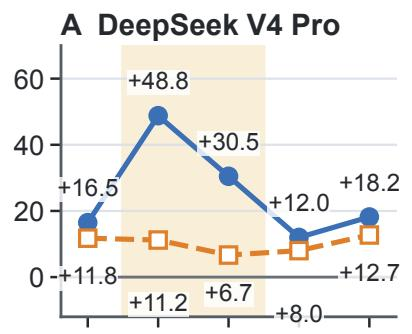

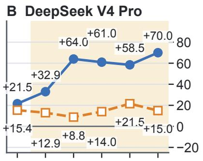

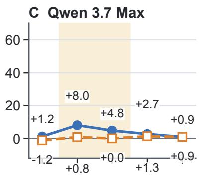

D Qwen 3.7 Max  
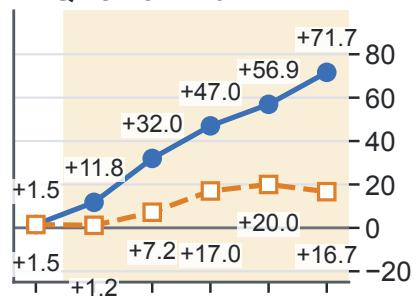

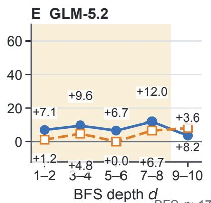

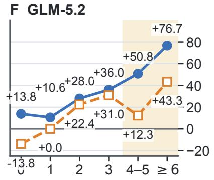  
BFS n: 17, 25, 21, 15, 22  
Parents n: 13, 17, 25, 20, 13, 12  
Figure 3: GraphWalks exact-match gains over the first pass by BFS depth d (left) and gold-parent count k (right). The blue and orange curves report $\Delta _ { \mathrm { p r e } }$ and $\Delta _ { \mathrm { p o s t } }$ . Bin supports appear below the panels. Yellow shading marks descriptive, outcome-informed ranges of larger separation, with boundaries chosen separately for each model and subtask.

Number of gold parents k Problems at k = 0, 1, 2, 3, 4--5, ≥ 6: 13, 17, 25, 20, 13, 12  
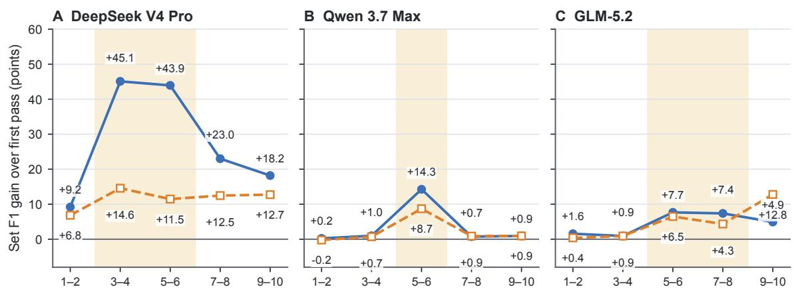  
Requested BFS depth d Problems at d = 1--2, 3--4, 5--6, 7--8, 9--10: 17, 25, 21, 15, 22

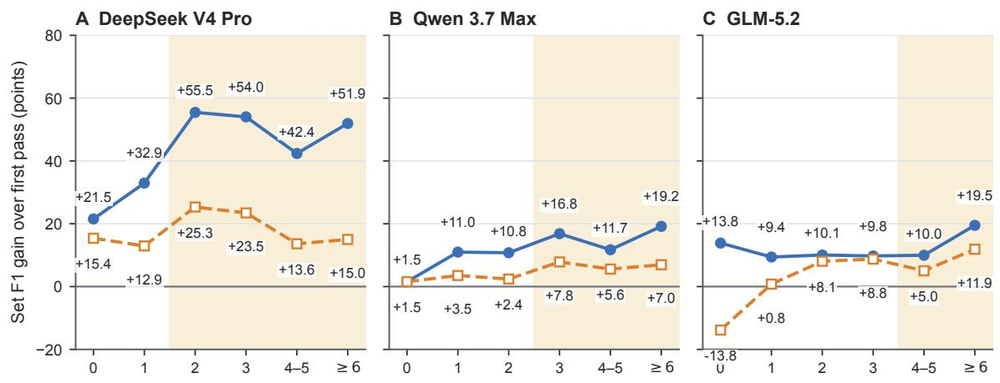  
Figure 4: Set F1 gains for the same BFS (top) and Parents (bottom) stratifications. Set F1 records partial overlap between predicted and gold node sets. Yellow shading again marks descriptive, outcome-informed ranges selected separately for each model, subtask, and metric.

The binned set F1 means preserve the strong DeepSeek V4 Pro BFS pattern, while Qwen 3.7 Max and GLM-5.2 show smaller or more localized separation. Parents generally favors TRACE AS STATE, with substantial variation in the size of the gap. These profiles document heterogeneity but do not establish why it occurs or that depth or parent-set size mediates trace reuse. A confirmatory follow-up would define bins or continuous contrasts before observing timing outcomes and evaluate them on held-out problems.

## E Confidence Intervals

This appendix reports paired uncertainty for the principal same-T timing contrast and cell-wise uncertainty for the broader results and ablations. Table 5 reports the mean paired TRACE AS STATEminus-TRACE APPEND difference and an unadjusted 95% percentile interval after averaging the five repeats within each problem. The intervals lie fully above zero for 20 of 24 cells. The four intervals that cross zero are DeepSeek V4 Pro MRCRv2 512K EM, Qwen 3.7 Max GraphWalks BFS F1, and GLM-5.2 GraphWalks BFS EM and F1.

Figures 5 and 6 report cell means with 95% percentile intervals from the same problem-cluster bootstrap. Repeats are averaged within each problem.

Figure 5 covers the strict same-T GraphWalks and MRCRv2 comparisons in Table 2, together with the supporting NUB-1M results. The NUB-1M intervals are wider, consistent with its 20 evaluated questions. Figure 6 covers the GraphWalks control ablation. The same bootstrap procedure produces the shaded trace-count intervals in Figure 2.

Table 5: Paired problem-cluster uncertainty for the strict same-T timing contrast. ∆ is Trace as State minus Trace Append in percentage points; brackets give unadjusted 95% percentile intervals over problems after five-repeat averaging (n = 100 per cell; 20,000 resamples; seed 0). GW is GraphWalks 256K and MR is MRCRv2 8-needle. Intervals wholly above zero are bold.
<table><tr><td>Model</td><td>Cell</td><td></td><td>∆ [95% CI]</td></tr><tr><td rowspan="2">DeepSeek V4 Pro</td><td>GW BFS EM GW BFS F1 GW Par. EM</td><td>+17.00 +17.63 +38.80</td><td>[+11.00, +23.40] [+11.65, +23.97] [+31.60, +46.20</td></tr><tr><td>GW Par. F1 MR 256K EM MR 256K Seq. MR 512K EM</td><td>+26.02</td><td>[+20.52, +31.84] +10.20 [+4.80, +15.80] +9.11 [+4.77, +13.93 +3.20 [−2.60, +9.40</td></tr><tr><td>Qwen 3.7 Max</td><td>GW BFS EM GW BFS F1 GW Par. EM GW Par. F1 MR 256K EM</td><td>+25.40 [+17.60, +33.60 +4.40 [+1.40, +8.00]</td><td>+3.40 [+1.00, +6.40] +1.29[−0.56, +3.90 +7.43 [+4.63, +10.58]</td></tr><tr><td rowspan="2">GLM-5.2</td><td>MR 512K Seq. GW BFS EM GW BFS F1</td><td></td><td>+5.11 [+0.67, +9.84] +3.40 [−1.00, +7.80] -0.83 [−3.94, +1.62]</td></tr><tr><td>GW Par. EM GW Par. F1 MR 256K EM</td><td>+16.80 [+10.40, +23.80]</td><td>+7.32 [+3.93, +11.30] +21.20 [+14.40, +28.20]</td></tr></table>

First Pass Trace Append Trace as State  
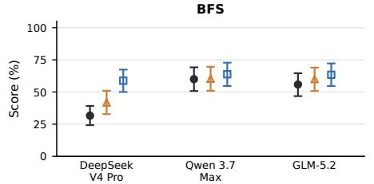  
GraphWalks 256K - Set F1

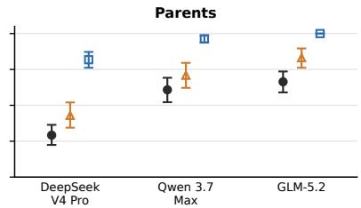

First Pass Trace Append Trace as State  
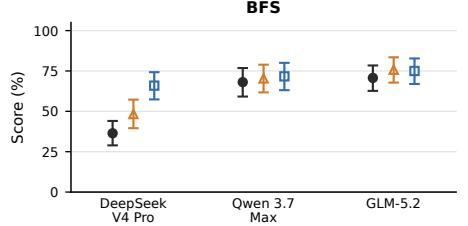  
MRCRv2 8-needle - Exact match

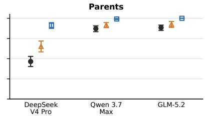

First Pass Trace Append Trace as State  
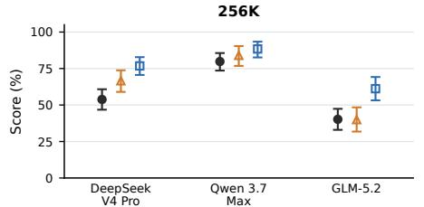

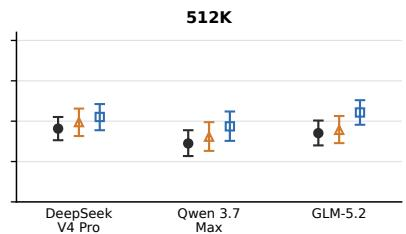  
MRCRv2 8-needle - SequenceMatcher ratio

First Pass Trace Append Trace as State  
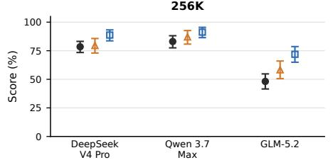

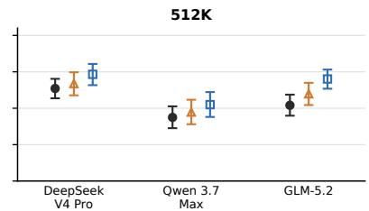  
First Pass Trace Append Trace as State

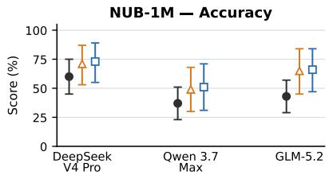

Figure 5: Uncertainty for the strict same-T comparisons. The top two rows show GraphWalks 256K exact match and set F1, split into BFS and Parents; the bottom two wide rows show MRCRv2 8-needle exact match and SequenceMatcher ratio, split into 256K and 512K bins. The final panel shows NUB-1M accuracy. Points are means; bars are 95% percentile intervals after averaging 5 repeats within each problem.

## GraphWalks 256K control ablations - Exact Match

Mean with 95% problem-cluster bootstrap CI  
Mean with 95% problem-cluster bootstrap CI  
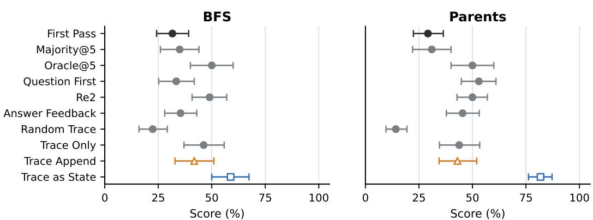  
GraphWalks 256K control ablations - Set F1

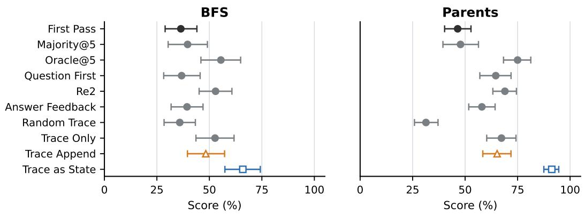  
Figure 6: Uncertainty for DeepSeek V4 Pro GraphWalks 256K control comparisons in exact match and set F1. Points are means; bars are 95% percentile intervals from 20,000 problem-cluster bootstrap resamples (seed 0). Majority@5 retains answer elements occurring in at least three repeat-level prediction sets, and Oracle@5 reports the retrospective maximum evaluator score among the five outputs. Other conditions average five planned repeats within each problem and assign zero to missing or invalid outputs.

## F Token Usage

Table 6 reports token counts returned by provider APIs for the solver calls underlying the main results.

For each retained response with providerreported usage, we report cached input, missed input, and output tokens. Missed input is total input minus cached input. Reasoning tokens are included in the output.

First Pass is the shared source pass used to construct T. For TRACE AS STATE and TRACE AP-PEND, we also report the Total tokens columns that add the corresponding First Pass counts componentwise.

Table 6: Provider-reported token usage for main-result inference, in millions. Tokens reports the pass named in each row. For TRACE APPEND and TRACE AS STATE, Total tokens adds First Pass component-wise; those columns are blank for First Pass itself. Missed input is total input minus cached input.
<table><tr><td>Benchmark</td><td>Condition</td><td colspan="3">Tokens</td><td colspan="3">Total tokens</td></tr><tr><td></td><td></td><td>Cached input</td><td>Missed input</td><td>Output</td><td>Cached input</td><td>Missed input</td><td>Output</td></tr><tr><td colspan="8">DeepSeek V4 Pro</td></tr><tr><td>GraphWalks 256K</td><td>First Pass</td><td>206.766</td><td>51.092</td><td>62.507</td><td></td><td></td><td></td></tr><tr><td></td><td>TRACE APPEND TRACE AS STATE</td><td>271.017 277.074</td><td>68.554 62.501</td><td>35.231 27.975</td><td>477.783 483.840</td><td>119.646 113.593</td><td>97.738 90.482</td></tr><tr><td></td><td></td><td></td><td></td><td></td><td></td><td></td><td></td></tr><tr><td>MRCRv2 256K</td><td>First Pass</td><td>50.817</td><td>46.961</td><td>1.149</td><td></td><td></td><td></td></tr><tr><td></td><td>TRACE APPEND TRACE AS STATE</td><td>79.982 51.875</td><td>20.820 50.051</td><td>0.690 1.355</td><td>130.799 102.692</td><td>67.782 97.012</td><td>1.839 2.504</td></tr><tr><td></td><td></td><td></td><td></td><td></td><td></td><td></td><td></td></tr><tr><td>MRCRv2 512K</td><td>First Pass</td><td>155.283</td><td>38.195</td><td>0.989</td><td></td><td></td><td></td></tr><tr><td></td><td>TRACE APPEND TRACE AS STATE</td><td>178.675 157.261</td><td>18.526 39.940</td><td>0.702 1.241</td><td>333.958 312.544</td><td>56.721 78.135</td><td>1.691 2.230</td></tr><tr><td></td><td></td><td></td><td></td><td></td><td></td><td></td><td></td></tr><tr><td>NUB-1M Season 2</td><td>First Pass</td><td>31.651</td><td>8.418</td><td>0.817</td><td></td><td></td><td></td></tr><tr><td></td><td>TRACE APPEND</td><td>39.589</td><td>4.460</td><td>0.184</td><td>71.240</td><td>12.878</td><td>1.001 1.215</td></tr><tr><td></td><td>TRACE AS STATE</td><td>27.418</td><td>16.637</td><td>0.398</td><td>59.069</td><td>25.055</td><td></td></tr><tr><td colspan="8">Qwen 3.7 Max</td></tr><tr><td>GraphWalks 256K</td><td>First Pass</td><td>260.213</td><td>97.483</td><td>5.402</td><td></td><td></td><td></td></tr><tr><td></td><td>TRACE APPEND</td><td>264.906</td><td>117.866</td><td>2.865</td><td>525.119</td><td>215.350</td><td>8.267</td></tr><tr><td></td><td>TRACE AS STATE</td><td>271.742</td><td>111.030</td><td>3.615</td><td>531.955</td><td>208.514</td><td>9.017</td></tr><tr><td>MRCRv2 256K</td><td>First Pass</td><td>38.337</td><td>63.495</td><td>2.111</td><td></td><td></td><td></td></tr><tr><td></td><td>TRACE APPEND</td><td>60.227</td><td>51.195</td><td>0.989</td><td>98.564</td><td>114.690</td><td>3.100</td></tr><tr><td></td><td>TRACE AS STATE</td><td>62.213</td><td>49.209</td><td>1.397</td><td>100.550</td><td>112.704</td><td>3.508</td></tr><tr><td>MRCRv2 512K†</td><td>First Pass</td><td>134.607</td><td>63.738</td><td>2.263</td><td></td><td></td><td></td></tr><tr><td></td><td>TRACE APPEND</td><td>154.827</td><td>53.489 54.345</td><td>1.211</td><td>289.434</td><td>117.226</td><td>3.474 3.988</td></tr><tr><td></td><td>TRACE AS STATE</td><td>153.971</td><td></td><td>1.724</td><td>288.577</td><td>118.083</td><td></td></tr><tr><td>NUB-1M Season 2</td><td>First Pass</td><td>34.253</td><td>7.547</td><td>0.489</td><td></td><td></td><td></td></tr><tr><td></td><td>TRACE APPEND</td><td>38.184 32.414</td><td>5.773 11.549</td><td>0.253 0.419</td><td>72.437 66.667</td><td>13.320 19.096</td><td>0.742 0.908</td></tr><tr><td></td><td>TRACE AS STATE</td><td></td><td></td><td></td><td></td><td></td><td></td></tr><tr><td colspan="8">GLM-5.2 GraphWalks 256K</td></tr><tr><td></td><td>First Pass TRACE APPEND</td><td>134.748 55.612</td><td>150.760 265.396</td><td>19.463 9.127</td><td>190.361</td><td>416.156</td><td>28.591</td></tr><tr><td></td><td>TRACE AS STATE</td><td>64.390</td><td>256.618</td><td>16.491</td><td>199.138</td><td>407.377</td><td>35.954</td></tr><tr><td></td><td></td><td></td><td></td><td></td><td></td><td></td><td></td></tr><tr><td>MRCRv2 256K</td><td>First Pass</td><td>73.782</td><td>24.718</td><td>1.891</td><td></td><td>45.658</td><td>4.409</td></tr><tr><td></td><td>TRACE APPEND TRACE AS STATE</td><td>82.413 82.464</td><td>20.940 20.888</td><td>2.518 1.516</td><td>156.195 156.246</td><td>45.606</td><td>3.407</td></tr><tr><td></td><td></td><td></td><td></td><td></td><td></td><td></td><td></td></tr><tr><td>MRCRv2 512K</td><td>First Pass</td><td>151.247</td><td>42.262</td><td>1.441</td><td></td><td>82.770</td><td>3.443</td></tr><tr><td></td><td>TRACE APPEND TRACE AS STATE</td><td>157.740 157.458</td><td>40.508 40.790</td><td>2.002 1.648</td><td>308.987 308.705</td><td>83.052</td><td>3.089</td></tr><tr><td></td><td></td><td></td><td></td><td></td><td></td><td></td><td></td></tr><tr><td>NUB-1M Season 2</td><td>First Pass</td><td>1.272</td><td>41.123</td><td>0.995</td><td></td><td></td><td></td></tr><tr><td></td><td>TRACE APPEND</td><td>3.840</td><td>43.087</td><td>0.484</td><td>5.111</td><td>84.209</td><td>1.478</td></tr><tr><td></td><td>TRACE AS STATE</td><td>0.457</td><td>46.475</td><td>0.856</td><td>1.728</td><td>87.598</td><td>1.850</td></tr></table>