# User Feedback Provides a Unique Signal that LLMs Can not Detect

Shachar Don-Yehiya1,2 Leshem Choshen 2,3,4 Omri Abend1

1The Hebrew University of Jerusalem, 2IBM Research, 3MIT, 4MIT-IBM Watson AI Lab {first.last}@mail.huji.ac.il

## Abstract

Harnessing naturally occurring feedback from user interactions offers a promising learning signal for Large Language Models (LLMs). However, recent studies suggest this feedback is inherently noisy and difficult to leverage effectively. We challenge this conception by demonstrating that user feedback is a highly actionable signal for improvement, and that its perceived ineffectiveness stems from a systematic bias in current evaluation paradigms. To isolate the usefulness of feedback, we construct synthetic data with a definitive ground truth, alongside naturalistic data to validate that our findings hold in real-world scenarios. By comparing model revisions generated with and without access to feedback across both settings, we show that feedback-informed revisions resolve targeted issues at significantly higher rates than baseline revisions. Finally, we expose the root of the evaluation bias: when a model successfully fixes an issue exclusively due to feedback, LLM judges frequently fail to identify the genuinely corrected response, systematically preferring inferior baseline outputs instead.

## 1 Introduction

As Large Language Models (LLM) are being used in more open-ended tasks without clear success signals, aligning the models with human intent becomes challenging. Inspired by the spontaneous feedback humans provide in natural conversation (Vranjes et al., 2018; Bavelas and Gerwing, 2011; Bassiri, 2011; Werts et al., 1995; Pickering and Garrod, 2021), prior research has explored extracting naturally occurring feedback from user interactions, mainly with chat models (Don-Yehiya et al., 2025b; Lin et al., 2024; Shi et al., 2026). While naturally occurring feedback has high potential as a learning signal (Don-Yehiya et al., 2025a; Buening et al., 2026; Jin et al., 2025), recent work argues that it is inherently noisy and difficult to use effectively (Liu et al., 2025).

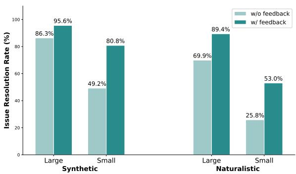  
Figure 1: Issue resolution rates for large and small improvers on synthetic and naturalistic data. The synthetic data results represent the average across all corruption types. For both settings, providing feedback ("w/ feedback") yields a consistent positive delta over the baseline ("w/o feedback"). While baseline performance drops on the more challenging naturalistic data, the relative benefit of providing feedback remains strong.

This paper challenges this common conception. Through controlled experiments, we find that naturally occurring feedback is not inherently ineffective; on the contrary, it is a strong signal for improvement, but its contribution is masked by evaluation paradigms that are systematically biased against it.

To isolate the utility of feedback, we compare model revisions made with and without feedback on two types of data. We ensure feedback targets real issues and a ground truth is available through synthetic data, where we deliberately corrupt existing model responses (§2.1). In contrast, we validate our findings hold true in reality, by extracting user feedback from real conversations (§2.2).1

Across both settings, we find that the feedback is highly effective (§5.1). With-feedback improvements resolve the targeted issues at significantly higher rates than their without-feedback baselines—yielding a 9% − 32% increase in resolution on the synthetic data, and a replicated 16% − 27% increase on the real user data. This raises a critical question: if feedback demonstrably drives such improvements, why was it previously found to be unhelpful?

We investigate the evaluation mechanism as the primary source of confusion. We directly compare the two improvement variants using a strong LLM judge (Chiang and Lee, 2023; Liu et al., 2023). By isolating the instances across our data where the feedback-informed response successfully fixed the issue while the baseline response failed, we uncover a critical vulnerability in current evaluation methods (§5.3). For instances where the model failed to improve without external feedback, the LLM judge frequently fails to identify the genuinely corrected response (§5.4). In our naturalistic experiments, for example, the judge correctly preferred the response that solved the problem in only 34% − 54% of the cases. Consequently, the evaluation becomes systematically biased against the feedback signal, penalizing genuine corrections in favor of general stylistic changes (§6.2).

## 2 Method

We examine whether user feedback provides a useful signal. To simulate a clean scenario where we can easily verify whether the targeted issue was resolved, we couple the naturalistic data experiments with synthetic data experiments.

## 2.1 Synthetic Data Compilation

To compose our synthetic data, we take tuples of user queries and model responses, and “corrupt” the responses to make them invalid. We then examine whether simulated user feedback is useful for recovering from the corruption.

## 2.1.1 Response Corruption

We define four corruption types:

• Causality Inversion: Swaps the cause and effect in a causal relationship from the reference response, producing a fluent but backward claim. Example: “The high inflation rate forced the central bank to raise interest rates” becomes “The central bank raising interest rates forced the high inflation rate.”

• Crucial Omission: Deletes a detail that is essential for the response to be correct, safe, or functional, smoothing over the surrounding text so the gap is not immediately obvious.

Example: “Execute DELETE FROM users WHERE status = ’inactive’ to clear out the old accounts” becomes “Execute DELETE FROM users to clear out the old accounts.”

• Entity/Subject Swap: Replaces a key entity (e.g., a person, location, number, library, or variable name) with a related but factually incorrect one, while keeping the sentence structure and tone unchanged.

Example: “Import the pandas library to manipulate the dataframe” becomes “Import the numpy library to manipulate the dataframe.”

• Logic Operator Reversal: Inverts a logical relationship in the response, such as a comparison operator, boolean value, conditional, or chronological order, so the text or code still reads naturally but the underlying logic is flipped.

Example: “Proceed with the installation only if is\_admin == True” becomes “Proceed with the installation only if is\_admin == False.”

Given the user query q, the original model response r and a corruption type, we prompt a model $M _ { c }$ (henceforth, the corrupting model) to corrupt the model response according to the corruption type, making minimal changes. The corrupting model is asked to provide a new corrupted response $r _ { c } ,$ a change log $c _ { l o g }$ explaining the corruption, a difficulty score $s _ { d } ~ \in$ {LOW, MEDIUM, HIGH} to indicate how hard it is for a generic reader to spot the error, and three levels “user feedback” $\{ f _ { s o l } , f _ { p r o b } , f _ { b i n a r y } \}$ the first level telling how to fix, the second only pointing out the problem, and the third only saying that the model is wrong (see §B.1 for the full prompts). Formally, we have

$$
M _ { c } ( q , r , c \_ t y p e ) = ( r _ { c } , c _ { l o g } , f _ { s o l } , f _ { p r o b } , f _ { b i n a r y } )
$$

## 2.2 Naturalistic Data Extraction

To collect real user feedback data, we follow the feedback extraction method of Don-Yehiya et al. (2025b). We prompt Qwen3-30B-A3B-Instruct-2507 to recognize spans of naturally occurring feedback and classify them into a taxonomy. The taxonomy contains 4 negative categories (Repeat or Rephrase, Make Aware with Correction, Make Aware without Correction, Ask for Clarification) and one positive (Positive Feedback). We filter out the positive feedback, as in our experiments we focus on responses improvements (see Appendix B.2).

Manually examining a sample of extracted feedback examples, we find that some instances that have been recognized as feedback, contain feedback that is subjective. Although these feedback instances might be useful for personalization, they should not be used for general alignment training. For example, a user asks for a pasta recipe, and then later provides feedback saying that it should be vegan (Make Aware with Correction).

To overcome this, we prompt a model, Gemini-3-Flash, to decide whether a given feedback contains actionable insights that should apply to all future users asking the same question or not, see Appendix B.2 for the full prompt.

## 2.3 Improvement with and without Feedback

Following Liu et al. (2025), we prompt a model $M _ { i }$ , the “improver”, to improve the corrupted response with and without feedback $f \in$ $\{ f _ { s o l } , f _ { p r o b } , f _ { b i n a r y } \}$ , for simplicity we denote it with f. We end up with two improved responses, $M _ { i } ( q , r _ { c } , f ) = r _ { + f }$ and $M _ { i } ( q , r _ { c } ) = r _ { - f }$ accordingly. See §B.3 for the full prompts.

## 3 Evaluation

## 3.1 Issue Resolution Evaluation

To examine whether the improved responses $r _ { + f }$ and $r _ { - f }$ indeed recovered the corruption, we prompt a judge model $J _ { I R }$ to assess whether the improved responses addressed $f _ { s o l }$ , i.e., whether they addressed the simulated feedback that explains how to fix the issue. Thus, we confirm that the improved responses fixed the corruption correctly. The judge is provided with $q , r _ { c } , f _ { s o l }$ and an improved response $( r _ { + f } ~ \mathrm { o r } ~ r _ { - f } )$ The judge is instructed to summarize the feedback intent, compare the changes between the corrupted response and the improved one, check for regression, and finally provide a score (1 is poor 5 is perfect) and a binary decision whether the improved response addressed the feedback or not (see Appendix C). We use this measure also for the naturalistic data. Note that in this case, we do not have the guaranty that addressing the feedback would solve the issue. For example, Make Aware without Correction feedback will not provide us with the sufficient information to verify the revision correction. We therefore use this for the naturalistic data as an approximation only.

## 3.2 Pairwise Evaluation

Given the user query q, we use a judge model $J _ { P }$ to compare two responses directly, response A and response B, to determine which response is the best. For example, we compare the original response and the corrupted one $J _ { P } ( q , r , r _ { c } )$ , or the two improvements variants $J _ { P } ( q , r _ { + f } , r _ { - f } )$ . The judge outputs a reasoning explaining its choice, and a verdict $\in \{ A , B , T i e \}$ . To avoid biases we set the order of the responses randomly. See Appendix C for the full evaluation prompt.

## 4 Experimental Setup

Data. For the synthetic setting, we use Arena-Hard-v2.0 (Li et al., 2024). This dataset contains a hard prompt category, comprising 500 challenging real-world user queries (open-ended software engineering problems, math questions, logic puzzles, etc.), and a creative writing category, comprising 250 creative writing queries sourced from Chatbot Arena (Chiang et al., 2024). We use the model responses of the o3 model, which is considered to be strong, as we assume that prior to the corruption the response was valid. For naturalistic experiments, we use data from the ShareLM collection (Don-Yehiya et al., 2025c), a collection of open human-model interaction datasets. We filter for English conversations only, for annotations reasons.

Models. For $M _ { c }$ we use Gemini-3-flash-preview (Team et al., 2023). For the improver model we experiment with two models, differing in size: we use Gemini-3-flash-preview, marked as $M _ { i } ^ { l a r g e }$ , and Qwen3-8B (Yang et al., 2025), marked as $M _ { i } ^ { s m a l l }$ For the judge model we use a stronger model, Gemini-3.1-Pro-preview. As detailed in §H, the multi-stage inference required for corruption generation, improvement, and evaluation incurs substantial computational expense. We therefore restrict our evaluation to this representative set of models. However, we report initial results for GPT-OSS-20B in Appendix G, demonstrating consistent trends across architectures.

Corruption Verification. To verify that the corruption process successfully rendered the new responses invalid, we manually evaluated 96 corrupted samples: 64 samples from the hard prompt category and 32 from the creative writing category. See Appendix E for the detailed annotation guidelines and procedures. Out of the hard prompt samples, 92.2% were marked as correct (indicating the corrupted response was successfully invalidated), 3.1% as borderline, 1.6% as incorrect, and 3.1% as unfamiliar (where annotators lacked the domain expertise to evaluate the question). For the creative writing category, 59.4% of the samples were marked as correct, and the rest 40.6% as incorrect. Following these results, to ensure a clean evaluation, we report results exclusively for the hard prompt category in the main text unless otherwise specified. The comprehensive results, including the creative writing category, are provided in Appendix A.

<table><tr><td>Improver Judge</td><td>Preference</td><td>Causality Inversion</td><td>Crucial Omission</td><td>Entity Swap</td><td>Operator Reversal</td><td>Average</td></tr><tr><td></td><td>w. Feedback</td><td>28.5%</td><td>28.7%</td><td>25.9%</td><td>25.8%</td><td>27.2%</td></tr><tr><td>Large</td><td>w/o. Feedback</td><td>36.9%</td><td>37.5%</td><td>38.7%</td><td>37.9%</td><td>37.8%</td></tr><tr><td></td><td>Tie</td><td>34.6%</td><td>33.8%</td><td>35.4%</td><td>36.3%</td><td>35.0%</td></tr><tr><td></td><td>w. Feedback</td><td>45.7%</td><td>50.0%</td><td>52.4%</td><td>56.4%</td><td>51.2%</td></tr><tr><td>Small</td><td>w/o. Feedback</td><td>39.2%</td><td>37.4%</td><td>30.0%</td><td>31.2%</td><td>34.3%</td></tr><tr><td></td><td>Tie</td><td>15.1%</td><td>12.6%</td><td>17.7%</td><td>12.5%</td><td>14.5%</td></tr></table>

Table 1: Judge pairwise evaluation of the with-feedback vs. without-Feedback variants. Although the withoutfeedback variant fix the corruption in a lower rate, we see a consistent preference for the without-feedback variant for the large improver, across the four corruption types.

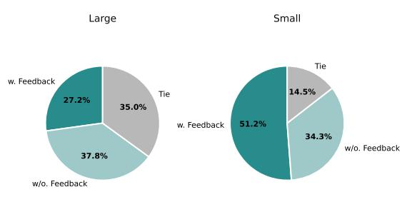  
(a) Synthetic

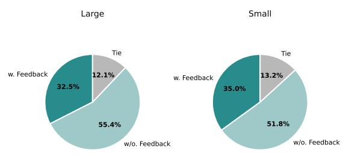  
(b) Naturalistic  
Figure 2: Judge pairwise preference evaluation for with-feedback vs. without-feedback variants. Notably, judges frequently prefer the without-feedback variants despite those variants fixing corruptions at a lower rate.

Feedback Relevance Verification. Filtering the naturalistic data to include only feedback cases that should be applied to all future users (see §2.2), the model deemed 47.9% of the naturally occurring feedback cases as relevant. To verify the model’s decisions, we ask a human annotator to review 165 samples of model verdicts and reasoning, see Appendix E for the full prompt. 86.1% of the verdicts were marked as correct (the model was right to tag the feedback as relevant/irrelevant), 7.3% as incorrect, and 6.7% as unfamiliar.

Issue Resolution Verification. To validate our issue resolution evaluation method, we manually annotated 110 samples from the synthetic data (hard prompt category only) and 65 samples from the naturalistic data. For the synthetic data, excluding 16 samples that were marked as unfamiliar, the remaining annotations showed Cohen’s Kappa of 0.81. For the naturalistic data, excluding 2 samples that were marked unfamiliar, we get Cohen’s Kappa of 0.24. See Appendix E for the full guidelines.

## 5 Results

We generate $r _ { + f }$ and $r _ { - f }$ for 2000 (500 hard prompt samples $\times 4$ corruption types) synthetic samples, and 1000 naturalistic data samples (§2.3).

## 5.1 The Value of External Feedback

To evaluate the overall impact of external feedback, we use the issue resolution evaluation (§3.1) to assess whether the improved responses successfully solved the issues. We compare the withfeedback variant, $J _ { F A } ( q , r _ { c } , r _ { + f } , f )$ , against the without-feedback variant, $J _ { F A } ( q , r _ { c } , r _ { - f } , f )$ .

Figure 1 presents the issue resolution rates for both synthetic and naturalistic data. We find that external feedback consistently helps fix and improve responses, successfully addressing issues in 9%–35% more cases than when feedback is withheld. Furthermore, while smaller models resolve issues independently at a much lower rate, they benefit far more substantially from the inclusion of feedback than larger models.

In the synthetic setting, the large improver successfully incorporated feedback 95.6% of the time (compared to 86.3% without feedback), while the small improver achieved 77.9% (compared to just 42.7% without). The naturalistic data confirms these trends but, as expected, proves to be a more challenging and noisy environment. Without feedback, the models independently resolved only 70% (large) and 26% (small) of the cases. With feedback, their issue resolution rates jumped to 89% and 53%, respectively. While the absolute issue resolution rates are lower in the naturalistic setting compared to the synthetic one, the performance gain provided by the feedback remains robust.

## 5.2 The Pairwise Evaluation Discrepancy

Following previous works that sought to quantify the benefit of naturally occurring feedback (Liu et al., 2025; Jin et al., 2025), we compare the feedback-enhanced responses against the withoutfeedback baseline.

We conduct an LLM-as-a-Judge pairwise comparison between the two improved responses: $r _ { + f }$ and $r _ { - f } ~ ( \ S 3 . 2 )$ . Fig. 2 presents the results for both the synthetic and naturalistic data. We find that although the without-feedback variants resolve the targeted issues at a lower rate, in most settings the pairwise judge consistently prefers them over their with-feedback counterparts, in line with previous works finding.

For the synthetic data, the judge prefers the without-feedback improvements of the large improver over the with-feedback improvements. This trend is reversed for the small improver, where the with-feedback improvements prove superior. We address this disparity in §6.1. Nevertheless, Table 1 shows that these results are consistent across all four corruption types.

For the naturalistic data, the judge prefers the without-feedback variants generated by both the large and small improvers.

Importantly, this reveals more than a mere lack of improvement due to the feedback. If the improver simply failed to benefit from the feedback, we would expect a balanced judge to be indifferent between $r _ { + f }$ and $r _ { - f } .$ . Instead, we find that responses with recourse to feedback are judged to be of poorer quality than the baselines ones.

## 5.3 With-Feedback Should Win

While the previous section showed a discrepant trend between the JLM output and the ground truth, we note that preferring $r _ { - f }$ , even where feedback is helpful, is not necessarily erroneous. For example, there are cases were the improver manages to fix the corruption by itself, without feedback (§5.1). For such cases, there is no reason to prefer the withfeedback variant. Moreover, it is possible that these without-feedback variants that solved the issue also improved other aspects of the response and should rightfully be preferred.

We therefore recompute the evaluation only on the subset of user queries where $r _ { + f }$ successfully addressed the issue while $r _ { - f }$ failed. Formally, this is defined as

$$
\begin{array} { r } { \mathrm { W F S h o u l d W i n } ( M _ { i } ) = \{ q \mid J _ { F A } ( q , r _ { c } , r _ { + f } , f ) = \mathrm { T r u e } \} } \\ { \cap \left\{ q \mid J _ { F A } ( q , r _ { c } , r _ { - f } , f ) = \mathrm { F a l s e } \right\} } \end{array}
$$

On this subset, a judge is correct iff it prefers $r _ { + f } .$ , as it is the only one that resolves the corruption. Filtering for $q \in W F S h o u l d W i n$ for the various settings, we end up with 205 and 574 synthetic examples, and 215 and 274 naturalistic examples for $\hat { M } _ { i } ^ { l a r g e }$ and $M _ { i } ^ { s m a l l }$ respectively.

The pairwise results highlights a frequent limitation in the automated evaluation of feedback signals: even when filtering for examples where $r _ { + f }$ should win, the judge often fails in doing so.

For the synthetic data, we find that the judge correctly prefers the with-feedback variant of the small improver in 80.9% of the cases. For the large improver however, the judge correctly prefers the with-feedback variant in only 54.6% of the cases, i.e there are 45.4% cases where the judge makes an error and fails to prefer a valid response over an invalid one. Similarly, in the natural data the judge correctly prefers the with-feedback variants in only 34% of the cases for the large improver, and 54% of the cases for the small improver.

## 5.4 Models Struggle to Evaluate What They Cannot Improve

Following the previous judge failure, we hypothesize that a model’s limitations as an improver correlate with its limitations as an evaluator. Specifically, we suspect that a model will tend to fail as a judge on queries where it failed to self-improve.

To test this, we compare the judge’s accuracy on two sets of queries: those $M _ { i } ^ { l a r g e }$ can self-improve, and those it cannot. The methodological challenge here is establishing a clear ground truth for the judgment task. If we were to use $M _ { i } ^ { l a r g e , } \mathrm { s }$ own outputs for this pairwise comparison, the queries where it successfully resolved the corruption both with and without feedback would yield valid responses. Therefore, it would not be possible to determine on what cases the judge was correct. Manually annotated ground truth is also infeasible (see §8).

To resolve this, we decouple the query split from the evaluated responses by leveraging $M _ { i } ^ { s m a l l }$ . We restrict our evaluation entirely to the WFShouldWin $( M _ { i } ^ { s m a l l } )$ subset of the synthetic data. For these queries, we have a clear ground truth: the small improver’s $r _ { + f }$ successfully resolves the corruption, while its $r _ { - f }$ fails. Therefore, in a pairwise comparison of these examples, $r _ { + f }$ should always win.

We partition these ground-truth queries based on how the large improver performed on them, creating two subsets:

• The self-improvable subset: Queries where $M _ { i } ^ { l a r g e }$ successfully resolved the corruption with or without feedback.

$$
\begin{array} { r } { \mathrm { B o t h } ( M _ { i } ^ { l a r g e } ) = \{ q \mid J _ { F A } ( q , r _ { c } , r _ { + f } , f ) = \mathrm { T r u e } \} } \\ { \cap \{ q \mid J _ { F A } ( q , r _ { c } , r _ { - f } , f ) = \mathrm { T r u e } \} } \end{array}
$$

• The feedback-improvable subset: Queries where $M _ { i } ^ { l a r g e }$ could only resolve the corruption when provided with feedback, namely $W F S h o u l d W i n ( M _ { i } ^ { l a r g e } )$

We then task $M _ { i } ^ { l a r g e }$ to act as a judge, running a pairwise comparison between $r _ { + f }$ and $r _ { - f }$ generated by $M _ { i } ^ { s m a l l }$ for both subsets. The $\dot { M } _ { i } ^ { l a r g e }$ judge correctly prefers $r _ { + f }$ at high rates for both subsets: 87.7% on the self-improvable subset, and 72.2% on the feedbacl-improvable subset. However, its accuracy is 15.5 percentage points lower on the feedback-dependent subset. This supports our hypothesis: models exhibit correlated failure modes: an inability to independently improve a corrupted response corresponds to a decreased accuracy in evaluating it.

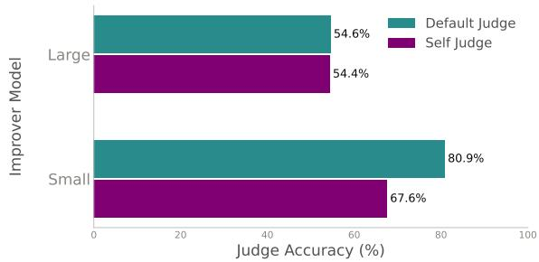  
Figure 3: Judge accuracy for the large and small improvers, with both default and self judges. While for the large improver there is no significant gap between the default and self judge, for the small improver with self judge we see for the first time that the judge struggle to prefer the correct response (the with-feedback variant).

## 6 Further Analysis

## 6.1 Reproducing Correlated Failures in the Small Improver

To further investigate the relationship between a model’s capabilities as an improver and as an evaluator, we assess the models in a self-judging setup where the improver also acts as the pairwise judge.

Figure 3 compares the evaluation accuracy of the default judge (Gemini-3.1-Pro) against the respective self-judges for the $W F S h o u l d W i n ( M _ { i } ^ { l i \hat { r } g e } )$ and $W F S h o u l d W i n ( M _ { i } ^ { s m a l l } )$ subsets (§5.3) of the synthetic data.

This self-judging setup explains the different trends we saw for the large and small improvers. When using the default judge to evaluate the small model’s subset, the evaluation appeared highly accurate (§5.3). This occurred because of the substantial capability gap between the two models: issues that were hard for Qwen3-8B were still relatively easy for Gemini-3.1-Pro. Conversely, the capability gap between the default judge and the large improver is significantly narrower. Thus, the issues that Gemini-3-Flash failed to resolve were also difficult for Gemini-3.1-Pro to judge, making the shared limitations immediately visible during that comparison. Without the advantage of a more capable judge, misjudgment rates spike significantly, and we finally observe the same correlated failure trends previously seen with the large model.

The data confirms this dynamic. For the large improver, the default judge and the self-judge correctly prefer $r _ { + f }$ at practically the same rate: 54.6% and 54.4% respectively. However, when we use Qwen3-8B as a self-judge on its respective subset, a substantial performance gap emerges. While the default judge prefers the with-feedback variant in 80.8% of the cases, the self-judge accuracy is only 67.6% correct, 13 points lower.

## 6.2 Improvement Types

How do improvements with and without feedback differ? This comparison may explain why the judge prefers still-corrupted responses.

We prompt a model to classify the WFShouldWin $( M _ { i } ^ { l a r g e } )$ attempted improvements of the full synthetic dataset (hard prompt + creative writing). The model categorizes each response into a No Improvement option, or into one of six categories across two dimensions: Content (Factuality, Completeness, Logic) and Style (Tone, Conciseness, Formatting and Structure). See Appendix D for the full prompt.

Figure 4 demonstrates that providing feedback increases the proportion of content improvements relative to style improvements. Additionally, the number of “no improvement” cases decreases when feedback is provided.

We conclude that feedback yields higherquality improvements focused on substantive content changes rather than stylistic edits. The pairwise judge, however, fails to recognize this and is biased towards stylistic changes.

See Appendix F for further evidence of judge bias towards stylistic edits.

<table><tr><td>Improver</td><td>w/o. Feedback</td><td>Full Feedback</td><td>What Problem</td><td>Problem Exists</td></tr><tr><td>Large</td><td>86.3%</td><td>95.6% ∆+9.3%</td><td>92.8% ∆+6.3%</td><td>89.7% ∆+3.4%</td></tr><tr><td>Small</td><td>49.2%</td><td>80.8% ∆+31.6%</td><td>65.85% ∆+16.7%</td><td>59.5% ∆+10.3%</td></tr></table>

Table 2: Percentage of improved responses successfully addressing feedback, with different levels of feedback signal. Although the “Full Feedback” signal yields the largest delta (9% − 32%), the weaker signals are still beneficial for the improvers.

## 6.3 Weaker Feedback Signal

Our synthetic data experiments used feedback that tells the model how to fix the corruption $( f _ { s o l } )$ Here we examine weaker feedback signals, that only point out the problem $( f _ { p r o b } )$ , or just state that a problem exists $( f _ { b i n a r y } )$

We generate $M _ { i } ( q , r _ { c } , f _ { p r o b } ) ~ = ~ r _ { + f _ { p r o b } }$ and $M _ { i } ( q , r _ { c } , f _ { b i n a r y } ) = r _ { + f _ { b i n a r y } }$ for 100 queries for each corruption type (400 for each, 800 total), and examine whether they better address the feedback over the without-feedback variant $r _ { - f }$ . Note that we provide $J _ { I R }$ with $f _ { s o l }$ (and not $f _ { p r o b } / f _ { b i n a r y }$ accordingly) as we want to provide it with sufficient information to verify whether the corruption was solved, thus we have $J _ { F A } ( q , r _ { c } , f _ { s o l } , r _ { + f _ { p r o b } } )$ and $J _ { F A } ( q , r _ { c } , f _ { s o l } , r _ { + f _ { b i n a r y } } )$

Table 2 demonstrates that both the feedback that points to the problem (“What Problem”), and the feedback that only states that there is a problem (“Problem exists”) solve the corruption in a higher rate than the no-feedback variant. However, as expected, their margin is smaller. While for the full feedback (§5.1) the improvers resolved about 9% − 32% more cases than without any feedback, “What Problem” feedback improves about 6% − 17% more cases, and “Problem exists” improves only about 3% − 10% more cases. Also, similar to the full feedback, the small improver benefits more from the feedback.

We conclude that pointing to a problem, or just indicating that a problem exists are valuable, even if less than the full feedback.

## 7 Related Work

A related line of work emphasized the utility of natural languagefeedback (Hancock et al., 2019; Yan et al., 2023; Jayalath and Ramaswamy, 2022; Sreedhar et al., 2020). In such works, the user is asked to provide free-text feedback (unlike the more standard binary feedback or other close forms). Later works (Don-Yehiya et al., 2025b; Lin et al., 2024; Shi et al., 2026) take a step further and look for feedback that spontaneously occurs in the conversations, without explicitly asking the user to provide it, and use it for model training (Buening et al., 2026; Jin et al., 2025).

Liu et al. (2025) studied the question of whether naturally occurring user feedback can indeed improve model performance. They used a large model to create “regeneration with semantics” responses that used human feedback, and “regeneration from scratch” responses as a baseline, similar to our withfeedback vs. without-feedback responses. Using a reward model to compare them against each other, they found that the regenerations from scratch outperformed the semantics ones. This is in line with our results, that for the large improver the without-feedback responses outperformed the withfeedback responses (§5.2). However, our analysis revealed that this is due to a problem in the evaluation, not the signal’s usefulness (§5.3).

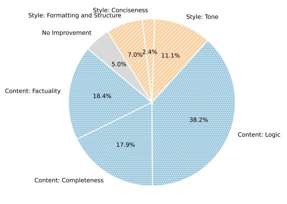  
(a) With Feedback

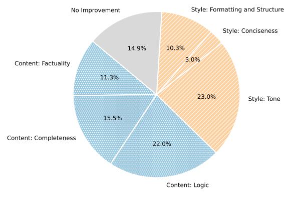  
(b) No Feedback  
Figure 4: Distribution of improvement types applied to corrupted model responses. Content-related improvements (factuality, completeness, and logic) are represented in shades of blue with a dotted texture. Style-related improvements (tone, conciseness, formatting) are represented in shades of orange with a diagonal line texture. Providing feedback significantly increases the proportion of substantive content improvements compared to stylistic edits.

In our work we demonstrated how the well used "LLM as a Judge" evaluation (Chiang and Lee, 2023; Liu et al., 2023; Zhu et al., 2023) fails to prefer the valid response over the corrupted one. Previous works already show that this method suffers from biases, such as position, verbosity and selfpreference (Wang et al., 2024; Saito et al., 2023; Koo et al., 2024; Don-Yehiya et al., 2026).

In the scope of this work we improve the model in test-time (Madaan et al., 2023), without further training. Another line of work investigates selfimprove the model via training (Zweiger et al., 2025; Huang et al., 2023; Yuan et al., 2024).

## 8 Discussion

Through validation on both synthetic and naturalistic data, we established that while LLMs can resolve numerous issues autonomously, incorporating user feedback enables them to resolve 9% − 32% more cases compared to baselines without feedback. However, this improvement is not captured during evaluation: despite a higher resolution rate when feedback is applied, pairwise evaluations frequently favor the without-feedback variants. This explains the prevailing misconception that feedback does not provide a useful signal.

Preference for the without-feedback variant may be warranted in instances where both variants successfully resolve the error, as the without-feedback variant may introduce other general improvements (§6.2). However, in cases where only $r _ { + f }$ variant resolves the corruption, a preference for $r _ { - f }$ or a tie, is a clear error on the LLM judge’s behalf.

Further analysis reveals a circular pattern: the judge frequently fails to correctly judge cases that the LLM improver failed to improve on its own. This yields a bias against the feedback signal.

We speculate that this systematic bias may be, oddly enough, evidence for the utility of naturally occurring feedback. The fact that LLM judges fail to recognize feedback-informed improvements might suggest that the feedback provides a unique signal that is not encoded in the model’s weights. Thus, it is reasonable to assume that it can not be acquired through standard techniques such as model distillation or iterative self-improvement.

Although demonstrated in an inference-only setting, we expect our findings to persist in training as well. Consequently, future work should prioritize the development of more robust evaluation frameworks that accurately reflect the utility of feedback. We urge the community to look beyond standard LLM judgment paradigms and explore specialized reward models, interactive evaluation metrics, or targeted alignment strategies designed specifically to break this circular bias. Addressing this fundamental evaluation gap is critical; without reliable mechanisms to appropriately credit feedbackdriven resolutions, we risk artificially impeding the development of open models, developed with open user data.

## Limitations

Our manual annotation revealed that the corruption process is less effective for the creative writing category of our synthetic data.

Therefore, to ensure reliability, the main text focuses exclusively on the math and code domains. However, results for the full synthetic dataset, including creative writing, are available in the appendix (§A). The overall trends persist, which, along with our multi-domain naturalistic data, indicate that our findings generalize beyond math and code domains.

To ensure reliability, we manually annotated representative samples from all automated stages of our pipeline: the corruption process, feedback relevancy filtering, and feedback addressing evaluation. However, we did not manually annotate the pairwise evaluation setting, as that proved to be prohibitively difficult for humans. We did, however, conduct a small-scale human annotation task which confirmed that manual pairwise evaluation is highly challenging. The sheer length of the responses makes it difficult to track minute details, and the diverse topics necessitate broad domain expertise.

## Acknowledgments

This research was partly supported by a grant from the Israel Science Foundation (grant no. 2912/25). Special thanks to our annotators, Nicole Gruber and Yoav Schmidt.

## References

Sandhini Agarwal, Lama Ahmad, Jason Ai, Sam Altman, Andy Applebaum, Edwin Arbus, Rahul K Arora, Yu Bai, Bowen Baker, Haiming Bao, and 1 others. 2025. gpt-oss-120b & gpt-oss-20b model card. arXiv preprint arXiv:2508.10925.

Mohammad Amin Bassiri. 2011. Interactional feedback and the impact of attitude and motivation on noticing l2 form. English Language and Literature Studies, 1(2):61.

Janet Beavin Bavelas and Jennifer Gerwing. 2011. The listener as addressee in face-to-face dialogue. Inter national Journal ofListening, 25(3):178–198.

Thomas Kleine Buening, Jonas Hübotter, Barna Pász tor, Idan Shenfeld, Giorgia Ramponi, and Andreas Krause. 2026. Aligning language models from user interactions. arXiv preprint arXiv:2603.12273.

Cheng-Han Chiang and Hung-yi Lee. 2023. Can large language models be an alternative to human evaluations? In Proceedings of the 61st Annual Meeting of the Association for Computational Linguistics (Volume 1: Long Papers), pages 15607–15631, Toronto, Canada. Association for Computational Linguistics.

Wei-Lin Chiang, Lianmin Zheng, Ying Sheng, Anastasios Nikolas Angelopoulos, Tianle Li, Dacheng Li, Hao Zhang, Banghua Zhu, Michael Jordan, Joseph E Gonzalez, and 1 others. 2024. Chatbot arena: An open platform for evaluating llms by human preference. arXiv preprint arXiv:2403.04132.

Shachar Don-Yehiya, Ben Burtenshaw, Ramon Fernandez Astudillo, Cailean Osborne, Mimansa Jaiswal, Tzu-Sheng Kuo, Wenting Zhao, Idan Shenfeld, Andi Peng, Mikhail Yurochkin, and et al. 2025a. The future of open human feedback. Nature Machine Intelligence, 7(6):825–835.

Shachar Don-Yehiya, Leshem Choshen, and Omri Abend. 2025b. Naturally occurring feedback is common, extractable and useful. Preprint, arXiv:2407.10944.

Shachar Don-Yehiya, Leshem Choshen, and Omri Abend. 2025c. The ShareLM collection and plugin: Contributing human-model chats for the benefit of the community. In Proceedings of the 63rd Annual Meeting of the Association for Computational Linguistics (Volume 3: System Demonstrations), pages 167–177, Vienna, Austria. Association for Computational Linguistics.

Shachar Don-Yehiya, Asaf Yehudai, Leshem Choshen, and Omri Abend. 2026. Mediocrity is the key for LLM as a judge anchor selection. In Proceedings of the 64th Annual Meeting of the Association for Computational Linguistics (Volume 1: Long Papers), pages 15491–15513, San Diego, California, United States. Association for Computational Linguistics.

Braden Hancock, Antoine Bordes, Pierre-Emmanuel Mazare, and Jason Weston. 2019. Learning from dialogue after deployment: Feed yourself, chatbot! In Proceedings ofthe 57th Annual Meeting ofthe Associationfor Computational Linguistics, pages 3667– 3684, Florence, Italy. Association for Computational Linguistics.

Jiaxin Huang, Shixiang Gu, Le Hou, Yuexin Wu, Xuezhi Wang, Hongkun Yu, and Jiawei Han. 2023. Large language models can self-improve. In Proceedings of the 2023 Conference on Empirical Methods in Natural Language Processing, pages 1051–1068, Singapore. Association for Computational Linguistics.

Hemadri Jayalath and Lakshmish Ramaswamy. 2022. Enhancing performance of operationalized machine learning models by analyzing user feedback. In Proceedings of the 2022 4th International Conference on Image, Video and Signal Processing, IVSP ’22, page 197–203, New York, NY, USA. Association for Computing Machinery.

Chuanyang Jin, Jing Xu, Bo Liu, Leitian Tao, Olga Golovneva, Tianmin Shu, Wenting Zhao, Xian Li, and Jason Weston. 2025. The era of real-world human interaction: Rl from user conversations. arXiv preprint arXiv:2509.25137.

Ryan Koo, Minhwa Lee, Vipul Raheja, Jong Inn Park, Zae Myung Kim, and Dongyeop Kang. 2024. Benchmarking cognitive biases in large language models as evaluators. In Findings of the Association for Computational Linguistics: ACL 2024, pages 517–545, Bangkok, Thailand. Association for Computational Linguistics.

Tianle Li, Wei-Lin Chiang, Evan Frick, Lisa Dunlap, Tianhao Wu, Banghua Zhu, Joseph E Gonzalez, and Ion Stoica. 2024. From crowdsourced data to highquality benchmarks: Arena-hard and benchbuilder pipeline. arXiv preprint arXiv:2406.11939.

Ying-Chun Lin, Jennifer Neville, Jack Stokes, Longqi Yang, Tara Safavi, Mengting Wan, Scott Counts, Siddharth Suri, Reid Andersen, Xiaofeng Xu, Deepak Gupta, Sujay Kumar Jauhar, Xia Song, Georg Buscher, Saurabh Tiwary, Brent Hecht, and Jaime Teevan. 2024. Interpretable user satisfaction estimation for conversational systems with large language models. In Proceedings ofthe 62nd Annual Meeting ofthe Associationfor Computational Linguistics (Volume 1: Long Papers), pages 11100–11115, Bangkok, Thailand. Association for Computational Linguistics.

Yang Liu, Dan Iter, Yichong Xu, Shuohang Wang, Ruochen Xu, and Chenguang Zhu. 2023. G-eval: NLG evaluation using gpt-4 with better human alignment. In Proceedings of the 2023 Conference on Empirical Methods in Natural Language Processing, pages 2511–2522, Singapore. Association for Computational Linguistics.

Yuhan Liu, Michael JQ Zhang, and Eunsol Choi. 2025. User feedback in human-LLM dialogues: A lens to understand users but noisy as a learning signal. In Proceedings of the 2025 Conference on Empirical Methods in Natural Language Processing, pages 2666–2681, Suzhou, China. Association for Computational Linguistics.

Aman Madaan, Niket Tandon, Prakhar Gupta, Skyler Hallinan, Luyu Gao, Sarah Wiegreffe, Uri Alon, Nouha Dziri, Shrimai Prabhumoye, Yiming Yang, and 1 others. 2023. Self-refine: Iterative refinement with self-feedback. Advances in neural information processing systems, 36:46534–46594.

Martin J. Pickering and Simon Garrod. 2021. Understanding Dialogue: Language Use and Social Interaction. Cambridge University Press.

Keita Saito, Akifumi Wachi, Koki Wataoka, and Youhei Akimoto. 2023. Verbosity bias in preference labeling by large language models. arXiv preprint arXiv:2310.10076.

Taiwei Shi, Zhuoer Wang, Longqi Yang, Ying-Chun Lin, Zexue He, Mengting Wan, Pei Zhou, Sujay Kumar Jauhar, Sihao Chen, Shan Xia, Hongfei Zhang, Jieyu Zhao, Xiaofeng Xu, Xia Song, and Jennifer Neville. 2026. WildFeedback: Aligning LLMs with in-situ user interactions and feedback. In Proceedings ofthe 64th Annual Meeting of the Association for Computational Linguistics (Volume 1: Long Papers), pages

36701–36725, San Diego, California, United States. Association for Computational Linguistics.

Makesh Narsimhan Sreedhar, Kun Ni, and Siva Reddy. 2020. Learning improvised chatbots from adversarial modifications of natural language feedback. In Findings ofthe Associationfor Computational Linguistics: EMNLP 2020, pages 2445–2453, Online. Association for Computational Linguistics.

Gemini Team, Rohan Anil, Sebastian Borgeaud, Jean-Baptiste Alayrac, Jiahui Yu, Radu Soricut, Johan Schalkwyk, Andrew M Dai, Anja Hauth, Katie Millican, and 1 others. 2023. Gemini: a family of highly capable multimodal models. arXiv preprint arXiv:2312.11805.

Jelena Vranjes, Geert Brône, and Kurt Feyaerts. 2018. Dual feedback in interpreter-mediated interactions: On the role of gaze in the production of listener responses. Journal ofPragmatics, 134:15–30.

Peiyi Wang, Lei Li, Liang Chen, Zefan Cai, Dawei Zhu, Binghuai Lin, Yunbo Cao, Lingpeng Kong, Qi Liu, Tianyu Liu, and Zhifang Sui. 2024. Large language models are not fair evaluators. In Proceedings of the 62nd Annual Meeting of the Association for Computational Linguistics (Volume 1: Long Papers), pages 9440–9450, Bangkok, Thailand. Association for Computational Linguistics.

Margaret G. Werts, Mark Wolery, Ariane Holcombe, and David L. Gast. 1995. Instructive feedback: Review of parameters and effects. Journal of Behavioral Education, 5(1):55–75.

Hao Yan, Saurabh Srivastava, Yintao Tai, Sida I. Wang, Wen-tau Yih, and Ziyu Yao. 2023. Learning to simulate natural language feedback for interactive semantic parsing. In Proceedings ofthe 61st Annual Meeting ofthe Associationfor Computational Linguistics (Volume 1: Long Papers), pages 3149–3170, Toronto, Canada. Association for Computational Linguistics.

An Yang, Anfeng Li, Baosong Yang, Beichen Zhang, Binyuan Hui, Bo Zheng, Bowen Yu, Chang Gao, Chengen Huang, Chenxu Lv, and 1 others. 2025. Qwen3 technical report. arXiv preprint arXiv:2505.09388.

Weizhe Yuan, Richard Yuanzhe Pang, Kyunghyun Cho, Xian Li, Sainbayar Sukhbaatar, Jing Xu, and Jason Weston. 2024. Self-rewarding language models. In Proceedings of the 41st International Conference on Machine Learning, ICML’24. JMLR.org.

Lianghui Zhu, Xinggang Wang, and Xinlong Wang. 2023. Judgelm: Fine-tuned large language models are scalable judges. arXiv preprint arXiv:2310.17631.

Adam Zweiger, Jyo Pari, Han Guo, Yoon Kim, and Pulkit Agrawal. 2025. Self-adapting language models. In Advances in Neural Information Processing Systems, volume 38, pages 74084–74115. Curran Associates, Inc.

<table><tr><td></td><td>Causality Inversion</td><td>Crucial Omission</td><td>Entity Swap</td><td>Operator Reversal</td></tr><tr><td>Original</td><td>96.6%</td><td>98.7%</td><td>99.4%</td><td>99.2%</td></tr><tr><td>Corrupted</td><td>0.9%</td><td>1.1%</td><td>0.4%</td><td>0.8%</td></tr><tr><td>Tie</td><td>2.6%</td><td>0.2%</td><td>0.2%</td><td>0.0%</td></tr></table>

Table 3: Judge Comparison: Original vs. Corrupted Responses

## A Full Results

We provide here the full results, including the creative writing category.

We use the judge model $J _ { I R }$ (§3.2) to compare the original response r and the corrupted one $r _ { c } .$ Table 3 confirms that in this clean setup, with minimal changes introduced by the corruption model, the judge correctly prefers the original response.

Table 4 presents the issue resolution rates for the hard prompt category (synthetic data). Table 5 present the issue resolution rates for the full synthetic data, i.e., hard prompt + creative writing. We see that the trends remain the same, with a consistent positive delta between the without-feedback and with-feedback variants.

Table 3 presents the judge pairwise preferences results for the hard prompt category of the synthetic data. Table 6 presents the pairwise results for the full synthetic data. Also here, the trends remain the same, with even larger effect (the preference of the without-feedback variant is stronger).

Table 7 presents the judge pairwise preferences results for the real user data. Table 8 presents the results for the WFShouldWin subset of the user data.

Fig. 19 presents the improvement type results for the hard prompt category.

## B Data Extraction

## B.1 Corruption Prompts

We prompt Gemini-3-flash-preview with the corruption prompts detailed in Figures 5, 6, 7, and 8.

## B.2 Naturally Occurring Feedback Extraction

To identify and categorize user feedback within the conversations, we process full conversations using the extraction prompt detailed in Figure 9. We then filter out all UR5 feedback instances.

To evaluate whether the simulated user feedback contains universally actionable insights or is merely subjective, we prompt Gemini-3-flash-preview using the template detailed in Figure 14.

## B.3 Response Improvement Prompts

To revise and improve the model’s responses, we use two variations of an improvement prompt. Figure 10 is used when specific human feedback is available, while Figure 11 relies solely on the conversation context.

## C Evaluation Prompts

## C.1 Issue Resolution Prompt

To automatically evaluate whether the revised model responses successfully incorporated the user’s feedback, we use the resolution addressing prompt detailed in Figure 13.

## C.2 Pairwise Evaluation Prompt

To evaluate the quality of the revised responses compared to the originals, we use an LLM-asa-judge approach with the pairwise evaluation prompt detailed in Figure 12.

## D Improvement Type Prompt

To categorize the differences between the withfeedback vs. without-feedback improvements, we use the prompt detailed in Figure 15.

## E Human Annotation

To confirm the reliability of our automated pipelines, we conducted a human evaluation of the data extraction and evaluation processes.

The tasks were performed by two in-house annotators: an experienced annotator and a specialist with expertise in code and mathematics. Due to the highly diverse nature of the data, achieving comprehensive coverage was unfeasible, and certain examples were consequently labeled as ‘unfamiliar’. Furthermore, owing to the broad range of domains and the granular level of detail, the annotators reported they could not conclusively guarantee that no regressions were introduced.

## E.1 Corruption Verification Guidelines

To ensure consistent quality in the human evaluation of our corrupted dataset, annotators were provided with the instructions detailed in Figure 16.

<table><tr><td>Improver Variant</td><td></td><td>Causality Inversion</td><td>Crucial Omission</td><td>Entity Swap</td><td>Operator Reversal</td><td>Average</td></tr><tr><td rowspan="3">Large</td><td rowspan="3">w/o feedback w/ feedback</td><td>86.6%</td><td>85.0%</td><td>85.1%</td><td>88.5%</td><td>86.3%</td></tr><tr><td>97.2%</td><td>94.9%</td><td>94.8%</td><td>95.5%</td><td>95.6%</td></tr><tr><td>∆+10.6%</td><td> $\Delta { + } 9 . 9 \%$ </td><td> $\Delta { + } 9 . 7 \%$ </td><td>∆+7.0%</td><td> $\Delta { + } 9 . 3 \%$ </td></tr><tr><td rowspan="3">Small</td><td rowspan="3">w/o feedback w/ feedback</td><td>52.6%</td><td>47.5%</td><td>47.4%</td><td>49.4%</td><td>49.2%</td></tr><tr><td>78.9%</td><td>79.1%</td><td>83.1%</td><td>82.1%</td><td>80.8%</td></tr><tr><td> $\Delta { + } 2 6 . 3 \%$ </td><td> $\Delta { + } 3 I . 6 \%$ </td><td> $\Delta { + } 3 5 . 7 \%$ </td><td> $\Delta { + } 3 2 . 7 \%$ </td><td> $\Delta { + } 3 I . 6 \%$ </td></tr></table>

Table 4: Percentage of improved responses successfully addressing issues for the hard prompt category of the synthetic data. We observe a consistent positive delta between the without-feedback and with-feedback variants across the four corruption types.
<table><tr><td>Improver Variant</td><td></td><td>Causality Inversion</td><td>Crucial Omission</td><td>Entity Swap</td><td>Operator Reversal</td><td>Average</td></tr><tr><td>Large</td><td>w/o feedback w/ feedback</td><td>77.4% 98.0% ∆+20.6%</td><td>80.2% 96.5% ∆+16.3%</td><td>72.0% 96.0% ∆+24.0%</td><td>78.9% 97.0% ∆+18.1%</td><td>77.1% 96.9%</td></tr><tr><td>Small</td><td>w/o feedback w/ feedback</td><td>43.1% 72.7%  $\Delta { + } 2 9 . 6 \%$ </td><td>40.8% 76.7%  $\Delta { + } 3 5 . 9 \%$ </td><td>38.7% 82.4%  $\Delta { + } 4 3 . 7 \%$ </td><td>39.1% 75.1% ∆+36.0%</td><td>∆+19.8% 40.4% 76.7%</td></tr></table>

Table 5: Percentage of improved responses successfully addressing issues. We observe a consistent positive delta between the without-feedback and with-feedback variants across the four corruption types.
<table><tr><td>Improver Judge</td><td>Preference</td><td>Causality Inversion</td><td>Crucial Omission</td><td>Entity Swap</td><td>Operator Average Reversal</td><td></td></tr><tr><td rowspan="3">Large</td><td>w. Feedback</td><td>29.5%</td><td>29.6%</td><td>26.1%</td><td>26.5%</td><td>27.9%</td></tr><tr><td>w/o. Feedback</td><td>41.2%</td><td>41.7%</td><td>45.0%</td><td>43.4%</td><td>42.8%</td></tr><tr><td>Tie</td><td>29.3%</td><td>28.7%</td><td>29.0%</td><td>30.1%</td><td>29.3%</td></tr><tr><td rowspan="3">Small</td><td>w. Feedback</td><td>49.1%</td><td>53.8%</td><td>56.8%</td><td>56.3%</td><td>54.0%</td></tr><tr><td>w/o. Feedback</td><td>38.4%</td><td>36.5%</td><td>28.0%</td><td>32.6%</td><td>33.9%</td></tr><tr><td>Tie</td><td>12.6%</td><td>9.8%</td><td>15.2%</td><td>11.1%</td><td>12.2%</td></tr></table>

Table 6: Judge pairwise evaluation of the with-feedback vs. without-feedback variants on the full synthetic data (hard prompt + creative writing). Although the without-feedback variant fixes the corruption at a lower rate, we see a consistent preference for the without-feedback variant for the large improver. The hard prompt only results are in Fig. 1

<table><tr><td rowspan="2">Improver</td><td colspan="3">Judge Preference</td></tr><tr><td></td><td>w. Feedback w/o. Feedback</td><td>Tie</td></tr><tr><td>Large</td><td>32.5%</td><td>55.4%</td><td>12.1%</td></tr><tr><td>Small</td><td>35.0%</td><td>51.8%</td><td>13.2%</td></tr></table>

Table 7: Judge pairwise evaluation of the with-feedback vs. without-Feedback variants, for the real-user data. We see similar trends to those of the synthetic data: although the without-feedback variants fix the corruption in a lower rate, we see a consistent preference for the without-feedback variants, here not only for the large improver but also for the small improver.

<table><tr><td rowspan="2">Improver N</td><td rowspan="2"></td><td colspan="3">Judge Preference</td></tr><tr><td></td><td>w. Feedback w/o. Feedback</td><td>Tie</td></tr><tr><td>Large</td><td>215</td><td>34.0%</td><td>62.8%</td><td>3.3%</td></tr><tr><td>Small</td><td>274</td><td>54.0%</td><td>40.5%</td><td>5.5%</td></tr></table>

Table 8: Judge preference for the WFShouldWin subset (where No-Feedback failed to address feedback but With-Feedback succeeded), on real user data.

## E.2 Relevance Verification Guidelines

To evaluate the performance of our evaluator in distinguishing universal from subjective feedback, human annotators were provided with the instructions detailed in Figure 17.

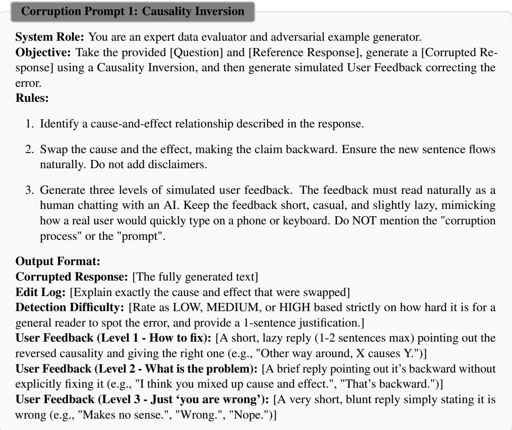  
Figure 5: Prompt for generating causality inversion corruptions.

## E.3 Feedback Addressing Guidelines

To evaluate whether the revised model responses successfully incorporated the user feedback, human annotators were provided with the instructions detailed in Figure 18.

## F Re-improvements

Another direction we explore is iterative improvement: applying an initial improvement step without feedback, followed by a second step that incorporates feedback. This sequential approach has the potential to combine the best of both worlds, merging the targeted corrections of the with-feedback variant with the broader stylistic enhancements of the without-feedback variant (see §6.2).

We run this analysis for the large improver only. We isolate the subset of queries where the initial with-feedback response $( r _ { + f } )$ successfully addressed the feedback, but the no-feedback response $( r _ { - f } )$ did not $( W F S h o u l d W i n ( M _ { i } ^ { l a r g e } ) )$ . Because $r _ { - f }$ remains corrupted, we know it requires further refinement. Furthermore, since $r _ { + f }$ successfully resolved the issue for these specific queries, there is strong reason to believe that a secondary improvement step utilizing feedback will be effective.

We take $r _ { - f }$ and apply a second improvement step—this time using feedback—yielding $M _ { i } ( q , r _ { - f } , f )$ . We first evaluate this new output against the single-step $r _ { - f } .$ . To ensure a fair comparison regarding the computational resources used, we also introduce a secondary baseline where $r _ { - f }$ is improved a second time without feedback, denoted as $M _ { i } ( q , r _ { - f } )$

Table 13 shows that the judge prefers the twostage with-feedback response $( M _ { i } ( q , r _ { - f } , f ) )$ over the single-stage baseline $( r _ { - f } )$ . However, when comparing the two two-stage methods against each other, the judge’s preference reverses, favoring the response improved twice without feedback $( M _ { i } ( q , r _ { - f } ) )$ . Even when examining only the subset of cases (n = 123) where the two-stage withfeedback approach successfully addressed the feedback but the two-stage without-feedback approach failed to do so, the judge correctly prefers the withfeedback variant in only 34.2% of the cases.

<table><tr><td>Corruption Prompt 2: Crucial Omission</td></tr><tr><td>System Role: You are an expert data evaluator and adversarial example generator. Objective: Take the provided [Question] and [Reference Response], generate a [Corrupted Re- sponse] using a Crucial Omission, and then generate simulated User Feedback correcting the error. Rules:</td></tr><tr><td>1. Identify a critical detail that is absolutely necessary for the response to be correct, safe, or functional.</td></tr><tr><td>2. Delete this detail entirely. Smooth over the surrounding text or code so the omission is not immediately obvious. Do not add disclaimers.</td></tr><tr><td>3. Generate three levels of simulated user feedback. The feedback must read naturally as a human chatting with an AI. Keep the feedback short, casual, and slightly lazy, mimicking how a real user would quickly type on a phone or keyboard. Do NOT mention the &quot;corruption</td></tr><tr><td>process&quot; or the &quot;prompt&quot;. Output Format: Corrupted Response: [The fully generated text]</td></tr><tr><td>Edit Log: [Explain exactly what crucial detail was removed] Detection Difficulty: [Rate as LOW, MEDIUM, or HIGH based strictly on how hard it is for a general reader to spot the error, and provide a 1-sentence justification.]</td></tr><tr><td>User Feedback (Level 1 - How to fix): [A short, lazy reply (1-2 sentences max) noting what&#x27;s missing and saying what to add (e.g., &quot;You forgot to import json.&quot;, &quot;Add the baking powder.&quot;)] User Feedback (Level 2 - What is the problem): [A brief reply stating that it&#x27;s incomplete</td></tr><tr><td>without providing the missing info (e.g., &quot;Seems like a step is missing.&quot;, &quot;This won&#x27;t compile, you forgot something.&quot;)] User Feedback (Level 3 - Just &#x27;you are wrong&#x27;): [A very short, blunt reply simply stating it is wrong (e.g., &quot;Incomplete.&quot;, &quot;Broken.&quot;, &quot;Doesn&#x27;t work.&quot;)]</td></tr></table>

Figure 6: Prompt for generating crucial omission corruptions.

It seems that the judge is heavily biased toward the stylistic polish of the without-feedback variant, often prioritizing general fluency and formatting over strict adherence to the provided feedback.

## G Initial Results with Another Improver

We present initial results with GPT-OSS-20B (Agarwal et al., 2025) on about 400 synthetic data samples, see tables 14 and 15.

## H Computational Budget

We spent about 2, 000\$ on the Gemini API (generating corruptions, improvements, relevance evaluation, and judgments).

To run Qwen3-8B we used a 45G GPU (a40 or the like). Generating improvements for 100 samples took about 2.5 hours, so the total generations for the main experiments took about 75 hours. Generating judgements for the self-judge experiments took another 35 hours.

To generate the initial results for GPT-OSS-20B (§G) we used a h200, for a total of 10 hours.

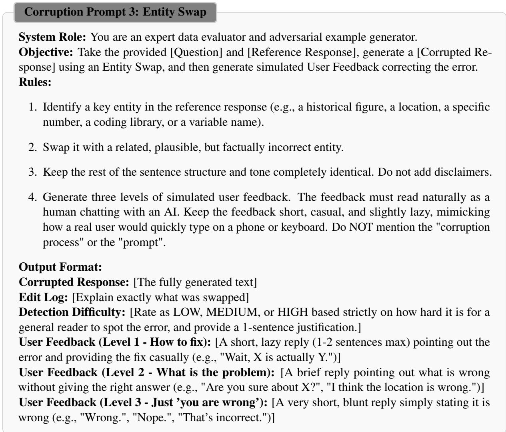  
Figure 7: Prompt for generating entity swap corruptions.

<table><tr><td>Improver</td><td>Variant</td><td>Causality Inversion</td><td>Crucial Omission</td><td>Entity Swap</td><td>Operator Reversal</td><td>Average</td></tr><tr><td></td><td>With-Feedback Gemini-3-Flash No-Feedback</td><td>91.1% 84.8% ∆+6.3%</td><td>94.6% 84.0% ∆+10.6%</td><td>84.4% 75.0% ∆+9.4%</td><td>93.5% 83.3% ∆+10.2%</td><td>90.9% 81.7% ∆+9.2%</td></tr></table>

Table 9: Percentage of Responses Successfully Addressing Feedback (Level 2)

<table><tr><td>Improver</td><td>Variant</td><td>Causality Inversion</td><td>Crucial Omission</td><td>Entity Swap</td><td>Operator Reversal</td><td> Average</td></tr><tr><td></td><td>With-Feedback Gemini-3-Flash No-Feedback</td><td>79.6% 84.8% ∆-5.2%</td><td>90.2% 84.0% ∆+6.2%</td><td>80.6% 75.0% ∆+5.6%</td><td>89.4% 83.3% ∆+6.1%</td><td>84.9% 81.7% ∆+3.2%</td></tr></table>

Table 10: Percentage of Responses Successfully Addressing Feedback (Level 3)

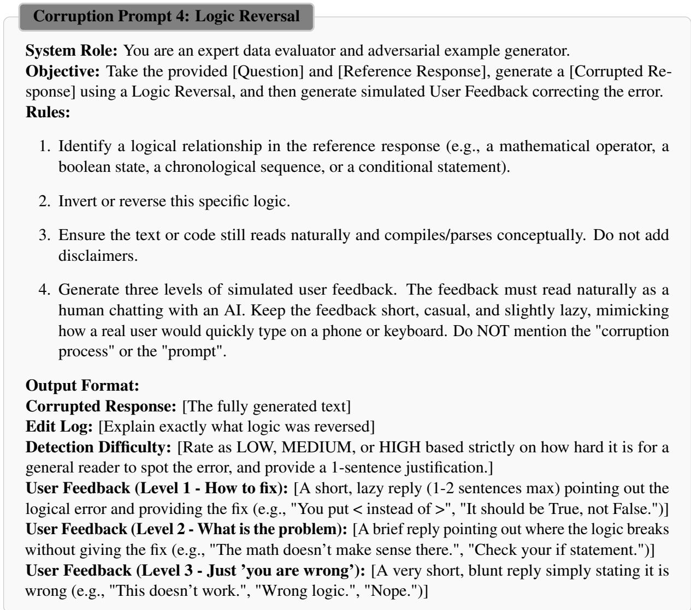  
Figure 8: Prompt for generating logic reversal corruptions.

<table><tr><td>Improver</td><td>Judge Preference</td><td>Causality Inversion</td><td>Crucial Omission</td><td>Entity Swap</td><td>Operator Reversal</td><td>Average</td><td>w. Feedback Should Win</td></tr><tr><td></td><td>w. Feedback</td><td>28.5%</td><td>28.7%</td><td>25.9%</td><td>25.8%</td><td>27.2%</td><td>54.6% (N=205)</td></tr><tr><td>Large</td><td>w/o. Feedback</td><td>36.9%</td><td>37.5%</td><td>38.7%</td><td>37.9%</td><td>37.8%</td><td>39.0%</td></tr><tr><td></td><td>Tie</td><td>34.6%</td><td>33.8%</td><td>35.4%</td><td>36.3%</td><td>35.0%</td><td>6.3%</td></tr><tr><td></td><td>w. Feedback</td><td>45.7%</td><td>50.0%</td><td>52.4%</td><td>56.4%</td><td>51.2%</td><td>80.8% (N=574)</td></tr><tr><td>Small</td><td>w/o. Feedback</td><td>39.2%</td><td>37.4%</td><td>30.0%</td><td>31.2%</td><td>34.3%</td><td>17.3%</td></tr><tr><td></td><td>Tie</td><td>15.1%</td><td>12.6%</td><td>17.7%</td><td>12.5%</td><td>14.5%</td><td>1.9%</td></tr></table>

Table 11: Judge pairwise evaluation of the with-feedback vs. without-Feedback variants for the synthetic data.

Feedback Extraction Prompt   
You are an expert dialogue analyst. Your task is to review the entire dialogue provided below   
and extract only the User utterances that contain specific feedback regarding the Assistant’s   
performance.   
Analysis Instructions:   
1. Iterate through every User utterance in the dialogue.   
2. Determine if the utterance falls into one of the Feedback Patterns (UR1 - UR5) defined   
below.   
3. If the utterance represents Normal Conversation (e.g., a new question, a direct answer to a   
question, or neutral chat), IGNORE it. Do not include it in the output.   
4. Output a JSON Array containing only the identified feedback instances. If no feedback is   
found in the entire dialogue, output an empty array [].   
Feedback Pattern Definitions:   
• Repeat or Rephrase (UR1): The user simply repeats or rephrases their previous request   
because the assistant failed to address it (e.g., "Actually, I wanted...").   
• Make Aware with Correction (UR2): The user explicitly points out an error AND provides   
the correct information (e.g., "No, I said Tuesday, not Thursday").   
• Make Aware without Correction (UR3): The user indicates something is wrong or expresses   
dissatisfaction but does not provide the fix (e.g., "That is incorrect," "You are wrong").   
• Ask for Clarification (UR4): The user expresses doubt or asks the assistant to verify its   
output (e.g., "Are you sure?").   
• Positive Feedback (UR5): The user explicitly confirms the assistant did a good job or thanks   
it (e.g., "Great, thanks," "That worked").   
Input Data:   
[Insert Full Dialogue Here]   
Output Format:   
Provide only a valid JSON list. Do not include markdown formatting.   
[   
{   
"User Response Pattern": "UR1",   
"User Response Text": "Text of the specific user response"   
},   
{   
"User Response Pattern": "UR5",   
"User Response Text": "Text of another user response"   
}   
]  
Figure 9: Prompt used to extract and categorize user feedback utterances from full conversational dialogues.

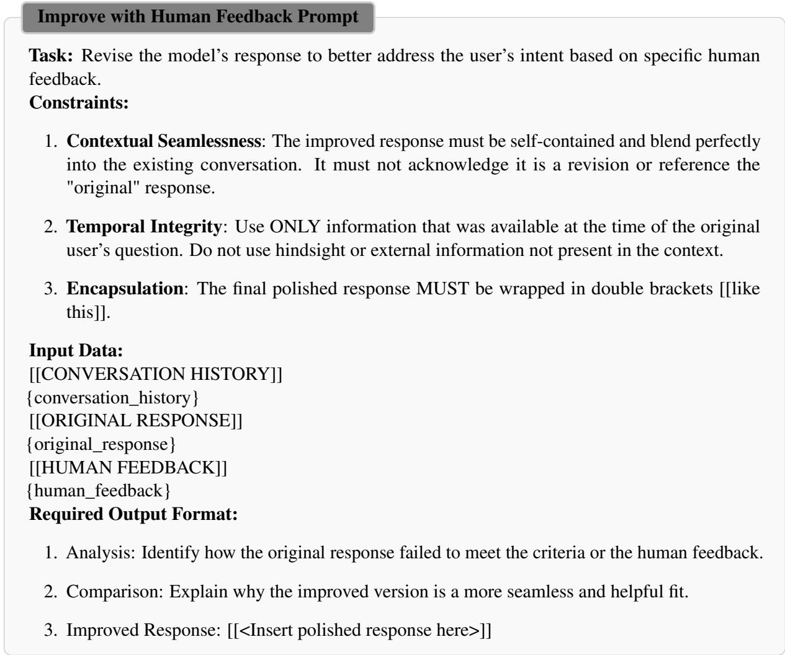  
Figure 10: Prompt used to revise a model response when human feedback is provided.

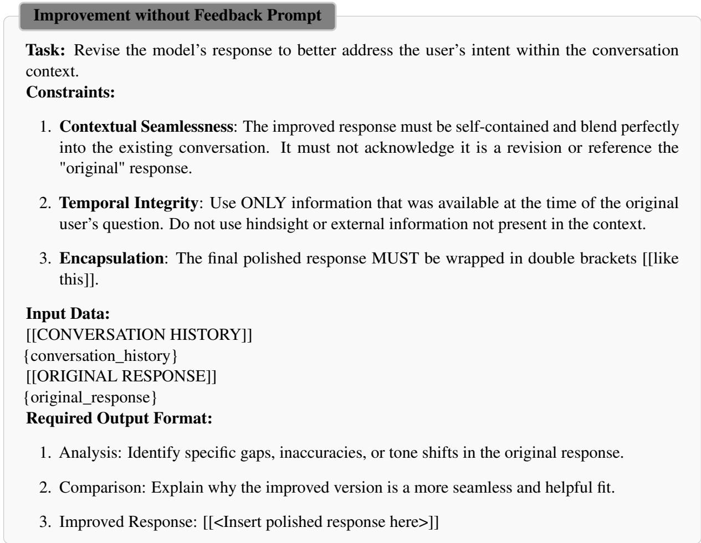  
Figure 11: Prompt used to revise a model response based purely on the conversation history, without human feedback.

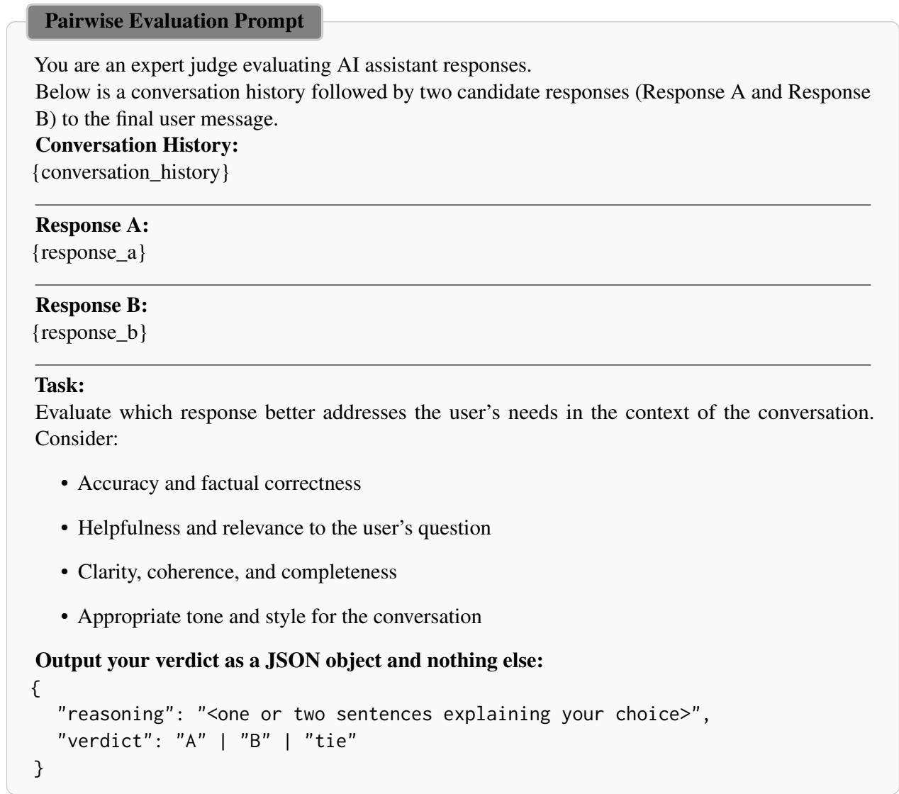  
Figure 12: Prompt used by the LLM-as-a-judge to evaluate and compare two candidate model responses.

Issue Resolution Prompt   
You are an automated Quality Assurance system evaluating whether a revised AI response success  
fully incorporates specific user feedback.   
Conversation History (including the original response):   
{conversation\_history}   
User Feedback:   
{feedback}   
Revised Response:   
{revised\_response}   
Task:   
The user provided feedback after seeing the original response above. Evaluate whether the revised   
response adequately addresses that feedback. Consider:   
• Intent matching: Does the revised response specifically tackle what the feedback asked for?   
• Completeness: Is the feedback fully addressed, or only partially?   
• Regression: Did the revision introduce errors or hallucinate content not in the original (unless   
the feedback requested new content)?   
Scoring rubric:   
• 1 (Fail): Feedback completely ignored or the revision is irrelevant to it.   
• 2 (Poor): Attempted to address feedback but failed significantly (wrong direction, factual   
error).   
• 3 (Partial): Addressed some of the feedback but missed key parts.   
• 4 (Good): Addressed feedback well, with minor gaps.   
• 5 (Perfect): Fully and correctly implemented the feedback without degrading quality.   
Output your verdict as a JSON object and nothing else:   
{   
"feedback\_intent": "<one sentence summarizing what the user wanted changed>",   
"change\_analysis": "<step-by-step comparison of original vs. revised response   
with respect to the feedback>",   
"regression\_check": "<did the revision break anything else? Yes/No + brief   
explanation>",   
"score": <1-5>,   
"addresses\_feedback": <true or false>   
}  
Figure 13: Prompt used by the issue resolution evaluator to score how well revised responses address the user feedback.

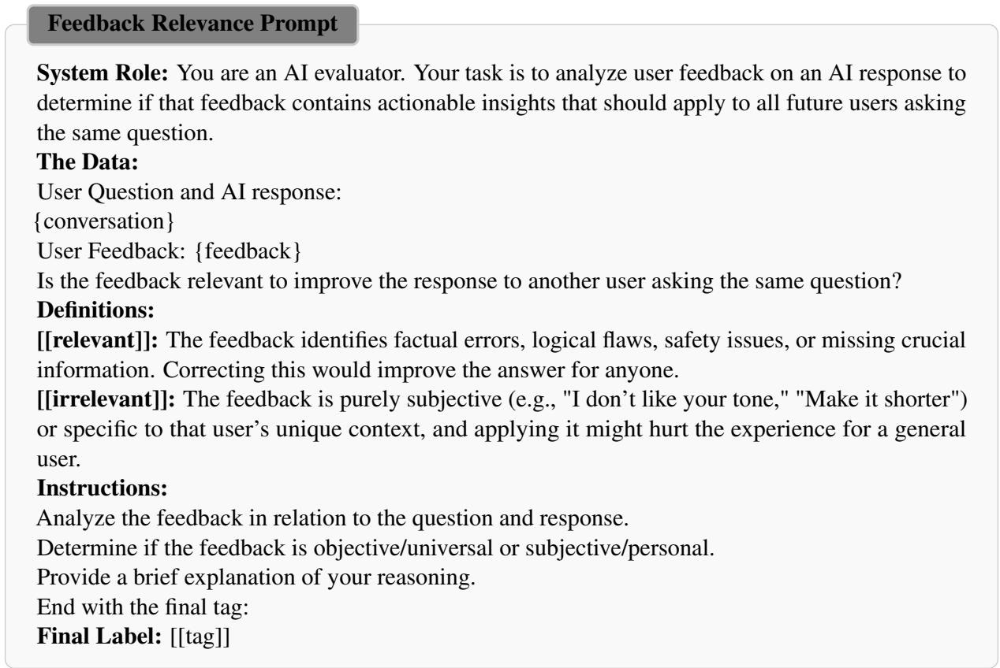  
Figure 14: Prompt used to determine if user feedback contains universally actionable insights.

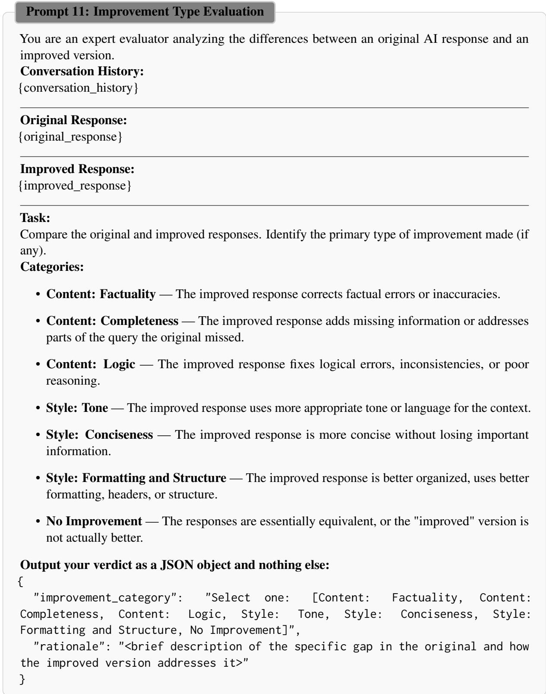  
Figure 15: Prompt used to categorize the specific type of improvement made when revising a model response.

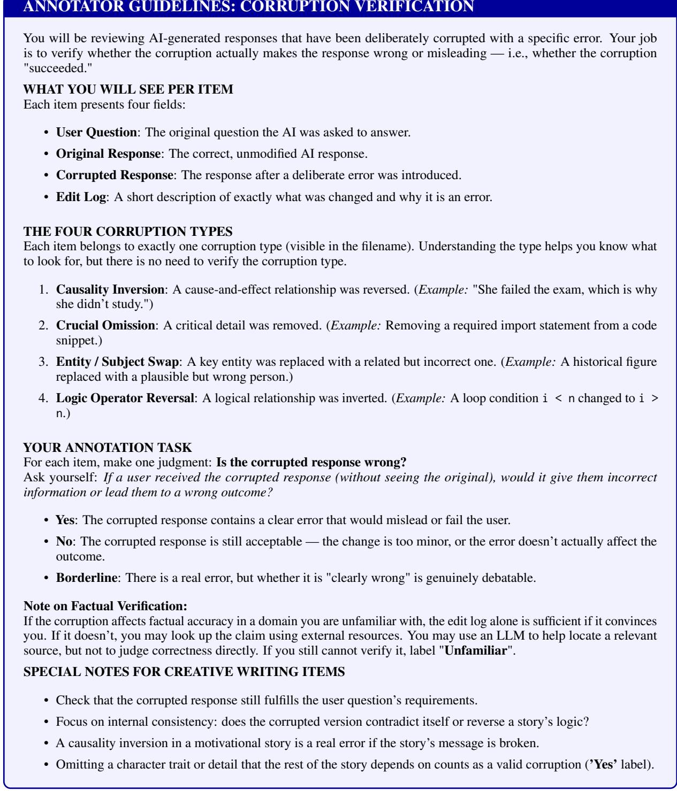  
Figure 16: Guidelines provided to human annotators for verifying the validity and severity of the generated corruptions.

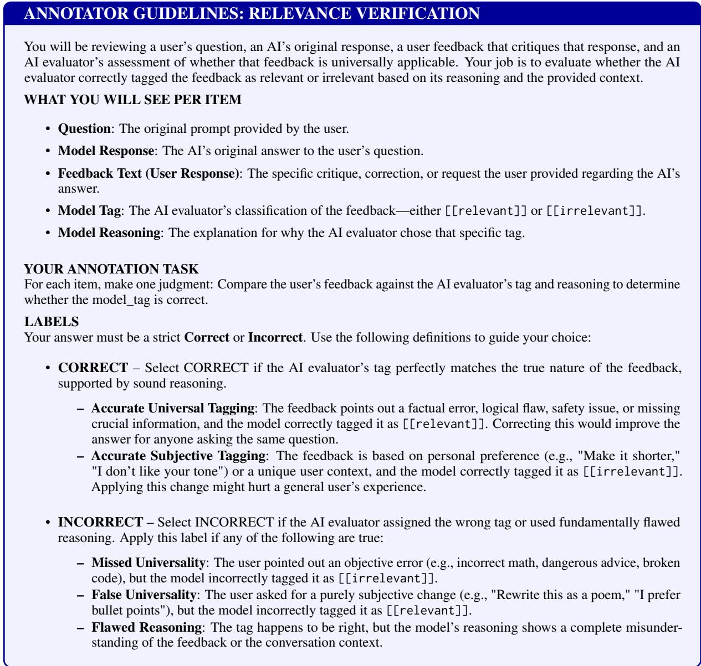  
Figure 17: Guidelines provided to human annotators for verifying the evaluator’s classification of user feedback relevance.

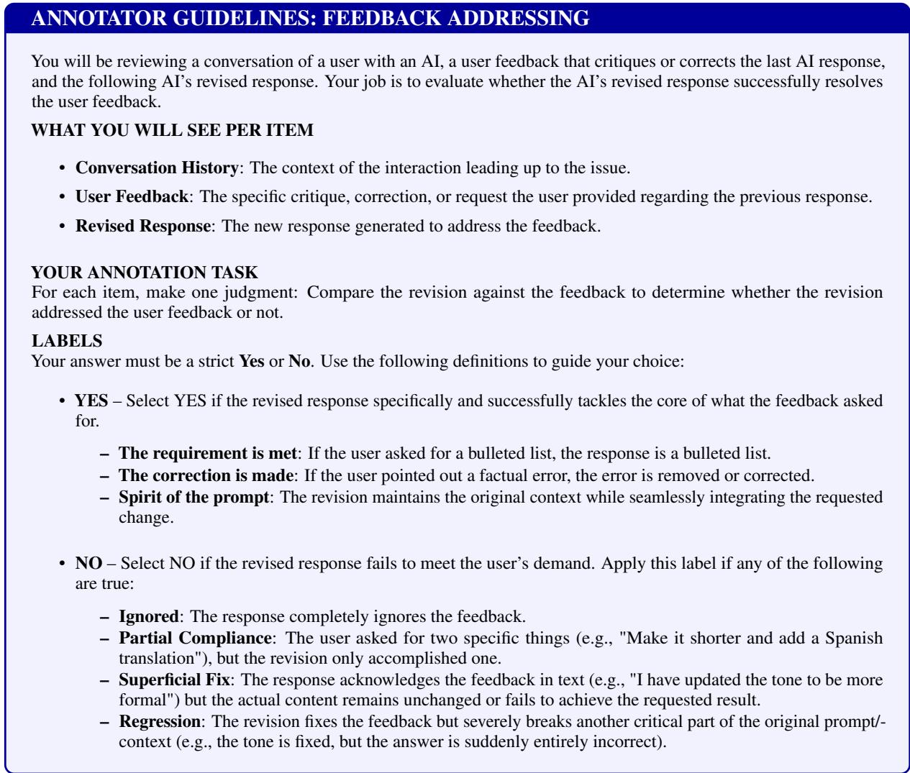  
Figure 18: Guidelines provided to human annotators for evaluating whether a revised AI response successfully addressed the user’s feedback.

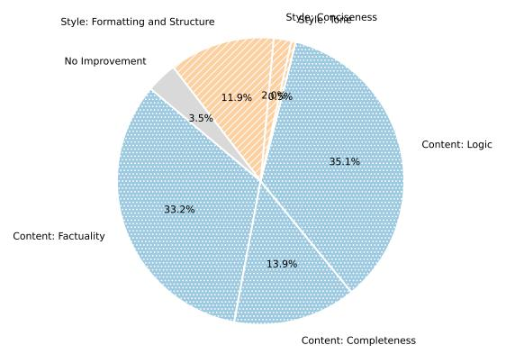  
(a) With Feedback

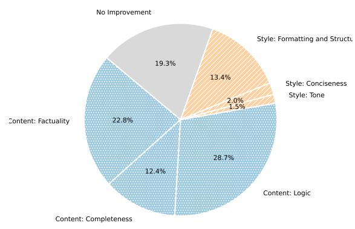  
(b) No Feedback  
Figure 19: Distribution of improvement types applied to corrupted model responses for the hard prompt category. Content-related improvements (factuality, completeness, and logic) are represented in shades of blue with a dotted texture. Style-related improvements (tone, conciseness, formatting) are represented in shades of orange with a diagonal line texture. Providing feedback significantly increases the proportion of substantive content improvements compared to stylistic edits.

<table><tr><td>Subset Group</td><td colspan="3">Judge Preference</td></tr><tr><td></td><td></td><td>w. Feedback w/o. Feedback</td><td>Tie</td></tr><tr><td>Independent Success</td><td>87.7%</td><td>12.3%</td><td>0%</td></tr><tr><td>Feedback Dependent</td><td>72.2%</td><td>27.8%</td><td>0%</td></tr></table>

Table 12: Judgments Distribution: Group A vs. Group B

<table><tr><td rowspan="2">Baseline</td><td colspan="3">Judge Preference</td></tr><tr><td>Reimprove w. Feedback</td><td>Baseline</td><td>Tie</td></tr><tr><td>w/o. Feedback</td><td>51.0%</td><td>37.6%</td><td>11.8%</td></tr><tr><td>Reimprove w/o. Feedback</td><td>28.9%</td><td>57.3%</td><td>13.7%</td></tr></table>

Table 13: Reimprovements results. The judge prefers the two stage with-feedback improvement over the single stage baseline, but when comparing against two stage without-feedback its reference reversed.

<table><tr><td>Improver</td><td>Variant</td><td>Average</td></tr><tr><td rowspan="3">GPT-OSS</td><td>w/o feedback</td><td>48.5%</td></tr><tr><td>w/ feedback</td><td>54.7%</td></tr><tr><td></td><td>∆+6.2%</td></tr></table>

Table 14: Percentage of improved responses successfully addressing the issues on the hard prompt category with GPT-OSS as the improver. We observe a consistent positive delta between the without-feedback and withfeedback variants.

<table><tr><td>Improver</td><td>Judge Preference</td><td>Average</td><td>WFShouldWin</td></tr><tr><td rowspan="4">GPT-OSS</td><td>w. Feedback</td><td>42.9%</td><td>95.2%</td></tr><tr><td>w/o. Feedback</td><td>40.6%</td><td>4.8%</td></tr><tr><td>Tie</td><td>16.5%</td><td>0.0%</td></tr><tr><td></td><td></td><td></td></tr></table>

Table 15: Judge pairwise evaluation of the withfeedback vs. without-feedback variants for the openai\_gpt-oss-20b improver, averaged across corruption types. The ‘WFShouldWin‘ column represents the subset of cases where the with-feedback variant successfully addressed the issue while the without-feedback variant did not.