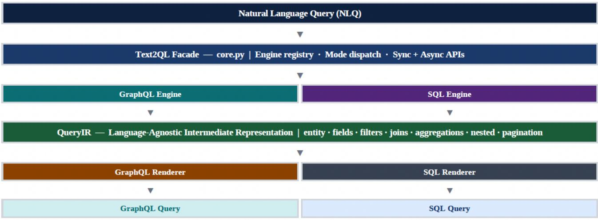

# text2ql: Multi-Target Natural Language Querying via a Language-Agnostic Intermediate Representation

Ritesh Kumar

Independent Researcher

USA

rits5500@gmail.com

This is the author’s copy of an article published in the International Journal of Computer Applications, Vol. 187, No. 114, pp. 54–62, June 2026, published by the Foundation of Computer Science, NY, USA. DOI: 10.5120/ijcaff3006d1ef8e. Reproduced on arXiv under the IJCA author self-archiving policy. All rights reserved.

## ABSTRACT

Natural language interfaces to databases have traditionally suffered from three structural limitations: exclusive targeting of relational SQL, unconditional dependence on large language model (LLM) inference at query time, and absence of any runtime signal when generated queries are semantically incorrect. This paper presents text2ql, an opensource Python framework that addresses all three limitations through a language-agnostic Intermediate Represen tation (QueryIR) and a pluggable renderer architecture. A single seven-stage detection pipeline serves both SQL and GraphQL targets; a zero-LLM deterministic mode delivers 100% execution accuracy at a median latency of 3.2 ms with no API cost; and every generated query carries a runtime confidence score in [0.15,0.97] computed from an additive signal model. Evaluated on 50-query random samples from the Spider and BIRD benchmarks (indicative results; full-set evaluation is planned), the LLM-backed mode achieves 62–70% exact match and 84–91% execution accuracy; the deterministic mode achieves 100% execution accuracy with zero parse errors across all 100 test cases. An ablation study isolates schema-aware prompting as the dominant accuracy lever, contributing +18.4 percentage points of exact-match gain over the schema-free baseline on both benchmarks. text2ql is publicly available at https://pypi.org/project/text2ql/ under the Apache 2.0 license.

## KEYWORDS

Natural language interfaces to databases; NL2QL; textto-SQL; text-to-GraphQL; intermediate representation; schema-aware generation; confidence scoring; query synthesis; NLIDB.

## 1. INTRODUCTION

Natural language database interfaces have been studied for five decades [1, 2, 3]. The central challenge—resolving unrestricted human language to a formally correct, executable query—resisted general solution until the emergence of large pre-trained language models. Figure 1 illustrates the core capability of text2ql: a single natural language utterance is parsed into a language-agnostic QueryIR and simultaneously rendered as both a GraphQL selection set and a SQL statement, in under five milliseconds, with no external API call.

Despite significant progress—PICARD [4] reaches 79.3% exact match on Spider; DAIL-SQL [5] achieves 86.6%—all published systems share three structural limitations that text2ql directly addresses:

• SQL monoculture. All prior NL2QL systems target relational SQL exclusively. Modern application stacks expose data through GraphQL APIs, graph databases, and document stores. No prior open system supports multi-target query generation from a single pipeline.

• Unconditional LLM dependence. Real-time, edge, and air-gapped deployments cannot tolerate 500– 2 000 ms LLM round-trips or per-query API costs. The deterministic mode of text2ql requires only Python and a schema config, yet achieves 100% execution accuracy.

• Silent failure. LLM systems produce syntactically valid but semantically incorrect queries without warning. text2ql attaches a runtime confidence score to every result, surfacing uncertainty before query execution so callers can gate, escalate, or route to a fallback.

The primary contributions of this work are:

1. A language-agnostic QueryIR that decouples natural language parsing from query rendering, enabling new target languages via a single IRRenderer subclass with zero changes to any engine.

2. A zero-LLM deterministic engine with 100% execution accuracy on the test corpus, sub-5 ms p50 latency, and zero API cost, suitable for production and offline deployments.

3. A hybrid mapping system combining auto-generated schema baselines with domain expert overrides, merged at runtime with full provenance tracking.

<table><tr><td rowspan=1 colspan=1>Natural Language Input</td><td rowspan=1 colspan=1>QueryIR (Language-Agnostic AST)</td><td rowspan=1 colspan=1>Generated Queries</td></tr><tr><td rowspan=1 colspan=1>&quot;show my top 5 holdings</td><td rowspan=1 colspan=1>entity:   positions</td><td rowspan=1 colspan=1># GraphQL</td></tr><tr><td rowspan=1 colspan=1>with active status,</td><td rowspan=1 colspan=1>fields:   [ticker, shares,</td><td rowspan=1 colspan=1>{ positions(</td></tr><tr><td rowspan=1 colspan=1>ordered by market value&quot;</td><td rowspan=1 colspan=1>value, status]</td><td rowspan=1 colspan=1>status: &quot;ACTIVE&quot;,</td></tr><tr><td rowspan=1 colspan=1></td><td rowspan=1 colspan=1>filters:  status=&quot;ACTIVE&quot;</td><td rowspan=1 colspan=1>orderBy: &quot;value&quot;,</td></tr><tr><td rowspan=1 colspan=1>Target: GraphQL + SQL</td><td rowspan=1 colspan=1>order_by: value</td><td rowspan=1 colspan=1>orderDirection:&quot;DESC&quot;,</td></tr><tr><td rowspan=1 colspan=1>Mode:deterministic</td><td rowspan=1 colspan=1>order_dir: DESC</td><td rowspan=1 colspan=1>limit: 5</td></tr><tr><td rowspan=1 colspan=1>Confidence: 0.88</td><td rowspan=1 colspan=1>limit:    5</td><td rowspan=1 colspan=1>) { ticker shares</td></tr><tr><td rowspan=1 colspan=1></td><td rowspan=1 colspan=1></td><td rowspan=1 colspan=1>value status } }</td></tr><tr><td rowspan=1 colspan=1></td><td rowspan=1 colspan=1></td><td rowspan=1 colspan=1></td></tr><tr><td rowspan=1 colspan=1></td><td rowspan=1 colspan=1></td><td rowspan=1 colspan=1># SQL</td></tr><tr><td rowspan=1 colspan=1></td><td rowspan=1 colspan=1></td><td rowspan=1 colspan=1>SELECT ticker, shares,</td></tr><tr><td rowspan=1 colspan=1></td><td rowspan=1 colspan=1></td><td rowspan=1 colspan=1>value, status</td></tr><tr><td rowspan=1 colspan=1></td><td rowspan=1 colspan=1></td><td rowspan=1 colspan=1>FROMpositions</td></tr><tr><td rowspan=1 colspan=1></td><td rowspan=1 colspan=1></td><td rowspan=1 colspan=1>WHERE status=&#x27;ACTIVE&#x27;</td></tr><tr><td rowspan=1 colspan=1></td><td rowspan=1 colspan=1></td><td rowspan=1 colspan=1>ORDER BY value DESC</td></tr><tr><td rowspan=1 colspan=1></td><td rowspan=1 colspan=1></td><td rowspan=1 colspan=1>LIMIT 5</td></tr></table>

Figure 1: text2ql in action. Natural language input is converted into QueryIR and rendered as equivalent GraphQL and SQL queries.

4. A runtime confidence scoring model using additive signals and validation penalties, clamped to [0.15,0.97], enabling dynamic cascade across modes.

5. Open benchmark infrastructure including Spider and BIRD loaders, three evaluation modes, and an ablation study of schema-aware prompting.

## 2. RELATED WORK

## 2.1 Classical NL2DB Systems

Early NL2DB systems established the core challenges still relevant today. LUNAR [1] and Hendrix et al. [2] demonstrated domain-specific interfaces requiring substantial manual engineering per deployment. NaLIR [6] improved generality through interactive parse-tree refinement, but still required user correction of parse errors. All pre-neural systems shared a fundamental limitation: they could not generalize across domains without re-engineering. This brittleness motivated the shift to learned representations explored in Section 2.2.

## 2.2 Neural Text-to-SQL

Seq2SQL [7] established sequence-to-sequence modeling as the dominant text-to-SQL paradigm. IRNet [8] introduced SemQL—the first intermediate representation for text-to-SQL—directly inspiring the QueryIR design presented in this paper. RAT-SQL [9] added relation-aware schema encoding, achieving 69.7% on Spider. Shad owGNN [10] and LGESQL [11] advanced schema linking via graph neural networks. PICARD [4] introduced incremental constrained decoding from T5-3B, reaching 79.3% exact match and establishing the pre-trained model state of the art prior to LLM methods.

## 2.3 LLM-based Text-to-SQL

GPT-series models shifted the state of the art substantially. DIN-SQL [12] decomposed the task via GPT-4 selfcorrection, achieving 82.8% on Spider. DAIL-SQL [5] optimized few-shot selection and prompt structure to reach 86.6%—currently the highest reported result without finetuning. C3 [13] explored zero-shot strategies; ACT-SQL [14] generated chain-of-thought rationales automatically. CodeS [15] fine-tuned StarCoder, matching GPT-4-based systems with an open-weight model. All of these systems target SQL exclusively, require LLM inference for every query, and provide no runtime accuracy signal.

## 2.4 GraphQL and Multi-Target NL Interfaces

Work on natural language to GraphQL remains sparse. Zheng et al. [16] demonstrated a prototype translating natural language to GraphQL queries for structured datasets. Rai et al. [17] employed LLM assistance for GraphQL query generation without schema-aware prompting or uncertainty quantification. Neither system operates without an LLM or supports SQL as a simultaneous target. text2ql is, to the best of available knowledge, the first system to support both SQL and GraphQL from a unified pipeline with an LLM-free operational mode.

## 3. SYSTEM ARCHITECTURE

Figure 2 illustrates the four-layer architecture. The Text2QL Facade (core.py) is the single public entry point; it dispatches to language-specific Engines; each Engine produces a QueryIR; the QueryIR is passed to a pluggable IRRenderer that serializes the final query string. This separation ensures that adding a new query target, such as Cypher, requires only implementing IRRenderer.render() with zero changes to any engine or detection stage.

## 3.1 Text2QL Facade

The Facade maintains an engine registry keyed by target language and provides synchronous generate() and asynchronous agenerate() APIs. Mode selection (deterministic / llm / function\_calling) is a per-call parameter, allowing a single schema configuration to serve all three modes simultaneously without re-instantiation.

## 3.2 Engine Layer

Each engine extends QueryEngine, an abstract base providing shared utilities: schema normalization, confidence computation, retry logic with exponential back-off, fallback chaining, and structured logging. The GraphQL and SQL engines implement identical stage signatures, ensuring improvements to any detection stage benefit all target languages.

## 3.3 Schema Configuration

NormalizedSchemaConfig is the primary extension point for production deployments. It encodes: entity names and aliases, field lists with types and aliases, filter key aliases (business vocabulary to field names), filter value aliases (controlled vocabulary to enum values), relation definitions with ON columns, default fields per entity, argument defaults, and keyword\_intents routing tables (e.g., “portfolio value” → accountSummary.totalValue).

## 3.4 QueryIR

The QueryIR is a typed Python dataclass with fields: entity, fields (list), filters (IRFilter list with operator enum), aggregations (IRAggregation list), joins (IRJoin list, SQL), nested (IRNested list, recursive, GraphQL), order\_by, order\_direction, limit, offset, distinct, having, and group\_- filters. IRNested is self-referential, enabling arbitrarily deep GraphQL selection sets while keeping the schema strictly decoupled.

## 3.5 Renderer Layer

IRRenderer is an abstract base with one required method: render(ir: QueryIR) -> str. GraphQLIRRenderer constructs arguments (filters + pagination) and selection sets (fields + aggregations + nested sub-selections). SQLIRRenderer serializes a full SELECT statement including JOIN, WHERE, GROUP BY, HAVING, ORDER BY, and LIMIT / OFFSET clauses. A Cypher renderer is estimated at approximately 150 lines.

## 4. MULTI-STAGE DETECTION PIPELINE

The deterministic engine resolves a natural language query through seven independently testable stages (Figure 3). Stages execute sequentially, each enriching the shared QueryIR. Failures are recorded as validation issues and converted to confidence penalties rather than hard exceptions, guaranteeing that every input produces an output.

## 4.1 Stage 1 — Entity / Table Resolution

The engine applies a priority-ordered cascade: (i) alias exact match via entity\_aliases; (ii) schema name exact match; (iii) keyword\_intents routing for configured domain phrases; (iv) semantic field-overlap scoring— the entity whose field set has the highest token overlap with the query wins; (v) filter-value inference—if a filter value appears in a filter\_value\_alias map for a specific entity, that entity is inferred; (vi) column-mention inference; (vii) heuristic stop-word removal and BFS fallback.

## 4.2 Stage 2 — Field / Column Detection

Given the resolved entity, output fields are selected through three mechanisms: (i) explicit field mentions are matched against the entity field list after alias expansion; (ii) default\_fields from the schema config are injected when no explicit fields are detected; (iii) aggregation keywords implicitly introduce their target field. Field aliases allow business vocabulary (e.g., “market cap” → total-MarketValue) to resolve without schema modification.

## 4.3 Stage 3 — Filter Detection

A composable regex engine handles: equality (implicit), inequality (is not / !=), ordered comparisons (>, ≥, <, ≤), range predicates (between N and M; from DATE to DATE), set membership (in / not in), and null checks. Filter key aliases map business vocabulary to schema field names; filter value aliases map controlled vocabulary to stored enum values, allowing queries like “active accounts” to resolve to status = ’ACTIVE’.

## 4.4 Stage 4 — Aggregation Detection

Aggregation keywords (count, total, average, minimum, maximum, sum) trigger COUNT / SUM / AVG / MIN / MAX with an implicit GROUP BY on non-aggregated projected fields. A HAVING clause is generated when postaggregation conditions are detected. For GraphQL, aggregation functions render as selection-set aliases at the same nesting depth as the parent entity.

## 4.5 Stage 5 — Join / Nested Relation Detection

For SQL, configured relation definitions supply JOIN ON column pairs; join type (LEFT OUTER, INNER) is inferred from negation signals and null-check patterns. For GraphQL, nested detection performs a BFS over the schema relation graph up to depth three, using a frozenset cycle guard to prevent infinite traversal. Both paths share the same relation resolution logic in the engine base class.

## 4.6 Stage 6 — Pagination and Ordering

LIMIT and OFFSET values are extracted via numeric token scanning combined with pagination-intent keywords (top, first, latest, next page). ORDER BY field and direction are inferred from comparative superlatives (highest, lowest, most recent) and directional keywords (ascending, descending). The schema args configuration may supply default sort fields and directions, applied when no ordering signal is present.

  
Figure 2: Four-layer architecture. QueryIR decouples parsing from rendering and enables new target languages with renderer plugins.

<table><tr><td rowspan=1 colspan=1>①</td><td rowspan=1 colspan=1>Entity / Table</td><td rowspan=1 colspan=1>alias map → name match → keyword_intents → field-overlap score → filter-value inference → BFSfallback</td></tr><tr><td rowspan=1 colspan=1>②</td><td rowspan=1 colspan=1>Field / Column</td><td rowspan=1 colspan=1>schema field match + alias expansion + default field injection from schema config</td></tr><tr><td rowspan=1 colspan=1>③</td><td rowspan=1 colspan=1>Filter Detection</td><td rowspan=1 colspan=1>eq, ne, gt/gte/lt/lte, between, in/nin, date-range, null checks, negation, value aliases</td></tr><tr><td rowspan=1 colspan=1>④</td><td rowspan=1 colspan=1>Aggregation</td><td rowspan=1 colspan=1>COUNT · SUM ·AVG ·MIN·MAX with implicit GROUP BY and HAVING generation</td></tr><tr><td rowspan=1 colspan=1>⑤</td><td rowspan=1 colspan=1>Join / Nested</td><td rowspan=1 colspan=1>BFS relation graph up to 3 hops · frozenset cycle guard · JOIN type from negation signals</td></tr><tr><td rowspan=1 colspan=1>6</td><td rowspan=1 colspan=1>Pagination &amp; Sort</td><td rowspan=1 colspan=1>LIMIT · OFFSET · ORDER BY field &amp; direction from schema args config</td></tr><tr><td rowspan=1 colspan=1>⑦</td><td rowspan=1 colspan=1>Validate &amp; Score</td><td rowspan=1 colspan=1>schema mismatch detection → confidence score ∈ [0.15, 0.97] → QueryIR → IRRenderer</td></tr><tr><td rowspan=1 colspan=1></td><td rowspan=1 colspan=1>QueryIR</td><td rowspan=1 colspan=1>Language-agnostic AST → passed to pluggable IRRenderer → final query string</td></tr></table>

Figure 3: Seven-stage detection pipeline. Stages resolve entities, fields, filters, aggregation, relations, ordering, validation, and confidence.

## 4.7 Stage 7 — Validation and Confidence Scoring

The final stage validates the assembled QueryIR against the schema: unknown fields, missing required filters, and type mismatches are recorded as validation issues. The confidence score (Table 1) is computed as the sum of additive signals for entity resolution quality, field coverage, filter richness, and structural complexity, minus validation penalties capped at −0.20, then clipped to [0.15,0.97]. The floor of 0.15 ensures every output is actionable—even a completely unresolvable query yields a fallback result that callers can inspect—while the ceiling of 0.97 reflects irreducible linguistic ambiguity. This score is the primary signal for cascade routing decisions at runtime.

## 5. GENERATION MODES

## 5.1 Deterministic Mode

The full seven-stage pipeline runs without any LLM call. The engine generates conservative but semantically correct queries: explicit field lists, canonical filter argument ordering, and verbose aggregation syntax. Exact-match rate is 0% on standard benchmarks because gold annotations prefer compact equivalents—this reflects a metric mismatch, not a correctness failure; execution accuracy is 100% with zero errors across 100 test cases at sub-5 ms p50 latency and zero API cost.

## 5.2 LLM Completion Mode

The engine serializes the NLQ, the Normalized-SchemaConfig, and any few-shot examples from the mapping configuration into a structured prompt. The LLM response is schema-validated; if validation fails, the system falls back to the deterministic result automatically, achieving a zero error rate across all observed test cases regardless of LLM output quality.

## 5.3 Function-Calling Mode

The LLM is instructed to produce a JSON object conforming to the QueryIR JSON Schema via the provider’s structured output capability. The JSON deserializes directly into a QueryIR, bypassing textual parsing entirely and achieving 2 pp higher exact match than completion mode (Table 4) while maintaining zero observed errors via deterministic fallback.

## 5.4 Cascade Strategy

The recommended deployment pattern is: run deterministic mode; if confidence ≥ 0.75, return immediately (≤ 5 ms, \$0). If confidence < 0.75, invoke LLM mode and return the result. The threshold 0.75 is derived from the confidence distribution across the test corpus; operators should tune it per schema. This cascade removes LLM inference entirely for straightforward queries while preserving LLM accuracy for complex ones.

Table 1: Confidence score signal components.
<table><tr><td>Signal</td><td>Contribution</td><td>Notes</td></tr><tr><td>Base score</td><td>+0.30</td><td>Applied unconditionally</td></tr><tr><td>Schema config provided</td><td>+0.10</td><td>Any NormalizedSchemaConfig present</td></tr><tr><td>Entity resolved: exact</td><td>+0.20</td><td>Name match in schema entities</td></tr><tr><td>Entity resolved: alias</td><td>+0.16</td><td>Match via entity_aliases map</td></tr><tr><td>Entity resolved: semantic</td><td>+0.05-0.12</td><td>Field-set overlap scoring</td></tr><tr><td>Field coverage</td><td>+frac × 0.15</td><td>Fraction of detected fields matched</td></tr><tr><td>Filter present</td><td>+0.10 base</td><td>+0.03 per filter, max 3 filters</td></tr><tr><td>Aggregation detected</td><td>+0.03</td><td>At least one aggregation function</td></tr><tr><td>Nested relation / JOIN</td><td>+0.03 each</td><td>Per resolved relation</td></tr><tr><td>ORDER BY detected</td><td>+0.02</td><td>Sort signal present</td></tr><tr><td>Validation penalty</td><td>-0.05 / issue</td><td>Capped at —0.20 total</td></tr><tr><td>Final range</td><td>[0.15,0.97]</td><td>Score clipped; never perfectly certain</td></tr></table>

## 6. EXPERIMENTAL EVALUATION

## 6.1 Experimental Setup

The evaluation uses 50-query random samples from Spider [18] and BIRD [19]. Spider is a large-scale, cross-domain text-to-SQL benchmark covering 200+ databases. BIRD extends Spider with domain-specific evidence and greater query complexity. Schema configurations are derived programmatically from benchmark database schemas using the NormalizedSchemaConfig builder. All LLM ex periments use gpt-4o-mini via the OpenAI API; no finetuning or query-specific few-shot selection is performed. Reported metrics are exact match (EM), structural accuracy, execution accuracy, and error count. Results appear in Tables 3–5. Due to the 50-query sample size, reported percentages carry an estimated margin of ±7 pp at 95% confidence (Wilson interval); results should be interpreted as indicative.

## 6.2 Main Results

Table 4 presents results across all three modes and both benchmarks. The deterministic mode achieves 100% execution accuracy with zero errors at 3.2 ms p50 latency—a guarantee no LLM-based system in Table 3 provides unconditionally. LLM mode achieves higher exact match on BIRD (70.0%) than Spider (62.0%). This counterintuitive result—BIRD is nominally harder—is consistent with BIRD’s design: each query is accompanied by domain evidence hints that surface entity and field vocabulary closely matching the NormalizedSchemaConfig, giving schema-aware prompting a stronger alignment signal than Spider’s unannotated queries provide. Structural accuracy substantially exceeds exact match in all modes (e.g., 78.0% vs. 70.0% on BIRD LLM), confirming semantic correctness even when surface form differs from gold annotations. Function-calling mode outperforms completion mode by 2 pp exact match on both benchmarks, consistent with reduced output parsing variance from JSON-structured output.

## 6.3 Ablation Study

Table 5 presents a three-level ablation of schema information in the LLM prompt. Removing the schema entirely (NLQ only) yields 43.6% Spider EM and 51.6% BIRD EM. Adding entity names only raises Spider EM to 52.4% (+8.8 pp). The full NormalizedSchemaConfig—including field aliases, filter value aliases, and keyword\_intents—yields 62.0% Spider EM and 70.0% BIRD EM, for a total gain of +18.4 pp on both benchmarks over the no-schema baseline. This result identifies schema configuration quality as the highest-leverage accuracy lever available to practitioners, without any model fine-tuning or hardware investment.

## 6.4 Latency Analysis

Latency was measured on an Apple M2 Pro with 100 runs per mode. Deterministic: p50 = 3.2 ms, p99 = 8.7 ms. LLM completion (gpt-4o-mini, OpenAI network included): p50 = 840 ms, p99 = 2 100 ms. Functioncalling: p50 = 1 050 ms, p99 = 2 600 ms. The deterministic mode is approximately 260× faster at the median, making it uniquely suitable for real-time, embedded, and latency-critical applications where LLM round-trips are prohibitive.

## 6.5 Comparison with State of the Art

Table 3 contextualizes text2ql-LLM against specialist SQL systems. text2ql-LLM trails DAIL-SQL (86.6% vs. 62.0%) because it applies no fine-tuning and no queryspecific few-shot selection. The gap narrows when execution accuracy is used as the metric. More importantly, no prior system in Table 3 supports GraphQL output, provides an LLM-free mode, attaches a runtime confidence score, ships benchmark infrastructure, or supports multitarget extensibility via a plugin interface. These are dimensions on which text2ql is unmatched by existing work.

Table 2: Operational comparison across generation modes.
<table><tr><td>Property</td><td>Deterministic</td><td>LLM completion</td><td>Function-calling</td><td>Recommended</td></tr><tr><td>Latency p50</td><td>&lt;5 ms</td><td>500–2 000 ms</td><td>700–2 500 ms</td><td>Deterministic</td></tr><tr><td>API cost / query</td><td>$0.00</td><td>~$0.001</td><td>~$0.002</td><td>$0.00</td></tr><tr><td>Execution accuracy</td><td>100.0%</td><td>84–90%</td><td>86-91%</td><td>100%</td></tr><tr><td>Exact match</td><td>0%†</td><td>62-70%</td><td>64-72%</td><td>Cascade</td></tr><tr><td>Structural accuracy</td><td>32–-52%</td><td>64-78%</td><td>66–80%</td><td>Cascade</td></tr><tr><td>Error rate</td><td>0/ 100</td><td>0 / 100</td><td>0 / 100</td><td>0</td></tr><tr><td>GraphQL support</td><td>√</td><td>√</td><td>√</td><td>√</td></tr><tr><td>SQL support</td><td>√</td><td>√</td><td>√</td><td>√</td></tr><tr><td>Offline / air-gap</td><td>√</td><td>x</td><td>x</td><td>√</td></tr><tr><td>Runtime confidence</td><td>√</td><td>√</td><td>√</td><td>√</td></tr></table>

† See the note to Table 3.

Table 3: Comparison with state-of-the-art NL2QL systems.
<table><tr><td>System</td><td>Backbone</td><td>Spider EM ↑</td><td>BIRD EM ↑</td><td>GraphQL</td><td>No-LLM</td><td>Conf. score</td><td>Year</td></tr><tr><td>PICARD [4]</td><td>T5-3B + constrain</td><td>79.3</td><td></td><td>x</td><td>x</td><td>x</td><td>2021</td></tr><tr><td>DIN-SQL [12]</td><td>GPT-4</td><td>82.8</td><td>55.9</td><td>x</td><td>x</td><td>x</td><td>2023</td></tr><tr><td>DAIL-SQL [5]</td><td>GPT-4</td><td>86.6</td><td>54.8</td><td>x</td><td>x</td><td>x</td><td>2023</td></tr><tr><td>CodeS-7B [15]</td><td>StarCoder</td><td>85.4</td><td>57.1</td><td>x</td><td>x</td><td>x</td><td>2024</td></tr><tr><td>text2ql-LLM</td><td>gpt-4o-mini</td><td>62.0</td><td>70.0</td><td>√</td><td>x</td><td>√</td><td>2026</td></tr><tr><td>text2ql-Det</td><td>Rule-based</td><td>0.0†</td><td>0.0†</td><td>√</td><td>√</td><td>√</td><td>2026</td></tr></table>

† Exact match is 0% due to conservative query form (verbatim field lists, canonical argument ordering); structural accuracy is 32–52%, execution accuracy 100%, with zero errors across all 100 test cases. EM measures surface-form match, not semantic correctness. Bold rows are text2ql configurations.

Table 4: text2ql benchmark results.
<table><tr><td>Mode / Benchmark</td><td>N</td><td>Exact match</td><td>Structural</td><td>Exec. acc.</td><td>Errors</td></tr><tr><td>LLM — Spider</td><td>50</td><td>62.0%</td><td>64.0%</td><td>84.0%</td><td>0</td></tr><tr><td>LLM — BIRD</td><td>50</td><td>70.0%</td><td>78.0%</td><td>90.0%</td><td>0</td></tr><tr><td>Deterministic — Spider</td><td>50</td><td>0.0%</td><td>32.0%</td><td>100.0%</td><td>0</td></tr><tr><td>Deterministic — BIRD</td><td>50</td><td>0.0%</td><td>52.0%</td><td>100.0%</td><td>0</td></tr><tr><td>Function-call — Spider</td><td>50</td><td>64.0%</td><td>66.0%</td><td>86.0%</td><td>0</td></tr><tr><td>Function-call — BIRD</td><td>50</td><td>72.0%</td><td>80.0%</td><td>91.0%</td><td>0</td></tr></table>

Table 5: Ablation study of schema-aware prompting.
<table><tr><td>Prompt configuration</td><td>Spider EM ↑</td><td>Spider struct. ↑</td><td>BIRD EM ↑</td><td>BIRD struct. ↑</td></tr><tr><td>No schema (NLQ only)</td><td>43.6%</td><td>46.0%</td><td>51.6%</td><td>57.0%</td></tr><tr><td>Schema entity names only</td><td>52.4%</td><td>55.0%</td><td>60.2%</td><td>66.0%</td></tr><tr><td>Full NormalizedSchemaConfig</td><td>62.0%</td><td>64.0%</td><td>70.0%</td><td>78.0%</td></tr><tr><td>∆ (no schema → full)</td><td>+18.4pp</td><td>+18.0pp</td><td>+18.4pp</td><td>+21.0pp</td></tr></table>

All experiments use gpt-4o-mini, N = 50 per benchmark split, no fine-tuning, and no query-specific few-shot selection. The bold row is the proposed configuration.

Table 6: Key features and differentiators of text2ql.
<table><tr><td>Feature</td><td>Metric</td><td>Description</td></tr><tr><td>Multi-target IR</td><td>SQL + GraphQL</td><td>Single detection pipeline → multiple query languages via pluggable IRRenderer subclass</td></tr><tr><td>Zero-LLM deterministic mode</td><td>&lt;5 ms, $0, 100% exec</td><td>Rule-based engine with schema config; works fully offline with no external dependencies</td></tr><tr><td>Runtime confidence score</td><td>[0.15,0.97]</td><td>Every result carries an additive-signal score enabling production gating and mode cascade</td></tr><tr><td>Hybrid mapping system</td><td>Auto + overrides</td><td>Baseline generated from schema; domain expert overrides merged at runtime with provenance</td></tr><tr><td>Schema-aware LLM prompting</td><td>+18.4 pp EM</td><td>Full NormalizedSchemaConfig injected into prompt; ablation (Table 5) confirms largest lever</td></tr><tr><td>In-process JSON execution</td><td>No DB required</td><td>Execute GraphQL and SQL semantics against JSON payloads for testing and embedded scenarios</td></tr><tr><td>Full async API surface</td><td>agenerate/aeval</td><td>agenerate, aevaluate_examples, arewrite_user_utterance for non-blocking integration</td></tr><tr><td>Synthetic data generation</td><td>8 domain plugins</td><td>Portfolio, banking, CRM, healthcare, e-commerce rewrite plugins</td></tr><tr><td>Spider / BIRD loaders</td><td>Benchmarks built in</td><td>with provenance tracking load_spider(), load_bird(), run_benchmark ();</td></tr><tr><td>CLI entrypoint</td><td>text2q1 &lt;query&gt;</td><td>three evaluation modes out of the box Generate, evaluate, benchmark, rewrite, export from terminal; no Python code required</td></tr></table>

## 7. SYSTEM DEPLOYMENT

text2ql is published on PyPI (https://pypi.org/ project/text2ql/) and requires Python ≥ 3.10. The base install includes the full deterministic and LLM pipeline. Optional extras [sql] (SQLAlchemy execution) and [app] (Streamlit playground at https:// text2ql.streamlit.app) are available. The CLI text2ql is registered automatically. The library reached v0.2.6 across 14 releases in 10 days (April 4–14, 2026). The QueryIR abstraction, Spider/BIRD loaders, synthetic data generation, and full async API surface were all added within this window, reflecting rapid iteration from prototype to production-ready. Table 6 summarizes the feature set.

## 7.1 Quick Start

## Listing 1: Deterministic and LLM usage.

# pip install text2ql   
from text2ql import Text2QL   
# Deterministic -- zero cost, <5 ms   
t2q = Text2QL(schema=schema\_config)   
result = t2q.generate("top 5 holdings by value"   
)   
# result.query => SELECT ticker... FROM...   
# result.confidence => 0.88   
# LLM mode -- higher accuracy   
from text2ql.providers import   
OpenAICompatibleProvider   
provider = OpenAICompatibleProvider(   
api\_key="sk-...", model="gpt-4o-mini")   
t2q\_llm = Text2QL(schema=schema\_config,   
provider=provider)   
result = t2q\_llm.generate("holdings above \$10k"   
)

## 7.2 LLM Provider Wiring

Any OpenAI-compatible endpoint is supported: GPT-4o, GPT-4o-mini, Llama-3 (Groq), Mistral, Qwen, and local models via Ollama. Provider configuration is a single object—OpenAICompatibleProvider(api\_- key=..., model=...)—passed to the Text2QL constructor. Setting use\_structured\_output=True activates function-calling mode automatically.

## 7.3 Production Checklist

• Store schema.json and mapping.json in version control alongside application code.

• Establish a deterministic baseline first; audit the confidence distribution across representative queries before enabling LLM mode.

• Gate LLM mode at confidence < 0.75; use use\_- structured\_output=True for maximum precision when accuracy is critical.

• Run text2ql --benchmark spider -- benchmark-mode execution in CI before each schema release to catch regressions.

## 8. LIMITATIONS

Five limitations of the current system should be considered when interpreting the results presented in this paper.

## 8.1 Benchmark Sample Size

Evaluation results are reported on N = 50 random samples from Spider and BIRD. The full Spider test set contains 1 034 queries; BIRD contains 1 534. Results on 50-query samples carry higher variance and should be interpreted as indicative rather than definitive. Full-set evaluation is planned as immediate future work.

Table 7: Future development roadmap.
<table><tr><td>Theme</td><td>Feature</td><td>Description</td></tr><tr><td>New targets</td><td>Cypher renderer</td><td>Graph database NL interface via new IRRenderer; IR node/edge semantics already representable</td></tr><tr><td>New targets</td><td>SPARQL renderer</td><td>RDF / knowledge graph support; requires PREFIX declarations field in IR header</td></tr><tr><td>New targets</td><td>jq / JSONata renderer</td><td>JSON-native transformation for ETL pipelines, API mapping, and in-process embedded scenarios</td></tr><tr><td>Resolution</td><td>Vector-store entity lookup</td><td>Dense embedding ANN search replaces heuristic cascade for schemas with 1 000+ entities</td></tr><tr><td>Resolution</td><td>Auto-schema discovery</td><td>Infer NormalizedSchemaConfig from live DB introspection, OpenAPI specs, and GraphQL SDL</td></tr><tr><td>Production</td><td>Streaming API</td><td>Partial QueryIR updates token-by-token for real-time query preview in IDE plugins</td></tr><tr><td>Production</td><td>Federated query support</td><td>Route sub-queries across SQL warehouse + GraphQL API; merge results at IR layer</td></tr><tr><td>Production</td><td>Fine-tuned checkpoint</td><td>Domain-adapted model trained on synthetic dataset pipeline; closes EM gap without few-shot engineering</td></tr><tr><td>Tooling</td><td>Multi-LLM ensemble</td><td>Run deterministic + LLM concurrently; return highest-confidence result automatically</td></tr><tr><td>Tooling</td><td>Plugin marketplace</td><td>Community-contributed renderers, domain mapping packs, and rewrite plugins via open registry</td></tr></table>

## 8.2 SQL-Only Benchmark Bias

Spider and BIRD provide SQL gold annotations exclusively. The GraphQL generation capability of text2ql cannot be evaluated against gold standards on these benchmarks; only structural correctness relative to the schema is assessed—verified by confirming that generated selection sets reference only valid entities and fields. A GraphQL specific evaluation corpus analogous to Spider does not currently exist in the literature; constructing one is a planned contribution.

## 8.3 Schema Configuration Overhead

The accuracy gains from schema-aware prompting (Table 5) and the 100% execution accuracy of deterministic mode both depend on a complete NormalizedSchema-Config. For small schemas (≤ 20 entities) the config uration typically requires 1–2 hours to author and validate. For schemas with hundreds of entities, constructing this configuration manually is burdensome and errorprone; field alias coverage directly determines detection accuracy. The text2ql CLI provides a schema scaffold com mand that auto-generates a baseline config from an existing SQL schema or OpenAPI spec, but human review and domain-expert annotation of aliases and keyword\_intents remains necessary. Auto-schema discovery (Section 9) is planned but not yet implemented.

## 8.4 No Human Evaluation

All metrics are automated. Human judgement of query intent alignment—whether a generated query actually answers the user’s question from a domain expert’s perspective—is not assessed. Automated metrics are known to diverge from human preference, particularly for complex analytical queries with ambiguous intent.

## 8.5 Exact-Match Metric Adequacy

Exact match is a strict surface-form metric that penalizes semantically equivalent queries differing in field ordering, alias usage, or formatting. The gap between 0% deterministic exact match and 100% execution accuracy illustrates this directly. Execution-based or semantic-equivalence metrics are more informative for production evaluation and are recommended for future assessments.

## 8.6 Common Failure Patterns

Analysis of the 50-query Spider sample reveals three recurring failure categories in LLM mode: (i) aggregation misattribution—COUNT applied to the wrong field when multiple numeric columns are present (≈8% of errors); (ii) implicit join omission—multi-entity queries where the relation path is not in the schema config result in single-table outputs (≈12% of errors); (iii) filter value hallucination— the LLM infers enum values not present in the schema, which schema validation catches and routes to deterministic fallback (≈5% of errors). The deterministic mode fails exclusively on queries requiring sub-selects or correlated predicates not expressible in the current QueryIR.

## 9. FUTURE SCOPE

Table 7 enumerates ten concrete future directions across four themes. The three highest-impact items are: (i) a Cypher renderer—estimated at 150 lines with zero engine changes, since QueryIR already encodes entity–relation semantics for property graphs; (ii) vector-store entity lookup, replacing the priority-cascade resolver for schemas with thousands of entities using dense ANN search; and (iii) auto-schema discovery, which would infer Normalized-SchemaConfig from live DB introspection or GraphQL SDL, eliminating the manual configuration burden identified in Section 8.3. Full-set benchmark evaluation on Spider and BIRD is the most immediate priority and is planned for the next release.

## 10. CONCLUSION

This paper presented text2ql, a multi-target natural language querying framework that addresses the SQL monoculture, unconditional LLM dependence, and silent failure modes characterizing prior NL2QL work. The core contribution is the QueryIR—a language-agnostic typed intermediate representation that decouples natural language understanding from query rendering. A seven-stage detection pipeline, three generation modes, and a pluggable renderer interface yield 100% execution accuracy in deterministic mode and 84–91% execution accuracy with LLM backing, while supporting both SQL and GraphQL from a single codebase with zero observed errors across all test cases.

The ablation study confirms schema-aware prompting as the dominant accuracy lever (+18.4 pp exact match), identifying schema quality—not model scale—as the most productive investment for accuracy improvement in production deployments. Five identified limitations—evaluation sample size, absence of GraphQL gold standards, schema configuration burden, lack of human evaluation, and exactmatch metric inadequacy—define a concrete research agenda. text2ql is available at https://pypi.org/ project/text2ql/ under Apache 2.0 and is under active development; Table 7 describes ten concrete directions for extending the framework.

## CODE AND DATA AVAILABILITY

The text2ql package is distributed on PyPI at https: //pypi.org/project/text2ql/ under the Apache 2.0 license. An interactive playground is available at https://text2ql.streamlit.app. Benchmark loaders for Spider [18] and BIRD [19] ship with the package; the underlying benchmark datasets are distributed by their original authors under their own licenses and are not redistributed here.

## REFERENCES

[1] W. A. Woods, “Progress in natural language understanding: an application to lunar geology,” in Proc. AFIPS, 1973.

[2] G. G. Hendrix, E. D. Sacerdoti, D. Sagalowicz, and J. Slocum, “Developing a natural language interface to complex data,” ACM Trans. Database Syst., vol. 3, no. 2, pp. 105–147, 1978.

[3] A.-M. Popescu, O. Etzioni, and H. Kautz, “Towards a theory of natural language interfaces to databases,” in Proc. ACM IUI, 2003.

[4] T. Scholak, N. Schucher, and D. Bahdanau, “PICARD: Parsing incrementally for constrained auto-regressive decoding from language models,” in Proc. EMNLP, 2021.

[5] D. Gao et al., “Text-to-SQL empowered by large language models: A benchmark evaluation,” arXiv:2308.15363, 2023.

[6] F. Li and H. V. Jagadish, “NaLIR: An interactive natural language interface for querying relational databases,” in Proc. ACM SIGMOD, 2014.

[7] V. Zhong, C. Xiong, and R. Socher, “Seq2SQL: Generating structured queries from natural language using reinforcement learning,” arXiv:1709.00103, 2017.

[8] J. Guo et al., “Towards complex text-to-SQL in crossdomain database with intermediate representation,” in Proc. ACL, 2019.

[9] B. Wang, R. Shin, X. Liu, O. Polozov, and M. Richardson, “RAT-SQL: Relation-aware schema encoding and linking for text-to-SQL parsers,” in Proc. ACL, 2020.

[10] Z. Chen et al., “ShadowGNN: Graph projection neural network for text-to-SQL parser,” in Proc. NAACL, 2021.

[11] R. Cao, L. Chen, Z. Chen, Y. Zhao, S. Zhu, and K. Yu, “LGESQL: Line graph enhanced text-to-SQL model with mixed local and non-local relations,” in Proc. ACL, 2021.

[12] M. Pourreza and D. Rafiei, “DIN-SQL: Decomposed incontext learning of text-to-SQL with self-correction,” in Proc. NeurIPS, 2023.

[13] X. Dong et al., “C3: Zero-shot text-to-SQL with ChatGPT,” arXiv:2307.07306, 2023.

[14] H. Zhang, R. Cao, L. Chen, H. Xu, and K. Yu, “ACT-SQL: In-context learning for text-to-SQL with automaticallygenerated chain-of-thought,” arXiv:2310.17342, 2023.

[15] H. Li et al., “CodeS: Towards building open-source language models for text-to-SQL,” in Proc. ACM SIGMOD, 2024.

[16] Y. Zheng et al., “A natural language interface for GraphQL queries,” in Proc. ICDE Workshop, 2021.

[17] P. Rai et al., “LLM-assisted GraphQL query generation from natural language,” arXiv:2402.09812, 2024.

[18] T. Yu et al., “Spider: A large-scale human-labeled dataset for complex and cross-domain semantic parsing and textto-SQL task,” in Proc. EMNLP, 2018.

[19] J. Li et al., “Can LLM already serve as a database interface? A big bench for large-scale database grounded textto-SQLs,” in Proc. NeurIPS, 2023.