# A Circuit for Plural Reference: How LLMs Represent and Retrieve Singular and Plural Entities

Anh Dang1, Rick Nouwen1, Massimo Poesio1,2 1Utrecht University, 2Queen Mary University of London t.t.a.dang@uu.nl, r.w.f.nouwen@uu.nl, m.poesio@uu.nl

## Abstract

Coreference resolution is an important task in contextual reasoning. In this paper, we investigate the mechanism for representing and retrieving singular and plural entities for plural reference. We use a combination of mechanistic interpretability and attention pattern analysis to study the process in which LLMs predict a pronoun to refer back to previously mentioned entities. Using a range of causal intervention techniques, we find a set of attention heads that are responsible for (1) representing coreference information in the input, (2) identifying entities that form a plural reference, (3) transferring the information to the component that is responsible for selecting the antecedents and predicting the pronoun. We also find that LLMs align with humans in preference for plural pronoun. Specifically, entities in a plural construction are more likely to be referred to as a plural entity if they are ontologically similar and are linked by the conjunction and. 1

## 1 Introduction

Discovering the underlying mechanism behind Large Language Models (LLMs) has been a topic of much research in the past few years due to high interest in improving their safety and their alignment with human behaviors (Bereska and Gavves, 2024; Ferrando et al., 2024). While LLMs are becoming larger and more capable, much of their inner working remains under the hood. Understanding their working is extremely important in making these systems more controllable and thus increasing their safety and explainability.

In this paper, we focus on studying how LLMs represent plural reference and how they resolve anaphoric reference involving plurals, as in John and Mary came to the shop. They bought some milk, where they is understood to corefer with John and Mary. In order to resolve plural reference, the LLMs have to identify the set of entities that create a plural entity. In psycholinguistic research, processing plural reference has been shown to be more complicated than singular reference because it requires tracking multiple entities simultaneously and grouping the entities that should be co-referred to by a plural pronoun (Patson, 2014). It has been found that entities which are similar in ontological properties (Koh and Clifton Jr, 2002) or play a similar role (Moxey et al., 2012) are more likely to be referred to with plurals than those which are not.

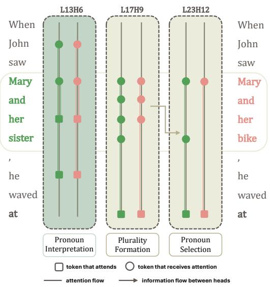  
Figure 1: Summary of our Plural Reference Circuit. We identify Pronoun Interpretation Head, where entities attend to previous mentions (he → John; her → Mary) Plurality Formation Head finds the plural construction that forms a plural entity and attends to them. In contexts where a plural entity is not preferred (Mary and her bike), attention to the plural construction is incomplete. Such representation is then sent to the Pronoun Selection Head, where the LLMs decide which pronoun to predict and attend to the corresponding antecedents.

On the other hand, entities of the same kind and linked by a conjunction are sometimes referred to using a singular pronoun when they create another object, as in Hook up the engine and the boxcar and send it to Avon (Cokal et al., 2023).

To study plural pronoun resolution, we use a combination of interpretability techniques, including activation patching, path patching (Vig et al. 2020; Geva et al., 2023; Wang et al., 2022), and attention pattern analysis (Wang et al., 2022; Tigges et al., 2023). We present the flow of information about plural reference across different model components (i.e., embeddings, attention heads) and throughout layers. We first use mechanistic interpretability techniques to find the attention heads that contribute to the LLMs’ choice of singular and plural pronouns. We then examine the attention pattern of these components to see what information is used to make the decision. We found a relatively small and dense circuit, consisting of three groups of heads that are responsible for (i) detecting and encoding plurality signal, (ii) routing this information to the last token position, (iii) identifying the antecedents and producing a plural pronoun to refer to them. A summary of the responsible heads and their functions is provided below.

• Pronoun Selection Heads function at the last token position. They attend to all of the discourse entities to be referenced by the plural/singular pronoun and directly affect the model's decision.

• Plurality Formation Heads identify the entities that form a plural entity and send information to the Pronoun Selection heads.

• Pronoun Interpretation Heads act as a representation for coreference information where tokens referring to the same entity attend to each other.

We also derive the following observations about how LLMs encode referential information and use it to refer back to previous entities: (1) LLMs’ attention concentrates on the entities that they refer to; (2) In accordance with previous psycholinguistic experiments, there are constraints on whether a set of entities is a good candidate for plural reference for LLMs. Firstly, LLMs prefer entities with similar ontological properties. For example, the conjoined noun phrase John and Mary is more likely to be represented as a plural entity than John and his bike. Secondly, preference for plurality is also affected by the linking conjunction. A plural entity is available if the conjunction is and (John and Mary) and less preferred when with is used (John with Mary).

## 2 Background and Related Work

In this section, we first survey literature on coreference resolution and, more specifically, plural reference. We then introduce mechanistic interpretability, on which our methodology is based. Finally, we provide a brief explanation about the Multi-Head Self-Attention mechanism, the component that we investigate throughout the paper.

## 2.1 Coreference Resolution

Identifying previously mentioned entities and referring to them is crucial in language interpretation (Poesio et al., 2023). There is an extensive body of research on building coreference resolution algorithms (Lee et al., 2017; Yu et al., 2020; Bohnet et al., 2023; Martinelli et al., 2024), benchmarking coreference systems (Pradhan et al., 2011; Luo and Pradhan, 2016; Recasens and Pradhan, 2016), and evaluating the capabilities of LLMs in resolving coreference (Le and Ritter, 2023; Upadhye et al., 2020; Schuster and Linzen, 2022; Lam et al., 2023; Gan et al., 2024). However, most work on evaluating coreference resolution systems is behavioral and mainly focuses on singular reference (Chen and Choi, 2016; Pradhan et al., 2011). Much less is known about how modern language models track plural entities throughout the discourse and retrieve them (Yu et al., 2020; Paun et al., 2023).

In this paper, we track LLMs' decision making process when they have to decide whether to predict a singular or plural pronoun using datasets built on previous psycholinguistic findings on plural reference processing. In the next section, we introduce the structure of plural entities and survey studies on how humans formulate and process plural reference.

## 2.2 Plural Reference

Plural reference is when a plural noun phrase refers to one or more entities. In the example mentioned above (i.e., John and Mary came to the shop. They bought some milk.), the pronoun they is used because the antecedents John and Mary are in a plural construction, created by linking the two mentions using the conjunction and. This is one way in which a plural entity can be established in discourse. However, the presence of the conjunction and does not always make a plural entity salient, and its absence does not always prevent the plural entity from being created. For example, it is possible to rephrase the above sentence as John came to the store with Mary. They bought some milk while still allowing plural reference (Clifton and Ferreira, 2016). (Cases where antecedents of a plural pronoun are not mentioned together within a conjunction are called split-antecedent plural reference.)

On the other hand, there are also several preferences as to whether the entities within a plural construction can be considered a plural entity. One of those is ontological similarity (Koh and Clifton Jr, 2002). If the entities in the plural construction belong to the same ontological category, they are more likely to be referred to as a plural entity, as found in psycholinguistic experiments. For example, consider the sentence Mary and her dog came to the shop. While the conjunction and is present and the two mentions are perfectly within a plural construction, it is cognitively easier to continue the sentence with She rather than They. The formation of a plural entity is more difficult when the two mentions are not ontologically similar. In this paper, we focus only on plural constructions that are conjoined noun phrases (e.g., John and Mary), where the two antecedents are connected by a conjunction and are in the same noun phrase.

In NLP, not much research has been done on how LLMs process plural reference. With respect to coreference ambiguity, Anh et al. (2025) use behavioral methods to study whether LLMs can recognize that a pronoun is ambiguous, meaning that there are multiple candidate referents. They found that LLMs’ responses are very sensitive to prompting approaches when they have to specify a referent for a pronoun or decide whether the pronoun is ambiguous, which suggests potential inconsistency in their internal knowledge and the ability to verbalize it. Liu et al. (2023) also find that LLMs are incapable of capturing the ambiguity of the pronoun. Given the gap in our understanding about whether LLMs actually recognize ambiguity and represent it, a natural next question would be: How do LLMs represent entities that they want to refer to, especially when a plural construction is introduced? We thus study the inner states of LLMs when they have to predict a pronoun to refer to entities in the plural construction using mechanistic interpretability methods, introduced in the next section.

## 2.3 Mechanistic Interpretability

Mechanistic interpretability (MI) is a very active line of work aiming to rigorously explain the inner workings of LLMs (Olah et al., 2020; Elhage et al., 2021). In high-level terms, it seeks to reverse engineer the computations of language models into human interpretable processes by attributing the prediction of the model to a sparse set of components at different levels of granularity (e.g., layers, attention heads, neurons). Activation patching or causal mediation analysis (Vig et al., 2020; Wang et al., 2022; Geva et al., 2023; Goldowsky-Dill et al., 2023; Meng et al., 2022; Geiger et al., 2021; Mueller et al., 2024) is one of the foundational techniques in MI. It is a method that allows for estimating the effect of a specific component on models’ prediction. Given an input sequence, by exchanging the activation of certain tokens that are critical for prediction with a corrupted activation and measuring how much the prediction has changed, activation patching can locate the components that directly or indirectly affect the output. This technique has been used to investigate a range of processes, from low-level behaviors such as factual knowledge retrieval (Meng et al., 2022; Geva et al., 2023), indirect object identification (Wang et al., 2022), entity tracking (Dai et al., 2024, 2026; Prakash et al., 2024), truthfulness representations (Marks and Tegmark, 2023), and the greater-than computation (Hanna et al., 2023) to more complex reasoning processes such as question-answering (Basu et al., 2025; Wiegreffe et al., 2025). MI techniques allow intervention on a wide range of model components. In this paper, we study the activity of attention heads, the component that is found to be responsible for capturing entity relations in previous studies. We briefly explain the attention mechanism in the next section.

## 2.4 Self-Attention Mechanism

We provide background on the architectural detail of the self-attention mechanism, the component that we exclusively focus on in this paper. We investigate auto-regressive Transformer-based LLMs (Vaswani et al., 2017). Given a sequence of input X consisting of n tokens $T = ( t _ { 0 } , t _ { 1 } , . . . , t _ { n - 1 } )$ , the model builds the representations xi of each token $t _ { i }$ at each layer l: $X ^ { l } = ( \mathbf { x } _ { 0 } ^ { l } , \mathbf { x } _ { 1 } ^ { l } , . . . , \mathbf { x } _ { n - 1 } ^ { l } )$ . At layer $l ,$ the representation $X ^ { l }$ is processed by a Multi-head self-attention module (MHSA) and an MLP module. The output resulting from both operations is written in the residual stream (Elhage et al., 2021), which serves as the channel of information flow across the model components.

The MHSA modules weigh the importance of each token to each other. Each head assigns a set of attention weights for each pair of tokens. The output of a head is computed using the Key (K), Query (Q) and Value (V) vectors (Elhage et al., 2021). For a pair of tokens $( t _ { i } , t _ { j } )$ , the attention weight from the current token $t _ { j }$ to a previous token $t _ { i }$ is computed using the $Q K$ matrix. The OV matrix at token $t _ { j }$ decides what information of $\mathbf { x } _ { j }$ is written to the residual stream. The QK and OV circuits operate independently from each other.

Recent LLMs such as the Qwen3 (Yang et al., 2025) and L1ama3.2 (Grattafiori et al., 2024) model families are trained using grouped-query attention (Ainslie et al., 2023). In the original MHSA architecture, every query head has distinct key and value matrices. GQA reduces the computation cost by having multiple query heads share the same keyvalue head. Since we focus on these model families in our paper, we use GQA in our explanation of the MHSA module.

Let h denote the attention (Q) head and k denote the key-value (KV) head. Under GQA, each query head h is assigned to a KV head. The projection matrices are defined as follows: $\mathbf { W } _ { Q } ^ { h } \in$ Rdmodel×dhead and $\mathbf { W } _ { \mathcal { O } } ^ { h } \ \in \ \mathbb { R } ^ { d _ { \mathrm { h e a d } } \times d _ { \mathrm { m o d e l } } }$ are unique to each query head $h ,$ while $\mathbf { W } _ { K } ^ { k } \in \mathbb { R } ^ { d _ { \mathrm { m o d e l } } \times \hat { d _ { \mathrm { h e a d } } } }$ and $\mathbf { W } _ { V } ^ { k } \in \mathbb { R } ^ { d _ { \mathrm { m o d e l } } \times d _ { \mathrm { h e a d } } }$ are shared across all query heads assigned to KV head k. The Key $( \mathbf { k } _ { i } ^ { k } )$ , Query $( \mathbf { q } _ { j } ^ { h } )$ ), and Value $( \mathbf { v } _ { i } ^ { k } )$ vectors are calculated as follows.

$$
\mathbf { v } _ { i } ^ { k } = \mathbf { W } _ { V } ^ { k } \mathbf { x } _ { i } , \mathbf { k } _ { i } ^ { k } = \mathbf { W } _ { K } ^ { k } \mathbf { x } _ { i } , \mathbf { q } _ { j } ^ { h } = \mathbf { W } _ { Q } ^ { h } \mathbf { x } _ { j }
$$

The model calculates the attention weight from the current token $t _ { j }$ to a previous token $t _ { i } ,$ denoted by $\alpha _ { t _ { j } , t _ { i } }$ , by passing the dot product of the query (Q) at $t _ { j }$ and key (K) vector at $t _ { i }$ through a softmax.

$$
\alpha _ { j i } = \mathrm { s o f t m a x } \left( \frac { \mathbf { x } _ { j } ^ { \top } \mathbf { W } _ { Q } ^ { \top } \mathbf { W } _ { K } \mathbf { x } _ { i } } { \sqrt { d _ { \mathrm { h e a d } } } } \right)
$$

The intermediate output of the query head $h$ at $t _ { j }$ denoted by $\mathbf { z } _ { j } ^ { h }$ , is the linear combination of value vectors and the attention pattern across all attended positions:

$$
\mathbf { z } _ { j } ^ { h } = \sum _ { i = 0 } ^ { j } \alpha _ { j i } ^ { h } \mathbf { v } _ { i } ^ { k }
$$

Through the OV circuit, $\mathbf { z } _ { j } ^ { h }$ is projected and written to the residual stream.

$$
\mathbf { o } _ { j } ^ { h } = \mathbf { z } _ { j } ^ { h } \mathbf { W } _ { O } ^ { h }
$$

The output of the attention module $\mathbf { a } _ { j } ^ { l }$ is the sum of $\mathbf { o } _ { j } ^ { h }$ across all attention heads.

## 3 Dataset and Evaluation

## 3.1 Task Description

We design a pronoun prediction task to trigger LLMs' mechanism for plural reference resolution. Given the sentence prefix When John saw Mary and her sister, he waved at . The model may produce her to refer to Mary or Mary's sister. Or the pronoun them can be used to refer to the group of Mary and her sister.

## 3.2 Dataset

We generate two synthetic datasets of sentence prefixes for our experiment. The first dataset $( D _ { p l } )$ includes sentence prefixes that introduce plural entities and expect the LLMs to predict a plural pronoun [1]. The second dataset $( D _ { s g } )$ also introduces a plural construction, but a plural pronoun is dispreferred [2]:

[1] When John saw Mary and her sister, he waved at

[2] When John saw Mary and her bike, he waved at

For each sentence prefix $s _ { p l } \in D _ { p l }$ , there are several discourse entities, namely the subject John (s), Mary $( e _ { 1 } )$ , and her sister $( e _ { 2 } )$ . The plural construction consists of three elements, which are Mary $( e _ { 1 } )$ and her sister $\left( e _ { 2 } \right)$ and is formed by the conjunction and (c). The plural construction can be formalized as a tuple of $( e _ { 1 } , c , e _ { 2 } )$ . Since $e _ { 1 }$ and $e _ { 2 }$ form a plural entity, the plural pronoun them $( r _ { p l } )$ is more likely to be used. However, it should be noted that in this context, a singular pronoun (e.g., her) is also a plausible continuation.

In $D _ { s g }$ , we expect LLMs to predict a singular pronoun while retaining the original structure. We replace the second element of the plural construction (e2) with an inanimate entity $e _ { 2 } ^ { ' }$ (her bike) while keeping the rest of the sentence prefix unchanged. We carefully select a set of verbs that are not compatible with inanimate entities (e.g., laughed at, nodded at) so that it is semantically infelicitous to produce a plural pronoun. As such, the model is expected to generate a singular reference $( r _ { s g } )$ , referring only to Mary $( e _ { 1 } )$

We generated 300 prefixes for each dataset. All entities are single-token and all prefixes are equal in length. The gender of the entities is always randomized. For example, the subject s can be either male or female and $e _ { 1 }$ and $e _ { 2 }$ may have the same or different gender. See Table 4 for information on our templates.

## 3.3 Evaluation

Before finding the mechanism for plural reference resolution, we test how LLMs perform the pronoun prediction task. We are particularly interested in their preference in choosing the pronoun when a plural construction is present, especially with different gender, ontological similarity (Clifton and Ferreira, 2016), and also linking conjunctions (Moxey et al., 2012). We use $D _ { p l - s g }$ to indicate the probability difference between the plural and singular pronoun, and introduce three variables:

• Gender: $e _ { 1 }$ and $e _ { 2 }$ can have the same or different gender: (Mary, and, Emma), (Mary, and, John)

• Ontological Similarity: $e _ { 1 }$ and $e _ { 2 }$ antecedents have the same or different ontological properties. We consider here three levels of similarity, based on noun type (proper or common) and animacy (animate or inanimate): (Mary, and, Emma) > (Mary, and, her sister) > (Mary, and, her bike)

• Conjunction: The conjunction linking $e _ { 1 }$ and e2 can be and (Mary, and, Emma) or with (Mary, with, Emma). Previous psycholinguistic studies show that the conjunction with 2 decreases the preference for choosing a plural pronoun over a singular one (Moxey et al. 2004, 2012; Albrecht and Clifton, 1998; Sanford and Lockhart, 1990).

Fitting Linear Mixed-Effect Regression models to estimate the effect of these three variables on the probability difference between $r _ { s g }$ and $r _ { p l }$ $( D _ { p l - s g } )$ , we replicate the effects of ontological similarity and conjunction that are expected from the psycholinguistic literature. The less ontologically similar the two antecedents are, the less likely they are to be referred to as a plural entity. In addition, a plural pronoun is less preferred when the antecedents are linked by with, compared to and. (See Appendix B for detailed results for all investigated models.)

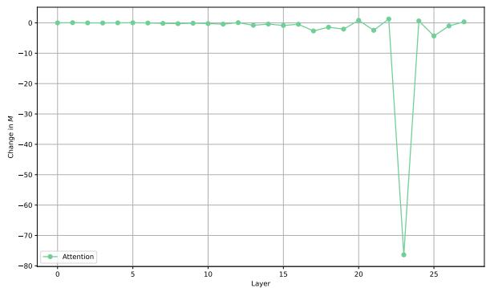  
Figure 2: Layer-wise direct effect of MHSA modules on M

This analysis guided our patching experiment, as we chose the type of plural construction that does not always trigger the formation of plural reference. The motivation behind our choice is the similarity in structure and token length between $s _ { p l }$ and $\mathit { s } _ { \mathit { s g } }$ As such, to ensure the validity of the patching results, we extract the prediction for $D _ { p l }$ and only retain the prompts where the model predicts the plural pronoun.

## 4 Experimental Setup

Experiment We use a combination of activation patching and path patching in our experiment. Activation patching intervenes on a component $C$ while allowing all downstream components to be affected. It measures the indirect effect of $C$ on the output. Path patching involves another step, restoring the activations of all downstream components to their original values (Wang et al., 2022; Goldowsky-Dill et al., 2023; Meng et al., 2022). The goal is to isolate the direct effect of that component. If path patching causes a decrease in $P _ { p l }$ , the direct effect can be attributed to that component (Pearl, 2022).

To perform path patching on the component $C ,$ which can be high-level units such as the residual stream of a specific layer $( \mathbf { x } _ { i } ^ { l } )$ or lower-level ones such as the value vector of a specific token at a head $( \mathbf { v } _ { i } ^ { h } )$ , we perform the following steps.

• Original Run Pass $s _ { p l }$ to the model and record the original probability of the plural

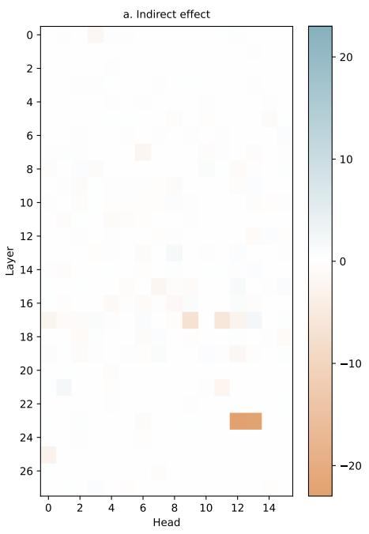

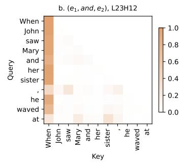

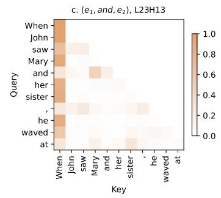

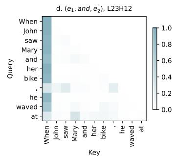

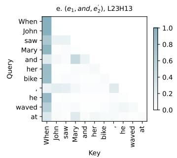  
Figure 3: Overview of intervention results and attention pattern visualizations of major heads. (a) Indirect effect of individual head intervention across layers. Brown values denote negative change in $P _ { p l }$ . (b) and (c) Attention pattern of Pronoun Selection heads for $D _ { p l }$ (brown). (d) and (e) Attention pattern of Pronoun Selection heads (L23H12 and L23H13) for $D _ { s g }$ (blue).

pronoun $P _ { p l , o r i } .$

• Corrupted Run Run a forward pass through $s _ { s g }$ then cache the activations of all token positions at each layer $( \mathbf { X } ^ { l } )$

• Intervened Run Replace the activation of $C$ at position i with that at the corresponding position of $s _ { s g }$ , restore the activations of all upstream components to their clean values to block any indirect propagation of the corrupted signal through the network, run the forward pass through $s _ { p l }$ again, and recompute $P _ { p l , i n t e r } .$

By patching, we intentionally replace the attention output of the patched token with that of the corrupted prompt (e2), where the second mention is an entity that is less likely to be referred to together with the first. If there is a set of heads that is responsible for searching for the antecedent to be referenced, intervening on its attention output would lead to a change in prediction. As such, if intervening on a specific head causes $P _ { p l }$ to decrease after intervention, it can be causally inferred that it is one of the heads responsible for pronoun resolution.

Constructing Corrupted Prompts Our regression models show that ontological similarity and conjunction significantly affect the preference to choose a plural pronoun. We treat them as crucial factors that either enhance or corrupt the plurality signal. As such, we use two corrupted prompts, manipulating either $e _ { 2 }$ or c: $( e _ { 1 } , \mathbf { c } , e _ { 2 } ^ { \prime } )$ and $( e _ { 1 } , c ^ { \prime } ;$ $e _ { 2 } )$

Intervening Location For each component, we run the intervention at multiple positions, spanning from the last token up to the position of the corrupted token. We find that only the intervention on the last token and corrupted token $( e _ { 2 }$ and c) show a considerable effect. As such, all the findings presented in the following sections arise from intervening on these two positions.

Metrics We measure the effect of the intervention by calculating how much $P _ { p l }$ changes after the intervention. We define the evaluation metric M as the percentage of probability difference between $P _ { p l , o r i }$ and $P _ { p l , i n t e r }$ . Negative values of M mean that the intervention suppresses the plurality signal and thus decreases $P _ { p l }$

$$
M = \left( { \frac { P _ { \mathrm { p l , i n t e r } } - P _ { \mathrm { p l , o r i } } } { P _ { \mathrm { p l , o r i } } } } \right) \times 1 0 0 
$$

Models We patch on different sizes of the Qwen3   
family (Qwen3-0.6B, Qwen3-1.7B) and GPT2

(GPT2-medium). We present in the main text the circuit of Qwen3-1. 7B. Comparable results of other models can be found in Appendix E.

## 5 The Plural Reference Circuit

In this section, we present our findings of the coreference circuit, including the core components and their functionalities. We first performed path patching on the MHSA module at the layer level to find the layers that directly affect $P _ { p l }$ (Figure 2). We then proceed to patch the components comprising them, namely the individual attention heads. We run activation patching on each attention head to estimate their indirect effects on the MHSA module at Layer 23. As we patch at each position, we select the set of heads that cause the largest decrease in probability of the plural pronoun (Figure 3a).

Pronoun Selection Heads identify candidate antecedents Figure 2 shows that the MHSA module at Layer 23 is the only one that directly affects the output. With activation patching, we find that heads 12 and 13 of layer 23 (hereafter L23H12 and L23H13) have the strongest effect on M and are both responsible for the prediction process of the pronoun. As the first step toward understanding the function of these heads, we investigate their attention weights. Figure 3b (top, middle) shows the mean attention weight of L23H12 across all prefixes in $D _ { p l }$ . It can be seen that the last token (at) attends the most to the first $( e _ { 1 } )$ and second entity (e2) in the plural condition, which implies that they are considered to be the antecedents of $r _ { p l }$ . Notably, we observe that $e _ { 2 }$ receives more attention than $e _ { 1 }$ In $D _ { s g }$ (Figure 3d), we observe that the attention weight is given to $e _ { 1 }$ , which is the antecedent of the singular pronoun.

On the other hand, at L23H13 (Figure 3c), while the attention to both antecedents is still present, we also see a very high attention weight between the conjunction and and $e _ { 1 }$ . These attention patterns at these heads suggest a strong focus on the elements that are crucial for plural reference resolution, namely antecedents and conjunctions.

These attention patterns suggest that L23H12 and L23H13 might be called the Pronoun Selection heads: they identify the antecedents to be referred to by the pronoun. In a correlation experiment $( \mathsf { A p - }$ pendix C), we found that the amount of attention difference between $e _ { 1 }$ and $e _ { 2 }$ positively correlates with the probability difference between $P _ { s g }$ and $P _ { p l } .$ , such that the larger the attention on $e _ { 2 }$ compared to $e _ { 1 }$ , the larger the difference between $P _ { p l }$ and $P _ { s g }$ . This type of head is similar to the Name Mover Head found in Wang et al. (2022) and other MI studies (Prakash et al., 2024; Kim et al., 2025; Lieberum et al., 2023), which identifies and encodes the decisive information for prediction.

Plurality Formation Heads send information about the plural entity to Pronoun Selection Heads We just saw how the Pronoun Selection Heads affect the prediction by attending to the discourse entities that are the candidate antecedents of the predicted pronoun. We now ask what makes the model attend more to $e _ { 2 }$ in $s _ { p l }$ . To answer this question, we decompose the effect of the $K , Q .$ and $V$ vectors of the Pronoun Selection head. Since the attention weight is computed using the dot product of the vectors K and $Q ,$ we first identify which is more crucial for prediction. We run separate interventions on these vectors and measure M. For the $Q$ vector, we patch at the last token position, because here it decides which token it needs to attend to. For the K and V vectors, we patch at $e _ { 2 } .$ where information is offered to the query vector. We found that the Q vector does not affect the prediction, while patching the K and V vectors causes a strong drop in $P _ { p l }$

Next, we ask which head affects the Value vector of the Pronoun Selection head. We intervene on the path between the V vector of the Pronoun Selection head and other $K / V$ heads. The value vector at e2 $( \mathbf { v } _ { e _ { 2 } } ^ { k } )$ is replaced with $\mathbf { v } _ { e _ { 2 } ^ { \prime } } ^ { \prime k }$ from $D _ { s g }$ . The output $\mathbf { o _ { j } ^ { \prime } } ^ { \mathbf { h } }$ of head $h$ after the intervention is updated as follows.

$$
\mathbf { z } _ { j } ^ { \prime h } = \sum _ { i = 0 } ^ { j } \alpha _ { j , e _ { 2 } } ^ { h } \mathbf { v } _ { \small { e _ { 2 } ^ { \prime } } } ^ { \prime k } ; \qquad \mathbf { o } _ { j } ^ { \prime h } = \mathbf { z } _ { j } ^ { \prime h } \mathbf { W } _ { O } ^ { h }
$$

Figure 5 shows that some $K / V$ heads at layers 15, 17, 19, and 21 directly affect the Value vector of $e _ { 2 }$ at the Pronoun Selection head, which suggests that it reads information from these components. Figure 3 shows that these heads also indirectly affect $P _ { p l }$ . We inspect the attention pattern of the attention heads that are associated with these $K / V$ heads to find what information they offer to the $V$ vector of $e _ { 2 }$ . Among these heads, L17H9 has the strongest effect on the Pronoun Selection head. Figure 4 shows the attention pattern of L17H9 for $D _ { p l , a } , D _ { s g , a }$ and $D _ { p l , w }$ . For the sake of comparison, we incorporate the type of conjunction into the datasets, a stands for and and w stands for with.

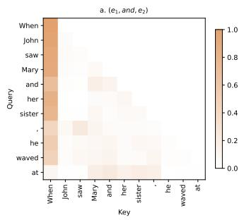

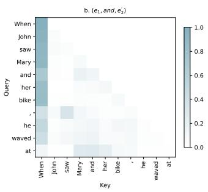

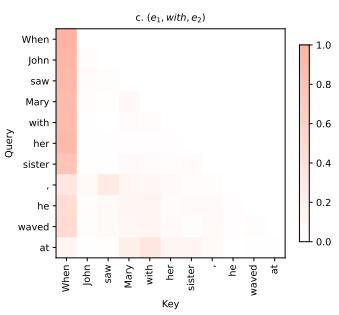

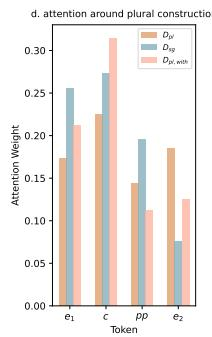  
Figure 4: Attention Pattern of Plurality Formation Head for $D _ { p l , a } , D _ { s g , a } ,$ and $D _ { p l , w } \ \left( \mathbf { a } \right)$ , (b) and (c): Attention pattern of the Plurality Formation head for $D _ { p l , a } , D _ { s g , a } .$ and $D _ { p l , w }$ (d) Numerical values of attention weights on each token in the plural construction, where $e _ { 1 }$ and $e _ { 2 }$ are the two entities, c is the conjunction and pp is the possessive pronoun of $e _ { 2 }$

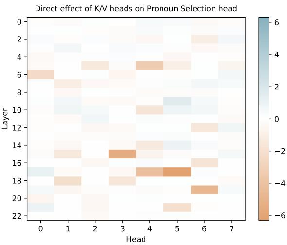  
Figure 5: Direct effect of K/V heads on Pronoun Selection head, measured by change in M

In the case of $D _ { p l , a }$ , the last token at attends to the whole plural construction, with slightly more attention on c and $e _ { 2 }$ (Figure 4a). This behavior is quite different from the attention pattern of the Pronoun Selection head, where the attention weights are only dominant at $e _ { 1 }$ and the second token of $e _ { 2 }$ For $D _ { s g , a }$ (Figure 4b), it only assigns attention weights up to the possessive pronoun of $e _ { 2 }$ (her). Interestingly, when the conjunction with is present, the attention is only on $e _ { 1 }$ and $c .$ The attention weight amount on $e _ { 2 }$ is almost negligible (Figure 4c). This result is compatible with our earlier statistical analysis of the conjunction effect, which shows that the LLMs are much more likely to establish a plural entity from a plural construction when the conjunction is and rather than with. Taken together, these patterns suggest that this head is trying to find the set of entities to be referenced by selectively attending to the tokens that fit the constraints for a plural entity. It attends to the whole plural construction when it is a qualified plural entity. We hypothesize that it is responsible for constructing, representing, and writing the information about the plural entity to the Pronoun Selection heads.

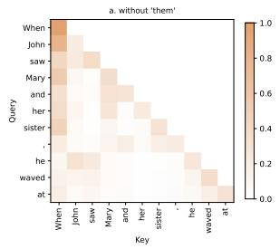

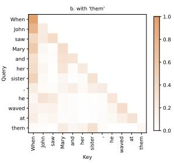  
Figure 6: Attention Pattern of Pronoun Interpretation head. (a) attention pattern of L13H6 for $s _ { p l }$ , (b) attention pattern of head L13H6 for $s _ { p l } + t h e m$

In addition, in Figures 4a and 4b, where the conjunction and is used, it attends to $e _ { 1 }$ , similar to what we observe in one of the Pronoun Selection heads. This behavior is not present when with is used (Figure 4c). In Figure 7, we compare the attention pattern of $D _ { p l , w }$ at the Pronoun Selection head (Figure 7a) and the Plurality Formation head (Figure 7b). We found that while with does not attend to $e _ { 1 }$ at the Plurality Formation head, it still attends to $e _ { 1 }$ at the Pronoun Selection head. There is evidence that some attention heads encode grammatical dependencies (Voita et al., 2019; Htut et al., 2019; Clark et al., 2019). Therefore, we speculate that the attention from with to $e _ { 1 }$ is purely syntactic at the Pronoun Selection head and is not directly related to the process of identifying plural entities.

Pronoun Interpretation Heads encode coreference information of previous tokens Finally, we find a head that encodes coreference information. This head affects around 25% of the probability difference. When the token is a pronoun, it attends to the antecedent of the pronoun that was mentioned earlier in the input. In Figure 6a, it can be seen that her attends to Mary and he attends to John. To verify how this head behaves when there is a plural pronoun, we add them to the prompt and inspect the attention pattern (Figure 6b). It can be seen that them attends to the whole plural construction (Mary, and, her sister), with much stronger attention on $e _ { 2 }$ (sister) and the conjunction and. We hypothesize that while this head may not play a direct role in predicting the pronoun, it functions as a coreference map, where every entity attends to its previous mentions. This head was also discovered in earlier studies on the attention pattern of language models (Clark et al., 2019; Tenney et al., 2019).

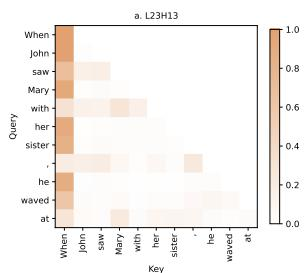

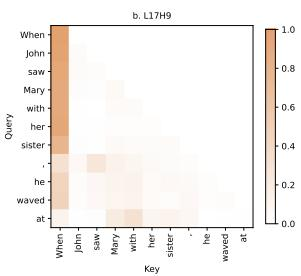  
Figure 7: Comparing attention pattern of the Pronoun Selection head and the Plurality Formation head. (a) attention pattern of L23H13 for $s _ { p l , w } .$ (b) attention pattern of head L17H9 for $s _ { p l , w }$

Generalization to other models We validate our circuit across other sentence templates and observe the same attention pattern across all heads in the circuit for the variant. We also extract the circuit for other models and find that the circuit generalizes within the Qwen3 family and also to GPT2-medium (Appendix E).

## 6 Discussion

Our patching experiments reveal a mechanism for performing the plural pronoun prediction task. In the middle layers, the model first builds up the representation for an entity or a group of entities that it needs to refer back to. At the Plurality Formation head, the last token before reference production assigns attention weights spanning the phrase that contains the candidate entities. If the entities align with the model's preference for plural entities (being ontologically related and connected by a preferred conjunction), they will be attended to. After deciding on the entity or a set of entities to be referenced, the Plurality Formation heads write this information into the residual stream. The Pronoun Selection head receives this information, attends to the known entities, and uses it for making decisions. In addition, the models dedicate a head for encoding coreference information of all mentioned entities.

## 7 Conclusion

In this paper, we investigate how LLMs represent and use coreference information for pronoun prediction, especially in the case of plural reference. We find the constraints that LLMs use to decide whether to use a singular or a plural pronoun when a plural construction is present. We then use mechanistic interpretability methods, complemented by attention pattern analysis, to extract a circuit that is responsible for identifying the entities to be referred to and propagating such information across components to generate the correct pronoun.

## Limitations

Our study only focuses on the most basic and common type of plural reference (conjoined noun phrases) and plural constructions that have two elements. In actual language use, plural reference is often more complex and the antecedents may not be linked by a conjunction (e.g., split-antecedent reference). Psycholinguistic studies have shown that it is possible and preferred to use a singular pronoun to refer to a plural entity when the antecedents create a new and unified object (Cokal et al., 2023). It would be interesting to study the model's circuit behavior in these cases.

In addition, since our goal is to understand the high-level mechanism behind the process of pronoun prediction, we focus more on analyzing the function of each component than extracting a complete circuit for coreference. As such, there is still uncertainty about whether the circuit is fully unique to coreference. We also do not thoroughly investigate the function of MLPs. Although we show that intervening on the MLP module at the late layer strongly affects $P _ { p l }$ , we know little about its functionality in the circuit.

## 8 Ethical Considerations

The study only uses synthetic datasets generated by LLMs. It does not include any personal data from

human participants.

## 9 Statement of AI Usage

During the project, AI was used for coding assistance, dataset generation, and spelling check. Project ideas, experimental setup, interpretation, and writing were done by the authors.

## 10 Acknowledgments

We would like to thank three anonymous reviewers for their insightful comments and suggestions. This project is funded by the Dutch Research Council (NWO) through the AiNed Fellowship Grant (Dealing with Meaning Variation, NGF.1607.22.002) to Massimo Poesio.

## References

Joshua Ainslie, James Lee-Thorp, Michiel De Jong, Yury Zemlyanskiy, Federico Lebrón, and Sumit Sanghai. 2023. Gqa: Training generalized multi-query transformer models from multi-head checkpoints. In Proceedings of the 2023 Conference on Empirical Methods in Natural Language Processing, pages 4895–4901.

Jason E Albrecht and Charles Clifton. 1998. Accessing singular antecedents in conjoined phrases. Memory & cognition, 26(3):599–610.

Dang Thi Thao Anh, Rick Nouwen, and Massimo Poesio. 2025. Can llms detect ambiguous plural reference? an analysis of split-antecedent and mereological reference. In Proceedings of the 8th BlackboxNLP Workshop: Analyzing and Interpreting Neural Networks for NLP, pages 263–275.

Samyadeep Basu, Vlad Morariu, Zichao Wang, Ryan Rossi, Cherry Zhao, Soheil Feizi, and Varun Manjunatha. 2025. On mechanistic circuits for extractive question-answering. arXiv preprint arXiv:2502.08059.

Leonard Bereska and Efstratios Gavves. 2024. Mechanistic interpretability for ai safety-a review. arXiv preprint arXiv:2404.14082.

Bernd Bohnet, Chris Alberti, and Michael Collins. 2023. Coreference resolution through a seq2seq transitionbased system. Transactions of the Association for Computational Linguistics, 11:212–226.

Yu-Hsin Chen and Jinho D Choi. 2016. Character identification on multiparty conversation: Identifying mentions of characters in tv shows. In Proceedings of the 17th annual meeting of the special interest group on discourse and dialogue, pages 90–100.

Kevin Clark, Urvashi Khandelwal, Omer Levy, and Christopher D Manning. 2019. What does bert look

at? an analysis of bert's attention. In Proceedings of the 2019 ACL workshop BlackboxNLP: analyzing and interpreting neural networks for NLP, pages 276-286.

Charles Clifton and Fernanda Ferreira. 2016. Discourse structure and anaphora: Some experimental results. In Attention and performance XII, pages 635–654. Routledge.

Derya Cokal, Ruth Filik, Patrick Sturt, and Massimo Poesio. 2023. Anaphoric reference to mereological entities. Discourse Processes, 60(3):202–223.

Qin Dai, Benjamin Heinzerling, and Kentaro Inui. 2024. Representational analysis of binding in language models. In Proceedings of the 2024 Conference on Empirical Methods in Natural Language Processing, pages 17468–17493.

Qin Dai, Benjamin Heinzerling, and Kentaro Inui. 2026. Cell-based representation of relational binding in language models. In Proceedings of the 64th Annual Meeting of the Association for Computational Linguistics (Volume 1: Long Papers), pages 47464– 47524.

Nelson Elhage, Neel Nanda, Catherine Olsson, Tom Henighan, Nicholas Joseph, Ben Mann, Amanda Askell, Yuntao Bai, Anna Chen, Tom Conerly, and 1 others. 2021. A mathematical framework for transformer circuits. Transformer Circuits Thread, 1(1):12.

Javier Ferrando, Gabriele Sarti, Arianna Bisazza, and Marta R Costa-Jussà. 2024. A primer on the inner workings of transformer-based language models. arXiv preprint arXiv:2405.00208.

Yujian Gan, Massimo Poesio, and Juntao Yu. 2024. Assessing the capabilities of large language models in coreference: An evaluation. In Proceedings of the 2024 Joint International Conference on Computational Linguistics, Language Resources and Evaluation (LREC-COLING 2024), pages 1645–1665, Torino, Italia. ELRA and ICCL.

Atticus Geiger, Hanson Lu, Thomas Icard, and Christopher Potts. 2021. Causal abstractions of neural networks. Advances in neural information processing systems, 34:9574–9586.

Mor Geva, Jasmijn Bastings, Katja Filippova, and Amir Globerson. 2023. Dissecting recall of factual associations in auto-regressive language models. In Proceedings of the 2023 Conference on Empirical Methods in Natural Language Processing, pages 12216–12235.

Nicholas Goldowsky-Dill, Chris MacLeod, Lucas Sato, and Aryaman Arora. 2023. Localizing model behavior with path patching. arXiv preprint arXiv:2304.05969.

Aaron Grattafiori, Abhimanyu Dubey, Abhinav Jauhri, Abhinav Pandey, Abhishek Kadian, Ahmad Al-Dahle, Aiesha Letman, Akhil Mathur, Alan Schelten,

Alex Vaughan, and 1 others. 2024. The llama 3 herd of models. arXiv preprint arXiv:2407.21783.

Michael Hanna, Ollie Liu, and Alexandre Variengien. 2023. How does gpt-2 compute greater-than?: Interpreting mathematical abilities in a pre-trained language model. Advances in Neural Information Processing Systems, 36:76033–76060.

Phu Mon Htut, Jason Phang, Shikha Bordia, and Samuel R Bowman. 2019. Do attention heads in bert track syntactic dependencies? arXiv preprint arXiv:1911.12246.

Geonhee Kim, Marco Valentino, and André Freitas. 2025. Reasoning circuits in language models: A mechanistic interpretation of syllogistic inference. In Findings of the Association for Computational Linguistics: ACL 2025, pages 10074–10095.

Sungryong Koh and Charles Clifton Jr. 2002. Resolution of the antecedent of a plural pronoun: Ontological categories and predicate symmetry. Journal of Memory and Language, 46(4):830–844.

Suet-Ying Lam, Qingcheng Zeng, Kexun Zhang, Chenyu You, and Rob Voigt. 2023. Large language models are partially primed in pronoun interpretation. In Findings of the Association for Computational Linguistics: ACL 2023, pages 9493–9506.

Nghia T Le and Alan Ritter. 2023. Are large language models robust coreference resolvers? arXiv preprint arXiv:2305.14489.

Kenton Lee, Luheng He, Mike Lewis, and Luke S. Zettlemoyer. 2017. End-to-end neural coreference resolution. In Proc. of EMNLP.

Tom Lieberum, Matthew Rahtz, János Kramár, Neel Nanda, Geoffrey Irving, Rohin Shah, and Vladimir Mikulik. 2023. Does circuit analysis interpretability scale? evidence from multiple choice capabilities in chinchilla. arXiv preprint arXiv:2307.09458.

Alisa Liu, Zhaofeng Wu, Julian Michael, Alane Suhr, Peter West, Alexander Koller, Swabha Swayamdipta, Noah A Smith, and Yejin Choi. 2023. We're afraid language models aren't modeling ambiguity. In Proceedings of the 2023 conference on empirical methods in natural language processing, pages 790–807.

Xiaoqiang Luo and Sameer Pradhan. 2016. Evaluation metrics. In Massimo Poesio, Roland Stuckardt, and Yannick Versley, editors, Anaphora Resolution: Algorithms, Resources and Applications, pages 147–170. Springer.

Samuel Marks and Max Tegmark. 2023. The geometry of truth: Emergent linear structure in large language model representations of true/false datasets. arXiv preprint arXiv:2310.06824.

Giuliano Martinelli, Edoardo Barba, and Roberto Navigli. 2024. Maverick: Efficient and accurate coreference resolution defying recent trends. In Proceedings

of the 62nd Annual Meeting of the Association for Computational Linguistics (Volume 1: Long Papers), pages 13380–13394.

Kevin Meng, David Bau, Alex Andonian, and Yonatan Belinkov. 2022. Locating and editing factual associations in gpt. Advances in neural information processing systems, 35:17359–17372.

Linda M Moxey, Anthony J Sanford, Patrick Sturt, and Lorna I Morrow. 2004. Constraints on the formation of plural reference objects: The influence of role, conjunction, and type of description. Journal of Memory and Language, 51(3):346–364.

Linda M Moxey, Anthony J Sanford, and Karen Tonks. 2012. Representing characters in a scenario: What makes two individuals a set?Language and cognitive processes, 27(9):1405–1424.

Aaron Mueller, Jannik Brinkmann, Millicent Li, Samuel Marks, Koyena Pal, Nikhil Prakash, Can Rager, Aruna Sankaranarayanan, Arnab Sen Sharma, Jiuding Sun, and 1 others. 2024. The quest for the right mediator: A history, survey, and theoretical grounding of causal interpretability. arXiv e-prints, pages arXiv-2408.

Chris Olah, Nick Cammarata, Ludwig Schubert, Gabriel Goh, Michael Petrov, and Shan Carter. 2020. Zoom in: An introduction to circuits. Distill, 5(3):e00024– 001.

Nikole D Patson. 2014. The processing of plural expressions. Language and Linguistics Compass, 8(8):319– 329.

Silviu Paun, Juntao Yu, Nafise Sadat Moosavi, and Massimo Poesio. 2023. Scoring coreference chains with split-antecedent anaphors. Dialogue & Discourse, 14:1–48.

Judea Pearl. 2022. Direct and indirect effects. In Probabilistic and causal inference: the works of Judea Pearl, pages 373–392.

Massimo Poesio, Juntao Yu, Silviu Paun, Abdulrahman Aloraini, Pengcheng Lu, Janosch Haber, and Derya Cokal. 2023. Computational models of anaphora. Annual Review of Linguistics, 9:561–587.

Sameer Pradhan, Lance Ramshaw, Mitch Marcus, Martha Palmer, Ralph Weischedel, and Nianwen Xue. 2011. Conll-2011 shared task: Modeling unrestricted coreference in ontonotes. In Proceedings of the fifteenth conference on computational natural language learning: shared task, pages 1–27.

Nikhil Prakash, Tamar Rott Shaham, Tal Haklay, Yonatan Belinkov, and David Bau. 2024. Fine-tuning enhances existing mechanisms: A case study on entity tracking. arXiv preprint arXiv:2402.14811.

Marta Recasens and Sameer Pradhan. 2016. Evaluation campaigns. In Massimo Poesio, Roland Stuckardt, and Yannick Versley, editors, Anaphora Resolution:

Algorithms, Resources and Applications, chapter 6, pages 165–208. Springer.

Anthony J Sanford and F Lockhart. 1990. Description types and method of conjoining as factors influencing plural anaphora: A continuation study of focus. Journal of Semantics, 7(4):365–378.

Sebastian Schuster and Tal Linzen. 2022. When a sentence does not introduce a discourse entity, transformer-based models still sometimes refer to it. In Proceedings of the 2022 Conference of the North American Chapter of the Association for Computational Linguistics: Human Language Technologies, pages 969–982.

Ian Tenney, Dipanjan Das, and Ellie Pavlick. 2019. Bert rediscovers the classical nlp pipeline. In Proceedings of the 57th annual meeting of the association for computational linguistics, pages 4593–4601.

Curt Tigges, Oskar John Hollinsworth, Atticus Geiger, and Neel Nanda. 2023. Linear representations of sentiment in large language models. arXiv preprint arXiv:2310.15154.

Shiva Upadhye, Leon Bergen, and Andrew Kehler. 2020. Predicting reference: What do language models learn about discourse models? In Proceedings of the 2020 Conference on Empirical Methods in Natural Language Processing (EMNLP), pages 977–982.

Ashish Vaswani, Noam Shazeer, Niki Parmar, Jakob Uszkoreit, Llion Jones, Aidan N Gomez, Łukasz Kaiser, and Illia Polosukhin. 2017. Attention is all you need. Advances in neural information processing systems, 30.

Jesse Vig, Sebastian Gehrmann, Yonatan Belinkov, Sharon Qian, Daniel Nevo, Yaron Singer, and Stuart Shieber. 2020. Investigating gender bias in language models using causal mediation analysis. Advances in neural information processing systems, 33:12388– 12401.

Elena Voita, David Talbot, Fedor Moiseev, Rico Sennrich, and Ivan Titov. 2019. Analyzing multi-head self-attention: Specialized heads do the heavy lifting, the rest can be pruned. In Proceedings of the 57th annual meeting of the association for computational linguistics, pages 5797–5808.

Kevin Wang, Alexandre Variengien, Arthur Conmy, Buck Shlegeris, and Jacob Steinhardt. 2022. Interpretability in the wild: a circuit for indirect object identification in gpt-2 small. arXiv preprint arXiv:2211.00593.

Sarah Wiegreffe, Oyvind Tafjord, Yonatan Belinkov, Hanna Hajishirzi, and Ashish Sabharwal. 2025. Answer, assemble, ace: Understanding how lms answer multiple choice questions. In International Conference on Learning Representations, volume 2025, pages 78293–78318.

An Yang, Anfeng Li, Baosong Yang, Beichen Zhang, Binyuan Hui, Bo Zheng, Bowen Yu, Chang Gao, Chengen Huang, Chenxu Lv, and 1 others. 2025. Qwen3 technical report. arXiv preprint arXiv:2505.09388.

Juntao Yu, Nafise Sadat Moosavi, Silviu Paun, and Massimo Poesio. 2020. Free the plural: Unrestricted split-antecedent anaphora resolution. In Proceedings of the 28th International Conference on Computational Linguistics, pages 6113–6125.

## A Model Configuration

We find the coreference circuit for a range of model families and sizes. We use two recent and widelyused LLM collections, namely Qwen3 and GPT2. These models are the standard choices for most mechanistic interpretability research (Wang et al., 2022; Meng et al., 2022). Table 1 shows the configurations of the models, including model size, number of layers, number of attention heads, number of key-value heads and the size of hidden activations.

## B Statistical Analysis

In this section, we report details about our statistical analysis, which studies the effect of gender, ontological similarity, and conjunction preference for choosing plural pronouns. See Table 3 for details about our dataset. We generate a total of 349 prompts and ensure a balanced distribution between the variables.

We fit Linear Mixed-Effects Regression models with Restricted Maximum Likelihood (REML) with the verbs as random effects. The models are run using the 1me4 package in R. Our dependent variable is the probability difference between the plural and singular pronoun.

$$
p r o b - d i f f = P _ { p l u r } - P _ { s i n g }
$$

The independent variables include the following.

• Gender: same, different

• Ontological (Ont. Sim.): N+ N(proper name + proper name), N + R (proper name + relation), $\mathrm { \bf N } + \mathrm { \bf O }$ (proper name + object)

• Conjunction: and, with

The results of the analysis can be found in Table 2.

## C Preference for Plural Pronoun is Reflected in Attention Pattern of the Pronoun Selection Head

In the previous section, we show that the Pronoun Selection heads attend to the antecedents for the plural pronoun. To test how the activity of this head differs when the model gives a higher probability to the singular or plural pronoun, we investigate the relationship between the attention weight from the last token to $e _ { 1 }$ and $e _ { 2 }$ and the probability assigned to $P _ { s g }$ and $P _ { p l }$ in $D _ { p l }$ and $D _ { s g }$ . We hereby refer to the last token position as i. Let $\alpha _ { i , e _ { 1 } }$ and $\alpha _ { i , e _ { 2 } }$ be the attention weight between the last token i and the first $( e _ { 1 } )$ and between i and the second $\left( e _ { 2 } \right)$ antecedent of the plural construction. We define $\alpha _ { d i f f }$ as the difference between the values of these attention weights. If $\alpha _ { d i f f }$ is negative, $e _ { 2 }$ receives more attention than $e _ { 1 }$

$$
\alpha _ { d i f f } = \alpha _ { i , e _ { 2 } } - \alpha _ { i , e _ { 1 } }
$$

We also define $P _ { d i f f }$ as the probability difference between the plural $( r _ { p l } )$ and singular $( r _ { s g } )$ pronoun.

$$
P _ { d i f f } = P _ { p l } - P _ { s g }
$$

We run Pearson's r correlation on $\alpha _ { d i f f }$ and $P _ { d i f f }$ . If the attention weight difference between $e _ { 1 }$ and $e _ { 2 }$ is a part of the model's decision on the probability of the singular and plural pronoun (Figure 8), we expect that the larger the difference between $\alpha _ { i , e _ { 2 } }$ and $\alpha _ { i , e _ { 1 } }$ , the larger the difference between $P _ { p l }$ and $P _ { s g }$

We found that there is a possible correlation between $\alpha _ { d i f f }$ and $P _ { d i f f }$ for both L23H12 $( r = . 7 8$ $p < . 0 0 1 )$ and L23H13 $( r = . 7 7 , p < . 0 0 1 )$ . This suggests that when the Pronoun Selection heads attend more strongly to $e _ { 2 }$ relative to $e _ { 1 }$ , the model assigns a higher probability to the plural pronoun over the singular. This provides further evidence that the attention pattern of the Pronoun Selection head toward the two entities is a direct reflection of the model's pronoun choice.

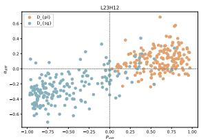

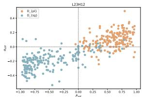  
(a) L23H12  
(b) L23H13  
Figure 8: Scatter plots illustrating the relationship between attention weight difference between $e _ { 1 }$ and $e _ { 2 }$ and difference between $P _ { s g }$ and $P _ { p l }$ . Blue dots represent data from $D _ { s g }$ and brown dots represent data from $D _ { p l }$

## D Generalization to Other Templates

Table 4 shows the original prompt template and its variant. Figure 9 shows the attention patterns for the variant at all heads in the circuit.

<table><tr><td>Model</td><td>num_layers</td><td>num_key_value_heads</td><td>num_attention_heads</td><td>hidden_size</td></tr><tr><td>Qwen3-0.6B</td><td>28</td><td>8</td><td>16</td><td>1024</td></tr><tr><td>Qwen3-1.7B</td><td>28</td><td>8</td><td>16</td><td>2048</td></tr><tr><td>GPT2-medium</td><td>24</td><td>16</td><td>16</td><td>1024</td></tr></table>

Table 1: Configurations for LLMs in the Qwen3 and GPT2 families
<table><tr><td>Predictor</td><td>β</td><td>SE</td><td>df</td><td>t</td><td>p</td><td></td></tr><tr><td colspan="7">Fixed Effects</td></tr><tr><td>Intercept</td><td>0.328</td><td>0.055</td><td>130.74</td><td>5.984</td><td>&lt; .001</td><td>***</td></tr><tr><td>Gender [same]</td><td>0.092</td><td>0.052</td><td>323.11</td><td>1.751</td><td>.081</td><td></td></tr><tr><td>Conjunction [with]</td><td>-0.669</td><td>0.064</td><td>322.99</td><td>-10.423</td><td>&lt; .001</td><td>***</td></tr><tr><td>Ont. Sim. [N + O]</td><td>-0.855</td><td>0.070</td><td>324.43</td><td>-12.282</td><td>&lt; .001</td><td>***</td></tr><tr><td>Ont. Sim. [N + R]</td><td>-0.199</td><td>0.053</td><td>325.93</td><td>-3.771</td><td>&lt; .001</td><td>***</td></tr><tr><td>Gender [same] × Conjunction [with]</td><td>-0.154</td><td>0.074</td><td>323.57</td><td>-2.083</td><td>.038</td><td>*</td></tr><tr><td>Conjunction [with] × Ont. sim. [N + O]</td><td>0.570</td><td>0.099</td><td>327.55</td><td>5.739</td><td>&lt; .001</td><td>***</td></tr><tr><td>Conjunction [with] × Ont. sim. [N + R]</td><td>0.081</td><td>0.075</td><td>326.21</td><td>1.086</td><td>.278</td><td></td></tr><tr><td>Random Effects</td><td></td><td></td><td></td><td></td><td></td><td></td></tr><tr><td>VP2 (Intercept) variance</td><td colspan="4">0.024 SD = 0.155</td><td></td><td></td></tr><tr><td>Residual variance</td><td colspan="4">0.092 SD = 0.304</td><td></td><td></td></tr><tr><td>Model Fit</td><td></td><td></td><td></td><td></td><td></td><td></td></tr><tr><td>Observations</td><td colspan="4"></td><td></td><td></td></tr><tr><td>Groups (VP2)</td><td colspan="4">350</td><td></td><td></td></tr><tr><td>REML criterion</td><td colspan="4">27 224.4</td><td></td><td></td></tr></table>

Note: Reference categories: Gender = different; Conjunction = and;  
Ontological similarity = N + N

Table 2: Linear Mixed-Effects Model Predicting Probability Difference (prob\_diff)

## E Generalization to Other Models

Figures 10 and 11 show the attention patterns for the Plural Reference Circuit of Qwen3-0.6B and GPT2-medium.

<table><tr><td>Conjunction</td><td>Gender</td><td>Ontological Similarity</td><td>Prompt</td></tr><tr><td>and</td><td>same</td><td> $\overline { { \mathbf { N } + \mathbf { N } } }$ </td><td>When John saw Mary and Emma, he waved at</td></tr><tr><td rowspan="4"></td><td rowspan="2">different</td><td> $\Nu + \Nu$ </td><td>When John saw Mary and her sister, he waved at</td></tr><tr><td> $\Nu + \Nu$ </td><td>When John saw Mary and David, he waved at</td></tr><tr><td rowspan="2">different</td><td> $\Nu + \Nu$ </td><td>When John saw Mary and her brother, he waved at</td></tr><tr><td> $\mathrm { \bf N } + \mathrm { \bf O }$ </td><td>When John saw Mary and her bike, he waved at</td></tr><tr><td rowspan="5">with</td><td>same</td><td> $\overline { { \mathbf { N } + \mathbf { N } } }$ </td><td>When John saw Mary with Emma, he waved at</td></tr><tr><td rowspan="3">different</td><td> $\Nu + \Nu$ </td><td>When John saw Mary with her sister, he waved at</td></tr><tr><td> $\Nu + \Nu$ </td><td>When John saw Mary with David, he waved at</td></tr><tr><td> $\Nu + \Nu$ </td><td>When John saw Mary with her brother, he waved at</td></tr><tr><td>different</td><td> $\mathrm { \bf N } + \mathrm { \bf O }$ </td><td>When John saw Mary with her bike, he waved at</td></tr></table>

Table 3: Summary of the dataset used in the statistical analysis. The table shows examples of the three independent variables: Gender (same, different), Ontological Similarity (N+N (name + name), N+R (name + relation), N+O (name + object)), and Conjunction (and, with)

<table><tr><td>ID</td><td>Template</td><td>Example prompt</td></tr><tr><td>Original When</td><td> $[ \mathrm { S } ] + [ V _ { 1 } ] + [ A _ { 1 } ]$  and  $[ A _ { 2 } ] , [ \mathrm { S } ] + [ V _ { 2 } ]$ </td><td>When John saw Mary and her sister, he waved at</td></tr><tr><td>Var. 1</td><td>Yesterday,  $[ \mathrm { S } ] + [ V _ { 1 } ] + [ A _ { 1 } ]$  and  $[ A _ { 2 } ]$  and  $[ V _ { 2 } ]$ </td><td>Yesterday, John saw Mary and her sister and waved at</td></tr></table>

Table 4: Sentence templates used for generating $D _ { p l }$ and $D _ { s g } .$ ,with one example per template.

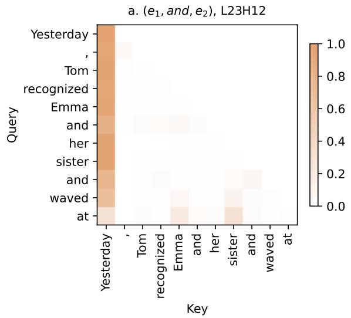

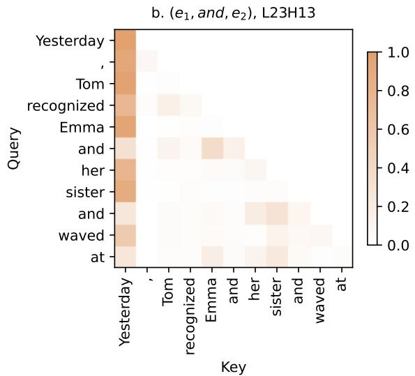

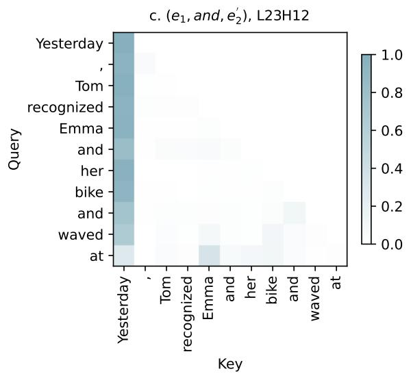

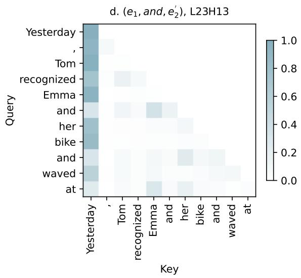

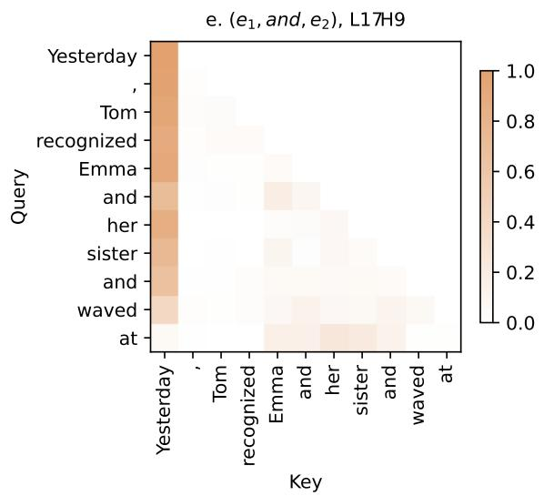

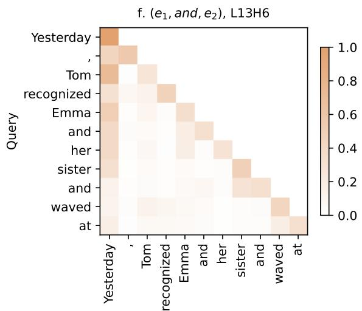  
Figure 9: Attention pattern visualizations of major heads for Qwen3-1.7B (Var. 1). (a) and (b) Attention pattern of Pronoun Selection head for $D _ { p l } { \mathrm { ( b r o w n ) } }$ . (c) and (d) Attention pattern of Pronoun Selection heads for $D _ { s g } ( \mathrm { b l u e } )$ (e) Attention pattern of Plurality Formation head for $D _ { p l } { \mathrm { ~ ( b r o w n ) } }$ . (f) Attention pattern of Pronoun Interpretation head for $D _ { p l } ~ ( \mathrm { { b r o w n } ) }$ •

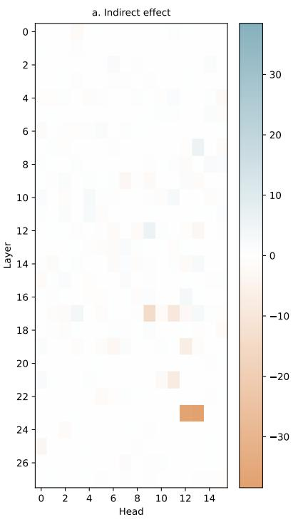

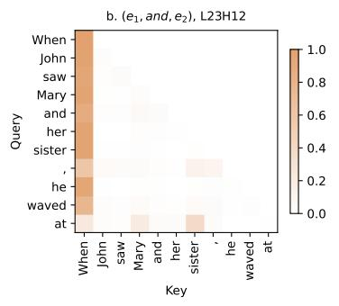

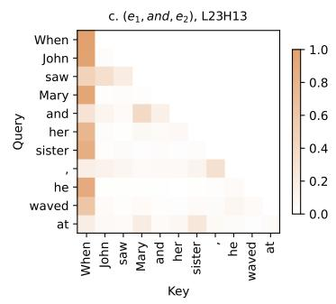

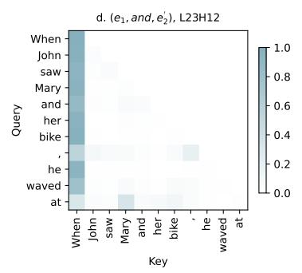

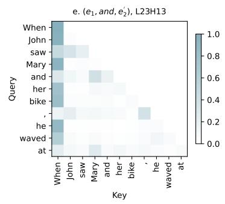

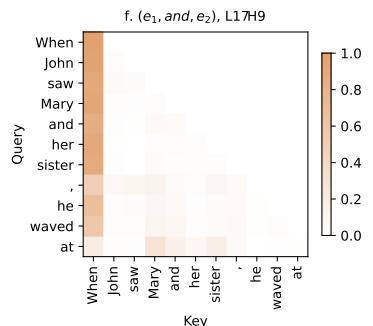

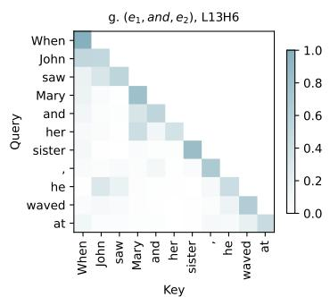  
Figure 10: Overview of intervention results and attention pattern visualizations of major heads for Qwen3-0. 6B. (a) Indirect effect of individual head intervention across layers. Brown values denote negative change in $P _ { p l }$ . (b) and (c) Attention pattern of Pronoun Selection heads for $D _ { p l }$ (brown). (d) and (e) Attention pattern of Pronoun Selection heads for $D _ { s g } ( \mathrm { b l u e } )$ . (f) Attention pattern of Plurality Formation head for $D _ { p l }$ (brown). (g) Attention pattern of Pronoun Interpretation head for $D _ { p l } { \mathrm { ~ ( b r o w n ) } }$

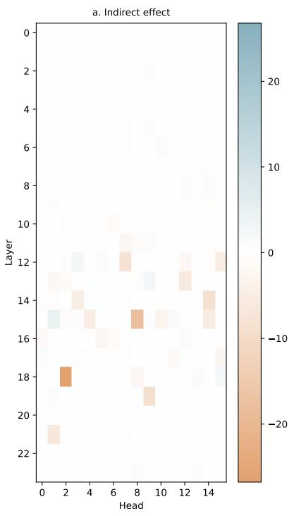

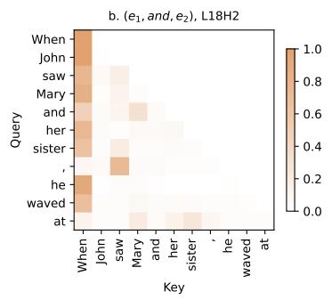

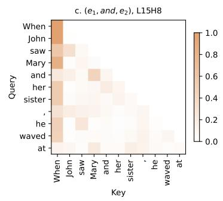

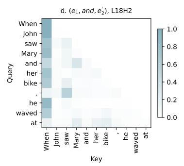

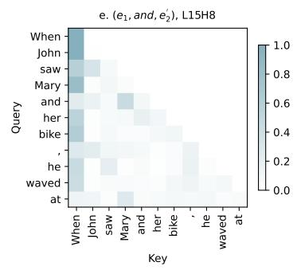

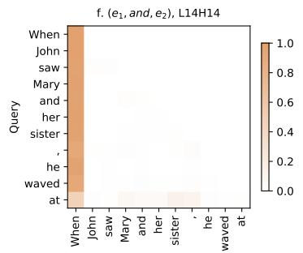  
Key

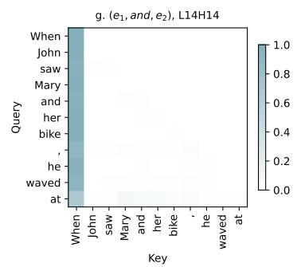  
Figure 11: Overview of intervention results and attention pattern visualizations of major heads for GPT2-medium. (a) Indirect effect of individual head intervention across layers. Brown values denote negative change in $P _ { p l }$ . (b) and (c) Attention pattern of Pronoun Selection heads for $D _ { p l }$ (brown). (d) and (e) Attention pattern of Pronoun Selection head for $D _ { s g } ( \mathrm { b l u e } )$ . (f) and (g) Attention pattern of Plurality Formation head for $D _ { p l }$ (brown) and $D _ { s g }$ (blue).