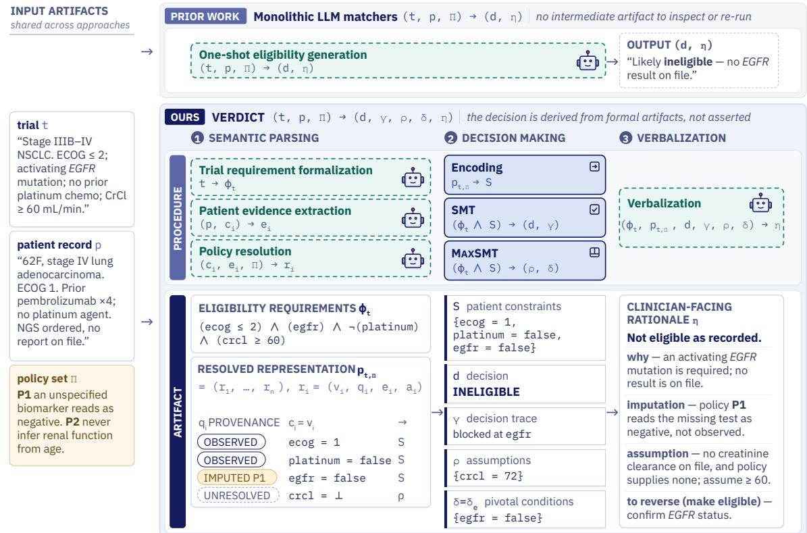
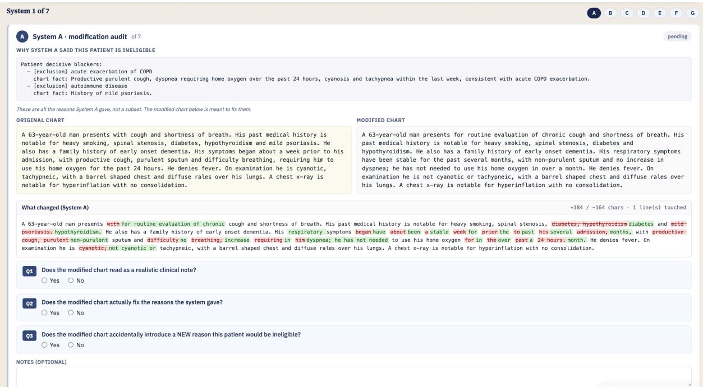
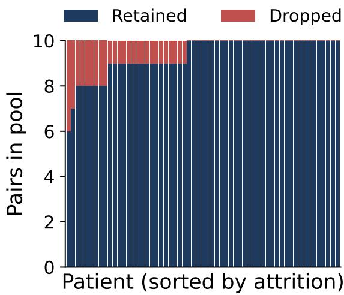
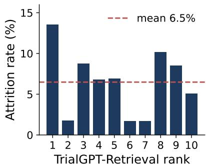
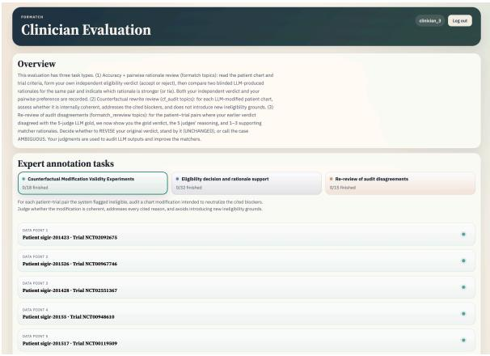
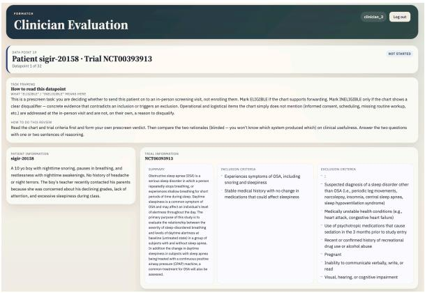
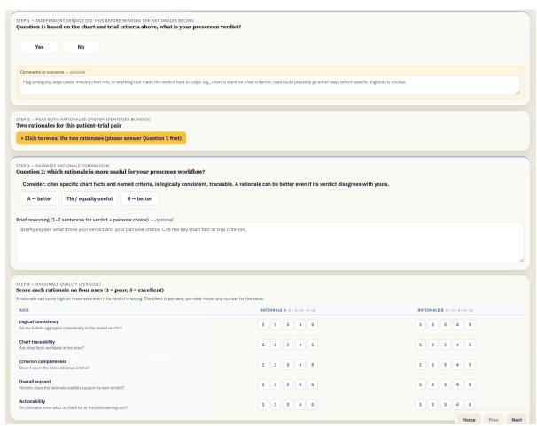
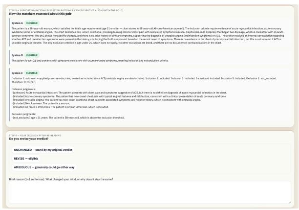
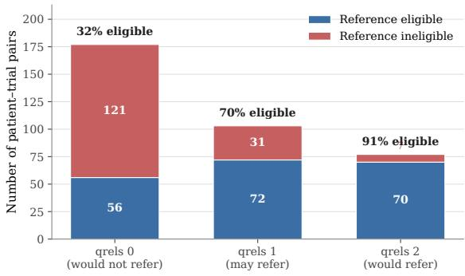

# Accountable AI with Grounded, Faithful, Consistent, Actionable Rationales: A Case Study in Clinical Trial Matching with VERDICT

Zikai Zhou1 Yufei Jin2 Yilin Xu3 Yu-Chiang Wang4 Chieh-Ju Chao4 Monica S. Lam1

1Department of Computer Science, Stanford University, Stanford, CA, USA 2Samueli Electrical and Computer Engineering, UCLA, Los Angeles, CA, USA 3Department of Computer Science, Emory University, Atlanta, GA, USA 4Mayo Clinic, Rochester, MN, USA zikai@stanford.edu, lam@stanford.edu

## Abstract

Accountability means a decision can be examined, justified, and contested. LLMs make this hard: fluent output may be ungrounded, incomplete, or unfaithful to the decision process. Achieving accountability requires verified rationales (how was the decision reached), assumptions (what was assumed rather than known), policy consistency (the same treatment for the same facts), and pivotal conditions (what would change the outcome). We introduce self-faithfulness as an automatic test of accountability: changing the pivotal conditions should change the decision.

We examine accountable AI through clinical trial matching, a high-stakes task central to evidence-based medicine. Although LLM based matchers match patients to trials reasonably accurately, they apply decision policies inconsistently and produce rationales that are unfaithful to their own decisions.

We introduce VERDICT1, an LLM-based agent that translates a decision task, its constraints, and its policy into Satisfiability Modulo Theories (SMT), then derives the decision with SMT and MAXSMT solvers — so policies are applied consistently and decisions are accountable by construction.

Across a SIGIR 2016-derived dataset and TREC 2021, VERDICT achieves the strongest decision accuracy among LLM-only and neurosymbolic baselines, applies policies with perfect consistency, and produces clinicianpreferred rationales grounded in explicit assumptions and pivotal conditions, with improved counterfactual self-faithfulness.

## 1 Introduction

Accountability is the property that a decision can be examined, justified, and contested after the fact: someone else can ask why, know what was assumed rather than known, trust that the decision was made consistently, and learn what would change the outcome (Kroll, 2015; Binns, 2018; Diakopoulos, 2015).

Accountability is the essential operational requirement behind any consequential decision that must be understood, trusted, and acted upon. It means, for example, giving a patient the real reason they do not qualify for a clinical trial, clarifying what was assumed from missing lab results, explaining what would change the outcome, and knowing the decision would indeed be reversed if the patient followed the advice. Similarly, it involves providing a rejected loan applicant with the true reason for denial and clear guidance on what to improve before reapplying, and being confident that all applicants with similar qualifications are treated equally. It also means deciding that a driver gets a safe-driver discount, but warning that it would go away if he is in an at-fault accident.

LLMs produce fluent, confident output regardless of whether it is grounded, complete, or faithful to the process that generated it — hallucination. In a consequential-decision setting, this leads to four failure modes, each demanding a countermeasure.

Grounding–Verified rationales. A stated reason need not be the reason that actually produced a decision — explanations are generated to sound plausible, not to trace a derivation. We need verified rationales that are checked against, or derived from, the process that produced the decision.

Faithfulness–Assumptions. Provided evidence is often ambiguous or incomplete; however, an LLM tends to fill the gaps silently with unwarranted confidence. We need an explicit ledger of every assumption, turning silent judgment calls into auditable claims.

Consistency–Policy adherence. Because an LLM re-derives its reasoning in language, formally identical cases can be decided by different logic on different occasions. We need policy consistency to guarantee that the same policy is applied the same way whenever the same facts recur.

Actionability–Pivotal conditions. To be constructive, a decision should come with an explanation on how the decision can be reversed. We need to provide the pivotal conditions–the minimal changes that would alter the decision.

Together these four form the pillars of accountability — grounded, faithful, consistent, and actionable reasoning. Note that none of these is addressed by improving “trustworthiness” in the conventional sense: better calibration or higher accuracy leaves all four gaps open, since accountability is a property of decisions and their derivation, not of the model’s track record.

Clinical Trial Matching. We examine accountable AI through clinical trial matching, where clinicians want to specify policies for handling missing data, verify that a rationale is faithful to the decision, and understand the assumptions and pivotal conditions that could change it. We show that LLMbased matchers (Jin et al., 2024; Gupta et al., 2024; Wornow et al., 2025) are reasonably accurate but fall short on all four accountability criteria.

An alternative is to combine language models with symbolic reasoning, representing the matching problem as SMT (Satisfiability Modulo Theories) (Barrett and Tinelli, 2018) formulas executed by solvers such as Z3 (De Moura and Bjørner, 2008) (Ye et al., 2023; Olausson et al., 2023; Xu et al., 2026; Pan et al., 2023). SATIR (Zhou et al., 2026) represents imputed missing data as SMT, improving retrieval accuracy and recall, but uses an LLM to determine final eligibility.

Building on this, we propose VERDICT (VERified explanations with assumption Disclosure, Invariant Consistency, and Traceable pivots), a framework for accountable decision making. Given a retrieved candidate, VERDICT decides whether the patient is eligible for the trial. We adopt SATIR’s trial representation but extract patient information relative to each trial for better accuracy. VERDICT uses an SMT solver to determine eligibility; the solver trace yields matching evidence and explicit assumptions, while a MAXSMT solver (De Moura and Bjørner, 2008; Bjørner et al., 2015) computes pivotal conditions—the minimal constraints that must change to reverse the decision.

## Contributions

• A formulation of clinical trial matching as accountable decision-making. Given a decision, its constraints, and its policy, an accountable agent should apply the policy consistently and produce a decision along with (1) a formal derivation users can verify, (2) the assumptions behind it users can override, and (3) the pivotal conditions users can act on or monitor.

• VERDICT: an accountable decision-making framework that separates language understanding from decision making via SMT. Its inaccuracy is confined to language understanding, not decision logic, unlike monolithic LLM-based matchers, and root causes are directly observable from the representation. VERDICT’s decisions come with a verifiably correct derivation, explicit assumptions, and pivotal conditions.

• A broad evaluation of accuracy, accountability, and actionability across two public benchmarks, multiple model families, clinician review, policy-adherence tests, counterfactual evaluation, and failure analysis. VERDICT outperforms strong LLM-only and neuro-symbolic baselines, produces clinician-preferred rationales, follows policies reliably, and has perfect rationale-decision causality by construction.

## 2 Accountable Decision Making

In this section, we define the general problem of accountable decision making and introduce the concept of self-faithfulness as a fundamental property of accountable decision makers.

## 2.1 Definition of Accountability

An accountable decision-maker provides not just a decision, but also a rationale that explains how it was derived, the hidden assumptions on which it depends so they can be overridden if appropriate, and the pivotal conditions that could be changed to reverse the decision.

Definition 1. Given a constraint specification y, a case x, and a set of policies Π, an accountable decision maker is defined as

$$
\begin{array} { r } { \mathrm { D E C I D E } ( y , x , \Pi ) = ( d , \gamma , \rho , \delta ) , } \end{array}
$$

where d ∈ {ELIGIBLE, INELIGIBLE} is the eligibility decision,

• the decision trace γ records the logical derivation of d from the inputs; and

• the assumptions $\rho$ are the values the decision proceeds on that neither x nor Π establishes, indicating what information or actions are needed to determine eligibility;

  
Figure 1: Overview of VERDICT. A monolithic LLM matcher (top) asserts an eligibility decision in one step. VERDICT (bottom) splits the task: LLMs handle language, formalizing the trial into requirements $\phi _ { t }$ and resolving patient evidence under policies Π into $ p _ { t , \Pi } .$ , which marks each criterion as observed, imputed, or unresolved. Solvers handle the decision: SMT derives the decision d and a trace $\gamma ; \mathbf { M A X S M T }$ derives the assumptions $\rho$ and pivotal conditions δ. A final LLM step verbalizes these into a clinician-facing rationale $\eta .$ Because the decision is derived rather than asserted, every artifact is inspectable, overridable, and re-runnable.

• the pivotal conditions δ are conditions whose resolution or modification would flip the decision. Note that by definition, $\delta \neq \emptyset$

## 2.2 Accountable Decision Makers are Self-Faithful

We introduce the concept of self-faithfulness for evaluating decision-makers. If a decision-maker identifies conditions as pivotal, then changing those conditions should change the outcome. This expectation applies in both directions. In medicine, a patient may be ineligible for a clinical trial because the trial is restricted to stage IV cancer; if the patient progresses to stage IV, the decision should change from ineligible to eligible. Conversely, a patient may be eligible for a trial because their kidney function is within the required range; if a later test falls below the exclusion threshold, the decision should change from eligible to ineligible.

This notion applies to accountable decisionmaking more broadly, not just in medicine. For example, a driver may be ineligible for a safe-driver discount because of a recent accident, but become eligible again after enough accident-free years; conversely, a driver who currently qualifies for the discount should lose it after an at-fault accident. In each case, the stated pivotal condition is expected to determine the direction of the decision.

Definition 2. Given a case x, policies Π, and a set δ of condition values the decision relies on, the counterfactual construction $\mathrm { C F } ( x , \Pi , \delta )$ denotes a minimally modified case where δ no longer holds.

Theorem 1. The DECIDE function is self-faithful with respect to its pivotal conditions: if the pivotal conditions of a case are flipped, so will the decision. Given a constraint specification y, a case $x ,$ and policies Π, if

$$
\begin{array} { r c l } { { ( d , \gamma , \rho , \delta ) } } & { { = } } & { { \mathrm { D E C I D E } ( y , x , \Pi ) , } } \\ { { ( d ^ { \prime } , \gamma ^ { \prime } , \rho ^ { \prime } , \delta ^ { \prime } ) } } & { { = } } & { { \mathrm { D E C I D E } ( y , \mathrm { C F } ( x , \Pi , \delta ) , \Pi ) , } } \end{array}
$$

then $d \neq d ^ { \prime } .$

## 2.3 Evaluating Self-Faithfulness

Theorem 1 yields an automatic evaluation metric, requiring no external annotation, for measuring the accountability of decision-maker implementations.

Definition 3. Given a decision-maker implementation DM, policies Π, and a set of evaluation instances $M = \left\{ { \left( y _ { 1 } , x _ { 1 } \right) , \ldots , \left( y _ { n } , x _ { n } \right) } \right\}$ , define

$$
\begin{array} { r } { \mathrm { P i v o t a l F l i p R a t e } ( { \bf D M } , M , \Pi ) \ } \\ { = \frac { 1 } { | { \cal M } _ { \delta } | } \displaystyle \sum _ { j \in { \cal M } _ { \delta } } \mathbb { I } \big [ d _ { j } \ne d _ { j } ^ { \prime } \big ] . } \end{array}
$$

where

$$
\begin{array} { r c l } { ( d _ { j } , \gamma _ { j } , \rho _ { j } , \delta _ { j } ) } & { = } & { { \bf D M } ( y _ { j } , x _ { j } , \Pi ) , } \\ { ( d _ { j } ^ { \prime } , \gamma _ { j } ^ { \prime } , \rho _ { j } ^ { \prime } , \delta _ { j } ^ { \prime } ) } & { = } & { { \bf D M } ( y _ { j } , { \bf C F } ( x _ { j } , \delta _ { j } ) , \Pi ) . } \end{array}
$$

Corollary 1. Given policies Π and a set of evaluation instances $M = \left\{ ( y _ { 1 } , x _ { 1 } ) , \dots , ( y _ { n } , x _ { n } ) \right\}$

PivotalFlipRate(DECIDE, M, Π) = 1.

## 3 VERDICT Clinical Trial Matcher

Figure 1 overviews VERDICT and its intermediate artifacts. We decompose clinical trial matching into language understanding and decision making: LLMs parse trial criteria, patient records, and policies into a formal representation, while SMT and MAXSMT solvers derive the decision and accountable rationale. We next define the representation and present the VERDICT algorithm.

## 3.1 Formal SMT Representation

Given a trial, patient record, and policy, all written in natural language, the clinical trial matching problem is to produce a decision on whether the patient is eligible, along with an accountable rationale.

Policies define how conditions should be resolved if they are not specified in a patient’s record. They may encode common practices, institutional choices, or default user assumptions.

There are two kinds of policies: the first depends on the full context of the trial and other rules in the policy set; the second is purely a function of the kind of constraint. In principle, such policies may also depend on the resolution state of the constraint (e.g., the strength or direction of available patient evidence); in our current formulation, however, all unresolved conditions are represented by a single unknown value ⊥.

The trial representation builds on the semantic formalization introduced in SATIR (Zhou et al., 2026). SATIR decomposes natural-language eligibility criteria into atomic, typed conditions and their logical composition, yielding the trial-side constraint representation used here. VERDICT extends this representation from retrieval to decision making by grounding conditions in patient evidence, resolving missing values under policies.

Definition 4. The eligibility requirements of a trial t in natural language are formalized as the logical expression $\phi _ { t } = \phi ( c _ { 1 } , \ldots , c _ { n } )$ where

$c = ( \tau , V , u , \ell ) \in C$ denotes the smallest checkable requirement,

$\tau \in \mathcal { T } =$ {diagnosis, medication, lab value, tim-$\operatorname { i n g } , \ldots \}$ denotes the kind of condition,

V denotes the domain of the condition $( \mathrm { e . g . }$ Boolean for a diagnosis, numeric for a lab value, a date for timing),

u is the textual description, and

ℓ links to the source text for checkability.

Definition 5. Let $p$ be the natural-language record of a patient, and let $\phi _ { t } = \phi ( c _ { 1 } , \ldots , c _ { n } )$ denote the formalized eligibility requirements of trial t. For a policy set Π, the patient’s resolved representation with respect to trial t is

$p _ { t , \Pi } \in P = ( r _ { 1 } , \ldots , r _ { n } )$ , where

$r _ { i } = ( v _ { i } , q _ { i } , e _ { i } , a _ { i } )$ records the resolution of constraint $c _ { i }$ ,

$v _ { i } \in V _ { c _ { i } } \cup \{ \perp \}$ denotes the resolved value of $c _ { i } .$ q ∈ {OBSERVED, IMPUTED, UNRESOLVED} indicates if $v _ { i }$ is determined by patient evidence, supplied by policy resolution, or remains unknown,

$e _ { i }$ denotes patient evidence supporting $v _ { i }$ , with $e _ { i } = \emptyset$ when no such evidence is available, and

$a _ { i }$ denotes the imputation record produced by policy resolution, describing or recording the basis for an imputed value, with $a _ { i } = \emptyset$ when no imputation is made. That is,

$$
\begin{array} { r } { r _ { i } = \left\{ \begin{array} { l l } { ( v _ { i } , \hfill \mathrm { ~ o B ~ s E R ~ V B , ~ } \hfill \epsilon , \hfill \epsilon , \hfill \epsilon ) , } \\ { \hfill \quad \mathrm { i f ~ } v _ { i } \hfill \mathrm { ~ i s ~ o b s e r v e d ~ i n ~ e v i d e n c e ~ } \epsilon _ { i } , } \\ { ( v _ { i } , \hfill \mathrm { ~ M P U T E D , ~ } \hfill \mathscr { Q } , a _ { i } ) , } \\ { \hfill \mathrm { ~ i f ~ n o ~ v a l u e ~ i s ~ o b s e r v e d ~ i n ~ t h e ~ r e c o r d } , } \\ { \hfill \mathrm { ~ a n d ~ } v _ { i } \hfill \mathrm { ~ i s ~ g i v e n ~ b y ~ i m p u t a t i o n ~ } a _ { i } } \\ { \hfill \mathrm { ~ f r o m ~ a p p l y i n g ~ p o l i c i s e s } , } \\ { ( \bot , \hfill \mathrm { ~ U N R ~ E S O L N E D , ~ } \smallskip \mathscr { Q } , \emptyset ) , } \\ { \hfill \mathrm { ~ i f ~ n o ~ v a l u e i s ~ o b s e r v e d } } \\ { \hfill \mathrm { ~ o r ~ i n p u t e d ~ w i t h ~ I I ~ } } \end{array} \right. } \end{array}
$$

The representation $p _ { t , \Pi }$ is constructed by first extracting patient evidence relevant to each condition $c _ { i }$ . If the evidence determines the condition value, it is marked OBSERVED. Otherwise, the applicable policies $\pi _ { i } \subseteq \Pi$ are resolved to a pair $( v _ { i } , a _ { i } )$ : if they supply a default value, the condition is marked IMPUTED and $a _ { i }$ records the corresponding policy realization; if they do not, the condition is marked UNRESOLVED with $v _ { i } = \perp$ and $a _ { i } = \emptyset$

## 3.2 The VERDICT Algorithm

Algorithm VERDICT derives an eligibility decision and its formal accountability artifacts using SMT and MAXSMT, then verbalizes them for review.

Input: Trial t, patient record $p ,$ and policies Π.

Output: Eligibility decision $d ,$ decision trace $\gamma ,$ assumptions $\rho ,$ pivotal conditions $\delta ,$ and clinicianfacing rationale $\eta .$

Step 1. Derive the formal representation with LLMs: eligibility requirements for trial $t , \phi _ { t } =$ $\phi ( c _ { 1 } , \ldots , c _ { n } )$ , and the resolved representation for patient p w.r.t. Π, $p _ { t , \Pi }$ , as discussed in Section 3.1. Let the patient constraints imposed by all the resolved patient values for the trial be

$$
\begin{array} { l l } { S = \bigwedge _ { i } \{ c _ { i } = v _ { i } | } & { r _ { i } = \left( v _ { i } , { \mathrm { O B S E R V E D } } , \dotsc \right) \vee } \\ & { r _ { i } = \left( v _ { i } , { \mathrm { I M P U T E D } } , \dotsc \right) \} } \end{array}
$$

Step 2. Compute the decision d and decision trace $\gamma .$ . Let

$$
( z , \gamma ) = \mathbf { S } \mathbf { M } \mathbf { T } ( \phi _ { t } \wedge S ) ,
$$

where $z \in \ \{ \mathrm { S A T } , \mathrm { U N S A T } \}$ and $\gamma$ is the trace of the derivation; d = ELIGIBLE iff $z \ = \ S \mathrm { A T } .$ , and INELIGIBLE otherwise. The SMT solver is verifiably correct and, when possible, finds an assignment to unresolved variables that makes the constraints SAT.

MAXSMT. To compute the assumptions and pivotal conditions, Steps 3–5 use MAXSMT (weighted maximum satisfiability modulo theories). Given a formula F with non-negative softclause weights W, MAXSMT(F, W) returns a model maximizing the total weight of satisfied soft clauses. Let MAXSMT(F, W).x denote the value it assigns to clause x.

All constraints in the trial constraints $\phi _ { t }$ are considered hard, meaning that none of these constraints can be violated. Note that it is always possible to satisfy all the constraints in $\phi _ { t }$ of a wellformed clinical trial. We define $W$ such that every clause of S is considered soft and given unit weight. $\mathbf { M A X S M T } ( \phi _ { t } \wedge S , W )$ thus returns a model that minimizes changes to the resolved conditions $S .$ Step 3. Find $\delta _ { \mathrm { E } }$ , the conditions that need to change to render the decision eligible.

$$
\begin{array} { c } { { \delta _ { \mathrm { E } } = \big \{ \ : s \ : \big | \ : s \ : \mathrm { i s ~ a ~ c l a u s e ~ i n } \ : S , } } \\ { { { \bf M A X S M T } ( \phi _ { t } \wedge S , W ) . s = \mathrm { F A L S E } \ : \big \} . } } \end{array}
$$

Note that $\delta _ { \mathrm { E } } = \varnothing \operatorname { i f f } d = \mathrm { E L I G I B L E } .$

Step 4. Compute the assumptions $\rho$ that maximize eligibility.

$$
\begin{array} { r l } { \rho = \bigwedge _ { i } \{ c _ { i } = } & { { \bf M a x S M T } ( \phi _ { t } \wedge S , W ) . c _ { i } } \\ & { \mid q _ { i } = { \bf U N R E S O L V E D } \} } \end{array}
$$

Step 5. Find $\delta _ { \mathrm { { I } } } ,$ the conditions that need to change to render the decision INELIGIBLE. We define $W ^ { \prime }$ such that every clause of $S \wedge \rho$ is considered soft and given unit weight.

$$
\begin{array} { r l } & { \delta _ { \mathrm { I } } = \{ \ x \mid x \mathrm { ~ i s ~ a ~ c l a u s e ~ i n ~ } S \wedge \rho , } \\ & { ~ \mathrm { ~ M A X S M T } ( \lnot \phi _ { t } \land S \land \rho , W ^ { \prime } ) . x } \\ & { ~ = \mathrm { F A L S E } \} . } \end{array}
$$

Symmetrically, $\delta _ { \mathrm { { I } } } = \emptyset$ iff d = INELIGIBLE.   
Step 6. Find the pivotal conditions δ.

$$
\delta = { \left\{ \begin{array} { l l } { \delta _ { \mathrm { I } } , } & { { \mathrm { i f ~ } } d = { \mathrm { E L I G I B L E } } } \\ { \delta _ { \mathrm { E } } , } & { { \mathrm { i f ~ } } d = { \mathrm { I N E L I G I B L E } } . } \end{array} \right. }
$$

Note that $\delta \neq \emptyset .$

Step 7. Present the rationale $\eta$ in natural language. The LLM verbalizes the decision, grounded in d, $\gamma _ { : }$ , the condition-level evidence and imputations in $p _ { t , \Pi } , \rho ,$ and $\delta$ (Appendix A.6). For numeric conditions in $\rho$ and $\delta ,$ it reports the requirement $\phi _ { t }$ imposes rather than the witness A assigns, since the witness is arbitrary within the satisfying region.

## 3.3 Accountability of VERDICT

Theorem 2. VERDICT is, by construction, verifiably accountable with respect to the formal representation of the trial and patient records. The decision, trace, assumptions, and pivotal conditions are verifiably correct by virtue of the correctness of the SMT and MAXSMT solvers.

Corollary 2. Let Π be a set of policies and $M = \left\{ { \left( y _ { 1 } , x _ { 1 } \right) , \ldots , \left( y _ { n } , x _ { n } \right) } \right\}$ a set of evaluation instances in VERDICT’s formal representation,

PivotalFlipRate(VERDICT, M, Π) = 1.

With respect to constraints in its formal representation, VERDICT is self-faithful: for every case $x _ { j }$ , applying the counterfactual construction $\mathrm { C F } ( x _ { j } , \delta _ { j } )$ to the pivotal conditions $\delta _ { j }$ returned by VERDICT flips the eligibility decision.

VERDICT, however, is not necessarily accountable with respect to the textual trial specification, patient record, and policies: the LLM may err in translating them or applying policies. The representation remains inspectable, however, so a reader who spots an issue in the rationale can trace it back to the source text and revise the assumption, the translation, or the decision.

## 4 Experimental Setup

We describe the benchmarks, systems, and LLM backbones used in our evaluation.

## 4.1 Benchmarks

We evaluate on two benchmarks with independently constructed eligibility labels.

SIGIR 2016-derived benchmark. We use 552 patient–trial pairs from the SIGIR 2016 clinicaltrial matching benchmark (Koopman and Zuccon, 2016). Because its judgments measure retrieval relevance rather than eligibility, we derive binary labels using a five-judge GPT-5 panel and validate a stratified subset with a clinician. These labels were not used to develop VERDICT. Appendix I details the annotation and validation procedures.

TREC 2021. We use 363 patient–trial pairs sampled from the TREC 2021 Clinical Trials track (Soboroff, 2021), drawn from the pairs carrying an official eligibility judgment. All systems evaluate on the same pairs. This benchmark was not used for method development, prompt design, or policy construction.

## 4.2 Systems and Backbones

VERDICT. We apply the VERDICT algorithm, using the backbone LLM to formalize trial requirements and extract patient evidence (Appendix A).

LLMMATCH. Our optimized natural-language matcher that directly predicts trial-level eligibility using task-specific prompts, without constructing a formal decision program or invoking a separate decision executor (Appendix B.1).

CoT LLM. Our chain-of-thought matcher that reasons over eligibility criteria before producing a trial-level decision (Appendix B.2).

ZSPM (Wornow et al., 2025). Wornow et al. (2025) do not name their system; we write ZSPM after its title, Zero-Shot clinical trial Patient Matching. ZSPM is a zero-shot LLM-based matcher that predicts eligibility directly from the patient record and trial criteria (Appendix B.4).

TrialGPT (Jin et al., 2024). An end-to-end LLM framework for retrieving and matching clinical trials. We use TrialGPT-Matching, its criterion-level eligibility component, and aggregate its predictions into a trial-level decision (Appendix B.3).

DLSC (Xu et al., 2026). Xu et al. (2026) do not name their system; we write DLSC after its title, dynamic logical solver composition. It decomposes natural-language problems, composes symbolic solvers, and autoformalizes each instance into solver-specific code at inference time. We adapt its SMT configuration to clinical-trial eligibility, executing the generated program to produce the decision. Whereas DLSC targets reasoning problems, VERDICT targets accountable decision making, deriving inspectable artifacts and accepting an explicit policy set their method lacks.

For each benchmark, all systems use the same backbone and patient–trial pairs. Due to budget constraints, we select complementary backbone suites to test robustness across model capabilities and families. On the SIGIR 2016-derived benchmark, we evaluate GPT-4.1, GPT-4o, and GPT-4omini (Achiam et al., 2023; Hurst et al., 2024); on TREC 2021, we compare proprietary and openweight models using GPT-5-mini (Singh et al., 2025), Claude Haiku 4.5 (Anthropic, 2025), and Qwen2.5-7B-Instruct (Qwen et al., 2025). The baseline suites differ because the SIGIR evaluation predates DLSC: TREC includes it as the closest neuro-symbolic system but omits TrialGPT, which ZSPM outperformed across SIGIR backbones.

## 5 Evaluation

We evaluate clinical-trial matching systems on decision accuracy (Tables 1 and 2), and on the four accountability properties introduced in Section 1: grounding and actionability (Tables 3 and 4), consistency (Table 5), and self-faithfulness (Table 6).

## 5.1 Decision Accuracy

We evaluate whether the predicted eligibility decision agrees with the benchmark annotation, reporting F1 and accuracy. This is an end-to-end evaluation: systems receive the patient record and trial criteria and must interpret both the available evidence and any missing information. Note that the benchmark does not explicitly specify policies on how unreported patient information should be handled. Thus, the evaluation includes how well a decision maker matches the implicit policies.

We first ask whether an intermediate formal representation compromises predictive performance. It does not: VERDICT achieves the highest F1 across all backbones on both benchmarks (Tables 1 and 2). On the SIGIR 2016-derived bench-

mark, it achieves 0.900, 0.836, and 0.754 F1 with GPT-4.1, GPT-4o, and GPT-4o-mini.
<table><tr><td>Backbone</td><td>System</td><td>F1</td><td>Accuracy</td></tr><tr><td>GPT-4.1</td><td>VERDICT</td><td>0.900</td><td>0.902</td></tr><tr><td></td><td>LLMMATCH</td><td>0.884</td><td>0.879</td></tr><tr><td></td><td>CoT LLM</td><td>0.721</td><td>0.775</td></tr><tr><td></td><td>TrialGPT</td><td>0.359</td><td>0.592</td></tr><tr><td>GPT-40</td><td>ZSPM</td><td>0.835</td><td>0.828</td></tr><tr><td rowspan="4"></td><td>VERDICT</td><td>0.836</td><td>0.826</td></tr><tr><td>LLMMATCH</td><td>0.769</td><td>0.803</td></tr><tr><td>CoT LLM</td><td>0.773</td><td>0.804</td></tr><tr><td>TrialGPT ZSPM</td><td>0.759 0.806</td><td>0.774 0.797</td></tr><tr><td>GPT-4o-mini</td><td></td><td></td><td></td></tr><tr><td rowspan="4"></td><td>VERDICT</td><td>0.754</td><td>0.766</td></tr><tr><td>LLMMATCH</td><td>0.476</td><td>0.649</td></tr><tr><td>CoT LLM</td><td>0.599</td><td>0.699</td></tr><tr><td>TrialGPT</td><td>0.588</td><td>0.685</td></tr><tr><td></td><td>ZSPM</td><td>0.691</td><td>0.572</td></tr></table>

Table 1: Patient-level eligibility performance on the SIGIR 2016-derived benchmark.

On the independent TREC 2021 benchmark, VERDICT again performs best across all three backbones. Alongside the natural-language baselines, we include DLSC (Xu et al., 2026), the closest prior LLM–solver matcher, adapted to clinical-trial eligibility (Section 4.2). This comparison distinguishes VERDICT from another system that also uses a formal solver rather than comparing solver-based and natural-language decision making alone.

<table><tr><td>Backbone</td><td></td><td>VERDICT LLMMATCH</td><td>CoT LLM ZSPM DLSC</td><td></td><td></td></tr><tr><td>GPT-5-mini</td><td>0.828</td><td>0.776</td><td>0.711</td><td>0.759</td><td>0.700</td></tr><tr><td>Claude Haiku 4.5</td><td>0.800</td><td>0.587</td><td>0.704</td><td>0.615</td><td>0.700</td></tr><tr><td>Qwen2.5-7B</td><td>0.738</td><td>0.649</td><td>0.663</td><td>0.695</td><td>0.470</td></tr></table>

Table 2: F1 on 363 TREC 2021 patient–trial pairs using official judgments. Best F1 per backbone is bolded. Distilling the Qwen2.5-7B formalizer improves VERDICT from 0.738 to 0.829 F1, matching GPT-5-mini.

The corresponding TREC accuracies are 0.838, 0.815, and 0.697. Across backbones, VERDICT exceeds the strongest natural-language baseline by 0.04–0.10 F1 and DLSC by 0.10–0.27 F1 (accuracy: 0.838/0.815/0.697 vs. 0.73/0.70/0.56). Since DLSC also uses a formal solver, the gain reflects the importance of VERDICT’s decomposition of trial formalization, evidence assignment, missingness resolution, and decision execution. Distilling the Qwen2.5-7B formalizer raises F1 from 0.738 to 0.829, a performance matching the larger and proprietary GPT-5-mini model.

Failure-case analysis. We manually traced all 59 TREC disagreements for VERDICT with GPT-

5-mini. Most arise from missing-evidence imputations (31/59; 53%), where criteria are parsed correctly but unreported patient information is resolved differently from the benchmark’s implicit policy. Another 14 cases (24%) reflect a mismatch between strict eligibility and broader TREC relevance judgments. Only 10 cases (17%) stem from semantic parsing errors; three (5%) arise from enforcing non-chart-decidable operational criteria, and one (2%) from an incomplete trial input in which the inclusion-criteria section was missing. Thus, semantic parsing errors affect only 10 of the 363 final decisions (2.8%); the main remaining challenge is handling missing evidence and criteria that cannot be resolved from the patient chart.

## 5.2 Grounding and Actionability

We next evaluate whether clinician-facing rationales are grounded in the evidence and imputations supporting the decision and whether they expose information useful for subsequent clinical review.

Clinician comparison. We evaluate grounding and actionability through blinded clinician comparisons of VERDICT against ZSPM and LLM-MATCH. Each uses a separate stratified sample of 16 patient–trial pairs from the 552-pair SIGIRderived benchmark, four from each of four outcome strata: both systems match the reference label, only VERDICT does, only the comparator does, and neither does. Absolute ratings are therefore comparable within, not across, the two samples. The clinician sees anonymized rationales for each pair, selects the more useful one or a tie, and rates both on criterion completeness, chart traceability, coherence, actionability, and decision support. Appendix I gives full sampling details.

<table><tr><td>Comparator</td><td>VERDICT wins</td><td>Ties</td><td>Comparator wins</td><td>Win rate</td></tr><tr><td>ZSPM</td><td>13</td><td>3</td><td>0</td><td>90.6%</td></tr><tr><td>LLMMATCH</td><td>11</td><td>2</td><td>3</td><td>75.0%</td></tr></table>

Table 3: Clinician pairwise preferences for VERDICT rationales. Ties count as half a win.

The clinician prefers VERDICT’s solvergrounded rationales over both systems compared. Against ZSPM, VERDICT wins 13 of 16 comparisons and ties three, yielding a 90.6% tie-adjusted win rate. Against LLMMATCH, it wins 11, ties two, and loses three, for a 75.0% win rate.

Clinician Ratings. Table 4 reports clinician ratings along five dimensions. Criterion completeness measures whether the rationale addresses decisionrelevant trial criteria, while Chart traceability measures whether its claims trace to patient evidence or explicit policy-supplied imputations. Together, they evaluate grounding in the decision basis. Coherence measures whether the claims in the rationale are logically consistent with each other; Actionability measures whether the rationale identifies unresolved information and decision-changing conditions; and overall Decision support measures whether it helps the clinician understand, verify, and act on the decision.

<table><tr><td>Dimension</td><td>VERDICT</td><td>ZSPM</td></tr><tr><td>Criterion completeness</td><td>5.00</td><td>4.69</td></tr><tr><td>Chart traceability</td><td>5.00</td><td>4.25</td></tr><tr><td>Coherence</td><td>5.00</td><td>3.62</td></tr><tr><td>Actionability</td><td>5.00</td><td>3.12</td></tr><tr><td>Decision support</td><td>4.94</td><td>3.81</td></tr><tr><td>Dimension</td><td>VERDICT</td><td>LLMMATCH</td></tr><tr><td>Criterion completeness</td><td>4.81</td><td>3.75</td></tr><tr><td>Chart traceability</td><td>4.81</td><td>3.88</td></tr><tr><td>Coherence</td><td>4.69</td><td>4.31</td></tr><tr><td>Actionability</td><td>4.69</td><td>3.12</td></tr><tr><td>Decision support</td><td>4.62</td><td>4.00</td></tr></table>

Table 4: Mean clinician ratings of rationale quality (1–5, higher better) vs. ZSPM and LLMMATCH.

VERDICT receives higher mean ratings on all five dimensions against both comparators. Higher criterion-completeness, chart-traceability, and coherence follow from the trace generated by the SMT solver. Higher actionability and decisionsupport scores follow from the assumptions and pivotal conditions, exposing what remains unresolved and what could change the decision.

## 5.3 Consistency

We next evaluate whether matchers consistently apply the specified policy set when resolving conditions not determined by patient evidence. VERDICT adheres to these policies once the relevant condition types, evidence states, and policyresolved values are correctly determined.

Natural-language matchers are evaluated under four progressively explicit settings: (1) Unassisted: the matcher receives only the patient record and trial criteria; (2) Rules provided: the policy set is included in the prompt; (3) Structured evidence: the matcher additionally receives verified atomic conditions, their types, and evidence-based values, with missing values represented as ⊥; and (4) Applied per condition: for each condition with a null evidence-based value, the policy is mechanically selected by type, and the LLM resolver used in VERDICT generates condition-level values and assumption records before the trial-level decision.

Policy adherence generally improves with structure. Applying policies per criterion yields the highest adherence, yet natural-language matchers still follow Π in only 71–81% of cases (Table 5). This improvement over structured evidence alone is significant (McNemar’s exact test, $p < 0 . 0 1 )$ .

<table><tr><td>Matcher</td><td></td><td>Model Unassisted</td><td>Rules provided</td><td>evidence</td><td>Structured Applied per criterion</td></tr><tr><td>LLMMATCH 5-mini</td><td></td><td>67.5</td><td>64.8</td><td>68.9</td><td>71.9</td></tr><tr><td>LLMMATCH 5</td><td></td><td>70.2</td><td>67.9</td><td>69.9</td><td>71.4</td></tr><tr><td>ZSPM</td><td>5-mini</td><td>66.3</td><td>67.3</td><td>71.9</td><td>80.1</td></tr><tr><td>ZSPM</td><td>5</td><td>62.8</td><td>66.3</td><td>69.4</td><td>81.1</td></tr></table>

Table 5: Agreement (%) with the decision required by the explicit missingness policy. GPT-5-mini and GPT-5 are abbreviated as 5-mini and 5.

The structured-evidence settings separate policy execution from upstream formalization and evidence extraction. Appendix L finds 99.6% condition-level semantic preservation, 94.3% fully correct criteria, and parsing errors affecting only 10/363 decisions (2.8%).

## 5.4 Self-Faithfulness

We test whether the pivotal conditions reported by LLM-based matchers are self-faithful for INELIGIBLE decisions. To compute the PIV-OTALFLIPRATE, we modify the original record so that the pivotal conditions no longer hold. Because this process may introduce contradictions, a separate LLM verifier retains only valid counterfactuals, over which we compute the PIVOTALFLIPRATE.

For this evaluation, we rerun ZSPM with a counterfactual-specific prompt, distinct from its accuracy prompt, that elicits a binary verdict and evidence-status labels for identifying chart-supported blockers. We also evaluate LLMMATCH-PIVOTAL, explicitly prompted to enumerate changes required for eligibility. Details are in Appendix D.

Natural-language matchers frequently retain their original decision even after their stated rejection reasons have been addressed. The strongest baseline flips its decisions only on 65.0% of validated cases, while LLMMATCH flips on 48.9%. Explicitly prompting LLMMATCH to enumerate the changes required for eligibility, LLMMATCH-Pivotal, raises the rate only to 57.7%.

The LLM-based verifier for counterfactual construction may err. A clinician audits a stratified subsample and finds that roughly 80% of modifications are valid (Table 19). We report the clinicianadjusted rate in Appendix D.

<table><tr><td>System</td><td>Backbone</td><td>PIVOTALFLIPRATE</td></tr><tr><td>CoT LLM</td><td>GPT-5</td><td>59.5%</td></tr><tr><td>CoT LLM</td><td>GPT-4.1</td><td>65.0%</td></tr><tr><td>TrialGPT</td><td>GPT-4.1</td><td>61.1%</td></tr><tr><td>LLMMATCH-Pivotal</td><td>GPT-4.1</td><td>57.7%</td></tr><tr><td>LLMMATCH</td><td>GPT-4.1</td><td>48.9%</td></tr><tr><td>ZSPM</td><td>GPT-4.1</td><td>26.6%</td></tr></table>

Table 6: Raw ineligible-to-eligible PIVOTALFLIPRATE for natural-language matchers.

These results show that asking a naturallanguage matcher to enumerate rejection reasons does not ensure that they causally drive its decision, whereas in VERDICT the decision and pivotal conditions are derived verifiably, so their relationship holds by construction, given formalized inputs.

## 6 Related Work

Clinical trial matching and retrieval. Patient– trial matching spans executable cohort identification and LLM-based methods. Criteria2Query and CriteriaMapper (Yuan et al., 2019; Lee et al., 2024) map eligibility criteria to executable EHR queries. TrialGPT (Jin et al., 2024), zero-shot matching (Wornow et al., 2025), and PRISM (Gupta et al., 2024) interpret patient records and trial criteria with LLMs. SATIR (Zhou et al., 2026) formalizes patient and trial constraints for high-recall retrieval. Unlike retrieval, this stage must resolve missing evidence and produce an auditable eligibility decision. We derive eligibility and its rationale for a candidate pair from an executable representation.

LLM–symbolic reasoning and faithful execution. Prior work uses LLM semantic parsing and symbolic execution to improve reliability. SatLM (Ye et al., 2023), Logic-LM (Pan et al., 2023), and LINC (Olausson et al., 2023) translate naturallanguage problems into logical forms for symbolic solvers; Faithful CoT (Lyu et al., 2023) deterministically executes explicit reasoning representations. DLSC (Xu et al., 2026), the closest neuro-symbolic method in our evaluation, dynamically composes solvers and generates solver-specific formalizations. These methods primarily use symbolic execution to improve accuracy or reliability. We instead use executable representations to define an authoritative decision state from which verdicts, policy applications, assumptions, and pivotal conditions are mechanically derived. Our experiments show that symbolic execution alone need not outperform strong natural-language approaches; gains require explicit treatment of missing evidence, assumptions, and decision policies.

Faithful explanations and accountable decisions. Interpretability distinguishes plausible from faithful explanations (Jacovi and Goldberg, 2020), while LLM reasoning can fail causal faithfulness tests (Lanham et al., 2023). Algorithmic accountability requires decisions to be inspectable, justifiable, and contestable (Kroll, 2015; Binns, 2018; Diakopoulos, 2015), while counterfactual explanations and recourse identify outcome-changing conditions (Wachter et al., 2017; Ustun et al., 2019). Our formulation unifies them: an accountable decision provides its derivation, unresolved assumptions, consistently applied policies, and pivotal conditions testably linked to the decision.

## 7 Conclusion

This paper introduces accountability as a requirement for high-stakes AI decisions—encompassing grounding, faithfulness, consistency, and actionability. Even when LLM matchers decide eligibility correctly, they often lack accountability: inconsistent explanations, relevant conditions omitted, or reasoning misrepresented. This poses clinical risks because clinicians need reliable rationales to verify decisions and manage care.

VERDICT addresses these challenges by separating reasoning from language understanding, constraining the LLM to produce explicit, auditable representations. Errors may remain, including misinterpretation of patient records or incorrect formalization, but it eliminates reasoning mistakes and makes the decision process transparent and reviewable. This allows users to trace each rationale step and identify, correct, or override decisions when necessary, supporting robust accountability.

Our results demonstrate that formal methods deliver, by construction, levels of accountability, transparency, and contestability unattainable by language-based models alone. By making accountability foundational to AI system design, we enable rigorous oversight and reliable deployment in critical domains such as healthcare.

## Limitations

This paper has several limitations. First, although our system makes the final matching decision explicit and rerunnable, it still relies on LLMs to formalize trial criteria, extract patient evidence, and apply context-dependent policies. If an LLM misses a fact, extracts the wrong evidence, or represents a requirement incorrectly, the resulting formal representation—and therefore the final decision— can still be wrong. The SMT and MAXSMT steps make reasoning over the encoded representation verifiable, but they do not guarantee that the representation itself is clinically correct. Our semanticparsing audit suggests that such errors are relatively uncommon, but evidence extraction and missinginformation resolution remain important upstream sources of error.

Second, our counterfactual self-faithfulness evaluation depends on generated counterfactual patient records. We use LLMs to modify the patient record according to the matcher’s reported pivotal conditions, and a separate LLM validator to determine whether the resulting edit correctly implements those changes without introducing new eligibility violations and remains clinically realistic and coherent. Because both stages can make errors, we additionally audit a stratified subset with a clinician and report clinician-adjusted estimates. Nevertheless, larger-scale review by multiple clinicians would provide stronger evidence about counterfactual validity. For our system in particular, the end-to-end evaluation reruns patient-side semantic parsing on the modified record, so failures may reflect imperfect counterfactual rewriting or re-parsing rather than a mismatch between the pivotal conditions and the formal decision boundary.

Third, although self-faithfulness is defined in both directions, our empirical counterfactual evaluation focuses on initially ineligible cases and tests whether modifying the reported pivotal conditions changes the decision to eligible. This direction is the more immediately actionable one for trial screening, but it does not test whether modifying pivotal conditions for an initially eligible case would likewise change the decision to ineligible. Evaluating both directions, including changes that arise as a patient’s state evolves over time, would provide a more complete empirical test of selffaithfulness.

Fourth, the available benchmarks are imperfect proxies for strict clinical-trial eligibility. On the

SIGIR 2016-derived benchmark, the original judgments concern referral relevance rather than eligibility, so we construct binary eligibility labels for 552 retrieved patient–trial pairs using a five-judge LLM panel and validate a stratified subset with a clinician. These labels enable larger-scale comparison but are not equivalent to adjudication by a multi-clinician panel, and the candidate set is restricted to top-ranked retrieved trials rather than the full trial corpus. TREC 2021 provides an independent benchmark with official human judgments and was not used during method development, prompt design, or policy construction. However, its judgments were also created for a retrieval task and do not always coincide with strict chart-level eligibility; our failure analysis identifies cases in which broader TREC relevance judgments conflict with the eligibility interpretation. Neither benchmark explicitly specifies how unreported patient information should be resolved, so decision accuracy also partly measures agreement with the implicit missing-information policy reflected in the reference labels.

Finally, the patient records in both benchmarks are synthetic rather than real longitudinal electronic health records. This avoids privacy barriers and enables controlled evaluation, but may underrepresent the noise, redundancy, conflicting evidence, missingness, and temporal complexity of real clinical documentation. The SIGIR-derived records are also unusually compact relative to hospital EHR notes. Testing the framework on real patient records under appropriate privacy safeguards and prospective clinical review remains important future work.

## Ethical Considerations

Clinical trial matching is a high-stakes task: incorrect recommendations may affect patient access to therapy, clinician workload, and trial recruitment. Our system is intended as a decision-support tool for surfacing candidate matches, imputations, and assumptions, not as an autonomous enrollment or exclusion system. Final eligibility decisions should remain under qualified clinical and trial-site review.

Our framework reduces some risks of end-to-end LLM matching by separating clinical text interpretation from the final eligibility decision. The solver makes the encoded decision explicit, rerunnable, and interpretable. However, the system still relies on LLMs to parse trial criteria and patient records;

missed evidence, incorrect extraction, or faulty formalization can still lead to wrong verdicts. Formal reasoning improves interpretability of the encoded policy, but does not guarantee clinical correctness.

Our evaluation uses synthetic patient notes from the SIGIR benchmark (Koopman and Zuccon, 2016), which reduces privacy risks because no real patient records are used, but may not capture the full complexity, incompleteness, and documentation bias of real electronic health records. Deployment on real patient data would require institutional review, privacy-preserving data handling, prospective validation, and monitoring for subgroup-specific errors, especially for patients whose records are incomplete or whose conditions are documented using nonstandard terminology.

There are also risks of overreliance. Structured rationales and solver traces may appear authoritative even when upstream extraction errors are subtle. Deployed systems should expose supporting evidence, uncertainty flags, and deferred criteria, and should not be used to deny patients clinician review without human verification or appeal.

## Acknowledgments

We acknowledge support from the Verdant Foundation, the Hasso Plattner Institute, Itaú Unibanco, BMO Financial Group, and the Stanford Human-Centered Artificial Intelligence (HAI) Institute. We acknowledge the National Artificial Intelligence Research Resource (NAIRR) Pilot and Microsoft Azure for contributing to the results in this work. Zikai (Cyrus) Zhou is partially supported by the Stanford School of Engineering Fellowship.

We thank Dr. Bryant Lin for suggesting this research topic. We are grateful to Shicheng Liu, Dongwei Jiang, Jiacheng Sang, Harshit Joshi, Jiuding Sun, Yucheng Jiang, Sina Semnani, Tamara Czinczoll, Chris Hoenes, Sally Wang, Jungwoo Kim, and Stanford OVAL Lab members for their support, feedback, and discussions. We also thank Dr. James Ford, Dr. Bryant Lin, Dr. James Dickerson, Dr. Jimmy Lin, Dr. Michael Gensheimer, Professor Gill Bejerano, and Lisa S. Lowy for their expert guidance and helpful discussions. We thank Shengguang Wu, Yicheng Qian, Heng Yu, Juze Zhang, Yue Zhao, Hermann Kumbong, Devon Smith, Youngjoong Kwon, Sa Zhou, Yilong Zhao, Jiaming Tang, Alireza Haqi, Hanchen Li, Fangrui Huang, Haichuan Wang, Jiahao Lu, Ziqi Shu, Shreyas Agarwal, Jie Zhu, Wenyi Wang, Zhijie Huang, Grace Zhang, Jia Shan Zhao, Tianxin Wang, Qinghui Wang, Yunong Zhang, Haochen Pan, Yifei Zhang, and Shiqi Kuang for their support and discussions. We further thank Lefan Zhang, Shan Lu, Blase Ur, Nandish Shah, Ning Tang, Youwen Wu, and Qi Hu for their support and perspectives.

OpenAI ChatGPT and Anthropic Claude were used to polish author-written text and assist with software development, figure design, debugging, and experiment monitoring. The authors reviewed and verified all AI-assisted outputs and remain responsible for the paper’s content and results.

## References

Josh Achiam, Steven Adler, Sandhini Agarwal, Lama Ahmad, Ilge Akkaya, Florencia Leoni Aleman, Diogo Almeida, Janko Altenschmidt, Sam Altman, Shyamal Anadkat, et al. 2023. Gpt-4 technical report. arXiv preprint arXiv:2303.08774.

Anthropic. 2025. System Card: Claude Haiku 4.5. https://www.anthropic.com/ claude-haiku-4-5-system-card. Accessed: 2026-08-31.

Clark Barrett and Cesare Tinelli. 2018. Satisfiability modulo theories. In Handbook of model checking, pages 305–343. Springer.

Reuben Binns. 2018. Algorithmic accountability and public reason. Philosophy & technology, 31(4):543– 556.

Nikolaj Bjørner, Anh-Dung Phan, and Lars Fleckenstein. 2015. νz-an optimizing smt solver. In International conference on Tools and Algorithmsfor the Construction and Analysis of Systems, pages 194– 199. Springer.

Jacob Cohen. 1960. A coefficient of agreement for nominal scales. Educational and Psychological Measurement, 20(1):37–46.

Leonardo De Moura and Nikolaj Bjørner. 2008. Z3: An efficient smt solver. In International conference on Tools and Algorithms for the Construction and Analysis ofSystems, pages 337–340. Springer.

Nicholas Diakopoulos. 2015. Algorithmic accountability: Journalistic investigation of computational power structures. Digital journalism, 3(3):398–415.

Shashi Kant Gupta, Aditya Basu, Mauro Nievas, Jerrin Thomas, Nathan Wolfrath, Adhitya Ramamurthi, Bradley Taylor, Anai N. Kothari, Regina Schwind, Therica M. Miller, Sorena Nadaf-Rahrov, Yanshan Wang, and Hrituraj Singh. 2024. PRISM: patient records interpretation for semantic clinical trial matching system using large language models. npj Digit. Medicine, 7(1).

Edward J Hu, Yelong Shen, Phillip Wallis, Zeyuan Allen-Zhu, Yuanzhi Li, Shean Wang, Lu Wang, and Weizhu Chen. 2022. LoRA: Low-rank adaptation of large language models. In International Conference on Learning Representations.

Aaron Hurst, Adam Lerer, Adam P Goucher, Adam Perelman, Aditya Ramesh, Aidan Clark, AJ Ostrow, Akila Welihinda, Alan Hayes, Alec Radford, et al. 2024. Gpt-4o system card. arXiv preprint arXiv:2410.21276.

Alon Jacovi and Yoav Goldberg. 2020. Towards faithfully interpretable nlp systems: How should we define and evaluate faithfulness? In Proceedings ofthe 58th annual meeting of the association for computational linguistics, pages 4198–4205.

Qiao Jin, Zifeng Wang, Charalampos S Floudas, Fangyuan Chen, Changlin Gong, Dara Bracken-Clarke, Elisabetta Xue, Yifan Yang, Jimeng Sun, and Zhiyong Lu. 2024. Matching patients to clinical trials with large language models. Nature communications, 15(1):9074.

Bevan Koopman and Guido Zuccon. 2016. A test collection for matching patients to clinical trials. In Proceedings of the 39th International ACM SIGIR conference on Research and Development in Information Retrieval, pages 669–672.

Joshua Alexander Kroll. 2015. Accountable algorithms. Princeton University.

Tamera Lanham, Anna Chen, Ansh Radhakrishnan, Benoit Steiner, Carson Denison, Danny Hernandez, Dustin Li, Esin Durmus, Evan Hubinger, Jackson Kernion, Kamile Lukoši ˙ ut¯ e, Karina Nguyen,˙ Newton Cheng, Nicholas Joseph, Nicholas Schiefer, Oliver Rausch, Robin Larson, Sam McCandlish, Sandipan Kundu, et al. 2023. Measuring faithfulness in chain-of-thought reasoning. arXiv preprint arXiv:2307.13702.

K Lee, Y Mai, Z Liu, K Raja, T Jun, M Ma, T Wang, L Ai, E Calay, W Oh, E Schadt, and X Wang. 2024. Criteriamapper: establishing the automatic identification of clinical trial cohorts from electronic health records by matching normalized eligibility criteria and patient clinical characteristics. Scientific Reports, 14(1):25387.

Qing Lyu, Shreya Havaldar, Adam Stein, Li Zhang, Delip Rao, Eric Wong, Marianna Apidianaki, and Chris Callison-Burch. 2023. Faithful chain-ofthought reasoning. In Proceedings of the 13th internationaljoint conference on natural language processing and the 3rd conference of the Asia-Pacific Chapter of the Association for Computational Linguistics (Volume 1: Long papers), pages 305–329.

Alexa T. McCray and Nicholas C. Ide. 2000. Design and implementation of a national clinical trials registry. Journal ofthe American Medical Informatics Association, 7(3):313–323.

Theo Olausson, Alex Gu, Ben Lipkin, Cedegao Zhang, Armando Solar-Lezama, Joshua Tenenbaum, and Roger Levy. 2023. Linc: A neurosymbolic approach for logical reasoning by combining language models with first-order logic provers. In Proceedings of the 2023 Conference on Empirical Methods in Natural Language Processing, pages 5153–5176.

Liangming Pan, Alon Albalak, Xinyi Wang, and William Wang. 2023. Logic-lm: Empowering large language models with symbolic solvers for faithful logical reasoning. In Findings of the Association for Computational Linguistics: EMNLP 2023, pages 3806–3824.

Arjun Panickssery, Samuel R Bowman, and Shi Feng. 2024. Llm evaluators recognize and favor their own generations. arXiv preprint arXiv:2404.13076.

Qwen, An Yang, Baosong Yang, Beichen Zhang, Binyuan Hui, Bo Zheng, Bowen Yu, Chengyuan Li, Dayiheng Liu, Fei Huang, Haoran Wei, Huan Lin, Jian Yang, Jianhong Tu, Jianwei Zhang, Jianxin Yang, Jiaxi Yang, Jingren Zhou, Junyang Lin, et al. 2025. Qwen2.5 technical report. Preprint, arXiv:2412.15115.

Aaditya Singh, Adam Fry, Adam Perelman, Adam Tart, Adi Ganesh, Ahmed El-Kishky, Aidan McLaughlin, Aiden Low, AJ Ostrow, Akhila Ananthram, et al. 2025. Openai gpt-5 system card. arXiv preprint arXiv:2601.03267.

SNOMED International. 2026. SNOMED CT. https: //www.snomed.org/. Accessed: 2026-05-24.

Ian Soboroff. 2021. Overview of trec 2021. In TREC.

Berk Ustun, Alexander Spangher, and Yang Liu. 2019. Actionable recourse in linear classification. In Proceedings ofthe conference onfairness, accountability, and transparency, pages 10–19.

Sandra Wachter, Brent Mittelstadt, and Chris Russell. 2017. Counterfactual explanations without opening the black box: Automated decisions and the gdpr. Harv. JL & Tech., 31:841.

Edwin B Wilson. 1927. Probable inference, the law of succession, and statistical inference. Journal ofthe American Statistical Association, 22(158):209–212.

Michael Wornow, Alejandro Lozano, Dev Dash, Jenelle Jindal, Kenneth W Mahaffey, and Nigam H Shah. 2025. Zero-shot clinical trial patient matching with llms. NEJM AI, 2(1):AIcs2400360.

Lei Xu, Pierre Beckmann, Marco Valentino, and André Freitas. 2026. Adaptive llm-symbolic reasoning via dynamic logical solver composition. In Proceedings ofthe 19th Conference ofthe European Chapter of the Associationfor Computational Linguistics (Volume 1: Long Papers), pages 1187–1208.

Xi Ye, Qiaochu Chen, Isil Dillig, and Greg Durrett. 2023. Satlm: Satisfiability-aided language models using declarative prompting. Advances in Neural Information Processing Systems, 36:45548–45580.

Chi Yuan, Patrick B Ryan, Casey Ta, Yixuan Guo, Ziran Li, Jill Hardin, Rupa Makadia, Peng Jin, Ning Shang, Tian Kang, and Chunhua Weng. 2019. Criteria2query: a natural language interface to clinical databases for cohort definition. Journal ofthe American Medical Informatics Association, 26(4):294–305.

Lianmin Zheng, Wei-Lin Chiang, Ying Sheng, Siyuan Zhuang, Zhanghao Wu, Yonghao Zhuang, Zi Lin, Zhuohan Li, Dacheng Li, Eric P Xing, Hao Zhang, Joseph E Gonzalez, and Ion Stoica. 2023. Judging llm-as-a-judge with mt-bench and chatbot arena. Advances in neural information processing systems, 36:46595–46623.

Zikai Zhou, Yufei Jin, Yilin Xu, Yu-Chiang Wang, Chieh-Ju Chao, and Monica Lam. 2026. Satir: Scalable high-recall constraint-satisfaction-based information retrieval for clinical trials matching. In Third Conference on Language Modeling.

## Appendix Roadmap

<table><tr><td>Appendix Contents</td><td></td></tr><tr><td></td><td>Part I — System and methodology</td></tr><tr><td>A</td><td>VERDICT pipeline: parser, value miner, arbiter, verbalizer, and Z3 program.</td></tr><tr><td>B</td><td>Baseline implementations and aggregation rules.</td></tr><tr><td>C</td><td>Prompt-strategy search for LLMMATCH and CoT LLM.</td></tr><tr><td>D</td><td>Counterfactual modifier, validator, and clinician audit.</td></tr><tr><td>E</td><td>Native rationale form per system on two example pairs.</td></tr><tr><td>Part II — Data and reference labels</td><td></td></tr><tr><td>F</td><td>Dataset statistics for both benchmarks: patients, trials, pairs, and the TREC 2021 sampling frame.</td></tr><tr><td>G</td><td>Decision balance, strata, and audit composition.</td></tr><tr><td>H</td><td>Reference-label derivation from the five-judge LLM panel.</td></tr><tr><td>I</td><td>Clinician validation of reference labels and agreement analysis.</td></tr><tr><td>J</td><td>Comparison of our eligibility labels with SIGIR referral qrels.</td></tr><tr><td></td><td>Part III — Detailed results</td></tr><tr><td>K</td><td>Cross-backbone accuracy, clinician-adjusted F1, and pairwise pop-recon.</td></tr><tr><td>L</td><td>Parsing audit: meaning, structure, and completeness of formalized criteria.</td></tr><tr><td></td><td>Part IV — Ethics and reproducibility</td></tr><tr><td>M</td><td>Potential risks: asymmetric error costs, missingness and equity, overreliance, and dual use.</td></tr><tr><td>N</td><td>API-call budget, wall-clock time, and infrastructure.</td></tr><tr><td>0</td><td>Package versions, sampling parameters, and seeds.</td></tr><tr><td>P</td><td>Human-subjects status of the clinician audit</td></tr><tr><td>Q</td><td>Instructions given to clinician reviewers.</td></tr><tr><td>R</td><td>Clinician recruitment, payment, and burden.</td></tr><tr><td>S</td><td>Data consent and corpus licensing.</td></tr><tr><td>T</td><td>Artifact use, licenses, and intended use.</td></tr><tr><td>U</td><td>Use of AI assistants in preparing the paper.</td></tr></table>

Roadmap to the appendix.

## A System Modules and Prompts

This appendix documents the modules of VER-DICT and reproduces the prompts used to produce the results in the paper. The appendix uses finergrained module names than §3.2, which presents the pipeline as Steps 1–7. The trial parser TPARSE and the patient parser PPARSE together implement Step 1, producing the trial requirements $\phi _ { t }$ and the resolved patient representation $p _ { t , \Pi }$ respectively. The SMT/MAXSMT solver SOLVE implements Steps 2–6, returning the decision d and decision trace γ (Step 2), the assumptions ρ (Step 4), and the pivotal conditions δ (Steps 3, 5, and 6). The LLM verbalizer VERBALIZE implements Step 7, producing the clinician-facing rationale η. LLMdriven stages use gpt-4.1 as the backbone unless otherwise noted; the solver itself is deterministic. Each prompt uses placeholder tokens, such as {{PATIENT\_NOTES}} and {{VARIABLE\_LIST}}, that are substituted at call time.

## A.1 Pipeline and Prompt Inventory

For each patient–trial pair, VERDICT first compiles the trial criteria into formal constraints, then extracts patient facts only for the atoms required by those constraints, evaluates the combined formula with an SMT/MAXSMT solver, and verbalizes the solver output into a clinician-readable rationale. Table 7 lists the pipeline stages and the prompts they use. Stages that are deterministic use no prompt.

<table><tr><td>Stage</td><td>Alg. step</td><td>Module</td><td>Prompt</td></tr><tr><td>1</td><td>1</td><td>Leaf collection for trial criteria</td><td></td></tr><tr><td>2</td><td>1</td><td>Trial scope mining in TPARSE</td><td>§A.2.1</td></tr><tr><td>3</td><td>1</td><td>Trial projection rewriting in TPARSE</td><td>§A.2.2</td></tr><tr><td>4</td><td>1</td><td>Patient value mining in PPARSE</td><td>§§A.3.1, A.3.2</td></tr><tr><td>5</td><td>1</td><td>Alias remapping</td><td></td></tr><tr><td>6</td><td> $^ { 2 - 6 }$ </td><td>SMT/MAXSMT evaluation with SOLVE</td><td></td></tr><tr><td></td><td>1</td><td>Extraction-resolution arbiter</td><td>§A.5.1</td></tr><tr><td></td><td>7</td><td>Natural-language verbalizer VERBALIZE</td><td>§A.6.1</td></tr></table>

Table 7: Pipeline stages and prompts. Alg. step maps each stage to the corresponding algorithm step in §3.2. Stages 1, 5, and 6 are deterministic. The arbiter is invoked only when extracted patient facts conflict with auxiliary definitional constraints rather than eligibility requirements.

## A.2 Trial Parser TPARSE

The trial parser TPARSE compiles the naturallanguage eligibility criteria of a trial t into the trial constraint formula $C _ { t } = { \mathrm { T P A R S E } } ( t )$ . We build on the SATIR trial-side semantic parser of Zhou et al. (2026), which performs the underlying criterionto-SMT compilation and canonicalizes clinical terms using the SNOMED CT (SNOMED International, 2026). In VERDICT, we adapt this parser to the matching setting by adding two patientindependent stages that specialize the trial atoms for downstream patient-fact extraction. Because these stages depend only on the trial, their outputs are cached per trial and reused across all patients matched against that trial.

Scope miner. The scope miner classifies each atomic predicate in ATOM(Ct) as either in scope, meaning that it describes a checkable current or historical clinical state of the patient, or projected away, meaning that its main content belongs to a dimension we do not ask the patient parser to extract directly, such as evidence strength or the criterion of determination. This implements the stateprojection restriction used by VERDICT: PPARSE is only asked about predicates that can be checked against the patient record.

## A.2.1 Scope-miner prompt

Full prompt: GitHub source.

Projection rewriter. The projection rewriter turns each in-scope predicate into the version consumed by PPARSE: a typed signature together with a self-contained, human-readable definition of what should be checked in the patient chart. This stage ensures that every predicate passed to the patient parser has an unambiguous chart-checkable meaning.

## A.2.2 Projection-rewriter prompt

Full prompt: GitHub source.

## A.3 Patient Parser PPARSE

Given a patient record p and the atoms of the trial formula, the patient parser emits patient-side constraints $C _ { p } = \mathtt { P P A R S E } ( \operatorname { A T O M } ( C _ { t } ) , p )$ . Unlike systems that extract all possible clinical facts from a record, PPARSE extracts only the facts relevant to the trial being matched. Each predicate is presented to the LLM with its typed signature and the self-contained definition produced by the projection rewriter. Predicates not supported by the record are left unbound.

Patient value mining is run separately for inclusion-side and exclusion-side predicates, so that each pass can apply side-appropriate handling of missing evidence. For numerical atoms, the parser considers both the underlying value and the trial-specific comparison. If the raw value is reported, it is extracted directly; if the value is absent but the chart contains threshold-level evidence, the parser may assess the comparison directly under the selected missing-evidence policy.

## A.3.1 Inclusion-side value-miner prompt

Full prompt: GitHub source.

## A.3.2 Exclusion-side value-miner prompt

Full prompt: GitHub source.

## A.4 Solver and Resolution Module SOLVE

The solver evaluates the combined patient–trial constraints $C _ { t , p } = C _ { t } \wedge C _ { p }$ after a deterministic aliasremapping pass. It uses Z3 (De Moura and Bjørner, 2008) to determine satisfiability and its weighted optimization interface (Bjørner et al., 2015) to compute the minimum-cost flip set $\delta _ { t , p }$ when the patient is ineligible. For a trial t and a patient record $p ,$ the solver returns

$$
\mathrm { S o L v E } ( C _ { t , p } ) = ( d _ { t , p } , \gamma _ { t , p } , \rho _ { t , p } , \delta _ { t , p } , L _ { t , p } ) ,
$$

where $C _ { t , p } = C _ { t } \wedge C _ { p }$ is the conjunction of the trial constraints $C _ { t }$ and the patient constraints $C _ { p }$ defined above; $d _ { t , p } \in \{ \mathrm { E L I G I B L E } .$ INELIGIBLE} is the eligibility decision; $\gamma _ { t , p }$ is the decision trace, the logical derivation of $d _ { t , p }$ from $C _ { t , p } ; \rho _ { t , p }$ is the set of assumptions, the values the solver assigns to the conditions that neither patient evidence nor the policies Π resolve; $\delta _ { t , p }$ is the set of pivotal conditions, the minimum-cost set of resolved patient facts and assumptions whose change would reverse $d _ { t , p } ;$ and $L _ { t , p }$ assigns each criterion of t one of the labels SATISFIED, VIOLATED, or DEFERRED. The artifacts $d _ { t , p } , \gamma _ { t , p } , \rho _ { t , p } .$ and $\delta _ { t , p }$ are the quantities written $d , \gamma , \rho ,$ , and $\delta$ in $\ S 3 . 2$ , subscripted here by the pair $( t , p ) ; L _ { t , p }$ is an additional criterion-level summary emitted by the implementation.

Resolution module. The SMT program also contains auxiliary definitional constraints linking related predicates, such as continuity between current and historical states, qualifier predicates implying their stems, and aggregate counts defined by their constituents. When value-miner outputs violate one of these auxiliary constraints, the resulting inconsistency reflects an extraction conflict rather than a genuine eligibility conflict. In such cases, the arbiter re-reads the chart against the conflicting atoms and relevant auxiliary constraints, then outputs the minimal value changes needed to restore consistency while remaining faithful to the chart. If the arbiter cannot determine a faithful correction, it returns no override and the solver result is kept.

## A.5 Model Extraction and Determinism

The assumptions $\rho _ { t , p }$ of Step 4 are read off the MAXSMT optimum A (§3.2), so this subsection records how that assignment is obtained and in what sense it is reproducible.

Where the values come from. Z3 returns an optimum over the atoms it retains after preprocessing.

Atoms that neither the chart nor the policies constrain still receive values, but those values are a product of the search—decision order, phase saving, the polarity chosen when a variable is first branched on, and how ties among equal-cost optima are broken—rather than of the eligibility problem itself. Three cases are therefore worth separating:

• Forced. The atom occurs in $\phi _ { t }$ in a way that admits only one value, as with a conjunctive exclusion. Every model agrees, and the entry in $\rho _ { t , p }$ is canonical.

• Alternative. Several completions satisfy $\phi _ { t } ,$ as with a disjunctive requirement. The reported value is the one the search settled on; a different assignment would have served equally.

• Inert. The atom sits in a disjunct already satisfied by observed evidence, so no value of it affects the verdict. Simplification may remove such an atom before the search begins; because SOLVE evaluates with model completion, it is assigned a value regardless and appears in $\rho _ { t , p }$ like any other. Inert entries are therefore the one component of $\rho _ { t , p }$ that carries no decision-relevant content.

Reproducibility. VERDICT calls Z3 4.12.5.0 with default parameters and no set\_param overrides (§O.3), and the alias-remapping pass that precedes the solver call is deterministic. Re-running the same encoding under the same solver version therefore reproduces the same model and hence the same $\rho _ { t , p }$ . This is reproducibility rather than canonicity: the forced entries are determined by $\phi _ { t }$ , while the alternative and inert entries reflect the search and may differ under a different solver version or a different clause ordering. The decision $d _ { t , p }$ is unaffected in either case, since satisfiability does not depend on which model is returned.

## A.5.1 Arbiter prompt

Full prompt: GitHub source.

## A.6 Verbalizer VERBALIZE

The verbalizer renders the structured solver output as the natural-language rationale shown to clinicians. For a trial t and a patient record $p ,$

$$
\begin{array} { r l } & { \mathrm { V E R B A L I Z E } ( \phi _ { t } , p _ { t , \Pi } , d _ { t , p } , \gamma _ { t , p } , } \\ & { ~ \rho _ { t , p } , \delta _ { t , p } , L _ { t , p } ) = ( d _ { t , p } , \eta _ { t , p } ) , } \end{array}
$$

where $\phi _ { t }$ is the formalized eligibility requirements of t and $p _ { t , \Pi }$ is the patient representation resolved under the policies Π, both from §3.1; $d _ { t , p } \in$ {ELIGIBLE, INELIGIBLE} is the eligibility decision, $\gamma _ { t , p }$ the decision trace, $\rho _ { t , p }$ the assumptions, $\delta _ { t , p }$ the pivotal conditions, and $L _ { t , p }$ the percriterion labels, all as returned by SOLVE in $\ S _ { \mathbf { A } . 4 ; }$ and $\eta _ { t , p }$ is the resulting clinician-facing rationale in natural language.

The decision $d _ { t , p }$ appears on both sides because the verbalizer passes it through unchanged: it makes no new matching decision. It only describes the solver-produced decision, the supporting patient facts in $p _ { t , \Pi }$ , the criterion statuses in $L _ { t , p } ,$ the assumptions $\rho _ { t , p }$ for ELIGIBLE decisions, and the pivotal conditions $\delta _ { t , p }$ for INELIGIBLE decisions. Thus, the solver output remains the source of truth; the rationale $\eta _ { t , p }$ is only a readable rendering of it.

## A.6.1 Verbalizer prompt

Full prompt: GitHub source.

## B Baseline implementations

This appendix specifies the four LLM-based matching baselines used in §4.2: LLMMATCH, CoT LLM, TrialGPT-Matching, and ZSPM. For each baseline, we describe the structured output it produces, how we aggregate that output into a binary patient-level verdict, and the prompt used to produce the reported results. All baselines use the same patient records, trial criteria, and backbone LLMs as VERDICT.

For baselines with multiple prompting or $\mathrm { a g } _ { - }$ gregation variants, we evaluate all variants on a held-out development split and report only the bestperforming variant in the main results.

## B.1 LLMMATCH

Pipeline. LLMMATCH is a single-prompt LLM matcher. The model receives the patient chart and the full trial listing, including both inclusion and exclusion criteria with their original headers preserved. It is instructed to reason through the patient’s clinical state and the trial criteria, then return a binary patient-level verdict and a short free-text rationale as a JSON object.

Variants tried. We evaluated the prompting variants of Appendix C on the development split; the strongest were: think-then-aggregate, single-step, aggregation-first, and blocker-then-verdict. The think-then-aggregate variant performed best and is the one reported in the main results. In this variant, the model first reasons through the patient’s clinical state and trial requirements before committing to a verdict.

## B.1.1 LlmMatch prompt

Full prompt: GitHub source.

## B.2 CoT LLM

Pipeline. CoT LLM uses the same inputs as LLMMATCH but requires an explicit criterion-bycriterion analysis before producing the final verdict. For each inclusion criterion, the model emits a status from {included, not included, unknown} and a short reason. For each exclusion criterion, it emits a status from {excluded, not excluded, unknown} and a short reason. The model then aggregates these per-criterion judgments into a binary patient-level verdict and an aggregation rationale.

Variants tried. We evaluated three CoT variants on the development split: (i) V5\_COT, which uses the shared label set {met, not met, unknown} for both inclusion and exclusion criteria; (ii) V5\_VERBOSE\_AGG, which adds an explicit aggregation step but retains the shared met/not met labels; and (iii) V5\_VERBOSE\_AGG\_V2, which uses side-specific labels: included/not included for inclusion criteria and excluded/not excluded for exclusion criteria. V5\_VERBOSE\_AGG\_V2 performed best and is the variant reported in the main results.

## B.2.1 CoT LLM prompt

Full prompt: GitHub source.

## B.3 TrialGPT-Matching

Pipeline. TrialGPT-Matching (Jin et al., 2024) classifies eligibility at the criterion level using separate prompts for inclusion and exclusion criteria. Each criterion is assigned one of five labels: {included, not included, not applicable, excluded, not excluded}, together with a short per-criterion rationale. The original TrialGPT matching component does not directly output a binary patient-level verdict.

Aggregation. To compare TrialGPT-Matching with the other matchers, we add a deterministic binary aggregation rule on top of its per-criterion outputs. We evaluated four aggregation rules on the development split: (i) all-inclusions-met, which marks a pair eligible iff every inclusion criterion is labeled included; (ii) majority-of-criteria; (iii) the published TrialGPT scoring heuristic with a learned cutoff; and (iv) a permissive rule that marks a pair eligible iff no inclusion criterion is labeled not included and no exclusion criterion is labeled excluded. Rule (iv) performed best and is the aggregation rule reported in the main results.

## B.3.1 TrialGPT-Matching inclusion prompt

Full prompt: GitHub source.

## B.3.2 TrialGPT-Matching exclusion prompt

Full prompt: GitHub source.

## B.4 ZSPM

Pipeline. ZSPM (Wornow et al., 2025) is the zero-shot patient matching baseline of Wornow et al. The model receives the patient chart and the trial’s inclusion and exclusion criteria, parsed line by line. For each criterion, it emits an is\_met judgment, a confidence label (high, medium, or low), and a short rationale. It then aggregates the criterion-level judgments into a patient-level verdict.

We use two prompt variants of ZSPM, one for the main matching evaluation and one for the counterfactual self-faithfulness analysis. The variants share the same chart and criterion inputs but differ in the verdict and evidence-status schema they ask the model to produce.

Matching-evaluation variant. For the main matching metrics in §4, we use the original ternaryverdict prompt from Wornow et al., which emits global\_decision ∈ {0, 1, 2}: 0 = not eligible, 1 = might be eligible, and 2 = eligible. Because our reference evaluation is binary, we evaluated both possible mappings of the middle bucket on the development split: (i) map might be eligible to ELIGIBLE (global\_decision ≥ 1), and (ii) map it to INELIGIBLE (global\_decision = 2 only). Mapping the middle bucket to ELIGIBLE performed better and is the mapping reported in the main results.

## B.4.1 ZSPM matching-evaluation prompt

Full prompt: GitHub source.

Counterfactual-analysis variant. For the counterfactual self-faithfulness analysis in §5.4, the ternary verdict and binary is\_met flag are insufficient: we need to distinguish criteria contradicted by chart evidence from criteria that are unmet only because the chart is silent. We therefore rerun

ZSPM with a modified prompt that forces a binary patient-level decision (eligible: bool) and assigns each criterion an evidence\_status from {deterministic\_met, deterministic\_not\_met, defer}. The first two labels mark criteria whose status is supported by explicit chart evidence; defer marks criteria for which the chart does not provide enough evidence to determine the criterion. This distinction is needed for the minimum-flipset analysis, because deferred criteria should not be counted as evidence-grounded blockers. We rerun the matcher rather than post-hoc relabeling the matching-evaluation output, because the original prompt does not ask the model to expose this distinction.

## B.4.2 ZSPM counterfactual-analysis prompt

Full prompt: GitHub source.

## C Prompting Strategy Search for the LLMMATCH Baseline

The LLMMATCH baseline reported in the main paper is the strongest configuration recovered by an explicit search over prompting strategies for a single-shot eligibility verdict. We did not pick a single “obvious” prompt and call it the baseline; instead, we wrote six variants that exercise three orthogonal design axes and selected the one with the highest dev-set macro-F1.

## C.1 Search axes

The six prompts cover the following three axes, which together span the prompting choices most commonly described as “state of the art” in the clinical-trial matching literature:

• Reasoning structure. Single-pass verdict vs. think-then-aggregate (the model first reasons criterion-by-criterion, then emits a global verdict) vs. aggregate-first verbose chain-ofthought.

• Vocabulary specificity. Generic include/exclude labels vs. side-specific labels (INCLUDED/NOT-INCLUDED for inclusion criteria, EXCLUDED/NOT-EXCLUDED for exclusion criteria), and an explicit blocker channel.

• Verbosity. Minimal-rationale vs. verbose percriterion rationales.

## C.2 Selection protocol

Each variant was scored on the dev split using the same scoring harness as the main experiments (gpt-4.1 backbone, identical chart and trial text, identical post-processing). The search produces two separately reported baselines:

• LLMMATCH — the strongest variant over the full six-variant grid. The winner is the thinkthen-aggregate prompt (§ C.3.1).

• CoT LLM — the strongest variant restricted to chain-of-thought-shape prompts (singlepass CoT vs. aggregation-first verbose CoT, with generic vs. side-specific labels for the aggregation-first variant). The winner is the aggregation-first verbose CoT with sidespecific labels (§ C.3.3); the generic-label version (§ C.3.4) and the single-pass CoT (§ C.3.5) both underperformed it on the dev split.

We report both baselines so that CoT LLM reflects a fair chain-of-thought prompting effort rather than a single hand-written CoT prompt. Variants are listed below in roughly descending dev-set strength.

## C.3 Variants searched

Two-pass prompt: the model first emits a structured per-criterion assessment (criterion span, side, met/unmet/uncertain, brief justification), then aggregates those into a single eligibility verdict. This is the prompt used as LLMMATCH in all mainpaper tables.

## C.3.1 Think-then-aggregate (selected)

Full prompt: GitHub source.

Variant of think-then-aggregate that adds an explicit blocker channel: the model is asked to first surface any criterion that, if unmet, would singlehandedly make the patient ineligible, and to commit to a verdict consistent with that channel.

## C.3.2 Blocker-then-verdict

Full prompt: GitHub source.

Aggregation-first variant: the model emits a verbose chain-of-thought over all criteria and then commits to a verdict, using side-specific labels (INCLUDED/NOT-INCLUDED vs. EXCLUDED/NOT-EXCLUDED) rather than generic include/exclude.

This is also the variant used to source the sideby-side rationales for the CoT LLM system in the pairwise-preference table.

## C.3.3 Aggregation-first verbose CoT (side-specific labels)

Full prompt: GitHub source.

Earlier version of the aggregation-first verbose CoT prompt using generic include/exclude vocabulary. Underperformed the side-specific variant on the dev split.

## C.3.4 Aggregation-first verbose CoT (generic labels)

Full prompt: GitHub source.

Single-pass CoT: the model is asked to think step-by-step about the chart and the criteria in a single message and emit a verdict at the end, without the explicit per-criterion table required by the think-then-aggregate variant.

## C.3.5 Chain-of-thought, single-pass verdict

Full prompt: GitHub source.

Minimal baseline: chart plus criteria, verdict only, no per-criterion reasoning and no enforced think-step. Included to confirm that the promptingstrategy gains we report are not driven entirely by the model’s default behavior.

## C.3.6 Plain single-step verdict

Full prompt: GitHub source.

## C.4 Takeaway

Across the six variants, the think-then-aggregate prompt was the strongest on the dev split, and we report it as LLMMATCH in the main paper; the strongest of the three chain-of-thought-shape prompts was the aggregation-first verbose CoT with side-specific labels, which we report as CoT LLM. This framing matters because a casual “we wrote a single prompt and called it the LLM baseline” — or a single hand-written CoT prompt for CoT LLM — would understate how much of the headroom between off-the-shelf LLM matching and our system can be closed by prompt engineering alone, and how much remains after that headroom is taken.

## D Counterfactual Self-Faithfulness: Pipeline Details

This appendix specifies the counterfactual selffaithfulness pipeline of §5.4: how flip targets are extracted from each system, how counterfactual charts are constructed and validated, the three modifier–validator configurations we report, how confidence intervals are computed, and how clinician audit data is used to produce the clinicianadjusted variant of the metric. We embed all CFside prompts verbatim in §D.6.

## D.1 Per-pair workflow

For every patient–trial pair (p, t) on which a matcher emits the verdict INELIGIBLE, the pipeline runs the following five steps.

1. Extract flip targets. For each matcher, the rejection reasons are extracted in the form most natural to the matcher (§D.2). The result is a list of flip targets — either free-text criterionand-fact pairs for LLM matchers, explicitly listed unmet requirements for LLMMATCH-Pivotal, or symbolic atoms with target values for the SMT-based matcher.

2. Construct a counterfactual chart. A modifier LLM is given the original chart, the trial, and the list of flip targets, and is instructed to make the minimal edits that address those targets while preserving everything else. The modifier is told explicitly not to introduce new conditions, treatments, or chart facts beyond what is needed to remove the cited rejection reasons.

3. Validate the counterfactual. A separate validator LLM checks that the modified chart (i) addresses the targeted blockers, (ii) does not alter unrelated eligibility-relevant facts, (iii) does not introduce new blockers, and (iv) remains clinically coherent. Pairs whose modification fails any of these checks are excluded from the denominator of SFraw.

4. Re-run the matcher. The same matcher, with the same backbone and prompt, is run on the validated counterfactual chart. We record the new verdict $\hat { y } ^ { \prime } ( p )$

5. Score. The pair contributes to $\mathrm { S F _ { r a w } }$ as a positive if the new verdict is ELIGIBLE, and as a negative otherwise.

The modifier and validator are run out ofsample with respect to the matcher under test: they never see the matcher’s verdict on the original chart, so the modification is not biased toward “producing a flip.”

## D.2 Per-system flip-target extraction

The matchers in our evaluation expose their rejection reasons in different forms, so the flip-target extraction step is tailored to each.

Single-shot, CoT, and TrialGPT LLM matchers. These matchers emit a natural-language rationale that names the criteria that drove the rejection. We parse cited flip targets from the rationale text with a side-LLM call using the prompt in §D.6.1. The output is a list of {criterion, chart\_fact} pairs, where criterion quotes the trial-side requirement the matcher cited and chart\_fact quotes the chart evidence the matcher used. These are the targets the modifier is asked to address.

LLMMATCH-Pivotal. LLMMATCH-Pivotal uses the same LLMMATCH matcher, but asks the model to explicitly list the unmet requirements whose change would make the patient eligible. These listed flip targets are used directly for counterfactual construction, rather than being recovered from a post-hoc rationale parsing step.

ZSPM. ZSPM emits per-criterion is\_met/not\_met assessments rather than a free-text rationale. We extract a minimum flip set from these assessments with the prompt in §D.6.3: the smallest set of per-criterion verdicts that would need to flip for the global decision to change from INELIGIBLE to ELIGIBLE. This puts ZSPM’s flip targets on the same footing as the other matchers for the modification step.

VERDICT, SMT-based matcher. Our matcher’s rejection reasons are already symbolic: the MAXSMT minimum-cost flip set $\delta _ { t , p }$ (§3.2) names the atomic patient predicates whose values must change to make the program satisfiable. We extract these atoms with their target values using the prompt in §D.6.2 and pass them to the modifier as a list of {atom, current\_value, target\_value} tuples. Because $\delta _ { t , p }$ is minimal by MAXSMT, the modification target is unambiguous.

## D.3 Modifier–validator configurations

We report results under the three modifier–validator configurations of Table 8, which swap backbones

to test the robustness of the metric:
<table><tr><td>Modifier</td><td>Validator</td><td>Purpose</td></tr><tr><td>gpt-4.1</td><td>gpt-4.1 strict</td><td>Baseline same-backbone setting</td></tr><tr><td>gpt-4.1</td><td>gpt-5 simclin</td><td>Tests sensitivity to the validator Headline</td></tr><tr><td>gpt-5</td><td>gpt-5 simclin</td><td>strongest modi- fier/validator setting</td></tr></table>

Table 8: Modifier–validator configurations for counterfactual self-faithfulness. The gpt-5 modifier / gpt-5 simclin validator configuration is the headline setting; the other two configurations test sensitivity to the modifier and validator choices.

The two validator prompts differ in framing. The gpt-4.1 strict validator (§D.6.4) is a checklist-style prompt that asks whether each modification leaves the chart clinically coherent. The gpt-5 simclin validator (§D.6.5) is a senior trial-coordinator persona that re-screens the modified chart from scratch. Comparing gpt-4.1 modifier / gpt-4.1 validator with gpt-4.1 modifier / gpt-5 validator isolates the effect of the validator; comparing gpt-4.1 modifier / gpt-5 validator with gpt-5 modifier / gpt-5 validator isolates the effect of the modifier.

## D.4 Confidence intervals

Because $\operatorname { S F } _ { \operatorname { r a w } }$ is a binomial proportion over validator-accepted counterfactuals, we report Wilson 95% confidence intervals (Wilson, 1927):

$$
\mathrm { C I } _ { 9 5 } = { \frac { { \hat { p } } + { \frac { z ^ { 2 } } { 2 n } } } { 1 + { \frac { z ^ { 2 } } { n } } } } \pm { \frac { z } { 1 + { \frac { z ^ { 2 } } { n } } } } { \sqrt { \frac { { \hat { p } } ( 1 - { \hat { p } } ) } { n } + { \frac { z ^ { 2 } } { 4 n ^ { 2 } } } } } ,
$$

where $\hat { p } ~ = ~ \mathrm { S F _ { r a w } }$ is the observed flip rate, n is the number of validator-accepted counterfactuals over which that rate is computed for the system and configuration in question, and z = 1.96 is the standard normal quantile for a two-sided 95% interval. Wilson intervals are preferred over normal-approximation intervals at small n and nearboundary pˆ, both of which can occur for individual system/configuration pairs.

## D.5 Clinician-adjusted self-faithfulness

The validator is itself an LLM and can make two kinds of error: it can accept counterfactuals that do not in fact address the cited flip targets, or it can reject counterfactuals that actually do. The first kind can inflate $\operatorname { S F } _ { \operatorname { r a w } }$ on systems whose cited reasons are easy to remove cosmetically; the second kind can deflate the denominator. To assess this effect, we run a stratified clinician audit on the gpt-5 modifier / gpt-5 validator configuration.

Audit design. For each system, we stratify the set of validator-accepted counterfactuals into two buckets: flipped (the matcher’s re-run verdict became ELIGIBLE) and not flipped (the verdict remained INELIGIBLE). We target $K = 7$ counterfactuals from each bucket, yielding 7–10 per bucket in practice, and present each to a senior trial-coordinator clinician who marks the modification as clinically valid or not, blind to the matcher’s identity and the bucket label. The audit produces, per system, two precision estimates: $p _ { \mathrm { f l i p } } = \mathrm { c l i n i c i a n - v a l i d }$ rate on the flipped bucket, and $p _ { \mathrm { n o t } } = \mathrm { c l i n i c i a n – v a l i d }$ rate on the not-flipped bucket.

Re-weighting. Let $N _ { F }$ and $N _ { N F }$ be the fullcorpus counts of validator-accepted flipped and notflipped counterfactuals. The clinician-adjusted SF re-weights the bucket-conditional clinician-valid rates back to the full corpus:

$$
\mathrm { S F _ { a d j } } = { \frac { p _ { \mathrm { f l i p } } N _ { F } } { p _ { \mathrm { f l i p } } N _ { F } + p _ { \mathrm { n o t } } N _ { N F } } } .
$$

This is the corpus-level fraction of clinician-valid counterfactuals on which the matcher’s verdict flipped. The 95% confidence interval is computed by stratified pair-level bootstrap (2,000 resamples) within each bucket, propagating uncertainty from both the bucket-conditional rates and the bucket sizes.

## D.6 CF-pipeline prompts

## D.6.1 Modifier prompt (LLM matchers)

Full prompt: GitHub source.

## D.6.2 Modifier prompt (VERDICT, atom targets)

Full prompt: GitHub source.

## D.6.3 ZSPM min-flip extractor

Full prompt: GitHub source.

## D.6.4 Strict validator (gpt-4.1)

Full prompt: GitHub source.

## D.6.5 Simclin validator (gpt-5)

Full prompt: GitHub source.

## D.7 User Interface for Clinician Counterfactual Audit

Figure 2 shows a screenshot of the annotation interface presented to the clinician during the counterfactual audit described in Appendix D.5. The interface implements a task type: Counterfactual clinical-validity judgment.

Counterfactual clinical-validity judgment (Figure 2). For each sampled counterfactual, the clinician is shown the original patient chart, the trial eligibility criteria, the modified chart with edits highlighted, and the flip targets the modifier was instructed to address. The clinician then marks the modification as CLINICALLY VALID — the edits address the cited blockers, do not introduce new ineligibility grounds, and leave the chart clinically coherent — or NOT CLINICALLY VALID if one or more of these conditions fails, and provides a one-line written reason for the decision.

  
Figure 2: Annotation interface for the counterfactual clinical-validity audit.

## E Example Rationales

This appendix illustrates what each system’s rationale looks like on two patient–trial pairs, using each system’s native output form — VERDICT’s atomgrounded bullet structure, LLMMATCH’s free-form aggregation prose, ZSPM’s per-criterion met / notmet list, CoT LLM’s strict-JSON per-criterion schema, and TrialGPT’s two-pass criterion- index JSON. All systems run on gpt-4.1 with temperature = 0. Verdicts are each system’s own; the reference label is shown in each pair header.

## E.1 Pair A

Pair: sigir-20158\_\_NCT00393913. A 10-yearold boy with classic obstructive-sleep-apnea symptoms (nighttime snoring, witnessed apneas, excessive daytime sleepiness). Reference label: eligible.

## VERDICT (verdict: eligible).

A 10-year-old boy with prominent snoring, daytime sleepiness, and stable medical history satisfies the trial’s core inclusion criteria for obstructive sleep apnea (OSA); no exclusion is triggered. Most exclusion and some inclusion criteria are not addressed in the chart and will require confirmation at the in-person visit.

The clinical picture is consistent with pediatric OSA: the patient experiences snoring, excessive daytime sleepiness, and has a stable medical history without documented medication changes. The trial’s inclusion criteria are directly met by these findings, and there is no evidence of exclusionary conditions or comorbidities in the chart.

Verdict: Eligible

## Inclusions met:

• Inclusion 1 — met: symptoms of OSA, including snoring and sleepiness (chart: “nighttime snoring,” “excessive sleepiness during class”).

• Inclusion 2 — met: stable medical history with no change in medications affecting sleepiness.

## No exclusions apply:

• Exclusion 1 — not applicable: no suspected diagnosis of a sleep disorder other than OSA.

• Exclusion 5 — not applicable: not pregnant (chart: “10 yo boy”).

## To confirm at the in-person visit:

• Medication history: current medication use, change in medications affecting sleepiness, psychotropic medication use.

• Comorbidities: medically unstable conditions, recreational drug use, alcohol abuse history, cognitive impairment.

• Communication and sensory: inability to communicate verbally, visual or hearing impairment.

## LLMMATCH (verdict: ineligible).

The matcher determined that the patient meets the inclusion criterion of experiencing symptoms of obstructive sleep apnea, as evidenced by documented nighttime snoring, observed pauses in breathing, and reports of excessive sleepiness during class. However, the matcher found that the patient’s stability of medical history and any recent changes in medications that could affect sleepiness were not addressed in the chart. On the exclusion side, the matcher noted that there was no information in the chart regarding suspected diagnoses of other sleep disorders, medically unstable health conditions, recent use of psychotropic medications, history of recreational drug or alcohol use, inability to communicate, or the presence of visual, hearing, or cognitive impairment. The criterion regarding pregnancy was explicitly addressed, with the matcher concluding that the patient, being a 10-year-old boy, is ineligible on this basis, as pregnancy is not applicable. Ultimately, the matcher judged the patient ineligible for the trial, citing the patient’s age — since the chart documents he is 10 years old and the trial does not specify inclusion of pediatric patients — as the decisive factor for ineligibility.

## CoT LLM (verdict: eligible).

{"inclusion\_criteria": [{"text": "Experiences symptoms of OSA, including snoring and sleepiness", "status": "included", "reasoning": "The patient has nighttime snoring, pauses in breathing, and excessive sleepiness during class, which are symptoms of OSA."}, {"text": "Stable medical history with no change in medications that could affect sleepiness", "status": "unknown", "reasoning": "The chart does not mention any medical history or medication changes; this information is not provided."}], "exclusion\_criteria": [{"text": "Suspected diagnosis of a sleep disorder other than OSA (i.e., periodic leg movements, narcolepsy, insomnia, central sleep apnea, sleep hypoventilation syndrome)", "status": "not\_excluded", "reasoning": "There is no mention of other sleep disorders; symptoms described are consistent with OSA only."}, {"text": "Medically unstable health conditions (e.g., heart attack, congestive heart failure)", "status": "not\_excluded", "reasoning": "No evidence of medically unstable health conditions is provided in the chart."}, {"text": "Use of psychotropic medications that cause sedation in the 3 months prior to study entry", "status": "unknown", "reasoning": "The chart does not mention any medication use, including psychotropic medications."}, {"text": "Recent or confirmed history of recreational drug use or alcohol abuse", "status": "not\_excluded", "reasoning": "There is no mention of recreational drug use or alcohol abuse in the chart."}, {"text": "Pregnant", "status": "not\_excluded", "reasoning": "The patient is a 10-year-old boy, so pregnancy does not apply."}, {"text": "Inability to communicate verbally, write, or read", "status": "not\_excluded", "reasoning": "There is no evidence of communication impairment; the patient attends school and interacts with teachers."}, {"text": "Visual, hearing, or cognitive impairment", "status": "not\_excluded", "reasoning": "No visual, hearing, or cognitive impairment is mentioned; the patient attends school and is described as having declining grades, not impairment."}], "aggregation\_reasoning": "Inclusion 1: included. Inclusion 2: unknown — applied prescreen-doctrine, treated as included since it is not population-defining. Exclusion 1: not\_excluded. Exclusion 2: not\_excluded. Exclusion 3: unknown — applied prescreen-doctrine, treated as not\_excluded since it is not populationdefining. Exclusion 4: not\_excluded. Exclusion 5: not\_excluded. Exclusion 6: not\_excluded. Exclusion 7: not\_excluded. Therefore: ELIGIBLE.", "eligibility": "eligible"}

## TrialGPT (no patient-level verdict; two passes).

Inclusion pass: {"0": ["The patient experiences snoring, pauses in breathing, restlessness, and excessive sleepiness during class, which are symptoms of OSA.", [0, 2], "included"], "1": ["There is no information about the patient’s medical history stability or medication changes.", [], "not enough information"]}

Exclusion pass: {"0": ["There is no mention of a suspected diagnosis of a sleep disorder other than OSA; symptoms described are consistent with OSA.", [0], "not excluded"], "1": ["No evidence of medically unstable health conditions is provided.", [], "not enough information"], "2": ["No mention of psychotropic medication use.", [], "not enough information"], "3": ["No mention of recreational drug use or alcohol abuse.", [], "not enough information"], "4": ["The patient is a 10-year-old boy, so pregnancy is not applicable.", [], "not applicable"], "5": ["No mention of inability to communicate verbally, write, or read.", [], "not enough information"], "6": ["No mention of visual, hearing, or cognitive impairment.", [], "not enough information"]}

## E.2 Pair B

Pair: sigir-20153\_\_NCT02596555. A 65-yearold man with acute pulmonary embolism following hip-replacement surgery; the trial enrolls intermediate-risk PE patients. Reference label: eligible.

## VERDICT (verdict: eligible).

A 65-year-old man meets the trial’s minimum age requirement of 18 years, which is decisive; no exclusion is triggered. All other inclusion and exclusion criteria are not documented in the chart and will require confirmation at the in-person visit.

The chart picture is of a man presenting with acute onset shortness of breath and chest pain following recent orthopedic surgery, consistent with possible acute pulmonary embolism, but only age is confirmed. The trial’s diagnostic, risk stratification, and safety criteria are not addressed in the chart and must be verified at screening.

Verdict: Eligible

Inclusions met:

• Inclusion 1 — met: age ≥ 18 years (chart documents “65 yo male”).

No exclusions apply:

• Exclusion 1 — not applicable: not pregnant or lactating (chart: male sex).

• Exclusion 2 — not applicable: not a woman of childbearing potential (chart: male sex).

To confirm at the in-person visit: (12 items, condensed: imaging-based PE confirmation, hemodynamics, sPESI / NT-proBNP / troponin, procedural history, bleeding risk, comorbidities, hypersensitivity, anticoagulant washout, follow-up logistics).

## ZSPM (verdict: ineligible).

## Inclusion criteria (per-criterion verdict):

met The patient is 65 years old, which is ≥ 18 years.

not met There is no mention of an objectively confirmed diagnosis of acute PE by imaging. Symptoms are suggestive, but confirmation is not documented.

met The patient presents with tachypnea and shortness of breath but there is no mention of hemodynamic collapse.

not met sPESI score is not explicitly calculated. . . at least one point for age >65. However, the presence of additional required criteria is not documented.

not met No imaging (CT or echo) findings of RV pressure overload/dysfunction are provided.

not met No troponin levels or mention of myocardial injury are provided.

not met No NT-proBNP levels or mention of RV failure are provided.

not met No information is provided about the patient’s ability to consent or understanding of the trial.

## Exclusion criteria (per-criterion verdict):

met The patient is a 65-year-old male, so pregnancy and lactation do not apply.

met $( \dots$ seven additional [met] entries for criteria not contradicted by the chart.)

## F Dataset Statistics

Our evaluation set comprises 552 patient–trial pairs built from the SIGIR 2016 clinical-trial cohort: 59 patient vignettes, each paired with its top-10 TrialGPT-Retrieval trial candidates (590 pairs), of which 552 obtain complete five-judge gold coverage (Appendix H). Gold labels are near-balanced (278 ELIGIBLE / 274 INELIGIBLE). Table 9 reports the full statistics.

The 38 excluded pairs could in principle distort the benchmark if they were concentrated on particular patients or retrieval ranks. Figures 3 and 4 therefore examine attrition by patient and by TrialGPT-Retrieval rank. The exclusions are diffuse: most patients retain all 10 candidate pairs, no patient loses more than four, and the dropped pairs show no monotonic pattern across retrieval rank. This suggests that the decisive 552-pair set preserves the structure of the original 590-pair candidate pool.

<table><tr><td>Property</td><td>Value</td></tr><tr><td>Patient-trial pairs</td><td>552</td></tr><tr><td>ELIGIBLE</td><td>278</td></tr><tr><td>INELIGIBLE</td><td>274</td></tr><tr><td>Unique patients</td><td>59</td></tr><tr><td>Unique trials</td><td>479</td></tr><tr><td>Pairs per patient</td><td>6–10 (mean 9.4)</td></tr><tr><td>Patient vignette length (words)</td><td>70 (median), 38–204</td></tr><tr><td>Trial text length (words)</td><td>243 (median), 47–1,595</td></tr></table>

Table 9: Evaluation dataset statistics.

TREC 2021. Our second evaluation uses the TREC 2021 Clinical Trials track (Soboroff, 2021). The track’s relevance judgments are three-valued; we keep the two that carry an eligibility decision, mapping score 2 to ELIGIBLE and score 1 to INEL-IGIBLE, and drop score 0 (“not relevant”), which marks trials unrelated to the patient rather than patients ruled out by eligibility criteria. From this judged pool we draw a class-balanced sample of 1,000 pairs (500 per judgment class) and evaluate on the 363 of them whose trial has a compiled eligibility program. Because the sample is balanced by construction, the evaluation set is near-parity (52.3% ELIGIBLE) rather than following the pool’s base rate; F1 in Table 2 should be read against that. Every system is scored on the same 363 pairs. Table 10 summarizes the pool, the sample, and the evaluation set.

<table><tr><td>Property Value</td></tr><tr><td>Judged pool Judged pairs (score 1 or 2) 11,589</td></tr><tr><td>Unique patient topics 75</td></tr><tr><td>Unique trials 10,138</td></tr><tr><td>Class-balanced sample Pairs (500 per class) 1,000</td></tr><tr><td>Evaluation set</td></tr><tr><td>Patient-trial pairs 363</td></tr><tr><td>ELIGIBLE 190</td></tr><tr><td>INELIGIBLE 173</td></tr><tr><td>Unique patient topics 57</td></tr><tr><td>Unique trials 263</td></tr><tr><td>Pairs per topic 1–23 (mean 6.4)</td></tr><tr><td>Patient topic length (words) 136 (median), 61–218 Trial criteria length (words) 92 (median), 10–1,173</td></tr></table>

Table 10: TREC 2021 Clinical Trials statistics: the judged pool, the class-balanced sample drawn from it, and the evaluation set used in Table 2.

  
Figure 3: Coverage attrition is evenly distributed across patients. Each of the 59 patients contributes 10 candidate pairs to the 590-pair pool; 38 pairs are dropped for lack of complete five-judge coverage. No patient loses more than 4 pairs, and 33 of 59 patients lose none — the 552-pair evaluation set is not biased toward any patient subset.

  
Figure 4: Coverage attrition is uniform across retrieval rank. Each TrialGPT-Retrieval rank contributes 57–59 candidate pairs to the 590-pair pool; the 38 dropped pairs show no monotonic trend with rank (per-rank attrition 1.7–13.6%, mean 6.5%). The 552-pair evaluation set is therefore not biased toward easily- or poorlyretrieved trials.

## G Descriptive Statistics

Where Appendix F reports basic corpus properties (counts of patients, trials, and retrieval-derived patient–trial pairs), this appendix reports the outputside statistics: how the five matchers’ verdicts distribute, what rationales they produce, how the systems disagree with each other and with the reference panel, and the composition of the clinician audit sample.

## G.1 Per-system verdict balance and rationale length

Table 11 shows, for each matcher, the fraction of the 552-pair comparison set labelled eligible, alongside the median and mean character length of the system’s free-text rationale. Two patterns stand out. First, eligibility-leaning systems $( \mathrm { V E R D I C T } = 5 5 . 4 \% , \mathrm { Z S P M } = 5 4 . 0 \% )$ come close to the reference base rate (50.4% eligible), while the prompted-LLM family $( \mathrm { L L M M A T C H } = 3 5 . 0 \%$ CoT LLM = 36.1%) is markedly ineligibilityleaning. Second, rationale length varies by a factor of ≈ 2 across systems, from CoT LLM’s compact per-criterion lists (≈ 590 chars median) to ZSPM’s exhaustive per-criterion breakdown (≈ 1340 chars median), and these length differences are not collinear with accuracy — the longest rationale is not the most-preferred in the clinician audit (Table 3).

<table><tr><td>System</td><td>Elig. (%)</td><td>Median chars</td><td>Mean chars</td></tr><tr><td>VERDICT</td><td>55.4</td><td>1021</td><td>1030</td></tr><tr><td>LLMMATCH</td><td>35.0</td><td>1195</td><td>1187</td></tr><tr><td>CoT LLM</td><td>36.1</td><td>592</td><td>728</td></tr><tr><td>TrialGPT</td><td>44.4</td><td>594</td><td>708</td></tr><tr><td>ZSPM</td><td>54.0</td><td>1342</td><td>1315</td></tr><tr><td>Reference panel</td><td>50.4</td><td></td><td></td></tr></table>

Table 11: Verdict balance and rationale length per system on the 552-pair comparison set.

## G.2 Disagreement strata

For each VERDICT-vs-baseline pair, every comparison-set pair falls into one of four strata by joint agreement with the reference panel: both\_right (both match), VERDICT\_right (only VERDICT matches), comp\_right (only the baseline matches), both\_wrong (neither matches). Table 12 shows the corpus-wide distribution per baseline at the GPT-4.1 backbone. Two observations: (1) all four strata are populated for every baseline — no baseline is strictly dominated — so the audit can sample discriminating pairs in both directions; (2) disagreement strata are ≈ 30–33% of the corpus, large enough that the audit’s stratified $4 / 4 / 4 / 4$ design rests on real population mass, not on hand-picked outliers.

## G.3 Reference-panel agreement

Within the 5-judge GPT-5 panel, 446 of 552 pairs (80.8%) receive a unanimous 5–0 verdict; the remaining 106 split 4–1 (69 pairs, 12.5%) or 3–2 (37 pairs, 6.7%). The split distribution is roughly symmetric across the two verdict directions (43+26 eligible-leaning vs ineligible-leaning 4–1; 20+17 at 3–2). This intra-panel disagreement is why a single-call GPT-5 matcher can diverge from the 5-judge consensus.

## G.4 Clinician audit sample composition

The audit comprises 32 patient–trial pairs: 16 for the VERDICT-vs-ZSPM comparison and 16 for VERDICT-vs- LLMMATCH, each balanced $4 / 4 / 4 / 4$ across the four disagreement strata above. All 32 pairs receive a holistic A/B/tie preference and per-axis Likert ratings on five axes (Sec. 5.2); on the 15 pairs where the clinician’s initial verdict disagreed with the reference panel, the same clinician produced a second judgement on a re-read with the rationales and the per-framing judge breakdown visible. The re-review outcome distribution is shown in Table 13: the modal outcome was AM-BIGUOUS, four revisions all moved toward the reference label, and only a single case stood as a clear panel–clinician disagreement after re-review.

## G.5 Chart and trial-criterion length

Patient charts in the SIGIR corpus are unusually compact compared to hospital-EHR notes: median chart length is 440 characters (mean 494, range 245–1,290). Trial documents are larger: median total text ≈ 1,535 characters, of which median inclusion section 313 chars and median exclusion section 358 chars. Both distributions are right-skewed; the longest trial in the corpus exceeds 5,000 characters of criteria text. These length statistics matter for prompting: a single chart+trial prompt fits comfortably in a 4–8 K context, and we do not need any chunking or retrieval-within-trial logic to handle the longest cases.

## G.6 TREC 2021 chart and criterion length

Table 14 reports the same length statistics for the TREC 2021 evaluation set (Appendix F): 57 patient topics and the 263 trials they are paired with. Two differences from the SIGIR corpus matter for prompting. First, TREC patient topics are roughly twice as long as SIGIR charts (854 vs. 440 median characters) and are narrative case descriptions rather than terse vignettes, so more criteria are settled by stated chart facts and fewer fall to the missingness policy. Second, criterion text is comparable in size (314+257 vs. 313+358 median characters for the inclusion and exclusion sections), but its distribution is far more skewed: the longest trial carries 65 criteria against a median of 9. Since eligibility is a conjunction, this tail is where percriterion errors compound, and it is the population the failure analysis in Appendix L draws from. Both corpora still fit a single chart-plus-trial prompt without chunking.

<table><tr><td>Baseline</td><td>both_right</td><td>VERDICT_right</td><td>t comp_right both_wrong</td><td></td></tr><tr><td>LLMMATCH</td><td>67.4</td><td>15.2</td><td>12.7</td><td>4.7</td></tr><tr><td>CoT LLM</td><td>68.7</td><td>13.9</td><td>12.0</td><td>5.4</td></tr><tr><td>TrialGPT</td><td>67.5</td><td>15.1</td><td>9.8</td><td>7.6</td></tr><tr><td>ZSPM</td><td>68.3</td><td>14.3</td><td>11.4</td><td>6.0</td></tr></table>

Table 12: Disagreement stratum distribution (%) per VERDICT-vs-baseline at GPT-4.1, computed on the 552-pair comparison set. Rows sum to 100% modulo rounding.

<table><tr><td>Re-review outcome</td><td>Count</td></tr><tr><td>AMBIGUOUS</td><td>10</td></tr><tr><td>REVISE → eligible</td><td>2</td></tr><tr><td>REVISE → ineligible</td><td>2</td></tr><tr><td>UNCHANGED (against panel)</td><td>1</td></tr><tr><td>Total</td><td>15</td></tr></table>

Table 13: Outcome distribution of the 15-pair clinician re-review, applied to every pair where the initial clinician verdict disagreed with the reference panel.

<table><tr><td>Property</td><td>Median (range)</td></tr><tr><td>Patient topic length (chars) Inclusion section (chars) Exclusion section (chars) Criteria text, both sections</td><td>854 (372–1,293) 314 (0–2,165) 257 (0–6,016) 655 (72–7,815)</td></tr><tr><td>Inclusion criteria (count) Exclusion criteria (count) Criteria per trial (count)</td><td>4 (0–18) 5 (0–55) 9 (1–65)</td></tr></table>

Table 14: TREC 2021 chart and criterion length over the evaluation set (57 topics, 263 trials). Criterion counts are source-text bullet items, not decomposed atomic conditions.

## H Reference-label derivation pipeline

This appendix documents the pipeline used to derive the binary eligible/ineligible reference labels used in Section 4. The pipeline takes a patient– trial pair as input, queries five rubric-framing LLM judges in parallel, and assigns a reference label by simple majority vote. These labels are used for relative system comparison; they are not intended to replace clinician adjudication.

## H.1 Pipeline overview

1. Pair pool construction. We start from the 590-pair retrieval shortlist, consisting of 59 SIGIR patients and the top-10 retrieved trial candidates for each patient.

2. Candidate-rationale collection. For each pair, we collect five candidate rationales from the matchers being compared. Before judge review, each rationale is rewritten into a shared prose format by a fidelity-preserving verbalizer. The verbalizer normalizes presentation only: it is instructed to narrate the matcher’s existing decision artifact without introducing new clinical inferences.

3. Five-judge ensemble. The patient chart, trial text, and five blinded candidate rationales are presented to five LLM judges. The judges use the same intended eligibility policy but receive different rubric framings: pragmatic screening, protocol adherence, schemabased review, checklist-driven scoring, and explanation-focused assessment. Candidate rationale slots are randomized independently for each pair and framing.

4. Independent verdict extraction. Each judge first produces an independent verdict, eligible, ineligible, or inconclusive, before rating any candidate rationale. Only the independent verdict is used for reference-label aggregation. Candidate rationale ratings from the same calls are used only for the rationale-quality analysis in Section 5.2 and Appendix K.

5. Majority aggregation. A pair receives a reference label only when all five judges return decisive verdicts. The label is eligible when at least three of the five judges vote eligible, and ineligible otherwise.

6. Coverage attrition. Of the 590-pair pool, 552 pairs receive complete five-judge coverage and constitute the final reference-evaluation set. The remaining 38 pairs are excluded because at least one required candidate artifact or judge output was unavailable.

## H.2 Why a five-member LLM reference panel?

Constructing eligibility judgments at this scale requires a practical trade-off. Clinician review is the most clinically meaningful form of validation, but it is difficult to apply redundantly to hundreds of patient–trial pairs. A single LLM judge is scalable, but can be sensitive to rubric wording on borderline cases even when the intended eligibility policy is unchanged (Zheng et al., 2023; Panickssery et al., 2024). We therefore use a five-member LLM reference panel as a scalable comparison protocol, not as a clinical gold standard. The panel estimates which verdicts are stable under different presentations of the same eligibility policy.

The five framings vary the presentation and decision posture of the rubric while keeping the intended policy fixed. They are not random paraphrases; they cover common ways eligibility decisions are specified or requested in practice.

Pragmatic screening. This framing presents the task as a prescreening decision: whether the patient should remain a plausible candidate for the trial and which issues would require follow-up.

Protocol adherence. This framing presents the task as a protocol-compliance decision: whether the available chart evidence establishes that the patient satisfies the inclusion criteria and violates no exclusion criteria under the stated policy.

Schema-based review. This framing expresses the same decision policy as an operational procedure: identify inclusion requirements, identify exclusion requirements, map patient evidence to each requirement, track missing or uncertain facts, and then produce the final verdict.

Checklist-driven scoring. This framing is deliberately terse and criterion-driven. It asks the model to treat the trial as a checklist, helping expose cases where a narrative prompt may skip less salient criteria, hidden conjuncts, temporal restrictions, exception clauses, or exclusions.

Explanation-focused assessment. This framing uses a naturalistic explanation-oriented style, reflecting how eligibility systems are often queried in practice: users ask not only for a verdict but also for a readable justification.

Together, the five framings span key prompt degrees of freedom that could otherwise become hidden evaluation artifacts: screening versus protocolcompliance posture, clinical versus procedural voice, narrative versus checklist structure, and explanation-oriented versus canonical decision form. A pair enters the reference-evaluation set only when all five framings produce decisive verdicts; the majority vote is then used as an LLMbased reference label for relative system comparison.

## H.3 Aggregation rule

Let $J = \{ j _ { 1 } , \dotsc , j _ { 5 } \}$ denote the five judge framings and $v _ { j } ( p ) \in \{ \mathrm { E L I G } , \mathrm { I N E L I G } , \bot \}$ the verdict of judge j on pair $p ,$ where ⊥ denotes a nondecisive output, parse failure, or model error. Let $n _ { \mathrm { e l i g } } ( p ) = | \{ j \in J : v _ { j } ( p ) = \mathrm { E L I G } \} |$ . The reference label $r ( p )$ is defined as:

$$
r ( p ) = \left\{ \begin{array} { l l } { \mathrm { E L I G } } & { \mathrm { n } _ { \mathrm { e l i g } } ( p ) \geq 3 } \\ { \mathrm { ~ } } & { \mathrm { a n d ~ } \bot \notin \{ v _ { j } ( p ) : j \in J \} , } \\ { \mathrm { I N E L I G } } & { \mathrm { n } _ { \mathrm { e l i g } } ( p ) \leq 2 } \\ { \mathrm { ~ } } & { \mathrm { a n d ~ } \bot \notin \{ v _ { j } ( p ) : j \in J \} , } \\ { \mathrm { U N D E F I N E D } } & { \mathrm { o t h e r w i s e } . } \end{array} \right.\tag{1}
$$

The 552 evaluation pairs distribute as 278 eligible and 274 ineligible under this rule.

## H.4 Judge prompts

The five prompts below differ in rhetorical framing but encode the same eligibility policy. Placeholder tokens for the patient note, trial text, and candidate rationales are substituted at call time. Each judge outputs strict JSON; the independent verdict field is the vote used in the majority aggregation.

## H.4.1 Pragmatic-screening judge prompt.

Full prompt: GitHub source.

## H.4.2 Protocol-adherence judge prompt.

Full prompt: GitHub source.

H.4.3 Schema-based-review judge prompt.   
Full prompt: GitHub source.

H.4.4 Checklist-driven judge prompt.

Full prompt: GitHub source.

## H.4.5 Explanation-focused judge prompt.

Full prompt: GitHub source.

## H.5 Candidate-rationale verbalizer prompt

Before judge review, each candidate rationale is normalized into a shared prose format. The prompt below instructs the verbalizer to preserve the underlying decision content while removing presentation differences across systems.

H.5.1 Candidate-rationale verbalizer prompt.   
Full prompt: GitHub source.

## I LLM Reference Panel Validation

This appendix validates the LLM reference panel against an expert clinician. The audit is not intended as a full gold-standard benchmarking exercise: that would require a multi-rater clinician panel at a larger scale. Instead, we use a targeted stratified audit that concentrates clinician effort on the patient–trial pairs where reference-panel errors would be most consequential for system comparison.

## I.1 Stratified audit design

We sample 32 patient–trial pairs from the 552-pair comparison set. The sample is stratified into four cells defined by the joint agreement of VERDICT, the strongest baseline matcher, and the reference verdict:

• Both agree with reference (corpus frequency 82.1%): both matchers agree with the reference verdict;

• Only VERDICT agrees with reference (8.2%): VERDICT agrees with the reference, while the baseline does not;

• Only baseline agrees with reference (5.8%): the baseline agrees with the reference, while VERDICT does not;

• Neither agrees with reference (4.0%): both matchers disagree with the reference, making the pair especially likely to reveal a referencepanel error.

Uniform sampling across these four cells oversamples the disagreement strata relative to their corpus frequencies. This is deliberate: the both agree cell is already well supported by the reference panel, while the off-diagonal cells are where reference correctness most affects system-level conclusions. The audit is therefore an informationconcentration design, not an estimate of unconditional corpus-level clinician agreement.

## I.2 Re-review protocol

The clinician first issued an independent eligibility verdict on each of the 32 audited pairs, blind to the reference verdict. On the 15 pairs where the clinician’s initial verdict differed from the reference, we ran a structured re-review. For each such pair:

1. The clinician was shown their original verdict, the reference verdict, the five reference judges’ free-text reasoning, and 1–3 matcher rationales whose verdict aligned with the reference;

2. The clinician was asked to either REVISE the verdict, stand by the original verdict (UNCHANGED), or mark the pair as AM-BIGUOUS, meaning that both interpretations were clinically defensible;

3. The clinician provided a one-line written reason for the final re-review decision.

This is an audit-and-resolve design, not a blinded re-annotation. The clinician was deliberately exposed to the reference panel’s reasoning, analogous to a second-read step in a clinical chart audit. The goal was to distinguish true referencepanel errors from cases where the clinician and the reference panel were applying different but clinically defensible interpretations of the same chart. The one UNCHANGED case in Table 13 shows that the clinician retained the ability to disagree with the reference after seeing its reasoning.

## I.3 Re-review outcomes

Table 13 summarizes the clinician’s final decision on the 15 re-reviewed pairs.

The 10 ambiguous pairs are not refusals to decide. In each case, the clinician’s written reason explicitly endorsed the reference-panel reading as one clinically defensible interpretation. Representative reasons include:

“acceptable if listed as a to-do at the screening visit”

“the chart is incomplete for clinical evidence of X, acceptable if [verified at screening]”

“the description has no clear statement about established diagnosis, but the clinical picture is consistent”

These cases reflect a literal-vs-prescreendoctrine interpretation gap. Under a strict literal reading, a chart-silent load-bearing inclusion criterion may make the patient ineligible from the chart alone. Under the reference panel’s prescreening doctrine, the same missing evidence may be deferred to the in-person screening visit when the chart contains no contradictory evidence.

## I.4 Population-reconstructed κ

Because the audit deliberately samples nonuniformly, the raw audit sample does not match the cell distribution of the 552-pair comparison set. Each of the four audit cells contributes roughly one quarter of the audit sample, while the same cells appear in the full comparison set at rates of 82.1%, 8.2%, 5.8%, and 4.0%. A simple Cohen’s κ (Cohen, 1960) on the audit sample would therefore answer how often the clinician agrees with the reference on this stratified sample, not how often agreement would be expected under the corpus cell distribution.

To recover a corpus-level estimate, we use inverse-probability weighting (IPW). Each audited pair i in cell c receives weight

$$
w _ { i } = \frac { n _ { c } ^ { \mathrm { c o r p u s } } / N ^ { \mathrm { c o r p u s } } } { n _ { c } ^ { \mathrm { a u d i t } } / N ^ { \mathrm { a u d i t } } } ,
$$

where $n _ { c } ^ { \mathrm { c o r p u s } }$ and $n _ { c } ^ { \mathrm { a u d i t } }$ are the number of pairs in cell c in the full comparison set and in the audit sample, and $N ^ { \mathrm { c o r p u s } }$ and Naudit are the corresponding totals over all four cells. We then compute κ using the weighted observed agreement $p _ { o } ^ { w }$ and the weighted expected (chance) agreement $p _ { e } ^ { w }$ :

$$
p _ { o } ^ { w } = \frac { \sum _ { i } w _ { i } \mathbf { 1 } [ c _ { i } = r _ { i } ] } { \sum _ { i } w _ { i } } , \qquad \kappa ^ { \mathrm { p o p } } = \frac { p _ { o } ^ { w } - p _ { e } ^ { w } } { 1 - p _ { e } ^ { w } } ,
$$

where $c _ { i }$ and $r _ { i }$ are the clinician and reference verdicts for pair i, 1[·] is the indicator function, and $p _ { e } ^ { w }$ is the chance agreement obtained by combining the wi-weighted marginal verdict distributions of the clinician and of the reference in the usual Cohen form. This reweighting estimates the clinician– reference agreement we would expect if the audit’s per-cell agreement rates held across the full comparison set.

## I.5 Handling AMBIGUOUS responses

Because AMBIGUOUS is not a binary verdict, it must be converted before computing agreement and κ. We report two conventions:

• Half-credit. Each ambiguous pair is treated as 50/50 agreement and disagreement. We compute κ as the expected value of the binary κ over assignments of the ambiguous pairs, estimated by $1 0 { , } 0 0 0$ Monte Carlo draws. This is the neutral convention and our headline audit statistic.

• Lenient. Each ambiguous pair is treated as agreement with the reference, because the clinician’s written reason endorsed the reference interpretation as clinically defensible. This provides an upper-bound convention.

We do not report a strict convention that treats AMBIGUOUS as disagreement, because it would contradict the clinician’s written reasons on every ambiguous pair.

## I.6 Results

After structured re-review, clinician–reference agreement is high under both ambiguity conventions (Table 22). Under the half-credit convention, raw agreement is 81.3% and the populationreconstructed κ is 0.67. Under the lenient convention, raw agreement is 96.9% and the populationreconstructed κ is 0.97. These results support the use of the LLM reference panel for relative system comparison, while preserving the distinction between a scalable reference label and a clinicianadjudicated gold label.

## I.7 Limitations

Single rater. Only one expert clinician was available within the timeframe of this work. We therefore cannot estimate a clinician–clinician agreement ceiling for this specific audit.

Audit-and-resolve, not blinded re-annotation. The clinician saw the reference panel’s reasoning during re-review. This was a deliberate design choice: the goal was to resolve apparent disagreements by showing the evidence and reasoning that led to the reference verdict, not to run an independent second blinded annotation. The one UN-CHANGED case shows that exposure to the reference reasoning did not force agreement.

Scope of claim. We do not claim that the LLM reference panel is clinician-equivalent. We claim that, on the audit cells where reference errors would most affect system comparison, most apparent disagreements were attributable to a literalvs-prescreen-doctrine interpretation gap rather than clear reference-panel errors.

## I.8 User Interface for Clinician Annotation

Figures 5a, 5b, 5c, 5d, 5e show screenshots of the annotation interface presented to the clinician during the audit described in Appendix I. The interface organizes work into two task types, mirroring the two stages of the audit protocol.

Independent verdict and pairwise rationale comparison (Figures 5b–5c). For each patient–trial pair, the clinician reads the patient chart and the trial eligibility criteria and issues an independent eligibility verdict. After the verdict is submitted, the interface reveals two blinded LLM-produced rationales for the same pair and the clinician indicates which rationale is stronger or marks the pair as a tie. Both the independent verdict and the pairwise preference are recorded.

Re-review of audit disagreements (Figure 5d– 5e). For the subset of pairs where the clinician’s independent verdict in the first task differed from the reference panel verdict, the interface re-surfaces the pair together with the reference verdict, the free-text reasoning from each of the five reference judges, and one to three matcher rationales whose verdicts aligned with the reference. The clinician then either REVISES the original verdict toward the reference, marks the verdict as UNCHANGED (stands by the original), or labels the pair AM-BIGUOUS (both interpretations clinically defensible), and provides a one-line written reason for the decision. This implements the structured re-review protocol of Appendix I.2; Figure 5 shows the full interface.

  
(a) Overview screen.

  
(b) Eligibility task (1/2).

  
(c) Eligibility task (2/2).

(d) Re-review (1/2)  
  
(e) Re-review (2/2)  
Figure 5: Annotation interface presented to the clinician. (a) overview; (b–c) independent verdict and pairwise rationale comparison; (d–e) re-review of audit disagreements.

## J Correlation with SIGIR Referral Judgments

Our SIGIR 2016-derived benchmark reuses the patients and trials of the SIGIR benchmark (Koopman and Zuccon, 2016) but derives new pairwise reference eligibility labels (§4.1). This appendix quantifies how these reference eligibility labels relate to SIGIR’s original referral relevance judgments (qrels). The two are correlated, as expected because referral and eligibility are related, but they are far from identical. This difference motivates deriving new eligibility labels rather than reusing SIGIR qrels as eligibility labels.

Setup. SIGIR qrels assign each judged patient– trial pair a score in {0, 1, 2}: 0 = “would not refer,” $1 = \mathrm { ^ { * } m a y \ r e f e r , ^ { * } }$ and 2 = “would refer.” Of our 552 evaluation pairs, 357 carry a SIGIR qrels score; the remaining 195 were never judged by SIGIR’s original pooling process and therefore have no referral label. This coverage gap already motivates relabeling for eligibility evaluation.

<table><tr><td>Reference label</td><td>qrels 0</td><td>qrels 1</td><td>qrels 2</td><td>Total</td></tr><tr><td>ELIGIBLE</td><td>56</td><td>72</td><td>70</td><td>198</td></tr><tr><td>INELIGIBLE</td><td>121</td><td>31</td><td>7</td><td>159</td></tr><tr><td>Total</td><td>177</td><td>103</td><td>77</td><td>357</td></tr></table>

Table 15: Reference eligibility labels vs. SIGIR referral qrels on the 357 pairs with both labels.

  
Figure 6: Reference-eligible fraction rises monotonically with SIGIR qrels score $( 3 2 \%  7 0 \%  9 1 \% )$ but the two labelings are not interchangeable.

Cross-tabulation. Table 15 cross-tabulates our reference eligibility labels against the SIGIR qrels score on the 357 pairs with both labels, and Figure 6 plots the same data.

## K Detailed Results

Overview. This appendix reports the detailed results underlying the accuracy, rationale preference, and counterfactual self-faithfulness analyses in the main paper. The tables serve three purposes. First, they test whether the main accuracy conclusions are stable after replacing audited reference labels with the clinician’s post-review verdicts. Second, they give the raw and population-reweighted versions of the clinician rationale-preference study. Third, they unpack the counterfactual self-faithfulness pipeline, separating the validity of generated counterfactuals from whether each matcher actually changes its decision after the cited blocker is removed.

Clinician-adjusted accuracy. Table 16 shows that the main accuracy trends are stable under clinician adjustment. For GPT-4.1, VERDICT remains the strongest system by lenient F1, with higher precision than LLMMATCH and higher recall than the high-precision CoT and TrialGPT baselines. Across GPT-4o and GPT-4o-mini, VERDICT again has the best lenient F1, suggesting that its advantage is not limited to a single backbone. The lenient and half-credit conventions produce nearly identical rankings, indicating that the results are not sensitive to how ambiguous clinician-reviewed cases are counted.

Reference-panel validation. Table 22 summarizes the clinician audit of the LLM-based reference labels. The clinician initially disagreed with the reference on a subset of cases, but most disagreements were resolved as clinically ambiguous after re-review rather than clear reference errors. Under the lenient convention, clinician–reference agreement is high, supporting the use of the reference panel for large-scale accuracy evaluation. The half-credit convention is more conservative, but still shows substantial agreement, especially after population reconstruction.

Rationale preference. Tables 23, 24, and 25 provide the detailed rationale-preference results. Table 23 gives the headline pairwise preference rates, including population-reconstructed estimates that correct for the stratified sampling design. Clinicians strongly prefer VERDICT’s rationales over ZSPM and also prefer them over LLMMATCH overall. The per-stratum breakdown in Table 24 shows that this preference is not merely an artifact of label accuracy: VERDICT is preferred or tied even in strata where the comparator matches the reference label and VERDICT does not. The per-axis results show that the advantage is especially strong for actionability, support, chart traceability, and logical consistency. This supports the main-paper claim that VERDICT produces more useful decision artifacts, not just more favorable labels.

Counterfactual self-faithfulness. Tables 17, 18, 19, 20, 21, and 26 decompose the counterfactual self-faithfulness analysis. For each rejected pair, we edit the patient chart to address the matcher’s cited rejection reasons, validate that the edit is clinically coherent and on-target, and then rerun the same matcher on the modified chart. VERDICT-E2E denotes VERDICT evaluated end to end on this protocol: rerunning the full VERDICT pipeline rather than editing solver atoms directly. Concretely, the counterfactual chart is parsed again by the patient-side semantic parser, the resulting constraints are solved again, and the new verdict is produced by the same SMT-backed decision process. Thus, VERDICT-E2E is not evaluated by directly changing solver atoms or forcing the flip set; it tests whether the end-to-end system remains self-faithful after counterfactual rewriting and re-parsing.

The raw flip-rate tables show that VERDICT-E2E has the highest flip rate across modifier–validator settings: when the cited blocker is removed, VER-DICT is much more likely than the LLM-based matchers to change its verdict. This is expected because VERDICT’s rejection reasons are generated from the flip set, the minimal patient facts, imputations, or assumptions whose change makes the constraints satisfiable. Failures for VERDICT-E2E therefore mainly reflect counterfactual rewriting or semantic-parsing errors, rather than a mismatch between the stated rationale and the formal decision boundary.

The pipeline and audit tables further distinguish two issues: whether the generated counterfactual is clinically valid, and whether the matcher actually flips on that valid counterfactual. After clinician correction and population reweighting, VER-DICT remains the strongest system, while several LLM-based matchers have substantially lower selffaithfulness despite sometimes producing plausible rationales. In particular, LLMMATCH-Pivotal asks the same LLMMATCH matcher to explicitly list unmet requirements whose change would make the patient eligible, and uses those listed targets for counterfactual construction. Its improvement over

LLMMATCH is limited, suggesting that simply asking an LLM to name flip targets does not reliably recover the model’s actual decision boundary. This supports the claim that free-text rationales often fail to identify blockers that are sufficient to change the matcher’s own verdict.

Interpretation. Taken together, the appendix tables show that the main conclusions are robust to clinician adjustment, ambiguity conventions, and population reweighting. VERDICT is not uniformly best on every aggregate accuracy metric, but it consistently provides strong accuracy together with more preferred rationales and substantially better counterfactual self-faithfulness. These results support the paper’s central claim: formal matching is valuable not only because it can improve decisions, but also because it exposes the assumptions and decision boundary behind those decisions.

Table 16: Clinician-adjusted accuracy under two conventions for ambiguous audit cases. Audited labels are replaced by the clinician’s post-review verdict. In the lenient setting, ambiguous cases are counted as agreement; in the half-credit setting, they receive weight 0.5. Brackets give bootstrap 95% CIs for F1. Best lenient F1 per backbone is in bold.
<table><tr><td></td><td></td><td colspan="3">Lenient</td><td colspan="5"></td></tr><tr><td>Backbone</td><td>System</td><td>F1 [95% CI]</td><td>P</td><td>R</td><td>Acc</td><td>F1 [95% CI]</td><td>P</td><td>R</td><td>Acc</td></tr><tr><td rowspan="5">GPT-4.1</td><td>VERDICT</td><td>0.902 [0.873, 0.927]</td><td>0.927</td><td>0.877</td><td>0.904</td><td>0.900 [0.872, 0.925]</td><td>0.926</td><td>0.875</td><td>0.902</td></tr><tr><td>LLMMATCH</td><td>0.886 [0.857, 0.912]</td><td>0.850</td><td>0.924</td><td>0.880</td><td>0.882 [0.853, 0.907]</td><td>0.847</td><td>0.921</td><td>0.877</td></tr><tr><td>CoT LLM</td><td>0.718 [0.671, 0.761]</td><td>0.958</td><td>0.574</td><td>0.774</td><td>0.713 [0.667,0.757]</td><td>0.952</td><td>0.570</td><td>0.770</td></tr><tr><td>TrialGPT</td><td>0.360 [0.294, 0.426]</td><td>0.863</td><td>0.227</td><td>0.594</td><td>0.360 [0.294, 0.425]</td><td>0.863</td><td>0.227</td><td>0.594</td></tr><tr><td>ZSPM</td><td>0.833 [0.800, 0.865]</td><td>0.803</td><td>0.866</td><td>0.826</td><td>0.833 [0.801, 0.865]</td><td>0.803</td><td>0.866</td><td>0.826</td></tr><tr><td rowspan="5">GPT-40</td><td>VERDICT</td><td>0.837 [0.806, 0.868]</td><td>0.797</td><td>0.881</td><td>0.828</td><td>0.835 [0.804, 0.867]</td><td>0.796</td><td>0.879</td><td>0.826</td></tr><tr><td>LLMMATCH</td><td>0.770 [0.726, 0.810]</td><td>0.938</td><td>0.653</td><td>0.804</td><td>0.768 [0.725,0.808]</td><td>0.935</td><td>0.652</td><td>0.803</td></tr><tr><td>CoT LLM</td><td>0.775 [0.729,0.815]</td><td>0.929</td><td>0.664</td><td>0.806</td><td>0.771 [0.726,0.810]</td><td>0.924</td><td>0.661</td><td>0.803</td></tr><tr><td>TrialGPT</td><td>0.757 [0.715,0.798]</td><td>0.813</td><td>0.708</td><td>0.772</td><td>0.753 [0.712,0.792]</td><td>0.809</td><td>0.704</td><td>0.768</td></tr><tr><td>ZSPM</td><td>0.803 [0.769, 0.838]</td><td>0.775</td><td>0.834</td><td>0.795</td><td>0.805 [0.771, 0.838]</td><td>0.777</td><td>0.836</td><td>0.797</td></tr><tr><td rowspan="5">GPT-4o-mini</td><td>VERDICT</td><td>0.756 [0.715, 0.796]</td><td>0.802</td><td>0.715</td><td>0.768</td><td>0.756 [0.716, 0.796]</td><td>0.802</td><td>0.715</td><td>0.768</td></tr><tr><td>LLMMATCH</td><td>0.477 [0.415,0.536]</td><td>0.957</td><td>0.318</td><td>0.650</td><td>0.474 [0.412,0.533]</td><td>0.951</td><td>0.316</td><td>0.649</td></tr><tr><td>CoT LLM</td><td>0.600 [0.541, 0.654]</td><td>0.912</td><td>0.448</td><td>0.701</td><td>0.600 [0.541,0.654]</td><td>0.912</td><td>0.448</td><td>0.701</td></tr><tr><td>TrialGPT</td><td>0.589 [0.533, 0.645]</td><td>0.861</td><td>0.448</td><td>0.687</td><td>0.587 [0.530, 0.641]</td><td>0.858</td><td>0.446</td><td>0.685</td></tr><tr><td>ZSPM</td><td>0.689 [0.653, 0.727]</td><td>0.541</td><td>0.949</td><td>0.571</td><td>0.691 [0.655,0.727]</td><td>0.542</td><td>0.951</td><td>0.572</td></tr></table>

Table 17: Counterfactual self-faithfulness under alternative counterfactual-generation settings. Rows vary only the LLMs used to modify patient charts and validate the resulting counterfactuals. The raw flip rate is the fraction of validator-accepted counterfactuals on which the matcher changes its verdict to eligible. Best per setting is in bold.
<table><tr><td>Modifier / validator</td><td>System</td><td> $n _ { \mathrm { f l i p p e d } } / n _ { \mathrm { v a l i d } }$ </td><td>Raw flip rate [95% CI]</td></tr><tr><td rowspan="6"> $\mathrm { g p t } { - 4 . 1 / \mathrm { g p t } { - 4 . 1 } }$ </td><td>VERDICT-E2E</td><td>245/300</td><td>81.7% [76.9%, 85.6%]</td></tr><tr><td>LLMMATCH</td><td>175/444</td><td>39.4% [35.0%, 44.0%]</td></tr><tr><td>CoT LLM</td><td>469/838</td><td>56.0% [52.6%, 59.3%]</td></tr><tr><td>LLMMATCH-Pivotal</td><td>313/705</td><td>44.4% [40.8%, 48.1%]</td></tr><tr><td>TrialGPT</td><td>298/550</td><td>54.2% [50.0%, 58.3%]</td></tr><tr><td>ZSPM</td><td>66/395</td><td>16.7% [13.4%, 20.7%]</td></tr><tr><td rowspan="6">gpt-4.1 / gpt-5</td><td>VERDICT-E2E</td><td>282/348</td><td>81.0% [76.6%, 84.8%]</td></tr><tr><td>LLMMATCH</td><td>170/417</td><td>40.8% [36.2%, 45.5%]</td></tr><tr><td>CoT LLM</td><td>487/786</td><td>62.0% [58.5%, 65.3%]</td></tr><tr><td>LLMMATCH-Pivotal</td><td>344/707</td><td>48.7% [45.0%, 52.3%]</td></tr><tr><td>TrialGPT</td><td>295/501</td><td>58.9% [54.5%, 63.1%]</td></tr><tr><td>ZSPM</td><td>69/365</td><td>18.9% [15.2%, 23.2%]</td></tr></table>

Table 18: Counterfactual self-faithfulness pipeline under the GPT-5 modifier and GPT-5 validator setting. The modifier attempts $N _ { \mathrm { t o t a l } }$ counterfactual rewrites, the validator accepts $N _ { \mathrm { v a l i d } }$ , and the matcher flips on $N _ { \mathrm { f l i p p e d } }$ . Raw flip rate is $N _ { \mathrm { f l i p p e d } } / N _ { \mathrm { v a l i d } }$ . Population-reconstructed self-faithfulness adjusts the raw rate using the clinician audit of flipped and not-flipped buckets. Best values are in bold.
<table><tr><td>System</td><td> $N _ { \mathrm { t o t a l } }$ </td><td> $N _ { \mathrm { v a l i d } }$ </td><td> $N _ { \mathrm { f l i p p e d } }$ </td><td>% valid</td><td>Raw flip rate [95% CI]</td><td>Population-recon. SF [95% CI]</td></tr><tr><td>VERDICT-E2E</td><td>580</td><td>388</td><td>327</td><td>67%</td><td>84.3% [80.3, 87.6]</td><td>80.9% [56.0, 95.0]</td></tr><tr><td>LLMMATCH</td><td>488</td><td>464</td><td>227</td><td>95%</td><td>48.9% [44.4, 53.5]</td><td>51.4% [39.8, 67.9]</td></tr><tr><td>CoT LLM (GPT-4.1)</td><td>1026</td><td>866</td><td>563</td><td>84%</td><td>65.0% [61.8, 68.1]</td><td>72.7% [65.0, 82.3]</td></tr><tr><td>CoT LLM (GPT-5)</td><td>704</td><td>602</td><td>358</td><td>86%</td><td>59.5% [55.5, 63.3]</td><td>67.3% [56.3, 83.7]</td></tr><tr><td>LLMMATCH-Pivotal</td><td>916</td><td>807</td><td>466</td><td>88%</td><td>57.7% [54.3, 61.1]</td><td>55.8% [44.1, 66.9]</td></tr><tr><td>TrialGPT</td><td>960</td><td>599</td><td>366</td><td>62%</td><td>61.1% [57.1, 64.9]</td><td>55.3% [41.4, 61.4]</td></tr><tr><td>ZSPM</td><td>496</td><td>417</td><td>111</td><td>84%</td><td>26.6% [22.6, 31.1]</td><td>24.1% [17.4, 29.7]</td></tr></table>

Table 19: Counterfactual self-faithfulness on the clinician-audited sample. The clinician reviewed validator-accepted counterfactuals from the flipped and not-flipped buckets. Audit-only self-faithfulness is the fraction of clinicianvalid audited counterfactuals on which the matcher flips to eligible. The corpus-reweighted estimate is reported in Table 18.
<table><tr><td rowspan="2">System</td><td rowspan="2"> $K _ { \mathrm { a u d } }$ </td><td colspan="2">Clin. valid @ flipped</td><td colspan="2">Clin. valid @ not flipped</td><td rowspan="2"></td><td rowspan="2">Valid total Audit-only SF [95% CI]</td></tr><tr><td>valid</td><td>audited</td><td>valid</td><td>audited</td></tr><tr><td>VERDICT-E2E</td><td>15</td><td>4</td><td>8</td><td>3</td><td>7</td><td></td><td>7 57% [25, 84]</td></tr><tr><td>LLMMATCH</td><td>18</td><td>8</td><td>10</td><td>6</td><td>8</td><td></td><td>14 57% [33, 79]</td></tr><tr><td>CoT LLM (GPT-4.1)</td><td>18</td><td>8</td><td>8</td><td>7</td><td>10</td><td>15</td><td>53% [30, 75]</td></tr><tr><td>CoT LLM (GPT-5)</td><td>17</td><td>8</td><td>9</td><td>5</td><td>8</td><td>13</td><td>62% [36, 82]</td></tr><tr><td>LLMMATCH-Pivotal</td><td>16</td><td>7</td><td>8</td><td>7</td><td>8</td><td>14</td><td>50% [27, 73]</td></tr><tr><td>TrialGPT</td><td>16</td><td>7</td><td>9</td><td>7</td><td>7</td><td>14</td><td>50% [27, 73]</td></tr><tr><td>ZSPM</td><td>18</td><td>8</td><td>9</td><td>8</td><td>9</td><td>16</td><td>50% [28, 72]</td></tr></table>

Table 20: Clinician audit used to correct counterfactual self-faithfulness. $p _ { \mathrm { f l i p } }$ and $p _ { \mathrm { n o t } }$ are clinician-valid rates in the matcher-flipped and not-flipped buckets; $N _ { F }$ and $N _ { N F }$ count the re-judged counterfactuals in each bucket for this configuration. They are filtered differently from the $N _ { \mathrm { v a l i d } }$ and $N _ { \mathrm { f l i p p e d } }$ of Table 18 and are not expected to sum to $N _ { \mathrm { v a l i d } } .$ Clinician-corrected self-faithfulness reweights these rates to the full corpus, with pair-level bootstrap 95% CIs. Best value is in bold.
<table><tr><td>System</td><td>Naud</td><td>Pflip</td><td> $p _ { \mathrm { n o t } }$ </td><td> $N _ { F }$ </td><td> $N _ { N F }$ </td><td>Clinician-corrected SF [95% CI]</td></tr><tr><td>VERDICT-E2E</td><td>15</td><td>50.0%</td><td>42.9%</td><td>218</td><td>60</td><td>80.9% [56.0%, 95.0%]</td></tr><tr><td>LLMMATCH</td><td>18</td><td>80.0%</td><td>75.0%</td><td>113</td><td>114</td><td>51.4% [39.8%, 67.9%]</td></tr><tr><td>CoT LLM</td><td>18</td><td>100.0%</td><td>70.0%</td><td>281</td><td>151</td><td>72.7% [65.0%, 82.3%]</td></tr><tr><td>CoT LLM</td><td>17</td><td>88.9%</td><td>62.5%</td><td>100</td><td>69</td><td>67.3% [56.3%, 83.7%]</td></tr><tr><td>LLMMATCH-Pivotal</td><td>16</td><td>87.5%</td><td>87.5%</td><td>227</td><td>180</td><td>55.8% [44.1%, 66.9%]</td></tr><tr><td>TrialGPT</td><td>16</td><td>77.8%</td><td>100.0%</td><td>189</td><td>119</td><td>55.3% [41.4%, 61.4%]</td></tr><tr><td>ZSPM</td><td>18</td><td>88.9%</td><td>88.9%</td><td>57</td><td>180</td><td>24.1% [17.4%, 29.7%]</td></tr></table>

Table 21: Clinician spot-check of counterfactual chart rewrites under the GPT-5 modifier and GPT-5 validator setting. For each system and matcher bucket, the clinician assessed whether the rewrite was coherent, removed the cited blocker, and introduced no new blocker. Clinician-valid is the conjunction of all three criteria.
<table><tr><td>System</td><td>Bucket</td><td>n</td><td>Coherent</td><td>Removed cited</td><td>No new blocker</td><td>Clinician-valid</td></tr><tr><td>VERDICT</td><td>flipped</td><td>8</td><td>5/8 (62%)</td><td>6/8 (75%)</td><td>8/8 (100%)</td><td>4/8 (50%)</td></tr><tr><td rowspan="3">LLMMATCH</td><td>not_flipped</td><td>7</td><td>4/7 (57%)</td><td>4/7 (57%)</td><td>6/7 (86%)</td><td>3/7 (43%)</td></tr><tr><td>flipped</td><td>10</td><td>8/10 (80%)</td><td>10/10 (100%)</td><td>10/10 (100%)</td><td>8/10 (80%)</td></tr><tr><td>not_flipped</td><td>8</td><td>8/8 (100%)</td><td>6/8 (75%)</td><td>8/8 (100%)</td><td>6/8 (75%)</td></tr><tr><td rowspan="2">CoT LLM</td><td>flipped</td><td>8</td><td>8/8 (100%)</td><td>8/8 (100%)</td><td>8/8 (100%)</td><td>8/8 (100%)</td></tr><tr><td>not_flipped</td><td>10</td><td>10/10 (100%)</td><td>7/10 (70%)</td><td>10/10 (100%)</td><td>7/10 (70%)</td></tr><tr><td rowspan="2">CoT LLM (GPT-5)</td><td>flipped</td><td>9</td><td>9/9 (100%)</td><td>9/9 (100%)</td><td>8/9 (89%)</td><td>8/9 (89%)</td></tr><tr><td>not_flipped</td><td>8</td><td>6/8 (75%)</td><td>6/8 (75%)</td><td>8/8 (100%)</td><td>5/8 (62%)</td></tr><tr><td rowspan="2">LLMMATCH-Pivotal</td><td>flipped</td><td>8</td><td>8/8 (100%)</td><td>8/8 (100%)</td><td>7/8 (88%)</td><td>7/8 (88%)</td></tr><tr><td>not_flipped</td><td>8</td><td>8/8 (100%)</td><td>7/8 (88%)</td><td>8/8 (100%)</td><td>7/8 (88%)</td></tr><tr><td rowspan="2">TrialGPT</td><td>flipped</td><td>9</td><td>9/9 (100%)</td><td>8/9 (89%)</td><td>8/9 (89%)</td><td>7/9 (78%)</td></tr><tr><td>not_flipped</td><td>7</td><td>7/7 (100%)</td><td>7/7 (100%)</td><td>7/7 (100%)</td><td>7/7 (100%)</td></tr><tr><td rowspan="2">ZSPM</td><td>flipped</td><td>9</td><td>8/9 (89%)</td><td>9/9 (100%)</td><td>9/9 (100%)</td><td>8/9 (89%)</td></tr><tr><td>not_flipped</td><td>9</td><td>8/9 (89%)</td><td>9/9 (100%)</td><td>9/9 (100%)</td><td>8/9 (89%)</td></tr></table>

Table 22: Clinician–reference agreement on the 32-pair audit. After re-review, ambiguous cases are handled under two conventions: lenient, where ambiguity counts as agreement, and half-credit, where ambiguity receives weight 0.5. We report raw agreement, sample Cohen’s $\kappa ,$ and corpus-reweighted Cohen’s κ with bootstrap 95% CIs.
<table><tr><td>Convention</td><td> $n _ { \mathrm { o b s } }$ </td><td>Raw agreement [95% CI]</td><td>Sample κ [95% CI]</td><td>Pop.-recon. κ [95% CI]</td></tr><tr><td>Lenient (headline)</td><td>32</td><td>96.9% [90.6%, 100.0%]</td><td>+0.938 [+0.692, +1.000]</td><td>+0.971 [+0.885, +1.000]</td></tr><tr><td>Half-credit (cross-check)</td><td>32</td><td>81.3% [69.2%, 91.2%]</td><td>+0.625 [+0.310, +0.768]</td><td>+0.665 [+0.182, +0.925]</td></tr></table>

Table 23: Pairwise rationale preference with corpus-reweighted win rates. The population reconstruction reweights the four accuracy-disagreement strata using inverse-probability weighting. Ties count as half wins; brackets give within-cell bootstrap 95% CIs.
<table><tr><td>Reference</td><td>Comparison</td><td>Ref wins</td><td>Ties</td><td>Comp wins</td><td>Raw win rate</td><td>Pop-recon win rate</td></tr><tr><td>VERDICT</td><td>ZSPM</td><td>13</td><td>3</td><td>0</td><td>90.6%</td><td>88.0% [67.5%, 100.0%]</td></tr><tr><td>VERDICT</td><td>LLMMATCH</td><td>11</td><td>2</td><td>3</td><td>75.0%</td><td>83.8% [63.3%, 97.1%]</td></tr></table>

Table 24: Per-stratum pairwise rationale preference. Each row contains four clinician-reviewed comparisons from one accuracy-disagreement stratum. Win rates give ties half credit.
<table><tr><td>Comparator</td><td>Stratum</td><td>Ref wins</td><td>Ties</td><td>Comp wins</td><td>Win rate</td></tr><tr><td>ZSPM</td><td>VERDICT right</td><td>3</td><td>1</td><td>0</td><td>87.5%</td></tr><tr><td>ZSPM</td><td>Comparator right</td><td>3</td><td>1</td><td>0</td><td>87.5%</td></tr><tr><td>ZSPM</td><td>Both right</td><td>3</td><td>1</td><td>0</td><td>87.5%</td></tr><tr><td>ZSPM</td><td>Both wrong</td><td>4</td><td>0</td><td>0</td><td>100.0%</td></tr><tr><td>LLMMATCH</td><td>VERDICT right</td><td>2</td><td>1</td><td>1</td><td>62.5%</td></tr><tr><td>LLMMATCH</td><td>Comparator right</td><td>2</td><td>0</td><td>2</td><td>50.0%</td></tr><tr><td>LLMMATCH</td><td>Both right</td><td>3</td><td>1</td><td>0</td><td>87.5%</td></tr><tr><td>LLMMATCH</td><td>Both wrong</td><td>4</td><td>0</td><td>0</td><td>100.0%</td></tr></table>

Table 25: Per-axis rationale review with corpus-reweighted win rates. For each rationale-quality axis, W–T–L reports VERDICT wins, ties, and losses against the comparator. Population reconstruction reweights the four accuracy-disagreement strata; brackets give within-cell bootstrap 95% CIs.
<table><tr><td>Axis</td><td>n</td><td>W-T-L</td><td>Win rate (raw) [95% CI]</td><td>Pop-recon [95% CI]</td></tr><tr><td>VERDICT vs ZSPM</td><td></td><td></td><td></td><td></td></tr><tr><td>Actionability</td><td>16</td><td>16-0-0</td><td>100% [81, 100]</td><td>100% [100, 100]</td></tr><tr><td>Criterion completeness</td><td>16</td><td>4-12-0</td><td>62% [39, 82]</td><td>54% [54, 54]</td></tr><tr><td>Chart traceability</td><td>16</td><td>11-5-0</td><td>84% [60, 95]</td><td>68% [57, 89]</td></tr><tr><td>Coherence</td><td>16</td><td>12-4-0</td><td>88% [64, 97]</td><td>78% [57, 99]</td></tr><tr><td>Decision support</td><td>16</td><td>15-1-0</td><td>97% [76, 100]</td><td>90% [69, 100]</td></tr><tr><td>VERDICT vs LLMMATCH</td><td></td><td></td><td></td><td></td></tr><tr><td>Actionability</td><td>16</td><td>14-2-0</td><td>94% [72, 99]</td><td>89% [68, 100]</td></tr><tr><td>Criterion completeness</td><td>16</td><td>12-3-1</td><td>84% [60, 95]</td><td>87% [67, 100]</td></tr><tr><td>Chart traceability</td><td>16</td><td>10-6-0</td><td>81% [57, 93]</td><td>76% [55, 97]</td></tr><tr><td>Coherence</td><td>16</td><td>7-6-3</td><td>62% [39, 82]</td><td>53% [22, 83]</td></tr><tr><td>Decision support</td><td>16</td><td>11-2-3</td><td>75% [51, 90]</td><td>84% [63, 97]</td></tr></table>

Table 26: Population-reconstructed counterfactual self-faithfulness. The raw flip rate is computed over validatoraccepted counterfactuals. The population-reconstructed rate reweights clinician-valid rates from the flipped and not-flipped buckets to the full corpus; brackets give pair-level bootstrap 95% CIs. Best values are in bold.
<table><tr><td>System</td><td>Backbone</td><td>Raw flip rate [95% CI]</td><td>Pop-recon flip rate [95% CI]</td></tr><tr><td>VERDICT-E2E</td><td>GPT-4.1</td><td>84.3% [80.3%, 87.6%]</td><td>80.9% [56.0%, 95.0%]</td></tr><tr><td>LLMMATCH</td><td>GPT-4.1</td><td>48.9% [44.4%, 53.5%]</td><td>51.4% [39.8%, 67.9%]</td></tr><tr><td>CoT LLM</td><td>GPT-4.1</td><td>65.0% [61.8%, 68.1%]</td><td>72.7% [65.0%, 82.3%]</td></tr><tr><td>CoT LLM</td><td>GPT-5</td><td>59.5% [55.5%, 63.3%]</td><td>67.3% [56.3%, 83.7%]</td></tr><tr><td>LLMMATCH-Pivotal</td><td>GPT-4.1</td><td>57.7% [54.3%, 61.1%]</td><td>55.8% [44.1%, 66.9%]</td></tr><tr><td>TrialGPT</td><td>GPT-4.1</td><td>61.1% [57.1%, 64.9%]</td><td>55.3% [41.4%, 61.4%]</td></tr><tr><td>ZSPM</td><td>GPT-4.1</td><td>26.6% [22.6%, 31.1%]</td><td>24.1% [17.4%, 29.7%]</td></tr></table>

## L Semantic Parsing Audit

We audit whether VERDICT’s formalized eligibility programs preserve the meaning, logical structure, and completeness of the original trial criteria. The audit uses an independent LLM judge distinct from the GPT-5-mini backbone used by the matching system.

A condition is an atomic requirement, such as an age threshold, diagnosis, laboratory value, or prior procedure. A criterion is a complete eligibility statement and may contain multiple conditions connected by conjunction, disjunction, negation, nesting, or conditional structure.

Formalization accuracy. We audit 348 criteria from 40 trials under a lenient rubric that accepts reasonable paraphrases, decomposition, and standard default typing. Across 1,092 atomic conditions, 1,088 preserve the source meaning, yielding 99.6% condition accuracy. At the criterion level, 328 of 348 criteria (94.3%) are fully correct.

The remaining criterion-level errors consist primarily of incorrect nesting or conditional structure (8 criteria), mishandled negation (7), omitted conditions (4), and changed condition meaning (1). We additionally identify incomplete numerical ranges in at least 4 of 40 trials, such as representing “aged 18 to 65” only as “age at least 18.” Because the retained atomic condition remains correct, we report these separately as completeness errors.

Decision-level impact. The two analyses count different things over different populations. The criterion-level audit asks whether each of 348 criteria, drawn from 40 trials, is formalized correctly; the decision-level analysis asks whether the verdict changes for each of 363 patient–trial pairs. One mis-parsed criterion recurs in every pair drawn from that trial, so a single criterion-level error can change several verdicts. Across the 363 pairs, semantic-parsing errors change 10 final verdicts (2.8%). These comprise five changed-condition errors, two nesting or conditional-structure errors, two negation errors, and one case in which an “or” relation is interpreted as “and.”

Thus, although 5.7% of audited criteria contain some structural or completeness issue, only 2.8% of final decisions are changed by semantic parsing. This makes semantic parsing the smallest major identified source of end-to-end error among the 59 TREC disagreements analyzed in Section 5.1.

## M Potential Risks

The Ethical Considerations section states our intended use and the top-level risks of deploying an LLM–solver matcher. This appendix expands on the risks that are specific to VERDICT’s design, including several that arise because the system exposes its reasoning rather than despite it.

Error costs are asymmetric, but our metrics are not. We report F1 and accuracy, which weight the two error directions equally. In deployment they are not equal. A false INELIGIBLE withholds a trial from a patient for whom it may be the only remaining therapeutic option, and the harm is largely invisible: no one reviews the patient who was never surfaced. A false ELIGIBLE consumes screening capacity and may expose a patient to an unsuitable protocol, but it is caught downstream by site review. Sites with different risk postures should therefore not read our headline F1 as the operative quality measure. The missingness policy set Π is the lever here: leaving undocumented criteria UNRESOLVED rather than imputing them absent trades precision for recall, and is the appropriate default when the cost of a missed patient dominates.

The missingness policy is a value judgment, not a technical default. Because charts are silent on many criteria, the policy that resolves silence largely determines who is forwarded. A strict policy that treats unstated findings as failing will systematically disadvantage patients with sparse documentation, and documentation density is not randomly distributed: it correlates with continuity of care, language, insurance status, and site resourcing. A system that is uniformly accurate on welldocumented patients can still produce a disparity in who reaches screening. Making the policy explicit and inspectable, as VERDICT does, is a precondition for auditing this, but it is not itself a remedy. We did not measure subgroup disparities, because the benchmark charts are synthetic and carry no reliable demographic or documentation-quality strata; a deployment audit would need to.

Legibility can increase misplaced trust. Solver traces, unsat cores, and per-criterion rationales carry the rhetorical force of formal proof. That force is warranted only for the step we actually verify — the decision over the encoded program — and not for the encoding itself, which remains LLM-generated and is where most of our residual error lives (Appendix L). A reviewer who trusts the trace because it is formal may scrutinize the extracted evidence less carefully than they would a free-text rationale, which would invert the intended benefit. Interfaces built on this system should present extracted evidence and the criteria it was drawn from with at least the prominence of the solver output.

Pivotal conditions are actionable in both directions. VERDICT reports the minimal set of conditions whose change would flip a verdict. This is what makes the output useful to a coordinator, and it is also a dual-use property: the same output states precisely what would have to be documented differently for a patient to qualify. It should not be presented to patients as clinical guidance, since it can be read as advice to seek or defer treatment in order to become eligible, and deployments should log and review cases where reported pivotal conditions are subsequently amended in the record.

Our evaluation understates deployment difficulty. The benchmark charts are synthetic, compact, and internally consistent; real records are longer, redundant, and frequently contradictory, and temporal reasoning over them is harder than anything our evaluation tests. The reference labels are also imperfect: our TREC failure analysis attributes about a quarter of disagreements to benchmark label noise or to a mismatch between retrieval relevance and strict eligibility, so reported accuracy is partly agreement with an imperfect standard. Finally, running this pipeline on real records would send protected health information to third-party model APIs, which the present evaluation does not address and which any deployment would need to resolve before use.

## N Computational Experiments

This appendix addresses the Responsible NLP Research checklist on computational reporting. Most learned components in the paper are closed-weight LLMs accessed through a hosted API, for which we report API calls and wall-clock time rather than GPU-hours. One backbone, Qwen2.5-7B-Instruct, is an open-weight model that we run locally, and its distilled variant (Table 2) involves a local training run; we report that compute separately below.

Models and parameter counts. The paper evaluates two families of backbone.

• Closed-weight, API-accessed. OpenAI gpt-4.1, gpt-4o, gpt-4o-mini, gpt-5, and gpt-5-mini, accessed through Azure OpenAI; and claude-haiku-4.5, the last two served through a university LiteLLM gateway. The providers do not publish parameter counts for any of these models, so we cannot report them. We instead report the deployment name used in each experiment, the API version (2024-12-01-preview for the Azure deployments), and the per-call sampling parameters (§O.2).

• Open-weight, run locally. Qwen2.5-7B-Instruct (≈ 7.6B parameters, published by the model authors), used for the open-model rows of the TREC 2021 evaluation.

VERDICT’s non-LLM component is the Microsoft Z3 SMT solver (z3-solver==4.12.5.0). This is a constraint solver, not a learned model, and has no parameters in the neural-network sense.

Computational budget — API calls. For the API-accessed backbones we report compute in API calls and wall-clock time. The end-to-end budget across the experiments in the paper is summarized below.

• VERDICT matcher on the SIGIR 552-pair test corpus. Each pair triggers a parser call (≈ 1 call), a value-miner call (≈ 1 call), and a verbalizer call (1 call); the arbiter fires on a subset (≈ 27% of pairs). Total: ≈ 4,000 gpt-4.1 calls per cross-backbone row. Three additional backbones (gpt-4o, gpt-4o-mini, gpt-5) for the cross-backbone table (§K) contribute another ≈ 12,000 calls.

• Baselines on the same corpus. LLMMATCH, CoT LLM, TrialGPT-Matching, and ZSPM each contribute between 1 and 2 calls per pair per backbone, for a total of ≈ 15,000 calls across the matching tables.

• TREC 2021 evaluation. The gpt-5-mini and claude-haiku-4.5 rows of Table 2 contribute ≈ 4,000 calls in total across VERDICT and its baselines on the 363-pair test set. The Qwen2.5-7B rows are run locally and are accounted for under local compute below.

• 5-judge reference panel. Five framings × 590 candidate pairs = 2,950 gpt-5 calls (§4.1). A subsequent verdict-matching re-run on the 75 disagreement records added at most 5 × 75 = 375 more calls in the worst case.

• Counterfactual self-faithfulness sweep. Modifier + validator + re-judge across 3 cells × 7 systems on ≈ 178 candidate pairs ≈ 25,000 calls in total (Table 17).

• Pairwise rationale judge. The pairwise comparison between system rationales used in the simulated-clinician pre-pilot adds another ≈ 32 pairs × 5 framings ≈ 160 gpt-5 calls.

Total API spend across all experiments in the paper: on the order of 60,000–70,000 LLM calls, mostly billed against gpt-4.1; the gpt-5 portion is much smaller in call count but more expensive per call. End-to-end metered cost was approximately \$2,500 across the full experimental program (including failed runs and early sweeps not reported in the paper); the final reportable runs are under \$1,000.

Computational budget — local GPU. Qwen2.5- 7B-Instruct inference and the distillation run for the distilled formalizer are the only components requiring GPU compute. Both were run on an internal SLURM cluster, each job allocated a single NVIDIA RTX A6000 (48 GB) in bfloat16; no job used more than one GPU and no multi-node or distributed training was used. The open-model experiments comprise 89 such single-GPU jobs in total, with per-job wall-clock limits between 2 and 10 hours. Inference over the TREC 2021 test set uses greedy decoding; the distillation run is a LoRA (Hu et al., 2022) supervised fine-tune over formalizer outputs, so no full-model weights are updated. Per-job GPU-hours are recorded in the released run logs.

Wall-clock. On 8 concurrent API threads against our Azure deployment:

• VERDICT on gpt-4.1, 552-pair corpus: ≈ 45 min.

• VERDICT cross-backbone runs: comparable wall-clock per backbone, scaled by the deployment’s tokens / sec.

• 5-judge ensemble on gpt-5: ≈ 90 min, ratelimited by the deployment.

• CF sweep (3 cells, 7 systems): ≈ 4 hours.

Local compute and infrastructure. All non-LLM computation — the matching pipeline, the gold-derivation pipeline, the audit-tooling backend, the bootstrap CI computation, and the tablegeneration scripts — runs on a single workstation in single-machine Python (≥ 3.11) with no GPU. Z3 returns in single-digit milliseconds per pair on every pair in the corpus, well below the per-pair LLM latency. No distributed compute is required. Reproducing the closed-weight rows of any table requires only API access; reproducing the Qwen2.5-7B rows additionally requires a single GPU and the open model weights.

Reproducibility. Pinned dependency versions, per-stage sampling parameters, and the randomseed-locked audit pair frame are documented in §O, and the prompts used at every pipeline stage are reproduced in §A–§D. Together these specify each stage precisely enough to reimplement the pipeline against the same public inputs.

## O Parameters For Packages

This appendix documents the exact versions, sampling parameters, and seeds used in every experiment in the paper, in line with the EMNLP Responsible NLP Research checklist (§ Reproducibility).

## O.1 Software versions

Experiments were run under Python 3.11. Pinned dependencies (requirements.txt):

• z3-solver 4.12.5.0 (Microsoft Z3 SMT solver, used for atom-level inclusion/exclusion satisfaction)

• openai 1.82.1 (Azure OpenAI client; API version 2024-12-01-preview)

• numpy 1.26.4, scipy 1.15.3, pandas 2.2.3

• sentence-transformers 4.1.0, torch 2.7.1 (used for the embedding-based atom canonicalization step, which is not on the matching critical path, and for local Qwen2.5-7B inference and distillation)

## O.2 LLM backbones and sampling

Backbones. The paper uses six backbones across two evaluations. On the SIGIR corpus we use gpt-4.1 (the canonical backbone for VERDICT’s parser, value miner, arbiter, and verbalizer), with gpt-4o and gpt-4o-mini for cross-backbone ablations and gpt-5 for the 5-judge reference ensemble, the counterfactual modifier and validator, and the GPT-5 cross-backbone row. On TREC 2021 we use gpt-5-mini, claude-haiku-4.5, and the open-weight Qwen2.5-7B-Instruct.

Sampling — OpenAI gpt-4\*. Calls go through the Azure OpenAI Chat Completions API (api\_version=2024-12-01-preview) with temperature=0, no top-p override, and a per-call max\_tokens budget set per stage: parser/valueminer 800, arbiter 800, verbalizer 1500, judge 8000 (judges may emit long rationales).

Sampling — OpenAI gpt-5 and gpt-5-mini. These deployments do not expose a temperature parameter — the API rejects any value other than the default — so all such calls run at the deployment’s built-in sampling temperature. max\_tokens is likewise rejected, and we pass max\_completion\_tokens=8000 instead.

Sampling — TREC 2021 hosted models. The gpt-5-mini and claude-haiku-4.5 rows are served through a university LiteLLM gateway exposing an OpenAI-compatible Chat Completions interface (deployment names azure-gpt-5-mini and azure-foundry-claude-haiku-4-5). Calls set max\_completion\_tokens=8192, reasoning\_effort=minimal, and a 120 s timeout; no temperature is passed, so both models run at their deployment default.

Sampling — Qwen2.5-7B-Instruct. Local inference loads Qwen/Qwen2.5-7B-Instruct in bfloat16 and decodes greedily (temperature, top\_p, and top\_k are unset and ignored), with a budget of 3072 new tokens and an evaluation batch size of 16.

Distilled formalizer. The distilled variant reported in Table 2 is a LoRA supervised fine-tune of the same base model: rank r = 32, α = 64, dropout 0.05, applied to the attention projections; learning rate 2 × 10−4, 3 epochs, warmup ratio 0.05, bf16, maximum sequence length 4096. No full-model weights are updated.

Seeds. We do not set a random seed at the API level because the hosted deployments did not expose one at the time of the experiments; reproducibility within each row is established by the small intra-row variance reported in the bootstrap CIs. Local Qwen inference is deterministic under greedy decoding.

Retries. On HTTP error or empty completion, LLM calls are retried with back-off: up to three attempts in the SIGIR pipeline and up to five in the TREC 2021 evaluation script. The 5-judge re-run with the verdict-matching safeguard (§H) retries up to five times per (pair, framing) and falls back to the original record if no retry matches the cached verdict.

## O.3 Z3 SMT solver

The VERDICT matcher uses Z3 with default parameters (no set\_param overrides) on three model invocations per pair: inclusion-side satisfiability (with min-unsat-core extraction for counterexamples), exclusion-side satisfiability, and the combined eligibility verdict. Atom assertions are constructed as quantifier-free first-order propositions over typed predicates; numeric thresholds are encoded as integer or real linear constraints. Z3 returns in single-digit milliseconds on every pair in the SIGIR test corpus, well within the per-pair LLM cost.

## O.4 Sampling, bootstrap, and statistical procedures

Audit sample seed. The stratified clinician audit (§I.1) is drawn per stratum with a fixed seed. The frozen pair list, the A/B-slot randomization order, and the 5-judge framing-rotation seed are all checked into the project repository, so the exact sample is recoverable without re-running the draw.

Bootstrap. All confidence intervals in Tables 16, 26, 23, 25, and 22 are computed by nonparametric bootstrap with B = 2000 pair-level resamples (within-cell for stratum-conditional metrics; pair-level overall otherwise). Reported intervals are 2.5%/97.5% percentiles of the bootstrap distribution.

Wilson interval. Point CIs on single-proportion estimates (Tables 6, 17) use the Wilson score interval at z = 1.96. We prefer Wilson to the normal (Wald) approximation, which is poorly calibrated for proportions near 0 or 1, and to the exact Clopper–Pearson interval, which is conservative at the cell sizes we report (n ≈ 20–200).

Population reconstruction. The IPW reweighting in §5.2 and the population-reconstructed κ in Table 22 use the SIGIR corpus stratum frequencies π = (0.821, 0.082, 0.058, 0.040) for the strata

BOTH-RIGHT, VERDICT-RIGHT, COMP-RIGHT,and BOTH-WRONG.

Half-credit Monte Carlo. The half-credit rereview convention (Table 22, Table 16) implements AMBIGUOUS clinician verdicts as two weight-0.5 rows in the contingency table. F1/P/R/Acc are computed against the expected confusion-matrix counts; the bootstrap inherits the weights.

## O.5 Artifact availability

The prompts used at every stage of VERDICT and of each baseline are reproduced verbatim in this appendix and are also available online.2 The evaluation inputs are public: trial eligibility criteria come from ClinicalTrials.gov (McCray and Ide, 2000) and the patient descriptions from the SIGIR 2016 benchmark, so the corpora underlying every table can be reconstructed from their original sources under the original licences (§T). Together with the pinned versions, sampling parameters, and solver configuration documented above, this specifies the pipeline precisely enough to reimplement it.

## P Human Subjects Including Annotators

Our study does not involve intervention with human patients and does not use real patient records. The patient notes used in the evaluation are synthetic. Human involvement was limited to expert review by clinician coauthors, who provided domain expertise for evaluating eligibility labels, counterfactual validity, and rationale quality. These reviewers are authors of the paper, were aware of the research goals, and participated as part of the research team rather than as anonymous or crowdsourced annotators.

## Q Instructions Given to Participants

As stated in §P, this study did not recruit external annotators or crowdworkers: all review was performed by clinician coauthors acting as domain experts within the research team. There was therefore no recruitment script, consent form, or payment agreement of the kind used for crowdsourced annotation. This appendix instead documents the task instructions that were given to the clinician reviewers, since those instructions determine how the judgments reported in §5.4 and §I should be interpreted.

Instructions were delivered through the annotation interface rather than as a separate written protocol; the interface is shown in §I.8 and §D.7. The wording below reproduces the substance of the on-screen instructions for each task type.

Task 1: Independent eligibility verdict. Reviewers were shown a patient chart and the eligibility criteria of one trial and asked to decide whether the patient is eligible for that trial, using their own clinical judgment. They were instructed to decide from the chart as presented, to treat information that the chart does not mention as not established rather than assuming a value for it, and to record a verdict for every pair. Reviewers were not shown the reference verdict, any matcher verdict, or any system rationale before submitting this verdict.

Task 2: Pairwise rationale comparison and peraxis rating. After submitting the independent verdict for a pair, reviewers were shown two rationales for that same pair, presented side by side in randomized order and labeled only A and B. Reviewers were told that the rationales came from different automated matchers, that the identity of each system was withheld, and that they should judge the rationales as written rather than inferring which system produced them. They were asked to indicate which rationale was more useful for reaching and defending an eligibility decision, or to mark the pair a tie if neither was stronger.

Reviewers then rated each rationale on a 1–5 scale (higher is better) along five dimensions, defined on screen as follows:

• Criterion completeness — does the rationale address the trial criteria that actually bear on the decision?

• Chart traceability — do its claims trace back to evidence in the chart, or to an imputation it states explicitly?

• Coherence — are the claims in the rationale logically consistent with one another?

• Actionability — does it identify what remains unresolved and what would change the decision?

• Decision support — overall, does it help you understand, verify, and act on the decision?

Task 3: Structured re-review of disagreements. For the subset of pairs where the reviewer’s independent verdict differed from the reference verdict, the pair was re-surfaced together with the reference verdict, the free-text reasoning of each of the five reference judges, and one to three matcher rationales whose verdict agreed with the reference. Reviewers were told explicitly that this was a second read in which they would see the reference panel’s reasoning, and that the purpose was to separate genuine reference errors from cases of legitimate clinical disagreement. They were asked to choose exactly one of: REVISE the original verdict, UN-CHANGED (stand by the original verdict after seeing the reference reasoning), or AMBIGUOUS (both readings are clinically defensible), and to give a one-line reason for the choice. Reviewers were told that standing by the original verdict was an acceptable outcome and was not to be treated as an error to be corrected.

Task 4: Counterfactual clinical-validity judgment. Reviewers were shown the original patient chart, the trial criteria, a modified version of the chart with the edits highlighted, and the specific conditions the modification had been instructed to address. They were asked to judge whether the modification was clinically legitimate, and were given three conditions that all had to hold for a modification to count as CLINICALLY VALID: the edits address the cited conditions; they do not introduce a new, independent reason the patient would be ineligible; and the resulting chart remains clinically coherent. If any condition failed, reviewers were asked to mark NOT CLINICALLY VALID and give a one-line reason. Reviewers were not told which matcher produced the cited conditions, nor whether that matcher’s verdict had changed on the modified chart.

Information withheld from reviewers. Across all tasks, matcher identity was withheld; in Task 2 the assignment of systems to the A/B positions was randomized per pair; and in Task 4 the flipped versus not-flipped bucket of each sampled counterfactual was withheld. The reference verdict was withheld in Task 1 and deliberately disclosed in Task 3, which is an audit-and-resolve step rather than a blinded re-annotation (§I.2).

## R Recruitment And Payment

We did not recruit external annotators or crowdworkers. The clinician reviewers were coauthors and were not separately paid for annotation beyond their normal scholarly contribution to the project. No patients or members of the public were recruited or compensated.

## S Data Consent

Our evaluation uses synthetic patient notes from the SIGIR benchmark (Koopman and Zuccon, 2016) and the administratively authored patient topics of the TREC 2021 Clinical Trials track (Soboroff, 2021), rather than real patient records. Therefore, the study does not involve collection, use, or disclosure of identifiable patient data. The trial eligibility criteria are derived from publicly available clinical trial listings. We construct new pairwise eligibility labels for research evaluation, but these labels are assigned to synthetic patient–trial pairs and do not correspond to real patient enrollment decisions.

Because no real patient records or identifiable patient information are used, individual patient consent was not applicable. Human involvement was limited to clinician coauthor review of eligibility labels, counterfactual validity, and rationale quality, as described in the human-subjects and annotator statement. Any deployment on real patient data would require appropriate institutional review, privacy safeguards, and consent or waiver procedures under the governing clinical and regulatory context.

Identifying information. Because both corpora are authored rather than extracted from clinical systems, they are not expected to contain identifying information, but we verified this rather than assuming it. We scanned all 75 TREC 2021 topics and all 59 SIGIR patient descriptions for patterns that would indicate identifiers: long digit strings that could encode a record or account number, telephone numbers, email addresses, nationalidentifier formats, fully specified calendar dates, postal codes, and URLs. The scan returned no matches in either corpus except nine long digit strings in the TREC topics, all of which are laboratory values on manual inspection (white-cell and platelet counts such as WBC: 135000 /mm3). We additionally enumerated every capitalized token in the two corpora that does not begin a sentence (178 distinct types) and inspected the full list: it contains no personal names. The proper nouns present are medical eponyms (Hashimoto, Marfan, Turner, Glasgow coma scale, Birmingham vasculitis activity score), drug and brand names, demographic and language descriptors, and a small number of countries or U.S. states appearing as travel or origin context — a granularity coarser than the sub-state geography that would constitute an identifier. Patients are otherwise referred to only by age, sex, and clinical presentation. We therefore applied no anonymization, since there was nothing to remove; we also did not introduce any new patient data, as our added annotations are eligibility labels over existing pairs.

Offensive and stigmatizing content. We separately screened both corpora against a keyword list of profanity, slurs, and clinical terms now regarded as stigmatizing. This is a lexicon-based screen and does not establish the absence of offensive content in general. The SIGIR descriptions returned no matches. In the TREC topics it returned “alcoholic” in two distinct topics, both in the standard diagnostic sense (alcoholic liver disease), which we do not consider stigmatizing, and one topic that describes a patient as “mentally retarded” — outdated and offensive terminology for intellectual disability. We report this rather than silently correcting it: the topics are the benchmark’s evaluation inputs, and editing them would break comparability with published results on the same track. No system output we report reproduces this phrasing. Researchers reusing these topics should be aware the language is present, and we would recommend the track organizers revise it.

## T Use of Artifacts, Licenses, and Intended Use

We use two existing clinical-trial matching benchmarks. The patient cases, candidate trials, and judgments are derived from the SIGIR patient–trial matching benchmark (Koopman and Zuccon, 2016) and the TREC 2021 Clinical Trials track (Soboroff, 2021), which contain synthetic patient cases and ClinicalTrials.gov trial listings. We use these materials only for research evaluation of patient–trial matching methods, consistent with their intended benchmark purposes. We also use publicly available trial eligibility criteria from ClinicalTrials.gov as source text for formalization and evaluation. We cite the original benchmarks and baseline systems and use external software, model APIs, and supporting tools according to their respective licenses and terms.

Our use of existing artifacts is limited to the purposes for which they were made available. In particular, the benchmarks are used as evaluation resources, not as sources of clinical recommendations. Although the patient cases are synthetic, derived artifacts that depend on these benchmarks should inherit their research-only context. They should not be repurposed for operational clinical screening, patient enrollment, or denial of trial access without separate institutional review, validation, and compliance with the original access conditions.

Our trial-side formalization builds on the semantic-parsing approach introduced by SATIR (Zhou et al., 2026), which translates clinical trial criteria into symbolic constraints for scalable retrieval. In this work, we adapt this approach to post-retrieval patient–trial matching by adding patient-conditioned extraction, solver-based eligibility evaluation, assumption analysis, and solver-grounded rationale generation. We make the implementations and supporting materials for SATIR and VERDICT available through the Stanford OVAL Clinical Trial Matcher: https://github.com/ stanford-oval/clinical-trial-matching. The prompts used in our experiments are maintained separately at https://github.com/ verdict1234/verdict\_prompts.

We release available code and supporting research artifacts associated with this work, subject to the licenses and access conditions of the underlying materials. These resources are intended to support research, evaluation, and reproducibility and have not been validated for clinical use. They should not be used for autonomous clinical decision-making, patient enrollment, or exclusion from trial consideration. Any reuse should comply with applicable licenses, institutional requirements, and the intended uses of the underlying data.

Artifact documentation. We document the main artifacts used and produced in this work in the dataset and appendix sections. Appendix F reports the numbers of patient–trial pairs, patients, trials, label distributions, and text-length statistics. Both benchmarks contain English synthetic patient cases paired with ClinicalTrials.gov eligibility criteria, so our evaluation is limited to English clinical trial matching. We also document the prompts, matcher configurations, solver outputs, rationale formats, and counterfactual construction procedure in the appendices. Because the patient cases are synthetic and benchmark-derived, they should not be interpreted as representing the full demographic, institutional, or documentation diversity of real electronic health records.

## U Information About Use of AI Assistants

We used AI assistants during the development, writing, and experimental monitoring of this work. AI assistance was used to support software development tasks, including code drafting, debugging, refactoring, and documentation of experimental pipelines. It was also used during manuscript preparation to help revise prose, improve organization, shorten or clarify paragraphs, and check the readability of technical explanations.

AI assistants were additionally used to support experiment monitoring and analysis, such as helping inspect logs, summarize intermediate outputs, identify possible implementation issues, and draft scripts for aggregating results. All experimental designs, system decisions, reported results, and scientific claims were reviewed and validated by the authors. AI-generated suggestions were treated as assistance only; the authors are responsible for the correctness of the code, analyses, writing, and conclusions in the paper.