# Beyond BLEU: A Case for Redefining Sign Language Translation Benchmarks

Oline Ranum, Edward Fish, Simon Hadfield, Richard Bowden

Centre for Vision, Speech and Signal Processing (CVSSP), University of Surrey Guildford, GU2 7XH, Surrey, UK

{o.ranum, s.hadfield, r.bowden}@surrey.ac.uk, ed@tavus.io

## Abstract

BLEU-4 is the standard metricfor evaluating sign language translation (SLT), but spoken-language metrics may not adequately reflect sign language proficiency. The multimodal, low-resource context of SLT allows models to exploit spurious correlations and spoken-language priors, rather than learning stronger sign representations. In this paper, we evaluate the relationship between spatio-temporal understanding and BLEU-4 across six SLT models on Phoenix-2014T and CSL-Daily, showing that gains in BLEU-4 are not on their own evidence of better sign language understanding. This work introduces an alternative inspired by language-learning assessment, using an open-weight-LLM QA protocol that measures salient content preservation. It aligns more closely with human rankings and is six to seven times more paraphrase-invariant than BLEU-4. Applied to SLT, this protocol targets content transfer, is more robust to train-test overlap, and gives a different picture of the field: the five gloss-free systems are largely within noise of one another on Phoenix-2014T, while the gloss-supervised system stands 9.3 points higher, a gap invisible to BLEU-4.

## 1. Introduction

In language learning, evaluation rarely hinges on the exact reproduction of phrasing. Instead, it asks what was conveyed: who acted, what happened, and under what conditions. Conversely, SLT performance is still measured almost entirely by BLEU [43], an n-gram precision metric that quantifies how closely a system reproduces a reference. This definition of quality may be adequate at scale, but SLT remains a low-resource domain in which datasets cover only narrow linguistic scopes. Consequently, strong spoken language models can achieve high BLEU scores by exploiting regularities in the target-language distribution alone, while paying little attention to the visual language signal.

The modalities also structure information differently: signing encode simultaneously and densely, using space for placement, depiction, and constructed action, while many spoken-language grammatical elements are absent (e.g., articles: the, a, an; adpositions: for, to). The resulting sourcetarget mapping is highly non-isomorphic, producing a large space of valid translations and reducing the reliability of BLEU. Metrics that evaluate content preservation may better reflect this reality, tolerating varied linguistic realization while rewarding preservation of salient information.

This paper shows that BLEU fails to reliably reflect improvements in sign understanding: BLEU-4 retains substantial scores despite strong input corruptions, and disproportionately rewards components with low correlation to the visual language signal. To address these issues, this paper proposes a question-answering (QA)-based evaluation framework which is akin to how human comprehension is tested. The metric is first validated on spoken-language benchmarks, assessing its sensitivity to semantic shifts and its alignment with human judgment. Then it is applied to the six state-of-the-art SLT models and two sign language benchmarks, demonstrating its scalability and efficiency, and is less influenced by train-test similarities. These findings lead to a revision of current performance rankings.

## 2. Background & Related Work

## 2.1. Sign Language Translation

Sign language modeling spans recognition (SLR) [34, 42, 44–47, 71], production (SLP) [54, 56, 57, 61, 62] and translation (SLT) over video or pose inputs paired with gloss or text supervision [9, 10, 24, 28]. Glosses are written labels for individual signs in citation form, which capture a limited portion of the signed content. Early SLT systems predicted gloss sequences before generating text [16, 17, 60, 63, 69, 70]; whereas more recent works have explore glossfree approaches which map visual inputs directly to text [2, 25, 50, 52, 53] with end-to-end transformers and large pretrained language decoders [4, 20, 38, 51, 55, 67].

Evaluation, grounding and interpretability Datasets used for SLT are currently very limited. The most commonly used dataset Phoenix14T [14] contains just 8,257

German Sign Language videos from 9 interpreters. Another frequent dataset is CSL-Daily [68], which contains 20,654 videos over 2,000 daily-life phrases. Both datasets are recorded in controlled settings, limiting domain variability, signer diversity, and naturalness. We use them here because they are the only SLT benchmarks with gloss annotations, offering a proxy for the signed content in the attribution analysis of Section 3. We evaluate six models reporting state-of-the-art results: GFSLT-VLP [66], FLA-LLM [19], CiCo [21], SignCL [59] and C2RL [18], all gloss-free, together with the single-stream (RGB-only) variant of the gloss-supervised TwoStream [15]; architectures and checkpoints are presented in Appendix A.

While BLEU-4 remains the de facto SLT metric, several recent works have challenged its adequacy [10, 22, 35, 49]. SignBLEU [39] extends BLEU to a multi-channel formulation capturing manual and non-manual components, but is restricted to linguistic corpora with rich annotations. For gloss-free evaluation, Hamidullah et al. [31] find that reduced visual dependence correlates with higher hallucination rates, while Alkain et al. [3] show that BLEU is disproportionately influenced by test examples resembling the training distribution.

## 2.2. QA-based and LLM-based Evaluation

LLM-based QA evaluation has proven a viable alternative to established spoken language translation metrics [32, 37, 40]; Kamalloo et al. [36] show that open instruction-tuned LLMs correlate competitively with human judgment. Fernandes et al. [27] extend this to MT with TREQA, an LLMbased QA framework for paragraph-level translation that outperforms or is competitive with chrF, COMET, COMET-QE, GEMBA-MQM, MTEQA. Zhang et al. [64] propose LiTransProQA, a QA framework for literary translation that incorporates professional translators’ assessment criteria. In this work, we apply the LLM-based QA framework to evaluate SLT. We show that it aligns more closely with human ranking than BLEU-4, and that its scores are far less inflated by a test reference’s resemblance to the training data.

## 3. Preliminaries: Correlations and Attributions of BLEU-4 in SLT

In multimodal translation, target-side metrics such as BLEU do not provide insight into whether improvements reflect stronger visual understanding, spoken language modeling or overfitting. This section identifies reward structures and dependencies that limit BLEU’s ability to reflect sign proficiency.

## 3.1. Robustness to Input Corruption

Figure 1 shows BLEU-4 retention scores under spatial and temporal corruption. Despite these interventions, the models often maintain strong performance, suggesting a reliance on target-side priors, memorization, or other spurious correlations (per-condition details in Appendix B). Replacing the visual representation with noise leaves every model at 1.2 BLEU-4 points or below, fixing the floor a system reaches while reading nothing. If the score were a true reflection of sign comprehension, masking the signer’s hands and face or shuffling the frames should approach that floor. However, retention stays well above the noise floor throughout: masking a single articulator leaves most models above half their baseline, and even with both articulators masked or the frames shuffled, scores remain several times, up to thirty times, the noise baseline. Masking both hands leaves CiCo, SignCL and GFSLT-VLP at 81%, 83% and 80% of baseline on Phoenix-2014T, where masking the face leaves every model at 53–68%, and between 63–86% on CSL-Daily.

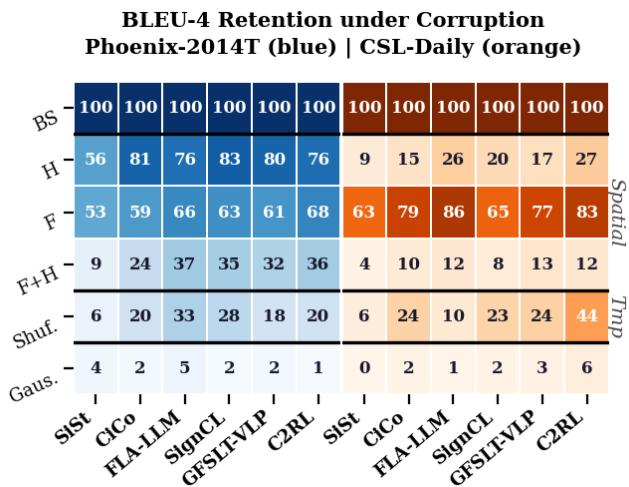  
Figure 1. BLEU-4 retention (% of baseline) under input corruptions: spatial masking of hands (H) and face (F), temporal shuffling of frames (Shuf) and Gaussian noise.

These gaps matter because of their size relative to the margins in use. On Phoenix-2014T the five gloss-free systems retain $7 . 3 { \scriptstyle \pm 0 . 9 }$ BLEU-4 points with both articulators masked, close to three times the 2.5-point spread that separates the six systems at baseline (Table 5). What a model scores while reading none of the signing therefore exceeds the differences the field uses to rank systems, so a BLEU-4 gain at the current state of the art is not on its own evidence of better sign proficiency.

## 3.2. Modalities & Award Structures

As introduced in Section 1, the non-isomorphic nature of SLT shapes how evaluation should be contextualized. No current annotation scheme offers a precise account of what is articulated in the sign space, but gloss may offer a first approximation. Figure 2 pairs gloss and text-token POS distributions with the corresponding BLEU-4 attribution:

for both Phoenix-2014T and CSL-Daily, averaged over six systems, 37% of BLEU-4 is attributable to function words occurring far less frequently in gloss than in text (German adpositions, 57 gloss vs. 1155 spoken tokens, 3.65 points; Chinese particles, 33 vs. 1279, 1.81 points).

## 4. Implications for SLT Evaluation

Section 3 shows that BLEU-4 often rewards structures with limited or absent correspondence to the visual language signal, by a margin larger than separates current systems. Plausibly, this reflects overfitting driven by narrow linguistic scope. Figure 3 separates output surviving corruption along two axes: whether it preserves the reference’s words or only their order, and whether those words are content or function. This distinction matters because the two categories are not equally recoverable from target-side priors alone: function words occupy a narrow, concentrated vocabulary, while content words are broad and long-tailed (Appendix C.2).

Two patterns hold in both datasets under every condition: coverage is retained better than 4-gram precision, and function-word coverage is retained far better than contentword coverage. What survives corruption is thus predominantly what target-side priors can supply, exactly what a metric rewarding explicit function-word forms is most exposed to. We propose instead that reward functions target the preservation of salient content. This framework has three immediate benefits: First, such a metric tolerates paraphrasing. Second, it discounts surface-level structure that survives losing the visual signal. Third, because credit is awarded almost entirely for content, a drop under occlusion reads as content lost rather than correct word order.

## 4.1. Problem Formulation: Salient Content Preservation Metrics

Receptive assessment in early-stage sign language learning [33, 48] suggests a natural way to apply these perspectives: probe comprehension by querying the conveyed content, and assess whether the responses recover the salient information of the input. The above leads to three central questions:

1. How can the preservation of salient content be measured reliably and at scale?

2. Does content-based evaluation reduce the risk of overestimating systems that exploit target-side regularities?

3. How effectively do current models preserve the salient content of the source discourse?

The remainder of the paper addresses these in turn. Section 5 implements the first question as an LLM-based QA protocol, evaluated on single-modality benchmarks. Section 6 then transfers the protocol to SLT, addressing the second and third questions.

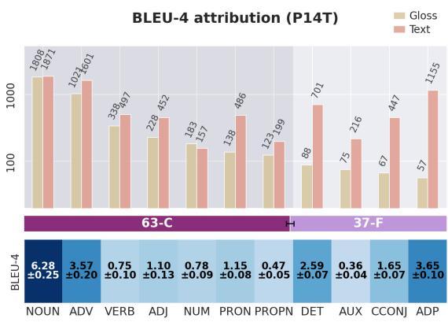

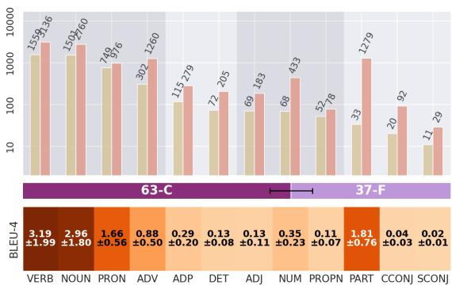  
Figure 2. Gloss and text POS distributions with BLEU-4 attribu tion, for Phoenix-2014T (top) and CSL-Daily (bottom).

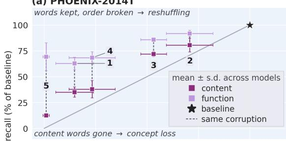

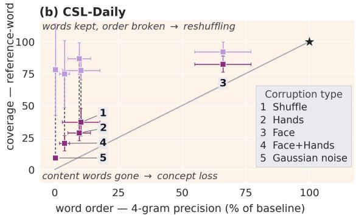  
Figure 3. What survives corruption. Each condition contributes one content and one function marker (mean ± SD over models), placed by retained 4-gram precision (word order) vs. retained reference-word recall (coverage), both as % of baseline.

## 5. Measuring Content Preservation

A metric for salient content preservation should ask what a translation conveys rather than how it is worded, which sets two requirements: invariance to wording at fixed content, and sensitivity to changes in the content itself. This section implements such a protocol as an LLM-driven question generation and answering pipeline, then establishes its behavior on spoken-language benchmarks, where we have human annotations available.

## 5.1. Evaluation Protocol

Task definition Given a human reference translation r, the protocol builds a bank Q of quality-controlled multiple-choice questions and scores a model prediction s by the fraction of Qs it can answer correctly from s alone (Appendix E), using an open-weight LLM served via vLLM [41]. Implementation details and all prompts are provided in Appendix D.

QA-Bank Generation The QA-bank generation is performed in three main phases. To increase coverage, the LLM is prompted to extract all content units from r related to nine categories (entity, action, attribute, quantity, time, location, relation, negation, polarity). In phase 2, the LLM is prompted to generate questions about that unit. $| Q _ { s } |$ thereby scales with the reference’s semantic density; perlanguage yields and lemma coverage are in Appendix G. In phase 3, distractors related to each unit and question are generated independently. Four per question, each plausible but incorrect, mutually distinct, non-paraphrastic, and matched in language and register. The five options are deterministically permuted and a language-specific not stated sentinel fixed in a sixth position, which lets the answerer decline rather than guess and floors the metric on nonequivalent content rather than at chance (1/6).

Quality control Three LLM-executed gates filter the assembled items. A round-trip gate requires the answerer, shown the reference itself, to select the correct option, since an item unanswerable from the reference cannot fairly be asked of a candidate. A world-knowledge probe presents the question with an empty passage and rejects items still answered correctly, removing those answerable from language priors alone (cf. Section 3). An ambiguity gate re-presents the reference, the question, and the five content options in a separate pass, asks which of them the reference states or clearly implies, and rejects the item if more than one does. Candidates are then scored from the passage, question, and options alone. Human verification of every stage is reported in Appendix F.

Yield and content coverage Table 1 reports bank sizes and content reach. Question counts scale with sentence complexity as intended: short colloquial subtitles (Opus-Parcus) yield 3.2 questions per reference against 11.1 for the longer Wikipedia-derived sentences of PAWS-X. Since the metric can only penalise a candidate for content its questions probe, reach is quantified using the POS machinery of Section 3: content coverage is the fraction of a reference’s content lemmas that reappear in the QA items generated from it, and the bank reaches about 88.6% on PHOENIX14T and 94.6% on CSL-Daily.

<table><tr><td>Benchmark</td><td>L</td><td> $N _ { \mathrm { r e f } }$ </td><td> $\bar { N } _ { Q }$ </td><td>Cov. (%)</td></tr><tr><td>Signed</td><td></td><td></td><td></td><td></td></tr><tr><td>PHOENIX14T</td><td>1</td><td></td><td>641 9.15±0.05 1,175 6.78±0.03</td><td>88.6±0.19</td></tr><tr><td>CSL-Daily</td><td>1</td><td></td><td></td><td>94.6±0.11</td></tr><tr><td>Spoken</td><td></td><td></td><td></td><td></td></tr><tr><td>WMT 2011–2024 5 15,938</td><td></td><td></td><td>12.1</td><td>92.8</td></tr><tr><td>OpusParcus</td><td></td><td>6 19,492</td><td>3.2</td><td>84.9</td></tr><tr><td>PAWS-X</td><td></td><td>713,862</td><td>11.1</td><td>95.0</td></tr></table>

Table 1. QA yield and coverage pooled over L languages. $\bar { N } _ { Q }$ = average number of questions per reference. Cov. (%) = share of the reference’s content lemmas covered by the QA bank. Subscripts are standard deviations over ten independent bank generations.

## 5.2. Validation

To assess robustness to meaning-shift and wording, the QA pipeline is evaluated on four benchmarks: paraphrase invariance (WMT19-P [29]; WMT21-multiref [1, 30]); sensitivity to shifts in meaning from partial paraphrases (Opus-Parcus [23]); sensitivity to flipped meaning under fixed wording (PAWS-X [58]); and alignment with human MTsystem rankings over the WMT campaigns from 2011 to 2024 [5–8, 11–13, 30]. Dataset details are provided in Appendix A, and per-language results are provided in Appendix H.

Invariance and Sensitivity Each WMT group collects renderings of one source sentence that differ in wording but not content: one supplies the reference from which questions are generated, the rest are scored against it, and renderings of other sentences supply a floor (Appendix E). Invariance is the gap to that floor divided by the fluctuation within a group: on WMT19 BLEU-4 fluctuates by 7.7 points against a 16.5-point gap, an SNR of 2.1, where QA reaches 12.5; on WMT21 the two are 3.1 and 23.0 (Table 2). The two collections differ in provenance, deliberate paraphrasing against independent translation, so their agreement is not a protocol artefact. Sensitivity is tested on OpusParcus, whose ratings are graded: QA tracks the human scale on average twice as closely as BLEU-4 in every language (Figure 4), rising from 9 to 72 across the four quality bands where BLEU-4 moves from 9 to 14 (Figure 5).

Meaning inversion PAWS-X pairs keep surface overlap high whether or not meaning is inverted, so lexical overlap is uninformative by design. Scoring one sentence of each pair against the other yields two populations of scores, one for true paraphrases and one for meaning-flipped pairs, and we summarise how far apart they lie by ROC-AUC: the probability that a randomly drawn true paraphrase outscores a randomly drawn flipped pair. A metric blind to the inversion sits at 0.5 and one that separates the two populations perfectly at 1.0. Being threshold-free, it compares BLEU-4 and QA on a common footing despite their different scales. QA performs better than BLEU-4 in all seven languages, 0.83 against 0.61. That QA still awards flipped English pairs 55.7% against 95.4% for true paraphrases is expected: PAWS-X alters one or two arguments, so most questions stay answerable.

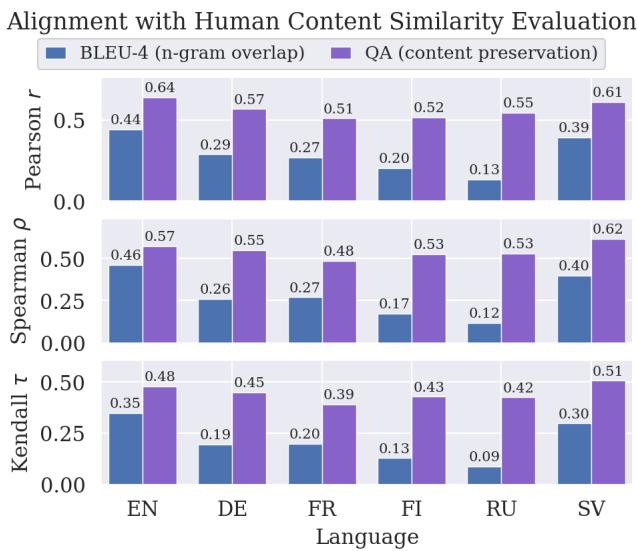

Figure 4. Correlation of BLEU-4 and QA with human paraphrasequality ratings on OpusParcus per language (qwen2.5-32b). Pearson r, Spearman ρ and Kendall τ over all graded pairs.  
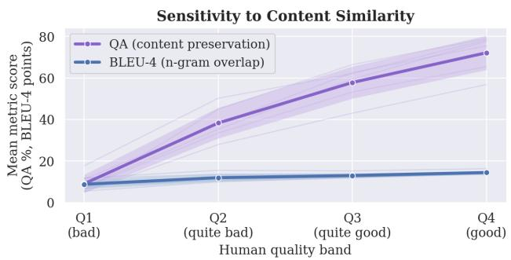  
Figure 5. Mean metric score by human similarity band on Opus-Parcus (Q1 = low similarity, Q4 = clean paraphrase), mean ± SD over the six languages.

Human rankings of MT systems Current text-only MT is near human performance, so its error profiles differ from those of SLT systems; restricting the WMT campaigns to systems averaging below 30 BLEU-4 gives a first approximation. Figure 6 reports Kendall concordance with human ranking. QA matches or exceeds BLEU-4 in every campaign, though the intervals overlap in most; separation is clearest in 2013–2015, where systems are weak enough for content transfer to differ between them but not so weak that both metrics floor.

## 6. QA-based Evaluation for SLT

The spoken-language benchmarks establish that the protocol behaves as a content metric should. This section applies it to the six SLT models, addressing the three evaluation questions of Section 4.1 in order.

<table><tr><td>Benchmark</td><td>Statistic</td><td>BLEU-4</td><td>QA</td></tr><tr><td>WMT19 (invariance)</td><td>SNR</td><td>2.1</td><td>12.5</td></tr><tr><td>WMT21 (invariance)</td><td>SNR</td><td>3.1</td><td>23.0</td></tr><tr><td>OpusParcus (graded)</td><td>ρ</td><td>0.28</td><td>0.55</td></tr><tr><td>PAWS-X (inversion)</td><td>AUC</td><td>0.61</td><td>0.83</td></tr></table>

Table 2. Robustness: $\mathbf { S N R } \ = \ \Delta / \bar { \sigma }$ over meaning-equivalent groups (higher = more invariant); ρ¯ is Spearman correlation with human paraphrase-quality ratings; AUC is $P ( { \mathrm { s c o r e } } _ { p a r a p h r a s e }$ > $\operatorname { s c o r e } _ { f l i p p e d } )$ , averaged over seven PAWS-X languages. QA performs better than BLEU-4 across all metrics.

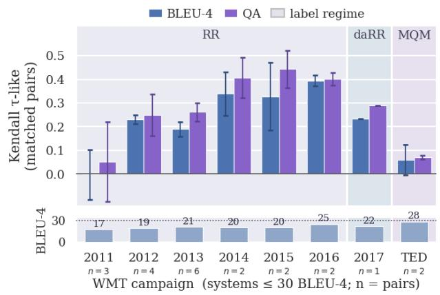  
Figure 6. Kendall τ-like concordance with human judgments, over WMT campaigns restricted to systems at or below 30 BLEU-4. QA is more aligned with human ranking than BLEU-4 in all but one campaign.

## 6.1. Efficiency and Stability

The first question asks how salient content preservation can be measured reliably and at scale.

Cost Costs depend on deployment, so each stage is reported separately. Each experiment is conducted on a single RTX 5090 with qwen2.5-32b served under vLLM (Table 3). Bank construction, encompassing content extraction, two QA-generation passes and three quality-control gates, is the expensive stage at 22–24 minutes per benchmark. Answering, one short-prompt call per admitted question, is up to an order of magnitude cheaper, putting the recurring cost of evaluating an additional system at roughly 2–3 GPU minutes.

Stability A metric is only useful if repeating an experiment yields the same result. Rerunning the generation pipeline does not necessarily reproduce a bank. Roughly three-quarters of the admitted items recur between two banks, partly by design, since the second generation pass samples at a non-zero temperature (Appendix I). However, that variability does not carry through to the scores. Table 4 reports ten end-to-end repeats, each regenerating content units, questions and answers against fixed system outputs. Across those repeats a system’s QA accuracy moves by $\sigma ~ = ~ 0 . 1 7 \mathrm { - 0 . 3 4 }$ percentage points on Phoenix-2014T and 0.11–0.26 on CSL-Daily. Holding the bank fixed and bootstrap-resampling the test instances instead moves it by 2.4–2.7 and 1.4–2.0 points (half-width of the 95% interval; Appendix E.2), between seven and sixteen times more for every system. Which questions get asked therefore matters far less than which sentences the test set happens to contain. The banks are correspondingly stable: their size varies by about half a percent, and every run covers at least 99.8% of references, varying by at most one reference. A QA gap below roughly half a point is therefore within run-to-run noise and should not be read as a difference between systems.

<table><tr><td>Generation</td><td> $N _ { \mathrm { r e f } }$ </td><td>|Q|</td><td>wall (s)</td><td>GPU-h</td></tr><tr><td>Phoenix2014T</td><td>642</td><td> $5 , 8 6 3 _ { \pm 3 2 }$ </td><td> $^ { 1 , 4 2 0 \pm 1 1 }$ </td><td> $0 . 3 9 4 { \scriptstyle \pm 0 . 0 0 3 }$ </td></tr><tr><td>CSL-Daily</td><td>1,176</td><td> $^ { 7 , 9 6 7 \pm 4 1 }$ </td><td> $^ { 1 , 3 1 9 \pm 5 }$ </td><td> $0 . 3 6 7 _ { \pm 0 . 0 0 2 }$ </td></tr><tr><td>Answering</td><td>calls</td><td>ans/s</td><td>wall (s)</td><td>GPU-h</td></tr><tr><td>Phoenix2014T</td><td>5,863</td><td> $4 8 . 8 { \scriptstyle \pm 0 . 1 }$ </td><td> $1 2 0 { \scriptstyle \pm 1 }$ </td><td> $0 . 0 3 3 { \scriptstyle \pm 0 . 0 0 1 }$ </td></tr><tr><td>CSL-Daily</td><td>7,967</td><td> $4 6 . 0 { \scriptstyle \pm 0 . 2 }$ </td><td> $1 7 3 { \scriptstyle \pm 1 }$ </td><td> $0 . 0 4 8 _ { \pm 0 . 0 0 1 }$ </td></tr></table>

Table 3. Computational cost. Generation costs are averaged over 10 bank-construction runs, and answering costs over 60 answering passes, per benchmark. |Q| is the number of questions admitted by the quality-control gates, out of $^ { 1 0 , 0 3 0 \pm 6 1 }$ candidates for Phoenix-2014T and $^ { 1 2 , 3 7 3 \pm 4 8 }$ for CSL-Daily.

## 6.2. Exposure to Target-Side Regularities

The second question asks whether content-based evaluation reduces the risk of overestimating systems that exploit target-side regularities. This is influenced by what the metric awards, and how much it rewards test examples that resemble the training data.

Award structures Under the content/function POS division of Figure 2 (tagging and attribution in Appendix C), BLEU-4 derives 37% of its score from function words, whereas QA spends 95% on content for Phoenix-2014T and over 99% for CSL-Daily. Function words are also what best survives corruption. Replacing the visual signa with noise leaves function-word recall at 69% of baseline on Phoenix-2014T and 78% on CSL-Daily, while contentword recall falls to 7–16% (Figure 3). A third of BLEU-4 is therefore committed to a word class the model can still produce once the signal the metric is meant to measure is gone. This opens a channel for improvement without comprehension, where a system can raise BLEU-4 by modeling the target language better in the very category the signed source largely does not encode, indistinguishably from a gain earned by reading the signing. Nor is the channel narrow, corresponding to approximately 8 BLEU-4 points on Phoenix-2014T against the 2.5 points that separate the six systems. QA leaves almost none open: with 95% or more of its credit on content.

<table><tr><td>Quantity</td><td>mean±σ</td><td>range</td><td>CI/2</td></tr><tr><td colspan="4">PHOENIX-2014T, QA % per system</td></tr><tr><td>C2RL</td><td> $5 3 . 0 5 { \scriptstyle \pm 0 . 3 2 }$ </td><td>52.56–53.47</td><td>2.65</td></tr><tr><td>CiCo</td><td> $5 6 . 4 7 { \scriptstyle \pm 0 . 3 4 }$ </td><td>56.04–57.03</td><td>2.57</td></tr><tr><td>Fla-LLM</td><td> $5 5 . 2 3 { \scriptstyle \pm 0 . 1 7 }$ </td><td>54.99–55.48</td><td>2.53</td></tr><tr><td>GFSLT</td><td> $5 3 . 9 3 { \scriptstyle \pm 0 . 2 4 }$ </td><td>53.51–54.29</td><td>2.50</td></tr><tr><td>SignCL</td><td> $5 4 . 2 8 { \scriptstyle \pm 0 . 1 7 }$ </td><td>53.93–54.54</td><td>2.60</td></tr><tr><td>SingleStream</td><td> $6 5 . 8 5 { \scriptstyle \pm 0 . 2 7 }$ </td><td>65.28–66.22</td><td>2.39</td></tr><tr><td>bank size |Q| refs. covered</td><td> $5 , 8 6 3 { \scriptstyle \pm 3 2 }$   $6 4 1 . 0 { \scriptstyle \pm 0 . 0 }$ </td><td>5,803–5,906 641-641</td><td></td></tr><tr><td colspan="4">CSL-Daily, QA %  $p e r \ s y s t e m$ </td></tr><tr><td>C2RL</td><td> $1 1 . 5 5 { \scriptstyle \pm 0 . 1 2 }$ </td><td>11.35–11.72</td><td>1.38</td></tr><tr><td>CiCo</td><td> $2 6 . 8 9 _ { \pm 0 . 1 4 }$ </td><td>26.65–27.13</td><td>1.73</td></tr><tr><td>Fla-LLM</td><td> $4 0 . 9 5 { \scriptstyle \pm 0 . 2 1 }$ </td><td>40.57–41.26</td><td>2.03</td></tr><tr><td>GFSLT</td><td> $2 2 . 1 9 _ { \pm 0 . 1 1 }$ </td><td>22.00–22.32</td><td>1.78</td></tr><tr><td>SignCL</td><td> $2 1 . 0 9 _ { \pm 0 . 1 7 }$ </td><td>20.85–21.45</td><td>1.70</td></tr><tr><td>SingleStream</td><td> $6 1 . 4 2 { \scriptstyle \pm 0 . 2 6 }$ </td><td>60.93-61.79</td><td>2.01</td></tr><tr><td>bank size |Q|</td><td> $^ { 7 , 9 6 7 \pm 4 1 }$ </td><td>7,893–8,037</td><td></td></tr><tr><td>refs. covered</td><td> $1 , 1 7 5 . 2 _ { \pm 0 . 4 }$ </td><td>1,175–1,176</td><td></td></tr></table>

Table 4. Accuracies over ten runs, each with content units, questions, and system answers regenerated. σ is variation across question banks; CI/2 is the mean half-width of the within-bank 95% bootstrap interval(Appendix E.2).

Exposure to train–test overlap Alkain et al. [3] show that BLEU scores a test sentence higher when it resembles the training data, crediting recall of the training targets as though it were translation quality, and doing so most where the training distribution is narrowest, which is the situation in SLT. Whether the QA score depends on that resemblance is therefore worth measuring.

Following Alkain et al. [3], we characterize each test instance by a training-likeness $\ell _ { i } = \mathrm { m a x } _ { t \in T _ { d } } \sin ( r _ { i } , t )$ , the character-level similarity between its reference and the closest training target, so ℓ = 100 means the reference occurs verbatim in training. Within a sliding window over ℓ we regress the per-instance score on ℓ at fixed reference length, and express the slope as a percentage of that model’s own mean score: a value of 10 says one further likeness point buys ten percent of the score the system reports, and 0 says the metric is indifferent to how training-like a sentence is. Normalizing this way is what makes the two metrics comparable. On Phoenix-2014T BLEU-4 averages about 22 and QA about 56, so the same raw slope would mean very different things for each; dividing by each metric’s own mean removes that difference in scale and lets both be read on a single axis. Window widths, the treatment of exact copies and a cumulative view are in Appendix J.

On Phoenix-2014T (Figure 7) BLEU-4 sits at 3.9% per likeness point over most of the range, below ℓ = 80, then rises eightfold to 32% for the most training-like sentences, where QA moves only from 2.4% to 6.5%. The exact copies, excluded from the curves, show the same asymmetry in levels rather than slopes: on the 31 references that occur verbatim in training, sentence BLEU-4 averages 52.5 against 21.4 elsewhere, a 2.4-fold jump, where QA averages 79.7 against 57.1, a 1.4-fold one. CSL-Daily reproduces the shape more weakly: over the top quarter of its likeness range BLEU-4 averages 8.4% per likeness point against 2.5% for QA, a 3.4-fold gap where the Phoenix-2014T figures of 23.5% and 3.6% give 6.6-fold. The direction is the same in all twelve cases: as a reference comes to resemble something the system saw in training, BLEU-4 accelerates and QA barely responds.

Probing sign grounding One further perspective on the second question is worth detailing before we conclude. Figure 1 showed BLEU-4 surviving well above each model’s noise floor under severe corruption of the input, but it cannot say what survived. A retention percentage reflects content the corruption removed, word order it broke, and targetside structure it never touched, and the two findings above say the third term dominates. What best withstands losing the visual signal is the same narrow, closed vocabulary that carries a third of the score and that training-like references inflate. Any metric resting on that scaffolding is inherently limited as a reflection of sign comprehension.

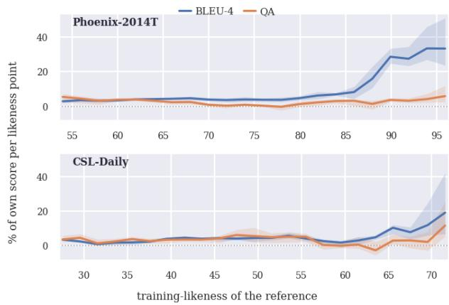  
Figure 7. Local sensitivity of BLEU-4 and QA to training-likeness ℓ, at fixed reference length. Curves are the mean over M = 6 models; bands span their min–max. Exact duplicates (ℓ = 100) are excluded as a point mass, and, on Phoenix-2014T, because their references are shorter than neighbouring points.

Content words are harder to guess given their long-tailed distribution, but the share that survives pure noise shows they remain partly recoverable. A content-oriented metric is therefore not a fully closed channel, but a more transparent one. By stripping away the structural component that each modality expresses differently, the source of the nonisomorphism discussed in Section 1, its movement under corruption can be read as grounding. What survives then reflects the content transferred without the masked channel. Neither function-word scaffolding nor train-test overlap inflates QA, whose slope in training-likeness stays flat where BLEU-4 accelerates (Figure 7), so its retention can be read directly: masking the hands leaves 64–80% of content transfer intact on Phoenix-2014T but only 4–16% on CSL-Daily, while masking the face leaves 62–70% and 40– 68% respectively (Appendix B.4).

In answer to the second evaluation question, contentbased evaluation reduces that risk because it does not reward target-side regularities the way BLEU-4 does, turning a corruption experiment from an uninterpretable number into a per-channel statement about how far a system’s output depends on the signing.

## 6.3. Saliency Oriented System Ranking

The third question asks how effectively models preserve the source discourse’s salient content. QA accuracy ranges from 52.6 to 65.5% on Phoenix-2014T and from 11.6 to 61.6% on CSL-Daily (Table 5). However, CSL-Daily’s figures reflect total failures as much as partial transfer (Appendix K). Relative to the published scores the ranking reorders substantially, but some of that is attributable to the reproduction gap, which is itself informative. The five gloss-

<table><tr><td></td><td colspan="2">BLEU-1</td><td colspan="2">BLEU-4</td><td>QA %</td><td colspan="2"> $\mathbf { R a n k \colon B L E U - 4 } \to \mathbf { Q A }$ </td></tr><tr><td>Model</td><td>Reported</td><td>Ours</td><td>Reported</td><td>Ours</td><td>Ours</td><td>vs Reported</td><td>vs Ours</td></tr><tr><td colspan="8">PHOENIX-2014T</td></tr><tr><td>C2RL</td><td>52.8</td><td>46.2</td><td>26.8</td><td> $2 1 . 2 { \scriptstyle \pm 2 . 2 }$ </td><td> $5 2 . 6 { \scriptstyle \pm 2 . 6 }$ </td><td> $2  6 ( - 4 )$ </td><td> $5  6 ( - 1 )$ </td></tr><tr><td>CiCo</td><td></td><td>47.6</td><td>一</td><td> $2 3 . 6 { \scriptstyle \pm 2 . 1 }$ </td><td> $5 6 . 2 { \scriptstyle \pm 2 . 6 }$ </td><td> $3  2 ( + 1 )$ </td><td> $1  2 ( - 1 )$ </td></tr><tr><td>Fla-LLM</td><td>46.3</td><td>46.6</td><td>23.1</td><td> $2 1 . 1 { \pm } 2 . 1$ </td><td> $5 5 . 0 { \scriptstyle \pm 2 . 5 }$ </td><td> $4  3 ( + 1 )$ </td><td> $6 \to 3 ( + 3 )$ </td></tr><tr><td>GFSLT</td><td>43.7</td><td>46.9</td><td>21.4</td><td> $2 2 . 2 { \scriptstyle \pm 2 . 3 }$ </td><td> $5 3 . 5 { \scriptstyle \pm 2 . 6 }$ </td><td> $6  5 ( + 1 )$ </td><td> $4  5 ( - 1 )$ </td></tr><tr><td>SignCL</td><td>49.8</td><td>46.3</td><td>22.7</td><td> $2 2 . 7 { \scriptstyle \pm 2 . 2 }$ </td><td> $5 3 . 8 { \scriptstyle \pm 2 . 6 }$ </td><td> $5  4 ( + 1 )$ </td><td> $3  4 ( - 1 )$ </td></tr><tr><td>SingleStream</td><td>54.0</td><td>46.0</td><td>27.6</td><td> $2 3 . 5 { \pm } 2 . 1$ </td><td> $6 5 . 5 { \scriptstyle \pm 2 . 3 }$ </td><td> $1  1 ( \pm 0 )$ </td><td> $2  1 \ : ( + 1 )$ </td></tr><tr><td colspan="8">CSL-Daily</td></tr><tr><td>C2RL</td><td>49.3</td><td>30.6</td><td>21.6</td><td> $7 . 0 { \scriptstyle \pm 0 . 7 }$ </td><td> $1 1 . 6 { \scriptstyle \pm 1 . 3 }$ </td><td> $2  6 ( - 4 )$ </td><td> $6  6 ( \pm 0 )$ </td></tr><tr><td>CiCo</td><td></td><td>39.9</td><td>一</td><td> $1 2 . 0 { \scriptstyle \pm 0 . 8 }$ </td><td> $2 7 . 1 { \pm } 1 . 8$ </td><td> $5  3 ( + 2 )$ </td><td> $3  3 ( \pm 0 )$ </td></tr><tr><td>Fla-LLM</td><td>37.1</td><td>47.8</td><td>14.2</td><td> $1 6 . 9 { \scriptstyle \pm 1 . 0 }$ </td><td> $4 1 . 2 { \scriptstyle \pm 2 . 1 }$ </td><td> $4  2 \ : ( + 2 )$ </td><td> $2  2 ( \pm 0 )$ </td></tr><tr><td>GFSLT</td><td>39.4</td><td>37.4</td><td>11.0</td><td> $1 0 . 9 { \scriptstyle \pm 0 . 9 }$ </td><td> $2 2 . 7 _ { \pm 1 . 7 }$ </td><td> $6  4 ( + 2 )$ </td><td> $4  4 ( \pm 0 )$ </td></tr><tr><td>SignCL</td><td>47.5</td><td>37.3</td><td>16.2</td><td> $1 0 . 9 { \scriptstyle \pm 0 . 8 }$ </td><td> $2 1 . 2 { \scriptstyle \pm 1 . 7 }$ </td><td> $3  5 ( - 2 )$ </td><td> $5  5 ( \pm 0 )$ </td></tr><tr><td>SingleStream</td><td>55.4</td><td>58.8</td><td>25.8</td><td> $2 8 . 2 { \scriptstyle \pm 1 . 4 }$ </td><td> $6 1 . 6 { \scriptstyle \pm 2 . 1 }$ </td><td> $1  1 ( \pm 0 )$ </td><td> $1  1 ( \pm 0 )$ </td></tr></table>

Table 5. Reported vs. reproduced performance with QA content preservation. 95% intervals are bootstrap over test instances (Ap pendix E.2). QA is the pooled fraction of admitted questions answered correctly, from a bank generated and answered by qwen2.5-32b. Rank columns order all six models by BLEU-4 vs. QA: vs Reported uses published BLEU-4 where available (our reproduction otherwise); vs Ours uses our reproduction throughout.

## 7. Conclusion

free systems are evaluated here from the checkpoints of Sincan et al. [51], which brings them onto a common data pipeline, input resolution and evaluation protocol, and all six are decoded and scored through a single pipeline of our own (Appendix A). The Reported column instead aggregates six independent training and evaluation setups, so we take the Ours ranking to be the like-for-like comparison. On identical predictions the two metrics agree closely, no system changes rank on CSL-Daily, and five of six move by at most one position on Phoenix-2014T, since transferring more content also reproduces more reference surface. The exception is Fla-LLM, sixth on BLEU-4 and third on QA.

BLEU-4 rewards words a spoken-language decoder can supply without reading the signing: it survives occlusion of the articulators, commits a third of its credit to function words with few counterparts in the source, and favours systems that reproduce training-like targets. Each exceeds the 2.5-point spread separating the six systems we reproduce, so BLEU-4 differences at the current state of the art are not evidence of better sign understanding.

The consequential finding is separation, not reranking. On Phoenix-2014T the five gloss-free systems cannot be told apart: all ten confidence-interval pairs overlap across a span of just 3.6 QA points, so none shows evidence of preserving more salient content than another, on the field’s most reported benchmark. CSL-Daily separates the same five over a span eight times wider. SingleStream, the one gloss-supervised system, stands apart from all five on both benchmarks (9.3 and 20.4 points), a gap invisible to BLEU-4, which ranks it second on Phoenix-2014T. In answer to the third evaluation question, preservation is partial at best: about two thirds of queried content for the gloss-supervised system on Phoenix-2014T, just above half for the gloss-free systems, and as little as a tenth on CSL-Daily.

Asking instead what a translation conveys answers all three questions of Section 4.1. The QA pipeline measures salient content preservation reliably and at scale, stable to within half a point across reevaluations at 2–3 GPU-minutes per additional system. It resists what inflates BLEU-4: 95% of its credit falls on content, it is markedly more paraphraseinvariant and inversion-sensitive, and on the least traininglike tenth of Phoenix-2014T it retains 57% of its full-set value where BLEU-4 retains 12%. Measured this way the field looks different: models recover just above half the queried content, the gloss-supervised system leads by 9.3 QA points where BLEU-4 ranks it second, and the five gloss-free systems cannot be told apart.

As SLT matures, content transfer will increasingly saturate and be replaced by more detailed benchmarks. Until then, we believe the field should focus on whether models are capable of recovering the salient, grounded content of the discourse.

## References

[1] Farhad Akhbardeh, Arkady Arkhangorodsky, Magdalena Biesialska, Ondˇrej Bojar, Rajen Chatterjee, Vishrav Chaudhary, Marta R. Costa-jussa, Cristina Espana-Bonet, Angela˜ Fan, Christian Federmann, Markus Freitag, Yvette Graham, Roman Grundkiewicz, Barry Haddow, Leonie Harter, Kenneth Heafield, Christopher M. Homan, Matthias Huck, Kwabena Amponsah-Kaakyire, Jungo Kasai, Daniel Khashabi, Kevin Knight, Tom Kocmi, Philipp Koehn, Nicholas Lourie, Christof Monz, Makoto Morishita, Masaaki Nagata, Ajay Nagesh, Toshiaki Nakazawa, Matteo Negri, Santanu Pal, Allahsera Auguste Tapo, Marco Turchi, Valentin Vydrin, and Marcos Zampieri. Findings of the 2021 conference on machine translation (WMT21). In Proceedings of the Sixth Conference on Machine Translation, 2021. 4

[2] Samuel Albanie, Gul Varol, Liliane Momeni, Hannah Bull,¨ Triantafyllos Afouras, Himel Chowdhury, Neil Fox, Bencie Woll, Rob Cooper, Andrew McParland, and Andrew Zisserman. BOBSL: BBC-Oxford British Sign Language Dataset. In arXiv, 2021. 1

[3] Bittor Alkain, Adrian N´ u´nez-Marcos, Carlos Escolano,˜ Laura Doc´ıo-Fernandez, Olatz Perez-de Vi´ naspre, and Gorka˜ Labaka. Critical analysis of datasets for sign language translation. Frontiers in Artificial Intelligence, 2026. 2, 7

[4] S. Asasi, M. I. Lakhal, O. M. Sincan, and R. Bowden. Beyond gloss: A hand-centric framework for gloss-free sign language translation. In arXiv preprint, 2025. 1

[5] Ondˇrej Bojar, Christian Buck, Chris Callison-Burch, Christian Federmann, Barry Haddow, Philipp Koehn, Christof Monz, Matt Post, Radu Soricut, and Lucia Specia. Findings of the 2013 Workshop on Statistical Machine Translation. In Proceedings of the Eighth Workshop on Statistical Machine Translation, 2013. 4

[6] Ondˇrej Bojar, Christian Buck, Christian Federmann, Barry Haddow, Philipp Koehn, Johannes Leveling, Christof Monz, Pavel Pecina, Matt Post, Herve Saint-Amand, Radu Soricut, Lucia Specia, and Ales Tamchyna. Findings of the 2014ˇ workshop on statistical machine translation. In Proceedings of the Ninth Workshop on Statistical Machine Translation, 2014.

[7] Ondˇrej Bojar, Rajen Chatterjee, Christian Federmann, Barry Haddow, Matthias Huck, Chris Hokamp, Philipp Koehn, Varvara Logacheva, Christof Monz, Matteo Negri, Matt Post, Carolina Scarton, Lucia Specia, and Marco Turchi. Findings of the 2015 workshop on statistical machine translation. In Proceedings of the Tenth Workshop on Statistical Machine Translation, 2015.

[8] Ondˇrej Bojar, Rajen Chatterjee, Christian Federmann, Yvette Graham, Barry Haddow, Shujian Huang, Matthias Huck, Philipp Koehn, Qun Liu, Varvara Logacheva, Christof Monz, Matteo Negri, Matt Post, Raphael Rubino, Lucia Specia, and Marco Turchi. Findings of the 2017 conference on machine translation (WMT17). In Proceedings ofthe Second Conference on Machine Translation, 2017. 4

[9] Danielle Bragg, Oscar Koller, Marc Bellard, et al. Sign lan-

guage recognition, generation, and translation: An interdisciplinary perspective. In ASSETS, 2019. 1

[10] Matt Brown, Oline Ranum, Edward Fish, Heidi Proctor, Bencie Woll, Richard Bowden, and Kearsy Cormier. Signgpt and the visual language toolkit. In Proceedings ofthe LREC 2026 12th Workshop on the Representation and Processing ofSign Languages: Language in Motion, 2026. 1, 2

[11] Christian Buck and Philipp Koehn. Findings of the WMT 2016 bilingual document alignment shared task. In Proceedings of the First Conference on Machine Translation: Volume 2, Shared Task Papers, 2016. 4

[12] Chris Callison-Burch, Philipp Koehn, Christof Monz, and Omar Zaidan. Findings of the 2011 workshop on statistical machine translation. In Proceedings of the Sixth Workshop on Statistical Machine Translation, 2011.

[13] Chris Callison-Burch, Philipp Koehn, Christof Monz, Matt Post, Radu Soricut, and Lucia Specia. Findings of the 2012 workshop on statistical machine translation. In Proceedings ofthe Seventh Workshop on Statistical Machine Translation, 2012. 4

[14] Necati Cihan Camgoz, Simon Hadfield, Oscar Koller, Hermann Ney, and Richard Bowden. Neural sign language translation. In Proceedings ofthe IEEE Conference on Computer Vision and Pattern Recognition (CVPR), 2018. 1, 12

[15] Yutong Chen, Ronglai Zuo, Fangyun Wei, Yu Wu, Shujie Liu, and Brian Mak. Two-stream network for sign language recognition and translation. In Proceedings ofthe 36th International Conference on Neural Information Processing Sys tems, 2022. 2, 13

[16] Y. Chen, F. Wei, X. Sun, et al. A simple multi-modality transfer learning baseline for sign language translation. In CVPR, 2023. 1

[17] Y. Chen, R. Zuo, F. Wei, et al. Two-stream network for sign language recognition and translation. In NeurIPS, 2023. 1

[18] Zhigang Chen, Benjia Zhou, Yiqing Huang, Jun Wan, Yibo Hu, Hailin Shi, Yanyan Liang, Zhen Lei, and Du Zhang. C2rl: Content and context representation learning for glossfree sign language translation and retrieval. IEEE Transactions on Circuits and Systems for Video Technology, 2024. 2, 13

[19] Zhigang Chen, Benjia Zhou, Jun Li, Jun Wan, Zhen Lei, Ning Jiang, Quan Lu, and Guoqing Zhao. Factorized learning assisted with large language model for gloss-free sign language translation. In Proceedings of the 2024 Joint In ternational Conference on Computational Linguistics, Lan guage Resources and Evaluation (LREC-COLING 2024), 2024. 2, 13

[20] Z. Chen, B. Zhou, Y. Huang, et al. C2rl: Content and context representation learning for gloss-free sign language transla tion and retrieval. IEEE TCSVT, 2025. 1

[21] Yiting Cheng, Fangyun Wei, Jianmin Bao, Dong Chen, and Wenqiang Zhang. Cico: Domain-aware sign lan guage retrieval via cross-lingual contrastive learning. In 2023 IEEE/CVF Conference on Computer Vision and Pattern Recognition (CVPR), 2023. 2, 13

[22] Oliver Cory, Maksym Ivashechkin, Karahan Sahin, Oline Ranum, Jianhe Low, Edward Fish, Anton Pelykh, Ozge Mercanoglu Sincan, and Richard Bowden. Backtranslation2.0: A

linguistically motivated metric to assess sign language production. arXiv preprint arXiv:2606.28673, 2026. 2

[23] Mathias Creutz. Open subtitles paraphrase corpus for six languages. In Proceedings of the 11th edition of the Language Resources and Evaluation Conference (LREC 2018), 2018. 4, 12

[24] A. Desai, M. De Meulder, J. A. Hochgesang, A. Kocab, and A. X. Lu. Systemic biases in sign language ai research: A deaf-led call to reevaluate research agendas. LREC-COLING Workshop, 2024. 1

[25] Amanda Duarte, Shruti Palaskar, Lucas Ventura, Deepti Ghadiyaram, Kenneth DeHaan, Florian Metze, Jordi Torres, and Xavier Giro-i Nieto. How2Sign: A Large-scale Multimodal Dataset for Continuous American Sign Language. In Conference on Computer Vision and Pattern Recognition (CVPR), 2021. 1

[26] AI FASHN. Fashn human parser: Segformer for fashion human parsing, 2024. 14

[27] Patrick Fernandes, Sweta Agrawal, Emmanouil Zaranis, Andre Martins, and Graham Neubig. Do LLMs understand your translations? evaluating paragraph-level MT with question answering. In Second Conference on Language Modeling, 2025. 2

[28] N. Fox, B. Woll, and K. Cormier. Best practices for sign language technology research. In Universal Access in the Information Society, 2023. 1

[29] Markus Freitag, George Foster, David Grangier, and Colin Cherry. Human-paraphrased references improve neural machine translation. In Proceedings of the Fifth Conference on Machine Translation, 2020. 4, 12

[30] Markus Freitag, George Foster, David Grangier, Viresh Ratnakar, Qijun Tan, and Wolfgang Macherey. Experts, errors, and context: A large-scale study of human evaluation for machine translation. Transactions of the Association for Computational Linguistics, 2021. 4

[31] Yasser Hamidullah, Koel Dutta Chowdhury, Yusser Al Ghussin, Shakib Yazdani, Cennet Oguz, Josef van Genabith, and Cristina Espana-Bonet. Grounding or guessing? visual˜ signals for detecting hallucinations in sign language translation. arXiv, 2026. 2

[32] HyoJung Han, Marine Carpuat, and Jordan Boyd-Graber. SimQA: Detecting simultaneous MT errors through wordby-word question answering. In Proceedings of the 2022 Conference on Empirical Methods in Natural Language Processing, 2022. 2

[33] Peter C. Hauser, Raylene Paludneviciene, Wanda Riddle, Kim Brown Kurz, Karen Emmorey, and Jessica Contreras. American sign language comprehension test: A tool for sign language researchers. Journal of deaf studies and deaf education, 2016. 3

[34] Jie Huang, Wengang Zhou, Qilin Zhang, Houqiang Li, and Weiping Li. Video-based sign language recognition without temporal segmentation. In Proceedings ofthe Thirty-Second AAAI Conference on Artificial Intelligence and Thirtieth Innovative Applications of Artificial Intelligence Conference and Eighth AAAI Symposium on Educational Advances in Artificial Intelligence, 2018. 1

[35] Zifan Jiang, Colin Leong, Amit Moryossef, Oliver Cory, Maksym Ivashechkin, Neha Tarigopula, Biao Zhang, Anne Gohring, Annette Rios, Rico Sennrich, and Sarah Ebling.¨ Meaningful pose-based sign language evaluation. In Pro ceedings of the Tenth Conference on Machine Translation, 2025. 2

[36] Ehsan Kamalloo, Shivani Upadhyay, and Jimmy Lin. To wards robust qa evaluation via open llms. In Proceedings of the 47th International ACM SIGIR Conference on Research and Development in Information Retrieval, 2024. 2

[37] Dayeon Ki, Kevin Duh, and Marine Carpuat. AskQE: Question answering as automatic evaluation for machine translation. In Findings of the Association for Computational Lin guistics: ACL 2025, 2025. 2

[38] J. Kim, H. Jeon, J. Bae, and H. Y. Kim. Leveraging the power of mllms for gloss-free sign language translation. In ICCV, 2025. 1

[39] Jung-Ho Kim, Mathew Huerta-Enochian, Changyong Ko, and Du Hui Lee. SignBLEU: Automatic evaluation of multi-channel sign language translation. In Proceedings of the 2024 Joint International Conference on Computational Linguistics, Language Resources and Evaluation (LREC-COLING 2024), pages 14796–14811, 2024. 2

[40] Mateusz Krubinski, Erfan Ghadery, Marie-Francine Moens,´ and Pavel Pecina. Just ask! evaluating machine translation by asking and answering questions. In Proceedings of the Sixth Conference on Machine Translation, 2021. 2

[41] Woosuk Kwon, Zhuohan Li, Siyuan Zhuang, Ying Sheng, Lianmin Zheng, Cody Hao Yu, Joseph E. Gonzalez, Hao Zhang, and Ion Stoica. Efficient memory management for large language model serving with pagedattention. In Proceedings of the ACM SIGOPS 29th Symposium on Operating Systems Principles, 2023. 4

[42] Dongxu Li, Cristian Rodriguez, Xin Yu, and Hongdong Li. Word-level deep sign language recognition from video: A new large-scale dataset and methods comparison. In The IEEE Winter Conference on Applications of Computer Vi sion, 2020. 1

[43] K. Papineni, S. Roukos, T. Ward, and W. J. Zhu. Bleu: a method for automatic evaluation of machine translation. ACL, 2002. 1

[44] Oline Ranum, David Wessels, Gomer Otterspeer, Erik J \` Bekkers, Floris Roelofsen, and Jari I. Andersen. The NGT200 dataset - geometric multi-view isolated sign recognition. In ICML 2024 Workshop on Geometry-grounded Representation Learning and Generative Modeling, 2024. 1

[45] Oline Ranum, Simon Hadfield, and Richard Bowden. What’s the point? spatial grammar & index resolution for sign lan guage processing. arXiv, 2026.

[46] Razieh Rastgoo, Kourosh Kiani, and Sergio Escalera. Sign language recognition: A deep survey. Expert Systems with Applications, 2021.

[47] Charles Raude, K R Prajwal, Liliane Momeni, Hannah Bull, Samuel Albanie, Andrew Zisserman, and Gul Varol. A tale¨ of two languages: Large-vocabulary continuous sign lan guage recognition from spoken language supervision. arXiv, 2024. 1

[48] Patrick Rosenburg, Amy M. Lieberman, Naomi Caselli, and Robert Hoffmeister. The development and evaluation of a new asl text comprehension task. Frontiers in Communication, 2020. 3

[49] Ben Saunders, Necati Cihan Camgoz, and Richard Bowden.¨ Adversarial training for multi-channel sign language production. The 31st British Machine Vision Virtual Conference, 2020. 2

[50] Bowen Shi, Diane Brentari, Gregory Shakhnarovich, and Karen Livescu. Open-domain sign language translation learned from online video. In Proceedings ofthe 2022 Conference on Empirical Methods in Natural Language Processing, 2022. 1

[51] Ozge Mercanoglu Sincan, Jian He Low, Sobhan Asasi, and Richard Bowden. Gloss-free sign language translation: An unbiased evaluation of progress in the field. Computer Vision and Image Understanding, 2025. 1, 8, 13

[52] Garrett Tanzer and Biao Zhang. Youtube-SL-25: A largescale, open-domain multilingual sign language parallel corpus. In The Thirteenth International Conference on Learning Representations, 2025. 1

[53] David Uthus, Garrett Tanzer, and Manfred Georg. Youtubeasl: a large-scale, open-domain american sign languageenglish parallel corpus. In Proceedings of the 37th International Conference on Neural Information Processing Systems, 2023. 1

[54] Cong Wang, Zexuan Deng, Zhiwei Jiang, Yafeng Yin, Fei Shen, Zifeng Cheng, Shiping Ge, Shiwei Gan, and Qing Gu. Advanced sign language video generation with compressed and quantized multi-condition tokenization. In The Thirtyninth Annual Conference on Neural Information Processing Systems, 2025. 1

[55] R. Wong, N. C. Camgoz, and R. Bowden. Sign2gpt: Leveraging large language models for gloss-free sign language translation. In ICLR, 2024. 1

[56] Yibo Xia, Qihui Zhan, Xiaoyan Luo, Xiaofeng Shi, and Yunhong Wang. Signmask: Structure-aware masked modeling for holistic 3d sign language production. ACM Trans. Multimedia Comput. Commun. Appl., 2026. 1

[57] Pan Xie, Taiying Peng, Yao Du, and Qipeng Zhang. Sign language production with latent motion transformer. 2024 IEEE/CVF Winter Conference on Applications of Computer Vision (WACV), 2023. 1

[58] Yinfei Yang, Yuan Zhang, Chris Tar, and Jason Baldridge. PAWS-X: A cross-lingual adversarial dataset for paraphrase identification. In Proceedings ofthe 2019 Conference on Empirical Methods in Natural Language Processing and the 9th International Joint Conference on Natural Language Processing (EMNLP-IJCNLP), 2019. 4, 12

[59] Jinhui Ye, Xing Wang, Wenxiang Jiao, Junwei Liang, and Hui Xiong. Improving gloss-free sign language translation by reducing representation density. In Proceedings of the 38th International Conference on Neural Information Processing Systems, 2024. 2, 13

[60] A. Yin, Z. Zhao, J. Liu, et al. Simulslt: End-to-end simultaneous sign language translation. In ACM MM, 2021. 1

[61] Aoxiong Yin, Haoyuan Li, Kai Shen, Siliang Tang, and Yueting Zhuang. T2S-GPT: Dynamic vector quantization for autoregressive sign language production from text. In Proceedings ofthe 62nd Annual Meeting ofthe Associationfor Com putational Linguistics (Volume 1: Long Papers), 2024. 1

[62] Zhengdi Yu, Shaoli Huang, Yongkang Cheng, and Tolga Birdal. Signavatars: A large-scale 3d sign language holistic motion dataset and benchmark. In Computer Vision – ECCV 2024: 18th European Conference, Milan, Italy, September 29–October 4, 2024, Proceedings, Part V, 2024. 1

[63] B. Zhang, M. Muller, and R. Sennrich. Sltunet: A simple¨ unified model for sign language translation. In ICLR, 2023. 1

[64] Ran Zhang, Wei Zhao, Lieve Macken, and Steffen Eger. LiTransProQA: An LLM-based literary translation evaluation metric with professional question answering. In Proceedings of the 2025 Conference on Empirical Methods in Natural Language Processing, 2025. 2

[65] Yuan Zhang, Jason Baldridge, and Luheng He. PAWS: Paraphrase adversaries from word scrambling. In Proceedings of the 2019 Conference of the North American Chapter of the Association for Computational Linguistics: Human Lan guage Technologies, Volume 1 (Long and Short Papers), 2019. 12

[66] Benjia Zhou, Zhigang Chen, Albert Clapes, Jun Wan, Yanyan Liang, Sergio Escalera, Zhen Lei, and Du Zhang. Gloss-free Sign Language Translation: Improving from Visual-Language Pretraining . In 2023 IEEE/CVF Interna tional Conference on Computer Vision (ICCV), 2023. 2, 12

[67] B. Zhou, Z. Chen, J. Wan, et al. Gloss-free sign language translation: Improving from visual-language pretraining. In ICCV, 2023. 1

[68] Hao Zhou, Wengang Zhou, Weizhen Qi, Junfu Pu, and Houqiang Li. Improving Sign Language Translation with Monolingual Data by Sign Back-Translation . In 2021 IEEE/CVF Conference on Computer Vision and Pattern Recognition (CVPR), 2021. 2, 12

[69] H. Zhou, W. Zhou, W. Qi, et al. Improving sign language translation with monolingual data by sign back-translation. In CVPR, 2021. 1

[70] H. Zhou, W. Zhou, and H. Li. Spatial-temporal multi-cue network for sign language recognition and translation. IEEE Transactions on Multimedia, 2022. 1

[71] Ronglai Zuo and Brian Mak. C2slr: Consistency-enhanced continuous sign language recognition. In Proceedings of the IEEE/CVF Conference on Computer Vision and Pattern Recognition (CVPR), 2022. 1

## 8. Supplementary Material

## A. Datasets and Reproduced Systems

## A.1. Spoken-language benchmarks

WMT multi-reference collections. The WMT datasets are the parallel corpora and human judgements released with the annual Conference on Machine Translation shared tasks, each denoted WMTxx for the year of the task. Most releases provide a single reference per source segment and are therefore unusable for paraphrase invariance, which needs several equally valid renderings of the same content.

WMT19-paraphrased [29] augments the 1997 newstest2019 en–de segments with six line-aligned human reference sets produced under different paraphrasing instructions and quality-control regimes. Every set is a faithful rendering of the same source, so content is constant by construction and only wording varies. After deduplicating identical renderings all 1997 segments are retained, averaging 3.46 distinct variants.

WMT21-multiref uses the newstest2021 en–de references A, C and D, three independently produced human translations of each segment, and recovers the ref-B text from the raw MQM judgement file for segments that were rated. Keeping segments with at least three distinct variants yields 991 groups at 3.42 variants each.

Within each group one rendering is designated the reference (by default the variant with the highest mean BLEU to the others); the remaining in-group renderings supply the paraphrase scores and two randomly drawn out-of-group renderings supply the floor (Appendix E).

WMT human concordance. The system-ranking analysis of Section 5 uses the human judgements released with the campaigns from 2011 to 2024, under three successive label regimes: relative ranking (RR, 2011–2016), DA-derived relative ranking (daRR, 2017–2019), and MQM (2020– 2024), from which pairwise preferences are derived at a severity margin of 1.0. Metric-tuned MBR submissions are excluded at every call site.

OpusParcus. The OpenSubtitles Paraphrase Corpus [23] covers six European languages (en, de, fi, fr, ru, sv). Ex tracted from OpenSubtitles2016 film and television subti tles, it reflects informal, colloquial and often elliptical language, and its sentences are short, so a metric has few tokens to work with. Its development and test sets carry a graded human annotation score from 1 (not a paraphrase) to 4 (clean paraphrase), obtained by averaging two independent annotators; the label is therefore half-integer valued and encodes annotator disagreement rather than discarding it. We pool the validation and test splits and evaluate all

20,378 pairs. The binned analysis groups the scale into Q1 [1, 1.5], Q2 [2, 2.5], Q3 [3, 3.5] and Q4 = 4.0.

PAWS-X. PAWS-X [58] is the cross-lingual extension of PAWS [65] (Paraphrase Adversaries from Word Scrambling), covering seven languages (en, de, fr, es, zh, ja, ko) with 2,000 test pairs each. Pairs are adversarially constructed so surface overlap is high in both classes, with negatives generated by word scrambling and argument swaps. We use the test split and the binary label (1 = true paraphrase, 0 = meaning-flipped) as ground truth.

## A.2. Sign language benchmarks

Phoenix-2014T [14] covers German Sign Language weather forecasting, interpreted for the PHOENIX broadcaster by nine signers. Its 8,257 segments split 7,096/519/642 across train, dev and test. The test split carries 7,816 German tokens over 1,001 word types, averaging 12.2 tokens per sentence, against 4,264 gloss tokens over 411 types. The vocabulary is narrow and nearly closed with respect to training: the 2,887 training word types cover all but 59 test types, a token OOV rate of 0.77%. References are distributed lowercased and contain no punctuation or digits, and 630 of the 642 are distinct.

CSL-Daily [68] covers Chinese Sign Language on dailylife topics, signed by ten signers, with 20,654 segments split 18,401/1,077/1,176 (one training row carries an empty target and is dropped). Chinese is written unspaced, so counts are per character: the test split has 19,239 characters over 1,346 types, 16.4 per sentence, against 9,002 gloss tokens over 1,345 types drawn from a training gloss vocabulary of exactly 2,000. Character OOV is 0.31%. Every reference retains full-width punctuation, and because each phrase is signed by several signers the split holds only 798 distinct sentences among its 1,176 references.

Reference preprocessing. BLEU-4 is corpus BLEU-4 under the tokeniser policy of Appendix E, so Phoenix-2014T references are scored exactly as distributed. On CSL-Daily the systems emit character-spaced Chinese while the references are unspaced, which drives BLEU-4 to zero if left uncorrected; we therefore strip whitespace adjacent to any CJK character and fold full-width punctuation to ASCII in both hypothesis and reference before scoring. The QA protocol reads the same references with no further normalisation.

Reproduced models. The six systems of Section 3, condensed from Section 2 for space. GFSLT-VLP [66] pretrains a visual encoder and text decoder via contrastive vision-language alignment and masked language modeling, then fine-tunes an encoder-decoder for translation. FLA-LLM [19] pretrains its visual encoder with a lightweight translation decoder, then freezes it and pairs it with a larger 12-layer MBart. CiCo [21] performs sign-video-text retrieval via cross-lingual contrastive learning, capturing finegrained sign-to-word mappings in a joint embedding space. SignCL [59] applies a contrastive loss between adjacent frames to counter representation density and better separate distinct signs. C2RL [18] combines visual-text alignment with a lightweight translation objective in a multi-task pretraining framework. TwoStream [15] combines RGB video and keypoint sequences through lateral connections, a sign pyramid network, and self-distillation to reduce visual redundancy; this work uses only its single-stream (RGB-only) variant, the one gloss-supervised system in the set.

Checkpoints. Every system is reproduced from released weights rather than retrained, so Table 5 reflects the published models and not our own training runs. The five gloss-free systems use the checkpoints distributed with the SLTBaselines benchmark of Sincan et al. [51], which re-evaluates GFSLT-VLP, FLA-LLM, CiCo, SignCL and C2RL under a common data pipeline, input resolution and evaluation protocol. We take one checkpoint per model and dataset, together with the trimmed mBART tokeniser and visual-encoder configuration shipped in the same bundle, since the released weights are vocabulary-consistent only with that pair. The single-stream variant of TwoStream [15] is not part of that benchmark and comes from the authors own TwoStreamNetwork release. Drawing the gloss-free systems from one reproduction source is what makes them comparable here: their originally reported scores were obtained under six different training and evaluation setups, which is the discrepancy Sincan et al. [51] set out to quantify and which the gap between the Reported and Ours columns of Table 5 reflects.

## B. Input Corruption: Protocol and Retention

All corruptions are applied at inference time to the reproduced checkpoints. Each condition is decoded over the full test split of both datasets, and retention is reported as a percentage of that model’s own undistorted baseline, so architectures with different absolute scores remain comparable. The BLEU-4 retentions are Figure 1; the QA retentions on the same conditions are given in Section B.4 below.

## B.1. Temporal frame shuffling

Each clip’s frames are randomly permuted before the visual encoder, with a permutation seeded per sample to ensure reproducibility. The permutation is length-preserving and leaves the padding frames the dataloader adds in place, so every downstream sequence length and attention mask is unchanged.

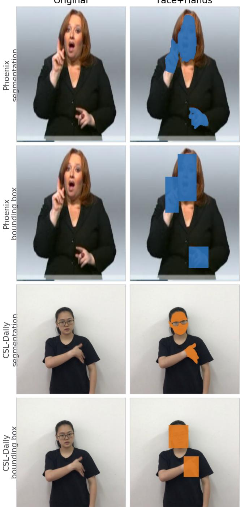  
Figure 8. The two spatial-mask variants, on one Phoenix-2014T frame (blue) and one CSL-Daily frame (orange). Segmentation rows occlude the region traced by the segmentation model and are used for the main results; bounding box rows occlude each connected component’s filled bounding box. The occlusion is drawn in each dataset’s identity colour rather than black, which would read as part of the signer’s dark clothing. Note that the segmentation masks preserve the outline of the occluded articulator.

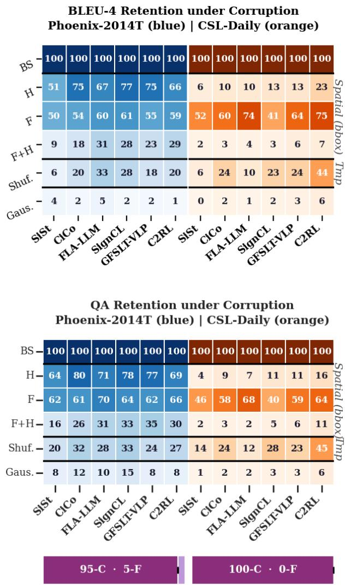

## B.2. Spatial masking

The masking ablations occlude the pixels of a body-part region in every frame before the visual encoder, using precomputed per-video masks for the face and the hands. The masks are produced by a publicly available segmentation model [26] that traces the outline of each articulator. The resulting mask retains the silhouette of what it removes, so a hand-shaped void may still expose the handshape. We therefore repeat every masking condition with a boundingbox variant, in which each connected component of a region is replaced by its filled axis-aligned box. Boxing per component rather than per region matters: the two hands are separate components, and a single box spanning both would occlude the torso between them. Figure 8 shows both variants on both datasets, and Figure 9 reports the corresponding retention scores.

## B.3. Gaussian noise

This condition replaces the visual representation outright, giving a floor in which no visual evidence survives, so whatever a model still scores is attributable to target-side priors alone. Where the replacement is applied differs between the two model families, because they expose different interception points, and the difference is worth stating rather than eliding.

The five gloss-free systems are corrupted at the encoder output. The visual encoder runs untouched and its $T \times D$ feature sequence $E$ is then overwritten elementwise by draws from $\mathcal { N } ( \hat { \mu } _ { E } , \hat { \sigma } _ { E } ^ { 2 } )$ , where $\hat { \mu } _ { E }$ and $\hat { \sigma } _ { E }$ are the mean and standard deviation of E itself, so the decoder is handed a sequence of the original length and scale that carries no information. The attention mask is passed through unchanged, so padded positions stay masked and every downstream length is as at baseline. SingleStream exposes no equivalent point, so there the raw frame tensor is overwritten instead: every pixel of every frame and channel is redrawn from a Gaussian matched to the clip’s own mean and standard deviation, clamped back into the valid pixel range, and passed through the real encoder. Both paths compute their statistics per clip, the ablation decoding running at batch size one.

The two are therefore not the identical operation, one destroying the encoded representation and the other the input to the encoder, and a reader should not treat the noise row as a single controlled manipulation across all six systems. What licenses reading it as one floor is that the two cut points are empirically interchangeable at this severity: BLEU-4 retention under noise is 1–5% across the five feature-level models on Phoenix-2014T and 1–6% on CSL-Daily, and SingleStream, the pixel-level one, retains 4.0% and 0.4%, inside that range on Phoenix-2014T and just below it on CSL-Daily (Figure 1). Neither cut leaves a model anything to read.

Figure 9. Retention under the bounding-box mask variant, BLEU-4 (top) and QA (bottom), to be read against Figures 1 and 10. Boxing the articulator is the harsher occlusion and costs roughly ten further points of retention throughout, but the ordering of conditions and the differing hand/face profiles of the two datasets are unchanged, so no conclusion in the main text depends on the choice of mask.

## B.4. Retention under both metrics

Section 6.2 states the headline profiles; this section gives the figure and the remaining conditions. Figure 10 repeats the corruption experiment of Figure 1 under QA. On Phoenix-2014T, occluding both hands still leaves 64–80% of conten transfer intact and occluding the face leaves 62–70%; only removing both together brings models down to 16–35%. On CSL-Daily the hands retain just 4–16% while the face retains 40–68%. Neither dataset’s models depend on temporal order as much as on either articulator: shuffling frames retains 20–33% and 12–45%. Replacing the signal with noise floors both, at 8–15% and 1–6%, the residue attributable to target-side priors alone.

Two readings follow. Models trained on Phoenix-2014T transfer most of their measured content without the manual channel, which is difficult to reconcile with predictions grounded in the signing, and the dataset’s narrow weatherforecast scope is the obvious suspect. And because the two corpora reverse which articulator is load-bearing under fixed architectures, grounding is a property of what the benchmark affords. Neither reading would be legible from an n-gram score.

QA Retention under Corruption Phoenix-2014T (blue) | CSL-Daily (orange)  
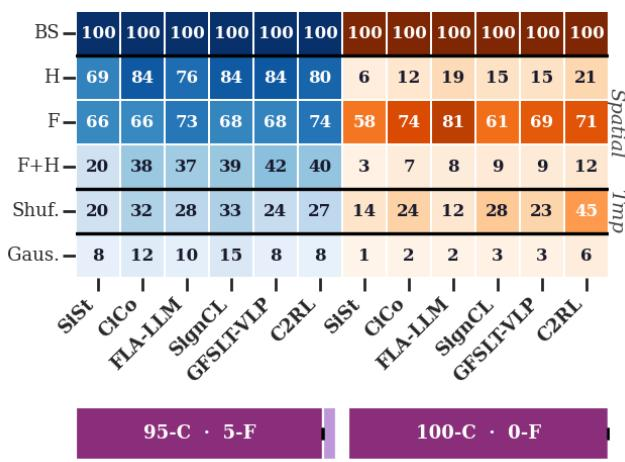  
Figure 10. QA accuracy retention (% of baseline) under the same input corruptions as Figure 1, over all six models. Read down a column for one model’s dependence on each channel. The bounding-box mask variant is in Figure 9.

## C. Content and Function Words: Tagging, Distribution and Attribution

## C.1. Taggers and categories

Every POS-resolved analysis in this paper, the attribution of Figure 2, the retention decomposition of Figure 3, the QA coverage of Appendix G and the distributions below, uses one spaCy transformer pipeline per language: de dep news trf for German and zh core web trf for Chinese, with the tagger, morphologiser and lemmatiser retained and the parser and NER disabled. Tokens tagged PUNCT or SPACE are dropped, and every token is reduced to its lowercased lemma, so inflectional variants of one word count once. Tagging is memoised on sentence text, which makes identical predictions across corruption conditions tagged once and identically by construction.

The two-way split used throughout is content = NOUN, PROPN, VERB, ADJ, NUM, ADV, PRON, and function =

ADP, DET, AUX, CCONJ, SCONJ, PART, with any residual tag (X, INTJ, SYM) counted as function in the two-way summaries. PRON is deliberately counted as content: a pronoun in SLT is a pointing sign the signer must actually have articulated in space, so unlike the ADP/DET/AUX scaffolding a target-side prior cannot supply the correct referent for free. The 37% function share of Section 3 is not an artefact of that choice: regrouping PRON as function raises it to 42.2% on Phoenix-2014T and 49.6% on CSL-Daily, so the conclusion holds, more strongly, under either convention.

## C.2. Distribution in the test references

Section 3 argues that function words are the words a targetside prior can supply for free, because they occupy a small and concentrated vocabulary where content words are broad and long-tailed. The test references bear that out directly. On Phoenix-2014T, 74 function word types cover 2,551 tokens (34.5 tokens per type) against 789 content types over 5,263 tokens (6.7 per type); the ten most frequent function types alone account for 76.3% of all function tokens, where the ten most frequent content types account for 18.9% of content tokens, and 41.1% of content types occur exactly once against 25.7% of function types. CSL-Daily carries a far larger content vocabulary relative to its function vocabulary, 19.0 content types per function type against 10.7 on Phoenix-2014T: 117 function types over 1,884 tokens (16.1 per type) against 2,223 content types over 8,826 tokens (4.0 per type), top-ten shares of 70.5% against 16.0%, and hapax rates of 19.7% for function types against 29.5% for content types. Figure 11 plots the corresponding rankfrequency curves.

A metric counting n-gram matches can therefore secure a large share of its tokens from a vocabulary of well under a hundred types, learnable from the target side alone, while the content vocabulary that the visual signal has to carry is an order of magnitude larger and mostly rare.

## C.3. Transfer to gloss

The gloss side of Figure 2 requires POS tags for annotation that is not running text: Phoenix-2014T glosses are uppercase German citation forms and CSL-Daily glosses are space-separated Chinese lemmas, so neither pipeline applies to them unmodified. The cached distributions cover 4,144 tagged gloss tokens on Phoenix-2014T, against 4,264 whitespace-delimited tokens in the test split, and 4,551 on CSL-Daily against 9,002.

## C.4. BLEU-4 attribution

The attribution distributes a system’s corpus BLEU-4 over POS categories in three steps. First, each n-gram of the system output that is matched against the reference under BLEU’s clipped counting, $n = 1 \dots 4$ , contributes $1 / n$ to each of its n tokens; a token’s attribution weight is the sum of those contributions over every matched n-gram it participates in, so a token in several matched orders accumulates more than one and an unmatched token accumulates zero. Second, weights are pooled by the POS tag of the token, giving a per-category total $A _ { c } ;$ because each matched n-gram distributes exactly one unit in total, $\textstyle \sum _ { c } A _ { c }$ c is the number of matched n-grams the system produced. Third, each category receives $A _ { c } / \textstyle \sum _ { c ^ { \prime } } A _ { c ^ { \prime } }$ of the system’s corpus BLEU-4. The assignment is exact by construction: the percategory points sum to the corpus BLEU-4 of the system they were computed for, to four decimals, for all six systems on both corpora. The cached table additionally records a match rate per category, the fraction of that category’s tokens participating in at least one matched n-gram, which separates how often a category is hit from how much credit it carries.

Reference word-frequency distribution by POS group — Phoenix-2014T (German), test  
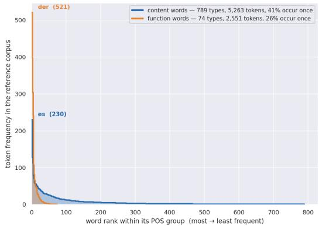  
(a) Phoenix-2014T, linear axes.

Reference word-frequency distribution by POS group — Phoenix-2014T (German), test  
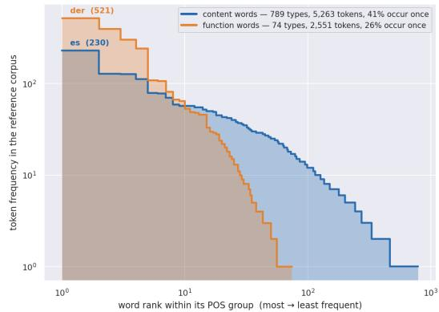  
(b) Phoenix-2014T, log–log axes.

Reference word-frequency distribution by POS group — CSL-Daily (Chinese), test  
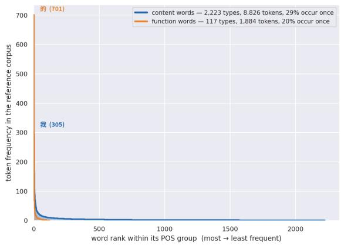  
(c) CSL-Daily, linear axes.

Reference word-frequency distribution by POS group — CSL-Daily (Chinese), test  
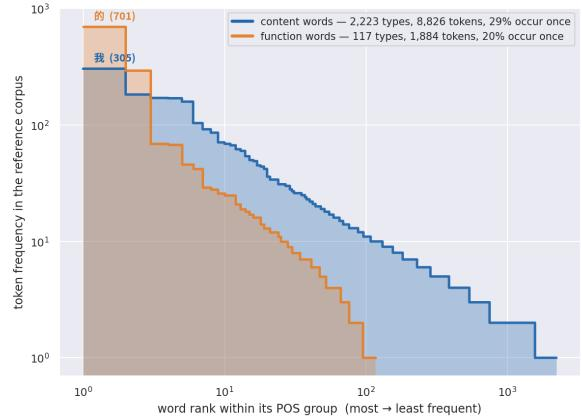  
(d) CSL-Daily, log–log axes.  
Figure 11. Rank-frequency curves of the spoken-language test references, word types sorted by descending frequency and split by the content/function categories above. Function words form a short, tall curve (few types, each frequent); content words a long, flat one with a hapax tail. Linear axes (left) show the concentration of function tokens, log–log axes (right) the length of the content tail.

## D. QA Generation: Implementation Details

Teacher configuration. One open-weight LLM plays every role (content extraction, question generation, distractor repair, all quality-control gates, and answering), served locally through an OpenAI-compatible vLLM endpoint. Decoding is greedy (τ = 0) except for the two recall paths: the fallback retry of content extraction $( \tau = 0 . 7 )$ and the second per-content question-generation pass $( \tau = 0 . 7 )$ . Generation calls are given an 8,192-token budget to accommodate long reasoning traces before the JSON payload; answering calls are given 1,024. Reasoning effort is set to low for reasoning-capable checkpoints, which avoids reasoning overflowing the budget and returning empty content. All model outputs are parsed by extracting the first balanced JSON object, and every call is memoised in an append-only cache keyed on (backend, call type, model, prompt hash, input, token budget, reasoning effort, temperature), making runs resumable and bit-identical on repetition.

Pipeline stages. For a reference s:

1. Content unit extraction. s → typed checkable content units; retry at $\tau = 0 . 7$ if empty; deduplicate on normalised text. An optional audit pass that re-checks each content unit for groundedness is implemented but disabled in the reported runs.

2. Question generation. Each content unit independently $ 2 \mathrm { - } 4 \mathrm { M C Q s }$ , over two temperature passes, unioned under deduplication on both normalised question and normalised answer.

3. Distractor repair. Items without exactly four distractors get one repair call; still-malformed items are dropped.

4. Structural validation. Exactly four non-empty, mutually distinct distractors, none equal to the answer; the answer must not appear inside the question; truncation to $N _ { Q } ^ { \mathrm { m a x } } = 1 0$

5. Assembly. Five content options permuted under a seed derived from SHA256(reference id, question, answer); the language’s not stated sentinel appended as option 5.

6. Gates. Round-trip, empty-passage world-knowledge probe, and single-answer ambiguity check; a fourth gibberish gate is available under strict mode and unused here.

7. Answering. Given only the passage, question and six options, the answerer is instructed to rely solely on the passage, accept paraphrase as a match, select not stated when the passage is silent, and emit a single digit, read as the last standalone in-range digit of the completion.

If a reference survives extraction but yields no validated question, the pipeline falls back to a single folded generation prompt before the reference is dropped.

Language resolution. Prompts are resolved in the domain language of the dataset or partition: the extractor, question generator, answerer, fallback generator, not stated sentinel, and all questions, answers and distractors are written in the reference language. The cross-lingual comparisons (OpusParcus, PAWS-X) instead use one languageagnostic prompt set across all languages, so that no language benefits from prompt tuning. BLEU is computed with a SACREBLEU tokenizer throughout.

Prompts. Verbatim listings of the extractor, content-toquestion generator, answerer, folded fallback generator, and the three auxiliary gate prompts (ambiguity, distractor repair, content unit audit) are provided in the supplementary material. The not stated sentinel is registered per language (e.g. nicht genannt for German, ei mainittu for Finnish, non mentionne´ for French), currently covering the ten languages used in this work.

## E. Metric Definitions

## E.1. Per-item metric scores

For a reference string r scored against a source string s, both metrics are mapped to [0, 1]:

$$
b ( r , s ) = { \frac { \mathrm { s a c r e B L E U } - 4 ( r , [ s ] ) } { 1 0 0 } } ,
$$

$$
q ( r , s ) = { \frac { 1 } { | Q _ { s } | } } \sum _ { Q \in Q _ { s } } \mathbf { 1 } \big [ \mathrm { a n s } ( Q , r ) = \mathrm { g o l d } ( Q ) \big ]
$$

where $Q _ { s }$ is the set of QC-gated multiple-choice questions generated from the source rendering s (each with a gold option), and ans $( Q , r )$ is the teacher’s chosen option when shown reference r.

BLEU-4 is SACREBLEU throughout, under the tokeniser matched to the target language: zh for Chinese, character-level for Japanese and Korean, and 13a otherwise, since the default $\mathtt { 1 3 a }$ tokeniser mangles CJK and would put those languages on a different footing from the rest. No lowercasing or punctuation stripping is applied anywhere.

## E.2. Confidence intervals

Every QA interval in this paper is a percentile bootstrap over test instances. Let $a _ { i } \in [ 0 , 1 ]$ be the fraction of instance i’s admitted questions that a system answers correctly, so the reported score is $\bar { a } = N ^ { - 1 } \sum _ { i = 1 } ^ { N } a _ { i }$ over the N references retaining at least one question. We draw $B = 2 { , } 0 0 0$ resamples of the N instances with replacement, recompute a¯ on each, and take the 2.5th and 97.5th percentiles; a halfwidth is $( \mathrm { h i - l o } ) / 2$ . The draw is seeded, so an interval is reproducible from the stored per-instance accuracies.

The resampling unit is the instance, not the question. A reference contributes several questions (5.2–6.4 on average, Table 1) whose correctness is correlated through the shared reference and the shared candidate sentence, so resampling questions independently would treat that correlation as extra evidence and report an interval narrower than the data supports.

This interval covers the finite test set only: it asks how far the score would move on another sample of sentences with the bank held fixed. It does not cover regeneration of the bank, which Section 6.1 reports separately as σ over ten banks. The two are not directly comparable as printed, since σ is one standard deviation while CI/2 is a 95% half-width, i.e. about 1.96 standard errors; on a common standard-error basis the instance term is three to nine times the bank term, depending on the system.

The BLEU-4 intervals of Table 5 are produced the same way, with the resampled quantity changed: each of the $B = 2 { , } 0 0 0$ resamples draws the same N instances with replacement and recomputes corpus BLEU-4 over the resampled hypothesis and reference pairs under the language’s

SACREBLEU tokeniser, and the interval is again the 2.5th to 97.5th percentile with half-width $( \mathrm { h i \mathrm { ~ - ~ } l o } ) / 2$ Both columns of that table therefore share one resampling unit and one resample count, and neither covers regeneration of the question bank. The asymmetry is that this is the only source of variation for BLEU-4, which is deterministic given a checkpoint, whereas the QA score carries the bank term of Section 6.1 in addition.

## E.3. Signal-to-noise ratio (SNR)

Write $c ( \cdot )$ for either metric of Section E, b or $q .$ Data are organized into groups $g = 1 , \ldots , G ,$ , each a set of equivalent renderings of one source sentence with a designated source rendering $s _ { g }$

Paraphrase scores. The other renderings of the same sentence, scored against $s _ { g }$ (the metric’s behaviour on genuine paraphrases):

$$
W _ { g } = \{ c ( r , s _ { g } ) : r \in \mathrm { g r o u p } g , r \neq s _ { g } \} , \qquad n _ { g } = | W _ { g } | .
$$

Per-group mean and population standard deviation (SD):

$$
\mu _ { g } = \frac { 1 } { n _ { g } } \sum _ { x \in W _ { g } } x ,
$$

$$
\sigma _ { g } = { \sqrt { { \frac { 1 } { n _ { g } } } \sum _ { x \in W _ { g } } ( x - \mu _ { g } ) ^ { 2 } } } \quad ( \sigma _ { g } = 0 { \mathrm { ~ i f ~ } } n _ { g } = 1 ) .
$$

Floor scores. Renderings of different sentences scored against $s _ { g } ,$ pooled over all groups (the metric’s floor on nonequivalent content):

$$
F = \{ c ( r ^ { \prime } , s _ { g } ) : r ^ { \prime } \notin \operatorname { g r o u p } g \} .
$$

Aggregate over groups

$$
\begin{array} { r l } { \bar { \mu } = \frac { 1 } { G } \sum _ { g } \mu _ { g } , } & { { } \underbrace { \bar { \sigma } = \frac { 1 } { G } \sum _ { g } \sigma _ { g } } _ { \mathrm { p a r a p h r a s e m e a n } } , } \end{array}
$$

$$
\underbrace { \bar { f } = \frac { 1 } { | F | } \sum _ { x \in F } x } _ { \mathrm { f l o o r m e a n } } .
$$

$$
\mathrm { g a p } \Delta = \bar { \mu } - \bar { f } , \qquad \mathrm { S N R } = \frac { \Delta } { \bar { \sigma } } , \qquad \mathrm { N S R } = \frac { 1 } { \mathrm { S N R } }
$$

Interpretation. σ¯ is the average dispersion within a set of equivalent phrasings (paraphrase fluctuation, the noise); $\Delta$ is how far the metric moves between equivalent and nonequivalent content (the discrimination signal). SNR is dimensionless (numerator and denominator share the [0, 1] scale), so it is comparable across BLEU and $\mathrm { Q A } ,$ unlike raw σ¯, which a floor-bound metric makes trivially small. Higher SNR = more paraphrase-invariant (equivalently, lower NSR). Because both metrics floor on non-equivalent content $( \bar { f } ~ \approx ~ 0 ) , ~ \Delta ~ \approx ~ \bar { \mu }$ and SNR coincides with the coefficient-of-variation signal-to-noise $\bar { \mu } / \bar { \sigma }$ , while remaining well defined for metrics that do not floor. (Defined when $\Delta > 0 . ,$ 1

Auxiliary statistics. Discriminability $d = \Delta / \operatorname { s d } \left( \{ \mu _ { g } \} \cup \right.$ $F ) { \mathrm { ; } }$ ; significance via a paired one-sided Wilcoxon signedrank test on $\{ ( \sigma _ { g } ^ { \mathrm { B L E U } } , \dot { \sigma } _ { g } ^ { \mathrm { Q A } } ) \}$ over groups with $n _ { g } \ge 2$

## F. Human Evaluation of QA-based pipeline

To assess the reliability of the automated QA-generation pipeline, human evaluations are conducted for the content span extraction, question–answer quality assessment, and distractor validity. A annotator rate a samples, and report the acceptance rate alongside its Wilson 95% confidence interval. Table 6 presents representative question–answer sets produced at the final stage of the pipeline.

## F.1. Evaluation of content unit extraction

A content unit is a span copied verbatim from the reference that names an isolated component of the expression targeting an entity or group, an action, an attribute, a quantity, a time, a location, a relation, a negation, or a polarity. Prepositions and modifiers may stay inside the phrase they belong to, so on the mountains, it lightly rains andfrom east to northeast may be considered one unit. Articles, copulas and conjunctions should not be units on their own. Given the reference and the extracted units, the judge marks: grounding: Is each extracted content unit present in the reference; missing: Is any content from the reference not covered by any extracted unit; and excess: Could any of the extracted units be omitted without losing content.

The evaluation covers 50 spans from 4 datasets (Phoenix-2014T, csl-daily, Opus-Parcus and WMT23), covering 3 languages. Chinese and German is translated to english before it is evaluated. The results are presented in Table 7. Generally, the LLM appears perfectly able to consistently produce grounded spans. When assessing the span size, it appears appropriate in roughly 80% of the cases, with some tendencies to over- and under-segment spans. Undersegmentation appears only in the longest references, which are the most frequent in the WMT news sentences. Over segmentation are concentrated in the short references, more frequently occuring in Phoenix-2014T. While some structural words are ocationally passed as content units, their impact on the question generation phase appears limited. A low generall rate for missed content is observed.

Table 6. Sample references carried through the pipeline. Within each item the correct answer is marked ⋆ and set in bold; four of the remaining options are distractors and the last is a not stated sentinel.
<table><tr><td>Content unit</td><td>Question and answer options</td></tr><tr><td colspan="2">Phoenix-2014T (de) — es kommen dann ein paar wolkenfelder Then a few cloud fields come.</td></tr><tr><td>kommen (come)</td><td>Was geschieht mit den Wolkenfeldern? (what happens with the cloud fields?) ziehen fort move away · bleiben stehen stay standing · verdampfen evaporate · teilen sich divide themselves · ★ kommen come · nicht genannt not mentioned</td></tr><tr><td>ein paar (a few)</td><td>Wie viele Wolkenfelder kommen? (how many cloud fields come?) viele many · mehrere several · ★ ein paar a few · eins one · keine no · nicht genannt not mentioned</td></tr><tr><td>wolkenfelder (cloud fields)</td><td>Was kommt nachher? (what comes later?) sonnenschein sunshine · sturm storm · regen rain · ★ wolkenfelder cloud fields · niederschlag precipitation · nicht genannt not mentioned</td></tr><tr><td colspan="2">CSL-Daily (zh)—他的膝关节手术非常成功。 His knee surgery was very successful.</td></tr><tr><td>他(he)</td><td>谁的膝关节手术非常成功？ (whose knee surgery was very successful?) 护士 nurse ·★他 he ·她 she ·医生 doctor·病人 patient·未提及 not mentioned</td></tr><tr><td>膝关节手术 (knee surgery)</td><td>什么手术非常成功？(what surgery was very successful?) 心脏手术 heart surgery ·眼科手术 eye surgery ·脑部手术 brain surgery · ★膝关节手术</td></tr><tr><td>非常成功 (very successful)</td><td>knee surgery·骨盆手术 pelvic surgery·未提及 not mentioned 手术的结果如何？ (how was the result of the surgery?) 还需要再做一次 needs doing again·失败了 it failed ·有并发症 there were complications</td></tr><tr><td colspan="2">· ★非常成功 very successful · 一般般 so-so·未提及 not mentioned PAWS-X (en) — The Tabaci River is a tributary of the River Leurda in Romania .</td></tr><tr><td>Tabaci River</td><td>What river is a tributary of the River Leurda? ★ Tabaci River · Leurda River · Danube River · Olt River ·Mures River · not stated</td></tr><tr><td>Tabaci River</td><td>In which country is the Tabaci River located? *Romania· Hungary · Ukraine · Serbia · Bulgaria· not stated</td></tr><tr><td>tributary</td><td>What is the Tabaci River? * tributary ·main river· lake· canal · waterfall · not stated</td></tr><tr><td>tributary</td><td>Of which river is the Tabaci River a tributary? ★ River Leurda · River Someş · River Danube · River Amara · River Olt· not stated</td></tr><tr><td>tributary</td><td>What is the relationship of the Tabaci River to the River Leurda? ★ tributary· source·mainstream· confluence· branch· not stated</td></tr><tr><td>River Leurda</td><td>Which river is the Tabaci River a tributary of?</td></tr><tr><td>River Leurda</td><td>★ River Leurda · River Someş· Danube River · River Timiş · River Olt · not stated In which country is the River Leurda located?</td></tr><tr><td>Romania</td><td>In which country is the Tabaci River a tributary of the River Leurda? ★ Romania · Serbia· Bulgaria · Ukraine · Hungary · not stated</td></tr></table>

## F.2. Question-answer generation

The judge is shown the reference, the source unit and the generated question. Four properties are marked: whether the question tests that unit, whether it is answerable from the reference alone, whether it assumes only relations the reference actually states, and whether it is well formed. A question counts as usable only if all four hold.

## F.3. Distractor generation

The key is disclosed and each of the four distractors is coded as clearly wrong but plausible, also correct, a synonym of the key, the wrong kind of thing so that it does not answer the question at all, or the right kind but too implausible to compete. The wrong-kind code is kept separate because four options of the wrong kind leave the key as the only one that fits, which is what makes an item solvable without reading anything. Two passes, in this order. Closed book, the judge sees the question and the six options with no reference shown at all and picks the option they would bet on; chance is $1 / 6 .$ Since every admitted item is one the model itself could not answer with the passage withheld, an item a judge can answer is a residual miss of that check. The reference is then revealed with the key still hidden and the judge answers the item; agreement with the key is item validity measured without anchoring.

Table 7. Human evaluation of the question-generation pipeline by one judge. Each dataset is capped at its first 100 judged spans and 50 judged questions and items, in annotation order, so every corpus carries equal weight in the pooled column. Subscripts are Wilson 95% intervals: for a rate that should be high (↑) the lower bound is the conservative reading, for one that should be low (↓) the upper bound is. Each block states its own denominator, since spans, content words, questions and items are four different bases. Usable deliberately excludes whether a question is anchored on its own unit, which is a property of the extracted span rather than of the question; that code is reported separately.
<table><tr><td>Check</td><td>All</td><td>Phoenix (de)</td><td>CSL (zh)</td><td>OPUS-P (en)</td><td>WMT23 (zh-en)</td></tr><tr><td colspan="6">Content-unit extraction</td></tr><tr><td>spans judged</td><td>400</td><td>100</td><td>100</td><td>100</td><td>100</td></tr><tr><td>Grounding ↑</td><td> $1 0 0 . 0 _ { [ 9 9 . 0 , 1 0 0 . 0 ] }$ </td><td> $1 0 0 . 0 _ { [ 9 6 . 3 , 1 0 0 . 0 ] }$ </td><td> $1 0 0 . 0 _ { [ 9 6 . 3 , 1 0 0 . 0 ] }$ </td><td> $1 0 0 . 0 _ { [ 9 6 . 3 , 1 0 0 . 0 ] }$ </td><td> $1 0 0 . 0 _ { [ 9 6 . 3 , 1 0 0 . 0 ] }$ </td></tr><tr><td>Excess ↓</td><td> $5 . 0 _ { [ 3 . 3 , 7 . 6 ] }$ </td><td> $8 . 0 _ { [ 4 . 1 , 1 5 . 0 ] } ^ { - }$ </td><td> $6 . 0 _ { [ 2 . 8 , 1 2 . 5 ] }$ </td><td> $5 . 0 _ { [ 2 . 2 , 1 1 . 2 ] }$ </td><td> $1 . 0 \dot { _ { [ 0 . 2 , 5 . 4 ] } }$ </td></tr><tr><td>reference content words Missed ↓</td><td>793  $0 . 9 _ { [ 0 . 4 , 1 . 8 ] }$ </td><td>139  $0 . 0 _ { [ 0 . 0 , 2 . 7 ] }$ </td><td>244  $0 . 4 _ { [ 0 . 1 , 2 . 3 ] }$ </td><td>134  $3 . 0 _ { [ 1 . 2 , 7 . 4 ] }$ </td><td>276  $0 . 7 _ { [ 0 . 2 , 2 . 6 ] }$ </td></tr><tr><td colspan="6">Question generation</td></tr><tr><td>questions judged</td><td>200</td><td>50</td><td> $5 0$ </td><td>50</td><td>50</td></tr><tr><td>Usable ↑</td><td> $9 6 . 0 _ { [ 9 2 . 3 , 9 8 . 0 ] }$ </td><td> $9 8 . 0 _ { [ 8 9 . 5 , 9 9 . 6 ] }$ </td><td> $9 4 . 0 _ { [ 8 3 . 8 , 9 7 . 9 ] }$ </td><td> $9 6 . 0 _ { [ 8 6 . 5 , 9 8 . 9 ] }$ </td><td> $9 6 . 0 _ { [ 8 6 . 5 , 9 8 . 9 ] }$ </td></tr><tr><td>Answerable ↑</td><td> $9 8 . 0 _ { [ 9 5 . 0 , 9 9 . 2 ] }$ </td><td> $1 0 0 . 0 _ { [ 9 2 . 9 , 1 0 0 . 0 ] }$ </td><td> $9 4 . 0 _ { [ 8 3 . 8 , 9 7 . 9 ] }$ </td><td> $1 0 0 . 0 _ { [ 9 2 . 9 , 1 0 0 . 0 ] }$ </td><td> $9 8 . 0 \bar { _ { [ 8 9 . 5 , 9 9 . 6 ] } }$ </td></tr><tr><td>Grounded binding ↑</td><td> $9 8 . 5 _ { [ 9 5 . 7 , 9 9 . 5 ] }$ </td><td> $1 0 0 . 0 _ { [ 9 2 . 9 , 1 0 0 . 0 ] } ^ { - }$ </td><td> $9 4 . 0 _ { [ 8 3 . 8 , 9 7 . 9 ] }$ </td><td> $1 0 0 . 0 _ { [ 9 2 . 9 , 1 0 0 . 0 ] } ^ { - }$ </td><td> $1 0 0 . 0 \dot { _ { [ 9 2 . 9 , 1 0 0 . 0 ] } }$ </td></tr><tr><td>Well formed ↑</td><td> $9 6 . 5 _ { [ 9 3 . 0 , 9 8 . 3 ] }$ </td><td> $9 8 . 0 _ { [ 8 9 . 5 , 9 9 . 6 ] }$ </td><td> $9 4 . 0 _ { [ 8 3 . 8 , 9 7 . 9 ] }$ </td><td> $9 6 . 0 _ { [ 8 6 . 5 , 9 8 . 9 ] } ^ { - }$ </td><td> $9 8 . 0 _ { [ 8 9 . 5 , 9 9 . 6 ] }$ </td></tr><tr><td>Anchored on its own unit ↑</td><td> $9 8 . 0 \bar { _ { [ 9 5 . 0 , 9 9 . 2 ] } }$ </td><td> $9 6 . 0 \dot { _ { [ 8 6 . 5 , 9 8 . 9 ] } }$ </td><td> $9 8 . 0 \bar { _ { [ 8 9 . 5 , 9 9 . 6 ] } }$ </td><td> $9 8 . 0 \bar { _ { [ 8 9 . 5 , 9 9 . 6 ] } }$ </td><td> $1 0 0 . 0 \dot { _ { [ 9 2 . 9 , 1 0 0 . 0 ] } }$ </td></tr><tr><td colspan="6">Answer options</td></tr><tr><td>items judged</td><td>200</td><td>50</td><td>50</td><td>50</td><td>50</td></tr><tr><td>Guessable closed book ↓</td><td> $1 5 . 0 _ { [ 1 0 . 7 , 2 0 . 6 ] }$ </td><td> $1 6 . 0 _ { [ 8 . 3 , 2 8 . 5 ] }$ </td><td> $1 4 . 0 _ { [ 7 . 0 , 2 6 . 2 ] }$ </td><td> $1 4 . 0 _ { [ 7 . 0 , 2 6 . 2 ] }$ </td><td> $1 6 . 0 _ { [ 8 . 3 , 2 8 . 5 ] }$ </td></tr><tr><td>Item validity ↑</td><td> $9 8 . 0 \bar { _ { [ 9 5 . 0 , 9 9 . 2 ] } }$ </td><td> $9 4 . 0 _ { [ 8 3 . 8 , 9 7 . 9 ] }$ </td><td> $1 0 0 . 0 _ { [ 9 2 . 9 , 1 0 0 . 0 ] }$ </td><td> $1 0 0 . 0 \dot { _ { [ 9 2 . 9 , 1 0 0 . 0 ] } }$ </td><td> $9 8 . 0 _ { [ 8 9 . 5 , 9 9 . 6 ] }$ </td></tr><tr><td>Key correct ↑</td><td> $9 9 . 5 _ { [ 9 7 . 2 , 9 9 . 9 ] }$ </td><td> $1 0 0 . 0 \dot { _ { [ 9 2 . 9 , 1 0 0 . 0 ] } }$ </td><td> $1 0 0 . 0 _ { [ 9 2 . 9 , 1 0 0 . 0 ] }$ </td><td> $9 8 . 0 _ { [ 8 9 . 5 , 9 9 . 6 ] }$ </td><td> $1 0 0 . 0 \dot { _ { [ 9 2 . 9 , 1 0 0 . 0 ] } }$ </td></tr><tr><td>Sound distractors ↑</td><td> $9 5 . 8 _ { [ 9 4 . 1 , 9 6 . 9 ] }$ </td><td> $9 5 . 0 _ { [ 9 1 . 0 , 9 7 . 3 ] }$ </td><td> $9 7 . 5 _ { [ 9 4 . 3 , 9 8 . 9 ] }$ </td><td> $9 8 . 5 _ { [ 9 5 . 7 , 9 9 . 5 ] }$ </td><td> $9 2 . 0 _ { [ 8 7 . 4 , 9 5 . 0 ] }$ </td></tr><tr><td>Clean item ↑</td><td> $9 0 . 5 _ { [ 8 5 . 6 , 9 3 . 8 ] }$ </td><td> $8 8 . 0 \dot { _ { [ 7 6 . 2 , 9 4 . 4 ] } }$ </td><td> $9 4 . 0 \dot { _ { [ 8 3 . 8 , 9 7 . 9 ] } }$ </td><td> $9 4 . 0 \bar { _ { [ 8 3 . 8 , 9 7 . 9 ] } }$ </td><td> $8 6 . 0 \dot { [ 7 3 . 8 , 9 3 . 0 ] }$ </td></tr></table>

baseline preserves little reference content. That agreement remains high even as answerability collapses supports the intent of the control: disagreements reflect what the translations convey, not how the items are read.

## F.4. Answering step

All four disagreements take the same form: the judge selected not stated, treating the information as unavailable from the translation, where the model committed to an option; in no case did both commit to different answers. Taking the judge’s reading as correct, all four are over-credits. In three of them the model reproduced the pipeline’s key even though the translation at best vaguely state it: snow down to middle elevations, rendered as above about four hundred metres, was credited as up to high elevations. The judge selected not stated more often than the model in both datasets (28 vs. 24 pooled), so the residual disagreement is directional: the metric is marginally more generous than a human reader.

To assess the answering step against human judgment, one judge answers 50 items each from Phoenix-2014T and CSL-Daily under two conditions: the reference passage (a control, since admitted items are answerable by construction) and real gloss-free decoder output on unseen references (the actual task). Table 8 reports agreement.

On reference passages, judge and model agreed on all 50 items and both matched the pipeline’s key on all 50. On system translations, agreement was 92.0% $( \kappa = 0 . 8 8 )$ , with the two datasets differing in answerability rather than agreement: the judge could answer 13 of 25 Phoenix items from the translation but only 3 of 25 for CSL-Daily, where the

## G. Per-language Question Yield and Content Coverage

Table 1 of Section 5 pools question yield and content coverage over languages; Table 9 gives the per-language breakdown. Coverage is computed with the taggers of Appendix C, using spaCy’s large pipeline for every language except German, which keeps the de dep news trf transformer model of the POS analysis so the SLT numbers remain directly comparable with it. PAWS-X Korean is

Table 8. Human–model agreement on the answering step, with key and model choice withheld from the judge. Reference passage is a control: items are answerable by construction, so it measures whether a person recovers the same answer from text known to contain it. System translation is the metric’s actual task, on unseen decoder output. Subscripts are Wilson 95% intervals; κ is Cohen’s κ over the six options.
<table><tr><td rowspan="2">Dataset</td><td colspan="3">Reference passage</td><td colspan="3">System translation</td></tr><tr><td>n</td><td>Agreement</td><td>κ</td><td>n</td><td>Agreement</td><td>κ</td></tr><tr><td>Average</td><td>|50</td><td> $1 0 0 . 0 _ { [ 9 2 . 9 , 1 0 0 . 0 ] }$ </td><td>1.00</td><td>|50</td><td> $9 2 . 0 _ { [ 8 1 . 2 , 9 6 . 8 ] }$ </td><td>0.88</td></tr><tr><td>Phoenix-2014T (de)</td><td>25</td><td> $1 0 0 . 0 _ { [ 8 6 . 7 , 1 0 0 . 0 ] }$ </td><td>1.00</td><td>25</td><td> $8 8 . 0 _ { [ 7 0 . 0 , 9 5 . 8 ] }$ </td><td>0.85</td></tr><tr><td>CSL-Daily (zh)</td><td>25</td><td> $1 0 0 . 0 _ { [ 8 6 . 7 , 1 0 0 . 0 ] }$ </td><td>1.00</td><td>25</td><td> $9 6 . 0 _ { [ 8 0 . 5 , 9 9 . 3 ] }$ </td><td>0.89</td></tr></table>

The complementary measurement to item-level coverage is what the gold answers themselves assert, since a candidate is only ever scored through an answer. Here the asymmetry the metric is designed for appears directly: on Phoenix-2014T the answers carry 66.6% of the reference’s content lemmas against 51.9% of its function lemmas, and the gap widens on the longer PAWS-X sentences (64.3% vs. 32.5%). Per POS (Table 10), gold answers recover 93.5% of numerals, 80.8% of adjectives and 76.8% of nouns on Phoenix-2014T, but only 18.2% of auxiliaries and 8.3% of subordinating conjunctions. The QA metric therefore concentrates its scoring on precisely the categories the attribution study of Section 3 showed BLEU-4 to under-weight relative to the signed input.

scored by the metric but omitted here, as no spaCy pipeline is available for it.

<table><tr><td colspan="4"></td><td colspan="2">Content cov.</td></tr><tr><td>Benchmark</td><td> $\mathbf { L } \mathbf { g }$ </td><td> $N _ { \mathrm { r e f } }$ </td><td>|Q|</td><td>item</td><td>answer</td></tr><tr><td>Phoenix-2014T CSL-Daily</td><td>de zh</td><td>641 1,175</td><td>5,934 7,992</td><td> $8 8 . 9 { \scriptstyle \pm 1 3 . 6 }$   $9 4 . 5 { \scriptstyle \pm 1 0 . 7 }$ </td><td> $7 4 . 2 { \scriptstyle \pm 1 7 . 6 }$   $8 1 . 7 _ { \pm 1 8 . 3 }$ </td></tr><tr><td>OpusParcus</td><td>en</td><td>2,772 2,997</td><td>7,022 9,088</td><td> $8 0 . 6 _ { \pm 2 5 . 0 }$ </td><td> $7 0 . 8 { \scriptstyle \pm 2 7 . 2 }$ </td></tr><tr><td>OpusParcus OpusParcus</td><td>de fi</td><td>3,380</td><td>11,245</td><td> $8 4 . 8 _ { \pm 2 2 . 4 }$ </td><td> $6 8 . 6 _ { \pm 2 7 . 0 }$ </td></tr><tr><td>OpusParcus</td><td></td><td></td><td></td><td> $8 3 . 9 _ { \pm 2 4 . 7 }$ </td><td> $7 4 . 1 { \scriptstyle \pm 2 7 . 9 }$ </td></tr><tr><td></td><td>fr</td><td>3,069</td><td>9,822</td><td> $8 1 . 2 { \scriptstyle \pm 2 3 . 9 }$ </td><td> $6 4 . 4 { \scriptstyle \pm 2 7 . 0 }$ </td></tr><tr><td>OpusParcus</td><td>ru</td><td>3,631</td><td>12,450</td><td> $9 0 . 0 { \scriptstyle \pm 2 0 . 6 }$ </td><td> $7 7 . 0 { \scriptstyle \pm 2 5 . 1 }$ </td></tr><tr><td>OpusParcus</td><td>SV</td><td>3,643</td><td>11,805</td><td> $8 7 . 1 { \scriptstyle \pm 2 2 . 2 }$ </td><td> $7 0 . 0 { \scriptstyle \pm 2 7 . 0 }$ </td></tr><tr><td>PAWS-X</td><td>en</td><td>1,995</td><td>19,547</td><td> $9 5 . 8 { \scriptstyle \pm 8 . 5 }$ </td><td> $8 3 . 4 { \scriptstyle \pm 1 5 . 6 }$ </td></tr><tr><td>PAWS-X</td><td>de</td><td>1,969</td><td>22,013</td><td> $9 5 . 2 { \scriptstyle \pm 8 . 8 }$ </td><td></td></tr><tr><td>PAWS-X</td><td>fr</td><td></td><td></td><td></td><td> $7 8 . 8 _ { \pm 1 6 . 3 }$ </td></tr><tr><td></td><td></td><td>1,986</td><td>22,366</td><td> $9 5 . 2 { \scriptstyle \pm 9 . 8 }$ </td><td> $8 1 . 3 { \scriptstyle \pm 1 6 . 4 }$ </td></tr><tr><td>PAWS-X</td><td>es</td><td>1,998</td><td>21,931</td><td> $9 5 . 9 { \scriptstyle \pm 8 . 5 }$ </td><td> $8 4 . 9 { \scriptstyle \pm 1 5 . 6 }$ </td></tr><tr><td>PAWS-X</td><td>zh</td><td>1,975</td><td>20,204</td><td> $9 2 . 4 { \pm } 1 0 . 3 $ </td><td> $7 6 . 8 { \scriptstyle \pm 1 6 . 4 }$ </td></tr><tr><td>PAWS-X</td><td>ja</td><td>1,969</td><td>23,994</td><td> $9 5 . 4 { \scriptstyle \pm 8 . 8 }$ </td><td> $8 2 . 0 _ { \pm 1 5 . 1 }$ </td></tr></table>

Table 9. Per-language question yield and content coverage, qwen2.5-32b teacher, uncapped banks. $N _ { \mathrm { r e f } }$ counts references retaining at least one QC-admitted question; |Q| is the resulting bank size. item = question text + gold answer, answer = gold answer alone; subscripts are standard deviations over references.

<table><tr><td>Content POS</td><td>NUM</td><td>ADJ</td><td>NOUN</td></tr><tr><td>Phoenix-2014T (de) CSL-Daily (zh)</td><td>97.0 93.1</td><td>83.7 96.6</td><td>87.0 90.7</td></tr><tr><td>OpusParcus (de) PAWS-X (en)</td><td>95.6 92.3</td><td>85.7 83.8</td><td>88.7 83.3</td></tr><tr><td>PAWS-X (zh)</td><td>88.6</td><td>84.5</td><td>82.6</td></tr><tr><td></td><td></td><td></td><td></td></tr><tr><td>Function POS</td><td>PRON</td><td>AUX</td><td>SCONJ</td></tr><tr><td>Phoenix-2014T (de)</td><td>35.7</td><td>10.5</td><td>33.3</td></tr><tr><td>CSL-Daily (zh)</td><td>86.9</td><td>一</td><td>46.4</td></tr><tr><td>OpusParcus (de)</td><td>62.9</td><td>17.3</td><td>48.3</td></tr><tr><td>PAWS-X (en)</td><td>45.8</td><td>16.1</td><td>19.9</td></tr><tr><td>PAWS-X (zh)</td><td>61.1</td><td>一</td><td>5.6</td></tr></table>

Table 10. Per-POS coverage by the gold answers (%), representative banks. The metric’s scoring mass sits on numerals, adjectives and nouns, and largely bypasses auxiliaries and subordinators. Pronouns are the exception and by design: a dedicated participant-extraction pass probes who acts and who is acted on, since a translation can reverse those and lose the sentence while keeping every noun in it, so pronoun coverage is high wherever the corpus is pronoun-dense (CSL-Daily 86.9, OpusParcus 62.9) and low only on the weather text of Phoenix-2014T, which contains few. Dashes are tags the language’s tagger does not assign.

## H. Per-language Validation Results

Table 2 of Section 5.2 aggregates PAWS-X over languages; Table 11 gives the breakdown. The QA advantage holds in all seven languages and is largest where BLEU-4 is weakest: +0.171 for English, where the 13a tokeniser is well matched to the text, against +0.250 and +0.255 for Japanese and Korean, where character-level tokenisation leaves BLEU-4 near chance (0.545, 0.534). The perlanguage OpusParcus correlations of Figure 4 run from $\rho = 0 . 1 2$ for BLEU-4 against 0.53 for QA in Russian to 0.40 against 0.62 in Swedish.

<table><tr><td>Lang.</td><td>n</td><td>BLEU AUC</td><td>QA AUC</td><td> $\Delta$ </td></tr><tr><td>en</td><td>1,995</td><td>0.705</td><td>0.875</td><td>+0.171</td></tr><tr><td>de</td><td>1,969</td><td>0.626</td><td>0.847</td><td>+0.221</td></tr><tr><td>fr</td><td>1,986</td><td>0.645</td><td>0.846</td><td>+0.202</td></tr><tr><td>es</td><td>1,998</td><td>0.629</td><td>0.850</td><td>+0.221</td></tr><tr><td>zh</td><td>1,975</td><td>0.594</td><td>0.818</td><td>+0.224</td></tr><tr><td>ja</td><td>1,969</td><td>0.545</td><td>0.795</td><td>+0.250</td></tr><tr><td>ko</td><td>1,970</td><td>0.534</td><td>0.790</td><td>+0.255</td></tr><tr><td>mean</td><td></td><td>0.611</td><td>0.831</td><td>+0.221</td></tr></table>

Table 11. PAWS-X meaning-flip discrimination (test split, qwen2.5-32b teacher). ROC-AUC = P(score(paraphrase) $>$ score(flipped)) over the question-bearing pairs; 0.5 = blind to the flip. Surface overlap is high in both classes by construction. QA wins in 7/7 languages.

## I. Run-to-Run Stability: Sources and Per-System Numbers

Two mechanisms make a repeat of the pipeline differ, and only one of them is the serving stack. The second percontent-unit question-generation pass samples at $\tau = 0 . 7$ by design, as a recall device for questions the greedy pass does not produce (Appendix D); no sampling seed is sent, so that pass essentially never repeats. Every other stage decodes greedily and is reproducible only up to the arithmetic of the server, where continuous batching varies batch composition and with it the floating-point reduction order. Comparing two runs over the calls they share, the greedy stages return identical text for 99.6 and 99.7% of contentunit extractions, 98.0 and 98.3% of distractor generations, and 99.96% of answering calls on both benchmarks, the exposure scaling with output length. Question generation, which mixes the greedy and sampled passes, returns identical text for only 57.6 and 62.8% of its calls. Deliberate sampling is therefore the dominant channel and batching the secondary one, and their combined effect is that a repeat asks a substantially different bank: 71.7% of admitted items recur between two runs on Phoenix-2014T and 77.9% on CSL-Daily (Jaccard 0.56 and 0.64). Publishing the exact bank alongside a score is thus needed to reproduce a per-item analysis, but not to compare systems.

The modal system ordering by QA is reproduced in every repeat on both benchmarks, a single distinct ordering with mean Kendall τ = 1.00 against it (Figure 12). This holds even for the closest pair, SignCL and GFSLT-VLP, whose means sit 0.35 points apart on Phoenix-2014T, a gap of roughly one standard deviation of the difference between two repeats; their confidence intervals in Table 5 nevertheless overlap, so the pair is reproducibly ordered by the pipeline without being separated by the test set. BLEU-4 recomputed alongside is bit-identical across all ten Phoenix-2014T repeats, which admit the same 641 references every time; on CSL-Daily the admitted set moves by a single reference in two of the ten repeats and BLEU-4 moves with it by at most 0.01 points. The spread in QA therefore enters through which questions clear the gates, not through the scoring.

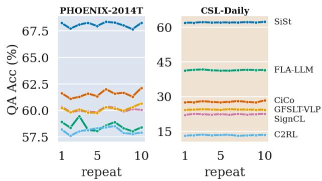  
Figure 12. Per-system QA accuracy across the ten independent bank regenerations of Table 4, one panel per benchmark in its identity colour. The y axes are independent (Phoenix-2014T spans thirteen points, CSL-Daily fifty). No system changes order in either panel.

## J. Training-Likeness: Exclusions and Cumulative View

Estimator. Training-likeness uses the fuzz.ratio character-level similarity from RapidFuzz. Since $\ell _ { i }$ is a property of the benchmark, all models are ordered identically. The sliding window spans 12 likeness points, stepped by 2; inside each, the per-instance score is regressed on ℓ and on reference length, and the partial coefficient $\beta _ { m } ( \ell )$ gives the sensitivity at fixed length, reported as

$$
S _ { m } ( \ell ) = \frac { 1 0 0 \beta _ { m } ( \ell ) } { \bar { C } _ { m } } ,
$$

with $\hat { C } _ { m }$ model $m \mathrm { { s } }$ mean per-instance score. The normaliser is sentence BLEU-4, not the corpus BLEU-4 reported in papers; the two differ by 1–2 points.

Exclusions. Two groups are excluded from the local sensitivity curve of Section 6.2. References at ℓ = 100 are exact copies of a training sentence, a point mass that admits no slope; on Phoenix-2014T they are also half the length of their neighbours (5.8 against 12.5 tokens), so a window straddling them would report a length difference as likeness sensitivity. These are reported as score levels instead. Windows holding fewer than 40 instances, or in which a single likeness value holds more than half the mass, cannot support a slope either and are left empty rather than interpolated.

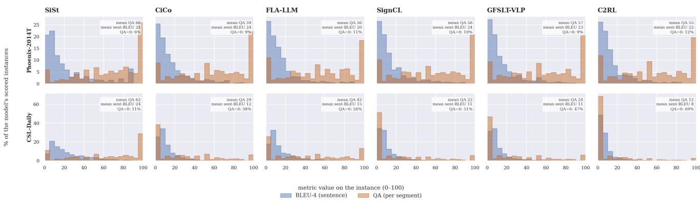  
Figure 13. Per-instance distribution of sentence BLEU-4 and QA accuracy for each model, on Phoenix-2014T (top) and CSL-Daily (bottom).

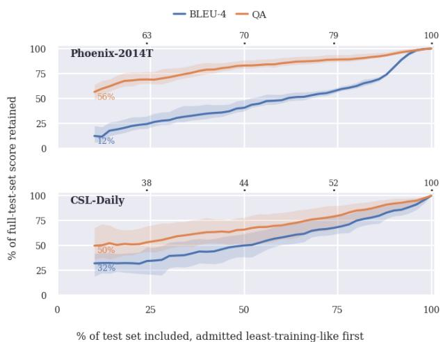  
Figure 14. Retained fraction $R _ { m } ( f ) ~ = ~ C _ { m } ( f ) / C _ { m } ( 1 )$ over nested prefixes of the test set, admitted least-training-like first. Mean over $M \ = \ 5$ models, band = min–max. Upper axis: training-likeness of the last admitted instance. Left-hand labels give $R _ { m }$ at $f = 0 . 1$

Cumulative view. The local view of Section 6.2 asks how fast a metric moves; this one asks how much of a published number the training-like instances account for in aggregate. We sort the test set from least to most training-like, score nested prefixes, and plot the retained fraction $R _ { m } ( f ) = C _ { m } ( f ) / C _ { m } ( 1 )$ (Figure 14), normalising each model against itself before averaging so that differences in absolute level do not dominate. A metric insensitive to training overlap stays flat near 100%; one inflated by training-like instances rises steeply to the right. On Phoenix-2014T, BLEU-4 retains 12.3% of its reported score on the least training-like tenth of the test set against 56.5% for QA; on CSL-Daily, 32.1% and 49.8%.

This view cannot replace the local one. $R _ { m }$ is cumulative, and differentiating it does not recover $S _ { m }$ : for a running mean $\begin{array} { r } { \frac { d } { d k } [ S ( k ) / k ] = ( x _ { k } - C ( k ) ) / k } \end{array}$ , so one local effect appears large early and small late purely through how many instances have already been averaged in, and corpus BLEU-4, not being a mean, adds a shifting n-gram normalisation on top. The two figures report the same phenomenon at different resolutions, and agree.

## K. Per-instance Score Distributions

Section 6.3 notes that the two metrics agree at corpus level while disagreeing on individual instances; Figure 13 shows the distributions behind that. Sentence BLEU-4 is massed near zero on both benchmarks, whereas QA occupies the whole range on Phoenix-2014T with its mode at 100: on that benchmark a majority of instances are scored by BLEU-4 as near-total failures while QA reads much of their content as transferred. The share of instances at QA = 0, printed in each panel, is the clearest difference between the benchmarks: 7–10% on Phoenix-2014T against 28–67% on CSL-Daily, so the corpus means on CSL-Daily are driven substantially by instances from which nothing is recovered rather than by uniformly partial transfer.