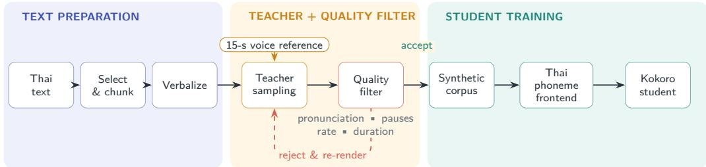
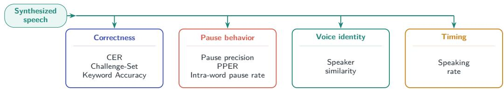
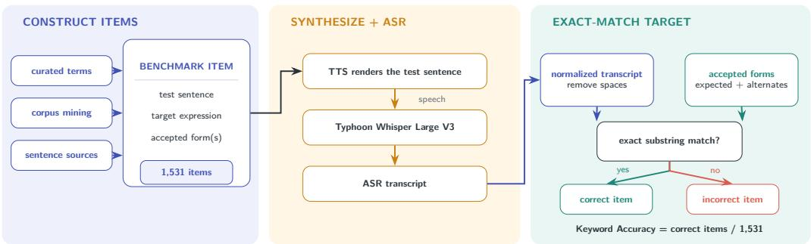
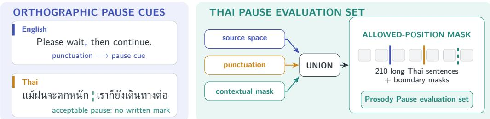
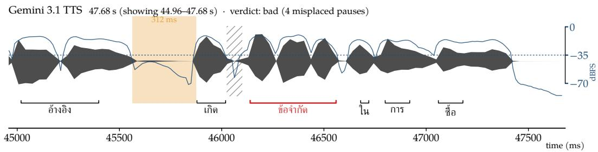
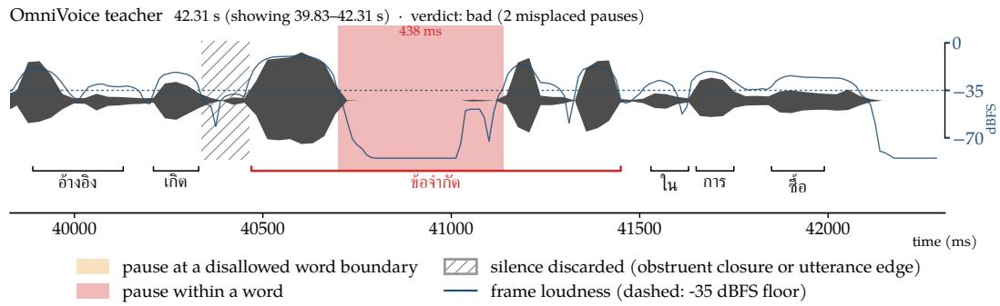

# Building and Evaluating Fixed-Voice Thai TTS from Synthetic Speech

Kunat Pipatanakul1,2, Potsawee Manakul1, Warit Sirichotedumrong3 Sittipong Sripaisarnmongkol3, Pakorn Nathong2, Phatrasek Jirabovonvisut2

1Wayu Research 2Paxa Labs 3Typhoon

Technical Report

## Abstract

In low-resource settings, deploying TTS typically requires choosing between a large voicecloning model with costly inference or a compact fixed-voice system that requires a speakerspecific corpus. We study a third route: using a large voice-cloning model as a programmable data source to turn a short voice reference (e.g., 15 seconds) into a compact fixed-voice student trained entirely on synthetic speech. This setting makes pipeline design consequential: teacher errors become training targets, while filtering failed generations can reduce coverage of dificult texts. Thai further introduces challenges from ambiguous word boundaries, lexical tone, names and loanwords, numeric verbalization, and Thai–English code-switching. We study how text preparation, synthetic generation, quality filtering, rejection sampling, and frontend choices afect the resulting student, and where teacher limitations remain. We evaluate CER, Challenge-Set Keyword Accuracy, Prosody Pause Accuracy, speaker similarity, and speaking rate. The resulting 82M-parameter model, Wayu-Paxa-TTS-Edge, enables on-device Thai TTS without reference audio. It achieves 68.2% Challenge-Set Keyword Accuracy (85.5% of Gemini 3.1) and 91.4% pause precision, outperforming its OmniVoice teacher1 (89.9%) and reaching 94.8% of Gemini 3.1. It also achieves the lowest pause-placement error and intra-word pause rates among the three systems, and 3.7% and 1.1% CER on Thai and English, respectively. We open-source the model and evaluation framework for Thai TTS development.

Collection Wayu-Paxa-TTS Model Wayu-Paxa-TTS-Edge Evaluation Thai-TTS-Eval

## 1 Introduction

In low-resource settings, deploying TTS typically requires choosing between a large generative voice-cloning model that uses reference audio and GPU inference, or a compact fixedvoice TTS system trained on a licensed single-speaker corpus. Modern multilingual TTS systems can reproduce a speaker from only a few seconds of reference audio (Zhang et al., 2025; Hu et al., 2026; Boson AI, 2026; Zhu et al., 2026). These systems rely on large generative backbones, including autoregressive language models and difusion language models, and often scale training to large multilingual speech collections. Their scale provides broad zero-shot capabilities but can be unnecessarily expensive when an application needs only a single organization-specific voice, such as for an interactive voice response (IVR) system or a personal brand creator. By contrast, TTS architectures such as VITS and StyleTTS2 support compact fixed-voice deployment (Kim et al., 2021; Li et al., 2023b); our student uses the 82M-parameter Kokoro backbone (Hexgrad, 2025). This second route simplifies deployment but requires a speaker-specific corpus.

Inspired by knowledge distillation in modern LLM development (Pipatanakul et al., 2024), we study a third route. We similarly use a large voice-cloning model to generate speech from a short voice reference (e.g., 15 seconds) and train a compact fixed-voice student.

Prior low-resource work uses synthetic target-language speech before adapting to several hours of real target-speaker audio (Joshi & Garera, 2023). A recent Thai-specific system takes a data-intensive route, constructing large speech and text collections with explicit tone and pause annotations (Geng et al., 2025). Our route requires no speaker-specific corpus beyond the short reference. Synthetic data are unbounded in count, but their quality and coverage remain bounded by what the stochastic teacher can produce and what the pipeline can select.

Thai makes this challenging because of ambiguous word boundaries, lexical tone, irregular names and loanwords, informal spellings, numeric verbalization, and Thai–English codeswitching. Thai orthography does not mark word boundaries consistently (Chormai et al., 2020), and prior Thai TTS work explicitly models tone and pause placement (Geng et al., 2025). Code-switched inputs add another ambiguity: the intended rendition is often Thaiaccented English rather than native English. These cases expose failures that sentence-level CER obscures. A sentence can have low CER while mispronouncing one critical expression, and a transcript can be correct even when the waveform contains a pause within a word or at an implausible juncture.

The central question is therefore not whether synthetic speech can train a student, but which pipeline components afect performance, how to evaluate their efects, and where teacher limitations remain. Our pipeline covers text preparation, synthetic speech generation with OmniVoice (Zhu et al., 2026), quality filtering, rejection sampling, and training a compact Kokoro student (Hexgrad, 2025). We evaluate CER, Challenge-Set Keyword Accuracy, Prosody Pause Accuracy, speaker similarity, and speaking rate.

Our final model, Wayu-Paxa-TTS-Edge, is an 82M-parameter fixed-voice Thai–English TTS system that supports on-device inference. The model achieves 68.2% Challenge-Set Keyword Accuracy and 91.4% pause precision on Thai, with CERs of 3.7% and 1.1% on Thai and English, respectively. Teacher analysis shows that best-of-K teacher sampling reveals substantial headroom: exact accuracy reaches 87.9% at K = 118, 15.1 percentage points above the 72.8% teacher baseline. This gain identifies improved sampling and selection as a path toward stronger training targets; the unresolved items are concentrated on expressions underrepresented in the teacher’s training corpus, making data coverage the next challenge.

Our contributions are:

• an end-to-end recipe for converting a short voice reference into a quality-controlled Thai synthetic corpus and a compact fixed-voice student;

• an evaluation framework that separates sentence-level CER, targeted pronunciation correctness, pause placement, speaker similarity, and speaking rate;

• controlled evidence for the efects of pause filtering, rejection sampling, pretrained initialization, and frontend policy, including gains from frontend changes without acoustic-model retraining;

• a teacher-support analysis through best-of-K sampling, together with an Isan adaptation study showing that a 15-second reference can transfer voice identity and dialect forms to the fixed-voice student.

## 2 From a Zero-Shot Teacher to a Fixed-Voice Student

We distill a zero-shot voice-cloning teacher into a fixed-voice student through the threestage pipeline shown in Figure 1: (1) Thai text preparation and verbalization, (2) teacher sampling and quality filtering, and (3) student training. Given Thai text and one of 12

frozen OmniVoice-designed voice references2 (Zhu et al., 2026), the teacher generates candidate utterances for evaluation by a quality filter. The resulting utterances form the synthetic corpus used to train the Kokoro3 student (Hexgrad, 2025; Li et al., 2023b).

## 2 Build: zero-shot teacher to fixed-voice student

  
Figure 1: Distilling a 15-second voice reference into fixed-voice Thai TTS. A zero-shot teacher renders prepared Thai text; quality filtering retains suitable candidates and triggers re-rendering of eligible failures, and the resulting corpus trains a Kokoro student with a Thai–English phoneme frontend.

## 3 Evaluate: complementary evidence beyond CER

  
Figure 2: Complementary evaluation for Thai TTS. Synthesized speech is scored for sentence correctness, dificult-expression pronunciation, pause placement, voice identity, and speaking rate, exposing failures that any single metric can miss.

## 2.1 Synthetic Speech Corpus Construction

We construct the student corpus in three stages: (1) sourcing and segmenting Thai text, (2) verbalizing text forms that the multilingual teacher does not reliably interpret, and (3) sampling and quality-filtering candidate waveforms. The resulting text–audio pairs are used to train the student. Section 4.1 evaluates these corpus-construction choices.

## 2.1.1 Text Sourcing

Raw text comes from two sources: (1) WangchanThaiInstruct (Limkonchotiwat et al., 2025), which provides broad Thai coverage, and (2) an LLM-based keyword-synthesis pipeline, which targets dificult expressions. Before teacher inference, we divide the text into sentence-level chunks. For the released model we add English text from LibriTTS (Zen et al., 2019).

## 2.1.2 Speech Creation

We create synthetic speech in two stages. First, we use the OmniVoice Voice Design mode to generate seed references from 12 speaker specifications. Second, we use the OmniVoice cloning mode to render corpus texts with these frozen references, producing multiple utterances per voice while preserving the corresponding identity.

Before cloning, we verbalize text forms that the multilingual teacher does not reliably interpret. In preliminary experiments, digits were sometimes spoken in Chinese, while English spans were rendered with an accent that difered from the intended Thai-accented English pronunciation. The LLM verbalizer therefore rewrites ambiguous digits and embedded English spans into pronunciation-oriented Thai or Tinglish text. OmniVoice then synthesizes this prepared text using the frozen seed reference, and the resulting candidates are passed to the filtering stage.

## 2.1.3 Filtering and Rejection Sampling

To ensure that the synthesized speech is of suficiently high quality for student-model training, we evaluate each teacher-generated candidate using a quality filter that covers pronunciation, pause placement, speaking rate, and duration.

Content correctness. We transcribe each candidate with the CTC-based Thai ASR model airesearch/wav2vec2-large-xlsr-53-th4 (VISTEC-depa AI Research Institute of Thailand, 2023) and compare each hard token with the target in phoneme space. A candidate is rejected if any hard token fails an exact phoneme match, including lexical tone. We use a CTC verifier because Whisper-style5 autoregressive ASR models (Radford et al., 2023) can recover the intended word from sentential context despite an incorrect acoustic realization, concealing pronunciation errors during filtering.

We define hard tokens using deterministic rules. A token is hard if it is out-of-vocabulary or a TLTK dictionary headword (Aroonmanakun, 2024) that is rare in the Thai National Corpus (Aroonmanakun, 2007; Phatthiyaphaibun et al., 2023).

Prosody and duration correctness. An utterance can pass the content filter while remaining unsuitable for training. We reject candidates according to three criteria: (1) pause placement that violates the allowed positions in Section 3.2, (2) utterance-level speaking rate outside the speaker-specific range (approximately 10%), and (3) hard-token durations that are abnormally compressed relative to the teacher population.

Pause-placement failures are removed from the candidate pool. We re-render the remaining failures up to four times and retain the best take if none passes, preserving text coverage. Table 1 reports the final rejection rate of the filtering process.

Table 1: Quality filtering rejects 23.0% of teacher candidates; pause-placement (11.3%) and pronunciation (10.4%) failures dominate, while speaking-rate and duration checks remove few candidates.
<table><tr><td>Quality check</td><td>Rejected (%)</td></tr><tr><td>Pause placement Pronunciation Speaking rate</td><td>11.3 10.4 3.0</td></tr><tr><td>Duration</td><td>0.1</td></tr><tr><td>Any rejection</td><td>23.0</td></tr></table>

## 2.2 Student Model

We use the 82M-parameter Kokoro/StyleTTS2 backbone because its compact fixed-voice architecture matches our deployment objective while retaining strong synthesis quality (Hexgrad, 2025; Li et al., 2023b). The student converts phoneme sequences into speech for a

fixed set of voices and does not require reference audio at inference time. Our adaptation adds a script-routed Thai–English phoneme frontend and trains the model on the qualitycontrolled synthetic corpus described in Section 2.1.

## 2.2.1 Phoneme Frontend

Kokoro does not operate directly on raw text. Instead, language-specific frontends map text to a shared IPA-based phoneme vocabulary; for example, Kokoro uses Misaki for English and separate frontends for Chinese and Japanese (Hexgrad, 2025). Because the original frontend does not support Thai, we integrate the Thai Language Toolkit (TLTK) (Aroonmanakun, 2024)6 as the Thai grapheme-to-phoneme component. Most Thai segmental phones already map to symbols in Kokoro’s multilingual vocabulary. Four of the five Thai lexical tones can likewise reuse existing contour tokens; only the Thai low tone (เสียงตํ่า) requires an additional vocabulary entry and a learned embedding.

We compare two treatments of embedded English.

Monolingual frontend. Latin spans are converted to pronunciation-oriented Thai script, and TLTK phonemizes the entire input as Thai.

Bilingual frontend. Latin spans remain unchanged; Thai and English spans are routed through TLTK and Misaki, respectively, and combined in Kokoro’s shared phoneme vocabulary. Preserving English phoneme representations supports transfer to English words, while digits and symbols remain verbalized in Thai. See Section 4.1 for the corresponding ablation.

## 2.2.2 Training

Unless otherwise stated, we train all models for eight epochs using AdamW (Loshchilov & Hutter, 2019). We use a learning rate of $1 \times 1 0 ^ { - \bar { 4 } }$ for the main model and $1 \times 1 0 ^ { - 5 }$ for PL-BERT7 (Li et al., 2023a). Each optimization step uses an efective batch size of eight.

We initialize PL-BERT, the BERT projection, prosody predictor, text encoder, and decoder from the released Kokoro checkpoint (Hexgrad, 2025). Since the Kokoro checkpoint does not include the style encoders required for training, we initialize the style encoder and predictor encoder from the StyleTTS2-LibriTTS8 checkpoint (Li et al., 2023b). We also use the pretrained StyleTTS2 ASR aligner and JDC pitch extractor as training-only supervision modules. The multi-period and multi-resolution spectrogram discriminators are initialized from scratch.

For the pretraining ablation, a second student follows the from-scratch initialization protocol of StyleTTS2 (Li et al., 2023b): the modules that StyleTTS2 loads pretrained in every configuration, including its own from-scratch training – PL-BERT, the ASR aligner and the JDC pitch extractor – remain pretrained, while the BERT projection, prosody predictor, text encoder, decoder and both style encoders are randomly initialized.

## 3 Beyond CER: Evaluating Fixed-Voice Thai TTS

Standard TTS evaluation commonly reports WER, MOS, and speaker similarity (Hu et al., 2026; Zhang et al., 2025). For Thai, WER depends on word segmentation because whitespace does not consistently mark word boundaries. CER avoids this dependency but can obscure critical errors, such as mispronounced names or code-switched expressions. MOS captures overall perceptual quality but requires Thai-specific evaluation infrastructure and provides limited diagnostic insight, while speaker similarity measures voice identity rather than pronunciation or phrasing. We therefore evaluate Thai TTS along four complementary dimensions: (1) correctness using CER and Challenge-Set Keyword Accuracy, (2) prosodic phrasing using Prosody Pause Accuracy, (3) speaker similarity, and (4) speaking rate, as summarized in Figure 2.

## 3.1 Pronunciation Correctness

We evaluate content correctness using CER and Challenge-Set Keyword Accuracy. CER measures sentence-level intelligibility, while Challenge-Set Keyword Accuracy isolates er rors on important local expressions.

CER. We transcribe each utterance using Typhoon Whisper Large $\nabla 3 ^ { 9 }$ (Sirichotedumrong et al., 2026) and compute CER after text normalization and whitespace removal. We report the mean CER, in percent, over a dedicated 500-utterance set (Section 3.1.1) containing only Thai-language examples and disjoint from the Challenge Set. We cap per-utterance CER at 100% before averaging to limit the efect of ASR hallucinations, which can otherwise produce arbitrarily large CER values.

Challenge-Set Keyword Accuracy. We construct a held-out benchmark of 1,531 test sentences across five categories, as shown in Table 2. Each sentence contains one target expression. An item is correct when the normalized ASR transcript contains its expected form or an authorized alternate, with or without spaces. We use exact matching and report both overall and per-category accuracy.

Table 2: The 1,531-item Challenge Set targets local pronunciation failures that sentence-level CER can hide. Each sentence contains one expression from five categories and is correct only when the ASR transcript contains an accepted form.
<table><tr><td>Category</td><td>Items</td></tr><tr><td>Thai-English code-switching</td><td>391</td></tr><tr><td>Names</td><td>310</td></tr><tr><td>Rare words</td><td>410</td></tr><tr><td>Informal spelling Long sentences</td><td>210 210</td></tr><tr><td>Total</td><td>1,531</td></tr></table>

The construction pipeline is described in Appendix A.1 and summarized with the checking protocol in Figure 3.

## 3.1.1 Evaluation Dataset

We construct the Challenge Set from curated Thai–English terms, sentences from the WangchanThaiInstruct test set (Limkonchotiwat et al., 2025), VISTEC-TP-TH-2021 annotations (Limkonchotiwat et al., 2021), PyThaiNLP place names, and a Thai names corpus. Long-sentence items reuse target expressions from the other categories.

The CER set contains 500 transcripts: 250 from the WangchanThaiInstruct test split, covering retail, finance, medical, and legal domains, and 250 from the Thai validated test split of Common Voice 17.0 (Ardila et al., 2020), covering read-speech prompts. We use only the transcripts and synthesize all evaluation audio.

## 3.2 Prosody Pause Accuracy

Text correctness does not imply natural phrasing: an utterance may have an exact transcript yet pause within a word or at an implausible juncture. This distinction is especially important in Thai, where whitespace does not reliably mark word boundaries. We therefore eval-

  
Figure 3: Construction and checking of Challenge-Set Keyword Accuracy. Each benchmark item pairs a test sentence with one target expression and its accepted forms. A system renders the sentence, Typhoon Whisper Large V3 transcribes the audio, and the normalized transcript is checked by exact substring matching against the expected form or an authorized alternate. We report the fraction of correct items overall and by category.

uate whether each realized pause occurs at a linguistically acceptable position, separately from CER and Challenge-Set Keyword Accuracy.

## 3.2.1 Evaluation Dataset

Pause placement is evaluated on the 210 long sentences of the Challenge Set, the subset for which annotated pause masks exist.

The set of acceptable positions has two parts. The first is derived only from the input text: a source space or a punctuation mark, both of which the author actually wrote in the text. The second is a per-sentence mask. We prompt the text-only gemini-3.1-pro-preview10 model to mark every position at which a pause would be acceptable similar to (Geng et al., 2025). The allowed set is the union of the two parts, as illustrated in Figure 4.

  
Figure 4: Construction of the Prosody Pause evaluation set. English punctuation often provides a direct pause cue (left, top), whereas a linguistically acceptable Thai phrase boundary may be unmarked (left, bottom). For each of the 210 long Thai sentences, we therefore take the union of author-written spaces, punctuation, and contextual boundaries from the text-only mask. The resulting annotation specifies allowed, rather than required, pause positions.

## 3.2.2 Scoring Method

Pause placement is a set-valued prediction problem: several boundaries may permit a pause, but fluent speech need not realize any particular one. The reference therefore specifies allowed, rather than required, positions. Recall is not meaningful under this contract. Instead, we report (1) pause precision, the fraction of detected pauses at allowed positions;

(2) pause-placement error rate (PPER), the fraction of clips containing at least one misplaced pause; and (3) intra-word pause rate, the fraction containing the most severe error class. Because a system can improve PPER by pausing less often, we report pauses per clip alongside these measures and use pause precision as the primary placement measure.

  
Figure 5: ASR transcripts can conceal pause errors. On ดัชนีอ้างอิงเกิดข้อจํากัดในการซื้อ (“index tracking creates a constraint on buying”), OmniVoice (bottom) swallows most of ข้อ จํากัด (“constraint”) in a 438 ms intra-word pause, while Gemini 3.1 (top) renders the word continuously. Both systems transcribe ข้อจํากัด correctly, so the split leaves the word’s tran script unchanged. Word positions use CTC character timestamps.

The scorer detects internal silent regions, excludes likely consonant closures and silences the alignment cannot account for, and maps each remaining pause to the input text using TLTK segmentation and forced alignments from the external Thai CTC ASR model airesearch/wav2vec2-large-xlsr-53-th (VISTEC-depa AI Research Institute of Thailand, 2023). It then classifies the pause as allowed, at an implausible word boundary, or within a word. We also evaluated another ASR aligner during validation. Typhoon ASR CTC (Whisper)11 performs strongly, achieving the highest clip-verdict agreement (90.7%) and a per-speaker pause-precision correlation of 0.975 with the duration-predictor reference. See Appendix A.2 for details on the metrics and validation procedure.

Figure 5 shows an example: the same word is rendered continuously by one reference system and split by an intra-word pause in the other, while both transcribe it correctly.

## 3.3 Speaker Similarity and Speaking Rate

## 3.3.1 Speaker Similarity

We evaluate speaker similarity on the 210 long sentences from the Challenge Set. For each voice, we extract speaker embeddings using speechbrain/spkrec-ecapa-voxceleb12 (Desplanques et al., 2020) and compute cosine similarity to the target voice centroid, constructed from up to 40 teacher-generated training utterances for each speaker. We report mean cosine similarity on [0, 1], where higher is better and 1 indicates identical speaker embeddings.

## 3.3.2 Speaking Rate

We measure speaking rate in tokens per voiced second on the 210 long sentences from the Challenge Set. For each voice, we report how much faster or slower the student speaks than its own teacher reference, as a percentage of the teacher rate.

## 3.4 Why CER Is Not Enough

This experiment examines whether CER alone captures targeted pronunciation and pauseplacement errors. We compare Gemini 3.1 Flash TTS13 with the OmniVoice teacher.

Table 3: Gemini 3.1 improves both mean CER (3.3% vs. 4.6%) and Challenge-Set Keyword Accuracy (79.8% vs. 72.8%) over OmniVoice. Keyword scoring directly exposes errors on dificult local expressions that sentence-level CER averages over.
<table><tr><td>System</td><td>CER mean</td><td>Keyword Acc.</td></tr><tr><td>Gemini 3.1 Flash TTS</td><td>3.3%</td><td>79.8%</td></tr><tr><td>OmniVoice teacher</td><td>4.6%</td><td>72.8%</td></tr></table>

As shown in Table 3, Gemini 3.1 Flash TTS outperforms OmniVoice on both measures. OmniVoice has a higher CER (4.6% vs. 3.3%) and a 7.0-point lower Challenge-Set Keyword Accuracy (72.8% vs. 79.8%). The diference in keyword accuracy shows that sentence-level CER does not fully characterize errors on challenging expressions.

Table 4: Pause placement on 210 long sentences. Gemini 3.1 attains higher precision and fewer clips with misplaced (PPER) or intra-word pauses than OmniVoice, despite producing more than twice as many pauses per clip.
<table><tr><td>System</td><td>Pause Prec.</td><td>PPER</td><td>Intra-word</td><td>Pauses/clip</td></tr><tr><td>Gemini 3.1 Flash TTS</td><td>96.4%</td><td>13.8%</td><td>1.9%</td><td>4.44</td></tr><tr><td>OmniVoice teacher</td><td>89.9%</td><td>17.6%</td><td>5.2%</td><td>1.79</td></tr></table>

As shown in Table 4, the pause results reveal a similar distinction. Gemini 3.1 Flash TTS achieves higher pause precision, lower PPER, and a lower intra-word pause rate than OmniVoice. Importantly, it does so while producing more than twice as many pauses per clip (4.44 vs. 1.79). This diference in pause frequency matters when interpreting PPER: because PPER records whether a clip contains at least one misplaced pause, a system that pauses less often has fewer opportunities to incur such an error. Despite pausing substantially less often, OmniVoice still has the higher PPER (17.6% vs. 13.8%).

Together, these results illustrate why CER alone is insuficient for evaluating Thai TTS. Challenge-Set Keyword Accuracy identifies errors on dificult target expressions, while Prosody Pause Accuracy captures errors in phrasing that may leave the transcript unchanged.

## 4 Building the Final Model

## 4.1 Recipe Ablation

This experiment evaluates corpus-construction decisions across correctness, phrasing, voice identity, and speaking rate. Table 5 builds the recipe cumulatively, with each row adding one component to the preceding configuration. All experiments use a matched sampling budget: we oversample outputs from the teacher model and then retain valid examples through sampling or filtering according to the criteria described in Table 1.

Table 5: Cumulative recipe ablation; each row adds the named component to the preceding configuration. Resampling rejected texts preserves hard-example coverage after filtering, yielding the best CER and pause metrics with near-best keyword accuracy and unchanged speaker similarity. Bold marks strict metric optima. We refer to the last configuration as the Thai-only model.
<table><tr><td>Corpus construction</td><td>Hours Keyword</td><td></td><td>CER ↑ mean ↓ Prec. ↑</td><td>↓</td><td>Pause PPER Intra-word Speaker ↓</td><td>sim. ↑</td><td>Rate dev. % ↓</td></tr><tr><td>Unfiltered monolingual baseline</td><td>17.72</td><td>67.5%</td><td>4.0%</td><td>81.3% 16.2%</td><td>4.3%</td><td>0.882</td><td>12.4</td></tr><tr><td>+ Pause filtering</td><td>17.63</td><td>69.6%</td><td>3.5%</td><td>88.4% 14.3%</td><td>5.7%</td><td>0.875</td><td>8.2</td></tr><tr><td>+ Bilingual frontend</td><td>17.63</td><td>68.7%</td><td>4.1%</td><td>88.2% 14.8%</td><td>5.7%</td><td>0.878</td><td>8.0</td></tr><tr><td>+ Quality-filtered scale-up</td><td>40.58</td><td>67.2%</td><td>3.9%</td><td>85.4% 11.9%</td><td>3.3%</td><td>0.881</td><td>12.2</td></tr><tr><td>+ Resample rejected candidates</td><td>41.81</td><td>69.2%</td><td>3.4%</td><td>92.8% 6.2%</td><td>1.4%</td><td>0.882</td><td>9.5</td></tr></table>

At approximately 17.6 hours of training data, we first evaluate the efect of pause filtering. Relative to the unfiltered monolingual baseline, pause filtering increases Keyword Accuracy from 67.5% to 69.6% and reduces mean CER from 4.0% to 3.5%. Pause precision also improves from 81.3% to 88.4%, while speaking-rate deviation decreases from 12.4% to 8.2%. These results suggest that removing teacher outputs with problematic pause placement not only improves phrasing but also produces cleaner training targets for content correctness.

We next introduce the bilingual frontend while keeping the training corpus fixed at 17.63 hours. This frontend allows Latin spans to remain in their original form rather than requiring them to be verbalized into Thai, and it reuses pretrained Kokoro embeddings for supported non-Thai symbols. Keyword Accuracy remains close to the pause-filtered configuration (68.7% vs. 69.6%), although mean CER increases from 3.5% to 4.1%. Pause behavior is essentially unchanged: pause precision moves from 88.4% to 88.2%, PPER from 14.3% to 14.8%, and the intra-word pause rate is flat at 5.7%. Thus, at a fixed corpus size, the bilingual frontend preserves phrase-boundary behavior while allowing Latin spans to be read as written.

Expanding the corpus from 17.63 to 40.58 hours under the content filter, in addition to pause filtering, slightly improves mean CER and reduces PPER and intra-word errors. However, Keyword Accuracy falls from 68.7% to 67.2%, pause precision from 88.2% to 85.4%, and speaking-rate deviation increases from 8.0% to 12.2%. The decline in Keyword Accuracy may result from the repeated filtering of dificult examples, which reduces their representation in the training corpus.

Resampling rejected candidates then reverses these trade-ofs: relative to scale-up without resampling, it improves Keyword Accuracy by 2.0 points, reduces mean CER by 0.5 points, improves every pause measure, and reduces speaking-rate deviation while leaving speaker similarity unchanged. The final recipe consequently achieves the best CER and pause placement among the tested configurations, retains near-best Keyword Accuracy, and preserves the target voice.

In summary, synthetic-corpus construction must balance quality and coverage. A strict filter removes defective teacher outputs, but simply discarding rejected examples also removes dificult training texts. Resampling instead searches for an acceptable realization of each rejected text, thereby preserving coverage. Among the tested configurations, resampling rejected examples produces the broadest overall improvement. We therefore use the complete resampling recipe to train our final model, Wayu-Paxa-TTS-Edge.

## 4.2 Efect of Pretrained Initialization

This experiment isolates the efect of student initialization. The model with pretrained initialization loads PL-BERT, the BERT projection, prosody predictor, text encoder, and decoder from Kokoro (Hexgrad, 2025), and the style encoder and predictor encoder from StyleTTS2. The from-scratch model initializes the BERT projection, prosody predictor, text encoder, decoder and both style encoders from scratch, and keeps PL-BERT, the ASR aligner and the JDC pitch extractor pretrained, following StyleTTS2’s protocol.

Table 6: Pretrained initialization with Kokoro and StyleTTS2 modules improves every reported correctness and pause metric; the largest change is code-switch accuracy, from 22.8% to 65.5%.
<table><tr><td>Metric</td><td>From scratch</td><td>Pretrained</td></tr><tr><td>CER mean</td><td>6.6%</td><td>3.4%</td></tr><tr><td>Keyword Acc.</td><td>51.7%</td><td>69.2%</td></tr><tr><td>Code-switch Acc.</td><td>22.8%</td><td>65.5%</td></tr><tr><td>Long-sentence Acc.</td><td>58.1%</td><td>72.4%</td></tr><tr><td>Name Acc.</td><td>47.1%</td><td>53.2%</td></tr><tr><td>Pause Prec.</td><td>82.0%</td><td>92.8%</td></tr><tr><td>PPER</td><td>12.9%</td><td>6.2%</td></tr><tr><td>Intra-word pause</td><td>3.8%</td><td>1.4%</td></tr></table>

Pretrained initialization improves CER, keyword accuracy, and pause placement. The largest keyword gain is observed for code-switching (+43.4 points), while the gain for names is substantially smaller (+6.1 points). Overall, reusing the pretrained Kokoro model consistently outperforms training from scratch across all evaluation metrics.

## 4.3 Frontend Changes Improve Performance Without Retraining

This experiment asks how much Challenge-Set error can be corrected at inference time without modifying the acoustic model. We evaluate two frontend interventions on the held-out 1,531-item Challenge Set from Section 3.1.1: LLM-based verbalization and expanded phoneme handling in the TLTK-based G2P. We implement verbalization with deepseek-ai/DeepSeek-V4-Flash14 and apply both interventions cumulatively using fixed epoch-8 weights from the Thai-only model. Table 7 reports the results.

Table 7: Inference-only LLM verbalization and broader TLTK phoneme handling afect 12.3% and 7.3% of inputs, respectively, but together raise Challenge-Set Keyword Accuracy from 68.9% to 70.0% without acoustic-model retraining.
<table><tr><td>Change</td><td>Inputs changed Keyword Acc.</td><td></td><td></td></tr><tr><td></td><td></td><td>Before After</td><td></td></tr><tr><td>LLM verbalization</td><td>12.3%</td><td></td><td>68.9% 69.2%</td></tr><tr><td>TLTK G2P: improve phoneme handling</td><td></td><td></td><td>7.3% 69.2% 70.0%</td></tr></table>

Table 7 shows that final Keyword Accuracy can be improved through changes to text normalization and frontend processing alone. However, the gains are not proportional to how often each frontend component modifies the input. LLM-based verbalization changes 12.3% of examples but improves Keyword Accuracy by only 0.3 percentage points, whereas expanded G2P handling afects 7.3% yet produces a larger 0.8-point gain. This asymmetry suggests that, among the cases addressed by these interventions, residual errors are more sensitive to pronunciation representation than to broad text verbalization. More generally, recovering 1.1 accuracy points with fixed model weights indicates that a measurable portion of Challenge-Set failures originates upstream of acoustic generation. Keeping normalization and pronunciation handling outside the acoustic model therefore provides a practical way to address long-tail Thai text cases without retraining the TTS model.

## 4.4 Final Model Performance

This experiment evaluates whether the compact student preserves its Thai synthesis behavior after adding English while remaining competitive with larger TTS systems. We compare the released Wayu-Paxa-TTS-Edge checkpoint with its OmniVoice teacher and Gemini 3.1 Flash TTS. Starting from the Thai recipe in Section 4.1, we add English utterances synthesized from LibriTTS transcripts using the same twelve reference speakers and filtering pipeline. We cap English data at 30% of the Thai corpus duration, yielding 54.35 hours of bilingual training data. Table 8 reports the results.

Despite its 82M-parameter backbone, Wayu-Paxa-TTS-Edge preserves most of the teacher’s Thai synthesis behavior. It remains close to OmniVoice in speaker similarity, improves Thai CER, and produces fewer pause errors, including the lowest PPER and intra-word pause rate among the compared systems. The main degradation appears on the Challenge Set, where Keyword Accuracy trails both OmniVoice and Gemini. This result suggests that compression primarily afects dificult lexical realization rather than speaker preservation or pause structure.

Adding English introduces a similarly localized trade-of. Relative to the Thai-only model, English CER decreases from 4.4% to 1.1%, while speaker similarity and the intra-word pause rate remain unchanged. The main costs are modest reductions in Challenge-Set Keyword Accuracy and pause precision. Overall, the bilingual checkpoint adds strong English capability without broadly degrading Thai synthesis, supporting its use as the deployment model.

Table 8: Final comparison: the 82M-parameter student nearly matches larger systems in CER, surpasses its teacher in pause precision, and attains the lowest PPER and intra-word pause rate among the three systems. Keyword accuracy and Thai CER use 1,531 and 500 items, respectively; English CER uses 500 held-out LibriTTS lines transcribed with Whisper Large V3 (Radford et al., 2023); pause and speaker metrics use 210 long sentences (Gemini similarity uses Kore references). The Thai-only model is the Table 5 recipe endpoint, shown for reference. Pauses per clip contextualizes pause frequency.
<table><tr><td>System</td><td>Params. ↓ Keyword ↑ Thai ↓</td><td></td><td>CER</td><td>CER Eng. ↓ prec. ↑ PPER ↓ word ↓ per clip</td><td>Pause</td><td></td><td>Intra-</td><td>Pauses</td><td>Speaker sim. ↑</td></tr><tr><td>Open-weight models</td><td></td><td></td><td></td><td></td><td></td><td></td><td></td><td></td><td></td></tr><tr><td>Wayu-Paxa-TTS-Edge</td><td>82M</td><td>68.2%</td><td>3.7%</td><td>1.1%</td><td>91.4%</td><td>6.7%</td><td>1.4%</td><td>0.89</td><td>0.882</td></tr><tr><td>Thai-only model</td><td>82M</td><td>69.2%</td><td>3.4%</td><td>4.4%</td><td>92.8%</td><td>6.2%</td><td>1.4%</td><td>0.99</td><td>0.882</td></tr><tr><td>OmniVoice teacher</td><td>600M</td><td>72.8%</td><td>4.6%</td><td>0.9%</td><td>89.9%</td><td>17.6%</td><td>5.2%</td><td>1.79</td><td>0.899</td></tr><tr><td>Proprietary model</td><td></td><td></td><td></td><td></td><td></td><td></td><td></td><td></td><td></td></tr><tr><td>Gemini 3.1 Flash TTS</td><td>≥405B*</td><td>79.8%</td><td>3.3%</td><td>0.8%</td><td>96.4%</td><td>13.8%</td><td>1.9%</td><td>4.44</td><td>0.816</td></tr></table>

\*Literature-derived lower-bound proxy for Gemini 3.1 Flash TTS (Nikolic, 2026; Li, 2026).

## 4.5 Toward Isan Dialect Adaptation from a 15-Second Reference

This experiment tests whether a short Isan-accented reference can specify a new fixed voice. From a 15-second crop, OmniVoice renders approximately 1.5 hours of Isan text, and we fine-tune the Thai-only model for four Isan-only epochs. The text comes from the isan\_spelling field of the Thai Dialect Isan Speech Corpus training split. Because the Central-Thai CTC verifier rejects dialect forms themselves, we disable the pronunciation filter while retaining the prosody and duration filters.

Table 9: Four-epoch adaptation on approximately 1.5 hours of synthetic Isan speech from a 15-second reference improves on teacher Isan CER (5.5% vs. 6.6%) and nearly retains voice identity (0.842 vs. 0.854), but degrades Central-Thai CER and keyword accuracy. Similarity uses 150 clips; Isan and Central-Thai CER use both 500 items.
<table><tr><td>Metric</td><td>Teacher</td><td>Before</td><td>After</td></tr><tr><td>Speaker cosine similarity ↑</td><td>0.854</td><td></td><td>0.842</td></tr><tr><td>Full-test Isan CER ↓</td><td>6.6%</td><td></td><td>5.5%</td></tr><tr><td>Central-Thai CER ↓</td><td></td><td>3.4%</td><td>5.1%</td></tr><tr><td>Central-Thai Keyword Accuracy ↑</td><td></td><td>69.2%</td><td>65.8%</td></tr></table>

The adapted student’s cosine similarity to the reference is 0.842, close to the teacher’s 0.854. On 500-item Isan15 test split, the dialect-specific $\mathrm { A S R } ^ { 1 6 }$ gives the student a CER of 5.5%, compared with 6.6% for the teacher. On Central Thai, CER increases from 3.4% to 5.1%, while Challenge-Set Keyword Accuracy decreases from 69.2% to 65.8%. These results show that a 15-second reference can specify a fixed voice. While CER measures intelligibility, it does not establish Isan naturalness or dialect fidelity; a comprehensive Isan evaluation set is therefore a natural next step.

## 5 Teacher Analysis and the Limits of Distillation

Having established the final model’s performance, we consider a direct opportunity to improve the student’s Challenge-Set Keyword Accuracy (Section 3.1.1): capturing more of the teacher’s usable distribution through repeated sampling. We first measure the recoverable gains, then examine where limited teacher support constrains them.

## 5.1 Recovery through Repeated Sampling

This experiment tests how much repeated teacher sampling can recover. We use oracle bestof-K selection to measure whether the teacher can produce a correct realization.

Table 10: Oracle best-of-K teacher sampling on the Challenge Set. Repeated sampling raises exact accuracy from 72.8% at K = 1 to 87.9% at $K = 1 1 8$ , revealing 15.1 percentage points of recoverable headroom relative to one sample.

<table><tr><td>K</td><td>Exact Acc.</td></tr><tr><td>1</td><td>72.8%</td></tr><tr><td>6</td><td>81.4%</td></tr><tr><td>22</td><td>84.8%</td></tr><tr><td>54</td><td>86.7%</td></tr><tr><td>86</td><td>87.3%</td></tr><tr><td>118</td><td>87.9%</td></tr></table>

Best-of-K selection improves exact accuracy from 72.8% to 87.9%, showing that repeated sampling recovers many correct realizations not obtained from one sample.

## 5.2 Training-Corpus Coverage and Sampling Dificulty

We analyze the OmniVoice training data to contextualize oracle recovery. OmniVoice reports approximately 10.5k hours of Thai speech, of which 98.2% comes from GigaSpeech 2 (Yang et al., 2025; Zhu et al., 2026). Oracle recovery reflects this distribution: keyword frequency correlates with sampling dificulty $( \rho = - 0 . 4 3 7 )$

Table 11: Teacher-corpus frequency correlates with sampling dificulty across 1,060 Thai only keywords $( \rho = \dot { - } 0 . 4 3 7 )$ . At $\check { K } = 1 1 8$ , coverage is 66% for unseen keywords but 98% for those observed 100–10k times.
<table><tr><td>Occurrences</td><td>Items</td><td>K = 6</td><td>K = 118</td><td>Unresolved</td></tr><tr><td>0 (unseen)</td><td>286</td><td>48%</td><td>66%</td><td>21%</td></tr><tr><td>1-9</td><td>134</td><td>55%</td><td>86%</td><td>7%</td></tr><tr><td>10-99</td><td>110</td><td>82%</td><td>96%</td><td>4%</td></tr><tr><td>100-999</td><td>248</td><td>94%</td><td>98%</td><td>1%</td></tr><tr><td>1k-10k</td><td>244</td><td>95%</td><td>98%</td><td>2%</td></tr><tr><td>10k+</td><td>38</td><td>82%</td><td>92%</td><td>5%</td></tr></table>

At K = 118, coverage rises from 66% for unseen keywords to 98% for keywords observed 100–10k times.

Rejection sampling therefore expands the usable teacher distribution, while the teacher’s existing support determines how far that expansion can go.

## 6 Discussion, Limitations, and Conclusion

Our results show that smaller TTS models can remain competitive with large proprietary models despite using substantially more compact architectures than current zero-shot voicecloning models. However, some evaluation metrics may favor larger models, and a performance gap with open-source teacher models remains.

From an engineering perspective, pause and keyword accuracy provide useful signals for corpus construction and model evaluation, but remain imperfect due to their reliance on heuristics, including Thai rule-based tokenization and phoneme conversion. Given the context-dependent nature of Thai, combining neural and rule-based approaches may be a promising direction for future work.

We hope this work encourages further research on Thai speech technology and other languages facing similar challenges.

## Acknowledgments

This work is a collaboration between Wayu Research, Paxa Labs, and Typhoon. It was selffunded by Wayu Research. We thank the Typhoon team for releasing Typhoon-ASR-CTC17, as well as the global and local AI communities for open-sourcing resources and sharing knowledge that made this work possible.

## Ethics Statement

Synthetic voice construction can reduce the cost of building speech systems for resourceconstrained languages, but it can also enable unauthorized voice imitation. The voice references used for training and evaluation should have clear provenance and appropriate consent or licensing. Released artifacts should document intended uses, known pronunciation and accent limitations, and safeguards against impersonation.

## References

Rosana Ardila, Megan Branson, Kelly Davis, Michael Kohler, Josh Meyer, Michael Henretty, Reuben Morais, Lindsay Saunders, Francis M. Tyers, and Gregor Weber. Common voice: A massively-multilingual speech corpus. In LREC, pp. 4218–4222. European Language Resources Association, 2020.

Wirote Aroonmanakun. Creating the Thai National Corpus. Manusya: Journal ofHumanities, 2007. URL https://www.arts.chula.ac.th/ling/tnc/. Special Issue 13.

Wirote Aroonmanakun. TLTK: Thai language toolkit. https://pypi.org/project/tltk/, 2024. Python package, version 1.10, BSD-3-Clause.

Boson AI. Higgs TTS 3: Conversational speech for voice ai from Boson AI. Hugging Face model card, 2026. URL https://huggingface.co/bosonai/higgs-tts-3-4b.

Pattarawat Chormai, Ponrawee Prasertsom, Jin Cheevaprawatdomrong, and Attapol Rutherford. Syllable-based neural thai word segmentation. In COLING, pp. 4619–4637. International Committee on Computational Linguistics, 2020.

Brecht Desplanques, Jenthe Thienpondt, and Kris Demuynck. ECAPA-TDNN: emphasized channel attention, propagation and aggregation in TDNN based speaker verification. In INTERSPEECH, pp. 3830–3834. ISCA, 2020.

Yizhong Geng, Jizhuo Xu, Zeyu Liang, Jinghan Yang, Xiaoyi Shi, and Xiaoyu Shen. Scaling under-resourced TTS: A data-optimized framework with advanced acoustic modeling for thai. In ACL (6), pp. 593–604. Association for Computational Linguistics, 2025.

Hexgrad. Kokoro-82m, 2025. URL https://huggingface.co/hexgrad/Kokoro-82M.

Hangrui Hu, Xinfa Zhu, Ting He, Dake Guo, Bin Zhang, Xiong Wang, Zhifang Guo, Ziyue Jiang, Hongkun Hao, Zishan Guo, Xinyu Zhang, Pei Zhang, Baosong Yang, Jin Xu, Jingren Zhou, and Junyang Lin. Qwen3-tts technical report, 2026. URL https://arxiv.org/ abs/2601.15621.

Raviraj Joshi and Nikesh Garera. Rapid speaker adaptation in low resource text to speech systems using synthetic data and transfer learning. In PACLIC, pp. 267–273. Association for Computational Linguistics, 2023.

Jaehyeon Kim, Jungil Kong, and Juhee Son. Conditional variational autoencoder with adversarial learning for end-to-end text-to-speech. In ICML, volume 139 of Proceedings of Machine Learning Research, pp. 5530–5540. PMLR, 2021.

Bojie Li. Incompressible knowledge probes: Estimating black-box llm parameter counts via factual capacity, 2026. URL https://arxiv.org/abs/2604.24827.

Yinghao Aaron Li, Cong Han, Xilin Jiang, and Nima Mesgarani. Phoneme-level bert for enhanced prosody of text-to-speech with grapheme predictions. In ICASSP, pp. 1–5. IEEE, 2023a.

Yinghao Aaron Li, Cong Han, Vinay S. Raghavan, Gavin Mischler, and Nima Mesgarani. Styletts 2: Towards human-level text-to-speech through style difusion and adversarial training with large speech language models, 2023b. URL https://arxiv.org/abs/2306. 07691.

Peerat Limkonchotiwat, Wannaphong Phatthiyaphaibun, Raheem Sarwar, Ekapol Chuangsuwanich, and Sarana Nutanong. Handling cross- and out-of-domain samples in thai word segmentation. In ACL/IJCNLP (Findings), volume ACL-IJCNLP 2021 of Findings of ACL, pp. 1003–1016. Association for Computational Linguistics, 2021.

Peerat Limkonchotiwat, Pume Tuchinda, Lalita Lowphansirikul, Surapon Nonesung, Panuthep Tasawong, Alham Fikri Aji, Can Udomcharoenchaikit, and Sarana Nutanong. Wangchanthaiinstruct: An instruction-following dataset for culture-aware, multitask, and multi-domain evaluation in thai. In EMNLP, pp. 3535–3558. Association for Computational Linguistics, 2025.

Ilya Loshchilov and Frank Hutter. Decoupled weight decay regularization, 2019. URL https://arxiv.org/abs/1711.05101.

Ivica Nikolic. Inferring the size of large language models from popular text memorization, 2026. URL https://arxiv.org/abs/2605.29223.

Wannaphong Phatthiyaphaibun, Korakot Chaovavanich, Charin Polpanumas, Arthit Suriyawongkul, Lalita Lowphansirikul, Pattarawat Chormai, Peerat Limkonchotiwat, Thanathip Suntorntip, and Can Udomcharoenchaikit. Pythainlp: Thai natural language processing in python. CoRR, abs/2312.04649, 2023.

Kunat Pipatanakul, Potsawee Manakul, Natapong Nitarach, Warit Sirichotedumrong, Surapon Nonesung, Teetouch Jaknamon, Parinthapat Pengpun, Pittawat Taveekitworachai, Adisai Na-Thalang, Sittipong Sripaisarnmongkol, Krisanapong Jirayoot, and Kasima Tharnpipitchai. Typhoon 2: A family of open text and multimodal thai large language models, 2024. URL https://arxiv.org/abs/2412.13702.

Alec Radford, Jong Wook Kim, Tao Xu, Greg Brockman, Christine McLeavey, and Ilya Sutskever. Robust speech recognition via large-scale weak supervision. In ICML, volume 202 of Proceedings of Machine Learning Research, pp. 28492–28518. PMLR, 2023.

Warit Sirichotedumrong, Adisai Na-Thalang, Potsawee Manakul, Pittawat Taveekitworachai, Sittipong Sripaisarnmongkol, and Kunat Pipatanakul. Typhoon asr real-time: Fastconformer-transducer for thai automatic speech recognition, 2026. URL https:// arxiv.org/abs/2601.13044.

VISTEC-depa AI Research Institute of Thailand. wav2vec2-large-xlsr-53-th, 2023. URL https://huggingface.co/airesearch/wav2vec2-large-xlsr-53-th.

Yifan Yang, Zheshu Song, Jianheng Zhuo, Mingyu Cui, Jinpeng Li, Bo Yang, Yexing Du, Ziyang Ma, Xunying Liu, Ziyuan Wang, Ke Li, Shuai Fan, Kai Yu, Wei-Qiang Zhang, Guoguo Chen, and Xie Chen. Gigaspeech 2: An evolving, large-scale and multi-domain ASR corpus for low-resource languages with automated crawling, transcription and refinement. In ACL (1), pp. 2673–2686. Association for Computational Linguistics, 2025.

Heiga Zen, Viet Dang, Rob Clark, Yu Zhang, Ron J. Weiss, Ye Jia, Zhifeng Chen, and Yonghui Wu. Libritts: A corpus derived from librispeech for text-to-speech. In INTERSPEECH, pp. 1526–1530. ISCA, 2019.

Bowen Zhang, Congchao Guo, Geng Yang, Hang Yu, Haozhe Zhang, Heidi Lei, Jialong Mai, Junjie Yan, Kaiyue Yang, Mingqi Yang, Peikai Huang, Ruiyang Jin, Sitan Jiang, Weihua Cheng, Yawei Li, Yichen Xiao, Yiying Zhou, Yongmao Zhang, Yuan Lu, and Yucen He. Minimax-speech: Intrinsic zero-shot text-to-speech with a learnable speaker encoder, 2025. URL https://arxiv.org/abs/2505.07916.

Han Zhu, Lingxuan Ye, Wei Kang, Zengwei Yao, Liyong Guo, Fangjun Kuang, Zhifeng Han, Weiji Zhuang, Long Lin, and Daniel Povey. Omnivoice: Towards omnilingual zero-shot text-to-speech with difusion language models, 2026. URL https://arxiv.org/abs/2604. 00688.

## A Additional Experimental Details

## A.1 Challenge-Set Construction

Construction metadata are included with the released benchmark.18 For mined Thai targets, we retain dictionary headwords or true out-of-vocabulary forms that are rare in the Thai National Corpus (Aroonmanakun, 2007) and are either exceptionally rare or orthographically irregular. We treat silent-letter marks, written clusters, irregular final consonants, and linking-syllable junctures as irregularities, and exclude compounds of common components unless the compound exhibits one of them. For mined Latin-script targets, we retain forms that are all-uppercase, mixed-case, digit-containing, or absent from the English pronunciation lexicon.

After target selection, we remove tokenizer fragments and non-words. We retain a corpus sentence when one is available and author a sentence otherwise, filtering corpus sentences by length, Thai-character share, and digit share. Table 12 summarizes the remaining category-specific construction details.

## A.2 Prosody Pause Metric

Scope and residual error. The scorer is a composite of several components – Thai word segmentation, CTC forced alignment, and the handling of code-switched and verbalized spans – and its accuracy is bounded by all of them. Segmentation decides what counts as word-internal, and the two tokenizers we combine still agree on some compounds that a listener would treat as two words; the character aligner contributes timing jitter, and it has no vocabulary for digits or Latin spans, whose spoken Thai form it therefore cannot place. The guards described below remove the failure modes we identified, but the detector is not exact. Its rates are most reliable as comparisons between systems measured with the same instrument, and reducing these component dependencies is left to future work.

Table 12: Category-specific target selection and stratification details.
<table><tr><td>Category</td><td></td><td>Items Construction details</td></tr><tr><td>Code-switching</td><td></td><td>391 Curated SET50/SET100 tickers and Thai brands, together with mined Latin tokens; stratified as acronyms, loanwords, brands, and products</td></tr><tr><td>Names</td><td></td><td>310 Personal names from a Thai names corpus, PyThaiNLP provinces (Phatthiyaphaibun et al., 2023), and VISTEC named-entity spans</td></tr><tr><td>Rare words</td><td>410</td><td>Dictionary headwords or true out-of-vocabulary forms, stratified by Thai National Corpus frequency</td></tr><tr><td>Informal spelling</td><td>210</td><td>VISTEC observed/canonical spelling pairs</td></tr><tr><td>Long sentences</td><td></td><td>210 Targets reused from other categories, stratified by sentence length and target position (early, middle, or final)</td></tr><tr><td>Total</td><td>1,531</td><td></td></tr></table>

Table 13 lists the fixed implementation constants omitted from Section 3.2.

Table 13: Pause-scorer constants, calibrated once on known-good and known-bad phrasing and held fixed across systems.
<table><tr><td>Stage</td><td>Parameter</td><td>Value</td></tr><tr><td rowspan="6">Silence detection</td><td>Silence floor (absolute)</td><td>-35 dBFS</td></tr><tr><td>Minimum pause duration</td><td>75 ms</td></tr><tr><td>Closure allowance, fricative onset</td><td>100 ms</td></tr><tr><td>Closure allowance, one oral stop</td><td>125 ms</td></tr><tr><td>Closure allowance, two oral stops</td><td>137.5 ms</td></tr><tr><td>Analysis hop / window</td><td>12.5 ms / 50 ms</td></tr><tr><td rowspan="2">Alignment</td><td>Frame rate / input rate</td><td>50 fps / 16 kHz</td></tr><tr><td>Batch size</td><td>8</td></tr><tr><td rowspan="4">Attribution</td><td>Boundary-snap tolerance</td><td>60 ms</td></tr><tr><td>Juncture grid</td><td>TLTK syllables</td></tr><tr><td>Word grid</td><td>TLTK∩newmm</td></tr><tr><td>Unaligned character-span threshold</td><td>500 ms</td></tr><tr><td rowspan="2">Artifact rejection</td><td>Repeated-word slack</td><td></td></tr><tr><td>Max pause share of its word span</td><td>1 syllable 0.9</td></tr></table>

Silence-detection implementation. We exclude low-energy regions that touch a clip boundary. For internal regions we read the phones that meet at the juncture – the coda of the syllable on the left and the onset of the syllable on the right – and exclude the region as a consonant closure when it is no longer than the allowance for that context. Each allowance is the 99.5th percentile of the within-word gap distribution measured for that context over approximately 7,200 junctures pooled across the three systems. A glottal onset receives no allowance. The dBFS floor is absolute rather than relative to the clip’s loudness.

Artifact rejection. Three conditions make a detected silence unattributable to phrasing, and we report such silences separately rather than counting them as placement errors. First, a repeated word: the aligner must place the single copy in the text across both utterances, so the gap between them appears word-internal. We detect this when the word’s aligned span exceeds its syllable count plus one syllable of slack, measured at the clip’s own median onset-to-onset interval, plus the pause. Second, an impossible attribution: a pause cover ing more than 0.9 of the span of the word that supposedly contains it. Third, unverbalized input: a word abutting digits or Latin text, whose spoken Thai form the character aligner has no vocabulary for, so the word’s span absorbs that audio. On the two reference systems, these conditions remove a small number of unattributable silences; intra-word rates reported without them are upper bounds.

Mask normalization. We keep a linguistic-mask mark only when it falls on a word boundary. A mark written immediately before a source space is moved to the start of the following word, avoiding an unreachable boundary. After union with the text-derived positions described in Section 3.2.1, the masks provide an average of 13.8 allowed positions per sentence.

Alignment implementation. We resample audio to 16 kHz, split character spans at each silence midpoint, and snap to the nearest TLTK word boundary within 60 ms, then onto the TLTK syllable grid, which refines the word grid. The syllable snap is what keeps a reported juncture phonotactically possible: Thai admits no break after an onset consonant, after a preposed vowel, or before a final consonant, so a juncture inside a syllable can only be alignment noise. A silence inside a character span longer than 500 ms is marked unaligned rather than misplaced; the unaligned rate is 0.0% for all reported systems. Combining marks cannot start a pause boundary.

Aligner validation. We validate three forced aligners against a duration-predictor reference on approximately 1,500 clips synthesized by our early duration-predictor-based Kokoro model (Hexgrad, 2025; Li et al., 2023b). The predicted frame counts are rendered directly by the vocoder and therefore provide token-boundary ground truth. We compare onset errors and pause decisions against this reference.

Table 14: Forced-aligner agreement with duration-predictor ground truth. Onset errors are the median and 90th percentile; r measures the correlation of per-voice pause precision with the reference, and agreement measures identical clip verdicts.
<table><tr><td rowspan="2">Aligner</td><td rowspan="2"></td><td colspan="2">fps Onset err. (ms)</td><td rowspan="2">Pause prec.</td><td rowspan="2"></td><td rowspan="2">PPER Per-spk. Agr. r</td><td rowspan="2"></td></tr><tr><td>p50</td><td>p90</td></tr><tr><td>Duration predictor (ref.)</td><td></td><td></td><td></td><td>88.1%</td><td>15.3%</td><td></td><td></td></tr><tr><td>Typhoon ASR CTC (Whisper)</td><td>50</td><td>18.5</td><td>41.9</td><td>91.0%</td><td>13.6%</td><td>0.975</td><td>90.7%</td></tr><tr><td>wav2vec2-large-x1sr-53-th</td><td>50</td><td>13.9</td><td>36.3</td><td>89.5%</td><td>15.9%</td><td>0.984</td><td>88.8%</td></tr><tr><td>MMS_FA</td><td>50</td><td>24.0</td><td>42.7</td><td>68.6%</td><td>35.8%</td><td>0.724</td><td>74.0%</td></tr></table>

We use wav2vec2-large-xlsr-53-th for all pause measurements reported in this paper, as it is smaller and suficiently accurate for these use cases. We also thank the Typhoon Team for generously releasing their Whisper CTC version.