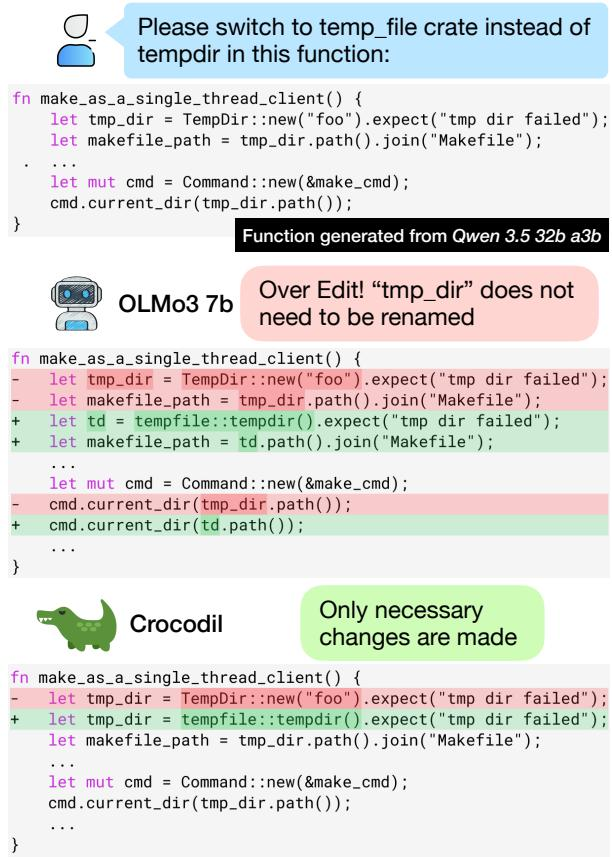
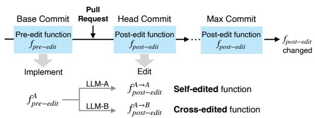
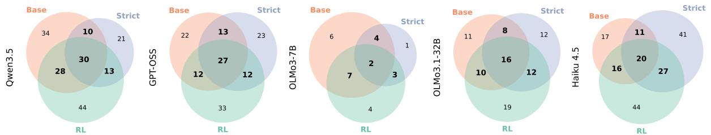
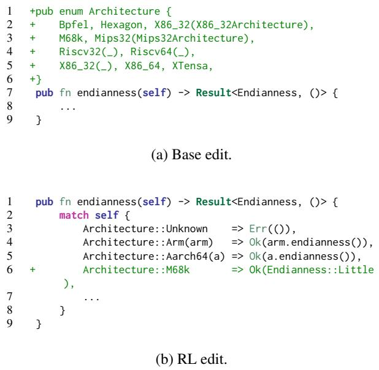
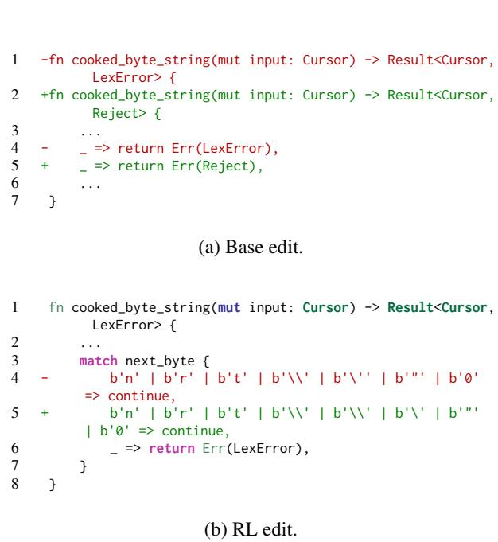
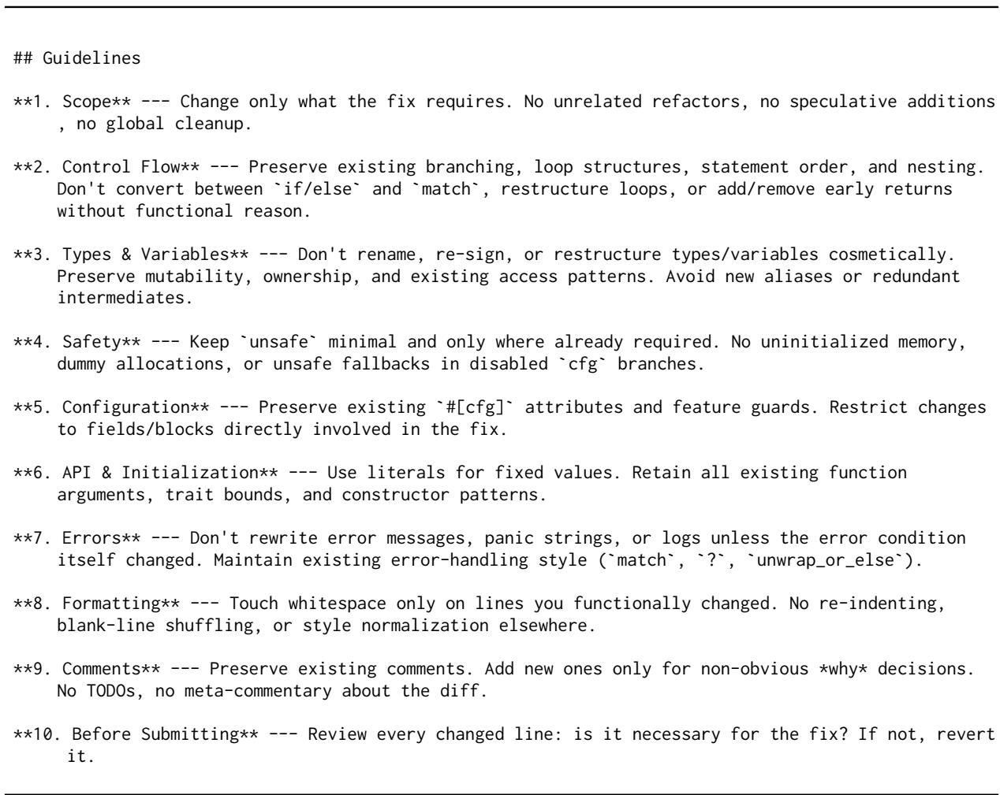

# CROCODIL: Cross-Model Code Editing with LLMs

Linghan Zhong<sup>1</sup>, Aditya Thimmaiah<sup>1</sup>, Jayanth Srinivasa<sup>2</sup>, Milos Gligoric<sup>1</sup>, Junyi Jessy Li<sup>1</sup>

linghanz@cs.utexas.edu, auditt@utexas.edu, jasriniv@cisco.com, gligoric@utexas.edu, jessy@utexas.edu

<sup>1</sup>The University of Texas at Austin <sup>2</sup>Cisco Research

## Abstract

Large language models (LLMs) have become ubiquitous tools for code generation and editing. However, development teams often use multiple LLM assistants. Different developers may prefer different models, and individual developers may switch between models across different coding sessions. Because of this, the edits any one model makes are frequently applied to foreign code originally generated by another model. These LLMs are often trained on different datasets, and as a result have different stylistic preferences. Do LLMs behave differently when they edit foreign code originally written by a different LLM with a different coding style? We find that models tend to make more, and often excessive, edits on foreign code. We introduce CROCODIL (Cross-model Code Editing with LLMs), a post-training framework for reducing excessive edits while preserving functional correctness. CROCODIL’s similarity reward penalizes large changes, while its execution reward scores build and test success. We use the product of these two rewards to encourage the policy to decrease the edit size without decreasing the edit task success rate. CROCODIL is available at https://github. com/EngineeringSoftware/Crocodil.

## 1 Introduction

Large language models (LLMs) have become ubiquitous tools for code generation and editing. Developers use them to draft new functions (Chen et al., 2021; Austin et al., 2021; Nijkamp et al., 2023), refactor existing modules (Gautam et al., 2025), and patch failing tests (Xia and Zhang, 2022; Xia et al., 2023; Yang et al., 2024; Tufano et al., 2019). With a wide range of models available, development teams often use multiple LLMs. Different developers may prefer different models (Liang et al., 2024), and the same developer may switch between models from one session to the next as task demands, latency, or cost shift (Pyo et al.,

  
Figure 1: Cross-edit example: vanilla Olmo3 7B overedits a Qwen3.5 35B A3B-generated function by renaming the identifier tmp\_dir to td. Trained with CROCODIL, it makes only the requested change.

2026). As a result, the pre-edit code each LLM assistant is tasked to edit not only includes native code authored by itself (self-edit) but also foreign code that another model originally generated (crossedit). These models are trained on different corpora and tuned under different post-training objectives (Ouyang et al., 2022; Rozière et al., 2023; Hui et al., 2024). They accordingly hold their own preferences in style. Do these preferences lead an LLM to make more edits during cross-edit than during self-edit, implementing foreign code toward its own conventions?

Prior work on benchmarking LLM code editing ability (Just et al., 2014; Widyasari et al., 2020; Cassano et al., 2024) is ill-suited for answering this question. Such benchmarks usually support varying only the editor LLM for each edit task, but not the author of the pre-edit code. With this limitation, we cannot easily evaluate how much of an editor’s output is driven by who wrote the pre-edit code.

We first reveal that (1) LLMs are excessive code editors, and (2) mixing and matching implementor and editor models when coding makes the LLMs’ edits more excessive. To systematically assess how the editing behavior of LLMs differs on native code compared to foreign code, we introduce a novel data-collection framework that gathers preedit code from merged GitHub pull requests (PRs) on popular Rust crates, and use a set of models to implement the pre-edit code themselves. We then run existing tests to ensure the implementations are correct. Each of the models is then asked to apply the original PR’s edit to every implementation.

Using five LLMs on this corpus, we find that the four open-weight models edit their own implementations up to 14% less than they edit the other models’ implementations, on 14 of 16 model pairings. The gap cannot be closed by prompt engineering: a system prompt asking for the smallest possible edit cannot consistently make edits smaller or improve edit success. This motivates a training signal that explicitly penalizes excessive editing without sacrificing correctness. Fewer changes per PR could mean faster code reviews, fewer tests to run for that PR, and thus faster overall development.

To address this gap, we introduce CROCODIL (Cross-model Code Editing with LLMs), a posttraining framework for code editing models with a novel reward function to reduce this excessive editing while preserving functional correctness. CROCODIL’s components penalize large changes while rewarding build and test success. We reuse our data-collection framework to gather the training tasks, so the model can be trained against code by another LLM whose style it is not familiar with. We show that CROCODIL halves Olmo3 7B’s edit size on implementations by every model, while improving build and test pass rates on every implementor but Olmo3 7B itself. When restricted to tasks where edits by both the base model and the CROCODILtrained model pass every test, CROCODIL still produces smaller edits, demonstrating that our model indeed reduces excessive non-task-related edits.

## 2 Related Work

LLM-based code editing and repair. Zhang et al. (2022) introduced CoditT5, which proposed a pretraining objective that explicitly models code edits, and used it to train an LLM on a large amount of source code and natural language comments. Can It Edit (Cassano et al., 2024) builds a fine-tuning dataset, EditPackFT, by collecting and cleaning commits on Python repositories, and provides a benchmark with human-written code, tasks, and test suites. EDIT-Bench (Chi et al., 2026) builds a benchmark by collecting instructed edit tasks from the users of their VS Code extension, pairing each real user instruction with the corresponding file, the highlighted region, and the cursor position. A team of programmers then writes the test harnesses by hand to check the LLM-generated edits on those tasks. SWE-agent (Yang et al., 2024) creates an Agent-Computer Interface to provide LLMs with tools that help them view, search through, and edit files. Agentless (Xia et al., 2025) employs a three-phase process of localization, repair, and patch validation, without letting the LLM decide future actions or operate with complex tools. Instead of focusing on improving LLMs at solving editing tasks, CROCODIL trains LLMs to make fewer excessive edits, especially on foreign code.

Reinforcement learning for coding LLMs. CodeRL (Le et al., 2022) trains an actor that generates programs alongside a critic that provides dense execution feedback to the actor during both training and inference. RLTF (Liu et al., 2023) introduces a fine-grained reward from unit-test outcomes, so the policy can attribute failure to specific lines rather than only to the final program. StepCoder (Dou et al., 2024) splits generation into a curriculum of shorter subtasks and masks unexecuted code in the compiler-feedback reward. These works design their reward around the correctness of the output. CROCODIL pairs an execution reward with a similarity reward, so a model that edits foreign code is encouraged to keep generating functionally correct edits while being penalized for changing the pre-edit code excessively.

## 3 Characterizing Cross-editing

## 3.1 Corpus

We first construct a dataset of GitHub pull requests (PRs) with both the pre-edit and post-edit versions of each function, and their associated test cases.

Data selection. We collect PRs from Rust projects registered on crates.io (The Rust Foundation, 2026) and hosted on GitHub. Each PR must satisfy: (1) at most five files changed when merged, and (2) at least 75% of the changed files are in Rust. We focus on Rust here because it is widely used, its projects are generally well tested, it compiler could provide rich feedback for repair stage, improving success rate for LLM implementations. To bound the scope of the implementation and edit, we break each PR into per-function updates. We include global functions, associated functions, which are generally defined on a type, and methods, which are associated functions that are called on a particular instance of a type. For simplicity, we refer to all three asfunctions in this work.

Each extracted function must exist before (preedit) the PR and must not be removed or renamed after (post-edit) the PR. We match pre-edit and post-edit through file path, name, and impl header. Both the pre-edit and post-edit functions are limited to between 20 and 200 non-empty, non-comment lines. These limits keep the context size tractable while retaining functions complex enough to carry meaningful edits. We believe this setup can generalize to real-world multi-file edit settings, since each multi-file change is made up of many function edits, but we leave that direction for future work. On top of these, we keep only the PRs whose repository has a README, to make sure we can easily generate a description of the repository for the models. In total, we collected 4,514 PRs and 8,235 functions across 356 repositories that satisfied these constraints.

For every collected function we prepare the additional context items listed in Table 1. Every implementor (Section 3.2) and editor (Section 3.3) uses a subset of this list as its input context.

Test collection. To check the correctness of the implementation and the success of the edit, we collect tests that check each function from the three commits illustrated in Figure 2. The base commit is the parent of the PR, where the function is in its pre-edit form, so its tests can check implementations. The head commit is the tip of the PR, where the function is in its post-edit form and includes any tests the PR added, so its tests can check the edits. The max commit is the last commit on the main branch where the function still matches the post-edit version exactly, and we use its tests to augment the head commit tests.

We use a line-coverage collector for Rust to record which lines of code are executed when each test runs. This allows us to keep only the tests that check the behavior of the pre-edit and post-edit functions. Test collection succeeds for 2,458 of them (1,404 PRs, 207 repositories). On these functions, the collected tests execute 87.9% of the lines of the developer’s post-edit function on average, with a median of 94.5%.

<table><tr><td>ID</td><td>Item</td><td>Description</td></tr><tr><td> $C _ { \mathrm { F u n c S i g } }$ </td><td>Function signature</td><td>The pre-edit or post-edit func- tion&#x27;s signature.</td></tr><tr><td>CDiff</td><td>Rest-of-PR diff</td><td>Unified PR diff with the target function&#x27;s own diff removed.</td></tr><tr><td>CCallees</td><td>Callee functions</td><td>Other Rust functions in the same repo that the pre-edit or post-edit function calls (signa- ture and body).</td></tr><tr><td>CCallSites Call sites</td><td></td><td>Surrounding code at each place the function is called (±5 LOC).</td></tr><tr><td>Cuse</td><td>Use statements</td><td>The file&#x27;s use declarations, showing the modules in scope.</td></tr><tr><td>CImpl</td><td>Struct and impl</td><td>Header of the impl block con- taining the function and the struct it implements (e.g., impl Tra for Val).</td></tr><tr><td></td><td>CRepoDesc Repo description</td><td>LLM-generated description of the project derived from the repository&#x27;s README.</td></tr><tr><td></td><td>CPRDesc PR description</td><td>LLM-generated description of the PR&#x27;s overall purpose.</td></tr><tr><td></td><td></td><td>CFuncDesc Function description LLM-generated description of the function.</td></tr></table>

Table 1: Per-function context items prepared once and reused as a pool from which implementor and editor each draw a subset. Repo, PR, and Function description generated with Qwen3.5 35B A3B.

  
Figure 2: Our data collection, implementation, and edit framework.

LLMs. We use five LLMs in our study: four openweight models including Qwen3.5 35B A3B (Yang et al., 2025), GPT-OSS 20B (OpenAI, 2025), Olmo3 7B (Thinking) (Ettinger et al., 2025), Olmo3.1 32B (Thinking) (Ettinger et al., 2025), and one closed-source model, Haiku 4.5 (Anthropic,

2025). Each LLM we study serves in two roles: as an implementor that implements the collected preedit code, and as an editor that applies the changes to the implemented code.

As shown in Figure 2, we derive an editing task for every (implementation, PR change) pair, and have every editor perform every task, including the tasks of editing its own outputs as implementor. This lets us compare model behavior on crossediting and self-editing.

## 3.2 Implementation

During implementation, we use each implementor to convert each developer-written function into a set of model-authored equivalents. The implementation process is split into a draft stage where the implementor generates an initial draft of the function, and a repair stage where it repairs that draft until it builds and passes the collected tests, for up to 6 rounds. For Haiku 4.5, we run only 2 rounds instead of 6 to bound API cost.

Draft stage. We invoke each implementor once per function to produce an initial draft of the pre-edit function, conditioned on seven items from Table 1: $C _ { \mathrm { F u n c S i g } } , C _ { \mathrm { C a l l e e s } } , C _ { \mathrm { C a l l S i t e s } } , C _ { \mathrm { U s e } } , C _ { \mathrm { I m p l } } , C _ { \mathrm { R e p o D e s c } } ,$ and $C _ { \mathrm { F u n c D e s c } } .$ The developer’s original code is not given to the implementor to ensure the output reflects only the implementor’s own choices. We filter out 12 functions where $C _ { \mathrm { C a l l S i t e s } }$ is not available as we find no caller of the pre-edit function inside the repository, and 4 functions whose code and associated context are too long to fit inside the 10,000-token window we use to generate $C _ { \mathrm { F u n c D e s c } } .$ After this, 2,442 functions remain.

Repair stage. The generated drafts often fail to build or fail the tests. Thus, all drafts that fail to build or fail testing enter an iterative repair loop in the style of Self-Refine (Madaan et al., 2023). In each round, we set up each implementor model as two agents to fix its own draft:

• Instruct Agent: Receives the same context used for the initial draft, together with the previous round’s failing candidate, the build-and-test failure log, and the developer’s pre-edit function. It produces a natural-language repair plan that names the bug and prescribes the fix.

• Patch Agent: Receives the same context used for the initial draft, the previous round’s failing candidate, and the instruct agent’s repair plan. It outputs a new repaired function.

We use the developer’s pre-edit function to help expedite the repair process, and only the instruct agent sees it during the loop. This layer of indirection lets the instruct agent diagnose the candidate’s bug against the ground-truth oracle while preventing the patch agent from copying pieces of the original code verbatim. Additionally, the instruct agent’s plan describes the failure in natural language rather than the code that fixes it, making it unlikely to leak the developer’s style into the implementation. Figure 4 in Appendix F shows one such plan with the corresponding failing candidate.

The number of successfully implemented functions varies across implementors: Qwen3.5 35B A3B produces passing implementations for 1,602 of those pre-edit functions, GPT-OSS 20B for 1,102, Olmo3.1 32B for 459, Olmo3 7B for 199, and Haiku 4.5 for 1,139.

Filtering. We apply three filtering steps to the implementations. First, to ensure the implemented function reflects the model’s style and does not include remembered code from training or any leaked style choices, we discard any implementation whose overlap with the pre-edit function exceeds 50%. Here overlap is the gestalt-patternmatching score implemented in Python’s difflib. Second, we discard any task on which the implementation already passes every post-edit test at head commit/ max commit, since then no edit is needed for that implementation. This happens when the collected tests do not target the change at all, or when the implementation already exhibits the post-edit behavior before any edit is applied. Third, we discard any task whose PR diff and related context are too big to fit inside the 10,000- token window we use to generate the $C _ { \mathrm { P R D e s c } }$ (note that this is separate from $C _ { \mathrm { F u n c D e s c } }$ generation).

In the end, we are left with 603 tasks for Qwen3.5 35B A3B, 456 for GPT-OSS 20B, 225 for Olmo3.1 32B, 79 for Olmo3 7B, and 518 for Haiku 4.5 as implementor. Every evaluation later is performed on these tasks. Table 7 and Table 8 in Appendix A break down how many functions remain after each filter.

## 3.3 Edit

Each editor then edits every implemented preedit function, including the implementations produced by itself as implementor, according to the PR description. The editors are given four additional items from Table 1 in the prompt: post-edit $C _ { \mathrm { F u n c S i g } } , C _ { \mathrm { P R D e s c } } , C _ { \mathrm { D i f f } }$ , and $C _ { \mathrm { C a l l e e s } }$ . The editor is asked to generate the full edited function and is allowed to add extra helper functions or structs, and those are counted as added characters and lines.

<table><tr><td rowspan="2">Impl.</td><td colspan="5">Editor</td></tr><tr><td>Qwen3.5 35B A3B</td><td>GPT-OSS 20B</td><td>01mo3 7B</td><td>01mo3.1 32B</td><td>Haiku 4.5</td></tr><tr><td>Qwen3.5</td><td>0.24</td><td>0.32</td><td>0.64</td><td>0.32</td><td>0.28</td></tr><tr><td>GPT-OSS</td><td>0.27</td><td>0.30</td><td>0.66</td><td>0.29</td><td>0.27</td></tr><tr><td>01mo3</td><td>0.38</td><td>0.39</td><td>0.60</td><td>0.27</td><td>0.29</td></tr><tr><td>01mo3.1</td><td>0.30</td><td>0.38</td><td>0.59</td><td>0.25</td><td>0.33</td></tr><tr><td>Haiku</td><td>0.32</td><td>0.39</td><td>0.54</td><td>0.32</td><td>0.32</td></tr></table>

Table 2: Per-task character-level Levenshtein edit distance, min-max normalized within each task across the five editors and averaged over tasks. The minimum in each column is bolded.

## 3.4 Quantifying self-editing vs. cross-editing

Metric. For each edit task, we measure Levenshtein edit distance between the implementation and the editor’s output at character granularity. Before evaluating the distance, both the implementation and the editor’s output are passed through rustfmt, and then we strip comments and blank lines from both sides, so that pure formatting differences and comments do not inflate the distance. We use this formatted, comment-stripped Levenshtein edit distance throughout the rest of the paper. Since different edit tasks can lead to very different edit sizes, we min-max normalize each task across the five editors, mapping each edit to a value in [0, 1] where 0 is the smallest edit on that task across the five editors and 1 is the largest:

$$
\frac { \mathrm { l e v } _ { i } ^ { m o d e l } - \operatorname* { m i n } _ { m } \mathrm { l e v } _ { i } ^ { m } } { \mathrm { m a x } _ { m } \mathrm { l e v } _ { i } ^ { m } - \mathrm { m i n } _ { m } \mathrm { l e v } _ { i } ^ { m } } .
$$

Here i indexes tasks and m indexes editors.

Additionally, to test the statistical significance of whether an editor’s self-editing distances are smaller than its cross-editing ones, we pair each editor with each implementor other than itself and run a one-sided Mann-Whitney U (MWU) test. The test compares every self-editing distance against every cross-editing one and counts how often the self-editing distance is smaller. In this way, it detects whether one set tends to fall below the other. Results. Table 2 reports the normalized matrix, and Table 3 the p values of the MWU test. The normalization is defined only on tasks where every editor actually generated an edit and where the editors did not all make identically sized edits, which would cause the denominator to vanish, so we restrict this analysis to those. That leaves 549 tasks for Qwen3.5 35B A3B, 424 for GPT-OSS 20B,

<table><tr><td rowspan="2">Impl.</td><td colspan="5">Editor</td></tr><tr><td>Qwen3.5 35B A3B</td><td>GPT-OSS 20B</td><td>01mo3 7B</td><td>01mo3.1 32B</td><td>Haiku 4.5</td></tr><tr><td>Qwen3.5</td><td></td><td>.126</td><td>.209</td><td>.003**</td><td>.858</td></tr><tr><td>GPT-OSS</td><td>.318</td><td></td><td>.123</td><td>.035*</td><td>.964</td></tr><tr><td>0lmo3</td><td> $. 0 1 7 ^ { * }$ </td><td>.068</td><td></td><td>.199</td><td>.827</td></tr><tr><td>0lmo3.1</td><td>.102</td><td>.026*</td><td>.547</td><td></td><td>.279</td></tr><tr><td>Haiku</td><td></td><td> $. 0 0 4 ^ { * * } < . 0 0 1 ^ { * * * }$ </td><td>.818</td><td>.003**</td><td>一</td></tr></table>

Table 3: One-sided Mann-Whitney U p values for the off-diagonal cells of Table 2. Each cell tests whether the column editor’s normalized distances on its own implementations are smaller than its distances on the row implementor’s implementations. Stars mark $p <$ 0.05 (<sup>∗</sup>), $p < 0 . 0 1 ( ^ { * * } )$ , and $p < 0 . 0 0 1 ( ^ { \ast \ast \ast } )$

202 for Olmo3.1 32B, 68 for Olmo3 7B, and 453 for Haiku 4.5 as implementor. We observe that the four open-weight editors tend to edit their own implementations the least: among the 16 self-versuscross comparisons, 14 show self-editing making the smaller change, and 7 are significant at $p < 0 . 0 5 .$ Both exceptions are Olmo3 7B, whose self-editing change is larger than its cross-editing change on Olmo3.1 32B’s and on Haiku 4.5’s implementations.

Haiku 4.5 does not follow this pattern. Its column minimum falls on GPT-OSS 20B’s implementations. Why Haiku 4.5, unlike the open-weight models, shows little difference in edit distance between its own code and foreign code is an interesting question, and we believe it is an exciting direction for future work.

The editors also differ in overall edit size: Olmo3 7B is the most aggressive editor, editing about twice as much as the other models on implementations by Qwen3.5 35B A3B and GPT-OSS 20B. The gap shrinks substantially on Olmo3 7B’s own implementations, reinforcing the broader pattern that the open-weight models edit more on code from other models than on their own. These results indicate that foreign code induces excessive edits. This holds even for the editors that make smaller edits in general, which still change more of foreign code than of their own.

Additionally, we report the test pass rate for all combinations of editors and implementors in Appendix B, where the diagonal entry is not always the column maximum.

## 4 CROCODIL

To mitigate the excessive editing problem observed in Section 3.4, we propose CROCODIL, a posttraining framework for code editing models with a novel reward function consisting of two components: a similarity reward that penalizes large edits, and an execution reward that scores whether the edits successfully complete the given tasks. We optimize the model with Group Relative Policy Optimization (GRPO) (Shao et al., 2024) to reduce the magnitude of edits made by LLMs while preserving functional correctness.

## 4.1 Task Formulation

We frame function editing as a sequence-level reinforcement learning problem. Given the implemented pre-edit function $f _ { \mathrm { p r e - e d i t } } ^ { A }$ , the task description $d ,$ and the context ${ \mathcal { C } } ,$ a policy $\pi _ { \theta }$ generates an edited function $f _ { \mathrm { p o s t - e d i t } } ^ { A  B } = \bar { \pi } _ { \theta } ( f _ { \mathrm { p r e - e d i t } } ^ { \dot { A } } , d , \mathcal { C } )$ . Here, the context is the same as that supplied in the edit step of Section 3.3. Each rollout is scored with a single scalar reward R<sub>CROCODIL</sub> = $R _ { \mathrm { s i m } } \times R _ { \mathrm { e x e c } }$ This reward is then used with GRPO to optimize $\pi \theta$ . The objective is to produce edits that satisfy the task’s functional requirements while introducing minimal unnecessary change.

## 4.2 Similarity Reward

The similarity reward penalizes excessive changes. For each function edit made by the LLM being trained, let $c _ { m }$ and $l _ { m }$ be the number of characters and lines changed by the model. We compute $D _ { m } = ( c _ { m } + 1 ) ( l _ { m } + 1 )$ to capture both how much text changed, via the character count, and how many locations were touched, via the line count. Then, to regularize it, we take a similar approach to GR3’s length-rescaling reward (Li et al., 2026). Their reward deals with the problem of response-length inflation by rescaling a base reward by response length normalized against the GRPO group mean, discouraging the model from producing arbitrarily long generations. We instead normalize against the per-task developer edit magnitude $D _ { h } = ( c _ { h } + 1 ) ( l _ { h } + 1 )$ , where $c _ { h }$ and $l _ { h }$ are the characters and lines changed inside the developerwritten function in the original PR. $D _ { h }$ estimates the “task size”, i.e., how much change is needed to complete the edit task. Our similarity reward is

$$
R _ { \mathrm { { s i m } } } = \frac { 1 } { 1 + \alpha \frac { D _ { m } } { D _ { h } } } .
$$

This allows us to penalize large edits proportionally to the estimated edit size of the task. The coefficient α controls the penalty steepness. An edit matching the developer’s edit size scores $\frac { 1 } { 1 + \alpha }$

<table><tr><td>Implementor Editor</td><td>All tasks</td><td colspan="3">Both pass</td></tr><tr><td></td><td></td><td>Strict</td><td>Base &amp; Base &amp; RL</td><td>Strict &amp;RL</td></tr><tr><td>Qwen3.5 35B A3B</td><td></td><td></td><td></td><td></td></tr><tr><td>01mo3 7B Base</td><td>0.54</td><td>0.43</td><td>0.31</td><td></td></tr><tr><td>01mo3 7B Strict</td><td>0.53</td><td>0.45</td><td></td><td>0.37</td></tr><tr><td>01mo3 7B RL</td><td>0.20</td><td>一</td><td>0.22</td><td>0.26</td></tr><tr><td>GPT-0SS 20B</td><td></td><td></td><td></td><td></td></tr><tr><td>01mo3 7B Base</td><td>0.54</td><td>0.34</td><td>0.35</td><td></td></tr><tr><td>01mo3 7B Strict</td><td>0.51</td><td>0.40</td><td></td><td>0.42</td></tr><tr><td>01mo3 7B RL</td><td>0.22</td><td></td><td>0.22</td><td>0.29</td></tr><tr><td>01mo3 7B</td><td></td><td></td><td></td><td></td></tr><tr><td>01mo3 7B Base</td><td>0.47</td><td>0.18†</td><td>0.22†</td><td></td></tr><tr><td>01mo3 7B Strict</td><td>0.51</td><td>0.32†</td><td></td><td>0.21†</td></tr><tr><td>01mo3 7B RL</td><td>0.21</td><td></td><td>0.02†</td><td>0.29†</td></tr><tr><td>01mo3.1 32B</td><td></td><td></td><td></td><td></td></tr><tr><td>01mo3 7B Base</td><td>0.51</td><td>0.34</td><td>0.24</td><td></td></tr><tr><td>01mo3 7B Strict</td><td>0.49</td><td>0.29</td><td></td><td>0.30</td></tr><tr><td>01mo3 7B RL</td><td>0.24</td><td>一</td><td>0.14</td><td>0.23</td></tr><tr><td>Haiku 4.5</td><td></td><td></td><td></td><td></td></tr><tr><td>01mo3 7B Base</td><td>0.45</td><td>0.33</td><td>0.34</td><td></td></tr><tr><td>01mo3 7B Strict</td><td>0.52</td><td>0.37</td><td></td><td>0.35</td></tr><tr><td>01mo3 7B RL</td><td>0.15</td><td>一</td><td>0.25</td><td>0.11</td></tr></table>

Table 4: Min-max normalized Levenshtein edit distance from the implementation to the edited function. All tasks reports over every task. Each Both pass group restricts to the tasks that the two editors it names both pass, and the row left out of a comparison shows dashes there. The smallest value of each comparison is bolded. A dagger marks a cell averaged over ten or fewer tasks.

## 4.3 Execution Reward

The execution reward $R _ { \mathrm { e x e c } }$ scores whether the edited code builds and passes the function’s tests. We compute $R _ { \mathrm { e x e c } } = w _ { b } b + w _ { \mathrm { p r e } } p _ { \mathrm { p r e - e d i t } } +$ w<sub>post</sub>p<sub>post-edit</sub>, where b is build success (0 or 1), p is the edit’s pass rate on tests that the implemented function already passes (regressions the edit should avoid), and $p _ { \mathrm { p o s t - e d i t } }$ is the edit’s pass rate on tests that the implemented function fails (new behavior the edit must introduce). The weights $w _ { b } , \ w _ { \mathrm { p r e } }$ , and $w _ { \mathrm { p o s t } }$ allow us to control which metrics to prioritize. In training, we set $w _ { b } = 0 . 2 , w _ { \mathrm { p r e } } = 0 . 4 .$ , and $w _ { \mathrm { p o s t } } = 0 . 4$

## 5 Experiment

## 5.1 Training Dataset

The training data for CROCODIL is built with the same pipeline described in Section 3, applied to a separate pool of repositories to ensure there is no project-level overlap with the evaluation dataset.

The starting set contains 9,150 functions, 4,666 PRs, and 388 repositories. We are able to collect tests for 1,636 functions, 942 PRs, and 150 repositories. To implement the collected pre-edit functions, we use the Qwen3.5 35B A3B model with the same draft and repair procedure as in Section 3.2, with the repair loop run for up to 10 rounds rather than 6. We drop the overlap filter that caps the similarity between the implemented function and the original developer’s code, since the concern about bias from the model remembering does not apply at training time. We add an additional filter for the tasks whose prompts do not fit within the 6,144-token limit (12,288-token limit on total context, 6,144 tokens reserved for the output). In total, we collected 355 cross-edit tasks for training and 39 for validation.

## 5.2 Training Setup

We use Olmo3 7B as our base model for training, since it makes the most aggressive edits in the evaluation of Section 3.4. It is adapted with LoRA (Hu et al., 2022) at rank 32 and alpha 64 on all linear modules. Since LoRA keeps the base weights frozen, users have the option to load the adapter on demand at inference time for cross-edit tasks. GRPO training is implemented with the VERL framework (Sheng et al., 2025). We train for 3 epochs on our dataset with a batch size of 32 prompts and 8 rollouts per prompt, sampled at temperature 1.0. Our optimizer uses a learning rate of $3 \times 1 0 ^ { - 5 }$ with a KL regularization coefficient of 0.001. The similarity reward sets $\alpha = 0 . 3 3$ following GR3 (Li et al., 2026).

## 5.3 Baselines

We compare the RL trained model (denoted as Olmo3 7B RL) against two baselines on the same tasks. The first is the untrained base model (denoted as Olmo3 7B Base). The second is the strict prompt (denoted as Olmo3 7B Strict), which explores whether excessive editing can be resolved by prompt engineering. Its system prompt states the same instruction as for the other editors but adds strict guidelines to change only what the edit requires and to leave the rest of the function as it is, while the edit prompt and the decoding settings stay unchanged. The guidelines list out what should be left alone for a minimal edit when possible, among them the control flow, the type and variable names, and the error handling style. We show the prompt in Figure 7 in Appendix G.

## 6 Results

We analyze CROCODIL from two quantitative angles, the size of the edits it produces (Section 6.1) and whether those edits build and pass tests (Section 6.2). We then complement these with a qualitative analysis (Section 6.3) of cases where CROCODIL and the base model diverge.

## 6.1 Effect on Edit Size

Table 4 shows the mean Levenshtein edit distance from the implemented pre-edit functions to the editor’s output under four subsets of tasks. All tasks covers every task. Each Both pass column is restricted to the tasks on which the two editors it names both produce an edit that passes all tests. We leave the editor not named out of the comparison and show only dashes there. Figure 3 visualizes those populations for Table 4: each restricted comparison is an overlap of two circles, and the center region holds the tasks all three solve.

We report Levenshtein edit distance at character granularity to show how much of the code is edited. For a given task, we minmax normalize Olmo3 7B Base, Olmo3 7B Strict, and Olmo3 7B RL within a pool of edits generated by all 7 models used in this work: the Olmo3 7B Base, Olmo3 7B Strict, Olmo3 7B RL, Qwen3.5 35B A3B, GPT-OSS 20B, Olmo3.1 32B, and Haiku 4.5. As in Section 3.4, the normalization is defined on only some tasks, which leaves 545 tasks for Qwen3.5 35B A3B, 415 for GPT-OSS 20B, 69 for Olmo3 7B, 203 for Olmo3.1 32B, and 441 for Haiku 4.5. We report absolute distances and distances at line-level granularity in Appendix D.

Our framework meaningfully reduces the edit size of Olmo3 7B (Table 4). On the All tasks columns, CROCODIL halves the edit distance on functions implemented by each of the four openweight implementors, demonstrating the effectiveness of our framework. One natural concern is that the RL trained model may edit less only because it produces worse edits. The restricted columns rule this out. Where Olmo3 7B Base and Olmo3 7B RL both succeed, the RL trained model edits less on every implementor. Where Olmo3 7B Strict and Olmo3 7B RL both succeed, the RL trained model again edits less on Qwen3.5 35B A3B, GPT-OSS 20B, Olmo3.1 32B, and Haiku 4.5 implementations. It performs worse only on Olmo3 7B, on a population of 4 tasks. The RL trained model therefore makes smaller edits than both the base model and the strict prompt on foreign code while achieving the same successful outcome.

  
Figure 3: Overlap between tasks where base model (orange), strict prompt (blue), and RL trained model (green) edits pass all tests. The restricted columns of Table 4 are the pairwise overlaps bolded here.

Prompt engineering cannot consistently lower edit size (Table 4). On the All tasks columns, the strict prompt lowers the edit distance only on Qwen3.5 35B A3B, GPT-OSS 20B, and Olmo3.1 32B implementations, by far less than the RL trained model does, and actually raises it on Olmo3 7B and Haiku 4.5. On the Base & Strict pass column, where the Olmo3 7B Base and Olmo3 7B Strict edits both pass every test, it edits less than the base model only on Olmo3.1 32B. This demonstrates that CROCODIL’s edit size reduction cannot be achieved by prompt engineering.

## 6.2 Effect on Edit Success

Smaller edits do not come at the cost of edit success (Table 5). We have shown that CROCODIL teaches the model to edit less. Does this come at the cost of edit quality? We report the percentage of edits that successfully build (Build), the percentage that pass every collected test (All Tests), and the mean of the fraction of tests passed for each task (Mean Tests). Olmo3 7B RL outperforms Olmo3 7B Base on all three measures for every implementor other than Olmo3 7B itself. This exception is expected. CROCODIL’s training process teaches the base model to better edit foreign code and limit the excessive edits, so it is not expected to improve the task success rate on self-editing, where the model already introduces a smaller number of excessive edits. The RL trained model still keeps most of its performance in terms of the mean frac tion of tests passed. In practice, when handling code written by Olmo3 7B itself, a user could unload the LoRA adapter and fall back to the base model for that task. Olmo3 7B RL also outperforms Olmo3 7B Strict on every implementor, showing that the success rate improvement cannot be achieved by prompt engineering alone. Here, we note that success rates are low in every row, which is due to the editing capability of the small base model, Olmo3 7B, rather than the training.

<table><tr><td>Implementor Editor</td><td>(%)</td><td>(%)</td><td>Build All Tests Mean Tests (%)</td></tr><tr><td>Qwen3.5 35B A3B</td><td></td><td></td><td></td></tr><tr><td>01mo3 7B Base</td><td>32.67</td><td>16.92</td><td>21.12</td></tr><tr><td>01mo3 7B Strict 29.52</td><td></td><td>12.27</td><td>17.95</td></tr><tr><td>01mo3 7B RL</td><td>41.46</td><td>19.07</td><td>26.97</td></tr><tr><td>GPT-0SS 20B</td><td></td><td></td><td></td></tr><tr><td>01mo3 7B Base</td><td>28.51</td><td>16.23</td><td>20.76</td></tr><tr><td>01mo3 7B Strict 30.70</td><td></td><td>16.45</td><td>21.45</td></tr><tr><td>01mo3 7B RL</td><td>37.28</td><td>18.42</td><td>25.76</td></tr><tr><td>01mo3 7B</td><td></td><td></td><td></td></tr><tr><td>01mo3 7B Base</td><td>39.24</td><td>24.05</td><td>28.06</td></tr><tr><td>01mo3 7B Strict 37.97</td><td></td><td>12.66</td><td>22.66</td></tr><tr><td>01mo3 7B RL</td><td>37.97</td><td>20.25</td><td>26.63</td></tr><tr><td>01mo3.1 32B</td><td></td><td></td><td></td></tr><tr><td>01mo3 7B Base</td><td>31.11</td><td>20.00</td><td>24.84</td></tr><tr><td>01mo3 7B Strict 36.00</td><td></td><td>21.33</td><td>28.01</td></tr><tr><td>01mo3 7B RL</td><td>37.78</td><td>25.33</td><td>31.90</td></tr><tr><td>Haiku 4.5</td><td></td><td></td><td></td></tr><tr><td>01mo3 7B Base</td><td>32.63</td><td>12.36</td><td>18.56</td></tr><tr><td>01mo3 7B Strict 35.14</td><td></td><td>19.31</td><td>23.65</td></tr><tr><td>01mo3 7B RL</td><td>45.75</td><td>20.85</td><td>30.81</td></tr></table>

Table 5: Edit success of the base model vs. the RL trained model per implementor. Build is the percentage of tasks whose edit compiles, All Tests is the percentage of tasks whose edit passes every collected test, and Mean Tests is the mean per-task fraction of tests passed, counting an edit that fails to build as zero.

The build advantage holds after excluding trivial no-change responses (Table 6). However, build metrics can be inflated if the model returns the implementation unchanged, since an unmodified pre-edit function may already build trivially. To isolate this effect, we split the tasks into two disjoint subsets: tasks where the RL trained model makes no change, and tasks where the RL trained model actually modifies the implementation. A noticeable portion (19.94%) of the RL trained model’s outputs falls in the no-change category. This is within reason: $R _ { \mathrm { s i m } }$ rewards minimal change, so the RL trained model becomes more conservative and more willing to leave the implementation as-is when it does not know how to complete the edit request. After excluding these no-change responses and restricting to tasks where the RL trained model’s outputs actually modify the implementation, the RL trained model still achieves a higher build rate than the base model for every implementor except Olmo3 7B itself, showing that its build advantage does not come solely from declining to edit. We also show this for the mean fraction of tests passed (Mean Tests) in Appendix C.

<table><tr><td>Implementor</td><td>(%)</td><td>Build Build no change with change (%)</td><td>Build (%)</td></tr><tr><td>Qwen3.5 35B A3B</td><td></td><td></td><td></td></tr><tr><td>01mo3 7B Base</td><td>32.67</td><td>23.91</td><td>34.25</td></tr><tr><td>01mo3 7B Strict</td><td>t 29.52</td><td>27.17</td><td>29.94</td></tr><tr><td>01mo3 7B RL</td><td>41.46</td><td>33.70</td><td>42.86</td></tr><tr><td>GPT-0SS 20B</td><td></td><td></td><td></td></tr><tr><td>01mo3 7B Base</td><td>28.51</td><td>20.00</td><td>30.32</td></tr><tr><td>01mo3 7B Strict 30.70</td><td></td><td>22.50</td><td>32.45</td></tr><tr><td>01mo3 7B RL</td><td>37.28</td><td>27.50</td><td>39.36</td></tr><tr><td>01mo3 7B</td><td></td><td></td><td></td></tr><tr><td>01mo3 7B Base</td><td>39.24</td><td>27.78</td><td>42.62</td></tr><tr><td>0lmo3 7B Strict 37.97</td><td></td><td>22.22</td><td>42.62</td></tr><tr><td>01mo3 7B RL</td><td>37.97</td><td>22.22</td><td>42.62</td></tr><tr><td>01mo3.1 32B</td><td></td><td></td><td></td></tr><tr><td>O1mo3 7B Base</td><td>31.11</td><td>9.38</td><td>34.72</td></tr><tr><td>01mo3 7B Strict 36.00</td><td></td><td>18.75</td><td>38.86</td></tr><tr><td>01mo3 7B RL</td><td>37.78</td><td>18.75</td><td>40.93</td></tr><tr><td>Haiku 4.5</td><td></td><td></td><td></td></tr><tr><td>01mo3 7B Base</td><td>32.63</td><td>31.37</td><td>33.15</td></tr><tr><td>01mo3 7B Strict 35.14</td><td></td><td>30.07</td><td>37.26</td></tr><tr><td>01mo3 7B RL</td><td>45.75</td><td>37.25</td><td>49.32</td></tr></table>

Table 6: The share of tasks whose edit builds, over three populations, every task (Build), the tasks where the RL trained model returns the implementation unchanged (Build no change), and the tasks where the RL trained model edits it (Build with change).

## 6.3 Qualitative Analysis

To understand how the RL trained model’s edits differ from the base model’s, we inspected edits for two sets of tasks: tasks where only the RL trained model generates successful edits, and tasks where only the base model generates successful edits. Figure 5 and Figure 6 in Appendix H show one example of each.

The RL trained model keeps edits in scope. We see that in cases where the RL trained model generates successful edits but the base model fails, the base model tends to add code outside the given edit scope, such as new struct definitions or unrelated helper functions that the PR did not request, while the RL trained model learns to keep its edit in scope. For example, in the function endianness the task is to add a new match arm to handle a new type of architecture. The base model adds a hallucinated enum Architecture with invalid syntax, causing a build failure. On the other hand, the RL trained model limits its editing scope to the match block and adds only the required arm.

The similarity reward penalty can make the RL trained model under-edit on identifier propagation. The downside of the training shows up where the base model passes but the RL trained model fails. We observe that the penalty from similarity reward makes the RL trained model more likely to refuse to make requested edits if the task seems too minor. This is especially prevalent when an identifier is renamed and the rename needs to be propagated. The RL trained model often fails to apply the needed propagation. In cooked\_byte\_string, the task is to propagate changes from LexError to Reject. The base model completes that task by making the simple replacement, while the RL trained model keeps the old return type and additionally adds a new character to skip for next\_byte.

## 7 Conclusion

We show that LLMs edit code authored by other LLMs excessively. We build a Rust pull-request corpus that allows varying the implementor of the pre-edit code, and find that the four openweight LLMs we study edit foreign code more than their own native code on 14 of 16 model pairings. To address this excessive editing, we introduce CROCODIL, a post-training framework that pairs a similarity reward penalizing large edits with an execution reward scoring edit success, optimized via GRPO. Training Olmo3 7B with CROCODIL roughly halves its edit distance on implementations by every implementor while improving build and all-tests pass rates on every implementor but Olmo3 7B itself. We show that this improvement cannot be achieved by prompt engineering. In fact, the prompt engineering approach fails to reduce edit distance or improve edit success consistently.

## 8 Limitations

Single programming language. Our corpus and training data are drawn exclusively from Rust crates on GitHub. We acknowledge that languages with weaker typing or different grammar features, such as Python or JavaScript, may exhibit different cross-editing patterns. We have not verified that the self-edit/cross-edit gap, or the effectiveness of CROCODIL’s reward can generalize to other programming languages.

Function-level scope. In order to limit the edit scope and the context size, we decompose each PR into per-function edit tasks where both the pre-edit and post-edit bodies contain between 20 and 200 non-empty, non-comment lines. Edits that, in practice, could span multiple functions or multiple files are outside the scope of our project. CROCODIL’s behavior in those settings is not studied in this work.

Limited model pool. Due to budget constraints, the study uses five LLMs (Qwen3.5 35B A3B, GPT-OSS 20B, Olmo3.1 32B, Olmo3 7B, Haiku 4.5), only one of which is closed-source, and we train only Olmo3 7B with CROCODIL. Larger closedsource models such as GPT-5 and Claude Opus are not evaluated. The training framework are also not tested on these large closed-source models.

## Acknowledgments

We thank the anonymous reviewers for helpful feedback. This work was supported in part by the U.S. National Science Foundation (NSF) Nos. CCF-2217696, CCF-2313027, CCF-2403036; Cisco; and AMD (University Program AI & HPC Cluster). Any opinions, findings, and conclusions or recommendations expressed in this material are those of the authors and do not necessarily reflect the views of the sponsoring entities.

## References

Anthropic. 2025. Claude Haiku 4.5 system card. https://www.anthropic.com/claude-haiku-4- 5-system-card.

Jacob Austin, Augustus Odena, Maxwell Nye, Maarten Bosma, Henryk Michalewski, David Dohan, Ellen Jiang, Carrie Cai, Michael Terry, Quoc Le, and Charles Sutton. 2021. Program synthesis with large language models. arXiv preprint arXiv:2108.07732.

Federico Cassano, Luisa Li, Akul Sethi, Noah Shinn, Abby Brennan-Jones, Jacob Ginesin, Edward

Berman, George Chakhnashvili, Anton Lozhkov, Carolyn Jane Anderson, and Arjun Guha. 2024. Can it edit? evaluating the ability of large language models to follow code editing instructions. In Conference on Language Modeling (COLM).

Mark Chen, Jerry Tworek, Heewoo Jun, Qiming Yuan, Henrique Pondé de Oliveira Pinto, Jared Kaplan, Harri Edwards, Yuri Burda, Nicholas Joseph, Greg Brockman, Alex Ray, Raul Puri, Gretchen Krueger, Michael Petrov, Heidy Khlaaf, Girish Sastry, Pamela Mishkin, Brooke Chan, Scott Gray, and 39 others. 2021. Evaluating large language models trained on code. arXiv preprint arXiv:2107.03374.

Wayne Chi, Valerie Chen, Ryan Shar, Aditya Mittal, Jenny Liang, Wei-Lin Chiang, Anastasios Nikolas Angelopoulos, Ion Stoica, Graham Neubig, Ameet Talwalkar, and Chris Donahue. 2026. EDIT-bench: Evaluating LLM abilities to perform real-world instructed code edits. In International Conference on Learning Representations (ICLR).

Shihan Dou, Yan Liu, Haoxiang Jia, Enyu Zhou, Limao Xiong, Junjie Shan, Caishuang Huang, Xiao Wang, Xiaoran Fan, Zhiheng Xi, Yuhao Zhou, Tao Ji, Rui Zheng, Qi Zhang, Tao Gui, and Xuanjing Huang. 2024. StepCoder: Improving code generation with reinforcement learning from compiler feedback. In Annual Meeting ofthe Associationfor Computational Linguistics (ACL), pages 4571–4585.

Allyson Ettinger, Amanda Bertsch, Bailey Kuehl, David Graham, David Heineman, Dirk Groeneveld, Faeze Brahman, Finbarr Timbers, Hamish Ivison, Jacob Morrison, Jake Poznanski, Kyle Lo, Luca Soldaini, Matt Jordan, Mayee Chen, Michael Noukhovitch, Nathan Lambert, Pete Walsh, Pradeep Dasigi, and 48 others. 2025. Olmo 3. arXiv preprint arXiv:2512.13961.

Dhruv Gautam, Spandan Garg, Jinu Jang, Neel Sundaresan, and Roshanak Zilouchian Moghaddam. 2025. Refactorbench: Evaluating stateful reasoning in language agents through code. In International Conference on Learning Representations (ICLR).

Edward J. Hu, Yelong Shen, Phillip Wallis, Zeyuan Allen-Zhu, Yuanzhi Li, Shean Wang, Lu Wang, and Weizhu Chen. 2022. LoRA: Low-rank adaptation of large language models. In International Conference on Learning Representations (ICLR).

Binyuan Hui, Jian Yang, Zeyu Cui, Jiaxi Yang, Dayiheng Liu, Lei Zhang, Tianyu Liu, Jiajun Zhang, Bowen Yu, Kai Dang, An Yang, Rui Men, Fei Huang, Xingzhang Ren, Xuancheng Ren, Jingren Zhou, and Junyang Lin. 2024. Qwen2.5-Coder technical report. arXiv preprint arXiv:2409.12186.

René Just, Darioush Jalali, and Michael D. Ernst. 2014. Defects4j: A database of existing faults to enable controlled testing studies for java programs. In International Symposium on Software Testing and Analysis (ISSTA), pages 437–440.

Hung Le, Yue Wang, Akhilesh Deepak Gotmare, Silvio Savarese, and Steven C. H. Hoi. 2022. CodeRL: Mastering code generation through pretrained models and deep reinforcement learning. In Advances in Neural Information Processing Systems (NeurIPS).

Zichao Li, Jie Lou, Fangchen Dong, Zhiyuan Fan, Mengjie Ren, Hongyu Lin, Xianpei Han, Debing Zhang, Le Sun, Yaojie Lu, and Xing Yu. 2026. Tackling length inflation without trade-offs: Group relative reward rescaling for reinforcement learning. arXiv preprint arXiv:2603.10535.

Jenny T. Liang, Chenyang Yang, and Brad A. Myers. 2024. A large-scale survey on the usability of AI programming assistants: Successes and challenges. In International Conference on Software Engineering (ICSE), pages 52:1–52:13.

Jiate Liu, Yiqin Zhu, Kaiwen Xiao, Qiang Fu, Xiao Han, Yang Wei, and Deheng Ye. 2023. RLTF: Reinforcement learning from unit test feedback. Transactions on Machine Learning Research (TMLR).

Aman Madaan, Niket Tandon, Prakhar Gupta, Skyler Hallinan, Luyu Gao, Sarah Wiegreffe, Uri Alon, Nouha Dziri, Shrimai Prabhumoye, Yiming Yang, Shashank Gupta, Bodhisattwa Prasad Majumder, Katherine Hermann, Sean Welleck, Amir Yazdanbakhsh, and Peter Clark. 2023. Self-refine: Iterative refinement with self-feedback. In Advances in Neural Information Processing Systems (NeurIPS).

Erik Nijkamp, Bo Pang, Hiroaki Hayashi, Lifu Tu, Huan Wang, Yingbo Zhou, Silvio Savarese, and Caiming Xiong. 2023. Codegen: An open large language model for code with multi-turn program synthesis. In International Conference on Learning Representations (ICLR).

OpenAI. 2025. gpt-oss-120b & gpt-oss-20b model card. arXiv preprint arXiv:2508.10925.

Long Ouyang, Jeffrey Wu, Xu Jiang, Diogo Almeida, Carroll Wainwright, Pamela Mishkin, Chong Zhang, Sandhini Agarwal, Katarina Slama, Alex Ray, John Schulman, Jacob Hilton, Fraser Kelton, Luke Miller, Maddie Simens, Amanda Askell, Peter Welinder, Paul F Christiano, Jan Leike, and Ryan Lowe. 2022. Training language models to follow instructions with human feedback. In Advances in Neural Information Processing Systems (NeurIPS).

Seunghwa Pyo, Donggun Lee, Jungwoo Rhee, Soobin Park, and Youn-kyung Lim. 2026. One is not enough: How people use multiple ai models in everyday life. In CHI Conference on Human Factors in Computing Systems (CHI EA), pages 494:1–494:6.

Baptiste Rozière, Jonas Gehring, Fabian Gloeckle, Sten Sootla, Itai Gat, Xiaoqing Ellen Tan, Yossi Adi, Jingyu Liu, Romain Sauvestre, Tal Remez, Jérémy Rapin, Artyom Kozhevnikov, Ivan Evtimov, Joanna Bitton, Manish Bhatt, Cristian Canton-Ferrer, Aaron Grattafiori, Wenhan Xiong, Alexandre Défossez, and 7 others. 2023. Code llama: Open foundation models for code. arXiv preprint arXiv:2308.12950.

Zhihong Shao, Peiyi Wang, Qihao Zhu, Runxin Xu, Junxiao Song, Xiao Bi, Haowei Zhang, Mingchuan Zhang, Y. K. Li, Y. Wu, and Daya Guo. 2024. Deepseekmath: Pushing the limits of mathematical reasoning in open language models. arXiv preprint arXiv:2402.03300.

Guangming Sheng, Chi Zhang, Zilingfeng Ye, Xibin Wu, Wang Zhang, Ru Zhang, Yanghua Peng, Haibin Lin, and Chuan Wu. 2025. HybridFlow: A flexible and efficient RLHF framework. In European Conference on Computer Systems (EuroSys), pages 1279–1297.

The Rust Foundation. 2026. crates.io. https:// crates.io.

Michele Tufano, Cody Watson, Gabriele Bavota, Massimiliano Di Penta, Martin White, and Denys Poshyvanyk. 2019. An empirical study on learning bugfixing patches in the wild via neural machine translation. ACM Transactions on Software Engineering and Methodology (TOSEM), 28(4):19:1–19:29.

Ratnadira Widyasari, Sheng Qin Sim, Camellia Lok, Haodi Qi, Jack Phan, Qijin Tay, Constance Tan, Fiona Wee, Jodie Ethelda Tan, Yuheng Yieh, Brian Goh, Ferdian Thung, Hong Jin Kang, Thong Hoang, David Lo, and Eng Lieh Ouh. 2020. Bugsinpy: A database of existing bugs in python programs to enable controlled testing and debugging studies. In Joint European Software Engineering Conference and Symposium on the Foundations of Software Engineering (ESEC/FSE), pages 1556–1560.

Chunqiu Steven Xia, Yinlin Deng, Soren Dunn, and Lingming Zhang. 2025. Demystifying LLMbased software engineering agents. Proceedings of the ACM on Software Engineering (PACMSE), 2(FSE):801–824.

Chunqiu Steven Xia, Yuxiang Wei, and Lingming Zhang. 2023. Automated program repair in the era of large pre-trained language models. In International Conference on Software Engineering (ICSE), pages 1482–1494.

Chunqiu Steven Xia and Lingming Zhang. 2022. Less training, more repairing please: Revisiting automated program repair via zero-shot learning. In Joint European Software Engineering Conference and Symposium on the Foundations ofSoftware Engineering (ESEC/FSE), pages 959–971.

An Yang, Anfeng Li, Baosong Yang, Beichen Zhang, Binyuan Hui, Bo Zheng, Bowen Yu, Chang Gao, Chengen Huang, Chenxu Lv, Chujie Zheng, Dayiheng Liu, Fan Zhou, Fei Huang, Feng Hu, Hao Ge, Haoran Wei, Huan Lin, Jialong Tang, and 41 others. 2025. Qwen3 technical report. arXiv preprint arXiv:2505.09388.

John Yang, Carlos E. Jimenez, Alexander Wettig, Kilian Lieret, Shunyu Yao, Karthik Narasimhan, and Ofir Press. 2024. Swe-agent: Agent-computer interfaces enable automated software engineering. In Advances in Neural Information Processing Systems (NeurIPS).

Jiyang Zhang, Sheena Panthaplackel, Pengyu Nie, Junyi Jessy Li, and Milos Gligoric. 2022. CoditT5: Pretraining for source code and natural language editing. In International Conference on Automated Software Engineering (ASE), pages 22:1–22:12.

## Appendix

## A Corpus Filter

Table 7 and Table 8 count how many functions survive each filter of Section 3, from the PRs we collect to the tasks each implementor contributes. Developer-written functions (Table 7). In this table, PR and function-level filters is the starting count, the PRs must change at most five files with at least 75% of them in Rust. Each function must already exist before the PR and must not be completely removed after the PR. Finally, the functions must have between 20 and 200 non-empty, non-comment lines. README available keeps the functions whose repository has a README. Tests available keeps the functions for which the linecoverage collector finds tests that execute them. $C _ { C a l l S i t e s }$ available keeps functions that we can find their call cites inside their own repository. $C _ { F u n c D e s c }$ available keeps functions whose code and associated context fit inside the 10,000-token window we used to generated the descriptions.

<table><tr><td colspan="2">Filter Functions</td></tr><tr><td>PR and function-level filters</td><td>8,272</td></tr><tr><td>README available</td><td>8,235</td></tr><tr><td>Tests available</td><td>2,458</td></tr><tr><td> $C _ { \mathrm { C a l l S i t e s } }$  available</td><td>2,446</td></tr><tr><td> $C _ { \mathrm { F u n c D e s c } }$  available</td><td>2,442</td></tr></table>

Table 7: Functions remaining after filters in Section 3, before implementation by the LLM implementors.

Model implementations (Table 8). These filters come from Section 3.2, and each implementor now has its own count. Pass implementation test keeps the LLM implementations that pass every test collected for the pre-edit function after the draft and its repair rounds. Overlap below 50% keeps implementations whose overlap with the pre-edit function is at most 50%, to prevent models from generating functions memorized during training and to prevent style leakage. Fail edit test keeps only implementations that fail at least one post-edit test, since an implementation that already passes them needs no edit. $C _ { P R D e s c }$ available keeps tasks whose PR diff and context fit the window we use to generate the PR description. The bold row is the final set of edit tasks. The filters that min-max normalization needs, which keep only tasks where every editor produced an edit and edits by each models were not all the same size, are not shown here. They are only applied to normalized Levenshtein edit distance and the resulting number is different for different sets of editors. We report those counts in Section 3.4 and Section 6.1.

<table><tr><td></td><td>Qwen3.5 35BA3B</td><td>GPT-0SS 20B</td><td>01mo3 7B</td><td>0lmo3.1 Haiku 32B</td><td>4.5</td></tr><tr><td>Pass imple- mentation test</td><td>1,602</td><td>1,102</td><td>199</td><td>459</td><td>1,139</td></tr><tr><td>Overlap below 50%</td><td>1,169</td><td>789</td><td>153</td><td>349</td><td>728</td></tr><tr><td>Fail edit test</td><td>612</td><td>466</td><td>80</td><td>226</td><td>534</td></tr><tr><td> $C _ { \mathrm { P R D e s c } }$  available</td><td>603</td><td>456</td><td>79</td><td>225</td><td>518</td></tr></table>

Table 8: Functions remaining after each filter in Section 3, after implementation by the LLM implementors. Each implementor, implements its own, so each has its own count. The bold row is the edit tasks it contributes.

## B Edit Success Across Cross-editing

Table 9 shows the percentage of edits that can pass every test, over the same set of implementor and editor pairs between the five models used in Section 3. These numbers are calculated on all tasks we created after the implementation process. If a model fails to produce an edit, we count it as a failure. Here, unlike the pattern we observed for edit amount, we do not observe edits from self-editing perform better than cross-edit consistently. More interestingly, 3 out of 5 models perform the best on Olmo3.1 32B implementations and all models perform the worst on Haiku 4.5 implementations. How cross-editing affects a model’s ability to make correct edits is an interesting question that we leave to future work.

<table><tr><td rowspan="2">Impl.</td><td colspan="5">Editor</td></tr><tr><td>Qwen3.5 35B A3B</td><td>GPT-0SS 20B</td><td>01mo3 7B</td><td>01mo3.1 32B</td><td>Haiku 4.5</td></tr><tr><td>Qwen3.5</td><td>66.00</td><td>63.68</td><td>16.92</td><td>39.97</td><td>71.64</td></tr><tr><td>GPT-OSS</td><td>67.32</td><td>64.47</td><td>16.23</td><td>40.57</td><td>67.32</td></tr><tr><td>01mo3</td><td>60.76</td><td>59.49</td><td>24.05</td><td>37.97</td><td>67.09</td></tr><tr><td>01mo3.1</td><td>69.78</td><td>67.56</td><td>20.00</td><td>42.22</td><td>69.78</td></tr><tr><td>Haiku</td><td>49.61</td><td>49.03</td><td>12.36</td><td>27.61</td><td>57.14</td></tr></table>

Table 9: Percentage of tasks whose edit passes every test, for each (implementor, editor) pair of Table 2. The maximum in each column is bolded.

## C Mean Fraction of Tests Passed Excluding No-Change Responses

As described in Section 6.2, the mean fraction of tests passed (Mean Tests) can also potentially be inflated if the model returns the implementation unchanged. Here, we also split the tasks into two disjoint subsets: tasks where the RL trained model makes no change (Mean Tests no change), and tasks where the RL trained model actually modifies the implementation (Mean Tests with change). In Table 10, we observe that making no change does not always work in the RL trained model’s favor. On three of the five implementors, Olmo3 7B RL does not have the highest mean fraction of tests passed on the no-change subset. In contrast, on the with-change subset, Olmo3 7B RL’s mean fraction of tests passed exceeds the Olmo3 7B Base’s for every implementor, even for Olmo3 7B itself, showing that its mean test advantage does not originate from declining to edit.

<table><tr><td>Implementor Editor</td><td>Mean Tests (%)</td><td>Mean Tests no change (%)</td><td>Mean Tests with change (%)</td></tr><tr><td>Qwen3.5 35B A3B</td><td></td><td></td><td></td></tr><tr><td>0lmo3 7B Base</td><td>21.12</td><td>11.97</td><td>22.77</td></tr><tr><td>O1mo3 7B Strict</td><td>17.95</td><td>10.18</td><td>19.35</td></tr><tr><td>01mo3 7B RL</td><td>26.97</td><td>14.45</td><td>29.23</td></tr><tr><td>GPT-0SS 20B</td><td></td><td></td><td></td></tr><tr><td>01mo3 7B Base</td><td>20.76</td><td>12.06</td><td>22.61</td></tr><tr><td>O1mo3 7B Strict</td><td>21.45</td><td>12.69</td><td>23.31</td></tr><tr><td>01mo3 7B RL</td><td>25.76</td><td>12.64</td><td>28.55</td></tr><tr><td>01mo3 7B</td><td></td><td></td><td></td></tr><tr><td>01mo3 7B Base</td><td>28.06</td><td>16.67</td><td>31.43</td></tr><tr><td>O1mo3 7B Strict</td><td>22.66</td><td>10.26</td><td>26.32</td></tr><tr><td>01mo3 7B RL</td><td>26.63</td><td>3.70</td><td>33.39</td></tr><tr><td>01mo3.1 32B</td><td></td><td></td><td></td></tr><tr><td>0lmo3 7B Base</td><td>24.84</td><td>6.25</td><td>27.92</td></tr><tr><td>O1mo3 7B Strict</td><td>28.01</td><td>12.45</td><td>30.59</td></tr><tr><td>01mo3 7B RL</td><td>31.90</td><td>8.53</td><td>35.77</td></tr><tr><td>Haiku 4.5</td><td></td><td></td><td></td></tr><tr><td>0lmo3 7B Base</td><td>18.56</td><td>14.54</td><td>20.25</td></tr><tr><td>O1mo3 7B Strict</td><td>23.65</td><td>17.97</td><td>26.04</td></tr><tr><td>01mo3 7B RL</td><td>30.81</td><td>18.62</td><td>35.92</td></tr></table>

Table 10: The mean per-task fraction of tests passed over three populations, every task (Mean Tests), the tasks where the RL trained model returns the implementation unchanged (Mean Tests no change), and the tasks where the RL trained model edits it (Mean Tests with change).

## D Absolute Edit Distance and Line Granularity

Table 11 and Table 12 report the comparison between CROCODIL and the baselines in Levenshtein edit distance in absolute and in min-max normalized form. We report the numbers at line and character granularity. Both carry all four populations described in Section 6.1.

Absolute distances (Table 11). Rows are grouped by implementor, and inside each group we compare the 3 editors: Olmo3 7B Base, Olmo3 7B Strict, and Olmo3 7B RL. All tasks covers every task. Each Both pass column is restricted to the tasks on which the two editors it names both produce an edit that passes all tests. We leave the editor not named out of the comparison and show only dashes there. The populations are visualized in Figure 3 in Section 6.1. Chars and Lines are the Levenshtein edit distance calculated at character and line granularity. The smallest value of each comparison is bolded, and a dagger marks a cell averaged over ten or fewer tasks. We see that the RL trained model roughly halves the edit distance in absolute numbers and it still maintains an advantage over the base model and the strict prompt when restricted to tasks where RL trained model and baselines both produce an edit that passes all tests. Interestingly, when looking at tasks where both baselines produce an edit that passes all tests, the strict prompt actually consistently performs worse. This further shows that prompt engineering alone cannot consistently reduce excessive editing.

Normalized distances (Table 12). This table minmax normalizes the Levenshtein edit distance over the same tasks, with the pool of editors described in Section 6.1. Table 4 in the main paper prints the Chars column of each group from this table, while this table adds an additional Lines column for Levenshtein edit distance at line granularity. The results at line granularity still show that Olmo3 7B RL makes significantly smaller edits than the baselines on all implementors. This shows us that RL trained model did not simply optimize edit size by making small edits in several locations. We can also observe that the strict prompt still cannot lower the edit amount consistently at line granularity. The line-level Levenshtein edit distance results prove to us that CROCODIL can potentially reduce the burden for reviewers who read the edit diffs that show each lines where changes occur.

<table><tr><td rowspan="3">Implementor Editor</td><td colspan="2">All tasks</td><td colspan="2">Base &amp; Strict pass</td><td colspan="2">Base &amp; RL pass</td><td colspan="2">Strict &amp; RL pass</td></tr><tr><td>Chars Lines</td><td></td><td>Chars</td><td>Lines</td><td>Chars</td><td>Lines</td><td>Chars</td><td>Lines</td></tr><tr><td>Qwen3.5 35B A3B</td><td></td><td></td><td></td><td></td><td></td><td></td><td></td><td></td></tr><tr><td>0lmo3 7B Base</td><td>413.29</td><td>16.59</td><td>71.83</td><td>2.92</td><td>92.93</td><td>3.81</td><td></td><td></td></tr><tr><td>01mo3 7B Strict 399.82</td><td></td><td>15.66</td><td>82.45</td><td>3.08</td><td></td><td></td><td>65.74</td><td>2.48</td></tr><tr><td>01mo3 7B RL</td><td>233.28</td><td>8.47</td><td></td><td></td><td>74.22</td><td>2.59</td><td>72.19</td><td>2.49</td></tr><tr><td>GPT-0SS 20B</td><td></td><td></td><td></td><td></td><td></td><td></td><td></td><td></td></tr><tr><td>01mo3 7B Base</td><td>413.54</td><td>16.38</td><td>123.03</td><td>4.33</td><td>156.82</td><td>5.36</td><td></td><td></td></tr><tr><td>O1mo3 7B Strict</td><td>446.19</td><td>17.18</td><td>126.83</td><td>5.25</td><td></td><td></td><td>131.67</td><td>5.33</td></tr><tr><td>01mo3 7B RL</td><td>200.82</td><td>8.23</td><td></td><td>一</td><td>105.77</td><td>3.82</td><td>86.28</td><td>3.26</td></tr><tr><td>01mo3 7B</td><td></td><td></td><td></td><td></td><td></td><td></td><td></td><td></td></tr><tr><td>01mo3 7B Base</td><td>290.72</td><td>10.89</td><td>108.83†</td><td>6.17†</td><td>106.11† 4.33†</td><td></td><td></td><td></td></tr><tr><td>O1mo3 7B Strict</td><td>t 354.80</td><td>12.46</td><td>149.83†</td><td>7.33†</td><td></td><td></td><td>39.00†</td><td>2.20†</td></tr><tr><td>01mo3 7B RL</td><td>165.86</td><td>6.74</td><td></td><td>一</td><td>57.78†</td><td>2.00†</td><td>42.40†</td><td>2.00†</td></tr><tr><td>01mo3.1 32B</td><td></td><td></td><td></td><td></td><td></td><td></td><td></td><td></td></tr><tr><td>01mo3 7B Base</td><td>376.13</td><td>13.69</td><td>97.50</td><td>4.21</td><td>94.00</td><td>4.23</td><td></td><td></td></tr><tr><td>01mo3 7B Strict 437.67</td><td></td><td>14.96</td><td>105.33</td><td>4.50</td><td></td><td></td><td>111.39</td><td>5.14</td></tr><tr><td>01mo3 7B RL</td><td>221.14</td><td>8.14</td><td>一</td><td>一</td><td>96.31</td><td>4.08</td><td>103.82</td><td>4.54</td></tr></table>

Table 11: Mean Levenshtein edit distance from the implementation to the edited function in absolute form, at character and line granularity. All tasks reports over every task. Each remaining group restricts to the tasks that the two editors it names both pass, and the row left out of a comparison shows dashes there. The smallest value of each comparison is bolded. A dagger marks a cell averaged over ten or fewer tasks. Table 12 is the min-max normalized form of the same cells.

<table><tr><td rowspan="2">Implementor Editor</td><td colspan="2">All tasks</td><td colspan="2">Base &amp; Strict pass</td><td colspan="2">Base &amp; RL pass</td><td colspan="2">Strict &amp; RL pass</td></tr><tr><td>Chars Lines</td><td></td><td>Chars</td><td>Lines</td><td>Chars</td><td>Lines</td><td>Chars</td><td>s Lines</td></tr><tr><td>Qwen3.5 35B A3B</td><td></td><td></td><td></td><td></td><td></td><td></td><td></td><td></td></tr><tr><td>01mo3 7B Base</td><td>0.54</td><td>0.56</td><td>0.43</td><td>0.43</td><td>0.31</td><td>0.32</td><td></td><td></td></tr><tr><td>O1mo3 7B Strict</td><td>0.53</td><td>0.55</td><td>0.45</td><td>0.41</td><td></td><td></td><td>0.37</td><td>0.35</td></tr><tr><td>01mo3 7B RL</td><td>0.20</td><td>0.21</td><td>一</td><td></td><td>0.22</td><td>0.14</td><td>0.26</td><td>0.20</td></tr><tr><td>GPT-0SS 20B</td><td></td><td></td><td></td><td></td><td></td><td></td><td></td><td></td></tr><tr><td>01mo3 7B Base</td><td>0.54</td><td>0.56</td><td>0.34</td><td>0.28</td><td>0.35</td><td>0.31</td><td></td><td></td></tr><tr><td>O1mo3 7B Strict</td><td>0.51</td><td>0.54</td><td>0.40</td><td>0.37</td><td></td><td></td><td>0.42</td><td>0.42</td></tr><tr><td>01mo3 7B RL</td><td>0.22</td><td>0.24</td><td>一</td><td>一</td><td>0.22</td><td>0.24</td><td>0.29</td><td>0.29</td></tr><tr><td>01mo3 7B</td><td></td><td></td><td></td><td></td><td></td><td></td><td></td><td></td></tr><tr><td>01mo3 7B Base</td><td>0.47</td><td>0.47</td><td>0.18†</td><td>0.34†</td><td>0.22†</td><td>0.23†</td><td></td><td></td></tr><tr><td>01mo3 7B Strict</td><td>0.51</td><td>0.51</td><td>0.32†</td><td>0.35†</td><td></td><td></td><td>0.21†</td><td>0.25†</td></tr><tr><td>01mo3 7B RL</td><td>0.21</td><td>0.19</td><td>一</td><td>一</td><td>0.02†</td><td>0.02†</td><td>0.29†</td><td>0.17†</td></tr><tr><td>01mo3.1 32B</td><td></td><td></td><td></td><td></td><td></td><td></td><td></td><td></td></tr><tr><td>01mo3 7B Base</td><td>0.51</td><td>0.52</td><td>0.34</td><td>0.27</td><td>0.24</td><td>0.18</td><td></td><td></td></tr><tr><td>01mo3 7B Strict</td><td>0.49</td><td>0.53</td><td>0.29</td><td>0.22</td><td></td><td></td><td>0.30</td><td>0.26</td></tr><tr><td>01mo3 7B RL</td><td>0.24</td><td>0.25</td><td>一</td><td>一</td><td>0.14</td><td>0.13</td><td>0.23</td><td>0.22</td></tr></table>

Table 12: Min-max normalized Levenshtein edit distance from the implementation to the edited function, at character and line granularity, over the same tasks as Table 11. Table 4 prints the Chars column of each group from this table.

## E Per-function Context Items

Here, we include an example of all the the context items we listed in Table 1. All prompts we used in this work, including implementing, editing, repairing, utilize a subset of the shown context items.

Our example PR is rust-lang/flate2-rs#484, which targets the function read in the source file src/gz/bufread.rs.

```rust
C<sub>FuncSig</sub> (Function signature).
fn read(&mut self, into: &mut [u8]) -> io::
Result<usize> {
```

## C<sub>Diff</sub> (Rest-of-PR diff).

```diff
diff --git a/src/gz/mod.rs b/src/gz/mod.rs
index 3a24a754..79b957d6 100644
--- a/src/gz/mod.rs
+++ b/src/gz/mod.rs
@@ -402,8 +402,7 @@ impl GzBuilder {
let mut header = vec![0u8; 10];
if let Some(v) = extra {
flg |= FEXTRA;
header.push((v.len() >> 0) as u8);
header.push((v.len() >> 8) as u8);
+ header.extend((v.len() as u16).
to_le_bytes());
header.extend(v);
}
if let Some(filename) = filename {
```

## C<sub>Callees</sub> (Callee functions).

```rust
///
/// Note that mutation of the stream may
result in surprising results if
/// this decoder is continued to be used.
pub fn get_mut(&mut self) -> &mut R {
&mut self.obj
}
// callee 3: src/crc.rs
/// Get a mutable reference to the reader
that is wrapped by this `CrcReader`.
pub fn get_mut(&mut self) -> &mut R {
&mut self.inner
}
// ... 25 additional callees not shown
```

## C<sub>CallSites</sub> (Call sites).

```rust
src/gz/bufread.rs
428 | }
429 | }
430 |
431 | impl<R: BufRead> Read for
MultiGzDecoder<R> {
432 | fn read(&mut self, into: &mut [u8
]) -> io::Result<usize> {
433 | self.0.read(into)
434 | }
435 | }
436 |
437 | #[cfg(test)]
438 | mod test {
```

```rust
src/gz/bufread.rs
465 | "after decompression we
obtain the original input"
466 | );
467 |
468 | output.clear();
469 | assert_eq!(
470 | decoder.read(&mut output).
unwrap(),
471 | 0,
472 | "subsequent read of
decoder returns 0, but inner reader can
return additional data"
473 | );
474 | let mut reader = decoder.
into_inner();
475 | assert_eq!(
```

## C<sub>Use</sub> (Use statements).

```rust
use std::cmp;
use std::io;
use std::io::prelude::*;
use std::mem;
use super::{corrupt, read_into, GzBuilder,
GzHeader, GzHeaderParser};
use crate::crc::CrcReader;
use crate::deflate;
use crate::Compression;
```

## C<sub>Impl</sub> (Struct and impl).

impl <R: BufRead> Read for GzDecoder<R>

## C<sub>RepoDesc</sub> (Repo description).

This is a Rust library for streaming compression and decompression based on DEFLATE. It primarily supports gzip, zlib, and deflate formats. The library defaults to using \`miniz\_oxide\` but also supports Cbased backends like zlib and zlib-ng.

## C<sub>PRDesc</sub> (PR description).

This PR simplifies code in \`src/gz/bufread.rs\` and \`src/gz/mod.rs\` by removing unnecessary borrows and manual bit operations. In \` GzDecoder::read\`, the call to \`finish\` is updated from \`finish(&buf)\` to \`finish(buf) since the function signature already accepts a reference. In \`GzBuilder\`, manual length extraction via bit shifting is replaced with \`header.extend((v.len() as u16).to\_le\_bytes())\`, which is more idiomatic. The author notes that LLVM will optimize both versions identically. There is no functional change to the library's behavior, only improvements to code clarity and reduction of syntactic noise.

## C<sub>FuncDesc</sub> (Function description).

## ## Function Overview

This function implements the \`read\` method for a gzip decompressor. Its purpose is to decompress gzip-compressed data from an inner reader and write the decompressed bytes into a provided output buffer. It returns the number of bytes successfully written to the output buffer, or an error if decompression fails.

## ## Inputs and Outputs

\*\*Input:\*\*

\- \`into\`: A mutable slice of bytes where the decompressed data will be written

## \*\*Output:\*\*

\- On success: Returns the number of bytes written to the output buffer

decompression failure (e.g., corrupted data , invalid header)

## ## Behavior

The function uses a state machine to manage the decompression process through several stages:

## ### 1. Header Parsing State

When starting a new gzip stream, the function first parses the gzip header from the underlying reader. This header contains metadata about the compression format. Once parsing completes, the state transitions to the Body stage.

## ### 2. Body Reading State

In this stage, the function reads decompressed data from the inner reader:

\- If the output buffer is empty, it returns 0 immediately

\- It reads data from the inner reader into the output buffer

\- If no more data is available (end of stream), it transitions to the Finished state

\- Otherwise, it returns the number of bytes read

## ### 3. Finished State

After the body data is fully read, the function verifies data integrity:

\- It reads any remaining buffered data from the inner reader

\- It computes and verifies the CRC checksum against the expected value stored in the gzip stream

\- If the checksum verification fails, it transitions to an error state

\- If the \`multi\` flag is enabled (support for concatenated gzip streams), it checks whether more data follows

\- If more data exists, it resets and returns to the Header state to process the next stream

\- If no more data exists, it transitions to the End state

\- If \`multi\` is disabled, it transitions to the End state after verification

## ### 4. Error State

If any error occurred during processing, the function returns the error and transitions to the End state.

## ### 5. End State

When the decompressor has finished processing all available data, subsequent read requests return 0 bytes to indicate end of stream.

## ## Key Features

\- \*\*State Management\*\*: Uses a state machine to track the current phase of decompression ( header, body, finished, error, or end)

\- \*\*Checksum Verification\*\*: Validates data integrity using CRC checksums before finalizing a stream

\- \*\*Multi-Stream Support\*\*: When enabled, can process multiple concatenated gzip streams sequentially

\- \*\*Buffer Handling\*\*: Efficiently manages reading from the inner reader into the output buffer

\- \*\*Graceful EOF\*\*: Returns 0 bytes when no more decompressed data is available

## F Repair Plan Example

Figure 4 shows one failing candidate (Figure 4a) and the repair plan the instruct agent wrote for it (Figure 4b). In the plan, the agent simply described the visibility annotation bug and the fix needed without leaking any stylistic information.

```rust
1 pub fn fmt(&self, f: &mut fmt::Formatter) -> fmt::Result {
2 match self {
3 ParseError::GeneralParseError(s) => write!(f, "
General parsing error: {}", s),
4 ParseError::UnclosedOpenParen => write!(f, "
Unclosed opening parenthesis"),
5 ParseError::InvalidRepeat => write!(f, "Invalid
repeat syntax"),
6 ParseError::RecursionExceeded => write!(f, "
Pattern is nested too deeply"),
7
8 _ => write!(f, "Unknown error"),
9 }
10 }
```

(a) The failing candidate the instruct agent was asked to diagnose. rustc rejects the first line with E0449, visibility qualifiers are not permitted on a trait method.

The function incorrectly declares a visibility modifier on a trait method implementation. Trait methods like \`fmt\` inherit their visibility from the trait itself and cannot have explicit visibility annotations. Remove the visibility qualifier from the method definition to resolve the compilation error. This adjustment ensures the method's visibility aligns with the trait's requirements.

(b) The plan the instruct agent produced for it, in full.

Figure 4: A repair round on fmt in fancy-regex/fancy-regex #120, with Olmo3.1 32B as the implementor. The plan names the bug and describes the fix in prose.

## G Guidelines for the Strict prompt

Here, we reproduce in Figure 7 the guideline list that the strict prompt of Section 5.3 adds to the editor system prompt. The remainder of that system prompt states the same task, output format, and other rules as the plain editor system prompt that every other condition uses, so those guidelines are the entire difference between the strict prompt and the base model.

## H Qualitative Examples

Here we include the examples discussed in our qualitative analysis in Section 6.3.

In Figure 5, the task is one new match arm. The RL trained model writes that arm and nothing else, while the base model adds a fabricated enum that does not build. In Figure 6, the task is to propagate a rename of LexError to Reject. The base model applies it, while the RL trained model leaves the old type as is and breaks an unrelated literal instead.

  
Figure 5: Scope drift on endianness (bytecode alliance/target-lexicon PR #79, Qwen3.5 35B A3B implementor). The base model prefixes a fabricated enum definition with invalid pattern syntax; the RL trained model writes only the one new match arm.

  
Figure 6: Partial rename on cooked\_byte\_string (dtolnay/proc-macro2 PR #282, Qwen3.5 35B A3B implementor). The PR renames LexError to Reject; the RL trained model keeps the old return type and additionally introduces an unterminated character literal.

  
Figure 7: The guideline the strict prompt adds to the editor system prompt.