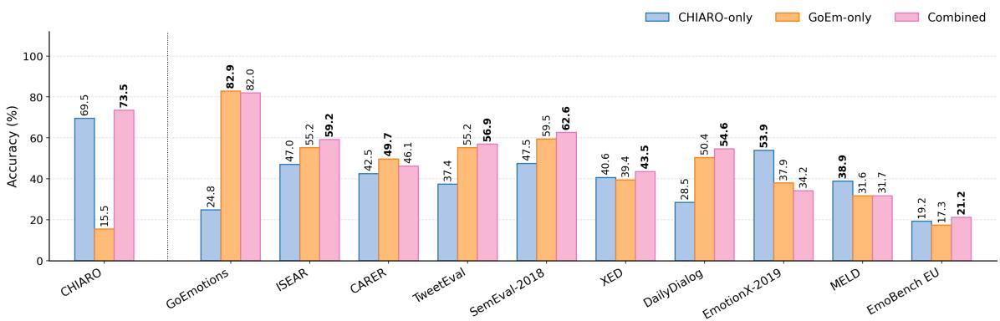
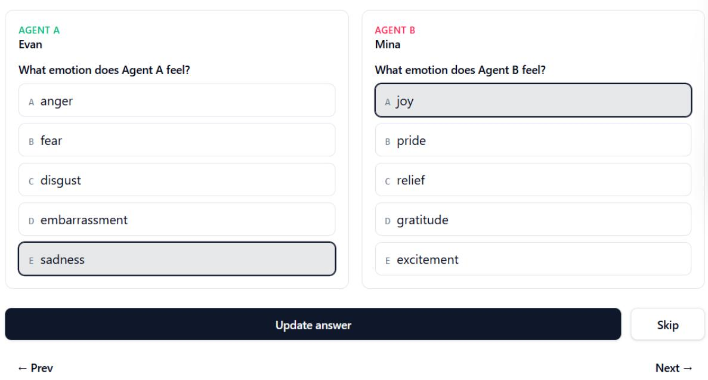

# Chiaroscuro for Emotions: A Contrastive Emotion Benchmark Grounded in Appraisal Theory

Divyesh Bommana, Mohammad Saim, Tianyu Jiang

University of Cincinnati

bommandh@mail.uc.edu, saimmd@mail.uc.edu, tianyu.jiang@uc.edu

## Abstract

Emotion recognition benchmarks often predict one emotion per text, missing many real-world scenarios where two people arrive at opposing emotions from a single shared event. For ex ample, a child kicks the seat in front of her in excitement while the passenger ahead grows angry. We introduce CHIARO, a 1,000 humanannotated sentence benchmark for contrastive emotion inference grounded in appraisal theory. Each scene describes one causal trigger eliciting a positive emotion in one person and a negative emotion in the other, drawn from a ten-class taxonomy. We benchmark seven frontier LLMs and four off-the-shelf emotion classifiers. The strongest LLM reaches 67.3 macro-F , well below human agreement, while existing emotion classifiers score near chance. Beyond evaluation, CHIARO also serves as a training signal. When combined with an existing emotion corpus, the resulting downstream classifier improves on CHIARO itself and on six of ten external emotion benchmarks, which positions our dataset as a complementary signal for emotion recognition.

## 1 Introduction

When two people share a single event, they can often arrive at opposing emotions. Each person reacts to a different aspect of the same situation, and the text rarely names either feeling outright. For example, a surprise promotion announced in front of the whole team may fill one engineer with pride at the recognition, while the colleague who had been quietly competing for the same role feels their stomach drop as the news lands. Neither emotion is stated, yet both are inferable from the situation alone. Understanding both emotions is the unit of analysis that many tasks need: conversational systems that mediate interpersonal disputes (Yeo and Jaidka, 2025), story generation that must render each character’s reaction to a scene, and multi-party dialogue analysis where emotions routinely diverge within a shared event (Poria et al., 2019) or even account for how affect shapes ethical judgments of a situation (Saim and Jiang, 2026).

  
Figure 1: Contrastive emotions in a shared scene. A child seated behind gleefully kicks the seat while playing on a tablet, whereas the man in front turns back with visible annoyance.

From GoEmotions (Demszky et al., 2020) to its recent multilingual and culturally-grounded successors (Muhammad et al., 2025; Belay et al., 2025), fine-grained labeled corpora have grown substantially in scale and coverage. However, the prediction target remains the emotion of a single person in isolation, and a strong baseline can often be built from a single affective keyword (Sabour et al., 2024). The Implicit Emotion Shared Task (Klinger et al., 2018) partially addresses this limitation by removing the explicit affect word, but is limited to a single person experiencing the emotion. We propose a dataset that targets the joint, opposed-valence reading illustrated in Figure 1, where two people in a shared scene have contrasting emotions tied to a shared cause. The proposed 1,000-sentence benchmark contains emotions from both valences (positive and negative) drawn from a balanced ten-class taxonomy and grounded in appraisal theory. Further, our benchmark shows a substantial gap between the best-performing frontier LLM and human agreement.

We highlight the evidence of our grounding. Appraisal theory states that emotions are not produced by events directly but by an agent’s evaluation of events along dimensions such as goal congruence, agency, and certainty (Smith and Ellsworth, 1985; Roseman et al., 1996; Ortony et al., 1988; Ellsworth and Scherer, 2002; Moors et al., 2013). Two individuals witnessing the same event under different goals or different agency can arrive at opposed emotions. For example, an unannounced snow day delights the kids and dismays the working parents scrambling for last-minute childcare. This framing is important for structuring a contrastive sentence. We introduce CHIARO,1 a benchmark dataset of 1,000 sentences where each sentence describes a single causal trigger eliciting a positive emotion in one agent and a negative emotion in the other, drawn from a balanced ten-class taxonomy. We avoid explicit use of affect words, and emotion must be inferred from situational context alone, with human annotations for both agents in each scene. Overall, our contributions are threefold:

1. We introduce CHIARO,2 a 1,000-sentence benchmark for two-person contrastive emotion inference in a single shared event, grounded in appraisal theory.

2. We benchmark seven frontier LLMs and four off-the-shelf emotion classifiers on CHIARO, showing that even the strongest frontier model falls well below human agreement and that existing single-agent emotion classifiers transfer to the task only at chance level.

3. We establish CHIARO as a complementary training resource for existing emotion classifiers. A RoBERTa-large fine-tuned on the union of CHIARO and a matched-size slice of an existing emotion dataset like GoEmotions beats either source alone on CHIARO and on six of ten external emotion benchmarks.

## 2 Related Works

The study of emotions in NLP developed from early affective text classification and sentiment polarity benchmarks (Strapparava and Mihalcea, 2007; Pang and Lee, 2008; Mohammad et al., 2018) into a broad research program spanning lexical resources (Mohammad and Turney, 2013), dimensional annotation frameworks (Buechel and Hahn, 2017), large-scale multi-label corpora (Demszky et al., 2020; Muhammad et al., 2025) and embodied inference (Zhuang et al., 2024; Duong et al., 2025; Saim et al., 2025). Compositional approaches show that sentiment is not monolithic within a passage and that conflicting polarities can attach to distinct targets (Socher et al., 2013; Pontiki et al., 2014), while implicit emotion tasks have established that surface affect words are neither necessary nor sufficient for inference (Klinger et al., 2018). Emotion recognition in conversations extended this framework to multi-speaker settings, where models must track the affective state across turns and infer emotion from social context (Li et al., 2017; Poria et al., 2019; Rashkin et al., 2019; Ghosal et al., 2020). Causal reasoning over emotion extends this to emotion-cause pair extraction (Xia and Ding, 2019; Poria et al., 2021) and shared tasks on conversation-level cause analysis (Wang et al., 2024), which require models to jointly identify an emotion and the event that triggered it, motivating the cause-span objective we adopt. A related line of work attaches affective polarity to events rather than to speakers (Ding et al., 2018; Zhuang et al., 2020). Recent benchmarks probe whether LLMs genuinely reason about emotion or merely match surface patterns (Sabour et al., 2024; Zhao et al., 2024). However, most evaluations in the emotion recognition space retain only the singleagent framing. The core aspect examined is which label applies to a single speaker, not how opposing valence is distributed between two agents who share a causal trigger.

Appraisal theories (Scherer, 2001; Ortony et al., 1988) account for the mechanism by which the same external event elicits different emotions in different agents, because each agent evaluates that event against their own goals and concerns. This formalizes the contrastive emotion setup as to why a single action yields delight in one agent and irritation in another. The research on co-occurring and mixed emotions confirms that opposite-valence states are not mutually exclusive and resist reliable recovery from surface form (Berrios et al., 2015; Larsen et al., 2001). This validates the non-trivial inference challenge our dataset poses.

Work on interpersonal emotion regulation (Hatfield et al., 1993) formalizes the directional influence from one agent’s expressive behavior to another’s affective response. We employ a similar framework while designing the shared space between our agents in each scenario. Research in contrastive affect is sparse and has primarily appeared in aspect-based sentiment analysis (Pontiki et al., 2014; Schouten and Frasincar, 2016), where conflicting polarities attach to distinct opinion targets within a single document’s meaning. No existing dataset jointly requires a model to detect that two agents hold opposing valence and attribute the correct polarity to each agent by role. CHIARO targets this conjunction directly, providing paired physical and non-physical scenario variants for causal grounding and role-aware polarity attribution in the settings where current models most consistently fail.

## 3 Task and Dataset Creation

Task definition. We formalize contrastive emotion inference as follows. Given a sentence describing a shared event involving two people (agents A and B) together with each person’s role, predict one emotion per person from a ten-class taxonomy comprising five positive and five negative classes. Each scene is constructed so that exactly one person’s emotion is positive and the other’s is negative. The prediction for a scene is therefore a paired assignment over the two people. The input contains no explicit affect words, so emotion must be inferred from situational context alone.

Motivation. Contrastive emotion inference is a novel evaluation target for emotion modeling. It is the joint prediction of two opposed emotions held by co-agents whose reactions diverge from a single shared trigger. Single-agent corpora such as GoEmotions (Demszky et al., 2020), ISEAR (Scherer and Wallbott, 1994), and EmpatheticDialogues (Rashkin et al., 2019) treat each text segment as one emotion held by one writer or speaker; multi-party dialogue corpora such as MELD (Poria et al., 2019) and DailyDialog (Li et al., 2017) label one emotion per utterance per speaker. Neither captures the joint, opposed-valence reading our task demands. Appraisal theory directly predicts this case: two agents witnessing the same event with different goals or agency can arrive at opposite emotions. CHIARO presents the prediction as both a benchmark dataset and an evaluation task.

CHIARO is constructed by converting short subreddit narratives into controlled, two-agent scenes that (i) exhibit opposing emotional valence across agents and (ii) require emotion inference from situational context rather than explicit affect vocabulary. The construction pipeline has three stages: sourcenarrative selection, two-stage scene generation, and automated validation and correction.

## 3.1 Emotion Taxonomy

We label each agent with one of ten emotions, partitioned into five positive (joy, pride, relief, gratitude, excitement) and five negative (anger, sadness, fear, disgust, embarrassment) classes.

The taxonomy is derived from the GoEmotions (Demszky et al., 2020) dataset. We select the five most distinct emotions per positive–negative polarity by applying the following criteria to the dataset. First, hierarchical clustering analysis shows that several emotions form intensity pairs or near-synonym clusters (e.g., anger/annoyance, fear/nervousness, sadness/grief). We retain the more reliable representative for each cluster based on arousal. We also discard overlapping appraisal structures (e.g., love, caring, and admiration as they all share gratitude’s other-directed-positive cell). Second, each retained emotion occupies a distinct cell along the agency, certainty, and control dimensions of appraisal-theoretic models (Smith and Ellsworth, 1985; Roseman et al., 1996; Ortony et al., 1988). We also considered alternative taxonomies. A popular alternative is Ekman’s six basic emotions, but it provides too few same-valence categories (only one positive emotion) for balanced contrastive scenes. Plutchik’s eight emotions include valence-ambiguous categories (surprise, anticipation) that are incompatible with the opposedvalence design. Moreover, as mentioned above, the full GoEmotions inventory of 27 emotion categories (28 with neutral) contains near-synonym clusters that make balanced two-agent generation and reliable annotation infeasible at our scale.

Each retained emotion is then paired with a mandatory event or a trigger. The generated sentence must instantiate a situational feature so the emotion is recoverable from the source text (e.g., gratitude requires an identifiable helper; relief requires a prior threat that is then avoided). The full mapping and filtering from the GoEmotions taxonomy to CHIARO and the per-emotion mandatory triggers are listed in Appendix G.

## 3.2 Source Narratives

We draw narrative inspiration from the r/AmIthe-Asshole (AITA) subreddit, a long-running community where users post first-person accounts of interpersonal conflicts and seek moral judgment. We collect AITA posts via the Reddit API. Each post presents a self-contained interaction involving multiple participants mentioned in the story, a sequence of events, and implicit questions about the situation’s morality. We chose AITA over neutral story corpora (e.g., ROCStories) for two reasons. First, AITA posts are organized around interpersonal events with opposing affective stakes between participants, which is the structure required to generate contrastive emotion scenes. Second, AITA posts are dense in implicit appraisal cues (fairness, agency, harm, benefit) without naming the emotions themselves. Therefore, the genre itself models appraisal-based reasoning over situational evidence. Appendix A describes the keyword-based post selection procedure.

<table><tr><td>Sentence</td><td>Agent A</td><td>Agent B</td></tr><tr><td>At a quiet corner table in the coffee shop, Maya&#x27;s laptop shows an early accep- tance email, and she reaches for her phone to call her mom, while Jordan, who thought they were applying as a pair, sees it and confronts her for submitting without him.</td><td>Jordan: anger</td><td>Maya: excitement</td></tr><tr><td>When the door wedge catches with a loud thump and the door won&#x27;t swing inward, the daughter inside the bedroom knows it will stay shut, while her mother in the hallway thinks someone is forcing the door and may get in before she can help.</td><td></td><td>the daughter: relief the mother: fear</td></tr><tr><td>At the store raffle board, the posted results list Maya as the winner and Lena as the runner-up, so Maya takes the prize voucher while Lena argues with the event staff about the listing.</td><td>Maya: joy</td><td>Lena: anger</td></tr></table>

Table 1: Three example CHIARO scenes spanning different emotion pairs. Each sentence describes a single shared event from which two agents arrive at opposed emotions; no explicit affect words appear in the sentence text.

## 3.3 Two-Stage Generation

Given a target emotion pair and an AITA Reddit post, we generate a CHIARO instance in two stages: DRAFT and RENDER. All generations are performed with OpenAI’s gpt-5.2; decoding hyperparameters are reported in Appendix B.

Stage 1: Draft scene. The model produces a short draft scene with a one-sentence setting, two agent\_roles, and a 1–2-sentence draft\_story describing a concrete event that plausibly elicits opposing-valence emotions in the two agents. Each draft must satisfy five requirements: (i) the two agents must hold opposed valence; (ii) the scene must make clear why each agent feels the way they do with coherent framing of the story; (iii) the scene must avoid villain framings (e.g., theft, punishment, sabotage); (iv) each agent’s emotion must instantiate the corresponding mandatory trigger;

and (v) the draft must conform to one of six contrastive scenario types. Each type encodes a distinct causal structure linking the two agents’ outcomes. The full list of the scenario types is given in Appendix C.

Stage 2: Paired render. From the draft scene, we generate two versions: a physical and a nonphysical. The two versions share the agents and the underlying contrast but differ in the causal mode of the triggering event:

• Physical: the trigger involves contact, force, or object manipulation that directly changes one agent’s situation (spilling, bumping, taking, breaking).

• Non-physical: the trigger is grounded in social or environmental cues without direct physical impact (overhearing, witnessing, knowing, announcing).

The two modes impose qualitatively different inferential demands. Physical triggers are concrete and immediately observable, whereas nonphysical triggers require theory-of-mind reasoning about what each agent knows, perceives, or expects (Stein, 1989; Zahavi, 2011). Pairing both modes in the corpus lets us test whether a model’s emotionattribution capacity transfers across causal modes or is biased toward one.

This motivation for a physical/non-physical categorization is grounded in the contrast between mechanical and experiential modes of causation. Stein’s philosophy, as characterized by Szanto and Moran (2025), distinguishes mechanical from experiential causation. Mechanical causation is a tripartite chain of a verursachendes (causing event), a verursachtes Geschehen (caused event), and a mediating Ursache (proper cause); experiential causation (Erlebniskausalität) is one in which two experiences jointly effectuate affective change without a separable mediating element. Physical scenes in CHIARO instantiate the former (the spilled coffee mechanically changes B’s situation), while nonphysical scenes instantiate the latter (the overheard remark changes the other agent’s experience only via its meaning). Table 1 shows three example CHIARO scenes spanning different emotion pairs and causal modes.

## 3.4 Validation of the Dataset

A core design goal of CHIARO is to discourage trivial inference from explicit affect words. We enforce this through (a) lexical constraints applied to all natural-language fields and (b) a suite of programmatic validators applied to every generated instance. For example, instead of “Maya felt nervous as she waitedfor her exam result,” a CHIAROcompliant rendering would describe the scene without naming the emotion: “Maya kept refreshing the portal everyfew seconds while the result loaded.”

Lexical constraints. We exclude approximately seventy affect-bearing words and phrases from the natural-language sentence generation. The list covers explicit emotion adjectives (happy, sad, proud, angry, etc.), and their morphological variants, stereotyped facial-expression descriptors (smiles, frowns, grins, glares, etc.), and other high-leakage phrases (slumped shoulders, tightjaw, welling eyes, etc.). The complete list is given in Appendix D.

Validators and correction. Six programmatic checks are applied to each generated version, covering valence contrast, lexical constraints, text length, person-reference count (to avoid scene crowding), span consistency, and role-head collision (the two agents must be distinguishable from their role prefixes alone). Versions that fail one or more checks are returned to the model together with an explicit list of violations and a correction request; the repair loop is bounded by a small number of retries, and instances that repeatedly fail are discarded. Appendix E gives full validator specifications.

## 3.5 Human Annotation and Statistics

Annotation and adjudication. Two fluent English-speaking annotators independently labeled all 1,050 generated sentences through a web-based interface, selecting one emotion per agent from the ten-class taxonomy (five positive–negative labels each). Annotators skipped items that failed quality standards, resulting in 1,017 scenes in the paired pool. We compute Cohen’s κ separately for each polarity slot and obtain an average inter-annotator agreement of $\bar { \kappa } = 0 . 8 2 7$ , with $\kappa _ { \mathrm { p o s } } = 0 . 7 9 8$ (raw agreement 83.9%) and $\kappa _ { \mathrm { n e g } } = 0 . 8 5 5$ (raw agreement 88.5%). We use these pre-adjudication agreements as the human reference point for model comparison. For items where the two annotators initially disagreed, they jointly discussed the appraisal cues and resolved disagreements within the same 1,017-sentence pool to produce a single gold label per agent. We randomly sample 1,000 as the final released dataset. We conduct all experiments on this set. The annotator instructions and interface are shown in Appendix I.

<table><tr><td colspan="2">Positive</td><td colspan="2">Negative</td></tr><tr><td>gratitude</td><td>22.5</td><td>anger</td><td>25.3</td></tr><tr><td>relief</td><td>22.1</td><td>embarrassment</td><td>21.0</td></tr><tr><td>joy</td><td>20.1</td><td>fear</td><td>19.9</td></tr><tr><td>excitement</td><td>18.7</td><td>sadness</td><td>17.4</td></tr><tr><td>pride</td><td>16.6</td><td>disgust</td><td>16.4</td></tr></table>

Table 2: Per-emotion ratio within polarity in CHIARO, measured over 1,000 adjudicated gold labels per polarity (one per scene). Perfect balance is 20% per class. Each scene contributes one positive and one negative slot.

Dataset statistics. CHIARO contains 1,000 sentences, each with adjudicated gold labels for both agents from two annotators. Although every scene is generated in two paired causal modes (a physical and a non-physical version), only one randomly chosen version per scene is annotated and released; the released corpus is therefore a per-scene random sample of the two. We release one version per scene for multiple reasons. The two versions of a scene share the same underlying story and characters, so releasing both would make roughly half the benchmark near-duplicates of the other half and allow information to leak between items. Secondly, labeling both versions would have halved scene coverage under our annotation budget (500 scenes with both versions vs. 1,000 scenes with one version). Moreover, a random pick per scene still preserves a fair comparison (526 physical vs. 474 non-physical).

Table 2 reports the per-emotion frequency within each polarity. The annotator-judgment distribution is approximately balanced within each polarity, with every class accounting for 16%–25%.

<table><tr><td colspan="5">Positive</td><td colspan="5">Negative</td></tr><tr><td>Emotion</td><td>Prec</td><td>Rec</td><td> ${ \pmb F } _ { 1 }$ </td><td>Support</td><td>Emotion</td><td>Prec</td><td>Rec</td><td> $\pmb { F _ { 1 } }$ </td><td>Support</td></tr><tr><td>joy</td><td>74.1</td><td>19.9</td><td>31.4</td><td>201</td><td>anger</td><td>67.8</td><td>71.5</td><td>69.6</td><td>253</td></tr><tr><td>gratitude</td><td>95.3</td><td>36.4</td><td>52.7</td><td>225</td><td>sadness</td><td>76.6</td><td>63.8</td><td>69.6</td><td>174</td></tr><tr><td>relief</td><td>42.2</td><td>95.9</td><td>58.6</td><td>221</td><td>disgust</td><td>88.6</td><td>61.6</td><td>72.7</td><td>164</td></tr><tr><td>pride</td><td>67.5</td><td>82.5</td><td>74.3</td><td>166</td><td>embarrassment</td><td>71.2</td><td>95.2</td><td>81.5</td><td>210</td></tr><tr><td>excitement</td><td>81.3</td><td>67.4</td><td>73.7</td><td>187</td><td>fear</td><td>90.7</td><td>87.9</td><td>89.3</td><td>199</td></tr></table>

Table 3: Per-emotion precision, recall, $F _ { 1 } { \mathrm { . } }$ , and support for GPT-5.5 on the full 1,000-sentence release of CHIARO against the adjudicated human gold. Relief and embarrassment are over-predicted, while joy and gratitude are under-predicted; the missed cases fall predominantly into relief.

## 4 State-of-the-Art LLMs

We benchmark seven LLMs on CHIARO: OpenAI gpt-5.5 (OpenAI, 2026), Alibaba Qwen3.6-Plus (Qwen Team, 2026c), DeepSeek V4-Pro (DeepSeek-AI, 2026), Meta Llama-3.3-70B-Instruct (Meta AI, 2024), Google gemini-3.5-flash (Google DeepMind, 2026), Alibaba Qwen3.5-27B (Qwen Team, 2026a), and Alibaba Qwen3.5-9B (Qwen Team, 2026b). The first five are accessed through provider APIs; Qwen3.5-27B and Qwen3.5-9B are open-weights references at two scales. For every agent slot in every sentence, the model receives a polarity-filtered five-option choice set, the same form shown to human annotators in the CHIARO interface. All seven models use a joint prompt that presents both agent role descriptions and both five-option choice sets in a single call and asks for two-letter answers. The full evaluation prompt is provided in Appendix K.

Table 4 reports combined Agent-A and Agent-B macro- $F _ { 1 }$ for the seven LLMs against the adjudicated human gold. GPT-5.5 leads with a macro-$F _ { 1 }$ of 67.3, followed by Qwen 3.6 Plus at 66.9; the open-weights mid-scale Qwen3.5-27B sits at 66.3 (tied with Llama 3.3 70B), while the smaller open Qwen3.5-9B trails at 59.9. Inter-annotator agreement between the two annotators on the same paired pool is $\bar { \kappa } = 0 . 8 2 7 \left( \kappa _ { \mathrm { p o s } } = 0 . 7 9 8 \right.$ on the positive slot, $\kappa _ { \mathrm { n e g } } = 0 . 8 5 5$ on the negative slot), which corresponds to 93.0 macro-F1 when the annotators are scored against the adjudicated gold. Therefore, even the strongest LLM sits roughly 26 points below human agreement. We next dissect this gap along two axes: per-emotion errors (§4.1) and the causal mode of the triggering event (§4.2).

## 4.1 Per-emotion Error Analysis

Table 3 reports per-emotion precision, recall, and $F _ { 1 }$ for GPT-5.5, the highest-performing LLM. Errors concentrate on the positive side, where two emotions are predicted more than the others. Relief reaches 95.9% recall at only 42.2% precision, and embarrassment reaches 95.2% recall at 71.2% precision. The corresponding deficits fall on joy and gratitude, whose recall drops to 19.9% and 36.4%, respectively; most of the missed cases are mislabeled as relief.

<table><tr><td>Model</td><td>Macro-  $. F _ { 1 }$ </td></tr><tr><td>GPT-5.5</td><td>67.3</td></tr><tr><td>Qwen 3.6 Plus</td><td>66.9</td></tr><tr><td>DeepSeek V4-Pro</td><td>66.5</td></tr><tr><td>Qwen3.5-27B</td><td>66.3</td></tr><tr><td>Llama 3.3 70B</td><td>66.3</td></tr><tr><td>Gemini 3.5 Flash</td><td>64.1</td></tr><tr><td>Qwen3.5-9B</td><td>59.9</td></tr><tr><td>7-model mean</td><td>65.3</td></tr></table>

Table 4: Macro- $F _ { 1 }$ of the seven LLMs on the full 1,000- sentence release, scored against the adjudicated human gold. All evaluations use the joint two-agent prompt. Best value in bold. Per-emotion precision, recall, and $F _ { 1 }$ breakdowns for the other six LLMs are in Appendix J.

Negative polarity shows a similar imbalance, but more weakly. Embarrassment absorbs a portion of true anger, sadness, disgust, and fear. Per-class $F _ { 1 }$ ranges from 31.4 on joy to 89.3 on fear, and the three lowest- ${ - } F _ { 1 }$ emotions all sit on the positive side. The positive subset, therefore, accounts for most of the gap between GPT-5.5 and human agreement, suggesting that current LLMs struggle most with fine-grained positive emotions when explicit affect cues are removed. The two human annotators follow a similar ordering: their per-label agreement- $F _ { 1 }$ is lowest on joy (78.3) and highest on fear (94.0). A plausible reason is the event’s specificity. Fear’s mandatory trigger (an active, unresolved threat) is highly distinctive, whereas joy acts as the default positive reading that competes with every other positive emotion.

<table><tr><td>Model</td><td>Physical</td><td>Non-physical</td></tr><tr><td>Qwen 3.6 Plus</td><td>65.4</td><td>68.5</td></tr><tr><td>GPT-5.5</td><td>64.9</td><td>70.0</td></tr><tr><td>DeepSeek V4-Pro</td><td>64.4</td><td>68.5</td></tr><tr><td>Qwen3.5-27B</td><td>64.6</td><td>68.0</td></tr><tr><td>Llama 3.3 70B</td><td>64.5</td><td>68.3</td></tr><tr><td>Gemini 3.5 Flash</td><td>61.6</td><td>66.6</td></tr><tr><td>Qwen3.5-9B</td><td>60.8</td><td>58.6</td></tr><tr><td>7-model mean</td><td>63.7</td><td>66.9</td></tr></table>

Table 5: Macro- $F _ { 1 }$ (%) of the seven LLMs on CHIARO split by causal mode of the triggering event (526 physical scenes vs 474 non-physical scenes), measured against the adjudicated human gold.

## 4.2 Physical vs Non-physical Causal Modes

Table 5 splits the macro- $F _ { 1 }$ panel by the causal mode of the triggering event. Every API-served model scores 3–6 macro- $F _ { 1 }$ points higher on nonphysical scenes than on physical ones (e.g., GPT-5.5 reaches 64.9 points on physical vs 70.0 on non-physical), contrary to the intuition that physical scenes should be easier because their trigger is concrete and observable. The mid-scale open Qwen-3.5-27B follows the same direction (64.6 vs 68.0 points), while the smaller open Qwen-3.5-9B shows the opposite ordering (60.8 vs 58.6 points). The pattern across larger models suggests that LLMs are as good as, if not better at, theory-ofmind-style inference about what each agent knows or perceives than at direct physical contact triggers. Human annotators show the same direction, where pre-adjudication agreement is higher on nonphysical scenes $( \bar { \kappa } = 0 . 8 4 9 )$ than on physical ones $( \bar { \kappa } = 0 . 8 0 6 )$ , suggesting the difficulty gap is intrinsic to the scenes rather than a model’s output.

## 5 Emotion Classifiers

Beyond frontier LLMs, we evaluate smaller dedicated emotion classifiers in two regimes. We first test whether four off-the-shelf encoder checkpoints trained on single-agent emotion corpora transfer to CHIARO’s two-agent attribution setting. We then ask whether CHIARO works as a training signal on its own and when combined with an existing emotion corpus. To answer this, we fine-tune three RoBERTa-large checkpoints and evaluate each on CHIARO and ten external emotion benchmarks.

## 5.1 Off-the-Shelf Emotion Classifiers

We evaluate four off-the-shelf encoder checkpoints on the full 1,000-sentence release. These are ModernBERT-large (Warner et al., 2024) and ModernBERT-base fine-tuned on GoEmotions (Junqué de Fortuny, 2025), the Emo Pillars contextless RoBERTa-large checkpoint (Shvets, 2025), and Emollama-chat-7B (Liu et al., 2024), an emotion-tuned chat model trained on an affective analysis instruction dataset. The first three are classifiers over the GoEmotions 28-class label space, and are scored with polarity-restricted argmax over the five CHIARO emotions in the gold’s polarity bucket. No alias mappings are used, so the encoder must address each CHIARO emotion by its exact label. We use Emollama-chat-7B as a generative emotion classifier, queried with the same joint MCQ prompt as the LLMs (§4) and scored on the letter it returns for each slot.

<table><tr><td>Model</td><td>Macro-F1</td></tr><tr><td>Emo Pillars</td><td>11.8</td></tr><tr><td>ModernBERT-base (GoEmotions)</td><td>21.4</td></tr><tr><td>ModernBERT-large (GoEmotions)</td><td>29.0</td></tr><tr><td>Emollama-chat-7B</td><td>28.1*</td></tr><tr><td>7-LLM mean</td><td>65.3</td></tr></table>

Table 6: Macro- $F _ { 1 }$ of off-the-shelf emotion classifiers on the full 1,000-sentence CHIARO release vs the adjudicated human gold. ∗Emollama-chat-7B is scored on 1,977 of 2,000 slots; 23 unparseable outputs are excluded.

Table 6 reports macro- ${ \bf \nabla } \cdot { \cal F } _ { 1 }$ against the adjudicated human gold. All four encoders score well below the LLMs, and the three GoEmotions-trained encoders span 11.8–29.0 macro- $F _ { 1 }$ , sitting 36–54 points below the LLM mean despite covering each CHIARO emotion as an exact label. Existing singleindividual emotion classifiers therefore transfer to CHIARO’s contrastive agent-attributed setting at chance levels.

To understand why the GoEmotions-trained encoders fall so far behind the LLMs, we compare their behavior on CHIARO against their behavior on the source task they were trained for. On the GoEmotions test split filtered to CHIARO’s ten emotions, ModernBERT-large reaches 79.6 macro- ${ \bf \nabla } \cdot F _ { 1 }$ and ModernBERT-base reaches 76.9 under identical scoring. They drop to 29.0 and 21.4 macro- $F _ { 1 }$ on CHIARO, a 51–56 point gap with architecture, scoring, and label set held fixed. The difference is per-agent attribution, i.e., single-agent classifiers measure emotion by text expression, while CHIARO requires the emotion attributed to a referenced individual inside the text.

  
Figure 2: Transfer accuracy (%) of the three RoBERTa-large checkpoints (CHIARO-only, GoEm-only, Combined) on the CHIARO held-out test split and ten external emotion benchmarks. Best of three checkpoints are in bold.

## 5.2 CHIARO as a Training Signal

Our final study asks whether CHIARO is a usable training signal on its own and whether combining it with an existing emotion dataset, such as GoEmotions, yields a stronger classifier than either source alone. We train three RoBERTa-large checkpoints that differ only in their training corpus and evaluate all three on the CHIARO test split and ten external emotion benchmarks. CHIARO-only is fine-tuned on CHIARO under an 80-10-10 train-val-test split, with each sentence converted into two pair-input examples by pairing it with each agent’s role (1,600 training examples) so the model conditions on the target agent. GoEm-only is a same-architecture baseline trained on 1,600 GoEmotions items. We sample up to 160 items per CHIARO emotion. Rare classes such as pride and relief have fewer than 160 items, so we fill the remainder from the more frequent classes. GoEmotions has no agent slot, so the input is the utterance alone.

Combined is trained on the union of both corpora (3,200 examples), keeping each source’s native input shape. For each external item, we pair the utterance with “the speaker” and keep only items whose gold is one of CHIARO’s ten emotions. The ten external benchmarks are GoEmotions (Demszky et al., 2020), ISEAR (Scherer and Wallbott, 1994), CARER (Saravia et al., 2018), TweetEval (Barbieri et al., 2020), SemEval-2018 Affect-in-Tweets (Mohammad et al., 2018), XED (Öhman et al., 2020), DailyDialog (Li et al., 2017), EmotionX-2019 (Shmueli and Ku, 2019), MELD (Poria et al., 2019), and EmoBench EU (Sabour et al., 2024); training hyperparameters are listed in Appendix F.

Figure 2 reports top-1 accuracy. The CHIAROonly checkpoint achieves 69.5% on the CHIARO held-out test split, whereas RoBERTa-base on the same training data achieves only 44.0%; the 25- percentage-point gap confirms that the task is learnable but capacity-dependent. Combined uniquely beats both single-source baselines on six of the ten external datasets and beats CHIARO-only indistribution as well (73.5% vs 69.5%).

The remaining four splits factor cleanly. On EmotionX-2019 and MELD, the CHIARO-only checkpoint stays ahead by a wide margin, and adding GoEmotions data lowers accuracy. Both benchmarks are dialogue-style and ask for the emotion attributed to a specific speaker, which is closer to CHIARO’s task than to GoEmotions’. On GoEmotions and CARER, the GoEm-only checkpoint has a slightly higher accuracy; both are short texts with first-person expressed emotion, close to GoEm-only’s training distribution. On EmoBench EU, Combined again leads the three, consistent with the overall pattern, though the small sample keeps that lead suggestive rather than decisive. Taken together, this gives a clear understanding of when combining the training dataset helps. CHIARO adds an attribution signal that GoEmotions lacks. Similarly, GoEmotions adds a firstperson text-expressed-emotion signal that CHIARO lacks; and the union is the strongest source whenever the test benchmark mixes both demands. This pattern shows that CHIARO and GoEmotions are complementary training signals rather than redundant ones, where CHIARO captures third-person, individual-attributed emotion and GoEmotions captures first-person, text-expressed emotion.

## 6 Conclusion

We introduced CHIARO, a 1,000-sentence humanannotated benchmark for two-agent contrastive emotion inference. Each scene presents oppositevalence emotions tied to a single causal event, with inference grounded in appraisal theory rather than affect vocabulary. Seven frontier LLMs reach a 7-model mean of 65.3 macro- ${ \bf \nabla } \cdot { \cal F } _ { 1 }$ , well below the $9 3 . 0 \ \mathrm { m a c r o } { - F _ { 1 } }$ that the human annotators reach $( \bar { \kappa } = 0 . 8 2 7$ inter-annotator agreement), leaving a substantial gap concentrated on the positive subset and on physically triggered scenes. Four offthe-shelf emotion classifiers transfer to CHIARO at near-chance level despite covering each of its ten labels exactly, isolating per-agent attribution as the missing piece. A RoBERTa-large fine-tuned on CHIARO alone reaches 69.5% in-distribution accuracy. The union of CHIARO with a matchedsize GoEmotions slice beats either source alone on CHIARO and on six of ten external emotion benchmarks. Together these findings position contrastive agent-attributed emotion as a distinct task family that current emotion resources lack, and that CHIARO fills as a complementary training signal.

## Limitations

CHIARO is English-only and its narrative grounding is drawn from a single online community (r/AmItheAsshole), so the situations, social norms, and interpersonal scripts it spans are skewed toward U.S. and Anglophone framings. Generation is performed by a single model (gpt-5.2); even with lexical constraints, repair loops, and human adjudication, the dataset is likely to inherit residual stylistic and topical biases from that generator. The annotation pool could be strengthened with a larger and demographically more diverse pool, which would tighten human agreement and reduce annotation biases. Finally, the task is restricted to a positive–negative valence pair, so the benchmark does not measure model behavior on same-polaritybut-different-emotion cases (e.g., two agents both feeling distinct negative emotions), nor on cases where one or both agents are emotionally neutral. Relatedly, CHIARO is sized as an evaluation benchmark and a complementary training signal rather than a deployment-scale training corpus. The released generation pipeline supports scaling the corpus and extending it to source communities beyond AITA, which we view as the natural next step.

## Acknowledgments

We thank the CincyNLP group for their suggestions and feedback. We also thank the anonymous EMNLP reviewers for their insightful suggestions.

## References

George A. Akerlof. 1970. The market for "lemons": Quality uncertainty and the market mechanism. The Quarterly Journal ofEconomics, 84(3):488–500.

Francesco Barbieri, Jose Camacho-Collados, Luis Espinosa Anke, and Leonardo Neves. 2020. TweetEval: Unified benchmark and comparative evaluation for tweet classification. In Findings of the Association for Computational Linguistics (Findings ofEMNLP 2020).

Tadesse Destaw Belay, Ahmed Haj Ahmed, Alvin Grissom II, Iqra Ameer, Grigori Sidorov, Olga Kolesnikova, and Seid Muhie Yimam. 2025. CULEMO: Cultural lenses on emotion - benchmarking LLMs for cross-cultural emotion understanding. In Proceedings ofthe 63rd Annual Meeting ofthe Associationfor Computational Linguistics (ACL 2025).

Raul Berrios, Peter Totterdell, and Stephen Kellett. 2015. Eliciting mixed emotions: A meta-analysis comparing models, types, and measures. Frontiers in Psychology.

Sven Buechel and Udo Hahn. 2017. EmoBank: Studying the impact of annotation perspective and representation format on dimensional emotion analysis. In Proceedings ofthe 15th Conference ofthe European Chapter ofthe Associationfor Computational Linguistics (EACL 2017).

Ronald H. Coase. 2000. The Problem of Social Cost,pages 87–137. Palgrave Macmillan UK.

DeepSeek-AI. 2026. DeepSeek-V4: Towards highly efficient million-token context intelligence. Preprint, arXiv:2606.19348. Model: deepseek-ai/DeepSeek-V4-Pro.

Dorottya Demszky, Dana Movshovitz-Attias, Jeongwoo Ko, Alan Cowen, Gaurav Nemade, and Sujith Ravi. 2020. GoEmotions: A dataset of fine-grained emotions. In Proceedings ofthe 58th Annual Meeting of the Associationfor Computational Linguistics (ACL 2020).

Morton Deutsch. 1973. The Resolution ofConflict: Constructive and Destructive Processes. Yale University Press.

Haibo Ding, Tianyu Jiang, and Ellen Riloff. 2018. Why is an event affective? classifying affective events based on human needs. In Proceedings ofthe AAAI-18 Workshop on Affective Content Analysis, pages 8–15.

Phan Anh Duong, Cat Luong, Divyesh Bommana, and Tianyu Jiang. 2025. CHEER-Ekman: Fine-grained embodied emotion classification. In Proceedings of the 63rd Annual Meeting of the Association for Computational Linguistics (ACL 2025).

Phoebe C Ellsworth and Klaus R Scherer. 2002. Appraisal processes in emotion. In Handbook ofAffective Sciences. Oxford University Press.

Leon Festinger. 1954. A theory of social comparison processes. Human Relations, 7(2):117–140.

Deepanway Ghosal, Navonil Majumder, Alexander Gelbukh, Rada Mihalcea, and Soujanya Poria. 2020. COSMIC: COmmonSense knowledge for eMotion identification in conversations. In Findings of the Associationfor Computational Linguistics (Findings ofEMNLP 2020).

Google DeepMind. 2026. Gemini 3.5 Flash model card. Model card. Published May 19, 2026.

Elaine Hatfield, John T. Cacioppo, and Richard L. Rapson. 1993. Emotional contagion. Current Directions in Psychological Science, 2(3):96–99.

Enric Junqué de Fortuny. 2025. Emotion detection with ModernBERT. Hugging Face model repository.

Roman Klinger, Orphée De Clercq, Saif Mohammad, and Alexandra Balahur. 2018. IEST: WASSA-2018 implicit emotions shared task. In Proceedings of the 9th Workshop on Computational Approaches to Subjectivity, Sentiment and Social Media Analysis.

Joshua Knobe. 2003. Intentional action and side effects in ordinary language. Analysis, 63(279):190–194.

Jeff T. Larsen, A. Peter McGraw, and John T. Cacioppo. 2001. Can people feel happy and sad at the same time? Journal of Personality and Social Psychology, 81(4):684–696.

Richard S Lazarus. 1991. Emotion And Adaptation. Oxford University Press.

Yanran Li, Hui Su, Xiaoyu Shen, Wenjie Li, Ziqiang Cao, and Shuzi Niu. 2017. DailyDialog: A manually labelled multi-turn dialogue dataset. In Proceedings ofthe Eighth International Joint Conference on Natural Language Processing (IJCNLP 2017).

Zhiwei Liu, Kailai Yang, Qianqian Xie, Tianlin Zhang, and Sophia Ananiadou. 2024. Emollms: A series of emotional large language models and annotation tools for comprehensive affective analysis. In Proceedings ofthe 30th ACM SIGKDD Conference on Knowledge Discovery and Data Mining (KDD 2024).

Robert K. Merton. 1936. The unanticipated consequences of purposive social action. American Sociological Review, 1(6):894–904.

Meta AI. 2024. Llama 3.3 70B Instruct model card. Hugging Face model card. Released December 6, 2024.

Saif Mohammad, Felipe Bravo-Marquez, Mohammad Salameh, and Svetlana Kiritchenko. 2018. SemEval-2018 task 1: Affect in tweets. In Proceedings ofthe 12th International Workshop on Semantic Evaluation.

Saif M. Mohammad and Peter D. Turney. 2013. Crowdsourcing a word-emotion association lexicon. Preprint, arXiv:1308.6297.

Agnes Moors, Phoebe Ellsworth, Klaus Scherer, and Nico Frijda. 2013. Appraisal theories of emotion: State of the art and future development. Emotion Review, 5:119–124.

Shamsuddeen Hassan Muhammad, Nedjma Ousidhoum, Idris Abdulmumin, Jan Philip Wahle, Terry Ruas, Meriem Beloucif, Christine de Kock, Nirmal Surange, Daniela Teodorescu, Ibrahim Said Ahmad, David Ifeoluwa Adelani, Alham Fikri Aji, Felermino D. M. A. Ali, Ilseyar Alimova, Vladimir Araujo, Nikolay Babakov, Naomi Baes, Ana-Maria Bucur, Andiswa Bukula, and 29 others. 2025. BRIGHTER: BRIdging the gap in human-annotated textual emotion recognition datasets for 28 languages. In Proceedings ofthe 63rd Annual Meeting ofthe Associationfor Computational Linguistics (ACL 2025).

Emily Öhman, Marc Pàmies, Kaisla Kajava, and Jörg Tiedemann. 2020. XED: A multilingual dataset for sentiment analysis and emotion detection. In Proceedings of the 28th International Conference on Computational Linguistics (COLING 2020).

OpenAI. 2026. GPT-5.5 system card. System card. Released April 23, 2026.

Andrew Ortony, Gerald L. Clore, and Allan Collins. 1988. The Cognitive Structure of Emotions. Cambridge University Press, Cambridge, UK.

Bo Pang and Lillian Lee. 2008. Opinion mining and sentiment analysis. Foundations and Trends in Information Retrieval, 2(1–2):1–135.

Maria Pontiki, Dimitris Galanis, John Pavlopoulos, Harris Papageorgiou, Ion Androutsopoulos, and Suresh Manandhar. 2014. SemEval-2014 task 4: Aspect based sentiment analysis. In Proceedings ofthe 8th International Workshop on Semantic Evaluation (SemEval 2014).

Soujanya Poria, Devamanyu Hazarika, Navonil Majumder, Gautam Naik, Erik Cambria, and Rada Mihalcea. 2019. MELD: A multimodal multi-party dataset for emotion recognition in conversations. In Proceedings ofthe 57th Annual Meeting ofthe Associationfor Computational Linguistics (ACL 2019).

Soujanya Poria, Navonil Majumder, Devamanyu Hazarika, Deepanway Ghosal, Rishabh Bhardwaj, Samson Yu Bai Jian, Pengfei Hong, Romila Ghosh, Abhinaba Roy, Niyati Chhaya, Alexander Gelbukh, and Rada Mihalcea. 2021. Recognizing emotion cause in conversations. Preprint, arXiv:2012.11820.

Qwen Team. 2026a. Qwen3.5-27B model card. Hugging Face model card. Released February 24, 2026.

Qwen Team. 2026b. Qwen3.5-9B model card. Hugging Face model card.

Qwen Team. 2026c. Qwen3.6-Plus: Towards real world agents. Alibaba Cloud blog.

Hannah Rashkin, Eric Michael Smith, Margaret Li, and Y-Lan Boureau. 2019. Towards empathetic opendomain conversation models: A new benchmark and dataset. In Proceedings of the 57th Annual Meeting of the Association for Computational Linguistics (ACL 2019).

Ira Roseman, A. Antoniou, and Paul Jose. 1996. Appraisal determinants of emotions: Constructing a more accurate and comprehensive theory. Cognition & Emotion, 10:241–278.

Sahand Sabour, Siyang Liu, Zheyuan Zhang, June Liu, Jinfeng Zhou, Alvionna Sunaryo, Tatia Lee, Rada Mihalcea, and Minlie Huang. 2024. EmoBench: Evaluating the emotional intelligence of large language models. In Proceedings of the 62nd Annual Meeting of the Association for Computational Linguistics (ACL 2024).

Mohammad Saim, Phan Anh Duong, Cat Luong, Aniket Bhanderi, and Tianyu Jiang. 2025. Anatomy of a feeling: Narrating embodied emotions via large visionlanguage models. In Findings ofthe Associationfor Computational Linguistics: EMNLP 2025.

Mohammad Saim and Tianyu Jiang. 2026. Do emotions influence moral judgment in large language models? In Findings of the Association for Computational Linguistics: ACL 2026.

Elvis Saravia, Hsien-Chi Toby Liu, Yen-Hao Huang, Junlin Wu, and Yi-Shin Chen. 2018. CARER: Contextualized affect representations for emotion recognition. In Proceedings of the 2018 Conference on Empirical Methods in Natural Language Processing (EMNLP 2018).

Klaus R. Scherer. 2001. Appraisal considered as a process of multilevel sequential checking. In Klaus R. Scherer, Angela Schorr, and Tom Johnstone, editors, Appraisal Processes in Emotion: Theory, Methods, Research. Oxford University Press.

Klaus R. Scherer and Harald G. Wallbott. 1994. Evidence for universality and cultural variation of differential emotion response patterning. Journal of Personality and Social Psychology, 66(2):310–328.

Kim Schouten and Flavius Frasincar. 2016. Survey on aspect-level sentiment analysis. IEEE Transactions on Knowledge and Data Engineering, 28(3).

Boaz Shmueli and Lun-Wei Ku. 2019. Socialnlp emotionx 2019 challenge overview: Predicting emotions in spoken dialogues and chats. Preprint, arXiv:1909.07734.

Alexander Shvets. 2025. Emo pillars: Knowledge distillation to support fine-grained context-aware and context-less emotion classification. In Findings of the Association for Computational Linguistics (Findings of ACL 2025).

Craig Smith and Phoebe Ellsworth. 1985. Patterns of cognitive appraisal in emotion. Journal ofpersonality and social psychology, 48:813–38.

Richard H. Smith and Sung Hee Kim. 2007. Comprehending envy. Psychological Bulletin, 133(1):46–64.

Richard Socher, Alex Perelygin, Jean Wu, Jason Chuang, Christopher D. Manning, Andrew Ng, and Christopher Potts. 2013. Recursive deep models for semantic compositionality over a sentiment treebank. In Proceedings of the 2013 Conference on Empirical Methods in Natural Language Processing (EMNLP 2013).

Edith Stein. 1989. On the Problem of Empathy, volume 3. ICS Publications, Washington, DC. Translated by Waltraut Stein. Originally published as Zum Problem der Einfühlung, doctoral dissertation, Freiburg, 1917; German edition reprinted in Edith Stein Gesamtausgabe (ESGA).

Carlo Strapparava and Rada Mihalcea. 2007. SemEval-2007 task 14: Affective text. In Proceedings of the Fourth International Workshop on Semantic Evaluations (SemEval-2007).

Thomas Szanto and Dermot Moran. 2025. Edith Stein. In The Stanford Encyclopedia ofPhilosophy, Winter 2025 edition.

Fanfan Wang, Heqing Ma, Rui Xia, Jianfei Yu, and Erik Cambria. 2024. SemEval-2024 task 3: Multimodal emotion cause analysis in conversations. In Proceedings ofthe 18th International Workshop on Semantic Evaluation (SemEval-2024).

Benjamin Warner, Antoine Chaffin, Benjamin Clavié, Orion Weller, Oskar Hallström, Said Taghadouini, Alexis Gallagher, Raja Biswas, Faisal Ladhak, Tom Aarsen, Nathan Cooper, Griffin Adams, Jeremy Howard, and Iacopo Poli. 2024. Smarter, better, faster, longer: A modern bidirectional encoder for fast, memory efficient, and long context finetuning and inference. Preprint, arXiv:2412.13663.

Bernard Weiner. 1985. An attributional theory of achievement motivation and emotion. Psychological Review, 92(4):548–573.

Bernard Williams. 1981. Moral Luck: Philosophical Papers 1973–1980. Cambridge University Press.

Thomas Wills. 1981. Downward comparison principles in social psychology. Psychological Bulletin, 90:245– 271.

Rui Xia and Zixiang Ding. 2019. Emotion-cause pair extraction: A new task to emotion analysis in texts. In Proceedings ofthe 57th Annual Meeting ofthe Associationfor Computational Linguistics (ACL 2019).

Gerard Christopher Yeo and Kokil Jaidka. 2025. Beyond context to cognitive appraisal: Emotion reasoning as a theory of mind benchmark for large language models. In Findings ofthe Associationfor Computational Linguistics (Findings ofACL 2025).

Dan Zahavi. 2011. Empathy and direct social perception: A phenomenological proposal. Review ofPhilosophy and Psychology, 2.

Weixiang Zhao, Zhuojun Li, Shilong Wang, Yang Wang, Yulin Hu, Yanyan Zhao, Chen Wei, and Bing Qin. 2024. Both matter: Enhancing the emotional intelligence of large language models without compromising the general intelligence. In Findings of the Associationfor Computational Linguistics (Findings ofACL 2024).

Yuan Zhuang, Tianyu Jiang, and Ellen Riloff. 2020. Affective event classification with discourse-enhanced self-training. In Proceedings ofthe 2020 Conference on Empirical Methods in Natural Language Processing (EMNLP 2020).

Yuan Zhuang, Tianyu Jiang, and Ellen Riloff. 2024. My heart skipped a beat! recognizing expressions of embodied emotion in natural language. In Proceedings of the 2024 Conference of the North American Chapter ofthe Associationfor Computational Linguistics: Human Language Technologies (NAACL 2024).

## A AITA Keyword-Based Post Selection

For each generated instance, we select an AITA post that contains keyword cues compatible with the target emotion pair (e.g., posts containing “thanked” or “helped me” for gratitude-targeted generation; posts containing “in front of” or “publicly” for embarrassment-targeted generation). Keyword filtering improves hit-rate during generation but is not enforced downstream; the language model is free to abstract the post into a different setting. Each AITA post is used at most once across the dataset.

## B Generation Prompts and Decoding Hyperparameters

All generation is performed against OpenAI gpt-5.2. The Stage 1 draft call uses temperature 1.0; the Stage 2 render call uses temperature 0.8; JSON-schema enforcement is applied at both stages. Generation is parallelised with a 10-worker thread pool, and the repair loop (§3.4) is capped at four retries before a version is discarded.

Prompts B.1 and B.2 generate the backbone draft scene with two contrasting agents.

Prompt B.1: Stage 1 Draft — System Message (DRAFT\_PROMPT\_TEMPLATE)

You are writing a short draft scene involving exactly two human agents.   
Constraints:

• Avoid stealing or creating villains.

• The emotions of the two agents are OPPOSITE in valence (one positive, one negative).

• Keep the language simple.

• The sentence must make clear WHY each agent feels the way they do.

EMOTION TAXONOMY — each emotion has a MANDATORY TRIGGER that MUST appear in the story (full per-emotion trigger list as in Appendix G).   
{emotion\_guidance} (mandatory-trigger block for the target (e+, e−) pair)   
CONTRASTIVE SCENARIO TYPE: {category\_block} (one of the six types in Appendix C)   
Return JSON with: setting, agent\_A\_role, agent\_B\_role, draft\_story.

## Prompt B.2: Stage 1 Draft — User Message

Story inspiration:\n{aita\_post} (the selected AITA post, truncated to its first 2,000 characters)

The template above is the system message of the Stage 1 call; the selected AITA post is passed separately as the user message, prefixed with “Story inspiration:”. The post therefore seeds the scene without being part of the fixed template, and the generator is free to abstract it into a different setting (§3.3).

Stage 2 render core (\_RENDER\_CORE). Shared by both physical and non-physical renders. The key rules are:

• Single-cause rule. A single event must cause both agents’ emotions. cause\_span must be a phrase in the sentence that names this shared event; evidence\_A and evidence\_B must each be consequences of that same event, never two different triggers.

• Neutral-cause rule. The shared event must be a neutral external happening or third-party action whose fallout affects A and B differently. The cause must not be Agent A deliberately acting against Agent B to hurt, punish, or extract from them — adversarial framings turn A’s “positive” emotion punitive.

• Required emotion contrast. Exactly one positive and one negative emotion per version.

• Disambiguation rules. The mandatory trigger from Appendix G for each agent’s emotion must be visible in the sentence (e.g., relief must show a prior threat; embarrassment must show a public audience).

• Self-check. The generator is instructed to re-read its output and rewrite if (a) the two emotions do not share a trigger, (b) A’s action directly targets B, or (c) a more specific emotion from the taxonomy fits better than the chosen one (e.g., joy when the trigger lacks a prior threat).

• Agent-role rule. Agent A and Agent B must have distinct role descriptions that reference the same identifier used in the sentence (name or distinguishing trait); no introducing a relationship label (“Fiancé,” “Roommate”) that does not appear in the sentence.

• Natural-language rules. Present tense, selfcontained, no emotion words or behavioural cues, no dialogue or text on screens.

Prompt B.3: Physical Render (PHYS\_RENDER\_PROMPT)   
Convert a DRAFT scene into the PHYSICAL VERSION   
only.   
VERSION: physical\_version — a concrete physical   
action or object change is the shared cause (e.g., last item   
grabbed from a shelf, door closed, pan pulled from oven,   
key handed over). The action need not be Agent A acting   
against Agent B — a neutral party, a mechanism, or even   
Agent B can be the one performing it. What matters is   
that the physical event produces different outcomes for   
both agents.   
[followed by \_RENDER\_CORE]

Prompt B.4: Non-Physical Render   
(NONPHYS\_RENDER\_PROMPT)   
Convert a DRAFT scene into the NON-PHYSICAL VER-  
SION only.   
VERSION: non\_physical\_version — the cause is a   
situational or contextual cue, not direct physical impact   
(e.g., a closed sign, an announcement, an empty shelf).   
[followed by \_RENDER\_CORE]

## Mandatory-emotions extension.

For the balanced-sampling driver (generate\_stories\_balanced.py), the per-class quota is enforced by prepending a forced-target block to the draft prompt that names the exact (e+, e−) pair the next scene must instantiate. This is the mechanism that produces the balanced distribution in Appendix H.

Repair prompt (\_REPAIR\_SYSTEM). Triggered when any validator from Appendix E fails. Instructs the generator to rewrite the sentence so that (i) the shared event is neutral and not A acting against B; (ii) a single event causes both emotions; (iii) exactly one positive and one negative emotion are present; (iv) Agent A is positive, Agent B negative; (v) no banned words or behavioural cues appear; (vi) Agent A and B have distinct role descriptions that uniquely identify each person and use the same identifier as the sentence; (vii) the literal strings “Agent A” and “Agent B” do not appear in the sentence text.

## C Contrastive Scenario Types

Each generated scene is drafted under one of six contrastive scenario types, encoding different structural forms of the cause–effect relation linking the two agents. The closest existing umbrella taxonomy is the fortunes-of-others branch of the OCC model (Ortony et al., 1988), which classifies emotions about other agents’ outcomes along a 2×2 of (event desirable / undesirable for the other) × (rater’s pleasure / displeasure). Our six types refine that grid by additionally specifying the causal structure linking the two agents’ outcomes; each type is anchored below in a distinct literature.

Zero-sum gain/loss (Festinger, 1954; Smith and Kim, 2007). A single scarce resource is split such that one agent gains it and the other is denied; the two outcomes are mutually exclusive by construction. The emotional contrast is grounded in socialcomparison theory: an agent’s gain becomes affectively charged for a comparable other who is denied the same good, producing envy or schadenfreude rather than parallel independent reactions.

• One person gets the last ticket; the other arrives at an empty counter.

• One student sees an A on their paper; the other sees an F on theirs.

Side-effect spillover (Knobe, 2003; Coase, 2000). One agent’s positively-motivated activity is the source of a negative byproduct for the second agent. The first agent’s emotion is justified on its own terms; the second agent’s emotion arises from an unintended overflow. The structure mirrors the externality formalism in welfare economics, and recruits the lay-psychological asymmetry documented by the Knobe effect, namely that observers reliably treat negative side-effects as intentional even when foreseen but not pursued.

• A child bounces in their airplane seat from excitement and keeps kicking the seat-back, bothering the passenger in front.

• A musician practices a new song in their apartment while the neighbor cannot concentrate.

Asymmetric information (Akerlof, 1970; Lazarus, 1991). The same event is experienced differently because the agents possess different knowledge or stakes. The contrast arises from the appraisal context, not from the physical event itself:

each agent’s goal-relevance and core relational theme differs, yielding divergent emotions over the same world-state.

• A student learns they got early admission while their friend has not heard back.

• A worker finds out they passed probation while the colleague’s contract will not be renewed.

Unintended consequence (Merton, 1936; Williams, 1981). The first agent acts with positive purpose, but an unintended downstream effect harms the second agent. Distinguished from side-effect spillover by the requirement that the harm arises through a chain of events rather than as a direct byproduct of the action. The structure foregrounds the moral-luck asymmetry between A’s appraisal (“I meant well”) and B’s appraisal (“I was harmed”), where resultant luck drives the affective contrast.

• A gardener waters flowers and the runoff floods the neighbor’s mulch.

• A teacher rearranges seating for a reading corner, but one student loses their window seat.

Competing preferences (Deutsch, 1973). The two agents share an environment but have opposing needs along the same dimension; satisfying one preference automatically works against the other. The structure is the classical negative goal interdependence of interdependence theory: pairs in which one agent’s preferred environmental state precludes the other’s.

• A parent turns on the AC but their child was already cold.

• One roommate opens the window for a breeze while the other’s papers blow off the desk.

Success vs. failure (Weiner, 1985; Wills, 1981). Both agents independently attempt the same challenge; one succeeds while the other fails. The contrast is comparative rather than causally entangled (the two outcomes are produced by parallel, not interacting, paths), but the failure is affectively salient for the partner via downward comparison, and attribution-theoretic appraisal of locus and controllability shapes the discrete emotions (pride, shame, pity) the two agents end up holding.

• One runner finishes the marathon while another drops out from a cramp.

• One baker’s soufflé rises perfectly while the other’s collapses.

Type selection and final distribution. During the DRAFT stage, the scenario type is sampled uniformly at random from the six categories and inserted into the prompt as a structural constraint. The same scene draft is then rendered in both physical and non-physical versions, inheriting the sampled type. We do not enforce strict balance during sampling; small imbalances in the final corpus arise from variation in repair-loop retry counts across types. The realized distribution is: competing preferences 18.4%, zero-sum gain/loss 17.5%, sideeffect spillover 17.0%, unintended consequence 16.9%, success vs. failure 15.1%, asymmetric information 15.0%.

## D Lexical Constraint List

The validator at §3.4 rejects any generated sentence containing a case-insensitive whole-word match against the list below (n = 71). The list combines explicit emotion adjectives and their morphological variants, stereotyped facial-expression descriptors, and body-language phrases that frequently leak the target emotion:

Affect adjectives and noun variants (forty-nine terms). happy, happily, joy, joyful, delighted; proud, pride, prideful; relieved, relief; grateful, gratitude, thankful; excited, excitement, eager, eagerly; sad, sadly, sorrow, sorrowful; angry, anger, furious, mad, enraged; fear, fearful, afraid, scared, terrified; guilty, guilt, regret, regretful; disgust, disgusted, disgusting, revolting, repulsed; embarrassed, embarrassment, ashamed, humiliated, shame; upset, annoyed,frustrated, dismayed.

Facial / body-language descriptors and bridging phrases (twenty-two terms). slumped shoulders, tight jaw, teary eyes, welling eyes; visibly, clearly, nervously; nods, smiles, frowns, glares, cries, screams, laughs, grins, claps; snatches, pumps, yanks; raises a fist, jumps for joy; throws up his hands.

Per-emotion leakage extensions (e.g., cheers for joy, sobs for sadness) are applied on top of this base list during the validator’s per-agent emotionleakage check.

## E Validation Checks

Every generated version (one per causal mode) is passed through six validators in sequence. A version that fails any check is returned to the generator with the explicit list of violations and asked to repair; the loop is bounded at four retries, after which the version is discarded. The validators are:

1. Valence contrast. Each scene must contain exactly one positive emotion (joy, pride, relief, gratitude, excitement) and one negative emotion (anger, sadness,fear, disgust, embarrassment), one per agent.

2. Lexical constraints. The sentence is rejected if it contains any case-insensitive whole-word match against the banned list of Appendix D, or against the per-emotion leakage extension specific to either agent’s gold emotion (e.g., cheers leaks joy; sobs leaks sadness).

3. Length. The sentence must be at most 300 characters. Longer sentences are returned with a request to simplify while keeping both agents outcomes clear.

4. Person-reference count. The sentence must have no more than two distinctly identified people driving the action (Agents A and B). Incidental mentions of other people can occur. Crowded scenes with additional named characters or referential ambiguity are rejected.

5. Span consistency. The cause\_span, evidence\_A, and evidence\_B fields produced by the generator must each be exact substrings of the final sentence, so that a single triggering event is grounded in the text.

6. Role-head collision. The two agent\_role strings must be distinguishable from their role prefixes alone (excluding common stopwords like “the,” “who”). Identical roles or substantial token overlap is rejected, since the annotator must be able to tell A and B apart from the role description without re-reading the sentence.

A separate single-cause heuristic, applied alongside the six validators, rejects scenes whose cause\_effect\_relation field describes two independent triggers (e.g., contains a “while B’s . . . comes from . . .” construction, or two distinct because-clauses) — a single event must produce both agents’ outcomes.

## F Training Hyperparameters

For all three RoBERTa-large checkpoints in §5.2 (CHIARO-only, GoEm-only, Combined), we use AdamW with learning rate $2 \times 1 0 ^ { - 5 }$ , weight decay 0.01, batch size 16, bf16 mixed precision, and 5 epochs with best-on-validation-accuracy checkpoint selection. All three checkpoints are trained with seed 42. RoBERTa-large has approximately 355M parameters. Training was performed on a single NVIDIA A100 GPU; each checkpoint completed in approximately 2–3 hours wall-clock.

## G Taxonomy: Discard Mapping and Mandatory Triggers

Table 7 maps each of the eighteen non-retained GoEmotions categories (neutral included) to either a retained CHIARO emotion or to an outright drop, with the criterion that drove the decision. Table 8 gives the mandatory situational trigger paired with each of the ten retained emotions; the trigger is inserted into the Stage 1 draft prompt so the generated sentence has a recoverable disambiguation cue even under the lexical constraints of §3.4.

<table><tr><td>GoEm category</td><td>Mapped to</td><td>Criterion</td></tr><tr><td>admiration</td><td>gratitude</td><td>appraisal overlap</td></tr><tr><td>amusement</td><td>joy</td><td>cluster dedup.</td></tr><tr><td>annoyance</td><td>anger</td><td>intensity sibling</td></tr><tr><td>approval</td><td>gratitude</td><td>appraisal overlap</td></tr><tr><td>caring desire</td><td>gratitude excitement</td><td>appraisal overlap appraisal overlap</td></tr><tr><td>disappointment</td><td>sadness</td><td>appraisal overlap</td></tr><tr><td>disapproval</td><td>disgust</td><td>appraisal overlap</td></tr><tr><td>grief</td><td>sadness</td><td>intensity sibling</td></tr><tr><td>love</td><td>gratitude</td><td>appraisal overlap</td></tr><tr><td>nervousness optimism</td><td>fear</td><td>intensity sibling</td></tr><tr><td>remorse</td><td>excitement embarrassment</td><td>appraisal overlap appraisal overlap</td></tr><tr><td>surprise</td><td>dropped</td><td>no fixed valence</td></tr><tr><td>curiosity</td><td>dropped</td><td>no fixed valence</td></tr><tr><td></td><td></td><td></td></tr><tr><td>realization</td><td>dropped</td><td>no fixed valence</td></tr><tr><td>confusion</td><td>dropped</td><td>no fixed valence</td></tr><tr><td></td><td></td><td></td></tr><tr><td>neutral</td><td>dropped</td><td>not an emotion</td></tr></table>

Table 7: Discard mapping from GoEmotions to CHIARO. “Cluster dedup.” removes a near-synonym; “intensity sibling” removes a lower-/higher-intensity variant; “appraisal overlap” removes a category that occupies the same appraisal-theoretic cell as a retained one. Four GoEmotions categories plus neutral are dropped outright for lacking a fixed valence.

## H Emotion Balance During Construction

CHIARO was generated in stages. Early generation used loose sampling: a target emotion pair was

<table><tr><td>Emotion</td><td>Mandatory trigger</td></tr><tr><td>joy</td><td>Agent receives or gains something good (the positive outcome has already hap- pened).</td></tr><tr><td>pride</td><td>Agent accomplished something through their own effort, skill, or work; personal achievement is shown.</td></tr><tr><td>relief</td><td>A prior threat or worry was avoided or resolved (without the threat, it is just</td></tr><tr><td>gratitude</td><td>joy). Another person specifically helped, sup- ported, or sacrificed for the agent; the</td></tr><tr><td>excitement</td><td>helper is identifiable. Something good is about to happen but has not yet; the agent looks forward to a</td></tr><tr><td>anger</td><td>future event. Another person treated the agent un- fairly, unjustly, or selfishly; a clear</td></tr><tr><td>sadness</td><td>wrongdoer exists. Agent lost or was denied something, but no one is to blame — it is circumstance</td></tr><tr><td>fear</td><td>or bad luck. A bad outcome has not yet happened but might; the threat is still active and</td></tr><tr><td>disgust</td><td>unresolved. Someone did something morally revolt- ing; the agent is repulsed by another per-</td></tr><tr><td></td><td>son&#x27;s behavior. embarrassment Agent was exposed, shamed, or failed with other people watching; a public au- dience is present.</td></tr></table>

Table 8: Mandatory situational triggers paired with each of CHIARO’s ten emotions. Each trigger is inserted into the Stage 1 draft prompt and is enforced as a soft requirement during generation; the trigger is what lets a reader recover the intended emotion from a sentence that contains no affect vocabulary.

drawn uniformly, but the generator was not forced to respect the per-class budget, so the realized distribution was strongly skewed (disgust 20.0%, gratitude 17.0%; sadness only 3.4%). We then added a per-class quota and a balanced-sampling driver that re-issues generation requests until each class hits its target, which brought every emotion within roughly ±1.5 percentage points of the uniform 10% baseline. The released corpus, adjudicated down to 1,000 scenes (Table 2), inherits this balance with small drift from annotator skip and re-label decisions. Table 9 shows the overall emotion distribution before balancing, after balancing, and in the final release.

## I Annotator Instructions and Interface

Annotators were given the task description and labeling instructions through the web-based annotation interface described in §3.5. Figure 3 shows a screenshot of the interface as presented to the two

<table><tr><td>Emotion</td><td>Before</td><td>After</td><td>Release</td></tr><tr><td>joy</td><td>10.0</td><td>10.5</td><td>10.1</td></tr><tr><td>pride</td><td>6.4</td><td>8.9</td><td>8.3</td></tr><tr><td>relief</td><td>6.4</td><td>9.8</td><td>11.1</td></tr><tr><td>gratitude</td><td>17.0</td><td>11.3</td><td>11.3</td></tr><tr><td>excitement</td><td>10.2</td><td>9.5</td><td>9.4</td></tr><tr><td>anger</td><td>10.2</td><td>10.8</td><td>12.7</td></tr><tr><td>sadness</td><td>3.4</td><td>9.4</td><td>8.7</td></tr><tr><td>fear</td><td>10.0</td><td>9.9</td><td>10.0</td></tr><tr><td>disgust</td><td>20.0</td><td>10.2</td><td>8.2</td></tr><tr><td>embarrassment</td><td>6.4</td><td>9.6</td><td>10.5</td></tr></table>

Table 9: Per-emotion frequency (%, across both agent slots) before the balanced-sampling driver was introduced, after it, and in the final adjudicated release. The uniform baseline is 10% per class.

annotators.

## J Per-Emotion Breakdown for All LLMs

Table 3 in §4.1 reports per-emotion precision, recall, and $F _ { 1 }$ for GPT-5.5, the highest-performing model. We extend that breakdown to the remaining six LLMs in Tables 10–15, all scored against the adjudicated human gold with predictions pooled across both agent slots. Across models, the positive subset (especially joy and gratitude) shows the widest variance and the lowest absolute $F _ { 1 }$ , while the negative subset is comparatively flat.

## K Evaluation Prompt

All seven LLMs (and Emollama-chat-7B, §5.1) receive the same multiple-choice prompt, shown below. The five options per agent are the five emotions of that agent’s gold polarity, and the correct option letters are rotated across scenes.

Prompt K.1: System Message   
You are answering a multiple-choice question about a   
sentence that describes two people reacting to the same   
event with contrasting emotions.   
Read the sentence carefully and select the single best   
answer for each agent.   
Reply with EXACTLY two lines in this format:   
AGENT A: <letter>   
AGENT B: <letter>   
Nothing else.

When the committee posts the results, Mina sees her application was accepted, while Evan sees his was not accepted.

Figure 3: Screenshot of the CHIARO annotation interface.
<table><tr><td colspan="5">Positive</td><td colspan="5">Negative</td></tr><tr><td>Emotion</td><td>Prec</td><td>Rec</td><td>F1</td><td>Support</td><td>Emotion</td><td>Prec</td><td>Rec</td><td>F1</td><td>Support</td></tr><tr><td>joy</td><td>60.3</td><td>40.8</td><td>48.7</td><td>201</td><td>anger</td><td>67.6</td><td>67.6</td><td>67.6</td><td>253</td></tr><tr><td>gratitude</td><td>92.6</td><td>28.0</td><td>43.0</td><td>225</td><td>sadness</td><td>70.1</td><td>70.1</td><td>70.1</td><td>174</td></tr><tr><td>relief</td><td>44.9</td><td>89.1</td><td>59.7</td><td>221</td><td>disgust</td><td>86.9</td><td>64.6</td><td>74.1</td><td>164</td></tr><tr><td>pride</td><td>66.1</td><td>75.3</td><td>70.4</td><td>166</td><td>embarrassment</td><td>70.5</td><td>92.4</td><td>80.0</td><td>210</td></tr><tr><td>excitement</td><td>73.2</td><td>65.8</td><td>69.3</td><td>187</td><td>fear</td><td>92.0</td><td>81.4</td><td>86.4</td><td>199</td></tr></table>

Table 10: Per-emotion precision, recall, $F _ { 1 }$ , and support for Qwen 3.6 Plus on the full 1,000-sentence release of CHIARO against the adjudicated human gold.
<table><tr><td colspan="5">Positive</td><td colspan="5">Negative</td></tr><tr><td>Emotion</td><td>Prec</td><td>Rec</td><td>F1</td><td>Support</td><td>Emotion</td><td>Prec</td><td>Rec</td><td>F1</td><td>Support</td></tr><tr><td>joy</td><td>65.2</td><td>28.9</td><td>40.0</td><td>201</td><td>anger</td><td>68.0</td><td>69.6</td><td>68.8</td><td>253</td></tr><tr><td>gratitude</td><td>92.5</td><td>32.9</td><td>48.5</td><td>225</td><td>sadness</td><td>67.9</td><td>63.2</td><td>65.5</td><td>174</td></tr><tr><td>relief</td><td>42.6</td><td>95.0</td><td>58.8</td><td>221</td><td>disgust</td><td>86.7</td><td>63.8</td><td>73.5</td><td>164</td></tr><tr><td>pride</td><td>65.3</td><td>78.3</td><td>71.2</td><td>166</td><td>embarrassment</td><td>69.2</td><td>94.3</td><td>79.8</td><td>210</td></tr><tr><td>excitement</td><td>84.1</td><td>62.4</td><td>71.6</td><td>187</td><td>fear</td><td>94.2</td><td>81.4</td><td>87.3</td><td>199</td></tr></table>

Table 11: Per-emotion precision, recall, $F _ { 1 }$ , and support for DeepSeek-V4-Pro on the full 1,000-sentence release of CHIARO against the adjudicated human gold.
<table><tr><td colspan="5">Positive</td><td colspan="5">Negative</td></tr><tr><td>Emotion</td><td>Prec</td><td>Rec</td><td> ${ \pmb F } _ { 1 }$ </td><td>Support</td><td>Emotion</td><td>Prec</td><td>Rec</td><td> $\pmb { F _ { 1 } }$ </td><td>Support</td></tr><tr><td>joy</td><td>68.5</td><td>31.3</td><td>43.0</td><td>201</td><td>anger</td><td>72.3</td><td>66.0</td><td>69.0</td><td>253</td></tr><tr><td>gratitude</td><td>87.2</td><td>36.4</td><td>51.4</td><td>225</td><td>sadness</td><td>67.6</td><td>67.2</td><td>67.4</td><td>174</td></tr><tr><td>relief</td><td>45.3</td><td>93.7</td><td>61.1</td><td>221</td><td>disgust</td><td>85.8</td><td>66.5</td><td>74.9</td><td>164</td></tr><tr><td>pride</td><td>63.2</td><td>69.3</td><td>66.1</td><td>166</td><td>embarrassment</td><td>65.8</td><td>93.3</td><td>77.2</td><td>210</td></tr><tr><td>excitement</td><td>68.0</td><td>63.6</td><td>65.7</td><td>187</td><td>fear</td><td>94.2</td><td>80.9</td><td>87.0</td><td>199</td></tr><tr><td>joy</td><td>62.3</td><td>37.8</td><td>47.1</td><td>201</td><td>anger</td><td>72.9</td><td>62.8</td><td>67.5</td><td>253</td></tr><tr><td>gratitude</td><td>77.8</td><td>40.4</td><td>53.2</td><td>225</td><td>sadness</td><td>57.6</td><td>74.1</td><td>64.8</td><td>174</td></tr><tr><td>relief</td><td>49.6</td><td>88.2</td><td>63.5</td><td>221</td><td>disgust</td><td>86.3</td><td>68.9</td><td>76.6</td><td>164</td></tr><tr><td>pride</td><td>65.9</td><td>72.3</td><td>69.0</td><td>166</td><td>embarrassment</td><td>67.8</td><td>89.0</td><td>77.0</td><td>210</td></tr><tr><td>excitement</td><td>62.4</td><td>62.0</td><td>62.2</td><td>187</td><td>fear</td><td>95.4</td><td>72.4</td><td>82.3</td><td>199</td></tr></table>

Table 12: Per-emotion precision, recall, $F _ { 1 }$ , and support for Qwen3.5-27B on the full 1,000-sentence release of CHIARO against the adjudicated human gold.

Table 13: Per-emotion precision, recall, $F _ { 1 }$ , and support for Llama 3.3 70B on the full 1,000-sentence release of CHIARO against the adjudicated human gold.

<table><tr><td colspan="5">Positive</td><td colspan="5">Negative</td></tr><tr><td>Emotion</td><td>Prec</td><td>Rec</td><td> $\pmb { F _ { 1 } }$ </td><td>Support</td><td>Emotion</td><td>Prec</td><td>Rec</td><td> $\pmb { F _ { 1 } }$ </td><td>Support</td></tr><tr><td>joy</td><td>61.1</td><td>28.9</td><td>39.2</td><td>201</td><td>anger</td><td>66.4</td><td>71.1</td><td>68.7</td><td>253</td></tr><tr><td>gratitude</td><td>92.5</td><td>27.6</td><td>42.5</td><td>225</td><td>sadness</td><td>67.3</td><td>66.1</td><td>66.7</td><td>174</td></tr><tr><td>relief</td><td>37.7</td><td>95.5</td><td>54.1</td><td>221</td><td>disgust</td><td>87.2</td><td>57.9</td><td>69.6</td><td>164</td></tr><tr><td>pride</td><td>67.3</td><td>60.8</td><td>63.9</td><td>166</td><td>embarrassment</td><td>73.3</td><td>95.2</td><td>82.8</td><td>210</td></tr><tr><td>excitement</td><td>80.6</td><td>55.6</td><td>65.8</td><td>187</td><td>fear</td><td>93.8</td><td>82.9</td><td>88.0</td><td>199</td></tr></table>

Table 14: Per-emotion precision, recall, $F _ { 1 }$ , and support for Gemini 3.5 Flash on the full 1,000-sentence release of CHIARO against the adjudicated human gold.

<table><tr><td colspan="5">Positive</td><td colspan="5">Negative</td></tr><tr><td>Emotion</td><td>Prec</td><td>Rec</td><td> ${ \pmb F } _ { 1 }$ </td><td>Support</td><td>Emotion</td><td>Prec</td><td>Rec</td><td> $\pmb { F _ { 1 } }$ </td><td>Support</td></tr><tr><td>joy</td><td>47.1</td><td>27.9</td><td>35.0</td><td>201</td><td>anger</td><td>68.0</td><td>53.8</td><td>60.0</td><td>253</td></tr><tr><td>gratitude</td><td>63.2</td><td>42.7</td><td>50.9</td><td>225</td><td>sadness</td><td>59.7</td><td>52.9</td><td>56.1</td><td>174</td></tr><tr><td>relief</td><td>49.3</td><td>79.2</td><td>60.8</td><td>221</td><td>disgust</td><td>71.6</td><td>64.6</td><td>67.9</td><td>164</td></tr><tr><td>pride</td><td>49.8</td><td>75.3</td><td>60.0</td><td>166</td><td>embarrassment</td><td>57.7</td><td>89.0</td><td>70.0</td><td>210</td></tr><tr><td>excitement</td><td>76.4</td><td>50.3</td><td>60.6</td><td>187</td><td>fear</td><td>82.8</td><td>72.4</td><td>77.2</td><td>199</td></tr></table>

Table 15: Per-emotion precision, recall, $F _ { 1 }$ , and support for Qwen3.5-9B on the full 1,000-sentence release of CHIARO against the adjudicated human gold.