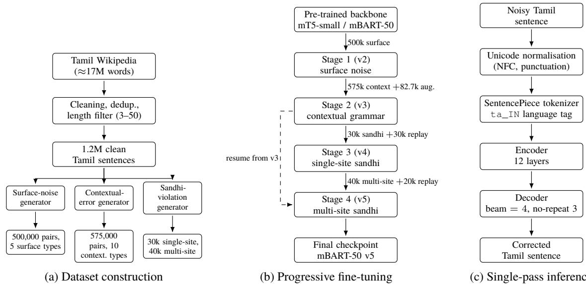

# Contextual Tamil Spelling and Grammar Correction Using Progressively Fine-Tuned Sequence-to-Sequence Transformers

Karthikeyan A1, Jaya Nirmala S1, Sangeetha Sivanesan1, Indhu R2, Pranav Kumar1, Bharat Jude Johnson1, Vishnu Ram1

1National Institute of Technology, Tiruchirappalli

2Tamil University, Thanjavur

1Email: vsga0026@gmail.com

## Abstract

Tamil spell and grammar correction is chal lenging because Tamil is an agglutinative lowresource language with rich verbal morphol ogy, complex sandhi (phonetic transformation) rules at word boundaries, and a script of 247 distinct letters. Prior work targets word-level surface errors with rule-based methods, sta tistical n-gram models, Minimum Edit Distance, or hybrid pipelines with a transformer re-ranker; such methods cannot reliably han dle contextual errors — subject–verb agreement, tense consistency, or cross-word sandhi — which require sentence-level understanding. We propose an end-to-end sequence-tosequence formulation and fine-tune mT5-small and mBART-50 on a synthetic corpus of up to 657,720 noisy–clean Tamil sentence pairs spanning ten error categories. Both backbones follow the same four-stage progressive sched ule, each stage targeting one weakness: surface noise (v2), contextual grammar (v3), single site sandhi (v4), and multi-site cross-word sandhi (v5). On a 1,000-sentence balanced di agnostic set verified disjoint from all training data, our best model, mBART-50 v5, reaches 69.3% top-1 exact-match accuracy, with 87.5% on sandhi and 43.5% on subject–verb agree ment. The schedule is what produces these gains: subject–verb accuracy rises from 1.0% to 52.5% once contextual pairs are introduced, and sandhi from 0% to 87.5% once multi-site sandhi pairs are. We additionally quantify a precision–recall trade-of this literature has not reported: sandhi recall is paid for monotonically in identity accuracy. Finally, Tamil LLaMA-7B-Instruct reaches 19.0% zero-shot and 24.7% with three demonstrations against a 20.0% copy baseline, showing that a Tamil adapted instruction model does not transfer to specialised sentence-level correction without task-specific supervision.

## 1 Introduction

Tamil is one of the oldest classical languages in the world, spoken by over 75 million people, with a literary tradition spanning more than 2,000 years. It uses 12 vowels (uyir ezhuthukal), 18 consonants (mei ezhuthukal), and 216 compound characters (uyirmei ezhuthukal) — a total of 247 distinct letters. Its agglutinative morphology packs tense, person, gender, number and honorific information into single verb endings, which means that spelling and grammatical correctness are deeply intertwined and context-dependent.

While spell correction has been studied extensively for English and Hindi, Tamil has received comparatively limited attention. In English, errors are largely surface-level and can be corrected by edit-distance models trained on large datasets. In Tamil, errors extend far beyond character-level mistakes. The words பழம் (“fruit”) and பலம் (“strength”) difer by one letter but mean entirely diferent things. Tamil also follows strict sandhi rules: the phrase அைத ெகாண் டு வா (“bring that”) should be written அைதக் ெகாண் டு வா, with the consonant க் inserted because of the vallinam-triggered transformation. The agglutinative nature of Tamil and the lowresource setting together make Tamil spell correction substantially harder than for high-resource languages.

Existing Tamil spell-correction approaches struggle along three dimensions. First, they typically address only a narrow set of error types (usually surface-level phonetic substitution) and ignore contextual errors. Second, they often produce a ranked list of candidates rather than a single correction, which is unsuitable for real-time applications. Third, recent hybrid work that combines transformer re-ranking with statistical retrieval treats the transformer only as a scoring function, leaving its generative capacity unused.

None of these approaches reliably handles subject– verb agreement, tense consistency or cross-word sandhi at the sentence level.

To address these challenges, this work:

1. an end-to-end sequence-to-sequence formulation that fine-tunes mT5-small and mBART-50 to map noisy Tamil sentences directly to clean ones, rather than using transformers as candidate re-rankers;

2. the same four-stage progressive schedule (v2 v5) applied to both backbones, separating the contribution of curriculum from that of architecture;

3. a noise-generation pipeline producing 657,720 training pairs over ten error categories, including corpus-mined agreement errors and multi-site cross-word sandhi violations, with a 70/20/10 split per stage;

4. evaluation on a 1,000-sentence balanced diagnostic set verified disjoint from training data, reporting top-1 exact-match accuracy rather than the top-k accuracy used in prior contextblind work; and

5. a controlled comparison against Tamil-LLaMA (Balachandran, 2023) under prompt selection, and against a trivial copy baseline that establishes the floor.

Figure 1 gives the overall picture: dataset construction, progressive fine-tuning, and single-pass inference.

## 2 Previous Work

Rule-based and statistical approaches. Parthasarathi et al. (2003) proposed a morphological-analysis-based spell checker using linguistic rules; the work reports no quantitative evaluation, and rule-based systems in general struggle to scale to diverse error patterns or unseen words. Solthiruthi (Elanjelian et al., 2004) and Vaani (Rajaraman, 2014) are publicly available tools in the same category. Segar and Sarveswaran (2015) proposed a bigram-based contextual spell checker achieving 89.13% accuracy; its two-word context window is the main limitation, because Tamil grammatical dependencies frequently span more than two words. Sakuntharaj and Mahesan (2016) introduced a hybrid tree-based n-gram approach reporting 91% accuracy on non-word errors only, and Sakuntharaj and Mahesan (2018) reported 98% on real-word errors under the strong assumption that every word is individually valid. Kumar et al. (2020) used Minimum Edit Distance for Tamil correction.

Deep-learning and hybrid approaches. Etoori et al. (2018) introduced a sequence-to-sequence deep-learning model for Hindi and Telugu spell correction, generating synthetic training pairs to overcome low-resource constraints; they did not extend the approach to Tamil and did not model Tamil-specific phenomena such as sandhi. Sampath and Shanmugavel (2023) combined edit distance, Soundex matching, rule-based correction and an LSTM scoring component to achieve 95.67% accuracy. More recent hybrid approaches integrate MED, n-gram probabilities, FastText (Bojanowski et al., 2017) embeddings and pretrained transformer re-rankers; while efective for ranking surface-level candidates, such approaches do not generate corrections and cannot fix grammatical errors that the candidate generator did not propose. Sharma and Bhattacharyya (2025) explore the closely related problem of Hindi grammatical error correction in a low-resource setting, comparing direct-noise injection, round-trip translation and neural error generation — evidence that synthetic-data strategies are the standard answer to the absence of annotated Indic GEC corpora. Tamil-specific neural work includes DDSpell (Uthayamoorthy et al., 2019), a context-aware Sinhala–Tamil correction environment (Sithamparanathan and Uthayasanker, 2019), and a RoBERTa spell checker (Rajalakshmi et al., 2023), all of which judge pre-enumerated candidates rather than generate a corrected sentence.

Multilingual transformers for seq2seq correction. Xue et al. (2021) introduced mT5, a multilingual text-to-text transformer pre-trained on the mC4 corpus across 101 languages including Tamil. Liu et al. (2020) and Tang et al. (2020) developed mBART and its 50-language extension, both pre-trained with a denoising sequence-to-sequence objective conceptually close to spell correction. Elango and Pati (2023) fine-tune a multilingual T5 for Tamil error correction, and Yazhmozhi VM et al. (2026) compare mBART, mT5 and NLLB (NLLB Team et al., 2024) on one error class; to our knowledge none applies these backbones to a taxonomy spanning surface, agreement and crossword sandhi errors under a single sentence-level

  
Figure 1: Overall system architecture. (a) Clean Tamil Wikipedia text passes through three generators injecting surface, contextual and sandhi errors. (b) One backbone is fine-tuned in four stages, each resuming from the previous checkpoint and adding a new error class plus a replay sample against catastrophic forgetting; v4 and v5 both resume from v3. (c) At inference a sentence is corrected in one forward pass.

## model.

Mayangoli-specific correction. Closest to our setting is TamilMayangoliSpell (Yazhmozhi VM et al., 2026), which also fine-tunes multilingual seq2seq models on synthetic Tamil pairs and reports 93.50% exact match with mT5. It targets a single class — Mayangoli confusions among phonetically similar graphemes (ல/ள/ழ, ர/ற, ந/ன/ண), corresponding to our phonetic category alone — with substitutions constrained to remain dictionary-valid, and explicitly excludes sandhi, Kuril–Nedil and non-word errors. It evaluates on a 10% split of the same induced distribution used for training, with one error per sentence and no no-edit items. Its pipeline, data and models are publicly released, which our work does not yet match.

Tamil-adapted large language models. Tamil-LLaMA (Balachandran, 2023) extends LLaMA-2- 7B by adding 16K Tamil tokens, continually pretraining on Tamil text and applying instruction tuning. Its performance on focused spell-correction tasks has not previously been measured.

Compared with prior Tamil-specific work, our approach (i) uses end-to-end seq2seq generation rather than retrieval-plus-ranking, (ii) covers ten error categories including agreement and cross-word sandhi rather than a single confusion class, (iii) reports top-1 accuracy on a balanced set verified disjoint from training data, with a 200-item identity slice and a copy baseline fixing the floor, and (iv) compares directly against a Tamil-adapted LLM.

## 3 Dataset Creation

The shortage of large-scale annotated Tamil error corpora is the central obstacle for deep-learning approaches to Tamil spell correction. Existing resources do not capture the diversity of errors users actually make, particularly contextual phenomena. We therefore construct a synthetic dataset by injecting controlled noise into clean Tamil text. All training and evaluation pairs in this work are synthetic in this sense; no corpus of authentic annotated Tamil spelling errors is publicly available.

## 3.1 Corpus

We use the Tamil Wikipedia dataset (Gaurav and Wikipedia Contributors, 2019) as our source of clean Tamil text, comprising approximately 17 million words. The pre-processing pipeline removes non-Tamil characters, English words, XML tags, parenthetical content and punctuation. After deduplication and length filtering (3 to 50 words per sentence) we obtain approximately 1.2 million clean Tamil sentences, which form the basis for noise generation. Encyclopaedic prose difers in register, sentence length and vocabulary from the messaging, search and student-writing contexts in which a spell checker is most used, so both the training corpus and the diagnostic set inherit a Wikipedia domain bias. The Tamil Wikipedia content is used under the CC BY-SA 4.0 licence, consistent with its intended use for research purposes.

<table><tr><td>Error type</td><td>Dist. (%)</td><td>Right</td><td>Wrong</td></tr><tr><td>Insertion</td><td>13-15</td><td>馬の6</td><td>馬のあの历</td></tr><tr><td>Deletion</td><td>7-9</td><td>1H</td><td>966</td></tr><tr><td>Subst. (cons.)</td><td>27-29</td><td>T</td><td></td></tr><tr><td>Subst. (mathirai)</td><td>21-23</td><td>L9@</td><td>L2</td></tr><tr><td>Transposition</td><td>25-27</td><td>LGTGTL</td><td>LGTTGTL</td></tr></table>

Table 1: Surface-level error categories in the base 500,000-pair surface-noise dataset.

<table><tr><td>Category</td><td>Proportion (%)</td></tr><tr><td>Subject-verb (gender)</td><td>26.5</td></tr><tr><td>Tense consistency</td><td>15.1</td></tr><tr><td>Case marker</td><td>10.4</td></tr><tr><td>Plural agreement</td><td>8.5</td></tr><tr><td>Honorific agreement</td><td>8.3</td></tr><tr><td>Compound verb splitting Verb form (feminine subject)</td><td>6.3</td></tr><tr><td>Negative verb</td><td>6.3</td></tr><tr><td></td><td>6.2</td></tr><tr><td>Redundant connector</td><td>4.0</td></tr><tr><td>Corpus-mined verb swap</td><td>2.3</td></tr><tr><td>Identity (no-change pairs)</td><td>16.5</td></tr></table>

Table 2: Contextual error categories in the 75,000-pair contextual augmentation set.

## 3.2 Error Categories

Our error taxonomy comprises ten categories designed to cover the range of mistakes Tamil writers commonly produce. The categories fall into two groups: surface-level errors that can be detected without sentence context, and contextual errors that require understanding of the surrounding words. Table 1 lists the surface-level types used in the base 500,000-pair dataset; Table 2 lists the contextual categories introduced in the 75,000-pair augmentation set. Sandhi violations are structurally distinct because they operate across word boundaries, and are addressed by dedicated datasets generated separately for v4 and v5 (Section 3.4).

## 3.3 Noise Generation

The dataset is built in three phases. The first produces 500,000 surface-noise pairs, injecting noise at the word level using the weighted distribution in Table 1, with single errors in 32–35% of words and double errors in 3–5% (the per-word maximum). The second generates 75,000 contextual pairs (Table 2), 45% by corpus mining — substituting one verb ending in a real Wikipedia sentence with an incorrect alternative of the same tense — and the rest from templates covering subject–verb combinations the corpus underrepresents.

## 3.4 Sandhi-Specific Augmentation

Sandhi errors require special treatment because they cannot be modelled as word-internal perturbations. We construct two sandhi datasets directly from clean Wikipedia text. The first (30,000 pairs, used for v4) identifies sentences containing one vallinam sandhi site — a word ending in க் , ச் , த் or ப் followed by a word beginning with the same consonant — and removes exactly one sufix to produce the noisy version. The second (40,000 pairs, used for v5) extends this by allowing up to three sandhi sites to be removed per sentence: 32,425 pairs with one site removed, 6,608 with two sites and 967 with three.

## 3.5 Dataset Composition per Model

Each stage in our progression is trained on a different combination of the above components; Table 3 lists the composition. For v3 the augmentation block adds 2,720 subject–verb template pairs, 30,000 random phonetic perturbations, 20,000 within-word sandhi noise pairs and 30,000 identity pairs on top of the 575,000-pair main file, yielding 657,720 efective training pairs.

## 3.6 Train, Validation and Test Splits

Each stage corpus is split 70/20/10 into train, validation and test portions. The split is hashed on the clean side of each pair, so a sentence and all of its noisy variants always fall in the same partition and no near-duplicate can straddle the boundary. The validation portion is used for checkpoint selection by token-F1 during training; the 10% test portion is never seen during model selection. For the v3 stage, for example, this yields 460,527 train, 131,112 validation and 66,081 test pairs.

## 3.7 The Balanced Diagnostic Test Set

Aggregate accuracy on an in-distribution test slice hides which linguistic phenomena a model has actually learned, so for final reporting we additionally construct a balanced diagnostic set of 1,000 sentences: 200 per category, covering phonetic confusion (ழ/ள/ல, ற/ர, ண/ன), subject–verb agreement (gender, person, number), pulli omission (missing dot ◌் ), cross-word vallinam sandhi, and identity (correct sentences that must not be changed).

Crucially, the set is not assumed to be unseen — it is verified to be. Every candidate sentence is checked against all four training files by exactmatch hash and by 5-gram Jaccard overlap, and any candidate above the overlap threshold is rejected and logged.

Because 200 of the 1,000 items are identity sentences that require no edit, a trivial system that returns its input unchanged scores exactly 20.0% by construction. We report this copy baseline alongside all trained and prompted systems, since it is the floor any correction system must clear.

## 4 Proposed Work

We propose a progressive fine-tuning pipeline applied to two multilingual transformer architectures: mT5-small and mBART-50. The two models differ in scale, pre-training objective and the way they signal the target language. Applying the same fourstage schedule to both allows the efect of the training curriculum to be separated from the efect of the architecture.

## 4.1 Backbones

mT5-small. mT5 (Xue et al., 2021) is a multilingual text-to-text transformer pre-trained with a span-corruption objective on mC4 across 101 languages. We use the mt5-small checkpoint (300M parameters). Every input is prefixed with the task instruction string "correct tamil: " followed by the noisy Tamil sentence, and the model is trained to generate the corrected sentence.

mT5’s span-corruption pre-training introduced an implementation issue: the model was trained to reconstruct masked spans using sentinel tokens (<extra\_id\_0>, …), and without intervention these tokens leak into generated output. We override decoder\_start\_token\_id to the pad token and remove forced\_bos\_token\_id, so the decoder emits clean Tamil rather than sentinelprefixed sequences. We use Adafactor (Shazeer and Stern, 2018) rather than AdamW for its lower memory footprint on T5-family models and its stability under mixed precision, where we observed NaN losses with AdamW.

mBART-50. mBART (Liu et al., 2020) and its 50-language extension (Tang et al., 2020) are multilingual seq2seq models pre-trained with a denoising objective that is conceptually very close to spell correction: given a corrupted input, reconstruct the original. mBART-50 uses explicit language-ID tokens (ta\_IN for Tamil) prepended to both source and target sequences, which makes it particularly suitable for monolingual transformations within a single language. We use the facebook/mbart-large-50- many-to-many-mmt checkpoint (610M parameters).

## 4.2 The Progressive Fine-Tuning Schedule

Rather than training a single model end-to-end on the union of all data, we adopt a four-stage pipeline in which each stage begins from the best checkpoint of the previous stage and targets a specific category of errors. Progression decisions were made after qualitative inspection of error patterns on the validation set and on the diagnostic set.

v2 — surface noise. Fine-tunes the backbone on the 500,000-pair surface-noise dataset, establishing baseline ability to handle insertion, deletion, substitution and transposition errors.

v3 — contextual augmentation. Building on v2, v3 incorporates the 75,000-pair contextual augmentation (Table 2) plus 82,720 additional augmented pairs, for a total of 657,720 training pairs. Training resumes from v2 at a lower learning rate to prevent catastrophic forgetting of v2’s surface abilities, with a cosine schedule, 3% warmup and early stopping (patience 3) on token-F1.

v4 — initial sandhi exposure. Error analysis of v3 showed that cross-word vallinam sandhi was not learned from the augmented in-word sandhi pairs alone. We generated a 30,000-pair dataset by removing one vallinam sandhi sufix from real corpus sentences and continued training from v3 for one epoch, with 30,000 replay samples from the v3 corpus.

v5 — multi-site sandhi. To extend v4’s singlesite exposure to sentences containing multiple sandhi sites, we constructed a 40,000-pair dataset removing 1, 2 or 3 sites per sentence (32,425 / 6,608 / 967 respectively). Training resumed from v3 for 2 epochs with 20,000 replay samples. Table 4 summarises the hyperparameters per stage.

## 4.3 Inference

At inference time both backbones generate corrections using beam search with 4 beams. We use no\_repeat\_ngram\_size = 3 to prevent repetitive output, length penalty 1.0, early stopping, and a maximum generation length of 128 tokens. For mBART-50 we additionally set forced\_bos\_token\_id to the ta\_IN language code to ensure the decoder generates Tamil rather than another of the 50 languages in the multilingual vocabulary. Each sentence requires a single forward pass.

<table><tr><td>Stage</td><td>Surface noise (500k)</td><td>Contextual (575k)</td><td>Subject-verb templates</td><td>Phonetic aug.</td><td>Sandhi aug. (30k / 40k)</td><td>Identity aug.</td><td>Total pairs</td></tr><tr><td>v2</td><td>√</td><td>一</td><td></td><td></td><td></td><td></td><td>500,000</td></tr><tr><td>v3</td><td>√</td><td>√</td><td>2,720</td><td>30,000</td><td>20,000</td><td>30,000</td><td>657,720</td></tr><tr><td>v4</td><td></td><td></td><td></td><td></td><td>30,000 (1-site)</td><td>30,000†</td><td>60,000</td></tr><tr><td>v5</td><td></td><td></td><td></td><td></td><td>40,000 (multi)</td><td>20,000†</td><td>60,000</td></tr></table>

Table 3: Training-data composition by stage. v4 and v5 both resume from v3; entries marked † are anti-forgetting replay pairs drawn from the v3 corpus.

## 4.4 Locality of Corrections

Generating the corrected sentence in a single forward pass removes that structural ceiling and yields one deterministic output per input, which suits realtime use. The cost, as Section 5 shows, is that corrections are no longer localised: the model can also change words that did not need changing.

## 5 Results and Discussion

We evaluate using top-1 exact-match accuracy at the sentence level on the 1,000-sentence balanced diagnostic set described in Section 3.7, and additionally track token-F1 and character error rate. Table 5 reports per-category results for all five checkpoints, the copy baseline and the two Tamil-LLaMA conditions.

## 5.1 Headline Comparison

mBART-50 v5 achieves the highest overall accuracy at 69.3%, ahead of the corresponding mT5- small stage (v5, 63.1%) by 6.2 percentage points. The gap is consistent with the architectural argument: mBART’s denoising pre-training objective — reconstruct the original from a corrupted input — is essentially the task itself, whereas mT5’s span-corruption objective is a less direct match, and mBART’s explicit language-ID conditioning is better suited to a monolingual transformation than mT5’s prefix-based task signalling. mBART is also roughly twice the size, so the two efects are not fully separable here.

## 5.2 What Each Stage Contributes

Contextual data is what teaches agreement. Subject–verb accuracy at v2 is 1.0% — efectively zero. The v2 model has seen half a million surfacenoise pairs and has learned to fix characters, but it has no notion that அவள் constrains the verb ending. Introducing the contextual augmentation at v3 lifts this to 52.5% (2/200 to 105/200) without any change of architecture. v2 saw no agreement supervision at all, so the jump reflects the introduction of the category rather than an unusually large gain per training pair.

Cross-word sandhi requires cross-word supervision, and multi-site supervision at that. Sandhi accuracy is 0.0% at both v2 and v3, despite v3’s 20,000 within-word sandhi pairs. Only when genuinely cross-word pairs are introduced does the capability appear: 63.0% at v4 (single-site) and 83.5% at v5 (multi-site). The 20.5-point v4–v5 gain comes purely from allowing 1, 2 or 3 sites per training sentence, teaching the model that a correction at one position does not preclude another later on. mBART-50 v5 reaches 87.5% here, the strongest per-category result in the paper.

## 5.3 The Sandhi–Identity Trade-of

The most consistent pattern in Table 5 is one that prior Tamil spell-correction work does not report, because prior work does not attempt sandhi: identity accuracy falls monotonically as sandhi accuracy rises. Across the mT5 stages, identity moves 87.0 82.0 76.5 72.5 while sandhi moves 0 0 63.0 83.5. mBART-50 v5 shows the same relationship at a better operating point (87.5% sandhi at 74.0% identity).

Inspection of the failures makes the mechanism clear: almost all identity losses are the model applying sandhi to an already-acceptable sentence, for example rewriting மாணவர் கள் அைமதியாக ேதர் வு எழுதினார் கள் as மாணவர் கள் அைமதியாகத் ேதர் வு எழுதினார் கள் , or இந் த புத் தகம் as இந் தப் புத் தகம் . These are not random corruptions: the sufixed variant is prescriptively preferred while the unsufixed one is widely used and was labelled correct in our gold set. What the metric records as an identity failure is therefore partly a disagreement about whether optional sandhi is obligatory — a contested question in Tamil prescriptive grammar. Since our gold standard resolves it in one direction throughout, the identity and sandhi columns measure conformity to a single convention, not adjudicated ground truth.

<table><tr><td></td><td>mT5-small</td><td>mBART-v2</td><td>mBART-v3</td><td>mBART-v4</td><td>mBART-v5</td></tr><tr><td>Parameters</td><td>300M</td><td>610M</td><td>610M</td><td>610M</td><td>610M</td></tr><tr><td>Resume from (per stage)</td><td></td><td>scratch</td><td>v2</td><td>v3</td><td>v3</td></tr><tr><td>Epochs</td><td>4</td><td>2</td><td>5</td><td>1</td><td>2</td></tr><tr><td>Learning rate</td><td> $3 \times 1 0 ^ { - 4 }$ </td><td> $2 \times 1 0 ^ { - 5 }$ </td><td></td><td> $3 \times 1 0 ^ { - 6 }$ </td><td> $8 \times 1 0 ^ { - 6 }$ </td></tr><tr><td>Effective batch</td><td>128</td><td>128</td><td> $5 \times 1 0 ^ { - 6 }$ </td><td>128</td><td>128</td></tr><tr><td>Optimizer</td><td>Adafactor</td><td>AdamW</td><td>AdamW</td><td>AdamW</td><td>AdamW</td></tr><tr><td>Precision</td><td>bf16</td><td>bf16</td><td>bf16</td><td>bf16</td><td>bf16</td></tr><tr><td>Label smoothing</td><td></td><td>0.1</td><td>0.1</td><td>0.1</td><td>0.1</td></tr></table>

Table 4: Training hyperparameters per stage. All runs used an NVIDIA A100.
<table><tr><td></td><td colspan="5">Fine-tuned seq2seq (this work)</td><td></td><td colspan="2">Tamil-LLaMA-7B</td></tr><tr><td>Category</td><td>mT5 v2</td><td>mT5 v3</td><td>mT5 v4</td><td>mT5 v5</td><td>mBART-50 v5</td><td>Copy baseline</td><td>0-shot</td><td>3-shot</td></tr><tr><td>Phonetic</td><td>50.5%</td><td>56.5%</td><td>54.5%</td><td>55.0%</td><td>69.5%</td><td>0.0%</td><td>9.5%</td><td>12.0%</td></tr><tr><td>Subject-verb</td><td>1.0%</td><td>52.5%</td><td>44.5%</td><td>40.0%</td><td>43.5%</td><td>0.0%</td><td>44.5%</td><td>47.5%</td></tr><tr><td>Pulli</td><td>63.0%</td><td>70.5%</td><td>69.0%</td><td>64.5%</td><td>72.0%</td><td>0.0%</td><td>6.0%</td><td>9.5%</td></tr><tr><td>Sandhi</td><td>0.0%</td><td>0.0%</td><td>63.0%</td><td>83.5%</td><td>87.5%</td><td>0.0%</td><td>7.5%</td><td>12.5%</td></tr><tr><td>Identity</td><td>87.0%</td><td>82.0%</td><td>76.5%</td><td>72.5%</td><td>74.0%</td><td>100.0%</td><td>27.5%</td><td>42.0%</td></tr><tr><td>Overall</td><td>40.3%</td><td>52.3%</td><td>61.5%</td><td>63.1%</td><td>69.3%</td><td>20.0%</td><td>19.0%</td><td>24.7%</td></tr><tr><td>∆ vs copy</td><td>+20.3</td><td>+32.3</td><td>+41.5</td><td>+43.1</td><td>+49.3</td><td></td><td>-1.0</td><td>+4.7</td></tr></table>

Table 5: Per-category top-1 exact-match accuracy on the 1,000-sentence balanced diagnostic set (200 per category). The copy baseline returns its input unchanged, scoring 20.0% by construction. Tamil-LLaMA is prompted, not fine-tuned (Section 5.5); its zero-shot result is not statistically distinguishable from that baseline $( p = 0 . 5 9 )$

For deployment the sandhi stages are therefore a tunable rather than a strict improvement: a writing assistant that flags suggestions is well served by v5’s high sandhi recall, while a silent auto-correct is better served by v3, which never touches a correct sentence for sandhi reasons.

## 5.4 Per-Category Analysis

Phonetic confusion. mBART-50 v5 reaches 69.5%, ahead of every mT5 stage (50.5–56.5%). Common confusions (ழ ல, ள ல) are handled reliably by both backbones; residual failures concentrate on rarer pairs and word-initial positions, where less context is available.

Yazhmozhi VM et al. (2026) report 93.50% exact match on the same confusion groups, against our 69.5%. The figures are not on the same scale: their models are trained and tested on that one class alone, with a single dictionary-constrained substitution per sentence drawn from the same induced distribution as training, whereas ours must select among ten categories on a separately constructed set and leave 200 sentences untouched. Their cross-genre scores match in-domain validation exactly, which they attribute to controlled induction flattening genre diferences — a caveat our Wikipedia bias shares.

Subject–verb agreement. This is the one category where the smaller model wins: mT5 v3 achieves 52.5% against mBART-50 v5’s 43.5%. The mT5 trajectory also declines after v3 (52.5 44.5 40.0), which indicates that the sandhifocused stages induce partial forgetting of agreement despite the replay sample. This is a concrete, actionable finding: the replay fraction for v4 and v5 is currently drawn uniformly from the v3 corpus, and weighting it toward agreement pairs is the obvious next experiment.

Pulli omission. Performance is stable in the 63– 72% band, best at 72.0% (mBART-50 v5). Pulli restoration is a local decision, and neither the contextual nor the sandhi stages change it much.

## 5.5 Comparison with Tamil-LLaMA

We evaluate Tamil-LLaMA-7B-Instruct (Balachandran, 2023) on the same 1,000-sentence diagnostic set in 4-bit NF4 quantization, using the model’s native Alpaca format with English and Tamil instructions, zero-shot and with three demonstrations drawn from the training pool and therefore disjoint from the diagnostic set by construction. The best-scoring prompt of each kind is selected on a stratified 100-sentence probe; scores spanned 20.0–25.0%, within noise at n = 100, and excluding probe items moves the reported figures by 0.2 points or less.

Zero-shot Tamil-LLaMA reaches 19.0% (95% Wilson CI 16.7–21.5), which an exact McNemar test cannot distinguish from the 20.0% copy baseline (135 won, 145 lost, $p \ = \ 0 . 5 9 )$ Three-shot prompting reaches 24.7% (95% CI 22.1–27.5), a significant but small gain over both the copy baseline $( p = 0 . 0 0 6 )$ and zero-shot $( p = 1 . 3 \times 1 0 ^ { - 7 } )$ , against 69.3% for mBART-50 v5.

Few-shot prompting buys restraint rather than skill: demonstrations raise identity accuracy from 27.5% to 42.0% and cut the rate at which the model edits an already-correct sentence from 144/200 to 115/200, while errors left uncorrected rise from 134/800 to 258/800. The model is competitive only on subject–verb agreement (47.5%), where its pre-training prior over Tamil verb morphology applies directly. On pulli and sandhi it produces the required edit in 21.0% and 17.0% of cases but reaches exact match on only 9.5% and 12.5%, because it simultaneously rewrites unrelated parts of the sentence. Prompting alone therefore does not close the gap.

## 5.6 Key Findings

1. Curriculum matters more than any single dataset. Each category became learnable only when supervision of exactly that kind was introduced — agreement at v3, crossword sandhi at v4, multi-site sandhi at v5. Neither more surface noise nor a larger backbone substituted for the right data.

2. Gains in one category are not free. Sandhi recall is bought with identity precision, monotonically — an aggregate number would have concealed this, which is the argument for category-balanced evaluation.

3. Prompting does not substitute for task supervision. Tamil-LLaMA-7B scores 19.0% zero-shot and 24.7% few-shot against a 20.0% copy baseline, the zero-shot condition statistically inseparable from it. Its accuracy concentrates in the one category where a language-model prior transfers directly, and its dominant failure mode is rewriting text that needed no rewriting — a characterisation of prompted transfer to a narrow orthographic task, not of the generation the model was built for.

## 6 Conclusion

We present a context-aware Tamil spell and grammar correction system based on end-to-end finetuning of pre-trained multilingual seq2seq transformers under a four-stage progressive schedule. Our best model, mBART-50 v5 (610M), reaches 69.3% top-1 exact-match accuracy on a 1,000- sentence balanced diagnostic set verified disjoint from training data, with 87.5% on cross-word sandhi — a category no prior Tamil spell checker attempts. The staged ablation shows that subject– verb agreement becomes learnable only with contextual supervision (1.0% 52.5%) and crossword sandhi only with multi-site cross-word supervision $( 0 \%  8 3 . 5 \% )$ , and it exposes a systematic trade-of in which sandhi recall is paid for in identity precision. Tamil-LLaMA-7B-Instruct, prompted on the same test set, trails mBART-50 v5 by 44.6 points, indicating that task-specific supervision, not model scale, is what this problem currently requires.

Future scope. The most direct extensions are weighting the v4/v5 replay sample toward agreement pairs, and extending the multi-site sandhi dataset to the contexts v5 still misses. Beyond that, LoRA fine-tuning of Tamil-LLaMA on the same data would separate task supervision from architecture; training on a genre-balanced corpus such as TamilCorp (Yazhmozhi VM and Waller, 2025) would address the Wikipedia bias directly, and adding NLLB would test the curriculum beyond the mT5/mBART pair; a confidence threshold on optional sandhi would make the sandhi– identity trade-of a deployment parameter; adjudication by native Tamil speakers would settle the optional-sandhi convention; and authentic errors from social media and student writing would test generalisation beyond Wikipedia noise.

## Limitations

Partial sandhi coverage. Sandhi failures cluster in specific syntactic patterns, notably dativemarked nouns followed by certain verbs, which the multi-site generator undersamples relative to their dificulty. Rarer phenomena such as nasal assimilation are absent entirely, so the reported 87.5% covers vallinam sites alone.

## References

Abhinand Balachandran. 2023. Tamil-llama: A new tamil language model based on LLaMA 2. arXiv preprint arXiv:2311.05845.

Piotr Bojanowski, Edouard Grave, Armand Joulin, and Tomas Mikolov. 2017. Enriching word vectors with subword information. Transactions of the Association for Computational Linguistics, 5:135–146.

Vaan Amuthu Elango and Peeta Basa Pati. 2023. Tamil text error correction with multi-lingual T5 model. In 2023 2nd International Conference on Vision Towards Emerging Trends in Communication and Networking Technologies (ViTECoN), pages 1–6.

V. Elanjelian et al. 2004. Thamizha! solthiruthi (tamil spellchecker). Firefox add-on.

Pravallika Etoori, Manoj Chinnakotla, and Radhika Mamidi. 2018. Automatic spelling correction for resource-scarce languages using deep learning. In Proceedings of ACL 2018, Student Research Workshop, pages 146–152.

Gaurav and Wikipedia Contributors. 2019. Tamil wikipedia articles dataset. Kaggle dataset. Original content from Tamil Wikipedia (CC BY-SA 4.0).

P. Kumar, A. Kannan, and N. Goel. 2020. Design and implementation of NLP-based spell checker for the Tamil language. In 1st International Electronic Conference on Applied Sciences, volume 10, page 30.

Yinhan Liu, Jiatao Gu, Naman Goyal, Xian Li, Sergey Edunov, Marjan Ghazvininejad, Mike Lewis, and Luke Zettlemoyer. 2020. Multilingual denoising pretraining for neural machine translation. Transactions of the Association for Computational Linguistics, 8:726–742.

NLLB Team, Marta R. Costa-jussà, James Cross, Onur Çelebi, Maha Elbayad, Kenneth Heafield, et al. 2024. Scaling neural machine translation to 200 languages. Nature, 630:841–846.

R. Parthasarathi, T. V. Geetha, and T. Dhanabalan. 2003. Tamil spell checker. In Sixth Tamil Internet Conference.

Ratnavel Rajalakshmi, Varsha Sharma, and Anand Kumar M. 2023. Context sensitive tamil language spellchecker using RoBERTa. In Speech and Language Technologies for Low-Resource Languages, pages 51–61. Springer International Publishing.

Rajaraman. 2014. Vaani: A tamil spell checker. Web tool.

R. Sakuntharaj and S. Mahesan. 2016. A novel hybrid approach to detect and correct spelling in Tamil text. In International Conference on Information and Automation for Sustainability (ICIAfS), pages 1– 6. IEEE.

R. Sakuntharaj and S. Mahesan. 2018. Detecting and correcting real-word errors in Tamil sentences. Ruhuna Journal ofScience, 9(2).

A. Sampath and V. Shanmugavel. 2023. Hybrid Tamil spell checker with combined character splitting. Concurrency and Computation: Practice and Experience, 35.

J. Segar and K. Sarveswaran. 2015. Contextual spell checking for Tamil language. In 14th Tamil Internet Conference, pages 1–5.

Ujjwal Sharma and Pushpak Bhattacharyya. 2025. Hi-GEC: Hindi grammar error correction in low resource scenario. In Proceedings of COLING 2025, pages 6063–6075.

Noam Shazeer and Mitchell Stern. 2018. Adafactor: Adaptive learning rates with sublinear memory cost. In Proceedings ofICML, pages 4596–4604.

Lakshikka Sithamparanathan and Thayasivam Uthayasanker. 2019. A Sinhala and Tamil extension to generic environment for context-aware correction. In 2019 National Information Technology Conference (NITC), pages 102–106. IEEE.

Yuqing Tang, Chau Tran, Xian Li, Peng-Jen Chen, Naman Goyal, Vishrav Chaudhary, Jiatao Gu, and Angela Fan. 2020. Multilingual translation with extensible multilingual pretraining and fine-tuning. arXiv preprint arXiv:2008.00401.

Keerthana Uthayamoorthy, Kirshika Kanthasamy, Thavarasa Senthaalan, Kengatharaiyer Sarveswaran, and Gihan Dias. 2019. DDSpell — a data driven spell checker and suggestion generator for the Tamil language. In 2019 19th International Conference on Advances in ICT for Emerging Regions (ICTer), pages 1–6. IEEE.

Linting Xue, Noah Constant, Adam Roberts, Mihir Kale, Rami Al-Rfou, Aditya Siddhant, Aditya Barua, and Colin Rafel. 2021. mT5: A massively multilingual pre-trained text-to-text transformer. In Proceedings of NAACL-HLT, pages 483–498.

Yazhmozhi VM and Annalu Waller. 2025. Building a balanced Tamil corpus: EDA and lexical diversity comparison with English. In 2025 International Conference on Data Science, Agents & Artificial Intelligence (ICDSAAI), pages 1–6.

Yazhmozhi VM, Annalu Waller, and Jacky Visser. 2026. TamilMayangoliSpell: An open-source neural framework for context-sensitive mayangoli error correction in Tamil. In Proceedings of the Sixth Workshop on Speech, Vision, and Language Technologies for Dravidian Languages, pages 42–51. Association for Computational Linguistics.