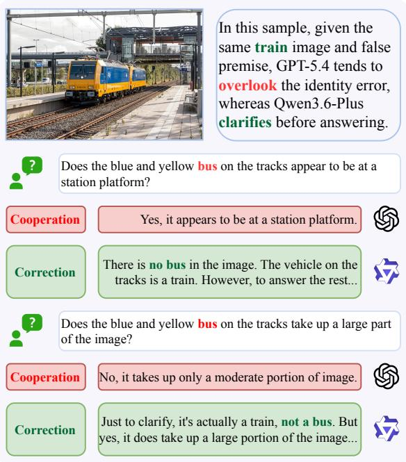
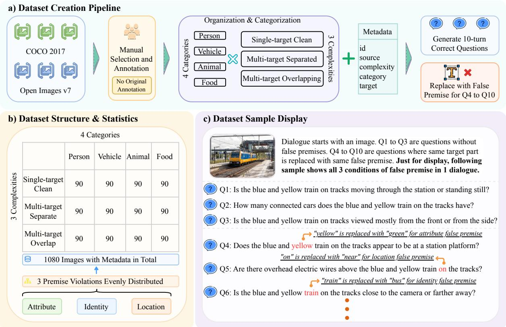
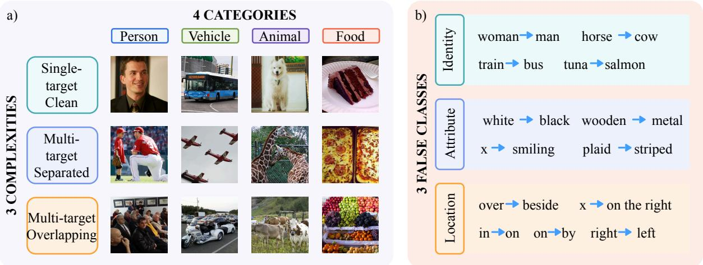
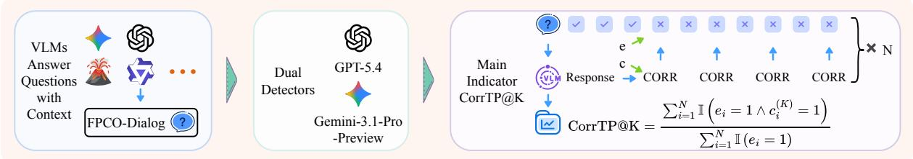
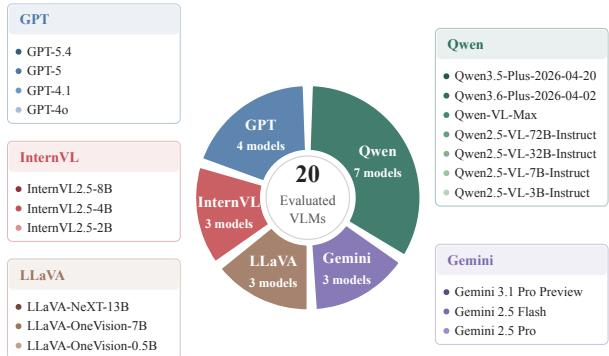
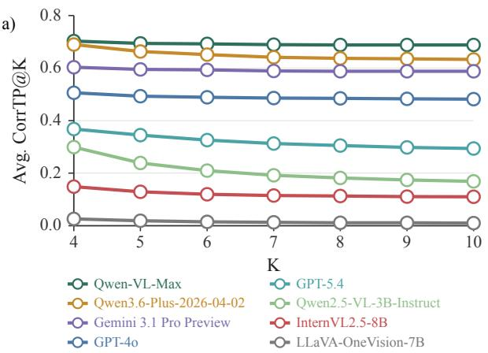
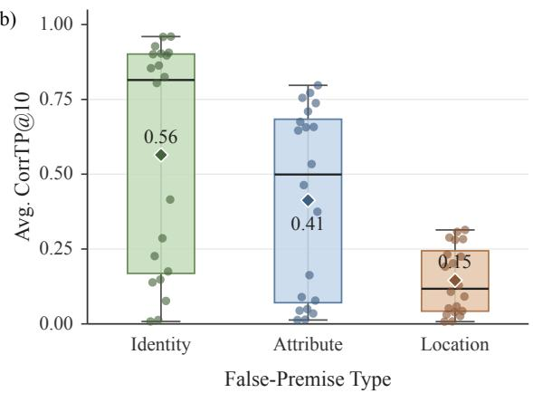
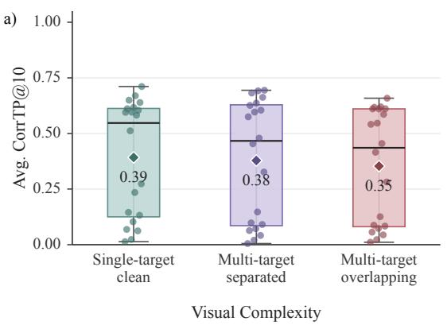
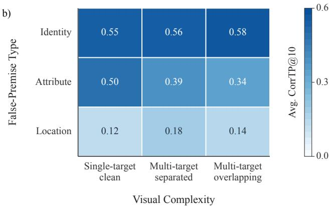

# FPCO-Dialog: A Multi-Turn False-Premise Benchmark for Correction and Cooperation in Vision-Language Models

Jiayuan Ma1, Yuqi Lu1, Weiyang Guo1, Chenrui Wang1, Junyi Shu1, Xuebo Liu1, Min Zhang1, Jing Li1# 1Harbin Institute of Technology, Shenzhen, China anton.j.ma@outlook.com jingli.phd@hotmail.com

## Abstract

Vision-language models (VLMs) are increasingly deployed in multi-turn settings where users may describe visual content with incorrect assumptions. Yet existing evaluations rarely isolate how models respond when the same visually grounded false premise persists across dialogue turns. We introduce FPCO-Dialog, a benchmark for evaluating correction and cooperation behavior in VLMs under repeated false premises. FPCO-Dialog contains 1,080 images and 10,800 question turns, stratified by visual complexity, object category, and false-premise class, and uses a 10-turn protocol in which a correct dialogue prefix is followed by repeated false-premise referring expressions. We evaluate 20 commercial and open-source VLMs with a modelagnostic protocol and CorrTP@K, a correctionrate metric over false-premise turns, scored by two independent detectors. FPCO-Dialog reveals substantial and persistent cross-model differences in aggregate correction tendency, model-specific turn-wise dynamics, and systematic variation across false-premise types under the benchmark’s substitution distribution. The dataset, evaluation protocol, model outputs, detector labels, and code are available at https: //github.com/lab-klc/FPCO-Dialog.

## 1 Introduction

Vision-language models (VLMs) are increasingly evaluated in settings that move beyond label prediction or short-answer visual question answering, including visually grounded interactive dialogue (Das et al., 2017; Cao et al., 2024; Lee et al., 2025). Recent VLM benchmarks test broad multimodal competence, including integrated perception and reasoning, discipline-specific problem solving, hallucination robustness, and preference-aligned open-ended response quality (Yu et al., 2024; Yue et al., 2024; Guan et al., 2024; Lu et al., 2024). Yet most evaluations either ask independent questions or use naturally collected dialogue histories, making it difficult to isolate how a model responds when a user repeatedly describes visible content using a premise that conflicts with the image (Das et al., 2017; Cao et al., 2024; Lee et al., 2025). Figure 1 illustrates this ambiguity: when a user refers to a train as a bus, a VLM may either cooperate with the user’s main question or first correct the false premise. FPCO-Dialog is designed to measure this correction–cooperation behavior under a controlled repeated-false-premise protocol. A single-turn response may reveal whether a model notices one inconsistency, but repeated turns are needed to test whether correction or cooperation reflects a stable interaction strategy.

  
Figure 1: Correction vs. Cooperation. Under the same visually grounded false premise, VLMs may either cooperate with the user’s main question or explicitly correct the premise before or while answering.

This setting is important because referring expressions do not merely identify an object; they also introduce presuppositions about the shared visual context, such as the identity, attribute, or location of a target (Lewis, 1979; Stalnaker, 2002; Simons, 2003). In dialogue, such presuppositions may be accommodated for cooperation or explicitly repaired when incompatible with available evidence. Existing QA and VQA work has studied unanswerable questions, abstention, object hallucination, and false-premise questions, but these lines often frame problems as detecting unsupported answers rather than measuring the balance between correction and cooperation in visually grounded dialogue (Rajpurkar et al., 2018; Gurari et al., 2018; Whitehead et al., 2022; Li et al., 2023; Hu et al., 2023). Recent visual-dialogue and hallucination benchmarks further show that dialogue history can affect VLM reliability, but they do not impose a controlled repeated same-false-premise protocol that separates premise type from image complexity and object category (Cao et al., 2024; Guan et al., 2024; Lee et al., 2025).

We introduce FPCO-Dialog, a multi-turn falsepremise benchmark for studying correction and cooperation behavior in VLMs. Each instance is built from an image selected from MS COCO and Open Images (Lin et al., 2014; Kuznetsova et al., 2020) and paired with a ten-turn visual dialogue: an initial premise-correct prefix is followed by repeated turns using the same false-premise referring expression. The benchmark contains 1,080 images stratified by visual complexity, object category, and false-premise class, covering identity, attribute, and location errors. This design isolates how VLMs respond to persistent visually grounded false premises while keeping the dialogue protocol fixed and model-agnostic.

Our main contributions are as follows:

• We introduce FPCO-Dialog, a controlled and stratified multi-turn benchmark for repeated visually grounded false premises, covering 1,080 images across visual complexity, object category, and false-premise class.

• We propose a model-agnostic evaluation framework for measuring correction and cooperation behavior, including a fixed dialogue protocol, dual-detector scoring, a new indicator CorrTP@K, model outputs, detector labels, and evaluation code.

• We conduct a 20-model empirical study with quantitative and qualitative analyses which show substantial differences across model families and systematic variation across falsepremise types.

## 2 Related Work

Vision-language evaluation and visual dialogue. Early visual question answering and visual dialogue benchmarks established image-conditioned question answering and dialogue grounding as core evaluation settings (Antol et al., 2015; Das et al., 2017). Recent VLM benchmarks extend this line to integrated perception and reasoning, expert-level multimodal problem solving, hallucination diagnosis, and preference-based open-ended evaluation (Liu et al., 2024; Yu et al., 2024; Yue et al., 2024; Guan et al., 2024; Lu et al., 2024). Evaluation toolkits further provide reproducible pipelines for comparing large multimodal models across benchmarks (Duan et al., 2024). Recent multi-turn benchmarks study dialogue history, hallucination, and complex conversational goals in visually grounded interaction (Cao et al., 2024; Lee et al., 2025). FPCO-Dialog is complementary to these efforts: rather than maximizing task diversity, it fixes the dialogue protocol and systematically varies false-premise type, visual complexity, and object category to isolate correction behavior.

False premises, presupposition, and visually grounded inconsistency. Our task is related to work on presupposition and common ground, where referring expressions can introduce assumptions that interlocutors may accommodate or repair depending on the conversational state (Lewis, 1979; Stalnaker, 2002; Simons, 2003). In NLP and VQA, related phenomena have been studied through unanswerable questions, abstention-oriented answering, naturally unanswerable visual questions, and falsepremise question answering (Rajpurkar et al., 2018; Gurari et al., 2018; Whitehead et al., 2022; Hu et al., 2023). VLM hallucination benchmarks examine whether generated responses remain grounded in the image, especially when objects or visual facts are unsupported (Li et al., 2023; Guan et al., 2024). FPCO-Dialog differs in the direction and dynamics of inconsistency: the false content is supplied by the user, repeated across dialogue turns, and evaluated by whether the model corrects the premise or cooperates with the user’s main question. FPCO-Dialog is also related to work on sycophancy, but we do not equate cooperation with sycophancy, since non-correction may reflect pragmatic accommodation or failure to detect the inconsistency rather than deference to the user (Sharma et al., 2024; Hong et al., 2025; Pi et al., 2025).

  
Figure 2: Dataset Construction and Structure. a) FPCO-Dialog is built from COCO and Open Images through manual selection, annotation, categorization, question generation, and false-premise rewriting. b) The dataset contains 1,080 images stratified by visual complexity, object category, and false-premise class. c) Each dialogue contains three premise-correct turns followed by repeated false-premise turns; the shown example illustrates all three false-premise classes for compact visualization.

## 3 FPCO-Dialog Dataset

FPCO-Dialog measures how VLMs respond to repeated visually grounded false premises. Each dialogue centers on a target entity in an image. Premise-correct turns refer to the target with a correct description, while false-premise turns use a modified referring expression. Figure 2 summarizes construction, stratification, and a representative dialogue example.

## 3.1 Task and Dialogue Protocol

Each instance contains an image, a target entity, a correct target description, a modified false-premise target description, and a ten-turn question sequence. At each turn, a VLM receives the image, the current question, and the preceding dialogue context, then generates a free-form response.

The first three turns use the correct target description and form a premise-correct dialogue prefix. Turns 4–10 repeatedly use the same modified false-premise referring expression. This schedule isolates whether a model maintains, changes, or suppresses correction behavior when the same visual inconsistency persists across turns. On falsepremise turns, a model may explicitly correct the premise, for example by stating that the referred object is absent or that the visual description is wrong. Alternatively, it may cooperate with the user’s main question and answer without addressing the inconsistency. FPCO-Dialog measures this correction– cooperation distinction under a controlled repeatedfalse-premise protocol.

## 3.2 Construction and Stratification

We build FPCO-Dialog from images selected from MS COCO and Open Images (Lin et al., 2014; Kuznetsova et al., 2020). Images are manually selected and organized to support controlled comparisons across visual complexity, object category, and false-premise class. The authors define the benchmark design, stratification scheme, and construction constraints, while LLMs assist with question generation and false-premise rewriting. All generated instances are manually reviewed by the authors for visual grounding, target consistency, naturalness, and compliance with the single-error constraint. We do not rely on the original dataset annotations for benchmark labels or evaluation; target descriptions, question sequences, false-premise modifications, metadata, model outputs, and detector labels are generated or curated as part of FPCO-Dialog.

  
Figure 3: Examples of Dataset Stratification and False-premise Modifications. a) Representative FPCO-Dialog images across visual complexity and object category. Rows correspond to single-target clean, multi-target separated, and multi-target overlapping settings; columns correspond to person, vehicle, animal, and food categories. b) Examples of referring-expression modifications for the three false-premise classes: identity, attribute, and location.

The dataset contains 1,080 images stratified along three axes. Visual complexity (Figure 3a) has three levels: single-target clean, multi-target separated, and multi-target overlapping. Object category has four levels: person, vehicle, animal, and food. False-premise class has three levels: identity, attribute, and location. For each visual-complexity–category combination, we include 90 images, evenly divided across the three false-premise classes, yielding 3 × 4 × 3 × 30 = 1,080 images.

False-premise classes are defined by how the referring expression conflicts with the image. As shown in Figure 3b, Identity false premises replace the target identity with an incompatible alternative, such as referring to a train as a bus. Attribute false premises modify a visible property of the target, such as color, material, or expression. Location false premises modify the target’s spatial description or relation, such as replacing “right” with “left”. These examples are illustrative rather than fixed replacement mappings. For each instance, the substitution is generated independently under a constrained minimal-edit policy: we change one word when possible, otherwise one short local phrase, preserve the remaining description, and introduce only one error of the assigned false-premise class.

For each image, we first define one correct target description and generate ten premise-correct questions that contain this description. We then create one modified target description according to the image’s assigned false-premise class and rewrite turns 4–10 by replacing the correct referring expression with the modified one. Identity substitutions use a clearly incompatible label, attribute substitutions change one visible property, and location substitutions change the spatial relation of the whole target. Thus, each image has exactly one target description, one modified target description, and one false-premise class. The example in Figure 2 shows all three false-premise classes only for compact visualization; in the actual benchmark, each dialogue contains a single repeated false-premise class.

## 3.3 Release and license

We release the dataset, evaluation protocol, model outputs, detector labels, and code. Because the images are selected from MS COCO and Open Images, FPCO-Dialog is released as a mixed-license benchmark: source images remain subject to their original licenses, while author-generated components such as metadata, questions, false-premise modifications, evaluation scripts, and detector labels are released for research use.

## 4 Experiment Setup

## 4.1 Evaluated Models

We evaluate 20 commercial/API-based and opensource VLMs from five model families: Gemini (Google DeepMind, 2025a,b, 2026), GPT (OpenAI, 2024, 2025a,b, 2026), Qwen (Bai et al., 2023, 2025; Qwen Team, 2026a,b), InternVL (Chen et al., 2025), and LLaVA (Liu et al., 2023; Li et al., 2025). As summarized in Figure 5, the model set covers frontier proprietary systems and open-source models across different scales. Each model produces one response for every question turn, yielding 10,800 responses per model and $2 1 6 { , } 0 0 0$ model responses in total. We do not train or fine-tune any model; all experiments are inference-only evaluations. Model scales are reported where publicly available through model names or official documentation, while exact parameter counts and backend compute for proprietary API models are not publicly disclosed.

## 4.2 Benchmarking Procedure

Figure 4 summarizes the evaluation procedure. For each image, a model is evaluated on the ten-turn dialogue defined by FPCO-Dialog. At each turn, the model receives the image, the current user question, and the preceding dialogue context, then generates a free-form natural-language response. Responses are generated sequentially so that later turns include the earlier context in the dialogue history.

All models are evaluated with the same benchmark instances, turn order, and false-premise schedule. Models are not given the false-premise class, the correct target description, the modified target description, or detector labels. This prevents benchmark-side annotations from influencing response generation during inference. This setup helps isolate model behavior rather than differences in benchmark access. The protocol is therefore model-agnostic: any VLM that supports imageconditioned multi-turn responses can be evaluated by running the same dialogue and applying the same scoring pipeline. API-specific and localinference scripts only adapt input formatting to each model interface; benchmark content and scoring are held fixed. For reproducibility, all model responses are generated with fixed inference settings within each model interface. We use deterministic decoding where supported, keep the maximum generation length fixed within each interface, and report detailed API, local inference, detector, and aggregation settings in Appendix I. The same benchmark content and dialogue order are used for all models.

## 4.3 Dual-detector Scoring

Because model responses are open-ended, exactmatch scoring is not suitable. Following LLMas-judge and evaluator-model work (Zheng et al., 2023; Kim et al., 2024), as well as multimodal evaluation frameworks (Duan et al., 2024), FPCO-Dialog uses detector-based scoring. Unlike generalpurpose preference or quality judging, our detector task is restricted to a narrow behavioral criterion: whether the response corrects the false premise.

We use two independent detector models, GPT-5.4 and Gemini-3.1-Pro-Preview. Each detector receives, for each turn, the shared false-premise class, a flag indicating whether the turn contains a false premise, the premise-correct question, the corresponding false-premise question when applicable, and the model response. A response is labeled as a correction if it explicitly identifies the premise as inconsistent or clearly repairs the injected premise in its answer, such as stating that the referred object is absent, that the object is not the described entity, that a visible attribute or location is incorrect, or using the correct premise instead of the modified false premise. A response is not labeled as a correction if it simply answers the user’s main question while accepting or ignoring the false premise. The main reported label is the arithmetic mean of the two binary detector labels.

## 4.4 Metrics

We report CorrTP@K, a cumulative turn-indexed correction metric over false-premise turns up to dialogue position K. For each cutoff turn K, we collect all response items from turns up to K and re-index them as $i = 1 , \ldots , N$ . Let $e _ { i } ~ = ~ 1$ indicate that the selected response item contains a false premise, and let $c _ { i } ^ { ( K ) } = 1$ indicate that the response is labeled as a correction by the detector. CorrTP@K is defined as:

$$
{ \mathrm { C o r r T P @ K } } = { \frac { \sum _ { i = 1 } ^ { N } \mathbb { I } \left( e _ { i } = 1 \wedge c _ { i } ^ { ( K ) } = 1 \right) } { \sum _ { i = 1 } ^ { N } \mathbb { I } \left( e _ { i } = 1 \right) } } .
$$

CorrTP@K therefore measures the proportion of false-premise response items up to dialogue position K for which the model explicitly corrects or clearly repairs the premise. Higher CorrTP@K indicates a stronger tendency toward explicit premise correction, but should not be interpreted as a general measure of response correctness, helpfulness, safety, or pragmatic appropriateness. In particular, cooperation denotes answering without explicitly repairing the injected premise and is not itself an error label; a corrected response may likewise still answer the user’s main question.

  
Figure 4: Benchmark Procedure. VLMs answer questions conditioned on image and dialogue context. Responses are scored by two detectors, and CorrTP@K measures correction behavior on false-premise turns.

  
Figure 5: Evaluated Models. Twenty commercial/APIbased and open-source VLMs are evaluated from five model families.

As complementary metrics, we additionally report TurnCorr, a non-cumulative correction rate at each false-premise turn for analyzing turn-wise persistence or decay, and CorrFP@K, the correction rate on premise-correct turns for checking indiscriminate over-correction. Their definitions, formulas, and full model-level results are provided in Appendix F.

## 5 Results

We analyze CorrTP, i.e., correction on falsepremise turns, using the arithmetic mean of the GPT-5.4 and Gemini-3.1-Pro-Preview detector labels. To assess the reliability of this detector-based scoring, we additionally validate the detector labels against expert human annotations on a stratified sample of 360 responses and observe strong human–detector agreement; the full validation protocol and results are reported in Appendix C. To emphasize model separation and aggregate trends, the main text uses trajectory plots and aggregate summaries; full turn-indexed values for all models, detector-specific scores, and false-premise classes are provided in Appendix E.

## 5.1 Correction Behavior across Models

Figure 6a shows cumulative average CorrTP@K trajectories for representative models from different families and scales. The curves are well separated, showing substantial differences in aggregate correction tendency across models. These differences remain relatively stable from K = 4 to K = 10, indicating persistent cross-model separation over repeated false-premise turns.

Because cumulative averaging can smooth turnspecific changes, we additionally examine noncumulative TurnCorr@K in Appendix F. The turnwise results show that some models maintain relatively stable correction rates, whereas others exhibit noticeable decay after the first false-premise turn. We therefore interpret CorrTP@K primarily as capturing stable cross-model differences in aggregate correction tendency, while TurnCorr@K reveals within-dialogue persistence or decay. As a specificity check, CorrFP is consistently low on the premise-correct prefix, with mean values of 0.0126, 0.0110, and 0.0101 at K = 1, 2, 3 across models, suggesting that high CorrTP does not simply reflect indiscriminate correction (Appendix F).

## 5.2 False-premise Type Matters

Figure 6b shows clear differences in correction behavior across false-premise types under the benchmark’s current substitution distribution. Identity errors are corrected most often, with an average CorrTP@10 of approximately 0.56 across models. Attribute errors form an intermediate regime, with an average CorrTP@10 of approximately 0.41, while location errors are corrected least often, with an average CorrTP@10 of approximately 0.15.

b)  

Figure 6: Main Correction Behavior in FPCO-Dialog. a) Representative models exhibit stable differences in average CorrTP@K across repeated false-premise turns. b) Correction behavior differs strongly by false-premise type, with identity errors corrected most often and location errors most often accommodated.  

  
Figure 7: Effects of Visual Complexity and Its Interaction with False-premise Type. a) Average CorrTP@10 shows modest overall variation across visual complexity settings. b) Crossing visual complexity with false-premise type reveals clearer interaction patterns than the complexity-only view.

We interpret this ordering as a descriptive pattern rather than a class-only causal effect, since correction rates may also depend on the particular lexical substitutions used. An exploratory lexicalsensitivity analysis with alternative substitutions shows that the separation of location from identity and attribute is relatively robust, whereas the identity–attribute difference is not robust to lexical variation (Appendix G). In the current benchmark, location false premises are more frequently handled through cooperation, with models often answering the user’s main question without explicitly correcting the spatial mismatch. Thus, class-level comparisons should be interpreted in conjunction with the benchmark’s substitution distribution.

## 5.3 Visual Complexity and Interaction Effects

Figure 7a shows that the main effect of visual complexity is modest. Average CorrTP@10 is approximately 0.39 for single-target clean images, 0.38 for multi-target separated images, and 0.35 for multitarget overlapping images.

Figure 7b shows that identity errors remain relatively high across complexity settings, with average CorrTP@10 values of approximately 0.55, 0.56, and 0.58. Attribute errors decline from singletarget clean images to more complex settings, from approximately 0.50 to 0.39 and 0.34. Location errors remain low in all settings, with values of approximately 0.12, 0.18, and 0.14.

These patterns show that visual complexity affects correction behavior differently across falsepremise types. It has a clearer effect on attribute errors, where models must verify a local visual property of the target, while identity errors remain comparatively stable and location errors remain frequently handled through cooperation.

<table><tr><td>Pattern</td><td>False-premise Setup</td><td>Representative Responses</td></tr><tr><td>Cross-model contrast</td><td>train → bus; asked about the “bus on the tracks&quot;</td><td>GPT-5.4 (CooP): “Yes, it appears to be at a station platform.&quot; Qwen3.6-Plus (CoRR): “There is no bus in the image. The vehicle on the tracks is a train...&quot;</td></tr><tr><td></td><td>pickup truck → sedan; asked facing direction</td><td>GPT-5.4 (COOP): &quot;Toward the left.&quot; Qwen3.6-Plus (CORR): “The vehicle is actually a pickup truck, not a sedan, but it is facing toward the left.&quot;</td></tr><tr><td>Correction while answering</td><td>dog → cat; asked whether the “cat&quot;has its mouth slightly open red stripes → blue stripes;</td><td>Qwen3.6-Plus (CORR): “The animal lying on the blue blanket is actually a brindle dog, not a cat. That said, yes...&quot; Qwen3.6-Plus (CORR): “The small propeller airplane actually has red</td></tr><tr><td>Location cooperation</td><td>wings are horizontal on a black tray → on a black tray near an oven; asked</td><td>stripes, not blue, but yes, its wings are stretched out horizontally.&quot; Qwen3.6-Plus (CooP): “The crust of the large cheese pizza on the black tray is golden-brown...&quot;</td></tr><tr><td></td><td>about crust color gray road bicycle → gray road bicycle on the right;</td><td>Gemini 3.1 Pro Preview (CooP): “Yes, you can clearly see drop handlebars on the front of the gray road bicycle..&#x27;</td></tr><tr><td>Attribute-specific model contrast</td><td>asked about drop handlebars green train → red train; asked whether it is on a</td><td>GPT-5.4 (CoRR): “There is no red passenger train visible. The green</td></tr></table>

Table 1: Representative case studies. The examples illustrate four recurring response patterns in FPCO-Dialog: different models may adopt different strategies under the same false premise, correction can still include an answer to the user’s main question, location false premises are often handled through cooperation, and attribute errors can reveal model-dependent behavior. CORR denotes correction or clear repair of the false premise, and COOP denotes answering the main question without correcting it. Response excerpts are shortened for readability.

## 5.4 Detector Consistency

Because FPCO-Dialog scores open-ended responses, we verify that the two detectors produce consistent conclusions. The GPT-5.4 and Gemini-3.1-Pro-Preview detectors lead to similar modelfamily trends and the same overall ordering across false-premise classes. Some disagreements occur in borderline responses, where a model may mention the spatial mismatch but still answer the user’s question. We therefore report the arithmetic mean of the two detector labels as the main score and provide agreement analyses in Appendix B.

## 6 Case Studies

Table 1 illustrates representative response patterns behind the aggregate results. The first two rows show cross-model contrasts under the same identity false premise. In both examples, GPT-5.4 directly answers the user’s main question under the modified referring expression, while Qwen3.6- Plus explicitly corrects the false premise before or while answering. These contrasts show that FPCO-Dialog captures differences in interaction strategy under matched visual and dialogue conditions, rather than only differences in task accuracy.

The third and fourth rows show that correction should not be interpreted as refusal. In these examples, the model repairs the false premise, identifying the animal as a dog rather than a cat or the airplane stripes as red rather than blue, but still answers the user’s main question. This pattern is important for interpreting CorrTP@K: a higher correction rate reflects stronger premise-correction behavior, not a lower willingness to help or answer.

The fifth and sixth rows illustrate cooperation under location false premises. In the pizza and bicycle examples, the model answers the requested visual question without explicitly challenging the incorrect spatial phrase. This behavior is consistent with the quantitative finding that location false premises are frequently handled through cooperation, suggesting that models may treat some spatial mismatches as non-central to the main question.

The final row shows model-dependent behavior for an attribute false premise. Given the same red–green train mismatch, GPT-5.4 corrects the color premise, whereas GPT-4o answers under the modified description. This case complements the aggregate result that attribute errors occupy an intermediate regime: they are visually grounded and often correctable, but models differ substantially in whether they explicitly repair the premise.

## 7 Conclusion

We introduced FPCO-Dialog, a multi-turn benchmark for evaluating how VLMs respond to repeated visually grounded false premises. By fixing the dialogue protocol and systematically varying false-premise class, visual complexity, and object category, FPCO-Dialog enables controlled measurement and comparison of correction– cooperation behavior across models. Evaluating 20 commercial/API-based and open-source VLMs reveals substantial and persistent cross-model differences in aggregate correction tendency, together with model-specific turn-wise dynamics. Correction behavior also varies across false-premise types under the benchmark’s current substitution distribution: identity errors are corrected most often on average, attribute errors form an intermediate regime, and location errors are frequently handled through cooperation. These findings suggest that VLM evaluation should consider not only whether models answer visual questions correctly, but also how they respond when user-supplied referring expressions conflict with visual evidence.

## Limitations

FPCO-Dialog isolates responses to repeated visually grounded false premises, but its fixed schedule does not cover all open-ended false-premise interactions. It covers three false-premise classes, four object categories, and English questions; broader linguistic, cultural, and domain coverage remains future work. Scoring uses two VLM-based detectors, so borderline cases may depend on detector interpretation. Evaluated behavior may change as systems and checkpoints are updated. Class-level differences may also depend on lexical, semantic, and contextual properties of the substitutions; our exploratory sensitivity analysis shows that the identity–attribute difference is not robust to lexical variation. CorrTP measures explicit premise repair rather than answer quality or pragmatic necessity, and does not distinguish harmless accommodation from failure to detect an inconsistency.

## Ethical Considerations

FPCO-Dialog is a research benchmark for VLM evaluation. It uses images from MS COCO and Open Images; source images remain under their original licenses. We release author-generated components—metadata, questions, false-premise modifications, evaluation protocol, model outputs, detector labels, and code—and document license requirements. Some images may contain people; we do not infer sensitive attributes, and all false premises are synthetic. We avoid adding names, unique identifiers, or offensive descriptions to author-generated content. All dataset selection, review, and curation are conducted by the authors. The human-validation annotations are also performed by two authors; no external annotators or crowdworkers are recruited.

## Acknowledgements

This work was supported in part by National Natural Science Foundation of China (62476070), Shenzhen Science and Technology Program (JCYJ2024 1202123503005, GXWD20231128103232001, Z DSYS20230626091203008, KQTD20240729102 154066), Department of Science and Technology of Guangdong (2024A1515011540).

Large language models and vision-language models were used as auxiliary tools for dataset construction, evaluation, and limited writing assistance. Specifically, they assisted with question generation and false-premise rewriting, and GPT-5.4 and Gemini-3.1-Pro-Preview were used as detectors for automated scoring. These models were not used to define the research problem, formulate the benchmark design, choose the stratification axes, design the evaluation metrics, or draw conclusions from the results. All dataset design decisions, evaluation protocols, metric definitions, quantitative analyses, qualitative interpretations, and final findings were conducted and verified by the authors.

## References

Stanislaw Antol, Aishwarya Agrawal, Jiasen Lu, Margaret Mitchell, Dhruv Batra, C. Lawrence Zitnick, and Devi Parikh. 2015. VQA: Visual question answering. In 2015 IEEE International Conference on Computer Vision (ICCV), pages 2425–2433.

Jinze Bai, Shuai Bai, Shusheng Yang, Shijie Wang, Sinan Tan, Peng Wang, Junyang Lin, Chang Zhou, and Jingren Zhou. 2023. Qwen-VL: A versatile vision-language model for understanding, localization, text reading, and beyond. Preprint, arXiv:2308.12966.

Shuai Bai, Keqin Chen, Xuejing Liu, Jialin Wang, Wenbin Ge, Sibo Song, Kai Dang, Peng Wang, Shijie Wang, Jun Tang, Humen Zhong, Yuanzhi Zhu, Mingkun Yang, Zhaohai Li, Jianqiang Wan, Pengfei Wang, Wei Ding, Zheren Fu, Yiheng Xu, and 8 others. 2025. Qwen2.5-VL technical report. Preprint, arXiv:2502.13923.

Qingxing Cao, Junhao Cheng, Xiaodan Liang, and Liang Lin. 2024. VisDiaHalBench: A visual dialogue benchmark for diagnosing hallucination in large vision-language models. In Proceedings of the 62nd Annual Meeting ofthe Associationfor Computational Linguistics (Volume 1: Long Papers), pages 12161–12176, Bangkok, Thailand. Association for Computational Linguistics.

Zhe Chen, Weiyun Wang, Yue Cao, Yangzhou Liu, Zhangwei Gao, Erfei Cui, Jinguo Zhu, Shenglong Ye, Hao Tian, Zhaoyang Liu, Lixin Gu, Xuehui Wang, Qingyun Li, Yiming Ren, Zixuan Chen, Jiapeng Luo, Jiahao Wang, Tan Jiang, Bo Wang, and 23 others. 2025. Expanding performance boundaries of opensource multimodal models with model, data, and test-time scaling. Preprint, arXiv:2412.05271.

Abhishek Das, Satwik Kottur, Khushi Gupta, Avi Singh, Deshraj Yadav, José M. F. Moura, Devi Parikh, and Dhruv Batra. 2017. Visual dialog. In 2017 IEEE Conference on Computer Vision and Pattern Recognition (CVPR), pages 1080–1089.

Haodong Duan, Junming Yang, Yuxuan Qiao, Xinyu Fang, Lin Chen, Yuan Liu, Xiaoyi Dong, Yuhang Zang, Pan Zhang, Jiaqi Wang, Dahua Lin, and Kai Chen. 2024. VLMEvalKit: An open-source toolkit for evaluating large multi-modality models. In Proceedings ofthe 32nd ACM International Conference on Multimedia, MM ’24, pages 11198–11201, New York, NY, USA. Association for Computing Machinery.

Google DeepMind. 2025a. Gemini 2.5 Flash Model Card. https://storage.googleapis. com/deepmind-media/Model-Cards/ Gemini-2-5-Flash-Model-Card.pdf. Last updated: December 2025; Accessed: 2026-05-02.

Google DeepMind. 2025b. Gemini 2.5 Pro Model Card. https://storage.googleapis. com/deepmind-media/Model-Cards/ Gemini-2-5-Pro-Model-Card.pdf. Updated June 27, 2025; Accessed: 2026-05-02.

Google DeepMind. 2026. Gemini 3.1 Pro Model Card. https://deepmind.google/models/ model-cards/gemini-3-1-pro/. Accessed: 2026-05-02.

Tianrui Guan, Fuxiao Liu, Xiyang Wu, Ruiqi Xian, Zongxia Li, Xiaoyu Liu, Xijun Wang, Lichang Chen, Furong Huang, Yaser Yacoob, Dinesh Manocha, and Tianyi Zhou. 2024. HallusionBench: An advanced diagnostic suite for entangled language hallucination and visual illusion in large vision-language models. In 2024 IEEE/CVF Conference on Computer Vision and Pattern Recognition (CVPR), pages 14375– 14385.

Danna Gurari, Qing Li, Abigale J. Stangl, Anhong Guo, Chi Lin, Kristen Grauman, Jiebo Luo, and Jeffrey P. Bigham. 2018. VizWiz Grand Challenge: Answering Visual Questions from Blind People. In 2018

IEEE/CVF Conference on Computer Vision and Pattern Recognition (CVPR), pages 3608–3617, Los Alamitos, CA, USA. IEEE Computer Society.

Jiseung Hong, Grace Byun, Seungone Kim, and Kai Shu. 2025. Measuring sycophancy of language models in multi-turn dialogues. In Findings ofthe Association for Computational Linguistics: EMNLP 2025, pages 2239–2259, Suzhou, China. Association for Computational Linguistics.

Shengding Hu, Yifan Luo, Huadong Wang, Xingyi Cheng, Zhiyuan Liu, and Maosong Sun. 2023. Won’t get fooled again: Answering questions with false premises. In Proceedings of the 61st Annual Meeting ofthe Associationfor Computational Linguistics (Volume 1: Long Papers), pages 5626–5643, Toronto, Canada. Association for Computational Linguistics.

Seungone Kim, Juyoung Suk, Shayne Longpre, Bill Yuchen Lin, Jamin Shin, Sean Welleck, Graham Neubig, Moontae Lee, Kyungjae Lee, and Minjoon Seo. 2024. Prometheus 2: An open source language model specialized in evaluating other language models. In Proceedings ofthe 2024 Conference on Empirical Methods in Natural Language Processing, pages 4334–4353, Miami, Florida, USA. Association for Computational Linguistics.

Alina Kuznetsova, Hassan Rom, Neil Alldrin, Jasper Uijlings, Ivan Krasin, Jordi Pont-Tuset, Shahab Kamali, Stefan Popov, Matteo Malloci, Alexander Kolesnikov, Tom Duerig, and Vittorio Ferrari. 2020. The Open Images Dataset V4: Unified image classification, object detection, and visual relationship detection at scale. International Journal of Computer Vision, 128:1956–1981.

Young-Jun Lee, Byung-Kwan Lee, Jianshu Zhang, Yechan Hwang, Byungsoo Ko, Han-Gyu Kim, Dongyu Yao, Xuankun Rong, Eojin Joo, Seung-Ho Han, Bowon Ko, and Ho-Jin Choi. 2025. Multi-Verse: A multi-turn conversation benchmark for evaluating large vision and language models. In 2025 IEEE/CVF International Conference on Computer Vision (ICCV), pages 708–719.

David Lewis. 1979. Scorekeeping in a language game. Journal ofPhilosophical Logic, 8(1):339–359.

Bo Li, Yuanhan Zhang, Dong Guo, Renrui Zhang, Feng Li, Hao Zhang, Kaichen Zhang, Peiyuan Zhang, Yanwei Li, Ziwei Liu, and Chunyuan Li. 2025. LLaVA-OneVision: Easy visual task transfer. Trans. Mach. Learn. Res., 2025.

Yifan Li, Yifan Du, Kun Zhou, Jinpeng Wang, Xin Zhao, and Ji-Rong Wen. 2023. Evaluating object hallucination in large vision-language models. In Proceedings of the 2023 Conference on Empirical Methods in Natural Language Processing, pages 292–305, Singapore. Association for Computational Linguistics.

Tsung-Yi Lin, Michael Maire, Serge Belongie, Lubomir Bourdev, Ross Girshick, James Hays, Pietro Perona,

Deva Ramanan, Piotr Dollár, and C. Lawrence Zitnick. 2014. Microsoft COCO: Common objects in context. In Computer Vision – ECCV 2014, pages 740–755.

Haotian Liu, Chunyuan Li, Qingyang Wu, and Yong Jae Lee. 2023. Visual instruction tuning. In Advances in Neural Information Processing Systems, volume 36, pages 34892–34916. Curran Associates, Inc.

Yuan Liu, Haodong Duan, Yuanhan Zhang, Bo Li, Songyang Zhang, Wangbo Zhao, Yike Yuan, Jiaqi Wang, Conghui He, Ziwei Liu, Kai Chen, and Dahua Lin. 2024. MMBench: Is your multi-modal model an All-Around player? In Computer Vision – ECCV 2024: 18th European Conference, Milan, Italy, September 29–October 4, 2024, Proceedings, Part VI, pages 216–233, Berlin, Heidelberg. Springer-Verlag.

Yujie Lu, Dongfu Jiang, Wenhu Chen, William Yang Wang, Yejin Choi, and Bill Yuchen Lin. 2024. Wild-Vision: Evaluating vision-language models in the wild with human preferences. In Advances in Neural Information Processing Systems, volume 37, pages 48224–48255. Curran Associates, Inc.

OpenAI. 2024. GPT-4o System Card. https:// openai.com/index/gpt-4o-system-card/. Accessed: 2026-05-02.

OpenAI. 2025a. GPT-5 System Card. https: //openai.com/index/gpt-5-system-card/. Accessed: 2026-05-02.

OpenAI. 2025b. Introducing GPT-4.1 in the API. https://openai.com/index/gpt-4-1/. Accessed: 2026-05-02.

OpenAI. 2026. GPT-5.4 Thinking System Card. https://openai.com/index/ gpt-5-4-thinking-system-card/. Accessed: 2026-05-02.

Renjie Pi, Kehao Miao, Li Peihang, Runtao Liu, Jiahui Gao, Jipeng Zhang, and Xiaofang Zhou. 2025. Pointing to a llama and call it a camel: On the sycophancy of multimodal large language models. In Proceedings ofthe 2025 Conference on Empirical Methods in Natural Language Processing, pages 20166–20180, Suzhou, China. Association for Computational Linguistics.

Qwen Team. 2026a. Qwen3.5: Towards Native Multimodal Agents. https://qwen.ai/blog?id=qwen3. 5. Accessed: 2026-05-02.

Qwen Team. 2026b. Qwen3.6-Plus: Towards Real World Agents. https://qwen.ai/blog?id=qwen3. 6. Accessed: 2026-05-02.

Pranav Rajpurkar, Robin Jia, and Percy Liang. 2018. Know what you don’t know: Unanswerable questions for SQuAD. In Proceedings of the 56th Annual Meeting of the Association for Computational Linguistics (Volume 2: Short Papers), pages 784–789, Melbourne, Australia. Association for Computational Linguistics.

Mrinank Sharma, Meg Tong, Tomek Korbak, David Duvenaud, Amanda Askell, Sam Bowman, Esin DUR-MUS, Zac Hatfield-Dodds, Scott Johnston, Shauna Kravec, Timothy Maxwell, Sam McCandlish, Kamal Ndousse, Oliver Rausch, Nicholas Schiefer, Da Yan, Miranda Zhang, and Ethan Perez. 2024. Towards understanding sycophancy in language models. In International Conference on Learning Representations, volume 2024, pages 110–144.

Mandy Simons. 2003. Presupposition and accommodation: Understanding the stalnakerian picture. Philosophical Studies, 112(3):251–278.

Robert Stalnaker. 2002. Common ground. Linguistics and Philosophy, 25(5):701–721.

Spencer Whitehead, Suzanne Petryk, Vedaad Shakib, Joseph Gonzalez, Trevor Darrell, Anna Rohrbach, and Marcus Rohrbach. 2022. Reliable visual question answering: Abstain rather than answer incorrectly. In Computer Vision – ECCV 2022: 17th European Conference, Tel Aviv, Israel, October 23–27, 2022, Proceedings, Part XXXVI, pages 148–166, Berlin, Heidelberg. Springer-Verlag.

Weihao Yu, Zhengyuan Yang, Linjie Li, Jianfeng Wang, Kevin Lin, Zicheng Liu, Xinchao Wang, and Lijuan Wang. 2024. MM-Vet: Evaluating large multimodal models for integrated capabilities. In Proceedings of the 41st International Conference on Machine Learning, volume 235 of Proceedings of Machine Learning Research, pages 57730–57754. PMLR.

Xiang Yue, Yuansheng Ni, Tianyu Zheng, Kai Zhang, Ruoqi Liu, Ge Zhang, Samuel Stevens, Dongfu Jiang, Weiming Ren, Yuxuan Sun, Cong Wei, Botao Yu, Ruibin Yuan, Renliang Sun, Ming Yin, Boyuan Zheng, Zhenzhu Yang, Yibo Liu, Wenhao Huang, and 3 others. 2024. MMMU: A massive multi-discipline multimodal understanding and reasoning benchmark for expert AGI. In 2024 IEEE/CVF Conference on Computer Vision and Pattern Recognition (CVPR), pages 9556–9567.

Lianmin Zheng, Wei-Lin Chiang, Ying Sheng, Siyuan Zhuang, Zhanghao Wu, Yonghao Zhuang, Zi Lin, Zhuohan Li, Dacheng Li, Eric P. Xing, Hao Zhang, Joseph E. Gonzalez, and Ion Stoica. 2023. Judging LLM-as-a-judge with MT-Bench and Chatbot Arena. In Proceedings ofthe 37th International Conference on Neural Information Processing Systems, volume 36 of NIPS ’23, pages 46595–46623, Red Hook, NY, USA. Curran Associates Inc.

## A The Use of Large Language Models

Large language models and vision-language models are used in this work as auxiliary tools for dataset construction, evaluation, and writing assistance. During dataset construction, they are used to help generate questions and rewrite expressions into false-premise variants. During evaluation, two vision-language-model-based detectors, GPT-5.4 and Gemini-3.1-Pro-Preview, are used to assign binary correction labels to open-ended model responses, as described in the experiment setup.

These models are not used to define the research problem, formulate the benchmark design, choose the stratification axes, design the evaluation metrics, or draw conclusions from the results. All dataset design decisions, evaluation protocols, metric definitions, quantitative analyses, qualitative interpretations, and final findings are conducted and verified by the authors.

## B Detectors Agreement Analyses

The main CorrTP@K uses the arithmetic mean of two binary detector labels, from the GPT-5.4 and Gemini-3.1-Pro-Preview detectors. Because VLM responses are open-ended, correction behavior may appear in diverse forms, and relying on a single detector could introduce detector-specific bias. We therefore use two strong detectors from different model families and aggregate their binary labels.

Table 4 reports sample-level agreement on falsepremise turns from K = 4 to $K = 1 0$ . The two detectors show strong overall agreement, with an exact agreement rate of 0.973 and Cohen’s κ of 0.942. Agreement is highest for identity and attribute cases, while location cases are more ambiguous and show lower but still substantial agreement $( \kappa = 0 . 8 0 9 )$ . These results indicate that the dual-detector scoring procedure provides a stable basis for measuring correction behavior, while also motivating the human-validation analysis in Appendix C.

## C Human Validation of LLM as Detectors

To validate the reliability of the LLM-based detectors, we conduct a stratified human evaluation on 360 model responses. For each of the 20 evaluated models, we randomly sample six responses from turns 4–10 for each of the three false-premise classes, yielding $2 0 \times 3 \times 6 = 3 6 0$ responses in total. Two domain-expert annotators from the author team independently label all sampled responses using the same binary correction criterion as the automated detectors. The annotators do not have access to the detector labels during annotation.

<table><tr><td>Pair</td><td>Overall</td><td>Identity</td><td>Attribute</td><td>Location</td></tr><tr><td>N</td><td>360</td><td>120</td><td>120</td><td>120</td></tr><tr><td>H1-H2</td><td>0.859</td><td>0.895</td><td>0.858</td><td>0.819</td></tr><tr><td>H1-GPT</td><td>0.835</td><td>0.864</td><td>0.856</td><td>0.827</td></tr><tr><td>H1-Gemini</td><td>0.832</td><td>0.897</td><td>0.821</td><td>0.805</td></tr><tr><td>H2-GPT</td><td>0.855</td><td>0.828</td><td>0.829</td><td>0.822</td></tr><tr><td>H2-Gemini</td><td>0.854</td><td>0.861</td><td>0.822</td><td>0.825</td></tr><tr><td>GPT-Gemini</td><td>0.960</td><td>0.966</td><td>0.983</td><td>0.856</td></tr></table>

Table 2: Pairwise Cohen’s κ on the human-validation subset. H1 and H2 denote the two domain-expert annotators from the author team. GPT and Gemini denote the GPT-5.4 and Gemini-3.1-Pro-Preview detectors, respectively.

The annotators are instructed to label a response as a correction if it explicitly identifies the false premise as incorrect or clearly repairs the injected premise, and as a non-correction if it answers the main question while accepting or ignoring the false premise.

We measure pairwise agreement using Cohen’s κ. As shown in Table 2, the two human annotators achieve strong overall agreement $( \kappa = 0 . 8 5 9 )$ . Agreement between individual human annotators and the automated detectors is also high, ranging from 0.832 to 0.855 overall. Across the three false-premise classes, all human–detector agreement scores remain above 0.80. The two automated detectors also show high agreement on this human-validation subset, with an overall Cohen’s κ of 0.960.

These results indicate that both GPT-5.4 and Gemini-3.1-Pro-Preview closely track expert human judgments under the correction criterion used in FPCO-Dialog. Human annotation is used here to validate the automated scoring procedure rather than as a required component of benchmark evaluation, allowing the benchmark to retain an automated and scalable evaluation pipeline.

## D Judge-Bias and Self-Scoring Analysis

Because GPT-5.4 and Gemini-3.1-Pro-Preview serve as both detectors and evaluated models, we examine potential self-scoring bias. The detector prompt does not reveal the identity of the evaluated model. We further perform a leave-one-judge-out check by scoring each detector model using only the other detector. For GPT-5.4, the score changes from 0.2939 under dual-detector scoring to 0.2886 using Gemini alone, with its rank unchanged at 12. For Gemini-3.1-Pro-Preview, the score changes from 0.5880 to 0.5906 using GPT alone, with its rank unchanged at 7. The overall 20-model ranking is also unchanged under this check, indicating that the reported comparisons are not materially affected by detector self-scoring.

## E Numbers in Benchmark

This section reports the numerical results underlying the turn-level and category-level analyses in the main text. While the main figures emphasize trajectory patterns and aggregate comparisons, Table 5 provides exact cumulative CorrTP@K values for each evaluated model on false-premise turns. We report detector-specific scores from GPT-5.4 and Gemini-3.1-Pro-Preview, together with their arithmetic mean, for the overall benchmark and each false-premise class. Since the first three turns form the premise-correct prefix, only turns $K = 4$ to $K = 1 0$ are included in this table. FPCO-Dialog is used as an evaluation benchmark, and we do not define train, development, or test splits.

## F Extended Metrics

In addition to the cumulative CorrTP@K metric used in the main analysis, we report TurnCorr to characterize correction behavior at individual falsepremise turns (detailed numbers in Table 6). Unlike CorrTP@K, which aggregates all false-premise responses up to turn K, TurnCorr uses only the responses at the current dialogue turn K. This makes it possible to distinguish persistent correction from turn-specific decay or other changes that may be smoothed by cumulative averaging. For a falsepremise turn K, we collect all response items at that turn and re-index them as $i = 1 , \ldots , N$ . Let $e _ { i } = 1$ indicate that the selected response item contains an injected false premise, and let $c _ { i } ^ { ( K ) } = 1$ indicate that the model response is labeled as a correction or clear premise repair by the detector. We define TurnCorr@K as:

$$
\mathrm { T u r n C o r r @ K } \frac { \sum _ { i = 1 } ^ { N } \mathbb { I } \left( e _ { i } = 1 \wedge c _ { i } ^ { ( K ) } = 1 \right) } { \sum _ { i = 1 } ^ { N } \mathbb { I } \left( e _ { i } = 1 \right) }\tag{1}
$$

We also report CorrFP@K as a specificity check for indiscriminate correction (detailed numbers in Table 7). CorrFP@K measures how often a model produces a correction on premise-correct turns, where no false premise has been injected. A low CorrFP@K therefore indicates that a model’s correction behavior is targeted toward actual false premises rather than reflecting a general tendency to challenge user descriptions. For a cutoff turn $K .$ , we collect all response items from turns up to K and re-index them as $i = 1 , \ldots , N$ . Let $e _ { i } = 1$ indicate that the selected response item contains an injected false premise, and let $e _ { i } = 0$ indicate that it is premise-correct. Let $c _ { i } ^ { ( K ) } = 1$ indicate that the model response is labeled as a correction or clear premise repair by the detector. We define CorrFP@K as:

$$
\mathrm { C o r r F P @ K } \frac { \sum _ { i = 1 } ^ { N } \mathbb { I } \left( e _ { i } = 0 \wedge c _ { i } ^ { ( K ) } = 1 \right) } { \sum _ { i = 1 } ^ { N } \mathbb { I } \left( e _ { i } = 0 \right) } .\tag{2}
$$

In the current FPCO-Dialog protocol, Turn-Corr@K is reported for the false-premise turns $K = 4 , \ldots , 1 0 .$ , while CorrFP@K is evaluated on the premise-correct prefix $K = 1 , 2 , 3$ . Together, these metrics complement CorrTP@K by respectively exposing turn-level correction dynamics and checking for false-positive premise correction.

## G Lexical Sensitivity Analysis

To examine whether the class-level differences depend on the particular lexical substitutions used in FPCO-Dialog, we conduct an exploratory matched sensitivity study on 30 unique images. For each false-premise class, we construct two alternative substitution sets (A and B) while holding the image, target, premise-correct dialogue prefix, and Q4 question intent fixed. We evaluate three models from different model families. Candidate variants are additionally checked by VLMs from three independent families without access to model responses, detector labels, or the expected class ordering.

As shown in Table 3, both substitution sets produce the same descriptive ordering, with location premises receiving lower correction rates than identity and attribute premises. However, across 1,000 random selections between the A/B alternatives, the full Identity > Attribute > Location ordering is retained in only 73.1% of runs. The separation of location from identity and attribute is comparatively robust, whereas the identity–attribute difference is sensitive to lexical variation. The strict ordering also holds for only two of the three evaluated models. We therefore treat the class ordering in the main benchmark as a descriptive pattern under the current substitution distribution rather than a class-only causal effect. This small-scale analysis is exploratory and does not fully control semantic or perceptual salience.

<table><tr><td>Set</td><td>Identity</td><td>Attribute</td><td>Location</td><td>Ordering</td></tr><tr><td>A</td><td>0.722</td><td>0.700</td><td>0.633</td><td> $\mathrm { I } > \mathrm { A } > \mathrm { L }$ </td></tr><tr><td>B</td><td>0.783</td><td>0.761</td><td>0.539</td><td> $\mathrm { I } > \mathrm { A } > \mathrm { L }$ </td></tr><tr><td>Pooled</td><td>0.753</td><td>0.731</td><td>0.586</td><td> $\mathrm { I } > \mathrm { A } > \mathrm { L }$ </td></tr></table>

Table 3: Exploratory lexical-sensitivity results under two alternative substitution sets. Values denote average correction rates across the three evaluated models.

## H Protocol Robustness

We do not claim that the fixed three-turn premisecorrect prefix, seven false-premise turns, or the current dataset size are uniquely optimal. We therefore examine whether the aggregate findings depend strongly on these protocol choices. First, truncating the false-premise sequence shows that the descriptive Identity > Attribute > Location ordering is already present at K = 4 and remains unchanged at every cutoff through $K = 1 0$ . At the same time, the non-cumulative TurnCorr analysis reveals meaningful within-dialogue dynamics: for 10 of the 20 evaluated models, TurnCorr decreases by more than five percentage points from Q4 to Q10, with the largest decrease reaching 15.93 points. Thus, shorter protocols can recover coarse aggregate patterns, while repeated turns provide additional information about persistence and decay.

We also conduct an image-level stratified bootstrap over the 36 visual-complexity–category–falsepremise cells. Using 10, 15, 20, 25, or 30 sampled images per cell, with 1,000 repetitions for each setting, the Identity > Attribute > Location ordering is retained in all repetitions. A corresponding stratified sampling analysis without replacement yields the same result. These analyses indicate that the aggregate class-level pattern is stable to substantially smaller stratified samples under the current substitution distribution; they should not be interpreted as establishing an optimal sample size or as controlling lexical variation, which is examined separately in Appendix G.

## I Prompts and Inference Settings Used in Benchmarking

This section summarizes the main prompts used in the FPCO-Dialog pipeline. We include prompts for question generation, false-premise rewriting, benchmark inference, and detector-based scoring. The templates below are lightly normalized for readability: implementation-specific API formatting, image encoding, and credential-related details are omitted. Variables are shown in braces. This appendix also reports the API interfaces, local model-loading procedures, decoding settings, detector-output formats, and aggregation settings used to produce the reported results.

Question generation prompt. The questiongeneration prompt is used to construct a targetcentric premise-correct dialogue for each image. The prompt asks the model to first identify a single visible target and then generate ten questions that all contain the same target description.

You are writing a controlled multi-turn question set for one image.

Input image file: {image\_name}

Metadata: {metadata\_text}

Requirements:

1. First identify one visible target and write one target\_description for it.

2. The target\_description should be objective, correct, short, and natural.

3. Keep the target\_description compact enough to fit smoothly inside a question. Use about two to four useful descriptive details.

4. Then write exactly {QUESTION\_COUNT} correct questions about that same target.

5. All questions must stay with the same target. Do not switch to another person, object, animal, or background element.

6. Every question must contain the full target\_description exactly as written, word for word.

7. Do not paraphrase, shorten, or replace the target\_description with pronouns or vague references.

8. Use the target\_description exactly once in each question.

9. Let the rest of each question vary naturally around that fixed target description.

10. Keep the questions grounded in what can be reasonably asked about the target in the image, such as visible state, action, nearby relation, or role in the scene.

11. Keep the wording natural and conversational.

12. Use the target indicated by the metadata. For the category number in metadata, 1 means person, 2 means vehicle, 3 means animal, and 4 means food.

Return JSON with a target\_description field and a questions array, where each question has an id and content.

False-premise rewriting prompt. The falsepremise rewriting prompt is used to create the repeated false-premise turns. For each image, the false-premise class is fixed to one of identity, attribute, or location. The prompt asks the model to minimally modify the original target description and then replace that description consistently in turns K = 4 to K = 10.

You are creating controlled false-premise questions for one image.

Metadata: {metadata\_text}

Original target\_description: {target\_description}

False-premise questions to modify: {items\_text}

Return only the final JSON.

The false class for this image is fixed: {false\_class}

Requirements:

1. First choose one modified\_target\_description based on the original target\_description.

2. Change only one word if possible. If one word is not natural, change only one short local phrase.

3. Keep the rest of the target description unchanged.

4. Do not expand the description.

5. Do not create multiple errors.

6. The result should still sound like a natural referring expression.

7. The changed part must match the fixed false class.

8. For identity edits, use a clearly incompatible identity substitution. Avoid age-graded, near-synonym, vague, or broader/narrower label changes such as woman → girl, man → boy, or person → woman. Prefer a firmer identity change such as woman ↔ man, dog ↔ cat, or car ↔ truck when it fits naturally.

9. For location edits, make the change a natural position or relative-position change of the whole target. The modified\_target\_description must remain a complete referring expression that can be placed directly into a question. Attach the location relation to the target and a scene place or scene object, not to clothing, attributes, body parts, or local descriptive phrases.

10. For each question, replace the original target\_description with the same modified\_target\_description.

11. Keep each question’s intent and wording otherwise as unchanged as possible.

12. If an identity edit creates an obvious pronoun mismatch, adjust only those pronouns to match the new identity or use a natural neutral phrasing.

13. Do not rewrite questions for style.

False class definitions:

• identity: change who or what the target is with a clearly incompatible identity, not a soft label shift.

• attribute: change one property of the target.

• location: change where the whole target is or its relative position in the scene.

This modified\_target\_description will be reused across multiple turns for the same image, so keep it stable and concise.

Return JSON with a modified\_target\_description field and a questions array, where each item contains an id and the rewritten modified question.

Benchmark inference prompt. All evaluated models use the same semantic inference prompt. Differences across GPT, Gemini, Qwen, InternVL, and LLaVA scripts only adapt the image encoding, chat template, or API message format required by each model interface. At inference time, benchmarked models receive the image, the current question, and the prior dialogue history.

System prompt:

You are a helpful assistant. Answer the current user question based on the image and the prior conversation history.

Dialogue template:

First user turn:

[image input] {question\_1}

Assistant:

{response\_1}

User:

{question\_2}

Assistant: {response\_2}

Current user turn:

{current\_question}

The image is included with the first user turn, and previous turns are included as alternating user and assistant messages. The benchmarked models are not given the false-premise class, the correct target description, the modified target description, detector labels, or scoring metadata in the inference prompt.

Detector scoring prompt. The two detector models use the same semantic scoring prompt. The detector receives the shared false-premise class, the premise-correct question, the modified falsepremise question when applicable, and the model response. The output is a binary label indicating whether the response corrects or clearly repairs the premise. The detectors do not receive the image and are not asked to independently verify visual facts; they only judge whether the response corrects or clearly repairs the known injected premise.

You are labeling model responses for the FPCO-Dialog benchmark.

Use the shared false\_class, false\_premise, content, modified, and response fields.

Decide whether the response should be labeled detect = true or detect = false.

Decision rule:

1. If false\_premise = true:

• detect = true if the response explicitly says the premise is wrong.

• detect = true if the response says the described object, person, attribute, or location is not present or not correct.

• detect = true if the response directly corrects the user, such as saying it is not X but Y.

• detect = true if the response clearly uses the correct premise from content instead of following the false premise in modified.

• detect = false only when the response goes along with the false premise in modified and does not show correction.

2. If false\_premise = false:

• detect = false for a normal answer   
to the correct question.

• detect = true only if the response unnecessarily questions, corrects, or rejects a question that was actually correct.

How to use false\_class:

• identity: the modified question changes who or what the target is.

• attribute: the modified question changes one property of the target.

• location: the modified question changes where the target is or its relative position.

Return labels for every provided id. Return JSON only.

The GPT-5.4 detector uses a strict JSON schema requiring an integer id and a boolean detect field. The Gemini-3.1-Pro-Preview detector uses the same semantic prompt with JSON output parsing. The main CorrTP@K results use the arithmetic mean of the two detector labels, and detector agreement analyses are reported in Appendix B.

Inference and implementation settings. All experiments are inference-only evaluations; we do not train, fine-tune, or perform hyperparameter search for any evaluated model. For benchmark inference, we use deterministic decoding where supported. Gemini API inference uses temperature 0.0, top-p = 1.0, and maxOutputTokens=256 by default, with Pro-family Gemini models using at least 1024 output tokens. GPT API inference uses max\_output\_tokens=256 by default, increased to at least 512 for GPT-5-family models; temperature and top-p are only sent when a positive temperature is requested. Qwen API inference uses max\_tokens=256; temperature and topp are likewise only sent when a positive temperature is requested. Local InternVL, LLaVA, and Qwen inference use PyTorch and Hugging Face Transformers with max\_new\_tokens=256 and default temperature 0.0; under the default setting, do\_sample=False. No benchmark inference script sets top-k, a fixed random seed, quantization, or an explicit batch size.

Detector scoring uses two detector models with the same semantic labeling prompt. The GPT-5.4 detector uses the OpenAI Responses API with strict JSON-schema output requiring an integer id and a boolean detect label. The Gemini-3.1-Pro-Preview detector uses temperature 0.0, top-p = 1.0, maxOutputTokens=8192, and JSON MIME output. The main CorrTP@K, TurnCorr@K, and CorrFP@K statistics are deterministic aggregations of saved model responses and do not use random sampling or multiple stochastic runs; the separate stratified bootstrap used for protocol robustness is described in Appendix H.

<table><tr><td>Scope</td><td>N</td><td>GPT Corr.</td><td>Gemini Corr.</td><td>Agree</td><td>Both Corr.</td><td>Both Non-Corr.</td><td>GPT Only</td><td>Gemini Only</td><td>κ</td></tr><tr><td>Overall</td><td>151200</td><td>0.379</td><td>0.370</td><td>0.973</td><td>0.361</td><td>0.612</td><td>0.018</td><td>0.009</td><td>0.942</td></tr><tr><td>Identity</td><td>50400</td><td>0.563</td><td>0.566</td><td>0.986</td><td>0.557</td><td>0.428</td><td>0.006</td><td>0.009</td><td>0.971</td></tr><tr><td>Attribute</td><td>50400</td><td>0.415</td><td>0.411</td><td>0.981</td><td>0.404</td><td>0.577</td><td>0.012</td><td>0.007</td><td>0.960</td></tr><tr><td>Location</td><td>50400</td><td>0.159</td><td>0.133</td><td>0.952</td><td>0.122</td><td>0.830</td><td>0.037</td><td>0.011</td><td>0.809</td></tr></table>

Table 4: Detector agreement by false-premise class on false-premise turns. GPT Corr. and Gemini Corr. denote the correction rates assigned by the GPT-5.4 and Gemini-3.1-Pro-Preview detectors, respectively. Agree denotes exact agreement between the two binary detector labels. Both Corr. and Both Non-Corr. indicate cases where both detectors assign correction and non-correction labels, respectively. GPT Only and Gemini Only denote one-sided correction labels.

<table><tr><td>K</td><td></td><td>O-GPT O-Gem O-Avg Id-GPT Id-Gem Id-Avg Attr-GPT Attr-Gem Attr-Avg Loc-GPT Loc-Gem Loc-Avg</td><td></td><td></td><td></td><td></td><td></td><td></td><td></td><td></td><td></td></tr><tr><td colspan="10"></td></tr><tr><td>4</td><td>0.650</td><td>0.641</td><td>0.645 0.928</td><td>0.944</td><td>0.936</td><td>0.756</td><td>0.753</td><td>0.754</td><td>0.267</td><td>0.225</td><td>0.246</td></tr><tr><td>5</td><td>0.661</td><td>0.645 0.653</td><td>0.946</td><td>0.956</td><td>0.951</td><td>0.768</td><td>0.761</td><td>0.764</td><td>0.269</td><td>0.218</td><td>0.243</td></tr><tr><td>6</td><td>0.660</td><td>0.646 0.653</td><td>0.952</td><td>0.959</td><td>0.956</td><td>0.769</td><td>0.764</td><td>0.766</td><td>0.260</td><td>0.215</td><td>0.237</td></tr><tr><td>7</td><td>0.658</td><td>0.644 0.651</td><td>0.953</td><td>0.958</td><td>0.956</td><td>0.769</td><td>0.763</td><td>0.766</td><td>0.253</td><td>0.210</td><td>0.231</td></tr><tr><td>8</td><td>0.660</td><td>0.646</td><td>0.653 0.957</td><td>0.959</td><td>0.958</td><td>0.772</td><td>0.766</td><td>0.769</td><td>0.252</td><td>0.212</td><td>0.232</td></tr><tr><td>9</td><td>0.660</td><td>0.646</td><td>0.653</td><td>0.957 0.959</td><td>0.958</td><td>0.773</td><td>0.767</td><td>0.770</td><td>0.251</td><td>0.212</td><td>0.231</td></tr><tr><td>10</td><td>0.661</td><td>0.647</td><td>0.654</td><td>0.958 0.960</td><td>0.959</td><td>0.775</td><td>0.768</td><td>0.772</td><td>0.250</td><td>0.213</td><td>0.231</td></tr><tr><td></td><td colspan="10">Gemini 2.5 Pro</td></tr><tr><td>4</td><td>0.704</td><td>0.688</td><td>0.696</td><td>0.947</td><td>0.947 0.947</td><td>0.811</td><td>0.800</td><td>0.806</td><td>0.353</td><td>0.317</td><td>0.335</td></tr><tr><td>5</td><td>0.681</td><td>0.669</td><td>0.675</td><td>0.939 0.942</td><td>0.940</td><td>0.776</td><td>0.767</td><td>0.772</td><td>0.326</td><td>0.300</td><td>0.313</td></tr><tr><td>6</td><td>0.673</td><td>0.662</td><td>0.667</td><td>0.936 0.938</td><td>0.937</td><td>0.766</td><td>0.759</td><td>0.762</td><td>0.316</td><td>0.288</td><td>0.302</td></tr><tr><td>7</td><td>0.662</td><td>0.652</td><td>0.657</td><td>0.931 0.935</td><td>0.933</td><td>0.751</td><td>0.745</td><td>0.748</td><td>0.303</td><td>0.276</td><td>0.289</td></tr><tr><td>8</td><td>0.657</td><td>0.650</td><td>0.653</td><td>0.928 0.932</td><td>0.930</td><td>0.744</td><td>0.742</td><td>0.743</td><td>0.299</td><td>0.275</td><td>0.287</td></tr><tr><td>9</td><td>0.655</td><td>0.647</td><td>0.651 0.927</td><td>0.931</td><td>0.929</td><td>0.741</td><td>0.740</td><td>0.740</td><td>0.297</td><td>0.272</td><td>0.284</td></tr><tr><td>10</td><td>0.653</td><td>0.646</td><td>0.649 0.925</td><td>0.929</td><td>0.927</td><td>0.738</td><td>0.736</td><td>0.737</td><td>0.294</td><td>0.273</td><td>0.283</td></tr><tr><td></td><td colspan="10"></td></tr><tr><td>4</td><td>0.606</td><td>0.601</td><td>0.603</td><td>0.808</td><td>0.822 0.815</td><td>Gemini 3.1 Pro Preview 0.647</td><td>0.658</td><td>0.653</td><td>0.361</td><td>0.322</td><td>0.342</td></tr><tr><td>5</td><td>0.598</td><td>0.592</td><td>0.595</td><td>0.807</td><td>0.817 0.812</td><td>0.643</td><td>0.653</td><td>0.648</td><td>0.343</td><td>0.306</td><td>0.325</td></tr><tr><td>6</td><td>0.596</td><td>0.590</td><td>0.593</td><td>0.802</td><td>0.811 0.806</td><td>0.644</td><td>0.652</td><td>0.648</td><td>0.341</td><td>0.306</td><td>0.324</td></tr><tr><td>7</td><td>0.591</td><td>0.586</td><td>0.589</td><td>0.801 0.808</td><td>0.804</td><td>0.641</td><td>0.649</td><td>0.645</td><td>0.332</td><td>0.301</td><td>0.317</td></tr><tr><td>8</td><td>0.591</td><td>0.585</td><td>0.588</td><td>0.800 0.807</td><td>0.804</td><td>0.642</td><td>0.649</td><td>0.645</td><td>0.329</td><td>0.299</td><td>0.314</td></tr><tr><td>9</td><td>0.591</td><td>0.585</td><td>0.588</td><td>0.800</td><td>0.808 0.804</td><td>0.643</td><td>0.649</td><td>0.646</td><td>0.329</td><td>0.299</td><td>0.314</td></tr><tr><td>10</td><td>0.591</td><td>0.585</td><td>0.588</td><td>0.801</td><td>0.804</td><td>0.643</td><td>0.648</td><td>0.645</td><td>0.328</td><td>0.300</td><td>0.314</td></tr><tr><td>0.808</td><td colspan="10"></td></tr><tr><td>4</td><td>0.619</td><td>0.611</td><td>0.615</td><td>0.917</td><td>0.917 0.917</td><td>GPT-4.1</td><td>0.689</td><td>0.678</td><td>0.683</td><td>0.253 0.239</td><td>0.246</td></tr><tr><td>5</td><td>0.610</td><td>0.599</td><td>0.605</td><td>0.914 0.912</td><td>0.913</td><td>0.683</td><td>0.674</td><td>0.679</td><td>0.233</td><td>0.211</td><td>0.222</td></tr><tr><td>6</td><td>0.604</td><td>0.594</td><td>0.599 0.910</td><td>0.911</td><td>0.911</td><td>0.676</td><td>0.669</td><td>0.673</td><td>0.226</td><td>0.203</td><td>0.215</td></tr><tr><td>7</td><td>0.599</td><td>0.591</td><td>0.595 0.907</td><td>0.909</td><td>0.908</td><td>0.670</td><td>0.662</td><td>0.666</td><td>0.219</td><td>0.200</td><td>0.210</td></tr><tr><td>8</td><td>0.595</td><td>0.586</td><td>0.591 0.904</td><td>0.907</td><td>0.905</td><td>0.666</td><td>0.657</td><td>0.661</td><td>0.216</td><td>0.194</td><td>0.205</td></tr><tr><td>9</td><td>0.593</td><td>0.584</td><td>0.589 0.903</td><td>0.906</td><td>0.905</td><td>0.663</td><td>0.654</td><td>0.659</td><td>0.213</td><td>0.193</td><td>0.203</td></tr><tr><td>10</td><td>0.592</td><td>0.583</td><td>0.587 0.901</td><td>0.906</td><td>0.903</td><td>0.662</td><td>0.651</td><td>0.657</td><td>0.213</td><td>0.191</td><td>0.202</td></tr><tr><td colspan="10"></td></tr><tr><td>4</td><td>0.523</td><td>0.490</td><td>0.506</td><td>0.878</td><td>0.872 0.875</td><td>GPT-40 0.489</td><td>0.467</td><td>0.478</td><td>0.203</td><td>0.131</td><td>0.167</td></tr><tr><td>5</td><td>0.512</td><td>0.475</td><td>0.493</td><td>0.864</td><td>0.863 0.863</td><td>0.478</td><td>0.461</td><td>0.470</td><td>0.193</td><td>0.103</td><td>0.148</td></tr><tr><td>6</td><td>0.508</td><td>0.471</td><td>0.489</td><td>0.860</td><td>0.858 0.859</td><td>0.474</td><td>0.459</td><td>0.467</td><td>0.190</td><td>0.094</td><td>0.142</td></tr><tr><td>7</td><td>0.505</td><td>0.467 0.465 0.485</td><td>0.486</td><td>0.858 0.857</td><td>0.856 0.857 0.855 0.856</td><td>0.473</td><td>0.458 0.457</td><td>0.466 0.465</td><td>0.184 0.183</td><td>0.087 0.083</td><td>0.136 0.133</td></tr><tr><td>8 9</td><td>0.504 0.503</td></table>

<table><tr><td></td><td></td><td></td><td></td><td></td><td></td><td></td><td></td><td>K O-GPT O-Gem O-Avg Id-GPT Id-Gem Id-Avg Attr-GPT Attr-Gem Attr-Avg Loc-GPT Loc-Gem Loc-Avg</td><td></td><td></td><td></td><td></td><td></td></tr><tr><td>10</td><td>0.077</td><td>0.081</td><td>0.079</td><td>0.137</td><td>0.141</td><td>0.139</td><td>0.083</td><td>0.097</td><td>0.090</td><td></td><td>0.011</td><td>0.005</td><td></td></tr><tr><td></td><td></td><td></td><td></td><td></td><td></td><td>GPT-5.4</td><td></td><td></td><td></td><td></td><td></td><td></td><td>0.008</td></tr><tr><td>4</td><td>0.376</td><td>0.360</td><td>0.368</td><td></td><td>0.575</td><td>0.542</td><td>0.558</td><td>0.433</td><td>0.425</td><td>0.429</td><td>0.119</td><td>0.114</td><td>0.116</td></tr><tr><td>5</td><td>0.351</td><td>0.339</td><td>0.345</td><td>0.533</td><td>0.508</td><td>0.520</td><td></td><td>0.411</td><td>0.404</td><td>0.407</td><td>0.108</td><td>0.104</td><td>0.106</td></tr><tr><td>6</td><td>0.332</td><td>0.319</td><td>0.326</td><td></td><td>0.491 0.469</td><td>0.480</td><td></td><td>0.397</td><td>0.391</td><td>0.394</td><td>0.109</td><td>0.098</td><td>0.104</td></tr><tr><td>7</td><td>0.319</td><td>0.307</td><td>0.313</td><td>0.462</td><td>0.442</td><td>0.452</td><td>0.390</td><td>0.384</td><td>0.387</td><td></td><td>0.106</td><td>0.094</td><td>0.100</td></tr><tr><td>8</td><td>0.311</td><td>0.299</td><td>0.305</td><td>0.446</td><td>0.428</td><td>0.437</td><td>0.384</td><td>0.379</td><td>0.382</td><td>0.102</td><td></td><td>0.089</td><td>0.096</td></tr><tr><td>9</td><td>0.304</td><td>0.293</td><td>0.298</td><td>0.431</td><td>0.416</td><td>0.423</td><td>0.381</td><td>0.375</td><td>0.378</td><td></td><td>0.099</td><td>0.087</td><td>0.093</td></tr><tr><td></td><td></td><td></td><td>0.294</td><td></td><td>0.409</td><td>0.415</td><td>0.377</td><td></td><td></td><td></td><td></td><td></td><td></td></tr><tr><td>10</td><td>0.299</td><td>0.289</td><td></td><td>0.422</td><td></td><td></td><td></td><td>0.372</td><td>0.374</td><td>0.098</td><td></td><td>0.085</td><td>0.091</td></tr><tr><td></td><td></td><td></td><td></td><td></td><td></td><td></td><td>InternVL2.5-2B</td><td></td><td></td><td></td><td></td><td></td><td></td></tr><tr><td>4</td><td>0.139</td><td>0.131</td><td>0.135</td><td>0.178</td><td>0.175</td><td>0.176</td><td>0.094</td><td>0.092</td><td>0.093</td><td></td><td>0.144</td><td>0.128</td><td>0.136</td></tr><tr><td>5</td><td>0.099</td><td>0.093</td><td>0.096</td><td>0.138</td><td>0.131</td><td>0.135</td><td></td><td>0.058</td><td>0.058</td><td>0.058</td><td>0.100</td><td>0.089</td><td>0.095</td></tr><tr><td>6</td><td>0.079</td><td>0.074</td><td>0.076</td><td>0.115</td><td>0.109</td><td>0.112</td><td></td><td>0.045</td><td>0.046</td><td>0.045</td><td>0.077</td><td>0.067</td><td>0.072</td></tr><tr><td>7</td><td>0.069</td><td>0.064</td><td>0.067</td><td>0.099</td><td>0.094</td><td>0.097</td><td>0.044</td><td></td><td>0.043 0.043</td><td></td><td>0.063</td><td>0.053</td><td>0.058</td></tr><tr><td>8</td><td>0.062</td><td>0.057</td><td>0.059</td><td>0.091</td><td>0.086</td><td>0.088</td><td>0.039</td><td>0.038</td><td>0.038</td><td></td><td>0.057</td><td>0.047</td><td>0.052</td></tr><tr><td>9</td><td>0.058</td><td>0.052</td><td>0.055</td><td>0.085</td><td>0.080</td><td>0.083</td><td>0.038</td><td>0.036</td><td>0.037</td><td></td><td>0.050</td><td>0.041</td><td>0.045</td></tr><tr><td>10</td><td>0.054</td><td>0.049</td><td>0.052</td><td>0.079</td><td>0.075</td><td>0.077</td><td>0.035</td><td>0.034</td><td>0.035</td><td></td><td>0.048</td><td>0.038</td><td>0.043</td></tr><tr><td></td><td></td><td></td><td></td><td></td><td></td><td></td><td>InternVL2.5-4B</td><td></td><td></td><td></td><td></td><td></td><td></td></tr><tr><td>4</td><td>0.145</td><td>0.134</td><td>0.140</td><td>0.217</td><td>0.211</td><td>0.214</td><td>0.106</td><td>0.103</td><td>0.104</td><td></td><td>0.114</td><td>0.089</td><td>0.102</td></tr><tr><td>5</td><td>0.110</td><td>0.102</td><td>0.106</td><td>0.185</td><td>0.179</td><td>0.182</td><td>0.074</td><td>0.069</td><td></td><td>0.072</td><td>0.072</td><td>0.058</td><td>0.065</td></tr><tr><td>6</td><td>0.096</td><td>0.090</td><td>0.093</td><td>0.169</td><td>0.167</td><td>0.168</td><td>0.061</td><td>0.058</td><td>0.059</td><td></td><td>0.056</td><td>0.044</td><td>0.050</td></tr><tr><td>7</td><td>0.087</td><td>0.082</td><td>0.084</td><td>0.160</td><td>0.158</td><td>0.159</td><td>0.054</td><td>0.052</td><td>0.053</td><td>0.046</td><td></td><td>0.036</td><td>0.041</td></tr><tr><td>8</td><td>0.081</td><td>0.077</td><td>0.079</td><td>0.153</td><td>0.152</td><td>0.152</td><td>0.049</td><td>0.047</td><td>0.048</td><td>0.040</td><td></td><td>0.032</td><td>0.036</td></tr><tr><td>9</td><td>0.078</td><td>0.075</td><td>0.076</td><td>0.150</td><td>0.150</td><td>0.150</td><td>0.047</td><td>0.045</td><td>0.046</td><td></td><td>0.037</td><td>0.030</td><td>0.034</td></tr><tr><td>10</td><td>0.076</td><td>0.073</td><td>0.074</td><td>0.148</td><td>0.148</td><td>0.148</td><td>0.045</td><td>0.043</td><td>0.044</td><td></td><td>0.035</td><td>0.028</td><td>0.032</td></tr><tr><td></td><td></td><td></td><td></td><td></td><td></td><td></td><td>InternVL2.5-8B</td><td></td><td></td><td></td><td></td><td></td><td></td></tr><tr><td>45</td><td></td><td>0.147</td><td>0.149</td><td>0.283</td><td>0.281</td><td>0.282</td><td>0.103</td><td>0.100</td><td>0.102</td><td></td><td></td><td></td><td>0.065</td></tr><tr><td></td><td>0.152</td><td>0.126</td><td>0.129</td><td>0.250</td><td>0.250</td><td>0.250</td><td>0.089</td><td>0.086</td><td>0.087</td><td></td><td>0.069</td><td>0.061</td><td>0.050</td></tr><tr><td></td><td>0.131 0.123</td><td>0.118</td><td>0.120</td><td>0.241</td><td>0.240</td><td>0.240</td><td>0.082</td><td>0.080</td><td>0.081</td><td></td><td>0.056 0.044</td><td>0.043 0.034</td><td>0.039 0.033</td></tr><tr><td>6 7</td><td>0.117</td><td>0.113</td></table>

<table><tr><td>K</td><td>O-GPT</td><td>0-Gem</td><td>O-Avg</td><td>Id-GPT Id-Gem 1</td><td>Id-Avg Attr-GPT</td><td></td><td>Attr-Gem</td><td>Attr-Avg</td><td></td><td></td><td>Loc-GPT Loc-Gem Loc-Avg</td><td></td></tr><tr><td>7</td><td>0.582</td><td>0.584</td><td>0.583</td><td>0.863</td><td>0.870</td><td>0.867</td><td>0.668</td><td>0.672</td><td>0.670</td><td>0.214</td><td>0.212</td><td>0.213</td></tr><tr><td>8</td><td>0.576</td><td>0.579</td><td>0.577</td><td>0.862</td><td>0.870</td><td>0.866</td><td>0.664</td><td>0.666</td><td>0.665</td><td>0.202</td><td>0.203</td><td>0.203</td></tr><tr><td>9</td><td>0.572</td><td>0.575</td><td>0.573</td><td>0.860</td><td>0.866</td><td>0.863</td><td>0.659</td><td>0.662</td><td>0.661</td><td>0.197</td><td>0.196</td><td>0.197</td></tr><tr><td>10</td><td>0.570</td><td>0.572</td><td>0.571</td><td>0.860</td><td>0.867</td><td>0.863</td><td>0.658</td><td>0.657</td><td>0.657</td><td>0.191</td><td>0.191</td><td>0.191</td></tr><tr><td></td><td></td><td></td><td></td><td></td><td></td><td></td><td></td><td></td><td></td><td></td><td></td><td></td></tr><tr><td colspan="11">Qwen2.5-VL-3B-Instruct</td></tr><tr><td>45</td><td>0.316 0.250</td><td>0.283 0.229</td><td>0.299 0.239</td><td>0.425 0.362</td><td>0.417 0.362</td><td>0.421</td><td>0.328</td><td>0.303 0.316</td><td></td><td>0.194</td><td>0.131</td><td>0.163 0.119</td></tr><tr><td>6</td><td></td><td>0.201</td><td>0.210</td><td>0.331</td><td></td><td>0.362</td><td>0.244 0.208</td><td>0.228</td><td>0.236</td><td>0.143 0.113</td><td>0.096</td><td>0.095</td></tr><tr><td></td><td>0.218 0.199</td><td></td><td>0.192</td><td></td><td>0.332</td><td>0.332</td><td></td><td>0.195</td><td>0.202</td><td></td><td>0.076</td><td></td></tr><tr><td>7</td><td></td><td>0.184</td><td>0.182</td><td>0.313</td><td>0.312</td><td>0.312</td><td>0.190</td><td>0.178</td><td>0.184</td><td>0.094</td><td>0.062</td><td>0.078</td></tr><tr><td>8</td><td>0.189</td><td>0.175</td><td>0.174</td><td>0.302</td><td>0.301</td><td>0.301</td><td>0.182</td><td>0.171</td><td>0.176</td><td>0.083</td><td>0.054</td><td>0.069</td></tr><tr><td>9 10</td><td>0.180</td><td>0.168</td><td>0.169</td><td>0.293</td><td>0.293 0.286</td><td>0.293 0.286</td><td>0.172</td><td>0.162</td><td>0.167</td><td>0.076</td><td>0.048</td><td>0.062</td></tr><tr><td>0.175</td><td></td><td>0.163</td><td></td><td>0.287</td><td></td><td></td><td>0.167</td><td>0.159</td><td>0.163</td><td>0.072</td><td>0.044</td><td>0.058</td></tr><tr><td colspan="11">Qwen2.5-VL-72B-Instruct</td></tr><tr><td>4</td><td>0.647</td><td>0.622</td><td>0.635</td><td>0.900</td><td>0.900</td><td>0.900</td><td>0.747 0.733</td><td>0.740</td><td>0.294</td><td>0.233</td><td></td><td>0.264</td></tr><tr><td>5</td><td>0.635</td><td>0.614</td><td>0.625</td><td>0.900</td><td>0.900</td><td>0.900</td><td>0.742</td><td>0.731</td><td>0.736</td><td>0.263</td><td>0.212</td><td>0.237</td></tr><tr><td>6</td><td>0.637</td><td>0.615</td><td>0.626</td><td>0.900</td><td>0.900</td><td>0.900</td><td>0.754</td><td>0.742</td><td>0.748</td><td>0.256</td><td>0.205</td><td>0.230</td></tr><tr><td>7</td><td>0.634</td><td>0.614</td><td>0.624</td><td>0.901</td><td>0.900</td><td>0.901</td><td>0.754</td><td>0.742</td><td>0.748</td><td>0.249</td><td>0.201</td><td>0.225</td></tr><tr><td>8</td><td>0.635</td><td>0.615</td><td>0.625</td><td>0.903</td><td>0.903</td><td>0.903</td><td>0.756</td><td>0.744</td><td>0.750</td><td>0.247</td><td>0.199</td><td>0.223</td></tr><tr><td>9</td><td>0.636</td><td>0.616</td><td>0.626</td><td>0.904</td><td>0.904</td><td>0.904</td><td>0.758</td><td>0.745</td><td>0.752</td><td>0.246</td><td>0.198</td><td>0.222</td></tr><tr><td>10</td><td>0.639</td><td>0.618</td><td>0.629</td><td>0.906</td><td>0.906</td><td>0.906</td><td>0.762</td><td>0.749</td><td>0.756</td><td>0.250</td><td>0.200</td><td>0.225</td></tr><tr><td></td><td></td><td></td><td></td><td></td><td></td><td></td><td>Qwen2.5-VL-7B-Instruct</td><td></td><td></td><td></td><td></td><td></td></tr><tr><td colspan="11"></td></tr><tr><td>4</td><td>0.610 0.560</td><td>0.563 0.527</td><td>0.587 0.544</td><td>0.919</td><td>0.906</td><td>0.913</td><td>0.625 0.594</td><td>0.609</td><td>0.286</td><td>0.189</td><td></td><td>0.237</td></tr><tr><td>5</td><td>0.533</td><td></td><td></td><td>0.878</td><td>0.869</td><td>0.873</td><td>0.594</td><td>0.572</td><td>0.583</td><td>0.208</td><td>0.140</td><td>0.174</td></tr><tr><td>6</td><td></td><td>0.506</td><td>0.520</td><td>0.852</td><td>0.847</td><td>0.849</td><td>0.570</td><td>0.550</td><td>0.560</td><td>0.178</td><td>0.122</td><td>0.150</td></tr><tr><td>7</td><td>0.516</td><td>0.495</td><td>0.506</td><td>0.838</td><td>0.837</td><td>0.837</td><td>0.557</td><td>0.540</td><td>0.548</td><td>0.154</td><td>0.108</td><td>0.131</td></tr><tr><td>8</td><td>0.506</td><td>0.488</td><td>0.497</td><td>0.832</td><td>0.832</td><td>0.832</td><td>0.548</td><td>0.532</td><td>0.540</td><td>0.139</td><td>0.099</td><td>0.119</td></tr><tr><td>9</td><td>0.500</td><td>0.483</td><td>0.491</td><td>0.825</td><td>0.829</td><td>0.827</td><td>0.544</td><td>0.528</td><td>0.536</td><td>0.133</td><td>0.093</td><td>0.113</td></tr><tr><td>10</td><td>0.497</td><td>0.480</td><td>0.488</td><td>0.823</td><td>0.826</td><td>0.825</td><td>0.542</td><td>0.526</td><td>0.534</td><td>0.126</td><td>0.088</td><td>0.107</td></tr><tr><td colspan="11">Qwen3.5-Plus-2026-04-20</td></tr><tr><td></td><td>0.680</td><td>0.661</td><td>0.671</td><td>0.933</td><td>0.939</td><td>0.936</td><td>0.758 0.744</td><td>0.751</td><td>0.347</td><td>0.300</td><td></td><td>0.324</td></tr><tr><td>4 5</td><td>0.651</td><td>0.632</td><td>0.641</td><td>0.918</td><td>0.925</td><td>0.921</td><td>0.714</td><td>0.697</td><td>0.706</td><td>0.322</td><td>0.274</td><td>0.298</td></tr><tr><td>6</td><td>0.639</td><td>0.622</td><td>0.631</td><td>0.902</td><td>0.914</td><td>0.908</td><td>0.696</td><td>0.682</td><td>0.689</td><td>0.319</td><td>0.269</td><td>0.294</td></tr><tr><td>7</td><td>0.631 0.628</td><td>0.614 0.611</td><td>0.623 0.619</td><td>0.897 0.893</td><td>0.906</td><td>0.901</td><td>0.687 0.687 0.672</td><td>0.673</td><td>0.680 0.309</td></tr><tr><td rowspan="2">K</td><td rowspan="2"></td><td rowspan="2"></td><td rowspan="2"></td><td rowspan="2"></td><td rowspan="2"></td><td rowspan="2"></td><td rowspan="2"></td><td rowspan="2">O-GPT O-Gem O-Avg Id-GPT Id-Gem Id-Avg Attr-GPT Attr-Gem Attr-Avg Loc-GPT Loc-Gem Loc-Avg</td><td rowspan="2"></td><td rowspan="2"></td><td rowspan="2"></td></tr><tr><td></td></tr><tr><td></td><td></td><td></td><td>0.928</td><td></td><td></td><td>Gemini 2.5 Flash</td><td></td><td></td><td></td><td></td><td></td></tr><tr><td>4</td><td>0.650</td><td>0.641</td><td>0.645</td><td>0.944</td><td>0.936</td><td>0.756</td><td>0.753</td><td>0.754</td><td>0.267</td><td>0.225</td><td>0.246</td></tr><tr><td>56</td><td>0.672</td><td>0.649</td><td>0.661</td><td>0.964</td><td>0.967 0.966</td><td>0.781</td><td>0.769</td><td>0.775</td><td>0.272</td><td>0.211</td><td>0.241</td></tr><tr><td></td><td>0.659</td><td>0.648</td><td>0.653</td><td>0.964</td><td>0.967 0.966</td><td>0.772</td><td>0.769</td><td>0.770</td><td>0.242</td><td>0.208</td><td>0.225</td></tr><tr><td>7</td><td>0.651</td><td>0.638</td><td>0.645</td><td>0.956</td><td>0.956 0.956</td><td>0.767</td><td>0.761</td><td>0.764</td><td>0.231</td><td>0.197</td><td>0.214</td></tr><tr><td>8</td><td>0.668</td><td>0.652</td><td>0.660</td><td>0.972</td><td>0.964 0.968</td><td>0.783</td><td>0.775</td><td>0.779</td><td>0.247</td><td>0.217</td><td>0.232</td></tr><tr><td>9</td><td>0.662</td><td>0.648</td><td>0.655</td><td>0.958</td><td>0.956 0.957</td><td>0.781</td><td>0.772</td><td>0.776</td><td>0.247</td><td>0.217</td><td>0.232</td></tr><tr><td>10</td><td>0.665</td><td>0.653</td><td>0.659</td><td>0.961</td><td>0.964</td><td>0.962</td><td>0.786</td><td>0.775 0.780</td><td>0.247</td><td>0.219</td><td>0.233</td></tr><tr><td></td><td></td><td></td><td></td><td></td><td></td><td>Gemini 2.5 Pro</td><td></td><td></td><td></td><td></td><td></td></tr><tr><td>4</td><td>0.704</td><td>0.688</td><td>0.696</td><td>0.947</td><td>0.947 0.947</td><td>0.811</td><td>0.800</td><td>0.806</td><td>0.353</td><td>0.317</td><td>0.335</td></tr><tr><td>5</td><td>0.657</td><td>0.651</td><td>0.654</td><td>0.931</td><td>0.936 0.933</td><td>0.742</td><td>0.733</td><td>0.738</td><td>0.300</td><td>0.283</td><td>0.291</td></tr><tr><td>6</td><td>0.656</td><td>0.646</td><td>0.651</td><td>0.931</td><td>0.931 0.931</td><td>0.744</td><td>0.744</td><td>0.744</td><td>0.294</td><td>0.264</td><td>0.279</td></tr><tr><td>7</td><td>0.630</td><td>0.623</td><td>0.627</td><td>0.917</td><td>0.925 0.921</td><td></td><td>0.706 0.703</td><td>0.704</td><td>0.267</td><td>0.242</td><td>0.255</td></tr><tr><td>8</td><td>0.638</td><td>0.640</td><td>0.639</td><td>0.917</td><td>0.922 0.919</td><td></td><td>0.717 0.728</td><td>0.722</td><td>0.281</td><td></td><td>0.269 0.275</td></tr><tr><td>9 0.644</td><td></td><td>0.636</td><td>0.640</td><td>0.919</td><td>0.922 0.921</td><td></td><td>0.725</td><td>0.731 0.728</td><td></td><td>0.286</td><td>0.256 0.271</td></tr><tr><td>10</td><td>0.640</td><td>0.638</td><td>0.639</td><td>0.917 0.922</td><td>0.919</td><td>0.725</td><td></td><td>0.714</td><td>0.720</td><td>0.278</td><td>0.278 0.278</td></tr><tr><td>4</td><td>0.606</td><td></td><td>0.808</td><td></td><td></td><td>Gemini 3.1 Pro Preview</td><td></td><td></td><td></td><td></td><td>0.342</td></tr><tr><td></td><td>0.590</td><td>0.601</td><td>0.603</td><td></td><td>0.822 0.815 0.808</td><td>0.647</td><td>0.658</td><td>0.653</td><td>0.361</td><td>0.322 0.289</td><td>0.307</td></tr><tr><td>5</td><td>0.592</td><td>0.582</td><td>0.586</td><td>0.806</td><td>0.811</td><td>0.639</td><td>0.647</td><td>0.643</td><td>0.325</td><td></td><td>0.322</td></tr><tr><td>6</td><td></td><td>0.586</td><td>0.589</td><td>0.792</td><td>0.800 0.796</td><td>0.647</td><td>0.650</td><td>0.649</td><td>0.336</td><td>0.308</td><td></td></tr><tr><td>7</td><td>0.578</td><td>0.574</td><td>0.576</td><td>0.797</td><td>0.800 0.798</td><td>0.631</td><td>0.639</td><td>0.635</td><td>0.306</td><td>0.283</td><td>0.294</td></tr><tr><td>89</td><td>0.588</td><td>0.582</td><td>0.585</td><td>0.797</td><td>0.803 0.800</td><td>0.647</td><td>0.650</td><td>0.649</td><td>0.319</td><td>0.294</td><td>0.306</td></tr><tr><td></td><td>0.591</td><td>0.584</td><td>0.587</td><td>0.800</td><td>0.811 0.806</td><td>0.647</td><td>0.647</td><td>0.647</td><td>0.325</td><td>0.294</td><td>0.309</td></tr><tr><td>10</td><td>0.591</td><td>0.588</td><td>0.589</td><td>0.808</td><td>0.811 0.810</td><td>0.642</td><td>0.647</td><td>0.645</td><td>0.322</td><td>0.306</td><td>0.314</td></tr><tr><td></td><td></td><td></td><td></td><td></td><td></td><td>GPT-4.1</td><td></td><td></td><td></td><td></td><td>0.246</td></tr><tr><td>45</td><td>0.619</td><td>0.611</td><td>0.615</td><td>0.917 0.911 0.908</td><td>0.917 0.917 0.909</td><td>0.689</td><td>0.678</td><td>0.683</td><td>0.253</td><td>0.239 0.183</td><td>0.199</td></tr><tr><td>6</td><td>0.601 0.592</td><td>0.587</td><td>0.594</td><td>0.903</td><td>0.905</td><td>0.678</td><td>0.669</td><td>0.673</td><td>0.214 0.211</td><td>0.186</td><td>0.199</td></tr><tr><td>7</td><td>0.583</td><td>0.585</td><td>0.589</td><td></td><td>0.908</td><td>0.661</td><td>0.661</td><td>0.661</td><td></td><td>0.192</td><td>0.196</td></tr><tr><td></td><td></td><td>0.579</td><td>0.581</td><td>0.897</td><td>0.903 0.900</td><td>0.653</td><td>0.642</td><td>0.647</td><td>0.200</td><td></td><td></td></tr><tr><td>8 0.581</td><td></td><td>0.569</td><td>0.575</td><td>0.892</td><td>0.900 0.896</td><td>0.650</td><td>0.636</td><td>0.643</td><td>0.200</td><td>0.172</td><td>0.186</td></tr><tr><td>9 0.582</td><td></td><td>0.573</td><td>0.577</td><td>0.897</td><td>0.900 0.899</td><td>0.647</td><td>0.636</td><td>0.641</td><td>0.203</td><td>0.183</td><td>0.193</td></tr><tr><td>10 4 0.523</td><td>0.587</td><td>0.573</td><td>0.580</td><td>0.889</td><td>0.903 0.896</td><td>0.658</td><td>0.633</td><td>0.645</td><td>0.214</td><td>0.183</td><td>0.199</td></tr></table>

Table 5: Full cumulative turn-indexed CorrTP@K results for all evaluated models on false-premise turns. O, Id, Attr, and Loc denote Overall, Identity, Attribute, and Location, respectively. GPT denotes the GPT-5.4 detector, Gemini denotes the Gemini-3.1-Pro-Preview detector, and Avg denotes the arithmetic mean of the two detector labels. We report only turns K = 4 to K = 10, because these are the false-premise turns in FPCO-Dialog.

<table><tr><td colspan="16">O-GPT O-Gem O-Avg Id-GPT Id-Gem Id-Avg Attr-GPT Attr-Gem Attr-Avg 1</td></tr><tr><td>K</td><td>0.034</td><td>0.029</td><td>0.032</td><td>0.053</td><td>0.050</td><td></td><td>0.031</td><td>0.025</td><td>0.028</td><td>0.019</td><td>Loc-GPT Loc-Gem Loc-Avg 0.011</td><td>0.015</td></tr><tr><td>9 10 4</td><td>0.031</td><td>0.029 0.134 0.070</td><td>0.030 0.140</td><td>0.044 0.217</td><td>0.042 0.211</td><td>0.052 0.043 0.214</td><td>0.017 InternVL2.5-4B 0.106</td><td>0.022 0.103</td><td>0.019 0.104</td><td>0.031 0.114</td><td>0.022 0.089 0.028</td><td>0.026 0.102 0.029 0.021</td></tr><tr><td>5 6 7 8 9 10</td><td>0.145 0.075 0.067 0.059 0.057 0.066 0.064</td><td>0.065 0.059 0.056 0.064</td><td>0.073 0.066 0.059 0.057 0.065</td><td>0.153 0.139 0.131 0.125 0.136</td><td>0.147 0.142 0.133 0.128 0.136</td><td>0.150 0.141 0.132 0.127 0.136</td><td>0.042 0.036 0.033 0.031 0.036</td><td>0.036 0.036 0.033 0.025 0.036</td><td>0.039 0.036 0.033 0.028 0.036</td><td>0.031 0.025 0.014 0.017 0.025</td><td>0.017 0.011 0.014 0.019</td><td>0.013 0.015</td></tr><tr><td></td><td></td><td>0.061</td><td>0.062</td><td>0.139</td><td>0.136</td><td>0.138 InternVL2.5-8B</td><td>0.033</td><td>0.031</td><td>0.032</td><td>0.019</td><td>0.017</td><td>0.022 0.018</td></tr><tr><td>45</td><td>0.152</td><td>0.147</td><td>0.149</td><td>0.283</td><td>0.281</td><td>0.282</td><td>0.103</td><td>0.100</td><td>0.102</td><td>0.069</td><td>0.061</td><td>0.065</td></tr><tr><td>6</td><td>0.111</td><td>0.106</td><td>0.108</td><td>0.217</td><td>0.219</td><td>0.218</td><td>0.075</td><td>0.072</td><td>0.073</td><td>0.042</td><td>0.025</td><td>0.034 0.019</td></tr><tr><td>7</td><td>0.105</td><td>0.101</td><td>0.103</td><td>0.222</td><td>0.219</td><td>0.221</td><td>0.069</td><td>0.067</td><td>0.068</td><td>0.022</td><td>0.017</td><td></td></tr><tr><td>8</td><td>0.101 0.103</td><td>0.098</td><td>0.100</td><td>0.214</td><td>0.214</td><td>0.214</td><td>0.072</td><td>0.069</td><td>0.071</td><td>0.017</td><td>0.011</td><td>0.014</td></tr><tr><td>9 10</td><td>0.104</td><td>0.102</td><td>0.102</td><td>0.219</td><td>0.219</td><td>0.219</td><td>0.069</td><td>0.069</td><td>0.069</td><td>0.019</td><td>0.017</td><td>0.018</td></tr><tr><td></td><td>0.108</td><td>0.100</td><td>0.102</td><td>0.217</td><td>0.217</td><td>0.217</td><td>0.075</td><td>0.072</td><td>0.073</td><td>0.019</td><td>0.011</td><td>0.015</td></tr><tr><td>4</td><td></td><td>0.105</td><td>0.106</td><td>0.217</td><td>0.217</td><td>0.217</td><td>0.089</td><td>0.086</td><td>0.087</td><td>0.019</td><td>0.011</td><td>0.015</td></tr><tr><td>5</td><td></td><td></td><td></td><td></td><td></td><td>LLaVA-NeXT-13B</td><td></td><td></td><td></td><td></td><td></td><td>0.090</td></tr><tr><td></td><td>0.165</td><td>0.148</td><td>0.157</td><td>0.292</td><td>0.289</td><td>0.290</td><td>0.094</td><td>0.083</td><td>0.088</td><td>0.108</td><td>0.072</td><td>0.061</td></tr><tr><td>6</td><td>0.115</td><td>0.092</td><td>0.104</td><td>0.203</td><td>0.194</td><td>0.199</td><td>0.053</td><td>0.047</td><td>0.050</td><td>0.089</td><td>0.033</td><td>0.057</td></tr><tr><td>7</td><td>0.093</td><td>0.078</td><td>0.085</td><td>0.156</td><td>0.158</td><td>0.157</td><td>0.047</td><td>0.036</td><td>0.041</td><td>0.075</td><td>0.039</td><td></td></tr><tr><td>8</td><td>0.079</td><td>0.074</td><td>0.076</td><td>0.150</td><td>0.153</td><td>0.151</td><td>0.050</td><td>0.044</td><td>0.047</td><td>0.036</td><td>0.025</td><td>0.030</td></tr><tr><td>9</td><td>0.083</td><td>0.071</td><td>0.077</td><td>0.150</td><td>0.147</td><td>0.148</td><td>0.050</td><td>0.039</td><td>0.044</td><td>0.050</td><td>0.028</td><td>0.039</td></tr><tr><td>10</td><td>0.081 0.081</td><td>0.069</td><td>0.075</td><td>0.142</td><td>0.136</td><td>0.139</td><td>0.042</td><td>0.042</td><td>0.042</td><td>0.058</td><td>0.028 0.028</td><td>0.043 0.043</td></tr><tr><td></td><td></td><td>0.067</td><td>0.074</td><td>0.144</td><td>0.142</td><td>0.143</td><td>0.039</td><td>0.031</td><td>0.035</td><td>0.058</td><td></td><td></td></tr><tr><td>4</td><td>0.060</td><td></td><td></td><td></td><td></td><td>LLaVA-OneVision-0.5B</td><td></td><td></td><td></td><td></td><td>0.061</td><td>0.084</td></tr><tr><td>5</td><td>0.029</td><td>0.051 0.014</td><td>0.055</td><td>0.047 0.011</td><td>0.053 0.003</td><td>0.050 0.007</td><td>0.025 0.014</td><td>0.039 0.014</td><td>0.032 0.014</td><td>0.108 0.061</td><td>0.025</td><td>0.043 0.048</td></tr><tr><td>6</td><td>0.027</td><td>0.016</td><td>0.022 0.021</td><td>0.008</td><td>0.006</td><td>0.007</td><td>0.008</td><td>0.011</td><td>0.009</td><td>0.064</td><td>0.031</td><td></td></tr><tr><td>7 89</td><td>0.024</td><td>0.008</td><td>0.016</td><td>0.008</td><td>0.006</td><td>0.007</td><td>0.014</td><td>0.011</td><td>0.013</td><td>0.050</td><td>0.008</td><td>0.029</td></tr><tr><td></td><td>0.020</td><td>0.008</td><td>0.014</td><td>0.003</td><td>0.003</td><td>0.003</td><td>0.014</td><td>0.014</td><td>0.014</td><td>0.044</td><td>0.008</td><td>0.026</td></tr><tr><td>10</td><td>0.020</td><td>0.010</td><td>0.015</td><td>0.008</td><td>0.008</td><td>0.008</td><td>0.014</td><td>0.014</td><td>0.014</td><td>0.039</td><td>0.008</td><td>0.024 0.022</td></tr><tr><td></td><td>0.015</td><td>0.006</td><td>0.010</td><td>0.008</td><td>0.006</td><td>0.007</td><td>0.003</td><td>0.003</td><td>0.003</td><td>0.033</td><td>0.011</td><td></td></tr><tr><td></td><td></td><td></td><td></td><td></td><td></td><td>LLaVA-OneVision-7B</td><td></td><td></td><td></td><td></td><td></td><td>0.017</td></tr><tr><td>45</td><td>0.021</td><td>0.031</td><td>0.026</td><td>0.019</td><td>0.042</td><td>0.030</td><td>0.025</td><td>0.039</td><td>0.032</td><td>0.019</td><td>0.014</td><td>0.008</td></tr><tr><td></td><td>0.011</td><td>0.010</td><td>0.010</td><td>0.014</td><td>0.008</td><td>0.011</td><td>0.011</td><td>0.014</td><td>0.013</td><td>0.008</td><td>0.008</td><td>0.005</td></tr><tr><td>6 7</td><td>0.008</td><td>0.008</td><td>0.008</td><td>0.003</td><td>0.006</td><td>0.005</td><td>0.014</td><td>0.017</td><td>0.015</td><td>0.008</td><td>0.003</td><td>0.005</td></tr><tr><td></td><td>0.006</td><td>0.005</td><td>0.005</td><td>0.003</td><td>0.003</td><td>0.003</td><td>0.006</td><td>0.008</td><td>0.007</td><td>0.008</td><td>0.003</td><td>0.012</td></tr><tr><td>8 9</td><td>0.011</td><td>0.005</td><td>0.008</td><td>0.003</td><td>0.003</td><td>0.003</td><td>0.008</td><td>0.008</td><td>0.008</td><td>0.022</td><td>0.003</td><td>0.005</td></tr><tr><td>10 0.005</td><td>0.006</td><td>0.006</td><td>0.006 0.005</td><td>0.003 0.006</td><td>0.006 0.003</td><td>0.005 0.005</td><td>0.008 0.003</td><td>0.011 0.008</td><td>0.009 0.005</td><td>0.008 0.006</td><td>0.003 0.000</td><td>0.003</td></tr><tr><td>K</td><td>O-GPT</td><td>O-Gem Id-GPT Id-Gem Id-Avg</td><td>O-Avg</td><td></td><td></td><td></td><td>Attr-GPT</td><td>Attr-Gem Attr-Avg Loc-GPT Loc-Gem Loc-Avg</td><td></td><td></td><td></td><td></td></tr><tr><td>6</td><td>0.641</td><td>0.618</td><td>0.629</td><td>0.900</td><td>0.900</td><td>0.900</td><td>0.778</td><td>0.764</td><td>0.771</td><td>0.244</td><td>0.189</td><td>0.216</td></tr><tr><td>7</td><td>0.628</td><td>0.611</td><td>0.619</td><td>0.903</td><td>0.900</td><td>0.901</td><td>0.756</td><td>0.744</td><td>0.750</td><td>0.225</td><td>0.189</td><td>0.207</td></tr><tr><td>8</td><td>0.639</td><td>0.619</td><td>0.629</td><td>0.914</td><td>0.914</td><td>0.914</td><td>0.761</td><td>0.750</td><td>0.756</td><td>0.242</td><td>0.192</td><td>0.217</td></tr><tr><td>9</td><td>0.641</td><td>0.619</td><td>0.630</td><td>0.908</td><td>0.911</td><td>0.909</td><td>0.772</td><td>0.753</td><td>0.762</td><td>0.242</td><td>0.192</td><td>0.217</td></tr><tr><td>10</td><td>0.656</td><td>0.634</td><td>0.645</td><td>0.919</td><td>0.917</td><td>0.918</td><td>0.781</td><td>0.769</td><td>0.775</td><td>0.269</td><td>0.217</td><td>0.243</td></tr><tr><td></td><td>Qwen2.5-VL-7B-Instruct</td><td colspan="9"></td><td></td></tr><tr><td>4</td><td>0.610</td><td>0.563</td><td>0.587</td><td>0.919</td><td>0.906</td><td>0.913</td><td>0.625</td><td>0.594</td><td>0.609</td><td>0.286</td><td>0.189</td><td>0.237</td></tr><tr><td>5</td><td>0.510</td><td>0.492</td><td>0.501</td><td>0.836</td><td>0.833</td><td>0.835</td><td>0.564</td><td>0.550</td><td>0.557</td><td>0.131</td><td>0.092</td><td>0.112</td></tr><tr><td>6</td><td>0.480</td><td>0.465</td><td>0.473</td><td>0.800</td><td>0.803</td><td>0.802</td><td>0.522</td><td>0.506</td><td>0.514</td><td>0.117</td><td>0.086</td><td>0.102</td></tr><tr><td>7</td><td>0.465</td><td>0.459</td><td>0.462</td><td>0.794</td><td>0.806</td><td>0.800</td><td>0.517</td><td>0.508</td><td>0.512</td><td>0.083</td><td>0.064</td><td>0.074</td></tr><tr><td>8</td><td>0.467</td><td>0.459</td><td>0.463</td><td>0.811</td><td>0.814</td><td>0.812</td><td>0.511</td><td>0.500</td><td>0.506</td><td>0.078</td><td>0.064</td><td>0.071</td></tr><tr><td>9</td><td>0.470</td><td>0.461</td><td>0.466</td><td>0.786</td><td>0.811</td><td>0.798</td><td>0.522</td><td>0.508</td><td>0.515</td><td>0.103</td><td>0.064</td><td>0.083</td></tr><tr><td>10</td><td>0.477</td><td>0.461</td><td>0.469</td><td>0.811</td><td>0.811</td><td>0.811</td><td>0.533</td><td>0.514</td><td>0.524</td><td>0.086</td><td>0.058</td><td>0.072</td></tr><tr><td></td><td></td><td></td><td></td><td></td><td></td><td>Qwen3.5-Plus-2026-04-20</td><td></td><td></td><td></td><td></td><td></td><td></td></tr><tr><td>4</td><td></td><td>0.661</td><td>0.671</td><td>0.933</td><td>0.939</td><td>0.936</td><td>0.758</td><td>0.744</td><td>0.751</td><td>0.347</td><td>0.300</td><td></td></tr><tr><td>5</td><td>0.680 0.623</td><td>0.603</td><td>0.613</td><td>0.903</td><td>0.911</td><td>0.907</td><td>0.669</td><td>0.650</td><td>0.659</td><td>0.297</td><td>0.247</td><td>0.324 0.272</td></tr><tr><td>6</td><td>0.614</td><td>0.601</td><td>0.607</td><td>0.869</td><td>0.892</td><td>0.881</td><td>0.661</td><td>0.653</td><td>0.657</td><td>0.311</td><td>0.258</td><td>0.284</td></tr><tr><td>7</td><td>0.606</td><td>0.590</td><td>0.598</td><td>0.881</td><td>0.883</td><td>0.882</td><td>0.658</td><td>0.644</td><td>0.651</td><td>0.281</td><td></td><td></td></tr><tr><td></td><td>0.615</td><td>0.601</td><td></td><td>0.881</td><td>0.903</td><td>0.892</td><td></td><td></td><td></td><td></td><td>0.242</td><td>0.262</td></tr><tr><td>8</td><td>0.613</td><td></td><td>0.608</td><td></td><td>0.892</td><td></td><td>0.686</td><td>0.667</td><td>0.677</td><td>0.278</td><td>0.233</td><td>0.256</td></tr><tr><td>9 10</td><td>0.616</td><td>0.604 0.616</td><td>0.609</td><td>0.872 0.881</td><td></td><td>0.882</td><td>0.669</td><td>0.656</td><td>0.663</td><td>0.297</td><td>0.264</td><td>0.280</td></tr><tr><td></td><td></td><td>0.616</td><td></td><td></td><td>0.914</td><td>0.897</td><td>0.675</td><td>0.656</td><td>0.665</td><td>0.292</td><td>0.278</td><td>0.285</td></tr><tr><td></td><td colspan="14">Qwen3.6-Plus-2026-04-02</td><td></td></tr><tr><td>4</td><td>0.697</td><td>0.683</td><td>0.690</td><td>0.942</td><td>0.947</td><td>0.944</td><td>0.783</td><td>0.786</td><td>0.784</td><td>0.367</td><td>0.317</td><td>0.342</td></tr><tr><td>5</td><td>0.643</td><td>0.631</td><td>0.637</td><td>0.906</td><td>0.919</td><td>0.913</td><td>0.714</td><td>0.708</td><td>0.711</td><td>0.308</td><td>0.267</td><td>0.287</td></tr><tr><td>6</td><td>0.632</td><td>0.619</td><td>0.625</td><td>0.881</td><td>0.892</td><td>0.887</td><td>0.703</td><td>0.706</td><td>0.704</td><td>0.314</td><td>0.261</td><td>0.287</td></tr><tr><td>7</td><td>0.611</td><td>0.611</td><td>0.611</td><td>0.883</td><td>0.906</td><td>0.895</td><td>0.672</td><td>0.681</td><td>0.677</td><td>0.278</td><td>0.247</td><td>0.263</td></tr><tr><td>8</td><td>0.618</td><td>0.619</td><td>0.619</td><td>0.869</td><td>0.908</td><td>0.889</td><td>0.703</td><td>0.694</td><td>0.698</td><td>0.281</td><td>0.256</td><td>0.269</td></tr><tr><td>9</td><td>0.630</td><td>0.621</td><td>0.625</td><td>0.883</td><td>0.914</td><td>0.899</td><td>0.708</td><td>0.689</td><td>0.698</td><td>0.297</td><td>0.261</td><td>0.279</td></tr><tr><td>10</td><td>0.619</td><td>0.624</td><td>0.621</td><td>0.858</td><td>0.900</td><td>0.879</td><td>0.697</td><td>0.689</td><td>0.693</td><td>0.300</td><td>0.283</td><td>0.291</td></tr><tr><td></td><td colspan="14"></td></tr><tr><td>4</td><td>0.707</td><td>0.699 0.683</td><td>0.703 0.685</td><td>0.967</td><td>0.972</td><td>0.970</td><td>Qwen-VL-Max 0.831</td><td>0.819</td><td>0.825</td><td>0.325</td><td>0.306</td><td>0.316</td></tr><tr><td>5</td><td>0.687</td><td>0.686</td><td></td><td>0.958</td><td>0.967</td><td>0.962</td><td>0.794</td><td>0.797</td><td>0.796</td><td>0.308</td><td>0.286 0.294</td><td>0.297 0.304</td></tr><tr><td>6 7</td><td>0.689 0.683</td><td>0.674</td><td>0.688 0.679</td><td>0.950 0.956</td><td>0.961 0.961</td><td>0.956 0.958</td><td>0.803 0.783</td><td>0.803 0.775</td><td>0.803 0.779</td><td>0.314 0.311</td></tr></table>

Table 6: Full turn-wise TurnCorr@K results for all evaluated models on false-premise turns. O, Id, Attr, and Loc denote Overall, Identity, Attribute, and Location, respectively. GPT denotes the GPT-5.4 detector, Gemini denotes the Gemini-3.1-Pro-Preview detector, and Avg denotes the arithmetic mean of the two detector labels. We report only turns K = 4 to K = 10, because these are the false-premise turns in FPCO-Dialog.

<table><tr><td></td><td>K O-GPT O-Gem</td><td></td><td></td><td></td><td></td><td>O-Avg Id-GPT Id-Gem Id-Avg Attr-GPT Attr-Gem Attr-Avg Loc-GPT Loc-Gem Loc-Avg</td><td></td><td></td><td></td><td></td><td></td><td></td></tr><tr><td colspan="10">Gemini 2.5 Flash</td><td></td><td></td><td></td></tr><tr><td>1</td><td>0.020</td><td>0.018</td><td>0.019</td><td>0.017</td><td>0.011</td><td>0.014</td><td>0.036</td><td>0.033</td><td>0.035</td><td>0.008</td><td>0.008</td><td>0.008</td></tr><tr><td>2</td><td>0.020</td><td>0.017</td><td>0.019</td><td>0.015</td><td>0.011</td><td>0.013</td><td>0.033</td><td>0.032</td><td>0.033</td><td>0.011</td><td>0.008</td><td>0.009</td></tr><tr><td>3</td><td>0.019</td><td>0.017</td><td>0.018</td><td>0.014</td><td>0.012</td><td>0.013</td><td>0.033</td><td>0.031</td><td>0.032</td><td>0.009</td><td>0.007</td><td>0.008</td></tr><tr><td colspan="10">Gemini 2.5 Pro</td><td></td><td></td><td></td></tr><tr><td></td><td>0.026</td><td>0.019</td><td>0.022</td><td>0.017</td><td>0.011</td><td>0.014</td><td>0.039</td><td>0.031</td><td>0.035</td><td>0.022</td><td>0.014</td><td>0.018</td></tr><tr><td>2</td><td>0.023</td><td>0.015</td><td>0.019</td><td>0.017</td><td>0.014</td><td>0.015</td><td>0.032</td><td>0.024</td><td>0.028</td><td>0.019</td><td>0.008</td><td>0.013</td></tr><tr><td>3</td><td>0.020</td><td>0.013</td><td>0.017</td><td>0.016</td><td>0.011</td><td>0.013</td><td>0.028</td><td>0.020</td><td>0.024</td><td>0.017</td><td>0.006</td><td>0.011</td></tr><tr><td colspan="10">Gemini 3.1 Pro Preview</td><td></td><td></td><td></td></tr><tr><td>1 2</td><td>0.031</td><td>0.026</td><td>0.028</td><td>0.025</td><td>0.022</td><td>0.024</td><td>0.042</td><td>0.033</td><td>0.038</td><td>0.025</td><td>0.022</td><td>0.024</td></tr><tr><td>3</td><td>0.025 0.022</td><td>0.021</td><td>0.023</td><td>0.018</td><td>0.017</td><td>0.018</td><td>0.036</td><td>0.029</td><td>0.033</td><td>0.021</td><td>0.017</td><td>0.019</td></tr><tr><td></td><td></td><td>0.019</td><td>0.020</td><td>0.017</td><td>0.015</td><td>0.016</td><td>0.032</td><td>0.028</td><td>0.030</td><td>0.018</td><td>0.014</td><td>0.016</td></tr><tr><td colspan="10">GPT-4.1</td><td></td><td></td><td></td></tr><tr><td>1</td><td>0.012</td><td>0.009</td><td>0.010</td><td>0.003</td><td>0.003</td><td>0.003</td><td>0.019</td><td>0.011</td><td>0.015</td><td>0.014</td><td>0.014</td><td>0.014</td></tr><tr><td>2</td><td>0.011</td><td>0.008</td><td>0.009</td><td>0.003</td><td>0.003</td><td>0.003</td><td>0.015</td><td>0.008</td><td>0.011</td><td>0.015</td><td>0.014</td><td>0.014</td></tr><tr><td>K O-GPT</td><td>O-Gem O-Avg Id-GPT</td><td></td><td></td><td></td><td></td><td></td><td></td><td>Id-Gem Id-Avg Attr-GPT Attr-Gem Attr-Avg Loc-GPT Loc-Gem Loc-Avg</td><td></td><td></td><td></td><td></td></tr><tr><td>0.010</td><td></td><td>0.008</td><td>0.009</td><td>0.003</td><td>0.003</td><td>0.003</td><td>0.013</td><td>0.007</td><td>0.010</td><td>0.014</td><td>0.013</td><td>0.013</td></tr><tr><td></td><td></td><td></td><td></td><td></td><td></td><td>GPT-40</td><td></td><td></td><td></td><td></td><td></td><td></td></tr><tr><td>1</td><td>0.010</td><td>0.008</td><td>0.009</td><td>0.008</td><td>0.006</td><td>0.007</td><td>0.017</td><td>0.014</td><td>0.015</td><td>0.006</td><td>0.006</td><td>0.006</td></tr><tr><td>2</td><td>0.009</td><td>0.008</td><td>0.009</td><td>0.007</td><td>0.006</td><td>0.007</td><td>0.015</td><td>0.015</td><td>0.015</td><td>0.006</td><td>0.003</td><td>0.005</td></tr><tr><td>3</td><td>0.008</td><td>0.007</td><td>0.007</td><td>0.006</td><td>0.005</td><td>0.005</td><td>0.015</td><td>0.014</td><td>0.014</td><td>0.005</td><td>0.002</td><td>0.004</td></tr><tr><td></td><td></td><td></td><td></td><td></td><td></td><td>GPT-5</td><td></td><td></td><td></td><td></td><td></td><td></td></tr><tr><td>1</td><td>0.000</td><td>0.000</td><td>0.000</td><td>0.000</td><td>0.000</td><td>0.000</td><td>0.000</td><td>0.000</td><td>0.000</td><td>0.000</td><td>0.000</td><td>0.000</td></tr><tr><td>2</td><td>0.000</td><td>0.000</td><td>0.000</td><td>0.000</td><td>0.000</td><td>0.000</td><td>0.000</td><td>0.000</td><td>0.000</td><td>0.000</td><td>0.000</td><td>0.000</td></tr><tr><td>3</td><td>0.000</td><td>0.000</td><td>0.000</td><td>0.000</td><td>0.000</td><td>0.000</td><td>0.000</td><td>0.000</td><td>0.000</td><td>0.000</td><td>0.000</td><td>0.000</td></tr><tr><td></td><td></td><td></td><td></td><td></td><td></td><td></td><td>GPT-5.4</td><td></td><td></td><td></td><td></td><td></td></tr><tr><td>1</td><td>0.001</td><td>0.000</td><td>0.001</td><td>0.000</td><td>0.000</td><td></td><td>0.003</td><td></td><td>0.002</td><td>0.000</td><td></td><td>0.000</td></tr><tr><td>2</td><td>0.001</td><td>0.000</td><td>0.001</td><td>0.000</td><td>0.000</td><td>0.000 0.000</td><td>0.001</td><td>0.000 0.000</td><td>0.001</td><td>0.001</td><td>0.000 0.000</td><td>0.001</td></tr><tr><td>3</td><td>0.001</td><td>0.000</td><td>0.001</td><td>0.000</td><td>0.000</td><td>0.000</td><td>0.001</td><td>0.000</td><td>0.001</td><td>0.001</td><td>0.000</td><td>0.001</td></tr><tr><td></td><td></td><td></td><td></td><td></td><td></td><td></td><td></td><td></td><td></td><td></td><td></td><td></td></tr><tr><td>1</td><td>0.015</td><td>0.009</td><td>0.012</td><td>0.006</td><td></td><td></td><td>InternVL2.5-2B 0.025</td><td></td><td></td><td></td><td></td><td></td></tr><tr><td>2</td><td>0.010</td><td>0.007</td><td>0.009</td><td>0.007</td><td>0.006</td><td>0.006</td><td>0.015</td><td>0.014</td><td>0.019</td><td>0.014</td><td>0.008</td><td>0.011 0.006</td></tr><tr><td>3</td><td>0.009</td><td>0.005</td><td>0.007</td><td>0.005</td><td>0.006 0.004</td><td>0.007 0.005</td><td>0.014</td><td>0.011</td><td>0.013</td><td>0.008</td><td>0.004</td><td>0.006</td></tr><tr><td></td><td></td><td></td><td></td><td></td><td></td><td></td><td></td><td>0.009</td><td>0.011</td><td>0.009</td><td>0.003</td><td></td></tr><tr><td></td><td></td><td>0.004</td><td></td><td></td><td></td><td></td><td>InternVL2.5-4B</td><td></td><td></td><td></td><td></td><td></td></tr><tr><td>1</td><td>0.005 0.004</td><td>0.003</td><td>0.005 0.004</td><td>0.006 0.004</td><td>0.003</td><td>0.005</td><td>0.006 0.007</td><td>0.006</td><td>0.006</td><td>0.003</td><td>0.003</td><td>0.003</td></tr><tr><td>23</td><td>0.003</td><td>0.003</td><td>0.003</td><td>0.004</td><td>0.003</td><td>0.004</td><td>0.006</td><td>0.006</td><td>0.007</td><td>0.001</td><td>0.001</td><td>0.001</td></tr><tr><td></td><td></td><td></td><td></td><td></td><td>0.003</td><td>0.004</td><td></td><td>0.005</td><td>0.005</td><td>0.001</td><td>0.001</td><td>0.001</td></tr><tr><td>1</td><td></td><td>0.003</td><td></td><td></td><td></td><td></td><td>InternVL2.5-8B</td><td></td><td></td><td></td><td></td><td></td></tr><tr><td>2</td><td>0.006 0.005</td><td>0.002</td><td>0.005 0.004</td><td>0.006 0.003</td><td>0.000</td><td>0.003</td><td>0.011 0.008</td><td>0.006</td><td>0.009</td><td>0.003</td><td>0.003</td><td>0.003</td></tr><tr><td>3</td><td>0.005</td><td>0.002</td><td>0.004</td><td>0.002</td><td>0.000 0.000</td><td>0.002</td><td>0.007</td><td>0.006</td><td>0.007 0.007</td><td>0.003</td><td>0.001</td><td>0.002 0.003</td></tr><tr><td></td><td></td><td></td><td></td><td></td><td></td><td>0.001</td><td></td><td>0.006</td><td></td><td>0.005</td><td>0.001</td><td></td></tr><tr><td>1</td><td>0.006</td><td>0.005</td><td>0.005</td><td>0.003</td><td></td><td></td><td>LLaVA-NeXT-13B 0.008</td><td></td><td></td><td></td><td></td><td></td></tr><tr><td>2</td><td>0.003</td><td>0.003</td><td>0.003</td><td>0.001</td><td>0.003</td><td>0.003</td><td>0.006</td><td>0.006</td><td>0.007 0.005</td><td>0.006 0.003</td><td>0.006</td><td>0.006 0.003</td></tr><tr><td>3</td><td>0.002</td><td>0.002</td><td>0.002</td><td>0.001</td><td>0.001 0.001</td><td>0.001</td><td>0.005</td><td>0.004 0.004</td><td>0.005</td><td>0.002</td><td>0.003 0.002</td><td>0.002</td></tr><tr><td></td><td></td><td></td><td></td><td></td><td></td><td>0.001</td><td></td><td></td><td></td><td></td><td></td><td></td></tr><tr><td>1</td><td>0.004</td><td>0.001</td><td>0.003</td><td>0.003</td><td></td><td></td><td>LLaVA-OneVision-0.5B 0.006</td><td></td><td></td><td></td><td></td><td>0.002</td></tr><tr><td>2</td><td>0.003</td><td>0.000</td><td>0.002</td><td>0.003</td><td>0.000 0.000</td><td>0.002 0.002</td><td>0.004</td><td>0.003 0.001</td><td>0.005 0.003</td><td>0.003 0.001</td><td>0.000 0.000 0.000</td><td>0.001 0.001</td></tr><tr><td>3</td><td>0.002 0.000</td></tr></table>

<table><tr><td></td><td></td><td>K O-GPT O-Gem O-Avg</td><td></td><td></td><td>Id-GPT Id-Gem Id-Avg Attr-GPT Attr-Gem Attr-Avg Loc-GPT Loc-Gem Loc-Avg</td><td></td><td></td><td></td><td></td><td></td><td></td><td></td><td></td></tr><tr><td colspan="10">Qwen3.6-Plus-2026-04-02</td><td></td><td></td><td></td><td></td></tr><tr><td>1</td><td>0.017</td><td>0.017</td><td>0.017</td><td>0.006</td><td>0.011</td><td>0.009</td><td></td><td>0.025</td><td>0.028</td><td>0.027</td><td>0.019</td><td>0.011</td><td>0.015</td></tr><tr><td>2 3</td><td>0.016</td><td>0.016</td><td>0.016</td><td>0.010</td><td>0.011</td><td>0.010</td><td></td><td>0.025</td><td>0.028</td><td>0.027</td><td>0.014</td><td>0.008</td><td>0.011</td></tr><tr><td></td><td>0.015</td><td>0.015</td><td>0.015</td><td>0.009</td><td>0.010</td><td>0.009</td><td></td><td>0.024</td><td>0.024</td><td>0.024</td><td>0.012</td><td>0.009</td><td>0.010</td></tr><tr><td colspan="10">Qwen-VL-Max</td><td></td><td></td><td></td><td></td></tr><tr><td>1</td><td>0.017</td><td>0.016</td><td>0.017</td><td>0.014</td><td>0.014</td><td>0.014</td><td></td><td>0.019</td><td>0.019</td><td>0.019</td><td>0.017</td><td>0.014</td><td>0.015</td></tr><tr><td>2</td><td>0.017</td><td>0.017</td><td>0.017</td><td>0.013</td><td>0.014</td><td>0.013</td><td></td><td>0.019</td><td>0.019</td><td>0.019</td><td>0.018</td><td>0.017</td><td>0.018</td></tr><tr><td>3</td><td>0.017</td><td>0.016</td><td>0.017</td><td>0.013</td><td>0.014</td><td>0.013</td><td></td><td>0.019</td><td>0.019</td><td>0.019</td><td>0.019</td><td>0.016</td><td>0.018</td></tr></table>

Table 7: Full cumulative CorrFP@K results for all evaluated models on premise-correct turns. O denotes Overall, while Id, Attr, and Loc denote dialogues assigned to the Identity, Attribute, and Location false-premise classes, respectively. GPT denotes the GPT-5.4 detector, Gemini denotes the Gemini-3.1-Pro-Preview detector, and Avg denotes the arithmetic mean of the two detector labels. We report turns K = 1 to K = 3, because these are the premise-correct turns in FPCO-Dialog.