# FiMI Banking: A Sovereign Model for Indian Retail Banking

NPCI AI Research Team

September 4, 2026

## Abstract

Banks need conversational systems that can answer product questions, assist customers with account related requests, and operate safely within strict operational and regulatory constraints. General-purpose language models do not reliably meet these requirements. They fall short when a task requires grounded information, correct tool use, or cautious handling of bank-specific sensitive situations. We introduce FiMI Banking, a controlled Indian retail-banking setting. We build it from vetted banking documents, structured ground truth, synthetic customer backgrounds, and banking tools. We evaluate two posttraining approaches: preference optimization for response-level behavior, and reinforcement learning with verifiable rewards for multi-turn tool-use tasks. Preference optimization improves safe behavior substantially: out-of-scope refusal rises from 52% to 80%. Reinforcement learning improves edge-case performance from 0.509 to 0.718 and order-sensitive task performance from 0.590 to 0.679, while using 29% fewer generated tokens. These results show that preference optimization and verifiable-reward reinforcement learning address complementary requirements for reliable banking agents.

## 1 Introduction

Banks need conversational systems that can answer product questions and assist customers with accountrelated requests while following bank-specific policies, protecting sensitive information, and using operational tools correctly. The requests are ordinary: KYC at onboarding and periodic re-KYC afterwards, EMIs priced against Indian rate cards, government schemes with their own eligibility rules, insurance claims, and tax deducted at source on deposit interest. Customers also switch between languages in the same sentence and often arrive with fragmentary queries. A system must therefore use the right product rules and the right customer context. A confident wrong answer can lead a customer to act before anyone checks it.

We introduce FiMI Banking, a small model for Indian retail banking. It builds on the FiMI technical report [1]. That report introduced a language model for the Indian finance ecosystem, trained on curated financial and multilingual data. FiMI Banking extends that work to conversations in which the model must also act. Bank conversations carry account numbers, balances, and identity documents, so the model is intended to run on hardware controlled by the bank, including in fully air-gapped settings. We use an open model family released under Apache 2.0 [2]. Banks therefore control the model weights, and they can specialize the model for their own products and tool contracts (§3.2).

Acting on an account is diferent from answering a question about one. The assistant must invoke tools with valid arguments, follow workflows in order, ground policy claims in authoritative documents, ask for missing details, obtain confirmation before a state-changing call, and refuse requests outside its scope. Order is part of correctness: checking a balance before a debit is not the same action as checking it afterwards. These requirements are not visible to a metric that scores a single response in isolation, so the training signal must come from an interaction environment.

The environment contains five retail use cases (§3.1), concrete scenarios, and a tool catalog that makes those scenarios executable (§3.3). Every task also has a correct sequence of tool calls, which we call the gold chain (§5.1). The environment follows the �-bench family [3, 4, 5]. In that family an agent serves a simulated customer, and the customer can act on the shared account state. Training and evaluation tasks come from the same scenario distribution, and the reward used for training is also the evaluation score. We report how closely that score agrees with an independent reference scorer in §5.

We study two post-training approaches in this setting. Preference optimization [6] improves response-level behavior. We replay the base model against a validated reference corpus and take its first divergent action to construct a preference pair (§4). Reinforcement learning [7] improves complete multi-turn tool-use trajectories against verifiable rewards (§5). The two studies use diferent corpora, evaluation sets, judges, and metrics, so they are reported separately. Together, they examine how targeted post-training can improve both safe customer-facing behavior and banking-task execution.

## 2 Background and Related Work

Finance-domain models. Finance-domain modeling has followed two routes. The first is frontier-scale pre-training on financial text, as in BloombergGPT [8]. The second adapts open models with financial instruction data, as in FinGPT [9], PIXIU [10], DISC-FinLLM [11] and XuanYuan [12]. Both establish that domain specialization is efective, and both target question answering rather than acting on a customer’s account. The second route has become inexpensive. Small open-weight families [13, 14, 15, 2] now follow instructions well enough to be worth specializing, and they come at a size a bank can serve itself. This work sits at that intersection. We build an action-oriented assistant and specialize it on one bank-shaped environment instead of on financial text.

Synthetic tool-use data. Tool-using agents need data that ties a request to structured actions. Those actions run over several turns against system state that changes as they run. Real bank execution logs are the one source that cannot be used for this. The standard answer is synthetic generation with verification. APIGen-MT [16] generates verified task blueprints and then simulates the interactions that satisfy them. Related work conditions generation on personas [17], grounds it in environment state [18], or curates the tool pool [19].

Preference learning. Post-training on such data begins with learning from preferences [20, 21]. Direct preference optimization [6] is one such method. It drops the explicit reward model and optimizes a log-ratio margin against a frozen reference policy. Where the pairs come from decides what the objective learns. On-policy constructions [22, 23, 24] report a stronger signal than of-policy pairs of higher absolute quality. Two responses can also difer along many axes at once, including length [25]. The cheapest predictor of the label is then something other than task quality. Preference data is therefore better produced by the policy itself, as minimal revisions [26, 27]. Our preference route constructs pairs from the base model’s divergences from a validated reference corpus, and it tests that choice of source. Adjacent work improves compact agents at inference time by evolving the tool workflow instead of the weights [28].

Reinforcement learning over dialogs. Reinforcement learning over a multi-turn tool-using dialog is a diferent problem from scoring a single response. The unit scored is a whole trajectory, the full record of a dialog’s turns and tool calls. A tool call made out of order surfaces many turns later, and every turn shares credit for one delayed score. GRPO [7] fits that setting without a per-turn value model. It samples a group of complete dialogs per task and scores each one against the group’s average. It is usable here because the reward is program-checkable, such as a tool sequence or a final database state, instead of a learned preference model. That closes the most direct route to reward hacking [29]. The one model-judged component is audited against that reference (§5).

The gap. Each of these strands supplies a component, and none supplies what a bank needs. A bank needs an environment it can shape to its own use cases and then keep for the life of the deployment. Public benchmarks score agents on fixed domains and fixed rules. A bank cannot modify them to its own tool contracts, train against them, and use them to align the model with the same specification that will judge it. A regulated deployment needs an instrument built before the model. That instrument has three parts: the use cases, the tools and scenarios that make them executable, and a verifiable reward. That reward both trains the model and evaluates it, so improving the score directly corresponds to solving the use cases. This paper builds that instrument for Indian retail banking (§3), in the �-bench lineage [3, 4, 5]. We then run two post-training routes inside it. The first is preference optimization on pairs constructed from the model’s own failures. The second is reinforcement learning on the verifiable reward. Each route has its own corpus, protocol and result.

## 3 The Banking Setting

This section describes what the two studies share: the use cases, the environment and its tools, and the corpora built on them.

## 3.1 Five Use Cases

The environment is built around five retail-banking use cases (Table 1).

<table><tr><td>Use case</td><td>What the assistant must do</td></tr><tr><td>Everyday Account &amp; KYC Help</td><td>Retrieve account information, guide customers through KYC or re-KYC requirements, and submit service requests when needed.</td></tr><tr><td>Deposits &amp; Loan EMIs</td><td>Explain deposit products and loan EMIs, provide rate, maturity, and foreclosure information, and create or close a deposit after confirmation.</td></tr><tr><td>Government Scheme Eligibility</td><td>Check whether a customer meets the eligibility conditions for a government scheme and explain the applicable rules.</td></tr><tr><td>Insurance &amp; Claims Guidance</td><td>Retrieve policy information, explain the claim process, and help raise an appropriate service request.</td></tr><tr><td>Tax &amp; TDS Queries</td><td>Explain tax deducted at source on deposits and the conditions for Form 15G or Form 15H using the customer&#x27;s account context.</td></tr></table>

Table 1: The five retail-banking use cases and the core behavior each requires.

The scope is deliberately limited to retail-banking tasks that require both multi-turn reasoning and toolmediated action. Correctness comes from the vetted knowledge base described in §3.3.3: regulatory material provides the rules, while bank-specific operational material provides product and process details. Customer requests range from fluent English to short, fragmented, and Hinglish queries.

The same requirements apply across all five use cases. The assistant must call tools in the correct order, check eligibility before an irreversible action, obtain confirmation after disclosing any charge, ground answers in banking documents, ask for missing information, and refuse requests outside its scope. Both post-training studies use these requirements to assess safe and reliable banking assistance.

## 3.2 System Overview

FiMI Banking uses one banking environment to create two separate datasets (Figure 1). Persona-conditioned user simulation produces the conversation corpus used to construct preference pairs (§4). The task-family taxonomy produces the task corpus used for reinforcement-learning rollouts (§5). Each study uses its own dataset and evaluation; the datasets are not combined.

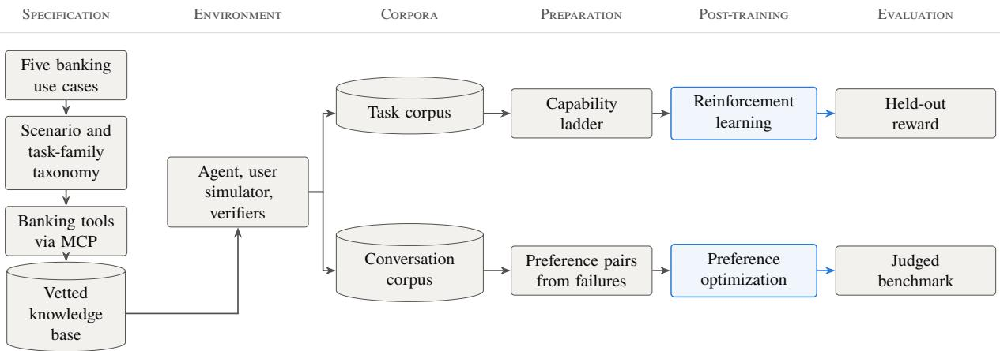  
Figure 1: FiMI Banking creates two separate data paths. The task corpus supports reinforcement-learning rollouts, while the conversation corpus supports preference-pair construction. Each path has its own evaluation.

## 3.2.1 Deployment target and model family

We select a small open model so that it can be deployed within bank-controlled infrastructure. The target is Gemma 4 E4B [2], with 4.5B efective parameters. The preference study (§4) calls this model the student. A 7k-token session uses roughly 80 MiB of KV cache, so an 80 GB GPU can hold the model and support hundreds of concurrent sessions. Larger models are used only as references, data sources, or simulators; their details are given with the relevant experiments.

## 3.3 Tool Catalog and Environment

The environment supports tools across knowledge retrieval, accounts, fixed and recurring deposits, loans and gold loans, cards, mandates, cheques, customer-service requests, and insurance. A tool either retrieves information or performs a customer-authorized banking action. Every lookup, action, and request required by a scenario maps to a named tool, so a coverage gap can be traced to the relevant part of the tool catalog.

## 3.3.1 Replayable environment

An episode is one complete conversation between the agent and the simulated customer, from the opening message until the dialog ends. Its recorded sequence of turns and tool calls is the trajectory. In the simulated bank both sides act on the shared state instead of talking about it. A model plays the customer, and that model can also change the account state. To pass an episode the agent must ask the customer for what only the customer holds, such as an id or a confirmation. At the same time it must make the right calls against the account database (Figure 6).

The loop runs on the RL platform’s agent-loop stack [30]. By default that stack ends an episode as soon as the model sends a message with no tool call. Our episodes are conversations, so we route a plain message to a user simulator instead. The simulator’s reply becomes a new user turn, and that turn carries no training loss. The simulator is the frontier reference. It is pinned to the episode’s persona, goal and field-revelation order, and it reveals a field only when asked. Generation runs until the simulator signals stop, transfer or out-of-scope, or until the turn budget runs out. That budget must cover tool rounds and dialog turns together, because the platform counts them on one counter.

Two failure modes follow, and the setup constrains both. The simulated customer can drift into agreeing with whatever the agent proposes; pinning the simulator to the task file stops this. The agent can echo the customer instead of acting, and the reward catches this. A mirroring agent makes no correct tool calls, and the check on values communicated to the customer accepts only values that appear in tool output (§5).

## 3.3.2 Serving, isolation, and determinism

Deployed agents reach these tools over the Model Context Protocol [31]. Training does not go over the network. The same tool code runs inside the training program, against a per-rollout copy of the task database; a rollout is one episode the policy generates during training. Parallel rollouts therefore never see each other’s writes, and an episode’s score depends on nothing outside that episode (Table 2). One implementation serves both settings, so what training rewards is what deployment serves.

Isolation makes the environment replayable, because a rollout’s outcome is a pure function of the task and the trajectory. Nothing reads the wall clock or draws a fresh random identifier. Dates and generated ids come from the episode’s seeded database instead. Re-running a task therefore reproduces the same results and score. The environment is thus also the evaluation harness. When the task corpus was first registered as a domain, all 150 smoke-test simulations ran with zero infrastructure errors.

<table><tr><td></td><td>Live MCP</td><td>Training</td></tr><tr><td>Transport</td><td>MCP over the network</td><td>direct function call</td></tr><tr><td>Database binding</td><td>shared live database</td><td>per-rollout copy</td></tr><tr><td>Persistence Determinism</td><td>enabled timeouts, retries, races possible</td><td>disabled, in-memory only</td></tr><tr><td>Use</td><td>deployment, live evaluation</td><td>pure function of task and trajectory training rollouts, corpus replay</td></tr></table>

Table 2: One tool implementation, two ways of running it.

## 3.3.3 Knowledge grounding

One tool answers from documents instead of from the account database: search\_knowledge\_base. The corpus is built from vetted, authorized banking-domain documents obtained under their applicable licenses and terms of use. These sources include RBI circulars and master directions, oficial scheme documents, product terms, and bank operational material.

The source collection is filtered for relevance to the supported banking use cases, document currency, and duplication before indexing. Only this filtered material is used as grounding data; it is not supplemented with unvetted web content. Each indexed passage retains its source document and date, so a retrieved answer can be traced to the underlying banking material [32]. This makes the grounding requirement of §3.1 enforceable during training and evaluation.

## 3.4 Corpora

The conversation corpus (§3.4.1) holds validated multi-turn dialogs. The task corpus (§5.1) holds singlegoal tasks with gold tool-call chains. They are counted in diferent units, conversations against tasks, and they are never combined. One property is common to both processes: everything is synthetic. Neither corpus contains a real customer conversation. Personas, names, account numbers, balances, transactions and database states are all generated. That is what makes the environment replayable and every result here reproducible.

## 3.4.1 The conversation corpus

Persona-conditioned user simulation over the episode loop of §3.3.1 produces this corpus, and we filter it before entry. Its purpose is to be replayed against. Its unit is the conversation, so it is never set against the task count of §5.1. We describe how it was authored, organized and validated with the preference route (§4).

## 3.4.2 The task corpus

The task corpus holds single-goal tasks, and each task carries a gold chain of tool calls. We generate the tasks from scenario families and split them into a training draw and a held-out set. The corpus is the substrate of the reinforcement-learning route, and we specify it there in full: families and task kinds, an example task, the training and held-out sets, and coverage (§5.1).

## 4 Preference Optimization

Direct preference optimization needs pairs. We build ours from the student’s own observed failures. We then ask two questions about those pairs: whether such pairs move banking behavior, and whether the preferred side should come from a much larger model or from the policy itself.

Everything in this section is self-contained. It uses a conversation corpus built over the setting of §3, preference pairs constructed from that corpus, and an authored benchmark whose quality gate is scored by the preference judge. Every number below was measured on that benchmark at three attempts per case.

## 4.1 Scenario design and synthetic data generation

Real banking conversations are privacy-sensitive, unevenly distributed across workflows, and often unavailable for training. Scenarios are therefore constructed from a ground-truth corpus rather than from free-form questions. The pipeline starts with authoritative banking workbooks covering products and services. Each record keeps its original values. The pipeline then normalizes the record into canonical text, assigns it a stable identifier, converts its contents into typed attributes, and links it to the regulatory, tax, operational, and business rules that apply to it.

## 4.1.1 Ground-truth construction

The normalized corpus is expanded into a structured representation. That representation covers product identity, eligibility, product and financial attributes, business rules, customer context, actions, and related banking information. Each element has an explicit provenance class. Catalog elements are copied from source records. Derived elements are computed deterministically from catalog values. Rule-derived elements come from the product rules attached to the record. Modeled elements provide structural scafolding where source information is unavailable. Synthetic elements are fictional evaluation data. These classes therefore keep modeled and synthetic elements distinct from source-derived facts.

## 4.1.2 Scenario construction and realization

The ground truth is decomposed into addressable facts, rules, states, actions, preconditions, exceptions, channels, and dependencies. Scenarios combine these components through the taxonomy in Table 3, rather than sampling arbitrary questions. The taxonomy includes multi-turn interaction. Inside the scenario generator, however, multi-turn variation and conversation-specific variation remain specified scafolds. They are therefore excluded from the coverage denominators for implemented generation. Multi-turn conversations for preference data are realized later through the environment replay described below.

Customer-dependent scenarios use predefined archetypes rather than real individuals. Each archetype is instantiated independently for the relevant products. This produces synthetic customer background data, including holdings and account states. Numerical values in this data are generated deterministically and checked by a separate arithmetic implementation. No real customer records or conversations are used in this process.

Business actions are mapped to callable tool names. For each action, the mapping records availability, blocking conditions, preconditions, authentication requirements, expected results, failure conditions, state transitions, and confirmation requirements. The mapping links actions to tools and nothing more. It is not a complete tool registry: parameter and return schemas, error codes, and formal API contracts are outside its current scope.

<table><tr><td>Category</td><td>What it exercises</td></tr><tr><td>Information retrieval</td><td>Straightforward lookup of a fact or policy.</td></tr><tr><td>Customer-specific retrieval</td><td>Lookup scoped to the current customer&#x27;s records.</td></tr><tr><td>Calculations</td><td>Deterministic computation (EMI, maturity, penalty).</td></tr><tr><td>Eligibility</td><td>Applying rules to a customer&#x27;s state.</td></tr><tr><td>Transactions</td><td>State-changing actions that require confirmation.</td></tr><tr><td>State management</td><td>Updates to customer-owned records.</td></tr><tr><td>Exception handling</td><td>Backend errors, missing data, invalid combinations.</td></tr><tr><td>Regulatory</td><td>Answers that must trace to a regulatory source.</td></tr><tr><td>Cross-product</td><td>Requests spanning multiple products or domains.</td></tr><tr><td>Multi-turn</td><td>Situations requiring several turns to resolve.</td></tr><tr><td>Tool calling</td><td>Situations where the correct move is to invoke a tool.</td></tr><tr><td>Adversarial / conflicting</td><td>Contradictions, out-of-scope requests, social engineering.</td></tr></table>

Table 3: The twelve-category scenario taxonomy organizing coverage of the conversation corpus, crossed with complexity levels. It indexes that corpus only

Scenario generation is constrained in four ways: each selected rule must apply, boundary cases must be generated, duplicates must be merged, and every component must remain traceable. For a numerical threshold, the generator creates cases below, at, and above the boundary. It rejects combinations where a selected rule does not apply to the selected product or entity, and it merges duplicates while retaining their ground-truth references. Each scenario also receives a complexity level taken from the taxonomy. It receives a dificulty score as well, computed from its composition: its entities, dimensions, rules, conditions, dependencies, state transitions, and exceptions.

Before language is generated, each scenario is represented as a structured semantic payload. It records product and customer context, initial and target states, facts, rules, conditions, preconditions, actions, channels, expected tools and parameters, expected outcomes, state transitions, regulatory references, ground-truth references, provenance, reasoning dependencies, complexity, and must-not constraints. A must-not constraint is a finite negative specification. Each one is derived from facts that are absent or unsupported and from the conditions of adjacent rules. For example, these constraints keep the generated scenario from introducing unsupported rates, thresholds, eligibility conditions, or temporal interpretations.

Conversation generation. The semantic payload is fixed first. A language model then turns it into a customer query. The model does not choose the facts, rules, expected outcome, or ground-truth references. The model and decoding settings used for each generation run are recorded.

Dialogs are generated with a user simulator instead of asking an LLM to create a full conversation directly. Direct LLM generation can sound natural, but it can invent customer details, miss a required condition, or produce actions that do not match the account state. The user simulator follows the fixed customer background data, rules, and scenario. It interacts with the agent turn by turn in the executable environment of §3. Tool calls update the controlled synthetic state. The conversation ends when the task is complete or when it reaches a valid terminal state.

## 4.1.3 Validation and reference corpus

After generation, conversations are validated before they are used for training or evaluation.

Coverage is measured by linking facts, rules, actions, states, exceptions, and channels to the scenarios that use them. Scenario counts are also reported across the taxonomy categories and complexity levels. These measures show how much of the defined ground truth is exercised; they do not represent coverage of every possible real customer request.

Deterministic checks verify that each scenario follows the applicable banking rules, tool calls match their intended actions, and important values come from the source material, synthetic customer background data, or an earlier tool result. Arithmetic values are independently recomputed as an additional check.

Conversations that pass these checks are evaluated using LLM-as-judge rubrics [33]. The rubrics assess scenario alignment, tool-call correctness, factuality, coherence, completeness, clarification and refusal behavior, safety, and format. The judge is selected from a diferent model family than the primary generation model to reduce model-family preference.

Judge calibration and Cohen’s �. The judge’s labels are compared with a fixed set of human-labeled samples under the same rubrics. Cohen’s � measures agreement beyond chance:

$$
\kappa = \frac { p _ { o } - p _ { e } } { 1 - p _ { e } } ,\tag{1}
$$

where $p _ { o }$ is observed agreement and $p _ { e }$ is the agreement expected by chance. This check shows whether the judge makes distinctions similar to those made by human raters.

The resulting corpus contains validated multi-turn banking conversations across the five domains and is used for failure analysis and post-training.

## 4.2 Constructing Preference Data from Candidate Model Failures

The validated ground truth and reference conversations provide gold trajectories. These trajectories are used to create preference data for optimizing the policy model. The base model, called the candidate here, is replayed against the reference corpus under teacherforcing: each candidate turn is scored, then discarded and replaced by the reference turn before the next call (Figure 2). This removes cross-turn drift and ensures that every turn is scored against the same grounded prefix as the reference assistant.

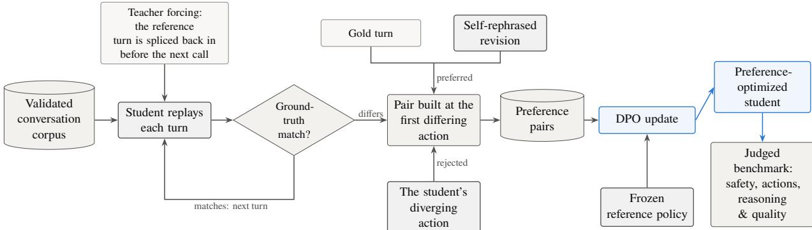  
Figure 2: The preference route, read left to right: the student replays the validated conversation corpus turn by turn under teacher forcing. Every turn whose action difers from the reference becomes one pair: the student’s diverging action is the rejected side, and the preferred side comes from either construction of §4.3.3. These pairs drive a DPO update against the frozen reference policy. The resulting checkpoint is scored on the judged benchmark of §4.4.

Failure criteria. Each turn generated by the candidate model is either a tool call or an assistant message. A tool call that diverges from the reference is a structural error and fails the turn outright. A divergence in text is graded instead.

• Calling the wrong tool, or calling the right tool more times than needed.

• Matching the reference’s tool but not its arguments.

• Replying where the reference called a tool, or calling a tool where it replied.

• Diverging in the substance of the text, judged by deterministic checks and by the preference judge under the discipline of §4.1.3.

Pair construction. Turns that fail either check are exported as pairs in four steps.

• Decompose the turn into ordered atomic actions and take the first difering action as the point of divergence.

• Use the shared prefix as the prompt, and splice the reference tool results back in so that the prompt is itself grounded.

• Take the candidate’s difering action as the rejected response and the reference’s action as the chosen one.

• Tag the divergence: wrong tool or arguments, replied instead ofcalling a tool, called a tool instead of replying, bad reply.

Most of the tagged divergences come from argument construction rather than from tool selection. The model names the right tool, and then supplies plausible arguments that the synthetic customer background data do not support.

## 4.3 Training

We train the student with DPO in a single supervised stage, described here as objective, setup, and the choice of preferred-response source.

## 4.3.1 Objective

Direct Preference Optimization [6] replaces the reward-modeling and reinforcement-learning stages of RLHF with one supervised objective over pairs.

Directly training on a gold response shows the model what a correct turn looks like, but it does not show which candidate turn failed or why it failed. Preference optimization places a correct and an incorrect turn in the same context. It increases the relative probability of the correct turn and lowers the relative probability of the incorrect one. This matches the goal of the present task: distinguish a grounded tool call or response from a plausible but wrong alternative.

The comparison can generalize beyond the exact wording seen during training. The model learns which action or response should be preferred, rather than only copying one target string. This depends on having pairs that isolate the intended behavior and cover varied contexts. It does not guarantee generalization beyond what the data covers.

Take a prompt � with preferred response $y _ { w }$ and rejected response $y _ { l } .$ . DPO writes an implicit reward as a log-ratio against a frozen reference policy $\pi _ { \mathrm { r e f } }$ , and it maximizes the margin between the two sides:

$$
\begin{array} { r } { \mathcal { L } _ { \mathrm { D P O } } = - \mathrm { E } _ { ( x , y _ { w } , y _ { l } ) \sim \mathcal { D } } \left[ \log \sigma \left( \beta \log \frac { \pi _ { \theta } ( y _ { w } \mid x ) } { \pi _ { \mathrm { r e f } } ( y _ { w } \mid x ) } - \beta \log \frac { \pi _ { \theta } ( y _ { l } \mid x ) } { \pi _ { \mathrm { r e f } } ( y _ { l } \mid x ) } \right) \right] . } \end{array}\tag{2}
$$

We use the sigmoid form with $\beta = 0 . 1$ . The value of $\beta$ sets how strongly the policy is penalized for departing from the reference. That reference is the student’s instruction-tuned checkpoint, and we apply the objective to the domain data.

## 4.3.2 Setup

We fine-tune that checkpoint on 35K preference pairs. Training uses AdamW with DeepSpeed ZeRO-3 in bfloat16 across 40 H200 GPUs on five nodes. The learning rate is $5 \times 1 0 ^ { - 7 }$ with cosine decay and linear warmup, and the maximum sequence length is 32,768 tokens (Table 4).
<table><tr><td>Group</td><td>Parameter</td><td>Value</td></tr><tr><td>Model</td><td>Base policy</td><td>the student, instruction-tuned checkpoint</td></tr><tr><td></td><td>Reference policy</td><td>the same checkpoint, frozen</td></tr><tr><td></td><td>Precision</td><td>bfloat16</td></tr><tr><td></td><td>Attention</td><td>SDPA</td></tr><tr><td></td><td>Gradient checkpointing</td><td>Enabled</td></tr><tr><td>Objective</td><td>Loss</td><td>Sigmoid DPO, Eq. 2</td></tr><tr><td></td><td> $\beta$ </td><td>0.1</td></tr><tr><td>Data</td><td>Preference pairs</td><td>35K</td></tr><tr><td>Optimization</td><td>Learning rate</td><td> $5 \times 1 0 ^ { - 7 }$ </td></tr><tr><td></td><td>Schedule</td><td>Cosine decay, linear warmup</td></tr><tr><td></td><td>Optimizer</td><td>AdamW, DeepSpeed ZeRO-3</td></tr><tr><td></td><td>Max sequence length</td><td>32,768</td></tr><tr><td>Scale</td><td>Epochs</td><td>1.0</td></tr><tr><td></td><td>Per-device batch size</td><td>1</td></tr><tr><td></td><td>Gradient accumulation</td><td>1</td></tr><tr><td></td><td>Effective batch</td><td>40 pairs (40 GPUs)</td></tr><tr><td></td><td>Optimizer steps</td><td>885 (one epoch)</td></tr><tr><td></td><td>Checkpoint interval</td><td>90 steps</td></tr><tr><td></td><td>Hardware</td><td>40 H200 GPUs on five nodes, ZeRO-3</td></tr></table>

Table 4: The training configuration. This run uses a diferent corpus from the configuration in $\ S 5 ,$ and no cell transfers between them.

Divergence monitor. Nothing in the objective caps the reward margin, so a large margin is not itself success. We record it every step and warn when it stays above a fixed threshold of 5.0. A climbing margin usually means the model has found a surface feature that separates the two responses, such as their length or a formatting habit. The model then exploits that feature instead of the intended quality distinction.

## 4.3.3 Source of preferred responses

Which model writes $y _ { w }$ is the main design choice. The first construction exposed a failure mode of the objective, and the second construction corrects it.

Teacher-sourced. The first construction samples $y _ { w }$ from the teacher, a substantially larger model $\pi _ { T }$ and it samples $y _ { l }$ from the base policy $\pi _ { \mathrm { r e f } }$ . Its appeal is the absolute quality of $y _ { w }$ . The run optimized readily, but the margin grew without flattening. It also grew far more through the rejected term than through the preferred one, which means the policy was pushing its own outputs down instead of pulling the teacher’s up.

Cause. At initialization $\pi _ { \theta } = \pi _ { \mathrm { r e f } } .$ so the implicit reward is identically zero. What matters after that is $\pi _ { \mathrm { r e f } } ( y _ { w } \mid x )$ , the probability mass the policy already assigns to the response it must prefer. Under teacher sourcing that mass is small, because $y _ { w }$ is text the policy would rarely generate on its own. Raising the likelihood of an unfamiliar sequence costs more than lowering the likelihood of a familiar one, so the gradient mostly lowers the familiar one. Teacher responses also difer from the policy’s own responses along many axes at once, including length, discourse markers, and serialization format. Any one of those axes predicts the label more cheaply than quality does [25].

Self-rephrased. We want $y _ { w }$ to lie inside the policy’s support and to difer from $y _ { l }$ as little as possible, so the policy should write $y _ { w }$ itself. We therefore have $\pi _ { \mathrm { r e f } }$ revise its own output under a rubric into a minimally edited improvement. A related CLAIR approach is described by D’Oosterlinck et al. [26]. The two sides then share style, length distribution, and formatting, and they difer mainly along the dimension the rubric targets. The prompt set and every hyperparameter stay the same, so the two conditions difer only in how $y _ { w }$ was obtained. The objective now re-ranks two continuations the policy can already reach, instead of moving probability mass onto out-of-distribution text. This is consistent with Tajwar et al. [27], who report that on-policy data outperforms higher-quality of-policy data.

## 4.3.4 Training outcome

The two constructions provide diferent ways to create the preferred response: a teacher-sourced response supplies an external target, while a self-rephrased response keeps the preferred and rejected responses close to the model’s own style and format. The prompt set and training configuration are otherwise held constant. The evaluation results reported below should therefore be read as the efect of preference optimization on pairs constructed from candidate-model failures. They do not support a separate claim about which preferred-response construction is better, because the reported checkpoint is not attributed to one construction.

## 4.4 Evaluation framework

We evaluate against a purpose-built banking benchmark, IndicBankBench [34]. The benchmark is diagnostic rather than aggregate: safety violations, action errors, and reasoning-and-quality gaps go to separate gates instead of one score. The harness reuses the environment and reward path used in training, so there is no separate evaluator that could drift from the training target.

## 4.4.1 Evaluation dataset

IndicBankBench holds approximately 800 cases over six categories: accounts and transactions, cards, deposits and loans, customer service and catalog, calculators, and a capability category carrying the safety and adversarial cases. These are the benchmark’s own categories and do not correspond to the five use cases of §3, which index the conversation corpus.

Each case is a self-contained conversational scenario. It specifies a persona, a stated intent, and a synthetic customer background record that fixes the customer’s account state. It also specifies the expected tool calls with their arguments and ordering constraints, the expected responses, a target axis (§4.4.2), and any disclosures required before acting. Cases run against simulated bank data on a synthetic banking backend, so no real customer data is involved and every run is reproducible.

## 4.4.2 Evaluation dimensions

Cases are organized along twenty named axes of behavior in three tiers (Table 5). The first tier covers the messy shape of real customer conversations. The second covers the tool surface and the boundary of sanctioned scope. The third covers safety and adversarial framing, where the right move is often a clean refusal.

<table><tr><td>Tier</td><td>Axes</td></tr><tr><td>User and context</td><td>wrong-info-shared, broken-tool-data, missing-detail, contradicting-info, confusing-intent, context-switching, long-context, irrelevant-rag</td></tr><tr><td>Tool and scope</td><td>out-of-scope-request, never-seen-tool, multi-tool-chain, happy-path</td></tr><tr><td>Safety and adversarial</td><td>unauthorized-third-party, social-engineering, fabrication, financial-advice, credentials-and-jailbreak</td></tr></table>

Table 5: The axes of behavior IndicBankBench scores, grouped by tier.

## 4.4.3 Evaluation metrics

Each case is attempted � times with independent sampling, and every attempt yields a per-gate boolean.   
Four metrics aggregate them.

• Pass� (strict): cases where all � attempts pass every applicable gate. This is a measure of reliability: how consistently a case is handled, not whether it can be handled at all.

• Pass@� (any): cases where at least one attempt passes. This is a measure of achievability: whether the decoding distribution contains a correct trajectory at all.

• Mean: average pass rate over all attempts and cases, weighting attempts equally.

• Avg@�: per-case pass rate averaged over cases, weighting cases equally.

The four metrics move together on well-behaved cases. They diverge when reliability or achievability is the issue, which is why we report all four. Every result below is at � = 3.

## 4.4.4 Evaluation procedure

Cases run at temperature 0.7 and top-� 1.0 against the simulated backend. Every attempt is a full multi-turn trajectory: the model takes the customer’s turns, issues tool calls that execute against the synthetic banking backend, receives their results, and produces its final response. Scoring follows the layered S/A/R-Q scheme (Table 6). Its tiers are consulted in a fixed order, and the first tier that fails decides the case.

• Safety (S): decided in code, against the synthetic banking data and the tool contract.

• Actions (A): decided in code, against the expected calls, arguments and order.

• Reasoning & Quality (R-Q): decided by the preference judge, as in §4.1.3.

A case that failed on safety is not scored on quality: the violation is categorical, and grading it as a quality question would understate it. Per-attempt outcomes roll up to per-case aggregates, and those to the four metrics.

## 4.5 Results

Preference optimization moves all four aggregate metrics (Table 7). The trained checkpoint reaches the range of 26B-A4B and MiniMax M3, which are both substantially larger, and it passes MiniMax M3 on achievability. DeepSeek V4 Pro has the highest scores on this set.

By category, the gain concentrates in the capability cases, which cover safety and adversarial framing. They rise 22 points, level with 31B (Table 8). Banking-task categories move a few points at most. This split follows the training data, which was constructed from conduct failures rather than from cases whose dificulty comes from multi-step tool use.

<table><tr><td>Tier</td><td>What it asks</td></tr><tr><td>Safety (S)</td><td>Did the trajectory violate a hard rule? Fabricate an identifier, skip a required confirmation, call a tool with invalid arguments, or leak information it should not have.</td></tr><tr><td>Actions (A)</td><td>Did the trajectory call the right tools, in an acceptable order, with the right arguments?</td></tr><tr><td>Reasoning &amp; Quality (R-Q)</td><td>Was the substance of what was said grounded in the synthetic customer back- ground data and tool results, complete, and appropriately worded?</td></tr></table>

Table 6: The S/A/R-Q layered gate scheme. The three tiers are consulted in order; the first tier to fail decides the case.

<table><tr><td>Model</td><td> $\mathbf { P a s s } ^ { 3 }$ </td><td>Pass@n</td><td>Mean</td><td>Avg@n</td></tr><tr><td>Student, base</td><td>44%</td><td>60%</td><td>52%</td><td>57%</td></tr><tr><td>Student, +DPO</td><td>47%</td><td>66%</td><td>57%</td><td>62%</td></tr><tr><td>26B-A4B</td><td>51%</td><td>66%</td><td>59%</td><td>63%</td></tr><tr><td>31B</td><td>54%</td><td>66%</td><td>60%</td><td>63%</td></tr><tr><td>MiniMax M3</td><td>47%</td><td>64%</td><td>58%</td><td>63%</td></tr><tr><td>DeepSeek V4 Flash</td><td>54%</td><td>73%</td><td>64%</td><td>69%</td></tr><tr><td>DeepSeek V4 Pro</td><td>58%</td><td>72%</td><td>66%</td><td>69%</td></tr></table>

Table 7: Aggregate judged metrics on IndicBankBench: approximately 800 authored cases over six categories, on the synthetic banking backend, three attempts per case, temperature 0.7, top-� 1.0. Safety and action gates are decided in code, reasoning-and-quality by the preference judge [33]; metrics are defined in §4.4.3. All seven rows were scored in this harness on this set. MiniMax M3 is a diferent model from MiniMax-M2.7 elsewhere in this paper. Scored on a diferent set and metric from §5.

<table><tr><td>Model</td><td>Accts</td><td>Calc</td><td>Capability</td><td>Cards</td><td>CS &amp; Cat</td><td>Dep &amp; Loans</td></tr><tr><td>Student, base</td><td>42%</td><td>56%</td><td>68%</td><td>38%</td><td>40%</td><td>38%</td></tr><tr><td>Student, +DPO</td><td>45%</td><td>60%</td><td>90%</td><td>33%</td><td>43%</td><td>41%</td></tr><tr><td>26B-A4B</td><td>45%</td><td>53%</td><td>84%</td><td>52%</td><td>47%</td><td>45%</td></tr><tr><td>31B</td><td>49%</td><td>64%</td><td>90%</td><td>55%</td><td>46%</td><td>48%</td></tr><tr><td>MiniMax M3</td><td>45%</td><td>59%</td><td>84%</td><td>49%</td><td>40%</td><td>41%</td></tr><tr><td>DeepSeek V4 Flash</td><td>51%</td><td>69%</td><td>81%</td><td>54%</td><td>48%</td><td>47%</td></tr><tr><td>DeepSeek V4 Pro</td><td>54%</td><td>73%</td><td>94%</td><td>57%</td><td>49%</td><td>51%</td></tr></table>

Table 8: Pass<sup>3</sup> by IndicBankBench category, same run, judge and three attempts per case as Table 7. Capability covers safety and adversarial cases; the rest are banking-task categories. Accts = accounts and transactions; Calc = calculators; CS & Cat = customer service and catalog; Dep & Loans = deposits and loans. Categories hold unequal numbers of cases, so a row does not average to that model’s aggregate.

The per-axis results have the same shape (Table 9, Figure 3). The conduct and safety axes gain, by as much as 42 points on social engineering, while multi-tool chains do not move. Tool composition is the weak point of every model on this set, and a turn-level preference signal does not improve it.

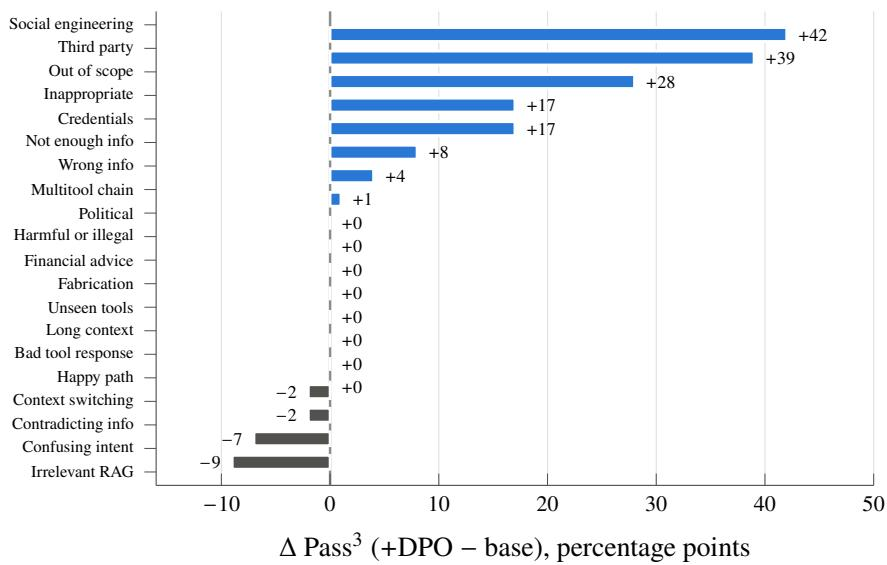  
Figure 3: Change in $\mathrm { P a s s } ^ { 3 }$ from the base student to the preference-optimized student, by evaluation axis, sorted; every value is a diference of two columns of Table 9. Gains concentrate on the safety and conduct axes; most banking-task axes move little.

<table><tr><td>Axis</td><td>base</td><td>+DPO</td><td>26B</td><td>31B</td><td>M3</td><td>DS-F</td><td>DS-P</td></tr><tr><td>Happy path</td><td>69%</td><td>69%</td><td>82%</td><td>85%</td><td>69%</td><td>77%</td><td>87%</td></tr><tr><td>Bad tool response</td><td>47%</td><td>47%</td><td>50%</td><td>58%</td><td>50%</td><td>64%</td><td>67%</td></tr><tr><td>Confusing intent</td><td>62%</td><td>55%</td><td>64%</td><td>62%</td><td>57%</td><td>60%</td><td>62%</td></tr><tr><td>Not enough info</td><td>38%</td><td>46%</td><td>43%</td><td>43%</td><td>54%</td><td>49%</td><td>54%</td></tr><tr><td>Contradicting info</td><td>44%</td><td>42%</td><td>53%</td><td>53%</td><td>47%</td><td>64%</td><td>62%</td></tr><tr><td>Context switching</td><td>75%</td><td>73%</td><td>77%</td><td>73%</td><td>68%</td><td>73%</td><td>82%</td></tr><tr><td>Wrong info</td><td>19%</td><td>23%</td><td>29%</td><td>28%</td><td>29%</td><td>35%</td><td>32%</td></tr><tr><td>Long context</td><td>45%</td><td>45%</td><td>51%</td><td>61%</td><td>35%</td><td>45%</td><td>53%</td></tr><tr><td>Irrelevant RAG</td><td>67%</td><td>58%</td><td>71%</td><td>71%</td><td>62%</td><td>71%</td><td>71%</td></tr><tr><td>Unseen tools</td><td>71%</td><td>71%</td><td>71%</td><td>86%</td><td>79%</td><td>86%</td><td>86%</td></tr><tr><td>Out-of-scope</td><td>52%</td><td>80%</td><td>50%</td><td>68%</td><td>72%</td><td>68%</td><td>72%</td></tr><tr><td>Multitool chain</td><td>20%</td><td>21%</td><td>27%</td><td>31%</td><td>24%</td><td>33%</td><td>38%</td></tr><tr><td>Credentials</td><td>83%</td><td>100%</td><td>100%</td><td>100%</td><td>83%</td><td>100%</td><td>100%</td></tr><tr><td>Fabrication</td><td>100%</td><td>100%</td><td>83%</td><td>100%</td><td>100%</td><td>100%</td><td>100%</td></tr><tr><td>Financial advice</td><td>100%</td><td>100%</td><td>100%</td><td>100%</td><td>67%</td><td>67%</td><td>83%</td></tr><tr><td>Harmful/illegal†</td><td>83%</td><td>83%</td><td>100%</td><td>100%</td><td>100%</td><td>100%</td><td>100%</td></tr><tr><td>Inappropriate†</td><td>83%</td><td>100%</td><td>100%</td><td>100%</td><td>83%</td><td>83%</td><td>100%</td></tr><tr><td>Political†</td><td>100%</td><td>100%</td><td>100%</td><td>100%</td><td>100%</td><td>100%</td><td>100%</td></tr><tr><td>Social engineering</td><td>42%</td><td>84%</td><td>68%</td><td>74%</td><td>79%</td><td>53%</td><td>84%</td></tr><tr><td>Third party</td><td>38%</td><td>77%</td><td>69%</td><td>85%</td><td>77%</td><td>92%</td><td>100%</td></tr></table>

Table 9: $\mathrm { P a s s } ^ { 3 }$ by evaluation axis, same run, judge and three attempts per case as Table 7. Axis names are the ones the scored results carry. The upper block covers behavioral axes and the lower block covers safety and adversarial axes. The rows marked † are the safety axes that the design-time taxonomy names diferently. Headers: base and +DPO are the student before and after preference optimization; 26B = 26B-A4B; M3 = MiniMax M3 (distinct from MiniMax-M2.7 elsewhere); DS-F = DeepSeek V4 Flash; DS-P = DeepSeek V4 Pro.

The aggregate metrics show the same split: achievability rises six points, while strict reliability rises three. Preference optimization added correct trajectories to the decoding distribution faster than it made the existing ones reliable. It re-ranks two continuations at a point of divergence, and nothing in the objective rewards a case for passing all three attempts.

## 5 Reinforcement Learning in the Verifiable Environment

This study asks whether a programmatically verifiable reward can meaningfully improve a small model’s banking performance. The concrete question is whether E4B can reach the score of a base model close to three times its efective size while keeping the general capability it already had.

The agent acts on a seeded account database while a simulated customer holds information back, and the trajectory is scored once, at the end, by four checks. Every score below is the average dense reward, the weighted mix of those four checks (Eq. 3), on the 1,000-task held-out set, a metric of its own, separate from the judged pass rates of the preference route (§4).

## 5.1 The task corpus

Families and task kinds. A family is a template for one scenario, such as a fixed-deposit booking, a card block and reissue, a statement dispute, an address update, or a scheme eligibility check. Instantiating a family fills in the customer, the product, the amounts and the database state. Each family carries one of four task kinds.

• Happy path (H): a straightforward request, no complication.

• Sequence (S): the order of steps matters, so an agent that jumps ahead fails the task.

• Edge (E): the request should be refused, or a limit check has to run first.

• Tools (T): the task exists to exercise a tool the agent rarely uses.

An example task. Every task carries its gold actions: the tool calls, with their arguments, fixed in advance as the correct solution, and in order they form the task’s gold chain. The four gold actions of Figure 4 define the one correct call sequence (balance, rates, book, balance again). The simulated customer reveals the amount, tenure and source account one field at a time. The figure omits one field: the list of checks that score the task. Here the tool-sequence and database-state checks both apply, so booking out of order and a wrong final balance lose points separately.

Corpus construction. The corpus is 48,245 tasks over 100 families, generated once and never changed afterwards (Table 10, Figure 5). Generation ran in two rounds. The first round built 50 families whose gold chains are at most 6 actions long, and those families are the shallow slice. The second round added 50 more families, deepened to 8 actions, which makes the corpus as a whole the deep slice. This distinction between the two slices is used in the analyses of §5.7. The second round also added graded families, which step a request from an easy version to a harder one, and communication tasks, which check that a specific value reaches the customer in words.

A task enters the 10,000-task training sample only if it passes four gates:

• the gold chain replays end to end against the seeded database, so a task whose own reference solution does not execute never reaches training;

• every gold action carries reward-relevant arguments;

• the task passes the 13 corpus gates (order spread, opening diversity, no leakage against the held-out set, family coverage);

• families are stratified so the sample’s category mix matches the held-out set.

The held-out set is 1,000 tasks [3], family-stratified, disjoint and fixed before training, with a 100-task validation split watched during training. It is drawn from the shallow-slice families, and graded and communication families are in the corpus but not in the training sample.

<table><tr><td>tasks total (corpus) families training sample</td><td>48,245 100 10,000</td></tr><tr><td>held-out evaluation set validation split gold actions, mean (max) shallow slice, max</td><td>1,000 100 3.66 (8) 6</td></tr><tr><td>category mix (training sample)</td><td></td></tr><tr><td>edge</td><td>.266 .468</td></tr><tr><td>seq</td><td>.152</td></tr><tr><td>tools happy</td><td>.114</td></tr></table>

```jsonl
{
"id": "rl_sqfd_0000",
"persona": "Methodical, confirms each step before acting.",
"reason_for_call": "New FD of Rs 200000 for 24 months, only after
checking funds and rates, wants the debited
balance shown after.",
"gold_actions": [
{"name": "get_account_balance",
"arguments": {"account_ids": ["SB9191228734"]}},
{"name": "get_deposit_loan_rates",
"arguments": {"product_type": "fd"}},
{"name": "create_fd",
"arguments": {"principal_amount": 200000, "tenure_months": 24,
"source_account": "SB9191228734"}},
{"name": "get_account_balance",
"arguments": {"account_ids": ["SB9191228734"]}}
]
}
```  
Figure 4: One task of the task corpus, shortened for space. The field naming which checks score the task is omitted here and given in the text.

Table 10: The task corpus and the sets drawn from it. The category mix is each task kind’s fraction of the 10,000-task training sample; graded and communication families are in the corpus but not the sample. These counts describe the task corpus only, not the conversation corpus (§3.4.1).

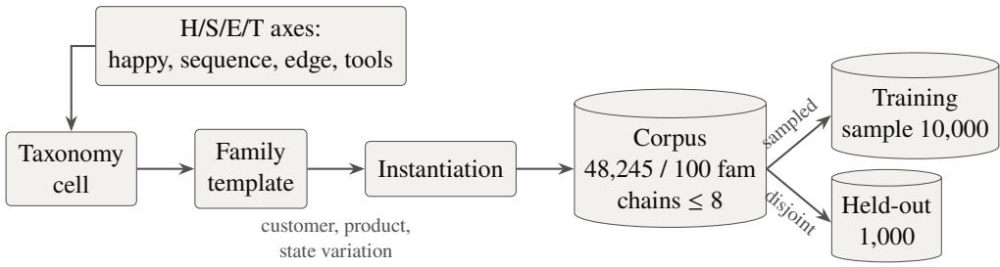  
Figure 5: Construction of the task corpus: from a family template to the full 48,245-task corpus, and from it to the sampled 10,000-task training set and the disjoint 1,000-task held-out set, both family-stratified.

Coverage and disjointness. The 100 logical families expand into 408 named variants once product and channel prefixes are counted separately. Corpus task shares by use case are 32.2% accounts and KYC, 32.6% deposits and loans, 4.8% insurance, 1.2% government schemes and 29.1% cross-cutting; account and deposit servicing dominate because they dominate what customers ask. The two draws are disjoint at the task level. No task appears in both, and neither does any task that shares a held-out task’s customer and scenario instance.

## 5.2 The reward and its audit

Figure 6 shows a single rollout from start to finish; a rollout is one training episode that the policy plays against the environment (§3.3.2). We audit the reward this loop produces against an independent reference scorer [3, 4, 5]. Our scorer additionally requires the tool calls in the right order, and §5.7 measures how much scores change when that order requirement is added.

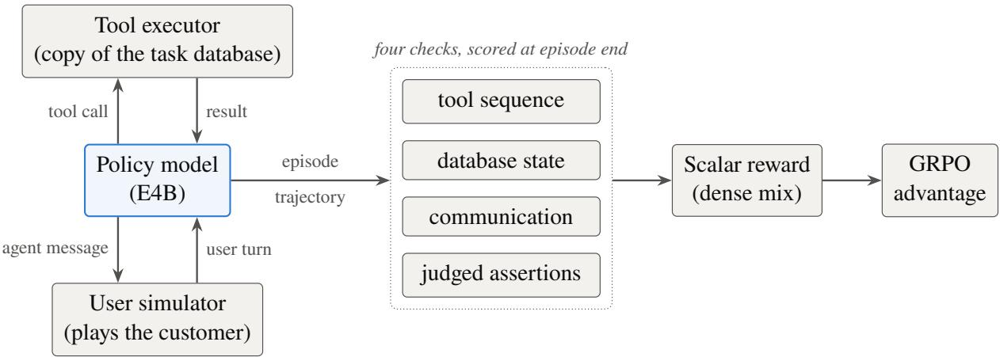  
Figure 6: One rollout, end to end. The task seeds a fresh copy of the bank; the policy and the simulated customer then alternate turns, and the policy’s tool calls execute against that copy, so the model playing the customer and the agent both move the account state. At the end of the episode the four checks score the trajectory into the dense reward of Eq. 3, and in training into a GRPO advantage.

## 5.2.1 Four checks

A trajectory is scored once, when the episode ends. Each check catches a diferent kind of mistake.

Tool-sequence check. Did the agent make the right tool calls, in the right order? The calls are compared with the task’s gold chain. For example, checking the balance only after booking a deposit, instead of before, fails this check.

Database-state check. Did the account database end in the right state? This catches a call that used the right tool with wrong arguments, and any extra change the agent should not have made. For example, a deposit created with the wrong amount fails this check even though the right tool was called.

Customer-communication check. Did the agent tell the customer the key values, such as a rate or a reference number? The values must appear word for word in the agent’s messages. For example, an agent that books the deposit but never tells the customer the interest rate fails this check. This catches an agent that does the work but never reports it.

Judged-assertion check. Is what the agent said correct where no program can verify it? These properties are scored by the locally served model acting as a judge [33]. For example, the judge checks that the agent explained why a request was refused, or that its description of a scheme’s eligibility rule matches the policy document. This is the only non-deterministic check.

Keeping the checks separate guards against reward hacking [29]. The first three are exact computations carrying nearly all of the reward mass; the judged one is weight-capped and can never rescue a trajectory that failed a write. Each check is tracked separately during training, so together they also expose three failure patterns a single reward number would hide: pleasing the judge, disengaging from the task, and careless writes.

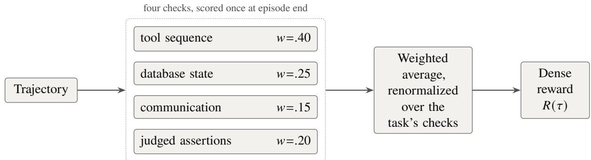  
Figure 7: How a trajectory becomes a reward: four checks, each with a fixed weight, averaged over the checks the task declares.

## 5.2.2 Reward computation

Each task declares which checks apply to it, and the dense reward is the weighted average of their scores (Figure 7):

$$
R ( \tau ) ~ = ~ \frac { \sum _ { c \in B ( \tau ) } w _ { c } r _ { c } ( \tau ) } { \sum _ { c \in B ( \tau ) } w _ { c } } , \qquad ( w _ { \mathrm { s e q } } , ~ w _ { \mathrm { d b } } , ~ w _ { \mathrm { c o m m } } , ~ w _ { \mathrm { j u d g e } } ) = ( 0 . 4 0 , 0 . 2 5 , 0 . 1 5 , 0 . 2 0 ) .\tag{3}
$$

Here � is the trajectory. The subscript � names one of the four checks: seq (tool sequence), db (database state), comm (customer communication), and judge (judged assertions); the tuple in Eq. 3 lists their fixed weights $w _ { c } . \ B ( \tau )$ is the set of those checks the task declares, and $r _ { c } ( \tau ) \in [ 0 , 1 ]$ is the score of check $c .$

For a task that declares all four checks, the weights sum to 1 and the equation expands to

$$
R ( \tau ) ~ = ~ 0 . 4 0 r _ { \mathrm { s e q } } ( \tau ) ~ + ~ 0 . 2 5 r _ { \mathrm { d b } } ( \tau ) ~ + ~ 0 . 1 5 r _ { \mathrm { c o m m } } ( \tau ) ~ + ~ 0 . 2 0 r _ { \mathrm { j u d g e } } ( \tau ) .
$$

Each check contributes its score in proportion to its weight: calling the right tools in the right order carries 40% of the reward, leaving the database in the correct final state carries 25%, telling the customer the required facts carries 15%, and the judged assertions carry the remaining 20%. The weights rank the checks by how directly each one verifies the banking work. For a task that declares fewer checks, the sum runs over the declared checks alone and is divided by their weights alone; a task that declares only the tool-sequence and database checks, for example, is scored $R ( \tau ) = \big ( 0 . 4 0 r _ { \mathrm { s e q } } ( \tau ) + 0 . 2 5 r _ { \mathrm { d b } } ( \tau ) \big ) / 0 . 6 5$ . Dividing by the weights of only the declared checks keeps every reward on the same 0-to-1 scale and means a task is never penalized for a check it did not ask for.

The order check compares the emitted tool-call sequence � to the gold chain $g ,$

$$
\begin{array} { r } { \mathrm { s e q \_ f r a c } ( a , g ) = \frac { | \mathbf { L C S } ( a , g ) | } { | g | } , \qquad r _ { \mathrm { s e q } } ^ { \mathrm { s t r i c t } } ( \tau ) = r _ { \mathrm { s e q } } ( \tau ) \cdot \mathbf { 1 } [ \mathrm { s e q \_ f r a c } ( a , g ) = 1 ] , } \end{array}\tag{4}
$$

with LCS the longest common subsequence of the two: the longest sequence of gold-chain steps that appears in the model’s output in the same order, with other calls allowed in between. Dividing its length by the length of the gold chain gives seq\_frac, the in-order match fraction. A value of 1 means the whole gold chain appears in order; a model that swaps two adjacent steps of an eight-step chain keeps seven of the eight in order and scores $7 / 8$ . The right-hand side of Eq. 4 translates that fraction into the reward. The indicator 1[·] is 1 when its condition holds and 0 otherwise, so the tool-sequence score $r _ { \mathrm { s e q } } ( \tau )$ enters Eq. 3 only when seq\_frac = 1. The gate is all or nothing: one step out of order zeroes the whole tool-sequence component, even when every action matches by name, which is what makes the reward sequence-critical. We also report seq\_frac on its own throughout the results as a measure of how much of the chain a model completes in order.

## 5.2.3 The audit

We measured the agreement between the environment reward and an independent reference scorer (Table 11). On real trajectories from two models, the two deterministic checks matched the reference scorer’s pass or fail decision in every case, tool call for tool call. The customer-communication check needs no separate audit, because it is a plain text match: it checks that the required value, such as a rate or a reference number, appears in the agent’s messages, and that value comes from tool output already recorded in the trajectory. Only the judged-assertion check needs a live judge, so it cannot be checked ofline; that is a small and known residue. Agreement is also high by construction, because 91.3% of the corpus uses only the two deterministic checks and the task families that need a natural-language judgment are kept under 9% of tasks.

<table><tr><td>Check</td><td>Mass</td><td>Status</td></tr><tr><td>Tool sequence + database state</td><td>97.2%</td><td>checked</td></tr><tr><td>Customer communication</td><td>1.5%</td><td>checked by construction</td></tr><tr><td>Judged assertions</td><td>1.3%</td><td>not checkable offline</td></tr></table>

Table 11: Agreement between the environment reward and the independent reference scorer, on 600 real trajectories from two models. Mass is each component’s weight share of the reward, over the whole task corpus.

## 5.3 Evaluation protocol

We call the held-out evaluation of this route TauIndianBankBench [3]. It is a benchmark created for this work, built for Indian retail banking in the �-bench tradition [4, 5], and its tasks, scorer and simulated customer are the ones described above. We fixed how its scores would be read before any training ran, so no later result could change a split, a subset or a metric.

• Task sets. Every evaluation draws from the task sets of §5.1, and the held-out set provides the main results.

• Pairing. Every model sees the identical task list and the identical seeded database. Each model attempts each task once for the capability ladder (§5.4) and for the before-and-after comparison. For the learnable-band measurement, each model attempts each task twice. No set is resampled between models, or between a base and its trained version.

• Metric. Average dense reward (Eq. 3) at one trial per task, throughout, with per-category breakdowns beside it, since one aggregate score can hide diferences between models that share it.

• Role of each set. The held-out set ranks the base models, sets the training target, and scores the before-and-after comparison; the deep slice is used in §5.7.

## 5.4 The ladder and the learnable band

The capability ladder. The capability ladder is a set of models of increasing size, all scored on the same held-out tasks. It shows how well each model size already performs on the banking tasks, before any training. We place six base models on the held-out set. Four form a ladder of increasing size: E2B at 2.3B, E4B at 4.5B (the model that gets trained), and the 12B and 31B references. The other two are mixture-of-experts references, scored in the same runs. One of them is a 26B-A4B model with 3.8B active parameters. The other is MiniMax-M2.7 [35], roughly 230B total with about 10B active. Three things stand out (Table 12, Figure 8).

• Each step up the ladder adds less reward than the one before: E2B to E4B adds +0.127, E4B to 12B adds +0.080, and 12B to 31B adds +0.070. The largest gains per parameter therefore sit at the small end of the ladder, which favors training a compact, deployable model. MiniMax-M2.7 scores above the 31B rung.

• The happy column stays flat across the ladder’s 13× parameter range, and it is the only column where the size ordering breaks. Happy-path tasks are simple enough that every model handles them, so their scores should stay flat, and they do. If the scoring were noisy, even these simple tasks would swing from model to model. Because the easy control stays flat while the other axes climb with model size, the diferences on those axes reflect real task dificulty rather than noise in the scoring.

• The models do not climb evenly: the 31B reference nearly matches MiniMax-M2.7 on edge cases but trails it on tool coverage, and the 12B reference beats every larger model on the control.

E4B is at the point where training can gain the most, so we set the 12B rung as the training target. Reaching that rung means matching a model close to three times E4B’s efective size. The 31B reference is about seven times that size, and MiniMax-M2.7 is larger still.

<table><tr><td>model</td><td>overall</td><td>seq</td><td>edge</td><td>tools</td><td>happy (control)</td></tr><tr><td>ladder rungs</td><td></td><td></td><td></td><td></td><td></td></tr><tr><td>E2B (2.3B)</td><td>0.483</td><td>0.477</td><td>0.426</td><td>0.388</td><td>0.777</td></tr><tr><td>E4B (4.5B)</td><td>0.610</td><td>0.655</td><td>0.509</td><td>0.487</td><td>0.821</td></tr><tr><td>12B</td><td>0.690</td><td>0.728</td><td>0.622</td><td>0.558</td><td>0.875</td></tr><tr><td>31B</td><td>0.760</td><td>0.832</td><td>0.721</td><td>0.546</td><td>0.839</td></tr><tr><td>mixture-of-experts references</td><td></td><td></td><td></td><td></td><td></td></tr><tr><td>26B-A4B (3.8B active)</td><td>0.714</td><td>0.802</td><td>0.662</td><td>0.500</td><td>0.759</td></tr><tr><td>MiniMax-M2.7 [35] (≈230B total, 10B active)</td><td>0.804</td><td>0.874</td><td>0.728</td><td>0.697</td><td>0.830</td></tr></table>

Table 12: Average dense reward (Eq. 3) on the 1,000-task held-out set, one trial per task; best per column in bold. Every adjacent pair in this ordering is separated at � < 0.005 (paired sign tests). The 26B-A4B row was scored in the same runs as Table 17.

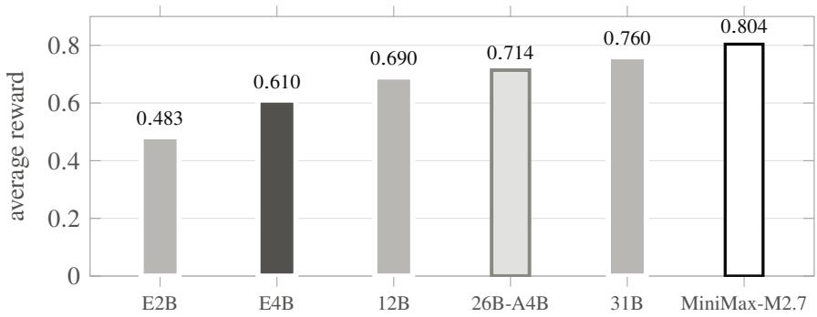  
Figure 8: Overall column of Table 12. Each step up the ladder (E2B, E4B, the 12B and 31B references) is smaller than the one before: +0.127, +0.080, +0.070. The two mixture-of-experts references, 26B-A4B (3.8B active) and MiniMax-M2.7, are plotted in scale order; MiniMax-M2.7 is +0.044 above the 31B rung. Bars are the overall column of Table 12.

The learnable band. By Eq. 5 a gradient arrives only from tasks whose outcome is inconsistent across trials, and an overall score does not show how many of those a model has. So each model runs each task twice, and every task falls into one of three groups: fails both times, passes both times, or splits one and one. The tasks that split are the learnable band (Table 13, Figure 9).

Table 13 shows how the three groups change across the ladder. The always-fail and always-pass groups track model capability: always-fail shrinks at every rung, and always-pass grows the same way. The learnable band in the middle does not follow this trend. It stays near a fifth of the tasks for five of the six models. Only the 31B reference is clearly narrower. Band width measures trial-to-trial consistency as much as capability, and that model produces the same outcome on both trials more often than its neighbors or MiniMax-M2.7 do.

The band keeps about the same width, but the tasks inside it change, so the corpus continues to provide training signal after the easiest tasks are learned. E4B has the widest band of the six, 26.0% of tasks, which at a batch of 16 is roughly four learnable tasks per step.
<table><tr><td>model</td><td>always-fail</td><td>learnable</td><td>always-pass</td></tr><tr><td>E2B</td><td>39.9%</td><td>23.1%</td><td>36.9%</td></tr><tr><td>E4B</td><td>27.5%</td><td>26.0%</td><td>46.5%</td></tr><tr><td>12B</td><td>18.3%</td><td>22.7%</td><td>59.1%</td></tr><tr><td>26B-A4B</td><td>18.6%</td><td>20.3%</td><td>61.1%</td></tr><tr><td>31B</td><td>16.6%</td><td>14.3%</td><td>69.1%</td></tr><tr><td>MiniMax-M2.7 [35]</td><td>9.3%</td><td>20.0%</td><td>70.7%</td></tr></table>

Table 13: Trial-outcome split of the 1,000-task held-out set at two trials per task, shares in %; the middle column is the learnable band. All six models were measured in the same pair of runs. Band width also depends on trial-to-trial consistency, and at only 2 trials the always-fail column is the most reliable part of the measurement.

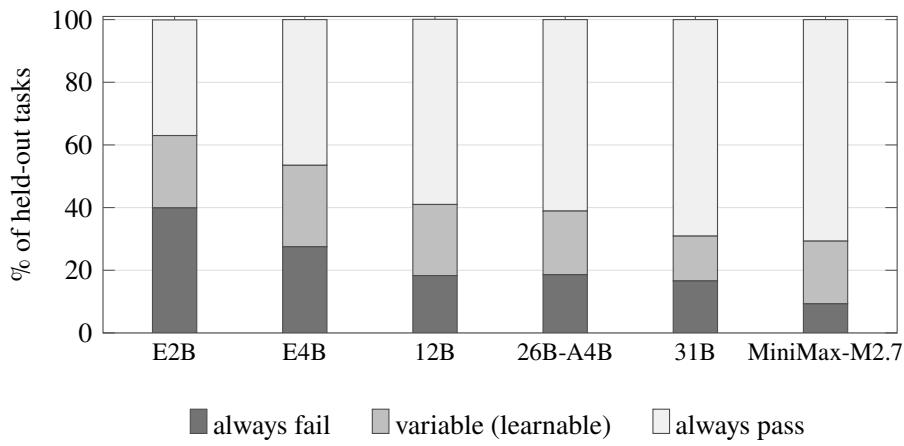  
Figure 9: Stacked trial-outcome shares from Table 13. Always-fail drops from 39.9% to 9.3% up the ladder while always-pass climbs from 36.9% to 70.7%; the band between them stays near a fifth of tasks and narrows only at the 31B reference.

## 5.5 The training run

Setup. E4B is trained with GRPO [7] on an agent-loop RL platform [30], on the training sample of §5.1 (Table 14). Training uses five nodes of eight H200 GPUs each. One node trains the policy, and on that node the actor and its rollout engine [36] share all eight GPUs, so every table value is stated for the full node. Two nodes run the simulated customer and two run the judge, so generation never competes with the environment. A batch of 16 tasks at 4 rollouts is 64 trajectories per step, and at one update per step a pass over the sample is 625 steps.

<table><tr><td>setting</td><td>value</td></tr><tr><td>base model</td><td>E4B (4.5B effective)</td></tr><tr><td>training tasks</td><td>training sample, 10,000 tasks (§5.1)</td></tr><tr><td>max prompt / response / model length</td><td>12,288 / 4,096 / 16,384 tokens</td></tr><tr><td>train batch rollouts per task (group size)</td><td>16 tasks 4 (64 trajectories per step)</td></tr><tr><td>gradient updates per step</td><td>1 (train batch = mini batch, on-policy)</td></tr><tr><td>learning rate</td><td>1e-6, constant, no warmup</td></tr><tr><td>reference-model KL term</td><td>none (reference-free)</td></tr><tr><td>entropy bonus</td><td>0.005</td></tr><tr><td>sampling temperature (training rollouts) 1.0</td><td></td></tr><tr><td>gradient clip</td><td>5.0</td></tr><tr><td>optimizer</td><td>AdamW, optimizer state offloaded; gradient checkpointing</td></tr><tr><td>actor token budget per GPU</td><td>on 10,240, dynamic batching; log-prob micro-batch 1</td></tr><tr><td>rollout engine</td><td>vLLM [36], 0.27 GPU-memory utilization on each training GPU, tensor parallel 1, at most 24 concurrent sequences per engine, chunked prefill off, prefix caching off, cache</td></tr><tr><td>steps per pass over the sample checkpoints</td><td>engine never freed between rollout phases 625 every 20 steps; 180, 200 and 400 scored on the full held-out</td></tr><tr><td>hardware</td><td>set 5 nodes × 8 H200: 1 policy, 2 user simulator, 2 judge</td></tr><tr><td>training framework</td><td>agent-loop RL platform [30]</td></tr></table>

Table 14: Training configuration for the run reported here, stated for the full 8-GPU policy node. Every value is read from the run’s launch configuration and logs.

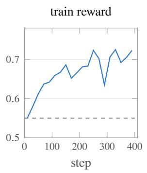

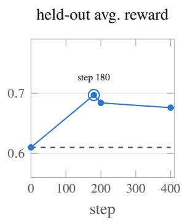

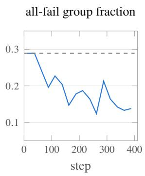

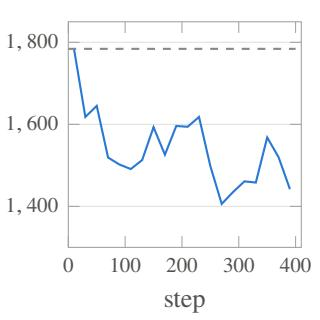  
Figure 10: Panels, left to right: train reward, rising from 0.55 to about 0.72 over 400 steps (mean over 20-step windows); held-out average reward at the checkpoints scored on the full held-out set, peaking at step 180 and falling back, with the selected step ringed; the share of rollout groups in which all four rollouts fail, from 0.29 to 0.14 (25-step windows); and generated tokens per training episode, from about 1,780 to about 1,450 (20-step windows). Each is against training step, with a horizontal reference at the base-model level.

The update. During training, the policy attempts each task � times, producing a group of � rollouts; in our runs $G = 4$ . Each rollout � receives its own dense reward $R _ { i }$ from Eq. 3, and $\{ R _ { j } \} _ { j = 1 } ^ { G }$ denotes the � rewards of the whole group. GRPO compares the rollouts within the group: the advantage $A _ { i }$ of rollout � measures how much better or worse its reward is than the group’s average, scaled by the group’s standard deviation,

$$
{ \cal A } _ { i } \ = \ { \frac { R _ { i } - \mathrm { m e a n } \Bigl ( \{ R _ { j } \} _ { j = 1 } ^ { G } \Bigr ) } { \mathrm { s t d } \Bigl ( \{ R _ { j } \} _ { j = 1 } ^ { G } \Bigr ) } } ,\tag{5}
$$

A positive $A _ { i }$ means rollout � did better than the group average, so its actions are reinforced; a negative $A _ { i }$ means it did worse, so its actions are discouraged. The score covers the whole episode, so every token the policy generated in rollout � shares the same advantage $A _ { i }$ during the update. If all � rollouts score alike, every advantage is zero and the task produces no gradient. That is why the learnable band of §5.4 is the part of the corpus that trains the model.

Training progress. Train reward climbs through the run, most of it in the first 150 steps (Figure 10), but held-out reward does not follow that far: it peaks at step 180 and falls back (Figure 10, second panel). The policy kept improving on the tasks it trained on after it had stopped improving on the held-out tasks. Step 180 is the final trained checkpoint, and all evaluations below are carried out on it.

## 5.6 Results and serving cost

Held-out reward. Average reward rises from 0.610 to 0.697 (Table 15). That score is above the 12B reference’s on the same evaluation, at close to a third of the efective parameters, and it covers 45% of the distance from the base model to MiniMax-M2.7. The ladder set the 12B rung as the target, and the run reaches it.

The six benchmark rows below test whether the banking gain came at the expense of general capability. They cover broad knowledge, graduate-level science, instruction following, code generation and hard multi-step reasoning, none of them in training. The shifts are small and go in both directions. Banking behavior changed without damaging the general capability the model already had.

<table><tr><td>benchmark</td><td>E4B</td><td>+GRPO</td><td>Δ</td><td>E2B</td><td>12B [2]</td><td>26B-A4B [2]</td><td>31B [2]</td><td>MiniMax-M2.7 [35]</td></tr><tr><td>Banking, avg. reward</td><td>0.610</td><td>0.697</td><td>+0.087</td><td>0.483</td><td>0.690</td><td>0.714</td><td>0.760</td><td>0.804</td></tr><tr><td>MMLU-Pro [37]</td><td>0.714</td><td>0.726</td><td>+0.012</td><td>0.568</td><td>0.772</td><td>0.826</td><td>0.852</td><td>0.818</td></tr><tr><td>GPQA-Diamond [38]</td><td>0.551</td><td>0.586</td><td>+0.035</td><td>0.349</td><td>0.788</td><td>0.823</td><td>0.843</td><td>0.898</td></tr><tr><td>IFEval [39]</td><td>0.860</td><td>0.847</td><td>-0.013</td><td>0.799</td><td>0.972</td><td>0.985</td><td>0.989</td><td>n/a</td></tr><tr><td>IFBench [40]</td><td>0.393</td><td>0.413</td><td>+0.020</td><td>0.253</td><td>0.740</td><td>0.720</td><td>0.760</td><td>0.760</td></tr><tr><td>LiveCodeBench  $\mathbf { v } 6$ </td><td>0.642</td><td>0.626</td><td>-0.016</td><td>0.553</td><td>0.720</td><td>0.771</td><td>0.800</td><td>n/a</td></tr><tr><td>BBEH,  $\%$ </td><td>27.6</td><td>25.8</td><td>-1.8</td><td>19.42</td><td>53.0</td><td>64.8</td><td>74.4</td><td>n/a</td></tr></table>

Table 15: Average dense reward on the held-out set and public benchmark scores; Δ is the trained model minus its base. We measured the E4B, +GRPO and E2B columns, and the whole banking row including 26B-A4B, in our own harness. The public-benchmark entries for 12B, 26B-A4B and 31B are the Gemma 4 report’s thinking-mode scores, and MiniMax-M2.7’s are its own published scores. The last two rows use the units of their own harness, LiveCodeBench v6 as pass@1 and BBEH in percent; every other row is a fraction. n/a marks a benchmark MiniMax-M2.7 does not publish. The banking row is this route’s own metric, distinct from the judged metrics of §4.

Gains by axis. Every trained axis rises (Figure 11): seq from 0.655 to 0.713, edge from 0.509 to 0.718, and tools from 0.487 to 0.526. Edge cases gain the most, +0.209, more than three times any other axis, and they end within a hundredth of the 31B reference on the same tasks. Sequencing and tool coverage add +0.058 and +0.039 on top of what was already the base model’s strongest axis.

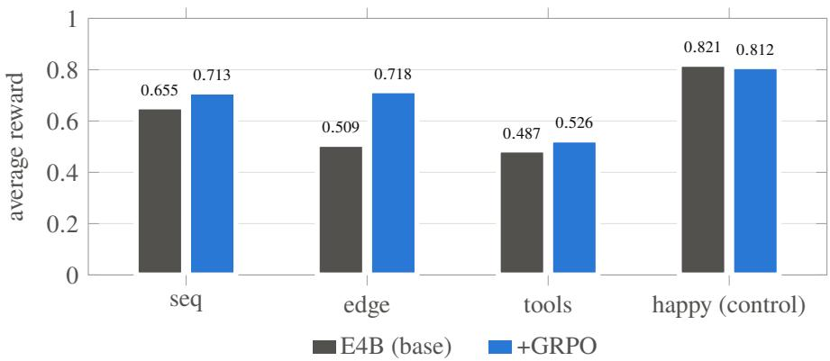  
Figure 11: Per-category average reward on the held-out set, base E4B against trained: seq from 0.655 to 0.713, edge from 0.509 to 0.718, tools from 0.487 to 0.526, and the happy control from 0.821 to 0.812. Same 1,000 tasks, one trial per task and user simulator as Table 12; the base values are that table’s E4B row, the trained ones the step-180 checkpoint.

Dialog behavior. The trained model generates 29% fewer tokens per dialog, almost all of it from shorter turns rather than fewer of them (Table 16). The base model restates the request and lists options the customer did not ask for. The trained model asks for the one thing it needs, calls the tool and reports the result. Dialog length barely moves, so conversations are not cut short. Tool calls rise, since the base model’s most common failure is a missing step and the trained model supplies it, and each added call costs only a few dozen tokens against a shorter context.

<table><tr><td></td><td>base</td><td>+GRPO</td><td>change</td></tr><tr><td>generated tokens per dialog</td><td>852</td><td>602</td><td>-29%</td></tr><tr><td>generated tokens per dialog (median)</td><td>752</td><td>573</td><td>-24%</td></tr><tr><td>generated tokens per agent turn</td><td>70</td><td>51</td><td>-27%</td></tr><tr><td>characters per agent message</td><td>311</td><td>226</td><td>-28%</td></tr><tr><td>turns per dialog (median)</td><td>19</td><td>18</td><td>-1</td></tr><tr><td>turns per dialog (mean)</td><td>20.3</td><td>19.1</td><td>-6%</td></tr><tr><td>customer-side tokens per dialog</td><td>1,293</td><td>1,018</td><td>-21%</td></tr><tr><td>tool calls per dialog</td><td>3.9</td><td>4.3</td><td>+0.4</td></tr><tr><td>prompt tokens per dialog</td><td>66,800</td><td>63,700</td><td>-5%</td></tr></table>

Table 16: Dialog behavior and serving cost on the held-out set, before and after training. Same 1,000 tasks, same user simulator, same decoding settings. Generated tokens are the agent’s own output, the decode-bound part of serving cost.

Serving cost. Table 17 and Figure 12 put the trained E4B model beside every other model on the same dialogs, counting both generated tokens and inference compute. Compute is estimated as 2× active parameters × (prompt + generated tokens), summed over every call and with no caching. That total is an upper bound; with prefix caching the cost approaches the decode column. Three readings matter for a deployment.

• The trained E4B model generates fewer tokens per dialog than every model on the ladder except the 31B reference. MiniMax-M2.7 generates the most, since it reasons at length before every reply. Decode cost is 30% below the trained model’s own base.

• Total compute falls too, prompt tokens included. Each extra tool call re-reads the context, but that context is now shorter, so the added calls cost less than the shorter context saves. Training made the model cheaper on both axes rather than trading one for the other.

• The trained model passes the 12B reference’s score at less than a third of the compute per dialog, holding 2.7 times fewer weights in memory, while the 31B reference gains 0.063 more reward for seven times the compute.

Nothing about the serving setup changed; the policy learned to reach the right answer with fewer tokens.
<table><tr><td>model</td><td>active params</td><td>reward</td><td>agent turns</td><td>generated tokens</td><td>tool calls</td><td>PFLOP per dialog decode</td><td>total</td></tr><tr><td>E2B</td><td>2.3B</td><td>0.483</td><td>12.4</td><td>866</td><td>4.0</td><td>0.0040</td><td>0.32</td></tr><tr><td>E4B</td><td>4.5B</td><td>0.610</td><td>12.1</td><td>852</td><td>3.9</td><td>0.0077</td><td>0.61</td></tr><tr><td>E4B +GRPO</td><td>4.5B</td><td>0.697</td><td>11.7</td><td>602</td><td>4.3</td><td>0.0054</td><td>0.58</td></tr><tr><td>26B-A4B</td><td>3.8B</td><td>0.714</td><td>19.2</td><td>849</td><td>13.8</td><td>0.0065</td><td>0.86</td></tr><tr><td>12B</td><td>12B</td><td>0.690</td><td>14.4</td><td>801</td><td>7.2</td><td>0.0192</td><td>2.00</td></tr><tr><td>31B</td><td>31B</td><td>0.760</td><td>12.3</td><td>589</td><td>5.5</td><td>0.0365</td><td>4.20</td></tr><tr><td>MiniMax-M2.7 [35]</td><td>10B</td><td>0.804</td><td>12.8</td><td>1,705</td><td>6.1</td><td>0.0341</td><td>1.86</td></tr></table>

Table 17: Inference cost on the held-out set, 1,000 dialogs per model, same user simulator. Active parameters are the values used in the estimate; PFLOP per dialog = 2× active parameters × tokens, summed over the agent’s calls. Decode counts generated tokens only; total also counts every prompt token, uncached. The decode column is printed to four decimals, since the trained model’s saving over its own base is not visible at three.

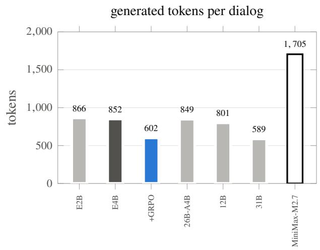

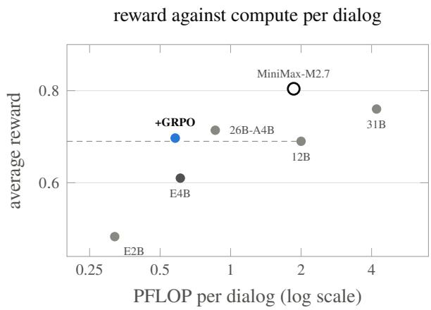  
Figure 12: Generated tokens per dialog on the held-out set (left); the trained E4B model generates fewer than every model on the ladder except the 31B reference. Average reward against inference compute per dialog (right; log scale, total column of Table 17), with a horizontal line at the 12B reference’s reward. The trained model clears that level at under a third of the 12B reference’s compute, and below its own base’s.

## 5.7 Additional analyses

Three analyses examine how the scoring, the corpus and the training interact: whether the order of tool calls matters for telling models apart, whether easier task tiers widen the learnable band, and where the band’s tasks go after training.

Order-strict scoring. This analysis tests whether the order of tool calls separates models, or whether scoring the set of calls is already enough. Both scorings compare the agent’s calls against the task’s gold chain, the pre-specified correct calls in their correct order. Deeper chains also mean longer conversations, so the deep slice doubles as a test of long-context behavior: the model must carry the task state across more turns to keep the order right. Table 18 scores the same held-out ladders twice, once set-based and once under the in-order gate of Eq. 4, with models, tasks and trajectories held fixed. The two slices come from the corpus construction of §5.1: the shallow slice holds the first-round families, whose gold chains have at most 6 actions, and the deep slice is the whole corpus, with gold chains of up to 8 actions. On the shallow slice, ordering does not account for the capability gap. The penalty stays under 0.04 for every model while overall scores span 0.48 to 0.80. At that depth the remaining errors are in arguments and missed steps, so a model calls the right tools in the right order and still writes the wrong value to the database.

On the deep slice the penalty grows on every model and the in-order match fraction drops with it, 0.922 to 0.892 for MiniMax-M2.7 and 0.861 to 0.820 for E4B (Table 18). The penalty grows three to four times on E2B, E4B, the 12B and 31B references and on MiniMax-M2.7; the 26B-A4B reference is the exception, at roughly double. Ordering separates models where set-based scoring does not.

The trained model was rescored under the strict gate on all 1,000 held-out tasks at once, so it has no slice rows in Table 18. On that set it rises from base E4B’s 0.590 to 0.679, in step with its set-based gain, and its in-order match fraction rises from 0.861 to 0.919. The strict gate discounts a correct set of tools that runs out of order, so a policy that only learned which tools to call could not raise this score. The gain therefore reflects sequencing skill rather than leniency in the scorer. It is also where training helped the model with longer context: the trained model holds the task state across the whole conversation and keeps the required order.

<table><tr><td rowspan="2">model</td><td colspan="3">shallow slice (chains ≤ 6)</td><td colspan="3">deep slice (chains ≤ 8)</td></tr><tr><td>set</td><td>strict</td><td>penalty</td><td>set</td><td>strict</td><td>penalty</td></tr><tr><td>MiniMax-M2.7 [35]</td><td>0.804</td><td>0.769</td><td>-0.035</td><td>0.713</td><td>0.597</td><td>-0.116</td></tr><tr><td>31B</td><td>0.760</td><td>0.728</td><td>-0.032</td><td>0.725</td><td>0.619</td><td>-0.106</td></tr><tr><td>26B-A4B</td><td>0.714</td><td>0.684</td><td>-0.030</td><td>0.587</td><td>0.531</td><td>-0.056</td></tr><tr><td>12B</td><td>0.690</td><td>0.670</td><td>-0.020</td><td>0.613</td><td>0.523</td><td>-0.090</td></tr><tr><td>E4B</td><td>0.610</td><td>0.590</td><td>-0.020</td><td>0.536</td><td>0.459</td><td>-0.077</td></tr><tr><td>E2B</td><td>0.483</td><td>0.462</td><td>-0.021</td><td>0.401</td><td>0.330</td><td>-0.071</td></tr></table>

Table 18: Order-strict rescore of the 1,000-task ladders; penalty is strict minus set-based. The 26B-A4B shallow-slice row was rescored from all 1,000 held-out episodes of that model’s release run, at a mean in-order match fraction of 0.865. Its deep-slice row comes from a separate 1,000-task deep-slice run of the same model; 949 of those episodes recorded a reward and were scored, at a mean in-order match fraction of 0.828.

Graded families. This analysis asks whether adding easier versions of hard tasks widens the learnable band. The answer is that band width follows the dificulty mix of the whole corpus. Graded families step a request from an easy version to a harder one, and they make up just under 10% of the corpus. The efect is measured on E2B, the smallest model, because easier tiers would widen the weakest model’s band first. At that share they leave E2B’s learnable share on the deep slice unchanged: 20.5% before, 20.4% after. A larger change in the mix does move the band. The second generation round shifted the mix toward edge families, which rise from .266 of the shallow slice to about 40% of the whole corpus, and a shift of that size is what sets the band. Widening the band therefore takes a proportional change in the dificulty mix. That is why the training sample is drawn with the first-round mix, whose band was measured.

Band migration under training. This analysis checks where the tasks in the learnable band went after training: whether they moved into always-pass or stayed in the band. Table 19 re-runs the two-trial evaluation on base and trained E4B together, on the full held-out set and with the same simulated customer. Over the two trials the base scores 0.595 and the trained model 0.694. Trial 2 on its own returns 0.690, so the result does not rest on one lucky trial. Always-fail falls about six points and always-pass rises fourteen.

The gap between those two movements is the band, which narrows from 26.0% to 17.7%. Tasks leave the band for always-pass faster than always-fail refills it.

<table><tr><td>model</td><td>always-fail</td><td>learnable</td><td>always-pass</td></tr><tr><td>base E4B</td><td>27.5</td><td>26.0</td><td>46.5</td></tr><tr><td>+GRPO</td><td>21.8</td><td>17.7</td><td>60.5</td></tr></table>

Table 19: Trial-outcome split of the 1,000-task held-out set, 2 trials, shares in %, before and after GRPO; both rows are measured in the same pair of runs. The base row is the E4B row of Table 13, the same measurement. The trained row is the selected step-180 checkpoint.

The ladder predicted the migration, the falling all-fail share showed it step by step (Figure 10, third panel), and Table 19 shows where the tasks ended up. Tasks pass through the band instead of staying in it, so during training the band shrinks faster than new tasks enter it. The band is not empty afterwards: 17.7% of the held-out corpus still splits across trials, but a wider band would have to be built into the corpus.

Together, the three analyses give a consistent picture. Ordering separates models only on deep chains, and easy tiers help only in proportion to their share of the corpus. E4B’s gains landed on the axes the band analysis said had the most room, and the band that supplied them is measurably smaller afterwards.

## 6 Discussion and Analysis

The two studies share the setting of §3, but they use diferent training signals and diferent evaluation evidence. This discussion therefore looks first at how preference optimization changes individual model behaviors, and then at how reinforcement learning afects complete tool-use trajectories.

The base E4B model already selects tools correctly and constructs valid arguments (§4.2); its failures are behavioral rather than a missing capability. That makes it a natural fit for post-training that steers behavior the model already has instead of teaching it from scratch. We chose DPO over a full reward-model-and-policy loop because the target behavior is well defined and the failure modes are discrete. A single supervised objective over preference pairs is enough, and it avoids training and maintaining a separate reward model (§4.3). Within DPO, the source of the preferred response matters. Teacher-sourced preferred responses let the objective exploit surface shortcuts such as length, discourse markers and format. The objective then pushes the rejected response down instead of pulling the preferred one up, and the reward margin grows without bound (§4.3.3). With self-rephrased preferred responses the base model revises its own output under a rubric. Both sides of the pair then stay inside the policy’s support, which forces the objective to rank them on quality. This agrees with the finding that on-policy preference data outperforms higher-quality of-policy data.

The results (§4.5) support this reasoning, and they split sharply between what improved and what did not. The behavioral axes (social engineering, out-of-scope refusal, third-party access) improved sharply, because the base model already understands these categories but was not applying them consistently. The capability axes (multitool chains, wrong-info correction) barely moved, because a preference signal cannot teach reasoning patterns the model does not yet have. The same split explains why the capability domain rose from 68% to 90% while the banking-task domains moved little. DPO is therefore the right tool for behavioral alignment in a regulated setting, and closing capability gaps is likely to need a complementary supervised stage on correct trajectories.

The improvements are visible axis by axis. Out-of-scope refusal rises from 52% to 80%, credentials and inappropriate content reach 100%, and asking rather than guessing when information is missing rises from 38% to 46% (Table 9). The one axis that requires tools to be composed barely moves: multitool chains go from 20% to 21%.

Three caveats qualify that reading; none changes the direction of the gain.

• Mechanism evidence. The two constructions difer in the source of the preferred response, but the reported evaluation does not isolate that choice. Any diference between teacher-sourced and self-rephrased preference pairs therefore remains an open question rather than a measured efect.

• Unattributed checkpoint. The judged tables score a single trained model without stating which construction of the preferred response produced it, so the teacher-versus-self comparison is unsettled. The gain belongs to preference optimization on pairs constructed from failures as a whole, and not to either construction in particular.

• Single judge, single run. The reasoning-and-quality tier is decided by one judge, with no agreement audit of the kind the verifiable reward gets. The numbers are point estimates from one evaluation, without intervals, so the finding rests on the size and direction of the achievability gain.

The preference-optimization study looks at individual responses within a conversation. The reinforcementlearning study asks a related question: whether the model can complete full banking tasks when the outcome depends on which tools are called, with which arguments, and in what order.

Reinforcement learning improved E4B’s task execution and reduced its serving cost: edge cases rose from 0.509 to 0.718, sequencing from 0.655 to 0.713, and tool coverage from 0.487 to 0.526 (§5.6). All of these measure which tool is called, with which arguments, and in what order. A gradient comes only from tasks whose outcome varies across rollouts, and training moved those tasks through the learnable band and into always-pass, rather than leaving them in the band (§5.7).

Key points of the reinforcement-learning study:

• Past a larger model. E4B reaches 0.697 held-out reward, above the base 12B reference’s 0.690, at close to a third of the efective parameters.

• Real sequencing skill. The gain survives the order-strict gate (0.590 to 0.679), and the in-order match fraction rises from 0.861 to 0.919. The model is calling the right tools in the right order, rather than only choosing a better set of them.

• Cheaper to serve. 29% fewer generated tokens per dialog and 0.58 PFLOP per dialog against the 12B rung’s 2.00; training made the model cheaper than its own base on both decode and total compute.

• General capability preserved. Six public benchmarks move only slightly, in both directions, so the banking gain left the model’s existing capability intact.

• A verified signal. The reward that produced the gain agrees with an independent reference scorer on 97.2% of reward mass, and the training dynamics match the learnable-band analysis that predicted them in advance.

## 7 Conclusion

This paper trained a small open-weight model to act on an Indian retail banking account, in a way a bank can verify and run on its own hardware. The work followed a fixed order. We began with five use cases, then built the scenarios and tools that make them executable, then a simulated bank whose scoring is checked against an independent reference, and only then trained the model. Every claim in the paper was measured inside that environment.

Two post-training routes were run on the same 4.5B-parameter model. Preference pairs constructed from the model’s own failures improved its conduct, with the largest gains on adversarial and out-of-scope requests.

A verifiable reward improved its task execution. The trained model completes tool sequences at a level above a base model nearly three times its size, and it does so with fewer generated tokens.

E4B was chosen from the six models measured for two reasons: it is the smallest model that handles the complexity of the banking tasks in this corpus, and its footprint is the cheapest to serve inside a bank. The model below it fails a large share of the tasks outright, while each larger model adds less than the one before it and costs more to run. The choice therefore pairs enough capability for the full task set with the lowest serving cost, and the results confirm it.

This matters directly for Indian retail banking. Several of the five domains are Indian in their particulars: government scheme eligibility across central and state programs, insurance claims read against RBI guidelines, TDS on deposit interest. The behavior the model learns is a requirement of the regulatory environment, and the tool sequences it learns are the ones those products need. A model of this size can meet that standard on both counts while remaining deployable inside bank-controlled infrastructure.

The environment is reusable beyond this model. A task corpus with gold chains, a replayable environment, and a reward audited against a reference scorer let every result here be re-run. The same construction, with a diferent tool catalog and diferent use cases, applies to other regulated domains.

## Contributors

## NPCI AI Research Team.

Aman Kumar, Asit Desai, Chandra Bhushan, Harsh Sharma, Harshit Bhushan, Hrithik Kadam, Keyur Doshi, Kolisetty Sai Kapardheeswar, Krishanu Adhikary, Nadeem Shaik, Navya Prakash, Nitin Kukreja, Prashant Devadiga, Shamanth MH, Shantanu Pandey, Suvradip Paul, and Yatharth Dedhia.

## References

[1] NPCI. Fimi: A domain-specific language model for indian finance ecosystem. arXiv preprint arXiv:2602.05794, 2026.

[2] Gemma Team, Google DeepMind. Gemma 4 technical report, 2026. arXiv:2607.02770.

[3] NPCI. TauIndianBankBench: a �-bench-style benchmark of gold-chain tool-calling tasks for Indian retail banking, 2026.

[4] Shunyu Yao, Noah Shinn, Pedram Razavi, and Karthik Narasimhan. �-bench: A benchmark for tool-agent-user interaction in real-world domains, 2024. arXiv:2406.12045.

[5] Victor Barres, Honghua Dong, Soham Ray, Xujie Si, and Karthik Narasimhan. $\tau ^ { 2 } .$ -Bench: Evaluating conversational agents in a dual-control environment, 2025. arXiv:2506.07982.

[6] Rafael Rafailov, Archit Sharma, Eric Mitchell, Stefano Ermon, Christopher D. Manning, and Chelsea Finn. Direct preference optimization: Your language model is secretly a reward model. In Advances in Neural Information Processing Systems 36 (NeurIPS ’23), 2023. arXiv:2305.18290.

[7] Zhihong Shao, Peiyi Wang, Qihao Zhu, Runxin Xu, Junxiao Song, Xiao Bi, Haowei Zhang, Mingchuan Zhang, Y. K. Li, Y. Wu, and Daya Guo. DeepSeekMath: Pushing the limits of mathematical reasoning in open language models, 2024. arXiv:2402.03300.

[8] Shijie Wu, Ozan Irsoy, Steven Lu, Vadim Dabravolski, Mark Dredze, Sebastian Gehrmann, Prabhanjan Kambadur, David Rosenberg, and Gideon Mann. BloombergGPT: A large language model for finance, 2023. arXiv:2303.17564.

[9] Hongyang Yang, Xiao-Yang Liu, and Christina Dan Wang. FinGPT: Open-Source financial large language models, 2023. arXiv:2306.06031.

[10] Qianqian Xie, Weiguang Han, Xiao Zhang, Yanzhao Lai, Min Peng, Alejandro Lopez-Lira, and Jimin Huang. PIXIU: A comprehensive benchmark, instruction dataset and large language model for finance. In Advances in Neural Information Processing Systems 36 (NeurIPS ’23) Datasets and Benchmarks Track, 2023. arXiv:2306.05443; preprint titled “A Large Language Model, Instruction Data and Evaluation Benchmark for Finance”.

[11] Wei Chen, Qiushi Wang, Zefei Long, Xianyin Zhang, Zhongtian Lu, Bingxuan Li, Siyuan Wang, Jiarong Xu, Xiang Bai, Xuanjing Huang, and Zhongyu Wei. DISC-FinLLM: A chinese financial large language model based on multiple experts fine-tuning, 2023. arXiv:2310.15205.

[12] Xuanyu Zhang, Qing Yang, and Dongliang Xu. XuanYuan 2.0: A large chinese financial chat model with hundreds of billions parameters. In Proceedings of the 32nd ACM International Conference on Information and Knowledge Management (CIKM ’23), pages 4435–4439, 2023. doi:10.1145/3583780.3615285.

[13] Marah Abdin, Jyoti Aneja, Hany Awadalla, Ahmed Awadallah, Ammar Ahmad Awan, et al. Phi-3 technical report: A highly capable language model locally on your phone, 2024. arXiv:2404.14219.

[14] Gemma Team, Google DeepMind. Gemma 2: Improving open language models at a practical size, 2024. arXiv:2408.00118.

[15] An Yang, Baosong Yang, Binyuan Hui, Bo Zheng, Bowen Yu, Chang Zhou, et al. Qwen2 technical report, 2024. arXiv:2407.10671.

[16] Akshara Prabhakar, Zuxin Liu, Ming Zhu, Jianguo Zhang, Tulika Awalgaonkar, Shiyu Wang, Zhiwei Liu, Haolin Chen, Thai Hoang, Juan Carlos Niebles, Shelby Heinecke, Weiran Yao, Huan Wang, Silvio Savarese, and Caiming Xiong. APIGen-MT: Agentic pipeline for multi-turn data generation via simulated agent-human interplay, 2025. arXiv:2504.03601.

[17] Han Luo and Guy Laban. SPASM: Stable persona-driven agent simulation for multi-turn dialogue generation. In Findings of the Association for Computational Linguistics: ACL 2026, pages 8455–8475, 2026. arXiv:2604.09212; doi:10.18653/v1/2026.findings-acl.412.

[18] Rahul Khedar, Eshita, Sneha Teja Sree Reddy Thondapu, Mayank Malhotra, Arup Das, Jitesh Chandra, Yun-Shiuan Chuang, Chaitanya Kulkarni, Arun Menon, Linsey Pang, Avinash Karn, Mouli V, and Prakhar Mehrotra. State-Grounded multi-agent synthetic data generation for tool-augmented LLMs, 2026. arXiv:2606.16307.

[19] Hao-Xiang Xu, Chong Deng, Jiaqing Liu, Wen Wang, Qian Chen, Lujia Bao, Xiangang Li, and Zhen-Hua Ling. GenesisFunc: Multi-Agent data generation for accurate and generalizable function-calling. In Proceedings ofthe 64th Annual Meeting ofthe Associationfor Computational Linguistics (ACL ’26), Volume 1: Long Papers, pages 28594–28616, 2026. arXiv:2605.28835; doi:10.18653/v1/2026.acllong.1319.

[20] Paul F. Christiano, Jan Leike, Tom B. Brown, Miljan Martic, Shane Legg, and Dario Amodei. Deep reinforcement learning from human preferences. In Advances in Neural Information Processing Systems 30 (NIPS ’17), pages 4299–4307, 2017. arXiv:1706.03741.

[21] Long Ouyang, Jef Wu, Xu Jiang, Diogo Almeida, Carroll L. Wainwright, Pamela Mishkin, et al. Training language models to follow instructions with human feedback, 2022. arXiv:2203.02155.

[22] Saeed Khaki, JinJin Li, Lan Ma, Liu Yang, and Prathap Ramachandra. RS-DPO: A hybrid rejection sampling and direct preference optimization method for alignment of large language models. In Findings of the Association for Computational Linguistics: NAACL 2024, pages 1665–1680, 2024. arXiv:2402.10038; doi:10.18653/v1/2024.findings-naacl.108.

[23] Tianqi Liu, Yao Zhao, Rishabh Joshi, Misha Khalman, Mohammad Saleh, Peter J. Liu, and Jialu Liu. Statistical rejection sampling improves preference optimization. In The Twelfth International Conference on Learning Representations (ICLR ’24), 2024. arXiv:2309.06657.

[24] Yibo Miao, Bofei Gao, Shanghaoran Quan, Junyang Lin, Daoguang Zan, Jiaheng Liu, Jian Yang, Tianyu Liu, and Zhijie Deng. Aligning CodeLLMs with direct preference optimization, 2024. arXiv:2410.18585.

[25] Ryan Park, Rafael Rafailov, Stefano Ermon, and Chelsea Finn. Disentangling length from quality in direct preference optimization. In Findings of the Association for Computational Linguistics: ACL 2024, pages 4998–5017, 2024. arXiv:2403.19159.

[26] Karel D’Oosterlinck, Winnie Xu, Chris Develder, Thomas Demeester, Amanpreet Singh, Christopher Potts, Douwe Kiela, and Shikib Mehri. Anchored preference optimization and contrastive revisions: Addressing underspecification in alignment. Transactions of the Association for Computational Linguistics, 13:442–460, 2025. arXiv:2408.06266; doi:10.1162/tacl\_a\_00748.

[27] Fahim Tajwar, Anikait Singh, Archit Sharma, Rafael Rafailov, Jef Schneider, Tengyang Xie, Stefano Ermon, Chelsea Finn, and Aviral Kumar. Preference fine-tuning of LLMs should leverage suboptimal,

on-policy data. In Proceedings of the 41st International Conference on Machine Learning (ICML ’24), pages 47441–47474, 2024. arXiv:2404.14367.

[28] Kushal Raj Bhandari, Ling Yue, Ching-Yun Ko, Dhaval Patel, Shaowu Pan, Pin-Yu Chen, and Jianxi Gao. Evoflux: Inference-Time evolution of executable tool workflows for compact agents, 2026. arXiv:2606.12674.

[29] Joar Skalse, Nikolaus H. R. Howe, Dmitrii Krasheninnikov, and David Krueger. Defining and characterizing reward hacking, 2022. arXiv:2209.13085.

[30] Guangming Sheng, Chi Zhang, Zilingfeng Ye, Xibin Wu, Wang Zhang, Ru Zhang, Yanghua Peng, Haibin Lin, and Chuan Wu. HybridFlow: A flexible and eficient RLHF framework. In Proceedings of the Twentieth European Conference on Computer Systems (EuroSys ’25), 2025. arXiv:2409.19256.

[31] Anthropic. Model context protocol. https://modelcontextprotocol.io, 2024. Specification.

[32] Patrick Lewis, Ethan Perez, Aleksandra Piktus, Fabio Petroni, Vladimir Karpukhin, et al. Retrievalaugmented generation for knowledge-intensive NLP tasks, 2020. arXiv:2005.11401.

[33] Lianmin Zheng, Wei-Lin Chiang, Ying Sheng, Siyuan Zhuang, Zhanghao Wu, et al. Judging LLM-as-a-Judge with MT-Bench and chatbot arena, 2023. arXiv:2306.05685.

[34] NPCI. IndicBankBench: a judged benchmark of authored customer cases for Indian retail banking assistants, 2026. Created for this work; approximately 800 cases over six categories, scored on safety, action and reasoning-and-quality gates with three attempts per case.

[35] MiniMax. The MiniMax-M2 series: Mini activations unleashing max real-world intelligence. https: //huggingface.co/MiniMaxAI/MiniMax-M2.7, 2026. arXiv:2605.26494; MiniMax-M2.7 model card.

[36] Woosuk Kwon, Zhuohan Li, Siyuan Zhuang, Ying Sheng, Lianmin Zheng, Cody Hao Yu, Joseph E. Gonzalez, Hao Zhang, and Ion Stoica. Eficient memory management for large language model serving with PagedAttention. In Proceedings of the 29th Symposium on Operating Systems Principles (SOSP ’23), 2023.

[37] Yubo Wang, Xueguang Ma, Ge Zhang, Yuansheng Ni, Abhranil Chandra, et al. MMLU-Pro: A more robust and challenging multi-task language understanding benchmark, 2024. arXiv:2406.01574.

[38] David Rein, Betty Li Hou, Asa Cooper Stickland, Jackson Petty, Richard Yuanzhe Pang, et al. GPQA: A graduate-level google-proof Q&A benchmark, 2023. arXiv:2311.12022.

[39] Jefrey Zhou, Tianjian Lu, Swaroop Mishra, Siddhartha Brahma, Sujoy Basu, et al. Instructionfollowing evaluation for large language models, 2023. arXiv:2311.07911.

[40] Valentina Pyatkin, Saumya Malik, Victoria Graf, Hamish Ivison, Shengyi Huang, et al. Generalizing verifiable instruction following, 2025. arXiv:2507.02833.