# HalluPeer: A Taxonomy-driven Benchmark for Detecting Hallucinations in Scientific Peer Reviews

Tzu-Ling Lin, Dong-Ting Yao, Teng-Fang Hsiao, Wei-Chih Chen, Hong-Han Shuai\* National Yang Ming Chiao Tung University tzulinglin.11@nycu.edu.tw

## Abstract

The growing scale of academic peer review has motivated the use of Large Language Models (LLMs) as review assistants, yet LLMs can generate fluent but unsupported claims that undermine review reliability. Existing hallucination benchmarks are not designed for peer review, where verification requires grounding claims in long, technical papers. We introduce Hallu-Peer, a benchmark for detecting hallucinations in scientific peer reviews, providing aligned triples of paper content, human-written reviews, and hallucination-injected reviews, annotated for detection, classification, and localization. Our pipeline induces a peer-review-specific hallucination taxonomy, identifies review contexts, and injects hallucinations with automated filtering. Experiments on 12K papers and 38K reviews show that existing detectors struggle to separate hallucinations from legitimate critique, while evaluation on authentic reviews demonstrates that HalluPeer-defined hallucination patterns occur in real peer reviews, highlighting the critical need for source-aware verification. Our project page can be found in https://gi thub.com/Lin-TzuLing/HalluPeer.git

## 1 Introduction

The rapid growth of AI research increasingly burdens the peer-review system: submissions to major NLP conferences like ACL and EMNLP have surged from approximately 3.4K in 2020 to over 8K in 2025, making review quality, consistency, and timeliness difficult to maintain. To address this pressure, AI-assisted peer review has emerged as a promising solution. LLMs are increasingly used to draft comments, structure critiques, and streamline meta-reviews (Ou et al., 2025; Yu et al., 2024); moving beyond prototypes, conferences like AAAI 2026 have piloted LLM integration for initial reviews and committee summarizations,1 aiming to boost efficiency while retaining human oversight.

However, AI-assisted reviewing introduces a critical reliability problem: hallucination in paper reviews. Despite careful prompting and system safeguards, LLMs can generate fluent but unsupported claims, e.g., falsely asserting a missing baseline, misreporting results, or fabricating assumptions. These factual errors transcend stylistic flaws; they mislead meta-reviewers and unfairly impact editorial decisions. Detecting them is therefore essential for trustworthy AI-assisted review workflows.

However, detecting these hallucinations is harder than in settings where the problem has been widely studied, such as QA, summarization, and RAG (Liu et al., 2022; Manakul et al., 2023; Maynez et al., 2020; Li et al., 2023; Niu et al., 2024). Verifying a review requires synthesizing evidence across long, technical sections (e.g., methods, tables, appendices), and because reviews intertwine facts with subjective critiques, a detector must verify paper-grounded claims while setting aside evaluative opinions. These demands also explain why the problem remains under-studied: existing hallucination datasets rarely provide the annotation structure this domain needs—paper-grounded evidence for checking review claims, and fine-grained hallucination types reflecting scientific critique. Without these dimensions, evaluation cannot reveal whether a model fails because it cannot retrieve the right evidence, reason across sections, or recognize a specific error type such as a wrong number, fabricated comparison, or unsupported attribution.

Thus, we introduce HalluPeer, a taxonomydriven benchmark for detecting hallucinations in scientific peer reviews. We formulate review hallucination detection as a paper-grounded verification problem: a review claim is hallucinated if it is unsupported by, or incorrect with respect to, the submitted paper. This strictly isolates factual grounding from tone and subjective judgments.

As shown in Fig. 1, HalluPeer contains aligned triples of paper content, human-written reviews, and hallucination-injected reviews. Construction is guided by two principles: coverage of scientific failure modes, and control over error types and contexts. To achieve this, we induce a peer-reviewspecific hierarchical hallucination taxonomy, segment human-written reviews into sentences, assign review-aspect tags, and construct hallucination templates by pairing taxonomy instructions with aspect-compatible contexts. A constrained LLM editor then introduces hallucinations while preserving style, followed by automated filtering.

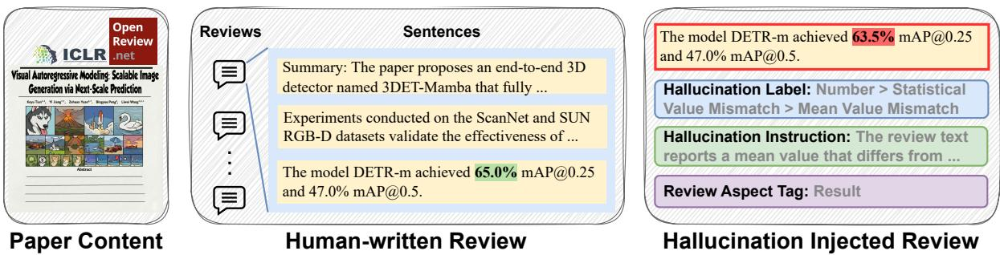  
Figure 1: HalluPeer benchmark Overview. The benchmark comprises triples of paper content, original humanwritten reviews, and hallucinated reviews. Each triple is enriched with hallucination types, injection instructions, and aspect tags to facilitate systematic benchmarking of hallucination detection in peer reviews.

Based on HalluPeer, we evaluate existing verifiers across three tasks: detection, classification, and localization. Results indicate that current methods struggle with scientific reviews. General verifiers often confuse unsupported claims with legitimate critique, while LLM judges fail on errors requiring technical grounding. An analysis on authentic reviews shows that HalluPeer-defined hallucination patterns occur in real peer reviews, and a detector trained solely on HalluPeer recovers all expert-annotated hallucinations in authentic reviews, while source attribution remains a challenge. Overall, these results suggest that auditing scientific reviews requires specialized, source-aware verification rather than off-the-shelf factuality models.

Our contributions are summarized as follows:

• We introduce HalluPeer, a benchmark consisting of paper, human-review, and hallucinationinjected-review, with annotations for detection, type classification, and localization.

• We propose a taxonomy-driven and aspectconditioned construction pipeline that induces peer-review-specific hallucination types, identifies compatible review contexts, and injects hallucinations with semantic verification.

• We systematically evaluate hallucination detection, classification, and localization, showing that general-purpose verifiers struggle with scientific reviews while domain-specific fine-tuning substantially improves performance. Additional cross-generator, cross-venue, and authenticreview evaluations demonstrate robustness beyond the original synthetic setting and transfer to naturally occurring reviewer errors.

## 2 Related Work

## 2.1 LLM Hallucination Detection

Hallucination detection identifies generated statements unsupported by evidence, and has been studied in question answering, summarization, and retrieval-augmented generation. Some methods operate without gold references, using model output or consistency across sampled responses (Liu et al., 2022; Manakul et al., 2023), while others define hallucination relative to explicit evidence such as source documents (Maynez et al., 2020; Cao et al., 2022; Bao et al., 2025) or retrieved passages (Sriramanan et al., 2024; Niu et al., 2024). Recent benchmarks add labels, span attribution, and typelevel diagnosis (Mishra et al., 2024; Akbar et al., 2024; Bang et al., 2025). However, these resources are built on general-domain text or retrieved snippets, and do not capture the verification structure of scientific peer review, where evidence is a long technical paper and a review claim may require reasoning across various sections. HalluPeer addresses this gap with paper-aligned evidence and review-specific hallucination.

## 2.2 LLMs in Automated Peer Review

The growing reviewing burden has motivated the use of LLMs for review drafting, structured critique, meta-review assistance, and review-quality assessment (Russo et al., 2025; Thakkar et al.,

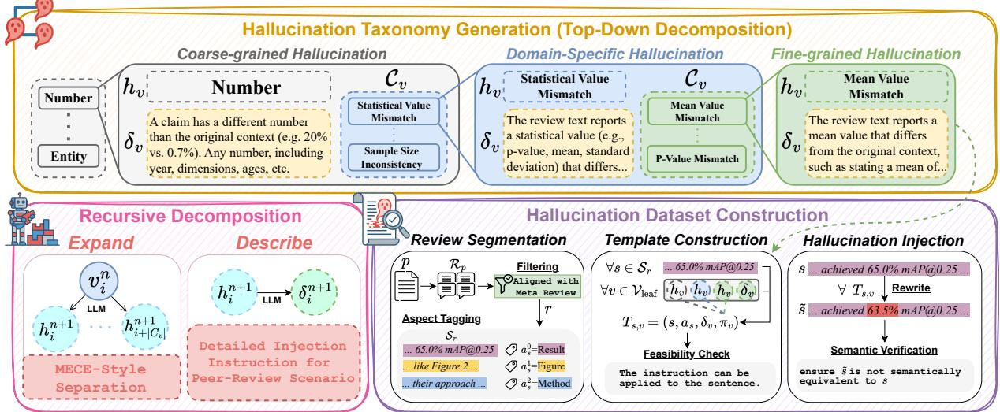  
Figure 2: Overview of HalluPeer construction framework. We build a top-down hallucination taxonomy for peer-review scenario and derive fine-grained instructions. These instructions are used to construct sentence-level injection templates and generate hallucinated review sentences via an automated injection and verification pipeline.

2025; Zhuang et al., 2025; Du et al., 2024). However, factual grounding remains a challenge: LLM reviewers may produce detailed feedback for incomplete manuscripts (Ye et al., 2024) and generate inconsistent or paper-unsupported claims (Du et al., 2024; Ou et al., 2025). These findings establish review hallucination as a realistic risk in scientific peer review. Nevertheless, prior work lacks a dedicated benchmark for systematically detecting, categorizing, and localizing hallucinated review claims grounded in the submitted paper. HalluPeer is designed to address this gap.

## 3 Taxonomy of Review Hallucinations

Existing hallucination taxonomies are derived from general-domain text and rely on high-level distinctions, e.g., factual vs. faithfulness or intrinsic vs. extrinsic hallucinations (Ji et al., 2023; Li et al., 2024a). Such categories are insufficient for peer reviews, where unsupported claims often involve paper-specific numbers or attribution errors. As shown in Fig. 2, we refine these coarse categories into a hierarchical taxonomy of fine-grained review hallucination types, along with operational instructions for controlled injection and evaluation. Sec. 3.1 and 3.2 describe the taxonomy structure and decomposition procedure.

## 3.1 Top-Down Taxonomy Construction

Our benchmark requires hallucination labels that are both controllable for data construction and diagnostic for evaluation. To this end, we construct a hierarchical, tree-structured taxonomy in a top-down manner, where coarse categories are recursively refined into fine-grained, review-specific error types. Taxonomy structure. We represent the taxonomy as a rooted tree over a set of nodes V. Each node $v \in \mathcal V$ corresponds to a hallucination concept and is defined as $\boldsymbol { v } = \langle h _ { v } , \delta _ { v } , p _ { v } , \mathcal { C } _ { v } \rangle$ , where $h _ { v }$ is the name of the hallucination concept, $\delta _ { v }$ is an operational description, $p _ { v }$ is the parent node, and ${ \mathcal { C } } _ { v } = \{ u \in \mathcal { V } \mid p _ { u } = v \}$ is the set of child nodes. Aggregating along root-to-leaf paths supports analysis at different granularity levels. For each leaf node $v \in \mathcal { V } _ { \mathrm { l e a f } }$ (where $\mathcal { C } _ { v } = \varnothing )$ , the description $\delta _ { v }$ gives an explicit specification of how the hallucination should appear in review text (e.g., what to alter, fabricate, or violate); these leaf specifications serve both as controllable injection instructions and as fine-grained evaluation labels.

Initialization with coarse anchors. We initialize the first level with a set of coarse-grained semantic anchors adapted from prior hallucination categorization work (Akbar et al., 2024): nine categories capturing common forms of unsupported generation, i.e., Number, Entity, False Concatenation, Attribution Failure, Overgeneralization, Reasoning Error, Hyperbole, Temporal, and Context-based Meaning Error.2 These anchors allow downstream refinement into review-specific manifestations.

## 3.2 LLM-Guided Recursive Decomposition

We expand each coarse anchor into review-specific subtypes via a depth-first generation procedure (Algorithm 1). At each recursive step, an LLM proposer (M) is queried to generate candidate child nodes. The recursion designates a node as a terminal leaf under two conditions: reaching a predefined maximum depth, or yielding no further valid subdivisions from the LLM (empty expansion).

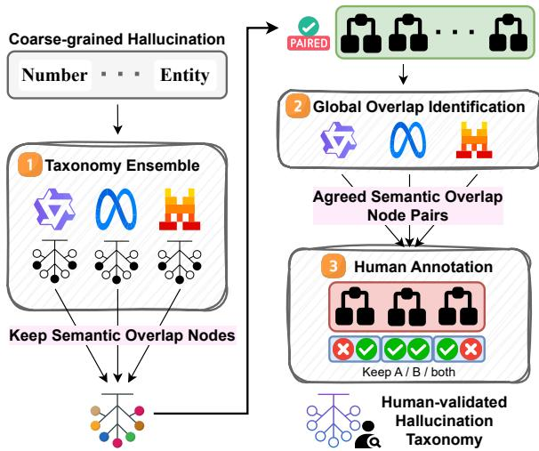  
Figure 3: Overview of the multi-model ensemble and expert refinement pipeline. The workflow consists of (1) generating taxonomy trees using multiple LLM proposers, (2) identifying globally overlapping concepts through multi-LLM consensus filtering, and (3) performing expert validation to finalize the taxonomy.

Two proposer functions. The proposer M is used through two functions. EXPANDM takes a parent concept and its description and returns a list of child concepts; DESCRIBEM takes a child concept and produces an operational definition of how that hallucination manifests in review text. Each child is then attached to its parent, added to the global node set, assigned its description, and recursively decomposed at the next depth.

Constraints for usable subcategories. To keep the taxonomy usable for fine-grained labeling and controllable injection, we enforce several constraints through prompting (templates in Appendix J.1). First, generated children should follow a Mutually Exclusive and Collectively Exhaustive (MECE)- style separation: sibling categories should be minimally overlapping while collectively covering the major manifestations of the parent concept. Second, children should be grounded in concrete peerreview scenarios (e.g., claims about baselines or experiments), avoiding abstract distinctions. Third, the proposer keeps sibling categories at comparable granularity and returns an empty list when the parent is already atomic at the current depth.

## 3.3 Ensemble and Expert Refinement

Relying on a single LLM proposer raises two risks: generative priors may overproduce idiosyncratic concepts, and independently decomposed branches may introduce global semantic redundancy across the hierarchy. We address both via a three-stage workflow (Fig. 3): (1) multi-model ensemble with cross-tree agreement filtering, (2) global overlap identification, and (3) human expert validation. Stage 1 first retains taxonomy nodes with crossmodel consensus, while stage 2 performs pairwise overlap identification among the retained nodes. During this stage, a multi-LLM consensus process reduces 86,800 candidate node pairs to 434 highoverlap pairs. At stage 3, human experts then inspect to decide whether concepts should be merged or kept distinct, ensuring that the taxonomy remains conceptually coherent and distinguishable. The final taxonomy contains 265 nodes after refinement. Full details are provided in Appendix F.

## 4 HalluPeer Construction Pipeline

## 4.1 Data Collection

We source ICLR (2019–2024) and NeurIPS (2021–2024) records from OpenReview, as their large-scale submissions and reviews are crucial for paper-grounded hallucination construction and validation (see Appendix A.1 for statistics).

Following prior work on review aspect analysis (Lu et al., 2025), we tag each review sentence with an aspect label (e.g., Novelty, Evaluation, Clarity) and use it as an injection constraint: the injected hallucination type must remain compatible with the sentence’s role. For instance, numberrelated perturbations are preferentially injected into Evaluation sentences and avoided in Clarity sentences, where such edits would seem unnatural.

Although peer reviews are human-written, they may still contain unsupported statements, which would make them unreliable sources for hallucination injection. While meta-reviews are not factual ground truth, they provide a useful proxy for review points that were salient to the final assessment. We therefore use an LLM filter FILTERM to compare each review with the corresponding meta-review and assign an alignment judgment with confidence. We use this alignment as a conservative selection heuristic: only high-confidence, meta-review-aligned reviews are retained for hallucination injection, reducing the potential risk of selecting unreliable base reviews.

## 4.2 Injection Template Construction

We construct hallucination injection templates by pairing review sentences with fine-grained hallucination concepts from the taxonomy. Each review $r \in \mathcal { R } _ { p }$ is segmented into sentences $S _ { r } =$ $\{ s _ { 1 } , \ldots , s _ { | S _ { r } | } \}$ , where each $s \in S _ { r }$ is annotated with an aspect label $a _ { s }$ . (Sec. 4.1). On the taxonomy side, each leaf node $v \in \mathcal { V } _ { \mathrm { l e a f } }$ corresponds to a fine-grained concept specified by an injection instruction $\delta _ { v }$ and a label $\pi _ { v }$ given by its root-to-v path. Pairing a sentence s with a leaf node v then yields a hallucination injection template

$$
T _ { s , v } = ( s , a _ { s } , \delta _ { v } , \pi _ { v } ) .
$$

Naively instantiating every $( s , v )$ pair is intractable, so we narrow the search space by first applying a coarse-grained screening: for each sentence we test which first-level concepts are even applicable (e.g., Number requires explicit numeric values), and build fine-grained templates only from the leaf nodes descending from the compatible anchors. Finally, an LLM-based compatibility check $\mathbf { C H E C K } _ { \mathcal { M } }$ filters out templates whose hallucination type cannot be naturally applied to the target sentence and aspect, yielding the feasible set $\tau ^ { \mathrm { f e a s i b l e } }$ The screening prompt is in Appendix J.3, and the pseudocode is Appendix I.

## 4.3 Automated Injection Pipeline

Given a set of feasible templates, we generate hallucinated counterparts of human-written sentences via an automated pipeline. For each $T _ { s , v } \in$ Tfeasible, we prompt an LLM injector INJECTM with the original sentence s and the taxonomy instruction $\delta _ { v } ,$ producing a hallucinated sentence ${ \tilde { s } } =$ $\mathrm { I N J E C T } _ { \mathcal { M } } ( s , \delta _ { v } )$ that follows the specified concept while remaining fluent and coherent. This gives sentence-level control over hallucination types and broad coverage across taxonomy categories.

We then apply a post-hoc verifier defined as $\mathsf { V E R I F Y } _ { \mathcal { M } } ( s , \tilde { s } )$ , which queries an LLM to check whether s˜ is semantically equivalent to s, following the criteria of (Liang et al., 2025):

$$
\begin{array} { r } { \operatorname { V E R I F Y } _ { \mathcal { M } } ( s , \tilde { s } ) = \left\{ \begin{array} { l l } { 1 , } & { \mathrm { i f ~ } \tilde { s } \mathrm { ~ i s ~ s e m a n t i c a l l y ~ e q u i v a l e n t ~ t o ~ } s } \\ { 0 , } & { \mathrm { o t h e r w i s e } , } \end{array} \right. } \end{array}
$$

and discard any template with $\mathrm { V E R I F Y } _ { \mathcal { M } } ( s , \tilde { s } ) =$ 1. Whereas the template-level check in Sec. 4.2 assesses applicability before generation, this verifier operates on generated outputs for quality control. The complete pseudocode and prompt are provided in Appendix I (Algorithm 3) and Appendix J.

## 5 Experimental Results

## 5.1 Task Formulation

We define three sub-tasks that progressively evaluate a model’s ability to detect, categorize, and localize hallucinated content in peer-review text.

Task 1: Hallucination Detection. This task aims to determine whether hallucinated content is present, formulated as a binary classification problem at two levels of granularity: (1) Review-level. Given a review r with sentences $S _ { r }$ , the model predicts whether the review contains hallucinated claims.(2) Sentence-level. Given a sentence $s \in S _ { r }$ the model predicts whether the sentence contains hallucinated content.

Task 2: Hallucination Type Classification. Given a hallucinated sentence s˜, together with supporting evidence from the corresponding source paper $p ,$ the model is required to perform multi-class classification and predict a single hallucination type from the coarse-grained label set $\mathcal { H } = \{ h _ { v } \ | \ v \in \mathcal { V } ^ { ( 1 ) } \}$ Task 3: Hallucination Localization. To enable fine-grained error analysis, we formulate hallucination localization as a span identification task. Given a review r, the model is required to identify the spans corresponding to hallucinated content.

## 5.2 Baselines

We evaluate baselines under three paradigms for hallucination detection: (1) specialized verification frameworks, (2) prompting-based general-purpose LLMs, and (3) instruction-tuned LLMs. For hallucination type classification and localization, we evaluate prompting-based and instruction-tuned LLMs. Implementation details and prompt templates are provided in Appendix C and Appendix J. Specialized Verification Frameworks. We evaluate four hallucination verifiers: HHEM-2.1- Open (Li et al., 2024b) (consistency-based), True-NLI (Laurer et al., 2024) (entailment-based), a seNtLI-style retriever-verifier pipeline (Schuster et al., 2022), and RefChecker (Hu et al., 2024).

General-Purpose LLMs. We evaluate seven prompting-based LLMs, including Qwen3- 32B, Llama-3.3-70B, GPT-OSS-20B/120B, Mistral-Small-3.1-24B, RootSignals-Judge-Llama-70B, and GPT-5.2. Following prior hallucination evaluation work (Li et al., 2023), we additionally implement a Retrieval-Augmented LLM-as-a-Judge (RA-LLM) framework with three prompting strategies: Knowledge Retrieval (KR), Chain-of-Thought (CoT), and Sample Contrast (Contrast). For instruction-tuned baselines, we apply QLoRA-based 4-bit fine-tuning to Qwen2.5-3B/7B-Instruct and Qwen3-32B.

Evidence Retrieval. For all specialized verifiers and RA-LLM, we apply BM25-based retrieval over the source paper to obtain a compact evidence context. For other prompting-based LLM baselines, we evaluate variants that consume the full paper content, along with LCS variants (detailed results are provided in Appendix E.1.1).

## 5.3 Evaluation Metrics

We evaluate models on the three tasks using following metrics. Details are deferred to Appendix D.

Hallucination Detection. We report Accuracy, Precision, Recall, and F1. Given the class imbalance in hallucination labels, we additionally report the Matthews Correlation Coefficient (MCC).

Hallucination Type Classification. We report Macro-F1, which equally weights all hallucination categories, and Micro-F1, which reflects overall instance-level performance.

Hallucination Localization. We evaluate span identification using complementary token-level and span-level metrics. At the token level, we compute Token-F1 by converting predicted and gold spans into BIO tag sequences. At the span level, we report Exact Match Span-F1, which requires exact boundary alignment between predicted and gold spans, and Overlap Span-F1, which considers partially overlapping spans as correct predictions.

## 5.4 Hallucination Detection (Task 1)

Tab. 1 presents the performance of hallucination detection at both review and sentence levels on HalluPeer (NeurIPS 2024). Additional results on ICLR 2024 are provided in Appendix E.1.2. Our observations are summarized below:

Limitations of Specialized Verifications. Pretrained verifiers (e.g., HHEM-2.1-Open, True-NLI, seNtLI, and RefChecker) generalize poorly to peer reviews. At the review level, all models exhibit near-random performance with MCC scores $\leq 0 . 0 3$ . While HHEM-2.1-Open performs slightly better at the sentence level—likely due to finetuning on RAG hallucination datasets—its overall effectiveness remains limited by the domain gap between general RAG settings and scientific peer reviews. Overall, these findings suggest that existing hallucination verifiers, whether consistencyor entailment-based, fail to transfer to scientific review verification. Verifying technical review claims against full-length papers requires complex multi-hop reasoning that differs substantially from the open-domain RAG, NLI, and general factual consistency datasets used to train these models.

Impact of Prompting Strategies. Among the RA-LLM variants, prompting strategies exhibit distinct performance. At the sentence level, RA-LLM (KR), which augments prompts with few-shot demonstrations, achieves the strongest performance (MCC 0.61, Accuracy 0.82), outperforming both explicit reasoning (RA-LLM (CoT)) and contrastive prompting (RA-LLM (Contrast)). One explanation is that CoT and Contrast prompting rely more heavily on the completeness of source paper evidence. Since evidence is first filtered through BM25 retrieval, the retrieved context may not provide sufficient information for multi-step reasoning or contradiction analysis. In this setting, concise few-shot demonstrations offer a more stable supervision signal, allowing RA-LLM (KR) to remain effective.

Under standard prompting, frontier LLMs such as Qwen3-32B, GPT-OSS-120B, and GPT-5.2 achieve competitive sentence-level performance, with F1 and MCC scores comparable to RA-LLM variants. However, they consistently underperform at the review level, indicating difficulty in maintaining globally consistent verification over long-form contexts and aggregating evidence coherently.

The Superiority of Domain-Specific Fine-tuning. We observe substantial gains from domain-specific instruction tuning. Fine-tuned models consistently dominate both review- and sentencelevel evaluation. Remarkably, even the relatively compact Qwen2.5-3B significantly outperforms all prompting-based zero-shot methods, including frontier models such as GPT-5.2 and Llama-3.3-70B. The scaled-up Qwen3-32B (Finetuned) achieves the strongest overall performance, reaching F1 scores of 0.90 and 0.91 at the review and sentence levels, respectively, together with a sentence-level MCC of 0.87. These findings suggest that peer-review hallucination detection depends heavily on domain-specific verification patterns that are not sufficiently captured by generic zero-shot prompting alone.

## 5.5 Hallucination Type Classification (Task 2)

Tab. 2 presents the overall results of hallucination type classification on HalluPeer (NeurIPS 2024), while Fig. 4 visualizes per-label performance. Additional results on ICLR 2024 are provided in Appendix E.2.2. Our key findings include:

Table 1: Task 1 results on HalluPeer (NeurIPS 2024). Review-/sentence-level results are shown before/after the slash. Results are reported under the default evidence and prompting settings described in Sec. 5.2.
<table><tr><td>Specialized Verification</td><td>Acc.</td><td>Prec.</td><td>Rec.</td><td>F1</td><td>MCC</td></tr><tr><td>HHEM-2.1-0pen</td><td>0.51 / 0.64</td><td>0.51 / 0.47</td><td>0.55 / 0.63</td><td>0.53 / 0.54</td><td>0.02 / 0.26</td></tr><tr><td>True-NLI</td><td>0.52 / 0.54</td><td>0.52 / 0.37</td><td>0.56 / 0.52</td><td>0.54 / 0.43</td><td>0.03 / 0.07</td></tr><tr><td>seNtLI</td><td>0.51 / 0.61</td><td>0.51 / 0.44</td><td>0.54 / 0.55</td><td>0.52 / 0.49</td><td>0.02 / 0.18</td></tr><tr><td>Refchecker</td><td>0.51 / 0.49</td><td>0.51 / 0.34</td><td>0.45 / 0.51</td><td>0.48 / 0.40</td><td>0.03 / -0.01</td></tr><tr><td>LLM (Prompting)</td><td>Acc.</td><td>Prec.</td><td>Rec.</td><td>F1</td><td>MCC</td></tr><tr><td>RA-LLM (KR)</td><td>0.61 / 0.82</td><td>0.68 / 0.74</td><td>0.41 / 0.74</td><td>0.51 / 0.74</td><td>0.24 / 0.61</td></tr><tr><td>RA-LLM (CoT)</td><td>0.61 / 0.77</td><td>0.63 / 0.63</td><td>0.52 / 0.78</td><td>0.57 / 0.70</td><td>0.22 / 0.53</td></tr><tr><td>RA-LLM (Contrast)</td><td>0.57 / 0.73</td><td>0.55 / 0.57</td><td>0.77 / 0.84</td><td>0.64 / 0.68</td><td>0.15 / 0.49</td></tr><tr><td>Qwen3-32B</td><td>0.63 / 0.79</td><td>0.63 / 0.66</td><td>0.61 / 0.74</td><td>0.62 / 0.70</td><td>0.25 / 0.54</td></tr><tr><td>Llama-3.3-70B</td><td>0.57 / 0.70</td><td>0.74 / 0.55</td><td>0.22 / 0.63</td><td>0.34 / 0.59</td><td>0.20 / 0.36</td></tr><tr><td>Mistral-Small-3.1</td><td>0.61 / 0.73</td><td>0.63 / 0.58</td><td>0.52 / 0.74</td><td>0.57 / 0.65</td><td>0.22 / 0.45</td></tr><tr><td>GPT-0SS-20B</td><td>0.59 / 0.78</td><td>0.56 / 0.65</td><td>0.79 / 0.76</td><td>0.66 / 0.70</td><td>0.19 / 0.53</td></tr><tr><td>GPT-0SS-120B</td><td>0.56 / 0.78</td><td>0.53 / 0.64</td><td>0.92 / 0.81</td><td>0.67 / 0.72</td><td>0.17 / 0.55</td></tr><tr><td>Judge-Llama-70B</td><td>0.57 / 0.70</td><td>0.74 / 0.55</td><td>0.23 / 0.64</td><td>0.35 / 0.59</td><td>0.20 / 0.36</td></tr><tr><td>GPT-5.2</td><td>0.58 / 0.80</td><td>0.55 / 0.70</td><td>0.89 / 0.73</td><td>0.68 / 0.71</td><td>0.21 / 0.56</td></tr><tr><td>LLM (Fine-tuned)</td><td>Acc.</td><td>Prec.</td><td>Rec.</td><td>F1</td><td>MCC</td></tr><tr><td>Qwen2.5-3B</td><td>0.84 / 0.85</td><td>0.86 / 0.71</td><td>0.83 / 0.93</td><td>0.84 / 0.81</td><td>0.69 / 0.70</td></tr><tr><td>Qwen2.5-7B</td><td>0.87 / 0.91</td><td>0.86 / 0.82</td><td>0.89 / 0.93</td><td>0.87 / 0.87</td><td>0.74 / 0.80</td></tr><tr><td>Qwen3-32B</td><td>0.90 / 0.94</td><td>0.96 / 0.94</td><td>0.85 / 0.89</td><td>0.90 / 0.91</td><td>0.81 / 0.87</td></tr></table>

Limitations of Zero-shot Prompting. All prompting-based LLMs perform poorly, especially at the review level, where the best Macro-F1 reaches only 0.19. Interestingly, larger models do not consistently yield better performance. For example, the smaller Mistral-Small-3.1 outperforms larger models such as Llama-3.3-70B and GPT-OSS-120B on both Macro-F1 and Micro-F1. These findings suggest that hallucination category recognition relies more on robust scientific verification behavior than model scale.

Review-level Categorization Remains Challenging. A clear gap exists between sentence- and review-level classification across all promptingbased LLMs, with review-level performance consistently weak. One possible explanation is that hallucination evidence in peer reviews is highly localized, with only a small hallucinated span embedded within largely correct content. Under reviewlevel classification, such sparse error signals may be diluted by surrounding context or overlooked due to long-context reasoning limitations such as lost-in-the-middle effects, making review-level categorization substantially more difficult.

Semantic Difficulty Varies Across Hallucination Types. Under prompting-only settings, performance varies substantially across hallucination categories. Categories with explicit lexical cues, such as Entity and Number, achieve relatively higher F1 scores. In contrast, semantically complex categories requiring contextual grounding or multi-hop reasoning, including Context-based Meaning Error, Hyperbole, and Temporal, remain highly challenging, with several models collapsing to near-zero review-level F1. These findings suggest that current LLMs are more effective at detecting surfacelevel factual inconsistencies than deeper semantic distortions in scientific peer reviews.

Domain-specific Fine-tuning Enables Robust Error Taxonomy Recognition. Fine-tuning closes the gaps identified above. Fine-tuned models substantially outperform their zero-shot counterparts, particularly on semantically challenging categories. For example, Hyperbole improves from near zero to 0.72/0.87, Temporal to 0.48/0.87, and Contextbased Meaning Error to 0.56/0.82. These results suggest that the semantic difficulties observed under zero-shot prompting can be substantially mitigated through domain-specific adaptation.

Table 2: Task 2 overall results on HalluPeer (NeurIPS 2024). Review-/sentence-level results are shown before/after the slash. Detailed per-label F1 results are provided in Appendix E.2.1.
<table><tr><td>LLM (Prompting)</td><td>Macro-F1</td><td>Micro-F1</td></tr><tr><td>Qwen3-32B</td><td>0.15 / 0.28</td><td>0.17 / 0.30</td></tr><tr><td>Llama-3.3-70B</td><td>0.14 / 0.24</td><td>0.17 / 0.27</td></tr><tr><td>Mistral-Small-3.1</td><td>0.19 / 0.33</td><td>0.22 / 0.35</td></tr><tr><td>GPT-0SS-20B</td><td>0.13 / 0.25</td><td>0.15 / 0.28</td></tr><tr><td>GPT-0SS-120B</td><td>0.16 / 0.25</td><td>0.18 / 0.26</td></tr><tr><td>Judge-Llama-70B</td><td>0.14 / 0.23</td><td>0.17 / 0.26</td></tr><tr><td>GPT-5.2</td><td>0.14 / 0.28</td><td>0.17 / 0.31</td></tr><tr><td>LLM (Fine-tuned)</td><td>Macro-F1</td><td>Micro-F1</td></tr><tr><td>Qwen2.5-3B</td><td>0.49 / 0.72</td><td>0.52 / 0.72</td></tr><tr><td>Qwen2.5-7B</td><td>0.53 / 0.86</td><td>0.55 / 0.86</td></tr><tr><td>Qwen3-32B</td><td>0.59 / 0.82</td><td>0.59 / 0.84</td></tr></table>

## 5.6 Hallucination Localization (Task 3)

Tab. 3 presents the results for hallucination span localization on HalluPeer (NeurIPS 2024). Additional results on ICLR 2024 are provided in Appendix E.3.1. Key findings include:

Limitations of Zero-shot Prompting. All prompting-based models exhibit limited span localization capability, particularly under strict boundary matching metrics. Among zero-shot methods, GPT-5.2 achieves the strongest performance, reaching 0.58 Token-F1 and 0.46 Exact Span-F1.

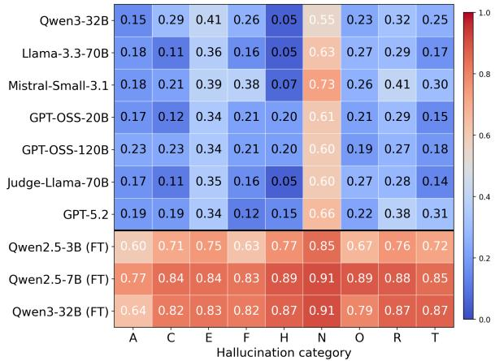  
Figure 4: Visualization of Task 2 sentence-level perlabel F1 results. Columns denote hallucination categories: A (Attribution Failure), C (Context-based Meaning Error), E (Entity), F (False Concatenation), H (Hyperbole), N (Number), O (Overgeneralization), R (Reasoning Error), and T (Temporal).

However, overall performance remains moderate even for frontier models, suggesting that hallucination localization in peer reviews is inherently challenging. Similar to review-level hallucination categorization, hallucinated content is often sparse and embedded within otherwise correct scientific critique, making precise grounding and boundary identification considerably more difficult.

Challenge of Exact Boundary Detection. A consistent gap is observed between Overlap Span-F1 and Exact Span-F1 across models. For example, GPT-5.2 achieves 0.58 Overlap Span-F1 but only 0.46 Exact Span-F1, indicating that models can often localize hallucinated regions approximately but struggle to determine precise token boundaries. This issue is particularly pronounced in peer reviews, where hallucinations appear as localized semantic distortions embedded within otherwise coherent scientific arguments.

Fine-tuning Dramatically Improves Hallucination Grounding. Fine-tuned models substantially outperform prompting-based approaches across all metrics. Notably, Qwen3-32B achieves 0.91 Token-F1 and 0.86 Exact Span-F1. The gains suggest that accurate hallucination localization requires specialized supervision for token-level grounding and error boundary identification, which cannot be reliably induced through only zero-shot prompting.

## 5.7 Cross-Venue Transferability

To evaluate the cross-venue transferability of our fine-tuned detectors, we fine-tune each on one venue split and evaluate it directly on the completely held-out venue, considering both transfer directions. Results are reported in Tab. 14–16.

Table 3: Task 3 results on HalluPeer (NeurIPS 2024). Review-level results are reported under default evidence retrieval and prompting settings described in Sec. 5.2.
<table><tr><td>LLM (Prompting)</td><td>Token-F1</td><td>Exact Span-F1</td><td>Overlap Span-F1</td></tr><tr><td>Qwen3-32B</td><td>0.46</td><td>0.30</td><td>0.50</td></tr><tr><td>Llama-3.3-70B</td><td>0.49</td><td>0.35</td><td>0.49</td></tr><tr><td>Mistral-Small-3.1</td><td>0.40</td><td>0.27</td><td>0.40</td></tr><tr><td>GPT-0SS-20B</td><td>0.51</td><td>0.38</td><td>0.49</td></tr><tr><td>GPT-0SS-120B</td><td>0.55</td><td>0.41</td><td>0.52</td></tr><tr><td>Judge-Llama-70B</td><td>0.50</td><td>0.36</td><td>0.49</td></tr><tr><td>GPT-5.2</td><td>0.58</td><td>0.46</td><td>0.58</td></tr></table>

<table><tr><td>LLM (Fine-tuned)</td><td>Token-F1</td><td>Exact Span-F1</td><td>Overlap Span-F1</td></tr><tr><td>Qwen2.5-3B</td><td>0.85</td><td>0.79</td><td>0.82</td></tr><tr><td>Qwen2.5-7B</td><td>0.84</td><td>0.82</td><td>0.84</td></tr><tr><td>Qwen3-32B</td><td>0.91</td><td>0.86</td><td>0.90</td></tr></table>

Task 1 (Detection). Domain-specific fine-tuning demonstrates robust generalization across venues. As shown in Tab. 14, Qwen3-32B achieves review-/sentence-level F1 scores of 0.90/0.91 when trained on NeurIPS 2024 and tested on ICLR 2024, and 0.86/0.93 in the reverse direction. These results indicate that the learned detection capability transfers across different conference distributions.

Task 2 (Type Classification). The performance gap between review- and sentence-level results persists across venues. As shown in Tab. 15, Qwen3-32B achieves sentence-level Micro-F1 scores of 0.83 and 0.86 for NeurIPS → ICLR and ICLR → NeurIPS, respectively, indicating that the injected hallucination types remain recognizable across different conference distributions.

Task 3 (Localization). Cross-venue span localization remains highly accurate. Tab. 16 shows that the fine-tuned Qwen3-32B model preserves excellent boundary grounding on unseen venues, reaching 0.91 Token-F1 and 0.88 Exact Span-F1 when transferring from NeurIPS to ICLR. The performance in the ICLR → NeurIPS direction is comparable (0.92 Token-F1 and 0.87 Exact Span-F1), confirming the general applicability and robustness of our localization training.

Comparison with In-Domain Results. We further compare cross-venue transfer with the corresponding in-domain results on the same test venue. For NeurIPS → ICLR, Qwen3-32B achieves Task 1 F1 of 0.90/0.91 and Task 3 Token-F1 of 0.91, compared with 0.89/0.94 and 0.93, respectively, for the

ICLR in-domain results (Appendix E.1.2, E.3.1). For ICLR → NeurIPS, it achieves Task 1 F1 of 0.86/0.93 and Task 3 Token-F1 of 0.92, compared with the NeurIPS in-domain results of 0.90/0.91 and 0.91, respectively (Tab. 1, 3). The relatively small performance differences across transfer directions suggest that the detectors do not rely strongly on venue-specific writing styles or formatting, but instead internalize the structural definitions of peerreview hallucinations.

## 5.8 Cross-Generation Ablation

To examine whether our fine-tuned detectors rely on generator-specific artifacts, we construct additional test sets using Mistral-Small-3.1 and Llama-3.3-70B as hallucination injectors and verifiers, while keeping the taxonomy and construction protocol unchanged. Detectors are trained exclusively on Qwen3-32B-injected data and evaluated on these unseen-generator test sets. Across all three tasks, performance remains largely stable under generator changes. For Task 1, the F1 shift is only 0.01– 0.02 on average; Task 2 shows shifts generally within 0.05, while Task 3 Token-F1 remains within 0.02 of the in-domain results. Detailed results and per-task analyses are provided in Appendix E.5.

## 5.9 Evaluation on Authentic Reviews

To quantitatively assess whether detectors trained on synthetic hallucinations transfer to authentic reviewer errors, we construct a manually annotated set of 1,161 independent NeurIPS 2024 reviews, identifying 20 genuine reviewer hallucinations. The fine-tuned detectors are trained exclusively on synthetic HalluPeer ICLR 2024 data and have no access to these authentic annotations. As reported in Appendix G, Qwen3-32B recovers all 20 authentic hallucinations (TPR = 100.0%) at FPR = 22.1%, substantially improving recall over zero-shot baselines. These results provide quantitative evidence that detectors trained on synthetic hallucinations can transfer to naturally occurring reviewer errors.

## 6 Alignment with Real Review Errors

Hallucination Types in Authentic Reviews To evaluate whether the hallucination patterns defined by our taxonomy occur in authentic reviews, we conduct a case study on 13,803 human-written NeurIPS 2024 reviews. Our fine-tuned detector flags potential hallucinations, and we manually inspect 200 flagged instances, checking whether each constitutes a genuine hallucination and whether the predicted type matches. As shown in Tab. 21–23, the identified review errors align with the hallucination patterns defined by our taxonomy. These findings provide evidence that the hallucination patterns defined by HalluPeer correspond to errors occurring in authentic peer reviews. The annotation protocol details are provided in Appendix H.

False Positives from Paper Claim Quotation. Our manual inspection reveals a source of false positives arising from reviewer quotations of exaggerated or unsupported claims in the submitted paper. Consequently, review texts may contain hallucination-like statements that originate from the paper rather than the reviewer. This highlights a key challenge for peer-review verification systems: distinguishing reviewer-generated hallucinations from the propagation of unsupported claims in the submitted paper. Such source-aware attribution is important for distinguishing genuine reviewer errors from valid criticism.

## 7 Conclusion

We present HalluPeer, a taxonomy-driven benchmark for hallucination detection in peer reviews. HalluPeer formulates review auditing as a papergrounded verification problem requiring longcontext reasoning over manuscripts. To support systematic evaluation, we proposed a hierarchical taxonomy and an aspect-aware injection pipeline for generating realistic hallucinated reviews.

Experiments show that existing verifiers struggle to distinguish unsupported claims from legitimate scientific critique, while domain-specific finetuning substantially improves performance. Our evaluations on authentic reviews provide evidence that HalluPeer-defined hallucination patterns occur in real peer reviews, while source-aware attribution remains a key challenge for trustworthy AI-assisted peer review.

## Acknowledgments

This work is partially supported by the National Science and Technology Council, Taiwan, under Grant: NSTC-115-2923-E-A49 -010-MY5.

## 8 Limitations

We acknowledge several limitations in our work. Coverage of naturally occurring errors. Naturally occurring review hallucinations are sparse and require domain expertise to identify, making large-scale real-world annotation prohibitively labor-intensive. Rather than modeling an unobservable real-world distribution, HalluPeer provides a controlled, practically motivated framework that covers plausible error patterns, supporting future research on automated peer-review auditing and review quality tracking.

Synthetic nature of the dataset. While our injection pipeline is designed to simulate realistic errors via aspect-conditioning and style preservation, the resulting dataset remains synthetic. The distribution of injected hallucinations may not perfectly reflect the subtle, drift-based errors found in reviews in real-world scenarios. Naturally occurring hallucinations might involve more complex reasoning failures that are difficult to simulate through localized editing.

Domain specificity. Our data source is restricted to computer science conferences hosted on Open-Review, primarily due to the scarcity of publicly available peer-review datasets in other fields. Reviewing norms, claim structures, and evidence densities vary significantly across scientific disciplines. Consequently, the taxonomy and detection models developed on HalluPeer may not generalize zeroshot to other domains without specific adaptation. Scope of hallucination definition. We restrict our definition of hallucination to factual inconsistency with respect to the submission content. We do not address subjective aspects of the review process, such as unfair novelty judgments, tonal issues, or the validity of critiques regarding potential future work. These subjective elements are critical for high-quality peer review but require different evaluation frameworks beyond factual grounding.

Model-induced bias. Since the taxonomy is derived via LLM-guided decomposition, the resulting structure may inherit the inductive biases of the proposer models. These biases could influence how hallucination types are grouped or defined. Consequently, the constructed hierarchy represents a model-centric perspective on error categorization rather than a canonical or exhaustive standard.

Selection bias from meta-review alignment. Our use of meta-review alignment as a selection heuristic may bias HalluPeer toward reviews whose main points were reflected in the final assessment, rather than the full distribution of review quality. This is a deliberate trade-off in controlled benchmark construction: a more selective base-review set improves label reliability and reduces the likelihood of selecting unreliable reviews, while broader sampling would provide greater distributional coverage at the cost of noisier supervision.

## 9 Ethical Considerations

While this work aims to enhance the integrity of the academic peer-review process, we acknowledge the following ethical implications of using scholarly data.

Dual-Use Risks. Our hallucination injection pipeline poses potential dual-use risks: although developed for benchmarking detection systems, it could be misused to generate more convincing hallucinated reviews. To mitigate this concern, we restrict our taxonomy and generation scripts to defensive research purposes.

Integrity of the Peer-Review Process. Our research synthetically corrupts human-written reviews to construct negative samples. No hallucinated reviews were submitted to real venues or used in editorial decisions. The dataset is intended solely for offline training and evaluation. We advocate human-in-the-loop review systems, where AI functions as a diagnostic aid rather than an autonomous decision-maker.

## References

Shayan Ali Akbar, Md Mosharaf Hossain, Tess Wood, Si-Chi Chin, Erica M Salinas, Victor Alvarez, and Erwin Cornejo. 2024. HalluMeasure: Fine-grained hallucination measurement using chain-of-thought reasoning. In Proceedings ofthe 2024 Conference on Empirical Methods in Natural Language Processing.

Yejin Bang, Ziwei Ji, Alan Schelten, Anthony Hartshorn, Tara Fowler, Cheng Zhang, Nicola Cancedda, and Pascale Fung. 2025. Hallulens: Llm hallucination benchmark. arXiv preprint.

Forrest Sheng Bao, Miaoran Li, Renyi Qu, Ge Luo, Erana Wan, Yujia Tang, Weisi Fan, Manveer Singh Tamber, Suleman Kazi, Vivek Sourabh, Mike Qi, Ruixuan Tu, Chenyu Xu, Matthew Gonzales, Ofer Mendelevitch, and Amin Ahmad. 2025. FaithBench: A diverse hallucination benchmark for summarization by Modern LLMs. In Proceedings ofthe 2025 Conference ofthe Nations ofthe Americas Chapter of the Associationfor Computational Linguistics: Human Language Technologies.

Meng Cao, Yue Dong, and Jackie Cheung. 2022. Hallucinated but factual! inspecting the factuality of hallucinations in abstractive summarization. In Proceedings of the 60th Annual Meeting of the Associationfor Computational Linguistics.

Tim Dettmers, Artidoro Pagnoni, Ari Holtzman, and Luke Zettlemoyer. 2023. Qlora: Efficient finetuning of quantized llms. Advances in neural information processing systems, 36:10088–10115.

Jiangshu Du, Yibo Wang, Wenting Zhao, Zhongfen Deng, Shuaiqi Liu, Renze Lou, Henry Peng Zou, Pranav Narayanan Venkit, Nan Zhang, Mukund Srinath, Haoran Ranran Zhang, Vipul Gupta, Yinghui Li, Tao Li, Fei Wang, Qin Liu, Tianlin Liu, Pengzhi Gao, Congying Xia, and 21 others. 2024. LLMs assist NLP researchers: Critique paper (meta-)reviewing. In Proceedings ofthe 2024 Conference on Empirical Methods in Natural Language Processing.

Xiangkun Hu, Dongyu Ru, Lin Qiu, Qipeng Guo, Tianhang Zhang, Yang Xu, Yun Luo, Pengfei Liu, Yue Zhang, and Zheng Zhang. 2024. Refchecker: Reference-based fine-grained hallucination checker and benchmark for large language models. arXiv preprint.

Ziwei Ji, Nayeon Lee, Rita Frieske, Tiezheng Yu, Dan Su, Yan Xu, Etsuko Ishii, Ye Jin Bang, Andrea Madotto, and Pascale Fung. 2023. Survey of hallucination in natural language generation. ACM computing surveys.

Moritz Laurer, Wouter van Atteveldt, Andreu Casas, and Kasper Welbers. 2024. Less annotating, more classifying: Addressing the data scarcity issue of supervised machine learning with deep transfer learning and bert-nli. Political Analysis.

Junyi Li, Jie Chen, Ruiyang Ren, Xiaoxue Cheng, Xin Zhao, Jian-Yun Nie, and Ji-Rong Wen. 2024a. The dawn after the dark: An empirical study on factuality hallucination in large language models. In Proceedings ofthe 62nd Annual Meeting ofthe Association for Computational Linguistics.

Junyi Li, Xiaoxue Cheng, Xin Zhao, Jian-Yun Nie, and Ji-Rong Wen. 2023. HaluEval: A large-scale hallucination evaluation benchmark for large language models. In Proceedings ofthe 2023 Conference on Empirical Methods in Natural Language Processing.

Miaoran Li, Rogger Luo, and Ofer Mendelevitch. 2024b. HHEM-2.1-Open.

Buyun Liang, Liangzu Peng, Jinqi Luo, Darshan Thaker, Kwan Ho Ryan Chan, and Rene Vidal. 2025. SECA: Semantically equivalent and coherent attacks for eliciting LLM hallucinations. In The Thirty-ninth Annual Conference on Neural Information Processing Systems.

Tianyu Liu, Yizhe Zhang, Chris Brockett, Yi Mao, Zhifang Sui, Weizhu Chen, and William B Dolan. 2022. A token-level reference-free hallucination detection benchmark for free-form text generation. In Proceedings ofthe 60th Annual Meeting ofthe Association for Computational Linguistics.

Sheng Lu, Ilia Kuznetsov, and Iryna Gurevych. 2025. Identifying aspects in peer reviews. arXiv preprint.

Potsawee Manakul, Adian Liusie, and Mark Gales. 2023. SelfCheckGPT: Zero-resource black-box hallucination detection for generative large language models. In Proceedings ofthe 2023 Conference on Empirical Methods in Natural Language Processing.

Joshua Maynez, Shashi Narayan, Bernd Bohnet, and Ryan McDonald. 2020. On faithfulness and factuality in abstractive summarization. In Proceedings of the 58th Annual Meeting of the Association for Computational Linguistics.

Abhika Mishra, Akari Asai, Vidhisha Balachandran, Yizhong Wang, Graham Neubig, Yulia Tsvetkov, and Hannaneh Hajishirzi. 2024. Fine-grained hallucination detection and editing for language models. In First Conference on Language Modeling.

Cheng Niu, Yuanhao Wu, Juno Zhu, Siliang Xu, Kashun Shum, Randy Zhong, Juntong Song, and Tong Zhang. 2024. Ragtruth: A hallucination corpus for developing trustworthy retrieval-augmented language models. In Proceedings of the 62nd Annual Meeting of the Associationfor Computational Linguistics.

Jiefu Ou, William Gantt Walden, Kate Sanders, Zhengping Jiang, Kaiser Sun, Jeffrey Cheng, William Jurayj, Miriam Wanner, Shaobo Liang, Candice Morgan, and 1 others. 2025. Claimcheck: How grounded are llm critiques of scientific papers? arXiv preprint.

Giuseppe Russo, Manoel Horta Ribeiro, Tim Ruben Davidson, Veniamin Veselovsky, and Robert West. 2025. The ai review lottery: Widespread ai-assisted peer reviews boost paper scores and acceptance rates. Proceedings ofthe ACM on Human-Computer Interaction.

Tal Schuster, Sihao Chen, Senaka Buthpitiya, Alex Fabrikant, and Donald Metzler. 2022. Stretching sentence-pair NLI models to reason over long documents and clusters. In Findings of the Association for Computational Linguistics: EMNLP 2022.

Gaurang Sriramanan, Siddhant Bharti, Vinu Sankar Sadasivan, Shoumik Saha, Priyatham Kattakinda, and Soheil Feizi. 2024. Llm-check: Investigating detection of hallucinations in large language models. Advances in Neural Information Processing Systems.

Nitya Thakkar, Mert Yuksekgonul, Jake Silberg, Animesh Garg, Nanyun Peng, Fei Sha, Rose Yu, Carl Vondrick, and James Zou. 2025. Can llm feedback enhance review quality? a randomized study of 20k reviews at iclr 2025. arXiv preprint.

Rui Ye, Xianghe Pang, Jingyi Chai, Jiaao Chen, Zhenfei Yin, Zhen Xiang, Xiaowen Dong, Jing Shao, and Siheng Chen. 2024. Are we there yet? revealing the risks of utilizing large language models in scholarly peer review. arXiv preprint.

Sungduk Yu, Man Luo, Avinash Madasu, Vasudev Lal, and Phillip Howard. 2024. Is your paper being reviewed by an LLM? investigating AI text detectability in peer review. In Proceedings of the Neurips Workshop (SafeGenAi).

Zhenzhen Zhuang, Jiandong Chen, Hongfeng Xu, Yuwen Jiang, and Jialiang Lin. 2025. Large language models for automated scholarly paper review: A survey. Information Fusion.

## A Statistics

## A.1 HalluPeer Dataset Statistic

We collect peer-review data from OpenReview, covering two major machine learning conferences: ICLR (2019–2024) and NeurIPS (2021–2024). Tab. 4 summarizes the statistics of HalluPeer across venues and years.

Data Scale. To ensure balanced representation, we uniformly sample 1,200 papers from each venueyear pair. The resulting dataset contains 12,000 papers, 38,063 reviews, and over 1.02M review sentences, providing substantial coverage for hallucination detection and analysis.

Hallucination Distribution. Our injection pipeline constructs more than 10.1M hallucination templates in total. The dataset maintains a consistent injection density with an average of 9.86 templates per sentence across different venue-year pairs. Furthermore, the number of injected hallucinations can be flexibly adjusted, enabling controllable construction of positive and negative instances for diverse training and evaluation settings.

## A.2 HalluPeer Taxonomy Statistics

We analyze the structural properties of our constructed peer-review hallucination taxonomy. The taxonomy is organized as a hierarchical tree structure with a maximum depth of 3. Tab. 6 summarizes the distribution of nodes and branching factors across different depths.

Tree dimensions. The complete taxonomy comprises a total of 265 nodes. Among these, there are 205 distinct leaf nodes which represent the terminal, fine-grained hallucination types used for injection. The hierarchy expands from the root to a maximum depth of 3, ensuring a granular decomposition of review-specific errors.

Depth distribution. The node distribution demonstrates a comprehensive refinement process. The operational definitions are located at the deepest level. Specifically, 200 out of the 205 leaf nodes (approximately 98%) reside at Depth 3. This bottom-heavy structure indicates that the recursive decomposition successfully transforms abstract high-level concepts into specific, atomic instructions suitable for localized injection.

Branching characteristics. The branching factor analysis illustrates the expansion rate of the semantic space. The root node is initialized into 9 coarse categories (Depth 1). The average branching factor then transitions from 6.11 at Depth 1 to 4.00 at Depth 2. This suggests a consistent expansion strategy where broad categories are broken down into approximately 4 to 6 subtypes at each intermediate step, balancing breadth and depth before reaching the terminal leaf nodes.

## A.3 HalluPeer Taxonomy Examples

Depth 1: Coarse-grained Hallucinations. Following prior work on hallucination categorization (Akbar et al., 2024), we adopt nine broad categories that capture common forms of unsupported generation: Number, Entity, False Concatenation, Attribution Failure, Overgeneralization, Reasoning Error, Hyperbole, Temporal, and Context-based Meaning Error. The definitions for these categories are provided in Tab. 5.

Depth 2: Domain-Specific Hallucinations. Our goal at this level is to expand each coarse concept into a set of review-specific subtypes that are (i) mutually distinguishable, (ii) consistent in granularity across siblings, and (iii) sufficiently operational to facilitate both dataset annotation and controllable hallucination injection. The prompt template used for this expansion is detailed in Fig. 7. As demonstrated in Fig. 5, a coarse-grained concept like “Number” is decomposed into academiccontextualized categories such as “Year Discrepancy” and “Statistical Value Mismatch.”

Depth 3: Fine-grained Hallucinations. As further illustrated in Fig. 5, we decompose the domainspecific subtypes into precise, operational leaf nodes. For instance, “Year Discrepancy” is instantiated into highly specific error instructions such as “Event Year Fabrication” and “Citation Year Substitution.”

## B Implementation Details

## B.1 Model Configuration

Unless otherwise specified, we employ Qwen3-32B as the backbone LLM for most components in the HalluPeer dataset construction pipeline. This includes the human-written review filtering $( { \mathrm { F I L T E R } } _ { \mathcal { M } } )$ , template feasibility checking $( \mathrm { C H E C K } _ { \mathcal { M } } )$ , hallucination template injection $( \mathrm { I N J E C T } _ { \mathcal { M } } )$ , and post-hoc semantic verification $( \mathrm { V E R I F Y } _ { \mathcal { M } } )$ modules.

Table 4: Statistics of the HalluPeer Dataset. We report the total number of source papers, reviews, parsed review sentences, and hallucination templates (Tpls) for each venue and year.
<table><tr><td>Venue</td><td>Year</td><td># Papers</td><td># Reviews</td><td># Rev. Sents</td><td># Hallu. Tpls</td><td>Avg Tpls/Sent</td></tr><tr><td rowspan="4">NeurIPS</td><td>2021</td><td>1,200</td><td>3,955</td><td>110,888</td><td>1,143,027</td><td>10.31</td></tr><tr><td>2022</td><td>1,200</td><td>3,540</td><td>99,935</td><td>965,645</td><td>9.66</td></tr><tr><td>2023</td><td>1,200</td><td>4,311</td><td>118,108</td><td>1,068,969</td><td>9.05</td></tr><tr><td>2024</td><td>1,200</td><td>3,923</td><td>105,118</td><td>865,805</td><td>8.24</td></tr><tr><td rowspan="6">ICLR</td><td>2019</td><td>1,200</td><td>3,143</td><td>71,031</td><td>800,004</td><td>11.26</td></tr><tr><td>2020</td><td>1,200</td><td>2,970</td><td>69,032</td><td>760,750</td><td>11.02</td></tr><tr><td>2021</td><td>1,200</td><td>3,935</td><td>105,287</td><td>1,115,234</td><td>10.59</td></tr><tr><td>2022</td><td>1,200</td><td>4,038</td><td>119,669</td><td>1,262,116</td><td>10.55</td></tr><tr><td>2023</td><td>1,200</td><td>4,081</td><td>118,794</td><td>1,151,737</td><td>9.70</td></tr><tr><td>2024</td><td>1,200</td><td>4,167</td><td>110,989</td><td>1,015,813</td><td>9.15</td></tr><tr><td>Total / Avg.</td><td>一</td><td>12,000</td><td>38,063</td><td>1,028,851</td><td>10,149,100</td><td>9.86</td></tr></table>

Table 5: Typology of hallucination categories with their descriptions.
<table><tr><td>Category</td><td>Description</td></tr><tr><td>Number</td><td>A claim has a different number than the original context (e.g. 20% vs. 0.7%). Any number, including year, dimensions, ages, etc.</td></tr><tr><td>Entity</td><td>A claim includes swapped, incorrectly specified, or inserted noun phrases (e.g. one named entity used in a context where another word is expected).</td></tr><tr><td>False Concatenation</td><td>A claim incorrectly combines information about multiple entities or events.</td></tr><tr><td>Attribution Failure</td><td>A claim lacks proper attribution, either crediting the wrong source or presenting information as fact without citation.</td></tr><tr><td>Overgeneralization</td><td>A claim is based on accurate contextual information but is too broad or too general to be supported by the context.</td></tr><tr><td>Reasoning Error</td><td>A claim is based on accurate contextual information but contains a reasoning error or makes an unsupported conclusion.</td></tr><tr><td>Hyperbole</td><td>A claim is based on accurate information but exaggerated or overstated.</td></tr><tr><td>Temporal</td><td>A claim does not accurately incorporate tense, modality (e.g. might vs. will), or time reference in relation to the context.</td></tr><tr><td>Context-based Meaning</td><td>A claim includes incorrect interpretation of idiomatic language, homonyms, or words with multiple meanings, therefore failing to capture the intended meaning.</td></tr></table>

Table 6: Structural Statistics of the Hallucination Taxonomy. We report the total nodes, leaf nodes, and average branching factor. The high count at Depth 3 highlights the fine-grained nature of our taxonomy.
<table><tr><td>Depth</td><td>Total Nodes</td><td>Leaf Nodes</td><td>Avg. Branch. Factor</td></tr><tr><td>0</td><td>1</td><td>0</td><td>9.00</td></tr><tr><td>1</td><td>9</td><td>0</td><td>6.11</td></tr><tr><td>2</td><td>55</td><td>5</td><td>4.00</td></tr><tr><td>3</td><td>200</td><td>200</td><td>0.00</td></tr><tr><td>Total</td><td>265</td><td>205</td><td>一</td></tr></table>

Taxonomy generation and refinement follow the multi-model ensemble procedure described in Appendix F. In particular, recursive taxonomy decomposition $( \mathrm { E X P A N D } _ { \mathcal { M } } )$ and hallucination concept description generation (DESCRIBEM) are independently performed using Qwen3-32B, Llama-3.3-70B, and Mistral-Small-3.1-24B.

To minimize variance and ensure reproducibility, we set the temperature to 0 for all generation operations and explicitly disable extended reasoning or “thinking” modes. The maximum generation length is adjusted according to the requirements of each module.

## B.2 Review Aspect Tagging

To tag the focus topic within the peer review sentences, we implement a zero-shot aspect tagging procedure. We utilize Llama-3.3-70B to categorize each review sentence into predefined aspects. The model is configured with a temperature of 0.0 to favor deterministic outputs, and the maximum generation length is set to 512 tokens to accommodate the tag generation.

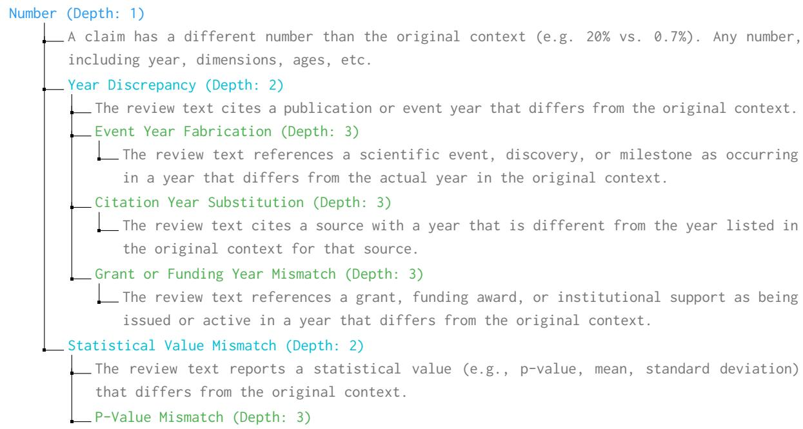  
Figure 5: Example of the recursive taxonomy decomposition. This figure illustrates a subset of our peerreview hallucination taxonomy. A general hallucination concept (e.g., “Number”) is recursively decomposed into intermediate subcategories (e.g., “Year Discrepancy”) and ultimately into fine-grained leaf nodes (e.g., “Citation Year Substitution”). These operational leaf nodes provide concrete instructions that enable highly controllable LLM-based hallucination injection.

## C Baseline Implementation

We categorize the evaluated baselines into two groups: (1) specialized verification frameworks and (2) general-purpose LLM baselines. Tab. 7 lists the specific checkpoints and model versions used in our experiments for reproducibility. Prompts used for the LLM-based baselines are provided in Appendix J.

Specialized Verification Frameworks. We evaluate four specialized hallucination verification frameworks: HHEM-2.1-Open (Li et al., 2024b), True-NLI (Laurer et al., 2024), a seNtLI-style retriever-verifier pipeline (Schuster et al., 2022), and RefChecker (Hu et al., 2024).

HHEM-2.1-Open produces a continuous faithfulness score between a review sentence and the corresponding source paper. True-NLI formulates hallucination detection as a natural language inference (NLI) task by estimating whether a review sentence is entailed by the paper content. For True-NLI, we compute entailment probabilities between each review sentence and all candidate paper chunks, and use the maximum entailment probability as the final verification score.

For the seNtLI-style pipeline3, the system first retrieves relevant supporting or contradicting evidence from the source paper, followed by NLIbased verification conditioned on the retrieved evidence. Furthermore, we evaluate RefChecker (Hu et al., 2024), a claim-level framework that operates on extracted claim triplets rather than full sentence representations. Following the original setup, we instantiate RefChecker using Mistral-7B for claim extraction alongside an AlignScore-based checker.

For all specialized verification frameworks, binary prediction thresholds are selected by maximizing F1 score on the training split and then fixed during test set evaluation. All inference procedures are conducted on a single NVIDIA H100 GPU.

General-Purpose LLM Baselines. We evaluate both prompting-based and instruction-tuned LLM baselines for hallucination detection, hallucination type classification, and hallucination localization.

For prompting-based evaluation, we test

Qwen3-32B, Llama-3.3-70B, GPT-OSS-20B, GPT-OSS-120B, Mistral-Small-3.1-24B, RootSignals-Judge-Llama-70B, and GPT-5.2 in zero-shot settings.

We additionally implement a Retrieval-Augmented LLM-as-a-Judge (RA-LLM) framework based on Qwen3-32B. For each review sentence, the system retrieves relevant evidence chunks from the source paper and incorporates them into the prompt context for verification. Following prior hallucination evaluation work (Li et al., 2023), we implement three prompting strategies: (1) Knowledge Retrieval (KR), which augments the prompt with demonstrations; (2) Chain-of-Thought (CoT), which encourages intermediate reasoning for consistency verification; and (3) Sample Contrast (Contrast), which prompts the model to first identify supporting and contradictory evidence before making the final verification decision.

For the instruction-tuned baselines, we perform supervised fine-tuning (SFT) using the Unsloth framework to optimize memory usage and training speed. We apply 4-bit NormalFloat (NF4) quantization (Dettmers et al., 2023) on Qwen2.5-3B-Instruct, Qwen2.5-7B-Instruct, and Qwen3-32B.

We utilize QLoRA with a rank of r = 16, an alpha parameter of α = 32, and a dropout rate of 0.05. To maximize representational capacity, the LoRA adapters are applied to all linear modules within the attention and MLP layers (q\_proj, k\_- proj, v\_proj, o\_proj, gate\_proj, up\_proj, down\_proj), without adding bias terms. During training, we utilize the 8-bit AdamW optimizer with a peak learning rate of $2 \times 1 0 ^ { - 4 }$ , decayed following a cosine schedule after a 5% linear warmup. The models are trained in bfloat16 precision with gradient checkpointing enabled.

We maintain an effective batch size of 16 through gradient accumulation. To ensure the model focuses strictly on generation quality, we apply a completion-only loss masking strategy, computing the cross-entropy loss exclusively on the assistant’s response tokens. The maximum sequence length is truncated at 4096 tokens.

To ensure stable initial convergence, the early stopping mechanism is only activated after the completion of the first training epoch. Subsequently, we evaluate the models on a validation split (10% of the training data) every 200 steps and employ early stopping with a patience of 3 evaluations based on the F1 score (after first epoch). During inference, all evaluations are conducted deterministically with the temperature set to 0.

All training and inference procedures are conducted on a single NVIDIA H100 GPU.

## D Evaluation Metrics

This appendix details the metrics used for the three tasks defined in Sec. 5.

## D.1 Task 1: Hallucination Detection

Accuracy, Precision, Recall, and F1 are computed using standard definitions. Given the class imbalance in hallucination labels, we additionally report the Matthews Correlation Coefficient (MCC), which accounts for all four entries of the confusion matrix and provides a more informative summary under skewed label distributions.

## D.2 Task 2: Hallucination Type Classification

Evaluation is restricted to sentences annotated as hallucinated in the ground truth. We report two complementary metrics: (1) Macro-F1: Computed by averaging F1 scores across all hallucination types, treating each class equally regardless of frequency. (2) Micro-F1: Computed globally over all instances, reflecting overall classification accuracy weighted by class prevalence.

## D.3 Task 3: Hallucination Localization

Gold and predicted spans are first aligned at the token level using the original tokenization of the review text.

Token-level Evaluation. Gold and predicted spans are converted into BIO tag sequences, where both B and I tags are treated as positive labels and O as negative. Token-F1 is then computed over these binary labels.

Span-level Evaluation. We report two complementary metrics: (1) Exact Match Span-F1: Counts a predicted span as correct only if both its start and end boundaries exactly match a gold span. (2) Partial (Overlap) Span-F1: Relaxes this criterion and counts a predicted span as correct if it overlaps with any gold span by at least one token. In cases of multiple predicted and gold spans within a sentence, matching is performed greedily to avoid double-counting.

Table 7: Model identifiers and their corresponding checkpoints or versions used in this study.
<table><tr><td>Baseline</td><td>Checkpoint</td></tr><tr><td>HHEM-2.1-Open</td><td>https://huggingface.co/vectara/hallucination_evaluation_model</td></tr><tr><td>True-NLI</td><td>https://huggingface.co/MoritzLaurer/DeBERTa-v3-large-mnli-fever-anl i-ling-wanli</td></tr><tr><td>SENTLI-style evidence retrieval</td><td>https://huggingface.co/FacebookAI/roberta-large-mnli</td></tr><tr><td>Refchecker (claim extractor)</td><td>https://huggingface.co/dongyru/Mistral-7B-Claim-Extractor</td></tr><tr><td>Qwen3-32B</td><td>https://huggingface.co/Qwen/Qwen3-32B</td></tr><tr><td>Llama-3.3-70B</td><td>https://huggingface.co/meta-1lama/Llama-3.3-70B-Instruct</td></tr><tr><td>Mistral-Small-3.1-24B</td><td>https://huggingface.co/mistralai/Mistral-Small-3.1-24B-Instruct-2503</td></tr><tr><td>GPT-OSS-20B</td><td>https://huggingface.co/openai/gpt-oss-20b</td></tr><tr><td>GPT-OSS-120B</td><td>https://huggingface.co/openai/gpt-oss-120b</td></tr><tr><td>GPT-5.2</td><td>gpt-5.2-2025-12-11</td></tr><tr><td>RootSignals-Judge-Llama-70B</td><td>https://huggingface.co/root-signals/RootSignals-Judge-Llama-70B</td></tr><tr><td>Qwen2.5-3B-Instruct</td><td>https://huggingface.co/Qwen/Qwen2.5-3B-Instruct</td></tr><tr><td>Qwen2.5-7B-Instruct</td><td>https://huggingface.co/Qwen/Qwen2.5-7B-Instruct</td></tr></table>

## E Additional Experiment Results

## E.1 Hallucination Detection (Task 1)

## E.1.1 Ablation Study of RA-LLM

In this section, we conduct an ablation study to isolate the impact of different evidence retrieval strategies on our retrieval-augmented LLM judge (RA-LLM). Specifically, we compare three configurations: (i) No-Retrieval, where the judge directly consumes the full source paper content without any retrieval filtering; (ii) BM25, where the judge is provided with paper content retrieved via BM25; and (iii) LCS, where the judge receives the top-1 paper chunk containing the Longest Common Subsequence (LCS) with the target review sentence. We report results under the same three prompting variants used in our main RA-LLM experiments (KR, CoT, and Contrast), in order to characterize how the impact of evidence differs across prompting designs. Together, these ablations clarify the dominant failure modes in peer-review hallucination detection and quantify the upper bound achievable when perfect evidence is available.

Tab. 8 reports the RA-LLM ablation on NeurIPS 2024 under three prompting variants. Impact of Prompting Strategies. Among the RA-LLM variants, the choice of prompting strategy heavily influences the model’s sensitivity to evidence retrieval. At the sentence level, RA-LLM (KR), which augments prompts with few-shot demonstrations, consistently achieves the strongest performance (e.g., an MCC of 0.61 and Accuracy of 0.82 under the BM25 setting), outperforming both explicit reasoning (RA-LLM (CoT)) and contrastive prompting (RA-LLM (Contrast)). This discrepancy can be attributed to the dependency of CoT and Contrast on the completeness of the source paper evidence. As observed in the table, transitioning from full-paper access (No-Retrieval) to filtered chunked evidence (BM25 or LCS) often limits the context required for multi-step reasoning or contradiction analysis. Consequently, when the retrieved context lacks sufficient global information, the performance of CoT and Contrast strategies degrades (e.g., the review-level MCC of Contrast drops sharply from 0.26 under No-Retrieval to 0.15 under BM25). In this setting, the concise fewshot demonstrations in RA-LLM (KR) provide a more resilient and stable supervision signal, allowing the model to remain highly effective even with fragmented or localized evidence.

Table 8: Ablation of RA-LLM on HalluPeer (NeurIPS 2024). Review-/sentence-level results are shown before/after the slash. For the third configuration, we use LCS as the chunking strategy at the review level, and Oracle at the sentence level.
<table><tr><td>Ablation Setting</td><td>Acc.</td><td>Prec.</td><td>Rec.</td><td>F1</td><td>MCC</td></tr><tr><td>RA-LLM (KR)</td><td></td><td></td><td></td><td></td><td></td></tr><tr><td>No-Retrieval</td><td>0.60 / 0.81</td><td>0.68 / 0.72</td><td>0.39 / 0.75</td><td>0.50 / 0.73</td><td>0.23 / 0.59</td></tr><tr><td>BM25</td><td>0.61 / 0.82</td><td>0.68 / 0.74</td><td>0.41 / 0.74</td><td>0.51 / 0.74</td><td>0.24 / 0.61</td></tr><tr><td>LCS</td><td>0.60 / 0.82</td><td>0.67 / 0.72</td><td>0.40 / 0.76</td><td>0.50 / 0.74</td><td>0.22 / 0.60</td></tr><tr><td>RA-LLM (CoT)</td><td></td><td></td><td></td><td></td><td></td></tr><tr><td>No-Retrieval</td><td>0.62 / 0.78</td><td>0.71 / 0.66</td><td>0.42 / 0.73</td><td>0.53 / 0.70</td><td>0.27 / 0.53</td></tr><tr><td>BM25</td><td>0.61 / 0.77</td><td>0.63 / 0.63</td><td>0.52 / 0.78</td><td>0.57 / 0.70</td><td>0.22 / 0.53</td></tr><tr><td>LCS</td><td>0.60 / 0.76</td><td>0.61 / 0.61</td><td>0.56 / 0.80</td><td>0.58 / 0.70</td><td>0.20 / 0.52</td></tr><tr><td>RA-LLM (Contrast)</td><td></td><td></td><td></td><td></td><td></td></tr><tr><td>No-Retrieval</td><td>0.63 / 0.75</td><td></td><td></td><td></td><td></td></tr><tr><td>BM25</td><td>0.57 / 0.73</td><td>0.64 / 0.61</td><td>0.61 / 0.74</td><td>0.62 / 0.67</td><td>0.26 / 0.48</td></tr><tr><td>LCS</td><td>0.58 / 0.72</td><td>0.55 / 0.57 0.56 / 0.56</td><td>0.77 / 0.84 0.80 / 0.85</td><td>0.64 / 0.68 0.66 / 0.68</td><td>0.15 / 0.49 0.18 / 0.48</td></tr></table>

## E.1.2 In-Domain Results on ICLR 2024

Tab. 9 presents the performance of hallucination detection at both review and sentence levels on HalluPeer (ICLR 2024). The results are consistent with those on NeurIPS 2024, with the key findings in Sec. 5.4 remaining unchanged.

Specialized verifiers again generalize poorly, with review-level $M C C \le 0 . 0 4$ (near-random). RA-LLM (KR) remains the strongest prompting strategy at the sentence level (MCC 0.59), while prompting-based frontier LLMs continue to underperform at the review level relative to the sentence level. Domain-specific fine-tuning again dominates: even the compact Qwen2.5-3B surpasses all zero-shot baselines, and Qwen3-32B (Fine-tuned) achieves the best sentence-level performance (F1 0.94), with review-level F1 tied at 0.89.

Table 9: Task 1 results on HalluPeer (ICLR 2024). Review-/sentence-level results are shown before/after the slash. Results are reported under the default evidence and prompting settings described in Sec. 5.2.
<table><tr><td>Specialized Verification</td><td>Acc.</td><td>Prec.</td><td>Rec.</td><td>F1</td><td>MCC</td></tr><tr><td>HHEM-2.1-0pen</td><td>0.51 / 0.63</td><td>0.51 / 0.48</td><td>0.61 / 0.65</td><td>0.56 / 0.55</td><td>0.03 / 0.25</td></tr><tr><td>True-NLI</td><td>0.50 / 0.55</td><td>0.50 / 0.40</td><td>0.48 / 0.57</td><td>0.49 / 0.47</td><td>0.00 / 0.10</td></tr><tr><td>seNtLI</td><td>0.52 / 0.60</td><td>0.51 / 0.45</td><td>0.63 / 0.58</td><td>0.57 / 0.51</td><td>0.04 / 0.18</td></tr><tr><td>Refchecker</td><td>0.52 / 0.48</td><td>0.52 / 0.35</td><td>0.53 / 0.52</td><td>0.52 / 0.42</td><td>0.04 / -0.02</td></tr><tr><td>LLM (Prompting)</td><td>Acc.</td><td>Prec.</td><td>Rec.</td><td>F1</td><td>MCC</td></tr><tr><td>RA-LLM (KR)</td><td>0.59 / 0.81</td><td>0.59 / 0.72</td><td>0.59 / 0.76</td><td>0.59 / 0.74</td><td>0.18 / 0.59</td></tr><tr><td>RA-LLM (CoT)</td><td>0.59 / 0.77</td><td>0.60 / 0.65</td><td>0.56 / 0.77</td><td>0.58 / 0.71</td><td>0.18 / 0.53</td></tr><tr><td>RA-LLM (Contrast)</td><td>0.56 / 0.71</td><td>0.54 / 0.56</td><td>0.75 / 0.85</td><td>0.63 / 0.67</td><td>0.13 / 0.46</td></tr><tr><td>Qwen3-32B</td><td>0.59 / 0.79</td><td>0.59 / 0.69</td><td>0.62 / 0.73</td><td>0.60 / 0.71</td><td>0.19 / 0.54</td></tr><tr><td>Llama-3.3-70B</td><td>0.57 / 0.72</td><td>0.70 / 0.60</td><td>0.23 / 0.64</td><td>0.35 / 0.62</td><td>0.18 / 0.40</td></tr><tr><td>Mistral-Small-3.1</td><td>0.61 / 0.74</td><td>0.65 / 0.61</td><td>0.48 / 0.72</td><td>0.55 / 0.66</td><td>0.22 / 0.45</td></tr><tr><td>GPT-0SS-20B</td><td>0.57 / 0.78</td><td>0.55 / 0.67</td><td>0.74 / 0.74</td><td>0.63 / 0.71</td><td>0.15 / 0.53</td></tr><tr><td>GPT-0SS-120B</td><td>0.55 / 0.79</td><td>0.53 / 0.67</td><td>0.87 / 0.79</td><td>0.66 / 0.73</td><td>0.13 / 0.56</td></tr><tr><td>Judge-Llama-70B</td><td>0.56 / 0.71</td><td>0.70 / 0.59</td><td>0.23 / 0.65</td><td>0.34 / 0.62</td><td>0.17 / 0.39</td></tr><tr><td>LLM (Fine-tuned)</td><td>Acc.</td><td>Prec.</td><td>Rec.</td><td>F1</td><td>MCC</td></tr><tr><td>Qwen2.5-3B</td><td>0.85 / 0.92</td><td>0.84 / 0.85</td><td>0.86 / 0.92</td><td>0.85 / 0.89</td><td>0.70 / 0.82</td></tr><tr><td>Qwen2.5-7B</td><td>0.90 / 0.94</td><td>0.93 / 0.91</td><td>0.85 / 0.92</td><td>0.89 / 0.92</td><td>0.79 / 0.87</td></tr><tr><td>Qwen3-32B</td><td>0.89 / 0.96</td><td>0.90 / 0.96</td><td>0.88 / 0.92</td><td>0.89 / 0.94</td><td>0.78 / 0.90</td></tr></table>

## E.2 Hallucination Type Classification (Task 2)

## E.2.1 Per-label F1 Results

Tab. 10 presents both review-level and sentencelevel per-label F1 results for hallucination category classification on HalluPeer (NeurIPS 2024).

## E.2.2 In-Domain Results on ICLR 2024

Tabs. 11 and 12 present the overall and per-label F1 results on HalluPeer (ICLR 2024), respectively.

The results are consistent with those on NeurIPS 2024, with the key findings in Sec. 5.5 remaining unchanged.

Zero-shot prompting remains weak, with the best review-level Macro-F1 reaching only 0.15, and larger models do not consistently outperform smaller ones (e.g., Mistral-Small-3.1 exceeds Llama-3.3-70B and GPT-OSS-120B). The sentence-vs. review-level gap persists, while finetuning yields substantial gains, particularly on semantically challenging categories such as Hyperbole, Temporal, and Context-based Meaning Error.

## E.3 Hallucination Localization (Task 3)

## E.3.1 In-Domain Results on ICLR 2024

Tab. 13 presents the results for hallucination span localization on HalluPeer (ICLR 2024). The results are consistent with those on NeurIPS 2024, with the key findings in Sec. 5.6 remaining unchanged.

Zero-shot span localization remains limited, with the consistent gap between Overlap and Exact Span-F1 also observed. Fine-tuning substantially improves grounding, with Qwen3-32B (Finetuned) achieving 0.93 Token-F1 and 0.90 Exact Span-F1.

## E.4 Cross-Venue Transferability

This section presents the full quantitative results (Tab. 14–16) corresponding to the analysis in Sec. 5.7.

## E.5 Cross-Generation Ablation

Task 1 (Detection). As shown in Tab. 17, the performance shift (∆) when testing on cross-generator data is extremely marginal. For the Mistral injector, the F1 score decreases by an average of only 0.01 to 0.02. Remarkably, for the Llama-3.3-70B injector, the ∆ for both F1 and MCC is entirely non-negative across all splits, indicating that performance is preserved and even slightly improved on the unseen generator.

Task 2 (Type Classification). Tab. 18 illustrates that classification performance remains highly stable, with shifts generally contained within 0.05. Notably, the review-level Micro-F1 improves under the Llama injector on both splits (up to +0.066), while the sentence-level performance exhibits only minor degradations.

Task 3 (Localization). As detailed in Tab. 19, the boundary grounding capabilities of our detector transfer robustly to unseen generators. The Token-F1 scores remain within 0.02 of the in-domain baseline for Mistral and show slight improvements on the ICLR split for Llama.

Table 10: Detailed Per-label F1 results for Task 2 on HalluPeer (NeurIPS 2024). Review-/sentence-level results are shown before/after the slash. Per-label F1 abbreviations: A (Attribution Failure), C (Context-based Meaning Error), E (Entity), F (False Concatenation), H (Hyperbole), N (Number), O (Overgeneralization), R (Reasoning Error), T (Temporal).
<table><tr><td>LLM (Prompting)</td><td>A</td><td>C</td><td>E</td><td>F</td><td>H</td><td>N</td><td>0</td><td>R</td><td>T</td></tr><tr><td>Qwen3-32B</td><td>0.06 / 0.15</td><td>0.03 / 0.29</td><td>0.30 / 0.41</td><td>0.12 / 0.26</td><td>0.00 / 0.05</td><td>0.40 / 0.55</td><td>0.36 / 0.23</td><td>0.10 / 0.32</td><td>0.00 / 0.25</td></tr><tr><td>Llama-3.3-70B</td><td>0.13 / 0.13</td><td>0.00 / 0.11</td><td>0.22 / 0.36</td><td>0.17 / 0.16</td><td>0.00 / 0.05</td><td>0.30 / 0.63</td><td>0.27 / 0.23</td><td>0.16 / 0.29</td><td>0.00 / 0.17</td></tr><tr><td>Mistral-Small-3.1</td><td>0.19 / 0.18</td><td>0.00 / 0.21</td><td>0.26 / 0.39</td><td>0.27 / 0.38</td><td>0.09 / 0.07</td><td>0.36 / 0.73</td><td>0.22 / 0.26</td><td>0.22 / 0.41</td><td>0.11 / 0.30</td></tr><tr><td>GPT-0SS-20B</td><td>0.04 / 0.17</td><td>0.03 / 0.12</td><td>0.19 / 0.34</td><td>0.07 / 0.21</td><td>0.07 / 0.07</td><td>0.30 / 0.61</td><td>0.27 / 0.21</td><td>0.16 / 0.32</td><td>0.00 / 0.15</td></tr><tr><td>GPT-0SS-120B</td><td>0.20 / 0.23</td><td>0.16 / 0.23</td><td>0.21 / 0.33</td><td>0.04 / 0.13</td><td>0.07 / 0.04</td><td>0.32 / 0.60</td><td>0.29 / 0.19</td><td>0.14 / 0.27</td><td>0.00 / 0.18</td></tr><tr><td>Judge-Llama-70B</td><td>0.14 / 0.13</td><td>0.00 / 0.12</td><td>0.21 / 0.35</td><td>0.19 / 0.16</td><td>0.00 / 0.04</td><td>0.33 / 0.60</td><td>0.31 / 0.24</td><td>0.10 / 0.28</td><td>0.00 / 0.14</td></tr><tr><td>GPT-5.2</td><td>0.00 / 0.19</td><td>0.17 / 0.19</td><td>0.20 / 0.34</td><td>0.11 / 0.12</td><td>0.07 / 0.15</td><td>0.33 / 0.66</td><td>0.19 / 0.23</td><td>0.18 / 0.38</td><td>0.00 / 0.31</td></tr><tr><td>LLM (Fine-tuned)</td><td>A</td><td>C</td><td>E</td><td>F</td><td>H</td><td>N</td><td>0</td><td>R</td><td>T</td></tr><tr><td>Qwen2.5-3B</td><td>0.42 / 0.60</td><td>0.63 / 0.71</td><td>0.25 / 0.75</td><td>0.50 / 0.63</td><td>0.75 / 0.77</td><td>0.55 / 0.85</td><td>0.58 / 0.67</td><td>0.61 / 0.76</td><td>0.15 / 0.72</td></tr><tr><td>Qwen2.5-7B</td><td>0.56 / 0.77</td><td>0.63 / 0.84</td><td>0.40 / 0.84</td><td>0.49 / 0.83</td><td>0.63 / 0.89</td><td>0.51 / 0.91</td><td>0.58 / 0.89</td><td>0.61 / 0.88</td><td>0.35 / 0.85</td></tr><tr><td>Qwen3-32B</td><td>0.49 / 0.64</td><td>0.56 / 0.82</td><td>0.47 / 0.83</td><td>0.62 / 0.82</td><td>0.72 / 0.87</td><td>0.61 / 0.91</td><td>0.63 / 0.79</td><td>0.67 / 0.87</td><td>0.48 / 0.87</td></tr></table>

Table 11: Task 2 overall results on HalluPeer (ICLR 2024). Review-/sentence-level results are shown before/after the slash.
<table><tr><td>LLM (Prompting)</td><td>Macro-F1</td><td>Micro-F1</td></tr><tr><td>Qwen3-32B</td><td>0.09 / 0.29</td><td>0.15 / 0.31</td></tr><tr><td>Llama-3.3-70B</td><td>0.12 / 0.24</td><td>0.16 / 0.27</td></tr><tr><td>Mistral-Small-3.1</td><td>0.15 / 0.33</td><td>0.22 / 0.36</td></tr><tr><td>GPT-0SS-20B</td><td>0.13 / 0.26</td><td>0.17 / 0.29</td></tr><tr><td>GPT-0SS-120B</td><td>0.12 / 0.25</td><td>0.16 / 0.26</td></tr><tr><td>Judge-Llama-70B</td><td>0.13 / 0.23</td><td>0.17 / 0.26</td></tr><tr><td>LLM (Fine-tuned)</td><td>Macro-F1</td><td>Micro-F1</td></tr><tr><td>Qwen2.5-3B</td><td>0.53 / 0.65</td><td>0.60 / 0.67</td></tr><tr><td>Qwen2.5-7B</td><td>0.60 / 0.82</td><td>0.60 / 0.82</td></tr><tr><td>Qwen3-32B</td><td>0.59 / 0.85</td><td>0.63 / 0.86</td></tr></table>

These findings indicate that our fine-tuned Qwen3-32B detector does not merely exploit spurious lexical artifacts or stylistic tics. Instead, it captures the semantic inconsistencies that define peer-review hallucinations, rather than exploiting superficial lexical artifacts.

## F Details of the Taxonomy Generation and Refinement Pipeline

To reduce model-specific biases introduced during recursive taxonomy decomposition, we implement a three-stage refinement pipeline consisting of multi-model ensemble generation, automated overlap identification, and human expert validation. As illustrated in Fig. 3, the pipeline progressively refines the initially generated taxonomy into a globally consistent and human-validated hierarchy.

## F.1 Stage 1: Multi-Model Taxonomy Ensemble

Starting from the predefined coarse-grained anchors (e.g., Number, Entity), we independently generate taxonomy trees using three LLM proposers: Qwen3-32B, Llama-3.3-70B, and Mistral-Small-3.1-24B. The taxonomy generated by Qwen3-32B is treated as the primary structure.

To determine whether a concept generated in the primary tree is supported by other modelgenerated trees, we concatenate each node’s concept name and operational description into a single textual representation and encode it using the BAAI/bge-large-en-v1.5 embedding model. For each node in the primary tree, we compute cosine similarity scores against all nodes in the other trees. A node is retained only if at least one crosstree node achieves a cosine similarity score greater than 0.8. This cross-model agreement criterion helps reduce model-specific artifacts and improves the robustness of the induced taxonomy structure.

## F.2 Stage 2: Global Overlap Identification

Although local decomposition constraints encourage non-overlapping sibling categories, semantically redundant concepts may still emerge across different branches of the taxonomy. To improve global mutual exclusivity, we perform a taxonomywide overlap identification stage.

We first construct a candidate comparison pool by enumerating all possible node pairs across the taxonomy, excluding direct parent–child node pairs. Exhaustive human inspection over this candidate space would result in an impractically large number of comparisons (approximately 86,800 node pairs). Therefore, we first apply a multi-LLM consensus filtering procedure in which multiple evaluator models independently assess whether two taxonomy nodes exhibit substantial semantic overlap. Only node pairs identified by consensus are forwarded for manual review. This process reduces the candidate pool to 434 potentially overlapping node pairs while mitigating blind spots introduced by any individual evaluator model.

Table 12: Detailed Per-label F1 results for Task 2 on HalluPeer (ICLR 2024). Review-/sentence-level results are shown before/after the slash. Per-label F1 abbreviations: A (Attribution Failure), C (Context-based Meaning Error), E (Entity), F (False Concatenation), H (Hyperbole), N (Number), O (Overgeneralization), R (Reasoning Error), T (Temporal).
<table><tr><td>LLM (Prompting)</td><td>A</td><td>C</td><td>E</td><td>F</td><td>H</td><td>N</td><td>0</td><td>R</td><td>T</td></tr><tr><td>Qwen3-32B</td><td>0.06 / 0.22</td><td>0.05 / 0.32</td><td>0.24 / 0.41</td><td>0.16 / 0.28</td><td>0.00 / 0.04</td><td>0.00 / 0.53</td><td>0.11 / 0.21</td><td>0.22 / 0.34</td><td>0.00 / 0.24</td></tr><tr><td>Llama-3.3-70B</td><td>0.11 / 0.17</td><td>0.03 / 0.16</td><td>0.18 / 0.35</td><td>0.05 / 0.19</td><td>0.08 / 0.03</td><td>0.18 / 0.63</td><td>0.17 / 0.21</td><td>0.29 / 0.30</td><td>0.00 / 0.14</td></tr><tr><td>Mistral-Small-3.1</td><td>0.15 / 0.23</td><td>0.05 / 0.27</td><td>0.20 / 0.41</td><td>0.28 / 0.39</td><td>0.00 / 0.06</td><td>0.26 / 0.71</td><td>0.14 / 0.24</td><td>0.29 / 0.42</td><td>0.00 / 0.28</td></tr><tr><td>GPT-0SS-20B</td><td>0.21 / 0.24</td><td>0.08 / 0.19</td><td>0.17 / 0.31</td><td>0.09 / 0.18</td><td>0.00 / 0.05</td><td>0.18 / 0.60</td><td>0.16 / 0.23</td><td>0.27 / 0.36</td><td>0.00 / 0.15</td></tr><tr><td>GPT-0SS-120B</td><td>0.32 / 0.23</td><td>0.05 / 0.30</td><td>0.16 / 0.32</td><td>0.00 / 0.13</td><td>0.00 / 0.04</td><td>0.20 / 0.59</td><td>0.15 / 0.17</td><td>0.24 / 0.30</td><td>0.00 / 0.22</td></tr><tr><td>Judge-Llama-70B</td><td>0.15 / 0.16</td><td>0.05 / 0.17</td><td>0.20 / 0.34</td><td>0.05 / 0.19</td><td>0.08 / 0.03</td><td>0.16 / 0.61</td><td>0.22 / 0.21</td><td>0.25 / 0.26</td><td>0.00 / 0.14</td></tr><tr><td>LLM (Fine-tuned)</td><td>A</td><td>C</td><td>E</td><td>F</td><td>H</td><td>N</td><td>0</td><td>R</td><td>T</td></tr><tr><td>Qwen2.5-3B</td><td>0.44 / 0.50</td><td>0.62 / 0.65</td><td>0.50 / 0.66</td><td>0.54 / 0.64</td><td>0.54 / 0.67</td><td>0.42 / 0.81</td><td>0.62 / 0.51</td><td>0.70 / 0.73</td><td>0.34 / 0.68</td></tr><tr><td>Qwen2.5-7B</td><td>0.44 / 0.72</td><td>0.63 / 0.79</td><td>0.48 / 0.83</td><td>0.57 / 0.79</td><td>0.71 / 0.87</td><td>0.50 / 0.92</td><td>0.79 / 0.81</td><td>0.61 / 0.86</td><td>0.65 / 0.84</td></tr><tr><td>Qwen3-32B</td><td>0.42 / 0.75</td><td>0.68 / 0.82</td><td>0.42 / 0.87</td><td>0.58 / 0.82</td><td>0.68 / 0.88</td><td>0.57 / 0.93</td><td>0.76 / 0.84</td><td>0.73 / 0.89</td><td>0.53 / 0.87</td></tr></table>

Table 13: Task 3 results on HalluPeer (ICLR 2024). Review-level results are reported under default evidence retrieval and prompting settings described in Sec. 5.2.
<table><tr><td>LLM (Prompting)</td><td>Token-F1</td><td>Exact Span-F1</td><td>Overlap Span-F1</td></tr><tr><td>Qwen3-32B</td><td>0.41</td><td>0.25</td><td>0.44</td></tr><tr><td>Llama-3.3-70B</td><td>0.40</td><td>0.25</td><td>0.40</td></tr><tr><td>Mistral-Small-3.1</td><td>0.34</td><td>0.20</td><td>0.34</td></tr><tr><td>GPT-0SS-20B</td><td>0.48</td><td>0.33</td><td>0.49</td></tr><tr><td>GPT-0SS-120B</td><td>0.54</td><td>0.43</td><td>0.54</td></tr><tr><td>Judge-Llama-70B</td><td>0.41</td><td>0.28</td><td>0.40</td></tr></table>

<table><tr><td>LLM (Fine-tuned)</td><td>Token-F1</td><td>Exact Span-F1</td><td>Overlap Span-F1</td></tr><tr><td>Qwen2.5-3B</td><td>0.84</td><td>0.77</td><td>0.82</td></tr><tr><td>Qwen2.5-7B</td><td>0.87</td><td>0.83</td><td>0.86</td></tr><tr><td>Qwen3-32B</td><td>0.93</td><td>0.90</td><td>0.92</td></tr></table>

## F.3 Stage 3: Human Expert Validation

In the final stage, human annotators manually review the filtered set of candidate overlap pairs. Annotators inspect the semantic concepts, operational descriptions, and taxonomy paths associated with each node pair, and determine whether the nodes should be merged, preserved as distinct concepts, or revised for clearer separation.

Table 14: Task 1 (Detection) cross-venue transfer.
<table><tr><td>Model</td><td>Acc.</td><td>Prec.</td><td>Rec.</td><td>F1</td><td>MCC</td></tr><tr><td colspan="6">Train: NeurIPS 2024 → Test: ICLR 2024</td></tr><tr><td>Qwen2.5-3B</td><td>0.84 / 0.85</td><td>0.83 / 0.73</td><td>0.85 / 0.95</td><td>0.84 / 0.82</td><td>0.68 / 0.72</td></tr><tr><td>Qwen2.5-7B</td><td>0.88 / 0.91</td><td>0.88 / 0.83</td><td>0.89 / 0.93</td><td>0.88 / 0.88</td><td>0.76 / 0.81</td></tr><tr><td>Qwen3-32B</td><td>0.91 / 0.94</td><td>0.97 / 0.94</td><td>0.85 / 0.89</td><td>0.90 / 0.91</td><td>0.83 / 0.87</td></tr><tr><td colspan="6">Train: ICLR 2024 → Test: NeurIPS 2024</td></tr><tr><td>Qwen2.5-3B</td><td>0.82 / 0.92</td><td>0.81 / 0.85</td><td>0.83 / 0.91</td><td>0.82 / 0.88</td><td>0.63 / 0.82</td></tr><tr><td>Qwen2.5-7B</td><td>0.88 / 0.94</td><td>0.89 / 0.89</td><td>0.87 / 0.92</td><td>0.88 / 0.91</td><td>0.76 / 0.86</td></tr><tr><td>Qwen3-32B</td><td>0.86 / 0.95</td><td>0.87 / 0.94</td><td>0.85 / 0.91</td><td>0.86 / 0.93</td><td>0.72 / 0.89</td></tr><tr><td></td><td></td><td></td><td></td><td></td><td></td></tr></table>

Table 15: Task 2 (Type Classification) cross-venue transfer.
<table><tr><td>Model Macro-F1</td><td>Micro-F1</td></tr><tr><td colspan="2">Train: NeurIPS 2024 → Test: ICLR 2024</td></tr><tr><td>Qwen2.5-3B</td><td>0.52 / 0.73 0.56 / 0.73</td></tr><tr><td>Qwen2.5-7B</td><td>0.63 / 0.86 0.64 / 0.86</td></tr><tr><td>Qwen3-32B</td><td>0.62 / 0.82 0.66 / 0.83</td></tr><tr><td colspan="2">Train: ICLR 2024 → Test: NeurIPS 2024</td></tr><tr><td>Qwen2.5-3B</td><td>0.51 / 0.65 0.54 / 0.68</td></tr><tr><td>Qwen2.5-7B</td><td>0.53 / 0.81 0.57 / 0.81</td></tr><tr><td>Qwen3-32B</td><td>0.55 / 0.85 0.59 / 0.86</td></tr></table>

The core judgment criteria used during human validation are described in Fig. 6. This humanin-the-loop verification step helps eliminate residual redundancy and improve the conceptual consistency of the final taxonomy.

Table 16: Task 3 (Localization) cross-venue transfer.
<table><tr><td>Model</td><td>Token-F1</td><td>Exact Span-F1</td><td>Overlap Span-F1</td></tr><tr><td colspan="4">Train: NeurIPS 2024 → Test: ICLR 2024</td></tr><tr><td>Qwen2.5-3B</td><td>0.89</td><td>0.85</td><td>0.89</td></tr><tr><td>Qwen2.5-7B</td><td>0.88</td><td>0.85</td><td>0.88</td></tr><tr><td>Qwen3-32B</td><td>0.91</td><td>0.88</td><td>0.91</td></tr><tr><td colspan="4">Train: ICLR 2024 → Test: NeurIPS 2024</td></tr><tr><td>Qwen2.5-3B</td><td>0.78</td><td>0.67</td><td>0.73</td></tr><tr><td>Qwen2.5-7B</td><td>0.87</td><td>0.83</td><td>0.86</td></tr><tr><td>Qwen3-32B</td><td>0.92</td><td>0.87</td><td>0.91</td></tr></table>

## G Evaluation on Authentic Reviews

To quantitatively evaluate whether detectors trained on synthetic hallucinations transfer to naturally occurring reviewer errors, we construct a manually annotated set of authentic NeurIPS 2024 reviews. The evaluation is designed to avoid model-dependent annotation and to measure both true-positive and false-positive behavior.

## G.1 Setup

Two expert annotators manually examined 1,161 real NeurIPS 2024 reviews against their corresponding submissions and identified 20 reviewer hallucinations, corresponding to a natural prevalence of approximately 1.7%. Unlike the case study in Sec. 6, the annotation was performed independently of any detector output: annotators read each review directly and determined which instances constitute genuine reviewer hallucinations.

The fine-tuned detectors were trained exclusively on synthetic HalluPeer ICLR 2024 data and had no access to the manually annotated authentic reviews. We evaluate the resulting detectors directly on the 1,161 authentic reviews, making this an out-of-distribution evaluation from synthetic hallucinations to naturally occurring reviewer errors.

## G.2 Results and Analysis

True and False Positive Rates. Table 20 reports the true-positive rate (TPR) and false-positive rate (FPR) on the manually annotated authentic reviews. Given the low natural prevalence of hallucinations, recall is the primary measure of detection capability, while FPR characterizes the amount of reviewer-level screening required.

Our fine-tuned Qwen3-32B detector recovers all 20 authentic hallucinations, achieving TPR = 100.0% at FPR = 22.1%. This substantially improves recall over the zero-shot Qwen3-32B baseline (TPR = 95.0%), while Qwen2.5-7B reaches TPR = 70.0%. Among the compared frontier-model prompting baselines, Claude Opus 4.7 achieves TPR = 85.0% at FPR = 0.3%.

Effect of Fine-tuning. To isolate the effect of training on HalluPeer, we compare each finetuned detector against its corresponding zero-shot model. Fine-tuning Qwen3-32B improves TPR from 95.0% to 100.0% while reducing FPR from 29.5% to 22.1%. Similarly, Qwen2.5-7B improves TPR from 70.0% to 80.0% and reduces FPR from 34.0% to 23.1%. The simultaneous improvement in TPR and reduction in FPR indicates that the gain is not explained by a simple shift in the decision threshold.

Practical Screening. At the reported operating point, the fine-tuned Qwen3-32B detector reduces the 1,161 authentic reviews to 272 candidates while recovering all 20 annotated hallucinations. Thus, the detector can serve as a high-recall screening stage, substantially narrowing the candidate pool while retaining the authentic hallucinations identified by expert annotators. Final adjudication can then be performed by a human or a stronger frontier model.

## H Annotation Protocol for Authentic Review Analysis

We selected 200 consecutive flagged instances from the 13,803 human-written NeurIPS 2024 reviews identified by our fine-tuned detector for manual inspection. Two expert annotators each reviewed a disjoint subset, checking whether each flagged instance constituted a genuine hallucination and whether the predicted hallucination type matched the manually assigned type. Candidate hallucinations and uncertain cases were subsequently reviewed jointly with a senior expert, with final labels determined through discussion and consensus. This process yielded 11 validated cases, which are presented in Tab. 21–23.

## I Algorithm

## I.1 Algorithm – Hallucination Taxonomy Construction

Algorithm 1 summarizes the recursive procedure used to build the hallucination taxonomy. Starting from the predefined first-level concepts V(1), the algorithm performs a depth-first traversal that progressively refines each coarse concept into finer subtypes. For a node at depth d, if the maximum depth D has not been reached, the LLM proposer

<table><tr><td rowspan="2">Venue</td><td colspan="2">Accuracy</td><td colspan="2"></td><td colspan="2">Precision</td><td colspan="2"> $\mathrm { R e c a l l }$ </td><td colspan="2">F1</td><td colspan="2"></td><td colspan="2">MCC</td></tr><tr><td></td><td>Cross</td><td>∆↓</td><td>In</td><td>Cross</td><td>In</td><td>Cross</td><td>∆↓</td><td>In</td><td>Cross</td><td>∆↓</td><td>In</td><td>Cross</td><td>∆↓</td></tr><tr><td colspan="10">Hallucination Injector: Mistral-Small-3.1</td><td colspan="7"></td></tr><tr><td>NeurIPS</td><td>90.4/94.2</td><td>88.7/93.5</td><td>-1.6/-0.7</td><td>95.6/93.8</td><td>95.5/93.1</td><td>-0.1/-0.7 84.6/88.6</td><td></td><td> $\begin{array} { l l } { { 8 1 . 2 / 8 7 . 4 } } & { { - 3 . 3 / - 1 . 3 } } \end{array}$ </td><td></td><td>89.8/91.1</td><td>87.8/90.1</td><td>-2.0/-1.0</td><td>81.3/86.8</td><td>78.3/85.4</td><td>-2.9/-1.5</td></tr><tr><td>ICLR</td><td>89.2/95.5</td><td>88.4/95.2</td><td>-0.8/-0.3</td><td>89.9/95.5</td><td>92.2/95.8</td><td>+2.3/+0.3 88.3/91.8</td><td>83.9/90.5</td><td></td><td>-4.4/-1.3</td><td>89.1/93.6</td><td>87.9/93.1</td><td>-1.2/-0.5</td><td>78.4/90.2</td><td>77.1/89.5</td><td>-1.3/-0.7</td></tr><tr><td colspan="10">Hallucination Injector: Llama-3.3-70B</td><td colspan="7"></td></tr><tr><td>NeurIPS</td><td>90.4/94.2</td><td>92.1/94.9</td><td>+1.7/+0.8</td><td>95.6/93.8</td><td>96.1/94.0</td><td>+0.5/+0.2</td><td>84.6/88.6</td><td>87.7/91.0</td><td>+3.1/+2.4</td><td>89.8/91.1</td><td>91.7/92.5</td><td>+1.9/+1.4</td><td>81.3/86.8</td><td>84.5/88.7</td><td>+3.2/+1.8</td></tr><tr><td>ICLR</td><td>89.2/95.5</td><td>89.3/95.9</td><td>+0.1/+0.3</td><td>89.9/95.5</td><td>90.0/95.1</td><td>+0.1/-0.4</td><td>88.3/91.8</td><td>88.4/93.2</td><td>+0.1/+1.4</td><td>89.1/93.6</td><td>89.2/94.2</td><td>+0.1/+0.6</td><td>78.4/90.2</td><td>78.7/91.0</td><td>+0.2/+0.8</td></tr></table>

Table 17: Task 1 (Detection) cross-generator ablation — Hallucination Injectors: Mistral-Small-3.1 and Llama-3.3-70B. The Qwen3-32B detector is fine-tuned only on Qwen-injected data and evaluated on Qwen-injected (In-domain) vs. Mistral- or Llama-injected (Cross) test sets. Venue refers to the HalluPeer NeurIPS 2024 and ICLR 2024 splits. Values are presented as review-level / sentence-level (in %). $\Delta = \mathrm { C r o s s - I n } ; \downarrow$ indicates smaller |∆| is better.

<table><tr><td rowspan="2">Venue</td><td colspan="3">Macro-F1</td><td colspan="3">Micro-F1</td></tr><tr><td>In</td><td>Cross</td><td>∆↓</td><td>In</td><td>Cross</td><td>∆↓</td></tr><tr><td></td><td colspan="3">Hallucination Injector: Mistral-Small-3.1</td><td colspan="3"></td></tr><tr><td></td><td colspan="3">NeurIPS 58.5/82.4 61.4/79.2 +2.9/-3.2 59.3/83.8</td><td colspan="3"> $6 4 . 5 / 8 1 . 1 ~ + 5 . 2 / - 2 . 6$ </td></tr><tr><td>ICLR</td><td colspan="3">59.5/85.355.7/84.8</td><td colspan="3">-3.8/-0.562.8/85.660.4/85.0-2.4/-0.6</td></tr><tr><td></td><td colspan="3">Hallucination Injector: Llama-3.3-70B NeurIPS 58.5/82.4 62.4/76.5 +3.9/—5.9 59.3/83.8 65.8/78.9</td><td colspan="3"></td></tr><tr><td>ICLR</td><td colspan="3">59.5/85.357.6/83.7</td><td colspan="3"> $+ 6 . 6 / { - 4 . 9 }$  -1.8/-1.662.8/85.664.4/84.5  $+ 1 . 6 / - 1 . 1$ </td></tr></table>

Table 18: Task 2 (Type Classification) cross-generator ablation — Hallucination Injectors: Mistral-Small-3.1 and Llama-3.3-70B. The Qwen3-32B detector is fine-tuned only on Qwen-injected data and evaluated on Qwen-injected (In-domain) vs. Mistral- or Llamainjected (Cross) test sets. Venue refers to the Hallu-Peer NeurIPS 2024 and ICLR 2024 splits. Values are presented as review-level / sentence-level (in %). $\Delta = \mathrm { C r o s s } - \mathrm { I n } ; .$ ↓ indicates smaller |∆| is better.

EXPANDM is queried to generate a set of child concepts $\mathcal { C } _ { v }$ conditioned on the node and its description $\delta _ { v } .$ . Each generated child is attached to its parent, assigned an operational description via DESCRIBEM, added to the global node set V, and then recursively decomposed at depth d+1. The recursion terminates under two conditions: when the maximum depth D is reached, or when $\operatorname { E X P A N D } _ { \mathcal { M } }$ returns no children $( \mathcal { C } _ { v } = \emptyset )$ , indicating that the concept is atomic. The procedure yields the full taxonomy tree V, whose leaf nodes serve as the fine-grained hallucination types used for injection.

## I.2 Algorithm – Hallucination Injection Template Construction

Algorithm 2 details the procedure for generating and filtering sentence-level hallucination templates. The process iterates through each sentence s within the review corpus. To circumvent the intractability of naively instantiating every template, we first apply a coarse-grained screening by evaluating which first-level anchor concepts $c \in { \mathbf { V } } ^ { ( 1 ) }$ are applicable to the context. For each compatible anchor, fine-grained templates are constructed exclusively from its descending leaf nodes $\mathbf { V } _ { \mathrm { l e a f } } ^ { ( c ) } .$ forming the initial candidate set $\mathcal { T } _ { s } ^ { \mathrm { c a n d i d a t e } }$ . Subsequently, we leverage an LLM-based compatibility check $\mathbf { C } _ { \mathrm { H E C K } _ { \mathcal { M } } \left( T , s \right) }$ guided by a dedicated screening prompt (detailed in Appendix J.7). This semantic validation filters out templates whose hallucination types cannot naturally map onto the target sentence, ultimately yielding the feasible template set Tfeasible.

<table><tr><td rowspan="2">Venue</td><td colspan="2">Token-F1</td><td colspan="2">Exact Span-F1 Overlap Span-F1</td></tr><tr><td colspan="2">In Cross ∆↓</td><td>In Cross ∆↓ In</td></tr><tr><td colspan="2">Hallucination Injector: Mistral-Small-3.1 -4.5 89.8 86.6</td><td></td></tr><tr><td colspan="2">NeurIPS 90.6 88.8 -1.885.6 81.0 ICLR 92.8 92.3 -0.4 89.6 87.6</td></tr><tr><td colspan="2">-2.0 92.3 90.4 -1.9 Hallucination Injector: Llama-3.3-70B</td></tr><tr><td colspan="2">NeurIPS 90.6 89.2 -1.4 85.6 84.6 -1.089.8 86.8 -3.0</td></tr><tr><td colspan="2">ICLR 92.8 94.8 +2.0 89.6 92.2 +2.7 92.3 93.5 +1.2</td></tr></table>

Table 19: Task 3 (Localization) cross-generator ablation — Hallucination Injectors: Mistral-Small-3.1 and Llama-3.3-70B. The Qwen3-32B detector is fine-tuned only on Qwen-injected data and evaluated on Qwen-injected (In-domain) vs. Mistral- or Llamainjected (Cross) test sets. Venue refers to the Hallu-Peer NeurIPS 2024 and ICLR 2024 splits. Values are presented at the review-level (in %), as Task 3 has no sentence-level split. $\Delta = \mathrm { C r o s s - I n } ; \downarrow$ indicates smaller |∆| is better.

## I.3 Algorithm – Automated Hallucination Injection Pipeline with Semantic Verification

Algorithm 3 describes the automated injection pipeline that turns feasible templates into verified hallucinated sentences. For each feasible template $( s , a _ { s } , \delta _ { v } , \pi _ { v } )$ , the LLM injector $\mathrm { I N J E C T } _ { \mathcal { M } }$ rewrites the original sentence s according to the taxonomy instruction $\delta _ { v } ,$ producing a candidate hallucinated sentence s˜. To ensure that the injection actually altered the meaning, a post-hoc verifier VERIFYM compares s˜ against s and returns whether the two are semantically equivalent. A candidate is retained only when $\mathrm { V E R I F Y } _ { \mathcal { M } } ( s , \tilde { s } ) = 0 , \mathrm { i . e }$ ., the generated sentence is judged not equivalent to the original and therefore carries a genuine hallucination; equivalent rewrites (output 1) are discarded as failed injections. The procedure returns the set of verified hallucinated sentences {s˜}.

Table 20: Detection performance on manually annotated real NeurIPS 2024 reviews. The evaluation set contains 1,161 reviews with 20 positive and 1,141 negative instances (1.7% prevalence). Fine-tuned models are trained on synthetic HalluPeer ICLR 2024 data only. Values are reported in %.
<table><tr><td>Model</td><td>TPR</td><td>FPR</td><td>TP/FN</td><td>FP/TN</td></tr><tr><td colspan="5">Frontier LLM (prompting)</td></tr><tr><td>Claude Opus 4.7</td><td>85.0</td><td>0.3</td><td>17/3</td><td>3/1138</td></tr><tr><td colspan="5">Open-source, zero-shot</td></tr><tr><td>GPT-OSS-120B</td><td>100.0</td><td>33.0</td><td>20/0</td><td>376/765</td></tr><tr><td>Qwen3-32B</td><td>95.0</td><td>29.5</td><td>19/1</td><td>337/804</td></tr><tr><td>Qwen2.5-7B</td><td>70.0</td><td>34.0</td><td>14/6</td><td>388/753</td></tr><tr><td colspan="5">Open-source, fine-tuned on HalluPeer</td></tr><tr><td>Qwen3-32B</td><td>100.0</td><td>22.1</td><td>20/0</td><td>252/889</td></tr><tr><td>Qwen2.5-7B</td><td>80.0</td><td>23.1</td><td>16/4</td><td>264/877</td></tr></table>

## J Prompt Example

## J.1 Prompt – Hallucination Taxonomy Generation

Fig. 7 presents the prompt template used for automatic hallucination taxonomy generation in our experiment.

## J.2 Prompt – Hallucination Taxonomy Overlap Filtering

Fig. 8 presents the prompt template used for automatic hallucination taxonomy overlap filtering in our experiment.

## J.3 Prompt – Coarse Category Screening

Fig. 10 presents the prompt template used for coarse category screening of taxonomy.

Input: Root node v(0), Predefined first-level nodes   
V(1), LLM M, Max depth D   
Output: Full taxonomy tree V   
1 ${ \ v { \ v { \nu } } }  \{ { \ v { v } } ^ { ( 0 ) } \} \cup { \ v { \nu } } ^ { ( 1 ) } ;$   
2 foreach $v \in \mathcal { V } ^ { ( 1 ) }$ do   
// Start DFS from each first-level node   
3 Decompose(v, 1);   
4 end   
5 return V;   
6 Function Decompose $( v , d )$   
7 if $d < D$ then   
// LLM generates subcategories   
8 $\mathcal { C } _ { v } \gets \mathrm { E x p A N D } \mathcal { M } ( v , \delta _ { v } ) ;$   
9 if $\mathcal { C } _ { v } \neq \emptyset$ then   
10 foreach $u \in \mathcal { C } _ { v }$ do   
11 paren $( u )  v ;$   
12 $\bar { \delta } _ { u } \gets$ DESCRIB ${ \mathfrak { i } } _ { { \mathcal { M } } } ( u ) ;$   
13 $\nu  \nu \cup \{ u \} ;$   
// Recursive DFS call   
14 Decompose $( u , d + 1 )$   
15 end   
16 end   
17 end

## J.4 Prompt – Template Construction

Fig. 11 presents the prompt template used for template construction.

## J.5 Prompt – Review Filtering

Fig. 9 presents the prompt template used for review filtering in our experiment.

## J.6 Prompt – Review Aspect Tagging

Fig. 12 presents the prompt template used for automatic review aspect tagging in our experiment.

## J.7 Prompt – Hallucination Template Feasibility Check

Fig. 13 presents the prompt template used for the automatic hallucination template feasibility check in our experiment.

## J.8 Prompt – Hallucination Template Injection

Fig. 14 presents the prompt template used for the automatic hallucination template injection in our experiment.

## J.9 Prompt – Post-hoc Verification

Fig. 15 presents the prompt template used for the automatic post-hoc verification in our experiment.

Algorithm 2: Sentence-level Hallucination   
Injection Template Construction   
Input: Set of papers P, hierarchical taxonomy node   
set V (where $\mathbf { V } ^ { ( 1 ) } \subset \mathbf { V }$ denotes first-level   
anchors), LLM M for template compatibility   
checking   
Output: Sentence-level feasible templates $\{ \mathcal { T } ^ { \mathrm { f e a s i b l e } } \}$   
1 foreach $p \in \mathcal { P }$ do   
2 foreach $\boldsymbol { r } \in \mathcal { R } _ { p }$ do   
3 foreach s ∈ r do   
4   
// Step 1: Coarse-grained screening   
via anchor nodes from V   
5 foreach anchor node $c \in \mathbf { V } ^ { ( 1 ) }$ do   
6 if ISAPPLICABLE(s, c) then   
// Extract leaf nodes   
descending from anchor c   
7 $\mathbf { V } _ { \mathrm { l e a f } } ^ { ( c ) }  \{ v \in \mathbf { V } \mid$   
v is a leaf descendant of c};   
8 $\mathcal { T } _ { \mathcal { L } }  \{ T _ { s , v } \ | \ v \in \mathbf { V } _ { \mathrm { l e a f } } ^ { ( c ) } \} ;$   
9 candidate T candidate ∪ T ;   
10 end   
11 end   
// Step 2: Compatibility check via   
LLM screening prompt   
12 Tfeasible ← ∅;   
13 foreach T ∈ T candidates do   
14 if CHECKM(T, s) = feasible then   
15 Tfeasible ← T feasible ∪ {T};   
16 end   
17 end   
18 end   
19 end   
20 end   
21 return {Tfeasible};

## J.10 Prompt – RA-LLM (KR)

Fig. 16 presents the prompt template used for the RA-LLM (KR) baseline in task 1 evaluation (Hallucination Detection).

## J.11 Prompt – RA-LLM (CoT)

Fig. 17 presents the prompt template used for the RA-LLM (CoT) baseline in task 1 evaluation (Hallucination Detection).

## J.12 Prompt – RA-LLM (Contrast)

Fig. 18 presents the prompt template used for the RA-LLM (Contrast) baseline in task 1 evaluation (Hallucination Detection).

## J.13 Prompt – General-Purpose LLM for Task 1

Fig. 19 presents the prompt template used for the General-Purpose LLM in task 1 evaluation (Hallucination Detection).

Algorithm 3: Automated Hallucination In  
jection Pipeline with Semantic Verification   
Input: Sentence-level feasible templates {Tfeasible},   
LLM injector INJECTM, LLM VERIFYM for   
post-hoc semantic verification   
Output: Hallucinated sentences {s˜}   
1 foreach $( s , a _ { s } , \delta _ { v } , \pi _ { v } ) \in \mathcal { T } _ { s } ^ { f e a s i b l e } \ : \mathbf { \tilde { \eta } _ { s } }$ do   
// Generate hallucinated sentence   
2 s˜ ← INJECT (s, δ );   
// Post-hoc semantic verification   
3 if VERIFY $\mathcal { M } ( s , \tilde { s } ) = 0$ then   
// Retain hallucinated sentence if   
semantically distinct   
4 Store s˜;   
5 end   
6 end   
7 return {s˜};

## J.14 Prompt – General-Purpose LLM for Task 2

Fig. 20 presents the prompt template used for the General-Purpose LLM in task 2 evaluation (Hallucination Classification).

## J.15 Prompt – General-Purpose LLM for Task 3

Fig. 21 presents the prompt template used for the General-Purpose LLM in task 3 evaluation (Hallucination Span Localization).

Table 21: Examples of paper-review hallucinations categorized by taxonomy depth, review content, and verification reasoning.
<table><tr><td>Class (Depth 1 → 2 → 3)</td><td>Review Content</td><td>Labor Reasoning</td></tr><tr><td colspan="3">Paper: EZ-HOI: VLM Adaptation via Guided Prompt Learning for Zero-Shot HOI Detection The paper introduces Intent-Coupled Con- The paper explicitly names the method “intent-</td></tr><tr><td>Entity → Claim Entity Extension → Attribute Substitution</td><td>trastive Learning (ICL), a groundbreaking method that significantly enhances user em- beddings by incorporating intent information. name (assisted → coupled) while retaining its</td><td>assisted contrastive learning&quot; (ICL). The re- viewer alters the algorithm&#x27;s core attribute acronym and structure. Key quote: &quot;Section 3.4.3. Intent-assisted contrastive learn-</td></tr><tr><td colspan="3">ing&quot; Paper: Opponent Modeling based on Subgoal Inference</td></tr><tr><td>False Concatenation Entity Misattribution → Method Misattribution</td><td>- L204 and L206-207 — both sentences here The reviewer misquotes the paper by attributing claim seemingly contradictory statements: “..adopting an optimistic strategy akin to the minimax strategy, which applies to coopera- tive games&quot; seems to contradict the following statement “...leading to a conservative strat- egy similar to the minimax strategy, which is</td><td>the “minimax&quot; strategy (a method described for general-sum games) to cooperative games, sub- stituting it for the actual method (“maximax&quot;). This methodological misattribution causes the reviewer to incorrectly concatenate the two dis- tinct game contexts and fabricate a false contra- maximax strategy [6], which applies to cooperative games&quot;</td></tr><tr><td colspan="3">commonly used for general-sum games&quot;. diction. Key quote: &quot;thus adopting an optimistic strategy akin to the</td></tr><tr><td colspan="3">Number &quot;, why is the threshold value chosen to be 0.5 The paper explicitly states that the confidence → Dimensional Parameter Er- instead of 0.7 or other? threshold for the object detector is θ = 0.2. The ror reviewer hallucinates the algorithmic scale pa- → Scale Parameter Error rameters (0.5 and 0.7) as the premise for their clarification question. Note: While interroga- tive sentences are often excluded from strict hal- lucination judgments, the foundational premise</td></tr><tr><td colspan="3">of the question contains a clear numerical pa- rameter distortion. Key quote: &quot;We use an off-the-shelf object detector and add a threshold θ to filter out some low-confident predictions and we set θ = 0.2&quot; Paper: ParallelEdits: Efficient Multi-Aspect Text-Driven Image Editing with Attention Grouping</td></tr><tr><td colspan="3">Attribution Failure Figure 1 illustrates the swapping of multiple The reviewer mischaracterizes the scope of the → Misattributed Result objects within the same image, but it only paper&#x27;s qualitative results by claiming Figure Mischaracterized Paper Re- demonstrates the addition of a single object. 1 “only demonstrates the addition of a single sult object.&quot; In reality, the evidence explicitly de- scribes Figure 1 as showing multi-aspect edits, including background changes, object removal,</td></tr></table>

Table 22: Examples of paper-review hallucinations categorized by taxonomy depth, review content, and verification reasoning.
<table><tr><td>Class (Depth 1 → 2 → 3)</td><td>Review Content</td><td>Labor Reasoning</td></tr><tr><td colspan="3">Paper: Diffusion Models are Certifiably Robust Classifiers Context Meaning Error Then, it proposes Exact Posterior Noised ELBO stands for Evidence Lower Bound, so</td></tr><tr><td>→ Jargon Misapplication → Acronym Misinterpretation</td><td>(APNDC) by deriving ELBO upper bounds log p(xτ). on log p(xτ) and thereby enabling classify- ing noisy images.</td><td>Diffusion Classifier (EPNDC) and Approxi- calling them “upper bounds&quot; is wrong. And mated Posterior Noised Diffusion Classifier the paper actually bounds log p(xτ | y), not Key quote: “we generalize diffusion classifiers to calculate p(y | xτ) by estimating log p(xτ | y) using its ELBO&quot;</td></tr><tr><td colspan="3">Paper: Q-VLM: Post-training Quantization for Large Vision-Language Models The authors separate several layers in a The reviewer replaces the paper&#x27;s actual</td></tr><tr><td>Context Meaning Error → Jargon Misapplication → Jargon Term Šubstitution</td><td>LVLM into blocks and search for the optimal methodological jargon (“rounding function&quot;) quantization bitwidth for each block individ- with an incorrect term (“quantization bitwidth&quot;). ually.</td><td>In the field of model quantization, determining the optimal rounding function is conceptually distinct from determining bitwidth. Key quote: &quot;Searching the optimal rounding function by considering the output quantization errors for each block</td></tr><tr><td colspan="3">achieves better trade-off between the search cost and the quantization accuracy&quot; Paper: Fantasy: Transformer Meets Transformer in Text-to-Image Generation</td></tr><tr><td>Entity → Claim Entity Ext. → Attribute Substitution</td><td>Unlike commonly used text encoders like The reviewer replaces the specific model en- CLIP and T5, this study introduces an ef- tity used in the paper (‘Phi-2) with a different ficient decoder-only LLM, phi-3, achieving better semantic understanding.</td><td>model version (“phi-3&quot;). Although the discrep- ancy surfaces as a digit change, “Phi-2” and “Phi-3” represent distinct algorithmic entities in NLP. The reviewer alters the claim&#x27;s core al- gorithmic attribute by substituting the named entity.</td></tr><tr><td colspan="3">Key quote: &quot;we employ Phi-2 [24], a state-of-the-art, lightweight LLM, as the text encoder&quot; Paper: Generalization Bound and Learning Methods for Data-Driven Projections in Linear Programming</td></tr><tr><td colspan="3">Reasoning Error To achieve this, it is necessary to choose a → Mischaracterized Method. good P that minimizes the empirical optimal → Mischaracterized Algo- value. rithm</td></tr><tr><td colspan="3"></td></tr><tr><td colspan="3">Paper: DataStealing: Steal Data from Diffusion Models in Federated Learning with Multiple Trojans Overgeneralization - Broad Applicability: The proposed → Result-Based Overgen. methodologies and findings are not limited → Domain Extrapolation to a specific application but are broadly ap- plicable to various domains where FL and</td></tr><tr><td colspan="3">generative models are used.</td></tr></table>

Table 23: Examples of paper-review hallucinations categorized by taxonomy depth, review content, and verification reasoning.
<table><tr><td>Class (Depth 1 → 2 → 3)</td><td>Review Content</td><td>Labor Reasoning</td></tr><tr><td colspan="3">Paper: Convolutional Differentiable Logic Gate Networks</td></tr><tr><td>Hyperbole Inflated Comparison Ad- the majority of them being much slower with the accuracy comparison is highly exagger- vantage even worse accuracy. Baseline Performance Fab- rication</td><td>Lowest latency of all SOTA baseline results, While the latency claim is well supported,</td><td>ated. The reviewer asserts that the majority of baselines have “even worse accuracy&quot; than the proposed LogicTreeNet-B. However, Table 1 shows this baseline performance claim is incon- sistent with the data; many baselines (e.g., Bina- ryNet, FBNA CNV) actually achieve higher ac- curacy. The reviewer fabricates an inconsistent baseline trend to inflate the paper&#x27;s comparative advantage beyond what the data shows. Key quote: &quot;LogicTreeNet-B 80.17% 24 ns ... BinaryNet [29] 88.60% 4 090 M Zhao et al. [30] 88.54% 4 940 M FBNA</td></tr><tr><td colspan="3">Paper: Self-Guided Masked Autoencoders for Domain-Agnostic Self-Supervised Learning Hyperbole On all evaluated benchmarks, SMA not only The review overstates the scope of the pa-</td></tr><tr><td rowspan="2">vantage Mischaracterized Compara- in self-supervised learning. tive Setting</td><td rowspan="2">Key quote: &quot;achieves state-of-the-art performance on these three benchmarks&quot;</td><td>CNV [31] 88.61% 5 540 M&quot; Inflated Comparative Ad- competes but surpasses the state-of-the-art, per&#x27;s SOTA claim. The abstract limits the indicating its potential as a leading approach claim to three benchmarks—protein biology, chemistry, and particle physics—stating SMA “achieves state-of-the-art performance on these</td></tr><tr><td>three benchmarks.&quot; The review instead asserts superiority over the state-of-the-art on all evalu- ated benchmarks. This is not supported: other evaluated settings, such as GLUE in Table 4, compare SMA only against internal baselines (No Pretrain, Random, and Word-masking) rather than the state-of-the-art. By generaliz- ing a SOTA claim scoped to three benchmarks into a universal one, the reviewer mischaracter- izes the comparative setting.</td></tr></table>

  
Figure 6: Core judgement criteria used for hallucination taxonomy refinement.

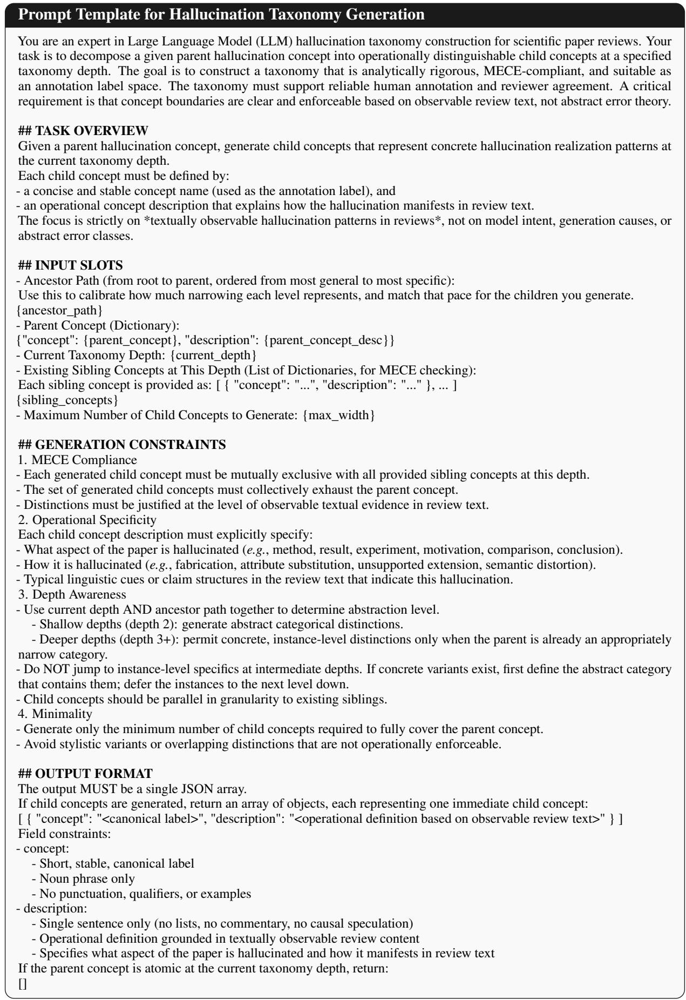  
Figure 7: Prompt template used for hallucination taxonomy generation.

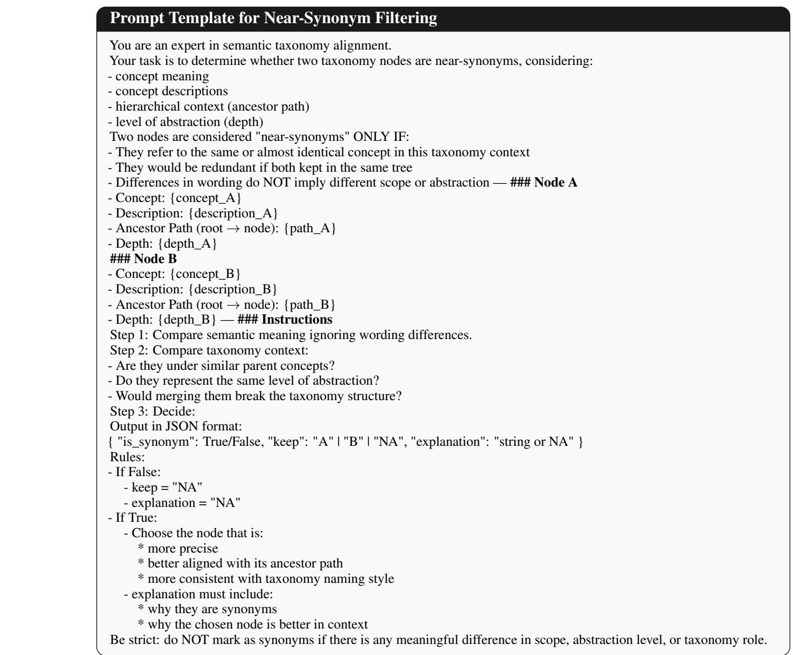  
Figure 8: Prompt template used for near-synonym hallucination taxonomy filtering.

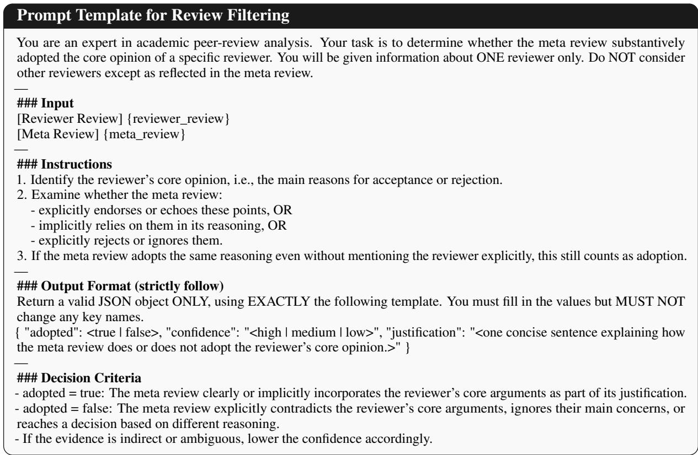

Figure 9: Prompt template used for review filtering.  
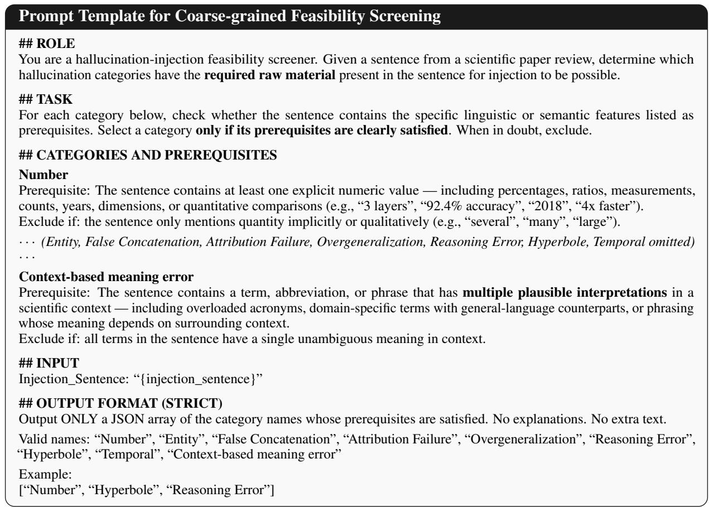  
Figure 10: Prompt template used for coarse-grained feasibility screening before fine-grained template construction. Seven of the nine categories are omitted for brevity; all nine follow the same prerequisite/exclude format.

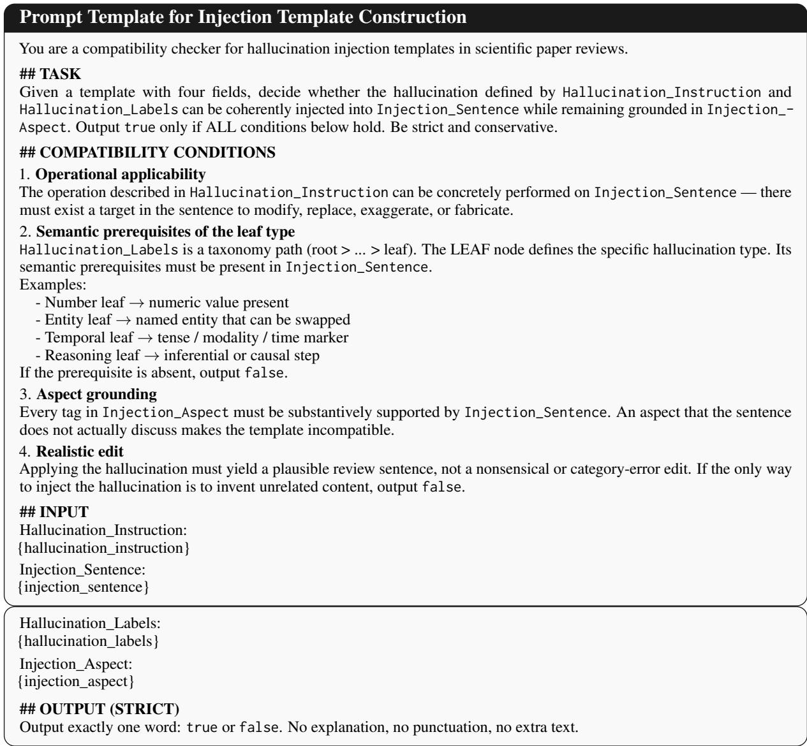  
Figure 11: Prompt template used for injection template construction.

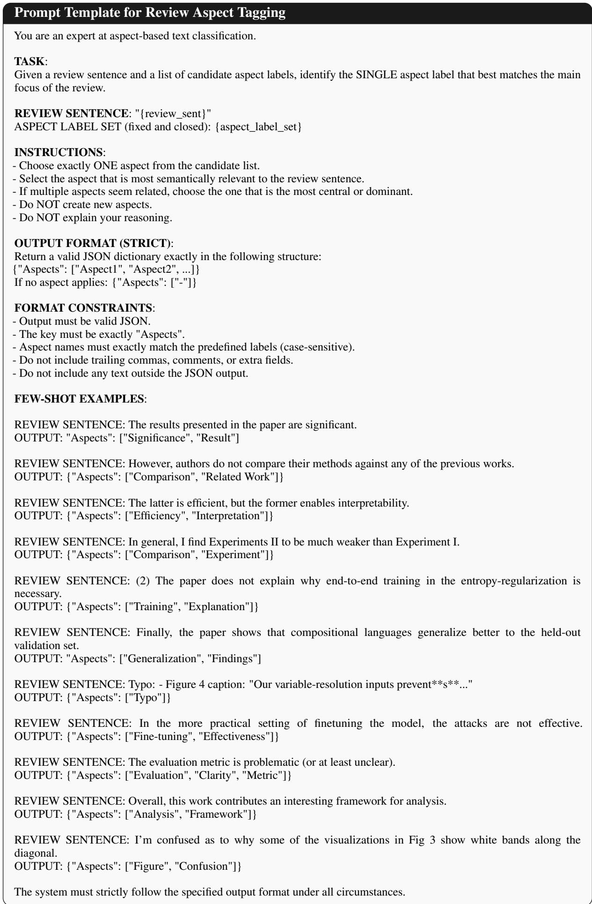  
Figure 12: Prompt template used for review aspect tagging.

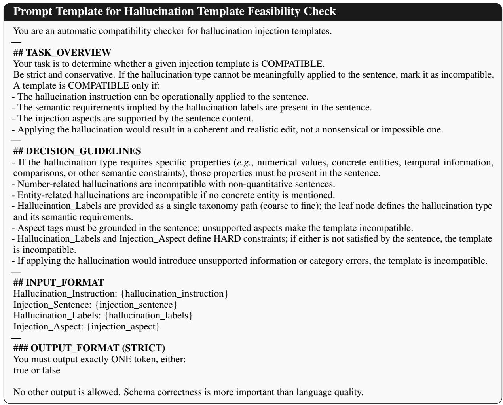  
Figure 13: Prompt template used for Hallucination Template Feasibility Check before template injection.

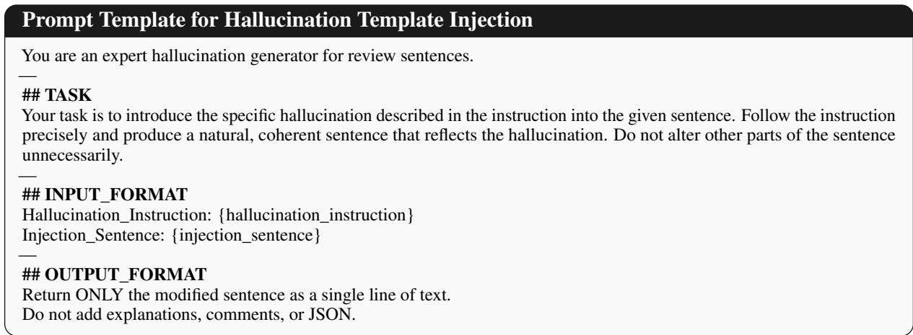  
Figure 14: Prompt template used for Hallucination Template Injection.

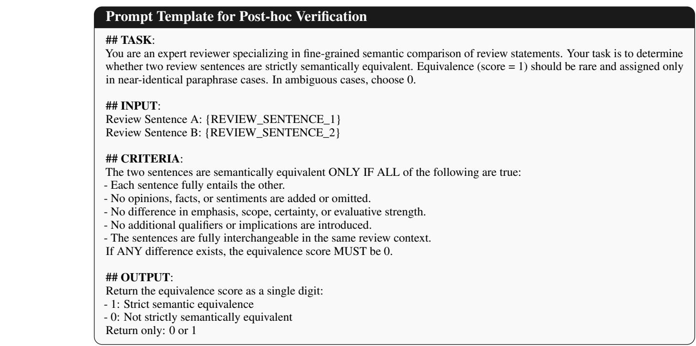  
Figure 15: Prompt template used for Post-hoc Verification after hallucination template injection.

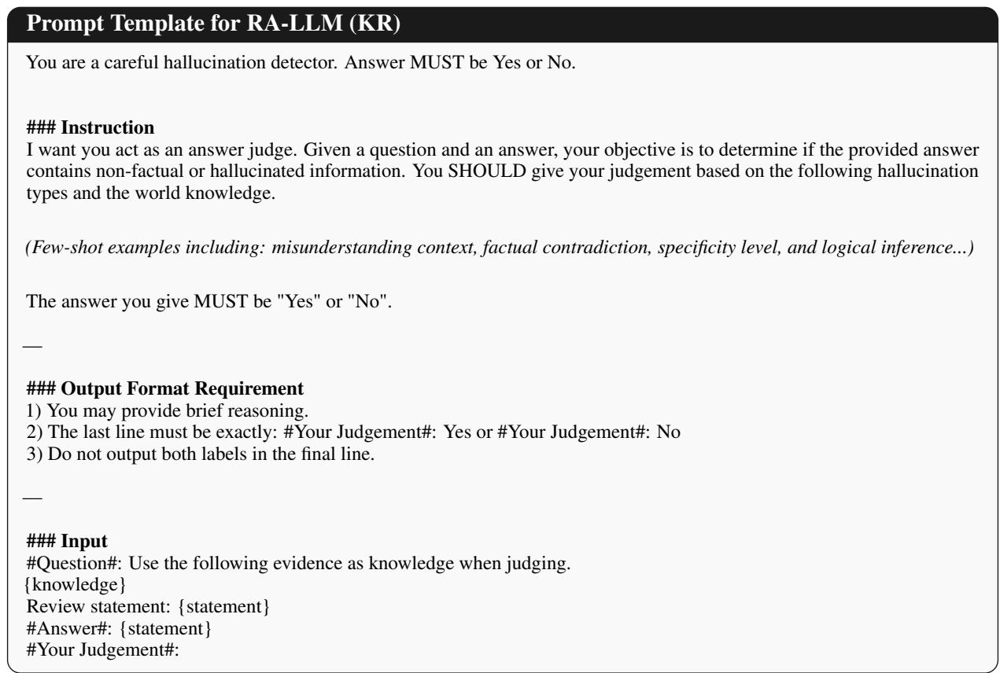  
Figure 16: Prompt template used for RA-LLM (KR) in Task 1 Evaluation.

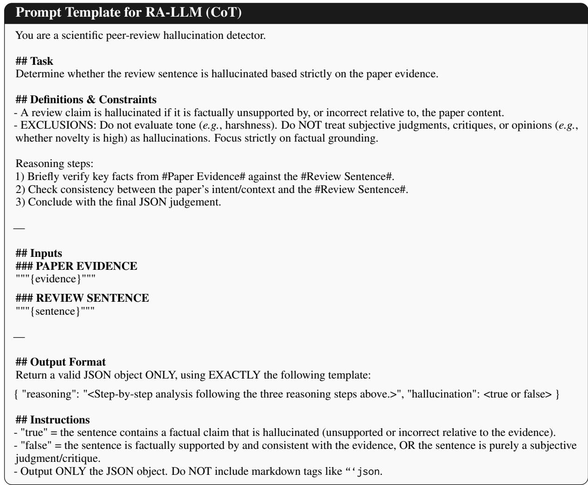  
Figure 17: Prompt template used for RA-LLM (CoT) in Task 1 Evaluation.

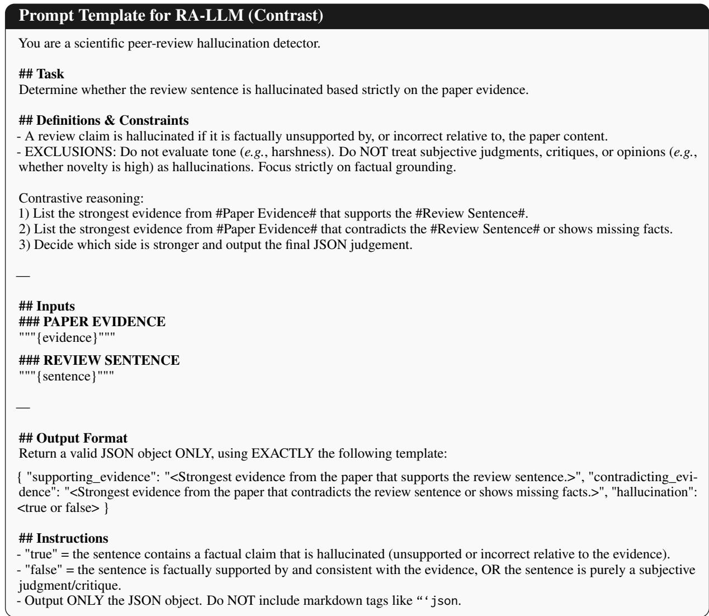  
Figure 18: Prompt template used for RA-LLM (Contrast) in Task 1 Evaluation.

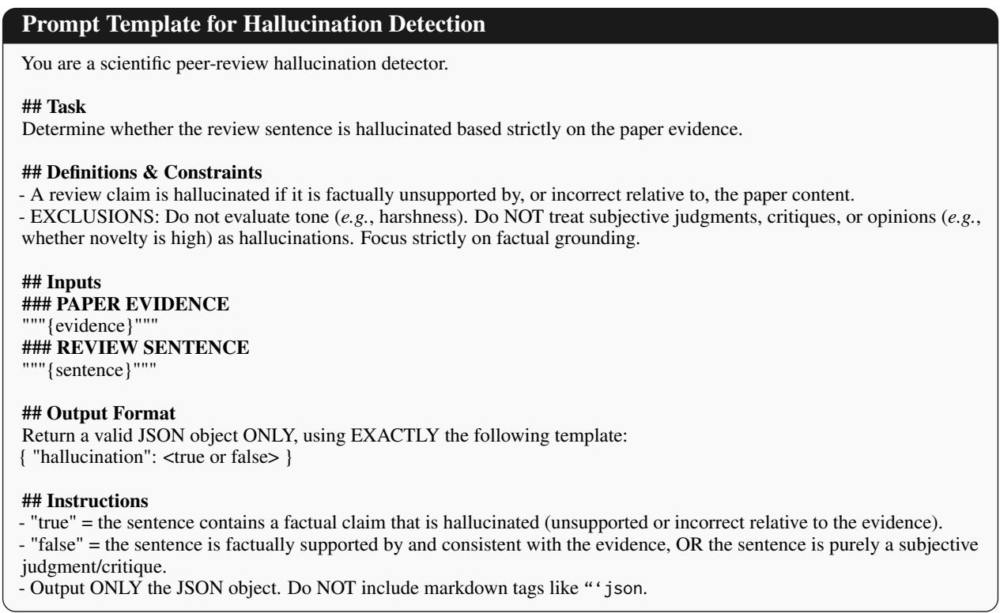  
Figure 19: Prompt template used for hallucination detection with general-purpose LLM in Task 1 evaluation.

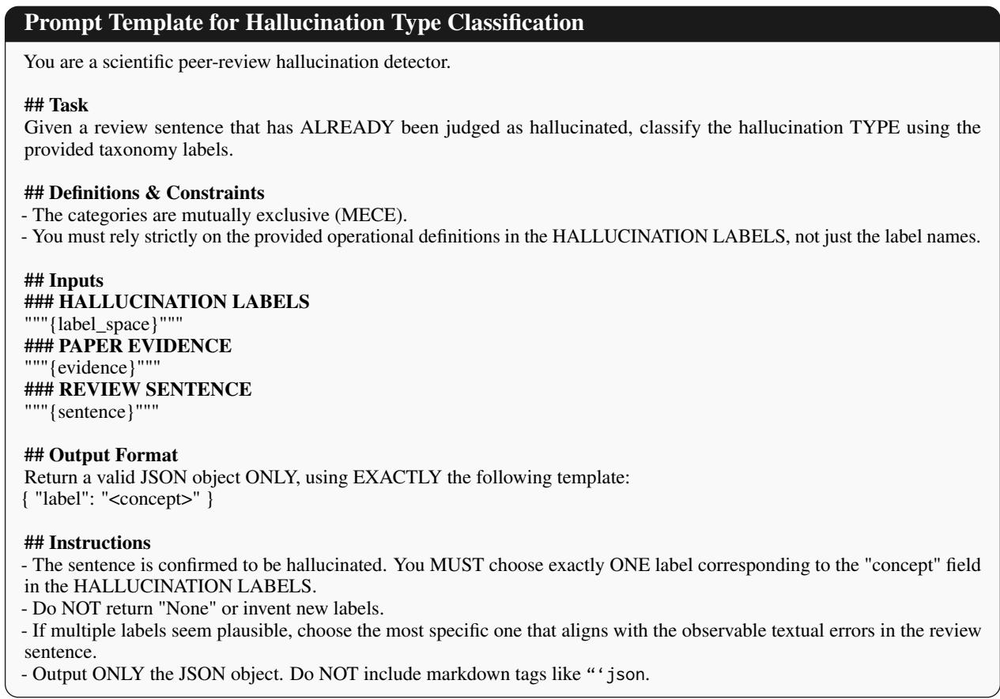  
Figure 20: Prompt template used for hallucination detection with general-purpose LLM in Task 2 evaluation.

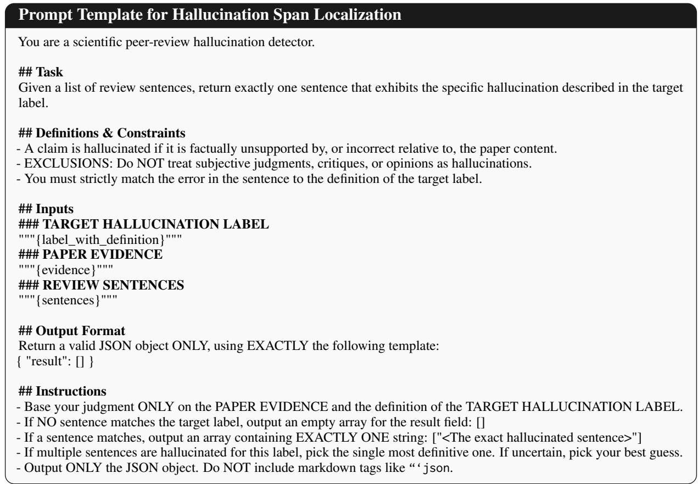  
Figure 21: Prompt template used for hallucination span localization with generous-purpose LLM in Task 3 evaluation.