# How Perturbations Propagate: A Multi-Level Analysis of Robustness in Large Language Models

Dun Li Chan1 Emily Liu2∗ Niyathi Allu2 Christian Hoang3 1INTI International College Penang 2Independent Researcher 3FPT University

## Abstract

Language models encounter typos, corrupted text, altered words, and disrupted token order, yet robustness is usually evaluated only through output behavior. We study how six naturalistic and synthetic input perturbations propagate through decoder-only language models at three levels: output behavior, hidden-state geometry, and attention-head function. We evaluate behavioral effects across four GPT-2 and two Qwen2.5 checkpoints by analyzing layerwise geometry using centered kernel alignment and intrinsic dimension, and examine attention-head responses in GPT-2. Perturbation types produce distinguishable metric profiles that are not fully captured by output measures and are only partly consistent across the tested checkpoints. Copying scores are especially associated with activation-patching recovery under token substitution and shuffling. Gradient-guided HotFlip perturbations also cause stronger behavioral and representational disruption than rate-matched random token substitutions in GPT-2; their behavioral effects are consistent across all six tested checkpoints. Our results show that robustness claims based on a single behavioral or representational metric can be misleading, and motivate multi-level evaluation of how perturbations alter language-model computation.

## 1 Introduction

Language models are often evaluated on clean and well-formed text, but deployed inputs usually contain typographical errors or character corruption from optical character recognition, which alter wording and disrupt token order. Prior work has shown that such changes can substantially degrade language-model behaviour even when they preserve much of the text’s meaning for a human reader [Belinkov and Bisk, 2018, Pruthi et al., 2019]. Adversarial attacks make this vulnerability more explicit by selecting small input edits that optimise a model-level objective [Ebrahimi et al., 2018, Wallace et al., 2019, Jin et al., 2020]. However, output degradation alone does not explain how a perturbation changes the computation performed inside the model.

Two perturbations can yield similar changes in generated text while disrupting different representations or computational components. Conversely, a small output change may conceal a substantial shift in hidden-state geometry. Existing robustness evaluations therefore provide limited evidence about whether perturbation effects are shared across corruption types, localize to recognizable mechanisms, or generalize across model scales and families.

Thus, we address these questions through a multi-level analysis of perturbation propagation in decoderonly language models. We compare six naturalistic and synthetic perturbation types (character substitution, keyboard typos, random token substitution, token shuffling, word substitution, and synonym substitution) using WikiText-2 inputs. We measure output behavior using negative loglikelihood and generated-output divergence across GPT-2 models of increasing scale and Qwen2.5 models; representation change using CKA [Kornblith et al., 2019] and intrinsic-dimension shifts [Facco et al., 2017, Aghajanyan et al., 2021]; and component-level responses using attention-head function scores and activation patching [Olsson et al., 2022, Wang et al., 2023, Heimersheim and Nanda, 2024]. Additionally, we also compare gradient-guided HotFlip perturbations against exactly rate-matched random token substitutions.

Our contributions are:

• We provide a multi-level empirical analysis of six text perturbation types, jointly measuring output behavior, representation geometry, and attention-head responses.

• We test whether perturbation effects are associated with functionally characterized attention heads using attention-based measurements and activation patching.

• We evaluate the stability of perturbation signatures across GPT-2 scale and the Qwen2.5 model family.

• We compare adversarial and rate-matched random token substitutions, separating adversarial optimization effects from edit rate alone.

## 2 Background and Related Work

Input perturbation and adversarial robustness in NLP. Character- and word-level perturbations, including typographical errors and noise introduced by imperfect text extraction, can substantially degrade model performance despite remaining easy for humans to interpret [Belinkov and Bisk, 2018, Pruthi et al., 2019]. A related literature constructs adversarial perturbations optimized against model behavior, including gradient-guided token substitutions and universal triggers [Ebrahimi et al., 2018, Wallace et al., 2019, Jin et al., 2020]. These studies primarily evaluate output behavior or task performance. We instead ask whether perturbation types leave distinguishable internal signatures, and whether an adversarially optimized perturbation is internally distinguishable from a naturalistic perturbation with matched position and rate.

Representational similarity metrics. Centered Kernel Alignment (CKA) is widely used to compare neural-network representations [Kornblith et al., 2019]. However, CKA can be sensitive to outlier dimensions and simple transformations that do not necessarily correspond to meaningful functional differences [Davari et al., 2023]. We therefore use CKA as one diagnostic among several, rather than interpreting it as a complete measure of internal disruption.

Intrinsic dimension of learned representations. High-dimensional representations may lie near lower-dimensional manifolds. Nearest-neighbor estimators such as TwoNN use local distance scaling to estimate this intrinsic dimension [Facco et al., 2017]. Recent work has applied intrinsic-dimension analyses to language models to study fine-tuning, representation geometry, truthfulness, and training dynamics [Aghajanyan et al., 2021, Yin et al., 2024, Razzhigaev et al., 2024, Ruppik et al., 2025]. We extend this line of work by treating the change in intrinsic dimension between clean and perturbed inputs as a perturbation-response metric.

Attention-head function and mechanistic interpretability. Mechanistic interpretability research has identified recurring attention-head functions, including induction heads that support sequence continuation [Elhage et al., 2021, Olsson et al., 2022] and copying or name-mover heads whose output-value circuits promote attended tokens in the output distribution [Wang et al., 2023]. These functions are typically studied on clean, hand-constructed tasks. We test how head-function measures and perturbation responses relate across naturally occurring and synthetic input corruptions.

Activation patching methodology. Activation patching is a widely used intervention for testing whether internal activations contribute to a model behavior [Meng et al., 2022, Heimersheim and Nanda, 2024]. Its conclusions depend on the corruption procedure, metric, and alignment between clean and corrupted runs [Heimersheim and Nanda, 2024]. We therefore restrict patching analyses to perturbations that preserve token count after retokenization and interpret recovery as evidence of functional association within this experimental setting.

## 3 Methods

## 3.1 Inputs and perturbations

We use the WikiText-2 Raw dataset [Merity et al., 2017] as the source of clean input sequences. We retain sequences of length at least 128 and randomly sample 300 sequences using a fixed seed for each experiment. This fixed evaluation set is used across perturbation types and models.

We evaluate the Hugging Face checkpoints openai-community/gpt2, gpt2-medium, gpt2-large, and gpt2-xl [Radford et al., 2019], together with Qwen/Qwen2.5-0.5B and Qwen/Qwen2.5-1.5B [Yang et al., 2024]. Behavioral comparisons use all six checkpoints; the attention-head analysis and full adversarial representation comparison use GPT-2.

For a clean text sequence x, we construct a perturbed sequence x˜ at perturbation strength $p \in [ 0 , 1 )$ We consider six perturbation types spanning character-, word-, and token-level changes.

Character perturbations. Under uniform character substitution (char), each character is independently replaced with probability p by a character drawn uniformly from digits, upper- and lower-case letters, and common punctuation. Under typographical noise (typo), selected characters are replaced by adjacent keys on a QWERTY keyboard, approximating common typing errors.

Word and token substitutions. Under uniform token substitution (token), each token is independently replaced with probability p by a token sampled uniformly from the model vocabulary. Under uniform word substitution (word), the replaced unit is a whitespace-delimited word and the replacement is sampled from alphabetic vocabulary tokens. Under synonym substitution (synonym), selected words are replaced using synonyms from WordNet [Miller, 1995].

Token shuffling. Under token shuffling (shuffle), we select a contiguous window containing approximately $p N$ tokens, where N is the sequence length, and randomly permute the tokens within that window. Tokens outside the window are unchanged. This intervention preserves token identity while disrupting local order and syntax.

## 3.2 Behavioral, representational, and head-level measurements

Output metrics. We evaluate output-level effects using negative log-likelihood (NLL) and normalized Levenshtein distance between generated clean and perturbed outputs, which we report as output divergence. Definitions are given in Appendix A.1.

Representation metrics. We compare clean and perturbed hidden states with centered kernel alignment (CKA) [Kornblith et al., 2019]. For layer $l ,$ let $a$ and a˜ denote the clean and perturbed activation matrices, and let $\begin{array} { r } { H = I _ { n } - \frac { 1 } { n } \mathbf { 1 } _ { n } \mathbf { 1 } _ { n } ^ { \intercal } } \end{array}$ be the centering matrix. With $\boldsymbol { a } _ { c } = \boldsymbol { H } \boldsymbol { a }$ and $\tilde { a } _ { c } = H \tilde { a }$ we compute

$$
\mathrm { C K A } _ { l } ( a , \tilde { a } ) = \frac { \left\| a _ { c } ^ { \mathsf { T } } \tilde { a } _ { c } \right\| _ { F } ^ { 2 } } { \left\| a _ { c } ^ { \mathsf { T } } a _ { c } \right\| _ { F } \left\| \tilde { a } _ { c } ^ { \mathsf { T } } \tilde { a } _ { c } \right\| _ { F } } .
$$

We evaluate layers $l \in \{ 1 , \ldots , n _ { \mathrm { l a y e r } } \}$ , excluding layer 0 because it directly reflects the changed input embedding. CKA requires activation matrices of equal shape; we therefore filter sequences shorter than 128 and truncate inputs to length 128. Token substitution and shuffling preserve token count exactly, whereas character, typo, word, and synonym perturbations can alter tokenization. For the latter perturbations, truncation restores equal matrix size but not semantic token correspondence. Their CKA values therefore reflect the combined effects of retokenization and representation change rather than a strictly position-aligned comparison. To reduce sensitivity to high-variance outlier dimensions [Davari et al., 2023], we rank dimensions by their variance in the clean activation matrix and remove the five highest-variance dimensions from both the clean and perturbed matrices before computing CKA.

We additionally measure the intrinsic dimension of layerwise activations using the two-nearestneighbors (TwoNN) estimator [Facco et al., 2017]. Intrinsic dimension provides a local measure of representational complexity: perturbations that disrupt regular structure may change the effective dimension of the activation manifold. We report the change in intrinsic dimension between clean and perturbed activations; the estimator is defined in Appendix A.2.

Head-function scores. To characterize the functional roles of attention heads, we compute four head-level scores. The previous-token score measures attention to the immediately preceding token; the duplicate score measures attention to earlier occurrences of the current local subsequence; and the induction score measures attention from a repeated prefix to the token that followed its earlier occurrence. We also compute a copying score based on the head’s OV circuit [Wang et al., 2023]. For head $h ,$ with value matrix $W _ { v } ^ { ( \bar { h } ) }$ , output projection $W _ { o } ^ { ( h ) }$ , token embedding matrix $E ,$ , and language-model head U, we define

$$
C = E W _ { v } ^ { ( h ) } W _ { o } ^ { ( h ) } U , \qquad C \in \mathbb { R } ^ { | V | \times | V | } .
$$

Letting $C _ { i }$ denote row i of $C ,$ the copying score is

$$
\mathrm { C o p y i n g S c o r e } ( h ) = \mathbb { E } _ { i \in [ V ] } \left[ { \bf 1 } \left[ i \in \mathrm { t o p } _ { k } \mathrm { - i n d i c e s } ( C _ { i } ) \right] \right] .
$$

Definitions of the previous-token, duplicate, and induction scores are given in Appendix A.3.

Perturbation responses of attention heads. We examine how functional head types respond to perturbation in two ways. First, we compute the change in normalized attention entropy at 30% perturbation, which measures whether a head’s attention distribution becomes more diffuse or more concentrated. The entropy definition is provided in Appendix A.4.

Second, we use clean activation patching: for clean input x and perturbed input ${ \tilde { x } } ,$ , we replace the perturbed output activation of head h with its corresponding clean activation and obtain patched output $y _ { p }$ . For an output metric O ∈ {NLL, OutputDivergence}, we report recovery as

$$
\Delta \% O = \frac { O ( y _ { p } ) - O ( \tilde { y } ) } { O ( y ) - O ( \tilde { y } ) } \times 1 0 0 ,
$$

where $y$ and $\tilde { y }$ are the outputs on clean and perturbed inputs. Because activation patching requires positional correspondence, we restrict this analysis to token substitution shuffling perturbations.

## 3.3 Adversarial comparison

The non-adversarial perturbations above need not approximate a worst-case input change. We therefore compare random token substitution with a HotFlip-style gradient-guided token attack [Ebrahimi et al., 2018] that maximizes sequence-level NLL.

For perturbation strength $p ,$ we select $\lfloor p N \rfloor$ token positions uniformly at random, where N is the sequence length. At each selected position $i ,$ we compute the gradient of the loss with respect to that token’s embedding and construct a shortlist $S$ of the 50 vocabulary tokens with the largest first-order estimated loss increase. We then evaluate shortlisted replacements directly and set the token to

$$
\underset { t \in S \cup \{ x _ { i } ^ { \prime 0 } \} } { \arg \operatorname* { m a x } } \ \mathrm { N L L } \left( f \left( x ^ { \prime } \mid _ { x _ { i } ^ { \prime } = t } \right) \right) ,
$$

where $f$ is the model, $x ^ { \prime } \mid _ { x _ { i } ^ { \prime } = t }$ denotes the current adversarial sequence with token i set to $t ,$ and $x _ { i } ^ { \prime 0 }$ is the original token at that position. A replacement is committed only when it increases NLL; hence, $\lfloor p N \rfloor$ is an upper bound on the number of accepted edits. Shortlist hyperparameters are reported in Appendix B.

For every accepted adversarial substitution, we construct a paired random-token control that changes the same position using a uniformly sampled vocabulary token. This control matches the adversarial attack in both perturbation type and realized edited positions. We compare adversarial and rate-matched random substitutions using the same output and representation metrics used for the naturalistic perturbations: NLL, output divergence, CKA, and intrinsic-dimension change.

## 4 Experiments

## 4.1 RQ1: Perturbation propagation across levels of representation

Perturbation types have distinct behavioural and internal profiles. In Table 1, character substitution produces the largest output divergence, while keyboard typos are less disruptive. Token and word substitutions have similar output divergence but substantially different NLL, showing that generatedtext change and predictive confidence need not agree. Shuffling changes both metrics more gradually than substitution-based corruptions.

Table 1: GPT-2 output divergence and negative log-likelihood (NLL) under six perturbation types. Entries are meanSD across evaluation sequences. Perturbation rate is reported as a percentage.
<table><tr><td>Perturbation rate</td><td>Char.</td><td>Typo</td><td>Token</td><td></td><td>Word Synonym</td><td>Shuffle</td></tr><tr><td colspan="7">Output divergence</td></tr><tr><td>0%</td><td> $0 . 0 0 0 _ { 0 . 0 0 0 }$ </td><td> $0 . 0 0 0 _ { 0 . 0 0 0 }$ </td><td> $0 . 0 0 0 _ { 0 . 0 0 0 }$ </td><td> $0 . 0 0 0 _ { 0 . 0 0 0 }$ </td><td> $0 . 0 0 0 _ { 0 . 0 0 0 }$ </td><td> $0 . 0 0 0 _ { 0 . 0 0 0 }$ </td></tr><tr><td>5%</td><td> $0 . 5 4 4 _ { 0 . 0 7 5 }$ </td><td> $0 . 5 1 4 _ { 0 . 0 6 8 }$ </td><td> $0 . 1 7 9 _ { 0 . 0 8 8 }$ </td><td> $0 . 2 0 5 _ { 0 . 0 6 4 }$ </td><td> $0 . 1 3 0 _ { 0 . 0 5 7 }$ </td><td> $0 . 1 1 1 _ { 0 . 1 4 5 }$ </td></tr><tr><td>30%</td><td> $0 . 8 8 3 _ { 0 . 0 2 5 }$ </td><td> $0 . 7 9 6 _ { 0 . 0 3 2 }$ </td><td> $0 . 5 7 7 _ { 0 . 0 6 0 }$ </td><td> $0 . 5 6 9 _ { 0 . 0 4 3 }$ </td><td> $0 . 4 2 1 _ { 0 . 0 7 6 }$ </td><td> $0 . 3 8 7 _ { 0 . 1 6 4 }$ </td></tr><tr><td>50%</td><td> $0 . 9 3 2 _ { 0 . 0 1 5 }$ </td><td> $0 . 8 5 2 _ { 0 . 0 2 9 }$ </td><td> $0 . 6 6 9 _ { 0 . 0 3 7 }$ </td><td> $0 . 6 6 1 _ { 0 . 0 3 1 }$ </td><td> $0 . 5 4 3 _ { 0 . 0 6 7 }$ </td><td> $0 . 5 0 7 _ { 0 . 1 2 8 }$ </td></tr><tr><td colspan="7">Negative log-likelihood</td></tr><tr><td>0%</td><td> $3 . 9 1 7 _ { 0 . 3 8 3 }$ </td><td> $3 . 9 1 7 _ { 0 . 3 8 3 }$ </td><td> $3 . 9 1 7 _ { 0 . 3 8 3 }$ </td><td> $3 . 9 1 7 _ { 0 . 3 8 3 }$ </td><td> $3 . 9 1 7 _ { 0 . 3 8 3 }$ </td><td> $3 . 9 1 7 _ { 0 . 3 8 3 }$ </td></tr><tr><td>5%</td><td> $6 . 0 9 6 _ { 0 . 4 3 7 }$ </td><td> $5 . 9 0 8 _ { 0 . 4 2 7 }$ </td><td> $4 . 8 0 6 _ { 0 . 5 7 7 }$ </td><td> $4 . 6 7 4 _ { 0 . 4 1 0 }$ </td><td> $4 . 2 1 2 _ { 0 . 4 1 1 }$ </td><td> $4 . 3 7 2 _ { 0 . 7 7 4 }$ </td></tr><tr><td>30%</td><td> $7 . 2 1 3 _ { 0 . 2 0 8 }$ </td><td> $7 . 1 9 4 _ { 0 . 2 6 4 }$ </td><td> $8 . 5 6 9 _ { 0 . 6 8 8 }$ </td><td> $7 . 3 7 6 _ { 0 . 3 8 8 }$ </td><td> $5 . 4 2 7 _ { 0 . 4 3 4 }$ </td><td> $6 . 0 1 6 _ { 1 . 0 8 2 }$ </td></tr><tr><td>50%</td><td> $6 . 7 3 2 _ { 0 . 1 9 3 }$ </td><td> $6 . 9 6 3 _ { 0 . 2 6 4 }$ </td><td> $1 0 . 2 3 8 _ { 0 . 5 2 0 }$ </td><td>8.5610.315</td><td> $6 . 0 6 9 _ { 0 . 4 6 3 }$ </td><td> $6 . 9 2 9 _ { 1 . 0 0 8 }$ </td></tr></table>

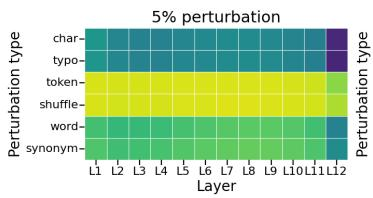

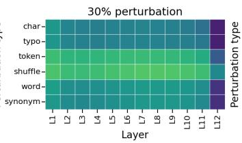

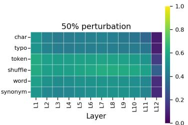  
Figure 1: Layerwise representational similarity between clean and perturbed GPT-2 activations, measured by centered kernel alignment (CKA). Rows show the six perturbation types and columns show transformer layers. The three panels correspond to perturbation rates of 5%, 30%, and 50%. Higher values indicate greater similarity to the clean representation.

The representation metrics provide a related but non-identical ordering. CKA generally decreases with perturbation strength (Figure 1); character and typo perturbations yield the lowest similarity, while shuffling retains comparatively high similarity. TwoNN estimates also distinguish the perturbations (Figure 2): at higher rates, character and typo corruption lower estimated intrinsic dimension in early layers, whereas token substitution yields the largest positive change. These descriptive patterns show that similar output effects need not correspond to similar layerwise geometry.

## 4.2 RQ2: Attention head function under perturbation

We relate the response measures in Appendix A.4 and Section 3.2 to the four head-function scores. In Table 2, induction score has the largest-magnitude negative correlation with entropy change for most perturbations (−0.27 to −0.609). Under shuffling, previous-token score has the strongest positive correlation (0.670), while duplicate and induction scores are strongly negative. These are associations between functional scores and attention redistribution; they do not show that a head type causes the perturbation effect.

For the position-preserving perturbations used in patching, copying score is most strongly associated with recovery (Table 3). Its correlations with patched NLL recovery are 0.726 for token substitution and 0.622 for shuffling, and its output-divergence correlations are 0.652 and 0.348. Other headfunction scores have smaller or inconsistent correlations. Copying score is only weakly related to entropy change, suggesting that attention redistribution and patching recovery capture different aspects of head response.

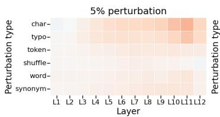

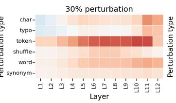

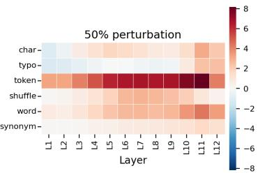  
Figure 2: Layerwise change in the local intrinsic dimension of GPT-2 representations under perturbation, estimated using TwoNN. Positive values indicate an increase relative to the corresponding clean representation. Rows show perturbation types, columns show transformer layers, and the three panel correspond to perturbation rates of 5%, 30%, and 50%.

Table 2: Spearman correlations between head-function scores and changes in normalized attention entropy under 30% perturbation on GPT-2. Standard deviations are all less than 0.0005 and are not reported.
<table><tr><td>Head function</td><td>Char.</td><td>Typo</td><td>Token</td><td>Word</td><td>Synonym</td><td>Shuffle</td></tr><tr><td>Previous token</td><td>0.217</td><td>0.221</td><td>0.467</td><td>0.359</td><td>0.195</td><td>0.670</td></tr><tr><td>Duplicate</td><td>-0.016</td><td>0.005</td><td>-0.218</td><td>-0.182</td><td>-0.169</td><td>-0.559</td></tr><tr><td>Induction</td><td>-0.271</td><td>-0.312</td><td>-0.571</td><td>-0.503</td><td>-0.329</td><td>-0.609</td></tr><tr><td>Copying</td><td>-0.097</td><td>-0.045</td><td>-0.154</td><td>-0.252</td><td>-0.331</td><td>-0.229</td></tr></table>

## 4.3 RQ3: Cross-model and cross-scale generalization

We compare the four GPT-2 checkpoints with the two Qwen2.5 checkpoints using NLL, output divergence, and intrinsic-dimension change. We omit cross-model CKA comparisons because layer counts differ and position-wise interpretation is unreliable for perturbations that alter tokenization.

Table 4 reports raw GPT-family minus Qwen-family score differences. Because the clean NLL baselines already differ by 0.592, the NLL rows are descriptive and do not isolate perturbationinduced robustness; a baseline-adjusted analysis would be required for that claim. Output-divergence differences are generally small, although shuffling shows the largest positive family gap at 30% and 50%. Accordingly, these results support metric- and perturbation-dependent family differences, but not a causal attribution to architecture, positional encoding, or vocabulary size.

Figure 3 shows the intrinsic dimension comparisons across models for the six perturbation types at 30% perturbation strength. For character and typo substitution, Qwen and GPT series models exhibit similar trends in later layers, but Qwen models have larger intrinsic dimension increases in earlier layers and may be more sensitive to retokenization noise. For token shuffling and word level perturbations, GPT series models consistently exhibit a more drastic increase in intrinsic dimension under perturbation, consistent with NLL and output divergence behavior. Synonym substitution shows very little change in intrinsic dimension, with no variation across model families. Under token substitution, GPT series models exhibit larger changes in intrinsic dimension compared to Qwen series models, reflecting the same trend shown in NLL results: Even though cross-model differences are not visible directly in the output, they manifest more clearly in the models’ internal confidence and geometry.

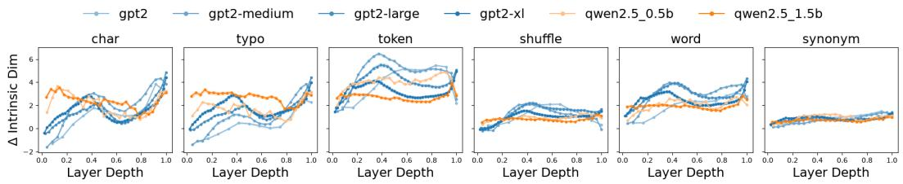  
Figure 3: Two-NN Intrinsic dimension estimate for all perturbation types, 30% perturbation, across GPT-2 and Qwen2.5 checkpoints.

Table 3: Spearman correlations between head-function scores and percentage changes in the patched model’s output metrics under 30% perturbation on GPT-2. Standard deviations are all less than 0.0005 and are not reported.
<table><tr><td rowspan="2"></td><td colspan="2">Patched ∆% NLL</td><td colspan="2">Patched ∆% OutDiv</td></tr><tr><td>Head function Token</td><td>Shuffle</td><td>Token</td><td>Shuffle</td></tr><tr><td>Previous token</td><td>0.147</td><td>-0.011</td><td>0.218</td><td>-0.036</td></tr><tr><td>Duplicate</td><td>0.163</td><td>0.247</td><td>0.026</td><td>0.057</td></tr><tr><td>Induction</td><td>-0.153</td><td>-0.017</td><td>-0.173</td><td>0.053</td></tr><tr><td>Copying</td><td>0.726</td><td>0.622</td><td>0.652</td><td>0.348</td></tr></table>

Table 4: Difference between the average GPT-family score and the average Qwen-family score for NLL and output divergence. The GPT family includes GPT-2, GPT-2 Medium, GPT-2 Large, and GPT-2 XL; the Qwen family includes Qwen 0.5B and Qwen 1.5B. Entries are meanSD, taken over data samples. Negative values indicate that the GPT family has a lower score than the Qwen family.
<table><tr><td>Perturbation rate</td><td>Char.</td><td>Typo</td><td>Token</td><td>Word</td><td>Synonym</td><td>Shuffle</td></tr><tr><td colspan="7">Negative log-likelihood</td></tr><tr><td>0%</td><td>0.5920.047</td><td>0.5920.047</td><td>0.5920.047</td><td>0.5920.047</td><td>0.5920.047</td><td>0.5920.047</td></tr><tr><td>5%</td><td>0.6440.057</td><td>0.6880.057</td><td>0.4380.062</td><td>0.5390.052</td><td>0.5720.050</td><td>0.7000.061</td></tr><tr><td>30%</td><td>-0.1030.024</td><td>0.0730.040</td><td>-0.2680.067</td><td>0.4570.052</td><td>0.5500.054</td><td>0.8910.072</td></tr><tr><td>50%</td><td>-0.3700.021</td><td>-0.2300.035</td><td>-0.7100.049</td><td>0.3560.042</td><td>0.5220.055</td><td>0.8550.070</td></tr><tr><td colspan="7">Output divergence</td></tr><tr><td>0%</td><td>0.0000.000</td><td>0.0000.000</td><td>0.0000.000</td><td>0.0000.000</td><td>0.0000.000</td><td>0.0000.000</td></tr><tr><td>5%</td><td>0.0430.008</td><td>0.0430.008</td><td>0.0020.008</td><td>-0.0170.006</td><td>-0.0330.006</td><td>0.0300.008</td></tr><tr><td>30%</td><td>0.0480.005</td><td>0.0410.005</td><td>0.0080.006</td><td>0.0180.005</td><td>0.0100.008</td><td>0.0710.010</td></tr><tr><td>50%</td><td>0.0320.005</td><td>0.0240.005</td><td>-0.0120.005</td><td>0.0080.004</td><td>0.0230.007</td><td>0.0590.009</td></tr></table>

## 4.4 RQ4: Adversarial perturbation and worst-case behavior

We compare HotFlip with random token substitutions matched at the edited positions. Figure 4 reports the full behavioral and internal comparison for GPT-2 at 30% perturbation. HotFlip yields higher NLL and output divergence, lower CKA to clean activations, and a larger increase in estimated intrinsic dimension than the matched random control. These results show that random substitution at the same positions does not reproduce the attack’s GPT-2 response profile.

Table 5 extends the behavioral comparison to all six checkpoints at 5% and 30% perturbation. HotFlip has higher mean NLL and output divergence than its matched random control in every reported cell. This consistency applies to the tested checkpoints and rates; the internal metrics in Figure 4 remain specific to GPT-2 at 30%.

## 5 Discussion

Surface and internal measures systematically dissociate A recurring pattern through all research questions is that different metrics do not agree on how disrupted a representation is. However, the specific pattern of agreement and disagreement is itself informative. Within RQ1, token substitution produces output divergence comparable to word-level substitution but substantially higher NLL. Within RQ2, copying heads show weak correlation with attention-entropy shift but dominate activation patching recovery, indicating that attention allocation and functional importance are distinct for the same heads. Within RQ3, the behavior of GPT-2 and Qwen2.5 models diverge for certain perturbation types for some metrics but not others. For example, token substitution shows negligible family-level difference in output divergence but a gap in NLL and intrinsic dimension, meaning that the same perturbation can appear architecture-agnostic or architecture-specific depending on the metric used. Within RQ4, for adversarial and token substitution perturbations, behavioral and internal metrics largely agree. Adversarial perturbation exceeds a rate matched random control on NLL, output divergence, CKA, and intrinsic dimension. Taken together, these results suggest that behavioral robustness metrics are an incomplete proxy for internal disruption.

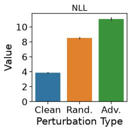

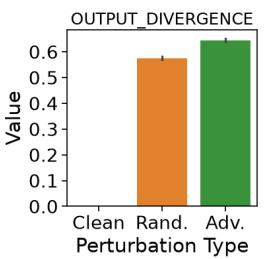

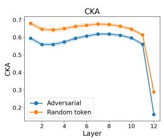

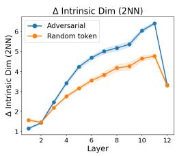  
Figure 4: Adversarial versus random token substitution on GPT-2 at 30% perturbation strength. The left panel shows behavioral differences, while the right panel shows internal representational differences.

Table 5: Negative log-likelihood (NLL) and output divergence under adversarial HotFlip perturbations and random token substitutions for six language models at perturbation strengths of 5% and 30%. Entries report the mean and standard deviation across evaluation sequences.
<table><tr><td rowspan="3"></td><td colspan="4">Negative log-likelihood</td><td colspan="4">Output divergence</td></tr><tr><td colspan="2">5%</td><td colspan="2">30%</td><td colspan="2">5%</td><td colspan="2">30%</td></tr><tr><td>Adv.</td><td>Rand.</td><td>Adv.</td><td>Rand.</td><td>Adv.</td><td>Rand.</td><td>Adv.</td><td>Rand.</td></tr><tr><td>GPT-2</td><td>5.380.50</td><td>4.810.58</td><td>11.031.83</td><td>8.520.50</td><td>0.250.08</td><td>0.180.09</td><td>0.640.05</td><td>0.570.05</td></tr><tr><td>GPT-2 Medium</td><td>5.070.53</td><td>4.540.68</td><td>9.870.70</td><td>8.410.55</td><td>0.250.08</td><td>0.180.10</td><td>0.630.04</td><td>0.580.05</td></tr><tr><td>GPT-2 Large</td><td>5.030.46</td><td>4.380.56</td><td>10.680.87</td><td>8.350.50</td><td>0.240.07</td><td>0.180.09</td><td>0.610.05</td><td>0.580.05</td></tr><tr><td>GPT-2 XL</td><td>4.890.43</td><td>4.290.54</td><td>10.340.72</td><td>8.290.51</td><td>0.240.07</td><td>0.180.09</td><td>0.620.05</td><td>0.580.05</td></tr><tr><td>Qwen2.5–0.5B</td><td>4.810.46</td><td>4.220.62</td><td>10.090.47</td><td>8.870.62</td><td>0.260.06</td><td>0.180.08</td><td>0.630.04</td><td>0.580.05</td></tr><tr><td>Qwen2.5-1.5B</td><td> $4 . 4 8 _ { 0 . 4 5 }$ </td><td> $3 . 9 2 _ { 0 . 6 2 }$ </td><td> $9 . 8 0 _ { 0 . 5 0 }$ </td><td> $8 . 6 1 _ { 0 . 6 3 }$ </td><td> $0 . 2 4 _ { 0 . 0 6 }$ </td><td> $0 . 1 8 _ { 0 . 0 8 }$ </td><td> $0 . 6 2 _ { 0 . 0 4 }$ </td><td> $0 . 5 7 _ { 0 . 0 5 }$ </td></tr></table>

Limitations Several metrics used in this study are limited in scope. CKA requires matched input shapes, but because four out of six examined perturbation types (char, typo, word, synonym) may alter token count under retokenization, position-wise alignment between clean and perturbed activations is not guaranteed for these perturbations, and we restrict CKA analysis accordingly (Section 3.2). Our attention head results (RQ2) establish association, but do not determine a causal link between head function and perturbation propagation or recovery. The cross-family differences observed in RQ3 suggest several plausible architectural explanations, such as grouped query attention, rotary positional embeddings, and vocabulary size differences, but none of these hypothetical causes have been isolated and tested. To do so would require ablations in the pretraining phase, which poses an infeasible resource constraint but is a potential area for future work. Finally, all analyses draw from a single dataset (WikiText-2) and two model families; broader claims about generality await evaluation on more diverse text domains and architectures.

Implications A practical implication of this pattern is that metric convergence, rather than any single metric’s value, may be a more reliable indicator of whether a perturbation effect is robust versus artifactual. In RQ4, where behavioral and internal metrics converge across NLL, output divergence, CKA, and intrinsic dimension, we have stronger grounds to trust that adversarial optimization produces a genuine, multi-level disruption rather than an effect specific to one measurement’s assumptions. By contrast, the metric-dependent results in RQ1-RQ3 (e.g., token substitution’s familylevel gap appearing in NLL and intrinsic dimension but not output divergence) should be read more cautiously. While patterns do exist under induced perturbation, there is not a uniform effect under the metrics used in this study. This suggests a general methodological takeaway for interpretability work.

Claims supported by only one metric warrant a search for convergent evidence before being treated as robust findings, and understanding why different metrics produce conflicting results may inform the development of more generalizable, robust diagnostics.

## 6 Conclusion

In this study, we demonstrate that perturbation type leaves distinguishable signatures in language model behavior, internal geometry, and circuit level function, and that these signatures are only partially conserved across model scale and family, indicating that the measurement metric used may be a significant confounding factor in results. Conversely, points of convergence, such as under adversarial optimization in RQ4, indicate a true underlying effect.

Several open questions follow directly from work. First, GPT-2 and Qwen2.5 models exhibit diverging behavior under different perturbation types, but no mechanistic basis for this behavior has been identified in this study. Isolating architectural factors, such as GQA, vocabular size, or RoPE, may provide additional insights into the mechanistic roles played by these model elements. Additionally, the paired adversarial framework in RQ4 can be extended to other forms of substitution perturbations, as it is unclear how the adversarial result may be sensitive to perturbation type. More broadly, our results suggest that robustness claims grounded in a single metric warrant a search for corroborating evidence before being treated as general findings.

## References

Armen Aghajanyan, Luke Zettlemoyer, and Sonal Gupta. Intrinsic dimensionality explains the effectiveness of language model fine-tuning. In International Conference on Learning Representations, 2021. URL https://openreview.net/forum?id=lyqf6L3PqQm.

Yonatan Belinkov and Yonatan Bisk. Synthetic and natural noise both break neural machine translation. In International Conference on Learning Representations, 2018. URL https: //openreview.net/forum?id=BJ8vJebC-.

MohammadReza Davari, Stefan Horoi, Amine Natik, Guillaume Lajoie, Guy Wolf, and Eugene Belilovsky. Reliability of CKA as a similarity measure in deep learning. In International Conference on Learning Representations, 2023. URL https://openreview.net/forum?id= R6eI7uZbP7.

Javid Ebrahimi, Anyi Rao, Daniel Lowd, and Dejing Dou. HotFlip: White-box adversarial examples for text classification. In Proceedings of the 56th Annual Meeting of the Association for Computational Linguistics: Short Papers, pages 31–36, 2018. doi: 10.18653/v1/P18-2006.

Nelson Elhage, Neel Nanda, Catherine Olsson, et al. A mathematical framework for transformer circuits. Transformer Circuits Thread, 2021. URL https://transformer-circuits.pub/ 2021/framework/index.html.

Elena Facco, Maria d’Errico, Alex Rodriguez, and Alessandro Laio. Estimating the intrinsic dimension of datasets by a minimal neighborhood information. Scientific Reports, 7:12140, 2017. doi: 10.1038/s41598-017-11873-y.

Stefan Heimersheim and Neel Nanda. How to use and interpret activation patching, 2024. URL https://arxiv.org/abs/2404.15255.

Di Jin, Zhijing Jin, Joey Tianyi Zhou, and Peter Szolovits. Is BERT really robust? A strong baseline for natural language attack on text classification and entailment. In Proceedings of the AAAI Conference on Artificial Intelligence, volume 34, pages 8018–8025, 2020. doi: 10.1609/aaai.v34i05.6311.

Simon Kornblith, Mohammad Norouzi, Honglak Lee, and Geoffrey Hinton. Similarity of neural network representations revisited. In Proceedings ofthe 36th International Conference on Machine Learning, volume 97 of Proceedings ofMachine Learning Research, pages 3519–3529, 2019.

Kevin Meng, David Bau, Alex Andonian, and Yonatan Belinkov. Locating and editing factual associations in GPT. In Advances in Neural Information Processing Systems, volume 35, pages 17359–17372, 2022.

Stephen Merity, Caiming Xiong, James Bradbury, and Richard Socher. Pointer sentinel mixture models. In International Conference on Learning Representations, 2017. URL https: //openreview.net/forum?id=Byj72udxe.

George A. Miller. WordNet: A lexical database for english. Communications of the ACM, 38(11): 39–41, 1995. doi: 10.1145/219717.219748.

Catherine Olsson, Nelson Elhage, Neel Nanda, et al. In-context learning and induction heads. Transformer Circuits Thread, 2022. URL https://transformer-circuits.pub/2022/ in-context-learning-and-induction-heads/index.html.

Danish Pruthi, Bhuwan Dhingra, and Zachary C. Lipton. Combating adversarial misspellings with robust word recognition. In Proceedings of the 57th Annual Meeting of the Association for Computational Linguistics, pages 5582–5591, 2019. doi: 10.18653/v1/P19-1561.

Alec Radford, Jeffrey Wu, Rewon Child, David Luan, Dario Amodei, and Ilya Sutskever. Language models are unsupervised multitask learners. Technical report, OpenAI, 2019. URL https://cdn.openai.com/better-language-models/language\_models\_ are\_unsupervised\_multitask\_learners.pdf.

Anton Razzhigaev, Matvey Mikhalkchuk, Elizaveta Goncharova, Ivan Oseledets, Denis Dimitrov, and Andrey Kuznetsov. The shape of learning: Anisotropy and intrinsic dimensions in transformerbased models. In Findings of the Association for Computational Linguistics: EACL 2024, pages 868–874, 2024.

Benjamin Matthias Ruppik, Julius von Rohrscheidt, Carel van Niekerk, Michael Heck, Renato Vukovic, Shutong Feng, Hsien-chin Lin, Nurul Lubis, Bastian Rieck, Marcus Zibrowius, and Milica Gašic. Less is more: Local intrinsic dimensions of contextual language´ models. In Advances in Neural Information Processing Systems, volume 38, 2025. doi: 10.52202/085713-2276. URL https://proceedings.neurips.cc/paper\_files/paper/ 2025/hash/61c2c6338033da68885e0226881cbe71-Abstract-Conference.html.

Eric Wallace, Shi Feng, Nikhil Kandpal, Matt Gardner, and Sameer Singh. Universal adversarial triggers for attacking and analyzing NLP. In Proceedings of the 2019 Conference on Empirical Methods in Natural Language Processing and the 9th International Joint Conference on Natural Language Processing, pages 2153–2162, 2019. doi: 10.18653/v1/D19-1221.

Kevin Wang, Alexandre Variengien, Arthur Conmy, Buck Shlegeris, and Jacob Steinhardt. Interpretability in the wild: A circuit for indirect object identification in GPT-2 small. In International Conference on Learning Representations, 2023. URL https://openreview.net/forum?id= NpsVSN6o4ul.

An Yang, Baosong Yang, Beichen Zhang, Binyuan Hui, Bo Zheng, Bowen Yu, Chengyuan Li, Dayiheng Liu, Fei Huang, Haoran Wei, Huan Lin, Jian Yang, Jianhong Tu, Jianwei Zhang, Jianxin Yang, Jiaxi Yang, Jingren Zhou, Junyang Lin, Kai Dang, Keming Lu, Keqin Bao, Kexin Yang, Le Yu, Mei Li, Mingfeng Xue, Pei Zhang, Qin Zhu, Rui Men, Runji Lin, Tianhao Li, Tingyu Xia, Xingzhang Ren, Xuancheng Ren, Yang Fan, Yang Su, Yichang Zhang, Yu Wan, Yuqiong Liu, Zeyu Cui, Zhenru Zhang, and Zihan Qiu. Qwen2.5 technical report. arXiv preprint arXiv:2412.15115, 2024. URL https://arxiv.org/abs/2412.15115.

Fan Yin, Jayanth Srinivasa, and Kai-Wei Chang. Characterizing truthfulness in large language model generations with local intrinsic dimension, 2024. URL https://arxiv.org/abs/2402.18048.

## A Metrics

## A.1 Output Metrics

## A.1.1 NLL

Sequence-level NLL on an output sequence y (either clean or perturbed) measures how well the model predicts the next token under a perturbed input sequence. Lower NLL indicates that the model assigns higher probability to the observed continuation.

$$
\mathrm { N L L } ( y ) = - \frac { 1 } { T } \sum _ { t = 1 } ^ { T } \log p ( y _ { t } \mid y _ { < t } )
$$

## A.1.2 Output Divergence

To compare generated outputs under clean and perturbed inputs, we computed normalized Levenshtein distance between generated sequences y (clean) and yˆ (perturbed):

$$
\mathrm { O u t p u t D i v e r g e n c e } ( y , \hat { y } ) = \frac { \mathrm { E d i t D i s t a n c e } ( y , \hat { y } ) } { \operatorname* { m a x } ( | y | , | \hat { y } | ) }
$$

where EditDistance is the Levenshtein edit distance. This measures how much the generated continuation changes under perturbation.

## A.2 Intrinsic Dimensions

## A.2.1 2-Nearest Neighbors

For each data point i, in this instance an individual token’s activation on layer l (like in CKA, $1 \leq l \leq n _ { l a y e r } )$ , we compute distances $r _ { 1 } ^ { i }$ and $r _ { 2 } ^ { i }$ between the point and its two nearest neighbors within the batch. Defining

$$
\mu _ { i } = \frac { r _ { 2 } ^ { i } } { r _ { 1 } ^ { i } } ,
$$

we use the maximum likelihood estimator to approximate the intrinsic dimension d:

$$
d = { \frac { N } { \sum \ln \mu _ { i } } }
$$

where N is the number of total points in the batch.

## A.3 Attention Function Scores

## A.3.1 Previous-Token Score

We report this score as an average of all places in the attention matrix where position i attends to position i − 1. The attention matrix A used by the previous token score is computed using clean inputs $x \left( \alpha = h ( x ) \right)$ , and the overall score is averaged over all inputs:

$$
\mathrm { P r e v i o u s \_ T o k e n } ( h ) = \mathbb { E } _ { x } \left[ \frac { 1 } { L - 1 } \sum _ { i = 1 } ^ { L - 1 } \alpha _ { i , i - 1 } \right] .
$$

## A.3.2 Duplicate Score

In order to isolate the duplicate detection signal from previous-token signal and general semantic associations, we construct an input probe by repeating a randomized sequence of r of L tokens twice. Then, we evaluate the average attention values in $\alpha = h ( r r )$ where positions from the first sequence attend to their repeated counterpart in the second sequence:

$$
\mathrm { D u p l i c a t e } ( h ) = \frac { 1 } { L } \sum _ { i = L + 1 } ^ { 2 L } \alpha _ { i , i - L } .
$$

HotFlip: Sequence NLL vs. Candidate Pool Size (model=gpt2, pct=30)  
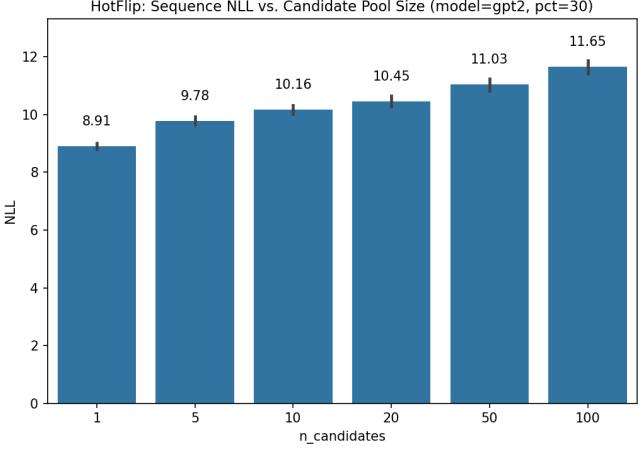  
Figure 5: Sequence NLL as a function of HotFlip’s gradient-shortlist size $( n _ { - }$ \_candidates), on GPT-2 at 30% perturbation strength $( n = 3 0 0 )$ .

## A.3.3 Induction Score

We use the same repeated random token probe as the duplicate score, but examine the attention between the positions in the repeated sequence and the positions immediately following their counterparts in the earlier sequence.

$$
\mathrm { I n d u c t i o n } ( h ) = \frac { 1 } { L - 1 } \sum _ { i = L + 1 } ^ { 2 L - 1 } \alpha _ { i , i - L + 1 } .
$$

## A.4 Attention Entropy Norm Delta

Given a clean input x and a perturbed input $x ^ { \prime } { . }$ , we obtain attention matrices $\alpha = h ( x )$ and $\alpha ^ { \prime } = h ( x ^ { \prime } )$ In our experiments, we construct $x ^ { \prime }$ under 30% perturbation for all perturbation types. Defining entropy at position i as

$$
\widehat { H } ( \alpha ) = \frac { 1 } { L - 1 } \sum _ { i = 1 } ^ { L - 1 } \frac { H _ { i } ( \alpha ) } { \log ( i + 1 ) } .
$$

we take the normed entropy over all positions excluding the first (since the first position does not have a target attention distribution to draw from). The normed entropy divides the total entropy at each location by the maximum possible entropy, to ensure that all entropies are evaluated at comparable scale:

Finally, the entropy norm delta over all inputs is given by

$$
\Delta H = \mathbb { E } _ { x } \left[ \hat { H } ( \alpha ^ { \prime } ) - \hat { H } ( \alpha ) \right] .
$$

## B Adversarial Shortlist Selection

We fix $| S | = 5 0$ based on an ablation over $| S | \in \{ 1 , 5 , 1 0 , 2 0 , 5 0 , 1 0 0 \}$ on GPT-2 at $p = 3 0 \%$ (Figure 5). Mean NLL rises from 8.91 $( | S | { = } 1 )$ to 1 $\stackrel { \cdot } { 1 } . 6 5 \ : ( \left| S \right| = 1 0 0 )$ , while the marginal gain per additional candidate declines from 0.22 between $\left| S \right| { = } 1 { - } 5$ to 0.01 between $\lvert S \rvert { = } 5 0 { - } \hat { 1 0 0 }$ . We select $| S | = 5 0$ as a practical balance between attack strength and compute cost rather than as a lossmaximizing choice.