# Knowledge Acquisition During Pre-training? Large Language Models Learn Better With Auxiliary Views

Joseph Lee, Yidi Huang, Dokyoon Kim, Shu Yang\*, Li Shen

University of Pennsylvania, Philadelphia, PA, USA

jiosephlee@gmail.com

{yidi.huang,dokyoon.kim,shu.yang,li.shen}@pennmedicine.upenn.edu

## Abstract

Gaps remain in our understanding of how large language models (LLMs) acquire knowledge during pre-training. We posit that auxiliary views, reformulations of knowledge, are causally helpful for learning. We design controlled experiments to isolate this. First, we confirm that repetition is necessary for acquisition and clarify that paraphrasing helps only at smaller batch sizes. Second, holding the token budget fixed, allocating tokensfrom document repetition to auxiliary views improves learning, counterintuitively, even for factual recall. Third, the effectiveness of auxiliary views is not contingent on the strength of the teacher model that generates them. Fourth, we identify forms of knowledge, contextual and foundational, that aid learning in the presence of prior knowledge gaps. Finally, we examine how these effects manifest mechanistically via layer-wise biases and compression. Together, our findings suggest that auxiliary representations of knowledge, which arise naturally in large pre-training corpora, are a key factor in the success of pre-training and offer a plausible explanation for why data diversity matters.

## 1 Introduction

Various aspects of data have been shown to be important in pre-training, including deduplication (Raffel et al., 2020; Lee et al., 2021; Zhang et al., 2022), filtering (Weber et al., 2024; Li et al., 2024), coverage and depth (Kandpal et al., 2023), quality (Gunasekar et al., 2023; Longpre et al., 2024), and diversity (Chen et al., 2025; Zhang et al., 2025). However, these insights concern corpus characteristics, overlooking a fundamental question: how should knowledge be represented?

The complexity of this question can vary. For atomic facts like biographical attributes, representation is relatively trivial. But for complex domains such as biomedicine or law, where knowledge is multifaceted and interdependent, formulation is far less obvious. This is becoming relevant as researchers adapt LLMs to specialized domains via continued pre-training (Bai et al., 2025; Sellergren et al., 2025; Wang et al., 2025a; Luo et al., 2025; Colombo et al., 2024; Singhal et al., 2025).

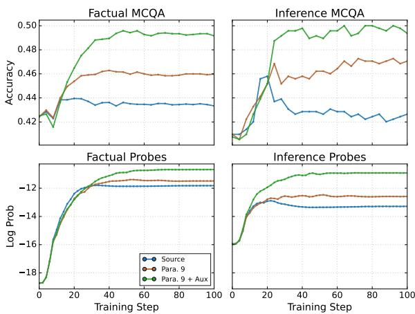  
Figure 1: Three training mixes on OLMo-2-32B: Source, Para. 9, and Para. 9 + Aux. Across all metrics, paraphrases improve over source-only training, and auxiliary views yield substantially greater improvements. See Section 4 for full results.

Thus, for our experiments, we collect recent arXiv papers, legal opinions, and medical case studies to serve as self-contained domain knowledge. We continue pre-training on these texts and related formulations, to study the acquisition of complex knowledge that builds upon the LLM’s existing knowledge. In this setting, we study two research questions:

RQ 1: How should knowledge be represented in natural language?

RQ 2: What surrounding knowledge should be represented alongside it?

Our experiments reveal four main findings. (1) Acquisition of new knowledge benefits from repetition, and paraphrasing further helps, but the benefits of paraphrasing diminish at larger batch sizes. (2) Holding the token budget fixed, allocating tokens from document repetition to auxiliary views improves understanding and factual recall, inducing a distinct layer-wise bias and compression in how knowledge is encoded. (3) Furthermore, the effectiveness of these auxiliary views is not contingent on the strength of the teacher model that generates them. (4) Lastly, contextual and prerequisite knowledge aid learning in the presence of prior knowledge gaps.

Together, these results lead us to a central conjecture: during pre-training, LLMs benefit from auxiliary views (a web of explanations, analogies, and reformulations that humans generate as they learn and teach each other) and acquire a more generalizable encoding of knowledge. Conceptually diverse views, not just linguistically, of the same knowledge improves learning: broader conceptual understanding facilitates the memorization of specific facts better than brute memorization. Moreover, this ability emerges more strongly with scale: larger models learn better by integrating diverse views more effectively, encoding them with greater parameter efficiency and redistributing learning toward the middle and final layers.

Our findings provide a more operational account of what “diverse” data can mean in pretraining. Rather than treating diversity solely as a corpus-level property, diversity can be constructed around individual knowledge, through complementary views that help models form richer and more efficient representations. This offers principles for synthetic pre-training, especially in low-data domains, and explains why “diverse” data is helpful.

## 2 Related Works

Pre-training. Model size and data scale are the primary determinants of LLM capabilities (Brown et al., 2020; Kaplan et al., 2020; Carlini et al., 2023; Tirumala et al., 2022; Hoffmann et al., 2022). The large-scale nature of pre-training has made the exact role of data difficult to understand. Existing studies, varying in corpora and models, often yield conflicting findings. Even the role of data repetition remains debated (Lee et al., 2021; Taylor et al., 2022; Hernandez et al., 2022; Xue et al., 2023; Muennighoff et al., 2023).

Knowledge Acquisition during Pre-training. We therefore build upon previous efforts that study how pre-training instills knowledge in a controlled manner. Allen-Zhu and Li (2024) show that paraphrased augmentation increases the memorization of biographical facts from 9.7% to 96.6%. They find that inserting QAs about facts during pretraining increases memorization of held-out facts, whereas inserting QAs during instruction tuning does not. This strongly suggests the importance of data formulation in pre-training.

Further, Chang et al. (2024) intermittently injects fictional facts during pre-training, observing that knowledge is acquired incrementally upon each exposure and subject to decay, suggesting a gradual, not emergent, learning process. Confounding factors are controlled to clearly isolate the effect.

A limitation of these prior works is that Chang et al. (2024) and Allen-Zhu and Li (2024) only use biographical facts; they also provide conflicting views on the benefits of paraphrasing. We focus on complex knowledge and offer an explanation for these reported differences.

Domain Adaptation via Continued Pretraining. Teaching large language models (LLMs) a specific set of new knowledge via continued pretraining is difficult (Wang et al., 2021; Jang et al., 2021; Hu et al., 2023; Ovadia et al., 2024; Hoffbauer et al., 2024). For instance, a 70B model continually pretrained on Wiki-style documents, despite sophisticated augmentation, only recalls 62.7% of facts (Jiang et al., 2024). In practice, continued pre-training is adopted to varying degrees. For example, MedGemma (Sellergren et al., 2025) and TxGemma (Wang et al., 2025a) do not perform any text-based continued pre-training, while Intern-S1 (Bai et al., 2025) does so for 5 trillion tokens. Thus, our study aims to provide practical takeaways that can make continued pre-training more reliable.

## 3 Experimental Setup

Problem Formulation. The pre-training objective for an autoregressive LM, f parameterized by $\theta ,$ is next-token prediction. Given a corpus C of documents $d _ { 1 } , \dots , d _ { M }$ , each a sequence of tokens $( t _ { m , 1 } , \ldots , t _ { m , n _ { m } } )$ , we minimize the loss function:

$$
L ( \theta ) = - \sum _ { m = 1 } ^ { M } \sum _ { i = 1 } ^ { n _ { m } } \log P ( t _ { m , i } \mid t _ { m , < i } ; \theta )\tag{1}
$$

We denote knowledge abstractly as $K ,$ accessible through the sub-corpus $\mathcal { C } _ { K } = \{ d _ { i } \in \mathcal { C } \vert$ $d _ { i }$ contains information about $K \}$ . Because K is acquired only through next-token prediction over $\mathcal { C } _ { K }$ , the selection of tokens should matter. This motivates our central question: how should knowledge be represented in text, or specifically how should we construct documents $d \in { \mathcal { C } } _ { K }$ to better learn K?

<table><tr><td>Blog. Direct Preference Optimization (DPO) offers a neat change of perspective. Instead of treating reward modeling and policy optimization as separate steps, DPO re-parameterizes the reward class so [...] has a closed form. That lets you fit the policy directly to human comparisons with a simple classification loss — no RL required.</td></tr><tr><td>Stack Exchange. Q: How exactly does the partition function cancel out in the DPO derivation? They say the partition function term β log Z(x) cancels — can someone show the algebraic steps explicitly? A: Short answer: because the partition function term in the reparameterization depends only on the prompt x, it is identical for both completions and therefore subtracts out when you form the [...]</td></tr><tr><td>Textbook. The partition function term β log Z(x) depends only on x, so it cancels when forming differences. Preference models like Bradley-Terry depend only on reward differences, not on absolute reward values. Therefore the unknown normalization that made reward recovery hard is irrelevant to the likelihood of observed pairwise comparisons. This is</td></tr></table>

Table 1: We rewrite each document into three genres while preserving the underlying knowledge. The excerpts above illustrate an accessible, narrative blog; a question-and-answer Stack Exchange entry; and a formal textbook exposition.

Observation. Knowledge is rarely represented once in a corpus. Consider “Attention Is All You Need” (Vaswani et al., 2017). This document is followed by a proliferation of others conveying the same knowledge: tutorials, blogs with intuitive explanations, and forums answering questions. Such texts are natural byproducts of society’s collective effort to communicate and process knowledge.

We term such manifestations of the same knowledge auxiliary views. We make this distinction because human-generated views are rarely paraphrases: they discuss the knowledge in diverse contexts (e.g., Transformers’ advantages over other architectures) and forms (e.g., blogs, forums), collectively providing a more complete, contextualized picture of K. We suspect pre-training is replete with these views, explaining its effectiveness beyond vague axes like quality or diversity. In our study, we frame paraphrasing as linguistic variation of a single view and set it as the control.

We also investigate the knowledge represented around K. To acquire K, a model may need prior knowledge it does not yet possess. We examine two types: contextual knowledge, which K references, and prerequisite knowledge, the foundational concepts that K presupposes.

## 3.1 Dataset

Documents. We collect 36 documents across three domains to serve as K: twelve computer science papers from arXiv, twelve legal opinions from U.S. federal appellate courts, and twelve medical case reports from PubMed Central. To prevent leakage from OLMo-2’s pre-training corpus, we select documents published after the cutoff date and verify their absence through the Infini-gram API (Liu et al., 2024). Additional details are in Appendix A.

Views. For each document, we synthetically generate auxiliary views via LLMs. Inspired by our earlier observation and prior work (Gunasekar et al., 2023; Allen-Zhu and Li, 2024; Jiang et al., 2024), we construct textbooks, Stack Exchange– style Q&A, and blogs (Table 1). Prerequisite knowledge is also generated as textbooks. Contextual knowledge is collected as cited arXiv papers and cited judicial opinions; medical case reports lack a citation structure, so we omit this domain. Paraphrases are generated with GPT-4.1, while auxiliary and prerequisite views are generated with GPT-5-mini. Details on data collection, preprocessing, and prompts are in Appendix A.

Probes. To measure learning, we adopt LAMAstyle probes (Petroni et al., 2019; Jiang et al., 2020; Zhong et al., 2021), where the task is to predict a sentence’s final word or, following Chang et al. (2024), a multi-word target. We design two probe types (Table 2): factual probes, which measure recall of information stated explicitly in the text, and inference probes, which require combining one or more facts to infer information not stated.

To construct factual probes, we filter for knowledge-bearing sentences, generate QA pairs from each, and convert them into self-contained cloze statements; we automate this with GPT-5.4, having verified that it adequately understands the documents. The pipeline yields 6,435 factual and 430 inference probes, along with multiple-choice variants (4,515 factual and 322 inference MCQs), exceeding the scale of prior work (Chang et al., 2024). We manually validate 200 probes of each type. Full pipeline details are in Appendix F. Our dataset<sup>1</sup> and $\mathrm { c o d e } ^ { 2 }$ are publicly available.

<table><tr><td>Original sentence</td><td>The added constraint is important, as it prevents the model from deviating too far from the distribution [...], as well as maintaining the generation diversity and [...]</td></tr><tr><td>Factual probe</td><td>In the paper “Direct Preference Optimization  $[ \ldots ] , ^ { \ d }$  the authors state that the added constraint in the reinforcement learning objective not only prevents the model from deviating too far from the distribution on which the reward model is accurate, but also maintains the generation diversity.</td></tr><tr><td>Support sentences</td><td>[...] still expensive to estimate the partition function  $Z ( x )$  [...] the Bradley-Terry model depends only on the difference of rewards [...] Substituting the reparameterization [...] into the preference model, the partition function cancels, and we can express the human preference probability in terms of only the optimal policy  $\pi ^ { * }$  and reference policy [...]</td></tr><tr><td>Inference probe</td><td>According to the paper “Direct Preference Optimization [...],&quot; the expensive quantity from the optimal-policy form that becomes unnecessary to estimate once DPO rewrites the Bradley-Terry preference model in terms of policies is the partition function.</td></tr></table>

Table 2: Thefactual probe extracts questions from knowledge-bearing sentences, converts them into statements with answers at the end, and adds context. The inference probe combines knowledge from one or more support sentences to infer information not explicitly stated. Here, it integrates the facts that $Z ( x )$ is expensive to estimate, that the Bradley–Terry model depends only on reward differences, and that the reparameterization causes $Z ( x )$ to cancel, thereby identifying the partition function as the quantity that no longer requires estimation. The target span of each probe is bolded.

## 3.2 Training Setup

We use the base OLMo-2 models (1B, 7B, 13B, and 32B) (OLMo et al., 2024) for training. Following Chang et al. (2024), we employ single-batch knowledge injection: the documents fit in one forward pass, and the rest of the batch is filled with general data. We perform $N = 1 0 0$ injections in our main experiments. In Source, the original document is injected every batch. In Para. M, we cycle through the original document and its M paraphrases, repeating $\frac { N } { M + 1 }$ times. In Para. M + Aux., auxiliary views are injected alongside the paraphrased documents, with a blog, textbook chapter, and Stack Exchange Q&A inserted into every batch.

To remove the number of knowledge-bearing tokens as a confound, we token-match all conditions: since Para. $M + A u x .$ introduces additional knowledge-bearing tokens, we upsample the chunks in Source and Para. M so that every condition sees the same number of tokens pertaining to K. Consequently, Para. M + Aux. devotes fewer of its tokens to direct repetitions of the main document. Hyperparameters are in Appendix E.

General Data. For general data replay, we stream tokens from the DCLM subset (Li et al., 2024) of OLMo-2’s pre-training corpus.

Metrics. We evaluate the model’s performance on our probes throughout training:

• Log-Prob.: For cloze probes, we measure the joint log-probability of the target span.

• Target Rank: We measure the vocabulary rank of the correct target token under teacher forcing. For multi-token targets, we report the worst rank across the span; lower is better.

• Multiple-Choice Accuracy: For MCQ probes, we use 5-shot prompting with generalknowledge examples and constrain decoding to the answer choices.

## 4 Large Language Models Learn Better with Auxiliary Views

## 4.1 The Benefit of Auxiliary Views

Better Knowledge Acquisition. In Figure 1, even under a matched token budget, allocating tokens to auxiliary views substantially improves performance on both factual and inference probes. This pattern holds across all of our metrics, including log probability, MCQA, and target rank (Figure 8). Furthermore, the ordering Para. 9 + Aux. > Para. 9 > Source is established early during training and holds until convergence, though Source learns faster on factual probes for the first ∼20 steps. We attribute this effect to auxiliary views as all other factors, including data ordering, are held constant. The injected auxiliary views merely replace a portion of the direct views or paraphrases of the source document.

The improvement on inference is intuitive. Although source documents contain sufficient information to answer these probes, they offer only a single perspective. As Table 1 illustrates, auxiliary views reformulate the knowledge in different styles and contexts, offering diverse perspectives on the material. Learning from these views should lead to a more generalizable understanding, whose benefits naturally emerge on inference probes.

Generalization to Factual Recall. Counterintuitively, auxiliary views also improve factual recall, even though every factual target span is a verbatim phrase from the source. One would expect diverting tokens away from source to hinder direct memorization, not help it. This suggests that auxiliary views encourage the model to encode the knowledge in a more generalized manner that, in turn, supports more effective factual recall (Spiro, 2017); we return to this in Section 4.3 by examining how this effect emerges mechanistically.

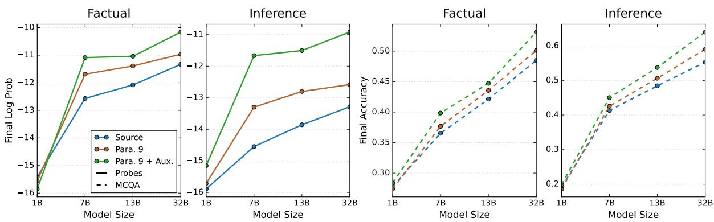  
Figure 2: Knowledge acquisition across model sizes under a fixed token budget. Auxiliary views (green) improve both factual recall and inference over Source (blue) and Para. 9 (orange); this advantage grows with model size.

Model Size Effects. The benefit of auxiliary views further emerges with scale. As shown in Figure 2, the 1B model derives little advantage from them, while the gap over the Source and Para. 9 conditions widens steadily through 7B, 13B, and 32B. This trend is largely consistent across all domains (Figure 7). We discuss this further in Section 4.3 in which larger models appear to unlock an advantage from auxiliary views that smaller models cannot.

Which Auxiliary View? We again token-match every condition. Textbooks, blogs, and Stack Exchange Q&A all perform similarly, with a slight benefit from mixing view types on factual recall (Table 8). Whether and how each view facilitates learning differently warrants further study.

Measuring Lexical Bias. A possible confounding factor is that the synthetically generated auxiliary views leak our probes, especially for inference probes where the target span, unlike factual probes, need not appear in the source. We address the question of lexical bias, whereby the model might favor particular phrases since auxiliary views and probes were produced by related model families (GPT-5- mini and GPT-5.4, respectively). We measure how often each probe’s target span occurs in the source, paraphrases, and auxiliary views.

Table 3 reports both frequency and coverage. Across all metrics, auxiliary views contain the target spans less frequently and with lower coverage than either the source or paraphrases. This strengthens our findings: auxiliary views perform better on the probes despite stating the targets less often.

Table 3: Frequency and coverage of our probe targets across documents. Freq. = occurrences per 1k tokens; Cover. = fraction of targets present at least once across the documents. Para. 49 averages Freq. over 49 paraphrased documents, while coverage records presence in any paraphrase.
<table><tr><td rowspan="2">Probes</td><td rowspan="2">Corpus</td><td colspan="2">Full target</td><td colspan="2">Bigram</td></tr><tr><td>Freq.</td><td>Cover.</td><td>Freq.</td><td>Cover.</td></tr><tr><td rowspan="3">Factual</td><td>Source</td><td>0.391</td><td>0.70</td><td>0.829</td><td>0.92</td></tr><tr><td>Para. 49</td><td>0.222</td><td>0.60</td><td>0.681</td><td>0.91</td></tr><tr><td>Aux.</td><td>0.112</td><td>0.33</td><td>0.437</td><td>0.74</td></tr><tr><td rowspan="3">Inference</td><td>Source</td><td>1.225</td><td>0.51</td><td>0.703</td><td>0.71</td></tr><tr><td>Para. 49</td><td>1.111</td><td>0.56</td><td>0.605</td><td>0.78</td></tr><tr><td>Aux.</td><td>1.070</td><td>0.51</td><td>0.628</td><td>0.77</td></tr></table>

Controlling for Upsampling. To test whether the density of duplicates introduced by tokenmatched upsampling of Source and Para. 9 explains some of the gap, we reduce the degree of upsampling. At scale 0.5, the inserted auxiliary-view budget and the matching upsampling are both halved. In the no-upsampling regime, Source and Para. 9 receive no upsampling at all; auxiliary views instead directly replace the document budget so that it sees the source document far less. We report each metric’s peak over the 100-step training window to reduce any disadvantage to the Source baseline from overfitting. The gap narrows, but auxiliary views retain their advantage in both regimes (Table 4). More importantly, Source never improves as duplication is reduced; its accuracy only declines. Thus, repetition helps, but reallocating that token budget to auxiliary views is more effective.

<table><tr><td>Matching regime</td><td>Condition</td><td>Factual MCQA</td><td>Inference MCQA</td></tr><tr><td>0.5</td><td>Source Para.9</td><td>0.382</td><td>0.444</td></tr><tr><td></td><td>Auxiliary views</td><td>0.399 0.412</td><td>0.435 0.450</td></tr><tr><td></td><td></td><td></td><td></td></tr><tr><td></td><td>Source</td><td>0.380</td><td>0.421</td></tr><tr><td>No upsampling</td><td>Para.9</td><td>0.389</td><td>0.415</td></tr><tr><td></td><td>Auxiliary views</td><td>0.392</td><td>0.424</td></tr></table>

Table 4: Token-matching upsampling. Peak MCQA accuracy when matching upsampling is halved or removed; in the latter, auxiliary views partially replace the original documents instead of upsampling source to match. Auxiliary views retain their advantage, and Source never improves with less duplication.

## 4.2 Broader Generalization

Our findings generalize to a pre-training, humanwritten views, and another model family.

A Pre-training-Faithful Setting. Our experiments so far use continued pre-training with a new learning-rate schedule and a smaller batch size. These choices may affect whether our findings generalize to the original pre-training regime. We therefore replicate our experiment in a pre-trainingfaithful setup and obtain the same ordering (Table 5; full setup details in Appendix E).

<table><tr><td>Condition</td><td>Fact. log prob.</td><td>Fact. MCQA</td><td>Inf. log prob.</td><td>Inf. MCQA</td></tr><tr><td>Pretrained model</td><td>-16.30</td><td>0.343</td><td>-14.79</td><td>0.413</td></tr><tr><td>Source (token-matched)</td><td>-10.00</td><td>0.372</td><td>-12.85</td><td>0.421</td></tr><tr><td>Para. 9 (token-matched)</td><td>-10.33</td><td>0.375</td><td>-12.53</td><td>0.417</td></tr><tr><td>Auxiliary views</td><td>-9.56</td><td>0.403</td><td>-10.82</td><td>0.492</td></tr></table>

Table 5: A Pre-training-Faithful Setting. Final metrics after resuming OLMo-2 7B from step 925,000 with its optimizer state, original data stream and schedule, and a global batch size of 1,024. Auxiliary views yield the largest gains.

Human Auxiliary Views. To test whether our findings depend on synthetic text, we repeat the experiment with human-written auxiliary views collected from the open web. The benefit again grows with model size (Figure 3), mirroring the synthetic-view results. This experiment covers only two documents, so we treat it as suggestive rather than conclusive; nonetheless, it provides initial evidence that the effect is not merely an artifact of clean, synthetic text.

Beyond OLMo-2. We repeat the main experiment on Qwen-2.5-7B, and auxiliary views again yield the largest gains (Table 11).

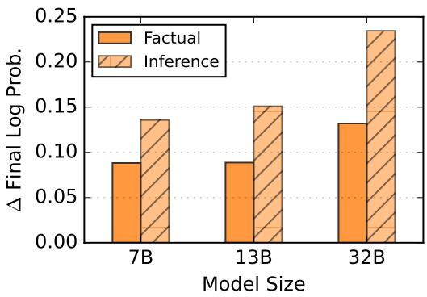  
Figure 3: With human-written auxiliary views collected from the open web, the benefit grows with model size, consistent with our synthetic results. ∆ final log prob. is the difference between training with human auxiliary views and the Para. 9 condition. Results are averaged over two documents.

## 4.3 Mechanistic Signatures of Auxiliary Views

Having established that auxiliary views improve knowledge acquisition, we ask how this phenomenon emerges mechanistically. We compare each trained model’s feed-forward network (FFN) weights against the base model along two axes: the magnitude of change (relative delta norm and cosine distance) and its concentration across channels (Gini coefficient), measured per layer and over training (Figures 10 and 9).

Why MLP Channels? We focus our analysis on the feed-forward (MLP) layers for two reasons. First, they account for the majority of a transformer’s parameters, making them the natural locus for studying where knowledge is written during training. Second, they have comparatively clean interpretations: Geva et al. (2021) show that individual channels in FFN layers operate as key– value memories. This channel-level view lets us read parameter change as movement in the model’s memory rather than as an opaque aggregate.

Compression: Learning More by Changing Less. Based on Figure 9, paraphrasing induces the largest parameter movement of the three conditions, in both norm and cosine distance, yet adding auxiliary views reduces this magnitude, though still more than source-only training. We interpret this as evidence that the two conditions learn differently. Paraphrasing supplies many surface-level variants of a single view, and the model appears to expend parameter change absorbing this lexical variation. Auxiliary views instead supply the knowledge in genuinely distinct framings, which the model can apparently integrate with less weight movement. This is consistent with our conjecture that auxiliary views enable a more generalizable encoding of knowledge: forming a more general, reusable representation requires overwriting fewer parameters than memorizing surface forms. Magnitude of change is not the same as quality of learning.

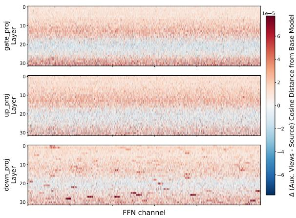  
Figure 4: Per-channel difference (Para. 9 + Aux. minus Source) in cosine distance from the base model across layers and FFN channels (gate, up, and down projections). Red indicates channels that auxiliary views move more than source; blue indicates less movement. A negative band around layers 16–24 shows that auxiliary views change the upper-middle layers less than source while affecting the middle and final layers more.

Layer-wise Biases. Parameter change is not uniform across layers. All conditions concentrate change in the middle and final layers, with a pronounced dip in the upper-middle layers (Figure 10). Auxiliary views accentuate this structure. Relative to source-only training, training with auxiliary views changes the middle and final layers more, but changes less in the upper-middle band (layers ∼16–24). Figure 4 makes this bias visible: the delta in cosine distance (Para. 9 + Aux. − Source) is negative in a band around layers 16–24 and positive elsewhere. Auxiliary views do not move more weight everywhere; they redistribute where learning occurs.

Model Size Effects. At 1B, where auxiliary views confer little benefit (Figure 2), the corresponding per-channel difference is almost uniformly negative or zero across all layers and projections (Figure 11), lacking the layer-wise biases seen at 7B. The mechanistic signature of auxiliary views therefore emerges only at scale. This suggests that larger models encode auxiliary views differently, enabling greater generalization.

## 5 Auxiliary Views Do Not Require a Strong Teacher

Auxiliary views inherently require a teacher: someone who understands the material and can communicate it to others. Naturally, our results could hinge on the generator’s strength, although our auxiliary text is generated by a relatively weak model, GPT-5-MINI. To examine the influence of the teacher’s capabilities, we regenerate auxiliary views using eleven generator configurations spanning multiple model families, reasoning-effort levels, and sizes, while holding the training schedule and token budget fixed. Because generators that produce less auxiliary-view text require more repetition to match the token budget and may therefore overfit, we compare each at its peak over the 100-step training window.

Downstream factual accuracy is remarkably stable across generators (0.405–0.422, all above the Para. 9 baseline of 0.396; Table 13). It is uncorrelated with generator size (Pearson $r = - 0 . 1 4$ $n = 6 )$ , as further corroborated by scaling within a model family (gpt-oss-20B→120B: 0.422→0.413; Gemma-4 12B→31B: 0.414→0.405), and likewise uncorrelated with the generator’s own factual accuracy $( r = - 0 . 2 4 , n = 1 0 , p = 0 . 5 0 )$ . Notably, gpt-oss-20B has the least measured domain knowledge, yet its views teach best.

However, the volume of generated view text, which does not measure teacher strength and can be controlled through prompting, does correlate with downstream accuracy $( r = + 0 . 6 2 , p \approx 0 . 0 4 )$ Varying the reasoning effort of the same generator likewise leaves downstream performance essentially unchanged, even though it changes the generator’s own accuracy. Together, these results suggest that auxiliary views function as general data augmentation rather than as distillation from a strong teacher. The generator need only reformulate the provided text; stronger models do not necessarily perform better at this task, even in complex domains.

## 6 When Does Paraphrasing Help?

Paraphrasing is known to aid knowledge acquisition (Ovadia et al., 2024), but prior reports conflict on its effectiveness. We revisit this question to show that its benefit is conditional, and in doing so reconcile these reports.

Paraphrasing prevents collapse. Repeated exposure improves performance only up to ∼20 exposures, after which Source saturates and then sharply degrades as the model overfits (Figure 5, left). Para. 9 prevents this collapse, sustaining improvement through ∼40 exposures. As with auxiliary views, this benefit emerges only at 7B and above; at 1B, paraphrasing is slightly harmful.

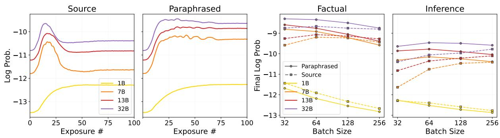  
Figure 5: (Left) Inference-probe log probability while training OLMo-2-7B with a batch size of 64 on Source versus Para. 9. (Right) Final probe log probabilities for Source versus Para. 9 across model sizes and batch sizes. This experiment uses six documents to examine dynamics at smaller batch sizes.

The benefit depends on batch size. However, we see that this advantage depends on batch size, likely because larger batches mix in more general data per step and this similarly suppresses overfitting. As batch size grows, Source becomes more stable and nearly matches Para. 9 by batch size 256, while Para. 9 stays roughly flat (Figure 5, rightmost). Paraphrasing’s inference gains thus come from preventing a degeneration that large batches also prevent; together, the two interventions become redundant.

Factual acquisition behaves differently. At small batch sizes, paraphrasing improves factual learning at 7B and above, whereas Source sees almost no gain from larger batches (aside from a small improvement at batch size 64 for 7B). We attribute this advantage to how paraphrasing semantically varies the facts: although factual probes are drawn explicitly from source sentences, they are recast as self-contained atomic statements, so Source’s verbatim memorization transfers less well. The advantage shrinks at larger batches and reverses at batch size 256 (7B and 13B), likely because the increased general-data mixing dilutes the gradient signal from the paraphrased text.

Table 5 supports this general interpretation at a batch size of 1,024: paraphrasing provides no consistent improvement over Source, while auxiliary views retain a substantial advantage.

Reconciling Prior Works. This batch-size dependence reconciles conflicting prior work: Chang et al. (2024), at batch size 2048 with 2048-token chunks, reports degraded factual learning from paraphrasing, whereas Allen-Zhu and Li (2024), at batch size 96 with 512-token chunks, reports gains. The two sit at opposite ends of the regime we characterize here.

## 7 Prior Knowledge Matters

<table><tr><td>Model</td><td>Base</td><td>CPT</td></tr><tr><td>OLMo-2-0425-1B</td><td>0.4380</td><td>0.5454</td></tr><tr><td>OLMo-2-1124-7B</td><td>0.6859</td><td>0.7272</td></tr></table>

Table 6: The prior-knowledge gap. MCQA accuracy on prerequisite topics for each document, before (Base) and after (CPT) continued pre-training on synthetic textbooks covering that foundational knowledge.

Prior-Knowledge Gap. We first establish that the model lacks some of the foundational knowledge K presupposes. We generate MCQA pairs on prerequisite topics for each document and measure the base model’s accuracy. As shown in Table 6, accuracy on this benchmark improves after continued pre-training on synthetic textbooks covering this material, confirming a gap that domain adaptation must contend with. Recent work has studied how such gaps shape learning (Wang et al., 2025b; Gekhman et al., 2024; Yang et al., 2024), but the question remains open.

Complementary Benefits. Table 9 reports the peak improvement over each run’s pretrained baseline. Relative to standard Para. 9, providing either contextual or prerequisite knowledge substantially improves acquisition. Under the stricter tokenmatched comparison, adding surrounding knowledge does not consistently surpass Para. 9. This is unsurprising; because contextual knowledge is largely tangential to the target material, allocating a fixed token budget to variations of the target knowledge should be more effective. Nevertheless, surrounding knowledge yields improvements comparable to adding paraphrases, which is a meaningful benefit. Furthermore, the two knowledge types exhibit distinct strengths: contextual knowledge drives larger factual gains across both domains, whereas prerequisite knowledge yields greater improvements in inference.

To ask whether these differences reflect surface overlap, we measure how often each probe’s target span appears in the inserted texts (Table 12). Cited works include factual targets about twice as often as prerequisite textbooks, so contextual knowledge’s relative factual advantage may partly reflect lexical presence. However, lexical overlap cannot explain the inference result: prerequisite knowledge contains the inference targets no more often than contextual knowledge, with lower bigram frequency, yet yields the larger inference improvement. This is consistent with prerequisite knowledge supplying foundations that support integration and inference.

## 8 Ablations

Learning Rate. Across our experiments, we use a fixed peak learning rate of 4e-5. Following Parmar et al. (2024), however, continued-pre-training recipes should inherit the base model’s pre-training learning rate, and the 13B and 32B models were pre-trained at higher rates (9e-5 and 6e-5) than the 7B model (3e-5) (OLMo et al., 2024). Because learning rate strongly governs how much is learned, holding it fixed at 4e-5 may have caused us to underestimate the model-size effect and the overall effects of auxiliary views and paraphrasing. Consistent with this interpretation, the analysis in Figure 12 shows that the advantages of auxiliary views and paraphrasing over source-only training widen as the learning rate increases.

Order of Prior Knowledge. We vary whether prerequisite data appears at the beginning, middle, or end of training. No placement is consistently best across metrics (Table 10), and the differences are small. We leave a fuller investigation of curriculum effects to future work.

## 9 Discussion & Conclusion

Auxiliary Views. To our knowledge, we are the first to isolate the significance of auxiliary views. The premise is intuitive: data augmentation can help, and diversity is an established principle in pre-training. However, diversity remains an underspecified principle that is difficult to operationalize when constructing data from scratch amid data scarcity. This motivates a clearer account of how variation improves learning and why.

Our study uncovers a phenomenon in which conceptual reformulations of a document, whether as a textbook or a blog, have an effect starkly distinct from mere paraphrasing: they substantially improve learning and induce a distinct layer-wise bias and compression in how knowledge is encoded. More strikingly, they improve factual recall even though the model sees the original document, from which our probes are constructed, less frequently. This points to an underlying effect: a model’s broader conceptual understanding directly facilitates its ability to memorize specific facts.

Furthermore, the model’s ability to encode auxiliary views effectively emerges only in our larger models and grows with model size. Larger models learn better by integrating diverse views more effectively, encoding them with greater parameter efficiency by moving fewer weights and redistributing learning toward the middle and final layers. Together, these results help explain the effectiveness of pre-training corpora beyond simple scale and provide a clearer mechanism for the commonly invoked notion of “good” and “diverse” data.

Practical Takeaways. We offer three recommendations for practitioners engaged in domain adaptation: (1) continue pre-training on prerequisite knowledge to close foundational gaps (2) apply paraphrasing when data is scarce, while recognizing that its benefit diminishes as batch size grows (3) and consider synthetic augmentation with auxiliary views.

We find the last point especially relevant for scientific domains. Open scientific corpora are constantly evolving, producing research that lacks the auxiliary views which surrounds established knowledge. Our results show that synthesizing such views is helpful for acquiring knowledge effectively. However, whether this remains effective for specialized, long-tailed knowledge for which LLMs may lack the expertise to generate highquality auxiliary views remains an open question.

While the scope of this study may limit its generalizability, we hope these insights prove valuable to practitioners in domain adaptation, encourage greater consideration of how knowledge is represented, and provoke deeper discussion of the mechanisms of knowledge acquisition in LLMs.

## Acknowledgements

This work was supported in part by seed funding from the PSOM AI2D Center at Penn.

## Limitations

Our analysis is restricted to three domains, which may introduce corpus-level biases. While our main results regarding auxiliary views were consistent across each domain, this is not the case for our secondary results regarding contextual and prereq uisite knowledge. We acknowledge that this limits the generalization of our findings.

Furthermore, the contextual-knowledge experiment covers only arXiv papers and legal opinions, because medical case reports lack an analogous citation structure. Its results establish different factual and inference biases for contextual and prerequisite knowledge, but not a consistent advantage over token-matched paraphrasing.

Our findings may also have limited generalizability to pre-training proper. While our pre-trainingfaithful control uses the original optimizer state, learning-rate schedule, and data at a batch size of 1,024, it is a 100-step experiment at a later checkpoint rather than pre-training from scratch.

Furthermore, our investigation of generator strength may not generalize to low-resource, highly specialized domains, where even comprehending the source material may challenge the generator. In such settings, it remains unclear whether teachermodel strength is irrelevant.

Finally, our results are constrained by the scale of the models we study (up to 32B). Because model scale is a primary determinant of LLM capabilities, our findings may not extend to substantially larger models.

## References

Zeyuan Allen-Zhu and Yuanzhi Li. 2024. Physics of language models: Part 3.1, knowledge storage and extraction. In International Conference on Machine Learning, pages 1067–1077. PMLR.

Lei Bai, Zhongrui Cai, Maosong Cao, Weihan Cao, Chiyu Chen, Haojiong Chen, Kai Chen, Pengcheng Chen, Ying Chen, Yongkang Chen, and 1 others. 2025. Intern-s1: A scientific multimodal foundation model. arXiv preprint arXiv:2508.15763.

Tom Brown, Benjamin Mann, Nick Ryder, Melanie Subbiah, Jared D Kaplan, Prafulla Dhariwal, Arvind Neelakantan, Pranav Shyam, Girish Sastry, Amanda Askell, and 1 others. 2020. Language models are

few-shot learners. Advances in neural information processing systems, 33:1877–1901.

Nicholas Carlini, Daphne Ippolito, Matthew Jagielski, Katherine Lee, Florian Tramer, and Chiyuan Zhang. 2023. Quantifying memorization across neural language models. In The Eleventh International Conference on Learning Representations.

Hoyeon Chang, Jinho Park, Seonghyeon Ye, Sohee Yang, Youngkyung Seo, Du-Seong Chang, and Minjoon Seo. 2024. How do large language models acquire factual knowledge during pretraining? Advances in neural information processing systems, 37:60626–60668.

Zhengyu Chen, Siqi Wang, Teng Xiao, Yudong Wang, Shiqi Chen, Xunliang Cai, Junxian He, and Jingang Wang. 2025. Revisiting scaling laws for language models: The role of data quality and training strategies. In Proceedings of the 63rd Annual Meeting of the Association for Computational Linguistics (Volume 1: Long Papers), pages 23881–23899.

Pierre Colombo, Telmo Pessoa Pires, Malik Boudiaf, Dominic Culver, Rui Melo, Caio Corro, Andre FT Martins, Fabrizio Esposito, Vera Lúcia Raposo, Sofia Morgado, and 1 others. 2024. Saullm-7b: A pioneering large language model for law. arXiv preprint arXiv:2403.03883.

Zorik Gekhman, Gal Yona, Roee Aharoni, Matan Eyal, Amir Feder, Roi Reichart, and Jonathan Herzig. 2024. Does fine-tuning llms on new knowledge encourage hallucinations? In Proceedings of the 2024 Conference on Empirical Methods in Natural Language Processing, pages 7765–7784.

Mor Geva, Roei Schuster, Jonathan Berant, and Omer Levy. 2021. Transformer feed-forward layers are key-value memories. In Proceedings of the 2021 Conference on Empirical Methods in Natural Language Processing, pages 5484–5495.

Suriya Gunasekar, Yi Zhang, Jyoti Aneja, Caio César Teodoro Mendes, Allie Del Giorno, Sivakanth Gopi, Mojan Javaheripi, Piero Kauffmann, Gustavo de Rosa, Olli Saarikivi, and 1 others. 2023. Textbooks are all you need. arXiv preprint arXiv:2306.11644.

Danny Hernandez, Tom Brown, Tom Conerly, Nova DasSarma, Dawn Drain, Sheer El-Showk, Nelson Elhage, Zac Hatfield-Dodds, Tom Henighan, Tristan Hume, and 1 others. 2022. Scaling laws and interpretability of learning from repeated data. arXiv preprint arXiv:2205.10487.

Jan Hoffbauer, Sylwester Sawicki, Marc Ulrich, Tolga Buz, Konstantin Dobler, Moritz Schneider, and Gerard De Melo. 2024. Knowledge acquisition through continued pretraining is difficult: A case study on r/AskHistorians. In Proceedings of the 1st Workshop on Towards Knowledgeable Language Models (KnowLLM 2024), pages 96–108, Bangkok, Thailand. Association for Computational Linguistics.

Jordan Hoffmann, Sebastian Borgeaud, Arthur Mensch, Elena Buchatskaya, Trevor Cai, Eliza Rutherford, Diego de Las Casas, Lisa Anne Hendricks, Johannes Welbl, Aidan Clark, and 1 others. 2022. Training compute-optimal large language models. In Proceedings of the 36th International Conference on Neural Information Processing Systems, pages 30016– 30030.

Nathan Hu, Eric Mitchell, Christopher D Manning, and Chelsea Finn. 2023. Meta-learning online adaptation of language models. arXiv preprint arXiv:2305.15076.

Joel Jang, Seonghyeon Ye, Sohee Yang, Joongbo Shin, Janghoon Han, Gyeonghun Kim, Stanley Jungkyu Choi, and Minjoon Seo. 2021. Towards continual knowledge learning of language models. arXiv preprint arXiv:2110.03215.

Zhengbao Jiang, Zhiqing Sun, Weijia Shi, Pedro Rodriguez, Chunting Zhou, Graham Neubig, Xi Lin, Wen-tau Yih, and Srini Iyer. 2024. Instruction-tuned language models are better knowledge learners. In Proceedings ofthe 62nd Annual Meeting ofthe Associationfor Computational Linguistics (Volume 1: Long Papers).

Zhengbao Jiang, Frank F. Xu, Jun Araki, and Graham Neubig. 2020. How can we know what language models know? Transactions ofthe Associationfor Computational Linguistics, 8.

Nikhil Kandpal, Haikang Deng, Adam Roberts, Eric Wallace, and Colin Raffel. 2023. Large language models struggle to learn long-tail knowledge. In International conference on machine learning, pages 15696–15707. PMLR.

Jared Kaplan, Sam McCandlish, Tom Henighan, Tom B Brown, Benjamin Chess, Rewon Child, Scott Gray, Alec Radford, Jeffrey Wu, and Dario Amodei. 2020. Scaling laws for neural language models. arXiv preprint arXiv:2001.08361.

Katherine Lee, Daphne Ippolito, Andrew Nystrom, Chiyuan Zhang, Douglas Eck, Chris Callison-Burch, and Nicholas Carlini. 2021. Deduplicating training data makes language models better. arXiv preprint arXiv:2107.06499.

Jeffrey Li, Alex Fang, Georgios Smyrnis, Maor Ivgi, Matt Jordan, Samir Yitzhak Gadre, Hritik Bansal, Etash Guha, Sedrick Scott Keh, Kushal Arora, and 1 others. 2024. Datacomp-lm: In search of the next generation of training sets for language models. Advances in Neural Information Processing Systems, 37:14200–14282.

Jiacheng Liu, Sewon Min, Luke Zettlemoyer, Yejin Choi, and Hannaneh Hajishirzi. 2024. Infini-gram: Scaling unbounded n-gram language models to a trillion tokens. arXiv preprint arXiv:2401.17377.

Shayne Longpre, Gregory Yauney, Emily Reif, Katherine Lee, Adam Roberts, Barret Zoph, Denny Zhou,

Jason Wei, Kevin Robinson, David Mimno, and 1 others. 2024. A pretrainer’s guide to training data: Measuring the effects of data age, domain coverage, quality, & toxicity. In Proceedings ofthe 2024 Conference ofthe North American Chapter ofthe Associationfor Computational Linguistics: Human Language Technologies (Volume 1: Long Papers), pages 3245–3276.

Xiaoliang Luo, Akilles Rechardt, Guangzhi Sun, Kevin K Nejad, Felipe Yáñez, Bati Yilmaz, Kangjoo Lee, Alexandra O Cohen, Valentina Borghesani, Anton Pashkov, and 1 others. 2025. Large language models surpass human experts in predicting neuroscience results. Nature human behaviour, 9(2):305– 315.

Niklas Muennighoff, Alexander Rush, Boaz Barak, Teven Le Scao, Nouamane Tazi, Aleksandra Piktus, Sampo Pyysalo, Thomas Wolf, and Colin A Raffel. 2023. Scaling data-constrained language models. Advances in Neural Information Processing Systems, 36:50358–50376.

Team OLMo, Pete Walsh, Luca Soldaini, Dirk Groeneveld, Kyle Lo, Shane Arora, Akshita Bhagia, Yuling Gu, Shengyi Huang, Matt Jordan, and 1 others. 2024. 2 olmo 2 furious. arXiv preprint arXiv:2501.00656.

Oded Ovadia, Menachem Brief, Moshik Mishaeli, and Oren Elisha. 2024. Fine-tuning or retrieval? comparing knowledge injection in llms. In Proceedings of the 2024 Conference on Empirical Methods in Natural Language Processing, pages 237–250.

Jupinder Parmar, Sanjev Satheesh, Mostofa Patwary, Mohammad Shoeybi, and Bryan Catanzaro. 2024. Reuse, don’t retrain: A recipe for continued pretraining of language models. arXiv preprint arXiv:2407.07263.

Fabio Petroni, Tim Rocktäschel, Sebastian Riedel, Patrick Lewis, Anton Bakhtin, Yuxiang Wu, and Alexander Miller. 2019. Language models as knowledge bases? In Proceedings of the 2019 Conference on Empirical Methods in Natural Language Processing and the 9th International Joint Conference on Natural Language Processing (EMNLP-IJCNLP), Hong Kong, China. Association for Computational Linguistics.

Colin Raffel, Noam Shazeer, Adam Roberts, Katherine Lee, Sharan Narang, Michael Matena, Yanqi Zhou, Wei Li, and Peter J Liu. 2020. Exploring the limits of transfer learning with a unified text-to-text transformer. Journal of machine learning research, 21(140):1–67.

Andrew Sellergren, Sahar Kazemzadeh, Tiam Jaroensri, Atilla Kiraly, Madeleine Traverse, Timo Kohlberger, Shawn Xu, Fayaz Jamil, Cían Hughes, Charles Lau, and 1 others. 2025. Medgemma technical report. arXiv preprint arXiv:2507.05201.

Karan Singhal, Tao Tu, Juraj Gottweis, Rory Sayres, Ellery Wulczyn, Mohamed Amin, Le Hou, Kevin

Clark, Stephen R Pfohl, Heather Cole-Lewis, and 1 others. 2025. Toward expert-level medical question answering with large language models. Nature Medicine, 31(3):943–950.

Rand J Spiro. 2017. Remembering information from text: The "state of schema" approach. In Schooling and the acquisition of knowledge, pages 137–165. Routledge.

Ross Taylor, Marcin Kardas, Guillem Cucurull, Thomas Scialom, Anthony Hartshorn, Elvis Saravia, Andrew Poulton, Viktor Kerkez, and Robert Stojnic. 2022. Galactica: A large language model for science. arXiv preprint arXiv:2211.09085.

Kushal Tirumala, Aram Markosyan, Luke Zettlemoyer, and Armen Aghajanyan. 2022. Memorization without overfitting: Analyzing the training dynamics of large language models. Advances in Neural Information Processing Systems, 35:38274–38290.

Ashish Vaswani, Noam Shazeer, Niki Parmar, Jakob Uszkoreit, Llion Jones, Aidan N Gomez, Łukasz Kaiser, and Illia Polosukhin. 2017. Attention is all you need. Advances in neural information processing systems, 30.

Cunxiang Wang, Pai Liu, and Yue Zhang. 2021. Can generative pre-trained language models serve as knowledge bases for closed-book qa? In Proceedings ofthe 59th Annual Meeting ofthe Associationfor Computational Linguistics and the 11th International Joint Conference on Natural Language Processing (Volume 1: Long Papers), pages 3241–3251.

Eric Wang, Samuel Schmidgall, Paul F Jaeger, Fan Zhang, Rory Pilgrim, Yossi Matias, Joelle Barral, David Fleet, and Shekoofeh Azizi. 2025a. Txgemma: Efficient and agentic llms for therapeutics. arXiv preprint arXiv:2504.06196.

Ziming Wang, Zeyu Shi, Haoyi Zhou, Shiqi Gao, Qingyun Sun, and Jianxin Li. 2025b. Towards objective fine-tuning: How llms’ prior knowledge causes potential poor calibration? Preprint, arXiv:2505.20903.

Maurice Weber, Dan Fu, Quentin Anthony, Yonatan Oren, Shane Adams, Anton Alexandrov, Xiaozhong Lyu, Huu Nguyen, Xiaozhe Yao, Virginia Adams, and 1 others. 2024. Redpajama: an open dataset for training large language models. Advances in neural information processing systems, 37:116462–116492.

Fuzhao Xue, Yao Fu, Wangchunshu Zhou, Zangwei Zheng, and Yang You. 2023. To repeat or not to repeat: Insights from scaling llm under token-crisis. Advances in Neural Information Processing Systems, 36:59304–59322.

Yushi Yang, Andrew M Bean, Robert McCraith, and Adam Mahdi. 2024. Fine-tuning large language models with human-inspired learning strategies in medical question answering. arXiv e-prints, pages arXiv– 2408.

Chi Zhang, Huaping Zhong, Kuan Zhang, Chengliang Chai, Rui Wang, Xinlin Zhuang, Tianyi Bai, Qiu Jiantao, Lei Cao, Ju Fan, and 1 others. 2025. Harnessing diversity for important data selection in pretraining large language models. In International Conference on Learning Representations, volume 2025, pages 72980–73003.

Susan Zhang, Stephen Roller, Naman Goyal, Mikel Artetxe, Moya Chen, Shuohui Chen, Christopher Dewan, Mona Diab, Xian Li, Xi Victoria Lin, and 1 others. 2022. Opt: Open pre-trained transformer language models. arXiv preprint arXiv:2205.01068.

Zexuan Zhong, Dan Friedman, and Danqi Chen. 2021. Factual probing is [mask]: Learning vs. learning to recall. In Proceedings of the 2021 Conference of the North American Chapter of the Association for Computational Linguistics: Human Language Technologies, pages 5017–5033.

## A Data

## A.1 Dataset Construction

Document collection. The arXiv set was manually collected. For medical documents, we use the NCBI E-utilities API to search PubMed Central for open-access case reports and download JATS XML. For legal documents, we use the CourtListener REST API to search U.S. federal appellate opinions. Across domains, we filter candidate documents to obtain twelve target documents of suitable length, e.g., court opinions longer than 4000 tokens were rejected to avoid awkward chunking.

Pre-training corpus check. We check all 36 source documents against the Infini-gram API. For each document, we query the title and ten randomly sampled body sentences against the OLMo-2 pre-training mixture index, v4\_olmo-mix-1124\_llama, and find zero matches.

Cleaning. For arXiv papers, we clean the raw LaTeX by removing comments, figures, tables, presentation-only commands, unresolved includes, page breaks, and bibliography/appendix material; expanding simple macros; extracting title, abstract, and main body; resolving revision commands; and repairing erroneous line breaks while preserving LaTeX environments. Medical case reports are converted from JATS XML into sectioned plain text. Legal opinions require additional PDF/OCR cleanup: we remove page headers, docket/page artifacts, decorative separators, extracted footnotes, and merge dangling sentences into paragraphs.

Contextual Knowledge. In our study, contextual views are cited works associated with the source document. For arXiv documents, we resolve each paper to an arXiv identifier, retrieve reference metadata using Semantic Scholar and OpenAlex, identify references with arXiv identifiers, download their source packages, and clean them with the same arXiv cleaning procedure. For legal documents, we use CourtListener citation links to collect cited judicial opinions and apply the same legalopinion cleaning procedure. We do not construct contextual views for medical documents because case reports lack an analogous citation structure in our setup.

## A.2 Synthetic Data Generation

Data statistics. Table 7 summarizes the artifacts used in our experiments. We generate 49 paraphrases per source document, yielding 1764 paraphrases in total. For auxiliary views, N counts the generated units obtained by splitting each view family into per-post blogs, per-question Stack Exchange Q&A, and per-chapter textbooks.

<table><tr><td>Material</td><td>N</td><td>Avg. Len. (tokens)</td><td>Total Tokens</td></tr><tr><td>Overall</td><td></td><td></td><td></td></tr><tr><td>Source Documents</td><td>36</td><td>5858</td><td>210,888</td></tr><tr><td>Paraphrases</td><td>1764</td><td>6180</td><td>10,904,160</td></tr><tr><td>Blogs</td><td>225</td><td>1901</td><td>427,632</td></tr><tr><td>Stack Exchange Q&amp;A</td><td>453</td><td>1290</td><td>584,392</td></tr><tr><td>Textbook Chapters</td><td>282</td><td>2239</td><td>631,403</td></tr><tr><td>Prerequisite Chapters</td><td>582</td><td>4282</td><td>2,492,392</td></tr><tr><td>Contextual Documents</td><td>639</td><td>10416</td><td>6,655,888</td></tr><tr><td>Computer Science</td><td></td><td></td><td></td></tr><tr><td>Source Documents</td><td>12</td><td>10550</td><td>126,598</td></tr><tr><td>Paraphrases</td><td>638</td><td>11002</td><td>7,019,384</td></tr><tr><td>Blogs</td><td>105</td><td>1920</td><td>201,648</td></tr><tr><td>Stack Exchange Q&amp;A</td><td>242</td><td>1460</td><td>353,321</td></tr><tr><td>Textbook Chapters</td><td>158</td><td>2872</td><td>453,833</td></tr><tr><td>Prerequisite Chapters</td><td>187</td><td>4555</td><td>851,724</td></tr><tr><td>Contextual Documents</td><td>506</td><td>10791</td><td>5,460,148</td></tr><tr><td>Medical</td><td></td><td></td><td></td></tr><tr><td>Source Documents</td><td>12</td><td>3765</td><td>45,181</td></tr><tr><td>Paraphrases</td><td>588</td><td>3858</td><td>2,268,311</td></tr><tr><td>Blogs</td><td>72</td><td>1979</td><td>142,500</td></tr><tr><td>Stack Exchange Q&amp;A</td><td>117</td><td>1068</td><td>124,973</td></tr><tr><td>Textbook Chapters</td><td>61</td><td>1404</td><td>85,666</td></tr><tr><td>Prerequisite Chapters</td><td>220</td><td>4589</td><td>1,009,582</td></tr><tr><td>Contextual Documents</td><td>0</td><td>一</td><td></td></tr><tr><td>Legal</td><td></td><td></td><td></td></tr><tr><td>Source Documents</td><td>12</td><td>3259</td><td>39,109</td></tr><tr><td>Paraphrases</td><td>589</td><td>3274</td><td>1,928,141</td></tr><tr><td>Blogs</td><td>48</td><td>1739</td><td>83,484</td></tr><tr><td>Stack Exchange Q&amp;A</td><td>94</td><td>1129</td><td>106,098</td></tr><tr><td>Textbook Chapters</td><td>63</td><td>1459</td><td>91,904</td></tr><tr><td>Prerequisite Chapters</td><td>175</td><td>3606</td><td>631,086</td></tr><tr><td>Contextual Documents</td><td>133</td><td>8991</td><td>1,195,740</td></tr></table>

Table 7: Dataset statistics by text type and domain.

Paraphrases. Paraphrases are generated from cleaned source documents on a paragraph-level basis. We preserve section headers verbatim and avoid paraphrasing LaTeX-only paragraphs. Domain-specific prompts are used for academic, legal, and medical text. The academic prompt preserves LaTeX formatting, equations, proper nouns, titles, section headers, and technical terminology; the legal prompt preserves legal meaning, party names, citations, quoted language, dates, docket numbers, and legal terms of art; and the medical prompt preserves diagnoses, medications, doses, routes, timelines, lab values, imaging findings, procedures, outcomes, and clinical terminology. We use GPT-4.1 to generate paraphrases with a temperature of 1 and a top-p of 0.975.

Auxiliary views. For each document, we generate synthetic auxiliary views conditioned on the target document and intended to restate, explain, or pedagogically reorganize the same document-level content. The computer science setting generates textbook chapters for college students with a basic machine-learning background, Stack Exchange– style questions from a confused student followed by grounded answers, and technical blog posts for a broader technical audience. The medical setting adapts these formats to clinical education: casebased textbook sections for medical students or residents, clinical teaching Q&A, and clinical blog posts. The legal setting uses casebook/treatise-style chapters for law students, Law Stack Exchange– style Q&A, and analytic legal commentary. For each view family, we first generate an outline, list of questions, or list of blog ideas and then generate the individual chapters, answers, or posts from that plan. We use GPT-5 to generate the outlines and GPT-5-mini to generate the contents of the chapters, questions, or posts.

Prerequisite views. Prerequisite views are generated separately from auxiliary views. For arXiv papers, we use a curriculum-design prompt to create prerequisite textbook chapters that teach the foundations needed to understand the paper while excluding the paper’s own novel ideas. For medical case reports, the prompt asks for general medical background–for example relevant anatomy, pathophysiology, pharmacology, diagnostic interpretation, differential diagnosis, and standard management–while explicitly forbidding patientspecific chronology, workup, treatment course, outcome, or novel observations from the source case. For legal opinions, the prompt similarly asks for doctrinal and procedural background while excluding the source case’s parties, facts, outcome, holding, and novel reasoning. When useful for legal background, we additionally include landmark or doctrinally foundational cited opinions as context for the generated prerequisite chapters. We use GPT-5 to generate the outlines and GPT-5-mini to generate the contents of the chapters.

## B Probe Generation

Our probe construction pipeline is adapted and refined for each domain (arXiv, legal, and medical). We present the pipeline for arXiv documents in Figure 6; the full pipeline for all domains is available in our released code.

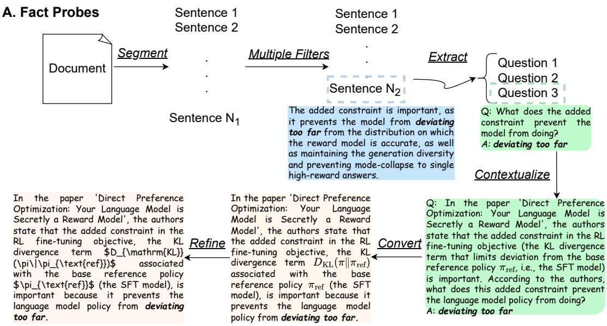

## B. Comprehension & Inference Probes

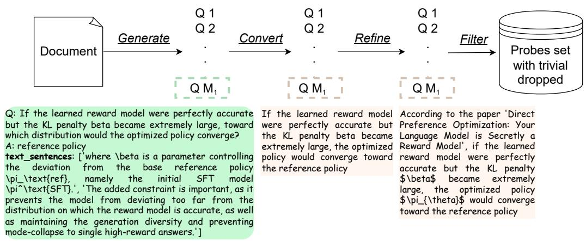

Figure 6: Overview of the probe-generation pipeline for arXiv documents. (A) Factual probe generation: We generate probes sentence by sentence to keep their ground truth close to the source document. Preprocessing: We first remove sentences containing minimal knowledge (to prevent noise from structural comments, e.g., “Let us first discuss the following results”). We then use heuristics to remove sentences likely to yield low-quality probes, such as those that are too short (e.g., “the sweep has 22 runs”) or contain excessive LAT X code with no valid English extraction targets. Question extraction: From each remaining sentence, we extract 1–3 questions that capture its knowledge. Contextualization: Questions are made clear and self-contained while preserving the knowledge being tested. Cloze conversion: Questions are converted into cloze statements with answers at the end. Refinement: We ensure that all mathematical content is written in LAT X and verify the preceding steps. (B) Compositional probe generation: Because not all atomic facts warrant a compositional probe, we employ a two-level approach. First, we divide the paper into sections and prompt an LLM to extract compositional questions. We define compositionality as either (1) inference, which reasons over supporting text to reach a new insight, or (2) synthesis, which combines several facts into a synthesized statement. We perform this process section by section for granularity, then repeat it with the entire paper to obtain more holistic questions. Cloze conversion: As in the factual pipeline, questions are converted into cloze statements with answers at the end. Refinement: Statements are formatted in LAT X where needed and made self-contained by referencing the paper (e.g., “according to the paper”). Filtering: Finally, we ask the LLM to identify questions that are too simple, imprecise, or confusing; this step removes 15% of probes on average.

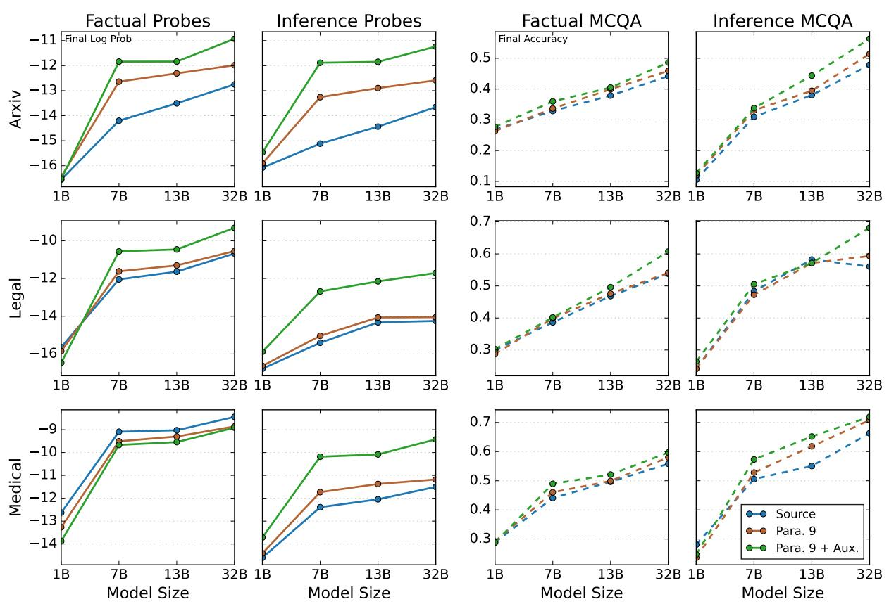

## C Additional Plots

Figure 7: Under a fixed token budget, auxiliary views improve both factual recall and inference, and their effect size increases with model size. This pattern also holds when averaging by domain, with factual probes for medical documents as the sole exception.  
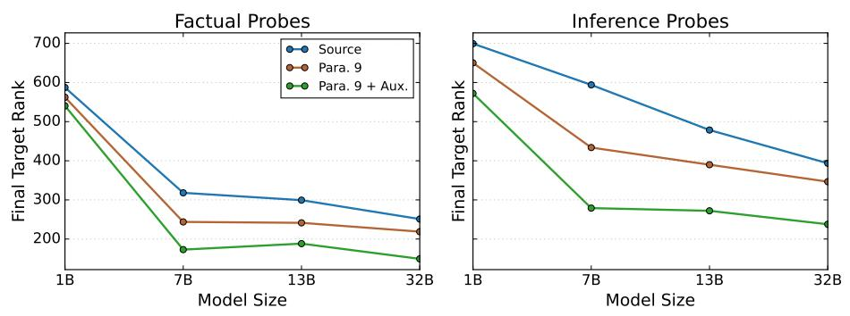  
Figure 8: Under a fixed token budget, auxiliary views improve both factual recall and inference, and their effect size increases with model size. Lower ranks are better.

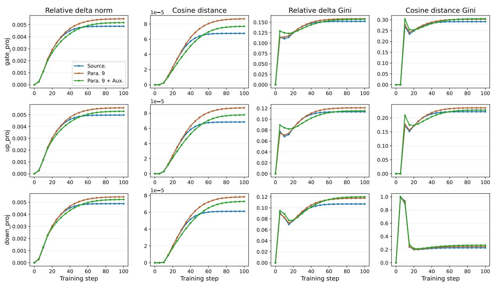  
Figure 9: FFN parameter change over training (OLMo-2-7B). Paraphrasing induces the largest parameter movement, while auxiliary views reduce this magnitude toward source-only training. Both the concentration of change (Gini) and downstream performance converge by step ∼50 (performance not shown), whereas magnitude (relative delta norm and cosine distance) continues to grow afterward; parameters keep drifting after learning has effectively converged.

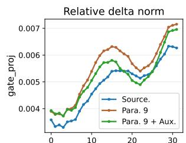

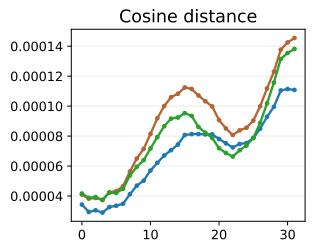

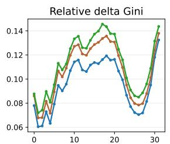

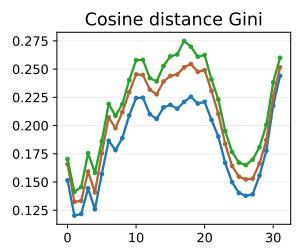

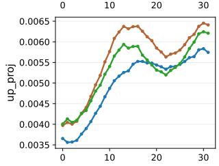

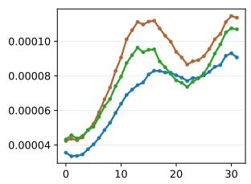

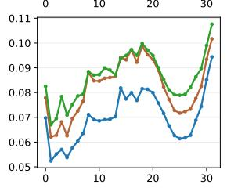

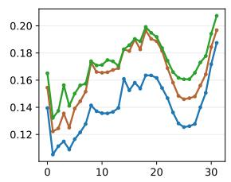

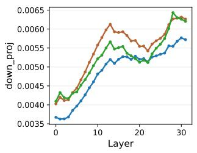

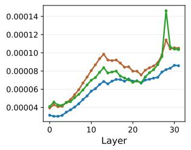

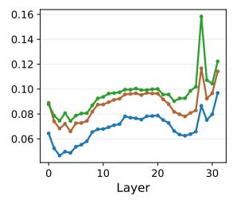

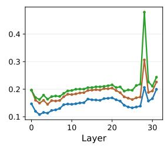  
Figure 10: Per-layer FFN parameter change from the base model over training (OLMo-2-7B). Magnitude (relative delta norm and cosine distance) and concentration (Gini) are shown for the gate, up, and down projections. All conditions concentrate change in the middle and final layers with a dip in the upper-middle layers; auxiliary views increase change in the middle and final layers but reduce it relative to source in the ∼16–24 band.

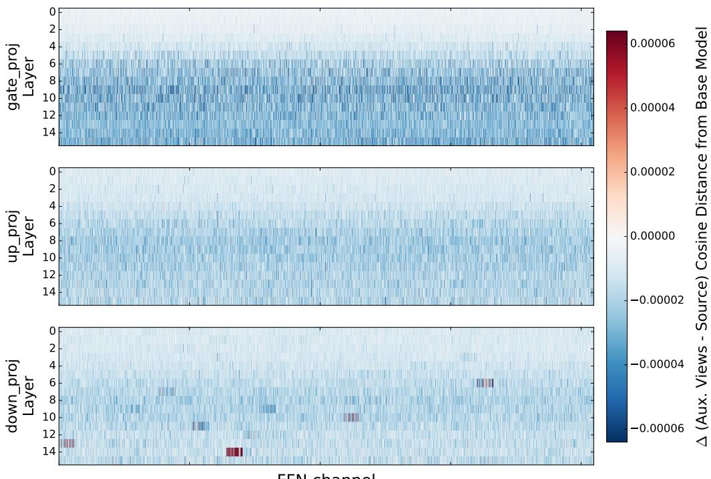  
FFN channel  
Figure 11: The same per-channel difference in cosine distance from the base model (Para. 9 + Aux. minus Source) as Figure 4, but for the 1B model. Unlike the structured pattern at 7B, the difference is either blue (negative) or white, indicating that auxiliary views change parameters slightly less than source nearly everywhere, with no organized layer-wise band. The only exceptions are a few isolated channels in down\_proj at the deepest layers.

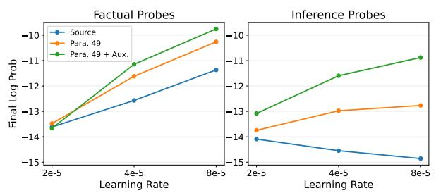

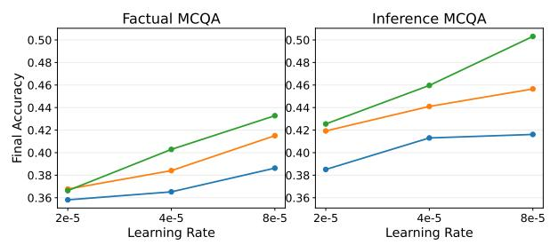  
Figure 12: Effect of peak learning rate (2e-5, 4e-5, and 8e-5) on knowledge acquisition for the 7B model. We report final log probability on factual and inference probes (left two panels) and final accuracy on factual and inference MCQA (right two panels), comparing source documents alone (Source), 49 paraphrases (Para. 49), and 49 paraphrases plus auxiliary views (Para. 49 + Aux.). Across all metrics, the advantages of auxiliary views and paraphrases grow with learning rate.

## D Additional Tables

<table><tr><td>Auxiliary views</td><td>Factual log prob.</td><td>Factual MCQA</td><td>Inference log prob.</td><td>Inference MCQA</td></tr><tr><td>Textbooks</td><td>-11.358</td><td>0.394</td><td>-12.218</td><td>0.457</td></tr><tr><td>Stack Exchange</td><td>-11.642</td><td>0.398</td><td>-12.216</td><td>0.450</td></tr><tr><td>Blogs</td><td>-11.570</td><td>0.388</td><td>-12.189</td><td>0.447</td></tr><tr><td>Mixed</td><td>-11.087</td><td>0.398</td><td>-11.665</td><td>0.450</td></tr></table>

Table 8: Auxiliary-view families. Metrics for OLMo-2 7B after training on token-matched textbooks, Stack Exchange–style Q&A, blogs, or their mixture. The families perform similarly; mixing them performs best on both log-probability metrics and factual MCQA, while textbooks perform best on inference MCQA. Higher is better for every metric.

<table><tr><td>Domain</td><td>Condition</td><td>Peak factual ∆ LP</td><td>Peak inference ∆ LP</td></tr><tr><td rowspan="4">arXiv</td><td>Para. 9 (standard)</td><td>4.344</td><td>2.575</td></tr><tr><td>Para. 9 (token-matched)</td><td>7.117</td><td>4.723</td></tr><tr><td>+ Prerequisite</td><td>6.690</td><td>4.629</td></tr><tr><td>+ Contextual</td><td>6.893</td><td>4.574</td></tr><tr><td rowspan="4">Legal</td><td>Para. 9 (standard)</td><td>3.817</td><td>0.719</td></tr><tr><td>Para. 9 (token-matched)</td><td>8.222</td><td>2.049</td></tr><tr><td>+ Prerequisite</td><td>6.663</td><td>2.331</td></tr><tr><td>+ Contextual</td><td>6.768</td><td>2.184</td></tr><tr><td rowspan="4">All</td><td>Para. 9 (standard)</td><td>4.231</td><td>2.028</td></tr><tr><td>Para. 9 (token-matched)</td><td>7.349</td><td>3.950</td></tr><tr><td>+ Prerequisite</td><td>6.684</td><td>3.967</td></tr><tr><td>+ Contextual</td><td>6.866</td><td>3.881</td></tr></table>

Table 9: Contextual and prerequisite knowledge. Peak improvement in log probability from each run’s pretrained baseline. The added-knowledge conditions and token-matched Para. 9 use the same inserted-token budget; standard Para. 9 is included as a non-tokenmatched reference. Adding surrounding knowledge yields improvements comparable to adding paraphrases. Higher ∆ LP is better. Medical is omitted because case reports lack an analogous citation structure.

<table><tr><td>Placement Factual</td><td>∆ LP</td><td>Factual ∆MCQA</td><td>Inference ∆LP</td><td>Inference ∆ MCQA</td></tr><tr><td>Front</td><td>6.320</td><td>0.022</td><td>3.639</td><td>0.068</td></tr><tr><td>Middle</td><td>6.591</td><td>0.026</td><td>3.847</td><td>0.053</td></tr><tr><td>End</td><td>6.680</td><td>0.025</td><td>3.706</td><td>0.053</td></tr></table>

Table 10: Prerequisite-knowledge ordering. Peak improvement from the pretrained baseline when prerequisite data appears at the front, middle, or end of training. Higher is better for every metric, including ∆ log probability. No placement is consistently best.

<table><tr><td>Condition</td><td>Fact. log prob.</td><td>Fact. MCQA</td><td>Inf. log prob. MCQA</td><td>Inf.</td></tr><tr><td>Pretrained model</td><td>-15.31</td><td>0.440</td><td>-15.02</td><td>0.478</td></tr><tr><td>Source</td><td>-15.48</td><td>0.489</td><td>-18.82</td><td>0.512</td></tr><tr><td>Para.9</td><td>-13.28</td><td>0.516</td><td>-16.24</td><td>0.559</td></tr><tr><td>Auxiliary views</td><td>-10.98</td><td>0.548</td><td>-12.74</td><td>0.562</td></tr></table>

Table 11: Qwen-2.5-7B. Final metrics under the same injection setup as the main experiment. The advantage of auxiliary views generalizes to Qwen-2.5-7B.

Table 12: Frequency and coverage of our probe targets across contextual and prerequisite knowledge. Freq. = occurrences per 1k (words for the full target, OLMo tokens for bigrams); Cover. = fraction of targets present at least once (full target) or the mean fraction of a target’s bigrams present (bigram). Prerequisites = generated textbook chapters; Cited Works = cited papers or legal opinions.
<table><tr><td rowspan="2">Probes</td><td rowspan="2">Corpus</td><td colspan="2">Full target</td><td colspan="2">Bigram</td></tr><tr><td>Freq.</td><td>Cover.</td><td>Freq.</td><td>Cover.</td></tr><tr><td rowspan="2">Factual</td><td>Prerequisites</td><td>0.031</td><td>0.12</td><td>0.129</td><td>0.54</td></tr><tr><td>Cited Works</td><td>0.039</td><td>0.24</td><td>0.141</td><td>0.72</td></tr><tr><td rowspan="2">Inference</td><td>Prerequisites</td><td>0.827</td><td>0.21</td><td>0.154</td><td>0.47</td></tr><tr><td>Cited Works</td><td>0.838</td><td>0.25</td><td>0.095</td><td>0.54</td></tr></table>

<table><tr><td>Generator</td><td>Generator factual MCQA acc.</td><td>Params (B)</td><td>Words (M)</td><td>Downstream factual MCQA acc.</td></tr><tr><td>None (pretrained OLMo-2 7B)</td><td></td><td></td><td></td><td>0.361</td></tr><tr><td>Para. 9 (token-matched baseline)</td><td></td><td></td><td></td><td>0.396</td></tr><tr><td>gpt-5-mini (original; mixed)</td><td></td><td></td><td>1.08</td><td>0.415</td></tr><tr><td>gpt-5-mini (low reasoning)</td><td>0.657</td><td></td><td>1.04</td><td>0.419</td></tr><tr><td>gpt-5-mini (high reasoning)</td><td>0.673</td><td></td><td>1.10</td><td>0.420</td></tr><tr><td>gpt-5.4-mini (low reasoning)</td><td>0.718</td><td></td><td>0.84</td><td>0.416</td></tr><tr><td>gpt-5.4-mini (high reasoning)</td><td>0.749</td><td></td><td>0.72</td><td>0.414</td></tr><tr><td>gpt-oss-20B (low reasoning)</td><td>0.539</td><td>20.9</td><td>0.72</td><td>0.422</td></tr><tr><td>gpt-oss-120B (low reasoning)</td><td>0.599</td><td>116.8</td><td>0.79</td><td>0.413</td></tr><tr><td>Gemma-4 12B IT</td><td>0.565</td><td>12</td><td>0.36</td><td>0.414</td></tr><tr><td>Gemma-4 31B IT</td><td>0.662</td><td>31</td><td>0.35</td><td>0.405</td></tr><tr><td>GLM-5 (high reasoning)</td><td>0.728</td><td>744</td><td>0.66</td><td>0.406</td></tr><tr><td>GLM-5.2 (high reasoning)</td><td>0.758</td><td>744</td><td>0.90</td><td>0.418</td></tr></table>

Table 13: Auxiliary-view generation. Peak factual MCQA accuracy after training OLMo-2 7B on views from different generators under the same schedule and token budget. Generator accuracy measures five-shot prior domain knowledge; Words (M) counts generated blogs, Stack Exchange posts, and textbooks. Downstream accuracy is uncorrelated with generator size among open-weight generators (Pearson $r = - 0 . 1 4 , n = 6 )$ or generator accuracy $( r = - 0 . 2 4 , n = 1 0 )$ , but correlates moderately with view-text volume $( r = + 0 . 6 2 , n = 1 1 , p = 0 . 0 4 2 )$ .

## E Hyperparameters for Replication and Details for Reproduction

For training, we use the TRL library. Unless otherwise noted, our experiments use the following defaults: learning rate $4 \times 1 0 ^ { - 5 }$ , context size 4096, batch size 256, weight decay 0.1, cosine decay scheduler with 0.1 warm-up ratio and minimum learning rate ratio of 0.1, seed 42, max gradient norm of 1, and the AdamW optimizer $( \beta _ { 1 } = 0 . 9 $ $\beta _ { 2 } = 0 . 9 9 9 , \epsilon = 1 0 ^ { - 8 } )$ with BF16 training.

Pre-training-faithful continuation. For the experiment in Table 5, we resume OLMo-2 7B from checkpoint step 925,000 using the OLMo framework. We restore the checkpoint’s optimizer state and continue with the original pre-training data stream and learning-rate schedule, a global batch size of 1,024, and a sequence length of 4,096. We inject domain data for 100 optimizer steps using the same conditions as in the main experiments.

## F Prompts for Probe Construction (arXiv)

We provide some of the prompts used in our pipeline to construct factual and inference probes for the arXiv documents. The complete set of prompts, adapted for each domain (legal and medical), is available in our code.

1. Prompt to extract atomic facts from a paragraph:

You will be given two inputs, a section of an academic paper for context and a single sentence drawn from that section. Papers often interweave various pieces of knowledge together in academic writing. While each sentence is interwoven with others, there is atomic knowledge that can be extracted from a particular sentence. Write questions that tests for this atomic knowledge. Specifically, your task is to extract questions from the provided sentence with clear answers, each 1 to 4 words long.

## Extract 1-3 questions from the sentence.

## ### Detailed Instructions

Consider these instructions as you extract each question: - The question should be natural and meaningful, in which the answer is considered a main fact presented by the sentence. - The answer should be non-trivial and non-obvious. It should not be deducible from the sentence itself.

\- The answer to the question should be a meaningful, coherent phrase, 1-4 words long, taken from the sentence. Simplify the answer by stripping determiners such as "some" or "a" or "an" or "the" from the answer. Feel free to adjust the answer to fit the question, but the meaning should be the same.

\- The answer must \*NOT\* involve any \*special characters\* or \* mathematical notation\*. Again, any question with an answer that contains mathematical notation should not be used. - The question should have a a clear, single answer and \*NOT\* multiple valid answers.

\- Each question should be written separately and independently of the other questions, so don't reference other questions in the same question.

## ### Demonstration 1

Context: "\\title{Direct Preference Optimization: Your Language Model is Secretly a Reward Model}\n\\subsection{Can DPO scale to real preference datasets?}\nNext, we evaluate fine-tuning performance of DPO on summarization and singleturn dialogue. For summarization, automatic evaluation metrics such as ROUGE can be poorly correlated with human preferences \~\citep{stiennon2022learning}, and prior work has found that fine-tuning LMs using PPO on human preferences to provide more effective summaries. We evaluate different methods by sampling completions on the test split of TL;DR summarization dataset, and computing the average win rate against reference completions in the test set."

Sentence: "We evaluate different methods by sampling completions on the test split of TL;DR summarization dataset, and computing the average win rate against reference

completions in the test set."   
Questions:   
- "The authors evaluate DPO's fine-tuning performance against   
other methods on summarization by sampling completions on the   
test split of what dataset?", Answer: "TL;DR summarization"   
- "The fine-tuning performance of DPO and other methods on   
summarization are evaluated by sampling completions on the   
test split of the TL;DR summarization dataset and computing   
the average win rate against what?", Answer: "reference   
completions"   
### Demonstration 2   
Context: "\title{Direct Preference Optimization: Your Language   
Model is Secretly a Reward Model}\nWhile large-scale   
unsupervised language models (LMs) learn broad world knowledge   
and some reasoning skills, achieving precise control of their   
behavior is difficult due to the completely unsupervised   
nature of their training. Existing methods for gaining such   
steerability collect human labels of the relative quality of   
model generations and fine-tune the unsupervised LM to align   
with these preferences, often with reinforcement learning from   
human feedback (RLHF)."   
Sentence: "Existing methods for gaining such steerability   
collect human labels of the relative quality of model   
generations and fine-tune the unsupervised LM to align with   
these preferences, often with reinforcement learning from   
human feedback (RLHF)."   
Questions:   
- "What do existing methods collect to steer unsupervised   
language models, ?", Answer: "human labels"   
- "Existing methods for steering unsupervised language models   
collect human labels of the quality of what?", Answer: . Ⅱ1   
relative quality of model generations"   
- "Existing methods align unsupervised language models by fine  
tuning on what?", Answer: "human preferences"   
- "Existing methods for steering unsupervised language models   
via fine-tuning on human preferences often use what?", Answer:   
"RLHF"

## 2. Prompt to extract atomic facts from a paragraph with context:

While you should use your expertise on this domain to handle and understand these texts, all information written into the questions and answers \*MUST\* originate from the provided context or sentence. Do not add, infer, or correct information using your internal knowledge. Every detail should be traceable back to the source text. As you write and rewrite the questions, also make sure to accurately represent the knowledge in the original sentence without distortion. Strive to use phrasing as close as possible to the original text, but prioritize clarity and self-containment. Lastly, the questions should be written well and clearly so that they are easy to read.

```markdown
### Instructions
The overall goal of this task is to make the questions clear
by incorporating the relevant context. This ensures the
question is unambiguous and doesn't require looking back to
the source material.
```

question self-contained and unambiguous. For instance, "Do   
humans and GPT4 agree often with each other?" should be   
clarified into "In the paper '...', did humans and GPT4 often   
agree or disagree with each other during the evaluation of DPO   
?" if this notion was in the context of evaluating DPO in an   
academic paper. The goal is to ensure someone reading just the   
question would understand exactly what is being asked without   
needing additional context.   
3. Clarify pronouns and referential terms. Check the sentence   
for pronouns (it, this, that, these, those) or demonstrative   
phrases (this equation, that method, these results) that refer   
to entities not explicitly defined within the sentence itself.   
Search the surrounding context to identify what these terms   
reference, then incorporate that clarifying information into   
the question to make it self-contained.   
4. Clarify Context-Dependent Terms. Named entities (e.g.,   
theorems, equations, proper nouns) do not need clarification.   
However, if there are unnamed or context-specific terms (e.g.,   
\$f\$, "the model", "the loss"), clarify their full context.   
For instance, "the gradient" might refer to the general   
concept of a gradient or to the gradient of a specific   
function mentioned earlier in the context.   
5. Disambiguate experiments. There are often numerous   
experiments in a paper, and so supply enough experimental   
context so that the question is about which experiment the   
question is asking about.   
6. Handle acronyms. If the answer is an acronym and the   
acronym appears frequently in the context, feel free to leave   
it as an acronym without defining it.   
7. Do not leak the answer. Please make sure that \*the answer   
is not revealed\* in the question. The answer should never   
appear in the question.   
8. Maintain the essence of the original question during all of   
this.   
9. Do not change the answer. Minor grammatical adjustments to   
the answer are allowed only if necessary to fit the   
restructured question (e.g., adjusting verb tense, determiners   
like "the").   
10. Avoid quoting the source sentence directly in the question.   
11. Refine Question. The rewritten question can be broken up   
into multiple sentences if the question becomes verbose. Make   
sure the question is written clearly and grammatically correct.   
Do not put any of the context in parenthesis or followed   
after an "i.e.".   
Think carefully and critically through this task, following   
the step-by-step instructions outlined above. Then, provide   
the final output, listing each question and its corresponding   
answer.

## 3. Prompt to generate inference questions from the text:

You have been given a section of an academic text. Your tasks   
is to test the reader's understanding of the text. However,   
you should not test anything that can be recalled from reading   
a single sentence. Create questions that integrate, connect,   
and synthesize information across several sentences and aim at   
measuring a deeper understanding. Your question must not be   
obvious from a single sentence already in the paper, and truly   
require several sentences to synthesize the answer. Lastly,   
the answer to the question must be a coherent phrase, from 1   
to 5 words long.   
For each question, show me the sentences in the text that you'   
re pulling from to answer the question. The question should be   
non-obvious from these sentences and require composing   
information from all of them to answer the question.   
Provide the output in JSON format, as a dictionary with a   
single key "qa\_items" which is a list of dictionaries with the   
following keys:   
- "question": (string)   
- "answer": (string)   
- "text\_quotes": list of sentences from the text that you're   
pulling from to answer the question.

## G Prompts for Synthetic Data Generation (arXiv)

## 1. Prompt to synthesize Stack Exchange–style question–answer pairs:

```markdown
### Instructions
You will be given a research paper and your task is to create
a detailed outline for a textbook that comprehensively
explains the given research paper. But, it should go beyond
mere explaining, and be a proper pedagogical textbook that
aims to fully educate the reader on what the paper is about.
The textbook should be aimed at college students who have a
basic understanding of machine learning.
The outline should:
- Break down the paper into coherent chapters.
- For each chapter, provide a:
- title
- description
- list of subtopics to cover
- Cover all key concepts, methods, and results from the paper.
- Ensure a logical flow of information, from introduction to
conclusion.
- While the textbook should be comprehensive, it should also
articulate and to the point. Don't create unnecessary chapters.
### Output Format
Provide the output as a JSON object with a single key "outline
", which is a list of chapter objects. Each chapter object
must have the following keys:
- "chapter_title": A string for the title of the chapter.
- "description": A string describing the chapter's content.
- "subtopics": A list of strings, where each string is a
subtopic.
```

## Question generation:

You are a confused student reading this research paper. You   
are struggling with specific concepts, details, and   
connections in this paper. Generate a list of several Stack   
Exchange style questions that you would ask to clarify your   
understanding.   
Your questions should:   
- Vary in levels of understanding, from misled to profound.   
- Vary in complexity, from simple to deep.   
- Vary in type, from conceptual to detail-specific.   
- Focus on clarifying the concepts and details of the paper.   
Do not ask tangential questions.   
As you generate the questions, please make sure to consider   
the following:   
- Make sure the questions are self-contained and unambiguous   
- Please write any mathematical notation in LaTeX only e.g. "   
\$x^2\$" or "\$\pi\$". Do not use unicode mathematical characters   
e.g. "pi".   
For each question, provide:   
- A \`title\` in Stack Exchange question format   
- The \`question\_body\` with context and what specifically you'   
re confused about   
## Example Question   
"How can Transformers handle arbitrary length input?   
The transformer, introduced in the paper Attention Is All You   
Need, is a popular new neural network architecture that is   
commonly viewed as an alternative to recurrent neural networks,   
like LSTMs and GRUs.   
However, having gone through the paper, as well as several   
online explanations, I still have trouble wrapping my head   
around how they work."   
### Output Format   
Provide the output as a JSON object with a single key "   
questions", which is a list of question dictionaries.   
Example:   
{   
"questions": [   
{   
"title": "Why does the partition function cancel out in   
DPO derivation?",   
"question\_body": "I'm reading the DPO paper and I   
understand that they start with the KL-regularized   
objective, but I'm confused about how the partition   
function Z(x) cancels out when they move to pairwise   
preferences. Can someone explain this step intuitively?",   
}   
]   
}

## Answer generation:

A graduate student has asked a question about a research paper.   
Provide a clear, detailed Stack Exchange style answer that:   
- Thoroughly addresses their question   
- Don't make it too lengthy; it should be concise and to the   
point like a Stack Exchange answer   
- Write in prose rather than structured bullet points in one   
cohesive answer   
- Provides intuitive explanations alongside technical details   
- Connects to broader concepts when relevant   
- Is educational and accessible   
Please write any mathematical notation in LaTeX only e.g. "\$x   
^2\$" or "\$\pi\$". Do not use unicode mathematical characters e.   
g. "pi". Also, please make sure that your answer is grounded   
in the paper; do not provide any information that is   
inconsistent with the paper.   
Again, please write all math in LaTeX.   
Format your response as a comprehensive Stack Exchange answer.   
### Example   
Question:   
"I know that in the math on which the transformer is based   
there is no restriction on the length of input. But I still

can't understand why we should fix it in the frameworks (   
PyTorch). Because of this problem Transformer-XL has been   
created.   
Can you explain to me where this problem is hiding, please?"   
Answer:   
"The restriction in the maximum length of the transformer   
input is due to the needed amount of memory to compute the   
self-attention over it.   
The amount of memory needed by the self-attention in the   
Transformer is quadratic on the length of the input. This   
means that increasing the maximum length of the input,   
increases drastically the needed memory for self-attention.   
The maximum length is that which makes the model use up the   
whole memory of the GPU for at least one sentence (once the   
other elements of the model are also taken into account, like   
the embeddings which take a lot of memory).   
Transformer-XL is certainly a way to take into account as much   
context as possible in language modeling (its role is   
analogous to truncated back-propagation through time in LSTM   
language models). However, the gradients are not propagated   
through the attention over the memory segment, only through   
the current segment.   
There have been several architectural attempts to reduce the   
amount of memory needed by transformers, like using locality   
constraints in the attention (Dynamic Convolutions model) or   
using locality-sensitive hashing (Reformer model).   
There have been other implementation attempts, like gradient   
checkpointing(e.g. this), which is a general technique to run   
computations that don't fit at once in the GPU memory"

## LAT<sub>E</sub>X formatting refinement:

You will be given a text. Your only task is to correct any   
mathematical notation inside it to be valid LaTeX. You must   
not change any other part of the text.   
- Convert unicode math characters like 'pi' to their LaTeX   
equivalent '\$\\pi\$'.   
- Ensure all mathematical expressions are enclosed in '\$...   
\$' for inline math or '\$\$...\$\$' for display math.   
- Return the full, corrected text.

## 2. Prompt to synthesize textbook-style explanations:

## Textbook outline generation:

## Chapter generation:

You will be given a chapter title, description, and subtopics   
and, based on those topics, your job is to write a detailed,   
cohesive textbook chapter addressed to a college student who   
is learning this material for the first time.   
The chapter should be comprehensive and suitable for someone   
learning this material to understand research papers in the   
field. Don't just briefly describe the subtopics, but rather   
elaborate on the concepts at full length and explain them with   
a focus on intuition. Spell everything out clearly so there   
is no ambiguity. Dedicate multiple paragraphs to each subtopic   
but be articulate and concise when appropriate. Write in full   
prose, rather than bullet points. Most importantly, please   
make sure that your chapter is grounded in the paper; do not   
provide any information or details that is not from the paper.   
Start with the chapter title in the first line. Separate each   
subtopic with a section header "#". Also, please write all   
mathematical notation in LaTeX only e.g. "\$x^2\$" or "\$\pi\$".   
Do not use unicode mathematical characters e.g. "pi". Again,   
PLEASE write all math in LaTeX.

## 3. Prompt to synthesize blog-post-style explanations:

Blog post idea generation:

```markdown
### Instructions
You are a creative tech blogger and content strategist. Based
on the provided research paper, generate a list of a few blog
posts that explain the paper in a way that is accessible to a
wider audience. They should each focus on a different, main
aspect of the paper.
For each blog idea, provide:
- A `title`.
- A brief `description` of what the blog post will cover.
### Output Format
Provide the output as a JSON object with a single key "blogs",
which is a list of blog objects. Each blog object must have
the following keys:
- "title": A string for the title of the blog post.
- "description": A string describing the blog post's content.
```

## Blog post generation:

You will be given an academic paper and a blog post idea about   
the paper. Write a blog post based on the blog idea.   
As you write the blog post, please make sure to consider the   
following:   
- Write in a technical blog style. It should be less formal   
but not too informal. It should be concise and to the point.   
- Simplify complex concepts from the paper for a broader   
audience.   
- Write in full, complete sentences and prefer paragraphs over   
bullet points, but use bullet points when appropriate.   
- Keep all details grounded in the paper. Do not make up any   
information.   
- Please write any mathematical notation in LaTeX only e.g. "   
\$x^2\$" or "\$\pi\$". Do not use unicode mathematical characters   
e.g. "pi".   
Your output should be the full text of the blog post, starting   
with the blog title as a markdown header. Use '#' to denote   
the blog title, '##' to denote different sections, and so on.

## 4. Prompt to generate prerequisite-knowledge chapters:

Prerequisite chapter-list generation:

```markdown
### Instructions
You are an expert curriculum designer. Based on the provided
research paper, create a list of textbook chapters that would
provide all the necessary prior knowledge to understand this
paper. The chapters should not contain the novel ideas
presented in the paper itself, but rather the foundational
concepts upon which the paper is built.
For each chapter, provide:
- A `title`.
- A general `description` of what the chapter covers.
- A list of `subtopics` that should be included.
```

### Output Format   
Provide the output as a JSON object with a single key   
chapters", which is a list of chapter dictionaries.   
Example:   
{   
"chapters": [   
{   
"title": "Chapter 1: Introduction to Probability Theory",   
"description": "This chapter covers the basics of   
probability...",   
"subtopics": ["Random Variables", "Probability   
Distributions", "Bayes' Theorem"]   
}   
]   
}

## Chapter generation:

You will be given a chapter title, description, and subtopics and, based on those topics, your job is to write a detailed, cohesive textbook chapter addressed to a college student who is learning this material for the first time.

The chapter should be comprehensive and suitable for someone learning this material to understand research papers in the field. Begin with an introduction to the chapter, then cover each subtopic in turn. Don't just briefly describe the subtopics, but rather elaborate on the concepts at full length and explain them with a focus on intuition. Spell everything out clearly so there is no ambiguity. Dedicate multiple paragraphs to each subtopic. Write in full prose, rather than bullet points.