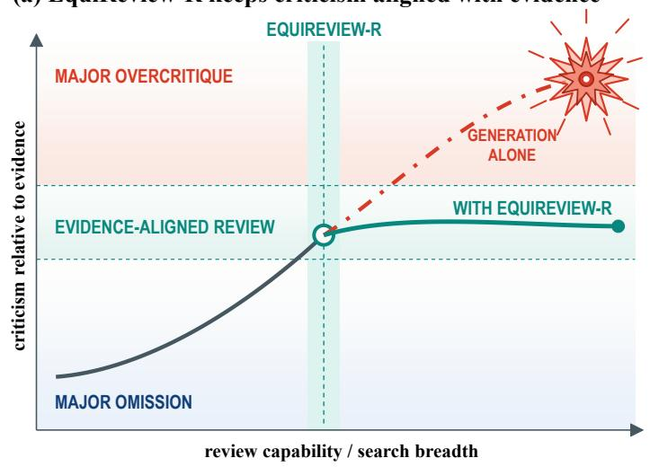
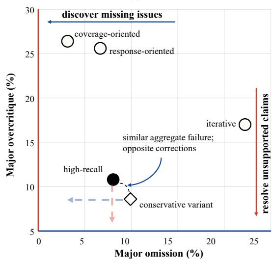
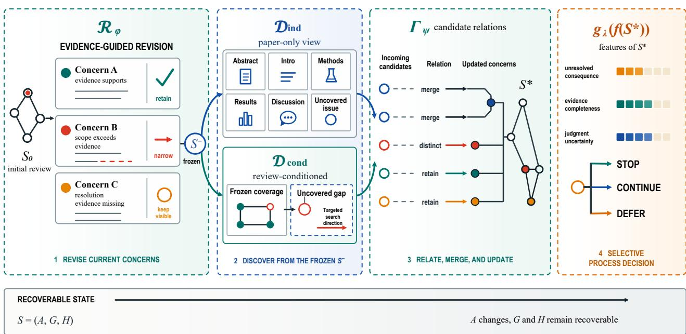
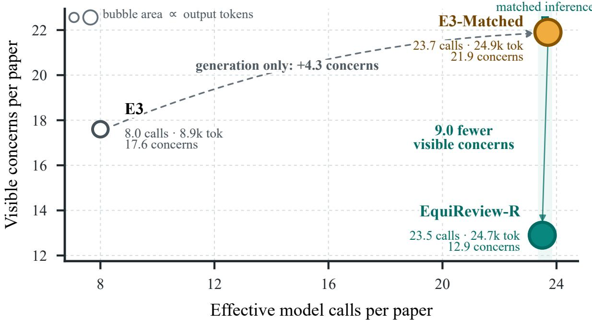
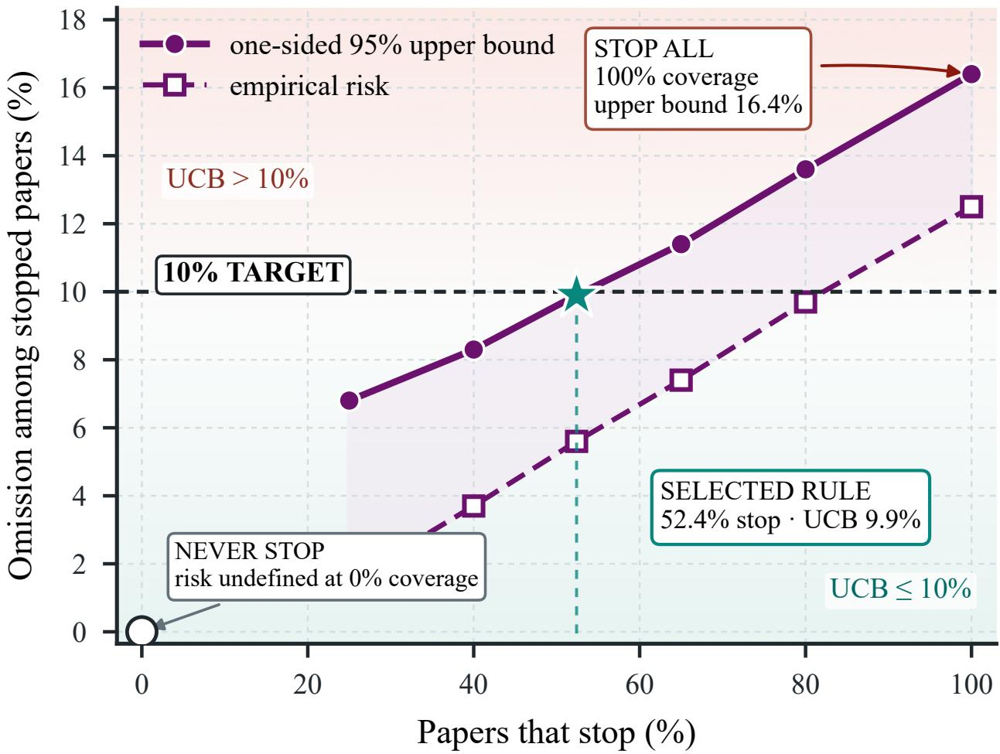
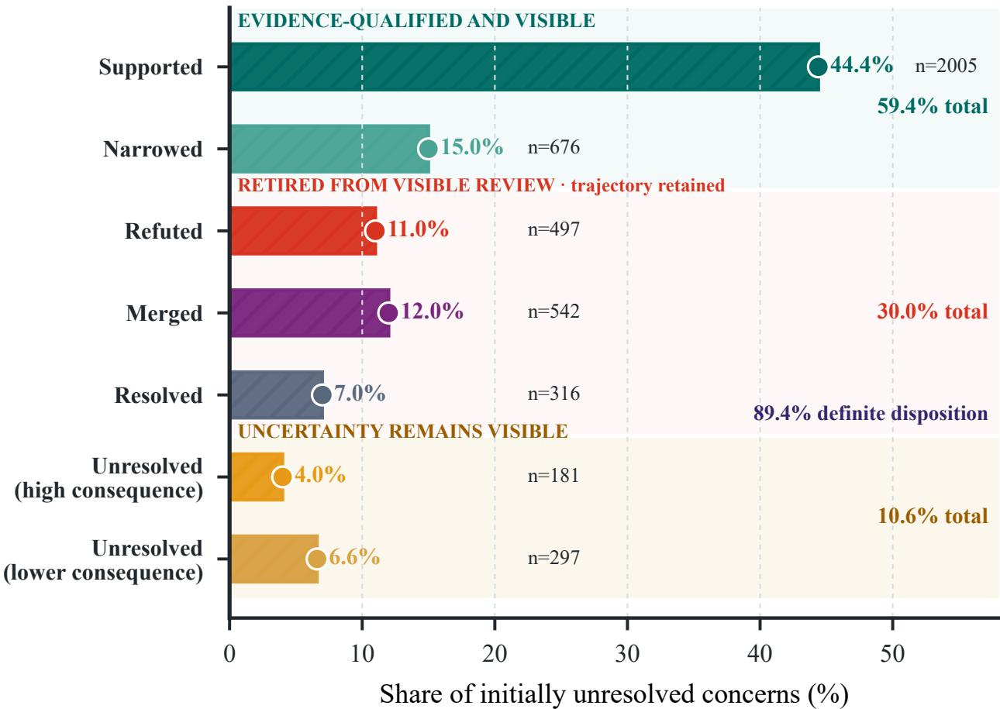
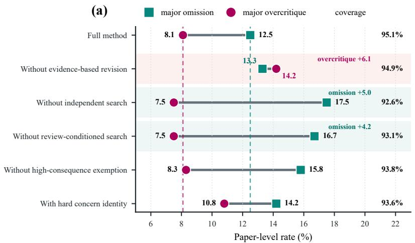
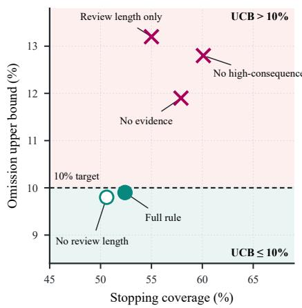
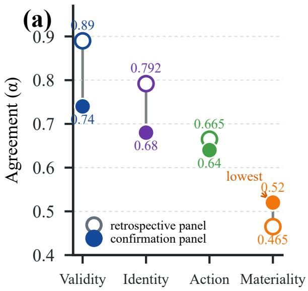
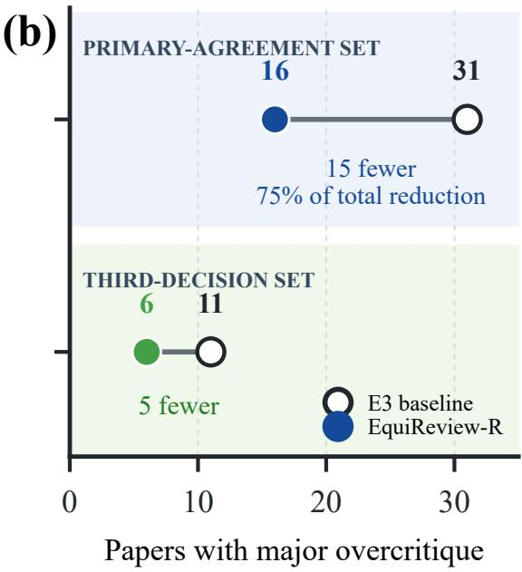

# More Criticism Does Not Make a Better Review: EquiReview-R

Zexing Zhang, Jichao Li, Tianyang Lei, Yude Fu, and Yang Kewei

College of Systems Engineering, National University of Defense Technology, Changsha 410073,

China

zhangzexing@nudt.edu.cn, lijichao09@nudt.edu.cn

leitianyang20@163.com, fuyude22@nudt.edu.cn, kayyang27@nudt.edu.cn

## Abstract

AI reviewers can now produce many specific criticisms, but more criticism is not necessarily a better review. A review may miss a consequential weakness or retain an allegation that available evidence does not support. These failures require opposite corrections, yet generation-oriented systems and aggregate measures obscure the distinction. We therefore recast AI-assisted review as evidence-guided refinement of a structured concern set, with omission and overcritique treated as separate risks. Building on this formulation, we introduce EquiReview-R, which resolves existing concerns against localized evidence, searches for missing issues from independent and review-conditioned perspectives, and returns stop, continue, or defer. To expose the failure mode that motivates this design, we construct an evidence-linked trajectory corpus. Its retrospective analysis shows why revision must precede further search: nearly all concerns in a high-recall review lack a definitive evidential disposition, while an earlier refinement mechanism cannot revise them. On a frozen cohort of previously unseen papers, EquiReview-R satisfies the prespecified non-inferiority criterion for major omission, reduces major overcritique from 15.5% to 8.1%, and attains a one-sided omission upper bound of 9.9% while stopping on 52.4% of papers. Computation-matched controls, controlled pairs, and ablations show that the gain comes from revision rather than extra inference or shorter output. We release the corpus as ReviewTrace, an evidence-linked resource for studying review revision, disagreement, and provenance.

Keywords: AI-assisted peer review, scientific reviewing, review revision, selective risk control, evidence provenance

## 1. Introduction

AI assistance is already changing scientific peer review. In a large randomized study at ICLR 2025, model-generated feedback led reviewers to revise real reports and engage more deeply with author responses (Thakkar et al., 2026). Corpus studies likewise find that language models increasingly modify conference reviews (Liang et al., 2024a). A complementary study of Nature-family papers asked domain scientists to assess individual human and AI criticisms. AI reviewers surfaced issues that humans missed, but they also overlapped strongly with one another and were overly critical about minor points (Kim et al., 2026). Together, these results suggest a shift in the central technical problem. As review agents examine more aspects of a paper and generate more candidate objections, the bottleneck moves from producing criticism to deciding which criticism remains justified after the evidence is checked.

A simple example shows why this distinction matters. Suppose one review overlooks the absence of a matched baseline. The appropriate correction is to add a concern. A second review alleges data leakage even though the paper documents a clean split. The appropriate correction is to remove or narrow the allegation. The first review lacks coverage. The second imposes an unsupported burden on authors and readers. A system can improve one error while worsening the other, even when its output becomes longer and appears more thorough.

(a) EquiReview-R keeps criticism aligned with evidence  

(b) One score hides opposite errors  
  
Figure 1: The bottleneck shifts from finding criticism to resolving it. Additional search can expose missing issues, but it can also accumulate claims that have not survived evidential scrutiny. Reliable refinement must support both directions of correction. Retrospective systems occupy diferent regions of the omission-overcritique plane, so a one-dimensional failure label does not reveal which correction is needed.

We therefore study review improvement as the revision of a structured concern set. Each concern states one alleged scientific failure, identifies the relevant part of the paper, and records the evidence needed to resolve it. The set should expand when a material issue is missing, but it should also contract when a concern is refuted, duplicated, already answered, or broader than the evidence warrants. This view separates two paper-level risks. Major omission captures consequential issues that are absent or remain unresolved when review ends. Major overcritique captures consequential allegations that should be removed from or materially narrowed in the visible review.

To study this process directly, we constructed ReviewTrace rather than extracting static reviews from an existing corpus. The resource records how each concern is proposed, challenged, related to other concerns, revised, and judged. Its retrospective trajectories expose a structural failure that aggregate scores conceal. In the high-recall review state, 96.3% of concerns had not yet been supported, narrowed, or rejected. A later refinement mechanism left every initial concern unchanged because its revision step only revisited concerns that had already received a provisional disposition. Figure 1 shows the broader consequence. Systems with similar aggregate failure rates can occupy very diferent positions in the omission-overcritique plane and therefore require diferent corrections.

This diagnosis leads to a direct design principle: revise the current review before expanding it. We propose EquiReview-R, which first re-evaluates every unresolved concern against localized support, counterevidence, and an explicit resolution condition. It then freezes the revised state and searches for omissions from two complementary perspectives. One search is independent of the current review, while the other uses the revised review to target aspects it does not represent. Finally, a selective procedure returns stop, continue, or defer according to unresolved consequence, evidential completeness, and judgment uncertainty. This order matters. Revision controls unsupported criticism, complementary search protects recall, and selective stopping prevents unresolved high-consequence questions from being mistaken for a finished review.

The evaluation follows the same logic. Missing concerns are sought only after a system freezes its review and stopping decision, so the answer cannot define the test. Strict coverage requires the same alleged failure and resolution condition, and every conditional omission result is paired with stopping coverage. Computation-matched controls and minimally diferent issue and clean-control pairs test whether gains come from revision rather than extra inference or a general preference for saying less.

Our contributions are:

• We separate omission from overcritique and show that their union cannot identify the needed correction.

• We propose EquiReview-R, combining evidence-guided revision, complementary discovery, and selective stopping in a reconstructable state.

• We evaluate it on a frozen cohort with matched computation, independent omission candidates, controlled pairs, and ablations.

• We release ReviewTrace, an evidence-linked corpus of concern trajectories and independent judgments.

## 2. Related Work

AI-assisted scientific review. Early resources such as PeerRead enabled review text and score prediction (Kang et al., 2018). Later work examined the usefulness and real-world uptake of modelgenerated feedback (Yuan et al., 2022; Liang et al., 2024b,a; Thakkar et al., 2026). Modern systems improve generation through multi-stage analysis, retrieval, response-based verification, or proactive investigation. SEA consolidates multiple reviews (Yu et al., 2024); DeepReview produces structured, evidence-rich reports (Zhu et al., 2025); DIAG and E3 emphasize specific weaknesses and issue-level backtesting (Zou et al., 2026; Chaudhuri et al., 2026); and ProReviewer maintains a structured log to guide active investigation (Fang et al., 2026). These approaches expand or organize the criticism a system can produce. Our object is the resulting concern set, and our question is which concerns should survive evidential scrutiny before further search or a stopping decision.

Evaluating review content. Scientific reviews have been evaluated through score agreement, reviewresponse questions, overlap with observed feedback, concern matching, and attention across paper facets (Zhou et al., 2024; Liang et al., 2024b; Jin, 2026; Li et al., 2026; Shin et al., 2025). CriticEval similarly decomposes critique quality across tasks and dimensions (Lan et al., 2024). These perspectives reveal whether individual comments are correct, useful, or focused on appropriate aspects. They do not by themselves determine whether a persistent set of comments is suficient to end review or contains claims that evidence no longer supports or that should be narrowed or merged. We make these revision actions and their paper-level consequences the primary evaluation object.

Revision, robustness, and selective decisions. Self-critique and tool-interactive critique can expose errors and improve model responses (Saunders et al., 2022; Gou et al., 2024). In peer review, humanin-the-loop analyses and robustness studies emphasize correlated model errors, manipulation, and deployment risk (Drori and Te’eni, 2024; Ye et al., 2024; Baumann et al., 2026; Xin et al., 2026). Selective prediction provides a principled language for abstaining when uncertainty remains (El-Yaniv and Wiener, 2010; Geifman and El-Yaniv, 2017). Learn then Test and conformal risk control provide finite-sample procedures for evaluating prespecified risk constraints (Angelopoulos et al., 2025, 2024). We connect these lines by applying selective risk control to a revised review state rather than to a scalar prediction.

## 3. Method

## 3.1. Problem Formulation

Let x denote a paper and let $S _ { 0 }$ be an initial structured review. We represent a review state as

$$
S = ( A , G , H ) ,\tag{1}
$$

where $A ( S )$ is the set of concerns shown in the current review, $G ( S )$ is a typed graph relating concerns as identical, overlapping, parent-child, or distinct, and $H ( S )$ is an immutable history of evidence and revision actions. A concern $c \in A ( S )$ contains an alleged failure, a paper location, supporting and countervailing evidence, a resolution condition, materiality, and a current status. Separating A from H allows the visible review to become more concise without erasing what was proposed or why it changed.

Validity is judged before materiality. A concern is major only when resolving it could change the validity, scope, or evidential support of a principal claim, materially alter the interpretation of a central result, or afect the credibility of the main evaluation. Moderate concerns require local analysis or qualification, while minor concerns primarily afect presentation. The primary endpoints use only valid major concerns.

Let $Q _ { K }$ be a fixed external search procedure with K prespecified search opportunities. We define two paper-level losses. Given a stopping rule $g _ { \lambda } , L _ { \mathrm { m i s s } } ( S ; Q _ { K } , g _ { \lambda } )$ is one when $Q _ { K }$ finds a valid major concern that is distinct from $A ( S )$ , or when $g _ { \lambda }$ stops while a major concern remains unresolved. $L _ { \mathrm { o v e r } } ( S )$ is one when $A ( S )$ retains a major concern that independent judgment says should be removed or materially narrowed. We report omission only among papers that the rule stops,

$$
\begin{array} { r l } & { R _ { \mathrm { m i s s } } ( g _ { \lambda } ) = \mathbb { E } \bigl [ L _ { \mathrm { m i s s } } ( S ; Q _ { K } , g _ { \lambda } ) \mid g _ { \lambda } ( S ) = \mathrm { s t o p } \bigr ] , } \\ & { C _ { \mathrm { s t o p } } ( g _ { \lambda } ) = \mathrm { P r } [ g _ { \lambda } ( S ) = \mathrm { s t o p } ] . } \end{array}\tag{2}
$$

The two quantities must be interpreted together. Never stopping makes the conditional risk uninformative, whereas stopping every paper may violate the target.

Strict issue coverage is a secondary constraint. Let $\operatorname { C o v } ( S )$ denote this quantity. A concern receives credit only when it matches both the alleged failure and the resolution condition of an independently constructed reference issue. Thus “Theorem 1 lacks a proof of Lemma $2 ^ { \mathfrak { p } }$ and “Theorem 1 lacks a convergence-rate analysis” are distinct even though they concern the same theorem. Overlap and parent-child relations receive partial credit only in sensitivity analyses.

The method can now be written as three coupled operators,

$$
\begin{array} { r l } & { S ^ { - } = \mathcal { R } _ { \phi } ( x , S _ { 0 } ) , } \\ & { U = \mathcal { D } _ { \mathrm { i n d } } ( x ) \cup \mathcal { D } _ { \mathrm { c o n d } } ( x , A ( S ^ { - } ) ) , } \\ & { S ^ { \star } = \Gamma _ { \psi } ( S ^ { - } , U ) , \qquad d = g _ { \lambda } ( f ( S ^ { \star } ) ) . } \end{array}\tag{3}
$$

  
Figure 2: Overview of EquiReview-R. The revision operator $\mathcal { R } _ { \phi }$ resolves the existing review before the two discovery operators search for omissions from a frozen state. $\Gamma _ { \psi }$ consolidates accepted candidates, and $g _ { \lambda }$ returns stop, continue, or defer. The reader-facing review may change, while the full trajectory remains recoverable.

Here $\mathcal { R } _ { \phi }$ revises the existing review, the two $\mathcal { D }$ operators search for omissions from independent and review-conditioned perspectives, $\Gamma _ { \psi }$ consolidates and admits candidates, and $g _ { \lambda }$ returns $d \in$ {stop, continue, defer}. The design objective is to reduce overcritique while preserving issue-finding ability and nontrivial stopping coverage,

$$
\begin{array} { r l } { \underset { \phi , \psi , \lambda } { \mathrm { m i n } } } & { \mathbb { E } \big [ L _ { \mathrm { o v e r } } \big ( S ^ { \star } \big ) \big ] } \\ { \mathrm { s u b j e c t ~ t o } } & { R _ { \mathrm { m i s s } } ( g _ { \lambda } ) \le \alpha , \quad C _ { \mathrm { s t o p } } ( g _ { \lambda } ) \ge c _ { 0 } , } \\ & { \mathrm { C o v } ( S ^ { \star } ) \ge \mathrm { C o v } ( S _ { 0 } ) - \epsilon . } \end{array}\tag{4}
$$

This constrained formulation makes explicit why simply shortening a review cannot solve the problem.

## 3.2. EquiReview-R

Figure 2 summarizes the four stages and their shared state. The same concern identifiers, evidence records, and relation graph connect revision, discovery, and stopping, so later stages cannot silently reinterpret what earlier stages produced.

Evidence-guided revision. For every unresolved concern, $\mathcal { R } _ { \phi }$ builds an evidence record containing the alleged failure, its location, the strongest supporting evidence, the strongest counterevidence, and the condition that would settle the claim. Decomposed judgments then assign one of seven outcomes: supported, narrowed, refuted, merged, resolved, unresolved with high consequence, or unresolved with lower consequence. Supported and narrowed concerns remain visible. Refuted, merged, and resolved concerns leave the visible review but remain in H(S). A high-consequence unresolved concern cannot be hidden by a presentation limit. For example, an allegation that test data influenced model selection is not accepted or removed from a split description alone. The revision record identifies where model selection is specified, whether test labels were consulted, and what evidence would settle the claim. It then retains the allegation, narrows it to a reporting ambiguity, or resolves it according to that evidence.

Complementary search. After revision, $S ^ { - }$ is frozen. $\mathcal { D } _ { \mathrm { i n d } }$ reads the paper without the current concern set and therefore preserves an independent route to issues the existing review may have framed away. $\mathcal { D } _ { \mathrm { c o n d } }$ reads the same paper together with $A ( S ^ { - } )$ and searches fixed scientific facets that the revised review does not yet cover. Both operate on the same frozen state. $\Gamma _ { \psi }$ accepts valid material candidates, preserves graded concern relations, and consolidates duplicates before updating the visible review.

Selective stopping. The feature map $f ( S ^ { \star } )$ uses only information available before external evaluation, including unresolved high-consequence concerns, evidence completeness, judgment disagreement, relation uncertainty, and recent discovery yield. The ordered rule family is fixed before confirmation labels are computed. The confirmation procedure selects the highest-coverage rule whose one-sided omission bound meets the prespecified target. At use time, that rule returns stop only when no highconsequence concern remains unresolved. It returns continue when another prespecified round has an actionable target, and defer when missing artifacts or domain judgment prevent a responsible stopping decision. All three outputs return the revised review; continue and defer additionally expose the unresolved targets and required evidence.

## 4. Experiments

## 4.1. Design

We use two non-overlapping study phases. A retrospective corpus of 380 recent AI papers and 1,900 recorded review states supports problem diagnosis, method development, and rule specification. A separate cohort of 271 previously unseen papers is used once for confirmation after the method, search process, judgment protocol, rule ordering, and statistical analysis are frozen. The confirmation papers span machine learning, natural language processing, computer vision, and AI systems. Every system receives the same main-paper view.

The primary comparison is E3, a strong high-recall issue-level reviewer (Chaudhuri et al., 2026). E3- Matched receives essentially the same number of efective calls and generated tokens as EquiReview-R but repeats the generation-oriented procedure rather than revising its existing concerns. This control isolates the algorithmic contribution from added inference. DIAG and Simple appear in the retrospective analysis.

## 4.2. Evaluation Protocol

External evaluation begins only after each system freezes both its review and stopping decision. An independent search constructs missing-concern candidates, and a separate review of the frozen state identifies consequential unresolved questions. The primary omission endpoint is the union of these two sources. It does not depend on the shared candidate pool. Pool coverage is secondary and is recomputed after excluding each evaluated system’s own candidates. This separation prevents a system’s output from defining its own success criterion.

<table><tr><td>Method</td><td>Calls /paper /paper</td><td>Tok.</td><td>Omit. ↓</td><td>Over. ↓</td><td>↑</td><td>Cov. Visible ↓</td></tr><tr><td>E3</td><td>8.0</td><td>8.9k</td><td>14.4% 15.5%</td><td></td><td>95.4%</td><td>17.6</td></tr><tr><td>E3-MATCHED</td><td>23.7</td><td>24.9k 13.7% 17.3% 96.1%</td><td></td><td></td><td></td><td>21.9</td></tr><tr><td>EQUIREVIEW-R</td><td>23.5</td><td>24.7k 12.5%</td><td></td><td></td><td>8.1%95.1%</td><td>12.9</td></tr></table>

Table 1: Confirmation results on 271 unseen papers. Omit. and Over. are paper-level major omission and overcritique. Cov. is strict shared-pool issue coverage. Tok. reports generated output tokens. Best outcome values are bold.

Candidates are judged independently by GPT-5.6 Luna and GPT-5.6 Terra. When their categorical decisions disagree, GPT-5.6 Sol provides a third decision in a separate call with source information hidden. The judges do not see system identity, candidate source, or one another’s rationale. Validity, identity, revision action, and materiality are elicited separately. These judgments form a repeatable model-based measurement panel rather than objective scientific truth; the analysis therefore reports disagreement, alternative reference policies, and the contribution of adjudicated cases.

The primary tests are major-omission non-inferiority, reduction in major overcritique, and the omission criterion for stopped papers. Paired binary endpoints use McNemar tests and paper-level bootstrap intervals. Candidate stopping rules are evaluated in a fixed sequence with Learn then Test family-wise control (Angelopoulos et al., 2025). Strict coverage, visible concern count, generated tokens, controlled pairs, component ablations, relation-policy sensitivity, and subfield heterogeneity provide secondary evidence.

## 5. Results

## 5.1. Diagnosis

The retrospective analysis first asks whether a single failure event identifies the correction a review needs. It does not. On 150 papers, the response-oriented reviewer and the coverage-oriented predecessor both attain low omission but high overcritique, whereas the conservative refinement variant moves in the opposite direction. The high-recall initializer is more balanced but leaves 16.62 of 17.27 visible concerns per paper unresolved. Across 320 papers, the earlier revision mechanism changes none of these initial concerns. The dominant uncertainty is therefore not a peripheral implementation detail. It is precisely the part of the review that must be revised before additional search can be interpreted.

## 5.2. Main Results

Table 1 establishes the main result. Relative to the high-recall initializer, EquiReview-R meets the prespecified omission non-inferiority criterion and reduces major overcritique by −7.4 percentage points (95% CI [−11.6, −3.1]). Strict issue coverage changes by only −0.3 percentage points (95% CI [−1.1, 0.5]), while the visible review contains −4.7 fewer concerns per paper. The result is therefore a revision of the error profile rather than an exchange of recall for concision.

The computation-matched control provides the key counterfactual. Although it receives essentially the same number of calls and output tokens, E3-Matched retains a substantially larger visible review and more than twice the major-overcritique rate of EquiReview-R. Additional inference is useful only when it changes the review state rather than merely extending the review.

  
Figure 3: Resource use and visible review size. Bubble area is proportional to generated output tokens. At closely matched inference, EquiReview-R returns a smaller visible review than the generation-only control.

## 5.3. Eficiency

Figure 3 makes this distinction visible. Generation-only inference moves the matched control upward by expanding the visible review, whereas EquiReview-R uses comparable inference to resolve and consolidate existing claims. The result isolates how computation is used, not merely how much is supplied.

## 5.4. Selective Stopping

The selected rule stops on 142 of 271 papers. It records 8 omissions in that subset, with empirical risk 5.6% and a one-sided upper bound of 9.9% at 52.4% coverage. Stopping every paper yields an upper bound of 16.4%. Figure 4 therefore shows a nontrivial operating point rather than reliability obtained by stopping every paper or deferring nearly all of them.

The remaining papers still receive usable reviews. Continue identifies the unresolved target and evidence needed for another prespecified round, while defer exposes the high-consequence uncertainty, missing artifact, or expertise that requires human attention. Stopping is selective, but the review itself is not withheld.

## 5.5. Mechanism

Figure 5 shows how initially unresolved concerns change after evidence is considered. Most receive a definite disposition, and only 4.0% remain unresolved with high consequence. Supported and narrowed concerns remain visible at the scope justified by the evidence, while refuted, merged, and resolved concerns leave the visible review but remain in the trajectory. The review becomes shorter through explicit actions rather than silent deletion.

  
Figure 4: Risk and stopping coverage for the frozen rule family. The stop-all endpoint fails the target, while never stopping provides no useful stopping decision. The annotated point is the highest-coverage rule whose one-sided upper bound satisfies the 10% omission criterion.

Controlled pairs provide an independent test of that interpretation. EquiReview-R recalls 95.8% of inserted issues and introduces false concerns in 3.3% of clean controls. E3-Matched attains 96.7% recall but raises the clean false-positive rate to 10.8%. Thus the smaller review retains high issue sensitivity because unsupported content is corrected rather than criticism being suppressed.

The ablations connect each component to the risk it is intended to control. Without evidence-guided revision, overcritique rises from 8.1% to 14.2%. Removing the independent or review-conditioned search raises omission to 17.5% and 16.7%, respectively. Removing the high-consequence exemption or replacing graded relations with hard identity also worsens the error profile. The stopping-rule analysis reaches the same conclusion. A rule based only on review length has a 13.2% omission upper bound and fails the target, whereas a rule that omits length but retains evidence and uncertainty signals attains a 9.8% bound at 50.6% coverage.

  
Figure 5: Evidence-guided outcomes for initially unresolved concerns. Most concerns receive a definite revision, while consequential uncertainty remains visible.

## 5.6. Robustness

Agreement is 0.74 for validity and 0.52 for materiality, and 30.3% of items receive a third decision. Of the gross reduction in overcritique cases, 75.0% comes from items on which the two primary judges agree about materiality. Either-judge and both-judge policies preserve the direction of the comparison. Figure 7 shows that materiality is the main source of measurement uncertainty, while the observed reduction is not confined to adjudicated cases.

The conclusion is also stable to alternative issue-identity policies. Partial credit for overlap and parentchild relations, as well as leave-one-system-out reference pools, preserves the coverage ordering. Thus neither looser semantic matching nor self-contributed reference wording explains the result. Subfield analyses preserve the direction within the sampled AI population, although systems papers defer more often.

## 6. ReviewTrace

We built ReviewTrace as part of the study rather than deriving labels from an existing review corpus. It records each concern from first appearance through support, narrowing, merging, resolution, or removal, links every change to localized evidence, and preserves two independent judgments together with disagreement and adjudication. Existing resources primarily organize papers, static reviews, scores, meta-reviews, or sentence-level quality labels (Kang et al., 2018; Dycke et al., 2023; Shen et al., 2022; Purkayastha et al., 2025). ReviewTrace instead exposes the revision trajectory needed to train and evaluate systems that must correct criticism rather than only generate it.

(b)  

Figure 6: Component and stopping-rule ablations. Left: revision primarily controls overcritique, whereas both discovery perspectives protect omission. Right: review length alone does not identify a reliable stopping point. Points below the horizontal line satisfy the omission criterion.
<table><tr><td>Resource</td><td>Primary unit</td><td>Traj. Rel. Indep.</td><td></td></tr><tr><td>PeerRead</td><td>paper/review</td><td></td><td></td></tr><tr><td>NLPeer</td><td>paper/review version</td><td></td><td></td></tr><tr><td>MReD</td><td>meta-review sentence</td><td></td><td></td></tr><tr><td>LazyReview</td><td>review segment</td><td></td><td></td></tr><tr><td>REVIEWTRACE</td><td>concern trajectory</td><td>yes yes</td><td>yes</td></tr></table>

Table 2: Focused structural comparison with representative peer-review resources. Traj. denotes concern-level revision trajectories, Rel. typed relations among concerns, and Indep. separately retained judgments. A dash means that the feature is not a primary released unit, not that the resource lacks value for its original task.

The release contains 1,900 structured states and 35,292 recorded judgments, together with normalized data specifications, evaluation code, artifact hashes, and retrieval and verification utilities. The frozen construction record contains 77,929 distinct model calls. Applying the public list-price schedule to that record gives a public-price equivalent of \$9,700 (OpenAI, 2026). This investment produces more than a static collection of reviews. Each transition supplies a paired example of what changed, which evidence supported the change, and which alternative judgments remained plausible. The resource can therefore support revision-policy learning, relation-aware consolidation, disagreement modeling, provenance auditing, and selective stopping. Because the independently produced judgments are retained before adjudication, future work can study where apparent label certainty reflects consensus and where it reflects a decision policy.

  
Figure 7: Judgment stability and result decomposition. Agreement is lowest for materiality. Most of the overcritique reduction comes from items on which the two primary judges agree.

## 7. Discussion and Limitations

The empirical claims are conditional on recent AI papers, the main-paper view, the fixed external search process, and the stated judgment policy. Diferent disciplines, supplementary artifacts, or model families can change both the concern distribution and the attainable stopping coverage. The confirmation results therefore establish reliability under a specified evaluation condition, not universal completeness.

Practical use also requires explicit reporting of computation. The matched control shows that additional generation enlarges rather than improves the visible review. At comparable inference, EquiReview-R uses its calls to revise existing concerns and returns a smaller review. Deployment should therefore choose an operating point by both stopping coverage and the evidence still required for non-stopped papers.

Luna, Terra, and Sol are separate calls from one model family, so their errors may be correlated. Materiality also admits legitimate disagreement, as human review decisions do (Beygelzimer et al., 2023). Blinding system identity, decomposed labels, agreement-subset analyses, and alternative reference policies reduce avoidable circularity but do not create noise-free truth. Cross-family and domain-expert validation remain necessary before deployment. Stop, continue, and defer describe the review process rather than publication merit, and deferral must not become a rejection proxy. In use, continue should present an explicit agenda for further examination, while defer should expose the missing artifact or expertise rather than return an opaque warning. An author response can then enter as new evidence without erasing the original concern or its revision history.

## 8. Conclusion

As AI reviewers become more capable, the challenge is not only to find more weaknesses, but to determine which criticisms survive evidence, what remains missing, and when uncertainty should prevent stopping. EquiReview-R connects evidence-guided revision, complementary discovery, and selective risk control in a reconstructable state. The results show that a review can become more concise and better supported without surrendering material issue coverage. This foundation could support auditable workflows in which model and human judgments, author responses, and editorial assessment accumulate as evidence rather than replace one another.

## References

Anastasios N. Angelopoulos, Stephen Bates, Adam Fisch, Lihua Lei, and Tal Schuster. Conformal risk control. In International Conference on Learning Representations, 2024.

Anastasios N. Angelopoulos, Stephen Bates, Emmanuel J. Candès, Michael I. Jordan, and Lihua Lei. Learn then test: Calibrating predictive algorithms to achieve risk control. The Annals of Applied Statistics, 19(2):1641–1662, 2025. doi: 10.1214/24-AOAS1998.

Joachim Baumann, Jiaxin Pei, Sanmi Koyejo, and Dirk Hovy. Stop automating peer review without rigorous evaluation. arXiv preprint arXiv:2605.03202, 2026. ICML 2026 Position Paper.

Alina Beygelzimer, Yann Dauphin, Percy Liang, and Jennifer Wortman Vaughan. Has the machine learning review process become more arbitrary as the field has grown? the neurips 2021 consistency experiment. arXiv preprint arXiv:2306.03262, 2023.

Yashwardhan Chaudhuri, Sanyam Jain, and Paridhi Mundra. E3: Issue-level backtesting for automated research critique. arXiv preprint arXiv:2605.27072, 2026.

Iddo Drori and Dov Te’eni. Human-in-the-loop ai reviewing: Feasibility, opportunities, and risks. Journal of the Associationfor Information Systems, 25(1):98–109, 2024. doi: 10.17705/1jais.00867.

Nils Dycke, Ilia Kuznetsov, and Iryna Gurevych. Nlpeer: A unified resource for the computational study of peer review. In Proceedings of the 61st Annual Meeting of the Association for Computational Linguistics (Volume 1: Long Papers), pages 5049–5073, Toronto, Canada, 2023. Association for Computational Linguistics. doi: 10.18653/v1/2023.acl-long.277.

Ran El-Yaniv and Yair Wiener. On the foundations of noise-free selective classification. Journal of Machine Learning Research, 11(53):1605–1641, 2010.

Haishuo Fang, Yue Feng, and Iryna Gurevych. From passive generation to investigation: A proactive scientific peer review agent. arXiv preprint arXiv:2606.13349, 2026.

Yonatan Geifman and Ran El-Yaniv. Selective classification for deep neural networks. In Advances in Neural Information Processing Systems, volume 30, 2017.

Zhibin Gou, Zhihong Shao, Yeyun Gong, Yelong Shen, Yujiu Yang, Nan Duan, and Weizhu Chen. Critic: Large language models can self-correct with tool-interactive critiquing. In International Conference on Learning Representations, 2024.

Ming Jin. What makes a good ai review? concern-level diagnostics for ai peer review. arXiv preprint arXiv:2604.19998, 2026.

Dongyeop Kang, Waleed Ammar, Bhavana Dalvi, Madeleine van Zuylen, Sebastian Kohlmeier, Eduard Hovy, and Roy Schwartz. A dataset of peer reviews (peerread): Collection, insights and nlp applications. In Proceedings ofNAACL-HLT, pages 1647–1661, 2018. doi: 10.18653/v1/N18-1149.

Seungone Kim et al. On the limits and opportunities of ai reviewers: Reviewing the reviews of nature-family papers with 45 expert scientists. arXiv preprint arXiv:2605.20668, 2026.

Tian Lan, Wenwei Zhang, Chen Xu, Heyan Huang, Dahua Lin, Kai Chen, and Xian-Ling Mao. Criticeval: Evaluating large-scale language model as critic. In Advances in Neural Information Processing Systems, volume 37, pages 66907–66960, 2024.

Bowen Li, Haochen Ma, Yuxin Wang, Jie Yang, Xinchi Chen, Xuanjing Huang, Yining Zheng, and

Xipeng Qiu. Beyond rating: A comprehensive evaluation and benchmark for ai reviews. arXiv preprint arXiv:2604.19502, 2026.

Weixin Liang, Zachary Izzo, Yaohui Zhang, Haley Lepp, Hancheng Cao, Xuandong Zhao, Lingjiao Chen, Haotian Ye, Sheng Liu, Zhi Huang, Daniel McFarland, and James Y. Zou. Monitoring ai-modified content at scale: A case study on the impact of chatgpt on ai conference peer reviews. In Proceedings of the 41st International Conference on Machine Learning, volume 235 of Proceedings of Machine Learning Research, pages 29575–29620. PMLR, 2024a.

Weixin Liang, Yuhui Zhang, Hancheng Cao, Binglu Wang, Daisy Yi Ding, Xinyu Yang, Kailas Vodrahalli, Siyu He, Daniel S. Smith, Yian Yin, Daniel A. McFarland, and James Zou. Can large language models provide useful feedback on research papers? a large-scale empirical analysis. NEJM AI, 1(8), 2024b.

OpenAI. Openai api pricing. OpenAI API documentation, 2026. URL https://openai.com/api/pricing/. Accessed July 22, 2026.

Sukannya Purkayastha, Zhuang Li, Anne Lauscher, Lizhen Qu, and Iryna Gurevych. Lazyreview: A dataset for uncovering lazy thinking in nlp peer reviews. In Proceedings of the 63rd Annual Meeting of the Association for Computational Linguistics (Volume 1: Long Papers), pages 3280–3308, Vienna, Austria, 2025. Association for Computational Linguistics. doi: 10.18653/v1/2025.acl-long.165.

William Saunders, Catherine Yeh, Jef Wu, Steven Bills, Long Ouyang, Jonathan Ward, and Jan Leike. Self-critiquing models for assisting human evaluators. arXiv preprint arXiv:2206.05802, 2022.

Chenhui Shen, Liying Cheng, Ran Zhou, Lidong Bing, Yang You, and Luo Si. Mred: A meta-review dataset for structure-controllable text generation. In Findings of the Association for Computational Linguistics: ACL 2022, pages 2521–2535, Dublin, Ireland, 2022. Association for Computational Linguistics. doi: 10.18653/v1/2022.findings-acl.198.

Hyungyu Shin, Jingyu Tang, Yoonjoo Lee, Nayoung Kim, Hyunseung Lim, Ji Yong Cho, Hwajung Hong, Moontae Lee, and Juho Kim. Mind the blind spots: A focus-level evaluation framework for llm reviews. In Proceedings of the 2025 Conference on Empirical Methods in Natural Language Processing, pages 35630–35656, Suzhou, China, 2025. Association for Computational Linguistics. doi: 10.18653/v1/2025.emnlp-main.1805.

Nitya Thakkar, Mert Yuksekgonul, Jake Silberg, Animesh Garg, Nanyun Peng, Fei Sha, Rose Yu, Carl Vondrick, and James Zou. A large-scale randomized study of large language model feedback in peer review. Nature Machine Intelligence, 8:326–336, 2026. doi: 10.1038/s42256-026-01188-x.

Yuan Xin, Yixuan Weng, Minjun Zhu, Ying Ling, Chengwei Qin, Michael Hahn, Michael Backes, Yue Zhang, and Linyi Yang. Safereview: Defending llm-based review systems against adversarial hidden prompts. arXiv preprint arXiv:2604.26506, 2026.

Rui Ye, Xiang Pang, Jing Chai, Jia Chen, Zhen Yin, Zhen Xiang, Xin Dong, Jun Shao, and Shuo Chen. Are we there yet? revealing the risks of utilizing large language models in scholarly peer review. arXiv preprint arXiv:2412.01708, 2024.

Jialong Yu, Zhicheng Ding, Jian Tan, Kai Luo, Zhen Weng, Cheng Gong, Lijun Zeng, Renjie Cui, Chao Han, Qiang Sun, Zhiyong Wu, Yanyan Lan, and Xian Li. Automated peer reviewing in paper sea: Standardization, evaluation, and analysis. In Findings of the Associationfor Computational Linguistics: EMNLP 2024, pages 10164–10184. Association for Computational Linguistics, 2024.

Weizhe Yuan, Pengfei Liu, and Graham Neubig. Can we automate scientific reviewing? Journal of

Artificial Intelligence Research, 75:171–212, 2022.

Rui Zhou, Lin Chen, and Kai Yu. Is llm a reliable reviewer? a comprehensive evaluation of llm on automatic paper reviewing tasks. In Proceedings of the 2024 Joint International Conference on Computational Linguistics, Language Resources and Evaluation (LREC-COLING 2024), pages 9340– 9351. ELRA and ICCL, 2024.

Ming Zhu, Yixuan Weng, Linyi Yang, and Yue Zhang. Deepreview: Improving llm-based paper review with human-like deep thinking process. In Proceedings of the 63rd Annual Meeting of the Association for Computational Linguistics (Volume 1: Long Papers), pages 29330–29355. Association for Computational Linguistics, 2025.

Zhuoyang Zou, Abolfazl Ansari, Delvin Ce Zhang, Dongwon Lee, and Wenpeng Yin. Diagpaper: Diagnosing valid and specific weaknesses in scientific papers via multi-agent reasoning. arXiv preprint arXiv:2601.07611, 2026.