# Pattern Over-Generalization of Knowledge Graph Embedding

Junsik Kim and Kangil Kim

AI Graduate School

Gwangju Institute of Science and Technology junsikkim@gm.gist.ac.kr, kangil.kim.01@gmail.com

## Abstract

Knowledge graph embedding (KGE) demonstrates its effectiveness for predicting missing links in knowledge graphs (KGs) by projecting entities and relations into a low-dimensional vector space. It is crucial for KGE models to effectively capture inference patterns (patterns) inherent in KGs, such as symmetry/antisymmetry, inversion and composition. Although recent KGE models exhibit strong capabilities in modeling such diverse patterns, they suffer from inherent limitations stemming from pattern over-generalization, where embeddings learned from only a single pattern instance inevitably generalize that pattern to all related instances, i.e., generalize the pattern universally. To address this issue, we propose PogRE (Pattern Over-Generalization Robust Embedding), a simple but effective method that utilizes dense linear transformations and compound operations for relation representation. Our theoretical analysis demonstrates that a dense linear transformation allows a pattern to become progressively universal as more triples are observed in the pattern. Furthermore, after observing d + 1 linearly independent entities (d + 1 denotes the dimension of entity), the linear transformation guarantees universal generalization of the pattern across all related instances. Experimental results on three standard benchmark datasets show that PogRE outperforms existing state-of-the-art KGE models in link prediction. Moreover, our empirical results indicate that PogRE effectively addresses the negative impact of over-generalization.

## 1 Introduction

Knowledge graphs (KGs) store vast amounts of human knowledge in the form of triples (h, r, t), where h and t represent the head and tail entities and r denotes the relationship between entities. KGs have demonstrated their effectiveness in various downstream tasks (Sui et al., 2025; Ma et al.,

2025). However, real-world KGs such as Freebase (Bollacker et al., 2008) and WordNet (Miller, 1995), even on a large scale, still suffer from incompleteness (Bordes et al., 2013). To address this issue, Knowledge graph embedding (KGE), which represents entities and relations in a lowdimensional vector space, has been widely studied as an effective method for predicting missing links.

A fundamental challenge in KGE lies in effectively capturing the inference patterns (patterns) inherent in KGs, such as symmetry/antisymmetry, inversion, and composition. To address this, existing works focus on designing specific score functions to capture these patterns. For instance, TransE (Bordes et al., 2013) represents relations as translations to model inversion and composition, while RotatE (Sun et al., 2019) employs rotations to capture symmetry/antisymmetry, inversion and composition. PairRE (Chao et al., 2021) and CompoundE (Ge et al., 2023) leverage scaling and compound operators to effectively model more patterns, including subrelation as well as complex relations.

Despite their strong ability to capture various patterns, existing KGE models tend to over-generalize the patterns they observe. In particular, once a model observes a pattern, it generalizes the pattern universally across the entire graph, even when the pattern is supported by only a small number of observed triples. Consequently, patterns that are valid locally in the graph are treated as universally valid. We refer to this phenomenon as over-generalization, which leads to erroneous predictions.

To address this issue, we propose a simple but effective method, PogRE, that prevents locally valid patterns from being generalized universally. PogRE uses dense linear transformations and compound operations for relation representation, where the linear transformation is decomposed into a relation-specific orthogonal matrix and a shared upper-triangular matrix. This framework theoretically guarantees that patterns supported by only a small number of observed triples are generalized locally, while ensuring that any pattern supported by sufficient observed triples is generalized universally across the entire graph, when patterns are represented as connected relational paths.

Our contributions are as follows:

• We introduce pattern over-generalization, the phenomenon in which patterns supported by only a small number of observed triples are generalized universally across the entire graph in existing KGE models.

• We propose a novel KGE method, Pattern Over-Generalization Robust Embedding (PogRE), and theoretically guarantee that it effectively addresses over-generalization. In particular, PogRE allows any pattern represented as a connected relational path to become progressively universal as more triples are observed in the pattern. Moreover, sufficient triples are observed, PogRE guarantees universal generalization of the pattern across all related instances.

• Experimental results on three benchmark datasets demonstrate that PogRE consistently outperforms baseline KGE models in link prediction and effectively addresses the negative impact of over-generalization.

## 2 Background

Knowledge Graph Embedding Given sets of entities and relations E and R, a KG can be defined as a collection of factual triples $G = \{ ( h , r , t ) | h , t \in$ $E , r \in R \}$ , where h and t are the head and tail entities, and r is the relation. KGE maps E and R to low-dimensional vector space and defines a score function to measure triple plausibility.

Distance-based models (DBMs) are trained to minimize the distance of the factual triple $( h , r , t )$ while maximizing the distance of corrupted negative triples $( h ^ { \prime } , r , t )$ or $( h , r , t ^ { \prime } )$ , which are generated by randomly replacing the head h or tail t with other entities in E. PairRE (Chao et al., 2021), a representative model of DBMs, defines the score function as follows:

$$
\begin{array} { r } { f _ { r } ( h , t ) = \| h \circ r ^ { H } - t \circ r ^ { T } \| , } \end{array}\tag{1}
$$

where $h , t , r ^ { H } , r ^ { T } \in \mathbb R ^ { d }$ , ◦ denotes a Hadamard product and $\| \cdot \|$ is a vector norm.

Tensor decomposition models (TDMs) are trained to maximize the score (or semantic similarity) of the factual triple calculated via the multilinear product of the head entity $h ,$ the relation r and the tail entity t, while minimizing the score of negative triples. DistMult (Yang et al., 2015), a representative model of TDMs, defines the score function as follows:

$$
\begin{array} { r } { f _ { r } ( h , t ) = \langle h , r , t \rangle = \sum _ { i = 1 } ^ { d } h _ { i } r _ { i } t _ { i } , } \end{array}\tag{2}
$$

where $h , r , t \in \mathbb { R } ^ { d }$ , and $\langle \cdot , \cdot , \cdot \rangle$ denotes the sum of element-wise products.

Inference Pattern Inference patterns (patterns) are widely used to analyze the generalization capabilities of KGEs. A pattern, notated as $\psi \Rightarrow \phi ,$ has the body $\psi$ and the head $\phi ,$ which are sets of triples composed of observed entities and relations in the data. For example, a composition pattern for relations $r _ { 1 } , r _ { 2 } , r _ { 3 } \in R$ is defined as $r _ { 1 } ( X , Y ) \land r _ { 2 } ( Y , Z ) \Rightarrow r _ { 3 } ( X , Z )$ . A pattern implies that if the body is in the graph, the head is also in the graph (Pavlovic and Sallinger´ , 2023).

## 3 Problem

## 3.1 Problem Formulation

Pattern Instance We further define a pattern instance as an instantiation of pattern $\psi \Rightarrow \phi$ . For the composition pattern of relations $r _ { 1 } , r _ { 2 } , r _ { 3 } \in$ $R ,$ a pattern instance $\psi _ { 1 } \Rightarrow \phi _ { 1 }$ is expressed as $r _ { 1 } ( e _ { x } , e _ { y } ) \wedge r _ { 2 } ( e _ { y } , e _ { z } ) \Rightarrow r _ { 3 } ( e _ { x } , e _ { z } )$ , where $r _ { 1 } ( e _ { x } , e _ { y } ) \wedge r _ { 2 } ( e _ { y } , e _ { z } )$ corresponds to a body instance $\psi _ { 1 } , r _ { 3 } ( e _ { x } , e _ { z } )$ corresponds to the head instance $\phi _ { 1 }$ , and $e _ { x } , e _ { y } , e _ { z } \in E$

Pattern Over-Generalization Although wellknown KGE models such as TransE (Bordes et al., 2013), RotatE (Sun et al., 2019), PairRE (Chao et al., 2021), and CompoundE (Ge et al., 2023) demonstrate strong generalization capabilities by modeling various patterns, they suffer from inherent limitations stemming from pattern overgeneralization. Pattern over-generalization is the phenomenon where a model, after observing a single instance of a pattern $( \psi _ { 1 } \ \Rightarrow \ \phi _ { 1 } )$ in the graph G, generalizes the pattern to every body instance that appears in the graph; for example, if the body ψ2 appears in graph G, the model infers that the corresponding head $\phi _ { 2 }$ must also exist $( \mathrm { i . e . , } \psi _ { 2 } \Rightarrow \phi _ { 2 } )$ . This issue arises because existing models are trained to generalize a pattern universally. We formally define the phenomenon ofpattern over-generalization as well as local pattern, and universal pattern as follows:

Pattern Over-Generalization   
The model generalizes a local pattern to all   
unseen triples without sufficient evidence, i.e.,   
the model treats a local pattern as a universal   
pattern.   
• Local Pattern: $\psi _ { i } \in G _ { o } \Rightarrow \phi _ { i } \in G _ { p }$ (s.t.   
$G _ { p } \subset G _ { u }$ and $G _ { p } \neq G _ { u } )$   
• Universal Pattern: $\psi _ { i } \in G _ { o } \Rightarrow \phi _ { i } \in G _ { p }$ (s.t.   
$G _ { p } = G _ { u } )$   
for a given set of instantiated relations $\{ r _ { i } \} _ { i = 1 } ^ { n } .$

where

$G _ { o } : \{ f | f$ is a set of triples observed in the given KG}

$G _ { p } : \{ f | f$ is $\psi _ { i } \in G _ { o }$ or $\phi _ { i }$ that corresponds to $\psi _ { i }$ s.t. $\phi _ { i }$ is semantically correct.}

$G _ { u } : \{ f | f$ is $\psi _ { i } \in G _ { o }$ or $\phi _ { i }$ that corresponds to ψi)}

(3)

While this phenomenon can serve as a crucial inductive bias in KGE, universally generalizing a local pattern without sufficient evidence can lead to erroneous predictions by injecting incorrect information into the embeddings.

## 3.2 Cause and Evidence

Why Does The Problem Appear? The cause is that the pattern condition depends only on relation embeddings in KGE methods. This entityindependent pattern condition allows the model to generalize local patterns to unseen triples.

For example, in PairRE that is fully trained to satisfy Equation 1 for all triples in G, if body instance $( e _ { x _ { 1 } } , r _ { 1 } , e _ { y _ { 1 } } ) , ( e _ { y _ { 1 } } , r _ { 2 } , e _ { z _ { 1 } } ) \in G$ and head instance $( e _ { x _ { 1 } } , r _ { 3 } , e _ { z _ { 1 } } ) \in G$ , we have

$$
\begin{array} { r } { e _ { x _ { 1 } } \circ r _ { 1 } ^ { H } = e _ { y _ { 1 } } \circ r _ { 1 } ^ { T } \wedge e _ { y _ { 1 } } \circ r _ { 2 } ^ { H } = e _ { z _ { 1 } } \circ r _ { 2 } ^ { T } } \\ { \wedge e _ { x _ { 1 } } \circ r _ { 3 } ^ { H } = e _ { z _ { 1 } } \circ r _ { 3 } ^ { T } } \\ { \Rightarrow \quad r _ { 1 } ^ { T } \circ r _ { 2 } ^ { T } \circ r _ { 3 } ^ { H } = r _ { 1 } ^ { H } \circ r _ { 2 } ^ { H } \circ r _ { 3 } ^ { T } } \end{array}\tag{4}
$$

Under this pattern condition, if a new body instance $( e _ { x _ { 2 } } , r _ { 1 } , e _ { y _ { 2 } } ) , ( e _ { y _ { 2 } } , r _ { 2 } , e _ { z _ { 2 } } )$ is observed as

$$
e _ { x _ { 2 } } \circ r _ { 1 } ^ { H } = e _ { y _ { 2 } } \circ r _ { 1 } ^ { T } \ \wedge \ e _ { y _ { 2 } } \circ r _ { 2 } ^ { H } = e _ { z _ { 2 } } \circ r _ { 2 } ^ { T }\tag{5}
$$

then the model guarantees that

$$
e _ { x _ { 2 } } \circ r _ { 3 } ^ { H } = e _ { z _ { 2 } } \circ r _ { 3 } ^ { T } ,\tag{6}
$$

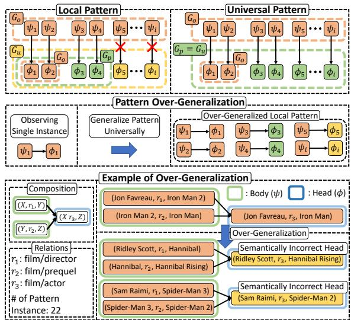  
Figure 1: Illustration of local and universal patterns, and the process and examples of over-generalization. Existing models suffer from over-generalization by treating local patterns as universal patterns. The example shows that a local pattern is generalized universally, which leads to erroneous predictions.

thereby leading the model to treat the corresponding head as valid for every new body instance of the same pattern. This phenomenon is further illustrated in Figure 1, where the model generalizes the pattern universally to every body instance. However, not all patterns in KGs are universally valid, especially those with a few pattern instances.1

Empirical Evidence Nevertheless, existing KGE models overlook the difference between local and universal patterns, treating all observed patterns as universally valid regardless of their frequency. Figure 2 shows the histograms of the embedding difference $\Delta = r _ { 1 } ^ { T } \circ r _ { 2 } ^ { T } \circ r _ { 3 } ^ { H } - r _ { 1 } ^ { H } \circ r _ { 2 } ^ { H } \circ r _ { 3 } ^ { T }$ , that is presented in Equation 4. Elements of $\Delta$ close to zero indicate that the model recognizes the given relation set $( r _ { 1 } , r _ { 2 } , r _ { 3 } )$ as a valid pattern, therefore, the model generalizes the pattern universally to every body instance. Figures 2(a) and 2(b) show that the elements of $\Delta$ are concentrated near zero for both local and universal patterns, indicating that the model recognizes both as valid composition patterns regardless of instance frequency. This empirically demonstrates that PairRE is trained to generalize local patterns as if they were universal, even when the supporting instances are scarce.

While local patterns are supported by only a

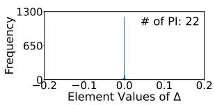

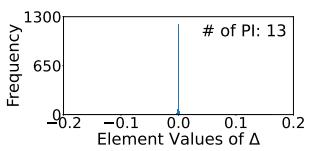  
(a) Histograms of local patterns that are supported by scarce pattern instances. The relation sets for the left and right figures are (film/written\_by, actor/film, film/prequel) and (film/director, film/prequel, actor/film), respectively

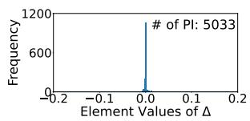

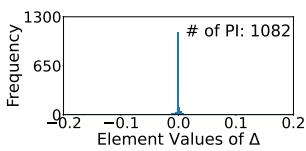  
(b) Histograms of universal patterns that are supported by many pattern instances. The relation sets for the left and right figures are (actor/film, film/country, people/nationality) and (people/place\_of\_birth, location/country, people/nationality), respectively

Figure 2: Histograms of embedding difference $\Delta =$ $r _ { 1 } ^ { \breve { T } } \circ r _ { 2 } ^ { T } \circ r _ { 3 } ^ { H } \ : - r _ { 1 } ^ { H } \circ r _ { 2 } ^ { H } \circ r _ { 3 } ^ { T }$ for different relation set $( r _ { 1 } , r _ { 2 } , r _ { 3 } )$ . # of PI denotes the number of pattern instances. $( r _ { 1 } , r _ { 2 } , r _ { 3 } )$ are retrieved from FB15k-237.

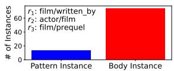

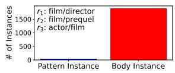  
Figure 3: The number of pattern instances and body instances for the local patterns introduced in Figure 2(a).

scarce number of pattern instances, they often have a vast number of body instances. Figure 3 presents the number of pattern instances and body instances of the local patterns in Figure 2(a). This indicates that a large number of body instances are affected by only a few pattern instances, leading the model to predict the corresponding head instances as valid for all body instances. The distribution of pattern instances and body instances of the universal patterns in Figure 2(b) and empirical evidence for another pattern type are presented in Appendix J.

To address this issue, we propose a novel KGE framework PogRE that explicitly models the distinction between pattern universality and locality. Our core idea is to generalize patterns differentially based on their observation frequency in G, rather than generalizing all patterns equally.

Which Methods Are Affected? Table 1 presents representative examples of KGE methods that suffer from over-generalization. To verify whether these models actually suffer from over-generalization, we propose the Over-

<table><tr><td rowspan="2">Model</td><td rowspan="2">Score Function</td><td>Over-generalization</td><td rowspan="2">OG ratio (↓)</td></tr><tr><td>Sym/Asym/Inves/Comp</td></tr><tr><td>TransE</td><td> $\overline { { \| h + r - t \| } }$ </td><td>-√I√I√</td><td>.927</td></tr><tr><td>RotatE</td><td> $\| h \circ r - t \|$ </td><td>√I√I√I√</td><td>.921</td></tr><tr><td>PairRE</td><td> $\| h \circ r ^ { H } - t \circ r ^ { T } \|$ </td><td>√I√I√I√</td><td>.917</td></tr><tr><td>CompoundE</td><td> $\| M _ { r } \cdot h - \hat { M } _ { r } \cdot t \|$ </td><td>√I√I√I√</td><td>.910</td></tr><tr><td>PogRE (Ours)</td><td> $\overline { { | | L _ { r } h _ { r } - t _ { r } | | } }$ </td><td>XIXIXIX</td><td>.869</td></tr></table>

Table 1: Comparison between PogRE and KGE models. h and t denote head and tail embeddings and $h _ { r }$ and $t _ { r }$ indicate head and tail embeddings in the relationspecific space, as presented in Equation 10.

Generalization (OG) ratio. Specifically, for the local patterns presented in Figure 3, we extract the head instances corresponding to the body instances and categorize them into True triples (if triples are in G) and False triples (others). The OG ratio is defined as the average score produced by a model for the True triples divided by the average score for the False triples. An OG ratio close to 1 indicates that a model suffers from over-generalization, as it assigns similar scores to both True and False triples. Conversely, an OG ratio closer to 0 implies that the model effectively avoids this issue by assigning higher scores to False triples than to True triples. PogRE exhibits a lower OG ratio than other models. This indicates that PogRE effectively addresses over-generalization. For more details of the OG ratio, please refer to Appendix H.

## 4 Method

In this section, we present the formulation of PogRE and provide a theoretical analysis demonstrating how PogRE addresses over-generalization.

## 4.1 Pattern Over-Generalization Robust Embedding (PogRE)

Final Form We define the score function as the distance between the head entity $h _ { r }$ and tail entity $t _ { r }$ in relation-specific space, after the linear transformation $L _ { r } \in \mathbb { R } ^ { d \times d }$

$$
f _ { r } ( h , t ) = \| L _ { r } h _ { r } - t _ { r } \|\tag{7}
$$

where $h _ { r } , t _ { r } \in \mathbb { R } ^ { d }$ denote the head and tail embeddings in relation-specific space, respectively.

Comparison Between Existing Linear Transformation Models Although existing models such as RESCAL (Nickel et al., 2011) and TransR (Lin et al., 2015) employ dense linear transformations, they suffer from overfitting and representing relations as $\mathbb { R } ^ { n \times n }$ dense linear matrix incurs significant computational costs. As a result, recent

KGE models rarely adopt such dense linear transformations. CompoundE (Ge et al., 2023) utilizes sparse affine operators; consequently, it suffers from over-generalization, as presented in Table 1. In contrast, PogRE addresses over-generalization by employing dense linear transformations through a QR decomposition-inspired method, which reduces computational costs. Detailed differences are presented in Appendix L.

QR Decomposition and Partial Sharing for Efficient Parameterization Linear transformation $L _ { r }$ of PogRE is decomposed into a relation-specific orthogonal matrix $Q _ { r }$ r and an upper-triangular matrix R that is shared across all relations:

$$
\begin{array} { l } { L _ { r } = Q _ { r } R } \\ { Q _ { r } = H _ { 1 } H _ { 2 } . . . H _ { k } } \end{array}\tag{8}
$$

In addition, $Q _ { r }$ is approximated using a product of k Householder reflections (where $k \ll d )$ . This approximation significantly reduces the number of parameters from $n _ { r } d ^ { 2 }$ to $d ( d + 1 ) / 2 + n _ { r } k d .$ where $n _ { r }$ denotes the number of relations, thereby effectively reducing the model complexity. Details about computational complexity with respect to k are presented in Appendix C.

Additionally, let R¯ be the learnable uppertriangular parameter matrix. The final shared matrix $R$ is formulated as:

$$
R = \frac { \bar { R } } { \| \bar { R } \| _ { 2 } }\tag{9}
$$

where $\| \cdot \| _ { 2 }$ denotes the spectral norm. We argue that even for local patterns, the pattern should be generalized to entities that are not observed in the patterns but are semantically similar to entities that are observed in the patterns. Spectral Normalization (SN) enables this generalization by bounding the Lipschitz constant of the transformations to one (Miyato et al., 2018). Detailed derivations are provided in the Appendix A.

Relation-Specific Affine Mapping for Expressive Power Sharing an upper-triangular matrix R reduces the expressive power of relation-specific transformations. To address this limitation and enhance the model capacity, following (Ge et al., 2023), each entity is mapped into an relationspecific space via three affine operators before applying $L _ { r }$ . By employing homogeneous coordinates, these operators can be unified into a single

matrix multiplication:

$$
\begin{array} { r l } & { \boldsymbol { h } _ { r } = M _ { r } \boldsymbol { h } , \qquad } & { \boldsymbol { t } _ { r } = \hat { M } _ { r } \cdot \boldsymbol { t } } \\ & { M _ { r } = S _ { r } \cdot \boldsymbol { R } _ { r } \cdot \boldsymbol { T } _ { r } , \qquad } & { \hat { M } _ { r } = \hat { S } _ { r } \cdot \hat { \boldsymbol { R } } _ { r } \cdot \hat { \boldsymbol { T } } _ { r } } \end{array}\tag{10}
$$

where $h , t$ are head and tail embeddings, $S _ { r } , R _ { r } ,$ and $T _ { r }$ denote the scaling, rotation, and translation operators, and $\hat { S } _ { r } , \hat { R } _ { r } .$ , and $\hat { T } _ { r }$ denote the scaling, rotation, and translation operators for tail entity embedding, respectively. This mapping strategy ensures that each relation has sufficient expressive power despite the shared components in $L _ { r }$

Optimization Following Sun et al. (2019), we adopt self-adversarial negative sampling for training. The loss function can be written as:

$$
\begin{array} { r l } & { L = - \log \sigma ( \gamma - f _ { r } ( h , t ) ) } \\ & { \qquad - \sum _ { i = 1 } ^ { n } p ( h _ { i } ^ { \prime } , r , t _ { i } ^ { \prime } ) \log \sigma ( f _ { r } ( h _ { i } ^ { \prime } , t _ { i } ^ { \prime } ) - \gamma ) } \end{array}\tag{11}
$$

where σ is the sigmoid function, $\gamma$ is a fixed margin, $( h _ { i } ^ { \prime } , r , t _ { i } ^ { \prime } )$ is the i-th negative triple and $p ( h _ { i } ^ { \prime } , r , t _ { i } ^ { \prime } )$ is the weight of the negative triple, defined as:

$$
\begin{array} { r } { p ( h _ { j } ^ { \prime } , r , t _ { j } ^ { \prime } | \{ ( h _ { i } , r _ { i } , t _ { i } ) \} ) = \frac { \exp \alpha f _ { r } ( h _ { j } ^ { \prime } , t _ { j } ^ { \prime } ) } { \sum _ { i } \exp \alpha f _ { r } ( h _ { i } ^ { \prime } , t _ { i } ^ { \prime } ) } } \end{array}\tag{12}
$$

where $\alpha$ is the temperature of sampling.

## 4.2 How Is Pattern Over-Generalization Addressed?

To analyze how PogRE addresses over generalization, we first consider using only the linear transformation $L _ { r }$ , and then extend this analysis to our framework, which incorporates the affine operators.

Theoretical Analysis: Linear Transformation To the best of our knowledge, all patterns studied in existing research are based on connected paths formed by relations. This implies that a body (ψ) and head (ϕ) can be represented as a relational path between the start entity $e _ { u }$ and the end entity $e _ { v } .$ where each path is formulated as a product of linear matrix multiplications. Consequently, the body (ψ) and head (ϕ) of a pattern can be expressed as:

$$
\begin{array} { r l r } & { } & { \mathrm { B o d y ~ } ( \psi ) : \quad L _ { \psi } e _ { u } = L _ { r _ { n } } \ldots L _ { r _ { 2 } } L _ { r _ { 1 } } e _ { u } = e _ { v } , } \\ & { } & { \mathrm { H e a d ~ } ( \phi ) : \quad L _ { \phi } e _ { u } = L _ { r _ { m } ^ { \prime } } \ldots L _ { r _ { 2 } ^ { \prime } } L _ { r _ { 1 } ^ { \prime } } e _ { u } = e _ { v } . } \end{array}\tag{13}
$$

where $L \in \mathbb { R } ^ { d \times d }$ and $e \in \mathbb { R } ^ { d }$ denote the transformation matrix and entity vector, respectively.

From Equation 13, since both paths map $e _ { u }$ to the same entity $e _ { v } ,$ we explicitly have $L _ { \psi } e _ { u } =$

$L _ { \phi } e _ { u } .$ , which is equivalent to:

$$
( L _ { \psi } - L _ { \phi } ) e _ { u } = 0 \quad \Longleftrightarrow \quad E e _ { u } = 0\tag{14}
$$

where $E = L _ { \psi } - L _ { \phi }$ denotes the constraint matrix. Next, consider a set of d linearly independent entities $\{ e _ { u _ { 1 } } , e _ { u _ { 2 } } , \ldots , e _ { u _ { d } } \}$ that satisfy the pattern, such that2:

$$
E e _ { u _ { i } } = 0 , \quad \mathrm { f o r } { \mathrm { a l l } } i = 1 , 2 , \dots , d\tag{15}
$$

For any arbitrary entity $a \in \mathbb { R } ^ { d } .$ , since $\{ e _ { u _ { i } } \}$ forms a basis in $\mathbb { R } ^ { d } .$ , a can be expressed as a linear combination $a = c _ { 1 } e _ { u _ { 1 } } + c _ { 2 } e _ { u _ { 2 } } + \cdot \cdot \cdot + c _ { d } e _ { u _ { d } }$ . By the linearity of the transformation $E _ { \mathrm { { : } } }$ it follows that:

$$
E a = c _ { 1 } E e _ { u _ { 1 } } + c _ { 2 } E e _ { u _ { 2 } } + \cdot \cdot \cdot + c _ { d } E e _ { u _ { d } } = 0\tag{16}
$$

These results indicate that as PogRE observes more linearly independent entities $e _ { u } ,$ , the dimension of the space spanned by these entities increases. Consequently, when the number of observed entities reaches $d ,$ PogRE guarantees the universal generalization of the pattern across all related instances. In other words, it can be expected that a pattern becomes progressively universal as the number of observed entities increases.

Extension to Relation-Specific Affine Mapping This analysis can be extended to our proposed framework by employing homogeneous coordinates. By representing entities in an augmented (d + 1)-dimensional space, the integration of affine operators and linear transformations for a relation r can be unified into a single linear matrix $A _ { r } \in \mathbb { R } ^ { ( d + 1 ) \times ( d + 1 ) }$ when $\hat { M } _ { r }$ is non-singular:

$$
A _ { r } = \hat { M } _ { r } ^ { - 1 } L _ { r } M _ { r }\tag{17}
$$

Therefore, the relational path can be expressed as a product of linear transformation $A _ { r }$ . Consequently, the same proof used in the linear case can be applied, demonstrating that the pattern becomes universal only when $d { + 1 }$ linearly independent entities are observed in the augmented space. The linear independence of entity embeddings is discussed in Section 6.3. Our theoretical guarantees rely on the ideal assumption that $\| E e _ { i } \| = 0$ . Since satisfying this exact constraint is challenging in practice, we provide further analysis in Appendix K, proving that an approximate constraint $( \lVert E e _ { i } \rVert < \epsilon )$ still bounds the pattern constraint of unseen entities, along with a discussion on the practical strength of the approximate constraint assumption.

## 5 Related Work

## 5.1 Distance-based Models

Distance-based models capture patterns through various relational operations. TransE (Bordes et al., 2013), RotatE (Sun et al., 2019), Rotate3D (Gao et al., 2020), DualE (Cao et al., 2021), ReflectE (Zhang et al., 2022) and, RotatQ (Xie et al., 2025) model relations through translation, rotation, 3D rotation, a combination of translation and rotation, reflection transformation, and quaternionbased transformation, respectively. Other models enrich these operations: HAKE (Zhang et al., 2020b) uses polar coordinates for semantic hierarchies, PairRE (Chao et al., 2021) and CompoundE (Ge et al., 2023) apply scaling and compound operators, and DensE (Lu et al., 2022) decomposes relations into rotation and scaling in 3D Euclidean space. Recent models further diversify relation modeling: ExpressivE (Pavlovic´ and Sallinger, 2023) and OctagonE (Charpenay and Schockaert, 2024) represent relations as hyperparallelograms and axis-aligned octagons, respectively. SpeedE (Pavlovic and Sallinger´ , 2024) improves efficiency in low-dimensional Euclidean settings, OrthogonalE (Zhu and Shimodaira, 2024) adopts block-diagonal orthogonal matrices with Riemannian optimization, and Charpenay and Schockaert (2025) theoretically analyze the ability of MuRE to capture inference patterns. Although these models effectively capture patterns, their pattern conditions are determined by relation embeddings, which can generalize patterns even when the pattern is supported by only a few instances.

## 5.2 Tensor Decomposition Models

Tensor decomposition models capture patterns through interactions among entity and relation embeddings. DistMult (Yang et al., 2015) and ComplEx (Trouillon et al., 2016) use bilinear scoring functions, whereas HolE (Nickel et al., 2016) employs circular correlation. ANALOGY (Liu et al., 2017), SimplE (Kazemi and Poole, 2018), and TuckER (Balaževic et al.´ , 2019) use normal linear operators, enhanced CP decomposition, and Tucker decomposition, respectively. QuatE (Zhang et al., 2019) extends interactions with quaternion representations, while CustomizE (Guan et al., 2025) introduces customized embeddings to address the long-tail problem. Although these models provide strong representation capacity, they are not explicitly designed to distinguish between local patterns and universal patterns. As a result, they may capture observed patterns, but they do not directly control the scope of pattern generalization based on supporting evidence.

<table><tr><td rowspan="2">Knowledge Graph Embedding</td><td colspan="3">WN18RR</td><td colspan="3">FB15k-237</td><td colspan="3">YAGO3-10</td></tr><tr><td>MRR</td><td>H@1</td><td>H@10</td><td>MRR</td><td>H@1</td><td>H@10</td><td>MRR</td><td>H@1</td><td>H@10</td></tr><tr><td>TransE (Bordes et al., 2013)</td><td>.226</td><td>-</td><td>.501</td><td>.294</td><td></td><td>.465</td><td>-</td><td></td><td></td></tr><tr><td>DistMult (Yang et al., 2015)</td><td>.430</td><td>.390</td><td>.490</td><td>.241</td><td>.155</td><td>.419</td><td></td><td></td><td></td></tr><tr><td>ComplEx (Trouillon et al., 2016)</td><td>.440</td><td>.410</td><td>.510</td><td>.247</td><td>.158</td><td>.428</td><td></td><td></td><td></td></tr><tr><td>RotatE (Sun et al., 2019)</td><td>.476</td><td>.428</td><td>.571</td><td>.338</td><td>.241</td><td>.533</td><td>.495</td><td>.402</td><td>.670</td></tr><tr><td>TuckER (Balažević et al., 2019)</td><td>.470</td><td>.443</td><td>.526</td><td>.358</td><td>.266</td><td>.544</td><td></td><td></td><td></td></tr><tr><td>QuatE (Zhang et al., 2019)</td><td>.488</td><td>.438</td><td>.582</td><td>.348</td><td>.248</td><td>.550</td><td></td><td></td><td></td></tr><tr><td>Rotate3D (Gao et al., 2020)</td><td>.489</td><td>.442</td><td>.579</td><td>.347</td><td>.250</td><td>.543</td><td></td><td></td><td></td></tr><tr><td>HAKE (Zhang et al., 2020b)</td><td>.497</td><td>.452</td><td>.582</td><td>.346</td><td>.250</td><td>.542</td><td>.545</td><td>.462</td><td>.694</td></tr><tr><td>DualE (Cao et al., 2021)</td><td>.492</td><td>.444</td><td>.584</td><td>.365</td><td>.268</td><td>.559</td><td></td><td></td><td></td></tr><tr><td>PairRE (Chao et al., 2021)</td><td></td><td></td><td></td><td>.351</td><td>.256</td><td>.544</td><td></td><td></td><td></td></tr><tr><td>HopfE (Bastos et al., 2021)</td><td>.472</td><td>.413</td><td>.586</td><td>.343</td><td>.247</td><td>.534</td><td>.529</td><td>.438</td><td>.695</td></tr><tr><td>DensE (Lu et al., 2022)</td><td>.492</td><td></td><td>.586</td><td>.351</td><td></td><td>.544</td><td>.541</td><td></td><td>.678</td></tr><tr><td>ReflectE (Zhang et al., 2022)</td><td>.488</td><td>.450</td><td>.559</td><td>.358</td><td>.263</td><td>.546</td><td></td><td></td><td></td></tr><tr><td>ExpressivE (Pavlović and Sallinger, 2023)</td><td>.482</td><td>.407</td><td>.619</td><td>.350</td><td>.256</td><td>.535</td><td></td><td></td><td></td></tr><tr><td>CompoundE (Ge et al., 2023)</td><td>.491</td><td>.450</td><td>.576</td><td>.357</td><td>.264</td><td>.545</td><td></td><td></td><td></td></tr><tr><td>SpeedE (Pavlović and Sallinger, 2024)</td><td>.493</td><td>.446</td><td></td><td>.320</td><td>.227</td><td></td><td>.413</td><td>.332</td><td></td></tr><tr><td>OctagonE (Charpenay and Schockaert, 2024)</td><td>.479</td><td>.436</td><td>.561</td><td>.332</td><td>.241</td><td>.517</td><td></td><td></td><td></td></tr><tr><td>OrthogonalE (Zhu and Shimodaira, 2024)</td><td>.494</td><td>.446</td><td>.573</td><td>.334</td><td>.242</td><td>.518</td><td></td><td></td><td></td></tr><tr><td>CustomizE (Guan et al., 2025)</td><td>.486</td><td>.446</td><td></td><td>.351</td><td>.261</td><td>.504</td><td></td><td></td><td></td></tr><tr><td>RotatQ (Xie et al., 2025)</td><td>.489</td><td>.450</td><td>.552</td><td>.356</td><td>.254</td><td>.619</td><td></td><td></td><td></td></tr><tr><td>MuRE variant (Charpenay and Schockaert, 2025)</td><td>.469</td><td>.427</td><td>.553</td><td>.307</td><td>.212</td><td>.503</td><td></td><td></td><td></td></tr><tr><td rowspan="2">PogRE (Ours)</td><td>.506</td><td>.461</td><td>.595</td><td>.369</td><td>.273</td><td>.562</td><td>.556</td><td>.474</td><td>.699</td></tr><tr><td>±.001</td><td>±.001</td><td>±.000</td><td>±.001</td><td>±.001</td><td>±.001</td><td>±.000</td><td>±.001</td><td>±.000</td></tr></table>

Table 2: Link prediction results on WN18RR, FB15k-237 and YAGO3-10. Bold indicates the best result and underline indicates the second best result. ± indicates standard deviation.

## 6 Experiments

## 6.1 Experimental Setting

Dataset We evaluate PogRE on three widely used KG datasets: WN18RR (Dettmers et al., 2018), FB15k-237 (Toutanova and Chen, 2015) and YAGO3-10 (Mahdisoltani et al., 2013). The statistics of these datasets are presented in Appendix E

Evaluation Protocol We evaluate link prediction performance in the filtered setting (Bordes et al., 2013). In this setting, test triples are ranked against all other candidate triples that are generated by corrupting subjects or objects: $( h ^ { \prime } , r , t )$ or $( h , r , t ^ { \prime } )$ and all the triples that appear either in the training, validation or test set are removed from the candidate triples, except the test triple of interest. We adopt MRR, Hits@1 (H@1), and Hits@10 (H@10) to compare the performance of different KGE models. MRR denotes the mean reciprocal rank of the correct entities, and H@N represents the proportion of correct entities ranked within the top N. For performance comparison, we evaluate PogRE against all KGE models discussed in Section 5.

## 6.2 Main Results

Link Prediction Performance As shown in Table 2, PogRE exhibits superior or competitive performance compared with the baselines. For instance, PogRE achieves MRR improvements of 0.009, 0.004, and 0.011 over the second-best models, DualE and HAKE, on WN18RR, FB15k-237 and YAGO3-10, respectively. These results indicate the effectiveness and robustness of PogRE across diverse datasets. In addition to the standard benchmarks presented above, Appendix F provides link prediction results on large-scale KG datasets.

<table><tr><td rowspan="2">Model</td><td colspan="3">MRR</td></tr><tr><td>WN18RR</td><td>FB15k-237</td><td>YAGO3-10</td></tr><tr><td>PogRE</td><td>.506</td><td>.369</td><td>.556</td></tr><tr><td>+ w/o R</td><td>.505</td><td>.365</td><td>.517</td></tr><tr><td>+ w/o Qr</td><td>.501</td><td>.364</td><td>.540</td></tr><tr><td>+ w/o SN</td><td>.505</td><td>.360</td><td>.523</td></tr><tr><td>+ w/o Lr (CompoundE)</td><td>.491</td><td>.357</td><td>.477</td></tr><tr><td>+ w/o QR Decomposition</td><td>OOM</td><td>OOM</td><td>OOM</td></tr></table>

Table 3: Ablation study of PogRE on WN18RR, FB15k-237 and YAGO3-10. MRR is used for performance comparison. R, $\displaystyle Q _ { r } ,$ SN, $L _ { r } ,$ and OOM denote the shared upper triangular parameter matrix, relation specific Householder reflection, Spectral Normalization, linear transformation of PogRE, and Out of Memory, respectively. In w/o QR Decomposition, n × n dense linear transformations are used for $L _ { r }$

Ablation Study Table 3 summarizes the results of an ablation study conducted to verify the effectiveness of each proposed component. As shown in the results, PogRE consistently outperforms the ablated models across all datasets. Specifically, w/o $L _ { r }$ (equivalent to CompoundE) exhibits significant performance degradation. w/o $L _ { r }$ does not employ a dense matrix and thus suffers from over-generalization, which suggests that overlooking this problem results in significant performance loss. Furthermore, employing dense linear transformations without QR decomposition was infeasible across all datasets; this demonstrates that models such as TransR (Lin et al., 2015), which rely on dense linear transformations, lack scalability due to their high computational costs.

<table><tr><td rowspan="2">Number of Sample Vector</td><td colspan="3">Rank</td></tr><tr><td>WN18RR</td><td>FB15k-237</td><td>YAGO3-10</td></tr><tr><td>100</td><td>100.0</td><td>100.0</td><td>100.0</td></tr><tr><td>200</td><td>200.0</td><td>200.0</td><td>200.0</td></tr><tr><td>500</td><td>500.0</td><td>500.0</td><td>500.0</td></tr><tr><td>1,000</td><td>994.4 ± 1.5</td><td>1000.0</td><td>999.5 ± 0.5</td></tr><tr><td>1,500</td><td>1000.0</td><td>1497.4 ± 0.6</td><td>1000.0</td></tr><tr><td>2,000</td><td>1000.0</td><td>1500.0</td><td>1000.0</td></tr></table>

Table 4: Mean rank of the subspace spanned by randomly sampled entities over 100 random trials across three benchmarks. The entity dimensions of PogRE are 1,000 on WN18RR and YAGO3-10, and 1,500 on FB15k-237.

## 6.3 Analysis

Entity Independence As discussed in Section 4.2, PogRE ensures that any pattern becomes progressively universal as more linearly independent entities are observed in the pattern. This implies that if the entity embeddings trained by PogRE are linearly independent, PogRE can achieve such progressive universality in practice. To investigate entity independence, we randomly sample entity embeddings trained by PogRE and compute the rank of the space spanned by the sampled entities. Table 4 shows the mean rank of the subspace spanned by sampled entities over 100 random trials. We empirically observe that the rank of the space spanned by the randomly sampled entities is approximately equal to the number of sampled entities, demonstrating that the sampled entities are linearly independent. These results indicate that, since entities in practice are shown to be linearly independent, the dimension of the space spanned by the entities increases as the number of observed entities increases, and that universal generalization is achieved when around $d { + 1 }$ entities are observed. We also present empirical results on the independence of entities observed in specific patterns in Appendix G.

Distribution of Patterns by Number of Pattern Instances Table 5 presents the distribution of composition patterns according to the number of their pattern instances n across three KG benchmarks. We compute the number of composition patterns as the number of relation sets $( r _ { x } , r _ { y } , r _ { z } ) \in R$ that have at least one observed composition pattern instance $\left( \psi _ { 1 } \Rightarrow \phi _ { 1 } \right)$ in the KG. In WN18RR, FB15k-237 and YAGO3-10, 88.6%, 65.3% and 52.8% of composition patterns have 10 or fewer pattern instances, respectively. This result indicates that a substantial proportion of patterns in KGs are observed in only a few instances. These patterns can be generalized universally when a model suffers from over-generalization. The distributions of other patterns are presented in Appendix D.

<table><tr><td rowspan="2"># of Pattern Instances (n)</td><td colspan="2">WN18RR</td><td colspan="2">FB15k-237</td><td colspan="2">YAGO3-10</td></tr><tr><td># of Patterns</td><td>Prop. (%)</td><td># of Patterns</td><td>Prop. (%)</td><td># of Patterns</td><td>Prop. (%)</td></tr><tr><td>n = 1</td><td>17</td><td>48.6</td><td>1,546</td><td>26.3</td><td>56</td><td>17.6</td></tr><tr><td> $1 < \mathrm { n } \leq 1 0$ </td><td>14</td><td>40.0</td><td>2,288</td><td>39.0</td><td>112</td><td>35.2</td></tr><tr><td> $1 0 < \mathrm { n } \le 1 0 ^ { 2 }$ </td><td>4</td><td>11.4</td><td>1,439</td><td>24.5</td><td>91</td><td>28.6</td></tr><tr><td> $1 0 ^ { 2 } < \mathrm { n } \leq 1 0 ^ { 3 }$ </td><td>-</td><td></td><td>489</td><td>8.3</td><td>53</td><td>16.7</td></tr><tr><td> $\mathrm { n } > \mathrm { i } \overline { { 0 } } ^ { 3 }$ </td><td>-</td><td>-</td><td>111</td><td>1.9</td><td>6</td><td>1.9</td></tr><tr><td>Total</td><td>35</td><td>100%</td><td>5,873</td><td>100%</td><td>318</td><td>100%</td></tr></table>

Table 5: Distribution of composition patterns according to the number of pattern instances (n) across three benchmark datasets. # of Pattern Instances and # of Patterns indicate the number of pattern instances and the number of patterns, respectively. Prop. (%) is calculated as the number of patterns within each range of n divided by the total number of patterns, within each dataset.

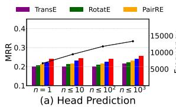

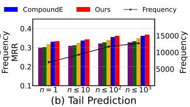  
Figure 4: MRR comparison between PogRE and baseline models for various sparsity conditions of pattern instances on FB15k-237. The black line indicates the number of test triples of $G _ { o v e r }$

Quantified Impact of Over-generalization To investigate the impact of over-generalization, we extract $G _ { o v e r } ,$ a set of triples $( h , r , t )$ , where candidates $( h , r , t ^ { \prime } )$ or $( h ^ { \prime } , r , t )$ (with $t ^ { \prime } \neq t$ and $h ^ { \prime } \neq h )$ are heads of pattern instances whose bodies are in the training set, i.e., candidates $( h , r , t ^ { \prime } )$ or $( h ^ { \prime } , r , t )$ are $\phi _ { i } \in G _ { u } \backslash G _ { o }$ for which there is a corresponding $\psi _ { i } \in G _ { o }$ . Intuitively, if the model suffers from overgeneralization, the rank of $( h , r , t )$ is lower than the rank of the candidate triples. To extract $G _ { o v e r } ,$ we consider symmetry, inversion, composition, hierarchy, intersection, transitive, g.intersection, b. transitive and b. composition where the number of pattern instances is $n = 1 , n \leq 1 0 , n \leq 1 0 ^ { 2 }$ , and $n \leq 1 0 ^ { 3 }$ . We compare the MRR of $\mathrm { P o g R E }$ with other baselines: TransE, RotatE, PairRE, and CompoundE on $G _ { o v e r }$ . Figure 4 presents the results on FB15k-237. We observe that PogRE consistently outperforms the baselines, regardless of the number of pattern instances. These results show that

PogRE effectively addresses the negative impact of over-generalization. The detailed definitions of $G _ { o v e r }$ and the comparison results for WN18RR and YAGO3-10 are presented in Appendix D.

## 7 Conclusion

In this paper, we propose PogRE, a novel KGE method that utilizes linear transformations and compound operations. PogRE addresses overgeneralization, a phenomenon in which a model generalizes a pattern to every body instance in the graph after observing only a single instance. Our theoretical analysis shows that PogRE allows a pattern to become progressively universal as more linearly independent entities are observed. Experimental results on three benchmark datasets demonstrate the effectiveness of PogRE.

## Limitations

To universally generalize patterns, PogRE does not utilize the semantics of patterns, which can be a useful inductive bias for pattern generalization. Therefore, for universal but low-frequency patterns, PogRE may fail to generalize them universally, and for local but high-frequency patterns, PogRE may generalize them universally, resulting in inappropriate generalization. This limitation arises when pattern frequency does not align with semantic universality. Accordingly, PogRE should be understood as alleviating, rather than fully resolving, pattern over-generalization. To address this limitation, in future work, we will leverage the semantics of patterns for pattern generalization.

Furthermore, PogRE is limited to the transductive setting, where the goal is to learn and improve embedding structures for a fixed set of known entities and relations. Since PogRE explicitly learns entity and relation embeddings for entities and relations observed during training, it cannot directly represent entities or relations not observed during training. While extending PogRE to the inductive setting is an important problem for handling unknown entities and relations, addressing it requires substantially different assumptions and architectural designs. For this reason, we leave extending PogRE to the inductive setting as future work.

## Acknowledgements

This work was supported by the National Research Foundation of Korea(NRF) grant funded by the Korea government(MSIT) (RS-2026-25520248) (Contribution Rate: 50%); the National Research Foundation of Korea (NRF) grant funded by the Korea government (MSIT) (No.2022R1A2C2012054, Development of AI for Canonicalized Expression of Trained Hypotheses by Resolving Ambiguity in Various Relation Levels of Representation Learning) (Contribution Rate: 40%); and Institute of Information & communications Technology Planning & Evaluation (IITP) grant funded by the Korea government (MSIT) (No.2019-0-01842, Artificial Intelligence Graduate School Program (GIST)) (Contribution Rate: 10%).

## References

Ivana Balaževic, Carl Allen, and Timothy Hospedales.´ 2019. Tucker: Tensor factorization for knowledge graph completion. In Proceedings ofthe 2019 Conference on Empirical Methods in Natural Language Processing and the 9th International Joint Conference on Natural Language Processing (EMNLP-IJCNLP), pages 5185–5194.

Anson Bastos, Kuldeep Singh, Abhishek Nadgeri, Saeedeh Shekarpour, Isaiah Onando Mulang, and Johannes Hoffart. 2021. Hopfe: Knowledge graph representation learning using inverse hopf fibrations. In Proceedings of the 30th ACM international conference on information & knowledge management, pages 89–99.

Kurt Bollacker, Colin Evans, Praveen Paritosh, Tim Sturge, and Jamie Taylor. 2008. Freebase: a collaboratively created graph database for structuring human knowledge. In Proceedings of the 2008 ACM SIG-MOD international conference on Management of data, pages 1247–1250.

Antoine Bordes, Nicolas Usunier, Alberto Garcia-Duran, Jason Weston, and Oksana Yakhnenko. 2013. Translating embeddings for modeling multirelational data. Advances in neural information processing systems, 26.

Zongsheng Cao, Qianqian Xu, Zhiyong Yang, Xiaochun Cao, and Qingming Huang. 2021. Dual quaternion knowledge graph embeddings. In Proceedings of the AAAI conference on artificial intelligence, volume 35, pages 6894–6902.

Linlin Chao, Jianshan He, Taifeng Wang, and Wei Chu. 2021. Pairre: Knowledge graph embeddings via paired relation vectors. In Proceedings of the 59th Annual Meeting ofthe Associationfor Computational Linguistics and the 11th International Joint Conference on Natural Language Processing (Volume 1: Long Papers), pages 4360–4369.

Victor Charpenay and Steven Schockaert. 2024. Capturing knowledge graphs and rules with octagon embeddings. In Proceedings of the Thirty-Third Inter-

national Joint Conference on Artificial Intelligence, pages 3289–3297.

Victor Charpenay and Steven Schockaert. 2025. Less is mure: Revisiting shallow knowledge graph embeddings. In Proceedings of the 2025 Conference on Empirical Methods in Natural Language Processing, pages 15428–15454.

Guoquan Dai, Xizhao Wang, Xiaoying Zou, Chao Liu, and Si Cen. 2022. Mrgat: multi-relational graph attention network for knowledge graph completion. Neural Networks, 154:234–245.

Tim Dettmers, Pasquale Minervini, Pontus Stenetorp, and Sebastian Riedel. 2018. Convolutional 2d knowledge graph embeddings. In Proceedings of the AAAI conference on artificial intelligence, volume 32.

Chang Gao, Chengjie Sun, Lili Shan, Lei Lin, and Mingjiang Wang. 2020. Rotate3d: Representing relations as rotations in three-dimensional space for knowledge graph embedding. In Proceedings of the 29th ACM international conference on information & knowledge management, pages 385–394.

Xiou Ge, Yun Cheng Wang, Bin Wang, and C-C Jay Kuo. 2023. Compounding geometric operations for knowledge graph completion. In Proceedings of the 61st Annual Meeting of the Association for Computational Linguistics (Volume 1: Long Papers), pages 6947–6965.

Zhanpeng Guan, Zhao Zhang, Yiqing Wu, Fuwei Zhang, and Yongjun Xu. 2025. Should we use a fixed embedding size? customized dimension sizes for knowledge graph embedding. In Proceedings ofthe 31st International Conference on Computational Linguistics, pages 9006–9012.

Weihua Hu, Matthias Fey, Marinka Zitnik, Yuxiao Dong, Hongyu Ren, Bowen Liu, Michele Catasta, and Jure Leskovec. 2020. Open graph benchmark: Datasets for machine learning on graphs. Advances in neural information processing systems, 33:22118–22133.

Seyed Mehran Kazemi and David Poole. 2018. Simple embedding for link prediction in knowledge graphs. Advances in neural information processing systems, 31.

Narayanan Asuri Krishnan and Carlos R Rivero. 2024. A method for assessing inference patterns captured by embedding models in knowledge graphs. In Proceedings of the ACM Web Conference 2024, pages 2030–2041.

Juanhui Li, Harry Shomer, Jiayuan Ding, Yiqi Wang, Yao Ma, Neil Shah, Jiliang Tang, and Dawei Yin. 2023. Are message passing neural networks really helpful for knowledge graph completion? In Proceedings ofthe 61st Annual Meeting ofthe Association for Computational Linguistics (Volume 1: Long Papers), pages 10696–10711.

Yankai Lin, Zhiyuan Liu, Maosong Sun, Yang Liu, and Xuan Zhu. 2015. Learning entity and relation embeddings for knowledge graph completion. In Proceedings of the AAAI conference on artificial intelligence, volume 29.

Hanxiao Liu, Yuexin Wu, and Yiming Yang. 2017. Analogical inference for multi-relational embeddings. In International conference on machine learning, pages 2168–2178. PMLR.

Haonan Lu, Hailin Hu, and Xiaodong Lin. 2022. Dense: An enhanced non-commutative representation for knowledge graph embedding with adaptive semantic hierarchy. Neurocomputing, 476:115–125.

Chuangtao Ma, Yongrui Chen, Tianxing Wu, Arijit Khan, and Haofen Wang. 2025. Large language models meet knowledge graphs for question answering: Synthesis and opportunities. In Proceedings of the 2025 Conference on Empirical Methods in Natural Language Processing, pages 24589–24608, Suzhou, China. Association for Computational Linguistics.

Farzaneh Mahdisoltani, Joanna Biega, and Fabian M Suchanek. 2013. Yago3: A knowledge base from multilingual wikipedias. In CIDR.

George A Miller. 1995. Wordnet: a lexical database for english. Communications ofthe ACM, 38(11):39–41.

Takeru Miyato, Toshiki Kataoka, Masanori Koyama, and Yuichi Yoshida. 2018. Spectral normalization for generative adversarial networks. In International Conference on Learning Representations.

Maximilian Nickel, Lorenzo Rosasco, and Tomaso Poggio. 2016. Holographic embeddings of knowledge graphs. In Proceedings of the AAAI conference on artificial intelligence, volume 30.

Maximilian Nickel, Volker Tresp, and Hans-Peter Kriegel. 2011. A three-way model for collective learning on multi-relational data. In Proceedings of the 28th International Conference on International Conference on Machine Learning, pages 809–816.

Aleksandar Pavlovic and Emanuel Sallinger. 2023. Ex-´ pressive: A spatio-functional embedding for knowledge graph completion. In The Eleventh International Conference on Learning Representations.

Aleksandar Pavlovic and Emanuel Sallinger. 2024.´ Speede: Euclidean geometric knowledge graph embedding strikes back. In Findings of the Association for Computational Linguistics: NAACL 2024, pages 69–92.

Michael Schlichtkrull, Thomas N Kipf, Peter Bloem, Rianne Van Den Berg, Ivan Titov, and Max Welling. 2018. Modeling relational data with graph convolutional networks. In European semantic web conference, pages 593–607. Springer.

Chao Shang, Yun Tang, Jing Huang, Jinbo Bi, Xiaodong He, and Bowen Zhou. 2019. End-to-end structureaware convolutional networks for knowledge base completion. In Proceedings ofthe AAAI conference on artificial intelligence, volume 33, pages 3060– 3067.

Yuan Sui, Yufei He, Nian Liu, Xiaoxin He, Kun Wang, and Bryan Hooi. 2025. Fidelis: Faithful reasoning in large language models for knowledge graph question answering. In Findings ofthe Associationfor Computational Linguistics: ACL 2025, pages 8315–8330.

Zhiqing Sun, Zhi-Hong Deng, Jian-Yun Nie, and Jian Tang. 2019. Rotate: Knowledge graph embedding by relational rotation in complex space. In International Conference on Learning Representations.

Kristina Toutanova and Danqi Chen. 2015. Observed versus latent features for knowledge base and text inference. In Proceedings of the 3rd workshop on continuous vector space models and their compositionality, pages 57–66.

Théo Trouillon, Johannes Welbl, Sebastian Riedel, Éric Gaussier, and Guillaume Bouchard. 2016. Complex embeddings for simple link prediction. In International conference on machine learning, pages 2071– 2080. PMLR.

Shikhar Vashishth, Soumya Sanyal, Vikram Nitin, and Partha Talukdar. 2020. Composition-based multirelational graph convolutional networks. In International Conference on Learning Representations.

Yanjie Wang, Daniel Ruffinelli, Rainer Gemulla, Samuel Broscheit, and Christian Meilicke. 2019. On evaluating embedding models for knowledge base completion. In Proceedings of the 4th Workshop on Representation Learning for NLP (RepL4NLP-2019), pages 104–112.

Shiwen Xie, Yongfang Xie, Cheng Hu, and Tingwen Huang. 2025. Rotatq: Knowledge graph embedding based on quaternion unit. Neurocomputing, page 132413.

Bishan Yang, Scott Wen-tau Yih, Xiaodong He, Jianfeng Gao, and Li Deng. 2015. Embedding entities and relations for learning and inference in knowledge bases. In Proceedings of the International Conference on Learning Representations (ICLR) 2015.

Qianjin Zhang, Ronggui Wang, Juan Yang, and Lixia Xue. 2022. Knowledge graph embedding by reflection transformation. Knowledge-Based Systems, 238:107861.

Shuai Zhang, Yi Tay, Lina Yao, and Qi Liu. 2019. Quaternion knowledge graph embeddings. Advances in neural information processing systems, 32.

Siheng Zhang, Zhengya Sun, and Wensheng Zhang. 2020a. Improve the translational distance models for knowledge graph embedding. Journal of Intelligent Information Systems, 55(3):445–467.

Zhanqiu Zhang, Jianyu Cai, Yongdong Zhang, and Jie Wang. 2020b. Learning hierarchy-aware knowledge graph embeddings for link prediction. In Proceedings ofthe AAAI conference on artificial intelligence, volume 34, pages 3065–3072.

Yihua Zhu and Hidetoshi Shimodaira. 2024. Blockdiagonal orthogonal relation and matrix entity for knowledge graph embedding. In Findings of the Associationfor Computational Linguistics: EMNLP 2024, pages 16956–16972.
<table><tr><td rowspan=1 colspan=1>Pattern</td><td rowspan=1 colspan=1>Constraint Matrices $\overline { { ( \boldsymbol { E } = A _ { \psi } - A _ { \phi } ) } }$ </td></tr><tr><td rowspan=1 colspan=1>Hierarchy $r _ { 1 } ( X , Y ) \Rightarrow r _ { 2 } ( X , Y )$ </td><td rowspan=1 colspan=1> $( A _ { r _ { 1 } } - A _ { r _ { 2 } } ) X = 0$ </td></tr><tr><td rowspan=1 colspan=1>Symmetry $r ( X , Y ) \Rightarrow r ( Y , X )$ </td><td rowspan=1 colspan=1> $( A _ { r } ^ { 2 } - I ) X = 0$ </td></tr><tr><td rowspan=1 colspan=1>Antisymmetry $r ( X , Y ) \Rightarrow \neg r ( X , Y )$ </td><td rowspan=1 colspan=1> $( A _ { r } ^ { 2 } - I ) X \neq 0$ </td></tr><tr><td rowspan=1 colspan=1>Inversion $r _ { 1 } ( X , Y ) \Rightarrow r _ { 2 } ( Y , X )$ </td><td rowspan=1 colspan=1> $( A _ { r _ { 2 } } A _ { r _ { 1 } } - I ) X = 0$ </td></tr><tr><td rowspan=1 colspan=1>Intersection $r _ { 1 } ( X , Y ) \land r _ { 2 } ( X , Y ) \Rightarrow r _ { 3 } ( X , Y )$ </td><td rowspan=1 colspan=1> $( A _ { r _ { 1 } } - A _ { r _ { 3 } } ) X = ( A _ { r _ { 2 } } - A _ { r _ { 3 } } ) X = 0$ </td></tr><tr><td rowspan=1 colspan=1>Transitivity $r ( X , Y ) \land r ( Y , Z ) \Rightarrow r ( X , Z )$ </td><td rowspan=1 colspan=1> $( A _ { r } ^ { 2 } - A _ { r } ) X = 0$ </td></tr><tr><td rowspan=1 colspan=1>Composition $r _ { 1 } ( X , Y ) \land r _ { 2 } ( Y , Z ) \Rightarrow r _ { 3 } ( X , Z )$ </td><td rowspan=1 colspan=1> $( A _ { r _ { 2 } } A _ { r _ { 1 } } - A _ { r _ { 3 } } ) X = 0$ </td></tr><tr><td rowspan=1 colspan=1>Gen. Intersection $r _ { 1 } ( X , Y ) \land r _ { 1 } ( Y , X ) \Rightarrow r _ { 2 } ( X , Y )$ </td><td rowspan=1 colspan=1> $( A _ { r _ { 1 } } A _ { r _ { 2 } } - I ) X = ( A _ { r _ { 1 } } - A _ { r _ { 2 } } ) X = 0$ </td></tr><tr><td rowspan=1 colspan=1>B. Transitive $r ( Y , Z ) \land r ( Z , X ) \Rightarrow r ( X , Y )$ </td><td rowspan=1 colspan=1> $( A _ { r } ^ { 3 } - I ) X = 0$ </td></tr><tr><td rowspan=1 colspan=1>Equality $r ( X , Z ) \land r ( Y , Z ) \Rightarrow r ( X , Y )$ </td><td rowspan=1 colspan=1> $( I - A _ { r } ) X = 0$ </td></tr><tr><td rowspan=1 colspan=1> $\overline { { { \bf B } . { \bf C o m p o s i t i o n } } }$  $r _ { 1 } ( Y , Z ) \land r _ { 2 } ( Z , X ) \Rightarrow r _ { 3 } ( X , Y )$ </td><td rowspan=1 colspan=1> $( A _ { r _ { 2 } } A _ { r _ { 1 } } A _ { r _ { 3 } } - I ) X = 0$ </td></tr><tr><td rowspan=1 colspan=1> $\mathrm { C o m m o n a l i t y }$  $r _ { 1 } ( X , Z ) \wedge r _ { 2 } ( Y , Z ) \stackrel { . } { \Rightarrow } r _ { 3 } ( X , Y )$ </td><td rowspan=1 colspan=1> $( A _ { r _ { 2 } } ^ { - 1 } A _ { r _ { 1 } } - A _ { r _ { 3 } } ) X = 0$ </td></tr></table>

Table 6: Constraint matrices corresponding to various inference patterns. The patterns are presented in (Krishnan and Rivero, 2024)

## A Constraint Matrices for Patterns and Local Pattern Generalization

Constraint Matrices for Various Patterns Table 6 summarizes the derived constraint matrices for various patterns widely used in KG. Note that for patterns having multiple paths (e.g., Intersection), E represents a set of matrices $\{ E _ { 1 } , E _ { 2 } , \dots \}$ to be satisfied simultaneously.

Bounding Lipschitz Constants for Local Pattern Generalization to Unobserved Entities By applying Spectral Normalization to the shared matrix R, we ensure that the spectral norm of each relation-specific linear transformation is bounded: $\| L _ { r } \| _ { 2 } \leq 1$ . Since the constraint matrix E is defined as $L _ { \psi } - L _ { \phi }$ , the spectral norm of E is also bounded by the triangle inequality:

$$
\| E \| _ { 2 } = \| L _ { \psi } - L _ { \phi } \| _ { 2 } \leq \| L _ { \psi } \| _ { 2 } + \| L _ { \phi } \| _ { 2 } \leq 2
$$

This bound ensures that the transformation defined by the constraint matrix is Lipschitz continuous.

<table><tr><td>Dataset</td><td>B</td><td>N</td><td>D</td><td>γ</td><td>α</td><td> $\overline { { l r } }$ </td><td>k</td></tr><tr><td>WN18RR</td><td>512</td><td>1024</td><td>1000</td><td>6.0</td><td>0.5</td><td>0.00005</td><td>20</td></tr><tr><td>FB15k-237</td><td>1024</td><td>256</td><td>1500</td><td>6.0</td><td>1.0</td><td>0.00005</td><td>20</td></tr><tr><td>YAGO3-10</td><td>1024</td><td>400</td><td>1000</td><td>24.0</td><td>1.0</td><td>0.0002</td><td>2</td></tr><tr><td>ogbl-biokg</td><td>512</td><td>128</td><td>2000</td><td>12.0</td><td>1.0</td><td>0.001</td><td>12</td></tr><tr><td> $\mathbf { \omega _ { 0 } } \mathbf { \dot { g } } \mathbf { b } \mathbf { l } \mathbf { - } \mathbf { w i k i k g } 2$ </td><td>4096</td><td>250</td><td>100</td><td>7.0</td><td>1.0</td><td>0.005</td><td>20</td></tr></table>

Table 7: The best hyperparameter settings of PogRE for link prediction. B, N, D, γ, α, lr, and k denote batch size, negative sampling size, dimension, gamma (presented in Equation 11), alpha (presented in Equation 12), learning rate, and number of Householder reflections, respectively.
<table><tr><td rowspan="2">Model</td><td rowspan="2">Relation Parameters</td><td rowspan="2">Required Relation Tensors</td><td>Peak GPU Memory During Training</td><td></td></tr><tr><td>WN18RR</td><td>FB15k-237</td></tr><tr><td>RotatE</td><td> $\overline { { n _ { r } d } }$ </td><td> ${ \overline { { b \times d } } }$ </td><td>11,384 MB</td><td>11,391 MB</td></tr><tr><td>PairRE</td><td> $2 n _ { r } d$ </td><td> $2 ( b \times d )$ </td><td>14,370 MB</td><td>10,855 MB</td></tr><tr><td>PogRE</td><td> $\begin{array} { r } { n _ { r } ( k + 4 ) d + \frac { d ( d + 1 ) } { 2 } } \end{array}$ </td><td> $\begin{array} { r } { 4 ( b \times d ) + \dot { b } \times k \times d + \frac { d ( d + 1 ) } { 2 } } \end{array}$ </td><td>14,624 MB</td><td>12,627 MB</td></tr><tr><td>PogRE w/o QR</td><td> $n _ { r } ( d ^ { 2 } + 4 d )$ </td><td> $4 ( b \times d ) + b \times d \times d$ </td><td>OOM</td><td>OOM</td></tr></table>

Table 8: Space complexity comparison of PogRE and baseline models. $n _ { r } , d , k ,$ and b denote the number of relations, embedding dimension, number of Householder reflections, and batch size, respectively. Peak GPU memory consumption is measured during training on WN18RR and FB15k-237 using a single NVIDIA GeForce RTX 3090 under the same experimental settings.

For an entity $e _ { o b s }$ that is known to satisfy the pattern (i.e., $\| E e _ { o b s } \| \approx 0 )$ and a semantically similar but unobserved entity $e _ { u n o b s }$ , the pattern error $\| E e _ { u n o b s } \|$ for $e _ { u n o b s }$ is bounded as follows:

$$
\| E e _ { u n o b s } \| \le \| E \| _ { 2 } \| e _ { u n o b s } - e _ { o b s } \| + \| E e _ { o b s } \|
$$

As shown in the inequality, if the distance $\| e _ { u n o b s } -$ $e _ { o b s } \|$ is small, the error $\| E e _ { u n o b s } \|$ remains small. This mathematically guarantees that the model generalizes the learned pattern from observed entities to semantically similar entities with similar embeddings.

## B Implementation Details

For the experiments, we adopt the hyperparameter settings from RotatE (Sun et al., 2019) for WN18RR and YAGO3-10, and from PairRE (Chao et al., 2021) for FB15k-237. Additionally, for PogRE, the number of Householder reflections k is selected from {2, 4, 8, 12, 20}. More specifically, we utilized the official implementations of RotatE (Sun et al., 2019) and PairRE (Chao et al., 2021) as our codebase. For the datasets, we used WN18RR, FB15k-237, and YAGO3-10 as provided in the official RotatE repository, and the biokg and wikikg2 datasets as provided in the PairRE repository. Table 7 presents the exact batch size, negative sampling size, embedding dimension, γ, learning rate, and k used for each dataset. Our presented results represent the mean of three independent runs for each dataset. Furthermore, Scaling $S _ { r }$ and Rotation $R _ { r }$ are used for FB15k-237 and YAGO3-10, whereas Translation $T _ { r }$ and Rotation $R _ { r }$ are used for WN18RR. Finally, following Rotate3D (Gao et al., 2020), an $L _ { 2 }$ regularizer is applied to entity embeddings for WN18RR. Experiments for the PogRE were conducted on an NVIDIA 3090 with 24GB of memory.

## C Computational Complexity

Space Complexity Table 8 compares the number of relation parameters, the relation tensors required during batch scoring, and the peak GPU memory consumption during training. $n _ { r } , d , k$ , and b denote the number of relations, embedding dimension, number of Householder reflections, and batch size, respectively.

In PogRE, the relation-specific orthogonal transformation is represented using k Householder vectors, while the upper-triangular matrix is shared across all relations. Therefore, PogRE requires $O ( n _ { r } k d + d ^ { 2 } )$ parameters for its dense linear transformations. In contrast, PogRE w/o QR assigns an independent d × d dense matrix to each relation, resulting in $O ( n _ { r } d ^ { 2 } )$ relation parameters. The difference becomes more pronounced during batch scoring. PogRE w/o QR requires a $b \times d \times$ d tensor containing relation-specific dense matrices, whereas PogRE requires $b \times k \times c$ d relation-specific Householder vectors and a single shared $d \times ( d + 1 ) / 2$ matrix. This quadratic memory requirement at the batch level makes PogRE w/o QR infeasible under the same experimental setting and results in OOM.

<table><tr><td rowspan="2">Model</td><td rowspan="2">Time Complexity</td><td colspan="2">Training Time</td><td colspan="2">MRR</td></tr><tr><td>WN18RR</td><td>FB15k-237</td><td>WN18RR</td><td>FB15k-237</td></tr><tr><td>RotatE</td><td> $\overline { { O ( b d ) } }$ </td><td>1h 40m</td><td>2h 20m</td><td>.476</td><td>.338</td></tr><tr><td>PairRE</td><td> $O ( b d )$ </td><td>2h 20m</td><td>3h</td><td>.413</td><td>.351</td></tr><tr><td> $\mathrm { P o g R E } \left( k = 2 \right)$ </td><td> $O ( \dot { b } d ^ { 2 } )$ </td><td>2h 50m</td><td>3h</td><td>.503</td><td>.362</td></tr><tr><td> $\mathrm { P o g R E } \left( k = 2 0 \right)$ </td><td> $O ( b d ^ { 2 } )$ </td><td>3h 40m</td><td>4h 30m</td><td>.506</td><td>.369</td></tr><tr><td> $\mathrm { P o g R E } \left( \mathrm { w } / \mathrm { o } \mathrm { Q R } \right)$ </td><td> $O ( b d ^ { 2 } )$ </td><td></td><td></td><td>一</td><td></td></tr></table>

Table 9: Time complexity, training time, and link prediction performance of PogRE and baseline models. b and d denote the batch size and embedding dimension, respectively. Training times are measured using a single NVIDIA GeForce RTX 3090 under the same experimental settings.

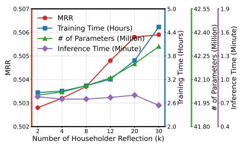  
(a) WN18RR

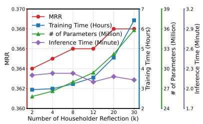  
(b) FB15k-237

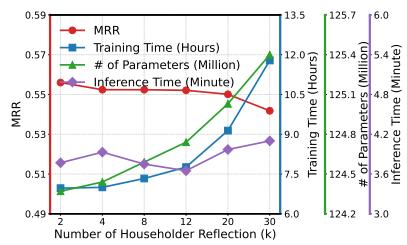  
(c) YAGO3-10  
Figure 5: MRR, training time, inference time, and number of parameters of PogRE on three benchmark datasets.

Time Complexity Table 9 compares the theoretical scoring complexity and the actual training time. PogRE w/o QR has the same theoretical time complexity as PogRE but is infeasible under the same experimental setting due to its substantially higher space complexity. PogRE has a higher theoretical time complexity than RotatE and PairRE because of the shared matrix multiplication. Nevertheless, its practical training time with $k = 2$ remains comparable to that of the baselines, while achieving higher performance in link prediction. Increasing k to 20 requires additional training time but further improves the MRR on both datasets. These results demonstrate that PogRE provides a practical tradeoff between computational cost and performance.

Figure 5 presents computational complexity and performance with respect to the Householder reflection k. In WN18RR and FB15k-237, performance improves as k increases but shows no significant improvement after $k = 2 0$ . This performance gain is accompanied by an increase in computational cost as k grows. In YAGO3-10, the MRR is highest at $k = 2$ and decreases as k increases. These results suggest that while a larger k can improve performance by increasing the expressive power, excessive complexity may lead to a decrease in performance due to overfitting. Furthermore, there is almost no variation in inference time across different k values, implying that k can be selected during training without concerns regarding inference time.

## D Impact of Over-generalization

Detailed Definition of Group $G _ { o v e r }$ Group $G _ { o v e r }$ consists of test triples $( h , r , t )$ where at least one candidate triple $( h , r , t ^ { \prime } )$ (where $t ^ { \prime } \neq t )$ is $\phi _ { i } \in G _ { u } \setminus G _ { o }$ for which there is a corresponding $\psi _ { i } ~ \in ~ G _ { o } .$ In this case, the body instances corresponding to the candidate appear in the training set. For instance, consider a local composition pattern $\psi \Rightarrow \phi$ consisting of the relation triplet $( r _ { 1 } , r _ { 2 } , r )$ . If the training set contains the body instances $( h , r _ { 1 } , x )$ and $( x , r _ { 2 } , t ^ { \prime } )$ for at least one candidate t′ and some entity $x \in E .$ , then the test triple $( h , r , t )$ is assigned to $G _ { o v e r }$ . If KGE models suffer from over-generalization, they are likely to assign a high score to such a candidate $( h , r , t ^ { \prime } )$ treating it as a valid triple. For simplicity, we only describe the case of tail prediction, but the same procedure applies to head prediction. For pattern, we consider symmetry, inversion, composition, hierarchy, intersection, transitive, g.intersection, b. transitive and b. composition patterns, as they are the most representative inference patterns extensively investigated across a wide range of KGE models. Antisymmetry is not considered because it ensures the absence of a head, rather than ensuring the presence of head.

Quantified Impact of Over-generalization Figure 6 presents the performance comparison on the $G _ { o v e r }$ across WN18RR and YAGO3-10. Also in WN18RR and YAGO3-10, PogRE consistently outperforms the baselines regardless of the local pattern criteria and the dataset. These results demonstrate that PogRE effectively addresses the negative impact of over-generalization, and shows robustness across datasets.

<table><tr><td rowspan="2">Model</td><td colspan="3">ogbl-biokg</td><td colspan="3">ogbl-wikikg2</td></tr><tr><td>Dim</td><td>Valid MRR</td><td>Test MRR</td><td>Dim</td><td>Valid MRR</td><td>Test MRR</td></tr><tr><td>TransE</td><td>2000</td><td> $\overline { { 0 . 7 4 5 6 { \pm } 0 . 0 0 0 3 } }$ </td><td> $\overline { { 0 . 7 4 5 2 { \scriptstyle \pm 0 . 0 0 0 4 } } }$ </td><td>500</td><td> $\overline { { 0 . 4 2 7 2 { \scriptstyle \pm 0 . 0 0 3 0 } } }$ </td><td> $\overline { { 0 . 4 2 5 6 { \pm } 0 . 0 0 3 0 } }$ </td></tr><tr><td>DistMult</td><td>2000</td><td> $0 . 8 0 5 5 { \scriptstyle \pm 0 . 0 0 0 3 }$ </td><td> $0 . 8 0 4 3 { \scriptstyle \pm 0 . 0 0 0 3 }$ </td><td>500</td><td> $0 . 3 5 0 6 { \scriptstyle \pm 0 . 0 0 4 2 }$ </td><td> $0 . 3 7 2 9 { \scriptstyle \pm 0 . 0 0 4 5 }$ </td></tr><tr><td>ComplEx</td><td>1000</td><td> $0 . 8 1 0 5 { \scriptstyle \pm 0 . 0 0 0 1 }$ </td><td> $0 . 8 0 9 5 { \scriptstyle \pm 0 . 0 0 0 7 }$ </td><td>250</td><td> $0 . 3 7 5 9 { \pm } 0 . 0 0 1 6$ </td><td> $0 . 4 0 2 7 { \scriptstyle \pm 0 . 0 0 2 7 }$ </td></tr><tr><td>RotatE</td><td>1000</td><td> $0 . 7 9 9 7 { \scriptstyle \pm 0 . 0 0 0 2 }$ </td><td> $0 . 7 9 8 9 { \pm } 0 . 0 0 0 4$ </td><td>250</td><td> $0 . 4 3 5 3 { \scriptstyle \pm 0 . 0 0 2 8 }$ </td><td> $0 . 4 3 3 2 { \scriptstyle \pm 0 . 0 0 2 5 }$ </td></tr><tr><td>PairRE</td><td>2000</td><td> $0 . 8 1 7 2 { \scriptstyle \pm 0 . 0 0 0 5 }$ </td><td> $0 . 8 1 6 4 { \scriptstyle \pm 0 . 0 0 0 5 }$ </td><td>200</td><td> $0 . 5 4 2 3 { \scriptstyle \pm 0 . 0 0 2 0 }$ </td><td> $0 . 5 2 0 8 { \scriptstyle \pm 0 . 0 0 2 7 }$ </td></tr><tr><td>ComopoundE</td><td></td><td></td><td></td><td>100</td><td> $0 . 6 7 1 6 { \scriptstyle \pm 0 . 0 0 0 9 }$ </td><td> $0 . 6 4 7 3 { \scriptstyle \pm 0 . 0 0 2 2 }$ </td></tr><tr><td>PogRE</td><td>2000</td><td> $\mathbf { 0 . 8 1 9 8 } { \pm } 0 . 0 0 0 1$ </td><td> $\overline { { { \bf 0 . 8 1 9 0 { \pm } } 0 . 0 0 0 3 } }$ </td><td>100</td><td> $\overline { { { \bf 0 . 6 8 4 1 } { \bf \pm } { 0 . 0 0 1 0 } } }$ </td><td> $\mathbf { 0 . 6 6 0 6 { \scriptstyle \pm 0 . 0 0 0 6 } }$ </td></tr></table>

Table 10: Link prediction results on large-scale KGs, including ogbl-biokg and ogbl-wikikg2. Bold indicates the best result, and underline indicates the second best result. ± indicates the standard deviation.

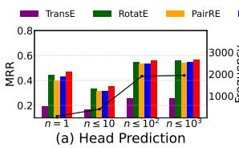

(a) WN18RR  
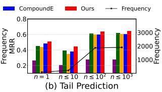

<table><tr><td rowspan="2">Dataset</td><td rowspan="2">Entities</td><td rowspan="2">Relations</td><td colspan="3">Triples</td></tr><tr><td>Train</td><td>Valid</td><td>Test</td></tr><tr><td>WN18RR</td><td>40,943</td><td>11</td><td>86,835</td><td>3,034</td><td>3,134</td></tr><tr><td>FB15k-237</td><td>14,541</td><td>237</td><td>272,115</td><td>17,535</td><td>20,466</td></tr><tr><td>YAGO3-10</td><td>123,182</td><td>37</td><td>1,079,040</td><td>5,000</td><td>5,000</td></tr><tr><td>ogbl-biokg</td><td>93,773</td><td>51</td><td>4,763,814</td><td>162,870</td><td>162,886</td></tr><tr><td>ogbl-wikikg2</td><td>2,500,604</td><td>535</td><td>16,109,182</td><td>429,456</td><td>598,543</td></tr></table>

Table 11: Statistics of three benchmark datasets

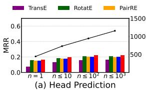

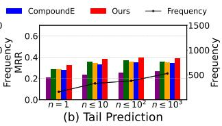  
(b) YAGO3-10  
Figure 6: MRR comparison between PogRE and baseline models for various sparsity conditions of pattern instances on two benchmarks: WN18RR (a), and YAGO3- 10 (b). The black line indicates the number of test triples for each group.

Distribution of Patterns by Number of Pattern Instances Table 20 presents the distribution of each pattern according to the number of its pattern instances (n) across three KG benchmark datasets.In WN18RR, FB15k-237, and YAGO3-10, respectively, 20.0%, 22.7%, and 41.7% of symmetry patterns, 27.3%, 24.6%, and 20.0% of antisymmetry patterns, and 50.0%, 49.3%, and 58.8% of inversion patterns have 10 or fewer pattern instances. This result indicates that for symmetry, antisymmetry, and inversion, a substantial proportion of patterns in real-world KGs are observed in only a few instances.

## E Datasets

WN18RR, FB15k-237 and YAGO3-10 are used to evaluate PogRE. WN18RR and FB15k-237 are subsets of WN18 (Bordes et al., 2013) and FB15k (Bordes et al., 2013) with inverse relations removed, and YAGO3-10 is a subset of YAGO3 (Mahdisoltani et al., 2013) containing only entities with a minimum of 10 relations each. ogbl-biokg (Hu et al., 2020) is a large-scale biomedical KG, and ogblwikikg2 (Hu et al., 2020) is a Wikidata knowledge graph that contains a large number of triples. The statistics are summarized in Table 11.

## F Link Prediction Performance on Large-scale Knowledge Graph

To verify the effectiveness of PogRE in large-scale KGs, we conduct additional experiments on biokg and wikikg2. As shown in the table 11, biokg and wikikg2 contain 4.7 million and 16.1 million triples, respectively, making them significantly larger than the standard benchmarks. The comparative results on biokg and wikikg2 are presented in Table 10. PogRE achieves the highest performance in both valid and test MRR compared to the baselines. For instance, PogRE achieves MRR improvements of 0.0027 and 0.0133 over the second-best models, PairRE and CompoundE, on biokg and wikikg2 in Test MRR, respectively. Furthermore, PogRE exhibits a low standard deviation (±0.001) across all datasets and settings, indicating that it consistently maintains stable performance regardless of initialization. This comparison demonstrates the robustness of our method across different datasets, especially in large-scale KGs.

<table><tr><td rowspan="2">Number of Sample Vector</td><td colspan="3">Rank</td></tr><tr><td>WN18RR</td><td>FB15k-237</td><td>YAGO3-10</td></tr><tr><td>100</td><td>100.0</td><td>100.0</td><td>100.0</td></tr><tr><td>200</td><td>200.0</td><td>200.0</td><td>200.0</td></tr><tr><td>500</td><td>500.0</td><td>500.0</td><td>500.0</td></tr><tr><td>1,000</td><td>996.1±2.0</td><td>1000.0</td><td>999.4±0.5</td></tr><tr><td>1,500</td><td>1000.0</td><td>1492.8±1.2</td><td>1000.0</td></tr><tr><td>2,000</td><td>1000.0</td><td>1500.0</td><td>1000.0</td></tr></table>

Table 12: Mean rank of the subspace spanned by randomly sampled entities in the specific pattern, over 100 random trials across three benchmarks. The entity dimensions of PogRE are 1,000 on WN18RR and YAGO3- 10, and 1,500 on FB15k-237.

<table><tr><td rowspan="2">Model</td><td colspan="3">Over-Generalization Ratio</td></tr><tr><td>n ≤ 10</td><td>n ≤  $\overline { { { \bf 1 0 ^ { 2 } } } }$ </td><td>n ≤  $\overline { { { \bf 1 0 } ^ { 3 } } }$ </td></tr><tr><td>TransE</td><td>.851</td><td>.850</td><td>.795</td></tr><tr><td>RotatE</td><td>.866</td><td>.852</td><td>.793</td></tr><tr><td>PairRE</td><td>.749</td><td>.719</td><td>.651</td></tr><tr><td>CompoundE</td><td>.744</td><td>.711</td><td>.638</td></tr><tr><td>PogRE</td><td>.707</td><td>.681</td><td>.618</td></tr></table>

Table 13: OG ratio comparison between KGE baselines and PogRE on FB15k-237. n indicates the number of pattern instances.

## G Linear Independence of Entities Observed Within a Pattern

In Section 6.3, we empirically observed that the dimension of the space spanned by entities randomly sampled from the entire KG is approximately equal to the number of sampled entities. In this section, we further investigate whether entities observed within specific patterns—rather than across the entire KG—are also linearly independent of each other. Our experimental procedure is as follows: First, we randomly select a pattern containing at least 2,000 instances. We then randomly sample N entities from this pattern (varying N from 100 to 2,000) and measure the rank of the space spanned by these sampled entities. Finally, we repeat this process for 100 independent trials and report the average rank in Table 12. Our results demonstrate that the rank of the space spanned by these entities is approximately equal to the number of sampled entities, indicating that linear independence is indeed preserved even within specific patterns.

## H Detailed Definition of the OG Ratio and Its Comparison on Various Patterns

In this section, we provide a detailed definition of the OG Ratio and additional experiments on the OG Ratio.

Detailed Definition of OG Ratio Since KGE is a relative distance-based method, if the score of a triple $( h , r , t )$ is closer to 0 than that of another triple $( h , r , t ^ { \prime } )$ , it implies that the model considers $( h , r , t )$ to be more plausible than $( h , r , t ^ { \prime } )$ . Based on this relative property, we define the OG ratio as follows. First, we extract head instances corresponding to the body instances of patterns in the KG. We then divide them into two groups—True triples and False triples—and measure the average score of each group (we exclude head instances that are in the training data, as they are used to train the models). Next, we define the OG ratio as the average score of True triples divided by that of False triples. An OG ratio ≈ 1 indicates that the model suffers from over-generalization, as it assigns similar scores to both True and False triples. An OG ratio ≈ 0 implies that the model effectively avoids over-generalization by assigning higher scores to False triples compared to True triples.

OG Ratio Comparison on Various Patterns We use the OG ratio to verify whether our model effectively addresses over-generalization in the entire KG. Specifically, we extract True and False triples for patterns whose number of pattern instances n satisfies $n \leq 1 0 , n \leq 1 0 ^ { 2 }$ , and $n \leq 1 0 ^ { 3 }$ in FB15k-237, and compare the OG ratio of PogRE against KGE baselines, including TransE, RotatE, PairRE, and CompoundE. Table 13 presents a comparison of the OG ratios between PogRE and the KGE baselines. Our model exhibits a lower OG ratio than all other models across all settings. This demonstrates that our model effectively addresses pattern overgeneralization in the entire KG. This analysis was not conducted for WN18RR and YAGO3-10; due to their small validation/test sets and data sparsity, these datasets contain very few True triples (fewer than 10).

## I Empirical Analysis of Local and Universal Patterns

In Table 21, we present examples of local and universal patterns in real-world KGs based on human verification. Because symmetry and inversion patterns can be easily classified as either universal or local, we extract these patterns from three benchmark datasets: WN18RR, FB15k-237, and YAGO3-10. For FB15k-237, due to the large number of patterns, we randomly extract only 40 patterns. We then manually classify each pattern into two groups: semantically universal and semantically local. We further categorize these patterns based on the number of pattern instances (n). Empirically, we observe that, in general, patterns that have low frequencies $( n \leq 1 0 )$ tend to be semantically local, which can cause over-generalization in existing KGE models, leading to erroneous predictions.

<table><tr><td>Universal but Low Frequency</td><td>Local but High Frequency</td></tr><tr><td>_similar_to (74, WN)</td><td>isLocatedIn (5742, YAGO)</td></tr><tr><td>_also_see (828, WN)</td><td>isLocatedIn, hasCapital (1743, YAGO)</td></tr><tr><td>dealsWith (160, YAGO)</td><td></td></tr><tr><td>hasNeighbor (550, YAGO)</td><td></td></tr><tr><td>.../legislative_sessions (668, FB)</td><td></td></tr><tr><td>.../military_combatant_group (620, FB)</td><td></td></tr><tr><td>.../canoodled/participant (368, FB)</td><td></td></tr><tr><td>.../marriage/spouse (342, FB)</td><td></td></tr><tr><td>.../friendship/friend (204, FB)</td><td></td></tr><tr><td>.../friendship/participant (1216, FB)</td><td></td></tr><tr><td>.../dated/participant (1134, FB)</td><td></td></tr></table>

Table 14: Representative examples of patterns categorized into the two failure case sets: universal but low frequency, and local but high frequency. The numbers in parentheses indicate the frequency of pattern instances, while WN, FB, and YAGO denote the WN18RR, FB15k-237, and YAGO3-10, respectively.

However, we also note that, due to the semantic complexity of real-world KGs, this general tendency may not always hold. We identify two representative failure cases for our proposed method.

• First, universal but low-frequency patterns may appear when semantically universal patterns are observed in only a few instances due to dataset sparsity. In this case, PogRE may fail to generalize them universally.

• Second, local but high-frequency patterns may appear when semantically local patterns have many observed instances. In this case, PogRE may generalize them universally, resulting in inappropriate generalization.

Table 14, a subset of Table 21, shows examples of patterns in these two case sets. Each pattern is reported with its frequency and dataset. The universal but low-frequency set indicates semantically universal patterns whose frequency is lower than the entity embedding dimension. The local but high-frequency set indicates semantically local patterns whose frequency is higher than the entity embedding dimension.

We compare PogRE with KGE baselines on these cases. Specifically, for each dataset, we extract test triples that contain relations included in each failure case set and measure MRR. Table 15 reports the MRR results for the universal but low frequency set. PogRE underperforms compared to

<table><tr><td>Models</td><td>WN18RR</td><td>FB15k-237</td><td>YAGO3-10</td></tr><tr><td>TransE</td><td>0.242</td><td>0.103</td><td>0.213</td></tr><tr><td>RotatE</td><td>0.661</td><td>0.121</td><td>0.377</td></tr><tr><td>PairRE</td><td>0.657</td><td>0.125</td><td>0.303</td></tr><tr><td>CompoundE</td><td>0.660</td><td>0.166</td><td>0.301</td></tr><tr><td>PogRE</td><td>0.686</td><td>0.150</td><td>0.283</td></tr></table>

Table 15: MRR comparison between PogRE and baseline KGE models for the universal but low frequency case set across WN18RR, FB15k-237, and YAGO3-10. Bold indicates the best performance.
<table><tr><td>Models</td><td>MRR</td></tr><tr><td>TransE</td><td>0.088</td></tr><tr><td>RotatE</td><td>0.131</td></tr><tr><td>PairRE CompoundE</td><td>0.155 0.185</td></tr><tr><td>PogRE</td><td>0.172</td></tr></table>

Table 16: MRR comparison between PogRE and baseline KGE models for the local but high frequency case set. Note that the evaluated patterns for this case are observed exclusively within YAGO3-10. Bold indicates the best performance.

CompoundE on FB15k-237 and YAGO3-10. This demonstrates the negative impact of the universal but low frequency failure case on performance of PogRE.

Interestingly, PogRE still outperforms CompoundE on WN18RR. We analyze the reasons for this as follows. For WN18RR, we measured the MRR for two patterns: \_similar\_to and \_also\_see. First, despite the \_similar\_to pattern having only 74 instances, all models except TransE achieved an MRR of 1.0. This pattern is a potential failure case, but not empirically harmful because of datasetspecific or relatively easy test structure. Furthermore, the \_also\_see pattern has 828 instances. Although these instances may not span the entire embedding space, they still provide observed instances that can support generalization. As theoretically shown in Appendix A, our spectral normalization can help keep the pattern error bounded for unobserved entities if they are semantically similar to the observed entities. Therefore, PogRE can achieve generalization to semantically similar entities for \_also\_see, which can explain its superior performance on WN18RR.

Table 16 reports the MRR results for the local but high-frequency set (only evaluated on YAGO3- 10). In this case, PogRE also does not outperform CompoundE. This result indicates that PogRE may underperform existing models when semantically local patterns have high frequencies.

Through this analysis, we clarify the applicabil-

<table><tr><td>Pattern Type</td><td># of PI</td><td># of BI</td><td>Ratio (PI/BI)</td></tr><tr><td>Local Pattern (film/written_by, actor/film, film/prequel)</td><td>13</td><td>74</td><td>0.176</td></tr><tr><td>Local Pattern (film/director, film/prequel, actor/film)</td><td>22</td><td>1,895</td><td>0.012</td></tr><tr><td>Universal Pattern (actor/film, film/country, people/nationality)</td><td>5,033</td><td>11,659</td><td>0.432</td></tr><tr><td>Universal Pattern (people/place_of_birth, location/country, people/nationality)</td><td>1,082</td><td>1,422</td><td>0.761</td></tr></table>

Table 17: Comparison of Pattern Instances (PI) and Body Instances (BI) between the local and universal patterns introduced in Figure 2. ’# of PI’ and $\ ' \#$ of BI’ represent the number of pattern instances and body instances, respectively.

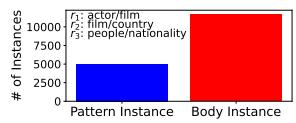

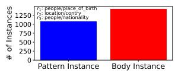  
Figure 7: The number of pattern instances and body instances for the universal patterns introduced in Figure 2(b).

ity boundary of PogRE.

• Our method is designed to prevent the overgeneralization of local patterns.

• As shown in Table 21, most local patterns have low frequency, and therefore PogRE can generally improve performance on the overall datasets.

• However, PogRE may underperform existing models in failure cases where pattern frequency does not match pattern semantics, such as universal but low-frequency patterns or local but high-frequency patterns.

• Therefore, PogRE is most suitable for KGs where low-frequency patterns are likely to be local and high-frequency patterns are likely to be universal.

## J Additional Empirical Evidence for Over-Generalization

Comparison of the Number of Pattern and Body Instances Between Local and Universal Patterns In Figure 7, we present the number of pattern and body instances for the universal patterns introduced in Figure 2(b). Additionally, Table 17 compares the PI and BI of the local and universal patterns from Figure 2. As shown in Figure 7, the universal patterns are supported by 5,033 and 1,082 pattern instances, respectively. This significantly exceeds the number of pattern instances of local patterns (13 and 22), demonstrating that universal patterns are supported by a much larger number of observations.

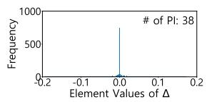

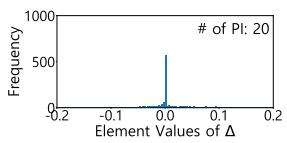  
(a) Histograms of local patterns that are supported by scarce pattern instances. The relations for the left and right figures are (.../gardening\_hint/split\_to) and (.../us\_county/county\_seat), respectively.

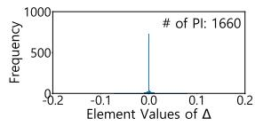

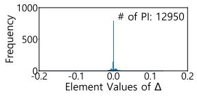  
(b) Histograms of universal patterns that are supported by many pattern instances. The relations for the left and right figures are (.../location/adjoining\_relationship...) and (.../award/award\_nomination...), respectively.

Figure 8: Histograms of embedding difference $\Delta =$ $( r _ { 1 } ^ { \bar { H } } ) ^ { 2 } - ( r _ { 1 } ^ { T } ) ^ { 2 }$ for different symmetric relations $r _ { 1 }$ . # of PI denotes the number of pattern instances. $r _ { 1 }$ are retrieved from FB15k-237.

Furthermore, as shown in Table 17, universal patterns exhibit higher PI/BI ratios (0.432 and 0.761) compared to local patterns (0.176 and 0.012). This demonstrates that the patterns in Figure 2(b) exhibit universal characteristics.

Empirical Evidence for the Symmetry Pattern To demonstrate that the over-generalization effect is not limited to the composition pattern discussed in Section 3, we conduct an additional analysis on the symmetry pattern using the same framework in Section 3, as follows.

Similar to the composition pattern, PairRE also induces a relation-level pattern condition for symmetry patterns. If a relation $r _ { 1 }$ is symmetric, PairRE satisfies the following condition:

$$
( r _ { 1 } ^ { H } ) ^ { 2 } = ( r _ { 1 } ^ { T } ) ^ { 2 }\tag{18}
$$

This condition is determined only by relation embeddings. Therefore, once this condition is learned from observed triples, the model can generalize the symmetry pattern to other entities, even

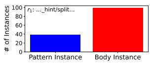

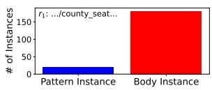  
(a) The number of pattern instances and body instances for the local patterns introduced in Figure 8(a).

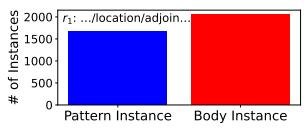

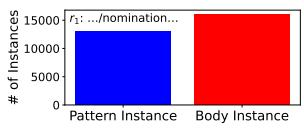  
(b) The number of pattern instances and body instances for the universal patterns introduced in Figure 8(b).

Figure 9: The number of pattern instances and body instances for the local and universal symmetry patterns introduced in Figure 8

when the pattern is supported by only a small number of instances. This can lead to pattern overgeneralization for local symmetry patterns. We empirically verify this by measuring the distribution of $\Delta \stackrel { \cdot } { = } ( r _ { 1 } ^ { \dot { H } } ) ^ { 2 } - ( r _ { 1 } ^ { \dot { T } } ) ^ { 2 }$ . Figure 8 shows the histograms of the embedding difference $( \Delta )$ of local and universal symmetry patterns. Figures 8(a) and 8(b) show that the elements of $\Delta$ are concentrated near zero for both local and universal patterns, indicating that the model recognizes both as valid symmetry patterns regardless of instance frequency. The numbers of pattern instances and body instances for these symmetry patterns are shown in Figure 9. This analysis empirically shows that pattern over-generalization also occurs in another pattern type.

## K Bounding Constraint Errors Under Practical Training Dynamics

In Section 4.2, we provide a theoretical analysis showing that a dense linear transformation can address over-generalization. However, in practice, KGE embeddings are optimized with negative sampling and a margin-based loss; therefore, the constraint $E e _ { i } = 0$ is approximate. That is, satisfying the exact linear constraint $E e _ { i } = 0$ is challenging due to the approximate nature of margin-based optimization with negative sampling. However, we can mathematically guarantee that the constraint error for unseen entities is bounded by the constraint error of observed entities. Specifically, let us assume the model is sufficiently trained such that the constraint error is minimized within a small margin ϵ for the observed linearly independent entities $e _ { 1 } , \ldots , e _ { d }$ (i.e., we consider the practical scenario in which $\| E e _ { i } \| < \epsilon .$ , rather than the exact condition $\| E e _ { i } \| = 0 . )$ Since we empirically verified that the learned entity embeddings form a basis (Section 6.3), any unseen entity $e _ { n e w }$ can be represented as a linear combination of the observed entities: $\begin{array} { r } { e _ { n e w } = \sum _ { i = 1 } ^ { d } c _ { i } e _ { i } } \end{array}$ . By the linearity of the transformation $E$ and the triangle inequality, the error for the unseen entity is bounded as follows:

$$
\begin{array} { l } { \displaystyle | E e _ { n e w } | | = \left| \left| \sum _ { i = 1 } ^ { d } c _ { i } ( E e _ { i } ) \right| \right| } \\ { \displaystyle \le \sum _ { i = 1 } ^ { d } | c _ { i } | \cdot | | E e _ { i } | | } \\ { \displaystyle \phantom { \sum _ { i = 1 } ^ { d } | c _ { i } | \cdot | } < \left( \sum _ { i = 1 } ^ { d } | c _ { i } | \right) \epsilon } \end{array}\tag{19}
$$

This inequality demonstrates that minimizing the constraint error of observed entities $( \epsilon  0 )$ directly suppresses the constraint error for unseen entities. Therefore, even under the approximate optimization of margin-based loss, the constraint error of unseen entities remains bounded. Through this analysis, we clarify the practical scope of the theoretical guarantees of our method. In practice, exact constraint satisfaction, corresponding to the ideal zero-error case, i.e., $\| E e _ { i } \| = 0$ , is not guaranteed after training. Rather, when the constraint errors of observed entities are small, corresponding to the approximate case, i.e., $\| E e _ { i } \| < \epsilon .$ , the errors of unseen entities can also be bounded, thereby ensuring the practical effectiveness of our proposed method.

Practical Strength of the Assumptions Our theoretical analysis involves two assumptions: (1) the approximate satisfaction of pattern constraints for observed entities and (2) the availability of $d + 1$ linearly independent observed entities. We discuss the practical strength of these assumptions below.

First, the practical strength of the approximate pattern-constraint assumption depends on how small the residuals become in practice. The approximate satisfaction of pattern constraints is encouraged by the KGE training objective. The training objective reduces the errors of observed pattern instances, thereby encouraging small residuals in the corresponding pattern constraints. However, because training relies on mini-batch gradient-based optimization, it is difficult to know how small the residuals will be after training, making the practical strength difficult to assess a priori. Consequently, our approximate analysis above is conditional on the residuals actually achieved after training.

<table><tr><td rowspan="2">Model</td><td rowspan="2">Score Function</td><td rowspan="2">Pattern Modeling</td><td rowspan="2">Over-Generalization</td><td rowspan="2">Scalability</td><td colspan="2">MRR</td></tr><tr><td>WN18RR</td><td>FB15k-237</td></tr><tr><td>RERSCAL</td><td> $\overline { { < h ^ { T } W _ { r } t > } }$ </td><td>x</td><td>-</td><td>x</td><td>.420</td><td>.270</td></tr><tr><td>TransR</td><td> $- \| P _ { r } h + r - P _ { r } t \|$ </td><td>x</td><td>-</td><td>x</td><td>.220</td><td>.299</td></tr><tr><td>CompoundE</td><td> $- \| M _ { r } \cdot h - \hat { M } _ { r } \cdot t \|$ </td><td>√</td><td>√</td><td>√</td><td>.491</td><td>.357</td></tr><tr><td>PogRE</td><td> $\begin{array} { r l } {  { \frac { - \| L _ { r } h _ { r } - t _ { r } \| } { \frac { \ d H _ { r } } { \ d H _ { r } } } } } \end{array}$ </td><td>√</td><td>x</td><td>√</td><td>.506</td><td>.369</td></tr></table>

Table 18: Summary of differences between PogRE and the existing linear transformation models. RESCAL is reproduced in Wang et al. (2019), and TransR is reproduced in Zhang et al. (2020a). $W _ { r }$ and $P _ { r }$ are $\mathbb { R } ^ { d \times d }$ dense linear transformations, where d is the dimension of entities and relations.

Second, the requirement of observing d + 1 linearly independent entities should be understood as a sufficient condition for universal generalization, rather than as a condition that must always hold. As more linearly independent entities supporting a pattern are observed, the pattern constraint applies to a larger subspace; universal generalization is guaranteed when these entities span the relevant space. We regard this requirement as part of an inherent trade-off. If this condition is made less strict, the model may generalize patterns more easily. However, this may also increase the risk of generalizing weakly supported patterns too broadly, which may lead to the over-generalization problem that PogRE is designed to avoid.

## L Differences between the existing linear transformation model and PogRE

We present a comparison between existing linear transformation models and PogRE in Table 18. Existing models that use dense linear transformation such as RESCAL (Nickel et al., 2011) and TransR (Lin et al., 2015) are not designed for pattern modeling; moreover, when the entity and relation dimensions are n, they assign an Rn×n matrix to each relation, leading to high computational costs as the dimension of entities and relations increases. While CompoundE is capable of pattern modeling and avoids these computational issues by using sparse affine transformation, it suffers from over-generalization. In contrast, PogRE is designed for pattern modeling, addresses the over-generalization problem, and avoids the computational cost issue using a QR-decompositioninspired method. In addition, PogRE outperforms existing models on WN18RR and FB15k-237, demonstrating its effectiveness.

<table><tr><td>Model</td><td>WN18RR</td><td>FB15k-237</td></tr><tr><td>R-GCN (Schlichtkrull et al., 2018)</td><td></td><td>.248</td></tr><tr><td>SACN (Shang et al., 2019)</td><td>.470</td><td>.350</td></tr><tr><td>CompGCN (Vashishth et al., 2020)</td><td>.479</td><td>.355</td></tr><tr><td>MRGAT (Dai et al., 2022)</td><td>.481</td><td>.358</td></tr><tr><td>CompGCN-MLP (Li et al., 2023)</td><td>.473</td><td>.355</td></tr><tr><td>PogRE</td><td>.506</td><td>.369</td></tr></table>

Table 19: MRR comparison between PogRE and transductive GNN-based models on WN18RR and FB15k-237.

## M Comparison with Transductive GNNs

Transductive GNN models such as R-GCN (Schlichtkrull et al., 2018), SACN (Shang et al., 2019), and CompGCN (Vashishth et al., 2020) improve entity representations through message passing, which incorporates local structural context into entity embeddings. By leveraging structural context, these models may also alleviate pattern over-generalization. However, pattern over-generalization has not been explicitly discussed or analyzed in transductive GNN models. In particular, prior work has not characterized how transductive GNN models capture patterns or how the patterns captured by transductive GNN models are generalized from observed evidence. In contrast, PogRE explicitly models patterns and is designed to improve entity representations while alleviating pattern over-generalization.

We further compare PogRE with these transductive GNN models in terms of MRR. As shown in Table 19, PogRE outperforms the baselines across the available benchmarks, demonstrating that PogRE remains effective compared with graph-contextual baselines.

<table><tr><td rowspan="2">Pattern</td><td rowspan="2"># of Pattern Instances (n)</td><td colspan="2">WN18RR</td><td colspan="2">FB15k-237</td><td colspan="2">YAGO3-10</td></tr><tr><td># of Patterns</td><td>Prop. (%)</td><td># of Patterns</td><td>Prop. (%) # of Patterns</td><td></td><td>Prop. (%)</td></tr><tr><td rowspan="7">Symmetry</td><td>n = 1</td><td>-1</td><td>20.0</td><td>6 4</td><td>13.6</td><td>-5</td><td></td></tr><tr><td> $1 < \mathsf { n } \leq 1 0$ </td><td></td><td></td><td></td><td>9.1</td><td></td><td>41.7</td></tr><tr><td> $1 0 < \mathrm { n } \le 1 0 ^ { 2 }$ </td><td>1</td><td>20.0</td><td>10</td><td>22.7</td><td></td><td></td></tr><tr><td> $1 0 ^ { 2 } < \mathsf { n } \leq 1 0 ^ { 3 }$ </td><td>1</td><td>20.0</td><td>17</td><td>38.6</td><td>4</td><td>33.3</td></tr><tr><td> $\mathrm { n > 1 0 ^ { 3 } }$ </td><td>2</td><td>40.0</td><td>7</td><td>15.9</td><td>3</td><td>25.0</td></tr><tr><td>Total</td><td>5</td><td>100%</td><td>44</td><td>100%</td><td>12</td><td>100%</td></tr><tr><td>n = 1</td><td>1</td><td>9.1</td><td>1</td><td>1.8</td><td>-</td><td></td></tr><tr><td rowspan="6">Antisymmetry</td><td> $1 < \mathsf { n } \leq 1 0$ </td><td>2</td><td>18.2</td><td>13</td><td>22.8</td><td>3</td><td>20.0</td></tr><tr><td> $1 0 < \mathrm { n } \le 1 0 ^ { 2 }$ </td><td>2</td><td>18.2</td><td>26</td><td>45.6</td><td>5</td><td>33.3</td></tr><tr><td> $1 0 ^ { 2 } < \mathrm { { n } } \overline { { \leq } } 1 0 ^ { 3 }$ </td><td>2</td><td>18.2</td><td>13</td><td>22.8</td><td>2</td><td>13.3</td></tr><tr><td> $\mathrm { n } > \mathrm { 1 0 ^ { 3 } }$ </td><td>4</td><td>36.4</td><td>4</td><td>7.0</td><td>5</td><td>33.3</td></tr><tr><td>Total</td><td>11</td><td>100%</td><td>57</td><td>100%</td><td>15</td><td>100%</td></tr><tr><td>n = 1</td><td>3</td><td>30.0</td><td>52</td><td>18.6</td><td>6</td><td>35.3</td></tr><tr><td rowspan="6">Inversion</td><td> $1 < \mathsf { n } \leq 1 0$ </td><td>2</td><td>20.0</td><td>86</td><td>30.7</td><td>4</td><td>23.5</td></tr><tr><td> $1 0 < \mathrm { { n } } \overline { { \leq } } 1 0 ^ { 2 }$ </td><td>5</td><td>50.0</td><td>83</td><td>29.6</td><td>4</td><td>23.5</td></tr><tr><td> $1 0 ^ { 2 } < \mathsf { n } \leq 1 0 ^ { 3 }$ </td><td>1</td><td></td><td>51</td><td>18.2</td><td>1</td><td>5.9</td></tr><tr><td> $\mathrm { n } > \mathrm { 1 0 ^ { 3 } }$ </td><td>一</td><td></td><td>8</td><td>2.9</td><td>2</td><td>11.8</td></tr><tr><td>Total</td><td>10</td><td>100%</td><td>280</td><td>100%</td><td>17</td><td>100%</td></tr><tr><td>n = 1</td><td>17</td><td>48.6</td><td>1,546</td><td>26.3</td><td>56</td><td>17.6</td></tr><tr><td rowspan="6">Composition</td><td> $1 < \mathsf { n } \leq 1 0$ </td><td>14</td><td>40.0</td><td>2,288</td><td>39.0</td><td>112</td><td>35.2</td></tr><tr><td> $1 0 < \mathrm { n } \le 1 0 ^ { 2 }$ </td><td>4</td><td>11.4</td><td>1,439</td><td>24.5</td><td>91</td><td>28.6</td></tr><tr><td></td><td>-</td><td></td><td>489</td><td>8.3</td><td>53</td><td>16.7</td></tr><tr><td> $1 0 ^ { 2 } < \mathrm { n } \overline { { \le } } 1 0 ^ { 3 }$ </td><td>1</td><td>-</td><td>111</td><td>1.9</td><td>6</td><td>1.9</td></tr><tr><td> $\mathrm { n > 1 0 ^ { 3 } }$ </td><td>35</td><td>100%</td><td>5,873</td><td>100%</td><td>318</td><td>100%</td></tr><tr><td>Total</td><td></td><td>12.5</td><td>72</td><td>21.4</td><td></td><td></td></tr><tr><td rowspan="6">Hierarchy</td><td>n = 1  $1 < \mathsf { n } \leq 1 0$ </td><td>1 2</td><td>25.0</td><td>94</td><td>28.0</td><td>11 16</td><td>19.6 28.6</td></tr><tr><td></td><td>5</td><td>62.5</td><td>114</td><td>33.9</td><td>14</td><td>25.0</td></tr><tr><td> $1 0 < \mathrm { n } \le 1 0 ^ { 2 }$ </td><td></td><td></td><td>50</td><td>14.9</td><td>12</td><td>21.4</td></tr><tr><td> $1 0 ^ { 2 } < \mathsf { n } \leq 1 0 ^ { 3 }$ </td><td></td><td></td><td>6</td><td>1.8</td><td>3</td><td></td></tr><tr><td> $\mathrm { n > 1 0 ^ { 3 } }$  Total</td><td>8</td><td>100%</td><td>336</td><td>100%</td><td>56</td><td>5.4 100%</td></tr><tr><td></td><td></td><td></td><td>438</td><td>29.6</td><td></td><td></td></tr><tr><td rowspan="6">Intersection</td><td>n = 1</td><td></td><td></td><td></td><td></td><td>18</td><td>15.0</td></tr><tr><td> $1 < \mathsf { n } \leq 1 0$ </td><td></td><td></td><td>642</td><td>43.3</td><td>54</td><td>45.0</td></tr><tr><td> $1 0 < \mathrm { n } \le 1 0 ^ { 2 }$ </td><td></td><td></td><td>378</td><td>25.5</td><td>42</td><td>35.0</td></tr><tr><td> $1 0 ^ { 2 } < \mathsf { n } \leq 1 0 ^ { 3 }$ </td><td></td><td></td><td>24</td><td>1.6</td><td>6</td><td>5.0</td></tr><tr><td> $\mathrm { n } > \mathrm { 1 0 ^ { 3 } }$ </td><td></td><td></td><td></td><td></td><td>-</td><td></td></tr><tr><td>Total</td><td></td><td></td><td>1,482</td><td>100%</td><td>120</td><td>100%</td></tr><tr><td rowspan="6">Transitive</td><td>n= 1</td><td></td><td></td><td>28</td><td>4.1</td><td></td><td></td></tr><tr><td> $1 < \mathsf { n } \leq 1 0$ </td><td>1</td><td>16.7</td><td></td><td>16.3</td><td>5</td><td>33.3</td></tr><tr><td> $1 0 < \mathrm { n } \le 1 0 ^ { 2 }$ </td><td>2</td><td>33.3</td><td>16</td><td>32.7</td><td>4</td><td>26.7</td></tr><tr><td> $1 0 ^ { 2 } < \mathsf { n } \leq 1 0 ^ { 3 }$ </td><td>3</td><td>50.0</td><td>11</td><td>22.4</td><td>2</td><td>13.3</td></tr><tr><td> $\mathrm { n } > \mathrm { 1 0 ^ { 3 } }$ </td><td>-</td><td></td><td>12</td><td>24.5</td><td>4</td><td>26.7</td></tr><tr><td>Total</td><td>6</td><td>100%</td><td>49</td><td>100%</td><td>15</td><td>100%</td></tr><tr><td rowspan="8">G.Intersection</td><td>n = 1</td><td>2</td><td>33.3</td><td>21</td><td>13.0</td><td>25</td><td>18.2</td></tr><tr><td> $1 < \mathsf { n } \leq 1 0$ </td><td>-</td><td></td><td>54</td><td>33.5</td><td></td><td>45.5</td></tr><tr><td> $1 0 < \mathrm { { n } } \overline { { \leq } } 1 0 ^ { 2 }$ </td><td>4</td><td>66.7</td><td>70</td><td>43.5</td><td>2</td><td>18.2</td></tr><tr><td> $1 0 ^ { 2 } < \mathsf { n } \leq 1 0 ^ { 3 }$ </td><td></td><td></td><td>14</td><td>8.7</td><td>2</td><td>18.2</td></tr><tr><td> $\mathrm { n > 1 0 ^ { 3 } }$ </td><td></td><td></td><td>2</td><td>1.2</td><td></td><td>100%</td></tr><tr><td>Total</td><td>6</td><td>100%</td><td>161</td><td>100%</td><td>11</td></table>

Table 20: Distribution of inference patterns: Symmetry/Antisymmetry, Inversion, Composition, Hierarchy, Intersection, Transitive, G.Intersection, B. Transitive and B. Composition according to the number of pattern instances (n) across three benchmark datasets.

<table><tr><td># of Pattern Instances n ≤ 10</td><td>Semantically Universal (n)</td><td>Semantically Local (n) owns (4) (S)</td></tr><tr><td></td><td></td><td>isAffiliatedTo (10) (S) isKnownFor (4) (S) created (2) (S) hasAcademicAdvisor (4) (S) influences, created (3) (I) influences, isInterestedIn (8) (I) participatedIn, isCitizenOf (1) (I) created, hasAcademicAdvisor (1) (I) isAffiliatedTo, isMarriedTo (1) (I) isLocatedIn, isConnectedTo (1) (I) influences, isKnownFor (5) (I) isLocatedIn, dealsWith (1) (I) influences, hasChild (1) (I) isMarriedTo, influences (8) (I) _synset_domain_topic_of (2) (S) _synset_domain_topic_of, _has_part (9) (I) _hypernym, _derivationally_related_form (17) (I) _derivationally_related_form, _member_meronym (23) (I) _hypernym, _also_see (38) (I) _hypernym, _synset_domain_topic_of (4) (I) _also_see, _verb_group (1) (I) _hypernym, _verb_group (17) (I) _has_part, _member_of_domain_region (1) (I) _instance_hypernym, _member_of_domain_region (1) (I) _derivationally_related_form, synset_domain_topic_of (23) (I) /location/ ...division/country (4) (S) /location/country/capital (3) (S) /film/film/prequel (2) (S) /people/person/profession (1) (S) /film/film/genre (1) (S) /film/film_subject/films (1) (S) /base/aareas/schema</td></tr><tr><td>10 &lt; n &lt; 100</td><td>_similar_to (74) (S)</td><td>/administrative_area/capital (1) (S) /medicine/symptom/symptom_of (1) (S) /music/instrument/family (1) (S) .../sibling_relationship .../influenced_by (2) (I)</td></tr><tr><td>100 &lt; n ≤ 1000</td><td>dealsWith (160) (S) hasNeighbor (550) (S) _also_see (828) (S) .../legislative_sessions (668) (S) .../military_combatant_group/combatants (620) (S) .../canoodled/participant (368) (S) ../marriage/spouse (342) (S) .../friendship/friend (204) (S) .../mailing_address/country (103) (I)</td><td>./romantic_relationship/celebrity (1) (I) isLocatedIn, participatedIn (50) (I) isMarriedTo, hasChild (59) (I) influences, hasAcademicAdvisor (63) (I) isLocatedIn, owns (60) (I) influences (180) (S) hasChild (414) (S) dealsWith, hasNeighbor (165) (I) .../award_nomination/nominated_for (592) (S) .../recording ../performance_role (402) (S) .../award_honor/honored_for (392) (S) .../education/major_field_of_study (282) (S) .../sports_team_roster/position (106) (S) .../location/contains, .../first_level_division_of (124) (I) .../genre/titles, ...ilm/country (157) (I) .../performance/film, ...award_winner (963) (I) .../sports_team_roster/team, ../american_football/ .../position (470) (I) ...location/contains, .../mailing_address/state_province_region (359) (I) ../regular_tv_appearance/actor, .../award_nomination/nominated_for (445) (I) ...location/contains,</td></tr><tr><td></td><td></td><td>../produced_by (497) (I) .../dated/participant, ./romantic_relationship/celebrity (136) (I) .../award_nomination/nominated_for, /film/film/music (314) (I) .../music/group_membership/role, .../performance_role (246) (I)</td></tr><tr><td>n &gt; 1000 .../adjoining_relationship/adjoins (1660) (S) .../friendship/participant (1216) (S) .../dated/participant (1134) (S)</td><td>isMarriedTo (3674) (S) happenedIn, participatedIn (1468) (I) _derivationally_related_form (27701) (S) _verb_group (1060) (S) .../award_nomination/award_nominee (12950) (S) .../award_honor/award_winner (6860) (S) ../track_contribution/role (3068) (S) .../group_membership/role (2170) (S)</td><td>../dated/participant, .../spouse (108) (I) isLocatedIn (5742) (S) isLocatedIn, hasCapital (1743) (I)</td></tr></table>

Table 21: Human verification results of semantically universal and semantically local patterns, categorized by the number of pattern instances. The number next to each pattern indicates the number of pattern instances, and (S) and (I) indicate symmetry and inversion, respectively.