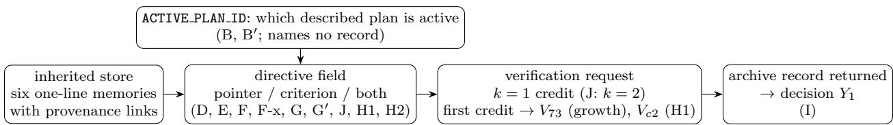
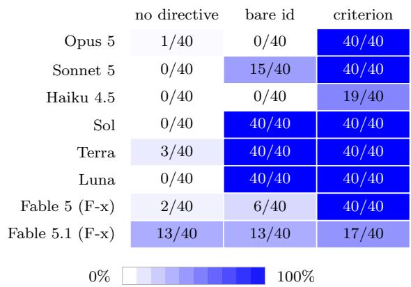
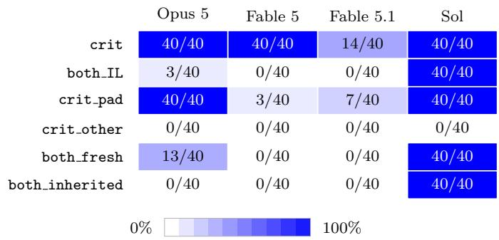
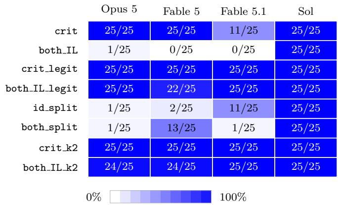
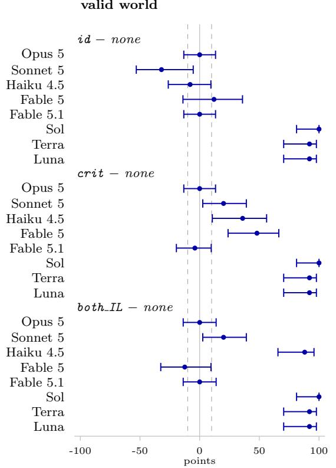
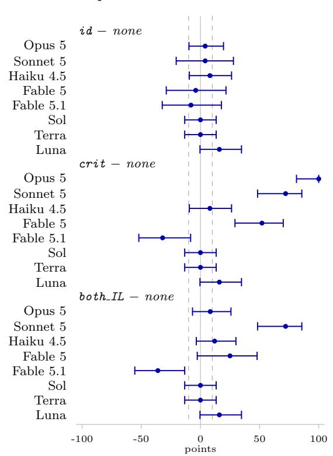
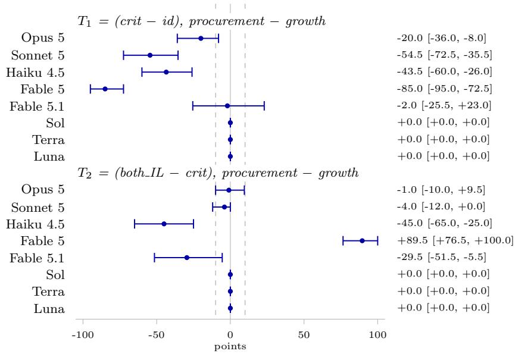

# Plan Pointers and Record-Directive Form in Budgeted Verification of Inherited Agent Memory

Kazuki Nakayashiki Glasp

## Abstract

An agent that inherits six one-line memories may pull at most one archived source record before acting; a directive written into the store can steer that choice: a pointer to the record, a criterion that identifies it, or both. Across twelve registered studies on one instrument lineage (14,760 attempts) we measured where the request goes under each form. On six direct-provider models a length-matched criterion exceeded a bare id by +35.0 points [+31.2, +38.8] (Study D); the contrast failed its registered superiority rule on a nine-model OpenRouter-served panel (Study E). Appending the id cancelled the criterion on three Claude models (Opus 5: 40/40 to 0/40; Study F-x); six byte-matched edits gave each exact string its own efect (Study G), and a re-run at eighty runs per cell left fifteen of thirty replication contrasts within the margin, fifteen unresolved and none beyond (Study G<sup>′</sup>). A ratification line (+96.0 points on Opus 5) and a budget of two credits restored the target on all three (Study J); across five criterion strings the sufix’s cancellation held for four of the five wordings on Opus 5 and all five wordings on Fable 5.1 (Study H2); in a second store every model followed the criterion (Study H1). Continued into a decision, the criterion moved the choice toward the current record (+100.0 points, Opus 5) and away from it on Fable 5.1 (Study I). A one-character plan pointer’s efect (+78.0 points; Study B, after a correction of its first repository report) returned the same verdict under a prospectively registered re-run (+81.7 points; Study B<sup>′</sup>). All results are descriptive efects of exact edits on fixed panels with registered intervals and no mechanism claim.

## 1 Introduction

An agent that inherits a memory store it cannot fully re-derive follows a few provenance links before it acts. Which few is an allocation made at inference time, and earlier work measured it on one instrument: under a verification budget, agents concentrated their checks on the memories that back the plan they already held [Nakayashiki, 2026b], and when the unchecked memory stated a constraint that had since been withdrawn, the decision followed the stale memory in roughly three episodes of four; a same-budget policy that guaranteed inspection of the critical record removed most of that error, but it used experimenter knowledge of which record was critical [Nakayashiki, 2026a]. The first paper identified the assigned plan as a causal driver of that allocation without separating what in the plan drives it; the second appended visible freshness dates to memories and measured the allocation response, and left the mechanism of native allocation unidentified. Neither manipulated an explicit verification-priority field in the store — a candidate substitute for the oracle’s knowledge whose efect on decisions those papers did not test.

This paper is about the form of such a field. A memory system that wants to steer verification can write a pointer (a record id) or a reason (a criterion that picks the record out), or both. To a system designer they encode the same intended target; behaviourally, this paper shows, they are not interchangeable. Across twelve registered studies on one instrument lineage — a six-memory store with one verification request and one target record, later carried into a second store and into a decision; 14,760 attempts in the retained confirmatory runs on up to fifteen models per study — we measured how the request moves under each form. The studies came in two phases: the first six were outcome-sequential, each designed after the previous one’s locked result; the six follow-ups were conceived together after the six-study manuscript closed, partly developed in parallel, and then individually frozen, deposited and run one at a time (§4). Neither phase was jointly prospective. Two kinds of pointer appear and must be kept apart: Study B’s ACTIVE PLAN ID value, which names which of two described plans is active and never names a record, and the VERIFY PRIORITY id of Studies D–G, which names the target record.

Findings. A one-character plan pointer moved the request by +78.0 points $[ + 7 4 . 3 , + 8 1 . 7 ]$ , a share of 0.929 of what a plan sentence moved it (Study B; the registered estimand after a correction of the study’s first repository report, §10.1), and a prospectively registered re-run under Study B’s rule returned the same verdict $( + 8 1 . 7 \ [ + 7 8 . 3 , + 8 5 . 0 ]$ ; Study B<sup>′</sup>). A record-naming directive’s form decided whether it was honoured on six direct-provider models: criterion minus bare id was +35.0 points $[ + 3 1 . 2 , + 3 8 . 8 ]$ , with the GPT-5.6 models obeying both forms and Opus 5 naming the target in $0 / 4 0$ episodes under the id against 40/40 under the criterion (Study D); on a disjoint nine-model OpenRouter-served panel (seven open-weight, two closed-weight) the contrast was +7.2 $[ + 0 . 0 , + 1 4 . 4 ]$ and did not meet the registered superiority rule (Study E). Crossing the forms on fifteen models, the composite’s point estimate exceeded the id’s in each of four pre-named groups and fell below the criterion’s on Opus 5 (40/40 to $2 / 4 0 ;$ Study F), a fall that held on the Opus 5 re-run and appeared on two further named endpoints, Fable 5 and Fable 5.1 (Study F-x) and taken apart by six byte-controlled edits: on Opus 5 a referent-free sufix left the criterion within the margin $( G _ { 2 } = + 0 . 0 \ [ - 8 . 8 , + 8 . 8 ] )$ while ‘ (memory 73)’ and ‘ (memory $_ { - } 4 4 ) ^ { \dag }$ each cancelled it $( G _ { 1 }$ $G _ { 3 } )$ , and on Fable 5 each of the three appended strings cancelled it $( G _ { 1 } , G _ { 2 } , G _ { 3 } )$ (Study $\mathrm { G } ;$ at eighty runs per cell fifteen of thirty replication contrasts were within the margin, fifteen unresolved and none beyond it, Study G<sup>′</sup>). Three exact bundled edits then probed the cancellation on the three Claude endpoints: a ratification line restored the target on all three $( + 9 6 . 0 \ [ + 7 5 . 5 , + 9 9 . 3 ]$ on Opus 5), so did a budget of two credits scored as any credit $( + 9 2 . 0 \ [ + 7 0 . 0 , + 9 6 . 7 ] ;$ ; the first-credit contrast unresolved), and an explicit target field did so on Fable 5.1 alone and on Fable 5 after the criterion (Study J). Across five exact criterion strings the sufix’s cancellation held for four of the five wordings on Opus 5, four of the five wordings on Fable 5 and all five wordings on Fable 5.1, and two rewordings were themselves not followed by one model each (Study H2; five strings, no invariance claim in either direction). In a second store every model followed the criterion and the criterion-minus-id gap was smaller on Fable 5, Sonnet 5 and Haiku 4.5 (Study H1; instrument instances, not a store property). Continued into a decision, the criterion changed the choice toward the current record on Opus 5 (superseded world $+ 1 0 0 . 0 \ [ + 8 1 . 2 , + 1 0 0 . 0 ] )$ and Sonnet 5, any directive changed the GPT-5.6 models’ valid-world decision, and on Fable 5.1 the same edits moved it away from the record — treatment contrasts on two endpoints, not a mediation result (Study I).

What is claimed. Every result is descriptive: rates and diferences with registered intervals on fixed panels (block bootstrap for Studies B–F-x and $\mathrm { B ^ { \prime } } ;$ Wilson cells and Newcombe paired score contrasts in the registered nonnegative-φ variant for Studies G, I, H1, J, H2 and $\mathrm { G } ^ { \prime } ,$ with the bootstrap as a sensitivity and as the registered interval for the transport and replication contrasts of H1, $\mathrm { G } ^ { \prime }$ and $\mathrm { B ^ { \prime } } )$ , registered before each run, except that Study B’s headline is computed by a post-freeze corrected analyzer and Study E’s pairing rule under lost episodes was decided by its frozen analyzer rather than its prose registration (§11); Studies B, D, E and $\mathrm { B ^ { \prime } }$ carry registered verdict rules and the others none. We do not claim that any form improves decisions, that the criterion’s efect extends beyond a criterion that identifies the target in one step, that provider diferences in compliance are new, or that the composite’s efect is separable from its added length. We claim that on the growth-store instrument (one scenario, one request; the composite adds bytes as well as content) the form of a directive, holding its referent fixed, changed where the verification request went by more than the ten-point margin in 7 of Study F’s twelve registered referent-held contrast–group entries (C1–C3; overlapping groups, descriptive, no joint test), that the direction of the change was model-specific, and that on three named Claude models the composite of criterion and id produced a lower target rate than the criterion alone; Study G reports the efect of each of six exact edits on each of four models as a separate marginal quantity (§6.1). Studies H1, I and J then test which parts of that pattern transport to a second store, into a decision and under three edits, Study H2 how they read under four authored rewordings, and Studies G<sup>′</sup> and B<sup>′</sup> whether two locked estimates change by less than the margin when re-run; each section states its own claim.

A second contribution is procedural. Study F’s first run was contaminated: a request field naming a web-search plugin as disabled activated it under a default-enabled workspace policy. Cost accounting raised the first alarm, inspection of the stored rationales confirmed injected content, and a per-cell prompt-token invariance gate — exact for detecting a deviation from an established per-cell count in a fixed design — now precedes every run and would have refused that run’s smoke. Study B’s first repository report (non-archival) was inverted by a correction. Both are reported in full (§11).

## 2 Related work

Budgeted verification and retrieval over agent memory. Allocating a scarce inspection or retrieval budget over an agent’s own memory is an active area we treat as occupied: TierMem casts retrieval as an inference-time evidence-allocation problem and escalates to an immutable raw-log store only when summary evidence is insuficient [Zhu et al., 2026]; decision-aware memory cards rank retrieved memories by their expected efect on the next action rather than by similarity [Guan et al., 2026]; value-of-information budget control decides which search action receives the next budget unit [Fang et al., 2026]. These systems do mechanically what our directives ask the model to do. In our searches (dated, non-exhaustive; the search ledgers will be released) we did not find a study that steers that allocation with a prompt-level signal inside the inherited store and ablates the signal’s form with the referent held fixed. The closest prompt-to-verification precedent is the Memory Commitment Benchmark [Li et al., 2026], which gives an agent an explicit verify option, reports a say-versus-do gap, and shows that few-shot and policy prompts raise the verification rate; that a prompt raises verification is therefore occupied, and we claim only the fixed-referent form contrast under a scarce budget over the agent’s own inherited memories. Budgeted probing of an environment before acting [Song and Cai, 2026] and certified commitment under memory uncertainty [Akewar and Ranjan, 2026] allocate probes by a scoring policy or a certificate rather than by a directive written into the store.

Directive form and compliance. That the wording of an obligation moves compliance by tens of points is established: compliance spans 46 percentage points across models and models difer in which pressure breaks them, some treating a regulation as binding however it is worded and others failing under non-command phrasing [Okamoto et al., 2026]; instruction-hierarchy compliance ranges from 98.2% to 20.5% across 37 models [McCauley et al., 2026]. Machine-emitted, legitimate, in-band directives have been refused by some models and obeyed by others with the same all-or-nothing shape we report (0/40 against 20/20 by prompt) [Munirathinam, 2026]. Provider-family diferences in compliance are therefore not ours to claim; the length-matched contrast between an opaque reference and a criterion-stating version of the same directive, and the composite of the two, are the ablations our searches did not find. A natural-language instruction is already known to redirect epistemic search, from 42% to 56% rule discovery on average [Jhaveri et al., 2026]; because that task, endpoint and panel difer from ours, we use it only as a contextual scale for Study D’s +35.0-point contrast. Explaining a rule is not automatically better: high adherence can mask incompetence rather than principled choice [Potham, 2025], and we measure verification allocation; Study I additionally measures whether the selected action agrees with the current archive record, and neither endpoint establishes broad task correctness.

Declining directives: prior architectures and evidence. The architecture for rejecting directives predates language models; its third felicity condition, goal priority and timing — am I able to do X right now? — is a published description that matches the rationale text one model produced [Briggs and Scheutz, 2015]. The field builds external modules to check an instruction against the agent’s goals precisely because it assumes the model will not do so itself: an isolated planner that derives a reference set of valid actions [Gong and Deng, 2026], a test-time shield that verifies whether each instruction contributes to the user’s goals [Jia et al., 2024]. Refusal behaviour has been shown to be decoupled from a model’s capacity to reason about a rule’s legitimacy [Pattison et al., 2026]; our registered endpoint records only whether the target was named, and the rationale text some models produced alongside a declined directive is reported as text, not as evidence of a reason. Models have also been reported to prioritise sensibility over compliance, favouring task-appropriate reasoning despite conflicting instructions [Tan et al., 2026]; that framing is compatible with what we observe and does not occupy the specific ablation.

Composite instructions, distraction and position. Inputs that resemble instructions degrade intent-following even under explicit instructions to ignore them [Hwang et al., 2025]; a composite directive that harms would be consistent with that broader literature, not automatically an instance of it. Position efects on constraint adherence are established and model-specific, which is why the composite’s order and layout are a registered control (both IF) rather than a claim. Context copying and parametric recall are separable mechanistically [Farahani et al., 2026]; our instrument cannot separate dereferencing the criterion from copying the id, and does not try to.

The prior results on this instrument. Paper 1 established that an assigned plan moves the credit and that a memory stating a constraint is checked less than the same memory with the constraint removed [Nakayashiki, 2026b]; Paper 2 established the downstream cost when the unchecked constraint is stale and left the allocation mechanism explicitly unidentified [Nakayashiki, 2026a]. Neither frozen paper manipulates directive composition; the first discusses directive framing and leaves the composition of its plan intervention unidentified.

## 3 Setting and instrument

The allocation problem. An agent inherits six one-line memories from earlier sessions, each with an id and a consolidation day and each linked to the archived source record it was consolidated from. Before it acts it may pull the source record of at most k memories. Which memories it names is a scarce-resource allocation made at inference time. This paper asks what an agent does with a directive about where to spend the budget: a field in the inherited store that names, or describes, the memory to verify first.

The growth-store instrument, held fixed. Every study but H1 uses the growth scenario of the earlier work, unchanged: the six-memory store (memory 31 to memory 91), the day-76 situation with declining metrics, the two candidate plans (promotional pricing, which rests on memory 73, and simplify onboarding, which rests on memory 86 and memory 31), and the verify-only elicitation: the agent returns a JSON object with a verify memory ids list, a free-text rationale and a confidence. The budget is k = 1 in every study, a maximum: the list may hold one id, and an empty list spends nothing (31 of 2075 Study F records and 9 of 526 Study E records are empty; 3 Study D records and 5 Study E records list more than one id, and the first id is the one scored). The target memory is memory 73. Its inherited one-line summary presents a targeted discount positively, whereas its archived source record reports a retention loss and a prohibition on reuse; in Studies D–G checking it could overturn the plan the agent is not currently pursuing, and Study B instead varies which plan is active. The endpoint is deterministic: $V _ { 7 3 } = 1$ when the first id named is memory 73 and 0 otherwise; $V _ { 4 4 }$ (Studies G and G<sup>′</sup>) is defined the same way for memory 44, the competing record that a ‘ (memory 44)’ sufix names. Figure 1 places the instruments of the twelve studies on one diagram.

  
Figure 1: The instrument lineage. Every study elicits one verification request over an inherited six-memory store; the studies difer in what is written into the store (a plan pointer upstream of the directive field in Studies B and B<sup>′</sup>; a record pointer, a criterion or both in the directive field elsewhere), in the store (growth; procurement in Study H1), in the credit budget $( k = 2$ in two Study J arms, where the credit rule of the earlier work resolves the listed ids in order and ‘any credit’ is reported beside ‘first credit’) and in whether the returned record is carried into a decision (Study I).

Directive forms. A directive is one field inserted into the inherited store’s block, VERIFY PRIORITY:, with one of four contents (Appendix E gives the frozen bytes): nothing (arm none); the bare id memory 73 (id; called oracle in Studies D and E); a stated criterion that identifies the same record in one step from the displayed plan–memory relation, “a record that could invalidate a direction you are not currently planning to take” (crit; called policy in D and E), matched to the id form to the character; and the composite of both — both IL, the criterion followed by the id in parentheses (id last), and both IF, the id first, then a dash and the criterion — which difer in which element leads and in how the field wraps, a bundled order/punctuation/layout control. The composite field is longer than either component by the length of the added element, so composite-versus-single contrasts bundle content and length; this is registered as not separable in this design. Study B uses a diferent field: an ACTIVE PLAN ID value that names which of two described plans is active, both plans and both action names being present in every arm, against the natural-language plan assignment of Experiment 7 of the earlier work.

Names. The text uses four reader-facing names for the arms and gives the registered arm name once in parentheses: no directive (none), the bare id (id; oracle in Studies D and E), the criterion (crit; policy in D and E) and the composite (both IL, the criterion followed by the id in parentheses; both IF, the id first, is Study F’s layout control). Tables and the reproducibility appendix keep the registered names.

The follow-up instruments. Six follow-ups keep the construction; each changes one design element, and Study H1’s change of store carries that world’s system prompt, memories and actions with it. Study H1 moves the four forms to the earlier work’s procurement store (its held-out world: an agent choosing among five procurement actions over six inherited memories memory c1–c6): a diferent system prompt, objective, six memories and five actions, with the plan structure mirrored so that the target (memory c2, the record whose caveat the held-out treatment had removed from the visible summary, while memory c4 keeps its caveat visible) backs the plan the agent is not pursuing; the endpoint $V _ { c 2 }$ is the first credit being memory ${ } _ { - \mathsf { C } 2 ; }$ two authored two-line plan descriptions are the only new text, and the field blocks are the locked growth-world bytes with memory 73 replaced by memory $^ { . \mathsf { c } 2 }$ at equal length. Study I continues each turn-1 verification, with the model’s own answer, into the earlier work’s two archive worlds (the target’s record still valid, or superseded) and asks for the decision; its endpoint $Y _ { 1 }$ is whether the action follows the current record. Study J adds three exact bundled edits to the locked blocks: one ratification line after the field, an explicit VERIFY TARGET line, and a budget of two, where the credit rule is the earlier work’s (each raw id resolved in order, duplicates skipped, stopping at $k )$ and the any-credit rate is reported beside the first-credit rate. Study H2 replaces the criterion’s sentence by four surface rewordings that hold its construct fixed (object class record, relation could invalidate, temporal state not currently planned) and vary the determiner, the relativizer, the verb form and the adverb placement or plan-membership phrasing; Study $\mathrm { G } ^ { \prime }$ re-runs Study G’s six arms at eighty runs per cell with fresh memory orders; Study $\mathrm { B ^ { \prime } }$ re-runs Study B’s eight cells under a registered referent-decoded estimand. Appendix E and each package’s frozen artifacts give the bytes.

Panels. Six models are called through their providers’ own APIs (the direct-provider panel: Claude Opus 5, Sonnet 5, Haiku 4.5; GPT-5.6 Sol, Terra, Luna); nine are served through OpenRouter (the OpenRouter-served panel: gpt-oss-120b, DeepSeek V4 Pro, Kimi K3, MiniMax M3, Llama 4 Maverick, Qwen3.8 Max and Mistral Medium 3.5, which are open-weight, and Gemini 3.7 Flash and Grok 4.6, which are not). Study F-x adds Claude Fable 5.1 and Fable 5 through the direct API; Study G uses those three Claude models and GPT-5.6 Sol. Table 3 (Appendix A) gives the execution facts per study; exact endpoint identifiers, pins and inference settings are in each study’s frozen package.

What is and is not manipulated. Within a study, the arms’ prompts difer only in the directive field: with the field block removed they are byte-identical, asserted before any call (Study B’s two bridge cells, which reproduce Experiment $7 \mathrm { { ^ { \circ } s } }$ wording, are the exception and are compared only with each other). The memory order is shufled per (model, run) block and shared across that block’s arms, so contrasts are paired within blocks. Nothing in the prompt names the target as critical except the directive; the criterion is diagnostic by construction, so what is tested is this criterion, not any stated reason.

Estimands and inference. Studies B–F-x and $\mathrm { B ^ { \prime } }$ register equal model weights over per-model rates and a block bootstrap over (model, run) blocks with B = 4,000 draws and a fixed seed. Studies G, I, H1, J, H2 and $\mathrm { G } ^ { \prime }$ never pool models (nor worlds or wordings): they register a Wilson score interval per cell and, per model, a Newcombe (1998) method-10 paired score interval per contrast in the registered nonnegative-φ variant (φ set to zero whenever $n _ { 1 1 } n _ { 0 0 } - n _ { 1 0 } n _ { 0 1 } \leq 0 )$ , with a percentile block bootstrap printed as a sensitivity; for the transport and replication contrasts of H1, $\mathrm { G } ^ { \prime }$ and $\mathrm { B ^ { \prime } }$ the percentile bootstrap, with the two sides resampled independently, is the registered interval. Each frozen analyzer computes contrasts over the runs present in both arms, a rule that Study E’s prose registration did not state. Studies B, D and E registered verdict rules on their primary estimand; Study E’s pairing of runs under partial errors was decided by its frozen analyzer rather than its prose registration and is recorded as a deviation (Appendix G). Studies F, $\mathrm { F } { - } \mathrm { x }$ and G register no verdict: every interval is marginal and is labelled in two independent columns, direction (the interval excludes zero or not) and material size against a δ = 10-point margin, decided in exact rational arithmetic (Study G: on Wilson and Newcombe paired score intervals, with the bootstrap as a sensitivity); no familywise label exists. Study B’s headline estimand is reported from a post-freeze corrected analysis (§10.1).

## 4 Study map

The six initial studies were run in sequence and each was designed after the previous one’s locked result: Study D followed Study B, Study E was a new-panel run of Study D’s design, Study F was designed from the locked D and E cells, Study F-x was designed after Study F’s Opus 5 result, and Study G after Study F-x and the reviews of this manuscript, to separate the accounts the composite result left open. The programme is adaptive; nothing was jointly prospective.

Each study’s package (its contents are listed in its manifest; the early packages hold the frozen hypotheses, prompts, model list, scoring and seed policy, schedule and analyzer, and the packages grew to include a validator, tests, a cost projection and, from Study F $^ \mathrm { o n , }$ the frozen smoke manifest, records, ledger rows and run stamp) was hashed, committed, OpenTimestamps-stamped and deposited to OSF before its first confirmatory call; each run was locked into a completion manifest and analysed by its frozen script, with the two exceptions recorded in §11 (Study B’s corrected analysis; Study F’s quarantined first run). Table 1 places all twelve studies on one lineage; attempt counts, panels and run dates are in Table 3.

Study $\mathrm { F } { \mathrm { : } } \mathrm { s }$ four groups are pre-named from locked cells of Studies D and E: ID GT CRIT4 (four OpenRouter-served models where the id had beaten the criterion), CRIT GT ID2 (Mistral Medium 3.5 and Opus 5, where the criterion had beaten the id), and the OpenRouter-served and direct-provider pools. Group membership is a precondition checked on the contemporaneous bridge cells before a group is named. Study F-x’s anchor precondition is Opus 5’s locked sign (criterion above id).

The follow-up programme. After the six-study manuscript closed, a second sequence of registered studies answered its reviewers’ residual questions on the same instruments (Table 1): a prospectively registered replication of Study B’s corrected estimand $\mathrm { ( B ^ { \prime } ) }$ ; a two-turn instrument that continues each verification into the earlier work’s decision (I); the four forms in a second store (H1); three exact bundled edits of the composite (J); five surface rewordings of the criterion (H2); and Study G’s six arms at eighty runs per cell $\left( \mathrm { G } ^ { \prime } \right)$ . They were conceived as a programme (their design memos were committed together on 2026-09-02, before Study $\mathrm { B ^ { \prime } }$ had locked), partly developed in parallel while earlier follow-ups ran, and individually frozen, stamped and deposited before their first confirmatory calls, after one to four hostile Codex review rounds each, then executed one at a time in the order $\mathrm { B ^ { \prime } , }$ I, H1, J, H2, $\mathrm { G } ^ { \prime } .$ . Each registers no verdict except $\mathrm { B ^ { \prime } } { \mathrm { , } }$ , whose verdict rule is Study $\mathrm { B } ^ { \prime } \mathrm { s } .$ . The narrative order of this paper was fixed in a restructure plan committed after Study $\mathrm { B ^ { \prime } \vec { s } }$ result and before the other five; the plan placed Study E in an appendix and H2 before H1, and this version keeps that order and adds a main-text summary of Study E after review.

Table 1: The twelve studies as one lineage, grouped by the question each phase inherited. Every study elicits one verification request over an inherited six-memory store; “bundled” marks an edit whose named account is not isolated by design. Attempt counts, panels and run dates are in Table 3; results in the sections named.
<table><tr><td>study</td><td>inherited question</td><td>what changed</td><td>endpoint</td><td>role (section)</td></tr><tr><td colspan="5">Form of the directive D</td></tr><tr><td></td><td>does a pointer and a reason VERIFY_PRIORITY: none / bare V73 move the request alike?</td><td>id / length-matched criterion, six direct-provider models</td><td></td><td>form matters (§5.1)</td></tr><tr><td>E</td><td>does Study D&#x27;s contrast the same three arms on a dis- V73 transport?</td><td>joint nine-model OpenRouter- served panel (seven open-</td><td></td><td>transport test, rule not met (§5.2)</td></tr><tr><td>F</td><td>do the forms compose?</td><td>weight, two closed-weight) five arms (none, id, crit, V73 both_IL, both_IF) on fifteen models</td><td></td><td>composition, pre-named groups (§5.3)</td></tr><tr><td>F-x</td><td>does Opus 5&#x27;s cancellation the same five arms on Fable 5, V73 hold on re-run, and what do Fable 5.1, Opus 5 two further Claude endpoints</td><td></td><td></td><td>three named endpoints (§5.4)</td></tr><tr><td colspan="5">show? What cancels the composite</td></tr><tr><td>G</td><td>which exact edits of the com- six byte-controlled edits of the V73, V44 posite field cancel the crite- composite field (referent-free rion?</td><td>suffix, competing pointer, field labels)</td><td></td><td>exact edits (§6.1)</td></tr><tr><td>G&#x27;</td><td>does each Study G contrast the same six arms at eighty runs V73, V44 change by less than the mar- per cell, fresh orders gin when re-run at higher</td><td></td><td></td><td>replication (§6.2)</td></tr><tr><td colspan="5">precision? Three exact edits</td></tr><tr><td>J done?</td><td></td><td>target field, a budget of two credit (each bundled)</td><td></td><td>can the cancellation be un- a ratification line, an explicit V73 any / first probes (§7)</td></tr><tr><td colspan="5">Robustness H2</td></tr><tr><td></td><td>read under four authored re- wordings of the criterion, bare wordings?</td><td>how do the two locked facts four construct-fixed surface re- V73 and with the suffix does the pattern transport to the four forms in the procure- Vc2 (+ Vc4)</td><td></td><td>rewording (§8.1) second store (§8.2)</td></tr><tr><td></td><td>a second store?</td><td>ment world (a different system prompt, objective, memories and actions; two added request fields for the GPT-5.6 mod- els; a later execution date and provider state), with transport contrasts against the locked growth records</td><td></td><td></td></tr><tr><td colspan="5">From the credit to the decision I do the directives that move each verification continued into V73, Y1, Y2</td></tr><tr><td></td><td>cision?</td><td>the credit also change the de- two archive worlds (valid / su- perseded)</td><td></td><td>decision (§9)</td></tr><tr><td colspan="5">Plan pointers B does a one-character plan ACTIVE_PLAN_ID = A / B / V73</td></tr><tr><td>B′</td><td>pointer move the request?</td><td>none, counterbalanced, with two bridge cells does a prospectively reg- Study B&#x27;s eight cells re-run V73</td><td></td><td>(§10.1) verdict rule, replication</td></tr><tr><td></td><td>same verdict with a bounded decoded estimand change?</td><td>istered re-run return the under the registered referent-</td><td></td><td>contrasts (§10.2)</td></tr></table>

## 5 Form matters (Studies D, E, F and F-x)

Rates are $V _ { 7 3 }$ in percent with equal model weights over per-model rates; for Studies B–F-x intervals are the registered analyses’ block-bootstrap 95% intervals (Study B’s from the disclosed corrected analysis), for Study G the registered Wilson and Newcombe paired score intervals (§6.1); contrasts are in points over the runs present in both arms.

## 5.1 Study D: a stated criterion is obeyed where a bare id is refused, on a provider-shaped split

  
Figure 2: The model-level picture behind Studies D and F-x: for each model and each directive form, the exact count of episodes in which the target was named, shaded by the rate. Descriptive; the registered intervals are in Tables 5 and 10. The three GPT-5.6 models are Sol, Terra and Luna.

With no directive the request went almost entirely to the memory backing the active plan (memory 86: 88.3% of episodes) and the target was named in 1.7%. The bare id moved it to 56.2%; the length-matched criterion to 91.2%. The registered form contrast is $E _ { 1 } = + 3 5 . 0 \ [ + 3 1 . 2 , + 3 8 . 8 ]$ (id against none +54.6 [+51.7, +57.5]; criterion against none $+ 8 9 . 6 \ [ + 8 6 . 7 , + 9 2 . 5 ] )$ , and the registered rule (FORM MATTERS) was met. The pooled contrast is not a uniform efect (Table 5): the three GPT-5.6 models named the target under the bare id in $4 0 / 4 0 , 4 0 / 4 0$ and 40/40 episodes and under the criterion in every episode; Opus 5 in $0 / 4 0$ under the id and $4 0 / 4 0$ under the criterion; Sonnet 5 in $1 5 / 4 0$ and $4 0 / 4 0 ;$ Haiku 4.5 in $0 / 4 0$ and $1 9 / 4 0$ . Leave-one-model-out spans +22.0 to +42.0. Under the criterion the plan-backing memory’s share of the requests fell to 2.9% and the target’s rose to 91.2%.

## 5.2 Study E: the same contrast on a disjoint OpenRouter-served panel

Study E re-ran Study D’s three arms on a disjoint OpenRouter-served panel of nine models (seven open-weight, two closed-weight) at 20 runs per cell, as a transport test rather than a replication (§4). Of 540 attempted episodes 526 scored; the 14 errors (2.6%) were transport failures on one endpoint, and the frozen analyzer paired only the runs present in both arms, a rule the prose registration did not state (15 paired runs of that endpoint enter $E _ { 1 } )$ . The rates were 30.4% (none), 76.1% (id) and 83.3% (criterion): $E _ { 1 } = + 7 . 2 \ [ + 0 . 0 , + 1 4 . 4 ]$ , whose lower endpoint does not exceed zero, so the registered superiority rule $\left( \mathrm { c i } _ { \mathrm { l o } } > 0 \right)$ was not met — one completion of the missing episodes would have met it, and the interval is compatible with a criterion advantage of up to +14.4 points; the per-model contrasts span both signs (Table 6). Study E therefore bounds Study D: the criterion’s advantage is a property of the models it was measured on, not of the form as such. Two further departures are disclosed: the frozen hypotheses file describes the panel before one endpoint was removed (ten models) and in one line says ‘all six models’, whereas the frozen model list, schedule and analyzer enforce the nine-model panel that was run; the executed analysis followed the frozen list (Appendix G).

## 5.3 Study F: composition on fifteen models

2075 of 2100 episodes scored (25 errors, 1.2%, all on one endpoint: Qwen3.8 Max 25); 6 of 6 group preconditions held on the contemporaneous bridge cells; 1 of the 64 missing-data completion results (each of the sixteen contrasts under four named completions: all missing as misses, all as hits, favouring the contrast, disfavouring it) carries a direction/size label pair diferent from its complete-case result (a count over the registered labels, not a registered quantity). Table 7 gives the twenty cell means, Table 8 the sixteen contrasts and Table 9 the per-model counts. Every statement below is about a marginal interval; no joint claim is registered.

Composite against id (C2). The composite’s point estimate exceeded the id’s in each of the four groups: +17.0 [+10.9, +23.2] on ID GT CRIT4, +22.6 [+18.7, +26.6] on the OpenRouter-served pool, +26.2 [+22.5, +30.0] on the direct-provider pool and +51.2 [+47.5, +56.2] on CRIT GT ID2.

Composite against criterion (C1). +31.9 [+24.3, +39.8] on ID GT CRIT4 and +19.8 [+15.5, +24.3] on the OpenRouter-served pool; −37.5 [−43.8, −30.0] on CRIT GT ID2 and −8.3 [−12.1, −4.6] on the direct-provider pool. The CRIT GT ID2 mean hides two opposite movements: Mistral Medium 3.5 went from 32/40 under the criterion to 40/40 under the composite, Opus 5 from 40/40 to 2/40 (0/40 under the id-first layout), naming memory 86 in 38 of those 40 episodes (an exploratory count). The direct-provider mean likewise combines Opus’s fall with Haiku 4.5’s rise (11/20 to 20/20) and zeros elsewhere; Sonnet 5 (20/20) and the GPT-5.6 models followed the composite in every episode. No moderator was registered for these diferences.

Controls. The order/layout control C3 is within the margin on three groups (+0.6, −1.4, −0.8) and $- 5 . 0 \ [ - 1 0 . 0 , - 1 . 2 ]$ on CRIT GT ID2. Against no directive, C4 ranges from +51.2 to +79.2 across the groups.

Opus 5’s rationales. An exploratory lexical tally over the stored rationales (a fixed phrase list describing the override of an inherited priority field; not a registered quantity) fires in 37/40 of the none episodes, 36/40 of the id episodes, 3/40 of the crit episodes, 38/40 of the both IL episodes and 39/40 of the both IF episodes. Because it fires in the arms without any pointer as often as in the composite arms, it does not identify what the composite was read as; we report it as text the model produced and draw nothing from it.

## 5.4 Study F-x: three Claude models under the same five arms

All 600 episodes scored (0 errors, 0 empty lists); the anchor precondition is met. Tables 10 and 11 give the cells and all sixteen registered contrasts. On the Opus 5 re-run the registered anchor precondition (criterion above id) was met: criterion 40/40, id 0/40, composite 0/40 and 0/40, against Study F’s 40/40, 1/40, 2/40 and 0/40 (the cell counts and their ties difer; only the registered sign is a reproduction claim); $C _ { 1 } = - 1 0 0 . 0 \ [ - 1 0 0 . 0 , - 1 0 0 . 0 ]$ . Fable 5: id $6 / 4 0 .$ , criterion $4 0 / 4 0 .$ , composite $1 / 4 0$ and $0 / 4 0 ; \ C _ { 1 } = - 9 7 . 5 \ [ - 1 0 0 . 0 , \ - 9 2 . 5 ] ;$ ; family contrast against Opus on $C _ { 1 } ~ { + } 2 . 5 ~ [ { + } 0 . 0 .$ $+ 7 . 5 ]$ (undetermined, within margin) and on $C _ { 2 } \ { - 1 2 . 5 } \ [ - 2 5 . 0 , + 0 . 0 ]$ (undetermined, unresolved). Fable 5.1: with no directive it named the target in $1 3 / 4 0$ episodes, the bare id left that unchanged $( 1 3 / 4 0 )$ , the criterion raised it to $1 7 / 4 0 ,$ and both composites gave $0 / 4 0$ and $0 / 4 0 ; C _ { 1 } = - 4 2 . 5$ $[ - 5 7 . 5 , - 2 7 . 5 ] , C _ { 2 } = - 3 2 . 5 \ [ - 4 7 . 5 , - 2 0 . 0 ]$ ; family contrasts $+ 5 7 . 5 \ [ + 4 2 . 5 , + 7 2 . 5 ]$ on $C _ { 1 }$ and $- 3 2 . 5$ [−47.5, −17.5] on $C _ { 2 }$ . The order/layout control is within the margin on all three models. Under the composite, memory 86 was named in 39, 39 and 40 of 40 episodes (an exploratory count). These are three named endpoints on a fixed panel; Study $\mathrm { F } { - } \mathrm { x }$ registers the four family contrasts above and no familywise label or generalisation claim, and Study $\mathrm { F } { \mathrm { : } } \mathrm { s }$ Sonnet 5 and Haiku 4.5 followed the composite in every episode.

## 6 What cancels the composite (Studies G and $\mathbf { G } ^ { \prime } )$

  
Figure 3: Study G: the exact count of episodes in which the target was named under each of the six byte-controlled edits of the composite field, per model, shaded by the rate $( n = 4 0$ per cell). The registered Wilson intervals are in Tables 12 and 13; Study $\mathrm { G } ^ { \prime } \mathrm { { } s }$ cells at eighty runs per cell are in Table 34. Sol is GPT-5.6 Sol.

## 6.1 Study G: six exact edits of the composite field on four models

All 960 episodes scored (0 errors, 0 empty lists); the anchor precondition is met. Study G’s registered intervals are Wilson score intervals for cells (Tables 12 and 13) and Newcombe paired score intervals for the forty contrasts (Table 14); the block bootstrap is printed beside each quantity in the study’s output as a sensitivity and agrees in every label. At the boundary cells this design produces, the percentile bootstrap is degenerate (a cell with no hits or with every hit resamples to a single value, so its interval has zero width) while the score intervals are not: a cell with no hits gives [0.0, 8.8], a cell with every hit [91.2, 100.0], and a contrast between two equal-boundary cells (both with no hits, or both with every hit) [−8.8, +8.8]; this is why the score intervals, not the bootstrap, are the registered label basis. Every statement below concerns one exact string on one named model and one marginal interval; no property of the strings is isolated.

GPT-5.6 Sol. Criterion alone $4 0 / 4 0 ;$ ; with ‘ (memory $_ { - } 7 3 ) ^ { \prime }$ appended $4 0 / 4 0 ;$ with ‘ (as stated)’ appended $4 0 / 4 0 ;$ with the field labelled ‘set today’ or ‘inherited $4 0 / 4 0$ and $4 0 / 4 0$ . With ‘ (mem-$\mathrm { o r y } _ { - } 4 4 ) ^ { \prime }$ appended the target rate is 0/40 $( G _ { 3 } = - 1 0 0 . 0 \ [ - 1 0 0 . 0 , \ : - 8 7 . 6 ] )$ and the registered V44 cell is 40/40. $G _ { 8 }$ (‘ (memory 44)’ against ‘ (memory 73)’) is likewise negative beyond the margin $( - 1 0 0 . 0 \ [ - 1 0 0 . 0 , - 8 7 . 6 ] )$ ; every other contrast on this model is $+ 0 . 0 \ [ - 8 . 8 , + 8 . 8 ]$ , undetermined and within the margin.

Opus 5. Criterion alone $4 0 / 4 0 ; { \mathrm { ~ w i t h ~ } } ^ { \cdot } { \mathrm { ~ ( a s ~ s t a t e d ) } } ^ { \cdot }$ appended $4 0 / 4 0 ~ ( G _ { 2 } = + 0 . 0 ~ [ - 8 . 8 , + 8 . 8 ]$ undetermined, within margin); with ‘ (memory 73)’ appended 3/40 $( G _ { 1 } = - 9 2 . 5 \ [ - 9 7 . 4 , - 7 7 . 3 ] )$ with ‘ (memory 44)’ appended $0 / 4 0 \ ( G _ { 3 } = - 1 0 0 . 0 \ [ - 1 0 0 . 0 , - 8 7 . 6 ] )$ and V44 0/40: the competing pointer was not followed either. The direct comparison of the two 121-byte parentheticals is $G _ { 7 } = + 9 2 . 5 \ [ + 7 7 . 3 , \ + 9 7 . 4 ]$ . With the field labelled ‘set today’ the target rate was $1 3 / 4 0$ , with ‘inherited’ $0 / 4 0 ;$ the equal-byte label contrast is $G _ { 6 } = + 3 2 . 5 \ [ + 1 7 . 3 , \ + 4 8 . 0 ]$ (positive, exceeds margin), and both labelled composites remain below the criterion alone $( G _ { 9 } = - 6 7 . 5 \ [ - 7 9 . 9 , - 4 9 . 7 ]$ $G _ { 1 0 } = - 1 0 0 . 0 \ [ - 1 0 0 . 0 , \ : - 8 7 . 6 ] )$

Fable 5. Criterion alone $4 0 / 4 0 ; \mathrm { ~  ~ { ~ ( a s ~ s t a t e d ) ~ ^ { \circ } ~ 3 / 4 0 ~ ( } G _ { 2 } = - 9 2 . 5 ~ [ - 9 7 . 4 , - 7 7 . 3 ] ) ; \mathrm { ~  ~ { ^ { \varepsilon ~ ( m e m o r y - 7 3 ) } } ~ ^ { \circ } } }$ $0 / 4 0 ; ~ ^ { \circ }$ (memory $. 4 4 ) ^ { \prime } \ 0 / 4 0 \ ( \mathrm { V } 4 4 \ 0 / 4 0 )$ ; ‘set today’ 0/40 and ‘inherited’ $0 / 4 0 ~ ( G _ { 6 } = + 0 . 0 ~ [ - 8 . 8$ +8.8], undetermined, within margin).

Fable 5.1. Criterion alone 14/40; ‘ (as stated)’ $7 / 4 0 \ \left( G _ { 2 } \ = \ - 1 7 . 5 \ \left[ - 3 1 . 7 , \ - 2 . 7 \right] \right.$ , negative, unresolved); ‘ (memory $z 3 ) ^ { 3 } 0 / 4 0 ; ^ { \cdot }$ (memory 44)’ 0/40 (V44 0/40); ‘set today’ 0/40 and ‘inherited’ $0 / 4 0$

What was and was not separated. Each contrast is the total efect of one exact string; the registration states what each cannot isolate (the ‘ (as stated)’ sufix is anaphoric, not inert; ‘ (memory 44)’ is one competing pointer whose topic is a candidate direction; the two labels difer by one token and sit inside a block headed “carried over from the previous session”). Read literally, the registered quantities say: on GPT-5.6 Sol, G<sub>3</sub> (‘ (memory 44)’) is negative beyond the margin with V44 $4 0 / 4 0 , G _ { 8 }$ (the same pointer against ‘ (memory 73)’) is negative beyond the margin as well, and each of the other eight contrasts is undetermined and within the margin; on Opus 5, $G _ { 2 } ~ ( ^ { \circ }$ (as stated)’) is undetermined and within the margin, $G _ { 1 } \ ( ^ { \circ }$ (memory 73)’, target named $3 / 4 0 )$ and $G _ { 3 } ~ ( ^ { \circ }$ (memory 44)’, V44 $0 / 4 0 )$ are negative beyond the margin, and $G _ { 6 }$ (‘set today’ minus ‘inherited’) is positive beyond the margin; on Fable 5, $G _ { 1 } , G _ { 2 } , G _ { 3 } , G _ { 9 }$ and $G _ { 1 0 }$ are each negative beyond the margin and $G _ { 4 } – G _ { 6 }$ and $G _ { 8 }$ undetermined and within it; on Fable 5.1, G<sub>2</sub> is negative and unresolved against the margin while $G _ { 1 } , G _ { 3 } , G _ { 9 }$ and $G _ { 1 0 }$ are negative beyond it. No statement about a class of strings (“any id”, “any sufix”) is registered or made. The exploratory first-choice counts (which id was named when the target was not) are in the study’s report and support no claim here.

## 6.2 Study $\mathbf { G } ^ { \prime } \colon$ the same six edits re-run on three models at eighty runs per cell

Study $\mathrm { G } ^ { \prime }$ (registered after Study G closed, seed 20261010) re-ran Study G’s six byte-controlled arms on Opus 5, Fable 5 and Fable 5.1 with fresh shufled memory orders and the same request bodies: 1440 episodes, 80 per cell, 0 errors, heavy-loss flags none; the anchor precondition (Opus 5’s locked sign, composite below criterion) was met. It registers three things and no verdict: the 18 cells and 30 within-model contrasts on the new data (Table 34); a replication contrast per contrast and model, $G _ { k } ( \mathrm { G } ^ { \prime } ) - G _ { k } ( \mathrm { G } )$ , with each side resampled independently over runs within the model and the percentile 95% interval as the registered interval; and, as a secondary, the pooled $\mathrm { ~ G ~ } + \mathrm { ~ G ~ } ^ { \prime }$ quantities at nominal $n = 1 2 0$ (Table 35). A replication contrast within the margin says the contrast changed by a bounded amount between the two runs, not that the two are equal; one beyond the margin would not by itself be a conceptual failure when both studies show large efects in the same direction.

Cells. Opus 5: criterion alone 80/80 (Study G 40/40); ‘ (memory 73)’ 8/80 (3/40); ‘ (as stated) 80/80 (40/40); ‘ (memory 44)’ 0/80 (0/40; V44 0/80); ‘set today’ 15/80 (13/40); ‘inherited’ 0/80 (0/40). Fable 5: $7 8 / 8 0 ~ ( 4 0 / 4 0 ) , 1 / 8 0 ~ ( 0 / 4 0 ) , 1 / 8 0 ~ ( 3 / 4 0 ) , 0 / 8 0 ~ ( 0 / 4 0 ; \mathrm { V 4 4 ~ 0 / 8 0 } ) , 0 / 8 0 ~ ( 0 / 4 0 ) , 0 / 8 0$ (0/40). Fable 5.1: 29/80 (14/40), 1/80 (0/40), 9/80 (7/40), 1/80 (0/40; V44 0/80), 1/80 (0/40), $0 / 8 0 \ ( 0 / 4 0 )$

Replication contrasts. Of the thirty registered replication contrasts, fifteen are within the margin and fifteen unresolved; none lies beyond it and none is directed (every interval covers zero). The largest absolute change in point estimate is −16.2 points (G4 on Opus 5). On Opus 5: $G _ { 1 } + 2 . 5$ $[ - 8 . 8 , + 1 2 . 5 ]$ (unresolved), $G _ { 2 } \ + 0 . 0 \ [ + 0 . 0 , + 0 . 0 ]$ (within margin), $G _ { 3 } ~ + 0 . 0 ~ [ + 0 . 0 , + 0 . 0 ]$ (within margin), $G _ { 6 } \ - 1 3 . 8 \ [ - 3 0 . 0 , + 2 . 5 ]$ (unresolved); on Fable 5: $G _ { 1 } + 3 . 8 \ [ + 0 . 0 , + 8 . 8 ]$ (within margin), $G _ { 2 } \ : - 3 . 8 \ : [ - 1 3 . 8 , + 5 . 0 ]$ (unresolved); on Fable 5.1: $G _ { 1 } + 0 . 0 \ [ - 1 8 . 8 , + 1 8 . 8 ]$ (unresolved), $G _ { 2 } \ : - 7 . 5$ [−26.2, +11.2] (unresolved). Table 35 lists all thirty with the pooled secondary (for example $G _ { 1 }$ on Opus 5 pooled: $- 9 0 . 8 \ [ - 9 4 . 8 , \ - 8 3 . 6 ] )$ .

What the re-run does and does not establish. The registered quantities on the new data are, on Opus $5 \colon G _ { 1 } \ ( ^ { \zeta }$ (memory 73)’ appended) and $G _ { 3 } ~ ( ^ { \circ } ~ ( \mathrm { m e m o r y } \_ { 4 4 } ) ^ { \prime }$ appended) negative beyond the margin $( G _ { 1 } = - 9 0 . 0 \ [ - 9 4 . 8 , \ - 8 0 . 3 ] ; G _ { 3 } = - 1 0 0 . 0 \ [ - 1 0 0 . 0 , \ - 9 3 . 5 ] ) , G _ { 2 } ( ^ { \circ } $ (as stated)’) within margin $( + 0 . 0 ~ [ - 4 . 6 , ~ + 4 . 6 ] )$ and $G _ { 6 }$ (‘set today’ minus ‘inherited’) positive beyond the margin $( + 1 8 . 8 \ [ + 1 0 . 3 , + 2 8 . 7 ] )$ ; on Fable $5 \colon G _ { 1 } , G _ { 2 }$ and $G _ { 3 }$ each negative beyond the margin $( - 9 6 . 2 , - 9 6 . 2 $ −97.5); on Fable 5.1: $G _ { 1 }$ negative beyond the margin from a lower criterion rate $( - 3 5 . 0 \ [ - 4 6 . 0$ $- 2 4 . 0 ]$ ; criterion 29/80). How much each contrast changed from Study G is the replication contrast’s question alone: fifteen changed by less than the margin, fifteen are unresolved, none is directed, and no statement of recurrence or reproduction is registered. The competing pointer ‘ (memory 44)’ was again not followed on any of the three $( \mathrm { V } 4 4 \ 0 / 8 0 , \ : 0 / 8 0 , \ : 0 / 8 0 )$ . The replication contrasts leave provider drift and order variation inseparable from the re-run (registered), the pooled quantities are a secondary at nominal $n = 1 2 0$ , and nothing here bears on GPT-5.6 Sol, which Study $\mathrm { G } ^ { \prime }$ did not run.

## 7 Three exact edits of the composite (Study J)

Study G left three accounts of the composite’s cancellation on the Claude models. Study J does not adjudicate them; it applies three exact bundled edits to the locked blocks on the growth instrument, byte-for-byte otherwise, and reports what each edit did on each of four models (Opus 5, Fable 5, Fable 5.1, GPT-5.6 Sol; 800 episodes, 0 errors; heavy-loss flags: none). The edits are one line of operator ratification after the field, “(set by the operator; follow it)”, added to the criterion (crit legit) and to the composite (both IL legit); an explicit target field, a separate line VERIFY TARGET: memory 73, alone (id split) or after the criterion (both split); and a verification budget of two under the criterion (crit k2) and under the composite (both IL k2), where the credit rule is the earlier work’s resolver (each raw string lower-cased and stripped to alphanumerics, resolved to the first store id whose digits it contains provided the string holds a digit; unresolved strings skipped, repeats kept once, stopping at k; over-budget or repeated lists remain valid and are reduced by the resolver) and the any-credit rate is reported beside the first-credit rate. Each contrast is the total efect of one exact edit; the ratification line bundles authority, an imperative and salience, the target field changes the field’s name and form as well as the id’s position, and a second credit is mechanically available at k = 2 — none isolates a named mechanism (registered). Tables 26, 28 and 29 give the cells and the eight contrasts per model; Figure 4 draws the cells.

  
Figure 4: Study J: the exact count of episodes in which the target received a credit (any credit) on each of the eight arms, per model, shaded by the rate (800 episodes, $n = 2 5$ per cell; registered Wilson intervals in Table 26). Sol is GPT-5.6 Sol: the locked anchors crit and both IL, the ratification line ( legit), the explicit target field ( split) and the budget of two credits ( k2).

The anchor precondition was met. With the locked bytes re-run, the composite again gave a lower target rate than the criterion on the three Claude models: $J _ { 0 } = \mathrm { b o t h \mathrm { { I L } - \ c r i t ~ i s ~ - 1 0 0 . 0 } }$ $[ - 1 0 0 . 0 , - 8 1 . 2 ]$ on Fable $5 , - 9 6 . 0 \ [ - 9 9 . 3 , - 7 5 . 5 ]$ on Opus 5 and $- 4 4 . 0 \ [ - 6 2 . 9 , - 2 2 . 1 ]$ on Fable 5.1, and $+ 0 . 0 \ [ - 1 3 . 3 , + 1 3 . 3 ]$ on Sol, which named the target in every episode of every arm.

Operator ratification. Added to the composite, the line restored the target: $J _ { 2 } = \mathrm { b o t h \mathrm { { . } \mathrm { { I L } } } }$ legit − both IL is $+ 8 8 . 0 \ [ + 6 5 . 6 , + 9 5 . 8 ] \ ( \mathrm { F a b l e \ 5 } ) , \ + 9 6 . 0 \ [ + 7 5 . 5 , + 9 9 . 3 ] \ ( \mathrm { O p u s \ 5 } )$ and $+ 1 0 0 . 0 \ [ + 8 1 . 2 $ +100.0] (Fable 5.1). Added to the bare criterion it left the ceiling rate where it was in point estimate, with intervals that do not resolve the margin $( J _ { 1 } \colon + 0 . 0 \ [ - 1 3 . 3 , + 1 3 . 3 ]$ on Opus $5 , + 0 . 0 \ [ - 1 3 . 3 .$ +13.3] on Fable 5) and raised Fable 5.1’s lower criterion rate $( + 5 6 . 0 \ [ + 3 2 . 9 , + 7 3 . 3 ]$ ; criterion 11/25, with the line 25/25).

An explicit target field. The target-field line alone, in place of the composite, recovered the target on Fable 5.1 only $( J _ { 3 } \colon + 4 4 . 0 \ [ + 2 2 . 1 , + 6 2 . 9 ]$ ; Opus 5 +0.0, Fable $5 + 8 . 0 )$ . Criterion plus target field recovered it on Fable 5 $\left( J _ { 4 } = + 5 2 . 0 \ [ + 2 9 . 2 , + 7 0 . 0 ] \right)$ and not on Opus 5 $\mathrm { ( + 0 . 0 ~ [ - 1 5 . 9 _ { \cdot } }$ +15.9]) or Fable 5.1 (+4.0). Study F-x’s earlier prefix-versus-sufix contrast inside the field had been near zero on all three models; the target-field edit changes more than position, and its efects are model-specific in the same way.

A budget of two credits. $\mathrm { A t } ~ k = 2$ the composite’s target rate as any credit was restored on all three Claude models $\left( J _ { 6 } \colon + 9 6 . 0 ~ [ + 7 5 . 5 , ~ + 9 9 . 3 ] , ~ + 9 2 . 0 ~ [ + 7 0 . 0 , ~ + 9 6 . 7 ] , ~ + 1 0 0 . 0 ~ [ + 8 1 . 2 , ~ + 1 0 0 . 0 ] \right)$ while the first credit’s rate changed little in point estimate, with intervals that do not resolve the margin $( J _ { 7 } \colon + 0 . 0 \ [ - 1 3 . 3 , + 1 3 . 3 ] , - 4 . 0 \ [ - 1 9 . 5 , + 9 . 7 ] , + 0 . 0 \ [ - 1 3 . 3 , + 1 3 . 3 ] .$ first-credit cells $0 / 2 5$ $0 / 2 5 , 0 / 2 5 ) $ : the models spent the second slot, not the first, on the record the composite names. Under the bare criterion the k = 2 arm left Opus 5 and Fable 5 at their ceiling in point estimate $( J _ { 5 } { \mathrm { : ~ + 0 . 0 ~ } } [ - 1 3 . 3 , + 1 3 . 3 ] , + 0 . 0 ~ [ - 1 3 . 3 , + 1 3 . 3 ]$ ; the intervals do not resolve the margin) and raised Fable 5.1 (+56.0 [+32.9, +73.3]).

## 8 Robustness: rewordings and a second store (Studies H2 and H1)

## 8.1 Study H2: five wordings of the criterion, each bare and with the sufix

Study H2 asks whether the two locked facts about the criterion — that it is followed, and that the appended id cancels it on the Claude models — read under each of four authored rewordings of the criterion’s sentence. Four surface rewordings hold the construct fixed and vary the determiner and relativizer (P1), the verb form (P2), the determiner and adverb placement (P3) and the plan-membership phrasing (P4; §3; the exact strings are in Table 33); each was run bare and with the locked sufix on five models at 40 runs per cell (2000 episodes, 0 errors; heavy-loss flags: none). Two registered contrasts per wording and model: the departure from contemporaneous P0 (bare P − bare P0, read with the two cells) and the sufix efect (+id − bare). Tables 30, 31 and 32 give all fifty cells and forty-five contrasts; Figure 7 (Appendix D) draws the cells.

On the three focal Claude models the sufix cancelled the wordings each followed, with one exception each on Opus 5 and Fable 5; Sonnet 5 and Sol had no cancellation. The registered cancellation lists (the wordings whose sufix efect is negative beyond the margin) are: Opus 5 {P0, P1, P2, P3} (four of the five wordings; not cancelled: P4, whose sufix efect $- 1 7 . 5$ $[ - 3 1 . 9 , - 5 . 1 ]$ is negative and unresolved), Fable 5 {P0, P1, P2, P4} (four of the five wordings; not cancelled: $\mathrm { P 3 } , \mathrm { ~ - 1 0 . 0 ~ } [ - 2 3 . 8 , \mathrm { ~ + 2 . 5 } ]$ , undetermined and unresolved), Fable 5.1 {P0, P1, P2, P3, P4} (all five wordings), Sonnet 5 {none}, Sol {none}. On Opus 5 the sufix cancelled P0 and the three rewordings the model followed (sufix efects $- 9 5 . 0 ~ [ - 9 8 . 6 , ~ - 8 0 . 5 ] , ~ - 1 0 0 . 0 , ~ - 1 0 0 . 0 , ~ - 1 0 0 . 0 )$ ; on Fable 5 P0 and the three it followed $( - 9 0 . 0 \ [ - 9 5 . 3 , - 7 3 . 9 ] , \ - 8 2 . 5 , \ - 7 5 . 0 , \ - 8 5 . 0 ) ;$ ; on Fable 5.1 it lowered every wording from its lower base $( - 4 0 . 0 \left[ - 5 5 . 4 , - 2 3 . 8 \right] \mathrm { t o } - 6 0 . 0 \left[ - 7 3 . 7 , - 4 2 . 3 \right] )$ $\mathrm { G P T - 5 . 6 }$ Sol named the target in $4 0 / 4 0$ in each of the ten cells; Sonnet 5 in $3 9 / 4 0$ to $4 0 / 4 0$ across the ten cells (the one cell below the ceiling: $\mathrm { P 2 . i d ~ 3 9 / 4 0 } )$ . No conjunction across the three Claude models is a familywise claim; each list is a per-model descriptive summary of registered marginal contrasts.

Two rewordings were themselves not followed, by one model each. The plan-membership rewording P4 $\binom { 6 6 } { \cdot \cdot \cdot \mathrm { a } }$ direction that is not currently in your plan”) was named by Opus 5 in $7 / 4 0$ episodes against $4 0 / 4 0$ for the locked sentence (departure $- 8 2 . 5 \ [ - 9 1 . 3 , \ - 6 5 . 6 ] )$ , while Fable 5 followed it in every episode $( 4 0 / 4 0 )$ and Fable 5.1 in $2 4 / 4 0 ;$ the adverb-placement rewording P3 $( ^ { 6 6 } \mathrm { a n y }$ record . . . you are not planning to take at present”) was named by Fable 5 in $5 / 4 0$ episodes against $3 7 / 4 0$ (departure − $- 8 0 . 0 \ [ - 8 8 . 6 , \ : - 6 1 . 6 ] )$ , while Opus 5 followed it in every episode $( 4 0 / 4 0 )$ P1 and P2, the minimal controlled edits, gave the same cells as P0 on Opus 5 (40/40 and $4 0 / 4 0$ against $4 0 / 4 0 ;$ departures +0.0, +0.0, within the margin) and within a few episodes of it on Fable 5 $( 3 4 / 4 0 , 3 0 / 4 0 ;$ departures −7.5 and $- 1 7 . 5 \ [ - 3 3 . 5 , - 1 . 1 ] ,$ ). Read literally: two rewordings departed from P0 beyond the margin on one model each, in opposite directions across models, and a third departure (P2 on Fable $5 , - 1 7 . 5 \ [ - 3 3 . 5 , - 1 . 1 ] $ is negative and unresolved; the sufix efect was negative beyond the margin on every wording a model followed except one each on Opus 5 and Fable 5. These are five exact strings on five models; the registration permits no statement about invariance in either direction, about semantic paraphrase or about a population of wordings.

## 8.2 Study H1: the same four forms in a second store

Study H1 moved the four directive forms of Studies D–G to the earlier work’s procurement world — a diferent system prompt, objective, six memories and five actions, with the plan structure mirrored so that the target (memory c2, whose caveat had been removed in the earlier work’s held-out treatment) backs the plan the agent is not pursuing — on the eight models of Study I, 25 runs per cell (800 episodes, 1 error; heavy-loss flags: none). The endpoint is $V _ { c 2 }$ , the first credit is memory c2. Two registered transport contrasts per model subtract the locked growth-world paired diference from the procurement one, resampling each side independently: $T _ { 1 }$ on criterion − id (growth side from Study D for the six direct-provider models and Study F-x for the Fables) and $T _ { 2 }$ on composite − criterion (Study F run 2 and Study $\operatorname { F - x } )$ . Tables 22, 23, 24 and 25 give the cells, the 24 arm-minus-none contrasts, the transport contrasts with both sides and their complete-case sizes, and the descriptive $V _ { c 4 }$ cells; Figure 6 (Appendix D) draws the transport contrasts.

Cells. The criterion was followed by every model (25/25, 25/25, 25/25, 25/25, 25/25, 25/25, $2 5 / 2 5 , 2 5 / 2 5 )$ ; the bare id by every model but Opus 5 (5/25; the others from 23/25 to 25/25); the composite gave a lower rate than the criterion on Opus 5 $\left( 1 / 2 5 \right)$ and Fable 5.1 (7/25) and not on Fable 5 (23/25). Without any directive the target was already named in every Haiku 4.5 episode $( 2 5 / 2 5 )$ and nearly every Fable 5.1 episode (24/25), so their arm-minus-none contrasts are uninformative in this store; the GPT-5.6 models followed every directive form.

Transport. $T _ { 1 }$ subtracts the locked growth-world criterion-minus-id diference from the procurement one (complete-case sizes, the same for every model: procurement 25, growth 40; the none arm enters neither side). It was negative beyond the margin on Fable 5 $( T _ { 1 } = - 8 5 . 0 \ [ - 9 5 . 0 , - 7 2 . 5 ]$ procurement +0.0, growth +85.0 from Study F-x), Sonnet 5 $\left( - 5 4 . 5 \ [ - 7 2 . 5 , - 3 5 . 5 ] \right)$ and Haiku 4.5 $\left( - 4 3 . 5 \ [ - 6 0 . 0 , - 2 6 . 0 ] \right)$ , three of the models on which the bare id was followed in procurement; on Opus 5 it was negative and unresolved $( - 2 0 . 0 \ [ - 3 6 . 0 , \ - 8 . 0 ]$ ; procurement +80.0 against growth $+ 1 0 0 . 0 )$ ; on the GPT-5.6 models both sides are zero. $T _ { 2 }$ (composite − criterion; growth side $n = 4 0$ for Opus 5 and the Fables from Study $\mathrm { F } { \cdot } \mathrm { x } , n = 2 0$ for the others from Study F run 2) is undetermined and unresolved on Opus 5 $( T _ { 2 } = - 1 . 0 \ [ - 1 0 . 0 , + 9 . 5 ] )$ ): the composite-minus-criterion fall was large on both sides (procurement −96.0, growth −95.0) and the transport contrast between them does not resolve the margin. On Fable 5 the fall attenuated rather than reversed (procurement −8.0 against growth $- 9 7 . 5 ; T _ { 2 } = + 8 9 . 5 \ [ + 7 6 . 5 , + 1 0 0 . 0 ] )$ ; on the GPT-5.6 models both sides are zero. The transport contrasts compare runs made on diferent days with diferent world text, memory content and action labels — and, for the GPT-5.6 models, a request configuration that adds two fields Study D omitted (the request contracts will be in the release) — so provider drift and these co-changes are not separable from the store change (registered).

## 9 From the credit to the decision (Study I)

Study I asks whether the directives that move the verification credit also change the decision that follows, measured as two endpoints on the same episodes. Each of 800 turn-1 episodes — the $\mathrm { D / F / F \mathrm { - x } }$ instrument’s four arms on eight models (Study B’s six direct-provider models, Fable 5 and Fable 5.1), 25 runs per cell — was continued, with its own turn-1 answer, into both archive worlds of the earlier work (1600 decision episodes; 0 turn-1 and 5 decision errors): in the valid world the target’s archived record still holds, so the record-consistent action is not promotional pricing; in the superseded world the record has been withdrawn, so the record-consistent action is promotional pricing. The registered decision endpoint $Y _ { 1 }$ is whether the action follows the current record; $V _ { 7 3 }$ is the turn-1 credit as before. Worlds and models are never pooled; 0 decision episodes were excluded for a served-model discontinuity; heavy-loss flags: none. Tables 17 and 18 give the cells and the crit − none contrasts.



  
Figure 5: Study I: the registered arm − none contrasts on the decision endpoint $Y _ { 1 }$ (the action follows the current archive record) per model, in the valid world (left) and the superseded world (right); every row is one registered contrast, drawn as its Newcombe (1998) method-10 paired score 95% interval in the registered nonnegative-φ variant with a dot at the estimate. Dashed lines mark the ±10-point materiality margin, the solid line zero. The three GPT-5.6 models are Sol, Terra and Luna. Cells and the exact intervals: Tables 17 and 21.

Turn 1 reproduces the allocation pattern. On this run the criterion was followed where the bare id was refused on Opus 5 (id $1 / 2 5$ , criterion 25/25, composite $2 / 2 5 )$ and the composite cancelled it on Fable $5 ~ ( 2 4 / 2 5$ against $0 / 2 5 )$ ; Fable 5.1 named the target in $1 2 / 2 5$ episodes without a directive, $2 / 2 5$ under the criterion and $0 / 2 5$ under the composite; Sonnet 5 and Haiku 4.5 followed the criterion and the composite $( 2 5 / 2 5 , 2 5 / 2 5 ; 1 1 / 2 5 , 2 5 / 2 5 )$ and the bare id less $( 5 / 2 5 , 0 / 2 5 )$ ; the $\mathrm { G P T - 5 . 6 }$ models followed every directive form.

The decision. The criterion changed the decision toward the current record in the superseded world on Opus 5 (Y<sub>1</sub>: crit − none $+ 1 0 0 . 0 \ [ + 8 1 . 2 , + 1 0 0 . 0 ] $ ; the composite, which had not moved the credit, $+ 8 . 3 \ [ - 6 . 7 , + 2 5 . 8 ] )$ ) and on Sonnet 5 in both worlds $( + 2 0 . 0 ~ [ + 2 . 6 , + 3 9 . 1 ] ; + 7 2 . 0 ~ [ + 4 8 . 3 ^ { }$ $+ 8 5 . 7 ]$ ; on Haiku 4.5 the composite moved it in the valid world $( + 8 8 . 0 \ [ + 6 5 . 6 , + 9 5 . 8 ] ;$ ; criterion $+ 3 6 . 0 )$ and little in the superseded world; on Fable 5 the criterion moved it in both worlds (+48.0 $[ + 2 3 . 8 , \ + 6 6 . 3 ] ; \ + 5 2 . 0 \ [ + 2 9 . 2 , \ + 7 0 . 0 ] )$ . These are aligned treatment contrasts on two endpoints $( V _ { 7 3 } \mathrm { ~ a n d ~ } Y _ { 1 } )$ ; they do not identify $V _ { 7 3 }$ as a mediator of $Y _ { 1 }$ . Fable 5.1 is the exception: in the superseded world the criterion and the composite moved its decision away from the current record $( - 3 2 . 0 ~ [ - 5 2 . 1 , - 8 . 3 ] ; - 3 6 . 0 ~ [ - 5 5 . 5 , - 1 3 . 3 ] )$ ), while in the valid world its none cell was already at ceiling (25/25). Opus 5’s valid-world cells are likewise at ceiling under every arm (25/25). The three GPT-5.6 models show the largest decision efect in the valid world — with no directive they chose promotional pricing against the valid record $( 0 / 2 5 , 2 / 2 5 , 2 / 2 5 )$ and with any directive they did not $( + 1 0 0 . 0 ~ [ + 8 1 . 2 , ~ + 1 0 0 . 0 ] ; ~ + 9 2 . 0 ; ~ + 9 2 . 0 )$ and in the superseded world Sol and Terra chose promotional pricing under every arm (25/25, 25/25) while Luna moved from $2 1 / 2 5$ without a directive to $2 5 / 2 5$ under the criterion $( + 1 6 . 0 \ [ - 0 . 4 , + 3 4 . 7 ]$ , undetermined and unresolved). These are per-model, per-world descriptions of one decision instrument; no mediation is claimed, and the conditional $Y _ { 1 }$ given $V _ { 7 3 }$ tables in the study’s report are descriptive.

## 10 Plan pointers (Studies B and $\mathbf { B ^ { \prime } } )$

The sections above vary the directive field — the record pointer, the criterion and their composite — and follow the request into a second store and a decision. This section returns to the field upstream of it: the plan pointer, a one-character ACTIVE PLAN ID value that names which described plan is active and never names a record. Study B, the first study of the programme, asked whether that symbolic pointer moves the request as a natural-language plan assignment does; its first repository estimate was inverted by a post-freeze correction (§11), and Study $\mathrm { B ^ { \prime } }$ is the prospectively registered replication that the correction required. The two studies bookend the lineage: the request that Studies D–J steer through the directive field is already steered, upstream, by which plan the store says is active.

## 10.1 Study B: a one-character plan pointer moves most of what a plan sentence moves

Experiment $7 \mathrm { { ^ { * } s } }$ assignment sentence, re-run verbatim in the two bridge cells, gave $+ 8 4 . 0 \ [ + 7 8 . 0 .$ +89.3] points (pricing assignment 92.7%, onboarding 8.7%). With both plan descriptions and both action names present in every arm and only the ACTIVE PLAN ID character changing, the request followed the pointer’s referent: 88.0% when it named the pricing plan against 10.0% when it named the onboarding plan, $\Delta _ { \mathrm { p l a n } } = + 7 8 . 0 ~ [ + 7 4 . 3 , + 8 1 . 7 ]$ ; the share of the bridge efect is 0.929 [0.856, 1.008] (joint block bootstrap), which meets the registered POINTER-STRONG rule. This is a descriptive ratio of two manipulations that difer in more than the pointer (the sentence names one direction, the pointer selects one of two described plans), not a causal decomposition; the registration withdrew the causal reading before the run. Relative to no active plan (63.7%), pointing at the pricing plan raised the target’s rate by $+ 2 4 . 3 \ [ + 2 0 . 7 , + 2 8 . 0 ]$ and pointing at the onboarding plan lowered it by $- 5 3 . 7 \ [ - 5 8 . 0 , \ - 4 9 . 7 ]$ . Per model: Opus 5 +82.0, Sonnet $5 + 9 6 . 0 \AA$ , Haiku 4.5 +34.0, GPT-5.6 Sol +90.0, GPT-5.6 Terra +70.0, GPT-5.6 Luna +96.0. Table 4 gives the eight cells.

These are corrected numbers. The deposited analysis script computed the diference between the two letters rather than between the two referents: the counterbalance of which letter carried which plan was implemented in the stimulus and never decoded in the analysis, so the two label assignments cancelled the referent efect (89.3% and 16.0% pooled under letter A against 4.0% and 86.7% under B), and the study’s first repository report (non-archival) gave $\Delta _ { \mathrm { p l a n } } = + 7 . 3$ , a share of 0.087, and the verdict POINTER-INSUFFICIENT. The registered estimand was recomputed on the same locked episodes with the same blocks, bootstrap and seed by a post-freeze script; the deposited script had also needed a one-line repair to run at all. Both scripts, the correction record and the inverted report will be released. Two hostile reviews of the package had verified that the counterbalance was implemented and neither traced it into the analysis; the defect was found by a review of the successor study.

## 10.2 Study B<sup>′</sup>: the corrected estimand re-run under a prospectively registered rule

Study B<sup>′</sup> re-ran Study B’s eight cells (1200 episodes on the same six models, 25 runs per cell, fresh memory orders) under a package that registered the referent-decoded estimand, Study $\mathrm { B } \mathrm { { s } }$ verdict rule and two replication contrasts before the first confirmatory call. The plan pointer moved the request by $\Delta _ { \mathrm { p l a n } } = + 8 1 . 7 ~ [ + 7 8 . 3 , + 8 5 . 0 ]$ (locked Study B: +78.0); the natural-language plan assignment by $\Delta _ { \mathrm { b r i d g e } } = + 8 5 . 3 ~ [ + 7 9 . 3 , ~ + 9 0 . 7 ] ~ ( + 8 4 . 0 )$ ; the joint-bootstrap share is 0.957 [0.895, 1.029] (0.929). The registered verdict rule returned POINTER-STRONG and the registered replication rule REPLICATED-VERDICT: the change in $\Delta _ { \mathrm { p l a n } }$ between the two studies is +3.7 $[ - 1 . 3 , + 8 . 7 ]$ (undetermined, within margin) and in $\Delta _ { \mathrm { b r i d g e } } + 1 . 3 \ [ - 6 . 0 , + 9 . 3 ]$ (undetermined, within margin). Per model: Opus $5 + 7 6 . 0 $ , Sonnet $5 + 1 0 0 . 0$ , Haiku 4.5 +36.0, GPT-5.6 Sol +96.0, GPT-5.6 Terra +82.0, GPT-5.6 Luna +100.0. Table 15 sets the two studies side by side. Study B’s post-freeze correction is therefore backed by a prospectively registered run that returned the same sign and the same verdict under the registered rule, with a size that changed by less than the margin (the replication contrasts are within-margin: a bounded change, not equality); nothing in Study B<sup>′</sup> was adapted after its freeze, and its rates are 89.0% (pointer to the pricing plan), 7.3% (pointer to the onboarding plan) and 61.7% (no active plan).

## 11 Integrity and deviations

Of the twelve studies, one carries a post-freeze correction of its headline (B), one a registrationversus-analyzer discrepancy (E), one a quarantined run (F), and the follow-ups carry the errata listed below; all are reported here rather than in the studies’ favour.

Study B’s inverted verdict. The deposited analyzer pooled a counterbalanced factor instead of decoding it, and the study’s first repository report (non-archival, in the project repository) carried the wrong estimand, magnitude and verdict on its headline — both the reported and the corrected shifts were positive (§10.1). The correction was found by an adversarial review of the successor study, hours after that report. An explicit decode step for every counterbalanced factor, asserted in writing before the manifest is stamped, is now a freeze blocker in our checklist.

Study E’s pairing rule. The frozen analyzer paired runs present in both arms when episodes were lost; the prose registration named schema failures as the anticipated error and did not state a pairing rule. The executed rule is disclosed and the estimate is reported as executed (Appendix G). Study E’s frozen analyzer also read Study D’s locked records through a symlink created after Study E’s run was locked; the analyzer’s hash does not bind what the link resolves to and the analyzer does not verify Study D’s completion manifest, so this runtime dependency is disclosed, and the manuscript generator re-derives Study E’s values from its own locked records (Appendix F).

Study F’s quarantined first run. The first confirmatory run (2100 episodes) is not used for any outcome estimate. Its OpenRouter requests carried a plugins field naming the provider’s web-search plugin as disabled; naming it was the activation under the workspace’s default-enabled tool policy. The provider billed the tool at \$0.007 on 1,054 response-bearing attempts (\$7.378) across 7 of the nine OpenRouter-served models. Read against the clean per-cell baselines of the locked earlier runs, the quarantined records show three patterns: variable injected content on 6 models (DeepSeek V4 Pro, Kimi K3, MiniMax M3, Llama 4 Maverick, Qwen3.8 Max, Mistral Medium 3.5; prompt tokens 2,059 to 3,250 above baseline and varying within a cell; 37 of their 876 rationales name a web search by a fixed phrase list and 83 carry 197 explicit URLs); the surcharge without any token excess on gpt-oss-120b (169 attempts); and a constant excess with no surcharge on two models (Gemini 3.7 Flash +22, Grok 4.6 +1,921), Grok’s consistent with a constant unsurcharged augmentation and not proven to be one, Gemini’s unidentified. The six direct-provider models were constant on their baselines. Cost accounting raised the first alarm (the billed cost exceeded the upstream inference cost), inspection of the stored rationales confirmed injected content, and the run was quarantined; when the workspace tool was disabled mid-run, the remaining requests were refused (146 of the run’s 155 error terminals). The stored request bytes are intact; the augmentation happened at the provider. The package was re-frozen after eight review rounds with a per-cell prompt-token invariance gate (Appendix B): a fixed design implies one prompt-token count per (model, arm) cell, the locked earlier runs supply it, the smoke must reproduce it exactly, and the confirmatory run is invalidated (poisoned) on the first deviation. The gate is exact for detecting a deviation from an established count; it cannot see an augmentation that preserves the count or that is present identically at smoke time. A diagnostic smoke under the corrected request family returned every model, Grok included, to its locked count, and the second run passed every gate.

Study F-x. A commit was labelled “frozen” before its manifest step had succeeded; nothing was stamped or deposited from it, and the freeze log records it. The frozen analysis specification misquotes one Study F cell in its preamble (Opus 5’s composite is 2/40; the id cell’s 1/40 was written); the registered quantities are unafected and the erratum will be released with the study.

The follow-up programme. Every follow-up package was reviewed by one to four hostile Codex rounds before its freeze, each round’s verdict, dispositions and artifacts to be released; three of them were blocked more than once (H2 four rounds: the first rewordings changed the directive’s construct and were re-authored, then a live-queue bound that would have left 750 registered episodes unreachable, then a reservation-order defect at the exact attempt ceiling; G<sup>′</sup> four rounds: a seed named diferently in the specification and the code, then the paired-interval variant named inconsistently; J four rounds: the credit rule, then its exact port of the earlier work’s resolver). The reservation-order defect — the runner checked the global attempt ceiling before an episode’s own exhausted budget, so a run that consumed every reservation could never lock its last exhausted episode — was inherited by every runner in this programme; it never triggered (no run approached its ceiling), it is recorded in the errata of the three studies frozen with it $\left( \mathrm { B ^ { \prime } , I , H 1 } \right)$ , and it was fixed, with a scratch-ledger regression test, before J, H2 and $\mathrm { G } ^ { \prime }$ froze. The first version of that regression test appended scratch reservations to the production attempt ledgers of H2, J and $\mathrm { G } ^ { \prime }$ (an environment variable set after a hoisted import); no call was made and no record written, the rows were deleted and the test corrected, and the incident is recorded in $\mathrm { G ^ { \prime } \vec { s } }$ deviation record and in H2’s and J’s errata. Two frozen report generators (Studies $\mathrm { B ^ { \prime } }$ and I) read keys their frozen analyzers no longer emitted after review dispositions, and Study G’s omitted the registered bootstrap sensitivity and the interpretive limits and mislabelled a registered descriptive output; each is recorded as an erratum with an unhashed successor generator, to be released with the study, (Study $\mathrm { B ^ { \prime } }$ needed two attempts, both recorded), and a static key test and an executable rehearsal of the generator now precede every freeze. Study $\mathrm { B ^ { \prime } \vec { s } }$ freeze also records a runbook-order deviation (fixtures regenerated before, not after, the review edits) and a commit message that claimed a report before one existed.

## 12 Discussion

What the six initial studies say together. On one instrument, the verification request responded to a one-character plan pointer almost as strongly as to a plan sentence (Study B); a record-naming directive’s form decided, model by model, whether it was honoured (Study D), and that split did not carry to a disjoint panel (Study E); crossing the two forms produced a composite whose point estimate exceeded the id alone in each pre-named group and exceeded the criterion alone in two of the four, while on Opus 5 and, in the follow-up, on Fable 5 and Fable 5.1, the composite gave a lower target rate than the criterion alone (Studies F, F-x; every interval marginal, no joint claim). The same referent, encoded three ways, produced diferent allocations, and which encoding was followed difered by model — a description of these panels, not a property attributed to providers.

What the follow-ups add. Study B<sup>′</sup>’s registered rule returned Study B’s corrected verdict, with the change in each replicated estimate within the margin (B ). The composite’s cancellation was undone on three named Claude endpoints by a line that ratifies the field and by a budget of two credits scored as any credit, and partly undone by an explicit target field (alone, on Fable 5.1; after the criterion, on Fable 5) (J) — each an exact bundled edit, so the accounts these edits were designed around (legitimacy, position, budget) remain unseparated, but the cancellation is not a fixed property of the string pair; at eighty runs per cell $\left( \mathrm { G } ^ { \prime } \right)$ the same six contrasts were measured again, and fifteen of thirty replication contrasts were within the margin, fifteen unresolved and none beyond it. The four forms behaved diferently in a second store (H1): the criterion was followed by every model there, the bare id by all but Opus 5, and the growth-world criterion-minus-id gap shrank on three models, so the form asymmetry difered between the two instrument instances; because the store, system prompt, objective, memory contents, action labels, execution date, provider state and, for the GPT-5.6 models, two request fields changed together, H1 does not identify a store-specific property of any model. Reworded four ways with its construct held fixed (H2), the sufix’s cancellation held for four of the five wordings on Opus $5 ,$ four of the five wordings on Fable 5 and all five wordings on Fable 5.1, and two of the rewordings were themselves not followed by one model each — the plan-membership wording by Opus 5 and the adverb-placement wording by Fable 5 — while the two minimal edits gave departures within the margin on Opus 5 and one negative but unresolved departure on Fable 5 (P2): the study registers only these five exact strings on these models — neither an invariance nor a non-invariance conclusion — and neither localises the efect to particular bytes nor generalises beyond the authored rewordings. And the decision moved with the directive (I): the criterion changed the decision toward the current record on several models and worlds, on the GPT-5.6 models any directive changed the valid-world decision, and on Fable 5.1 the same edits moved the decision away from the record in the superseded world — treatment contrasts on two endpoints that align on some models and worlds and not on others (on GPT-5.6 Sol and Terra in the superseded world the credit moved and the decision did not), without identifying the credit as the mediator.

Per-model heterogeneity is the result. Every pooled estimate in this paper is an equal-weight mean over a fixed panel; the per-model tables are the evidence and the pooled number summarises them. The CRIT GT ID2 composite-versus-criterion mean combines a rise and a fall; the directprovider mean combines a fall, a rise and several zeros; Study E’s pooled contrast changes sign depending on two models. Okamoto et al. [2026] report, for their compliance setting, that benchmark scores and developers’ descriptions of post-training do not predict where a model falls; we performed no such analysis and note only that the models that did and did not follow the composite here are not separated by any attribute we measured.

The three Claude endpoints, decomposed. Study F-x speaks narrowly: Opus 5’s ordering recurred on re-run; Fable 5 showed the same ordering, with a criterion-versus-composite contrast within the registered margin of Opus’s; Fable 5.1 showed a lower criterion rate and the same composite floor. Model-generated rationale text describing the id as an inherited priority field appears in 37/40, 36/40, 3/40, 38/40 and 39/40 of Opus’s Study F episodes by arm (an exploratory count, §5.3); we report it and draw nothing from it. We do not know whether a trained disposition, a preference for reasons over pointers, the composite’s added length or the store’s presentation of the field is responsible; the instrument cannot separate these. Sonnet 5 and Haiku 4.5, from the same provider, followed the composite in every Study F episode. Study G then applied six byte-controlled edits to the field and reports forty marginal contrasts (§6.1). Among them: on Opus 5 the ‘ (as stated)’ sufix gave a within-margin contrast $\left( G _ { 2 } = + 0 . 0 \ [ - 8 . 8 , + 8 . 8 ] \right)$ , the ‘ (memory 44)’ sufix a contrast beyond the margin with V44 0/40, and the ‘set today’ rendering a higher target rate than ‘inherited’ by more than the margin $( G _ { 6 } = + 3 2 . 5 \ [ + 1 7 . 3 , + 4 8 . 0 ] ,$ ); on Fable 5 the ‘ (as stated)’ sufix gave a contrast beyond the margin $( G _ { 2 } = - 9 2 . 5 \ [ - 9 7 . 4 , - 7 7 . 3 ] )$ ; on GPT-5.6 Sol the ‘ (memory 44)’ sufix was followed $\left( \mathrm { V 4 4 ~ 4 0 / 4 0 } \right) G _ { 3 }$ and $G _ { 8 }$ (the competing pointer against the criterion and against ‘ (memory 73)’) are negative beyond the margin $( - 1 0 0 . 0 , - 1 0 0 . 0 )$ , and the other eight contrasts are within the margin. These are total efects of exact strings on four named models; the registration states what each string cannot isolate, and no property (length, the presence of an id, provenance) is attributed as a cause, nor is any cross-model pattern asserted. The ‘set today’ label sits inside a block that still says the state was carried over.

What follows for a memory system. Nothing here shows that a redirected request improves a decision, and no study here tested a scheduler. What the results support is narrower: a verification directive is not a bit a system sets; the same intended referent, written as an id, as a criterion or as both, was followed at rates that difered by tens of points and in model-specific directions, so the observed model specificity motivates measuring the exact form on the intended endpoint rather than assuming it.

Provenance. Study B carries a recorded correction and Study F a quarantined run. Study B’s verdict inverted when a counterbalanced factor was decoded, after its first repository report; Study F’s first run was contaminated by a tool the request had asked to disable, caught by cost accounting and confirmed by reading the rationales while the run was live. The per-cell prompt-token invariance gate of §11 is exact for what it checks, with the stated blind spots, and the counterbalance decode step is now a freeze blocker in our checklist; we recommend both to anyone pre-registering fixed-design studies on hosted models.

## 13 Limitations

1. One construction, two instrument instances, one decision scenario. Six memories, one target backing the non-active plan, one request, k = 1 (two Study J arms at k = 2); the procurement instance (H1) difers in more than the store; Study I’s decision is one scenario’s two worlds. Nothing here shows that a redirected request improves decisions beyond Study I’s per-model, per-world descriptions, and no study tested a scheduler.

2. The criterion identifies the target in one step, and composites alias length. The stated criterion is a paraphrase of the id; that any stated reason sufices is not shown. The composite is longer than either component; composite-versus-single contrasts bundle content and length (registered as not separable), and the id-first layout controls order and wrapping, not length.

3. Descriptive, marginal, fixed panels. Studies F, F-x, G, I, H1, J, H2 and G<sup>′</sup> register no verdict; every interval is marginal, no familywise label exists, no conjunction across models, worlds or wordings is a familywise claim, Study F’s groups are pre-named descriptive labels, and the three Claude endpoints are three named models, not a family.

4. Study E is a transport test, reinterpreted after registration. No model overlaps Study D’s panel; runs per cell and inference configuration difer; the pairing rule under partial errors was decided by the frozen code; its failed superiority test is not evidence of equivalence.

5. Two phases, neither jointly prospective. The first six studies were outcome-sequential; the six follow-ups were conceived together, partly developed in parallel, and frozen and run one at a time; the narrative order was fixed in a plan committed after Study B<sup>′</sup>’s result (§4).

6. No mechanism. Rationale text is reported as text; copying versus dereferencing, and a principled decline versus non-engagement, are not separated by the registered endpoint; Study J’s edits, Study H2’s rewordings and Study G’s strings are one authored choice each, and each contrast is the total efect of an exact string on named models.

7. Transport and replication contrasts do not isolate one change. Study H1’s contrasts compare runs made on diferent days with diferent world text and, for the GPT-5.6 models, diferent request fields; Study G<sup>′</sup>’s within-margin label says only that the change in a contrast lies inside ±10 points, and half of its thirty contrasts are unresolved.

8. Post-freeze corrections and a quarantined run are described in §11 and Appendix A: Study B’s headline is a post-freeze correction on the locked episodes; Study F’s first run is quarantined and the invariance gate cannot see a count-preserving augmentation; every OpenTimestamps proof is Bitcoin-attested and the before-first-call ordering rests on receipts, commits and ledgers.

Data and code availability. The release accompanying this paper is archived at Zenodo (doi:10.5281/zenodo.22267221; the DOI was reserved for the record before publication — here marks an identifier, not a measured value) and contains the episode files of the twelve studies reported in this version (14,760 attempted episodes), the frozen registration and analysis artifacts of every study with their SHA-256 manifests, OpenTimestamps proof files and Open Science Framework (OSF) deposit receipts, the correction and erratum records, and the generator that emits every quantitative output in this paper. Design constants (budgets, runs per cell, the bootstrap size, the margin) and numbers quoted from cited papers are marked as such in the source.

AI assistance. The author used language-model assistants for parts of this work: Anthropic’s Claude, principally through Claude Code, for research-design critique, experiment planning, implementation and execution of the runners, analysis and audit tooling, manuscript drafting and editing, simulated adversarial review, and release engineering; and OpenAI’s ChatGPT (Codex) for research-design critique, package and manuscript critique, and simulated adversarial review. The author chose the research questions, approved every experimental package and decided whether each run took place, interpreted the results, selected the claims, and is responsible for the correctness of the manuscript. No language model is an author. The models studied are experimental subjects, not tools of the analysis: their responses are the data, every outcome is scored deterministically, and no model output is used to judge another.

## References

Mayur Akewar and Ravi Ranjan. SafeCommit: Certifying when memory-grounded agents may safely act, 2026. URL https://arxiv.org/abs/2608.04289.

Gordon Briggs and Matthias Scheutz. “Sorry, I Can’t Do That”: Developing Mechanisms to Appropriately Reject Directives in Human-Robot Interactions. In AAAI Fall Symposium Series, 2015.

Zhengru Fang, Senkang Forest Hu, Zhonghao Chang, Yu Guo, Yihang Tao, Hongyao Liu, Mengzhe Ruan, Jun Huang, and Yuguang Fang. Inference-time budget control for LLM search agents. arXiv preprint arXiv:2605.05701, 2026.

Mehrdad Farahani, Franziska Penzkofer, and Richard Johansson. To copy or not to copy: Copying is easier to induce than recall. In Proceedings of EMNLP 2026, 2026. arXiv:2601.12075.

Guangyu Gong and Zizhuang Deng. PlanGuard: Defending agents against indirect prompt injection via planning-based consistency verification. arXiv:2604.10134, 2026.

Xinyu Guan, Qianyang Zhao, and Yuming Deng. Decision-aware memory cards: Counterfactualinspired context selection and compression for tool-using LLM agents. arXiv:2606.08151, 2026.

Yerin Hwang, Yongil Kim, Jahyun Koo, Taegwan Kang, Hyunkyung Bae, and Kyomin Jung. LLMs can be easily confused by instructional distractions. In Proceedings of the 63rd Annual Meeting of the Association for Computational Linguistics (Volume 1: Long Papers), pages 19483–19496, 2025. arXiv:2502.04362.

Ayush Rajesh Jhaveri, Anthony GX-Chen, Ilia Sucholutsky, and Eunsol Choi. Failing to falsify: Evaluating and mitigating confirmation bias in language models. arXiv preprint arXiv:2604.02485, 2026.

Feiran Jia, Tong Wu, Xin Qin, and Anna Squicciarini. The task shield: Enforcing task alignment to defend against indirect prompt injection in LLM agents. arXiv:2412.16682, 2024.

Baichuan Li, Junyi Yao, and Zihao Zheng. Remember, verify, or ask? cross-family evaluation of memory commitment in LLM agents, 2026. URL https://arxiv.org/abs/2608.19564.

Conor McCauley, Zeliang Kan, and Jason Martin. IH-Benchmark: A conflict-centered benchmark for instruction-hierarchy robustness in LLM applications. arXiv:2607.25987, 2026.

Thamilvendhan Munirathinam. Will the agent recuse, and will it stop? measuring LLM-agent compliance with in-band governance signals at the access door and mid-flight. arXiv:2606.06460, 2026.

Kazuki Nakayashiki. When stale constraints go unchecked: Budgeted verification failures in inherited agent memory. arXiv:2608.25553; Zenodo concept DOI 10.5281/zenodo.22108557 (resolves to the latest version), 2026a.

Kazuki Nakayashiki. Verification allocation in inherited agent memory: Provenance availability is not provenance use, 2026b. URL https://doi.org/10.5281/zenodo.22084498. Zenodo; concept DOI, resolves to the latest version (v2: 10.5281/zenodo.22102676).

Mika Okamoto, Ansel Kaplan Erol, and Kutluhan Erol. Why do AI agents break rules? how framing, context, and social signals shape compliance. In AAAI/ACM Conference on AI, Ethics, and Society, 2026. arXiv:2608.12323.

Cameron Pattison, Lorenzo Manuali, and Seth Lazar. Blind refusal: Language models refuse to help users evade unjust, absurd, and illegitimate rules. arXiv:2604.06233, 2026.

Ram Potham. Evaluating LLM agent adherence to hierarchical safety principles: A lightweight benchmark for probing foundational controllability components. arXiv:2506.02357, 2025.

Xinyuan Song and Zekun Cai. Ask the world before acting: Environment probing for calibrated agent world models, 2026. URL https://arxiv.org/abs/2606.31422.

Xingwei Tan, Marco Valentino, Mahmud Elahi Akhter, Yuxiang Zhou, Maria Liakata, and Nikolaos Aletras. Compliance versus sensibility: On the reasoning controllability in large language models. arXiv:2604.27251, 2026.

Qiming Zhu, Shunian Chen, Rui Yu, Zhehao Wu, and Benyou Wang. From lossy to verified: A provenance-aware tiered memory for agents. arXiv preprint arXiv:2602.17913, 2026.

## A Registration chains

Each package was hashed into a SHA-256 manifest, committed, OpenTimestamps-stamped and deposited to OSF (project axsnm) with download-back verification before the first confirmatory call; each run was locked into a completion manifest before analysis. Table 2 lists the identifiers; receipts, proof files, ledgers and errata will be in the release. “OTS” means the proof file exists and has been upgraded to a Bitcoin block attestation (the block heights are in the freeze logs; the proofs also retain pending calendar branches). The lock rollup is the SHA-256 of the completion manifest file; the reports of Studies B and D print instead the SHA-256 of the manifest’s concatenated hash column, a diferent digest of the same list.

Table 2: Registration identifiers (manifest rollup = SHA-256 of the manifest file, first 16 hex; OSF file ids on node axsnm; “files” = hashed entries).
<table><tr><td>study</td><td>files</td><td>manifest rollup</td><td>OSF file</td><td>lock rollup</td><td>OTS</td></tr><tr><td>B</td><td>15</td><td>440c25da29749ef9</td><td>6a962202279e8d251648ef5e</td><td>64d42c07606d359f</td><td>yes</td></tr><tr><td>D</td><td>18</td><td>ef970ded1d7d4185</td><td>6a96631c345b176e56e36bb4</td><td>ab1304fb199c8d8b</td><td>yes</td></tr><tr><td>E</td><td>15</td><td>41406a36b3800178</td><td>6a9669597bae564049aba7f3</td><td>554c9a6b33005152</td><td>yes</td></tr><tr><td>F (v2.9)</td><td>232</td><td>baee320357a2bee8</td><td>6a979df06a6ef349e72a9c8c</td><td>dae4060a5dfaf187</td><td>yes</td></tr><tr><td>F-x (v0.2)</td><td>67</td><td>e63edffc2f0b73c2</td><td>6a97ce8966ae3dc6a88ad96e</td><td>d1d6c0c055f3a789</td><td>yes</td></tr><tr><td>G (v0.1)</td><td>79</td><td>a73730d00d303cee</td><td>6a97f782a41528cd5c8ad939</td><td>620e1bfd8885a78f</td><td>yes</td></tr><tr><td>B&#x27; (v0.1)</td><td>106</td><td>ac45a57ff8f1e981</td><td>6a9846d4b2c383f5ba8ada9d</td><td>d26c127a14663110</td><td>yes</td></tr><tr><td>I (v0.1)</td><td>167</td><td>9876a8ce3d5ca526</td><td>6a9853861a6d2596a68fc9e5</td><td>b382a0a80b341b47</td><td>yes</td></tr><tr><td>Hi (v0.1)</td><td>105</td><td>6340644a46464bf5</td><td>6a986569fe128e518f8fca46</td><td>db9bfe2817303396</td><td>yes</td></tr><tr><td>J (v0.1)</td><td>108</td><td>bf9dd31b5fcb13f2</td><td>6a9888277c58df62ed72c62e</td><td>62c8fec21f6b3675</td><td>yes</td></tr><tr><td>H2 (v0.1)</td><td>128</td><td>d1ed685c3d2fe101</td><td>6a98a2cec76b5f31708fcaa7</td><td>40d23bd897037245</td><td>yes</td></tr><tr><td>G&#x27; (v0.1)</td><td>94</td><td>4e359fee89ed48d1</td><td>6a98a329edd22c742b8ad8de</td><td>d07839956f270bc1</td><td>yes</td></tr></table>

Analyses executed. Studies D, E, F, F-x and G were analysed once by the analyzer whose hash is in their manifests (each result reproduces byte-for-byte under the frozen analyzer). Study B’s deposited analyzer required a one-line repair to start (its current hash difers from the manifest’s for that file) and then computed the letter contrast; the referent contrast reported here is from a post-freeze corrected script on the same locked episodes, with the joint share interval added on 2026-09-02; the correction record lists every diference. Study F’s run 1 (package v1, frozen and deposited in the same way) is quarantined; the package was re-frozen as v2.9 after eight review rounds and run 2 is the locked run.

Follow-up analyses. Studies B<sup>′</sup>, I, H1, J and H2 were each analysed once by the analyzer whose hash is in their manifests; their results reports were generated by the hashed generator (H1, J, H2) or, where the hashed generator read keys the analyzer no longer emitted after review dispositions (B<sup>′</sup>, I), by an unhashed successor generator recorded with an erratum. Study G<sup>′</sup> follows the same chain; its lock and single analysis are recorded in its freeze log.

Deviations. Every post-freeze deviation is recorded in each study’s deviation file and never corrected in place: Study B’s analysis correction and the transcription errors in its correction note; Study E’s output filename, its unregistered pairing rule and its post-hoc missingness sensitivity; Study F’s accidental 75-call smoke under an unfrozen package (archived and costed; its records supplied diagnostic evidence and the composite-arm prompt-token baselines and cost accounting the gate uses), three refused smoke attempts on a rate-limited endpoint, an endpoint re-pin, and the frozen analyzer’s auxiliary identity-deviation line computed from rounded estimates (an erratum generator gives the exact values); Study F-x’s premature “frozen” commit label and the misquoted Study F cell in its specification.

Table 3: Execution facts per study. Exact model ids, endpoint pins and inference settings are in each study’s frozen package (request contract, model list, canonical inputs); Anthropic requests send max tokens 16000 and a structured output schema, OpenAI requests reasoning.effort medium, OpenRouter requests the pinned provider order with fallbacks disabled.
<table><tr><td>study</td><td>access route</td><td></td><td>models</td><td>runs/cell attempted</td><td></td><td>1 scored</td><td>errors</td><td>record dates (UTC)</td></tr><tr><td>B</td><td>OpenAI)</td><td></td><td>direct (Anthropic, Opus 5, Sonnet 5, Haiku 4.5, GPT-5.6 Sol/Terra/Luna</td><td>25</td><td>1200</td><td>1200</td><td>0</td><td>2026-09-01</td></tr><tr><td>D</td><td>OpenAI)</td><td>direct (Anthropic, the same six</td><td></td><td>40</td><td>720</td><td>720</td><td>0</td><td>2026-09-01</td></tr><tr><td>E</td><td>OpenRouter</td><td>(pinned endpoints)</td><td>nine OpenRouter-served (seven open-weight)</td><td>20</td><td>540</td><td>526</td><td>14</td><td>2026-09-01</td></tr><tr><td>F</td><td></td><td>direct + Open- all fifteen</td><td></td><td>40 /  20</td><td>2100</td><td>2075</td><td>25</td><td>2026-09-02</td></tr><tr><td>F-x</td><td>Router</td><td>direct (Anthropic)</td><td>Fable 5.1, Fable 5, Opus 5</td><td>40</td><td>600</td><td>600</td><td>0</td><td>2026-09-02</td></tr><tr><td>G</td><td>OpenAI)</td><td>direct (Anthropic,</td><td>Opus 5, Fable 5, Fable 5.1, GPT-5.6 Sol</td><td>40</td><td>960</td><td>960</td><td>0</td><td>2026-09-02</td></tr><tr><td>B′</td><td>OpenAI)</td><td>direct (Anthropic,</td><td>the Study B six</td><td>25</td><td>1200</td><td>1200</td><td>0</td><td>2026-09-02</td></tr><tr><td>I</td><td>OpenAI)</td><td></td><td>direct (Anthropic, the Study B six + Fable 5, 25 (turn 1) / 25 x 2 worlds Fable 5.1</td><td></td><td>2400</td><td>2395</td><td>5</td><td>2026-09-02</td></tr><tr><td>H1</td><td>OpenAI)</td><td>direct (Anthropic, the Study I eight</td><td></td><td>25</td><td>800</td><td>799</td><td>1</td><td>2026-09-02</td></tr><tr><td>J</td><td>OpenAI)</td><td></td><td>direct (Anthropic, Opus 5, Fable 5, Fable 5.1, GPT-5.6 Sol</td><td>25</td><td>800</td><td>800</td><td>0</td><td>2026-09-02</td></tr><tr><td>H2</td><td></td><td>direct (Anthropic,</td><td>Opus 5, Fable 5, Fable 5.1,</td><td>40</td><td>2000</td><td>2000</td><td>0</td><td>2026-09-02</td></tr><tr><td>G&#x27;</td><td>OpenAI)</td><td>direct (Anthropic)</td><td>Sonnet 5, GPT-5.6 Sol Opus 5, Fable 5, Fable 5.1</td><td>80</td><td>1440</td><td>1440</td><td>0</td><td>2026-09-02</td></tr></table>

## B The Study F contamination in detail

Timeline. Run 1 executed under package v1. Its request body to OpenRouter models included plugins:[{id:"web", enabled:false}], added after a review round as a documented disable. The provider’s accounting returned, per call, a billed cost \$0.007 above the upstream inference cost on 1,054 response-bearing attempts across 7 models; the cost diference was the first signal. Reading the stored rationales of a model that cited a URL confirmed injected search results. The workspace’s Web Search tool was disabled while the run was finishing; the provider then refused the remaining requests that named the plugin (146 error terminals), and the run was locked and quarantined in full (1945 successes, 155 errors; lock rollup 263f4d1f).

What the records show. Against the per-cell baselines assembled from 1,321 locked records of Studies D and E and an archived diagnostic smoke (one prompt-token count per cell): 6 models carry variable content (2,059 to 3,250 tokens above baseline, 91 to 176 surcharged attempts each); gpt-oss-120b carries 169 surcharged attempts and no excess; Gemini 3.7 Flash a constant +22 tokens and Grok 4.6 a constant +1,921 tokens, neither surcharged; the six direct-provider models are constant on their baselines. Grok’s excess is consistent with a constant, unsurcharged augmentation and is not proven to be one — code, account settings and provider accounting all changed between run 1 and the diagnostic smoke that returned it to baseline.

The gate. The re-frozen package (v2.9) gates the smoke against the per-cell baselines with tolerance zero, freezes the smoke’s counts as the confirmatory band, re-checks the band on every call, and poisons the run (a marker, a retained lock, refused restarts) on the first deviation. On the OpenRouter path it also binds the provider’s cost accounting per call (billed above upstream is fatal; below is recorded and bounded at lock), binds the served provider and model to the pinned endpoint, retains every response id, and forbids any request key that names a server-side tool. Study F-x extended the baselines to models without locked counts through the provider’s free token-counting endpoint, calibrated on Opus 5’s locked billed counts. The gate’s blind spots are stated in §11.

## C Full tables

Table 4 gives Study B’s eight cells; Tables 5 and 6 the per-model rates of Studies D and E; Tables 7, 8 and 9 Study F’s registered quantities and per-model counts; Tables 10 and 11 Study F-x’s cells and all sixteen registered contrasts; Tables 12, 13 and 14 Study G’s cells, V44 cells and forty registered contrasts (Wilson / Newcombe paired score intervals); Tables 15 and 16 Study B<sup>′</sup> against Study B and its seven registered main quantities; Tables 17, 18, 19, 20 and 21 Study I’s 160 registered cells and 72 contrasts; Tables 22, 23, 24 and 25 Study H1’s cells, 24 contrasts, 16 transport contrasts with both sides and the descriptive $V _ { c 4 }$ cells; Tables 26, 27, 28 and 29 Study J’s cells, first-credit cells and contrasts; Tables 30, 31 and 32 Study H2’s fifty cells and forty-five contrasts, and Table 33 its five wordings byte for byte; Tables 34 and 35 Study $\mathrm { G } ^ { \prime } \mathrm { { } s }$ eighteen cells, thirty contrasts, thirty replication contrasts and the pooled secondary. Labels: positive/negative when the interval excludes zero, undetermined otherwise; within margin when the interval lies inside ±δ, exceeds margin when it lies wholly beyond, unresolved otherwise (δ = 10).

Table 4: Study B: the eight cells (pointer × label assignment, plus the two bridge cells), 150 episodes each over six models. The registered estimand pools the two cells whose referent is pricing against the two whose referent is onboarding.
<table><tr><td>pointer</td><td>label assignment</td><td>referent</td><td> $V _ { 7 3 }$  hits/episodes</td></tr><tr><td>A</td><td>pricing-is_A</td><td>pricing</td><td>134/150</td></tr><tr><td>A</td><td>pricing-is_B</td><td>onboarding</td><td>24/150</td></tr><tr><td>B</td><td>pricing-is_A</td><td>onboarding</td><td>6/150</td></tr><tr><td>B</td><td>pricing-is_B</td><td>pricing</td><td>130/150</td></tr><tr><td>NONE</td><td>pricing-is_A</td><td></td><td>98/150</td></tr><tr><td>NONE</td><td>pricing-is_B</td><td></td><td>93/150</td></tr><tr><td>bridge (Experiment 7 wording)</td><td></td><td>pricing</td><td>139/150</td></tr><tr><td>bridge (Experiment 7 wording)</td><td></td><td>onboarding</td><td>13/150</td></tr></table>

Table 5: Study D: per-model $V _ { 7 3 } ~ ( \% )$ by arm (oracle = bare id, policy = stated criterion), 40 episodes per cell, six direct-provider models.
<table><tr><td>model</td><td>none</td><td>oracle (bare id)</td><td>policy (criterion)</td></tr><tr><td>Opus 5</td><td>2.5</td><td>0.0</td><td>100.0</td></tr><tr><td>Sonnet 5</td><td>0.0</td><td>37.5</td><td>100.0</td></tr><tr><td>Haiku 4.5</td><td>0.0</td><td>0.0</td><td>47.5</td></tr><tr><td>GPT-5.6 Sol</td><td>0.0</td><td>100.0</td><td>100.0</td></tr><tr><td>GPT-5.6 Terra</td><td>7.5</td><td>100.0</td><td>100.0</td></tr><tr><td>GPT-5.6 Luna</td><td>0.0</td><td>100.0</td><td>100.0</td></tr><tr><td>equal-weight mean</td><td>1.7</td><td>56.2</td><td>91.2</td></tr></table>

Table 6: Study E: per-model $V _ { 7 3 }$ by arm on the nine-model OpenRouter-served panel, hits/episodes (%); the last column is the within-model criterion-minus-id contrast over the runs present in both arms.
<table><tr><td>model</td><td>none</td><td>oracle</td><td>policy</td><td>criterion – id</td></tr><tr><td>DeepSeek V4 Pro</td><td>2/20 (10.0)</td><td>18/20 (90.0)</td><td>17/20 (85.0)</td><td>-5.0</td></tr><tr><td>Gemini 3.7 Flash</td><td>2/20 (10.0)</td><td>20/20 (100.0)</td><td>20/20 (100.0)</td><td>+0.0</td></tr><tr><td>Llama 4 Maverick</td><td>10/20 (50.0)</td><td>11/20 (55.0)</td><td>19/20 (95.0)</td><td>+40.0</td></tr><tr><td>MiniMax M3</td><td> $3 / 2 0$  (15.0)</td><td>12/20 (60.0)</td><td>8/20 (40.0)</td><td>-20.0</td></tr><tr><td>Mistral Medium 3.5</td><td>1/20 (5.0)</td><td>0/20 (0.0)</td><td>18/20 (90.0)</td><td>+90.0</td></tr><tr><td>Kimi K3</td><td>14/15 (93.3)</td><td>16/16 (100.0)</td><td>15/15 (100.0)</td><td>+0.0</td></tr><tr><td>gpt-oss-120b</td><td>5/20 (25.0)</td><td>18/20 (90.0)</td><td>15/20 (75.0)</td><td>-15.0</td></tr><tr><td>Qwen3.8 Max</td><td>1/20 (5.0)</td><td>18/20 (90.0)</td><td>13/20 (65.0)</td><td>-25.0</td></tr><tr><td>Grok 4.6</td><td>12/20 (60.0)</td><td>20/20 (100.0)</td><td>20/20 (100.0)</td><td>+0.0</td></tr><tr><td>equal-weight mean</td><td>30.4</td><td>76.1</td><td>83.3</td><td>+7.2</td></tr></table>

Table 7: Study F: cell means of $V _ { 7 3 }$ (%) with block-bootstrap intervals, equal model weights within each pre-named group (ID GT CRIT4 = four OpenRouter-served models where the id had beaten the criterion; CRIT GT ID2 = Mistral Medium 3.5 and Opus 5; open pool = OpenRouter-served; closed pool = directprovider). Arms: none, id, crit (criterion), both IL (criterion then id), both IF (id then criterion).
<table><tr><td>group (n models)</td><td>none</td><td>id</td><td></td><td></td><td>crit</td><td>both_IL</td><td></td></tr><tr><td>ID_GT_CRIT4 (4)</td><td>21.2 [15.6, 26.9]</td><td>80.6 [74.8, 85.9]</td><td>64.9</td><td>[58.4, 71.8]</td><td>97.5</td><td>[95.0, 99.4]</td><td>98.1 [95.6, 100.0]</td></tr><tr><td>CRIT_GT_ID2 (2)</td><td>1.2 [0.0, 3.8]</td><td>1.2 [0.0, 3.8]</td><td>90.0</td><td>[83.8, 96.2]</td><td>52.5</td><td>[50.0, 56.2]</td><td>47.5 [43.8, 50.0]</td></tr><tr><td>open-pool (9)</td><td>27.5 [23.1, 31.9]</td><td>75.8 [72.0, 79.5]</td><td>78.3</td><td>[74.1, 82.3]</td><td>98.3</td><td>[96.7, 99.7]</td><td>96.9 [94.7, 98.9]</td></tr><tr><td>closed_pool (6)</td><td>5.0 [1.7, 9.2]</td><td>57.9 [54.2, 61.7]</td><td></td><td>92.5 [89.2, 95.8]</td><td>84.2</td><td>[83.3, 85.4]</td><td>83.3 [83.3, 83.3]</td></tr></table>

Table 8: Study F: the sixteen registered complete-case contrasts (points; groups and arms as in Table 7) with the two independent label columns $( \delta = 1 0 \ \mathrm { p o i n t s } )$ : direction = interval excludes zero; material size = interval inside/beyond ±δ/neither.
<table><tr><td rowspan=1 colspan=6>contrast                    group                  estimate [95%] direction       material size</td></tr><tr><td rowspan=1 colspan=4>C1 = both_IL − crit      ID_GT_CRIT4 +31.9 [+24.3, +39.8]</td><td rowspan=1 colspan=2>Positive        Exceeds Margin</td></tr><tr><td rowspan=1 colspan=2> $\mathrm { C 1 = b o t h \mathrm { { . } I L \mathrm { { ~ - ~ } c r i t } } }$       CRIT_GT_ID2</td><td rowspan=1 colspan=2>-37.5 [-43.8, -30.0]</td><td rowspan=1 colspan=1>Negative</td><td rowspan=1 colspan=1>Exceeds Margin</td></tr><tr><td rowspan=1 colspan=2> $\mathrm { C 1 = b o t h \mathrm { { . } I L \mathrm { { ~ - ~ } c r i t } } }$       open-pool</td><td rowspan=1 colspan=2> $+ 1 9 . 8 \ [ + 1 5 . 5 , + 2 4 . 3 ]$ </td><td rowspan=1 colspan=1>Positive</td><td rowspan=1 colspan=1>Exceeds Margin</td></tr><tr><td rowspan=1 colspan=2> $\mathrm { C 1 = b o t h \mathrm { { . } I L \mathrm { { ~ - ~ } c r i t } } }$       closed_pool</td><td rowspan=1 colspan=2> $- 8 . 3 \ [ - 1 2 . 1 , \ - 4 . 6 ]$ </td><td rowspan=1 colspan=2>Negative       Unresolved</td></tr><tr><td rowspan=1 colspan=2> $\mathrm { C 2 = b o t h \mathrm { { . } I L - i d } }$        ID_GT_CRIT4</td><td rowspan=1 colspan=2>+17.0 [+10.9, +23.2]</td><td rowspan=1 colspan=1>Positive</td><td rowspan=1 colspan=1>Exceeds Margin</td></tr><tr><td rowspan=1 colspan=2> $\mathrm { C 2 = b o t h \mathrm { { I L } - \mathrm { { i d } } } }$        CRIT_GT_ID2</td><td rowspan=1 colspan=2> $+ 5 1 . 2 \ [ + 4 7 . 5 , + 5 6 . 2 ]$ </td><td rowspan=1 colspan=1>Positive</td><td rowspan=1 colspan=1>Exceeds Margin</td></tr><tr><td rowspan=1 colspan=1> $\mathrm { C 2 = b o t h \mathrm { { . } I L - i d } }$ </td><td rowspan=1 colspan=1>open-pool</td><td rowspan=1 colspan=2> $+ 2 2 . 6 \ [ + 1 8 . 7 , + 2 6 . 6 ]$ </td><td rowspan=1 colspan=1>Positive</td><td rowspan=1 colspan=1>Exceeds Margin</td></tr><tr><td rowspan=1 colspan=1>C2 = both_IL − id</td><td rowspan=1 colspan=1>closed_pool</td><td rowspan=1 colspan=2> $+ 2 6 . 2 \ [ + 2 2 . 5 , + 3 0 . 0 ]$ </td><td rowspan=1 colspan=1>Positive</td><td rowspan=1 colspan=1>Exceeds Margin</td></tr><tr><td rowspan=1 colspan=1>C3 = both_IF − both_IL</td><td rowspan=1 colspan=1>ID_GT_CRIT4</td><td rowspan=1 colspan=2> $+ 0 . 6 \ [ - 2 . 5 , + 3 . 8 ]$ </td><td rowspan=1 colspan=1>Undetermined</td><td rowspan=1 colspan=1>Within Margin</td></tr><tr><td rowspan=1 colspan=1>C3 = both_IF − both_IL</td><td rowspan=1 colspan=1>CRIT_GT_ID2</td><td rowspan=1 colspan=2> $- 5 . 0 \ [ - 1 0 . 0 , - 1 . 2 ]$ </td><td rowspan=1 colspan=1>Negative</td><td rowspan=1 colspan=1>Unresolved</td></tr><tr><td rowspan=1 colspan=1>C3 = both_IF − both_IL</td><td rowspan=1 colspan=1>open-pool</td><td rowspan=1 colspan=2> $- 1 . 4 \ [ - 4 . 2 , + 1 . 1 ]$ </td><td rowspan=1 colspan=1>Undetermined</td><td rowspan=1 colspan=1>Within Margin</td></tr><tr><td rowspan=1 colspan=1>C3 = both_IF − both_IL</td><td rowspan=1 colspan=1>closed_pool</td><td rowspan=1 colspan=2> $- 0 . 8 \ [ - 2 . 1 , \ + 0 . 0 ]$ </td><td rowspan=1 colspan=1>Undetermined</td><td rowspan=1 colspan=1>Within Margin</td></tr><tr><td rowspan=1 colspan=1> $\mathrm { C 4 } = \mathrm { b o t h \mathrm { { \_ } I L } - \ n o n e }$ </td><td rowspan=1 colspan=1>ID_GT_CRIT4</td><td rowspan=1 colspan=2> $+ 7 7 . 6 \ [ + 7 1 . 5 , + 8 3 . 6 ]$ </td><td rowspan=1 colspan=1>Positive</td><td rowspan=1 colspan=1>Exceeds Margin</td></tr><tr><td rowspan=1 colspan=1>C4 = both_IL − none</td><td rowspan=1 colspan=1>CRIT_GT_ID2</td><td rowspan=1 colspan=1> $+ 5 1 . 2 \</td><td rowspan=1 colspan=1>[ + 4 7 . 5 , + 5 5 . 0 ]$ </td><td rowspan=1 colspan=1>Positive</td><td rowspan=1 colspan=1>Exceeds Margin</td></tr><tr><td rowspan=1 colspan=1>C4 = both_IL − none</td><td rowspan=1 colspan=1>open_pool</td><td rowspan=1 colspan=1> $+ 7 1 . 4 \</td><td rowspan=1 colspan=1>[ + 6 6 . 7 , + 7 5 . 9 ]$ </td><td rowspan=1 colspan=1>Positive</td><td rowspan=1 colspan=1>Exceeds Margin</td></tr><tr><td rowspan=1 colspan=4>C4 = both_IL − none    closed_pool      $+ 7 9 . 2 \ [ + 7 5 . 4 , + 8 2 . 5 ]$ </td><td rowspan=1 colspan=1>Positive</td><td rowspan=1 colspan=1>Exceeds Margin</td></tr></table>

Table 9: Study F: per-model $V _ { 7 3 }$ hits/episodes by arm (direct-provider panel first).
<table><tr><td>model</td><td>none</td><td>id crit</td><td>both_IL</td><td>both_IF</td></tr><tr><td>Opus 5</td><td>0/40 1/40</td><td>40/40</td><td>2/40</td><td>0/40</td></tr><tr><td>Sonnet 5</td><td>0/20 9/20</td><td>20/20</td><td>20/20</td><td>20/20</td></tr><tr><td>Haiku 4.5</td><td>0/20 0/20</td><td>11/20</td><td>20/20</td><td>20/20</td></tr><tr><td>GPT-5.6 Sol</td><td>1/20 20/20</td><td>20/20</td><td>20/20</td><td>20/20</td></tr><tr><td>GPT-5.6 Terra</td><td>5/20 20/20</td><td>20/20</td><td>20/20</td><td>20/20</td></tr><tr><td>GPT-5.6 Luna</td><td>0/20 20/20</td><td>20/20</td><td>20/20</td><td>20/20</td></tr><tr><td>gpt-oss-120b</td><td>21/40 39/40</td><td>32/40</td><td>40/40</td><td>40/40</td></tr><tr><td>DeepSeek V4 Pro</td><td>5/40 36/40</td><td>33/40</td><td>37/40</td><td>37/40</td></tr><tr><td>Kimi K3</td><td>1/20 18/20</td><td>14/20</td><td>19/20</td><td>18/20</td></tr><tr><td>MiniMax M3</td><td>2/40 21/40</td><td>14/40</td><td>39/40</td><td>40/40</td></tr><tr><td>Llama 4 Maverick</td><td>16/20 14/20</td><td>19/20</td><td>20/20</td><td>20/20</td></tr><tr><td>Qwen3.8 Max</td><td>5/34 28/34</td><td>23/37</td><td>34/34</td><td>36/36</td></tr><tr><td>Mistral Medium 3.5</td><td>1/40 0/40</td><td>32/40</td><td>40/40</td><td>38/40</td></tr><tr><td>Gemini 3.7 Flash</td><td>2/20 20/20</td><td>20/20</td><td>20/20</td><td>20/20</td></tr><tr><td>Grok 4.6</td><td>13/20 20/20</td><td>20/20</td><td>20/20</td><td>19/20</td></tr></table>

Table 10: Study F-x: the frozen Study F instrument on three Claude models (hits/40 per cell; within-model contrasts C1 = both IL − crit and C2 = both IL − id with bootstrap intervals).
<table><tr><td>model</td><td>none</td><td>id</td><td>crit</td><td>both_IL both_IF</td><td></td><td></td><td>C1 [95%]</td><td>C2 [95%]</td></tr><tr><td>Fable 5.1</td><td>13/40</td><td>13/40</td><td>17/40</td><td>0/40</td><td>0/40</td><td></td><td> $- 4 2 . 5 \ [ - 5 7 . 5 , \ - 2 7 . 5 ]$ </td><td> $- 3 2 . 5 \ [ - 4 7 . 5 , \ : - 2 0 . 0 ]$ </td></tr><tr><td>Fable 5</td><td>2/40</td><td>6/40</td><td>40/40</td><td>1/40</td><td>0/40</td><td></td><td> $- 9 7 . 5 \ [ - 1 0 0 . 0 , \ - 9 2 . 5 ]$ </td><td> $- 1 2 . 5 \ [ - 2 5 . 0 , + 0 . 0 ]$ </td></tr><tr><td>Opus 5</td><td>1/40</td><td></td><td>0/4040/40</td><td>0/40</td><td></td><td></td><td> $0 / 4 0 \mathrm { ~ \ - 1 0 0 . 0 ~ } [ - 1 0 0 . 0 , - 1 0 0 . 0 ]$ </td><td> $+ 0 . 0 \ [ + 0 . 0 , \ + 0 . 0 ]$ </td></tr></table>

Table 11: Study F-x: the twelve registered within-model contrasts and the four registered family contrasts (Fable minus Opus, independent within-model resampling), two independent label columns $( \delta = 1 0 )$
<table><tr><td>contrast</td><td>model</td><td>estimate [95%]</td><td>direction</td><td>material size</td></tr><tr><td> $\mathrm { C 1 = b o t h \mathrm { { . } I L \mathrm { { ~ - ~ } c r i t } } }$ </td><td>Fable 5.1</td><td> $- 4 2 . 5 \ [ - 5 7 . 5 , \ - 2 7 . 5 ]$ </td><td>Negative</td><td>Exceeds Margin</td></tr><tr><td> $\mathrm { C 1 = b o t h \mathrm { { . } I L \mathrm { { ~ - ~ } c r i t } } }$ </td><td>Fable 5</td><td> $- 9 7 . 5 \ [ - 1 0 0 . 0 , \ - 9 2 . 5 ]$ </td><td>Negative</td><td>Exceeds Margin</td></tr><tr><td> $\mathrm { C 1 = b o t h \mathrm { { . } I L \mathrm { { ~ - ~ } c r i t } } }$ </td><td>Opus 5</td><td> $- 1 0 0 . 0 \ [ - 1 0 0 . 0 , \ - 1 0 0 . 0 ]$ </td><td>Negative</td><td>Exceeds Margin</td></tr><tr><td> $\mathrm { C 2 = b o t h \mathrm { { . } I L - i d } }$ </td><td>Fable 5.1</td><td> $- 3 2 . 5 \ [ - 4 7 . 5 , \ : - 2 0 . 0 ]$ </td><td>Negative</td><td>Exceeds Margin</td></tr><tr><td> $\mathrm { C 2 = b o t h \mathrm { { . } I L - i d } }$ </td><td>Fable 5</td><td> $- 1 2 . 5 \ [ - 2 5 . 0 , + 0 . 0 ]$ </td><td>Undetermined</td><td>Unresolved</td></tr><tr><td> $\mathrm { C 2 = b o t h \mathrm { { - } f L \mathrm { { - } \ i d } } }$ </td><td>Opus 5</td><td> $+ 0 . 0 \ [ + 0 . 0 , \ + 0 . 0 ]$ </td><td>Undetermined</td><td>Within Margin</td></tr><tr><td> $\mathrm { C 3 = b o t h \mathrm { { J F } - b o t h \mathrm { { J L } } } }$ </td><td>Fable 5.1</td><td> $+ 0 . 0 \ [ + 0 . 0 , \ + 0 . 0 ]$ </td><td>Undetermined</td><td>Within Margin</td></tr><tr><td> $\mathrm { C 3 = b o t h \mathrm { { J F } - b o t h \mathrm { { J L } } } }$ </td><td>Fable 5</td><td> $- 2 . 5 \ [ - 7 . 5 , \ + 0 . 0 ]$ </td><td>Undetermined</td><td>Within Margin</td></tr><tr><td> $\mathrm { C 3 = b o t h \mathrm { { J F } - b o t h \mathrm { { J L } } } }$ </td><td>Opus 5</td><td> $+ 0 . 0 \ [ + 0 . 0 , \ + 0 . 0 ]$ </td><td>Undetermined</td><td>Within Margin</td></tr><tr><td> $\mathrm { C 4 } = \mathrm { b o t h . I L } - \mathrm { n o n e }$ </td><td>Fable 5.1</td><td> $- 3 2 . 5 \ [ - 4 7 . 5 , - 1 7 . 5 ]$ </td><td>Negative</td><td>Exceeds Margin</td></tr><tr><td> $\mathrm { C 4 } = \mathrm { b o t h \mathrm { { \_ } I L } - \ n o n e }$ </td><td>Fable 5</td><td> $- 2 . 5 \ [ - 1 2 . 5 , + 5 . 0 ]$ </td><td>Undetermined</td><td>Unresolved</td></tr><tr><td> $\mathrm { C 4 } = \mathrm { b o t h . I L } - \mathrm { n o n e }$ </td><td>Opus 5</td><td> $- 2 . 5 \ [ - 7 . 5 , \ + 0 . 0 ]$ </td><td>Undetermined</td><td>Within Margin</td></tr><tr><td>family C1: Fable 5.1 − Opus 5</td><td></td><td> $+ 5 7 . 5 \ [ + 4 2 . 5 , + 7 2 . 5 ]$ </td><td>Positive</td><td>Exceeds Margin</td></tr><tr><td>family C1: Fable 5 – Opus 5</td><td></td><td> $+ 2 . 5 \ [ + 0 . 0 , + 7 . 5 ]$ </td><td>Undetermined</td><td>Within Margin</td></tr><tr><td>family C2: Fable 5.1 – Opus 5</td><td></td><td> $- 3 2 . 5 \ [ - 4 7 . 5 , - 1 7 . 5 ]$ </td><td>Negative</td><td>Exceeds Margin</td></tr><tr><td>family C2: Fable  $5 \mathrm { ~ - ~ } \mathrm { O p u s ~ } 5$ </td><td></td><td> $- 1 2 . 5 \ [ - 2 5 . 0 , + 0 . 0 ]$ </td><td>Undetermined</td><td>Unresolved</td></tr></table>

Table 12: Study G: $V _ { 7 3 }$ hits/40 per cell with Wilson score 95% intervals (%) on the six byte-controlled arms (crit = criterion alone; both ${ \mathrm { I L } } = + { \mathit { \Omega } } ^ { \ast }$ (memory ${ \bf \nabla } _ { - } 7 3 ) ;$ crit pad $= + ^ { \textit { * } }$ (as stated)’; crit other $= + ^ { \textit { * } }$ (memory 44)’; both fresh / both inherited = both IL with the field labelled ‘set today’ / ‘inherited’).
<table><tr><td>model</td><td>crit</td><td>both_IL</td><td>crit_pad</td><td>crit_other</td><td>both_fresh</td><td>both_inherited</td></tr><tr><td>Opus 5</td><td>40/40 [91.2, 100.0]</td><td>3/40 [2.6, 19.9]</td><td>40/40 [91.2, 100.0]</td><td>0/40 [0.0, 8.8]</td><td>13/40 [20.1, 48.0]</td><td>0/40 [0.0, 8.8]</td></tr><tr><td>Fable 5</td><td>40/40 [91.2, 100.0]</td><td> $0 / 4 0 \ [ 0 . 0 , 8 . 8 ]$ </td><td>3/40 [2.6, 19.9]</td><td>0/40 [0.0, 8.8]</td><td>0/40 [0.0, 8.8]</td><td>0/40 [0.0, 8.8]</td></tr><tr><td>Fable 5.1</td><td>14/40 [22.1, 50.5]</td><td> $0 / 4 0 \ [ 0 . 0 , 8 . 8 ]$ </td><td>7/40 [8.7, 31.9]</td><td>0/40 [0.0, 8.8]</td><td>0/40 [0.0, 8.8]</td><td>0/40 [0.0, 8.8]</td></tr><tr><td>GPT-5.6 Sol</td><td>40/40 [91.2, 100.0]</td><td>40/40 [91.2, 100.0] 40/40 [91.2, 100.0]</td><td></td><td>0/40 [0.0, 8.8]</td><td>40/40 [91.2, 100.0]</td><td>40/40 [91.2, 100.0]</td></tr></table>

Table 13: Study G: the registered V44 cells — the competing pointer’s own rate under crit other.
<table><tr><td>model</td><td>memory_44 named under crit_other (hits/40) Wilson 95%</td><td></td></tr><tr><td>Opus 5</td><td></td><td>0/40 [0.0, 8.8]</td></tr><tr><td>Fable 5</td><td></td><td>0/40 [0.0, 8.8]</td></tr><tr><td>Fable 5.1</td><td></td><td>0/40 [0.0, 8.8]</td></tr><tr><td>GPT-5.6 Sol</td><td></td><td>40/40 [91.2, 100.0]</td></tr></table>

Table 14: Study G: the 40 registered within-model contrasts (Newcombe (1998) method 10 paired score 95% intervals in the registered nonnegative-φ variant), two independent label columns (δ = 10).  
```solidity
contrast model estimate [95%] direction material size
G1 = both IL − crit Opus 5 −92.5 [−97.4, −77.3] Negative Exceeds Margin
G1 = both IL − crit Fable 5 −100.0 [−100.0, −87.6] Negative Exceeds Margin
G1 = both IL − crit Fable 5.1 −35.0 [−50.5, −19.4] Negative Exceeds Margin
G1 = both IL − crit GPT-5.6 Sol +0.0 [−8.8, +8.8] Undetermined Within Margin
G2 = crit pad − crit Opus 5 +0.0 [−8.8, +8.8] Undetermined Within Margin
G2 = crit pad − crit Fable 5 −92.5 [−97.4, −77.3] Negative Exceeds Margin
G2 = crit pad − crit Fable 5.1 −17.5 [−31.7, −2.7] Negative Unresolved
G2 = crit pad − crit GPT-5.6 Sol +0.0 [−8.8, +8.8] Undetermined Within Margin
G3 = crit other − crit Opus 5 −100.0 [−100.0, −87.6] Negative Exceeds Margin
G3 = crit other − crit Fable 5 −100.0 [−100.0, −87.6] Negative Exceeds Margin
G3 = crit other − crit Fable 5.1 −35.0 [−50.5, −19.4] Negative Exceeds Margin
G3 = crit other − crit GPT-5.6 Sol −100.0 [−100.0, −87.6] Negative Exceeds Margin
G4 = both fresh − both IL Opus 5 +25.0 [+7.5, +41.2] Positive Unresolved
G4 = both fresh − both IL Fable 5 +0.0 [−8.8, +8.8] Undetermined Within Margin
G4 = both fresh − both IL Fable 5.1 +0.0 [−8.8, +8.8] Undetermined Within Margin
G4 = both fresh − both IL GPT-5.6 Sol +0.0 [−8.8, +8.8] Undetermined Within Margin
G5 = both inherited − both IL Opus 5 −7.5 [−19.9, +2.5] Undetermined Unresolved
G5 = both inherited − both IL Fable 5 +0.0 [−8.8, +8.8] Undetermined Within Margin
G5 = both inherited − both IL Fable 5.1 +0.0 [−8.8, +8.8] Undetermined Within Margin
G5 = both inherited − both IL GPT-5.6 Sol +0.0 [−8.8, +8.8] Undetermined Within Margin
G6 = both fresh − both inherited Opus 5 +32.5 [+17.3, +48.0] Positive Exceeds Margin
G6 = both fresh − both inherited Fable 5 +0.0 [−8.8, +8.8] Undetermined Within Margin
G6 = both fresh − both inherited Fable 5.1 +0.0 [−8.8, +8.8] Undetermined Within Margin
G6 = both fresh − both inherited GPT-5.6 Sol +0.0 [−8.8, +8.8] Undetermined Within Margin
G7 = crit pad − both IL Opus 5 +92.5 [+77.3, +97.4] Positive Exceeds Margin
G7 = crit pad − both IL Fable 5 +7.5 [−2.5, +19.9] Undetermined Unresolved
G7 = crit pad − both IL Fable 5.1 +17.5 [+5.1, +31.9] Positive Unresolved
G7 = crit pad − both IL GPT-5.6 Sol +0.0 [−8.8, +8.8] Undetermined Within Margin
G8 = crit other − both IL Opus 5 −7.5 [−19.9, +2.5] Undetermined Unresolved
G8 = crit other − both IL Fable 5 +0.0 [−8.8, +8.8] Undetermined Within Margin
G8 = crit other − both IL Fable 5.1 +0.0 [−8.8, +8.8] Undetermined Within Margin
G8 = crit other − both IL GPT-5.6 Sol −100.0 [−100.0, −87.6] Negative Exceeds Margin
G9 = both fresh − crit Opus 5 −67.5 [−79.9, −49.7] Negative Exceeds Margin
G9 = both fresh − crit Fable 5 −100.0 [−100.0, −87.6] Negative Exceeds Margin
G9 = both fresh − crit Fable 5.1 −35.0 [−50.5, −19.4] Negative Exceeds Margin
G9 = both fresh − crit GPT-5.6 Sol +0.0 [−8.8, +8.8] Undetermined Within Margin
G10 = both inherited − crit Opus 5 −100.0 [−100.0, −87.6] Negative Exceeds Margin
G10 = both inherited − crit Fable 5 −100.0 [−100.0, −87.6] Negative Exceeds Margin
G10 = both inherited − crit Fable 5.1 −35.0 [−50.5, −19.4] Negative Exceeds Margin
G10 = both inherited − crit GPT-5.6 Sol +0.0 [−8.8, +8.8] Undetermined Within Margin
```

Table 15: Study B<sup>′</sup>: the prospectively registered replication of Study B’s corrected estimand (1,200 episodes, the same six models); replication contrasts with percentile bootstrap intervals and the registered labels $( \delta = 1 0 )$ ; the verdict is the output of the registered rule. The seven registered main quantities with their own labels: Table 16.
<table><tr><td></td><td></td><td>quantity Study B (locked, corrected) Study B&#x27; (registered replication)</td><td> $\mathrm { B ^ { \prime } \mathrm { ~ - ~ } B ~ } [ 9 5 \% ]$ </td><td>label</td></tr><tr><td> $\Delta _ { \mathrm { p l a n } }$ </td><td>+78.0</td><td> $+ 8 1 . 7 \ [ + 7 8 . 3 , + 8 5 . 0 ]$ </td><td> $+ 3 . 7 \ [ - 1 . 3 , + 8 . 7 ]$ </td><td>Undetermined / Within Margin</td></tr><tr><td> $\Delta _ { \mathrm { b r i d g e } }$ </td><td>+84.0</td><td> $+ 8 5 . 3 \ [ + 7 9 . 3 , + 9 0 . 7 ]$ </td><td> $+ 1 . 3 \ [ - 6 . 0 , \ + 9 . 3 ]$ </td><td>Undetermined / Within Margin</td></tr><tr><td>share</td><td>0.929</td><td>0.957 [0.895, 1.029]</td><td></td><td>verdict POINTER- STRONG; REPLICATED-</td></tr></table>

Table 16: Study B<sup>′</sup>: the seven registered main quantities (equal model weights; percentile block bootstrap over (model, run) blocks, $B = 4 \small { , } 0 0 0 )$ with the two registered label columns $( \delta = 1 0 ;$ the share’s labels are the registered rule’s on the ratio scale). $V _ { \mathrm { o n b } }$ = the credit is one of the onboarding plan’s records.
<table><tr><td>quantity</td><td>definition</td><td></td><td>estimate [95%]</td><td>direction</td><td>material size</td></tr><tr><td> $\Delta _ { \mathrm { p l a n } }$ </td><td> $P ( V _ { 7 3 } \mid \mathrm { p r i c i n g } ) - P ( V _ { 7 3 }$  | onboarding)</td><td></td><td> $+ 8 1 . 7 \ [ + 7 8 . 3 , + 8 5 . 0 ]$ </td><td>Positive</td><td>Exceeds Margin</td></tr><tr><td> $\Delta _ { \mathrm { b r i d g e } }$ </td><td> $P ( V _ { 7 3 }$  | bridge pricing) − P(V73 | bridge onboarding) +85.3</td><td></td><td> $[ + 7 9 . 3 , + 9 0 . 7 ]$ </td><td>Positive</td><td>Exceeds Margin</td></tr><tr><td> $\Delta _ { \mathrm { a t t r a c t } }$ </td><td> $P ( V _ { 7 3 }$   $\mathrm { \mid p r i c i n g ) - } P ( V _ { 7 3 } \mid \mathrm { n o n e } )$ </td><td></td><td> $+ 2 7 . 3 \ [ + 2 4 . 3 , + 3 0 . 7 ]$ </td><td>Positive</td><td>Exceeds Margin</td></tr><tr><td> $\Delta _ { \mathrm { s u p p r e s s } }$ </td><td> $P ( V _ { 7 3 } \mid \mathrm { n o n e } ) - P ( V _ { 7 3 }$  | onboarding)</td><td></td><td> $+ 5 4 . 3 \ [ + 5 0 . 7 , + 5 8 . 0 ]$ </td><td>Positive</td><td>Exceeds Margin</td></tr><tr><td> $\Delta _ { \mathrm { l a b e l } }$ </td><td>letter effect  $\mathrm { ( A - B ) }$  at fixed referent</td><td></td><td> $+ 7 . 7 \ [ + 4 . 0 , + 1 1 . 3 ]$ </td><td>Positive</td><td>Unresolved</td></tr><tr><td> $\Delta _ { \mathrm { m i r r o r } }$ </td><td> $P ( V _ { \mathrm { o n b } } \mid \mathrm { o n b o a r d i n g } ) - P ( V _ { \mathrm { o n b } }$  | pricing)</td><td></td><td> $+ 8 1 . 7 \ [ + 7 8 . 3 , + 8 5 . 0 ]$ </td><td>Positive</td><td>Exceeds Margin</td></tr><tr><td>share</td><td> $\Delta _ { \mathrm { p l a n } } / \Delta _ { \mathrm { b r i d g e } }$  (joint resampling)</td><td></td><td> $0 . 9 5 7 \ [ 0 . 8 9 5 , 1 . 0 2 9 ]$ </td><td>Positive</td><td>Exceeds Margin</td></tr></table>

Table 17: Study I: $Y _ { 1 }$ (the decision follows the current archive record) hits/episodes per model × world × arm, and the registered crit − none contrast (Newcombe (1998) method 10 paired score 95%, registered nonnegative-φ variant). All 160 registered cells and 72 contrasts: Tables 18, 19, 20 and 21.
<table><tr><td>model</td><td>world</td><td>none</td><td>id</td><td>crit</td><td>both_IL</td><td>crit – none [95%]</td></tr><tr><td>Opus 5</td><td>valid</td><td>25/25</td><td>25/25</td><td>25/25</td><td>24/24</td><td> $+ 0 . 0 \ [ - 1 3 . 3 , + 1 3 . 3 ]$ </td></tr><tr><td>Opus 5</td><td>superseded</td><td>0/25</td><td>1/25</td><td>25/25</td><td>2/24</td><td> $+ 1 0 0 . 0 \ [ + 8 1 . 2 , + 1 0 0 . 0 ]$ </td></tr><tr><td>Sonnet 5</td><td>valid</td><td>20/25</td><td>12/25</td><td>25/25</td><td>25/25</td><td>+20.0 [+2.6, +39.1]</td></tr><tr><td>Sonnet 5</td><td>superseded</td><td>7/25</td><td>8/25</td><td>25/25</td><td>25/25</td><td>+72.0 [+48.3, +85.7]</td></tr><tr><td>Haiku 4.5</td><td>valid</td><td>3/25</td><td>1/25</td><td>12/25</td><td>25/25</td><td>+36.0 [+10.6, +56.1]</td></tr><tr><td>Haiku 4.5</td><td>superseded</td><td>22/25</td><td>24/25</td><td>24/25</td><td>25/25</td><td>+8.0 [−9.4, +26.3]</td></tr><tr><td>Fable 5</td><td>valid</td><td>12/25</td><td>15/25</td><td>24/25</td><td>9/24</td><td>+48.0 [+23.8, +66.3]</td></tr><tr><td>Fable 5</td><td>superseded</td><td>12/25</td><td>11/25</td><td>25/25</td><td>17/24</td><td>+52.0 [+29.2, +70.0]</td></tr><tr><td>Fable 5.1</td><td>valid</td><td>25/25</td><td>25/25</td><td>24/25</td><td>24/24</td><td>-4.0 [−19.5, +9.7]</td></tr><tr><td>Fable 5.1</td><td>superseded</td><td>10/25</td><td>8/25</td><td>2/25</td><td>1/25</td><td>-32.0 [−52.1, -8.3]</td></tr><tr><td>GPT-5.6 Sol</td><td>valid</td><td>0/25</td><td>25/25</td><td>25/25</td><td>25/25</td><td>+100.0 [+81.2, +100.0]</td></tr><tr><td>GPT-5.6 Sol</td><td>superseded</td><td>25/25</td><td>25/25</td><td>25/25</td><td>25/25</td><td>+0.0 [−13.3, +13.3]</td></tr><tr><td>GPT-5.6 Terra</td><td>valid</td><td>2/25</td><td>25/25</td><td>25/25</td><td>25/25</td><td>+92.0 [+70.4, +97.8]</td></tr><tr><td>GPT-5.6 Terra</td><td>superseded</td><td>25/25</td><td>25/25</td><td>25/25</td><td>25/25</td><td>+0.0 [−13.3, +13.3]</td></tr><tr><td>GPT-5.6 Luna</td><td>valid</td><td>2/25</td><td>25/25</td><td>25/25</td><td>25/25</td><td>+92.0 [+70.4, +97.8]</td></tr><tr><td>GPT-5.6 Luna</td><td>superseded</td><td>21/25</td><td>25/25</td><td>25/25</td><td>25/25</td><td>+16.0 [−0.4, +34.7]</td></tr></table>

Table 18: Study I: turn-1 $V _ { 7 3 }$ hits/25 per model and arm with Wilson score 95% intervals (%) (all turn-1 records; the allocation replication of $\mathrm { D / F / F / x }$ on this run); the 32 registered $V _ { 7 3 }$ cells.
<table><tr><td>model</td><td>none</td><td></td><td>id</td><td></td><td>crit</td><td></td></tr><tr><td>Opus 5</td><td>0/25 [0.0, 13.3]</td><td></td><td>1/25 [0.7, 19.5]</td><td></td><td>25/25 [86.7, 100.0]</td><td>2/25 [2.2, 25.0]</td></tr><tr><td>Sonnet 5</td><td>0/25 [0.0, 13.3]</td><td></td><td>5/25 [8.9, 39.1]</td><td></td><td>25/25 [86.7, 100.0]</td><td>25/25 [86.7, 100.0]</td></tr><tr><td>Haiku 4.5</td><td>0/25 [0.0, 13.3]</td><td></td><td>0/25 [0.0, 13.3]</td><td></td><td>11/25 [26.7, 62.9]</td><td>25/25 [86.7, 100.0]</td></tr><tr><td>Fable 5</td><td>1/25 [0.7, 19.5]</td><td></td><td>1/25 [0.7, 19.5]</td><td>24/25 [80.5, 99.3]</td><td></td><td>0/25 [0.0, 13.3]</td></tr><tr><td>Fable 5.1</td><td>12/25 [30.0, 66.5]</td><td></td><td>10/25 [23.4, 59.3]</td><td>2/25 [2.2, 25.0]</td><td></td><td>0/25 [0.0, 13.3]</td></tr><tr><td>GPT-5.6 Sol</td><td>0/25 [0.0, 13.3]</td><td></td><td>25/25 [86.7, 100.0]</td><td>25/25 [86.7, 100.0]</td><td></td><td>25/25 [86.7, 100.0]</td></tr><tr><td>GPT-5.6 Terra</td><td>2/25 [2.2, 25.0]</td><td></td><td>25/25 [86.7, 100.0]</td><td>25/25 [86.7, 100.0]</td><td></td><td>25/25 [86.7, 100.0]</td></tr><tr><td>GPT-5.6 Luna</td><td>0/25 [0.0, 13.3]</td><td></td><td>25/25 [86.7, 100.0]</td><td>25/25 [86.7, 100.0]</td><td></td><td>25/25 [86.7, 100.0]</td></tr></table>

Table 19: Study I: $Y _ { 2 }$ (the promotional-pricing action is taken beyond a small guarded test) hits/episodes per model × world × arm with Wilson score 95% intervals (%); the 64 registered $Y _ { 2 }$ cells (no contrast is registered on $Y _ { 2 } )$
<table><tr><td>model</td><td>world</td><td>none</td><td></td><td>id</td><td>crit</td><td></td><td>both_IL</td></tr><tr><td>Opus 5</td><td>valid</td><td>0/25 [0.0, 13.3]</td><td></td><td>0/25 [0.0, 13.3]</td><td>0/25 [0.0, 13.3]</td><td></td><td>0/24 [0.0, 13.8]</td></tr><tr><td>Opus 5</td><td>superseded</td><td>0/25 [0.0, 13.3]</td><td></td><td>1/25 [0.7, 19.5]</td><td>19/25 [56.6, 88.5]</td><td></td><td>1/24 [0.7, 20.2]</td></tr><tr><td>Sonnet 5</td><td>valid</td><td>0/25 [0.0, 13.3]</td><td></td><td>0/25 [0.0, 13.3]</td><td>0/25 [0.0, 13.3]</td><td></td><td>0/25 [0.0, 13.3]</td></tr><tr><td>Sonnet 5</td><td>superseded</td><td>1/25 [0.7, 19.5]</td><td></td><td>3/25 [4.2, 30.0]</td><td>22/25 [70.0, 95.8]</td><td></td><td>22/25 [70.0, 95.8]</td></tr><tr><td>Haiku 4.5</td><td>valid</td><td>19/25 [56.6, 88.5]</td><td></td><td>21/25 [65.3, 93.6]</td><td>12/25 [30.0, 66.5]</td><td></td><td>0/25 [0.0, 13.3]</td></tr><tr><td>Haiku 4.5</td><td>superseded</td><td>20/25 [60.9, 91.1]</td><td></td><td>20/25 [60.9, 91.1]</td><td>23/25 [75.0, 97.8]</td><td></td><td>25/25 [86.7, 100.0]</td></tr><tr><td>Fable 5</td><td>valid</td><td>0/25 [0.0, 13.3]</td><td></td><td>0/25 [0.0, 13.3]</td><td>0/25 [0.0, 13.3]</td><td></td><td>0/24 [0.0, 13.8]</td></tr><tr><td>Fable 5</td><td>superseded</td><td>1/25 [0.7, 19.5]</td><td></td><td>1/25 [0.7, 19.5]</td><td>24/25 [80.5, 99.3]</td><td></td><td>0/24 [0.0, 13.8]</td></tr><tr><td>Fable 5.1</td><td>valid</td><td>0/25 [0.0, 13.3]</td><td></td><td>0/25 [0.0, 13.3]</td><td>0/25 [0.0, 13.3]</td><td></td><td>0/24 [0.0, 13.8]</td></tr><tr><td>Fable 5.1</td><td>superseded</td><td>3/25 [4.2, 30.0]</td><td></td><td>4/25 [6.4, 34.7]</td><td>0/25 [0.0, 13.3]</td><td></td><td>0/25 [0.0, 13.3]</td></tr><tr><td>GPT-5.6 Sol</td><td>valid</td><td>12/25 [30.0, 66.5]</td><td></td><td>0/25 [0.0, 13.3]</td><td>0/25 [0.0, 13.3]</td><td></td><td>0/25 [0.0, 13.3]</td></tr><tr><td>GPT-5.6 Sol</td><td>superseded</td><td>8/25 [17.2, 51.6]</td><td></td><td>25/25 [86.7, 100.0]</td><td>25/25 [86.7, 100.0]</td><td></td><td>25/25 [86.7, 100.0]</td></tr><tr><td>GPT-5.6 Terra</td><td>valid</td><td>19/25 [56.6, 88.5]</td><td></td><td>0/25 [0.0, 13.3]</td><td>0/25 [0.0, 13.3]</td><td></td><td>0/25 [0.0, 13.3]</td></tr><tr><td>GPT-5.6 Terra</td><td>superseded</td><td>20/25 [60.9, 91.1]</td><td></td><td>25/25 [86.7, 100.0]</td><td>25/25 [86.7, 100.0]</td><td></td><td>25/25 [86.7, 100.0]</td></tr><tr><td>GPT-5.6 Luna</td><td>valid</td><td>2/25 [2.2, 25.0]</td><td></td><td>0/25 [0.0, 13.3]</td><td>0/25 [0.0, 13.3]</td><td></td><td>0/25 [0.0, 13.3]</td></tr><tr><td>GPT-5.6 Luna</td><td>superseded</td><td>0/25 [0.0, 13.3]</td><td></td><td>18/25 [52.4, 85.7]</td><td>20/25 [60.9, 91.1]</td><td></td><td>25/25 [86.7, 100.0]</td></tr></table>

Table 20: Study I: the 24 registered within-model contrasts on the turn-1 credit $V _ { 7 3 }$ (arm − none; $n = 2 5$ per cell; Newcombe (1998) method 10 paired score 95%, registered nonnegative-φ variant), two independent label columns (δ = 10). The 48 $Y _ { 1 }$ contrasts: Table 21.
<table><tr><td>model</td><td>contrast</td><td>estimate [95%]</td><td>direction</td><td>material size</td></tr><tr><td>Opus 5</td><td>id - none</td><td>+4.0 [−9.7, +19.5]</td><td>Undetermined</td><td>Unresolved</td></tr><tr><td>Opus 5</td><td>crit - none</td><td>+100.0 [+81.2, +100.0]</td><td>Positive</td><td>Exceeds Margin</td></tr><tr><td>Opus 5</td><td>both_IL - none</td><td>+8.0 [−6.5, +25.0]</td><td>Undetermined</td><td>Unresolved</td></tr><tr><td>Sonnet 5</td><td>id - none</td><td>+20.0 [+2.6, +39.1]</td><td>Positive</td><td>Unresolved</td></tr><tr><td>Sonnet 5</td><td>crit - none</td><td>+100.0 [+81.2, +100.0]</td><td>Positive</td><td>Exceeds Margin</td></tr><tr><td>Sonnet 5</td><td>both_IL - none</td><td>+100.0 [+81.2, +100.0]</td><td>Positive</td><td>Exceeds Margin</td></tr><tr><td>Haiku 4.5</td><td>id - none</td><td>+0.0 [−13.3, +13.3]</td><td>Undetermined</td><td>Unresolved</td></tr><tr><td>Haiku 4.5</td><td>crit - none</td><td>+44.0 [+22.1, +62.9]</td><td>Positive</td><td>Exceeds Margin</td></tr><tr><td>Haiku 4.5</td><td>both_IL - none</td><td>+100.0 [+81.2, +100.0]</td><td>Positive</td><td>Exceeds Margin</td></tr><tr><td>Fable 5</td><td>id – none</td><td>+0.0 [−15.9, +15.9]</td><td>Undetermined</td><td>Unresolved</td></tr><tr><td>Fable 5</td><td>crit - none</td><td>+92.0 [+70.0, +96.7]</td><td>Positive</td><td>Exceeds Margin</td></tr><tr><td>Fable 5</td><td>both_IL - none</td><td>-4.0 [−19.5, +9.7]</td><td>Undetermined</td><td>Unresolved</td></tr><tr><td>Fable 5.1</td><td>id - none</td><td>-8.0 [−32.9, +18.3]</td><td>Undetermined</td><td>Unresolved</td></tr><tr><td>Fable 5.1</td><td>crit - none</td><td>-40.0 [−59.4, -15.3]</td><td>Negative</td><td>Exceeds Margin</td></tr><tr><td>Fable 5.1</td><td>both_IL - none</td><td>-48.0 [−66.5, -25.6]</td><td>Negative</td><td>Exceeds Margin</td></tr><tr><td>GPT-5.6 Sol</td><td>id – none</td><td>+100.0 [+81.2, +100.0]</td><td>Positive</td><td>Exceeds Margin</td></tr><tr><td>GPT-5.6 Sol</td><td>crit - none</td><td>+100.0 [+81.2, +100.0]</td><td>Positive</td><td>Exceeds Margin</td></tr><tr><td>GPT-5.6 Sol</td><td>both_IL - none</td><td>+100.0 [+81.2, +100.0]</td><td>Positive</td><td>Exceeds Margin</td></tr><tr><td>GPT-5.6 Terra</td><td>id - none</td><td>+92.0 [+70.4, +97.8]</td><td>Positive</td><td>Exceeds Margin</td></tr><tr><td>GPT-5.6 Terra</td><td>crit - none</td><td>+92.0 [+70.4, +97.8]</td><td>Positive</td><td>Exceeds Margin</td></tr><tr><td>GPT-5.6 Terra</td><td>both_IL - none</td><td>+92.0 [+70.4, +97.8]</td><td>Positive</td><td>Exceeds Margin</td></tr><tr><td>GPT-5.6 Luna</td><td>id - none</td><td>+100.0 [+81.2, +100.0]</td><td>Positive</td><td>Exceeds Margin</td></tr><tr><td>GPT-5.6 Luna</td><td>crit - none</td><td>+100.0 [+81.2, +100.0]</td><td>Positive</td><td>Exceeds Margin</td></tr><tr><td>GPT-5.6 Luna</td><td>both_IL - none</td><td>+100.0 [+81.2, +100.0]</td><td>Positive</td><td>Exceeds Margin</td></tr></table>

Table 21: Study I: the 48 registered within-model contrasts on the decision endpoint $Y _ { 1 }$ (arm − none, by world; n = 25 per cell unless an error removed an episode; Newcombe (1998) method 10 paired score 95%, registered nonnegative-φ variant), two independent label columns (δ = 10).
<table><tr><td>model</td><td>world</td><td>contrast</td><td></td><td>estimate [95%]</td><td>direction</td><td>material size</td></tr><tr><td>Opus 5</td><td>valid</td><td>id - none</td><td></td><td>+0.0 [−13.3, +13.3]</td><td>Undetermined</td><td>Unresolved</td></tr><tr><td>Opus 5</td><td>valid</td><td>crit - none</td><td></td><td>+0.0 [−13.3, +13.3]</td><td>Undetermined</td><td>Unresolved</td></tr><tr><td>Opus 5</td><td>valid</td><td>both_IL - none</td><td></td><td>+0.0 [−13.8, +13.8]</td><td>Undetermined</td><td>Unresolved</td></tr><tr><td>Opus 5</td><td>superseded</td><td>id - none</td><td></td><td>+4.0 [−9.7, +19.5]</td><td>Undetermined</td><td>Unresolved</td></tr><tr><td>Opus 5</td><td>superseded</td><td>crit - none</td><td></td><td>+100.0 [+81.2, +100.0]</td><td>Positive</td><td>Exceeds Margin</td></tr><tr><td>Opus 5</td><td>superseded</td><td>both_IL - none</td><td></td><td>+8.3 [−6.7, +25.8]</td><td>Undetermined</td><td>Unresolved</td></tr><tr><td>Sonnet 5</td><td>valid</td><td>id - none</td><td></td><td>-32.0 [−53.1, −5.4]</td><td>Negative</td><td>Unresolved</td></tr><tr><td>Sonnet 5</td><td>valid</td><td>crit - none</td><td></td><td>+20.0 [+2.6, +39.1]</td><td>Positive</td><td>Unresolved</td></tr><tr><td>Sonnet 5</td><td>valid</td><td>both_IL - none</td><td></td><td>+20.0 [+2.6, +39.1]</td><td>Positive</td><td>Unresolved</td></tr><tr><td>Sonnet 5</td><td>superseded</td><td>id - none</td><td></td><td>+4.0 [−20.5, +27.9]</td><td>Undetermined</td><td>Unresolved</td></tr><tr><td>Sonnet 5</td><td>superseded</td><td>crit - none</td><td></td><td>+72.0 [+48.3, +85.7]</td><td>Positive</td><td>Exceeds Margin</td></tr><tr><td>Sonnet 5</td><td>superseded</td><td>both_IL - none</td><td></td><td>+72.0 [+48.3, +85.7]</td><td>Positive</td><td>Exceeds Margin</td></tr><tr><td>Haiku 4.5</td><td>valid</td><td>id - none</td><td></td><td>-8.0 [−26.3, +9.4]</td><td>Undetermined</td><td>Unresolved</td></tr><tr><td>Haiku 4.5</td><td>valid</td><td>crit – none</td><td></td><td>+36.0 [+10.6, +56.1]</td><td>Positive</td><td>Exceeds Margin</td></tr><tr><td>Haiku 4.5</td><td>valid</td><td>both_IL - none</td><td></td><td>+88.0 [+65.6, +95.8]</td><td>Positive</td><td>Exceeds Margin</td></tr><tr><td>Haiku 4.5</td><td>superseded</td><td>id - none</td><td></td><td>+8.0 [−9.4, +26.3]</td><td>Undetermined</td><td>Unresolved</td></tr><tr><td>Haiku 4.5</td><td>superseded</td><td>crit - none</td><td></td><td>+8.0 [−9.4, +26.3]</td><td>Undetermined</td><td>Unresolved</td></tr><tr><td>Haiku 4.5</td><td>superseded</td><td>both_IL - none</td><td></td><td>+12.0 [-3.5, +30.0]</td><td>Undetermined</td><td>Unresolved</td></tr><tr><td>Fable 5</td><td>valid</td><td>id - none</td><td></td><td>+12.0 [−14.0, +35.9]</td><td>Undetermined</td><td>Unresolved</td></tr><tr><td>Fable 5</td><td>valid</td><td>crit - none</td><td></td><td>+48.0 [+23.8, +66.3]</td><td>Positive</td><td>Exceeds Margin</td></tr><tr><td>Fable 5</td><td>valid</td><td>both_IL - none</td><td></td><td>-12.5 [−32.6, +9.5]</td><td>Undetermined</td><td>Unresolved</td></tr><tr><td>Fable 5</td><td>superseded</td><td>id - none</td><td></td><td>-4.0 [−28.9, +21.6]</td><td>Undetermined</td><td>Unresolved</td></tr><tr><td>Fable 5</td><td>superseded</td><td>crit - none</td><td></td><td>+52.0 [+29.2, +70.0]</td><td>Positive</td><td>Exceeds Margin</td></tr><tr><td>Fable 5</td><td>superseded</td><td>both_IL - none</td><td></td><td>+25.0 [−2.7, +47.9]</td><td>Undetermined</td><td>Unresolved</td></tr><tr><td>Fable 5.1</td><td>valid</td><td>id - none</td><td></td><td>+0.0 [−13.3, +13.3]</td><td>Undetermined</td><td>Unresolved</td></tr><tr><td>Fable 5.1</td><td>valid</td><td>crit - none</td><td></td><td>-4.0 [−19.5, +9.7]</td><td>Undetermined</td><td>Unresolved</td></tr><tr><td>Fable 5.1</td><td>valid</td><td>both_IL - none</td><td></td><td>+0.0 [−13.8, +13.8]</td><td>Undetermined</td><td>Unresolved</td></tr><tr><td>Fable 5.1</td><td>superseded</td><td>id - none</td><td></td><td>-8.0 [−32.3, +17.7]</td><td>Undetermined</td><td>Unresolved</td></tr><tr><td>Fable 5.1</td><td>superseded</td><td>crit - none</td><td></td><td>-32.0 [-52.1, -8.3]</td><td>Negative</td><td>Unresolved</td></tr><tr><td>Fable 5.1</td><td>superseded</td><td>both_IL - none</td><td></td><td>-36.0 [−55.5, -13.3]</td><td>Negative</td><td>Exceeds Margin</td></tr><tr><td>GPT-5.6 Sol</td><td>valid</td><td>id - none</td><td></td><td>+100.0 [+81.2, +100.0]</td><td>Positive</td><td>Exceeds Margin</td></tr><tr><td>GPT-5.6 Sol</td><td>valid</td><td>crit - none</td><td></td><td>+100.0 [+81.2, +100.0]</td><td>Positive</td><td>Exceeds Margin</td></tr><tr><td>GPT-5.6 Sol</td><td>valid</td><td>both_IL - none</td><td></td><td>+100.0 [+81.2, +100.0]</td><td>Positive</td><td>Exceeds Margin</td></tr><tr><td>GPT-5.6 Sol</td><td>superseded</td><td>id - none</td><td></td><td>+0.0 [−13.3, +13.3]</td><td>Undetermined</td><td>Unresolved</td></tr><tr><td>GPT-5.6 Sol</td><td>superseded</td><td>crit - none</td><td></td><td>+0.0 [−13.3, +13.3]</td><td>Undetermined</td><td>Unresolved</td></tr><tr><td>GPT-5.6 Sol</td><td>superseded</td><td>both_IL - none</td><td></td><td>+0.0 [−13.3, +13.3]</td><td>Undetermined</td><td>Unresolved</td></tr><tr><td>GPT-5.6 Terra</td><td>valid</td><td>id - none</td><td></td><td>+92.0 [+70.4, +97.8]</td><td>Positive</td><td>Exceeds Margin</td></tr><tr><td>GPT-5.6 Terra</td><td>valid</td><td>crit - none</td><td></td><td>+92.0 [+70.4, +97.8]</td><td>Positive</td><td>Exceeds Margin</td></tr><tr><td>GPT-5.6 Terra</td><td>valid</td><td>both_IL - none</td><td></td><td>+92.0 [+70.4, +97.8]</td><td>Positive</td><td>Exceeds Margin</td></tr><tr><td>GPT-5.6 Terra</td><td>superseded</td><td>id - none</td><td></td><td>+0.0 [−13.3, +13.3]</td><td>Undetermined</td><td>Unresolved</td></tr><tr><td>GPT-5.6 Terra</td><td>superseded</td><td>crit - none</td><td></td><td>+0.0 [−13.3, +13.3]</td><td>Undetermined</td><td>Unresolved</td></tr><tr><td>GPT-5.6 Terra</td><td>superseded</td><td>both_IL - none</td><td></td><td>+0.0 [−13.3, +13.3]</td><td>Undetermined</td><td>Unresolved</td></tr><tr><td>GPT-5.6 Luna</td><td>valid</td><td>id - none</td><td></td><td>+92.0 [+70.4, +97.8]</td><td>Positive</td><td>Exceeds Margin</td></tr><tr><td>GPT-5.6 Luna</td><td>valid</td><td>crit - none</td><td></td><td>+92.0 [+70.4, +97.8]</td><td>Positive</td><td>Exceeds Margin</td></tr><tr><td>GPT-5.6 Luna</td><td>valid</td><td>both_IL - none</td><td></td><td>+92.0 [+70.4, +97.8]</td><td>Positive</td><td>Exceeds Margin</td></tr><tr><td>GPT-5.6 Luna</td><td>superseded</td><td>id - none</td><td></td><td>+16.0 [−0.4, +34.7]</td><td>Undetermined</td><td>Unresolved</td></tr><tr><td>GPT-5.6 Luna</td><td>superseded</td><td>crit - none</td><td></td><td>+16.0 [−0.4, +34.7]</td><td>Undetermined</td><td>Unresolved</td></tr><tr><td>GPT-5.6 Luna</td><td>superseded</td><td>both_IL - none</td><td></td><td>+16.0 [−0.4, +34.7]</td><td>Undetermined</td><td>Unresolved</td></tr></table>

Table 22: Study H1: the procurement world $- \ V _ { c 2 }$ hits/n per cell (n = 25 unless an error removed an episode) and the two registered transport contrasts per model (T1 = (crit − id) procurement − growth; T2 $= \mathrm { ( b o t h . I L - c r i t ) }$ procurement − growth; percentile bootstrap intervals, each side resampled independently; growth side = the locked Study D / F run 2 / F-x records).
<table><tr><td>model</td><td>none</td><td>id</td><td>crit 1</td><td>both_IL</td><td></td><td>T1 [95%]</td><td>T2 [95%]</td></tr><tr><td>Opus 5</td><td>11/24</td><td>5/25</td><td>25/25</td><td>1/25</td><td>-20.0 [−36.0, -8.0]</td><td></td><td> $- 1 . 0 \ [ - 1 0 . 0 , \ + 9 . 5 ]$ </td></tr><tr><td>Sonnet 5</td><td>7/25</td><td>23/25</td><td>25/25</td><td>24/25</td><td>-54.5 [−72.5, -35.5]</td><td></td><td> $- 4 . 0 \ [ - 1 2 . 0 , + 0 . 0 ]$ </td></tr><tr><td>Haiku 4.5</td><td>25/25</td><td>24/25</td><td>25/25</td><td>25/25</td><td>-43.5 [−60.0, -26.0]</td><td></td><td> $- 4 5 . 0 \ [ - 6 5 . 0 , \ - 2 5 . 0 ]$ </td></tr><tr><td>Fable 5</td><td>11/25</td><td>25/25</td><td>25/25</td><td>23/25</td><td> $- 8 5 . 0 \ [ - 9 5 . 0 , - 7 2 . 5 ]$ </td><td></td><td> $+ 8 9 . 5 \ [ + 7 6 . 5 , + 1 0 0 . 0 ]$ </td></tr><tr><td>Fable 5.1</td><td>24/25</td><td>23/25</td><td>25/25</td><td>7/25</td><td> $- 2 . 0 \ [ - 2 5 . 5 , + 2 3 . 0 ]$ </td><td></td><td> $- 2 9 . 5 \ [ - 5 1 . 5 , \ - 5 . 5 ]$ </td></tr><tr><td>GPT-5.6 Sol</td><td>13/25</td><td>25/25</td><td>25/25</td><td>25/25</td><td></td><td> $+ 0 . 0 \ [ + 0 . 0 , \ + 0 . 0 ]$ </td><td> $+ 0 . 0 \ [ + 0 . 0 , \ + 0 . 0 ]$ </td></tr><tr><td>GPT-5.6 Terra</td><td>11/25</td><td>25/25</td><td>25/25</td><td>25/25</td><td></td><td> $+ 0 . 0 \ [ + 0 . 0 , \ + 0 . 0 ]$ </td><td> $+ 0 . 0 \ [ + 0 . 0 , \ + 0 . 0 ]$ </td></tr><tr><td>GPT-5.6 Luna</td><td>4/25</td><td>25/25</td><td>25/25</td><td>25/25</td><td></td><td> $+ 0 . 0 \ [ + 0 . 0 , \ + 0 . 0 ]$ </td><td>+0.0 [+0.0, +0.0]</td></tr></table>

Table 23: Study H1: the 24 registered within-model arm − none contrasts on $V _ { c 2 }$ (Newcombe (1998) method 10 paired score 95%, registered nonnegative-φ variant), two independent label columns (δ = 10).
<table><tr><td rowspan=1 colspan=9>model           contrast                 estimate [95%] direction       material size</td></tr><tr><td rowspan=1 colspan=9>Opus 5         id – none         -29.2 [−49.3, −4.9] Negative       Unresolved</td></tr><tr><td rowspan=1 colspan=4>Opus 5          crit - none      +54.2 [+</td><td rowspan=1 colspan=2>30.6, +72.1]</td><td rowspan=1 colspan=1>Positive</td><td rowspan=1 colspan=2>Exceeds Margin</td></tr><tr><td rowspan=1 colspan=4>Opus 5         both_IL - none-41.7 [−</td><td rowspan=1 colspan=2>61.0, -17.8]</td><td rowspan=1 colspan=1>Negative</td><td rowspan=1 colspan=2>Exceeds Margin</td></tr><tr><td rowspan=1 colspan=4>Sonnet 5       id - none       +64.0 [+</td><td rowspan=1 colspan=2>38.3, +78.8]</td><td rowspan=1 colspan=1>Positive</td><td rowspan=1 colspan=2>Exceeds Margin</td></tr><tr><td rowspan=1 colspan=2>Sonnet 5</td><td rowspan=1 colspan=2>crit - none      +72.0 [+</td><td rowspan=1 colspan=2>48.3, +85.7]</td><td rowspan=1 colspan=1>Positive</td><td rowspan=1 colspan=2>Exceeds Margin</td></tr><tr><td rowspan=1 colspan=2>Sonnet 5</td><td rowspan=1 colspan=1>both_IL - none</td><td rowspan=1 colspan=1>+68.0 [+</td><td rowspan=1 colspan=2>43.0, +82.1]</td><td rowspan=1 colspan=1>Positive</td><td rowspan=1 colspan=2>Exceeds Margin</td></tr><tr><td rowspan=1 colspan=2>Haiku 4.5</td><td rowspan=1 colspan=1>id - none</td><td rowspan=1 colspan=1>-4.0 [</td><td rowspan=1 colspan=2>−19.5, +9.7]</td><td rowspan=1 colspan=1>Undetermined</td><td rowspan=1 colspan=2>Unresolved</td></tr><tr><td rowspan=1 colspan=2>Haiku 4.5</td><td rowspan=1 colspan=1>crit - none</td><td rowspan=1 colspan=1>+0.0 [−</td><td rowspan=1 colspan=2>13.3, +13.3]</td><td rowspan=1 colspan=1>Undetermined</td><td rowspan=1 colspan=2>Unresolved</td></tr><tr><td rowspan=1 colspan=2>Haiku 4.5</td><td rowspan=1 colspan=1>both_IL - none</td><td rowspan=1 colspan=1>+0.0 [−</td><td rowspan=1 colspan=2>13.3, +13.3]</td><td rowspan=1 colspan=1>Undetermined</td><td rowspan=1 colspan=2>Unresolved</td></tr><tr><td rowspan=1 colspan=2>Fable 5</td><td rowspan=1 colspan=1>id - none</td><td rowspan=1 colspan=1>+56.0 [+</td><td rowspan=1 colspan=2>32.9, +73.3]</td><td rowspan=1 colspan=1>Positive</td><td rowspan=1 colspan=1>Exceeds</td><td rowspan=1 colspan=1>Margin</td></tr><tr><td rowspan=1 colspan=2>Fable 5</td><td rowspan=1 colspan=1>crit – none</td><td rowspan=1 colspan=1>+56.0 [+</td><td rowspan=1 colspan=2>32.9, +73.3]</td><td rowspan=1 colspan=1>Positive</td><td rowspan=1 colspan=1>Exceeds</td><td rowspan=1 colspan=1>Margin</td></tr><tr><td rowspan=1 colspan=2>Fable 5</td><td rowspan=1 colspan=1>both_IL - none</td><td rowspan=1 colspan=1>+48.0 [+</td><td rowspan=1 colspan=1>24.0, +</td><td rowspan=1 colspan=1>65.6]</td><td rowspan=1 colspan=1>Positive</td><td rowspan=1 colspan=1>Exceeds</td><td rowspan=1 colspan=1>Margin</td></tr><tr><td rowspan=1 colspan=2>Fable 5.1</td><td rowspan=1 colspan=1>id - none</td><td rowspan=1 colspan=1>-4.0 [−</td><td rowspan=1 colspan=1>21.3,</td><td rowspan=1 colspan=1>+12.6]</td><td rowspan=1 colspan=1>Undetermined</td><td rowspan=1 colspan=2>Unresolved</td></tr><tr><td rowspan=1 colspan=2>Fable 5.1</td><td rowspan=1 colspan=1>crit - none</td><td rowspan=1 colspan=1>+4.0 [</td><td rowspan=1 colspan=1>−9.7, +</td><td rowspan=1 colspan=1>19.5]</td><td rowspan=1 colspan=1>Undetermined</td><td rowspan=1 colspan=1>Unresolv</td><td rowspan=1 colspan=1>ed</td></tr><tr><td rowspan=1 colspan=2>Fable 5.1</td><td rowspan=1 colspan=1>both_IL - none</td><td rowspan=1 colspan=1>-68.0 [−</td><td rowspan=1 colspan=1>82.1,</td><td rowspan=1 colspan=1>-43.0]</td><td rowspan=1 colspan=1>Negative</td><td rowspan=1 colspan=1>Exceeds</td><td rowspan=1 colspan=1>Margin</td></tr><tr><td rowspan=1 colspan=2>GPT-5.6 Sol</td><td rowspan=1 colspan=1>id - none</td><td rowspan=1 colspan=1>+48.0 [+</td><td rowspan=1 colspan=1>25.6,</td><td rowspan=1 colspan=1>+66.5]</td><td rowspan=1 colspan=1>Positive</td><td rowspan=1 colspan=1>Exceeds</td><td rowspan=1 colspan=1>Margin</td></tr><tr><td rowspan=1 colspan=2>GPT-5.6 Sol</td><td rowspan=1 colspan=1>crit - none</td><td rowspan=1 colspan=1>+48.0[+</td><td rowspan=1 colspan=1>25.6, +</td><td rowspan=1 colspan=1>66.5]</td><td rowspan=1 colspan=1>Positive</td><td rowspan=1 colspan=1>Exceeds</td><td rowspan=1 colspan=1>Margin</td></tr><tr><td rowspan=1 colspan=2>GPT-5.6 Sol</td><td rowspan=1 colspan=1>both_IL - none</td><td rowspan=1 colspan=1>+48.0 [+</td><td rowspan=1 colspan=1>25.6, +</td><td rowspan=1 colspan=1>66.5]</td><td rowspan=1 colspan=1>Positive</td><td rowspan=1 colspan=1>Exceeds</td><td rowspan=1 colspan=1>Margin</td></tr><tr><td rowspan=1 colspan=2>GPT-5.6 Terra</td><td rowspan=1 colspan=1>id - none</td><td rowspan=1 colspan=1>+56.0[</td><td rowspan=1 colspan=1>+32.9,</td><td rowspan=1 colspan=1>+73.3]</td><td rowspan=1 colspan=1>Positive</td><td rowspan=1 colspan=1>Exceeds</td><td rowspan=1 colspan=1>Margin</td></tr><tr><td rowspan=1 colspan=2>GPT-5.6 Terra</td><td rowspan=1 colspan=1>crit - none</td><td rowspan=1 colspan=1>+56.0[</td><td rowspan=1 colspan=1>+32.9,</td><td rowspan=1 colspan=1>+73.3]</td><td rowspan=1 colspan=1>Positive</td><td rowspan=1 colspan=1>Exceeds</td><td rowspan=1 colspan=1>Margin</td></tr><tr><td rowspan=1 colspan=1>GPT-5.6 T</td><td rowspan=1 colspan=1>erra</td><td rowspan=1 colspan=1>both_IL - none</td><td rowspan=1 colspan=1>+56.0[</td><td rowspan=1 colspan=1>+32.9,</td><td rowspan=1 colspan=1>+73.3]</td><td rowspan=1 colspan=1>Positive</td><td rowspan=1 colspan=1>Exceeds</td><td rowspan=1 colspan=1>Margin</td></tr><tr><td rowspan=1 colspan=1>GPT-5.6 L</td><td rowspan=1 colspan=1>una</td><td rowspan=1 colspan=1>id - none</td><td rowspan=1 colspan=1>+84.0 [+</td><td rowspan=1 colspan=1>61.1,</td><td rowspan=1 colspan=1>+93.6]</td><td rowspan=1 colspan=1>Positive</td><td rowspan=1 colspan=1>Exceeds</td><td rowspan=1 colspan=1>Margin</td></tr><tr><td rowspan=1 colspan=1>GPT-5.6 L</td><td rowspan=1 colspan=1>una</td><td rowspan=1 colspan=1>crit - none</td><td rowspan=1 colspan=1>+84.0 [+</td><td rowspan=1 colspan=1>61.1,</td><td rowspan=1 colspan=1>+93.6]</td><td rowspan=1 colspan=1>Positive</td><td rowspan=1 colspan=1>Exceeds</td><td rowspan=1 colspan=1>Margin</td></tr><tr><td rowspan=1 colspan=1>GPT-5.6 L</td><td rowspan=1 colspan=1>una</td><td rowspan=1 colspan=1>both_IL - none</td><td rowspan=1 colspan=1>+84.0 [+</td><td rowspan=1 colspan=1>61.1,</td><td rowspan=1 colspan=1>+93.6]</td><td rowspan=1 colspan=1>Positive</td><td rowspan=1 colspan=1>Exceeds</td><td rowspan=1 colspan=1>Margin</td></tr></table>

Table 24: Study H1: the 16 registered transport contrasts $( T _ { 1 } = \mathrm { c r i t } - \mathrm { i d } , T _ { 2 }$ = both IL − crit; each = procurement side − growth side) with both sides, their actual complete-case sizes and the growth-world source study; percentile bootstrap intervals with each side resampled independently within the model; the label column holds the two registered labels, direction / material size (δ = 10).
<table><tr><td>model</td><td>contrast</td><td>procurement (n)</td><td>growth  $( n ,$  source)</td><td>transport [95%]</td><td>label</td></tr><tr><td>Opus 5</td><td>T1</td><td>+80.0 (25)</td><td>+100.0 (40, D)</td><td>−20.0 [−36.0, −8.0]</td><td>Negative / Unresolved</td></tr><tr><td>Opus 5</td><td> $T _ { 2 }$ </td><td>–96.0 (25)</td><td>–95.0 (40, F run 2)</td><td>-1.0 [−10.0, +9.5]</td><td>Undetermined / Unresolved</td></tr><tr><td>Sonnet 5</td><td> $T _ { 1 }$ </td><td>+8.0 (25)</td><td>+62.5 (40, D)</td><td>-54.5 [−72.5, -35.5]</td><td>Negative / Exceeds Margin</td></tr><tr><td>Sonnet 5</td><td> $T _ { 2 }$ </td><td>-4.0 (25)</td><td>+0.0 (20, F run 2)</td><td>-4.0 [−12.0, +0.0]</td><td>Undetermined / Unresolved</td></tr><tr><td>Haiku 4.5</td><td> $T _ { 1 }$ </td><td>+4.0 (25)</td><td>+47.5 (40, D)</td><td>-43.5 [−60.0, -26.0]</td><td>Negative / Exceeds Margin</td></tr><tr><td>Haiku 4.5</td><td> $T _ { 2 }$ </td><td>+0.0 (25)</td><td>+45.0 (20, F run 2)</td><td>-45.0 [−65.0, -25.0]</td><td>Negative / Exceeds Margin</td></tr><tr><td>Fable 5</td><td> $T _ { 1 }$ </td><td>+0.0 (25)</td><td>+85.0 (40, F-x)</td><td>-85.0 [−95.0, −72.5]</td><td>Negative / Exceeds Margin</td></tr><tr><td>Fable 5</td><td> $T _ { 2 }$ </td><td>-8.0 (25)</td><td>−97.5 (40, F-x)</td><td>+89.5 [+76.5, +100.0]</td><td>Positive / Exceeds Margin</td></tr><tr><td>Fable 5.1</td><td> $T _ { 1 }$ </td><td>+8.0 (25)</td><td>+10.0 (40, F-x)</td><td>-2.0 [−25.5, +23.0]</td><td>Undetermined / Unresolved</td></tr><tr><td>Fable 5.1</td><td> $T _ { 2 }$ </td><td>–72.0 (25)</td><td>−42.5 (40, F-x)</td><td>-29.5 [−51.5, -5.5]</td><td>Negative / Unresolved</td></tr><tr><td>GPT-5.6 Sol</td><td> $T _ { 1 }$ </td><td>+0.0 (25)</td><td>+0.0 (40, D)</td><td>+0.0 [+0.0, +0.0]</td><td>Undetermined / Within Margin</td></tr><tr><td>GPT-5.6 Sol</td><td> $T _ { 2 }$ </td><td>+0.0 (25)</td><td>+0.0 (20, F run 2)</td><td>+0.0 [+0.0, +0.0]</td><td>Undetermined / Within Margin</td></tr><tr><td>GPT-5.6 Terra</td><td> $T _ { 1 }$ </td><td>+0.0 (25)</td><td>+0.0 (40, D)</td><td>+0.0 [+0.0, +0.0]</td><td>Undetermined / Within Margin</td></tr><tr><td>GPT-5.6 Terra</td><td> $T _ { 2 }$ </td><td>+0.0 (25)</td><td>+0.0 (20, F run 2)</td><td>+0.0 [+0.0, +0.0]</td><td>Undetermined / Within Margin</td></tr><tr><td>GPT-5.6 Luna</td><td> $T _ { 1 }$ </td><td>+0.0 (25)</td><td>+0.0 (40, D)</td><td>+0.0 [+0.0, +0.0]</td><td>Undetermined / Within Margin</td></tr><tr><td>GPT-5.6 Luna</td><td> $T _ { 2 }$ </td><td>+0.0 (25)</td><td>+0.0 (20, F run 2)</td><td>+0.0 [+0.0, +0.0]</td><td>Undetermined / Within Margin</td></tr></table>

Table 25: Study H1: the 32 registered descriptive $V _ { c 4 }$ cells (the first id is memory c4, the record whose caveat is visible) hits/n with Wilson score 95% intervals (%); no contrast is registered on $V _ { c 4 }$
<table><tr><td>model</td><td>none</td><td></td><td>id</td><td></td><td></td><td>crit</td><td>both_IL</td></tr><tr><td>Opus 5</td><td>0/24 [0.0, 13.8]</td><td></td><td>0/25 [0.0, 13.3]</td><td></td><td>0/25 [0.0, 13.3]</td><td></td><td>0/25 [0.0, 13.3]</td></tr><tr><td>Sonnet 5</td><td>7/25 [14.3, 47.6]</td><td></td><td>0/25 [0.0, 13.3]</td><td></td><td>0/25 [0.0, 13.3]</td><td></td><td>1/25 [0.7, 19.5]</td></tr><tr><td>Haiku 4.5</td><td>0/25 [0.0, 13.3]</td><td></td><td>1/25 [0.7, 19.5]</td><td></td><td>0/25 [0.0, 13.3]</td><td></td><td>0/25 [0.0, 13.3]</td></tr><tr><td>Fable 5</td><td>5/25 [8.9, 39.1]</td><td></td><td>0/25 [0.0, 13.3]</td><td></td><td>0/25 [0.0, 13.3]</td><td></td><td>0/25 [0.0, 13.3]</td></tr><tr><td>Fable 5.1</td><td>0/25 [0.0, 13.3]</td><td></td><td>1/25 [0.7, 19.5]</td><td></td><td>0/25 [0.0, 13.3]</td><td></td><td>1/25 [0.7, 19.5]</td></tr><tr><td>GPT-5.6 Sol</td><td>4/25 [6.4, 34.7]</td><td></td><td>0/25 [0.0, 13.3]</td><td></td><td>0/25 [0.0, 13.3]</td><td></td><td>0/25 [0.0, 13.3]</td></tr><tr><td>GPT-5.6 Terra</td><td>0/25 [0.0, 13.3]</td><td></td><td>0/25 [0.0, 13.3]</td><td></td><td>0/25 [0.0, 13.3]</td><td></td><td>0/25 [0.0, 13.3]</td></tr><tr><td>GPT-5.6 Luna</td><td>8/25 [17.2, 51.6]</td><td></td><td>0/25 [0.0, 13.3]</td><td></td><td>0/25 [0.0, 13.3]</td><td></td><td>0/25 [0.0, 13.3]</td></tr></table>

Table 26: Study J: $V _ { 7 3 }$ hits/25 per cell (any credit; the k = 2 arms credit up to two ids by the registered rule) on the eight arms: the locked crit / both IL anchors and three exact bundled edits (operator ratification, explicit target-field rendering, verification capacity k = 2). Wilson intervals for every cell are in the study’s results report; the eight registered first-credit cells are in Table 27.
<table><tr><td>model</td><td>crit</td><td>both_IL</td><td></td><td>crit_legit both_IL_legit id_split both_split</td><td></td><td></td><td>crit_k2</td><td>both_IL_k2</td></tr><tr><td>Opus 5</td><td>25/25</td><td>1/25</td><td>25/25</td><td>25/25</td><td>1/25</td><td>1/25</td><td>25/25</td><td>24/25</td></tr><tr><td>Fable 5</td><td>25/25</td><td>0/25</td><td>25/25</td><td>22/25</td><td>2/25</td><td>13/25</td><td>25/25</td><td>24/25</td></tr><tr><td>Fable 5.1</td><td>11/25</td><td>0/25</td><td>25/25</td><td>25/25</td><td>11/25</td><td>1/25</td><td>25/25</td><td>25/25</td></tr><tr><td>GPT-5.6 Sol</td><td>25/25</td><td>25/25</td><td>25/25</td><td>25/25</td><td>25/25</td><td>25/25</td><td>25/25</td><td>25/25</td></tr></table>

Table 27: Study J: the eight registered first-credit cells of the two k = 2 arms (hits/25 with Wilson score 95% intervals, %): the first id the registered credit rule resolves is the target.
<table><tr><td>model</td><td>crit_k2: first credit is the target both_IL_k2: first credit is the target</td></tr><tr><td>Opus 5</td><td>25/25 [86.7, 100.0] 0/25 [0.0, 13.3]</td></tr><tr><td>22/25 [70.0, 95.8]</td><td>0/25 [0.0, 13.3]</td></tr><tr><td>Fable 5 Fable 5.1</td><td>3/25 [4.2, 30.0]</td></tr><tr><td>GPT-5.6 Sol</td><td>0/25 [0.0, 13.3] 25/25 [86.7, 100.0] 25/25 [86.7, 100.0]</td></tr></table>

Table 28: Study J, the anchor and the ratification and target-field edits: 20 of the 32 registered within-model contrasts on $V _ { 7 3 }$ (any credit), n = 25 per cell (Newcombe (1998) method 10 paired score 95% intervals, registered nonnegative-φ variant), two independent label columns (δ = 10); the 12 contrasts of the $\mathrm { k } = 2$ arms are in Table 29.
<table><tr><td rowspan=1 colspan=6>contrast                         model                  estimate [95%] direction       material size</td></tr><tr><td rowspan=1 colspan=4> $\mathrm { J 0 = b o t h \mathrm { { - } \Omega \mathrm { { c r i t } } } }$            Opus 5         -96.0 [−99.3, -75.5]</td><td rowspan=1 colspan=2>Negative       Exceeds Margin</td></tr><tr><td rowspan=1 colspan=1> $\mathrm { J 0 = b o t h \mathrm { { . } I L \mathrm { { ~ - ~ } c r i t } } }$ </td><td rowspan=1 colspan=1>Fable 5       -100.0 [−</td><td rowspan=1 colspan=2>100.0, -81.2]</td><td rowspan=1 colspan=1>Negative</td><td rowspan=1 colspan=1>Exceeds Margin</td></tr><tr><td rowspan=1 colspan=1> $\mathrm { J 0 = b o t h \mathrm { { . } I L \mathrm { { ~ - ~ } c r i t } } }$ </td><td rowspan=1 colspan=1>Fable 5.1        -44.0 [</td><td rowspan=1 colspan=2>−62.9, -22.1]</td><td rowspan=1 colspan=1>Negative</td><td rowspan=1 colspan=1>Exceeds Margin</td></tr><tr><td rowspan=1 colspan=1> $\mathrm { J 0 = b o t h \mathrm { { . } I L \mathrm { { ~ - ~ } c r i t } } }$ </td><td rowspan=1 colspan=1>GPT-5.6 Sol     +0.0 [−</td><td rowspan=1 colspan=2>13.3, +13.3]</td><td rowspan=1 colspan=1>Undetermined</td><td rowspan=1 colspan=1>Unresolved</td></tr><tr><td rowspan=1 colspan=1> $\mathrm { J 1 } = \mathrm { c r i t \mathrm { \_ l e g i t } - \mathrm { c r i t } }$ </td><td rowspan=1 colspan=1>Opus 5           +0.0 [−</td><td rowspan=1 colspan=2>13.3, +13.3]</td><td rowspan=1 colspan=1>Undetermined</td><td rowspan=1 colspan=1>Unresolved</td></tr><tr><td rowspan=1 colspan=1>J1 = crit_legit − crit</td><td rowspan=1 colspan=1>Fable 5          +0.0 [−</td><td rowspan=1 colspan=2>13.3, +13.3]</td><td rowspan=1 colspan=1>Undetermined</td><td rowspan=1 colspan=1>Unresolved</td></tr><tr><td rowspan=1 colspan=1>J1 = crit_legit − crit</td><td rowspan=1 colspan=1>Fable 5.1        +56.0 [</td><td rowspan=1 colspan=2>+32.9, +73.3]</td><td rowspan=1 colspan=1>Positive</td><td rowspan=1 colspan=1>Exceeds Margin</td></tr><tr><td rowspan=1 colspan=1>J1 = crit_legit − crit</td><td rowspan=1 colspan=1>GPT-5.6 Sol     +0.0 [−</td><td rowspan=1 colspan=2>13.3, +13.3]</td><td rowspan=1 colspan=1>Undetermined</td><td rowspan=1 colspan=1>Unresolved</td></tr><tr><td rowspan=1 colspan=1>J2 = both_IL_legit − both_IL</td><td rowspan=1 colspan=1>Opus 5          +96.0 [</td><td rowspan=1 colspan=2>+75.5, +99.3]</td><td rowspan=1 colspan=1>Positive</td><td rowspan=1 colspan=1>Exceeds Margin</td></tr><tr><td rowspan=1 colspan=1>J2 = both_IL_legit − both_IL</td><td rowspan=1 colspan=1>Fable 5         +88.0 [</td><td rowspan=1 colspan=2>+65.6, +95.8]</td><td rowspan=1 colspan=1>Positive</td><td rowspan=1 colspan=1>Exceeds Margin</td></tr><tr><td rowspan=1 colspan=1>J2 = both_IL_legit − both_IL</td><td rowspan=1 colspan=1>Fable 5.1     +100.0 [+8</td><td rowspan=1 colspan=2>1.2, +100.0]</td><td rowspan=1 colspan=1>Positive</td><td rowspan=1 colspan=1>Exceeds Margin</td></tr><tr><td rowspan=1 colspan=1>J2 = both_IL_legit − both_IL</td><td rowspan=1 colspan=1>GPT-5.6 Sol     +0.0 [−</td><td rowspan=1 colspan=2>13.3, +13.3]</td><td rowspan=1 colspan=1>Undetermined</td><td rowspan=1 colspan=1>Unresolved</td></tr><tr><td rowspan=1 colspan=1>J3 = id_split − both_IL</td><td rowspan=1 colspan=1>Opus 5           +0.0 [−</td><td rowspan=1 colspan=2>15.9, +15.9]</td><td rowspan=1 colspan=1>Undetermined</td><td rowspan=1 colspan=1>Unresolved</td></tr><tr><td rowspan=1 colspan=1>J3 = id_split − both_IL</td><td rowspan=1 colspan=1>Fable 5            +8.0 [</td><td rowspan=1 colspan=2>−6.5, +25.0]</td><td rowspan=1 colspan=1>Undetermined</td><td rowspan=1 colspan=1>Unresolved</td></tr><tr><td rowspan=1 colspan=1>J3 = id_split − both_IL</td><td rowspan=1 colspan=1>Fable 5.1        +44.0 [</td><td rowspan=1 colspan=2>+22.1, +62.9]</td><td rowspan=1 colspan=1>Positive</td><td rowspan=1 colspan=1>Exceeds Margin</td></tr><tr><td rowspan=1 colspan=1>J3 = id_split − both_IL</td><td rowspan=1 colspan=1>GPT-5.6 Sol     +0.0 [−</td><td rowspan=1 colspan=2>13.3, +13.3]</td><td rowspan=1 colspan=1>Undetermined</td><td rowspan=1 colspan=1>Unresolved</td></tr><tr><td rowspan=1 colspan=1>J4 = both_split − both_IL</td><td rowspan=1 colspan=1>Opus 5           +0.0 [−</td><td rowspan=1 colspan=1>15.9,</td><td rowspan=1 colspan=1>+15.9]</td><td rowspan=1 colspan=1>Undetermined</td><td rowspan=1 colspan=1>Unresolved</td></tr><tr><td rowspan=1 colspan=1>J4 = both_split − both_IL</td><td rowspan=1 colspan=1>Fable 5          $+ 5 2 . 0 \</td><td rowspan=1 colspan=2>[ + 2 9 . 2 , + 7 0 . 0 ]$ </td><td rowspan=1 colspan=1>Positive</td><td rowspan=1 colspan=1>Exceeds Margin</td></tr><tr><td rowspan=1 colspan=1>J4 = both_split − both_IL</td><td rowspan=1 colspan=1>Fable 5.1           $+ 4 . 0</td><td rowspan=1 colspan=2>\ [ - 9 . 7 , + 1 9 . 5 ]$ </td><td rowspan=1 colspan=1>Undetermined</td><td rowspan=1 colspan=1>Unresolved</td></tr><tr><td rowspan=1 colspan=1>J4 = both_split − both_IL</td><td rowspan=1 colspan=1>GPT-5.6 Sol      $+ 0 . 0 \</td><td rowspan=1 colspan=2>[ - 1 3 . 3 , + 1 3 . 3 ]$ </td><td rowspan=1 colspan=1>Undetermined</td><td rowspan=1 colspan=1>Unresolved</td></tr></table>

Table 29: Study J, the budget of two credits: the 12 registered contrasts of the k = 2 arms on V<sub>73</sub> (any credit; J7 on the first credit), $n = 2 5$ per cell (Newcombe (1998) method 10 paired score 95% intervals, registered nonnegative-φ variant), two independent label columns (δ = 10).
<table><tr><td>contrast</td><td>model</td><td></td><td>estimate [95%]</td><td>direction</td><td>material size</td></tr><tr><td>J5 = crit_k2 − crit</td><td>Opus 5</td><td></td><td>+0.0 [−13.3, +13.3]</td><td>Undetermined</td><td>Unresolved</td></tr><tr><td> $\mathrm { J 5 = c r i t { \bf \_ k } 2 - c r i t }$ </td><td>Fable 5</td><td></td><td> $+ 0 . 0 \ [ - 1 3 . 3 , + 1 3 . 3 ]$ </td><td>Undetermined</td><td>Unresolved</td></tr><tr><td> $\mathrm { J 5 = c r i t { \_ } k 2 \mathrm { \mathrm { ~ - ~ } c r i t } }$ </td><td>Fable 5.1</td><td></td><td>+56.0 [+32.9, +73.3]</td><td>Positive</td><td>Exceeds Margin</td></tr><tr><td> $\mathrm { J 5 = c r i t { \bf \mathrm { - k } } 2 - c r i t }$ </td><td>GPT-5.6 Sol</td><td></td><td> $+ 0 . 0 \ [ - 1 3 . 3 , + 1 3 . 3 ]$ </td><td>Undetermined</td><td>Unresolved</td></tr><tr><td> $\mathrm { J 6 = b o t h \mathrm { { I L } \mathrm { { - } \ b o t h \mathrm { { \_ } I L } } } }$ </td><td>Opus 5</td><td></td><td> $+ 9 2 . 0 \ [ + 7 0 . 0 , + 9 6 . 7 ]$ </td><td>Positive</td><td>Exceeds Margin</td></tr><tr><td> $\mathrm { J 6 = b o t h \mathrm { { I L } \mathrm { { \_ } k 2 \mathrm { ~ - \ b o t h \mathrm { { I L } } } } } }$ </td><td>Fable 5</td><td></td><td> $+ 9 6 . 0 \ [ + 7 5 . 5 , + 9 9 . 3 ]$ </td><td>Positive</td><td>Exceeds Margin</td></tr><tr><td> $\mathrm { J 6 = b o t h \mathrm { { I L } \mathrm { { - } \ b o t h \mathrm { { - } \mathrm { { I L } } } } } }$ </td><td>Fable 5.1</td><td></td><td> $+ 1 0 0 . 0 \ [ + 8 1 . 2 , + 1 0 0 . 0 ]$ </td><td>Positive</td><td>Exceeds Margin</td></tr><tr><td>J6 = both_IL_k2 − both_IL</td><td>GPT-5.6 Sol</td><td></td><td> $+ 0 . 0 \ [ - 1 3 . 3 , + 1 3 . 3 ]$ </td><td>Undetermined</td><td>Unresolved</td></tr><tr><td>J7 = both_IL_k2 − both_IL (first credit)</td><td>Opus 5</td><td></td><td> $- 4 . 0 \ [ - 1 9 . 5 , + 9 . 7 ]$ </td><td>Undetermined</td><td>Unresolved</td></tr><tr><td>J7 = both_IL_k2 − both_IL (first credit)</td><td>Fable 5</td><td></td><td> $+ 0 . 0 \ [ - 1 3 . 3 , + 1 3 . 3 ]$ </td><td>Undetermined</td><td>Unresolved</td></tr><tr><td>J7 = both_IL_k2 − both_IL (first credit)</td><td>Fable 5.1</td><td></td><td> $+ 0 . 0 \ [ - 1 3 . 3 , + 1 3 . 3 ]$ </td><td>Undetermined</td><td>Unresolved</td></tr><tr><td>J7 = both_IL_k2 − both_IL (first credit)</td><td>GPT-5.6 Sol</td><td></td><td> $+ 0 . 0 \ [ - 1 3 . 3 , + 1 3 . 3 ]$ </td><td>Undetermined</td><td>Unresolved</td></tr></table>

Table 30: Study H2: V<sub>73</sub> hits/40 per cell — five wordings of the criterion (P0 = the locked bytes; P1–P4 = surface rewordings holding the construct fixed), each bare and with the locked ‘ (memory 73)’ sufix.
<table><tr><td>model</td><td>PO</td><td>PO_id</td><td>P1</td><td>P1_id</td><td>P2</td><td>P2_id</td><td>P3</td><td>P3_id</td><td>P4</td><td>P4_id</td></tr><tr><td>Opus 5</td><td>40/40</td><td>2/40</td><td>40/40</td><td>0/40</td><td>40/40</td><td>0/40</td><td>40/40</td><td>0/40</td><td>7/40</td><td>0/40</td></tr><tr><td>Fable 5</td><td>37/40</td><td>1/40</td><td>34/40</td><td>1/40</td><td>30/40</td><td>0/40</td><td>5/40</td><td>1/40</td><td>40/40</td><td>6/40</td></tr><tr><td>Fable 5.1</td><td>16/40</td><td>0/40</td><td>20/40</td><td>0/40</td><td>16/40</td><td>1/40</td><td>10/40</td><td>0/40</td><td>24/40</td><td>0/40</td></tr><tr><td>Sonnet 5</td><td>40/40</td><td>40/40</td><td>40/40</td><td>40/40</td><td>40/40</td><td>39/40</td><td>40/40</td><td>40/40</td><td>40/40</td><td>40/40</td></tr><tr><td>GPT-5.6 Sol</td><td>40/40</td><td>40/40</td><td>40/40</td><td>40/40</td><td>40/40</td><td>40/40</td><td>40/40</td><td>40/40</td><td>40/40</td><td>40/40</td></tr></table>

Table 31: Study H2, departures from contemporaneous P0: 20 of the 45 registered within-model contrasts on $V _ { 7 3 }$ (bare P1–P4 − bare P0, read with the two cells), $n = 4 0$ per cell (Newcombe (1998) method 10 paired score 95%, registered nonnegative-φ variant), two independent label columns $( \delta = 1 0 )$ ; the 25 sufix efects are in Table 32.
<table><tr><td>contrast</td><td>model</td><td></td><td></td><td>estimate [95%]</td><td>direction</td><td></td><td>material size</td></tr><tr><td>bare P1 – bare P0</td><td></td><td>Opus 5</td><td></td><td>+0.0 [−8.8, +8.8]</td><td></td><td>Undetermined</td><td>Within Margin</td></tr><tr><td>bare P1 – bare P0</td><td></td><td>Fable 5</td><td></td><td>−7.5 [−22.4, +7.2]</td><td></td><td>Undetermined</td><td>Unresolved</td></tr><tr><td>bare P1 – bare P0</td><td></td><td>Fable 5.1</td><td></td><td>+10.0 [−8.4, +27.4]</td><td></td><td>Undetermined</td><td>Unresolved</td></tr><tr><td>bare P1 – bare P0</td><td></td><td>Sonnet 5</td><td></td><td>+0.0 [−8.8, +8.8]</td><td></td><td>Undetermined</td><td>Within Margin</td></tr><tr><td>bare P1 – bare P0</td><td></td><td>GPT-5.6 Sol</td><td></td><td>+0.0 [−8.8, +8.8]</td><td></td><td>Undetermined</td><td>Within Margin</td></tr><tr><td>bare P2 – bare P0</td><td></td><td>Opus 5</td><td></td><td>+0.0 [−8.8, +8.8]</td><td></td><td>Undetermined</td><td>Within Margin</td></tr><tr><td>bare P2 – bare P0</td><td></td><td>Fable 5</td><td></td><td>-17.5 [−33.5, -1.1]</td><td></td><td>Negative</td><td>Unresolved</td></tr><tr><td>bare P2 – bare P0</td><td></td><td>Fable 5.1</td><td></td><td>+0.0 [−20.5, +20.5]</td><td></td><td>Undetermined</td><td>Unresolved</td></tr><tr><td>bare P2 – bare P0</td><td></td><td>Sonnet 5</td><td></td><td>+0.0 [−8.8, +8.8]</td><td></td><td>Undetermined</td><td>Within Margin</td></tr><tr><td>bare P2 – bare P0</td><td></td><td>GPT-5.6 Sol</td><td></td><td>+0.0 [−8.8, +8.8]</td><td></td><td>Undetermined</td><td>Within Margin</td></tr><tr><td>bare P3 – bare P0</td><td></td><td>Opus 5</td><td></td><td>+0.0 [−8.8, +8.8]</td><td></td><td>Undetermined</td><td>Within Margin</td></tr><tr><td>bare P3 – bare P0</td><td></td><td>Fable 5</td><td></td><td>-80.0 [−88.6, −61.6]</td><td></td><td>Negative</td><td>Exceeds Margin</td></tr><tr><td>bare P3 – bare P0</td><td></td><td>Fable 5.1</td><td></td><td>-15.0 [−33.3, +4.8]</td><td></td><td>Undetermined</td><td>Unresolved</td></tr><tr><td>bare P3 – bare P0</td><td></td><td>Sonnet 5</td><td></td><td>+0.0 [−8.8, +8.8]</td><td></td><td>Undetermined</td><td>Within Margin</td></tr><tr><td>bare P3 – bare P0</td><td></td><td>GPT-5.6 Sol</td><td></td><td>+0.0 [−8.8, +8.8]</td><td></td><td>Undetermined</td><td>Within Margin</td></tr><tr><td>bare P4 – bare P0</td><td></td><td>Opus 5</td><td></td><td>-82.5 [−91.3, -65.6]</td><td></td><td>Negative</td><td>Exceeds Margin</td></tr><tr><td>bare P4 – bare P0</td><td></td><td>Fable 5</td><td></td><td>+7.5 [−2.5, +19.9]</td><td></td><td>Undetermined</td><td>Unresolved</td></tr><tr><td>bare P4 – bare P0</td><td></td><td>Fable 5.1</td><td></td><td>+20.0 [−1.8, +39.3]</td><td></td><td>Undetermined</td><td>Unresolved</td></tr><tr><td>bare P4 – bare P0</td><td></td><td>Sonnet 5</td><td></td><td>+0.0 [−8.8, +8.8]</td><td></td><td>Undetermined</td><td>Within Margin</td></tr><tr><td>bare P4 – bare P0</td><td></td><td>GPT-5.6 Sol</td><td></td><td>+0.0 [−8.8, +8.8]</td><td></td><td>Undetermined</td><td>Within Margin</td></tr></table>

Table 32: Study H2, sufix efects: the 25 registered within-model contrasts (+id − bare, per wording) on V<sub>73</sub>, n = 40 per cell (Newcombe (1998) method 10 paired score 95%, registered nonnegative-φ variant), two independent label columns (δ = 10).
<table><tr><td rowspan=1 colspan=10>contrast            model                  estimate [95%] direction       material size</td></tr><tr><td rowspan=1 colspan=3>+id P0– bare P0</td><td rowspan=1 colspan=4>Opus 5          -95.0 [−98.6, -80.5]</td><td rowspan=1 colspan=2>Negative       Exceeds Margin</td><td></td></tr><tr><td rowspan=1 colspan=1>+id P0 – ba</td><td rowspan=1 colspan=2>re P0</td><td rowspan=1 colspan=4>Fable 5         -90.0 [-95.3, -73.9]</td><td rowspan=1 colspan=1>Negative</td><td rowspan=1 colspan=2>Exceeds Margin</td></tr><tr><td rowspan=1 colspan=1>+id P0 – ba</td><td rowspan=1 colspan=2>re P0</td><td rowspan=1 colspan=4>Fable 5.1        -40.0 [−55.4, -23.8]</td><td rowspan=1 colspan=1>Negative</td><td rowspan=1 colspan=1>Exceeds Margin</td><td></td></tr><tr><td rowspan=1 colspan=1>+id P0 − ba</td><td rowspan=1 colspan=2>re P0</td><td rowspan=1 colspan=4>Sonnet 5            +0.0 [−8.8, +8.8]</td><td rowspan=1 colspan=1>Undetermined</td><td rowspan=1 colspan=1>Within Margin</td><td></td></tr><tr><td rowspan=1 colspan=1>+id P0 – ba</td><td rowspan=1 colspan=2>re P0</td><td rowspan=1 colspan=4>GPT-5.6 Sol       +0.0 [−8.8, +8.8]</td><td rowspan=1 colspan=1>Undetermined</td><td rowspan=1 colspan=1>Within Margin</td><td></td></tr><tr><td rowspan=1 colspan=1>+id P1 – ba</td><td rowspan=1 colspan=2>re P1</td><td rowspan=1 colspan=4>Opus 5       -100.0 [−100.0, -87.6]</td><td rowspan=1 colspan=1>Negative</td><td rowspan=1 colspan=1>Exceeds Margin</td><td></td></tr><tr><td rowspan=1 colspan=1>+id P1 − ba</td><td rowspan=1 colspan=2>re P1</td><td rowspan=1 colspan=4>Fable 5         -82.5 [-90.7, -65.0]</td><td rowspan=1 colspan=1>Negative</td><td rowspan=1 colspan=1>Exceeds Margin</td><td></td></tr><tr><td rowspan=1 colspan=1>+id P1 − ba</td><td rowspan=1 colspan=2>re P1</td><td rowspan=1 colspan=2>Fable 5.1</td><td rowspan=1 colspan=2>-50.0 [−64.8, -32.8]</td><td rowspan=1 colspan=1>Negative</td><td rowspan=1 colspan=1>Exceeds Margin</td><td></td></tr><tr><td rowspan=1 colspan=1>+id P1 − ba</td><td rowspan=1 colspan=2>re P1</td><td rowspan=1 colspan=2>Sonnet 5</td><td rowspan=1 colspan=2>+0.0 [−8.8, +8.8]</td><td rowspan=1 colspan=1>Undetermined</td><td rowspan=1 colspan=1>Within Margin</td><td></td></tr><tr><td rowspan=1 colspan=1>+id P1 − ba</td><td rowspan=1 colspan=2>re P1</td><td rowspan=1 colspan=2>GPT-5.6 Sol</td><td rowspan=1 colspan=2>+0.0 [−8.8, +8.8]</td><td rowspan=1 colspan=1>Undetermined</td><td rowspan=1 colspan=1>Within Margin</td><td></td></tr><tr><td rowspan=1 colspan=1>+id P2 – ba</td><td rowspan=1 colspan=2>re P2</td><td rowspan=1 colspan=2>Opus 5</td><td rowspan=1 colspan=2>-100.0 [−100.0, -87.6]</td><td rowspan=1 colspan=1>Negative</td><td rowspan=1 colspan=1>Exceeds Margin</td><td></td></tr><tr><td rowspan=1 colspan=1>+id P2 − ba</td><td rowspan=1 colspan=2>re P2</td><td rowspan=1 colspan=2>Fable 5</td><td rowspan=1 colspan=2>-75.0 [-85.8, -57.5]</td><td rowspan=1 colspan=1>Negative</td><td rowspan=1 colspan=1>Exceeds Margin</td><td></td></tr><tr><td rowspan=1 colspan=1>+id P2 – ba</td><td rowspan=1 colspan=2>re P2</td><td rowspan=1 colspan=2>Fable 5.1</td><td rowspan=1 colspan=2>-37.5 [−53.0, -20.3]</td><td rowspan=1 colspan=1>Negative</td><td rowspan=1 colspan=1>Exceeds Margin</td><td></td></tr><tr><td rowspan=1 colspan=1>+id P2 – ba</td><td rowspan=1 colspan=2>re P2</td><td rowspan=1 colspan=2>Sonnet 5</td><td rowspan=1 colspan=2>-2.5 [−12.9, +6.5]</td><td rowspan=1 colspan=1>Undetermined</td><td rowspan=1 colspan=1>Unresolved</td><td></td></tr><tr><td rowspan=1 colspan=1>+id P2 – ba</td><td rowspan=1 colspan=2>re P2</td><td rowspan=1 colspan=2>GPT-5.6 Sol</td><td rowspan=1 colspan=2>+0.0 [−8.8, +8.8]</td><td rowspan=1 colspan=1>Undetermined</td><td rowspan=1 colspan=1>Within Margin</td><td></td></tr><tr><td rowspan=1 colspan=1>+id P3 – ba</td><td rowspan=1 colspan=2>re P3</td><td rowspan=1 colspan=1>Opus 5</td><td rowspan=1 colspan=1></td><td rowspan=1 colspan=2>-100.0 [-100.0, -87.6]</td><td rowspan=1 colspan=1>Negative</td><td rowspan=1 colspan=1>Exceeds Margin</td><td></td></tr><tr><td rowspan=1 colspan=1>+id P3 – ba</td><td rowspan=1 colspan=2>re P3</td><td rowspan=1 colspan=1>Fable 5</td><td rowspan=1 colspan=1></td><td rowspan=1 colspan=2>-10.0 [−23.8, +2.5]</td><td rowspan=1 colspan=1>Undetermined</td><td rowspan=1 colspan=1>Unresolved</td><td></td></tr><tr><td rowspan=1 colspan=1>+id P3 – ba</td><td rowspan=1 colspan=2>re P3</td><td rowspan=1 colspan=1>Fable 5.1</td><td rowspan=1 colspan=1></td><td rowspan=1 colspan=2>-25.0 [−40.2, −11.1]</td><td rowspan=1 colspan=1>Negative</td><td rowspan=1 colspan=1>Exceeds Margin</td><td></td></tr><tr><td rowspan=1 colspan=1>+id P3 − ba</td><td rowspan=1 colspan=2>re P3</td><td rowspan=1 colspan=2>Sonnet 5</td><td rowspan=1 colspan=2>+0.0 [−8.8, +8.8]</td><td rowspan=1 colspan=1>Undetermined</td><td rowspan=1 colspan=1>Within Margin</td><td></td></tr><tr><td rowspan=1 colspan=1>+id P3 – ba</td><td rowspan=1 colspan=2>re P3</td><td rowspan=1 colspan=2>GPT-5.6 Sol</td><td rowspan=1 colspan=2>+0.0 [−8.8, +8.8]</td><td rowspan=1 colspan=1>Undetermined</td><td rowspan=1 colspan=1>Within Margin</td><td rowspan=1 colspan=1></td></tr><tr><td rowspan=1 colspan=1>+id P4 − ba</td><td rowspan=1 colspan=2>re P4</td><td rowspan=1 colspan=2>Opus 5</td><td rowspan=1 colspan=2>-17.5 [−31.9, -5.1]</td><td rowspan=1 colspan=1>Negative</td><td rowspan=1 colspan=1>Unresolved</td><td rowspan=1 colspan=1></td></tr><tr><td rowspan=1 colspan=1>+id P4 − ba</td><td rowspan=1 colspan=2>re P4</td><td rowspan=1 colspan=2>Fable 5</td><td rowspan=1 colspan=1>-85.0 [</td><td rowspan=1 colspan=1>−92.9, −68.4]</td><td rowspan=1 colspan=1>Negative</td><td rowspan=1 colspan=1>Exceeds Margin</td><td rowspan=1 colspan=1></td></tr><tr><td rowspan=1 colspan=1>+id P4 − ba</td><td rowspan=1 colspan=2>re P4</td><td rowspan=1 colspan=2>Fable 5.1</td><td rowspan=1 colspan=2>-60.0 [−73.7, -42.3]</td><td rowspan=1 colspan=1>Negative</td><td rowspan=1 colspan=1>Exceeds Margin</td><td rowspan=1 colspan=1></td></tr><tr><td rowspan=1 colspan=1>+id P4 − ba</td><td rowspan=1 colspan=1>re</td><td rowspan=1 colspan=1>P4</td><td rowspan=1 colspan=4>Sonnet 5            +0.0 [−8.8, +8.8]</td><td rowspan=1 colspan=1>Undetermined</td><td rowspan=1 colspan=1>Within Margin</td><td rowspan=1 colspan=1></td></tr><tr><td rowspan=1 colspan=1>+id P4 − ba</td><td rowspan=1 colspan=2>re P4</td><td rowspan=1 colspan=4>GPT-5.6 Sol        +0.0 [−8.8, +8.8]</td><td rowspan=1 colspan=1>Undetermined</td><td rowspan=1 colspan=2>Within Margin</td></tr></table>

Table 33: Study H2: the five criterion wordings exactly as authored and frozen (artifacts/FIELD BLOCKS.json; P0 = the locked Study F-x bytes); the +id arms append the locked ‘ (memory 73)’ sufix. Byte counts and hash prefixes are read from the frozen artifact.
<table><tr><td></td><td></td><td>wording bytes (bare / +id) sha256</td><td></td><td>the criterion field, byte for byte</td></tr><tr><td>P0</td><td>109 /  121</td><td></td><td>ca394238</td><td>VERIFY_PRIORITY: a record that could invalidate a direction you are not currently planning to take</td></tr><tr><td>P1</td><td>112 / 124</td><td></td><td></td><td>b12a4173 VERIFY_PRIORITY: the record which could invalidate a direction you are not currently planning to take</td></tr><tr><td>P2</td><td>104 / 116</td><td></td><td></td><td>9e9236a9 VERIFY_PRIORITY: a record that could invalidate a direction you do not currently plan to take</td></tr><tr><td>P3</td><td>112 / 124</td><td></td><td></td><td>9b7730a2 VERIFY_PRIORITY: any record that could invalidate a direction you are not planning to take at present</td></tr><tr><td>P4</td><td>105 /  117</td><td></td><td></td><td>cdibb28d VERIFY_PRIORITY: a record that could invalidate a direction that is not currently in your plan</td></tr></table>

Table 34: Study G<sup>′</sup>: $V _ { 7 3 }$ hits/80 per cell with Wilson score 95% intervals (%) on Study G’s six byte-controlled arms, fresh memory orders.
<table><tr><td>model</td><td>crit</td><td>both_IL</td><td>crit_pad</td><td>crit_other</td><td>both_fresh</td><td>both_inherited</td></tr><tr><td>Opus 5</td><td>80/80 [95.4, 100.0]</td><td>8/80 [5.2, 18.5]</td><td>80/80 [95.4, 100.0]</td><td>0/80 [0.0, 4.6]</td><td>15/80 [11.7, 28.7]</td><td>0/80 [0.0, 4.6]</td></tr><tr><td>Fable 5</td><td>78/80 [91.3, 99.3]</td><td>1/80 [0.2, 6.7]</td><td>1/80 [0.2, 6.7]</td><td>0/80 [0.0, 4.6]</td><td>0/80 [0.0, 4.6]</td><td>0/80 [0.0, 4.6]</td></tr><tr><td>Fable 5.1</td><td>29/80 [26.6, 47.2]</td><td>1/80 [0.2, 6.7]</td><td>9/80 [6.0, 20.0]</td><td>1/80 [0.2, 6.7]</td><td>1/80 [0.2, 6.7]</td><td>0/80 [0.0, 4.6]</td></tr></table>

Table 35: Study G<sup>′</sup>: the 30 within-model contrasts on the new data, the registered replication contrasts against the locked Study G records (percentile bootstrap, each side resampled independently; $\delta = 1 0 )$ , and the pooled $\mathrm { ~ G ~ } + \mathrm { ~ G ~ } ^ { \prime }$ secondary (nominal n = 120).
<table><tr><td rowspan=1 colspan=6>contrastmodel         G&#x27; estimate [95%]       G′ - G [95%]</td><td rowspan=1 colspan=4>label                            pooled (n = 120) [95%]</td></tr><tr><td rowspan=1 colspan=3>G1      Opus 5     -90.0 [</td><td rowspan=1 colspan=1>−94.8, -80.3]</td><td rowspan=1 colspan=2>+2.5 [−8.8, +12.5]</td><td rowspan=1 colspan=1>Undetermined /</td><td rowspan=1 colspan=2>Unresolved        -90.8 [</td><td rowspan=1 colspan=1>−94.8, -83.6]</td></tr><tr><td rowspan=1 colspan=3>G1      Fable 5     -96.2 [</td><td rowspan=1 colspan=1>−98.3, -88.0]</td><td rowspan=1 colspan=2>+3.8 [+0.0, +8.8]</td><td rowspan=1 colspan=1>Undetermined /</td><td rowspan=1 colspan=2>Within Margin    -97.5 [</td><td rowspan=1 colspan=1>-98.9, -91.9]</td></tr><tr><td rowspan=1 colspan=3>G1      Fable 5.1    -35.0 [</td><td rowspan=1 colspan=1>-46.0, -24.0]</td><td rowspan=1 colspan=2>+0.0 [−18.8, +18.8]</td><td rowspan=1 colspan=1>Undetermined /</td><td rowspan=1 colspan=2>Unresolved        -35.0 [</td><td rowspan=1 colspan=1>-43.9, -26.2]</td></tr><tr><td rowspan=1 colspan=3>G2      Opus 5        +0.0</td><td rowspan=1 colspan=1>[−4.6, +4.6]</td><td rowspan=1 colspan=2>+0.0 [+0.0, +0.0]</td><td rowspan=1 colspan=1>Undetermined /</td><td rowspan=1 colspan=2>Within Margin       +0.0</td><td rowspan=1 colspan=1>[−3.1, +3.1]</td></tr><tr><td rowspan=1 colspan=3>G2      Fable 5     -96.2 [</td><td rowspan=1 colspan=1>−98.3, -88.0]</td><td rowspan=1 colspan=2>-3.8 [−13.8, +5.0]</td><td rowspan=1 colspan=1>Undetermined /</td><td rowspan=1 colspan=2>Unresolved        -95.0 [</td><td rowspan=1 colspan=1>−97.4, -88.5]</td></tr><tr><td rowspan=1 colspan=3>G2      Fable 5.1    -25.0 [</td><td rowspan=1 colspan=1>−37.1, -11.9]</td><td rowspan=1 colspan=2>-7.5 [−26.2, +11.2]</td><td rowspan=1 colspan=1>Undetermined /</td><td rowspan=1 colspan=2>Unresolved        -22.5 [</td><td rowspan=1 colspan=1>−32.1, −12.5]</td></tr><tr><td rowspan=1 colspan=3>G3     Opus 5   -100.0 [-</td><td rowspan=1 colspan=1>100.0, -93.5]</td><td rowspan=1 colspan=2>+0.0 [+0.0, +0.0]</td><td rowspan=1 colspan=1>Undetermined /</td><td rowspan=1 colspan=2>Within Margin -100.0 [-1</td><td rowspan=1 colspan=1>00.0, -95.6]</td></tr><tr><td rowspan=1 colspan=3>G3     Fable 5     -97.5 [</td><td rowspan=1 colspan=1>−99.3, -89.8]</td><td rowspan=1 colspan=1>+2.5 [</td><td rowspan=1 colspan=1>+0.0, +6.2]</td><td rowspan=1 colspan=1>Undetermined /</td><td rowspan=1 colspan=2>Within Margin    -98.3 [</td><td rowspan=1 colspan=1>−99.5, -93.1]</td></tr><tr><td rowspan=1 colspan=1>G3</td><td rowspan=1 colspan=2>Fable 5.1    -35.0 [</td><td rowspan=1 colspan=1>−46.0, -24.0]</td><td rowspan=1 colspan=1>+0.0 [−1</td><td rowspan=1 colspan=1>7.5, +18.8]</td><td rowspan=1 colspan=1>Undetermined /</td><td rowspan=1 colspan=1>Unresolved</td><td rowspan=1 colspan=1>-35.0 [</td><td rowspan=1 colspan=1>-43.9, -26.2]</td></tr><tr><td rowspan=1 colspan=1>G4</td><td rowspan=1 colspan=2>Opus 5       +8.8 [</td><td rowspan=1 colspan=1>−2.3, +19.8]</td><td rowspan=1 colspan=1>-16.2 [−</td><td rowspan=1 colspan=1>36.2, +3.8]</td><td rowspan=1 colspan=1>Undetermined /</td><td rowspan=1 colspan=1>Unresolved</td><td rowspan=1 colspan=1>+14.2</td><td rowspan=1 colspan=1>[+4.9, +23.4]</td></tr><tr><td rowspan=1 colspan=1>G4</td><td rowspan=1 colspan=3>Fable 5        −1.2 [−6.7, +3.4]</td><td rowspan=1 colspan=1>−1.2 [</td><td rowspan=1 colspan=1>−3.8, +0.0]</td><td rowspan=1 colspan=1>Undetermined /</td><td rowspan=1 colspan=2>Within Margin       −0.8</td><td rowspan=1 colspan=1>[−4.6, +2.3]</td></tr><tr><td rowspan=1 colspan=4>G4      Fable 5.1       +0.0 [−5.6, +5.6]</td><td rowspan=1 colspan=2>+0.0 [−3.8, +3.8]</td><td rowspan=1 colspan=1>Undetermined /</td><td rowspan=1 colspan=3>Within Margin       +0.0 [−3.8, +3.8]</td></tr><tr><td rowspan=1 colspan=4>G5      Opus 5      -10.0 [−18.5, -3.3]</td><td rowspan=1 colspan=1>-2.5 [−</td><td rowspan=1 colspan=1>12.5, +7.5]</td><td rowspan=1 colspan=1>Undetermined</td><td rowspan=1 colspan=2>Unresolved          -9.2 [</td><td rowspan=1 colspan=1>−15.7, −4.1]</td></tr><tr><td rowspan=1 colspan=4>G5      Fable 5        −1.2 [−6.7, +3.4]</td><td rowspan=1 colspan=1>−1.2 [</td><td rowspan=1 colspan=1>−3.8, +0.0]</td><td rowspan=1 colspan=1>Undetermined</td><td rowspan=1 colspan=2>/ Within Margin       −0.8</td><td rowspan=1 colspan=1>[−4.6, +2.3]</td></tr><tr><td rowspan=1 colspan=4>G5     Fable 5.1       −1.2 [−6.7, +3.4]</td><td rowspan=1 colspan=1>−1.2 [</td><td rowspan=1 colspan=1>−3.8, +0.0]</td><td rowspan=1 colspan=1>Undetermined /</td><td rowspan=1 colspan=3>Within Margin       −0.8 [−4.6, +2.3]</td></tr><tr><td rowspan=1 colspan=4>G6     Opus 5     +18.8 [+10.3, +28.7]</td><td rowspan=1 colspan=2>-13.8 [-30.0, +2.5]</td><td rowspan=1 colspan=1>Undetermined /</td><td rowspan=1 colspan=2>Unresolved        +23.3 [</td><td rowspan=1 colspan=1>+16.0, +31.7]</td></tr><tr><td rowspan=1 colspan=4>G6      Fable 5        +0.0 [−4.6, +4.6]</td><td rowspan=1 colspan=1>+0.0 [</td><td rowspan=1 colspan=1>+0.0, +0.0]</td><td rowspan=1 colspan=1>Undetermined</td><td rowspan=1 colspan=2>Within Margin       +0.0</td><td rowspan=1 colspan=1>[−3.1, +3.1]</td></tr><tr><td rowspan=1 colspan=1>G6</td><td rowspan=1 colspan=3>Fable 5.1       +1.2 [−3.4, +6.7]</td><td rowspan=1 colspan=1>+1.2 [</td><td rowspan=1 colspan=1>+0.0, +3.8]</td><td rowspan=1 colspan=1>Undetermined</td><td rowspan=1 colspan=2>Within Margin       +0.8</td><td rowspan=1 colspan=1>[−2.3, +4.6]</td></tr><tr><td rowspan=1 colspan=1>G7</td><td rowspan=1 colspan=3>Opus 5     +90.0 [+80.3, +94.8]</td><td rowspan=1 colspan=1>-2.5 [−</td><td rowspan=1 colspan=1>12.5, +8.8]</td><td rowspan=1 colspan=1>Undetermined /</td><td rowspan=1 colspan=2>Unresolved       +90.8 [</td><td rowspan=1 colspan=1>+83.6, +94.8]</td></tr><tr><td rowspan=1 colspan=1>G7</td><td rowspan=1 colspan=3>Fable 5        +0.0 [−5.6, +5.6]</td><td rowspan=1 colspan=1>−7.5 [−</td><td rowspan=1 colspan=1>17.5, +0.0]</td><td rowspan=1 colspan=1>Undetermined /</td><td rowspan=1 colspan=2>Unresolved           +2.5</td><td rowspan=1 colspan=1>[−1.8, +7.5]</td></tr><tr><td rowspan=1 colspan=1>G7</td><td rowspan=1 colspan=3>Fable 5.1    +10.0 [+2.4, +18.8]</td><td rowspan=1 colspan=1>−7.5 [−</td><td rowspan=1 colspan=1>21.2, +6.2]</td><td rowspan=1 colspan=1>Undetermined</td><td rowspan=1 colspan=2>Unresolved         +12.5</td><td rowspan=1 colspan=1>[+6.3, +19.8]</td></tr><tr><td rowspan=1 colspan=1>G8</td><td rowspan=1 colspan=3>Opus 5      -10.0 [−18.5, -3.3]</td><td rowspan=1 colspan=1>-2.5 [−</td><td rowspan=1 colspan=1>12.5, +8.8]</td><td rowspan=1 colspan=1>Undetermined</td><td rowspan=1 colspan=3>Unresolved          -9.2 [−15.7, −4.1]</td></tr><tr><td rowspan=1 colspan=1>G8</td><td rowspan=1 colspan=3>Fable 5        −1.2 [−6.7, +3.4]</td><td rowspan=1 colspan=1>−1.2 [</td><td rowspan=1 colspan=1>−3.8, +0.0]</td><td rowspan=1 colspan=1>Undetermined</td><td rowspan=1 colspan=3>Within Margin       −0.8 [−4.6, +2.3]</td></tr><tr><td rowspan=1 colspan=1>G8</td><td rowspan=1 colspan=1>Fable 5.1</td><td rowspan=1 colspan=2>+0.0 [−5.6, +5.6]</td><td rowspan=1 colspan=1>+0.0 [</td><td rowspan=1 colspan=1>−3.8, +3.8]</td><td rowspan=1 colspan=1>Undetermined /</td><td rowspan=1 colspan=1>Within Marg</td><td rowspan=1 colspan=2>in       +0.0 [−3.8, +3.8]</td></tr><tr><td rowspan=1 colspan=1>G9</td><td rowspan=1 colspan=3>Opus 5      -81.2 [−88.3, −70.3]</td><td rowspan=1 colspan=1>-13.8 [−</td><td rowspan=1 colspan=1>31.2, +2.5]</td><td rowspan=1 colspan=1>Undetermined</td><td rowspan=1 colspan=1>Unresolved</td><td rowspan=1 colspan=1>-76.7 [</td><td rowspan=1 colspan=1>−83.3, -67.8]</td></tr><tr><td rowspan=1 colspan=1>G9</td><td rowspan=1 colspan=2>Fable 5     -97.5 [</td><td rowspan=1 colspan=1>-99.3, -89.8</td><td rowspan=1 colspan=1>+2.5 [</td><td rowspan=1 colspan=1>+0.0, +6.2]</td><td rowspan=1 colspan=1>Undetermined</td><td rowspan=1 colspan=2>Within Margin    -98.3 [</td><td rowspan=1 colspan=1>−99.5, -93.1]</td></tr><tr><td rowspan=1 colspan=1>G9</td><td rowspan=1 colspan=2>Fable 5.1    -35.0 [</td><td rowspan=1 colspan=1>-46.0, -24.0]</td><td rowspan=1 colspan=1>+0.0 [−1</td><td rowspan=1 colspan=1>7.5, +18.8]</td><td rowspan=1 colspan=1>Undetermined /</td><td rowspan=1 colspan=2>Unresolved        -35.0 [</td><td rowspan=1 colspan=1>−43.9, -26.2]</td></tr><tr><td rowspan=1 colspan=1>G10</td><td rowspan=1 colspan=3>Opus 5   -100.0 [-100.0, -93.5]</td><td rowspan=1 colspan=1>+0.0 [</td><td rowspan=1 colspan=1>+0.0, +0.0]</td><td rowspan=1 colspan=1>Undetermined /</td><td rowspan=1 colspan=3>Within Margin -100.0 [-100.0, -95.6]</td></tr><tr><td rowspan=1 colspan=1>G10</td><td rowspan=1 colspan=3>Fable 5     -97.5 [−99.3, -89.8]</td><td rowspan=1 colspan=1>+2.5 [</td><td rowspan=1 colspan=1>+0.0, +6.2]</td><td rowspan=1 colspan=1>Undetermined /</td><td rowspan=1 colspan=2>Within Margin    -98.3 [</td><td rowspan=1 colspan=1>−99.5, -93.1]</td></tr><tr><td rowspan=1 colspan=4>G10    Fable 5.1    -36.2 [−47.2, -25.5]</td><td rowspan=1 colspan=2>−1.2 [−20.0, +17.5]</td><td rowspan=1 colspan=1>Undetermined /</td><td rowspan=1 colspan=2>Unresolved        -35.8 [−</td><td rowspan=1 colspan=1>44.7, −27.2]</td></tr></table>

## D Additional figures

Figures 6 and 7 draw the registered transport contrasts of Study H1 and the cells of Study H2 from the same locked outputs as the tables.

  
Figure 6: Study H1: the two registered transport contrasts per model (procurement minus growth); every row is one contrast, drawn as its percentile bootstrap 95% interval with each side resampled independently, with a dot at the estimate and the value printed at the right. Dashed lines mark the ±10-point materiality margin, the solid line zero. The three GPT-5.6 models are Sol, Terra and Luna.

<table><tr><td></td><td></td><td></td><td></td><td></td><td></td><td></td><td rowspan=1 colspan=1>Fable 5</td><td></td><td></td><td></td></tr><tr><td rowspan=1 colspan=1>40/40</td><td rowspan=1 colspan=1>37/40</td><td rowspan=1 colspan=1>16/40</td><td rowspan=1 colspan=1>40/40</td><td rowspan=1 colspan=1>40/40</td><td rowspan=1 colspan=1></td><td rowspan=1 colspan=1>2/40</td><td rowspan=1 colspan=1>1/40</td><td rowspan=1 colspan=1>0/40</td><td rowspan=1 colspan=1>40/40</td><td rowspan=1 colspan=1>40/40</td></tr><tr><td rowspan=1 colspan=1>40/40</td><td rowspan=1 colspan=1>34/40</td><td rowspan=1 colspan=1>20/40</td><td rowspan=1 colspan=1>40/40</td><td rowspan=1 colspan=1>40/40</td><td rowspan=1 colspan=2>0/40</td><td rowspan=1 colspan=1>1/40</td><td rowspan=1 colspan=1>0/40</td><td rowspan=1 colspan=1>40/40</td><td rowspan=1 colspan=1>40/40</td></tr><tr><td rowspan=1 colspan=1>40/40</td><td rowspan=1 colspan=1>30/40</td><td rowspan=1 colspan=1>16/40</td><td rowspan=1 colspan=1>40/40</td><td rowspan=1 colspan=1>40/40</td><td rowspan=1 colspan=2>0/40</td><td rowspan=1 colspan=1>0/40</td><td rowspan=1 colspan=1>1/40</td><td rowspan=1 colspan=1>39/40</td><td rowspan=1 colspan=1>40/40</td></tr><tr><td rowspan=1 colspan=1>40/40</td><td rowspan=1 colspan=1>5/40</td><td rowspan=1 colspan=1>10/40</td><td rowspan=1 colspan=1>40/40</td><td rowspan=1 colspan=1>40/40</td><td rowspan=1 colspan=2>0/40</td><td rowspan=1 colspan=1>1/40</td><td rowspan=1 colspan=1>0/40</td><td rowspan=1 colspan=1>40/40</td><td rowspan=1 colspan=1>40/40</td></tr><tr><td rowspan=1 colspan=1>7/40</td><td rowspan=1 colspan=1>40/40</td><td rowspan=1 colspan=1>24/40</td><td rowspan=1 colspan=1>40/40</td><td rowspan=1 colspan=1>40/40</td><td rowspan=1 colspan=2>0/40</td><td rowspan=1 colspan=1>6/40</td><td rowspan=1 colspan=1>0/40</td><td rowspan=1 colspan=1>40/40</td><td rowspan=1 colspan=1>40/40</td></tr></table>

Figure 7: Study H2: the exact count of episodes in which the target was named under the locked criterion (P0) and the four surface rewordings (P1–P4), per model, shaded by the rate; the left block is the bare criterion and the right block the same criterion with the locked ‘ (memory 73)’ sufix, so the sufix efect is the change between the two blocks (2000 episodes, n = 40 per cell; registered Wilson intervals in Table 30). Sol is GPT-5.6 Sol.

## E The frozen prompt: store, planning block and directive field

The shared context of every arm, from the frozen Study F prompt document (arm none; the situation paragraph is elided; lines longer than the page are wrapped for display with a continuation marker — the frozen bytes are unwrapped): the inherited store, the planning-state block into which the directive field is inserted, and the budget paragraph.

DURABLE MEMORY | inherited from earlier agent sessions and analysts   
memory\_44 · consolidated day 24 · source archived   
Enterprise prospects convert better through sales-assisted flows; the demo-request   
-> path outperformed self-serve on pipeline quality.   
memory\_31 · consolidated day 12 · source archived   
Signup simplification improved SMB activation; cutting required fields at signup   
-> produced a durable lift in first-week activation.   
memory\_91 · consolidated day 61 · source archived   
Activation messaging inside the product improved week-one engagement and nudged more   
-> accounts to their first meaningful action.   
memory\_73 · consolidated day 31 · source archived   
Targeted promotional pricing is an effective response for price-sensitive SMB   
-> segments, with strong acquisition and revenue lift.   
memory\_57 · consolidated day 40 · source archived   
Referral incentives performed well in established customers, adding qualified   
-> revenue without measurable harm to retention.   
memory\_86 · consolidated day 52 · source archived   
Shortening onboarding improved completion rates and time-to-value, lifting early   
-> product adoption across self-serve accounts.   
[... situation ...]   
PLANNING STATE | carried over from the previous session   
Plan A · promotional\_pricing   
Respond to competitor entry pricing with targeted discounts for   
price-sensitive SMB accounts.   
Plan B · simplify\_onboarding   
Reduce required setup steps to lift activation and onboarding   
completion in self-serve accounts.   
ACTIVE\_PLAN\_ID: B   
[VERIFY\_PRIORITY field: absent in ‘none’; see the four contents below]   
VERIFICATION BUDGET   
Analyst time is limited. You may pull the archived source record for at most   
1 inherited memory before committing. Name it by id. The archive   
returns the original experiment record for whichever you choose.   
Candidate directions:   
simplify\_onboarding · promotional\_pricing · referral\_incentive ·   
activation\_messaging · enterprise\_sales\_assist   
Name the memory you want verified (up to one, or none). Do not state an   
action. Answer with the structured object only.   
The four directive contents, extracted by the generator from the frozen Study F prompt document

as 4 distinct field blocks (leading indentation normalised; the id and crit blocks are byte-identical to the locked Study D/E rendering, asserted at freeze time). Each is inserted as the VERIFY PRIORITY field of the planning-state block; with the field block removed all five arms are byte-identical. The id line carries 78 trailing spaces in the frozen rendering (the character-length matching to the criterion line), which verbatim output cannot show.

VERIFY\_PRIORITY: memory\_73

VERIFY\_PRIORITY: a record that could invalidate a direction you are not

currently planning to take

VERIFY\_PRIORITY: a record that could invalidate a direction you are not

currently planning to take (memory\_73)

VERIFY\_PRIORITY: memory\_73 - a record that could invalidate a direction you are not

currently planning to take

## F Reproduction

Every study rate, contrast, interval, episode count and registration identifier in this paper is a macro emitted by paper3/manuscript/scripts/generate.py. For every study the generator verifies the lock manifest against the raw episode files before reading them, re-parses every stored raw response and requires every stored answer field the raw object carries to agree with it, and re-derives in exact rational arithmetic, with fail-closed pairing, every rate and registered point estimate that the text or a table quotes — including Study $\mathrm { B ^ { \prime } \vec { s } }$ seven main quantities and its replication points, Study H1’s growth sides (from the locked D, F and F-x records) and transport points, Study I’s decision endpoints under the registered served-model continuity rule, Study J’s credits under the registered resolver, and Study $\mathrm { G ^ { \prime } \vec { s } }$ cells, contrasts and replication points. Two classes are read from the studies’ frozen (or, for Study B, corrected) analysis outputs rather than re-derived: every interval (Wilson, Newcombe and bootstrap), taken only after the re-derived point estimate is asserted equal to the frozen one (the Wilson intervals of the figures are recomputed), and Study $\mathrm { G ^ { \prime } \vec { s } }$ pooled G + G<sup>′</sup> secondary cells and contrasts, which are copied with their intervals. Design constants (budgets, runs per cell, the bootstrap size, the margin, per-cell denominators such as /40), process counts (review rounds, package files described in prose) and numbers quoted from cited papers are typed in the source; the audit’s scanner allow-lists exactly these classes. scripts/audit.py regenerates the macros to a scratch location and requires byte identity, cross-checks the headline values against the frozen analysis outputs, scans the manuscript source for unmarked result-like numbers, and checks that every headline value appears in the PDF text. Build:

python3 paper3/manuscript/scripts/generate.py

python3 paper3/manuscript/scripts/audit.py

cd paper3/manuscript && tectonic -X compile main.tex --outdir output

## G Study E: the OpenRouter-served-panel transport test

Study E re-ran Study D’s design on a disjoint OpenRouter-served panel; it is reported here in full as a transport test, not a replication (§4).

Result. Of 540 attempted episodes 526 scored; the 14 errors (2.6%) are transport failures on one endpoint (Kimi K3, five runs), not the schema failures the prose registration anticipated, and the frozen analyzer paired runs present in both arms — a rule the registration did not state; both facts are in the study’s deviation record and the pairing is reported here as executed (15 paired Kimi runs in $E _ { 1 } )$ . A further inconsistency of the frozen package is disclosed here: FROZEN HYPOTHESES.md describes the panel before one endpoint was removed (ten models) and in one line requires ‘all six models’, whereas the frozen model list, schedule and analyzer enforce the nine-model panel that was run; the executed analysis followed the frozen list, and the study’s reconciliation record lists the conflicting lines. The rates were 30.4% (none), 76.1% (id) and 83.3% (criterion): $E _ { 1 } = + 7 . 2 ~ [ + 0 . 0 $ +14.4]. The registered superiority rule $\left( \mathrm { c i } _ { \mathrm { l o } } > 0 \right)$ was not met; the frozen script’s verdict string reads FORM DOES NOT MATTER, which overstates a failed superiority test: no equivalence margin was registered, the interval is compatible with a criterion advantage of up to +14.4 points, and one completion of the missing episodes would have met the rule. The per-model contrast ranges from −25.0 to +90.0 (Table 6): on this panel the bare id was often obeyed and the criterion sometimes cost. Study E was registered as the same design on a new panel; because it changes model identities, access route, runs per cell (20 against 40) and inference configuration at once, it cannot isolate transport across any one of them, and it is reported as a disjoint-panel boundary check — a reinterpretation adopted after external review and recorded as such.