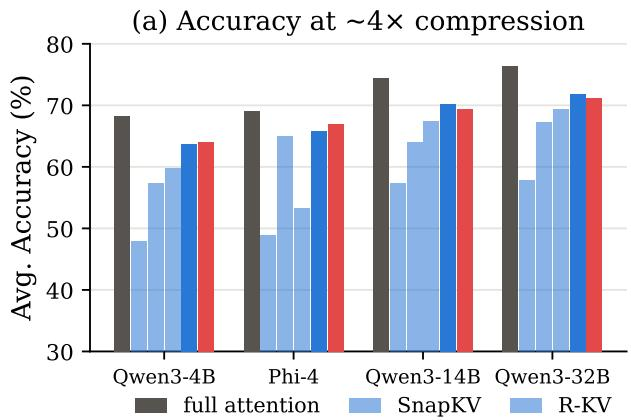
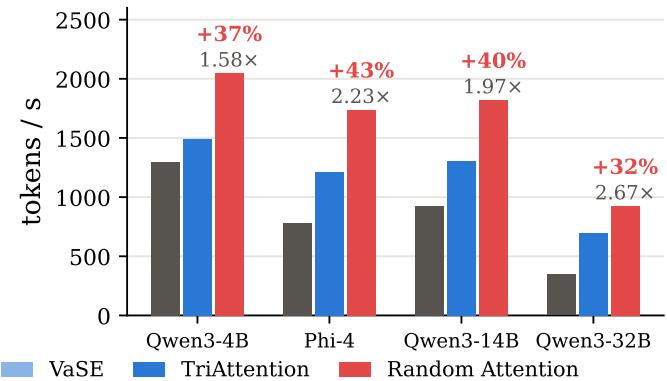
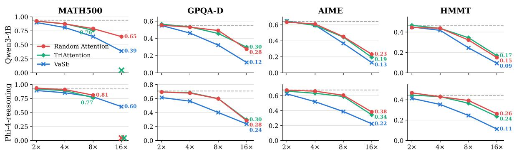
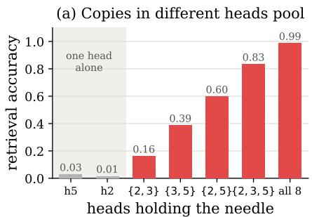
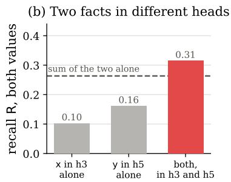
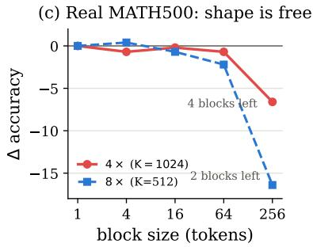
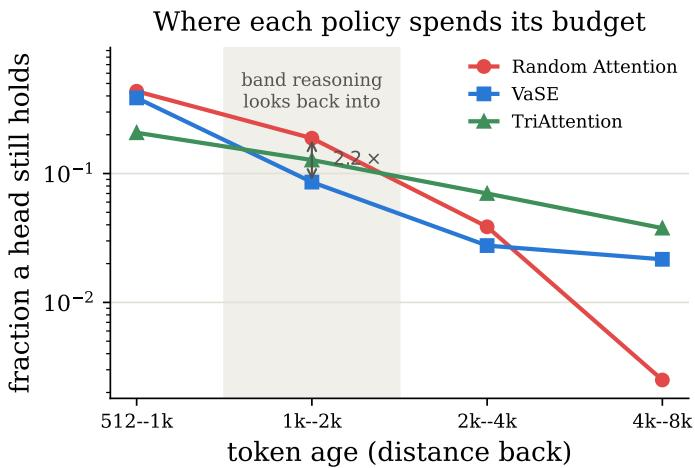
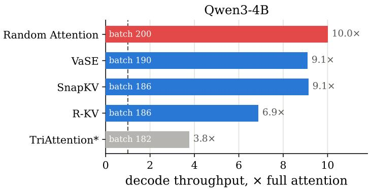
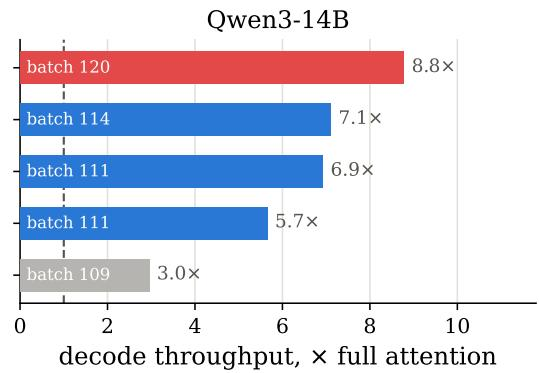

# Random Attention: Rethinking KV Cache Eviction for Eficient Reasoning

Heng Wang1,2, Jielin Qiu1, Wenting Zhao1, Cheng Qian1,2, Liangwei Yang1, Jiawei Han2, Heng Ji2, Silvio Savarese1, Shelby Heinecke1, Huan Wang1

1Salesforce AI Research, 2University of Illinois Urbana-Champaign

## Abstract

Large language models achieve superior performance on tasks that require extended reasoning, but long chains of thought make the KV cache a severe memory bottleneck. Existing KV cache compression methods share one paradigm: score each cached token by some estimate of how much it will matter later, and keep the top-scoring ones. We show that the selection signal contributes almost nothing. Random Attention keeps the prompt and evicts uniformly at random within each attention head, computing no score at all; across four models and six reasoning tasks it matches the strongest prior evictor while serving 32–43% higher throughput than it in vLLM deployment. Controlled experiments explain this by showing that 1) the prompt is the fragile part of the cache, and most of the gap between selectors is just whether their selection signal happened to keep it; 2) the reasoning trace protects itself against eviction with redundancy at two levels, in the text (the model restates what it still needs as it works) and across attention heads (each keeps its own copy of the trace), so once the prompt is safe, a random draw retains enough copies of what the model still needs, and no score is required to pick them. Our code is publicly available at https://github.com/SalesforceAIResearch/Random-Attention.

## 1 Introduction

(b) vLLM serving throughput, 32k  
  
Figure 1: (a) Mean accuracy over the six reasoning tasks of Tables 1 and 5 at ∼4× compression: Random Attention matches the strongest prior evictor on every model (the small gaps to TriAttention at 14B and 32B are mostly driven by code reasoning, where long prompts consume the budget, §4.2). (b) vLLM serving throughput at 32k-token generations (Table 4); labels give Random Attention’s multiple of full attention and its margin over TriAttention: with no scoring pass it serves 32–43% higher throughput.

Reasoning models (DeepSeek-AI, 2025; OpenAI, 2024; Abdin et al., 2025) solve hard problems by generating chains of thought that run to tens of thousands of tokens. The key-value (KV) cache grows linearly with the length of generation, creating a severe memory bottleneck. KV cache eviction methods have been developed to address this by keeping a fixed budget of KV cache entries and discarding the rest as decoding proceeds. Existing KV cache eviction methods follow the same paradigm: score each cached token by an estimate of how much it will matter later and keep the top-scoring ones. This line of work is a sequence of better scores, from accumulated attention (Zhang et al., 2023), attention from a recent window (Li et al., 2024), and attention combined with redundancy (Cai et al., 2025), to value magnitude (Chang et al., 2026) and position-dependent key statistics (Mao et al., 2026). Each new score is motivated by heuristics observed to be correlated with task accuracy, and the premise behind all of them is that the score decides accuracy under compression.

We test that premise directly and show that the selection signal contributes almost nothing. Random Attention keeps the prompt and evicts uniformly at random within each attention head, computing no score at all. Across four models (Qwen3-4B, 14B and 32B, and Phi-4-reasoning) and six reasoning tasks spanning math, science and code, it is comparable to the strongest baseline (Figure 1a) and even significantly ahead in 31 of the 60 baseline comparison in the main result table. Served through vLLM integration, it delivers 32–43% more tokens per second at 32k-token generations than the strongest baseline, since it never runs a scoring pass (Figure 1b). The only cell in that table where a baseline is significantly ahead is code reasoning on Qwen3-32B, traced in §4.2 to prompt length rather than the selection signal. The selection signal, in other words, contributes almost nothing beyond uniform random selection.

Two controlled experiments explain why. First, the prompt is the fragile part of the cache. Prior evictors difer in whether the prompt survives, some pinning it by rule and others leaving it to the score, so once every method is given the same rule (keep the prompt), most of the gap between them disappears, and each method gains exactly as much as its score had been losing of the question (§5.1). Second, the reasoning trace protects itself. It is stored redundantly at two levels, in the text, because the model restates what it is still using, and across attention heads, because every head holds its own copy of every token and eviction decides per head which copies die. A planted-fact probe shows the model reading a value from whichever heads still hold it: a fact kept in one head is almost never retrieved, kept in several it almost always is, and the shape of the surviving copies does not matter (§5.2). Once the prompt is safe, a random draw keeps enough copies of what the model still needs; what a signal still buys is the rare fact stated once and never restated, which reasoning traces seldom produce (§5.3).

Our findings have two practical implications. First, Random Attention is a deployable method in its own right. It needs no calibration, no tuning and no scoring pass, and it is the fastest evictor we measured at equal accuracy, so it is a reasonable default for serving reasoning models under a memory budget, and the baseline that any new selection signal has to beat at matched budget and matched prompt protection. Second, the findings redirect what eviction research should optimise. The accuracy of an evictor is decided by what it protects, not by how it ranks the rest, which moves the open questions to where protection still matters: how to budget long prompts, especially in code tasks where protecting the entire prompt consumes a substantial fraction of the cache budget, and how to recover rare once-stated facts that only a content-dependent signal can preserve (§5.3).

## 2 Preliminaries

Setting. We study KV cache eviction during decoding. This is the regime reasoning models create: a model answering a short (e.g. 200-token) math question may generate a very long chain of thought (e.g. more than 10,000 tokens). Eviction permanently discards key-value pairs once the cache reaches a budget, which bounds memory but risks irrecoverable loss; it is therefore distinct from sparse-attention selection, which attends to a subset but keeps every pair in memory and so still grows linearly with sequence length. Everything below concerns eviction.

Notation. Let � index decode steps. At step � an attention head holds � cached key-value pairs $( k _ { i } , \nu _ { i } ) , i = 1 , \ldots , N .$ with $k _ { i } , \nu _ { i } \in \mathbb { R } ^ { d }$ , where � is the position of the token that produced the pair; positions $1 , \ldots , \ell _ { \mathrm { p } }$ are the prompt. The head forms its output from the current query $q _ { t } \in \mathbb { R } ^ { d }$ as

$$
o _ { t } = \sum _ { i \leq N } { \alpha _ { i } ^ { ( t ) } \nu _ { i } } , \qquad \alpha _ { i } ^ { ( t ) } = \frac { \exp \bigl ( { q _ { t } ^ { \top } k _ { i } / \sqrt { d } } \bigr ) } { \sum _ { j \leq N } { \exp \bigl ( { q _ { t } ^ { \top } k _ { j } / \sqrt { d } } \bigr ) } } ,\tag{1}
$$

where $\alpha _ { i } ^ { ( t ) }$ is the attention weight the query at step � places on position $\begin{array} { r } { i \left( \sum _ { i \leq N } \alpha _ { i } ^ { ( t ) } = 1 \right) } \end{array}$ . We write $\nu _ { i j }$ for the $j \mathrm { - t h }$ coordinate of $\nu _ { i }$ and $\| k _ { i } \|$ for the norm of $k _ { i }$ . Eviction decisions are made independently in every layer and KV head, as is standard; we drop both indices throughout.

Periodic eviction with budget � and bufer �. We adopt the decode-phase framework of Cai et al. (2025) and Chang et al. (2026). The cache keeps a persistent budget of � pairs plus a bufer of the $r \ll K$ most recent pairs, which is never scored. Each decode step appends one pair, so the bufer fills every � steps and triggers an eviction: every candidate � in the candidate set $C _ { t }$ , the cached positions outside the bufer, receives a real-valued score $s _ { i }$ from a policy-specific rule, which may depend on the whole cache and on the past queries, and the � highest-scoring candidates are kept,

$$
S _ { t } ~ = ~ \mathrm { t o p } – K _ { i \in C _ { t } } ~ s _ { i } ,\tag{2}
$$

returning the cache to $K + r$ entries per head. Eviction is monotonic: a discarded pair is gone for good, as in a memory-bounded deployment. Eviction methods difer mostly in �.

Baselines as choices of �. We write each prior method’s � in the notation above, with every score evaluated at the eviction step �. StreamingLLM (Xiao et al., 2024) has no score: it keeps the first few (attention-sink) positions and the recent bufer. H2O (Zhang et al., 2023) keeps the positions that have received the most attention since they entered the cache, $\begin{array} { r } { s _ { i } = \sum _ { t ^ { \prime } = i } ^ { t } \alpha _ { i } ^ { ( t ^ { \prime } ) } } \end{array}$ . SnapKV (Li et al., 2024) uses only the last � queries, $\begin{array} { r } { s _ { i } = \sum _ { t ^ { \prime } = t - w + 1 } ^ { t } \alpha _ { i } ^ { ( t ^ { \prime } ) } . } \end{array}$ max-pooled over neighbouring positions. R-KV (Cai et al., 2025) mixes the SnapKV score with a redundancy term, $s _ { i } = \lambda s _ { i } ^ { \mathrm { S n a p } } + \left( 1 - \lambda \right) \left( 1 - \bar { c } _ { i } \right)$ with $\lambda \in [ 0 , 1 ]$ and $\begin{array} { r } { \bar { c } _ { i } = \frac { 1 } { N - 1 } \sum _ { j \neq i } \cos ( k _ { i } , k _ { j } ) } \end{array}$ the mean cosine similarity of $k _ { i }$ to the other cached keys, so that a restated fact is not kept twice. VaSE (Chang et al., 2026) scores values rather than keys: it keeps the $n _ { \mathrm { l a r g e } } < K$ positions with the largest value range max $_ j \nu _ { i j } - \operatorname* { m i n } _ { j } \nu _ { i j }$ and fills the remaining $K - n _ { \mathrm { l a r g e } }$ slots by sampling positions with probability proportional to their SnapKV score. TriAttention (Mao et al., 2026) scores a position by its distance from the current query, $s _ { i } = f ( t - i )$ , where $f$ is a trigonometric series whose coeficients are calibrated per head from the concentration of that head’s queries and keys, combined with ∥�� ∥.

## 3 Random Attention

Random Attention is a signal-free eviction policy defined by two structural choices. The intuition is to separate the irreplaceable input from the model-generated trace: the question is stated once and cannot be recovered if evicted, whereas the trace revisits and restates its intermediates as generation proceeds. We protect the former and use random sampling for the latter:

1. Protect the question. Positions $1 , \ldots , \ell _ { \mathrm { p } } ,$ the entire prefill (the system prompt, chat template, and question), are never evicted.

2. Scatter the rest, per head. Every remaining cached position receives an i.i.d. uniform random score, and each KV head keeps its top-� independently. Sampling without a signal spreads the retained budget evenly over the whole trace, and diferently in every head.

In the notation of §2, the entire method is

$$
s _ { i } ~ = ~ \left\{ { \begin{array} { l l } { + { \infty } , } & { i \leq \ell _ { \mathrm { p } } \quad \mathrm { ( t h e ~ p r o m p t ) } , } \\ { u _ { i } \sim \mathrm { U n i f o r m } ( 0 , 1 ) , } & { \mathrm { o t h e r w i s e } , } \end{array} } \right.\tag{3}
$$

drawn independently per KV head at every eviction; Eq. 2 does the rest in four lines:

Algorithm 1 Random Attention scoring (one eviction event; runs per layer)   
Require: batch size �; number of KV heads $H _ { \mathrm { k v } } ;$ ; number of cached positions �; prompt length $\ell _ { \mathfrak { p } } ;$ budget �   
Ensure: keep, the � positions each KV head retains, of shape (�, � , �)   
1: � ← rand(�, $H _ { \mathrm { k v } } , ~ S )$ ⊲ i.i.d. uniform score per cached position, per KV head   
2: � [ :, :, 0 : ℓ ] ← +∞ ⊲ force-keep the question   
3: keep ← topk(�, �) ⊲ independent top-� per KV head   
4: return keep

The per-eviction cost is one rand and one topk. This is the weakest selection signal we can write down: Random Attention is both a deployable method and a null hypothesis. Any signal-based selector that cannot beat it at matched budget is not extracting usable information from its signal.

## 4 Experiments

## 4.1 Setup

Baselines. We compare against the four eviction methods of §2, SnapKV, R-KV, VaSE and TriAttention, each run as released at the same budget (detailed configurations in Appendix F). Full attention (no eviction) is the ceiling. The diagnostics of §5.1 additionally use recency+prompt (keep the KV caches corresponding to the prompt, fill with the contiguous recent window, StreamingLLM-style (Xiao et al., 2024)). All methods are evaluated with FlashAttention-2 kernels (Dao, 2024), without PagedAttention (Kwon et al., 2023).

Models and tasks. We evaluate Qwen3-4B, Qwen3-14B, Qwen3-32B (Yang et al., 2025), and Phi-4-reasoning (14B) (Abdin et al., 2025) across six reasoning tasks spanning math, science, and code: MATH500 (Hendrycks et al., 2021; Lightman et al., 2024) (500 problems), GPQA-Diamond (GPQA-D) (Rein et al., 2024) (198 problems), AIME 2025 and 2026 (30 problems each, reported as one pooled AIME column) and HMMT (60 problems) via MathArena (Balunovic et al., 2026), and LiveCodeBench-v6 medium (Jain et al., 2025) (383 problems; pass@1 by real test execution). Generation uses each model’s released sampling settings (temperature 0.6 for the Qwen3 models, 0.8 for Phi-4-reasoning; nucleus �=0.95 for all), and each result is repeated as independently sampled runs: 2 on MATH500, 4 on GPQA-D and LiveCodeBench, and 16 on AIME and HMMT. Every accuracy in the paper is the average over those repeated runs. The main grid fixes each task’s budget at ∼4× compression of its typical trace (∼3× for LiveCodeBench); the per-head budget � for each task appears in Table 1’s header and is detailed in Appendix F. We set the maximum generation length to 32,768 (32k) tokens.

Metrics and statistics. The primary metric is accuracy, judged by whether the final boxed answer is correct (following Chang et al. (2026) and Gao et al. (2026)). Every claimed margin is gated by a paired, problem-clustered percentile bootstrap (95% CI) plus an exact sign test; grid cells significantly below Random Attention are grayed.

## 4.2 Main Results

Table 1 presents the performance on Qwen3-4B, Phi-4-reasoning, and Qwen3-32B; Qwen3-14B replicates the pattern at an intermediate scale in Appendix A. Paired tests put Random Attention significantly ahead in 31 of the table’s 60 baseline cells and significantly behind in one.

A selection signal buys nothing on math and science reasoning. On MATH500 and GPQA-D, Random Attention beats VaSE and SnapKV significantly on every model, and R-KV significantly on Qwen3-4B. No selector beats it significantly on these tasks: the leads that do appear (TriAttention by 0.3–0.6 points on two GPQA-D cells) sit inside the noise.

On competition math no selector pulls ahead. Competition math tasks including AIME and HMMT make the comparison ride on a smaller and harder sample. With 16 sampled runs per problem, SnapKV still trails Random Attention significantly on every model, as do R-KV on the Qwen3 models and VaSE on Phi-4-reasoning; no selector in Table 1 is significantly above Random Attention on either task, and the nominal leads run both ways: VaSE edges it on Qwen3-32B by 1.7 and 1.5 points, against a run-to-run standard deviation of ±5 points for both methods on a 30-problem set. These tasks separate only once the budget tightens (§4.3), and then in Random Attention’s favour.

On code reasoning most signal-based selectors fall apart due to much longer prompts. LiveCodeBench is the one task with large gaps: SnapKV loses 20–35 points to Random Attention on every model, VaSE collapses on Phi-4- reasoning (0.373, 29 points behind) and is grayed on two of the three models, as is R-KV. TriAttention and Random Attention tie on Qwen3-4B and Phi-4-reasoning, while TriAttention leads on Qwen3-32B by about three points, the single significant baseline win in the main grid. The prompt is what sets code apart. LiveCodeBench prompts average 557 tokens, which is six times MATH500’s under the same tokenizer, and the longest can consume up to half of the �=3072 budget. Therefore a selector that fails to capture the prompt loses more here than anywhere else; we show in the following section that protecting it closes the SnapKV and VaSE gaps (§5.1). Random Attention itself pins every prompt token, so on code reasoning a large, variable share of its budget is spent before selection begins; much of a code prompt is scafolding (I/O formats, harness instructions) that a smarter rule might compress rather than pin whole, which we leave to future work since Random Attention’s value as a null lies in having nothing to tune.

Table 1: Accuracy under KV cache eviction at each task’s ∼4× compression (LiveCodeBench: ∼3×); the header gives each task’s per-head KV budget � (§2). Bold: best eviction method per column; grayed: significantly below Random Attention (paired clustered bootstrap + sign test, 95%).
<table><tr><td></td><td>MATH500 K=1024</td><td>GPQA-D K=2048</td><td>AIME K=4096</td><td>HMMT K=4096</td><td>LiveCodeBench K=3072</td></tr><tr><td colspan="6">Qwen3-4B</td></tr><tr><td>Full</td><td>0.939</td><td>0.562</td><td>0.642</td><td>0.462</td><td>0.807</td></tr><tr><td>SnapKV</td><td>0.703</td><td>0.369</td><td>0.418</td><td>0.395</td><td>0.507</td></tr><tr><td>R-KV</td><td>0.810</td><td>0.482</td><td>0.494</td><td>0.371</td><td>0.712</td></tr><tr><td>VaSE</td><td>0.809</td><td>0.461</td><td>0.596</td><td>0.421</td><td>0.700</td></tr><tr><td>TriAttention</td><td>0.864</td><td>0.533</td><td>0.592</td><td>0.437</td><td>0.755</td></tr><tr><td>Random Attention (ours)</td><td>0.874</td><td>0.530</td><td>0.610</td><td>0.438</td><td>0.744</td></tr><tr><td colspan="6">Phi-4-reasoning</td></tr><tr><td>Full</td><td>0.922</td><td>0.707</td><td>0.677</td><td>0.444</td><td>0.697</td></tr><tr><td>SnapKV</td><td>0.844</td><td>0.442</td><td>0.502</td><td>0.343</td><td>0.314</td></tr><tr><td>R-KV</td><td>0.909</td><td>0.636</td><td>0.643</td><td>0.440</td><td>0.621</td></tr><tr><td>VaSE</td><td>0.853</td><td>0.562</td><td>0.520</td><td>0.354</td><td>0.373</td></tr><tr><td>TriAttention</td><td>0.891</td><td>0.684</td><td>0.633</td><td>0.431</td><td>0.652</td></tr><tr><td>Random Attention (ours)</td><td>0.910</td><td>0.678</td><td>0.662</td><td>0.430</td><td>0.667</td></tr><tr><td colspan="6">Qwen3-32B</td></tr><tr><td>Full</td><td>0.950</td><td>0.703</td><td>0.715</td><td>0.559</td><td>0.886</td></tr><tr><td>SnapKV</td><td>0.816</td><td>0.476</td><td>0.541</td><td>0.450</td><td>0.609</td></tr><tr><td>R-KV</td><td>0.857</td><td>0.638</td><td>0.613</td><td>0.472</td><td>0.779</td></tr><tr><td>VaSE</td><td>0.868</td><td>0.597</td><td>0.680</td><td>0.524</td><td>0.797</td></tr><tr><td>TriAttention</td><td>0.887</td><td>0.683</td><td>0.677</td><td>0.508</td><td>0.834</td></tr><tr><td>Random Attention (ours)</td><td>0.891</td><td>0.683</td><td>0.664</td><td>0.509</td><td>0.806</td></tr></table>

  
Compression Factor  
Figure 2: Accuracy from 2× to 16× compression on Qwen3-4B and Phi-4-reasoning, on the four math and science tasks; dashed lines mark full attention.

## 4.3 Compression Pressure Widens the Gap, in Every Family

Figure 2 presents the performance from 2× to 16× compression on Qwen3-4B and Phi-4-reasoning, on the four math and science tasks, and both families tell the same story: at 2× every method sits near full attention; as the budget tightens, Random Attention stays tied with TriAttention, while the gap from both to VaSE opens. LiveCodeBench is left out of the sweep since its prompts alone would not fit the small budgets.

Table 2: Performance before and after protecting the prompt. R-KV never gains more than 1.9 points, SnapKV gains everywhere, VaSE gains materially only on Phi-4-reasoning.
<table><tr><td></td><td colspan="4">Qwen3-4B</td><td colspan="4">Phi-4-reasoning</td></tr><tr><td></td><td colspan="2">MATH500</td><td colspan="2">GPQA-D</td><td colspan="2">MATH500</td><td colspan="2">GPQA-D</td></tr><tr><td>Method</td><td>score alone</td><td>+ prompt</td><td>score alone</td><td>+ prompt</td><td>score alone</td><td>+ prompt</td><td>score alone</td><td>+ prompt</td></tr><tr><td>SnapKV</td><td>0.703</td><td>0.829+12.6</td><td>0.369</td><td>0.492 +12.3</td><td>0.844</td><td>0.889 +4.5</td><td>0.442</td><td>0.667 +22.5</td></tr><tr><td>R-KV</td><td>0.810</td><td>0.812+0.2</td><td>0.482</td><td>0.471-1.1</td><td>0.909</td><td>0.902-0.7</td><td>0.636</td><td>0.655 +1.9</td></tr><tr><td>VaSE</td><td>0.809</td><td>0.812+0.3</td><td>0.461</td><td>0.470+0.9</td><td>0.853</td><td>0.895 +4.2</td><td>0.562</td><td>0.664+10.2</td></tr><tr><td>Recency window</td><td>0.246</td><td>0.843 +59.7</td><td>0.093</td><td>0.519 +42.6</td><td>0.665</td><td>0.884 +21.9</td><td>0.323</td><td>0.658 +33.5</td></tr><tr><td>Random Attention</td><td>0.459</td><td>0.874+41.5</td><td>0.231</td><td>0.530 +29.9</td><td>0.759</td><td>0.910+15.1</td><td>0.434</td><td>0.678+24.4</td></tr></table>

## 5 Why the Selection Signal Buys So Little

The content of the KV cache in reasoning can be divided into two types. The prompt is stated once and never stated again. The working state (i.e., the intermediate reasoning steps a solution builds on) is written and rewritten continually as the model reasons. We show that the first is fragile, and methods difer in how they treat it; the second is redundant enough that a random draw over it keeps what the model still needs.

## 5.1 The Prompt Is the Fragile Part

Methods disagree about the prompt. TriAttention keeps the whole input by default, while VaSE, R-KV, and SnapKV only keep the sink tokens (Xiao et al., 2024; Han et al., 2024) by default and leave every slot to the score, so a comparison across papers also compares protection regimes (Chen et al., 2026). Giving every method the same rule separates the score from the protection (Table 2), and one pattern orders the outcome: the rule pays each method according to how much of the question its score was losing, measured for every selector by logging, round by round, how much of the prompt it keeps (Appendix D). SnapKV, whose score retains the least of the prompt, always gains, up to 22.5 points on Phi-4-reasoning GPQA-D; VaSE gains only where its retention fails, little on Qwen3-4B but +4.2 and +10.2 on Phi-4-reasoning, whose prompts are two to three times longer; R-KV, which retains the most, never gains more than 1.9 points (survival fractions in Appendix D). Once every method keeps the prompt, the three baselines land within 2.2 points of one another in every setting. On Phi-4-reasoning they also land within about two points of Random Attention, which ranks nothing; on Qwen3-4B a residual of 4–6 points below Random Attention remains for all three, and R-KV and VaSE, which already kept most of the prompt there, gain almost nothing from the rule. Code reasoning on both models, competition math on Qwen3-4B and GPQA-D at 32B (Appendix C) show the same pattern: the rule closes every gap that was large and method-specific, and what survives it is smaller and runs in Random Attention’s favour. Most of the diference between the baselines was therefore the prompt. Whatever their scores add beyond it is small, and where a residual remains it is a deficit: with the prompt protected, every learned score still trails a policy that ranks nothing.

The two signal-free rows make the same point from the other side. Without the rule, a recency window allocates all the budget to the recent trace and none to the prompt and scores as low as 0.09, and Random Attention, which keeps the prompt only at the uniform rate, falls to 0.23–0.76. With the rule, the same two policies lose nothing that matters: Random Attention is the best policy in every setting and a plain recency window comes within two points of the best baseline. Losing the prompt is catastrophic and cutting the trace at random is not, which is what makes the prompt the fragile part of the cache. The same confound explains the large gaps others report between random retention and signal-based selection in previous works (Yuan et al., 2026; Liu et al., 2025): their random baselines perform poorly since the prompt is lost.

## 5.2 The Working State Protects Itself

The rest of the cache is the model’s own reasoning trace (working state), which is stored redundantly at two levels. The first redundancy is in the text and is already shown by Cai et al. (2025): reasoning traces restate what they are still using, so a value that matters rarely lives at one position only. The second is across heads: each of the KV heads caches its own copy of every token, and eviction decides per head which copies die. A token is only lost when all KV heads happen to drop it.

We show how the model makes use of the second, cross-head redundancy with a planted-fact probing experiment. A synthetic fact (e.g. Let $z { \tt q } \ = \ 4 7 2 9 ;$ a fresh variable and value each time) is inserted into real model-generated MATH500 reasoning traces, with a question needing the value appended at the end. The fact is planted 1,536 tokens before the question, so the cache is evicted 15 times between the two (other distances in Appendix B); the question itself is always kept. What we control is which key-value heads keep the fact: a condition is a chosen set of heads in which the fact’s tokens are pinned, with the fact evicted from every other head and the standard per-head uniform eviction running on everything else. Two metrics measure what survives. Retrieval is the fraction of traces whose greedy decode reproduces the value at the question. Because retrieval falls to zero in the hardest conditions, a graded recall carries the comparison there:

$$
R ~ = ~ \frac { \sum _ { i } \left( \mathrm { L P } _ { i } - \mathrm { L P } _ { i } ^ { \mathrm { d e l } } \right) } { \sum _ { i } \left( \mathrm { L P } _ { i } ^ { \mathrm { k e p t } } - \mathrm { L P } _ { i } ^ { \mathrm { d e l } } \right) } ,\tag{4}
$$

where LP� is the log-probability the model assigns to trace �’s correct value under the condition being tested, and $\mathrm { L P } _ { i } ^ { \mathrm { k e p t } }$ and $\mathrm { L P } _ { i } ^ { \mathrm { d e l } }$ are the same quantity with the fact kept in every cache and deleted from every cache. �=1 therefore means the surviving copies are worth as much as never evicting the fact, and �=0 that they are worth nothing. Every condition is scored on the same 250–500 planted traces. The probe shows the model exploiting the redundancy in two ways.

Copies pool across heads. Attention heads specialise: only three of Qwen3-4B’s eight key-value heads retain a usable trace of the fact on their own, consistent with the retrieval-head specialisation of Wu et al. (2025), and even those three are weak alone: the best single head yields the value in 3% of trials, the next in 1%. But the readout does not depend on any one head: the same two heads together yield the fact in 60% of trials, three heads in 83%, and all eight in 99% (Figure 3a). Pooling is thus strongly superadditive, a pair being worth many times the sum of its singles, and it even crosses facts: two values held in diferent heads, both needed by the answer, give �=0.31 together against 0.10 and 0.16 alone (Figure 3b). For an eviction policy the consequence is direct: a value stays usable as long as some heads keep a copy, which is exactly what independent per-head draws maximise. On real MATH500 traces this extra coverage is not even needed: a shared draw, the same random positions in every head, scores within 0.3 points of Random Attention at 4× and 8× (Appendix D), because the text-level redundancy already keeps a restated copy; the cross-head level carries what the text does not restate, which is the probe’s regime.

The shape of the copies does not matter. We deal the fact out token by token across heads, so that no two consecutive tokens share a head and no head holds a readable span; retrieval barely moves (0.33, against 0.39 for an intact sentence at the same retained mass) and recall is essentially unchanged (�=0.75 vs. 0.76). The same insensitivity appears on real MATH500 traces at full scale: keeping the history in contiguous blocks rather than scattered tokens costs nothing as blocks grow from 1 to 64 tokens; accuracy drops only at block size 256, where the budget leaves a head just four or two blocks, and drops more with two, so what matters is blocks per head, not block length (Figure 3c). Together the two findings say the answer depends on whether some usable copy of a needed value survives somewhere, not on which copy, in which head, or in what shape.

## 5.3 What Is Left for a Selection Signal

Table 3: A passcode stated once, 57 compression rounds before the question.

The one case a signal-free policy cannot cover is a fact stated once, never restated, and needed much later. We announce a passcode once, 57 compression rounds before the question, let each policy retain as it sees fit, and report two numbers (Table 3): the fraction of traces in which the model reproduces the passcode (Retr.), and the log-probability it assigns to the correct passcode at the question, averaged over traces (log �). A log � of 0 means

<table><tr><td>Policy</td><td>Retr.</td><td>log p</td></tr><tr><td>Random Attention (ours)</td><td>0.000</td><td>-18.35</td></tr><tr><td>VaSE</td><td>0.344</td><td>-3.88</td></tr><tr><td>SnapKV</td><td>0.004</td><td>-11.11</td></tr><tr><td>R-KV</td><td>0.836</td><td>-0.71</td></tr><tr><td>TriAttention</td><td>0.016</td><td>-11.11</td></tr></table>

the model would produce the passcode with certainty; a number like −18 means the passcode is efectively gone from the cache. Random Attention never reproduces it, and retrieval tracks the attention statistic each selection signal scores by: R-KV, whose importance accumulates attention over the whole history, finds the passcode 84% of the time; VaSE’s sampled attention a third of the time; the recent-window signals of SnapKV and TriAttention almost never. Wang (2026) prove that random caches must lose at pointer-chasing when nothing is redundant. Needle-finding is thus real selection skill, but it neither implies nor follows from aggregate strength: R-KV, the best needle-finder, leads only one column of Table 1, while TriAttention, the strongest baseline there, recovers almost nothing here. On real traces the case is rare, because the model keeps restating what it is still using.

  
Figure 3: (a) A fact held in one head is almost never retrieved; held in several it is. (b) Two facts in diferent heads are worth more together than the sum of each alone (dashed). (c) Real MATH500: contiguous blocks cost nothing up to size 64; accuracy drops only once a head is left with 4 (�=1024) or 2 (�=512) blocks.

Table 4: Serving throughput (output tok/s, and the multiple of full attention) under vLLM with PagedAttention on one H200 (�=2048, 1k-token prompts, 32k-token generations).
<table><tr><td>Method</td><td>Qwen3-4B</td><td>Phi-4-reasoning</td><td>Qwen3-14B</td><td>Qwen3-32B</td></tr><tr><td>Full</td><td>1296(1.00×)</td><td>780 (1.00×)</td><td>925 (1.00×)</td><td>346 (1.00×)</td></tr><tr><td>TriAttention</td><td>1494(1.15×)</td><td>1212(1.55×)</td><td>1303 (1.41×)</td><td>700 (2.02×)</td></tr><tr><td>Random Attention (ours)</td><td>2046(1.58×)</td><td>1737 (2.23×)</td><td>1819(1.97×)</td><td>923 (2.67×)</td></tr><tr><td>ours over TriAttention</td><td>+37%</td><td>+43%</td><td>+40%</td><td>+32%</td></tr></table>

## 6 Eficiency Evaluation

We evaluate eficiency in two settings: 1) vLLM (Kwon et al., 2023) with PagedAttention, following the protocol of TriAttention, and 2) batched decoding in HuggingFace Transformers with FlashAttention-2 and no paging (the setup of §4.1), where the throughput is measured at the largest batch that fits on one GPU. The first setting compares Random Attention with TriAttention only, because only TriAttention and R-KV have vLLM ports, and Mao et al. (2026) have already shown that TriAttention is more eficient than R-KV at matched budget. The second setting compares all methods. Details of the two protocols are given in Appendix G.

Under paged serving, Random Attention is 32–43% faster than TriAttention. Both methods run on one H200 at �=2048 with 1k-token prompts, 32k-token generations and 128 requests. vLLM preempts requests when the KV cache demand exceeds its cache pool, and a preempted request can no longer be compressed, so on Qwen3-32B, whose larger weights leave a smaller pool, the compressed runs are capped at 96 concurrent requests; full attention runs under no such limit.

At 32k tokens per request the KV cache, not the compute, limits how many requests a GPU can hold at once, so a smaller cache means more requests in flight and higher throughput. Random Attention serves 1.6–2.7× the fullattention throughput across the four models, 32–43% more than TriAttention on the same kernels (Table 4).1 The margin is not specific to this operating point: it holds at short generations, where compression itself does not yet pay, and at lighter loads.

At equal memory every evictor gains, and the scoring pass decides the rest. A second comparison gives each method the largest batch it can fit on one 143 GB H200 at �=3072 with 32k generations (Figure 5 in Appendix G). Full attention fits 28 (Qwen3-4B) and 20 (Qwen3-14B) concurrent sequences; the compressed caches fit 109–200, and that capacity, which every method shares, is where the 3–10× speedups come from. The residual ordering is the scoring pass: Random Attention computes no score, fits the largest batch at the smallest peak footprint (101 and 89 GB), and reaches 10.0× and 8.8× full-attention throughput; the ordering is unchanged at 16k generations, and at the tighter �=1024 of MATH500 the same protocol reaches 28.8× (Appendix G). The 32–43% of Table 4 is the margin we claim, while the threefold gap to TriAttention here reflects an unfused re-implementation of its scorer, not the method itself.

Why skipping the scoring pass is worth 32–43% in serving. Timed alone, the pass is cheap. One eviction round costs 0.30 ms under Random Attention, which only compacts the cache, and 1.47–1.64 ms under TriAttention, which scores it first; in a single stream the extra scoring amounts to a few percent of decoding time. Serving multiplies that small cost in two ways. First, the compressions pile up: with 128 concurrent requests, each compressed every 64 of its own tokens, vLLM compresses some request at nearly every decoding step (about 62k times per workload), and it performs each compression at a synchronisation point between batched steps, so all 128 requests wait while one of them is compressed. Second, content-dependent scoring is more expensive under paged serving than in plain batched decoding. Cache-statistic selectors need an extra pass over the paged KV state, and attention-weight selectors must recompute or explicitly expose attention statistics, because the fused kernels do not materialise them; Random Attention needs neither and only compacts. In our vLLM comparison, TriAttention makes an additional pass over the candidate cached keys, through vLLM’s block tables and layer by layer, to compute its score, whereas Random Attention performs only the shared compaction step. On Qwen3-14B, the extra 910 s that TriAttention’s 32k run takes over Random Attention’s amounts to about 15 ms of whole-batch waiting per compression, against well under a millisecond for Random Attention.

## 7 Related Work

KV cache for long-context understanding. A major line of work on the KV cache targets long inputs and short outputs: one or many documents fill the cache at prefill and a short answer follows. Three families reduce its memory. Quantization keeps every token at lower precision (Liu et al., 2024; Hooper et al., 2024). Eviction discards tokens under a budget (Xu et al., 2025; Park et al., 2025; Li et al., 2026), scored by cumulative attention (Zhang et al., 2023), its persistence across steps (Liu et al., 2023), or attention from a window of recent queries (Li et al., 2024), with budgets adapted per head or per layer (Feng et al., 2025; Cai et al., 2024), structural rules that keep the attention sinks and a recent window (Xiao et al., 2024), or a policy chosen per head (Ge et al., 2024). Query-aware selection keeps every token and attends to a subset per query (Tang et al., 2024), which saves compute but not memory. Randomness has also been studied in KV cache management. At the serving-system level, Wu et al. (2026) randomly evict unmarked leaf tokens from a prefix-sharing cache, making eviction more robust to dynamic or adversarial query arrivals. For long-context compression, Roy et al. (2026) sample for coverage of the input, and Garcia (2026) show, for long-context question answering under a global cache cap, that once the prompt-boundary tokens are guarded the choice of score is second-order and a random policy shares in the recovery. Our setting difers from all three: a short prompt is followed by a long generation, so what fills the cache is the model’s own trace, and what must be protected is the whole question rather than its boundaries.

KV cache for long reasoning. Chains of thought invert the ratio: the prompt is a few hundred tokens and the cache is filled during decoding. Sparse-attention selection has been adapted to this regime (Gao et al., 2026; Yang et al., 2026), but it keeps the full cache in memory and attends to part of it, so peak GPU memory still grows with the length of the trace; eviction is the only route that bounds it. Decode-time evictors generally estimate KV importance and use these scores to determine retention: R-KV uses a SnapKV-style score with a redundancy penalty so that restated content is not kept twice (Cai et al., 2025), VaSE scores by value magnitude and fills the remaining budget stochastically (Chang et al., 2026), following earlier score-guided randomized eviction (Chen et al., 2024), and TriAttention scores keys by position through calibrated trigonometric statistics; LazyEviction estimates future importance from recurring attention patterns (Zhang et al., 2026). SpeContext (Xu et al., 2026) uses a lightweight distilled-model retrieval head to predict important KV entries, enabling their asynchronous prefetching before the corresponding LLM computation. Concurrently with this work, Prefix Sliding (Muennighof et al., 2026) keeps only the prompt and a window of recent tokens, the recency+prompt policy of §5.1, and also explores incorporating KV cache eviction into training, as Kontonis et al. (2026) do. Evaluations of KV compression on reasoning report that eviction hurts chains of thought more than long-context tasks and that random or recency baselines fall far behind scored selection (Liu et al., 2025; Yuan et al., 2026), and Chen et al. (2026) show that protocols difering in what they protect make results across papers hard to compare. We run baselines at matched budget and show that when the prompt is kept, even evicting at random can be comparable to the strongest baseline while being much more eficient.

## 8 Conclusion

KV cache eviction for reasoning has been treated as a ranking problem: estimate which cached tokens will matter and keep those. We find that the ranking contributes almost nothing. A policy that keeps the prompt and evicts uniformly at random within each head matches the strongest baselines across four models and six tasks, and serves 32–43% higher throughput in vLLM deployment. We explain this by showing that 1) the prompt is the fragile part of the cache, and once every method keeps it, most of the gap between methods disappears; 2) the reasoning trace protects itself through redundancy, in the text and across heads, so once the prompt is safe a random draw keeps enough copies of what the model still needs. What remains for a selection signal is the rare fact stated once and never restated, which reasoning seldom produces.

## AI use statement

In this work, we used generative AI tools (LLM-based coding and writing assistants) to assist with drafting and editing the manuscript, implementing analysis and plotting code, and typesetting tables. We have not used generative AI tools to design the experiments, to select or register the hypotheses and thresholds, or to produce any reported measurement. All AI-assisted code and text were reviewed by the authors; reported statistics were recomputed from the released perinstance logs, and every registered prediction and its verdict is recorded in the paper independently of any AI-generated draft. We take responsibility for the final content of this work, including text, claims, and artifacts produced with the aid of generative AI.

## Acknowledgements

The authors would like to thank Zhiyi Shi and Haodong Wen for helpful discussion.

## References

Marah Abdin, Sahaj Agarwal, Ahmed Awadallah, Vidhisha Balachandran, Harkirat Behl, Lingjiao Chen, Gustavo de Rosa, Suriya Gunasekar, Mojan Javaheripi, Neel Joshi, Piero Kaufmann, Yash Lara, Caio César Teodoro Mendes, Arindam Mitra, Besmira Nushi, Dimitris Papailiopoulos, Olli Saarikivi, Shital Shah, Vaishnavi Shrivastava, Vibhav Vineet, Yue Wu, Safoora Yousefi, and Guoqing Zheng. Phi-4-reasoning technical report. arXiv preprint arXiv:2504.21318, 2025.

Mislav Balunovic, Jasper Dekoninck, Ivo Petrov, Nikola Jovanović, and Martin Vechev. Matharena: Evaluating LLMs on uncontaminated math competitions. In The Thirty-ninth Annual Conference on Neural Information Processing Systems Datasets and Benchmarks Track, 2026. URL https://openreview.net/forum?id=y0zL9IZxZ7.

Zefan Cai, Yichi Zhang, Bofei Gao, Yuliang Liu, Tianyu Liu, Keming Lu, Wayne Xiong, Yue Dong, Baobao Chang, Junjie Hu, and Wen Xiao. PyramidKV: Dynamic KV cache compression based on pyramidal information funneling. arXiv preprint arXiv:2406.02069, 2024.

Zefan Cai, Wen Xiao, Hanshi Sun, Cheng Luo, Yikai Zhang, Ke Wan, Yucheng Li, Yeyang Zhou, Li-Wen Chang, Jiuxiang Gu, Zhen Dong, Anima Anandkumar, Abedelkadir Asi, and Junjie Hu. R-KV: Redundancy-aware KV cache compression for reasoning models. In The Thirty-ninth Annual Conference on Neural Information Processing Systems, 2025. URL https://openreview.net/forum?id=2jwAjomEDB.

Ting-Yun Chang, Harvey Yiyun Fu, Deqing Fu, Chenghao Yang, Jesse Thomason, and Robin Jia. Value-aware stochastic KV cache eviction for reasoning models. arXiv preprint arXiv:2606.03928, 2026.

Alex Chen, Renato Geh, Aditya Grover, Guy Van Den Broeck, and Daniel Mingyi Israel. The pitfalls of KV cache compression. In Maria Liakata, Viviane P. Moreira, Jiajun Zhang, and David Jurgens (eds.), Proceedings ofthe 64th Annual Meeting of the Association for Computational Linguistics (Volume 1: Long Papers), pp. 41530–41553, San Diego, California, United States, July 2026. Association for Computational Linguistics. ISBN 979-8-89176-390-6. doi: 10.18653/v1/2026.acl-long.1926. URL https://aclanthology.org/2026.acl-long.1926/.

Yilong Chen, Guoxia Wang, Junyuan Shang, Shiyao Cui, Zhenyu Zhang, Tingwen Liu, Shuohuan Wang, Yu Sun, Dianhai Yu, and Hua Wu. NACL: A general and efective KV cache eviction framework for LLM at inference time. In Lun-Wei Ku, Andre Martins, and Vivek Srikumar (eds.), Proceedings of the 62nd Annual Meeting of the Association for Computational Linguistics (Volume 1: Long Papers), pp. 7913–7926, Bangkok, Thailand, August 2024. Association for Computational Linguistics. doi: 10.18653/v1/2024.acl-long.428. URL https: //aclanthology.org/2024.acl-long.428/.

Tri Dao. Flashattention-2: Faster attention with better parallelism and work partitioning. In The Twelfth International Conference on Learning Representations, 2024. URL https://openreview.net/forum?id=mZn2Xyh9Ec.

DeepSeek-AI. DeepSeek-R1: Incentivizing reasoning capability in LLMs via reinforcement learning. arXiv preprint arXiv:2501.12948, 2025.

Yuan Feng, Junlin Lv, Yukun Cao, Xike Xie, and S Kevin Zhou. Ada-KV: Optimizing KV cache eviction by adaptive budget allocation for eficient LLM inference. In The Thirty-ninth Annual Conference on Neural Information Processing Systems, 2025. URL https://openreview.net/forum?id=tcisuhGsQZ.

Yizhao Gao, Shuming Guo, Shijie Cao, Yuqing Xia, Yu Cheng, Lei Wang, Lingxiao Ma, Yutao Sun, Tianzhu Ye, Li Dong, Hayden Kwok-Hay So, Yu Hua, Ting Cao, Fan Yang, and Mao Yang. Sparse attention adaptation for long reasoning. In The Fourteenth International Conference on Learning Representations, 2026. URL https: //openreview.net/forum?id=c5BOcHM6J8.

Gabriel Garcia. Protection is (nearly) all you need: Structural protection dominates scoring in globally capped KV eviction. arXiv preprint arXiv:2605.18053, 2026.

Suyu Ge, Yunan Zhang, Liyuan Liu, Minjia Zhang, Jiawei Han, and Jianfeng Gao. Model tells you what to discard: Adaptive KV cache compression for LLMs. In International Conference on Learning Representations, 2024.

Chi Han, Qifan Wang, Hao Peng, Wenhan Xiong, Yu Chen, Heng Ji, and Sinong Wang. LM-infinite: Zero-shot extreme length generalization for large language models. In Kevin Duh, Helena Gomez, and Steven Bethard (eds.), Proceedings of the 2024 Conference of the North American Chapter of the Association for Computational Linguistics: Human Language Technologies (Volume 1: Long Papers), pp. 3991–4008, Mexico City, Mexico, June 2024. Association for Computational Linguistics. doi: 10.18653/v1/2024.naacl-long.222. URL https: //aclanthology.org/2024.naacl-long.222/.

Dan Hendrycks, Collin Burns, Saurav Kadavath, Akul Arora, Steven Basart, Eric Tang, Dawn Song, and Jacob Steinhardt. Measuring mathematical problem solving with the MATH dataset. In Thirty-fifth Conference on Neural Information Processing Systems Datasets and Benchmarks Track (Round 2), 2021. URL https://openreview. net/forum?id=7Bywt2mQsCe.

Coleman Richard Charles Hooper, Sehoon Kim, Hiva Mohammadzadeh, Michael W. Mahoney, Sophia Shao, Kurt Keutzer, and Amir Gholami. KVQuant: Towards 10 million context length LLM inference with KV cache quantization. In The Thirty-eighth Annual Conference on Neural Information Processing Systems, 2024. URL https://openreview.net/forum?id=0LXotew9Du.

Naman Jain, King Han, Alex Gu, Wen-Ding Li, Fanjia Yan, Tianjun Zhang, Sida Wang, Armando Solar-Lezama, Koushik Sen, and Ion Stoica. Livecodebench: Holistic and contamination free evaluation of large language models for code. In The Thirteenth International Conference on Learning Representations, 2025. URL https: //openreview.net/forum?id=chfJJYC3iL.

Vasilis Kontonis, Yuchen Zeng, Shivam Garg, Lingjiao Chen, Hao Tang, Ziyan Wang, Ahmed Hassan Awadallah, Eric Horvitz, John Langford, and Dimitris Papailiopoulos. MEMENTO: Teaching LLMs to manage their context. In Third Conference on Language Modeling, 2026. URL https://openreview.net/forum?id=YaYiQDVsi0.

Woosuk Kwon, Zhuohan Li, Siyuan Zhuang, Ying Sheng, Lianmin Zheng, Cody Hao Yu, Joseph Gonzalez, Hao Zhang, and Ion Stoica. Eficient memory management for large language model serving with pagedattention. In Proceedings ofthe 29th symposium on operating systems principles, pp. 611–626, 2023.

Mengjie Li, Yuan Feng, Xike Xie, and William J. Song. REAL: REtrieval-reAsoning and logic-constructed attention behaviors for long-context KV cache compression. In Maria Liakata, Viviane P. Moreira, Jiajun Zhang, and David Jurgens (eds.), Proceedings of the 64th Annual Meeting of the Association for Computational Linguistics (Volume 1: Long Papers), pp. 39035–39052, San Diego, California, United States, July 2026. Association for Computational Linguistics. ISBN 979-8-89176-390-6. doi: 10.18653/v1/2026.acl-long.1811. URL https://aclanthology. org/2026.acl-long.1811/.

Yuhong Li, Yingbing Huang, Bowen Yang, Bharat Venkitesh, Acyr Locatelli, Hanchen Ye, Tianle Cai, Patrick Lewis, and Deming Chen. SnapKV: LLM knows what you are looking for before generation. In The Thirty-eighth Annual Conference on Neural Information Processing Systems, 2024. URL https://openreview.net/forum? id=poE54GOq2l.

Hunter Lightman, Vineet Kosaraju, Yuri Burda, Harrison Edwards, Bowen Baker, Teddy Lee, Jan Leike, John Schulman, Ilya Sutskever, and Karl Cobbe. Let’s verify step by step. In The Twelfth International Conference on Learning Representations, 2024. URL https://openreview.net/forum?id=v8L0pN6EOi.

Minghui Liu, Aadi Palnitkar, Tahseen Rabbani, Hyunwoo Jae, Kyle Rui Sang, Dixi Yao, Shayan Shabihi, Fuheng Zhao, Tian Li, Ce Zhang, Furong Huang, and Kunpeng Zhang. Hold onto that thought: Assessing KV cache compression on reasoning. arXiv preprint arXiv:2512.12008, 2025.

Zichang Liu, Aditya Desai, Fangshuo Liao, Weitao Wang, Victor Xie, Zhaozhuo Xu, Anastasios Kyrillidis, and Anshumali Shrivastava. Scissorhands: Exploiting the persistence of importance hypothesis for LLM KV cache compression at test time. In Advances in Neural Information Processing Systems, 2023.

Zirui Liu, Jiayi Yuan, Hongye Jin, Shaochen Zhong, Zhaozhuo Xu, Vladimir Braverman, Beidi Chen, and Xia Hu. KIVI: A tuning-free asymmetric 2bit quantization for KV cache. In Forty-first International Conference on Machine Learning, 2024. URL https://openreview.net/forum?id=L057s2Rq8O.

Weian Mao, Xi Lin, Wei Huang, Yuxin Xie, Tianfu Fu, Bohan Zhuang, Song Han, and Yukang Chen. Triattention: Eficient long reasoning with trigonometric KV compression. In Forty-third International Conference on Machine Learning, 2026. URL https://openreview.net/forum?id=0tgzJK50Jz.

Niklas Muennighof, Zhengyang Wang, Zeyi Chen, Weijia Shi, Binyuan Hui, John Yang, Dapeng Jiang, Mika Senghaas, Fares Obeid, Johannes Hagemann, Sami Jaghouar, Ludwig Schmidt, Percy Liang, Jason Wei, Andrew Y. Ng, Luke Zettlemoyer, Yejin Choi, and Mike Lewis. Prefix sliding for eficient test-time scaling. arXiv preprint arXiv:2608.26070, 2026.

OpenAI. Learning to reason with LLMs. https://openai.com/index/learning-to-reason-with-llms, 2024.

Junyoung Park, Dalton Jones, Matthew J Morse, Raghavv Goel, Mingu Lee, and Christopher Lott. Keydif: Key similarity-based KV cache eviction for long-context LLM inference in resource-constrained environments. In The Thirty-ninth Annual Conference on Neural Information Processing Systems, 2025. URL https://openreview. net/forum?id=uBaFH7aQnC.

David Rein, Betty Li Hou, Asa Cooper Stickland, Jackson Petty, Richard Yuanzhe Pang, Julien Dirani, Julian Michael, and Samuel R. Bowman. GPQA: A graduate-level google-proof q&a benchmark. In First Conference on Language Modeling, 2024. URL https://openreview.net/forum?id=Ti67584b98.

Shuvendu Roy, Mengyao Zhai, Hossein Hajimirsadeghi, and Golnoosh Samei. Coverage-driven KV cache eviction for eficient and improved inference of LLM. arXiv preprint arXiv:2606.29563, 2026.

Jiaming Tang, Yilong Zhao, Kan Zhu, Guangxuan Xiao, Baris Kasikci, and Song Han. Quest: Query-aware sparsity for eficient long-context LLM inference. In International Conference on Machine Learning, 2024.

Xiao Wang. How much cache does reasoning need? depth-cache tradeofs in KV-compressed transformers. arXiv preprint arXiv:2604.17935, 2026.

Fangzhou Wu, Sandeep Silwal, and Qiuyi Zhang. Randomization boosts KV caching, learning balances query load: A joint perspective. In The Fourteenth International Conference on Learning Representations, 2026. URL https://openreview.net/forum?id=R7fv5NWfMm.

Wenhao Wu, Yizhong Wang, Guangxuan Xiao, Hao Peng, and Yao Fu. Retrieval head mechanistically explains long-context factuality. In The Thirteenth International Conference on Learning Representations, 2025. URL https://openreview.net/forum?id=EytBpUGB1Z.

Guangxuan Xiao, Yuandong Tian, Beidi Chen, Song Han, and Mike Lewis. Eficient streaming language models with attention sinks. In The Twelfth International Conference on Learning Representations, 2024. URL https: //openreview.net/forum?id=NG7sS51zVF.

Fangyuan Xu, Tanya Goyal, and Eunsol Choi. RefreshKV: Updating small KV cache during long-form generation. In Wanxiang Che, Joyce Nabende, Ekaterina Shutova, and Mohammad Taher Pilehvar (eds.), Proceedings of the 63rd Annual Meeting of the Association for Computational Linguistics (Volume 1: Long Papers), pp. 24878– 24893, Vienna, Austria, July 2025. Association for Computational Linguistics. ISBN 979-8-89176-251-0. doi: 10.18653/v1/2025.acl-long.1211. URL https://aclanthology.org/2025.acl-long.1211/.

Jiaming Xu, Jiayi Pan, Hanzhen Wang, Yongkang Zhou, Jiancai Ye, Yu Wang, and Guohao Dai. Specontext: Enabling eficient long-context reasoning with speculative context sparsity in llms. In Proceedings of the 31st ACM International Conference on Architectural Support for Programming Languages and Operating Systems, Volume 2, ASPLOS ’26, pp. 1832–1847, New York, NY, USA, 2026. Association for Computing Machinery. ISBN 9798400723599. doi: 10.1145/3779212.3790224. URL https://doi.org/10.1145/3779212.3790224.

An Yang, Anfeng Li, Baosong Yang, Beichen Zhang, Binyuan Hui, Bo Zheng, Bowen Yu, Chang Gao, Chengen Huang, Chenxu Lv, Chujie Zheng, Dayiheng Liu, Fan Zhou, Fei Huang, Feng Hu, Hao Ge, Haoran Wei, Huan Lin, Jialong Tang, Jian Yang, Jianhong Tu, Jianwei Zhang, Jianxin Yang, Jiaxi Yang, Jing Zhou, Jingren Zhou, Junyang Lin, Kai Dang, Keqin Bao, Kexin Yang, Le Yu, Lianghao Deng, Mei Li, Mingfeng Xue, Mingze Li, Pei Zhang, Peng Wang, Qin Zhu, Rui Men, Ruize Gao, Shixuan Liu, Shuang Luo, Tianhao Li, Tianyi Tang, Wenbiao Yin, Xingzhang Ren, Xinyu Wang, Xinyu Zhang, Xuancheng Ren, Yang Fan, Yang Su, Yichang Zhang, Yinger Zhang, Yu Wan, Yuqiong Liu, Zekun Wang, Zeyu Cui, Zhenru Zhang, Zhipeng Zhou, and Zihan Qiu. Qwen3 technical report. arXiv preprint arXiv:2505.09388, 2025.

Lijie Yang, Zhihao Zhang, Arti Jain, Shijie Cao, Baihong Yuan, Yiwei Chen, Zhihao Jia, and Ravi Netravali. Less is more: Fast and accurate reasoning with cross-head unified sparse attention. In Forty-third International Conference on Machine Learning, 2026. URL https://openreview.net/forum?id=trSWJ99WzS.

Aojie Yuan, Tianqi Shen, and Dajun Zhang. Not all thoughts need HBM: Semantics-aware memory hierarchy for LLM reasoning. arXiv preprint arXiv:2605.09490, 2026.

Haoyue Zhang, Hualei Zhang, Xiaosong Ma, Jie Zhang, and Song Guo. LazyEviction: Lagged KV eviction with attention pattern observation for eficient long reasoning. In Maria Liakata, Viviane P. Moreira, Jiajun Zhang, and David Jurgens (eds.), Proceedings of the 64th Annual Meeting of the Association for Computational Linguistics (Volume 1: Long Papers), pp. 36335–36352, San Diego, California, United States, July 2026. Association for Computational Linguistics. ISBN 979-8-89176-390-6. doi: 10.18653/v1/2026.acl-long.1683. URL https:// aclanthology.org/2026.acl-long.1683/.

Zhenyu Zhang, Ying Sheng, Tianyi Zhou, Tianlong Chen, Lianmin Zheng, Ruisi Cai, Zhao Song, Yuandong Tian, Christopher Ré, Clark Barrett, Zhangyang Wang, and Beidi Chen. H2O: Heavy-hitter oracle for eficient generative inference of large language models. In Advances in Neural Information Processing Systems, 2023.

Table 5: Performance of Qwen3-14B with the same setting as in Table 1.
<table><tr><td></td><td>MATH500 K=1024</td><td>GPQA-D K=2048</td><td>AIME K=4096</td><td>HMMT K=4096</td><td>LiveCodeBench K=3072</td></tr><tr><td colspan="6">Qwen3-14B</td></tr><tr><td>Full</td><td>0.951</td><td>0.645</td><td>0.706</td><td>0.557</td><td>0.856</td></tr><tr><td>SnapKV</td><td>0.812</td><td>0.506</td><td>0.460</td><td>0.467</td><td>0.622</td></tr><tr><td>R-KV</td><td>0.816</td><td>0.600</td><td>0.571</td><td>0.427</td><td>0.788</td></tr><tr><td>VaSE</td><td>0.852</td><td>0.543</td><td>0.668</td><td>0.495</td><td>0.813</td></tr><tr><td>TriAttention</td><td>0.891</td><td>0.625</td><td>0.654</td><td>0.493</td><td>0.843</td></tr><tr><td>Random Attention (ours)</td><td>0.870</td><td>0.628</td><td>0.642</td><td>0.505</td><td>0.820</td></tr></table>

## A Generality: additional models

Table 5 repeats the main grid on Qwen3-14B, an intermediate scale within the headline family. The picture from Table 1 replicates: Random Attention beats VaSE and SnapKV on MATH500 and GPQA-D (both significant). Three baseline cells are significantly ahead at this scale: TriAttention on LiveCodeBench (+2.6 points, �=.007), matching its code win on Qwen3-32B and the prompt-length account of §4.2, TriAttention on MATH500 (+2.1 points, �=.02), and VaSE on AIME (+2.6 points, =.007), consistent with its nominal AIME edge on Qwen3-32B. Every cell here uses the same rollout count as the corresponding cell of Table 1 (�=2 on MATH500, 4 on GPQA-D and LiveCodeBench, 16 on HMMT; the Random Attention AIME cell pools 32) for every method.

## B The planted-fact probe: instrument and metric

Instrument. Each instance is a short prefilled stub (chat template plus think-opener, 23 tokens) followed by a fully scripted body fed through the decode path token by token: real model-generated MATH500 reasoning as filler (screened so it never contains the planted variable or value), the fact inside a fixed 16-token box, a second fact 256 tokens later (inert unless the cell uses it), and a terminal query whose value tokens are the measurement points. Values are 4-digit numbers, distinct across instances, and exactly four tokens under Qwen3’s digit tokenizer. Because every scripted token enters through the true decode path, eviction treats it exactly as generated reasoning, and the model cannot restate the fact on its own. Pinning gives the fact’s span a +∞ score in the designated (layer, head) sites and −∞ everywhere else (evicted at first eligibility); background eviction is the standard per-head uniform draw with no protection rule anywhere, and a per-event audit log records the surviving set. Distances are eviction-event counts � ∈ {3, 15, 39, 57} with per-copy survival (1024/1088)�. Four checks validate the instrument: (i) token-by-token forcing matches oneshot prefill within kernel tolerance on every probe tested; (ii) the audit confirms the pinned span survives in exactly the specified sites at every eviction event; (iii) pinning is non-perturbative: keep-everywhere under eviction scores at least as high as no-eviction (+0.22 nats); and (iv) the endpoints are far apart (mean value logprob −0.19 nats with the fact kept everywhere vs. −13.59 deleted everywhere; exact match 0.986 vs. 0.000).

Recall metric. Recall � is defined in Equation 4: the average log-probability gain of the condition over the average available gain, with both endpoints measured per needle. Retrieval leads wherever it separates conditions; � carries the comparison where retrieval floors, as it does on the two-needle probe.

Statistics. Confidence intervals are instance-clustered bootstrap percentile intervals with 4,000 replicates; every condition is scored on the same instances, so contrasts are paired. Re-running under fresh eviction randomness moves the reported values by one to two points.

## C Matched protection in the remaining settings

Table 2 gives every method the prompt-protection rule on Qwen3-4B and Phi-4-reasoning for MATH500 and GPQA-D. Table 6 extends the same control to the settings where Table 1 shows the largest remaining deficits: code on both models, competition math on Qwen3-4B, and GPQA-D at 32B. Two facts hold across all fifteen protected model–task settings.

Table 6: Matched protection in the settings Table 2 does not cover (LiveCodeBench: pass@1; others: accuracy; AIME pools 2025+2026). Small numbers give the gain from the rule in points, red when at least 2; bold marks the best protected method in each setting. TriAttention and Random Attention keep the prompt by construction and appear only in the protected column (values as in Table 1).
<table><tr><td rowspan="3">Method</td><td colspan="6">Qwen3-4B</td><td colspan="2">Phi-4-reasoning</td><td colspan="2">Qwen3-32B</td></tr><tr><td colspan="2">LiveCodeBench</td><td colspan="2">AIME</td><td colspan="2">HMMT</td><td colspan="2">LiveCodeBench</td><td colspan="2">GPQA-D</td></tr><tr><td>score alone</td><td>+ prompt</td><td>score alone</td><td>+ prompt</td><td>score alone</td><td>+ prompt</td><td>score alone</td><td>+ prompt</td><td>score alone</td><td>+ prompt</td></tr><tr><td>SnapKV</td><td>0.507</td><td>0.728+22.1</td><td>0.418</td><td>0.556+13.9</td><td>0.395</td><td>0.408+1.3</td><td>0.314</td><td>0.666+35.2</td><td>0.476</td><td>0.641 +16.5</td></tr><tr><td>R-KV</td><td>0.712</td><td>0.698-1.4</td><td>0.494</td><td>0.499+0.5</td><td>0.371</td><td>0.372+0.1</td><td>0.621</td><td>0.630+0.9</td><td>0.638</td><td>0.639+0.1</td></tr><tr><td>VaSE</td><td>0.700</td><td>0.732 +3.2</td><td>0.596</td><td>0.575-2.1</td><td>0.421</td><td>0.411-1.0</td><td>0.373</td><td>0.646+27.3</td><td>0.597</td><td>0.626+2.9</td></tr><tr><td>TriAttention</td><td></td><td>0.755</td><td>一</td><td>0.592</td><td></td><td>0.437</td><td></td><td>0.652</td><td></td><td>0.683</td></tr><tr><td>Random Attention</td><td></td><td>0.744</td><td></td><td>0.610</td><td></td><td>0.438</td><td></td><td>0.667</td><td></td><td>0.683</td></tr></table>

The payof follows the retention deficit. Every gain from the rule is ordered by how much of the prompt the score was losing (Appendix D). SnapKV, which retains the least, gains +35.2, +22.1, +16.5, +13.9 and +1.3 points; VaSE gains +27.3, +3.2 and +2.9 where its retention falls short, and moves by −2.1 and −1.0 on competition math, where it does not; R-KV, which already keeps most of the prompt, moves by −1.4 to +0.9 points, essentially zero, in all five settings. The smallest SnapKV gain is on HMMT, where its unprotected deficit is itself small at 32k-token generations, so there is little to close.

Protection closes most of the gap, not all of it. Where the deficit was prompt-driven the rule closes it completely: SnapKV and VaSE become statistical ties with Random Attention on code for both models, and SnapKV and VaSE on HMMT. Elsewhere a residual survives protection (paired tests as in §4.1): all three protected baselines remain 4–6 points below Random Attention on GPQA-D at 32B, where TriAttention ties it exactly; SnapKV, R-KV and VaSE remain 5.4, 11.1 and 3.5 points below on AIME, and R-KV 6.6 below on HMMT; and R-KV remains 3.9 and 2.6 points below on code for both models even though it never lost the prompt, a negative selection efect that mirrors TriAttention’s positive one on Qwen3-32B code. Since TriAttention and Random Attention both keep the prompt by construction, every TriAttention-versus-Random Attention cell of Table 1 is already a matched-protection comparison; the confound applies only to the other baselines’ deficits. The strongest reading of the 32B GPQA-D setting is the simplest: a uniform draw plus the rule beats every protected learned score there. We have not run the protected grid on Qwen3-14B.

## D Keep-log measurements

The numbers in §5.1–§5.3 that describe what a policy retains come from logging every eviction round of real runs: nineteen policy–cell logs, 16 traces each, of order 104–105 rounds per log, recording for each round the keep-set of every (layer, key-value head) pair together with the age of each retained position. Three quantities are used. Slot coverage is the fraction of candidate positions retained by at least one head immediately after a round; it is 0.999–1.000 for Random Attention and VaSE, 0.993 for TriAttention, and 0.938 for the shared-draw control, which by construction has no cross-head diversity. Prompt survival is the fraction of prompt positions still held, by any head and by a given head: 0.994–0.999 and the same per head for Random Attention, against 0.55–0.91 (union) and 0.26–0.67 (per head) for R-KV, 0.56–0.70 and 0.20–0.29 for VaSE, and 0.32–0.42 and 0.11–0.22 for SnapKV, the lowest on every one of the four model–task settings. Survival by age is the fraction of positions in an age band a head still holds (Figure 4); at 1–2k it is 0.188 for Random Attention, 0.161 for the shared draw, 0.145 for SnapKV, 0.105 for R-KV and 0.086 for VaSE, and the cross-head union in that band is 0.776 for Random Attention against 0.368 for VaSE and 0.161 for the shared draw, whose union cannot exceed its per-head survival. TriAttention holds 0.127 per head in that band with a cross-head union of only 0.199: it pins the prompt in full, and its heads keep nearly the same positions, the least cross-head diversity of any per-head policy measured here.

  
Figure 4: Fraction of positions of a given age that a head still holds (log scale; Qwen3-4B MATH500, �=1024). Random Attention decays geometrically with age; VaSE concentrates and freezes a tail of old favourites; TriAttention spends almost uniformly across ages, keeping less of the recent middle than Random Attention but several times more of the very old tail.

Implicit age bias. Although no score is computed, the policy is not age-blind. A position that survives one eviction faces a fresh draw at the next, so its probability of still being cached after � evictions is $\big ( \frac { K - \ell _ { \mathrm { p } } } { K + r - \ell _ { \mathrm { p } } } \big ) ^ { n }$ , about 0.94� at �=1024 and �=64. Random Attention is therefore a soft recency window: recent positions are almost always present, and old ones survive as a thin tail that difers from head to head (Figure 4). §5.1 separates the two ingredients, a hard recency window with the prompt kept and the tail that the scatter adds.

Accuracy of the shared draw. The most direct task-level test of cross-head diversity is to remove it: the shared-draw control keeps the prompt and draws one random keep-set that every head uses, so its cross-head union equals its per-head survival (0.161 in the 1–2k band against 0.776 for Random Attention). On Qwen3-4B MATH500 it scores 0.871 at �=1024 and 0.788 at �=512, against 0.874 and 0.789 for Random Attention. Removing cross-head diversity therefore costs nothing on real traces at these budgets: the text-level redundancy already keeps a restated copy of what the model still needs, so the second level is not load-bearing there. It is load-bearing where the first level is absent (a fact stated once and never restated), which is the regime of the planted-fact probe (§5.2) and of the boundary in §5.3. The two redundancies are substitutes, and Random Attention preserves both.

## E Generation lengths and run-to-run variability

Table 7 reports the mean number of generated tokens for every cell of Tables 1 and 5, and Table 8 the standard deviation of per-run accuracy across each cell’s independently sampled runs. Two observations are worth noting. First, the budgets of §4.1 track the full-attention lengths: MATH500 traces are the shortest and competition-math traces the longest on every model, and eviction generally lengthens generation relative to full attention, most for the weakest selectors. Averaged over the five tasks, Random Attention is the shortest-generating evictor on Qwen3-4B and Qwen3-14B and within about 5% of the shortest on the other two models, so its accuracy parity is not bought with longer generations. Second, the variability matches the significance treatment in the main text: run-to-run standard deviation is at or under about one point on MATH500, one to three points on GPQA-D and LiveCodeBench, and two to five points on competition math, which is why every claim is decided by the paired, problem-clustered tests of §4.1 rather than by raw cell diferences. MATH500 cells have �=2, so their standard deviation is a two-sample estimate.

## F Engine details

We implement per-KV-head physical eviction on the VaSE engine: every �=64 decode steps, once the cache exceeds �+�, each KV head scores its candidate slots (all cached positions except the �-token recent bufer), keeps top- �, and the KV tensors are compacted with a gather. Keys are stored post-RoPE with a cumulative-length counter; keep-sets are sorted chronologically before compaction for every method; grouped-query models evict per KV head (query groups share their head’s keep-set). Eviction is monotonic. Sampling and prompting follow the reference repository defaults for every method; the model decodes until end-of-sequence, up to a uniform 32k-token limit.

Table 7: Mean generated tokens (thousands) per cell of Tables 1 and 5, measured over every run of the cell; Avg = unweighted mean over the five tasks.
<table><tr><td rowspan=1 colspan=1>MATH500 GPQA-D AIME HMMT LiveCodeBench Avg</td></tr><tr><td rowspan=1 colspan=1>Qwen3-4B</td></tr><tr><td rowspan=1 colspan=1>Full                               5.3         8.6      17.0    18.4          11.1        12.1</td></tr><tr><td rowspan=1 colspan=1>SnapKV                         14.2        12.0     20.1    22.7          15.8        17.0</td></tr><tr><td rowspan=1 colspan=1>R-KV                             9.1        12.6     21.5    23.3          14.6        16.2</td></tr><tr><td rowspan=1 colspan=1>VaSE                             8.3        11.6     18.9    21.3          14.3        14.9</td></tr><tr><td rowspan=1 colspan=1>TriAttention                     8.0        11.3     19.4    21.2          13.6       14.7</td></tr><tr><td rowspan=1 colspan=1>Random Attention (ours)      7.1         9.9      18.6    20.0          14.1        13.9</td></tr><tr><td rowspan=1 colspan=1>Phi-4-reasoning</td></tr><tr><td rowspan=1 colspan=1>Full                               2.7         7.5      13.0    16.5           9.9         9.9</td></tr><tr><td rowspan=1 colspan=1>SnapKV                         2.9         8.6     13.3    17.0          10.5        10.4</td></tr><tr><td rowspan=1 colspan=1>R-KV                             3.1         10.7     13.9    18.1          11.3        11.4</td></tr><tr><td rowspan=1 colspan=1>VaSE                             2.8         9.0     13.4    17.0          10.7        10.6</td></tr><tr><td rowspan=1 colspan=1>TriAttention                     3.3         9.4     13.9    17.3          10.5        10.9</td></tr><tr><td rowspan=1 colspan=1>Random Attention (ours)      3.4         9.4      13.4    17.3          10.5        10.8</td></tr><tr><td rowspan=1 colspan=1>Qwen3-32B</td></tr><tr><td rowspan=1 colspan=1>Full                               4.6         7.0     14.8    17.4          10.3        10.8</td></tr><tr><td rowspan=1 colspan=1>SnapKV                          7.5        10.1     17.2    20.4          15.0        14.0</td></tr><tr><td rowspan=1 colspan=1>R-KV                             7.9        10.3     18.6   22.1          14.5        14.7</td></tr><tr><td rowspan=1 colspan=1>VaSE                             7.0         9.7     16.8    20.0          15.3        13.7</td></tr><tr><td rowspan=1 colspan=1>TriAttention                     7.2         8.3      17.0    20.0          12.8        13.0</td></tr><tr><td rowspan=1 colspan=1>Random Attention (ours)      6.1         8.0      16.7    19.2          18.4        13.7</td></tr><tr><td rowspan=1 colspan=1>Qwen3-14B</td></tr><tr><td rowspan=1 colspan=1>Full                               4.8         7.6     15.7    17.9          9.8        11.2</td></tr><tr><td rowspan=1 colspan=1>SnapKV                         6.9        10.4     18.3    20.1          14.2        14.0</td></tr><tr><td rowspan=1 colspan=1>R-KV                             8.7        11.1     19.8    22.7          13.3        15.1</td></tr><tr><td rowspan=1 colspan=1>VaSE                             8.0        11.1     17.7    21.0          11.7        13.9</td></tr><tr><td rowspan=1 colspan=1>TriAttention                     7.1         9.4     17.8    20.5          11.6        13.3</td></tr><tr><td rowspan=1 colspan=1>Random Attention (ours)      6.9         8.8      17.6    20.1          12.3        13.1</td></tr></table>

Baseline configurations. Every baseline runs in this engine at the same budget, trigger and bufer. VaSE uses $n _ { \mathrm { l a r g e } } = K / 4 .$ , the setting in its released run scripts (a fixed $n _ { \mathrm { l a r g e } } { = } 2 5 6$ at larger budgets degrades it toward a recency policy). R-KV uses �=0.5, the setting behind the R-KV rows in Chang et al. (2026), which our cells reproduce to within 2.3 points on MATH500 and 0.8 on GPQA-D; the recommended �=0.1 scores 7–9 points lower on Qwen3-4B in both our port and a line-by-line re-implementation of the oficial repository. TriAttention is ported verbatim from the oficial implementation in its stronger per-head variant, with per-model calibration statistics that reproduce the reference ranking (mean reciprocal rank 0.99); its released harness evaluates reasoning models with the chat template disabled, which is why we do not compare against the paper’s reported numbers. Our full-attention path reproduces the full-attention accuracies reported by Chang et al. (2026) on Qwen3-4B to within 0.5 points on all four shared tasks. All cells are graded at the 32k-token limit by the final boxed answer (LiveCodeBench: by test execution), and no partially completed cell enters any table.

Table 8: Run-to-run variability: standard deviation of per-run accuracy (points) across each cell’s independent sampled runs, including LiveCodeBench, whose runs are graded individually by test execution.
<table><tr><td></td><td>MATH500</td><td>GPQA-D</td><td>AIME</td><td>HMMT</td><td>LiveCodeBench</td></tr><tr><td>Qwen3-4B</td><td></td><td></td><td></td><td></td><td></td></tr><tr><td>Full</td><td>0.1</td><td>1.1</td><td>4.3</td><td>4.8</td><td>0.5</td></tr><tr><td>SnapKV</td><td>1.3</td><td>2.9</td><td>2.9</td><td>3.5</td><td>2.0</td></tr><tr><td>R-KV</td><td>0.0</td><td>2.0</td><td>1.9</td><td>3.2</td><td>1.4</td></tr><tr><td>VaSE</td><td>0.1</td><td>1.9</td><td>2.5</td><td>3.3</td><td>1.8</td></tr><tr><td>TriAttention</td><td>0.2</td><td>2.5</td><td>5.2</td><td>3.9</td><td>0.8</td></tr><tr><td>Random Attention (ours)</td><td>0.0</td><td>1.4</td><td>3.7</td><td>2.7</td><td>1.5</td></tr><tr><td>Phi-4-reasoning</td><td></td><td></td><td></td><td></td><td></td></tr><tr><td>Full</td><td>0.4</td><td>2.6</td><td>3.6</td><td>3.1</td><td>1.4</td></tr><tr><td>SnapKV</td><td>0.8</td><td>1.5</td><td>3.2</td><td>3.6</td><td>0.5</td></tr><tr><td>R-KV</td><td>0.1</td><td>3.3</td><td>3.6</td><td>5.5</td><td>1.3</td></tr><tr><td>VaSE</td><td>0.7</td><td>2.4</td><td>3.1</td><td>3.7</td><td>0.9</td></tr><tr><td>TriAttention</td><td>1.3</td><td>1.4</td><td>5.1</td><td>4.6</td><td>2.0</td></tr><tr><td>Random Attention (ours)</td><td>1.0</td><td>2.3</td><td>3.3</td><td>3.5</td><td>1.4</td></tr><tr><td>Qwen3-32B</td><td></td><td></td><td></td><td></td><td></td></tr><tr><td>Full</td><td>0.6</td><td>1.2</td><td>3.3</td><td>4.1</td><td>0.8</td></tr><tr><td>SnapKV</td><td>0.6</td><td>1.8</td><td>3.2</td><td>4.0</td><td>1.7</td></tr><tr><td>R-KV</td><td>0.1</td><td>2.8</td><td>3.0</td><td>2.3</td><td>0.3</td></tr><tr><td>VaSE</td><td>0.2</td><td>1.7</td><td>3.7</td><td>4.4</td><td>0.7</td></tr><tr><td>TriAttention</td><td>0.7</td><td>1.2</td><td>3.7</td><td>3.9</td><td>1.0</td></tr><tr><td>Random Attention (ours)</td><td>0.3</td><td>1.1</td><td>3.8</td><td>4.3</td><td>1.6</td></tr><tr><td>Qwen3-14B</td><td></td><td></td><td></td><td></td><td></td></tr><tr><td>Full</td><td>0.1</td><td>2.2</td><td>2.9</td><td>3.2</td><td>1.2</td></tr><tr><td>SnapKV</td><td>0.4</td><td>2.3</td><td>3.9</td><td>3.2</td><td>1.4</td></tr><tr><td>R-KV</td><td>0.0</td><td>1.8</td><td>3.4</td><td>3.6</td><td>0.6</td></tr><tr><td>VaSE</td><td>0.7</td><td>1.5</td><td>3.8</td><td>3.1</td><td>2.0</td></tr><tr><td>TriAttention</td><td>0.7</td><td>1.6</td><td>4.4</td><td>3.3</td><td>0.8</td></tr><tr><td>Random Attention (ours)</td><td>0.5</td><td>2.6</td><td>3.7</td><td>3.4</td><td>1.3</td></tr></table>

Hardware. Accuracy generation ran on a mixed fleet of NVIDIA H200 nodes. Every eficiency measurement in §6 and Appendix G is H200-only, with a single job per GPU and nothing else on the node.

Per-task budgets. The main grid sets MATH500 �=1024, GPQA-D �=2048, AIME/HMMT �=4096, and Live-CodeBench �=3072, ∼3× compression of its ∼9k-token full-attention traces.

## G Eficiency: protocols and additional measurements

The vLLM setting (Table 4). Every run is bf16 on one H200, vLLM v0.19.0 with PagedAttention (CUDA graphs and prefix caching disabled), budget 2048 and 1k-token prompts, inside the compression integration released with TriAttention, which we run unmodified except for the selector: Random Attention is added as a scoring function inside it, so both methods share the same attention kernels, paging, scheduler and compression trigger and difer only in which positions are kept, with a request compressed every 64 generated tokens. Compression is active throughout every compressed run (55,296 eviction events at the 8k point and 61,568 at the 32k point, identical for the two methods, with no skipped round and no prefix mismatch; 59,008 at the 32k point for Phi-4-reasoning), and the same integration reproduces our accuracy at the same cadence (0.864 on Qwen3-4B MATH500 at �=1024). The compressed cells are single runs; repeating the benchmark with fresh seeds, two to three per cell in earlier rounds at these load points, moved every arm by at most 1.1% (Qwen3-14B Random Attention by 0.05%), and the full-attention cells, which the plugin never touches, are means of two runs with three repetitions agreeing within 0.4%; run-to-run variability is therefore about one percent, two orders below the margins we report. Qwen3-32B runs the same protocol; its 64 GB of weights shrink the free KV pool, which lowers the preemption-safe cap (below) and, at 32k generations, where a full-length full-attention sequence carries over 8 GB of KV, drops full-attention throughput to 346 tok/s. Phi-4-reasoning also runs the same protocol, with 31.5k-token generations, the most its 32k context allows after the 1k-token prompt. The 128-request point is close to the paged capacity plateau, the regime in which TriAttention report their headline multiple: ofering 512 requests on Qwen3-4B with Random Attention at its preemption-safe ceiling of 224 resident sequences (verified, zero preemptions) raises steady-state throughput from 2046 to 2188 tok/s, +7%; the decoding step there fits 9.5 ms +0.415 ms per resident sequence, so throughput is already 85% batch-proportional at 128 and cannot rise by more than 18% at any batch. On Qwen3-14B the same probe leaves throughput within 1% of the 128-request row (1817 vs. 1819 tok/s). With both methods at the ceiling the margin holds: 2117 vs. 1501 tok/s on Qwen3-4B (+41%) and 1817 vs. 1276 on Qwen3-14B (+42%), against +37% and +40% at 128 requests. On Qwen3-32B the 128-reques run already operates at its 96-sequence ceiling, so no separate probe is needed.

Short generations, where compression does not pay. A second operating point ofers 512 requests of 1k in, 8k out, with the compressed runs at their preemption-safe caps (224 on Qwen3-4B and 14B, 96 on Qwen3-32B) and full attention uncapped. There the arithmetic, not the cache, bounds throughput, and a compressed cache buys nothing: Random Attention serves 0.52×, 0.70× and 0.96× the full-attention throughput on Qwen3-4B, 14B and 32B, and 0.76× on Phi-4-reasoning; TriAttention 0.38×, 0.49×, 0.70× and 0.57×. The deficit shrinks with model size because per-token KV grows with the model while the weights shrink the cache pool, so the same workload becomes memory-bound as the model grows, reaching near parity on Qwen3-32B. Phi-4-reasoning, with the parameter count of Qwen3-14B but a quarter more KV per token (40 layers of 10 KV heads against 40 of 8), sits between Qwen3-14B and Qwen3-32B, as this account predicts. The margin between the two compressed methods is unchanged there: Random Attention leads TriAttention by +39%, +42% and +36% on the Qwen3 models and +35% on Phi-4-reasoning. The 64-request and single-request measurements keep the same request shape with the ofered load reduced to 64 and 1. At the 64-request load Random Attention leads TriAttention by +35% on Qwen3-4B and +30% on Qwen3-14B; at a single request the two are within about one percent of each other (115.8 vs. 117.0 s on Qwen3-4B, 125.8 vs. 126.9 s on Qwen3-14B), consistent with the sub-2 ms rounds of Table 9: the serving margin is the barrier-multiplied cost of reading paged cache state, not a kernel-time gap, and an integration that scored asynchronously, of the barrier, could shrink it; none is released, and Random Attention needs none. Two pitfalls in the released tooling silently make it measure the wrong thing and are worth recording: vLLM’s own throughput benchmark ignores the requested output length (its default 128-token outputs never reach the compression threshold, so it times full-attention decoding), and the integration’s deduplication guard can disable all later compaction after one benign under-budget round. We corrected both with bookkeeping changes that leave selection and kernel semantics untouched; every reported run is verified by its applied-event counters.

TriAttention report ∼2.5× over full attention from a capacity measurement taken at a diferent budget and decode length, on a diferent GPU; our 1.2–2.0× for their method sits below it, and the comparison we draw is between the two methods we measured rather than against their published figure.

The paged table runs at �=2048 and the equal-memory table (Table 10) at 3072; the 32k point rerun at �=3072 preserves the ordering (Random Attention 2011 and 1696 tok/s against TriAttention’s 1437 and 1223 on Qwen3-4B and 14B, +40% and +39%), so the budget diference between the two tables drives neither comparison.

Table 9: Cost of one eviction round (scoring + compaction), measured with CUDA events on an otherwise idle H200: �=1024, 4096 decode steps, single stream. Random Attention performs no scoring, so its round time is the compaction floor every evictor pays; the excess over it is the price of the selection signal. The ordering, and the per-call costs to within 12%, are unchanged across a 3.5× change in model size.
<table><tr><td></td><td colspan="2">Qwen3-4B</td><td colspan="2">Qwen3-14B</td></tr><tr><td>Method</td><td>ms/round</td><td>% of decode</td><td>ms/round</td><td>% of decode</td></tr><tr><td>Random Attention (ours)</td><td>0.30</td><td>0.57%</td><td>0.29</td><td>0.53%</td></tr><tr><td>SnapKV</td><td>0.37</td><td>0.68%</td><td>0.39</td><td>0.68%</td></tr><tr><td>R-KV</td><td>0.58</td><td>1.06%</td><td>0.61</td><td>1.07%</td></tr><tr><td>VaSE</td><td>0.74</td><td>1.35%</td><td>0.77</td><td>1.37%</td></tr><tr><td>TriAttention</td><td>1.47</td><td>2.49%</td><td>1.64</td><td>2.67%</td></tr></table>

  
Figure 5: Equal-memory serving: decode throughput relative to full attention at each method’s largest batch on one H200 (�=3072, 32k generations). ∗TriAttention here is an unfused re-implementation of its scorer, far slower than the vLLM version.

The concurrency cap. When the KV pool is oversubscribed, vLLM V1 preempts requests silently, and the integration’s compression state does not survive preemption: on resume it compacts inside block IDs the request no longer owns, and the scheduler’s consistency check then kills the engine. Capacity measurements therefore need a cap that keeps the pool undersubscribed; ours is 224 requests on Qwen3-4B and 14B and 96 on Qwen3-32B at the 8k capacity point, whose 512 ofered requests keep the pool under sustained admission pressure. The 32k point ofers 128 requests in total and runs preemption-free at that concurrency on Qwen3-4B and 14B; on Qwen3-32B it is capped at 96. An uncapped compressed run under sustained oversubscription is not possible in this integration. Both compressed methods run under the identical cap, so the comparison between them is unafected. Full attention tolerates preemption (vLLM recomputes the evicted request) and runs uncapped, which favours it on the two smaller models; on Qwen3-32B the 512 ofered requests oversubscribe its pool, so part of its deficit there may be preemption overhead rather than capacity alone, and the comparison we rest on at that scale is the cap-matched one against TriAttention. The 32k full-attention baselines are oversubscribed in the same way on every model, so the full-attention multiples of Table 4 bundle capacity with full attention’s preemption overhead; the margins over TriAttention, measured under identical load, are unafected.

Eviction-round timing (Table 9). The full round, scoring and compaction, is timed with CUDA events on an otherwise idle node, single stream, �=1024, 4096 decode steps, 1872 (4B) and 2080 (14B) eviction calls.

The equal-memory comparison (Table 10, i.e. Figure 5 with exact throughput). Every method runs on the same engine and code path, so the comparison among them isolates the scoring pass; only the batch difers, found per method by bisecting for the largest that fits a 143 GB H200. Full attention needs its own search at each decode length (at 14B and 32k, batches of 40, 38 and 34 all run out of memory and the largest feasible is 20, at 129.2 GB peak). One caveat applies to TriAttention and to no other selector: its row runs our PyTorch port, and their paper states that no optimised kernel exists yet, so the row reflects an unfused implementation rather than the speed TriAttention can attain, which is why the method-level comparison in §6 is the vLLM one, run on the kernels they release. No throughput number in this paper comes from the batched accuracy runs, where several workers share a GPU.

Table 10: Serving throughput when each method runs at the largest batch that fits one 143 GB H200, at �=3072 with 32k generations. The small cache is what buys the batch, so every evictor collects most of the win; the ordering among them follows the cost of their scoring pass. The TriAttention row is an unfused re-implementation of its scorer, far slower than the authors kernels, on which the gap to Random Attention on these two models is 1.4×, not 2.7–3.0× (Table 4). Every other row runs on one shared code path.
<table><tr><td></td><td colspan="3">Qwen3-4B</td><td colspan="3">Qwen3-14B</td></tr><tr><td>Method</td><td>batch</td><td>tok/s</td><td>× full</td><td>batch</td><td>tok/s</td><td>× full</td></tr><tr><td>Full (no eviction)</td><td>28</td><td>178</td><td>1.00</td><td>20</td><td>164</td><td>1.00</td></tr><tr><td>SnapKV</td><td>186</td><td>1624</td><td>9.14</td><td>111</td><td>1133</td><td>6.92</td></tr><tr><td>R-KV</td><td>186</td><td>1223</td><td>6.88</td><td>111</td><td>925</td><td>5.65</td></tr><tr><td>VaSE</td><td>190</td><td>1617</td><td>9.10</td><td>114</td><td>1162</td><td>7.10</td></tr><tr><td>TriAttention</td><td>182</td><td>670</td><td>3.77</td><td>109</td><td>483</td><td>2.95</td></tr><tr><td>Random Attention (ours)</td><td>200</td><td>1779</td><td>10.01</td><td>120</td><td>1436</td><td>8.78</td></tr></table>

Table 11: Equal-memory serving at �=1024 (Qwen3-4B, 32k generations, one 143 GB H200): the tighter budget fits a batch of 584 against 28 for full attention, and Random Attention reaches 28.8× full-attention throughput. R-KV and TriAttention were not measured at this budget.
<table><tr><td rowspan="2">Method</td><td colspan="3">Qwen3-4B</td></tr><tr><td>batch</td><td>tok/s</td><td>× full</td></tr><tr><td>Full (no eviction)</td><td>28</td><td>178</td><td>1.00</td></tr><tr><td>SnapKV</td><td>544</td><td>4400</td><td>24.79</td></tr><tr><td>VaSE</td><td>552</td><td>4273</td><td>24.07</td></tr><tr><td>Random Attention (ours)</td><td>584</td><td>5110</td><td>28.79</td></tr></table>

Equal memory at a tighter budget. The multiple over full attention is set by the batch the cache admits, so it grows as the budget shrinks. Table 11 repeats the protocol on Qwen3-4B at �=1024, the MATH500 budget of Table 1: the compressed caches now fit 544–584 sequences against 28, and Random Attention serves 28.8× the full-attention throughput, 16% more than SnapKV and 20% more than VaSE at their own largest batches.

Quoting TriAttention’s R-KV comparison. We cite their matched-budget row rather than their headline. Their reported throughput varies almost entirely with the budget and hardly at all with the selector (1405, 760, 564 and 414 tok/s at �=1024, 2048, 3072 and 4096), and the headline +85% over R-KV places the two methods at diferent budgets (1024 for TriAttention, 2048 for R-KV), so it measures the budget, not the selection signal. At equal budget their table reports 1405.2 against 1345.5, which is the +4.4% we quote and the conservative figure for our purposes. That row was measured on an A100 at 16k decode and maximum batch, neither our hardware nor our operating point, so it combines with our own measurement only as an indication, not as a controlled comparison.

What porting an evictor to a paged runtime involves. Two settings are necessary because no released runtime hosts every method. TriAttention ships a vLLM v0.19.0 plugin, which is what Table 4 uses. R-KV ships ports as well, but against a diferent pinned vLLM release, so the two cannot serve in one comparison without re-porting one of them; SnapKV and VaSE are released as HuggingFace-side implementations. The wiring is the larger part of the work and is independent of the score: physical eviction under paging has to rewrite each request’s surviving KV into its blocks, free the tail, keep rotary positions logical while the physical slots shrink, and stay correct across preemption; R-KV’s released port spans ∼849 lines of wiring across 13 upstream files and requires vLLM’s V1 model runner, and the integration we serve on mishandles preemption (above). The score then decides what else is needed. A score read from the cache alone (VaSE’s value range, TriAttention’s calibrated key statistics) costs gathers across the block table. A score read from attention weights (SnapKV, R-KV’s importance term, VaSE’s attention-proportional fill) cannot be read at all from a fused paged kernel, which never materialises the weights, so it must either be recomputed as an explicit window-query product against every candidate key (chunked, since the transient is heads × window × cache per request) or be extracted by modifying the attention kernel itself. Random Attention needs neither: its keep-set is a random permutation of slot indices, so it reads nothing and the runtime’s existing compaction path is the whole integration, which is why adding it to TriAttention’s plugin took a single function.

Why the two settings report such diferent multiples. On Qwen3-14B at 32k generations, Random Attention run at 1436 tok/s here and 1819 in vLLM, while full attention runs at 164 here and 925 there: the compressed method gains ∼1.3× from the better engine and the full-attention baseline gains ∼5.6×. Paging is the reason for the asymmetry: reserving a full cache per sequence is exactly the constraint compression relieves, and a paged allocator relieves it too, admitting requests as memory frees rather than capping the batch at 20. The compressed methods have little left to gain, since their caches are small under either allocator. The two settings also difer in budget (3072 here, 2048 there) and in request count, so this attribution is indicative rather than a controlled decomposition; what it explains is why an unpaged capacity multiple of 8.8× and a paged one of 1.97× are consistent measurements of the same efect.