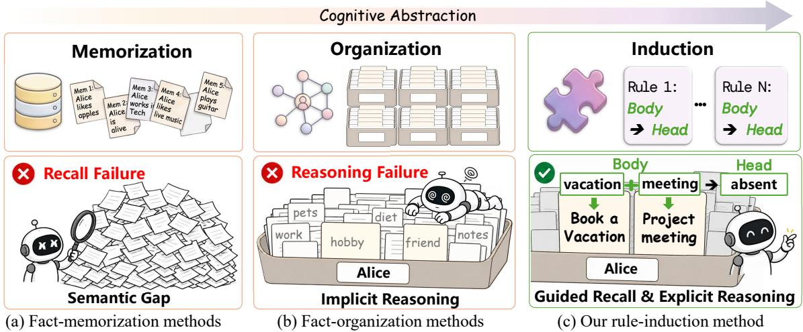
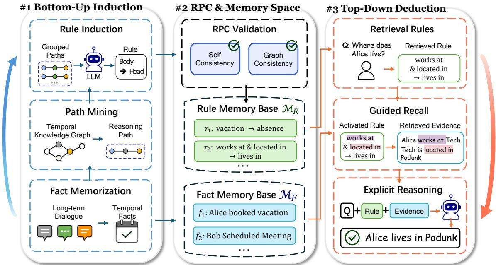
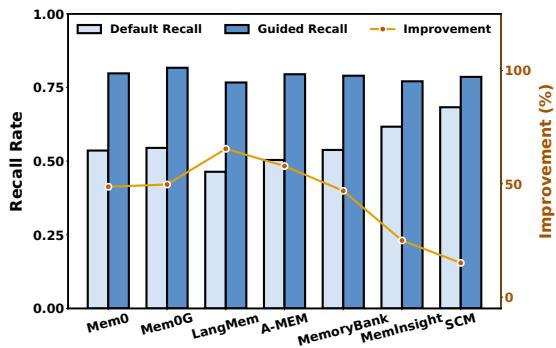
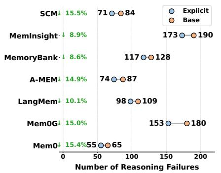
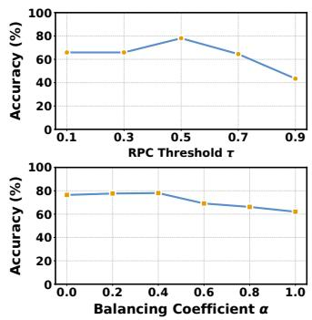

# RuleMem: Active Rule Memory for Long-Term Conversational Agents

Xingyuan Zeng1, Zuohan Wu2, Yue Wang3, Chen Zhang4, Quanming Yao5, Wei Liu1, Jiuke Wang1, Libin Zheng1∗, Jian Yin1

1Sun Yat-sen University, Zhuhai, China

2The Hong Kong University of Science and Technology (Guangzhou), Guangzhou, China

3Shenzhen Institute of Computing Sciences, Shenzhen, China

4The Hong Kong Polytechnic University, Hong Kong, China

5Tsinghua University, State Key Laboratory of Space Network and Communications, Beijing National Research Center for Information Science and Technology, Beijing, China

zengxy96@mail2.sysu.edu.cn, zh.wu@connect.hkust-gz.edu.cn, yuewang@sics.ac.cn, jason-c.zhang@polyu.edu.hk, qyaoaa@tsinghua.edu.cn, liuw259@mail.sysu.edu.cn, wangjk57@mail.sysu.edu.cn, zhenglb6@mail.sysu.edu.cn, issjyin@mail.sysu.edu.cn

## Abstract

Question answering agents in long-term conversations must reason over massive, temporally dispersed dialogue histories. However, existing memory mechanisms primarily treat past information as passively stored facts, leading to semantic gaps and unreliable reasoning. To address this limitation, we propose RuleMem, a rule-based memory framework that induces reusable logical rules from historical interactions to actively guide both evidence retrieval and reasoning. Specifically, RuleMem constructs natural-language Horn clauses from conversations and validates them via a Rule Perplexity Consistency (RPC) mechanism. These induced rules enable the retrieval of semantically distant evidence while providing an explicit logical structure for answer generation. We conducted a comprehensive evaluation of RuleMem on two long-term conversational benchmarks, LoCoMo and LongMemEval\_s\*. In a rigorous comparison against 14 baselines on LoCoMo, Rule-Mem achieved the highest accuracy, exceeding the baseline average by 27.47 points (a 54.3% relative improvement).

## Introduction

Question answering (QA) over long-term conversations (Maharana et al. 2024) requires agents to reason across massive, unstructured, and temporally dispersed dialogue histories. To overcome the limitations of finite context windows and the dificulties in updating the parametric memory (Wang et al. 2025c) of large language models (LLMs), external memory modules have become standard components of contemporary agents (Hu et al. 2025). These modules enable agents to store past interactions, maintain persistent user or taskrelated information, and retrieve relevant memories during inference (Gutiérrez et al. 2025).

However, QA over long-term conversations faces two core challenges: evidence retrieval across semantic gaps (Nguyen 2010) and reliable reasoning over the retrieved evidence (Trivedi et al. 2023). For example, given the question “Why was Alice absentfrom the meeting?”, the relevant historical evidence might never explicitly mention the word “absent.” Instead, the system should reason based on the record “Alice booked a vacation” for the final answer.

Existing memory designs remain superficial and do not fully address both challenges simultaneously. We categorize existing agent memory paradigms into two levels of abstraction: fact memorization and fact organization. The first level, fact memorization, focuses on the direct storage and similarity-based retrieval of dialogue snippets or instance-level facts (as exemplified by systems including MemGPT (Packer et al. 2023), Mem0 (Chhikara et al. 2025), and LangMem.) These methods depend heavily on lexical or shallow semantic overlaps between the current query and stored memories. Consequently, they frequently sufer from recall failures due to underlying semantic gaps. The second level, fact organization, goes beyond isolated memory entries by introducing structured representations and compressed summaries. For instance, Zep (Rasmussen et al. 2025) and Mem0g (Chhikara et al. 2025) structure dialogue histories into temporal knowledge graphs to establish structural connections among facts; meanwhile, A-MEM (Xu et al. 2025) and MemInsight (Salama et al. 2025) construct Zettelkasten-style (Luhmann 1981) semantic networks and feature-annotated hierarchical summaries, respectively, to correlate and summarize fragmented snippets. Although these structural connections facilitate the traversal of related facts, they remain confined to the instance level. As the memory scale expands, dense instance connections inevitably introduce query-irrelevant noise. Consequently, LLMs have to infer on their own which facts serve as valid premises and what conclusions they can support. When confronted with lengthy, loosely organized contexts, this deductive reasoning process frequently results in broken logic chains (Yoran et al. 2024; Jin et al. 2025) or hallucinations (Liu et al. 2024), a phenomenon we term reasoning failure.

Observing the limitations above, we propose memory exploitation on a higher level of abstraction, rule induction. This idea is drawn from human cognition: memory does not merely record or organize fragments; rather, it induces rules from specific observations (Erickson and Kruschke

  
Figure 1: Comparison of three paradigms in agent memory. Fact memorization relies on surface similarity to retrieve isolated snippets. Fact organization builds instance-level structures (e.g., Zettelkasten and knowledge graphs) but introduces noise during complex reasoning. Our proposed rule induction extracts reusable rules from specific facts, bridging semantic gaps for implicit evidence retrieval and providing a logical skeleton for explicit reasoning.

1998). After observing that travel plans often lead to meeting absences, humans induce an implicit, reusable rule from specific observations: “If a person has a recent travel plan, then they may be unable to attend a scheduled event.” When faced with a new question about “absence”, this rule not only indicates what clues should be recalled but also provides a logical skeleton for interpreting the evidence. Although recent works in sequential decision-making have begun to explore learning workflows (Wang et al. 2025d; Zhao et al. 2024; Shinn et al. 2023), the abstraction and learning of inductive rules to assist memory reasoning in QA tasks remain underexplored.

Inspired by this, we propose the RuleMem framework, a rule memory framework for reasoning in question-answering agents. Unlike existing methods where memory passively serves as a recalled object, we propose a novel format as rule memory: it induces reusable logical rules from historical conversations to actively and explicitly guide evidence retrieval and logical deduction for subsequent queries. Specifically, we formulate the rule memory using naturallanguage Horn clauses (Horn 1951), combining the structural rigor of formal logic with the semantic flexibility of natural language. At query time, these rules serve two primary roles. First, they guide retrieval. By using rule antecedents as retrieval cues, the model can identify underlying evidence that is semantically distant yet logically relevant, thereby reducing retrieval failures. Second, they support reasoning. The matched rules serve as explicit major premises (Johnson-Laird 2008), providing rigorous logical support to connect scattered facts with the final conclusion, thereby mitigating reasoning failures.

Since directly prompting LLMs to induce rules often yields over-generalized or hallucinated results (Huang et al. 2023; Ji et al. 2023), RuleMem introduces a Rule Perplexity Consistency (RPC) filtering mechanism. By measuring reductions in conditional perplexity (Bengio et al. 2003) to evaluate the consistency between internal priors and external factual evidence, RPC efectively filters out unreliable rules to ensure high-quality rule memory. The main contributions of this paper are summarized as follows:

• We propose RuleMem, a rule memory framework that turns memory from a passively recalled object into an active guide for evidence retrieval and logical deduction.

• We introduce RPC to verify the quality of induced rules. RPC uses reductions in conditional perplexity to approximate rule support in a continuous semantic space, jointly evaluating model self-consistency and external factual consistency.

• We evaluate RuleMem on multiple long-term conversation QA benchmarks. Experimental results show that RuleMem alleviates recall and reasoning failures inherent in existing methods, outperforming mainstream memory baselines.

## Related Work

Memory Mechanisms in LLM Agents. Memory equips LLM agents to retain past interactions, broadly categorized into factual and experiential forms (Hu et al. 2025). Factual memory stores declarative knowledge, evolving from flat episodic streams to OS-inspired read-write architectures (Packer et al. 2023; Modarressi et al. 2023; Chhikara et al. 2025). To prevent context fragmentation, recent works organize isolated facts into complex topologies: multi-level user profiles (Zhong et al. 2024), relational graphs (Rasmussen et al. 2025; Xu et al. 2025; Zhou et al. 2025), and chronological timelines (Salama et al. 2025; Ong et al. 2025). Beyond static storage, newer models introduce cognitive lifecycles for reflective consolidation and dynamic updates (Tian et al. 2025; Yan et al. 2025). Experiential memory records task trajectories and executable actions for self-improvement, utilizing text-based reflections (Shinn et al. 2023; Zhao et al. 2024) or procedural skill libraries (Wang et al. 2024a, 2025d). However, these action-level traces are tightly coupled to specific environments, limiting their transferability to conversational $\mathrm { Q A }$ Such scenarios require synthesizing generalizable knowledge rather than merely replaying past execution steps.

Retrieval-Augmented Generation (RAG). RAG grounds LLM outputs in external knowledge to reduce hallucinations (Gao et al. 2023; Fan et al. 2024). Standard pipelines retrieve flat textual chunks (Guu et al. 2020; Lewis et al. 2020; Borgeaud et al. 2022), while advanced structures use hierarchical trees to capture broader contexts (Sarthi et al. 2024). To handle multi-hop relationships, graph-based RAG leverages network topologies by extracting relational paths and subgraphs (Gutierrez et al. 2024; Guo et al. 2025; He et al. 2024; Li et al. 2024), or generating community-level summaries (Edge et al. 2024; Zeng et al. 2026; Chang and Zhang 2024; Wang et al. 2025b). Paralleling these structural improvements, agentic paradigms shift RAG from static fetching to autonomous exploration. By employing multi-step reasoning (Yao et al. 2023), agents adaptively critique their own retrieval steps (Asai et al. 2024). This autonomy naturally extends to graphs, where agents iteratively navigate and dynamically evaluate retrieval trajectories (Sun et al. 2024; Yuan et al. 2026). While expanding factual coverage, existing pipelines predominantly supply concrete facts as logical “minor premises,” lacking the abstract “major premises” necessary for rigorous deductive reasoning (Johnson-Laird 2008). To resolve this, RuleMem extracts generalized logical rules from past conversations to serve as explicit major premises, systematically guiding the inferential process.

## The RuleMem Framework

Overview: Bottom-Up Induction → Rule Validation → Top-Down Deduction. RuleMem organizes long-term conversational memory as a closed loop of bottom-up induction, RPC validation, and top-down deduction. As shown in Figure 2, RuleMem maintains two memory spaces: a fact memory base $\mathcal { M } _ { F }$ and a rule memory base $\dot { \mathcal { M } _ { R } }$ . The former stores temporal facts extracted from dialogues, while the latter stores natural-language rules induced from concrete reasoning traces. During construction, RuleMem moves from fact extraction to path sampling and rule induction, lifting concrete facts into abstract regularities and validating them with Rule Perplexity Consistency (RPC). During QA, RuleMem uses these rules in reverse: it activates relevant rules, recalls supporting facts, and generates answers under rule-guided constraints.

## Bottom-Up Rule Memory Construction

Fact Memorization. The fact memorization stage converts unstructured, multi-turn dialogue content into retrievable memory units. RuleMem first parses long-term dialogues and extracts subject entities, relations, object entities, and timestamps as temporal quadruples $\mathcal { F } = \bar { \{ ( e _ { s } , r , e _ { o } , t ) \} }$ . These quadruples constitute the fact memory base $\mathcal { M } _ { F }$ . It preserves concrete facts that can be reused by later path mining and evidence recall, providing a traceable experiential basis for rule induction.

Reasoning Path Mining. RuleMem organizes $\mathcal { F }$ in a graphstructured layout for path sampling. Over this structure, the system first samples candidate paths via constrained random walks (Wang et al. 2024b). An LLM filters out illogical candidate paths and reconstructs valid ones from the fact memory base along with their corresponding raw dialogue snippets to distill coherent reasoning paths ${ \mathcal { P } } _ { c } .$ These raw paths, which preserve concrete logical relations, directly serve as ungeneralized precursors for downstream rule induction.

Rule Induction. Although reasoning paths reveal connections among multi-hop facts, they remain instance-level memories and are dificult to transfer directly to new questions. The system groups paths with identical or similar relational patterns and uses an LLM to induce shared rules from them. During this process, the LLM distills general causal patterns from complex facts by abstracting away specific entity names (e.g., Alice, Bob, Marathon) and replacing them with typed placeholders such as [Person], [Event], or [Location]. Following the core structure of Horn clauses (Horn 1951), which consist of a non-empty conjunctive body and a single atomic head, we express each $r \in \mathcal { M } _ { R }$ as a Horn clause:

$$
\begin{array} { r } { r : \underbrace { B _ { 1 } \wedge \dots \wedge B _ { n } } _ { \mathrm { B o d y } T _ { A } ^ { ( r ) } , n \geq 1 } \Longrightarrow \underbrace { H } _ { \mathrm { H e a d } T _ { C } ^ { ( r ) } } , } \end{array}\tag{1}
$$

where each atom $B _ { i }$ or $H$ is a natural-language relational phrase that may contain type placeholders.

## Rule Validation via RPC

The rule level provides generalizable reasoning templates, but induction summarizes patterns from finite examples and therefore does not guarantee correctness. As a result, LLMinduced rules may be overgeneralized or weakly grounded in the underlying facts. RPC uses perplexity reduction to test whether a rule is supported by both the model’s internal prior and external factual evidence. Given an autoregressive model M (e.g., Llama-3-8B-Instruct), let $\ell _ { M } ( T \mid \mathbf { \bar { \Lambda } } )$ denote the average negative log-likelihood of target text T conditioned on context C. The internal-consistency signal is defined as:

$$
\Delta _ { \mathrm { s e l f } } ( r ) = \ell _ { M } ( T _ { C } ^ { ( r ) } \mid \emptyset ) - \ell _ { M } ( T _ { C } ^ { ( r ) } \mid T _ { A } ^ { ( r ) } ) .\tag{2}
$$

Relying only on the body and head of the rule may accept rules that are plausible under the language prior but insufficiently grounded in facts. RPC therefore further retrieves related evidence $T _ { E } ^ { ( r ) }$ from the fact memory base and measures whether this evidence further reduces the perplexity of the conclusion given the premise:

$$
\Delta _ { \mathrm { f a c t } } ( r ) = \ell _ { M } ( T _ { C } ^ { ( r ) } \mid T _ { A } ^ { ( r ) } ) - \ell _ { M } ( T _ { C } ^ { ( r ) } \mid T _ { A } ^ { ( r ) } \oplus T _ { E } ^ { ( r ) } ) .\tag{3}
$$

The final RPC confidence score combines the internalconsistency signal and the external factual-consistency signal: $\mathrm { R P C } ( r ) \stackrel { \cdot } { = } \stackrel { \sim } { \alpha } \cdot \sigma ( \Delta _ { \mathrm { s e l f } } ( r ) ) + ( 1 - \alpha ) \cdot \sigma ( \Delta _ { \mathrm { f a c t } } ( r ) )$ . The balancing coeficient $\alpha \in [ 0 , 1 ]$ controls the relative weight of the two signals, and σ represents the Sigmoid function used to normalize the perplexity reductions into the (0, 1) range. Only rules with an RPC score exceeding a threshold τ are added to the rule memory base. Empirical tuning and sensitivity of these parameters are discussed in Section .

  
Figure 2: The RuleMem framework. The system operates in three main stages: 1) Bottom-up rule memory construction: extracts temporal facts from dialogues to form a fact memory base $( \boldsymbol { \mathcal { M } } _ { F } )$ , mines reasoning paths, and induces them into abstract natural-language rules stored in a rule memory base $( \mathcal { M } _ { R } ) . \overset { \cdot } { 2 } )$ Rule validation via RPC: filters and refines the induced rules by combining internal language priors with external factual consistency. 3) Top-down rule-guided QA: when facing a new question, the system activates relevant rule templates, guides the recall of supporting facts, and generates explicit reasoning answers using both the rule scafold and factual evidence.

## Top-Down Rule-Guided Question Answering

Retrieval Rules. During QA, RuleMem does not move directly from the question to factual retrieval. Instead, it first identifies applicable reasoning goals at the rule level. Given a new question Q, the system activates candidate rules by matching the question with the rule head $T _ { C } ^ { ( r ) }$ in the rule memory base:

$$
\mathcal { R } _ { \mathrm { a c t i v e } } = \operatorname * { T o p N } _ { r \in \mathcal { M } _ { R } } \cos \left( \mathbf { e } ( Q ) , \mathbf { e } ( T _ { C } ^ { ( r ) } ) \right) .\tag{4}
$$

This matching maps the question into an abstract conclusion space, allowing the system to locate a relevant rule before relying on surface similarity between the question and facts.

Guided Recall. The activated rules first expose their premise conditions, i.e., their body $T _ { A } ^ { ( r ) }$ , as retrieval cues to recall a set of candidate facts $\mathcal { E } _ { \mathrm { c a n d } } ^ { ( r ) }$ from the fact memory base:

$$
\mathcal { E } _ { \mathrm { c a n d } } ^ { ( r ) } = \underset { f \in \mathcal { M } _ { F } } { \mathrm { T o p K } } \cos \left( \mathbf { e } ( T _ { A } ^ { ( r ) } ) , \mathbf { e } ( f ) \right) .\tag{5}
$$

At this stage, the abstract typed variables lack formal variable binding and unification, which risks mismatching evidence (e.g., retrieving facts about the wrong entity). To accurately instantiate the rule in the new context, RuleMem introduces an LLM-based filtering step. By referencing the specific entities in the question Q and the typed variable constraints in the rule body, the LLM acts as a semantic unification operator. It evaluates the recalled facts, discarding those that violate the variable bindings and typing constraints, and retains only the accurately grounded evidence as the final $\mathcal { E } _ { \mathrm { g u i d e d } } ^ { ( r ) }$

Explicit Reasoning. Finally, RuleMem organizes the question, activated rules, and recalled evidence into a structured prompt, allowing the generation model to observe both the reasoning scafold and the factual support. At this stage, the rules provide a reasoning template analogous to deductive application in logic, while the evidence provides episodic details analogous to recalled experience in cognition, mitigating reasoning failure. The complete prompt templates are detailed in the appendix.

## Experiments

In this section, we conduct experiments designed to answer the following research questions (RQs):

• RQ1: How does RuleMem perform compared to mainstream memory-augmented and reasoning baselines on long-term conversation and extended context benchmarks?

• RQ2: How do the proposed Guided Recall and Explicit Reasoning mechanisms efectively alleviate the specific challenges of recall failure and reasoning failure?

• RQ3: How robust is RuleMem regarding base models and hyperparameters?

## Experimental Setup

Datasets and Evaluation Metrics. Following the common evaluation protocols in recent memory-augmented agent research, we evaluate our proposed RuleMem framework on two widely used benchmark datasets: 1) LoCoMo (Maharana et al.

<table><tr><td></td><td colspan="3">Single-hop</td><td colspan="3">Multi-hop</td><td colspan="3">Open-domain</td><td colspan="3">Temporal</td><td colspan="3">Avg.</td></tr><tr><td>Method</td><td>F1</td><td>BLEU</td><td>Acc</td><td>F1</td><td>BLEU</td><td>Acc</td><td>F1</td><td>BLEU</td><td>Acc</td><td>F1</td><td>BLEU</td><td>Acc</td><td>F1</td><td>BLEU</td><td>Acc</td></tr><tr><td colspan="10">Fact Memorization</td><td colspan="3"></td><td colspan="3"></td></tr><tr><td>Mem0</td><td>39.06</td><td>31.97</td><td>59.64</td><td>25.73</td><td>17.54</td><td>42.98</td><td>16.74</td><td>11.58</td><td>37.50</td><td>53.99</td><td>44.64</td><td>57.58</td><td>33.88</td><td>26.43</td><td>49.43</td></tr><tr><td>Letta</td><td>29.93</td><td>19.33</td><td>85.90</td><td>22.55</td><td>17.18</td><td>65.96</td><td>15.21</td><td>12.32</td><td>51.04</td><td>6.99</td><td>5.54</td><td>39.56</td><td>18.67</td><td>13.59</td><td>60.62</td></tr><tr><td>LangMem</td><td>13.67</td><td>8.48</td><td>46.85</td><td>12.00</td><td>9.55</td><td>50.35</td><td>8.59</td><td>6.12</td><td>47.92</td><td>5.32</td><td>4.20</td><td>11.84</td><td>9.90</td><td>7.09</td><td>39.24</td></tr><tr><td colspan="10">Fact Organization</td><td colspan="3"></td><td colspan="3"></td></tr><tr><td>A-MEM</td><td>36.22</td><td>30.01</td><td>58.31</td><td>22.07</td><td>16.98</td><td>46.10</td><td>12.86</td><td>10.80</td><td>30.21</td><td>37.77</td><td>33.06</td><td>44.24</td><td>27.23</td><td>22.71</td><td>44.72</td></tr><tr><td>Mem0g</td><td>25.81</td><td>31.42</td><td>43.56</td><td>21.95</td><td>32.63</td><td>49.73</td><td>11.95</td><td>11.41</td><td>33.74</td><td>35.05</td><td>43.66</td><td>44.30</td><td>23.69</td><td>29.78</td><td>42.83</td></tr><tr><td>MemoryBank</td><td>18.54</td><td>11.50</td><td>55.29</td><td>13.11</td><td>10.61</td><td>36.88</td><td>9.83</td><td>7.87</td><td>45.83</td><td>17.65</td><td>12.01</td><td>43.61</td><td>14.78</td><td>10.50</td><td>45.40</td></tr><tr><td>MemInsight</td><td>39.75</td><td>33.97</td><td>63.21</td><td>21.97</td><td>15.00</td><td>49.29</td><td>15.70</td><td>13.35</td><td>40.62</td><td>6.99</td><td>5.98</td><td>44.20</td><td>21.10</td><td>17.08</td><td>49.33</td></tr><tr><td>Zep</td><td>18.93</td><td>10.25</td><td>81.07</td><td>13.47</td><td>9.00</td><td>76.24</td><td>8.58</td><td>4.86</td><td>66.67</td><td>21.33</td><td>14.25</td><td>66.67</td><td>15.58</td><td>9.59</td><td>72.66</td></tr><tr><td>SCM</td><td>24.34</td><td>14.34</td><td>81.33</td><td>15.57</td><td>11.72</td><td>65.60</td><td>10.99</td><td>6.72</td><td>60.42</td><td>6.06</td><td>5.01</td><td>43.93</td><td>14.24</td><td>9.45</td><td>62.82</td></tr><tr><td colspan="10">RAG Methods</td><td colspan="3"></td><td colspan="3"></td></tr><tr><td>BM25</td><td>18.86</td><td>11.25</td><td>57.91</td><td>9.62</td><td>8.02</td><td>31.56</td><td>8.44</td><td>5.09</td><td>42.71</td><td>3.89</td><td>3.52</td><td>23.36</td><td>10.20</td><td>6.97</td><td>38.89</td></tr><tr><td>ReAct</td><td>30.26</td><td>26.67</td><td>50.42</td><td>15.10</td><td>10.39</td><td>31.21</td><td>9.17</td><td>7.36</td><td>29.17</td><td>14.02</td><td>9.75</td><td>26.79</td><td>17.14</td><td>13.54</td><td>34.40</td></tr><tr><td>MetaKGRAG</td><td>17.85</td><td>16.12</td><td>42.09</td><td>12.10</td><td>9.84</td><td>33.29</td><td>7.31</td><td>6.62</td><td>28.31</td><td>13.48</td><td>11.63</td><td>33.09</td><td>12.68</td><td>11.05</td><td>34.19</td></tr><tr><td>LightRAG</td><td>15.82</td><td>7.53</td><td>87.87</td><td>9.88</td><td>6.09</td><td>79.79</td><td>6.36</td><td>4.05</td><td>46.88</td><td>10.27</td><td>6.09</td><td>43.93</td><td>10.58</td><td>5.94</td><td>64.62</td></tr><tr><td>GraphRAG</td><td>24.61</td><td>15.43</td><td>85.73</td><td>20.10</td><td>16.14</td><td>73.05</td><td>12.49</td><td>10.28</td><td>67.71</td><td>15.46</td><td>10.80</td><td>49.53</td><td>18.17</td><td>13.16</td><td>69.01</td></tr><tr><td>Ours</td><td>38.02</td><td>42.12</td><td>85.73</td><td>26.97</td><td>38.74</td><td>82.43</td><td>17.86</td><td>19.00</td><td>78.37</td><td>49.00</td><td>47.74</td><td>65.66</td><td>32.96</td><td>36.90</td><td>78.05</td></tr><tr><td colspan="10">Ablation Variants</td><td colspan="3"></td><td colspan="3"></td><td></td></tr><tr><td>w/o RPC</td><td>29.23</td><td>35.69</td><td>72.50</td><td>13.67</td><td>20.42</td><td>55.89</td><td>18.98</td><td>19.77</td><td>78.26</td><td>37.40</td><td>46.12</td><td>56.94</td><td>24.82</td><td>30.50</td><td>65.90</td></tr><tr><td>w/o Rule+RPC</td><td>11.05</td><td>20.26</td><td>51.87</td><td>9.29</td><td>14.09</td><td>38.24</td><td>5.33</td><td>9.23</td><td>34.07</td><td>14.92</td><td>22.32</td><td>49.52</td><td>10.15</td><td>16.48</td><td>43.43</td></tr></table>

Table 1: Performance comparison on the LoCoMo benchmark (best in bold, second best underlined), across four question types: Single-hop (single evidence), Multi-hop (cross-snippet reasoning), Open-domain (dialogue with external knowledge), and Temporal (time-aware reasoning).

  
(a) Alleviating Recall Failure: Base vs. Guided Recal

  
(b) Mitigating Reasoning Failure: Base vs. Explicit Reasoning

  
(c) Sensitivity of Hyperparameters  
Figure 3: Analysis of recall failure, reasoning failure, and RPC hyperparameter sensitivity. (a) Recall rates obtained with Default Recall and Guided Recall across memory baselines; the orange line reports the relative improvement from guided retrieval. (b) Numbers of reasoning failures under default generation and Explicit Reasoning; the arrows report the relative reduction for each baseline. (c) Accuracy sensitivity to the RPC admission threshold τ (top) and the signal balancing coeficient α (bottom).

2024): A comprehensive long-term conversation memory dataset, comprising 5,882 dialogue turns, and 1,986 questions in total. 2) LongMemEval\_s\*: A subset of the MemoryAgentBench (Hu, Wang, and McAuley 2025; Wu et al. 2025) dataset, reformulated into 5 long dialogue sequences with approximately 1.82M tokens, and 300 questions in total (results are reported in the appendix). For LoCoMo, our evaluation scripts and metrics are strictly consistent with the Mem0 (Chhikara et al. 2025) repository, utilizing the F1 score,

BLEU, and Accuracy to comprehensively evaluate generation quality and accuracy; similarly, for LongMemEval\_s\*, we strictly employ the original evaluation scripts and metrics from MemoryAgentBench (Hu, Wang, and McAuley 2025), reporting task-specific accuracy (detailed metrics are provided in the appendix).

Baselines. We compare our method with 14 baselines categorized into three groups. The fact memorization group includes Mem0 (Chhikara et al. 2025), LangMem, and

Letta (Packer et al. 2023). The fact organization group consists of A-MEM (Xu et al. 2025), Mem0g (Chhikara et al. 2025), MemoryBank (Zhong et al. 2024), MemInsight (Salama et al. 2025), Zep (Rasmussen et al. 2025), and SCM (Wang et al. 2025a). Lastly, the RAG group comprises BM25, Re-Act (Yao et al. 2023), MetaKGRAG (Yuan et al. 2026), LightRAG (Guo et al. 2025), and GraphRAG (Edge et al. 2024). Together, they cover similarity-based fact retrieval, structured memory organization, and text- or graph-based retrieval, enabling a comprehensive evaluation across memory and retrieval paradigms. Full model descriptions and configurations are provided in the appendix.

Implementation Details. In our experiments, we employ gpt-4o-mini as the backbone LLM for the abstraction of memory rules and the final explicit reasoning phase. For the vector database, we utilize ChromaDB with its default embedding model, all-MiniLM-L6-v2, to store embeddings of facts and rules. Through experiments, the RPC admission threshold τ is empirically set to 0.5, and the balancing coeficient α is set to 0.4. Unless otherwise specified, all baseline methods are evaluated using their oficial repository implementations with default parameters. The complete prompt templates and extended implementation details can be found in the appendix.

## Main Results (RQ1)

As shown in Table 1, RuleMem demonstrates strong overall performance across the four question types, with an average BLEU of 36.90 and accuracy of 78.05. This highlights the efectiveness of the rule memory paradigm for complex dialogue reasoning.

Specifically, in Multi-hop and Open-domain tasks that require deeper logical deduction, RuleMem shows substantial improvements. For instance, its accuracy in multi-hop scenarios reaches 82.43, outperforming the best baseline (79.79). Pure fact memorization (e.g., Mem0, Letta) and traditional RAG pipelines (e.g., ReAct, GraphRAG) typically retrieve concrete facts as “minor premises” but lack the abstract “major premises” necessary for deductive reasoning (Johnson-Laird 2008). Fact organization methods (e.g., A-MEM, Zep) also struggle to maintain logical chains across long contexts. In contrast, RuleMem extracts abstract rules to serve as major premises, facilitating more rigorous logical deduction. For Single-hop questions relying on a single pieces of evidence, RuleMem achieves the highest generation quality (BLEU: 42.12) and maintains competitive accuracy. We attribute this to the Guided Recall mechanism. Retrieved abstract rules act as precise cues, helping the model anchor relevant facts within long contexts. This prevents the loss of specific details and improves the structural clarity of the generated responses. Due to space constraints, extended results on the LongMemEval\_s\* dataset are provided in the appendix.

## In-depth Analysis (RQ2)

To understand the sources of RuleMem’s performance gains, we analyze its efectiveness in mitigating two primary challenges: recall failure and reasoning failure. We also conduct an ablation study to isolate component contributions, followed by case studies and error analysis.

Alleviating recall failure. Standard retrieval often fails when evidence is semantically distant from the query. Rule-Mem addresses this via Guided Recall, which uses the body of activated rules as supplementary search constraints. Using LoCoMo’s (Maharana et al. 2024) manually annotated supporting facts, Fig. 3(a) shows that Guided Recall consistently improves recall rates across all frameworks, raising the average recall from 0.56 to 0.79 (+41.1%). This indicates that rule-conditioned premises successfully broaden the search scope to retrieve logically related facts that lack direct keyword overlap.

Mitigating reasoningfailure. Even with correct evidence retrieved, LLMs can fail to deduce answers from long or disorganized contexts. We define reasoningfailure as cases where facts are successfully retrieved but the final answer remains incorrect. We compare default generation (using only retrieved evidence) with Explicit Reasoning (injecting abstract rules as a logical skeleton). As shown in Fig. 3(b), Explicit Reasoning consistently reduces reasoning failures from an average of 120.4 to 105.9 (-12.0%), with the largest reduction observed in Mem0g. This confirms that abstract rules efectively guide multi-step inference and keep the LLM aligned with logical dependencies.

Ablation study. To evaluate the contribution of each core component, we compare RuleMem against two variants (shown at the bottom of Table 1). w/o Rule+RPC: Removes rule abstraction and explicit reasoning, reducing the system to a standard fact-organization memory. w/o RPC: Commits all induced rules to memory without the perplexity-based reliability check.

Removing rule abstraction (w/o Rule+RPC) causes a severe performance drop, reducing metrics to levels similar to baseline fact-organization methods. This highlights the necessity of high-level rule abstraction for long-term reasoning. Similarly, the absence of RPC filtering (w/o RPC) also degrades performance, as unfiltered, erroneous, or hallucinated rules interfere with the deduction process. The perplexitybased consistency check is therefore essential for ensuring rule reliability.

## Case Analysis

We examine a successful case and a failure case to illustrate how rule memory afects retrieval and reasoning. These examples complement the aggregate results by revealing both RuleMem’s mechanism and its remaining limitation.

Successful Case. The question asks what Caroline realized after a charity race, and the gold answer is that self-care is important (Table 2). Mem0 retrieves memories that are topically similar to the question, such as finding the race rewarding or scary, but misses the injury-related evidence and answers that Melanie found the race rewarding. Mem0g retrieves a graph neighborhood containing loosely related associations about inspiration and setbacks. However, these instance-level connections neither identify the required premise combination nor explain how an injury can lead to a realization about self-care, so it also produces an incorrect answer.

RuleMem instead activates the rule “[Person] participates in [Physical Event] ∧ [Person] is injured during [Physical Event] → [Person] may realize that self-care is important.”

<table><tr><td>Component</td><td>Content</td></tr><tr><td>Question &amp; Gold answer</td><td>Question: “What did Caroline realize after her charity race?&quot; Gold answer: “Self-care is important.&quot;</td></tr><tr><td rowspan="2">Conversation excerpt</td><td>Melanie: “&quot;Last month I got hurt and had to take a break from pottery&quot;</td></tr><tr><td>Melanie: “Thanks, Caroline! The event was really thought-provoking. I&#x27;m starting to realize that self-care is really important.&quot; Caroline: &quot;I totally agree with you. It&#x27;s a journey for me.&quot;</td></tr><tr><td>Mem0 retrieved memory excerpts</td><td>&quot;Found the charity race rewarding.&quot; (high vector similarity to the event) &quot;Ran a charity race for mental health last Saturday.&quot; (event-level match) “Melanie found the experience scary.&quot; (experience-level match)</td></tr><tr><td>Mem0 response</td><td>“Melanie found it rewarding.&quot;</td></tr><tr><td>Mem0g retrieved graph memory excerpts</td><td>(melanie, found_in, inspiration) (loosely related to realization/reflection) (melanie, experiences, setback) (loosely related to difficulty/injury) (melanie, reminds_of, family_love) (related to family but not self-care)</td></tr><tr><td>Mem0g response</td><td>“Melanie found the race rewarding.&quot;</td></tr><tr><td>RuleMem activated rule</td><td>[Person] participates in [Physical Event] ∧ [Person] is injured during [Physical Event] → [Person] may realize that self-care is important.</td></tr><tr><td>RuleMem recalled memory excerpts</td><td>“Melanie participated in the charity race.&quot; (matches [Person] participates in [Physical Event]) “Melanie was injured during the charity race.&quot; (matches [Person] is injured during [Physical Event])</td></tr><tr><td>RuleMem response</td><td>“Melanie realized that self-care is important.&quot;</td></tr></table>

Table 2: Case study of rule-guided recall and explicit reasoning. The conversation and retrieved memories are abbreviated excerpts. Bold text highlights key reasoning-relevant contents, while parentheses indicate why each memory was retrieved or how it relates to the query.

Its antecedents guide recall toward two supporting facts: Melanie participated in the charity race and was injured during it. RuleMem then uses the activated rule as a major premise and the recalled facts as minor premises, correctly concluding that Melanie realized the importance of self-care. This case illustrates how rule memory guides both evidence retrieval and answer generation.

Failure Case. The aggregate analyses above report fewer recall and reasoning failures under the evaluated comparisons, but RuleMem still produces incorrect answers. For instance, consider the following conversation excerpt:

John: “Thank you very much! Will there be some kind of interview required?”

James: “No, this is not necessary. All you need is to be a friendly and polite person. I’m sure you will succeed!”

When asked the question, “Will there be an interview required to volunteer with the organization James volunteered for?”, the gold answer should be “No,” as the conversation explicitly states that an interview is not necessary. However, RuleMem retrieves and activates a generalized rule: [Person] is friendly and polite → [Person] may pass the interview. Consequently, RuleMem produces an incorrect response: “Yes, there will be some kind of interview required to volunteer.” The model over-generalizes based on this activated rule and ignores the specific, contradictory factual evidence present in the

dialogue.

## Impact of Hyperparameters (RQ3)

Sensitivity ofHyperparameters. We evaluate the RPC mechanism’s sensitivity to the admission threshold τ and the signal balancing coeficient α (Figure 3c). A low threshold (τ ≤ 0.3) admits over-generalized rules that misguide reasoning, while an excessively high threshold (τ > 0.8) leads to a sparse rule memory, degrading the system to unguided retrieval. An optimal balance at τ = 0.5 ensures both rule reliability and suficient coverage. For α, relying solely on the internal language prior (α = 1.0) causes a significant performance drop. The peak performance at α = 0.4 indicates that while external factual grounding plays a dominant role in eliminating hallucinations, a moderate internal prior further enhances rule generalizability.

Efect of Base Models. We also evaluate the generalizability and robustness of RuleMem across diferent underlying LLMs, we conduct experiments using three distinct base models: gpt-4o-mini, gpt-4o, and a recent open-weight model qwen3-next-80b-a3b-instruct. RuleMem consistently outperforms all baseline methods across all three base models. For detailed results, please refer to the appendix.

## Conclusion

RuleMem is a framework that transforms agent memory from passive storage into an active tool for evidence retrieval and logical deduction. By learning rules from past interactions, RuleMem improves retrieval of relevant evidence and supports reasoning. Experiments show Guided Recall finds logical evidence, Explicit Reasoning reduces errors, and the RPC mechanism filters unreliable rules. RuleMem demonstrates that memory should actively guide retrieval and reasoning, helping agents learn and deduce from experience.

## References

Asai, A.; Wu, Z.; Wang, Y.; Sil, A.; and Hajishirzi, H. 2024. Self-RAG: Learning to Retrieve, Generate, and Critique through Self-Reflection. In ICLR. OpenReview.net.

Bengio, Y.; Ducharme, R.; Vincent, P.; and Janvin, C. 2003. A Neural Probabilistic Language Model. J. Mach. Learn. Res., 3: 1137–1155.

S.; Simonyan, K.; Rae, J. W.; Elsen, E.; and Sifre, L. 2022. Improving Language Models by Retrieving from Trillions of Tokens. In ICML, Proceedings of Machine Learning Research, 2206–2240. PMLR.

Chang, R.; and Zhang, J. 2024. CommunityKG-RAG: Leveraging Community Structures in Knowledge Graphs for Advanced Retrieval-Augmented Generation in Fact-Checking. CoRR, abs/2408.08535.

Chhikara, P.; Khant, D.; Aryan, S.; Singh, T.; and Yadav, D. 2025. Mem0: Building Production-Ready AI Agents with Scalable Long-Term Memory. 2993–3000.

Edge, D.; Trinh, H.; Cheng, N.; Bradley, J.; Chao, A.; Mody, A.; Truitt, S.; and Larson, J. 2024. From Local to Global: A Graph RAG Approach to Query-Focused Summarization. CoRR, abs/2404.16130.

Erickson, M. A.; and Kruschke, J. K. 1998. Rules and exemplars in category learning. Journal of Experimental Psychology: General, 127(2): 107.

Fan, W.; Ding, Y.; Ning, L.; Wang, S.; Li, H.; Yin, D.; Chua, T.; and Li, Q. 2024. A Survey on RAG Meeting LLMs: Towards Retrieval-Augmented Large Language Models. In KDD, 6491–6501. ACM.

Gao, Y.; Xiong, Y.; Gao, X.; Jia, K.; Pan, J.; Bi, Y.; Dai, Y.; Sun, J.; Guo, Q.; Wang, M.; and Wang, H. 2023. Retrieval-Augmented Generation for Large Language Models: A Survey. CoRR, abs/2312.10997.

Guo, Z.; Xia, L.; Yu, Y.; Ao, T.; and Huang, C. 2025. LightRAG: Simple and Fast Retrieval-Augmented Generation. In EMNLP (Findings), 10746–10761. Association for Computational Linguistics.

Gutierrez, B. J.; Shu, Y.; Gu, Y.; Yasunaga, M.; and Su, Y. 2024. HippoRAG: Neurobiologically Inspired Long-Term Memory for Large Language Models. In NeurIPS.

Gutiérrez, B. J.; Shu, Y.; Qi, W.; Zhou, S.; and Su, Y. 2025. From RAG to Memory: Non-Parametric Continual Learning for Large Language Models. In ICML, Proceedings of Machine Learning Research. PMLR / OpenReview.net.

Guu, K.; Lee, K.; Tung, Z.; Pasupat, P.; and Chang, M. 2020. REALM: Retrieval-Augmented Language Model Pre-Training. CoRR, abs/2002.08909.

He, X.; Tian, Y.; Sun, Y.; Chawla, N. V.; Laurent, T.; LeCun, Y.; Bresson, X.; and Hooi, B. 2024. G-Retriever: Retrieval-Augmented Generation for Textual Graph Understanding and Question Answering. In NeurIPS.

Horn, A. 1951. On Sentences Which are True of Direct Unions of Algebras. J. Symb. Log., 16(1): 14–21.

Hu, Y.; Liu, S.; Yue, Y.; Zhang, G.; Liu, B.; Zhu, F.; Lin, J.; Guo, H.; Dou, S.; Xi, Z.; Jin, S.; Tan, J.; Yin, Y.; Liu, J.; Zhang, Z.; Sun, Z.; Zhu, Y.; Sun, H.; Peng, B.; Cheng, Z.; Fan, X.; Guo, J.; Yu, X.; Zhou, Z.; Hu, Z.; Huo, J.; Wang, J.; Niu, Y.; Wang, Y.; Yin, Z.; Hu, X.; Liao, Y.; Li, Q.; Wang, K.; Zhou, W.; Liu, Y.; Cheng, D.; Zhang, Q.; Gui, T.; Pan, S.; Zhang, Y.; Torr, P.; Dou, Z.; Wen, J.; Huang, X.; Jiang, Y.; and Yan, S. 2025. Memory in the Age of AI Agents. CoRR, abs/2512.13564.

Hu, Y.; Wang, Y.; and McAuley, J. J. 2025. Evaluating Memory in LLM Agents via Incremental Multi-Turn Interactions. CoRR, abs/2507.05257.

Huang, L.; Yu, W.; Ma, W.; Zhong, W.; Feng, Z.; Wang, H.; Chen, Q.; Peng, W.; Feng, X.; Qin, B.; and Liu, T. 2023. A Survey on Hallucination in Large Language Models: Principles, Taxonomy, Challenges, and Open Questions. CoRR, abs/2311.05232.

Ji, Z.; Lee, N.; Frieske, R.; Yu, T.; Su, D.; Xu, Y.; Ishii, E.; Bang, Y. J.; Madotto, A.; and Fung, P. 2023. Survey of Hallucination in Natural Language Generation. ACM Comput. Surv., 55(12).

Jin, B.; Yoon, J.; Han, J.; and Arik, S. Ö. 2025. Long-Context LLMs Meet RAG: Overcoming Challenges for Long Inputs in RAG. In ICLR. OpenReview.net.

Johnson-Laird, P. N. 2008. Mental Models and Deductive Reasoning, 206–222. Cambridge University Press.

Lewis, P.; Perez, E.; Piktus, A.; Petroni, F.; Karpukhin, V.; Goyal, N.; Küttler, H.; Lewis, M.; Yih, W.; Rocktäschel, T.; Riedel, S.; and Kiela, D. 2020. Retrieval-Augmented Generation for Knowledge-Intensive NLP Tasks. In NeurIPS.

Li, D.; Yang, S.; Tan, Z.; Baik, J. Y.; Yun, S.; Lee, J.; Chacko, A.; Hou, B.; Duong-Tran, D.; Ding, Y.; Liu, H.; Shen, L.; and Chen, T. 2024. DALK: Dynamic Co-Augmentation of LLMs and KG to answer Alzheimer’s Disease Questions with Scientific Literature. In EMNLP (Findings), Findings of ACL, 2187–2205. Association for Computational Linguistics.

Liu, N. F.; Lin, K.; Hewitt, J.; Paranjape, A.; Bevilacqua, M.; Petroni, F.; and Liang, P. 2024. Lost in the Middle: How Language Models Use Long Contexts. Trans. Assoc. Comput. Linguistics, 12: 157–173.

Luhmann, N. 1981. Kommunikation mit Zettelkästen, 222– 228. Wiesbaden: VS Verlag für Sozialwissenschaften. ISBN 978-3-322-87749-9.

Maharana, A.; Lee, D.; Tulyakov, S.; Bansal, M.; Barbieri, F.; and Fang, Y. 2024. Evaluating Very Long-Term Conversational Memory of LLM Agents. In ACL (1), 13851–13870. Association for Computational Linguistics.

Modarressi, A.; Imani, A.; Fayyaz, M.; and Schütze, H. 2023. RET-LLM: Towards a General Read-Write Memory for Large Language Models. CoRR, abs/2305.14322.

Nguyen, C.-T. 2010. Bridging semantic gaps in information retrieval: Context-based approaches. ACM VLDB, 10.

Ong, K. T.; Kim, N.; Gwak, M.; Chae, H.; Kwon, T.; Jo, Y.; Hwang, S.; Lee, D.; and Yeo, J. 2025. Towards Lifelong Dialogue Agents via Timeline-based Memory Management. In NAACL (Long Papers), 8631–8661. Association for Computational Linguistics.

Packer, C.; Fang, V.; Patil, S. G.; Lin, K.; Wooders, S.; and Gonzalez, J. E. 2023. MemGPT: Towards LLMs as Operating Systems. CoRR, abs/2310.08560.

Rasmussen, P.; Paliychuk, P.; Beauvais, T.; Ryan, J.; and Chalef, D. 2025. Zep: A Temporal Knowledge Graph Architecture for Agent Memory. CoRR, abs/2501.13956.

Salama, R.; Cai, J.; Yuan, M.; Currey, A.; Sunkara, M.; Zhang, Y.; and Benajiba, Y. 2025. MemInsight: Autonomous Memory Augmentation for LLM Agents. In EMNLP, 33136–33152. Association for Computational Linguistics.

Sarthi, P.; Abdullah, S.; Tuli, A.; Khanna, S.; Goldie, A.; and Manning, C. D. 2024. RAPTOR: Recursive Abstractive Processing for Tree-Organized Retrieval. In ICLR. OpenReview.net.

Shinn, N.; Cassano, F.; Gopinath, A.; Narasimhan, K.; and Yao, S. 2023. Reflexion: language agents with verbal reinforcement learning. In NeurIPS.

Sun, J.; Xu, C.; Tang, L.; Wang, S.; Lin, C.; Gong, Y.; Ni, L. M.; Shum, H.; and Guo, J. 2024. Think-on-Graph: Deep and Responsible Reasoning of Large Language Model on Knowledge Graph. In ICLR. OpenReview.net.

Tian, A.; Lu, Y.; Fan, X.; Wang, C.; Zhou, L.; Zhang, Y.; and Liu, Y. 2025. RGMem: Renormalization Group-based Memory Evolution for Language Agent User Profile. CoRR, abs/2510.16392.

Trivedi, H.; Balasubramanian, N.; Khot, T.; and Sabharwal, A. 2023. Interleaving Retrieval with Chain-of-Thought Reasoning for Knowledge-Intensive Multi-Step Questions. In ACL (1), 10014–10037. Association for Computational Linguistics.

Wang, B.; Liang, X.; Yang, J.; Huang, H.; Wu, Z.; Wu, S.; Ma, Z.; and Li, Z. 2025a. SCM: Enhancing Large Language Model with Self-Controlled Memory Framework. In DASFAA (6), Lecture Notes in Computer Science, 188–203. Springer.

Wang, G.; Xie, Y.; Jiang, Y.; Mandlekar, A.; Xiao, C.; Zhu, Y.; Fan, L.; and Anandkumar, A. 2024a. Voyager: An Open-Ended Embodied Agent with Large Language Models. Trans. Mach. Learn. Res., 2024.

Wang, J.; Sun, K.; Luo, L.; Wei, W.; Hu, Y.; Liew, A. W.; Pan, S.; and Yin, B. 2024b. Large Language Models-guided Dynamic Adaptation for Temporal Knowledge Graph Reasoning. In NeurIPS.

Wang, S.; Fang, Y.; Zhou, Y.; Liu, X.; and Ma, Y. 2025b. ArchRAG: Attributed Community-based Hierarchical Retrieval-Augmented Generation. CoRR, abs/2502.09891.

Wang, S.; Zhu, Y.; Liu, H.; Zheng, Z.; Chen, C.; and Li, J. 2025c. Knowledge Editing for Large Language Models: A Survey. ACM Comput. Surv., 57(3): 59:1–59:37.

Wang, Z. Z.; Mao, J.; Fried, D.; and Neubig, G. 2025d. Agent Workflow Memory. In ICML, Proceedings of Machine Learning Research. PMLR / OpenReview.net.

Wu, D.; Wang, H.; Yu, W.; Zhang, Y.; Chang, K.; and Yu, D. 2025. LongMemEval: Benchmarking Chat Assistants on Long-Term Interactive Memory. In ICLR. OpenReview.net.

Xu, W.; Liang, Z.; Mei, K.; Gao, H.; Tan, J.; and Zhang, Y. 2025. A-MEM: Agentic Memory for LLM Agents. volume abs/2502.12110.

Yan, S.; Yang, X.; Huang, Z.; Nie, E.; Ding, Z.; Li, Z.; Ma, X.; Schütze, H.; Tresp, V.; and Ma, Y. 2025. Memory-R1: Enhancing Large Language Model Agents to Manage and Utilize Memories via Reinforcement Learning. CoRR, abs/2508.19828.

Yao, S.; Zhao, J.; Yu, D.; Du, N.; Shafran, I.; Narasimhan, K. R.; and Cao, Y. 2023. ReAct: Synergizing Reasoning and Acting in Language Models. In ICLR. OpenReview.net.

Yoran, O.; Wolfson, T.; Ram, O.; and Berant, J. 2024. Making Retrieval-Augmented Language Models Robust to Irrelevant Context. In ICLR. OpenReview.net.

Yuan, X.; Di, S.; Tang, J.; Zheng, L.; and Yin, J. 2026. Towards Self-cognitive Exploration: Metacognitive Knowledge Graph Retrieval Augmented Generation. In KDD (1), 1844–1855. ACM.

Zeng, X.; Wu, Z.; Wang, Y.; Zhang, C.; Yao, Q.; Zheng, L.; and Yin, J. 2026. DA-RAG: Dynamic Attributed Community Search for Retrieval-Augmented Generation. In WWW, 2195– 2206. ACM.

Zhao, A.; Huang, D.; Xu, Q.; Lin, M.; Liu, Y.; and Huang, G. 2024. ExpeL: LLM Agents Are Experiential Learners. In AAAI, 19632–19642. AAAI Press.

Zhong, W.; Guo, L.; Gao, Q.; Ye, H.; and Wang, Y. 2024. MemoryBank: Enhancing Large Language Models with Long-Term Memory. In AAAI, 19724–19731. AAAI Press.

Zhou, C.; Zhang, C.; Yu, G.; Meng, F.; Zhou, J.; Lam, W.; and Yu, M. 2025. Improving Multi-step RAG with Hypergraphbased Memory for Long-Context Complex Relational Modeling. CoRR, abs/2512.23959.