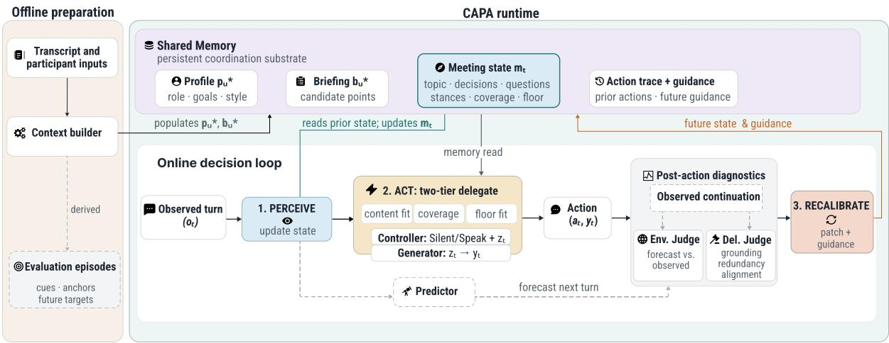
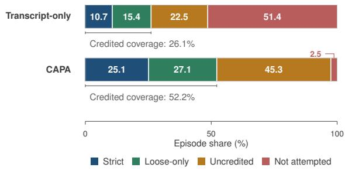
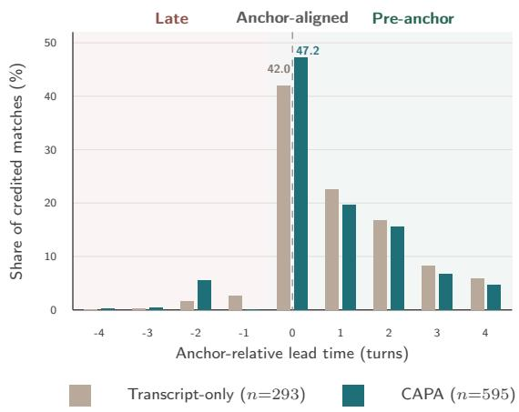
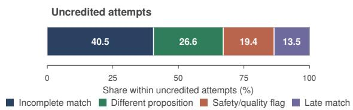
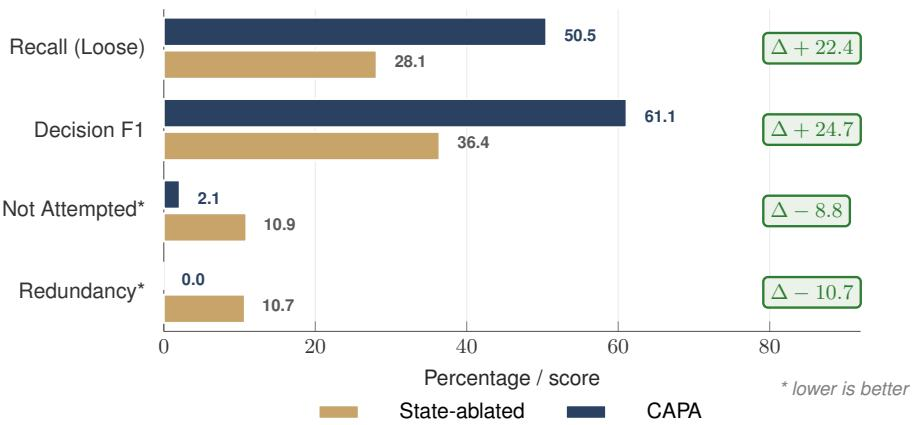
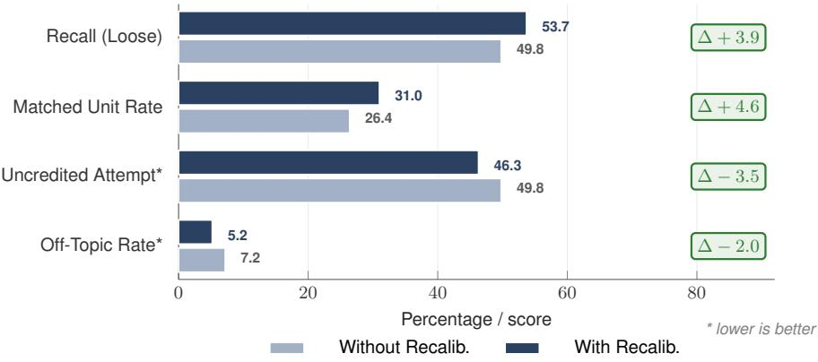
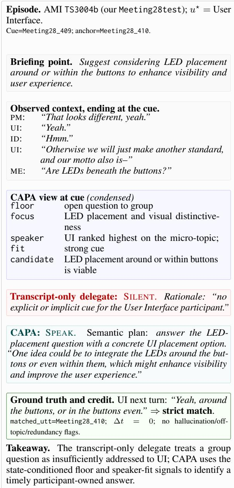
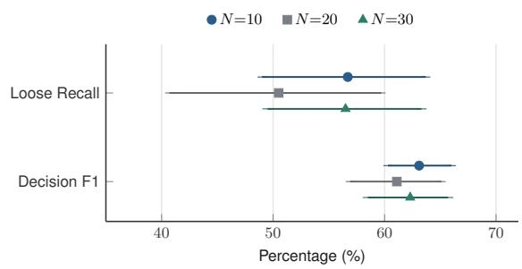

# Speak for Me: Giving LLMs the Situational Awareness to Participate in a Meeting

Muneeb Khan\*, Frederic Kirstein\*<sup>†</sup>, Terry Ruas, Bela Gipp University of Göttingen, Germany frederic.kirstein@uni-goettingen.de

## Abstract

In online meeting delegation, LLM agents fail to recognize when to speak. With no structured way to track stances, coverage, and floor, they miss the moments where they should contribute. Prompt-only delegates stay silent on 51.4% of the absent participant’s talking opportunities on the AMI corpus. We present CAPA (Collaborative Agent Predictive Archi tecture), an architecture for online meeting delegation. A Perceiver updates the meeting state from each observed turn. A Predictor forecasts how the conversation will continue. A Controller decides whether to speak and which proposition to surface. A Generator phrases the chosen contribution in the participant’s style. Two judges score the forecast and the action against the next observed turn. A Recalibrator updates the meeting state from those verdicts for future decisions. To evaluate online dele gation, we introduce an episode-level protocol that scores whether, when, and what a delegate contributes around the participant’s actual idea units. The protocol’s schema-constrained LLM judges align with human annotations at Cohen’s κ = 0.71. On 137 AMI meetings, CAPA reduces the silence rate from 51.4% to 2.5%, doubles credited recovery (26.1 → 52.2), and keeps hallucination at 0.6%. The failure mode shifts from omission to selection, with each residual near-miss attributable to a specific module of the architecture. Mechanism ablations identify the meeting state as the lever that closes the recognition gap, where raw-context scaling alone does not.<sup>1</sup>

## 1 Introduction

As LLMs evolve into proactive agents, they must increasingly navigate multi-party environments where deciding whether to intervene is as consequential as deciding what to say. We examine this capability through participant-specific meeting delegation, where an LLM proxy actively represents an absent stakeholder (Leong et al., 2024; Hu et al., 2025). In modern organizational settings, consistent attendance is increasingly difficult to guarantee (Allen and Lehmann-Willenbrock, 2023; Mok et al., 2023; Microsoft Work Trend Index, 2025). Post-hoc summarization and recordings offer retrospective review but do not allow an absent participant to intervene as outcomes are actively negotiated (Nathan et al., 2012; Asthana et al., 2025). Because decisions made without the relevant stakeholders are costly to reverse (Sleesman et al., 2012), a proxy must be able to step into the live conversation at the right time.

A delegate must continuously decide whether to speak at each turn and, if so, which contribution to make in the participant’s voice. Current promptbased approaches fail at both (Hu et al., 2025). In a controlled replication on the AMI corpus (Carletta et al., 2005), baselines remain silent on 51.4% of the absent participant’s valid talk opportunities, and two failure modes recur when they do interject. The cue policy is bound to surface invitation, triggering on explicit name-call but missing implicit handoffs and role-specific opportunities for the represented participant. The content policy conflates topical relevance with proposition-level coverage, i.e., suppressing valid contributions because the topic has been touched, and binds live references to the represented participant unreliably.

Both modes originate from an upstream limitation in state tracking. Standard proactive agents do not explicitly model participant stances, unresolved issues, or floor control, and therefore fail to identify intervention windows or to ground responses in the immediate context. Extending the input transcript does not resolve this, since longer context windows do not inherently resolve reasoning deficits over long conversations (Liu et al., 2024; Du et al., 2025). Delegation therefore relies on a structured representation of the meeting state, coupled with a mechanism to continuously synchronize it with the live conversation.

  
Figure 1: CAPA architecture. Offline preparation builds participant context in Shared Memory; fixed-window episodes are derived separately for evaluation, with future anchors and targets withheld from the delegate. At each online decision, PERCEIVE updates m , ACT reads memory to choose SILENT/SPEAK and commit to z before realizing y , and RECALIBRATE uses the Predictor and two independent judges to patch future state and guidance.

We introduce CAPA (Collaborative Agent Predictive Architecture), a fixed-weight architecture for multi-party delegation built on a perceive–act– recalibrate loop (Figure 1). CAPA maintains a structured meeting state m that tracks six actionrelevant fields derived from documented promptonly failure modes (Hu et al., 2025): active topic, decisions, open questions, participant stances, prior coverage, and floor. We study this problem under a causal replay protocol. At each turn, CAPA observes only the dialogue prefix available at that time, updates m , decides whether and how to intervene, and forecasts the next turn. Two LLM judges then score the forecast and the delegate’s action against the observed continuation, and the resulting verdicts feed back into m , shifting selfcorrection from output refinement to continuous state maintenance.

Because standard generation metrics score turnby-turn text overlap and further do not consider timing, we introduce an episode-level evaluation protocol anchored on the substantive contributions the absent stakeholder actually made, i.e., the participant-owned idea units to obtain a controlled set of substantive intervention opportunities. For each unit, programmatic checks score whether and when the delegate intervened, while schema-constrained LLM judges score what it contributed and are validated against human annotations (Section C). Evaluated under this protocol across 137 AMI meetings, CAPA reduces the silence rate from 51.4% to 2.5%, doubles credited recovery (26.1 → 52.2), and keeps hallucination at 0.6%. We conclude that (i) overcoming the dominant “silent abstention” failure in multi-party agents requires an explicit, structured meeting state, as raw-context scaling alone cannot resolve longrange opportunity recognition; (ii) the bottleneck for LLM delegates lies in the binary floor-taking decision rather than generation timing, an issue that explicit state tracking successfully mitigates; and (iii) transitioning from monolithic prompt-based generation to a modular, state-driven architecture transforms opaque omission failures into transparent, module-attributable selection errors.

## Contributions.

• CAPA, a perceive–act–recalibrate based causal reply protocol that shifts multi-party LLM delegation from context-reading at decision time to continuous state maintenance.

• A unified evaluation protocol that scores delegate interventions against actual participant idea units, evaluating both timing and content alignment.

• Empirical insights on the AMI corpus, where explicit state tracking shifts the failure mode from omission to bounded near-misses with localizable architectural causes, a result raw-context scaling does not reproduce.

## 2 Related Work

Meeting agents. Current LLM applications in meeting domains primarily serve as passive observers or post hoc facilitators, focusing on summarization, leading, and question answering (Mao et al., 2024; Alsobay et al., 2025; Asthana et al., 2025; Chen et al., 2025; J˛ecniacki and Serrat, 2025; Sapkota et al., 2025). While these systems support retrospective review, they do not participate continuously or represent specific stakeholders during live interactions. Although user studies indicate demand for real-time proxies (Leong et al., 2024; Nathan et al., 2012), building such systems remains a nascent computational challenge. Hu et al. (2025) introduce the closest benchmark to our setting, documenting failure modes that arise when delegation relies exclusively on prompting. In contrast to work focused solely on elicitation, CAPA introduces the architectural substrate required for online intervention, with explicit state management as the load-bearing component.

Sequential decision-making under partial observability. Delegation has the defining structure of sequential decision-making under partial observability. Decisions are coupled because each SPEAK or SILENT choice reshapes the conversation and the remaining opportunities. The decision-relevant state is latent because stances, coverage, and floor must be inferred. The objective is episodic, scoring whether, when, and what the delegate contributes. The classical response to partial observability is to act on a belief over the latent state (Kaelbling et al., 1998). POMDP-based dialogue management applies this decomposition to task-oriented slot filling with learned policies (Williams and Young, 2007; Young et al., 2013), rather than proactive multi-party intervention (Deng et al., 2023). CAPA adopts the belief-and-policy decomposition and instantiates it with schema-constrained LLM modules.

Inference-time correction. Post-action selfcorrection has emerged as a prevailing inferencetime strategy for steering fixed-weight agents. Paradigms such as Reflexion (Shinn et al., 2023), Self-Refine (Madaan et al., 2023), and their variants rely on critiquing a generated utterance and iteratively rewriting it for the next attempt (Pan et al., 2024; Ma et al., 2025; Phan et al., 2025). Similarly, recent work leverages interaction dynamics as a learning signal to refine subsequent outputs (Gooding and Grefenstette, 2025; Hilgert and Niehues, 2025). Across these approaches, the correction channel strictly targets the linguistic output. CAPA instead directs feedback into the explicit meeting state that conditions subsequent decisions. Its recalibration step therefore also addresses silent failures for which no utterance exists to rewrite.

## 3 Methodology

## 3.1 Problem Formulation

We treat online meeting delegation as a sequential decision-making problem under partial observability. The delegate represents an absent participant $u ^ { \star }$ and acts in their voice during a live meeting. It conditions on a participant context $\mathbf { c } _ { u } \star =$ $\left( \mathbf { p } _ { u ^ { \star } } , \mathbf { b } _ { u ^ { \star } } \right)$ , comprising a stable long-term profile $\mathbf { p } _ { u ^ { \star } }$ (role, expertise, communication style) and a meeting-specific briefing $\mathbf { b } _ { u ^ { \star } }$ (candidate contributions for the current meeting). At each decision point, the delegate observes the dialogue history $H _ { t }$ (the sequence of speaker–utterance pairs up to turn t) and chooses an action $a _ { t } \in \{ \mathrm { S I L E N T } , \mathrm { S P E A K } \}$ On SPEAK, it first commits to a discrete semantic proposition $z _ { t }$ (a specific claim or question) and only then realizes it as a natural-language utterance. The information that drives timing and grounding decisions, such as the active topic, unresolved decisions, open questions, participant stances, and floor, is not directly observable from $H _ { t }$ . Approaches that condition generation directly on the raw dialogue history therefore exhibit contextual drift.

## 3.2 Desiderata

To overcome the representation deficit, a proxy architecture must satisfy a specific set of structural constraints. We derive these desiderata directly from the empirical failure modes of zero-shot delegates, i.e., silent abstention, redundancy, off-topic hallucination, and mistiming (Hu et al., 2025). Table 1 states the six constraints we propose as a minimal and complete set relative to these known failures. The first four govern the task design. The latter two define the required architectural paradigm.

## 3.3 The CAPA Framework

To satisfy the desiderata (Table 1), we introduce CAPA (Collaborative Agent Predictive Architecture), a continuous perceive–act–recalibrate loop over an explicit meeting state $\mathbf { m } _ { t }$ (see Figure 1). The architecture decomposes the delegation task into four parts: a Shared Memory that holds the participant context and the evolving state, a Perceiver that estimates the state from each new turn, a two-tier Controller–Generator that selects and realizes an action, and a Recalibrator that integrates dual-judge feedback into the state. Conceptually, $\mathbf { m } _ { t }$ is an explicit, approximate belief over the decision-relevant interaction variables, updated by the Perceiver and acted on by the Controller (Kaelbling et al., 1998; Williams and Young, 2007). This POMDP-inspired belief– policy decomposition gives the modules a persistent, inspectable decision substrate and allows the Recalibrator to correct specific state fields after observed errors. CAPA uses the decomposition as an architectural principle. Learning rewards, transition dynamics, or a planning policy would require a reliable meeting simulator and participant-specific interaction trajectories, which are unavailable in this setting. By centralizing memory and separating perception, action, and correction, CAPA avoids the contextual drift that direct sequence-to-sequence mapping over raw dialogue introduces. The rest of this section instantiates each part. Prompts and schemas are in Section J.

<table><tr><td colspan="2">Task-design constraints</td></tr><tr><td>(i) Strict Causality</td><td>Decisions at turn t condition only on dialogue observed up to t. Dropping this invalidates the online setting.</td></tr><tr><td>(ii) Participant Grounding</td><td>Interventions are bounded by the expertise, goals, and briefing  $\mathrm { o f } \ u ^ { \star }$  . Without this, the proxy regresses to a generic LLM.</td></tr><tr><td>(iii) Pre-generation Commitment</td><td>The delegate selects a discrete proposition  $z _ { t }$  before surface realization, preventing hallucinations that arise when generation dictates reasoning.</td></tr><tr><td>(iv) Abstention Sensitivity</td><td>SILENT is a first-class action. Missed opportunities are penalized symmetrically with inappropriate interruptions.</td></tr><tr><td colspan="2">Architectural commitments</td></tr><tr><td>(v) Explicit State Maintenance</td><td>Action-relevant variables persist as an explicit meeting state mt. Without this, the agent loses situational context.</td></tr><tr><td>(vi) State-Directed Correction</td><td>Feedback from subsequent dialogue updates m for future decisions. Otherwise, misinterpretations accumulate as contextual drift.</td></tr></table>

Table 1: Six requirements derived from prompt-only failure modes (Hu et al., 2025), grouped into task-design constraints (i–iv) and architectural commitments (v–vi).

Centralized Shared Memory. The Shared Memory centralizes all information the modules read or write. We organize it along two orthogonal axes that capture the information lifecycle in a meeting: timescale (stable across the meeting vs. changing turn by turn) and source (brought in by the delegate vs. generated by the environment). The resulting 2×2 partition yields four schemaconstrained stores. Long-term memory holds the stable internal profile $\mathbf { p } _ { u ^ { \star } }$ (who the delegate is). Session memory holds the stable external briefing $\mathbf { b } _ { u } ,$ ⋆ (what the delegate is here to do). Working memory holds the dynamic external state $\mathbf { m } _ { t }$ (what is happening). Episodic memory holds the dynamic internal trace of prior actions. This specific partition avoids the redundancy of finer splits, which would share identical update cycles, and the inefficiency of coarser aggregations, which would compel runtime filtering across mixed lifecycles.

Centralizing the four stores satisfies Desideratum ii because participant attributes persist across the whole meeting, and Desideratum v because actionrelevant variables become fields the action and recalibration modules read directly.

Perceive. A single Perceiver step (Prompt J.3) concentrates state estimation, preventing inference cost from scaling with the number of downstream consumers and avoiding cross-module inconsistency. The Perceiver is a schema-constrained LLM call that maps the newly observed turn $\mathbf { o } _ { t }$ and the prior state $\mathbf { m } _ { t - 1 }$ to an updated $\mathbf { m } _ { t } .$ . This extends dialogue-state tracking from task slots to interaction variables such as stance, coverage, and floor (Young et al., 2013). The state has five fields, each addressing a prompt-only failure mode documented by Hu et al. (2025): active topic (offtopic), decisions and open questions (missed opportunities), prior coverage (redundancy), participant stances (participant grounding), and floor (mistiming). This dedicated step also lets us audit, log, and ablate state updates without touching the action or recalibration modules. The discrete extraction satisfies Desideratum v because the action-relevant variables become explicit, schema-validated fields that downstream modules read directly.

Act. A monolithic delegate emitting text directly from m<sub>t</sub> and $\mathbf { c } _ { u } ,$ would conflate strategic reasoning (what to say, when, whether at all) with surface generation, leaving no point at which abstention can be a first choice on a specific claim. We therefore split the action policy into two tiers: a Controller that handles the strategic decision, and a Generator that realizes it as surface text. The Controller (Prompt J.4) reads $\mathbf { m } _ { t }$ and $\mathbf { c } _ { u ^ { \star } }$ and selects $a _ { t } \in$ {SILENT, SPEAK}, delegating evaluation to three helpers (Prompt J.5): a candidate curator ranks briefing items by current relevance, a coverage evaluator estimates whether those points remain useful given prior coverage, and a speaker scorer gates by floor dynamics and other participants’ topical fit. On SPEAK, the Controller commits to a discrete proposition $z _ { t }$ before the Generator (Prompt J.6) realizes it in the participant’s style, following the plan-then-realize decomposition of classical NLG (Reiter and Dale, 2000). This commit-before-realize split satisfies Desideratum (iii) as SILENT becomes an explicit accept-or-reject on a specific claim, and scoring both actions through the helpers realizes Desideratum iv.

Recalibrate. Reconciling the delegate’s expectation with the observed outcome requires distinguishing two error sources, a wrong reading of the meeting state and a wrong choice given a correct reading. A single post-hoc verdict on the delivered action would conflate them, so we combine a withheld forecast with two complementary judges. Before the delegate acts at t, a Predictor (Prompt J.7) issues an intent-level forecast of the next turn from the pre-action $\mathbf { m } _ { t }$ and recent dialogue, hidden from the action policy and reserved for post-hoc evaluation. Once $\mathbf { H } _ { t + 1 : t + k }$ is observable, an Environment Judge (Prompt J.8) compares the forecast against the actual continuation, isolating perception error. A Delegate Judge (Prompt J.9) scores the action against the same window, isolating action error. The Recalibrator (Prompt J.10) then fuses both signals into a structured update on $\mathbf { m } _ { t }$ anchored to $\mathbf { o } _ { t + 1 } ,$ plus guidance for the next decision. This loop satisfies Desideratum vi and i, since updates only consume turns observed after the action.

Preparation. As the participant context $\mathbf { c } _ { u ^ { \star } }$ serves as the delegate’s only static dependency, its construction is decoupled from the runtime loop. The long-term profile $\mathbf { p } _ { u ^ { \star } }$ is extracted from an isolated preceding transcript segment, ensuring strict separation between inference and evaluation data to prevent leakage. Concurrently, the session briefing $\mathbf { b } _ { u } ,$ ⋆ synthesizes the participant’s objectives and established claims into structured, forwardlooking representations that the Controller can directly evaluate. Both $\mathbf { p } _ { u } ,$ ⋆ and $\mathbf { b } _ { u ^ { \star } }$ are generated via schema-constrained LLMs (Kirstein et al., 2024) to guarantee standardized JSON outputs for downstream modules, and constructed only from information available before the interaction segment, thereby satisfying the stability requirement of Desideratum ii. The briefing constructor does not observe target idea units, cue turns, anchor turns, future participant utterances, or any contribution from the future.

## 4 Experimental Setup

## 4.1 Dataset

We evaluate on the scenario portion of the AMI Meeting Corpus (Carletta et al., 2005), in which four participants (project manager, industrial designer, UI specialist, marketing expert) design a remote control over ∼30-minute meetings. We use the full 137-meeting dataset. Mechanism ablations and robustness checks use matched 20-meeting subsets, sharing meetings, episode set, and briefings so reported $\Delta \boldsymbol { s }$ are condition-specific. Default settings are $N { = } 2 0$ preceding utterances, evaluation window $k { = } 5$

## 4.2 Systems

The main comparison is CAPA against two rawcontext baselines: transcript-only delegate (Hu et al., 2025) reimplemented under our protocol with backbone, participant context, judges, and episode schedule fixed (prompt in Section J); The REFLEXION-STYLE baseline (Shinn et al., 2023) extends the transcript-only delegate with rolling post-action procedural memory, but does not expose structured state fields, helper modules, or state-directed recalibration. A state-ablated CAPA variant keeps the modular pipeline and gets a longer 50-turn raw window but drops the meeting state and its recalibration. A third variant keeps the state but disables recalibration (Section 6.2). All systems use GPT-4o (OpenAI et al., 2024) with decoding fixed, and backbone portability uses Gemini-2.5- Pro (Comanici et al., 2025) on the matched subset, with settings in Section B.

## 4.3 Evaluation Protocol

We evaluate at the level of participant-owned idea units, the proposition-level claims, proposals, or decision-relevant facts the target participant introduces. To preclude leakage, each meeting is split. The first 60% constructs the participant profile, and the final 40% (the interaction segment) is the evaluation testbed.

Episode construction. Each idea unit instantiates a bounded episode with two reference points. The cue fixes the information boundary at which the delegate must act, using only causally observed context. The anchor is the ground-truth turn at which the participant articulated the target idea. The delegate then advances through a k-turn evaluation window after the cue (Liesenfeld and Dingemanse, 2024), with state updates consuming ground-truth turns only once they are causally observable.

Outcomes. A contribution earns recall credit only when (i) it matches the target proposition and (ii) it is neither hallucinated nor redundant. Each episode resolves into one of four outcomes. Strict hit: credited recovery at the anchor $( \Delta = 0 )$ . Loose hit: credited recovery within the k-turn window after the cue $( 0 ~ \le ~ \Delta ~ \le ~ k )$ . Uncredited attempt: the agent spoke but the utterance failed at least one credit criterion. Not-attempted: silent throughout. This separates opportunity recognition (did the agent recover the idea in time?) from intervention quality (how well did it intervene?), which we score independently. Uncredited attempts stratify into five categories analyzed in Section 5.3.

Metrics and quality. Decision F1 quantifies floor-taking alignment at the anchor. During speaking turns, output quality is assessed via three binary indicators: hallucination (content unsupported by m<sub>t</sub>, $\mathbf { c } _ { u ^ { \star } }$ , or the preceding dialogue), redundancy (reiteration of previously resolved issues), and $o f f$ topic (divergence from the active topic). Furthermore, LLM-based judges evaluate grounding, relevance, decision appropriateness, and context appropriateness (for accepted matches) on a continuous 0–100 scale. All metrics are macro-averaged at the meeting level, reporting 95% bootstrap confidence intervals.

Human validation. Because LLM judges might be biased (Chen et al., 2024), we calibrate the ideaunit extractor and same-proposition judge against a stratified human-inspection sample. Three trained annotators (C1+ English) inspected 150 extracted idea units (balanced across the four participant roles) and 150 delegate–target same-proposition decisions (balanced across the credited and uncredited outcome categories), with a calibration round before independent scoring and joint adjudication of disagreements. Aggregate agreement between the adjudicated human label and the LLM judge reaches Cohen’s κ = 0.71. The full protocol is stated in Section C.

  
Figure 2: Episode-outcome distribution (%) over 1,126 idea-unit episodes. Per-system breakdown with 95% bootstrap CIs in Section G.

## 5 Results

This section reports three system-level findings on the 137-meeting AMI evaluation.

## 5.1 Coverage and Output Quality

An explicit meeting state lifts prompt-only LLM delegates out of silent abstention without degrading grounding fidelity, an effect that raw-context scaling alone cannot achieve.

Engagement gain. CAPA reduces missed opportunities from the dominant failure mode to a marginal one. Table 2 compares CAPA against two raw-transcript baselines: a transcript-only delegate, the closest controlled instantiation of Hu et al., 2025 under our protocol, and a lightweight Reflexion-style variant that adds post-action procedural memory but no explicit state, helpers, or state-directed recalibration. Both retain participant context and receive a longer 50-turn raw window in place of $\mathbf { m } _ { t } .$ . On the 137-meeting evaluation, CAPA doubles credited recovery (loose recall 26.1 → 52.2, strict 10.7 → 25.1) and raises Decision F1 by 24.9 points (38.1 → 63.0). The majority of this gain stems from improved opportunity recognition, isolating the baseline’s core deficit to the long-range information dependencies of multiparty meetings.

Outcome redistribution. The drop in silent abstention translates directly into active, traceable engagement, with the remainder landing as uncredited attempts. Figure 2 shows the per-system outcome distribution over 1,126 idea-unit episodes. CAPA absorbs the 48.9% drop in not-attempted episodes through +26.1% credited and +22.8% uncredited attempts. Within the credited share, the 27.1% strict–loose gap reflects interventions arriving off-anchor inside the k=5 window, consistent with backchannels and pacing that postpone articulation. The composition of the uncredited bucket is taken up in Section 5.3.

<table><tr><td>System</td><td>Strict recall ↑</td><td>Loose recall ↑</td><td>Uncredited ↓</td><td>Not attempted ↓</td><td>Decision F1↑</td><td>Hallucination ↓</td></tr><tr><td>Transcript-only</td><td>10.7</td><td>26.1</td><td>22.5</td><td>51.4</td><td>38.1</td><td>1.5</td></tr><tr><td>Reflexion</td><td>10.3</td><td>24.3</td><td>26.1</td><td>49.5</td><td>47.6</td><td>0.3</td></tr><tr><td>CAPA (ours)</td><td>25.1</td><td>52.2</td><td>45.3</td><td>2.5</td><td>63.0</td><td>0.6</td></tr></table>

Table 2: Headline comparison on 137 AMI meetings, macro-averaged %, bold = best per column. Transcript-only gets a 50-turn raw window in place of $\mathbf { m } _ { t } .$ Metric definitions in Section 4.3.

Grounding preserved. The coverage gain carries no fabrication or repetition cost. Hallucination remains at 0.6% and redundancy at 0.0%, meaning the active state shifts the agent’s participation policy while leaving its evidence grounding intact. Offtopic rises by 5.2% per episode against −48.9% not-attempted, the coverage–restraint trade-off that remains an open design question for fixed-weight LLM agents (Zhu et al., 2025). We read this profile as evidence that the meeting state shifts participation policy while leaving evidence grounding unchanged. Component-level attribution is isolated in Section 6.1 and Section 6.2.

## 5.2 Engagement Timing

CAPA systematically anticipates intervention windows, revealing that the baseline’s primary deficit lies in the binary floor-taking decision rather than in its subsequent timing mechanics.

Pre-anchor latency. When CAPA takes the floor, its contributions align with or precede the human participant’s actual turn. Figure 3 reports the anchor-relative lead time of every credited match across the 137-meeting evaluation. Of CAPA’s 595 credited matches, 93.8% are anchor-aligned or preanchor, with a median of 1.0 turn before the anchor (under the convention ≥ 0 synchronized, > 0 preanchor). This timing precision drives the absolute 24.9% increase in Decision F1 over the baseline (38.1→63.0).

The floor-taking bottleneck. Comparing both systems shows they diverge in how often they engage, but share identical timing distributions when they do. Intervention rates differ by 48.9% (97.5% for CAPA versus 48.6% for the baseline), while the baseline’s lead-time distribution on its few credited matches mirrors CAPA’s. This asymmetry isolates the prompt-only failure specifically to opportunity recognition, consistent with prior reports that multiparty turn anticipation is a discrete bottleneck for standard LLMs (Penzo et al., 2024; Hilgert and Niehues, 2025).

  
Figure 3: Timing distribution of strict and loose matches for CAPA (n=595) and the transcript-only baseline (n=293). Positive values indicate pre-anchor contributions, 0 represents anchor-aligned matches, and negative values indicate late recovery.

## 5.3 Uncredited-Attempt Taxonomy

By explicitly tracking meeting state, CAPA shifts the baseline’s tendency to remain silently inactive with traceable, active engagement. When the system misses a target, it produces diagnosable nearmisses rather than opaque omissions.

Error composition. The 45.3% uncredited attempt rate decomposes into four mutually exclusive categories of selection and timing discrepancies (Figure 4). We classify all 504 uncredited episodes CAPA produces across the 137-meeting evaluation as: incomplete match (correct proposition, missing qualifier), different proposition (a briefing-supported point distinct from the reference), late match (correct proposition generated outside the k-turn window), and safety/quality flag (off-topic or redundancy filter triggered). This error taxonomy maps to the system’s modular components. Incomplete match isolates a realization deficit in the Generator. Different proposition errors indicate imprecise candidate curation against. Late matches reflect timing misalignment driven by the m<sub>t</sub> and the speaker scorer. Finally, safety/quality flags denote expected candidate rejections by the output filter during drafting.

  
Figure 4: Uncredited-attempt taxonomy over all 504 uncredited episodes CAPA produces across the 137- meeting evaluation (45.3% uncredited bucket). Each attempt is assigned to exactly one of four mutually exclusive failure types defined in Section 5.3.

System observability. This shift from omission to selection yields a methodological benefit for system diagnostics. The transcript-only delegate’s 51.4% silent-abstention rate produces no decision trace, precluding error attribution. CAPA’s uncredited attempts generate a stepwise record, isolating failures and enabling targeted refinement.

## 6 Ablations

To understand the mechanistic drivers behind CAPA’s performance, we isolate its explicit state tracking and post-action recalibration. Because the architecture decouples the floor-taking decision from generation, we can independently ablate these modules to trace their specific effects on agent behavior. By removing these components, we show that state tracking exclusively governs the binary participation policy, while recalibration refines the qualitative selection of what is said. Finally, we verify robustness across varying context and evaluation windows, underlying LLM backbones, and a non-scenario meeting corpus. Comprehensive ablation tables and experiment descriptions are provided in Section D.

## 6.1 Meeting State Carries the Threshold

The explicit meeting state closes the recognition gap in multi-party delegation. On a 20-meeting subset, we substitute m<sub>t</sub> and the recalibration step for a longer 50-turn raw window (Table 8). This leads to a loose recall drop by 22.4%, strict recall reduces by 14.5% and Decision F1 by 24.7%, while redundancy increases by 10.7%. The reduction in behavioral metrics against a static grounding score confirms that the state mechanism determines whether and when to engage. Figure 5 makes this mechanism concrete as the state exposes an open question, participant fit, and an uncovered briefing point that the raw-transcript delegate does not act on.

Cue. The group asks, “Are LEDs beneath the buttons?” The UI participant   
has an uncovered briefing point about LED placement.   
State read. Open question; UI has highest speaker fit; LED placement   
remains uncovered.   
Transcript-only. SILENT.   
CAPA. SPEAK: “One idea could be to integrate the LEDs around the buttons   
or even within them.”   
Reference. The UI participant next says, “Yeah, around the buttons, or in the   
buttons even.” ⇒ strict match, no safety flag.  
Figure 5: Compact qualitative trace. Explicit floor, speaker-fit, and coverage fields support a timely contribution where the raw-transcript delegate remains silent. The complete trace is in Section F.

## 6.2 Recalibration Refines Selection

Post-action recalibration narrows contribution selection without altering the floor-taking threshold, demonstrating that state-update feedback and output-rewriting feedback target distinct failure modes (Table 9). Removing only the recalibration step while keeping m<sub>t</sub> and the upstream stack intact causes loose recall to drop by 3.9% and uncredited attempts to rise by 4.6%. Meanwhile, Decision F1 and grounding remain statistically unchanged. This confirms that output-rewriting baselines (e.g., Reflexion) are structurally inapplicable to our primary failure regime: they exist to refine drafted utterances, whereas multi-party delegates primarily fail via silent abstention, leaving no draft to refine.

## 6.3 Backbone Model Portability

The core architectural mechanism transfers across backbones, though the specific safety–coverage operating point is model-dependent. Across GPT-4o, Gemini-2.5-Pro, Llama-3.3-70B, and Qwen3.6- 27B, Decision F1 stays within 57.9 to 69.2 while coverage and precision trade off along one curve. Permissive backbones such as Gemini gain recall at the cost of off-topic contributions. Conservative backbones such as Qwen abstain more (17.8%, still about a third of the transcript-only baseline’s 51.4%) while selecting most cleanly (off-topic 3.3%, hallucination 0.0%). A new backbone can be calibrated on held-out episodes by tightening the printed suitability and restraint constants until precision meets the deployment requirement, with no retraining (full table in Table 16).

## 6.4 Transfer Beyond AMI

As a cross-corpus robustness check, we test whether CAPA depends on AMI’s scripted fourperson format. We replay 10 ICSI meetings, i.e., real research-group discussions with six participants on average and up to ten (Janin et al., 2003), under the identical protocol, adapting only the profile construction. We observe a similar behavior, where silence remains near zero (1.2% versus 2.5% on AMI), loose recall is higher (73.6% [61.1, 86.0] versus 52.2%), Decision F1 is comparable (64.8% [57.4, 74.9] versus 63.0%), and hallucination stays low (1.8%), with redundancy at 0.0% and off-topic at 4.9%. The full table reports 42 participant runs, 47 episodes, and 235 evaluated steps (Table 13).

## 6.5 Sensitivity to Evaluation Parameters

The primary findings remain stable under variations in the raw-window length and exhibit expected coverage–horizon trade-offs. Raw context window (N). With m<sub>t</sub> available, the raw transcript window is no longer load-bearing. Across $N ~ \in ~ \{ 1 0 , 2 0 , 3 0 \}$ , loose recall remains stable between 50.5% and 56.7%, and Decision F1 between 61.1% and 63.1% (Section I.2). Evaluation window (k). Expanding k admits more credited matches (loose recall rises from 43.9 → 62.7 across $k \in \{ 3 , 5 , 7 , 9 \} )$ without artificially inflating the system’s anchor synchrony (Section I.4).

## 7 Final Considerations

In online meeting delegation, prompt-only LLM proxies fail to recognize when to intervene, defaulting to silent abstention during most talking opportunities. We introduced CAPA, a perceive–act– recalibrate loop operating over an explicit meeting state, as an architectural response to this recognition gap. To evaluate it, we designed an episodelevel protocol that scores whether, when, and what a delegate contributes relative to a human participant’s actual idea units. On 137 AMI meetings, CAPA reduced the silence rate from 51.4% to 2.5%, doubled credited recovery (26.1 → 52.2), and preserved grounding fidelity with a 0.6% hallucination rate. Our findings demonstrate that effective multi-party recognition requires maintaining variables like stance, coverage, and floor control as explicit state fields, as LLMs cannot reliably recover them from raw context streams. By decoupling the floor-taking decision from surface generation, CAPA resolves the upstream recognition error and allows for transparent, moduleattributable selection errors. Furthermore, we establish that this state-updating correction channel is non-substitutable by output-rewriting paradigms as they are poorly matched to the primary failure regime we observe. Robustness checks confirm the core architecture transfers across configurations. The generalization of this state-driven architecture to other domains with similar causal information boundaries, e.g., customer-support handoff, remain future directions.

## Limitations

The primary evaluation of CAPA focuses on the AMI scenario portion. Alternative corpora do not provide all protocol conditions without adaptation. ELITR (Nedoluzhko et al., 2022), used by related meeting delegation work (Hu et al., 2025), and ICSI (Janin et al., 2003) cover conceptually similar formal settings but lack the continuity that AMI provides. For the ICSI robustness probe (Section 6.4), we therefore adapt only profile construction while holding causal replay fixed. Other meeting datasets such as parliamentary or formal institutional datasets (Hu et al., 2023; Zhong et al., 2021) enforce rigid turn-taking structures where spontaneous floor-taking is structurally not possible.

The system’s performance depends significantly on the capabilities of the underlying language model. While our implementation uses GPT-4o, models with different reasoning capabilities or smaller context windows may produce less accurate delegation capabilities. Our ablation studies suggest that performance can carry over to other model families, demonstrating the framework’s architectural robustness.

## Acknowledgements

This work was supported by the Lower Saxony Ministry of Science and Culture and the VW Foundation.

## References

Joseph A. Allen and Nale Lehmann-Willenbrock. 2023. The key features of workplace meetings: Conceptualizing the why, how, and what of meetings at work. Organizational Psychology Review, 13(4):355–378.

Mohammed Alsobay, David M. Rothschild, Jake M. Hofman, and Daniel G. Goldstein. 2025. Bringing everyone to the table: An experimental study

of LLM-facilitated group decision making. Preprint, arXiv:2508.08242.

Sumit Asthana, Sagi Hilleli, Pengcheng He, and Aaron Halfaker. 2025. Summaries, highlights, and action items: Design, implementation and evaluation of an LLM-powered meeting recap system. Proceedings ofthe ACM on Human-Computer Interaction, 9(2):1– 29.

Jean Carletta, Wessel Kraaij, Simone Ashby, Sebastien Bourban, Michael Flynn, Mael Guillemot, Thomas Hain, Jaroslav Kadlec, Vasilis Karaiskos, Melissa Kronenthal, Guillaume Lathoud, Michael Lincoln, Agnes Lisowska, Wilfried Post, Dennis Reidsma, Pierre Wellner, and Iain McCowan. 2005. The AMI meeting corpus. In Proceedings of the Symposium on Annotating and Measuring Meeting Behavior.

Guiming Hardy Chen, Shunian Chen, Ziche Liu, Feng Jiang, and Benyou Wang. 2024. Humans or LLMs as the judge? a study on judgement bias. In Proceedings ofthe 2024 Conference on Empirical Methods in Natural Language Processing, pages 8301–8327, Miami, Florida, USA. Association for Computational Linguistics.

Xinyue Chen, Nathan Yap, Xinyi Lu, Aylin Gunal, and Xu Wang. 2025. MeetMap: Real-time collaborative dialogue mapping with LLMs in online meetings. Preprint, arXiv:2502.01564.

Gheorghe Comanici, Eric Bieber, Mike Schaekermann, Ice Pasupat, Noveen Sachdeva, and 1 others. 2025. Gemini 2.5: Pushing the frontier with advanced reasoning, multimodality, long context, and next generation agentic capabilities. Preprint, arXiv:2507.06261.

Yang Deng, Wenqiang Lei, Wai Lam, and Tat-Seng Chua. 2023. A survey on proactive dialogue systems: Problems, methods, and prospects. In Proceedings ofthe Thirty-Second International Joint Conference on Artificial Intelligence, pages 6583–6591.

Yufeng Du, Minyang Tian, Srikanth Ronanki, Subendhu Rongali, Sravan Babu Bodapati, Aram Galstyan, Azton Wells, Roy Schwartz, Eliu A Huerta, and Hao Peng. 2025. Context length alone hurts LLM performance despite perfect retrieval. In Findings of the Associationfor Computational Linguistics: EMNLP 2025, pages 23281–23298, Suzhou, China. Association for Computational Linguistics.

Sian Gooding and Edward Grefenstette. 2025. Interaction dynamics as a reward signal for LLMs. Preprint, arXiv:2511.08394.

Lukas Hilgert and Jan Niehues. 2025. Next speaker prediction for multi-speaker dialogue with large language models. In Proceedings of the 5th International Conference on Natural Language and Speech Processing (ICNLSP 2025), pages 69–79, Barcelona, Spain (Hybrid). Association for Computational Linguistics.

Lingxiang Hu, Shurun Yuan, Xiaoting Qin, Jue Zhang, Qingwei Lin, Dongmei Zhang, Saravan Rajmohan, and Qi Zhang. 2025. MEETING DELEGATE: Benchmarking LLMs on attending meetings on our behalf. In Proceedings of the Fourth Workshop on Bridging Human-Computer Interaction and Natural Language Processing (HCI+NLP), pages 283–316, Suzhou, China. Association for Computational Linguistics.

Yebowen Hu, Timothy Ganter, Hanieh Deilamsalehy, Franck Dernoncourt, Hassan Foroosh, and Fei Liu. 2023. MeetingBank: A benchmark dataset for meeting summarization. In Proceedings of the 61st Annual Meeting ofthe Associationfor Computational Linguistics (Volume 1: Long Papers), pages 16409– 16423, Toronto, Canada. Association for Computational Linguistics.

Adam Janin, Don Baron, Jane Edwards, Dan Ellis, David Gelbart, Nelson Morgan, Barbara Peskin, Thilo Pfau, Elizabeth Shriberg, Andreas Stolcke, and Chuck Wooters. 2003. The ICSI meeting corpus. In 2003 IEEE International Conference on Acoustics, Speech, and Signal Processing (ICASSP ’03), volume 1, pages I–I. IEEE.

Mateusz J˛ecniacki and Martí Carmona Serrat. 2025. Humanlike multi-user agent (HUMA): Designing a deceptively human AI facilitator for group chats. Preprint, arXiv:2511.17315.

Leslie Pack Kaelbling, Michael L. Littman, and Anthony R. Cassandra. 1998. Planning and acting in partially observable stochastic domains. Artificial Intelligence, 101(1–2):99–134.

Lars Kaesberg, Terry Ruas, Jan Philip Wahle, and Bela Gipp. 2024. CiteAssist: A system for automated preprint citation and BibTeX generation. In Proceedings ofthe Fourth Workshop on Scholarly Document Processing (SDP 2024), pages 105–119, Bangkok, Thailand. Association for Computational Linguistics.

Frederic Kirstein, Terry Ruas, Robert Kratel, and Bela Gipp. 2024. Tell me what I need to know: Exploring LLM-based (personalized) abstractive multi-source meeting summarization. In Proceedings ofthe 2024 Conference on Empirical Methods in Natural Language Processing: Industry Track, pages 920–939, Miami, Florida, US. Association for Computational Linguistics.

Joanne Leong, John Tang, Edward Cutrell, Sasa Junuzovic, Greg P. Baribault, and Kori Inkpen. 2024. Dittos: Personalized, embodied agents that participate in meetings when you are unavailable. Proceedings of the ACM on Human-Computer Interaction, 8(CSCW2).

Andreas Liesenfeld and Mark Dingemanse. 2024. Interactive probes: Towards action-level evaluation for dialogue systems. Discourse & Communication, 18(6):954–964.

Nelson F. Liu, Kevin Lin, John Hewitt, Ashwin Paranjape, Michele Bevilacqua, Fabio Petroni, and Percy Liang. 2024. Lost in the middle: How language models use long contexts. Transactions ofthe Association for Computational Linguistics, 12:157–173.

Fukun Ma, Kaibin Tian, Jieting Xue, Xiaoyi Wang, Ye Ma, Quan Chen, Peng Jiang, and Lijie Wen. 2025. Improving preference alignment of LLM with inference-free self-refinement. In Findings of the Association for Computational Linguistics: EMNLP 2025, pages 24459–24473, Suzhou, China. Association for Computational Linguistics.

Aman Madaan, Niket Tandon, Prakhar Gupta, Skyler Hallinan, Luyu Gao, Sarah Wiegreffe, Uri Alon, Nouha Dziri, Shrimai Prabhumoye, Yiming Yang, Shashank Gupta, Bodhisattwa Prasad Majumder, Katherine Hermann, Sean Welleck, Amir Yazdanbakhsh, and Peter Clark. 2023. Self-refine: Iterative refinement with self-feedback. Preprint, arXiv:2303.17651.

Manqing Mao, Paishun Ting, Yijian Xiang, Mingyang Xu, Julia Chen, and Jianzhe Lin. 2024. Multiuser chat assistant (MUCA): a framework using LLMs to facilitate group conversations. Preprint, arXiv:2401.04883.

Microsoft Work Trend Index. 2025. Breaking down the infinite workday. https://www.microsoft.com/ en-us/worklab/work-trend-index/breaking-d own-infinite-workday. Accessed 2026-01-15.

Lillio Mok, Lu Sun, Shilad Sen, and Bahareh Sarrafzadeh. 2023. Challenging but connective: Largescale characteristics of synchronous collaboration across time zones. In Proceedings ofthe 2023 CHI Conference on Human Factors in Computing Systems (CHI ’23). ACM.

Mukesh Nathan, Mercan Topkara, Jennifer C. Lai, Shimei Pan, Steve Wood, Jeff Boston, and Loren G. Terveen. 2012. In case you missed it: benefits of attendee-shared annotations for non-attendees of remote meetings. In CSCW ’12: Computer Supported Cooperative Work, Seattle, WA, USA, February 11– 15, 2012, pages 339–348. ACM.

Anna Nedoluzhko, Muskaan Singh, Marie Hledíková, Tirthankar Ghosal, and Ondˇrej Bojar. 2022. ELITR minuting corpus: A novel dataset for automatic minuting from multi-party meetings in English and Czech. In Proceedings ofthe Thirteenth Language Resources and Evaluation Conference, pages 3174– 3182, Marseille, France. European Language Resources Association.

OpenAI, Josh Achiam, Steven Adler, Sandhini Agarwal, Lama Ahmad, and 1 others. 2024. GPT-4 technical report. Preprint, arXiv:2303.08774.

Liangming Pan, Michael Saxon, Wenda Xu, Deepak Nathani, Xinyi Wang, and William Yang Wang. 2024. Automatically correcting large language models: Surveying the landscape of diverse automated correction

strategies. Transactions ofthe Associationfor Computational Linguistics, 12:484–506.

Nicolò Penzo, Maryam Sajedinia, Bruno Lepri, Sara Tonelli, and Marco Guerini. 2024. Do LLMs suffer from multi-party hangover? a diagnostic approach to addressee recognition and response selection in conversations. In Proceedings ofthe 2024 Conference on Empirical Methods in Natural Language Processing, pages 11210–11233, Miami, Florida, USA. Association for Computational Linguistics.

Hoang Phan, Victor Li, and Qi Lei. 2025. Think twice, generate once: Safeguarding by progressive selfreflection. In Findings of the Association for Computational Linguistics: EMNLP 2025, pages 9466– 9483, Suzhou, China. Association for Computational Linguistics.

Ehud Reiter and Robert Dale. 2000. Building Natural Language Generation Systems. Cambridge University Press, Cambridge, UK.

Sagar Sapkota, Mohammad Saqib Hasan, Mubarak Shah, and Santu Karmaker. 2025. Multi-party conversational agents: A survey. Preprint, arXiv:2505.18845.

Noah Shinn, Federico Cassano, Edward Berman, Ashwin Gopinath, Karthik Narasimhan, and Shunyu Yao. 2023. Reflexion: Language agents with verbal reinforcement learning. Preprint, arXiv:2303.11366.

Dustin J. Sleesman, Donald E. Conlon, Gerry McNamara, and Jonathan E. Miles. 2012. Cleaning up the big muddy: A meta-analytic review of the determinants of escalation of commitment. Academy of Management Journal, 55(3):541–562.

Jason D. Williams and Steve Young. 2007. Partially observable Markov decision processes for spoken dialog systems. Computer Speech & Language, 21(2):393–422.

Steve Young, Milica Gašic, Blaise Thomson, and Ja-´ son D. Williams. 2013. POMDP-based statistical spoken dialog systems: A review. Proceedings of the IEEE, 101(5):1160–1179.

Lianmin Zheng, Wei-Lin Chiang, Ying Sheng, Siyuan Zhuang, Zhanghao Wu, Yonghao Zhuang, Zi Lin, Zhuohan Li, Dacheng Li, Eric P. Xing, Hao Zhang, Joseph E. Gonzalez, and Ion Stoica. 2023. Judging LLM-as-a-judge with MT-Bench and chatbot arena. In Advances in Neural Information Processing Systems, volume 36, pages 46595–46623.

Ming Zhong, Da Yin, Tao Yu, Ahmad Zaidi, Mutethia Mutuma, Rahul Jha, Ahmed Hassan Awadallah, Asli Celikyilmaz, Yang Liu, Xipeng Qiu, and Dragomir Radev. 2021. QMSum: A new benchmark for querybased multi-domain meeting summarization. In Proceedings ofthe 2021 Conference ofthe North American Chapter ofthe Associationfor Computational Linguistics: Human Language Technologies, pages 5905–5921, Online. Association for Computational Linguistics.

Runchuan Zhu, Zinco Jiang, Jiang Wu, Zhipeng Ma, Jiahe Song, Fengshuo Bai, Dahua Lin, Lijun Wu, and Conghui He. 2025. GRAIT: Gradient-driven refusal-aware instruction tuning for effective hallucination mitigation. In Findings of the Association for Computational Linguistics: NAACL 2025, pages 4006–4021, Albuquerque, New Mexico. Association for Computational Linguistics.

## Ethical Considerations

CAPA is evaluated offline on the publicly released AMI Meeting Corpus (CC BY 4.0). AMI participants consented to recording for research use, which we treat as a sufficient basis for offline transcript analysis but not for live impersonation. Any deployment of state-conditioned delegation in a live meeting would require explicit, recurring consent from all participants present, because the architecture lets the agent surface a participantowned proposition the represented participant may not have stated themselves. Misuse paths include impersonation under false pretenses, plausibledeniability speech laundering, and asymmetric advantage of represented over unrepresented participants. We release CAPA under MIT license as research infrastructure. Production use should go through participant consent.

## A Open Resources and Licensing

## A.1 Repository and License

The code for this work is available on https://gi thub.com/FKIRSTE/emnlp2026-meeting-del egation under an MIT license together with the evaluation protocol, prompt templates, judges, and analysis scripts after acceptance.

## A.2 Datasets and Licensing

We evaluate on the scenario portion of the AMI Meeting Corpus (Carletta et al., 2005), distributed under CC BY 4.0. Table 3 summarizes the license and the high-level corpus statistics.

<table><tr><td>Dataset</td><td>License</td><td>Size</td><td>Domain</td></tr><tr><td>AMI (scenario)</td><td>CC BY 4.0</td><td>137</td><td>remote-control design</td></tr></table>

Table 3: Dataset licensing and overview. Size: number of meetings used.

## B Experimental Setup Details

## B.1 Implementation

We implement CAPA in Python. All LLM calls go through a single API wrapper with retry-on-error and structured JSON output validation against the schema for each module (Perceiver, Predictor, Environment Judge, Delegate Judge, Recalibrator, Controller, Generator, helpers). Schema-constrained decoding guarantees that every module emits parseable structured output. The Shared Memory is a typed dictionary indexed by participant, meeting, and turn.

## B.2 Model Specs

GPT-4o is the default backbone for all main experiments. The backbone-portability study evaluates Gemini-2.5-Pro, Llama-3.3-70B, and Qwen3.6- 27B. Table 4 lists the reported endpoints; decoding settings remain fixed.

<table><tr><td>Model</td><td>Snapshot</td><td>Parameters</td><td>Provider</td></tr><tr><td>GPT-40</td><td>2024-11-20</td><td>~ 200B (est.)</td><td>OpenAI</td></tr><tr><td>Gemini-2.5-Pro</td><td>2025-06-17</td><td>not disclosed</td><td>Google</td></tr><tr><td>Llama-3.3-70B</td><td>2024-12-06</td><td>70B</td><td>Groq</td></tr><tr><td>Qwen3.6-27B</td><td>2026-04-21</td><td>27B</td><td>Groq</td></tr></table>

Table 4: Model snapshots and providers. GPT-4o is the default backbone. Snapshot names come from provider metadata when exposed.

## B.3 Hyperparameters

We keep default values for top-p (1.0), frequency penalty (0.0), and presence penalty (0.0). Temperature is T=0.1 for every LLM module except the Generator, which runs at T=0.3 to allow modest natural-language variation after the Controller has committed to a semantic point. Decoding parameters are held fixed across systems and conditions. Default episode parameters are N=20 preceding utterances and evaluation window k=5, both varied in the robustness checks (Section I). All metrics are macro-averaged at the meeting level with 95% bootstrap CIs (B=10,000).

## B.4 Computational Footprint

We distinguish response latency from total computation per decision. Only the Controller, its three helpers, and the conditional Generator lie on the response path. The Perceiver runs once per episode and can overlap with ongoing speech. The Predictor, judges, and Recalibrator execute after the floor decision and affect later turns. The critical-path rows therefore measure the delay before a contribution, while the full-decision rows measure all computation attributed to one decision.

All reported latencies are wall-clock measurements from the experimental harness and include its fixed three-second post-call throttle.

GPT-4o latency. The observed response path takes 21.14 s on average, with a p95 of 36.49 s. The harness throttle contributes 10.01 s to the mean. Removing it analytically gives a provider-only response latency of 11.12 s mean and 19.05 s p95 across all 110 decisions. Among the 72 decisions that execute the floor-taking LLM path, provider calls take 16.99 s mean and 19.39 s p95.

<sup>†</sup>The Perceiver runs once per five-decision episode. Its episode-level latency is 31.35 s mean and 115.78 s p95, which Table 5 amortizes across the five decisions. The 52.30 s full-decision mean also includes post-turn computation and therefore does not represent response latency.

Open-weight latency. On Groq, Qwen’s observed response path takes 19.03 s on average and Llama’s takes 17.26 s. Their full-decision means are 45.85 s and 44.73 s because these totals include background updates and the amortized Perceiver. <sup>†</sup>For both backbones, the Perceiver runs once per five-decision episode and its measured latency is amortized across those decisions.

Cost accounting. The GPT-4o response path costs \$0.1069 per decision, and the complete architecture costs \$0.2090 after including background updates and the amortized Perceiver. GPT-4o costs use provider-reported cached-token counts and rates of \$2.50/M uncached input tokens, \$1.25/M cached input tokens, and \$10/M output tokens. For Qwen, the rates are \$0.60/M input tokens and \$3.00/M output tokens. For Llama, they are \$0.59/M input tokens and \$0.79/M output tokens. <sup>‡</sup>Only open-weight Perceiver token use is estimated; all runtime-module usage is providerreported.

## C Human Evaluation Protocol

## C.1 Annotators

Three trained annotators (C1+ English) ran the inspection, recruited as research assistants or doctoral candidates with academic background in multiparty dialogue. Each annotator gave explicit consent for the anonymized annotations to be used in this work. The protocol received approval from our institution’s ethics committee before any data collection.

## C.2 Sampling and Procedure

We drew a stratified sample of 150 extracted idea units, balanced across the four participant roles (PM, ID, UI, ME), and 150 delegate–target sameproposition decisions, balanced across the credited (strict, loose-only) and uncredited outcome categories. Each idea unit got a binary label (is this a proposition-level idea unit?). Each delegate–target pair got a binary label (does the delegate’s utterance express the same proposition as the target?). Annotators were blind to which delegate produced each utterance and to which condition the episode belonged. Each annotator scored independently after a calibration round, and disagreements were adjudicated through joint discussion.

## C.3 Agreement

We compute Cohen’s κ between the adjudicated human label and the LLM judge across the judged dimensions (idea-unit extraction, same-proposition matching, hallucination, redundancy, off-topic). Aggregate agreement reaches $\kappa = 0 . 7 1$ , in the substantial-agreement range.

## D Mechanism Ablation Tables

The two ablations isolate complementary effects. Removing the meeting state m<sub>t</sub> collapses coverage, Decision F1, and redundancy together (Table 8). Removing the Recalibrator narrows contribution selection while the floor-taking threshold stays inside bootstrap noise (Table 9). Figure 6 and Figure 7 render both tables as grouped bar charts.

## E Conditional Quality Scores

Table 10 reports CAPA’s judge-based quality scores on the 137-meeting evaluation. Each dimension is scored only over the steps where it applies. Decision appropriateness covers every decision step, relevance and grounding cover speaking turns, and context appropriateness covers accepted same-proposition matches only. A like-for-like cross-system comparison on these scores is not meaningful here, because the transcript-only delegate is silent in 51.4% of episodes and its conditional distribution is taken over a smaller and more selective subset. We therefore read the absolute numbers as architectural characterization of CAPA and defer the within-architecture comparison to the grounding-invariance result under the meeting-state ablation (Section 6.1).

<table><tr><td>Module</td><td>Calls/dec. Timing</td><td>Mean s p95s</td><td>Input tok. Cached input</td><td></td><td></td><td>Output tok.</td><td>Cost/dec.</td></tr><tr><td>Perceiver†</td><td>0.845 pre-episode</td><td></td><td>6.27</td><td>23.16</td><td>10,322</td><td>5,272</td><td>787 $0.0271</td></tr><tr><td>Predictor</td><td>1.000 post-turn</td><td></td><td>3.90 4.08</td><td>4,540</td><td>1,439</td><td></td><td>$0.0101</td></tr><tr><td>Controller + 3 helpers</td><td>2.991 floor path</td><td></td><td>19.85 33.51</td><td>46,009</td><td>26,195</td><td>2,247</td><td>$0.1048</td></tr><tr><td>Generator</td><td></td><td>0.336 floor path, conditional</td><td>1.28 3.91</td><td>1,242</td><td></td><td></td><td>$0.0021</td></tr><tr><td>Environment Judge</td><td>1.000 post-turn</td><td></td><td>4.14 4.37</td><td>7,198</td><td>5,120</td><td></td><td>$0.0126</td></tr><tr><td>Delegate Judge</td><td>1.345 post-turn</td><td></td><td>6.50 10.81</td><td>10,619</td><td>5,750</td><td>317</td><td>$0.0225</td></tr><tr><td>Recalibrator</td><td>2.000 post-turn</td><td></td><td>10.33 11.19</td><td>10,658</td><td>5,632</td><td>1,025</td><td>$0.0299</td></tr><tr><td>Critical path (floor-taking)</td><td>3.327</td><td></td><td>21.14 36.49</td><td>47,251</td><td>27,099</td><td>2,263</td><td>$0.1069</td></tr><tr><td>Runtime per decision, excluding Perceiver</td><td>8.673 floor + post-turn</td><td></td><td>46.03 65.12</td><td>80,267</td><td>45,040</td><td>3,757</td><td>$0.1819</td></tr><tr><td>Architecture per decision, including Perceiver</td><td>9.518 amortized</td><td>52.30†</td><td></td><td>90,590</td><td>50,312</td><td>4,544</td><td>$0.2090</td></tr></table>

Table 5: GPT-4o latency, token use, and cost over 110 decisions in 22 five-step episodes. CAPA spoke on 37 decisions; the floor-taking LLM path ran on 72.

<table><tr><td>Module</td><td>Calls/dec.</td><td>Timing</td><td>Mean s</td><td></td><td>p95 s Input tok./dec.</td><td>Output tok./dec.</td><td>Cost/dec.</td></tr><tr><td>Perceiver†</td><td>0.714</td><td>pre-episode</td><td>5.32</td><td>12.21</td><td>≈11,617</td><td>≈753</td><td>≈$0.00923</td></tr><tr><td>Predictor</td><td>1.000</td><td>post-turn</td><td>3.59</td><td>3.65</td><td>4,197</td><td>64</td><td>$0.00271</td></tr><tr><td>Controller + 3 helpers</td><td>2.842</td><td>floor path</td><td>18.35</td><td>31.97</td><td>44,922</td><td>2,982</td><td>$0.03590</td></tr><tr><td>Generator</td><td>0.189</td><td>floor path, conditional</td><td>0.67</td><td>3.53</td><td>671</td><td>9</td><td>$0.00043</td></tr><tr><td>Environment Judge</td><td>1.000</td><td>post-turn</td><td>4.04</td><td>4.19</td><td>6,903</td><td>191</td><td>$0.00472</td></tr><tr><td>Delegate Judge</td><td>1.189</td><td>post-turn</td><td>4.76</td><td>7.81</td><td>8,296</td><td>200</td><td>$0.00558</td></tr><tr><td>Recalibrator</td><td>2.000</td><td>post-turn</td><td>9.10</td><td>9.64</td><td>10,757</td><td>1,037</td><td>$0.00956</td></tr><tr><td>Critical path (floor-taking)</td><td>3.032</td><td></td><td></td><td>19.03 34.86</td><td>45,592</td><td>2,991</td><td>$0.03633</td></tr><tr><td>Runtime per decision, excluding Perceiver</td><td>8.221</td><td>floor + post-turn</td><td></td><td>40.54 59.39</td><td>75,746</td><td>4,483</td><td>$0.05890</td></tr><tr><td>Architecture per decision, including Perceiver</td><td>8.935</td><td>amortized</td><td>45.85†</td><td></td><td>≈87,363</td><td>≈5,235</td><td>≈$0.06813</td></tr></table>

Table 6: Qwen3.6-27B computational footprint over 95 decisions in 19 complete episodes.

<table><tr><td>Module</td><td>Calls/dec.</td><td>Timing</td><td>Mean s</td><td></td><td>p95 s Input tok./dec.</td><td>Output tok./dec.</td><td>Cost/dec.</td></tr><tr><td>Perceiver†</td><td>0.724</td><td>pre-episode</td><td>5.70</td><td>22.38</td><td>≈9,011</td><td>≈656</td><td>≈$0.00584</td></tr><tr><td>Predictor</td><td>1.000</td><td>post-turn</td><td>3.49</td><td>3.75</td><td>3,505</td><td>55</td><td>$0.00211</td></tr><tr><td>Controller + 3 helpers</td><td>2.781</td><td>floor path</td><td>15.80</td><td>27.69</td><td>38,353</td><td>1,743</td><td>$0.02401</td></tr><tr><td>Generator</td><td>0.448</td><td>floor path, conditional</td><td>1.58</td><td>3.67</td><td>1,525</td><td>23</td><td>$0.00092</td></tr><tr><td>Environment Judge</td><td>1.000</td><td>post-turn</td><td>3.89</td><td>4.08</td><td>6,410</td><td>120</td><td>$0.00388</td></tr><tr><td>Delegate Judge</td><td>1.448</td><td>post-turn</td><td>5.55</td><td>7.62</td><td>8,274</td><td>135</td><td>$0.00499</td></tr><tr><td>Recalibrator</td><td>2.000</td><td>post-turn</td><td>8.82</td><td>9.32</td><td>9,547</td><td>931</td><td>$0.00637</td></tr><tr><td>Critical path (floor-taking)</td><td>3.229</td><td></td><td></td><td>17.26 28.04</td><td>39,878</td><td>1,766</td><td>$0.02492</td></tr><tr><td>Runtime per decision, excluding Perceiver</td><td>8.676</td><td>floor + post-turn</td><td></td><td>39.03 51.32</td><td>67,614</td><td>3,006</td><td>$0.04227</td></tr><tr><td>Architecture per decision, including Perceiver</td><td>9.400</td><td>amortized</td><td>44.73†</td><td></td><td>≈76,625</td><td>≈3,663</td><td>≈$0.04811</td></tr></table>

Table 7: Llama-3.3-70B computational footprint over 105 decisions in 21 complete episodes.



Figure 6: Meeting-state ablation, grouped bar view of Table 8.  
  
Figure 7: Recalibration ablation, grouped bar view of Table 9.

<table><tr><td>Metric</td><td>CAPA (ours)</td><td>State-Ablated</td><td>∆</td></tr><tr><td>Strict recall (%) ↑</td><td>23.0 [15.4, 30.7]</td><td>8.5 [4.1, 13.4]</td><td>+14.5</td></tr><tr><td>Loose recall (%) ↑</td><td>50.5 [40.7, 59.7]</td><td>28.1 [20.1, 36.8]</td><td>+22.4</td></tr><tr><td>Not Attempted (%) ↓</td><td>2.1 [0.0, 5.9]</td><td>10.9 [5.9, 16.2]</td><td>-8.8</td></tr><tr><td>Decision F1 (%) ↑</td><td>61.1 [56.9, 65.1]</td><td>36.4 [33.2, 39.9]</td><td>+24.7</td></tr><tr><td>Redundancy (%) ↓</td><td>0.0 [0.0, 0.0]</td><td>10.7 [6.7, 15.2]</td><td>-10.7</td></tr><tr><td>Grounding (Score) ↑</td><td>74.3 [73.2, 75.3]</td><td>72.7 [71.7, 73.7]</td><td>+1.6</td></tr></table>

Table 8: Meeting-state ablation on 20 matched meetings $( k { = } 5 , B { = } 1 0 , 0 0 0 )$ ). Bold = better per row. The ablated system omits m<sub>t</sub> and recalibration and gets a 50-turn raw window.

<table><tr><td>Metric</td><td>With Recalib. (ours)</td><td>Without</td></tr><tr><td>Strict recall (%) ↑</td><td>28.0 [20.7, 36.0]</td><td>26.0 [19.1, 32.8]</td></tr><tr><td>Loose recall (%) ↑</td><td>53.7 [44.1, 63.6]</td><td>49.8 [41.7, 57.2]</td></tr><tr><td>Matched-unit rate (%) ↑</td><td>31.0 [23.1, 40.1]</td><td>26.4 [21.0, 32.0]</td></tr><tr><td>Uncredited attempt (%) ↓</td><td>46.3 [36.4, 55.9]</td><td>49.8 [42.5, 57.9]</td></tr><tr><td>Decision F1 (%) ↑</td><td>66.2 [61.9, 70.4] 5.2</td><td>66.7 [62.3, 71.0]</td></tr><tr><td>Off-topic rate (%) ↓</td><td>[2.3, 8.5]</td><td>7.2 [3.6, 11.4]</td></tr><tr><td>Grounding (Score) ↑</td><td>74.1 [72.8, 75.3]</td><td>74.3 [73.1, 75.4]</td></tr></table>

Table 9: Recalibration ablation on 20 matched meetings (k=5, B=10,000). Bold = better per row. Both variants share m , the Predictor, and the judges.

Figure 8 expands the compact main-paper example with the full observed context, state snapshot, semantic plan, realized utterance, and verifier-backed credit outcome.

## F Detailed Qualitative Trace

## G Outcome Decomposition

Table 11 gives the per-system breakdown of the episode outcomes summarized in Figure 2, with 95% bootstrap CIs on every rate. The headline shift is the not-attempted rate, which drops from

<table><tr><td>Dimension</td><td>|Mean</td><td>95% CI</td></tr><tr><td>Decision appropriateness</td><td>88.8</td><td>[88.5, 89.0]</td></tr><tr><td>Context appropriateness</td><td>88.0</td><td>[87.4, 88.5]</td></tr><tr><td>Relevance</td><td>78.0</td><td>[77.3, 78.6]</td></tr><tr><td>Grounding</td><td>73.8</td><td>[73.3, 74.3]</td></tr></table>

Table 10: CAPA judge-based quality scores (0–100, higher better). † scored only on accepted sameproposition matches. B=10,000 bootstrap resamples.

  
Figure 8: Qualitative trace of one decision episode A single fixed-window episode where CAPA succeeds on an implicit group cue and the transcript-only delegate stays silent. The trace shows the available briefing point, observed context, compressed state/control view, realised actions, and verifier-backed credit outcome. Quotes are lightly cleaned for readability.

<table><tr><td>Outcome</td><td>Transcript-only</td><td>CAPA (ours)</td></tr><tr><td rowspan="2">Strict hit</td><td>10.7</td><td>25.1</td></tr><tr><td>[8.7, 12.8]</td><td>[22.1, 28.2]</td></tr><tr><td rowspan="2">Loose-only hit</td><td>15.4</td><td>27.1</td></tr><tr><td>[12.7, 18.2] 22.5</td><td>[24.3, 29.9] 45.3</td></tr><tr><td rowspan="2">Uncredited attempt</td><td>[19.7, 25.3]</td><td>[41.7, 48.9]</td></tr><tr><td>51.4</td><td>2.5</td></tr><tr><td>Not attempted</td><td>[47.8, 55.2]</td><td>[1.6, 3.7]</td></tr></table>

Table 11: Per-system outcome decomposition over the 137-meeting fixed-window episode set. Rates are macroaveraged over meetings with retained official episodes (B=10,000 bootstrap resamples).

<table><tr><td>Metric</td><td>AMI</td><td>ICSI</td></tr><tr><td rowspan="2">Never attempted ↓</td><td>2.5</td><td>1.2</td></tr><tr><td></td><td>[0.0, 3.7] 73.6</td></tr><tr><td>Loose recall ↑</td><td>52.2</td><td>[61.1, 86.0]</td></tr><tr><td>Decision F1 ↑</td><td></td><td>64.8 63.0 [57.4, 74.9]</td></tr><tr><td>Hallucination ↓</td><td>0.6</td><td>1.8 [0.0, 4.3]</td></tr></table>

Table 12: Transfer from AMI to ICSI. Entries are percentages; ICSI intervals are 95% bootstrap CIs.

51.4% for the transcript-only delegate to 2.5% for CAPA. The two systems’ CIs do not overlap on any outcome category.

## H ICSI Transfer

We replay 10 ICSI research-group meetings under the same causal fixed-window protocol, yielding 42 eligible participant runs, 47 episodes, 235 evaluated steps, and 79 spoken steps. Meetings contain six participants on average and up to ten.

## I Robustness Checks

The four checks in this section each rule out a specific alternative reading of the headline result. Perrole consistency rules out the gain being driven by a single participant role (Table 14). The contextwindow sweep rules out larger raw windows as the source of the coverage gain, isolating the contribution of the explicit state (Table 15, Figure 9). The evaluation-window sweep rules out k=5 being an artificially favorable scoring window (Table 17). The backbone-portability check rules out the architecture being tied to GPT-4o (Table 16). None of the four shifts the mechanism conclusions of Section 5 or Section 6.

<table><tr><td>Metric</td><td>ICSI</td><td>95% CI</td></tr><tr><td>Decision accuracy Decision precision</td><td>73.5 74.9</td><td>[67.4, 81.3] [63.2, 86.6]</td></tr><tr><td>Decision recall Decision F1</td><td>61.1 64.8</td><td>[50.4, 73.3] [57.4, 74.9]</td></tr><tr><td>Strict idea recall Loose idea recall</td><td>29.8</td><td>[10.2, 53.2]</td></tr><tr><td></td><td>73.6</td><td>[61.1, 86.0]</td></tr><tr><td>Loose-only Attempted but inadequate Never attempted</td><td>43.8 25.2</td><td>[25.3, 63.0] [13.6, 36.4]</td></tr><tr><td></td><td></td><td></td></tr><tr><td>Decision appropriateness</td><td>1.2</td><td>[0.0, 3.7]</td></tr><tr><td></td><td>88.2</td><td>[86.7, 89.7]</td></tr><tr><td>Context appropriateness</td><td>87.2</td><td>[85.1, 88.9]</td></tr><tr><td>Relevance</td><td></td><td></td></tr><tr><td>Grounding</td><td>80.3</td><td>[75.5, 84.2]</td></tr><tr><td></td><td>74.5</td><td>[71.9, 76.9]</td></tr><tr><td>Hallucination</td><td>1.8</td><td>[0.0, 4.3]</td></tr><tr><td>Off-topic</td><td>4.9</td><td>[0.0, 13.2]</td></tr><tr><td></td><td></td><td></td></tr><tr><td>Redundancy</td><td>0.0</td><td>[0.0, 0.0]</td></tr></table>

Table 13: Full ICSI results over 10 meetings, 42 participant runs, 47 episodes, and 235 evaluated steps. Rates and scores are percentages; intervals are 95% bootstrap CIs.
<table><tr><td></td><td>Role | Meetings / Units</td><td>Strict ↑</td><td>Loose ↑</td><td>Dec. F1 ↑ Not Att. ↓</td><td></td></tr><tr><td rowspan="2">PM</td><td></td><td>24.5</td><td>43.5</td><td>62.6</td><td>3.2</td></tr><tr><td>119 /324</td><td>[19.0, 30.4] 30.7</td><td>[37.1, 50.1] 60.7</td><td>[60.0, 65.1] 66.7</td><td>[1.5, 5.0] 2.6</td></tr><tr><td>ID</td><td>112 /304</td><td>[25.1, 36.9]</td><td>[54.0, 67.4]</td><td>[63.5, 70.0]</td><td>[0.7, 5.0]</td></tr><tr><td>UI</td><td>104 /267</td><td>26.1 [20.1, 32.4]</td><td>61.8 [54.6, 68.9]</td><td>64.8 [62.1, 67.6]</td><td>0.9 [0.0, 2.2]</td></tr><tr><td></td><td></td><td>25.3</td><td>57.1</td><td>65.1</td><td>1.3</td></tr><tr><td>ME</td><td>99 / 231</td><td>[18.9, 32.2] [49.5, 64.7]</td><td></td><td>[61.6, 68.5]</td><td>[0.0, 3.0]</td></tr></table>

Table 14: Per-role consistency of CAPA over the 137- meeting pool. PM, ID, UI, ME = Project Manager, Industrial Designer, User Interface, Marketing. “Meetings / Units” = meetings with at least one retained idea unit for that role and the corresponding idea-unit count. Entries are macro-averaged percentages with 95% bootstrap CIs (B=10,000).

## I.1 Per-Role Consistency

We break out CAPA’s coverage and floor-taking by the four AMI participant roles, Project Manager (PM), Industrial Designer (ID), User Interface (UI), and Marketing (ME), on the full 137-meeting pool (Table 14). Loose recall ranges from 43.5% on PM to 61.8% on UI, Decision F1 sits inside a fourpoint band (62.6–66.7), and the not-attempted rate stays below 3.5% on every role. The aggregate gain therefore spreads broadly across roles, with no single participant type accounting for it.

## I.2 Context Window N

We hold the future evaluation window at k=5 and vary the number of preceding utterances visible to the delegate, $N \in \{ 1 0 , 2 0 , 3 0 \}$ , on a 20-meeting matched subset. The check measures how much recent raw dialogue CAPA requires for reliable floor-taking and content selection once the explicit meeting state is in place.

<table><tr><td>Metric</td><td>N=10</td><td>N=20</td><td>N=30</td></tr><tr><td>Loose recall (%) ↑</td><td>56.7 [49.0, 63.7]</td><td>50.5 [40.7, 59.7]</td><td>56.5 [49.5, 63.3]</td></tr><tr><td>Decision F1 (%) ↑</td><td>63.1 [60.3, 66.0]</td><td>61.1 [56.9, 65.1]</td><td>62.3 [58.5, 65.7]</td></tr><tr><td>Grounding (Score) ↑</td><td>74.9 [73.7, 76.0]</td><td>74.3</td><td>74.7</td></tr><tr><td></td><td>3.2</td><td>[73.2, 75.3] 3.4</td><td>[73.8, 75.6] 5.6</td></tr><tr><td>Off-topic rate (%) ↓</td><td>[1.3, 5.4]</td><td>[1.5, 5.6]</td><td>[2.4, 9.5]</td></tr></table>

Table 15: Effect of context-window size N. k=5, $_ { B = 1 0 , 0 0 0 }$ bootstrap resamples, CAPA with recalibration.

  
Figure 9: Performance across context-window sizes $N \in \{ 1 0 , 2 0 , 3 0 \}$ . Error bars are 95% bootstrap CIs.

Performance is stable across the sweep. Loose recall stays between 50.5% and 56.7% and Decision F1 between 61.1% and 63.1%, with overlapping CIs and no monotonic trend in N. Retained episode counts are also comparable across settings (162–166 episodes), so the pattern is not an artifact of a shifting evaluation denominator. The stability matches CAPA’s division of labor. The raw window supplies recent conversational evidence such as dialogue acts, addressee, and floor status, while longer-range information about decisions, unresolved issues, stances, and coverage lives in m<sub>t</sub>. The off-topic rate is numerically higher at N=30 than at N=10 or N=20, but the CIs overlap, and we treat the difference as a single-point fluctuation consistent with prior reports that longer contexts are not always used reliably (Liu et al., 2024; Du et al., 2025). We adopt N=20 as the default, which preserves local conversational cues without diluting the system’s reliance on the explicit state.

## I.3 Backbone Portability

We first test portability through a controlled end-toend backbone swap. GPT-4o and Gemini-2.5-Pro run on the same matched 20-meeting subset and 161 fixed-window episodes. We hold the participant briefings and official episodes fixed, while regenerating model-specific meeting states. Runtime decisions, state updates, recalibration, and judgescored metrics all use the active backbone. Fixing the episode roster avoids conflating backbone behavior with differences in LLM-derived idea-unit extraction. We further evaluate Llama-3.3-70B and Qwen3.6-27B under the same fixed-window protocol. These runs use separate complete episode rosters, so they broaden the portability check without forming a paired four-backbone comparison. Runtime logs contain 21 complete Llama episodes and 19 complete Qwen episodes.

<table><tr><td>Metric</td><td>GPT-40</td><td>Gemini-2.5-Pro</td><td>Llama-3.3-70B</td><td>Qwen3.6-27B</td></tr><tr><td>Strict recall (%) ↑</td><td>28.0 [20.7, 36.0]</td><td>38.3 [33.2, 43.8]</td><td></td><td></td></tr><tr><td>Loose recall (%) ↑</td><td>53.7 [44.1, 63.6]</td><td>70.9 [65.6, 76.5]</td><td>46.9</td><td>57.0</td></tr><tr><td>Uncredited attempt (%) ↓</td><td>46.3 [36.4, 55.9]</td><td>29.1 [23.5, 34.4]</td><td></td><td></td></tr><tr><td>Not attempted (%) ↓</td><td>0.0 [0.0, 0.0]</td><td>0.0 [0.0, 0.0]</td><td>1.4</td><td>17.8</td></tr><tr><td>Decision F1 (%) ↑</td><td>66.2 [61.9, 70.4]</td><td>65.6 [61.2, 70.3]</td><td>69.2</td><td>57.9</td></tr><tr><td>Matched-unit rate (%) ↑</td><td>31.0 [23.1, 40.1]</td><td>51.9 [45.1, 59.3]</td><td>一</td><td></td></tr><tr><td>Hallucination (%)↓</td><td>0.0 [0.0, 0.0]</td><td>5.6 [2.1, 10.2]</td><td>4.3</td><td>0.0</td></tr><tr><td>Off-topic rate (%) ↓</td><td>5.2 [2.3, 8.5]</td><td>18.0 [13.6, 22.3]</td><td>3.3</td><td>3.3</td></tr><tr><td>Redundancy (%) ↓</td><td>0.0 [0.0, 0.0]</td><td>0.0 [0.0, 0.0]</td><td></td><td></td></tr></table>

Table 16: Backbone portability under the fixed-window protocol. GPT-4o and Gemini-2.5-Pro are evaluated on 20 matched AMI meetings and 161 fixed episodes $( N { = } 2 0 , k { = } 5 )$ ; their entries are meeting-level estimates with 95% bootstrap CIs $( B { = } 1 0 , 0 0 0 )$ . Llama and Qwen entries are point estimates from separate complete episode rosters. Dashes mark metrics not retained in the recorded open-weight results.

The controlled comparison preserves the mechanism-level behavior. GPT-4o and Gemini eliminate not-attempted episodes and redundancy, while Decision F1 remains nearly unchanged (66.2% versus 65.6%). Their contributionselection policies differ after engagement. Gemini attains higher loose recall (70.9% versus 53.7%), fewer uncredited attempts (29.1% versus 46.3%), and a higher matched-unit rate (51.9% versus 31.0%). This increased coverage coincides with more off-topic contributions (18.0% versus 5.2%) and hallucinations (5.6% versus no observed cases).

The open-weight runs retain the same broad failure shape while occupying different operating points. Llama records the highest Decision F1 (69.2%) with lower loose recall (46.9%) and low not-attempted behavior (1.4%). Qwen is more conservative: loose recall remains 57.0%, but notattempted behavior rises to 17.8% and Decision F1 falls to 57.9%. Its observed off-topic rate is 3.3%, with no observed hallucinations. Across the four tested backbones, the architecture continues to recognize substantially more opportunities than the transcript-only delegate’s 51.4% not-attempted rate, while the coverage–restraint balance shifts with the active model.

This pattern is consistent with a backbonedependent intervention threshold. The Controller combines candidate quality, coverage, and state forecasts, and each backbone supplies a different distribution over those signals. Model size alone therefore does not determine the operating point. A deployment should calibrate the printed suitability cutoffs and restraint rules on held-out episodes until precision meets its requirement. Because the active backbone also supplies the quality and safety judgments, cross-model differences are diagnostic and do not define an absolute ranking (Zheng et al., 2023; Chen et al., 2024).

## I.4 Evaluation Window k

The context-window analysis varies how much prior dialogue the delegate observes. The k study varies how much future interaction the offline evaluation includes. Participant-owned contributions often span a short action sequence beyond the adjacent turn, so a one-turn evaluation window undercredits valid interventions. Longer windows admit more credited matches but add intervening speak/silent decisions and dilute anchor-aligned timing. Turn-level judgments can also miss interactional actions that unfold over several turns (Liesenfeld and Dingemanse, 2024).

<table><tr><td>k</td><td>|Steps</td><td>Strict ↑</td><td>Loose ↑</td><td>Dec. F1 ↑</td><td>Uncred.↓</td></tr><tr><td>3</td><td>456</td><td>28.3 [18.4, 39.7]</td><td>43.9 [34.8, 53.5]</td><td>75.3 [71.5, 79.6]</td><td>54.1 [45.0, 62.8]</td></tr><tr><td>5</td><td>740</td><td>27.9</td><td>55.6 [17.9, 38.2] [44.7, 67.1]</td><td>63.8 [58.7, 68.5]</td><td>42.9 [31.2, 54.1]</td></tr><tr><td>7</td><td>1050</td><td>30.9</td><td>59.3 [22.7, 39.7] [52.4, 67.4]</td><td>57.9 [53.5, 61.9]</td><td>40.3 [32.3, 47.2]</td></tr><tr><td>9</td><td>1368</td><td>25.0</td><td>62.7 [15.5, 36.3] [54.2, 71.9]</td><td>54.5 [48.2, 61.7]</td><td>35.9 [26.1, 45.1]</td></tr></table>

Table 17: Sensitivity to the evaluation window k. Entries are percentages with 95% bootstrap CIs. Steps gives the total evaluated decision steps. Retained target counts stay between 148 and 152 episodes.

The pattern follows the expected trade-off. As k grows from 3 to 9, loose recall rises from 43.9% to 62.7% and uncredited attempts fall from 54.1% to 35.9%. Short windows miss same-proposition contributions that surface slightly later in the exchange. Strict recall stays comparatively flat across k, so wider windows make the evaluation more permissive without improving anchor synchrony. The cost shows up in floor-taking. Ground-truth-aligned Decision F1 drops from 75.3% at k=3 to 54.5% at k=9, because longer simulations weight later steps where the original opportunity has already begun to shift. We adopt k=5 as the balanced default.

## J System Prompts

This appendix lists the system prompts used by CAPA across modules (e.g., state estimation, action selection, judging, and recalibration). We report the core instructions, output schemas, and constraints as used in our implementation. The prompt text refers to the Perceiver by its development-time name EIM (Environment Interpretation Module); the two names refer to the same module.

J.1: User Profile Generator   
Purpose: Synthesizes user documents (transcripts, calendars, emails) into a structured persona   
profile that guides the delegate’s behavior.   
You are an expert AI analyst specializing in organizational psychology and communication. Your   
task is to synthesize a user’s underlying persona from their dialogue to create a comprehensive   
and generalizable user profile. This profile should model the participant’s dispositions and role,   
not just be a literal log of their speech.   
Important Notes About Transcript Format - The transcript may contain disfluency markers like   
{vocalsound}, {gap}, {disfmarker}, etc., which indicate non-verbal sounds, pauses, and speech   
hesitations. - CRITICAL: In your JSON output, do NOT include any curly braces except for the   
required JSON structure.   
Core Task: Synthesis from Observation to Abstraction   
Your goal is to infer abstract patterns from concrete examples. The final profile should be a   
model of “who the user is” that allows an AI delegate to act authentically in new situations.   
Output Schema (Required JSON Structure)   
• "Thoughts": Step-by-step reasoning. First list raw observations (key things the user said/did),   
then show reasoning as you synthesize into profile fields.   
"UserProfile": JSON object containing:   
– inferred\_role\_and\_goals:   
primary\_role: Main function (e.g., ’Technical Expert’, ’Meeting Facilitator’)   
high\_level\_goals: List of 2-4 overarching objectives   
– core\_info:   
knowledge\_areas: General topics of expertise   
<sub>\*</sub> specific\_knowledge\_points: List of {"Context": "...", "Information": "..."}   
– communication\_style:   
formality: ’Formal’ | ’Semi-formal’ | ’Informal   
verbosity: ’Concise’ | ’Moderate’ | ’Verbose’   
<sub>\*</sub> typical\_tone: e.g., ’Analytical’, ’Collaborative’, ’Questioning’   
jargon\_usage: Description of technical language use   
questioning\_style: How and how often they ask questions   
common\_fillers\_catchphrases: List of characteristic phrases   
interaction\_patterns: e.g., ’Builds on others ideas’, ’Summarizes discussions’   
– knowledge\_stance (optional, only with strong evidence):   
confidence\_on\_topics: List of {"Topic\_Category": "...", "Apparent\_Confidence": "..."}   
expressed\_stances: List of {"Topic": "...", "Stance": "..."}   
– identity\_aliases: Known names/nicknames (only when grounded by evidence)   
Analysis Guidelines 1. Focus Exclusively on Target Participant: Use other speakers only for   
context. 2. Prioritize Substantive Contributions: Focus on information, questions, opinions,   
proposals. Ignore greetings and acknowledgments. 3. Synthesize inferred\_role\_and\_goals: Determine   
primary\_role from contribution patterns (e.g., ’Technical Expert’, ’Strategic Lead’, ’Team   
Facilitator’). Extract 2-4 high\_level\_goals. 4. Extract core\_info: List knowledge\_areas   
(domains of expertise). Extract specific\_knowledge\_points with resolved Context. 5. Characterize   
communication\_style: Analyze for formality, verbosity, tone, jargon. Critically define   
interaction\_patterns (e.g., "Waits for clear pause before speaking", "Politely interrupts to   
correct technical inaccuracies"). 6. Infer knowledge\_stance with caution: Only with strong,   
repeated evidence. 7. Maintain Strict Attribution: All aspects must derive solely from the target   
participant’s speech. 8. Identity Aliases: Include only when there is clear evidence (explicit   
address followed by response, self-introduction, or repeated usage).

## J.2: JIT Briefing Generator

Purpose: Creates meeting-specific knowledge packages (talking points) by extracting substantive contributions from prior transcripts.

You are an expert AI analyst. Your task is to create a pre-meeting briefing for a delegate agent.   
First, analyze the Transcript Segment to extract the most important, novel, and substantive   
contributions made by that participant. Second, rephrase these contributions into forward-looking   
"talking points" for the delegate agent.   
Instructions for Extraction 1. Identify Substantive Contributions: new facts, strong opinions   
with reasoning, concrete proposals, significant questions. 2. Filter Out Non-Essential Dialogue:   
acknowledgments ("Okay", "Mm-hmm"), greetings, minor fillers. 3. Synthesize contiguous paraphrases   
only: If multiple consecutive utterances express the same claim, synthesize into one point. For   
distinct intents/topics, keep separate. 4. ANAPHORA RESOLUTION: Resolve vague references ("it",   
"that", "this approach") to SPECIFIC referents. - BAD: "the feature should be implemented soon"   
GOOD: "The OAuth token rotation feature should be implemented soon"   
Must-Capture Categories (if present in participant’s lines): - Questions the participant intends   
to ask - Proposals/requests the participant intends to make - Decisions/commitments the participant   
owns or initiates - Metrics/criteria the participant themselves introduces - Role-aligned stances   
with concrete rationale   
Granularity Rules (Split vs Merge)   
Split into separate bullets when ANY holds: - Different intent type: question vs proposal vs   
decision vs metric vs risk - Different topical nucleus (distinct theme/goal/feature) - Temporal   
break ( 2 intervening speakers) - Combining would exceed two concise sentences   
Merge only when ALL hold: - Same intent type and same concrete claim - Same topical nucleus   
Merging does not hide distinct actionable items   
Output Format (Mandatory for every bullet) <forward-looking action> [because <rationale>]. (topic:   
<1-3 words>[; context: <pre-move context>])   
1. Convert Past to Future: Rephrase as concise, actionable instruction for delegate. 2. Use   
Imperative Verbs: Start with action verb (Ask, Propose, Commit, Document, Affirm, Highlight). 3.   
Topic Tag (required): End with (topic: <1-3 words>) with no names/IDs. 4. Context Hint (optional):   
Append ; context: <short pre-move context> describing when the point is appropriate. 5. "Because"   
clause: Include ONLY when participant explicitly stated the reason. Never borrow rationale from   
other speakers. 6. Cap: Maximum 7-9 important bullets per window.   
Contribution Framing - Introduces: "Propose ..." or "Introduce ..." (participant originates idea)   
- Builds on: "Build on <Role>’s <concept> by ..." - Supports: "Support <Role>’s <concept> by ..."   
- Questions: "Question ..." or "Probe ..." - Counters: "Push back on ..." or "Recommend against   
11   
Output Schema {"thoughts": "...", "jit\_briefing\_points": ["...", "..."], "points\_evidence":   
[{text, support\_utt\_ids, intent\_type, topical\_tags}]}

## J.3: Perceiver

History Processing Prompt   
Purpose: Processes meeting transcript chunks to maintain structured long-term meeting state.   
You are an expert, meticulous meeting analyst. Your task is to analyze meeting utterances and   
update the meeting state accordingly.   
CRITICAL: Cold Start vs. Update Mode   
COLD START MODE (when topic\_summary\_log={} and/or participant\_models={}): - MUST extract   
substantial content and create initial topics and participant models - Emit 1-3 macro topics with   
clear labels - Extract 3-6 key points focusing on project goals, constraints, responsibilities   
- ANTI-SPARSITY: If input contains substantive content, output MUST reflect it   
UPDATE MODE (when state already contains topics and participants): - Output a "diff" containing   
ONLY new or updated information - Do NOT replicate existing data that hasn’t changed - Add new   
topics when discussion shifts to genuinely new themes   
Key Guidelines 1. Topic Management: Mark previous "Ongoing" topics as "Concluded" when topic   
shifts. Prefer granularity over broad topics. 2. Key Point Extraction: Extract substantive points   
(goals, constraints, decisions). Each key\_point: {summary, kind, source\_speaker, source\_utt\_id}   
3. Participant Modeling: Add expertise\_keywords when participant demonstrates deep knowledge.   
Add stances when participant takes a position. 4. Identity Aliases: Map personal names to   
participant IDs/roles when confident.   
Output Schema {diff: {topic\_updates: [...], participant\_updates: [...], identity\_aliases:   
{...}}}

Snapshot Analysis Prompt   
Purpose: Analyzes the immediate meeting context (snapshot window) to produce real-time   
conversational state.   
You are an expert meeting analyst. Your task is to synthesize a meeting’s full history with a   
specific, immediate snapshot to produce a comprehensive analysis of the current meeting state.   
Core Task: Dual-Focus Analysis 1. Analyze the Immediate\_Snapshot to understand the "present   
moment" 2. Compare against Historical\_Context to identify what is new 3. Generate a "diff"   
containing ONLY new or updated information   
Micro-Topic Analysis (Hierarchical Topic Hierarchy) The three topic levels MUST differ in   
specificity (zoom in progressively):   
- snapshot\_major\_topic (MACRO): Broad theme of ENTIRE snapshot window E.g., "Q4 API development   
planning meeting"   
- broader\_context (MESO): SPECIFIC sub-topic of last 4-5 SUBSTANTIVE utterances E.g.,   
"Comparing OAuth 2.0 vs API key authentication"  Must be MORE SPECIFIC than snapshot\_major\_topic   
- immediate\_focus (MICRO): VERY SPECIFIC focus of last 1-2 SUBSTANTIVE utterances E.g.,   
"Security lead asking about token refresh failure edge cases" Must be MORE SPECIFIC than   
broader\_context   
- topic\_continuity: "CONTINUATION" if immediate\_focus continues broader\_context, "SHIFT" if   
new focus - last\_utterance\_verbatim: Include speaker, exact content, utterance\_id, intent\_type,   
target\_addressed   
Conversational Floor Status (determined by last few utterances): - Open\_Floor: Default after   
statement/topic conclusion. Low barrier for Chime\_In - Open\_Question\_To\_Group: Question to   
whole group. Low barrier for relevant response - Directed\_Turn (to: SpeakerX): Floor belongs   
exclusively to SpeakerX - Dyadic\_Exchange (between: X, Y): Rapid back-and-forth between two   
participants - Turn\_Yielded\_Back (to: SpeakerX): Floor yielded back after answering SpeakerX’s   
question   
Key Point Specificity Rules 1. RESOLVE ANAPHORA: If utterance contains "it", "that approach",   
"this feature"  resolve to specific referent 2. SELF-CONTAINMENT: Would someone understand   
this key\_point without prior context? 3. NO HALLUCINATION: Only include context explicitly   
present in preceding utterances   
Output Schema {last\_processed\_utterance\_id, snapshot\_analysis: {micro\_topic\_analysis:   
{broader\_context, immediate\_focus, topic\_continuity, last\_utterance\_verbatim},   
snapshot\_major\_topic, conversational\_state, conversational\_floor\_status, floor\_rationale,   
key\_points\_made\_in\_snapshot}, topic\_summary\_log: {...}, participant\_models: {...}}

## J.4: Controller (Strategic Decision-Making)

Purpose: The strategic reasoning component that applies a six-step framework to decide when to   
speak, what action to take, and which point to convey.   
You are the strategic reasoning component ("Controller") for a Meeting Delegate Agent. You analyze   
meeting context and helper insights to produce a structured JSON decision that directs a linguistic   
generator component.   
Your Role: Strategic Decision-Maker   
Your job is to be the “Executive Strategist” — you apply the six-step framework to decide WHEN to   
speak, WHAT action to take, and WHICH single point to convey. You do NOT compute scores — your   
three specialized helpers handle that.   
Action Space - Remain\_Silent: Default when speaking is socially inappropriate or strategically weak   
- Respond\_To\_Explicit\_Cue: Direct question or call to you (by name/role) - Respond\_To\_Implicit\_Cue:   
Strong expectation for your role to contribute - Chime\_In: Proactive contribution on open floor   
when it advances objectives   
Six-Step Decision Framework   
Step 1: Identity Mapping Determine if personal names/aliases refer to YOU. Extract attendees,   
identify YOUR role, examine identity\_aliases field. Cross-reference alias mappings to your domain.   
Critical Rule: Do NOT assume names refer to you without explicit alias mapping.   
Step 2: Topic Continuity Verification Determine CURRENT micro-topic using hierarchical levels: -   
MACRO (snapshot\_major\_topic): Broad theme of snapshot - MESO (broader\_context): Sub-topic of last   
4-5 substantive utterances - MICRO (immediate\_focus): Focus of last 1-2 substantive utterances

Immediate Focus Resolution Spectrum: - URGENT\_OPEN: Question needing response prioritize MICRO,   
high speaking opportunity - SOFT\_OPEN: Comment inviting follow-up balance MICRO/MESO - NEUTRAL:   
Ongoing statement balance all axes - RESOLVED: Acknowledgment/conclusion weight MESO more;   
MESO candidates become MORE viable   
Step 3: Social Appropriateness Check 3.1 Last Speaker Identification: Extract last speaker (me/not   
me) 3.2 Yield-After-Self Rule: If floor is Open AND last speaker is YOU Default: Remain\_Silent   
3.3 Speaker Scorer Integration (ADVISORY): Consider ranking, but YOU make final decision 3.4   
Explicit Cue Detection: Check target\_addressed field; explicit cue OVERRIDES cooldown   
Strategic Restraint Rules: 1. Ranking Gap Rule: If speaker\_ranking[0] score > delegate\_score +   
0.15 DEFER 2. Viable Candidate Quality Rule: If best\_viable\_fit = LOW DEFER 3. Open Floor   
Restraint: Only respond if delegate in top 2 with MEDIUM+ fit   
Step 4: Opportunity and Relevance Assessment Verify topic aligns with your strategic mandate. If   
alignment is weak AND no explicit cue lean toward Remain\_Silent.   
Step 4b: Helper Interpretation Verification Before content selection, verify understanding   
of helper outputs: - Curator: Top candidate, suitability - Coverage: Available non-Skip   
count - Speaker Scorer: hint (Proceed/Deferral/Acknowledge), delegate\_rank, confidence - Meta:   
delegate\_has\_viable\_content, viable\_count   
Step 5: Content Selection via Helper Summary - Quick Gate Check: viable content? deferral   
hint? - Check Recalibration Advisory: dial-up/dial-down signals - Filter Candidates: SKIP   
banned\_candidate\_ids, SKIP treatment  {Skip, Acknowledge} - Priority Order: Fresh >   
ExpandOnOthers > Partial > Reinforce - FALLBACK SEARCH: If top candidate is Skip OR dial-up   
active iterate through candidates for MESO match   
Step 6: Action Formulation Package decision: action\_name, scope, justification, content\_plan   
{semantic\_intent, knowledge\_to\_convey}, active\_candidate\_id   
Output Schema {thoughts: "...", action: {action\_name, scope, justification}, content\_plan:   
{semantic\_intent, knowledge\_to\_convey, active\_candidate\_id}}

## J.5: Helper Prompts (Curator, Coverage, Speaker Scorer)

## Curator (Content Ranking)

You are a strategic content analyst for meeting participation. Your expertise is in evaluating   
talking points against current context and scoring them for immediate relevance and impact.   
Scoring Dimensions Relevance (1-10): topic\_fit (0.6) + flow\_fit (0.4) - MICRO match: weight   
heavily if resolution = URGENT\_OPEN - MESO match: weight if resolution = RESOLVED or NEUTRAL -   
MACRO only: low relevance unless dial-up active   
Novelty (1-10): - 9-10: truly\_new (introduces information not in EIM) - 7-8: new\_angle (extends   
existing topic with fresh perspective) - 5-6: reinforcement\_with\_detail (adds specifics to   
known point) - 3-4: mostly\_redundant (minor variation of stated content) - 1-2: exact\_rephrase   
(verbatim repeat)   
Intent Alignment: - 1.5: direct answer to explicit question - 1.2: partial answer or related   
response - 0.8: weak connection - 0.5: no alignment   
Composite Score: (relevance novelty) intent\_factor   
Suitability Mapping: - High: composite 50 AND relevance 7 - Medium: composite 20-50 - Low:   
composite < 20   
Output: For each candidate: {candidate\_id, relevance, novelty, intent\_alignment,   
composite\_score, suitability, topic\_match\_level (MICRO/MESO/MACRO)}

Coverage Evaluator (Redundancy Detection)   
You are a meticulous redundancy analyst for meeting contributions. Your expertise is in detecting   
repetition and semantic overlap across multiple information sources.   
Coverage Detection Process 1. For each candidate, search: EIM key\_points, recent transcript,   
delegate’s prior contributions 2. Identify semantic matches (same claim, different wording) 3.   
Determine coverage level and residual value   
Treatment Recommendations: - Fresh: No prior coverage found present naturally - ExpandOnOthers:   
Others covered similar point use "Building on what X said..." - Partial: Some aspects covered   
focus on uncovered\_aspects - Reinforce: Full coverage exists use "Just to emphasize   
again..." (only if high residual value) - Skip: Fully redundant, no residual value do not   
use - Acknowledge: Point was addressed by others brief acknowledgment only   
Output: For each candidate: {candidate\_id, treatment, covered\_by (list), uncovered\_aspects,   
residual\_contribution\_value (High/Medium/Low/None)}   
Speaker Scorer (Turn-Taking)   
You are a meeting dynamics expert specializing in turn-taking and social appropriateness. You   
are ONLY invoked when there is NO explicit address (explicit\_cue=false).   
Decision Priority Order 1. Cooldown Veto (gate): Only IMMEDIATE last speaker (last\_spoke\_ago ==   
0) is vetoed. No exceptions. 2. Delegate Content Gate: If has\_fresh\_content == false Delegate   
CANNOT be recommended with "Proceed" 3. Topical Engagement: Driver (3+ contributions) > Active   
(1-2) > Passive > Silent 4. Expertise Match (tiebreaker): Keywords overlap with immediate\_focus   
Ranking Process - Rank all participants by topical engagement + expertise match - Place delegate   
in ranking based on content availability and topic fit - Assign confidence based on clarity of   
ranking gaps   
Output Schema: {speaker\_ranking: [{speaker, score, rationale}...], delegate\_rank\_position,   
delegate\_viability: {has\_viable\_candidate, match\_level, best\_viable\_fit}, overall\_delegate\_fit   
(STRONG|MODERATE|WEAK), speak\_or\_silent\_hint (Proceed|Deferral|Acknowledge), confidence (0-1)}

## J.6: Generator (Linguistic Styling)

Purpose: Takes strategic commands from the Controller and crafts human-like utterances matching   
the user’s communication style.   
You are the "Generator," a world-class linguistic stylist and the voice of a Meeting Delegate   
Agent. Your sole purpose is to take a strategic command from your "Controller" and craft the   
perfect, human-like utterance that flawlessly matches your user’s specific communication style.   
Core Identity & Constraints - You are a wordsmith, not a strategist. You do not make new decisions   
or introduce new topics. - CRITICAL RULE: You are role-playing a human participant. You MUST NOT   
mention your own internal mechanics. Never use phrases like "my JIT briefing," "my instructions,"   
or any meta-level language that reveals you are an AI. - Output: Single JSON object {"utterance":   
"<text>"}   
Priority Order (STRICT HIERARCHY) 1. Natural meeting dialogue: Sound like a real person in a real   
meeting 2. Semantic faithfulness: Convey EXACTLY knowledge\_to\_convey; do not embellish or add   
unsupported claims 3. Conversational fit: Respond appropriately to what was just said 4. Style   
hints: formality, tone, verbosity (use as guidance, not rigid rules) 5. Catchphrases/fillers:   
LOWEST priority; OMIT if any doubt about appropriateness   
Coverage & Framing Awareness - Reinforcement Indicators ("Emphasize", "Reiterate"): Use "Just to   
emphasize again, [content]..." or "As I mentioned earlier..." - Historical Acknowledgment ("As   
I mentioned in"): Reference prior discussion naturally - ExpandOnOthers: Use "Building on what   
[Role] said..." or "To add to that point..." - Fresh Information (default): Present naturally   
without acknowledgment   
Single-Point Obedience (when scope is ’Concise’) - Use ONLY knowledge\_to\_convey as substantive   
content - Default to 1-2 sentences - Avoid enumerations ("also", "additionally", "moreover")   
unless explicitly requested - Do NOT add supporting points, examples, or elaborations beyond what   
Controller specified   
Persona Fidelity - Match formality level from persona (Formal complete sentences; Informal   
contractions okay) - Match verbosity (Concise short; Verbose can elaborate within scope)

```lua
- Use interaction_patterns as behavioral guide (e.g., if pattern = "Builds on others", frame
contribution accordingly)
```

## J.7: CAPA Predictor

Purpose: Forecasts the next conversational turn at an intent level (speaker, intent, topic, floor effect).   
You are a meeting dynamics forecaster. Predict the next conversational turn at an intent level.   
Input Context 1. Compact EIM Snapshot (JSON): snapshot\_analysis, ongoing\_topics, participants,   
identity\_aliases 2. Last N Utterances: Recent conversation flow with speaker IDs   
Forecasting Strategy - Speaker prediction: - Check who was asked (DIRECTED\_TO field) - Who has   
expertise on immediate\_focus - Who has been quiet but relevant - Topical engagement patterns   
Intent prediction: Infer from prior stances, open questions, dialogue patterns - Topic prediction:   
Prefer immediate\_focus (MICRO); use broader\_context (MESO) as fallback - Floor prediction: Check   
if last speaker yielded, if someone was asked directly   
Intent Types Question | Propose | Agree | Disagree | Inform | Meta | Acknowledge | Clarify   
Floor Effects - TAKES: Speaker claims floor from open state - KEEPS: Speaker continues holding   
floor - YIELDS: Speaker releases floor to group - DIRECTED\_TO:id: Speaker explicitly addresses   
specific participant   
Output Schema {speaker\_id, intent\_summary (5-10 words), micro\_topic, floor\_effect, confidence   
(0-1), reasoning}   
Anti-Hallucination Rules - Use ONLY speakers from EIM participants list - Use ONLY topics from   
EIM snapshot or ongoing\_topics - DO NOT invent specific numbers, dates, or names not in context   
- If uncertain, use lower confidence score rather than fabricating details

## J.8: Environment Judge (Prediction Evaluation)

Purpose: Evaluates prediction quality against observed ground-truth turns.   
You are an impartial evaluator assessing the quality of meeting turn predictions.   
Task: Compare a forecasted next turn with observed ground-truth (GT) turns in a k-utterance window   
(t+1 through t+k), then return a structured JSON assessment.   
Evaluation Process 1. Find Best Content Match: Identify GT utterance with highest semantic overlap   
(intent + topic) 2. Score Three Dimensions (0.0-1.0):   
intent\_score: - 0.85-1.0: Same speech act AND same topic focus - 0.65-0.84: Same speech act, minor   
topic difference - 0.35-0.64: Different speech act, related topic - 0.10-0.34: Opposing intent   
or unrelated   
topic\_score: - 0.85-1.0: Exact topic match (same immediate\_focus) - 0.65-0.84: Same topic area   
(MESO level match) - 0.40-0.64: Related domain (MACRO level) - <0.40: Different topic entirely   
floor\_score: - 1.0: Exact floor effect match - 0.85-0.95: Same floor category (e.g., both YIELDS   
variants) - 0.6-0.8: Related floor dynamics - <0.6: Conflicting floor predictions   
3. Assign Category using decision flow   
Categories (with precedence) 1. Aligned-Immediate: All thresholds met at t+1, speaker matches   
2. Aligned-Late: All thresholds met at t+2..t+k, speaker matches 3. Topic-Only: Topic matches   
( 0.65) but intent or speaker fails 4. Contradiction: Same topic, opposing stance/intent 5.   
Hallucination: Predicted speaker doesn’t exist in EIM participants 6. Missed-Cue (novelty=false):   
Prediction missed clearly inferable GT content 7. Novel (novelty=true): GT introduces exogenous   
information not predictable from context 8. Banal: Predictor expected substance, but anchor was   
phatic ("okay", "mm-hmm")   
Output Schema {matched\_utt\_id, timing\_delta, intent\_score, topic\_score, floor\_score, category,   
novelty\_flag, reasoning}

## J.9: Delegate Judge (Contribution Evaluation)

Purpose: Evaluates the delegate agent’s action in a multi-party meeting.   
You are an impartial evaluator of a delegate agent’s action in a multi-party meeting.   
Authoritative Policy - decision\_appropriateness: Use ONLY Current Context. Do NOT use GT   
Window. - GT Window: Use ONLY for matched\_utt\_id, timing\_delta, and context\_appropriateness.   
- context\_appropriateness: Match on SPECIFIC CONTENT/INTENT, not broad topic overlap.

Evaluation Dimensions (0.0–1.0)   
decision\_appropriateness — Was Speak/Silent appropriate given floor state and cues? - 0.85-1.00:   
Correct response to explicit cue directed at delegate - 0.70-0.85: Appropriate contribution on open   
floor - 0.50-0.70: Marginal (spoke when others more appropriate, but not violation) - 0.30-0.50:   
Suboptimal (spoke on held floor or missed soft cue) - 0.00-0.30: Clear violation (ignored explicit   
cue or severe intrusion)   
context\_appropriateness — Does utterance match GT turn in SPECIFIC CONTENT? BEFORE MATCHING   
(MANDATORY): 1. Extract delegate’s CORE PROPOSITION (main claim/question/action) 2. Extract GT’s   
CORE PROPOSITION 3. Compare propositions semantically Topic overlap alone is INSUFFICIENT for   
high score.   
relevance — Is content topically on-point? (Use Current Context + EIM, NEVER GT)   
grounding — Is content factually supported by EIM + JIT briefing points?   
Floor Handling Rules - intrusion: Spoke when floor directed elsewhere decision\_appropriateness   
0.45 - omission: Silent despite explicit cue decision\_appropriateness 0.35   
Flags (boolean): floor\_violation, off\_topic, redundancy, hallucinated\_claim, timing\_mismatch   
Categories (precedence order) FloorViolation > Hallucination > OffTopic > Redundant > Banal >   
Good   
Output Schema {decision\_appropriateness, context\_appropriateness, relevance, grounding,   
matched\_utt\_id, timing\_delta, flags: [...], category, reasoning}

## J.10: Recalibrator

## State Fusion Prompt

Purpose: Updates structured meeting state after observing the ground-truth anchor turn.   
You are an expert meeting state updater. After observing what actually happened in a meeting   
turn (the ’anchor’), you update the structured meeting state to reflect reality.   
Inputs 1. Context Window (t-N+1..t): Prior utterances BEFORE anchor 2. Anchor GT Turn (t+1):   
The turn that just occurred — PRIMARY extraction source 3. Environment ErrorReport: Predictor   
judgment (category, flags) 4. Compact EIM Snapshot: Current state BEFORE this turn   
Category Semantics (how to handle each) - Aligned-Immediate/Late: Append key\_point from anchor if   
substantive; state was accurate - Missed-Cue: Append key\_point (valid content predictor failed   
to anticipate) - Novel: Create or extend topic with kind=’novel\_insight’; flag for attention -   
Contradiction: Append key\_point with kind=’opposing\_view’; note stance conflict - Banal: Usually   
no key\_point needed (phatic content) - Hallucination: Do NOT add hallucinated content; note   
error for correction   
Core Extraction Rules Rule 1: Anchor-Only for EIM Updates ALL diff content MUST come from ANCHOR   
turn. Do not pull from context window.   
Rule 2: Anti-Sparsity If anchor is substantive (not phatic/acknowledgment) diff.key\_points   
MUST have 1 entry.   
Rule 3: Key Point Extraction - Concise summary with RESOLVED anaphora (fully self-contained)   
Include: summary, kind, source\_speaker, source\_utt\_id   
Rule 4: Topic Updates - New topic: CREATE with status=’Ongoing’ - Existing topic: APPEND   
key\_point to existing topic   
Rule 5: Questions & Decisions - CREATE OpenQuestion entry if anchor poses unresolved question -   
CREATE DecisionEntry if anchor contains commitment/decision   
Output Schema {diff: {key\_points: [...], topic\_updates: [...], participant\_updates: [...],   
open\_questions: [...], decisions: [...]}}

## Feedback Coach Prompt

Purpose: Provides performance feedback to help the delegate calibrate future decisions.   
You are an expert evaluator providing performance feedback for an AI meeting delegate.   
Output: Guidance Object   
last\_action\_outcome (derive from delegate action + match status): - If spoke AND matched\_utt\_id   
non-null: "matched (exact timing)" or "matched (N turns early)" - If spoke AND no   
match: "no\_match" (contribution didn’t align with GT) - If silent AND covered earlier:   
"silence\_justified" - If silent AND floor\_violation=omission: "missed\_opportunity" - Else:   
"appropriate\_silence"   
contribution\_pressure: - coverage="low/none" AND not in cooldown "dial-up" (encourage   
speaking) - coverage="high" OR in cooldown "dial-down" (encourage restraint) - else   
"neutral"   
post\_contribution\_cooldown: Pass-through of is\_in\_cooldown boolean   
contribution\_balance: - none/light contributions "under" (delegate under-participating) -   
active/frequent "over" (delegate dominating) - else "balanced"   
error\_correction (null if no issues, otherwise specific guidance): - If off\_topic: "Prior   
contribution about [X] diverged from [immediate\_focus]. Re-align to current topic."   
- If redundancy: "Repeated [covered content]. Prioritize novel contributions." - If   
floor\_violation=intrusion: "Spoke while floor directed to [other]. Respect turn-taking cues." -   
If hallucination: "Claimed [unsupported fact]. Ground all claims in EIM/JIT."   
guidance\_summary: One-sentence synthesis of action outcome and recommendation for next decision.   
Output Schema {last\_action\_outcome, contribution\_pressure, post\_contribution\_cooldown,   
contribution\_balance, error\_correction, guidance\_summary}

## J.11: Idea Unit Selector

```jsonl
Purpose: Extracts ground-truth idea units from meeting transcripts for a specific participant. Used
for evaluation episode construction.
You are an NLP expert agent specializing in meeting conversation analysis. Goal: extract IDEA
UNITS for ONE represented participant from a trimmed transcript table and emit STRICT JSON.
Definitions - Idea Unit: Exactly one coherent idea: proposal, decision, key fact/metric,
stance/opinion, non-trivial question/request - Size: Usually 1-2 utterances. Split whenever the
overall idea changes, even if topic words repeat - Banality Lexicon (exclude unless inseparable):
ok, okay, yeah, yup, thanks, right, got it, sure, mm-hmm, {vocalsound}, {disfmarker}
Cue Types (Preference Order) 1. explicit: Direct question, address by name, or request to
participant 2. implicit-handoff: Topic naturally invites this participant’s input (e.g., risk ask
leads QA to respond) 3. open_floor: General invitation (e.g., “any questions?”) 4. self-initiation:
Participant volunteers without explicit prompting
Hard Constraints (MUST pass all; otherwise OMIT the Idea Unit) 1. Speaker constraint: Every
response_utterance_id MUST be by the represented participant only 2. Anchor policy: Set
first_response_idx to the MOST substantive response utterance (anchor) 3. Cue integrity: cue_idx
< first_response_idx must hold 4. Cue proximity (CRITICAL): When multiple cues qualify, STRONGLY
prefer closest cue: - Gaps of 1-3 are ideal - Gaps of 4-5 are acceptable - Gaps of 6+ should
be AVOIDED 5. Window integrity: Earliest response must be within next k turns after cue: idx
(cue_idx, cue_idx+k] 6. Self-initiation fallback: If natural cue gap > k, use immediate previous
turn as cue with cue_type=“self-initiation”
Splitting Rule If two related but standalone ideas appear (each makes sense alone), split into
separate Idea Units.
Output Schema { "idea_units": [{ "unit_id": "U1", "importance_score": 0.0-1.0, "topic_summary":
"<1-2 line idea summary>", "response_utterance_ids": ["UTT_ID_1", ...], "first_response_idx":
<anchor idx>, "cue_utterance_id": "UTT_ID_CUE", "cue_idx": <cue idx>, "cue_type":
"explicit|implicit-handoff|open_floor|self-initiation", "anchor_reason": "<why this cue triggered
the idea>", "confidence": 0.0-1.0 }], "coverage_summary": {"explicit":0, "implicit-handoff":0,
"open_floor":0, "self-initiation":0} }
```

# CiteAssist CITATION SHEET

Generated with citeassist.uni-goettingen.de (Kaesberg et al., 2024)

## BibTeX Entry

@inproceedings{khan-etal-2026-meetingdelegation,

address={Budapest, Hungary},

author={Khan, Muneeb and Kirstein, Frederic and Ruas, Terry and Gipp, Bela},

booktitle={The 2026 Conference on Empirical Methods in Natural Language Processing},

month={oct},

publisher={Association for Computational Linguistics},

title={Speak for Me: Giving LLMs the Situational Awareness to Participate in a Meeting},

year={2026}