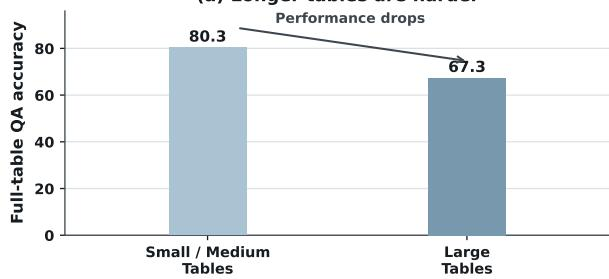
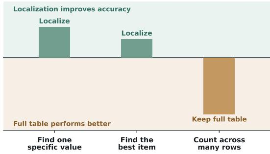
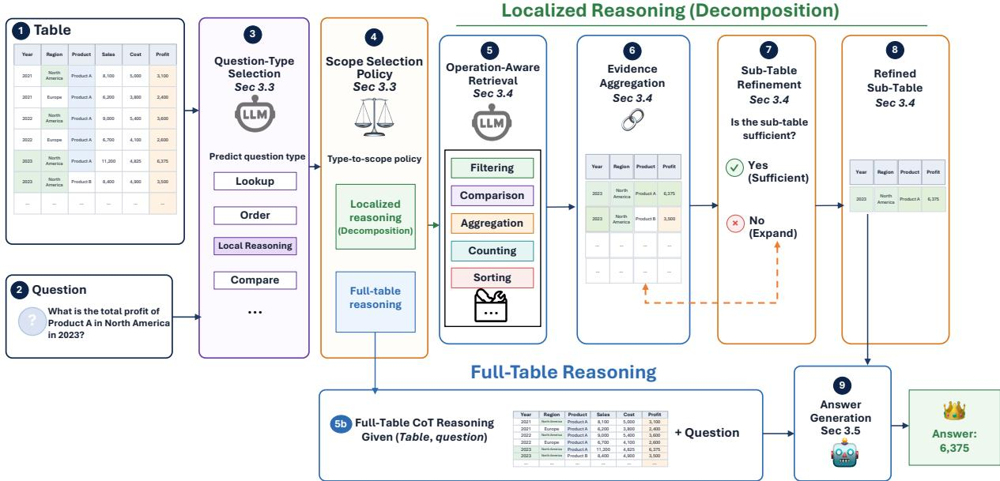

# TabScope: Question-Adaptive Scope Selection for Table Question Answering

Yuxiang Wang, Junhao Gan, Jianzhong Qi

The University of Melbourne

yuxiang.wang8@student.unimelb.edu.au {junhao.gan, jianzhong.qi}@unimelb.edu.au

## Abstract

Large Language Models (LLMs) have shown strong performance on table question answering, yet their accuracy often degrades as table size increases. We find that this degradation is not uniform across question types. Localization-sensitive questions are particularly affected by irrelevant table content, while questions requiring broader evidence may still benefit from full-table reasoning. Based on this observation, we propose a question-adaptive framework that dynamically selects between localized and full-table reasoning. The framework constructs question-specific sub-tables through operation-aware table decomposition and uses the predicted question type to determine the appropriate reasoning mode. We further introduce silver reference sub-tables for evaluating evidence selection and construct SLQA, a benchmark based on real-world long tables. Experiments on WikiTQ and SLQA show that localization is particularly effective for lookup and local reasoning questions, while adaptive selection between localized and fulltable reasoning achieves the best overall performance. These results highlight that long-table QA requires deciding not only how to localize, but also when to localize. Our code and datasets will be made available upon publication of the paper.

## 1 Introduction

Large Language Models (LLMs) have demonstrated strong reasoning capabilities for table question answering (TableQA), particularly when combined with chain-of-thought (CoT) prompting (Wei et al., 2022; Chen, 2023). However, their performance remains sensitive to table size. As tables grow longer, LLMs struggle to identify the small set of rows and columns needed to support the answer from noisy inputs, leading to lower answer accuracy (Ye et al., 2023; Liu et al., 2024).

Our analysis shows that this degradation varies across question types. Localization is particularly effective when the answer depends on a small, restricted table region. In contrast, questions requiring broad comparison sets, complete aggregation domains, or information distributed across many rows may benefit from retaining the full table. Decomposition may otherwise remove necessary context or introduce retrieval errors. Figure 1 summarizes these observations. Full-table reasoning performs worse on large tables, while the benefit of localization varies with both the question and table size. This leads to the central question of our work: when should a TableQA model localize the table, and when should it reason over thefull context?

(a) Longer tables are harder  

(b) The best scope depends on the question  
  
Figure 1: Motivation for question-adaptive table scope selection using GPT-5-mini as base model. (a) Fulltable QA performs worse on large tables. (b) Localization helps questions requiring compact regions, whereas questions involving many rows or entities favor fulltable reasoning. Small/medium and large tables correspond to WikiTQ and SLQA, respectively.

We regard TableQA as a question-adaptive reasoning problem rather than a fixed decomposition pipeline, especially for long tables. We propose TABSCOPE, which first determines whether a question is better served by the full table or a compact sub-table. When localization is expected to be beneficial, TABSCOPE uses an operation-aware decomposer with refinement to select the relevant rows and columns before reasoning. Otherwise, the model reasons directly over the full table. This design uses compact table regions when helpful while preserving broader context when necessary.

Existing TableQA benchmarks present two additional limitations for studying evidence localization. First, datasets such as WikiTableQuestions (Pasupat and Liang, 2015) provide only tables, questions, and final answers, without explicit annotations of the supporting sub-tables. This makes it difficult to evaluate the quality of intermediate evidence selection. Second, most existing benchmarks (Pasupat and Liang, 2015; Chen et al., 2020; Wu et al., 2025) contain relatively small tables and provide limited coverage of long-table settings. We address the first limitation by constructing silver reference subtables for evaluating decomposition quality. For the second, we develop an automatic pipeline for generating question–answer pairs from real-world tables and use it to construct SLQA, a benchmark for long-table question answering.

Our main contributions are as follows:

• We construct silver reference sub-tables for directly evaluating decomposition quality and propose an operation-aware decomposition method that improves evidence selection.

• We analyze when to localize and introduce a question-adaptive framework selects between localized and full-table reasoning.

• We develop an automatic pipeline for generating validated question–answer pairs from real-world tables and use it to build SLQA, a benchmark for long-table question answering.

## 2 Related Work

Recent LLM-based TableQA methods increasingly address the difficulty of reasoning over large tables by reducing, retrieving, or transforming relevant rows and columns before answer generation. We first review two main lines of localizationoriented methods: semantic evidence selection and operation-aware table reduction. We then review existing TableQA benchmarks and evidence annotations, which provide the context for our silver sub-table construction and long-table benchmark.

Evidence localization and retrieval. One line of work selects a smaller sub-table containing relevant evidence before reasoning. DATER (Ye et al., 2023) uses LLMs to decompose both table and questions, selecting relevant rows and columns for downstream reasoning. H-STAR (Abhyankar et al., 2025) similarly extracts relevant table regions within a hybrid symbolic–textual framework. Others use retrieval-augmented methods for table reasoning. TableRAG (Chen et al., 2024) retrieves relevant schema and cell information for large-scale table understanding, T-RAG (Pan et al., 2022) combines dense table retrieval with generation for opendomain TableQA, and GTR (Zou et al., 2025) performs graph-based hierarchical retrieval for crosstable question answering. While these methods mainly improve how relevant evidence is retrieved or selected, our approach makes evidence selection operation-aware and treats localization as a question-dependent decision.

Program-guided table decomposition. Another direction obtains intermediate tables through explicit operations or executable programs. Chain-of-Table (Wang et al., 2024) iteratively transforms the table during reasoning and treats intermediate tables as evolving reasoning states. Table-Critic (Yu et al., 2025) iteratively critiques and refines the intermediate table before answer generation. Re-AcTable (Zhang et al., 2024) combines LLM reasoning with tools such as SQL and Python executors to manipulate tabular data step by step. TabSQLify (Nahid and Rafiei, 2024) constructs question-relevant sub-tables through SQL queries, while Plan-of-SQLs (Nguyen et al., 2025) executes a sequence of SQL steps to provide interpretable intermediate reasoning traces. In contrast, TAB-SCOPE does not require a full operation chain or executable program, and applies decomposition only when localized reasoning is helpful.

Evidence supervision and long-table evaluation. Most TableQA benchmarks, such as WikiTable-Questions, provide tables, questions, and final answers, but no explicit annotations of the supporting rows and columns (Pasupat and Liang, 2015). This limits direct evaluation of intermediate sub-tables. In addition, many commonly used benchmarks contain relatively small tables, typically under 4K table tokens, making them less suited for evaluating longtable reasoning (Chen et al., 2020; Wu et al., 2025; Cheng et al., 2022). We address these gaps by constructing silver reference sub-tables for evaluating decomposition quality and by introducing SLQA, a benchmark built from real-world long tables.

  
Figure 2: Overview of TABSCOPE. The framework selects localized or full-table reasoning for each question. The localized path constructs a refined sub-table, whereas the full-table path bypasses decomposition.

## 3 Methodology

## 3.1 Problem Formulation

Given a table T, a question q, and a reference answer $^ { a , }$ the goal of TableQA is to predict an answer aˆ that matches a. We represent the table as $T = ( H , R )$ , where $H = h _ { 1 } , \ldots , h _ { m }$ denotes the column headers and $R = r _ { 1 } , \ldots , r _ { n }$ denotes the table rows. For each question, a model can either reason over the full table $T$ or reduce it to a question-specific sub-table $T ^ { \prime }$ . We define the sub-table as $T ^ { \prime } = T [ R ^ { \prime } , C ^ { \prime } ]$ , where $R ^ { \prime } \subseteq R$ and $C ^ { \prime } \subseteq H$ are the selected rows and columns. Our goal is not to always minimize the table, but to select the appropriate table scope for each question.

## 3.2 Overview of TABSCOPE

We propose TABSCOPE, a question-adaptive framework that selects the appropriate table scope before answer generation. As illustrated in Figure 2, TABSCOPE consists of three components. (i) An LLM-based scope selector predicts the question type and uses a fixed policy to choose localized or full-table reasoning. (ii) When localization is selected, an operation-aware decomposer retrieves the required rows and columns and refines them into a question-specific sub-table. (iii) The answer model generates the answer from the selected input, either the refined sub-table or the original full table.

## 3.3 Question-Adaptive Scope Selection

TABSCOPE is designed to determine whether localization should be applied to each question. The scope selector consists of an LLM-based questiontype classifier $C _ { \theta }$ and a fixed type-to-scope policy π. Given a question q and table T, the classifier predicts a predefined question type $\hat { \tau } .$ . The policy then selects the reasoning mode according to the predicted type and table-size regime:

$$
\begin{array} { r l } & { \hat { \tau } = C _ { \theta } ( q , T ) , } \\ & { z = \pi \big ( \hat { \tau } , s ( T ) \big ) , } \\ & { z \in \{ \mathrm { l o c a l } , \mathrm { f u l l } \} . } \end{array}\tag{1}
$$

Here, $s ( T )$ denotes the table-size regime. $\operatorname { I f } z =$ local, TABSCOPE constructs a question-specific sub-table before answer generation. Otherwise, it bypasses decomposition and reasons directly over the original table.

We derive π through an offline analysis on the validation set. For each question type, we compare localized reasoning with full-table reasoning and assign the better-performing mode. We additionally account for table size when the preferred mode changes on large tables. At inference time, the LLM predicts only τˆ, while the fixed policy determines the final scope. The classification prompt is provided in Appendix B.4, and the type-wise analysis used to define π is reported in Appendix A.

## 3.4 Operation-Aware Table Decomposition

When the scope selector chooses localized reasoning, TABSCOPE constructs a question-specific subtable through operation-aware decomposition. The goal is to retrieve the rows and columns needed for the question’s reasoning process, rather than relying only on lexical overlap between the question and table content. The decomposer has three steps: operation-aware retrieval, evidence aggregation, and sub-table refinement. All the prompts used are shown in Appendix B.

Operation-aware retrieval. The decomposer first identifies the operation required by the question, such as lookup, filtering, comparison, or counting. This operation determines both the rows and columns to retrieve. For example, for the question “How many Australian teams scored above $I O ? ^ { , , }$ , the decomposer should retrieve rows whose country is Australia and whose score is greater than 10, together with columns such as country, score, and team identifier. Although the final answer is only a count, the sub-table must preserve the evidence needed to verify the filtering operation. This shows why decomposition should be guided by the operation rather than lexical overlap alone.

Evidence aggregation. A single LLM retrieval may be unstable because generation can vary across samples. It may miss necessary evidence or include weakly related rows and columns. To make retrieval more robust, we sample $K$ retrieval outputs for the same question, where $K = 4$ by default.

We aggregate row retrievals and column retrievals separately. Each retrieval output is treated as a candidate c, which contains either a selected row set or a selected column set. Each candidate is assigned a reliability score $s ( c )$ . When generation confidence is available for the LLM, $s ( c )$ is computed from the average token log probability of the candidate. Otherwise, we set $s ( c ) = 0$ , reducing $w ( g )$ to frequency-based voting. Candidates that select the same normalized row set or column set are merged into a candidate group g.

For each group, we compute a support weight:

$$
w ( g ) = \sum _ { c \in g } \exp ( s ( c ) ) .\tag{2}
$$

Here, $w ( g )$ measures how strongly the retrieval samples support group $g .$ The term $\exp ( s ( c ) )$ converts the candidate score into a positive voting weight, so a group receives higher support when the same evidence set appears multiple times or when its candidates have higher reliability scores.

After aggregation, each distinct row set returned by the retrieval samples forms a row group, and each distinct column set forms a column group. Groups returned more frequently or with higher confidence receive larger weights. For example, if three out of four samples retrieve the same rows, a candidate sub-table containing these rows should receive stronger support.

To construct candidate sub-tables, we first rank the row groups and column groups by their support weights. We progressively union the top-ranked groups to form candidate row sets $R ^ { \prime }$ and candidate column sets $C ^ { \prime }$ , removing duplicate candidates. We then enumerate the resulting row–column combinations and score each candidate sub-table $T [ R ^ { \prime } , C ^ { \prime } ]$ using the support and compactness criteria defined below. For a candidate row set $R ^ { \prime }$ , we compute:

$$
{ \mathrm { R o w S c o r e } } ( R ^ { \prime } ) = { \frac { \sum _ { g \in G _ { r } ; g \subseteq R ^ { \prime } } w ( g ) } { \sum _ { g \in G _ { r } } w ( g ) } } .\tag{3}
$$

Here, $G _ { r }$ is the set of distinct row groups, $g$ is one retrieved row set, and $w ( g )$ is its weight. Thus, RowScore $( R ^ { \prime } )$ is the proportion of total rowgroup weight covered by $R ^ { \prime }$ . The column score $\mathrm { C o l S c o r e } ( C ^ { \prime } )$ is computed in the same way over the column groups.

We combine the two scores as:

$$
{ \mathrm { S u p p o r t } } ( R ^ { \prime } , C ^ { \prime } ) = { \sqrt { { \mathrm { R o w S c o r e } } ( R ^ { \prime } ) \cdot { \mathrm { C o l S c o r e } } ( C ^ { \prime } ) } } .\tag{4}
$$

The support score is high only when the candidate sub-table covers both the rows and columns repeatedly selected across retrieval samples.

We then balance this support with sub-table size:

$$
S ( R ^ { \prime } , C ^ { \prime } ) = \frac { \mathrm { S u p p o r t } ( R ^ { \prime } , C ^ { \prime } ) } { \rho ( R ^ { \prime } , C ^ { \prime } ) ^ { \alpha } } , \rho ( R ^ { \prime } , C ^ { \prime } ) = \frac { | R ^ { \prime } | \cdot | C ^ { \prime } | } { | R | \cdot | H | } .\tag{5}
$$

Here, $\rho ( R ^ { \prime } , C ^ { \prime } )$ is the proportion of table cells retained by the candidate, and coefficient $\alpha \in$ $[ 0 . 1 , 0 . 3 ]$ controls the penalty on large sub-tables. We select the row–column combination with the highest $S ( R ^ { \prime } , C ^ { \prime } )$ as the final decomposed table $T ^ { \prime } = T [ R ^ { \prime } , C ^ { \prime } ]$

<table><tr><td rowspan="2">Dataset</td><td colspan="3">Table Statistics</td><td colspan="3"># QA Pairs</td></tr><tr><td>Cols.</td><td>Rows</td><td>Tokens</td><td>Train</td><td>Valid.</td><td>Test</td></tr><tr><td>WikiTQ</td><td>6.4</td><td>25.4</td><td>662.6</td><td>11,321</td><td>2,831</td><td>4,344</td></tr><tr><td>SLQA</td><td>11.0</td><td>733.8</td><td>9,786.2</td><td>1,324</td><td>239</td><td>1,110</td></tr><tr><td>WTQ-SUBTAB</td><td>1.8</td><td>6.5</td><td>104.8</td><td>一</td><td></td><td>4,344</td></tr></table>

Table 1: Statistics of the evaluation resources, averaged over questions. WikiTQ mainly contains small and medium tables, whereas all SLQA tables exceed 4,096 serialized tokens. WTQ-SUBTAB contains silver subtables for the 4,344 WikiTQ test questions.

<table><tr><td colspan="5">Table Title: Item Information</td><td rowspan="2">Q: What is the name of the smartphone</td></tr><tr><td>Item</td><td>Details</td><td>Cost</td><td>Additional Info</td><td>mentioned in the table?</td></tr><tr><td>Laptop</td><td>Dell XPS 13</td><td>1200</td><td>{&#x27;Weight&#x27;: &#x27;1.2kg&#x27;, &#x27;Battery&#x27;: &#x27;12 hrs&#x27;}</td><td>A: iPhone 15</td><td rowspan="3">Q: Which brand produces the Smart Speaker and what voice assistant does</td></tr><tr><td>Smartphone</td><td>iPhone 15</td><td>999</td><td></td><td>{&#x27;Camera&#x27;: &#x27;48MP&#x27;, &#x27;Chipset&#x27;: &#x27;A17 Bionic&quot;}</td></tr><tr><td>…</td><td>1</td><td>…</td><td>…</td><td>it use? A: Amazon, Alexa</td></tr><tr><td>Smart Speaker</td><td>Amazon Echo</td><td></td><td>99</td><td>{&#x27;Brand&#x27;: &#x27;Amazon&#x27;, &#x27;Assistant&#x27;: &#x27;Alexa&#x27;}</td><td>Q: What is the price of the first item? A: 1200</td></tr><tr><td>Subscription</td><td>Cloud Storage</td><td></td><td>10</td><td>{&#x27;Provider&#x27;: &#x27;Google Drive&#x27;, &quot;Storage&#x27;: &#x27;1TB&#x27;}</td><td>Q: Which is cheaper Laptop or</td></tr><tr><td></td><td></td><td></td><td></td><td></td><td>Smartphone? A: Smartphone</td></tr></table>

Figure 3: Generated QA pair examples.

Sub-table refinement. After evidence aggregation, TABSCOPE performs one refinement round by default to verify whether the sub-table T′ is sufficient for answering the question q. Given q, the full table T, and $T ^ { \prime }$ , the verifier determines whether additional rows, columns, or both are needed. If necessary, the missing evidence is added to $T ^ { \prime }$ which is then passed to the answer model M.

## 3.5 Answer Generation

After scope selection, each question follows a single reasoning path. The QA model M answers from the $( q , T ^ { \prime } )$ pair when localized reasoning is selected, and from (q, T) pair otherwise.

## 4 Experiments

We evaluate TABSCOPE to answer three questions. RQ1: How effectively does operation-aware decomposition identify compact and sufficient evidence? RQ2: Can localization mitigate performance degradation on long tables? RQ3: Can question-adaptive scope selection outperform fixed full-table or localized reasoning?

## 4.1 Experimental Setup

Base Models. We use two base LLMs from different families: LLaMA-3.3-70B (Dubey et al., 2024), and GPT-5-mini (OpenAI, 2026). They cover both open-source and closed-source settings, as well as large and relatively smaller LLMs. Detailed settings are provided in Appendix C.

Benchmarks and Evaluation Resources. We evaluate TABSCOPE on three benchmarks. Table 1 shows the statistics for these benchmarks.

WikiTableQuestions (WikiTQ). WikiTableQuestions (Pasupat and Liang, 2015) is a widely used TableQA benchmark with diverse question types and tables spanning a broad range of sizes, including tables which sizes exceed 4,096 tokens. We use WikiTQ for standard TableQA evaluation, tablesize analysis, and type-wise scope analysis.

SLQA. Existing TableQA benchmarks contain relatively few long tables (token size exceeds 4,096 tokens), making it difficult to systematically evaluate long-table reasoning. We therefore construct SLQA, a dedicated long-table TableQA benchmark. We extract tables from Spider (Yu et al., 2018) whose table sizes exceed 4,096 tokens, but replace the original NL-to-SQL questions with newly generated TableQA questions. We use GPT-4o mini (OpenAI, 2024) to generate question–answer pairs from four evidence scopes: a cell, a row, a column, or a sub-table. The model first identifies an answer supported by the specified evidence and then formulates the corresponding question. All generated pairs are manually reviewed with fewer than 30% requiring correction. The generation prompts and detailed analysis are provided in Appendix D.1. Figure 3 shows examples of generated QA pairs.

WTQ-SUBTAB. Final-answer accuracy alone does not reveal whether a decomposition method retrieves the correct intermediate rows and columns. We therefore construct WTQ-SUBTAB, a silverreference evaluation set derived from WikiTQ. Each instance consists of a question, its original table, and a silver sub-table containing the rows and columns needed to answer or verify the question.

We compare three construction strategies using 200 randomly sampled WikiTQ QA pairs with manually annotated gold sub-tables. Schema-based construction first asks an LLM to identify questionrelevant schema elements and values, which are then mapped back to the original table. Direct generation instead asks the LLM to predict the target sub-table directly. The third strategy applies a verifier to the directly generated sub-table and repairs missing, invalid, or redundant selections. Direct generation with refinement achieves the highest agreement with the human annotations and is therefore used to construct WTQ-SUBTAB. Detailed results are reported in Appendix D.2.

<table><tr><td rowspan="2">Category</td><td rowspan="2">Method</td><td colspan="3">WikiTQ</td><td colspan="3">SLQA</td></tr><tr><td>GPT</td><td>LLaMA</td><td>Avg.</td><td>GPT</td><td>LLaMA</td><td>Avg.</td></tr><tr><td rowspan="6">Decomposition</td><td>TableRAG (Chen et al., 2024)</td><td>69.5</td><td>56.8</td><td>63.2</td><td>47.4</td><td>49.7</td><td>48.6</td></tr><tr><td>TabSQLify (Nahid and Rafiei, 2024)</td><td>73.5</td><td>72.3</td><td>72.9</td><td>59.3</td><td>34.0</td><td>46.7</td></tr><tr><td>Table-Critic (Yu et al., 2025)</td><td></td><td>70.1</td><td></td><td></td><td>52.3</td><td></td></tr><tr><td>DATER (Ye et al., 2023)</td><td>76.3</td><td>70.5</td><td>73.4</td><td>56.0</td><td>54.2</td><td>55.1</td></tr><tr><td>Chain-of-Table (Wang et al., 2024)</td><td>75.8</td><td>71.8</td><td>73.8</td><td>63.1</td><td>57.2</td><td>60.2</td></tr><tr><td>TABSCOPE (decomposition-only)</td><td>82.4</td><td>76.8</td><td>79.6</td><td>72.3</td><td>61.9</td><td>67.1</td></tr><tr><td rowspan="2">Full-table</td><td>RoT (Zhang et al., 2025)</td><td>81.7</td><td>78.7</td><td>80.2</td><td>70.3</td><td>54.1</td><td>62.2</td></tr><tr><td>CoT (Wei et al., 2022)</td><td>82.1</td><td>78.5</td><td>80.3</td><td>72.1</td><td>62.5</td><td>67.3</td></tr><tr><td>Adaptive</td><td>TABSCOPE</td><td>83.3</td><td>81.1</td><td>82.2</td><td>73.4</td><td>62.8</td><td>68.1</td></tr></table>

Table 2: Exact-match accuracy (%) on WikiTQ and SLQA. The decomposition-only variant applies operation-aware decomposition to every question, whereas the TABSCOPE adaptively selects between localized and full-table reasoning. GPT and LLaMA denote GPT-5-mini and LLaMA-3.3-70B, respectively. Avg. denotes the average across the two answer models and is omitted when one result is unavailable. The best and second-best results per column are shown in bold and underlined, respectively. Rows highlighted in green denote variants of our method.

Given an instance $( q , T , a )$ , an LLM selects the minimal supporting rows and columns. A verifier then detects invalid, incomplete, or unnecessarily large selections and requests a repair when needed. The resulting reference sub-table is defined as $T ^ { * } = T [ R ^ { * } , C ^ { * } ]$ , where R∗ and C∗ denote the verified rows and columns.

WTQ-SUBTAB is used only to evaluate decomposition quality through row-, column-, and celllevel matching. Its silver annotations are not available to TABSCOPE during inference. Construction prompts are provided in Appendix D.3.1.

Baselines. We compare TABSCOPE with two groups of baselines.

Decomposition-based methods reduce or transform the table before answering. DATER (Ye et al., 2023) decomposes questions and tables to select relevant rows and columns. Chain-of-Table (Wang et al., 2024) iteratively applies table operations and uses the final transformed table for answer generation. TabSQLify (Nahid and Rafiei, 2024) generates SQL queries to construct question-relevant sub-tables. TableRAG (Chen et al., 2024) retrieves relevant schema and cells for large-table reasoning, while Table-Critic (Yu et al., 2025) iteratively critiques and refines a candidate sub-table before answer generation. For a controlled comparison, we use each decomposition method only to produce its final sub-table. All resulting sub-tables are passed to the same answer model using an identical chainof-thought prompt and answer normalization.

Full-table reasoning methods retain the original table during answer generation. Full-table

CoT (Wei et al., 2022) serializes the complete table and reasons step by step over it. RoT (Zhang et al., 2025) performs row-wise reasoning before producing the final answer. These baselines represent two fixed scope strategies: always localizing or always retaining the full table.

Evaluation Metrics. For WikiTQ and SLQA, we report answer exact-match accuracy using the official WikiTableQuestions evaluator (Pasupat and Liang, 2015). For WTQ-SUBTAB, we independently compare the predicted rows, columns, and cells with their silver references. We report exact match, which requires the predicted set to match the reference set completely, and F1 score, which measures partial overlap between the two sets.

## 4.2 Main Results

Table 2 compares TABSCOPE with fixed full-table and decomposition-based methods on WikiTQ and SLQA, using GPT-5-mini and LLaMA-3.3-70B as answer models.

RQ1: Operation-aware decomposition. The decomposition-only variant consistently outperforms existing decomposition-based methods. On WikiTQ, it improves over the strongest baseline by 6.1 and 4.5 points with GPT-5-mini and LLaMA-3.3-70B, respectively. The gains increase to 9.2 and 4.7 points on SLQA. The larger improvement on SLQA suggests that operation-aware decomposition becomes particularly useful as tables grow longer and contain more irrelevant rows and columns.

To determine whether these gains arise from better sub-table selection, we directly evaluate decomposition quality on WTQ-SUBTAB. Predicted rows, columns, and cells are compared with the silver references in WTQ-SUBTAB using F1 and exact match. F1 measures partial agreement with the reference, whereas exact match requires the complete predicted set to be correct.

<table><tr><td>Method</td><td colspan="3">F1</td><td colspan="3">Exact Match</td></tr><tr><td></td><td>Cell</td><td>Row</td><td>Column</td><td>Cell</td><td>Row</td><td>Column</td></tr><tr><td>TableRAG (Chen et al., 2024)</td><td>26.56</td><td>44.15</td><td>52.30</td><td>3.20</td><td>13.92</td><td>16.98</td></tr><tr><td>TabSQLify (Nahid and Rafiei, 2024)</td><td>40.87</td><td>56.22</td><td>75.67</td><td>9.23</td><td>26.95</td><td>39.69</td></tr><tr><td>Chain-of-Table (Wang et al., 2024)</td><td>52.91</td><td>76.86</td><td>67.17</td><td>25.39</td><td>56.22</td><td>38.20</td></tr><tr><td>DATER (Ye et al., 2023)</td><td>68.00</td><td>78.46</td><td>85.93</td><td>36.63</td><td>61.50</td><td>59.34</td></tr><tr><td>TABSCOPE (decomposition-only)</td><td>70.70</td><td>82.78</td><td>86.95</td><td>41.03</td><td>70.74</td><td>60.54</td></tr></table>

Table 3: Sub-table decomposition quality on WTQ-SUBTAB. We report F1 and exact match (%) at the cell, row, and column levels. Methods are ordered from lower to higher average performance across the six metrics. The best and second-best results are shown in bold and underlined, respectively.

<table><tr><td>Question Type</td><td>WikiTQ∆</td><td>SLQA ∆</td><td>Preferred Scope</td></tr><tr><td>Lookup</td><td>+1.17</td><td>+1.39</td><td>Localized</td></tr><tr><td>Order/Superlative</td><td>+1.01</td><td>+0.53</td><td>Localized</td></tr><tr><td>Local Reasoning</td><td>+3.33</td><td></td><td>Localized</td></tr><tr><td>Count-Diff</td><td>+2.13</td><td></td><td>Localized</td></tr><tr><td>Count-General</td><td>-2.40</td><td>-2.34</td><td>Full table</td></tr><tr><td>Count-Frequency</td><td>-2.68</td><td>+2.22</td><td>Size-dependent</td></tr><tr><td>Compare</td><td>-1.24</td><td></td><td>Full table</td></tr></table>

Table 4: Type-wise localization gain in percentage points. ∆ is computed as localized reasoning minus full-table reasoning. Positive values favor localization, while negative values favor full-table reasoning. WikiTQ is dominated by small and medium tables, whereas SLQA contains only large tables exceeding 4,096 tokens. “–” indicates insufficient examples. Definitions of the question types and the complete type-wise results are provided in Appendix A.

As shown in Table 3, TABSCOPE achieves the best result across all six metrics. Compared with DATER, the strongest baseline, it improves cell, row, and column F1 by 2.70, 4.32, and 1.02 points, respectively. Under the stricter exact-match criterion, the corresponding gains are 4.40, 9.24, and 1.20 points. The largest improvement occurs in row exact match, indicating that TABSCOPE more often recovers the complete set of rows required for the question rather than only a partially relevant subset. At the same time, the improvements in cell F1 and cell exact match show that the selected rows and columns are jointly more consistent with the compact silver sub-tables. The QA gains in Table 2 are consistent with the row-, column-, and cell-level results on WTQ-SUBTAB. Together, these results show that operation-aware decomposition produces sub-tables that more closely match the silver references and better support answer generation.

RQ2: Localization on long tables. As shown in Table 2, the decomposition-only variant achieves an average accuracy of 67.1% on SLQA, outperforming the strongest decomposition baseline by 6.9 points and nearly matching full-table CoT at 67.3%. This is notable because SLQA contains only tables exceeding 4,096 tokens. The result shows that a large portion of the original table can be removed while retaining nearly the same overall QA accuracy, suggesting that localization can mitigate the distracting effect of long-table context.

However, the similar average performance of localized and full-table reasoning hides substantial variation across question types. Table 4 shows that localization is more effective when the required rows and columns are concentrated within a small table region. This includes entity lookup, ranking or extrema, reasoning over nearby records, and differences between two filtered counts. In these cases, removing unrelated content makes the required relationships easier to identify.

Full-table reasoning remains stronger for questions requiring broader coverage, such as counting all matching rows or comparing multiple entities or groups. Frequency counting further illustrates the interaction between question type and table size. It favors full-table reasoning on WikiTQ but shifts toward localization on SLQA, suggesting that preserving the complete table is useful at moderate sizes, while excessive context becomes increasingly harmful on longer tables. Localization can therefore reduce long-table degradation, but its effectiveness depends on both the reasoning requirement and the amount of table content. Detailed type definitions and complete results are provided in Appendix A.

RQ3: Question-adaptive scope selection. The complete TABSCOPE augments the decompositiononly variant with scope selection, which determines whether each question should be answered from the localized sub-table or the original full table. As shown in Table 2, this complete framework achieves the highest accuracy across both datasets and answer models.

Compared with always applying operationaware decomposition, evidence scoping improves accuracy by 0.9 and 4.3 points on WikiTQ with GPT-5-mini and LLaMA-3.3-70B, respectively. The corresponding gains on SLQA are 1.1 and 0.9 points. These improvements show that even a strong decomposition method should not be applied uniformly, since localization may remove rows or columns that remain useful for questions requiring broader table coverage.

The complete framework also outperforms the strongest full-table baseline in every setting. On WikiTQ, it improves accuracy by 1.2 points with GPT-5-mini and 2.4 points with LLaMA-3.3-70B. On SLQA, the gains are 1.3 and 0.3 points, respectively. Although full-table reasoning retains all table content, it also introduces more irrelevant rows and columns for questions that depend on a restricted table region.

These findings are consistent with the typewise results in Table 4. Questions involving entity lookup, ranking, extrema, or a small group of related records often benefit from localization, whereas general counting and multi-entity comparison typically require broader table coverage. By using scope selection to select one of these two inputs for each question, TABSCOPE avoids both unnecessary table reduction and excessive irrelevant context. This question-adaptive choice makes the complete framework more reliable than either always-localized or always-full-table reasoning.

Ablation results. Table 5 shows that all components contribute to the performance of TABSCOPE. Removing evidence aggregation causes the smallest decrease, reducing accuracy by 1.3 points on WikiTQ and 0.7 points on SLQA, while removing sub-table refinement leads to slightly larger drops of 1.7 and 1.5 points. These results suggest that aggregation mainly improves the stability of row and column selection, whereas refinement helps recover missing content from initially incomplete sub-tables. Removing operation-aware retrieval has the largest effect among the decomposition components, decreasing accuracy by 3.1 points on WikiTQ and 2.0 points on SLQA. This confirms that semantic relevance alone may fail to preserve the rows and columns required for operations such as counting, comparison, ranking, and aggregation.

<table><tr><td>Variant</td><td>WikiTQ</td><td>SLQA</td></tr><tr><td>TABSCOPE</td><td>81.1</td><td>62.8</td></tr><tr><td>w/o evidence aggregation</td><td>79.8 (−1.3)</td><td>62.1 (−0.7)</td></tr><tr><td>w/o sub-table refinement</td><td>79.4 (−1.7)</td><td>61.3 (−1.5)</td></tr><tr><td>w/o operation-aware retrieval</td><td>78.0 (−3.1)</td><td>60.8 (−2.0)</td></tr><tr><td>w/o scope selection</td><td>76.8 (-4.3)</td><td>61.9 (−0.9)</td></tr></table>

Table 5: Ablation results using LLaMA-3.3-70B, measured by exact-match accuracy (%). Values in parentheses denote the decrease relative to the TABSCOPE.

Removing scope selection yields the decomposition-only variant, which applies localization to every question. This reduces accuracy by 4.3 points on WikiTQ but only 0.9 points on SLQA. The larger drop on WikiTQ is consistent with the type-wise results, where some questions benefit from retaining the full table. In contrast, the small decrease on SLQA shows that operation-aware decomposition remains effective for most long-table questions by removing substantial irrelevant content while preserving the information needed for answering. Nevertheless, the complete framework still performs best, indicating that adaptive scope selection complements decomposition by retaining the full table when broader coverage is required.

## 5 Conclusion

We presented TABSCOPE, a framework that treats table scope as a question-dependent decision rather than a fixed preprocessing choice. By combining question-adaptive scope selection with operationaware decomposition, TABSCOPE can reduce distracting table content when localization is helpful while preserving the full-table when broader coverage is required. Experiments on WikiTQ and SLQA show that this design improves answer accuracy across both moderate- and large-scale tables, while the results on WTQ-SUBTAB confirm that the decomposed tables more closely match the rows, columns, and cells needed for answering. These findings suggest that effective TableQA depends not only on how a table is processed, but also on deciding how much of the table should be retained for each question.

## 6 Limitations

Our evaluation focuses on English TableQA benchmarks and two representative LLMs. Although WikiTQ and SLQA cover different table scales, evaluation across additional domains, languages, and model families would provide a broader assessment of generalization. The current scope-selection policy is based on a predefined question-type taxonomy, and future work could explore more flexible routing strategies.

## References

Nikhil Abhyankar, Vivek Gupta, Dan Roth, and Chandan K. Reddy. 2025. H-STAR: LLM-driven hybrid SQL-text adaptive reasoning on tables. In NAACL, pages 8841–8863.

Si-An Chen, Lesly Miculicich, Julian M Eisenschlos, Zifeng Wang, Zilong Wang, Yanfei Chen, Yasuhisa Fujii, Hsuan-Tien Lin, Chen-Yu Lee, and Tomas Pfister. 2024. TableRAG: Million-token table understanding with language models. In NeurIPS, pages 74899–74921.

Wenhu Chen. 2023. Large language models are few(1)- shot table reasoners. In EACL, pages 1090–1100.

Wenhu Chen, Hongmin Wang, Jianshu Chen, Yunkai Zhang, Hong Wang, Shiyang Li, Xiyou Zhou, and William Yang Wang. 2020. TabFact: A large-scale dataset for table-based fact verification. In ICLR.

Zhoujun Cheng, Haoyu Dong, Zhiruo Wang, Ran Jia, Jiaqi Guo, Yan Gao, Shi Han, Jian-Guang Lou, and Dongmei Zhang. 2022. HiTab: A hierarchical table dataset for question answering and natural language generation. In ACL, pages 1094–1110.

Abhimanyu Dubey, Abhinav Jauhri, Abhinav Pandey, Abhishek Kadian, Ahmad Al-Dahle, Aiesha Letman, Akhil Mathur, Alan Schelten, Amy Yang, Angela Fan, et al. 2024. The Llama 3 herd of models. CoRR, abs/2407.21783.

Nelson F. Liu, Kevin Lin, John Hewitt, Ashwin Paranjape, Michele Bevilacqua, Fabio Petroni, and Percy Liang. 2024. Lost in the Middle: How language models use long contexts. Transactions ofthe Association for Computational Linguistics, 12:157–173.

Md Mahadi Hasan Nahid and Davood Rafiei. 2024. Tabsqlify: Enhancing reasoning capabilities of llms through table decomposition. In NAACL, pages 5725– 5737.

Giang Nguyen, Ivan Brugere, Shubham Sharma, Sanjay Kariyappa, Anh Totti Nguyen, and Freddy Lécué. 2025. Interpretable llm-based table question answering. Trans. Mach. Learn. Res., 2025.

OpenAI. 2024. GPT-4o mini. https://platform. openai.com/docs/models/#gpt-4o-mini.

OpenAI. 2026. Openai GPT-5 system card. CoRR, abs/2601.03267.

Feifei Pan, Mustafa Canim, Michael R. Glass, Alfio Gliozzo, and James A. Hendler. 2022. End-to-end table question answering via retrieval-augmented generation. CoRR, abs/2203.16714.

Panupong Pasupat and Percy Liang. 2015. Compositional semantic parsing on semi-structured tables. In ACL/IJCNLP, pages 1470–1480.

Zilong Wang, Hao Zhang, Chun-Liang Li, Julian Martin Eisenschlos, Vincent Perot, Zifeng Wang, Lesly Miculicich, Yasuhisa Fujii, Jingbo Shang, Chen-Yu Lee, et al. 2024. Chain-of-Table: Evolving tables in the reasoning chain for table understanding. In ICLR.

Jason Wei, Xuezhi Wang, Dale Schuurmans, Maarten Bosma, Fei Xia, Ed Chi, Quoc V Le, and Denny Zhou. 2022. Chain-of-thought prompting elicits reasoning in large language models. In NeurIPS, pages 24824–24837.

Xianjie Wu, Jian Yang, Linzheng Chai, Ge Zhang, Jiaheng Liu, Xeron Du, Di Liang, Daixin Shu, Xianfu Cheng, Tianzhen Sun, Tongliang Li, Zhoujun Li, and Guanglin Niu. 2025. Tablebench: A comprehensive and complex benchmark for table question answering. In AAAI, pages 25497–25506.

Yunhu Ye, Binyuan Hui, Min Yang, Binhua Li, Fei Huang, and Yongbin Li. 2023. Large language models are versatile decomposers: Decompose evidence and questions for table-based reasoning. In SIGIR, pages 174–184.

Peiying Yu, Guoxin Chen, and Jingjing Wang. 2025. Table-Critic: A multi-agent framework for collaborative criticism and refinement in table reasoning. In ACL, pages 17432–17451.

Tao Yu, Rui Zhang, Kai Yang, Michihiro Yasunaga, Dongxu Wang, Zifan Li, James Ma, Irene Li, Qingning Yao, Shanelle Roman, Zilin Zhang, and Dragomir R. Radev. 2018. Spider: A large-scale human-labeled dataset for complex and cross-domain semantic parsing and text-to-sql task. In EMNLP, pages 3911–3921.

Xuanliang Zhang, Dingzirui Wang, Keyan Xu, Qingfu Zhu, and Wanxiang Che. 2025. RoT: Enhancing table reasoning with iterative row-wise traversals. In EMNLP, pages 559–579.

Yunjia Zhang, Jordan Henkel, Avrilia Floratou, Joyce Cahoon, Shaleen Deep, and Jignesh M. Patel. 2024. Reactable: Enhancing react for table question answering. Proc. VLDB Endow., 17(8):1981–1994.

Jiaru Zou, Dongqi Fu, Sirui Chen, Xinrui He, Zihao Li, Yada Zhu, Jiawei Han, and Jingrui He. 2025. GTR: graph-table-rag for cross-table question answering. CoRR, abs/2504.01346.

<table><tr><td>Question Type</td><td>Definition</td></tr><tr><td>Lookup</td><td>Retrieve an attribute of a specified en- tity or record.</td></tr><tr><td>Order/Superlative</td><td>Identify an item through ranking, max- imum, minimum, or relative order.</td></tr><tr><td>Local Reasoning</td><td>Reason over a small, restricted region of the table, such as related or neigh-</td></tr><tr><td>Count-Diff</td><td>boring records. Count two filtered subsets and com- pare or compute the difference be-</td></tr><tr><td>Count-General</td><td>tween them. Count all records that satisfy one or</td></tr><tr><td>Count-Frequency</td><td>more conditions. Determine how often a particular value</td></tr><tr><td>Compare</td><td>or category occurs. Compare values associated with multi- ple entities or groups.</td></tr></table>

Table 6: Definitions of the question types.

## A Appendix

## A Question Type-wise Scope Selection Analysis

We derive the scope-selection policy through an offline analysis on the validation set of WikiTQ. Table 6 summarizes the question types definitions.

Table 7 compares localized reasoning with fulltable CoT for each question type. The Diff. column is computed as localized reasoning minus full-table CoT, so a positive value indicates an advantage for localization. Localized reasoning performs better for lookup, order/superlative, local reasoning, and count-difference questions, whose evidence is typically concentrated within a restricted table region. Full-table reasoning is stronger for general counting, frequency counting, and comparison questions, which often require evidence distributed across a broader portion of the table.

We further examine whether these preferences change with table size. Table 8 reports the same comparison on the large-table validation subset. Only question types with sufficient examples are reported. The overall pattern remains stable, except for frequency counting, where localized reasoning becomes more effective on large tables.

Based on these results, we define the scopeselection policy in Table 9. The default policy follows the overall validation-set preference for each question type. For large tables, we adopt the large-table preference when sufficient validation examples are available. Otherwise, we retain the default choice.

<table><tr><td>Question Type</td><td>Localized</td><td>Full-table CoT</td><td>Diff.</td></tr><tr><td>Lookup</td><td>86.51%</td><td>85.34%</td><td>+1.17</td></tr><tr><td>Order/Superlative</td><td>85.01%</td><td>84.00%</td><td>+1.01</td></tr><tr><td>Local Reâsoning</td><td>69.90%</td><td>66.67%</td><td>+3.33</td></tr><tr><td>Count-Diff</td><td>76.60%</td><td>74.47%</td><td>+2.13</td></tr><tr><td>Count-General</td><td>79.78%</td><td>82.18%</td><td>-2.40</td></tr><tr><td>Count-Frequency</td><td>82.14%</td><td>84.82%</td><td>-2.68</td></tr><tr><td>Compare</td><td>67.90%</td><td>69.14%</td><td>-1.24</td></tr></table>

Table 7: Type-wise accuracy comparison between localized reasoning and full-table CoT on the validation set of WikiTQ. Diff. denotes localized reasoning minus fulltable CoT. The better result for each type is highlighted in bold.
<table><tr><td>Question Type</td><td>Localized</td><td>Full-table CoT</td><td>Diff.</td></tr><tr><td>Lookup</td><td>70.68%</td><td>69.29%</td><td>+1.39</td></tr><tr><td>Order/Superlative</td><td>77.66%</td><td>77.13%</td><td>+0.53</td></tr><tr><td>Count-General</td><td>76.83%</td><td>79.17%</td><td>-2.34</td></tr><tr><td>Count-Frequency</td><td>84.44%</td><td>82.22%</td><td>+2.22</td></tr></table>

Table 8: Type-wise accuracy comparison on the largetable validation subset of SLQA. Question types with insufficient examples are omitted. Diff. denotes localized reasoning minus full-table CoT.

## B Prompt Templates

This appendix presents the prompt templates used by TABSCOPE. We omit benchmark-specific demonstrations and implementation metadata for clarity, while retaining the instructions, input fields, and output constraints used in our experiments.

## B.1 Operation-Aware Retrieval

We use separate prompts for row and column retrieval. Both prompts instruct the model to identify the operation required by the question and retrieve sufficient evidence for performing and verifying that operation.

## B.1.1 Column Retrieval

Column Retrieval Prompt   
Instruction:   
Select the columns needed to answer the   
question using the   
f\_col() function.   
Return exactly one function call:   
f\_col([column\_1, column\_2, ...])   
Requirements:   
Copy column names exactly from the table   
schema.   
First identify the table operation required   
by the question,   
such as lookup, filtering, comparison,   
ranking, neighborhood

<table><tr><td>Question Type</td><td>Default Scope</td><td>Large-table Scope</td></tr><tr><td>Lookup</td><td>Localized</td><td>Localized</td></tr><tr><td>Order/Superlative</td><td>Localized</td><td>Localized</td></tr><tr><td>Local Reasoning</td><td>Localized</td><td>Localized</td></tr><tr><td>Count-Diff</td><td>Localized</td><td>Localized</td></tr><tr><td>Count-General</td><td>Full table</td><td>Full table</td></tr><tr><td>Count-Frequency</td><td>Full table</td><td>Localized</td></tr><tr><td>Compare</td><td>Full table</td><td>Full table</td></tr></table>

Table 9: Scope-selection policy derived from Tables 7 and 8. When the large-table subset does not contain sufficient examples for a question type, the default validation-set preference is retained.

retrieval, counting, or aggregation.   
Retain the columns needed to perform and   
verify the operation,   
rather than selecting columns only by   
lexical overlap.   
- Preserve identifier, condition, comparison,   
ordering, counting,   
and answer-bearing columns whenever needed.   
Do not output explanations, code, or SQL.   
Table:   
{LINEARIZED\_TABLE}   
Optional caption:   
{TABLE\_CAPTION}   
Question:   
{QUESTION}   
Output:

## B.1.2 Row Retrieval

Row Retrieval Prompt   
Instruction:   
Select the rows needed to answer the question   
using the   
f\_row() function.   
Return exactly one function call:   
f\_row([row 1, row 3, ...])   
If all rows are required, return:   
f\_row([\*])   
Requirements:   
Use the row numbers shown in the input   
table.   
First identify the table operation required   
by the question,   
such as lookup, filtering, comparison,   
ranking, neighborhood   
retrieval, counting, or aggregation.   
Retrieve enough rows to perform and verify   
the operation,   
rather than selecting only a likely answer   
row.   
Preserve comparison sets, anchor rows,   
neighboring rows, and   
aggregation inputs whenever needed.

- Do not output explanations, code, or SQL.   
Table:   
{LINEARIZED\_TABLE}   
Optional caption:   
{TABLE\_CAPTION}   
Question:   
{QUESTION}   
Output:

## B.2 Sub-table Refinement

TABSCOPE performs one refinement round to check whether the selected sub-table contains sufficient information for answering the question. The verifier may retain the current selection or add missing rows and columns. The refined evidence is returned as a structured specification and used to construct the final sub-table.

Sub-table Refinement Prompt   
You are refining an evidence sub-table for   
table question   
answering.   
Given the question, the current sub-table,   
and the available   
information from the original table,   
determine whether the   
sub-table contains sufficient evidence to   
answer the question.   
Return only valid JSON:   
"action": "keep" | "expand",   
"final\_rows": [row\_id, ...],   
"final\_columns": ["column\_name", ...],   
"reason": "brief explanation"   
}   
Keep the current rows and columns when the   
sub-table is   
sufficient. Otherwise, add the missing rows,   
columns, or both.   
Use only row IDs and column names provided in   
the table context.   
Do not generate new table values or use   
external knowledge.   
Question:   
{QUESTION}   
Current sub-table:   
{CURRENT\_SUBTABLE\_WITH\_ROW\_IDS}   
Original table context:   
{TABLE\_CONTEXT}

## B.3 Answer Generation

After scope selection, each question follows only the selected reasoning path. The placeholder {TABLE} is instantiated with the refined sub-table when localized reasoning is selected, and with the original table otherwise.

System Prompt   
You are a precise table question answering   
assistant.   
Follow the required output format exactly.

User Prompt   
Read the following table and answer the   
question using only the   
information provided in the table.   
Table:   
{TABLE}   
Question:   
{QUESTION}   
Reason step by step and return exactly two   
sections:   
<think>   
Your reasoning   
</think>   
<answer>   
Your final answer   
</answer>   
Do not include any text outside these two   
sections.

## B.4 LLM-Based Question-Type Selection Prompt

The scope selector does not directly ask the LLM to choose between localized and full-table reasoning. Instead, the LLM assigns the input question to one predefined question type. The fixed policy described in Appendix A then maps the predicted type and table-size regime to the final reasoning scope.

Question-Type Selection Prompt   
Classify the table question according to the   
reasoning required   
to answer it.   
Choose exactly one question type:   
"lookup": retrieve a value associated with   
a specified entity

or record.   
"order\_superlative": identify an item   
through ranking,   
maximum, minimum, or relative order.   
"local\_reasoning": reason over a small set   
of related or   
neighboring records.   
"count\_diff": count two filtered groups and   
compare or compute   
the difference between them.   
"count\_general": count all records   
satisfying one or more   
conditions.   
"count\_frequency": determine how often a   
value or category   
occurs.   
"compare": compare values associated with   
multiple entities   
or groups.   
Select the type according to the operation   
and table coverage   
required by the question. Do not directly   
predict whether the   
system should use a localized sub-table or   
the full table.   
Question:   
{QUESTION}   
Table columns:   
{TABLE\_COLUMNS}   
Table size:   
{NUMBER\_OF\_ROWS} rows, {NUMBER\_OF\_COLUMNS}   
columns,   
{NUMBER\_OF\_TOKENS} serialized tokens   
Table preview:   
{TABLE\_PREVIEW}   
Return only valid JSON:   
{   
"question\_type": "lookup" | "   
order\_superlative" |   
"local\_reasoning" | "count\_diff" |   
"count\_general" | "count\_frequency" | "   
compare"   
}

## C Detailed Experimental Settings

Base LLMs and serving. For open-source models, we use a local inference backend based on swift.llm with HuggingFace model weights. For GPT-5-mini, we use the OpenAI Chat Completions API. QA decoding uses a maximum generation budget of 2048 new tokens and model default input budget. Retrieval sampling uses a temperature of 0.5, while all other components use temperature 0.

## D Dataset Construction Details

## D.1 Construction of SLQA

Source tables. We construct SLQA from existing large tables in Spider (Yu et al., 2018). Specifically, we retain tables whose serialized representations exceed 4,096 tokens under our preprocessing. We do not reuse the original Spider questions because they are designed for NL-to-SQL evaluation and closely follow executable logical forms. Instead, we generate new questions intended for direct question answering over serialized tables.

Self-adaptive QA generation. Our preliminary study found that assigning a predetermined answer to the model and asking it to generate a corresponding question often produced unnatural or ambiguous question–answer pairs. The acceptance rate of this procedure was below 50% in our manual evaluation. We therefore use a self-adaptive generation procedure. Rather than forcing a predetermined answer, we provide an evidence scope and allow the model to first identify an answer supported by that evidence and then generate the corresponding question. We use four evidence scopes: a single cell, a selected row, a selected column, and a selected sub-table. These scopes encourage questions requiring different amounts and configurations of table evidence.

Reasoning coverage. We retain both SQLexecutable and non-SQL-executable questions. SQL-executable questions cover structured operations such as filtering, comparison, counting, and aggregation. Non-SQL-executable questions support more flexible reasoning over semi-structured table content and prevent the benchmark from being limited to rigid SQL logical forms.

Quality control. Every generated pair is manually reviewed for answerability, table grounding, and answer correctness. Valid pairs are accepted directly. Questions with minor language or ambiguity issues are revised, and incorrect answers are corrected when the intended question remains valid. Pairs that cannot be reliably repaired are discarded. More than 70% of the generated pairs are accepted without modification, while fewer than 30% require manual correction.

## D.1.1 QA-Pair Generation Prompts

We use four prompt variants corresponding to the four evidence scopes. For cell-based generation, the model selects an answer cell directly. For the

other variants, the selected row, column, or subtable defines the evidence from which the question and answer are generated.

Cell-Based QA Generation   
Use the given table as the only source of   
evidence.   
Table header:   
{TABLE\_HEADER}   
Table content:   
{TABLE\_CONTENT}   
Randomly select one cell from the table as   
the answer and   
generate a question whose answer is that cell.   
Generate 10 diverse question--answer pairs.   
Return one pair per line using exactly the   
following format:   
Q: question; A: answer   
Keep each answer concise and return only the   
answer value.   
Do not provide explanations or any text   
outside the   
question--answer pairs.

## Row-Based QA Generation

Generate 4 diverse question--answer pairs using information

supported by the selected row. For each pair, first identify

a valid answer and then formulate a question whose answer can

The questions must be understandable without referring to

"the selected row" or "the given data." Keep each answer

concise and return only the answer value. Do not provide

Column-Based QA Generation   
Use the given table as the only source of   
evidence.   
Table header:   
{TABLE\_HEADER}   
Table content:   
{TABLE\_CONTENT}   
Selected column:   
{SELECTED\_COLUMN}   
Generate 4 diverse question--answer pairs   
using information   
supported by the selected column. For each   
pair, first identify   
a valid answer and then formulate a question   
whose answer can   
be derived from the table.   
Return one pair per line using exactly the   
following format:   
Q: question; A: answer   
The questions must be understandable without   
referring to   
"the selected column" or "the given data."   
Keep each answer   
concise and return only the answer value. Do   
not provide   
explanations.

Sub-Table-Based QA Generation   
Use the given table as the only source of   
evidence.   
Table header:   
{TABLE\_HEADER}   
Table content:   
{TABLE\_CONTENT}   
Selected sub-table:   
{SELECTED\_SUBTABLE}   
Generate 4 diverse question--answer pairs   
using information   
supported by the selected sub-table. For each   
pair, first   
identify a valid answer and then formulate a   
question whose   
answer can be derived from the table.   
Return one pair per line using exactly the   
following format:   
Q: question; A: answer   
The questions must be understandable without   
referring to   
"the selected sub-table" or "the given data."   
Keep each answer   
concise and return only the answer value. Do   
not provide

explanations.

## D.2 Selection of the Silver Construction Strategy

We randomly sample 150 WikiTableQuestions QA pairs and manually annotate the gold rows and columns required for each question. We then compare three silver sub-table construction strategies against these human annotations.

Schema-based construction first generates question-related schema elements and values and then retrieves the corresponding rows and columns from the original table. Direct generation predicts the target sub-table directly from the question, reference answer, and original table. Direct generation with refinement further uses a verifier to identify and repair missing, invalid, or redundant selections.

Table 10 shows that direct generation substantially improves over schema-based construction. Verifier-guided refinement further increases all six metrics, raising cell F1 from 71.58% to 74.67% and column F1 from 84.55% to 90.15%. We therefore use direct generation with refinement to construct WTQ-SUBTAB.

## D.3 Construction of WTQ-SUBTAB

Most TableQA datasets provide only question– table–answer triples and do not annotate the rows and columns needed to support each answer. We construct WTQ-SUBTAB to enable direct evaluation of intermediate sub-table decomposition.

Direct evidence construction. For each WikiTQ instance $( q , T , a )$ , an LLM predicts a structured evidence specification $E = ( \tau , p , R ^ { * } , C ^ { * } )$ . Here, τ denotes the inferred reasoning type, p specifies the required evidence scope, and $R ^ { * }$ and $C ^ { * }$ denote the selected rows and columns. The reasoning types cover lookup, filtering, comparison, superlative and ordinal selection, neighborhood reasoning, counting, aggregation, and Boolean reasoning.

The evidence policy specifies whether the reference should contain only the answer-bearing evidence, the full comparison domain, all instances contributing to an aggregation, or the required neighboring context. The silver sub-table is then extracted from the original table as $T ^ { * } = T [ R ^ { * } , C ^ { * } ]$ The model outputs row identifiers and column names rather than regenerating table contents, ensuring that all selected evidence is grounded in the original table.

<table><tr><td>Construction Method</td><td>Cell F1</td><td>Cell P.</td><td>Cell R.</td><td>Cell EM</td><td>Row F1</td><td>Col. F1</td></tr><tr><td>Schema-based</td><td>60.33</td><td>66.87</td><td>71.71</td><td>27.33</td><td>74.34</td><td>80.06</td></tr><tr><td>Direct Generation</td><td>71.58</td><td>80.59</td><td>75.25</td><td>42.67</td><td>80.38</td><td>84.55</td></tr><tr><td>Direct Generation + Refinement</td><td>74.67</td><td>85.58</td><td>77.48</td><td>44.67</td><td>82.90</td><td>90.15</td></tr></table>

Table 10: Comparison of silver sub-table construction strategies on 200 randomly sampled WikiTableQuestions QA pairs with manually annotated gold sub-tables. Results are reported as percentages. The best and second-best results are shown in bold and underlined, respectively.

Verifier-guided repair. The initial evidence specification may contain invalid indices, omit necessary evidence, or retain unnecessary table content. A verifier therefore checks whether the selected rows and columns are valid, sufficient, and compact. It also examines whether the selected evidence matches the inferred reasoning type and evidence policy.

When an issue is detected, the verifier feedback is passed to a repair prompt. The repair step may add missing rows or columns, remove redundant evidence, or revise the reasoning type and evidence policy. Only verified constructions are retained as silver references.

Evaluation usage. WTQ-SUBTAB is used to evaluate row selection, column selection, and celllevel evidence coverage. The reference answers and silver sub-tables are used only during offline construction and evaluation. They are not provided to TABSCOPE during inference.

## D.3.1 Silver Sub-Table Construction Prompts

We construct silver reference sub-tables using direct evidence selection followed by verifier-guided repair. Because this procedure is used only for offline evaluation-set construction, the prompts may access the reference answers. Implementationspecific fields and engineering details are omitted for clarity.

Direct Silver Sub-Table Construction   
Given the question, reference answer, and   
full table, select the   
smallest sub-table containing sufficient   
evidence to answer or   
verify the question.   
Return only valid JSON:   
{   
"reasoning\_type": "lookup" | "filter" | "   
comparison" |   
"superlative" | "ordinal" | "neighbor"   
| "count" |   
"aggregation" | "boolean" | "other",

"evidence\_policy": "answer\_only" | "   
comparison\_domain" |   
"all\_relevant" | "neighbor\_context",   
"rows": [row\_id, ...],   
"columns": ["column\_name", ...],   
"reason": "brief explanation"   
}   
Use only valid row IDs and exact column names   
from the table.   
Retain all evidence required by the reasoning   
operation while   
avoiding unnecessary rows and columns.   
Question:   
{QUESTION}   
Reference answer:   
{GOLD\_ANSWERS}   
Full table:   
{TABLE\_MARKDOWN}   
Return only the JSON object.

Silver Sub-Table Repair   
The previously selected sub-table was found   
to contain missing,   
invalid, or unnecessary evidence.   
Using the verifier feedback, return the   
smallest corrected   
sub-table that is sufficient to answer or   
verify the question.   
Return only valid JSON:   
"reasoning\_type": "lookup" | "filter" | "   
comparison" |   
"superlative" | "ordinal" | "neighbor"   
| "count" |   
"aggregation" | "boolean" | "other",   
"evidence\_policy": "answer\_only" | "   
comparison\_domain" |   
"all\_relevant" | "neighbor\_context",   
"rows": [row\_id, ...],   
"columns": ["column\_name", ...],   
"reason": "brief explanation"   
Use only valid row IDs and exact column names   
from the table.

Add missing evidence and remove unnecessary evidence when

needed.

Question:

{QUESTION}

Reference answer:

{GOLD\_ANSWERS}

Previous prediction:

{PREVIOUS\_SPEC}

Verifier feedback:

{VERIFIER\_FEEDBACK}

Full table:

{TABLE\_MARKDOWN}

Return only the corrected JSON object.