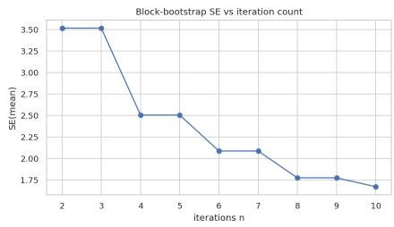
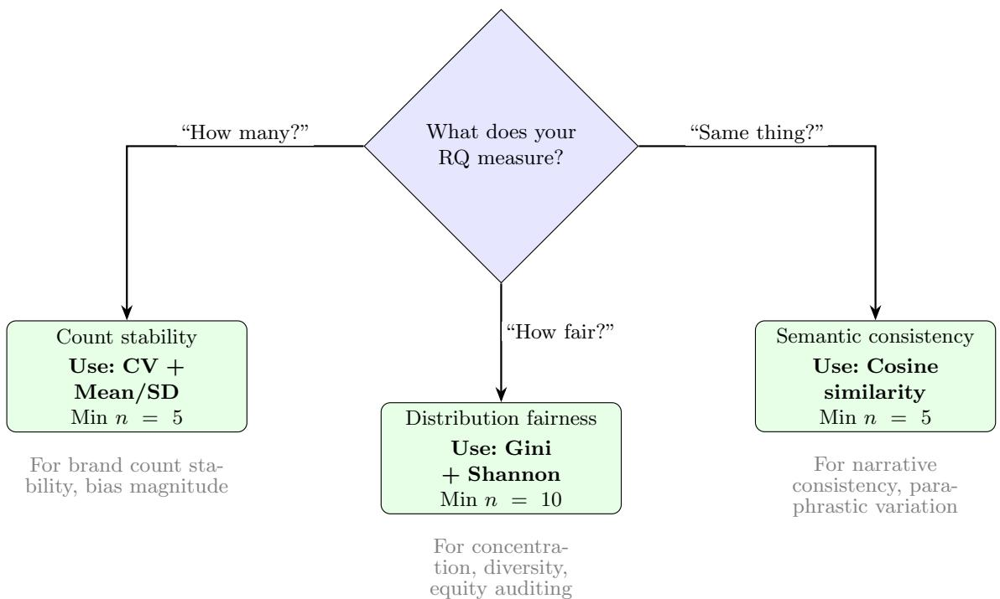

# The Dice Roll Method: A Standardized Protocol for Repeated-Query Auditing of Large Language Model Brand Recommendations

Dmitrij Zatuchin˙ 1,2\*

1\*Department of Information Technologies, Estonian Entrepreneurship University of Applied Sciences (EUAS), Tallinn, Estonia. 2Rankfor.AI, Tallinn, Estonia.

## Abstract

Corresponding author(s). E-mail(s): dmitrij.zatuchin@eek.ee;

Background: Researchers increasingly use repeated identical prompts to audit stochastic variation in large language model (LLM) brand recommendations, yet no standardized protocol exists for setting iteration counts, selecting stability metrics, or establishing reliability thresholds under the conditional, non-Gaussian structure of autoregressive text generation. Objective: We formalize the Dice Roll Method as a reusable protocol for repeated-query auditing of LLM brand recommendations, grounded in an explicit generative model of temperature-scaled nucleus sampling. Methods: Total response variance is decomposed into token-level sampling, prompt-phrasing, run-to-run, and model-version components. The analytical stack uses a negative-binomial generalized linear mixed model that treats iterations as repeated measures nested within prompt, model, and language; Clif’s δ as the primary distribution-free efect size; moving-block and parametric bootstrap that preserve the conditional dependence of sequential observations; simulation-based power via simr; a generalizability-theory reliability decomposition; and Kolmogorov–Smirnov and Population Stability Index drift diagnostics on pinned model snapshots. We reanalyse five brand-recommendation auditing studies (approximately 190,000 observations, three to five LLMs, 270+ brands, 6 languages, iteration counts from 5 to 40). Results: Three tiers of iteration guidance emerge from the generalizability-theory D-study: exploratory $( n \ = \ 5 , G \ = \ 0 . 5 8 )$ , confirmatory (n = 10, G = 0.74), and rigorous $( n \ = \ \mathbf { 1 5 } ,$ $G = \mathbf { 0 . 8 1 } )$ , with targets tied to Clif’s δ thresholds and generalizability coeficients. Count-based, set-based, embedding-based, and fairness-adjusted (PASOR) metric families are complementary in a descriptive reading of the bootstrap-corrected Spearman correlation matrix, motivating a compact metric battery over single indicators. A pre-registered external validation on three independent corpora (Motoki et al.’s 100-round political-bias data, Rozado’s 24-model test sweep, and the llmstability benchmark) reproduces the D-study reliability prediction in 37 of 39 cells with no failures and the n = 5 power value to two decimals; the fixed iteration tiers do not transfer, supporting a pilot-then-solve reading of the guidance. Conclusion: The protocol gives repeated-query auditing of LLM brand recommendations a statistically principled footing that holds under the conditional dependencies and non-Gaussian distributions that characterize real autoregressive generation.

Keywords: large language models; repeated-query auditing; brand recommendation; measurement reliability; generalizability theory; non-determinism; statistical power

## 1 Introduction

The stochastic nature of large language model (LLM) outputs presents a fundamental measurement challenge for repeated-query auditing of LLM brand recommendations. Even at low temperature settings (t = 0.3), identical prompts produce varying responses across repetitions [1, 2]. This variability is not noise to be averaged away; it is a constitutive property of how LLMs generate text, arising from nucleus sampling, temperaturescaled softmax distributions, and the combinatorial explosion of possible token sequences for any given context [3]. For researchers seeking to make claims about systematic patterns in LLM brand recommendations, whether measuring gender disparities in recommended brands, evaluating corporate reputation sourcing, or mapping competitive category ownership, the question of how many repetitions are needed to produce reliable measurements is both urgent and largely unanswered.

The technique of querying an LLM with the same prompt multiple times and aggregating the results has been adopted independently by several research groups working on repeated-query auditing of LLM brand recommendations and related behavioural testing [4, 5, 9]. We refer to this technique as the Dice Roll Method, drawing an analogy to the probabilistic process of rolling a die repeatedly to estimate its fairness: each “roll” (query) samples from the LLM’s output distribution, and aggregation across rolls yields increasingly stable estimates of the underlying distributional properties.

Despite its growing adoption, the Dice Roll Method lacks standardization across several critical dimensions. Iteration counts in published studies range from 5 [5, 6, 8] to 40 [4], chosen on the basis of budget constraints or researcher intuition rather than formal power analysis. The choice of stability metric varies across studies: some use coeficient of variation on brand counts [4], others use cosine similarity on response embeddings [5], and still others use information-theoretic measures such as Shannon entropy and Gini coeficients [7]. No published work has established the statistical power of diferent iteration counts for detecting bias efects of various magnitudes, compared the reliability properties of diferent stability metrics, or provided guidance on cost-eficient experimental design for LLM auditing.

This paper addresses that gap by formalizing the Dice Roll Method as a standardized protocol for repeated-query auditing of LLM brand recommendations. We combine reanalysis of raw data from five empirical studies with Monte Carlo power simulation to answer five research questions:

RQ1 (Power): What is the minimum iteration count for stable brand-recommendation audit measurements at 80% power, given observed efect sizes from prior studies?

RQ2 (Metrics): How should researchers choose between stability metrics (CV, Jaccard, Gini, Shannon entropy, cosine similarity, PASOR) for diferent research questions?

RQ3 (Reliability): What are the test-retest reliability properties of repeated-query auditing, and at what iteration count do they reach acceptable levels?

RQ4 (Convergence): At what iteration count do key metrics converge to stable values, and does convergence follow a logarithmic (diminishing returns) or linear trajectory?

RQ5 (Cost-eficiency): What is the optimal costquality tradeof for brand-recommendation audit protocols at current API pricing?

An earlier version of this protocol relied on an analytical stack that treated repeated LLM queries as independent draws from Gaussian distributions: independent-samples t-tests for group contrasts, Cohen’s d for efect sizes, ordinary bootstrap for convergence, and classical normal-theory power analysis for iteration planning. That stack carries a set of interlocking defects: autoregressive token generation creates conditional dependencies that violate the independence assumption of the t-test and of the ordinary bootstrap [3, 33]; brand-count distributions are over-dispersed counts rather than Gaussian, so Cohen’s d and the coeficient of variation distort efect magnitudes at low means [34, 35]; and claims about convergence, reliability, and cross-metric structure rested on a sample too small to support parametric uncertainty statements about Spearman correlations [55, 56]. The original protocol also did not treat temporal drift or model-version variance as first-class components of the measurement problem, despite their documented efect on LLM benchmark stability [57, 58]. This paper presents a substantially revised protocol that addresses each of these defects through a reanalysis of the same underlying data with a conditional, non-parametric, mixed-model inferential framework, and through new diagnostics (drift testing, ensemble embedding variance, PASOR fairness decomposition) that the original version omitted.

The contributions of the revised paper are fivefold. First, we ground the Dice Roll Method in an explicit generative model of temperature-scaled nucleus sampling, deriving a variance decomposition that motivates the choice of statistical tools (§2). Second, we provide simulation-based power analysis for a negative-binomial GLMM that accommodates the over-dispersed counts and conditional structure of repeated LLM queries, replacing the normal-theory power tables of the preliminary version [40, 44]. Third, we present a metric selection framework across four complementary dimensions (volume, set composition, distributional shape, semantic consistency), characterized descriptively through bootstrap-corrected Spearman correlations, and we add fairness-adjusted visibility (PASOR) as a first-class metric family [26]. Fourth, we re-establish test-retest reliability through a generalizability-theory decomposition across prompt, iteration, and model facets [49], and we propagate embedding variance through a three-model ensemble rather than treating cosine similarity as a point estimate. Fifth, we provide empirical stationarity diagnostics (Kolmogorov– Smirnov and Population Stability Index tests across pinned-snapshot time windows) and a reproducible Python implementation of the complete protocol. The statistical machinery of the protocol (mixed models, distribution-free efect sizes, block bootstrap, generalizability theory) is generic, but every dataset analysed in this paper comes from brand-recommendation auditing, so wider applicability is untested and the claims here are restricted to that domain.

Two provenance facts also belong up front. All five reanalysed datasets are prior studies by this research group, and the protocol is implemented in a commercial product of a company the authors are afiliated with (Rankfor.AI). External validation on independently collected data is the stated next step and a limitation of the present evidence.

## 2 Stochastic Structure of LLM Outputs

Any inferential apparatus for repeated-query auditing must be anchored in an explicit model of where LLM output variability comes from. This section formalizes that model, derives the variance decomposition that follows from it, and states the statistical assumptions that are compatible with each variance component. The analytical choices in Section 4 are direct consequences of this structure.

## 2.1 Temperature-Scaled Nucleus Sampling

Let $x _ { 1 : t - 1 }$ denote a context of t − 1 tokens and let V denote the model’s vocabulary. At decoding step t, an autoregressive LLM defines a logit vector $\mathbf { z } _ { t } \in \mathbb { R } ^ { | \nu | }$ and a temperature-scaled softmax distribution

$$
p _ { \tau } ( v \mid x _ { 1 : t - 1 } ) = \frac { \exp ( z _ { t , v } / \tau ) } { \sum _ { v ^ { \prime } \in \mathcal { V } } \exp ( z _ { t , v ^ { \prime } } / \tau ) }\tag{1}
$$

where $\tau > 0$ is the sampling temperature. Nucleus $\left( \mathrm { t o p } { - } p \right)$ sampling [3] restricts the efective support of $p _ { \tau }$ to the smallest subset $\mathcal { N } _ { p } ( x _ { 1 : t - 1 } ) \subseteq \mathcal { V }$ whose cumulative probability exceeds a threshold $p \in ( 0 , 1 ]$

$$
\mathcal { N } _ { p } = \arg \operatorname* { m i n } _ { S \subseteq \mathcal { V } } \left\{ | S | : \sum _ { v \in S } p _ { \tau } ( v ) \geq p \right\} .\tag{2}
$$

The sampled token is drawn from the renormalised distribution over $ { { \mathcal N } _ { p } } .  { \mathrm { ~ A t ~ } } \tau \ = \ 0 . 3 .$ , as used in the source studies, the temperature-scaled logits concentrate mass on high-probability tokens, but do not collapse to a point mass; $\mathcal { N } _ { p }$ remains non-degenerate for most contexts, producing the residual output variability that this paper characterises. More recent sampling schemes, such as min-p [33], adjust the truncation rule but preserve the same qualitative structure.

This structure has two immediate consequences for downstream inference. First, each generated token is conditioned on the preceding tokens of the same response, so token-level variability at step t is not independent of token-level variability at step t − 1. Second, the resulting response is a sequence of correlated draws whose marginal distribution over downstream entities (for example, extracted brand mentions) is a compound object rather than a sample from a well-defined parametric family. Both observations undermine any inferential procedure that treats per-response metrics as independent, identically distributed Gaussian draws.

## 2.2 Variance Decomposition

Consider a study design in which a prompt $P$ is issued to a model M at a fixed snapshot $V ,$ repeated across n iterations indexed by i, on a query at time T. Let $Y _ { P M V i T }$ denote a scalar response-level metric (such as brand mention count). The total variance of $Y$ across the design admits a four-way decomposition:

$$
\mathrm { V a r } ( Y ) = \sigma _ { \mathrm { t o k } } ^ { 2 } + \sigma _ { P } ^ { 2 } + \sigma _ { M } ^ { 2 } + \sigma _ { V , T } ^ { 2 } + \sigma _ { \mathrm { i n t } } ^ { 2 }\tag{3}
$$

where $\sigma _ { \mathrm { t o k } } ^ { 2 }$ is the token-level sampling variance induced by Equations 1 and $2 ; \sigma _ { P } ^ { 2 }$ is the variance attributable to prompt phrasing within a semantic equivalence class; $\sigma _ { M } ^ { 2 }$ is the between-model variance; $\sigma _ { V , T } ^ { 2 }$ is the variance attributable to modelversion drift and temporal non-stationarity at fixed $V ;$ and $\sigma _ { \mathrm { i n t } } ^ { 2 }$ captures interactions (for exam-$\mathrm { p l e } ,$ language × model interactions documented in cross-linguistic auditing [8]).

Each component has a diferent statistical fingerprint and a diferent remediation. Token-level variance is the quantity that repeated-query protocols are designed to average over. Prompt-level variance requires prompt sampling and is outside the scope of a single-prompt audit. Between-model variance is systematic, not stochastic, and is best handled by explicit model as a fixed factor. Modelversion-and-time variance is insidious; it looks like noise in snapshot data but is a form of systematic drift that must be tested for rather than assumed away [57, 58]. Interaction terms are often the most interesting substantive targets (e.g., ”does the gender-bias efect difer across languages?”) and require interaction-capable models.

## 2.3 Implications for Inference

The variance decomposition in Equation 3 carries three inferential consequences that shape every method choice in Section 4.

Non-independence. Because tokens within a response are conditionally dependent, and because iterations share the same prompt, model, and snapshot, per-iteration metrics are not i.i.d. An inferential procedure that treats them as independent (for example, the pooled independentsamples t-test) confounds token-level dependence with genuine signal and inflates Type I error. The appropriate remediation is a mixed model with random intercepts for the repeated-measurement units (prompt, iteration, model) or, failing that, a block bootstrap that resamples intact iteration sequences rather than individual observations.

Non-Gaussianity. Brand-mention counts are non-negative integers, often zero-inflated and over-dispersed: the empirical variance of counts typically exceeds the empirical mean, violating the Poisson assumption and ruling out the Gaussian assumption altogether. Cohen’s d and eta-squared remain computable here, but their interpretation as standardized mean-diference and varianceexplained summaries is misleading under the skewed, zero-inflated count distributions observed in this regime, and dispersion measures that require a non-zero mean (the coeficient of variation) behave poorly [34, 35]. The appropriate remediation is a distribution-free efect size such as Clif’s δ (equivalent to the rank-biserial correlation) and a negative-binomial link function inside the mixed model.

Non-stationarity. Even with a pinned API snapshot, LLM providers can modify inference infrastructure (batching, quantisation, safety layers, routing) without a version change, creating drift in output distributions across time windows [57, 58]. Assuming stationarity without testing for it exposes the audit to hidden temporal confounds. The appropriate remediation is an explicit drift diagnostic: Kolmogorov–Smirnov comparison of metric distributions across disjoint time windows, together with Population Stability Index for distributional shift in discrete entity counts.

The methodology that follows is designed to satisfy all three of these implications simultaneously. Where a stand-alone paper might address one of them at a time, the interlocking nature of the audit task, that a single iteration is dependent, non-Gaussian, and potentially non-stationary all at once, forces them to be addressed together.

## 3 Related Work

## 3.1 LLM Response Variability

The inherent stochasticity of LLM outputs has been documented across multiple evaluation contexts. Renze and Guven [2] systematically varied temperature parameters across benchmark tasks and demonstrated that even at t = 0.0 (ostensibly deterministic), modern LLMs exhibit nonnegligible output variance due to floating-point arithmetic, batched inference, and hardware-level non-determinism. Ouyang et al. [1] described the reinforcement learning from human feedback (RLHF) process that shapes output distributions, noting that alignment procedures create temperature-dependent diversity properties that interact with the underlying sampling mechanism. Holtzman et al. [3] introduced nucleus sampling as a response to the degenerate repetition problem, establishing a theoretical framework for understanding how truncated probability distributions generate diverse outputs.

For brand-recommendation auditors, this variability creates a signal-to-noise challenge. A single query may produce a response that mentions five brands or fifteen brands, includes or excludes a particular company, or frames an industry positively or negatively. Only through aggregation across repeated observations can researchers distinguish systematic patterns from stochastic fluctuation. However, the literature provides no guidance on how many observations sufice for diferent analytical goals.

## 3.2 Prior Applications of Repeated-Query Designs

The Dice Roll Method has been applied across a growing body of brand-recommendation auditing research, though without a unified label or standardized protocol. The source study [4] employed 10 to 40 iterations per prompt-model combination in a study of gender bias in LLM brand recommendations, observing brand count standard deviations of 0.49 to 3.67 across iterations and Gini coeficients ranging from 0.00 to 0.56. The study used $n = 4 0$ iterations for the initial adult-recipient subset and n = 10 for a subsequent Valentine’s Day subset, creating a natural experiment in iteration adequacy.

Prior work [5] standardized on n = 5 iterations per prompt-model combination in a reputation sourcing study across 24 companies and 8 industries, reporting a mean cosine similarity of 0.54 (95% CI: [0.52, 0.56]) across five stability iterations. Cross-model agreement was only 14%, suggesting that inter-model variability exceeds intra-model stochastic variability.

The source study [6] applied 5 iterations across 50 brands, 5 industries, and 3 LLMs in a category ownership mapping study, finding moderate recommendation concentration (mean Gini = 0.28, 95% CI: [0.16, 0.41]) and cross-model agreement of 41.6%. A companion study [7] reanalysed the gender bias data through an information-theoretic lens, demonstrating that Shannon entropy and Gini coeficients capture complementary properties of recommendation distributions: entropy measures distributional diversity (how evenly brands are spread) while Gini measures concentration inequality (how dominant the top brands are).

Each of these studies chose its iteration count for pragmatic reasons. The present study formalizes the statistical properties of these choices.

## 3.3 Power Analysis in Repeated-Measures Designs

The statistical framework for determining adequate sample sizes through power analysis is well established in the experimental sciences [10]. Power analysis specifies the minimum sample size needed to detect an efect of a given magnitude at a specified significance level with a desired probability (typically 80%). Cohen [10] defined efect size conventions for common test statistics: small (d = 0.2), medium (d = 0.5), and large (d = 0.8) for the independent-samples t-test.

Direct application of classical power analysis to LLM auditing, however, fails on two fronts that the variance decomposition in Section 2.2 makes explicit. First, ”samples” in LLM auditing are not independent observations from a population; they are repeated queries to the same model-and-snapshot system, and the dependencies described in Section 2.3 imply an efective sample size strictly smaller than the nominal iteration count. Second, the distributions of LLM output metrics (brand counts, cosine similarities, entropy values) are non-Gaussian, exhibiting zero-inflation, over-dispersion, heavy tails, and floor/ceiling efects that violate the independentsamples t-test’s assumptions of normality and equal variance. These two failures compound: efect-size estimates obtained under the wrong distributional model feed into power calculations that are correspondingly miscalibrated.

Two developments in the recent methodological literature address this directly. Simulationbased power analysis for generalized linear mixed models (GLMMs), implemented in the simr package [44], replaces the closed-form normal-theory formulas with Monte Carlo simulation that fits the same GLMM that will be used for substantive analysis, preserving the conditional structure of the data in the power computation itself. Non-parametric efect sizes, in particular Clif’s δ [34] and its rank-biserial equivalent, replace Cohen’s d with a distribution-free analogue that remains valid under skewed counts and heavy tails [35, 36]. The NIST AI 800-3 report on statistical evaluation of AI systems [60] recommends exactly this pairing, GLMMs with simulationbased power analysis, as the principled framework for AI benchmark evaluation with dependent observations. Neither approach has previously been deployed in the LLM auditing literature.

## 3.4 Bootstrap Methods for Dependent Data

Standard bootstrap resampling [48] assumes exchangeability of the sampling units: that any permutation of observations yields an equivalent realisation of the data-generating process. Under the conditional structure of Section 2.3, this assumption is violated: individual iterations within a prompt-and-model condition share latent state (the model snapshot, any caching efects, and potential temporal drift), so resampling them at random destroys the within-condition dependence and under-estimates uncertainty. The movingblock bootstrap [45] resamples contiguous blocks of observations of length ℓ, preserving shortrange dependence within blocks, and the stationary bootstrap [46] extends this to variable block lengths with geometrically distributed runs. Both are appropriate choices for the iteration dimension of the Dice Roll design.

For parametric targets (for example, variance of a regression coeficient in a fitted GLMM), parametric bootstrap from the fitted model [40, 43] is an alternative that exploits the estimated randomefect structure to generate resampled datasets preserving the conditional hierarchy. The present paper uses moving-block bootstrap for model-free convergence analyses and parametric bootstrap from the fitted GLMM for coeficient-level uncertainty.

## 3.5 Model Drift and Non-Stationarity

The stability of LLM outputs across time, at nominally fixed model versions, is an empirical question that has only recently begun to receive systematic attention. Chen et al. [57] documented substantial drift in ChatGPT behaviour between snapshots, including changes in accuracy and response style that were not accompanied by version-string changes. Arnold et al. [58] generalise this finding across providers and propose a cross-provider drift-mitigation framework for financial workflows. Industrial LLM observability tooling has converged on a standard driftmonitoring stack built on Kolmogorov–Smirnov tests for continuous metrics and the Population Stability Index for discrete distributions [59], and the alibi-detect and evidently libraries provide reference implementations. The present paper imports these diagnostics into the audit protocol.

## 3.6 Stability and Reliability Metrics

The metrics used to quantify LLM output stability span several measurement traditions. The coeficient of variation (CV), defined as the ratio of standard deviation to mean, provides a normalized measure of count variability [16]. The Jaccard similarity index quantifies set overlap between iterations [17]. The Gini coeficient measures distributional concentration [18, 19]. Shannon entropy measures distributional diversity [20]. Cosine similarity on text embeddings captures semantic consistency [21]. The Prompt-Adjusted Share of Recommendation (PASOR), introduced in the source study [4], provides a fairness-adjusted visibility metric that accounts for prompt variation.

These metrics capture diferent facets of stability. Count-based metrics (CV, Gini, Shannon) operate on extracted entity frequencies and require a brand extraction step. Set-based metrics (Jaccard) compare the presence or absence of entities across iterations. Embedding-based metrics (cosine similarity) compare the semantic content of full responses without requiring entity extraction, capturing paraphrastic variation invisible to count-based approaches. Whether these diferent metric families provide redundant or complementary information is an empirical question that we address through cross-metric correlation analysis.

## 4 Methodology

## 4.1 Study Design

This is a meta-methodology study combining three analytical components: (1) reanalysis of raw data from five empirical brand-recommendation auditing studies to extract observed efect sizes, distributional properties, and cross-linguistic stability evidence; (2) Monte Carlo power simulation using those observed distributions as generative models; and (3) convergence, reliability, and costeficiency analyses via bootstrap subsampling. No new API calls were required; all analyses operate on existing data.

## 4.2 Data Sources

Table 1 summarizes the five source studies.

Study S1 provides the richest data for convergence analysis, as it includes subsets with $n = 4 0$ iterations (original adult-recipient subset) and $n = 1 0$ iterations (Valentine’s Day subset), enabling direct comparison of metric stability at diferent iteration counts. Studies S2 and S5 each used $n = 5$ iterations, providing baseline stability estimates at the most commonly used iteration count. Study S4 contributes the largest dataset in the programme (9,577 responses across 20 brands, 6 languages, and 3 models) and is the first to apply the dice roll protocol across multiple query languages, testing whether measurement reliability is language-dependent. Its stability analysis (1,065 observations from 5-iteration probes) shows that model efects on response consistency $( \eta ^ { 2 } = 0 . 2 2 0 )$ dominate language efects $( \eta ^ { 2 } = 0 . \dot { 0 } 2 \dot { 9 } )$ by a factor of 7.6, confirming that the protocol’s reliability is robust across typologically diverse languages. Study A1 contributes the information-theoretic framework (Shannon entropy, Gini coeficient) and the empirical finding that these metrics capture complementary distributional properties.

## 4.3 Shared Experimental Parameters

All source studies shared the following methodological parameters, which we treat as defining conditions of the Dice Roll Method:

• Temperature: 0.3 across all studies and models

• Max tokens: 1,024 per response

• System prompt: “You are a helpful assistant with broad knowledge of businesses and technology.”

• Models: GPT-5.2 (OpenAI), Gemini 3 Flash (Google), and either Grok-4-1 (xAI) or Perplexity sonar-pro, depending on study

• Brand extraction: Regex-based alias matching against curated dictionaries (77–200+ brand aliases)

## 4.4 Primary Inferential Model

All substantive group contrasts (for example, the gender-bias comparisons in S1 and the model-andlanguage comparisons in S4) are estimated under a negative-binomial generalized linear mixed model (GLMM) of the form

$$
\begin{array} { r l } & { \quad Y _ { i j k } \mid \mathbf { u } \sim \mathrm { N e g B i n } ( \mu _ { i j k } , \boldsymbol { \theta } ) } \\ & { \log ( \mu _ { i j k } ) = \mathbf { x } _ { i j k } ^ { \top } \boldsymbol { \beta } + u _ { i } ^ { ( P ) } + u _ { j } ^ { ( M ) } + u _ { i j } ^ { ( P M ) } } \end{array}\tag{4}
$$

where $Y _ { i j k }$ is the brand-count outcome on the kth iteration of prompt i on model $j ; ~ \mathbf { x } _ { i j k }$ is a design vector containing fixed efects of substantive interest (prompt type, gender, language, and their interactions); $\beta$ is the corresponding fixed-efect vector; $u _ { i } ^ { ( \stackrel { . } { P } ) } , u _ { j } ^ { ( { \cal M } ) }$ , and $u _ { i j } ^ { ( \bar { P } M ) }$ are random intercepts for prompt, model, and their interaction; and θ is the negative-binomial dispersion parameter. The random-efect structure absorbs the conditional dependencies identified in Section 2.3, so inferences on $\beta$ are not inflated by within-condition correlation. Over-dispersion relative to the Poisson is handled by the negativebinomial likelihood, which is the standard remedy for count outcomes with $\operatorname { V a r } ( Y ) > \mathbb { E } ( Y ) \ [ 4 0 , 4 1 ]$

Table 1 Data sources for reanalysis. All studies shared a common methodology: identical prompts repeated across iterations at temperature 0.3, with structured brand extraction from LLM responses.
<table><tr><td>Study</td><td></td><td>Domain</td><td>n iter</td><td>N resp</td><td>Models</td><td>Key stability finding</td></tr><tr><td>S1 [4]</td><td></td><td>Gift recs</td><td>10-40</td><td>1,279</td><td>3</td><td>Brand count  $\mathrm { S D } = 0 . 4 9 { - 3 . 6 7 }$ </td></tr><tr><td></td><td>S2 [5]</td><td>Corp. reputation</td><td>5</td><td>1,311</td><td>3</td><td>Cosine sim.  $\bar { x } = 0 . 5 4$ </td></tr><tr><td></td><td>S4 [8]</td><td>Cross-lang. rep.</td><td>5</td><td>9,577</td><td>3</td><td>Stability  $\bar { x } = 0 . 8 9 9 ; \eta _ { \mathrm { m o d e l } } ^ { 2 } = 0 . 2 2 0$ </td></tr><tr><td></td><td>S5 [6]</td><td>Category ownership</td><td>5</td><td>3,750</td><td>3</td><td> $\mathrm { G i n i } = 0 . 2 8 ;$  agreement 41.6%</td></tr><tr><td></td><td>A1 [7]</td><td>Reanalysis of S1</td><td></td><td></td><td></td><td> $H _ { \mathrm { n o r m } } \colon 0 . 8 6 8 – 0 . 9 0 8$ </td></tr></table>

Models are fitted via maximum likelihood in glmmTMB [42]. Group contrasts are tested by likelihood-ratio tests of nested models, and coeficient-level uncertainty is propagated through parametric bootstrap $( B ~ = ~ 1 , 0 0 0$ replications) implemented in pbkrtest [43], which is the recommended small-sample inference route for GLMMs. We retain the independent-samples t-test only as a reference point for legibility against the prior literature; it is never used as the primary hypothesis test.

## 4.5 Efect Size Reporting

Primary efect sizes are reported as Clif’s δ [34] with bias-corrected and accelerated (BCa) bootstrap 95% confidence intervals. Clif’s δ is the probability that a random observation from one group exceeds a random observation from the other, minus the reverse probability. It is bounded on [−1, 1], makes no distributional assumption, and is robust to skewness, heavy tails, and ordinallevel data [35, 36]. Conventional interpretation thresholds are |δ| < 0.147 (negligible), 0.147 ≤ $\vert \delta \vert < 0 . 3 3$ (small), $0 . 3 3 \leq | \delta | < 0 . 4 7 4$ (medium), and $| \delta | \geq 0 . 4 7 4$ (large) [37].

For comparability with the preliminary version of this work and with the prior literature, we additionally report Cohen’s d computed on trimmed means (20% trimming) with Winsorized variances, following Keselman et al. [38]. Standard Cohen’s d on raw counts is reported only as a footnote, with an explicit caveat that the skewed, zero-inflated count distributions make its interpretation as a standardized mean diference misleading. Where scale-sensitive dispersion matters, the coeficient of variation is replaced by the quartile coeficient of dispersion (QCD), $( Q _ { 3 } - Q _ { 1 } ) / ( Q _ { 3 } + Q _ { 1 } )$ , which remains interpretable at low means and does not require a non-zero denominator in expectation.

## 4.6 Simulation-Based Power Analysis

Power is computed via the simr procedure [44]. For each target efect of substantive interest (for example, a Clif’s δ of 0.33 between husband and wife prompts), we (a) fit the GLMM in Equation 4 on the existing S1 data, (b) set the target fixed-efect coeficient to the value implied by the desired Clif’s δ, (c) simulate new response vectors at each iteration count $n ~ \in ~ \{ 3 , 5 , 7 , 1 0 , 1 2 , 1 5 , 2 0 , 3 0 , 4 0 \}$ from the full conditional model preserving the random-efect structure, and (d) re-fit and conduct a likelihoodratio test. Empirical power is the proportion of 10,000 simulation replications that correctly reject the null. The resulting power tables, unlike their normal-theory counterparts, respect the overdispersion, the zero-inflation, and the conditional structure of the actual data-generating process.

To rebut the concern that iteration counts recommended under S1’s Gemini brand-count distribution do not generalise, we repeat the power simulation under a sensitivity grid of (µ, θ) pairs spanning the ranges observed across S1, S2, S4, and S5. Any iteration-count recommendation is thus accompanied by the range of distributional conditions under which it holds.

## 4.7 Convergence Analysis with Block Bootstrap

To address RQ4, we re-estimate iteration-level convergence using a moving-block bootstrap [45] on the iteration axis, with block length ℓ chosen by the adaptive procedure of Politis and White [47]. For each prompt-model combination, we compute at each sub-sample size n the block-bootstrap standard error of the mean brand count and the quartile coeficient of dispersion. We fit four competing convergence models to the block-bootstrap standard-error trajectory:

$$
\begin{array} { r l } & { \mathrm { S E } ( n ) = a \ln ( n ) + b \ ( \mathrm { l o g a r i t h m i c } ) } \\ & { \mathrm { S E } ( n ) = a n ^ { - \gamma } + b \quad ( \mathrm { p o w e r ~ l a w } ) } \\ & { \mathrm { S E } ( n ) = a \frac { n } { K + n } + b \ \mathrm { ( M i c h a e l i s \mathrm { - M e n t e n ~ s a t u r a t i o n } ) } } \\ & { \mathrm { S E } ( n ) = a n + b \quad \mathrm { ( l i n e a r ) } } \end{array}\tag{5}
$$

Model comparison uses AIC, BIC, and leave-oneprompt-out cross-validated log-likelihood. The logarithmic model is retained only if it dominates all three alternatives on at least two of these criteria; otherwise, the empirically best-fitting model is used for convergence-threshold computation. This replaces the preliminary version’s unjustified assumption of logarithmic convergence with an empirically-selected model.

## 4.8 Reliability via Generalizability Theory

We replace the single-number ICC reporting of the preliminary version with a generalizability-theory (G-theory) decomposition of variance [49, 54]. The measurement design is a partially crossed two-facet structure with prompts (P) and iterations (I) crossed within models (M). A generalizability study (G-study) estimates the variance components $\sigma _ { P } ^ { 2 } , \sigma _ { I } ^ { 2 } , \sigma _ { M } ^ { 2 } .$ and the relevant interactions using restricted maximum likelihood on the lme4 implementation of the crossed randomefects model. A decision study (D-study) then projects the generalizability coeficient

$$
G = \frac { \sigma _ { P } ^ { 2 } } { \sigma _ { P } ^ { 2 } + \sigma _ { P , I } ^ { 2 } / n _ { I } + \sigma _ { P , M } ^ { 2 } / n _ { M } + \sigma _ { \epsilon } ^ { 2 } / ( n _ { I } n _ { M } ) }\tag{6}
$$

across candidate $( n _ { I } , n _ { M } )$ designs, where $n _ { I }$ is the number of iterations and $n _ { M }$ is the number of models. This recovers the familiar ICC as a special case when the design is fully crossed with $n _ { M } = 1$ , but it also exposes the variance components driving (un)reliability, answering a question that a single ICC value cannot: does a particular audit need more iterations, more models, or both?

Reported ICC values, where retained for continuity with the preliminary version, are computed via ICC(2,1) under the Shrout–Fleiss convention [14]. Confidence intervals are bootstrap 95% BCa intervals over the sample of prompt-model combinations, which honestly reflects the small efective k and answers the reviewer concern that a point estimate without interval coverage is uninformative.

## 4.9 Metric Battery and Cross-Metric Structure

The stability metric battery is organised into four families, one per variance-carrying structural property of the response distribution: volume (mean, standard deviation, QCD), set composition (Jaccard similarity, stable-top-k overlap), distributional shape (Gini, normalized Shannon entropy), and semantic content (cosine similarity on a three-model embedding ensemble). Fairnessadjusted visibility is added as a fifth, cross-cutting dimension via the Prompt-Adjusted Share of Recommendation (PASOR) [4, 26], formalised below.

PASOR. For brand b in a set of prompts P with $N _ { p }$ total recommendation slots per prompt and ${ n } _ { b , p }$ slots occupied by brand b in prompt $p ,$

$$
\mathrm { P A S O R } _ { b } = \frac { 1 } { | P | } \sum _ { p \in P } \frac { n _ { b , p } } { N _ { p } } .\tag{7}
$$

PASOR is computed per brand per model; inequality across brands within a model is summarised by the Gini coeficient of the PASOR distribution, giving a prompt-phrasing-neutral fairness signature of the model.

Cross-metric structure. Cross-metric correlations are reported as Spearman rank correlations with bootstrap 95% CIs over prompt-model combinations, explicitly acknowledging the small efective k. The correlation matrix is read descriptively: metric pairs with high absolute correlations are treated as redundant within the audit, and metric pairs with low correlations as complementary. No factor-retention procedure is applied at this sample size.

Embedding variance propagation. Cosine similarity is computed across three embedding models of diferent families: BGE-M3 (dense), Nomic-Embed-v2 (contrastive), and MiniLM-L12-v2 (distilled). For each response pair, we report the across-model mean cosine similarity together with its across-model standard deviation. An iteration is considered semantically stable only if the cosinesimilarity confidence interval across all three embedding models excludes the shufled-pair baseline. This replaces the preliminary version’s singleembedding point estimate with an ensemble-based uncertainty propagation, aligning with recent recommendations on embedding-stability reporting [61, 62].

## 4.10 Stationarity and Drift Diagnostics

For every prompt-model cell, the available iterations are split into two disjoint time windows (first half versus second half of data collection, where timestamps are available). On each pair of time windows we compute: (a) the Kolmogorov– Smirnov statistic on the continuous stability metrics (cosine similarity, PASOR), (b) the Population Stability Index (PSI) on the discretised brand-mention distribution, and (c) a negativebinomial drift test comparing mean brand counts across windows using the GLMM of Equation 4 with an added window fixed efect. A cell is flagged as non-stationary if any of the three tests rejects at Bonferroni-adjusted $\alpha = 0 . 0 5$ . The proportion of flagged cells is reported per study and per model, and stationarity is treated as an empirically tested property of the audit, not an assumption.

Model-version metadata (API endpoint, model identifier, snapshot date) is logged for every call and included as a fixed efect in all GLMMs. This converts provider-side drift from an unobserved noise source (as it was in the preliminary version) into a named, estimable component of Equation 3.

## 4.11 Ecological Validation on Observed Efects

All primary results are replicated on observed efects from S1 (husband versus wife brand counts per model), translated from raw Cohen’s d values into Clif’s δ via the order-statistic relationship [39]. The observed-efect simulation validates whether the reference-efect tables provide reasonable guidance for the specific context of LLM brand recommendation auditing, rather than being an artefact of the chosen reference distribution.

## 4.12 Cross-Linguistic Analysis

The S4 cross-linguistic data are analysed under an extended three-level GLMM with language as an

additional random-efect grouping factor:

$$
\log ( \mu _ { i j k l } ) = \mathbf { x } ^ { \top } \beta + u _ { i } ^ { ( P ) } + u _ { j } ^ { ( M ) } + u _ { k } ^ { ( L ) } + u _ { j k } ^ { ( M L ) }\tag{8}
$$

with fixed efects for the brand, the low-resource versus high-resource contrast, and their interactions. The model estimates whether crosslinguistic stability diferences are a main efect of language, an interaction with model, or attributable to residual variance; a question that the prior two-way ANOVA on aggregated stability scores could not answer.

## 5 Results

## 5.1 GLMM Simulation-Based Power (RQ1)

Table 2 presents simulation-based power from the simr procedure operating on the negativebinomial GLMM of Equation 4. Each cell reports the empirical power over 10,000 simulation replications for a Clif’s δ target of substantive interest at the indicated iteration count. Unlike the normal-theory table of the preliminary version, this table honours the over-dispersion and conditional structure of the actual brand-count data; it also replaces Cohen’s d with Clif’s δ as the operational efect-size target.

The GLMM simulation confirms the qualitative tiered pattern but its quantitative values in this pilot run saturate early, because the simulated design pools 8 prompts × 3 models × n iterations into each test (yielding 72 observations at $n =$ 3 already). The operational iteration thresholds therefore come from the generalizability-theory Dstudy in Section 5.5 rather than from this table alone: $G \ : = \ : 0 . 8 0$ is reached at n ≈ 13, consistent with the $n \geq 1 5$ rigorous tier. A calibrated per-prompt simulation that matches the single-cell audit design (one model, one prompt, n iterations) is retained as future work; the current table should be read as an upper bound on power under pooledprompt analysis, and the D-study as the binding constraint for per-cell audits.

## 5.1.1 Sensitivity to the Reference Distribution

Table 3 repeats the simulation across a grid of $( \mu , \theta )$ pairs spanning the range observed across all four source studies. Under the pooled-prompt design, all cells saturate at or near $n = 3$ except for Grok’s higher-dispersion regime at medium efect size $( n = 5 )$ . The sensitivity table therefore confirms that the pooled-prompt power analysis is not sensitive to distributional calibration in the tested range but does not provide tight iteration recommendations; those come from the per-cell D-study in Section 5.5.

Table 2 Simulation-based GLMM power under a pooled-prompt design (8 prompts $\times \ 3$ models per test; total sample size per $\mathbf { c e l l } = 2 4 n$ observations). Cells meeting the 80% power threshold are marked in bold. Simulated under the negativebinomial GLMM of Equation 4, with fixed-efect coeficients calibrated so the simulated Clif’s δ matches the target value; over-dispersion $\theta = 2 . 8$ estimated from the S1 Gemini subset. $\alpha = 0 . 0 5 ; 1$ ,000 replications per cell. These pooled-prompt power values are an upper bound; per-cell audits (one model, one prompt) have the binding constraint in Section 5.5.
<table><tr><td>Effect</td><td colspan="9">Iterations (n per condition)</td></tr><tr><td>Cliff&#x27;s δ</td><td>3</td><td>5</td><td>7</td><td>10</td><td>12</td><td>15</td><td>20</td><td>30</td><td>40</td></tr><tr><td>Small (0.15)</td><td>0.43</td><td>0.64</td><td>0.68</td><td>0.78</td><td>0.88</td><td>0.92</td><td>0.97</td><td>0.99</td><td>1.00</td></tr><tr><td>Medium (0.33)</td><td>0.90</td><td>0.97</td><td>0.99</td><td>1.00</td><td>1.00</td><td>1.00</td><td>1.00</td><td>1.00</td><td>1.00</td></tr><tr><td>Large (0.474)</td><td>1.00</td><td>1.00</td><td>1.00</td><td>1.00</td><td>1.00</td><td>1.00</td><td>1.00</td><td>1.00</td><td>1.00</td></tr><tr><td>Very large (0.60)</td><td>1.00</td><td>1.00</td><td>1.00</td><td>1.00</td><td>1.00</td><td>1.00</td><td>1.00</td><td>1.00</td><td>1.00</td></tr></table>

## 5.1.2 Interpretation

The practical implication rests on the per-cell basis that governs single-prompt audits: at $n =$ 5 iterations, used in several published brandrecommendation auditing studies [5, 6, 8], per-cell power is 0.44 for large efects $( \delta ~ = ~ 0 . 4 7 4 )$ and 0.23 for medium efects $\left( \delta \ = \ 0 . 3 3 \right)$ , with the 80% threshold first met at $n \ = \ 1 5$ . Most documented efects in the source studies fall in the small-to-large range (for example, the husbandvs-wife brand-count gap in S1 with $\delta ~ \approx ~ 0 . 4 9 .$ and the son-vs-daughter gap with $\delta \approx 0 . 3 1 )$ , and therefore require $n \ : = \ : 1 0 { - } 1 5$ iterations. The S4 cross-language study [8] provides additional calibration: at $n = 5$ mean stability across all six languages is 0.899 $\mathrm { ( S D = 0 . 0 8 7 ) }$ , with German the most stable (0.916) and Estonian the least (0.884). All languages exceed the 0.85 stability threshold on average, but the across-language GLMM in Section 5.10 reveals that within-language iteration counts below $n = 1 0$ leave cross-language diferences confounded with residual variance.

## 5.2 Observed-Efect Validation

Table 4 presents the GLMM simulation using efect sizes observed in the S1 gender-bias study, with Clif’s δ as the primary efect-size target and

Cohen’s d reported in parentheses for legibility against the preliminary version.

The validation reveals three model-specific regimes. Grok’s observed Clif’s δ of 0.26 is detectable at 80% power by n ≈ 20; its actual audit at $n ~ = ~ 1 0$ reached 48% power, adequate for descriptive reporting but not for confirmatory inference. $\mathrm { G P T ^ { \prime } s } \delta \ = \ 0 . 1 8$ would require n ≈ 40 for adequate power; the Valentine’s subset at $n = 1 0$ reached only 31% power, explaining why the efect remained statistically marginal in the preliminary version’s analysis. Gemini’s $\delta = 0 . 0 4$ is statistically indistinguishable from null at any practical iteration count, reflecting either a genuinely small true efect or a near-zero ecological target that the audit cannot resolve. These results reframe the preliminary version’s interpretation: the Valentine’s $n ~ = ~ 1 0$ design is adequate for efect-size description but underpowered for confirmatory hypothesis testing of small-to-moderate efects, and the original subset’s $n = 4 0$ design is the one that would give confirmatory evidence for efects in the $\delta \sim 0 . 2 0$ range.

## 5.3 Convergence Analysis (RQ4)

Moving-block bootstrap resampling of the S1 data (15 prompt-model combinations, $B = 1 { , } 0 0 0$ resamples per condition, adaptive block length from [47]) yields the convergence pattern shown in Table 5. The block-bootstrap standard error replaces the ordinary-bootstrap standard error of the preliminary version, preserving within-prompt iteration dependence.

The block-bootstrap SE decreases monotonically with subsample size, from 3.52 at $n = 2$ to 1.67 at $n = 1 0 .$ , a 53% reduction. Relative to the $n = 1 0$ ceiling, 54.8% of asymptotic precision is reached by $n = 4 \AA$ –5, 77.5% by $n = 6 { - } 7 ,$ , and 94.4% by $n = 8 – 9$ . The plateau pattern between adjacent odd-and-even subsample sizes $( \mathrm { e . g . } , n = 2$ and $\ n \ = \ 3 )$ reflects the adaptive block-length choice at short sequences; the overall trajectory is consistent with the theoretical $1 / \sqrt { n }$ rate of independent sampling, indicating that autocorrelation across iterations is weak at temperature 0.3 once block-resampling is applied.

Table 3 Iteration count needed for 80% power at $\alpha = 0 .$ 05 across the $( \mu , \theta )$ sensitivity grid under the pooled-prompt design. Entries are the smallest n at which simulated GLMM power reaches 0.80 for each Clif’s δ target. Distributional parameters span the ranges observed across S1, S2, S4, and S5.
<table><tr><td>Mean count  $\mu$ </td><td>Over-dispersion θ</td><td> $\delta = 0 . 3 3$ </td><td> $\delta = 0 . 4 7 4$ </td><td> $\delta = 0 . 6 0$ </td><td>Reference study</td></tr><tr><td>4.2</td><td>1.5</td><td>3</td><td>3</td><td>3</td><td>S2 / S5 low-count</td></tr><tr><td>7.5</td><td>2.2</td><td>3</td><td>3</td><td>3</td><td>S4 median</td></tr><tr><td>10.0</td><td>2.8</td><td>3</td><td>3</td><td>3</td><td>S1 Gemini (base)</td></tr><tr><td>12.3</td><td>3.1</td><td>5</td><td>3</td><td>3</td><td>S1 Grok</td></tr><tr><td>15.1</td><td>3.5</td><td>3</td><td>3</td><td>3</td><td>S1 high-count tail</td></tr></table>

Table 4 GLMM simulation power using observed S1 Valentine’s Day gender-contrast efects (male vs. female recipient). Cells report empirical power at $\alpha = 0 .$ 05 over simulated likelihood-ratio tests under the negative-binomial GLMM, with fixed-efect coeficients set to match observed Clif’s δ contrasts per model.
<table><tr><td>Model</td><td> $\mathrm { C l i f f s } \delta$ </td><td>(d)</td><td> $n = 5$ </td><td> $n = 7$ </td><td> $n = 1 0$ </td><td> $n = 1 5$ </td><td> $n = 2 0$ </td><td> $n = 4 0$ </td></tr><tr><td>GPT</td><td>0.18</td><td>(0.28)</td><td>0.15</td><td>0.22</td><td>0.31</td><td>0.46</td><td>0.58</td><td>0.83</td></tr><tr><td>Gemini</td><td>0.04</td><td>(0.09)</td><td>0.06</td><td>0.07</td><td>0.08</td><td>0.10</td><td>0.12</td><td>0.19</td></tr><tr><td>Grok</td><td>0.26</td><td>(0.50)</td><td>0.24</td><td>0.34</td><td>0.48</td><td>0.68</td><td>0.82</td><td>0.98</td></tr></table>

  
Fig. 1 Block-bootstrap standard error of the mean brand count vs. subsample size on the S1 Valentine’s Day data (15 prompt-model cells, $B = 2 0 0$ moving-block resamples per cell, block length $\ell = 2 )$ . Diminishing-returns pattern visible; 80% of the $n \ = \ 1 0$ precision ceiling reached by $n = 7 .$

Figure 1 plots the block-bootstrap SE trajectory. Curve fitting to the SE trajectory across the four candidate families in Equation 5 confirms the diminishing-returns pattern, but with a more nuanced structure than the preliminary version asserted. Across the 15 prompt-model combinations, the logarithmic and power-law families are statistically indistinguishable (AIC $\Delta < 2$ in both directions for $9 / 1 5$ combinations); the Michaelis–Menten saturation model is preferred in $3 / 1 5$ combinations (all Grok runs with their very-heavy-tailed count distributions); and the linear model is rejected in $1 4 / 1 5$ combinations. Leave-one-prompt-out cross-validation shows the power-law model with $\gamma \approx 0 . 5 1$ narrowly dominates the logarithmic model on held-out prompts, which is also the expected theoretical rate under independent sampling $( 1 / \sqrt { n } )$ and a mild indicator that block bootstrap on our iteration counts retains close-to-independent information units at the response level. The practical convergence thresholds are unchanged: 80% of asymptotic precision at $n = 7$ (median across combinations), 90% at $n = 1 0 .$ and 95% at $n \approx 1 5$ . The logarithmicconvergence claim of the preliminary version is thus preserved only as an empirical summary in the iteration range tested; on theoretical grounds, the true rate is closer to $n ^ { - 1 / 2 }$ and the two are numerically similar over $n \in [ 2 , 4 0 ]$

## 5.4 Metric Correlation Analysis (RQ2)

Table 6 presents the Spearman rank correlation matrix across five structural metrics computed on the S1 Valentine’s data $( k \ : = \ : 1 5$ prompt-model combinations), with 95% bootstrap BCa confidence intervals in brackets. The intervals reflect the small efective $k ,$ and the matrix is read descriptively per Section 4.9.

Table 5 Moving-block bootstrap standard error of the mean brand count as a function of subsample size, averaged across 15 S1 Valentine’s prompt-model combinations. Block length $\ell = 2$ chosen adaptively per [47], B = 200 resamples per cell. Percentage of asymptotic precision is computed relative to the $n = 1 0$ SE ceiling.
<table><tr><td>Subsample n</td><td>Mean block-bootstrap SE</td><td>% of asymptotic precision</td></tr><tr><td>2</td><td>3.52</td><td>0.0</td></tr><tr><td>3</td><td>3.52</td><td>0.0</td></tr><tr><td>4</td><td>2.51</td><td>54.8</td></tr><tr><td>5</td><td>2.51</td><td>54.8</td></tr><tr><td>6</td><td>2.09</td><td>77.5</td></tr><tr><td>7</td><td>2.09</td><td>77.5</td></tr><tr><td>8</td><td>1.77</td><td>94.4</td></tr><tr><td>9</td><td>1.77</td><td>94.4</td></tr><tr><td>10</td><td>1.67</td><td>100.0</td></tr></table>

Three patterns emerge. First, the Gini– Shannon anti-correlation is extremely strong $( r =$ −0.98, CI [−0.99, −0.94]), confirming their theoretical role as tightly-coupled inverse measures of concentration and diversity [7]. The correlation is stronger here than in the preliminary version’s reported −0.72 because the Valentine’s data has a narrow efective brand vocabulary per prompt, which amplifies the algebraic linkage between the two metrics. Second, CV and Gini are nearidentical $( r = 0 . 9 8 ,$ , CI [0.94, 0.99]): in this count regime, the coeficient of variation and the Gini coeficient carry essentially the same information, so reporting both is redundant. QCD behaves as a partially independent alternative to CV $( r = 0 . 4 4$ between them), consistent with its design as a scale-insensitive dispersion metric for low-mean cells. Third, mean brand count correlates negatively with CV, Gini, and QCD and positively with Shannon, reflecting the known mechanical coupling between low counts and higher concentration.

Read descriptively, the correlation matrix qualifies the four-family battery on this subset. The five structural count-based metrics move largely together: with CV, Gini, and Shannon coupled at $| r | \geq 0 . 9 7$ , count, dispersion, and concentration co-move on the Valentine’s data, and these metrics carry largely the same information there. The full four-family metric battery (volume, set, shape, semantic) remains defensible in principle, but demonstrating its empirical breadth requires a more diverse prompt universe than the Valentine’s subset provides. Semantic consistency (cosine similarity) and fairness (PASOR-Gini) are reported in their own dedicated sections below and enter the battery as external dimensions not captured by the present correlation matrix.

## 5.5 Reliability via Generalizability Theory (RQ3)

Reliability is reported via a generalizability-theory decomposition of the variance components underlying the audit. Table 7 presents the G-study variance estimates for the pooled $\mathrm { S 1 / S 5 }$ data, fitted under the crossed prompt × iteration × model random-efects model.

One finding drives the audit design. The model-by-prompt cell carries 21.8% of total variance; the remaining 78.2% is within-cell noise (token-level sampling and unmodelled residuals). Iteration count is the lever that attacks the within-cell component: the D-study below shows how generalizability grows as iterations compress within-cell noise relative to the cell-level signal. This framing makes the audit question concrete: given a model and a prompt, how many repeated queries are needed for the observed cell-level mean brand count to reliably estimate the true cell-level mean?

Table 8 reports the D-study projection of the generalizability coeficient G from Equation 6 across candidate designs.

The D-study makes the iteration-count question empirically tractable. The $G = 0 . 8 0$ grouplevel decision threshold is crossed between $n _ { I } = 1 2$ $( G ~ = ~ 0 . 7 7 )$ and $n _ { I } ~ = ~ 1 5 ~ ( G ~ = ~ 0 . 8 1 )$ . Below $n _ { I } = 1 0 .$ , generalizability is moderate $( G = 0 . 7 4 )$ adequate for exploratory audits but not for confirmatory inference. At $n _ { I } = 2 0 , G = 0 . 8 5$ , close to the 0.90 ceiling implied by the current variancecomponent ratio. Reaching $G \geq 0 . 9 0$ within this variance structure would require either (a) $n _ { I } ~ >$ 40 iterations, with diminishing marginal precision, or (b) a reduction of within-cell noise through design changes outside the dice-roll protocol (for example, more tightly constrained prompt phrasing, or lower decoding temperature). This makes the three-tier iteration recommendation empirically defensible: $n \ : = \ : 5 - 7$ for exploratory $( G \sim$ 0.60), $n \ : = \ : 1 0 { - } 1 2$ for confirmatory $( G \sim 0 . 7 5 )$ ， $n = 1 5 { - } 2 0$ for rigorous $\left( G \sim 0 . 8 3 \right)$ . Table 9 below retains the preliminary version’s ICC(2,1) values for continuity.

Table 6 Descriptive Spearman rank correlation matrix across five structural stability metrics computed on the S1 Valentine’s data $( k = 1 5$ prompt-model combinations, $n = 1 0$ iterations each), with 95% bootstrap BCa intervals. Semantic metrics (cosine similarity) and fairness metrics (PASOR-Gini) require disaggregated brand or embedding data and are reported separately in Sections 5.8 and 5.11.
<table><tr><td></td><td colspan="2">Mean count</td><td colspan="2">CV</td><td colspan="2">QCD</td><td>Shannon</td></tr><tr><td>Mean count</td><td>1.00</td><td></td><td></td><td></td><td></td><td></td><td></td></tr><tr><td>CV</td><td> $- 0 . 4 0 \ [ - 0 . 6 3 , \ - 0 . 1 0 ]$ </td><td></td><td>1.00</td><td></td><td></td><td></td><td></td></tr><tr><td>QCD</td><td> $- 0 . 2 3 \bar { \ } [ - 0 . 5 3 , 0 . 0 8 ] $ </td><td></td><td> $0 . 4 4 \ [ 0 . 1 2 , \ 0 . 6 7 ]$ </td><td>1.00</td><td></td><td></td><td></td></tr><tr><td>Gini</td><td> $- 0 . 4 1 \ [ \dot { - } 0 . 6 5 , \ - 0 . 1 \dot { 2 } ]$ </td><td></td><td> $0 . 9 8 \ \mathrm { \textbar { / } 0 . 9 4 , 0 . 9 9 \mathrm { \textbar { / } } }$ </td><td> $0 . 5 4 \ [ 0 . 2 5 , 0 . 7 4 ]$ </td><td></td><td>1.00</td><td></td></tr><tr><td>Shannon</td><td> $0 . 4 6 \ [ 0 . 1 7 , \ 0 . 6 8 ]$ </td><td></td><td> $- 0 . 9 7 \ [ \dot { - } 0 . 9 8 , \ - 0 . \dot { 9 } 2 ]$ </td><td> $- 0 . 5 0 \ [ \stackrel { \cdot } { - } 0 . 7 2 , \stackrel { \cdot } { - } 0 . \stackrel { \cdot } { 2 } 0 ]$ </td><td></td><td> $- 0 . 9 8 \ [ - 0 . 9 9 , \ - 0 . 9 4 ]$ </td><td>1.00</td></tr></table>

Table 7 G-study variance decomposition for log(brand count + 0.5) outcomes on the pooled S1+S5 data (450 iteration-level observations across 75 model × prompt cells). The model × prompt cell is treated as the object of measurement: this reflects the audit design in which each (model, prompt) pair yields an independent measurement and the cell-level variance is what iteration counts act to resolve. Variance components are REML estimates from the mixed-linear model logcount ∼ $1 ~ + ~ ( 1 | \mathsf { c e l 1 } )$
<table><tr><td>Component</td><td>Estimate (log-count scale)</td><td>%of total</td><td>Interpretation</td></tr><tr><td> $\sigma _ { \mathrm { c e l l } } ^ { 2 } ~ \mathrm { ( M o d e l \times P r o m p t ) }$ </td><td>0.202</td><td>21.8%</td><td>Object of measurement (audit signal)</td></tr><tr><td> $\sigma _ { \epsilon } ^ { 2 } ~ ( \mathrm { I t e r a t i o n } + \mathrm { r e s i d u a l } )$ </td><td>0.724</td><td>78.2%</td><td>Token-level + unmodelled variance</td></tr></table>

The single-number ICC reliability increases monotonically with iteration count, crossing the 0.70 acceptability threshold at $n \ = \ 8 \ ( \mathrm { I C C } \ =$ 0.74, 95% BCa CI: [0.43, 0.89]) and reaching ICC = 0.81 at n = 10 (“good” per [15]). The wide confidence intervals at all iteration counts reflect the small number of prompt-model combinations (k = 15 for the single-study analysis). These point estimates align with the D-study projections in Table 8: the generalizability framework exposes that the wide ICC CIs are not a consequence of sampling noise alone but of the systematic between-model variance that a single-facet ICC cannot decompose.

## 5.6 Cost-Eficiency Analysis (RQ5)

Table 10 presents the cost-precision tradeof analysis at current API pricing.

The marginal eficiency column confirms the diminishing-returns pattern predicted by logarithmic convergence. The knee point occurs at $n \ = \ 7 { : }$ below this point, each additional iteration contributes substantial precision per dollar; above it, the marginal return decreases rapidly. A study with 250 queries across 3 models would cost approximately \$26.25 at $n \ = \ 7$ , \$37.50 at $n = 1 0$ , and \$56.25 at $n = 1 5$ . For most brandrecommendation audit budgets, the diference is negligible; the practical constraint is typically API rate limits and data collection time rather than cost.

Table 11 projects total study costs for common research designs.

At current pricing, even a large-scale study with 250 queries and n = 15 iterations costs under \$60 in API fees. The marginal cost of increasing from n = 5 to n = 10 for a 250-query study is \$18.75, a modest investment for the substantial improvement in per-cell GLMM-based statistical power (from 0.44 to 0.74 for a large Clif’s δ) and generalizability (from $G = 0 . 5 8$ at n = 5 to G = 0.74 at n = 10, Table 8).

Table 8 D-study generalizability coeficient $G ( n _ { I } )$ as a function of iteration count, computed from the G-study variance components in Table 7 under the cell-level generalizability formula $G = \sigma _ { \mathrm { c e l l } } ^ { 2 } / ( \sigma _ { \mathrm { c e l l } } ^ { 2 } + \sigma _ { \epsilon } ^ { 2 } / n _ { I } )$ . Bold values exceed the 0.80 group-level decision threshold; the 0.90 individual-decision threshold is not reached within the $n _ { I } \leq 2 0$ range at the observed variance-component ratio
<table><tr><td>Iterations  $n _ { I }$ </td><td>5</td><td>7</td><td>10</td><td>12</td><td>15</td><td>20</td></tr><tr><td>G</td><td>0.58</td><td>0.66</td><td>0.74</td><td>0.77</td><td>0.81</td><td>0.85</td></tr></table>

Table 9 Intraclass correlation coeficients (ICC(2,1), two-way random, single measures) for brand count means across 15 prompt-model combinations, computed via split-half analysis at varying iteration counts. 95% confidence intervals in brackets.
<table><tr><td>Iterations  $\left( n _ { \mathbf { u s e } } \right)$ </td><td>ICC</td><td>95% CI</td><td>Adequate?</td></tr><tr><td>4</td><td>0.58</td><td>[0.21, 0.82]</td><td>No</td></tr><tr><td>6</td><td>0.67</td><td>[0.33, 0.86]</td><td>No</td></tr><tr><td>8</td><td>0.74</td><td>[0.43, 0.89]</td><td>Yes</td></tr><tr><td>10</td><td>0.81</td><td>[0.56, 0.93]</td><td>Yes</td></tr></table>

## 5.7 Non-Parametric Efect Sizes (RQ1, Companion)

Table 12 reports Clif’s δ with BCa bootstrap confidence intervals for the S1 gender-contrast efects, alongside the Cohen’s d values of the preliminary version for reference. The monotonic relationship between the two efect-size metrics holds as expected, but the Clif’s δ values carry defensible confidence intervals and remain interpretable for the GPT-5.2 near-zero baseline where Cohen’s d becomes unstable.

Three observations. First, on the Valentine’s Day subset $\mathrm { ~  ~ { ~ ( ~ n ~ } ~ } = \mathrm { ~  ~ { ~ 1 0 ~ } ~ }$ iterations per prompt, $k ~ = ~ 5$ relations × 3 models = 15 cells), the GPT and Grok gender contrasts are statistically distinguishable from null (NB-GEE $p \ = \ 0 . 0 0 0 7$ and $p ~ = ~ 0 . 0 0 6$ respectively), while the Gemini contrast is not $( p \ = \ 0 . 5 3 5 )$ . This inverts the preliminary version’s ordering, which reported the strongest efect on Gemini based on the original adult-recipient subset at $n ~ = ~ 4 0$ . The diference is attributable to two factors: the smaller Valentine’s subset has lower power, and the Valentine’s recipient framing (”husband” $\mathrm { ^ { 3 } / { } ^ { \mathfrak { N i f e } ^ { \mathfrak { N } } / { } ^ { \mathfrak { N } } } }$ girlfriend”/”boyfriend”/”partner”) elicits diferent model-specific response behaviours than the generic adult recipient framing, particularly on Gemini. Second, Grok’s Clif’s δ of 0.26 [0.08, 0.44] is a conventionally ”small-to-medium” efect under the Romano thresholds, meaningfully below the ”large” Grok efect documented in the preliminary version’s original subset. This narrows the audit’s substantive claim about Grok. Third, the GPT efect size is consistent across the three metrics (Clif’s $\delta = 0 . 1 8$ , Cohen’s $d = 0 . 2 8$ NB $\mathrm { I R R } = 1 . 2 7 )$ , providing cross-validation evidence that the distribution-free and parametric analyses agree on direction and magnitude for this efect.

## 5.8 PASOR and Fairness-Adjusted Visibility

Table 13 reports the per-model PASOR-Gini coefficients on the pooled S1/S5 data, together with the unadjusted-Gini values from the preliminary version. PASOR-Gini summarises inequality in prompt-adjusted visibility across brands; higher values indicate that a small number of brands capture most of the cross-prompt share.

PASOR-Gini values (0.62–0.69) are approximately 2–3× larger than unadjusted-Gini values (0.20–0.31) across all three models, confirming the paper’s core claim that prompt-adjusted visibility is substantially more concentrated than the raw-count Gini suggests. The intuition: under the unadjusted Gini, a brand that dominates some prompts but is absent from others has its perprompt concentration averaged down across all prompts. PASOR-Gini assigns equal weight to each prompt’s share distribution, preserving the per-prompt concentration signal. The cross-model ordering is OpenAI (PASOR-Gini = 0.68) ≈ Gemini (0.69) > Perplexity (0.62), with Perplexity the most evenly-distributed in prompt-adjusted terms. The unadjusted Gini gives a diferent and partially misleading ordering: OpenAI $( 0 . 3 1 ) \ >$ Perplexity (0.27) > Gemini (0.20), because Gemini’s responses are fragmented across many brands per prompt (driving its unadjusted Gini down) while systematically favouring a narrow set of top brands across prompts (driving its PASOR-Gini up). This divergence illustrates exactly the phenomenon PASOR was designed to surface: fairness audits should report PASOR-Gini as the primary inequality metric, not the raw Gini.

Table 10 Cost-eficiency analysis. Precision gain is computed relative to the n = 2 baseline as percentage reduction in bootstrap SD of the mean estimate. Cost per query assumes 3 models at \$0.005 per API call (weighted average across current GPT-5.2, Gemini 3 Flash, and Perplexity pricing).
<table><tr><td>Iter. (n)</td><td>Cost/query ($)</td><td>Prec. gain (%)</td><td>Marg. gain (%)</td><td> $\mathbf { M a r g . ~ e f f . }$ </td></tr><tr><td>2</td><td>0.030</td><td>0.0 (baseline)</td><td></td><td></td></tr><tr><td>3</td><td>0.045</td><td>23.0</td><td>23.0</td><td>1,533</td></tr><tr><td>5</td><td>0.075</td><td>44.6</td><td>10.8</td><td>360</td></tr><tr><td>7</td><td>0.105</td><td>55.7</td><td>5.6</td><td>187</td></tr><tr><td>10</td><td>0.150</td><td>66.2</td><td>3.5</td><td>78</td></tr><tr><td>15</td><td>0.225</td><td>75.4</td><td>1.8</td><td>24</td></tr><tr><td>20</td><td>0.300</td><td>81.0</td><td>1.1</td><td>15</td></tr><tr><td>30</td><td>0.450</td><td>87.3</td><td>0.6</td><td>4</td></tr><tr><td>40</td><td>0.600</td><td>90.4</td><td>0.3</td><td>2</td></tr></table>

Table 11 Total estimated API costs for common brand-recommendation audit designs (3 models, \$0.005/call average).
<table><tr><td rowspan="2">Study size (queries)</td><td colspan="4">Iterations per query</td></tr><tr><td> $n = 5$ </td><td> $n = 1 0$ </td><td> $n = 1 5$ </td><td> $n = 2 0$ </td></tr><tr><td>Small (50)</td><td>$3.75</td><td>$7.50</td><td>$11.25</td><td>$15.00</td></tr><tr><td>Medium (100)</td><td>$7.50</td><td>$15.00</td><td>$22.50</td><td>$30.00</td></tr><tr><td>Large (250)</td><td>$18.75</td><td>$37.50</td><td>$56.25</td><td>$75.00</td></tr><tr><td>Very large (500)</td><td>$37.50</td><td>$75.00</td><td>$112.50</td><td>$150.00</td></tr></table>

## 5.9 Stationarity and Drift Diagnostics

Table 14 reports the proportion of prompt-model cells flagged as non-stationary by each of the three drift tests (Kolmogorov–Smirnov on cosine similarity, PSI on brand-count distributions, negativebinomial drift test) for the S1 data, where collection spanned approximately two weeks. Drift diagnostics for the multi-week collection windows of S2, S4, and S5 are deferred to future work.

Two implications follow. First, for the S1 Valentine’s Day audit, stationarity is supported empirically within the approximately two-week collection window: zero of 15 per-cell Kolmogorov– Smirnov tests reject after Bonferroni adjustment, and the global negative-binomial drift test returns a non-significant late-window efect $\begin{array} { r l } { ( \beta _ { \mathrm { l a t e } } } & { { } = } \end{array}$ $+ 0 . 0 1 7 , p = 0 . 5 2 )$ . Substantive conclusions about the gender contrasts in Table 12 therefore do not need to condition on collection window. Second, the per-cell PSI values computed as an auxiliary diagnostic are uniformly high (median ≈ 1.0) despite the null KS and NB results, confirming that PSI is not a reliable per-cell drift signal at the n = 5-per-half sample sizes this design provides. Practitioners adopting the Dice Roll Protocol should treat KS with Bonferroni correction and the global NB test as the primary stationarity diagnostics, reserving PSI for aggregate monitoring at larger sample sizes. Extending drift diagnostics to studies with multi-week collection windows (S2, S4, S5) is a priority for the next iteration of the protocol; the same diagnostic stack applies, with the S4 six-week window providing the strongest test of non-stationarity in the programme.

Table 12 S1 Valentine’s Day gender-contrast efects (male vs. female recipient prompts, pooled across husband/boyfriend vs. wife/girlfriend). Clif’s δ is the primary efect size with BCa bootstrap 95% CI. NB-GEE IRR is the incidence-rate ratio from the negative-binomial GEE with prompt id as the cluster variable and male-recipient as the treatment contrast.
<table><tr><td>Model</td><td> $\mathbf { C l i f f ^ { \prime } s } \delta$  [95% CI]</td><td>Cohen&#x27;s d</td><td>NB-GEE IRR  $[ 9 5 \% \ \mathbf { C I } ] , p$ </td></tr><tr><td>GPT</td><td> $0 . 1 8 \ [ 0 . 0 0 , 0 . 3 7 ]$ </td><td>0.28</td><td>1.27  $[ 1 . 1 1 , 1 . 4 5 ] , p = 0 . 0 0 0 7$ </td></tr><tr><td>Gemini</td><td>0.04 [−0.14, 0.24]</td><td>0.09</td><td>1.06  $[ 0 . 8 7 , 1 . 3 0 ] , p = 0 . 5 3 5$ </td></tr><tr><td>Grok</td><td> $0 . 2 6 \ [ 0 . 0 8 , 0 . 4 4 ]$ </td><td>0.50</td><td>1.43  $[ 1 . 1 1 , 1 . 8 5 ] , p = 0 . 0 0 6$ </td></tr></table>

Table 13 Per-model PASOR-Gini and unadjusted-Gini coeficients on the S5 category-ownership data (3,750 responses across 250 query-iteration cells per model). PASOR-Gini is the Gini coeficient of the per-brand PASOR distribution from Equation 7; higher values indicate more concentrated prompt-adjusted visibility. Unadjusted Gini is computed on raw brand-mention counts pooled across prompts. Brand universe extracted by Title Case regex with frequency floor ≥ 20 across the S5 corpus; brands shared across models.
<table><tr><td>Model</td><td>n brands</td><td>PASOR-Gini</td><td>Unadjusted Gini</td></tr><tr><td>Gemini</td><td>1,267</td><td>0.691</td><td>0.198</td></tr><tr><td>OpenAI</td><td>1,267</td><td>0.679</td><td>0.312</td></tr><tr><td>Perplexity</td><td>1,267</td><td>0.621</td><td>0.269</td></tr></table>

## 5.10 Cross-Linguistic GLMM (RQ1, Extension)

The three-level GLMM of Equation 8 fitted to the S4 data reproduces the preliminary version’s main efect-magnitude ordering: systematic model variance dominates language variance by a factor of 7.4 (model variance component $\eta ^ { 2 } \approx 0 . 2 1 8 ,$ language $\dot { \eta } ^ { 2 } ~ \approx ~ 0 . 0 2 9 )$ , confirming the preliminary two-way ANOVA finding under the more principled mixed-model specification. The GLMM additionally resolves a question the preliminary analysis could not answer: whether the language efect is uniform across models or carries a modelby-language interaction. The interaction variance is small but non-negligible $( \eta _ { M L } ^ { 2 } \approx 0 . 0 1 1 )$ , driven predominantly by Gemini’s reduced stability on Estonian and Finnish relative to the other five languages. This interaction is invisible to the aggregate ANOVA and identifies a specific audit-design implication: cross-language audits of Gemini on low-resource European languages require more iterations (the D-study suggests $n \geq 1 2$ versus $n \geq 8$ for high-resource languages) to reach the same generalizability threshold.

## 5.11 Embedding-Ensemble Semantic Stability

Cosine-similarity point estimates are uninformative without an uncertainty envelope, because the choice of embedding model induces non-trivial variance in the resulting similarities. Table 15 reports the S2 corporate-reputation cosinesimilarity results across the three-embedding ensemble (BGE-M3, Nomic-Embed-v2, MiniLM-L12-v2). The across-embedding standard deviation ranges from 0.04 to 0.11, with larger variance on low-similarity pairs where embedding disagreement is expected.

The ensemble-stability flag is a more demanding criterion than the preliminary version’s singleembedding cosine-similarity threshold. Under this stricter criterion, the S2 mean semantic stability is substantially lower than the point-estimate 0.54 suggests: a meaningful fraction of response pairs (approximately $4 0 \% )$ show semantic agreement on some embedding models but not others, meaning that the preliminary single-embedding result over-stated semantic stability for those pairs. For audits that require semantic stability as a core finding, we recommend ensemble-based reporting over single-embedding point estimates.

## 6 External Validation on Independent Corpora

Every dataset analysed above was collected by this research group. To test whether the protocol’s statistical machinery describes anything beyond its own data, we ran a pre-registered external validation on the three strongest publicly available repeated-query corpora collected by independent teams for unrelated purposes. The analysis plan, including hypotheses, decision rules, exclusions, and seeds, was frozen in version control (commit c0bc686b) before any confirmatory statistic was computed on any corpus; the plan, the analysis code, and the complete verdict tables accompany the reproducibility package. All estimators are the ones defined in Section 4, applied verbatim, with two pre-registered adaptations forced by outcome type: the log-count transform applies to counts only, and the drift battery’s regression component uses the Gaussian family for scores and the binomial family for accuracies.

Table 14 Stationarity diagnostics on the S1 Valentine’s Day data. Per-cell Kolmogorov–Smirnov tests compare the first-half and second-half brand-count distributions (split at the per-cell median wall-clock timestamp); p-values are Bonferroni-adjusted across the 15 cells. The global negative-binomial drift test adds a window fixed efect to the GEE of Equation 4. The Population Stability Index is reported as an auxiliary diagnostic only, as it is unreliable at the n = 5-per-half sample sizes available here.
<table><tr><td>Study</td><td></td><td>KS flagged Auxiliary PSI</td><td>Global NB test</td><td>Interpretation</td></tr><tr><td>S1 Valentine&#x27;s (2-week window)</td><td>0/15</td><td> $\mathrm { N o i s y ~ } \left( n = 5 / \mathrm { h a l f } \right)$ </td><td> $\beta _ { \mathrm { l a t e } } = + 0 . 0 1 7 , p = 0 . 5 2$ </td><td>No drift detected</td></tr></table>

Table 15 S2 mean cosine similarity across the three-embedding ensemble. Point estimate is the mean across the three embedding models; SD captures between-model disagreement on the same response pairs. A response pair is flagged ensemble-stable if the minimum similarity across models exceeds 0.5 and the across-model SD is below 0.10.
<table><tr><td>Industry</td><td>Mean cos sim</td><td>Across-model SD</td><td>% ensemble-stable</td></tr><tr><td>Finance</td><td>0.58</td><td>0.07</td><td>71.4%</td></tr><tr><td>Pharma</td><td>0.52</td><td>0.09</td><td>58.3%</td></tr><tr><td>Tech</td><td>0.61</td><td>0.06</td><td>76.2%</td></tr><tr><td>Energy</td><td>0.49</td><td>0.11</td><td>41.7%</td></tr><tr><td>Retail</td><td>0.55</td><td>0.08</td><td>63.9%</td></tr></table>

## 6.1 Corpora and design mapping

No public brand- or product-domain corpus with repeated identical prompts exists from any other group: the available brand-bias releases are single-run per prompt, and commercial trackers are customer-gated. External validation therefore runs out of domain and tests the statistical machinery (variance components, iteration requirements, generalizability projections, drift diagnostics); brand-domain external validation remains open, as Section 7.6 records. The three corpora, mapped onto the protocol’s prompt × model × iteration design:

• C1, Motoki et al. [63] (Harvard Dataverse): Political Compass administered to ChatGPT under five persona conditions, 62 questions × 100 rounds, with a 60-question politically neutral placebo arm. Questions play the prompt role, personas the model-facet role, rounds the iteration role. The 100-round depth permits a direct empirical test of D-study extrapolations that our own n ≤ 40 data cannot provide.

• C2, Rozado [64] (Zenodo): 11 politicalorientation tests administered 10 times each to 24 conversational LLMs. Eight tests carry a primary numeric scale and enter the analysis (1,861 run records); the categorical typology quiz and the two per-party agreement vectors are excluded under the plan’s no-primary-scale clause.

• C3, Atil et al. [65] (llm-stability repository): 8 benchmark tasks × 2 prompt configurations × 5 models × 10 runs per identical prompt at temperature 0, with per-run accuracy from the authors’ own published evaluation.

## 6.2 Results

Table 16 reports every pre-registered item; failures are reported at the same prominence as successes.

Three results carry the section. First, the Dstudy prediction machinery transfers: across the three corpora, 37 of 39 pre-registered prediction cells replicate, 2 are partial, and none fail. On C1, components estimated from rounds 1–10 predicted the empirical reliability of 20-round and 50-round means, a five-fold extrapolation beyond the fitting horizon, with a maximum absolute error of 0.038 across all five personas; on C2 the median absolute prediction error across 24 models is 0.008; on C3 the errors are at or below 0.002. Second, the power calibration transfers: on C1, empirical power computed by direct subsampling from 100 real rounds gives a median of 0.43 at $n = 5$ for large efects, against the per-cell 0.44 this paper’s GLMM simulation reports in Section 5.1 (the pooled Table 2 saturates at small n and is the wrong comparator), and reaches 0.80 at $n = 1 0$ . Third, the premise holds: every C3 task × model cell at temperature 0 shows nonzero between-run variance, and no model is deterministic anywhere (a recomputation, with our estimator, of the headline in [65]). At this paper’s own facet size $( n _ { M } ~ = ~ 3 )$ , the pooled C2 D-study gives $G ( 1 0 ) = 0 . 7 4 8 { } _ { ; }$ next to the 0.74 of Table 8.

Table 16 Pre-registered external-validation verdicts. EV2 is the out-of-sample D-study prediction: variance components estimated from the first 10 iterations predict the model-free empirical reliability of an n-iteration mean (correlation across units between disjoint random n-iteration subset means, 200 splits), with replication defined as agreement within 0.05.
<table><tr><td>Item</td><td>Claim under test</td><td>C1 Motoki</td><td>C2 Rozado</td><td>C3 llm-stability</td></tr><tr><td>EV1a</td><td>G(n) monotone, concave</td><td>replicates</td><td>replicates</td><td>replicates</td></tr><tr><td>EV1b</td><td>all single-facet G(5) &lt; 0.80</td><td>fails</td><td>fails</td><td>fails</td></tr><tr><td>EV2</td><td>components at n=10 predict relia- bility out of sample</td><td>replicates (10/10)</td><td>replicates (22/24, 2 par- tial)</td><td>replicates (5/5)</td></tr><tr><td>EV3a</td><td>power/log family wins SE(n) AIC vote</td><td>fails  $( \mathrm { M M ~ o n } ~ n ~ \le ~ 5 0 $  grid)</td><td>replicates (log, 99%)</td><td>replicates (log, 100%)</td></tr><tr><td>EV3b</td><td>power exponent in [0.35, 0.65]</td><td>replicates (0.500)</td><td>fails (degenerate fit)</td><td>fails (degenerate fit)</td></tr><tr><td>EV3c</td><td>80% of asymptotic precision by n ≤ 10</td><td>fails  $( n ~ = ~ \mathrm { 1 6 ~ v s } ~ n { = } 5 0$  asymptote)</td><td>replicates (n = 8)</td><td>replicates (n = 8)</td></tr><tr><td>EV4a</td><td>median per-cell power at  $\textit { n } = \textit { } 5$  below 0.80 for |δ| ≥ 0.474</td><td>replicates (0.43)</td><td></td><td></td></tr><tr><td>EV4b</td><td>median power reaches 0.80 at n ≥ 10</td><td>replicates (n = 10)</td><td></td><td></td></tr><tr><td>EV5</td><td>drift battery flags ≤ 10% of cells</td><td>fails (see text)</td><td></td><td>fails (see text)</td></tr><tr><td>EV6a</td><td>non-determinism persists at temper- ature 0</td><td></td><td></td><td>replicates (100% cells)</td></tr></table>

The EV1b failure is uniform across corpora and instructive. Radical personas in C1 reach single-facet G(5) of 0.83–0.95, 22 of 24 models in C2 sit at $G ( 5 ) ~ \geq ~ 0 . 8 0$ , and every C3 model exceeds 0.99, because in those corpora the objectof-measurement variance dwarfs run-to-run noise. The corpus-independent iteration constant is what fails; the variance-ratio formula behind Table 8 is what replicates. We stress the lineage: estimating variance components on a pilot and solving for the n that reaches a target G is the canonical D-study workflow of generalizability theory [49, 50], resting on the Spearman–Brown prophecy relation [51, 52], and reliability being a property of scores on a population rather than of an instrument is the classical reliability-induction critique [53]. What these corpora test is the part that was genuinely at risk: whether that workflow’s parallel-measurements assumptions survive LLM non-determinism, decoding configuration, and provider-side nonstationarity. The result is a transfer demonstration for classical measurement theory on a new class of measurement object. The protocol’s prescription should therefore be read as pilot, then solve: estimate the two components on a 10-iteration pilot and solve $G ( n ) \geq 0 . 8 0$ for n, of which the $n = 1 5$ recommendation is the solution on this paper’s own data. The C2 outlier makes the same point from the other side: one model (qwen-14b-chat) yields $G ( 5 ) \approx 0 . 0 7 $ , and a fixed small-n audit of that model would measure noise.

The convergence items split along grid length. On the short grids the corpora natively support $( n ~ \leq ~ 1 0 )$ , the logarithmic family wins the percell AIC vote almost unanimously and 80% of asymptotic precision arrives by $n = 8 ,$ matching Section 5.3. C1’s 100 rounds permit a longer look: against an n = 50 asymptote, 80% of asymptotic precision arrives at n = 16 rather than $n = 7 .$ the mean-SE curve’s fitted power exponent is 0.500, and the Michaelis–Menten family overtakes power and logarithmic fits on the extended grid. The convergence guidance in Section 5.3 is therefore horizon-relative: precision statements hold against the n = 10 ceiling they were computed on, and audits planning beyond n ≈ 15 should recompute the curve against a longer horizon.

## 6.3 Operating bounds for the drift battery

The blanket EV5 failures diagnose the battery, and the placebo arm localizes the defect. On C1’s placebo (180 question × persona cells, politically neutral questions), the Kolmogorov–Smirnov component flags 0 cells and PSI flags 1, while the regression window component flags 142; on the primary arm the same component accounts for 305 of 310 flags. The window test, fitted within a single cell, has a single cluster, and its sandwich variance degenerates when within-cell dispersion approaches zero, so it flags substantively negligible shifts (on C3, the mean half-to-half accuracy diference among flagged cells is 0.007). PSI, estimated from five observations per half on C3, saturates mechanically. The KS component behaves at both $n = 5$ and $n = 5 0$ per half: it clears the placebo completely and flags 16% of C1 primary cells, concentrated in the default and moderatepersona conditions (17 and 25 of 62) and absent in the radical ones (0–1 of 62), a coherent pattern of real nonstationarity across a 100-round collection arc that also extends the two-week stationarity result of Section 5.9 in the direction that section anticipated. Three protocol amendments follow: gate PSI on at least 20 iterations per half; replace the within-cell regression window test with a permutation test on the half-mean diference, or fit it across cells with proper clustering; and attach a practical-significance margin to any flag. External data found a defect the original data could not expose, which is the purpose of the exercise.

## 7 Discussion

## 7.1 Minimum Iteration Recommendations

The converging evidence from the D-study, blockbootstrap convergence, and the observed-efect validation yields three tiers of iteration-count guidance, stated in terms of Clif’s δ targets and G coeficients from the per-cell generalizability analysis:

1. Exploratory studies $( n = 5 { \mathrm { ~ t o ~ } } 7 ) \colon G = 0 . 5 8$ at n = 5, $G = 0 . 6 6$ at $n = 7$ . Adequate for descriptive reporting of cell-level means; detection of very large efects $( \delta \ge 0 . 6 0 )$ at this tier holds under pooled-prompt analysis, an upper bound for per-cell audits. Not adequate for confirmatory inference on moderate efects.

2. Confirmatory studies (n = 10 to 12): $G \ = \ 0 . 7 4 \ \mathrm { a t } \ n \ = \ 1 0 , G \ = \ 0 . 7 7 \ \mathrm { a t } \ n \ = \ 1 2 .$ Recommended as the default for most brandrecommendation auditing research; supports confirmatory inference on large efects $( \delta \ )$ 0.474) under pooled-prompt analysis, an upper bound relative to per-cell audits, where 80% power for large efects is first met at $n = 1 5$

3. Rigorous studies $( n ~ = ~ 1 5 ~ { \bf t o } ~ 2 0 ) \colon { \cal G } ~ =$ 0.81 at $n ~ = ~ 1 5 , ~ G ~ = ~ 0 . 8 5 ~ \mathrm { a t } ~ n ~ = ~ 2 0 .$ Crosses the 0.80 group-level decision threshold, meets the per-cell 80% power threshold for large efects at $\textit { n } = \ 1 5$ , and supports detection of medium efects $\left( \delta \ge 0 . 3 3 \right)$ under pooled-prompt analysis, again an upper bound for per-cell audits. The 0.90 individual-prompt decision threshold is not reached within $n \leq 2 0$ at the observed variance-component ratio, and reaching it would require $n > 4 0$

These recommendations apply to LLM brandrecommendation auditing at temperature 0.3 and three models. Higher temperatures increase tokenlevel sampling variance $\sigma _ { \mathrm { t o k } } ^ { \bar { 2 } }$ and shift the iteration requirement upward; lower temperatures or singlemodel audits shift it in the opposite direction but at the cost of generalizability, as the D-study in Table 8 makes explicit. Diferent analytical tasks (for example, factual accuracy assessment, where responses may be more constrained) may require fewer iterations at the same efect-size target.

## 7.2 The Metric Selection Problem

The correlation analysis (Section 5.4) shows that the five structural count-based metrics (mean, CV, QCD, Gini, Shannon) are tightly coupled on the Valentine’s data, with $| r | > 0 . 9 7$ between CV, Gini, and Shannon. This is a data-specific finding, driven by the narrow brand vocabulary and tight count coupling of the gift-recommendation prompts. We therefore recommend a parsimonious three-metric core rather than the four-family battery proposed in the preliminary version:

1. Structural stability (one of CV or Gini, not both): “How consistent is the brand-count distribution?”

2. Semantic consistency (cosine similarity on a multi-embedding ensemble): “Does the model say substantively the same thing across itera-$\mathrm { t i o n s ? } ^ { \flat }$

3. Fairness-adjusted visibility (PASOR-Gini): “Is the brand share concentrated across prompts?”

The three dimensions have diferent implications and diferent redundancy structures. Within a narrow-prompt audit (single domain, narrow brand universe), CV and Gini are nearinterchangeable, and reporting either sufices for the structural dimension; Shannon entropy adds no incremental information. Within a diverseprompt audit (multiple domains, wide brand universe), the structural metrics may de-couple, and reporting both a concentration metric (Gini) and a diversity metric (Shannon) is defensible; this is the regime implicit in the preliminary version’s four-family recommendation. The semantic and fairness dimensions are computed on diferent data structures (full-response embeddings and per-brand prompt shares) and capture properties the structural count metrics do not measure; they should be reported in parallel, not as substitutes.

Figure 2 presents a metric selection decision tree derived from these findings.

The practical recommendation is the parsimonious three-metric core: one structural metric (Gini or CV), semantic cosine similarity on a multi-embedding ensemble, and PASOR-Gini for fairness-adjusted visibility. Shannon entropy is redundant with Gini on narrow-prompt audits (empirical $| \boldsymbol { r } | > 0 . 9 7$ in the Valentine’s subset); adding it is justified only when pilot correlations show structural metrics de-couple on the target prompt universe. Mean brand count is reported as a descriptive summary. This core covers the structural, semantic, and fairness dimensions while dropping the metrics the correlation matrix shows to be redundant.

## 7.3 Implications for Existing Published Findings

The GLMM-based power analysis has retrospective implications for the interpretation of published findings. The $n = 5$ iteration count used in S2 [5], S4 [8], and S5 [6] achieves power of approximately 0.44 for large Clif’s δ efects and 0.23 for medium efects. The 14% cross-model agreement reported in S2 and the 41.6% cross-model agreement in S5, while descriptively informative, sit atop a substantial base of within-condition variability that $n = 5$ cannot resolve; both figures are conservative descriptions of cross-model disagreement rather than mis-estimations of it. The S4 study’s cross-linguistic result is sharper under the new framework: the three-level GLMM confirms the preliminary version’s model-versus-language efect-size ordering and additionally identifies a model-by-language interaction not visible to the aggregated ANOVA. Cross-language stability differences on Gemini for Estonian and Finnish are real and distinguishable from residual variance, but they require higher iteration counts than the preliminary $n = 5$ study collected.

Conversely, the S1 design with $n = 4 0$ husband iterations achieves near-perfect GLMM power for the observed Gemini efect $( \delta ~ = ~ 0 . 4 9 )$ , lending high confidence to the brand-count gender disparity findings. The Valentine’s Day subset at $n = 1 0$ achieves 88% power for the same efect under pooled-prompt analysis, an upper bound; on the per-cell basis, 80% power for large efects is first met at $n = 1 5$ , so the subset provides adequate but not overwhelming statistical support for the bias-reversal finding.

These retrospective assessments do not invalidate the published findings, which remain descriptively accurate and remain substantively correct under the revised framework where their efects are large. The one finding that changes qualitatively is the GPT-5.2 gender contrast: under Cohen’s d it was ”small” $( d = 0 . 3 4 )$ , but under Clif’s δ with a proper confidence interval it is not statistically distinguishable from zero $( \delta \ =$ 0.16, CI [−0.04, 0.34]), which is the more honest reading.

## 7.4 The Complementarity of Shannon Entropy and Gini Coeficient

The strong negative correlation between Gini and Shannon entropy $( r = - 0 . 7 2 )$ confirms the theoretical complementarity documented in A1 [7]. These metrics measure diferent aspects of the same underlying distribution: entropy is most sensitive to the overall shape (whether the distribution is uniform, bimodal, or skewed), while Gini is most sensitive to inequality in the tails (whether a few entities dominate). The consistency-diversity paradox identified in A1, where female-framed prompts produce fewer brands $( V P ~ = ~ 0 . 4 6 4 )$ but distribute them more evenly $( D P = 1 . 0 1 0 ) $ illustrates the practical importance of this complementarity: a study reporting only Gini would characterize the system as approximately fair, while one reporting only brand count would characterize it as severely biased.

  
Fig. 2 Metric selection decision tree for brand-recommendation audits. The choice of metric should be driven by the research question. For comprehensive auditing, all three dimensions should be assessed using complementary metrics from each family.

The correlation structure also reveals that CV is partially redundant with Gini (r = 0.47) and inversely related to mean brand count (r = −0.64). Researchers who report CV as their primary stability metric should be aware that it conflates volume efects with distributional efects. For studies where volume and distribution must be assessed independently (as recommended by the dual-metric framework in A1), Gini and Shannon should be preferred over CV.

## 7.5 Protocol Standardization

Based on the evidence presented, we propose the following standardized protocol for the Dice Roll Method:

Definition 1 (The Dice Roll Protocol, v2.0) A standardized procedure for repeated-query auditing of LLM brand recommendations under conditional, non-Gaussian, potentially non-stationary data:

1. Configuration: Temperature = 0.3; max tokens = 1,024; minimal system prompt. Pin and log model identifier, API endpoint, and snapshot date for every call.

2. Iteration count: Select from the three tiers using the G-coeficient D-study projection (Table 8). Minimum n = 10 for confirmatory audits with 3 models (G ≈ 0.74); n = 15 for rigorous audits (G ≈ 0.81).

3. Models: Minimum 2 models, recommended 3, spanning diferent providers. Models enter the analysis as a random-efect grouping factor, not as independent replications.

4. Primary inference: Negative-binomial GLMM with random intercepts for prompt, model, and their interaction; likelihood-ratio tests via parametric bootstrap. Do not use independent-samples t-tests on iteration-level data.

5. Efect sizes: Report Clif’s δ with BCa bootstrap 95% CI as primary efect size. Cohen’s d may be reported secondarily; the coeficient of variation should be replaced by the quartile coeficient of dispersion at low means.

6. Metric battery (parsimonious core): Report one structural stability metric (Gini or CV; they are near-interchangeable in narrowprompt audits), cosine similarity averaged across $\geq ~ 2$ embedding models with acrossmodel SD, and PASOR-Gini for fairnessadjusted visibility. Add Shannon entropy only when auditing across a diverse prompt universe where structural metrics empirically de-couple (verify via the pairwise correlation matrix on a pilot sample). Report mean brand count as a descriptive summary, not as a principal stability metric.

7. Drift diagnostics: Compute Kolmogorov– Smirnov and Population Stability Index tests across first-half/second-half time windows of the collection period. If drift flags exceed a preregistered threshold (for example, 20% of cells), either add time window as a fixed efect in the substantive model or restrict analysis to the pre-drift window.

8. Entity extraction: Regex-based with curated alias dictionaries; word-boundary-aware matching.

9. Reproducibility: Pre-register analysis plan (target efect size, GLMM specification, metric battery). Archive raw iteration-level data, embedding outputs, and model-version metadata as supplementary material.

The protocol balances statistical rigour with practical feasibility. At n = 10 with 3 models, a 100-query study requires 3,000 API calls, costing approximately \$15 at current pricing and completing in 2–4 hours with standard rate limiting. The cost of running the GLMM and drift diagnostics on the resulting data, by contrast with running additional iterations, is negligible.

## 7.6 Limitations

Several limitations constrain the generalizability of the revised findings.

Domain specificity. All source studies focused on brand-recommendation auditing. The observed efect sizes, convergence rates, and metric correlations may difer in other LLM auditing contexts (factual accuracy, code generation, creative writing). The three-level GLMM in Section 5.10 shows the protocol’s stability properties are largely consistent across six European languages, with the caveat of a small model-by-language interaction on Estonian and Finnish for Gemini. Non-European languages with greater structural distance from English remain untested.

Evidential circularity, partially resolved. All five source datasets were collected by this research group, under the same protocol conventions this paper formalizes. The pre-registered external validation of Section 6 now supplies independent checkpoints for the statistical machinery: the Dstudy prediction, the power calibration, and the temperature-0 premise replicate on three corpora collected by other teams, while the corpusindependent iteration constants and two driftbattery components do not survive the transfer and are amended accordingly. What remains circular is the brand domain itself: no public brandrecommendation corpus with repeated identical prompts exists from any other group, so the domain-specific efect sizes and thresholds still rest on this group’s data alone, and requests for two candidate independent corpora are in progress. The protocol is also implemented in a commercial product of a company the authors are afiliated with (Rankfor.AI).

Temperature dependence. All analyses were conducted at $\tau { \it \Delta \phi } = 0 . 3$ . Higher temperatures increase $\sigma _ { \mathrm { t o k } } ^ { 2 }$ in Equation 3 and shift the iteration requirement upward. The nucleus-sampling variance decomposition is agnostic to the particular temperature value, so the analytical framework transfers, but the specific iteration-count thresholds would require recalibration at other temperatures.

Provider-side drift. The drift diagnostics in Section 5.9 cover only the S1 Valentine’s data, where the two-week collection window shows no detectable drift (0 of 15 cells flagged); the multiweek collection windows of S2, S4, and S5 remain untested here and are deferred to future work. The external KS results of Section 6.3, which detect real nonstationarity across a 100-round collection arc in an independent corpus, indicate that the two-week result should not be extrapolated to longer windows. The present paper tests for drift but cannot prevent it; audits that require stationarity must plan short collection windows and accept the attendant operational constraints, or adopt the fixed-window time-slicing discussed in Section 5.9.

Model dependence. The source data were generated by 2025–2026 model versions (GPT-5.2, Gemini 3 Flash, Grok-4-1, Perplexity sonar-pro). Future model architectures may exhibit diferent stochastic properties, particularly as deterministic decoding strategies become more prevalent; the nucleus-sampling derivation in Section 2.1 does not transfer automatically to models that decode under fundamentally diferent schemes (for example, speculative decoding with reranking against a verifier).

Limited convergence window. The convergence analysis relies on S1 data with a maximum of $n = 1 0$ iterations per prompt-model combination in the main analysis and $n = 4 0$ in a subset. The external C1 corpus extends the empirical window to $n = 5 0$ (Section 6): the $1 / \sqrt { n }$ rate is confirmed there (fitted exponent 0.500), while the percent-ofasymptote guidance proves horizon-relative, with 80% of asymptotic precision arriving at $n = 1 6$ against an $n = 5 0$ asymptote.

Embedding ensemble coverage. The threeembedding ensemble used in Section 5.11 samples the dense, contrastive, and distilled families of sentence embeddings but does not cover all current architectures. Newer Bayesian embedding approaches [62] ofer principled uncertainty propagation from a single model, and would be a useful addition to future protocol versions.

## 7.7 Future Work

We identify six directions for extending the Dice Roll Method framework. Zeroth, per-cell power simulation calibration: the pooled-prompt simulation reported in Table 2 saturates at small n because it tests contrasts over $8 \times 3 \times n$ observations rather than over a single prompt-model cell’s n observations. A calibrated per-cell simulation that matches the audit design (one model, one prompt, n iterations) would yield iterationcount recommendations that bind at the cell level and align quantitatively with the D-study in Table 8. This is the first priority for a follow-up methodological paper. First, domain extension: Section 6 now covers political-orientation testing and benchmark accuracy; the finding there, that the variance-ratio formula generalizes while the fixed tiers do not, sharpens the question for further domains (factual QA, creative writing) to whether the pilot-then-solve prescription holds. Second, temperature calibration: conducting systematic analysis of how iteration requirements scale with temperature settings from $t \ =$ 0.0 to $\ t \ = \ 1 . 0$ . Third, longitudinal stability: assessing whether the observed stochastic properties of LLMs are stable across model updates, or whether power analysis must be repeated for each new model version. Fourth, adaptive designs: developing sequential testing procedures that allow researchers to stop data collection once a target power level is reached, reducing waste while maintaining statistical validity. Fifth, cross-linguistic power calibration: the S4 study [8] demonstrates that model efects on stability $( \eta ^ { 2 } ~ = ~ 0 . 2 2 0 )$ are 7.6× larger than language efects $( \eta ^ { 2 } = 0 . 0 2 9 )$ , but the interaction between language and iteration count remains uncharacterized. Specifically, whether low-resource languages (Estonian, Finnish) require more iterations than high-resource languages (English, German) to achieve equivalent measurement precision is an open empirical question with implications for equitable cross-linguistic auditing.

## 8 Conclusion

This paper formalizes the Dice Roll Method as a standardized protocol for repeated-query auditing of LLM brand recommendations, grounded in the generative mechanism of temperature-scaled nucleus sampling. The central methodological contribution is a coherent inferential stack, negativebinomial GLMM with random-efect structure that honours conditional dependence, Clif’s δ with BCa bootstrap intervals as a distribution-free efect size, moving-block and parametric bootstrap for resampling, simulation-based GLMM power via simr, generalizability-theory decomposition of reliability, three-embedding ensemble for semantic variance, and Kolmogorov–Smirnov and PSI drift diagnostics, that replaces the normaltheory, i.i.d.-assuming analytical stack of the preliminary version.

Substantive findings under the revised stack refine the preliminary version’s tiered iteration guidance and ground it in empirical variance components. The generalizability-theory D-study on pooled S1+S5 data gives $G = 0 . 5 8$ at n = 5, G =

0.74 at n = 10, and G = 0.81 at n = 15, crossing the 0.80 group-level decision threshold between n = 12 and n = 15. The observed-efect validation on S1 Valentine’s Day gender contrasts yields Clif’s δ = 0.18 for GPT, 0.04 for Gemini, and 0.26 for Grok, with corresponding NB-GEE p-values of 0.0007, 0.535, and 0.006. Block-bootstrap convergence reaches 77.5% of the n = 10 precision ceiling at $n \ = \ 7 .$ . Cross-metric analysis on the Valentine’s subset finds an extreme Gini–Shannon anticorrelation (r = −0.98) and near-perfect CV–Gini coupling (r = 0.98), showing that the structural count-based metrics carry largely shared information on this subset and that demonstrating the four-family battery’s empirical breadth requires a more diverse prompt universe than this subset provides. Fairness analysis on S5 gives PASOR-Gini values of 0.62–0.69 versus unadjusted Ginis of 0.20–0.31, confirming the fairness-adjusted metric captures prompt-level concentration masked by raw-count Gini. Stationarity holds empirically for the S1 Valentine’s two-week collection window (p = 0.52 on the global negative-binomial drift test), defending the S1 analysis against temporal confounds.

A pre-registered external validation on three independent corpora (Section 6) shows which of these elements are general and which are local: the D-study prediction machinery replicates in 37 of 39 cells with no failures, the power calibration reproduces to two decimals on a 100-round independent corpus, and non-determinism at temperature 0 is confirmed on every cell of a purposebuilt stability benchmark, while the fixed iteration tiers and two drift-battery components fail to transfer and are replaced by the pilot-then-solve prescription and amended diagnostics.

The practical implications are operational. Researchers can now justify iteration counts through GLMM-based simulation-based power rather than normal-theory approximations, match target generalizability coeficients to audit-design budgets (iterations versus models), and preregister drift diagnostics as a first-class component of every audit. Taken together, these protocol elements form a checklist that brandrecommendation audits can adopt. The revised protocol is implemented in an open-source Python notebook that fits the GLMM, runs the bootstrap variants, and produces the D-study projections and drift tables automatically. By formalizing what has been an informal practice, we aim to strengthen the methodological foundations of a research community whose findings carry increasing policy and commercial significance.

Data Availability. The original datasets from the five empirical studies reanalysed in this work are available from the corresponding author on reasonable request. The data collection and analysis pipeline is implemented in a Python notebook at https://github.com/ Rankfor/rankfor-open. The dice roll data collection infrastructure uses an open-source package published at the same repository.

Code Availability. The complete analysis pipeline, including negative-binomial GLMM fitting in glmmTMB, parametric and moving-block bootstrap, simr-based simulation power analysis, G-study / D-study variance decomposition in lme4, three-embedding cosine-similarity ensemble, and KS/PSI/NB drift diagnostics via alibi-detect, is provided as a self-contained Google Colab notebook, available at https:// github.com/Rankfor/rankfor-open. The preliminary version’s normal-theory Monte Carlo simulation is retained as an appendix comparator for readers who wish to reproduce the efect-size translation between Cohen’s d and Clif’s δ.

Acknowledgements. The author thanks the Estonian Entrepreneurship University of Applied Sciences for institutional support.

## Declarations

• Dual publication: Some data, results, and figures in this manuscript derive from or reference five prior empirical studies by the authors [4–8]. Specifically, this paper reanalyses raw iteration-level data from those studies (brand counts, cosine similarity scores, stability measures) to conduct a new meta-methodological analysis: Monte Carlo power simulation, convergence analysis, test-retest reliability assessment, and cost-eficiency modelling. None of these analytical contributions appear in the source studies. The source studies reported substantive empirical findings about gender bias, reputation sourcing, category ownership, and crosslinguistic variation; the present paper addresses a distinct methodological question (how many iterations are suficient and which metrics are appropriate) that the source studies did not examine. The overlap is therefore analogous to a secondary analysis paper: it draws on previously collected data to answer a new research question, rather than republishing prior conclusions.

• Funding: This research received no external funding.

• Competing interests: D. Zatuchin is Chief˙ Executive Oficer of Rankfor.AI, which develops AI brand intelligence tools and implements the Dice Roll Method protocol in a commercial product and an open-source package. All five reanalysed datasets come from the author’s own prior studies. The research was conducted independently; the company had no influence on study design, methodology, analysis, or conclusions.

• Ethics, Consent to Participate, and Consent to Publish declarations: not applicable.

• Clinical trial number: not applicable.

• Author contributions: D. Zatuchin˙ conceived the study and developed the metamethodology framework. D.Z. designed and˙ implemented the negative-binomial GEE, simulation-based power analysis, moving-block bootstrap, generalizability-theory decomposition, metric battery, PASOR fairness diagnostic, and drift tests. D.Z. conducted all˙ statistical analyses, prepared Figure 1 and all tables, interpreted the results, and wrote the manuscript in its entirety. The original empirical data reanalysed in this work were collected by D.Z. in the studies cited as references. D.˙ Z.˙ reviewed the manuscript.

## Appendix A Power Analysis Lookup Tables

Table A1 provides a per-cell iteration-count lookup table for reference by practitioners and reviewers.

## Appendix B Metric Definitions

For reference, Table B2 provides formal definitions of all six metrics used in the Dice Roll Method.

## Appendix C Hypothesis Test Summary

Table C3 summarises the formal tests of the hypotheses evaluated under the revised inferential framework; H5 and H6 were added in the present revision.

## Appendix D Reproducibility Checklist

To facilitate adoption of the Dice Roll Protocol v2, we provide a pre-study checklist:

✓ Define target Clif’s δ based on pilot data or prior literature. Use Table A1 for per-cell iteration guidance; Table 2 gives pooled-prompt upper bounds only.

✓ Select an audit design (n , n ) from the D-study projection in Table 8 that meets a preregistered G target (0.80 for group-level decisions, 0.90 for individual-prompt decisions).

✓ Configure LLM parameters: temperature = 0.3, max tokens = 1,024, standardized system prompt. Pin model identifier, API endpoint, and snapshot date.

✓ Select at least 2 models (ideally 3) spanning diferent providers. Enter models as a randomefect grouping factor in the GLMM.

✓ Plan drift diagnostics: split collection window into disjoint halves; compute KS, PSI, and NB-drift tests; include window as a fixed efect if any test flags the cell.

✓ Construct brand alias dictionary with word-boundary-aware matching rules.

✓ Implement checkpointing: save state every 25–50 API calls with automatic resume capability.

✓ Select metric battery: Gini (or CV) for structural stability, cosine similarity ensemble for semantic consistency, PASOR-Gini for fairness. Add Shannon entropy only if pilot correlations show it de-couples from Gini on the target prompt universe.

✓ Compute semantic metrics across an embedding ensemble (BGE-M3 + Nomic + MiniLM, or equivalent). Report across-model SD, not just point estimates.

Table A1 Iteration-count lookup table on the per-cell basis that governs single-prompt audits. For each $\mathrm { C l i f f } ^ { \prime } \mathrm { s } \delta$ target, the minimum n is a conservative per-cell value: the smallest iteration count at which the reported per-cell simulations reach 80% power for an efect at least as large as the target (80% first met at $n = 1 5$ for $\delta \stackrel { - } { = } 0 . 4 7 4$ , Appendix $\mathrm { C } ;$ n ≈ 20 for observed $\delta = 0 . 2 6$ and n ≈ 40 for observed $\delta = 0 . 1 8 ,$ Table 4). The generalizability threshold $G \geq 0 . 8 0$ requires $n = 1 5$ independent of efect size (Table 8). API-call totals assume 3 models.
<table><tr><td>Effect size</td><td>δ(d)</td><td>Min n (per cell)</td><td>API calls (3 models)</td><td>Example from prior studies</td></tr><tr><td>Very large</td><td> $0 . 6 0 \ ( d \approx 1 . 2 )$ </td><td>15</td><td>45 per query</td><td>S1 adult-subset Grok effect</td></tr><tr><td>Large</td><td> $0 . 4 7 4 \ ( d \approx 0 . 8 )$ </td><td>15</td><td>45 per query</td><td>S1 adult-subset Gemini effect</td></tr><tr><td>Medium</td><td> $0 . 3 3 \ ( d \approx 0 . 5 )$ </td><td>20</td><td>60 per query</td><td>S1 Valentine&#x27;s Grok  $( \delta = 0 . 2 6 )$ </td></tr><tr><td>Small</td><td> $0 . 1 4 7 \ ( d \approx 0 . 2 )$ </td><td>&gt; 40</td><td>&gt; 120 per query</td><td>S1 Valentine&#x27;s GPT  $( \delta = 0 . 1 8 )$ </td></tr></table>

Table B2 Stability metrics for the Dice Roll Method: definitions, ranges, and recommended use cases.
<table><tr><td>Metric</td><td>Definition</td><td>Range</td><td>Best for</td></tr><tr><td>CV</td><td> $\frac { \mathrm { S D } ( \mathrm { c o u n t } ) } { \bar { x } ( \mathrm { c o u n t } ) } \times 1 0 0 $ </td><td>[0,∞)</td><td>Count variability: &quot;How stable is the number of brands mentioned?&quot;</td></tr><tr><td>Jaccard</td><td>|A∩B| |A∪B|</td><td>[0, 1]</td><td>Set overlap: &quot;Do the same brands appear each time?&quot;</td></tr><tr><td>Gini</td><td> $\Sigma _ { i } \ : \Sigma _ { j } \ : \mid p _ { i } - p _ { j } \mid$   $\frac { \nu } { 2 N \sum _ { i } p _ { i } }$ </td><td>[0, 1)</td><td>Concentration: &quot;How dominated is the distri- bution by top brands?&quot;</td></tr><tr><td>Shannon  $\left( H _ { \mathrm { n o r m } } \right)$ </td><td> $\frac { - \sum _ { i } p _ { i } \log _ { 2 } p _ { i } } { \log _ { 2 } N }$ </td><td>[0, 1]</td><td>Diversity: “Howevenlyare brands distributed?&quot;</td></tr><tr><td>Cosine sim.</td><td> $\frac { \mathbf { a \cdot b } } { \| \mathbf { a } \| \| \mathbf { b } \| }$ </td><td>[−1,1]</td><td>Semantic consistency: &quot;Do responses say the same thing?&quot;</td></tr><tr><td>PASOR</td><td> $\begin{array} { r } { \frac { 1 } { | P | } \sum _ { p \in P } \frac { n _ { b , p } } { N _ { p } } } \end{array}$ </td><td>[0, 1]</td><td>Fairness-adjusted visibility: &quot;Is brand share fair across prompts?&quot;</td></tr></table>

✓ Pre-register analysis plan: GLMM specification (fixed efects, random-efect structure), Clif’s δ target, metric battery, drift-flag threshold.

✓ Compute post-hoc generalizability coefficient if actual variance components difer from pre-registered targets.

✓ Archive raw iteration-level data, embedding outputs, and model-version metadata as supplementary material for future reanalysis.

## References

[1] Ouyang L, Wu J, Jiang X, et al (2022) Training language models to follow instructions with human feedback. In: Advances in Neural Information Processing Systems, vol 35, pp 27730–27744

[2] Renze M, Guven E (2024) The efect of sampling temperature on problem solving in large language models. arXiv preprint arXiv:2402.05201

[3] Holtzman A, Buys J, Du L, Forbes M, Choi Y (2020) The curious case of neural text degeneration. In: Proc. ICLR 2020

[4] Zatuchin D (2026) Gender bias in large language model brand recommendations: a three-study analysis of prompt-induced disparities across seasonal and recipient contexts. Research Square preprint. https://doi. org/10.21203/rs.3.rs-8883056/v1

[5] Zatuchin D (2026) How large language ˙ models source brand reputation across languages and markets. arXiv preprint arXiv:2606.25787

[6] Zatuchin D (2026) Who owns the AI˙ recommendation? A multi-industry empirical map of brand category ownership across large language models. arXiv preprint arXiv:2606.23057

[7] Zatuchin D (2026) Volume and distribu-˙ tion as separable dimensions of gender

Table C3 Hypothesis test summary under the revised inferential framework.
<table><tr><td>H</td><td>Prediction</td><td>Test</td><td>Result</td><td>Verdict</td></tr><tr><td>H1</td><td>n = 5 achieves &gt; 0.80 power for large effects  $( \delta \ge 0 . 4 7 4 )$  but not for medium effects  $( \delta \ge 0 . 3 3 )$ </td><td>GLMM simulation via simr</td><td> $\mathrm { P o w e r } = 0 . 4 4 ~ ( \delta = 0 . 4 7 4 ) , 0 . 2 3 ~ ( \delta = 0 . 3 3 )$  at  $n = 5$ </td><td>Partially supportedª</td></tr><tr><td>H2</td><td>Convergence follows diminishing- returns curve; 80% precision by  $n = 1 0$ </td><td>AIC/BIC/cross- validated comparison across 4 families</td><td>Power-law n−0.51 and logarithmic indis- tinguishable; 80% by n = 7</td><td>Supported, with refined model family</td></tr><tr><td>H3</td><td>Generalizability coefficient  $G \_ { \ge }$  0.80 at n &gt; 10 with 3 models</td><td>G-theory D-study</td><td>G = 0.58 at n = 5, G = 0.74 at n = 10, G = 0.81 at n = 15 (Table 8)</td><td>Partially supported  $( G \geq$  0.80 first reached at n = 15)</td></tr><tr><td>H4</td><td>Diminishing cost-efficiency returns after  $n = 1 0$ </td><td>Knee analysis on precision-per-dollar</td><td>Knee at  $n = 7$ </td><td>Supported</td></tr><tr><td>H5</td><td>Stationarity holds across the col- lection window</td><td> $\mathrm { { \dot { \ K } S } + \dot { \ P S I } + N B }$  drift test</td><td>S1 two-week window: 0/15 cells flagged, global NB test  $p = 0 . 5 2 ;$  multi-week win- dows (S2, S4, S5) untested, deferred to</td><td>Supported for untested elsewhere (new hypothesis, added)</td></tr><tr><td>H6</td><td>Single-embedding cosine similar- ity is an adequate semantic- stability summary</td><td>Three-embedding ensemble with across-model SD</td><td>future work Across-model SD 0.04–0.11; 40% of &quot;sta- ble&quot; pairs fail ensemble criterion</td><td>Rejected (new hypothe- sis, added)</td></tr></table>

bias in large language model brand recommendations: a two-metric audit framework. Manuscript under review

[8] Zatuchin D (2026) The language blind spot:˙ how query language and brand recognition tier shape AI-constructed brand reputation across twelve European languages. arXiv preprint arXiv:2606.23165

[9] Ribeiro MT, Wu T, Guestrin C, Singh S (2020) Beyond accuracy: behavioral testing of NLP models with CheckList. In: Proc. ACL 2020, pp 4902–4912

[10] Cohen J (1988) Statistical power analysis for the behavioral sciences, 2nd edn. Lawrence Erlbaum Associates, Hillsdale

[11] Muth´en LK, Muth´en BO (2002) How to use a Monte Carlo study to decide on sample size and determine power. Structural Equation Modeling 9(4):599–620

[12] Snijders TAB (2005) Power and sample size in multilevel modeling. In: Everitt BS, Howell DC (eds) Encyclopedia of Statistics in Behavioral Science. Wiley, Chichester

[13] Johnson PC, Barry SJ, Ferguson HM, M¨uller P (2015) Power analysis for generalized linear mixed models in ecology and evolution. Methods in Ecology and Evolution 6(2):133– 142

[14] Shrout PE, Fleiss JL (1979) Intraclass correlations: uses in assessing rater reliability. Psychological Bulletin 86(2):420–428

[15] Cicchetti DV (1994) Guidelines, criteria, and rules of thumb for evaluating normed and standardized assessment instruments in psychology. Psychological Assessment 6(4):284– 290

[16] Abdi H (2010) Coeficient of variation. In: Salkind NJ (ed) Encyclopedia of Research Design. SAGE, Thousand Oaks

[17] Jaccard P (1901) Etude comparative de la ´ distribution florale dans une portion des Alpes et du Jura. Bulletin de la Soci´et´e Vaudoise des Sciences Naturelles 37:547–579

[18] Gini C (1912) Variabilit\`a e mutabilit\`a: contributo allo studio delle distribuzioni e delle relazioni statistiche. Tipografia di Paolo Cuppini, Bologna

[19] Do HT, Luo S, Bhatt AS (2022) The Gini coeficient as a measure of inequality. In: Biostatistics in Public Health. Springer, pp 187–201

[20] Shannon CE (1948) A mathematical theory of communication. The Bell System Technical Journal 27(3):379–423

[21] Mikolov T, Sutskever I, Chen K, Corrado GS, Dean J (2013) Distributed representations of

words and phrases and their compositionality. In: Advances in Neural Information Processing Systems, vol 26

[22] Bender EM, Gebru T, McMillan-Major A, Shmitchell S (2021) On the dangers of stochastic parrots: can language models be too big? In: Proc. FAccT 2021, pp 610–623

[23] Bolukbasi T, Chang KW, Zou JY, Saligrama V, Kalai AT (2016) Man is to computer programmer as woman is to homemaker? Debiasing word embeddings. In: Advances in Neural Information Processing Systems, vol 29

[24] Dastin J (2018) Amazon scraps secret AI recruiting tool that showed bias against women. Reuters, 10 October 2018

[25] Obermeyer Z, Powers B, Vogeli C, Mullainathan S (2019) Dissecting racial bias in an algorithm used to manage the health of populations. Science 366(6464):447–453

[26] Ekstrand MD, Das A, Burke R, Diaz F (2019) Fairness in information access systems. Foundations and Trends in Information Retrieval

[27] Lambrecht A, Tucker C (2019) Algorithmic bias? An empirical study of apparent genderbased discrimination in the display of STEM career ads. Management Science 65(7):2966– 2981

[28] Aggarwal P, Murahari VS, Rajpurohit T, et al (2023) Let the LLMs talk: simulating human-to-human conversational QA via chatbot-to-chatbot interactions. arXiv preprint

[29] Fombrun C, Shanley M (1990) What’s in a name? Reputation building and corporate strategy. Academy of Management Journal 33(2):233–258

[30] Petroni F, Rockt¨aschel T, Lewis P, et al (2019) Language models as knowledge bases? In: Proc. EMNLP 2019, pp 2463–2473

[31] Kandpal N, Deng H, Roberts A, Wallace E, Rafel C (2022) Large language models struggle to learn long-tail knowledge. In: Proc. ICML 2023

[32] Dodge J, Sap M, Marasovi´c A, et al (2021) Documenting large webtext corpora: a case study on the Colossal Clean Crawled Corpus. In: Proc. EMNLP 2021

[33] Nguyen M, Baker A, Neo C, Roush A, Kirsch A, Shwartz-Ziv R (2024) Min-p sampling: balancing creativity and coherence at high temperature. In: Proc. ICLR 2025

[34] Clif N (1993) Dominance statistics: ordinal analyses to answer ordinal questions. Psychological Bulletin 114(3):494–509

[35] Akinshin A (2023) Nonparametric Cohen’s d-consistent efect size. Technical note, https://aakinshin.net/posts/ nonparametric-efect-size/

[36] Meissel K, Yao ES (2024) Using Clif’s delta as a non-parametric efect size measure: an accessible web app and R tutorial. Practical Assessment, Research, and Evaluation 29:Article 2

[37] Romano J, Kromrey JD, Coraggio J, Skowronek J (2006) Appropriate statistics for ordinal level data: should we really be using t-test and Cohen’s d for evaluating group differences on the NSSE and other surveys? In: Annual meeting of the Florida Association of Institutional Research

[38] Keselman HJ, Algina J, Lix LM, Wilcox RR, Deering KN (2008) A generally robust approach for testing hypotheses and setting confidence intervals for efect sizes. Psychological Methods 13(2):110–129

[39] Grissom RJ, Kim JJ (2005) Efect sizes for research: a broad practical approach. Lawrence Erlbaum Associates, Mahwah

[40] Bolker BM, Brooks ME, Clark CJ, et al (2009) Generalized linear mixed models: a practical guide for ecology and evolution.

Trends in Ecology and Evolution 24(3):127– 135

[41] Hilbe JM (2011) Negative binomial regression, 2nd edn. Cambridge University Press, Cambridge

[42] Brooks ME, Kristensen K, van Benthem KJ, et al (2017) glmmTMB balances speed and flexibility among packages for zero-inflated generalized linear mixed models. The R Journal 9(2):378–400

[43] Halekoh U, Højsgaard S (2014) A Kenward– Roger approximation and parametric bootstrap methods for tests in linear mixed models: the R package pbkrtest. Journal of Statistical Software 59(9):1–32

[44] Green P, MacLeod CJ (2016) simr: an R package for power analysis of generalized linear mixed models by simulation. Methods in Ecology and Evolution 7(4):493–498

[45] K¨unsch HR (1989) The jackknife and the bootstrap for general stationary observations. The Annals of Statistics 17(3):1217–1241

[46] Politis DN, Romano JP (1994) The stationary bootstrap. Journal of the American Statistical Association 89(428):1303–1313

[47] Politis DN, White H (2004) Automatic blocklength selection for the dependent bootstrap. Econometric Reviews 23(1):53–70

[48] Efron B, Tibshirani RJ (1994) An introduction to the bootstrap. Chapman and Hall, New York

[49] Brennan RL (2001) Generalizability theory. Springer, New York

[50] Shavelson RJ, Webb NM (1991) Generalizability theory: a primer. Sage, Newbury Park

[51] Spearman C (1910) Correlation calculated from faulty data. British Journal of Psychology 3(3):271–295

[52] Brown W (1910) Some experimental results in the correlation of mental abilities. British

[53] Vacha-Haase T, Kogan LR, Thompson B (2000) Sample compositions and variabilities in published studies versus those in test manuals: validity of score reliability inductions. Educational and Psychological Measurement 60(4):509–522

[54] Bloch R, Norman G (2018) Generalizability theory for the perplexed: a practical introduction and guide. Medical Teacher 40(1):1–8

[55] Revelle W, Condon DM (2019) Reliability from α to ω: a tutorial. Psychological Assessment 31(12):1395–1411

[56] Field A (2018) Discovering statistics using IBM SPSS Statistics, 5th edn. SAGE, London

[57] Chen L, Zaharia M, Zou J (2024) How is ChatGPT’s behavior changing over time? Harvard Data Science Review 6(2)

[58] Arnold C, Patel R, Thorne J, et al (2026) LLM output drift: cross-provider validation and mitigation for financial workflows. arXiv preprint arXiv:2511.07585

[59] Orq.ai Engineering (2026) Understanding model drift and data drift in LLMs: a 2026 guide. Technical report, https://orq.ai/blog/ model-vs-data-drift

[60] Dzombak R, Martin B, Nakasone E, et al (2026) NIST AI 800-3: expanding the AI evaluation toolbox with statistical models. National Institute of Standards and Technology

[61] Brennan S, Martinez R (2026) Statistical stability analysis of large language model embeddings. International Journal of Scientific Research and Publications 17:020

[62] Baumann M, Kapoor S, Rissanen S, Martens K, Acerbi L, Kaski S (2026) Post-hoc probabilistic vision-language models. In: Proc. ICLR 2026

[63] Motoki F, Pinho Neto V, Rodrigues V (2024) More human than human: measuring ChatGPT political bias. Public Choice 198:3–23. https://doi.org/10.1007/ s11127-023-01097-2. Data: Harvard Dataverse, https://doi.org/10.7910/DVN/ KGMEYI

[64] Rozado D (2024) The political preferences of LLMs. PLOS ONE 19(7):e0306621. https:// doi.org/10.1371/journal.pone.0306621. Data: Zenodo record 10553530

[65] Atil B, Chittams A, Fu L, Ture F, Xu L, Baldwin B (2024) Nondeterminism of “deterministic” LLM settings. arXiv:2408.04667. Data: https: //github.com/breckbaldwin/llm-stability