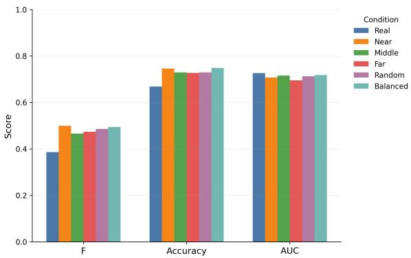
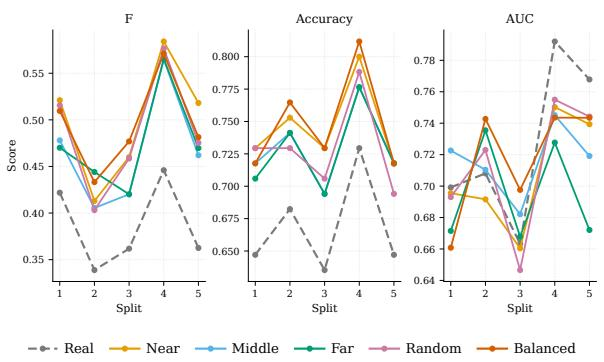
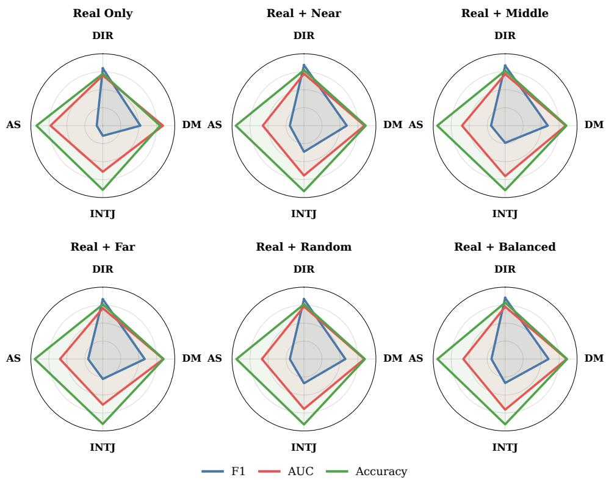
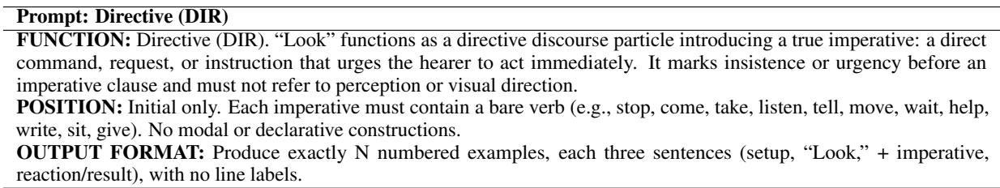

# The Impact of Synthetic Data Augmentation on Discourse-Pragmatic Function Classification

Sara Sorahi1, Kevin Tang2,3, Reza Kazemian4

Faculty of Arts and Humanities, Heinrich Heine University Düsseldorf 1Institute of Linguistics 2Department of English Language and Linguistics, 3Department of Linguistics, College of Liberal Arts and Sciences, University of Florida 4Sun Yat-sen University, China

{sara.sorahi, kevin.tang}@hhu.de, reza.kazemian.linguistics@gmail.com

## Abstract

Synthetic data augmentation has become a common strategy for addressing class imbalance in NLP, but most approaches focus on the quantity and diversity of generated examples rather than their geometric relationship to real training data. We investigate this question in the context of discourse-pragmatic function classification, a task where data sparsity is a structural feature rather than a collection artefact. Using 410 manually annotated instances of the English word look drawn from the British National Corpus, spanning four functions: Attention Signal, Directive, Discourse Marker, and Interjection. We generate synthetic training examples with Llama 3.1 and partition them by their cosine distance from real training data in RoBERTa embedding space. We compare six training conditions that differ in the placement of synthetic examples relative to the empirical decision boundary, while holding augmentation quantity constant across conditions. All augmented conditions improve macro-F and accuracy over the real-only baseline, but coreproximal examples (NEAR) yield the largest gains in macro-F (+0.113), while a distancebalanced mix achieves the highest accuracy (0.748). No condition improves AUC, indicating that augmentation shifts the decision boundary rather than improving the model’s underlying probability estimates. These findings suggest that where synthetic examples land in representation space matters as much as how many are generated, with implications for lowresource pragmatic classification more broadly.

## 1 Introduction

Data augmentation has become a standard technique in natural language processing when labeled data is scarce. Early methods like lexical perturbation (Wei and Zou, 2019) and back-translation (Sennrich et al., 2016) work by tweaking the surface form of existing examples while preserving their meaning. With the rise of large language models, a new wave of augmentation strategies has emerged, ones that can generate fluent, labelconsistent text on demand (Anaby-Tavor et al., 2020; Brown et al., 2020), and these have delivered strong results across many classification tasks (Feng et al., 2021).

Most of this work, though, is preoccupied with quantity and diversity: how many examples to generate, and how varied they should be. Wang et al. (2025) explicitly optimize for paraphrase diversity while keeping labels intact, operating on the assumption that more variety is always better. That assumption is worth questioning. Synthetic examples that drift too far from the real data can blur class boundaries, add noise, or shift the decision boundary in ways that aggregate metrics may not detect. Sadlier-Brown et al. (2024) put this tension in sharp relief: when they compare model and human performance on natural versus LLM-generated cloze items, models dramatically outperform humans on the synthetic ones, a sign that generated text has its own statistical fingerprint, one that models are good at exploiting but that may have little to do with genuine linguistic understanding (Bayer et al., 2022). For augmentation-based approaches, inflated performance on synthetic-feeling data is not the same as better pragmatic classification.

The stakes are even higher when the task involves discourse-pragmatic function classification, where meaning is determined by context and communicative intent rather than surface form. As Ma et al. (2025) document, pragmatic phenomena remain among the most resistant to computational treatment, and benchmark resources for evaluating them are still limited. Matters are made worse by data sparsity: pragmatic categories like discourse markers and interjections are inherently low-frequency and hard to accumulate in sufficient numbers (Gries, 2015). Even where enough data exists, automatic disambiguation remains difficult: Zufferey and Popescu-Belis (2004) found that classifying like as a discourse marker required careful feature engineering and still showed limited agreement with human annotators, illustrating how hard multifunctional pragmatic items are to classify even under favorable conditions.

Another such multifunctional item, one that has attracted considerable scholarly attention not only in English but across its counterparts in other languages, is look (Keevallik, 2008; Cardinaletti, 2015; Sánchez López, 2017; Aijmer, 2018; Nau, 2021; Van Olmen and Tantucci, 2022; Kazemian et al., 2025). It has received little computational attention, however, and its automatic function classification remains an open problem. The present study aims to fill this gap.

Much like like, look presents a challenge due to its functional versatility: it can function as an Attention Signal (AS, e.g., look, this is important), a Directive (DIR, e.g., look!), a Discourse Marker (DM, e.g., look, I don’t think that’s right), or an Interjection (INTJ, e.g., oh, look!). None of these functions is signaled by the word itself; they emerge from context, prosody, and pragmatic inference (Heine, 2023), making look both a genuinely hard classification target and a well-motivated testbed for synthetic augmentation.

We tried several augmentation strategies, starting with back-translation and moving to prompt-based generation with Llama 3.1 (Grattafiori et al., 2024), served locally via Ollama (Ollama, 2024). Rather than treating all synthetic data as interchangeable, we ask a more precise question: does it matter where in embedding space a synthetic example lands? We partition generated instances by their cosine distance from real training data in RoBERTa (Liu et al., 2019) embedding space and compare how different placement strategies affect classification performance. Our results show that examples close to the decision boundary produce the most reliable gains, suggesting that the effectiveness of augmentation depends not only on scale or diversity, but on the geometry of representation space.1

## 2 Data and Annotation

We focus on the English word look, annotated for four interactive functions following the classification of interactive grammar (Heine, 2023). As an Attention Signal (AS), look directs the listener’s attention toward what the speaker is about to say (e.g., look, this matters). As a Directive (DIR), it functions as a frozen stand-alone expression that retains a residual perceptual meaning without taking any complement (e.g., look!). As a Discourse Marker (DM), it manages interactional flow or signals stance (e.g., look, I don’t agree). As an Interjection (INTJ), it expresses a spontaneous emotional reaction (e.g., oh, look!). Although all four functions share the same surface form, they are pragmatically distinct and require contextual interpretation to disambiguate (Van Olmen and Tantucci, 2022; Landert et al., 2023).

<table><tr><td>Label</td><td>Function</td><td>Real</td><td>Augmented</td></tr><tr><td>AS</td><td>Attention Signal</td><td>287</td><td>287</td></tr><tr><td>DIR</td><td>Directive</td><td>71</td><td>287</td></tr><tr><td>DM</td><td>Discourse Marker</td><td>34</td><td>287</td></tr><tr><td>INTJ</td><td>Interjection</td><td>18</td><td>287</td></tr><tr><td>Total</td><td></td><td>410</td><td>1,148</td></tr></table>

Table 1: Class distribution before and after augmentation. AS serves as a real-only reference condition throughout.

All 410 instances were drawn from the British National Corpus (BNC) (BNC Consortium, 2007) and manually annotated by two expert annotators following the parameter-based scheme described in Appendix A. Annotation focused on the discoursepragmatic role of look in context rather than syntactic form alone, since several functions can appear in structurally similar environments. Ambiguous cases were resolved through discussion until consensus was reached. As is typical in discoursepragmatic annotation (Gries, 2015), the class distribution is heavily skewed: AS dominates with 287 instances, followed by DIR (71), DM (34), and INTJ (18), as shown in Table 1.

For evaluation, we created five independent stratified 80/20 train–test splits using only attested corpus examples, preserving the original class distribution in each split. All reported results are averaged across five runs. Synthetic data is used only during training; test sets always consist of authentic BNC examples.

## 3 Synthetic Data Augmentation

Our goal was not simply to generate more data, but to generate examples that preserved the discoursepragmatic function of look: a harder problem than it might appear. Unlike semantic augmentation tasks, where meaning is relatively stable across paraphrases, pragmatic function is exquisitely sensitive to context (Ma et al., 2025). A small shift in wording, register, or surrounding discourse can silently change how an utterance functions, making standard augmentation methods unreliable for this kind of data (Feng et al., 2021).

We first explored two translation-based augmentation strategies before settling on prompt-based LLM generation.

Back-Translation. Our first attempt used backtranslation (Sennrich et al., 2016), translating existing examples into German2 and back into English to produce paraphrastic variation while preserving meaning. The most immediate problem was that look itself rarely survived the round-trip. German has no direct pragmatic equivalent for discoursefunctional uses of look, so the translator would routinely drop it, replace it with a semantically motivated verb, or restructure the sentence entirely. A sentence like look, I don’t think that’s true, where look is the very item carrying the discourse-marker function, came back as however, I do not believe that to be accurate: not only had the word look disappeared, but the entire pragmatic character of the utterance had changed. The conversational informality and the interactional stance were both missing, and with them the functional category we were trying to preserve.

To address this, we wrote a small Python script that forced look back into its original position after translation, reinserting the word at the same slot in the returned sentence. This kept look in place, but introduced a new problem: the surrounding sentence had already been restructured around its absence, so the result was often deeply unnatural. A sentence like look, we really need to address this now might return from German as we should really address this now, don’t you think, and after reinsertion become look, we should really address this now, don’t you think: present, but jarring, and no longer clearly a discourse marker use. The word was there; the pragmatic function was not.

Cross-Translation. We then tried crosstranslation, passing examples through two intermediate languages in sequence, using German and French, hoping that the additional translation step would introduce more surface variety. It did introduce variety, but not the kind we needed. Chaining translations compounded the distortions rather than correcting them (Bayer et al., 2022). The meaning of sentences drifted further with each step, and look continued to disappear or mutate. A sentence like oh, look! They’ve already left, a clear Interjection use, passed through German as oh, schau! Sie sind schon gegangen, then through French as oh, regardez! Ils sont déjà partis, and returned to English as oh, see! They have already gone: the spontaneous affective charge had flattened, the register had shifted, and look had been replaced altogether. Even when the reinsertion script forced look back in, the surrounding sentence had reorganized itself around a different word, leaving look stranded in a context that no longer motivated its pragmatic function. The sentence was grammatical; the category had evaporated.

Both approaches shared the same underlying failure: they treated look as just another content word, when in fact its pragmatic function is inseparable from the specific interactional context in which it appears (Heine, 2023). No amount of post-hoc reinsertion could recover what the translation process had already destroyed.

## 3.1 Prompt-Based Generation

We moved to prompt-based generation using Llama 3.1 8B (Instruct) (Grattafiori et al., 2024), served locally via Ollama (Ollama, 2024) using its default Q4\_K\_M quantized distribution. A large language model with broad pragmatic competence can, in principle, generate contextually grounded examples that preserve discourse-pragmatic function, provided the prompt is carefully designed (Brown et al., 2020).

Early attempts were disappointing. Without sufficient guidance, the model defaulted to stereotypical constructions: DM examples invariably opened with look, the thing is. . . , directives collapsed into bare imperatives like look at this, and interjections leaned into theatrical exclamatory phrasing that felt constructed rather than natural. Some outputs also blurred functional boundaries: look, just listen to me, for instance, could plausibly be read as AS, DM, or DIR depending on context. This kind of cross-category leakage is a known risk when generating pragmatically sensitive text without tight constraints (Sadlier-Brown et al., 2024).

We addressed these problems through iterative prompt refinement. We developed four functionspecific prompts, one per category, each containing a clear functional definition, concrete positive examples in naturalistic discourse, and explicit instructions against repetitive openings and formulaic structures. The full prompts and a representative set of failure cases are documented in Appendix B. Prompts required examples to be embedded in plausible conversational or narrative contexts, since context is precisely what makes pragmatic function recoverable (Ma et al., 2025). Generation temperature was set to 1.4 to balance variation against functional consistency: lower settings produced repetitive outputs; higher settings caused pragmatic coherence to break down. All other decoding parameters were left at Ollama’s defaults for this model (top-k = 40, top-p = 0.9, repeat penalty = 1.1).

The resulting examples were substantially more varied and contextually grounded. A final-round DM example: look, I’ve been patient, but we really need to make a decision today is interactionally motivated and unambiguously a discourse marker use. A final-round INTJ example: oh, look! They’ve already started without us is spontaneous, affectively charged, and clearly distinct from the other categories.

## 3.2 Quality Review

All generated outputs were manually reviewed by the same two annotators responsible for the original corpus annotation, who independently assessed each example for grammaticality, naturalness, and functional appropriateness (Wang et al., 2025). Examples judged ambiguous, repetitive, pragmatically implausible, or borderline between categories were discarded. Disagreements were resolved through discussion, following the same procedure used for the BNC annotation. Only instances approved by both reviewers were retained, ensuring that synthetic data met the same basic standards of pragmatic coherence as the attested corpus examples.

## 4 Classification Experiments

## 4.1 Sentence Representations

All sentences were encoded using RoBERTa-base (Liu et al., 2019), a transformer-based language model pre-trained on large amounts of English text. We used mean pooling over the final hidden states to produce a single fixed-length sentence embedding for each instance. The RoBERTa encoder was kept frozen throughout all experiments; we did not fine-tune it on the discourse-pragmatic classification task. This design choice was deliberate: by holding the representation fixed, we ensure that any differences in classification performance across conditions can be attributed to the augmentation strategy rather than to changes in the underlying feature space. Once all synthetic examples had been encoded, we computed the distance between each synthetic instance and the real training set. Specifically, for each synthetic example, we calculated its mean cosine distance to all real training examples belonging to the same class. This gave us a distance score for every synthetic instance, reflecting how far it sits from the core of its category in representation space.

We then partitioned the synthetic examples for each minority class into three equal-sized groups based on this distance score:

• NEAR: synthetic examples closest to the real training instances, sitting near the dense core of the class region.

• MIDDLE: synthetic examples at an intermediate distance, occupying the space between the class core and its boundary.

• FAR: synthetic examples furthest from the real training instances, sitting at or beyond the natural class boundary.

This partitioning allowed us to directly compare augmentation strategies that differ not in quantity (all conditions add the same number of synthetic examples) but in their geometric relationship to the empirical decision boundary.

## 4.2 Training Conditions

We compare six training conditions (see Table 10 in the Appendix for full descriptions). The baseline, REAL ONLY, is trained exclusively on attested BNC examples. The remaining five conditions each augment the real training data with synthetic examples for the three minority classes (DIR, DM, INTJ), scaling each up to 287 instances to match the majority class (AS). They differ in which synthetic examples are added: REAL + NEAR uses examples closest to the real training data in embedding space; REAL + FAR uses those furthest away; REAL + MIDDLE takes those at an intermediate distance; REAL + RANDOM draws a random sample regardless of distance; and REAL + BAL-ANCED combines an equal mix of Near, Middle, and Far examples.

## 4.3 Classifier and Evaluation

A multinomial logistic regression classifier was trained on top of the frozen RoBERTa embeddings for four-way discourse-pragmatic function classification. Logistic regression was chosen deliberately as a simple, interpretable classifier that places the explanatory burden on the representation and the training data rather than on model complexity. This makes it well-suited for our purpose: we are interested in what the augmentation strategy contributes, not in maximising raw classification performance through architectural choices.

Evaluation was carried out using five independent stratified 80/20 train–test splits, with the original class distribution preserved in each split. All test sets consist exclusively of authentic BNC examples; synthetic data is never used for evaluation. We report three metrics averaged across the five splits: macro-F, which weights each class equally and is therefore sensitive to minority-class performance; accuracy, which reflects overall label assignment correctness; and macro-AUC, which measures the quality of the model’s probability ranking independently of the final argmax decision. Reporting all three metrics allows us to distinguish between improvements in hard label assignment and improvements in the underlying probability estimates, a distinction that turns out to be central to interpreting the results.

## 5 Results

## 5.1 Overall Performance

Table 2 and Figure 1 summarise overall classification performance across the six training conditions, reported as macro-F, accuracy, and AUC averaged over five stratified train–test splits.

The results tell a clear and consistent story. Every augmentation strategy outperforms the realonly baseline on both macro-F and accuracy, without exception. The largest gains come from core-proximal augmentation: the NEAR condition reaches macro-F of $0 . 4 9 9 \pm 0 . 0 6 5 .$ an absolute improvement of +0.113 over the baseline $( 0 . 3 8 6 { \pm } 0 . 0 4 5 )$ . Accuracy follows the same pattern, rising from 0.668 ± 0.038 to $0 . 7 4 6 \pm 0 . 0 3 3$ under the NEAR condition. The REAL+BALANCED condition performs comparably, achieving the highest mean accuracy overall $( 0 . 7 4 8 \pm 0 . 0 4 0 )$ while its macro-F $( 0 . 4 9 4 \pm 0 . 0 5 1 )$ falls just short of NEAR. RANDOM, FAR, and MIDDLE all improve over the baseline too, though by smaller margins, and the ranking broadly reflects a distance-sensitive pattern: the closer synthetic examples sit to the natural class boundary, the more they contribute to classification performance.

  
Figure 1: Mean macro-F, accuracy, and AUC across six augmentation conditions, averaged over five stratified splits. Error bars indicate standard deviation. F and accuracy improve consistently across all augmented conditions, while AUC remains flat, consistent with a decision boundary shift rather than improved probability estimation.

AUC tells a strikingly different story. It barely moves across conditions, ranging from 0.695 to 0.726, and the real-only baseline actually achieves the highest AUC of all $( 0 . 7 2 6 \pm 0 . 0 5 3 )$ . This divergence between AUC and the other two metrics is theoretically informative. Because AUC measures how well the model ranks predicted probabilities, while macro-F and accuracy reflect the final argmax label assignment, the flat AUC indicates that augmentation does not improve the model’s underlying confidence estimates; it shifts the decision boundary so that borderline minority-class instances end up on the correct side. The model is not becoming more certain; it is becoming better calibrated at the margins.

## 5.2 Robustness and Statistical Significance

Paired statistical comparisons between each augmentation condition and the real-only baseline are reported in Table 11 (Appendix C). Figure 2 visualises split-level performance trajectories for all three metrics.

The most striking finding is the sheer consistency of the gains. Every augmentation strategy beats the real-only baseline on both macro-F and accuracy in all five out of five splits, a result that holds regardless of how the data is partitioned. This rules out the possibility that improvements are driven by a single lucky split.

<table><tr><td>Condition</td><td>F</td><td>Accuracy</td><td>AUC</td></tr><tr><td> $\mathbf { \overline { { R e a l ~ O n l y } } }$ </td><td> $0 . 3 8 6 \pm 0 . 0 4 5$ </td><td> $0 . 6 6 8 \pm 0 . 0 3 8$ </td><td> $\mathbf { 0 . 7 2 6 \pm 0 . 0 5 3 }$ </td></tr><tr><td> $\mathrm { R e a l + N e a r }$ </td><td> ${ \bf 0 . 4 9 9 \pm 0 . 0 6 5 }$ </td><td> $0 . 7 4 6 \pm 0 . 0 3 3$ </td><td> $0 . 7 0 7 \pm 0 . 0 3 7$ </td></tr><tr><td> $\mathbf { R e a l + M i d d l e }$ </td><td> $0 . 4 6 6 \pm 0 . 0 6 3$ </td><td> $0 . 7 2 9 \pm 0 . 0 3 1$ </td><td> $0 . 7 1 6 \pm 0 . 0 2 3$ </td></tr><tr><td> $\mathrm { R e a l + F a r }$ </td><td> $0 . 4 7 4 \pm 0 . 0 5 5$ </td><td> $0 . 7 2 7 \pm 0 . 0 3 3$ </td><td> $0 . 6 9 5 \pm 0 . 0 3 4$ </td></tr><tr><td> $\mathrm { R e a l + R a n d o m }$ </td><td> $0 . 4 8 6 \pm 0 . 0 6 5$ </td><td> $0 . 7 2 9 \pm 0 . 0 3 6$ </td><td> $0 . 7 1 2 \pm 0 . 0 4 4$ </td></tr><tr><td> $\mathbf { R e a l } + \mathbf { B a l a n c e d }$ </td><td> $0 . 4 9 4 \pm 0 . 0 5 1$ </td><td> ${ \bf 0 . 7 4 8 \pm 0 . 0 4 0 }$ </td><td> $0 . 7 1 8 \pm 0 . 0 3 7$ </td></tr></table>

Table 2: Overall classification performance across six augmentation conditions, reported as mean ± standard deviation over five stratified train–test splits. Bold indicates the best score per metric. The real-only baseline achieves the highest AUC despite having the lowest F and accuracy, a divergence that points to a boundary-shift effect rather than genuine improvement in probability ranking.

NEAR-core augmentation remains the strongest condition for macro-F, with a mean improvement of $+ 0 . 1 1 3 ~ ( p ~ = ~ 0 . 0 0 1 6 , ~ d ~ = ~ 3 . 4 3 )$ The REAL+BALANCED condition is close behind on F $( + 0 . 1 0 8 , p = 0 . 0 0 0 1 , d = 6 . 6 6 )$ and produces the largest accuracy gain of all $( + 0 . 0 8 0 , d = 8 . 1 3 )$ suggesting that distributing synthetic examples across distance bands is a reliable alternative to pure core-proximal sampling. The remaining conditions, RANDOM, FAR, and MIDDLE, all show significant improvements with large effect sizes, though their gains are somewhat smaller. MIDDLE produces the weakest F improvement (+0.080) despite sitting between NEAR and FAR in distance terms, hinting that the relationship between distance and utility is not strictly linear.

AUC, by contrast, shows no significant improvement under any condition. All augmented settings produce small negative mean differences, none reach statistical significance, and split-level wins range from just 0/5 to 3/5. This is fully consistent with the boundary-shift interpretation: augmentation moves the decision boundary without meaningfully changing the probability ranking.

Figure 2 makes the split-level picture concrete. The augmented conditions track closely together and maintain a clear gap above the real-only baseline for both F and accuracy across all five splits. The relative ranking of strategies is stable even as absolute scores fluctuate. Split 4 stands out as a performance peak for all conditions, likely because this partition places more ambiguous boundary cases in the training set, where boundary-proximal synthetic examples can do the most work.

## 5.3 Function-Level Analysis

The overall gains reported above are not distributed evenly across the four discourse-pragmatic functions. Table 3 reports function-level F1 scores across all six conditions, and Figure 3 shows the full per-function profile of F1, AUC, and accuracy for each condition as radar plots. The pattern tracks the degree of class imbalance in the original data fairly closely: the less real data a category has, the more it tends to benefit from augmentation.

  
Figure 2: Split-wise performance trajectories for macro-F, accuracy, and AUC across five stratified train–test splits. Augmented conditions maintain a consistent separation above the real-only baseline (grey) for F and accuracy across all five splits. AUC shows no reliable improvement pattern. The shared performance peak at split 4 suggests this partition contains a particularly favourable distribution of boundary cases.

Three patterns stand out. First, INTJ, with only 18 real instances the most severely underrepresented class, benefits the most from augmentation. Its F1 score nearly triples under NEAR, rising from 0.14 in the real-only setting to 0.36, a gain of +0.22 points. That is a striking jump for a category the real-only classifier can barely tell apart from noise. Even the weakest strategy, MIDDLE, still lifts INTJ F1 to 0.24. The fact that NEAR gives the largest INTJ gain while MIDDLE gives the smallest suggests that synthetic examples close to the real class core are the most useful for a category that otherwise has almost no footprint in the training data.

Second, DM shows reliable but more modest gains, moving from 0.52 at baseline to somewhere between 0.58 and 0.60 across augmented conditions, roughly +0.06 to +0.08 points. These gains hold across all strategies, with REAL+BALANCED reaching the highest DM F1 (0.60). For a category with 34 real instances, where the synthetic examples land matters somewhat, but simply having more training data to work with matters more.

Figure 3: Per-condition radar plots showing function-level F1, AUC, and accuracy across the four discoursepragmatic functions (DIR, AS, INTJ, DM). Each plot corresponds to one training condition. Full numeric values for all three metrics are reported in Table 12 (Appendix C). The collapsed F1 profile in the Real Only condition, particularly for INTJ, expands under augmentation, most notably under NEAR and RANDOM. AUC and accuracy profiles stay stable across conditions, consistent with the boundary-shift interpretation from Section 5.1.
<table><tr><td>Condition</td><td>DIR</td><td>AS</td><td>INTJ</td><td>DM</td></tr><tr><td>Real Only</td><td>0.80</td><td>0.14</td><td>0.14</td><td>0.52</td></tr><tr><td>Real + Near</td><td>0.84</td><td>0.20</td><td>0.36</td><td>0.59</td></tr><tr><td>Real + Middle</td><td>0.84</td><td>0.20</td><td>0.24</td><td>0.59</td></tr><tr><td>Real + Far</td><td>0.83</td><td>0.20</td><td>0.28</td><td>0.58</td></tr><tr><td>Real + Random</td><td>0.83</td><td>0.20</td><td>0.34</td><td>0.58</td></tr><tr><td>Real + Balanced</td><td>0.85</td><td>0.19</td><td>0.33</td><td>0.60</td></tr></table>

Table 3: Function-level F1 scores across augmentation conditions, averaged over five stratified splits. Bold marks the best score per function. INTJ and DM benefit most from augmentation, while AS, the majority class that receives no synthetic examples, changes little across conditions.

Third, DIR improves modestly across the board, from 0.80 at baseline to between 0.83 and 0.85. This smaller gain fits with DIR already having decent real-data coverage (n = 71): the classifier already has enough genuine examples to learn the category’s basic contours, so synthetic data refines the boundary rather than making the category learnable in the first place. REAL+BALANCED gives the best DIR F1 (0.85), suggesting a mix of near and far examples helps most once a class is already partly learnable.

AS, the majority class with 287 real instances and no synthetic augmentation, stays largely unchanged across conditions. Its low F1 (0.14–0.20) despite being the dominant class reflects a familiar pathology of imbalanced classification: the model defaults to AS too often, inflating recall while hurting precision, which drags F1 down even though raw accuracy looks fine. Augmentation neither worsens nor fixes this: AS gets no synthetic examples, so its F1 profile stays essentially flat throughout.

Taken together, the function-level results reinforce the main finding: augmentation helps most where real data is scarcest, and the size of the improvement tracks how severely under-represented a class is. The amount of synthetic data relative to a class’s real-data coverage looks like the main driver here, with boundary proximity adding a smaller, secondary benefit, most visible in the INTJ gains under NEAR versus MIDDLE.

## 6 Conclusion

We have presented a study of synthetic data augmentation for discourse-pragmatic function classification, using the English word look as a testbed. Our central finding is that the effectiveness of augmentation depends not only on how many synthetic examples are generated, but on where they sit in embedding space relative to the real training data. Core-proximal examples, those closest to the dense center of the real class distribution in RoBERTa embedding space, produce the largest gains on macro-F, while a balanced mix of near and far examples achieves the highest accuracy. None of these improvements translates to gains in AUC, indicating that augmentation shifts the decision boundary rather than improving the model’s underlying probability estimates.

These results suggest that the geometry of synthetic data in representation space is a meaningful variable that should be taken into account when designing augmentation strategies for low-resource pragmatic classification tasks. Simply generating more examples is not sufficient; where those examples land matters. We hope this finding motivates further work on distance- and geometry-aware augmentation in NLP, particularly for tasks where data sparsity is a structural feature of the phenomenon rather than a collection artefact.

## 7 Limitations

Several limitations of the present study should be noted. First, our corpus is small by NLP standards: 410 attested instances across four classes, with the two rarest categories containing only 34 (DM) and 18 (INTJ) real examples. While this reflects the genuine scarcity of these functions in naturally occurring speech (Gries, 2015), it means that even after augmentation the training sets remain limited, and the reported improvements should be interpreted with that context in mind.

Second, the RoBERTa encoder was kept frozen throughout all experiments. This was a deliberate design choice to isolate the contribution of augmentation strategy from changes in the underlying feature space, but it also means that the representations used for classification were not adapted to the distributional properties of discourse-pragmatic data. Fine-tuning the encoder on the full augmented training set may yield further gains, and the interaction between encoder adaptation and distancebased augmentation remains an open question. Relatedly, mean-pooled representations from frozen transformer encoders like RoBERTa are known to exhibit anisotropy (Ethayarajh, 2019), which can distort cosine-based distance measures; it remains an open question whether our distance-sensitive findings would hold under embeddings specifically designed for cosine geometry, such as sentencetransformers (Reimers and Gurevych, 2019).

Third, our distance-based partitioning relies on mean cosine distance to the real training set within each class. This is a simple and interpretable measure, but it does not capture the full geometry of the embedding space, for instance, whether a synthetic example sits in a dense or sparse region, or how close it is to examples from other classes. More sophisticated geometric criteria may further refine the augmentation strategy.

Fourth, our statistical comparisons (Appendix C, Table 11) are computed over only five stratified splits. With n = 5, p-values and effect sizes are sensitive to the particular partitions drawn, and we do not report confidence intervals or bootstrap estimates that would better characterize the uncertainty around these differences. The consistency of the ranking across all five splits partially mitigates this concern, but a larger number of splits or a bootstrap-based reanalysis would strengthen the statistical claims.

Fifth, our experiments are conducted on a single language (English) and a single word (look). Whether the findings generalise to other polyfunctional items, other languages, or other discoursepragmatic classification tasks remains to be established. The cross-linguistic literature on look (Keevallik, 2008; Van Olmen and Tantucci, 2022) suggests that similar functional ambiguity arises across languages, but the degree to which synthetic augmentation addresses it may vary.

Sixth, our prompt templates impose different structural constraints across functions: INTJ examples, for instance, were generated as threesentence mini-scenes (setup, target sentence, reaction), while DM and DIR examples follow shorter templates. We did not verify that attested BNC instances of each function are matched in length or discourse structure to their synthetic counterparts. If real and synthetic examples differ systematically in context length by function, this could confound the distance-based effects we report with a simpler input-length effect, and this possibility warrants further investigation.

Finally, we note that the prompt-based generation approach depends on the quality of the underlying language model (Llama 3.1) and the careful manual design of prompts. Our results may not transfer directly to other models or domains without similar iterative refinement of the generation constraints.

## 8 Ethical Considerations

The data used in this study are drawn from the British National Corpus (BNC) (BNC Consortium, 2007), a publicly available resource distributed under an established licence for academic research. No new human subjects data were collected, and no personally identifiable information is present in the corpus examples used for annotation or evaluation.

The synthetic data generated in this study were produced using Llama 3.1 (Grattafiori et al., 2024), a publicly released model, and served locally via Ollama (Ollama, 2024). No proprietary APIs or closed systems were used in the data generation pipeline. Generated examples were manually reviewed for appropriateness before inclusion in the training set.

The annotation work was carried out by two expert annotators with a background in linguistics. No crowd-sourced or low-paid annotation labour was used, and no vulnerable populations were involved in any part of the study.

We do not foresee significant direct harms arising from this research. The task, automatic classification of discourse-pragmatic functions of a single word, is a basic NLP research problem without immediate dual-use risks. However, we acknowledge that improvements in pragmatic function classification could in principle contribute to downstream applications in dialogue systems or automated discourse analysis, and that such applications should be developed and deployed with appropriate scrutiny.

## References

Karin Aijmer. 2018. Positioning of self in interaction: Adolescents’ use of attention-getters. In Kate Beeching, Chiara Ghezzi, and Piera Molinelli, editors, Positioning the Selfand Others: Linguistic Perspectives, volume 292 of Pragmatics & Beyond New Series, pages 177–195. John Benjamins, Amsterdam.

Ateret Anaby-Tavor, Boaz Carmeli, Esther Goldbraich,

Amir Kantor, George Kour, Segev Shlomov, Naama Tepper, and Naama Zwerdling. 2020. Do not have enough data? deep learning to the rescue! In Proceedings ofthe AAAI Conference on Artificial Intelligence, volume 34, pages 7383–7390.

Markus Bayer, Marc-André Kaufhold, and Christian Reuter. 2022. A survey on data augmentation for text classification. ACM Computing Surveys, 55(7):1–39.

BNC Consortium. 2007. The British National Corpus, XML edition.

Tom Brown, Benjamin Mann, Nick Ryder, Melanie Subbiah, Jared D. Kaplan, Prafulla Dhariwal, Arvind Neelakantan, Pranav Shyam, Girish Sastry, Amanda Askell, et al. 2020. Language models are few-shot learners. Advances in Neural Information Processing Systems, 33:1877–1901.

Anna Cardinaletti. 2015. Italian verb-based discourse particles in a comparative perspective. In Josef Bayer, Roland Hinterhölzl, and Andreas Trotzke, editors, Discourse-oriented Syntax, Linguistik Aktuell/Linguistics Today, pages 71–91. John Benjamins, Amsterdam.

Kawin Ethayarajh. 2019. How contextual are contextualized word representations? comparing the geometry of BERT, ELMo, and GPT-2 embeddings. In Proceedings of the 2019 Conference on Empirical Methods in Natural Language Processing and the 9th International Joint Conference on Natural Language Processing (EMNLP-IJCNLP), pages 55–65, Hong Kong, China. Association for Computational Linguistics.

Benjamin Fagard. 2010. é vida, olha. . . : Imperatives as discourse markers and grammaticalization paths in Romance — a diachronic corpus study. Languages in Contrast, 10(2):245–267.

Steven Y. Feng, Varun Gangal, Jason Wei, Sarath Chandar, Soroush Vosoughi, Teruko Mitamura, and Eduard Hovy. 2021. A survey of data augmentation approaches for NLP. In Findings ofthe Association for Computational Linguistics: ACL-IJCNLP 2021, pages 968–988, Online. Association for Computational Linguistics.

Aaron Grattafiori, Abhimanyu Dubey, Abhinav Jauhri, et al. 2024. The Llama 3 herd of models. Preprint, arXiv:2407.21783.

Stefan Th. Gries. 2015. Some current quantitative problems in corpus linguistics and a sketch of some solutions. Language and Linguistics, 16(1):93–117.

Bernd Heine. 2023. Interactive Grammar. Oxford University Press, Oxford.

Reza Kazemian, Mohammad Amouzadeh, Bernd Heine, and Hadaegh Rezaei. 2025. Beyond sentence grammar: Persian directives in interaction. Journal of Pragmatics, 236:40–59.

Leelo Keevallik. 2008. Internal development and borrowing of pragmatic particles: The Estonian vaata/vat ‘look’, näed ‘you see’ and vot. Finnisch Ugrische Mitteilungen, 30/31:23–54.

Daniela Landert, Daria Dayter, Thomas C. Messerli, and Miriam A. Locher. 2023. Corpus Pragmatics. Cambridge Elements in Pragmatics. Cambridge University Press.

Yinhan Liu, Myle Ott, Naman Goyal, Jingfei Du, Mandar Joshi, Danqi Chen, Omer Levy, Mike Lewis, Luke Zettlemoyer, and Veselin Stoyanov. 2019. RoBERTa: A robustly optimized BERT pretraining approach. arXiv preprint.

Bolei Ma, Yuting Li, Wei Zhou, Ziwei Gong, Yang Janet Liu, Katja Jasinskaja, Annemarie Friedrich, Julia Hirschberg, Frauke Kreuter, and Barbara Plank. 2025. Pragmatics in the era of large language models: A survey on datasets, evaluation, opportunities and challenges. In Proceedings of the 63rd Annual Meeting of the Associationfor Computational Linguistics (Volume 1: Long Papers), pages 8679–8696, Vienna, Austria. Association for Computational Linguistics.

Nicole Nau. 2021. Another ‘look!’: The Latvian particle luk¯ in parliamentary discourse. In Daniël Van Olmen and Jolanta Šinkunien ¯ e, editors, ˙ Pragmatic Markers and Peripheries, volume 325 of Pragmatics & Beyond New Series, pages 111–140. John Benjamins, Amsterdam.

Ollama. 2024. Ollama: Get up and running with large language models locally. https://ollama.com. Software. Accessed: 2026-07-15.

Nils Reimers and Iryna Gurevych. 2019. Sentence-BERT: Sentence embeddings using Siamese BERTnetworks. In Proceedings ofthe 2019 Conference on Empirical Methods in Natural Language Processing and the 9th International Joint Conference on Natural Language Processing (EMNLP-IJCNLP), pages 3982–3992, Hong Kong, China. Association for Computational Linguistics.

Emily Sadlier-Brown, Millie Lou, Miikka Silfverberg, and Carla Kam. 2024. How useful is context, actually? comparing LLMs and humans on discourse marker prediction. In Proceedings ofthe Workshop on Cognitive Modeling and Computational Linguistics, pages 231–241, Bangkok, Thailand. Association for Computational Linguistics.

Cristina Sánchez López. 2017. Mirativity in Spanish: The case of the particle Mira. Review of Cognitive Linguistics, 15(2):489–514.

John R. Searle. 1979. A taxonomy of illocutionary acts. In Expression and Meaning: Studies in the Theory of Speech Acts, pages 1–29. Cambridge University Press.

Rico Sennrich, Barry Haddow, and Alexandra Birch. 2016. Improving neural machine translation models with monolingual data. In Proceedings of the 54th

Annual Meeting ofthe Associationfor Computational Linguistics (Volume 1: Long Papers), pages 86–96, Berlin, Germany. Association for Computational Linguistics.

Daniël Van Olmen and Vittorio Tantucci. 2022. Getting attention in different languages: A usage-based approach to parenthetical LOOK in Chinese, Dutch, English, and Italian. Intercultural Pragmatics, 19(2):141–181.

Zaitian Wang, Jinghan Zhang, Xinhao Zhang, Kunpeng Liu, Pengfei Wang, and Yuanchun Zhou. 2025. Diversity-oriented data augmentation with large language models. In Proceedings of the 63rd Annual Meeting of the Association for Computational Linguistics (Volume 1: Long Papers), pages 22265– 22283, Vienna, Austria. Association for Computational Linguistics.

Jason Wei and Kai Zou. 2019. EDA: Easy data augmentation techniques for boosting performance on text classification tasks. In Proceedings ofthe 2019 Conference on Empirical Methods in Natural Language Processing and the 9th International Joint Conference on Natural Language Processing (EMNLP-IJCNLP), pages 6382–6388, Hong Kong, China. Association for Computational Linguistics.

Sandrine Zufferey and Andrei Popescu-Belis. 2004. Towards automatic identification of discourse markers in dialogs: The case of like. In Proceedings of the 5th SIGdial Workshop on Discourse and Dialogue at HLT-NAACL 2004, pages 19–26, Cambridge, Massachusetts, USA. Association for Computational Linguistics.

## A Annotation Details

This appendix provides the annotation guidelines used for coding look as an interactive element in spoken discourse (Heine, 2023). Our framework builds on the cross-linguistic parameters introduced by Van Olmen and Tantucci (2022) for the study of parenthetical look, extended with two additional parameters, argument structure and co-occurrence, following Heine (2023). We distinguish four primary functions: Directive (DIR), Attention Signal (AS), Discourse Marker (DM), and Interjection (INTJ). Annotation covers five parameters per instance: turn position, clause position, perceptual meaning, speech act, and argument structure.

Turn position / Co-occurrence. Turn position refers to the placement of look within a speaker’s turn: initial, medial, or final. Instances appearing at the start of quotations or reported speech are treated as turn-initial.

Clause position. Clause position follows the same three values (initial, medial, final). Position is a key disambiguating cue: initial position correlates with linking to preceding discourse and topicalizing, while final position anticipates upcoming discourse (Heine, 2023).

Perceptual meaning. This parameter captures whether look has retained its original lexical meaning or undergone pragmatic bleaching (Fagard, 2010; Heine, 2023; Kazemian et al., 2025). Values: Yes (fully preserved, e.g. directive use); To some extent (partially preserved, e.g. attention signal); No (fully bleached, e.g. discourse marker, interjection).

Speech act. Following Searle (1979), we distinguish two speech acts performed by look itself: directive (DIR and AS, where the speaker prompts the hearer to act or attend) and expressive (INTJ, where the speaker expresses a psychological state). When neither is present, look functions as a DM or AS (Van Olmen and Tantucci, 2022).

Argument structure. Following Heine (2023), we annotate argument structure valence: S (speaker), H (hearer), and T (theme: the state of affairs prompting the interactive). Interjections involve S only; directives involve S and H; discourse markers involve T1, S, (H), and T2.

Annotator roles. A primary annotator identified occurrences and assigned all parameter values. A secondary annotator reviewed annotations and participated in conflict resolution. Discrepancies were resolved through discussion until consensus was reached.

The following example illustrates the annotation process on a naturally occurring BNC excerpt.

A: It becomes more and more apparent that the unassuming, virtually ego-free Mr. Cooder is far happier discussing musicians other than himself. . . B: Well, look, I mean, I just play.

Justification: Look appears turn-initially and clause-initially. It is fully bleached, performs no directive or expressive speech act, and manages discourse coherence by marking a shift in the conversation. The argument structure involves T1 (the preceding speaker’s belief), S (speaker B), H (speaker A), and T2 (the current situation being introduced).

## B Prompts

B.1 Prompt Iteration: Failure Cases

B.2 Final Prompt Templates

C Supplementary Results and Analysis

<table><tr><td>Function</td><td>Bleached</td><td>Speech act</td><td>Arg. structure</td><td>Clause pos.</td><td>Turn pos.</td></tr><tr><td>Directive</td><td>No</td><td>Directive</td><td>S, H</td><td>Initial</td><td>Initial</td></tr><tr><td>Attention Signal</td><td>Partially</td><td>Directive</td><td>S, H, T</td><td>Initial</td><td>Initial</td></tr><tr><td>Discourse Marker</td><td>Yes</td><td></td><td>T1, S, (H), T2</td><td>Initial/Medial</td><td>Initial/Medial</td></tr><tr><td>Interjection</td><td>Yes</td><td>Expressive</td><td>S</td><td>Initial/Med./Final</td><td>Initial/Med./Final</td></tr></table>

Table 4: Annotation scheme: parameters and values by function.

<table><tr><td>Token</td><td>Function</td><td>Turn pos.</td><td>Clause pos.</td><td>Bleached</td><td>Speech act</td><td>Arg. structure</td></tr><tr><td>look</td><td>DM</td><td>Initial</td><td>Initial</td><td>Yes</td><td></td><td>(T1, S, H, T2)</td></tr></table>

Table 5: Worked annotation example.

<table><tr><td>Generated output</td><td>Violation</td><td>Fix applied</td></tr><tr><td>&quot;She wanted to look for her keys before leaving.&quot;</td><td>Forbidden phrasal verb (look for) gen- erated under the DM condition; look retains its literal search sense rather than functioning as a discourse marker.</td><td>Added an explicit list of forbidden phrasal patterns and a final self-check instruction requiring the model to ver- ify their absence before output.</td></tr><tr><td>&quot;Look! I can&#x27;t believe you did that, that&#x27;s amazing!&quot;</td><td>Generated under the DM condition but functions as an emotional exclamation (INTJ), with look expressing surprise rather than organizing discourse</td><td>Added an explicit negative definition (“It does NOT express perception, emotion, or command&quot;) to the DM prompt to block cross-category leak- age.</td></tr><tr><td>&quot;You should look at this before decid- ing.&quot;</td><td>Generated under the DIR condition but uses a modal construction (should) and the phrasal verb look at, rather than a bare imperative.</td><td>Restricted DIR position to Initial-only and required a bare imperative verb im- mediately following Look,, explicitly banning modal/declarative forms.</td></tr><tr><td>“That&#x27;s, look, the third time this week, look, that this has happened.&quot;</td><td>Two instances of look in a single ex- ample, generated under the INTJ con- dition. Forbidden phrasal verb (look out) gen-</td><td>Added an explicit requirement that each example contain exactly one in- stance of look/Look.</td></tr><tr><td>&quot;Look out, the meeting is about to start.&quot;</td><td>erated under the DIR condition; reads as a warning rather than a directive in- troducing an imperative.</td><td>Added look out to the forbidden- pattern list and required the imperative verb to be a concrete bare verb (e.g., stop, come, take) rather than a continu- ation of look.</td></tr></table>

Table 6: Constraint violations observed during early prompt iterations.

<table><tr><td>Prompt: Discourse Marker (DM)</td></tr><tr><td>You are generating exactly N English examples that use the word &quot;look&quot; or &quot;Look&quot; (not looks, looking, or looked). FUNCTION: Discourse Marker (DM). &quot;Look&quot; functions as a discourse marker: a pragmatic particle that organizes and structures discourse. It introduces clarification, justification, contrast, reformulation, or stance. It does NOT express</td></tr><tr><td>perception, emotion, or command. It must sound natural in spoken or conversational written English. POSITION: Initial or Medial only (never final).</td></tr><tr><td>FORBIDDEN PATTERNS: &quot;look at&quot;, &quot;look out&quot;, &quot;look over&quot;, &quot;look around&quot;, &quot;look into&quot;, &quot;look for&quot;, &quot;look this way&quot;; any perceptual or emotional sense; “Look!&quot;interjections; directives (e.g., “Look, stop talking.&quot;).</td></tr></table>

Table 7: Prompt template for generating synthetic examples of look as a discourse marker (DM).

<table><tr><td>Prompt: Interjection (INTJ)</td></tr><tr><td>You are generating exactly N English examples where the word &quot;look&quot; or &quot;Look&quot; (not looks, looking, or looked) functions purely as an interjection (INTJ). FUNCTION: Interjection (INTJ). “Look&quot; expresses spontaneous emotion, such as surprise, admiration, joy, excitement,</td></tr><tr><td>frustration, disbelief, or shock. It does not mean see, watch, observe, inspect, or involve any literal act of perception. REQUIRED PROPERTIES: Exactly one &quot;look&quot;/“Look&quot; per example; balanced mix of Initial, Medial, and Final</td></tr><tr><td>positions (about one-third each). OUTPUT FORMAT: Produce exactly N numbered examples, each a coherent three-sentence mini-scene (setup, target</td></tr></table>

Table 8: Prompt template for generating synthetic examples of look as an interjection (INTJ).

  
Table 9: Prompt template for generating synthetic examples of look as a directive (DIR).

<table><tr><td>Condition</td><td>Description</td></tr><tr><td>REAL ONLY REAL + NEAR</td><td>Trained on attested BNC examples only; serves as the baseline. No synthetic data is added. Real data augmented with synthetic examples whose mean cosine distance to real training</td></tr><tr><td></td><td>instances of the same class is smallest (closest to the dense core of the class region).</td></tr><tr><td>REAL + MIDDLE</td><td>Real data augmented with synthetic examples at an intermediate distance from the real training set, occupying the space between the class core and its boundary.</td></tr><tr><td>REAL + FAR</td><td>Real data augmented with synthetic examples furthest from the real training instances, sitting at or beyond the natural class boundary in embedding space.</td></tr><tr><td>REAL + RANDOM REAL + BALANCED</td><td>Real data augmented with a random sample of synthetic examples drawn without regard to distance from the real training set.</td></tr><tr><td></td><td>Real data augmented with an equal mix of Near, Middle, and Far synthetic examples, distributing augmentation evenly across the full range of embedding distances.</td></tr></table>

Table 10: Full descriptions of the six training conditions.

<table><tr><td>Condition</td><td>Metric</td><td>∆</td><td>p</td><td>d</td><td>Wins</td></tr><tr><td>Near</td><td>F</td><td>+0.113</td><td>0.0016</td><td>3.43</td><td>5/5</td></tr><tr><td>Near</td><td>Accuracy</td><td>+0.078</td><td>0.0001</td><td>7.38</td><td>5/5</td></tr><tr><td>Near</td><td>AUC</td><td>-0.019</td><td>0.066</td><td>-1.12</td><td>0/5</td></tr><tr><td>Middle</td><td>F</td><td>+0.080</td><td>0.003</td><td>2.87</td><td>5/5</td></tr><tr><td>Middle</td><td>Accuracy</td><td>+0.061</td><td>0.0002</td><td>6.22</td><td>5/5</td></tr><tr><td>Middle</td><td>AUC</td><td>-0.010</td><td>0.553</td><td>-0.29</td><td>3/5</td></tr><tr><td>Far</td><td>F</td><td>+0.088</td><td>0.004</td><td>2.73</td><td>5/5</td></tr><tr><td>Far</td><td>Accuracy</td><td>+0.059</td><td>0.0001</td><td>7.07</td><td>5/5</td></tr><tr><td>Far</td><td>AUC</td><td>-0.031</td><td>0.236</td><td>-0.62</td><td>2/5</td></tr><tr><td>Random Random</td><td>F</td><td>+0.100</td><td>0.0008</td><td>4.05</td><td>5/5</td></tr><tr><td></td><td>Accuracy</td><td>+0.061</td><td>0.0009</td><td>3.99</td><td>5/5</td></tr><tr><td>Random</td><td>AUC</td><td>-0.014</td><td>0.191</td><td>-0.70</td><td>1/5</td></tr><tr><td>Balanced</td><td>F</td><td>+0.108</td><td>0.0001</td><td>6.66</td><td>5/5</td></tr><tr><td>Balanced</td><td>Accuracy</td><td>+0.080</td><td>0.0001</td><td>8.13</td><td>5/5</td></tr><tr><td>Balanced</td><td>AUC</td><td>-0.008</td><td>0.663</td><td>-0.21</td><td>2/5</td></tr></table>

Table 11: Paired statistical comparison of each augmentation condition against the real-only baseline.

<table><tr><td rowspan="2">Condition</td><td colspan="3">DIR</td><td colspan="3">AS</td><td colspan="3">INTJ</td><td colspan="3">DM</td></tr><tr><td>F1</td><td>AUC</td><td>Acc</td><td>F1</td><td>AUC</td><td>Acc</td><td>F1</td><td>AUC</td><td>Acc</td><td>F1</td><td>AUC</td><td>Acc</td></tr><tr><td>Real Only</td><td>0.80</td><td>0.73</td><td>0.67</td><td>0.14</td><td>0.73</td><td>0.67</td><td>0.14</td><td>0.73</td><td>0.67</td><td>0.52</td><td>0.73</td><td>0.67</td></tr><tr><td>Real + Near</td><td>0.84</td><td>0.71</td><td>0.75</td><td>0.20</td><td>0.71</td><td>0.75</td><td>0.36</td><td>0.71</td><td>0.75</td><td>0.59</td><td>0.71</td><td>0.75</td></tr><tr><td>Real + Middle</td><td>0.84</td><td>0.72</td><td>0.73</td><td>0.20</td><td>0.72</td><td>0.73</td><td>0.24</td><td>0.72</td><td>0.73</td><td>0.59</td><td>0.72</td><td>0.73</td></tr><tr><td>Real + Far</td><td>0.83</td><td>0.70</td><td>0.73</td><td>0.20</td><td>0.70</td><td>0.73</td><td>0.28</td><td>0.70</td><td>0.73</td><td>0.58</td><td>0.70</td><td>0.73</td></tr><tr><td>Real + Random</td><td>0.83</td><td>0.71</td><td>0.73</td><td>0.20</td><td>0.71</td><td>0.73</td><td>0.34</td><td>0.71</td><td>0.73</td><td>0.58</td><td>0.71</td><td>0.73</td></tr><tr><td>Real + Balanced</td><td>0.85</td><td>0.72</td><td>0.75</td><td>0.19</td><td>0.72</td><td>0.75</td><td>0.33</td><td>0.72</td><td>0.75</td><td>0.60</td><td>0.72</td><td>0.75</td></tr></table>

Table 12: Function-level F1, plus overall (macro-averaged) AUC and accuracy, for all six augmentation conditions. F1 is computed per function; AUC and accuracy are macro-averaged classifier-level metrics (identical to Table 2) and are repeated across each condition’s row, not computed separately per function, since AUC and accuracy are not well-defined for a single class in isolation. Only the F1 columns vary within a row.