# When Models Edit Too Much: On the Fidelity of Minimal Code Edits

Tongyao Zhu\* Wei Hern Lim∗ Min-Yen Kan†

National University of Singapore

{tongyao.zhu, limweihern}@u.nus.edu knmnyn@nus.edu.sg

## Abstract

Large language models (LLMs) are increasingly used to edit existing code, but correctness alone is not enough: useful repairs should also be minimal, reviewable, and faithful to the original implementation. We study over-editing, the tendency of a model to rewrite code beyond what is required to fix a bug. We construct an evaluation framework from 400 BigCodeBench problems by injecting controlled AST-level corruptions into reference solutions, giving each repair task a known minimal patch. Across frontier LLMs, over-editing is widespread even among strong models like GPT-5.5: high Pass@1 can coexist with unnecessarily large edits and added cognitive complexity. A preservation instruction substantially reduces this behavior, lowering average excess Levenshtein distance from 0.195 to 0.131, reducing added cognitive complexity by 26.6%, and increasing Pass@1 by 2.3 points. However, these gains do not simply follow from a larger reasoning budget or larger models. We next ask whether minimal editing can be learned directly during post-training. We observe that supervised fine-tuning overfits to seen corruption patterns, whereas reinforcement learning gives the best out-of-domain edit-fidelity and performanceretention trade-off. These results position edit fidelity as a distinct axis of code-repair quality and show that it can be measured and learned.1

## 1 Introduction

Software engineering is one of the main practical use cases for frontier LLMs, including systems explicitly optimized for coding assistance (OpenAI, 2025a; Anthropic, 2025b). In actual development workflows, developers need more than patches that execute correctly; they need patches that are easy to review, preserve the original intent of the code, and avoid introducing new complexity. This requirement is especially important in brownfield settings, where the model edits an existing implementation rather than generating a new one from scratch. In such maintenance work, keeping patches minimal reduces review burden, avoids diff churn, preserves implicit design choices, and lowers the risk of regressions outside existing tests.

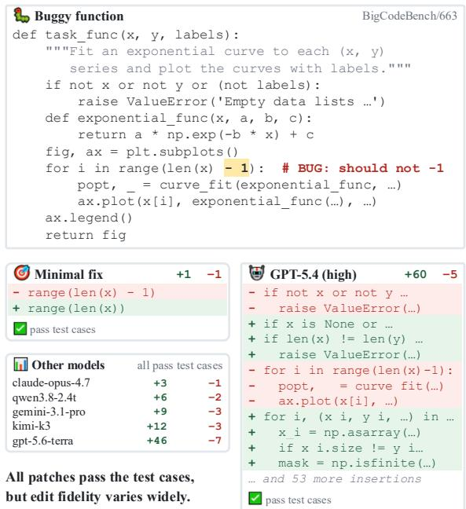  
Figure 1: A one-line off-by-one bug in a BigCodeBench function, repaired by a minimal patch and by six frontier models. Every patch passes the task’s five tests: the minimal fix changes a single line, while GPT-5.4 adds 60 lines of input validation, dtype coercion, NaN masking, and resampling that no test requires. Other models gives median changes over five completions on the identical input, for models whose completions all pass the test cases.

A model can successfully fix a bug while still rewriting much more of the function than necessary. We refer to this behavior as over-editing: a functionally correct repair that changes more code than the minimal fix requires. Figure 1 is illustrative: the buggy function requires only a one-line boundary correction, and we verify that this single-line patch passes all five of the task’s tests. GPT-5.4 instead deletes five lines and inserts 60, spanning input validation, dtype coercion, NaN masking, and curve resampling. The output passes the same five tests, so none of that additional code is required by the specification. Running the identical input through 20 frontier models indicates that this is a property of the model rather than of the task: among models whose five completions all pass the test cases, median patch size ranges from 2 to 60 inserted lines, and the most recent releases are not uniformly more conservative than the models they replace.

Existing coding benchmarks primarily measure functional success, through Pass@1 or Pass@k on tasks (Chen et al., 2021; Liu et al., 2023; Austin et al., 2021; Li et al., 2023; Zhuo et al., 2025; Jain et al., 2024). Repository-level and direct-editing benchmarks broaden the setting, but still mostly evaluate whether tests pass or issues are resolved (Jimenez et al., 2024; Chowdhury et al., 2024; Zheng et al., 2024a; He et al., 2025; Guo et al., 2025; Tian et al., 2024; Gauthier, 2024; Fu et al., 2025a). We aim to make edit fidelity measurable in its own right: not only whether a model fixes a bug, but whether it preserves the surrounding implementation when the required repair is local.

We construct a controlled evaluation framework from 400 BigCodeBench problems (Zhuo et al., 2025). For each reference solution, we inject one or two localized AST-level corruptions and retain the example only if the corrupted program fails the original tests. This gives each task a known minimal repair: the reversal of the injected corruptions. We evaluate model outputs with Pass@1 for functional success, normalized token-level Levenshtein distance for edit size, and added cognitive complexity for structural overhead. These metrics evaluate whether the model fixes a bug with minimal edits that are easier to understand and review. As the minimal repair is known by construction, the framework isolates over-editing as a failure: a model unnecessarily rewriting functional code on a localized repair task. Our scope is deliberately local code repair; open-ended generation, architectural refactoring, and feature extension, where broader rewrites are intentional, fall outside it.

Our results show that edit fidelity is a distinct axis of code-repair quality: (1) Over-editing is widespread: several frontier models, such as GPT-5.5, achieve competitive Pass@1 while still making unnecessarily large edits. (2) Prompting helps: a single preservation instruction reduces aggregate frontier excess Levenshtein distance from 0.195 to 0.131, lowers added cognitive complexity by 26.6%, and improves Pass@1 by 2.3 points. (3) Reasoning and scale are insufficient: reasoning effects are model-specific, and larger models do not monotonically produce smaller or simpler passing repairs. (4) Minimal editing can be learned: supervised fine-tuning overfits to seen corruption patterns, while reinforcement learning reaches 0.782 out-of-domain Pass@1 with 0.050 excess Levenshtein distance and does not degrade general coding ability. Qualitative analysis further suggests that over-editing is often a granularity mismatch: the model may identify the bug but rewrite data flow, add defensive checks, or change nearby behavior instead of making the local repair. Together, these findings show that over-editing is widespread, measurable, and reducible through prompting and post-training.

## 2 Related Work

Correctness-centered code evaluation. Coding LLMs are usually evaluated by functional success, such as Pass@1 or Pass@k, on executable generation benchmarks (Chen et al., 2021; Liu et al., 2023; Austin et al., 2021; Li et al., 2023; Ni et al., 2023; Zhuo et al., 2025; Jain et al., 2024). Repositorylevel and debugging benchmarks broaden the setting to issue resolution or repair-like tasks (Jimenez et al., 2024; Chowdhury et al., 2024; Zheng et al., 2024a; He et al., 2025; Tian et al., 2024; Fu et al., 2025a), but task success alone does not show how much of an existing implementation a model rewrites. This concern is aligned with classic automated program repair work distinguishing plausible patches from correct, maintainable, or reviewable ones (Qi et al., 2015; Liu et al., 2021).

Editing and minimal repair. Early functionlevel repair benchmarks include HumanEvalFix (Muennighoff et al., 2023). More recent instructedediting benchmarks test whether models can modify existing code from natural-language requests (Cassano et al., 2024; Guo et al., 2025; Chi et al., 2025). CanItEdit also reports ExcessCode for superfluous changed lines, and benchmark audits show that weak test oracles can miss extraneous edits (Cassano et al., 2024; Ebrahimi and Rajbahadur, 2026). Closest to our work, several repair systems explicitly target smaller or more faithful patches:

CREF (Yang et al., 2024) measures patch precision in tutoring, AdaPatcher (Dai et al., 2025) uses localization and preference learning, and PAFT (Yang et al., 2026) trains preservation-aware minimal-edit repair models. Concurrent work PRepair (Ke et al., 2026) studies edit-aware RL for precise repair. In contrast, our focus is a controlled BigCodeBench evaluation with known minimal reversals, spanning frontier models, prompts, reasoning variants, and post-training methods.

Similarity metrics and constraints. Referencesimilarity metrics such as CodeBLEU are widely used for generated code (Evtikhiev et al., 2023; Ren et al., 2020), but they do not directly ask whether a repair changed more than necessary relative to a buggy input and its minimal fix. Reasoning models also raise a code-specific constraint-following question: although reasoning often improves coding and instruction-following performance (Zhou et al., 2023), recent work shows that stronger reasoning can interact poorly with explicit constraints (Fu et al., 2025b; Li et al., 2025; Wen et al., 2024). We study that interaction for faithful code repair.

## 3 Evaluating Over-Edit Behavior

We organize our study around four questions:

• RQ1: Do strong coding models over-edit even when their repairs pass tests?

• RQ2: Can prompting reduce over-editing?

• RQ3: How do factors like reasoning or model size interact with edit fidelity?

• RQ4: When and how do models over-edit?

## 3.1 Setup

Benchmark Construction. We sample 400 problems from BigCodeBench (Zhuo et al., 2025), which provides diverse Python tasks together with reference solutions and executable tests. For each problem, we start from the reference implementation, inject one or two controlled AST-level corruptions taken from a predefined list (Appendix A.1), and retain the example only if the corrupted solution fails the original tests. The resulting task is therefore a function-level repair problem with a known minimal target patch (the reversal of the corruptions applied).

We use manual corruption rather than LLMgenerated bugs for two reasons. First, it gives finer control over the locality and semantic type of the bug, which is important when the quantity of interest is how much the model over-edits. Second, it keeps the evaluation interpretable: when a repair is unnecessarily large, we can meaningfully compare it against the small set of intended local changes. By starting from a correct reference solution and injecting localized corruptions, we obtain tasks where the intended repair is small by design. This is the key advantage of the benchmark: because the bug is injected by construction, the minimal repair is known rather than inferred.

Benchmark statistics. The benchmark consists of short functions with an average of 10.4 executable lines, up to a maximum of 34. The gold repairs are small by construction: 50.2% require a single token edit, 91.8% at most two, and none touches more than two lines. Of the 400 tasks, 232 carry one injected corruption and 168 carry two, giving a total of 568 corruption applications. Semantically, predicate/control-flow bugs account for 43.0%, computation/value for 29.9%, boundary/iteration for 18.7%, and API/data semantics for 8.5% (full distributions in Appendix A.2).

Metrics. We evaluate each repair along three axes: whether it works, how much it changes relative to the known minimal repair, and whether it adds structural complexity. Unless stated otherwise, edit-fidelity metrics use passing repairs.

Functional success. Pass@1 is the fraction of model outputs that pass all tests for the corresponding problem. It captures the basic repair objective, but not edit fidelity: a model can pass the tests while rewriting far more code than the bug requires. We therefore interpret the following edit-size metrics alongside Pass@1.

Token-level edit distance. Let C be the corrupted solution, G the gold repair, and M the model output. We compare extracted function bodies after removing comments and formatting-only artifacts, tokenize Python code, and compute Levenshtein distance over tokens rather than characters. For two solutions X, Y, d(X, Y) is the token Levenshtein distance normalized by the larger token count of the two extracted bodies. This treats keywords, identifiers, operators, and punctuation as code units and avoids identifier-length artifacts.

The key quantity is the excess normalized edit distance relative to the known repair:

$$
D _ { \mathrm { g o l d } } = d ( G , C ) , \qquad D _ { \mathrm { m o d e l } } = d ( M , C ) ,
$$

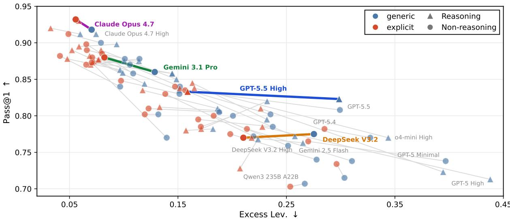  
Figure 2: Frontier model performance under generic and preservation prompts. Points show individual modelprompt settings; connected pairs show how the same model changes when preservation is made explicit. Triangles denote reasoning variants and circles denote non-reasoning variants; model names are shown where space permits. Models discussed in the text are highlighted in color; all other settings are shown faded.

$$
E _ { \mathrm { L e v } } ( M ) = D _ { \mathrm { m o d e l } } - D _ { \mathrm { g o l d } } .
$$

$D _ { \mathrm { g o l d } }$ is the size of the minimal patch that reverses the injected corruption, while $D _ { \mathrm { m o d e l } }$ is the size of the model’s patch from the same corrupted input. We interpret this excess-normalized value as follows: Any value larger than zero means that the model changes more code than the gold repair, and large positive values indicate excess editing.

We prefer token-level edit distance to higherlevel n-gram metrics such as CodeBLEU (Ren et al., 2020) because our corruptions are intentionally local: n-gram overlap can reward superficial stylistic similarity even when the patch is unnecessarily large, whereas edit distance on tokens tracks whether the model disturbed the implementation beyond reversing the bug. Appendix B.1 shows high-disagreement cases.

Added cognitive complexity. Edit size does not capture every form of over-editing: a short patch can still introduce extra branches, nesting, or restructuring that make the result harder to review. We therefore report added cognitive complexity (Campbell, 2021), measured with a Python AST visitor as the cognitive complexity of M minus that of G. As our corruptions are local changes rather than structural rewrites, any complexity increase beyond the gold repair reflects unnecessary overhead for human reviewers.

Human validation of the metrics. We validate that the metrics reflect human perception of code edits. Three annotators with five to ten years of development experience compared 100 blinded pairs of passing repairs of the same corrupted programs, choosing the patch that was easier to review and the one more faithful to the original. Excess Levenshtein distance matches the human majority in 94.8% of decided cases for reviewability (Cohen’s $\kappa = 0 . 8 9 7 )$ and 96.9% for faithfulness $( \kappa = 0 . 9 3 9 )$ ; added cognitive complexity agrees moderately $( \kappa = 0 . 4 5 5$ and 0.386 for reviewability and faithfulness, respectively). Annotators agree strongly with one another (Fleiss’ $\kappa = 0 . 6 9 0$ and 0.850). We further perform a blinded audit of 100 high-excess passing repairs and find genuinely unnecessary edits in 82.3% of determinate cases (95% CI 73.5–88.6%), while the rest are valid alternative fixes (Appendix B.2).

Prompt Setup. We evaluate models in two conditions. In the generic setting, the model is simply asked to fix the bug. In the explicit setting, we append a preservation clause to the same request, asking the model to preserve the original code and modify only what is necessary (full prompt in Appendix A.3). This comparison tests whether overediting is partly reducible through prompting alone, without changing the underlying task or test suite. Appendix A.4 gives details.

## 3.2 Results

Frontier LLMs over-edit by default. Figure 2 summarizes the frontier results, with full numbers in Appendix C.1. In the generic setting, correctness and edit fidelity separate: many strong models can repair the program while still changing substantially more code than the known minimal reversal. This behavior is not simply a symptom of weak coding ability. Some of the same models that pass many tasks also add validation, restructure intermediate computations, or change surrounding control flow. The default repair policy therefore appears closer to “produce a robust solution” than to “recover the smallest local patch.” Claude Opus 4.7 (Anthropic, 2026b) (Figure 2, purple) gives the best non-reasoning trade-off, showing that high correctness and small edits can coexist, but models such as GPT-5.5 (OpenAI, 2026b) (blue), DeepSeek (DeepSeek AI, 2025; DeepSeek-AI et al., 2025a,b; DeepSeek-AI, 2025) (orange), and Gemini (Google, 2025, 2026) (green) variants show that Pass@1 alone can hide large excess edits: GPT-5.5 High reaches Pass@1 0.823 yet its excess distance is over four times Opus 4.7’s.

Explicit prompting improves edit fidelity. We next investigate whether adding an explicit instruction to minimally edit the code improves performance. The generic request ends with “Fix and complete myfunction.”, while the explicit one adds “. . . but keep as much ofthe original code as possible” (full prompt in Appendix A.3). Figure 2 shows the per-model effect: the clause markedly reduces over-editing, shifting all 50 settings left, and slightly improves quality, raising Pass@1 in 40 of 50. The heaviest over-editors move furthest — GPT-5.5 High (blue) nearly halves its excess distance (0.299 to 0.159) — while the already-faithful Opus 4.7 (purple) barely moves. In aggregate (Figure 3), excess Levenshtein distance drops from 0.195 to 0.131, added cognitive complexity falls by 26.6% (matched-pair signed-rank $p < 1 0 ^ { - 4 }$ for both), and Pass@1 rises by 2.3 percentage points (paired bootstrap 95% CI [+1.49, +3.05]); the gain persists under repeated temperature-1 sampling and paraphrased prompt variants (Appendix C.3). Thus, the prompt appears to select a different latent repair mode: the model treats the existing implementation as evidence to preserve, rather than as a reference to improve on. We additionally verify that many smaller open-weight models behave similarly (Appendix C.2): the same clause improves average Pass@1 from 0.788 to 0.828 while reducing excess Levenshtein distance from 0.176 to 0.121. Overall, this suggests that over-editing is a prevalent yet steerable behavior across all major LLMs.

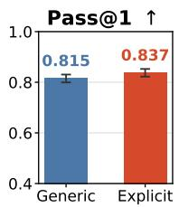

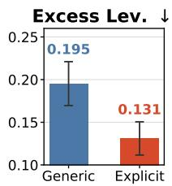

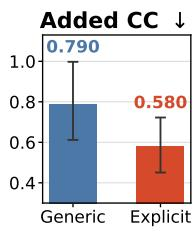  
Figure 3: Aggregate effect of preservation prompting on frontier models: means over the 50 settings of Table 17; whiskers give bootstrap 95% CIs. Making preservation explicit improves Pass@1 and reduces both excess edit distance and added cognitive complexity (all significant under matched-pair tests, Appendix C.3).

Reasoning does not necessarily reduce overediting. In Figure 4, we compare matched frontier reasoning and non-reasoning variants under both prompts. Each bar is the reasoning value minus the non-reasoning value on the jointly passing subset, so negative bars mean reasoning yields a more faithful repair. The pattern is model-specific rather than monotonic. Under the generic prompt, reasoning slightly reduces excess edits for most models shown, while Claude Opus 4.7 is narrowly reversed. Added cognitive complexity is more mixed: Sonnet 4.6 and DeepSeek V3.2 reduce complexity with reasoning, but GPT-5.5 increases it substantially. Under the explicit preservation prompt, Grok 4.3 and Sonnet 4.6 become more faithful on both metrics, whereas DeepSeek V3.2 shows more excess edits and added complexity with reasoning. Thus, reasoning alone is not a universally reliable mitigation for over-editing.

Size scaling does not monotonically reduce over-editing. We further investigate whether over-editing is linked to model size. We select the Qwen2.5-Coder-Instruct series (Hui et al., 2024) because it provides model sizes from 0.5B to 32B. Figure 5 reports Pass@1 over all 400 examples, while the edit-fidelity panels are computed only over repairs that pass the tests. This avoids giving small models credit for failed no-edit outputs. For the smallest models, the edit-fidelity points should therefore be read as conditional averages over the few successful fixes, not as evidence that the model is reliably faithful. Pass@1 generally increases as the model grows larger, as expected, but excess Levenshtein distance and added cognitive complexity do not improve monotonically among the successful repairs. Scale therefore moves models out of the regime where they simply fail to repair, but it does not guarantee that the passing repairs become more local: under the generic prompt, excess distance rises again from 0.108 at 14B to 0.127 at 32B. Larger models may have stronger task-solving priors, but those priors still need to be aimed at preservation.

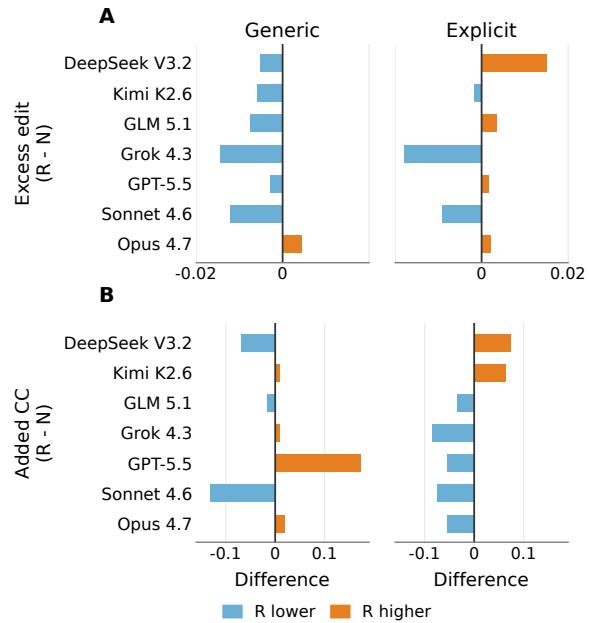  
Figure 4: Effect of reasoning on edit fidelity within matched frontier model families. Bars compare reasoning and non-reasoning variants under each prompt; negative values indicate smaller edits or lower added complexity from reasoning.

What bugs trigger over-editing? We then ask which injected bugs push models away from local repair. Table 1 shows where over-editing is concentrated. We observe that list-related operations (like slicing and indexing) and conditionals trigger the most over-editing. We think that the important pattern is ambiguity: a one-token bug can look like evidence of missing preconditions, unsafe indexing, or unstable control flow. The model often treats the existing implementation as suspect, even when the intended repair is small. Moreover, this is not simply a difficulty effect: high Pass@1 can coexist with large excess edits, as with slice bounds with the highest Pass@1 (0.874) but the largest excess (0.353). This suggests that over-editing itself is an important dimension that should be evaluated alongside editing correctness.

How do models over-edit? We next look at the behavior when the model over-edits. We ask GPT-5.5 to design a taxonomy of over-editing behavior, freeze its categories into an annotation codebook, and label every high-excess passing repair (excess Levenshtein distance $\ge 0 . 5 ; n = 5 3 0 )$ from the five frontier models. Appendix B.3 validates the labels: five independent models apply the categories consistently, the shares change little across data subsets and under re-annotation, and near-minimal repairs almost never receive a label. Table 2 suggests that over-editing is usually a change in repair granularity, not just extra style edits (Appendix B.4 gives representative examples). The model may replace the data path, wrap the function in defensive checks, or shift the output contract. These moves can be reasonable in open-ended programming, but they are misaligned when the input is already a near-correct program, as they introduce additional burden for reviewers, and make the code take much longer to read.

Table 1: Corruption types most associated with over-editing. Boundary and control-flow bugs produce high excess edit distance or added complexity even when repairs pass.
<table><tr><td>Corruption Example</td><td>Pass@1 Excess Lev. Added CC</td><td></td><td></td></tr><tr><td>Slice bounds x[a:b]</td><td>0.874</td><td>0.353</td><td>1.25</td></tr><tr><td>List indexing list[i]</td><td>0.780</td><td>0.244</td><td>1.14</td></tr><tr><td>Comparison ops.  $\textsf { x } < \textsf { y }$ </td><td>0.799</td><td>0.210</td><td>0.78</td></tr><tr><td>Sort order reverse=True</td><td>0.709</td><td>0.239</td><td>0.80</td></tr><tr><td>Conditional inv. if cond:</td><td>0.778</td><td>0.207</td><td>1.46</td></tr><tr><td>Edge-case guards if not list:</td><td>0.791</td><td>0.205</td><td>0.94</td></tr></table>

Overall, over-editing looks like a task-framing mismatch. The model behaves as if asked to deliver robust code, while we measure whether it recovers the original intent. Preservation prompting helps because it corrects that frame by explicitly instructing the model to preserve the original code.

## 4 Learning Minimal Editing

We have earlier shown that models can be steered toward faithful edits at inference time. We next ask whether that behavior can be made durable through training. We study this question with Qwen3 Instruct models because of their strong coding ability with open weights, using the same controlled corruption framework as in Section 3.1.

## 4.1 Setup

We fine-tune Qwen3-4B-Instruct-2507 (Yang et al., 2025) on corrupted code from DeepCoder (Luo et al., 2025) with 4,141 randomly drawn training examples and 400 test instances. Unlike in the Big-CodeBench evaluation split, where each example receives one or two corruptions, we apply between one and ten corruptions per training instance and keep only corrupted programs that fail the tests.

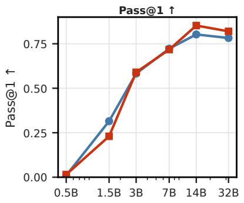

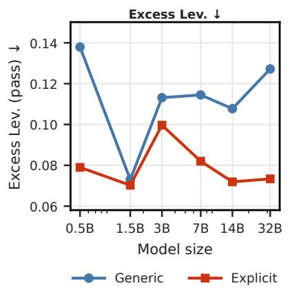

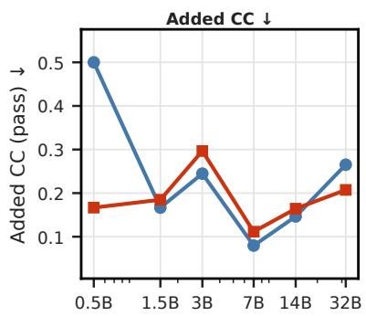  
Figure 5: Performance of Qwen2.5-Coder-Instruct across model sizes. Scaling improves Pass@1, but edit fidelity does not improve monotonically; preservation prompting consistently reduces excess edits.

Table 2: Common over-editing patterns across all 530 high-excess passing repairs from five frontier models. Categories are multi-label, so a single repair may appear in multiple rows.
<table><tr><td>Issue</td><td>Share</td><td>Meaning</td></tr><tr><td>Defensive</td><td>64.2%</td><td>Adds broad validation, checks, or fallbacks.</td></tr><tr><td>generalization Data-flow rewrite</td><td></td><td>63.2% Re-solves the task instead of</td></tr><tr><td>Contract drift</td><td></td><td>locally patching it. 34.7% Changes outputs, side</td></tr><tr><td>Feature accretion</td><td></td><td>effects, or mutation. 23.6% Adds plotting or reporting</td></tr><tr><td>Dependency fallback</td><td></td><td>polish. 3.2% Adds backup resources or</td></tr><tr><td></td><td></td><td>hardcoded data.</td></tr></table>

During training, we use the same corruption types as those in Section 3.1. During evaluation, we use both the in-domain corruption types (the same as in training) and another 20 out-of-domain (OOD) corruptions (listed in Appendix D.2) to test generalization.

We compare SFT, rejection-sampled SFT (rSFT), Direct Preference Optimization (DPO) (Rafailov et al., 2024), and RL. SFT trains on programmatic minimal repairs. For rSFT and DPO, we generate eight candidate repairs per training sample, keep passing candidates, and rank them by Levenshtein distance to the reference repair; rSFT uses the three smallest-edit candidates, while DPO prefers the smallest-edit candidate over the largest-edit one. These methods are trained with

LlamaFactory (Zheng et al., 2024b). RL samples K = 16 repairs per corrupted program and scores them with execution feedback plus edit minimality. We use a GRPO-style group-relative RL objective implemented in PRIME-RL (Prime Intellect, 2025). Appendices D.4 and D.5 show that our conclusions hold with exactly one corruption in both training and evaluation, and with RL rollout budgets matched to the 8 candidates of rSFT/DPO.

Let C be the corrupted program, G the gold repair, and M a sampled repair. Failed or unparsable repairs receive $r ( M ) = - 0 . 2$ . For passing repairs, the default RL reward is

$$
r ( M ) = \lambda _ { \mathrm { e x e c } } - \lambda _ { \mathrm { e d i t } } e ( M ) ,
$$

where $e ( M ) = d ( M , C ) - d ( G , C )$ , and $d ( \cdot , \cdot )$ is the normalized token-level Levenshtein distance used in Section 3.1. We set $\lambda _ { \mathrm { e x e c } } ~ = ~ 0 . 1$ and $\lambda _ { \mathrm { e d i t } } ~ = ~ 1 . 0 .$ This rewards passing repairs that stay close in size to the gold patch and penalizes edits beyond the required change: if the edit is too large (> 0.3), it will receive a lower reward than an incorrect edit.

We mainly evaluate Pass@1, excess normalized Levenshtein distance, and added cognitive complexity on out-of-domain corruptions. In addition, we measure the change in performance on LiveCodeBench v6 from the base model to check whether minimal-edit training degrades broader coding ability.

## 4.2 Results

RL gives the best out-of-domain trade-off. Table 3 separates fitting the training corruption families from generalizing to held-out ones. We observe that SFT nearly solves the in-domain split, but its Pass@1 drops from 0.932 to 0.458 out of domain. Therefore, its small edit metrics describe only the subset of repairs that still pass, so they do not indicate a usable repair policy. SFT’s slightly negative out-of-domain excess distance (−0.008) means it changes fewer tokens than the reference repair in 21.3% of its correct OOD repairs (vs. 8.5% across all methods). RL is significantly better $( p < 1 0 ^ { - 2 0 } )$ than SFT on out-of-domain Pass@1. rSFT, DPO, and RL generalize more reliably than SFT. Among them, DPO is marginally highest in out-of-domain Pass@1, while RL gives almost the same correctness with substantially smaller patches. We also investigated alternative metrics including excess line-diff and syntax-tree-diff metrics, both of which give the same ranking (Spearman $\rho \approx 0 . 9 1$ with $E _ { \mathrm { L e v } } )$ . Details are in Appendix D.3.

Table 3: Minimal-edit training for Qwen3-4B-Instruct-2507 on in-domain and out-of-domain corruptions. Pass@1 is computed over all 400 evaluation examples; edit metrics are averaged over passing repairs. LCB: absolute LiveCodeBench v6 score (%); parentheses give the change from the base model (32.6%).
<table><tr><td rowspan="2">Model</td><td colspan="3">In-domain</td><td colspan="3">Out-of-domain</td><td rowspan="2">LCB (%) ↑</td></tr><tr><td>Pass@1↑</td><td>Excess Lev. ↓</td><td>Added CC ↓</td><td>Pass@1 ↑</td><td>Excess Lev. ↓</td><td>Added CC ↓</td></tr><tr><td>SFT</td><td>0.932</td><td>0.002</td><td>0.000</td><td>0.458</td><td>-0.008</td><td>0.006</td><td>17.7 (−14.9)</td></tr><tr><td>rSFT</td><td>0.782</td><td>0.100</td><td>0.435</td><td>0.780</td><td>0.107</td><td>0.501</td><td>25.7 (−6.9)</td></tr><tr><td>DPO</td><td>0.752</td><td>0.021</td><td>0.113</td><td>0.787</td><td>0.092</td><td>0.348</td><td>28.0 (−4.6)</td></tr><tr><td>RL</td><td>0.802</td><td>0.046</td><td>0.112</td><td>0.782</td><td>0.050</td><td>0.185</td><td>33.2 (+0.6)</td></tr></table>

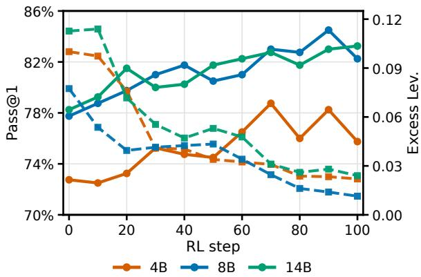  
Figure 6: RL checkpoint curves for Qwen3 base models. Solid lines show Pass@1 and dashed lines show excess Levenshtein distance. Across model sizes, RL steadily reduces excess edits while preserving or improving repair success.

We further scale up RL training using Qwen3 models ranging from 4B to 14B (Figure 6). Across all model sizes, excess Levenshtein distance falls steadily during training, while Pass@1 is preserved or improved. Thus, minimal editing can be learned as a transferable repair preference and is scalable as a learning objective.

Table 4: Parameter-efficient RL with LoRA. Higher ranks recover most full-parameter RL gains in edit fidelity while preserving LiveCodeBench performance.
<table><tr><td>Rank</td><td>Pass@1 ↑</td><td>Excess Lev. ↓</td><td>Added CC↓</td><td>LCB∆↑</td></tr><tr><td>1</td><td>0.738</td><td>0.166</td><td>0.676</td><td>-0.022</td></tr><tr><td>8</td><td>0.775</td><td>0.112</td><td>0.426</td><td>-0.022</td></tr><tr><td>16</td><td>0.805</td><td>0.087</td><td>0.328</td><td>-0.005</td></tr><tr><td>32</td><td>0.795</td><td>0.065</td><td>0.235</td><td>-0.011</td></tr><tr><td>64</td><td>0.797</td><td>0.051</td><td>0.160</td><td>+0.001</td></tr><tr><td>Full RL</td><td>0.782</td><td>0.050</td><td>0.185</td><td>+0.006</td></tr></table>

RL preserves broader coding ability. Minimaledit training is useful only if it does not erase broader coding skill. Table 3’s LCB column shows that SFT loses the most (14.9 points, dropping from 32.6% to 17.7%), while rSFT and DPO also regress. RL is the only method that remains flat-to-positive (33.2%, +0.6 points). This is consistent with recent findings that supervised fine-tuning can overfit narrow synthetic distributions, whereas reinforcement learning can better preserve transferable competence (Chu et al., 2025; Shenfeld et al., 2025). In the following ablations, we only report performance on OOD setups.

LoRA recovers most minimal-editing gains. The preceding results all use full-parameter fine-tuning. Next, to test whether the behavior requires broad weight changes, we train Qwen3 4B with the same RL objective using LoRA adapters (Hu et al., 2022) and sweep ranks from 1 to 64. Table 4 suggests that minimal editing is largely a learnable preference rather than a new coding skill. Pass@1 saturates by rank 16, but edit fidelity keeps improving through rank 64, which nearly matches full RL on excess Levenshtein distance and improves on its added cognitive complexity. Thus, we conclude that minimal editing is a stylistic preference that can be captured with a relatively small adapter, reducing interference with the base model.

Table 5: Reward-design ablations for RL on Qwen3 4B Instruct. Pass@1 is computed over all examples; edit metrics are averaged over passing repairs.
<table><tr><td>Reward</td><td>Pass@1 ↑</td><td>Ex. Lev. ↓</td><td>Add. CC↓</td></tr><tr><td>Correctness only</td><td>0.735</td><td>0.189</td><td>0.677</td></tr><tr><td>Edit only</td><td>0.775</td><td>0.070</td><td>0.284</td></tr><tr><td>Lev. + CogC</td><td>0.770</td><td>0.151</td><td>0.769</td></tr><tr><td>Full reward</td><td>0.782</td><td>0.050</td><td>0.185</td></tr></table>

Reward design trades off correctness and edit locality. We show the ablation of reward design in Table 5. Correctness alone (Row 1) produces working but bulky edits, whereas the edit-only reward (Row 2) still reaches high Pass@1, which is largely due to dataset construction, since a correct solution is one with minimal edits. Adding cognitive complexity to the reward is worse here, likely because it is too coarse for localized bug repair. The full reward gives the best balance: it keeps Pass@1 high while yielding the smallest patches and lowest added complexity.

Comparison with related work. A related work, AdaPatcher (Dai et al., 2025), pairs a runtime-trace bug locator with DPO-positive (DPOP) preference learning to favor small modifications. Lacking runtime traces, we compare against its preference-learning stage by training Qwen3-4B with DPOP under the DPO protocol. DPOP performs comparably to DPO and below RL: full-parameter DPOP reaches Pass@1 0.718 with excess distance 0.064 (RL: 0.782/0.050), and LoRA r=64 DPOP reaches 0.783/0.082 vs. RL’s 0.797/0.051 (Appendix D.6). This is consistent with on-policy RL generalizing better than offline preference optimization (Chu et al., 2025).

Transfer to real bugs. Finally, we evaluate the RL-trained Qwen3 models on Defects4J (Just et al., 2014) bugs confined to a single modified class and method. These are real human-written Java bugs, unlike our injected Python training bugs. As Table 6 shows, RL leaves pass rates essentially unchanged while shrinking excess Levenshtein distance and raw token edits. The minimal-editing preference therefore transfers to realistic bugs in an unseen language, though absolute repair rates remain low at these model sizes.

## 5 Discussion

Why edit size matters. Software work splits roughly into greenfield development, where new code is written from scratch, and brownfield maintenance, where existing code must be changed without disrupting surrounding behavior. In brownfield repair, the model’s job is to fix an error, not to rewrite style or structure that was not broken. Overediting is therefore a maintenance failure mode: unlike an incorrect answer, a gratuitously large rewrite can still pass tests, making it largely invisible to correctness-only evaluation. Reviewers must still determine what changed, whether the change is safe, and how it relates to the original implementation. A correct but unnecessarily large diff raises review cost and hides regressions outside the tests. We argue that the size of the edit is an important dimension alongside functional correctness.

Table 6: Cross-domain evaluation on single-method Defects4J bugs. RL preserves the pass rate while reducing edit size.
<table><tr><td>Model</td><td>Pass rate</td><td>Token edits↓</td><td>Ex. Lev. ↓</td><td>Add. CC ↓</td></tr><tr><td>4B base</td><td>7.4%</td><td>51.9</td><td>0.114</td><td>0.123</td></tr><tr><td>4B RL</td><td>7.0%</td><td>35.3</td><td>0.060</td><td>0.065</td></tr><tr><td>14B base</td><td>14.9%</td><td>40.3</td><td>0.105</td><td>0.149</td></tr><tr><td>14B RL</td><td>14.5%</td><td>34.5</td><td>0.074</td><td>0.120</td></tr></table>

## 6 Conclusion

By measuring coding LLMs under a controlled minimal-repair ground truth, we find that overediting is widespread. Explicit instructions to preserve the original implementation substantially reduce excess edits for most models, with both reasoning and open-weight coding models benefiting. Over-editing is therefore a default editing behavior, not an unavoidable capability limit. Post-training experiments further indicate that minimal editing can be learned more durably: in our study, RL improves out-of-domain edit fidelity while preserving broader coding competence better than standard supervised fine-tuning. Overall, we believe that code-repair models should be evaluated on both functional correctness and edit fidelity.

## Limitations

We use controlled function-level corruptions with a known minimal reversal, which yields clean ground truth for patch size but is simpler than real repository bugs and multi-file changes. The main evaluation tasks are in Python, and the training experiments use the Qwen model family. Our human studies are small in scale: three annotators over 100 patch pairs for metric validation and a single-annotator audit of 100 high-excess repairs. While the Defects4J transfer results suggest that the learned minimal-editing preference generalizes to real Java bugs, absolute repair rates in that setting remain low for the model sizes we train. Extending the same measurements to repository-level edits, more languages, richer reward designs, and largerscale human evaluation is important future work.

## Ethical Considerations

Our work builds on open-source datasets and evaluation protocols. While over-editing by code agents could reduce efficiency, we do not believe this work poses significant ethical risks. We do not think there are other ethical considerations worth mentioning.

## References

Alibaba Cloud. 2026. Qwen3.6- Plus: Towards Real World Agents. https://www.alibabacloud.com/blog/ qwen3-6-plus-towards-real-world-agents\_ 603005. Alibaba Cloud Community announcement.

Anthropic. 2024. Claude 3.5 System Card. https:// www.anthropic.com/news/claude-3-5-sonnet. Model announcement / system card.

Anthropic. 2025a. Claude 3.7 Sonnet. https:// www.anthropic.com/news/claude-3-7-sonnet. Model announcement and system card.

Anthropic. 2025b. Claude Sonnet 4 / Claude 4 System Card. https://www.anthropic.com/ claude-4-model-card. Model announcement / system card.

Anthropic. 2026a. Claude Opus 4.6. https://www. anthropic.com/news/claude-opus-4-6. Official Anthropic model announcement.

Anthropic. 2026b. Claude Opus 4.7. https://www. anthropic.com/news/claude-opus-4-7. Official Anthropic model announcement.

Anthropic. 2026c. Claude Sonnet 4.6. https://www. anthropic.com/news/claude-sonnet-4-6. Official Anthropic model announcement.

Jacob Austin, Augustus Odena, Maxwell Nye, Maarten Bosma, Henryk Michalewski, David Dohan, Ellen Jiang, Carrie Cai, Michael Terry, Quoc Le, and Charles Sutton. 2021. Program synthesis with large language models. Preprint, arXiv:2108.07732.

G. Ann Campbell. 2021. Cognitive Complexity. https://www.sonarsource.com/resources/ cognitive-complexity/. SonarSource white paper on the Cognitive Complexity metric.

Federico Cassano, Luisa Li, Akul Sethi, Noah Shinn, Abby Brennan-Jones, Jacob Ginesin, Edward Berman, George Chakhnashvili, Anton Lozhkov, Carolyn Jane Anderson, and Arjun Guha. 2024. Can it edit? evaluating the ability of large language models to follow code editing instructions. Preprint, arXiv:2312.12450.

Mark Chen, Jerry Tworek, Heewoo Jun, Qiming Yuan, Henrique Ponde de Oliveira Pinto, Jared Kaplan, Harri Edwards, Yuri Burda, Nicholas Joseph, Greg Brockman, Alex Ray, Raul Puri, Gretchen Krueger, Michael Petrov, Heidy Khlaaf, Girish Sastry, Pamela Mishkin, Brooke Chan, Scott Gray, and 39 others. 2021. Evaluating large language models trained on code. Preprint, arXiv:2107.03374.

Wayne Chi, Valerie Chen, Ryan Shar, Aditya Mittal, Jenny Liang, Wei-Lin Chiang, Anastasios Nikolas Angelopoulos, Ion Stoica, Graham Neubig, Ameet Talwalkar, and Chris Donahue. 2025. EDIT-Bench: Evaluating llm abilities to perform real-world instructed code edits. Preprint, arXiv:2511.04486.

Neil Chowdhury, James Aung, Chan Jun Shern, Oliver Jaffe, Dane Sherburn, Giulio Starace, Evan Mays, Rachel Dias, Marwan Aljubeh, Mia Glaese, Carlos E. Jimenez, John Yang, Leyton Ho, Tejal Patwardhan, Kevin Liu, and Aleksander Madry. 2024. Introducing swe-bench verified.

Tianzhe Chu, Yuexiang Zhai, Jihan Yang, Shengbang Tong, Saining Xie, Dale Schuurmans, Quoc V. Le, Sergey Levine, and Yi Ma. 2025. Sft memorizes, rl generalizes: A comparative study of foundation model post-training. Preprint, arXiv:2501.17161.

Zhenlong Dai, Bingrui Chen, Zhuoluo Zhao, Xiu Tang, Sai Wu, Chang Yao, Zhipeng Gao, and Jingyuan Chen. 2025. Less is more: Adaptive program repair with bug localization and preference learning. Preprint, arXiv:2503.06510.

DeepSeek AI. 2025. DeepSeek-V3.1 Release. https: //api-docs.deepseek.com/news/news250821. Model listing and documentation.

DeepSeek-AI. 2025. Deepseek-v3.2: Pushing the frontier of open large language models. Preprint, arXiv:2512.02556.

DeepSeek-AI, Daya Guo, Dejian Yang, Haowei Zhang, Junxiao Song, Ruoyu Zhang, Runxin Xu, Qihao Zhu, Shirong Ma, Peiyi Wang, Xiao Bi, Xiaokang Zhang, Xingkai Yu, Yu Wu, Z. F. Wu, Zhibin Gou, Zhihong Shao, Zhuoshu Li, Ziyi Gao, and 181 others. 2025a. Deepseek-r1: Incentivizing reasoning capability in llms via reinforcement learning. Preprint, arXiv:2501.12948.

DeepSeek-AI, Aixin Liu, Bei Feng, Bing Xue, Bingxuan Wang, Bochao Wu, Chengda Lu, Chenggang Zhao, Chengqi Deng, Chenyu Zhang, Chong Ruan, Damai Dai, Daya Guo, Dejian Yang, Deli Chen, Dongjie Ji, Erhang Li, Fangyun Lin, Fucong Dai, and 181 others. 2025b. Deepseek-v3 technical report. Preprint, arXiv:2412.19437.

Amir M. Ebrahimi and Gopi Krishnan Rajbahadur. 2026. Edit, but verify: An empirical audit of instructed code-editing benchmarks. Preprint, arXiv:2604.05100.

Mikhail Evtikhiev, Egor Bogomolov, Yaroslav Sokolov, and Timofey Bryksin. 2023. Out of the BLEU: How should we assess quality of the code generation models? Journal ofSystems and Software, 203:111741.

Lingyue Fu, Hao Guan, Bolun Zhang, Haowei Yuan, Yaoming Zhu, Jun Xu, Zongyu Wang, Lin Qiu, Xunliang Cai, Xuezhi Cao, Weiwen Liu, Weinan Zhang, and Yong Yu. 2025a. Corecodebench: Decoupling code intelligence via fine-grained repository-level tasks. Preprint, arXiv:2507.05281.

Tingchen Fu, Jiawei Gu, Yafu Li, Xiaoye Qu, and Yu Cheng. 2025b. Scaling reasoning, losing control: Evaluating instruction following in large reasoning models. Preprint, arXiv:2505.14810.

Paul Gauthier. 2024. Gpt code editing benchmarks. https://aider.chat/docs/benchmarks. html. Accessed: 2024.

GLM-4.5 Team, Aohan Zeng, Xin Lv, Qinkai Zheng, Zhenyu Hou, Bin Chen, Chengxing Xie, Cunxiang Wang, Da Yin, Hao Zeng, Jiajie Zhang, Kedong Wang, Lucen Zhong, Mingdao Liu, Rui Lu, Shulin Cao, Xiaohan Zhang, Xuancheng Huang, Yao Wei, and 152 others. 2025. Glm-4.5: Agentic, reasoning, and coding (arc) foundation models. Preprint, arXiv:2508.06471.

Google. 2025. Gemini 2.5 Flash is now in preview. https://blog.google/ products-and-platforms/products/gemini/ gemini-2-5-flash-preview/. Official Google announcement for Gemini 2.5 Flash.

Google. 2026. Gemini 3.1 Pro: A smarter model for your most complex tasks. https://blog.google/ innovation-and-ai/models-and-research/ gemini-models/gemini-3-1-pro/. Official Google blog announcement.

Jiawei Guo, Ziming Li, Xueling Liu, Kaijing Ma, Tianyu Zheng, Zhouliang Yu, Ding Pan, Yizhi LI, Ruibo Liu, Yue Wang, Shuyue Guo, Xingwei Qu, Xiang Yue, Ge Zhang, Wenhu Chen, and Jie Fu. 2025. Codeeditorbench: Evaluating code editing capability of large language models. Preprint, arXiv:2404.03543.

Xinyi He, Qian Liu, Mingzhe Du, Lin Yan, Zhijie Fan, Yiming Huang, Zejian Yuan, and Zejun Ma. 2025. Swe-perf: Can language models optimize code performance on real-world repositories? ArXiv, abs/2507.12415.

Edward J. Hu, Yelong Shen, Phillip Wallis, Zeyuan Allen-Zhu, Yuanzhi Li, Shean Wang, Lu Wang, and Weizhu Chen. 2022. LoRA: Low-rank adaptation of large language models. In International Conference on Learning Representations.

Binyuan Hui, Jian Yang, Zeyu Cui, Jiaxi Yang, Dayiheng Liu, Lei Zhang, Tianyu Liu, Jiajun Zhang, Bowen Yu, Keming Lu, Kai Dang, Yang Fan, Yichang Zhang, An Yang, Rui Men, Fei Huang, Bo Zheng, Yibo Miao, Shanghaoran Quan, and 5 others. 2024. Qwen2.5-coder technical report. Preprint, arXiv:2409.12186.

Naman Jain, King Han, Alex Gu, Wen-Ding Li, Fanjia Yan, Tianjun Zhang, Sida Wang, Armando Solar-Lezama, Koushik Sen, and Ion Stoica. 2024. Livecodebench: Holistic and contamination free evaluation of large language models for code. Preprint, arXiv:2403.07974.

Carlos E. Jimenez, John Yang, Alexander Wettig, Shunyu Yao, Kexin Pei, Ofir Press, and Karthik Narasimhan. 2024. Swe-bench: Can language models resolve real-world github issues? Preprint, arXiv:2310.06770.

René Just, Darioush Jalali, and Michael D. Ernst. 2014. Defects4j: a database of existing faults to enable controlled testing studies for java programs. In Proceedings of the 2014 International Symposium on Software Testing and Analysis, ISSTA 2014, page 437–440, New York, NY, USA. Association for Computing Machinery.

Changxin Ke, Rui Zhang, Jiaming Guo, Yuanbo Wen, Li Ding, Shuo Wang, Xuyuan Zhu, Xiong Peng, Di Huang, Zidong Du, Xing Hu, Qi Guo, and Yunji Chen. 2026. QiMeng-PRepair: Precise code repair via edit-aware reward optimization. Preprint, arXiv:2604.05963.

Rongao Li, Jie Fu, Bo-Wen Zhang, Tao Huang, Zhihong Sun, Chen Lyu, Guang Liu, Zhi Jin, and Ge Li. 2023. Taco: Topics in algorithmic code generation dataset. Preprint, arXiv:2312.14852.

Xiaomin Li, Zhou Yu, Zhiwei Zhang, Xupeng Chen, Ziji Zhang, Yingying Zhuang, Narayanan Sadagopan, and Anurag Beniwal. 2025. When thinking fails: The pitfalls of reasoning for instruction-following in llms. Preprint, arXiv:2505.11423.

Jiawei Liu, Chunqiu Steven Xia, Yuyao Wang, and Lingming Zhang. 2023. Is your code generated by chatgpt really correct? rigorous evaluation of large language models for code generation. Preprint, arXiv:2305.01210.

Kui Liu, Li Li, Anil Koyuncu, Dongsun Kim, Zhe Liu, Jacques Klein, and Tegawendé F. Bissyandé. 2021. A critical review on the evaluation of automated program repair systems. Journal of Systems and Software, 171:110817.

Michael Luo, Sijun Tan, Roy Huang, Ameen Patel, Alpay Ariyak, Qingyang Wu, Xiaoxiang Shi, Rachel Xin, Colin Cai, Maurice Weber, Ce Zhang, Li Erran Li, Raluca Ada Popa, and Ion Stoica. 2025. Deep-Coder: A Fully Open-Source 14B Coder at O3-mini Level. Together AI Blog. Accessed: 2026-03-23.

Meta AI. 2024. Meta Llama 3.1 70B Instruct. https://huggingface.co/meta-llama/ Llama-3.1-70B-Instruct. Official model card and license information.

Mistral AI. 2025a. Magistral (Mistral)—model announcement. https://mistral.ai/news/ magistral. Model announcement and details for Magistral (Magistral Medium).

Mistral AI. 2025b. Mistral Medium 3 announcement. https://mistral.ai/news/mistral-medium-3. Mistral Medium model announcement (Medium 3 family).

Moonshot AI. 2026a. Kimi K2.5 Tech Blog: Visual Agentic Intelligence. https://www.kimi.com/ blog/kimi-k2-5. Official Moonshot AI / Kimi blog post.

Moonshot AI. 2026b. Kimi K2.6. https://www.kimi. com/blog/kimi-k2-6. Official Moonshot AI / Kimi blog post.

Niklas Muennighoff, Qian Liu, Armel Zebaze, Qinkai Zheng, Binyuan Hui, Terry Yue Zhuo, Swayam Singh, Xiangru Tang, Leandro von Werra, and Shayne Longpre. 2023. OctoPack: Instruction tuning code large language models. Preprint, arXiv:2308.07124.

Ansong Ni, Pengcheng Yin, Yilun Zhao, Martin Riddell, Troy Feng, Rui Shen, Stephen Yin, Ye Liu, Semih Yavuz, Caiming Xiong, Shafiq Joty, Yingbo Zhou, Dragomir Radev, and Arman Cohan. 2023. L2ceval: Evaluating language-to-code generation capabilities of large language models. Preprint, arXiv:2309.17446.

OpenAI. 2025a. GPT-5 System Card. https:// openai.com/index/gpt-5-system-card/. System card and model documentation.

OpenAI. 2025b. Introducing GPT-4.1. https:// openai.com/index/gpt-4-1/. GPT 4.1 announcement.

OpenAI. 2025c. Introducing o3 and o4- mini. https://openai.com/index/ introducing-o3-and-o4-mini/. O4-mini model announcement and system card.

OpenAI. 2026a. GPT-5.4 Thinking System Card. https://openai.com/index/ gpt-5-4-thinking-system-card/. Official system card landing page (links to full card on OpenAI Deployment Safety Hub).

OpenAI. 2026b. Introducing GPT-5.5. https:// openai.com/index/introducing-gpt-5-5/. Official OpenAI model announcement.

Prime Intellect. 2025. PRIME-RL.

Zichao Qi, Fan Long, Sara Achour, and Martin Rinard. 2015. An analysis of patch plausibility and correctness for generate-and-validate patch generation systems. In Proceedings of the 2015 International Symposium on Software Testing and Analysis, pages 24–36. ACM.

Qwen Team. 2025a. Qwen3-235B-A22B-Thinking-2507. https://huggingface.co/Qwen/ Qwen3-235B-A22B-Thinking-2507. Official Qwen model card.

Qwen Team. 2025b. Qwen3-Coder: Agentic Coding in the World. https://qwenlm.github.io/blog/ qwen3-coder/. Official Qwen blog announcement.

Rafael Rafailov, Archit Sharma, Eric Mitchell, Stefano Ermon, Christopher D. Manning, and Chelsea Finn. 2024. Direct preference optimization: Your language model is secretly a reward model. Preprint, arXiv:2305.18290.

Shuo Ren, Daya Guo, Shuai Lu, Long Zhou, Shujie Liu, Duyu Tang, Neel Sundaresan, Ming Zhou, Ambrosio Blanco, and Shuai Ma. 2020. Codebleu: a method for automatic evaluation of code synthesis. Preprint, arXiv:2009.10297.

Idan Shenfeld, Jyothish Pari, and Pulkit Agrawal. 2025. Rl’s razor: Why online reinforcement learning forgets less. Preprint, arXiv:2509.04259.

Runchu Tian, Yining Ye, Yujia Qin, Xin Cong, Yankai Lin, Yinxu Pan, Yesai Wu, Haotian Hui, Weichuan Liu, Zhiyuan Liu, and Maosong Sun. 2024. Debugbench: Evaluating debugging capability of large language models. Preprint, arXiv:2401.04621.

Bosi Wen, Pei Ke, Xiaotao Gu, Lindong Wu, Hao Huang, Jinfeng Zhou, Wenchuang Li, Binxin Hu, Wendy Gao, Jiaxin Xu, Yiming Liu, Jie Tang, Hongning Wang, and Minlie Huang. 2024. Benchmarking complex instruction-following with multiple constraints composition. Preprint, arXiv:2407.03978.

xAI. 2026. Grok 4.3. https://docs.x.ai/ developers/models/grok-4.3. Official xAI model documentation.

An Yang, Anfeng Li, Baosong Yang, Beichen Zhang, Binyuan Hui, Bo Zheng, Bowen Yu, Chang Gao, Chengen Huang, Chenxu Lv, Chujie Zheng, Dayiheng Liu, Fan Zhou, Fei Huang, Feng Hu, Hao Ge, Haoran Wei, Huan Lin, Jialong Tang, and 41 others. 2025. Qwen3 technical report. Preprint, arXiv:2505.09388.

Boyang Yang, Zijian Cai, Shunfu Jin, and Haoye Tian. 2026. PAFT: Preservation aware finetuning for minimal-edit program repair. Preprint, arXiv:2604.03113.

Boyang Yang, Haoye Tian, Weiguo Pian, Haoran Yu, Haitao Wang, Jacques Klein, Tegawendé F. Bissyandé, and Shunfu Jin. 2024. CREF: An llm-based conversational software repair framework for programming tutors. Preprint, arXiv:2406.13972.

Z.ai. 2026a. GLM-5: From Vibe Coding to Agentic Engineering. https://z.ai/blog/glm-5. Official Z.ai technical blog post.

Z.ai. 2026b. GLM-5.1. https://docs.z.ai/guides/ llm/glm-5.1. Official Z.ai developer documentation.

Dewu Zheng, Yanlin Wang, Ensheng Shi, Ruikai Zhang, Yuchi Ma, Hongyu Zhang, and Zibin Zheng. 2024a. Humanevo: An evolution-aware benchmark for more realistic evaluation of repository-level code generation. 2025 IEEE/ACM 47th International Conference on Software Engineering (ICSE), pages 1372–1384.

Yaowei Zheng, Richong Zhang, Junhao Zhang, Yanhan Ye, Zheyan Luo, Zhangchi Feng, and Yongqiang Ma. 2024b. Llamafactory: Unified efficient fine-tuning of 100+ language models. In Proceedings of the 62nd Annual Meeting of the Association for Computational Linguistics (Volume 3: System Demonstrations), Bangkok, Thailand. Association for Computational Linguistics.

Jeffrey Zhou, Tianjian Lu, Swaroop Mishra, Siddhartha Brahma, Sujoy Basu, Yi Luan, Denny Zhou, and Le Hou. 2023. Instruction-following evaluation for large language models. Preprint, arXiv:2311.07911.

Terry Yue Zhuo, Minh Chien Vu, Jenny Chim, Han Hu, Wenhao Yu, Ratnadira Widyasari, Imam Nur Bani Yusuf, Haolan Zhan, Junda He, Indraneil Paul, Simon Brunner, Chen Gong, Thong Hoang, Armel Randy Zebaze, Xiaoheng Hong, Wen-Ding Li, Jean Kaddour, Ming Xu, Zhihan Zhang, and 14 others. 2025. Bigcodebench: Benchmarking code generation with diverse function calls and complex instructions. Preprint, arXiv:2406.15877.

## Appendix

The appendix has five parts. Appendix A documents how we construct the repair benchmark and query models. Appendix B reports the checks that validate our edit-fidelity measurements, including two human studies. Appendix C gives the permodel evaluation results and the statistical robustness analyses behind the preservation-prompt effect. Appendix D covers the post-training experiments and their ablations. Appendix E includes the responsible-research statements.

## A Benchmark Construction and Evaluation Protocol

This section documents how we build the repair benchmark and how we query models: the corruption families we inject into the reference solutions, the composition of the resulting 400-task evaluation set, the exact prompts for the two conditions, and the API and decoding settings.

## A.1 BigCodeBench Corruption Families

For each evaluation example, we sample one or two corruptions from the families below.

1. Comparison Operators – Replace relational operators (e.g., < ↔ <=, == ↔ !=, > ↔ >=).

2. Range Bounds – Add off-by-one errors in range() calls (range(n) ↔ range(n+1)).

3. Sort Order – Invert sorting order by toggling reverse=True ↔ reverse=False.

4. Accumulator Initialization – Modify initial values of accumulators (0 → 1, [] → [0]).

5. Arithmetic Operators – Substitute arithmetic operators (e.g., + ↔ -, \* ↔ //, / ↔ \*).

6. Edge Case Guards – Add, modify, or remove edge-case handling conditions.

7. List Indexing – Introduce off-by-one errors in list or array indexing.

8. Function Call Substitution – Replace function calls with semantically similar ones (e.g., mean ↔ median, max ↔ min, sum ↔ len).

9. Copy Removal – Remove calls to .copy() methods, altering reference semantics.

10. Boolean Constants – Flip boolean constants (True ↔ False).

11. Numeric Constants – Adjust numeric constants (integers by ±1, floats by ±0.1).

12. Slice Bounds – Shift slice boundaries by one (e.g., [a:b] ↔ [a+1:b] or [a:b-1]).

13. Conditional Inversion – Insert or remove not in boolean expressions.

14. Range Step Modification – Alter the step parameter in range() calls (e.g., range(0, n, 1) ↔ range(0, n, 2)).

## A.2 Benchmark Composition Statistics

We report detailed statistics of the 400-task evaluation set summarized in Section 3.1. Each task carries one or two injected corruptions (232 tasks with one, 168 with two), giving 568 corruption applications in total. We measure function lengths on AST-normalized executable function bodies after excluding comments and docstrings (Table 7). The gold patch reverses the applied AST transformations, and we calculate token edit distance between the corrupted and canonical function bodies (Table 8). We observe that gold repairs are small: 50.2% require a single token edit, 91.8% at most two, 96.8% at most three, and 98.0% at most four, and every gold repair affects only one or two normalized code lines. Table 9 gives the distribution over corruption families; because a family can be applied twice within a task, we report both application counts and the number of tasks containing each family. Table 10 groups the families into four descriptive semantic categories.

Table 7: Function-length distribution of the 400 tasks.
<table><tr><td>Measure</td><td>Mean Med.</td><td></td><td>Q1 Q3</td><td>P95</td><td>Min</td><td>Max</td></tr><tr><td>Executable lines</td><td>10.36</td><td>10</td><td>7</td><td>13 19</td><td>3</td><td>34</td></tr><tr><td>Python tokens</td><td>110.18</td><td>102</td><td>77</td><td>134 199</td><td>32</td><td>364</td></tr></table>

Table 8: Minimal-patch-size distribution. The gold patch reverses the corruptions (one or two per task).
<table><tr><td>Measure</td><td>Mean</td><td>Med.</td><td>Q1</td><td>Q3</td></tr><tr><td>Gold token edit dist.</td><td>1.63</td><td>1</td><td>1</td><td>2</td></tr><tr><td>Normalized gold dist.</td><td>0.017</td><td>0.014</td><td>0.010</td><td>0.021</td></tr><tr><td>Gold line edit dist.</td><td>1.34</td><td>1</td><td>1</td><td>2</td></tr></table>

Table 9: Corruption-family distribution over the 568 corruption applications. A family can be applied twice within a task, so the last column reports the number of tasks containing the family.
<table><tr><td>Corruption family</td><td>Applic.</td><td>Share</td><td>Tasks</td></tr><tr><td>Edge-case guards</td><td>129</td><td>22.7%</td><td>77 (19.2%)</td></tr><tr><td>Arithmetic operators</td><td>104</td><td>18.3%</td><td>61 (15.2%)</td></tr><tr><td>Comparison operators</td><td>75</td><td>13.2%</td><td>48 (12.0%)</td></tr><tr><td>Numeric constants</td><td>64</td><td>11.3%</td><td>64 (16.0%)</td></tr><tr><td>Range bounds</td><td>60</td><td>10.6%</td><td>34 (8.5%)</td></tr><tr><td>List indexing</td><td>43</td><td>7.6%</td><td>20 (5.0%)</td></tr><tr><td>Boolean constants</td><td>40</td><td>7.0%</td><td>40 (10.0%)</td></tr><tr><td>Function-call substitution</td><td>36</td><td>6.3%</td><td>36 (9.0%)</td></tr><tr><td>Sort order</td><td>10</td><td>1.8%</td><td>9 (2.2%)</td></tr><tr><td>Slice bounds</td><td>3</td><td>0.5%</td><td>3 (0.8%)</td></tr><tr><td>Accumulator initialization</td><td>2</td><td>0.4%</td><td>2 (0.5%)</td></tr><tr><td>Copy removal</td><td>2</td><td>0.4%</td><td>2 (0.5%)</td></tr></table>

Table 10: Higher-level bug categories obtained by grouping the corruption families. Share is the fraction of the 568 corruption applications; the last column is the fraction of tasks containing the category.
<table><tr><td>Bug category</td><td>Included families</td><td>Share</td><td>Tasks</td></tr><tr><td>Predicate/ control flow</td><td>Comparisons, edge-case guards, Boolean constants</td><td>43.0%</td><td>35.5%</td></tr><tr><td>Computation/ value</td><td>Arithmetic operators, numeric constants,</td><td>29.9% 29.0%</td><td></td></tr><tr><td>Boundary/</td><td>accumulator initialization Range bounds, list</td><td>18.7% 13.5%</td><td></td></tr><tr><td>iteration</td><td>indexing, slice bounds Function-call</td><td></td><td>8.5% 11.5%</td></tr><tr><td>API/data semantics</td><td>substitution, sort</td><td></td><td></td></tr><tr><td></td><td>order, copy removal</td><td></td><td></td></tr></table>

## A.3 Generic and Explicit Prompts

We give the exact prompts used in the two evaluation conditions. Both conditions share the same system prompt, which states the repair task and the signature and docstring constraints without mentioning preservation:

You are a Python Expert specializing   
in code analysis and debugging. When   
provided with a problem statement, your   
task is to fix the code.   
Do not change the function signature,   
default arguments, or docstring. Use the   
docstring to understand the requirements   
of the function.

We keep the signature and docstring constraint in both conditions because it represents the basic setting of code editing. The user message is shared as well, and ends with a request that carries the only text differing between the two conditions:

I am trying to implement a function   
with the following specifications:   
{problem\_statement}.   
The function I have written so far is:   
{corrupted\_solution}   
{request}

followed by a fixed instruction to wrap the response in a Python code block. In the generic condition the request is:

What is wrong? Fix and complete my   
function.

and in the explicit (preservation) condition it is:

What is wrong? Fix and complete my   
function but keep as much of the original   
code as possible.

The intervention we measure is therefore deliberately small: a single trailing clause added to the request, shown in bold, leaving the system prompt, task description, and test suite unchanged.

## A.4 API and Decoding Settings

We ran the frontier models through the OpenAI, Anthropic, Google, and OpenRouter APIs using provider-default decoding settings (temperature = 1) unless a provider required a different setting. OpenAI and Anthropic runs use batch completion APIs. Claude thinking models use a 10,000-token thinking budget and a 64,000-token maximum output length; other models use provider- and model-specific output limits through OpenRouter. For reasoning models, we use the highest available reasoning effort. In OpenRouter runs with reasoning controls, Anthropic high-reasoning models use reasoning.max\_tokens=10000, while other supported providers use reasoning.effort=high; all high-reasoning runs set reasoning.exclude=true. We record reasoning-token counts, available reasoning text or details, and finish reasons for audit.

## B Validating the Edit-Fidelity Measurements

This section reports the checks supporting our use of excess Levenshtein distance and added cognitive complexity as edit-fidelity measures: a comparison against a CodeBLEU-based alternative, two human studies, an inter-model reliability check on the over-editing taxonomy, and qualitative examples.

## B.1 Metric Sanity Check Against CodeBLEU

We also compare token-level Levenshtein distance with a CodeBLEU-based analogue of excess patch size. Because CodeBLEU is a similarity metric where higher is better, we compute the difference between the gold repair’s CodeBLEU similarity to the corrupted input and the model output’s similarity to that same corrupted input. Values closer to zero should therefore indicate that the model patch is about as small as the known gold repair.

The comparison gives slightly different conclusions from token edit distance. In matched-correct reasoning comparisons, CodeBLEU can favor a repair that preserves broad lexical or structural overlap while still changing unrelated code. It can also assign a model output a smaller excess score than the gold repair, implying a patch more minimal than the known reversal of the injected corruption. That behavior is difficult to interpret in our controlled setting, where the intended local repair is known by construction.

Figure 7 shows two matched-correct cases with high disagreement between the metrics. In both, o4-mini repairs the injected bugs with the smaller token-level patch but renames nearby variables, while GPT-4.1 rewrites entire statements; Code-BLEU rates the rewrite as the more minimal edit because long contiguous n-grams survive while the renames are penalized. Token edit distance better matches the intuition that a repair should disturb the implementation as little as possible. We therefore use token-level Levenshtein distance as the main edit-size metric: it directly measures whether the model disturbed the implementation beyond reversing the injected bug, rather than rewarding broad similarity to the corrupted program.

## B.2 Human Studies

Human validation of the edit-fidelity metrics. We recruited three annotators with 5–10 years of software-development experience. Each annotator evaluated the same 100 pairs of patches, where both patches in a pair repaired the same corrupted program and passed all available tests. We hid model identities and metric values, and we balanced the presentation order of Patch A and Patch B to avoid positional bias. For each pair, we asked: (1) Which patch is easier to review and understand? (2) Which patch more faithfully preserves the original implementation? The annotators are personal acquaintances of the authors from outside our research group; they were recruited as volunteers and gave consent to share their annotations for the purpose of scientific research.

We used the majority judgment of the three annotators as the human preference and measured its agreement with the patch preferred by each automatic metric, reporting Cohen’s κ to account for agreement expected by chance (Table 11). We exclude from the denominators the cases where the human majority judgment was a tie or where no majority was reached; for added cognitive complexity, we additionally exclude pairs where both patches had the same complexity score and the metric therefore expressed no preference. We also find that the annotators agree substantially with one another on reviewability and almost perfectly on faithfulness (Table 12; as this comparison involves three annotators, we report Fleiss’ κ). Overall, we observe that excess edit distance agrees very strongly with developers’ perceptions of both reviewability and faithfulness, while added cognitive complexity agrees moderately, supporting its role as a complementary measure of structural overhead.

Table 11: Agreement between each automatic metric and the human majority over 100 blinded patch pairs.
<table><tr><td colspan="3"></td><td colspan="2">Excess edit dist. Added cog. compl.</td></tr><tr><td>Human judgment</td><td>Agr.</td><td>κ</td><td>Agr.</td><td>κ</td></tr><tr><td>Easier to review</td><td>94.8%</td><td>0.897</td><td>72.7%</td><td>0.455</td></tr><tr><td>More faithful</td><td>96.9%</td><td>0.939</td><td>69.2%</td><td>0.386</td></tr></table>

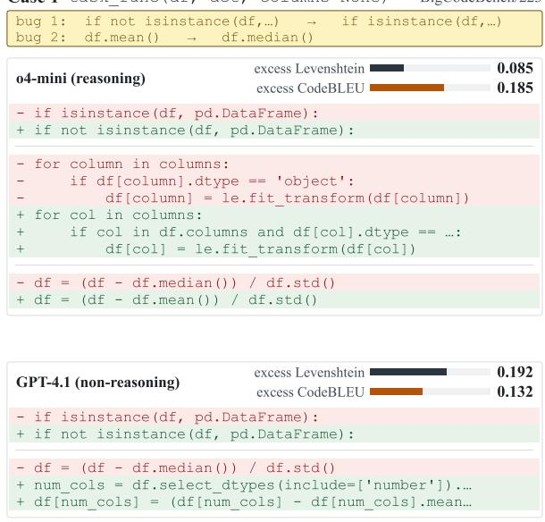

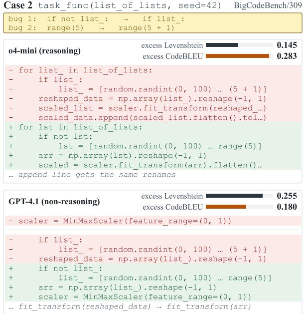  
Figure 7: High-divergence examples between CodeBLEU and token-level Levenshtein distance. In two matchedcorrect repairs, both models fix the injected bugs (amber) and pass all tests, yet the metrics prefer opposite patches: token edit distance prefers o4-mini’s smaller patch, while CodeBLEU prefers GPT-4.1’s larger rewrite, because identifier renames break n-gram overlap more than statement rewrites that preserve surrounding text. Bars show excess over the gold repair on a shared axis (lower is better); diffs are comment-stripped function bodies.

Table 12: Agreement among the three annotators.
<table><tr><td>Human judgment Pairwise agr. Fleiss&#x27;κ Unanimous</td><td></td><td></td><td></td></tr><tr><td>Easier to review</td><td>84.0%</td><td>0.690</td><td>77/100</td></tr><tr><td>More faithful</td><td>92.3%</td><td>0.850</td><td>89/100</td></tr></table>

Manual audit of high-excess passing repairs. To verify that a high excess Levenshtein distance reflects genuine over-editing rather than valid alternative repairs, we conducted a blinded manual audit of 100 sampled correct repairs with high excess distance. The annotator judged 79 repairs to contain genuinely unnecessary edits, 17 to be valid alternative local fixes, and 4 to be unclear. Among the 96 determinate cases, 82.3% contained unnecessary edits (95% CI 73.5%–88.6%), whereas 17.7% were alternative local fixes. We conclude that high excess distance predominantly reflects over-editing.

## B.3 Reliability of the Over-Editing Taxonomy

We designed and applied the taxonomy in Table 2 in two separate steps: we defined the categories by observable structural properties of the diffs and froze them into the annotation codebook before any labeling. The reliability question therefore concerns the labels rather than the categories.

The shares in Table 2 come from an exhaustive annotation rather than a sample: GPT-5.5 (temperature 0) labels all 530 passing repairs with excess Levenshtein distance ≥ 0.5 among the 10,000 repairs that the five frontier models produce on the corruption-expanded set of 2,000 corrupted instances. Each case presents the gold minimal patch and the model patch as unified diffs; the source model, execution status, and metric values are hidden from the annotator. Only 2.5% of cases receive zero labels, and 81.5% are labeled with high confidence. Table 13 reports the shares under four scopes: the full population, the subset from the 400- task evaluation set, the subset excluding GPT-5.5’s own repairs, and the subset excluding duplicatefallback corruption replicates. The two dominant categories stay dominant in every scope, and no share moves by more than 12 percentage points.

Table 13: Category shares (%) of the GPT-5.5 annotation under four scopes: all 530 high-excess passing repairs, the 400-task evaluation subset, the subset excluding GPT-5.5’s own repairs, and the subset excluding duplicate-fallback corruption replicates.
<table><tr><td>Category</td><td>Full</td><td>Eval set No self No dup.</td><td></td><td></td></tr><tr><td>n</td><td>530</td><td>104</td><td>317</td><td>318</td></tr><tr><td>Defensive generalization</td><td>64.2</td><td>65.4</td><td>53.0</td><td>59.4</td></tr><tr><td>Data-flow rewrite</td><td>63.2</td><td>64.4</td><td>69.7</td><td>70.8</td></tr><tr><td>Contract drift</td><td>34.7</td><td>36.5</td><td>29.7</td><td>36.5</td></tr><tr><td>Feature accretion</td><td>23.6</td><td>23.1</td><td>30.0</td><td>25.2</td></tr><tr><td>Dependency fallback</td><td>3.2</td><td>3.8</td><td>0.9</td><td>2.2</td></tr></table>

Table 14: Category shares (%) among all 8,195 passing repairs, over successive bins of excess Levenshtein distance E. Near-minimal repairs receive almost no labels, and prevalence rises smoothly with excess.
<table><tr><td>Category</td><td>E≤0 ≤0.1</td><td>≤0.3</td><td>&lt;0.5 ≥0.5</td></tr><tr><td>n</td><td>2644 1432</td><td>2083</td><td>1506 530</td></tr><tr><td>Defensive generalization</td><td>0.1 13.8</td><td>34.4</td><td>49.1 67.5</td></tr><tr><td>Data-flow rewrite</td><td>0.0 2.4</td><td>11.4</td><td>37.1 66.8</td></tr><tr><td>Contract drift</td><td>1.6 17.9</td><td>29.3</td><td>32.9 36.4</td></tr><tr><td>Feature accretion</td><td>0.0 4.5</td><td>19.3</td><td>24.5 23.2</td></tr><tr><td>Dependency fallback</td><td>0.0 0.2</td><td>0.1</td><td>0.4 3.2</td></tr><tr><td>Zero labels</td><td>98.3 64.8</td><td>29.6</td><td>14.5 2.1</td></tr></table>

Labeling every passing repair. To verify that the categories capture over-editing rather than editing per se, we extended the annotation to all 8,195 passing repairs under the same frozen codebook and blinded protocol. The taxonomy is highly specific: among near-minimal repairs (excess ≤ 0), 98.3% receive zero labels and no category exceeds 1.6%. The share of each category rises smoothly as excess grows, rather than appearing only above the 0.5 threshold (Table 14). This pass also reannotates the 530 high-excess repairs in freshly composed batches and reproduces the labels behind Table 2 with per-category test–retest Cohen’s κ of 0.82–0.95 (exact label-set agreement 79.1%, mean Jaccard 0.91), so the reported shares are stable under re-annotation.

To assess label reliability, we re-annotated a random sample of 500 instances (100 per source model) with five independent frontier models: Claude Opus 4.6, Gemini 3.1 Pro, GPT-5.5, Grok 4.3, and DeepSeek V3.2. We gave all five models an identical blinded prompt in which we hid the source model, execution status, and metric values. Table 15 shows the resulting agreement: we find that the five models show substantial to almostperfect agreement on four of the five categories, with contract drift at moderate agreement. We take this as evidence that the categories are applied consistently across independent models rather than reflecting idiosyncrasies of GPT-5.5, the model we used for the original annotation.

We also ran a sensitivity analysis that addresses potential self-labeling bias: when we restrict the sample to repairs not generated by GPT-5.5, we observe no drop in agreement, so the presence of GPT-5.5 outputs among the labeled instances does not inflate agreement.

Table 15: Five-model agreement (Fleiss’ κ) on the overediting taxonomy over 500 blinded instances.
<table><tr><td>Category</td><td>Fleiss&#x27;κ</td></tr><tr><td>Feature accretion</td><td>0.90</td></tr><tr><td>Defensive generalization</td><td>0.83</td></tr><tr><td>Dependency fallback</td><td>0.78</td></tr><tr><td>Data-flow rewrite</td><td>0.66</td></tr><tr><td>Contract drift</td><td>0.40</td></tr></table>

## B.4 Qualitative Over-Editing Examples

Table 16 makes the categories in Table 2 more concrete. It shows representative high-excess repairs that still pass the tests, along with the injected corruptions, the minimal repair, and the extra behavior introduced by the model. The categories are multilabel, so a single repair can exhibit more than one kind of over-editing.

## C Additional Evaluation Results

This section reports the per-model numbers behind the aggregate evaluation results in Section 3.2, together with the open-weight prompt ablation and the statistical robustness checks for the preservation-prompt effect.

## C.1 Per-Model Frontier Results

We report the per-model frontier results behind Figure 2 in Table 17, which lists each model under both the generic and the explicit preservation prompt. The table complements the aggregate trends discussed in the main text.

## C.2 Open-Weight Preservation-Prompt Ablation

We report the per-model open-weight prompt ablation referenced in Section 3.2 in Table 18. Prompts omit visible tests, and edit-fidelity metrics use passing repairs.

Table 18: Open-weight model performance under generic and preservation prompts that omit visible tests. Explicit preservation improves correctness and reduces over-editing across the evaluated model families.
<table><tr><td>Prompt</td><td>Pass@1 ↑ Ex. Lev. ↓ Add. CC ↓ Over-edit ↓</td><td></td><td></td><td></td></tr><tr><td colspan="5">Qwen2.5-Coder-14B-Instruct</td></tr><tr><td>generic</td><td>0.803</td><td>0.135</td><td>0.146</td><td>0.673</td></tr><tr><td>explicit</td><td>0.853</td><td>0.099</td><td>0.164</td><td>0.540</td></tr><tr><td colspan="5">Qwen2.5-Coder-32B-Instruct</td></tr><tr><td>generic</td><td>0.782</td><td>0.155</td><td>0.265</td><td>0.732</td></tr><tr><td>explicit</td><td>0.820</td><td>0.101</td><td>0.207</td><td>0.564</td></tr><tr><td colspan="5">Qwen3-Coder-30B-A3B-Instruct</td></tr><tr><td>generic</td><td>0.812</td><td>0.159</td><td>0.575</td><td>0.674</td></tr><tr><td>explicit</td><td>0.848</td><td>0.112</td><td>0.510</td><td>0.516</td></tr><tr><td colspan="5">Llama-3.1-70B-Instruct</td></tr><tr><td>generic</td><td>0.767</td><td>0.213</td><td>0.336</td><td>0.759</td></tr><tr><td>explicit</td><td>0.790</td><td>0.153</td><td>0.231</td><td>0.665</td></tr><tr><td colspan="5">Qwen3-Coder-480B-A35B-Instruct</td></tr><tr><td>generic</td><td>0.772</td><td>0.220</td><td>0.932</td><td>0.751</td></tr><tr><td>explicit</td><td>0.830</td><td>0.138</td><td>0.726</td><td>0.584</td></tr></table>

## C.3 Statistical Robustness of the Preservation-Prompt Effect

Paired inference for the Pass@1 gain. Table 17 lists 50 matched generic–explicit setting pairs. One evaluation required repair: in the original genericprompt run of Qwen3-Coder Plus, 112 of the 400 test executions (28%) were killed by evaluationharness resource starvation, while the same model’s explicit-prompt run and every other run in the same evaluation batches were unaffected. We therefore re-executed the tests for that run’s unchanged generations under the standard per-task limit; every task that originally passed still passes, and Table 17 carries the corrected numbers. Across the 50 matched settings, Pass@1 increases from 81.49% to 83.74% (+2.26 percentage points), with a paired model-bootstrap 95% confidence interval of [+1.49, +3.05] points. We observe the improvement in 40 of 50 settings, and it is significant under both a two-sided Wilcoxon signed-rank test $( p = 9 . 8 8 \times 1 0 ^ { - 8 } )$ and a two-sided sign test $( p = 9 . 2 6 \times 1 0 ^ { - 6 } )$

Multiple samples per task. As the main evaluation uses provider-default decoding with a single sample, we verified the prompt effect under repeated sampling: for 100 randomly drawn tasks, we collected eight independent temperature-1.0 samples per model and prompt (Table 19). We observe that the result is consistent with the single-sample evaluation: explicit prompting reduces over-editing by 19–32% relative and yields higher Pass@1 on all three models.

Table 19: Repeated-sampling check with eight temperature-1.0 samples per task on 100 random tasks.
<table><tr><td>Prompt</td><td></td><td></td><td>Pass@1 ↑ Ex. Lev. ↓ Add. CC↓</td></tr><tr><td colspan="4">DeepSeek Chat V3.1</td></tr><tr><td>Generic</td><td>0.766</td><td>0.189</td><td>0.878</td></tr><tr><td>Explicit</td><td>0.799</td><td>0.130</td><td>0.510</td></tr><tr><td colspan="4">Gemini 2.5 Flash High</td></tr><tr><td>Generic</td><td>0.721</td><td>0.240</td><td>1.371</td></tr><tr><td>Explicit</td><td>0.754</td><td>0.200</td><td>1.111</td></tr><tr><td colspan="4">GPT-4.1</td></tr><tr><td>Generic</td><td>0.720</td><td>0.308</td><td>1.701</td></tr><tr><td>Explicit</td><td>0.756</td><td>0.243</td><td>1.240</td></tr></table>

Preservation-instruction variants. The main evaluation tests the preservation instruction as a single fixed sentence. To check that the effect is not specific to its wording, we evaluated Qwen3- 14B with three alternative preservation instructions (Table 20): asking for the smallest-possible patch, imposing a three-line edit budget, and instructing the model to localize the bug, then fix it. We find that all variants improve Pass@1 while reducing over-editing relative to the generic prompt, and that very strong constraints such as the explicit edit budget produce the smallest excess distance, at a small

Table 16: Qualitative examples of passing repairs that over-edit. The table shows the local repair required for each bug and the additional behavior introduced by the model.
<table><tr><td>Issue type</td><td>Model</td><td>Injected corruptions</td><td>Minimal repair</td><td>Extra model behavior</td></tr><tr><td>Data-flow rewrite</td><td>DeepSeek V3.2</td><td>Comparison operators; edge-case guards</td><td>Fix the empty-input guard and keep the simple fruit-count aggregation.</td><td>Replaces the aggregation with explicit dictionaries and loops, changing the structure of the data pipeline.</td></tr><tr><td>Defensive generalization</td><td>GPT-5.5</td><td>Edge-case guards; comparison operators</td><td>Change the numeric-data guard so nonempty numeric strings are accepted.</td><td>Adds JSON parsing, string/list/scalar handling, non-finite checks, exception chaining, and new plot labels.</td></tr><tr><td>Contract drift</td><td>GPT-5.5</td><td>Conditional inversion; arithmetic operators</td><td>Fix the interval/duration guard, loop timing, and CPU-output line index.</td><td>Buffers CPU measurements and writes one JSON array instead of preserving newline-delimited records.</td></tr><tr><td>Feature accretion</td><td>DeepSeek V3.2</td><td>Numeric constants; list indexing</td><td>Use 1000 samples and the correct colorbar collection index.</td><td>Builds a richer plot with a new figure, scatter points, analytic curve, mean/std lines, labels, legend, and grid.</td></tr><tr><td>Dependency fallback</td><td>GPT-5.5</td><td>Arithmetic operators; sort order</td><td>Increment word frequencies and remove a no-op sort argument.</td><td>Adds a hardcoded stopword fallback, exception handling, and changes the token deduplication flow.</td></tr></table>

Table 17: Frontier model performance under the generic repair prompt and the explicit preservation prompt. Higher Pass@1 and lower excess edit distance and added cognitive complexity indicate more faithful repairs; most models reduce excess edits under the explicit prompt while maintaining or improving correctness. †The generic-prompt tests for this run were re-executed under the standard per-task limit after evaluation-harness resource starvation invalidated 112 of the 400 original test executions (Appendix C.3).
<table><tr><td rowspan="2">Model</td><td colspan="3">Generic prompt</td><td colspan="3">Explicit prompt</td></tr><tr><td>Pass@1↑</td><td>Excess Lev. ↓</td><td>Added CC ↓</td><td>Pass@1↑</td><td>Excess Lev. ↓</td><td>Added CC ↓</td></tr><tr><td>Reasoning models</td><td></td><td></td><td></td><td></td><td></td><td></td></tr><tr><td>Claude Opus 4.7 High (Anthropic, 2026b)</td><td>0.912</td><td>0.0745</td><td>0.1123</td><td>0.930</td><td>0.0585</td><td>0.1102</td></tr><tr><td>Claude Sonnet 4.6 High (Anthropic, 2026c)</td><td>0.898</td><td>0.0935</td><td>0.1309</td><td>0.895</td><td>0.0588</td><td>0.0726</td></tr><tr><td>Grok 4.3 High (xAI, 2026)</td><td>0.863</td><td>0.0966</td><td>0.0899</td><td>0.878</td><td>0.0480</td><td>0.0313</td></tr><tr><td>GLM 5.1 High (Z.ai, 2026b)</td><td>0.875</td><td>0.1004</td><td>0.1314</td><td>0.870</td><td>0.0695</td><td>0.0920</td></tr><tr><td>Kimi K2.6 High (Moonshot AI, 2026b)</td><td>0.850</td><td>0.1486</td><td>0.5353</td><td>0.890</td><td>0.0791</td><td>0.2949</td></tr><tr><td>GPT-5.5 High (OpenAI, 2026b)</td><td>0.823</td><td>0.2986</td><td>1.0213</td><td>0.833</td><td>0.1589</td><td>0.7477</td></tr><tr><td>DeepSeek V3.2 High (DeepSeek-AI, 2025)</td><td>0.763</td><td>0.2652</td><td>0.9180</td><td>0.770</td><td>0.2179</td><td>0.8961</td></tr><tr><td>GPT-5.4 (OpenAI, 2026a)</td><td>0.723</td><td>0.3945</td><td>2.3125</td><td>0.810</td><td>0.2263</td><td>1.3500</td></tr><tr><td>Claude Sonnet 3.7 (Anthropic, 2025a)</td><td>0.844</td><td>0.1192</td><td>0.4623</td><td>0.875</td><td>0.0725</td><td>0.3033</td></tr><tr><td>Claude Sonnet 4 (Anthropic, 2025b)</td><td>0.875</td><td>0.1140</td><td>0.5013</td><td>0.877</td><td>0.0772</td><td>0.4261</td></tr><tr><td>Claude Opus 4.6 (Anthropic, 2026a)</td><td>0.912</td><td>0.0599</td><td>0.2000</td><td>0.920</td><td>0.0326</td><td>0.1125</td></tr><tr><td>Gemini 3.1 Pro Preview (Google, 2026)</td><td>0.858</td><td>0.1448</td><td>0.5013</td><td>0.877</td><td>0.0765</td><td>0.3375</td></tr><tr><td>GLM 5 High (Z.ai, 2026a)</td><td>0.859</td><td>0.0991</td><td>0.3196</td><td>0.890</td><td>0.0523</td><td>0.1797</td></tr><tr><td>Qwen 3.6 Plus High (Alibaba Cloud, 2026)</td><td>0.858</td><td>0.1446</td><td>0.0475</td><td>0.873</td><td>0.0710</td><td>0.0200</td></tr><tr><td>Kimi K2.5 High (Moonshot AI, 2026a)</td><td>0.835</td><td>0.1509</td><td>0.7700</td><td>0.882</td><td>0.0686</td><td>0.4035</td></tr><tr><td>DeepSeek Chat V3.1 (DeepSeek AI, 2025)</td><td>0.795</td><td>0.2320</td><td>0.6942</td><td>0.845</td><td>0.1633</td><td>0.4660</td></tr><tr><td>DeepSeek R1 (DeepSeek-AI et al., 2025a)</td><td>0.820</td><td>0.2322</td><td>0.6725</td><td>0.782</td><td>0.1714</td><td>0.5542</td></tr><tr><td>Gemini 2.5 Flash High (Google, 2025)</td><td>0.772</td><td>0.2578</td><td>1.2850</td><td>0.838</td><td>0.1517</td><td>0.5800</td></tr><tr><td>GLM 4.5 High (GLM-4.5 Team et al., 2025)</td><td>0.810</td><td>0.1865</td><td>0.6550</td><td>0.835</td><td>0.1174</td><td>0.7000</td></tr><tr><td>GPT-5 High (OpenAI, 2025a)</td><td>0.713</td><td>0.4379</td><td>3.8321</td><td>0.785</td><td>0.2278</td><td>2.1754</td></tr><tr><td>Magistral Medium (Mistral AI, 2025a)</td><td>0.768</td><td>0.2238</td><td>1.2469</td><td>0.728</td><td>0.2072</td><td>1.2306</td></tr><tr><td>o4-mini High (OpenAI, 2025c)</td><td>0.770</td><td>0.3439</td><td>1.0000</td><td>0.838</td><td>0.1651</td><td>0.4225</td></tr><tr><td>Qwen3 235B A22B (Yang et al., 2025)</td><td>0.782</td><td>0.1823</td><td>0.5464</td><td>0.780</td><td>0.1574</td><td>0.2732</td></tr><tr><td>Qwen3 235B A22B Thinking 2507 (Qwen Team, 2025a)</td><td>0.807</td><td>0.1882</td><td>0.6950</td><td>0.812</td><td>0.1331</td><td>0.4849</td></tr><tr><td>Non-reasoning models</td><td></td><td></td><td></td><td></td><td></td><td></td></tr><tr><td>Claude Opus 4.7 (Anthropic, 2026b)</td><td>0.918</td><td>0.0704</td><td>0.0845</td><td>0.932</td><td>0.0557</td><td>0.1635</td></tr><tr><td>Claude Sonnet 4.6 (Anthropic, 2026c)</td><td>0.878</td><td>0.1010</td><td>0.2479</td><td>0.890</td><td>0.0660</td><td>0.1376</td></tr><tr><td>Grok 4.3 (xAI, 2026)</td><td>0.878</td><td>0.1145</td><td>0.1140</td><td>0.870</td><td>0.0654</td><td>0.1322</td></tr><tr><td>GLM 5.1 (Z.ai, 2026b)</td><td>0.858</td><td>0.1087</td><td>0.1429</td><td>0.898</td><td>0.0655</td><td>0.1365</td></tr><tr><td>Kimi K2.6 (Moonshot AI, 2026b)</td><td>0.840</td><td>0.1518</td><td>0.3601</td><td>0.885</td><td>0.0801</td><td>0.2232</td></tr><tr><td>GPT-5.5 (OpenAI, 2026b)</td><td>0.808</td><td>0.2993</td><td>0.7895</td><td>0.835</td><td>0.1566</td><td>0.7635</td></tr><tr><td>DeepSeek V3.2 (DeepSeek-AI, 2025)</td><td>0.775</td><td>0.2753</td><td>1.2161</td><td>0.770</td><td>0.2103</td><td>0.8896</td></tr><tr><td>Qwen3-Coder 480B A35B (Qwen Team, 2025b)</td><td>0.772</td><td>0.2196</td><td>0.9320</td><td>0.830</td><td>0.1383</td><td>0.7259</td></tr><tr><td>Qwen3-Coder Plus† (Qwen Team, 2025b)</td><td>0.785</td><td>0.2374</td><td>1.0064</td><td>0.795</td><td>0.1687</td><td>0.9182</td></tr><tr><td>GPT-5.4 (OpenAI, 2026a)</td><td>0.770</td><td>0.3273</td><td>1.5625</td><td>0.782</td><td>0.2851</td><td>1.7200</td></tr><tr><td>Claude Sonnet 3.5 (Anthropic, 2024)</td><td>0.740</td><td>0.2778</td><td>1.0850</td><td>0.775</td><td>0.1982</td><td>0.6900</td></tr><tr><td>Claude Sonnet 4</td><td>0.830</td><td>0.1514</td><td>0.7175</td><td>0.848</td><td>0.0975</td><td>0.4625</td></tr><tr><td>Claude Opus 4.6 (Anthropic, 2026a)</td><td>0.900</td><td>0.0790</td><td>0.3125</td><td>0.912</td><td>0.0490</td><td>0.1675</td></tr><tr><td>Gemini 3.1 Pro Preview (Google, 2026)</td><td>0.860</td><td>0.1286</td><td>0.3575</td><td>0.880</td><td>0.0822</td><td>0.3509</td></tr><tr><td>GLM 5 (Z.ai, 2026a)</td><td>0.840</td><td>0.0967</td><td>0.2350</td><td>0.882</td><td>0.0412</td><td>0.1425</td></tr><tr><td>Qwen 3.6 Plus (Alibaba Cloud, 2026)</td><td>0.870</td><td>0.1057</td><td>0.6050</td><td>0.880</td><td>0.0709</td><td>0.4325</td></tr><tr><td>Kimi K2.5 (Moonshot AI, 2026a)</td><td>0.770</td><td>0.1396</td><td>0.6865</td><td>0.873</td><td>0.0705</td><td>0.2800</td></tr><tr><td>DeepSeek Chat V3.1 (DeepSeek AI, 2025)</td><td>0.802</td><td>0.2353</td><td>1.2225</td><td>0.840</td><td>0.1473</td><td>0.6175</td></tr><tr><td>DeepSeek V3 (DeepSeek-AI et al., 2025b)</td><td>0.800</td><td>0.2007</td><td>0.8025</td><td>0.785</td><td>0.1711</td><td>0.7225</td></tr><tr><td>Gemini 2.5 Flash (Google, 2025)</td><td>0.759</td><td>0.2515</td><td>1.3559</td><td>0.800</td><td>0.1829</td><td>1.4950</td></tr><tr><td>GLM 4.5 (GLM-4.5 Team et al., 2025)</td><td>0.805</td><td>0.1880</td><td>0.6800</td><td>0.810</td><td>0.1229</td><td>0.5125</td></tr><tr><td>GPT-5 Minimal (OpenAI, 2025a)</td><td>0.738</td><td>0.3968</td><td>2.8772</td><td>0.765</td><td>0.2701</td><td>1.9724</td></tr><tr><td>GPT-4.1 (OpenAI, 2025b)</td><td>0.738</td><td>0.3104</td><td>1.2975</td><td>0.782</td><td>0.2136</td><td>0.8800</td></tr><tr><td>Mistral Medium (Mistral AI, 2025b)</td><td>0.802</td><td>0.1319</td><td>0.3225</td><td>0.802</td><td>0.1194</td><td>0.3575</td></tr><tr><td>Qwen3 235B A22B 2507 (Yang et al., 2025)</td><td>0.715</td><td>0.3035</td><td>1.0225</td><td>0.734</td><td>0.2962</td><td>1.0902</td></tr><tr><td>Qwen3 235B A22B (Yang et al., 2025)</td><td>0.707</td><td>0.2669</td><td>0.7744</td><td>0.703</td><td>0.2535</td><td>0.7425</td></tr></table>

cost in correct repairs.

Table 20: Effect of alternative preservation instructions on Qwen3-14B.
<table><tr><td>User instruction</td><td>Pass@1↑</td><td>Ex. Lev. ↓</td><td>Add. CC ↓</td></tr><tr><td>Generic</td><td>0.790</td><td>0.123</td><td>0.317</td></tr><tr><td>Explicit (main paper)</td><td>0.803</td><td>0.074</td><td>0.249</td></tr><tr><td>Smallest-possible patch</td><td>0.808</td><td>0.035</td><td>0.130</td></tr><tr><td>Three-line budget</td><td>0.793</td><td>0.024</td><td>0.060</td></tr><tr><td>Localize then fix</td><td>0.813</td><td>0.050</td><td>0.086</td></tr></table>

## D Post-Training Details and Additional Analyses

This section records the training configuration for the minimal-edit experiments in Section 4.1, together with the analyses that support them: auxiliary edit metrics, matched corruption counts, an RL rollout-budget ablation, and a comparison with AdaPatcher-style DPOP.

## D.1 Minimal-Edit Training Setup

Table 3 reports the in-domain and out-of-domain scores. Here, we record the run settings and heldout corruption families.

Optimization settings. We train SFT, rSFT, and DPO with LlamaFactory (Zheng et al., 2024b) for three epochs using a learning rate of $1 0 ^ { - 5 }$ ; for DPO, we use a preference beta of 0.1. We train RL with PRIME-RL (Prime Intellect, 2025) using a learning rate of $1 0 ^ { - 6 }$ , 16 rollouts per example, and a group-mean baseline for advantage estimation. We use the execution-plus-edit-distance reward defined in Section 4.1, with $\lambda _ { \mathrm { e x e c } } = 0 . 1 , \lambda _ { \mathrm { e d i t } } = 1 . 0 $ and $r ( M ) = - 0 . 2$ for failed or unparsable repairs. We evaluate cognitive complexity in the main-text reward ablations, while the final reward uses execution and edit distance.

## D.2 Held-Out DeepCoder Corruption Families

For the out-of-domain training evaluation, we apply the held-out corruption families below to DeepCoder samples. These families differ from the BigCodeBench evaluation corruptions in Appendix A.1, helping us test transfer beyond a fixed corruption list.

1. Min/Max Swap – Swap built-in functions such as min and max.

2. Abs Wrapping – Wrap an arithmetic expression in abs(), or unwrap an abs() call.

3. Append/Extend Toggle – Toggle between list.append(x) and list.extend([x]).

4. Enumerate Start – Shift the start parameter of enumerate(), such as implicit 0 to 1.

5. Break/Continue Swap – Replace break with continue, or vice versa.

6. Dict Get Default – Modify or inject the default value in dict.get() calls.

7. String Case Swap – Toggle string case methods such as .lower() and .upper().

8. Strip Variant – Change a strip variant, such as .strip() to .rstrip() or .lstrip().

9. Join Separator – Alter the separator in str.join() calls.

10. Sorted Key Toggle – Add or remove a key=len argument in sorted() or list.sort() calls.

11. Set/List Cast Swap – Swap set(x) with list(x), or vice versa.

12. Round/Int Swap – Replace round(x) with int(x), or vice versa.

13. Comprehension Filter Removal – Drop one filter clause from a list, set, or dictionary comprehension.

14. Find/Index Swap – Toggle between str.find() and str.index().

15. Any/All Swap – Replace any(...) with all(...), or vice versa.

16. Zip Argument Order – Reverse the first two positional arguments of a zip() call.

17. Len Range Endpoint – Modify range(len(x)) to range(len(x)+1) or range(len(x)-1).

18. Negative Index Shift – Shift negative constant indices by one, such as [-1] to [-2].

19. Dict Iteration Variant – Swap dictionary iteration methods such as .items(), .keys(), and .values().

20. None Equality Operator – Toggle None comparisons between ==/!= and is/is not.

## D.3 Auxiliary Edit Metrics

We recomputed the out-of-domain comparison of Table 3 with two auxiliary metrics, each defined analogously to excess Levenshtein distance as the model-to-buggy distance minus the reference-to-buggy distance: a raw line-level edit distance (excess line diff) and a syntax-aware tree edit distance computed with DiffSitter2 (excess syntax-tree diff), which compares parsed syntax trees and is less sensitive to surface-level differences. We observe that both auxiliary metrics produce the same model ordering as excess Levenshtein distance (Table 21), which also correlates strongly with both at the instance level (pooled Spearman $\rho = 0 . 9 0 9$ with line diff and $\rho ~ = ~ 0 . 9 1 0$ with syntax-tree diff over the 1,123 correct out-of-domain repairs). We conclude that the results are not driven mainly by tokenization or formatting. We retain Levenshtein distance as the primary metric because it is more fine-grained than line diff, and added cognitive complexity because it measures added control-flow complexity; syntax-tree diff captures broader structural changes and serves as a complementary validity check.

Table 21: Auxiliary excess edit metrics on correct outof-domain repairs.
<table><tr><td>Model</td><td>Excess line diff</td><td>Excess syntax-tree diff</td></tr><tr><td>SFT</td><td>-0.175</td><td>-0.175</td></tr><tr><td>rSFT</td><td>1.721</td><td>1.897</td></tr><tr><td>DPO</td><td>1.260</td><td>1.390</td></tr><tr><td>RL</td><td>0.645</td><td>0.725</td></tr></table>

## D.4 Matched Corruption Counts in Training and Evaluation

Our main setup trains with 1–10 corruptions per sample and evaluates with one or two, which could in principle confound the method comparison. We therefore repeated the full comparison with exactly one corruption per program in both the DeepCoder training set and the corrupted BigCodeBench evaluation set (Table 22). We reach the same qualitative conclusions: SFT collapses out of domain, DPO trades correctness for small edits, and RL remains the best overall combination of high Pass@1 and low excess edit distance.

Table 22: Post-training comparison with exactly one corruption per program in both training and evaluation.
<table><tr><td>Model</td><td>Pass@1↑</td><td>Ex. Lev. ↓</td><td>Add. CC ↓</td></tr><tr><td>Untrained baseline</td><td>0.745</td><td>0.089</td><td>0.425</td></tr><tr><td>SFT</td><td>0.390</td><td>-0.001</td><td>0.003</td></tr><tr><td>rSFT</td><td>0.758</td><td>0.061</td><td>0.263</td></tr><tr><td>DPO</td><td>0.640</td><td>0.013</td><td>0.005</td></tr><tr><td>RL</td><td>0.753</td><td>0.024</td><td>0.113</td></tr></table>

## D.5 RL Rollout-Budget Ablation

rSFT and DPO use 8 generated candidates per training sample, while RL uses K=16 rollouts. To test whether the RL advantage comes from the larger sampling budget, we retrained RL with 8 and 4 rollouts (Table 23). We observe that decreasing the number of rollouts hurts performance only mildly, and that RL with K=8 (matching the rSFT/DPO candidate budget) still achieves a better edit-fidelity trade-off than rSFT and DPO in Table 3. We conclude that the difference in learning objective, rather than the candidate budget, is the dominant factor. Due to compute constraints, we do not perform a comprehensive hyperparameter search.

Table 23: RL performance with reduced rollout budgets on out-of-domain corruptions.
<table><tr><td>Nrollout</td><td>Pass@1 ↑</td><td>Ex. Lev. ↓</td><td>Add. CC ↓</td></tr><tr><td>16</td><td>0.782</td><td>0.050</td><td>0.185</td></tr><tr><td>8</td><td>0.763</td><td>0.030</td><td>0.115</td></tr><tr><td>4</td><td>0.755</td><td>0.046</td><td>0.166</td></tr></table>

## D.6 Comparison with AdaPatcher-Style DPOP

We give the full comparison against AdaPatcherstyle DPO-positive (DPOP) preference learning discussed in Section 4.1 in Table 24; we train DPOP on our data under the DPO protocol.

Table 24: Comparison with AdaPatcher-style DPOP preference learning on out-of-domain corruptions.
<table><tr><td>Method</td><td>Setup</td><td>Pass@1 ↑</td><td>Ex. Lev. ↓</td><td>Add. CC ↓</td></tr><tr><td>DPO</td><td>Full</td><td>0.787</td><td>0.092</td><td>0.348</td></tr><tr><td>RL</td><td>Full</td><td>0.782</td><td>0.050</td><td>0.185</td></tr><tr><td>DPOP</td><td>Full</td><td>0.718</td><td>0.064</td><td>0.366</td></tr><tr><td>RL</td><td>LoRA r=64</td><td>0.797</td><td>0.051</td><td>0.160</td></tr><tr><td>DPOP</td><td>LoRA r=64</td><td>0.783</td><td>0.082</td><td>0.502</td></tr></table>

## E Responsible Research

## E.1 Potential Risks

We study code-repair systems, so this work may indirectly improve automated software modification. The main risk is over-trust in model-generated edits: a repair can pass tests while changing unrelated behavior, increasing review burden or hiding regressions outside the test suite. We focus our experiments on public benchmark programs and synthetic, reversible corruptions, and we do not study vulnerability discovery, exploit generation, or deployment against production repositories. Throughout the paper, we advocate evaluating edit fidelity alongside functional correctness and keeping model-produced repairs subject to human review.

## E.2 Licenses and Intended Use of Scientific Artifacts

We use third-party artifacts for research evaluation or training in the manner described by their documentation. BigCodeBench (Zhuo et al., 2025), released under Apache 2.0, provides the 400 Python repair tasks, reference solutions, and tests used in the main evaluation; we inject local AST-level corruptions into the reference solutions and evaluate repairs with the original executable tests. The public DeepCoder preview resources (Luo et al., 2025), released under MIT terms, provide coding samples for the minimal-edit training experiments, where we create corrupted training and evaluation instances and keep only corrupted programs that fail tests. LiveCodeBench (Jain et al., 2024), also released under MIT terms, serves as a heldout broader coding benchmark; we report Live-CodeBench v6 deltas to check whether minimaledit training harms general coding ability.

For open-weight inference and fine-tuning, we use Qwen coding and Qwen3 models (Hui et al., 2024; Yang et al., 2025). The Qwen releases used here are distributed under Apache 2.0 except where an individual model card states otherwise; we evaluate Qwen2.5-Coder and Qwen3-Coder variants and fine-tune Qwen3 4B/14B models for minimal editing. We also use Llama-3.1- 70B-Instruct (Meta AI, 2024), governed by the Llama 3.1 Community License, as an open-weight prompt-ablation baseline through hosted inference. For training infrastructure, we use LlamaFactory (Zheng et al., 2024b) for SFT, rSFT, and DPO, and PRIME-RL (Prime Intellect, 2025) for GRPO-style reinforcement learning; both frameworks are released under Apache 2.0. For closed API models, we use provider-hosted inference under the corresponding API terms and report aggregate measurements and qualitative examples.

## E.3 Data Composition and Privacy

We build the primary evaluation set from 400 BigCodeBench Python tasks, each with one or two injected corruptions, and use a 400 × 5 variantexpanded set aggregated over 10,000 model-case evaluations for the corruption analysis. We work with public code benchmarks and synthetic program transformations; we do not use private repositories, personally identifying information, or intentionally offensive content. The only human data we collect are the expert judgments in the annotation studies of Appendix B.2, where annotators compared pairs of model patches.

## E.4 Compute

We conduct all experiments using NVIDIA A100 GPUs. Each run of 4B RL for 100 steps takes around 3 hours on 8 GPUs.

## E.5 AI Assistant Use

We used LLMs for limited research support, including organizing experiment code and polishing writing, plots, and tables. We did not use them for study design, artifact selection, experiment execution, result verification, or final claims.