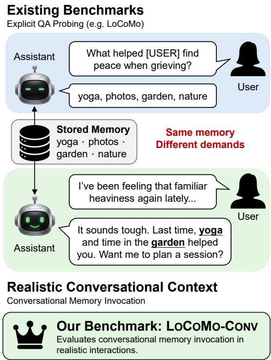
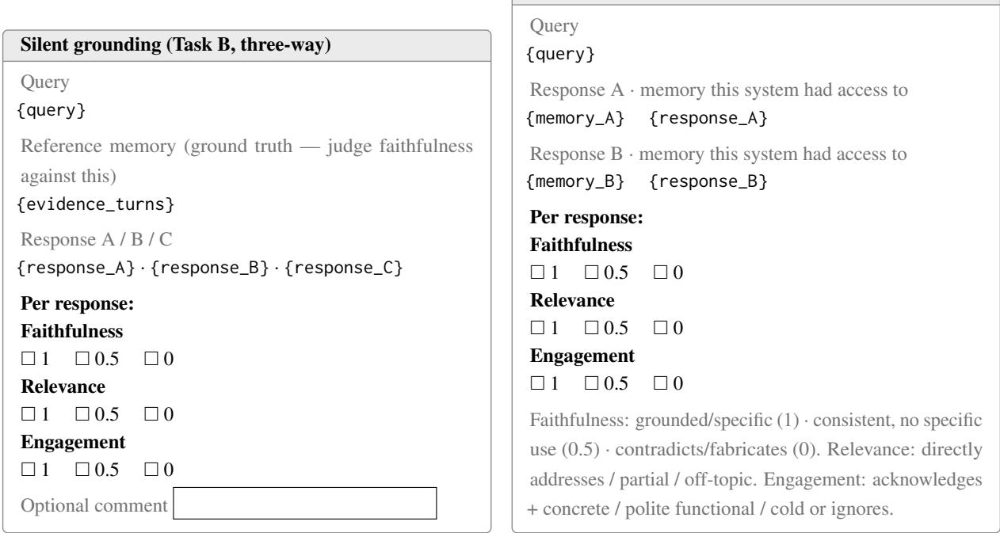

# When Users Don’t Ask: Benchmarking Context-Driven Memory Retrieval in Conversational Agents

Wen-Yu Chang Yun-Nung Chen National Taiwan University, Taipei, Taiwan f10946031@csie.ntu.edu.tw y.v.chen@ieee.org

## Abstract

Large language models (LLMs) are increasingly deployed as long-horizon conversational agents, motivating growing interest in memory systems. However, existing benchmarks primarily evaluate memory through QA-style probing rather than in-situ conversational usage. We introduce LOCOMO-CONV, a conversational memory benchmark derived from Lo-CoMo with four query styles: dialog, implicit, counterfactual, and composed. Across five rep resentative memory systems, we evaluate both retrieval recall and end-to-end response quality. Our experiments show that conversational framing exposes substantial retrieval gaps overlooked by QA benchmarks, especially on implicit and composed queries, which multi-facet query rewriting narrows for raw-turn memory but not abstractive memory. We further find that strong retrieval does not fully translate into response quality, and that implicit queries exhibit silent grounding, where memory improves contextual grounding without explicitly surfacing the gold fact. These results point to reasoning-based memory elaboration as a promising direction, and we release auxiliary supportive\_memory annotations capturing conversationally useful context beyond the original gold evidence.1

## 1 Introduction

Large language models (LLMs) are increasingly deployed as long-horizon conversational agents that users interact with across sessions. This shift makes memory a core requirement: assistants must not only store prior interactions, but also retrieve and use them appropriately when a future conversation calls for them. Recent work has proposed diverse memory architectures and benchmarks for evaluating long-term conversational memory. However, most existing evaluations still probe memory through explicit QA-style queries (as shown in Table 1), leaving open whether these systems can support natural conversational interaction.

  
Figure 1: Illustration of the gap between LOCOMO-CONV and the existing benchmarks

To address this gap, we introduce LoCoMo-Conv, a conversational memory benchmark that recasts LoCoMo’s QA pool into four query styles reflecting how users naturally invoke memory— dialog, implicit, counterfactual, and composed— and evaluates how memory-augmented agents use retrieved memory within natural dialogue rather than under explicit probing.

Across five representative memory systems, we report three findings. First, conversational framing uncovers substantial retrieval failures masked by QA-style evaluation, especially on implicit and composed queries; multi-facet query rewriting narrows the gap, but only for raw-turn memory, not abstractive memory. Second, strong retrieval does not guarantee grounded responses— abstractive compression in particular aids matching while discarding the detail needed to ground a response— pointing to reasoning-based memory elaboration over lossy compression. Third, we identify silent grounding, where memory improves implicit-query responses even without surfacing the gold fact, exposing a limitation of strict fact-recall metrics. Our main contributions are:

<table><tr><td>Benchmark</td><td>Query form</td><td>Evaluation</td><td>Mem. sys.</td></tr><tr><td>LoCoMo (2024)</td><td>3rd-person QA</td><td>QA match</td><td>√</td></tr><tr><td>LongMemEval (2025)</td><td>3rd-person QA</td><td>QA match</td><td>√</td></tr><tr><td>PersonaMem (v1/v2) (2025b)</td><td>1st-person, in-situ</td><td>multiple choice</td><td>x</td></tr><tr><td>MADial-Bench (2025)</td><td>emotion-support dialogue</td><td>generation</td><td>partial</td></tr><tr><td>LoCoMo-Plus (2026b)</td><td>conversation continuation</td><td>constraint consistency</td><td>√</td></tr><tr><td>AMemGym (2026)</td><td>simulated interaction</td><td>structured metrics</td><td>√</td></tr><tr><td>MemoryAgentBench (2026)</td><td>3rd-person QA</td><td>QA match</td><td>√</td></tr><tr><td>LoCoMo-Conv (ours)</td><td>41st-person conv. styles</td><td>retrieval + free-form response</td><td>√</td></tr></table>

Table 1: Comparison with existing memory benchmarks. LoCoMo-Conv varies only the query framing over fixed LoCoMo memories and scores retrieval and response separately.
<table><tr><td>Knowledge Context (Original &amp; Memory)</td><td>Conversational Query Styles</td></tr><tr><td>Original Question: What were Deborah&#x27;s mother&#x27;s hobbies? Gold Answer: reading, traveling, art, cooking Memory:</td><td>Dialogue Question: Do you remember what I told you about my mom&#x27;s hobbies? Implicit User Turn: I&#x27;m trying to think of a meaningful birthday gift for my mom, but I&#x27;m totally drawing a blank on what she&#x27;d actually enjoy.</td></tr><tr><td>• [D2: 17] Deborah: “she&#x27;d sit there every night with a book and a smile...&quot; • [D2: 19] Deborah: “Travel was also her great passion!&quot; • [D12: 3] Deborah: “My mom was interested in art...&quot; • [D29: 7] Deborah: &quot;My mom had a big passion for</td><td>Counterfactual User Turn: I was chatting with a coworker today about my mom, and I mentioned how she spent all her time gardening and knitting—I think that&#x27;s what I told her, right?</td></tr></table>

Table 2: One LoCoMo QA rewritten into our 3 conversational query styles. The gold answer and gold evidence turns (left) are shared across all rewrites; only the user-side phrasing (right) changes. The counterfactual rewrite injects an incorrect premise (red) that the assistant must correct.

1. We introduce LOCOMO-CONV, a conversational benchmark with four first-person query styles that evaluates memory systems beyond QA-style probing.

2. We provide a unified evaluation framework spanning both retrieval and response generation, enabling systematic comparison of extractive and abstractive memory systems under conversational settings.

3. We release supportive\_memory, an auxiliary annotation layer capturing conversationally supportive context beyond the original gold evidence, facilitating the analysis of memory grounding beyond explicit fact recall.

## 2 Related Work

## 2.1 Benchmarks for Long-Term Conversational Memory

Existing long-term memory benchmarks differ mainly in how memory is probed and what is scored. LoCoMo (Maharana et al., 2024) pioneers very long multi-session conversations with thirdperson QA across five categories (single/multihop reasoning, temporal, adversarial, open commonsense). LongMemEval (Wu et al., 2025) defines five memory abilities—information extraction, multi-session reasoning, temporal reasoning, knowledge updates, and abstention—probed through curated QA over scalable dialogue histories. MemoryAgentBench (Hu et al., 2026) reformulates long-context datasets into incremental multi-turn streams to evaluate four memory competencies (accurate retrieval, test-time learning, longrange understanding, conflict resolution) at scales up to 1.4M tokens. Other benchmarks target specialized memory failure modes: HaluMem (Chen et al., 2026) decomposes memory hallucination into extraction, updating, and QA stages; PrefEval (Zhao et al., 2025) evaluates whether LLMs adhere to user preferences in long-context dialogue; and HorizonBench (Li et al., 2026a) probes longhorizon personalization under evolving preferences with ∼163K-token, 6-month conversation histories.

<table><tr><td rowspan=1 colspan=2>Example of Composed Query</td></tr><tr><td rowspan=1 colspan=1>Source QA1</td><td rowspan=1 colspan=1>Source QA₂</td></tr><tr><td rowspan=1 colspan=1>Q: What helped Deborah find peace when grieving deathsof her loved ones?Gold Answer: yoga, old photos, the roses and dahlias in aflower garden, natureMemory:[D1:15] Deborah: “Yoga helped me find peace during arough time, and now I&#x27;m passionate about sharing that withothers.&quot;[D2: 3] Deborah: “.. . it&#x27;s comforting to look back on thegreat memories. We looked at the family album. Photos giveme peace during difficult times.&quot;[D6: 4]* Deborah: “The roses and dahlias bring me peace.I lost a friend last week, so I&#x27;ve been spending time in thegarden to find some comfort.&quot;[D15: 29] Deborah: “Nature helps me find peace every dayit&#x27;s so refreshing!&quot;</td><td rowspan=1 colspan=1>Q: Why did Deborah spend time in the garden?Gold Answer: to find comfort after losing a friendMemory:[D6: 4]* Deborah: “The roses and dahlias bring me peace.I lost a friend last week, so I&#x27;ve been spending time in thegarden to find some comfort.&quot;(* [D6: 4] is shared by both QAs — the overlap that moti-vates composing them into one cluster.)</td></tr><tr><td rowspan=1 colspan=2>Composed User Turn:                                                            (LLM-generated from QA1 + QA2)&quot;I&#x27;ve been feeling that familiar heaviness again lately, and I&#x27;m trying to remember exactly what worked for me last time Iwas struggling to cope with a loss.&#x27;</td></tr><tr><td rowspan=1 colspan=2>Expected synthesis                                                                           (LLM-generated rubric)The assistant should surface multiple past coping strategies from QA1 (yoga, old photos, garden, nature) and ideallyconnect them to the loss context from QA2. A response listing only one item, or only acknowledging the user&#x27;s situationwithout surfacing past strategies, is judged as partial coverage.</td></tr></table>

Table 3: Unlike dialog/implicit/counterfactual, which rewrite a single LoCoMo QA, composed queries combine two source QAs into one conversational request requiring multi-fact synthesis. The top half shows the source QAs and their evidence turns, with shared turns (∗) marking the cluster overlap. The bottom row shows the LLM-generated composed query and synthesis rubric.

Closer to conversational use, PersonaMem (Jiang et al., 2025a) and its successor PersonaMem-v2 (Jiang et al., 2025b) target implicit user preferences accumulated across sessions, finding that frontier LLMs achieve only 37–48% accuracy on implicit personalization; both, however, evaluate via multiple-choice selection and probe whether the agent has internalized user traits over time rather than whether it surfaces relevant memory from a single utterance at query time. MADial-Bench (He et al., 2025) evaluates memory-augmented dialogue generation with proactive recall, but within a single emotion-support domain and with small-scale human evaluation. LoCoMo-Plus (Li et al., 2026b) tests whether a conversational continuation stays consistent with latent constraints, where a valid response need not retrieve or express any specific fact. AMemGym (Jiayang et al., 2026) evaluates memory through on-policy interaction with simulated users, which is complementary to our fixed-history setting.

Despite this diversity in measurement axes, nearly all existing benchmarks evaluate through structured probing—third-person QA, multiplechoice selection, constraint checks, or operationlevel traces—rather than free-form conversational response generation, and none requires an external memory system to retrieve and ground a specific, verifiable fact from a user utterance that does not ask for it. LoCoMo-Conv departs from this convention by evaluating how an assistant integrates memory into a conversational response, the form in which memory is actually consumed in deployment.

## 2.2 Memory-Augmented Conversational Agents

Recent work has explored diverse architectural strategies for equipping LLMs with long-term memory in conversational settings. mem0 (Chhikara et al., 2025) and AnchorMem (Shen et al., 2026) extract atomic facts from raw interactions and organize them into structured stores, with AnchorMem further constructing an associative event graph to capture cross-memory dependencies. A second line compresses past interactions into condensed representations: COMEDY (Chen et al., 2025) eschews retrieval entirely by using a single LLM to generate, compress, and consume compressive memory; LightMem (Fang et al., 2026) adopts a three-stage Atkinson–Shiffrin-inspired pipeline; and MemAgent (Yu et al., 2025) processes long inputs in segments under an overwrite policy optimized via reinforcement learning. A third family draws on operating-system principles— MemGPT (Packer et al., 2024) introduces tiered memory hierarchies with explicit paging, MemoryOS (Kang et al., 2025) extends this with short-, mid-, and long-term storage tiers, and HiGMem (Cao et al., 2026) adopts a two-level event-turn structure with LLM-guided turn selection. A-MEM (Xu et al., 2025) treats memory construction itself as agent-driven, building an interconnected knowledge network with dynamic linking and memory evolution following Zettelka sten principles. Finally, Memora (Xia et al., 2026) proposes a harmonic memory representation that separates abstract memory indices from detailed memory values. Each memory consists of a primary abstraction for indexing, multiple cue anchors for diverse retrieval access, and an uncompressed memory value preserving fine-grained details. For evaluation we select five systems that collectively span the dominant paradigms above (AnchorMem, A-MEM, mem0, Memora and a dense-retrieval baseline using all-MiniLM-L6-v2), leaving broader-coverage benchmarking to future work.

## 3 LoCoMo-Conv

We construct LOCOMO-CONV by rewriting each LoCoMo10 question into four conversational query styles while preserving the original gold answers

and evidence dia\_ids.2

## 3.1 Conversational Query Styles

Dialog. A direct first-person conversational reformulation of the original QA query (e.g., “Do you remember when I. . . ?”). The underlying factual target remains unchanged, but the phrasing is rewritten to resemble natural dialogue rather than third-person question answering.

Implicit. A situational conversational utterance in which the user does not explicitly ask a question. Instead, the assistant must infer that a relevant past memory should be proactively surfaced. For example, a factual QA asking about a parent’s hobbies may be rewritten into a conversational situation involving gift selection or reminiscing.

Counterfactual. A first-person conversational query containing an incorrect premise about the gold fact. The assistant is expected to identify and correct the false assumption using the underlying conversational memory.

Composed. A multi-memory conversational query requiring synthesis across multiple source QAs and evidence spans. We describe the construction process in § 3.2.

For all non-composed styles, we prompt GPT-5.4-mini with the original question, gold answer, and speaker identity, and instruct it to generate conversational rewrites that preserve the original information need while remaining natural and first-person in style. For counterfactual queries, the prompt additionally injects a specific false premise. Example rewrites are shown in Table 2, and all the prompts for query rewriting are provided in Appendix C.1.

## 3.2 Composed Multi-Memory Clusters

Unlike the other conversational styles, composed queries are constructed by combining multiple source QAs into a single conversational request that requires multi-memory synthesis.

For each QA instance q, let $E ( q ) \subseteq { \mathcal { D } }$ denote its gold evidence dia\_ids. We enumerate all QA pairs $( q _ { i } , q _ { j } )$ within the same sample and retain a pair as a candidate cluster if it satisfies three conditions: (i) overlapping evidence, $E ( q _ { i } ) \cap E ( q _ { j } ) \neq \emptyset ;$ (ii) non-identical evidence, $E ( q _ { i } ) \neq E ( q _ { j } ) ;$ and (iii)

non-trivial combined evidence, $| E ( q _ { i } ) \cup E ( q _ { j } ) | \geq$ 2. These constraints ensure that the two QAs are topically related while still contributing distinct information. We retain all valid clusters under these constraints, yielding 1,069 composed clusters in total (36–198 per conversation).

For each cluster, we prompt GPT-5.4-mini with the source QA pairs and their gold evidence turns, and ask it to generate a natural conversational query that implicitly requires both source answers. The composed gold answer is defined as the set of atomic answers from the constituent QAs, while the gold evidence corresponds to the union of their dia\_ids.

Because composed queries require synthesizing multiple atomic facts, binary correctness is often overly strict. We therefore evaluate composed responses using continuous atomic-fact coverage (Section 4), which measures the fraction of atomic gold facts correctly covered by the generated response. An example composed cluster is shown in Table 3.

## 4 Evaluation Methodology

We evaluate memory systems along two complementary dimensions: (1) retrieval recall against the gold dialogue IDs, and (2) end-to-end response quality using style-specific LLM judges.

## 4.1 Retrieval Recall

For each query, we compare the top-K retrieved memories against the gold evidence dia\_ids. A gold turn is considered retrieved if its verbatim text appears within any returned memory (caseinsensitive). For abstractive systems that expose source metadata, we additionally match retrieved dia\_ids through metadata fields. Retrieval recall is computed as:

$$
{ \frac { \left| { \mathrm { r e t r i e v e d } } \cap { \mathrm { g o l d } } \right| } { \left| { \mathrm { g o l d } } \right| } } .
$$

## 4.2 Response Quality Judging

Retrieved memories are provided to the answer model to generate responses, which are then evaluated by an LLM judge using a style-specific rubric.

• Dialog and Implicit: partial-credit fact\_used on a 3-level scale (1.0 if the substance of the gold fact is correctly conveyed—paraphrasing and hedging permitted; 0.5 if the response captures the central concept of a multi-item gold but misses specifics; 0.0 if the response asserts contradicting content, gives only vague allusion, or completely omits the fact).

• Counterfactual: a 3-way unaware / hedge / corrected judge mapped to 0/0.5/1. Class A (unaware) treats the user’s false premise as if it were true; class B (hedge) signals awareness of a mismatch but does not state the groundtruth fact; class C (corrected) states (or clearly implies) the ground-truth fact regardless of whether it explicitly points out the user’s error.

• Composed: atomic-fact coverage, the fraction of gold atomic facts the response covers (judged independently per fact). This avoids the strict all-or-nothing failure of a single fact\_used call for multi-fact composed clusters.

The full judge prompts are provided in Appendix C.

## 5 Experimental Setup

We evaluate five representative systems: AnchorMem (Shen et al., 2026), A-MEM (Xu et al., 2025), mem0 (Chhikara et al., 2025), Memora3 (Xia et al., 2026) and NaiveRAG built with all-MiniLM-L6-v2. We follow the original implementation settings while unifying the embedding model to all-MiniLM-L6-v2 and the backbone LLM to gemma-4-31B-it. All systems retrieve top-K=10 memories4, which are passed to the same answer-generation model.5

For response evaluation, we use GPT-5.4-mini with reasoning enabled as the primary judge, and validate agreement against Claude-sonnet-4.5 and Qwen3.6-35b-A3B on a stratified 1,488-item subset (Appendix A).

## 6 Results

## 6.1 Retrieval Recall

Table 4 (left) reports retrieval recall@10 across all conversational query styles. Retrieval performance drops substantially on implicit queries compared to direct dialog queries, confirming that conversational framing without explicit questions is significantly more challenging for current memory systems.

<table><tr><td rowspan="3">System / Variant</td><td colspan="4">Retrieval Recall@10</td><td colspan="4">Response Quality</td></tr><tr><td>Dialog</td><td>Implicit</td><td>Cf</td><td>Comp.</td><td>Dialog</td><td>Implicit</td><td>Cf</td><td>Comp.</td></tr><tr><td colspan="9">No-memory floor / Oracle ceiling</td></tr><tr><td>No Memory</td><td></td><td></td><td></td><td></td><td>.004</td><td>.067</td><td>.251</td><td>.008</td></tr><tr><td>Oracle</td><td></td><td></td><td></td><td></td><td>.777</td><td>.724</td><td>.775</td><td>.597</td></tr><tr><td colspan="9">Baselines (raw turns, no LLM at ingest)</td></tr><tr><td>Naive RAG</td><td>.533</td><td>.312</td><td>.573</td><td>.266</td><td>.518</td><td>.335</td><td>.608</td><td>.308</td></tr><tr><td>+ Query Rewriting</td><td>.555 ↑.022</td><td>.346 ↑.034</td><td>.552 ↓.021</td><td>.281 ↑.015</td><td>.536 ↑.018 .538 ↑.020</td><td>.368 ↑.033</td><td>.608 ↑.000</td><td>.324 ↑.016</td></tr><tr><td colspan="9">→ w/ Response CoT</td></tr><tr><td>Memory systems (raw turns + structure)</td><td></td><td></td><td></td><td></td><td></td><td></td><td></td><td></td></tr><tr><td>A-MEM (2025) + Query Rewriting</td><td>.531 .551 ↑.020</td><td>.308 .344 ↑.036</td><td>.571 .548↓.023</td><td>.267 .282 ↑.015</td><td>.515 .533 ↑.018</td><td>.326 .376 ↑.050</td><td>.609</td><td>.307 .321 ↑.014</td></tr><tr><td>↔ w/ Response CoT</td><td></td><td></td><td></td><td></td><td>.530 ↑.015</td><td>.370 ↑.044</td><td>.606 ↓.003 .470↓.139</td><td>.331 ↑.024</td></tr><tr><td>AnchorMem (2026)</td><td>.659</td><td>.368</td><td>.639</td><td>.279</td><td>.598</td><td></td><td>.653</td><td>.310</td></tr><tr><td>+ Query Rewriting</td><td>.754 ↑.095</td><td>.524↑.156</td><td>.732 ↑.093</td><td>.432 ↑.153</td><td>.669 ↑.071</td><td>.364 .470 ↑.106</td><td></td><td></td></tr><tr><td>↔ w/ Response CoT</td><td></td><td></td><td></td><td></td><td>.620 ↑.022</td><td>.389 ↑.025</td><td>.669 ↑.016 .523↓.130</td><td>.413 ↑.103 .314 ↑.004</td></tr><tr><td colspan="9">Abstractive memory system</td></tr><tr><td>mem0 (2025)</td><td>.547</td><td>.456</td><td>.512</td><td>.374</td><td>.366</td><td>.330</td><td>.548</td><td>.290</td></tr><tr><td>+ Query Rewriting</td><td>.479 ↓.068</td><td>.453 ↓.003</td><td>.532 ↑.020</td><td>.364 ↓.010</td><td>.337 ↓.029</td><td>.337 ↑.007</td><td>.558 ↑.010</td><td>.284 ↓.006</td></tr><tr><td>→ w/ Response CoT</td><td></td><td></td><td></td><td></td><td>.393 ↑.027</td><td>.368 ↑.038</td><td>.387↓.161</td><td>.311 ↑.021</td></tr><tr><td>Memora (2026)</td><td>.608</td><td>.445</td><td>.600</td><td>.387</td><td>.501</td><td>.388</td><td>.617</td><td>.333</td></tr><tr><td>+ Query Rewriting</td><td>.616 ↑.008</td><td>.458 ↑.013</td><td>.583 ↓.017</td><td>.406 ↑.019</td><td>.513 ↑.012</td><td>.403 ↑.015</td><td>.606↓.011</td><td>.340 ↑.007</td></tr><tr><td>→ w/ Response CoT</td><td></td><td></td><td></td><td></td><td>.538 ↑.037</td><td>.422↑.034</td><td>.462↓.155</td><td>.354↑.021</td></tr></table>

Table 4: Joint retrieval and response evaluation across conversational query styles. Left: retrieval recall@10 against gold evidence turns. Right: end-to-end response quality. + Query Rewriting applies multi-facet query rewriting with RRF fusion, while w/ Response CoT adds explicit memory selection before response generation using the same retrieved memories. Bold indicates the best-performing real memory system in each column (excluding No Memory and Oracle).

AnchorMem performs the best on factual retrieval-oriented styles, achieving the highest recall on dialog (0.659) and counterfactual (0.639) queries. This behavior aligns with AnchorMem’s graph-structured design, which is optimized for retrieving specific factual anchors from prior interactions (Shen et al., 2026). In contrast, abstractive systems (mem0 and Memora) perform best on semantically broad conversational styles, outperforming AnchorMem by notable margins on implicit (0.456/0.445 vs. 0.368) and composed (0.374/0.387 vs. 0.279) queries. The abstractive memory representation appears more robust when the conversational surface-form diverges substantially from the original dialogue evidence. Overall, implicit and composed queries remain the hardest styles across every system, confirming that conversational framing without an explicit question poses a fundamental retrieval challenge.

## 6.2 Response Quality

Table 4 (right) presents end-to-end response quality. The ranking differs substantially from retrieval recall, and the two abstractive systems show contrasting behavior. AnchorMem achieves the strongest response quality on dialog and counterfactual queries, and Memora on implicit and composed queries, despite AnchorMem trailing both abstractive systems on implicit and composed retrieval. mem0, by contrast, excels at retrieval yet performs noticeably worse on downstream generation, particularly on dialog and counterfactual queries. This discrepancy reveals a clear retrievalto-response gap: semantically relevant memories do not necessarily translate into grounded conversational responses. Crucially, the gap is not a property of abstractive memory per se: Memora, which also stores LLM-extracted memories, converts its retrieval advantage into the best implicit and composed responses, whereas mem0—strong on retrieval yet among the weakest on response quality—does not. Even the best systems remain far below the oracle ceiling on implicit and composed queries. We examine why retrieval gains fail to transfer in two places: §7.3 shows part of the gap reflects a limitation of fact-recall metrics rather than the systems themselves, while §7.5 traces the mem0–Memora contrast to a structural cost of lossy compression rather than abstraction itself.

<table><tr><td>Answer model</td><td>Think</td><td>Dialog</td><td>Implicit</td><td>Mean</td></tr><tr><td rowspan="2">gemma-4-31B-it</td><td>off</td><td>0.612</td><td>0.614</td><td>0.613</td></tr><tr><td>on</td><td>0.504↓.11</td><td> $\mathbf { 0 . 5 9 4 } \downarrow . 0 2$ </td><td>0.549↓.06</td></tr><tr><td rowspan="2">qwen3.6-35B-A3B</td><td>off</td><td>0.592</td><td>0.756</td><td>0.674</td></tr><tr><td>on</td><td> $\mathbf { 0 . 5 4 5 } \downarrow . 0 5$ </td><td> $\mathbf { 0 . 4 5 8 } \downarrow . 3 0$ </td><td> $\mathbf { 0 . 5 0 2 } \downarrow . 1 7$ </td></tr></table>

Table 5: Hallucination rate on unanswerable conversational queries.

## 7 Analysis and Findings

## 7.1 Hallucination under Conversational Framing

We evaluate hallucination on unanswerable conversational queries, where the queried fact is absent or incorrectly attributed. For each query, the answer model receives AnchorMem’s top-10 retrieved memories, and hallucination is defined as asserting unsupported memory-grounded facts.

Table 5 compares gemma-4-31B-it and qwen3.6-35B-A3B with thinking enabled and disabled.6 Implicit framing substantially increases hallucination when reasoning is disabled, particularly for Qwen. Enabling reasoning reduces hallucination differently across model families, but hallucination rates remain high across all settings, suggesting that conversational memory hallucination remains challenging even with strong retrieval.

## 7.2 Multi-Facet Query Rewriting Narrows the Retrieval Gap

We hypothesize that the retrieval gap on conversational queries arises from shallow surface-form matching. Conversational utterances often contain multiple latent retrieval targets, while standard retrieval typically focuses on only a single semantic aspect. For example, “organizing my health journal from last year” may implicitly relate to medical visits, emotional states, or wellness milestones, yet dense retrieval often retrieves memories associated with only one facet.

Setup. To address this issue, we introduce multifacet query rewriting. We use gpt-5.4-mini to decompose each conversational query into 3–5 complementary facets spanning different entities, themes, time periods, or semantic angles. Each rewritten facet is retrieved independently, and the final ranking is aggregated using Reciprocal Rank Fusion (RRF).

<table><tr><td>Comparison</td><td>Faithfulness</td><td>Relevance</td><td>Engagement</td></tr><tr><td>Oracle vs no-mem</td><td>+55.1</td><td>+18.1</td><td>+31.0</td></tr><tr><td>Oracle vs random</td><td>+33.7</td><td>+9.3</td><td>+22.3</td></tr></table>

Table 6: Pairwise preference margin on the subset of implicit queries exhibiting silent grounding

Results. Table 4 shows that multi-facet rewriting consistently improves retrieval recall across most systems and query styles. The gains are largest for AnchorMem, with improvements of +9.5pt on dialog, +15.6pt on implicit, +9.3pt on counterfactual, and +14.7pt on composed queries. These results suggest that conversational retrieval failures often stem from insufficient query diversification rather than purely weak memory representations.

Interestingly, abstractive memory behaves differently from raw-turn memory systems. mem0 is the only system where rewriting degrades dialog performance, reducing both retrieval and response quality, and Memora, the other abstractive system, is not degraded but gains at most ±0.02 on any style—an order of magnitude less than AnchorMem. Because both systems canonicalize repeated mentions into a single stored statement, the different facets of a rewritten query no longer reinforce the same underlying evidence: for mem0 they scatter across separate summaries, and for Memora they simply re-match the one canonical index entry. This suggests that abstractive memory, while beneficial for semantic matching, gains little from diversified conversational retrieval, because the surface-form redundancy that multifacet rewriting exploits is removed at construction time. We return to this contrast in §7.5.

## 7.3 Silent Grounding: Beyond Explicit Fact Recall

Comparing the retrieval and response halves of Table 4 reveals a consistent gap: retrieval improvements only partially translate into response gains. For example, AnchorMem’s multi-facet rewrite improves implicit retrieval recall by +15.6pt but response quality by only +10.6pt. While this may suggest that answer models fail to utilize retrieved evidence, part of the gap may instead reflect a limitation of explicit fact-based evaluation. Our fact\_used metric scores whether the response surfaces the gold fact, but on implicit queries memory can still improve responses without directly stating that fact—for example, through contextual grounding, appropriate tone, or relevant follow-up questions. We refer to this phenomenon as silent grounding.

<table><tr><td>Method</td><td>Faithfulness</td><td>Relevance</td><td>Engagement</td></tr><tr><td>Naive RAG</td><td>+1.1</td><td>+4.1</td><td>+37.6</td></tr><tr><td>A-MEM</td><td>+0.8</td><td>+4.3</td><td>+37.6</td></tr><tr><td>AnchorMem</td><td>+3.0</td><td>+4.7</td><td>+39.7</td></tr><tr><td>mem0</td><td>+2.3</td><td>+0.7</td><td>+30.9</td></tr><tr><td>Memora</td><td>+2.4</td><td>+1.4</td><td>+31.2</td></tr></table>

Table 7: Pairwise preference margin (CoT win rate − Oracle win rate) on implicit queries.

Setup. We analyze the 332 implicit-query cases where oracle retrieval still receives fact\_used = 0.0. We compare three response variants: Oracle (gold evidence turns), no-mem (no memory provided), and random (three random non-gold turns from the same conversation as a memory control). For each case we score every variant’s response with Claude-Opus-4.7 on three independent criteria (faithfulness, relevance, engagement; each scored 0/0.5/1), and report pairwise dimension margins (variant-A win rate − variant-B win rate).

Results and Implication. Table 6 shows that Oracle memory substantially outperforms both nomemory and random-memory baselines, particularly on faithfulness (+55.1pt vs no-mem) and engagement (+31.0pt). These results suggest that conversational memory often improves contextual grounding without explicitly surfacing the gold fact, implying that strict fact-recall metrics alone underestimate the value of retrieval on implicit queries. Appendix E provides qualitative examples comparing the three settings.

## 7.4 Chain-of-Thought Selection Approaches Oracle Quality

The default setting directly feeds all retrieved top-K memories into the answer model. We compare this against a CoT variant, where the model first explicitly selects relevant memories before generating its response. The retrieved top-K remains identical; only the answer-side prompt changes.

Mixed effect on response quality. As shown in Table 4, CoT consistently improves dialog, implicit, and composed responses, but substantially hurts counterfactual performance across all systems. On counterfactual queries, CoT prompting lowers performance because the model first restates the user’s message before consulting memory: the false premise becomes the framing of the response, and the retrieved memory is then reconciled with it rather than used to correct it. Asking the model to explicitly select the memories it uses recovers only a small part of this loss (Appendix F).

CoT-selected responses approach oracle quality. We compare CoT responses against Oracle on the full implicit set using the same Claude-Opus-4.7 pairwise evaluation as § 7.3. Table 7 shows that there is a huge gap when it comes to response engagement: CoT beats Oracle by +31 to +40 points on engagement, while faithfulness and relevance margins stay within ±7 points across systems. Broader retrieved context can therefore support more grounded conversational responses without sacrificing factual reliability.

Augmenting LOCOMO-CONV with supportive memory. Motivated by this observation, we extend LOCOMO-CONV with a supportive\_memory field for implicit queries, containing conversational turns frequently selected by successful CoT responses. The original evidence annotations remain unchanged, while supportive\_memory provides an auxiliary conversational-support context for future evaluation. For detailed qualitative analysis, please refer to Appendix E.

## 7.5 Compression versus Elaboration in Memory Construction

The rewriting results in §7.2 suggest an implication that extends beyond query rewriting itself. Multifacet rewriting yields the largest improvement on implicit retrieval (+15.6 for AnchorMem) by expanding an underspecified conversational utterance into multiple semantically explicit facets before retrieval. Rather than introducing new evidence, the rewriting process exposes semantic aspects already implied by the user’s utterance, allowing them to align more readily with the relevant memory. This observation suggests that the primary challenge of implicit conversational retrieval is not the absence of evidence, but semantic underspecification: conversational surface forms often fail to express the concepts necessary for successful memory matching.

This naturally raises a broader question: if semantic elaboration improves retrieval when applied at query time, can the same principle be incorporated during memory construction? The two abstractive memory systems provide evidence in favor of this hypothesis. Both process interactions before storage and achieve the strongest retrieval performance on the most challenging query styles, reaching implicit/composed recall of 0.456/0.374 for mem0 and 0.445/0.387 for Memora, compared with 0.368/0.279 for AnchorMem. These results suggest that enriching memory representations prior to storage, rather than preserving raw dialogue turns alone, substantially improves conversational retrieval.

Retrieval performance alone, however, does not guarantee better responses. The way in which memory is abstracted determines whether retrieved information remains useful for response generation. Here the two systems diverge. mem0 constructs memory primarily through compression, merging repeated observations into concise summary facts. Although this representation appears sufficient for semantic matching, it yields one of the weakest response-generation results (dialog fact\_used: 0.366 versus 0.598 for AnchorMem), and its strong implicit retrieval does not translate into corresponding gains in implicit response quality. Memora instead adopts a different abstraction strategy: retrieval operates over a compact abstractive index augmented with cue anchors, while the retrieved memory retains detailed original content for generation. Despite achieving retrieval performance comparable to mem0, Memora attains the best implicit fact\_used (0.388) and composed coverage (0.333). These results suggest that abstraction itself is not detrimental. Rather, the limitation arises when abstraction becomes lossy: compression preserves sufficient semantic information for retrieval while discarding the concrete details required to ground a response.

The rewriting experiments further clarify the relationship between query-time and memory-time elaboration. If semantic expansion has already been incorporated into stored memory representations, additional elaboration at retrieval time should offer only marginal benefit. Empirically, this is exactly what we observe. Multi-facet rewriting improves AnchorMem’s retrieval by +0.09 to +0.16 recall, yet changes Memora by at most ±0.02 and mem0 by only −0.07 to +0.02. Query rewriting and memory elaboration therefore appear to serve largely overlapping roles, suggesting that they address the same underlying source of retrieval failure—semantic underspecification—at different stages of the memory pipeline.

Taken together, these observations point toward a broader design principle for conversational memory systems. Memory construction should increase semantic accessibility beyond raw dialogue turns while simultaneously preserving the specific information required for response grounding. In other words, this suggests that future conversational memory systems may benefit more from semantic elaboration than lossy compression. We emphasize, however, that this comparison should not be interpreted as a definitive evaluation of compression versus elaboration strategies. The two abstractive systems differ in several design choices beyond their memory-construction mechanisms (e.g., Memora’s cue-anchor design), and these factors may also contribute to the observed differences. A controlled comparison that isolates memory-construction strategies from other architectural factors remains an important direction for future work.

## 8 Conclusion

We introduced LOCOMO-CONV, a benchmark for evaluating whether memory-augmented agents can invoke memory under realistic conversational framing rather than explicit QA. Our findings are fourfold. First, conversational framing reveals retrieval and response gaps hidden by QA-style evaluation, especially for implicit and composed queries. Second, strict fact-recall metrics miss the silent grounding we observe on implicit queries, where memory improves responses without explicitly surfacing the gold fact. Third, while both multifacet query rewriting and abstractive memory improve retrieval (specifically implicit and composed style), abstractive compression often removes details needed for grounded responses, suggesting that reasoning-based memory elaboration is more promising than lossy compression. Finally, we release supportive\_memory, an auxiliary annotation layer capturing conversationally supportive context beyond the original gold evidence.

## Limitations and Future Work

LOCOMO-CONV has several limitations. Conversational rewrites and supportive\_memory annotations are generated through LLM-based pipelines and may inherit model-specific biases; human validation (Appendix G) covers a 40-item sample per style rather than the full set. Our evaluation relies on a single open-weights answer model and one primary judge family, with cross-judge and human validation performed on subsets. The benchmark is built on the ten LoCoMo conversations, which is small relative to real-world long-horizon interactions; however, the construction pipeline is sourceagnostic—it takes any conversation with QA-style evidence annotations and applies the same rewriting and clustering procedure—so the benchmark can be scaled to larger or newer conversation pools without changing the methodology. Future work could extend evaluation to broader model families and to such larger pools, and improve the reliability of supportive-memory annotations.

## Acknowledgments

This work was financially supported by the National Science and Technology Council (NSTC) and the Featured Area Research Center Program within the framework of the Higher Education Sprout Project by the Ministry of Education in Taiwan, under Grants 112-2223-E-002-012-MY5, 115-2628-E-002-023-MY4, and 115L900901. We also thank Chia-En Hsu and Chih-Chih Yang for their help with data annotation. We used AI assistants to support manuscript editing, language refinement, and presentation. All research design, experiments, analyses, and conclusions were developed and verified by the authors.

## References

Shuqi Cao, Jingyi He, and Fei Tan. 2026. HiGMem: A Hierarchical and LLM-Guided Memory System for Long-Term Conversational Agents. arXiv preprint. ArXiv:2604.18349 [cs] version: 1.

Ding Chen, Simin Niu, Kehang Li, Peng Liu, Xiangping Zheng, Bo Tang, Xinchi Li, Feiyu Xiong, and Zhiyu Li. 2026. HaluMem: Evaluating Hallucinations in Memory Systems of Agents. arXiv preprint. ArXiv:2511.03506 [cs].

Nuo Chen, Hongguang Li, Jianhui Chang, Juhua Huang, Baoyuan Wang, and Jia Li. 2025. Compress to Impress: Unleashing the Potential of Compressive Memory in Real-World Long-Term Conversations. In

Proceedings of the 31st International Conference on Computational Linguistics, pages 755–773, Abu Dhabi, UAE. Association for Computational Linguistics.

Prateek Chhikara, Dev Khant, Saket Aryan, Taranjeet Singh, and Deshraj Yadav. 2025. Mem0: Building Production-Ready AI Agents with Scalable Long-Term Memory.

Jizhan Fang, Xinle Deng, Haoming Xu, Ziyan Jiang, Yuqi Tang, Ziwen Xu, Shumin Deng, Yunzhi Yao, Mengru Wang, Shuofei Qiao, Huajun Chen, and Ningyu Zhang. 2026. Lightmem: Lightweight and efficient memory-augmented generation. In The Fourteenth International Conference on Learning Representations.

Junqing He, Liang Zhu, Rui Wang, Xi Wang, Gholamreza Haffari, and Jiaxing Zhang. 2025. MADialbench: Towards real-world evaluation of memoryaugmented dialogue generation. In Proceedings of the 2025 Conference ofthe Nations ofthe Americas Chapter of the Association for Computational Linguistics: Human Language Technologies (Volume 1: Long Papers), pages 9902–9921, Albuquerque, New Mexico. Association for Computational Linguistics.

Yuanzhe Hu, Yu Wang, and Julian McAuley. 2026. Evaluating memory in LLM agents via incremental multiturn interactions. In The Fourteenth International Conference on Learning Representations.

Bowen Jiang, Zhuoqun Hao, Young-Min Cho, Bryan Li, Yuan Yuan, Sihao Chen, Lyle Ungar, Camillo J. Taylor, and Dan Roth. 2025a. Know me, respond to me: Benchmarking llms for dynamic user profiling and personalized responses at scale. Preprint, arXiv:2504.14225.

Bowen Jiang, Yuan Yuan, Maohao Shen, Zhuoqun Hao, Zhangchen Xu, Zichen Chen, Ziyi Liu, Anvesh Rao Vijjini, Jiashu He, Hanchao Yu, Radha Poovendran, Gregory Wornell, Lyle Ungar, Dan Roth, Sihao Chen, and Camillo Jose Taylor. 2025b. PersonaMem-v2: Towards Personalized Intelligence via Learning Implicit User Personas and Agentic Memory. arXiv preprint. ArXiv:2512.06688 [cs].

Cheng Jiayang, Dongyu Ru, Lin Qiu, Yiyang Li, Xuezhi Cao, Yangqiu Song, and Xunliang Cai. 2026. AMemgym: Interactive memory benchmarking for assistants in long-horizon conversations. In The Fourteenth International Conference on Learning Representations.

Jiazheng Kang, Mingming Ji, Zhe Zhao, and Ting Bai. 2025. Memory OS of AI Agent. arXiv preprint. ArXiv:2506.06326 [cs].

Shuyue Stella Li, Bhargavi Paranjape, Kerem Oktar, Zhongyao Ma, Gelin Zhou, Lin Guan, Na Zhang, Sem Park, Lin Chen, Diyi Yang, Yulia Tsvetkov, and Asli Celikyilmaz. 2026a. HorizonBench: Long-Horizon Personalization with Evolving Preferences. arXiv preprint. ArXiv:2604.17283 [cs].

Yifei Li, Weidong Guo, Lingling Zhang, Rongman Xu, Muye Huang, Hui Liu, Lijiao Xu, Yu Xu, and Jun Liu. 2026b. Locomo-plus: Beyond-factual cognitive memory evaluation framework for LLM agents. In Proceedings of the 64th Annual Meeting of the Associationfor Computational Linguistics (Volume 1: Long Papers), pages 25085–25100, San Diego, California, United States. Association for Computational Linguistics.

Adyasha Maharana, Dong-Ho Lee, Sergey Tulyakov, Mohit Bansal, Francesco Barbieri, and Yuwei Fang. 2024. Evaluating Very Long-Term Conversational Memory of LLM Agents. arXiv preprint. ArXiv:2402.17753 [cs].

Charles Packer, Sarah Wooders, Kevin Lin, Vivian Fang, Shishir G. Patil, Ion Stoica, and Joseph E. Gonzalez. 2024. MemGPT: Towards LLMs as Operating Systems. arXiv preprint. ArXiv:2310.08560 [cs].

Zhanyu Shen, Sijie Cheng, Zhicheng Guo, Weiqin Wang, Yile Wang, and Hui Huang. 2026. AnchorMem: Anchored Facts with Associative Contexts for Building Memory in Large Language Models. arXiv preprint. ArXiv:2604.17377 [cs] version: 1.

Di Wu, Hongwei Wang, Wenhao Yu, Yuwei Zhang, Kai-Wei Chang, and Dong Yu. 2025. Longmemeval: Benchmarking chat assistants on long-term interactive memory. In The Thirteenth International Conference on Learning Representations.

Menglin Xia, Xuchao Zhang, Shantanu Dixit, Paramaguru Harimurugan, Rujia Wang, Victor Rühle, Robert Sim, Chetan Bansal, and Saravan Rajmohan. 2026. Memora: A harmonic memory representation balancing abstraction and specificity. In Forty-third International Conference on Machine Learning.

Wujiang Xu, Zujie Liang, Kai Mei, Hang Gao, Juntao Tan, and Yongfeng Zhang. 2025. A-MEM: Agentic Memory for LLM Agents. arXiv preprint. ArXiv:2502.12110 [cs].

Hongli Yu, Tinghong Chen, Jiangtao Feng, Jiangjie Chen, Weinan Dai, Qiying Yu, Ya-Qin Zhang, Wei-Ying Ma, Jingjing Liu, Mingxuan Wang, and Hao Zhou. 2025. MemAgent: Reshaping Long-Context LLM with Multi-Conv RL-based Memory Agent.

Siyan Zhao, Mingyi Hong, Yang Liu, Devamanyu Hazarika, and Kaixiang Lin. 2025. Do LLMs Recognize Your Preferences? Evaluating Personalized Preference Following in LLMs. arXiv preprint. ArXiv:2502.09597 [cs].

## A LLM Judge Validation

As shown in Table 8.

<table><tr><td>Models</td><td>Cohen κ</td><td>Strength</td></tr><tr><td>gpt-5.4-mini vs claude-sonnet-4.5</td><td>0.761</td><td>substantial</td></tr><tr><td>gpt-5.4-mini vs qwen3.6-35b</td><td>0.681</td><td>substantial</td></tr><tr><td>claude-sonnet-4.5 vs qwen3.6-35b</td><td>0.797</td><td>substantial</td></tr><tr><td>Fleiss 3-way κ</td><td>0.745</td><td>substantial</td></tr></table>

Table 8: Cross-judge agreement on response judging

## B Data Statistics

LOCOMO-CONV attaches conversational rewrites to each QA item in LoCoMo10. Table 9 lists the per-style counts. Dialog and implicit share the full 1,986-item QA pool; counterfactual excludes the 446 cat-5 adversarial items whose premise has no gold answer; composed clusters are constructed by combining two source QAs whose gold evidence overlaps.

<table><tr><td>Style</td><td>Items</td></tr><tr><td>Dialog</td><td>1,986</td></tr><tr><td>Implicit</td><td>1,986</td></tr><tr><td>Counterfactual</td><td>1,540</td></tr><tr><td>Composed clusters</td><td>1,069</td></tr></table>

Table 9: Per-style query counts in LOCOMO-CONV.

## C Prompts

All four conversational query styles in LOCOMO-CONV are generated by prompting gpt-5.4-mini to rewrite original LoCoMo10 content into a firstperson utterance. For the three single-QA styles (Dialog, Implicit, Counterfactual), each API call uses a system message (the style-specific instruction below) plus a shared user message template carrying the QA data. The Composed style takes multiple source QAs as input and is therefore delivered as a single user message that interpolates both the task instruction and the member memories.

## C.1 Conversational query rewrite prompts

speaker\_a: {speaker\_a}   
speaker\_b: {speaker\_b}   
Category: {category} ({category\_desc})   
Question: {question}   
Gold answer: {answer}   
Rewrite this as one first-person utterance from   
the subject speaker.

## C.1.1 Dialog rewrite

You convert third-person QA pairs into natural first-person dialog turns (EXPLICIT memory queries).

Setting: The two people in \`conversation\` ( speaker\_a, speaker\_b) have been chatting with an AI assistant for a long time. The assistant has memories of everything they’ve shared. Now one of them opens a fresh chat with the assistant and says ONE message that should naturally make the assistant look up the right memory and answer the original question.

Your job, for one QA at a time:

1. Choose the subject speaker -- the participant the question is asking ABOUT (e.g. "What did Caroline research?" -> Caroline). The dialog turn must come from THAT speaker, addressed to the assistant in first person $( " \mathrm { I } ^ { \prime \prime } , \mathrm { } ^ { \prime \prime } \mathrm { m e } ^ { \prime \prime } , \mathrm { } ^ { \prime \prime } \mathrm { m y } ^ { \prime \prime } )$

2. Write a single natural utterance that this speaker would actually send as a DIRECT memory query (e.g. "Hey, do you remember when I painted that sunrise?", "Remind me what I was researching last spring?"). The utterance must NOT contain the answer, dates , or evidence specifics.

3. Rate naturalness:

\- "high" = sounds like a real thing someone would say in chat

\- "medium" = slightly contrived but plausible - "low" = a real person would NOT directly ask this. The information is the kind that comes up implicitly through context ( advice-seeking, sharing a feeling, describing a situation), not through a direct "do you remember X" question.

4. Reason field: one short sentence justifying naturalness; for "low", also hint at what implicit context would naturally surface this memory.

Return STRICT JSON with keys: subject\_speaker, dialog\_query, naturalness, reason. No preamble, no code fences.

## C.1.2 Implicit rewrite

You convert third-person QA pairs into IMPLICIT first-person dialog turns.

Setting: The two people in \`conversation\` ( speaker\_a, speaker\_b) have been chatting with an AI assistant for a long time. The assistant has memory of everything they’ve shared. Now the subject speaker opens a fresh chat and says ONE message. The message presents a real-life CONTEXT (a feeling, situation, problem, plan, decision they’re facing) where the gold memory below would be the relevant thing for the assistant to recall, surface, or apply on its own initiative.

## Hard rules:

\- The utterance must NOT directly ask "do you remember...", "remind me...", "what did I say about...". It must NOT mention the answer or any evidence detail.

\- The utterance should sound like the start of a normal conversation -- a vent, a plan, a decision, a question about life -- that a memory-aware assistant could respond to better by drawing on the gold memory.

\- The expected\_memory\_use field describes what an ideal assistant response would look like: which memory it should surface, and how it would apply it. Be concrete.

## Examples:

\- Memory: "Melanie does running, reading, violin for self-care"

implicit\_query: "Ugh, I’ve been so stressed this week, I literally can’t unwind."

expected\_memory\_use: "Suggest the user try the self-care routines she’s mentioned before -- going for a run, reading, or playing violin -- instead of giving generic stress tips."

\- Memory: "Caroline is researching adoption agencies for the summer"

implicit\_query: "Trying to plan out what I’m doing the next few months and I feel kind of stuck."

expected\_memory\_use: "Bring up the adoptionagency research she said was her summer focus, and help her break it into steps."

Return STRICT JSON with keys: subject\_speaker, implicit\_query, expected\_memory\_use, reason. No preamble, no code fences.

## C.1.3 Counterfactual rewrite

You convert third-person QA pairs into COUNTERFACTUAL first-person dialog turns.

Setting: The subject speaker is talking to an AI assistant that has memory of past conversations. The speaker now asserts a FACTUALLY WRONG version of something they previously shared, and either asks for confirmation or states it casually in passing. An ideal assistant would catch the inconsistency with stored memory and gently push back.

## Hard rules:

1. Choose the subject speaker -- the participant the original question is asking ABOUT. The utterance must come from THAT speaker, in first person.

2. Generate a PLAUSIBLE-WRONG counterfactual:

\- Cat 1 (single-hop fact): replace the gold fact with a plausible alternative of the same type.

\- Cat 2 (temporal): shift the date by 2-5 years or change the month/season noticeably.

\- Cat 3 (inference): assert the OPPOSITE inference.

\- Cat 4 (multi-hop fact): substitute one element of the chain with a plausible wrong.

3. Preserve enough CONTEXT so the assistant can reason: keep the topic anchor named, keep a "now" anchor if the original was temporal, keep first-person pronouns.

4. Phrase the wrong assertion in a casual, conversational way -- NOT a quiz.

5. Do NOT mention the gold (correct) answer in the utterance.

Return STRICT JSON with keys: subject\_speaker, counterfactual\_query, asserted\_wrong, reason . No preamble, no code fences.

## C.1.4 Composed rewrite

You compose a single first-person utterance that requires MULTIPLE memories from a user’s past conversations to answer well.

Setting: The subject speaker is opening a fresh chat with an AI assistant that has memory of all past conversations. They send ONE message that should make the assistant draw on EVERY memory listed below to construct a good response.

Hard rules:

\- The utterance must come from one speaker, in first person.

\- The utterance must NOT directly name the gold answers or quote evidence text.

\- It should sound natural -- a real situation, plan, decision, or reflection where ALL of the listed memories are relevant.

\- It should NOT be a generic question that any memory could satisfy -- only the listed memories together should fully address it.

Member memories (each is a Q+A from a past evaluation; the assistant should "use" the answer when responding):

{members\_block}

Return STRICT JSON with keys: subject\_speaker, composed\_query, expected\_memory\_use, reason. No preamble, no code fences.

## C.2 Answer prompt

You are an AI assistant with long-term memory of past conversations with the user.

Below are relevant memory items the assistant   
has access to:   
<memory>   
{memory\_block}   
</memory>   
The user (speaker: {speaker}) now says:   
"{query}"   
Provide a concise answer that directly addresses   
the user. If the memory clearly contains

the relevant information, use it. If the memory does not contain the needed information, say so plainly.

Answer:

## C.3 No-memory baseline

You are an AI assistant. You do not have access to any prior conversation history with this user.

The user (speaker: {speaker}) says:   
"{query}"

Provide a concise answer that directly addresses the user. If you do not have the information needed to answer specifically, say so plainly.

Answer:

## C.4 Multi-facet query rewrite

A user has said the following in conversation with an AI assistant. The AI needs to retrieve relevant memories from past conversations to respond well.

Generate 3 to 5 SHORT search queries, each capturing a DIFFERENT facet of what would be relevant: different entities, time periods, themes, or related angles. Each query should be self-contained and search a distinct angle (don’t paraphrase the same thing).

User message:   
"{query}"

Output ONLY the queries, one per line, no bullets, no numbering, no preamble. Each under 15 words.

## C.5 Partial-credit fact\_used judge (dialog and implicit)

You are evaluating whether an AI assistant’s response correctly conveys a target fact from the user’s past conversation memory.

User (named {user\_name}): {query}

Target fact the response should convey: {gold}

Assistant’s response:   
{response}

Score the response on a 3-level scale:

Assistant’s response:   
{response}

You are evaluating an AI assistant’s response to   
a user message that contains a FALSE   
PREMISE about the user’s own past. The   
assistant has access to the user’s true   
memory.   
User message (contains a false premise):   
{query}   
Ground-truth fact (what the memory actually says   
):   
{gold}   
Assistant’s response:   
{response}

\- 1.0 (full): the substance of the target fact is correctly conveyed. Paraphrasing is fine; verbatim not required. Hedging or qualifying language ("I think...", "if I recall...", "based on what we discussed...") is fine. Minor stylistic differences are fine.

\- 0.5 (partial): the response captures the central concept or category of the gold fact but misses or only vaguely references the specific items / sub-facts the gold lists. Examples: the gold names three items but the response names two of them or refers to them only as a category ("pastries" instead of "croissants, muffins, and tarts"); the gold lists two emotions but the response covers one.

\- 0.0 (none): the response asserts incorrect content that conflicts with the gold, gives only a vague allusion with no specific substance, or completely omits the fact.

Output ONLY one number: 1.0, 0.5, or 0.0.

## C.6 Counterfactual 3-way judge

Classify the response into exactly one category:

\- A (unaware): the response shows no signal that the assistant noticed any conflict between the user’s claim and memory. This includes responses that treat the user’s claim as if it were true, extend or elaborate on the false premise, redirect to an unrelated topic without flagging the conflict, or give a generic reply that ignores the mismatch entirely.

\- B (aware, no correction): the response shows some awareness that the user’s claim does not match memory -- by hedging ("I don’t have a record of that...", "I’m not sure that’s right..."), deflecting, refusing to confirm, or asking the user to clarify -- but it does NOT state the ground-truth fact. The user is left without the correct information.

\- C (corrected): the response states the groundtruth fact (or a clear paraphrase of it),

regardless of whether it explicitly points out the user’s error. Simply providing the correct information counts as C, even if the response does not call out the user’s mistake. Hedging is fine as long as the truth is conveyed (e.g., "I think it was actually...").

Output ONLY one letter: A, B, or C.

## C.7 Composed atomic-fact coverage judge

You are evaluating whether an AI assistant’s response covers each of several atomic facts

Atomic gold facts the response should cover (one per line, numbered):   
{facts\_block}

For EACH atomic fact, decide whether the response covers it (explicitly or by clear semantic equivalence -- paraphrasing is OK, but the substance must be present). Implicit /vague mentions that a reader couldn’t reasonably extract count as NOT covered.

Output STRICT JSON ONLY:   
{   
"judgments": [   
{"fact": 1, "covered": true, "evidence": "<   
short quote from response>"},   
{"fact": 2, "covered": false, "evidence": "<   
why not>"},   
]   
}   
One entry per fact. No preamble, no markdown.

## C.8 Hallucination judge

You are evaluating whether an AI assistant hallucinated a memory-grounded answer when the retrieved memory does not support one.

User (named {user\_name}): {query}

Retrieved memory shown to the assistant: {memory\_block}

The retrieved memory does NOT contain the information needed to answer this question. Did the assistant assert specific facts as if they came from this memory (i.e., misuse the memory to fabricate a memory-grounded answer)?

\- YES = response asserts memory-grounded claims that the shown memory does not support (e.g ., "based on our chats you mentioned X" when no such turn is in the memory).

\- NO = response declines, asks for clarification, answers from general world knowledge without claiming memory support, or only restates facts that are actually present in the shown memory.

Output ONLY one word: YES or NO.

## C.9 Per-dimension scoring judge

You are evaluating how appropriately an AI assistant responded to a user, given the memory items it had access to.

User (named {user\_name}) says:

{query}

Memory items the assistant could draw on (from prior conversations):

{memory\_block}

Assistant’s response:

{response}

Score the response on three independent criteria. For each, output one of: 1, 0.5, or 0.

(1) faithfulness -- whether the response is wellgrounded in the memory items above:

1 = clearly draws on a specific memory item ( paraphrasing is fine)

0.5 = consistent with memory but does not actively use any specific item (neutral coexistence)

0 = contradicts memory OR fabricates plausiblesounding specifics not present in the memory

(2) relevance -- whether the response addresses what the user is asking about or describing: 1 = directly addresses the user’s question / situation

0.5 = partially addresses; some of the response is on-topic and some is generic

0 = off-topic / pure boilerplate / redirects to an unrelated subject

(3) engagement -- how the response engages with the user’s emotional / situational framing:

1 = acknowledges the user’s state AND offers something concrete (a fitting follow-up, an actionable suggestion, or genuine empathy)

0.5 = polite, functional acknowledgment -- neutral and on-topic but does not go beyond a generic "I see / I’m sorry to hear that / could you tell me more"

0 = cold refusal, dismissive, pure list, or ignores the user’s emotional/situational framing entirely

Output STRICT JSON ONLY:   
{   
"faithfulness": 1 | 0.5 | 0,   
"relevance": 1 | 0.5 | 0,

"engagement": 1 | 0.5 | 0 } No preamble, no markdown.

## D Adversarial Example

See Table 10.

## E Qualitative Analysis

Silent Grounding Table 11 illustrates a representative implicit query where the Oracle response receives fact\_used=0 despite being clearly grounded in the user’s conversational history. Although the gold fact (“writing a travel blog”) is never explicitly surfaced, the response synthesizes related memories about writing novels and sharing stories into a personalized weekend suggestion aligned with the user’s interests. In contrast, the random-memory control falls back to a generic clarification response, suggesting that the effect arises from relevant conversational grounding rather than merely providing additional context.

Supportive Memory Drawing from an AnchorMem case in which CoT wins the pairwise judgment, Table 12 shows how CoT retrieves supportive conversational context beyond Oracle’s narrow gold evidence. Oracle only receives the turn describing the user’s anxiety before the studio opening, whereas CoT additionally selects an earlier conversation expressing a similar emotional state during the studio’s setup phase. This broader context enables a more emotionally grounded response that connects the user’s past and present experiences, illustrating the type of conversational support captured by the released supportive\_memory annotations.

## F Why Chain-of-Thought Prompting Hurts Counterfactual Correction

CoT prompting (+cot) changes the answer-side prompt in two ways at once: it adds a reasoning step (“Reasoning: state what the user is conveying”) and it requires the model to cite the memory items it uses. To separate the two we add an intermediate variant, +reasoning, that keeps the reasoning step but lets the model draw on all top-K items. All three variants use the same top-10 retrieval. Table 13 reports the counterfactual correction score; reasoning effect = +reasoning − top-K and selection effect = +cot − +reasoning.

<table><tr><td>Knowledge Context</td><td>Conversational Query Styles</td></tr><tr><td>Original Question: What did Caroline realize after her charity race? Gold Answer: (unanswerable)</td><td>Dialog Question: Do you remember what I told you I realized after that charity race I did? Implicit User Turn:</td></tr></table>

Table 10: Example of an unanswerable conversational query. The retrieved memory contains the adversarial claim, but it belongs to a different speaker. Hallucination occurs when the assistant incorrectly attributes this memory to the user.

Findings. The reasoning step alone lowers the correction score by 0.16–0.19 for every system, abstractive and raw-turn alike; adding explicit memory selection recovers only 0.01–0.04. Across systems, the share of unaware responses—those that treat the user’s false premise as true—rises from ∼27% under the plain prompt to 44–53% with the reasoning step. Among non-temporal counterfactuals alone, 1,112 cases (175–195 per system) flip from corrected under the plain prompt to unaware under +reasoning.

Why the reasoning step hurts. Table 14 shows a representative case. The user’s message embeds a false premise—the poetry reading was about transgender identity, not the environment—and the correct memory is item [1] of the top-10 shown to both variants. Under the plain prompt the model checks the claim against the retrieved items and corrects it. With the reasoning step, it paraphrases the user’s message as an established situation and reframes the task as helping her find similar events; generation then proceeds from that framing, so the contradicting memory—although retrieved and even mentioned—is offered as an alternative rather than used to correct the premise. Explicit selection mitigates this only partially because citation happens after the framing has been fixed, so the cited memory is typically reconciled with the premise rather than set against it.

## G Human Annotation: Protocol and Results

All annotation was carried out by three annotators in Label Studio, on packets built with a fixed seed and shown in randomized, blinded order (annotators never saw gold labels, judge scores, or which response came from which system). Every item received one rating from each annotator; we report majority votes for categorical checks and rating means otherwise. Figures 2 and 3 reproduce each questionnaire (fields, questions, and options verbatim from the Label Studio configurations).

Query validation. Table 15 summarises the perstyle checks. Rewrites are natural across styles (mean naturalness 4.6–4.8 of 5), dialog rewrites preserve perspective and information need without leaking the answer, counterfactual premises contradict the recorded fact in every case, and composed queries need both member memories. Counterfactual plausibility is treated as a difficulty axis rather than a validity requirement: 21/40 premises were rated at least realistically statable (9 fully believable), and correction accuracy drops from 52.6% on clearly implausible premises to 38.1% on plausible ones.

Memory identifiability. Without being told which turns were gold, annotators reliably separated the intended memories from lexically similar distractors (Table 16).

Judge validation. Human labels agree with the automatic judge at 0.72 (fact\_used, 3 levels), 0.76 (counterfactual, 3 classes) and 0.79 (composed coverage, per fact) on 50 items each. On the pairwise quality judgments that underlie the paper’s claims, direct winner reversals between humans and the judge occur in only 6.7% (oracle vs. nomemory) and 7.3% (oracle vs. random) of cases (Table 17); most disagreements are one side calling a tie. The judge is the stricter party: on composed coverage, human-Covered / judge-Not covered occurs 19 times per 100 labels against 2 in the reverse direction.

<table><tr><td colspan="3">User query. &quot;I finally have some free time on the weekends, but I&#x27;m bored with my current routine and want to start something new that actually feels meaningful.&quot;</td></tr><tr><td>Variant</td><td>Memory shown to the answer model</td><td>Response</td></tr><tr><td>Oracle</td><td>[D4:1, 2 Aug 2023] Tim: “&quot;Hey John! How&#x27;ve you been? &quot;Since you&#x27;ve found so much joy and meaning in Something awesome happened - I&#x27;m writing articles about writing—from your articles on fantasy novels to fantasy novels for an online mag. It&#x27;s so rewarding!&quot; [D6:6, 11 Aug 2023] Tim: “. . . I have been writing more dedicate your weekends to finishing your book or articles - it lets me combine my love for reading and the exploring a new writing project?&quot; joy of sharing great stories. .. &quot; [D15:3, 21 Oct 2023] Tim: “. . . My writing is going well: I’m in the middle of a fantasy novel and it&#x27;s a bit nerve- wracking but so exciting. . . Writing brings such joy. . .&quot; [D27:37, 2 Jan 2024] Tim: &quot;I love traveling too. That picture is awesome. Have you been to Paris?... &quot;</td><td>working on your own novel—perhaps you could</td></tr><tr><td></td><td>I&#x27;ll keep you updated on which brands I choose.. . . , [D12:25, 2 Oct 2023] Tim: &quot;Wow! Meeting him and seeing find meaningful, I can&#x27;t suggest a specific activity. him play must&#x27;ve been awesome. I can only imagine his However, if you tell me more about what you enjoy skills up close.&quot; [D20:27, 1 Dec 2023] Tim: &quot;Wow, what an awesome shot! to help you brainstorm some ideas!&quot; Feels like a magical forest - where was that?&quot;</td><td>[D2:6, 15 Jun 2023] John: &quot;Thanks! Exciting times ahead! &quot;Since I don&#x27;t have any information in my memory about your specific interests, skills, or what you or what meaningful&#x27; looks like to you, I&#x27;d be happy</td></tr><tr><td>No mem. None</td><td></td><td>&quot;To give you a meaningful suggestion, I need to know more about your interests, skills, or what meaningful&#x27; looks like to you (e.g., helping others, learning a new craft, or improving your health).&quot;</td></tr></table>

Table 11: Silent grounding control example.

CoT vs. oracle. Scoring each response against the memory it actually used, humans and the judge agree on the overall direction (Table 18): CoT responses are at least comparable to oracle responses, faithfulness is essentially tied, and the gap is carried by engagement. The overall reversal rate is 2.7%.

## H Variance Across Stochastic Sources

The pipeline has two stochastic sources: the LLM that constructs each memory index, and the answer model that generates responses. We measure both. All standard deviations are ≤ 0.011, and every main-table ranking gap exceeds 3× the corresponding standard deviation except A-MEM vs. mem0 on implicit fact\_used (∆ = 0.001), which we report as statistically indistinguishable.

Index reconstruction. For each system whose memory construction involves an LLM, the full index is rebuilt three times with the extraction model sampled at temperature 0.7, and retrieval is re-run against each rebuilt index at the main operating point (top-10); Table 19 reports recall@10 as mean ± std over the three rebuilds. Compared with the main table, which uses a single greedy build, the three-seed means are within 1pp for every system.

Answer sampling. Holding the main-table retrieval outputs fixed, we regenerate every response with the answer model at temperature 0.7 under five sampling seeds and re-score them. Table 20 reports fact\_used for dialog and implicit, the three-way correction score for counterfactual, and atomic coverage for composed (on the original 300 clusters), as mean ± std over the five seeds. Five-seed means reproduce the main-table (greedy) values within 0.4pp.

User query. “I’m starting to get really nervous about the timeline for the studio; I feel like I’m running out of time to get everything ready.”

<table><tr><td>Variant</td><td>Memory shown to the answer model</td><td>Response</td></tr><tr><td>Oracle</td><td>[D15:5, 19 Jun 2023] Jon: &quot;The official opening night is tomorrow. I&#x27;m working hard to make everything just right. Can&#x27;t wait to see it all come cially since you mentioned back in June that you together!&quot;</td><td>&quot;It sounds like you&#x27;re feeling the pressure, espe- were working hard to get everything just right for the official opening night.&quot;</td></tr><tr><td>CoT</td><td>[Chunk 2, 19 Jun 2023] Jon: &quot;The official opening night is tomorrow. . . &quot; Gina: &quot;Congrats, Jon! The studio looks amazing... &quot;Jon: &quot;Thanks, Gina! you&#x27;ve mentioned before that getting everything I&#x27;m excited! It&#x27;s been a wild ride, but I&#x27;m feeling good and ready to give it ready has been a mix of exciting and nerve- my best.&quot; [Chunk 3, 29 Jan 2023] Gina: &quot;Sounds great!... Can&#x27;t wait to see your pressure right before your opening night in June, dance studio done!&quot; Jon: &quot;Yeah, can&#x27;t wait to see it done! Looking for and you pushed through it to make it happen. the right place and getting everything ready has been a mix of exciting You&#x27;ve got this!&quot;</td><td>&quot;It&#x27;s completely understandable to feel this way— wracking. Just remember that you felt this same and nerve-wracking, but I&#x27;m determined to make it work. It&#x27;ll be worth it!&quot;</td></tr></table>

Table 12: Supportive memory example.

<table><tr><td>System</td><td>top-K</td><td>+reasoning</td><td>+cot</td><td>Reasoning effect</td><td>Selection effect</td></tr><tr><td>Dense</td><td>0.608</td><td>0.443</td><td>0.480</td><td>-0.165</td><td>+0.037</td></tr><tr><td>A-MEM</td><td>0.609</td><td>0.438</td><td>0.470</td><td>-0.171</td><td>+0.032</td></tr><tr><td>AnchorMem</td><td>0.653</td><td>0.490</td><td>0.523</td><td>-0.163</td><td>+0.033</td></tr><tr><td>mem0</td><td>0.548</td><td>0.381</td><td>0.387</td><td>-0.167</td><td>+0.006</td></tr><tr><td>Memora</td><td>0.617</td><td>0.432</td><td>0.462</td><td>-0.185</td><td>+0.030</td></tr></table>

Table 13: Counterfactual correction score (0 = unaware, 0.5 = hedge, 1 = corrected) under the plain prompt, the reasoning step alone, and full chain-of-thought with memory selection. The same top-10 memories are shown in al three settings.
<table><tr><td>User message</td><td>I was just telling my sister about that poetry reading I went to—the one focused on climate change and environmentalism—and it reminded me I need to look for more events like that. The poetry reading was a transgender poetry reading where transgender people shared their stories.</td></tr><tr><td>Retrieved memory [1] Plain prompt</td><td>On Friday, October 6, 2023, Caroline attended a transgender poetry reading where people shared stories about their identities. Actually, my records show that the poetry reading you attended on October 6, 2023, was focused on</td></tr><tr><td>(corrected)</td><td>transgender identities and sharing stories about identity, rather than climate change and environmen- talism.</td></tr><tr><td>+reasoning (unaware)</td><td>Reasoning: Caroline is sharing a conversation she had with her sister about a poetry reading and expressing her desire to find similar events. Response: It sounds like a great way to stay inspired. Since you enjoyed that one, are you looking for more events focused on the environment, or are you interested in more identity-focused readings</td></tr></table>

Table 14: A counterfactual case where the reasoning step flips a correct response into an unaware one. Both variants receive the same top-10 memories; only the prompt differs.

<table><tr><td>Style</td><td>Naturalness (1–5)</td><td>Check (majority of 3)</td><td>Score</td></tr><tr><td>Dialog</td><td>4.56</td><td>D1 first-person, correct speaker</td><td>40/40</td></tr><tr><td></td><td></td><td>D2 same information need</td><td>39/40</td></tr><tr><td></td><td></td><td>D3 no answer leakage</td><td>40/40</td></tr><tr><td>Implicit</td><td>4.83</td><td>I1 poses no explicit question</td><td>36/40</td></tr><tr><td></td><td></td><td>I2 gold memory needed (Central=1, Peripheral=0.5)</td><td>0.86</td></tr><tr><td>Counterfactual</td><td>4.67</td><td>C1 premise contradicts the recorded fact</td><td>40/40</td></tr><tr><td></td><td></td><td>C2 plausibility (1–3), mean</td><td>1.84</td></tr><tr><td>Composed</td><td>4.71</td><td>P1 both members improve the response (Helpful=1, Neutral=0.5)</td><td>0.95</td></tr><tr><td></td><td></td><td>P2 request is specific to these memories</td><td>39/40</td></tr></table>

Table 15: Query-validation results (3 annotators × 40 items per style).

## Dialog rewrite

Rewritten utterance · spoken by {speaker} — judge this   
{utterance}   
Original question / Gold answer / Subject speaker   
{original\_question} · {gold\_answer} · {speaker}   
Reference memory   
{evidence\_turns}   
Naturalness (1–5) — would a real user plausibly send   
this?   
□ 5 □ 4 □ 3 □ 2 □ 1   
D1 · Perspective — first person, by the correct subject   
speaker?   
□ Yes □ No   
D2 · Same information need — would answering it need   
the same gold fact?   
□ Yes □ No □ Can’t tell   
D3 · Answer leakage — does the utterance reveal the   
gold answer?   
□ No leak □ Leak   
Optional comment   
Counterfactual rewrite   
Rewritten (counterfactual) utterance · spoken by   
{speaker} — judge this   
{utterance}   
Original question / Gold answer / Subject speaker   
{original\_question} · {gold\_answer} · {speaker}   
Reference memory   
{evidence\_turns}   
Naturalness (1–5) — would a real user plausibly send   
this?   
□ 5 □ 4 □ 3 □ 2 □ 1

C1 · Relation to gold — how does the asserted premise relate to the gold fact? □ Contradicts □ Consistent □ Orthogonal

C2 · Plausibility of the false premise (1–3)   
□ 3 believable misremembering □ 2 statable, off  
category □ 1 absurd   
Optional comment

## Implicit rewrite

Rewritten (implicit) utterance · spoken by {speaker} —   
judge this   
{utterance}   
Original question / Gold answer / Subject speaker   
{original\_question} · {gold\_answer} · {speaker}   
Reference memory   
{evidence\_turns}   
Naturalness (1–5) — would a real user plausibly send   
this?   
□ 5 □ 4 □ 3 □ 2 □ 1   
I1 · Question form — how is the information requested?   
□ No question □ Asks target info directly □ Asks   
memory explicitly   
I2 · Memory necessity — for an ideal memory-aware   
assistant:   
□ Central □ Peripheral □ Irrelevant   
Optional comment

## Composed rewrite

Composed (multi-memory) query · from {speaker} —   
judge this   
{query}   
Member memories this query should compose   
{member\_memory\_1} {member\_memory\_2}   
Naturalness (1–5) — would a real user plausibly send   
this?   
□ 5 □ 4 □ 3 □ 2 □ 1   
P2 · Non-generic — does the request specifically point   
at these memories?   
□ Specific □ Generic

P1 (member 1) · Does adding member memory 1 make the response substantively better? □ Helpful □ Neutral □ Irrelevant

P1 (member 2) · Does adding member memory 2 make   
the response substantively better?   
□ Helpful □ Neutral □ Irrelevant   
Optional comment

Figure 2: Query-validation interfaces (Task A), one per style. Field labels, questions, and options are reproduced verbatim from the Label Studio configurations.
<table><tr><td>Style</td><td>Gold turn</td><td>Lexical hard-negative</td><td>Random turn</td></tr><tr><td>Implicit</td><td>0.88 (51/58)</td><td>0.37 (38/102)</td><td>0.15 (6/40)</td></tr><tr><td>Composed</td><td>0.84 (67/80)</td><td>0.33 (26/80)</td><td>0.07 (3/40)</td></tr></table>

Table 16: Fraction of turns majority-rated Essential or Helpful, by the turn’s (hidden) role in the pool.

## Memory identifiability (Task D)

Message from {speaker}   
{query}   
For each past turn below: if the assistant’s reply used this   
turn, would the reply be better?   
Turn 1   
{turn\_text}   
□ Essential □ Helpful □ Not relevant   
Turn 2   
{turn\_text}   
□ Essential □ Helpful □ Not relevant   
.. (turns 3–5, shuffled pool of gold / hard-negative / ran  
dom)   
□ Too vague to judge which memory it evokes   
Optional comment

Judge validation (Task B): fact\_used · counterfactual coverage

Query / Gold fact / Response {query} · {gold\_fact} · {response}

fact\_used — does the response convey the gold fact? □ 1 full □ 0.5 partial □ 0 none

Counterfactual — how did the response handle the   
false premise?   
□ A unaware □ B aware, no correction □ C corrected   
Composed coverage — per atomic fact:   
□ Covered □ Not covered   
Optional comment

## CoT vs. oracle (Task B, pairwise)

  
Figure 3: Identifiability, judge-validation, and response-quality interfaces. Response order and turn roles were randomized and hidden from annotators

<table><tr><td>Comparison</td><td>Same winner</td><td>One calls tie</td><td>Opposite winner</td></tr><tr><td>Oracle vs. no-memory</td><td>0.60</td><td>0.33</td><td>0.067</td></tr><tr><td>Oracle vs. random</td><td>0.56</td><td>0.37</td><td>0.073</td></tr></table>

Table 17: Direction agreement between human majority and the LLM judge on pairwise quality judgments (50 items each).

<table><tr><td>Dimension</td><td>CoT win (H / J)</td><td>Oracle win (H / J)</td><td>Tie (H / J)</td></tr><tr><td>Faithfulness</td><td> $0 . 1 6 / 0 . 1 0$ </td><td>0.02 / 0.12</td><td>0.82 / 0.78</td></tr><tr><td>Relevance</td><td>0.12 / 0.06</td><td>0.30 / 0.04</td><td>0.58 / 0.90</td></tr><tr><td>Engagement</td><td>0.38 / 0.30</td><td>0.18 / 0.08</td><td>0.44 / 0.62</td></tr><tr><td>Overall</td><td>0.38 / 0.30</td><td>0.28 / 0.20</td><td>0.34 / 0.50</td></tr></table>

Table 18: CoT-selection vs. oracle responses, human majority (H) vs. LLM judge (J), 50 items.

Table 19: Retrieval recall@10 over three index rebuilds $( \mathrm { m e a n } \pm \mathrm { s t d } )$
<table><tr><td>System</td><td>dialog</td><td>implicit</td><td>counterfactual</td><td>composed</td></tr><tr><td>A-MEM</td><td> $0 . 5 3 1 \pm 0 . 0 0 0$ </td><td> $0 . 3 0 8 \pm 0 . 0 0 0$ </td><td> $0 . 5 7 1 \pm 0 . 0 0 0$ </td><td> $0 . 2 6 7 \pm 0 . 0 0 0$ </td></tr><tr><td>AnchorMem</td><td> $0 . 6 6 4 \pm 0 . 0 0 7$ </td><td> $0 . 3 6 8 \pm 0 . 0 0 0$ </td><td> $0 . 6 3 9 \pm 0 . 0 0 5$ </td><td> $0 . 2 7 3 \pm 0 . 0 0 3$ </td></tr><tr><td>mem0</td><td> $0 . 5 4 7 \pm 0 . 0 0 3$ </td><td> $0 . 4 5 6 \pm 0 . 0 1 1$ </td><td> $0 . 5 1 2 \pm 0 . 0 0 2$ </td><td> $0 . 3 7 3 \pm 0 . 0 0 3$ </td></tr><tr><td>Memora</td><td> $0 . 6 0 5 \pm 0 . 0 0 1$ </td><td> $0 . 4 4 2 \pm 0 . 0 0 4$ </td><td> $0 . 5 9 7 \pm 0 . 0 0 4$ </td><td> $0 . 3 8 1 \pm 0 . 0 0 2$ </td></tr></table>

<table><tr><td>System</td><td>dialog</td><td>implicit</td><td>counterfactual</td><td>composed</td></tr><tr><td>Naive RAG</td><td> $0 . 5 1 8 \pm 0 . 0 0 4$ </td><td> $0 . 3 3 5 \pm 0 . 0 0 6$ </td><td> $0 . 6 1 4 \pm 0 . 0 0 7$ </td><td> $0 . 1 9 2 \pm 0 . 0 0 2$ </td></tr><tr><td>A-MEM</td><td> $0 . 5 1 3 \pm 0 . 0 0 3$ </td><td> $0 . 3 3 0 \pm 0 . 0 0 4$ </td><td> $0 . 6 1 1 \pm 0 . 0 0 6$ </td><td> $0 . 1 9 4 \pm 0 . 0 0 5$ </td></tr><tr><td>AnchorMem</td><td> $0 . 6 0 2 \pm 0 . 0 0 3$ </td><td> $0 . 3 6 4 \pm 0 . 0 0 2$ </td><td> $0 . 6 5 9 \pm 0 . 0 0 4$ </td><td> $0 . 2 1 9 \pm 0 . 0 0 7$ </td></tr><tr><td>mem0</td><td> $0 . 3 6 8 \pm 0 . 0 0 2$ </td><td> $0 . 3 3 1 \pm 0 . 0 0 4$ </td><td> $0 . 5 4 7 \pm 0 . 0 0 5$ </td><td> $0 . 2 3 5 \pm 0 . 0 0 5$ </td></tr><tr><td>Memora</td><td> $0 . 5 0 3 \pm 0 . 0 0 2$ </td><td> $0 . 3 9 0 \pm 0 . 0 0 8$ </td><td> $0 . 6 1 9 \pm 0 . 0 0 6$ </td><td> $0 . 2 6 6 \pm 0 . 0 0 9$ </td></tr></table>

Table 20: Response quality over five answer-sampling seeds (mean ± std).