# </think> Doesn’t Stop Reasoning: Analysis of Spurious CoT Termination

Seunghee Koh Sungjae Choi Minchan Kwon Sunghyun Baek Junmo Kim

Korea Advanced Institute of Science and Technology, South Korea

{seunghee1215, sungjae579, kmc0207, baeksh, junmo.kim}@kaist.ac.kr

## Abstract

Chain-of-thought (CoT) reasoning improves large reasoning models (LRMs) on complex tasks but often produces long, redundant traces. Recent training-free early-exit methods shorten these traces by choosing an intermediate point to stop reasoning. We study one such strategy that injects an end-of-think token (EoT, </think>) at this point to trigger the reasoning-to-answering transition, and find that the injected EoT does not always induce a clean answering phase. Answering-phase generation can continue before the model regenerates another EoT, with the span preceding this regenerated EoT scaling with the reasoning tokens saved by early exit and exhibiting continued reasoning behavior. We call this spurious CoT termination, where reasoning-like generation continues into the answering phase. We hypothesize that insufficient attention to the injected EoT contributes to spurious CoT termination and probe this hypothesis with Exit-token Attention Biasing (EAB). Across four LRMs, five benchmarks, and two early-exit methods, increasing attention to the injected EoT reduces spurious CoT termination and answering-phase length. These results reveal a limitation of controlling LRMs by externally matching their explicit think-block format. Inserting the EoT token conforms to this format but does not by itself guarantee the intended reasoning-to answering transition. Our code is available at https://github.com/Seunghee-Koh/ Spurious-CoT-Termination.

## 1 Introduction

Chain-of-thought (CoT) reasoning is a core mechanism of large reasoning models (LRMs) (DeepSeek-AI, 2025; Team, 2025), which generate extended intermediate reasoning steps before producing an answer (OpenAI, 2024; Team et al., 2025). While CoT substantially improves performance on mathematical (Mathematical

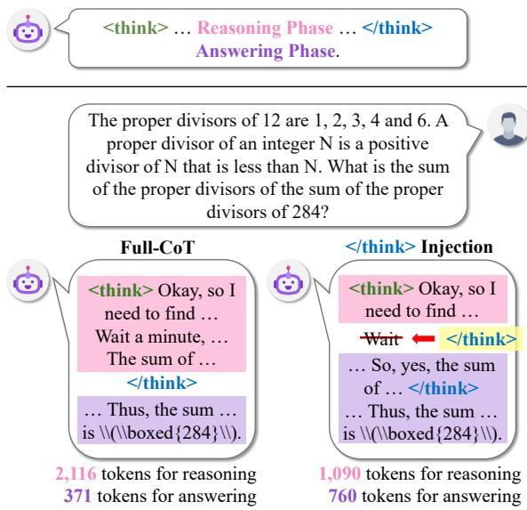  
Figure 1: Top: CoT response format. <think> opens the reasoning phase, </think> closes it, and the answering phase follows. Bottom: Illustration of Full-CoT and </think> injection. Injection can lengthen the answering phase and lead to another </think>.

Association of America, 2024; Project Numina, 2024; Hendrycks et al., 2021; Cobbe et al., 2021) and scientific (Rein et al., 2024) reasoning tasks, it often produces excessively long traces that increase inference costs without sufficient performance gains (Chen et al., 2025; Sui et al., 2025; Wang et al., 2025b; Wu et al., 2026; Pu et al., 2025).

Training-free early-exit approaches shorten the reasoning trace by stopping reasoning early (Yang et al., 2026; Fu et al., 2026; Mao et al., 2026; Wang et al., 2026; Xiang et al., 2026). We study a strategy that injects the end-of-think token (EoT, </think>) at an intermediate point in the CoT to induce a reasoning-to-answering transition (Yang et al., 2026; Zhang et al., 2025c; Xiang et al., 2026). The EoT normally marks the end of the CoT in the explicit think-block format.

However, we observe that EoT injection can lengthen the answering phase, with another EoT appearing later in generation, as illustrated in Figure 1. We characterize this phenomenon by studying the conditions that make EoT regeneration more likely and the behavior preceding the regenerated EoT.

We find that EoT regeneration becomes more frequent as early exit removes more of the reasoning trace. Answering phases are extended mainly by the generation before the regenerated EoT, where the model often continues reasoning-like behavior, including self-correction markers such as Wait. We refer to this reasoning-like continuation as spurious CoT termination.

The spurious CoT termination suggests that the injected EoT may not be sufficiently incorporated in subsequent generation. We hypothesize that subsequent tokens assign it insufficient attention, weakening its function as an internal transition signal. We probe this hypothesis with Exit-token Attention Biasing (EAB), which modulates attention to the injected EoT during answer generation.

Across four reasoning models, five benchmarks, and two CoT early-exit methods, we demonstrate that EoT injection can induce spurious CoT termination, where reasoning-like generation continues until another EoT appears. Increasing attention to the injected EoT via EAB reduces this behavior, supporting insufficient attention as one underlying mechanism. These findings show that externally matching the explicit think-block format does not guarantee the intended reasoning-to-answering transition, as inserted delimiters may fail to engage the model’s internal transition mechanism.

## 2 Related Works

## 2.1 Efficient Chain-of-Thought Reasoning

To reduce the cost of extended chain-of-thought reasoning (Wei et al., 2022), prior works take several broad approaches, including post-training methods that internalize efficient reasoning behaviors (Ma et al., 2025; Munkhbat et al., 2025; Xia et al., 2025; Yu et al., 2024; Aggarwal and Welleck, 2025; Fang et al., 2025; Zhang et al., 2026) and prompt-based methods that elicit shorter CoT traces through instructions (Xu et al., 2025; Han et al., 2025; Aytes et al., 2025; Lee et al., 2025; Chen et al., 2024).

Among these strategies, decoding-time approaches reduce reasoning cost by acting on generated outputs or intermediate reasoning traces without modifying the underlying model. Recent work suppresses self-reflection tokens to prevent redundant CoT continuation (Wang et al., 2025a; Huang et al., 2026a), or terminates a CoT trajectory early based on answer confidence or model-internal uncertainty (Fu et al., 2026; Mao et al., 2026; Wang et al., 2026; Fu et al., 2025; Zhang et al., 2025a). DynaSoR (Fu et al., 2026) periodically probes the model for intermediate answers during reasoning and stops once these answers become consistent. DEER (Yang et al., 2026) generates trial answers at reasoning transition points and exits when the answer confidence exceeds a threshold.

Some of these early-exit methods leverage EoT to force the reasoning-to-answering transition (Yang et al., 2026; Zhang et al., 2025c; Xiang et al., 2026; Liu and Wang, 2025). In addition, recent studies have noted that LRMs may resume reasoning even after the thinking phase is externally terminated (Zhu et al., 2025; Zhang et al., 2025d). However, both consider prompt-level pre-filling that skips the reasoning phase entirely, whereas we study EoT injection mid-reasoning under dynamic early exit.

Beyond this difference in experimental setting, we provide a finer-grained behavioral characterization of EoT regeneration and a causal mechanistic analysis via attention intervention, and validate these findings across a broader range of model families and reasoning benchmarks.

## 2.2 Attention-Based Analysis and Intervention

Prior mechanistic studies of reasoning models show that CoT traces leave measurable internal signatures, including reasoning-relevant attention statistics and influential reasoning steps (Zhang et al., 2025b; Ostmeier et al., 2026; Park et al., 2025; Bogdan et al., 2025; Dutta et al., 2024; Chen et al., 2026; Choi et al., 2025). Beyond analysis, attention also serves as a causal handle to control model behavior. For example, attention reweighting methods (Zhang et al., 2024; Nguyen et al., 2026; Han et al., 2026) intervene directly on attention scores at inference time, while other approaches steer internal activations to modify generation behavior (Li et al., 2023; Huang et al., 2026b).

Building on this view of attention as an inference-time control signal, we examine whether the injected EoT is actually used by the model to induce a reasoning-to-answering transition. As a diagnostic probe, we bias attention to the injected EoT during answer generation and observe how post-exit behavior changes.

## 3 Preliminary

## 3.1 Reasoning Phase Conventions

As illustrated in Figure 1, modern large reasoning models (LRMs) often use an explicit two-phase generation format, following the DeepSeek-R1 template (DeepSeek-AI, 2025): a reasoning phase delimited by the special tokens <think> (start-ofthink, SoT) and </think> (end-of-think, EoT), followed by an answering phase comprising all subsequent tokens. This convention is used by the DeepSeek-R1-Distill and Qwen3 (Yang et al., 2025) reasoning models.

Within the reasoning phase, these models often exhibit surface markers of ongoing reasoning. In particular, Wait is commonly used as a selfreflection marker, indicating that the model is revisiting prior reasoning (DeepSeek-AI, 2025), and has also been used in efficient-reasoning works as a signal of continued reflection (Wang et al., 2025a; Yang et al., 2026; Zhang et al., 2025c).

For evaluation, we follow the official prompting guidance for the reasoning models, which recommends asking the model to place mathematical final answers in \boxed{...} (DeepSeek-AI, 2025; Team, 2025; Yang et al., 2025). We extract the last \boxed{...} as the model’s final answer.

## 3.2 Experimental Setup

We study four LRMs spanning an order of magnitude in scale, namely DeepSeek-R1-Distill-Qwen 1.5B and 14B (DeepSeek-AI, 2025), abbreviated as R1-Distill-1.5B and R1-Distill-14B, Qwen3- 14B (Yang et al., 2025), and QwQ-32B (Team, 2025).

We evaluate on five widely used reasoning benchmarks. These are GSM8K (Cobbe et al., 2021), MATH-500 (MATH) (Hendrycks et al., 2021), AMC 2023 (AMC) (Project Numina, 2024), AIME 2024 (AIME) (Mathematical Association of America, 2024), and GPQA-Diamond (GPQA) (Rein et al., 2024). The first four are math reasoning tasks of increasing difficulty, while GPQA-Diamond targets graduate-level scientific reasoning.

We compare two early-exit methods, DEER (Yang et al., 2026) and DynaSoR (Fu et al., 2026), with two references, No-CoT and Full-CoT. DEER exits when an intermediate probe at a Wait token is sufficiently confident, while DynaSoR probes at fixed intervals and exits when predictions become consistent. When either method selects an exit point, we inject EoT there. No-CoT skips reasoning entirely, while Full-CoT runs without early exit. All settings otherwise share the same prompt and generation protocol, differing only in whether and when EoT is injected. Detailed configurations are provided in Section A.5.

<table><tr><td>Model</td><td>Method</td><td>MATH</td><td>AMC</td><td>AIME GSM8K</td><td></td><td>GPQA</td><td>AVG</td></tr><tr><td rowspan="2">R1-Distill-1.5B</td><td>DEER</td><td>1.0</td><td>2.5</td><td>6.7</td><td>0.0</td><td>1.0</td><td>2.2</td></tr><tr><td>DynaSoR</td><td>1.0</td><td>5.0</td><td>6.7</td><td>0.0</td><td>0.0</td><td>2.5</td></tr><tr><td rowspan="2">Qwen3-14B</td><td>DEER</td><td>2.4</td><td>0.0</td><td>0.0</td><td>0.8</td><td>3.5</td><td>1.3</td></tr><tr><td>DynaSoR</td><td>4.6</td><td>2.5</td><td>3.3</td><td>0.8</td><td>3.0</td><td>2.8</td></tr><tr><td rowspan="2">R1-Distill-14B</td><td>DEER</td><td>19.8</td><td>22.5</td><td>26.7</td><td>3.3</td><td>9.1</td><td>16.3</td></tr><tr><td>DynaSoR</td><td>35.8</td><td>40.0</td><td>40.0</td><td>8.0</td><td>18.2</td><td>28.4</td></tr><tr><td rowspan="2">QwQ-32B</td><td>DEER</td><td>40.4</td><td>57.5</td><td>50.0</td><td>9.6</td><td>12.1</td><td>33.9</td></tr><tr><td>DynaSoR</td><td>19.4</td><td>40.0</td><td>43.3</td><td>1.0</td><td>10.1</td><td>22.8</td></tr></table>

Table 1: ERR (%) across models, early-exit methods, and datasets. AVG is the row average across the five benchmarks.

## 4 Characterization of EoT Regeneration

Throughout the paper, we distinguish the EoT token that marks the transition point from any EoT later generated in the answering phase. We call the former the exit token, whether naturally generated or externally injected for early exit, and the latter the regenerated EoT.

## 4.1 Prevalence of EoT Regeneration with Answer Length Inflation

We first define the EoT regeneration rate (ERR) as

$$
{ \mathrm { E R R } } = { \frac { N _ { \mathrm { r e g e n } } } { N } } \times 1 0 0 \% ,\tag{1}
$$

where $N _ { \mathrm { r e g e n } }$ is the number of EoT regenerated samples in the answering phase and N is the total number of samples. Table 1 shows ERR above 20% for QwQ-32B, consistent with prior observations (Yang et al., 2026; Wang et al., 2025a). R1- Distill-14B also exceeds 15%, whereas R1-Distill-1.5B and Qwen3-14B remain below 3%. The difference between the two R1-Distill models suggests a scale effect, but the gap between the two 14B models indicates that scale alone is insufficient and training method may also matter.

Next, we examine whether EoT regeneration relates to answer-length inflation. Table 2 reports the relative answering-phase length, defined as the median answering-phase token count of samples with EoT regeneration divided by that of samples without EoT regeneration. EoT-regenerated samples consistently have longer answering phases, with the ratio typically exceeding two times. The effect is particularly pronounced for QwQ-32B with DynaSoR, where the ratio exceeds ten times across all datasets. These results show that EoT regeneration is associated with longer answering phases, though the magnitude varies by model.

<table><tr><td>Model</td><td>Method</td><td>MATH AMC AIME GSM8K GPQA</td><td></td><td></td><td></td><td></td></tr><tr><td>R1-Distill-1.5B</td><td>DEER DynaSoR</td><td>2.39 2.99</td><td>2.29 1.93</td><td>2.23 5.02</td><td>一 一</td><td>2.34 一</td></tr><tr><td>Qwen3-14B</td><td>DEER DynaSoR</td><td>3.23 5.47</td><td>3.04</td><td>5.72</td><td>3.88 3.37</td><td>5.18 5.01</td></tr><tr><td>R1-Distill-14B</td><td>DEER DynaSoR</td><td>5.32 3.32</td><td>5.34 3.93</td><td>11.80 3.97</td><td>3.82 2.19</td><td>7.01 11.58</td></tr><tr><td>QwQ-32B</td><td>DEER DynaSoR</td><td>8.82 11.91 15.90</td><td>6.14</td><td>5.95 11.34</td><td>6.68 14.64</td><td>22.04 13.70</td></tr></table>

Table 2: Relative answering-phase length, computed by dividing the median answering-phase token count among samples with EoT regeneration by that among samples without EoT regeneration. “–” indicates no EoT-regenerated samples. Absolute median token counts for both groups are provided in Section D.1.

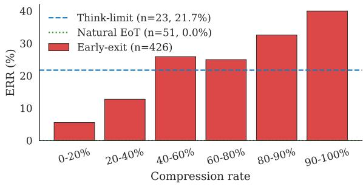  
Figure 2: ERR by exit case and reasoning compression rate for R1-Distill-14B with DEER on MATH. For earlyexit cases, bars show ERR within each compression-rate bin. Natural-EoT and think-limit cases are shown as horizontal reference lines.

## 4.2 Forced Termination as a Trigger of EoT Regeneration

We next test whether EoT regeneration depends on how EoT is introduced. We group samples into three exit cases. In natural EoT cases, the model generates EoT on its own. In early-exit cases, an early-exit algorithm injects EoT at a selected intermediate point. In think-limit cases, EoT is injected when the thinking budget is reached.

For early-exit cases, we define the compression rate as the fraction by which early exit reduces the reasoning-phase length relative to its uninterrupted reasoning length. In Figure 2, we compare ERR across the three exit cases. For early-exit samples, we further group them by compression rate bin. Natural EoT cases show no ERR, whereas ERR appears only when EoT is externally injected, as in early-exit and think-limit cases. Within earlyexit samples, ERR remains low in the 0–20% bin but rises to about 40% in the 90–100% bin. This suggests that EoT regeneration is associated with external EoT injection and becomes more frequent with greater reasoning truncation.

<table><tr><td colspan="2"></td><td colspan="3">#Token</td><td colspan="2">#Wait</td></tr><tr><td>Method</td><td>Dataset</td><td>#Pre</td><td>#Post</td><td>Rel.</td><td>Pre</td><td>Post</td></tr><tr><td rowspan="3">DEER</td><td>MATH AMC</td><td>836</td><td>405</td><td>2.06 1.02</td><td>3</td><td>0</td></tr><tr><td>AIME</td><td>574 4,674</td><td>565 463</td><td>10.10</td><td>2 22</td><td>0 0</td></tr><tr><td>GSM8K GPQA</td><td>396 568</td><td>208</td><td>1.90</td><td>2</td><td>0</td></tr><tr><td rowspan="5">DynaSoR</td><td>MATH</td><td>534</td><td>393 371</td><td>1.45 1.44</td><td>2 1</td><td>0 0</td></tr><tr><td>AMC</td><td>1,540</td><td>494</td><td>3.12</td><td>6</td><td>0</td></tr><tr><td>AIME</td><td>2,148</td><td>628</td><td>3.42</td><td>6</td><td>0</td></tr><tr><td>GSM8K</td><td>216</td><td>224</td><td>0.96</td><td>0</td><td>0</td></tr><tr><td>GPQA</td><td>1280</td><td>416</td><td>3.08</td><td>8</td><td>0</td></tr></table>

Table 3: Pre/Post-regen analysis on samples with spurious CoT termination for R1-Distill-14B, reported as medians. Rel. = #Pre/#Post. #Wait counts Wait tokens per segment.

Takeaway 1. EoT regeneration appears under EoT injection and often leads to long answering-phase continuations, undermining early-exit efficiency.

## 5 Reasoning-Like Continuation after Exit-Token Injection

We next examine behavioral patterns in EoTregenerated answering phases. We split each answer phase at the last regenerated EoT. We define pre-regen as the span from the injected EoT to the last regenerated EoT and post-regen as the remaining span to the end of the sequence. Their token counts are denoted by #Pre and #Post, respectively.

## 5.1 Answering-Phase Inflation Concentrated Before EoT Regeneration

We first identify which part of the answering phase, before or after the regenerated EoT, is responsible for the length inflation. The #Token columns in Table 3 show that, across most settings, the median #Pre is greater than the median #Post, with relative length greater than one. The gap is especially large on harder benchmarks, such as DEER on AIME, where the median pre-regen span is roughly ten times as long as the median post-regen span.

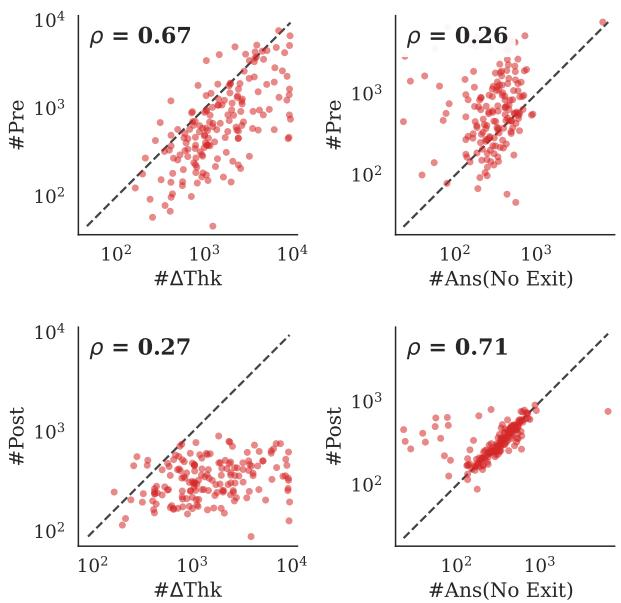  
Figure 3: Early-exit answer spans versus uninterrupted generation for 168 EoT-regenerated early-exit samples from R1-Distill-14B with DEER across five benchmarks. Of the 178 total EoT-regenerated samples, 10 think-limit samples are excluded.

Figure 3 plots #Pre and #Post against the number of reasoning tokens saved by early exit, #∆Thk, and the answering-phase token count without early exit, #Ans(No Exit). Each panel reports the Pearson correlation coefficient computed over 168 EoTregenerated samples obtained using DEER on R1- Distill-14B across five benchmarks.

It shows a clear correspondence between earlyexit spans and their uninterrupted counterparts. The strongest correlations are between pre-regen length and saved reasoning tokens $( \rho = 0 . 6 7 )$ , and between post-regen length and uninterrupted answering phase length $( \rho = 0 . 7 1 )$ . This suggests that the prolonged pre-regen span primarily reflects reasoning that would have continued without early exit, whereas the post-regen span more closely matches uninterrupted answering-phase generation.

## 5.2 Reasoning-Like Patterns Before the Regenerated EoT

Motivated by the frequent occurrence of Wait during the reasoning phase in Section 3.1, we examine its distribution across pre-regen and post-regen to test whether pre-regen exhibits reasoning-like behavior. Table 3 shows that Wait appears almost entirely in pre-regen, while post-regen has a median count of 0 in every setting. The pre-regen Wait count also increases with the pre/post length ratio (Rel.). These patterns suggest that the preregen span behaves more like continued reasoning than a verbose answer continuation.

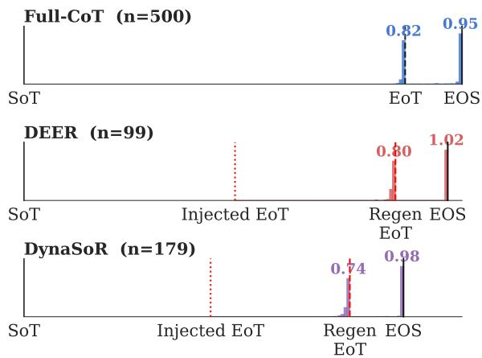  
Figure 4: Boxed-expression density in samples with spurious CoT termination on MATH with R1-Distill-Qwen-14B, plotted by relative position within the answering phase completion. Quantitative results across models and datasets are reported in Table 15.

We also examine the requested final-answer format, \boxed{...}. In Figure 4, we plot the distribution of boxed expressions for Full-CoT samples and EoT-regenerated samples from early-exit methods on MATH using R1-Distill-14B. For visualization, we normalize each analyzed span by its average length in the dataset and plot the relative position of each boxed expression within that span.

In Full-CoT, the model often generates boxed expressions immediately before EoT and <EOS>. DEER and DynaSoR select exit points based on confidence or consistency rather than whether a boxed expression appears. As a result, boxed expressions rarely precede the injected EoT, whereas they frequently precede the regenerated EoT.

Taken together, the quantitative and behavioral evidence suggests that EoT regeneration reflects reasoning-like continuation rather than a mere formatting artifact. We refer to this phenomenon as spurious CoT termination.

Takeaway 2. We call EoT regeneration spurious CoT termination, where reasoninglike generation continues into the answering phase rather than terminating at the injected EoT.

## 6 Causal Probing of Exit-Token Attention

To investigate a potential mechanism underlying spurious CoT termination, we use Exit-token Attention Biasing (EAB) as an inference-time diagnostic probe that modulates attention to the exit token during answer generation. In this section, we examine the causal role and token specificity of attention to the injected EoT. We evaluate EAB’s selectivity for samples with spurious CoT termination and its generality across models and early-exit methods. We then compare EAB with simple control baselines.

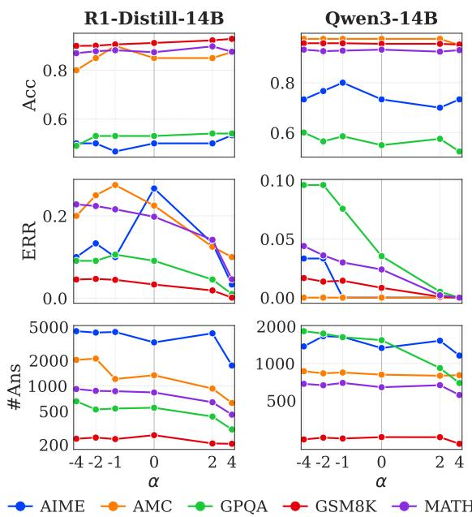  
Figure 5: EAB sweep (α) with DEER on R1-Distill-Qwen-14B (left) and Qwen3-14B (right). Rows show accuracy, ERR, and answering-phase length (#Ans) vs. $\alpha . \alpha = 0$ is the base method.

## 6.1 Exit-Token Attention Biasing

Let $x \ = \ ( x _ { 1 } , \ldots , x _ { T } )$ denote the full token sequence consisting of the prompt and completion, with the exit token at position I. Tokens at positions $i > I$ form the answering phase. We denote by $s _ { i , j } ^ { ( l , h ) }$ the pre-softmax attention score from query position i to key position j at layer l and head h, and by $A _ { i , j } ^ { ( l , h ) } = \mathrm { { s o f t m a x } } _ { j } \bar { ( s _ { i , : } ^ { ( l , h ) } ) }$ the corresponding post-softmax attention weight. Under causal masking, $A _ { i , j } ^ { ( l , h ) }$ is defined only for $j \leq i .$

As a diagnostic probe, Exit-token Attention Biasing (EAB) adds a constant $\alpha \in \mathbb { R }$ to the presoftmax attention logit of the injected EoT key for each answer-phase query:

$$
\tilde { s } _ { i , I } ^ { ( l , h ) } = s _ { i , I } ^ { ( l , h ) } + \alpha \quad \mathrm { f o r ~ a l l } ~ i > I , l , h .\tag{2}
$$

For $j \neq I ,$ the logits $s _ { i , j } ^ { ( l , h ) }$ remain unchanged, and the modified attention weights are computed by softmax, $\tilde { A } _ { i , j } ^ { ( l , h ) } = \mathrm { s o f t m a x } \bar { j } ( \tilde { s } i , : ^ { ( l , h ) } )$

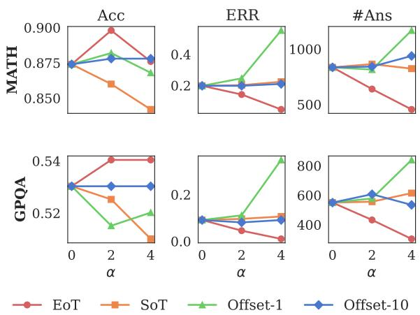  
Figure 6: Exit-token specificity of EAB under DEER on R1-Distill-14B for MATH and GPQA. We apply EAB to the exit token (EoT), SoT, Offset-1, and Offset-10.

Since EAB is applied only for $i > I ,$ it affects only answering-phase generation, leaving the preceding tokens unchanged. Positive α strengthens attention to EoT, whereas negative α suppresses it.

## 6.2 Reduction of Spurious CoT Termination by Increasing Exit-Token Attention

To investigate whether spurious CoT termination is associated with under- or over-attention to the injected EoT, we sweep α over moderate negative and positive values using DEER on R1-Distill-14B and Qwen3-14B, as shown in Figure 5.

Positive α reduces ERR and answering-phase length while largely preserving accuracy, whereas negative α often increases ERR or answering-phase inflation. This pattern supports a causal role for exit-token attention. Increasing it promotes the reasoning-to-answering transition, whereas suppressing it does not.

## 6.3 Exit-Token Specificity of Attention Biasing

To identify whether the effect of EAB is specific to the exit token, we vary where the attention bias is applied. On R1-Distill-14B with DEER, we compare four targets on MATH and GPQA, including the exit token, the <think> (start-of-think, SoT) token, the token immediately before the exit token (Offset-1), and the token 10 positions before the exit token (Offset-10). This comparison assesses whether biasing other positions also reduces spurious CoT termination and answering-phase length.

Figure 6 shows that the effect is specific to the exit token. Consistent with the prior observation, biasing attention to the exit token reduces both spurious CoT termination and answering-phase length as α increases, while preserving accuracy. Interestingly, the Offset-1 token exhibits the opposite trend. It is notable that biasing the Offset-1 token, which is adjacent to the exit token and typically serves as a formatting token, increases spurious CoT termination and answering-phase length. Biasing SoT or Offset-10 does not result in a clear decrease in either spurious CoT termination or answering-phase length.

<table><tr><td></td><td colspan="3">Acc (%, ↑)</td><td colspan="2">ERR (%, ↓)</td><td colspan="2">#Ans (↓)</td></tr><tr><td>Dataset</td><td>N DEER</td><td>+EAB</td><td></td><td>DEER +EAB</td><td></td><td>DEER</td><td>+EAB</td></tr><tr><td colspan="8">Samples with spurious CoT termination</td></tr><tr><td>AIME</td><td>8</td><td>50.0</td><td>50.0</td><td>100.0</td><td>12.5</td><td>5,668</td><td>1,353</td></tr><tr><td>AMC</td><td>9</td><td>100.0</td><td>100.0</td><td>100.0</td><td>22.2</td><td>1,485</td><td>1,288</td></tr><tr><td>GPQA</td><td>18</td><td>77.8</td><td>72.2</td><td>100.0</td><td>11.1</td><td>1,489</td><td>783</td></tr><tr><td>GSM8K</td><td>44</td><td>84.1</td><td>68.2</td><td>100.0</td><td>4.5</td><td>1,042</td><td>442</td></tr><tr><td>MATH</td><td>99</td><td>91.9</td><td>79.8</td><td>100.0</td><td>19.2</td><td>1,678</td><td>777</td></tr><tr><td colspan="8">Samples without spurious CoT termination</td></tr><tr><td>AIME</td><td>22</td><td>50.0</td><td>54.5</td><td>0.0</td><td>0.0</td><td>2,408</td><td>1,885</td></tr><tr><td>AMC</td><td>31</td><td>80.6</td><td>83.9</td><td>0.0</td><td>6.5</td><td>1,293</td><td>435</td></tr><tr><td>GPQA</td><td>180</td><td>50.6</td><td>52.2</td><td>0.0</td><td>0.0</td><td>456</td><td>256</td></tr><tr><td>GSM8K</td><td>1,275</td><td>91.5</td><td>93.7</td><td>0.0</td><td>0.0</td><td>233</td><td>197</td></tr><tr><td>MATH</td><td>401</td><td>86.3</td><td>89.5</td><td>0.0</td><td>1.0</td><td>627</td><td>376</td></tr></table>

Table 4: Grouped comparison of EAB effects with DEER on R1-Distill-14B at α = 4, grouping samples by whether their reasoning phase spuriously terminates at $\alpha = 0$ . Results for the other models are in Table 16.

These results suggest that the reduction in spurious CoT termination is specific to increasing attention to the injected EoT, rather than to arbitrary preceding tokens.

## 6.4 Selectivity of EAB for Samples with Spurious CoT Termination

To test whether EAB primarily affects samples with spurious CoT termination, we group samples by whether their reasoning phase spuriously terminates without bias and apply EAB to the same samples on R1-Distill-14B with DEER. We report results by group in Table 4.

For samples without spurious CoT termination, EAB keeps ERR near 0%, maintains or improves accuracy, and slightly reduces answer length. For samples with spurious CoT termination, EAB reduces ERR below 25% on all datasets and substantially shortens the answering phase. EAB can reduce accuracy for these samples, as discussed further in Section 6.6.

Overall, EAB selectively intervenes on samples with spurious CoT termination. This suggests that increasing attention to the injected EoT primarily helps when the token fails to serve as an effective transition signal, with little effect when the model already transitions successfully without the bias.

<table><tr><td>Method</td><td>Acc (%, ↑) ERR (%, ↓)</td><td>#Thk (↓)</td><td>#Ans (↓)</td></tr><tr><td colspan="4">R1-Distill-1.5B</td></tr><tr><td>No-CoT</td><td>33.1</td><td></td><td>2,138</td></tr><tr><td>Full-CoT</td><td>51.7</td><td>5,635</td><td>769</td></tr><tr><td>DEER</td><td>42.5</td><td>4,157</td><td>1,059</td></tr><tr><td>+EAB</td><td>48.0</td><td>4,157</td><td>557</td></tr><tr><td>DynaSoR</td><td>43.2</td><td>2,947</td><td>1,127</td></tr><tr><td>+EAB</td><td>49.1</td><td>2,947</td><td>386</td></tr><tr><td colspan="4">R1-Distill-14B</td></tr><tr><td>No-CoT</td><td>57.7</td><td></td><td>1,004</td></tr><tr><td>Full-CoT</td><td>76.9</td><td>4,156</td><td>547</td></tr><tr><td>DEER</td><td>73.3</td><td>0.0 3,262</td><td>1,252</td></tr><tr><td>+EAB</td><td>75.1</td><td>16.3 3.8 3,262</td><td>667</td></tr><tr><td>DynaSoR</td><td>74.0</td><td>28.4 2,284 13.0</td><td>1,761</td></tr><tr><td>+EAB</td><td>70.0</td><td>2,284</td><td>1,065</td></tr><tr><td colspan="4">Qwen3-14B</td></tr><tr><td>No-CoT</td><td>67.2</td><td>0.0</td><td>2,903</td></tr><tr><td>Full-CoT</td><td>83.5</td><td>0.0 5,510</td><td>822</td></tr><tr><td>DEER</td><td>82.9</td><td>1.4 3,743</td><td>917</td></tr><tr><td>+EAB</td><td>82.6</td><td>0.2 3,743</td><td>832</td></tr><tr><td>DynaSoR</td><td>73.3</td><td>2.9 2,004</td><td>1,786</td></tr><tr><td>+EAB</td><td>74.5</td><td>1.5 2,004</td><td>1,297</td></tr><tr><td colspan="4">QwQ-32B</td></tr><tr><td>No-CoT</td><td>79.7</td><td>60.3</td><td>4,794</td></tr><tr><td>Full-CoT</td><td>83.1</td><td>0.0 4,868</td><td>636</td></tr><tr><td>DEER</td><td>83.2</td><td>33.9 2,707</td><td>2,282</td></tr><tr><td>+EAB</td><td>81.1</td><td>28.0 2,707</td><td>2,213</td></tr><tr><td>DynaSoR</td><td>84.2</td><td>22.8</td><td>2,092 2,055</td></tr><tr><td>+EAB</td><td>80.3</td><td>14.8 2,092</td><td>1,615</td></tr></table>

Table 5: Effect of EAB averaged across MATH, AMC, AIME, GSM8K, and GPQA benchmarks. We report accuracy (Acc, %), ERR, reasoning-phase token count (#Thk), and answering-phase token count (#Ans).

## 6.5 Generality of the Exit-Token Attention Biasing

We next test whether EAB generalizes across models, benchmarks, and early-exit methods.

In Table 5, we evaluate positive attention bias with DEER and DynaSoR, measuring accuracy, ERR, reasoning-phase length (#Thk), and answering-phase length (#Ans). We use α = 2 by default and α = 4 for R1-Distill-14B. For each method, we regenerate the answering phase with and without EAB from the same reasoning trace, isolating the effect of modifying attention to the exit token during answer generation.

Regarding the reference methods, Full-CoT exhibits no spurious CoT termination, producing long reasoning phases followed by short answering phases. No-CoT, in contrast, skips the reasoning phase entirely, with all models producing substantially longer answering phases.

Across models and benchmarks, EAB generally reduces ERR and shortens the answering phase with varying magnitude. The reduction is especially visible under DynaSoR, whose base method has shorter reasoning phases (#Thk), higher ERR, and longer answering phases.

The effect is most pronounced for R1-Distill-14B, where EAB reduces ERR by more than 13 percentage points (pp) and, under DEER, improves accuracy while nearly halving the answering-phase length. For R1-Distill-1.5B, EAB roughly halves the answering-phase length under both methods and improves accuracy, despite already low ERR.

For QwQ-32B, EAB yields smaller ERR reductions and sometimes decreases accuracy. Its No-CoT ERR exceeds 60%, whereas those of all other models remain near zero, suggesting that EoT regeneration in QwQ-32B is driven more by a learned generation pattern than by insufficient attention to the injected EoT. This indicates that some EoT regeneration arises from learned generation patterns that attention intervention does not address.

## 6.6 Accuracy Trade-off of EAB

Building on our earlier analysis, we further discuss the accuracy trade-off of EAB. As shown in Table 4, samples with spurious CoT termination exhibit nontrivial accuracy drops in some settings, with the magnitude varying across models, datasets, and early-exit policies.

Our analysis indicates that this accuracy drop mainly arises from early exit points, where early exit removes part of the reasoning that would contribute to the final answer. Figure 2 shows that ERR is higher when early exit removes more of the reasoning phase, while Section 5.1 shows that the pre-regen span correlates with the amount of reasoning removed by early exit. This suggests that the reasoning-like continuation associated with spurious CoT termination partly compensates for the removed reasoning. EAB suppresses this continuation by strengthening attention to the injected EoT, promoting the intended reasoning-to-answering transition. Its remaining accuracy drop therefore largely reflects the quality of the selected exit point.

This interpretation also explains the variation in Table 5. The accuracy drop of EAB is larger when early exit removes more of the reasoning phase, and the amount of truncation varies across datasets and exit policies. Since DynaSoR removes more of the reasoning phase than DEER on average, its larger accuracy drops are consistent with this

<table><tr><td colspan="3">Method Acc (%, ↑) ERR (%, ↓) #Ans (↓)</td></tr><tr><td>Baseline (α=0)</td><td>73.3 16.3</td><td>1,252</td></tr><tr><td>EAB (α=4)</td><td>75.1 3.8</td><td>667</td></tr><tr><td>Double-EoT</td><td>73.3 4.4</td><td>761</td></tr><tr><td>Ans-Prefix</td><td>74.6 0.1</td><td>444</td></tr><tr><td>Post-Box</td><td>74.2 1.6</td><td>136</td></tr><tr><td>Post-Ans-Box</td><td>73.6 5.6</td><td>118</td></tr><tr><td>EAB (α=-4)</td><td>71.2 13.3</td><td>1,658</td></tr><tr><td>Block-EoT</td><td>69.4 0.0</td><td>2,189</td></tr></table>

Table 6: Simple control baselines and decoding alternatives to EAB on R1-Distill-14B with DEER, averaged across MATH, AMC, AIME, GSM8K, and GPQA.

interpretation.

## 6.7 Control Baselines for Exit-Token Injection

EAB shows that spurious CoT termination can be reduced by increasing attention to the injected exit token. We further examine output- and promptlevel interventions that leave attention computation unchanged. Using the same DEER traces, we evaluate Double-EoT, which inserts a second EoT after the injected EoT, and Block-EoT, which sets the </think> logit to −∞ during the answering phase. Double-EoT tests whether providing an additional EoT key has a similar effect to increased attention to the exit token, whereas Block-EoT tests whether simply preventing EoT regeneration is sufficient.

We also evaluate three prompt-level transition cues. Ans-Prefix prepends an explicit transition phrase before the injected EoT, while Post-Box and Post-Ans-Box insert boxed-answer templates immediately after it. Further details are provided in Section D.9.

Double-EoT reduces ERR and shortens the answering phase, closely matching the effect of positive EAB. This suggests that an additional EoT strengthens the transition cue. Block-EoT reduces ERR to 0% by design but increases answer length and decreases accuracy, with effects more severe than suppressing attention via negative EAB. Preventing EoT regeneration therefore eliminates the regenerated EoT itself without inducing a clean reasoning-to-answering transition.

Prompt-level controls also reduce EoT regeneration while maintaining accuracy comparable to EAB. Ans-Prefix effectively suppresses regeneration, whereas Post-Box and Post-Ans-Box produce shorter answers but depend on a task-specific boxed-answer format.

These controls support the view that spurious CoT termination reflects an incomplete reasoningto-answering transition rather than EoT regeneration itself. Output- and prompt-level interventions can mitigate the behavior indirectly by modifying the token sequence or constraining generation. EAB is complementary, as a diagnostic probe that intervenes directly on attention to the injected EoT.

Takeaway 3. EAB establishes a causal effect at the attention level on answering-phase behavior. Increasing attention to the injected EoT reduces spurious CoT termination and answering-phase length, supporting its role in the reasoning-to-answering transition.

## 7 Conclusion

We investigated end-of-think token (</think>, EoT) regeneration under CoT early-exit methods from three perspectives. We studied the phenomenon itself, the behavior that surrounds it, and the mechanism that contributes to it.

At the phenomenon level, we found that forced EoT termination often leads the model to generate another EoT later in the answering phase. Across models, benchmarks, and CoT early-exit methods, we observe regeneration with varying prevalence.

At the behavior level, we showed that EoT regeneration is associated with long answering-phase continuations that remain reasoning-like before EoT regeneration, including self-correction markers and boxed-before-EoT patterns. We define this reasoning-like continuation after the exit token as spurious CoT termination.

At the mechanism level, we used exit-token attention biasing (EAB) to investigate whether insufficient attention to the exit token contributes to spurious CoT termination. Increasing attention to the exit token reduces EoT regeneration and shortens the answering phase, especially for samples with spurious CoT termination. The token-specific and sample-selective effects of EAB support its causal contribution to whether the transition succeeds.

Overall, our results suggest that the injected EoT does not always serve as a reasoning-to-answering transition signal, highlighting a limitation of EoTinjection-based reasoning control. The EAB results indicate that insufficient attention during subsequent generation may limit the injected EoT’s effectiveness. More broadly, our findings suggest that inserting such a structural delimiter does not by itself control the transition. Its effectiveness as a state-transition signal depends on how subsequent generation attends to and incorporates it.

## Limitations

Our analysis characterizes spurious CoT termination and its relationship to exit-token attention, but it remains limited in three respects.

First, our interpretation of spurious CoT termination is based on indirect evidence. Because CoT behavior is complex and the relevant training data are not fully observable, we cannot directly verify the model’s internal state after the exit token. We therefore rely on behavioral and intervention-based evidence, including EoT regeneration, answer-length inflation, reasoning-like markers, boxed-before-EoT patterns, and attention-biasing effects.

Second, although EAB reduces spurious CoT termination and answering-phase length, extending it beyond a causal diagnostic into a competitive efficient-reasoning method requires addressing several challenges. These include adaptive criteria for when and how strongly to apply the bias and inference backends that preserve efficient generation while allowing the required attention modification.

Third, our analysis focuses on the injected EoT as an individual transition signal, although reasoning termination may also depend on surrounding context. The boxed-before-EoT patterns in Full-CoT generation and the effectiveness of Ans-Prefix suggest that recurring patterns around the EoT or expressions signaling reasoning completion may influence this transition. Addressing these limitations is an interesting direction for future work.

## Acknowledgements

This work was partly supported by the Institute of Information & Communications Technology Planning & Evaluation (IITP) grant funded by the Korea government (MSIT) (No.RS-2025-02283048, Developing the Next-Generation General AI with Reliability, Ethics, and Adaptability, 80%) and Basic Science Research Program through the National Research Foundation of Korea (NRF) funded by the Ministry of Education (No.RS-2025-25410835, Machine Unlearning in Continual Learning with Linearity-Based Reduction of Data Dependency for Trustworthy AI, 20%).

## References

Pranjal Aggarwal and Sean Welleck. 2025. L1: Controlling how long a reasoning model thinks with reinforcement learning. In Second Conference on Language Modeling.

Simon A Aytes, Jinheon Baek, and Sung Ju Hwang. 2025. Sketch-of-thought: Efficient llm reasoning with adaptive cognitive-inspired sketching. In Proceedings ofthe 2025 Conference on Empirical Methods in Natural Language Processing, pages 24307– 24331.

Paul C Bogdan, Uzay Macar, Neel Nanda, and Arthur Conmy. 2025. Thought anchors: Which llm reasoning steps matter? arXiv preprint arXiv:2506.19143.

Qiguang Chen, Libo Qin, Jiaqi Wang, Jinxuan Zhou, and Wanxiang Che. 2024. Unlocking the capabilities of thought: A reasoning boundary framework to quantify and optimize chain-of-thought. Advances in Neural Information Processing Systems, 37:54872– 54904.

Xi Chen, Aske Plaat, and Niki van Stein. 2026. How does chain of thought think? mechanistic interpretability of chain-of-thought reasoning with sparse autoencoding. In Proceedings of the AAAI Conference on Artificial Intelligence, pages 30297–30305.

Xingyu Chen, Jiahao Xu, Tian Liang, Zhiwei He, Jianhui Pang, Dian Yu, Linfeng Song, Qiuzhi Liu, Mengfei Zhou, Zhuosheng Zhang, Rui Wang, Zhaopeng Tu, Haitao Mi, and Dong Yu. 2025. Do NOT think that much for 2+3=? on the overthinking of long reasoning models. In Forty-second International Conference on Machine Learning.

Daewon Choi, Jimin Lee, Jihoon Tack, Woomin Song, Saket Dingliwal, Sai Muralidhar Jayanthi, Bhavana Ganesh, Jinwoo Shin, Aram Galstyan, and Sravan Babu Bodapati. 2025. Think clearly: Improving reasoning via redundant token pruning. In Findings ofthe Associationfor Computational Linguistics: EMNLP 2025, pages 21437–21451, Suzhou, China. Association for Computational Linguistics.

Karl Cobbe, Vineet Kosaraju, Mohammad Bavarian, Mark Chen, Heewoo Jun, Lukasz Kaiser, Matthias Plappert, Jerry Tworek, Jacob Hilton, Reiichiro Nakano, Christopher Hesse, and John Schulman. 2021. Training verifiers to solve math word problems. CoRR, abs/2110.14168.

Tri Dao. 2024. Flashattention-2: Faster attention with better parallelism and work partitioning. In The Twelfth International Conference on Learning Representations.

DeepSeek-AI. 2025. Deepseek-r1: Incentivizing reasoning capability in llms via reinforcement learning. Preprint, arXiv:2501.12948.

Subhabrata Dutta, Joykirat Singh, Soumen Chakrabarti, and Tanmoy Chakraborty. 2024. How to think stepby-step: A mechanistic understanding of chain-ofthought reasoning. Transactions on Machine Learning Research.

Gongfan Fang, Xinyin Ma, and Xinchao Wang. 2025. Thinkless: Llm learns when to think. Advances in neural information processing systems.

Yichao Fu, Junda Chen, Siqi Zhu, Zheyu Fu, Zhongdongming Dai, Yonghao Zhuang, Yian Ma, Aurick Qiao, Tajana Rosing, Ion Stoica, and Hao Zhang. 2026. Efficiently scaling LLM reasoning programs with certaindex. In The Thirty-ninth Annual Conference on Neural Information Processing Systems.

Yichao Fu, Xuewei Wang, Yuandong Tian, and Jiawei Zhao. 2025. Deep think with confidence. In NeurIPS 2025 Workshop on Efficient Reasoning.

Feijiang Han, Xiaodong Yu, Jianheng Tang, Delip Rao, Weihua Du, and Lyle Ungar. 2026. Zerotuning: Unlocking the initial token’s power to enhance large language models without training. In The Fourteenth International Conference on Learning Representations.

Tingxu Han, Zhenting Wang, Chunrong Fang, Shiyu Zhao, Shiqing Ma, and Zhenyu Chen. 2025. Tokenbudget-aware llm reasoning. In Findings of the Association for Computational Linguistics: ACL 2025, pages 24842–24855.

Dan Hendrycks, Collin Burns, Saurav Kadavath, Akul Arora, Steven Basart, Eric Tang, Dawn Song, and Jacob Steinhardt. 2021. Measuring mathematical problem solving with the math dataset. NeurIPS.

Jiameng Huang, Baijiong Lin, Guhao Feng, Jierun Chen, Di He, and Lu Hou. 2026a. Efficient reasoning for large reasoning language models via certainty-guided reflection suppression. In Proceedings of the AAAI Conference on Artificial Intelligence, pages 31176– 31184.

Yao Huang, Huanran Chen, Shouwei Ruan, Yichi Zhang, Xingxing Wei, and Yinpeng Dong. 2026b. Mitigating overthinking in large reasoning models via manifold steering. Advances in Neural Information Processing Systems, 38:102543–102568.

Woosuk Kwon, Zhuohan Li, Siyuan Zhuang, Ying Sheng, Lianmin Zheng, Cody Hao Yu, Joseph E. Gonzalez, Hao Zhang, and Ion Stoica. 2023. Efficient memory management for large language model serving with pagedattention. In Proceedings of the ACM SIGOPS 29th Symposium on Operating Systems Principles.

Ayeong Lee, Ethan Che, and Tianyi Peng. 2025. How well do llms compress their own chain-ofthought? a token complexity approach. arXiv preprint arXiv:2503.01141.

Benjamin Lefaudeux, Francisco Massa, Diana Liskovich, Wenhan Xiong, Vittorio Caggiano, Sean Naren, Min Xu, Jieru Hu, Marta Tintore, Susan Zhang, Patrick Labatut, Daniel Haziza, Luca Wehrstedt, Jeremy Reizenstein, and Grigory Sizov. 2022. xformers: A modular and hackable transformer modelling library. https: //github.com/facebookresearch/xformers.

Kenneth Li, Oam Patel, Fernanda Viégas, Hanspeter Pfister, and Martin Wattenberg. 2023. Inferencetime intervention: Eliciting truthful answers from a language model. Advances in Neural Information Processing Systems, 36:41451–41530.

Xin Liu and Lu Wang. 2025. Answer convergence as a signal for early stopping in reasoning. In Proceedings of the 2025 Conference on Empirical Methods in Natural Language Processing, pages 17907–17918.

Xinyin Ma, Guangnian Wan, Runpeng Yu, Gongfan Fang, and Xinchao Wang. 2025. Cot-valve: Lengthcompressible chain-of-thought tuning. In Proceedings ofthe 63rd Annual Meeting ofthe Association for Computational Linguistics (Volume 1: Long Papers), pages 6025–6035.

Minjia Mao, Bowen Yin, Yu Zhu, and Xiao Fang. 2026. Early stopping chain-of-thoughts in large language models.

Mathematical Association of America. 2024. American Invitational Mathematics Examination (AIME) 2024. https://artofproblemsolving.com/wiki/ index.php/AIME\_Problems\_and\_Solutions.

Tergel Munkhbat, Namgyu Ho, Seo Hyun Kim, Yongjin Yang, Yujin Kim, and Se-Young Yun. 2025. Selftraining elicits concise reasoning in large language models. In Findings ofthe Associationfor Computational Linguistics: ACL 2025, pages 25127–25152, Vienna, Austria. Association for Computational Linguistics.

Phuong Minh Nguyen, Dang Huu-Tien, and Naoya Inoue. 2026. Improving chain-of-thought for logical reasoning via attention-aware intervention. In Findings of the Association for Computational Linguistics: EACL 2026, pages 2917–2941, Rabat, Morocco. Association for Computational Linguistics.

OpenAI. 2024. Learning to reason with llms. https://openai.com/index/ learning-to-reason-with-llms/. Accessed: 2026-05-18.

Sophie Ostmeier, Brian Axelrod, Maya Varma, Asad Aali, Yabin Zhang, Magdalini Paschali, Sanmi Koyejo, Curtis Langlotz, and Akshay Chaudhari. 2026. Attention head entropy of llms predicts answer correctness. arXiv preprint arXiv:2602.13699.

Yein Park, Minbyul Jeong, and Jaewoo Kang. 2025. Thinking sparks!: Emergent attention heads in reasoning models during post training. arXiv preprint arXiv:2509.25758.

Project Numina. 2024. Aimo validation amc. https://huggingface.co/datasets/AI-MO/ aimo-validation-amc. Hugging Face dataset, accessed: 2026-04-26.

Xiao Pu, Michael Saxon, Wenyue Hua, and William Yang Wang. 2025. Thoughtterminator: Benchmarking, calibrating, and mitigating overthinking in reasoning models. In Second Conference on Language Modeling.

David Rein, Betty Li Hou, Asa Cooper Stickland, Jackson Petty, Richard Yuanzhe Pang, Julien Dirani, Julian Michael, and Samuel R. Bowman. 2024. GPQA: A graduate-level google-proof q&a benchmark. In First Conference on Language Modeling.

Yang Sui, Yu-Neng Chuang, Guanchu Wang, Jiamu Zhang, Tianyi Zhang, Jiayi Yuan, Hongyi Liu, Andrew Wen, Shaochen Zhong, Hanjie Chen, and Xia Hu. 2025. Stop overthinking: A survey on efficient reasoning for large language models. Preprint, arXiv:2503.16419.

Kimi Team, Angang Du, Bofei Gao, Bowei Xing, Changjiu Jiang, Cheng Chen, Cheng Li, Chenjun Xiao, Chenzhuang Du, Chonghua Liao, Chuning Tang, Congcong Wang, Dehao Zhang, Enming Yuan, Enzhe Lu, Fengxiang Tang, Flood Sung, Guangda Wei, Guokun Lai, and 77 others. 2025. Kimi k1.5: Scaling reinforcement learning with llms. Preprint, arXiv:2501.12599.

Qwen Team. 2025. Qwq-32b: Embracing the power of reinforcement learning.

Chenlong Wang, Yuanning Feng, Dongping Chen, Zhaoyang Chu, Ranjay Krishna, and Tianyi Zhou. 2025a. Wait, we don’t need to “wait”! removing thinking tokens improves reasoning efficiency. In Findings ofthe Associationfor Computational Linguistics: EMNLP 2025, pages 7459–7482, Suzhou, China. Association for Computational Linguistics.

Rui Wang, Hongru Wang, Boyang Xue, Jianhui Pang, Shudong Liu, Yi Chen, Jiahao Qiu, Derek Fai Wong, Heng Ji, and Kam-Fai Wong. 2025b. Harnessing the reasoning economy: A survey of efficient reasoning for large language models. Preprint, arXiv:2503.24377.

Xi Wang, James McInerney, Lequn Wang, and Nathan Kallus. 2026. EAT: Entropy after ⟨/think⟩ for reasoning model early exiting.

Jason Wei, Xuezhi Wang, Dale Schuurmans, Maarten Bosma, Fei Xia, Ed Chi, Quoc V Le, Denny Zhou, and 1 others. 2022. Chain-of-thought prompting elicits reasoning in large language models. Advances in neural information processing systems, 35:24824– 24837.

Yuyang Wu, Yifei Wang, Ziyu Ye, Tianqi Du, Stefanie Jegelka, and Yisen Wang. 2026. When more is less: Understanding chain-of-thought length in LLMs. In The Fourteenth International Conference on Learning Representations.

Heming Xia, Chak Tou Leong, Wenjie Wang, Yongqi Li, and Wenjie Li. 2025. TokenSkip: Controllable chainof-thought compression in LLMs. In Proceedings of the 2025 Conference on Empirical Methods in Natural Language Processing, pages 3351–3363, Suzhou, China. Association for Computational Linguistics.

Yang Xiang, Yixin Ji, Ruotao Xu, Dan Qiao, Zheming Yang, Juntao Li, and Min Zhang. 2026. When is thinking enough? early exit via sufficiency assessment for efficient reasoning. In Proceedings of the 64th Annual Meeting ofthe Associationfor Computational Linguistics (Volume 1: Long Papers), pages 23541–23556, San Diego, California, United States. Association for Computational Linguistics.

Silei Xu, Wenhao Xie, Lingxiao Zhao, and Pengcheng He. 2025. Chain of draft: Thinking faster by writing less. arXiv preprint arXiv:2502.18600.

An Yang, Anfeng Li, Baosong Yang, Beichen Zhang, Binyuan Hui, Bo Zheng, Bowen Yu, Chang Gao, Chengen Huang, Chenxu Lv, Chujie Zheng, Dayiheng Liu, Fan Zhou, Fei Huang, Feng Hu, Hao Ge, Haoran Wei, Huan Lin, Jialong Tang, and 41 others. 2025. Qwen3 technical report. Preprint, arXiv:2505.09388.

Chenxu Yang, Qingyi Si, Yongjie Duan, Zheliang Zhu, Chenyu Zhu, Qiaowei Li, Minghui Chen, Zheng Lin, and Weiping Wang. 2026. Dynamic early exit in reasoning models. In The Fourteenth International Conference on Learning Representations.

Ping Yu, Jing Xu, Jason Weston, and Ilia Kulikov. 2024. Distilling system 2 into system 1. arXiv preprint arXiv:2407.06023.

Anqi Zhang, Yulin Chen, Jane Pan, Chen Zhao, Aurojit Panda, Jinyang Li, and He He. 2025a. Reasoning models know when they’re right: Probing hidden states for self-verification. In Second Conference on Language Modeling.

Jue Zhang, Qingwei Lin, Saravan Rajmohan, and Dongmei Zhang. 2025b. From reasoning to answer: Empirical, attention-based and mechanistic insights into distilled deepseek r1 models. In Proceedings of the 2025 Conference on Empirical Methods in Natural Language Processing, pages 3985–4002.

Junyu Zhang, Runpei Dong, Han Wang, Xuying Ning, Haoran Geng, Peihao Li, Xialin He, Yutong Bai, Jitendra Malik, Saurabh Gupta, and Huan Zhang. 2025c. AlphaOne: Reasoning models thinking slow and fast at test time. In Proceedings ofthe 2025 Conference on Empirical Methods in Natural Language Processing, pages 11329–11354, Suzhou, China. Association for Computational Linguistics.

Qingru Zhang, Chandan Singh, Liyuan Liu, Xiaodong Liu, Bin Yu, Jianfeng Gao, and Tuo Zhao. 2024. Tell your model where to attend: Post-hoc attention steering for LLMs. In The Twelfth International Conference on Learning Representations.

Xiaoyun Zhang, Jingqing Ruan, Xing Ma, Yawen Zhu, Haodong Zhao, Hao Li, Jiansong Chen, Ke Zeng, and Xunliang Cai. 2025d. When to continue thinking: Adaptive thinking mode switching for efficient reasoning. In Findings ofthe Associationfor Computational Linguistics: EMNLP 2025, pages 5808– 5828, Suzhou, China. Association for Computational Linguistics.

Zhen Zhang, Xuehai He, Weixiang Yan, Ao Shen, Chenyang Zhao, and Xin Eric Wang. 2026. Soft thinking: Unlocking the reasoning potential of LLMs in continuous concept space. In The Thirty-ninth Annual Conference on Neural Information Processing Systems.

Rongzhi Zhu, Yi Liu, Zequn Sun, Yiwei Wang, and Wei Hu. 2025. When can large reasoning models save thinking? mechanistic analysis of behavioral divergence in reasoning. CoRR, abs/2505.15276.

## A Implementation Details

## A.1 Reasoning Phase Conventions

We standardize the reasoning-output format across models in order to make phase segmentation and early-exit interventions comparable. We prompt each model with the instruction:

$$
\begin{array} { r l } & { \mathsf { P l e a s e ~ \mathsf { r e a s o n ~ s t e p ~ b y ~ \mathsf { s t e p } , ~ a n d } ~ } } \\ & { \mathsf { p u t ~ y o u r ~ \mathsf { f i n a l ~ a n s w e r ~ w i t h i n } ~ } } \\ & { \mathsf { V o x e d \{ \} . } } \end{array}
$$

For mathematical benchmarks, this follows the official prompting guidance for DeepSeek-R1 and QwQ-32B, which recommends asking the model to place the final answer in \boxed{} (DeepSeek-AI, 2025; Team, 2025; Yang et al., 2025). We use the same instruction for GPQA as well, although GPQA is not a mathematical benchmark, so that final-answer extraction is identical across all datasets.

For R1-Distill and Qwen3 models, we use the standard two-phase format: the assistant response begins with <think>\n, the reasoning phase ends with \n</think>\n\n, and the answering phase follows. QwQ-32B’s chat template prepends <think>\n (Team, 2025). We treat its outputs under the same two-phase convention.

Although Qwen3 officially supports /think and /no\_think instructions for switching between thinking and non-thinking modes, these flags are not required for single-turn thinking-mode inference: Qwen3 operates in thinking mode by default, so calling apply\_chat\_template with its default arguments automatically appends <think>\n to the prompt (Yang et al., 2025). We therefore do not use these flags in our experiments.

For the No-CoT condition, we implement a zerolength reasoning phase with an explicit emptythinking template:

## <think>\n\n</think>\n\n

This keeps No-CoT under the same phasesegmentation convention as our early-exit outputs.

## A.2 Serving Engine

We use two backends depending on the generation phase. For reasoning phase generation and exit-token selection, which are DEER and Dyna-SoR’s early-exit decisions, we use vLLM (Kwon et al., 2023). For answering-phase generation, we feed the vLLM-produced prefix to Hugging Face transformers with Flash Attention 2 (Dao, 2024). This split is necessary because attention interventions require per-step access to attention computation, which vLLM does not support.

To assess the effect of this backend split, Table 17 also reports the corresponding vLLMbackend results (†) for DEER and DynaSoR, alongside the transformers-backend α = 0 baseline. The differences are marginal, suggesting that the main comparisons are unlikely to be substantially confounded by the backend change. Table 9 additionally reports a runtime comparison across the two backends.

## A.3 EAB Implementation

We implement the EAB by patching the attention forward pass of transformers. For R1-Distill and QwQ-32B, we patch Qwen2FlashAttention2; for Qwen3 models, we patch Qwen3Attention. In both cases, the prefill step uses the original Flash Attention path, and the decode step routes through xformers.memory\_efficient\_attention (Lefaudeux et al., 2022), which supports arbitrary additive attention bias. The bias mask adds α to the pre-softmax attention score at the exit-token key position for all answering-phase queries, across all layers and heads. For multi-GPU setups with device\_map="auto", the patch is applied per-instance to remain compatible with accelerate’s device-placement hooks.

## A.4 GPU Configuration

R1-Distill-1.5B runs on a single RTX 4090D. R1- Distill-14B uses a single A6000 for thinking-phase construction, No-CoT, and Full-CoT generation, and 2 A6000s for attention interventions. QwQ-32B uses a single A100 for all non-intervention settings; for attention interventions, we run on a single A100 by default and split a small number of OOM-prone samples across 2 A100s.

## A.5 Early-Exit Baseline Configurations

Both DEER and DynaSoR share the following settings: greedy decoding (T=0, top-p=1), a maximum total generation budget of 16,384 tokens, and a model context window 8,000 tokens larger than this budget. The reasoning phase is capped at a fixed fraction of the generation budget, following DEER’s official recommendations (Yang et al., 2026): 0.6 for R1-Distill and QwQ-32B, and 0.8 for Qwen3. Both methods use the same probe prompt "\n\*\*Final Answer\*\*\n\boxed"

to prompt the model for an intermediate answer, and generate up to a fixed number of new tokens per probe: 30 for MATH, since LaTeX answers tend to be long; 2 for GPQA, since the model only needs to generate a multiple-choice letter; and 20 for the other benchmarks. For confidence aggregation, we follow DEER’s recommended policy (Yang et al., 2026). We use the arithmetic mean of per-token top-1 probabilities for R1-Distill and QwQ-32B, and the geometric mean for Qwen3, which DEER’s authors recommend to compensate for Qwen3’s tendency toward overconfident probability estimates.

We also set the maximum number of probes per sample, using 10 for DEER and 20 for DynaSoR. If the maximum number of probes is reached without satisfying the exit condition, the model continues reasoning without further probes until it either generates EoT naturally or reaches the reasoning-phase budget. Conversely, if the reasoning-phase budget is exhausted before the exit condition is met, reasoning is terminated and we inject EoT to begin the answering phase.

DEER. DEER triggers the early-exit probe at thought-transition tokens. Following the original paper (Yang et al., 2026), we use Wait as the stop word that segments reasoning into chunks. At each Wait, an intermediate-answer probe is induced, and exit is triggered when the probe answer’s confidence exceeds the threshold λ=0.95.

DynaSoR. The original DynaSoR paper (Fu et al., 2026) does not specify a quantitative consistency threshold. We adopt the configuration described in DEER’s baseline section (Yang et al., 2026). DynaSoR periodically induces intermediateanswer probes at a fixed token interval, and exit is triggered when three consecutive probe answers are consistent. We set this interval to 256 tokens. Furthermore, since our analysis targets the effectiveness of injected EoT as a phase-transition signal, we inject EoT at the exit point and let the model generate an answering phase, matching the protocol used for DEER. This allows direct comparison of spurious CoT termination behavior under a common early-exit framework.

## A.6 Generation Budget Discrepancy

As originally implemented, DEER and DynaSoR allocate only a fraction of the model’s context window to the reasoning phase, such as 60% or 80%, leaving the remainder for answer generation. Our EAB intervention pipeline keeps the same reasoning-phase budget but regenerates the answering phase under a separate answering-phase limit. As a result, intervention runs can produce longer answering phases than the original budget would allow. This applies only to the DEER and DynaSoR intervention runs, not to the No-CoT and Full-CoT references. Within each intervention sweep, all conditions (α = 0, 2, 4) share the same reasoning traces and answering-phase budget, so within-sweep comparisons of accuracy, ERR, and generation length remain unaffected.

## A.7 Datasets

We evaluate on five test splits, GSM8K (Cobbe et al., 2021), MATH-500 (Hendrycks et al., 2021), AMC 2023 (Project Numina, 2024), AIME 2024 (Mathematical Association of America, 2024), and GPQA-Diamond (Rein et al., 2024), with 1,319, 500, 40, 30, and 198 samples, respectively.

## B Additional Statements

## B.1 License

We use publicly available models, datasets, and software libraries. DeepSeek-R1-Distill-Qwen-1.5B and DeepSeek-R1-Distill-Qwen-14B are released under the MIT License. Qwen3-14B and QwQ-32B are released under the Apache 2.0 License. For datasets, GSM8K is released under the MIT License, AMC 2023 via AI-MO/aimovalidation-amc is released under the Apache 2.0 License, and GPQA-Diamond is released under CC BY 4.0. MATH-500 is distributed publicly on Hugging Face as a subset of the MATH benchmark, but we did not find an explicit license field on the dataset card. AIME 2024 consists of competition problems from MAA, and we did not find an explicit open license. For software, vLLM and Hugging Face Transformers are released under Apache 2.0, while xFormers and FlashAttention-2 use BSDstyle licenses.

## B.2 Artifact Use Consistent With Intended Use

We use publicly released LRMs and standard reasoning benchmarks (MATH, AMC, AIME, GSM8K, GPQA) for their intended purpose of evaluating reasoning capabilities, consistent with their original release conditions.

<table><tr><td>Model</td><td>Full</td><td>#</td><td>ERR (%)</td><td>Rel</td></tr><tr><td>Qwen3-14B</td><td>C I</td><td>474 26</td><td>2.32 3.85</td><td>3.80 (1836 / 483) 0.84 (667 / 798)</td></tr><tr><td>R1-Distill-14B</td><td>C</td><td>457</td><td>19.47</td><td>5.33 (1138 / 214)</td></tr><tr><td></td><td>I</td><td>43</td><td>23.26</td><td>6.46 (2661 / 412)</td></tr><tr><td>QwQ-32B</td><td>C</td><td>471</td><td>40.98</td><td>8.94 (2433 / 272)</td></tr><tr><td></td><td>I</td><td>29</td><td>31.03</td><td>2.96 (3337 / 1126)</td></tr></table>

Table 7: EoT regeneration rate (ERR) and relative answering-phase length on MATH with DEER, grouped by Full-CoT (Full) answer correctness (C: Correct, I: Incorrect). Relative answering-phase length (Rel) is computed in the same way as in Table 2, with absolute medians (with/without EoT regeneration) shown in parentheses. In the incorrect group (I) of Qwen3-14B, the relative answer length is based on a single regenerated sample (n = 1) and thus is not representative.

## C Further Analyses

## C.1 EoT Regeneration and Answer Length by Correctness

Building on the analysis in Section 4.1, we examine whether the relationship between EoT regeneration and answering-phase length can be explained by correctness. We group DEER-MATH samples using two criteria. First, Full-CoT answer correctness (Table 7) serves as a proxy for problem difficulty, using a separate Full-CoT run to avoid dependence on the injected EoT. Second, DEER’s intermediate exit-probe correctness (Table 8) reflects whether the reasoning at the exit point is sufficient.

Under both criteria, correctness does not fully explain the longer answering phases of EoTregenerated samples. Grouping by Full-CoT correctness, the answer-length gap persists within the correct group across all three models, and ERR remains broadly comparable between correct and incorrect samples without a consistent trend. Grouping by probe correctness, probe-incorrect cases consistently show higher ERR, suggesting that EoT regeneration is more likely when reasoning at the exit point is incomplete. The relative answer length, however, remains comparable across probe-correct and probe-incorrect groups in R1- Distill-14B and Qwen3-14B, indicating that probe correctness alone does not account for the gap.

## C.2 Efficiency Analysis

In Table 9, we evaluate wall-clock latency, throughput, and answer length for DEER and DEER+EAB with single-batch decoding. Latency covers only the answer-generation phase, since the prefill stage before the injected EoT is identical across methods. We report both the original DEER with the vLLM backend (DEER†) and our Transformer implementation with FlashAttention, as described in Section A.2.

<table><tr><td>Model</td><td>Probe</td><td>#</td><td>ERR (%)</td><td>Rel</td></tr><tr><td rowspan="2">Qwen3-14B</td><td>C</td><td>371</td><td>1.62</td><td rowspan="2">3.08 (1332 / 432)</td></tr><tr><td>I</td><td>25</td><td>24.00 3.36 (2534 / 754)</td></tr><tr><td>R1-Distill-14B</td><td>C</td><td>382</td><td>19.37</td><td>6.12 (1071 / 175)</td></tr><tr><td></td><td>I</td><td>44</td><td>45.45</td><td>5.17 (2154 / 417)</td></tr><tr><td rowspan="2">QwQ-32B</td><td>C</td><td>332</td><td>34.64</td><td>8.19 (1958 / 239)</td></tr><tr><td>I</td><td>111</td><td>76.58</td><td>0.75 (3619 / 4834)</td></tr></table>

Table 8: Same as Table 7, but grouped by the intermediate exit probe outcome. In the probe-incorrect group of QwQ-32B, the relative answer length falls below 1 because the high ERR (76.6%) leaves only a few nonregenerated samples, whose answer lengths are exceptionally long (median 4,834 tokens).

Comparing the Transformer implementations (DEER vs DEER+EAB), both follow the same attention path, with α = 0 simply adding a zerovalued bias. Throughput is therefore comparable with and without EAB when answer lengths are similar.

The vLLM and Transformer implementations (DEER<sup>†</sup> vs. DEER) differ in backend as well as the resulting answer lengths and accuracies, and are not directly comparable. vLLM achieves much higher throughput through optimizations such as PagedAttention. Even so, EAB can attain a mean latency comparable to DEER<sup>†</sup> when it shortens the answer substantially, whereas with little token reduction the latency difference largely reflects the backend gap. Overall, EAB’s runtime overhead is manageable for diagnostic use.

## C.3 Case Study on Reasoning-like Behavior Without Regenerating EoT

Following the analysis in Table 3, we again use the occurrence of the reasoning marker Wait in the answering phase as a simple proxy for reasoninglike behavior. Table 10 summarizes all answering phase samples containing Wait across the five benchmarks.

Among these, we distinguish cases that do not regenerate EoT and terminate before reaching the maximum generation budget (No EoT Regeneration, Before Limit), cases that continue until the budget is exhausted (No EoT Regeneration, At Limit), and cases with explicit EoT regeneration (EoT Regen). The At Limit cases are truncated by the generation budget, so their termination behavior is unobservable.

<table><tr><td rowspan="2">Method</td><td colspan="3">MATH</td><td colspan="3">AMC</td><td colspan="3">AIME</td><td colspan="3">GSM8K</td><td colspan="3">GPQA</td></tr><tr><td></td><td></td><td>Thr Ans</td><td>Lat</td><td>Thr</td><td>Ans</td><td>Lat</td><td>Thr Ans</td><td>Lat</td><td></td><td>Thr Ans</td><td></td><td>Lat</td><td>Thr</td><td>Ans</td></tr><tr><td colspan="10">R1-Distill-14B</td><td colspan="7"></td></tr><tr><td>DEER†</td><td>23.0/8.0</td><td>36.6</td><td>840</td><td>61.8/10.3</td><td></td><td>35.1 2,170</td><td>131.0/21.7</td><td>35.2</td><td>4,609</td><td>6.2/4.3</td><td></td><td>38.7 241</td><td></td><td>13.7/5.4</td><td>35.6</td><td>488</td></tr><tr><td>DEER</td><td>72.3/17.6</td><td>10.9</td><td>786</td><td>181.5/25.1</td><td></td><td>7.7 1,392</td><td>793.6/79.2</td><td>5.5</td><td>4,398</td><td>16.8/9.4</td><td></td><td>14.8</td><td>249</td><td>61.2/17.0</td><td>9.4</td><td>578</td></tr><tr><td>+EAB</td><td>34.7/15.7</td><td>12.8</td><td>444</td><td>41.5/22.8</td><td></td><td>11.2 464</td><td>261.8/60.0</td><td>6.0</td><td>1,574</td><td>11.5/10.5</td><td></td><td>17.0</td><td>194</td><td>26.6/17.2</td><td>10.0</td><td>267</td></tr><tr><td colspan="10">Qwen3-14B</td><td colspan="7"></td></tr><tr><td>DEER†</td><td>16.4/12.4</td><td>39.3</td><td>643</td><td>22.3/22.4</td><td>38.0</td><td>847</td><td>55.0/35.4</td><td>37.4</td><td>2,055</td><td>6.2/5.8</td><td></td><td>40.3 </td><td>251</td><td>34.4/21.1</td><td>39.9</td><td>1,372</td></tr><tr><td>DEER +EAB</td><td>51.6/31.5</td><td>12.7</td><td>653</td><td>80.4/67.5</td><td>10.4</td><td>836</td><td>157.8/159.4</td><td>8.0</td><td>1,264</td><td>14.9/13.0</td><td></td><td>16.8</td><td>250</td><td>115.9/57.0</td><td>12.9</td><td>1,496</td></tr><tr><td></td><td>50.0/30.3</td><td>12.4</td><td>620</td><td>75.4/67.3</td><td>10.5</td><td>792</td><td>391.4/164.3</td><td>6.6</td><td>2,596</td><td>14.9/13.6</td><td></td><td>16.9</td><td>252</td><td>84.9/48.8</td><td>12.9</td><td>1,093</td></tr></table>

Table 9: Runtime comparison of DEER and DEER+EAB across benchmarks. Lat as mean/median (s), Thr in tok/s, Ans is mean #answer-phase tokens. All values are measured on a dedicated timing run. DEER<sup>†</sup> denotes the original DEER implementation served with the vLLM backend, following the notation in Table 17. All other results use our Transformer implementation.

<table><tr><td rowspan="2">Model</td><td rowspan="2">Method</td><td rowspan="2">Total</td><td>No EoT Regeneration</td><td rowspan="2">EoT Regen.</td></tr><tr><td>Before Limit At Limit</td></tr><tr><td rowspan="2">R1-Distill-1.5B</td><td>DEER</td><td>29</td><td>9</td><td>20 0</td></tr><tr><td>DynaSoR</td><td>51</td><td>18</td><td>31 2</td></tr><tr><td rowspan="2">Qwen3-14B</td><td>DEER</td><td>70</td><td>29</td><td>14 27</td></tr><tr><td>DynaSoR</td><td>83</td><td>32</td><td>18 33</td></tr><tr><td rowspan="2">R1-Distill-14B</td><td>DEER</td><td>219</td><td>13</td><td>41 165</td></tr><tr><td>DynaSoR</td><td>282</td><td>16</td><td>50 216</td></tr><tr><td rowspan="2">QwQ-32B</td><td>DEER</td><td>513</td><td>90</td><td>36 387</td></tr><tr><td>DynaSoR</td><td>236</td><td>39</td><td>40 157</td></tr></table>

Table 10: Breakdown of answer-phase samples containing the reasoning marker “Wait,” aggregated across all five benchmarks. Total denotes the number of Waitcontaining samples. Samples without EoT regeneration are divided into those that terminate before reaching the maximum generation budget (Before Limit) and those that exhaust the budget (At Limit).

As shown in Table 10, the Before Limit cases range from 9 to 90 samples per model and earlyexit method. Relative to the total of 2,087 evaluation samples across the five benchmarks, these cases represent only a small fraction, at most 4.3%. This suggests that most reasoning-like continuation is accompanied by explicit EoT regeneration and is therefore captured by ERR, leaving only a small residual that ERR does not reflect.

## D Expanded Results Across Models and Benchmarks

## D.1 Full Results for Answering-phase Length

Table 2 reports the median answering-phase length ratio between samples with and without EoT regeneration. Table 12 provides the underlying raw medians for each (model, method, dataset, phase) cell. Across all configurations, EoT-regenerated samples require substantially more tokens in the answering phase than samples without EoT regeneration. The gap is more pronounced on harder datasets (AIME, GPQA) and larger models (R1- Distill-14B, QwQ-32B). For the full distributional view, refer to Figure 11.

<table><tr><td>Method</td><td>Exit case</td><td colspan="5">MATH AMC AIME GSM8K GPQA Avg</td></tr><tr><td colspan="7">R1-Distill-1.5B</td></tr><tr><td>DEER</td><td>early-exit think-limit</td><td>0.0 8.8</td><td>0.0 9.1</td><td>0.0 11.8</td><td>0.0 0.0</td><td></td><td>0.0 0.0 6.2</td></tr><tr><td></td><td>early-exit</td><td>0.0</td><td>0.0</td><td>8.3</td><td>0.0</td><td>1.5 0.0 1.7</td><td></td></tr><tr><td>DynaSoR</td><td>think-limit</td><td>14.7</td><td>28.6</td><td>7.1</td><td>0.0</td><td>0.0 10.1</td><td></td></tr><tr><td colspan="8">Qwen3-14B</td></tr><tr><td>DEER</td><td>early-exit think-limit</td><td>3.0 0.0</td><td>0.0</td><td>0.0</td><td>0.9</td><td>4.5</td><td>1.7</td></tr><tr><td></td><td>early-exit</td><td>4.8</td><td>0.0 2.9</td><td>0.0 4.8</td><td>0.0 1.5</td><td>0.0 3.1 3.4</td><td>0.0</td></tr><tr><td>DynaSoR</td><td>think-limit</td><td>0.0</td><td>0.0</td><td>0.0</td><td>一</td><td>一</td><td>0.0</td></tr><tr><td colspan="8">R1-Distill-14B</td></tr><tr><td>DEER</td><td>early-exit think-limit</td><td>22.1 21.7</td><td>28.6</td><td>33.3</td><td>4.3 0.0</td><td>22.5 22.1</td><td></td></tr><tr><td></td><td></td><td></td><td>14.3</td><td>30.8</td><td></td><td>0.0 13.4</td><td></td></tr><tr><td>DynaSoR</td><td>early-exit think-limit</td><td>49.6 23.1</td><td>65.2 33.3</td><td>57.9 14.3</td><td>23.5 一</td><td>0.0 17.7</td><td>20.343.3</td></tr><tr><td colspan="8">QwQ-32B</td></tr><tr><td>DEER</td><td>early-exit think-limit</td><td>45.1 18.2</td><td>75.9 33.3</td><td>73.3 33.3</td><td>12.1 0.0</td><td>21.4 45.6</td><td>0.0 17.0</td></tr><tr><td></td><td>early-exit</td><td>21.0</td><td>40.0</td><td>50.0</td><td>2.0</td><td></td><td>10.7 24.7</td></tr><tr><td>DynaSoR</td><td>think-limit</td><td></td><td>25.0100.0</td><td>37.5</td><td>一</td><td></td><td>- 54.2</td></tr></table>

Table 11: ERR (%) comparison across exit cases broken down by which mechanism triggered the end of thinking. Natural-EoT cases (the model generates EoT on its own) are omitted as they yield 0% ERR across all settings. early-exit and think-limit both force-inject </think>. AVG is the row average across the five benchmarks.

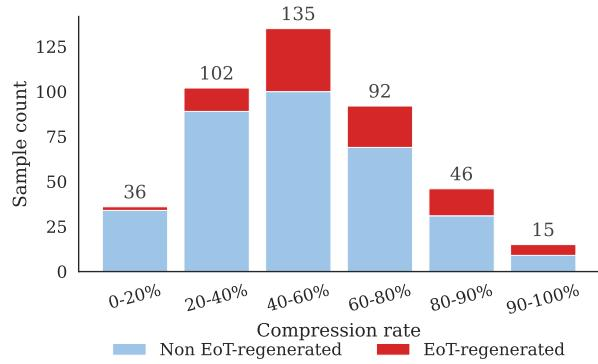

Figure 7: Sample count by reasoning compression rate on MATH with R1-Distill-Qwen-14B under DEER, split into samples with and without EoT regeneration. Together with Figure 2, this shows both the per-bin ERR and the underlying sample distribution across compression rates.
<table><tr><td>Model</td><td>Method</td><td>Regen MATH AMC</td><td></td><td></td><td>AIME GSM8K</td><td></td><td>GPQA</td></tr><tr><td rowspan="3">R1-Distill-1.5B</td><td rowspan="2">DEER</td><td> $\begin{array} { l } { \Upsilon } \\ { \Nu } \end{array}$ </td><td>574</td><td>530</td><td>589</td><td></td><td>601</td></tr><tr><td></td><td>240</td><td>231</td><td>264</td><td>238</td><td>257</td></tr><tr><td rowspan="2">DynaSoR</td><td> $\begin{array} { l } { \Upsilon } \\ { \Nu } \end{array}$ </td><td>810</td><td>670</td><td>2,105</td><td></td><td></td></tr><tr><td></td><td></td><td>271 347</td><td>420</td><td></td><td>232</td><td>202</td></tr><tr><td rowspan="4">Qwen3-14B</td><td rowspan="2">DEER</td><td></td><td>1,593</td><td></td><td></td><td>909</td><td>4,209</td></tr><tr><td> $\begin{array} { l } { \Upsilon } \\ { \Nu } \end{array}$ </td><td>494</td><td>802</td><td>1,243</td><td>235</td><td>813</td></tr><tr><td rowspan="2">DynaSoR</td><td></td><td>2,865</td><td></td><td>2,53510,229</td><td>936</td><td>4,657</td></tr><tr><td> $\begin{array} { l } { \Upsilon } \\ { \Nu } \end{array}$ </td><td>524</td><td>834</td><td>1,788</td><td>278</td><td>930</td></tr><tr><td rowspan="3">R1-Distill-14B</td><td rowspan="2">DEER</td><td></td><td>1,1871,222</td><td></td><td>4,892</td><td>620</td><td>964</td></tr><tr><td> $\begin{array} { l } { \Upsilon } \\ { \Nu } \end{array}$ </td><td>223</td><td>229</td><td>415</td><td>162</td><td>138</td></tr><tr><td rowspan="2">DynaSoR</td><td> $\begin{array} { l } { \Upsilon } \\ { \Nu } \end{array}$ </td><td></td><td>940 1,925</td><td>2,564</td><td>432</td><td>1,691</td></tr><tr><td rowspan="2"></td><td></td><td>283</td><td>490</td><td>646</td><td>197</td><td>146</td></tr><tr><td rowspan="2">DEER</td><td>Y</td><td>2,4513,259</td><td></td><td>4,480</td><td>1,005</td><td>4,486</td></tr><tr><td rowspan="2"></td><td>N</td><td>278</td><td>531</td><td>753</td><td>150.5</td><td>203.5</td></tr><tr><td rowspan="2">DynaSoR</td><td> $\begin{array} { l } { \Upsilon } \\ { \Nu } \end{array}$ </td><td>3,394 6,693</td><td></td><td>6,623</td><td></td><td>2,3273,240.5</td></tr><tr><td rowspan="2"></td><td></td><td>285</td><td>421</td><td>584</td><td>159</td><td>236.5</td></tr></table>

Table 12: Median answer-phase token lengths for samples with (Y) vs. without (N) EoT regeneration, across early-exit methods and datasets. “–” indicates no samples with EoT regeneration.

## D.2 EoT Regeneration by Exit Case and Compression Rate

Section 4.2 examines how EoT regeneration relates to the way the CoT is terminated. Table 11 extends this analysis to all evaluated models and benchmarks, reporting within-case ERR, with Natural-EoT cases omitted as they yield no EoT regeneration across all settings. Figure 7 complements Figure 2 with the underlying sample distribution, showing the counts of samples with and without EoT regeneration in each bin.

## D.3 Pre-regen and Post-regen Analysis

In Table 3, we analyze token count and Wait-token repetition frequency for the R1-Distill-14B model. We report the results for all models in Table 13.

<table><tr><td></td><td></td><td></td><td colspan="2">#Token</td><td colspan="2">#Wait</td><td></td></tr><tr><td>Method</td><td>Dataset</td><td>N #Pre</td><td></td><td>#Post</td><td>Rel.</td><td>Pre</td><td>Post</td></tr><tr><td colspan="8">R1-Distill-1.5B</td></tr><tr><td>DEER</td><td>MATH</td><td>5</td><td>187</td><td>480</td><td>0.39</td><td>0</td><td>0</td></tr><tr><td></td><td>AMC</td><td>1</td><td>195</td><td>334</td><td>0.58</td><td>0</td><td>0</td></tr><tr><td></td><td>AIME</td><td>2</td><td>52</td><td>536</td><td>0.10</td><td>0</td><td>0</td></tr><tr><td></td><td>GPQA</td><td>2</td><td>200</td><td>400</td><td>0.50</td><td>0</td><td>0</td></tr><tr><td>DynaSoR</td><td>MATH</td><td>5</td><td>349</td><td>527</td><td>0.66</td><td>0</td><td>0</td></tr><tr><td></td><td>AMC</td><td>2</td><td>50</td><td>620</td><td>0.08</td><td>0</td><td>0</td></tr><tr><td>AIME</td><td></td><td>2</td><td>1539</td><td>565</td><td>2.72</td><td>15</td><td>0</td></tr><tr><td colspan="8">Qwen3-14B</td></tr><tr><td>DEER</td><td>MATH</td><td>12</td><td>940</td><td>546</td><td>1.72</td><td>2</td><td>0</td></tr><tr><td></td><td>GSM8K</td><td>11</td><td>487</td><td>369</td><td>1.32</td><td>2</td><td>0</td></tr><tr><td></td><td>GPQA</td><td>7</td><td>2580</td><td>981</td><td>2.63</td><td>12</td><td>0</td></tr><tr><td>DynaSoR</td><td>MATH</td><td>23</td><td>1815</td><td>833</td><td>2.18</td><td>3</td><td>0</td></tr><tr><td></td><td>AMC</td><td>1</td><td>1546</td><td>988</td><td>1.56</td><td>9</td><td>0</td></tr><tr><td></td><td>AIME</td><td>1</td><td>8367</td><td>1861</td><td>4.50</td><td>23</td><td>0</td></tr><tr><td></td><td>GSM8K</td><td>11</td><td>628</td><td>367</td><td>1.71</td><td>2</td><td>0 0</td></tr><tr><td></td><td>GPQA</td><td>6</td><td>3878</td><td>814</td><td>4.77</td><td>14</td><td></td></tr><tr><td colspan="8">R1-Distill-14B</td></tr><tr><td>DEER</td><td>MATH</td><td>99</td><td>836</td><td>405</td><td>2.06</td><td>3</td><td>0</td></tr><tr><td></td><td>AMC</td><td>9</td><td>574</td><td>565</td><td>1.02 10.10</td><td>2</td><td>0 0</td></tr><tr><td></td><td>AIME GSM8K</td><td>8 44</td><td>4674 396</td><td>463 208</td><td>1.90</td><td>22 2</td><td>0</td></tr><tr><td></td><td>GPQA</td><td>18</td><td>568</td><td>393</td><td>1.45</td><td>2</td><td>0</td></tr><tr><td>DynaSoR</td><td></td><td></td><td></td><td></td><td></td><td></td><td></td></tr><tr><td></td><td>MATH</td><td>179</td><td>534</td><td>371 494</td><td>1.44 3.12</td><td>1 6</td><td>0 0</td></tr><tr><td></td><td>AMC</td><td>16 12</td><td>1540</td><td>628</td><td>3.42</td><td>6</td><td>0</td></tr><tr><td></td><td>AIME</td><td></td><td>2148</td><td></td><td>0.96</td><td>0</td><td></td></tr><tr><td></td><td>GSM8K GPQA</td><td>105</td><td>216</td><td>224</td><td>3.08</td><td></td><td>0 0</td></tr><tr><td></td><td></td><td>36</td><td>1280</td><td>416</td><td></td><td>8</td><td></td></tr><tr><td colspan="8">QwQ-32B</td></tr><tr><td>DEER</td><td>MATH</td><td>202</td><td>1973</td><td>472</td><td>4.18</td><td>8</td><td>0</td></tr><tr><td></td><td>AMC</td><td>23</td><td>2804</td><td>535</td><td>5.24 8.04</td><td>14 17</td><td>0 0</td></tr><tr><td></td><td>AIME GSM8K</td><td>15 127</td><td>4003</td><td>498 226</td><td>3.29</td><td>3</td><td>0</td></tr><tr><td></td><td></td><td></td><td>744</td><td></td><td></td><td></td><td>0</td></tr><tr><td></td><td>GPQA</td><td>24</td><td>3974</td><td>419</td><td>9.49</td><td>20</td><td></td></tr><tr><td>DynaSoR</td><td>MATH</td><td>97</td><td>2763</td><td>544</td><td>5.08</td><td>14</td><td>0</td></tr><tr><td></td><td>AMC</td><td>16</td><td>6113</td><td>583</td><td>10.49</td><td>34</td><td>0</td></tr><tr><td></td><td>AIME</td><td>13</td><td>5949</td><td>536</td><td>11.10</td><td>21</td><td>0</td></tr><tr><td></td><td>GSM8K</td><td>13</td><td>2102</td><td>289</td><td>7.27</td><td>8</td><td>0</td></tr><tr><td></td><td>GPQA</td><td>20</td><td>2881</td><td>501</td><td>5.75</td><td>18</td><td>0</td></tr></table>

Table 13: Pre/Post-regen analysis on samples with spurious CoT termination, reported as medians. Rel. = #Pre/#Post. #Wait counts Wait tokens per segment.

## D.4 Quantitative Boxed-before-EoT Statistics Across Models

In Figures 4 and 8, we visualize the occurrence of \boxed{. . . } expressions around EoT for R1- Distill-14B, Qwen3-14B, and QwQ-32B, respectively. Here, we provide a quantitative, per-span, and per-dataset analysis of the boxed-before-EoT pattern across all four backbones and five benchmarks in Table 15.

The metric $\bar { n } _ { \mathrm { b o x } }$ denotes the mean number of boxed expressions within a segment. We also use END- $\mathbf { \partial } \cdot \mathbf { B O X } _ { 5 } ,$ denoting the fraction of samples whose final boxed expression closes within five characters of the segment boundary. This metric serves as a proxy for the pattern in which the model writes a boxed answer immediately before ending the segment. For example, a high $\mathrm { E N D - B O X _ { 5 } }$ in the preregen window of spurious DEER or DynaSoR samples indicates that the model has produced a boxed answer immediately before regenerating EoT.

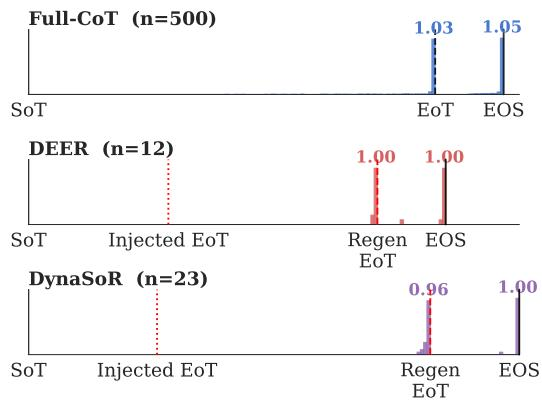

(a) Qwen3-14B  
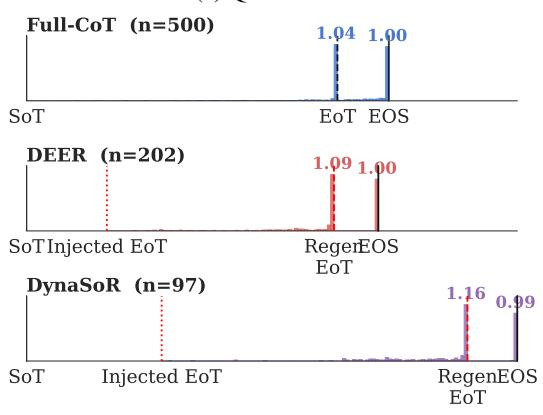  
(b) QwQ-32B  
Figure 8: Boxed-expression density in spurious samples on MATH with Qwen3-14B and QwQ-32B. The density is low around the exit token and peaks immediately before the regenerated EoT, indicating that the boxedbefore-EoT pattern appears near the regenerated EoT rather than the exit token.

In Full-CoT, boxed expressions tend to concentrate near the ends of the thinking and answering phases, as indicated by the high $\mathrm { E N D - B O X _ { 5 } }$ values. For samples with spurious CoT termination, this behavior instead appears prominently in the pre-regen span, which shows both high $\bar { n } _ { \mathrm { b o x } }$ and high END-BOX<sub>5</sub>. This indicates that the model frequently produces a boxed answer immediately before regenerating EoT. The post-regen span also tends to end with a boxed expression, similar to the answering phase of Full-CoT. Overall, these results quantitatively support the boxed-before-EoT pattern in Section 5.2 across models, benchmarks, and early-exit methods.

## D.5 Selectivity of EAB for Samples with Spurious CoT Termination

In Table 4, we partition samples by whether they exhibit spurious CoT termination under the unbiased setting $( \alpha = 0 )$ , and report group-wise results for R1-Distill-14B with EAB at $\alpha = 4 \cdot$

Table 16 extends this analysis to the full set of models and datasets, using DEER with EAB at $\alpha = 2$ and $\alpha = 4$ . For each group, we report accuracy, ERR, and answering-phase length to evaluate whether EAB primarily affects the samples with spurious CoT termination while leaving the samples without spurious CoT termination largely intact.

The results show that this trend generally extends across models, although its strength varies. EAB reduces ERR for samples with spurious CoT termination under the unbiased setting, although this can be accompanied by accuracy degradation. For samples without spurious CoT termination, ERR remains close to zero, and accuracy is generally preserved, suggesting little adverse effect on this group. The effect on answering-phase length is more model-dependent, especially for samples with spurious CoT termination.

## D.6 Extended Sweep

We extend the α sweep in Figure 5 to a wider range, $\alpha \in [ - 2 5 6 , 8 ]$ , using R1-Distill-14B with DEER on AMC, GPQA, and MATH, and R1- Distill-1.5B with both DEER and DynaSoR. As shown in Figure 9, large negative values of α largely preserve accuracy but substantially increase ERR and answering-phase length. Positive α improves these metrics only up to around four, after which generation becomes unstable at $\alpha = 8$

## D.7 Specificity of EAB

Figure 10 reports the target-position ablation on Qwen3-14B with DEER, following the R1-Distill-14B analysis in Figure 6. The results show the same qualitative pattern, with the effect specific to the exit token.

## D.8 Benchmark-Level EAB Results

Table 17 expands the aggregate results in Table 5 to individual benchmarks, reporting EAB results at $\alpha = 0 , 2 , 4$ . It includes corresponding vLLMbackend results (†).

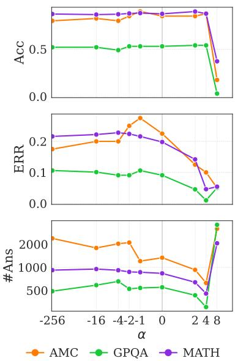  
(a) R1-Distill-14B (DEER)

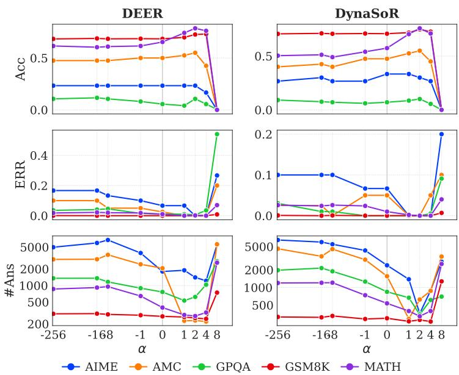  
(b) R1-Distill-1.5B (DEER vs DynaSoR)

Figure 9: EAB sweep at extended α range (−256 to 8). Panels show accuracy, ERR, and answering-phase length vs. α; colors denote benchmarks.
<table><tr><td>Method</td><td colspan="3">MATH</td><td colspan="3">AMC</td><td colspan="3">AIME</td><td colspan="3">GSM8K</td><td colspan="3">GPQA</td><td colspan="3">AVG</td></tr><tr><td></td><td>Acc ERR</td><td></td><td>#Ans</td><td>Acc</td><td>ERR</td><td>#Ans</td><td>Acc</td><td>ERR</td><td>#Ans</td><td>Acc</td><td>ERR</td><td>#Ans</td><td>Acc ERR</td><td></td><td>#Ans</td><td>Acc ERR</td><td>#Ans</td><td></td></tr><tr><td>Baseline (α=0)</td><td>87.4</td><td>19.8</td><td></td><td>835 85.0</td><td>22.5</td><td></td><td>1,336 50.0</td><td>26.7 3,277</td><td></td><td>91.2</td><td>3.3</td><td></td><td>260 53.0</td><td>9.1</td><td></td><td>550 73.3</td><td>16.31,252</td><td></td></tr><tr><td>EAB (α=4)</td><td>87.6</td><td>4.6</td><td></td><td>455 87.5</td><td>10.0</td><td></td><td>627 53.3</td><td>3.3</td><td>1,743</td><td>92.9</td><td>0.2</td><td></td><td>205 54.0</td><td>1.0</td><td>304 75.1</td><td></td><td>3.8</td><td>667</td></tr><tr><td>Double-EoT (append)</td><td>87.6</td><td>4.2</td><td></td><td>715 85.0</td><td>5.0</td><td>832</td><td>50.0</td><td>10.0</td><td>1,645</td><td>91.4</td><td>0.3</td><td></td><td>209 52.5</td><td>2.5</td><td>404 73.3</td><td></td><td>4.4</td><td>761</td></tr><tr><td>Double-EoT (inline)</td><td>88.6</td><td>8.8</td><td></td><td>74782.5</td><td>10.0</td><td>1,271</td><td>43.3</td><td>6.7</td><td>2,076</td><td>92.6</td><td>1.3</td><td></td><td>210 53.5</td><td>5.1</td><td></td><td>66072.1</td><td>6.4</td><td>993</td></tr><tr><td>Ans-Prefix</td><td>89.6</td><td>0.4</td><td></td><td>292 85.0</td><td>0.0</td><td>252</td><td>50.0</td><td>0.0</td><td>1,290</td><td>92.9</td><td>0.0</td><td></td><td>15455.6</td><td>0.0</td><td></td><td>230 74.6</td><td>0.1</td><td>444</td></tr><tr><td>Post-Box</td><td>89.0</td><td>1.2</td><td>55</td><td>85.0</td><td>0.0</td><td></td><td>5 46.7</td><td>6.7</td><td></td><td>603 93.1</td><td>0.1</td><td></td><td>12 57.1</td><td>0.0</td><td></td><td>3 74.2</td><td>1.6</td><td>136</td></tr><tr><td>Post-Ans-Box</td><td>89.0</td><td>8.0</td><td>82</td><td>85.0</td><td>7.5</td><td>400</td><td>43.3</td><td>3.3</td><td></td><td>51 93.8</td><td>3.9</td><td></td><td>43 57.1</td><td>3.5</td><td>12</td><td>73.6</td><td>5.2</td><td>118</td></tr><tr><td>EAB (α=−4)</td><td>87.0</td><td>22.8</td><td>917 80.0</td><td></td><td></td><td>20.0 2,032</td><td>50.0</td><td></td><td></td><td>10.0 4,452 90.0</td><td>4.5</td><td></td><td>236 49.0</td><td>9.1</td><td></td><td>656 71.2</td><td>13.3 1,658</td><td></td></tr><tr><td>Block-EoT</td><td>82.8</td><td></td><td>0.0 2,726 75.0</td><td></td><td></td><td>0.0 3,117 46.7</td><td></td><td></td><td></td><td>0.0 3,109 90.8</td><td>0.0</td><td></td><td>585 51.5</td><td>0.0</td><td></td><td>1,40769.4</td><td>0.0 2,189</td><td></td></tr></table>

Table 14: Control baselines to EAB on R1-Distill-14B with DEER traces. We report accuracy (Acc, %, ↑), ERR (%, ↓), and answering-phase length (#Ans, ↓). Avg denotes the macro average across the five datasets. The best and second-best values in each column are shown in bold and underlined.

## D.9 Control Baseline Details and Extended Results

This section expands on the control baselines in Section 6.7, providing implementation details and the full quantitative comparison in Table 14.

Implementation. All baselines are evaluated on the same DEER traces as EAB. Our default injected boundary is \n</think>\n\n. Double-EoT (append) adds a second EoT outside this boundary, ...\n</think>\n\n</think>, whereas Double-EoT (inline) places it after the first, ...\n</think></think>\n\n. The main text reports Double-EoT (append), while here we compare the inline variant. Block-EoT masks the </think> logit to −∞ throughout the answering phase, making EoT regeneration impossible by construction. It serves as a harder counterpart to negative-α EAB, as both reduce the EoT availability during answer generation. For the prompt-level controls, Ans-Prefix prepends the transition phrase “Based on the reasoning up until now, I will now present my final answer.” before the injected EoT. Post-Box inserts a \boxed expression after the injected EoT, and Post-Ans-Box inserts the template \*\*Final Answer\*\*: \boxed after it.

Double-EoT. Both variants reduce ERR and shorten the answer phase, qualitatively matching positive EAB. The append variant is closer to EAB, whereas the inline variant has a higher ERR of

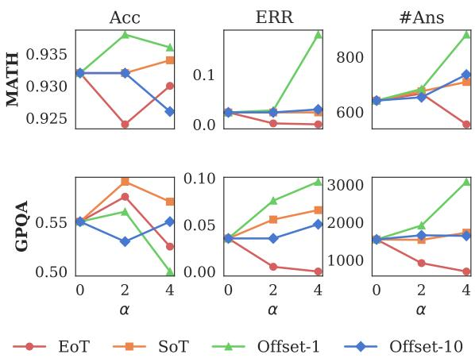  
Figure 10: Specificity of EAB to the exit token under DEER on Qwen3-14B for MATH and GPQA. We apply EAB to the exit token, SoT, and tokens 1 and 10 positions before the exit token, denoted Offset-1 and Offset-10.

6.4% and longer answer phases. This gap points to a formatting effect. Append preserves the default boundary pattern \n</think>\n\n and adds the second EoT after it, whereas inline stacks two </think> tokens within the boundary and is more disruptive.

The direction is consistent with the attentionbased explanation motivating EAB, since an extra </think> adds an EoT key that answering-phase queries can attend to. Double-EoT changes the token sequence and key-value cache, so it moves attention only indirectly and cannot isolate the effect to attention as EAB does.

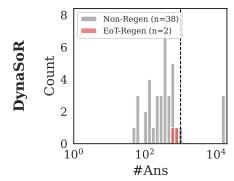

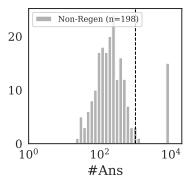

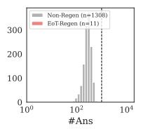

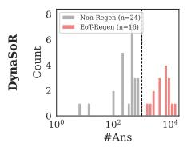

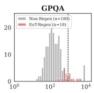

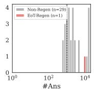

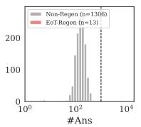

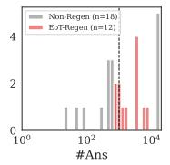

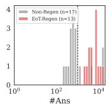

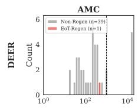

(a) R1-Distill-1.5B  
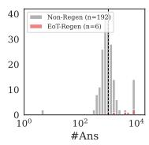  
(b) Qwen3-14B

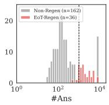  
(c) R1-Distill-14B

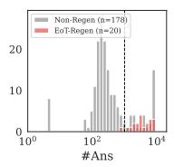  
(d) QwQ-32B  
Figure 11: Histograms of answer-phase length (#Ans) for each model across early-exit methods (DEER, DynaSoR) and datasets. Each histogram is split into samples with and without EoT regeneration. The dashed vertical line marks the answering-phase length threshold (1000 tokens) used to trigger regeneration.

<table><tr><td rowspan="2">Dataset</td><td colspan="2">Reasoning</td><td colspan="2">Pre-regen</td><td colspan="2">Post-regen</td></tr><tr><td> $\bar { n } _ { \mathrm { b o x } }$ </td><td>END-BOX5</td><td> $\bar { n } _ { \mathrm { b o x } }$ </td><td>END-BOX5</td><td> $\bar { n } _ { \mathrm { b o x } }$ </td><td>END-BOX5</td></tr><tr><td colspan="7">Full-CoT</td></tr><tr><td>MATH</td><td>0.72</td><td>0.60</td><td>一</td><td></td><td>2.53</td><td>0.86</td></tr><tr><td>AMC</td><td>0.55</td><td>0.45</td><td>一</td><td></td><td>1.07</td><td>0.90</td></tr><tr><td>AIME</td><td>0.23</td><td>0.23</td><td></td><td></td><td>30.13</td><td>0.77</td></tr><tr><td>GSM8K</td><td>0.21</td><td>0.06</td><td>一</td><td>一</td><td>0.95</td><td>0.76</td></tr><tr><td>GPQA</td><td>0.11</td><td>0.11</td><td>1</td><td>1</td><td>0.21</td><td>0.19</td></tr><tr><td colspan="7">DEER, spurious</td></tr><tr><td>MATH</td><td>0.00</td><td>0.001.20</td><td></td><td>0.60</td><td>1.00</td><td>0.60</td></tr><tr><td>AMC</td><td>0.00</td><td></td><td>0.00 1.00</td><td>1.00</td><td>1.00</td><td>1.00</td></tr><tr><td>AIME</td><td>0.00</td><td></td><td>0.00 1.00</td><td>1.00</td><td>1.00</td><td>1.00</td></tr><tr><td>GPQA</td><td>0.00</td><td>0.00</td><td>1.00</td><td>1.00</td><td>1.00</td><td>1.00</td></tr><tr><td colspan="7">DynaSoR, spurious</td></tr><tr><td>MATH</td><td>0.00</td><td>0.001.40</td><td></td><td>1.00</td><td>1.00</td><td>1.00</td></tr><tr><td>AMC</td><td>0.00</td><td></td><td>0.00 2.50</td><td>1.00</td><td>1.00</td><td>1.00</td></tr><tr><td>AIME</td><td>0.00</td><td></td><td>0.001.50</td><td>1.00</td><td>1.00</td><td>1.00</td></tr></table>

(a) R1-Distill-1.5B

<table><tr><td rowspan="2">Dataset</td><td colspan="2">Reasoning</td><td colspan="2">Pre-regen</td><td colspan="2">Post-regen</td></tr><tr><td> $\bar { n } _ { \mathrm { { b o x } } }$ </td><td>END-BOX5</td><td> $\bar { n } _ { \mathrm { b o x } }$ </td><td>END-BOX5</td><td> $\bar { n } _ { \mathrm { b o x } }$ </td><td>END-BOX5</td></tr><tr><td colspan="7">Full-CoT</td></tr><tr><td rowspan="2">MATH</td><td rowspan="2">1.24</td><td>0.87</td><td></td><td rowspan="2">一</td><td rowspan="2">1.21</td><td rowspan="2">0.96</td></tr><tr><td colspan="3"></td></tr><tr><td colspan="2">AMC</td><td>1.18</td><td>0.90</td><td></td><td>一 1.27</td><td>0.97</td></tr><tr><td colspan="2">AIME</td><td>0.70</td><td>0.50</td><td></td><td>一 1.33</td><td>0.90</td></tr><tr><td colspan="2">GSM8K GPQA</td><td>0.98</td><td>0.45</td><td></td><td>一 1.07</td><td>0.82</td></tr><tr><td colspan="2"></td><td>0.48</td><td>0.47</td><td>1</td><td>1.07</td><td>1.00</td></tr><tr><td colspan="7">DEER, samples with spurious CoT termination</td></tr><tr><td colspan="2">MATH GSM8K</td><td>0.00 0.00</td><td>0.001.17 0.00 1.00</td><td></td><td>0.92 1.17</td><td>1.00</td></tr><tr><td colspan="2">GPQA</td><td>0.00</td><td>0.00 1.00</td><td></td><td>0.45 1.09 1.001.14</td><td>0.82 1.00</td></tr><tr><td colspan="2">DynaSoR, samples with spurious CoT termination</td><td></td><td></td><td></td><td></td><td></td></tr><tr><td colspan="7">MATH</td></tr><tr><td colspan="2"></td><td>0.00</td><td>0.00 1.30 0.00 1.00</td><td></td><td>0.91 1.04</td><td>0.91</td></tr><tr><td colspan="2">AMC</td><td>0.00</td><td></td><td></td><td>1.001.00</td><td>1.00</td></tr><tr><td colspan="2">AIME</td><td>0.00</td><td>0.00 2.00</td><td></td><td>1.001.00</td><td>1.00</td></tr><tr><td colspan="2">GSM8K</td><td>0.00</td><td>0.00 1.18</td><td></td><td>0.82 1.00</td><td>0.82</td></tr><tr><td colspan="2">GPQA</td><td>0.00</td><td>0.00 1.00</td><td></td><td>1.000.83</td><td>0.83</td></tr></table>

(b) Qwen3-14B

<table><tr><td rowspan="2">Dataset</td><td colspan="2">Reasoning</td><td colspan="2">Pre-regen</td><td colspan="2">Post-regen</td></tr><tr><td> $\bar { n } _ { \mathrm { b o x } }$ </td><td>END-BOX5</td><td> $\bar { n } _ { \mathrm { b o x } }$ </td><td>END-BOX5</td><td> $\bar { n } _ { \mathrm { { b o x } } }$ </td><td>END-BOX5</td></tr><tr><td colspan="7">Full-CoT</td></tr><tr><td>MATH</td><td>0.93</td><td>0.78</td><td></td><td></td><td>1.06</td><td>0.87</td></tr><tr><td>AMC</td><td>0.88</td><td>0.75</td><td></td><td></td><td>1.00</td><td>0.95</td></tr><tr><td>AIME</td><td>0.47</td><td>0.43</td><td></td><td></td><td>1.17</td><td>0.83</td></tr><tr><td>GSM8K</td><td>0.83</td><td>0.24</td><td>一</td><td></td><td>1.00</td><td>0.50</td></tr><tr><td>GPQA</td><td>0.09</td><td>0.09</td><td>一</td><td></td><td>0.87</td><td>0.87</td></tr><tr><td colspan="7">DEER, samples with spurious CoT termination</td></tr><tr><td>MATH</td><td>0.00</td><td>0.001.06</td><td></td><td>0.93 1.02</td><td></td><td>0.93</td></tr><tr><td>AMC</td><td>0.00</td><td>0.00</td><td>1.00</td><td></td><td>0.89 1.00</td><td>0.89</td></tr><tr><td>AIME</td><td>0.00</td><td>0.00</td><td>0.75</td><td></td><td>0.75 0.88</td><td>0.88</td></tr><tr><td>GSM8K</td><td>0.00</td><td>0.00</td><td>0.98</td><td>0.43</td><td>31.00</td><td>0.70</td></tr><tr><td>GPQA</td><td>0.00</td><td>0.00</td><td>0.94</td><td>0.94</td><td>1.00</td><td>1.00</td></tr><tr><td colspan="7">DynaSoR, samples with spurious CoT termination</td></tr><tr><td colspan="2">MATH 0.00</td><td>0.00 1.00</td><td></td><td>0.91 0.99</td><td></td><td>0.92</td></tr><tr><td colspan="2">AMC</td><td>0.00</td><td>0.00 1.00</td><td>0.941.00</td><td></td><td>0.94</td></tr><tr><td colspan="2">AIME</td><td>0.00</td><td>0.00 1.08</td><td></td><td>1.001.00</td><td>1.00</td></tr><tr><td colspan="2">GSM8K</td><td>0.00</td><td>0.00 1.01</td><td>0.32</td><td></td><td></td></tr><tr><td colspan="2"></td><td></td><td></td><td>0.81</td><td>1.00</td><td>0.48</td></tr><tr><td colspan="2">GPQA</td><td>0.00</td><td>0.00 0.81</td><td></td><td>0.97</td><td>0.97</td></tr></table>

(c) R1-Distill-14B

<table><tr><td rowspan="2">Dataset</td><td colspan="2">Thinking</td><td colspan="2">Pre-regen</td><td colspan="2">Post-regen</td></tr><tr><td> $\bar { n } _ { \mathrm { { b o x } } }$ </td><td>END-BOX5</td><td> $\bar { n } _ { \mathrm { b o x } }$ </td><td>END-BOX5</td><td> $\bar { n } _ { \mathrm { b o x } }$ </td><td>END-BOX5</td></tr><tr><td colspan="7">Full-CoT</td></tr><tr><td colspan="7">MATH</td></tr><tr><td>AMC</td><td>1.31 1.12</td><td>0.87 0.80</td><td></td><td></td><td>1.38</td><td>0.93 0.95</td></tr><tr><td>AIME</td><td>0.77</td><td>0.47</td><td></td><td></td><td>1.10 1.33</td><td></td></tr><tr><td>GSM8K</td><td></td><td>0.49</td><td></td><td></td><td>一 1.01</td><td>0.90</td></tr><tr><td>GPQA</td><td>0.89 0.16</td><td>0.16</td><td></td><td></td><td>一 1.69</td><td>0.80 0.98</td></tr><tr><td colspan="7"></td></tr><tr><td colspan="7">DEER, samples with spurious CoT termination MATH 0.001.81</td></tr><tr><td>AMC</td><td>0.00 0.00</td><td>0.00 1.48</td><td></td><td>0.97 1.00 0.91 1.00</td><td>0.93 1.00</td></tr><tr><td>AIME</td><td>0.00</td><td>0.00</td><td></td><td>1.00 1.00</td><td></td></tr><tr><td>GSM8K</td><td></td><td>0.00</td><td>1.67 1.35</td><td>0.77</td><td>1.00</td></tr><tr><td>GPQA</td><td>0.00 0.00</td><td>0.00</td><td>0.88</td><td>1.00 0.75 1.00</td><td>0.80 1.00</td></tr><tr><td colspan="6"></td></tr><tr><td colspan="6">DynaSoR, samples with spurious CoT termination</td></tr><tr><td>MATH</td><td>0.00</td><td>0.002.42</td><td>0.99 1.00</td><td></td><td>0.92</td></tr><tr><td>AMC</td><td>0.00</td><td>0.00 1.38</td><td></td><td>1.00 1.00</td><td>1.00</td></tr><tr><td>AIME</td><td>0.00</td><td>0.00 2.00</td><td></td><td>1.000.92</td><td>0.92</td></tr><tr><td>GSM8K</td><td>0.00</td><td>0.00</td><td>1.62</td><td>0.77 1.00</td><td>0.77</td></tr><tr><td>GPQA</td><td>0.00</td><td>0.00</td><td>1.40</td><td>0.95 0.95</td><td>0.95</td></tr></table>

(d) QwQ-32B  
Table 15: Quantitative analysis of boxed-before-EoT behavior across models and generation segments. We report results for the reasoning, pre-regen, and post-regen segments. For Full-CoT, the answering phase is not further segmented, and its values are reported in the post-regen columns. $\bar { n } _ { \mathrm { b o x } }$ is the mean number of boxed expressions per sample within the segment. END-BOX<sub>5</sub> is the fraction of samples whose final boxed expression ends within 5 characters of the segment boundary.

<table><tr><td rowspan="2">Dataset</td><td colspan="3">Acc (%, ↑)</td><td colspan="3">ERR (%, ↓)</td><td colspan="10">#Ans (↓)</td></tr><tr><td></td><td></td><td>N DEER +EAB(α=2) +EAB(α=4)</td><td></td><td>DEER +EAB(α=2) +EAB(α=4)</td><td></td><td>DEER +EAB(α=2) +EAB(α=4)</td><td></td><td colspan="8"></td></tr><tr><td colspan="17">R1-Distill-1.5B</td></tr><tr><td colspan="17">Samples with spurious CoT termination</td></tr><tr><td>AIME</td><td>2</td><td></td><td>0.0</td><td colspan="3">0.0 100.0</td><td>589</td><td></td><td colspan="8"></td></tr><tr><td>AMC</td><td>1</td><td>0.0 0.0</td><td>0.0</td><td>0.0 100.0</td><td>0.0 0.0</td><td>0.0 0.0</td><td>530</td><td>607 155</td><td colspan="8">590 17</td></tr><tr><td>GPQA MATH</td><td>2</td><td>50.0</td><td>50.0</td><td>0.0 100.0</td><td>50.0</td><td>50.0</td><td>600</td><td>338</td><td colspan="8">276</td></tr><tr><td></td><td>5</td><td>20.0</td><td>20.0</td><td>20.0 100.0</td><td>20.0</td><td>0.0</td><td>723</td><td>575</td><td colspan="8">448</td></tr><tr><td colspan="17"></td></tr><tr><td>Samples without spurious CoT termination 0.0</td><td colspan="16"></td></tr><tr><td>AIME AMC</td><td>28 39</td><td>25.0 51.3</td><td>25.0 56.4</td><td>17.9 0.0 43.6 0.0</td><td>0.0 0.0</td><td></td><td>1,884 0.0 2,104</td><td>1,461 232</td><td colspan="8">1,264 226</td></tr><tr><td>GPQA</td><td>196</td><td>5.1</td><td>10.2</td><td>5.6 0.0</td><td>0.0</td><td></td><td>764</td><td>623</td><td colspan="8">1,041</td></tr><tr><td>GSM8K</td><td>1,319</td><td>68.5</td><td>72.6</td><td>73.1</td><td>0.0</td><td></td><td>274</td><td>255</td><td colspan="8">247</td></tr><tr><td>MATH</td><td>495</td><td>65.9</td><td>79.2</td><td>0.0 76.8 0.0</td><td>0.0</td><td>0.1 0.0</td><td>394</td><td>275</td><td colspan="8">321</td></tr><tr><td></td><td></td><td></td><td></td><td></td><td></td><td></td><td></td><td></td><td colspan="8"></td></tr><tr><td colspan="17">Qwen3-14B</td></tr><tr><td colspan="17">Samples with spurious CoT termination</td></tr><tr><td>GPQA GSM8K</td><td>7</td><td>100.0</td><td>57.1 81.8</td><td>57.1 100.0 100.0</td><td>14.3</td><td></td><td>0.0 4,434</td><td></td><td colspan="8"></td></tr><tr><td>MATH</td><td>11</td><td>100.0</td><td>75.0</td><td>81.8 91.7</td><td>0.0</td><td></td><td>0.0 1,329</td><td></td><td colspan="8">247</td></tr><tr><td></td><td>12</td><td>91.7</td><td></td><td>100.0</td><td>8.3</td><td></td><td>0.0</td><td>2,592</td><td colspan="8">594</td></tr><tr><td colspan="17">Samples without spurious CoT termination</td></tr><tr><td>73.3</td><td>30 73.3 97.5</td><td></td><td colspan="3">70.0 95.0</td><td>0.0</td><td>0.0 1,333 0.0</td><td></td><td colspan="8">1,529</td></tr><tr><td>AMC GPQA</td><td>40 191</td><td></td><td>97.5</td><td>0.0</td><td>0.0</td><td></td><td>811 0.0 1,439</td><td>795 851</td><td colspan="8">1,159 804 692</td></tr><tr><td>GSM8K 1,308</td><td>53.4 95.5</td><td></td><td>57.6</td><td>0.0</td><td>0.0</td><td></td><td>244</td><td>252 638</td><td colspan="8">223</td></tr><tr><td>MATH</td><td>488 93.2</td><td></td><td>95.6 92.8</td><td>0.0</td><td>0.1</td><td></td><td>0.0 0.0 593</td><td></td><td colspan="8"></td></tr><tr><td></td><td></td><td></td><td></td><td>0.0</td><td>0.0</td><td></td><td></td><td></td><td colspan="8">554</td></tr><tr><td colspan="17">93.0</td></tr><tr><td colspan="17">R1-Distill-14B Samples with spurious CoT termination</td></tr><tr><td>AIME AMC</td><td>8 9</td><td>50.0 100.0</td><td>37.5 100.0</td><td colspan="3">50.0 100.0</td><td>12.5 5,668 22.2</td><td></td><td colspan="8">8,541 847</td></tr><tr><td>GPQA</td><td>18</td><td>77.8</td><td>77.8</td><td>100.0 100.0 100.0</td><td>37.5 44.4 38.9</td><td>11.1 4.5</td><td>1,485 1,489</td><td>1,262</td><td colspan="8">1,288 783</td></tr><tr><td>GSM8K</td><td>44</td><td>84.1</td><td>72.7</td><td>72.2 68.2 100.0</td><td>50.0</td><td>19.2</td><td>1,042</td><td>611</td><td colspan="8">442</td></tr><tr><td>MATH</td><td>99</td><td></td><td>87.9</td><td>79.8 100.0</td><td>61.6</td><td></td><td>1,678</td><td>1,385</td><td colspan="8">777</td></tr><tr><td>Samples without spurious CoT termination</td><td colspan="16">91.9</td></tr><tr><td>22</td><td>50.0</td><td></td><td>54.5</td><td>54.5 0.0</td><td></td><td>4.5</td><td>0.0 2,408</td><td>2,622</td><td colspan="8">1,885</td></tr><tr><td>AIME AMC</td><td>31</td><td>80.6</td><td>80.6</td><td>83.9 0.0</td><td>3.2</td><td>6.5</td><td>1,293</td><td>951</td><td colspan="8">435 256</td></tr><tr><td>GPQA</td><td>180</td><td>50.6</td><td>51.7</td><td>52.2 0.0</td><td>1.1</td><td>0.0</td><td>456</td><td>349 193</td><td colspan="8">197</td></tr><tr><td>GSM8K</td><td>1,275</td><td>91.5</td><td>92.9</td><td>93.7 0.0</td><td>0.2</td><td></td><td>0.0 233 627</td><td></td><td colspan="8"></td></tr><tr><td>MATH</td><td>401</td><td>86.3</td><td>90.3</td><td>89.5 0.0</td><td></td><td></td><td>1.0</td><td></td><td colspan="8"></td></tr><tr><td colspan="17">2.5 QwQ-32B</td></tr><tr><td></td><td></td><td></td><td></td><td>Samples with spurious CoT termination</td><td></td><td></td><td></td><td></td><td colspan="8"></td></tr><tr><td>AIME 15</td><td>80.0</td><td></td><td>73.3 66.7 91.3</td><td>100.0</td><td>80.0</td><td>46.7</td><td>5,242 5,270</td><td>6,546 4,765</td><td colspan="8">6,694 5,458</td></tr><tr><td>AMC GPQA</td><td>23 24</td><td>100.0 75.0</td><td>91.3 66.7</td><td>100.0 100.0</td><td>78.3 54.2</td><td>52.2 25.0</td><td>4,485</td><td>4,092</td><td colspan="8">4,248</td></tr><tr><td>GSM8K</td><td>127</td><td>92.1</td><td>91.3</td><td>58.3 100.0</td><td>68.5</td><td>44.9</td><td>1,455</td><td>1,327</td><td colspan="8">1,227</td></tr><tr><td>MATH</td><td>202</td><td>96.5</td><td>93.1</td><td>92.1 92.6 100.0</td><td>83.2</td><td>57.4</td><td>2,927</td><td>2,992</td><td colspan="8">2,737</td></tr><tr><td></td><td></td><td></td><td></td><td></td><td></td><td></td><td></td><td></td><td colspan="8"></td></tr><tr><td colspan="17">Samples without spurious CoT termination</td></tr><tr><td>AIME AMC</td><td colspan="3">15 17</td><td colspan="3">53.3 94.1</td><td colspan="3">53.3 94.1</td><td colspan="3">53.3 0.0 94.1 0.0</td><td colspan="3"></td><td></td></tr><tr><td rowspan="2">Method</td><td colspan="3">MATH</td><td colspan="3">AMC</td><td colspan="3">AIME</td><td colspan="3">GSM8K</td><td colspan="3">GPQA</td><td></td></tr><tr><td>Acc ERR</td><td>Thk</td><td>Ans</td><td>Acc ERR</td><td>Thk Ans</td><td>Acc ERR</td><td>Thk</td><td>Ans</td><td></td><td>Acc ERR</td><td>Thk</td><td>Ans</td><td>Acc ERR</td><td></td><td>Thk</td><td>Ans</td></tr><tr><td></td><td></td><td></td><td></td><td></td><td>R1-Distill-1.5B</td><td></td><td></td><td></td><td></td><td></td><td></td><td></td><td></td><td></td><td></td><td></td></tr><tr><td>No-CoT† Full-CoT†</td><td>62.0 79.6</td><td>0.4 一 0.0 4,192</td><td>1,121 52.5 604 72.5</td><td>5.0</td><td>1 0.0 6,111</td><td>2,64813.3 608 23.3</td><td>10.0 0.0</td><td>8,823</td><td>5,543 33.1 1,550 76.0</td><td>0.9</td><td>0.0 1,036</td><td>268 307</td><td>4.5 7.1</td><td>0.5 0.0 8,013</td><td></td><td>1,110 775</td></tr><tr><td>DEER† DEER</td><td>66.8 65.4</td><td>0.3 2,079 1.0 2,079</td><td>428 50.0</td><td></td><td>0.0 4,013 1,143</td><td>26.7</td><td>0.0</td><td>7,308</td><td>1,594 68.1</td><td></td><td>0.0 398</td><td>276</td><td>3.5</td><td></td><td>0.0 6,987</td><td>701</td></tr><tr><td>+EAB (2) +EAB (4)</td><td>78.6 76.2</td><td>0.2 2,079 0.0 2,079</td><td>397 50.0 278 55.0 322 42.5</td><td></td><td>2.5 4,013 2,065 0.0 4,013 0.0 4,013</td><td>23.3 230 23.3 221 16.7</td><td>6.7 0.0 0.0</td><td>7,308 7,308 7,308</td><td>1,798 68.5 1,40472.6 1,219 73.1</td><td></td><td>0.0 398 0.0 398 0.1 398</td><td>274 255 247</td><td>5.6 10.6 5.6</td><td></td><td>1.0 6,987 0.5 6,987 3.5 6,987</td><td>763 620 1,034</td></tr><tr><td>DynaSoR† DynaSoR +EAB (2)</td><td>55.6 57.4</td><td>0.3 2,076 1.0 2,076</td><td>647 55.0 536 47.5</td><td></td><td>4.2 3,532 5.0 3,532</td><td>1,352 26.7</td><td>0.0 6.7</td><td>5,984 5,984</td><td>1,94970.4 2,396 70.8</td><td></td><td>0.0 466</td><td>307</td><td>7.1</td><td></td><td>0.02,675</td><td>1,325</td></tr><tr><td></td><td>75.8 +EAB (4) 71.0</td><td>0.0 2,076 0.0 2,076</td><td>322 55.0 396 45.0</td><td></td><td>0.0 3,532 5.0 3,532</td><td>1,560 33.3 623 30.0 877 26.7</td><td>0.0 0.0</td><td>5,984 5,984</td><td>359 74.8 891 72.7</td><td></td><td>0.0 466 0.0 466 0.0 466</td><td>298 279 262</td><td>7.1 10.1 5.6</td><td></td><td>0.0 2,675 0.0 2,675 0.5 2,675</td><td>844 344 611</td></tr><tr><td>No-CoT†</td><td>75.2</td><td></td><td></td><td></td><td></td><td>R1-Distill-14B</td><td></td><td></td><td></td><td></td><td></td><td></td><td></td><td></td><td></td><td></td></tr><tr><td>Full-CoT†</td><td>91.4</td><td>0.0 0.0 3,006</td><td>681 60.0 449</td><td>0.0 87.5</td><td>一 0.04,242</td><td>1,254 26.7 454 60.0</td><td>0.0 0.0</td><td>7,349</td><td>2,250 89.3 1,258 94.7</td><td>0.0</td><td>0.01,129</td><td></td><td>252 37.4 215 51.0</td><td>0.0</td><td>0.05,054</td><td>582 361</td></tr><tr><td>DEER† DEER +EAB (2) +EAB (4)</td><td>87.8 87.4 89.8</td><td>23.9 1,664 19.8 1,664 14.2 1,664</td><td>1,128 835 639</td><td>80.0 85.0 22.5 85.0 12.5</td><td>21.4 3,446 1,920 3,446 1,336 3,446</td><td>50.0 50.0 50.0</td><td>33.3 26.7</td><td>6,207 6,207 6,207</td><td>2,794 91.4 3,277 91.2 4,201 92.3</td><td>5.0 3.3</td><td>524 524 524</td><td>231 260</td><td>55.6 53.0</td><td>23.84,470 9.1 4,470</td><td></td><td>635 550</td></tr><tr><td>DynaSoR† DynaSoR</td><td>87.6 86.2</td><td>4.61,664 48.21,615</td><td>1,371</td><td>455 87.5 10.0 85.0 60.9</td><td>3,446 2,531</td><td>928 627 53.3</td><td>13.3 3.3</td><td>6,207</td><td>1,743 92.9</td><td></td><td>1.9 0.2 524</td><td>207 205</td><td>54.0 54.0</td><td></td><td>4.54,470 1.0 4,470</td><td>432 304</td></tr><tr><td>+EAB (2) +EAB (4)</td><td>87.2 85.6 83.6</td><td>35.8 1,615 30.01,615</td><td>1,024 87.5 984 87.5</td><td></td><td>40.0 2,531 40.0 2,531</td><td>2,047 53.3 2,333 56.7 1,958 46.7</td><td>63.2 40.0 33.3</td><td>4,975 4,975 4,975</td><td>2,54791.3 3,931 91.1 3,522 90.2</td><td></td><td>23.5 8.0 4.5</td><td>759 759 759</td><td>361 47.5 303 47.5 268 50.0</td><td></td><td>22.01,539 18.2 1,539 14.61,539</td><td>1,701 1,212</td></tr><tr><td>No-CoT†</td><td></td><td>16.41,615</td><td></td><td>767 82.5</td><td>20.02,531</td><td>1,140 50.0</td><td>16.7 Qwen3-14B</td><td>4,975</td><td>2,452 88.8</td><td></td><td>0.5</td><td>759</td><td>226 44.9</td><td></td><td>11.61,539</td><td>982 739</td></tr><tr><td>Full-CoT†</td><td>86.0 94.8</td><td>0.0</td><td>1,173 70.0</td><td>0.0</td><td></td><td>3,54030.0</td><td>0.0</td><td></td><td>6,598 95.8</td><td>0.0</td><td></td><td></td><td>282 54.0</td><td>0.0</td><td></td><td></td></tr><tr><td>DEER† DEER</td><td>93.2</td><td>0.0 3,801</td><td>641 97.5</td><td></td><td>0.0 5,931</td><td>846 63.3</td><td>0.0 10,009</td><td></td><td>1,440 96.2</td><td></td><td>0.01,339</td><td></td><td>311 65.7</td><td>0.0 6,467</td><td></td><td>2,922 870</td></tr><tr><td>+EAB (2)</td><td>93.2</td><td>2.5 2,307 2.4 2,307</td><td>667 97.5 641 97.5</td><td></td><td>0.05,043</td><td>843 73.3</td><td>0.0</td><td>8,499</td><td>1,256 95.5</td><td></td><td>0.7 651</td><td></td><td>266 57.1</td><td></td><td>7.1 2,214 1,952</td><td></td></tr><tr><td>+EAB (4) 93.0</td><td>92.4</td><td>0.2 2,307</td><td>667 97.5</td><td></td><td>0.0 5,043 0.0 5,043</td><td>811 73.3 795 70.0</td><td>0.0 0.0</td><td>8,499 8,499</td><td>1,333 95.5 1,529 95.5</td><td></td><td>0.8 651 0.1 651</td><td></td><td>253 55.1 57.6</td><td>3.5</td><td>2,214</td><td>1,545</td></tr><tr><td>DynaSoR† DynaSoR</td><td></td><td>0.0 2,307</td><td>555 95.0</td><td></td><td>0.0 5,043</td><td>804 73.3</td><td>0.0</td><td>8,499</td><td>1,159 95.2</td><td></td><td>0.0 651</td><td></td><td>252 223 52.5</td><td></td><td>0.5 2,214 0.0 2,214</td><td>917</td></tr><tr><td></td><td>90.8</td><td>4.81,236</td><td>996 75.0</td><td></td><td>2.92,540</td><td>1,41946.7</td><td>4.8</td><td>4,376</td><td>3,42995.2</td><td></td><td></td><td></td><td></td><td></td><td></td><td>694</td></tr><tr><td>+EAB (2)</td><td>90.4 90.2</td><td>4.61,236</td><td>909 82.5</td><td>2.5</td><td>2,540</td><td>1,642 243.3</td><td>3.3</td><td>4,376</td><td>4,487 95.3</td><td></td><td>1.2 0.8</td><td>850 850</td><td>306 58.6 302 55.1</td><td></td><td>4.11,019 2,107 3.0 1,019</td><td></td></tr><tr><td>+EAB (4)</td><td>88.4</td><td>1.4 1,236 0.2 1,236</td><td></td><td>805 82.5 2.5</td><td>2,540</td><td>1,194 50.0</td><td>3.3</td><td>4,376</td><td>3,167 95.5</td><td></td><td>0.1</td><td>850</td><td>286 54.5</td><td></td><td>0.01,019</td><td>1,590 1,034</td></tr><tr><td></td><td></td><td></td><td></td><td>670 87.5</td><td>0.0 2,540</td><td>965 40.0</td><td>0.0</td><td>4,376</td><td>3,160 95.5</td><td></td><td>0.0</td><td>850</td><td>263 56.6</td><td></td><td>0.01,019</td><td>768</td></tr><tr><td>No-CoT†</td><td></td><td></td><td></td><td></td><td></td><td></td><td>QwQ-32B</td><td></td><td></td><td></td><td></td><td></td><td></td><td></td><td></td><td></td></tr><tr><td></td><td>92.8 57.9</td><td></td><td></td><td></td><td></td><td></td><td></td><td></td><td></td><td></td><td></td><td></td><td></td><td></td><td>3,451</td><td></td></tr><tr><td>Full-CoT† DEER† 94.4</td><td>94.2</td><td>0.0 3,354</td><td>3,038 92.5 一 554</td><td>80.0 92.5</td><td>0.0 5,611</td><td>6,001 60.0 600 66.7</td><td>70.0 0.0</td><td>8,039</td><td>10,427 95.9 1,508 96.4</td><td></td><td>57.2 0.01,226</td><td>一</td><td>1,054 57.1 200 65.7</td><td>36.4 0.0 6,110</td></tr></table>

Table 16: Grouped comparison of EAB effects with DEER across all models and datasets at $\alpha = 2$ and $\alpha = 4 ,$ separating samples by whether their reasoning phase spuriously terminated in the unbiased $( \alpha = 0 )$ setting.

Table 17: Per-dataset effect of EAB (transformers backend). Acc = accuracy (%, ↑), ERR = EoT regeneration rate (%, ↓), Thk = the number of reasoning-phase tokens (↓), Ans = the number of answering-phase tokens (↓). The number in parentheses after +EAB denotes the value of α. † denotes vLLM backend (No-CoT<sup>†</sup>, Full-CoT<sup>†</sup>, DEER<sup>†</sup>, DynaSoR<sup>†</sup>).

## E Case Studies of Correctness Changes under EAB

As shown in Tables 4 and 5, applying EAB changes accuracy, ERR, and answering-phase length together. As illustrated in Figures 14 and 15, EAB reduces spurious CoT termination and shortens the answering phase in many cases. We also examine the samples whose correctness changes, and attach the traces before and after EAB together with the spurious CoT termination flag and the answering-phase length. Long traces are truncated for readability.

We group the cases by the cause of the correctness change into four types. The first is when the answering phase fails to terminate and reaches the generation budget. The second is when an EoT regeneration under EAB nonetheless leads to the correct answer. The third is when the reasoning trace itself changes and the final answer changes with it. The fourth is when the reasoning is preserved but a scoring artifact makes the correctness judgment unreliable. The first three reflect changes in model behavior, whereas the last is a measurement effect of the string-match criterion, so we present it separately. For each type, we present representative samples grouped by model, primarily using DEER results on MATH.

## E.1 Termination Failure and Budget Exhaustion

The first type is when the answering phase fails to terminate and reaches the generation budget. In some cases, EAB shortens a run that reached the maximum length to only a few tokens, whereas in others the answering phase instead grows to the budget limit. When a run reaches the maximum length, with or without EAB, the model sometimes performs genuine reasoning and sometimes becomes trapped in a repeated “Wait, let me continue” loop. Most such cases are scored as incorrect because the answering phase contains no boxed expression. As this type has many cases, we sample representative ones from R1-Distill-14B and QwQ-32B.

R1-Distill-14B / DEER / MATH (IDX=240)
<table><tr><td></td><td>Correctness</td><td>Spurious CoT</td><td>#Ans</td></tr><tr><td>Without EAB</td><td>Incorrect</td><td>No</td><td>8192</td></tr><tr><td>With EAB</td><td>Correct</td><td>No</td><td>24</td></tr><tr><td>[pred @ alpha=0] [pred @ alpha=4]</td><td>116</td><td></td><td></td></tr></table>

[gold] 116   
[Question]   
In the diagram, \$PT\$ is parallel to \$QR.\$ What is the measure   
,→ of \$\angle PQR\$ in degrees?   
[asy]   
draw((0,0)--(10,0),black+linewidth(1));   
draw((0,0)--(10,0),MidArrow);   
draw((10,0)--(20,0),black+linewidth(1));   
draw((0,0)--(-7,10)--(7,10)--(10,0),black+linewidth(1));   
draw((-5,10)--(7,10),MidArrow);   
label("\$x^{\circ}\$",(-6,10),SE);   
label("\$2x^{\circ}\$",(7,10),SW);   
label("\$128^{\circ}\$",(10,0),NE);   
label("\$P\$",(-7,10),N);   
label("\$T\$",(7,10),N);   
label("\$R\$",(10,0),S);   
label("\$Q\$",(0,0),S);   
[/asy]   
[gen @ alpha=0]   
- The external angle at P (x) corresponds to the internal   
,→ angle at Q (angle PQR).   
- The external angle at T (2x) corresponds to the internal   
,→ angle at R.   
Given that angle at R is 128 degrees, 2x = 128 => x = 64   
,→ degrees.   
Therefore, angle PQR = x = 64 degrees.   
But in the trapezoid, angle PQR +   
... [truncated] ...   
16 = 64 degrees.   
Therefore, the measure of angle PQR is 64 degrees.   
But wait, in the Asymptote code, angle at R is labeled as 128   
,→ degrees, which is consistent with angle R = 2x = 128.   
Therefore, x = 64, angle PQR = 64 degrees.   
Yes, that makes sense.   
Therefore, the measure of angle PQR is 6   
[gen @ alpha=4]   
-parallel lines and transversals, the measure of angle PQR is   
,→ \boxed{116} degrees.

R1-Distill-14B / DEER / MATH (IDX=296)
<table><tr><td></td><td>Correctness</td><td>Spurious CoT</td><td>#Ans</td></tr><tr><td>Without EAB</td><td>Correct</td><td>Yes</td><td>2370</td></tr><tr><td>With EAB</td><td>Incorrect</td><td>No</td><td>8192</td></tr></table>

[pred @ alpha=0] B   
[pred @ alpha=4]   
[gold] \text{(B)}   
[Question]   
Assume \$0 < r < 3\$. Below are five equations for \$x\$. Which   
,→ equation has the largest solution \$x\$?   
\$\textbf{(A)}\ 3(1 + r)^x = 7\qquad \textbf{(B)}\ 3(1 + r/10)^   
,→ x = 7\qquad \textbf{(C)}\ 3(1 + 2r)^x = 7\$ \$\textbf{(D)}\   
,→ 3(1 + \sqrt {r})^x = 7\qquad \textbf{(E)}\ 3(1 + 1/r)^x = 7   
,→ \$   
[gen @ alpha=0]   
Wait, hold on, at r=2, E's base is 1.5, which is larger than B   
,→ 's 1.2. So, B is still the smallest.   
What about when r approaches 0? Let's say r approaches 0 from   
,→ the right.   
A) 1 + r approaches 1   
B) 1 + r/10 approaches 1

C) 1 + 2r approaches 1   
D) 1 + sqrt(r) approaches 1   
E) 1 + 1/r approaches in   
... [truncated] ...   
- For \( 0 < r < 3 \), the expression \( 1 + r/10 \) (from   
,→ equation B) is always the smallest base. This is because \(   
,→ r/10 \) is a smaller increment compared to \( r \), \( 2r   
,→ \), \( \sqrt{r} \), or \( 1/r \).   
Thus, equation B has the smallest base, leading to the largest   
,→ \( x \).   
\[   
\boxed{B}   
\]   
[gen @ alpha=4]   
Wait, let me continue.   
Wait, let me continue.   
Wait, let me continue.   
Wait, let me continue.   
... [truncated] ...   
inue.   
Wait, let me continue.   
Wait,

## QwQ-32B / DEER / MATH (IDX=232)

<table><tr><td></td><td>Correctness</td><td>Spurious CoT</td><td>#Ans</td></tr><tr><td>Without EAB</td><td>Correct</td><td>Yes</td><td>4728</td></tr><tr><td>With EAB</td><td>Incorrect</td><td>No</td><td>8192</td></tr></table>

```latex
[pred @ alpha=0] \dfrac{1997}{2}
[pred @ alpha=2]
[gold] \frac{1997}{2}
[Question]
If $\omega^{1997} = 1$ and $\omega \neq 1,$ then evaluate
\[\frac{1}{1 + \omega} + \frac{1}{1 + \omega^2} + \dots + \
,→ frac{1}{1 + \omega^{1997}}.\]
[gen @ alpha=0]
Wait, hold on. The problem says "omega^1997 =1 and omega !=1",
,→ so omega itself is a primitive root. But the sum is from k
,→ =1 to 1997 of 1/(1 + omega^k). Since omega^1997 =1, the
,→ last term is 1/(1 + 1) = 1/2. So the sum includes all the
,→ 1997th roots of unity except 1? Wait no, actually, when k
,→ =1997, o
... [truncated] ...
1997 \cdot 1 = 1997.
\]
Thus,
\[
\sum_{k=0}^{1996} \frac{1}{-1 - \omega^k} = \frac{1997}{-2}.
\]
Multiplying both sides by \(-1\) to adjust the sign in the
,→ denominator:
\[
\sum_{k=0}^{1996} \frac{1}{1 + \omega^k} = \frac{1997}{2}.
\]
Therefore, the sum \(S\) is:
```

\[   
\boxed{\dfrac{1997}{2}}.   
\]   
[gen @ alpha=2]   
Wait, hold on. The problem says omega1997 =1 and omega !=1, so   
,→ omega is a primitive 1997th root of unity. The sum is from   
,→ k=1 to 1997 of 1/(1 + omega^k). But when k=1997, omega   
,→ ^1997 =1, so the last term is 1/(1 +1)=1/2. So the sum   
,→ includes that term. So the total terms are 1997 terms.   
Hmm, how do   
... [truncated] ...   
which is undefined.   
Hmm, so n=2 is problematic because 1/(1 + omega) is undefined.   
Thus, n must be odd to avoid such terms. Since 1997 is odd,   
,→ that's okay.   
Another test with n=5. Let me see.   
But maybe it's tedious, but given that the n=3 case works, and   
,→ the algebra holds, I think the formula

## QwQ-32B / DYNASOR / MATH (IDX=80)

<table><tr><td></td><td>Correctness</td><td>Spurious CoT</td><td>#Ans</td></tr><tr><td>Without EAB</td><td>Correct</td><td>Yes</td><td>8192</td></tr><tr><td>With EAB</td><td>Incorrect</td><td>No</td><td>8192</td></tr></table>

[pred @ alpha=0] 501   
[pred @ alpha=2]   
[gold] 501   
[Question]   
Find the number of integer values of \$k\$ in the closed   
,→ interval \$[-500,500]\$ for which the equation \$\log(kx)=2\   
,→ log(x+2)\$ has exactly one real solution.   
[gen @ alpha=0]   
So, the equation has a repeated root at x = 2. Now, check the   
,→ domain conditions:   
1. x > -2: 2 > -2, which is true.   
2. kx > 0: 8\*2 = 16 > 0, which is true.   
Therefore, x = 2 is a valid solution. Since it's a repeated   
,→ root, there's exactly one real solution. So, k = 8 is   
,→ acceptable.   
Therefore, the   
... [truncated] ...   
\*\*Domain Conditions\*\*:   
- \( kx > 0 \)   
- \( x + 2 > 0 \Rightarrow x > -2 \)   
2. \*\*Rewriting the Equation\*\*:   
- The equation \(\log(kx) = 2\log(x + 2)\) can be rewritten   
,→ using logarithm properties as \( kx = (x + 2)^2 \).   
- This simplifies to the quadratic equation \( x^2 + (4 - k   
,→ )x + 4 =   
[gen @ alpha=2]   
So, the equation has a repeated root at x = 2. Now, check the   
,→ domain conditions:   
1. x > -2: 2 > -2 is true.   
2. kx > 0: k = 8, so 8\*2 = 16 > 0, which is true.   
Therefore, x = 2 is a valid solution. Since the quadratic has   
,→ a repeated root here, there is exactly one real solution.   
,→ So, k = 8 is valid.   
... [truncated] ...   
in with another perspective.

Alternatively, maybe I made a miscalculation in the number of   
,→ integers from -500 to -1. Let me count them:   
The number of integers from a to b inclusive is b -a +1. So   
,→ from -500 to -1:   
-1 - (-500) +1 = -1 +500 +1 =500. So that's correct. So 500   
,→ numbers. Plus 1 for k=8,

## QwQ-32B / DYNASOR / GPQA (IDX=55)

## E.2 Correct Answer Despite EoT Regeneration

<table><tr><td colspan="2">Correctness</td><td>Spurious CoT</td><td>#Ans</td></tr><tr><td>Without EAB</td><td>Incorrect</td><td>No</td><td>8192</td></tr><tr><td>With EAB</td><td>Correct</td><td>No</td><td>383</td></tr></table>

For this type, we select cases where the run with spurious CoT termination is correct, while the run without it is incorrect. These cases illustrate that changes in spurious CoT termination do not always translate into corresponding changes in correctness.

## R1-Distill-14B / DEER / MATH (IDX=180)

<table><tr><td></td><td>Correctness</td><td>Spurious CoT</td><td>#Ans</td></tr><tr><td>Without EAB</td><td>Incorrect</td><td>No</td><td>8192</td></tr><tr><td>With EAB</td><td>Correct</td><td>Yes</td><td>956</td></tr></table>

[pred @ alpha=0]   
[pred @ alpha=0]   
[pred @ alpha=4] 3   
[pred @ alpha=2] A [gold] 3   
[gold] A   
[Question]   
[Question]   
How many positive two-digit integers are factors of both 100   
The |3,0,0\rangle state in the standard notation |n,l,m\rangle   
,→ and 150?   
,→ of the H -atom in the non-relativistic theory decays to   
,→ the state |1,0,0\rangle via two dipole transition. The   
[gen @ alpha=0]   
,→ transition route and the corresponding probability are (use   
Wait, hold on. 10 is a two-digit number, 25 is also two-digit,   
,→ latex),   
,→ and 50 is two-digit as well. So, that's three numbers. But   
,→ wait, 50 is a two-digit number? Hmm, 50 is written as   
A. |3,0,0\rangle\rightarrow|2,1,0\rangle\rightarrow|1,0,0   
,→ '50', which is two digits, right? So, yes, 50 is a two-  
,→ digit number.   
... [truncated] ...   
But hold on, the question says "positive two-digit int   
ightarrow|1,0,0\rangle   
and \frac{1}{4} ... [truncated] ...   
C. |3,0,0\rangle\rightarrow|2,1,-1\rangle\rightarrow|1,0,0\   
,→ rangle and \frac{1}{4}   
rs as from 10 to 99, but 50 is definitely within that range.   
D. \rangle\rightarrow|2,1,0\rangle\rightarrow|1,0,0\rangle   
,→ and \frac{2}{3}   
So, yeah, the answer is three.   
Please reason step-by-step and put your choice letter without   
But wait, let me think again. Maybe I should consider that 50   
,→ any other text with \boxed{} in the end.   
,→ is a two-digit number, so it's included.   
[gen @ alpha=0]   
Yes, 50 is a two-digit number, so it's included.   
The decay from |3,0,0 to |1,0,0 via two dipole transitions   
,→ requires intermediate states that satisfy the selection   
So, the answer is three.   
,→ rules Deltal = +/-1 and Deltam = 0, +/-1.   
Wait, but I'm a bit unsure   
1. \*\*First Transition (3,0,0 -> intermediate):\*\*   
- Initial l = 0, so intermediate l must be 1 (Deltal = +1).   
[gen @ alpha=4]   
- Possible m values: 0, +1   
Wait, hold on, I almost forgot. The two-digit factors of 50   
,→ are 10, 25, and 50. But wait, 50 is a two-digit number,   
... [truncated] ...   
,→ right? It's 5 and 0, so yes, it's a two-digit number. So,   
,→ 10, 25, and 50 are all two-digit factors of 50. Therefore,   
ser must choose one, but the options are separate, I'll choose   
,→ these are also the two-digit numbers that are factors of   
,→ B and C. But since I can only select one, perhaps the ,→ both 100 a   
question intended to have both but the options are   
,→ separate.   
... [truncated] ...   
Alternatively, maybe the question's answer is D, but D's   
So, the total number of positive two-digit integers that are   
,→ probability is 2/3.   
,→ f f b h d i   
Wait, option D is written as "->|2,1,0->   
\*\*Final Answer\*\*   
The number of positive two-digit integers that are factors of   
[gen @ alpha=2]   
,→ both 100 and 150 is \boxed{3}.   
The decay from |3,0,0 to |1,0,0 via two dipole transitions / hi k   
,→ must follow the selection rules Deltal = +/-1 and Deltam =   
,→ 0, +/-1 for each step.   
To determine how many positive two-digit integers are factors   
,→ of both 100 and 150, we start by finding the greatest   
\*\*First Transition (3,0,0 -> intermediate state):\*\*   
,→ common divisor (GCD) of 100 and 150.   
- Initial l = 0 => intermediate l must be 1 (Deltal = +1).   
- Possible m values: 0, +/-1 (Deltam = 0, +/-1   
First, we perform the prime factorization of each number:   
- The prime factorization of 100 is \(2^2 \times 5^2\).   
... [truncated] ...   
- The prime factorization of 150 is \(2 \times 3 \times 5^2\).   
is the product divided by the normalization. However, the   
The common prime factors are 2 and 5. Taking the lowest powers   
,→ problem states the total probability is given as fractions.   
,→ of these common prime factors, we get:   
,→ Among the options, \*\*A\*\* and \*\*D\*\* have the correct path. - For 2: the lowest power is \(2^1\).   
,→ However, \*\*D\*\* is missing the initial state in its notation   
- For 5: the lowest power is \(5^2\).   
,→ . \*\*A\*\* is correctly formatted with probability 1/3.   
Thus, the GCD is:   
\boxed{A}   
\[   
2^1 \times 5^2 = 2 \times 25 = 50

\]   
Next, we list the factors of 50, which are 1, 2, 5, 10, 25,   
,→ and 50. Among these, the two-digit factors are 10, 25, and   
,→ 50.   
Therefore, the number of positive two-digit integers that are   
,→ factors of both 100 and 150 is \(\boxed{3}\).

in the arithmetic or geometric derivation, while on GPQA it appears more often as a change in the selected option. As this type has many cases, we sample representative ones from R1-Distill-14B and QwQ-32B.

## QwQ-32B / DEER / MATH (IDX=328)

R1-Distill-14B / DEER / MATH (IDX=43)  
Correctness Spurious CoT #Ans   
Correctness Spurious CoT #Ans   
Without EAB Correct Yes 4379   
Without EAB Incorrect No 8192 With EAB Incorrect No 677   
With EAB Correct Yes 6345   
[pred @ alpha=0] 70\sqrt{2}   
[pred @ alpha=0] [pred @ alpha=4] 10\sqrt{65}   
[pred @ alpha=2]<sub>[gold]</sub> 3 [gold] 70 \sqrt{2}   
[Question]   
[Question] For \$0 \le x \le 40\$ and \$0 \le y \le 50,\$ find the minimum   
Let \$f(x)=\left\lfloor\left(-\frac58\right)^x\right\rfloor\$ be ,→ value of   
,→ a function that is defined for all values of \$x\$ in \$[0,\ \[\sqrt{x^2 + 400} + \sqrt{y^2 + 900} + \sqrt{x^2 + y^2 - 80x   
,→ infty)\$ such that \$f(x)\$ is a real number. How many ,→ - 100y + 4100}.\]   
,→ distinct values exist in the range of \$f(x)\$?   
[gen @ alpha=0]   
[gen @ alpha=0] Wait, so now we have:   
Wait, perhaps I misread the problem. Let me check again. The   
,→ function is f(x) = floor[ (-5/8)^x ], defined for all x in \[   
,→ [0, inf) where f(x) is real. Hmm. Since the base is \sqrt{x^2 + 400} + \sqrt{y^2 + 900} + \sqrt{(x - 40)^2 + (y -   
,→ negative, (-5/8)^x is real only when x is an integer or a ,→ 50)^2}   
,→ fraction with an odd denominator. But since x is in [0, inf \]   
,→ ), which in   
Which is the sum of distances from P to A, Q to B', and Q to C   
... [truncated] ... ,→ .   
denominator 2 is even, so (-5/8)^{1/2} is imaginary. But I still don't see how to connect these.   
Therefore, excluded. Wait, maybe I can think of it as a path from A to P to Q to C,   
,→ where P is on the x-axis and   
x=1/3 is allowed, gives floor -1.   
... [truncated]   
x=2/3 is allowed, gives floor 0.   
= 20\sqrt{2}\)   
x=3/5 is allowed, gives floor -1. 2. \(\sqrt{30^2 + 900} = \sqrt{1800} = 30\sqrt{2}\)   
3. \(\sqrt{(20 - 40)^2 + (30 - 50)^2} = \sqrt{800} = 20\sqrt   
x=4/5 is allowed, gives floor 0. ,→ {2}\)   
Therefore, all non-integer x in the domain give either -1 or Summing these distances, we get:   
,→ 0.   
\[   
Therefore, the 20\sqrt{2} + 30\sqrt{2} + 20\sqrt{2} = 70\sqrt{2}   
\]   
[gen @ alpha=2]   
Wait, hold on. Maybe I misread the problem. Let me check again Thus, the minimum value of the given expression is \(\boxed   
,→ . The function is f(x) = floor[ (-5/8)^x ], defined for all ,→ {70\sqrt{2}}\).   
,→ x in [0, inf) where it's real. Hmm. Since the base is   
,→ negative, (-5/8)^x is real only when x is an integer or a [gen @ alpha=4]   
,→ fraction with an odd denominator. But since x is in [0, inf Wait. so I have this problem here where I need to find the   
,→ ), whic ,→ minimum value of the expression:   
... [truncated] ... \[   
\sqrt{x^2 + 400} + \sqrt{y^2 + 900} + \sqrt{x^2 + y^2 - 80x -   
ion\*\*: ,→ 100y + 4100}   
- The function \( f(x) \) takes the value 1 at \( x = 0 \), \]   
,→ -1 for all odd \( x \geq 1 \), and 0 for all even \( x \   
,→ geq 2 \). for \(0 \leq x \leq 40\) and \(0 \leq y \leq 50\). Hmm, that   
- Therefore, the distinct values in the range of \( f(x) \) ,→ looks a bit complicated, but maybe I can break it down.   
,→ are \( \{ -1, 0, 1 \} \).   
First,   
The number of distinct values in the range of \( f(x) \) is   
,→ \(\boxed{3}\). ... [truncated] ...   
nimal total distance.   
E.3 Genuine Reasoning and Option-Selection Calculating the distance between \((0, -20)\) and \((-40, 50)   
Flips ,→ \):   
\[   
In these cases, applying EAB alters the reasoning \sqrt{(-40 - 0)^2 + (50 - (-20))^2} = \sqrt{(-40)^2 + (70)^2}   
,→ = \sqrt{1600 + 4900} = \sqrt{6500} = 10\sqrt{65}   
trace itself rather than only facilitating the transi \]   
tion to the answering phase, and correctness flips   
Therefore, the minimum value of the given expression is \(10\   
as a result. On MATH, this appears as a change ,→ sqrt{65}\).

<table><tr><td></td><td>Correctness</td><td>Spurious CoT</td><td>#Ans</td></tr><tr><td>Without EAB</td><td>Incorrect</td><td>No</td><td>602</td></tr><tr><td>With EAB</td><td>Correct</td><td>No</td><td>418</td></tr></table>

## R1-Distill-14B / DEER / MATH (IDX=80)

[pred @ alpha=0] 500   
[pred @ alpha=4] 501   
[gold] 501   
[Question]   
Find the number of integer values of \$k\$ in the closed   
,→ interval \$[-500,500]\$ for which the equation \$\log(kx)=2\   
,→ log(x+2)\$ has exactly one real solution.   
[gen @ alpha=0]   
To determine the number of integer values of \( k \) in the   
,→ interval \([-500, 500]\) for which the equation \( \log(kx)   
,→ = 2\log(x + 2) \) has exactly one real solution, we   
,→ analyze the equation step by step.   
1. \*\*Simplify the Equation\*\*:   
Using logarithm properties, the equation simplifies to:   
... [truncated] ...   
id.   
- Including \( k = -500 \) and \( k = 500 \), but \( k =   
,→ -500 \) is invalid as shown, so we exclude it.   
Thus, the total number of valid integer values of \( k \) is   
,→ 499 (negative integers from -499 to -1) plus 1 (for \( k =   
,→ 8 \)), resulting in 500 valid values.   
\*\*Final Answer\*\*:   
\boxed{500}   
[gen @ alpha=4]   
To determine the number of integer values of \( k \) in the   
,→ interval \([-500, 500]\) for which the equation \(\log(kx)   
,→ = 2\log(x + 2)\) has exactly one real solution, we start by   
,→ simplifying the given equation using logarithmic   
,→ properties.   
The equation can be rewritten as:   
\[   
\log(kx) = \log((x + 2   
... [truncated] ...   
th roots are positive, leading to two valid solutions, which   
,→ is not desired.   
Thus, the valid integer values of \( k \) are all negative   
,→ integers in \([-500, 500]\) and \( k = 8 \). The number of   
,→ negative integers is 500, and adding \( k = 8 \) gives a   
,→ total of 501 integer values.   
\[   
\boxed{501}   
\]

R1-Distill-14B / DEER / MATH (IDX=120)
<table><tr><td></td><td>Correctness</td><td>Spurious CoT</td><td>#Ans</td></tr><tr><td>Without EAB</td><td>Correct</td><td>Yes</td><td>3917</td></tr><tr><td>With EAB</td><td>Incorrect</td><td>Yes</td><td>1430</td></tr></table>

<table><tr><td>[pred @ alpha=0]</td><td>even</td></tr><tr><td>[pred @ alpha=4]</td><td>odd</td></tr><tr><td>[gold]</td><td>\text{even}</td></tr><tr><td></td><td>Let $f(x)$ be an odd function, and let $g(x)$ be an even → function. Is $f(f(g(f(g(f(x))))))$ even, odd, or neither?</td></tr></table>

Enter "odd", "even", or "neither".   
[gen @ alpha=0]   
Wait, no, not necessarily. Let me correct that. If I have g(f   
,→ (-x)), since f is odd, f(-x) = -f(x). Then, since g is even   
,→ , g(-f(x)) = g(f(x)). So, g(f(-x)) = g(f(x)). Therefore,   
,→ the composition g(f(x)) is even because replacing x with -x   
,→ doesn't change the value. So, g(f(x)) is even.   
But wait, in th   
... [truncated] ...   
= x^3 \) (odd) and \( g(x) = x^2 \) (even), the composition   
,→ results in an even function.   
- Using \( f(x) = \sin(x) \) (odd) and \( g(x) = \cos(x) \)   
,→ (even), the composition results in an even function.   
4. \*\*Conclusion\*\*:   
- The composition \( f(f(g(f(g(f(x)))))) \) is even.   
\[   
\boxed{even}   
\]   
[gen @ alpha=4]   
Wait, let me try to figure this out step by step. So, I have   
,→ the function \( f(f(g(f(g(f(x)))))) \). Let me break it   
,→ down from the inside out.   
1. \*\*Innermost Function\*\*: Start with \( f(x) \). Since \( f   
,→ \) is odd, \( f(-x) = -f(x) \).   
2. \*\*Next Layer\*\*: Apply \( g \) to \( f(x) \), so we have \(   
... [truncated] ...   
f(g(f(g(f(-x))))) = f(g(f(g(f(x))))) \). This implies \( f(g(   
,→ f(g(f(x))))) \) is even.   
However, upon re-evaluating the final step, we realize that   
,→ applying an odd function to an even function results in an   
,→ odd function. Therefore, the composition \( f(f(g(f(g(f(x))   
,→ )))) \) is odd.   
\[   
\boxed{odd}   
\]

## QwQ-32B / DYNASOR / MATH (IDX=302)

<table><tr><td colspan="2">Correctness</td><td>Spurious CoT</td><td>#Ans</td></tr><tr><td>Without EAB</td><td>Incorrect</td><td>No</td><td>440</td></tr><tr><td>With EAB</td><td>Correct</td><td>No</td><td>546</td></tr></table>

<table><tr><td>[pred @ alpha=0] [pred @ alpha=2] [gold]</td><td>135 500 5</td></tr><tr><td>[Question] in this repeating decimal?</td><td>When converting $\frac{31}{11111}$ to a decimal, the decimal turns out to be a repeating decimal. How many digits repeat</td></tr><tr><td> .436\overline{7},$ your answer should be $1.$</td><td>For example, if you get the repeating decimal $0.\overline {123},$ then your answer should be $3,$ and if you get $0</td></tr><tr><td>[gen @ alpha=0]</td><td>To determine the number of repeating digits in the decimal</td></tr><tr><td></td><td>→ expansion of \(\frac{31}{11111}\), we first confirm that the fraction is in its simplest form. Since 31 does not</td></tr><tr><td> fraction cannot be simplified further.</td><td> divide 11111 (as shown by division with remainder), the</td></tr><tr><td></td><td></td></tr><tr><td></td><td></td></tr><tr><td></td><td></td></tr><tr><td></td><td></td></tr><tr><td>Next, we need to find the perio</td><td></td></tr><tr><td></td><td></td></tr><tr><td></td><td></td></tr><tr><td></td><td></td></tr><tr><td></td><td></td></tr><tr><td></td><td></td></tr><tr><td>... [truncated] ...</td><td></td></tr><tr><td></td><td></td></tr><tr><td></td><td></td></tr><tr><td></td><td></td></tr><tr><td></td><td></td></tr><tr><td></td><td></td></tr><tr><td></td><td></td></tr><tr><td></td><td></td></tr><tr><td>1).</td><td></td></tr><tr><td></td><td></td></tr><tr><td></td><td></td></tr><tr><td></td><td></td></tr><tr><td></td><td></td></tr><tr><td></td><td></td></tr><tr><td></td><td></td></tr><tr><td></td><td></td></tr><tr><td></td><td></td></tr><tr><td></td><td></td></tr><tr><td></td><td></td></tr><tr><td></td><td></td></tr><tr><td></td><td></td></tr><tr><td>- The period of \(\frac{1}{271}\) is 135 because \(10^{135}\</td><td></td></tr><tr><td></td><td></td></tr><tr><td></td><td></td></tr><tr><td></td><td></td></tr><tr><td></td><td></td></tr><tr><td></td><td></td></tr><tr><td></td><td></td></tr><tr><td></td><td></td></tr><tr><td></td><td></td></tr><tr><td></td><td></td></tr><tr><td></td><td></td></tr><tr><td></td><td></td></tr><tr><td></td><td></td></tr><tr><td></td><td></td></tr><tr><td></td><td></td></tr><tr><td></td><td></td></tr><tr><td></td><td></td></tr><tr><td> equiv 1 \pmod{271}\) (the smallest such exponent).</td><td></td></tr></table>

The LCM of 5 and 135 is 135. Therefore, the period of \(\frac   
,→ {31}{11111}\) is also 135, as multiplying by 31 (which is   
,→ coprime to 11111) does not change the period.   
\[   
\boxed{135}   
\]   
[gen @ alpha=2]   
To determine the number of repeating digits in the decimal   
,→ expansion of \(\frac{31}{11111}\), we first note that the   
,→ fraction is in its simplest form since 31 and 11111 share   
,→ no common factors other than 1. The length of the repeating   
,→ period of a fraction \(\frac{a}{b}\) is given by the   
,→ smallest pos   
... [truncated] ...   
isfying the condition is 500. This is done by checking powers   
,→ of 10 modulo 11111 for exponents that are divisors of 11110   
,→ until the congruence holds. The smallest such \(k\) is   
,→ found to be 500.   
Thus, the number of repeating digits in the decimal expansion   
,→ of \(\frac{31}{11111}\) is \(\boxed{500}\).

## QwQ-32B / DEER / MATH (IDX=166)

<table><tr><td></td><td>Correctness</td><td>Spurious CoT</td><td>#Ans</td></tr><tr><td>Without EAB</td><td>Correct</td><td>Yes</td><td>7270</td></tr><tr><td>With EAB</td><td>Incorrect</td><td>No</td><td>907</td></tr></table>

[pred @ alpha=0] \dfrac{270}{7}   
[pred @ alpha=2] \dfrac{180}{7}   
[gold] \frac{270}7\text{ degrees}   
[Question]   
A square and a regular heptagon are coplanar and share a   
,→ common side \$\overline{AD}\$, as shown. What is the degree   
,→ measure of angle \$BAC\$? Express your answer as a common   
,→ fraction.   
[asy]   
for(int i=0; i <=7; ++i) {   
draw(dir(360\*i/7+90)--dir(360\*(i+1)/7+90));   
}   
pair A = dir(360\*3/7+90);   
pair F = dir(360\*4/7+90);   
pair C = A+dir(90)\*(F-A);   
pair D = C+F-A;   
pair B = dir(360\*2/7+90);   
draw(A--C--D--F);   
label("\$A\$",A,S);   
label("\$B\$",B,W);   
label("\$C\$",C,SE);   
label("\$D\$",F,S);   
[/asy]   
[gen @ alpha=0]   
Okay, let me try to approach this step by step. First, since   
,→ both the square and the regular heptagon share the side AD,   
,→ we need to figure out the positions of points A, B, C, D   
,→ in such a way that AD is a side of both polygons. The angle   
,→ we need is angle BAC, so points B, A, and C are key here.   
Fir   
... [truncated] ...   
ween \( \overline{BA} \) and \( \overline{AC} \) is the   
,→ internal angle at \( A \) minus 90 degrees.   
- Therefore, \( \angle BAC = \frac{900^\circ}{7} - 90^\circ   
,→ = \frac{900^\circ - 630^\circ}{7} = \frac{270^\circ}{7} \)   
,→ .   
Thus, the degree measure of angle \( BAC \) is \( \boxed{\   
,→ dfrac{270}{7}} \).   
[gen @ alpha=2]

```latex
Okay, let's tackle this problem step by step. We need to find
,→ the measure of angle \( BAC \) where a square and a regular
,→ heptagon share a common side \( \overline{AD} \).
First, let's understand the structure. A regular heptagon has
,→ seven equal sides and angles, each internal angle being \(
,→ \frac{
... [truncated] ...
these vectors using the dot product formula:
\[
\cos \theta = \frac{\overrightarrow{AB} \cdot \
,→ overrightarrow{AC}}{|\overrightarrow{AB}| |\overrightarrow{
,→ AC}|}
\]
- After calculations, the angle \( BAC \) is found to be \( \
,→ frac{180^\circ}{7} \).
**Final Answer**
\[
\boxed{\dfrac{180}{7}}
\]
```

## E.4 Scoring Artifacts

In these cases, there is no parsable answer in a boxed expression, while the value appearing in the free-form text may be either correct or incorrect. A related situation arises when the model includes a unit in the answer that the parser fails to match, even though the prompt neither requires nor prohibits including a unit. These cases primarily reflect final-answer formatting and limitations of the checker rather than the model’s reasoning capability, so we treat them as scoring artifacts rather than changes in model behavior. We sample representative ones from R1-Distill-14B.

## R1-Distill-14B / DEER / MATH (IDX=24)

<table><tr><td></td><td>Correctness</td><td>Spurious CoT</td><td>#Ans</td></tr><tr><td>Without EAB</td><td>Incorrect</td><td>No</td><td>573</td></tr><tr><td>With EAB</td><td>Correct</td><td>No</td><td>154</td></tr></table>

[pred @ alpha=0]   
[pred @ alpha=4] 10   
[gold] 10   
[Question]   
A worker receives an annual wage of \$\$20{,}000\$, which he   
,→ always deposits into a savings account at the end of the   
,→ year. By the end of the third year (when he makes the third   
,→ deposit), he wants to have at least \$\$66,200\$ in the   
,→ account to finance the purchase of a house. What is the   
,→ minimal compound interest rate that the savings account   
,→ must provide? Express your answer as a percentage, but do   
,→ not include the percent sign.   
[gen @ alpha=0]   
The minimal compound interest rate required is 10%.   
\*\*Step-by-Step Explanation:\*\*   
1. \*\*Identify the Deposits and Their Timeframes:\*\*   
- The worker makes three deposits of \$20,000 each at the   
,→ end of each year.   
- The first deposit earns interest for 2 years.   
- The second deposit earns intere   
... [truncated] ...   
vant positive root is \( x = 1.1 \), leading to \( r = 0.1 \)   
,→ or 10%.

```latex
6. **Verify the Solution:**
- Calculate the future values with \( r = 0.1 \):
- \( FV_1 = 24,200 \)
- \( FV_2 = 22,000 \)
- \( FV_3 = 20,000 \)
- Total = $66,200, which meets the requirement.
**Answer:** 10%
[gen @ alpha=4]
The minimal compound interest rate required is 10%.
To determine the minimal compound interest rate needed for the
,→ worker to accumulate at least $66,200 by the end of the
,→ third year, we analyze the future value of each annual
,→ deposit. The worker makes three deposits of $20,000 each,
,→ with each depos
... [truncated] ...
pound interest, we calculate the future value of each deposit
,→ and sum them up. Setting this total equal to $66,200, we
,→ solve for the interest rate \( r \). Through algebraic
,→ manipulation and solving the resulting quadratic equation,
,→ we find that the minimal interest rate required is 10%.
\boxed{10}
```

## R1-Distill-14B / DEER / MATH (IDX=169)

<table><tr><td></td><td>Correctness</td><td>Spurious CoT</td><td>#Ans</td></tr><tr><td>Without EAB</td><td>Correct</td><td>No</td><td>274</td></tr><tr><td>With EAB</td><td>Incorrect</td><td>No</td><td>183</td></tr></table>

[pred @ alpha=0] 12   
[pred @ alpha=4]   
[gold] 12   
[Question]   
What is the number of square units in the area of a triangle   
,→ whose sides measure 5, 5 and 6 units?   
[gen @ alpha=0]   
To find the area of a triangle with sides measuring 5, 5, and   
,→ 6 units, we can use Heron's formula. Here's a step-by-step   
,→ explanation:   
1. \*\*Identify the sides of the triangle:\*\*   
- Let \( a = 5 \) units   
- Let \( b = 5 \) units   
- Let \( c = 6 \) units   
2. \*\*Calculate the semi-perimeter (\( s   
... [truncated] ...   
s}   
\]   
3. \*\*Apply Heron's formula to find the area (\( A \)):\*\*   
\[   
A = \sqrt{s(s - a)(s - b)(s - c)} = \sqrt{8(8 - 5)(8 - 5)(8   
,→ - 6)} = \sqrt{8 \times 3 \times 3 \times 2} = \sqrt{144} =   
,→ 12 \text{ square units}   
\]   
\*\*Final Answer:\*\* The area of the triangle is \(\boxed{12}\)   
,→ square units.   
[gen @ alpha=4]   
To find the area of a triangle with sides measuring 5, 5, and   
,→ 6 units, we can use Heron's formula.   
1. \*\*Calculate the semi-perimeter (s):\*\*   
\[   
s = \frac{5 + 5 + 6}{2} = \frac{16}{2} = 8   
\]   
2. \*\*Apply Heron's formula:\*\*   
\[   
\text{Area} = \sqrt{s(s - a)(s - b)(s - c)} = \sqrt{8(8 -

,→ 5)(8 - 5)(8 - 6)} = \sqrt{8 \times 3 \times 3 \times 2} = \   
,→ sqrt{144} = 12   
\]   
\*\*The area of the triangle is 12 square units.\*\*

## R1-Distill-14B / DEER / MATH (IDX=79)

<table><tr><td colspan="2">Correctness</td><td>Spurious CoT</td><td>#Ans</td></tr><tr><td>Without EAB</td><td>Incorrect</td><td>No</td><td>115</td></tr><tr><td>With EAB</td><td>Correct</td><td>No</td><td>126</td></tr></table>

[pred @ alpha=0]   
[pred @ alpha=4] 2   
[gold] 2   
[Question]   
For what value of \$x\$ is \$2^3\cdot3^x=72\$?   
[gen @ alpha=0]   
To solve for \( x \) in the equation \( 2^3 \cdot 3^x = 72 \):   
1. Simplify \( 2^3 \) to get 8.   
2. The equation becomes \( 8 \cdot 3^x = 72 \).   
3. Divide both sides by 8: \( 3^x = 9 \).   
4. Recognize that \( 9 = 3^2 \), so \( x = 2 \).   
\*\*Answer:\*\* \( x = 2 \)   
[gen @ alpha=4]   
To solve the equation \(2^3 \cdot 3^x = 72\), we start by   
,→ simplifying \(2^3\) to 8. This gives us:   
\[   
8 \cdot 3^x = 72   
\]   
Next, we isolate \(3^x\) by dividing both sides by 8:   
\[   
3^x = \frac{72}{8} = 9   
\]   
Recognizing that \(9\) is \(3^2\), we find:   
\[   
x = 2   
\]   
\*\*Answer:\*\* \(\boxed{2}\)

## R1-Distill-14B / DEER / GSM8K (IDX=221)

<table><tr><td></td><td>Correctness</td><td>Spurious CoT</td><td>#Ans</td></tr><tr><td>Without EAB</td><td>Incorrect</td><td>No</td><td>290</td></tr><tr><td>With EAB</td><td>Correct</td><td>No</td><td>249</td></tr></table>

<table><tr><td>[pred @ alpha=0] 90\ \text{liters} [pred @ alpha=4] 90 \text{ liters} [gold] 90 [Question]</td></tr><tr><td>A water tank is filled with 120 liters of water. Celine used 90 liters of water from the tank to water her small garden. She was then able to collect rainwater that is twice as much as what was left. How many liters of water are in the → tank now?</td></tr><tr><td>[gen @ alpha=0] Let&#x27;s break down the problem step by step:</td></tr><tr><td>1. **Initial Amount of Water in the Tank:** - The tank is initially filled with **120 liters** of water →.</td></tr></table>

```latex
120\
... [truncated] ...
xt{liters}
\]
4. **Total Water in the Tank Now:**
- **Remaining water after use:** 30 liters
- **Added rainwater:** 60 liters
- **Total water now:**
\[
30\ \text{liters} + 60\ \text{liters} = \boxed{90\ \text{
,→ liters}}
\]
**Final Answer:** \(\boxed{90\ \text{liters}}\)
[gen @ alpha=4]
Let's break down the problem step by step to find out how many
,→ liters of water are in the tank now.
**Step 1: Determine the initial amount of water in the tank.**
- The tank initially contains **120 liters** of water.
**Step 2: Calculate the remaining water after Celine used some
,→ for her garden.**
... [truncated] ...
r
- Rainwater collected = 2 x **30 liters** = **60 liters**
**Step 4: Determine the total amount of water in the tank now
,→ .**
- Total water now = Remaining water + Rainwater collected
- Total water now = **30 liters** + **60 liters** = **90
,→ liters**
**Final Answer:**
\[
\boxed{90 \text{ liters}}
\]
```

## F Full Spurious CoT Termination Traces

Figure 1 presents a shortened example comparing Full-CoT generation with early exit by EoT injection. Here, we provide the corresponding full traces without truncation. We report the Full-CoT trace, the DEER trace, and the traces obtained after applying EAB with α = 2 and α = 4 to the same DEER exit point in Figures 12 to 15. These examples illustrate how spurious CoT termination can lead to an extended answering phase, and how increasing attention to the exit token shortens the answering phase while preserving the transition to a final answer.

  
Figure 12: Full-CoT trace for the example shown in Figure 1.

心 DEER

<think>\nOkay, so I need to find the sum of the proper divisors of the sum of the proper divisors of 284. Hmm, that sounds a bit complicated, but I think I can break it down step by step.\n\nFirst, let me make sure I understand what a proper divisor is. A proper divisor of an integer N is a positive divisor of N that is less than N. So, for example, the proper divisors of 12 are 1, 2, 3, 4, and 6, as given in the problem. Their sum is $1 + 2 + 3 + 4 + 6 = 1 6 .$ So, if I were to find the sum of the proper divisors of 12, it would be 16.\n\nNow, applying that to the problem, I need to do two main steps:\n\n1. Find the sum of the proper divisors of 284.\n2. Then, find the sum of the proper divisors of that result.\n\nSo, let's start with the first step: finding the sum of the proper divisors of 284.\n\nI remember that to find the sum of divisors, including 1 and the number itself, we can use the formula related to prime factorization. The formula is that if a number N can be expressed as a product of primes raised to their respective powers, like $\mathbf { N } = \mathbf { p } 1 { \hat { \mathbf { \rho } } } \mathbf { a } 1 * \mathbf { p } 2 { \hat { \mathbf { \rho } } } \mathbf { \hat { a } } 2 * \ldots *$ pn^an, then the sum of all divisors of N is $( 1 + { \mathsf { p } } 1 + { \mathsf { p } } 1 \wedge 2 + \ldots$ $+ \mathrm { p } \mathrm { 1 } { \cdot } \mathrm { a } \mathrm { 1 } ) ^ { \ast } ( \mathrm { 1 } + \mathrm { p } \mathrm { \bar { 2 } } + \mathrm { p } \mathrm { 2 } ^ { \wedge } \mathrm { \bar { 2 } } + . . . + \mathrm { p } \mathrm { 2 } ^ { \wedge } \mathrm { a } 2 ) ^ { \ast } . . . ^ { \ast } ( \mathrm { 1 }$ + pn $^ { + } \mathrm { p n } \hat { \cdot } 2 + . . . \cdot$ + pn^an). \n\nBut since we need only the proper divisors, we'll subtract N itself from this sum.\n\nSo, first, I need to factorize 284 into its prime factors.\n\nLet me try dividing 284 by small primes:\n\ $1 2 8 4 \div 2 = 1 4 2 . 5 0 , 2$ is a prime factor.\n\n $1 4 2 \div 2 = 7 1 . \mathrm { S o } , 2$ again.\n\n71 is a prime number because it's not divisible by $2 , 3 , 5 , 7 ,$ , or 11. Let me check:\n $\mathtt { n 7 1 } \div 2 = 3 5 . 5 \to$ not integer.\n\n71 ÷ 3 ≈ 23.666... → not integer.\n\n71 ÷ $5 = 1 4 . 2  $ not integer. $. \mathsf { i n } \mathsf { u n } 7 1 \div 7 \approx 1 0 . 1 4 2 . . . \longrightarrow$ not integer.\n\n7 $1 \div 1 1 \approx 6 . 4 5 4 . . . $ not integer.\n\nAnd since 71 is less than 121 (11 squared), we don't need to check higher primes. So, 71 is prime.\n\nTherefore, the prime factorization of 284 is 2^2 \* 71^1.\n\nNow, using the formula for the sum of divisors:\n\nSum of divisors $= ( 1 + 2 + 2 ^ { \circ } { \overset { \cdot } { 2 } } ) ^ { \ast } \left( 1 + 7 1 \right) = ( 1 + 2 + 4 ) ^ { \ast } \left( 1 + 7 1 \right)$ $= ( 7 ) \ast ( 7 2 ) = 5 0 4$ .\n\nBut wait, that's the sum of all divisors, including 284 itself. Since we need the sum of proper divisors, we subtract 284 from this total.\n\nSo, sum of proper divisors of $2 8 4 = 5 0 4 - 2 8 4 = 2 2 0$ .\n\nAlright, so the sum of the proper divisors of 284 is 220.\n\nNow, moving on to the second step: finding the sum of the proper divisors of 220.\n\nAgain, I need to factorize 220 into its prime factors.\n\nLet's do that:\n\n220 ÷ 2 = 110.\n\n1 $1 0 \div 2 = 5 5 . \backslash { \mathrm { n } } 5 5 \div 5 = 1 1$ .\n\n11 is a prime number.\n\nSo, the prime factorization of 220 is 2^2 \* 5^1 \* 11^1.\n\nUsing the sum of divisors formula:\n\nSum of divisors $= ( 1 + 2 + 2 ^ { \sim } 2 ) ^ { * } ( \bar { 1 } ^ { + } 5 ) ^ { * } ( 1 + 1 1 ) = ( 1 + 2 + 4 ) ^ { * } ( 1 + 5 ) ^ { * } ( 1 + 1 1 ) = ( 7 ) ^ { * } ( 6 ) ^ { * } ( 1 2 )$ .\n\nLet me compute that:\n\n7 \* 6 = 42.\n\n42 \* 12 = 504.\n\nSo, the sum of all divisors of 220 is 504. But again, we need the sum of proper divisors, so we subtract 220.\n\nSum of proper divisors of $2 2 0 = 5 0 4 - 2 2 0 = 2 8 4 . \mathrm { { \fontfamily { q p l } \selectfont { \Omega } \selectfont { \Omega } { \Lambda } \index { { n p t } } } }$ 1090 tokens

\n </think> \n\n"

"Wait a second, that's interesting. The sum of the proper divisors of 284 is 220, and the sum of the proper divisors of 220 is 284. That means 284 and 220 are amicable numbers. Amicable numbers are pairs where each number is the sum of the proper divisors of the other. So, that's a nice little factoid here.\n\nBut, going back to the problem, the question was asking for the sum of the proper divisors of the sum of the proper divisors of 284. So, the sum of the proper divisors of 284 is 220, and then the sum of the proper divisors of 220 is 284. So, the final answer is 284.\n\nBut let me just double-check my calculations to make sure I didn't make any mistakes.\n\nFirst, for 284:\n\nPrime factors: $2 \land 2 ^ { * } 7 1 \land 1 .$ .\n\nSum of divisors: $( 1 + 2 + 4 ) \div ( 1 +$ $7 1 ) = 7 * 7 2 = 5 0 4$ .\n\nSum of proper divisors: 504 - 284 = 220. That seems correct.\n\nThen, for 220:\n\nPrime factors: 2^2 $^ { * } 5 { \setminus } 1 ^ { * } 1 1 { \setminus } 1$ .\n\nSum of divisors: $( 1 + 2 + 4 ) * ( 1 + 5 ) * ( 1 + 1 1 ) = 7 * 6 * 1 2 . \mathsf { m } \mathsf { \sin } 7 * 6 = 4 2 ; 4 2 * 1 2 = 5 0 4 .$ Correct.\n\nSum of proper divisors: 504 - 220 = 284. Correct.\n\nSo, yes, the calculations seem accurate. Therefore, the sum of the proper divisors of the sum of the proper divisors of 284 is 284.\n\n\*\*Final Answer\*\*\nThe sum of the proper divisors of the sum of the proper divisors of 284 is \\boxed{284}.\n </think> \n\nTo find the sum of the proper divisors of the sum of the proper divisors of 284, we follow these steps:\n\n1. \*\*Find the sum of the proper divisors o $2 8 4 ; { ^ { * * } \mathrm { } } \mathrm { u }$ - Prime factorization of 284: $\backslash \backslash ( 2 8 4 = 2 ^ { \wedge } 2$ \\times 71\\)\n - Sum of divisors formula: \\((1 + 2 + 4) \\times $( 1 + 7 1 ) = 7$ \\times 72 = 504\\)\n - Sum of proper divisors: \\(504 - 284 = 220\\)\n\n2. \*\*Find the sum of the proper divisors of 220:\*\*\n - Prime factorization of 220: \\(220 = 2^2 \\times 5 \\times 11\\)\n - Sum of divisors formula: $\mathbb { N } ( ( 1 + 2 + 4 )$ \\times (1 + 5) \\times (1 + 11) = 7 \\times 6 \\times 12 = 504\\)\n - Sum of proper divisors: \\(504 - 220 = 284\\)\n\nThus, the sum of the proper divisors of the sum of the proper divisors of 284 is \\(\\boxed{284}\\). 760 tokens

Figure 13: DEER trace for the same example shown in Figure 1. The injected exit token induces spurious CoT termination.

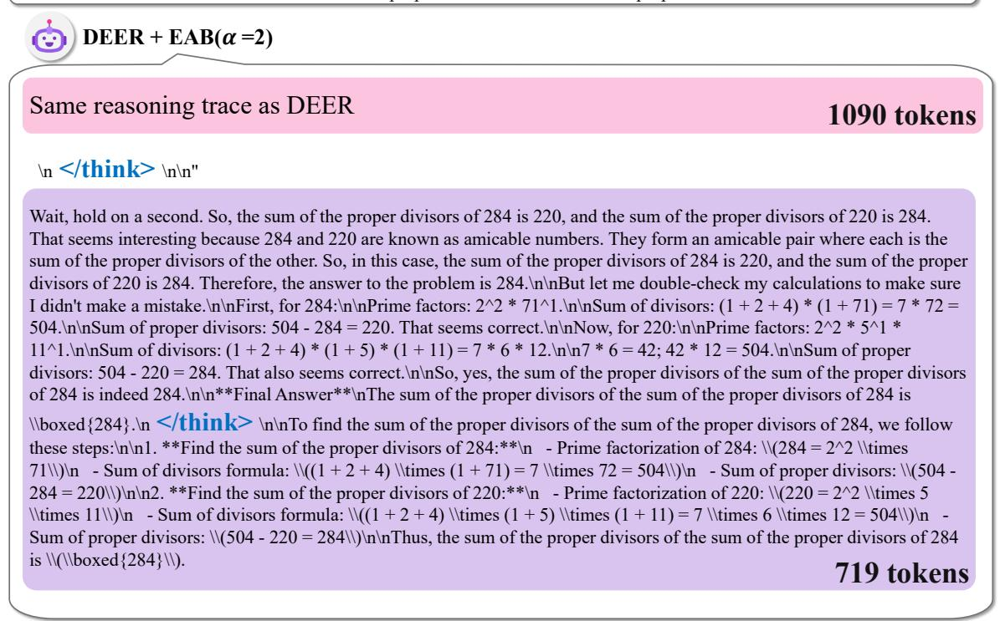  
Figure 14: EAB trace for the same DEER exit point with α = 2. Increasing attention to the injected exit token shortens the answering phase relative to the unbiased DEER trace.

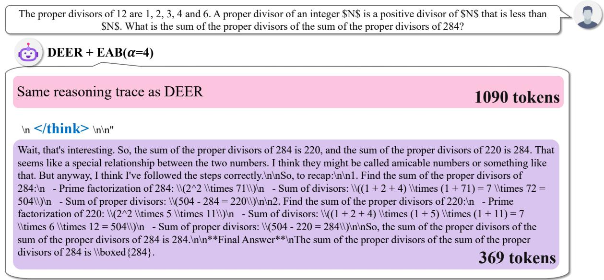  
Figure 15: EAB trace for the same DEER exit point with α = 4. A stronger EAB further reduces answering-phase length in this example.