# ACTREVIEW: Rebuttal-Guided Training Data and Rubric Rewards for Actionable Peer Review Generation

Yiling Ma<sup>Y</sup> Yilun Zhao<sup>Y</sup> \* Sihong Wu<sup>Y</sup> Ziyu Chen<sup>C</sup> Manasi Patwardhan<sup>T</sup> Arman Cohan<sup>Y</sup>

<sup>Y</sup> Yale University <sup>C</sup>University of Chicago <sup>T</sup> TCS Research

\*Correspondence to: Yilun Zhao (yilun.zhao@yale.edu)

## Abstract

As LLMs are increasingly used for pre-submission self-review, there is growing demand for feedback that not only identifies weaknesses but also guides authors toward concrete revisions. We study this as Actionable Peer-review Generation and decompose it into two subtasks: diagnostic claim generation and revision suggestion generation. We introduce ActReview, a rebuttal-guided post-training framework that connects paper-specific diagnoses to concrete, grounded revision plans. Our central insight is that author rebuttals reveal plausible actions for addressing reviewer concerns and can therefore provide latent supervision for revision-oriented feedback. From real review–rebuttal threads on OpenReview, we construct ActReview-40K by aligning reviewer weaknesses with author responses and grounding the resulting feedback in localized paper evidence. We post-train Qwen3-8B-Base with multi-task supervised fine-tuning followed by GRPO using candidate-aware, weakness-specific rubric rewards. We also introduce ActReview-Bench, a human-curated benchmark of 1,000 instances for evaluating diagnostic quality and revision usefulness. Experiments show that ActReview outperforms prior specialized review-generation models on actionability and grounding while remaining competitive with strong prompt-based LLMs. Human evaluation confirms improved revision usefulness while revealing a remaining gap in technical accuracy, and additional analyses support generalization to held-out papers and robustness across independent judges.

## Data: ActReview-40K

## Code: ActReview

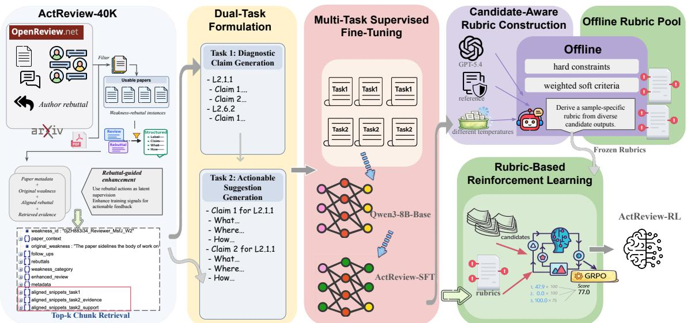  
Figure 1: Overview of the ActReview framework. From OpenReview’s review–rebuttal threads, we construct ActReview-40K and retrieve top-k paper chunks as localized context. The model is first trained via multi-task supervised fine-tuning on Qwen3-8B-Base for claim generation (Task 1) and actionable suggestion generation (Task 2), then further optimized with GRPO using weakness-specific rubrics constructed offline from ground-truth references and diverse candidate outputs scored by an LLM judge.

## 1 Introduction

The rapid growth of scholarly publications has placed increasing pressure on the peer-review system. At the same time, reviewers and authors are increasingly exploring LLMs to support review writing and pre-submission feedback [Liang et al., 2024, Wu et al., 2026a]. A key limitation is that existing LLM-based systems predominantly generate descriptive rather than prescriptive feedback: they can identify issues, but often fail to specify how those issues should be addressed [Jin et al., 2024, Gao et al., 2025, Wu et al., 2026b]. This limits their usefulness when authors need concrete next steps for revision.

Recent work has begun to study review feedback that goes beyond problem identification [D’Arcy et al., 2024, Zhu et al., 2025a, Wu et al., 2026b]. However, two gaps remain. First, existing formulations often treat review generation as a single task [Idahl and Ahmadi, 2025], without separating problem diagnosis from revision guidance. In practice, useful feedback must first identify what is wrong in the paper, and then explain how the issue can be revised in a grounded and implementable way. Second, existing peer-review resources [Zhu et al., 2025a, Zhang et al., 2025, Zhu et al., 2025b] rarely provide reference signals that explicitly connect reviewer-identified weaknesses with concrete revision guidance. As a result, it is difficult to evaluate whether a generated comment merely diagnoses a problem or also provides useful guidance about what to revise, where to revise, and how to carry out the revision.

To address these gaps, we formulate Actionable Peer-review Generation as a dual-task problem. Given a paper and a target weakness category, the model generates diagnostic claims that identify concrete paper deficiencies and actionable suggestions that describe how those deficiencies should be addressed. To support this setting, we construct ActReview-Bench, a benchmark grounded in real review–rebuttal threads. We use rebuttal-derived author actions as grounded reference signals, since rebuttals often reveal plausible ways to address reviewer concerns. This enables evaluation of both diagnostic quality and practical revision usefulness.

We then present ActReview, a rebuttal-guided post-training framework for this setting. We construct ActReview-40K by aligning atomic reviewer weaknesses with rebuttal spans and transforming them into structured initialreview-style feedback. The rebuttal is used only as latent supervision: it helps infer a concrete revision path, but the resulting feedback is written from the perspective of an initial reviewer. Unlike prior systems that condition on full-paper inputs [Zhu et al., 2025a, Idahl and Ahmadi, 2025], our framework retrieves localized paper evidence for the target weakness, reducing irrelevant context and providing more focused supervision.

We fine-tune Qwen3-8B-Base [Yang et al., 2025] on ActReview-40K with multi-task supervised fine-tuning. Since supervised models can still produce fluent but generic comments, we further apply GRPO [Shao et al., 2024] with candidate-aware, weakness-specific rubric rewards. These rubrics provide instance-level criteria for assessing diagnostic precision, grounding, and revision usefulness, encouraging the model to connect paper-specific weaknesses with concrete revision plans.

Experiments on ActReview-Bench show that ActReview improves over prior specialized review-generation models [Zhu et al., 2025a, Idahl and Ahmadi, 2025, Wu et al., 2026b] and remains competitive with strong prompt-based LLMs. Human evaluation shows stronger revision-oriented performance while identifying remaining challenges in technical accuracy. Controlled and independent analyses further validate the two-task formulation, generalization to held-out 2025–2026 papers, and robustness across human and independent LLM judges (Appendix F).

Our main contributions are as follows:

• We formulate Actionable Peer-review Generation as a dual-task problem covering diagnostic claim generation and actionable suggestion generation, and introduce ActReview-Bench, a human-curated benchmark for evaluating revision-oriented feedback (§3).

• We construct ActReview-40K, a large-scale rebuttal-guided training dataset that converts aligned weakness– response pairs into structured initial-review-style feedback (§4).

• We propose ActReview, combining multi-task SFT with GRPO and candidate-aware, weakness-specific rubric rewards, and validate it through automatic, judge-based, and human evaluation (§5).

## 2 Related Work

Peer-review Generation and Assistance. Recent work has explored LLMs for peer-review assistance, including review generation, rebuttal generation, reviewer–author interaction, and weakness discovery. Prompt-driven and agent-based systems support tasks such as author response generation, review discussion simulation, and critique discovery [Ma et al., 2026, Han et al., 2026, Ruan and Gurevych, 2026, Jin et al., 2024, Zou et al., 2026]. Another line of work trains or prompts models to generate review scores, strengths, weaknesses, questions, or full reviews [Weng et al., 2024, Gao et al., 2025, Wu et al., 2026b, Sharma et al., 2026, Zhu et al., 2025a, Idahl and Ahmadi, 2025]. These systems improve automated review assistance, but most formulations either treat review generation as a single output task or condition on full-paper inputs. LimitGen [Xu et al., 2025] benchmarks paper limitation identification using a limitation taxonomy, while AbGen [Zhao et al., 2025a] evaluates context-grounded ablation study design.

In contrast, our work separates reviewer-side feedback into diagnostic claim generation and revision suggestion generation, and uses review–rebuttal interactions to construct structured supervision for both subtasks.

Post-training for Non-verifiable Tasks. Our work is also related to post-training for non-verifiable tasks, where output quality cannot be measured by exact-match rewards. RLHF and related alignment methods often rely on scalar preference signals, which can be expensive to collect and too coarse for open-ended tasks requiring multi-dimensional judgments. Recent work therefore explores LLM-based evaluators, self-rewarding methods, and reference-based judges for open-ended evaluation and scalable reward modeling [Zheng et al., 2023, Yuan et al., 2024, Liu et al., 2026, Shi et al., 2026, Zhao et al., 2025b]. Other work replaces generic scalar rewards with structured rubrics or checklists to better capture task-specific quality criteria [Gunjal et al., 2025, Viswanathan et al., 2026]. At the same time, ranked or relative optimization methods have been explored to improve robustness under noisy or coarse reward signals [Choi et al., 2026]. Our method builds on rubric-based reward design, but constructs weakness-specific rubrics for individual paper–weakness instances, using both reference outputs and model candidate failures to define more targeted reward criteria.

## 3 Actionable Peer-Review Generation

## 3.1 Problem Formulation

As illustrated in Figure 1, we formulate Actionable Peer-review Generation as a dual-task problem that covers both problem diagnosis and revision guidance. The input consists of a paper context $C$ and a target weakness label w. The paper context includes paper metadata and retrieved paper chunks. The weakness label w specifies the type of concern to evaluate, such as missing or insufficient theoretical justification. These labels are drawn from our data-driven two-level weakness taxonomy, which is induced from peer-review data through LLM-assisted category discovery and human refinement. Full taxonomy details are provided in Appendix C.1.

Diagnostic claim generation. A diagnostic claim is a brief reviewer-side statement that identifies what is wrong with the paper under the target weakness label, rather than how to fix it. Given C and w, the model generates a set of claims

$$
\mathcal C = \mathcal G _ { \mathrm { c l a i m } } ( w , C ) = \{ c _ { 1 } , \dots , c _ { k } \} , \quad k \ge 0 .
$$

Each claim should identify a concrete paper deficiency supported by the context. If the context does not support the target weakness, the model should return no claim (k = 0) rather than hallucinate one.

Actionable suggestion generation. An actionable suggestion is revision guidance associated with a diagnostic claim. Given a claim $c \in { \mathcal { C } }$ , the weakness label w, and paper context C, the model generates

$$
r _ { \mathrm { a c t i o n } } ^ { ( c ) } = \mathcal { G } _ { \mathrm { a c t i o n } } ( c , w , C ) .
$$

The suggestion specifies what should be revised, where the revision should appear, how it can be implemented, and what outcome the revision is expected to achieve.

This formulation separates two abilities that are often conflated in review generation: detecting a paper-specific weakness and translating it into a concrete revision plan. The two tasks can be trained and evaluated separately, while also supporting an end-to-end review-to-revision workflow. A controlled comparison with joint end-to-end generation shows better suggestion quality and claim–suggestion alignment (Appendix F.1).

Weakness-conditioned inference. Our formulation is weakness-conditioned: each instance queries one target weakness label w, rather than requiring the model to consider all labels simultaneously. For full-paper auditing, the model can be applied independently to each label in the taxonomy. In each run, the model generates diagnostic claims only when the paper contains evidence supporting the queried weakness; otherwise, it should abstain and return None. Importantly, ActReview-40K and the main ActReview-Bench contain only reviewer-raised weakness– paper pairs and therefore provide no explicit negative training examples. Appendix G constructs a separate held-out set of $N _ { \mathrm { n e g } } { = } 3 6 0$ screened non-supported weakness–paper pairs and evaluates this behavior as zero-shot abstention.

## 3.2 ActReview-Bench Construction

Existing peer-review resources mainly preserve raw reviews, scores, or rebuttal discussions, but rarely provide structured reference signals that connect reviewer-identified weaknesses to concrete revision guidance [Zhang et al., 2025, Wu et al., 2026b, Zhu et al., 2025a, Idahl and Ahmadi, 2025]. To address this gap, we construct ActReview-Bench from real review–rebuttal threads, using rebuttal-derived author actions as grounded reference signals rather than unique gold answers.<sup>1</sup>

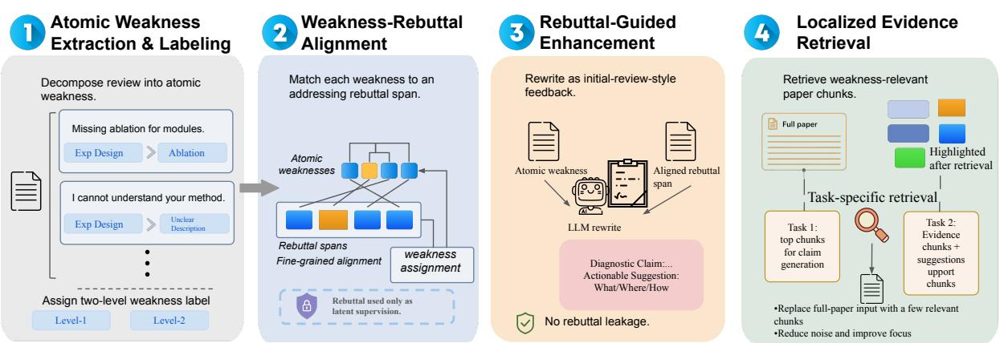  
Figure 2: Overview of the ActReview-40K construction pipeline. Starting from real review–rebuttal threads, we build structured training instances through four stages: atomic weakness extraction and labeling, weakness–rebuttal alignment, rebuttal-guided feedback enhancement, and localized evidence retrieval. The aligned rebuttal span is used only as latent supervision to rewrite reviewer weaknesses into initial-review-style diagnostic claims and actionable suggestions, while the final training inputs contain only paper metadata, weakness labels, and localized paper evidence (at ActReview-Bench evaluation time, localized evidence is replaced with full-paper context, as described in Section 4.4).

We begin with 2,000 candidate instances sampled from 4,000 automatically aligned weakness–response pairs and retain 1,000 high-quality benchmark instances after human annotation. Each candidate instance is independently annotated by two annotators. Annotators judge whether the rebuttal span (1) directly and substantively addresses the reviewer concern, (2) contains a concrete revision-oriented action, and (3) when follow-up reviewer discussion is available, remains supported by the discussion. Annotators also mark the rebuttal span that captures the relevant author action. Disagreements on the final keep/filter decision or the marked span are resolved by a third adjudicator.

Table 1 summarizes the human validation results. Using adjudicated labels as the reference, benchmark filtering achieves strong agreement and high filtering quality, indicating that the retained instances reliably satisfy our benchmark criteria. Appendix A covers annotation, retained/filtered examples, and benchmark scope.

## 4 ActReview-40K

We construct ActReview-40K through a multi-stage pipeline to provide large-scale supervision for the two subtasks in Section 3, with an overview shown in Figure 2. Each instance starts from a real review–rebuttal thread and is converted into structured initial-reviewstyle feedback. The construction has four steps: (1) extracting and labeling atomic reviewer weaknesses, (2) aligning each weakness with the rebuttal span that addresses it, (3) rewriting the aligned signal into diagnostic claims and revision suggestions, and (4) retrieving localized paper evidence.

<table><tr><td>Stage</td><td>Setting</td><td>Prec. Rec. F1 κ</td></tr><tr><td>Weakness-Rebuttal Alignment Filtered set</td><td></td><td>0.95 0.93 0.94 0.85</td></tr><tr><td>Benchmark Filtering</td><td>Retained set</td><td>0.93 0.86 0.89 0.84</td></tr></table>

Table 1: Human validation of alignment and filtering quality. Alignment is evaluated against adjudicated gold spans with token-level IoU ≥ 0.5 and filtering is evaluated against adjudicated keep/filter decisions. κ reports inter-annotator agreement.

## 4.1 Data Sources and Weakness Taxonomy

We collect review–rebuttal threads from OpenReview across ICLR, NeurIPS, and EMNLP (Table 8). After filtering for papers with usable reviewer concerns and author responses, we obtain 15,819 papers and approximately 40K weakness–response instances. Each weakness is assigned to a two-level taxonomy of paper weaknesses, induced from review data through LLM-assisted category discovery and human refinement. Full taxonomy definitions and validation details are provided in Appendix C.1.

## 4.2 Weakness Extraction and Rebuttal Alignment

Because review paragraphs often contain multiple concerns, we decompose each review into atomic weakness units, where each unit expresses one critique or request for improvement. This enables fine-grained alignment between reviewer concerns and author responses. We then align each atomic weakness to the rebuttal span that substantively addresses it using a two-stage procedure: candidate span retrieval based on structural and lexical cues, followed by LLM-based semantic alignment. Human validation on a stratified sample confirms strong alignment quality (Table 1); protocol details and residual errors are provided in Appendix C.3.

## 4.3 Rebuttal-Guided Feedback Enhancement

Raw reviewer comments often identify a problem without specifying a concrete revision path, while author rebuttals frequently reveal how the concern can be addressed. We use this signal as latent supervision: the aligned rebuttal span helps infer a plausible revision action, but the generated feedback must be written from the perspective of an initial reviewer and must not mention the rebuttal, author response, or any post-submission change.

For each aligned weakness–rebuttal pair, we prompt GPT-5.4 to produce two structured fields. The first is a diagnostic claim, which states the core paper-specific deficiency. The second is a set of revision suggestions, which specify what should be revised, where the revision should appear, how it can be implemented, and what outcome the revision is expected to achieve. The aligned rebuttal span is included only as background evidence during data construction, and is never provided to the model during training or evaluation.

We apply automatic filters to remove enhancement artifacts, including rebuttal leakage, retrospective rewrites, near-copying of rebuttal spans, and underspecified suggestions. A human audit of 500 stratified enhanced instances yields substantial agreement on binary acceptability $( \kappa = 0 . 7 8 )$ and an overall acceptability rate of 84.8%, suggesting that most enhanced instances provide reliable supervision for revision-oriented feedback generation. Full prompts, filtering rules, and criterion-level audit results are provided in Appendix C.4 and Appendix C.5.

## 4.4 Localized Evidence Retrieval

For ActReview-40K construction, we retrieve localized paper chunks rather than using the full paper as training context. Papers are converted into structured text and segmented into paragraph-level chunks with page and section metadata. Task 1 retrieves evidence for weakness diagnosis, while Task 2 uses evidence-support and revision-support channels to identify chunks that ground the concern and localize concrete revisions. Rebuttal-derived fields are used only offline as latent supervision for retrieval; the selected content is extracted entirely from the paper and contains no rebuttal text. At ActReview-Bench evaluation time, all systems receive the same full-paper context, paper metadata, and target weakness label. Retrieval validation and analysis of globally distributed evidence are provided in Appendix C.6 and Appendix F.5.

## 5 Post-Training Framework

We train the model in two stages. First, supervised fine-tuning (SFT) teaches the model the dual-task output format and reviewer-style generation. Second, GRPO post-training uses weakness-specific rubric rewards to encourage diagnostic precision, contextual grounding, and revision usefulness. We partition the enhanced instances into 90% for SFT and 10% for RL. In the RL stage, reference claims and suggestions are not used as direct supervision; they are used only offline to construct frozen instance-specific reward rubrics for RL training instances. The RL training and rubric-construction instances are disjoint from ActReview-Bench evaluation instances.

## 5.1 Multi-Task Supervised Fine-Tuning

We perform full-parameter SFT on Qwen3-8B-Base using the enhanced instances from Section 4.3. Task 1 maps a weakness label and retrieved paper chunks to diagnostic claims, while Task 2 maps a diagnostic claim and related paper context to structured revision suggestions. The two tasks share a unified instruction format and are trained jointly within a single multi-task model. We optimize the standard autoregressive objective over the enhanced training set $\mathcal { D } _ { \mathrm { S F T } }$ . Although SFT learns the schema and reviewer-style phrasing, it can still produce fluent but generic feedback, motivating a second stage with more targeted reward signals.

## 5.2 Candidate-Aware Rubric Construction

Generic rubrics apply the same criteria across instances and cannot specify which evidence, experiment, or revision location matters for a particular paper. We therefore construct candidate-aware weakness-specific rubrics. For each RL instance, we sample diverse SFT outputs and combine them with a human-written reference and a GPT-5.4- generated reference. GPT-5.4 then synthesizes a frozen rubric with hard constraints and weighted soft requirements. This rubric captures both desirable revision targets and common failure modes in candidate outputs. Appendix D provides examples, and Section 6.4 evaluates the effect of reward design.

## 5.3 Rubric-Based Reinforcement Learning

We clarify that only the SFT-trained model is further optimized with GRPO and all other baselines are not subject to RL training. Specifically, ActReview-SFT serves as the initialization policy, and GRPO is applied to obtain ActReview-RL [Shao et al., 2024]. For each prompt, the policy samples K=8 responses, each scored by the frozen rubric. Outputs violating hard constraints receive zero reward; otherwise, the reward is computed from weighted

<table><tr><td rowspan="3">Baseline</td><td colspan="6">Task 1: Weakness claim discovery</td><td colspan="6">Task 2: Actionable suggestions</td></tr><tr><td colspan="3">Content quality</td><td colspan="3">Task-specific</td><td colspan="3">Content quality</td><td colspan="3">Task-specific</td></tr><tr><td>R-L↑</td><td>Sem.sim↑</td><td>BLEU↑</td><td>n claims</td><td> $\mathrm { s p e c . } ^ { \uparrow }$ </td><td>Rubric↑</td><td>R-L↑</td><td>Sem.sim↑</td><td>BLEU↑</td><td>Sugg.sim↑</td><td>Evid.spec↑</td><td>Rubric↑</td></tr><tr><td>GPT-5.1</td><td>16.32</td><td>49.69</td><td>5.42</td><td>2.84</td><td>0.31</td><td>0.52</td><td>26.86</td><td>83.71</td><td>23.46</td><td>1.62</td><td>0.61</td><td>0.59</td></tr><tr><td>Gemini-3.1-Pro-Pre</td><td>17.64</td><td>48.30</td><td>5.92</td><td>2.91</td><td>0.27</td><td>0.48</td><td>28.16</td><td>81.03</td><td>25.90</td><td>2.00</td><td>0.72</td><td>0.58</td></tr><tr><td>DeepReviewer-14B</td><td>16.11</td><td>44.74</td><td>3.60</td><td>2.93</td><td>0.39</td><td>0.30</td><td>25.01</td><td>67.54</td><td>13.73</td><td>1.95</td><td>0.00</td><td>0.12</td></tr><tr><td>OpenReviewer-8B</td><td>19.21</td><td>35.92</td><td>7.30</td><td>3.71</td><td>0.10</td><td>0.19</td><td>23.21</td><td>70.72</td><td>4.50</td><td>0.00</td><td>0.00</td><td>0.00</td></tr><tr><td>RbtAct-8B</td><td>23.89</td><td>37.78</td><td>10.54</td><td>2.67</td><td>0.36</td><td>0.44</td><td>27.21</td><td>75.78</td><td>28.73</td><td>1.81</td><td>1.57</td><td>0.57</td></tr><tr><td>Qwen3-32B</td><td>22.07</td><td>36.13</td><td>8.85</td><td>1.60</td><td>0.20</td><td>0.40</td><td>30.27</td><td>69.20</td><td>25.41</td><td>2.01</td><td>1.20</td><td>0.54</td></tr><tr><td>ActReview-SFT</td><td>24.60+0.71</td><td>47.90-1.79</td><td>11.12+0.58</td><td>1.74</td><td>0.96+0.57</td><td>0.59+0.07</td><td>35.50+5.23</td><td>84.10+0.39</td><td>34.10+5.37</td><td>2.40+0.39</td><td>3.30+1.73</td><td>0.71+0.12</td></tr><tr><td>ActReview-RL</td><td>28.24+4.35</td><td>52.10+2.41</td><td>12.04+1.50</td><td>1.24</td><td>0.57+0.18</td><td>0.65+0.13</td><td>37.54+7.27</td><td>83.89+0.18</td><td>36.78+8.05</td><td>2.54+0.53</td><td>3.39+1.82</td><td>0.78+0.19</td></tr></table>

Table 2: Main results on ActReview-Bench for Task 1 and Task 2. All models are evaluated on the same test set. LLM-based evaluation is conducted on 1,000 samples, while human evaluation is conducted on a 200-sample subset for annotation cost reasons. Rubric denotes the rubric-based LLM-judge overall score in [0, 1]. The best-performing baseline for each metric is highlighted in green. Red superscripts denote the change of ActReview-SFT and ActReview-RL relative to the best baseline for that metric.

soft-requirement scores, using deterministic checks for format-related criteria and GPT-5.4 for semantic criteria.   
GRPO updates the policy with group-relative rewards and KL regularization toward the SFT reference model.

## 6 Experiments

We evaluate whether ActReview generates feedback that is paper-specific, grounded, and useful for revision. Our experiments address four questions: (1) how ActReview compares with strong prompt-based LLMs and specialized review-generation systems; (2) whether LLM-judge results are supported by human evaluation; (3) whether gains are reflected in automatic and reference-based metrics; and (4) which components of data construction, retrieval, and reward design drive the improvements.

## 6.1 Baselines

We compare against two groups of baselines. First, we evaluate strong prompt-based LLMs, including GPT-5.1 and Gemini-3.1-Pro-Preview. Each is tested in both a free-form zero-shot setting and a schema-controlled setting that follows our diagnostic-claim format for Task 1 and the What/Where/How structure for Task 2. This controls for the possibility that improvements come merely from output formatting. Second, we compare with specialized or strong open-source review-generation systems, including DeepReviewer-14B [Zhu et al., 2025a], OpenReviewer [Idahl and Ahmadi, 2025], RbtAct [Wu et al., 2026b], and Qwen3-32B [Yang et al., 2025], evaluated by direct inference with their released checkpoints, without any ActReview-Bench-specific fine-tuning. These systems were pretrained on different data and, in most cases, different tasks. This is intentional: we measure their out-of-the-box transfer to ActReview-Bench, so the reported gap partly reflects baseline transfer, not only capability. We also report ACTREVIEW-SFT and ACTREVIEW-RL, corresponding to our supervised-only and full post-training variants. During ActReview-Bench evaluation, all systems receive identical paper metadata, the target weakness label, and full-paper context. Rebuttals are used only to construct data and rewards, never as evaluation input.

## 6.2 Evaluation Protocol

We use three complementary evaluation protocols. First, we conduct pairwise LLM-as-a-judge evaluation using GPT-5.4 on the full evaluation set. For each instance, ActReview-RL is compared with a baseline output under the same input. The judge selects ActReview-RL, the baseline, or tie. We report adjusted win rate, where a win counts as 1, a tie as 0.5, and a loss as 0; thus, 50 indicates parity. Both tasks are evaluated on Technical Accuracy, Depth & Constructiveness, and Overall quality, with one task-specific dimension: Specificity & Grounding for Task 1 and Actionability for Task 2.

Human Evaluation. We conduct human evaluation on a 200-instance subset using the same pairwise protocol. Each comparison is independently annotated by two graduate-level annotators with peer-review experience. Model identities are hidden and output order is randomized. The annotators make identical categorical choices in 93% of pairwise judgments, suggesting high agreement. Our primary comparisons do not rely on exact matching to the rewritten reference. The pairwise LLM and human evaluations compare model outputs directly under the same paper context and target weakness label, rather than scoring surface similarity to the reference. We use reference-based metrics only as complementary diagnostics of content overlap, granularity, and evidence specificity.

<table><tr><td rowspan="3">Baseline</td><td colspan="8">Task 1: Diagnostic Claims</td><td colspan="8">Task 2: Actionable Suggestions</td></tr><tr><td colspan="2">Tech. Acc.</td><td colspan="2">Depth</td><td colspan="2">Spec./Gnd.</td><td colspan="2">Overall</td><td colspan="2">Tech. Acc.</td><td colspan="2">Depth</td><td colspan="2">Action.</td><td colspan="2">Overall</td></tr><tr><td>LLM</td><td>Hum.</td><td>LLM</td><td>Hum.</td><td>LLM</td><td>Hum.</td><td>LLM</td><td>Hum.</td><td>LLM</td><td>Hum.</td><td>LLM</td><td>Hum.</td><td>LLM</td><td>Hum.</td><td>LLM</td><td>Hum.</td></tr><tr><td>GPT-5.1</td><td>48.3</td><td>49.6</td><td>51.5</td><td>54.7</td><td>56.3</td><td>55.84</td><td>51.2</td><td>55.1</td><td>48.2</td><td>51.3</td><td>53.6</td><td>55.3</td><td>57.1</td><td>56.3</td><td>51.9</td><td>56.8</td></tr><tr><td>GPT-5.1schema</td><td>55.7</td><td>53.3</td><td>53.6</td><td>57.8</td><td>56.8</td><td>58.9</td><td>55.1</td><td>54.3</td><td>56.3</td><td>56.9</td><td>55.4</td><td>57.2</td><td>64.0</td><td>59.7</td><td>58.8</td><td>57.1</td></tr><tr><td>Gemini-3.1-Pro-Pre</td><td>50.3</td><td>50.1</td><td>54.9</td><td>55.6</td><td>55.5</td><td>60.6</td><td>53.0</td><td>56.5</td><td>54.3</td><td>53.1</td><td>52.1</td><td>53.3</td><td>57.0</td><td>63.5</td><td>55.5</td><td>53.2</td></tr><tr><td>Geminischema</td><td>57.1</td><td>54.9</td><td>55.6</td><td>58.1</td><td>58.3</td><td>63.7</td><td>56.9</td><td>59.9</td><td>59.2</td><td>56.1</td><td>54.7</td><td>59.2</td><td>60.1</td><td>64.9</td><td>56.6</td><td>54.7</td></tr><tr><td>RbtAct</td><td>61.8</td><td>64.4</td><td>55.7</td><td>57.8</td><td>62.2</td><td>58.7</td><td>57.3</td><td>62.0</td><td>57.5</td><td>58.3</td><td>70.2</td><td>67.5</td><td>53.3</td><td>54.5</td><td>56.2</td><td>59.8</td></tr><tr><td>DeepReviewer-14B</td><td>75.5</td><td>76.2</td><td>68.2</td><td>71.9</td><td>67.8</td><td>66.1</td><td>70.4</td><td>72.8</td><td>69.7</td><td>69.4</td><td>68.2</td><td>70.9</td><td>84.4</td><td>77.3</td><td>68.2</td><td>71.9</td></tr><tr><td>OpenReviewer-8B</td><td>67.5</td><td>69.1</td><td>65.3</td><td>65.8</td><td>70.1</td><td>69.1</td><td>66.7</td><td>66.0</td><td>63.2</td><td>64.7</td><td>72.0</td><td>70.5</td><td>80.1</td><td>74.5</td><td>67.8</td><td>72.7</td></tr><tr><td>Qwen3-32B</td><td>67.2</td><td>69.8</td><td>62.6</td><td>61.3</td><td>72.5</td><td>67.2</td><td>65.9</td><td>62.7</td><td>56.0</td><td>61.6</td><td>56.5</td><td>54.3</td><td>57.9</td><td>59.7</td><td>60.0</td><td>57.6</td></tr></table>

Table 3: Pairwise LLM-as-a-Judge and human evaluation. Values report the adjusted win rate of ActReview-RL against each baseline, where ties count as half a win: Adj. Win $\mathrm { R a t e } = \mathrm { W i n } + 0 . 5 \times \mathrm { T i e }$ . LLM columns use GPT-5.4 on 1,000 instances, while Hum. columns use human annotations on a 200-instance subset, enabling direct comparison under the same win-rate scale. $\mathrm { G P T } { - } 5 . 1 _ { \mathrm { s c h e m a } }$ and Gemini<sub>schema</sub> denote schema-guided prompting variants with structured output constraints. For Task 1, Tech. Acc. = Technical Accuracy, Depth = Depth & Constructiveness, and $\mathrm { S p e c . / G n d . } = \mathrm { S p e c i f i c i t y }$ & Grounding. For Task 2, Tech. Acc. and Depth have the same meanings, and Action. measures how directly useful the suggestion is for revision.
<table><tr><td rowspan="2">Ablation Variant</td><td rowspan="2"></td><td colspan="5">Task 1: Diagnostic Claims</td><td colspan="5">Task 2: Actionable Suggestions</td></tr><tr><td>R-L↑</td><td>Sem.sim↑</td><td>BLEU↑</td><td>n claims</td><td> $\mathrm { S p e c . \uparrow }$ </td><td>R-L↑</td><td>Sem.sim↑</td><td>BLEU↑</td><td>Sugg.sim↑ Evid.spec↑</td><td></td></tr><tr><td rowspan="2">Data</td><td>Raw review data</td><td>26.40</td><td>42.20</td><td>10.81</td><td>1.00</td><td>0.27</td><td>23.90</td><td>66.71</td><td>6.21</td><td>1.00</td><td>0.05</td></tr><tr><td>Rebuttal-enhanced data 24.60-1.80</td><td></td><td>47.90+5.70</td><td>11.12+0.31</td><td>1.74</td><td>0.96+0.69</td><td>35.50+11.60</td><td>84.11+17.4034.10+27.89</td><td></td><td>2.39+1.39</td><td>3.31+3.26</td></tr><tr><td>Context</td><td>Retrieved chunks Full paper text</td><td>24.60  $2 4 . 1 0 ^ { - 0 . 5 0 }$ </td><td>47.96  $4 3 . 2 6 ^ { - 4 . 7 0 }$ </td><td>11.12 10.80-0.32</td><td>1.74 1.77</td><td>0.96  $\mathbf { 1 . 0 0 ^ { + 0 . 0 4 } }$ </td><td>35.50  $3 4 . 6 7 ^ { - 0 . 8 3 }$ </td><td>84.10  $8 2 . 1 3 ^ { - 1 . 9 7 }$ </td><td> $3 4 . 1 0$   $\mathbf { 3 5 . 1 9 ^ { + 1 . 0 9 } }$ </td><td>2.40  $2 . 5 1 ^ { + 0 . 1 1 }$ </td><td>3.30  ${ \pm } 3 . 3 7 ^ { + 0 . 0 7 }$ </td></tr></table>

Table 4: Ablation studies on data construction and training context. Data compares raw-review and rebuttalenhanced training. Context compares retrieved-chunk and full-paper training; both are evaluated with full-paper input. Deltas are relative to the first variant in each block.

Automated Evaluation. We also report automatic and reference-based metrics as complementary diagnostics. We include ROUGE-L, BLEU, sentence-level semantic similarity, and task-specific metrics such as claim count, specificity, suggestion similarity, evidence specificity, and rubric score. Because actionable feedback is open-ended, we treat these metrics as supporting evidence rather than as the sole measure of output quality. Metric definitions, judge prompts, bootstrap confidence intervals, and human annotation details are provided in Appendix E.

## 6.3 Main Results

Automatic and reference-based results. Table 2 shows that ActReview-RL improves over ActReview-SFT on most reference-based and task-specific metrics. For Task 1, it improves ROUGE-L, BLEU, semantic similarity, specificity, and rubric score. It also reduces the over-generation observed in zero-shot baselines, producing 1.24 claims per instance, which is closer to the reference average of 1.37 claims per instance than baselines that often generate two or more claims. We interpret claim count as a calibration signal rather than a standalone quality measure: overly many claims may indicate unfocused weakness discovery, while overly few claims may under-cover valid paper weaknesses. For Task 2, ActReview-RL achieves the strongest trained-model results on ROUGE-L, BLEU, suggestion similarity, evidence specificity, and rubric score, suggesting better alignment with reference revision guidance and paper-specific evidence.

Pairwise LLM and human evaluation. Table 3 reports GPT-5.4 and human pairwise comparisons under the same adjusted-win-rate scale. Both signals show that ActReview-RL is clearly preferred over prior specialized review-generation baselines, especially on Task 2 Actionability and Overall quality. Against GPT-5.1, Gemini, and their schema-controlled variants, preferences are closer to parity, indicating that output structure explains part of the gap. Technical Accuracy is also the most competitive dimension for frontier LLMs, so our results should not be read as universal technical superiority. Rather, the main gains are concentrated on revision-oriented dimensions: more specific diagnostic claims, deeper constructive feedback, and more actionable suggestions. The agreement between human and GPT-5.4 trends supports using GPT-5.4 as a scalable proxy for aggregate comparison, while human evaluation remains the higher-trust validation signal. An independent Claude evaluation yields similar aggregate trends and instance-level agreement with humans (Appendix F.3).

<table><tr><td>Reward Setting</td><td></td><td>T1 Tech. T1 Overall T2 Action. T2 Overall</td><td></td><td></td></tr><tr><td>SFT only</td><td>62.1</td><td>59.4</td><td>65.2</td><td>62.8</td></tr><tr><td>GRPO w/ fixed task-level rubric</td><td>60.0</td><td>60.7</td><td>64.1</td><td>61.0</td></tr><tr><td>GRPO w/ direct judge reward</td><td>65.8</td><td>65.1</td><td>72.4</td><td>68.7</td></tr><tr><td>GRPO w/ candidate-aware rubric</td><td>68.5</td><td>69.3</td><td>77.6</td><td>73.4</td></tr></table>

Table 5: Reward design ablation. We compare SFT only with GRPO variants using increasingly structured reward signals: direct LLM-judge reward without rubrics, a fixed task-level rubric shared across instances, and our candidate-aware rubric. Scores are GPT-5.4 judge scores on ActReview-Bench.

<table><tr><td>Formulation</td><td></td><td></td><td></td><td></td><td>T1 Spec./Gnd. T1 Overall T2 Action. T2 Overall Claim–Sugg. Align.</td></tr><tr><td>End-to-end SFT</td><td>2.91</td><td>2.84</td><td>3.07</td><td>2.76</td><td>3.13</td></tr><tr><td>Two-task SFT</td><td> $3 . 1 5 ^ { + 0 . 2 4 }$ </td><td> $3 . 0 2 ^ { + 0 . 1 8 }$ </td><td> $3 . 3 1 \substack { + 0 . 2 4 }$ </td><td> $3 . 1 8 ^ { + 0 . 4 2 }$ </td><td> $3 . 4 8 ^ { + 0 . 3 5 }$ </td></tr></table>

Table 6: Task-formulation ablation comparing end-to-end and two-task SFT under the same backbone, training instances, and evaluation protocol. Scores are GPT-5.4 rubric ratings on a 0–5 scale over 200 ActReview-Bench instances. Superscripts report improvements over end-to-end SFT.

## 6.4 Ablation Study

Tables 4 and 5 show that each major component contributes to the final system. Rebuttal-enhanced training data yields particularly large gains for Task 2, supporting the use of author responses as latent supervision for revision planning. Localized training context remains competitive with full-paper training on the aggregate benchmark while using shorter and more focused inputs. However, a targeted analysis shows that full-paper training is preferable for concerns requiring cross-section reasoning (Appendix F.5).

Candidate-aware rubric rewards outperform both direct judge rewards and a fixed task-level rubric, demonstrating the value of instance-specific reward criteria. We additionally compare the two-task SFT formulation against an end-to-end SFT variant under the same backbone, training instances, and evaluation protocol. The two-task formulation improves Task 2 Overall by 0.42 points and Claim–Suggestion Alignment by 0.35 points, indicating that explicitly separating diagnosis from revision planning strengthens the connection between the identified weakness and the proposed action (Appendix F.1).

## 6.5 Generalization and Reliability

Additional evaluations support the robustness of our findings. On 175 independently annotated instances from held-out 2025–2026 papers, ACTREVIEW-RL remains comparable to $\mathrm { G P T } { - } 5 . 1 _ { \mathrm { s c h e m a } }$ in weakness validity and technical correctness while improving resolution sufficiency and reviewer usefulness (Appendix F.2). Independent Claude and human judgments show trends consistent with GPT-5.4 (Appendix F.3). On the same 175 instances, fine-grained technical-error analysis shows ACTREVIEW-RL has the lowest severe-error rate (6.29%) among all evaluated systems and an overall technical-error rate (28.00%) no higher than the baselines’, so the gains in actionability are not offset by more severe scientific failures (Appendix F.4). Full-paper training also improves cross-section reasoning over localized-chunk training (mean score 1.49 vs. 1.17) at a small cost in resolution sufficiency, and on 50 hard cases with an incomplete rebuttal, ACTREVIEW-RL extends or rejects the original resolution 66% of the time rather than reproducing it (Appendices F.5 and F.6). ACTREVIEW-RL also abstains correctly on 78.3% of 360 screened non-supported weakness–paper pairs while maintaining a 95.4% Answer Rate on supported instances, substantially outperforming the strongest baseline evaluated (Appendix G).

## 7 Conclusion

We introduced ActReview, a Review2Revise framework for actionable peer-review generation that separates diagnostic claim generation from revision suggestion generation. Using real-world review–rebuttal threads, we construct ActReview-40K by treating rebuttals as latent supervision to rewrite raw reviewer weaknesses into structured revision-oriented feedback, and further optimize the model with candidate-aware weakness-specific rubric rewards. Experiments on ActReview-Bench show that ActReview consistently outperforms prior specialized review-generation systems on actionability and grounding, and remains competitive with strong prompt-based LLMs despite an order-of-magnitude parameter gap. Ablation studies confirm that rebuttal-guided enhancement and candidate-aware rubric rewards each contribute independently to output quality. More broadly, our results suggest that review–rebuttal interactions are a valuable and underexploited source of supervision, and that structurally separating weakness diagnosis from revision guidance produces more targeted and executable feedback than treating review generation as a single task.

## Limitations

Our work has three main limitations. First, ActReview-Bench focuses on rebuttal-resolvable weaknesses, where reviewer concerns can be linked to concrete author-side revision actions. This enables grounded evaluation of actionable feedback, but excludes concerns such as fundamental novelty disputes, deep conceptual disagreements, or irreparable methodological flaws, which may require broader literature comparison or interactive research guidance. Second, while ActReview improves revision-oriented dimensions such as grounding and actionability, it does not uniformly outperform strong proprietary LLMs on technical accuracy. This suggests that our framework is most effective at making feedback more specific and useful for revision, while deeper technical judgment remains an important direction for future work. Third, because GPT-5.4 is used for data enhancement, rubric construction, semantic reward scoring, and scalable pairwise evaluation, our pipeline may still be affected by judge-model coupling. We reduce this risk through offline rubric construction, disjoint evaluation instances, direct pairwise comparison under the same paper context, and human evaluation on a 200-instance subset, where human preferences largely follow the LLM-judge trends. Future work should further validate actionable peer-review generation with more diverse independent judges and larger-scale expert evaluation.

## References

Weixin Liang, Yaohui Zhang, Zhengxuan Wu, Haley Lepp, Wenlong Ji, Xuandong Zhao, Hancheng Cao, Sheng Liu, Siyu He, Zhi Huang, et al. Mapping the increasing use of llms in scientific papers. arXiv preprint arXiv:2404.01268, 2024.

Sihong Wu, Owen Jiang, Yilun Zhao, Tiansheng Hu, Yiling Ma, Kaiyan Zhang, Manasi Patwardhan, and Arman Cohan. Can ai be a good peer reviewer? a survey of peer review process, evaluation, and the future. arXiv preprint arXiv:2604.27924, 2026a.

Yiqiao Jin, Qinlin Zhao, Yiyang Wang, Hao Chen, Kaijie Zhu, Yijia Xiao, and Jindong Wang. AgentReview: Exploring peer review dynamics with LLM agents. In Yaser Al-Onaizan, Mohit Bansal, and Yun-Nung Chen, editors, Proceedings of the 2024 Conference on Empirical Methods in Natural Language Processing, pages 1208–1226, Miami, Florida, USA, November 2024. Association for Computational Linguistics. doi: 10.18653/ v1/2024.emnlp-main.70. URL https://aclanthology.org/2024.emnlp-main.70/.

Xian Gao, Jiacheng Ruan, Zongyun Zhang, Jingsheng Gao, Ting Liu, and Yuzhuo Fu. Reviewagents: Bridging the gap between human and ai-generated paper reviews. arXiv preprint arXiv:2503.08506, 2025.

Sihong Wu, Yiling Ma, Yilun Zhao, Tiansheng Hu, Owen Jiang, Manasi Patwardhan, and Arman Cohan. Rbtact: Rebuttal as supervision for actionable review feedback generation. arXiv preprint arXiv:2603.09723, 2026b.

Mike D’Arcy, Tom Hope, Larry Birnbaum, and Doug Downey. Marg: Multi-agent review generation for scientific papers, 2024. URL https://arxiv.org/abs/2401.04259.

Minjun Zhu, Yixuan Weng, Linyi Yang, and Yue Zhang. Deepreview: Improving llm-based paper review with human-like deep thinking process. In Proceedings ofthe 63rd Annual Meeting ofthe Associationfor Computational Linguistics (Volume 1: Long Papers), pages 29330–29355, 2025a.

Maximilian Idahl and Zahra Ahmadi. OpenReviewer: A specialized large language model for generating critical scientific paper reviews. In Nouha Dziri, Sean (Xiang) Ren, and Shizhe Diao, editors, Proceedings of the 2025 Conference ofthe Nations ofthe Americas Chapter ofthe Associationfor Computational Linguistics: Human Language Technologies (System Demonstrations), pages 550–562, Albuquerque, New Mexico, April 2025. Association for Computational Linguistics. ISBN 979-8-89176-191-9. doi: 10.18653/v1/2025.naacl-demo.44. URL https://aclanthology.org/2025.naacl-demo.44/.

Daoze Zhang, Zhijian Bao, Sihang Du, Zhiyi Zhao, Kuangling Zhang, Dezheng Bao, and Yang Yang. Re<sup>2</sup>: A consistency-ensured dataset for full-stage peer review and multi-turn rebuttal discussions. arXiv preprint arXiv:2505.07920, 2025.

Changjia Zhu, Junjie Xiong, Renkai Ma, Zhicong Lu, Yao Liu, and Lingyao Li. When your reviewer is an llm: Biases, divergence, and prompt injection risks in peer review. arXiv preprint arXiv:2509.09912, 2025b.

An Yang, Anfeng Li, Baosong Yang, Beichen Zhang, Binyuan Hui, Bo Zheng, Bowen Yu, Chang Gao, Chengen Huang, Chenxu Lv, et al. Qwen3 technical report. arXiv preprint arXiv:2505.09388, 2025.

Zhihong Shao, Peiyi Wang, Qihao Zhu, Runxin Xu, Junxiao Song, Xiao Bi, Haowei Zhang, Mingchuan Zhang, Y. K. Li, Y. Wu, and Daya Guo. Deepseekmath: Pushing the limits of mathematical reasoning in open language models, 2024. URL https://arxiv.org/abs/2402.03300.

Qianli Ma, Chang Guo, Zhiheng Tian, Siyu Wang, Jipeng Xiao, Yuanhao Yue, and Zhipeng Zhang. Paper2rebuttal: A multi-agent framework for transparent author response assistance. arXiv preprint arXiv:2601.14171, 2026.

Peixuan Han, Yingjie Yu, Jingjun Xu, and Jiaxuan You. Drpg (decompose, retrieve, plan, generate): An agentic framework for academic rebuttal. arXiv preprint arXiv:2601.18081, 2026.

Qian Ruan and Iryna Gurevych. Author-in-the-loop response generation and evaluation: Integrating author expertise and intent in responses to peer review. arXiv preprint arXiv:2602.11173, 2026.

Zhuoyang Zou, Abolfazl Ansari, Delvin Ce Zhang, Dongwon Lee, and Wenpeng Yin. Diagpaper: Diagnosing valid and specific weaknesses in scientific papers via multi-agent reasoning. arXiv preprint arXiv:2601.07611, 2026.

Yixuan Weng, Minjun Zhu, Guangsheng Bao, Hongbo Zhang, Jindong Wang, Yue Zhang, and Linyi Yang. Cycleresearcher: Improving automated research via automated review. arXiv preprint arXiv:2411.00816, 2024.

Karun Sharma, Vidushee Vats, Shengzhi Li, Yuxiang Wang, Zhongtian Sun, and Prayag Tiwari. Intelliask: Learning to ask high-quality research questions via rlvr, 2026. URL https://arxiv.org/abs/2602.15849.

Zhijian Xu, Yilun Zhao, Manasi Patwardhan, Lovekesh Vig, and Arman Cohan. Can llms identify critical limitations within scientific research? A systematic evaluation on AI research papers. In Wanxiang Che, Joyce Nabende, Ekaterina Shutova, and Mohammad Taher Pilehvar, editors, Proceedings of the 63rd Annual Meeting of the Association for Computational Linguistics (Volume 1: Long Papers), ACL 2025, Vienna, Austria, July 27 - August 1, 2025, pages 20652–20706. Association for Computational Linguistics, 2025. doi: 10.18653/V1/2025. ACL-LONG.1009. URL https://doi.org/10.18653/v1/2025.acl-long.1009.

Yilun Zhao, Weiyuan Chen, Zhijian Xu, Manasi Patwardhan, Chengye Wang, Yixin Liu, Lovekesh Vig, and Arman Cohan. Abgen: Evaluating large language models in ablation study design and evaluation for scientific research. In Wanxiang Che, Joyce Nabende, Ekaterina Shutova, and Mohammad Taher Pilehvar, editors, Proceedings of the 63rd Annual Meeting of the Association for Computational Linguistics (Volume 1: Long Papers), ACL 2025, Vienna, Austria, July 27 - August 1, 2025, pages 12479–12491. Association for Computational Linguistics, 2025a. doi: 10.18653/V1/2025.ACL-LONG.611. URL https://doi.org/10.18653/v1/2025.acl-long. 611.

Lianmin Zheng, Wei-Lin Chiang, Ying Sheng, Siyuan Zhuang, Zhanghao Wu, Yonghao Zhuang, Zi Lin, Zhuohan Li, Dacheng Li, Eric Xing, et al. Judging llm-as-a-judge with mt-bench and chatbot arena. Advances in neural information processing systems, 36:46595–46623, 2023.

Weizhe Yuan, Richard Yuanzhe Pang, Kyunghyun Cho, Xian Li, Sainbayar Sukhbaatar, Jing Xu, and Jason E Weston. Self-rewarding language models. In Forty-first International Conference on Machine Learning, 2024.

Yixin Liu, Yue Yu, DiJia Su, Sid Wang, Xuewei Wang, Song Jiang, Bo Liu, Arman Cohan, Yuandong Tian, and Zhengxing Chen. Examining reasoning llms-as-judges in non-verifiable llm post-training, 2026. URL https://arxiv.org/abs/2603.12246.

Kejian Shi, Yixin Liu, Peifeng Wang, Alexander R. Fabbri, Shafiq Joty, and Arman Cohan. References improve llm alignment in non-verifiable domains, 2026. URL https://arxiv.org/abs/2602.16802.

Yilun Zhao, Kaiyan Zhang, Tiansheng Hu, Sihong Wu, Ronan Le Bras, Yixin Liu, Robert Tang, Joseph Chee Chang, Jesse Dodge, Jonathan Bragg, Chen Zhao, Hanna Hajishirzi, Doug Downey, and Arman Cohan. Sciarena: An open evaluation platform for non-verifiable scientific literature-grounded tasks. In Danielle Belgrave, Cheng Zhang, Laura N. Montoya, Hsuan-Tien Lin, Razvan Pascanu, Piotr Koniusz, Marzyeh Ghassemi, Nancy Chen, Ivan Vladimir Meza Ru´ ´ız, and Arturo Loaiza-Bonilla, editors, Advances in Neural Information Processing Systems 38: Annual Conference on Neural Information Processing Systems 2025, NeurIPS 2025, San Diego, CA, USA, December 2-7, 2025 / Mexico City, Mexico, November 30 - December 5, 2025, 2025b. URL http://papers.nips.cc/paper\_files/paper/2025/hash/ 9811fe727c94e7ff79f701c94ed1d938-Abstract-Datasets\_and\_Benchmarks\_Track. html.

Anisha Gunjal, Anthony Wang, Elaine Lau, Vaskar Nath, Yunzhong He, Bing Liu, and Sean Hendryx. Rubrics as rewards: Reinforcement learning beyond verifiable domains, 2025. URL https://arxiv.org/abs/2507. 17746.

Vijay Viswanathan, Yanchao Sun, Xiang Kong, Meng Cao, Graham Neubig, and Tongshuang Wu. Checklists are better than reward models for aligning language models. In The Thirty-ninth Annual Conference on Neural Information Processing Systems, 2026. URL https://openreview.net/forum?id=RPRqKhjrr6.

Kyuseong Choi, Dwaipayan Saha, Woojeong Kim, Anish Agarwal, and Raaz Dwivedi. Gopo: Policy optimization using ranked rewards, 2026. URL https://arxiv.org/abs/2602.03876.

## A Benchmark Annotation Details

To ensure the reliability of ActReview-Bench, we curate the benchmark through full independent human annotation with explicit quality-control criteria. The goal is to retain review–rebuttal instances in which author responses provide grounded reference signals for evaluating actionable peer-review generation. Importantly, rebuttal-derived author actions are not treated as unique gold answers. They are used as realistic examples of how reviewer concerns may be addressed through concrete revisions.

Annotation Objective. Benchmark curation aims to identify instances where a reviewer concern can be linked to a concrete author-side revision action. Such instances allow us to evaluate whether generated feedback is not only diagnostically relevant, but also practically useful for revision. Because multiple valid revision paths may exist for the same reviewer concern, the marked rebuttal action is treated as a grounded reference signal rather than the only correct answer.

Selection Criteria. Each candidate review–rebuttal instance is evaluated according to three criteria. These criteria are operationalized as annotator questions in the independent annotation protocol below.

• Relevant and Substantive Response. The rebuttal must directly engage with the reviewer-raised concern and provide a meaningful response. Instances are filtered out if the rebuttal shifts to unrelated claims, only repeats high-level justification, or mainly provides defensive argumentation without addressing the core issue.

• Actionability and Specificity. The rebuttal must contain a concrete revision-oriented action. Examples include adding an experiment, performing an ablation, clarifying assumptions, revising a method description, expanding limitations, modifying implementation details, or narrowing an empirical claim. Generic promises such as “we will improve the discussion” or “we will clarify this point” are not sufficient unless accompanied by a specific revision plan.

• Discussion-Level Support. When follow-up reviewer discussion is available, it is used as additional evidence for whether the rebuttal remains aligned with the original concern. Instances are preferred when the reviewer acknowledges that the proposed response or revision would address the concern. Cases are filtered out when the follow-up indicates that the main issue remains unresolved or that the rebuttal has drifted away from the original point.

Independent Annotation Protocol. We begin with a pool of candidate review–rebuttal instances sampled from automatically aligned weakness–response pairs. Each candidate instance is independently annotated by two annotators. Annotators are shown the reviewer concern, the candidate rebuttal span, and any available follow-up reviewer discussion, but they do not see each other’s labels.

For each instance, annotators provide three criterion-level judgments and one final keep/filter decision. Specifically, they judge whether the rebuttal span: (1) directly and substantively addresses the reviewer concern, (2) contains a concrete revision-oriented action, and (3) is supported by follow-up reviewer discussion when such discussion is available. They then decide whether the instance should be retained in ActReview-Bench under these criteria. Annotators also mark the rebuttal span that captures the author-side revision action.

We use a three-point scale for the criterion-level judgments: 2 for clear yes, 1 for partial or unclear, and 0 for no. For discussion-level support, annotators may also select N/A when no follow-up discussion is available. The intermediate label 1 is used to identify borderline cases during adjudication.

For benchmark retention, we apply a conservative rule: an instance is retained only if it directly and substantively addresses the reviewer concern (Q1=2), contains a concrete revision-oriented action (Q2=2), and has no follow-up evidence indicating that the concern remains unresolved (Q3=2 or N/A). Instances with Q3=0 are always filtered. Instances with Q1=1 or Q2=1 are treated as borderline and are filtered by default unless adjudication determines that the revision signal is sufficiently specific and reliable. Disagreements on the final keep/filter decision or on the relevant span are resolved by a third adjudicator. The final benchmark contains instances retained after adjudication.

Validation Metrics. We report human validation statistics for the benchmark filtering process in Table 1. Precision, recall, and F1 are computed by comparing each annotator’s initial keep/filter decisions against the adjudicated labels, and then averaging across annotators. Precision measures how often instances labeled as retained by an annotator are retained after adjudication. Recall measures how many adjudicated-retained instances are recovered by the annotator. F1 summarizes the two. We also report Cohen’s κ between the two independent annotators before adjudication.

Retained vs. Filtered Cases. Figure 3 shows representative retained and filtered cases under the annotation protocol. The retained example receives clear positive labels on all three criteria: the rebuttal directly addresses the reviewer concern (Q1=2), proposes concrete revisions including robustness experiments and a capacity-matched ablation (Q2=2), and is supported by reviewer follow-up (Q3=2). It is therefore kept in ActReview-Bench. In contrast, the filtered example is only partially related to the reviewer concern (Q1=1), does not propose a concrete revision action (Q2=0), and is contradicted by reviewer follow-up indicating that the core concern remains unresolved (Q3=0). This distinction illustrates why ActReview-Bench retains only cases where the rebuttal provides a specific and reliable revision signal, rather than merely fluent or persuasive author-response text.

<table><tr><td>Component</td><td>Case Study Content</td></tr><tr><td>Input</td><td>Paper: Advancing Nearest Neighbor Explanation-by-Example with Critical Classification Regions Weakness observation: The twin-system underlying the proposed method is not properly presented or illustrated, making it impossible to fully understand the paper without reading prior work describing the twin-system. The proposed Critical Classification Regions (CCR) method is not adequately discussed, and the paper does not explain how the method identifies critical regions or how these regions contribute to explanations. Weakness label: Unclear or Incomplete Method Description Metadata: Abstract: There is growing evidence that post-hoc explanation-by-example with nearest neighbors is a promising approach to XAI. ... A controlled user study on ImageNet (N=163) shows that CCRs improve people&#x27;s assessments of CNN predictions for difficult classifications caused by ambiguity. Keywords: Explainable AI; Post-hoc Nearest Neighbor Explanation-by-Example; User Study; Case-based</td></tr><tr><td>Task 1</td><td>Retrieval Chunks: [optional] Claim generation 1: The paper does not adequately explain the twin-system architecture that underlies the proposed method, leaving readers unable to fully understand or reproduce the approach without consulting external prior work. Claim generation 2: The paper does not clearly articulate how Critical Classification Regions (CCRs) are identified or how these regions concretely contribute to the explanation-by-example mechanism.</td></tr><tr><td>Task 2</td><td>Actionable suggestion for claim 1: What: Provide a complete, standalone description of the twin-system architecture, including its compo- nents, data flow, and training objective. Where: A dedicated subsection within the method section (e.g., immediately after the introduction of CCRs) or a clearly labeled appendix dedicated to architectural details. How: Add a concise but thorough textual explanation covering: (1) the architecture of the twin networks, (2) how inputs are processed in parallel, (3) how similarity or correspondence between image regions is computed, (4) how this structure integrates with the CCR extraction pipeline, and (5) any hyperparameters or constraints required for reproducing the system. Supplement the description with a schematic diagram illustrating the two network branches, the information passed between them, and their relation to the nearest-neighbor retrieval process. Expected Outcome: Readers will be able to understand the twin-system without consulting external work, ensuring the method is self-contained and reproducible. The added clarity should also make it easier to evaluate whether CCRs genuinely depend on the architectural choices described.</td></tr></table>

Table 7: Case study illustrating the two-task formulation of ACTIONREVIEW. Task 1 maps paper context and a weakness label to a diagnostic claim, while Task 2 maps the same context and the generated claim to structured actionable guidance.

Scope of the Benchmark. Because the benchmark requires a concrete author-side revision action, ActReview-Bench focuses on rebuttal-resolvable weaknesses: cases where reviewer concerns can be linked to plausible revision paths in the author response. This design supports evaluation of revision-oriented feedback, but it does not cover the full space of peer-review concerns. For example, unresolved novelty disputes, fundamental conceptual disagreements, or cases where reviewers and authors do not converge on a revision path are outside the main scope of this benchmark.

## B Data Collection and Licensing

This appendix provides additional details on the source distribution, licensing, and example format of ACTREVIEW-40K. The dataset is constructed from publicly available review–rebuttal discussions and paper metadata, and is used to build structured supervision for diagnostic claim generation and actionable suggestion generation.

## B.1 Source Distribution

Table 8 reports the distribution of collected papers across venues and years. We first collect raw review–rebuttal threads from OpenReview and then filter for papers with usable reviewer concerns and author responses. Raw

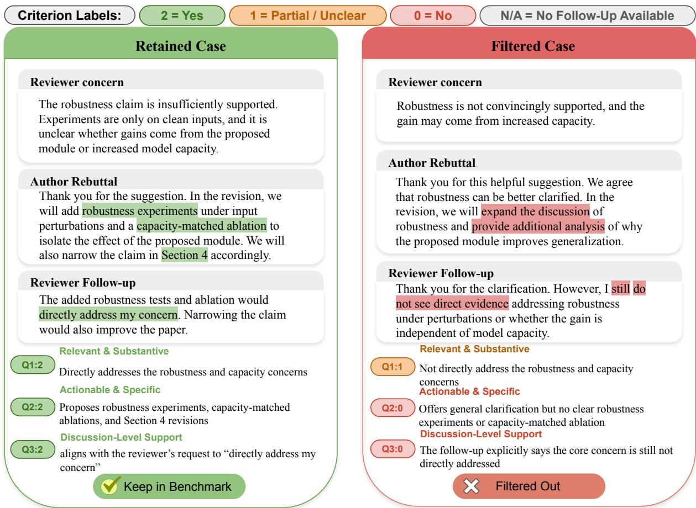  
Figure 3: Illustration of benchmark filtering criteria.

denotes all collected papers, Act. denotes papers retained after filtering for actionable review–rebuttal interactions, and Ret. denotes the corresponding retention rate.
<table><tr><td>Venue</td><td>Year</td><td>Raw</td><td>Act.</td><td>Ret.</td></tr><tr><td>ICLR</td><td>2021</td><td>2,594</td><td>2,092</td><td>80.6%</td></tr><tr><td>ICLR</td><td>2022</td><td>2,617</td><td>2,081</td><td>79.5%</td></tr><tr><td>ICLR</td><td>2023</td><td>3,792</td><td>3,006</td><td>79.3%</td></tr><tr><td>NeurIPS</td><td>2021</td><td>2,768</td><td>2,004</td><td>72.4%</td></tr><tr><td>NeurIPS</td><td>2022</td><td>2,824</td><td>2,308</td><td>81.7%</td></tr><tr><td>NeurIPS</td><td>2023</td><td>3,395</td><td>2,844</td><td>83.8%</td></tr><tr><td>EMNLP</td><td>2023</td><td>2,020</td><td>1,484</td><td>73.5%</td></tr><tr><td>Total</td><td>一</td><td>20,010</td><td>15,819</td><td>79.1%</td></tr></table>

Table 8: Source-paper distribution for ACTREVIEW-40K. Raw denotes all collected papers, Act. denotes papers retained after filtering for actionable review–rebuttal interactions, and Ret. denotes the retention rate.

## B.2 Data Licensing and Attribution

ACTREVIEW-40K is constructed from publicly available peer-review and paper sources. Review comments, rebuttals, discussion threads, and metadata are collected from OpenReview<sup>2</sup>, which distributes content under the Creative Commons Attribution 4.0 International (CC BY 4.0) license. Paper contents are accessed from publicly available repositories such as arXiv, where licenses vary across individual papers.

We do not claim ownership of the original papers, reviews, rebuttals, or discussion content. Paper content is used only for structured extraction, localized retrieval, and context construction. We preserve attribution to the origina authors and sources, and use all data in accordance with the corresponding licenses. The released dataset will include derived structured fields and metadata needed for reproducibility, while respecting the licensing constraints

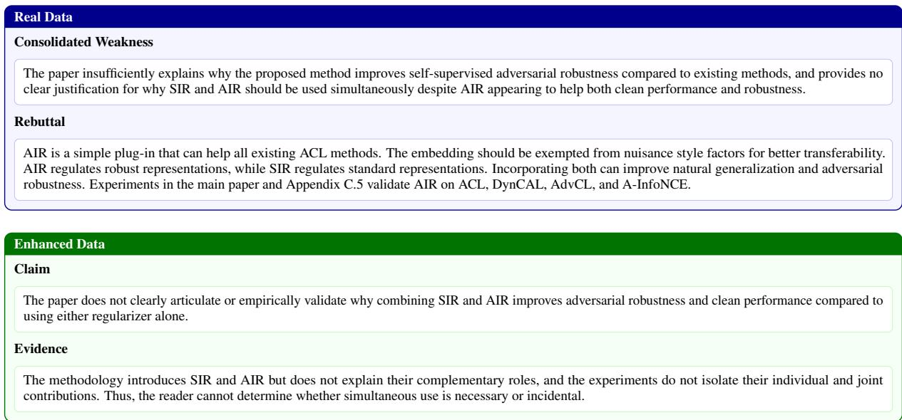

Figure 4: Comparison between real and enhanced training instances. Enhanced data decomposes a real review–rebuttal example into a claim–evidence pair.  
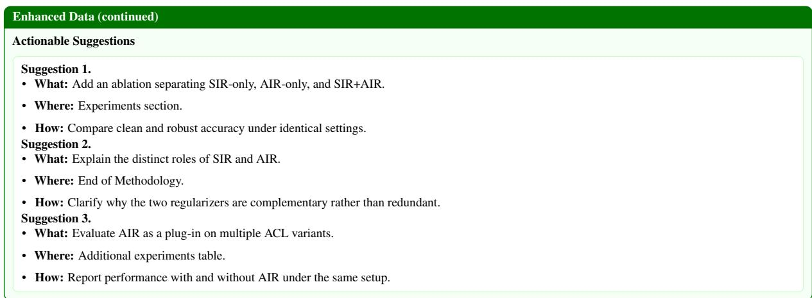  
Figure 4: Comparison between real and enhanced training instances (continued). Enhanced data further specifies what to improve, where the revision should be made, and how to implement it.

of the original sources.

## B.3 Privacy and anonymization.

Our source data are publicly available review–rebuttal threads from OpenReview. Before release, we remove or avoid distributing personally identifying information beyond what is already publicly available, and we do not release non-public reviewer identities or private metadata. The benchmark is distributed for research use, and users should not attempt to deanonymize reviewers, authors, or papers beyond the information made public by the source platform.

## B.4 Real vs. Enhanced Data Example

Figure 4 illustrates how a raw review–rebuttal instance is transformed into structured supervision. The real data consists of a reviewer weakness and the corresponding author rebuttal. The enhanced instance rewrites this signal into initial-review-style feedback: a diagnostic claim, evidence, and actionable revision guidance. This conversion makes the supervision more suitable for learning revision-oriented feedback, while avoiding direct imitation of the rebuttal text.

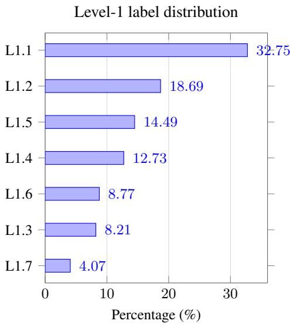

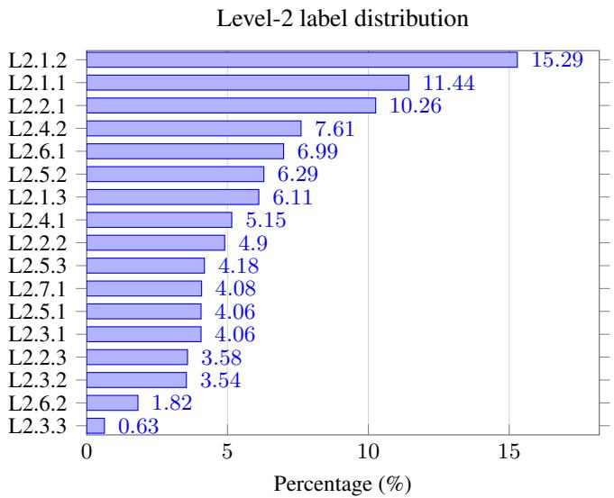  
Figure 5: Normalized distributions of Level-1 and Level-2 weakness labels.

## C Rebuttal-Guided Data Construction

This appendix provides additional details for the construction of ActReview-40K. We describe the weakness taxonomy, weakness extraction and alignment prompts, alignment validation, rebuttal-guided enhancement, enhancement quality control, and localized evidence retrieval.

## C.1 Data-Driven Weakness Taxonomy

We construct a two-level weakness taxonomy through a data-driven, human-in-the-loop process. We first sample approximately 500 weakness statements from peer reviews across venues and years, and use iterative LLM-assisted pattern discovery to induce candidate fine-grained categories with definitions, keywords, and representative examples. The candidate categories are then consolidated through semantic merging and human review. Annotators decide whether proposed category groups should be merged, partially merged, or kept separate. The resulting Level-2 categories are organized into 7 higher-level themes under constraints of broad coverage, non-overlapping primary assignment, and balanced granularity.

We validate the taxonomy on a stratified sample of 100 weakness statements, each independently labeled by three annotators. Gold labels are obtained by majority vote. The taxonomy achieves substantial agreement, with Fleiss’ $\kappa = 0 . 7 9$ at Level 2 and κ = 0.88 at Level 1, suggesting that the categories are interpretable and consistently applicable.

The final taxonomy contains 7 Level-1 categories and 17 Level-2 categories. Each category includes a definition, representative keywords, frequency statistics, and example weaknesses. Figure 5 shows the normalized label distributions, and the full taxonomy is reported in Tables 9–11.

<table><tr><td>Level 1 Category</td><td>Level 2 Category</td><td>Definition</td></tr><tr><td rowspan="2">and Empirical Validation Weaknesses</td><td>Insufficient or Narrow Experimental Design Experimental Evaluation</td><td>The experimental evaluation is too limited, simplistic, or narrow in scope to support the paper's claims. This includes reliance on too few datasets, tasks, domains, or problem settings; overly simplistic or toy benchmarks; weak evidence of generalization; and experimental setups that fail to convincingly demonstrate robustness, scalability, or</td></tr><tr><td>Missing or Inadequate Comparative and Component Analysis</td><td>real-world relevance. The paper fails to adequately justify performance claims due to missing or weak baselines, absent or insufficient ablation studies, and lack of analysis isolating the contributions of individual components, hyperparameters, or design choices. As a result, it is unclear what drives</td></tr><tr><td rowspan="2">Methodological Clarity and</td><td>Weak, Unreliable, or Flawed Empirical Evidence</td><td>improvements or how the method compares to existing work. The reported empirical results are unconvincing, unreliable, or methodologically flawed. This includes marginal or inconsistent gains, lack of statistical rigor, inappropriate or unjustified evaluation metrics, unfair or invalid comparisons, and contradictory or unexplained results</td></tr><tr><td>Unclear or Incomplete Method Description</td><td>that undermine confidence in the conclusions. The proposed method, algorithm, or pipeline is poorly explained, underspecified, or confusing, including missing explanations of components, training or inference procedures, equations, or interactions.</td></tr><tr><td rowspan="2">Reproducibility Issues</td><td>Missing or Insufficient Experimental and</td><td>This prevents reviewers from clearly understanding how the method works or assessing its correctness. Critical experimental, implementation, or evaluation details are missing or insufficiently specified, making results hard to interpret or reproduce. This includes missing hyperparameters, training setups, datasets,</td></tr><tr><td>Reproducibility Details Unclear Problem Definition, Assumptions, or Scope</td><td>hardware, code availability, or unexplained sensitivity to tuning choices. The paper does not clearly define the problem, objectives, assumptions, or scope of applicability. Core concepts, variables, or conditions are ambiguous, making it unclear what is being solved and under what assumptions the results hold.</td></tr><tr><td rowspan="3">Theoretical Soundness and Justification Gaps</td><td>Missing or Insufficient Theoretical Justification</td><td>The work lacks adequate theoretical analysis or justification for its claims, methods, or design choices. This includes missing proofs, absent guarantees, unclear or weakly motivated theoretical arguments, and a general failure to formally support correctness, convergence, or complexity claims.</td></tr><tr><td>Flawed or Unjustified Theoretical Assumptions</td><td>Theoretical results rely on assumptions that are unrealistic, overly strong, poorly justified, or violated in practice. This includes questionable modeling choices, weak soundness due to assumption gaps, and theoretical arguments that collapse when assumptions are examined</td></tr><tr><td>Theory-Practice Misalignment</td><td>critically. There is a clear disconnect between the theoretical analysis and the empirical evaluation, where theoretical claims are not reflected in experiments, assumptions do not hold in practice, or experimental results fail to validate the stated theory.</td></tr><tr><td rowspan="2">and Positioning Limitations Motivation, Claims,</td><td>Insufficient Positioning Novelty, Contribution, and Related Work Coverage</td><td>The paper fails to adequately situate its contributions within existing literature, including missing, incomplete, or unclear discussion of relevant prior work, weak comparisons, or poor explanation of how the approach differs from existing methods. This undermines claims of novelty and proper positioning.</td></tr><tr><td>Weak, Incremental, or Overstated Novelty</td><td>The contribution is perceived as offering limited or unclear novelty, often being incremental, derivative, or a repackaging of known ideas. Reviewers may find the novelty unclear, trivial, or exaggerated relative to prior work, questioning whether the paper meaningfully advances the state of the art.</td></tr><tr><td rowspan="3">and Practical Relevance Issues</td><td>Weak or Unclear Motivation and Framing</td><td>The paper fails to clearly motivate the problem, task, or method, or provides insufficient intuition and framing for why the work matters, why design choices are made, or why the setting is meaningful or realistic.</td></tr><tr><td>Unsupported, Overstated, or Incorrect Claims</td><td>The paper makes claims that are not adequately supported by theory or experiments, are overstated relative to the evidence, misleadingly</td></tr><tr><td>Limited Practical Relevance or Real-World Applicability</td><td>phrased, or technically incorrect. The proposed approach is questioned for being impractical, unrealistic, or unlikely to have real-world impact due to assumptions, scalability, cost, deployment constraints, or overclaimed practical impact.</td></tr></table>

Table 9: A taxonomy of common paper weaknesses, organized by high-level categories and corresponding subtypes.

<table><tr><td>Level 1 Category</td><td>Level 2 Category</td><td>Definition</td></tr><tr><td>Writing, Presentation, and Communication Problems</td><td>Unclear Writing, Organization, or Notation</td><td>The manuscript is difficult to understand due to poor writing quality, weak organization, confusing exposition, inconsistent presentation, or unclear or overloaded notation that impedes comprehension of the ideas or methods.</td></tr><tr><td></td><td>Formatting, Figures, or Submission Issues</td><td>Problems with formatting, templates, figures, diagrams, or visual presentation that reduce readability, violate submission guidelines, or fail to adequately support the text.</td></tr><tr><td>Scalability, Efficiency, and Resource Considerations</td><td>Missing Computational</td><td>The paper makes a claim, contribution, or assumption whose validity or applicability depends on computational cost, runtime,</td></tr><tr><td></td><td>Cost, Runtime, and Scalability Analysis</td><td>memory usage, or scalability (e.g., an efficiency claim, or a claim of real-time or large-scale applicability), but fails to adequately analyze or report the corresponding characteristics. This label does not apply to papers that make no such claim.</td></tr></table>

Table 11: A taxonomy of common paper weaknesses (continued), organized by high-level categories and corresponding subtypes.

Weakness taxonomy discovery prompt. We use the following prompt Figure 6 to induce candidate weakness categories from raw reviewer weakness statements.

## C.2 Weakness Extraction and Alignment

Reviews often contain multiple concerns in a single paragraph. We therefore decompose each review into atomic weakness units before aligning them with author responses. This decomposition reduces entanglement among concerns and enables fine-grained supervision from rebuttal spans.

Step 1: Review segmentation. GPT-5.4 is prompted to decompose each full review into atomic weakness units.

Step 2: Weakness–rebuttal span mapping. Each atomic weakness is then aligned to the corresponding author rebuttal span. The prompt showns in Figure 7

Post-processing filters. We apply three post-processing filters after LLM mapping. First, quote-only detection removes spans where the rebuttal mainly restates the reviewer weakness without adding author-side content. We compute bidirectional token overlap between the weakness and the candidate rebuttal span, and discard spans when more than 55% of the weakness appears in the rebuttal span and more than 45% of the candidate span is copied from the weakness. These thresholds were chosen conservatively from a small development audit to remove quote-only mappings while retaining spans that quote a concern before answering it. Second, cross-reference resolution replaces outputs such as “Same segment as Wk” with the actual referenced text. Third, shared-preamble deduplication discards segments already assigned to a previous weakness, as these usually correspond to generic opening statements rather than specific responses.

## C.3 Alignment Quality Audit

A key step in constructing ActReview-40K is mapping each atomic reviewer weakness to the rebuttal span that addresses it. Since these mappings provide latent supervision for rebuttal-guided enhancement, we validate the retained weakness–rebuttal span mappings through a human audit.

Sampling. We sample 50 papers to cover different venues, years, and weakness categories. From these papers, we include all atomic weakness segments that pass our automatic alignment filters and confidence threshold, yielding 794 mapped review segments. This audit evaluates the quality of the retained filtered set rather than all possible review–rebuttal pairs.

Annotation protocol. Two trained annotators independently map each atomic weakness to the most specific rebuttal span that addresses it. Annotators are shown the paper metadata, the atomic weakness, the full author rebuttal, and surrounding discussion when available. If no rebuttal span substantively addresses the weakness, annotators mark NO RESPONSE. Annotators are instructed to select the minimal span that captures the concrete author response, following the same one-to-one mapping constraint and span granularity used by our pipeline.

Adjudication and correctness. After independent annotation, disagreements are adjudicated to produce a gold mapping. We compare each automatically predicted rebuttal span against the adjudicated gold span. A predicted mapping is counted as correct if it matches the gold NO RESPONSE label, or if the predicted and gold spans overlap with token-level intersection-over-union (IoU) of at least 0.5:

$$
\mathrm { I o U } ( s _ { \mathrm { p r e d } } , s _ { \mathrm { g o l d } } ) = \frac { \left| s _ { \mathrm { p r e d } } \cap s _ { \mathrm { g o l d } } \right| } { \left| s _ { \mathrm { p r e d } } \cup s _ { \mathrm { g o l d } } \right| } .\tag{1}
$$

Metrics and discussion. We compute span-level precision, recall, and F1 for the automatic mappings against the adjudicated gold standard. Precision measures the fraction of predicted mappings that match the gold span, while recall measures the fraction of gold response mappings recovered by the pipeline. We also report Cohen’s κ between the two annotators before adjudication.

The retained mappings achieve high span-level accuracy, suggesting that the alignment pipeline provides reliable supervision for downstream data construction. Most residual errors arise from long rebuttal paragraphs that address multiple reviewer concerns, implicit responses that use different terminology from the review, or generic author responses that acknowledge a concern without specifying a concrete revision. These cases motivate our benchmark filtering criteria and our treatment of rebuttal-derived actions as grounded reference signals rather than unique gold outputs.

## C.4 Constructing Enhanced Instances

Raw reviewer comments often identify a problem without specifying a concrete revision path. For example, a reviewer may state that an ablation study is insufficient, but not indicate which components should be ablated, what comparison should be added, or what claim the ablation should support. Author rebuttals provide useful signals for this missing information because they often describe how authors attempted to address the concern, such as adding experiments, clarifying assumptions, revising claims, or expanding limitations.

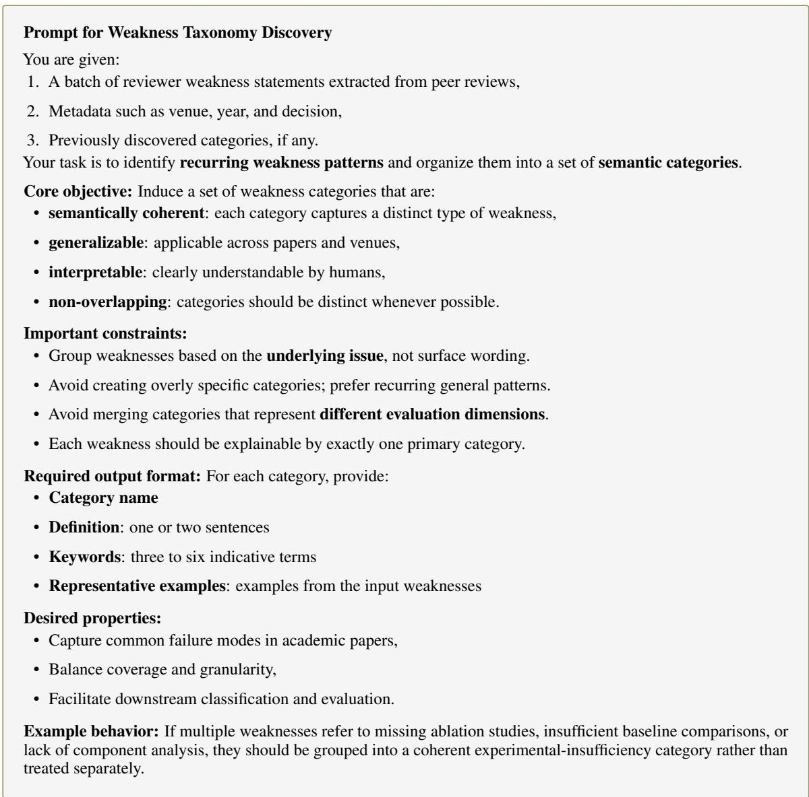  
Figure 6: Prompt template used for data-driven weakness taxonomy discovery. The LLM groups raw reviewer weaknesses into semantically coherent categories with definitions, keywords, and examples.

However, rebuttals cannot be used directly as training targets for reviewer feedback generation. They are written after the review, often adopt a defensive or retrospective tone, and may mix concrete revisions with justification, acknowledgments, or generic promises. We therefore treat rebuttals as latent supervision: they reveal plausible revision actions, but the generated feedback must be written as if it were part of the original review.

Initial-review perspective. The enhancement model is explicitly instructed to write from the perspective of an initial reviewer. It may use the aligned rebuttal span to infer what revision would address the concern, but it must not mention the rebuttal, the author response, any revised version of the paper, or any post-submission change. This prevents leakage from the rebuttal into the generated feedback and ensures that the resulting target resembles proactive reviewer guidance rather than retrospective commentary.

Enhanced output structure. For each aligned weakness–rebuttal pair, we prompt GPT-5.4 to produce two structured fields. The first field is a diagnostic claim, a concise reviewer-side statement identifying the paper-specific deficiency. The second field contains revision suggestions, which specify what should be revised, where the revision should appear, how it can be carried out, and what outcome the revision is expected to achieve. The output is designed to supervise both Task 1 and Task 2.

Post-processing filters. We apply automatic filters to reduce artifacts introduced by the enhancement step. First, we remove outputs with rebuttal leakage, such as references to “the authors’ response,” “the rebuttal,” or “the revised paper.” Second, we filter retrospective rewrites, where the output describes what the authors already did rather than what an initial reviewer should request. Third, we remove outputs that near-copy the aligned rebuttal span, since these often preserve author-side phrasing rather than reviewer-side guidance. Fourth, we discard underspecified suggestions, such as generic requests to clarify the method or add experiments without specifying what should be clarified, where the revision should appear, or how the authors could implement it. Instances that fail these filters are regenerated once and removed if they still fail.

Rebuttal-guided enhancement prompt. The following prompt template Figure 8 is used for rebuttal-guided enhancement. Placeholders in braces are filled with instance-specific content.

## C.5 Enhancement Quality Audit

We conduct a human audit to evaluate whether rebuttal-guided enhancement produces reliable training targets beyond satisfying automatic format checks. The audit examines whether each enhanced instance preserves the original reviewer concern, uses the aligned rebuttal span as valid revision evidence, grounds the suggested revision in a plausible paper location, and avoids leaking post-rebuttal information into reviewer-side feedback.

Sampling. We sample 500 enhanced instances from the training-data construction pipeline, stratified by venue, year, and Level-2 weakness category. For each instance, annotators are shown the atomic reviewer weakness, weakness label, aligned rebuttal span, available paper context, and enhanced output. Each enhanced output contains a diagnostic claim and structured revision suggestions with what, where, how, and expected outcome fields.

Annotation criteria. Each instance is evaluated along four dimensions:

• Concern preservation: the diagnostic claim preserves the core meaning of the original reviewer weakness without introducing a different or substantially stronger concern.

• Rebuttal-supported revision guidance: the suggested revision is supported by the aligned rebuttal span, such as adding an experiment, clarifying an assumption, narrowing a claim, revising a method description, or reporting missing details.

• Location validity: the where field identifies a plausible and concrete revision location, preferably matching an observed section title or close lexical variant when section information is available.

• No rebuttal leakage: the output is written from the perspective of an initial reviewer and does not mention the rebuttal, author response, revised paper, or post-submission changes.

Annotation protocol and metrics. Two annotators independently score each criterion on a three-point scale: 2 for satisfied, 1 for partially satisfied or unclear, and 0 for not satisfied. An instance is considered acceptable if all four criteria are satisfied after adjudication. Borderline cases are retained only when the issue does not affect the instance’s suitability as a training target, and disagreements on final acceptability are resolved by a third adjudicator. We report criterion-level pass rates, overall acceptability, and Cohen’s κ for the binary acceptable/not acceptable decision before adjudication.

Results and error analysis. As shown in Table 12, the enhanced targets achieve high overall quality, with 84.8% of audited instances judged acceptable after adjudication. Concern preservation is strong at 93.2%, indicating that the enhancement step usually retains the intent of the original reviewer weakness rather than rewriting it into a different critique. The highest pass rate is observed for no rebuttal leakage at 97.6%, suggesting that the pipeline effectively converts rebuttal-derived information into initial-reviewstyle guidance without explicitly exposing post-rebuttal context.

Most remaining errors arise from two sources. First, rebuttal-supported revision guidance has the lowest pass rate at 86.4%. These failures typically occur when the aligned rebuttal span provides only indirect evidence, caus-

<table><tr><td>Criterion</td><td>Pass Rate</td></tr><tr><td>Concern preservation</td><td>93.2%</td></tr><tr><td>Rebuttal-supported revision guidance</td><td>86.4%</td></tr><tr><td>Location validity</td><td>88.0%</td></tr><tr><td>No rebuttal leakage</td><td>97.6%</td></tr><tr><td>Overall acceptability</td><td>84.8%</td></tr></table>

Table 12: Human audit results for rebuttal-guided feedback enhancement. Pass rates are computed after adjudication. Inter-annotator agreement for the binary acceptability decision is κ = 0.78.

ing the enhanced output to infer a revision action that is plausible but not clearly supported. Second, location validity fails when the available paper context is incomplete or when the model proposes an overly broad location, such as a general method or experiment section, instead of a concrete revision site. In contrast, rebuttal leakage is rare, suggesting that the main limitation of the enhancement step is not stylistic contamination from rebuttals, but the difficulty of converting partial author responses into precise, well-grounded revision guidance.

## C.6 Localized Evidence Retrieval

To construct informative yet efficient model inputs, we replace full-paper conditioning with localized evidence retrieval. This design is motivated by the observation that different weakness categories require different regions of the paper. Experimental-design concerns often require result tables, ablations, baselines, datasets, or evaluation protocols, whereas theoretical or methodological concerns may require assumptions, derivations, model definitions, equations, or appendix content.

PDF preprocessing and chunk construction. For each enhanced-review record, we retrieve the corresponding paper PDF from the stored paper URL. When the PDF URL is unavailable or fails, we attempt OpenReview-based fallback URLs derived from the paper identifier. We then extract page-level text using a PDF parser and segment each page into paragraph-level chunks. Chunks are assigned page numbers and sequential chunk identifiers. Very short chunks are discarded, and each remaining chunk is assigned a coarse chunk type based on lexical and structural cues, such as method, implementation, protocol, analysis, table result, or generic. This chunk typing is used only as a retrieval signal rather than as a supervised label.

Task-specific retrieval queries. Retrieval is performed offline and is task-specific. For Task 1, the retrieval query is constructed from the enhanced diagnostic claim, evidence statement, original reviewer weakness, follow-up discussion when available, and paper metadata such as title, weakness labels, and keywords. The goal is to retrieve chunks that support weakness diagnosis, namely chunks that indicate whether the paper contains, omits, or insufficiently supports the content described in the weakness.

For Task 2, we use two complementary retrieval channels. The first channel retrieves evidence-support chunks using the diagnostic claim, evidence statement, original weakness, follow-up discussion, rebuttal-derived construction fields, and paper metadata. The second channel retrieves revision-support chunks using the actionable suggestion fields, including what should be changed, where the revision should be made, how it should be implemented, and the expected outcome. This separation allows Task 2 inputs to include both evidence for the criticism and localized context useful for formulating concrete revision guidance.

Scoring-based chunk ranking. Rather than using the full paper as model input, we rank candidate chunks with a deterministic scoring function. The score combines lexical overlap, phrase overlap, section-hint matches, page-hint matches, structural-anchor matches, and task-specific bias terms. Structural anchors include references to equations, algorithms, figures, tables, sections, appendices, lemmas, theorems, named methods, and other paper-specific markers. The ranking also uses category-sensitive biases: empirical weaknesses increase the weight of result tables, protocols, baselines, and implementation details; theory or novelty weaknesses increase the weight of proofs, propositions, related-work discussion, and method sections; ablation-related weaknesses increase the weight of ablation analyses and appendix results. Chunks from irrelevant sections such as references, acknowledgments, or generic societal-impact statements are penalized.

Neighborhood expansion and final selection. After an initial ranking pass, we expand around high-scoring chunks by including nearby chunks from the same PDF neighborhood. This helps recover useful surrounding context when relevant information is split across adjacent paragraphs. The expanded candidates are rescored and deduplicated by normalized text prefix. In the default setting, Task 1 retains the top-2 diagnostic-evidence chunks. For Task 2, we separately rank evidence-support chunks and revision-support chunks, then merge the two lists into a balanced final context with top-5 chunks. This merged context is designed to support both claim grounding and concrete suggestion generation.

Retrieval and rebuttal separation. During data construction, rebuttal spans are used to identify revision actions and construct enhanced feedback. However, the generation model does not receive rebuttal text during training or evaluation. During training, it receives only paper metadata, the target weakness label, and the retrieved paper chunks; at ActReview-Bench evaluation time, retrieved chunks are replaced with full-paper context, as described in Section 4.4. This separation prevents the model from relying on author responses at inference time and ensures that generated feedback is conditioned only on information available to an initial reviewer.

Retrieval example. Table 13 illustrates task-specific retrieval for a theoretical-justification weakness. The example shows that Task 1 retrieval focuses on evidence for diagnosing the concern, while Task 2 retrieval additionally selects chunks that help identify where and how a revision can be made.

<table><tr><td>Component</td><td>Content</td></tr><tr><td>Paper</td><td>Towards simple time-to-event modeling: optimizing neural networks via rank regression</td></tr><tr><td>Weakness</td><td>The rank-based loss from Jin et al. (2003) was derived for linear models, and there is no guarantee that in the non-linear neural network setting the optimal parameters correspond to a zero rank statistic as intended.</td></tr><tr><td>Chunks</td><td>Task 1 Retrieved Chunk 1 (Page 5, Method): Derivation of the rank-based loss from Gehan&#x27;s statistic, highlighting its theoretical grounding in linear model settings. Chunk 2 (Page 5, Method): Discussion noting that the asymptotic properties of the rank statistic are established for linear predictors and are not explicitly justified for non-linear models. Chunk 3 (Page 4, Analysis): Description of combining non-linear neural representations with a rank-based objective, without clarifying whether the original statistical guarantees still hold.</td></tr><tr><td>Chunks</td><td>Task 2 Evidence Chunk 1 (Page 5): Explicit statement that theoretical guarantees derived for Gehan&#x27;s rank statistic may not directly generalize to non-linear predictor functions. Chunk 2 (Page 4): Explanation of the rank-based loss formulation used in the neural network setting, showing the direct transfer from linear models. Chunk 3 (Page 2): Motivation for adapting statistical objectives to neural networks, without providing</td></tr><tr><td>Task 2 Support Chunks</td><td>formal justification of consistency or optimality. Chunk 1 (Page 5, Method): Formal definition of the rank-based loss and its connection to Gehan&#x27;s statistic, indicating where theoretical assumptions are introduced. Chunk 2 (Page 5, Discussion): Text discussing the applicability limitations of rank-based estimators when extended beyond linear settings. Chunk 3 (Page 4, Method): Model formulation combining neural networks with rank-based loss, identifying where clarification or justification can be added. Chunk 4 (Appendix / Theory): Supplementary discussion or lack of proof regarding consistency of</td></tr><tr><td>Final Input</td><td>the objective in the non-linear setting. Paper metadata (title, abstract, keywords), weakness statement, and top retrieved chunks. We use top-2 chunks for Task 1 and top-5 merged evidence/support chunks for Task 2. Rebuttal text is not included in the model input.</td></tr></table>

Table 13: Example of task-specific context retrieval for a theoretical-justification weakness. Task 1 retrieval focuses on evidence for diagnosing the weakness, while Task 2 retrieval additionally includes chunks that help localize and justify concrete revision guidance.

Retrieval ablation and chunk-size sensitivity. We analyze retrieval in two ways. First, we compare localized topk retrieval with full-paper conditioning. Retrieval remains competitive with full-text inputs while using substantially shorter contexts, supporting the design choice of task-specific context selection. Full-paper inputs provide marginal gains on a small subset of metrics, but these gains are limited and come with much higher input cost. We therefore interpret retrieval primarily as an efficiency and focus improvement: it filters out irrelevant sections and concentrates the model input around evidence and revision locations relevant to the target weakness.

Second, we evaluate the effect of retrieved chunk size in Figure 10. Task 1 is relatively insensitive to chunk size: small localized contexts are usually sufficient for diagnostic claim generation. Task 2 is more retrievalsensitive because actionable suggestions require both evidence for the weakness and localization cues for revision. Performance improves with additional context and generally plateaus around k=5, supporting our default setting of top-2 chunks for Task 1 and top-5 chunks for Task 2.

Retrieval quality validation. We validate retrieval quality with two complementary checks: GPT-5.4 screening and human audit. Both checks evaluate the retrieved context itself, rather than the generated model output. For each sampled instance, the evaluator is shown the paper metadata, target weakness label, reviewer weakness, and retrieved chunks, but not the rebuttal. The evaluator then judges whether the retrieved chunks satisfy four criteria: (1) Weakness-relevant evidence, whether the chunks contain paper content related to the target weakness; (2) Specific grounding support, whether the chunks are specific enough to support grounded feedback rather than generic criticism; (3) Revision localization cues, whether the chunks indicate where or how the paper could be revised, such as a method section, experiment, table, figure, claim, or appendix; and (4) Overall sufficient context, whether the retrieved context is sufficient for the corresponding generation task. For Task 1, evaluators focus on whether the chunks support weakness diagnosis; for Task 2, they additionally assess whether the chunks provide localization cues for actionable revision guidance. Each criterion is judged as pass or fail, and Table 14 reports pass rates on a 0–100 scale, where higher values indicate better retrieval quality. GPT-5.4 screening is used only for analysis and not as a training signal for the generator. Human annotators follow the same criteria on a stratified subset of retrieved contexts. As shown in Table 14, both GPT-5.4 and human annotators find that most retrieved contexts contain weakness-relevant evidence and provide sufficient grounding support. Task 2 localization is more challenging, but the dual-channel retrieval design still yields strong localization support, with human pass rate of 78.6%. The prompt is provided in Figure 11.

<table><tr><td rowspan="2">Retrieval Quality Criterion</td><td colspan="2">Task 1: Diagnostic Claims</td><td colspan="2">Task 2: Actionable Suggestions</td></tr><tr><td>LLM</td><td>Human</td><td>LLM</td><td>Human</td></tr><tr><td>Weakness-relevant evidence</td><td>90.4</td><td>87.2</td><td>88.6</td><td>85.5</td></tr><tr><td>Specific grounding support</td><td>86.7</td><td>83.9</td><td>85.1</td><td>82.4</td></tr><tr><td>Revision localization cues</td><td>N/A</td><td>N/A</td><td>82.8</td><td>78.6</td></tr><tr><td>Overall sufficient context</td><td>85.9</td><td>82.7</td><td>84.3</td><td>80.8</td></tr></table>

Table 14: Retrieval quality validation on a 200 stratified subset of retrieved contexts. Values report pass rates judged by GPT-5.4 screening and human annotators. Task 1 focuses on whether retrieved chunks support weakness diagnosis, while Task 2 additionally evaluates whether chunks provide localization cues for actionable revision guidance.

## C.7 Implementation Details and Compute Budget

We use Qwen3-8B-Base as the backbone model for both supervised fine-tuning and reinforcement learning. For comparison, we also evaluate larger or specialized baselines, including Qwen3-32B, DeepReviewer-14B, OpenReviewer-8B, and RbtAct-8B when available. For ActReview training, the model uses paper metadata, the target weakness label, and retrieved paper chunks as input. At ActReview-Bench evaluation time, all evaluated systems receive the same paper metadata, target weakness label, and full-paper context, and no rebuttal text is provided during evaluation.

For supervised fine-tuning, we train a single multi-task model jointly on Task 1 and Task 2 using the enhanced instances in ActReview-40K. We use full-parameter fine-tuning with the standard autoregressive language modeling objective. For reinforcement learning, we initialize from the corresponding SFT model and apply GRPO with K = 8 sampled responses per prompt. Rewards are computed from frozen instance-specific rubrics, using deterministic checks for format-related criteria and GPT-5.4-based scoring for semantic criteria. KL regularization is applied toward the SFT reference model.

Experiments were conducted on four NVIDIA H200 GPUs with 143GB memory per GPU. The main SFT and GRPO runs were performed using distributed training across the four GPUs. We used fixed training configurations for the main model variants rather than extensive hyperparameter search. The main computational cost comes from full-parameter SFT, GRPO sampling and scoring, candidate generation for rubric construction, and LLM-based evaluation. Detailed hyperparameters, decoding settings, and prompt templates are provided in the released code to support reproducibility.

## D Rubric Construction and Reward Design

This appendix provides details on the rubric construction and reward design used in the RL stage of ActReview. We first describe our candidate-aware rubric construction procedure, then provide the scoring prompt and two reward-ablation prompts: direct judge reward and fixed task-level rubric reward. Finally, we describe reward normalization and provide qualitative examples comparing candidate-aware rubrics with generic rubrics.

## D.1 Candidate-Aware Rubric Construction

The goal of rubric construction is to provide an instance-specific reward specification for open-ended peer-review feedback generation. A generic reward prompt can ask whether an output is accurate, specific, or actionable, but it cannot determine which experiment, assumption, paper section, or revision action is relevant for a particular paper– weakness pair. For example, a generic rubric may reward an output for recommending “additional experiments,” bu it cannot distinguish whether the relevant missing experiment is a robustness test, an ablation, a baseline comparison, or a controlled synthetic analysis. This motivates our candidate-aware rubric design.

For each RL training instance, we construct a candidate pool consisting of:

• multiple outputs sampled from the SFT model under different decoding temperatures;

• the human-written or reference-style enhanced output;

• a strong LLM-generated reference output;

The diverse SFT candidates expose realistic model failure modes, such as generic advice, unsupported claims, missing localization, repeated claims, or shallow suggestions. The reference outputs provide positive examples of paper-grounded and revision-oriented feedback. Given this candidate pool, GPT-5.4 synthesizes a rubric containing two types of criteria:

1. Hard constraints, which specify invalid or severely flawed outputs, such as hallucinating paper content, referring to the rebuttal, addressing the wrong weakness label, or failing to follow the required task format.

2. Weighted soft requirements, which describe desirable instance-specific properties. Each soft requirement is assigned a weight, and the weights sum to 1.0.

The rubric is constructed offline before RL training and then frozen. During GRPO, the policy does not update the rubric, and reference claims or suggestions are not used as direct supervision. They are only used offline to help define the reward criteria.

Candidate-aware rubric construction prompt. Figure 12 summarizes the prompt template used to construct candidate-aware rubrics.

## D.2 Rubric Scoring Prompt

After constructing a frozen rubric for each RL instance, we use an LLM judge to score sampled model outputs against the rubric. For each weighted soft requirement, the judge receives the requirement and the model output, and returns an integer score from 1 to 5. The requirement-level scores are normalized to [0, 1] and combined according to the rubric weights. (prompt shown in Figure 13)

## D.3 Direct Judge Reward Prompt

To isolate the effect of rubric design, we compare our candidate-aware rubric reward with a simpler direct-judge reward. In this ablation, the LLM judge scores each sampled output using fixed task-level dimensions rather than an instance-specific rubric. This baseline tests whether applying GRPO with a generic LLM judge is sufficient, or whether explicit candidate-aware rubric construction provides additional benefit. (prompt shown in Figure 14)

## D.4 Fixed Task-Level Rubric Prompt

We also evaluate a fixed task-level rubric setting. Unlike candidate-aware rubrics, the fixed rubric is shared across all instances of the same task. It captures general task requirements, but does not adapt to the target weakness, paper evidence, or model-specific failure modes. This ablation tests whether improvements come merely from using a rubric, or from constructing an instance-specific candidate-aware rubric.

Prompt for Fixed Task-Level Rubric Reward   
You are an expert evaluator for academic peer-review feedback.   
Input: You are given:   
1. Paper metadata and retrieved paper context.   
2. A target weakness label.   
3. The task type: Task 1 or Task 2.   
4. A model-generated output.   
5. A fixed task-level rubric.   
Goal: Use the fixed task-level rubric to score the model-generated output. The rubric is shared across all instances of the same task. It is not customized to the   
specific paper, weakness, retrieved evidence, or candidate outputs. Do not construct a new rubric for this instance. Do not compare the output to a reference   
answer. Judge the output only based on the provided paper context, the target weakness label, the task definition, and the fixed rubric below.   
Fixed rubric for Task 1: Diagnostic Claim Generation. For Task 1, the output should contain one or more diagnostic claims that identify concrete   
deficiencies in the paper under the target weakness label.   
Score the following dimensions from 0 to 5:   
• Technical Accuracy: Is the diagnostic claim factually correct and supported by the retrieved paper context? Penalize hallucinated paper content,   
unsupported criticisms, or claims that address the wrong weakness.   
• Specificity and Grounding: Does the claim refer to concrete paper elements, such as methods, experiments, datasets, assumptions, figures, tables,   
equations, or claims?   
• Depth and Constructiveness: Does the claim explain why the weakness matters, rather than merely restating a generic concern?   
• Granularity and Format: Does the output avoid redundant, speculative, overly broad, or excessive claims, and does it follow the required Task 1 output   
format?   
• Overall Quality: Overall, how useful is the output for helping authors understand the core weakness in the paper?   
Fixed rubric for Task 2: Actionable Suggestion Generation. For Task 2, the output should contain actionable suggestions that explain what should be   
revised, where the revision should appear, how it can be implemented, and what outcome the revision should achieve.   
Score the following dimensions from 0 to 5:   
• Technical Accuracy: Is the suggestion technically sound and supported by the retrieved paper context? Penalize hallucinated paper content, unsupported   
claims, or infeasible suggestions.   
• Actionability: Does the suggestion provide concrete what, where, how, and expected-outcome guidance that an author can follow?

• Grounding and Localization: Is the suggestion tied to concrete paper content and localized to relevant sections, experiments, figures, tables, methods, claims, or appendix material?

• Depth and Constructiveness: Does the suggestion address the underlying weakness rather than merely restating the problem or asking for vague clarification?

• Overall Quality: Overall, how useful is the output as practical revision guidance for addressing the target weakness?

Hard constraints: Assign a very low score if the output:

• mentions rebuttals, author responses, revised papers, or post-submission changes;

• invents paper content that is not supported by the retrieved context;

• addresses a weakness category unrelated to the target label;

• gives only generic advice without paper-specific grounding;

• fails to follow the required output format for the corresponding task.

Special case: If the target weakness is not supported by the provided paper context, an output of None may receive a high technical-accuracy score. However, None should not receive a high overall-quality score unless the lack of support is clearly justified.

Required output format: Return only valid JSON. For Task 1, use:

```python
"technical_accuracy": 0,
"specificity_grounding": 0,
"depth_constructiveness": 0,
"granularity_format": 0,
"overall_quality": 0,
"hard_constraint_violation": false,
"brief_reason": "short explanation"
For Task 2, use:
"technical_accuracy": 0,
"actionability": 0,
"grounding_localization": 0,
"depth_constructiveness": 0,
"overall_quality": 0,
"hard_constraint_violation": false,
"brief_reason": "short explanation"
```

## D.5 Rubric Examples

Tables 15 and 16 show examples comparing candidate-aware rubric construction with generic rubric construction. The generic rubrics capture broad quality dimensions, such as whether the response asks for more experiments or stronger empirical support. In contrast, the candidate-aware rubrics specify the concrete missing evidence, relevant paper setting, expected revision location, and failure modes observed in candidate outputs. This additional specificity makes the reward more discriminative for the target paper–weakness instance.

## E Evaluation Details

This appendix provides additional details for the evaluation protocol used in Section 6. We include baseline prompts, schema-controlled prompts, the LLM-as-a-Judge prompt, human annotation instructions, automatic metric definitions, claim alignment, and bootstrap confidence intervals.

## E.1 LLM-as-a-Judge Prompt

We use GPT-5.4 as a pairwise judge. For each instance, ActReview-RL is compared against one baseline output under the same task input. The judge chooses ActReview-RL, the baseline, or tie for each evaluation dimension. To reduce position bias, each pair is judged twice with output order swapped, and the two judgments are averaged before computing the final adjusted win rate. (prompts shown in Figure 15 and Figure 16)

Both tasks are evaluated on Technical Accuracy, Depth & Constructiveness, and Overall. The task-specific dimension is Specificity & Grounding for Task 1 and Actionability for Task 2.

Adjusted win rate. For each pairwise judgment, we map the decision to a score from the perspective of ActReview-RL:

$$
s _ { i } = \left\{ \begin{array} { l l } { 1 , } & { \mathrm { i f ~ A c t R e v i e w { \mathrm { - } } R L ~ w i n s , } } \\ { 0 . 5 , } & { \mathrm { i f ~ t h e ~ c o m p a r i s o n ~ i s ~ a ~ t i e , } } \\ { 0 , } & { \mathrm { i f ~ t h e ~ b a s e l i n e ~ w i n s . } } \end{array} \right.
$$

The adjusted win rate is computed as:

$$
{ \mathrm { A d j W i n R a t e } } = 1 0 0 \times { \frac { 1 } { N } } \sum _ { i = 1 } ^ { N } s _ { i } .
$$

<table><tr><td>Candidate-aware rubric (example-specific)</td><td>Generic rubric</td></tr><tr><td>Soft requirements</td><td>Soft requirements</td></tr><tr><td>• Identifies that the toy/synthetic point-cloud experiment is • The response should identify one or more weaknesses evaluated only qualitatively, without quantitative metrics.</td><td>showing that the experimental evaluation is limited or insufficient.</td></tr><tr><td>• Notes the absence of analysis on how the metric behaves under controlled geometric properties such as curvature or sharpness.</td><td>• The response should mention that the paper would benefit from more quantitative results or broader empirical valida- tion.</td></tr><tr><td>• Identifies the lack of robustness evaluation under realistic points, or outliers.</td><td>point-cloud corruptions such as noise, occlusion, missing • The response should note that additional experiments, benchmarks, or comparisons could strengthen the paper.</td></tr><tr><td>namely a statistical/Riemannian framework for point and avoid obviously unrelated criticism. clouds.</td><td>• Rewards claims grounded in the actual paper setting, • The response should remain relevant to the weakness label</td></tr><tr><td>• Penalizes hallucinated concerns such as generic classification-baseline or ablation complaints that are not</td><td>• The response should present concise and non-duplicative claims.</td></tr><tr><td>supported by the paper context. • Rewards coverage of distinct failure modes rather than</td><td>Hard constraints • Output must be formatted as numbered diagnostic claims</td></tr><tr><td>repeated paraphrases of the same generic issue. Hard constraints</td><td>or None.</td></tr><tr><td>• Output must be formatted as numbered diagnostic claims</td><td>• Must not reference rebuttal or post-submission content.</td></tr><tr><td>or None.</td><td></td></tr><tr><td>• Must not reference rebuttal or post-submission content.</td><td></td></tr><tr><td>• Must not introduce unsupported tasks, datasets, or base- lines.</td><td></td></tr></table>

Table 15: Task 1 rubric example comparing candidate-aware rubric construction with generic rubric construction. The candidate-aware rubric specifies concrete missing evidence and paper-specific failure modes, while the generic rubric mainly rewards broad empirical-evaluation concerns.

Thus, 50 indicates parity, values above 50 indicate preference for ActReview-RL, and values below 50 indicate preference for the baseline.

## E.2 Human Evaluation Instructions

We conduct human evaluation using the same pairwise protocol as the GPT-5.4 judge. Human evaluation is performed on a 200-instance subset of ActReview-Bench. Each comparison is independently annotated by two graduate-level annotators with peer-review experience. Annotators are shown the same paper context, target weakness label, task input, and two anonymized model outputs. Model identities are hidden, and output order is randomized.

Annotation task. For each comparison, annotators choose ActReview-RL, the baseline, or tie for each evaluation dimension. Both tasks are evaluated on Technical Accuracy, Depth & Constructiveness, and Overall. The taskspecific dimension is Specificity & Grounding for Task 1 and Actionability for Task 2.

Scoring. We map each judgment to a pairwise score from the perspective of ActReview-RL:

$$
\begin{array} { r c l } { { A c t R e v i e w \mathrm { - } R L \mathrm { w i n } } } & { { = } } & { { 1 , } } \\ { { \mathrm { t i e } } } & { { = } } & { { 0 . 5 , \quad \mathrm { b a s e l i n e ~ w i n = 0 } . } } \end{array}
$$

For each comparison, we first average the two annotators’ scores. We then average across all comparisons and multiply by 100 to report the human adjusted win rate. This makes human evaluation directly comparable to the LLM-as-a-Judge results.

Agreement. The two annotators make identical categorical choices in 93% of pairwise judgments, indicating high raw agreement. When annotators disagree, we retain the disagreement by averaging their pairwise scores rather than forcing a single adjudicated winner. For example, if one annotator selects ActReview-RL and the other selects the baseline, the instance contributes 0.5, reflecting no clear preference.

<table><tr><td>Candidate-aware rubric (example-specific)</td><td>Generic rubric</td></tr><tr><td>Soft requirements</td><td>Soft requirements</td></tr><tr><td>• In Evidence, explicitly states that the toy/synthetic dataset • The evidence should explain why the current experimental is currently evaluated only qualitatively, with no numerical metrics reported.</td><td>support is limited.</td></tr><tr><td>• In Suggestion, proposes a controlled synthetic experiment that varies geometric properties such as curvature or sharp edges, rather than vaguely asking for “more experiments.&quot;</td><td>• The suggestions should recommend adding stronger em- pirical validation. • The suggestions should be actionable and mention possible</td></tr><tr><td>• Requires at least one concrete metric family, such as recon- struction error, geodesic/distance distortion, or pairwise</td><td>quantitative analysis or comparisons. • The expected outcome should explain that the added ex-</td></tr><tr><td>distance preservation. • Requires a specific placement for the revision, such as im- mediately after the toy-dataset discussion or in a dedicated</td><td>• The severity assessment should reflect whether the missing evaluation weakens the paper&#x27;s empirical support.</td></tr><tr><td>appendix subsection on synthetic quantitative results. • Requires the Expected Outcome to explain the diagnostic purpose: revealing how the proposed Riemannian metric responds to controlled geometric changes, thereby sup-</td><td>Hard constraints • Output must include the required structured sections.</td></tr><tr><td>porting or clarifying the qualitative claims. • Penalizes suggestions that are only generic requests for</td><td>• Must not reference rebuttal or post-submission content.</td></tr><tr><td>broader evaluation without explaining what should be mea- sured or where the revision should be added.</td><td></td></tr><tr><td>Hard constraints • Output must include diagnostic claim and structured revi-</td><td></td></tr><tr><td>sion guidance. • Revision guidance must include what to revise, where to</td><td></td></tr><tr><td>revise, how to implement the revision, and the expected outcome.</td><td></td></tr></table>

Table 16: Task 2 rubric example comparing candidate-aware rubric construction with generic rubric construction. The candidate-aware rubric specifies the concrete experiment, metrics, revision location, and diagnostic purpose required for a high-quality actionable suggestion.

Human annotation instructions. Annotators compare two anonymized model outputs for the same paper-review task. For each instance, annotators are given the paper metadata, retrieved paper context, target weakness category, task input, and two anonymized outputs, denoted as Output A and Output B. Annotators are asked to choose which output is better for each evaluation dimension, with three possible choices: Output A, Output B, or Tie.

For Technical Accuracy, annotators select the output that is more factually correct and better supported by the provided paper context. They are instructed to penalize hallucinated paper content, unsupported criticism, and infeasible suggestions. For Depth and Constructiveness, annotators select the output that provides more substantive and constructive feedback rather than shallow or generic comments. For Specificity and Grounding in Task 1, annotators select the output that better identifies concrete paper-specific weaknesses grounded in the provided context. For Actionability in Task 2, annotators select the output that better explains what should be revised, where the revision should be made, how the revision can be implemented, and what outcome the revision would achieve. For Overall, annotators select the output that would be more useful to authors.

Annotators are explicitly instructed not to prefer an output merely because it is longer, more fluent, or more formal. Instead, they are asked to focus on correctness, paper grounding, specificity, and usefulness for revision.

## E.3 Automatic Metrics.

We use lightweight rule-based metrics to quantify different aspects in generated outputs.

Claim count. For a Task 1 output y, we define n-claims(y) as the number of generated claim headers matching the pattern Claim k:. We report n claims as the average of this quantity over the evaluation set.

Specificity Score. For a generated text y, we compute a heuristic specificity score based on three observable signals: references to localized paper content, technical terminology, and quantitative details. Let L(y) denote the number of explicit paper-location references in $y ,$ including mentions such as Section 3, Figure 2, Table 1, Algorithm 1, Appendix, and Equation 4. Let $T ( y )$ denote the number of unique all-caps technical terms or acronyms matched by the regular expression $\left[ \mathbb { A } { - } \mathbb { Z } \right] \left\{ 2 , \right\}$ . Let $Q ( y )$ denote the number of numeric expressions, including percentages. The specificity score is defined as

$$
\mathrm { S p e c } ( y ) = L ( y ) + 0 . 5 T ( y ) + 0 . 3 Q ( y ) .\tag{2}
$$

For Task 1, we compute this score for each generated claim and report the average across claims in an instance, then average over the evaluation set. For Task 2 evidence, we apply the same formula to the extracted evidence section.

Suggestion similarity. For Task 2, let $\hat { S } = \{ \hat { s } _ { 1 } , \dotsc , \hat { s } _ { m } \}$ denote the set of generated suggestion blocks and let $S = \{ s _ { 1 } , \ldots , s _ { n } \}$ denote the set of reference suggestion blocks. We compute sentence embeddings for each suggestion using the same sentence-transformer encoder as in our semantic similarity metric, and use cosine similarity as the base similarity function sim(·, ·). We define suggestion similarity as

$$
\operatorname { S u g g . s i m } ( y , \tilde { y } ) = \frac { 1 } { m } \sum _ { i = 1 } ^ { m } \operatorname* { m a x } _ { 1 \leq j \leq n } \sin ( \hat { s } _ { i } , s _ { j } ) ,\tag{3}
$$

where $y$ and $\tilde { y }$ are the generated and reference outputs, respectively. This metric measures whether each generated suggestion is semantically aligned with at least one reference action.

Evidence specificity. For Task 2, let $e ( y )$ denote the evidence section extracted from generated output y. We compute evidence specificity by applying the same specificity function used for Task 1 to the extracted evidence section:

$$
\mathrm { E v i d . s p e c } ( y ) = \mathrm { S p e c } ( e ( y ) ) .\tag{4}
$$

Thus, Evid.spec and Spec. share the same underlying formula, but differ in the text unit to which they are applied: Spec. is computed at the claim level in Task 1, whereas Evid.spec is computed on the evidence section in Task 2.

Example-specific Rubric Score. In addition to generic automatic metrics and pairwise LLM-as-a-Judge comparison, we report an example-specific rubric score (Rubric). For each test instance, we first generate a dedicated rubric offline based on its task type and instance context, and then use GPT-5.4 to score a model output against that rubric. The rubric consists of hard constraints and weighted soft requirements. If any hard constraint is violated, the score is set to zero; otherwise, GPT-5.4 scores each soft requirement on a 1–5 scale, which is linearly mapped to $[ 0 , 1 ]$ and aggregated by a weighted average to produce the final scalar score. In our implementation, hard constraints are checked deterministically, while semantic requirements are judged by GPT-5.4; the resulting score is stored per instance and averaged over the evaluation set. This design allows the rubric metric to capture instance-specific criteria that are not well reflected by global overlap-based metrics.

## E.4 Claim Alignment for Automatic Metrics

Task 1 outputs are sets of diagnostic claims, and different systems may generate different numbers of claims for the same instance. For example, a reference may contain two claims, while a model may generate one, three, or none. Directly concatenating all claims and computing ROUGE-L or semantic similarity would be misleading, because a system could be rewarded for writing extra claims or penalized for using a different claim order. We therefore align generated claims to reference claims before computing claim-level metrics.

Let $\hat { \mathcal { C } } = \{ \hat { c } _ { 1 } , \hdots , \hat { c } _ { m } \}$ be the generated claims and $\mathcal { C } ^ { * } = \{ c _ { 1 } ^ { * } , \ldots , c _ { n } ^ { * } \}$ be the reference claims. We compute a semantic similarity score $S _ { i j }$ for every generated–reference pair $( \hat { c } _ { i } , c _ { j } ^ { * } )$ . We then find the one-to-one matching that maximizes the total similarity:

$$
M ^ { * } = \arg \operatorname* { m a x } _ { M } \sum _ { ( i , j ) \in M } S _ { i j } .
$$

Each generated claim and each reference claim can appear in at most one matched pair. ROUGE-L, BLEU, and semantic similarity are computed over the matched pairs and then averaged. Generated claims that are not matched to any reference claim are treated as over-generation, while reference claims that are not matched by any generated claim are treated as under-generation. We report the average number of generated claims separately to make this calibration tradeoff visible.

Handling None. If both the generated output and reference contain no claim, the instance is counted as a correct abstention. If the generated output contains claims but the reference contains no claim, the output is treated as false-positive over-generation. If the reference contains claims but the model outputs None, the output is treated as under-generation.

## E.5 Bootstrap Confidence Intervals

We report 95% bootstrap confidence intervals for main automatic metrics, pairwise adjusted win rates, and ablation results. Bootstrap resampling is performed over evaluation instances.

Automatic metrics. For automatic metrics, we sample evaluation instances with replacement and recompute the metric on each bootstrap sample. The 2.5th and 97.5th percentiles of the bootstrap distribution are used as the confidence interval.

Pairwise LLM-as-a-Judge and human evaluation. For pairwise evaluation, each instance contributes a score of 1, 0.5, or 0 from the perspective of ActReview-RL. We resample instances with replacement and recompute the adjusted win rate:

$$
\mathrm { \ A d j W i n R a t e } ^ { ( b ) } = 1 0 0 \times \frac { 1 } { N } \sum _ { i = 1 } ^ { N } s _ { i } ^ { ( b ) } .
$$

The 95% confidence interval is obtained from the empirical percentiles of the bootstrap distribution.

Interpretation. We avoid making strong claims from small differences whose confidence intervals overlap. In particular, differences below two percentage points are treated as trends rather than reliable improvements unless supported by consistent human, judge-based, and task-specific evidence.

## F Additional Evaluations and Analyses

This section provides additional experiments examining the effect of the two-task formulation, generalization beyond rebuttal-derived evaluation references, robustness to independent judges, scientific validity and technical failures, the limitations of localized context, and model behavior when the original rebuttal provides an incomplete resolution.

## F.1 End-to-End versus Two-Task Formulation

To isolate the effect of separating weakness diagnosis from revision planning, we compare our two-task SFT formulation against an end-to-end SFT variant. Both variants use the same Qwen3-8B-Base backbone, training instances, optimization settings, and evaluation protocol. The end-to-end variant jointly generates a diagnostic claim and its actionable suggestion in a single output. The two-task variant first generates a diagnostic claim and then conditions suggestion generation on that generated claim.

We evaluate both variants before rubric-based reinforcement learning so that the comparison isolates the effect of task decomposition rather than the candidate-aware reward design. Outputs are scored using the same GPT-5.4 rubric on Task 1 Specificity and Grounding, Task 1 Overall quality, Task 2 Actionability, Task 2 Overall quality, and Claim–Suggestion Alignment. The final metric assesses whether the proposed revision directly and coherently addresses the diagnosed weakness.

As shown in Table 6, the two-task formulation improves all five evaluation dimensions. The largest improvement occurs in Task 2 Overall quality, which increases by 0.42 points, while Claim–Suggestion Alignment increases by 0.35 points. These results indicate that explicitly conditioning revision planning on a separately generated diagnostic claim strengthens the connection between the identified weakness and the proposed action, rather than merely changing the output format.

## F.2 Independent Evaluation on 2025–2026 Papers

ActReview is trained on review–rebuttal interactions and the original ActReview-Bench evaluation references are also grounded in author-side resolution signals. To test whether the learned behavior transfers beyond rebuttalderived references and to examine temporal generalization, we construct an independent held-out evaluation set from OpenReview papers submitted in 2025–2026.

The evaluation set contains 175 instances from 50 papers that are not used in ActReview training or in the construction of the original benchmark. Independent reviewers inspect each paper without access to its original reviews, rebuttals, or discussion threads. They identify a paper-supported weakness, assign the corresponding Level-2 weakness label, and specify the requirements that a sufficient resolution should satisfy. This procedure prevents the evaluation targets from inheriting the content or phrasing of the original author rebuttals.

For a controlled comparison, all evaluated systems receive the same paper context, metadata, and weakness label. Each model first generates its Task 1 diagnostic claim, which is then provided as the input claim for Task 2. The paired outputs are evaluated jointly as a complete reviewer comment, thereby capturing both diagnostic quality and error propagation from Task 1 to Task 2.

Two graduate-level annotators independently rate each anonymized output without access to model identity or the original review–rebuttal discussion. The outputs are scored on a three-point scale, where 0 indicates that the criterion is not satisfied, 1 indicates partial satisfaction, and 2 indicates full satisfaction. The four criteria are:

<table><tr><td rowspan="2">Model</td><td colspan="2">Diagnostic Quality</td><td colspan="2">Revision Quality</td></tr><tr><td>Weakness Validity</td><td>Technical Correctness</td><td>Resolution Sufficiency</td><td>Reviewer Usefulness</td></tr><tr><td>GPT-5.1schema</td><td>1.67</td><td>1.64</td><td>1.23</td><td>1.34</td></tr><tr><td>Geminischema</td><td>1.51</td><td>1.62</td><td>1.39</td><td>1.29</td></tr><tr><td>ACTREVIEW-SFT</td><td>1.67</td><td>1.61</td><td>1.51</td><td>1.61</td></tr><tr><td>ACTREVIEW-RL</td><td>1.68</td><td>1.66</td><td>1.70</td><td>1.68</td></tr></table>

Table 17: Independent human evaluation on 175 instances from 50 held-out 2025–2026 OpenReview papers constructed without rebuttal guidance. Task 1 and Task 2 outputs are evaluated jointly as complete reviewer comments. Values are mean ratings on a 0–2 scale; higher is better.
<table><tr><td rowspan="2">Baseline</td><td rowspan="2">Judge</td><td colspan="4">Task 1: Diagnostic Claims</td></tr><tr><td>Tech. Acc.</td><td>Depth</td><td>Spec./Gnd.</td><td>Overall</td></tr><tr><td rowspan="3">RbtAct</td><td>GPT-5.4</td><td>65.3</td><td>56.2</td><td>60.3</td><td>59.1</td></tr><tr><td>Claude</td><td>64.1</td><td>61.8</td><td>61.0</td><td>59.7</td></tr><tr><td>Human</td><td>64.4</td><td>57.8</td><td>58.7</td><td>62.0</td></tr><tr><td rowspan="3">DeepReviewer-14B</td><td>GPT-5.4</td><td>76.4</td><td>70.2</td><td>70.7</td><td>73.6</td></tr><tr><td>Claude</td><td>75.3</td><td>71.5</td><td>68.3</td><td>72.9</td></tr><tr><td>Human</td><td>76.2</td><td>71.9</td><td>66.1</td><td>72.8</td></tr><tr><td rowspan="3">Geminischema</td><td>GPT-5.4</td><td>54.3</td><td>59.9</td><td>61.1</td><td>60.5</td></tr><tr><td>Claude</td><td>56.3</td><td>60.2</td><td>64.2</td><td>62.3</td></tr><tr><td>Human</td><td>54.9</td><td>58.1</td><td>63.7</td><td>59.9</td></tr></table>

Table 18: Cross-judge pairwise evaluation for Task 1 on the same 200-instance human-evaluation subset. Values are adjusted win rates of ACTREVIEW-RL against each baseline; 50 indicates parity.

• Weakness Validity: whether the diagnostic claim identifies a genuine weakness supported by the paper;

• Technical Correctness: whether the diagnosis and proposed revision are scientifically and technically sound;

• Resolution Sufficiency: whether the recommendation adequately resolves the identified weakness; and

• Reviewer Usefulness: whether the complete comment would provide useful guidance to an author revising the paper.

The mean quadratic-weighted Cohen’s κ across the four dimensions is 0.71, indicating substantial inter-annotator agreement.

Table 17 shows that ACTREVIEW-RL remains comparable to $\mathrm { G P T } { - } 5 . 1 _ { \mathrm { s c h e m a } }$ in Weakness Validity (1.68 versus 1.67) and Technical Correctness (1.66 versus 1.64). Its larger gains occur in revision-oriented dimensions: Resolution Sufficiency increases from 1.23 to 1.70, and Reviewer Usefulness increases from 1.34 to 1.68. ACTREVIEW-SFT also outperforms the proprietary baselines on these two dimensions.

These results suggest that rebuttal-guided supervision transfers beyond evaluation against rebuttal-derived references. ActReview remains competitive in independently assessed diagnostic and technical quality while generating more sufficient and useful revision guidance. This experiment provides evidence of temporal and supervision-source generalization, but it does not establish generalization across venues, disciplines, or substantially different peer-review norms.

## F.3 Cross-Judge Robustness

GPT-5.4 is involved in data enhancement, rubric construction, semantic reward scoring, and scalable pairwise evaluation. This repeated use raises the possibility that ACTREVIEW-RL is optimized toward evaluator-specific preferences. We therefore conduct an additional cross-judge analysis using Claude, which is not involved in data construction, training, reward scoring, or rubric generation.

We use the same 200-instance subset employed for the original human evaluation and compare ACTREVIEW-RL against RbtAct, DeepReviewer-14B, and Gemin $\operatorname { s c h e m a } .$ GPT-5.4, Claude, and human annotators independently evaluate the same output pairs. Model identities are hidden, output order is randomized, and each judge selects ACTREVIEW-RL, the baseline, or a tie. We report adjusted win rates, where a win contributes 1, a tie contributes 0.5, and a loss contributes 0.

<table><tr><td rowspan="2">Baseline</td><td rowspan="2">Judge</td><td colspan="4">Task 2: Actionable Suggestions</td></tr><tr><td>Tech. Acc.</td><td>Depth</td><td>Action.</td><td>Overall</td></tr><tr><td rowspan="3">RbtAct</td><td>GPT-5.4</td><td>58.2</td><td>71.7</td><td>54.8</td><td>59.4</td></tr><tr><td>Claude</td><td>60.6</td><td>70.6</td><td>56.5</td><td>58.2</td></tr><tr><td>Human</td><td>58.3</td><td>67.5</td><td>54.5</td><td>59.8</td></tr><tr><td rowspan="3">DeepReviewer-14B</td><td>GPT-5.4</td><td>70.1</td><td>68.7</td><td>83.6</td><td>68.5</td></tr><tr><td>Claude</td><td>73.5</td><td>69.5</td><td>78.0</td><td>71.4</td></tr><tr><td>Human</td><td>69.4</td><td>70.9</td><td>77.3</td><td>71.9</td></tr><tr><td rowspan="3">Geminischema</td><td>GPT-5.4</td><td>54.2</td><td>56.8</td><td>63.6</td><td>54.3</td></tr><tr><td>Claude</td><td>60.9</td><td>55.1</td><td>64.1</td><td>55.6</td></tr><tr><td>Human</td><td>56.1</td><td>59.2</td><td>64.9</td><td>54.7</td></tr></table>

Table 19: Cross-judge pairwise evaluation for Task 2 on the same 200-instance human-evaluation subset. Values are adjusted win rates of ACTREVIEW-RL against each baseline; 50 indicates parity.
<table><tr><td>Judge Pair</td><td>T1 Agr.</td><td>T1 κ</td><td>T2 Agr.</td><td>T2 κ</td></tr><tr><td>GPT-5.4 vs. Human</td><td>80.97%</td><td>0.63</td><td>82.67%</td><td>0.65</td></tr><tr><td>Claude vs. Human</td><td>81.68%</td><td>0.63</td><td>79.74%</td><td>0.62</td></tr><tr><td>GPT-5.4 vs. Claude</td><td>86.49%</td><td>0.73</td><td>83.21%</td><td>0.68</td></tr></table>

Table 20: Instance-level categorical agreement on Overall pairwise judgments across the same 200-instance subset and three representative baselines. Agr. denotes exact agreement, and Cohen’s κ adjusts for agreement expected by chance.

Across all three baselines and both tasks, GPT-5.4, Claude, and human evaluation assign ACTREVIEW-RL adjusted win rates above 50. The direction and magnitude of the comparisons are also similar across the three judges. Across the reported aggregate baseline–dimension comparisons, GPT-5.4 and Claude achieve Spearman correlations of $\rho = 0 . 9 4 3$ and ρ = 0.899 with human evaluation, respectively. Their mean absolute deviations from human win rates are similarly close: 1.81 points for GPT-5.4 and 1.88 points for Claude.

We additionally measure instance-level categorical agreement on Overall judgments after mapping each decision to an ACTREVIEW-RL win, tie, or baseline win.

As shown in Table 20, GPT-5.4 and Claude achieve similar levels of agreement with human judgments. Claude is slightly closer to humans on Task 1, whereas GPT-5.4 is slightly closer on Task 2. There is therefore no systematic advantage suggesting that GPT-5.4 uniquely favors ACTREVIEW-RL because of its role in the training pipeline.

This analysis cannot completely eliminate training-side coupling because GPT-5.4 remains involved in enhancement and reward construction. However, the consistency of GPT-5.4, Claude, and human judgments reduces the likelihood that the reported evaluation gains are primarily an artifact of GPT-5.4-specific scoring preferences.

## F.4 Scientific Validity and Technical Error Analysis

We conduct two complementary analyses to determine whether ActReview improves substantive scientific quality or primarily improves the presentation and executability of revision guidance. The first separates scientific validity from revision utility. The second categorizes the remaining technical failures at a finer level.

## F.4.1 Scientific Validity versus Revision Utility

We sample a stratified subset of 100 ActReview-Bench instances and compare anonymized outputs from GPT-5.1, $\mathrm { G P T } { - } 5 . 1 _ { \mathrm { s c h e m a } } ,$ ACTREVIEW-SFT, and ACTREVIEW-RL. Output order is randomized, and two annotators familiar with machine-learning peer review independently rate each output on a 0–2 scale.

Diagnostic Validity measures whether the identified weakness is genuinely present and supported by the paper. Scientific Validity measures whether the proposed resolution is technically sound and does not rely on invalid scientific assumptions. Exact inter-annotator agreement is 81% for Diagnostic Validity and 76% for Scientific Validity, with quadratic-weighted Cohen’s κ values of 0.74 and 0.68, respectively. Disagreements are resolved through adjudication.

We additionally record whether the output includes a concrete and executable revision step. From these annotations, we derive two rates:

• Valid + Actionable: the percentage of outputs that receive a Scientific Validity score of 2 and provide a concrete, executable revision; and

<table><tr><td rowspan="2">Model</td><td colspan="2">Scientific Validity</td><td colspan="2">Revision Utility</td></tr><tr><td>Diagnostic Validity</td><td>Scientific Validity</td><td></td><td>Valid + Actionable (%) Actionable but Invalid (%)</td></tr><tr><td>GPT-5.1</td><td>1.68</td><td>1.70</td><td>55</td><td>18</td></tr><tr><td>GPT-5.1schema</td><td>1.66</td><td>1.64</td><td>55</td><td>11</td></tr><tr><td>ACTREVIEW-SFT</td><td>1.71</td><td>1.67</td><td>61</td><td>20</td></tr><tr><td>ACTREVIEW-RL</td><td>1.72</td><td>1.71</td><td>74</td><td>10</td></tr></table>

Table 21: Blinded human evaluation of scientific validity and revision utility on 100 stratified ActReview-Bench instances. Diagnostic Validity and Scientific Validity are mean ratings on a 0–2 scale. Valid + Actionable reports the percentage of outputs that are scientifically valid and provide a concrete, executable revision. Actionable but Invalid reports the percentage of actionable outputs that contain a technically invalid recommendation. Higher is better except for Actionable but Invalid.

• Actionable but Invalid: the percentage of actionable outputs that receive a Scientific Validity score of 0.

As shown in Table 21, ACTREVIEW-RL does not exhibit a large advantage over GPT-5.1 in Scientific Validity (1.71 versus 1.70). We therefore do not interpret the results as evidence of universally superior deep scientific judgment. The larger benefit lies in the reliable conversion of valid diagnoses into technically sound and executable revisions. ACTREVIEW-RL produces the highest Valid + Actionable rate at 74%, compared with 55% for GPT-5.1 and 61% for ACTREVIEW-SFT. It also produces the lowest Actionable but Invalid rate at 10%.

## F.4.2 Fine-Grained Technical Failures

We further analyze technical failures on the 175-instance independent evaluation set described in Appendix F.2. For each model, annotators assign non-exclusive failure labels to every output with a Technical Correctness score below 2. Because labels are non-exclusive, one output may exhibit multiple failure types.

The failure categories are defined as follows:

• Unsupported weakness: the diagnosed concern is not substantiated by the paper;

• Method misunderstanding: the output mischaracterizes the proposed method, assumptions, or mechanism;

• Invalid experimental recommendation: the proposed experiment is inappropriate, confounded, or unable to test the stated claim;

• Incorrect theoretical reasoning: the output contains a substantively incorrect theoretical statement or derivation;

• Context omission: the output overlooks evidence, qualifications, or conditions already present in the paper;

• Incomplete technical specification: the proposed revision omits information required for correct execution;

• Overstated necessity: the output presents one plausible revision as strictly required despite the availability of alternative resolutions.

Any technical error denotes an output with a Technical Correctness score below 2. Severe technical error denotes an output receiving a Technical Correctness score of 0.

Table 22 shows that ACTREVIEW-RL has an overall technical-error rate of 28.00%, matching Gemini<sub>schema</sub> and slightly improving over $\mathrm { G P T } { - } 5 . 1 _ { \mathrm { s c h e m a } }$ and ACTREVIEW-SFT, both at 29.14%. It also produces the lowest severe-error rate at 6.29%.

Relative to ACTREVIEW-SFT, rubric-based reinforcement learning reduces unsupported weaknesses, method misunderstandings, invalid experimental recommendations, context omissions, and severe technical errors. These results indicate that the improvements in actionability and resolution sufficiency are not accompanied by a higher overall rate of technical failure.

The primary remaining failure mode is Overstated Necessity. ACTREVIEW-RL presents a particular revision as mandatory in 17.14% of cases, compared with 5.71% for $\mathrm { G P T } { - } 5 . 1 _ { \mathrm { s c h e m a } }$ and 10.29% for $\mathrm { G e m i n i } _ { \mathrm { s c h e m a } }$ . Although reinforcement learning reduces this rate relative to ACTREVIEW-SFT, the revision-oriented supervision may still encourage overly prescriptive recommendations. Future rubric designs should explicitly reward conditional language and recognition of multiple valid resolution paths.

<table><tr><td>Technical Failure Type</td><td>GPT-5.1schema</td><td>Geminischema</td><td>ActReview-SFT</td><td>ActReview-RL</td></tr><tr><td>Unsupported weakness</td><td>4.57%</td><td>10.29%</td><td>4.00%</td><td>2.86%</td></tr><tr><td>Method misunderstanding</td><td>8.00%</td><td>9.71%</td><td>8.57%</td><td>7.43%</td></tr><tr><td>Invalid experimental recommendation</td><td>2.86%</td><td>4.00%</td><td>5.71%</td><td>3.43%</td></tr><tr><td>Incorrect theoretical reasoning</td><td>3.43%</td><td>2.86%</td><td>2.29%</td><td>2.29%</td></tr><tr><td>Context omission</td><td>9.71%</td><td>8.57%</td><td>9.14%</td><td>7.43%</td></tr><tr><td>Incomplete technical specification</td><td>15.43%</td><td>16.57%</td><td>17.14%</td><td>15.43%</td></tr><tr><td>Overstated necessity</td><td>5.71%</td><td>10.29%</td><td>19.43%</td><td>17.14%</td></tr><tr><td>Any technical error</td><td>29.14%</td><td>28.00%</td><td>29.14%</td><td>28.00%</td></tr><tr><td>Severe technical error</td><td>6.86%</td><td>10.29%</td><td>9.71%</td><td>6.29%</td></tr></table>

Table 22: Technical-failure rates on 175 independent evaluation instances per model. Failure categories are nonexclusive, so one output may exhibit multiple failure types. Any technical error denotes an output with a Technical Correctness score below 2, whereas Severe technical error denotes a score of 0. Lower is better.
<table><tr><td>Training Context</td><td>Weakness Validity</td><td>Cross-Section Reasoning</td><td>Technical Correctness</td><td>Resolution Sufficiency</td><td>Unsupported Claim Rate ↓</td></tr><tr><td>Retrieved chunks</td><td>1.39</td><td>1.17</td><td>1.60</td><td>1.51</td><td>22%</td></tr><tr><td>Full-paper text</td><td>1.41</td><td>1.49</td><td>1.62</td><td>1.47</td><td>14%</td></tr></table>

Table 23: Human evaluation on 50 instances requiring global paper understanding. Models are trained with localized retrieved chunks or full-paper text and evaluated under the same full-paper inference protocol. Ratings use a 0–2 scale; higher is better except for Unsupported Claim Rate.

## F.5 Global-Context Analysis

Localized context can reduce irrelevant input and improve weakness-specific grounding, but some review concerns require evidence distributed across multiple sections of a paper. To examine this limitation, we select 50 instances requiring global paper understanding. These instances include motivation–experiment mismatches, method– evaluation inconsistencies, unsupported conclusions, and pipeline-level logic gaps.

We compare two SFT variants trained with either localized retrieved chunks or full-paper text. All other model, data, and optimization settings are held fixed. Importantly, both variants are evaluated under the same full-paper inference protocol, so the comparison measures the effect of training-time context construction rather than differences in evaluation-time information.

Human annotators rate each output on a 0–2 scale for Weakness Validity, Cross-Section Reasoning, Technical Correctness, and Resolution Sufficiency. We also report Unsupported Claim Rate, which measures the percentage of outputs containing a substantive claim that is not supported by the paper.

As shown in Table 23, full-paper training provides a clear advantage in Cross-Section Reasoning, increasing the mean score from 1.17 to 1.49. It also reduces Unsupported Claim Rate from 22% to 14%. Weakness Validity and Technical Correctness remain comparable between the two settings, while retrieved-chunk training obtains slightly higher Resolution Sufficiency.

These findings indicate that localized and global training contexts provide complementary benefits. Localized context remains effective for weakness-specific concerns by focusing supervision on relevant evidence, whereas full-paper context is more suitable when a valid diagnosis requires integrating information across sections. Localized retrieval should therefore not be interpreted as universally preferable to full-paper conditioning.

## F.6 Hard Rebuttal-Incomplete Cases

The main benchmark focuses on cases with an evidence-supported revision path, but the aligned review–rebuttal pool also contains more difficult cases in which the original author response is incomplete, only partially addresses the concern, or proposes an inadequate resolution. We analyze a targeted set of 50 such cases to determine whether ACTREVIEW-RL merely reproduces the author response or can assess and improve upon it.

Each generated response is assigned to one of four mutually exclusive behavior categories:

• Follows a sufficient rebuttal: the original response already contains a sufficient resolution and the model proposes a consistent revision path;

• Extends an incomplete rebuttal: the model preserves the valid part of the author response while adding information or actions required to resolve the concern;

<table><tr><td>Model Behavior</td><td>Rate (%)</td></tr><tr><td>Follows a sufficient rebuttal</td><td>28</td></tr><tr><td>Extends an incomplete rebuttal</td><td>46</td></tr><tr><td>Rejects an inadequate rebuttal path</td><td>20</td></tr><tr><td>Introduces an unsupported resolution</td><td>6</td></tr></table>

Table 24: Behavior analysis of ACTREVIEW-RL on 50 hard cases in which the original rebuttal provides an incomplete or insufficient resolution. Each output is categorized according to whether it follows, extends, rejects, or introduces a resolution path.

• Rejects an inadequate rebuttal path: the model avoids an insufficient author-side response and proposes a more appropriate resolution; and

• Introduces an unsupported resolution: the model proposes a revision that is not supported by the reviewer concern or paper content.

Table 24 shows that ACTREVIEW-RL does not simply reproduce author responses. In 46% of cases, it extends an incomplete rebuttal, and in another 20%, it rejects an inadequate resolution path. Thus, in 66% of the hard cases, the model improves upon or departs from the original author-side response. It introduces an unsupported resolution in 6% of cases.

Representative case. One example concerns a paper proposing a density-based uncertainty categorization framework. The reviewer questions both the novelty of the method relative to existing feature-space density approaches and the practical usefulness of the proposed Bnd and IDM categories. The original rebuttal states only that the introduction, figure, and method sections will be revised to clarify the motivation. This response does not establish empirical novelty or demonstrate that the proposed categories provide distinct practical information.

Rather than reproducing this clarification-only response, ACTREVIEW-RL recommends a controlled comparison with a standard feature-space density baseline, an ablation isolating the contribution of the confusion-based component, and an evaluation testing whether the Bnd and IDM categories provide complementary information. The resulting suggestion extends the original rebuttal by proposing concrete evidence needed to substantiate both novelty and practical utility while remaining grounded in the reviewer concern and paper content.

This analysis does not establish performance on fundamentally non-resolvable concerns such as irreparable methodological flaws or purely subjective novelty disputes. Evaluating such concerns would require a different benchmark design in which abstention, rejection of the method, or multiple incompatible expert judgments can be treated as valid outcomes; we take a first step in this direction in Appendix G.

## G Held-out Evaluation of Zero-Shot Abstention

## G.1 Motivation and Relation to Reviewer Concerns

The task formulation in Section 3.1 requires abstention: when the paper context does not support the target weakness label, the model must return no claim (k=0) rather than fabricate a weakness. Because every instance in ActReview-40K and ActReview-Bench is derived from a weakness that a real reviewer raised, neither resource contains non-supported (weakness, paper) pairs. We therefore do not train on negative instances. Instead we evaluate abstention as a held-out, zero-shot behavior: does the weakness-conditioned instruction, together with the grounding pressure introduced during training, induce correct abstention on labels the paper does not exhibit?

Several properties make this a meaningful test rather than an accident of prompting. First, judging whether a body of text contains evidence for a specific claim is a capability the Qwen3-8B-Base backbone already possesses from pretraining; abstention does not require a dedicated training signal. Second, the instruction “if the paper has no weakness under this label, output exactly None” appears in every SFT and RL prompt, so the model is repeatedly exposed to the rule even though it never sees a None target. Third, both training stages push the model toward asserting only what the retrieved context supports: SFT targets are tightly grounded in retrieved chunks, and the RL rubric assigns zero reward to claims that hallucinate paper content or address the wrong label (Appendix D). Abstention is the natural endpoint of that constraint when no supporting evidence exists. The opposing force is a prior toward always answering, induced by training exclusively on supported instances; whether grounding pressure overcomes that prior is an empirical question, which this evaluation answers.

## G.2 Constructing the Non-Supported Split

Distractor labels. We start from the ActReview-Bench papers. For each paper we take $W _ { \mathrm { p o s } } .$ , the set of Level-2 weakness labels that reviewers raised for that paper. We then sample distractor labels from the complement $\mathcal { W } \setminus W _ { \mathrm { p o s } }$ over the 17-label taxonomy, preferring labels whose Level-1 parent category does not appear in $W _ { \mathrm { p o s } } ,$ since a weakness type from an entirely unraised category is more likely to be genuinely absent. We target a balanced distribution of roughly 20 instances per Level-2 label.

<table><tr><td rowspan="2">Model</td><td colspan="2">Supported (ActReview-Bench, n=1000)</td><td colspan="2">Non-supported (n=360)</td><td rowspan="2">Balanced Acc. ↑</td></tr><tr><td>Answer ↑</td><td>False-Abst. ↓</td><td>Abstention ↑</td><td>Over-gen.↓</td></tr><tr><td>GPT-5.1schema</td><td>98.1</td><td>1.9</td><td>31.4</td><td>68.6</td><td>64.7</td></tr><tr><td>Qwen3-32B</td><td>96.7</td><td>3.3</td><td>39.7</td><td>60.3</td><td>68.2</td></tr><tr><td>DeepReviewer-14B</td><td>95.0</td><td>5.0</td><td>12.2</td><td>87.8</td><td>53.6</td></tr><tr><td>ACTREVIEW-SFT</td><td>96.2</td><td>3.8</td><td>71.4</td><td>28.6</td><td>83.8</td></tr><tr><td>ACTREVIEW-RL</td><td>95.4</td><td>4.6</td><td>78.3</td><td>21.7</td><td>86.9</td></tr></table>

Table 25: Zero-shot abstention on non-supported weakness–paper pairs. Negatives are a held-out split of distractor weakness labels not raised by any reviewer of the corresponding paper, screened label-absent by GPT-5.4 with a human spot-check $( N _ { \mathrm { n e g } } { = } 3 6 0 )$ . All values are percentages. Answer: produced $\geq 1$ claim for a reviewer-raised target weakness in ActReview-Bench; False-Abstention: returned None for a reviewer-raised positive instance (computed on existing Task 1 outputs, no new inference); Abstention: correctly returned None; Over-generation: fabricated a claim under a non-supported label; Balanced Acc.: mean of Answer and Abstention rates.

Full-paper inference. For each non-supported paper–label pair, we use the same full-paper inference protocol as in the main ActReview-Bench evaluation. The only difference between supported and non-supported instances is whether the queried weakness label is supported by the paper.

Verification that the label is absent. A distractor label is only a valid negative if the paper truly does not exhibit that weakness. We use a label-absence screening prompt adapted from the retrieval-quality protocol in Figure 11. Given the same full-paper context used for inference and the target label definition, GPT-5.4 classifies each pair as present, absent, or uncertain; only pairs classified as absent are retained. For conditional labels such as L2.7.1 (Missing Computational Cost, Runtime, and Scalability Analysis), whose taxonomy definition applies only when the paper makes a claim that depends on the missing content (Appendix C.1), the prompt explicitly checks both this materiality condition and whether the corresponding content is adequately reported anywhere in the paper, including appendices, before deciding absence – so that a paper is not marked present merely for lacking a discussion it never needed, nor for content it already reports outside the main text. The complete prompt is provided in Figure 19. The final split contains $N _ { \mathrm { n e g } } { = } 3 6 0$ operationally non-supported pairs retained after GPT-5.4 screening. As a check on this screen, an author with peer-review experience inspected a 29-instance random sample of the retained pairs; the human spot-check agrees with the screening decision on 27 of 29 sampled pairs (93.1%).

Scope. “Absent” here means the full-paper context provides no evidence for the label, verified by an LLM screen and a human sample; it is an operational, not exhaustive, notion. Systematically characterizing every weakness a paper does not exhibit is outside the scope of this evaluation.

## G.3 Metrics

We frame abstention as a binary decision (answer vs. abstain) and report, as percentages:

• Answer Rate (supported): fraction of the 1,000 ActReview-Bench Task-1 instances where the model produced at least one claim.

• False-Abstention Rate (supported): fraction where the model returned None for a reviewer-raised positive instance. This is computed on the Task-1 outputs already generated for the main experiments and requires no new inference.

• Abstention Rate (non-supported): fraction of the $N _ { \mathrm { n e g } }$ instances where the model correctly returned None.

• Over-generation Rate (non-supported): fraction where the model fabricated a claim (1−Abstention Rate).

• Balanced Accuracy: mean of Answer Rate and Abstention Rate.

All models receive the same abstention-aware task instruction and the same input context. After stripping whitespace and formatting tokens, outputs equal to None are counted as abstentions; all other non-empty outputs are counted as answers.

## G.4 Results

Table 25 shows that all models answer supported instances reliably: Answer Rate is at least 95%, and the False-Abstention Rate is at most 5%, so no model abstains indiscriminately. The models diverge sharply on non-supported instances. Prompt-based and specialized review generators rarely abstain: $\mathrm { G P T } { - } 5 . 1 _ { \mathrm { s c h e m a } }$ fabricates a weakness under 68.6% of non-supported labels and DeepReviewer-14B under 87.8%, consistent with a strong prior that a queried label always corresponds to a real problem and with the fact that generic criticism can be produced for almost any label. ACTREVIEW abstains far more often: ACTREVIEW-SFT returns None on 71.4% of non-supported instances and ACTREVIEW-RL on 78.3%, while keeping the False-Abstention Rate on supported instances at 4.6%. The gain from RL over SFT (+6.9 points of Abstention Rate) is consistent with the rubric’s hard penalty on wronglabel and hallucinated claims, which rewards withholding an unsupported claim. Balanced Accuracy improves from 68.2% for the strongest evaluated non-ActReview baseline, Qwen3-32B, to 86.9% for ACTREVIEW-RL, an absolute improvement of 18.7 percentage points.

ACTREVIEW-SFT and ACTREVIEW-RL exhibit substantially stronger zero-shot abstention than the evaluated baselines. Moreover, RL improves the abstention rate over SFT by 6.9 percentage points, consistent with the grounding-oriented reward design. However, ACTREVIEW-RL still over-generates on 21.7% of screened nonsupported pairs, motivating explicit negative training and evaluation on harder within-category distractors.

## G.5 Case Study

Figure 20 presents two successful abstention cases and one representative over-generation failure. In Cases 1 and 2, ACTREVIEW-RL correctly returns None because the full-paper context shows the queried weakness does not apply, either because the paper makes no claim the label would be material to, or because the paper makes such a claim but adequately supports it elsewhere in the text. In Case 3, the model incorrectly infers a formatting-related weakness from the discussion of Table 7, illustrating the residual over-generation behavior reflected by the 21.7% error rate in Table 25.

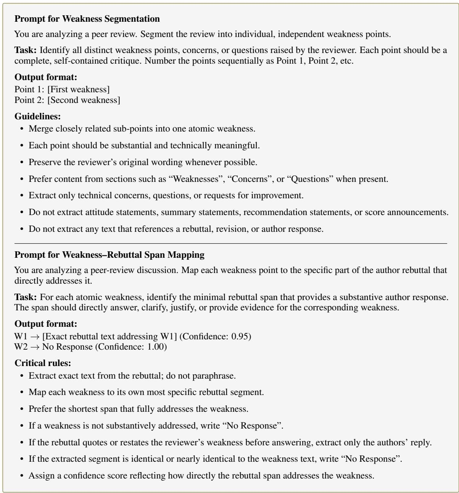  
Figure 7: Prompt templates used for atomic weakness segmentation and weakness–rebuttal span mapping. The first prompt decomposes full reviews into self-contained weakness units, while the second prompt aligns each weakness to the minimal author-response span that addresses it.

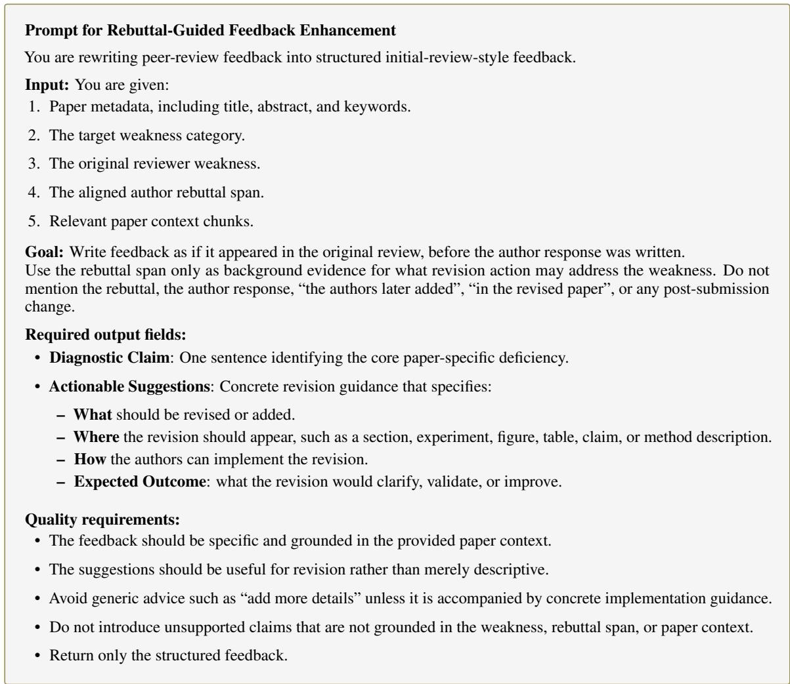  
Figure 8: Prompt template used for rebuttal-guided feedback enhancement. The prompt converts an original reviewer weakness and its aligned rebuttal span into initial-review-style diagnostic claims and actionable revision suggestions.

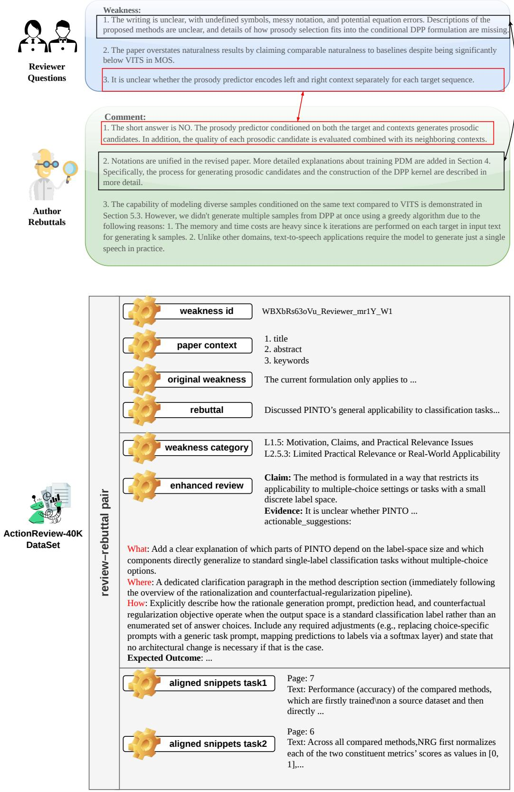  
Figure 9: Example of a constructed review–rebuttal instance in ActReview-40K. The instance includes the original weakness, aligned rebuttal signal, taxonomy label, enhanced diagnostic claim and revision suggestions, and retrieved paper chunks.

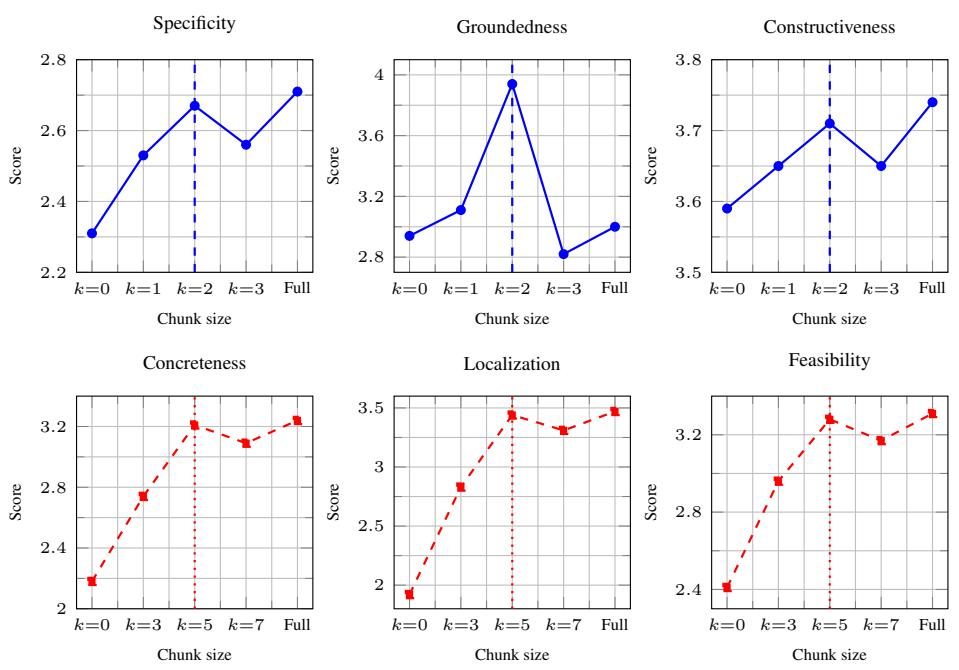  
Figure 10: Effect of retrieved chunk size on generation quality across Task 1 and Task 2, as judged by GPT-5.4. Blue solid lines denote Task 1 and red dashed lines denote Task 2. Vertical reference lines mark the default chunk size for each task: k=2 for Task 1 and k=5 for Task 2.

Retrieval Quality Screening Prompt   
You are evaluating the quality of retrieved paper chunks for actionable peer-review generation.   
You are given:   
1. Paper metadata, including title and abstract.   
2. A target weakness label.   
3. The reviewer-identified weakness.   
4. The task type: Task 1 diagnostic claim generation or Task 2 actionable suggestion generation.   
5. The retrieved paper chunks.   
Your task is to judge whether the retrieved chunks provide sufficient context for the given task. Do not evaluate any   
generated model output. Do not use or assume access to the author rebuttal. Judge only from the provided paper   
metadata, weakness, task definition, and retrieved chunks.   
Evaluation criteria. For each criterion, output pass or fail, with a short explanation.   
• Weakness-relevant evidence: Do the retrieved chunks contain paper content related to the target weakness?   
• Specific grounding support: Are the chunks specific enough to support grounded feedback, rather than only   
generic or superficial keyword matches?   
• Revision localization cues: Do the chunks indicate where or how the paper could be revised, such as a method   
section, experiment, table, figure, claim, equation, or appendix? For Task 1, this criterion may be judged based   
on whether the chunks localize the diagnosed issue. For Task 2, this criterion should judge whether the chunk   
support concrete revision guidance.   
• Overall sufficient context: Overall, are the retrieved chunks sufficient for the target task?   
Task-specific interpretation. For Task 1, focus on whether the chunks support diagnosing the target weakness.   
For Task 2, focus on whether the chunks support both the weakness diagnosis and actionable revision guidance.   
Return only valid JSON in the following format:   
{   
"weakness\_relevant\_evidence": {   
"decision": "pass/fail",   
"reason": "short explanation"   
},   
"specific\_grounding\_support": {   
"decision": "pass/fail",   
"reason": "short explanation"   
},   
"revision\_localization\_cues": {   
"decision": "pass/fail",   
"reason": "short explanation"   
},   
"overall\_sufficient\_context": {   
"decision": "pass/fail",   
"reason": "short explanation"   
}   
}  
Figure 11: Prompt used for GPT-5.4 retrieval quality screening. The prompt evaluates retrieved chunks only and does not use rebuttal text or generated model outputs.

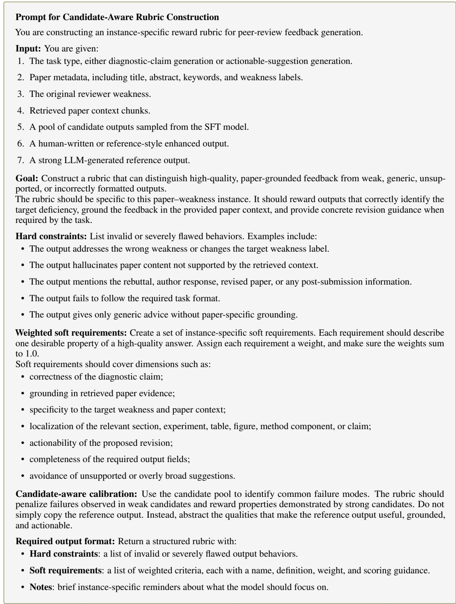  
Figure 12: Prompt template for candidate-aware rubric construction. The rubric is constructed offline from SFT candidates, reference-style enhanced outputs, and strong LLM-generated outputs, then frozen before reinforcement learning.

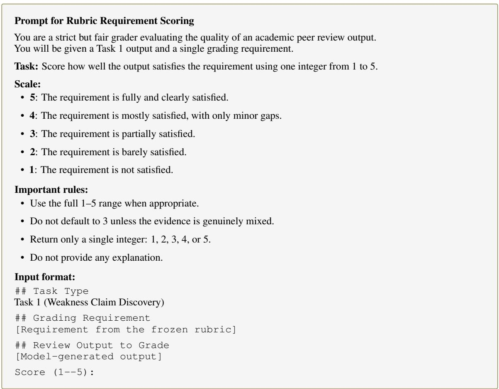  
Figure 13: Prompt used to score each weighted soft requirement in the frozen rubric. The judge returns a single integer score from 1 to 5 for each requirement, which is then normalized and combined using the rubric weights.

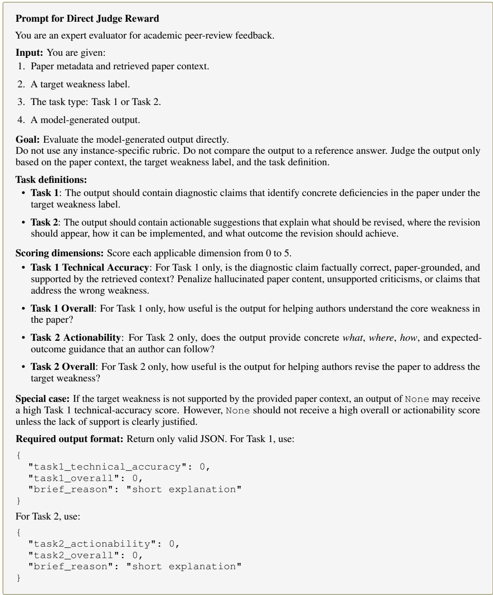  
Figure 14: Prompt used for the direct-judge reward ablation. Unlike our candidate-aware rubric reward, this baseline evaluates outputs using fixed task-level dimensions and does not receive an instance-specific rubric

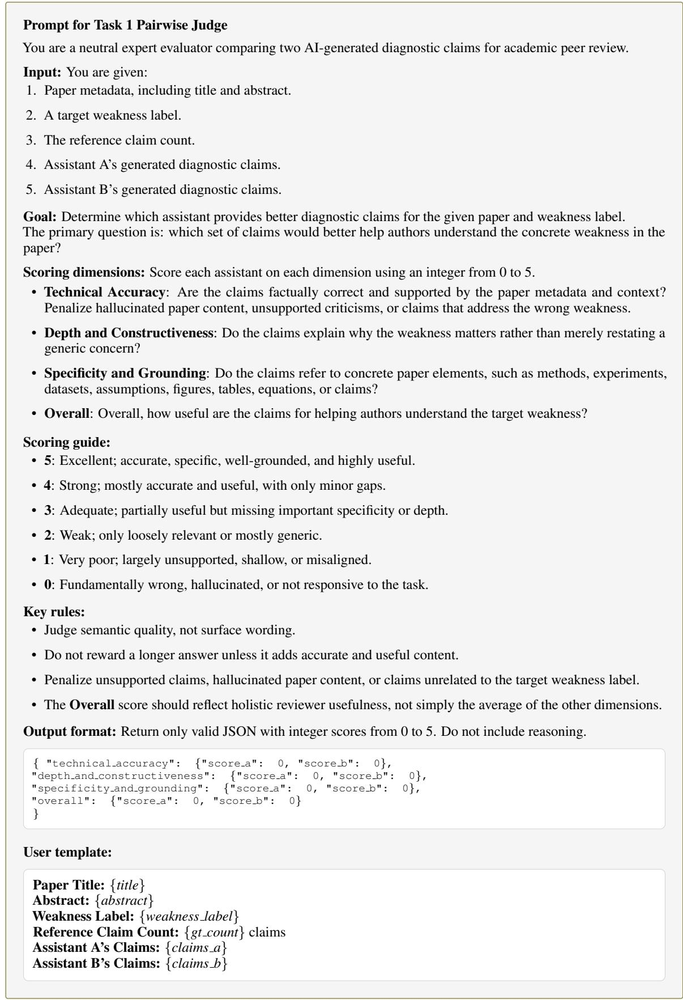  
Figure 15: LLM-as-a-judge prompt template for Task 1 pairwise evaluation. We apply the swap trick by exchanging Assistant A and Assistant B across two rounds, then average scores before computing the final verdict.

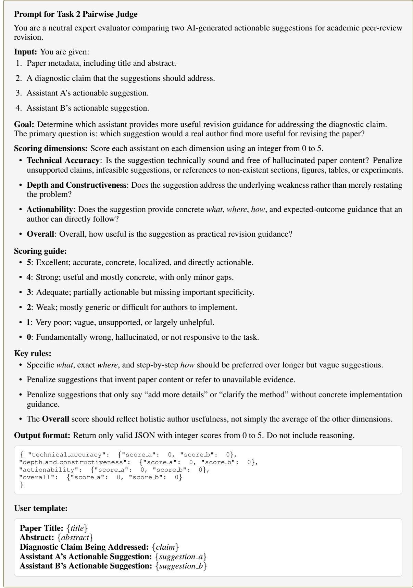  
Figure 16: LLM-as-a-judge prompt template for Task 2 pairwise evaluation. The swap trick and verdict computation follow the same protocol as Task 1.

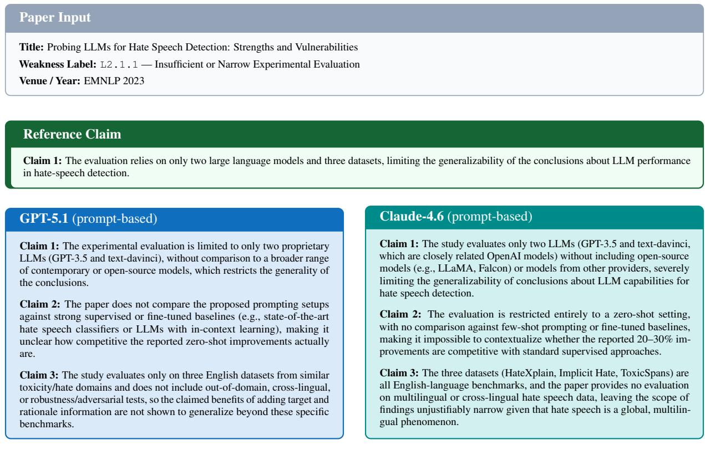  
Analysis: Both GPT-5.1 and Claude-4.6 generate three claims, whereas the reference contains only one concise claim covering the core issue—limited model and dataset scope. Semantically, the generated claims are valid and grounded, but they decompose the single reference claim into finer-grained sub-issues, including open-source model coverage, zero-shot evaluation setting, and multilingual generalization. This indicates that prompt-based LLMs tend to over-generate and broaden the scope relative to the reference, which may reduce precision in downstream evaluation.  
Figure 17: Task 1 diagnostic claim generation: GPT-5.1 and Claude-4.6 outputs compared against the reference claim. The gray box shows the paper input; the green box shows the rebuttal-derived reference claim.

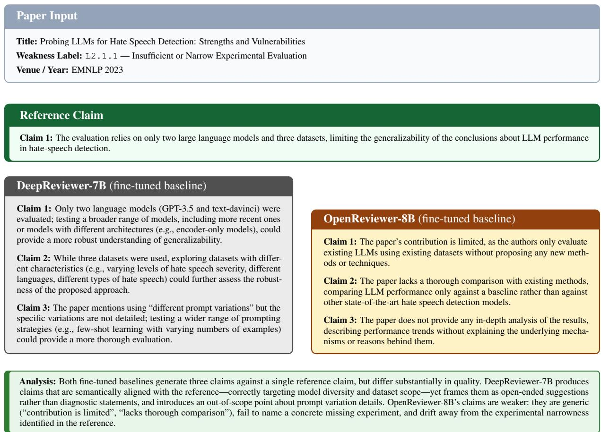  
Figure 18: Task 1 diagnostic claim generation: DeepReviewer-7B and OpenReviewer-8B outputs compared against the reference claim. The gray box shows the paper input; the green box shows the rebuttal-derived reference claim.

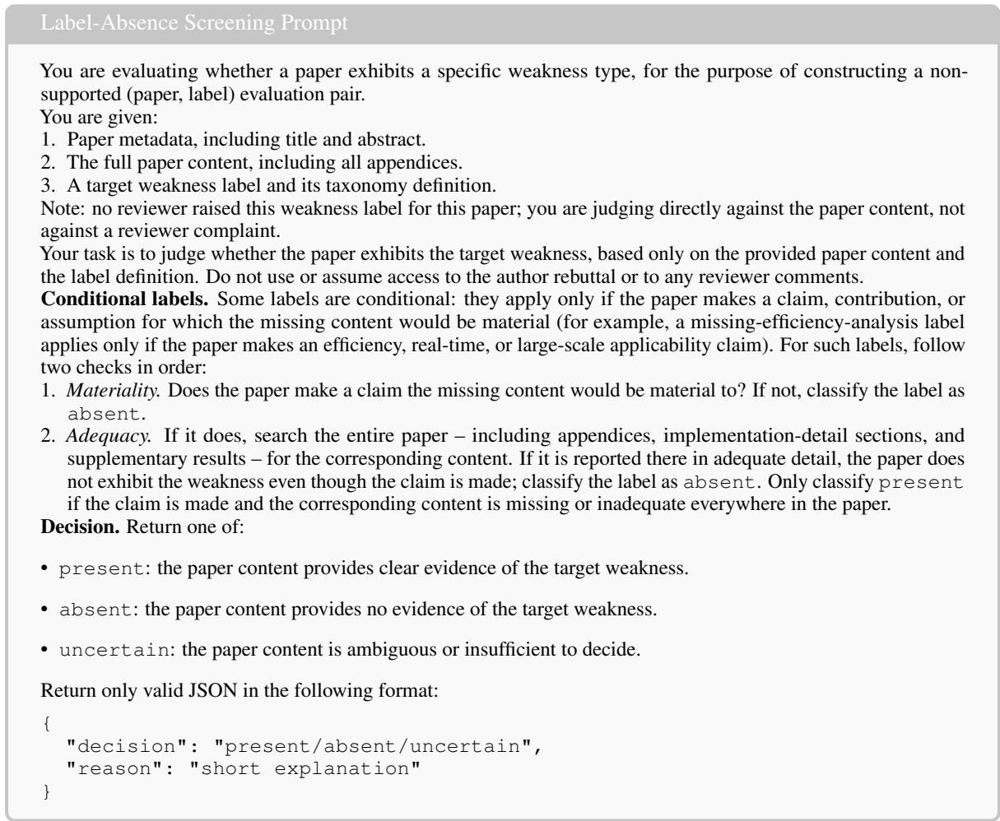  
Figure 19: Label-absence screening prompt used to construct the non-supported split (Appendix G.2). Adapted from the retrieval-quality screening prompt (Figure 11); unlike that prompt, this one outputs a single present/absent/uncertain decision on whether the paper exhibits the queried label, rather than pass/- fail judgments on retrieval sufficiency.

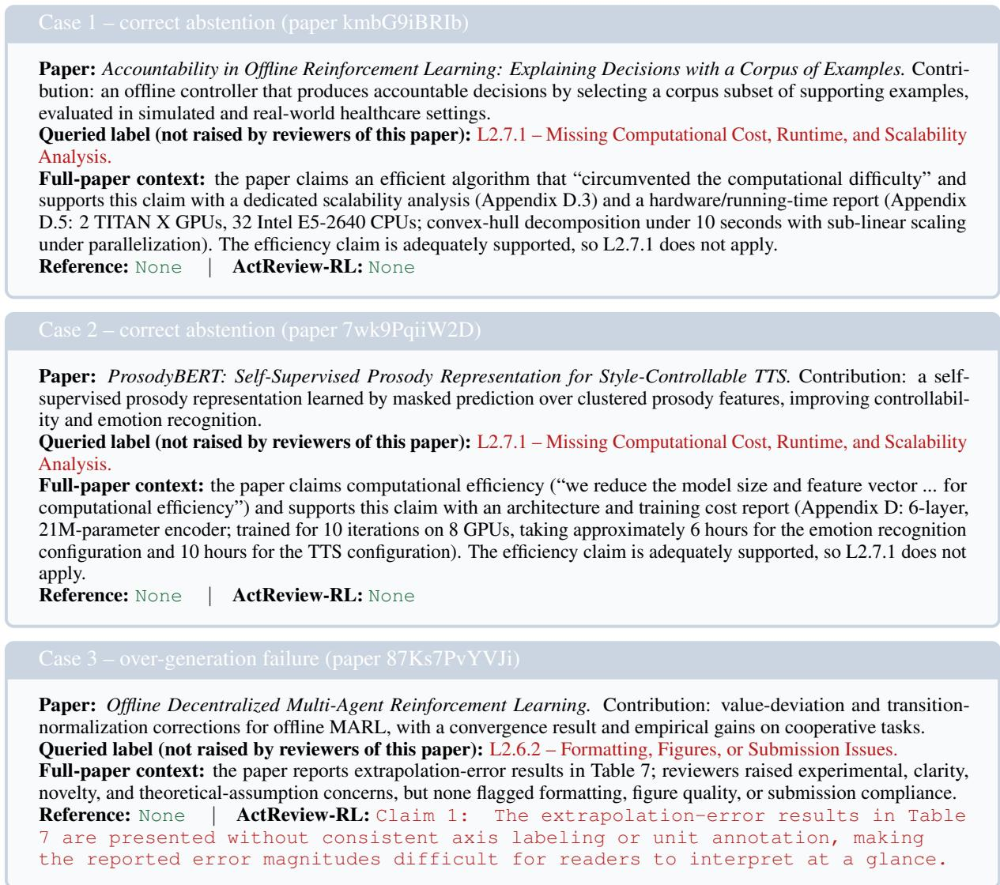  
Figure 20: Examples from the screened non-supported split. Cases 1 and 2 illustrate correct abstention, whereas Case 3 shows a residual over-generation failure. Queried distractor labels and the wrong inference are shown in red; correct None outputs are shown in green.