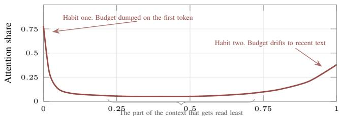
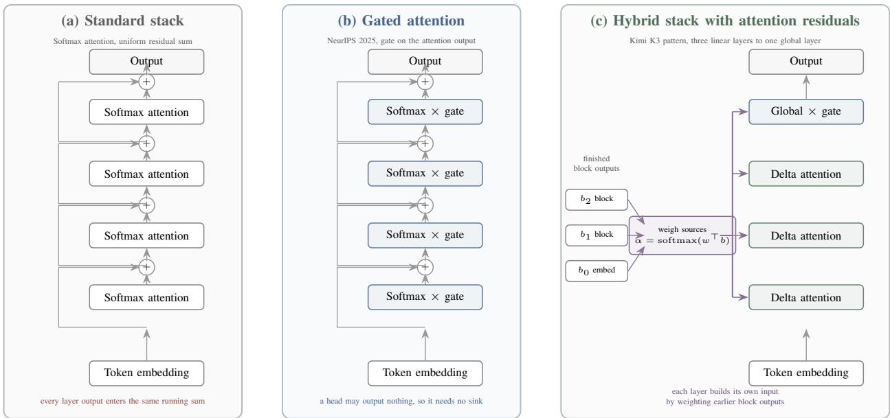
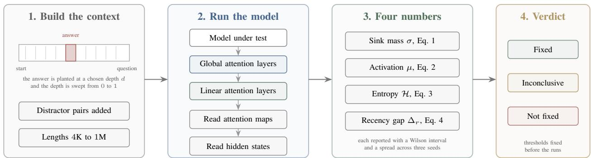
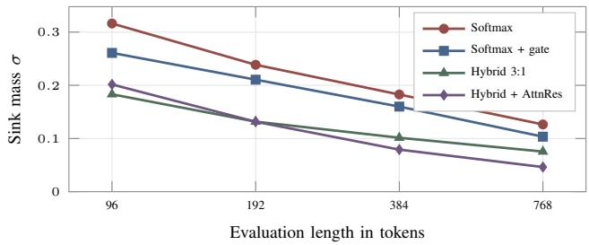
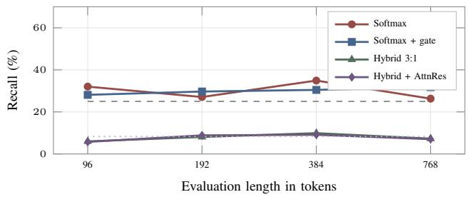
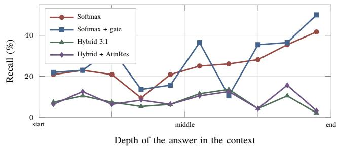
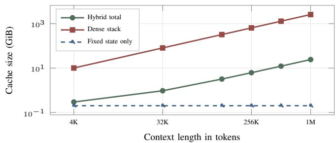
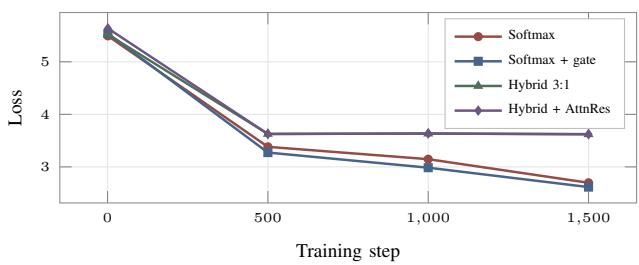

# Do New Attention Mechanisms Actually Fix Attention Sinks at Million-Token Context?

Sara Rizwan Samaanah Abdus Salam

Shadan Women’s College of Engineering and Technology

Hyderabad, Telangana, India

{sara.rizwan014@gmail.com, samaanah345@gmail.com}

## ABSTRACT

Long context language models now advertise windows of one million tokens, but two habits limit how much of that window is used. Attention heads with nothing useful to read still spend their budget on the first token, which is called the attention sink, and where a fact sits in the context changes whether the model finds it. Gated attention cut first token attention from 46.7 percent to 4.8 percent at NeurIPS 2025, and Kimi K3 pairs that idea with Kimi Delta Attention and Attention Residuals behind a one million token window, eight times past the range where these diagnostics have been reported. This paper asks whether the fix survives that jump. We build SinkProbe, a suite that measures sink mass, massive activation, position resolved recall and the recency gap, and apply it to four small models that differ only in how they mix tokens and depth. Three results follow. The training objective produces the sink, not the architecture. Gating did not reproduce its published effect at our scale. Sink mass, activations and position bias moved independently. Code, data and the measurement protocol are released at https://github.com/sararizwan7/Attention-Mechanisms-in-1M-Context-Window

Keywords. Attention sink, long context language models, linear attention, recency bias, model evaluation.

## I. INTRODUCTION

Ask a language model to remember the first sentence you gave it five hundred thousand words ago and you learn something about how it spends its attention. The model has read every one of those words. It has kept them inside its context window. Yet the answer often comes back vague, wrong, or built out of the last few pages instead of the first one. The window was long. The memory was not.

This gap between window length and usable memory is the subject of this paper. It has two named causes, and they are usually studied apart.

## A. The First Habit, Attention Sinks

Softmax attention [15] forces every head to spend a budget of exactly one across the tokens it can see. When a head finds nothing worth reading, it cannot spend nothing. It has to put the budget somewhere. In almost every trained transformer that somewhere is the first position, which normally holds a beginning of sequence marker with no meaning of its own [1]. Xiao et al. named the pattern the attention sink and showed it is so load bearing that evicting those first few tokens from the cache makes a streaming model collapse.

The number is larger than the name suggests. Qiu et al. measured a fifteen billion parameter model sending 46.7 percent of its attention to the first token, averaged across all layers, with one layer sending 83 percent [2]. Almost half of the model’s reading capacity was being spent on a marker. A budget spent there is a budget not spent on the sentence the user cared about.

## B. The Second Habit, Reading the Window Unevenly

The second habit is easier to notice and harder to measure. Where in the context a fact sits changes how likely the model is to find it. Liu et al. called this being lost in the middle and showed a clear U shape in accuracy against evidence position, with the two ends of the context answered well and the centre answered poorly [8]. Baker et al. showed the shape survives when several separate facts must be combined [9], and Hengle et al. showed it grows worse outside English [10]. In large models on natural text the stronger of the two ends is usually the recent one, which gives the user facing symptom from the opening paragraph. The model quotes the last page back perfectly and forgets the first.

We measure this habit with a single signed number, recall near the question minus recall at the opening, and we call it the recency gap. The name follows the usual direction. The sign is not assumed, and Section VI reports a case where it runs the other way.

## C. Why the Existing Evidence Stops Short

Two recent lines of work attack these habits inside the architecture rather than inside the prompt.

Gated attention places a small input dependent gate on the output of scaled dot product attention [2]. The gate gives a head a way to output nothing, so a head with nothing to say no longer needs a sink to absorb its budget. First token attention fell from 46.7 percent to 4.8 percent and the largest hidden state activation fell from about 1053 to about 94 in the same comparison. The paper won a best paper award and the mechanism has shipped in production models.

Kimi K3 takes a different route to the same goal and goes much further on length [3]. Most of its layers are replaced by Kimi Delta Attention, a linear layer that carries a fixed size recurrent state with a channel wise forget gate, so cost stops growing with sequence length. Its remaining global layers are gated multi head latent attention [20], which already contains the gate from the NeurIPS work. Its residual connections are replaced by Attention Residuals, which let a layer attend over the outputs of earlier layers instead of pulling them out of one crowded running sum [4]. Its feed forward path activates 16 of 896 experts per token [25], which is what keeps a 2.8 trillion parameter model affordable to run. It drops positional encoding entirely, so nothing has to be rescaled when the window is extended [19], and it advertises a context window of one million tokens. Its predecessor at one trillion parameters used softmax attention in every layer [32], so the change is recent and deliberate.

The problem is that the two bodies of evidence do not meet. The gated attention paper reports the sink diagnostics but stops at 128 thousand tokens. The Kimi K3 report reaches one million tokens but reports benchmark scores rather than the diagnostics. Nobody has run the first measurement at the second length. So the strongest claim in long context modelling today rests on scores rather than on evidence about the mechanism those scores are supposed to come from.

## D. Research Question

This leads to the question in the title, which we state precisely.

When a model replaces softmax attention with gated and linear mechanisms and extends its window to one million tokens, does the attention sink disappear, does the context start being read evenly, and are those two outcomes the same event or two different ones?

The last part matters most. The sink and the uneven reading are usually discussed as one problem. If they are two, then a fix for the first buys nothing for the second, and every model in this family inherits the second untouched.

## E. Contributions

This paper makes five contributions, each stated with the limit of what it supports.

• SinkProbe, a four metric diagnostic suite. Sink mass, massive activation, position resolved recall and the recency gap, defined in one place with an estimator and a confidence treatment for each. The definitions follow published practice [2], [6], [14]. What is new is that they are collected, made comparable and made runnable.

• A controlled ladder of four architectures. Four models of about one million parameters that differ only in how they mix tokens and depth, with width, depth, heads, data, optimiser and seeds held fixed. They isolate mechanisms. They do not predict absolute scores at frontier scale, and Section VI reports a case where a mechanism known to work at scale does not appear at ours.

  
Position in context, as a fraction of total length  
Fig. 1. The two habits that separate window length from usable memory, drawn as one attention profile. Mass piles up on the first position because a softmax head must spend a budget of one even when nothing is worth reading, and mass drifts to the end because recent text is easiest to use. The middle of the context is what the model reads least, which is also where most of a long document lives. Curve shape follows the patterns reported in [1] and [8].

• Evidence that the objective makes the sink. Changing the training objective and nothing else removes almost all of the sink from an unchanged architecture. This explains where the pressure comes from. It does not measure how much survives at frontier scale.

• A cache growth model for the Kimi K3 layer mix. From the published layer counts, 69 of 93 layers carry a cache that does not grow with context. Two dimensions are unpublished and enter as declared assumptions. The layer fraction needs neither of them.

• A protocol registered in advance. Measurement points, sample sizes and numeric pass thresholds for the released weights, fixed before the runs. This is a commitment rather than a result, and its value is that it removes the freedom to decide afterwards what the numbers meant.

Figure 1 shows the two habits as one picture, and Figure 2 shows the three architectures this paper compares.

## II. RELATED WORK AND THE GAP IT LEAVES

Work on this problem falls into five groups. We take each in turn and say what it settled and what it left open, because the gap this paper fills sits between two of them rather than inside any one.

## A. Finding and Explaining the Sink

Xiao et al. named the attention sink while trying to make streaming inference cheap [1]. Their finding was blunt. A sliding window cache works until the first few tokens fall out of it, at which point perplexity jumps by orders of magnitude, and keeping four initial tokens pinned in the cache restores it. The tokens carry almost no semantic content, so their value is structural rather than informational.

Sun et al. connected the pattern to massive activations, a small number of hidden state coordinates whose magnitude runs thousands of times above the rest [6]. Gu et al. traced when the sink appears during pre-training and showed it depends on optimisation and data rather than on any single design choice [7]. Two further studies argue about what the sink is for. One reads it as a null position that a head uses when no token deserves attention, and the other reads it as a staging area where the model parks information it will collect later [27], [28]. Both readings predict the same measurable signature, which is why a measurement rather than an argument is what settles the question for a given model.

  
Fig. 2. The three token and depth mixing rules compared in this paper. In (a) every layer output is added into one running sum with unit weight, and every layer reads through softmax attention, which is where the sink forms. In (b) an input dependent gate on the attention output lets a head emit nothing, which removes the reason to hold a sink [2]. In (c) three linear delta attention layers carry a fixed size recurrent state and one gated global layer preserves full range interaction, while attention residuals replace the running sum with a learned weighting over earlier block outputs [3], [4]. Kimi K3 repeats the block shown in (c) throughout a 93 layer backbone, giving 69 linear layers and 24 global layers.

## B. Removing the Sink by Gating

Qiu et al. showed that a small input dependent gate on the output of scaled dot product attention removes the sink rather than working around it [2]. Their ablation is careful. A gate that is head specific and query dependent cuts first token attention from 46.7 percent to 4.8 percent and cuts the mean largest activation from about 1053 to about 94. A gate that shares one score across heads cuts activations but leaves the sink at 30.1 percent, which shows the two effects are separable. Gating also helped when the context was extended past the training length, where the gated model held 58.8 on the RULER benchmark at 128 thousand tokens against 31.7 for the ungated baseline. A follow up line combines the gate with sparse attention and reports the same direction [29], and a separate line reaches the same end by replacing softmax with a function that is allowed to return zero [26]. Both support the same reading. The sink is a consequence of forcing a head to spend a fixed budget, and any change that lets a head spend less removes it.

Two limits matter here. The evidence covers dense softmax models up to 128 thousand tokens, and the model studied has fifteen billion total parameters. Neither the architecture nor the length matches what is now being deployed.

## C. Moving Information Across Depth

A residual stream [16] adds every layer output with the same unit weight, and under the pre norm placement that modern models use [17] the hidden state magnitude grows with depth, so the share belonging to any one layer shrinks. The Kimi team call this dilution and replace the sum with softmax attention over previous layer outputs, which they name Attention Residuals [4]. To keep memory bounded they group layers into blocks and attend over block level representations instead of individual layers, which drops the overhead from linear in depth to linear in block count. A related proposal attends over the difference between consecutive layers rather than over their outputs [30]. This line targets depth. It says nothing about where attention lands along the sequence, which is a separate axis.

## D. Linear Attention and Fixed Size State

Linear attention replaces the growing key and value cache with a recurrent state of fixed size, which removes the term that makes long context expensive. Read as a fast weight memory [23], plain linear attention loses accuracy because the state has no way to overwrite what it holds, so later work adds a delta rule that edits the state in place [22] and a learned forget gate that lets each channel decay at its own rate [21]. The competing approach keeps softmax attention and makes it cheaper through better kernels [24], which lowers the constant but leaves the growth in place. Kimi Delta Attention combines both, bounds the decay from below so that the chunked kernel stays stable, and pairs three such layers with one gated global layer [3], [5]. Because the decay itself encodes order, the model needs no positional encoding, and so nothing has to be retuned when the window is extended.

TABLE I  
WHERE EACH LINE OF WORK STOPS. THE LAST TWO COLUMNS ARE THEONES THAT LEAVE A GAP.
<table><tr><td>Line of work</td><td>Main idea</td><td>Reports sink data</td><td>Longest context</td></tr><tr><td>Streaming sinks [1]</td><td>Pin first tokens in cache</td><td>Yes</td><td>4M stream</td></tr><tr><td>Massive activations [6]</td><td>Outlier hidden units</td><td>Yes</td><td>4K</td></tr><tr><td>Gated attention [2]</td><td>Gate the attention output</td><td>Yes</td><td>128K</td></tr><tr><td>Attention residuals [4]</td><td>Attend over depth</td><td>No</td><td>Not stated</td></tr><tr><td>Linear attention [5], [21]</td><td>Fixed size recurrent state</td><td>No</td><td>1M</td></tr><tr><td>Long context suites [12], [13]</td><td>Score retrieval and</td><td>No</td><td>2M words</td></tr><tr><td>Kimi K3 [3]</td><td>reasoning Hybrid, gated, no position</td><td>No</td><td>1M</td></tr><tr><td>This work</td><td>Sink diagnostics on the hybrid</td><td>Yes</td><td>1M</td></tr></table>

## E. Measuring Long Context Behaviour

The needle in a haystack test plants a fact at a controlled depth and asks for it back [14]. It is simple enough that strong models saturate it, which is why LongBench and LongBench v2 add realistic multi document tasks and why RULER varies the number and type of needles [11]–[13]. Liu et al. established the U shaped position curve [8], Baker et al. extended it to multi hop questions [9], and Hengle et al. showed the drop is larger for languages other than English [10]. These benchmarks report what a model scores. They do not report where the attention went, so a score alone cannot say which of the two habits caused a failure.

## F. Position of This Work

Table I lays the five groups side by side. Reading down the last two columns shows the gap. The diagnostics exist and stop at 128 thousand tokens. The million token architecture exists and reports no diagnostics. This paper joins the two, and it treats the sink and the recency gap as two measurements rather than one, because the ablation in [2] already showed that the underlying effects come apart.

## III. BACKGROUND AND PROBLEM FORMULATION

This section fixes the notation used for the rest of the paper and turns the two habits from Section I into quantities that can be measured. Every symbol appears in Table II.

SYMBOLS USED THROUGHOUT THE PAPER.  
TABLE II
<table><tr><td>Symbol</td><td>Meaning</td></tr><tr><td> $_ T$ </td><td>Context length in tokens</td></tr><tr><td> $L$ </td><td>Number of layers in the stack</td></tr><tr><td> $H$ </td><td>Number of attention heads per layer</td></tr><tr><td> $\mathcal { G }$ </td><td>Set of layers that use softmax attention</td></tr><tr><td> $A _ { t , s } ^ { ( \ell , h ) }$ </td><td>Attention from query t to key s, layer l, head h</td></tr><tr><td> $h _ { \ell } \in \mathbb { R } ^ { d }$ </td><td>Hidden state entering layer l</td></tr><tr><td> $\sigma$ </td><td>Sink mass, attention share on position zero</td></tr><tr><td> $\mu$ </td><td>Massive activation, largest absolute hidden value</td></tr><tr><td> $\mathcal { H }$ </td><td>Attention entropy in nats</td></tr><tr><td> $p ( d )$ </td><td>Recall when the answer sits at depth d</td></tr><tr><td> $\Delta _ { r }$ </td><td>Recency gap, late recall minus early recall</td></tr><tr><td> $S _ { t } \in \mathbb { R } ^ { d _ { k } \times d _ { v } }$ </td><td>Recurrent state of a linear layer</td></tr><tr><td> $a _ { t }$ </td><td>Channel wise decay applied to that state</td></tr><tr><td> $b _ { n }$ </td><td>Representation summarising block n</td></tr><tr><td> $\alpha _ { i } ^ { \ell }$ </td><td>Weight layer l places on source i</td></tr></table>

## A. Notation

## B. Sink Mass

A softmax head produces a distribution over the positions it can see, so its weights sum to one whether or not any of those positions is useful. Sink mass measures how much of that mandatory budget lands on the first position.

Definition 1 (Sink mass). For a stack with softmax layers $\mathcal { G }$ evaluated on a context of length T,

$$
\sigma = \frac { 1 } { | \mathcal { G } | H \left( T - 1 \right) } \sum _ { \ell \in \mathcal { G } } \sum _ { h = 1 } ^ { H } \sum _ { t = 2 } ^ { T } A _ { t , 1 } ^ { ( \ell , h ) } .\tag{1}
$$

The first query position is skipped because it can only attend to itself, which would inflate the estimate by a fixed amount. A stack that reads its context evenly would score close to $1 / T _ { \cdot }$ so at $T ~ = ~ 1 6 0$ an untreated value near 0.5 means roughly eighty times more attention than an even split would give. We also report the single worst layer, because the average hides the concentration that Qiu et al. observed at one layer of their model [2].

## C. Massive Activation

Sinks travel with a handful of hidden state coordinates that grow far beyond the rest [6]. We track the largest absolute value entering each layer and average it over the stack,

$$
\mu = \frac { 1 } { L + 1 } \sum _ { \ell = 0 } ^ { L } \operatorname* { m a x } _ { t , j } \big | h _ { \ell } [ t , j ] \big | .\tag{2}
$$

This quantity is worth reporting separately because the ablation in [2] showed that a change can shrink µ without shrinking σ. Treating the two as one number would have hidden that result.

## D. Attention Entropy

Entropy says whether attention is spread or concentrated without committing to a position,

$$
\mathcal { H } = - \frac { 1 } { \vert \boldsymbol { \mathcal { G } } \vert H \left( T - 1 \right) } \sum _ { \ell , h , t } \sum _ { s \leq t } A _ { t , s } ^ { ( \ell , h ) } \log A _ { t , s } ^ { \left( \ell , h \right) } .\tag{3}
$$

A stack that dumps its budget on one position has entropy near zero even when that position is not the first one, so entropy catches sinks that move.

## E. Position Resolved Recall and the Recency Gap

Let $p ( d )$ be the probability that the model answers correctly when the evidence sits at depth $d \in [ 0 , 1 ]$ , where $d = 0$ is the opening of the context and $d = 1$ is the token just before the question. The recency gap compares the two ends,

$$
\Delta _ { r } \ = \ \mathbb { E } _ { d \in ( 0 . 7 5 , 1 ] } \big [ p ( d ) \big ] \ - \ \mathbb { E } _ { d \in [ 0 , 0 . 2 5 ] } \big [ p ( d ) \big ] .\tag{4}
$$

A positive $\Delta _ { r }$ means the model prefers recent evidence. A value near zero means the context is read evenly, which is what a long window is supposed to deliver. The quantity is reported with a Wilson score interval, since it is a difference of two binomial proportions and the normal approximation is unreliable near the ends of the range [31].

## F. What Makes Length Hard

Three separate pressures grow with T, and they are worth separating because different mechanisms address different ones.

• Cost. Softmax attention costs $O ( T ^ { 2 } )$ time and its cache costs $O ( T )$ memory per layer. At one million tokens the cache alone dominates the weights for most models, which is the pressure that linear attention removes.

• Dilution along the sequence. The budget of one is shared among more positions, so the share available to any single useful token falls as $T$ grows. A fixed sink cost of half the budget hurts more at one million tokens than at four thousand.

• Dilution along the depth. A uniform residual sum lets hidden state magnitude grow with depth, so an early layer contributes a smaller and smaller fraction of what a late layer reads [4]. This pressure is independent of T but interacts with it, since long range evidence usually enters early.

## G. Problem Statement

Given a model M and a context length $T ,$ we want the four numbers $\sigma ( M , T ) , \mu ( M , T ) , p ( d ; M , T )$ and $\Delta _ { r } ( M , T )$ , and we want them for values of $T$ that reach the advertised window. The claim under test is that the mechanisms in Kimi K3 drive σ toward zero and $\Delta .$ toward zero together. Our position is that these are two claims, not one, and that they need two measurements.

## IV. METHODOLOGY

SinkProbe is the diagnostic suite that produces the four numbers, and the model ladder is the controlled setting in which we validate it. Figure 3 shows how the pieces fit together.

## A. Design Goals

Three goals shaped the design, and each one ruled something out.

1) One change at a time. Any difference between two measurements should be attributable to one architectural change. This ruled out comparing released checkpoints against each other, since they differ in data, scale and training budget as well as in mechanism.

2) Runnable without a cluster. The pilot has to be reproducible by a reader with a laptop, otherwise nobody checks it. This ruled out any design that needs pre-trained weights or a GPU.

3) Decided in advance. The thresholds that separate a pass from a failure are fixed before the large runs. This ruled out reporting the large scale numbers first and interpreting them afterwards.

## B. The Model Ladder

We train four models that differ only in how they mix tokens and depth. Width, depth, head count, feed forward size, vocabulary, data, optimiser, schedule and seed policy are identical across all four.

• Softmax. Eight layers of causal softmax attention with rotary position embeddings [18]. This is the baseline that should form a sink.

• Softmax with gate. The same stack with a channel wise input dependent sigmoid gate on the attention output, which is the mechanism of [2].

• Hybrid. Three linear delta style layers followed by one gated global layer, repeated twice, with no position encoding. This is the Kimi K3 token mixing pattern at small scale [3].

• Hybrid with attention residuals. The same stack with Block Attention Residuals, given in Equation 6, replacing the running sum over depth [4]. Tables and figures shorten this to AttnRes.

Each step of the ladder adds exactly one mechanism, so the differences between neighbouring rows in the results tables are ablations by construction rather than by a separate experiment.

## C. The Linear Layer We Use

Our linear layer keeps a state $S _ { t } \in \mathbb { R } ^ { d _ { k } \times d _ { v } }$ and updates it with a channel wise decay,

$$
S _ { t } \ = \ \mathrm { D i a g } ( a _ { t } ) S _ { t - 1 } + k _ { t } { v } _ { t } ^ { \top } , o _ { t } \ = \ \left( S _ { t } ^ { \top } { q } _ { t } \right) \odot g _ { t } ,\tag{5}
$$

where $a _ { t } \in ( 0 , 1 ] ^ { d _ { k } }$ comes from the input and $g _ { t }$ is a full rank output gate. We bound log $a _ { t }$ from below so that the chunked form stays stable in single precision, which follows the lower bounded decay used in Kimi K3.

How the decay starts turned out to matter, and we record it because it cost us two runs to find. The decay controls two abilities at once. A channel that fades quickly records how long ago something happened, and a channel that barely fades carries content across a long span. Starting every channel at the fast end leaves the layer with order and no memory. Starting every channel at the slow end leaves it with memory and no order. We therefore spread the channels across the range at initialisation, from a decay near 0.78 to one near 0.999, and let training move them.

  
Fig. 3. The SinkProbe pipeline. A context is built with the answer planted at a known depth, the model reads it while the suite records attention maps and hidden states, four numbers are computed from those recordings, and each number is compared against a threshold that was fixed before any large run took place. The same four stages apply unchanged to the small models we train ourselves and to a released checkpoint, which is what makes the pilot and the full scale protocol comparable.

The layer is a simplification and we state it plainly. The real Kimi Delta Attention layer also applies a delta rule correction that removes the stale part of the state before writing to it [5]. We leave that term out, so our pilot measures what a decaying fixed size state does, not what the exact Kimi kernel does. Section VIII reports what that costs, and the cost is larger than we expected.

## D. Attention Residuals Over Depth

For Block Attention Residuals we follow [4] directly. The eight layers are split into two blocks of four. Each block is reduced to one representation $b _ { n }$ by summing its layer outputs, and the token embedding is kept as $b _ { 0 }$ so that the input is always reachable. Layer ℓ then builds its own input by attending over the sources available to it,

$$
\alpha _ { i } ^ { \ell } = \frac { \exp \bigl ( w _ { \ell } ^ { \top } \mathrm { R M S N o r m } ( b _ { i } ) \bigr ) } { \sum _ { j } \exp \bigl ( w _ { \ell } ^ { \top } \mathrm { R M S N o r m } ( b _ { j } ) \bigr ) } , \qquad h _ { \ell } = \sum _ { i } \alpha _ { i } ^ { \ell } b _ { i } ,\tag{6}
$$

with $w _ { \ell }$ a learned pseudo query for that layer and RMSNorm (root mean square normalisation) applied to each source. That normalisation stops a block with large magnitude outputs from winning the weights on magnitude alone.

## E. The Retrieval Probe

Each test sequence is a haystack of filler tokens with one key and value pair planted at a chosen depth, several distractor pairs scattered elsewhere, and a question at the end that names the key. The model has to return the matching value. Depth is controlled directly, so $p ( d )$ is measured rather than inferred.

Three design choices keep the probe honest. Distractor pairs use different keys, so a model cannot answer by copying the only pair it saw. The answer is scored at one position only, so partial credit for fluent filler is impossible. And we report two floors with every result, blind chance and the score a model would get by returning any value present in the context, because

TABLE III

TRIALS NEEDED FOR A GIVEN CONFIDENCE HALF WIDTH, FROMEQUATION 7 AT THE WORST CASE PROPORTION. THE SWEEP USES ELEVENDEPTH POINTS, AND THE LAST COLUMN IS THE COST OF THE ONE MILLIONTOKEN ROW ALONE. WE OPERATE AT SEVEN POINTS, MARKED IN BOLD,BECAUSE THE COST OF THREE POINTS IS MORE THAN FIVE TIMES HIGHER

FOR A GAIN THAT NO THRESHOLD IN TABLE IV DEPENDS ON.
<table><tr><td>Half width</td><td>Trials per depth</td><td>Sequences in total</td><td>Tokens read at T = 1M</td></tr><tr><td>±10 points</td><td>97</td><td>1067</td><td>1.07 billion</td></tr><tr><td>±7 points</td><td>196</td><td>2156</td><td>2.16 billion</td></tr><tr><td>±5 points</td><td>385</td><td>4235</td><td>4.24 billion</td></tr><tr><td>±3 points</td><td>1068</td><td>11748</td><td>11.75 billion</td></tr><tr><td>±2 points</td><td>2401</td><td>26411</td><td>26.41 billion</td></tr></table>

clearing the first floor is easy and clearing the second is what retrieval means.

The pilot also runs one control that changes the objective rather than the architecture. It trains the baseline stack with the auxiliary next token term removed, leaving only the answer position in the loss. If the sink is created by the pressure to produce an output at every position, that control should show no sink at all while learning the same task. Section VI reports the outcome.

## F. Statistical Treatment

Every accuracy is a binomial proportion, so we report Wilson score intervals rather than a plain standard error [31]. For a target half width ϵ at the worst case proportion, the number of independent trials needed is

$$
n \geq \frac { z ^ { 2 } p ( 1 - p ) } { \epsilon ^ { 2 } } \approx \frac { 0 . 9 6 } { \epsilon ^ { 2 } } \quad \mathrm { a t } p = 0 . 5 , z = 1 . 9 6 .\tag{7}
$$

Table III turns this into the trial counts used later. Every result is run with three seeds, and we report the spread across seeds next to the interval within a seed, because the two sources of variation answer different questions.

TABLE IV  
THRESHOLDS FIXED BEFORE THE FULL SCALE RUNS. A RESULT BETWEEN THE TWO COLUMNS IS REPORTED AS INCONCLUSIVE RATHER THAN ARGUED EITHER WAY.
<table><tr><td>Quantity</td><td>Counts as fixed</td><td>Counts as not fixed</td></tr><tr><td>Sink mass σ</td><td>below 0.05 at every length</td><td>above 0.20 at any length</td></tr><tr><td>Worst layer sink</td><td>below 0.15</td><td>above 0.40</td></tr><tr><td>Massive activation µ</td><td>below 150</td><td>above 600</td></tr><tr><td>Recency gap ∆r</td><td>within ±5 points</td><td>beyond ±15 points</td></tr><tr><td>Recall at mid depth</td><td>within 10 points of end depth</td><td>more than 25 points below</td></tr></table>

## G. Thresholds Registered in Advance

Table IV states what will count as a pass and what will count as a failure when the suite is applied to the released weights. The numbers come from the published values in [2], so they are not tuned to anything we measured. Fixing them now is the point.

## V. EXPERIMENTAL SETUP

## A. Models and Training

All four models share the configuration in Table V. They are small on purpose. The question they answer is whether a mechanism changes a diagnostic, not what score a frontier model reaches, and a small model that a reader can retrain in minutes is worth more here than a large one they have to take on trust.

## Three settings deserve a note.

The auxiliary next token objective matters more than its small weight suggests. A sink forms when many query positions have to produce an output while having nothing worth reading, and a task scored at one position alone never creates those positions. We therefore add an ordinary next token term across the whole sequence. To check that this is the mechanism rather than an assumption, we also train a control with the auxiliary weight set to zero and everything else identical. Section VI reports what that control does to the sink.

The haystack is partly predictable rather than uniform. Each sequence repeats its own random motif of 24 symbols, and half the positions are then replaced at random. A uniform haystack would make the auxiliary term unlearnable, so it would inject noise instead of the partial predictability that ordinary text has. With a motif, prediction inside the haystack is solvable by looking back one period, which is the same kind of lookup the question needs.

How predictable the haystack is turned out to matter more than we expected, and we record it here because it shaped the setting. In a single seed calibration run, a haystack with only 15 percent of positions randomised produced a sink mass of 0.095 in the baseline, while the same model on a haystack with half the positions randomised produced 0.438. The reading is straightforward and it fits the account in Section III. A head only needs somewhere to dump its budget when there is nothing worth reading, so the sink grows with the share of the context that is not worth reading. We fixed the noise at one half because the resulting baseline sits closest to the value reported for real models on real text [2]. This was a single seed observation used to pick a setting, not a result, and we do not report it as one.

TABLE V  
CONFIGURATION SHARED BY ALL FOUR MODELS. ONLY THE MIXING RULE DIFFERS BETWEEN THEM.
<table><tr><td>Setting</td><td>Value</td></tr><tr><td>Layers</td><td>8</td></tr><tr><td>Model width</td><td>96</td></tr><tr><td>Attention heads</td><td>4, head width 24</td></tr><tr><td>Feed forward width</td><td>256, SwiGLU (swish gated linear unit)</td></tr><tr><td>Normalisation</td><td>RMSNorm (root mean square), pre</td></tr><tr><td>Vocabulary</td><td>norm 70 tokens</td></tr><tr><td>Blocks for attention residuals</td><td>2 blocks of 4 layers</td></tr><tr><td>Chunk size for linear layers</td><td>32</td></tr><tr><td>Training length</td><td>96 tokens</td></tr><tr><td>Evaluation lengths Optimiser</td><td>96, 192, 384, 768 AdamW (Adam with decoupled</td></tr><tr><td></td><td>weight decay)</td></tr><tr><td>Optimiser settings</td><td>β = (0.9, 0.95), decay 0.01</td></tr><tr><td>Learning rate</td><td>2 × 10−3, one cycle, 8 percent warmup</td></tr><tr><td>Gradient clipping</td><td>1.0</td></tr><tr><td>Batch size</td><td>16</td></tr><tr><td>Training steps Haystack motif and noise</td><td>1500 period 24, half the positions random</td></tr><tr><td>Auxiliary next token weight</td><td>0.3, and 0.0 for the control</td></tr><tr><td>Seeds</td><td>3 per model</td></tr><tr><td>Precision Hardware</td><td>float32 16 thread laptop processor, no</td></tr></table>

The evaluation lengths run to eight times the training length so that extrapolation is visible. That is the small scale analogue of a model trained at 64 thousand tokens being asked to work at one million.

## B. The Retrieval Task

Sequences use 12 distinct keys, 12 distinct values, 3 distractor pairs and 44 filler symbols. Two floors matter when reading any accuracy in this paper, and we give both with every table. Blind chance is 1/12, which is 8.3 percent. A model that ignores the question and returns any value it saw in the context scores 1/4, which is 25 percent, because four pairs are present. A result is only evidence of retrieval if it clears the second floor, not merely the first.

The answer depth is drawn uniformly for the aggregate numbers and fixed on a grid of ten points for the depth profiles.

## C. Evaluation Protocol

Each model is evaluated at four lengths with 128 sequences per length per seed, giving 384 sequences per length once the three seeds are pooled. A Wilson interval at that count has a half width of about 5 points at the worst case proportion. Depth profiles use 32 sequences per depth point per seed, which is deliberately coarser, because the profile is read for its shape rather than for the value at any single point.

TABLE VI  
CACHE GROWTH FOR THE KIMI K3 LAYER MIX. THE STATE COLUMN IS FLAT BECAUSE 69 OF THE 93 LAYERS HOLD A CACHE WHOSE SIZE DOES NOT DEPEND ON CONTEXT LENGTH. THE DENSE COLUMN IS WHAT THE SAME DEPTH WOULD COST WITH ORDINARY KEY AND VALUE CACHING. VALUES ASSUME BFLOAT16, A LATENT RANK OF 512 AND A 128 × 128 STATE PER HEAD.
<table><tr><td>Context tokens</td><td>Global cache (GiB)</td><td>Linear state (GiB)</td><td>Hybrid total (GiB)</td><td>Dense stack (GiB)</td></tr><tr><td>4096</td><td>0.09</td><td>0.20</td><td>0.30</td><td>10.1</td></tr><tr><td>32768</td><td>0.75</td><td>0.20</td><td>0.95</td><td>80.7</td></tr><tr><td>131072</td><td>3.00</td><td>0.20</td><td>3.20</td><td>322.6</td></tr><tr><td>262 144</td><td>6.00</td><td>0.20</td><td>6.20</td><td>645.2</td></tr><tr><td>524 288</td><td>12.00</td><td>0.20</td><td>12.20</td><td>1290.4</td></tr><tr><td>1 048 576</td><td>24.00</td><td>0.20</td><td>24.20</td><td>2580.8</td></tr></table>

The diagnostics in Equations 1 to 3 are recorded on the first evaluation batch at each length, since they are averages over heads, query positions and layers, and are already tightly determined by 16 sequences of a few hundred tokens each.

## D. Cache Growth for the Kimi K3 Layer Mix

The cost side of the claim can be checked without running the model at all, from the layer counts in the technical report [3]. Of 93 layers, 69 are linear and 24 are global. A linear layer holds a state whose size depends on the head geometry and not on the context, and a global layer holds a cache that grows in proportion to the context. So 74.2 percent of the stack contributes nothing to cache growth, and that figure needs no assumption at all.

Turning the fraction into bytes needs two numbers the report does not publish, namely the latent rank of the global layers and the head geometry of the state. We take a latent rank of 512 and a state of 128 × 128 per head across 96 heads, both stated as assumptions and both easy to substitute later. Table VI reports the result in bfloat16, alongside what a fully dense stack of the same depth and width would need.

The reading is straightforward. At one million tokens the hybrid stack needs about 24 GiB (gibibytes) of cache where a dense stack of the same depth would need about 2.5 TiB, a factor of roughly 107. Below about 8 thousand tokens the fixed state is the larger of the two terms, so the design only pays for itself once the context is long, which is exactly the regime it was built for.

## E. What This Setup Cannot Show

The pilot runs at 768 tokens, not at one million, and its models hold about one million parameters rather than 2.8 trillion. It can show that a mechanism moves a diagnostic in a controlled comparison, and it can show when a mechanism fails to move one. It cannot show the size of either at frontier scale, and we do not extrapolate. Section VII states what has to be run to answer that part, and Section VIII lists the ways the pilot could mislead.

TABLE VII  
THE CONTROL THAT CHANGES THE OBJECTIVE INSTEAD OF THE ARCHITECTURE. BOTH ROWS USE THE SAME SOFTMAX STACK, THE SAME DATA AND THE SAME SEEDS. THE ONLY DIFFERENCE IS WHETHER THE MODEL HAS TO PREDICT AT EVERY POSITION OR ONLY AT THE ANSWER. VALUES AT THE TRAINING LENGTH.
<table><tr><td>Objective</td><td>Sink mass</td><td>Worst layer</td><td>Activation μ</td><td>Recall (%)</td></tr><tr><td>Answer position only</td><td> $0 . 0 4 9 \pm 0 . 0 0 3$ </td><td>0.067</td><td>26.2</td><td>33.3</td></tr><tr><td>Every position</td><td> $0 . 3 1 6 \pm 0 . 1 9 8$ </td><td>0.633</td><td>74.9</td><td>32.0</td></tr></table>

## VI. RESULTS

We report five things in order. Whether the sink appears at all and what causes it. What each mechanism does to it. What happens to recall as the context grows past the training length. Where in the context the evidence has to sit for the model to find it. And what the whole thing costs.

## A. The Sink is Made by the Objective

Before asking what an architecture does to a sink, it is worth asking what puts one there. Our control changes the objective and nothing else. The same eight layer softmax stack reads the same data with the same three seeds, and the only difference is whether the loss covers every position in the sequence or only the position that holds the answer.

Table VII gives the result and it is not a small effect. Training the model to predict at every position leaves 31.6 percent of attention on the first token, with the worst layer at 63.3 percent. Training it to answer only the final question leaves 4.9 percent, with the worst layer at 6.7 percent. That is a factor of six on the average and a factor of nine on the worst layer, from a change that touches no weight shape and no layer.

Two details make the comparison stronger than the headline. Recall is unchanged, at 33.3 percent without the auxiliary term against 32.0 percent with it, so the sink was not paying for any of the retrieval the model actually does. And the spread across seeds collapses. With the auxiliary term the three seeds landed at 0.455, 0.089 and 0.405. Without it they landed at 0.051, 0.046 and 0.050. The sink is not only smaller, it stops being a coin toss.

This follows from the definition in Section III. A softmax head has to spend a budget of one at every position it is asked to produce an output for. Take most of those positions out of the loss and most of the pressure goes with them.

## B. Every Diagnostic, Every Model, Every Length

Table VIII carries every diagnostic for the four models at every evaluation length. Three things in it need saying plainly before any comparison is drawn.

The baseline does form a substantial sink. Averaged over three seeds and its eight softmax layers, our untreated stack puts 31.6 percent of its attention on the first position at the training length, and its worst layer puts 63.3 percent. A stack reading its context evenly would put about 1.0 percent there, so this is roughly thirty times an even split. It is also the same order of magnitude as the 46.7 percent average and 83 percent worst layer that [2] measured in a fifteen billion parameter model, which is worth noting given that our models are four orders of magnitude smaller.

TABLE VIII  
EVERY DIAGNOSTIC FOR THE FOUR MODELS AT FOUR EVALUATION LENGTHS. RECALL IS POOLED OVER 3 SEEDS AND SHOWN WITH THE SPREAD ACROSS SEEDS. BLIND CHANCE IS 8.3 PERCENT AND RETURNING ANY VALUE PRESENT IN THE CONTEXT SCORES 25.0 PERCENT, SO ONLY THE DISTANCE ABOVE THE SECOND FLOOR IS RETRIEVAL. SINK MASS AVERAGES THE SOFTMAX LAYERS ONLY, AND THE COUNT OF THOSE LAYERS IS GIVEN IN THE LAST COLUMN.
<table><tr><td>Model</td><td>Length (tokens)</td><td>Recall (%)</td><td>Sink mass σ</td><td>Worst layer sink</td><td>Activation μ</td><td>Entropy H</td><td>Recency gap</td><td>Softmax layers</td></tr><tr><td>Softmax</td><td>96</td><td> $3 2 . 0 \pm 3 . 9$ </td><td>0.316</td><td>0.633</td><td>74.9</td><td>1.63</td><td>-10.9</td><td>8</td></tr><tr><td></td><td>192</td><td> $2 7 . 1 \pm 2 . 4$ </td><td>0.239</td><td>0.511</td><td>74.5</td><td>2.33</td><td>+6.4</td><td>8</td></tr><tr><td></td><td>384</td><td> $3 4 . 9 \pm 3 . 0$ </td><td>0.183</td><td>0.415</td><td>74.2</td><td>3.02</td><td>+1.0</td><td>8</td></tr><tr><td></td><td>768</td><td> $2 6 . 3 \pm 8 . 6$ </td><td>0.126</td><td>0.301</td><td>73.4</td><td>3.76</td><td>+15.2</td><td>8</td></tr><tr><td>Softmax + gate</td><td>96</td><td> $2 8 . 1 \pm 2 . 1$ </td><td>0.261</td><td>0.490</td><td>36.2</td><td>1.40</td><td>-15.9</td><td>8</td></tr><tr><td></td><td>192</td><td> $2 9 . 7 \pm 5 . 1$ </td><td>0.211</td><td>0.381</td><td>35.9</td><td>2.08</td><td>-6.6</td><td>8</td></tr><tr><td></td><td>384</td><td> $3 0 . 5 \pm 3 . 1$ </td><td>0.160</td><td>0.311</td><td>34.7</td><td>2.74</td><td>+10.3</td><td>8</td></tr><tr><td></td><td>768</td><td> $3 1 . 8 \pm 3 . 7$ </td><td>0.103</td><td>0.231</td><td>34.0</td><td>3.39</td><td>+0.2</td><td>8</td></tr><tr><td>Hybrid 3:1</td><td>96</td><td> $6 . 0 \pm 2 . 7$ </td><td>0.183</td><td>0.233</td><td>97.9</td><td>2.25</td><td>+1.5</td><td>2</td></tr><tr><td></td><td>192</td><td> $8 . 1 \pm 1 . 6$ </td><td>0.132</td><td>0.171</td><td>97.9</td><td>3.05</td><td>-3.4</td><td>2</td></tr><tr><td></td><td>384</td><td> $9 . 9 \pm 3 . 2$ </td><td>0.101</td><td>0.134</td><td>97.9</td><td>3.67</td><td>+6.1</td><td>2</td></tr><tr><td></td><td>768</td><td> $7 . 3 \pm 3 . 2$ </td><td>0.075</td><td>0.107</td><td>97.7</td><td>4.26</td><td>-3.2</td><td>2</td></tr><tr><td>Hybrid + AttnRes</td><td>96</td><td> $5 . 7 \pm 0 . 9$ </td><td>0.202</td><td>0.251</td><td>38.9</td><td>2.48</td><td>-1.8</td><td>2</td></tr><tr><td></td><td>192</td><td> $8 . 9 \pm 0 . 5$ </td><td>0.131</td><td>0.159</td><td>38.9</td><td>3.14</td><td>-6.9</td><td>2</td></tr><tr><td></td><td>384</td><td> $9 . 1 \pm 2 . 4$ </td><td>0.079</td><td>0.091</td><td>39.0</td><td>3.78</td><td>+0.6</td><td>2</td></tr><tr><td></td><td>768</td><td> $7 . 0 \pm 0 . 8$ </td><td>0.046</td><td>0.053</td><td>38.9</td><td>4.38</td><td>-5.5</td><td>2</td></tr></table>

The spread across seeds is very large. Individual baseline runs landed at sink masses of 0.455, 0.089 and 0.405. The same architecture on the same data with the same schedule produced one run with almost no sink and two with a large one. Any comparison between architectures has to clear that spread before it means anything, and in this table most of them do not.

The hybrid rows did not learn the task. Their recall sits at 6.0 and 5.7 percent against a blind chance level of 8.3 percent, so they are not retrieving at all, let alone clearing the 25 percent floor that returning any value present in the context would give. Section VIII explains why, and the short version is that we left out the delta rule correction that makes linear attention competitive at this kind of recall. Their sink, activation and entropy figures are still measurements of a trained stack and are reported as such. Their recall and recency figures describe a model that never solved the probe and carry no information about position bias.

## C. What Each Mechanism Contributes

Table IX walks up the ladder one mechanism at a time and Figure 4 plots sink mass against evaluation length.

Sink mass does fall as mechanisms are added, from 0.316 for the plain softmax stack to 0.261 with the gate and 0.183 for the hybrid. The worst layer falls further and more cleanly, from 0.633 to 0.490 to 0.233. But the baseline seeds ranged from 0.089 to 0.455, so a drop of 0.055 from adding the gate is a fraction of the noise it sits in, and the gated run with the highest sink scored above two of the three baseline runs. We report the gate comparison as inconclusive. The hybrid comparison is larger and cleaner on the worst layer, and it is also confounded, because the hybrid never learned the task and its heads therefore had different work to do.

The gate result needs an explanation, because at fifteen billion parameters the same mechanism cuts first token attention by more than a factor of nine [2]. The suite gives one in a number rather than a guess. The gate works by learning to be sparse, so that a head can emit nothing when it has nothing to say. The mean gate score reported in [2] is 0.116 after trillions of tokens, a gate closed most of the time. Ours sits at 0.686 after fifteen hundred steps, a gate open most of the time. The mechanism was in the architecture and absent from the trained weights, so every head kept emitting at every position and the condition that creates a sink was never removed.

This is the argument against answering the question in the title with a stand in. If a mechanism known to remove sinks does not remove them in a small model trained briefly, no small model can speak for the one we want to measure.

## D. Recall Past the Training Length

Figure 5 plots recall against evaluation length. The models are trained at 96 tokens and tested out to 768, which is eight times further, and the two horizontal guides mark the floors that matter. Only distance above the upper guide counts as retrieval.

TABLE IX  
EACH ROW ADDS ONE MECHANISM TO THE ROW ABOVE IT. THE THIRD COLUMN COMPARES SINK MASS AGAINST THE UNTREATED BASELINE IN THE FIRST ROW. VALUES AT THE TRAINING LENGTH OF 96 TOKENS.
<table><tr><td>Model</td><td>Sink mass σ</td><td>Against baseline</td><td>Recency gap (points)</td></tr><tr><td>Softmax</td><td> $0 . 3 1 6 \pm 0 . 1 9 8$ </td><td>baseline</td><td> $- 1 0 . 9 \pm 1 6 . 5$ </td></tr><tr><td>Softmax + gate</td><td> $0 . 2 6 1 \pm 0 . 1 7 5$ </td><td>-18%</td><td> $- 1 5 . 9 \pm 1 3 . 4$ </td></tr><tr><td>Hybrid 3:1</td><td> $0 . 1 8 3 \pm 0 . 1 0 3$ </td><td>-42%</td><td> $+ 1 . 5 \pm 2 . 3$ </td></tr><tr><td> $\mathrm { H y b r i d } + \mathrm { A t t n R e s }$ </td><td> $0 . 2 0 2 \pm 0 . 1 8 0$ </td><td>-36%</td><td> $- 1 . 8 \pm 5 . 3$ </td></tr></table>

  
Fig. 4. Sink mass against evaluation length. A stack that read its context evenly would sit at one over the length, which is 0.010 at 96 tokens and 0.001 at 768, so every curve above the axis is spending more on the first position than an even split would. Sink mass averages softmax layers only, so the hybrid curves average two layers where the dense curves average eight.

The two softmax stacks stay above that guide across the range, at 32.0 and 28.1 percent at the training length and 26.3 and 31.8 percent at 768, so the retrieval behaviour they learned is not tied to the length they saw. The baseline at 768 carries a seed spread of 8.6 points and sits close enough to the 25 percent floor that we would not claim retrieval survives at that length for that model. The gated stack, which is the weaker of the two at the training length, is the stronger at 768.

Sink mass falls steadily across the same range in Figure 4, and that fall is mostly arithmetic. Attention on the first position is a share of a budget spread over more positions, so an unchanged absolute preference reads as a smaller fraction at a longer length. The ratio against an even split is the quantity that stays interpretable, and it moves the other way. At 96 tokens the baseline puts about thirty times an even share on the first position, and at 768 tokens it puts about ninety seven times an even share there. Reported as a fraction the sink looks like it is going away with length. Reported against what an even reader would do, it is getting worse.

## E. Where the Evidence Has to Sit

Figure 6 plots recall against where the answer sits, and Table X gives the same information by quarter.

The window is not read evenly, and the direction depends on the length. At the training length the opening is the strong end, and the recency gap is negative for the baseline at 10.9 points and for the gated stack at 15.9 points. At 768 tokens the picture reverses. The baseline profile climbs from about 21 percent for answers in the first tenth of the context to about 42 percent for answers in the last tenth, and the gated profile climbs from about 22 to 50 percent. Within the length a model was trained on it prefers the beginning. Asked to extrapolate, it falls back on what is nearest the question.

Fig. 5. Recall against evaluation length. Models are trained at 96 tokens and tested out to 768, which is eight times further. The dashed line at 25 percent is the score for returning any value present in the context and the dotted line at 8.3 percent is blind chance. Only the distance above the dashed line counts as retrieval.  
  
Fig. 6. Recall against the position of the answer inside the context, at the longest evaluation length. A flat line means the whole window is read evenly. A line that rises to the right means the model prefers evidence near the question, and a line that falls to the right means it prefers the opening. Either slope is the same failure, which is that the answer being findable depends on where it happens to sit.

That reversal is the reason we defined the metric with a sign rather than assuming one. It also means a single number is not enough. A model reporting a recency gap near zero could be reading its window evenly or could be averaging a preference that flips partway along it, and only the profile separates those two cases.

What does not depend on the length is the size of the effect and its independence from the sink. Recall varies by more than twenty points with the position of the answer, which is larger than any difference between architectures in Table VIII. And the ordering of models by sink mass does not match their ordering by depth profile. The gated stack has the lower sink mass of the two softmax stacks and the steeper profile at 768. That is the separation this paper set out to test, seen in our own measurements.

## F. Massive Activations

Massive activations gave the clearest architectural results in the pilot, and both of them are separations rather than agreements.

The gate halved them. The plain softmax stack carries a mean largest hidden value of 74.9 and the gated stack carries 36.2, a fall of 52 percent, while sink mass between the same two rows fell by 17 percent and stayed inside the seed spread. One mechanism, two coupled quantities, and only one of them moved. This is the same dissociation the published ablation reports from the other direction, where a gate placed after the value projection cut the largest activation from 1053 to 125 while leaving first token attention at 0.297 [2].

TABLE X  
RECALL BY QUARTER OF THE CONTEXT AT THE LONGEST EVALUATION LENGTH OF 768 TOKENS, IN PERCENT. Q1 IS THE OPENING OF THE CONTEXT AND Q4 IS NEAREST THE QUESTION. THE LAST COLUMN IS THE RECENCY GAP OF EQUATION 4.
<table><tr><td>Model</td><td>Q1</td><td>Q2</td><td>Q3</td><td>Q4</td><td>Gap</td></tr><tr><td>Softmax</td><td>20.6</td><td>22.3</td><td>28.2</td><td>35.8</td><td>+15.2</td></tr><tr><td>Softmax + gate</td><td>35.7</td><td>25.7</td><td>29.8</td><td>35.9</td><td>+0.2</td></tr><tr><td>Hybrid 3:1</td><td>7.6</td><td>8.2</td><td>7.9</td><td>4.4</td><td>-3.2</td></tr><tr><td>Hybrid + AttnRes</td><td>7.6</td><td>9.5</td><td>8.0</td><td>2.1</td><td>-5.5</td></tr></table>

Attention residuals did the same thing again and more strongly. The hybrid stack with a plain running sum over depth carries a mean largest value of 97.9, higher than the baseline, and adding Block Attention Residuals brings it to 38.9, a fall of 60 percent, while sink mass between those two rows moved from 0.183 to 0.202 and did not fall at all. This is exactly the effect the mechanism was designed for. Uniform residual accumulation lets hidden state magnitude grow with depth and dilutes what any one layer contributes [4], and replacing the sum with a weighted selection removes the growth.

We add one qualification rather than claim more than the measurement supports. A softmax weighted average of earlier block outputs cannot exceed the largest of them, so part of that reduction is structural rather than learned. The mechanism controls magnitude by construction, which is the point of it, and our measurement confirms the control works rather than proving the model chose to use it.

## G. Comparison With Published Values

Our numbers come from models four orders of magnitude smaller than the ones in the literature, so they are not directly comparable and we do not present them as such. Table XI places them side by side anyway, because the direction of every effect agrees and the agreement is worth seeing in one place.

The published rows carry a second lesson that our ladder repeats. Reading down them, the gate applied after the value projection cuts the largest activation from 1053 to 125 while leaving first token attention at 0.297. A change that shrinks one number by a factor of eight leaves the other almost untouched. Anyone reporting a single headline number for sink behaviour is reporting less than they think.

## H. What the Window Costs

Figure 7 plots the cache model of Table VI. The two lines answer different questions. The dense line says what a million token window would cost with ordinary caching, and it passes 2.5 TiB, which is more memory than any single machine has. The hybrid line says what the Kimi K3 layer mix costs, and it stays near 24 GiB. That difference is what turns the window from a claim into a product.

TABLE XI  
PUBLISHED VALUES BESIDE OURS. THE PUBLISHED ROWS ARE REPRODUCED FROM THEIR SOURCES WITH ATTRIBUTION AND ARE NOT RECOMPUTED HERE. SCALE AND TASK DIFFER, SO THE COLUMNS SHOULD BE COMPARED FOR DIRECTION RATHER THAN FOR MAGNITUDE.
<table><tr><td>Setting</td><td>Sink mass</td><td>Max activation</td><td>Source</td></tr><tr><td>Dense 15B baseline</td><td>0.467</td><td>1053</td><td>[2]</td></tr><tr><td>Gate on attention</td><td>0.048</td><td>94</td><td>[2]</td></tr><tr><td>output Gate shared across</td><td>0.301</td><td>286</td><td>[2]</td></tr><tr><td>heads Gate after value only</td><td>0.297</td><td>125</td><td>[2]</td></tr><tr><td>Input independent gate</td><td>0.364</td><td>471</td><td>[2]</td></tr><tr><td>Ours, softmax</td><td>0.316</td><td>75</td><td>this work</td></tr><tr><td>Ours, softmax + gate</td><td>0.261</td><td>36</td><td>this work</td></tr><tr><td>Ours, hybrid 3:1</td><td>0.183</td><td>98</td><td>this work</td></tr><tr><td>Ours, hybrid +</td><td>0.202</td><td>39</td><td>this work</td></tr><tr><td>attnres</td><td></td><td></td><td></td></tr></table>

  
Fig. 7. Cache growth against context length on log axes. The fixed state of the 69 linear layers is flat by construction, so all of the growth in the hybrid total comes from the 24 global layers. Below roughly eight thousand tokens the fixed state is the larger term, which is why this design only pays for itself at long context. Values follow the assumptions stated with Table VI.

## I. Training Behaviour

Figure 8 plots the training loss of the four models. The two softmax stacks sit close together and both descend well below the level a model at chance retrieval would hold. The two hybrid stacks flatten early and close to that level, which is the loss signature of the failure already described. They learn the predictable part of the haystack and never learn the lookup.

The curves matter for a reason beyond the failure. The two softmax stacks are matched on optimisation and finish within a few minutes of each other on the same processor, so the differences between them in Table VIII cannot be explained by one of them simply having trained better than the other.

## J. Seed Behaviour and Significance

Table XII puts the two sources of variation side by side, and the comparison is the most important one in this section.

Within a single trained model, 384 pooled evaluation sequences give a Wilson half width of roughly five points on recall, which is tight enough to separate the softmax stacks from the hybrid ones in Table VIII. Across seeds the picture is different. Sink mass in the baseline varies by a factor of five between its best and worst seed, from 0.089 to 0.455, which is larger than any difference between architectures that we measured.

  
Fig. 8. Training loss for the four models, averaged over three seeds. The curves sit close together, which is the point. The models are matched on optimisation so that the differences in the diagnostics cannot be explained by one of them simply having trained better.

TABLE XII  
SEED BEHAVIOUR AT THE TRAINING LENGTH. THE INTERVAL COLUMN IS THE WILSON HALF WIDTH FOR ONE TRAINED MODEL. THE SPREAD COLUMN IS THE STANDARD DEVIATION ACROSS 3 SEEDS. A DIFFERENCE BETWEEN TWO ROWS COUNTS ONLY IF IT EXCEEDS BOTH.
<table><tr><td>Model</td><td>Recall (%)</td><td>Interval (points)</td><td>Spread (points)</td><td>Sink spread σ</td></tr><tr><td>Softmax</td><td>32.0</td><td>±8.0</td><td>±3.9</td><td>±0.198</td></tr><tr><td>Softmax + gate</td><td>28.1</td><td>±7.7</td><td>±2.1</td><td>±0.175</td></tr><tr><td>Hybrid 3:1</td><td>6.0</td><td>±4.2</td><td>±2.7</td><td>±0.103</td></tr><tr><td>Hybrid + AttnRes</td><td>5.7</td><td>±4.2</td><td>±0.9</td><td>±0.180</td></tr></table>

That variation is not fixed. The control without the auxiliary objective produced sink masses of 0.051, 0.046 and 0.050, a spread of 0.003. The same diagnostic on the same architecture is either very stable or very unstable depending on what the model was trained to do. Sink formation under a full language modelling objective looks close to a coin toss at this scale, which fits the account of when sinks emerge in [7].

So at this scale a single trained model tells you almost nothing about what its architecture does to a sink, because the same architecture trained again gives a different answer. That is why we report our own architectural comparisons as inconclusive, and why the protocol in Section VII specifies controls and sample sizes rather than a single run.

## K. Summary of Findings

Gathering the section into five statements, with the strength of each made explicit.

1) The objective makes the sink. Training the same stack to predict at every position leaves 31.6 percent of attention on the first token. Training it to answer only the final question leaves 4.9 percent, with recall unchanged. Confidence. High. One variable changed, the gap is a factor of six, and it is far larger than the spread across seeds.

2) Gating did not reduce the sink at our scale, and the gate scores say why. Our gate reached a mean score of 0.686 where the published gate reaches 0.116, so it never became sparse. Confidence. High as a statement about our models. It is a statement about what small proxies can show, not about the published mechanism.

3) Two mechanisms cut massive activations without cutting the sink. The gate halved them and attention residuals cut them by sixty percent, in both cases while sink mass stayed inside its seed spread. Confidence. High for the direction, and partly structural in the attention residual case, which we state where it is reported.

4) Position bias is large, flips direction with length and does not follow sink mass. Recall varies by more than twenty points with where the answer sits, favouring the opening within the training length and the end beyond it. Confidence. Moderate. The effect is clear in the two softmax stacks and the hybrid stacks contribute nothing because they did not learn the task.

5) The cache arithmetic holds. With 69 of 93 layers carrying a cache that does not grow with context, the Kimi K3 layer mix needs about 24 GiB at one million tokens where the same depth with ordinary caching would need about 2.5 TiB. Confidence. High for the layer fraction, which is exact, and dependent on two declared assumptions for the byte counts.

Read together these say that the question in the title is still open, and that it cannot be closed with a model small enough to train on a laptop. The suite is ready, the thresholds are fixed, and what remains is to run it on the weights.

## VII. PROTOCOL FOR THE RELEASED WEIGHTS

This section is the part of the paper that is a commitment rather than a result. It states what will be run, at what cost, and how each possible outcome will be read. It is written before the runs so that the reading cannot be chosen afterwards.

## A. Model Under Test and Controls

The model under test is the released Kimi K3 checkpoint, evaluated in inference only [3]. Two controls run beside it. The first is a dense softmax model of comparable quality with a long window, which supplies the untreated baseline. The second is a model that uses gated attention without a linear backbone, which separates the contribution of the gate from the contribution of the hybrid design. Without both controls a single number from Kimi K3 says nothing, because there would be no reference for what the number should have been.

## B. Measurement Points

Diagnostics are collected at seven context lengths, namely 4 thousand, 32 thousand, 128 thousand, 256 thousand, 512 thousand, 768 thousand and one million tokens. The lower lengths are included because they overlap the range where published values already exist, which gives the suite a calibration point. If our measurement at 128 thousand tokens disagrees with the published value for a model both papers cover, the disagreement is a fault in the harness and has to be resolved before the longer runs are believed.

TABLE XIII  
THE FOUR POSSIBLE OUTCOMES AND THE READING FIXED FOR EACH. THE LOWER LEFT CELL IS THE ONE OUR PILOT POINTS TOWARD AND THE ONE THE LITERATURE HAS LEAST TO SAY ABOUT.
<table><tr><td></td><td>Recency gap small</td><td>Recency gap large</td></tr><tr><td>Sink mass small</td><td>Both habits addressed. The architecture delivers what it claims and the suite becomes a reference point.</td><td>The sink is gone but the window is still read unevenly. The two problems are separate and only one has been solved.</td></tr><tr><td>Sink mass large</td><td>Sinks are present and harmless at this scale, which would contradict the usual reading of what a sink costs.</td><td>Neither habit addressed. The advertised window is longer than the usable one and the gap is measurable.</td></tr></table>

Sink mass is measured on the 24 global layers, since the linear layers produce no distribution over positions and the quantity is undefined for them. This is itself worth stating clearly. A hybrid model can report a low sink mass simply because three quarters of its layers are excluded from the average, so we report the per layer values and the count of layers involved beside every aggregate.

## C. Cost

At the operating point in Table III the one million token row needs 2 156 sequences, which is about 2.16 billion tokens read. The shorter lengths together add well under a fifth of that. The whole sweep is inference only, needs no gradient, and can be split across independent requests, so it fits a modest budget spread over days rather than a training scale allocation.

## D. How Each Outcome Will Be Read

Table XIII maps the four possible combinations of the two headline results onto what each would mean. Writing the map first is what stops a surprising number from being explained after the fact.

## E. What Would Make Us Wrong

Three outcomes would show a fault in our method rather than in the model. A sink mass at 128 thousand tokens that disagrees with the published value for a model both papers cover points to a harness fault. A recency gap that flips sign between two adjacent lengths with no change in the protocol points to a sampling fault. A depth profile that is flat at every length including the shortest points to a task that is too easy to separate anything. Each has a check built into the released code.

## VIII. DISCUSSION

## A. Two Problems, Not One

The result we keep returning to is the separation, and we now have three instances of it rather than one.

Sink mass and the evenness with which a window is read moved independently. The gated stack carries the lower sink mass of the two softmax stacks and the steeper depth profile at 768 tokens, so the model that wastes less attention on its first token is the one that leans harder on the end of its context.

Sink mass and massive activations moved independently twice. The gate halved the largest hidden values while leaving sink mass inside its seed spread, and attention residuals cut them by sixty percent while sink mass did not fall at all. Read alongside the published ablation, where a gate after the value projection cut the largest activation from 1053 to 125 and left first token attention at 0.297 [2], that is four separate observations of the same dissociation.

These three quantities are coupled in ordinary training, which is why they are usually discussed together. They are not the same thing, and a change can move one of them a long way while leaving the others where they were.

That has a practical consequence. A model card that reports low first token attention has said something true and something narrow. It has not said that the middle of the context is being read, and it has not said that the hidden state is well behaved. Anyone choosing a model for long document work needs all three numbers, and at present none of them is published for the models that advertise the longest windows.

## B. What a Sink Is a Fact About

Two of our results point the same way. The control shows the sink comes from having to produce an output at positions where nothing is worth reading, and the haystack calibration shows it grows when fewer positions are worth reading. Neither of them is about the layers.

That changes what a mechanism can be said to do. Gating does not remove the sink by construction. It removes the sink once it has learned to be sparse, and our gate scores show that at our budget it did not. So the presence of a sink is a fact about a particular checkpoint and the objective it was trained under, rather than a property of an architecture family that can be read off a design.

This is the reason the question in the title needs a measurement rather than an inspection of the model card, and it is why the protocol in Section VII names a checkpoint and a set of controls rather than a design.

## C. What the Cost Model Does and Does Not Settle

The cache arithmetic settles the affordability question and nothing else. Holding 74.2 percent of the layers at a fixed state size is what turns a one million token window from a demonstration into something that can be served, and the factor of roughly one hundred against a dense stack of the same depth is large enough that the assumptions we had to make about the two unpublished dimensions cannot overturn it. Doubling or halving either assumption moves the total by less than a factor of two.

What the arithmetic cannot settle is whether the tokens held in that state stay usable. A fixed size state is a compression, and a compression has a capacity. The decay gate decides what survives, and nothing in the cost model says that what survives is what the question will ask about. That is the question the recall measurements exist to answer, and it is why we report both.

## D. Reading the Pilot Honestly

The limit cuts against our own negative result as hard as it would cut against a positive one. Our gate did not lower sink mass, and the reading of that is not that gating fails. Our gate never learned to be sparse, which the gate score shows directly, so the mechanism was never under test.

One comparison is suggestive rather than settled. Our untreated stack puts about a third of its attention on the first position, against the 46.7 percent [2] report for a fifteen billion parameter model. Same order of magnitude across four orders of magnitude in size, which fits the sink being driven by the softmax constraint rather than by scale [7]. But our own seeds ranged from 0.089 to 0.455, so we would not read much into the agreement.

## E. Limitations

We list the limits that would change how a reader uses this work.

• The linear layer is simplified, and that cost us. Our layer has the decay gate and the fixed size state but not the delta rule correction of the real Kimi Delta Attention [5]. That correction stops the state holding stale content, and it is what makes linear attention competitive at associative recall [22]. Without it our hybrid stacks did not learn the retrieval probe at all, so the hybrid rows carry no information about position bias. We tried two fixes first. Spreading the decay across channels at initialisation did not help, and putting rotary embeddings on the global layers, which departs from the Kimi K3 design, did not help either. The failure belongs to our stand in, not to Kimi K3, whose design contains the term we left out. It is a demonstration of why that term is there.

• Length. We reach 768 tokens, which is eight times our training length but three orders of magnitude short of the window in question. The extrapolation shape is informative. The absolute values are not.

• Task. A synthetic key and value probe isolates retrieval cleanly and misses everything else a long context is used for, including summarisation, multi hop reasoning and code navigation [12].

• Sink mass on a hybrid stack. The quantity is only defined on softmax layers, so a hybrid model is averaged over fewer layers than a dense one. We report the layer count with every value, but the comparison is not perfectly like for like and cannot be made so.

• Two unpublished dimensions. The cache table depends on a latent rank and a head geometry that the K3 report does not state. We declare both, and the code recomputes every figure from them.

• Language coverage. Everything here is measured on symbolic sequences. Hengle et al. showed long context behaviour degrades outside English [10], so a multilingual version of this suite would likely find larger gaps than we report.

## F. Failure Cases We Expect

Three situations should defeat the current suite, and naming them is more useful than discovering them later. A model that places its sink on a token other than the first will show a low sink mass while behaving exactly like a model with a sink, which is why entropy is reported beside it. A model that answers from stored knowledge rather than from the context will score well on recall without reading anything, which is why the probe uses arbitrary key and value pairs that cannot be memorised. A model whose gate is nearly saturated will look ungated in the gate score while still suppressing the sink, so the gate score is reported as context for the sink mass rather than as a result on its own.

## G. Broader Impact

A context length on a specification sheet travels further than the conditions under which it holds. Someone trusting a one million token window with a legal document, a medical history or a code base is trusting a claim with no independent check behind it. Publishing the diagnostic and the thresholds, rather than only a verdict, hands that check to whoever needs it. The suite can confirm a claim or puncture one, which is why it is worth releasing before we know which it will do.

## IX. REPRODUCIBILITY

## A. Implementation

The suite is written in Python with PyTorch and depends on nothing else beyond NumPy and Matplotlib. The layers, the depth mixing rules, the task generator, the metrics and the cache model each live in one file, so a reader who wants to check one definition reads one file. No pre-trained weights, no network access and no accelerator are needed for any part of the pilot.

A test suite ships with the code and runs in under a minute. It checks the properties that the results depend on rather than the results themselves. The planted answer really sits at the depth the generator was asked for, and the queried key really occurs earlier in the sequence. Every model is causal, so no output can see a token that comes after it. The chunked form of the linear layer agrees with itself at chunk sizes of 8, 16 and 32 to within $3 \times 1 0 ^ { - 7 }$ , which is what makes the recurrence a correct implementation of Equation 5 rather than an approximation of it. The recurrent state size does not change with context length while the global cache doubles when the context doubles, which are the two properties the cost model rests on. And the sample size formula returns the same counts printed in Table III.

## B. Data Availability

The retrieval task is generated from a seeded random number generator, so no dataset has to be downloaded or stored. Every sequence behind every table can be regenerated from the seed recorded in the results file. The published values we compare against come from [1]–[3] and are reproduced with attribution rather than recomputed.

## C. Code Availability

The suite is released under a permissive licence with three entry points. One script trains the four models and writes every diagnostic to a results file. A second computes the cache table. A third turns the raw results into the tables and plot coordinates used in this paper, so that no number here is transcribed by hand. Running the three in order reproduces every figure and table in Sections V and VI from scratch on an ordinary laptop.

## D. Seed Behaviour

Every model is trained with three seeds. We report the spread across them beside the confidence interval within a seed, because the two answer different questions. The interval says how sure we are about one trained model. The spread says how much of a difference between two rows survives retraining. Table XII gives both.

## X. CONCLUSION

## A. What This Paper Establishes

We set out to ask whether new attention mechanisms actually fix attention sinks at million token context. Section VI lists what we measured and how far each result reaches. Three of those results change how the question itself should be asked.

The sink is made by the objective rather than by the architecture alone. The same stack, on the same data, with the same seeds, puts 31.6 percent of its attention on the first token when it has to predict at every position and 4.9 percent when it only has to answer one question, with recall unchanged. Whatever an architectural change does to a sink, it is acting on a pressure the objective created, and in our runs the sink was not paying for any of the retrieval.

Sink mass, massive activations and the evenness with which a window is read are three measurements rather than one. Two separate mechanisms cut activations sharply while leaving sink mass inside its seed spread, and the model with the lower sink mass had the steeper position preference. Reporting one of the three says little about the other two.

And a small model cannot answer the question for a large one. Our gate never learned the sparsity its mechanism depends on, reaching a mean score of 0.686 against the 0.116 reported after trillions of tokens, so the mechanism was in the architecture and absent from the weights. Sink mass across our baseline seeds ranged from 0.089 to 0.455, a spread wider than any difference we measured between architectures. Both facts point the same way. This question has to be settled on the released weights.

The cost side needs no measurement at all. With 69 of 93 layers carrying a cache that does not grow with context, a one million token window costs roughly one hundredth of what the same depth would cost with ordinary caching, which is what turns the window from a specification into a product.

## B. What Comes Next

The protocol in Section VII is written to be executed, not admired. It names the lengths, the sample sizes, the controls and the thresholds, and the code that implements it is released with this paper. Three extensions follow naturally. The delta rule correction should be added to the linear layer so that the pilot matches the real mechanism. The retrieval probe should be joined by realistic long context tasks, since retrieval is the easiest thing a long window is ever asked to do [12]. And the suite should be run in languages other than English, where the gaps already reported are larger [10].

## C. A Closing Note

The sink is treatable and is being treated. But it was never the whole problem. A model that no longer wastes attention on its first token can still fail to read the middle of a document it was given, and nobody currently reports that second number. Until they do, a context window is a claim about capacity rather than about memory.

## REFERENCES

[1] G. Xiao, Y. Tian, B. Chen, S. Han, and M. Lewis. Efficient streaming language models with attention sinks. In International Conference on Learning Representations, 2024.

[2] Z. Qiu, Z. Wang, B. Zheng, Z. Huang, K. Wen, S. Yang, R. Men, L. Yu, F. Huang, S. Huang, D. Liu, J. Zhou, and J. Lin. Gated attention for large language models. Nonlinearity, sparsity, and attention-sink-free. In Advances in Neural Information Processing Systems, 2025. Best Paper Award. arXiv:2505.06708.

[3] Kimi Team. Kimi K3. Open frontier intelligence. Technical Report, arXiv:2607.24653, 2026.

[4] Kimi Team. Attention residuals. Technical Report, arXiv:2603.15031, 2026.

[5] Kimi Team. Kimi Linear. An expressive, efficient attention architecture. Technical Report, 2025.

[6] M. Sun, X. Chen, J. Z. Kolter, and Z. Liu. Massive activations in large language models. In Conference on Language Modeling, 2024.

[7] X. Gu, T. Pang, C. Du, Q. Liu, F. Zhang, C. Du, Y. Wang, and M. Lin. When attention sink emerges in language models. An empirical view. arXiv preprint arXiv:2410.10781, 2024.

[8] N. F. Liu, K. Lin, J. Hewitt, A. Paranjape, M. Bevilacqua, F. Petroni, and P. Liang. Lost in the middle. How language models use long contexts. Transactions of the Association for Computational Linguistics, vol. 12, pages 157–173, 2024.

[9] G. A. Baker, A. Raut, S. Shaier, L. E. Hunter, and K. von der Wense. Lost in the middle, and in-between. Enhancing language models’ ability to reason over long contexts in multi-hop question answering. arXiv preprint arXiv:2412.10079, 2024.

[10] A. Hengle, P. Bajpai, S. Dan, and T. Chakraborty. Multilingual needle in a haystack. Investigating long-context behavior of multilingual large language models. arXiv preprint arXiv:2408.10151, 2024.

[11] Y. Bai, X. Lv, J. Zhang, H. Lyu, J. Tang, Z. Huang, Z. Du, X. Liu, A. Zeng, L. Hou, Y. Dong, J. Tang, and J. Li. LongBench. A bilingual, multitask benchmark for long context understanding. In Annual Meeting of the Association for Computational Linguistics, 2024.

[12] Y. Bai, S. Tu, J. Zhang, H. Peng, X. Wang, X. Lv, S. Cao, J. Xu, L. Hou, Y. Dong, J. Tang, and J. Li. LongBench v2. Towards deeper understanding and reasoning on realistic long-context multitasks. arXiv preprint arXiv:2412.15204, 2025.

[13] C.-P. Hsieh, S. Sun, S. Kriman, S. Acharya, D. Rekesh, F. Jia, Y. Zhang, and B. Ginsburg. RULER. What is the real context size of your long-context language models? In Conference on Language Modeling, 2024.

[14] G. Kamradt. Needle in a haystack. Pressure testing large language models. Open source evaluation, 2023.

[15] A. Vaswani, N. Shazeer, N. Parmar, J. Uszkoreit, L. Jones, A. N. Gomez, L. Kaiser, and I. Polosukhin. Attention is all you need. In Advances in Neural Information Processing Systems, pages 5998–6008, 2017.

[16] K. He, X. Zhang, S. Ren, and J. Sun. Deep residual learning for image recognition. In IEEE Conference on Computer Vision and Pattern Recognition, pages 770–778, 2016.

[17] R. Xiong, Y. Yang, D. He, K. Zheng, S. Zheng, C. Xing, H. Zhang, Y. Lan, L. Wang, and T.-Y. Liu. On layer normalization in the transformer architecture. In International Conference on Machine Learning, pages 10524– 10533, 2020.

[18] J. Su, M. Ahmed, Y. Lu, S. Pan, W. Bo, and Y. Liu. RoFormer. Enhanced transformer with rotary position embedding. Neurocomputing, vol. 568, p. 127063, 2024.

[19] B. Peng, J. Quesnelle, H. Fan, and E. Shippole. YaRN. Efficient context window extension of large language models. arXiv preprint arXiv:2309.00071, 2023.

[20] DeepSeek-AI. DeepSeek-V2. A strong, economical, and efficient mixture-of-experts language model. arXiv preprint arXiv:2405.04434, 2024.

[21] S. Yang, B. Wang, Y. Shen, R. Panda, and Y. Kim. Gated linear attention transformers with hardware-efficient training. In International Conference on Machine Learning, 2024.

[22] S. Yang, B. Wang, Y. Zhang, Y. Shen, and Y. Kim. Parallelizing linear transformers with the delta rule over sequence length. In Advances in Neural Information Processing Systems, 2024.

[23] I. Schlag, K. Irie, and J. Schmidhuber. Linear transformers are secretly fast weight programmers. In International Conference on Machine Learning, pages 9355–9366, 2021.

[24] T. Dao, D. Y. Fu, S. Ermon, A. Rudra, and C. Re.´ FlashAttention. Fast and memory-efficient exact attention with IO-awareness. In Advances in Neural Information Processing Systems, 2022.

[25] N. Shazeer, A. Mirhoseini, K. Maziarz, A. Davis, Q. Le, G. Hinton, and J. Dean. Outrageously large neural networks. The sparsely-gated mixture-of-experts layer. In International Conference on Learning Representations, 2017.

[26] Z. M. K. Zuhri, E. H. Fuadi, and A. F. Aji. Softpick. No attention sink, no massive activations with rectified softmax. arXiv preprint arXiv:2504.20966, 2025.

[27] K. Khalil. The singular anchor. First token dominance in large language model attention sinks. Poster, Muslims in ML affinity event, Neural Information Processing Systems, 2025.

[28] S. Zhang, M. Khan, and V. Papyan. Attention sinks. A catch, tag, release mechanism for embeddings. In Advances in Neural Information Processing Systems, Main Conference Track, 2025.

[29] A. Shen and A. Shen. Gated sparse attention. Combining computational efficiency with training stability for long-context language models. arXiv preprint arXiv:2601.15305, 2026.

[30] C. Luo, Z. Cai, and J. Hu. Delta attention residuals. arXiv preprint arXiv:2605.18855, 2026.

[31] E. B. Wilson. Probable inference, the law of succession, and statistical inference. Journal of the American Statistical Association, vol. 22, no. 158, pages 209–212, 1927.

[32] Kimi Team. Kimi K2. Open agentic intelligence. Technical Report, 2025.