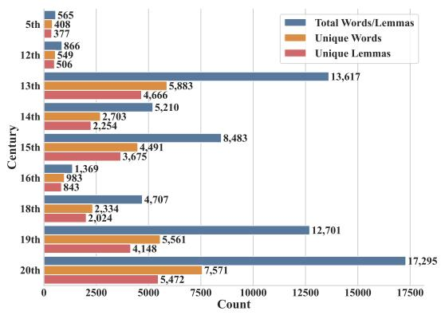
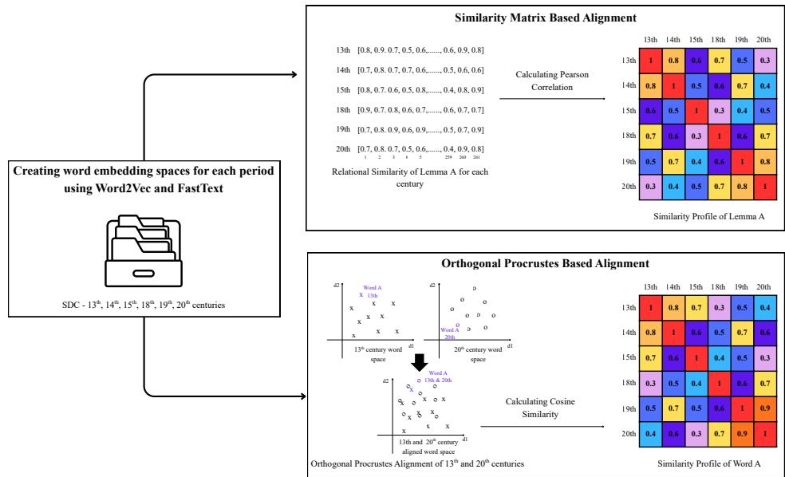
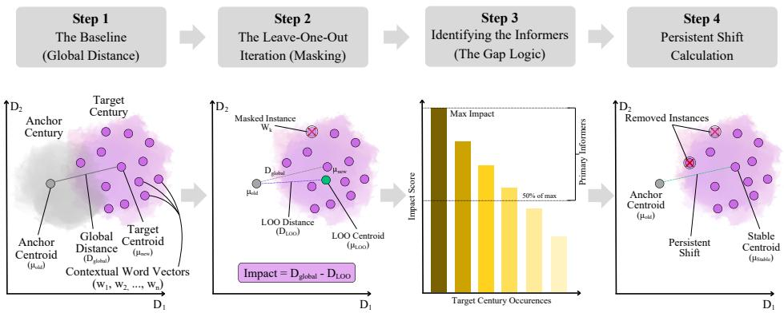
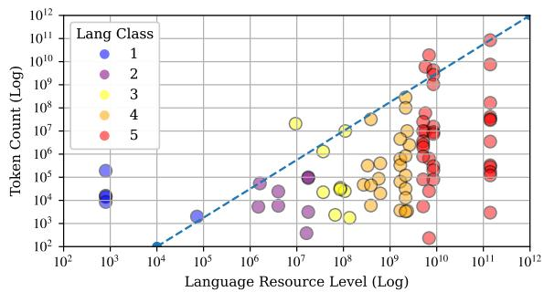
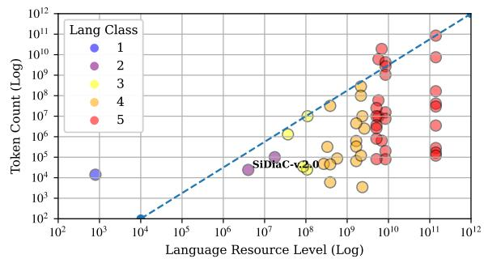
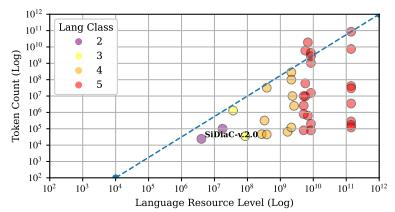
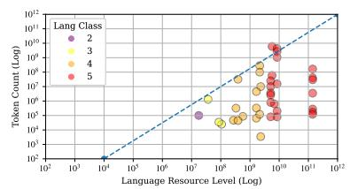
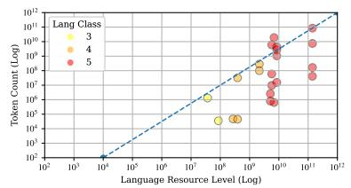

# Dynamics of meaning: Towards the Evaluation of Diachronic Semantic Change in Sinhala

Nevidu Jayatilleke and Nisansa de Silva Department of Computer Science & Engineering, University of Moratuwa, Sri Lanka {nevidu.25, NisansaDdS}@cse.mrt.ac.lk

## Abstract

Tracking semantic change in low-resource languages across extensive historical timelines presents significant challenges due to data scarcity and the limitations of static embedding alignments. This study investigates the diachronic evolution of the Sinhala language from the 13th to the 20th century using a multistage computational framework. We first align century-specific Word2Vec and FastText embeddings using Similarity Matrix Based Align ment (SMA) and Orthogonal Procrustes (OP) techniques, finding that OP alignment provides more stable neighbourhood tracking for identifying temporal similarity dips. To move beyond aggregate measures, we introduce a Bidirectional Semantic Impact Pruning approach using contextualised embeddings from a finetuned Llama-3.1-8B. By applying Leave-One-Out (LOO) diagnostics, we attempt to isolate influential sentences to distinguish between systemic semantic shifts and transient polysemic expansion. Our results show that semantic drift in the fine-tuned Llama-3.1-8B is not evenly distributed across all usages. Instead, a significant part of the change is driven by a smaller set of high-impact contextual instances, rather than gradual and uniform change across all occurrences. This work provides a preliminary framework for diachronic analysis in lowresource contexts, highlighting the trade-offs between model sensitivity and data availability.

## 1 Introduction

Language is an evolving system that is continuously reshaped by its speakers. Various factors drive this evolution, including phonetic convenience and sociocultural changes (Keidar et al., 2022). In all languages, words naturally exhibit a range of meanings, and the prevalence of these meanings can vary based on the genre and register of discourse, as well as historical context (Frermann and Lapata, 2016). A well-known example of this is the transformation of the word "gay," which has shifted in meaning from "cheerful" to "homosexual" over the years (Beinborn and Choenni, 2020).

The Sinhala language is an Indo-European language with a rich and diverse literary heritage that has developed over several millennia. Its origins can be traced back to between the 3rd and 2nd centuries BCE. The Sinhala language, which is the primary language of the Sinhalese people who constitute the largest ethnic group in the island nation of Sri Lanka, is recognised as the first language (L1) for about 16 million individuals (de Silva, 2026). Sinhala is classified as a lower-resourced language (Category 02) according to the criteria presented by Ranathunga and de Silva (2022). This language has undergone significant evolution and transformation throughout its history, resulting in the modern Sinhala we engage with today.

In this study, we perform a diachronic semantic change analysis using the largest Sinhala diachronic corpus available to date, known as SiDiaC-v.2.0. First, we enhance this corpus to create a lemmatised and POS-tagged version, referred to as SDC. We then develop diachronic embeddings utilising both static methods and contextualised methods. This is accompanied by various semantic mapping approaches, taking into account the extreme data scarcity encountered per century in the corpus. Finally, we conclude with an evaluation of semantic change across centuries, based on embedding similarity, while considering the bestperforming model-to-mapping combinations.

## 2 Related Works

Research into diachronic semantic change has evolved from establishing fundamental statistical laws to developing sophisticated unsupervised detection frameworks. However, there remains a significant gap in these studies concerning data-scarce settings. Specifically, there is a noticeable correlation between corpus size and the frequency of diachronic semantic change evaluation studies, indicating that studies involving these smaller datasets receive little attention as discussed in Appendix A.

## 2.1 Semantic Drift Evaluation Frameworks

Foundational work by Hamilton et al. (2016b) proposed the "law of conformity," which states that frequently used words change slowly, and the "law ofinnovation," which says that polysemous words change rapidly. They also demonstrated that global shifts in word embeddings capture regular linguistic drift, while changes in local neighbourhoods are more effective at detecting irregular cultural shifts (Hamilton et al., 2016a).

To overcome the limitations of analysing historical time slices in isolation, Frermann and Lapata (2016) developed SCAN, a dynamic Bayesian model that monitors the prevalence of word senses over continuous time intervals. By utilising Gaussian Markov Random Fields, the model ensures that adjacent temporal representations are co-dependent, framing semantic shifts as smooth, gradual processes that inherently enhance sparse historical data. Evaluated on a text corpus spanning from 1700 to 2010, this temporal interdependency allowed SCAN to outperform temporally isolated baselines, achieving a Spearman correlation of 0.377 in detecting changes in word meaning, compared to the baseline’s 0.255. Additionally, the model achieved highly competitive results on the SemEval-2015 temporal classification benchmarks, reaching an accuracy of 0.748 in 12-year interval predictions.

Rudolph and Blei (2017) introduced Dynamic Bernoulli Embeddings (DBE) to address the limitations of static word representations, which use a Gaussian random walk prior to model semantic evolution across continuous time slices. By treating embedding vectors as sequential latent variables, this architecture effectively accommodates and smooths out temporally sparse historical data. The dynamic model was evaluated across three diverse corpora, including a 151-year dataset of U.S. Senate speeches that comprises 13.7 million words. It consistently outperformed both static and independently trained time-binned baselines in held-out likelihood predictions. For instance, it achieved a better predictive score of -2.4 compared to the -2.454 score of the time-binned baseline on an $\mathsf { A r x i v } ^ { 1 }$ dataset. Additionally, by quantifying absolute semantic drift, the model effectively identifies terms that have undergone significant historical changes. Notably, it mathematically identified "Iraq" as the word that experienced the most substantial shift in the Senate corpus, with a peak drift score of 3.09.

For lexical semantics tasks such as SemEval-2020 (Schlechtweg et al., 2020), systems like SenseCluster (Cuba Gyllensten et al., 2020) utilised multilingual contextualised embeddings (XLM-R) combined with K-Means++ clustering. This approach treats clusters as proxies for senses, enabling the identification of both binary and graded changes in meaning. To address the high computational costs associated with deep learning methods and the limitations of analysing only adjacent time periods, recent research has introduced a framework that uses diachronic word similarity matrices derived from aligned PPMI-SVD embeddings (Kiyama et al., 2025). This framework enables a detailed analysis of continuous semantic shifts and facilitates unsupervised clustering of words with similar temporal trajectories.

## 2.2 Low-Resource Semantic Drift Evaluation

Addressing the need for evaluating lexical semantic change in small texts, Ehrenworth and Keith (2023) explores unsupervised detection models on corpora of about 150,000 tokens. They downsampled the SemEval-2020 Task $1 ^ { 2 }$ datasets while maintaining gold-standard annotations and tested three modeling approaches: static SGNS embeddings with orthogonal Procrustes using cosine distance (Pražák et al., 2020), static SGNS with Euclidean distance (Pömsl and Lyapin, 2020), and a fine-tuned BERT model with a temporal selfattention mechanism (Rosin and Radinsky, 2022). The results showed a significant 67% average performance drop in these models in data-scarce environments, though the BERT model remained the most stable. Despite low intrinsic metrics, the researchers highlight the practical utility of these models through a task called "literary intertextual semantic change detection." A case study comparing Frantz Fanon3 and Saidiya Hartman4 revealed that the contextual model effectively identifies nuanced semantic shifts in terms like "violence" and "political."

To address noise and overfitting in temporally sparse data, Montariol and Allauzen (2019) evaluated three dynamic embedding models (Incremental Skip-Gram (ISG) (Mikolov et al., 2013; Kim et al., 2014), Dynamic Filtering of Skip-Gram (DSG) (Bamler and Mandt, 2017), and Dynamic Bernoulli Embeddings (DBE) (Rudolph and Blei, 2017, 2018)) on artificially constrained subsets of the New York Times Corpus (Sandhaus, 2008), simulating data scarcity down to 20,000 words (1% subset) per year. Their analysis revealed that a "backward external" initialisation, utilising modern, large-scale pre-trained vectors like Wikipedia (Li et al., 2017) and updating sequentially backward in time, significantly improves performance for sparse historical texts. While the probabilistic dynamic models (DSG and DBE) were far more robust than ISG at capturing directed semantic drifts under extreme scarcity, they initially struggled to isolate extreme shifts. To resolve this, they introduced a Hardshrink regularisation term that successfully penalises low-magnitude noise, enabling the models to accurately discriminate valid semantic changes even in severely data-limited environments.

## 3 Methodology

We began by performing lemmatisation and POS tagging on a subset of SiDiaC-v.2.0, specifically focusing on the documents that include written date annotations. For the evaluation of semantic change, we applied two different approaches to this same subset of SiDiaC-v.2.0.

## 3.1 Creation of SDC

Our diachronic analysis utilises the SiDiaC-v.2.05 corpus (Jayatilleke et al., 2026), which is the successor to SiDiaC-v.1.06 (Jayatilleke and de Silva, 2025a). SiDiaC-v.2.0 contains a total of 241,491 words from 185 documents. It is important to note that a book may have been written centuries earlier, while its printed version was released much later (Jayatilleke and de Silva, 2025a). Therefore, for this study, we will focus on a subset of the corpus that includes the written dates, comprising 59 books with a total of 67,005 words, spanning from the 5th century to the 20th century. Further information about these corpora can be found in Appendix B.

  
Figure 1: Word Token Counts by Century from the SDC Corpus.

In this study, we enhance the filtered version of the SiDiaC-v.2.0 corpus by adding two new features. Specifically, we provide lemmas for each word based on morphological analysis and include POS tags for every word. As a result, we present the improved version of the corpus, an enhanced Sinhala Diachronic Corpus (SDC)7.

To create this improved SDC, we utilised SinMorphy-v.1.28 (Kumarasinghe et al., 2021) for lemmatisation. For POS tagging, we developed a composite pipeline that combines SinMorphy-v.1.2 with an improved version of the TnT POS Taggerfor Sinhala9 (Fernando and Ranathunga, 2018) and the Sinling10 library. A detailed explanation of this enhancement and the new features is provided in Appendix C.

## 3.2 Diachronic Embeddings

This section discusses three vectorisation techniques used to construct diachronic word embeddings: Word2Vec, FastText, and transformerbased contextualised embedding models. The 5th, 12th, and 16th centuries were excluded during the semantic change study due to insufficient word counts, as illustrated in Figure 1. While the 16th century falls within the 13th–20th century range and was initially considered, its small corpus size reduced the number of consistent words shared across all centuries to 80; removing it raised this to 210. The final analysis, therefore, spans six century-specific corpora: the 13th, 14th, 15th, 18th, 19th, and 20th centuries.

## 3.2.1 Word2Vec Embeddings

Word2Vec embeddings were generated by training a separate model on each century’s corpus using a Skip-gram architecture (Mikolov et al., 2013), which is well-suited to small and sparse corpora as it learns useful representations even for infrequent terms (Hamilton et al., 2016b). Each model used a vector size of 50, a context window of 5, and Negative Sampling (negative=15) to handle low-frequency vocabulary. A subsampling threshold of 10−5 was applied to prevent high-frequency tokens from dominating training (Herbelot and Baroni, 2017), with the learning rate decaying linearly from $5 \times 1 0 ^ { - 2 } \mathrm { t o } 7 \times 1 0 ^ { - 4 }$ over 200 epochs. This produces distinct word spaces per century, enabling diachronic comparison of word representations across contiguous historical time intervals.

## 3.2.2 FastText Embeddings

A pre-trained FastText model (Bojanowski et al., 2017) trained on the Sinhala Common Crawl corpus (cc.si.300.bin) was used as a base model, providing broad lexical coverage grounded in modern Sinhala. The vocabulary of the base model was then extended with any century-specific terms via incremental vocabulary building, and the models were fine-tuned on each century sub-sets for 30 epochs with a linearly decaying learning rate $( 1 \times 1 0 ^ { - 2 }  1 \times 1 0 ^ { - 4 } )$ . Following training, vocabulary pruning was applied to restrict the model’s word vector space to words specifically in that century’s corpus, discarding all other words from the pre-trained FastText vocabulary. This procedure yields a set of temporally aligned yet independently fine-tuned embedding spaces.

## 3.2.3 Contextualised Embeddings

We have examined five Small Language Models (SLMs), with only one being an encoder-only model (XLM-R) and the remaining four being decoder-only transformers. The decoder-only models include three variants of Llama with 8 billion parameters each (base, instruct, and SinLlama (Aravinda et al., 2025)) and Gemma with 9 billion parameters. We conducted Continual Pre-Training (CPTing) on all models except for Gemma, due to its low performance on perplexity and Bits-Per-Byte (BPB) scores on the non-lemmatised SDC corpus. The CPTing utilised a dataset comprising 90% training data and 10% validation data, based on the full SiDiaC-v.2.0 corpus. Additional information on continual pre-training can be found in Ap-

pendix D.1.

<table><tr><td>Model</td><td>Tokeniser</td><td>Training</td><td>Perplexity</td><td>Bits-Per-Byte</td></tr><tr><td>L1ama-3.1-8B Gemma-2-9b</td><td rowspan="2">Base</td><td rowspan="2">x</td><td rowspan="2">2.86 25.17 186.67 3.42</td><td>1.04 1.49</td></tr><tr><td>SinLlama Llama-3.1-8B-it</td><td>0.92 1.22</td></tr><tr><td>XLM-R</td><td rowspan="2"></td><td rowspan="2"></td><td rowspan="2">2.18</td><td>0.80</td></tr><tr><td>Llama-3.1-8B</td><td>0.77</td></tr><tr><td>SinLlama</td><td rowspan="2">Base</td><td rowspan="2">√</td><td rowspan="2">2754999.26</td><td>2.62</td></tr><tr><td>XLM-R</td><td>3.14</td></tr><tr><td>Llama-3.1-8B</td><td rowspan="2">Expanded</td><td rowspan="2">√</td><td rowspan="2">623.76 203103.64</td><td>1.22</td></tr><tr><td>SinLlama XLM-R</td><td>1.96 1.10</td></tr></table>

Table 1: Evaluation of SLMs on SiDiaC-v.2.0 based on Perplexity and Bits-Per-Byte Metrics.

Contextual word embeddings were extracted using the best-performing fine-tuned transformer model, the Llama-3.1-8B with base tokeniser. This Llama model variant, which has undergone training with the base tokeniser, will be called Llama-FT from here onwards. This multilingual decoder operates in 4-bit precision and was evaluated based on perplexity and BPB scores presented in Table 1. It is important to note that although we expected a better understanding with expanded vocabulary in the tokeniser and then conducting CPTing, it ended up increasing both perplexity and BPB. This may be due to several factors: (1) the addition of more tokens increases the model’s surprise, as the next token now has more possible choices; (2) CPTing did not effectively help the model learn the new tokens from the initialised mean position within the latent space, likely due to insufficient data; and (3) the inclusion of whitespace word tokens to expand the vocabulary for models using Byte-Pair Encoding (BPE) for text tokenisation. A detailed analysis of the perplexity and BPB scores can be found in Appendix D.2.

The model produces word-level embeddings from the final hidden layer (4096 dimensions). Since Llama-FT employs a subword tokeniser, sub-token vectors for each word were aggregated via mean pooling following the methodology by Cuba Gyllensten et al. (2020). To handle long sentences, a sliding window of 510 tokens with a step of 300 tokens was applied, with overlapping regions averaged to reduce boundary effects. This process was applied independently per century for both models, yielding centuryspecific contextual word representations that capture semantic variation across distinct historical time intervals. It is important to note that, unlike Word2Vec and FastText approaches, where we had trained models for each century, we leverage the frozen pretrained representations following Martinc et al. (2020). We hypothesise that the high-dimensional embedding space contains inherent low-dimensional manifolds representing century-specific semantic shifts, thereby bypassing the need for period-specific retraining with small datasets, which could lead to overfitting and alignment issues.

  
Figure 2: A framework for analysing diachronic semantic shifts by creating periodic embedding spaces using Word2Vec and FastText, followed by Similarity Matrix-based and Orthogonal Procrustes-based alignment. † Note that Orthogonal Procrustes-based alignment was conducted through two approaches: (1) aligning two word spaces to one, as depicted in this illustration, (Neural Procrustes Alignment); and (2) aligning all embedding spaces with the 13th century as the global reference, (Analytical Procrustes Alignment).

## 3.3 Computational Semantic Mapping

This section outlines the semantic mapping methodology used to compare word representations across centuries. We employ two complementary alignment strategies for the Word2Vec and FastText embeddings. Such alignment is necessary because these models use randomised initialisation and stochastic training, resulting in vector spaces that are arbitrarily rotated relative to one another (Hamilton et al., 2016b), a problem known as non-identifiability (Carrington et al., 2019). A summarised illustration of the alignment mechanisms is shown in Figure 2.

## 3.3.1 Similarity Matrix Based Alignment

Despite the fact that vector spaces can be “arbitrarily rotated,” the similarity between two words within one embedding space can be directly compared to that in another space (Hamilton et al., 2016b). This means that even if the axes are rotated, the distance between two vectors remains consistent. Based on this principle, we decided to create a similarity matrix for each word in one space, which can then be compared to another matrix of the same word from a different space.

To account for morphological variation in Sinhala, we first construct a centroid-based lemma representation: for each lemma L with surface forms $\{ w _ { 1 } , w _ { 2 } , \dots , w _ { n } \}$ , its vector is computed as the arithmetic mean of its valid constituent word vectors, collapsing morphological variance into a single stable point. For cross-century comparison, we adopt a relational similarity approach using 261 common lemmas shared across all century spaces as a common reference frame. Each word is represented by a similarity profile, a vector of cosine distances to every anchor lemma, and the Pearson correlation between the profiles of the same word in two centuries is used as the measure of semantic similarity, bypassing the need for explicit space alignment.

## 3.3.2 Orthogonal Procrustes Based Alignment

The concept of unitary invariance in word embeddings suggests that two embeddings are essentially identical if one can be derived from the other through a unitary operation, such as a rotation (Yin and Shen, 2018). The relative structure and relationships between words remain unchanged if all vectors are transformed by an orthogonal matrix. This preservation of structural integrity ensures that the embeddings retain their usefulness in tasks that rely on cosine similarity, even after these transformations (Carrington et al., 2019). Based on this property, we align century-specific word spaces using two variants of OP analysis: a conventional statistical formulation and a neural network-based formulation.

For rotational alignment, each anchor must be a single, fixed vector in the embedding space, making centroid-based lemma representations unsuitable. The rotation matrix $Q$ relies on a one-to-one correspondence between vectors, so we use the 210 consistent surface-form words as anchors across all century models. This alignment mechanism was conducted based on two approaches:

Analytical Procrustes Alignment: For each century space, an anchor matrix is constructed from the vectors of these 210 words and subsequently L2-normalised. The optimal rotation matrix $Q =$ $U V ^ { \top }$ is derived via Singular Value Decomposition (SVD) of the cross-covariance between the target and reference anchor matrices, rotating the target space to minimise $\lVert W _ { \mathrm { t a r g e t } } Q - W _ { \mathrm { r e f } } \rVert _ { F }$ while preserving all internal geometric relationships. The 13th-century space serves as the global reference anchor, and all other century spaces are permanently rotated in place to this coordinate system, allowing direct word-level comparison across centuries.

Neural Procrustes Alignment: As a complementary approach, we frame the OP problem as a supervised learning task using a bias-free, activation-free linear layer $\mathbf { W } \in \mathbb { R } ^ { d \times d }$ , initialised as the identity matrix and trained to map L2- normalised anchor embeddings from a target century into the coordinate system of a reference century. The training objective combines (Mean Squared Error) MSE for alignment with a squared Frobenius-norm orthogonality penalty:

$$
\begin{array} { r } { \mathcal { L } = \mathcal { L } _ { \mathrm { M S E } } + \lambda \| \mathbf { W } \mathbf { W } ^ { \top } - \mathbf { I } \| _ { F } ^ { 2 } } \end{array}\tag{1}
$$

where $\lambda ~ = ~ 0 . 0 0 1$ provides the necessary flexibility for the optimiser to minimise alignment error across both Word2Vec and subword-informed FastText architectures without inducing geometric distortion, although higher values of λ theoretically enforce a more rigid rotation. The model is optimised with Adam at a learning rate of 0.001, chosen to ensure stable convergence of the orthogonality constraint. Training runs for up to 2000 epochs with early stopping (patience of 20 epochs, minimum 100 epochs). A separate W is learned for each target century, with the reference set to the 13th century, yielding five transformation matrices across six centuries.

<table><tr><td rowspan=1 colspan=1>Model</td><td rowspan=1 colspan=1>Approach</td><td rowspan=1 colspan=1>Avg. Procrustes Disparity</td><td rowspan=1 colspan=1>Avg. Rotational Distance</td></tr><tr><td rowspan=2 colspan=1>Word2Vec</td><td rowspan=1 colspan=1>Analytical OP</td><td rowspan=1 colspan=1>174.16</td><td rowspan=1 colspan=1>9.93</td></tr><tr><td rowspan=1 colspan=1>Neural OP</td><td rowspan=1 colspan=1>157.16</td><td rowspan=1 colspan=1>9.16</td></tr><tr><td rowspan=2 colspan=1>FastText</td><td rowspan=1 colspan=1>Analytical OP</td><td rowspan=1 colspan=1>57.57</td><td rowspan=1 colspan=1>22.82</td></tr><tr><td rowspan=1 colspan=1>Neural OP</td><td rowspan=1 colspan=1>57.06</td><td rowspan=1 colspan=1>19.68</td></tr></table>

Table 2: Evaluation of Orthogonal Procrustes Alignment Performance.

We evaluate embedding alignment using Procrustes Disparity (Rochkoulets et al., 2026), which measures the residual error $\| W _ { t a r g e t } Q - W _ { r e f } \| _ { F } ^ { 2 }$ after orthogonal transformation, and Rotational Distance, defined as $\| Q - I \| _ { F }$ to quantify the magnitude of the rotation Q. As shown in Table 2, the Neural $O P$ approach for FastText significantly outperforms the Analytical OP used for Word2Vec. This neural-based optimisation achieves better manifold preservation, yielding markedly lower error margins for both disparity and distance scored compared to the higher absolute residuals of the analytical baseline. While having more data is essential for improving embedding stability, the detailed analysis of the target-to-reference century alignment provided in Appendix E.1 indicates that Word2Vec worsens with increased data exposure, unlike the fine-tuned FastText models. Therefore, we conclude that FastText should be prioritised in the statistical neighbourhood analysis discussed in subsection 4.1.

## 4 Evaluation of Semantic Change

## 4.1 Statistical Neighbourhood Analysis

To systematically isolate and qualitatively evaluate lexical items that have undergone semantic change in both the SMA (lemma-level) and the two OP Alignment (word-level) approaches, we implemented an automated reporting mechanism. Due to variations in corpus sizes and differences in the inherent alignment quality across temporal periods, applying a static cosine similarity threshold across all periods was suboptimal. Instead, we established a dynamic, pair-specific approach to define cutoffs for semantic drift.

For any given pair of time periods, we calculate the mean $( \mu )$ and standard deviation (σ) of the cosine similarities for all intersecting vocabulary items between the two aligned vector spaces. A word or a lemma is then classified as having undergone significant semantic change if its similarity score falls below a dynamically defined threshold, calculated as $\mu - \left( k \times \sigma \right)$ , where k is a scaling factor that controls the stringency of the cutoff. In our analyses, we empirically set k to 0.8. To validate our choice of $k = 0 . 8 ,$ we examined the proportion of word/lemma instances it flags as candidate drift across four independent alignment pipelines (Word2Vec and FastText, each under Analytical-OP and Neural-OP alignment). Under a Gaussian approximation, a cutoff of $\mu - 0 . 8 \sigma$ is expected to flag the bottom 21.19% of a distribution $( \Phi ( - 0 . 8 ) )$ ). As shown in Table 10 in Appendix F.1, the observed flagged proportions ranged from 16.19% to 20.57% (mean 18.36%) across the four pipelines, staying within 5 percentage points of the theoretical value in every case despite the pipelines differing substantially in embedding model and alignment mechanism. This consistency indicates that $k = 0 . 8$ behaves as a stable, near-canonical proportion of the vocabulary rather than a pipeline-specific artefact.

<table><tr><td></td><td>SMA</td><td>Analytical OP</td><td>Neural OP</td></tr><tr><td>Word2Vec</td><td>30.23%</td><td>61.31%</td><td>52.92%</td></tr><tr><td>FastText</td><td>55.69%</td><td>82.11%</td><td>81.04%</td></tr></table>

Table 3: Mean similarity of consistent keys across 15 temporal alignments using Word2Vec and FastText for SMA and OP approaches.

Following the quantitative identification of drifting candidates, we perform a qualitative contextualisation step. For each identified word, we retrieve its top 5 nearest neighbours in both the source and target semantic spaces. By comparing these lists of nearest neighbours side by side, we can manually interpret the specific nature of the semantic shift, observing how a lemma’s or a word’s contextual usage and associative meanings have transitioned over time. This methodology is applied uniformly across both alignment models, ensuring consistent qualitative insights regardless of the underlying alignment technique.

We evaluate six combinations using Word2Vec and FastText across three alignment strategies: SMA and two OP variants. Following Gulordava and Baroni (2011), we expect high mean similarity in temporal semantic spaces, as most of the lexicon remains stable while semantic change affects only a small vocabulary subset. Our results indicate high similarity in FastText methods (see Table 3). However, this could be due to fine-tuning on pretrained models to compensate for the small corpus. Thus, we must consider both Word2Vec and FastText, given their unique strengths and weaknesses.

In contrast, SMA appears less robust based on the mean similarity statistics in Table 3 compared to OP techniques. This is likely because SMA considers all consistent lemmas when calculating relational similarity. This global approach includes both stable anchor lemmas and those that have undergone semantic change, meaning the resulting relational similarity shifts are distorted by those localised drifts.

We analysed a total of 15 century-aligned semantic spaces, each containing 261 consistent lemmas and 210 consistent words. This resulted in 2,116 instances of similarity for all combinations of models and alignment approaches for each centuryto-century alignment. During our analysis, we found that 229 instances of these lemmas were captured using the Word2Vec model and 59 using FastText through the SMA approach. Additionally, we identified 635 word instances from Word2Vec and 271 from FastText using the analytical procrustes approach. Furthermore, the neural procrustes approach revealed 648 word instances from Word2Vec and 274 from FastText.

The high frequencies of temporal similarity dips observed in the Word2Vec embeddings, along with the similarly distributed frequencies across the 15 aligned semantic spaces (as shown in Table 11), again indicate that Word2Vec embeddings were less stable compared to FastText embeddings.

For example, using FastText and neural procrustes alignment, we can observe that the word ‘ȡß \ ræs’ in the 14th century appears in a semantic environment associated with gathering, movement, and central positioning. Its neighbors include causing to gather (රැස‍්කරවා \ ræskʌrʌvɑː), receiving or accepting (පිළිෙගණ \ pɪlɪgɛnʌ), in the middle (මධ්‍යෙයහි \ mʌðʰyʌjɛhɪ), and with speed (ෙව‍්ගෙයන‍් \ veːgʌjɛn). In this context, ‘ȡß \ ræs’ is linked with the idea of collecting or assembling, often in physical or spatial terms. By the 15th century, the lemma shifts into a more symbolic and doctrinal semantic field. Its neighbors include destruction or end (විනාස \ vɪnɑːsʌ), life span (ආයු \ ɑːjʊ), secret or hidden (රහස්‍ය \ rʌhʌsyʌ), gem or precious object (රත‍්න \ rʌθnʌ), and the Buddha’s radiance (Džƿȡß \ bʊðʊræs). In this period, ‘ȡß \ ræs’ is also associated with spiritual and symbolic meanings, especially light, brilliance, and sacred radiance in Buddhist contexts. Further examples from all six model-to-mapping combinations are discussed in

  
Figure 3: Leave-One-Out (LOO) analysis for identifying contextual semantic divergence. Step 1: The baseline global distance is established. Step 2: Individual contextual word vectors (wk) are iteratively masked to measure their impact on centroid displacement. Step 3: Textual evidence of semantic divergence is extracted as “primary informers” based on this impact. Step 4: Informers are permanently removed to isolate the word’s persistent shift in core meaning.

Appendix F.1 as part of a small-scale manual validation.

## 4.2 Bidirectional Semantic Impact Scoring

By using created Llama-FT contextual embeddings, filtered to the six valid centuries between 13th–20th as discussed in subsection 3.2.3, lemma-level analysis was enabled by constructing a sentence-aligned lemma lookup cross-referencing the lemma and word token versions of the corpus: for each occurrence of a word, identified by its sentence and position within each century, we mapped the corresponding lemma to its contextual word vectors and the original sentence texts. This process created a flat record for each lemma occurrence that includes its century, surface-form words, vectors, and original sentence contexts.

From this, a lemma map was constructed per century: for each lemma, all contextual vectors of its surface form words across all sentences were collected, preserving the full distributional variation of each lemma within a century. The lemma centroid, computed as the arithmetic mean of all instance vectors, serves as the aggregate representation for cross-century comparison. Critically, the individual instance vectors and their source texts are retained alongside the centroid.

To interpret the specific linguistic context driving the numerical change observed between chronological centroids generated from Llama-FT embeddings, we implemented a diagnostic Leave-One-Out (LOO) analysis. The baseline for semantic change is established as the global cosine distance between the anchor century’s centroid and the target century’s centroid $( D _ { g l o b a l } )$ . To isolate the impact of individual textual usages, the algorithm iterates through every vectorised instance of the lemma in the target century. In each iteration, a single sentence instance is provisionally excluded from the target pool, a new centroid $( D _ { L O O } )$ is calculated, and the cosine distance to the anchor centroid is re-evaluated.

By subtracting $D _ { L O O }$ from the baseline global distance $( D _ { g l o b a l } )$ , we quantify the semantic impact of the excluded sentence. A positive impact score indicates that the presence of the sentence actively pulled the target centroid away from its historical anchor meaning. To capture related senses of semantic change, the algorithm identifies the sentence with the maximum displacement impact and flags it, alongside any other instances yielding an impact score within 50% of this maximum, as primary “informers”. The 50% threshold was chosen as a mid-level salience criterion to balance specificity and coverage when identifying important contextual usages. Higher thresholds often selected only one dominant sentence, while lower thresholds included many weakly influential instances, which reduced interpretability. Therefore, the 50% cutoff keeps instances whose impact is still close to the strongest effect, capturing the main contributors to semantic change without adding noise. In a forward temporal comparison (lower to upper century), these “informers” represent novel semantic innovations; in a reverse comparison (upper to lower century), they highlight obsolete contextual usages that eventually faded from the lexicon.

Finally, out of the total instance count for the target lemma, these isolated informer sentences are permanently masked from the target century representations to recalculate a revised distance metric, termed the “persistent shift”. The mathematical difference between the original global distance and the persistent shift determines exactly what percentage (Drift Reduction) of the observed semantic drift is attributable to specific documented contextual innovations. A summary of the complete mechanism is illustrated in Figure 3. This LOO methodology, applied uniformly across Llama-FT embeddings over all 30 ordered permutations of the six centuries, provides both quantitative measurement and immediate qualitative textual evidence of semantic change.

The results show a low but consistent level of semantic shift in the Llama-FT representations. The average global centroid distance is 0.0295, which decreases to 0.0272 after removing high-impact instances, resulting in a drift reduction of 8%. This indicates that a measurable portion of the observed shift is due to a subset of high-influence contextual usages. Out of 112,945 instances, a total of 21,738 are identified as having drifted, revealing that semantic change is unevenly distributed across occurrences.

As an example, the semantic trajectory of the lemma "ගුණ \ gʊnʌ" (guna, meaning "virtue/quality") reveals a clear divergence between the 14th-century context and the 15th-century context. Both periods share a core of "virtuepraise," but they differ in whose virtue is celebrated and in what manner. In the 14th century, "ගුණ \ gʊnʌ" is used in a style that praises kings, princes, and wise people, describing them as figures of high moral character and many virtues. It also refers to a great sage known for having all virtues. This usage is supported by related terms such as clan/lineage (කුල \ kʊlʌ), city (පුර \ pʊrʌ), compassion (කරැණා \ kʌrʊnɑː), and endowment (සමන‍්නාගත \ sʌmʌnnɑːgʌθʌ, as in "endowed with twelve/ten virtues"), reflecting a blend of dynastic and religious praise vocabulary. In the 15thcentury context, the usage of "ගුණ \ gʊnʌ" broadens along two distinct lines: the continued and intensified Buddhist compassion-praise (e.g., praising the Buddha’s abundant loving-kindness) and courtly-poetic praise of feminine beauty, which describes various heroines, including a princess named Ulakudaya Devi and a brief reference to Sita (සීතා \ siːθɑː). This poetry often compares gentle virtues to the pure light of the moon. The linguistic landscape of this period shifts to include terms related to fame/renown (ĶÚč \ kiːrθɪ) and triumph (ජයගන‍් \ dʒʌjʌgʌn), as seen in a passage describing a heroine’s beauty as "triumphing over" the celestial wish-tree. Meanwhile, compassion (කරැණා \ kʌrʊnɑː) remains a common thread connecting both centuries. The eleven example sentences that underlie the 27.31% drift reduction reflect a similar mix of themes, Buddhist compassionpraise alongside praise for feminine beauty rather than a singular, clear narrative. Both strands pull the focus away from the 14th century’s masculine, royal-heroic sense. This pattern consistently recurs across four separate century pairs for this lemma. Instead of a complete shift in meaning, this represents the closest form of semantic change provided by the corpus: a stable abstract sense of "virtue/quality," whose objects of praise expand from masculine, royal-heroic figures to include both intensified religious devotion and feminine courtly beauty.

Overall, these findings support the idea that diachronic semantic drift in this model is driven by selective contextual innovations rather than uniform shifts across all instances. A detailed analysis of these metrics, based on all 30 ordered permutations of the six centuries, along with two more examples of semantic change, is discussed in Appendix F.2 as part of a small-scale manual validation.

## 5 Conclusion

This study established a computational framework for diachronic semantic analysis using three distinct embedding methodologies. We successfully aligned century-specific Word2Vec and FastText models through SMA and OP alignment techniques. Our evaluation of these static embeddings via statistical neighbourhood analysis demonstrated the superior stability of OP alignment for identifying temporal “similarity dips” in the Sinhala lexicon.

Furthermore, we extended the analysis beyond aggregate centroid-based measures by introducing Bidirectional Semantic Impact Pruning. Utilising contextualised embeddings from Llama-FT, this approach leveraged LOO diagnostics to isolate and identify sentences responsible for semantic drift. In contrast to global averaging, this method attempts to distinguish between systemic shifts and polysemic expansion by highlighting specific influential instances. While limited by available data density, the approach offers a preliminary framework for exploring the semantic evolution of low-resource languages like Sinhala across historical periods.

## Limitations

The scope and outcomes of this study on Sinhala diachronic semantics were influenced by several constraints.

Data Scarcity: The lack of extensive historical corpora impacted the strength of century-wise Word2Vec models, leading to possible problems such as unreliable Procrustes alignment compared to the fine-tuned FastText models. Additionally, the transformer models did not improve the perplexity and BPB scores during continual pretraining, possibly due to data scarcity affecting the embedding strength of expanded vocabulary words.

Lemmatisation: SinMorphy may not have been trained on historical Sinhala. The absence of robust morphological analysers highlights the lowresource status of Sinhala (de Silva, 2026).

POS Tagging: The absence of high-accuracy POS taggers for historical Sinhala (de Silva, 2026) necessitated a hybrid tagging system. This system likely carries a modern linguistic bias, as its dependencies are rooted in contemporary Sinhala grammar, potentially affecting the accuracy of morphological labelling within the medieval and early modern sections of the corpus.

## References

Lars Ahrenberg, Daniel Holmer, Stefan Holmlid, and Arne Jönsson. 2022. Analysing changes in official use of the design concept using sweclarin resources. In CLARIN Annual Conference, pages 1–11.

Patrícia Amaral and Chad Howe. 2012. Nominal and verbal plurality in the diachrony of the portuguese. Verbal plurality and distributivity, 546:25.

Patrícia Amaral, Zuoyu Tian, Dylan Jarrett, and Juan Escalona Torres. 2023. Tracing semantic change in portuguese: A distributional approach to adversative connectives. Journal of Historical Linguistics, 13(1):1–34.

HWK Aravinda, Rashad Sirajudeen, Samith Karunathilake, Nisansa de Silva, Rishemjit Kaur, and Surangika Ranathunga. 2025. Sinllama-a large language model for sinhala. In 2025 Moratuwa Engineering Research Conference (MERCon), pages 617–622. IEEE.

Florentina Armaselu, Chaya Liebeskind, Paola Marongiu, Barbara McGillivray, Giedre Valunaite Oleskeviciene, Elena-Simona Apostol, Ciprian-Octavian Truica, and Daniela Gifu. 2024a. LLODIA: A linguistic linked open data model for diachronic

analysis. In Proceedings of the 9th Workshop on Linked Data in Linguistics @ LREC-COLING 2024, pages 1–10, Torino, Italia. ELRA and ICCL.

Florentina Armaselu, Barbara McGillivray, Chaya Liebeskind, Paola Marongiu, Giedre˙ Valunait¯ e Oleškevi˙ cienˇ e, Elena-Simona Apostol,˙ and Ciprian-Octavian Truica. 2024b. Multilingual˘ word embedding and linguistic linked open data for tracing semantic change. Rasprave Instituta za hrvatski jezik, 50(2).

Robert Bamler and Stephan Mandt. 2017. Dynamic word embeddings. In International conference on Machine learning, pages 380–389. PMLR.

Andreas Baumann, Julia Neidhardt, and Tanja Wissik. 2019. Dylen: Diachronic dynamics of lexical networks. In LDK (Posters), pages 24–28.

Kristin Bech and Kristine Eide. 2014. The ISWOC corpus.

Kenneth R Beesley and Lauri Karttunen. 2003. Finitestate morphology: Xerox tools and techniques. CSLI, Stanford, pages 359–375.

Lisa Beinborn and Rochelle Choenni. 2020. Semantic drift in multilingual representations. Computational Linguistics, 46(3):571–603.

Douglas Biber, Edward Finegan, and Dwight Atkinson. 1994. ARCHER and its challenges: Compiling and exploring a representative corpus of historical English registers. Creating and using English language corpora, pages 1–14.

Piotr Bojanowski, Edouard Grave, Armand Joulin, and Tomas Mikolov. 2017. Enriching word vectors with subword information. Transactions of the associationfor computational linguistics, 5:135–146.

Gerlof Bouma, Evie Coussé, Trude Dijkstra, and Nicoline van der Sijs. 2020. The EDGeS diachronic Bible corpus. In Proceedings of the Twelfth Language Resources and Evaluation Conference, pages 5232–5239, Marseille, France. European Language Resources Association.

Thorsten Brants. 2000. TnT – a statistical part-ofspeech tagger. In Sixth Applied Natural Language Processing Conference, pages 224–231, Seattle, Washington, USA. Association for Computational Linguistics.

Daniel Braun. 2022. Tracking semantic shifts in German court decisions with diachronic word embeddings. In Proceedings of the Natural Legal Language Processing Workshop 2022, pages 218–227, Abu Dhabi, United Arab Emirates (Hybrid). Association for Computational Linguistics.

Anne Breitbarth. 2019. Should a conditional marker arise. . . the diachronic development of conditional sollte in german. Glossa: a journal of general linguistics, 4(1).

Rachel Carrington, Karthik Bharath, and Simon Preston. 2019. Invariance and identifiability issues for word embeddings. Advances in Neural Information Processing Systems, 32.

Maria Cassese, Giovanni Puccetti, Marianna Napolitano, and Andrea Esuli. 2025. DIACU: A dataset for the DIAchronic analysis of church Slavonic. In Proceedings ofthe 10th Workshop on Slavic Natural Language Processing (Slavic NLP 2025), pages 101– 107, Vienna, Austria. Association for Computational Linguistics.

Jing Chen, Emmanuele Chersoni, and Chu-ren Huang. 2022. Lexicon of changes: Towards the evaluation of diachronic semantic shift in Chinese. In Proceedings ofthe 3rd Workshop on Computational Approaches to Historical Language Change, pages 113– 118, Dublin, Ireland. Association for Computational Linguistics.

Manuel Contreras Seitz. 2009. Towards the constitution of a diachronic corpus of chilean spanish. RLA. Revista de linguistics teüística teórica y aplicada, 47(2):11–134.

Evie Coussé, Gerlof Bouma, and Nicoline van der Sijs. 2024. Auxiliaries in old dutch: A diachronic parallel corpus exploration. Journal ofHistorical Linguistics.

Amaru Cuba Gyllensten, Evangelia Gogoulou, Ariel Ekgren, and Magnus Sahlgren. 2020. SenseCluster at SemEval-2020 task 1: Unsupervised lexical semantic change detection. In Proceedings of the Fourteenth Workshop on Semantic Evaluation, pages 112–118, Barcelona (online). International Committee for Computational Linguistics.

Mark Davies. 2002. Un corpus anotado de 100.000. 000 de palabras del español histórico y moderno. Procesamiento del lenguaje natural, 29.

Mark Davies. 2009. Creating Useful Historical Corporea: a Comparison of CORDE, the Corpus del español, and the Corpus do português. Diacronía de las lenguas iberorrománicas: nuevas aportaciones desde la lingüística de corpus.-(Lingüística iberoamericana; 37), pages 137–166.

Mark Davies. 2012. Expanding horizons in historical linguistics with the 400-million word corpus of historical american english. Corpora, 7(2):121–157.

Nisansa de Silva. 2026. Survey on Publicly Available Sinhala Natural Language Processing Tools and Research. arXiv preprint arXiv:1906.02358v25.

Stefania Degaetano-Ortlieb and Elke Teich. 2016. Information-based modeling of diachronic linguistic change: from typicality to productivity. In Proceedings of the 10th SIGHUM Workshop on Language Technology for Cultural Heritage, Social Sciences, and Humanities, pages 165–173, Berlin, Germany. Association for Computational Linguistics.

Lars-Olof Delsing. 2002. Fornsvenska textbanken. Nordistica Tartuensia, page 149–156.

Martin Durrell, Paul Bennett, Silke Scheible, and Richard J Whitt. 2012. The GerManC Corpus. Manchester: School ofLanguages, Linguistics and Cultures.

Hanne M Eckhoff and Laura A Janda. 2014. Grammatical profiles and aspect in old church slavonic. Transactions ofthe Philological Society, 112(2):231– 258.

Hanne Martine Eckhoff and Aleksandrs Berdicevskis. 2015. Linguistics vs. digital editions: The Tromsø Old Russian and OCS treebank. Institute for Literature, Bulgarian Academy of Sciences.

Barbara Egedi. 2013. Grammatical encoding of referentiality in the history of hungarian. Synchrony and Diachrony: a Dynamic Interface. Amsterdam: John Benjamins, pages 367–390.

Barbara Egedi and Eszter Simon. 2012. Gradual expansion in the use of the definite article checking a theory against the old hungarian corpus. In talk given at the conference Exploring Ancient Languages through Corpora, volume 14.

Jackson Ehrenworth and Katherine Keith. 2023. Literary intertextual semantic change detection: Application and motivation for evaluating models on small corpora. In Proceedings of the 4th Workshop on Computational Approaches to Historical Language Change, pages 1–14, Singapore. Association for Computational Linguistics.

Stian Rødven Eide, Nina Tahmasebi, and Lars Borin. 2016. The Swedish Culturomics Gigaword Corpus: A One Billion Word Swedish Reference Dataset for NLP. In Proceedings of the From Digitization to Knowledge workshop at DH, pages 8–12.

Tomaž Erjavec. 2015. The imp historical slovene language resources. Language resources and evaluation, 49(3):753–775.

Þórhallur Eyþórsson, Bjarki Karlsson, and Sigríður Sæunn Sigurðardóttir. 2014. Greinir skáldskapar: A diachronic corpus of icelandic poetic texts. In Proceedings of “Language Resources and Technologies for Processing and Linking Historical Documents and Archives – Deploying Linked Open Data in Cultural Heritage – LRT4HDA”, workshop at the 9th International Conference on Language Resources and Evaluation, LREC 2014, pages 35–40.

Manuel Favaro, Elisa Guadagnini, Eva Sassolini, Marco Biffi, and Simonetta Montemagni. 2022. Towards the creation of a diachronic corpus for Italian: A case study on the GDLI quotations. In Proceedings of the Second Workshop on Language Technologies for Historical and Ancient Languages, pages 94–100, Marseille, France. European Language Resources Association.

Sandareka Fernando and Surangika Ranathunga. 2018. Evaluation of different classifiers for sinhala pos tagging. In 2018 Moratuwa Engineering Research Conference (MERCon), pages 96–101. IEEE.

Sandareka Fernando, Surangika Ranathunga, Sanath Jayasena, and Gihan Dias. 2016. Comprehensive part-of-speech tag set and svm based pos tagger for sinhala. In Proceedings ofthe 6th Workshop on South and Southeast Asian Natural Language Processing (WSSANLP2016), pages 173–182.

Lauren Fonteyn and Stefan Hartmann. 2016. Usagebased perspectives on diachronic morphology: A mixed-methods approach towards english ingnominals. Linguistics Vanguard, 2(1):20160057.

Lauren Fonteyn, F Karsdorp, B McGillivray, A Nerghens, and M Wevers. 2020. What about grammar? using bert embeddings to explore functional-semantic shifts of semi-lexical and grammatical constructions. In CHR, pages 257–268.

Lauren Fonteyn, Enrique Manjavacas, and Jaleesa De Regt. 2025. Using machine learning to automate data annotation in corpus linguistics: A case study with macberth. International Journal ofCorpus Linguistics, 30(3):296–315.

G David Forney. 2005. The viterbi algorithm. Proceedings of the IEEE, 61(3):268–278.

Lea Frermann and Mirella Lapata. 2016. A Bayesian model of diachronic meaning change. Transactions of the Association for Computational Linguistics, 4:31–45.

Charlotte Galves, Helena Britto, and Maria Clara Paixão de Sousa. 2005. The Change in Clitic Placement from Classical to Modern European Portuguese: Results from the Tycho Brahe Corpus. Journal ofPortuguese Linguistics, 4(1).

Marcos Garcia and Marcos García Salido. 2019. A method to automatically identify diachronic variation in collocations. In Proceedings of the 1st International Workshop on Computational Approaches to Historical Language Change, pages 71–80, Florence, Italy. Association for Computational Linguistics.

Claudio Garrido Sepúlveda and Catalina Insausti Muñoz. 2025. The grammaticalization of the quantifier "cachada" in chilean spanish. Boletín de philologiaía, 60(2):337–360.

Jolanta Gelumbeckaite, Mindaugas Šink˙ unas, and Vy-¯ tautas Zinkevicius. 2012. Senosios lietuviˇ u˛ kalbos tekstynas (sliekkas)–nauja diachroninio tekstyno samprata. Darbai ir dienos, 58:257–281.

Katharina Gerhalter and Stefan Koch. 2025. From aspectual to degree quantifiers: Context expansion of por completo and completamente in spanish and portuguese. ELAD-SILDA. Études de Linguistique et d’Analyse des Discours–Studies in Linguistics and Discourse Analysis, (11).

Alexander Geyken, Susanne Haaf, Bryan Jurish, Matthias Schulz, Jakob Steinmann, Christian Thomas, and Frank Wiegand. 2011. Das Deutsche Textarchiv: Vom historischen Korpus zum aktiven Archiv. Digitale Wissenschaft, 157.

Daniela Gîfu and Radu Simionescu. 2016. Tracing Language Variation for Romanian. In International Conference on Intelligent Text Processing and Computational Linguistics, pages 599–610. Springer.

Jost Gippert and Manana Tandashvili. 2015. Structuring a diachronic corpus: The Georgian National Corpus project. In Historical corpora. Challenges and perspectives, pages 305–322. Narr.

Mario Giulianelli, Marco Del Tredici, and Raquel Fernández. 2020. Analysing lexical semantic change with contextualised word representations. In Proceedings of the 58th Annual Meeting of the Associationfor Computational Linguistics, pages 3960– 3973, Online. Association for Computational Linguistics.

Roksana Goworek and Haim Dubossarsky. 2026. Rethinking metrics for lexical semantic change detection. In The Proceedings for the 6th International Workshop on Computational Approaches to Language Change (LChange’26), pages 147–161, Rabat, Morocco. Association for Computational Linguistics.

Isabelle Gribomont. 2023. From diachronic to contextual lexical semantic change: Introducing semantic difference keywords (SDKs) for discourse studies. In Proceedings ofthe 4th Workshop on Computational Approaches to Historical Language Change, pages 153–160, Singapore. Association for Computational Linguistics.

Isabelle Gribomont. 2025. The zapatista semantic struggle: Analysing the linguistic innovation of the ezln with semantic difference keywords (sdks). Journal ofCorpora and Discourse Studies, 8.

Kristina Gulordava and Marco Baroni. 2011. A distributional similarity approach to the detection of semantic change in the Google Books ngram corpus. In Proceedings of the GEMS 2011 Workshop on GEometrical Models of Natural Language Semantics, pages 67–71, Edinburgh, UK. Association for Computational Linguistics.

William L. Hamilton, Jure Leskovec, and Dan Jurafsky. 2016a. Cultural shift or linguistic drift? comparing two computational measures of semantic change. In Proceedings of the 2016 Conference on Empirical Methods in Natural Language Processing, pages 2116–2121, Austin, Texas. Association for Computational Linguistics.

William L. Hamilton, Jure Leskovec, and Dan Jurafsky. 2016b. Diachronic word embeddings reveal statistical laws of semantic change. In Proceedings of the 54th Annual Meeting of the Association for Computational Linguistics (Volume 1: Long Papers), pages 1489–1501, Berlin, Germany. Association for Computational Linguistics.

Stefan Hartmann. 2014. " nominalization" taken literally. a diachronic corpus study of german wordformation patterns.

Dag T T Haug and Marius Jøhndal. 2008. Creating a Parallel Treebank of the Old Indo-European Bible Translations. In Proceedings of the Second Workshop on Language Technology for Cultural Heritage Data (LaTeCH 2008), pages 27–34. Prague.

Odd Einar Haugen, Tone Merete Bruvik, Matthew Driscoll, Karl G Johansson, Rune Kyrkjebø, and Tarrin Jon Wills. 2008. The Menota handbook: Guidelinesfor the electronic encoding ofMedieval Nordic primary sources. The Medieval Nordic Text Archive.

Shaoda He, Xiaojun Zou, Liumingjing Xiao, and Junfeng Hu. 2014. Construction of diachronic ontologies from people’s daily of fifty years. In Proceedings ofthe Ninth International Conference on Language Resources and Evaluation (LREC’14), pages 3258– 3263, Reykjavik, Iceland. European Language Resources Association (ELRA).

Aubrey Healey. 2017. Evolution ofComplex Predicates with Cuenta Expressing Semantic Events of Cognition in Spanish. Ph.D. thesis, The University of New Mexico.

Johannes Hellrich and Udo Hahn. 2016. Measuring the dynamics of lexico-semantic change since the german romantic period. In DH, pages 545–547.

Johannes Hellrich and Udo Hahn. 2017. Exploring diachronic lexical semantics with JeSemE. In Proceedings of ACL 2017, System Demonstrations, pages 31–36, Vancouver, Canada. Association for Computational Linguistics.

Oliver Hellwig, Salvatore Scarlata, Elia Ackermann, and Paul Widmer. 2020. The treebank of vedic Sanskrit. In Proceedings of the Twelfth Language Resources and Evaluation Conference, pages 5137– 5146, Marseille, France. European Language Resources Association.

Felix Hennig and Steven Wilson. 2020. Diachronic embeddings for people in the news. In Proceedings of the Fourth Workshop on Natural Language Processing and Computational Social Science, pages 173–183, Online. Association for Computational Linguistics.

Aurélie Herbelot and Marco Baroni. 2017. High-risk learning: acquiring new word vectors from tiny data. In Proceedings of the 2017 Conference on Empirical Methods in Natural Language Processing, pages 304–309, Copenhagen, Denmark. Association for Computational Linguistics.

Mans Hulden. 2009. Foma: a finite-state compiler and library. In Proceedings of the Demonstrations Session at EACL 2009, pages 29–32, Athens, Greece. Association for Computational Linguistics.

Steffen Höder. 2012. Annotating ambiguity: Insights from a corpus-based study on syntactic change in Old Swedish, pages 245–271. John Benjamins Publishing Company.

Nevidu Jayatilleke and Nisansa de Silva. 2025a. SiDiaC: Sinhala diachronic corpus. In Proceedings of the 39th Pacific Asia Conference on Language, Information and Computation, pages 511–527, Hanoi, Vietnam. Association for Computational Linguistics.

Nevidu Jayatilleke and Nisansa de Silva. 2025b. Zeroshot OCR accuracy of low-resourced languages: A comparative analysis on Sinhala and Tamil. In Proceedings of the 15th International Conference on Recent Advances in Natural Language Processing - Natural Language Processing in the Generative AI Era, pages 471–480, Varna, Bulgaria. INCOMA Ltd., Shoumen, Bulgaria.

Nevidu Jayatilleke, Nisansa de Silva, Uthpala Nimanthi Sooriya-Arachchi, Gagani Kasundhi Kulathilaka, Azra Safrullah, and Johan Nevin Sofalas. 2026. SiDiaC-v.2.0: Sinhala Diachronic Corpus Version 2.0. In Proceedings of the Fifteenth Language Resources and Evaluation Conference (LREC 2026), pages 6740–6763, Palma, Mallorca, Spain. European Language Resources Association (ELRA).

Ransmayr Jutta, Mörth Karlheinz, and Durˇ co Matej.ˇ 2013. Linguistic Variation in the Austrian Media Corpus. Dealing with the Challenges of Large Amounts of Data. Procedia - Social and Behavioral Sciences, 95:111–115. Corpus Resources for Descriptive and Applied Studies. Current Challenges and Future Directions: Selected Papers from the 5th International Conference on Corpus Linguistics (CILC2013).

Daphna Keidar, Andreas Opedal, Zhijing Jin, and Mrinmaya Sachan. 2022. Slangvolution: A causal analysis of semantic change and frequency dynamics in slang. In Proceedings of the 60th Annual Meeting of the Association for Computational Linguistics (Volume 1: Long Papers), pages 1422–1442.

Hannah Kermes, Stefania Degaetano-Ortlieb, Ashraf Khamis, Jörg Knappen, and Elke Teich. 2016. The royal society corpus: From uncharted data to corpus. In Proceedings ofthe Tenth International Conference on Language Resources and Evaluation (LREC’16), pages 1928–1931, Portorož, Slovenia. European Language Resources Association (ELRA).

Yoon Kim, Yi-I Chiu, Kentaro Hanaki, Darshan Hegde, and Slav Petrov. 2014. Temporal analysis of language through neural language models. In Proceedings ofthe ACL 2014 Workshop on Language Technologies and Computational Social Science, pages 61–65, Baltimore, MD, USA. Association for Computational Linguistics.

Hajime Kiyama, Taichi Aida, Mamoru Komachi, Toshinobu Ogiso, Hiroya Takamura, and Daichi Mochihashi. 2025. Analyzing continuous semantic shifts

with diachronic word similarity matrices. In Proceedings of the 31st International Conference on Computational Linguistics, pages 1613–1631, Abu Dhabi, UAE. Association for Computational Linguistics.

Thomas Klein and Stefanie Dipper. 2016. Handbuch zum Referenzkorpus Mittelhochdeutsch. Technical report, Ruhr-Universität Bochum, Sprachwissenschaftliches Institut.

Marie Kopˇrivová, Hana Golánová, Petra Klimešová, andˇ David Lukeš. 2014. Mapping diatopic and diachronic variation in spoken Czech: The ORTOFON and DI-ALEKT corpora. In Proceedings of the Ninth International Conference on Language Resources and Evaluation (LREC’14), pages 376–382, Reykjavik, Iceland. European Language Resources Association (ELRA).

David Korfhagen. 2017. Social and cognitive factors in semantic change: Case studies in the development of the Spanish lexicon. The University of Wisconsin-Madison.

Anthony Kroch, Beatrice Santorini, and Lauren Delfs. 2004. Penn-Helsinki Parsed Corpus of Early Modern English (PPCEME). Department of Linguistics, University of Pennsylvania.

Anthony Kroch, Beatrice Santorini, and C.E.A. Diertani. 2016. The Penn Parsed Corpus of Modern British English (PPCMBE2). Department of Linguistics, University of Pennsylvania.

Anthony Kroch and Ann Taylor. 2000. The Penn-Helsinki Parsed Corpus of Middle English (PPCME2). Department of Linguistics, University of Pennsylvania.

Karel Kucera, Annaˇ Rehoˇ ˇrková, and Martin Stluka. 2015. DIAKORP: diachronic corpus of Czech, version 6. Institute ofthe Czech National Corpus, Faculty ofArts, Charles University, Prague.

Kalindu Kumarasinghe, Gihan Dias, and Indu Herath. 2021. Sinmorphy: A morphological analyzer for the sinhala language. In 2021 Moratuwa Engineering Research Conference (MERCon), pages 681–686. IEEE.

Andrey Kutuzov and Lidia Pivovarova. 2021. Threepart diachronic semantic change dataset for Russian. In Proceedings ofthe 2nd International Workshop on Computational Approaches to Historical Language Change 2021, pages 7–13, Online. Association for Computational Linguistics.

Nikolaos Lavidas and DTT Haugh. 2020. Postclassical greek and treebanks for a diachronic analysis. Postclassical Greek: contemporary approaches to philology and linguistics, pages 163–202.

Alexei Lavrentiev. 2011. Syntactic Reference Corpus of Medieval French (SRCMF). In Proceedings of the International Conference ”Corpus Linguistics - 2011”, pages 41–46, St. Petersburg, Russia. SPGU.

Bofang Li, Tao Liu, Zhe Zhao, Buzhou Tang, Aleksandr Drozd, Anna Rogers, and Xiaoyong Du. 2017. Investigating different syntactic context types and context representations for learning word embeddings. In Proceedings of the 2017 Conference on Empirical Methods in Natural Language Processing, pages 2421–2431, Copenhagen, Denmark. Association for Computational Linguistics.

Pivovarova Lidia and Kutuzov Andrey. 2021. Rushifteval: a shared task on semantic shift detection for russian.

Joakim Lilljegren. 2018. Introduktion till Språkbankens historiska material i Korp. Göteborg: Meijerbergs institut för svensk etymologisk forskning.

Anna Marakasova and Julia Neidhardt. 2020. Shortterm semantic shifts and their relation to frequency change. In Proceedings ofthe Probability and Meaning Conference (PaM 2020), pages 146–153, Gothenburg. Association for Computational Linguistics.

Matej Martinc, Petra Kralj Novak, and Senja Pollak. 2020. Leveraging contextual embeddings for detecting diachronic semantic shift. In Proceedings ofthe Twelfth Language Resources and Evaluation Conference, pages 4811–4819, Marseille, France. European Language Resources Association.

Barbara McGillivray. 2021. Lexical semantic change for ancient greek and latin.

Barbara McGillivray and Adam Kilgarriff. 2013. Tools for historical corpus research, and a corpus of latin. New methods in historical corpus linguistics, 1(3):247–257.

Matteo Melis, Anastasiia Salova, and Roberto Zamparelli. 2023. Is change the only constant? an inquiry into diachronic semantic shifts in Italian and Spanish. In Proceedings ofthe Ninth Italian Conference on Computational Linguistics (CLiC-it 2023), pages 281–291, Venice, Italy. CEUR Workshop Proceedings.

Tomas Mikolov, Ilya Sutskever, Kai Chen, Greg S Corrado, and Jeff Dean. 2013. Distributed representations of words and phrases and their compositionality. Advances in neural information processing systems, 26.

Syrielle Montariol and Alexandre Allauzen. 2019. Empirical study of diachronic word embeddings for scarce data. In Proceedings of the International Conference on Recent Advances in Natural Language Processing (RANLP 2019), pages 795–803, Varna, Bulgaria. INCOMA Ltd.

Wenlong Mou, Ni Sun, Junhao Zhang, Zhixuan Yang, and Junfeng Hu. 2015. Politicize and depoliticize: A study of semantic shifts on people’s daily fifty years corpus via distributed word representation space. In Workshop on Chinese Lexical Semantics, pages 438– 447. Springer.

Elena Musi. 2016. Semantic change from space-time to contrast: The case of italian adversative connectives. Folia Linguistica, 50(1).

Carolin Odebrecht, Malte Belz, Amir Zeldes, Anke Lüdeling, and Thomas Krause. 2017. RIDGES Herbology: designing a diachronic multi-layer corpus. Language Resources and Evaluation, 51(3):695–725.

C. Onelli, D. Proietti, C. Seidenari, and F. Tamburini. 2006. The DiaCORIS project: a diachronic corpus of written Italian. In Proceedings of the Fifth International Conference on Language Resources and Evaluation (LREC’06), Genoa, Italy. European Language Resources Association (ELRA).

Alexander James O’Neill and Marieke Meelen. 2024. The Diachronic Annotated Corpus of Newar: From manuscript to morphosyntax. Cahiers de Linguistique Asie Orientale, 54(2):162 – 191.

Xavier Pascual-López. 2023. Evolución semántica y lexicalización del somatismo español cerrar los ojos. Studia Romanica Posnaniensia, 50(3):85–98.

Francesco Periti and Nina Tahmasebi. 2024. A systematic comparison of contextualized word embeddings for lexical semantic change. In Proceedings of the 2024 Conference of the North American Chapter of the Association for Computational Linguistics: Human Language Technologies (Volume 1: Long Papers), pages 4262–4282, Mexico City, Mexico. Association for Computational Linguistics.

Martin Pömsl and Roman Lyapin. 2020. CIRCE at SemEval-2020 task 1: Ensembling context-free and context-dependent word representations. In Proceedings ofthe Fourteenth Workshop on Semantic Evaluation, pages 180–186, Barcelona (online). International Committee for Computational Linguistics.

Ondˇrej Pražák, Pavel Pˇribán, Stephen Taylor, and Jakubˇ Sido. 2020. UWB at SemEval-2020 task 1: Lexical semantic change detection. In Proceedings of the Fourteenth Workshop on Semantic Evaluation, pages 246–254, Barcelona (online). International Committee for Computational Linguistics.

Surangika Ranathunga and Nisansa de Silva. 2022. Some languages are more equal than others: Probing deeper into the linguistic disparity in the NLP world. In Proceedings ofthe 2nd Conference ofthe Asia-Pacific Chapter of the Association for Computational Linguistics and the 12th International Joint Conference on Natural Language Processing (Volume 1: Long Papers), pages 823–848, Online only. Association for Computational Linguistics.

Maxime Rochkoulets, Lovro Vrcek, and Mile Sikic.ˇ 2026. Entropy, disagreement, and the limits of foundation models in genomics. In Learning Meaningful Representations of Life (LMRL) Workshop at ICLR 2026.

Julia Rodina and Andrey Kutuzov. 2020. RuSemShift: a dataset of historical lexical semantic change in Russian. In Proceedings ofthe 28th International Conference on Computational Linguistics, pages 1037– 1047, Barcelona, Spain (Online). International Committee on Computational Linguistics.

Julia Rodina, Yuliya Trofimova, Andrey Kutuzov, and Ekaterina Artemova. 2020. Elmo and bert in semantic change detection for russian. In International Conference on Analysis ofImages, Social Networks and Texts, pages 175–186. Springer.

Paula Rodríguez-Puente. 2012. The development of non-compositional meanings in phrasal verbs: A corpus-based study. English Studies, 93(1):71–90.

Eiríkur Rögnvaldsson, Anton Karl Ingason, Einar Freyr Sigurðsson, and Joel Wallenberg. 2012. The Icelandic parsed historical corpus (IcePaHC). In Proceedings of the Eighth International Conference on Language Resources and Evaluation (LREC’12), pages 1977–1984, Istanbul, Turkey. European Language Resources Association (ELRA).

Guy D. Rosin and Kira Radinsky. 2022. Temporal attention for language models. In Findings ofthe Associationfor Computational Linguistics: NAACL 2022, pages 1498–1508, Seattle, United States. Association for Computational Linguistics.

Maja Rudolph and David Blei. 2017. Dynamic bernoulli embeddings for language evolution. arXiv preprint arXiv:1703.08052.

Maja Rudolph and David Blei. 2018. Dynamic embeddings for language evolution. In Proceedings of the 2018 world wide web conference, pages 1003–1011.

Benoît Sagot, Lionel Clément, Éric Villemonte de La Clergerie, and Pierre Boullier. 2006. The lefff 2 syntactic lexicon for French: architecture, acquisition, use. In Proceedings of the Fifth International Conference on Language Resources and Evaluation (LREC’06), Genoa, Italy. European Language Resources Association (ELRA).

Cristina Sánchez-Marco, Gemma Boleda, Josep Maria Fontana, and Judith Domingo. 2010. Annotation and representation of a diachronic corpus of Spanish. In Proceedings ofthe Seventh International Conference on Language Resources and Evaluation (LREC’10), Valletta, Malta. European Language Resources Association (ELRA).

Felipe Sánchez-Martínez, Isabel Martínez-Sempere, Xavier Ivars-Ribes, and Rafael C Carrasco. 2013. An open diachronic corpus of historical Spanish. Language resources and evaluation, 47(4):1327–1342.

Evan Sandhaus. 2008. The new york times annotated corpus.

Punchibandara Sannasgala. 2015. Sinhala Sahithya Wanshaya. S. Godage and Brothers (Pvt) Ltd.

Kevin Scannell. 2022. Diachronic parsing of prestandard Irish. In Proceedings of the 4th Celtic Language Technology Workshop within LREC2022, pages 7–13, Marseille, France. European Language Resources Association.

Dominik Schlechtweg, Barbara McGillivray, Simon Hengchen, Haim Dubossarsky, and Nina Tahmasebi. 2020. SemEval-2020 task 1: Unsupervised lexical semantic change detection. In Proceedings of the Fourteenth Workshop on Semantic Evaluation, pages 1–23, Barcelona (online). International Committee for Computational Linguistics.

Dominik Schlechtweg, Sabine Schulte im Walde, and Stefanie Eckmann. 2018. Diachronic usage relatedness (DURel): A framework for the annotation of lexical semantic change. In Proceedings ofthe 2018 Conference of the North American Chapter of the Associationfor Computational Linguistics: Human Language Technologies, Volume 2 (Short Papers), pages 169–174, New Orleans, Louisiana. Association for Computational Linguistics.

Gerold Schneider and Martin Volk. 1998. Adding manual constraints and lexical look-up to a Brill-tagger for German. University of Zurich.

Claudio Garrido Sepúlveda, Fernanda Denis Rodríguez Monsalve, María José Casanova Bulnes, Javiera Carrasco Espina, Paola Alegría Salvatierra, and Damari Acuña Lastra. 2025. ¿ has the spanish of chile changed a lot? a historical-grammatical analysis. Lexis, 49(2):625–658.

Dale Shuger. 2020. Corpus Diacrónico del Español (CORDE; Diachronic corpus of Spanish). Database. Renaissance and Reformation / Renaissance et Ré- forme, 43(4):239–243.

Eszter Simon. 2014. Corpus Building from Old Hungarian Codices. The evolution of functional left peripheries in Hungarian syntax, 11:224–236.

Alexandra Simonenko and Anne Carlier. Semantic evolution of pre-nominal possessives: A comparative quantitative study of french, spanish, portuguese, and italian.

Pandit Weliwitiye Soratha Thera. 2011. Sri Sumangala Shabdakoshaya: A Sinhalese-Sinhalese Dictionary. S. Godage and Brothers (Pvt) Ltd, Colombo, Sri Lanka.

Språkbanken Text. 2024. MaÞir träd.

Julius Steuer, Marie-Pauline Krielke, Stefan Fischer, Stefania Degaetano-Ortlieb, Marius Mosbach, and Dietrich Klakow. 2024. Modeling diachronic change in English scientific writing over 300+ years with transformer-based language model surprisal. In Proceedings of the 17th Workshop on Building and Using Comparable Corpora (BUCC) @ LREC-COLING 2024, pages 12–23, Torino, Italia. ELRA and ICCL.

John D Sundquist. 2018. A diachronic analysis of light verb constructions in old swedish. Journal of Germanic Linguistics, 30(3):260–306.

Nina Tahmasebi, Lars Borin, and Adam Jatowt. 2018. Survey of computational approaches to lexical semantic change. arXiv preprint arXiv:1811.06278.

Heli Tissari. 2008. Happiness and joy in corpus contexts: A cognitive semantic analysis. Happiness: Cognition, experience, language, 3:144–174.

Ciprian-Octavian Truica, Victor Tudose, and Elena-˘ Simona Apostol. 2023. Semantic change detection for the romanian language. In 2023 25th International Symposium on Symbolic and Numeric Algorithms for Scientific Computing (SYNASC), pages 146–153. IEEE.

Gael Vaamonde. 2015. Ps post scriptum: Dos corpus diacrónicos de escritura cotidiana. Procesamiento del lenguaje natural, (55):57–64.

Urd Vindenes. 2017. Complex demonstratives and cyclic change in norwegian. University ofOslo.

Lorella Viola. 2017. A corpus-based investigation of language change in italian: The case of grazie/ringraziare di and grazie/ringraziare per. Journal ofHistorical Linguistics, 7(3):372–388.

Liang Wang, Nan Yang, Xiaolong Huang, Linjun Yang, Rangan Majumder, and Furu Wei. 2024. Improving text embeddings with large language models. In Proceedings ofthe 62nd Annual Meeting ofthe Associationfor Computational Linguistics (Volume 1: Long Papers), pages 11897–11916, Bangkok, Thailand. Association for Computational Linguistics.

Richard J Whitt. 2016. Using corpora to track changing thought styles: evidentiality, epistemology, and early modern english and german scientific discourse. Kalbotyra, (69):267–293.

Richard J Whitt. 2018. Evidentiality and propositional scope in early modern german. Journal ofHistorical Pragmatics, 19(1):122–149.

Tanja Wissik and Hannes Pirker. 2018. ParlAT Corpus of Austrian Parliamentary Records. In Proceedings of the LREC 2018 Workshop’ParlaCLARIN: LREC2018 workshop on creating and using parliamentary corpora, pages 20–23.

Naiwen Xue, Fei Xia, Fu-Dong Chiou, and Marta Palmer. 2005. The penn chinese treebank: Phrase structure annotation of a large corpus. Natural Language Engineering, 11(2):207–238.

Seung-bin Yim, Katharina Wünsche, Asil Cetin, Julia Neidhardt, Andreas Baumann, and Tanja Wissik. 2022. Visualizing parliamentary speeches as networks: the DYLEN tool. In Proceedings of the Workshop ParlaCLARIN III within the 13th Language Resources and Evaluation Conference, pages 56–60, Marseille, France. European Language Resources Association.

Zi Yin and Yuanyuan Shen. 2018. On the dimensionality of word embedding. Advances in neural information processing systems, 31.

Marcos Zampieri and Martin Becker. 2013. Colonia: Corpus of historical Portuguese. ZSM Studien, Special Volume on Non-Standard Data Sources in Corpus-Based Research, 5:69–76.

Chiara Zanchi, Chiara Naccarato, and 1 others. 2016. Multiple prefixation in old church slavonic and old russian. Konošenko, M., Ljutikova, E., & Zimmerling, A. Tipologija morfosintaksiˇceskich parametrov, pages 359–390.

## A Corpora vs Semantic Drift Studies

In this study, we analysed the corpora used for diachronic semantic change research based on the list identified by Jayatilleke et al. (2026). A total of 81 corpora were listed, including the proposed SiDiaC-v.2.0. The phenomena examined in the works surveyed by Tahmasebi et al. (2018) regarding computational approaches to lexical semantic change detection are tagged under the following headings: lexical (semantic) change, grammaticalisation, and lexical replacement. Based on these tags, we identified 50 corpora that have been used at least once in a semantic change study.

Based on our findings, it is important to highlight that SiDiaC-v.2.0 is one of three corpora that have undergone studies on semantic change for any language classified as language class 3 or below, according to the language resource taxonomy by Ranathunga and de Silva (2022) as shown in Figure 4. Among these three corpora, SiDiaC-v.2.0 is unique in its general study of lexical semantic change, as it does not focus on specific instances of grammaticalisation like the other two corpora. Jayatilleke et al. (2026) conducted this semantic change evaluation on SiDiaC-v.2.0 using a statistical Bag of Words (BoW) analysis during the proposal of the corpus. This emphasises that lowresource languages are often overlooked in the field of diachronic semantic change, highlighting a significant gap in this area of research. A comprehensive summary of the surveyed corpora by Jayatilleke et al. (2026), along with their status regarding lexical semantic change studies and several example research articles, can be found in Table 4.

## B SiDiaC: Sinhala Diachronic Corpus

## B.1 SiDiaC-v.1.0

SiDiaC-v.1.0 (Jayatilleke and de Silva, 2025a) is the first comprehensive diachronic corpus for the Sinhala language, consisting of approximately 58,000 word tokens extracted from 46 literary works that span from the 5th to the 20th century CE. The dataset was created by digitising texts acquired from the National Library of Sri Lanka using the Google Document AI (Jayatilleke and de Silva, 2025b) OCR engine. This engine performed crucial functions such as text modernisation and morpheme segmentation to effectively manage historical orthography.

A key feature of SiDiaC-v.1.0 is its annotation based on the written date, which was determined through the lifespans of authors and secondary historical sources like the Sinhala Sahithya Wanshaya (Sannasgala, 2015), rather than relying on the printed issue date. This approach ensures a precise timeline for historical analysis, despite the challenges associated with dating undated manuscripts.

The corpus is organised with a two-level genre classification system: a primary layer that distinguishes between Fiction and Non-Fiction, and a secondary layer that categorises texts into Religious, History, Poetry, Language, and Medical genres. The content reflects Sri Lanka’s literary history, showcasing a predominance of religious and poetic texts due to the influence of Theravada Buddhism and courtly patronage. It also retains code-mixed passages in Pali and Sanskrit to preserve the original context.

## B.2 SiDiaC-v.2.0

SiDiaC-v.2.0 (Jayatilleke et al., 2026) is the largest comprehensive diachronic corpus for Sinhala to date, significantly expanding upon its predecessor. It includes 244,204 word tokens across 186 literary works. The full corpus spans publication dates from 1800 to 1955 CE; however, a critically important subset of 59 documents, comprising 67,005 words, has been annotated with precise written dates ranging from the 5th to the 20th century CE. This annotation facilitates accurate historical analysis.

Similar to SiDiaC-v.1.0 (Jayatilleke and de Silva, 2025a), text extraction was performed using the Google Document AI (Jayatilleke and de Silva, 2025b) OCR engine. This tool was chosen for its advanced capabilities in text modernisation and morpheme segmentation, which are necessary for processing historical Sinhala orthography. The corpus follows a two-level genre classification system. It first distinguishes between Fiction and

  
(a) 81 listed diachronic corpora.

  
(b) Corpora that have undergone semantic drift evaluation.

Figure 4: Log token counts of the existing diachronic corpora listed by Jayatilleke et al. (2026) (including SiDiaC-v.2.0) against the log of language resource level.  
  
(a) Undergone statistical semantic drift evaluation.

  
(b) Undergone qualitative semantic drift evaluation.

  
(c) Undergone embedding based semantic drift evaluation.  
Figure 5: Log token counts of the existing diachronic corpora listed by Jayatilleke et al. (2026) (including SiDiaC-v.2.0) against the log of language resource level - classified based on evaluation approach.

Non-Fiction and then further categorises texts into specific domains such as Religious, History, Poetry, Language, and Medical. A frequency analysis illustrating the distribution of resources across genres and written time periods, represented in centuries, is shown in Table 5.

To ensure linguistic integrity, the dataset underwent deeper post-processing by native speakers. This process involved removing code-mixed content (including Pali, Sanskrit, and English) and correcting formatting issues. Additionally, special tokens such as <eos> for sentence boundaries and <psi> to preserve the unique suffix structure of Sinhala poetry were introduced.

## C Creation of SDC

## C.1 Lemmatisation

Lemmatisation was performed on the filtered SiDiaC-v.2.0 subset using SinMorphy-v.1.211 (Kumarasinghe et al., 2021), which is a morphological analyser. Since SinMorphy is accessible only through a web interface, we used that platform to perform morphological analysis on our sentences from each century. The automation process operates using a Selenium12 based browser instance to sequentially process tokenised sentences. It incorporates adaptive retry logic to reduce the impact of network latency and potential timeouts during server interaction.

SinMorphy (Kumarasinghe et al., 2021) is a rulebased system that relies on a Finite State Transducer (FST) (Beesley and Karttunen, 2003) to process words independently, without employing deep learning or contextual information. The system is implemented using the Foma 13 (Hulden, 2009) compiler for general rules and the LEXC file format to define the lexicon and specify morphological continuation classes. Its internal structure comprises four main components: a lexicon categorised by POS, a set of morphemes, lexical tags, and rules that dictate operations such as concatenation, deletion, and gemination. For words not explicitly listed in the vocabulary, the system employs a “guesser” component that inspects the final characters of the unknown word to infer and assign likely POS tags based on known morphological patterns.

For each word, we parse the morphological string to isolate the root lemma, selecting the appropriate analysis when multiple analyses are provided.

<table><tr><td>Dataset</td><td colspan="2">Language</td><td>Time Span</td><td colspan="2">Token Count LSC Status</td><td colspan="4">LSC Evaluation App</td><td>Example LSC Studies</td></tr><tr><td>ENGALL (Davies, 2012)</td><td>Name English</td><td>Class 5</td><td>1800 - 1999</td><td>0.09 × 1013</td><td></td><td>Statistical</td><td>Qualitative</td><td>Embedding</td><td>Hamilton et al. (2016a)</td></tr><tr><td>ENGFIC (Davies, 2012)</td><td>English</td><td>5</td><td>1800 - 1999</td><td>0.07 × 1012</td><td></td><td></td><td></td><td></td><td>Hamilton et al. (2016a)</td></tr><tr><td>People in the News (Hennig and Wilson, 2020)</td><td>English</td><td></td><td>2000- 2019</td><td>0.02 × 1011</td><td></td><td></td><td></td><td></td><td>Hennig and Wilson (2020) Hamilton et al. (2016b)</td></tr><tr><td>COHA (Davies, 2012)</td><td>English</td><td></td><td>1810- 2009</td><td>0.04 × 1010</td><td></td><td></td><td></td><td></td><td>Giulianelli et al. (2020) Fonteyn et al. (2020)</td></tr><tr><td>EDGeS-English (Bouma et al., 2020)</td><td>English</td><td></td><td>1301- 2020</td><td>0.03 × 1010</td><td></td><td></td><td></td><td></td><td>Davies (2012)</td></tr><tr><td>English Scientific Writing (Steuer et al., 2024)</td><td>English</td><td>J</td><td>1665 1996 1665- 1869</td><td>0.03 × 1010 0.04 × 109</td><td></td><td></td><td></td><td></td><td>Steuer et al. (2024) Degaetano-Ortlieb and Teich (2016)</td></tr><tr><td>Royal Society Corpus (RSC) (Kermes et al., 2016) ARCHER (Biber et al., 1994)</td><td>English English</td><td>5 5</td><td>1700 1994</td><td>0.03 × 108</td><td></td><td></td><td></td><td></td><td></td></tr><tr><td>PPCHE-Modern British English (Kroch et al., 2016)</td><td>English</td><td>5</td><td>1707 - 1914</td><td>0.03 × 108</td><td></td><td></td><td></td><td></td><td>Fonteyn and Hartmann (2016) Fonteyn et al. (2025)</td></tr><tr><td>PPCHE- Early Modern English (Kroch et al., 2004)</td><td>English</td><td>5</td><td>1500 - 1720</td><td>0.02 × 108</td><td></td><td></td><td></td><td></td><td>Fonteyn and Hartmann (2016)</td></tr><tr><td></td><td></td><td></td><td>1150- 1500</td><td>0.01 × 108</td><td></td><td></td><td></td><td></td><td>Fonteyn et al. (2025) Rodrfguez-Puente (2012)</td></tr><tr><td>PPCHE-Middle English (Kroch and Taylor, 2000) ISWOC-English (Bech and Eide, 2014)</td><td>English</td><td>5 5</td><td>400- 1010</td><td>0.03 × 106</td><td></td><td></td><td></td><td></td><td>Tissari (2008)</td></tr><tr><td></td><td>English German</td><td>5</td><td>1800 - 1999</td><td>0.04 × 1012</td><td></td><td></td><td></td><td></td><td>Hellrich and Hahn (2017)</td></tr><tr><td>German Court Decisions (Braun, 2022)</td><td></td><td>5</td><td>1970 – 2020</td><td>0.03 × 1012</td><td></td><td></td><td></td><td></td><td>Hellrich and Hahn (2016) Braun (2022)</td></tr><tr><td>AMC (Jutta et al., 2013)</td><td>German</td><td>5</td><td>1986- 2012</td><td>0.01 × 1012</td><td></td><td></td><td></td><td></td><td>Marakasova and Neidhardt (2020)</td></tr><tr><td></td><td>German</td><td></td><td></td><td></td><td></td><td></td><td></td><td></td><td>Baumann et al. (2019) Schlechtweg et al. (2018)</td></tr><tr><td>DTA (Geyken et al., 2011)</td><td>German</td><td>5</td><td>1600 - 1899</td><td>0.02 × 1010</td><td></td><td></td><td></td><td></td><td>Schlechtweg et al. (2020)</td></tr><tr><td>EDGeS-German (Bouma et al., 2020)</td><td>German</td><td>5</td><td>1301 2020 1945 - 2017</td><td>0.09 × 109 0.07 × 109</td><td></td><td></td><td></td><td></td><td></td></tr><tr><td>ParlAT (Wissik and Pirker, 2018)</td><td>German</td><td>5 5</td><td>1478 - 1870</td><td>0.03 × 108</td><td></td><td></td><td></td><td></td><td></td></tr><tr><td>RIDGES (Odebrecht et al., 2017) ReM (Klein and Dipper, 2016)</td><td>German German</td><td>5</td><td>1050- 1350</td><td>0.02 × 108</td><td></td><td></td><td></td><td></td><td>Breitbarth (2019)</td></tr><tr><td></td><td></td><td></td><td>1650- 1800</td><td>0.08 × 107</td><td></td><td></td><td></td><td></td><td>Whitt (2016)</td></tr><tr><td>GerManC (Durrell et al., 2012)</td><td>German</td><td>5</td><td></td><td></td><td></td><td></td><td></td><td></td><td>Whitt (2018) Hartmann (2014)</td></tr><tr><td>FREALL (Sagot et al., 2006)</td><td>French</td><td>5</td><td>1800 - 1999</td><td>0.02 × 1013</td><td></td><td></td><td></td><td></td><td>Hamilton et al. (2016a)</td></tr><tr><td>SRCMF (Lavrentiev, 2011)</td><td>French</td><td>5 5</td><td>1690- 1918 800- 1299</td><td>0.06 × 108 0.03 × 107</td><td></td><td></td><td></td><td></td><td>Armaselu et al. (2024b)</td></tr><tr><td>ISWOC-French (Bech and Eide, 2014)</td><td>French</td><td>5</td><td>1225 1275 1950- 1999</td><td>0.02 × 105 0.06 × 1012</td><td></td><td></td><td></td><td></td><td></td></tr><tr><td>CHIALL (Xue et al., 2005)</td><td>Chinese</td><td>5 5</td><td>1953 - 2003</td><td>0.06 × 1010</td><td></td><td></td><td></td><td></td><td>Hamilton et al. (2016b) Periti and Tahmasebi (2024)</td></tr><tr><td>ZhShiftEval (Chen et al., 2022) People&#x27;s Daily (He et al., 2014)</td><td>Chinese</td><td>5</td><td>1947- 1996</td><td>0.10 × 109</td><td></td><td></td><td></td><td></td><td>Goworek and Dubossarsky (2026) Mou et al. (2015)</td></tr><tr><td>CORDE (Shuger, 2020)</td><td>Chinese Spanish</td><td>5</td><td>1472-1975</td><td>0.03 × 1010</td><td></td><td></td><td></td><td></td><td>Pascual-López (2023)</td></tr><tr><td>Corpus del Español (CdE) (Davies, 2002)</td><td>Spanish</td><td>5</td><td>1200 - 1999</td><td>0.01 × 1010</td><td></td><td></td><td></td><td>X</td><td>Korfhagen (2017) Healey (2017)</td></tr><tr><td>CorDECh (Contreras Seitz, 2009)</td><td>Spanish</td><td>5</td><td>1500 - 1699</td><td>0.04 × 109</td><td></td><td></td><td></td><td></td><td>Garrido Sepúlveda and Insausti Muñoz (2025)</td></tr><tr><td>EZLN (Gribomont, 2023)</td><td>Spanish</td><td>S</td><td>1952 2023</td><td>0.03 × 109</td><td></td><td></td><td></td><td></td><td>Sepúlveda et al. (2025) Gribomont (2025)</td></tr><tr><td>IAC-Spanish (Sánchez-Marco et al., 2010) IMPACT-es (Sánchez-Martínez et al., 2013)</td><td>Spanish</td><td>5</td><td>1100- 1599 1482 1990</td><td>0.02 × 109 0.08 × 108</td><td></td><td></td><td></td><td></td><td>Melis et al. (2023)</td></tr><tr><td></td><td>Spanish</td><td>5</td><td>1500 - 1800</td><td>0.08 × 107</td><td></td><td></td><td></td><td></td><td>Garcia and García Salido (2019)</td></tr><tr><td>PS Post Scriptum-Spanish (Vaamonde, 2015)</td><td>Spanish</td><td>5</td><td>1221 1492</td><td>0.05 × 106</td><td></td><td></td><td></td><td></td><td>Simonenko and Carlier</td></tr><tr><td>ISWOC-Spanish (Bech and Eide, 2014) EDGeS-Dutch (Bouma et al., 2020)</td><td>Spanish Dutch</td><td>4</td><td>1301- 2020</td><td>0.03 × 109</td><td></td><td></td><td></td><td></td><td>Coussé et al. (2024)</td></tr><tr><td>DiaCORIS (Onelli et al., 2006)</td><td>Italian</td><td>4</td><td>1750- 1945</td><td>0.01 × 1010</td><td></td><td></td><td></td><td></td><td>Viola (2017)</td></tr><tr><td>GDLI (Favaro et al., 2022)</td><td>Italian</td><td>4</td><td>1300 1999</td><td>0.03 × 106</td><td></td><td></td><td></td><td></td><td>Musi (2016)</td></tr><tr><td>Kubhist (Lilljegren, 2018)</td><td>Swedish</td><td>4</td><td>1700 1999 1950- -2015</td><td>0.03 × 1011 0.01 × 1011</td><td></td><td></td><td></td><td></td><td>Schlechtweg et al. (2020)</td></tr><tr><td>The Swedish Culturomics Gigaword corpus (Eide et al., 2016) EDGeS-Swedish (Bouma et al., 2020)</td><td>Swedish Swedish</td><td>4 4</td><td>1301 2020</td><td>0.08 × 108</td><td></td><td></td><td></td><td></td><td>Ahrenberg et al. (2022)</td></tr><tr><td>FSV (Delsing, 2002)</td><td>Swedish</td><td>4</td><td>1276 1734</td><td>0.01 × 108</td><td></td><td></td><td></td><td></td><td>Sundquist (2018)</td></tr><tr><td>Menota-Swedish (Haugen et al., 2008)</td><td>Swedish</td><td>4 x</td><td>1400 1550 1375 1550</td><td>0.03 × 107 0.01 × 107</td><td></td><td></td><td></td><td></td><td></td></tr><tr><td>HaCOSSA (Höder, 2012)</td><td>Swedish</td></table>

Table 4: Summary of the 81 diachronic corpora surveyed by Jayatilleke et al. (2026); including and sorted by the language class as defined by Ranathunga and de Silva (2022).

We select all options if the system is uncertain about the POS tag, which is disambiguated after the final POS tagging discussed in subsection C.2. The system also addresses irregular outputs, particularly for unrecognised terms, which are primarily labelled as “proper noun or invalid” by SinMorphy. In these cases, it defaults to using the original word form when no explicit lemma is provided. To further ensure data integrity, we conducted a filtration step that scans each extracted lemma for validity, where any lemma that contains non-Sinhala characters is flagged as erroneous and replaced with the original word.

<table><tr><td rowspan="2"></td><td colspan="2">Primary Category</td><td colspan="5">Secondary Category</td><td rowspan="2">Total</td></tr><tr><td>Non-Fiction</td><td>Fiction</td><td>Religious</td><td>Poetry</td><td>Language</td><td>History</td><td>Medical</td></tr><tr><td>5th</td><td>1</td><td>0</td><td>0</td><td>0</td><td>0</td><td>0</td><td>1</td><td>1</td></tr><tr><td>12th</td><td>0</td><td>1</td><td>0</td><td>1</td><td>0</td><td>0</td><td>0</td><td>1</td></tr><tr><td>13th</td><td>12</td><td>1</td><td>8</td><td>1</td><td>3</td><td>1</td><td>0</td><td>13</td></tr><tr><td>14th</td><td>2</td><td>2</td><td>3</td><td>0</td><td>0</td><td>1</td><td>0</td><td>4</td></tr><tr><td>15th</td><td>4</td><td>4</td><td>3</td><td>3</td><td>2</td><td>0</td><td>0</td><td>8</td></tr><tr><td>16th</td><td>1</td><td>0</td><td>0</td><td>1</td><td>0</td><td>0</td><td>0</td><td>1</td></tr><tr><td>18th</td><td>4</td><td>0</td><td>2</td><td>0</td><td>1</td><td>0</td><td>1</td><td>4</td></tr><tr><td>19th</td><td>7</td><td>3</td><td>4</td><td>3</td><td>2</td><td>1</td><td>0</td><td>10</td></tr><tr><td>20th</td><td>12</td><td>5</td><td>6</td><td>6</td><td>2</td><td>2</td><td>0</td><td>*16</td></tr><tr><td>Total</td><td>43</td><td>16</td><td>26</td><td>15</td><td>10</td><td>5</td><td>2</td><td>59</td></tr></table>

Table 5: Distribution of Books by Written Centuries and Genres in SDC.  
\*The total count for the secondary category in the 20th century is 16, while the overall number of books is 17. This discrepancy occurs because the book ‘Hithopadhesha Sannaya’, which offers advice, was not classified under any of the five secondary categories. It is important to note that this distributional analysis is based on SiDiaC-v.2.0 (Jayatilleke et al., 2026), which serves as the foundation for SDC.

## C.2 POS Tagging

During lemmatisation with SinMorphy, the tool assigned probable POS tags based on established morphological patterns, as detailed in Appendix C.1. However, there were instances where it assigned multiple possible POS tags. For example, the word ‘හිෙර‍් \ hɪreː’ was tagged as either a noun or a verb. To determine the correct POS tags in these cases, we utilised the TnT POS Tagger for Sinhala14 (Fernando and Ranathunga, 2018).

Trigrams‘n’Tags (TnT) (Brants, 2000) is a statistical tool that employs the Viterbi algorithm (Forney, 2005) to implement second-order Markov models for POS tagging. It generates taggers based on Hidden Markov Models (HMMs) that calculate the most likely sequence of grammatical tags for a given text. To improve the accuracy of these probability estimates and effectively address data sparsity, the method uses linear interpolation as a smoothing technique.

The TnT (HMM) model was trained on two manually annotated datasets: a News corpus containing 200,000 words from various sections of local newspapers (such as general news, foreign news, and sports) and an Official Document corpus consisting of 83,000 words from government circulars, reports, and letters. Both corpora were annotated using the second level of the “Comprehensive Multilevel Sinhala POS Tag Set (Fernando et al., 2016),” which features 31 distinct tags designed to accommodate the vocabulary differences between the semi-spoken style of news and the formal written style of official documents.

During the implementation of the TnT POS Tagger for Sinhala, we had to make several adjustments to meet our requirements, where we improved the system to make it more robust and efficient. First, we faced the unavailability of the original C-based TnT tagger. To address this, we emulated the TnT behaviour using the nltk.tag.tnt15 module. Secondly, we encountered an efficiency issue with the standard Viterbi algorithm (Forney, 2005) used in the model. This algorithm explores every possible path through the HMM states, resulting in a complexity of approximately O(TL) for a sentence of length L and tagset size T. To improve this, we subclassed ‘nltk.tag.tnt.TnT’ and overrode the ‘tag()’ method with an iterative Beam Search algorithm. In this mechanism, at each step for a word, we rank all possible partial paths based on their log-probability and retain only the top N best paths, determined by the beam width. We set the beam width to 100, which significantly reduces complexity to linear O(L · N · T). This adjustment allows for instantaneous tagging of long sentences without a significant loss in accuracy.

Due to the presence of textual content that spans across different time periods, the lexicon lacked certain words in the corpus, resulting in 23,180 words being labelled as ‘UNK’. To address this issue, we utilised another POS tagger from the

Sinling16 library to specifically identify the POS tags of the words that had been assigned multiple tags by SinMorphy.

To address ambiguities in POS tagging and morphological analysis, we employ a priority-based selection algorithm that integrates multiple data sources. For each token, we extract potential POS tags along with their corresponding morphological structures from SinMorphy. In cases where multiple POS candidates are given, the algorithm disambiguates the token by first consulting the TnT tagger, with the Sinling tagger serving as a fallback option.

The disambiguation process follows a strict hierarchy to ensure consistency between high-level POS categories and low-level morphological features. Initially, raw POS tags from secondary taggers such as TnT and Sinling are mapped to a standardised set of seven main-level categories, including NOUN, VERB, PART, PROPER NOUN, ADJECTIVE, PRONOUN, and FOREIGN WORD, while unidentified symbols are categorised as UN-KNOWN. For every token, the morphological analyser provides a list of possible tags and a corresponding list of morphologies, which are maintained in parallel to ensure each tag remains linked to its correct linguistic interpretation.

The decision logic dictates that if only one candidate is available, it is automatically selected. In cases of ambiguity where multiple candidates exist, the algorithm searches for a match between the mapped TnT result and the candidate set. If the TnT result is unknown or does not match any candidate, the algorithm repeats this search using the mapped Sinling result. If no valid match is found from either tagger, the system defaults to the first candidate in the analyser’s output to maintain data integrity. Once the final tag is determined, its specific index is used to retrieve the matching morphological string. The process concludes with lemma extraction, where the string is split at the first occurrence of the “+” delimiter to isolate the leading root substring.

## D Contextualised Embeddings

## D.1 Continual Pre-training (CPTing)

The applied CPTing strategies were optimised for the distinct structural mechanisms of causal and masked language models. To evaluate the downstream impact of structural vocabulary adaptation across disparate model families, we selected Llama-3.1-8B and its downstream Sinhala variant SinLlama as our Causal Language Model (CLM) representative, and XLM-R as our Masked Language Model (MLM) representative. For both architectures, we conducted dynamic vocabulary expansion by extracting out-of-vocabulary (OOV) terms from the entire SiDiaC-v.2.0 corpus via an optimised set-difference lookup and also conducted CPTing with the native base tokenisers of the respective models. However, due to structural divergence in how autoregressive models construct representations versus how bidirectional encoders capture context, the subsequent optimisation, initialisation, and training strategies are decoupled into architecture-specific tracks.

For the CLM stream (Llama-3.1, and SinLlama), the approach focuses on structural stabilisation to prevent representation collapse within the inner transformer blocks. We integrated experimental combinations with both base tokenisers and newly added tokens (expanded tokenisers) into the network by initialising their weights using the exact average vector computed from the model’s existing embedding matrix. For experiments involving expanded tokenisers, we implemented a dedicated embedding warmup phase lasting for a single epoch. During this phase, all core attention layers were locked, and Low-Rank Adaptation (LoRA) matrices were applied exclusively to the input token embeddings and the final language modelling heads to help align the new coordinates into a stable semantic space. Once we achieved boundary stability, these parameters were mathematically merged back into the base layers. Next, we initiated deep contextual learning optimised for memory, using 4-bit quantisation (this stage was the same for both native base tokeniser-based and expanded tokeniser-based experiments). A comprehensive LoRA configuration was then deployed across all attention projection layers and Multi-Layer Perceptron (MLP) layers over three epochs, utilising early stopping with a patience of three, monitoring validation loss every 50 steps.

Conversely, the MLM stream (XLM-R) is adapted using an end-to-end, full-parameter optimisation loop to align the expanded token structures with its pre-existing multilingual representations. Unlike the autoregressive track, XLM-R’s native architecture lacks parameter wrappers, enabling direct structural surgery on its standard embedding layers. The model is expanded to its final terminal vocabulary size (totalling 307, 386 tokens after adding 57, 384 tokens) and trained directly on an MLM objective where a standard 15% token masking probability is enforced. Because this process tunes the model’s bidirectional contextual weights globally, all encoder layers are unfrozen and optimised simultaneously.

## D.2 Intrinsic Evaluation

To evaluate the linguistic processing efficiency of the models on SDC corpus, we calculate Perplexity (PPL) and Bits Per Byte (BPB) using a sliding window approach optimised for long sequences. For each sequence, we compute the total Negative Log-Likelihood (NLL) by shifting an evaluation window of size W by a scoring stride S. To isolate the evaluation to the target stride and prevent context bleeding from inflating the prediction quality, tokens belonging to the historical context window are explicitly masked by setting their target labels to −100. Because standard deep learning frameworks compute the cross-entropy loss as an average over active targets, we reconstruct the true segment NLL by scaling the model’s average loss output by the precise count of nonmasked target tokens within that window, denoted as $N _ { \mathrm { a c t i v e } } = \sum \mathbb { I } ( \mathrm { t a r g e t } _ { j } \neq - 1 0 0 )$ . Accumulating these values over the entire evaluation corpus, the final corpus-level metrics are computed as:

$$
{ \mathrm { P P L } } = \exp \left( { \frac { \sum _ { k } { \mathrm { N L L } } _ { k } } { \sum _ { k } { N _ { \mathrm { a c t i v e } , k } } } } \right)\tag{2}
$$

$$
\mathrm { B P B } = \frac { \sum _ { k } \mathrm { N L L } _ { k } } { B _ { \mathrm { t o t a l } } \cdot \ln ( 2 ) }\tag{3}
$$

where ${ \mathrm { N L L } } _ { k }$ and $N _ { \mathrm { a c t i v e } , k }$ represent the absolute negative log-likelihood and active target count for the k-th sliding window segment, respectively, and $B _ { \mathrm { t o t a l } }$ is the absolute byte length of the raw, UTF-8 encoded text corpus. While perplexity remains inherently dependent on the specific tokenisation vocabulary size due to its per-token normalisation, the derivation of BPB yields a highly reliable, tokeniser-agnostic benchmark that enables direct cross-architectural evaluation.

The impact of tokenisation on perplexity scores is clearly illustrated in Table 1 when comparing the results of fine-tuned models versus base models. In the conducted CPT experiments, where we first expanded the vocabulary, we observed a significant disparity of perplexity scores compared to the standard versions of the corresponding models. A larger vocabulary provides a greater range of options for selecting the next token, which spreads out the model’s probability distributions. As a result, the model faces more difficulty in confidently choosing the correct option, leading to increased uncertainty and higher perplexity scores. Unfortunately, the BPB scores also increased, though not as significantly as the perplexity scores after conducting CPTing. This indicates a need for more data for this type of task, even after utilising the entirety of SiDiaC-v.2.0, which comprises approximately 241k words.

Among standard decoder-only architectures, Llama-3.1-8B exhibits superior baseline performance across both metrics. However, when evaluating SinLlama, a model that has been continuously pre-trained on a 10-million-token Sinhala corpus using an expanded tokeniser, it’s clear that the architecture of the tokeniser significantly impacts both perplexity and BPB evaluations. Although BPB is inherently tokeniser-agnostic because it is normalised over raw byte counts, its value is highly sensitive to the structural inefficiencies introduced by vocabulary expansion. Specifically, expanding a vocabulary to encompass entire words or specialised sub-words leads to an excessively sparse output probability space. This substantial softmax overhead dilutes the model’s confidence in its predictions, resulting in increased total crossentropy loss. Consequently, when normalised, the model displays a higher BPB, revealing the explicit information-theoretic penalty of compressing the same raw text with an oversized vocabulary. This structural penalty illustrates why CPTing using the native base tokeniser yields the best scores for both perplexity and BPB in the default Llama-3.1-8B configuration. Maintaining a compact, original vocabulary preserves prediction density and minimises entropy, even when processing fragmented low-resource scripts.

Following the approach by Wang et al. (2024) for using instruct models to generate embeddings, we experimented with the instruct variant of Llama-3.1-8B. Unfortunately, this led to lower scores in both perplexity and BPB compared to the base model.

In our analysis, the only encoder-only model we considered, XLM-R, achieved the second-best BPB score. It is important to note that XLM-R does not produce traditional perplexity scores. This is because its bidirectional masked language modelling objective computes loss only for isolated masked tokens, rather than modelling the joint probability of an entire sequence of text. This information highlights that, despite the emergence of larger models, an older encoder-only model is still powerful at grasping the nuances of low-resource languages. Based on both BPB and perplexity scores, we concluded that Llama-FT is the model to use for the bidirectional semantic impact scoring evaluation discussed in section 4.2.

## E Computational Semantic Mapping

Two semantic mapping approaches for Word2Vec and FastText were utilised for century-wise semantic analysis, as discussed in section 3.3. The alignment mechanisms are summarised and illustrated in Figure 2.

## E.1 Orthogonal Procrustes Alignment

The OP alignment was conducted using two distinct approaches: analytical and neural, as described in subsection 3.3.2. We evaluated the alignment approaches based on two metrics: Procrustes disparity and rotational distance. In this section, we will examine the metric results obtained for each model-alignment combination corresponding to the alignment from the reference century to the target century. This analysis clarifies the average scores presented in Table 2.

<table><tr><td>Target Century</td><td>Reference Century</td><td>Procrustes Disparity</td><td>Rotational Distance</td></tr><tr><td>14th</td><td>13th</td><td>172.37</td><td>9.93</td></tr><tr><td>15th</td><td>13th</td><td>173.04</td><td>10.09</td></tr><tr><td>18th</td><td>13th</td><td>168.95</td><td>9.83</td></tr><tr><td>19th</td><td>13th</td><td>177.85</td><td>9.82</td></tr><tr><td>20th</td><td>13th</td><td>178.58</td><td>9.98</td></tr></table>

Table 6: Evaluation of Analytical Procrustes Alignment Performance of Word2Vec embedding spaces.

<table><tr><td>Target Century</td><td>Reference Century</td><td>Procrustes Disparity</td><td>Rotational Distance</td></tr><tr><td>14th</td><td>13th</td><td>153.12</td><td>9.14</td></tr><tr><td>15th</td><td>13th</td><td>159.41</td><td>9.30</td></tr><tr><td>18th</td><td>13th</td><td>140.86</td><td>8.77</td></tr><tr><td>19th</td><td>13th</td><td>165.56</td><td>9.22</td></tr><tr><td>20th</td><td>13th</td><td>166.86</td><td>9.35</td></tr></table>

Table 7: Evaluation of Neural Procrustes Alignment Performance of Word2Vec embedding spaces.

Our analysis reveals a fundamental theoretical conflict in how data density affects vector space stability across the two static embedding architectures, as detailed across Figure 1 and Tables 6– 8. Standard machine learning theory dictates that increased training data should improve structural stability and alignment precision. This expected behaviour is observed clearly in the fine-tuned FastText models. As data density increases from the 18th century (4,707 tokens) to the 20th century (17,295 tokens), the Procrustes Disparity drops significantly from its peak error of 68.38 down to its global minimum of 49.62 in Table 8.

<table><tr><td>Target Century</td><td>Reference Century</td><td>Procrustes Disparity</td><td>Rotational Distance</td></tr><tr><td>14th</td><td>13th</td><td>59.73</td><td>22.75</td></tr><tr><td>15th</td><td>13th</td><td>56.81</td><td>22.82</td></tr><tr><td>18th</td><td>13th</td><td>69.72</td><td>22.63</td></tr><tr><td>19th</td><td>13th</td><td>51.91</td><td>22.97</td></tr><tr><td>20th</td><td>13th</td><td>49.68</td><td>22.95</td></tr></table>

Table 8: Evaluation of Analytical Procrustes Alignment Performance of FastText embedding spaces.
<table><tr><td>Target Century</td><td>Reference Century</td><td>Procrustes Disparity</td><td>Rotational Distance</td></tr><tr><td>14th</td><td>13th</td><td>59.15</td><td>19.71</td></tr><tr><td>15th</td><td>13th</td><td>56.33</td><td>19.79</td></tr><tr><td>18th</td><td>13th</td><td>68.38</td><td>19.47</td></tr><tr><td>19th</td><td>13th</td><td>51.80</td><td>19.72</td></tr><tr><td>20th</td><td>13th</td><td>49.62</td><td>19.72</td></tr></table>

Table 9: Evaluation of Neural Procrustes Alignment Performance of FastText embedding spaces.

In contrast, Word2Vec exhibits the exact opposite trend, providing results that appear theoretically incorrect. When data volume increases from the 18th to the 20th century, Word2Vec’s metrics degrade simultaneously: its Procrustes Disparity rises from 140.86 to its absolute maximum of 166.86, while its Rotational Distance increases from 8.77 to a peak of 9.35, as shown in Table 7 A similar trend is noted in Table 6 regarding Procrustes Disparity, though the Rotational Distance appears somewhat scattered, showing no clear trend. This means that instead of converging toward the 13th-century baseline with more text data, the Word2Vec space shifts further away and requires more global coordinate rotation to achieve an alignment compromise. In a from-scratch word-level model, scaling up the token count introduces a severe vocabulary expansion problem. Rather than simply refining existing word paths, extra data introduces thousands of completely unique, rare word context windows. This forces the high-dimensional space to expand and distort dynamically to fit these new parameters. Consequently, when forced back onto the 13thcentury anchor via a rigid linear transformation matrix Q, the true semantic drift and vocabulary expansion accumulated over 7 centuries are fully exposed, yielding a higher disparity and requiring greater rotational force.

Conversely, FastText avoids this distortion because it is fine-tuned. Its underlying subword manifolds are bound by prior geometric constraints that dictate where words must reside. Additional tokens simply resolve and smooth out the pre-existing coordinate space rather than chaotically expanding it. This enables a gradual reduction in disparity as more data is added, while maintaining a stable rotational distance at approximately 19.72 across all centuries, as shown in Table 8. Similar trends can be observed in Table 9. Thus, while Word2Vec fails to provide theoretically good alignment metrics, its rising scores are an accurate, unconstrained mathematical footprint of the actual structural evolution of a language learned from scratch.

The higher Rotational Distance in FastText (≈ 19.72 in Table 8) compared to Word2Vec (≈ 9.35 in Table 7) is caused by how the models are initialised. Because Word2Vec is learned from scratch, its coordinate system is highly flexible. It easily rotates locally to match small vocabularies with very little structural effort.

In contrast, FastText inherits a rigid, pretrained subword structure. This pre-existing manifold binds the entire language space together as a single block, preventing it from collapsing or shifting easily. Aligning this large, pre-structured space to the historical anchor requires a much larger global rotation. While this requires more rotational effort, it ensures that the internal structure of the language remains intact, ultimately yielding vastly superior alignment precision.

## F Evaluation of Semantic Drift

## F.1 Statistical Neighbourhood Analysis

There are six possible combinations of models used to generate embeddings and the mechanisms for semantic mapping. Each of these model-to-mapping combinations features 15 different alignments in word space. The frequency distribution of lemmas (used in the SMA approach) or words (used in the OP approaches), which show similarity and decline according to the details outlined in subsection 4.1, is illustrated in Table 11.

<table><tr><td>Method</td><td>Comparisons</td><td>Flagged at k = 0.8</td><td>% Flagged</td><td>Deviation from Theory</td></tr><tr><td>Word2Vec (Analytical OP)</td><td>3,150</td><td>635</td><td>20.16%</td><td>-1.03 pp</td></tr><tr><td>Word2Vec (Neural-OP)</td><td>3,150</td><td>648</td><td>20.57%</td><td>-0.62 pp</td></tr><tr><td>FastText (Analytical OP)</td><td>3,045</td><td>503</td><td>16.52%</td><td>-4.67 pp</td></tr><tr><td>FastText (Neural-OP)</td><td>3,045</td><td>493</td><td>16.19%</td><td>-5.00 pp</td></tr><tr><td>Mean across pipelines</td><td></td><td></td><td>18.36%</td><td>-2.83 pp</td></tr><tr><td>Theoretical Gaussian (Φ(−0.8))</td><td></td><td></td><td>21.19%</td><td></td></tr></table>

Table 10: Empirical validation of the k = 0.8 driftdetection threshold against the theoretical Gaussian expectation across the Analytical OP and Neural-OP alignment pipelines.

Subsequently, we conducted a neighbourhood analysis of the lemmas or words that have undergone semantic drift, following the approach detailed in subsection 4.1. It is important to note that this is not a Bag-of-Words (BoW) analysis, such as the one conducted by Jayatilleke et al. (2026) on the same subset of SiDiaC-v.2.0 considered in this study. This neighbourhood analysis focuses on the top 5 similar words that remain closest within the latent space. By examining the related meanings of neighbouring words, as described in Soratha Thera (2011) and using an interactive Sinhala dictionary, Wahara17, we aimed to disambiguate the possible meanings of the lemmas\words that have experienced semantic drift.

Based on the six model-to-mapping combinations mentioned, we examine three intriguing examples of semantic drift for each. For the Word2Vec embeddings using the SMA approach, the selected examples are ‘පුරැෂ \ pʊrʊʃʌ’, ‘චන‍්šයා \ tʃʌnðrʌjɑː’, and ‘සැප \ sæpʌ’, as shown in Table 12.

The lemma ‘පුරැෂ \ pʊrʊʃʌ’ in the 18th century was associated with descriptors highlighting the extraordinary physical attributes of the Supreme Buddha. Examples include ‘ෙක‍්තුමාලා \ keːθʊmɑːlɑː’, which means the shining rays emanating from the Buddha’s head, and ‘අසූ \ ʌsuː’, referring to the number eighty, which relates to ‘අසූ අනුව්‍යංජන \ ʌsuː ʌnʊvyʌŋdʒʌnʌ18’, the eighty distinct physical characteristics of the Buddha. Additionally, the term ‘පžභානු \ keːθʊmɑːlɑː’ signifies light, radiance, and brilliance, again connected to the physical attributes of the Buddha. By the 20th century, however, the word underwent a significant process of secularisation. It lost its ties to the supernatural attributes of the Buddha and instead began to reflect the ordinary human experience of mortality and suffering. Its semantic neighbours depict the raw realities of the ordinary individual (එකක‍්හු \ ɛkkʌhʊ), bound to a deteriorating physical existence (ජරා \ dʒʌrɑː) and death (මරණ \ mʌrʌnʌ).

The lemma ‘චන‍්šයා \ tʃʌnðrʌjɑː’ usually means the moon. However, in the 14th century, it appears in a religious context where it is linked with words like ‘උදාකරවා \ ʊðɑːkʌrʌvɑː’, which metaphorically refers to the spreading of the Buddha’s teachings as spiritual light across places. It also co-occurs with ‘ෙකෟමද \ kaʊmʌðʌ’, meaning a white lily or lotus, which is associated with purity and spirituality. By the 15th century, the meaning of ‘චන‍්šයා \ tʃʌnðrʌjɑː changes. It moves away from religious use and becomes more connected to courtly and romantic language. In this period, it is often associated with royal and noble female terms such as ‘ධීතෘවූ \ ðʰiːθruːvuː’, ‘ǵ \ ðuː’, and ‘ෙද‍්වී \ ðeːviː’, where the moon is used as a symbol of beautiful women and royal identity.

<table><tr><td></td><td>Mapping</td><td>13↔14</td><td>13↔15</td><td>13↔18</td><td>13↔19</td><td>13↔20</td><td>14↔15</td><td>14↔18</td><td>14↔19</td><td>14↔20</td><td>15↔18</td><td>15↔19</td><td>15↔20</td><td>18↔19</td><td>18↔20</td><td></td><td>19↔20 Total</td></tr><tr><td>Word2Vec</td><td>SMA</td><td>13</td><td>12</td><td>17</td><td>16</td><td>17</td><td>13</td><td>16</td><td>16</td><td>14</td><td>20</td><td>12</td><td>14</td><td>16</td><td>19</td><td>14</td><td>229</td></tr><tr><td rowspan="4">FastText</td><td>Analytical OP</td><td>39</td><td>39</td><td>45</td><td>43</td><td>43</td><td>37</td><td>35</td><td>38</td><td>43</td><td>37</td><td>48</td><td>46</td><td>49</td><td>46</td><td>47</td><td>635</td></tr><tr><td>Neural OP</td><td>37</td><td>47</td><td>43</td><td>47</td><td>38</td><td>39</td><td>43</td><td>43</td><td>49</td><td>39</td><td>47</td><td>46</td><td>47</td><td>39</td><td>44</td><td>648</td></tr><tr><td>SMA</td><td>6</td><td>1</td><td>8</td><td>4</td><td>2</td><td>6</td><td>6</td><td>3</td><td>3</td><td>6</td><td>0</td><td>1</td><td>5</td><td>7</td><td>1</td><td>59</td></tr><tr><td>Analytical OP</td><td>17</td><td>19</td><td>18</td><td>12</td><td>13</td><td>19</td><td>17</td><td>17</td><td>22</td><td>20</td><td>18</td><td>15</td><td>23</td><td>19</td><td>22</td><td>271</td></tr><tr><td></td><td>Neural OP</td><td>16</td><td>19</td><td>18</td><td>12</td><td>14</td><td>18</td><td>19</td><td>19</td><td>22</td><td>21</td><td>19</td><td>15</td><td>20</td><td>21</td><td>21</td><td>274</td></tr></table>

Table 11: Frequency distribution of lemmas\words exhibiting significant similarity dips across century-wise aligned semantic spaces (Word2Vec vs. FastText).
<table><tr><td>Lemma</td><td>Similarity</td><td>Ref Century</td><td>Ref Century Neighbors</td><td>Target Century</td><td>Target Century Neighbors</td></tr><tr><td>góz \ puru∫A</td><td>0.0274</td><td>18th</td><td>\ha:viθa:nu, \ Asu:, \ke:0uma:la:, \ke:θuma:la:, 8 \ purva:ngul</td><td>20th</td><td>6\ dzara:, 6\ marana, Sgg \ miðunu, ξ\ ðænmð, \ εkkshu</td></tr><tr><td>\tanðraja:</td><td>0.1379</td><td>14th</td><td>\uða:karava:, \janh, \ sθha:na,  vaεdzn,  kaumð</td><td>15th</td><td>a\ ðhi:θru:vu:, \ punna, C\ulakudja, §\ ðu:, ©ξ\ ðe:vi:</td></tr><tr><td>ez  sæ</td><td>0.1755</td><td>14th</td><td>\ ðuk,  \ vatane:ja, eses@68\ sasarchi, a \ murθA, ② \ vya:ði:</td><td>15th</td><td>\ saukya, ga\pravurθA, \ mθrnθmj, © ðekchmA, \ θum:</td></tr></table>

Table 12: Three lexical items exhibiting semantic drift, analysed using Word2Vec embeddings and Similarity Matrix Alignment (SMA).

The core meaning of the lemma ‘සැප \ sæpʌ is happiness or comfort. In the 14th century, its closest semantic neighbours show a very spiritual and religious understanding. In this context, true happiness is not ordinary pleasure, but the complete ending of suffering in samsara, linked with words like ƿº \ ðʊk and සසෙරහි \ sʌsʌrɛhɪ. It is also connected to ‘අමෘත \ ʌmʊrθʌ’, meaning deathless Nibbana, and ‘ ¯ ව්‍යාධී \ vyɑːðiː’, meaning sickness or illness, which represents the suffering from which liberation is achieved. By the 15th century, the meaning of the lemma shifts away from this spiritual sense and becomes more connected to everyday life. Happiness is no longer understood in a spiritual manner, but is instead linked with physical well-being (ෙසෟඛ්‍ය \ saʊkyʌ) and warm social relationships (මිෙත˜ාන‍්තමෙයෝ \ mɪθrɒnθʌmʌjɔː).

For the Word2Vec embeddings using the analytical procrustes alignment approach, the three selected examples are ‘රෑප \ ruːpʌ’, ‘සිත \ sɪθʌ’, and ‘මල‍් \mʌl’ as shown in Table 13.

In the 13th century, the word ‘රෑප \ ruːpʌ’ is associated with terms describing physical appearance and bodily form. Its semantic neighbours cluster around physical grace (විලාස \ vɪlɑːsʌ, විලාසෙයනුදු \ vɪlɑːsʌjɛnʊðʊ) and radiant visual beauty or splendour (ෙශාභායි \ ʒɒbʰɑːj), referring to brightness, brilliance, and aesthetic attractiveness. By the 19th century, the lemma shifts into a more technical and philosophical usage within Buddhist thought, where it denotes “form” or “matter.” In this later stage, its semantic neighbours belong to abstract doctrinal categories such as the five aggregates (ස‍්කන‍්ධයත‍් \ skʌnðʰʌjʌθ, meaning the aggregates that constitute a being), සංඛාර \ sʌŋkʰɑːrʌ (understood as conditioned phenomena encompassing all formations arising through karmic and causal processes, both wholesome and unwholesome), mental factors (ෛචතසික \ tʃaɪθʌsɪkʌ), and the teachings of the Buddha (ධර‍්මෙයාත‍් \ ðʰʌrmʌjɒθ).

In the 13th century, the word ‘සිත \ sɪθʌ’ is associated with a semantic field related to intention and basic mental activity. Its closest neighbours include terms such as prior intention or disposition (ෙපරදැරිව \ pɛrʌðærɪvʌ), action or engagement (දැමිය \ ðæmɪjʌ), and ground or context (ė× \ bɪm), along with unwholesome action (අකුසලට \ ʌkʊsʌlʌtʌ), suggesting an early connection between the mind and moral behaviour. By the 18th century, the lemma shifts into a more physical and pathological semantic field. Its neighbours include terms related to illness and bodily conditions, such as a type of fever involving accumulation of symptoms (සන‍්නිපාතජ‍්වර \ sʌnnɪpɑːθʌdʒvʌrʌ), paleness (සුදුවීම \ sʊðʊviːmʌ), eye (ඇස \ æsʌ), phlegmrelated condition (ශ‍්ෙලස‍්මාවර \ ʒlɛsmɑːvʌrʌ), and fever/heat (ජ‍්වරතාප \ dʒvʌrʌθɑːpʌ). In this period, ‘සිත \ sɪθʌ’ is linked not only to mental processes but also to bodily states and health-related interpretations of experience.

<table><tr><td rowspan=1 colspan=1>Word</td><td rowspan=1 colspan=1>Similarity</td><td rowspan=1 colspan=1>Ref Century</td><td rowspan=1 colspan=1>Ref Century Neighbors</td><td rowspan=1 colspan=1>Target Century</td><td rowspan=1 colspan=1>Target Century Neighbors</td></tr><tr><td rowspan=1 colspan=1>óz8 \ ru:pΛ</td><td rowspan=1 colspan=1>0.4665</td><td rowspan=1 colspan=1>13th</td><td rowspan=1 colspan=1>es \ vila:sa, g\ pradzvalrθA,\3bhα:j, \ vila:sjenuðu, \3i:θ1</td><td rowspan=1 colspan=1>19th</td><td rowspan=1 colspan=1>@c\ðhArmAjpθ, G \AjIθ1jA,khjθ,\snkha:ra, \tʃaiθsikA</td></tr><tr><td rowspan=1 colspan=1>8\sIθA</td><td rowspan=1 colspan=1>0.4876</td><td rowspan=1 colspan=1>13th</td><td rowspan=1 colspan=1>©80\peraðæriva, \ðæmija, \ bhAmjA,\bim, qs@\akusalsta</td><td rowspan=1 colspan=1>18th</td><td rowspan=1 colspan=1>\snnpa:θdzvara, \suðuvi:ma,ze \ æsA,3\3lesma:var, \d3varθa:p</td></tr><tr><td rowspan=1 colspan=1>C\mal</td><td rowspan=1 colspan=1>0.5788</td><td rowspan=1 colspan=1>14th</td><td rowspan=1 colspan=1>\vða:ranne, \pssanga,\gæ00vun,ξ②es \ ðAvasata, @ | bana</td><td rowspan=1 colspan=1>18th</td><td rowspan=1 colspan=1>8\kmnihir, \ðhavaθθuru,@6 \ beralija,\ suðu,  \ vovamana:0nhr</td></tr></table>

Table 13: Three lexical items exhibiting semantic drift, analysed using Word2Vec embeddings and Analytical Procrustes Alignment.

In the 14th century, the word ‘මල‍් \ mʌl’ appears in a context related to religious listening and devotion. Its neighbours include speaking or preaching (වදාරන‍්ෙන‍් \ vʌðɑːrʌnne), five ritual elements (පසඟ \ pʌsʌngʌ), devotees (ගැත‍්තවුන‍් \ gæθθʌvʊn), and Buddhist preachings (බන \ bʌnʌ). In this context, ‘මල‍් \ mʌl’ refers not only to flowers as physical objects, but also to their use as offerings in worship and in the setting of listening to Buddhist preachings. By the 18th century, the lemma shifts into a more natural and descriptive context. Its neighbours include plant names such as øċģĜ \ kɪnɪhɪrɪ and ෙබරලිය \ bɛrʌlɪjʌ, and the colour term ‘ǎƿ \ sʊðʊ’ (white). In this period, ‘මල‍් \ mʌl’ is mainly connected to flowers as part of the natural environment, rather than religious or ritual use.

For the Word2Vec embeddings using the neural procrustes alignment approach, the three selected examples are ‘රන‍් \ rʌn’, ‘මහත‍් \ mʌhʌθ’, and ‘බලෙයන‍් \ bʌlʌjɛn’ as shown in Table 14.

In the 19th century, the word ‘රන‍් \ rʌn’ appears in a semantic environment connected with material objects and social actions. Its neighbours include containers or vessels (භාජනෙයෝ \ bʰɑːdʒʌnʌjɔː), food such as rice (බත‍් \ bʌθ), personal reference (ෙහෙතම \ hɛθɛmʌ), giving or offering (පžදානය \ prʌðɑːnʌjʌ), and leaves or plates (පත˜ෙයෝ \ pʌθrʌjɔː). In this context, ‘රන‍් \ rʌn’ is associated with tangible items used in everyday or ritual transactions, especially objects involved in giving and offering. By the 20th century, the word shifts into a more poetic and ornamental semantic field. Its neighbours include decorative or natural elements such as a creeper or vine (ලතාවක‍් \ lʌθɑːvʌk), blooming or fullness (ǎǃÛ \ sʊpʊl), the hand or palm (සුරෙත \ sʊrʌθɛ), binding or tying (බන‍්දනය \ bʌnðʌnʌjʌ), and bringing or leading (ෙගන‍්නමින‍් \ gɛnnʌmɪn). In this period, ‘රන‍් \ rʌn’ is used more in an aesthetic and figurative sense, often linked with beauty, decoration, and poetic imagery rather than material exchange.

In the 15th century, the word ‘මහත‍් \ mʌhʌθ appears in a semantic environment associated with intellectual and learned qualities. Its neighbours include terms such as attained or gained (ලද‍්දා \ lʌððʌ), learned or educated (වියත‍් \ vɪjʌθ), realised or obtained (අධිගත \ ʌðʰɪgʌθʌ), scholar (පණ‍්ඩිත \ pʌndɪθʌ), and published or expressed (පලකළ \ pʌlʌkʌlʌ). In this context, ‘මහත‍් \ mʌhʌθ is linked with ideas of greatness in knowledge, learning, and intellectual achievement. By the 19th century, the word shifts into a more everyday and informal semantic field. Its neighbours include disturbance or confusion (කලබල \ kʌlʌbʌlʌ), aside or away (අහක \ ʌhʌkʌ), self-praise or arrogance (අත‍්තුක‍්කංසන \ ʌθθʊkkʌŋsʌnʌ), and many or large quantities (ෙගාඩක‍් \ gɒdʌk). In this period, ‘මහත‍් \ mʌhʌθ’ is used more in relation to quantity, intensity, or everyday descriptive meanings rather than scholarly or intellectual greatness.

In the 15th century, the word ‘බලෙයන‍් \ bʌlʌjɛn appears in a semantic environment associated with force and physical action. Its neighbours include whirlpool or swirling water (දියසුලි \ ðɪjʌsʊlɪ), swirling or rotational motion (සළාදී \ sʌlɑːðiː), attack or strike (පžහාර \ prʌhɑːrʌ), and rising or emerging (සෑෙදමින‍්නැඟි \ sæːðɛmɪnnængɪ). In this context, ‘බලෙයන‍් \ bʌlʌjɛn’ is linked with the idea of physical force, impact, and strong natural or dynamic motion. By the 20th century, the word shifted into a more supernatural and social semantic field. Its neighbours include spells or chants (මන‍්ත˜ \ mʌnθrʌ), demons or spirits (යකුන‍් \ jʌkʊn), practice or experience (පරිචය \ pʌrɪtʃʌjʌ), companions or associates (සහචර \ sʌhʌtʃʌrʌ), and arising or coming into being (හටගත‍් \ hʌtʌgʌθ). In this period, ‘බලෙයන‍් \ bʌlʌjɛn’ is associated more with supernatural power, ritual force, and socially embedded notions of influence rather than purely physical strength.

<table><tr><td>Word</td><td>Similarity</td><td>Ref Century</td><td>Ref Century Neighbors</td><td>Target Century</td><td>Target Century Neighbors</td></tr><tr><td>68\ ran</td><td>0.2549</td><td>19th</td><td>\bba:dnj:, @\bθ, ©0\heθcmA, \ prða:nja, @\psθraj:</td><td>20th</td><td>\lθa:vak, \supul, \ suraθε, @ \ðj, \gm</td></tr><tr><td>mhθ</td><td>0.2775</td><td>15th</td><td>ξ \lAðA, \ vijAθ, \Λðh1gsθA, \pandiθA,  \ pAlakals</td><td>19th</td><td>@ \kalabalA, φ \∆te:, |hka, \ukks, gdk</td></tr><tr><td>@\bAlsjen</td><td>0.371</td><td>15th</td><td>¿ \ ðrjasulr,  \thAsta:, EE\ sala:ði:, \ praha:r,  \sæ:ðeminnæng1</td><td>20th</td><td>\ manθra, \jakun, 8\pArit[ajA, sahatara, hstagAθ</td></tr></table>

Table 14: Three lexical items exhibiting semantic drift, analysed using Word2Vec embeddings and Neural Procrustes Alignment.
<table><tr><td rowspan=1 colspan=1>Lemma</td><td rowspan=1 colspan=1>Similarity</td><td rowspan=1 colspan=1>Ref Century</td><td rowspan=1 colspan=1>Ref Century Neighbors</td><td rowspan=1 colspan=1>Target Century</td><td rowspan=1 colspan=1>Target Century Neighbors</td></tr><tr><td rowspan=1 colspan=1>Φ\Λgra</td><td rowspan=1 colspan=1>0.2175</td><td rowspan=1 colspan=1>13th</td><td rowspan=1 colspan=1>\ kapruka, @g\ buðuvi: ,\tʃakkhupa:ls ,\sijalla ,\ s10m</td><td rowspan=1 colspan=1>18th</td><td rowspan=1 colspan=1>\ mukhA , © \ ðεη3A , \ ðrvy , ε \ ðnθA ,@\paravædchi</td></tr><tr><td rowspan=1 colspan=1> \ð</td><td rowspan=1 colspan=1>0.3253</td><td rowspan=1 colspan=1>13th</td><td rowspan=1 colspan=1>©@ ðaivanya, 6 \ marana,\ a:d3ja:,Gξ \ puða, S \ dzi:vIθΔjΛ</td><td rowspan=1 colspan=1>18th</td><td rowspan=1 colspan=1>\ vam , \ ðha:θu ,\svajen ,ðevnuvara , veðð</td></tr><tr><td rowspan=1 colspan=1>\bha:va</td><td rowspan=1 colspan=1>0.4127</td><td rowspan=1 colspan=1>13th</td><td rowspan=1 colspan=1>\ntk, klpj, \ sma:ðha:na, vj, \θhu</td><td rowspan=1 colspan=1>18th</td><td rowspan=1 colspan=1>80\ vira:d31θs, g\prsθ1psθ01,@ξ\veð,\ sanðh1, 8 \ sutsariθA</td></tr></table>

Table 15: Three lexical items exhibiting semantic drift, analysed using FastText embeddings and Similarity Matrix Alignment (SMA).

For the FastText embeddings using the SMA approach, the three selected examples are ‘අග‡ \ ʌgrʌ’, ‘උපද \ ʊpʌðʌ’, and ‘භාව \ bʰɑːvʌ’ as shown in Table 15.

In the 13th century, the lemma ‘අග‡ \ ʌgrʌ’ appears in a semantic environment associated with spiritual and cosmological ideas. Its neighbors include the wish-fulfilling tree (කප‍්රැක \ kʌprʊkʌ), enlightenment or Buddhahood (Džƿŝ \ bʊðʊviː), name of a monk (චක‍්ඛුපාල \ tʃʌkkʰʊpɑːlʌ), universality or “all” (සියල‍්ල \ sɪjʌllʌ), and mental activity (ĢčÑ \ sɪθɪn). In this context, ‘අග‡ \ ʌgrʌ’ is linked with ideas of highest excellence, spiritual attainment, and supreme mental or religious states. By the 18th century, the lemma shifts into a more physical and bodily semantic field. Its neighbours include mouth or face (මුඛ \ mʊkʰʌ), two parts or divisions (ෙදඅංශ \ ðɛʌŋʒʌ), divine or celestial (දිව්‍ය \ ðɪvyʌ), teeth (දන‍්ත \ ðʌnθʌ), and work or service for others (පරවැෙඩහි \ pʌrʌvædɛhɪ). In this period, ‘අග‡ \ ʌgrʌ’ is more associated with physical parts, bodily description, and social or divine attributes rather than purely spiritual or abstract excellence.

In the 13th century, the word ‘උපද \ ʊpʌðʌ appears in a semantic environment associated with life, destiny, and human existence. Its neighbors include astrologer or fortune teller (ෛදවඥ \ ðaɪvʌnyʌ), death (මරණ \ mʌrʌnʌ), king (රාජයා \ rɑːdʒʌjɑː), worship or offering (පුද \ pʊðʌ), and life (ජීවිතය \ dʒiːvɪθʌjʌ). In this context, ‘උපද \ ʊpʌðʌ’ is connected with ideas of birth, fate, and the cycle of human existence. By the 18th century, the lemma shifts into a more physical and material semantic field. Its neighbors include left side (වම‍් \ vʌm), bodily elements or substances (ධාතු \ ðʰɑːθʊ), well-being or comfort (සුවෙයන‍් \ sʊvʌjɛn), heavenly city or divine realm (ෙදව‍්නුවර \ ðɛvnʊvʌrʌ), and negation or uncertainty (ෙනාෙවද‍්ද \ nɒvɛððʌ). In this period, “උපද \ ʊpʌðʌ” becomes associated more with bodily, spatial, and worldly concepts rather than themes of destiny and existence.

In the 13th century, the lemma ‘භාව \ bʰɑːvʌ’ appears in a semantic environment associated with spiritual and philosophical ideas. Its neighbours include groups or sets of five (පඤ‍්චක \ pʌntʃʌkʌ), cosmic age or aeon (කල‍්පය \ kʌlpʌjʌ), proper establishment or calming of the mind (සමාධාන \ sʌmɑːðʰɑːnʌ), that which is beyond sensory perception or difficult to comprehend (අවිෂය \ ʌvɪʃʌjʌ), and Bodhisattvas (ෙබෝසත‍්හු \ bɔːsʌθhʊ). In this context, ‘භාව \ bʰɑːvʌ is connected with religious states, spiritual development, and doctrinal thought. By the 18th century, the lemma shifts into a more ethical and practical semantic field. Its neighbours include radiant or brightly shining (විරාජිත \ vɪrɑːdʒɪθʌ), practice or conduct (පžතිපත‍්ති \ prʌθɪpʌθθɪ), uncertainty or negation (ෙනාෙවද‍්ද \ nɒvɛððʌ), bodily joints or points of connection (සන‍්ධි \ sʌnðʰɪ), and good character or proper behaviour (සුචරිත \ sʊtʃʌrɪθʌ,).

In this period, ‘භාව \ bʰɑːvʌ’ becomes more associated with moral behaviour, conduct, and practical human qualities rather than abstract spiritual or cosmological ideas.

For the FastText embeddings using the analytical procrustes alignment approach, the three selected examples are ‘මාර‍්ග \ mɑːrgʌ’, ‘ෙපර \ pɛrʌ’, and ‘සම‍්යක‍් \sʌmjʌk’ as shown in Table 16.

In the 13th century, the word ‘මාර‍්ග \ mɑːrgʌ appears in a semantic environment associated with guidance, order, and progression. Its neighbours include in delusion or ignorance (ෙමාහෙයන‍් \ mɒhʌjɛn), order or arrangement (පිළිෙවළද \ pɪlɪvɛlʌðʌ), with affection or love (ආදරෙයන‍් \ ɑːðʌrʌjɛn), in greater degree (වැඩිෙයන‍් \ vædɪjɛn), and conception or arising (පිළිසිඳ \ pɪlɪsɪnðʌ). In this context, ‘මාර‍්ග \ mɑːrgʌ is linked with ideas of a path as a structured way of conduct, moral direction, or spiritual progression. By the 18th century, the word shifts into a more physical and textual semantic field. Its neighbours include the main body of a person excluding the head and limbs (කඳක‍් \ kʌnðʌk), a section or division of a book or collection of texts (පුබ‍්බ \ pʊbbʌ), received or obtained (ලැබුවා \ læbʊvɑː), before (ෙපර \ pɛrʌ), and children (දරැවන‍්ෙග‍් \ ðʌrʊvʌngeː). In this period, ‘මාර‍්ග \ mɑːrgʌ’ is more associated with physical movement, textual organisation, and everyday relational contexts rather than abstract moral or spiritual pathways.

In the 14th century, the word ‘ෙපර \ pɛrʌ’ appears in a semantic environment associated with time and temporal reference. Its neighbors include time (කාලය \ kɑːlʌjʌ), grasping or understanding (ග‡හණය \ grʌhʌnʌjʌ), day (දවස \ ðʌvʌsʌ), throughout or entirely (මුළුල‍්ෙලහි \ mʊlʊllɛhɪ), and news or event (පžවෘත‍්තිය \ prʌvʊrθɪjʌ). In this context, ‘ෙපර \ pɛrʌ’ is linked with ideas of time, sequence, and temporal framing of events. By the 15th century, the word shifts into a more narrative and situational semantic field. Its neighbours include fruit or leaf (පලු \ pʌlʊ), invited or requested through prayer (යැද \ jæðʌ), of the king (රජහුෙග‍් \ rʌdʒʌhʊgeː), womb or inner space (ගැබ \ gæbʌ), and done or made (කළාක‍් \ kʌlɑːk). In this period, ‘ෙපර \ pɛrʌ’ is used more within storytelling contexts and event descriptions rather than purely as a temporal marker.

In the 14th century, the word ‘සම‍්යක‍් \sʌmjʌk appears in a semantic environment associated with correctness, knowledge, and spiritual discipline. Its neighbours include worthy or valuable (වටෙන‍් \ vʌtʌneː), hearing or listening (අසවු \ ʌsʌv), form or appearance (රෑපය \ ruːpʌjʌ), knowledge or insight (ඥාණය \ nyɑːnʌjʌ), and a monk (මහෙණක‍් \ mʌhʌnɛk). In this context, ‘සම‍්යක‍් \ sʌmjʌk’ is linked with ideas of right understanding, proper conduct, and spiritual or religious correctness. By the 20th century, the word shifted into a more social and cultural semantic field. Its neighbors include lineage or descent (ෙපළපතකින‍් \ pɛlʌpʌθʌkɪn), Christian (කි…ස‍්තියානි \ krɪsθɪjɑːnɪ), through action (කි…යාෙවන‍් \ krɪjɑːvɛn), through language (භාෂාෙවන‍් \ bʰɑːʃɑːvɛn), and uneducated people (නූගතුන‍් \ nuːgʌθʊn). In this period, ‘සම‍්යක‍් \ sʌmjʌk’ is used more in relation to social identity, cultural practices, and modes of expression rather than strictly religious or doctrinal correctness.

For the FastText embeddings using the neural procrustes alignment approach, the three selected examples are ‘ȡß \ ræs’, ‘සංඛ්‍යාත \ sʌŋkʰyʌɑːθʌ’, and ‘රාජ \ rɑːdʒʌ’ as shown in Table 17. The semantic change of the word ‘ȡß \ ræs’ over the two centuries was discussed in subsection 4.1.

In the 13th century, the word ‘සංඛ්‍යාත \ sʌŋkʰyʌɑːθʌ’ appears in a semantic environment associated with abstract, spiritual, and social concepts. Its neighbours include sky or space (ආකාශ \ ɑːkɑːʒʌ), enlightenment or awakening (ෙබෝධිය \ bɔːðʰɪjʌ), minister or official (අමාත්‍ය \ ʌmɑːθyʌ), special or distinguished (විෙශ‍්ෂ \ vɪʒɛʃʌ), and clan or lineage (කුෙලහි \ kʊlɛhɪ). In this context, ‘සංඛ්‍යාත \ sʌŋkʰyʌɑːθʌ’ is linked with ideas of higher status, spiritual significance, and structured social or cosmological order. By the 19th century, the word shifts into a more quantitative and descriptive semantic field. Its neighbors include number (සංඛ්‍යාවක‍් \ sʌŋkʰyʌɑːvʌk), gradually or in sequence (ක…මෙයන‍් \ krʌmʌjɛn), from the body (ශරීරෙයන‍් \ ʒʌriːrʌjɛn), by amount or measure (පžමාණෙයන‍් \ prʌmɑːnʌjɛn), and in relation to an agent or doer (කාරකෙයහි \ kɑːrʌkʌjɛhɪ). In this period, ‘සංඛ්‍යාත \ sʌŋkʰyʌɑːθʌ’ is more associated with numerical expression, measurement, and structured description rather than abstract or spiritual associations.

In the 19th century, the word ‘රාජ \ rɑːdʒʌ’ appears in a semantic environment associated with royal and ceremonial concepts. Its neighbours include auspicious or ceremonial (මංගල \ mʌŋgʌlʌ), a mythical bird considered the supreme enemy of snakes (ගරැඩ \ gʌrʊdʌ), past or ancient (අතීත \ ʌθiːθʌ), teeth or wisdom-related imagery (දත‍් \ ðʌθ), and year or time (වර‍්ෂ \ vʌrʃʌ). In this context, “රාජ \ rɑːdʒʌ” is linked with ideas of kingship, tradition, and symbolic or ritual associations. By the 20th century, the word shifted into a more historical and textual semantic field. Its neighbours include ancient or traditional (පුරාතන \ pʊrɑːθʌnʌ), crown or top/head (LJǂÑ \ mʊnðʊn), book or manuscript (ග‡න‍්ථ \ grʌnθʰʌ), lineage or genealogy (ෙපළපතක \ pɛlʌpʌθʌkʌ), and weak or lowstatus persons (නිවටයන‍් \ nɪvʌtʌjʌn). In this period, ‘රාජ \ rɑːdʒʌ’ is more associated with historical identity, textual tradition, and social hierarchy rather than active royal or ceremonial power.

<table><tr><td rowspan=1 colspan=1>Word</td><td rowspan=1 colspan=1>Similarity</td><td rowspan=1 colspan=1>Ref Century</td><td rowspan=1 colspan=1>Ref Century Neighbors</td><td rowspan=1 colspan=1>Target Century</td><td rowspan=1 colspan=1>Target Century Neighbors</td></tr><tr><td rowspan=1 colspan=1>8g \ma:rga</td><td rowspan=1 colspan=1>0.6561</td><td rowspan=1 colspan=1>13th</td><td rowspan=1 colspan=1>\mphajen, \ pilivelsða,c a:ðrajen,cvædijen, \plisinð</td><td rowspan=1 colspan=1>18th</td><td rowspan=1 colspan=1>\knðk, g\pubba,\læbuva:,\per, \ðrovange:</td></tr><tr><td rowspan=1 colspan=1>@\perA</td><td rowspan=1 colspan=1>0.7222</td><td rowspan=1 colspan=1>14th</td><td rowspan=1 colspan=1>@c \ ka:lsja, c \ grahanaja,εes \ ðAvAsA,@\mulollehi, ga \pravurθija</td><td rowspan=1 colspan=1>15th</td><td rowspan=1 colspan=1>G\palu, zξ\jæða,\ rAdzahuge:,@\gæb, \kala:k</td></tr><tr><td rowspan=1 colspan=1>smjak</td><td rowspan=1 colspan=1>0.7779</td><td rowspan=1 colspan=1>14th</td><td rowspan=1 colspan=1>\ vatane:, e\AsAv,zc \ ru:pja,\mhnek,  \ nya:njΛ</td><td rowspan=1 colspan=1>20th</td><td rowspan=1 colspan=1>\pelpθkmn, \krsθıja:n,krija:ven,bha:a:vεn, n:gθun</td></tr></table>

Table 16: Three lexical items exhibiting semantic drift, analysed using FastText embeddings and Orthogonal Procrustes Alignment.
<table><tr><td rowspan=1 colspan=1>Word</td><td rowspan=1 colspan=1>Similarity</td><td rowspan=1 colspan=1>Ref Century</td><td rowspan=1 colspan=1>Ref Century Neighbors</td><td rowspan=1 colspan=1>Target Century</td><td rowspan=1 colspan=1>Target Century Neighbors</td></tr><tr><td rowspan=1 colspan=1>des\ ræs</td><td rowspan=1 colspan=1>0.7112</td><td rowspan=1 colspan=1>14th</td><td rowspan=1 colspan=1>eš\ ræskarava:, E@\piligena,\jakjen,\ mðhyjεh1, \ ve:gjεn</td><td rowspan=1 colspan=1>15th</td><td rowspan=1 colspan=1>es \ vmna:sa,  \ a:ju,8es  rahasya,6 \ raθns, @geξ\buðuraes</td></tr><tr><td rowspan=1 colspan=1>@ \snkbya:θ</td><td rowspan=1 colspan=1>0.7178</td><td rowspan=1 colspan=1>13th</td><td rowspan=1 colspan=1> \ a:ka:,  \ b:h1ja, \ ma:θyA,\ vεA, \ kulch</td><td rowspan=1 colspan=1>19th</td><td rowspan=1 colspan=1>e@\sηkhyaavak, c\kramajen,8@c3\3rirjen,\prma:njεn, ka:kjεh</td></tr><tr><td rowspan=1 colspan=1>\ra:d3A</td><td rowspan=1 colspan=1>0.7335</td><td rowspan=1 colspan=1>19th</td><td rowspan=1 colspan=1>\mangalA, ©óτε\garuds, \Aθi:θA,ξ\ ðAθ, ②8 | varʃA</td><td rowspan=1 colspan=1>20th</td><td rowspan=1 colspan=1>\pura:0na, \monðun,\granθbA,\pelpsθka, c\nivatsjan</td></tr></table>

Table 17: Three lexical items exhibiting semantic drift, analysed using FastText embeddings and Neural Procrustes Alignment.

## F.2 Bidirectional Semantic Impact Scoring

The aggregate statistics for diachronic semantic drift, computed using Llama-FT contextual embeddings across 261 consistent lemmas from the 13th, 14th, 15th, 18th, 19th, and 20th centuries, are presented in Table 18. Overall, the results indicate that semantic drift is relatively limited in magnitude. The average global centroid distances range from approximately 0.0154 to 0.0340, and the corresponding average persistent shifts remain consistently close to the original global distances across all time periods analysed. The percentages of drift reduction mostly fall within the range of 11% to 18%, with two notable exceptions: 15 → 14 (6.98%) and 19 → 14 (8.75%), falling well below this range. This suggests that, with those two exceptions, the majority of semantic representations maintain substantial continuity over the centuries, and that observed semantic changes are primarily influenced by a smaller subset of high-impact contextual usages rather than widespread semantic restructuring.

The most significant semantic divergence is observed in the permutation 18 → 19, which shows the highest average global distance (0.0340) and a persistent shift (0.0299). This indicates that the linguistic contexts represented between these periods have a greater level of contextual and stylistic divergence. More generally, permutations involving the 18th century occupy nearly the entire upper range of the table: all ten permutations pairing the 18th century with another period show global distances at or above 0.0259, well above the crosspermutation mean of 0.0238. This points to the 18th-century sub-corpus as a persistent outlier in contextual and stylistic composition relative to the other five periods.

In contrast, the lowest centroid distances cluster around permutations pairing the 20th century with the 13th, 15th, and 19th centuries: 20 → 19 (0.0154), 20 → 13 (0.0158), 20 → 15 (0.0161), and 19 → 20 (0.0163) are the four lowest distances. These lower distances indicate stronger semantic continuity linking the 20th century to several earlier and adjacent periods.

The highest average drift reduction percentage occurs in the permutation 20 → 13 at 17.83%, closely followed by 13 → 20 at 17.72%. These significant reductions indicate that comparisons involving the 13th century are particularly sensitive to isolated high-impact contextual usages, where a relatively small number of innovative, stylistically distinct, or domain-specific cases can disproportionately affect the overall semantic direction of the lemma representations.

<table><tr><td rowspan=1 colspan=2>Permutation</td><td rowspan=1 colspan=2>Avg Global Distance</td><td rowspan=1 colspan=1>Avg Persistent Shift</td><td rowspan=1 colspan=3>Avg Drift Reduction %</td><td rowspan=1 colspan=1>Drifted Instances</td><td rowspan=1 colspan=2>Total Instances</td></tr><tr><td rowspan=1 colspan=2>13 → 14</td><td rowspan=1 colspan=2>0.0219</td><td rowspan=1 colspan=1>0.0176</td><td rowspan=1 colspan=3>12.6893</td><td rowspan=1 colspan=1>394</td><td rowspan=1 colspan=2>1948</td></tr><tr><td rowspan=1 colspan=2>13 → 15</td><td rowspan=1 colspan=2>0.0165</td><td rowspan=1 colspan=1>0.0139</td><td rowspan=1 colspan=3>14.8558</td><td rowspan=1 colspan=1>509</td><td rowspan=1 colspan=2>2527</td></tr><tr><td rowspan=1 colspan=2>13 → 18</td><td rowspan=1 colspan=2>0.0259</td><td rowspan=1 colspan=1>0.0215</td><td rowspan=1 colspan=3>13.5800</td><td rowspan=1 colspan=1>381</td><td rowspan=1 colspan=2>1591</td></tr><tr><td rowspan=1 colspan=2>13 → 19</td><td rowspan=1 colspan=2>0.0169</td><td rowspan=1 colspan=1>0.0142</td><td rowspan=1 colspan=3>13.9794</td><td rowspan=1 colspan=1>849</td><td rowspan=1 colspan=2>4653</td></tr><tr><td rowspan=1 colspan=2>13 → 20</td><td rowspan=1 colspan=2>0.0164</td><td rowspan=1 colspan=1>0.0140</td><td rowspan=1 colspan=3>17.7201</td><td rowspan=1 colspan=1>1077</td><td rowspan=1 colspan=2>5842</td></tr><tr><td rowspan=1 colspan=2>14 → 13</td><td rowspan=1 colspan=2>0.0256</td><td rowspan=1 colspan=1>0.0220</td><td rowspan=1 colspan=3>16.5676</td><td rowspan=1 colspan=1>1004</td><td rowspan=1 colspan=2>4875</td></tr><tr><td rowspan=1 colspan=1></td><td rowspan=1 colspan=1>14 → 15</td><td rowspan=1 colspan=2>0.0277</td><td rowspan=1 colspan=1>0.0238</td><td rowspan=1 colspan=3>15.8754</td><td rowspan=1 colspan=1>580</td><td rowspan=1 colspan=2>2580</td></tr><tr><td rowspan=1 colspan=1></td><td rowspan=1 colspan=1>14 → 18</td><td rowspan=1 colspan=2>0.0331</td><td rowspan=1 colspan=1>0.0279</td><td rowspan=1 colspan=3>12.7873</td><td rowspan=1 colspan=1>439</td><td rowspan=1 colspan=2>1663</td></tr><tr><td rowspan=1 colspan=1></td><td rowspan=1 colspan=1>14 → 19</td><td rowspan=1 colspan=2>0.0260</td><td rowspan=1 colspan=1>0.0220</td><td rowspan=1 colspan=3>17.4911</td><td rowspan=1 colspan=1>973</td><td rowspan=1 colspan=2>4658</td></tr><tr><td rowspan=1 colspan=1></td><td rowspan=1 colspan=1>14 → 20</td><td rowspan=1 colspan=2>0.0281</td><td rowspan=1 colspan=1>0.0246</td><td rowspan=1 colspan=3>14.7832</td><td rowspan=1 colspan=1>1231</td><td rowspan=1 colspan=2>5880</td></tr><tr><td rowspan=1 colspan=1></td><td rowspan=1 colspan=1>15 → 13</td><td rowspan=1 colspan=2>0.0184</td><td rowspan=1 colspan=1>0.0158</td><td rowspan=1 colspan=3>15.8875</td><td rowspan=1 colspan=1>917</td><td rowspan=1 colspan=2>4835</td></tr><tr><td rowspan=1 colspan=1></td><td rowspan=1 colspan=1>15 → 14</td><td rowspan=1 colspan=2>0.0264</td><td rowspan=1 colspan=1>0.0220</td><td rowspan=1 colspan=3>6.9842</td><td rowspan=1 colspan=1>427</td><td rowspan=1 colspan=2>2001</td></tr><tr><td rowspan=1 colspan=1></td><td rowspan=1 colspan=1>15 → 18</td><td rowspan=1 colspan=2>0.0264</td><td rowspan=1 colspan=1>0.0225</td><td rowspan=1 colspan=3>14.5676</td><td rowspan=1 colspan=1>374</td><td rowspan=1 colspan=2>1642</td></tr><tr><td rowspan=1 colspan=1></td><td rowspan=1 colspan=1>15 → 19</td><td rowspan=1 colspan=2>0.0228</td><td rowspan=1 colspan=1>0.0191</td><td rowspan=1 colspan=3>16.3489</td><td rowspan=1 colspan=1>886</td><td rowspan=1 colspan=2>4709</td></tr><tr><td rowspan=1 colspan=1></td><td rowspan=1 colspan=1>15 → 20</td><td rowspan=1 colspan=2>0.0194</td><td rowspan=1 colspan=1>0.0168</td><td rowspan=1 colspan=3>14.8761</td><td rowspan=1 colspan=1>1092</td><td rowspan=1 colspan=2>5873</td></tr><tr><td rowspan=1 colspan=1></td><td rowspan=1 colspan=1>18 → 13</td><td rowspan=1 colspan=2>0.0311</td><td rowspan=1 colspan=1>0.0277</td><td rowspan=1 colspan=3>13.3125</td><td rowspan=1 colspan=1>906</td><td rowspan=1 colspan=2>4864</td></tr><tr><td rowspan=1 colspan=1></td><td rowspan=1 colspan=1>18 → 14</td><td rowspan=1 colspan=2>0.0334</td><td rowspan=1 colspan=1>0.0292</td><td rowspan=1 colspan=3>13.4692</td><td rowspan=1 colspan=1>436</td><td rowspan=1 colspan=2>2015</td></tr><tr><td rowspan=1 colspan=1></td><td rowspan=1 colspan=1>18 → 15</td><td rowspan=1 colspan=2>0.0326</td><td rowspan=1 colspan=1>0.0288</td><td rowspan=1 colspan=3>13.5372</td><td rowspan=1 colspan=1>570</td><td rowspan=1 colspan=1>2630</td><td rowspan=1 colspan=1></td></tr><tr><td rowspan=1 colspan=1></td><td rowspan=1 colspan=1>18 → 19</td><td rowspan=1 colspan=1></td><td rowspan=1 colspan=1>0.0340</td><td rowspan=1 colspan=1>0.0299</td><td rowspan=1 colspan=3>13.3683</td><td rowspan=1 colspan=1>926</td><td rowspan=1 colspan=1>4684</td><td rowspan=1 colspan=1></td></tr><tr><td rowspan=1 colspan=1></td><td rowspan=1 colspan=1>18 → 20</td><td rowspan=1 colspan=1></td><td rowspan=1 colspan=1>0.0324</td><td rowspan=1 colspan=1>0.0291</td><td rowspan=1 colspan=1></td><td rowspan=1 colspan=2>12.5927</td><td rowspan=1 colspan=1>1178</td><td rowspan=1 colspan=1>5872</td><td rowspan=1 colspan=1></td></tr><tr><td rowspan=1 colspan=1></td><td rowspan=1 colspan=1>19 → 13</td><td rowspan=1 colspan=1></td><td rowspan=1 colspan=1>0.0176</td><td rowspan=1 colspan=1>0.0152</td><td rowspan=1 colspan=3>16.5093</td><td rowspan=1 colspan=1>1000</td><td rowspan=1 colspan=1>4836</td><td rowspan=1 colspan=1></td></tr><tr><td rowspan=1 colspan=1></td><td rowspan=1 colspan=1>19 → 14</td><td rowspan=1 colspan=1></td><td rowspan=1 colspan=1>0.0195</td><td rowspan=1 colspan=1>0.0166</td><td rowspan=1 colspan=2>8.7549</td><td rowspan=1 colspan=1></td><td rowspan=1 colspan=1>436</td><td rowspan=1 colspan=1>1978</td><td rowspan=1 colspan=1></td></tr><tr><td rowspan=1 colspan=1></td><td rowspan=1 colspan=1>19 → 15</td><td rowspan=1 colspan=1></td><td rowspan=1 colspan=1>0.0201</td><td rowspan=1 colspan=1>0.0171</td><td rowspan=1 colspan=3>15.9232</td><td rowspan=1 colspan=1>514</td><td rowspan=1 colspan=1>2562</td><td rowspan=1 colspan=1></td></tr><tr><td rowspan=1 colspan=1></td><td rowspan=1 colspan=1>19 → 18</td><td rowspan=1 colspan=1></td><td rowspan=1 colspan=1>0.0275</td><td rowspan=1 colspan=1>0.0236</td><td rowspan=1 colspan=3>11.4827</td><td rowspan=1 colspan=1>393</td><td rowspan=1 colspan=1>1626</td><td rowspan=1 colspan=1></td></tr><tr><td rowspan=1 colspan=1></td><td rowspan=1 colspan=1>19 → 20</td><td rowspan=1 colspan=1></td><td rowspan=1 colspan=1>0.0163</td><td rowspan=1 colspan=1>0.0139</td><td rowspan=1 colspan=3>17.1234</td><td rowspan=1 colspan=1>986</td><td rowspan=1 colspan=2>5832</td></tr><tr><td rowspan=1 colspan=1></td><td rowspan=1 colspan=1>20 → 13</td><td rowspan=1 colspan=2>0.0158</td><td rowspan=1 colspan=1>0.0134</td><td rowspan=1 colspan=3>17.8276</td><td rowspan=1 colspan=1>983</td><td rowspan=1 colspan=2>4804</td></tr><tr><td rowspan=1 colspan=1></td><td rowspan=1 colspan=1>20 → 14</td><td rowspan=1 colspan=2>0.0249</td><td rowspan=1 colspan=1>0.0208</td><td rowspan=1 colspan=3>14.5898</td><td rowspan=1 colspan=1>450</td><td rowspan=1 colspan=2>2005</td></tr><tr><td rowspan=1 colspan=1></td><td rowspan=1 colspan=1>20 → 15</td><td rowspan=1 colspan=1></td><td rowspan=1 colspan=1>0.0161</td><td rowspan=1 colspan=1>0.0134</td><td rowspan=1 colspan=3>15.9546</td><td rowspan=1 colspan=1>580</td><td rowspan=1 colspan=2>2586</td></tr><tr><td rowspan=1 colspan=1></td><td rowspan=1 colspan=1>20 → 18</td><td rowspan=1 colspan=2>0.0265</td><td rowspan=1 colspan=1>0.0222</td><td rowspan=1 colspan=3>13.8473</td><td rowspan=1 colspan=1>408</td><td rowspan=1 colspan=2>1625</td></tr><tr><td rowspan=1 colspan=2>20 → 19</td><td rowspan=1 colspan=2>0.0154</td><td rowspan=1 colspan=1>0.0127</td><td rowspan=1 colspan=3>16.5008</td><td rowspan=1 colspan=1>839</td><td rowspan=1 colspan=2>4659</td></tr></table>

Table 18: Summary Statistics of Llama-FT Embeddings for Diachronic Semantic Change of 261 Consistent Lemmas.

The analysis of drifted instance counts uncovers clear trends at the corpus level. Permutations targeting the 20th century collectively account for the largest instance pools (29,299 total instances across the five permutations) and the highest drifted counts (5,564 instances), with four of the five; 13 → 20, 14 → 20, 15 → 20, and 18 → 20 individually exceeding one thousand drifted instances. Permutations targeting the 19th century show a comparable but somewhat smaller pattern (23,363 total instances, 4,473 drifted). Despite these high absolute counts, several of the corresponding average distances remain among the lowest in the table $( \mathrm { e . g . ~ 2 0 \to 1 9 , 2 0 \to 1 3 , 2 0 \to 1 5 } )$ , reinforcing the conclusion that while semantic variation becomes more prevalent in modern corpora due to greater textual coverage and lexical diversity, the extent of semantic deviation per instance remains

relatively moderate.

The findings indicate that diachronic semantic change in Sinhala, as represented by Llama-FT embeddings, is characterised more by localised contextual innovations than by uniform lexical replacement, with the 18th-century sub-corpus standing out as the most consistent source of elevated divergence across the table. The relatively small differences between global distances and persistent shifts across most permutations suggest that core semantic structures remain largely stable over time, while a minority of significant contextual outliers, concentrated particularly in 13th-century and 18th-century comparisons, account for a disproportionate share of the observed semantic drift.

The semantic trajectory of the lemma "මාර‍්ග \ mɑːrgʌ" (meaning "path") shows a distinct divergence between its usage in the 20th century and in the 13th century. In the 20th century, the term already carried a Buddhist doctrinal sense but was situated within a diverse and worldly context. Its nearest associated lemmas include "kingship" (රාජ \ rɑːdʒʌ), "long/extended" (දීර‍්ඝ \ ðiːrgʰʌ), "name" (නාම \ nɑːmʌ), "assembly/company"

(සමාගම \ sʌmɑːgʌmʌ), and "intercalary-month reckoning" අධිමාසපතන \ ʌðʰɪmɑːsʌpʌθʌnʌ). This reflects a blend of royal narrative, general description, and calendrical-astrological content. In contrast, the 13th-century context reveals a much narrower focus for "මාර‍්ග \ mɑːrgʌ," aligning closely with core meditative and doctrinal vocabulary. This includes terms like "concentration/meditative absorption" (සමාධි \ sʌmɑːðʰɪ), "the three planes of existence" (ෛත˜භූමික \ θraɪbʰuːmɪkʌ), "personhood" (පුද‍්ගල \ pʊðgʌlʌ), and "duty/what ought to be done" (කර‍්තව්‍ය \ kʌrθʌvyʌ). The sentences from this period are heavily dominated by a specific canonical work, "විශුද‍්ධි මාර‍්ගය \ vɪʒʊððʰɪ mɑːrgʌjʌ" (meaning "the path of purification"). This shift is further supported by the corpus itself, which contains five separate volumes of the "විශුද‍්ධි මාර‍්ගය \ vɪʒʊððʰɪ mɑːrgʌjʌ" that date back to the 13th century. The significant factor responsible for the 46.27% reduction in structural drift is this dense, self-referential commentary context. When comparing the 20th-century context (kingship, description, calendrical themes) with the 13th-century context (concentration, cosmology, personhood), the disparity becomes clear: "මාර‍්ග \ mɑːrgʌ" evolves chronologically (13th-20th) from a text-bound reference closely tied to one meditative-commentarial work to a broad doctrinal term embedded in varied worldly discourse.

The semantic trajectory of the lemma "වහන‍්ෙස‍් \ vʌhʌnseː" (an honorific used for venerable persons, including the Buddha) indicates that in the 13th century, it was situated within a vocabulary related to monastic and genealogical contexts. Words in its vicinity include "ģę \ hɪmɪ" (venerable), "සස‍්න \ sʌsnʌ" (the Buddha’s dispensation), "වංශ \ vʌŋʒʌ" (lineage), "දරැ \ ðʌrʊ" (child), and "මිනිස \ mɪnɪsʌ" (human). This aligns with a blend of devotional and narrative usage that describes the Bodhisattva’s quest for enlightenment over innumerable cosmic cycles, as well as ordinary honorific references to respected or deceased individuals. In the 20th-century data, the surrounding vocabulary shifts to include "තමුන‍්නාන‍්ෙස‍් \ θʌmʊnnɑːnseː" (a modern formal honorific pronoun used in correspondence), along with "ගුරැවර \ gʊrʊvʌrʌ" (teacher), "රහත \ rʌhʌθʌ" (arahant), and "ෙතර \ θɛrʌ" (monk). This shift signals a move towards a modern institutional and epistolary register, as evidenced by formal correspondence discussing Christian missionary activity, historical discourse concerning relic enshrinement, and the Buddhist councils, as well as continued use of elaborate devotional names for the Buddha. The primary reason for the 42.67% reduction in drift is the presence of these dense title chains. The contrast between the 13th-century vocabulary, centred on monastic, lineage, and dispensation terms, and the modern vocabulary that includes honorific pronouns and institutional hierarchy indicates that while "වහන‍්ෙස‍් \ vʌhʌnseː" retains its core honorific function, the surrounding register has visibly modernised and diversified.